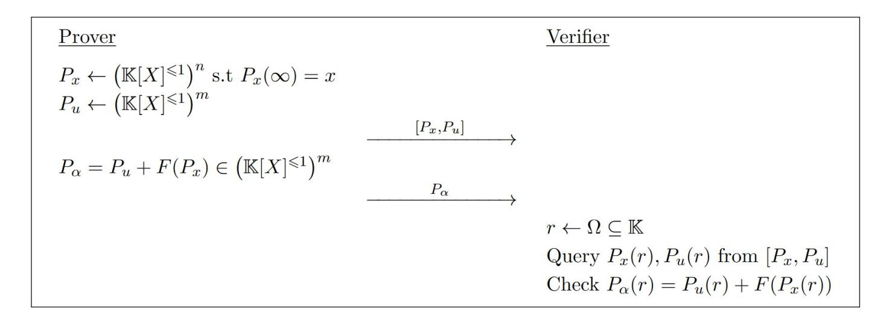
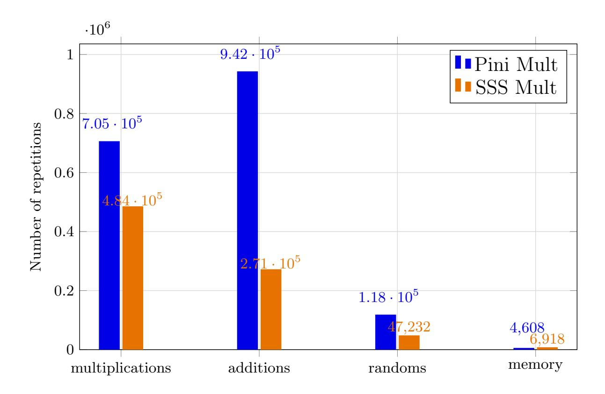
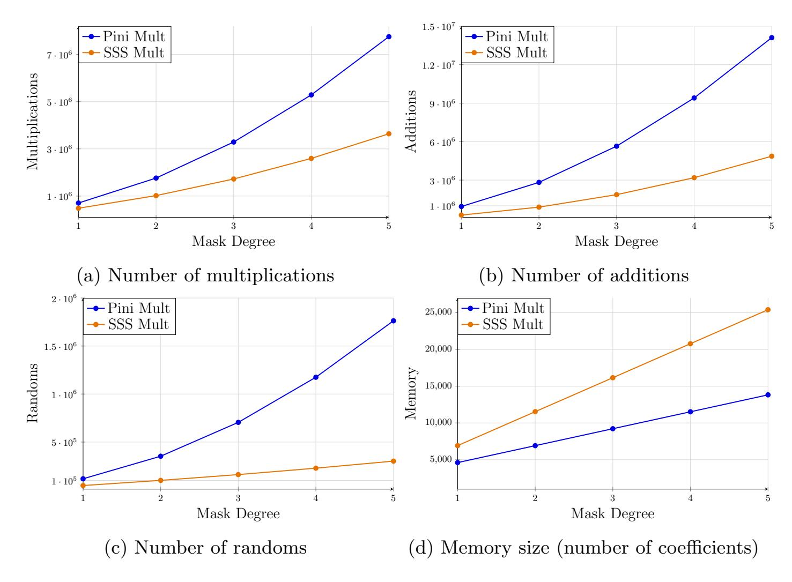
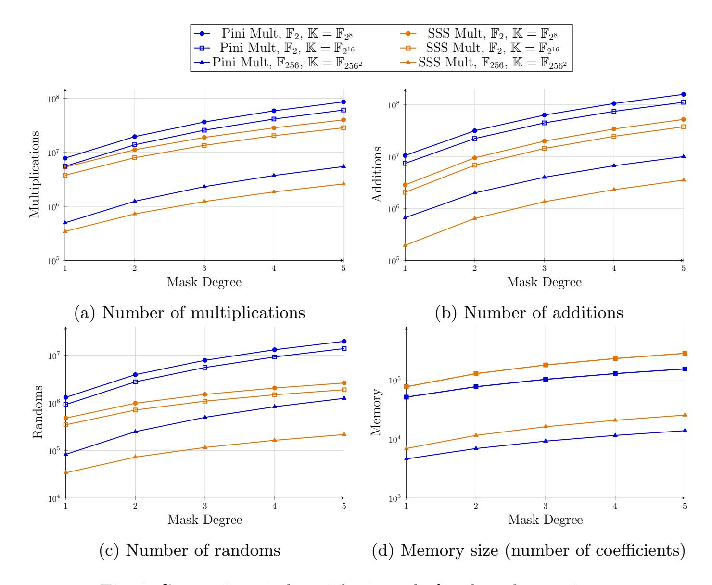

{0}------------------------------------------------

# From Arithmetic to Shamir: Secure and Efficient Masking Gadgets for Multiplications

# Applications to the Post-Quantum Signature Scheme MQOM

Vladimir Sarde1,<sup>2</sup> , Nicolas Debande<sup>1</sup> , Louis Goubin<sup>2</sup>

<sup>1</sup> Cryptography & Security Group, IDEMIA Secure Transactions, Pessac, France, vladimir.sarde@idemia.com, nicolas.debande@idemia.com

Keywords: Masked Multiplication · SNI-gadget · MPC-in-the-Head · MQOM · Post-Quantum Signature

Abstract. Efficiently masking multiplications in software is a long standing and extensively studied problem. A variety of gadgets have been proposed to perform these multiplications, each offering different trade-offs between efficiency and security. However, almost all existing solutions rely on arithmetic masking, in which multiplications cannot be naturally protected. In this work, we introduce two novel gadgets, named A2S and S2A, that enable conversions between arithmetic masking and Shamir's Secret Sharing (SSS)-based masking. With this approach, multiplications can be performed naturally and securely in a sharewise manner. We prove that our gadgets achieve SNI security, which provides security guarantees and straightforward composability. Moreover, we demonstrate that composing them with multiplication yields PINI security. We then provide a detailed complexity analysis and discuss the contexts where our gadgets are most relevant.

As a case study, we apply them to the MQOM post-quantum signature scheme, a candidate in the second round of the NIST additional post-quantum digital signature standardization process. When computing the sensitive multiplications in MQOM, for masking order t = 1, our approach reduces the number of multiplications, additions, and randomness requirements by 31%, 71%, and 60%, respectively, compared to the state of the art, while incurring only small additional memory overhead. We further show that these gains not only hold but actually increase as the masking order grows. Our results demonstrate that arithmetic-to-SSS conversions provide an effective and scalable path toward efficient masked implementations, making them particularly attractive for postquantum cryptography.

<sup>2</sup> Laboratoire de Math´ematiques de Versailles, UVSQ, CNRS, Universit´e Paris-Saclay, 78035 Versailles, France, louis.goubin@uvsq.fr

{1}------------------------------------------------

# 1 Introduction

Side-channel attacks exploit physical leakages produced during the execution of a cryptographic algorithm. Unlike traditional cryptanalysis, which targets the mathematical structure of the scheme, side-channel attacks leverage the physical implementation of the algorithm to recover secret information. Since the seminal work of Kocher, Jaffe and Jun [\[Koc96](#page-33-0)[,KJJ99\]](#page-33-1), side-channel attacks have been recognized as one of the most serious threats to cryptographic implementations, especially in constrained environments such as smart cards, embedded devices, or IoT systems. A widely adopted countermeasure against such attacks is the use of masking techniques. Since its introduction in [\[Koc96\]](#page-33-0), many efficient gadgets have been designed to perform basic operations such as additions, multiplications [\[ISW03](#page-33-2)[,BDF](#page-30-0)+17[,BBP](#page-30-1)+16[,BCPZ16,](#page-30-2)[CS20,](#page-31-0)[BGW88\]](#page-31-1), or conversions between different masking schemes [\[Gou01\]](#page-32-0). On the other hand, several security models have been proposed to formally prove the security of such gadgets. The main one, introduced in [\[ISW03\]](#page-33-2), defines two central notions: Non-Interference (NI) and Strong Non-Interference (SNI). These notions provide a formal framework for analyzing both the security of each gadget and their secure composability. In this work, we rely on another masking model, the Probe Isolating Non-Interference (PINI) model introduced in [\[CS20\]](#page-31-0).

We focus here on gadgets that mask multiplications over a given field when both operands are sensitive. Our analysis is restricted to software masking schemes, as hardware masking introduces additional challenges — such as glitch management and area optimization — which are beyond the scope of this work. Our analysis and comparisons therefore focus on the concrete number of operations executed and on the level of security provided by each scheme. This is a classical problem that has been extensively studied. Most existing gadgets are based on arithmetic masking [\[ISW03,](#page-33-2)[BDF](#page-30-0)+17] [\[BBP](#page-30-1)+16[,BCPZ16,](#page-30-2)[CS20\]](#page-31-0). A comparative study of these gadgets was conducted in [\[GJRS18\]](#page-32-1). Among them, the most widely used remains the ISW multiplication introduced in [\[ISW03\]](#page-33-2), whose security proof was later refined in [\[RP10\]](#page-33-3). In an attempt to achieve better efficiency than with arithmetic masking, several alternative schemes have been explored. One of the earliest approaches was to use multiplicative masking [\[AG01\]](#page-29-0). However, a flaw in the handling of the value zero was identified in [\[GT02\]](#page-32-2). Following this, several similar constructions were proposed [\[TSG02](#page-34-0)[,TK04,](#page-33-4)[DK10\]](#page-31-2), but they all faced the same issue and were thus broken using DPA or SPA [\[ABG04,](#page-29-1)[OS05\]](#page-33-5). The solution ultimately found only allowed the computation of power functions [\[GT02,](#page-32-2)[GPQ10\]](#page-32-3). Another proposal was affine masking [\[FMPR10\]](#page-31-3), which improved the security level for a given masking order but came at the cost of slower implementations. On the other hand, Shamir's Secret Sharing (SSS) was also considered as a mean to mask multiplications. Thanks to the homomorphic properties of SSS with respect to both addition and multiplication, multiplications can be computed share by share. This idea was originally introduced in [\[BGW88\]](#page-31-1) in the context of Multi-Party Computation. The main limitation lies in the growth of the degree of the polynomial which protects sensitive variables as multiplications between masked variables accumulate. To address this 

{2}------------------------------------------------

issue, the authors proposed re-randomizing and reducing the degree of the resulting polynomial, thus maintaining security level without requiring additional points for interpolation. This approach was later optimized in [\[GRR98\]](#page-32-4), which reduced the computational complexity, although the solution remained costly. In this context, Goubin and Martinelli [\[GM11\]](#page-32-5) proposed truncating the polynomial output of the multiplication to limit its degree. However, this method was later shown to be insecure [\[CPR12\]](#page-31-4).

Then, several other improvements of the BGW masking scheme have been considered in the literature. We can cite [\[CPR12\]](#page-31-4) which proposed optimizations based on the Number Theoretic Transform (NTT) to accelerate intermediate polynomial evaluations. Moreover, [\[CRZ13\]](#page-31-5) further reduced the cost of secure multiplications. In the same paper, the authors also suggest relying on non-MDS linear codes rather than Reed Solomon codes. However, the structure forced to manipulate a large number of shares to enjoy the low complexity. Later, works [\[SFES18,](#page-33-6)[BEF](#page-30-3)+23] introduced schemes aiming to leveraging the structure of SSS to create a software masking with side-channel protections and fault detection capabilities, at the cost of a higher computational overhead. The authors also tried to limit the computational impact of the multiplication by splitting the polynomials in two particular ones before the multiplicative step. More recent improvements [\[ABEO24\]](#page-29-2) include packing multiple secrets into a single codeword to amortize costs, which is particularly effective in symmetric primitives where the same computations are carried out on several secret bytes. Finally, [\[CDGT24\]](#page-31-6) significantly improved the asymptotic cost of masked multiplications using the NTT and introduced amortized masking, i.e. simultaneous masking several bytes, with fault-detection. Another line of work was introduced in [\[GJR18\]](#page-32-6), who proposed the so-called ω-encoding. This approach is similar to, but distinct from, SSS-based masking, since an ω encoding can be viewed as the set of coefficients obtained from evaluating a polynomial at ω. This encoding generalizes arithmetic masking and enables quasi-linear secure multiplications via the NTT. The approach was later extended to any base field in [\[GPRV21\]](#page-32-7). Finally, [\[Pla23\]](#page-33-7) further analyzed this encoding, proposed a compiler, and presented a new multiplication gadget.

Despite theses recent improvements, arithmetic masking combined with fresh randomness has remained the most common solution thanks to its simplicity and its efficiency especially for low order masking.

Contributions. This work presents a hybrid masking approach that combines arithmetic masking for general operations with Shamir's Secret Sharing applied specifically to the multiplication step. The masked multiplication, including mask conversions, is proven secure under both the t-(S)NI and t-PINI security models. Our contributions are the following:

- We present two secure gadgets to enable conversion between arithmetic sharing and SSS sharing, namely A2S and S2A.
- We provide a proof showing that the S2A gadget is SNI and PINI secure for arbitrary orders. In contrast, we prove that the A2S gadget achieves SNI

{3}------------------------------------------------

- We discuss how integrating these gadgets can enhance the efficiency of a masked implementation, in comparison to a scheme entirely based on arithmetic sharing.
- Finally, we assess the effectiveness of our approach on the MQOM signature scheme, comparing it with the scheme from [FRW25], which, to our knowledge, is still the only published masking scheme for MQOM.

Outline. The remainder of the article is organized as follows. First, we introduce our notations and recall the main definitions concerning SSS and masking in Sect. 2. Then, we review existing SSS-based masking proposals and classical gadgets which will be used for comparison in Sect. 3. In Sect. 4, we present our gadgets, prove their security, and analyze their complexity. Finally, in Sect. 5, we describe the MQOM signature scheme, apply our gadgets to it, and evaluate their practical complexity. We draw our conclusion in Sect. 6.

## <span id="page-3-0"></span>2 Preliminaries

## 2.1 Notations

Throughout this paper, we work over a finite field and an extension. We denote this base field by  $\mathbb{F}$  and its extension by  $\mathbb{K}$ . These fields will only be instantiated when necessary, typically for the purpose of evaluating the complexity in a concrete setting. Elements of these fields are written in italic lowercase letters, while vectors are written in bold lowercase letters. We denote a matrix in  $\mathcal{M}_n(\mathbb{F})$  by a bold uppercase letter, e.g.  $\mathbf{A}$ , with its coefficients written in italic lowercase, i.e.  $\mathbf{A} = (a)_{i,j \in [\![1,n]\!]}$ . The transpose of a matrix  $\mathbf{A}$  is denoted by  $\mathbf{A}^T$ . We follow similar conventions for polynomials: a single polynomial over a field is denoted by an italic uppercase letter, e.g. P, while a vector of polynomials, i.e. a vector whose entries are all polynomials, is denoted in bold, e.g.  $\mathbf{P}$ .

#### <span id="page-3-1"></span>2.2 Shamir's Secret Sharing

Shamir's Secret Sharing (SSS) [Sha79] consists in sharing a secret  $x \in \mathbb{F}$  among  $N \in \mathbb{N}^*$  parties such that, for a given threshold  $l \in \mathbb{N}$ , any set of l+1 shares allows to reconstruct the secret, while conversely, any set of at most l shares does not reveal any information about it.

To construct such a sharing of x, one first samples l uniformly random coefficients  $(a_k)_{k=1}^l \in \mathbb{F}$ , and defines the polynomial  $P_x(X) = x + \sum_{k=1}^l a_k X^k$  of degree l. Each share is then given by  $P_x(e_j)$ , where  $\{e_j\}_{j\in [\![1,N]\!]}$  is a fixed public set of points in  $\mathbb{F}$ .

{4}------------------------------------------------

It follows that, for any set of l+ 1 shares, one can reconstruct P<sup>x</sup> via interpolation and recover its constant term x. On the other hand, it is straightforward to show that for any set of l shares, all possible values of x remain equally likely.

Note that the Polynomial Interactive Oracle Proof (PIOP) framework, used in MQOM, also relies on SSS, but places the secret as the leading coefficient rather than the constant term. Concretely, one defines

$$P_x(X) = \sum_{k=0}^{l-1} a_k X^k + x X^l,$$

and we adopt the notation Px(∞) = x.

Furthermore, we will need to consider the sharing of a vector x = (x1, . . . , xn). This is done by simply applying SSS coordinate-wise, and we denote the corresponding vector of polynomials by

$$\mathbf{P}_{\mathbf{x}} = (P_{x_1}, \dots, P_{x_n}).$$

## 2.3 Side Channel and Masking Scheme

Definition Side-channel attacks target the physical implementation of a system rather than its theoretical weaknesses. Instead of breaking cryptographic algorithms directly, side-channel attacks exploit information leaked through physical channels such as power consumption, electromagnetic emissions, or timing variations. Such attacks can enable an adversary to recover sensitive information, even if the underlying cryptographic protocols are mathematically secure. Several countermeasures have been proposed to protect cryptographic algorithms against side-channel attacks. One of the most effective is masking, introduced in [\[Koc96\]](#page-33-0), which consists in combining each sensitive variable with fresh randomness. This prevents the adversary from establishing a correlation between the manipulated variable and the observed leakage, as the mask differs from one execution to another and remains unknown. More concretely, given a variable x ∈ F, a masking scheme of order t ∈ Z consists in t + 1 random shares (xi)i∈[[1,t+1]] such that

$$x = \sum_{i=1}^{t+1} x_i,$$

where x1, . . . , x<sup>t</sup> are sampled uniformly at random, and xt+1 is computed according to the actual value of x. It is straightforward to see that any subset of t<sup>1</sup> ≤ t shares reveals no information about the secret x. This technique is usually referred to as Boolean masking or arithmetic masking, depending on whether the underlying field has characteristic 2 or not. In our setting, we will only work over fields of characteristic 2, yet we adopt the term arithmetic masking to remain general and to avoid confusion with Boolean masking in fields of different characteristics.

{5}------------------------------------------------

Finally, note that, as mentioned in the introduction, SSS can also be used to construct a masking scheme. Indeed, a SSS based on a polynomial of degree t naturally provides security of order t, since any subset of t<sup>1</sup> ≤ t shares reveals no information about the secret.

Gadgets and Provable Security In order to construct a masking scheme, the algorithm to be protected is decomposed into several elementary parts. Each of these parts is then secured using a so-called gadget. To prove the security of the overall scheme, the standard strategy is to prove the security of each gadget independently, and then analyze their composition. The security of gadgets can be proven under different formal models. At a high level, the idea is to show that an adversary who is able to obtain t intermediate values during an execution through side-channel observations cannot use them to deduce information about secret data. The most common model, introduced in [\[BBD](#page-30-4)+16], defines two formal notions: t-Non-Interference (t-NI) and t-Strong Non-Interference (t-SNI). In the t-NI model, the security at order t is guaranteed by showing that any set of t intermediate values can be simulated using at most t input values. Thus, if t inputs provide no useful information to the adversary, as it is the case when the inputs are correctly t-masked, then an adversary probing t intermediate values will learn nothing. The t-NI property ensures the security of individual gadgets but does not guarantee that their composition is secure, whereas the t-SNI model addresses this limitation. In addition to ensuring the t-NI property, it guarantees the composability of several gadgets against a t-probe adversary. To achieve this, t-SNI distinguishes between probes on internal values and probes on outputs, and requires that probes on outputs can be simulated without relying on additional inputs. This separation makes gadgets independent of one another when composed, thereby preserving overall security. Finally, note that NI gadgets can still be composed with other NI or SNI gadgets, provided that refreshing gadgets, i.e. gadgets that re-randomize the shares, are carefully inserted between them.

Definition 1 (t-NI). Let G denote a gadget that takes as input n masked values x (1), . . . , x(n) and outputs a masked value y. The gadget G is said to be t-non-interfering (t-NI) secure if, for any set of t<sup>1</sup> ≤ t intermediate variables or outputs, there exist index subsets (Ii)i∈{1,...,n}, with |I<sup>i</sup> | ≤ t<sup>1</sup> for all i, such that the t<sup>1</sup> probed intermediate variables can be simulated from the set (x (i) )<sup>j</sup> | j ∈ I<sup>i</sup> , i ∈ {1, . . . , n} .

Definition 2 (t-SNI). Let G be a gadget that takes as input n masked values x (1), . . . , x(n) and outputs a masked value y. The gadget G is said to be t-strong-non-interfering (t-SNI) secure if, for any set of t<sup>1</sup> ≤ t intermediate variables and any index subset O of output shares, with t<sup>1</sup> + |O| ≤ t, there exist index subsets (Ii)i∈{1,...,n} with |I<sup>i</sup> | ≤ t<sup>1</sup> for all i, such that the t<sup>1</sup> probed intermediate variables and the |O| output values can be simulated from the set (x (i) )<sup>j</sup> | j ∈ I<sup>i</sup> , i ∈ {1, . . . , n} .

{6}------------------------------------------------

We also present a second security model: the Probe Isolating Non-Interference (PINI) model introduced in [\[CS20\]](#page-31-0). This notion is designed to simplify the composition of gadgets, as any composition of t-PINI gadgets is automatically tprobing secure, without the need to insert refreshing gadgets as in the case of NI with SNI. The intuition behind PINI is to isolate each share from the others, thereby imitating sharewise computations even for nonlinear gadgets. Formally, this is captured by requiring that any internal probe can be simulated using at most one share from each input, while probes on the outputs directly translate to the corresponding share of each input.

Definition 3 (PINI). Let G be a gadget that takes as input n masked values x (1), . . . , x(n) and outputs a masked value y. The gadget G is said to be t-Probe-Isolating-Non-Interference (t-PINI) secure if, for any set of t<sup>1</sup> ≤ t intermediate variables and any index subset O of output shares, with t<sup>1</sup> + |O| ≤ t, there exists a subset I of input indices with |I| = t1, such that the probed intermediate variables and the output shares (yi)i∈O can be simulated from the set (x (i) )<sup>j</sup> | j ∈ I ∪ O, i ∈ {1, . . . , n} .

Proposition 1. Linear gadgets, whose calculations are performed sharewise, are trivially PINI secure.

<span id="page-6-2"></span>Proposition 2. Any t-SNI one-input gadget is t-PINI.

The proof of its results follows directly from the definitions. It is formalized in [\[CS20\]](#page-31-0).

# <span id="page-6-0"></span>3 Previous Work and Comparisons

The masking of multiplications has been extensively studied in the literature. In this section, we provide a brief overview of some of the existing approaches. As explained in the introduction, we restrict our study to software masking methods. Since our work proposes a solution based on Shamir's Secret Sharing (SSS), we first review the masking techniques that also rely on this principle. It is worth noting that the SSS structure can also be interpreted as a masking scheme derived from Reed–Solomon codes. For this reason, we will treat both as equivalent in the corresponding section. We then introduce the ω-encoding technique, a polynomial-based approach that achieves comparable properties. Finally, we introduce two fundamental multiplicative gadgets, namely the ISW gadget and the native PINI multiplication, which will later serve as references for our complexity comparisons. We will conclude each section by positioning our contributions in relation to the current state of the art.

## <span id="page-6-1"></span>3.1 SSS-Based Masking Schemes

The SSS scheme was first employed to construct multi-party computation protocols [\[BGW88,](#page-31-1)[GRR98\]](#page-32-4). These protocols assume that a computation is performed 

{7}------------------------------------------------

among n parties in a t-private manner, meaning that any set of at most t parties together learns nothing more than what can be inferred from their own inputs and outputs. They rely on the condition n ≥ 2t + 1, and share the secrets using SSS with a polynomial of degree t. All computations are then performed under this sharing. The main difficulty arises in multiplication. Consider two secrets x, y shared via two polynomials Px, P<sup>y</sup> of degree t, each distributed into n shares Px(ei), Py(ei). Sharewise multiplication produces n shares of PxPy, which indeed shares xy, but with a polynomial of degree 2t. As a consequence, if several multiplications are needed, the degree of the sharing polynomial grows rapidly, and the number of shares required for interpolation becomes impractical. A second, more subtle problem also appears: the product PxP<sup>y</sup> is not uniformly random, for example it is not irreducible. Therefore, although it requires 2t+ 1 shares for reconstruction, it does not ensure 2t-privacy. Nevertheless, the scheme remains t-private. To overcome this limitation, [\[BGW88\]](#page-31-1) introduced a multi-party protocol that both reduces the degree of the sharing and re-randomizes the shares. While secure, this protocol is costly to implement. Note that this protocol has been widely reused and slightly optimized in [\[GRR98\]](#page-32-4).

Beyond the MPC setting, SSS has also been leveraged for masking sensitive variables against side-channel attacks. Although the context differs, the same difficulties arise. The SSS-based masking was first proposed in hardware by [\[PR11\]](#page-33-9), adopting the same methodology as [\[BGW88\]](#page-31-1) by directly adapting their multiplication protocol. This scheme exploits the properties of SSS to achieve resistance against both side-channel and glitch attacks. Later, [\[GM11\]](#page-32-5) attempted to use SSS-based masking in software, with the idea of truncating the product polynomial to reduce costs compared to existing methods. However, this approach was later shown to be flawed in [\[CPR12\]](#page-31-4). In the same article [\[CPR12\]](#page-31-4), the authors also proposed a second improvement of the BGW scheme by leveraging the NTT to evaluate intermediate polynomials. Similarly, Castagnos et al. [\[CRZ13\]](#page-31-5) proposed a final improvement to the BGW scheme. They then discussed another approach relying on non-MDS linear codes, which are uncommon in the sidechannel literature. Such codes offer a less expensive encoding process and a secure multiplication procedure requiring only O(t) multiplications. Nonetheless, they involve managing a large number of shares — for example, 20 shares when t = 3 — or adapting the code, which increases the overall encoding cost. Moreover, this scheme lacks a formal security proof in standard models. Subsequent works, such as [\[SFES18,](#page-33-6)[BEF](#page-30-3)<sup>+</sup>23], introduced schemes proven in the (S)NI model, aiming to reduce the cost of multiplication. These constructions also exploit the SSS structure to design software masking techniques that not only mitigate side-channel leakage but also enable fault detection. While these gadgets are computationally expensive, they provide a stronger level of protection. These operations were revisited by Arnold et al. [\[ABEO24\]](#page-29-2), who proposed embedding multiple secrets within a single codeword to reduce computational costs. Such improvements are particularly beneficial for symmetric primitives, where identical operations are applied to several secrets in parallel. However, exploiting this optimization becomes more challenging for complex or poorly parallelizable schemes, as is often 

{8}------------------------------------------------

the case in post-quantum cryptography. More recently, Carlet et al. [CDGT24] introduced a significant improvement that reduces the asymptotic complexity of multiplication by leveraging the NTT. In addition, their approach supports cost amortization, i.e. masking several bytes simultaneously, and enables fault detection. Nevertheless, their multiplication gadget is proven only t-probing secure and not SNI-secure, which can raise composability issues.

The previously proposed gadgets already cover a wide range of practical scenarios. Nevertheless, our contribution distinguishes itself in several key aspects. First, prior works rely exclusively on end-to-end SSS-based constructions. This can be problematic, as SSS-based gadgets protecting certain classical primitives, such as hash functions, may be more costly, or may even be unavailable. In contrast, we introduce gadgets that enable transitions between arithmetic masking and SSS-based masking. This hybrid approach allows one to leverage efficient arithmetic masking gadgets, particularly relevant for symmetric and hash-based primitives, while restricting the use of SSS-based masking to consecutive multiplications. In spirit, Castagnos et al. [CRZ13] also introduced a code-switching mechanism with similar objectives, although with a heavier structure. Second, our gadgets are formally proven secure in both the (S)NI and PINI models, ensuring straightforward composability. Together, these two features enable targeted integration of our gadgets into any existing masking scheme. Finally, our approach already shows efficiency benefits starting from the first masking order.

#### 3.2 The $\omega$ -Encoding

A different line of work was introduced by Goudarzi et al. [GJR18], who proposed the so-called  $\omega$ -encoding. It is defined as follows: for  $\omega \in \mathbb{F}^*$  and  $a \in \mathbb{F}$ , an  $\omega$ -encoding of a is a tuple  $(a_i)_{i=0}^{n-1} \in \mathbb{F}^n$  such that  $\sum_{i=0}^{n-1} a_i \omega^i = a$ . This encoding generalizes arithmetic masking and enables quasi-linear-time multiplications using the NTT. The approach was later extended to fields of even characteristic in [GPRV21]. The original gadgets were proven secure in the noisy leakage model, while the follow-up work analyzed them under a newly introduced input-output separation (IOS) model. The IOS model is weaker than SNI (every uniform SNI gadget satisfies IOS, but not vice versa) which allows the authors to extend their proofs within the region probing model. More recently, Plançon [Pla23] further studied this scheme, presenting a region-probing-secure compiler and introducing another security notion, Reducible-To-Independent-K-linear (RTIK). That work also proposed a new multiplication gadget formally proven within this framework.

Although the theoretical computational complexity offered by these recent methods is highly attractive, we opted for an SSS-based masking approach for several reasons. First, the security proofs of these gadgets rely on models that are less standard and generally weaker than those considered in our work, particularly the SNI model. Moreover, ensuring the validity of their proof requires choosing  $\omega$  randomly from a sufficiently large field  $\mathbb{F}$ . When operating over smaller fields, the authors must rely on a non-standard, ad-hoc assumption asserting

{9}------------------------------------------------

that both the FFT and its inverse are t-probing secure. Second, selecting ω randomly prevents any precomputation of the associated values, thereby reducing the overall efficiency of the scheme. This limitation directly impacts performance, especially for low masking orders. As the authors themselves acknowledge, "this masking scheme significantly improves the efficiency of the masked cipher for a masking order n ≥ 64 for MiMC and n ≥ 512 for AES."

## 3.3 Classical Multiplicative Gadgets

<span id="page-9-0"></span>10 return (z1, . . . , zt+1)

<span id="page-9-1"></span>ISW Multiplication The most classical and widely used algorithm for performing masked multiplications was introduced in [\[ISW03\]](#page-33-2), and is recalled in Alg. [1.](#page-9-0) This gadget relies on arithmetic masking. In the original paper, it was proven to be (t/2)-probing secure for a (t + 1)-sharing. This proof was later refined in [\[RP10\]](#page-33-3), showing that the gadget is actually t-probing secure under the same (t + 1)-sharing. Finally, [\[BBD](#page-30-4)+16] adapted the proof to demonstrate that the ISW gadget also satisfies the t-SNI property. As a consequence, the ISW multiplication gadget can be safely composed with other classical gadgets proven to be t-SNI. Nevertheless, its composition with sharewise functions such as additions is not secure in all generalities, and the insertion of refresh gadgets may be required.

```
Algorithm 1: ISW Multiplication [ISW03]
  Input : Two variables x = (x1, . . . , xt+1) ∈ F
                                              t+1 and
           y = (y1, . . . , yt+1) ∈ F
                                t+1 arithmetically shared at the degree t.
  Output: An arithmetic sharing z = (z1, . . . , zt+1) of x × y.
1 for i ← 1 to t + 1 :
2 for j ← i + 1 to t + 1 :
3 ri,j
             $
             ←− F
4 rj,i ← (xi × yj − ri,j ) + xj × yi
5 for i ← 1 to t + 1 :
6 zi ← xi × yi
7 for j ← 1 to t + 1 :
8 if j ̸= i:
9 zi ← zi + ri,j
```

PINI Multiplication Note that the t-SNI property does not necessarily imply the t-PINI property when the gadget involves multiple inputs. For instance, the ISW multiplication does not satisfy the t-PINI property. The issue stems from manipulations of the form x<sup>i</sup> × x<sup>j</sup> with i ̸= j, which violate the isolation of shares. Nevertheless, it is possible to adapt this multiplication in order to obtain a PINI-compliant version. This variant was presented and formally proven in 

{10}------------------------------------------------

the paper introducing the PINI framework [CS20], and corresponds to Alg. 2. However, the modifications come at the cost of increased complexity. On the other hand, this PINI multiplication can be trivially composed with any other PINI gadget, such as sharewise gadgets like additions.

```
Algorithm 2: PINI Multiplication [CS20]
      Input: Two variables x = (x_1, \dots, x_{t+1}) \in \mathbb{F}^{t+1} and y = (y_1, \dots, y_{t+1}) \in \mathbb{F}^{t+1} arithmetically shared at the degree t.
      Output: An arithmetic sharing z = (z_1, \ldots, z_{t+1}) of x \times y.
  1 for i \leftarrow 1 to t+1:
              for j \leftarrow i+1 to t+1:
  \mathbf{2}
                    r_{i,j} \stackrel{\$}{\leftarrow} \mathbb{F}
  \mathbf{3}
                   r_{j,i} \leftarrow -r_{i,j}
  4
  5 for i \leftarrow 1 to t+1:
              for j \leftarrow 1 to t+1:
  6
                    if j \neq i:
  7
                    \begin{cases} s_{i,j} \leftarrow y_j - r_{i,j} \\ p_{i,j}^0 \leftarrow (x_i + 1) \times r_{i,j} \\ p_{i,j}^1 \leftarrow x_i \times s_{i,j} \\ h_{i,j} \leftarrow p_{i,j}^0 + p_{i,j}^1 \end{cases}
  8
  9
10
11
12 for i \leftarrow 1 to t+1:
              z_i \leftarrow x_i \times y_i + \sum_{j=1, j \neq i}^{t+1} h_{i,j}
13
14 return (z_1, \ldots, z_{t+1})
```

<span id="page-10-1"></span>These two gadgets will serve as benchmarks for evaluating the gadgets introduced in the next section. We selected them because the ISW multiplication remains the most extensively studied construction in the literature. Conversely, the masking scheme proposed for MQOM [FRW25], which we will use as an application example for our own gadgets, employs the PINI multiplication to simplify gadget composition. As discussed in Sect. 3.1, our gadgets are intended for use within an arithmetic masking framework, ensuring a secure transition to SSS-based masking and back to arithmetic shares. Consequently, comparing them against other arithmetic masking schemes is the most coherent choice.

## <span id="page-10-0"></span>4 New A2S and S2A Gadgets for Mask Conversion

Shamir Secret Sharing masking enables multiplications to be performed in a sharewise manner, which is less costly, requires no randomness, and is inherently secure. To avoid the classical issues associated with this type of masking, as reviewed in the state of the art Sect. 3.1, we introduce two new gadgets, namely A2S and S2A, which enable conversions between additive sharing and SSS. This approach makes it possible to leverage the advantages of SSS only when required, at the cost of the conversion. As a result, arithmetic masking

{11}------------------------------------------------

can be used for computations that are difficult to mask using SSS, such as hash functions and symmetric primitive. We also note that since our A2S gadget increases the number of shares from t+1 to 2t+1, applying linear functions over an SSS-based sharing would roughly double their cost. Consequently, the optimal use of our A2S gadget generally consists in performing the conversion right before the multiplications to be optimized, and applying S2A directly afterwards.

The following two sections respectively describe these two gadgets and present their associated security proofs. The security level of the A2S gadget depends significantly on the underlying field. Accordingly, we first provide a conditional formal proof of t-SNI security, followed by an analysis of how this condition applies to different fields. In contrast, the S2A gadget is proven t-SNI for any field and any masking order t. From these results, we further deduce that both gadgets satisfy the t-PINI property. These proofs are sufficient to demonstrate that the overall scheme achieves t-PINI security, as all additions and multiplications within the SSS representation are performed sharewise and are therefore trivially PINI. We discuss the complexity of the proposed gadgets in Sect. 4.3.

#### <span id="page-11-4"></span>4.1 A2S

The A2S gadget is described in Alg. 3. It converts an arithmetic sharing with t+1 shares into an SSS sharing with 2t+1 shares. This increase in the number of shares is intentional, as it prepares the values for a subsequent multiplication. Since the product of two t-degree polynomials results in a polynomial of degree 2t, 2t+1 shares are required to interpolate it. As a result, repeated multiplications involving the same variables are not feasible, as they would lead to a continuous increase in the number of shares. Furthermore, since the masking order is constrained by the size of the underlying field  $\mathbb{F}$ , it is necessary to operate in an extension field of  $\mathbb{F}$  whenever  $|\mathbb{F}| < 2t+1$ , which entails additional computational overhead.

## Algorithm 3: A2S

```
Input: An arithmetic sharing (x_1, x_2, \dots, x_{t+1}) \in (\mathbb{F})^{t+1} of a coordinate x.
                 Public points (e_i)_{i \in [1,2t+1]} \in \mathbb{F} together with their respective powers
                  e_i^j for all j \in [1, t]
   Output: 2t + 1 shares (y_1, y_2, \dots, y_{2t+1}) of a Shamir sharing of degree t of y,
                 in the evaluation points (e_i)_{i \in [1,2t+1]}.
\mathbf{1} \ (r_1, r_2, \dots, r_t) \stackrel{\$}{\leftarrow} (\mathbb{F})^t
2 for i \leftarrow 1 to 2t + 1:
3
         y_i \leftarrow x_1
         for j \leftarrow 1 to t:
4
              y_i \leftarrow y_i + r_j \times e_i^j
5
              y_i \leftarrow y_i + x_{j+1}
6
7 return (y_1, y_2, \dots, y_{2t+1})
```

{12}------------------------------------------------

**Definition 4.** Let  $t \in \mathbb{N}$  denote the masking order, and let  $(e_i)_{i \in 1,...,2t+1} \in \mathbb{F}^{2t+1}$ . The A2S gadget matrix S is defined as follows:

$$\begin{pmatrix} (e_1)^1 \cdots (e_{2t+1})^1 \\ \vdots & \vdots & \vdots \\ (e_1)^t \cdots (e_{2t+1})^t \end{pmatrix}$$

We define this matrix as safe if it is totally non-singular, meaning that all its minors, i.e. the determinants of all its square submatrices, are non-zero.

<span id="page-12-0"></span>**Theorem 1.** Algorithm 3 (A2S mask conversion) is correct and achieves t-SNI security if the evaluation points define a safe gadget matrix.

Proof. Correctness of A2S, Alg. 3. The input of A2S is an arithmetic sharing  $(x_1, x_2, \ldots, x_{t+1})$  of  $x \in \mathbb{F}$ . Each iteration j corresponds to the evaluation of the j<sup>th</sup> monomial at the point  $e_i$ , while the constant term is set to  $x = \sum_{i=1}^{j+1} x_i$ . Thus, each iteration i corresponds to the computation of one evaluation of the polynomial  $P_x(X) = x + \sum_{j=1}^{t} r_j X^j$  at the public points  $e_i \in \mathbb{F}$ . The returned vector thus forms a correct SSS sharing of x.

Sketch of the masking security of A2S. Each input share is mixed into every output share. Nevertheless, to ensure security, a fresh randomness is introduced before each share addition, so that an adversary cannot recover multiple input share from a single probe. More precisely, this randomness is inserted as monomials of increasing degree, which guarantees that the resulting sharing is a valid instance of SSS. Consequently, intermediate values involving d+1 < t+1 shares are protected by a polynomial of degree d. By the security property of SSS, an adversary must probe at least d+1 such intermediate values in order to obtain any information. Similarly, the output y is protected by a polynomial of degree t, which ensures that any set of at most t probes on output shares does not reveal any information about the secret.

Masking security of A2S, Alg. 3. Let T be a set of  $t_1 \leq t$  probes representing the attacker probes. We show that, regardless of the composition of T, it is always possible to construct a set I of at most  $t_1$  indices such that the inputs  $(x_i)_{i\in I}$  suffice to simulate all the variables contained in T. This proves that the gadget satisfies the t-NI property. Finally, we observe that probes on the outputs of the gadget do not actually require adding any index to I, and that therefore, the gadget is t-SNI secure.

To begin with, each probe on an input  $x_i$ ,  $i \in [1, t+1]$ , naturally requires adding i to the set I. On the other hand, for each random value appearing in line 1 that belongs to T, it is not necessary to add any index to I, since these are uniformly random values independent of the secret.

We now examine the probes from lines 5 and 6, separating cases according to the value of the counter  $j \in [1, t]$ , which represents the degree of the monomial added to the share. Let us start line 5. Fix  $k \in [1, t]$  as the degree at which the

{13}------------------------------------------------

probe is placed. Observe that a probe on  $r_k \times e_i^k$  is equivalent to a probe on line 1 on  $r_k$ , since  $e_i^k$  is public and nonzero. A probe on  $y_i$  corresponds to the value  $\sum_{j=1}^k x_j + \sum_{j=1}^k r_j e_i^j$ . Suppose an adversary collects  $\delta$  probes at this degree, for distinct  $i \in [1, 2t+1]$ . These probes provide  $\delta$  linear equations in the k variables  $(r_j)_{1 \le j \le k}$  together with the constant term  $\sum_{j=1}^k x_j$ . Note that this system of k+1 unknowns is composed of linearly independent equations, since it is defined by a Vandermonde matrix. Consequently, extracting any information about the variables requires exactly k+1 probes. A more elegant way to view this is through the lens of SSS. Indeed, the probes correspond to  $\delta$  evaluations of the polynomial  $P(X) = \sum_{j=1}^k x_j + \sum_{j=1}^k r_j X^j$ . Therefore, the SSS property stands that as long as the adversary collects fewer than k+1 probes, no information about the constant term is revealed. Hence, if the adversary collects fewer than k+1 probes line 5, no additional input needs to be added to I. On the other hand, if k+1 or more probes are collected, the adversary can recover all the coefficients. In this case, the constant term of the polynomial,  $\sum_{j=1}^k x_j$ , which depends on the first k shares of x is retrieved. Therefore the index set  $\{1,2,\ldots,k\}$  must be included in I.

We now study probes on line 6. It is possible to use a similar reasoning as in the previous case. Indeed, such probes correspond to evaluations of the polynomial  $P(X) = \sum_{j=1}^{k+1} x_j + \sum_{j=1}^{k} r_j X^j$ . Therefore, if the adversary collects fewer than k+1 probes on this line, no additional input needs to be added to I. Otherwise, it suffices to include the index set  $\{1, 2, \ldots, k+1\}$  in I.

The last point to address concerns the interaction between probes from different lines. First, observe that a probe on line 1 directly reveals one random variable  $r_j$  and thus eliminates one unknown from a linear system built from probes on lines 5 or 6. This probe should therefore be regarded as an additional probe at degree k. Furthermore, an adversary might attempt to exploit such probes to isolate the secret within the system of equations, thereby recovering it without learning all the random coefficients. For instance, if a degree-2 dependent subsystem exists within the system matrix S, the attacker could eliminate two monomials and their associated random variables using only two probes, and then recover the constant term with k-2 additional probes on the remaining coefficients. This would result in k probes revealing k+1 shares. A similar argument applies to any dependent subsystem that allows for the elimination of monomials but not of the constant term. Nevertheless, since we assume that the gadget matrix is safe, we know by definition that no such dependent subsystem exists.

We now study the interactions between probes on lines 5 and 6. If both probes are performed at the same degree k and for the same index i, then index k+1 must be added to I, and the adversary also obtains one probe for the resolution of the second linear system described above. Indeed, the probe on line 6, combined with the knowledge of  $x_{j+1}$ , fully contains the information of

{14}------------------------------------------------

the probe on line [5.](#page-11-2) Therefore, the adversary effectively holds only one equation in the linear system. This situation is thus equivalent to performing a probe on one of the lines together with a probe on one input. Moreover, note that the knowledge of a single x<sup>j</sup> does not help in solving the system, since it does not directly correspond to one of its unknowns. If the two probes are performed for different i, then in terms of the linear system these two probes from different lines can be combined to reduce the same system. However, since their constant term differs by xk+1, this share must be considered as an additional unknown. Thus, we obtain a system similar to the previous one but with one extra independent unknown xk+1, which does not improve the resolution of the system. Note also that if the adversary holds fewer than k + 1 probes, then the linear relations obtained never depend only on the coefficient x<sup>j</sup> and always involve uniform randomness. Hence, it is not necessary to add an index to I. In conclusion, if t<sup>1</sup> probes are made at degree k on line [5,](#page-11-2) t<sup>2</sup> probes are made on line [6,](#page-11-3) and t<sup>3</sup> probes are made on line [1,](#page-11-1) such that t<sup>1</sup> + t<sup>2</sup> + t<sup>3</sup> ≥ k + 1, then they can be simulated with k + 1 inputs. On the other hand, if t<sup>1</sup> + t<sup>2</sup> + t<sup>3</sup> < k + 1, the set can be simulated with at most min(t1, t2) inputs.

Our analysis so far has focused on a given degree k. An adversary probing variables also at a degree k ′ < k will face exactly the same situation if she attempt to exploit the probes at degree k ′ alone. These probes can therefore be simulated in the same way. However, the adversary might also try to combine probes across different degrees. First, note that probes at degree k do not reveal any information about the polynomials shared at degree k ′ , since the additional variables completely mask the information. Conversely, a probe at degree k ′ may be combined with probes at degree k to recover information about the polynomial of degree k. Indeed, it provides one additional independent linear equation. Such a probe can therefore simply be considered in our process as an extra probe at the higher degree k and be treated accordingly.

This concludes the analysis of the intermediate values that can be probed. It is therefore straightforward to observe that the set I never contains more than t<sup>1</sup> indices when an adversary probes t<sup>1</sup> intermediate values. The gadget is thus t-NI. Finally, note that probing an output is equivalent to probing at degree k = t. Hence, the adversary would require at least t + 1 probes to recover any information. Since an adversary cannot place that many probes, no information can be obtained, and therefore no input needs to be added. In conclusion, the gadget is t-SNI secure. ⊓⊔

Corollary 1. Algorithm [3](#page-11-0) (A2S mask conversion) is t-PINI secure if the evaluation points define a safe gadget matrix.

Proof. We deduce the result directly from Theorem [1](#page-12-0) and Proposition [2,](#page-6-2) since the A2S gadget only takes a single input. ⊓⊔

The proofs above are based on the assumption that the gadget matrix is safe. As the matrix includes more points, the maximum achievable level of masking increases. However, the size of these matrices is limited by the properties of the underlying field.

{15}------------------------------------------------

In our MQOM application, computations are performed over  $\mathbb{F}_2$ ,  $F_{256} =: \mathbb{F}_2[\xi]/(\xi^8 + \xi^4 + \xi^3 + \xi + 1)$  and  $\mathbb{F}_{2^{16}} = \mathbb{F}_{256}[\nu]/(\nu^2 + \nu + \xi^5)$ . It is worth noting that  $\mathbb{F}_2$  does not provide a sufficient number of evaluation points; hence, we must operate over an extension field of at least  $\mathbb{F}_{256}$ . Consequently, if we define a safe gadget matrix S over  $\mathbb{F}_{256}$ , it will be suitable for both  $\mathbb{F}_2$ - and  $\mathbb{F}_{256}$ -based variants. Furthermore, variants implemented over  $\mathbb{F}_{2^{16}}$  also make use of  $\mathbb{F}_{256}$  (see Section 5.1); in this setting, the same gadget matrix can be used. Indeed, the number of possible evaluation points in  $\mathbb{F}_{2^{16}}$  is bounded above by those used for masking variables over  $\mathbb{F}_{256}$ . Conversely, a matrix that is safe over a base field  $\mathbb{F}$  remains safe over any of its extensions, since a linearly independent family over  $\mathbb{F}$  remains linearly independent in its extension field.

It is worth mentioning that a variant based solely on  $\mathbb{F}_2$  and  $\mathbb{F}_{2^{16}}$  also exists. However, its computational complexity makes it unsuitable for constrained environments. In addition, a matrix defined over  $\mathbb{F}_{256}$  can still be employed in this setting (see the discussion in Sect. 5.3).

**Proposition 3.** A safe gadget matrix S can be constructed over  $\mathbb{F}_{256}$  for masking orders  $t \leq 5$ .

Proof (proposition). Let  $\eta = \xi^6 + \xi^3 \in \mathbb{F}_{256}$  and  $e_i = \eta^{(i-1)}$  for all  $i \in [1, 2t+1]$ . We can construct a safe gadget matrix of size  $t \cdot (2t+1)$  with t=5 as follows:

$$\begin{pmatrix} (\eta^0)^1 \cdots (\eta^{10})^1 \\ \vdots & \vdots & \vdots \\ (\eta^0)^5 \cdots (\eta^{10})^5 \end{pmatrix}$$

All the minors of this matrix are non-zero. For smaller masking orders, any submatrix of this one can be used.  $\Box$ 

Construction of safe gadget matrix on any field Experimentally, the maximum masking order t for which a safe gadget matrix can be constructed seems to grow roughly logarithmically with the field size. Nevertheless, determining this maximum value precisely and characterizing its behavior for each field remains unclear. We leave a formal analysis of these properties as an open problem and focus here on empirical observations. In order to maximize t for a given field and construct the corresponding safe matrix, we have considered the simpler subproblem of avoiding  $2 \times 2$  zero minors. In the context of our gadget matrices, this is equivalent to ensuring that all submatrices are invertible.

$$\begin{pmatrix} e_i^j & e_{i'}^j \\ e_i^{j'} & e_{i'}^{j'} \end{pmatrix}$$

In a finite field, the multiplicative group is cyclic. Let us write  $e_i = \omega^k$  and  $e_{i'} = \omega^{k'}$ , where  $\omega$  is a primitive element. The matrix has a zero determinant if and only if

$$k(j'-j) = k'(j'-j) \pmod{q-1}$$

{16}------------------------------------------------

in  $\mathbb{F} = \mathbb{F}_q$ . By construction,  $k \neq k'$  since the  $e_l$  are distinct, so this equality can only result from modular wraparound. A sufficient criterion to avoid this is to ensure that  $j, j', k, k' < \sqrt{q-1}$ . To minimize such wraparound effects, we choose the exponents as small as possible. The powers j and j' are fixed by the construction and bounded by t, while we select the evaluation points as  $e_i = \omega^i$  with a primitive  $\omega$ . Once this construction strategy is defined, it is straightforward to exhaustively test all options using a symbolic computation tool to select the primitive element that yields the best results and to determine the maximal t experimentally.

#### 4.2 S2A

The second gadget, S2A, converts an SSS sharing into an additive one. This process is described in Algorithm 4. The idea here is to first convert the data into an arithmetic sharing with 2t+1 shares (the  $z_i$ ). Then, each of these shares is individually re-masked to ensure security. Finally, the shares are reordered to reconstruct an arithmetic masking with only t shares.

## Algorithm 4: S2A

**Input**: Public constants of interpolation  $(\alpha_i)_{i \in [\![1,2t+1]\!]}$ . A Shamir's Secret Sharing of a coordinate x given by 2t+1 shares  $(x_1,x_2,\ldots,x_{2t+1}) \in (\mathbb{F})^{2t+1}$  of a polynomial of degree 2t such that any subset of t share is independent of the secret.

<span id="page-16-1"></span>**Output:** An arithmetic sharing  $(y_1, y_2, \dots, y_{t+1}) \in (\mathbb{F})^{t+1}$  of the coordinate x.

```
1 for i \leftarrow 1 to 2t + 1:
             z_{i,t+1} \leftarrow \alpha_i \times x_i
  \mathbf{2}
             for j \leftarrow 1 to t:
  3
                   z_{i,j} \stackrel{\$}{\leftarrow} \mathbb{F}
  4
               z_{i,t+1} \leftarrow z_{i,t+1} - z_{i,j}
  5
  6 for j \leftarrow 1 to t + 1:
            y_i \leftarrow 0
  7
             for i \leftarrow 1 to 2t + 1:
  8
                  y_j \leftarrow y_j + z_{i,j}
  9
10 return (y_1, y_2, \dots, y_{t+1})
```

<span id="page-16-5"></span><span id="page-16-4"></span><span id="page-16-0"></span>**Theorem 2.** The S2A mask converter Alg. 4 is correct and is t-SNI secure.

*Proof. Correctness of S2A, Alg. 4.* The input is an SSS sharing of a polynomial of degree 2t. By interpolating the polynomial, we find that  $x = \sum_{i=1}^{2t+1} x_i \alpha_i$ , where each  $\alpha_i$  is computed as  $\alpha_i = \prod_{m=1, m \neq i}^{2t+1} \frac{e_m}{e_m - e_i}$ , with  $e_i$  being the evaluation points used in the SSS scheme. According to the algorithm's notation, line 2 computes  $x = \sum_{i=1}^{2t+1} z_i$ . By construction, this sum is equal to  $\sum_{i=1}^{t+1} y_i$ .

{17}------------------------------------------------

Masking security of S2A, Alg. [4.](#page-16-0) Let T be a set of at most t elements representing the attacker probes. We will show that, regardless of the composition of T, it is possible to construct a set I containing at most t indices such that the inputs (xi)i∈<sup>I</sup> can be used to simulate the variables contained in T. Below, we explain how to construct the set I based on the probes included in T:

- 1. For each probe line [2](#page-16-1) at iteration i, add i to I.
- 2. A probe line [4](#page-16-2) does not require adding any specific index to the set I.
- 3. For each probe line [5](#page-16-3) at iteration i, add i to I.
- 4. A probe line [4](#page-16-2) does not require adding any specific index to the set I.

With I constructed according to the instructions above, it will contain at most t shares when t probes are used. We will now show that these shares are sufficient to simulate the considered probes.

The only probes that involve secret values are those performed on line [2,](#page-16-1) line [5,](#page-16-3) or on line [9](#page-16-4) during the final iteration (when j = t + 1). In the first two cases, the calculations involve only one input share, and its index belongs to I if a probe is performed on it by construction of I. Thus, these probes can be perfectly simulated.

The only point where different input shares are combined is on line [9.](#page-16-4) Note that for all i ∈ {1, . . . , 2t + 1}, the value zi,t+1 depends on only one input share, which is masked by the t random values zi,j for j ∈ {1, . . . , t}. These random values are always manipulated independently, but on line [5](#page-16-3) where they are mixed together. Therefore, the only way a probe on line [9](#page-16-4) could depend on the distribution of an input share is either by probing line [5](#page-16-3) or by performing t additional probes to recover the associated random values. In the first case, we have i ∈ I. Additionally, the information we get doesn't reveal anything about the other input shares and their associated randoms. So, even with t − 1 probes at line [5,](#page-16-3) the t-th probe at line [9](#page-16-4) can still be fully simulated. In the second case, the attacker would need to use t probes to target the random values and one additional probe at line [9,](#page-16-4) making a total of t + 1 probes.

So, we get that for every set T such that |T| ≤ t, there exists a set I such that |I| ≤ t that enables to simulate each probe in T. Also, probing an output does not require adding anything to I. Therefore, the gadget is t-SNI. ⊓⊔

Corollary 2. The S2A mask converter Alg [4](#page-16-0) est t-PINI secure.

Proof. The result follows directly from Theorem [2](#page-16-5) and proposition [2,](#page-6-2) since the S2A gadget takes only one input. ⊓⊔

## <span id="page-17-0"></span>4.3 Complexity and Discussions

We have described and analyzed the security of the multiplication and mask conversion gadgets. Let us now take a look at their complexity.

{18}------------------------------------------------

Complexity of One Multiplication In this section, we compare state-of-theart multiplication methods with our own. Using our approach requires converting the masks on both inputs, performing the multiplication, and then converting the result back. We include all of these steps in the cost analysis. We assume computations are done over a general field F.

On the other hand, the A2S algorithm relies on the constant evaluation values (e j i ) for i ∈ [[1, 2t + 1]] and j ∈ [[1, t]], while S2A uses the interpolation constants α<sup>i</sup> = 2 Qt+1 m=1, m̸=i e<sup>m</sup> em−e<sup>i</sup> for i ∈ [[1, 2t + 1]]. These constants are public, but their computation may be costly. We therefore assume that they are precomputed once and for all and stored in a lookup table, as they are repeatedly used in practical instantiations of our gadgets. Therefore, we do not include their computation costs in Table [1.](#page-18-0) Nevertheless, we do account for the memory footprint induced by this preprocessing step.

<span id="page-18-0"></span>

| Algorithm                  | ISW, [ISW03] | Native PINI,<br>[CS20] | 2×A2S + Sharewise Multiplication<br>+ S2A                 |
|----------------------------|--------------|------------------------|-----------------------------------------------------------|
| #Shares                    | t + 1        | t + 1                  | 2t + 1                                                    |
| #Additions                 | 2t(t + 1)    | 4t(t + 1)              | 2 × 2t(2t + 1) + 0 + (2t + 1)2<br>= (6t + 1)(2t + 1)      |
| #Multiplications           | (t + 1)2     | (2t + 1)(t + 1)        | 2 × (2t + 1)t + (2t + 1) + (2t + 1)<br>= (2t + 1)(2t + 2) |
| #Randoms                   | t(t + 1)/2   | t(t + 1)/2             | 2 × t + 0 + (2t + 1)t<br>= (2t + 3)t                      |
| #Coefficients<br>in Memory | 0            | 0                      | (2t + 1)t + 0 + (2t + 1)<br>= (2t + 1)(t + 1)             |

Table 1: Complexity comparison for a single multiplication.

Memory-free variant If memory is a limiting factor, it is possible to compute all values on the fly, except for the points (ei)i∈[[1,2t+1]] ∈ F. This implies some extra multiplications. This applies in particular to A2S, where storing the values (e j i ) for i ∈ [[1, 2t + 1]] and j ∈ [[1, t]] constitutes most of the memory usage. Computing these values on the fly would roughly double the number of multiplications.

It should also be noted that our A2S gadget imposes a limit on the maximum masking order achievable by the scheme. This limit is determined by the maximum value that t can take such that it is possible to find a t · (2t + 1) evaluation-point matrix that is safe. To support higher masking orders, one can resort to a field extension, which allows for the construction of a larger safe matrix. This, however, incurs additional overhead due to computations over the larger field.

{19}------------------------------------------------

<span id="page-19-1"></span>Discussion At first glance, our method might look more complex than traditional approaches. However, it consists of three separate steps: share conversions using A2S and SA2, and the multiplication itself, which is performed share by share. The multiplication step is significantly more efficient than standard gadgets. Most of the additional complexity comes from the conversion steps, which introduce a fixed overhead. This overhead is not compensated when only a single multiplication is performed. In the following, we explore ways to reduce this cost.

- As mentioned at the beginning of Sect. [4,](#page-10-0) A2S and S2A were designed to avoid converting other gadgets from arithmetic to SSS, and are strategically placed to prevent the cost of linear operations from doubling. However, in some cases, modifying this strategy can actually help reduce the number of expensive mask conversions. For example, in the case of a scalar product, it might be better to perform the additions directly in the SSS representation, so that only one S2A conversion is needed for the final result.
- When the same variable is used in multiple multiplications, the A2S conversion only needs to be done once for that variable.
- Reusing the gadgets multiple times does not necessarily increase memory usage, since the same points can be reused for each operation.

We argue that these gadgets are less suited to traditional cryptography, but are particularly useful for protecting post-quantum schemes. For example, in the MPC-in-the-Head paradigm, the same secret is reused τ times in parallel across similar computations. In multivariate cryptography, evaluating a system of n quadratic equations in n variables implies that each variable is involved in n multiplications. Furthermore, recent schemes such as MAYO rely on a "whipping" structure, which further increases the reuse of the same variables. Finally, code-based schemes involve matrix evaluations, that is, numerous inner products applied to the same sensitive input. Therefore, as noted earlier, all these structures and their extensive reuse patterns make our gadgets particularly appealing.

In Sect. [5,](#page-19-0) we show how these factors can be leveraged to design an SSS-based masking scheme that is significantly more efficient than conventional constructions in practical scenarios.

As a last remark, it is worth noting that while ISW multiplication incurs a lower computational cost, this advantage comes at the expense of reduced composability, as discussed in Sect. [3.3.](#page-9-1)

# <span id="page-19-0"></span>5 Application to MQOM

The Multivariate Quadratics On my Mind (MQOM) scheme follows the MPC-inthe-Head (MPCitH) framework introduced in [\[IKOS07\]](#page-32-8). It is based on the oneway function that evaluates a multivariate quadratic (MQ) system. As discussed in Sect. [4.3,](#page-19-1) it constitutes an ideal candidate for the application of our gadgets, 

{20}------------------------------------------------

since the same variables are used repeatedly due to the structure which combines multivariate cryptography with MPC-in-the-Head.

## **5.1** MQOM

Initially introduced in [BFR24], the MQOM signature scheme has since benefited from recent enhancements to the MPCitH framework, which significantly improved its performance. An updated specification incorporating these optimizations is provided in [BBFR25a]. It follows the ideas developed in [FR23b,FR23a] and [BBdSG<sup>+</sup>23]. Eventually, a third version was recently published [BBFR25b]. The MQOM signature scheme is considered conservative from a security perspective, as it is based on the Multivariate Quadratic (MQ) problem, a well-established problem in cryptography that has been extensively studied since the 1980s and which is known to be NP-hard [GJ02]. At the time of writing, MQOM is a candidate in the second round of NIST's additional post-quantum signature standardization process.

In order to better understand the functioning of MQOM, we first describe the MQ problem, then provide a high-level representation of the Multi-Party Computation in the Head framework. We then detail the specific characteristics of MQOM within this framework and present its key parameters, which will allow us to evaluate the complexity of our masking gadgets. This description is based on the specifications [BBFR25a] of MQOM. Indeed, the most recent version [BBFR25b] was published while this work was being finalized. However, the changes introduced in these new specifications are minor, and a detailed description is provided in Appendix A.

Multivariate Quadratics Problem The Multivariate Quadratics (MQ) problem consists in solving a system of quadratic equations over a finite field  $\mathbb{F}$ . The hardness of this problem depends on the number of equations, denoted  $m \in \mathbb{N}^*$ , and on the number of unknowns, denoted  $n \in \mathbb{N}^*$ .

Concretely, an instance of the MQ problem is defined by m uniformly random matrices  $\mathbf{A}_i \in \mathcal{M}_n(\mathbb{F})$ , m vectors  $\mathbf{b}_i \in \mathbb{F}^n$ , and outputs  $y_i = \mathbf{x}^T \mathbf{A}_i \mathbf{x} + \mathbf{b}_i^T \mathbf{x}$  for all  $i \in [1, m]$ . Solving this instance consists in recovering the vector  $\mathbf{x}$ .

<span id="page-20-0"></span>**MPCitH Framework** The Multi-Party Computation in the Head (MPCitH) is a generic framework that allows the construction of signature schemes, while leaving great flexibility in the choice of the hard problem on which security is based. This feature makes, in particular, possible to design potentially post-quantum signature schemes. An MPCitH signature essentially consists of a zero-knowledge proof of knowledge (ZKPoK) that the prover knows a preimage of a one-way function  $F: S \to E$ . The secret key corresponds to an element  $x \in S$  from the domain, while the public key is defined by the function F together with the image  $F(x) = y \in E$ . The signature itself is the transcript of the zero-knowledge protocol, in which a prover answers challenges from a verifier in order to convince him that he knows x. What makes MPCitH schemes distinctive is

{21}------------------------------------------------

the way this ZKPoK is constructed. The framework has evolved significantly over time and now admits several distinct presentations. In this work, we follow the specification of MQOM [BBFR25a] for the sake of consistency. In this setting, the ZKPoK is described as the execution of a polynomial interactive oracle proof (PIOP) instantiated via a polynomial commitment scheme (PCS).

**PIOP.** Formally, a PIOP is an interactive proof between a prover and a verifier in which the prover can provide oracles  $[P_i]$  of polynomials  $P_i$  to the verifier. The verifier can then obtain a given number of evaluations of the  $P_i$  at any points  $r_j$  by querying the oracle. Moreover, the verifier is guaranteed that the polynomials  $P_i$  embedded in the oracle, are of the announced degree and that the returned evaluations are correct.

**PCS.** A PCS is a construction that allows to simulate such an oracle, as required in a PIOP. We will not describe here how it is done; for details, see [BBFR25a].

Finally, the Fiat-Shamir heuristic [FS86] is applied to compile this interactive proof into a non-interactive signature scheme.

<span id="page-21-0"></span>**MQOM** Let  $\mathbb{K}$  be an extension field of  $\mathbb{F}$ , and let m, n be two integers. The secret key corresponds to a vector  $\mathbf{x} \in \mathbb{F}^n$  sampled uniformly, and the public key consists of an MQ instance  $(\{\mathbf{A}_i, \mathbf{b}_i\}_{i \in [\![1,m]\!]}, F(\mathbf{x}) = \mathbf{y} \in \mathbb{F}^m)$ , where F is the evaluation function of the MQ system. More precisely, in MQOM, F is defined by  $F: \mathbb{F}^n \to \mathbb{F}^m$ ,  $F(\mathbf{x}) = (f_1(\mathbf{x}), \dots, f_m(\mathbf{x}))$  with:

$$f_i: \mathbb{F}^n \to \mathbb{F}$$
  
 $\mathbf{x} \mapsto \mathbf{x}^T \mathbf{A}_i \mathbf{x} + \mathbf{b}_i^T \mathbf{x} - \mathbf{y}_i.$ 

In this notation, a solution  $\mathbf{x} \in \mathbb{F}^n$  of the MQ instance  $(\{\mathbf{A}_i, \mathbf{b}_i\}, \mathbf{y})$  is such that  $F(\mathbf{x}) = 0$ . Moreover, we distinguish n and m for clarity, although the parameters of MQOM are such that n = m in each variant.

The MQOM signature is therefore a ZKPoK based on a PIOP proving knowledge of  $\mathbf{x}$ . We describe here a simplified version, also illustrated in Fig. 1. The secret key is shared coordinate-wise via SSS using the vector of polynomials  $\mathbf{P}_{\mathbf{x}} \in (\mathbb{K}[X]^{\leq 1})^n$ , where  $(\mathbb{K}[X]^{\leq 1})$  denotes the set of polynomials over  $\mathbb{K}$  of degree at most 1. The secret is placed in the leading term, i.e.  $\mathbf{P}_{\mathbf{x}}(\infty) = \mathbf{x}$  (see Sect. 2.2). A second vector of polynomials  $\mathbf{P}_{\mathbf{u}} \in (\mathbb{K}[X]^{\leq 1})^m$ , uniformly random, is sampled. An oracle  $[\mathbf{P}_{\mathbf{x}}, \mathbf{P}_{\mathbf{u}}]$ , as described in Sect. 5.1, is provided to the verifier. Then the vector  $\mathbf{P}_{\alpha} = \mathbf{P}_{\mathbf{u}} + F(\mathbf{P}_{\mathbf{x}}) \in (\mathbb{K}[X]^{\leq 1})^m$  is computed. To do that, the definition of the function F is extended to the space of degree-1 polynomials by setting:

$$f_i: (\mathbb{K}[X]^{\leq 1})^n \to \mathbb{K}[X]^{\leq 2}$$

$$\mathbf{P} \mapsto \mathbf{P}^T \mathbf{A}_i \ \mathbf{P} + \mathbf{b}_i^T \mathbf{P} \cdot X - y_i \cdot X^2.$$

{22}------------------------------------------------

Note that the inclusion of the X and  $X^2$  factors in the definition of  $f_i$  ensures that  $F(\mathbf{P_x})(\infty) = F(\mathbf{x})$ . Thus, we obtain that  $\mathbf{x}$  is indeed a solution of the MQ instance  $(\{\mathbf{A}_i, \mathbf{b}_i\}, \mathbf{y})$  if and only if  $F(\mathbf{P_x})(\infty) = 0$ . Since  $\mathbf{P_u}$  is of degree 1, we obtain that  $\mathbf{P}_{\alpha}$  is also of degree 1 whenever  $\mathbf{x}$  is a valid solution. The prover then sends the vector  $\mathbf{P}_{\alpha}$  explicitly (i.e. not in the form of an oracle) to the verifier. The verifier randomly selects a point  $r \in \Omega \subseteq \mathbb{K}$ , queries the oracle  $[\mathbf{P_x}, \mathbf{P_u}]$  at r, and checks whether  $\mathbf{P}_{\alpha}(r) = \mathbf{P_u}(r) + F(\mathbf{P_x}(r))$ . This guarantees, with high probability, that the vector  $\mathbf{P}_{\alpha}$  was constructed as the sum  $\mathbf{P_u} + F(\mathbf{P_x})$ , and therefore that  $\mathbf{x}$  is a valid solution to the MQ instance, since  $\mathbf{P}_{\alpha}$  is of degree 1. Finally, to reduce the probability of false positives of this ZKPoK and to reach the desired security level, this PIOP is repeated  $\tau$  times in parallel.

We do not provide the full description of this protocol nor its security analysis. Moreover, we do not detail how the PCS and the Fiat-Shamir heuristic are used to instantiate this ZKPoK and to transform it into a signature, as this will not be required for our work. For further details, see [BBFR25a].

<span id="page-22-1"></span>

Fig. 1: MQOM PIOP protocol, simplified, from [BBFR25a].

<span id="page-22-0"></span>Variants There are eight variants of MQOM for each of the three security levels defined by NIST. These variants offer different performance trade-offs in terms of runtime and signature size, and are detailed in the specification [BBFR25a]. Among their differences, one aspect is of particular interest to us: the choice of the base field  $\mathbb{F}$  and its extension  $\mathbb{K}$  in which MQOM is instantiated. Depending on the variant, we have  $\mathbb{F} \in {\mathbb{F}_2, \mathbb{F}_{2^8}}$  and  $\mathbb{K} \in {\mathbb{F}_{2^8}, \mathbb{F}_{2^{16}}}$ . In particular, one of the variants is instantiate such that  $\mathbb{F} = \mathbb{K} = \mathbb{F}_{2^8}$ . In our study, we focus on the multiplications involved in the protocol. These multiplications may be defined over  $\mathbb{F} \times \mathbb{F}$ ,  $\mathbb{F} \times \mathbb{K}$ , or  $\mathbb{K} \times \mathbb{K}$ . Their implementations and costs may differ significantly depending on this domain of definition. This makes it difficult to estimate the exact practical complexity, as it strongly depends on the details of a specific implementation. Moreover, our gadgets decrease the number of  $\mathbb{F} \times \mathbb{K}$  multiplications while increasing the number of  $\mathbb{F} \times \mathbb{F}$  and  $\mathbb{K} \times \mathbb{K}$  multiplications. This is

{23}------------------------------------------------

due to the fact that cross-field multiplications are replaced by multiplications in mask conversions operating solely in F or in K. Therefore, in our analysis, we will explicitly detail both the number of multiplications and the field in which they are performed when evaluating complexity. On the other hand, as discussed in Sect. [4.1,](#page-11-4) the masking order is limited by the size of the field. Hence, operations in F<sup>2</sup> must necessarily be performed in an extension field, which may introduce additional overhead.

## 5.2 Masking Scheme

Let us now analyze how our gadgets can be applied to MQOM.

Side Channel Attacks, Motivation & Previous Masking The MPCitH framework has been the target of fault attacks [\[JD25,](#page-33-10)[SD25\]](#page-33-11) and several sidechannel attacks [\[GSE21](#page-32-10)[,ABE](#page-29-3)+21[,GAG](#page-32-11)+25[,JD25\]](#page-33-10). As discussed in [\[FRW25\]](#page-31-7), the techniques underlying the side-channel attacks can be generalized to all MPCitHbased schemes, including MQOM. Let us analyze this idea in our case. In protocol described above, the verifier does not learn any information about the secret key or the intermediate values, since these are shared using SSS. The protocol works with polynomials of degree 1, meaning that in order to recover information about these sensitive values, at least two evaluations of the polynomials are required. However, the verifier can only query the oracle at a single point. Nevertheless, assuming the verifier is able to perform side-channel analysis on the prover's computations, a single probed share, together with the oracle's information, would suffice to recover the secret. Note that in practice, computations in MQOM are not performed on evaluations, but rather directly on the coefficients of the polynomials. However, this is equivalent in our setting since the polynomials are of degree 1. Indeed, they only contain a constant coefficient, corresponding to the evaluation at 0, and a leading coefficient, corresponding to the evaluation at ∞.

These attacks clearly demonstrates the need to protect the prover's computations against side-channel attacks. Therefore, the authors of [\[FRW25\]](#page-31-7) studied countermeasures for all schemes based on Threshold-Computation-in-the-Head (TCitH), one of the latest developments of the MPCitH framework. To mitigate the side-channel threats, they propose a generic masking solution that protects these schemes end-to-end, covering both the PIOP protocol and the PCS part. This apply in particular to MQOM. Note that their analysis is conducted on the scheme as originally proposed in [\[FR23a\]](#page-31-9) (later published in [\[FR25\]](#page-31-11)), and their complexity are thus related to this previous specification. In this work, we directly rely on the second version of the specification [\[BBFR25a\]](#page-30-6), a more recent version inspired by [\[FR23a\]](#page-31-9). Although computations are carried out differently, their masking scheme can be straightforwardly adapted to this specification. Indeed, since their construction is proven secure in the PINI model, the PINI gadgets they propose can be directly reused to adapt the masking scheme to the updated computations. To the best of our knowledge, this is the only existing 

{24}------------------------------------------------

masking scheme for MQOM, and we will therefore use it as the main point of comparison for our solution.

**Methodology** We now focus specifically on the computation of  $F(\mathbf{P_x})$ , since this is the part that involves sensitive multiplications. This computation is carried out directly on the coefficients of the polynomial  $\mathbf{P_x}$  and is performed  $\tau$  times in parallel, as explained in Sect. 5.1. At each repetition of the PIOP, a fresh polynomial  $\mathbf{P_x}$  is sampled. We denote it by  $\mathbf{P_x^e}$  for  $e \in \{1, \ldots, \tau\}$ . All polynomials  $\mathbf{P_x^e}$  satisfy the condition  $\mathbf{P_x^e}(\infty) = \mathbf{x}$  and differ only in their constant terms. The specification [BBFR25a, Alg. 7] describes this computation. We reproduce it in Alg. 5, adapting the specification to the notations used throughout this paper.

```
Algorithm 5: Compute \tau times F(\mathbf{P_x})
     Input: Vectors of polynomials \mathbf{P}_{\mathbf{x}}^e = \mathbf{x}_0^e + \mathbf{x}X for e \in \{1, \dots, \tau\}, with
                              \mathbf{x}_0^e \in \mathbb{K}^n the vector of constant coefficients and \mathbf{x} \in \mathbb{F}^n the secret
                               key. The MQ instance (\{\mathbf{A}_i, \mathbf{b}_i\}_{i \in \{1, ..., m\}}).
     Output: Vectors of polynomials F(\mathbf{P}_{\mathbf{x}}^e) := \mathbf{P}_{\mathbf{z}}^e = \mathbf{z}_0^e + \mathbf{z}_1^e X for e \in \{1, \dots, \tau\},
                               with \mathbf{z}_0^e, \mathbf{z}_1^e \in \mathbb{K}^m.
     \quad \triangleright \text{ Compute } P^e_{\mathbf{z},i} = (\mathtt{P}^e_{\mathbf{x}})^T \mathtt{A}_i \mathtt{P}^e_{\mathbf{x}} + \mathtt{b}_i^T \mathtt{P}^e_{\mathbf{x}} \cdot X - y_i \cdot X^2 \text{ for all } i \in \{1,\dots,m\} \text{,}
            for all e \in \{1, \ldots, \tau\}.
     ▷ Skip the computation of degree-2 coefficients (known to be 0).
1 for e \leftarrow 1 to \tau:
               for i \leftarrow 1 to m:
\mathbf{2}
                        \triangleright Compute \mathbf{t}_0 + \mathbf{t}_1 \cdot X = \mathbf{A}_i \mathbf{P}_{\mathbf{x}}^e + \mathbf{b}_i \cdot X
                        \mathbf{t}_0 \leftarrow \mathbf{A}_i \cdot \mathbf{x}_0^e
                                                                                                                                                                                  \triangleright \mathsf{t}_0 \in \mathbb{K}^n
3
                     \mathbf{t}_1 \leftarrow \mathbf{A}_i \cdot \mathbf{x} + \mathbf{b}_i
                       \begin{array}{l} \textbf{Div} \quad \mathbf{A} + \mathbf{D}i \\ \textbf{Discription} \quad \mathbf{P}_{\mathbf{z},i}^e = (\mathbf{t}_0 + \mathbf{t}_1 \cdot X)^T \mathbf{P_x} - y_i \cdot X^2 \\ z_{0,i}^e \leftarrow \mathbf{t}_0^T \cdot \mathbf{x}_0^e \\ z_{1,i}^e \leftarrow \mathbf{t}_0^T \cdot \mathbf{x} + \mathbf{t}_1^T \cdot \mathbf{x}_0^e \\ \end{array} 
                                                                                                                                                                                   \rhd t_1 \in \mathbb{F}^n
4
                                                                                                                                                                                  \triangleright \ z_{0,i}^e \in \mathbb{K}
\mathbf{5}
                                                                                                                                                                                   \triangleright \ z_{1,i}^e \in \mathbb{K}
6
7 return ((\mathbf{z}_0^1, \mathbf{z}_1^1)), \cdots, (\mathbf{z}_0^{\tau}, \mathbf{z}_1^{\tau}))
```

<span id="page-24-4"></span><span id="page-24-3"></span><span id="page-24-2"></span><span id="page-24-1"></span><span id="page-24-0"></span>These computations can be masked using arithmetic sharing together with the PINI multiplication, as suggested in [FRW25]. On the other hand, it is also possible to apply the gadgets introduced in Sect. 4. During the first part of the computation, i.e. lines 3,4, the operations can be performed sharewise since they consist only of additions and multiplications by constants (the matrices  $\mathbf{A}_i$  being public). Using SSS-based masking at this stage would represent a significant overhead, as it would require operating on 2t+1 shares instead of t+1. We therefore choose to apply our gadgets immediately afterward. Indeed, all sensitive multiplications, i.e. those involving two sensitive variables, are contained in the computations of lines 5, 6. More precisely, we propose to apply A2S (Alg. 3) to  $\mathbf{t}_0, \mathbf{t}_1, \mathbf{x}_0^e$  and  $\mathbf{x}$ . Computations of  $z_{0,i}^e$  and  $z_{1,i}^e$  can then be performed using

{25}------------------------------------------------

sharewise multiplications and additions. Finally, we apply S2A (Alg. 4) to the outputs  $\mathbf{z}_0^e$  and  $\mathbf{z}_1^e$ .

## <span id="page-25-0"></span>5.3 Complexity

We now examine the complexity of our solution in the case of MQOM, in comparison with the one of [FRW25]. First, we provide a full theoretical calculation of this complexity, and in a second step, we analyze the results for the concrete parameters of the different variants.

Remark 1. Note that in Alg. 5, the vector  $\mathbf{t}_1 = \mathbf{A}_i \cdot \mathbf{x} + \mathbf{b}_i$  varies with each index i, since both  $\mathbf{A}_i$  and  $\mathbf{b}_i$  depend on i. However, for a fixed i,  $\mathbf{t}_1$  remains constant across all executions  $e \in \{1, \dots, \tau\}$ . Consequently, the m distinct values of  $\mathbf{t}_1$  need to be computed only once and can be reused throughout the  $\tau$  repetitions. This scenario is considered in our complexity analysis, as it requires minimal memory overhead while yielding substantial performance improvements. The specification also notes that the value  $\mathbf{t}_1$  depends only on  $\mathbf{x}$  and can thus be precomputed once and reused for every call to the signing algorithm. However, we will not consider this optimization, since our goal is to evaluate the complexity of a single execution of the MQOM signature.

Theoretical Analysis We start by detailing the complexity of the solution proposed in [FRW25].

- The computation of  $z_{0,i}^e$  involves n sensitive multiplications and is performed for each coordinate i and each repetition e. In total, this amounts to  $n \times m \times \tau$  multiplications in  $\mathbb{K} \times \mathbb{K}$ .
- The computation of  $z_{1,i}^e$  involves 2n sensitive multiplications and one addition. It is performed for each coordinate i and each repetition e. In total, this amounts to  $2n \times m \times \tau$  multiplications in  $\mathbb{F} \times \mathbb{K}$  and  $m \times \tau$  additions.

In summary, all these computations requires  $n \times m \times \tau + 2n \times m \times \tau = 3nm\tau$  multiplications and  $m \times \tau$  additions. These values must be multiplied by the complexity of a PINI multiplication and of a share-wise addition. Moreover, recall that we assume that  $\mathbf{t}_1 \in \mathbb{F}^n$  is stored in memory for all  $i \in \{1, \ldots, m\}$ .

On the other hand, let us examine the complexity of our solution.

- Applying A2S on  $\mathbf{t}_0$ ,  $\mathbf{t}_1$ ,  $\mathbf{x}_0^e$  and  $\mathbf{x}$  corresponds to  $n \times m \times \tau + n \times m + n \times \tau + n$  executions of A2S.
- The computation of  $z_{0,i}^e$  and  $z_{1,i}^e$  is identical to the PINI case, i.e.  $n \times m \times \tau$  multiplications in  $\mathbb{K} \times \mathbb{K}$ ,  $2n \times m \times \tau$  multiplications in  $\mathbb{F} \times \mathbb{K}$ , and  $m \times \tau$  additions.
- Applying S2A on  $\mathbf{z}_0^e$  and  $\mathbf{z}_1^e$  corresponds to  $m \times \tau + m \times \tau$  executions of S2A.

These values should be multiplied respectively by the complexity of A2S, S2A, the sharewise multiplication, and the sharewise addition. As previously,

{26}------------------------------------------------

we also need to store the values of  $\mathbf{t}_1$ , but now for the 2t+1 shares. Finally, we assume that the constants required for the execution of A2S and S2A are also stored in memory. However, note that in this example A2S will be used multiple times consecutively, so it is possible to adopt a hybrid solution where these constants are computed once per batch of A2S executions. This would reduce memory overhead while maintaining a limited impact on performance.

The overall theoretical complexity of both solutions is computed in Table 2. These expressions are instantiated with concrete parameters of MQOM variants in the following section.

<span id="page-26-0"></span>

| Almonithm                 | [FRW25]                      | A2S + Calculation of Alg. 5                 |
|---------------------------|------------------------------|---------------------------------------------|
| Algorithm                 | PINI based                   | + S2A                                       |
| #Shares                   | t+1                          | 2t+1                                        |
|                           | $3nm\tau\times 4t(t+1)$      | $n(m\tau + m + \tau + 1) \times 2t(2t + 1)$ |
| #Additions                | $+m\tau \times (t+1)$        | $+m\tau\times (2t+1)$                       |
|                           | $+mii \wedge (i+1)$          | $+2m\tau \times (2t+1)^2$                   |
|                           |                              | $n(m\tau + m + \tau + 1) \times (2t+1)t$    |
| #Multiplications          | $3nm\tau \times (2t+1)(t+1)$ | $+3nm\tau\times (2t+1)$                     |
|                           |                              | $+2m\tau\times(2t+1)$                       |
|                           |                              | $n(m\tau + m + \tau + 1) \times t$          |
| #Randoms                  | $3nm\tau \times t(t+1)/2$    | +0                                          |
|                           |                              | $+2m\tau\times(2t+1)t$                      |
| #Coefficients in Memory   | $nm \times (t+1)$            | $1 \times (2t+1)(t+1)$                      |
| #Coefficients in Welliory | $titti \wedge (t + 1)$       | $+nm \times (2t+1)$                         |

Table 2: Comparison between PINI based masking and SSS based masking.

Concrete Values To instantiate our complexity analysis concretely, we chose to focus on the variant where  $\mathbb{F} = \mathbb{K} = \mathbb{F}_{2^8}$ . This choice is motivated by two reasons. First, this variant is the least expensive in terms of computations (see |BBFR25a|). Since masking is massively deployed in embedded technologies with limited computational resources, a low-cost variant is often preferred. Second, the equality between  $\mathbb{K}$  and  $\mathbb{F}$  eliminates the differences discussed in Sect. 5.1, thus yielding results that are less dependent on specific implementation choices. Values of n, m and  $\tau$  for each variant are available in [BBFR25a][Tab. 6. The results are presented in Fig. 2 for t=1. We can observe that our solution indeed reduces the computational cost significantly. More precisely, our gadgets reduce the number of multiplications, additions, and random generations by 31%, 71%, and 60%, respectively. On the other hand, memory consumption increases by approximately 50\%, mainly due to the storage of  $\mathbf{t}_1$ . Indeed  $\mathbf{t}_1$  represents nm coefficients that are computed only once and then stored in RAM for the  $\tau$  repetitions. When these coefficients are masked using SSS, each coefficient requires 2t+1 shares, whereas arithmetic masking only requires t+1 

{27}------------------------------------------------

shares. By contrast, the storage overhead induced by the constants required for A2S and S2A appears to be completely negligible. Nevertheless, as illustrated in Fig. [2,](#page-27-1) the memory cost remains relatively low, and this increase appears negligible compared to the gains achieved on all other computational aspects. Finally, Fig. [3](#page-28-0) shows that these improvements persist and even become more pronounced as the masking order t increases.

<span id="page-27-1"></span>

Fig. 2: Comparison for t = 1, F = K = F256.

The results for the other variants are presented in Fig. [4](#page-29-4) (in logarithmic scale). They exhibit similar trends, confirming the good performance of the gadgets proposed in this work. However, two factors temper these gains in these variants. The first, mentioned in Sect. [4.1,](#page-11-4) is that for the F<sup>2</sup> variants, a field extension is required to obtain a sufficient number of points to construct an SSS and secure the A2S gadget. In addition, as discussed in Sect. [5.1,](#page-22-0) differences in multiplication implementations across distinct fields can affect the overall complexity. Nevertheless, additions and randomness generation are expected to remain largely unaffected by this latter aspect.

# <span id="page-27-0"></span>6 Conclusion

Masking multiplications is a long-standing and well-studied problem, and most of the existing gadgets rely on arithmetic masking, which offers strong interoperability at the cost of less intuitive behavior and significant complexity. In this article, we propose two new gadgets, A2S (Alg. [3\)](#page-11-0) and S2A (Alg. [4\)](#page-16-0), that enable the conversion of an arithmetic masking into a Shamir Secret Sharing (SSS) based masking. To the best of our knowledge, these are the only known gadgets

{28}------------------------------------------------

<span id="page-28-0"></span>

Fig. 3: Comparison for  $\mathbb{F} = \mathbb{K} = \mathbb{F}_{256}$ .

that allow such conversions. The advantage of this SSS-based masking is that it allows multiplications to be performed in a sharewise manner, thereby significantly reducing their complexity while naturally providing an inherent security guaranteed by this operation mode. Note that the main cost of our gadgets lies in the masking conversions, consequently this cost can be prohibitive if only few multiplications need to be performed. On the other hand, when many operations must be executed on the same variables, our gadgets become particularly competitive. This has been illustrated on the MQOM scheme, a signature scheme currently under consideration in the NIST post-quantum standardization process. Indeed, our proposal allows for a drastic reduction in complexity while providing the same level of protection, compared to the state-of-the-art.

Our gadgets therefore appear to be particularly relevant for new post-quantum schemes, such as those based on the MQ problem, on the MPC-in-the-Head framework or code based. Future research could focus on characterizing the maximal safe gadget matrix that can be constructed over a given field, or on developing methods to bypass this limitation and achieve higher masking orders without resorting to field extensions. Additionally, investigating techniques to reduce the memory footprint of the conversion gadgets could further improve their practicality in constrained environments. Another promising direction would be to further evaluate the advantages of these gadgets in the aforementioned settings, as well as in other masking schemes involving sequences of multiplications.

{29}------------------------------------------------

<span id="page-29-4"></span>

Fig. 4: Comparison in logarithmic scale for the other variants.

**Acknowledgments.** We would like to thank the reviewers for their insightful comments.

# References

- <span id="page-29-3"></span>ABE<sup>+</sup>21. Diego F. Aranha, Sebastian Berndt, Thomas Eisenbarth, Okan Seker, Akira Takahashi, Luca Wilke, and Greg Zaverucha. Side-channel protections for Picnic signatures. *IACR TCHES*, 2021(4):239–282, 2021. doi:10.46586/TCHES.V2021.I4.239-282.
- <span id="page-29-2"></span>ABEO24. Paula Arnold, Sebastian Berndt, Thomas Eisenbarth, and Maximilian Orlt. Polynomial sharings on two secrets: Buy one, get one free. *IACR TCHES*, 2024(3):671–706, 2024. URL: https://doi.org/10.46586/tches.v2024.i3.671-706, doi:10.46586/TCHES.v2024.I3.671-706.
- <span id="page-29-1"></span>ABG04. Mehdi-Laurent Akkar, Régis Bevan, and Louis Goubin. Two power analysis attacks against one-mask methods. In FSE 2004, volume 3017 of LNCS, pages 332–347. Springer, 2004. doi:10.1007/978-3-540-25937-4\_21.
- <span id="page-29-0"></span>AG01. Mehdi-Laurent Akkar and Christophe Giraud. An implementation of DES and aes, secure against some attacks. In Çetin Kaya Koç, David

{30}------------------------------------------------

- Naccache, and Christof Paar, editors, CHES 2001, volume 2162 of LNCS, pages 309–318. Springer, 2001. [doi:10.1007/3-540-44709-1\\\_26](https://doi.org/10.1007/3-540-44709-1_26).
- <span id="page-30-4"></span>BBD<sup>+</sup>16. Gilles Barthe, Sonia Bela¨ıd, Fran¸cois Dupressoir, Pierre-Alain Fouque, Benjamin Gr´egoire, Pierre-Yves Strub, and R´ebecca Zucchini. Strong non-interference and type-directed higher-order masking. In Edgar R. Weippl, Stefan Katzenbeisser, Christopher Kruegel, Andrew C. Myers, and Shai Halevi, editors, ACM SIGSAC Conference on Computer and Communications Security, 2016, pages 116–129. ACM, 2016. [doi:10.](https://doi.org/10.1145/2976749.2978427) [1145/2976749.2978427](https://doi.org/10.1145/2976749.2978427).
- <span id="page-30-7"></span>BBdSG<sup>+</sup>23. Carsten Baum, Lennart Braun, Cyprien Delpech de Saint Guilhem, Michael Klooß, Emmanuela Orsini, Lawrence Roy, and Peter Scholl. Publicly verifiable zero-knowledge and post-quantum signatures from vole-in-the-head. In Helena Handschuh and Anna Lysyanskaya, editors, CRYPTO 2023, volume 14085 of LNCS, pages 581–615. Springer, 2023. [doi:10.1007/978-3-031-38554-4\\\_19](https://doi.org/10.1007/978-3-031-38554-4_19).
- <span id="page-30-6"></span>BBFR25a. Ryad Benadjila, Charles Bouillaguet, Thibauld Feneuil, and Matthieu Rivain. MQOM: MQ on my Mind algorithm specifications and supporting documentation (version 2.0). Submission to the NIST's post-quantum cryptography standardization process, 2025. URL: [https://mqom.org/](https://mqom.org/docs/mqom-v2.0.pdf) [docs/mqom-v2.0.pdf](https://mqom.org/docs/mqom-v2.0.pdf).
- <span id="page-30-8"></span>BBFR25b. Ryad Benadjila, Charles Bouillaguet, Thibauld Feneuil, and Matthieu Rivain. MQOM: MQ on my Mind algorithm specifications and supporting documentation (version 2.1). Submission to the NIST's post-quantum cryptography standardization process, 2025. URL: [https://mqom.org/](https://mqom.org/docs/mqom-v2.1.pdf) [docs/mqom-v2.1.pdf](https://mqom.org/docs/mqom-v2.1.pdf).
- <span id="page-30-1"></span>BBP<sup>+</sup>16. Sonia Bela¨ıd, Fabrice Benhamouda, Alain Passel`egue, Emmanuel Prouff, Adrian Thillard, and Damien Vergnaud. Randomness complexity of private circuits for multiplication. In Marc Fischlin and Jean-S´ebastien Coron, editors, EUROCRYPT 2016, volume 9666 of LNCS, pages 616– 648. Springer, 2016. [doi:10.1007/978-3-662-49896-5\\\_22](https://doi.org/10.1007/978-3-662-49896-5_22).
- <span id="page-30-2"></span>BCPZ16. Alberto Battistello, Jean-S´ebastien Coron, Emmanuel Prouff, and Rina Zeitoun. Horizontal side-channel attacks and countermeasures on the ISW masking scheme. In Benedikt Gierlichs and Axel Y. Poschmann, editors, CHES 2016, volume 9813 of LNCS, pages 23–39. Springer, 2016. [doi:10.1007/978-3-662-53140-2\\\_2](https://doi.org/10.1007/978-3-662-53140-2_2).
- <span id="page-30-0"></span>BDF<sup>+</sup>17. Gilles Barthe, Fran¸cois Dupressoir, Sebastian Faust, Benjamin Gr´egoire, Fran¸cois-Xavier Standaert, and Pierre-Yves Strub. Parallel implementations of masking schemes and the bounded moment leakage model. In Jean-S´ebastien Coron and Jesper Buus Nielsen, editors, EUROCRYPT 2017, volume 10210 of LNCS, pages 535–566, 2017. [doi:10.1007/](https://doi.org/10.1007/978-3-319-56620-7_19) [978-3-319-56620-7\\\_19](https://doi.org/10.1007/978-3-319-56620-7_19).
- <span id="page-30-3"></span>BEF<sup>+</sup>23. Sebastian Berndt, Thomas Eisenbarth, Sebastian Faust, Marc Gourjon, Maximilian Orlt, and Okan Seker. Combined fault and leakage resilience: Composability, constructions and compiler. In Helena Handschuh and Anna Lysyanskaya, editors, CRYPTO 2023, volume 14083 of LNCS, pages 377–409. Springer, 2023. [doi:10.1007/978-3-031-38548-3\\\_13](https://doi.org/10.1007/978-3-031-38548-3_13).
- <span id="page-30-5"></span>BFR24. Ryad Benadjila, Thibauld Feneuil, and Matthieu Rivain. MQ on my mind: Post-quantum signatures from the non-structured multivariate quadratic problem. In 9th IEEE European Symposium on Security and Privacy,

{31}------------------------------------------------

- EuroS&P, pages 468–485. IEEE, 2024. [doi:10.1109/EUROSP60621.2024.](https://doi.org/10.1109/EUROSP60621.2024.00032) [00032](https://doi.org/10.1109/EUROSP60621.2024.00032).
- <span id="page-31-1"></span>BGW88. Michael Ben-Or, Shafi Goldwasser, and Avi Wigderson. Completeness theorems for non-cryptographic fault-tolerant distributed computation. In Janos Simon, editor, ACM Symposium on Theory of Computing, pages 1–10. ACM, 1988. [doi:10.1145/62212.62213](https://doi.org/10.1145/62212.62213).
- <span id="page-31-6"></span>CDGT24. Claude Carlet, Abderrahman Daif, Sylvain Guilley, and C´edric Tavernier. Quasi-linear masking against SCA and fia, with cost amortization. IACR TCHES, 2024(1):398–432, 2024. URL: [https://doi.org/10.46586/](https://doi.org/10.46586/tches.v2024.i1.398-432) [tches.v2024.i1.398-432](https://doi.org/10.46586/tches.v2024.i1.398-432), [doi:10.46586/TCHES.V2024.I1.398-432](https://doi.org/10.46586/TCHES.V2024.I1.398-432).
- <span id="page-31-4"></span>CPR12. Jean-S´ebastien Coron, Emmanuel Prouff, and Thomas Roche. On the use of shamir's secret sharing against side-channel analysis. In Stefan Mangard, editor, CARDIS 2012, volume 7771 of LNCS, pages 77–90. Springer, 2012. [doi:10.1007/978-3-642-37288-9\\\_6](https://doi.org/10.1007/978-3-642-37288-9_6).
- <span id="page-31-5"></span>CRZ13. Guilhem Castagnos, Soline Renner, and Gilles Z´emor. High-order masking by using coding theory and its application to AES. In Martijn Stam, editor, Cryptography and Coding - IMACC, volume 8308 of LNCS, pages 193–212. Springer, 2013. [doi:10.1007/978-3-642-45239-0\\\_12](https://doi.org/10.1007/978-3-642-45239-0_12).
- <span id="page-31-0"></span>CS20. Ga¨etan Cassiers and Fran¸cois-Xavier Standaert. Trivially and efficiently composing masked gadgets with probe isolating non-interference. IEEE Trans. Inf. Forensics Secur., 15:2542–2555, 2020. [doi:10.1109/TIFS.](https://doi.org/10.1109/TIFS.2020.2971153) [2020.2971153](https://doi.org/10.1109/TIFS.2020.2971153).
- <span id="page-31-2"></span>DK10. Ivan Damg˚ard and Marcel Keller. Secure multiparty AES. In Radu Sion, editor, Financial Cryptography and Data Security, FC 2010, volume 6052 of LNCS, pages 367–374. Springer, 2010. [doi:10.1007/](https://doi.org/10.1007/978-3-642-14577-3_31) [978-3-642-14577-3\\\_31](https://doi.org/10.1007/978-3-642-14577-3_31).
- <span id="page-31-3"></span>FMPR10. Guillaume Fumaroli, Ange Martinelli, Emmanuel Prouff, and Matthieu Rivain. Affine masking against higher-order side channel analysis. In Alex Biryukov, Guang Gong, and Douglas R. Stinson, editors, SAC 2010, volume 6544 of LNCS, pages 262–280. Springer, 2010. [doi:10.1007/](https://doi.org/10.1007/978-3-642-19574-7_18) [978-3-642-19574-7\\\_18](https://doi.org/10.1007/978-3-642-19574-7_18).
- <span id="page-31-9"></span>FR23a. Thibauld Feneuil and Matthieu Rivain. Threshold computation in the head: Improved framework for post-quantum signatures and zeroknowledge arguments. IACR Cryptol. ePrint Arch., page 1573, 2023. URL: <https://eprint.iacr.org/2023/1573>.
- <span id="page-31-8"></span>FR23b. Thibauld Feneuil and Matthieu Rivain. Threshold linear secret sharing to the rescue of mpc-in-the-head. In Jian Guo and Ron Steinfeld, editors, ASIACRYPT 2023, volume 14438 of LNCS, pages 441–473. Springer, 2023. [doi:10.1007/978-981-99-8721-4\\\_14](https://doi.org/10.1007/978-981-99-8721-4_14).
- <span id="page-31-11"></span>FR25. Thibauld Feneuil and Matthieu Rivain. Threshold computation in the head: Improved framework for post-quantum signatures and zeroknowledge arguments. J. Cryptol., 38(3):28, 2025. [doi:10.1007/](https://doi.org/10.1007/S00145-025-09543-8) [S00145-025-09543-8](https://doi.org/10.1007/S00145-025-09543-8).
- <span id="page-31-7"></span>FRW25. Thibauld Feneuil, Matthieu Rivain, and Auguste Warm´e-Janville. Masking-friendly post-quantum signatures in the threshold-computationin-the-head framework. IACR TCHES, 2025(4):667–710, Sep. 2025. [doi:10.46586/tches.v2025.i4.667-710](https://doi.org/10.46586/tches.v2025.i4.667-710).
- <span id="page-31-10"></span>FS86. Amos Fiat and Adi Shamir. How to prove yourself: Practical solutions to identification and signature problems. In Andrew M. Odlyzko, editor, CRYPTO 1986, volume 263 of LNCS, pages 186–194. Springer, 1986. [doi:10.1007/3-540-47721-7\\\_12](https://doi.org/10.1007/3-540-47721-7_12).

{32}------------------------------------------------

- <span id="page-32-11"></span>GAG<sup>+</sup>25. Julie Godard, Nicolas Aragon, Philippe Gaborit, Antoine Loiseau, and Julien Maillard. Single trace side-channel attack on the mpc-in-the-head framework. In Ruben Niederhagen and Markku-Juhani O. Saarinen, editors, PQCrypto 2025, volume 15578 of LNCS, pages 267–293. Springer, 2025. [doi:10.1007/978-3-031-86602-9\\\_10](https://doi.org/10.1007/978-3-031-86602-9_10).
- <span id="page-32-9"></span>GJ02. Michael R Garey and David S Johnson. Computers and intractability, volume 29. wh freeman New York, 2002.
- <span id="page-32-6"></span>GJR18. Dahmun Goudarzi, Antoine Joux, and Matthieu Rivain. How to securely compute with noisy leakage in quasilinear complexity. In Thomas Peyrin and Steven D. Galbraith, editors, ASIACRYPT 2018, volume 11273 of LNCS, pages 547–574. Springer, 2018. [doi:10.1007/](https://doi.org/10.1007/978-3-030-03329-3_19) [978-3-030-03329-3\\\_19](https://doi.org/10.1007/978-3-030-03329-3_19).
- <span id="page-32-1"></span>GJRS18. Dahmun Goudarzi, Anthony Journault, Matthieu Rivain, and Fran¸cois-Xavier Standaert. Secure multiplication for bitslice higher-order masking: Optimisation and comparison. In Junfeng Fan and Benedikt Gierlichs, editors, COSADE 2018, volume 10815 of LNCS, pages 3–22. Springer, 2018. [doi:10.1007/978-3-319-89641-0\\\_1](https://doi.org/10.1007/978-3-319-89641-0_1).
- <span id="page-32-5"></span>GM11. Louis Goubin and Ange Martinelli. Protecting AES with shamir's secret sharing scheme. In Bart Preneel and Tsuyoshi Takagi, editors, CHES 2011, volume 6917 of LNCS, pages 79–94. Springer, 2011. [doi:10.1007/](https://doi.org/10.1007/978-3-642-23951-9_6) [978-3-642-23951-9\\\_6](https://doi.org/10.1007/978-3-642-23951-9_6).
- <span id="page-32-0"></span>Gou01. Louis Goubin. A sound method for switching between boolean and arithmetic masking. In C¸ etin Kaya Ko¸c, David Naccache, and Christof Paar, editors, CHES 2001, volume 2162 of LNCS, pages 3–15. Springer, 2001. [doi:10.1007/3-540-44709-1\\\_2](https://doi.org/10.1007/3-540-44709-1_2).
- <span id="page-32-3"></span>GPQ10. Laurie Genelle, Emmanuel Prouff, and Micha¨el Quisquater. Secure multiplicative masking of power functions. In Jianying Zhou and Moti Yung, editors, ACNS 2010, volume 6123 of LNCS, pages 200–217, 2010. [doi:10.1007/978-3-642-13708-2\\\_13](https://doi.org/10.1007/978-3-642-13708-2_13).
- <span id="page-32-7"></span>GPRV21. Dahmun Goudarzi, Thomas Prest, Matthieu Rivain, and Damien Vergnaud. Probing security through input-output separation and revisited quasilinear masking. IACR TCHES, 2021(3):599–640, 2021. URL: <https://doi.org/10.46586/tches.v2021.i3.599-640>, [doi:10.](https://doi.org/10.46586/TCHES.V2021.I3.599-640) [46586/TCHES.V2021.I3.599-640](https://doi.org/10.46586/TCHES.V2021.I3.599-640).
- <span id="page-32-4"></span>GRR98. Rosario Gennaro, Michael O. Rabin, and Tal Rabin. Simplified VSS and fast-track multiparty computations with applications to threshold cryptography. In Brian A. Coan and Yehuda Afek, editors, ACM Symposium on Principles of Distributed Computing, PODC 1998, pages 101– 111. ACM, 1998. [doi:10.1145/277697.277716](https://doi.org/10.1145/277697.277716).
- <span id="page-32-10"></span>GSE21. Tim Gellersen, Okan Seker, and Thomas Eisenbarth. Differential power analysis of the picnic signature scheme. In Jung Hee Cheon and Jean-Pierre Tillich, editors, PQCrypto 2021, volume 12841 of LNCS, pages 177–194. Springer, 2021. [doi:10.1007/978-3-030-81293-5\\\_10](https://doi.org/10.1007/978-3-030-81293-5_10).
- <span id="page-32-2"></span>GT02. Jovan Dj. Golic and Christophe Tymen. Multiplicative masking and power analysis of AES. In Burton S. Kaliski Jr., C¸ etin Kaya Ko¸c, and Christof Paar, editors, CHES 2002, volume 2523 of LNCS, pages 198–212. Springer, 2002. [doi:10.1007/3-540-36400-5\\\_16](https://doi.org/10.1007/3-540-36400-5_16).
- <span id="page-32-8"></span>IKOS07. Yuval Ishai, Eyal Kushilevitz, Rafail Ostrovsky, and Amit Sahai. Zeroknowledge from secure multiparty computation. In David S. Johnson and Uriel Feige, editors, Proceedings of the 39th Annual ACM Symposium on

{33}------------------------------------------------

- Theory of Computing, San Diego, California, USA, June 11-13, 2007, pages 21–30. ACM, 2007. [doi:10.1145/1250790.1250794](https://doi.org/10.1145/1250790.1250794).
- <span id="page-33-2"></span>ISW03. Yuval Ishai, Amit Sahai, and David A. Wagner. Private circuits: Securing hardware against probing attacks. In Dan Boneh, editor, CRYPTO 2003, volume 2729 of LNCS, pages 463–481. Springer, 2003. [doi:10.1007/](https://doi.org/10.1007/978-3-540-45146-4_27) [978-3-540-45146-4\\\_27](https://doi.org/10.1007/978-3-540-45146-4_27).
- <span id="page-33-10"></span>JD25. S¨onke Jendral and Elena Dubrova. Side-channel and fault injection attacks on voleith signature schemes: A case study of masked FAEST. IACR Cryptol. ePrint Arch., page 378, 2025. URL: [https://eprint.iacr.org/](https://eprint.iacr.org/2025/378) [2025/378](https://eprint.iacr.org/2025/378).
- <span id="page-33-1"></span>KJJ99. Paul Kocher, Joshua Jaffe, and Benjamin Jun. Differential power analysis. In Michael Wiener, editor, CRYPTO, pages 388–397. Springer Berlin Heidelberg, 1999. [doi:10.1007/3-540-48405-1\\_25](https://doi.org/10.1007/3-540-48405-1_25).
- <span id="page-33-0"></span>Koc96. Paul C. Kocher. Timing attacks on implementations of diffie-hellman, rsa, dss, and other systems. In Neal Koblitz, editor, CRYPTO 1996, pages 104–113. Springer Berlin Heidelberg, 1996. [doi:10.1007/](https://doi.org/10.1007/3-540-68697-5_9) [3-540-68697-5\\_9](https://doi.org/10.1007/3-540-68697-5_9).
- <span id="page-33-5"></span>OS05. Elisabeth Oswald and Kai Schramm. An efficient masking scheme for AES software implementations. In JooSeok Song, Taekyoung Kwon, and Moti Yung, editors, WISA 2005, volume 3786 of LNCS, pages 292–305. Springer, 2005. [doi:10.1007/11604938\\\_23](https://doi.org/10.1007/11604938_23).
- <span id="page-33-7"></span>Pla23. Maxime Plan¸con. Exploiting algebraic structures in probing security. In Jian Guo and Ron Steinfeld, editors, ASIACRYPT 2023, volume 14441 of LNCS, pages 237–267. Springer, 2023. [doi:10.1007/](https://doi.org/10.1007/978-981-99-8730-6_8) [978-981-99-8730-6\\\_8](https://doi.org/10.1007/978-981-99-8730-6_8).
- <span id="page-33-9"></span>PR11. Emmanuel Prouff and Thomas Roche. Higher-order glitches free implementation of the AES using secure multi-party computation protocols. In Bart Preneel and Tsuyoshi Takagi, editors, CHES 2011, volume 6917 of LNCS, pages 63–78. Springer, 2011. [doi:10.1007/978-3-642-23951-9\](https://doi.org/10.1007/978-3-642-23951-9_5) [\\_5](https://doi.org/10.1007/978-3-642-23951-9_5).
- <span id="page-33-3"></span>RP10. Matthieu Rivain and Emmanuel Prouff. Provably secure higher-order masking of AES. In Stefan Mangard and Fran¸cois-Xavier Standaert, editors, CHES 2010, volume 6225 of LNCS, pages 413–427. Springer, 2010. [doi:10.1007/978-3-642-15031-9\\\_28](https://doi.org/10.1007/978-3-642-15031-9_28).
- <span id="page-33-11"></span>SD25. Vladimir Sarde and Nicolas Debande. Differential fault attacks on MQOM, breaking the heart of multivariate evaluation. IACR Cryptol. ePrint Arch., page 1895, 2025. URL: [https://eprint.iacr.org/2025/](https://eprint.iacr.org/2025/1895) [1895](https://eprint.iacr.org/2025/1895).
- <span id="page-33-6"></span>SFES18. Okan Seker, Abraham Fernandez-Rubio, Thomas Eisenbarth, and Rainer Steinwandt. Extending glitch-free multiparty protocols to resist fault injection attacks. IACR TCHES, 2018(3):394–430, 2018. URL: [https:](https://doi.org/10.13154/tches.v2018.i3.394-430) [//doi.org/10.13154/tches.v2018.i3.394-430](https://doi.org/10.13154/tches.v2018.i3.394-430), [doi:10.13154/TCHES.](https://doi.org/10.13154/TCHES.V2018.I3.394-430) [V2018.I3.394-430](https://doi.org/10.13154/TCHES.V2018.I3.394-430).
- <span id="page-33-8"></span>Sha79. Adi Shamir. How to share a secret. Commun. ACM, 22(11):612–613, 1979. [doi:10.1145/359168.359176](https://doi.org/10.1145/359168.359176).
- <span id="page-33-4"></span>TK04. Elena Trichina and Lesya M. Korkishko. Secure and efficient AES software implementation for smart cards. In Chae Hoon Lim and Moti Yung, editors, WISA 2004, volume 3325 of LNCS, pages 425–439. Springer, 2004. [doi:10.1007/978-3-540-31815-6\\\_34](https://doi.org/10.1007/978-3-540-31815-6_34).

{34}------------------------------------------------

<span id="page-34-0"></span>TSG02. Elena Trichina, Domenico De Seta, and Lucia Germani. Simplified adaptive multiplicative masking for AES. In Burton S. Kaliski Jr., C¸ etin Kaya Ko¸c, and Christof Paar, editors, CHES 2002, volume 2523 of LNCS, pages 187–197. Springer, 2002. [doi:10.1007/3-540-36400-5\\\_15](https://doi.org/10.1007/3-540-36400-5_15).

{35}------------------------------------------------

## <span id="page-35-0"></span>A MQOM 2.1

During the finalization of this article, the version 2.1 of the MQOM specification was released, corresponding to the document [BBFR25b]. We summarize here the impact of these modifications on our work.

Batching The batching strategy has been replaced by a packing strategy. The batching step was not discussed in this article, as it was an optimization performed after the multiplications considered in our analysis, whereas packing now takes place beforehand. Overall, the computations remain the same, but coefficients are now packed in  $\mathbb{K}$  instead of being viewed in  $\mathbb{F}$ . This has no impact on the variant where  $\mathbb{F} = \mathbb{K} = \mathbb{F}_{256}$ , which was the primary focus of this article. However, it slightly changes how the number of multiplications is counted in the other variants, which may lead to adjustments in Fig. 4. On the other hand, this modification reduces the influence of implementation choices regarding multiplications across distinct fields, as discussed in Sect. 5.1.

New Variants Two new variants based on  $\mathbb{F}_{16}$  have been introduced, offering very good performance in terms of both signature size and cycle count, which makes them particularly attractive. Although their parameters differ from those studied previously, their operation remains identical. Therefore, the complexity analysis presented in Sect. 5.3 can be applied directly using the parameters of these new variants. This evaluation yields results of comparable magnitude to the other variants. However, these results must again be mitigated by the discussion in Sect. 5.1 regarding the implementation cost of multiplications across different fields. Moreover, our calculations do not account for the modifications introduced in the new version of the specification [BBFR25b]. It should also be noted that in  $\mathbb{F}_{16}$  it is possible to construct a safe gadget matrix for  $t \leq 3$ . Thus, masking up to this order requires no field extension, making the improvement fully realistic for small masking orders, which are commonly used in practice.

Finally, note that for the variants defined over  $\mathbb{F}_2$ , when masking is performed at low order, it may be advantageous to rely on an extension to  $\mathbb{F}_{16}$  rather than  $\mathbb{F}_{256}$  in order to limit computational costs.

Implementation for Embedded Devices Three implementation variants targeting embedded devices have been introduced in this specification. Adaptations have been made to better suit platforms with low memory profiles. Importantly, these implementations do not alter the general specification. The three optimizations differ mainly in the way AES/Rijndael and multiplications in  $\mathbb{F}_{256}$  are implemented, relying or not on lookup tables of varying sizes. From a security standpoint, these implementations are designed to emphasize constant-time execution. They could therefore serve as a good starting point for obtaining concrete performance measurements of our gadgets. However, we note that these implementations do not yet include masking mechanisms such as those presented in [FRW25] to protect against side-channel attacks.