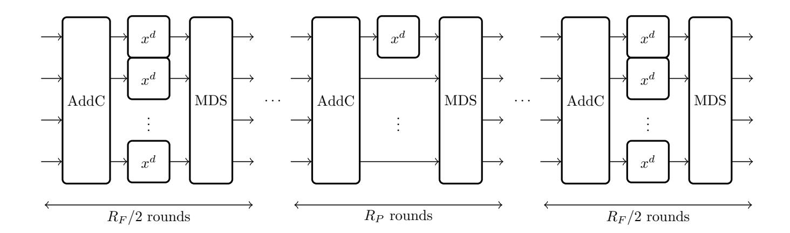
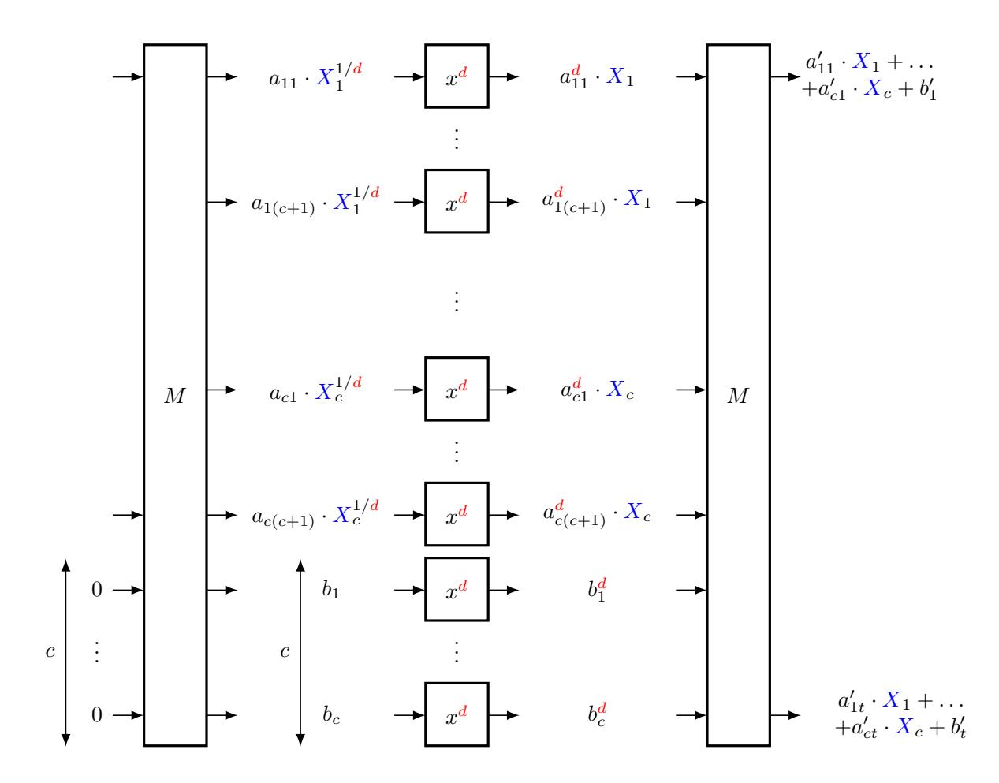
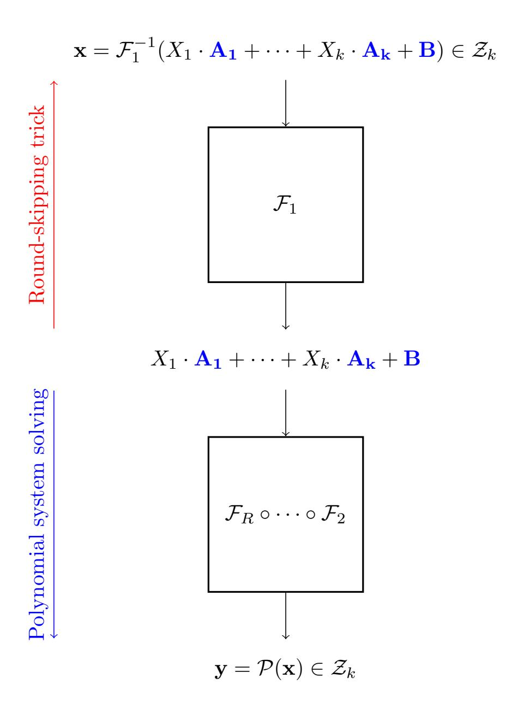

{0}------------------------------------------------

# Ethereum Poseidon bounties

Antoine Bak1,2, Augustin Bariant , Guilhem Jazeron1, Aurélien Bœuf1, and Maël Hostettler3

 $^{1}$ INRIA, Paris, France  $^{2}$ DGA, Paris, France  $^{3}$ Telecom SudParis, Institut Polytechnique de Paris, Evry, France

January 2025

#### 1 Introduction

#### 1.1 Poseidon and Poseidon2.

Poseidon [GKR+21] is an arithmetization-oriented family of permutation optimized for zero-knowledge proofs, operating on finite fields  $\mathbb{F}_p$ . Poseidon instances are permutations of  $\mathbb{F}_p^t$  designed as Substitution-Permutation Networks (SPN), the nonlinear layer being a parallel application of low-degree S-boxes  $x \mapsto x^d$ , where  $\gcd(d, p-1) = 1$  (typically, d is the smallest integer that is coprime with p-1). A crucial difference compared to standard SPN designs is that Poseidon follows the HADES design strategy |GLR+20|: its internal rounds only go through a partial nonlinear layer, where a single powermap is applied to a single element of the state. More formally, Poseidon is composed of  $R_F/2$  full rounds, followed by  $R_P$  partial rounds, followed by  $R_F/2$  full rounds, where  $R_F$ (resp.  $R_P$ ) is the number of full rounds (resp. partial rounds). External rounds protect Poseidon against statistical attacks while internal rounds cheaply increase the degree of the permutation to prevent algebraic attacks. A recent followup also defined the primitive Poseidon2 [GKS23] with an additional linear layer before the first round, and optimized matrices for better performances both in plain evaluation and in  $\mathcal{Plon}\mathcal{K}$  proof systems.

#### 1.2 The CICO problem.

Let us now quickly recall the definition of the CICO problem:

**Definition 1** (CICO problem). Let  $f: \mathbb{F}_p^t \to \mathbb{F}_p^t$  be a permutation. Then, for k < t, the CICO-k problem is defined as the problem of finding  $\mathbf{x} \in \mathbb{F}_p$  such that the last k coordinates of both  $\mathbf{x}$  and  $f(\mathbf{x})$  are equal to 0.

{1}------------------------------------------------

Figure 1: An overview of Poseidon. Poseidon2 has an extra linear layer before the first round.

This problem is linked to the security of cryptographic constructions based on permutations: for instance, finding a CICO solution for a permutation f may lead to a preimage attack on sponge constructions (see [BDPA07]) using f as a building block. For a generic permutation f, finding a solution to the CICO problem costs in average  $p^k$  permutation calls. The traditional approach to evaluate the security of a permutation is to study whether a CICO solution can be found with fewer operations than the generic complexity, by exploiting the inner structure of the permutation.

#### 1.3 Challenges from the Ethereum foundation.

The Ethereum foundation (EF) issued a bounty program with challenges on Poseidon and Poseidon2. The goal of these challenges is to find CICO solutions on different round-reduced instances of Poseidon and Poseidon2, defined on different prime fields. We denote the four main instances Poseidon-256, Poseidon2-64, Poseidon2-31m and Poseidon2-31k, and describe their parameters along with their round-reduced versions in Table 1. In the challenges, the goal is to solve CICO-1 for Poseidon-256 and Poseidon-64, and CICO-2 for Poseidon-31m and Poseidon-31k.

{2}------------------------------------------------

| Instance      | Base primitive | Prime field (bits) | t  | d | RF | RP |
|---------------|----------------|--------------------|----|---|----|----|
| Poseidon-256  | Poseidon       | BLS12-381 (256)    | 3  | 5 | 6  | 8  |
|               |                |                    |    |   | 6  | 9  |
|               |                |                    |    |   | 6  | 11 |
|               |                |                    |    |   | 6  | 16 |
| Poseidon2-64  | Poseidon2      | Goldilocks (64)    | 8  | 7 | 6  | 7  |
|               |                |                    |    |   | 6  | 8  |
|               |                |                    |    |   | 6  | 10 |
|               |                |                    |    |   | 6  | 13 |
| Poseidon2-31m | Poseidon2      | Mersenne (31)      | 16 | 5 | 4  | 0  |
|               |                |                    |    |   | 4  | 1  |
|               |                |                    |    |   | 6  | 1  |
|               |                |                    |    |   | 6  | 4  |
| Poseidon2-31k | Poseidon2      | KoalaBear (31)     | 16 | 3 | 4  | 1  |
|               |                |                    |    |   | 4  | 3  |
|               |                |                    |    |   | 6  | 4  |

Table 1: Instances proposed by the Ethereum fundation.

Our results. We found CICO solutions to the first 3 proposed instances of Poseidon2-31m and Poseidon2-31k, along with solutions for the first two Poseidon-256 instances. These solutions have been confirmed to be correct and eligible for bounty by the Ethereum fundation, except for the first instance of Poseidon-256, which was claimed by another team before us. In order to solve the instances of Poseidon2-31m and Poseidon2-31k, we used a new resultant-based approach, whereas our attacks on Poseidon-256 only relies on already-known univariate root finding.

Outline. In Section [2,](#page-3-0) we detail our results, and compare the complexity of our attacks to concrete Poseidon instances. We recall some complexity results for univariate and bivariate polynomial solving in Section [3.](#page-5-0) In Section [4.1,](#page-8-0) we describe how to model the CICO problem with a system of polynomial equations. In Section [4.2,](#page-9-0) we then recall and slightly generalize a result from [\[BBLP22\]](#page-12-1) allowing to skip the first rounds in a univariate or bivariate CICO attack on a permutation with monomial S-boxes such as Poseidon. In Section [4.3](#page-9-1) we recall an observation on the ideal degree of CICO-k systems for Poseidon made in [\[BSGL20\]](#page-12-2) and study its consequences on the complexity of finding a solution to the CICO-2 problem. Finally, we detail our attacks and discuss implementation details in Section [4.4](#page-10-0) and Section [4.5.](#page-11-0)

{3}------------------------------------------------

# 2 Results

In this section, we give an overview of the practical results we obtained against Poseidon and Poseidon2 instances proposed by the EF, as well as a short discussion about how resultant attacks would behave against concrete Poseidon and Poseidon2 instances. The attacks and their complexity analysis are detailed in the subsequent sections.

## 2.1 Results on EF's bounty instances

In Table [2,](#page-4-0) we provide theoretical complexity estimates and practical resource consumptions, if any, on the instances proposed by the Ethereum foundation. Our theoretical complexity estimates correspond to the attack complexities derived from the following sections. In the following, M(δ) is as defined in [\(1\)](#page-5-1):

• For the CICO-2 problem on Poseidon2-31k and Poseidon2-31m:

$$\mathcal{O}(\delta M(D_I) + D_I M(\delta) \log(\delta)), \quad \delta = d^{R_F - 1 + R_P}, \quad D_I = d^{2(R_F - 1) + R_P}.$$

• For the CICO-1 problem on Poseidon2-64:

$$\mathcal{O}(M(\delta)\log(\delta \cdot p)),$$
  $\delta = d^{R_F - 1 + R_P}.$ 

• For the CICO-1 problem on Poseidon-256:

$$\mathcal{O}(M(\delta)\log(\delta \cdot p)),$$
  $\delta = d^{R_F - 2 + R_P}.$ 

Note that we assume that the constant behind the O is small and set it to 1 in our complexity estimates. While our complexity estimates are above the ones of the EF for Poseidon-256 instances, EF's complexity estimates of CICO-2 attacks on Poseidon2-31k and Poseidon2-31m were underestimated on multiple instances (see numbers in bold in Table [2\)](#page-4-0). It should also be noted that it is possible to get better theoretical complexity bounds for the CICO-2 problem using fast bivariate resultant computation algorithms which are not implemented (see [\[vdHL21,](#page-13-3) [Vil23\]](#page-13-4)); in practice, we instead ran attacks with a less efficient resultant algorithm implemented in PML [\[tea23\]](#page-13-5).

Resources were measures on a AMD EPYC 9354 with 1To of RAM, 12To of NVMe swap memory and 120 threads, for all instances except the third instance of Poseidon2-31m, which used 1000 cores of Intel Xeon 5218.

{4}------------------------------------------------

| Instance      | RF | RP | EF estimate | Our estimate | Practical time | Memory usage |
|---------------|----|----|----------------|-----------------|-------------------|-----------------|
| Poseidon2-31k | 4  | 1  | 32             | 24.7            | 0.11s             | 6Mo             |
|               | 4  | 3  | 41             | 32.3            | 1.55s             | 611Mo           |
|               | 6  | 4  | 45             | 46.3            | 2.6h              | 10To            |
| Poseidon2-31m | 4  | 0  | 37             | 28.5            | 0.31s             | 41Mo            |
|               | 4  | 1  | 40             | 34.0            | 4.01s             | 1Go             |
|               | 6  | 1  | 45             | 49.3            | 40h†              | 5.4 Go†         |
|               | 6  | 4  | 52             | 64.5            | -                 | -               |
| Poseidon2-64  | 6  | 7  | 34             | 47.7            | -                 | -               |
|               | 6  | 8  | 37             | 50.7            | -                 | -               |
|               | 6  | 10 | 43             | 56.7            | -                 | -               |
|               | 6  | 13 | 51             | 65.5            | -                 | -               |
| Poseidon-256  | 6  | 8  | 31             | 43.1            | 8h*               | 250Go           |
|               | 6  | 9  | 36             | 45.6            | 8.5d              | 1,3To           |
|               | 6  | 11 | 38             | 50.5            | -                 | -               |
|               | 6  | 12 | 50             | 62.7            | -                 | -               |

†For this instance, we used the GCD approach.

Table 2: Theoretical and pratical complexities of our attacks on the instances proposed by the Ethereum foundation. Complexity estimates count the number of operations in log2 scale.

#### 2.2 Complexity of our attacks on some Poseidon instances

We generated instances of Poseidon-256, Poseidon2-31k, Poseidon2-31m and Poseidon2-64 with security level [1](#page-4-3) equal to the complexity of solving either a CICO-1 or a CICO-2 by bruteforce. For the number of branches and the degree of the S-box monomial, we kept the parameters that were given in the original EF challenges. The scripts we used to generate the parameters are those provided with the Poseidon and Poseidon2 papers, available at the following addresses: [https://extgit.isec.tugraz.at/krypto/hadeshash/-/blob/maste](https://extgit.isec.tugraz.at/krypto/hadeshash/-/blob/master/code/generate_params_poseidon.sage)r/ [code/generate\\_params\\_poseidon.sage](https://extgit.isec.tugraz.at/krypto/hadeshash/-/blob/master/code/generate_params_poseidon.sage) and [https://github.com/HorizenLa](https://github.com/HorizenLabs/poseidon2/blob/main/poseidon2_rust_params.sage)bs/ [poseidon2/blob/main/poseidon2\\_rust\\_params.sage](https://github.com/HorizenLabs/poseidon2/blob/main/poseidon2_rust_params.sage). The complexity estimates we obtained are reported in Table [3.](#page-5-2)

\*Our solution was not the first on this instance.

1as assessed with the formulas from the Poseidon papers [\[GKR](#page-13-0)+21, [GKS23\]](#page-13-2)

{5}------------------------------------------------

| Instance      | t  | d | RF | RP  | k | Our CICO-k complexity | Bruteforce CICO-k complexity |
|---------------|----|---|----|-----|---|--------------------------|---------------------------------|
| Poseidon2-31k | 16 | 3 | 8  | 20  | 2 | 110.1                    | 62                              |
| Poseidon2-31m | 16 | 5 | 8  | 12  | 2 | 118.0                    | 62                              |
| Poseidon2-64  | 8  | 7 | 8  | 22  | 1 | 97.6                     | 64                              |
| Poseidon-256  | 3  | 5 | 8  | 114 | 1 | 298.8                    | 255                             |

Table 3: Theoretical complexity estimates on some instances.

# 3 Polynomial system solving algorithms

In this section, we detail the algorithms that we used for polynomial system solving, and we discuss their complexity.

## 3.1 Solving univariate polynomials

We recall in this section known complexity results about computations with univariate polynomials over finite fields. We focus in particular on GCD computation and univariate root finding.

Fast multiplication of two polynomials. Using the Sch¨onhage–Strassen algorithm (see [\[vzGG13,](#page-13-6) Theorem 8.23]), the complexity for multiplying two univariate polynomials of degree δ in Fp[X] is given by O(M(δ)) where:

$$M(\delta) = \delta \cdot \log(\delta) \cdot \log(\log(\delta)) \tag{1}$$

Computing a GCD. Let P(X), Q(X) ∈ Fp[X] be two polynomials of degree at most δ. The half-gcd algorithm allows us to compute gcd(P(X), Q(X)) in O(M(δ) log(δ)) field operations [\[vzGG13\]](#page-13-6).

Univariate solving. Let P(X) ∈ Fp[X] be a polynomial of degree δ. As suggested in [\[BBLP22\]](#page-12-1), we find the roots of P in Fp using the following approach:

- 1. Compute the polynomial Q(X) = Xq − X mod P(X) using a doubleand-add approach to compute Xq mod P(X), and substract X in the end.
- 2. Compute G = gcd(P, Q), so that the roots of G are exactly the roots of P in Fp.
- 3. A random polynomial P has a few roots in Fp, with high probability. Hence the degree of G is small and its roots can be recovered in negligible time, thus yielding the roots of P in Fp

{6}------------------------------------------------

The first step takes O(M(δ) log(q)) operations in Fp. Using the half-gcd algorithm, we can do the second step in time M(δ) log(δ). Since the last step is of negligible time complexity, the total complexity is

$$\mathcal{O}(M(\delta) \cdot \log(\delta \cdot q))$$
.

#### 3.2 Solving bivariate systems

We recall in this section the different methods one can use to solve bivariate systems. In particular, we explain how we can use resultants to solve such systems, and what algorithm we used to compute bivariate resultants in order to break some Poseidon instances.

Bivariate polynomial systems. A bivariate polynomial system over the finite field Fp is a finite number of polynomial equations in two unkowns. In our case, we only tackle the case where there are two polynomials in two unkowns:

$$\mathcal{P} = \begin{cases} P(X,Y) = 0\\ Q(X,Y) = 0 \end{cases}$$

In this case, instead of using the traditional Gr¨obner basis approach (for instance described in [\[BBLP22,](#page-12-1) Section 3.2]), we can use resultants to solve the system with a better complexity.

#### 3.2.1 Resultants and their application to bivariate system solving

For an introduction to resultants, see [\[CLO15,](#page-13-7) Section 3.6]. The property that we exploit for our attacks is that if R = ResY (P, Q) is the resultant in Y of P and Q, then R is a univariate polynomial in X such that:

If 
$$\exists x_0, y_0 \in \mathbb{F}_p$$
 s.t.  $\begin{cases} P(x_0, y_0) = 0 \\ Q(x_0, y_0) = 0, \end{cases}$  then  $R(x_0) = 0$ .

In other words, by performing univariate solving on the resultant, we are able to find the X-coordinates of all solutions in F 2 p of P.

Then, one can compute gcd (P(x0, Y ), Q(x0, Y )) (w.r.t. variable Y ) and compute its roots in Fp to retrieve the Y -coordinates of the solutions of P.

Computation of the resultant. Let P, Q be two polynomials in Fp[X, Y ]. We assume that they both have the same total degree δ, which is also their degrees in X and in Y (this is the case in the polynomials we encounter when attacking Poseidon). The evaluation-interpolation approach works as follows:

1. Let D be the degree of the resultant of P, Q with respect to variable X. In general, we can upper-bound D by δ 2 , however in the case of Poseidon it is actually lower, see Section [4.3.](#page-9-1) Write:

{7}------------------------------------------------

$$P(X,Y) = \sum_{i=0}^{\delta} P_i(X)Y^i$$
$$Q(X,Y) = \sum_{i=0}^{\delta} Q_i(X)Y^i$$

where the  $P_i(X)$  and  $Q_i(X)$  are univariate in X of degree at most  $\delta - i$ .

- 2. We use fast multipoint evaluation on a geometric sequence  $(x_0, \ldots, x_D)$  of length D+1 to evaluate each of the  $P_i$  and  $Q_i$  on those points. This costs  $\mathcal{O}(\delta \cdot M(D))$ .
- 3. We then get the polynomials  $P(x_j, Y) = \sum_{i=0}^{\delta} P_i(x_j) Y^i$  and  $Q(x_j, Y) = \sum_{i=0}^{\delta} Q_i(x_j) Y^i$  for all  $j \in \{0, \ldots, D\}$  using the values  $P(x_j)$  and  $Q(x_j)$  computed at the step before. This costs  $\mathcal{O}(\delta \cdot D)$ .
- 4. Now, for every  $j \in \{0, ..., D\}$ , we compute  $\operatorname{Res}(P(x_j, Y), Q(x_j, Y))$  using the half-gcd algorithm which has complexity  $\mathcal{O}(M(\delta) \cdot \log(\delta))$  [vzGG13]. In total, this step then as complexity:  $\mathcal{O}(D \cdot M(\delta) \cdot \log(\delta))$
- 5. Finally we perform interpolation: since  $\operatorname{Res}_Y(P(X,Y),Q(X,Y))$  is a polynomial in X of degree D and we have its values on D+1 points (we computed  $\operatorname{Res}(P(x_j,Y),Q(x_j,Y))$  for all  $j\in\{0,D\}$  before), we can use fast interpolation on a geometric sequence to recover the resultant in  $\mathcal{O}(M(D))$  [vzGG13].

In total, this costs  $\mathcal{O}(\delta \cdot M(D) + D \cdot M(\delta) \cdot \log(\delta))$ .

Using the resultant to recover the roots of the system. We now describe how to recover the roots of the original system, and analyze the complexity of our method.

- 1. After computing the resultant with the above procedure, we solve for the roots of the resultant R using the univariate solving method presented before, we get its roots in time  $\mathcal{O}(M(D) \cdot \log(D \cdot q))$ . Let  $r_1, \dots, r_l$  be the roots of R in  $\mathbb{F}_p$ , where l is in general a small integer.
- 2. Then we compute all the (univariate) polynomials  $P(r_i, Y)$  and  $Q(r_i, Y)$  for  $i \in \{0, ..., l\}$ : this costs  $\mathcal{O}(\delta^2)$ .
- 3. Finally, for each of them, we solve for the Y variable using the univariate root finding algorithm, the complexity for this step is  $\mathcal{O}(M(\delta) \cdot \log(\delta \cdot q))$ .

The total complexity for solving a bivariate system using resultants is then  $\tilde{\mathcal{O}}(\delta \cdot D)$ .

{8}------------------------------------------------

## 4 Our attacks

In this section, we explain how we practically mounted our attacks on Poseidon and Poseidon2. We recall a technique to skip rounds, previously introduced in [BBLP22], then we explain the different approaches we used for solving the different CICO instances, and finally we discuss some implementation details.

## 4.1 Polynomial modeling

We quickly recall how to model the CICO problem as a problem of polynomial system solving. Whether we are attacking the original Poseidon or Poseidon-2, if we let  $\mathcal{P}$  be the corresponding permutation, we can always write:

$$\mathcal{P} = F_R \circ F_{R-1} \circ \cdots \circ F_1$$

where R is the number of rounds. The idea of the polynomial modeling is to interpret the inputs of  $\mathcal{P}$  as polynomials and to evaluate the round functions  $F_i$  on these polynomials. Note that the  $F_i$  are composed of affine operations and of low degree powermaps  $x \mapsto x^d$ , so we can indeed apply these operations to polynomials in a not-so-costly manner.

The traditional approach for CICO-1 modeling is to introduce a single variable X, and to set the input as  $X \cdot A + B$ , where  $A, B \in \mathbb{F}_p^t$ , so that its last coordinate is the polynomial 0. The attacker then iteratively applies the round functions  $F_i$ . Note that since  $F_i$  is of low degree, there is no need to introduce new variables at each round, and the modeling is univariate in the end.

- 1. Now, if we are trying to solve a CICO-k problem, we introduce  $X_1, \ldots, X_k$ , we then set as input an affine combination of those variables:  $X_1 \cdot A_1 + \cdots + X_k \cdot A_k + B$  where  $A_1, \ldots, A_k, B \in \mathbb{F}_p^t$  are such that their k last coordinates are 0 (so that it conforms to the constraint for the input of the CICO-k problem), and t is the number of branches.
- 2. Then, we compute  $F_1(X_1 \cdot A_1 + \cdots + X_k \cdot A_k + B)$ , which yields us t polynomials in k variables, and we plug those in  $F_2$ , etc. Iteratively, we end up with:

$$F_R \circ ... \circ F_1(X_1 \cdot A_1 + \dots + X_k \cdot A_k + B) = (P_1(X_1, ..., X_k), ..., P_t(X_1, ..., X_k))$$

where each  $P_i$  is a multivariate polynomial of degree  $d^R$ 

3. Finally, to respect the output constraint of the CICO-k problem, we only have to solve the following polynomial system:

$$\begin{cases} P_t(X_1, ..., X_k) = 0 \\ ... \\ P_{t-k+1}(X_1, ..., X_k) = 0 \end{cases}.$$

{9}------------------------------------------------

## 4.2 Skipping the first rounds

We recall here some results about skipping the first rounds in an algebraic attack against SPN permutations using monomial S-boxes [BBLP22].

Let  $t \geq c \cdot (c+2)$ , where c is the capacity size, t the number of branches, let  $(m_{ij}^{\text{inv}})_{1 \leq i,j \leq t}$  the coordinates of  $M^{-1}$ , let  $C^{(1)}$  the round constants of the first round. The technique consists in choosing vectors  $(a_{k1} \dots a_{k(c+1)}), 1 \leq k \leq c$  in such a way that, for all k and  $t-c+1 \leq i \leq t$ ,

$$\sum_{j=1}^{c+1} m_{i((k-1)(c+1)+j)}^{\text{inv}} \cdot a_{kj} = 0.$$

For each i, the set of solutions to these linear equations is a vector space of dimension 1 as long as the submatrix  $\left(m_{i((k-1)(c+1)+j)}^{\mathrm{inv}}\right)_{t-c+1\leq i\leq t,1\leq j\leq c+1}$  has full rank. In particular, this is always the case when M is MDS, such as the matrices in Poseidon. In the case of Poseidon2 where M is not MDS, we could still find c disjoint submatrices of  $M^{-1}$  of size  $c\times(c+1)$  which have a full rank, allowing us to perform the trick.

We also let b such that

$$\sum_{j=1}^{c} m_{i(j+t-c)}^{\text{inv}} \cdot b_j = \sum_{j=1}^{t} C_j^{(1)} \cdot m_{ij}^{\text{inv}},$$

which is feasible as long as the submatrix  $\left(m_{i(j+t-c)}^{\text{inv}}\right)_{t-c+1 \leq i \leq t, 1 \leq j \leq c}$  is invertible. The state before round 2 is set to

$$\left(a_{11} \cdot X_1^{1/d} \dots a_{1(c+s+1)} \cdot X_1^{1/d} \dots a_{d1} \cdot X_d^{1/d} \dots a_{d(c+s+1)} \cdot X_d^{1/d}, b_1 \dots b_c\right)$$
.

A summary of this trick can be found in Figure 2.

Note that, in the case of Poseidon, the permutation uses a layer of S-boxes before the first matrix, but as  $0^{1/d} = 0$ , having zeros in the capacity before the first matrix is equivalent to having zeros in the capacity in the input. This trick applies to all the challenges: in the case of the Goldilocks and BLS12-381, we have c = 1 and t = 8 or 3. In the case of the 31-bit primes, we have that c = 2 and t = 16 > c(c + 2) = 8.

# 4.3 Observation on the ideal degree of the CICO-2 systems

It has been shown [BSGL20, Theorem 10] that the systems for a CICO-c problem on Poseidon have a degree of the ideal equal to

$$D_I = d^{c \cdot R_F + R_P} \ .$$

We also experimentally observed that, in the case of the CICO-2 problem on Poseidon, the bivariate resultant has (univariate) degree equal to the degree of the ideal,  $D_I$ . Skipping one round using the trick from the previous section gives a bivariate system of ideal degree  $D_I = d^{2 \cdot (R_F - 1) + R_P}$ .

{10}------------------------------------------------

Figure 2: Round-skipping technique on the first round of an SPN permutation.

Consequence on the complexity of bivariate solving. As we have seen in Section 3.2, the evaluation-interpolation method for computing a bivariate resultant and solving a bivariate system runs in  $\tilde{\mathcal{O}}(\delta \cdot D)$ ,  $\delta$  being the degree of the input polynomials, and D being the degree of the resultant. In our case,  $\delta = d^{R_F + R_P}$ .

Since we experimentally observed that in our cases,  $D = D_I$  and  $D_I$  is lower than expected, as explained above, we can take advantage from this fact and solve the CICO-2 problem more efficiently. Indeed, we can solve a CICO-2 problem in time  $\tilde{\mathcal{O}}(\delta \cdot D_I) = \tilde{\mathcal{O}}(d^{2R_P+3(R_F-1)})$ , while a trivial bound on the ideal degree  $D_I \leq \delta^2$  gives the complexity  $\tilde{\mathcal{O}}(\delta^3) = \tilde{\mathcal{O}}(d^{3(R_P+R_F-1)})$ . Thus this property on the ideal degree saves a factor  $d^{R_P}$  in the complexity.

#### 4.4 The full attacks in detail.

**CICO-1 instances.** In the case of CICO-1 instances, we simply use the univariate solving algorithms, along with the round-skipping trick we explained in Section 4.2.

**CICO-2 instances.** For the CICO-2 instances, we used two different approaches:

• The resultant approach, which consists in using directly our bivariate solving algorithm on the polynomial modeling of CICO-2, along with the trick

{11}------------------------------------------------

of Section 4.2.

• The GCD approach, which consists in taking a univariate polynomial modeling of the two output capacity values. We let the two degree  $\delta$  univariate polynomials be  $P_1(X), P_2(X)$ . We take the GCD of  $P_1$  and  $P_2$ . Their GCD has a root in  $\mathbb{F}_p$  with probability  $\mathcal{O}(1/q)$ , if it is the case, we compute their common root and this yields a solution to CICO-2. As this happens with probability  $\mathcal{O}(1/q)$ , we have to iterate q times and the total complexity is  $\mathcal{O}(q \cdot M(\delta) \log(\delta))$ .

As we just saw in Section 4.3, the complexity of the resultant approach turns out to be  $\tilde{\mathcal{O}}(\delta \cdot D_I)$ . In contrast, the GCD approach yields a complexity of  $\tilde{\mathcal{O}}(q \cdot \delta)$ . Thus, as long as  $q < D_I$ , the resultant approach has the best time complexity, however it requires storing bivariate polynomials of total (multivariate) degree  $\delta$ , making the memory scale quadratically with  $\delta$ . On the contrary, the GCD approach only requires storing univariate polynomials of degree  $\delta$ , and the memory complexity is linear. We only used the GCD approach for the third Mersenne instance as the required memory complexity for the resultant approach was too high.

Note that a similar approach would consist in finding roots of  $P_1(X)$ , and for each root x of  $P_1$ , check if  $P_2(x) = 0$ . However, as seen in Section 3.1, this would add a  $M(\delta)\log(q)$  term to the complexity of the half-gcd algorithm. As in the considered instances, we have that  $\delta \ll q$ , this would increase the overall complexity by a factor of  $\log(q)/\log(\delta)$ .

#### 4.5 Implementation considerations

Our code is available in the zip file we joined to this report.

Handling of the polynomials and computation of the representation of the CICO problem. In both the univariate and multivariate cases, we used the NTL library to handle and represent polynomials [Sho25].

To compute the polynomial representation of the problem, in the univariate case we simply compute it iteratively using fast polynomial arithmetic.

In the bivariate case however, to speed things up a bit we use the Kronecker substitution to compute the polynomial representation (see [vzGG13]). It enables us to do all the polynomial arithmetic in a univariate setting, that we know better how to handle, before going back to the bivariate representation. For this, we use the implementation from the PML library [HNS19].

**Univariate root finding.** For univariate root finding, we use our own parallelized implementation to compute  $gcd(X^q - X, P)$  efficiently and we use the half-gcd implementation from [Sho25, NTL].

Computation of bivariate resultants. To compute the resultant in the challenges, we used our own implementation, which is largely based on the

{12}------------------------------------------------

Figure 3: Overview of the attack on a CICO-k instance, where  $\mathcal{Z}_k=\{x\in\mathbb{F}_q^n \text{ such that } x_1=\cdots=x_k=0\}$  .

computation of the bivariate resultant implemented in the library PML [tea23], with a few optimizations.

# References

- [BBLP22] Augustin Bariant, Clémence Bouvier, Gaëtan Leurent, and Léo Perrin. Algebraic attacks against some arithmetization-oriented primitives. *IACR Transactions on Symmetric Cryptology*, pages 73–101, 2022.
- [BDPA07] G.M. Bertoni, Joan Daemen, Michael Peeters, and Gilles Assche. Sponge functions.  $ECRYPT\ Hash\ Workshop\ 2007,\ 01\ 2007.$
- [BSGL20] Eli Ben-Sasson, Lior Goldberg, and David Levit. Stark friendly hash—survey and recommendation. Cryptology ePrint Archive, 2020.

{13}------------------------------------------------

- [CLO15] David A. Cox, John Little, and Donal O'Shea. Elimination Theory, pages 121–174. Springer International Publishing, Cham, 2015.
- [GKR+21] Lorenzo Grassi, Dmitry Khovratovich, Christian Rechberger, Arnab Roy, and Markus Schofnegger. Poseidon: A new hash function for {Zero-Knowledge} proof systems. In 30th USENIX Security Symposium (USENIX Security 21), pages 519–535, 2021.
- [GKS23] Lorenzo Grassi, Dmitry Khovratovich, and Markus Schofnegger. Poseidon2: A faster version of the poseidon hash function. In International Conference on Cryptology in Africa, pages 177–203. Springer, 2023.
- [GLR+20] Lorenzo Grassi, Reinhard L¨uftenegger, Christian Rechberger, Dragos Rotaru, and Markus Schofnegger. On a generalization of substitution-permutation networks: The hades design strategy. In Advances in Cryptology–EUROCRYPT 2020: 39th Annual International Conference on the Theory and Applications of Cryptographic Techniques, Zagreb, Croatia, May 10–14, 2020, Proceedings, Part II 30, pages 674–704. Springer, 2020.
- [HNS19] S. G. Hyun, V. Neiger, and E. Schost. Implementations of efficient ´ univariate polynomial matrix algorithms and application to bivariate resultants. In Proceedings ISSAC 2019, pages 235–242. ACM, 2019. <https://github.com/vneiger/pml>.
- [Sho25] Victor Shoup. Ntl: A library for doing number theory, 2025.
- [tea23] The PML team. PML: Polynomial Matrix Library, 2023. Version 0.3, <https://github.com/vneiger/pml>.
- [vdHL21] Joris van der Hoeven and Gr´egoire Lecerf. Fast computation of generic bivariate resultants. J. Complex., 62:101499, 2021.
- [Vil23] Gilles Villard. Elimination ideal and bivariate resultant over finite fields, 2023.
- [vzGG13] Joachim von zur Gathen and J¨urgen Gerhard. Modern Computer Algebra, page 313–334. Cambridge University Press, 2013.