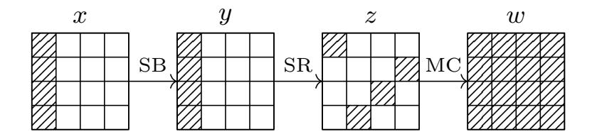
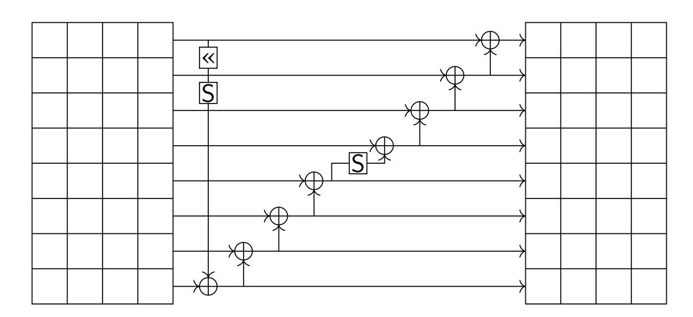
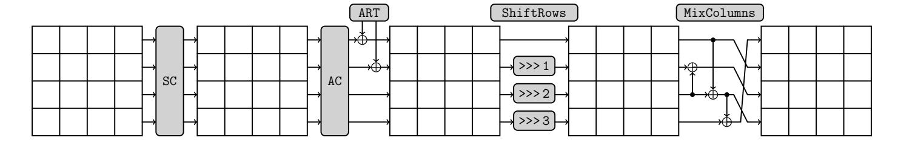
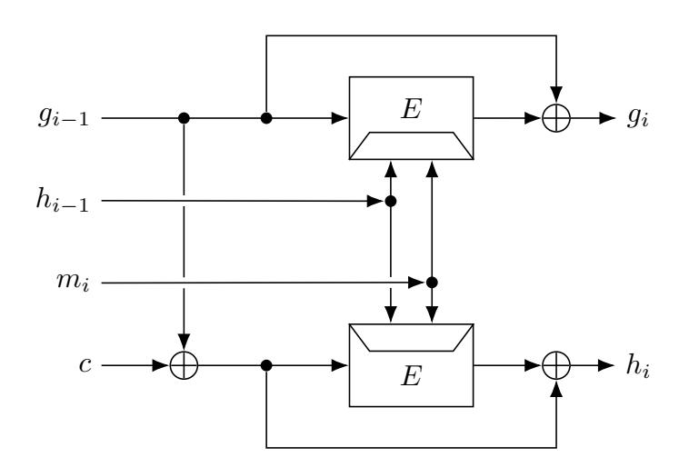
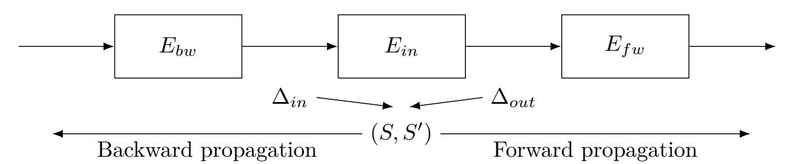
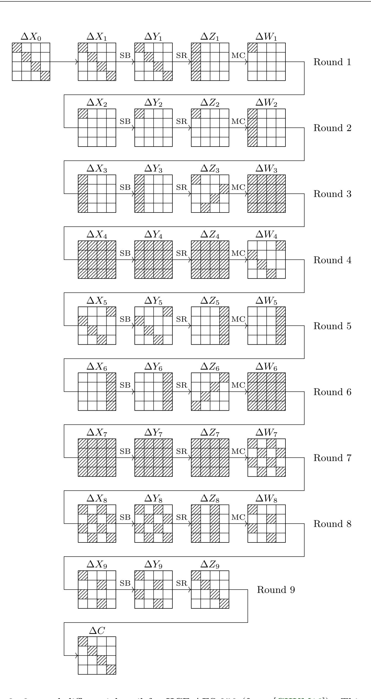
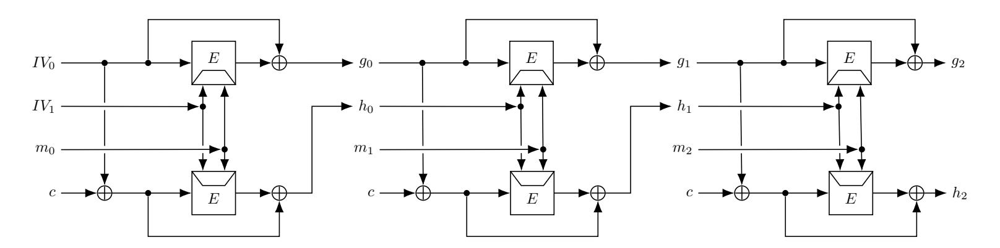
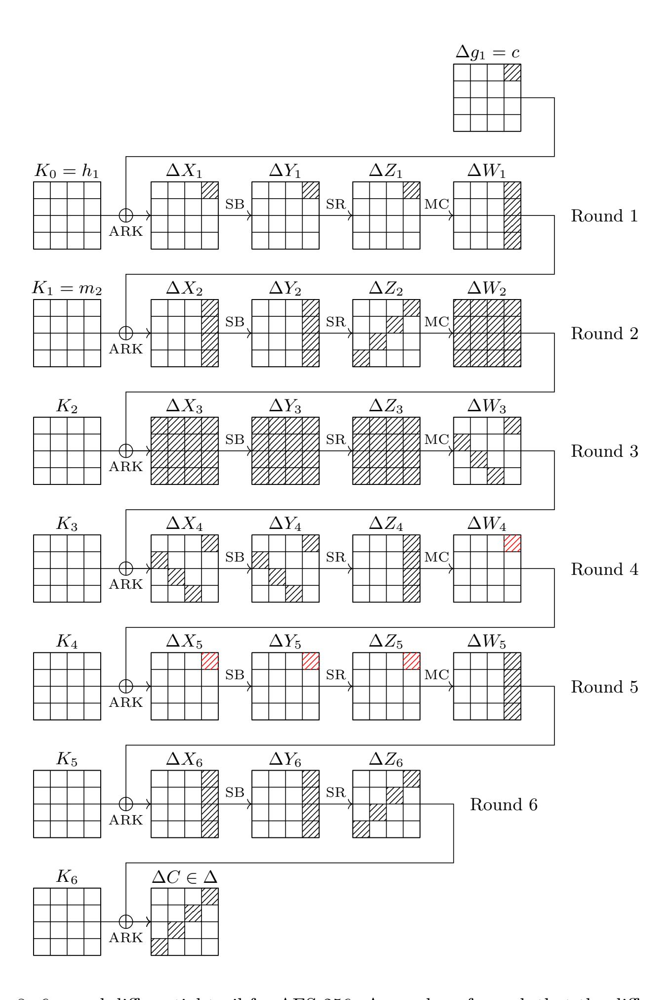
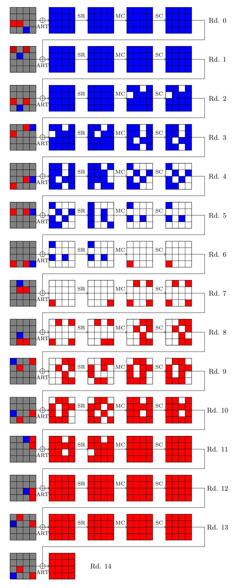

{0}------------------------------------------------

## **On the Quantum Collision Resistance of HCF Hash Functions**

Alisée Lafontaine and André Schrottenloher

Univ Rennes, Inria, CNRS, IRISA, Rennes, France [firstname.lastname@inria.fr](mailto:firstname.lastname@inria.fr)

**Abstract.** At EUROCRYPT 2020, Hosoyamada and Sasaki obtained the first dedicated quantum collision attacks on hash functions reaching more rounds than the classical ones. Indeed, as the speedup of generic quantum collision search is less than quadratic, an attack based on Grover's search may become comparatively more efficient in the quantum setting.

In this paper, we focus on collision attacks on double-block length hash functions, and more precisely the Hirose compression function (HCF). At ToSC 2021, Chauhan et al. found a 10-round free-start collision attack on HCF-AES-256. At ToSC 2024, Lee and Hong corrected its complexity analysis. However, these two works are superseded by another result of Hirose and Kuwakado (IMACC 2021), which shows that for any 2*n*-bit HCF hash function, a quantum free-start collision attack of complexity O(2*n/*<sup>2</sup> ) exists. While both the works of Chauhan et al. and Lee and Hong are above this generic complexity, we find that a classical attack from Chen et al. (IEICE Trans. Fundam. Electron. Commun. Comput. Sci. 2016) translates to a 9-round quantum attack on HCF-AES-256.

Next, we study the security of HCF against quantum collision attacks (not free-start). We use a generic strategy that transforms a partial preimage attack into a quantum collision attack, and give several applications on HCF hash functions: a 6-round attack on AES-256 and a 15-round attack on Romulus-H (based on Skinny), both exceeding the reach of classical attacks.

**Keywords:** Quantum cryptanalysis · Hirose-DBL · Collision search · AES · Skinny

## **1 Introduction**

Hashing is a fundamental symmetric primitive, which in recent years has become more and more integrated into other cryptographic schemes, especially in post-quantum cryptography, as part of the recent NIST standards. As a consequence, it is of foremost importance to test the security of hash functions against a quantum attacker.

In the quantum setting, it is well-known that a generic preimage security level of *n* bit decreases to *n/*2, due to Grover's exhaustive search algorithm [\[Gro96\]](#page-22-0). While improved dedicated attacks may exist, at the moment the quantum and classical security margins have remained similar for realistic hash functions. That is, quantum attacks tend to improve classical ones at most by a quadratic factor, and do not perform *relatively* better.

**Quantum Collision Attacks.** The situation regarding collision attacks is different. Using the BHT collision search algorithm [\[BHT98\]](#page-21-0), an *n/*2-bit classical security level reduces to *n/*3 in the quantum setting. This (less than quadratic) improvement is optimal in query complexity [\[AS04\]](#page-19-0). While a speedup can still be obtained with purely classical memory, instead of the more expensive (and less realistic) quantum RAM model [\[CNS17\]](#page-21-1), all known quantum collision algorithms evolve on the same time-memory trade-off curve *T* <sup>2</sup>*M* = 2*<sup>n</sup>*.

{1}------------------------------------------------

Because of the relative inefficiency of generic attacks, *dedicated* quantum collision attacks can actually perform much better. This idea was first put forward by Hosoyamada and Sasaki [\[HS20\]](#page-22-1); who studied rebound attacks on hash functions with compression functions based on AES-like block ciphers. The rebound attack, introduced by Mendel et al. [\[MRST09\]](#page-22-2), relies on a truncated differential path in the cipher, with two phases. In the *inbound phase*, one finds candidate states that satisfy the middle of the differential, and in the *outbound phase*, one extends this path probabilistically forwards and backwards.

The attacks of Hosoyamada and Sasaki use Grover's algorithm on the inbound and outbound phases, and their complexity depends almost only on the probability of the differential trail. They found that a differential trail with a probability too low in the classical setting may still be competitive in the quantum setting, and lead to a better attack.

After this paper, many works explored the gap between the classical and quantum security margins of hash functions. Dong et al. [\[DSS](#page-21-2)<sup>+</sup>20] extended Hosoyamada and Sasaki's work by focusing on attacks with a small memory, and Ni et al. [\[NDJY21\]](#page-22-3) studied quantum attacks on Simpira-v2. Hosoyamada and Sasaki [\[HS21\]](#page-22-4) showed that more rounds could be attacked on SHA-2, and Guo et al. [\[GLST22\]](#page-22-5) also improved quantum collision attacks on SHA-3.

**Double-block Length Hashing.** Most hash functions based on the Merkle-Damgård domain extender rely on a block cipher, which is converted into a compression function.

While works such as [\[HS20,](#page-22-1) [DSS](#page-21-2)<sup>+</sup>20] focused initially on single-block length compression modes, *double-block* modes seem an even more relevant target in the quantum setting, since their purpose is to increase the state size of the hash function – making it certainly more resistant against generic quantum attacks.

One of the most popular double-block length compression function is the Hirose compression function (noted HCF in the remainder of this paper) [\[Hir06\]](#page-22-6). It has appeared both as a component in modes of operation [\[BGP](#page-21-3)<sup>+</sup>20, [Nai19\]](#page-22-7) and as a standalone primitive. The finalist of the NIST lighweight standardization process Romulus [\[GIK](#page-21-4)<sup>+</sup>22] defines (in addition to the AEAD schemes also published in ToSC [\[IKMP20\]](#page-22-8)) a hash function Romulus-H based on the Skinny-128-384 tweakable block cipher.

This motivates a closer look at dedicated attacks on HCF in the quantum setting. Such attacks were studied in ToSC 2021 and 2024 by Chauhan et al. [\[CKS21\]](#page-21-5), who found a dedicated 10-round free-start collision attack on HCF-AES-256, and Lee and Hong [\[LH24\]](#page-22-9), who reanalyzed the former and corrected its complexity estimate.

**A First Observation on HCF.** While our initial motivation was to improve the works of [\[CKS21,](#page-21-5) [LH24\]](#page-22-9), it turns out that both attacks have a complexity higher than the generic quantum complexity, and are therefore invalid. The reason is the following. In the classical setting, the best known free-start collision attack on HCF instantiated with an *n*-bit block, 2*n*-bit key ideal cipher has complexity O(2*<sup>n</sup>*), which is the generic collision complexity. However, as noticed by Hirose and Kuwakado [\[HK24\]](#page-22-10), the problem can be reduced to a *search*, which can be quadratically accelerated with Grover's algorithm. Therefore a collision can be found in quantum time O 2 *n/*2 , lower than the generic bound O 2 2*n/*3 of quantum collision search, and lower than the dedicated attacks of both [\[CKS21,](#page-21-5) [LH24\]](#page-22-9).

**Contribution.** Given this situation, we set out to determine the true security margin of HCF, instantiated with popular block ciphers, against quantum attacks. We obtain the following results.

• There exists a quantum freestart collision attack against 9-round HCF-AES-256. This attack is a simple adaptation of a classical attack found in [\[CHKM16\]](#page-21-6), which

{2}------------------------------------------------

goes below the bound 2 <sup>64</sup> given by the generic attack. Whether 10 rounds can be broken (like the results of [\[CKS21,](#page-21-5) [LH24\]](#page-22-9)) remains an open question.

Next, using a generic conversion of partial quantum preimage attacks into quantum collision attacks, we study standard collision attacks on HCF.

- We find a 6-round quantum collision attack on HCF-AES-256, and a corresponding 5-round classical collision attack, which, to the best of our knowledge, is the first of its type.
- We find a 15-round quantum collision attack on HCF-Skinny-128-384, i.e., the Romulus-H hash function, while the best classical attacks reach 10 rounds [\[NPE23\]](#page-23-0).

We summarize previous and new results in [Table 1.](#page-3-0)

**Organization of the Paper.** The paper is organized as follows. [Section 2](#page-2-0) introduces notations and preliminaries of quantum cryptanalysis. In [Section 3,](#page-8-0) we recall the classical attack of [\[CHKM16\]](#page-21-6) and explain how it leads to a 9-round attack on HCF-AES-256 (the current best). In [Section 4,](#page-13-0) we explain how we turn a partial preimage attack into a collision attack, and instantiate this strategy in [Section 5](#page-15-0) for AES-256 and in [Section 6](#page-17-0) for Skinny-128-384.

## <span id="page-2-0"></span>**2 Preliminaries**

In this section, we give a few preliminaries and useful notations.

#### **2.1 The AES Block Cipher**

The Advanced Encryption Standard (AES) [\[oSN01\]](#page-23-1) is a 128-bit block cipher algorithm standard adopted by the NIST in 2001 and one of the most studied block ciphers. It exists in three versions: AES-128, -192 and -256, depending on the key length. In this paper, we focus on AES-256, which has 14 rounds. The internal state of AES is a 4 × 4 matrix of bytes numbered as follows:

$$\begin{pmatrix} 0 & 4 & 8 & 12 \\ 1 & 5 & 9 & 13 \\ 2 & 6 & 10 & 14 \\ 3 & 7 & 11 & 15 \end{pmatrix}$$

The AES round function follows a standard wide-trail substitution-permutation network strategy, which applies four successive transformations to the state [\(Figure 1\)](#page-2-1): SubBytes (SB), ShiftRows (SR), MixColumns (MC) and AddRoundKey (AK). SubBytes (substitution layer) applies the AES S-Box individually to the bytes. ShiftRows (permutation layer) shifts the *i*-th row by *i* cells to the left. MixColumns (permutation layer) multiplies each column by the AES MDS matrix. Finally AddRoundKey adds the AES round key to the internal state.



<span id="page-2-1"></span>Figure 1: Effect of the AES round function on a truncated differential pattern starting with a single active column (the hatched pattern denotes bytes with non-zero difference).

{3}------------------------------------------------

<span id="page-3-0"></span>Table 1: Classical and quantum collision attack on Hirose DBL/HCF with AES-256. C: Classical, Q: Quantum. In the "qRAM" and "RAM" columns, "-" indicates a negligible amount of memory, "C" indicates QRACM, "Q" indicates QRAQM. The "Valid" column indicates whether the attack improves over the generic complexity, or time-memory tradeoff in the case of quantum standard collisions. Generic attacks are indicated by "-".

| Free-Start Collision         |        |             |           |                           |         |                |       |
|------------------------------|--------|-------------|-----------|---------------------------|---------|----------------|-------|
| Target                       | Rounds | Time        | RAM       | qRAM                      | Setting | Ref            | Valid |
| HCF<br>AES<br>256            | any    | 128<br>2    | -         | -                         | C       | Birthday       | -     |
|                              | any    | 64<br>2     | -         | -                         | Q       | [HK24]         | -     |
|                              | 10     | 85.11<br>2  | -         | 16<br>2                   | Q       | [CKS21]        | ✗     |
|                              | 10     | 91.19<br>2  | -         | 16<br>2                   | Q       | [LH24]         | ✗     |
|                              | 9      | 120<br>2    | 16<br>2   | -                         | C       | [CHKM16]       | ✓     |
|                              | 9      | 61.31<br>2  | -         | -                         | Q       | Subsection 3.3 | ✓     |
| Standard Collision           |        |             |           |                           |         |                |       |
| Target                       | Rounds | Time        | RAM       | qRAM                      | Setting | Ref            | Valid |
| HCF<br>AES<br>256            | any    | 128<br>2    | -         | -                         | C       | Birthday       | -     |
|                              | any    | 85.33<br>2  | -         | 85.33 C<br>2              | Q       | [BHT98]        | -     |
|                              | any    | 102.4<br>2  | 51.2<br>2 | -                         | Q       | [CNS17]        | -     |
|                              | 5      | 112<br>2    | -         | -                         | C       | Section 5      | ✓     |
|                              | 6      | 83.25<br>2  | -         | 53.3 C<br>2               | Q       | Section 5      | ✓     |
|                              | 6      | 95.95<br>2  | 28<br>2   | -                         | Q       | Section 5      | ✓     |
| HCF<br>Skinny<br>128-<br>384 | any    | 128<br>2    | -         | -                         | C       | Birthday       | -     |
|                              | any    | 85.33<br>2  | -         | 85.33 C<br>2              | Q       | [BHT98]        | -     |
|                              | any    | 102.4<br>2  | 51.2<br>2 | -                         | Q       | [CNS17]        | -     |
|                              | 10     | Practical   | -         | -                         | C       | [NPE23]        | ✓     |
|                              | 15     | 104.65<br>2 | -         | 42.7 C +<br>2<br>8 Q<br>2 | Q       | Section 6      | ✓     |

{4}------------------------------------------------

The states before SB, after SB, after SR and after MC at round i are respectively denoted  $X_i, Y_i, Z_i, W_i$ , and we use  $X_i[j]$  to address individual bytes. For a pair of states  $X_i, X'_i$ , its difference is noted  $\Delta X_i := X_i \oplus X'_i$ .

**AES-256 Key Schedule.** Since we focus only on AES-256 in this paper, we only detail the key schedule of this variant. The master key is initialized to a 256-bit value, and each two rounds, the key scheduling function represented in Figure 2 is applied. The first (here bottom) and second (here top) halves of the master key state are then used as successive round keys. A round constant is also XORed to the key state, but it does not influence the attacks presented in this paper, so we will omit it for clarity.

<span id="page-4-0"></span>

Figure 2: AES-256 key schedule (from TikZ for cryptographers).

#### 2.2 The Skinny Tweakable Block Cipher

Skinny [BJK<sup>+</sup>16] is a family of tweakable block ciphers which also stands out as a prominent target for cryptanalysis. In this paper, we focus on Skinny-128-384, with a 384-bit tweakey, which is the variant used in Romulus-H [GIK<sup>+</sup>22]. Its internal state is 128 bits, also represented as a  $4 \times 4$  byte matrix. The key and tweak are blended together in a single "tweakey" state of size 384, made of 3 sub-states of 128 bits.

The round function of Skinny applies in order the operations SubCells (substitution layer), AddConstants and AddRoundTweakey, ShiftRows and MixColumns (permutation layer). Contrary to AES, the tweakey is added only to the first two lines of the state, and the MixColumns matrix is not MDS, as can be seen in Figure 3. Details which are not important for our analysis, such as the round constants, are omitted here and we refer to the full specification instead [IKMP20, GIK<sup>+</sup>22].

<span id="page-4-1"></span>

Figure 3: Skinny round function (from TikZ for cryptographers).

The tweakey schedule runs as follows. The tweakey state  $TK_0, TK_1, TK_2$  is first initialized using the master tweakey. Then, at each round, the two first rows of  $TK_0 \oplus TK_1 \oplus TK_2$  are XORed to the state. After this, the bytes of  $TK_0, TK_1$  and  $TK_2$  are permuted using the same permutation for all three of them. Finally, an LFSR is applied to the individual bytes of the first and second rows of  $TK_2$  and  $TK_3$ . As a consequence, the key schedule is entirely linear: the bits XORed to the state can always be rewritten as linear functions of the bits of the master tweakey.

{5}------------------------------------------------

## **2.3 HCF-based Hash Functions**

In this paper, we focus on hash functions built using the Merkle-Damgård domain extender, using the Hirose double block length (DBL) compression function. The message blocks are typically of *n* bits and the 2*n*-bit chaining values are denoted *gi*∥*h<sup>i</sup>* .

The Hirose compression function [\[Hir06\]](#page-22-6) (HCF) is based on an *n*-bit ideal block cipher *E* with 2*n*-bit keys. We denote it *f* = (*f*0*, f*1), where:

$$\begin{cases}
f_0(g_{i-1}, h_{i-1}, m) = E_{h_{i-1}||m_i}(g_{i-1}) \oplus g_{i-1} \\
f_1(g_{i-1}, h_{i-1}, m) = E_{h_{i-1}||m_i}(g_{i-1} \oplus c) \oplus g_{i-1} \oplus c
\end{cases}$$
(1)

<span id="page-5-0"></span>where *c* is a constant in F *n* 2 . It is represented in [Figure 4.](#page-5-0) In Merkle-Damgård mode, the chaining value *gi*−1∥*hi*−<sup>1</sup> is transformed by absorbing *m* into:

$$\begin{cases} g_i = f_0(g_{i-1}, h_{i-1}, m) \\ h_i = f_1(g_{i-1}, h_{i-1}, m) \end{cases}$$
 (2)



Figure 4: Hirose compression function

The HCF is a very popular double-block length mode; it has been used in MDPH [\[Nai19\]](#page-22-7) and Romulus-H [\[GIK](#page-21-4)<sup>+</sup>22]. In Romulus-H, the block cipher is Skinny-128-384, allowing 2*n*-bit (256-bit) message blocks. The security of HCF has been thoroughly studied in the classical setting, and more recently in the quantum setting [\[ZGW25\]](#page-23-2).

#### **2.4 Quantum Algorithms**

In this paper, we assume some familiarity with quantum algorithms, such as qubits and the ket notation |·⟩ of quantum states. We refer to [\[NC00\]](#page-22-11) for an introduction. In the *quantum circuit model*, memory is counted in number of bits or qubits, and time is counted in number of elementary *quantum gates*. In this paper, we count the time complexity in (quantum) block cipher evaluations, and the memory complexity in blocks.

The algorithms studied in this paper use different types of quantum memory. The quantum circuit model only allows fixed-arity quantum gates performed at fixed positions in the quantum memory. This baseline can be extended by allowing a *qRAM gate*, which addresses a set of memory cells (*m*1*, . . . , mM*) using an index register *i*.

$$|i\rangle |x\rangle |m_1, \dots, m_M\rangle \xrightarrow{\mathsf{qRAM}} |i\rangle |m_i\rangle |m_1, \dots, m_{i-1}, x, m_{i+1}, m_M\rangle .$$
 (3)

The qRAM gate is assumed to cost 1. If (*m*1*, . . . , mM*) are restricted to be classical values, the model is known as QRACM (quantum random-accessible classical memory). Otherwise, the model is known as QRAQM (quantum random-accessible quantum memory). Without the qRAM gate, quantum algorithms may still use classical RAM, which may be accessed freely and used to control the sequence of gates in the quantum circuit.

{6}------------------------------------------------

**Quantum Search.** The most common tool of quantum symmetric cryptanalysis is *quantum search*, i.e., Grover's exhaustive search [Gro96], and more generally quantum amplitude amplification (QAA) [BHMT02].

**Theorem 1** (QAA, adapted from [BHMT02]). Let A be a quantum algorithm that uses no measurements, and on input  $|0\rangle$ , outputs a quantum state:

$$\mathcal{A}|0\rangle = \alpha |\psi\rangle |1\rangle + \beta |\phi\rangle |0\rangle .$$

On input  $A |0\rangle$ , perform t iterations of the unitary operator  $-(AO_0A^{\dagger}O_f)$  where:  $\bullet$   $O_f$  is an operator that flips the phase of basis vectors ending with 1;  $\bullet$   $O_0$  flips all basis vectors except  $|0\rangle$ . Then:

$$(-\mathcal{A}O_0\mathcal{A}^{\dagger}O_f)^t\mathcal{A}|0\rangle = \sin((2t+1)\arcsin\alpha)|\psi\rangle|1\rangle + \cos((2t+1)\arcsin\alpha)|\phi\rangle|0\rangle.$$

A corollary is that the number of iterations to achieve success probability close to 1 is  $\lfloor \frac{\pi}{4} \frac{1}{\arcsin \alpha} \rfloor$ , which is around  $\frac{\pi}{4} \frac{1}{\alpha}$  when  $\alpha$  is small. Since  $\alpha$  is the amplitude over the "good" component  $|\psi\rangle$ , it is the square root of the probability to project on  $|\psi\rangle$  after a single call to  $\mathcal{A}$ , i.e., the success probability of  $\mathcal{A}$ . This leads to a quadratic speed-up with respect to classical exhaustive search. Note that this makes a multiplicative factor  $\frac{\pi}{2}$  appear in complexity formulas, as each iteration contains two calls to  $\mathcal{A}$ .

#### 2.5 Quantum Collision Search

Let  $f: \{0,1\}^m \to \{0,1\}^n$  be a compression function, where  $m \ge n$ , modeled as a random function. It is well-known that  $\mathcal{O}(2^{n/2})$  queries to f are both necessary and sufficient to output a collision pair, i.e.,  $(x,y) \in (\{0,1\}^n)^2$  such that  $x \ne y$  and f(x) = f(y). Besides, using Pollard's rho method one can do so with optimal time  $\mathcal{O}(2^{n/2})$  and constant memory.

In the quantum setting, the optimal query complexity is known to be  $\mathcal{O}(2^{n/3})$  [AS04]. However, there exists no quantum version of Pollard's rho, and all known quantum collision algorithms use memory.

The BHT algorithm [BHT98] achieves the optimal time  $\mathcal{O}(2^{n/3})$  at the expense of  $\mathcal{O}(2^{n/3})$  QRACM. It runs as follows. One first selects a subset  $X \subset \{0,1\}^n$  of size  $|X| = 2^{n/3}$ , and saves all the pairs (f(x), x) in a list sorted by f(x). One then finds  $x' \in \{0,1\}^n$  such that  $\exists x \neq x', (f(x'), x) \in L$ . This second step is performed with Grover's algorithm, so it uses  $\sqrt{\frac{2^n}{2^{n-n/3}}} = 2^{n/3}$  iterations. QRACM access allows to implement efficiently the testing step.

The algorithm of [CNS17] has a higher quantum time complexity  $\mathcal{O}(2^{2n/5})$ , but does not use QRACM. Its principle is to replace QRACM access to the set X by sequential access, which roughly costs  $\mathcal{O}(|X|)$  quantum gates. In order to amortize this higher cost of memory access, the set X is chosen to contain only distinguished points: pairs (f(x), x) such that f(x) starts with 2n/5 zeroes. Optimally, X has size  $2^{n/5}$ . The construction is done using  $2^{n/5}$  instances of a Grover search with  $2^{n/5}$  iterations, so in time  $\mathcal{O}(2^{2n/5})$ . Then, in the second step, one uses QAA over an algorithm that: 1. finds a distinguished point (in time  $2^{n/5}$  using a Grover search); 2. checks if this point collides with X (in time  $2^{n/5}$  using sequential access). The probability that two distinguished points collide is  $2^{-3n/5}$ , so the number of iterations of the QAA is  $2^{(3n/5-n/5)/2} = 2^{n/5}$ . This leads to a balanced complexity  $2^{2n/5}$  between the first and second steps.

**Time-Space Trade-Off and Comparisons.** One can notice that the memory consumption of both BHT and CNS can be reduced by reducing the size of the intermediate set X. The time increases, as more iterations of QAA in the second step are required. In both cases this gives the same time-memory trade-off:

<span id="page-6-0"></span>
$$T^2M = 2^n (4)$$

{7}------------------------------------------------

The BHT algorithm follows this trade-off until  $M = 2^{n/3}$ , and the CNS until  $M = 2^{n/5}$ , where they respectively reach their optimal complexities. While this trade-off curve is not proven to be tight, it has held for decades.

Because of this memory requirement and the use of qRAM, it is not always easy to compare quantum collision attacks to their generic complexities. Most works have followed three settings [HS20, DSS<sup>+</sup>20, HS21]:

- The BHT setting, in which qRAM is available and free;
- The CNS setting, in which qRAM is not available, but classical memory is;
- The "time-space trade-off" setting, in which algorithms are distributed, and do not use additional memory.

In the latter case, as noticed by Bernstein [Ber09], generic quantum collision search does not outperform generic classical collision search: on S processors, the time is  $T = 2^{n/2}/S$  in both cases. This is typically the most favorable scenario for quantum collision search algorithms: most attacks valid in the other settings will also be valid in the other settings, while the converse may not be true.

In this paper, we will compare only the time complexity in a *single-processor* setting. As we noticed above, the time-space trade-off of Equation 4 holds for all known algorithms, meaning that *any algorithm that achieves a trade-off point below this curve* can be considered as an attack, whether it uses qRAM or not.

#### 2.6 Classical and Quantum Rebound Attacks

The rebound attack of [MRST09] is a differential cryptanalysis attack on compression functions based on a block cipher. The block cipher E is divided into three parts  $E = E_{bw} \circ E_{in} \circ E_{fw}$  with  $E_{in}$  as the inbound rounds and  $E_{bw}$ ,  $E_{fw}$  as the backward and forward outbound rounds respectively. The attack aims to find input pairs for the inbound rounds that satisfy the differential paths required by the outbound rounds, as illustrated in Figure 5. Starting from a truncated differential path, given an input difference  $\Delta_{in}$  and an output difference  $\Delta_{out}$  for the inbound rounds, the attack searches for state pairs realizing the transition ( $\Delta_{in} \to \Delta_{out}$ ). Each resulting pair (S, S') is then propagated through the outbound rounds to verify that the differences follow the prescribed path and meet any additional constraints.

<span id="page-7-0"></span>

Figure 5: The rebound attack

Let p be the probability of fulfilling the outbound rounds differential propagation conditions. To obtain probabilistically at least one solution, the inbound rounds have to collect at least 1/p starting points.

To explain how this leads to a collision attack, let us take the example of the MMO mode, where on input  $(m_i, h_{i-1})$ , the new chaining value  $h_i$  is  $h_i = E_{h_{i-1}}(m_i) \oplus m_i$ . Let  $h'_i = E_{h_{i-1}}(m_i \oplus \delta) \oplus m_i \oplus \delta$ , with  $\delta$  a non-zero difference. If  $E_{h_{i-1}}(m_i) \oplus E_{h_{i-1}}(m_i \oplus \delta) = \delta$ , then  $h_i = h'_i$ . This means that if we have the same difference for the input as for the output, then we have a collision.

{8}------------------------------------------------

The first dedicated quantum (rebound) collision attacks were introduced by Hosoyamada and Sasaki [HS20], who found that these attacks could reach more rounds in the quantum setting. The reason is as follows. In the classical setting, if a differential trail has an outbound propagation probability of p and the inbound phase can be computed on average in constant time, then the cost of finding a solution is around 1/p. Generic collision-finding limits the acceptable probability to  $p > 2^{-n/2}$ .

However, in the quantum setting, using Grover's algorithm, we can accelerate this attack to a quantum time complexity  $1/\sqrt{p}$ . Since the best quantum collision attack has time  $\mathcal{O}(2^{n/3})$ , then a probability p such that  $2^{-n/2} > p > 2^{-2n/3}$  is acceptable for quantum attacks, even though it is not for classical attacks. Therefore, the number of rounds reached by quantum collision attacks, including ours in Table 1, can become higher than classical attacks.

# <span id="page-8-0"></span>3 Discussion of Quantum Free Start Collision Attacks on HCF

The analysis of HCF-AES-256 in the quantum setting has been the topic of two previous works [CKS21, LH24]. Both focus on free-start collision attacks on the compression function, where the goal is to find a pair of chaining values (g, h) and (g', h') and message blocks m, m' such that:

$$f_0(g, h, m) = f_0(g', h', m')$$
 and  $f_1(g, h, m) = f_1(g', h', m')$ .

where  $(f_0, f_1)$  is the HCF-based compression function. Initially at ToSC 2021, Chauhan et al. [CKS21] found a 10-round attack. Their complexity analysis was found to be flawed and subsequently corrected in [LH24]. However, as we detail in this section, both attacks are made invalid by an existing result of Hirose and Kuwakado [HK21, HK24].

#### 3.1 Discussing Previous Attacks

The generic idea of these attacks is as follows. Recall that the compression function has the expression:  $f_0(g,h,m) = E_{h\parallel m}(g) \oplus g$  and  $f_1(g,h,m) = E_{h\parallel m}(g \oplus c) \oplus g \oplus c$  where E is a secure block cipher and c is a constant. If one finds (g,h,m) such that  $E_{h\parallel m}(g \oplus c) = E_{h\parallel m}(g) \oplus c$ , then one gets a collision on HCF, between (g,h,m) and  $((g \oplus c),h,m)$ . Indeed, if  $E_{h\parallel m}(g \oplus c) = E_{h\parallel m}(g) \oplus c$ , then:

$$\begin{cases} f_0((g \oplus c), h, m) = E_{h||m}(g \oplus c) \oplus g \oplus c = E_{h||m}(g) \oplus g = f_0(g, h, m) \\ f_1((g \oplus c), h, m) = E_{h||m}(g) \oplus g = E_{h||m}(g \oplus c) \oplus g \oplus c = f_1(g, h, m) \end{cases}$$

Finding (g, h, m) such that  $E_{h||m}(g \oplus c) = E_{h||m}(g) \oplus c$  is done with a rebound attack. We refer to [CKS21, LH24] for its details, as they use the same differential trail. In these attacks, the inbound phase is solved quite efficiently (actually there are two inbound phases, which are connected by selecting an appropriate value for the key state). However, the probability to propagate in the outbound rounds is  $2^{-160}$ . This is less than the Birthday bound, but could still allow to beat quantum collision search based on BHT. Crucially, this assumes that the generic complexity of free-start collision attacks on HCF is given by the BHT algorithm.

However, Hirose and Kuwakado [HK21, HK24] gave a better generic quantum attack on a family of DBL compression functions, including the HCF.

**Theorem 2** ([HK24]). Let  $h: \mathbb{F}_2^m \to \mathbb{F}_2^n$  be a random oracle with m > 2n, let  $\pi: \mathbb{F}_2^m \to \mathbb{F}_2^m$  be an involution with no fixed points, and let  $h^{\pi}: \mathbb{F}_2^m \to \mathbb{F}_2^{2n}$  be a compression function such that  $h^{\pi}(x) = (h(x), h(\pi(x)))$ . A collision on  $h^{\pi}$  can be found in quantum time  $2^{n/2}$ .

{9}------------------------------------------------

*Proof.* If  $h(x) = h(\pi(x))$  for a certain x, then  $(x, \pi(x))$  lead to a collision on  $h^{\pi}$ . Indeed:

$$h^{\pi}(\pi(x)) = (h(\pi(x)), h(\pi^{2}(x))) = (h(\pi(x)), h(x)) = (h(x), h(\pi(x))) = h^{\pi}(x) . \tag{5}$$

Since h is a random oracle, the probability that  $h(x) = h(\pi(x))$  for a random x is  $2^{-n}$ . By searching for such an x with Grover's algorithm, we can find a collision in time  $2^{n/2}$ , and negligible memory.

In essence, while the classical free-start collision attack given in [HK24] has complexity  $2^n$ , it benefits from a quadratic quantum speedup in  $2^{n/2}$ , contrary to the generic collision complexity which goes from  $2^n$  to  $2^{2n/3}$ . For the case of HCF-AES-256, n=128. Because the attacks of [CKS21, LH24] have an outbound propagation of probability  $2^{-160}$ , their quantum complexity must be higher than  $2^{80}$ . However, in order to have a valid attack on HCF-AES-256, the quantum time complexity would need to be below  $2^{64}$ .

#### 3.2 Free-start Quantum Attack on 9-round HCF-AES-256

Since we have shown that the previous known attacks were invalid, an interesting question is how many rounds can actually be broken in the quantum free-start setting. While we did not find a correct 10-round attack, we explain here how to easily transform the classical free-start collision attack of Chen et al. [CHKM16], on 9-round HCF-AES-256, into a quantum attack. The classical attack has complexity  $2^{120} < 2^{128}$  and the quantum one has complexity roughly  $2^{60} < 2^{64}$ . The path of both attacks is shown in Figure 6. We start by detailing the classical attack. The values h, m being arbitrarily fixed, we search for g such that:  $E_{h\parallel m}(g\oplus c)=E_{k\parallel m}(g)\oplus c$ .

**Inbound Phase.** In the inbound phase, one considers the set of all possible values for  $(\Delta Z_3, \Delta W_4)$  and  $(\Delta Z_6, \Delta W_7)$ , which is of size  $2^{128}$ . The inbound algorithm starts from a choice of  $(\Delta Z_3, \Delta W_4, \Delta Z_6, \Delta W_7)$  and:

- Determines if it is "valid";
- If it is "valid", determines a set of possible internal states.

The validity constraints come from S-Box differential equations, where the input and output differences are both known, and the value of the state is deduced. We assume that the path of the pair we are searching for does not contain an S-Box transition with 4 solutions, and we simplify the analysis by assuming that S-Box equations have exactly 2 solutions 1/2 of the time, and 0 solutions otherwise.

Inbound Algorithm: Assigning Differences. We start from a choice of  $(\Delta Z_3, \Delta W_4, \Delta Z_6, \Delta W_7)$ .

- Inbound part 1: Compute  $\Delta X_4 = MC(\Delta Z_3)$  and  $\Delta Y_4 = SR^{-1}(MC^{-1}(\Delta W_4))$ . Check that  $(\Delta X_4, \Delta Y_4)$  is a valid differential. The probability that  $\Delta X_4, \Delta Y_4$  is a valid differential is  $2^{-16}$ . In the case that the differential is valid, we end up with  $2^{16}$  possible values for  $X_4$ .
- Inbound part 2: Compute  $\Delta X_7 = MC(\Delta Z_6)$  and  $\Delta Y_7 = SR^{-1}(MC^{-1}(\Delta W_7))$ . Check that  $(\Delta X_7, \Delta Y_7)$  is a valid differential. As in part 1, the probability of success is  $2^{-16}$  and in case of a success, we have  $2^{16}$  possible values for  $X_7$ .
- Inbound part 3: Having  $\Delta X_5 = \Delta W_4$  and  $\Delta X_6 = MC(SR(\Delta Y_5))$ , select  $\Delta Y_5$  compatible with  $\Delta X_5$  and such that  $(\Delta X_6, \Delta Y_6)$  is a valid differential, with  $\Delta Y_6 = SR^{-1}(\Delta Z_6)$ . The probability that  $(\Delta X_6, \Delta Y_6)$  is valid is  $2^{-4}$ , this means that we expect  $2^4$  iterations of this part, before a valid difference is found.

{10}------------------------------------------------

<span id="page-10-0"></span>

Figure 6: 9-round differential trail for HCF-AES-256 (from [\[CHKM16\]](#page-21-6)). This trail is compatible with any value of *c* activating exactly an entire diagonal. By swapping the outbound phases, we can also use any *c* activating exactly an entire anti-diagonal.

{11}------------------------------------------------

Inbound Algorithm: Finding the Key. At this point all the differences of the inbound rounds have been assigned a value. Assuming that the conditions were satisfied, we have  $2^{16+16} = 2^{32}$  possible values for  $(X_4, X_7)$ . These values are obtained by switching between pairs of possible bytes, so they are represented efficiently. We then proceed as follows:

- Select a pair  $(X_4, X_7)$  (if all pairs have been unsuccessful, redo the whole procedure from the beginning).
- Select  $X_5[1,6,11,12]$ .
- Compute  $K_4[1, 6, 11, 12]$ , using  $K_4 = W_4 \oplus X_5$ .
- Select  $X_6[12, 13, 14, 15]$ .
- Compute  $K_5[12, 13, 14, 15]$  using  $K_5 = W_5 \oplus X_6$ .
- Compute  $K_6$  using the equations in Section 3.2.
- Using the key schedule, compute the remaining cells of  $K_4$ .
- Compute the remaining values of the inbound rounds and  $K_5$ .

<span id="page-11-0"></span>**Conditions on K\_6.** The value of  $K_6$  can be determined using the following equations, obtained from the key schedule and the fact that  $MC^{-1}(K_6) = Z_6 \oplus MC^{-1}(X_7)$ :

```
K_{6}[1] = K_{4}[1] \oplus SB(K_{5}[14])
K_{6}[2] \oplus K_{6}[6] = K_{4}[6]
K_{6}[7] \oplus K_{6}[11] = K_{4}[11]
K_{6}[8] \oplus K_{6}[12] = K_{4}[12]
(0b, 0d, 09, 0e) \cdot K_{6}[0 - 3] = Z_{6}[3] \oplus (0b, 0d, 09, 0e) \cdot X_{7}[0 - 3]
(0d, 09, 0e, 0b) \cdot K_{6}[4 - 7] = Z_{6}[6] \oplus (0d, 09, 0e, 0b) \cdot X_{7}[4 - 7]
(09, 0e, 0b, 0d) \cdot K_{6}[8 - 11] = Z_{6}[9] \oplus (09, 0e, 0b, 0d) \cdot X_{7}[8 - 11]
(0e, 0b, 0d, 09) \cdot K_{6}[12 - 15] = Z_{6}[12] \oplus (0e, 0b, 0d, 09) \cdot X_{7}[12 - 15]
```

**Outbound Propagation.** When  $X_4, X_7, K_4, K_5, K_6$  have been determined, we can compute the remaining states and check the outbound conditions:

- Compute  $K_0, K_1, K_2, K_3$  and  $K_7, K_8, K_9$  using the key schedule.
- Propagate backward, compute  $\Delta C$  and check that  $\Delta C = c$ . If it is not the case, select a new pair  $(X_4, X_7)$  and redo the procedure from there.
- Propagate forward, compute  $\Delta X_0$  and check that  $\Delta X_0 = c$ . If it is not the case, select a new pair  $(X_4, X_7)$  and redo the procedure from there.
- Output  $(g||h,m) = (X_0||K_0,K_1)$  and  $((g \oplus c)||h,m) = ((X_0 \oplus c)||K_0,K_1)$ .

**Analysis.** The starting set of choices for  $(\Delta Z_3, \Delta W_4, \Delta Z_6, \Delta W_7)$  has size  $2^{128}$ . A given choice is valid only with probability  $2^{-32}$ , but when valid, it provides  $2^{32}$  starting points. This means that the inbound phase indeed produces  $2^{128}$  possible starting points.

In the outbound phase, the transition from  $\Delta W_2$  to  $\Delta Z_2$  has a probability  $2^{-24}$ , and the transition from  $\Delta Z_8$  to  $\Delta W_8$  has a probability  $2^{-32}$ . The probabilities of the events  $\Delta X_0 = c$  and  $\Delta C = c$  are both  $2^{-32}$ . This means that the outbound rounds has a total propagation probability of  $2^{-24-32-32-32} = 2^{-120}$ , meaning that the inbound rounds collect enough points for the outbound rounds.

{12}------------------------------------------------

## <span id="page-12-0"></span>3.3 Quantum Version

The quantum attack simply consists in inserting layers of quantum search in the classical algorithm. We reduce slightly the space of  $\Delta := (\Delta Z_3, \Delta W_4, \Delta Z_6, \Delta W_7)$  from  $2^{128}$  to a size  $2^{120}$  to ensure a single valid starting point, and a single solution overall.

**Inbound Phase: Finding Valid Differences.** We define a first quantum algorithm  $\mathcal{A}_1$  that, on input  $|0\rangle$ , produces a superposition of differences  $\Delta$  such that  $\Delta$  is valid. This algorithm runs in time  $\frac{\pi}{2}(2^8+2^8+2^2)\simeq 2^{9.66}$ :

- We use a QAA to produce a uniform superposition of valid  $(\Delta Z_3, \Delta W_4)$   $(\frac{\pi}{4}2^8)$  iterations
- We use a QAA to produce a uniform superposition of valid  $(\Delta Z_6, \Delta W_7)$   $(\frac{\pi}{4}2^8)$  iterations
- We use a QAA to find a connecting  $\Delta Y_5$  (2<sup>2</sup> iterations)

Note that  $A_1$  may not succeed with probability exactly 1, so it actually produces a superposition with some "bad" outputs. But these outputs are also marked "bad", and can be discarded at the next search steps.

**Finding Valid States and Propagating.** The output of  $A_1$  gives us a description of a set of  $2^{32}$  choices for  $(X_4, X_7)$ , which are determined by switching between two values for certain bytes. For any choice  $X_4, X_7$ , we can define a function f that outputs a Boolean value:  $f(X_4, X_7) = 1$  if  $X_4, X_7$  leads to a solution, and 0 otherwise. To compute f, we simply follow the algorithm detailed above: we deduce the entire key and states, and propagate forwards and backwards to check if the outbound phase is validated.

We can then do a Grover's search on the set of  $2^{32}$  choices given by  $\mathcal{A}_1$ , using f as oracle. We run this search with  $\frac{\pi}{4}2^{16}$  iterations.

- If  $\Delta$  was leading to a solution for the rebound problem, then we have exactly one solution among  $2^{32}$  possibilities. By calling f again on the output of the search, we get 1 with probability 1.
- If  $\Delta$  did not lead to a solution, then by calling f on the output of the search, we get 0 with probability 1.

Therefore, this Grover's search implements a quantum algorithm  $A_2$  that takes the output of  $A_1$  and flags it with 1 or 0, depending on whether it gives a solution or not:

$$|\Delta\rangle |0\rangle \xrightarrow{\mathcal{A}_2} |\Delta\rangle |\Delta \text{ has solution}\rangle .$$
 (6)

**Finishing the Algorithm.** The composition of  $\mathcal{A}_1$  and  $\mathcal{A}_2$  is a quantum algorithm that starts from input  $|0\rangle$  and produces a superposition of  $\Delta$  among which some of them are flagged (" $\Delta$  has solution"). We can immediately run QAA on this.

We expect a single solution among the  $2^{120}$  differences, which lead to  $2^{120}$  choices of  $(X_4, X_7)$  in total. In the composition of  $\mathcal{A}_1$  and  $\mathcal{A}_2$ , we are exhausting  $2^{32}$  choices, so we get the solution with probability  $2^{-120+32} = 2^{-88}$ . This means that the final QAA needs  $\frac{\pi}{4}2^{44}$  iterations. The time complexity is:

$$\frac{\pi}{2}2^{44}\left(2^{9.66} + \frac{\pi}{2}2^{16}\right) \simeq \frac{\pi}{2}2^{44}2^{16.66} \simeq 2^{61.31} . \tag{7}$$

{13}------------------------------------------------

## <span id="page-13-0"></span>**4 Strategy for Collision Attacks**

Since quantum free-start collision attacks on HCF are so efficient, a natural question is what we can obtain either for *semi-free start* or *standard* collision attacks. Indeed, the generic attack of [\[HK24\]](#page-22-10) depends very much on the fact that we control the input chaining value, and that they differ between the two colliding messages. Otherwise, we do not know any better algorithm than the generic quantum collision time-memory trade-off.

In a semi-free start attack, the chaining value (*g, h*) is controlled by the adversary, but must be fixed between the messages *m, m*′ . However, we did not find any advantage in this scenario. Our intuition is the following.

Consider the compression function. The conditions for a collision are:

$$\begin{cases}
E_{h\parallel m}(g) \oplus g = E_{h\parallel m'}(g) \oplus g \implies E_{h\parallel m}(g) = E_{h\parallel m'}(g) \\
E_{h\parallel m}(g \oplus c) \oplus g \oplus c = E_{h\parallel m'}(g \oplus c) \oplus g \oplus c \implies E_{h\parallel m}(g \oplus c) = E_{h\parallel m'}(g \oplus c) .
\end{cases}$$
(8)

For a given (*g, h*), we can expect on average one solution (*m, m*′ ) to these constraints. However, if we are using a truncated differential path over *E*: 1. we expect a low-weight difference in the key states, including *m*, which reduces the solution space; 2. yet, having the choice of *g* and *h* does not help a lot, since the state is quickly mixed with *m/m*′ . Consequently, we almost certainly have to use many values of (*g, h*) before finding a solution, which overall is a poor strategy.

We could try to consider multi-block messages, but now we quickly lose the control over the chaining value. In that case it seems better to simply consider a standard collision attack, as shown below.

#### **4.1 Classical Collision Attack**

We consider a HCF-based hash function reduced to three blocks *m*0*, m*1*, m*2, as represented in [Figure 7.](#page-13-1) The starting chaining value is *IV* = *IV*0*, IV*1, which is a fixed constant.

<span id="page-13-1"></span>

Figure 7: 3 iterations of HCF

It is well-known that an efficient partial preimage attack on a hash function can be turned into a collision attack, as follows.

<span id="page-13-2"></span>**Theorem 3.** *Let X be a subset of* {0*,* 1} <sup>2</sup>*<sup>n</sup> of size* 2 2*n*−*p . Assume that there exists a classical partial preimage attack that outputs a random triple m*0*, m*1*, m*<sup>2</sup> *such that* (*g*2*, h*2) ∈ *X, in <* 2 *p/*2 *time. Then there exists a classical collision attack on HCF.*

Indeed, assume that the time complexity of the partial preimage attack is 2 *p/*2−*t* for some *t >* 0. We can use this algorithm to define a random function from *X* to *X*, and search a collision in this function. The time complexity is 2 (2*n*−*p*)*/*2+*p/*2−*<sup>t</sup>* = 2*<sup>n</sup>*−*<sup>t</sup> <* 2 *n*. The memory complexity is equal to the one of the partial preimage attack.

{14}------------------------------------------------

In practice, we start by choosing randomly the blocks  $m_0, m_1$ , fixing the values of  $g_1, h_1$ , and then find a block  $m_2$  such that  $(g_2, h_2)$ , with:

$$\begin{cases} g_2 := E_{h_1 \parallel m_2}(g_1) \oplus g_1 \\ h_2 := E_{h_1 \parallel m_2}(g_1 \oplus c) \oplus g_1 \oplus c \end{cases}$$
(9)

satisfies a given property. Therefore  $(m_0, m_1)$  are only here to randomize the state and provide a larger search space.

#### 4.2 Quantum Collision Attack

We observe that in the quantum setting, the constraint on the partial preimage attack is relaxed: it only needs to improve over the generic quantum algorithm (Grover's search), as long as it does not use too much memory.

<span id="page-14-0"></span>**Theorem 4.** Let X be a subset of  $\{0,1\}^{2n}$  of size  $2^{2n-p}$ . Assume that there exists a quantum partial preimage attack that outputs a superposition of random triples  $m_0, m_1, m_2$  such that  $(g_2, h_2) \in X$ , in  $< 2^{p/2}$  quantum time, and less than  $2^{\frac{2n-p}{3}}$  quantum memory. Then there exists a quantum collision attack on HCF.

*Proof.* Let v be a parameter to be selected later. Assume that the quantum time complexity to find (a superposition of) distinguished points is  $2^{p/2-t}$ , with an advantage  $2^{-t}$  over Grover's search. In a first step, we construct a list of  $2^v$  distinguished points, i.e., triples  $m_0, m_1, m_2$  with output in X. This takes time  $2^{v+p/2-t}$ .

In a second step, we look for a collision on this list. We use a QAA over the following algorithm: 1. construct distinguished points; 2. test if there is a collision on the list. Since the set of possible images has size  $2^{2n-p}$ , a given distinguished point collides with the list with probability  $2^{p-2n+v}$ .

If we are using QRACM, this test can be done in time 1, so the total time complexity is:

$$\frac{\pi}{2}2^{(2n-p-v)/2} \times 2^{p/2-t} + 2^{v+p/2-t} = 2^{-t} \left(2^{(2n-v)/2} + 2^{v+p/2}\right) . \tag{10}$$

This is valid for any value of v such that  $v+\frac{p}{2}\leq \frac{2n-v}{2}$ , so we will take the highest possible value:  $v=\frac{2n-p}{3}$ . We get a quantum algorithm of time complexity  $T=2^{-t}\times 2^{\frac{2n}{3}+\frac{p}{6}}$  and memory complexity  $M=2^{\frac{2n-p}{3}}$ . We check that this is a valid collision attack:

$$T^2M = 2^{-2t + \frac{4n}{3} + \frac{p}{3} + \frac{2n-p}{3}} = 2^{2n-2t} < 2^{2n}$$
.

Remark 1 (Classical memory). If the computation of distinguishing points uses no qRAM, then we can build a version of the algorithm that uses only classical memory, similarly to the CNS algorithm.

In the next sections, we use two types of attacks, with different conditions on the chaining value  $(g_2, h_2)$ :

• Truncated differential: we find  $m_2$  such that  $g_2 \oplus h_2$  achieves some truncated different pattern, i.e.:

$$g_2 \oplus h_2 \in \Delta \iff E_{h_1 \parallel m_2}(g_1) \oplus E_{h_1 \parallel m_2}(g_1 \oplus c) \in c \oplus \Delta$$
 (11)

To solve this problem, we use a rebound attack, with the specificity that  $h_1, g_1$  are now fixed, and we are looking for  $m_2$  only.

• Meet-in-the-middle: we find  $m_2$  such that  $g_2 = 0$ , i.e.:

$$E_{h_1 \parallel m_2}(g_1) \oplus g_1 = 0 \iff E_{h_1 \parallel m_2}(g_1) = g_1 .$$
 (12)

To solve this problem, we use a Meet-in-the-middle attack, where  $g_1, h_1$  are fixed and we are solving for the remainder of the key  $m_2$ .

{15}------------------------------------------------

## <span id="page-15-0"></span>5 Application to 6 round AES-256

In this section, we operate in the case where we look for messages  $M = (m_0, m_1, m_2)$  such that  $g_2 \oplus h_2 \in \Delta \iff E_{h_1||m_2}(g_1) \oplus E_{h_1||m_2}(g_1 \oplus c) \in c \oplus \Delta$ , with  $\Delta \simeq \{0, 1\}^{8\times 4}$ , corresponding to the output of the differential trail presented in Figure 8. This means that the set X of  $(g_2, h_2)$  considered here is of size  $2^{128+32} = 2^{160}$ , and p = 96.

**Implementation.** Having fixed  $g_1$  and  $K_0 = h_1$  with a random choice of  $(m_0, m_1)$ , we search for  $m_2$  such that the differential trail of Figure 8 is satisfied.

We know the values of the internal states from  $g_1$  to  $W_1$ , and the differences from  $\Delta g_1 = c$  to  $\Delta X_2$ . We proceed as follows:

- Guess  $K_1[12-15]$  (4 bytes guessed).
- Compute  $K_2$  using the key-schedule with  $K_0$  and  $K_1[12-15]$ .
- Since  $W_1$  is known, deduce  $X_2[12-15]$  and  $\Delta X_2[12-15]$ . Deduce  $\Delta Y_2[12-15]$  and  $\Delta X_3$  entirely.
- Guess  $\Delta W_3[1,6,11,12]$  and deduce  $\Delta Y_3$  entirely (4 bytes guessed).
- Match  $\Delta X_3$  and  $\Delta Y_3$ . There is a match with probability  $2^{-16}$ . If it is the case, then we have  $2^{16}$  possible values for  $X_3$ .
- Choose a value for  $X_3$ .
- Since  $K_2$  is known, compute  $X_2$ .
- Since  $X_2$  is known and  $W_1$  is also known, deduce the value of  $K_1$ .
- Propagate the values forward and check that the path is satisfied.

Since  $g_1$  and  $K_0 = h_1$  are fixed, there are initially 16 degrees of freedom (the message block  $m = K_1$ ). Subtracting the 15 fixed null bytes in  $\Delta W_4$ , we have a total of 16 - 15 = 1 degree of freedom, so we expect that there are  $2^8$  solutions on average for a fixed  $(g_1, h_1)$ .

Given that one byte can be fixed freely, we will consider  $(\Delta_{\rm in}, \Delta_{\rm out}) = (K_1[12 - 15], \Delta W_3[1, 6, 11, 12])$  to be in a space of size  $2^{8 \times 8 - 8} = 2^{56}$ . We expect that there is a single solution in this space.

Complexity Analysis and Collision Attack. We use a QAA to build a uniform superposition of valid  $(\Delta_{\rm in}, \Delta_{\rm out})$ . This costs  $\frac{\pi}{4}2^8$  iterations. The number of  $(\Delta_{\rm in}, \Delta_{\rm out})$  that lead to a valid differential  $(\Delta X_3, \Delta Y_3)$  is  $2^{56-16} = 2^{40}$ .

For any valid  $(\Delta_{\rm in}, \Delta_{\rm out})$ , we can do a Grover search to test the  $2^{16}$  choices for  $X_3$ . We can build a boolean function f that outputs 1 if the chosen  $X_3$  leads to a collision, and 0 otherwise. Since there are  $2^{16}$  possible values for  $X_3$ , we need  $\frac{\pi}{4}2^8$  iterations.

By running the first algorithm, giving us a valid  $(\Delta_{\rm in}, \Delta_{\rm out})$ , then the second algorithm, we find a solution with probability  $2^{-40}$ . With QAA, we can expect to find a solution with  $\frac{\pi}{2}2^{40/2}$  iterations, giving us the total complexity of:

$$\frac{\pi}{2}2^{40/2}(\frac{\pi}{2}2^8 + \frac{\pi}{2}2^8) \simeq 2^{29.30}$$
.

Using the previous notation  $2^{\frac{p}{2}-t}$ , we have here t=18.7.

We can now apply Theorem 4. With QRACM, the optimal complexity is obtained with  $v = \frac{2n-p}{3} \approx 53.3$ . Using the general formula

$$\frac{\pi}{2}(2^{(2n-v)/2}+2^{p/2+v})2^{-t}$$
,

we get a time complexity for the attack of  $2^{83.25}$ . This attack can also be modified to use classical memory only. In that case the complexity is minimal for v = 28, giving us the time complexity  $2^{95.95}$ .

{16}------------------------------------------------

<span id="page-16-0"></span>

Figure 8: 6-round differential trail for AES-256. Anu value of *c* such that the differential is active in a single column in *W*<sup>1</sup> is also compatible with this trail. The 5-round differential trail is obtained by removing the states *W*<sup>4</sup> to *Z*<sup>5</sup> included (colored in red).

{17}------------------------------------------------

Classical Variant on 5-round AES-256. A reduced version of this attack also applies in the classical setting. To the best of our knowledge, this is the first collision attack on reduced-round AES-256-HCF.

We use the trail of Figure 8 but remove the states  $W_4$  to  $Z_5$ . Thus there is no probabilistic transition in the outbound phase (which costed a factor  $2^{24}$  before).

In this reduced attack, the algorithm is almost the same as before. We will start from a guess of  $K_1[12-15]$  and  $\Delta W_3[1,6,11,12]$ , which allow to determine  $X_2$ . At this point we obtain a value for  $K_1$  which needs to match our guess; this happens with probability  $2^{-32}$ . If the guess is matched, we immediately have a solution (as there is no probabilistic transition in the outbound phase). Thus the complexity for the partial preimage problem is  $2^{32}$ ; the memory is negligible.

Combined with Theorem 3, we obtain a classical collision attack of complexity  $2^{(256-96)/2} \times 2^{32} = 2^{112}$ , with negligible memory.

## <span id="page-17-0"></span>6 Application to Skinny-128-384 and Romulus-H

In this section, we study the HCF compression function based on the Skinny-128-384 cipher, which is used in Romulus-H [GIK<sup>+</sup>22]. While we still use Theorem 4 with a partial preimage attack, we consider a very different setting where the condition on  $(g_2, h_2)$  is  $g_2 = 0$ . Thus we are searching for a 256-bit value  $m_2$  such that: Skinny-128-384 $_{h_1||m_2}(g_1) = g_1$ . We solve this problem with a Meet-in-the-middle (MITM) attack.

**Context.** We give a very quick overview of MITM attacks, and refer to [DHS<sup>+</sup>21, HLC<sup>+</sup>23] for a more detailed introduction, especially regarding the application to Skinny, and to [SS22] for the details of the quantum version.

In general, a MITM attack aims at solving a key-recovery problem on a block cipher (given chosen-plaintext access, find the key), or a pseudo-preimage problem on a compression function based on a block cipher. In our case, the constraint is Skinny-128-384 $_{h_1||m_2}(g_1) = g_1$  for  $g_1, h_1$  fixed. This is akin to a key-recovery problem, where part of the tweakey  $(h_1)$  is fixed and we are searching for  $m_2$ .

Attack Algorithm. The MITM problem is solved as follows. First, one defines a forward path and a backward path. In a byte-oriented cipher like Skinny, these paths are defined by taking a subset of the bytes at each round and between each operation, e.g., the entire state at round 0, then two columns of the state at round 1, etc. In our case, the forward path starts from the value  $g_1$  (which is fixed), and the backward path starts from the same value. Then, we propagate the known values forward and backwards, respectively, through the rounds of the cipher. Both paths will meet at a matching point in which a linear relation can be written between cells before and after a MixColumns operation.

The MITM attack will then run as follows:

- Fix the values of some bytes in the path.
- Compute all the values that the backward path can take, and determine the linear combinations of bytes that can be used for matching.
- Go through all the values that the forward path can take, and for each of them, find all matching backward paths.
- For any pair of matching paths, recompute the entire path and determine if it leads to a solution.

{18}------------------------------------------------

The MITM attack is therefore a time-memory trade-off attack in which the storage of one of the lists (either the forward or backward one) allows to find quickly pairs of matching paths, among which a solution should exist.

Following the conventions of previous works since [\[Sas11\]](#page-23-4), the forward path is displayed in blue and the backward path in red, and the corresponding lists of values are named *blue list* L*<sup>B</sup>* and *red list* L*R*. The list of all pairs of matching paths is denoted the *merged list* L*M*. In addition to the above, fixed values in the path are displayed in gray. We assume that a solution can be found after looping on the values of *g* fixed bytes. The classical time and memory complexities of the attack are then:

$$\begin{cases} 2^{8g} \left( \mathcal{L}_B + \mathcal{L}_R + \mathcal{L}_M \right) \\ \min(\mathcal{L}_B, \mathcal{L}_R) \end{cases}$$
 (13)

A quantum version of MITM attacks was given in [\[SS22\]](#page-23-3). The idea is to define several nested quantum search subroutines:

- The outer search looks for a value of the *g* fixed bytes which leads to a solution; it has roughly 2 4*g* iterations;
- The list L*<sup>B</sup>* is entirely computed like in the classical setting;
- The inner search looks for an element in L*<sup>R</sup>* such that, when paired with one of the matching values of L*B*, it leads to a solution. It has roughly p max(LB*,*L*R*) iterations.

The quantum time and memory complexities of the attack are therefore:

<span id="page-18-0"></span>
$$\begin{cases}
2^{4g} \left( \mathcal{L}_B + \sqrt{\max(\mathcal{L}_R, \mathcal{L}_M)} \right) \\
\min(\mathcal{L}_B, \mathcal{L}_R)
\end{cases}$$
(14)

**Attack of Hua et al.** Dong et al. [\[DHS](#page-21-10)<sup>+</sup>21] gave a 23-round key-recovery attack on Skinny-128-384, but it is inapplicable in our setting, because we have a strong constraint that *g*<sup>1</sup> is fixed.

In fact, our situation is much more closer to a key-recovery attack where only a few plaintext-ciphertext pairs are known. Indeed, in the MITM attack path, we are fixing the input *g*<sup>1</sup> and the output of the cipher (also *g*1), and part of the tweakey (*h*1), and we wish to find the remaining part of the tweakey *m*2. This problem was specifically studied in [\[HLC](#page-22-13)<sup>+</sup>23], and it is no surprise that we obtain similar results as theirs.

Since *h*<sup>1</sup> is fixed, an entire sub-state of the tweakey is fixed, and our instance of Skinny behaves exactly as Skinny-128-256 from the point of view of MITM attacks. In [\[HLC](#page-22-13)<sup>+</sup>23], the authors find a 15-round MITM key-recovery attack on this instance of Skinny. By using the exact same path, one could solve our problem in the classical setting, and find solutions in time 2 <sup>120</sup>. However, their path is inapplicable to the quantum setting, because the lists L*<sup>B</sup>* and L*<sup>R</sup>* have the same size. When plugged in into the complexity formula of [Equation 14,](#page-18-0) this would give no advantage with respect to Grover's search.

**New Attack.** In order to find our new attack, we used a mixed integer linear programming (MILP) model adapting the one of [\[DDS26\]](#page-21-11), though it is likely that other models like [\[DHS](#page-21-10)<sup>+</sup>21, [HLC](#page-22-13)<sup>+</sup>23] could have been used to find the same path. The path is displayed in [Figure 9.](#page-20-0) Note that it starts and ends on the figure with tweakey additions, since this is the unknown part of the path.

While a single subtweakey state is displayed, it is actually the XOR of three tweakey states with the same patterns: the first is a linear function of *h* (which is fixed), the second

{19}------------------------------------------------

a linear function of the first half of  $m_2$  (128 bits) and the third a linear function of the second half of  $m_2$ . At each round, the bytes are permuted and a linear function is applied to them. As shown in Figure 9, 13 bytes are fixed in both parts. Furthermore, two linear combinations of red bytes are fixed at round 1, and one linear combination of blue bytes is fixed at round 13. In total this means that only 2 bytes vary in the red key path, and one byte varies in the blue key path. In order to find a full solution, we will need to exhaust  $2^{(16-3)\times 8}$  for the gray bytes.

The forward path (in blue) starts from the known value g at round 0 and is computed forwards until round 6. The blue list contains  $2^8$  values, which are entirely determined by the blue bytes of the tweakey. The backward path (in red) starts from round 14 and is computed backwards until round 6. It contains  $2^{16}$  values, determined by the red bytes of the tweakey. At round 6 there is one linear relation between the two paths, so the merged list has size  $2^{16} \times 2^8/2^8 = 2^{16}$ .

In conclusion the quantum attack has time complexity:  $\frac{\pi}{2}2^{52}\left(2^8 + \frac{\pi}{2}\sqrt{2^{16}}\right) = 2^{61.3}$  and memory complexity (QRAQM)  $2^8$ , with a quadratic speedup against the classical attack of complexity  $2^{120}$ . This speedup is allowed by the unbalance between the blue and red paths.

**Consequence.** We use Theorem 4, where the set X is:  $X = \{(g_2, 0), g_2 \in \{0, 1\}^n\}$ . As a consequence the parameter p in the theorem is n = 128. The parameter t is 2.7.

In the QRACM setting, the maximal amount of memory we can use is  $2^{(2n-p)/3} = 2^{n/3} = 2^{42.7}$ . At this point, the time complexity of the collision attack is  $T = 2^{-2.7} \frac{\pi}{2} 2^{\frac{2n}{3} + \frac{p}{6}} = 2^{104.65}$ . We can indeed check that  $T^2M = 2^{251.9} < 2^{256}$ , meaning that the attack is valid against the generic time-memory trade-off. Note that we use both QRACM in the collision search, and QRAQM to solve the MITM problem.

#### 7 Conclusion

In this paper, we revisited the quantum security analysis of HCF hash functions regarding collision attacks. While the previous works of Chauhan et al. and Lee and Hong [CKS21, LH24] had focused on free-start collision attacks, we noticed that these attacks were invalid due to a better generic attack in that case. Yet, a simple quantum version of an attack in [CHKM16] still performs better than this generic attack for 9-round AES-256.

Next, we studied standard collision attacks obtained from a partial preimage attack on the compression function. We found that these attacks could be quite useful in the HCF setting, especially since they can use different strategies: on HCF-AES-256, our result is rebound-based and reaches 6 (resp. 5) rounds quantumly (resp. classically); while on Romulus-H, our result is MITM-based. Future work could explore further the applications of such attacks for more ciphers and double-block length compression functions.

#### Acknowledgments.

The authors would like to thank Patrick Derbez and Mustafa Khairallah for helpful comments. This work has been supported by the French Agence Nationale de la Recherche through the QATS project under Contract ANR-24-CE39-7894-01 and through the France 2030 program under grant agreement No. ANR-22-PECY-0010 CRYPTANALYSE.

#### References

<span id="page-19-0"></span>[AS04] Scott Aaronson and Yaoyun Shi. Quantum lower bounds for the collision and the element distinctness problems. J. ACM, 51(4):595–605, 2004.

{20}------------------------------------------------

<span id="page-20-0"></span>

Figure 9: Path of our 15-round MITM attack on the compression function based on Skinny.

{21}------------------------------------------------

- <span id="page-21-9"></span>[Ber09] Daniel J Bernstein. Cost analysis of hash collisions: Will quantum computers make SHARCS obsolete. *SHARCS*, 9:105, 2009.
- <span id="page-21-3"></span>[BGP<sup>+</sup>20] Francesco Berti, Chun Guo, Olivier Pereira, Thomas Peters, and François-Xavier Standaert. Tedt, a leakage-resist AEAD mode for high physical security applications. *IACR Trans. Cryptogr. Hardw. Embed. Syst.*, 2020(1):256–320, 2020.
- <span id="page-21-8"></span>[BHMT02] Gilles Brassard, Peter Hoyer, Michele Mosca, and Alain Tapp. Quantum amplitude amplification and estimation. *Contemporary Mathematics*, 305:53– 74, 2002.
- <span id="page-21-0"></span>[BHT98] Gilles Brassard, Peter Høyer, and Alain Tapp. Quantum cryptanalysis of hash and claw-free functions. In Claudio L. Lucchesi and Arnaldo V. Moura, editors, *LATIN*, volume 1380 of *Lecture Notes in Computer Science*, pages 163–169. Springer, 1998.
- <span id="page-21-7"></span>[BJK<sup>+</sup>16] Christof Beierle, Jérémy Jean, Stefan Kölbl, Gregor Leander, Amir Moradi, Thomas Peyrin, Yu Sasaki, Pascal Sasdrich, and Siang Meng Sim. The SKINNY family of block ciphers and its low-latency variant MANTIS. In *CRYPTO (2)*, volume 9815 of *Lecture Notes in Computer Science*, pages 123–153. Springer, 2016.
- <span id="page-21-6"></span>[CHKM16] Jiageng Chen, Shoichi Hirose, Hidenori Kuwakado, and Atsuko Miyaji. A collision attack on a double-block-length compression function instantiated with 8-/9-round AES-256. *IEICE Trans. Fundam. Electron. Commun. Comput. Sci.*, 99-A(1):14–21, 2016.
- <span id="page-21-5"></span>[CKS21] Amit Kumar Chauhan, Abhishek Kumar, and Somitra Kumar Sanadhya. Quantum free-start collision attacks on double block length hashing with round-reduced AES-256. *IACR Trans. Symmetric Cryptol.*, 2021(1):316–336, 2021.
- <span id="page-21-1"></span>[CNS17] André Chailloux, María Naya-Plasencia, and André Schrottenloher. An efficient quantum collision search algorithm and implications on symmetric cryptography. In *ASIACRYPT, Part II*, volume 10625 of *Lecture Notes in Computer Science*, pages 211–240. Springer, 2017.
- <span id="page-21-11"></span>[DDS26] Mathieu Degré, Patrick Derbez, and André Schrottenloher. Simplified meetin-the-middle preimage attacks on AES-based hashing, 2026.
- <span id="page-21-10"></span>[DHS<sup>+</sup>21] Xiaoyang Dong, Jialiang Hua, Siwei Sun, Zheng Li, Xiaoyun Wang, and Lei Hu. Meet-in-the-middle attacks revisited: Key-recovery, collision, and preimage attacks. In *CRYPTO (3)*, volume 12827 of *LNCS*, pages 278–308. Springer, 2021.
- <span id="page-21-2"></span>[DSS<sup>+</sup>20] Xiaoyang Dong, Siwei Sun, Danping Shi, Fei Gao, Xiaoyun Wang, and Lei Hu. Quantum collision attacks on AES-like hashing with low quantum random access memories. In *ASIACRYPT (2)*, volume 12492 of *Lecture Notes in Computer Science*, pages 727–757. Springer, 2020.
- <span id="page-21-4"></span>[GIK<sup>+</sup>22] Chun Guo, Tetsu Iwata, Mustafa Khairallah, Kazuhiko Minematsu, and Thomas Peyrin. Romulus v1.3. NIST Lightweight Cryptography Finalist, 2022.

{22}------------------------------------------------

- <span id="page-22-5"></span>[GLST22] Jian Guo, Guozhen Liu, Ling Song, and Yi Tu. Exploring SAT for cryptanalysis: (quantum) collision attacks against 6-round SHA-3. In *ASIACRYPT (3)*, volume 13793 of *Lecture Notes in Computer Science*, pages 645–674. Springer, 2022.
- <span id="page-22-0"></span>[Gro96] Lov K. Grover. A fast quantum mechanical algorithm for database search. In *STOC*, pages 212–219. ACM, 1996.
- <span id="page-22-6"></span>[Hir06] Shoichi Hirose. Some plausible constructions of double-block-length hash functions. In Matthew J. B. Robshaw, editor, *FSE*, volume 4047 of *Lecture Notes in Computer Science*, pages 210–225. Springer, 2006.
- <span id="page-22-12"></span>[HK21] Shoichi Hirose and Hidenori Kuwakado. A note on quantum collision resistance of double-block-length compression functions. In *IMACC*, volume 13129 of *Lecture Notes in Computer Science*, pages 161–175. Springer, 2021.
- <span id="page-22-10"></span>[HK24] Shoichi Hirose and Hidenori Kuwakado. Quantum collision resistance of doubleblock-length hashing. *IEICE Trans. Fundam. Electron. Commun. Comput. Sci.*, 107(9):1478–1487, 2024.
- <span id="page-22-13"></span>[HLC+23] Jialiang Hua, Tai Liu, Yulong Cui, Lingyue Qin, Xiaoyang Dong, and Huiyong Cui. Low-data cryptanalysis on SKINNY block cipher. *Comput. J.*, 66(4):970– 986, 2023.
- <span id="page-22-1"></span>[HS20] Akinori Hosoyamada and Yu Sasaki. Finding hash collisions with quantum computers by using differential trails with smaller probability than birthday bound. In *EUROCRYPT, Part II*, volume 12106 of *Lecture Notes in Computer Science*, pages 249–279. Springer, 2020.
- <span id="page-22-4"></span>[HS21] Akinori Hosoyamada and Yu Sasaki. Quantum collision attacks on reduced SHA-256 and SHA-512. In *CRYPTO (1)*, volume 12825 of *Lecture Notes in Computer Science*, pages 616–646. Springer, 2021.
- <span id="page-22-8"></span>[IKMP20] Tetsu Iwata, Mustafa Khairallah, Kazuhiko Minematsu, and Thomas Peyrin. Duel of the titans: The Romulus and Remus families of lightweight AEAD algorithms. *IACR Trans. Symmetric Cryptol.*, 2020(1):43–120, 2020.
- <span id="page-22-9"></span>[LH24] Dongjae Lee and Seokhie Hong. Improved quantum rebound attacks on double block length hashing with round-reduced AES-256 and ARIA-256. *IACR Trans. Symmetric Cryptol.*, 2024(3):238–265, 2024.
- <span id="page-22-2"></span>[MRST09] Florian Mendel, Christian Rechberger, Martin Schläffer, and Søren S. Thomsen. The rebound attack: Cryptanalysis of reduced Whirlpool and Grøstl. In Orr Dunkelman, editor, *FSE*, volume 5665 of *Lecture Notes in Computer Science*, pages 260–276. Springer, 2009.
- <span id="page-22-7"></span>[Nai19] Yusuke Naito. Optimally indifferentiable double-block-length hashing without post-processing and with support for longer key than single block. In *LATIN-CRYPT*, volume 11774 of *Lecture Notes in Computer Science*, pages 65–85. Springer, 2019.
- <span id="page-22-11"></span>[NC00] Michael A. Nielsen and Isaac L. Chuang. *Quantum Computation and Quantum Information*. Cambridge University Press, 2000.
- <span id="page-22-3"></span>[NDJY21] Boyu Ni, Xiaoyang Dong, Keting Jia, and Qidi You. (Quantum) collision attacks on reduced Simpira v2. *IACR Trans. Symmetric Cryptol.*, 2021(2):222– 248, 2021.

{23}------------------------------------------------

- <span id="page-23-0"></span>[NPE23] Marcel Nageler, Felix Pallua, and Maria Eichlseder. Finding collisions for round-reduced Romulus-H. *IACR Trans. Symmetric Cryptol.*, 2023(1):67–88, 2023.
- <span id="page-23-1"></span>[oSN01] National Institute of Standards and Technology (NIST). Advanced Encryption Standard (AES). FIPS Publication 197, 2001.
- <span id="page-23-4"></span>[Sas11] Yu Sasaki. Meet-in-the-middle preimage attacks on AES hashing modes and an application to Whirlpool. In *FSE*, volume 6733 of *LNCS*, pages 378–396. Springer, 2011.
- <span id="page-23-3"></span>[SS22] André Schrottenloher and Marc Stevens. Simplified MITM modeling for permutations: New (quantum) attacks. In *CRYPTO (3)*, volume 13509 of *Lecture Notes in Computer Science*, pages 717–747. Springer, 2022.
- <span id="page-23-2"></span>[ZGW25] Shaoxuan Zhang, Chun Guo, and Meiqin Wang. Towards quantum security of Hirose compression function and Romulus-H. In *ACISP (2)*, volume 15659 of *Lecture Notes in Computer Science*, pages 3–22. Springer, 2025.