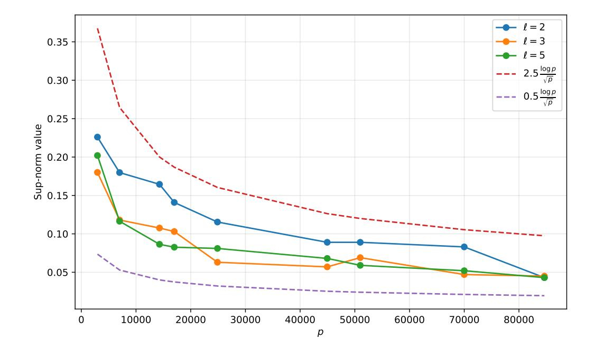
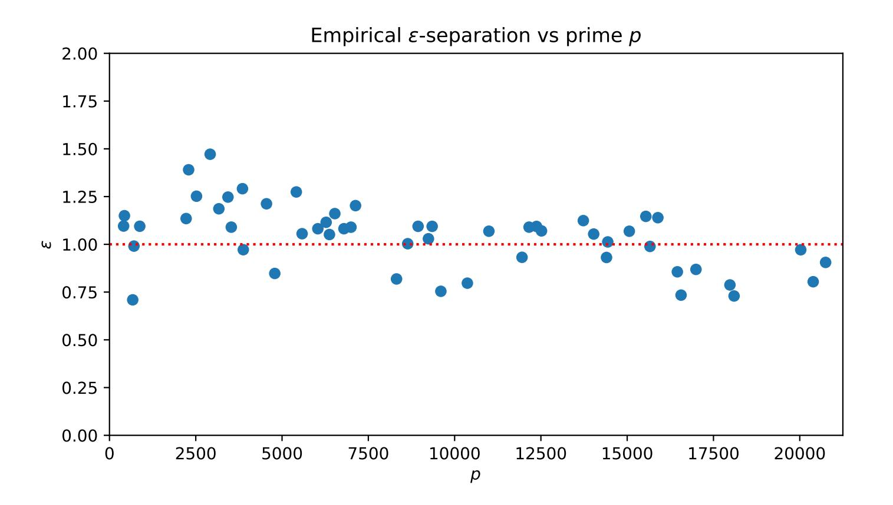

{0}------------------------------------------------

# Spectral Theory of Isogeny Graphs and Quantum Sampling of Secure Supersingular Elliptic Curves

Maher Mamah1, Jake Doliskani2 David Jao1,

1Department of Combinatorics and Optimization, University of Waterloo, Canada 2Department of Computing and Software, McMaster University, Canada {mmamah,djao}@uwaterloo.ca, jake.doliskani@mcmaster.ca

**Abstract.** In this paper, we study the problem of sampling random supersingular elliptic curves with unknown endomorphism rings. This problem has recently gained considerable attention as many isogeny-based cryptographic protocols require such "secure" curves for instantation, while existing methods achieve this only in a trusted-setup setting. We present the first provable quantum polynomial-time algorithms for sampling such curves with high probability, one of which is based on an algorithm of [BBD+24]. One variant runs heuristically in  $\tilde{O}(\log^4 p)$  quantum gate complexity, and in  $\tilde{O}(\log^{13} p)$  under the Generalized Riemann Hypothesis, and outputs a curve that is provably secure assuming average-case hardness of the endomorphism ring problem. Another variant samples uniform  $\mathcal{O}$ -oriented curves with unknown endomorphism rings, for any imaginary quadratic order  $\mathcal{O}$ , with security based on the hardness of Vectorization problem. When accompanied by an interactive quantum computation verification protocol our algorithms provide a secure instantiation of the CGL hash function and related primitives.

Our analysis relies on a new spectral delocalization result for supersingular  $\ell$ -isogeny graphs: we prove the Quantum Unique Ergodicity conjecture and provide numerical evidence for complete eigenvector delocalization. We also prove a stronger  $\varepsilon$ -separation property for eigenvalues of isogeny graphs than that predicted in the quantum money protocol of Kane, Sharif, and Silverberg, thereby removing a key heuristic assumption in their construction.

# 1. Introduction

Isogeny-based cryptography is a promising approach to post-quantum cryptography, aiming to construct cryptographic schemes that remain secure against quantum adversaries while relying only on classical algorithms. Its central hardness assumption is the *isogeny path problem*: given two supersingular elliptic curves E and E', find an isogeny  $\varphi: E \to E'$  connecting them. Despite its relatively recent development, the area has attracted significant cryptanalytic attention.

One of the earliest primitives in this area is the CGL hash function of Charles, Goren, and Lauter [CGL09], defined via random walks on the supersingular  $\ell$ -isogeny graph, which is Ramanujan. Collision resistance reduces to the hardness of the endomorphism ring problem Endring: given a supersingular elliptic curve E, compute its ring of endomorphisms End(E). The reduction proceeds via the intermediate problem OneEnd of computing a nontrivial endomorphism [PW24]. Since the supersingular isogeny path problem is computationally equivalent to Endring [EHL+18, Wes22, Mam24], initializing the hash function from a curve whose endomorphism ring is known renders the scheme insecure: the random walk reveals an explicit path from  $E_0$  to E, which allows one to compute End(E) and hence find collisions.

A key requirement in such constructions is therefore that the starting curve be sampled without revealing information about its endomorphism ring. This observation leads to a fundamental problem in isogeny-based cryptography: how to generate a supersingular elliptic curve whose endomorphism ring is unknown, often called a *secure curve*. This assumption underlies many constructions, including the CGL

{1}------------------------------------------------

hash function [CGL09], commitment schemes [Ste22], isogeny-based VDFs [DFMPS19], oblivious pseudorandom functions [Bas24], verifiable random functions [LP25], identity-based encryption [GS25], and related primitives.

Despite its importance, no efficient classical or quantum algorithm is known to sample guaranteed secure curves. Approaches based on generating supersingular j-invariants require exponential resources [MMP24]. Other classical and quantum proposals [BBD+24, Dol23], building on ideas of [KSS22], remain heuristic and provide no provable security.

Currently, the only method guaranteeing secure curves relies on a trusted setup. Basso et al. [BCC+23] proposed a distributed protocol in which multiple parties jointly generate a curve by sequentially applying isogenies and proving correctness in zero knowledge; the output curve is secure provided at least one participant behaves honestly. However, this approach only produces secure curves over  $\mathbb{F}_{p^2}$ . Many protocols—such as CSIDH-based VDFs [DFMPS19], oblivious transfer [LGDdSG21], and delay encryption [BDF21]—require secure curves over  $\mathbb{F}_p$  equipped with an orientation by a quadratic order  $\mathfrak{O}$ , typically induced by Frobenius. Mokrani and Jao [MJ23] proposed a related protocol for generating such curves over  $\mathbb{F}_p$ , but it likewise relies on a trusted setup.

These limitations suggest that new approaches are required in order to tackle this fundamental open problem in isogeny-based cryptography: how to efficiently sample supersingular elliptic curves whose endomorphism rings are unknown without relying on a trusted setup. Ideally, such a procedure should produce curves whose security follows from well-studied hardness assumptions while also allowing an explicit analysis of the algorithm used to generate them. In this work we develop quantum algorithms that address this problem by exploiting spectral properties of supersingular isogeny graphs and with group actions arising from oriented isogenies.

**This work.** We give two quantum polynomial-time algorithms for sampling *provably secure* supersingular elliptic curves together with an explicit gate-complexity analysis.

- An algorithm based on continuous-time quantum walks and  $\varepsilon$ -separation, which admits both a heuristic variant aimed at efficiency and a rigorous conditional variant with provable guarantees. Assuming the average-case hardness of ENDRING together with a well-established number-theoretic conjecture, the output curve is *provably secure*, i.e. we give a security proof that any quantum polynomial-time adversary has negligible probability in computing the endomorphism ring of the output curve. We note that a sketch of the algorithm is present in [BBD+24], yet here we give full provable guarantees on running time and security.
- An unconditional quantum algorithm for sampling  $\mathfrak{O}$ -oriented supersingular elliptic curves for any imaginary quadratic order  $\mathfrak{O}$ . The security of the output relies on the hardness of the Vectorization problem for the class group action. This problem underlies the security of several group-action-based cryptographic constructions, notably CSIDH [CLM+18] and CSI-FiSh [BKV19]. While Vectorization is believed to be hard for classical algorithms, it admits a subexponential quantum attack via Kuperberg's algorithm [Kup05].

Beyond establishing polynomial-time solvability, a central technical contribution of this work is the replacement of heuristic assumptions appearing in previous proposals with rigorous conditional statements. In particular, not only we were able to prove the  $\varepsilon$ -separation for eigenvalues of isogeny graphs under the generalized Riemann hypothesis (GRH), but also obtain a strictly better bound required for Algorithm 1, thereby removing a key heuristic assumption present in prior works [Kan18, KSS22, BBD+24, Dol23]. Our techniques can also be adapted to sample curves equipped with N-level structure, although we leave the analysis of this extension for future work.

**Threat model.** The threat model plays an important role in this setting. In the cryptographic literature it is common to distinguish between an *honest-but-curious* adversary, who follows the prescribed protocol but attempts to learn additional information from the execution, and an *active* adversary, who may deviate arbitrarily from the protocol.

{2}------------------------------------------------

One might ask why Alice, acting honestly, cannot simply perform a classical random walk in an isogeny graph, output the final curve, and discard the walk. The difficulty is that the walk itself may be observable: an adversary with access to Alice's internal computation (for example via a cloud execution environment) could record the intermediate curves and reconstruct the entire path. Moreover, if Alice is honest-but-curious she may attempt to extract additional information from the computation. By contrast, Algorithm [1](#page-17-0) produces the output curve through Hamiltonian simulation, so that no explicit isogeny walk is generated. This makes the quantum approach more robust against such honest-but-curious leakage or adversarial observation.

In the active setting a generator could attempt to output a maliciously chosen trapdoor curve. One possible mitigation is to combine our algorithms with interactive quantum computation verification protocols [\[FK17,](#page-24-6) [ABOEM17\]](#page-23-4) to verify that the curve is the output of the desired algorithm. There is, however, an important distinction between the authority-free setting and a trusted-setup setting. For instance, a standardization authority such as NIST could publicly generate a supersingular curve E⋆ using Algorithm [1](#page-17-0) or Algorithm [3](#page-21-0) together with such a verification protocol, ensuring that E⋆ arises from an honest execution. Starting from such a publicly trusted base curve, one could bootstrap a family of further candidate hard curves by taking random walks. In that sense, a single publicly trusted hard base curve would already remove much of the practical parameter-generation bottleneck.

Even though one cannot in general certify security from the curve alone, we show that any curve honestly generated by Algorithm [1](#page-17-0) is secure under the average-case hardness of EndRing:

Problem 1 (EndRing). Given a uniformly random supersingular elliptic curve E/Fp2 , compute four endomorphisms that generate End(E).

We note that the worst-case version of EndRing reduces to the average-case version by taking a sufficiently long random isogeny walk from the challenge curve. Furthermore, any oriented curve produced by Theorem [4.5](#page-21-1) is secure assuming average-case hardness of Vectorization:

Problem 2 (Vectorization). Given an O-oriented supersingular elliptic curve (E0, ι0) and a uniformly random oriented curve (E1, ι1) defined over Fp2 , compute an O-ideal a such that

$$(E_1,\iota_1)=\mathfrak{a}*(E_0,\iota_0).$$

# 1.1. Technical overview

Our first algorithm relies on spectral properties of the supersingular ℓ-isogeny graphs G(p, ℓ), where ℓ ̸= p is a small prime. The vertices of G(p, ℓ) correspond to supersingular elliptic curves over Fp2 , and edges correspond to ℓ-isogenies. These graphs are (ℓ + 1)-regular Ramanujan graphs and admit a rich algebraic structure coming from the action of Hecke operators. Let Aℓ denote the adjacency matrix of G(p, ℓ). Since the operators Aℓ commute for different primes ℓ, they admit a simultaneous orthonormal eigenbasis

$$\{\phi_i\}_i \subset \mathbb{C}^{\mathcal{S}_p}.$$

From the perspective of automorphic forms, these eigenvectors correspond to Hecke eigenforms associated with Brandt matrices. A central analytic question concerns the delocalization of these eigenvectors, which measures how evenly the mass of ϕi is distributed over the set of supersingular curves. The quantity governing this behavior is the sup-norm

$$\|\phi_i\|_{\infty} = \max_E |\phi_i(E)|.$$

Delocalization bounds prevent eigenvectors from concentrating on a small set of curves. In this work we prove the estimate

$$\|\phi_i\|_{\infty} \ll p^{-1/4+\varepsilon},$$

in theorem [3.3](#page-10-0) and establish an average form of complete delocalization (Theorem [3.4\)](#page-12-0). These bounds follow from recent sup-norm estimates for quaternionic automorphic forms and play a central role in the security analysis of the sampling algorithm.

{3}------------------------------------------------

Sampling from isogeny graphs. The sampling algorithm exploits the spectral decomposition of the adjacency operators. At a high level, the algorithm prepares a quantum state supported on the vertices of the isogeny graph and applies quantum phase estimation to simultaneously diagonalize a collection of commuting adjacency operators. More concretely, the algorithm proceeds as follows. Starting from a superposition over eigenvectors, we implement Hamiltonian simulation of the operators Aℓ1 , . . . , Aℓk corresponding to several small primes ℓi . Applying quantum phase estimation produces a state of the form

$$\sum_{i} \alpha_{i} |\boldsymbol{\lambda}_{i}\rangle |\phi_{i}\rangle,$$

where |ϕi⟩ is an eigenvector of the adjacency operators and λi denotes the vector of corresponding eigenvalues (the "spectral tag" of the eigenstate).

A key requirement for the success of the algorithm is that distinct eigenvectors produce distinct spectral tags. Prior work treated this separation heuristically. In this paper we prove, under the Generalized Riemann Hypothesis, an even stronger version of ε-separation bound for these eigenvalues than that predicted in [\[Kan18,](#page-25-7) [KSS22,](#page-25-3) [Dol23\]](#page-24-3), which ensures that the phase estimation procedure identifies eigenvectors reliably.

After the phase estimation step we measure the eigenvector register in the curve basis. The probability of observing a particular curve E is determined by the distribution of mass of the eigenvectors on the vertex set. The delocalization bounds above imply that no eigenvector concentrates on a small set of curves. As a consequence, the output distribution of the algorithm is near-uniform over the graph. Using our delocalization results, we show that any curve sampled in this way is secure under the average-case hardness of EndRing.

Sampling oriented supersingular curves. Our second algorithm addresses the setting of O-oriented supersingular elliptic curves. In this case the relevant structure is the regular group action

$$(Cl(\mathfrak{O}), \mathcal{X}, *),$$

where X denotes the set of O-oriented supersingular curves and the class group Cl(O) acts by oriented isogenies. For regular actions, the Hilbert space C X admits a natural Fourier basis consisting of the states

$$|G^{(h)} * x\rangle = \frac{1}{\sqrt{|G|}} \sum_{g \in G} \chi(g, h) |g * x\rangle,$$

where χ ranges over the characters of the class group. These states are simultaneous eigenvectors of the action operators Uk : |y⟩ 7→ |k ∗ y⟩.

The oriented sampling algorithm starts with a superposition of such Fourier states and then computes the index h in superposition using a phase-kickback procedure combined with the quantum Fourier transform over the class group. Measuring the resulting state produces a uniformly random supersingular curve together with its orientation. The security of the resulting curve follows from the hardness of the Vectorization problem for the class group action.

Organization. The paper is organized as follows. Section [2](#page-3-0) reviews supersingular elliptic curves, isogeny graphs, and the Deuring correspondence. Section [3](#page-7-0) develops the analytic ingredients used in the security and distributional analysis, including eigenvector sup-norm bounds, delocalization, and eigenvalue separation under GRH. Section [4](#page-15-0) presents and analyzes the quantum sampling algorithms.

Notation. We write f = O(g) and f ≪ g to mean that there exist constants C > 0 such that |f(n)| ≤ C |g(n)| for all sufficiently large n, in particular f ≪ 1 ⇐⇒ f ≤ c. We also use the analytic number theory notation f ≍ g to mean that there exist constants c, c′ > 0 such that c |g(n)| ≤ |f(n)| ≤ c ′ |g(n)| for all sufficiently large n (equivalently, f ≪ g and g ≪ f). Unless stated otherwise, every theorem and proposition whose statement involves GRH is conditional on the Generalized Riemann Hypothesis.

{4}------------------------------------------------

#### 2. Preliminaries

#### 2.1. Background on Elliptic curves.

We briefly recall the elliptic-curve notions used below; see [Sil09] for background. Let K be a field of characteristic p>3. An elliptic curve over K is given by  $E: y^2=x^3+Ax+B$ , for  $A,B\in K, 4A^3+27B^2\neq 0$ , with K-rational points together with the point at infinity  $\infty$ . An isogeny  $\varphi: E_1\to E_2$  defined over K is a nonconstant morphism that is also a group homomorphism and sends  $\infty_1$  to  $\infty_2$ . Its degree is its degree as a rational map. Every isogeny of composite degree factors into prime-degree isogenies, and if  $\deg(\varphi)=d$ , then there is a unique dual isogeny  $\hat{\varphi}: E_2\to E_1$  such that  $\hat{\varphi}\circ\varphi=[d]$ . Isogenies of degree 1 are isomorphisms. The j-invariant classifies elliptic curves up to  $\overline{\mathbb{F}}_p$ -isomorphism, though over smaller fields several K-isomorphism classes may share the same j-invariant.

Since we require explicit representatives over  $\mathbb{F}_{p^2}$ , we use the following standard parametrization.

**Proposition 2.1.** Let  $p \neq 2, 3$ , set  $K = \mathbb{F}_{p^2}$ , and fix a generator  $\alpha \in K^{\times}$ . Represent K-isomorphism classes of elliptic curves over K by pairs  $(j, b) \in K \times \mathbb{Z}$ , where

$$b \in \{0,1\} \ if \ j \neq 0,1728, \qquad b \in \{0,1,2,3\} \ if \ j = 1728, \qquad b \in \{0,1,2,3,4,5\} \ if \ j = 0.$$

Define

$$if j \neq 0, 1728: \quad E_{j,b}: y^2 = x^3 + \alpha^{2b} \frac{3j}{1728 - j} x + \alpha^{3b} \frac{2j}{1728 - j},$$

$$if j = 1728: \quad E_{1728,b}: y^2 = x^3 + \alpha^b x,$$

$$if j = 0: \quad E_{0,b}: y^2 = x^3 + \alpha^b.$$

Then  $E_{j,b} \cong_K E_{j,b'}$  if and only if  $b \equiv b' \pmod 2$  for  $j \neq 0,1728$ ,  $b \equiv b' \pmod 4$  for j = 1728, and  $b \equiv b' \pmod 6$  for j = 0.

*Proof.* See [Sil09, Corollary 
$$X.5.4.1$$
].

If  $\deg(\varphi)$  is coprime to p, then  $\varphi$  is uniquely determined by its kernel. Given the kernel, Vélu's formulas compute  $\varphi$  in polynomial time in  $\deg(\varphi)$  and  $\log p$  [Vél71]; asymptotically faster methods are also known [BFLS20].

An endomorphism of E is an isogeny from E to itself, and these form the ring  $\operatorname{End}(E)$ . If  $\operatorname{End}(E)$  is an order in an imaginary quadratic field, then E is called *ordinary*; if  $\operatorname{End}(E)$  is a maximal order in the quaternion algebra  $B_{p,\infty}$ , then E is supersingular. Every supersingular elliptic curve in characteristic p is  $\overline{\mathbb{F}}_p$ -isomorphic to one defined over  $\mathbb{F}_{p^2}$ , since its j-invariant lies in  $\mathbb{F}_{p^2}$ . We denote by  $\mathcal{S}_p$  the set of supersingular elliptic curves over  $\mathbb{F}_{p^2}$  up to  $\mathbb{F}_{p^2}$ -isomorphism; it has size about  $\lfloor p/12 \rfloor$ .

For a prime  $\ell \neq p$ , the supersingular  $\ell$ -isogeny graph  $\mathcal{G}(p,\ell)$  has vertex set  $\mathcal{S}_p$ , with one edge for each  $\ell$ -isogeny. Since every curve has exactly  $\ell + 1$  subgroups of order  $\ell$ , the graph is  $(\ell + 1)$ -regular. Moreover, it is Ramanujan, so random walks mix rapidly, and any two vertices are connected by an isogeny of degree  $\ell^m$  with  $m = O(\log p)$  [Koh96].

We also consider supersingular curves with level structure; see [Arp24] for background. Let N be squarefree and coprime to p, and define  $\mathcal{S}_p(N)$  to be the set of equivalence classes of pairs (E,G), where  $E/\mathbb{F}_{p^2}$  is supersingular and  $G \subseteq E[N]$  is cyclic of order N. Two pairs  $(E_1, G_1)$  and  $(E_2, G_2)$  are equivalent if there is an isomorphism  $\iota : E_1 \to E_2$  with  $\iota(G_1) = G_2$ . We write  $\mathcal{G}(p, \ell, N)$  for the corresponding  $\ell$ -isogeny graph with level-N structure.

To such a pair  $(E,G) \in \mathcal{S}_p(N)$ , we associate the order

$$\mathfrak{O}(E,G) = \{ \alpha \in \operatorname{End}(E) : \alpha(G) \subseteq G \},\$$

consisting of endomorphisms preserving the chosen subgroup.

{5}------------------------------------------------

#### 2.2. Quaternion Algebras and the Deuring Correspondence

For a detailed account on the arithmetic of quaternion algebras we refer the reader to [Voi21]. For  $a, b \in \mathbb{Q}^{\times}$ , let B(a, b) denote the quaternion algebra over  $\mathbb{Q}$ , with basis 1, i, j, ij, i.e.

$$B(a,b) = \mathbb{Q} + \mathbb{Q}i + \mathbb{Q}j + \mathbb{Q}ij,$$

such that  $i^2 = a$ ,  $j^2 = b$  and ij = -ji. The quaternion algebra B has a canonical involution that sends  $\alpha = x_1 + x_2i + x_3j + x_4ij$  to  $\bar{\alpha} = x_1 - x_2i - x_3j - x_4ij$ , and we define both the reduced trace and norm of an element  $\alpha$  in B by

$$\operatorname{Trd}(\alpha) = \alpha + \bar{\alpha} = 2x_1, \quad \operatorname{Nrd}(\alpha) = \alpha \bar{\alpha} = x_1^2 - ax_2^2 - bx_3^2 + abx_4^2.$$

We say  $\Lambda$  is a lattice in B if  $\Lambda = \mathbb{Z}x_1 + \mathbb{Z}x_2 + \mathbb{Z}x_3 + \mathbb{Z}x_4$  where the  $x_i$ 's form a basis for the vector space B over  $\mathbb{Q}$ .

If  $I \subset B$  is a lattice, then the reduced norm of I,  $Nrd(I) = gcd(Nrd(\alpha)|\alpha \in \Lambda)$ . We associate to  $\Lambda$  the normalised quadratic map

$$q_{\Lambda}: \Lambda \to \mathbb{Z}, \quad \alpha \mapsto \frac{\operatorname{Nrd}(\alpha)}{\operatorname{Nrd}(\Lambda)}$$

and notice that  $\frac{\operatorname{Nrd}(\alpha)}{\operatorname{Nrd}(\Lambda)} \in \mathbb{Z}$  as  $\operatorname{Nrd}(\Lambda)|\operatorname{Nrd}(\alpha)$ . The quaternion algebra B is an inner product space with respect to the bilinear form

$$\langle x, y \rangle = \frac{1}{2} (\operatorname{Nrd}(x+y) - \operatorname{Nrd}(x) - \operatorname{Nrd}(y)),$$

and the basis  $\{1, i, j, ij\}$  is an orthogonal basis with respect to this inner product.

An order  $\mathcal{O}$  in B is a full rank lattice that is also a subring. It is maximal if it is not contained in any other order. For an lattice  $\Lambda$  we define the *left order* and *right order* of  $\Lambda$  to be

$$\mathcal{O}_L(\Lambda) = \{ \alpha \in B | \ \alpha \Lambda \subseteq \Lambda \}, \quad \mathcal{O}_R(\Lambda) = \{ \alpha \in B | \ \Lambda \alpha \subseteq \Lambda \} \}.$$

If  $\mathcal{O}$  is a maximal order and I is a left  $\mathcal{O}$ -ideal, then  $\mathcal{O}_R(I)$  is also a maximal order. Given two maximal order  $\mathcal{O}$  and  $\mathcal{O}'$ , then there exist a lattice I, called a connecting ideal, such that  $\mathcal{O}_L(I) = \mathcal{O}$  and  $\mathcal{O}_R(I) = \mathcal{O}'$ . Additionally, we say left  $\mathcal{O}$ -ideals I and J are equivalent if there exists an  $\alpha \in B^{\times}$  such that  $I = \alpha J$ . The set of classes of this equivalence relation is called the *left*-ideal class set of  $\mathcal{O}$  and is denoted by  $\mathrm{Cl}(\mathcal{O})$ . The endomorphism rings of supersingular elliptic curves in characteristic p are maximal orders in the unique quaternion algebra  $B_{p,\infty}$  over  $\mathbb{Q}$  ramified exactly at p and  $\infty$ . Equivalently, the localizations  $B_{p,\infty} \otimes_{\mathbb{Q}} \mathbb{Q}_p$  and  $B_{p,\infty} \otimes_{\mathbb{Q}} \mathbb{R}$  are division algebras, while for every prime  $\ell \neq p$  we have a splitting into matrix algebras

$$B_{p,\infty} \otimes_{\mathbb{Q}} \mathbb{Q}_{\ell} \cong M_2(\mathbb{Q}_{\ell}).$$

An Eichler order  $\mathfrak{D}$  is an intersection  $\mathfrak{D} = \mathcal{O}_1 \cap \mathcal{O}_2$  for two (not necessary distinct) maximal orders  $\mathcal{O}_1$  and  $\mathcal{O}_2$ . The level N of an Eichler order is given by its index in one of the maximal orders whose intersection defines the order, i.e.  $N = [\mathcal{O}_1 : \mathfrak{D}] = [\mathcal{O}_2 : \mathfrak{D}]$  (this index will be the same for either order). Trivially, a maximal order is an Eichler order of level N = 1.

The Deuring Correspondence. For a detailed account of on the Deuring correspondence, see chapter 42 of [Voi21]. Let E be a supersingular elliptic curve defined over  $\mathbb{F}_{p^2}$ , Deuring showed that endomorphism rings of supersingular elliptic curves are in bijection with maximal order in  $B_{p,\infty}$  up to conjugation with norms and traces on the endomorphisms side correspond to norms and traces in the quaternion algebra.

Deuring's correspondence establishes that, for a supersingular elliptic curve E defined over  $\mathbb{F}_{p^2}$ , every isogeny  $\varphi: E \to E'$  of degree n can be associated with a left ideal I in  $\operatorname{End}(E)$  whose norm is n. According to Kohel's work [Koh96, Section 5.3], every nonzero left ideal of  $\operatorname{End}(E)$  arises from such an isogeny.

{6}------------------------------------------------

To construct an isogeny from a given left ideal, one considers a nonzero integral left ideal  $I \subset \operatorname{End}(E)$  and defines E[I] as the scheme-theoretic intersection of the kernels of all endomorphisms  $\alpha \in I$ , i.e.

$$E[I] = \bigcap_{\alpha \in I} \ker(\alpha).$$

This subgroup then determines an isogeny  $\varphi_I: E \to E/E[I]$ . We also have for each isogeny  $\varphi: E \to E'$ , the corresponding ideal which is given by  $I_{\varphi} = \operatorname{Hom}(E', E)\varphi$ , and its a left  $\operatorname{End}(E)$ -ideal and a right  $\operatorname{End}(E')$ -ideal. Interestingly,  $I_{\varphi_I} = I$  and  $\varphi_{I_{\varphi}} = \varphi$ . Moreover, if the reduced norm of I is coprime to  $p, \varphi$  is separable, and  $E[I] = \{P \in E(\mathbb{F}_{p^2}): \alpha(P) = 0, \forall \alpha \in I\}$ . We now look more closely at the analogous structure for Eichler Orders. The next result gives a characterization of Eichler orders in terms of supersingular elliptic curves with level-N structure.

**Theorem 2.2.** For every  $(E,G) \in \mathcal{S}_p(N)$ , the order  $\mathcal{O}(E,G)$  is isomorphic to an Eichler order of level N. Conversely, every Eichler order of level N is isomorphic to  $\mathcal{O}(E,G)$  for some  $(E,G) \in \mathcal{S}_p(N)$ .

*Proof.* See Theorem 3.7 and proposition 3.8 of [Arp24].

We also define  $\ell$ -isogeny graphs with level-N structure, which will play an important role in our applications. Let  $(E,G) \in \mathcal{S}_p(N)$  with  $G \subseteq E[N]$  and |G| = N, and let  $\varphi : E \to E'$  be an isogeny of prime degree  $\ell$  with  $\gcd(\ell, pN) = 1$ . Then  $\varphi(G) \subseteq E'[N]$ , so  $\varphi$  induces a morphism in  $\mathcal{S}_p(N)$ ,

$$\varphi: (E,G) \longrightarrow (E',\varphi(G)).$$

Just as isogenies between supersingular curves correspond to connecting ideals between their endomorphism rings, isogenies between curves equipped with level-N structure correspond to connecting ideals between the associated Eichler orders. In particular, an isogeny  $\varphi: (E,G) \to (E',\varphi(G))$  corresponds to an ideal  $I_{\varphi}$  connecting  $\mathcal{O}(E,G)$  and  $\mathcal{O}(E',\varphi(G))$ . For details, see Propositions 3.9 and 3.10 of [Arp24].

**Oriented isogeny group actions.** We briefly recall the notion of oriented supersingular elliptic curves and the associated class group action. Let K be a quadratic number field and  $\mathfrak O$  an order in K. A K-orientation on an supersingular elliptic curve E is an embedding

$$\iota: K \hookrightarrow \operatorname{End}(E) \otimes_{\mathbb{Z}} \mathbb{Q}.$$

An  $\mathfrak{D}$ -orientation is a K-orientation such that  $\iota(\mathfrak{D}) \subseteq \operatorname{End}(E)$ , and it is called *primitive* if

$$\iota(\mathfrak{O}) = \iota(K) \cap \operatorname{End}(E).$$

We write  $(E, \iota)$  for an elliptic curve equipped with such an orientation and assume from now on that all orientations discussed are primitive.

Any isogeny  $\phi: E \to F$  induces an orientation on F. If  $\hat{\phi}: F \to E$  denotes the dual isogeny, then the pushforward orientation is defined by

$$\phi_*(\iota)(\alpha) = (\phi \circ \iota(\alpha) \circ \hat{\phi}) \otimes \frac{1}{\deg \phi}.$$

Hence, for two K-oriented elliptic curves  $(E_1, \iota_1)$  and  $(E_2, \iota_2)$ , an isogeny  $\phi : E_1 \to E_2$  is called K-oriented if  $\phi_*(\iota_1) = \iota_2$ .

Let  $\mathcal{S}_{\mathfrak{D}}(p)$  denote the set of isomorphism classes of supersingular elliptic curves over  $\overline{\mathbb{F}}_p$  equipped with a  $\mathfrak{D}$ -orientation. Under the standard assumptions that p does not divide the conductor of  $\mathfrak{D}$  and does not split in K, this set is nonempty [?]. We define ideal-induced isogenies by the following: for  $(E, \iota) \in \mathcal{S}_{\mathfrak{D}}(p)$  and an ideal  $\mathfrak{a} \subseteq \mathfrak{D}$ , set

$$E[\mathfrak{a}] = \bigcap_{\alpha \in \mathfrak{a}} \ker(\iota(\alpha)).$$

{7}------------------------------------------------

This subgroup determines an isogeny  $\phi_{\mathfrak{a}}: E \to E_{\mathfrak{a}}$ , and thus a new oriented curve

$$\mathfrak{a} * (E, \iota) := (E_{\mathfrak{a}}, (\phi_{\mathfrak{a}})_*(\iota)).$$

In this way one obtains an action

$$Cl(\mathfrak{O}) \times \mathcal{S}_{\mathfrak{O}}(p) \longrightarrow \mathcal{S}_{\mathfrak{O}}(p), \qquad (\mathfrak{a}, (E, \iota)) \longmapsto \mathfrak{a} * (E, \iota).$$

When p does not split in K and does not divide the conductor of  $\mathfrak{O}$ , the class group action of  $\mathrm{Cl}(\mathfrak{O})$  on  $SS_{\mathfrak{O}}(p)$  is free and transitive [?, Theorem 3.4]. Moreover, recent advances show that this action on  $\mathfrak{O}$ -oriented curves can be evaluated efficiently, notably via the CLAPOTIS algorithm [PR23] and PEGASIS [DEF+25].

#### 2.3. Brandt Operators of Isogeny Graphs

For background, see Chapter 41 of [Voi21]. Let  $\mathcal{S}_p(N)$  be the set of supersingular elliptic curves over  $\mathbb{F}_{p^2}$  with level-N structure, and fix a prime  $\ell \neq p$ . The adjacency operator  $A_\ell$  of the supersingular  $\ell$ -isogeny graph  $\mathcal{G}(p,\ell,N)$  acts on  $\mathbb{C}^{\mathcal{S}_p(N)}$ , with basis  $\{\delta_{(E,G)}\}$ , by

$$(A_{\ell}F)(E,G) = \sum_{(E,G)\to(E',G')} F(E',G'),$$

where the sum runs over all  $\ell$ -isogenies  $\phi: E \to E'$  such that  $G' = \phi(G)$ , counted with multiplicity. Since each vertex has  $\ell + 1$  outgoing  $\ell$ -isogenies, the graph is  $(\ell + 1)$ -regular.

Via Deuring's correspondence, this graph admits an algebraic description in terms of Brandt operators. Let  $\mathfrak{O} \subset B_{p,\infty}$  be an Eichler order of level N coprime to p, and let

$$\mathrm{Cl}(\mathfrak{O}) = \{[I_1], \ldots, [I_h]\}$$

be its left ideal class set, in bijection with  $S_p(N)$ . The  $\ell$ -th Brandt matrix  $B_{\ell} = (b_{ij})$  is defined by

$$b_{ij} = \#\{J \subseteq I_j : \operatorname{Nrd}(J) = \ell \operatorname{Nrd}(I_j) \text{ and } [J] = [I_i]\},$$

or equivalently, for  $f: Cl(\mathfrak{O}) \to \mathbb{C}$ ,

$$(B_{\ell}f)([I]) = \sum_{\substack{J \subseteq I \\ \operatorname{Nrd}(J) \equiv \ell \operatorname{Nrd}(I)}} f([J]).$$

Under Deuring's correspondence,  $B_{\ell}$  agrees with the adjacency operator  $A_{\ell}$ .

Because of extra automorphisms at j=0 and  $j=1728,\,A_\ell$  need not be symmetric for the standard inner product. Writing

$$w(E,G) = |\text{Aut}(E,G)/\{\pm 1\}| \in \{1,2,3\}, \qquad D = \text{diag}(w(E,G))_{(E,G)\in\mathcal{S}_p(N)},$$

the conjugated operator

$$A_{\ell}' = D^{1/2} B_{\ell} D^{-1/2} \tag{1}$$

is real symmetric; see [Voi21, §§40.1.9–40.1.10]. Hence  $A'_{\ell}$  and  $B_{\ell}$  are similar and have the same spectrum. Moreover, the operators  $\{A'_{\ell}\}$  commute and therefore admit a common eigenbasis.

In particular, if  $p \equiv 1 \pmod{12}$ , then no supersingular curve has j = 0 or 1728, so w(E, G) = 1 for all (E, G), and thus  $A_{\ell} = B_{\ell}$ . This assumption is often imposed in isogeny-based cryptography to avoid exceptional automorphisms, loops, and multiple edges. See also Appendix A of [PW24] for more on (1).

{8}------------------------------------------------

# 3. Automorphic Forms

In this section, we review several aspects of the theory of automorphic forms. We focus in particular on quaternionic automorphic forms, viewed both as finite-dimensional vector spaces of functions on quaternionic ideal class sets and as functions on 3-spheres. We then recall the classical correspondence between these two perspectives and establish the sup-norm bounds and the ε-separation of Hecke eigenvalues required for our applications. These results will play a fundamental role in our subsequent analysis.

# 3.1. Space of Quaternionic forms

For background, see [\[DV13,](#page-24-8) [Marar\]](#page-25-9). Let B = Bp,∞ be the definite quaternion algebra over Q, let O be an Eichler order of level N coprime to p, and let

$$Cl(\mathcal{O}) = \{[I_1], \ldots, [I_h]\}$$

be the set of invertible left O-ideal classes, where h = |Cl(O)|.

Let Zˆ = Q p Zp, and let Af = Q′ p Qp be the finite adeles of Q. Write

$$\hat{B} = B \otimes_{\mathbb{Q}} \mathcal{A}_f, \qquad \hat{\mathcal{O}} = \mathcal{O} \otimes_{\mathbb{Z}} \hat{\mathbb{Z}},$$

and define

$$H = H(N) := (1 + N\hat{\mathcal{O}}) \cap \hat{\mathcal{O}}^{\times} \subset \hat{B}^{\times}.$$

Then the double coset space

$$B^{\times} \backslash \hat{B}^{\times} / H$$

is finite and naturally identified with Cl(O). Choosing representatives x1, . . . , xh, we identify functions on Cl(O) with functions on Bˆ× that are left B×-invariant and right H-invariant.

The space of automorphic forms of level H is

$$A(\mathcal{O}) := L^2(B^{\times} \backslash \hat{B}^{\times} / H) \cong \{ \varphi : \mathrm{Cl}(\mathcal{O}) \to \mathbb{C} \},$$

a finite-dimensional Hilbert space equipped with the Petersson inner product

$$\langle \varphi, \psi \rangle = \int_{B^{\times} \backslash \hat{B}^{\times} / H} \varphi(x) \overline{\psi(x)} \, d\mu(xH),$$

where µ is a Haar measure on Bˆ×.

Let ℓ be a prime unramified in B, so that Oℓ ≃ M2(Zℓ). Let aℓ ∈ Bˆ× be the adele equal to 1 at all places away from ℓ, and equal to ℓ 0 0 1 at ℓ. If HaℓH = F i xiH, then the Hecke operator Tℓ : A(O) → A(O) is defined by

$$T_{\ell}(\varphi)(x) = \sum_{x_i H \in Ha_{\ell}H/H} \varphi(B^{\times} x x_i H),$$

and its adjoint is

$$T_{\ell}^*(\varphi)(x) = \sum_{x_i H \in Ha_{\ell}^{-1}H/H} \varphi(B^{\times} x x_i H).$$

For ℓ ∤ N, the operators Tℓ form a commuting family of self-adjoint operators with respect to the Petersson inner product.

These Hecke operators are the adelic counterparts of the Brandt operators arising from supersingular isogeny graphs; in fact, as the next proposition shows, the two notions coincide.

Proposition 3.1. The Hecke operator Tℓ defined with respect to the indicator δ-functions is equal to the Brandt matrix Bℓ.

{9}------------------------------------------------

*Proof.* Choose representatives  $x_1, \ldots, x_h \in \hat{B}^{\times}$  for  $B^{\times} \setminus \hat{B}^{\times} / H$ , corresponding to the left  $\mathcal{O}$ -ideal classes  $[I_1], \ldots, [I_h]$ . We identify  $\varphi \in A(\mathcal{O})$  with the column vector  $(\varphi(x_1), \ldots, \varphi(x_h))^t$ , and let  $\delta_{[I_j]}$  be the function supported on  $[I_j]$  (equivalently on the coset  $B^{\times} x_j H$ ).

Write the finite right-coset decomposition  $Ha_{\ell}H = \bigsqcup_{r} y_{r}H$ . Then for any i, j we have

$$(T_{\ell}\delta_{[I_{j}]})(x_{i}) = \sum_{r} \delta_{[I_{j}]}(B^{\times}x_{i}y_{r}H)$$

$$= \#\{r: B^{\times}x_{i}y_{r}H = B^{\times}x_{j}H\}. \tag{*}$$

Hence the (i,j) entry of the matrix of  $T_{\ell}$  in the delta-basis is exactly the cardinality in (\*).

Now use the standard local double-coset computation in  $GL_2(\mathbb{Q}_\ell)$  (elemntary divisor theorem). Since  $H_\ell \simeq GL_2(\mathbb{Z}_\ell)$  and  $a_\ell = diag(\ell, 1)$  at  $\ell$ , one has

$$H_{\ell} \begin{pmatrix} \ell & 0 \\ 0 & 1 \end{pmatrix} H_{\ell} = \left( \bigsqcup_{i \in \mathbb{Z}/\ell\mathbb{Z}} \begin{pmatrix} 1 & i \\ 0 & \ell \end{pmatrix} H_{\ell} \right) \sqcup \begin{pmatrix} \ell & 0 \\ 0 & 1 \end{pmatrix} H_{\ell}. \tag{\dagger}$$

Extending each representative by 1 at all primes  $\neq \ell$  gives a decomposition  $Ha_{\ell}H = \bigsqcup_{r} y_{r}H$  with  $\ell + 1$  cosets.

Under the standard bijection  $B^{\times}\backslash \hat{B}^{\times}/H \cong \operatorname{Cl}(\mathcal{O})$ , right-multiplication by such a  $y_r$  changes the local lattice only at  $\ell$  in a way that corresponds to passing from a left ideal  $I_i$  to an  $\ell$ -neighbor left ideal  $J \subset I_i$  of (relative) reduced norm  $\ell$ . Since  $(y_r)_q = 1$  for  $q \neq \ell$ , the ideal attached to  $x_i y_r$  agrees with  $I_i$  away from  $\ell$ , and because  $(y_r)_{\ell} \in \mathcal{O}_{\ell}^{\times}({\ell \choose 0})\mathcal{O}_{\ell}^{\times}$  it yields precisely an  $\ell$ -neighbor  $J \subset I_i$  with  $\operatorname{Nrd}(I_i^{-1}J) = \ell$ .

Consequently, for fixed i, the multiset of classes represented by  $B^{\times}x_iy_rH$  as r varies is exactly the multiset of ideal classes [J] with  $J \subset I_i$  and  $\operatorname{Nrd}(I_i^{-1}J) = \ell$ .

Therefore the count in (\*) equals

$$\#\{J \subset I_i : \operatorname{Nrd}(I_i^{-1}J) = \ell, [J] = [I_j]\},\$$

which is precisely the defining (i, j)-entry of the Brandt matrix  $B_{\ell}$ . Thus the matrix of  $T_{\ell}$  in the delta-basis is  $B_{\ell}$ .

#### 3.2. The sup-norm problem of Hecke eigenforms

Here we study the so-called sup-norm problem. Let  $T_{\ell}$  be a Hecke operator on

$$A(\mathcal{O}) = L^2 \Big( B^{\times} \backslash \hat{B}^{\times} / H \Big) .$$

Since  $T_{\ell}$  is self-adjoint with respect to the Petersson inner product, it admits an orthonormal eigenbasis (of eigenforms) consisting of functions  $\varphi : Cl(\mathcal{O}) \to \mathbb{C}$ . A classical question in analytic number theory concerns the sup-norm of such forms. Simply put, for a normalized Hecke eigenform

$$\varphi: \mathrm{Cl}(\mathcal{O}) \to \mathbb{C}, \qquad [I_i] \longmapsto \varphi([I_i]),$$

or equivalently a function on  $B^{\times}\backslash \hat{B}^{\times}/H$ , the sup-norm problem is to obtain an upper bound for

$$\|\varphi\|_{\infty} = \max_{1 \le i \le h} |\varphi([I_i])|.$$

The sup-norm problem fits into the broader circle of ideas known as arithmetic quantum chaos: one expects high-energy Hecke eigenfunctions to behave "randomly" and, in particular, to avoid strong concentration. Quantitatively, this is reflected both in bounds for the  $L^{\infty}$ -norm and in statements about the distribution of the  $L^2$ -mass ("energy") of eigenfunctions [Sar93, IS95]. In this direction, Rudnick and Sarnak initiated a systematic study of quantum limits for arithmetic eigenstates and formulated the quantum unique ergodicity

{10}------------------------------------------------

(QUE) philosophy in the arithmetic setting [\[RS94\]](#page-26-9).

On arithmetic surfaces, Lindenstrauss proved arithmetic QUE for compact congruence surfaces (via measure classification) [\[Lin06\]](#page-25-11), and Soundararajan ruled out "escape of mass" for the modular surface; together these establish the Rudnick–Sarnak QUE conjecture in that case [\[Sou10\]](#page-26-10). In the holomorphic setting, Holowinsky and Soundararajan proved the Rudnick–Sarnak mass equidistribution conjecture for Hecke eigenforms [\[HS10\]](#page-25-12).

In the definite quaternionic setting, the operators Tℓ are realized by Brandt operators on the finite set Cl(O), so an eigenform φ : Cl(O) → C may be viewed as an eigenvector of a regular "Brandt graph." From this perspective, bounding ∥φ∥∞ is a quantitative delocalization statement: it prevents the eigenvector from concentrating on a small subset of vertices. This viewpoint parallels the delocalization and quantum ergodicity theory for eigenvectors on large regular graphs [\[ALM15\]](#page-23-7).

Some of the first sup-norm bounds in our setting of automorphic forms on

$$X = B^{\times} \backslash \hat{B}^{\times} / H,$$

are due to Blomer and Michel [\[BM11,](#page-24-9) Theorem 1]. Specifically, for an L 2 -normalized Hecke eigenform φ they prove that there exists δ < 1/60 such that

$$\|\varphi\|_{\infty} \ll \operatorname{Vol}(X)^{-\delta} = |\operatorname{disc}(\mathcal{O})|^{-\delta/2} \asymp (pN)^{-\delta},$$

using that Vol(X) = disc1/2 (O) = pN where O ⊂ Bp,∞ again is an Eichler order of level N. This was subsequently strengthened in [\[BM13,](#page-24-10) Theorem 1], where they refined the exponent and obtained, for any ε > 0,

$$\|\varphi\|_{\infty} \ll_{\varepsilon} \operatorname{Vol}(X)^{-1/6+\varepsilon} = (pN)^{-1/6+\varepsilon}.$$

The sharpest sup-norm bound currently known in this setting is due to Khayutin–Nelson–Steiner [\[KNS24\]](#page-25-13), which we record for later use.

Theorem 3.2. [\[KNS24,](#page-25-13) Corollary 2.3] Let φ ∈ A(O) be an L 2 -normalized Hecke eigenform. Then for any ε > 0,

$$\|\varphi\|_{\infty} \ll_{\varepsilon} \operatorname{Vol}(X)^{-1/4+\varepsilon}.$$

Remark. Norms in [\[KNS24\]](#page-25-13) are taken with respect to a probability measure (i.e. total mass 1). In our setting X = B×\Bˆ×/H is finite, and the Haar-induced measure µ satisfies

$$Vol(X) = \int_X 1 \, d\mu.$$

We set the probability measure dµprob := Vol(X) −1dµ, so that R X 1 dµprob = 1. Consequently,

$$\|\varphi\|_{2,\text{prob}}^2 = \int_X |\varphi|^2 d\mu_{\text{prob}} = \frac{1}{\text{Vol}(X)} \int_X |\varphi|^2 d\mu = \frac{1}{\text{Vol}(X)} \|\varphi\|_2^2,$$

and switching between these normalizations rescales φ (hence ∥φ∥∞) by a factor Vol(X) 1/2 .

We now prove our main delocalization theorem of eigenvectors of supersingular ℓ-isogeny graph. For the sake of emphasizing the characteristic p we are working over and the structure of the quaternion algebra, we will denote by G(p, ℓ, N) the supersingular ℓ-isogeny graph with N-level structure where again (N, p) = 1.

Theorem 3.3. Let Aℓ be the weighted adjacency matrix of the supersingular ℓ-isogeny graphs with level structure G(p, ℓ, N) given by [1.](#page-7-1) If v is a normalized eigenvector of {Aℓ}ℓ, then

$$||v||_{\infty} = \max_{E \in \mathcal{G}(p,\ell)} |v(E)| \ll_{\varepsilon} (pN)^{-1/4+\varepsilon},$$

where v(E) denotes the (E, G) th entry of v. 

{11}------------------------------------------------

Proof. Write v in the δ-indicator basis indexed by the vertices of  $\mathcal{G}(p,\ell,N)$ . By the identity (1), the vector  $w := D^{-1}v$  is an eigenvector of the Brandt matrix  $B_{\ell}$  in the indicator basis of  $Cl(\mathcal{O})$ , where D is the weighted diagonal matrix. By Proposition 3.1, w corresponds to a Hecke eigenform  $\varphi \in A(\mathcal{O})$  satisfying  $\varphi([I_i]) = w([I_i])$  for all i. Hence, by Theorem 3.2,

$$||w||_{\infty} = ||\varphi||_{\infty} = \max_{[I_i] \in Cl(\mathcal{O})} |\varphi([I_i])| \ll_{\varepsilon} (pN)^{-1/4+\varepsilon}.$$

Finally, since v = Dw and  $||D||_{\infty} = 3$ , we obtain

$$||v||_{\infty} \le ||D||_{\infty} ||w||_{\infty} \ll_{\varepsilon} (pN)^{-1/4+\varepsilon},$$

as claimed.  $\Box$ 

This theorem establish a strong delocalization property of the isogeny graphs: an  $L^2$ -normalized eigenvector of the adjacency operator cannot concentrate a large proportion of its mass on a small set of vertices. Equivalently, the eigenmodes of the random walk on  $\mathcal{G}(p,\ell)$  are forced to be spread across many vertices rather than exhibiting sharp spikes.

However, we expect more from these isogeny graphs. As pointed out in [BM13, p. 4], the strongest conceivable upper bound for the sup-norm is

$$\|\varphi\|_{\infty} \ll_{\varepsilon} \operatorname{Vol}(X)^{-1/2+\varepsilon} = (pN)^{-1/2+\varepsilon}.$$

From a graph-theoretic perspective, such a bound would imply not merely strong delocalization, but complete delocalization of eigenvectors. This so-called sup-norm bound, first highlighted in [BM13] and subsequently echoed in [KNS24], remains a long-standing and widely believed open problem in analytic number theory. While no proof is currently known, we provide further supporting evidence for the sup-norm conjecture in the case of the regular  $\ell$ -isogeny graph, that is when N=1, which is the case of interest.

Conjecture 1 (Sup-norm bound). Let  $A_{\ell}$  denote the weighted adjacency matrix of the supersingular  $\ell$ -\nisogeny graph  $\mathcal{G}(p,\ell)$  for all  $\ell \neq p$ . Then any  $L^2$ -normalized simultaneous eigenvector v of  $A_{\ell}$  satisfies

$$||v||_{\infty} \ll \frac{\log p}{\sqrt{p}}.$$

In Figure 1, we computed the sup-norm of each simultaneous orthonormal eigenvector of  $A_{\ell}$  for  $\ell=2,3,5$ , then took the maximum over all of them and plotted the results. The matrices were computed using Sage's built-in functions BrandtModule( $p,\ell$ ) and hecke\_matrix, and subsequently analyzed in MATLAB for improved stability and efficiency. As shown, the computations indicate that the sup-norm satisfies the conjecture, with implicit constants ranging roughly between 0.5 and 2.5.

Figure 1: Sup-norm values versus  $\frac{\log p}{\sqrt{p}}$  for  $\ell = 2, 3, 5$ .

{12}------------------------------------------------

We now record the following useful theorem, which asserts that eigenvectors of the weighted adjacency matrices  $A_{\ell}$  are completely delocalized, on average. For a vector v, we write v(x) for its x-th coordinate.

**Theorem 3.4** (Fourth Moment bound). Let  $A_{\ell}$  denote the weighted adjacency matrices of the graph  $\mathcal{G}(p,\ell,N)$ , and let n be the number of vertices. For any two vertices  $x,y\in\mathcal{G}(p,\ell,N)$ , we have

$$\sum_{i=1}^{n} (v_i(x)^2 - v_i(y)^2)^2 \ll_{\varepsilon} (pN)^{-1+\varepsilon},$$

where  $\{v_i\}_{i=1}^n$  is a simultaneous orthonormal basis of eigenvectors of  $\{A_\ell\}$ .

*Proof.* This follows directly from Theorem 2.1 of [KNS24], since the weighted adjacency matrices  $A_{\ell}$  satisfy the same hypotheses in the elliptic curve setting. The proof proceeds exactly as in Theorem 3.3.

#### 3.3. $\varepsilon$ -Separation of Hecke Eigenvalues

Fix a prime p and let  $A_{\ell_1}, \ldots, A_{\ell_r}$  be the weighted adjacency matrices of the supersingular  $\ell_i$ -isogeny graphs over  $\mathbb{F}_{p^2}$  as in (1). These matrices are real and symmetric. For each prime  $\ell$ , define

$$U_{\ell} := e^{iA_{\ell}/\sqrt{\ell}}.$$

Let  $v_k, v_j$  be simultaneous normalized eigenvectors of all  $A_{\ell_i}$  (and hence of all  $U_{\ell_i}$ ). For each eigenvector  $v_j$ , define the eigenvalue vector

$$\lambda_j := (\lambda_{1,j}, \ldots, \lambda_{r,j}),$$

where  $\lambda_{i,j}$  is the eigenvalue of  $A_{\ell_i}$  corresponding to  $v_i$ .

**Definition 3.5.** The operators  $\{A_{\ell}\}$  are  $\varepsilon$ -separated if for any two distinct simultaneous eigenvectors  $v_k, v_j$ ,

$$\|\boldsymbol{\lambda}_k - \boldsymbol{\lambda}_i\|_2 \geq \varepsilon.$$

Our goal is to obtain explicit lower bounds on  $\|\boldsymbol{\lambda}_k - \boldsymbol{\lambda}_j\|_2$  (see Theorem 3.6 and Proposition 3.7). The operators  $U_\ell$  are introduced for applications: since  $A_\ell$  is symmetric,  $U_\ell$  is unitary and can be implemented as a quantum gate.

By the Jacquet–Langlands correspondence, the Brandt operators on the supersingular module coincide with the Hecke operators  $T_{\ell}$  acting on  $S_2(\Gamma_0(p))$  with the Petersson inner product. Thus the eigenvectors of  $\{A_{\ell}\}$  correspond to normalized weight-2 Hecke eigenforms  $f_j \in S_2(\Gamma_0(p))$ , with

$$A_{\ell}f_j = a_{\ell}(f_j)f_j, \qquad U_{\ell}f_j = e^{ia_{\ell}(f_j)/\sqrt{\ell}}f_j.$$

We associate to  $f_j$  the Hecke tag vector

$$\mathbf{t}_j := (\lambda_{\ell_1}(f_j), \dots, \lambda_{\ell_r}(f_j)), \qquad \lambda_{\ell}(f) := \frac{a_{\ell}(f)}{\sqrt{\ell}} \in [-2, 2],$$

where the bound follows from Deligne's theorem [Del80, Piz98]

The eigenvalue separation problem asks for r and  $\varepsilon > 0$  such that

$$f_j \neq f_k \Rightarrow \|\mathbf{t}_j - \mathbf{t}_k\|_2 \geq \varepsilon.$$

This enables identification of one-dimensional eigenspaces from approximate measurements, a requirement in many schemes (see e.g. [Kan18, KSS22, BBD+24, Dol23]), which currently rely on heuristic separation assumptions.

{13}------------------------------------------------

At the level of uniqueness, analytic multiplicity-one results show that if f ̸= g are Hecke eigenforms then an(f) ̸= an(g) for some n ≪ p log p, and under GRH one may take

$$r = O((\log p)^2 (\log \log p)^4)$$

[\[GH93,](#page-25-14) Thms. 2–3]. However, these results give only non-equality and do not yield a quantitative lower bound on ∥tf − tg∥2. Our main result provides such a quantitative eigenvalue separation.

Theorem 3.6 (GRH). Let p be a prime, and let fk and fj be two distinct normalized and simultaneous cuspidal Hecke eigenforms in S2(Γ0(p)). Assume the Generalized Riemann Hypothesis for the relevant Rankin–Selberg L-functions. If Y and X satisfy X ≫ Y ≫ (log p) 4 , and ℓ1, · · · , ℓr are the primes in the interval [Y, X], then

$$\|\mathbf{t}_k - \mathbf{t}_j\|_2 \ge 1.$$

In order to prove Theorem [3.6,](#page-13-0) we introduce several tools from analytic number theory. We refer the reader to sections 1.6 and 1.8 of [\[Bum09\]](#page-24-12). We note that the following discussion can also be examined from a representation-theoretic perspective. We Let fk and fj be normalized cuspidal Hecke eigenforms of weight 2 and level p (with trivial nebentypus).

The Rankin–Selberg L-function L(s, fk×fj ) is the degree 4 L-function whose Euler product (for ℜ(s) > 1) is given by

$$L(s, f_k \times \overline{f_j}) = \prod_{\ell} \prod_{i,j=1}^{2} \left(1 - \alpha_{\ell,i}(f_k) \overline{\alpha_{\ell,j}(f_j)} \ell^{-s}\right)^{-1},$$

where {αℓ,1(fk), αℓ,2(fk)} and {αℓ,1(fj ), αℓ,2(fj )} are the Satake parameters at ℓ ∤ p (so αℓ,1(fk)+αℓ,2(fk) = λℓ(fk) and αℓ,1(fk)αℓ,2(fk) = 1, and similarly for fj ). Equivalently, the logarithmic derivative of L(s, fk×fj ) encodes the correlations λℓ(fk)λℓ(fj ):

$$-\frac{L'}{L}(s, f_k \times \overline{f_j}) = \sum_{n \ge 1} \frac{\Lambda(n) \, b_{k,j}(n)}{n^s}, \qquad b_{k,j}(\ell) = \lambda_{\ell}(f_k) \lambda_{\ell}(f_j) \quad (\ell \nmid p), \tag{2}$$

where Λ is the von Mangoldt function.

Analytically, L(s, fk × fj ) admits analytic continuation and a functional equation [\[IK04,](#page-25-15) chapter 5]. Moreover, if fk ̸= fj then L(s, fk × fj ) is entire, whereas

$$L(s, f_k \times \overline{f_k}) = \zeta(s) L(s, \text{sym}^2 f_k)$$

has a simple pole at s = 1, and similarly for fj . These facts imply a sharp distinction between diagonal and off-diagonal prime sums: the diagonal terms have a main term of size X, while the off-diagonal correlation has no main term. We are now ready to prove theorem [3.6.](#page-13-0)

Proof. Fix parameters 1 ≤ Y < X and define the interval second moment

$$S(Y,X) := \sum_{Y < \ell \le X} (\lambda_{\ell}(f_k) - \lambda_{\ell}(f_j))^2 \log \ell.$$

Expanding gives

$$S(Y,X) = \sum_{Y < \ell \le X} \lambda_{\ell}(f_k)^2 \log \ell + \sum_{Y < \ell \le X} \lambda_{\ell}(f_j)^2 \log \ell - 2 \sum_{Y < \ell \le X} \lambda_{\ell}(f_k) \lambda_{\ell}(f_j) \log \ell.$$

Under the Generalized Riemann Hypothesis for the relevant Rankin–Selberg L-functions, the corresponding prime number theorem is proved in full generality in [\[IK04,](#page-25-15) Theorem 5.15] ( see also [\[Qu07\]](#page-26-12)). A similar unconditional version is obtained in [\[LWY05\]](#page-25-16). By the discussion above, this implies that (for i ∈ {j, k})

$$\sum_{\ell \le T} \lambda_{\ell}(f_i)^2 \log \ell = T + O(T^{1/2} \log^2(QT)), \qquad \sum_{\ell \le T} \lambda_{\ell}(f_k) \lambda_{\ell}(f_j) \log \ell = O(T^{1/2} \log^2(QT)),$$

{14}------------------------------------------------

where Q is the analytic conductor (here Q ≍ p 2 ). Subtracting the estimates at T = X and T = Y yields

$$\sum_{Y < \ell \le X} \lambda_{\ell}(f_i)^2 \log \ell = (X - Y) + O(X^{1/2} \log^2(QX) + Y^{1/2} \log^2(QY)),$$

and similarly

$$\sum_{Y < \ell \le X} \lambda_{\ell}(f_k) \lambda_{\ell}(f_j) \log \ell = O(X^{1/2} \log^2(QX) + Y^{1/2} \log^2(QY)).$$

Consequently,

$$S(Y,X) = 2(X - Y) + O(X^{1/2}\log^2(QX)).$$

In particular, if X ≫ Y ≫ (log p) 4 , then the main term dominates and we may ensure

$$S(Y,X) \ge c(X-Y)$$

with c > 1 by taking the implicit constants sufficiently large. √

On the other hand, if |λℓ(fk) − λℓ(fj )| < c0 < c for all primes Y < ℓ ≤ X, where c0 is picked such that

$$S(Y,X) < c_0^2 \sum_{Y < \ell \le X} \log \ell < c(X - Y),$$

we get a contradiction. In other words, if the individual point-wise distance of eigenvalues is less than a constant, then the average needs be also smaller. Hence there exists a prime ℓ ∈ (Y, X] with ℓ ∤ p such that

$$|\lambda_{\ell}(f_k) - \lambda_{\ell}(f_j)| \ge 1.$$

Since the tag set {ℓ1, . . . , ℓr} contains all primes in (Y, X], then this implies ∥tk − tj∥2 ≥ 1.

Since our applications concern the unitary operators {Uℓ}ℓ, we will also need the following proposition. Unlike the previously proposed separation guarantees in [\[KSS22\]](#page-25-3), which are heuristic, our result is not only rigorous under GRH but yields a strictly stronger bound.

Proposition 3.7 (GRH). Fix a prime p, and let ℓ1, · · · , ℓr be the primes ∈ [Y, X] with X ≍ Y ≍ log4 p and ℓi ∤ p. Then the unitary operators {Uℓi } are ε-separated with ε ≫ 1.

Proof. Assuming the content of the proposition, the proof of theorem [3.6](#page-13-0) shows that there exists a prime ℓ ∗ ∈ [Y, X] such that

$$|\lambda_{\ell^*}(f_j) - \lambda_{\ell^*}(f_k)| \ge 1 \quad \Rightarrow \quad |a_{\ell^*}(f_j) - a_{\ell^*}(f_k)| \ge \sqrt{\ell^*} \gg \log^2 p.$$

But the aℓ(fi) ′ s coincide with the eigenvalues λℓ,i of the corresponding eigenvector vi under Aℓ. Hence, for any simultaneous eigenvectors vj and vk of the {Aℓ}, we obtain

$$||\boldsymbol{\lambda}_j - \boldsymbol{\lambda}_k||_2 \gg \log^2 p,$$

i.e. {Aℓi } are (log2 p)-separated. Proposition 6.15 of [\[KSS22\]](#page-25-3) states that if {Aℓ} are ε-separated then the {Uℓ} are ε ′ -separated for ε ′ = ε/√ max ℓ. Our theorem then follows.

Remark 1. Using the publicly available [GitHub implementation](https://github.com/ssharif/QuantumMoneyCode) of Sharif , we computed the vectors of eigenvalues λi = (λi,ℓ1 , . . . , λi,ℓr ) associated with the operators Uℓi , where the primes satisfy log p < ℓi < 4 log p. Figure [2](#page-15-1) displays the minimum Euclidean distance ∥λi − λj∥2 over all i ̸= j.

The empirical results deserve a brief discussion. In [\[KSS22\]](#page-25-3), the authors computed the ε-separation for primes p up to approximately 20,000, at all primes ℓi < log p. They conjectured that the resulting ε value should be on the order of (4 log p) −1 . By contrast, Proposition [3.7](#page-14-0) predicts a separation, on average, bounded below by a positive constant, uniformly in p . This prediction is fully consistent with our computations, as Figure [2](#page-15-1) shows that the observed values cluster around ε = 1. We suspect that the interval [2, log p] considered in [\[KSS22\]](#page-25-3) was too narrow to capture the constant gap. In contrast, enlarging the range of primes to log p < ℓi < 4 log p allows this behavior to be clearly observed. In particular, our results suggest that ε = 0.25 is a reasonable lower bound for the separation.

{15}------------------------------------------------

Remark 2. We note a minor gap in the heuristic argument of [Dol23, Lemma 5.2]. Under the heuristic independence assumption on the tag vectors  $\mathbf{t}_i$ , the estimate there bounds the pairwise collision probability  $\Pr[\|\mathbf{t}_i - \mathbf{t}_j\| \leq \varepsilon]$  for any fixed pair (i, j). However, in their setting one needs a global (worst-case) guarantee that no collision occurs among any pair, i.e., a bound on  $\Pr[\exists i \neq j : \|\mathbf{t}_i - \mathbf{t}_j\| \leq \varepsilon]$ . Applying the union bound yields  $\Pr[\exists i \neq j : \|\mathbf{t}_i - \mathbf{t}_j\| \leq \varepsilon] \leq \sum_{1 \leq i < j \leq N} \Pr[\|\mathbf{t}_i - \mathbf{t}_j\| \leq \varepsilon]$ , which introduces an additional  $\binom{N}{2}$  factor and therefore changes the quantitative bound stated in [Dol23, Lemma 5.2].

Figure 2:  $\varepsilon$ -separation for  $\log p < \ell_i < 4 \log p$  at different primes p

#### 4. Quantum Sampling of Secure Curves

In this section, we present the main application of our theory: generating a random supersingular elliptic curve with unknown endomorphism ring. The main results are Theorems 4.2 and 4.4 for sampling from the full graph and 4.5 for oriented curves.

We briefly recall the quantum notions needed below; see [KLM07, Ch. 3–7].

**Qubits and measurement.** A qubit is a unit vector  $|x\rangle = \alpha |0\rangle + \beta |1\rangle \in \mathbb{C}^2$  with  $|\alpha|^2 + |\beta|^2 = 1$ . An *n*-qubit register is a state

$$|x\rangle = \sum_{i=0}^{2^n - 1} \alpha_i |i\rangle \in (\mathbb{C}^2)^{\otimes n}, \qquad \sum_i |\alpha_i|^2 = 1,$$

where  $\{|0\rangle, \dots, |2^n - 1\rangle\}$  is the computational basis. Measuring  $|x\rangle$  in this basis results in the outcome i with probability  $|\alpha_i|^2$ .

**Quantum algorithms.** A quantum algorithm is a sequence of unitary operations. An oracle  $O: X \to Y$  is implemented reversibly by

$$U_O: |x\rangle|y\rangle \mapsto |x\rangle|y \oplus O(x)\rangle.$$

**Quantum Phase Estimation.** Given a unitary U and an eigenstate  $|\psi\rangle$  with  $U|\psi\rangle = e^{2\pi i\lambda}|\psi\rangle$ , for  $\lambda \in [0,1)$ , Quantum Phase Estimation (QPE) outputs an m-bit estimate  $\tilde{\lambda}$  of  $\lambda$  with high probability, using controlled powers of U and an inverse quantum Fourier transform. For a state  $|\psi\rangle$ , we write  $\mathrm{QPE}_U^{(\varepsilon)}(|\psi\rangle)$  for the resulting entangled state after applying QPE to  $U|\psi\rangle$  at precision  $\varepsilon$ .

{16}------------------------------------------------

#### 4.1. Sampling from the Full Isogeny graph

Throughout, we restrict to supersingular elliptic curves without level structure, although the same ideas extend naturally. As noted above, our algorithm outputs a provably secure curve without generating an explicit isogeny path, in the sense that any QPT adversary has only negligible advantage in computing its endomorphism ring. Moreover, using interactive protocols to verify the quantum computations, e.g. [FK17, ABOEM17], one can verify if a curve is generated by an honest execution of the algorithm and thus the curve is verifiably correct and secure.

In what follows, our quantum states live in the Hilbert space  $\mathbb{C}^K$ , where K is the number of elliptic curves over  $\mathbb{F}_{p^2}$  (including ordinary curves). Let  $V_m$  denote the subspace spanned by supersingular curves over  $\mathbb{F}_{p^2}$ . Using Proposition 2.1, we index the computational basis by pairs (j,b), where  $j \in \mathbb{F}_{p^2}$  is the j-invariant and b denotes the twisting data, giving the basis  $\{|(j,b)\rangle\}$ .

It was noted to us that Montgomery and Sharif [MS25] previously used such a parametrization for curves over  $\mathbb{F}_p$ ; here we adapt it to  $\mathbb{F}_{p^2}$ . Alternatively, one could encode curves by Weierstrass coefficients (a, b), but this would require roughly twice as many qubits.

We now outline the sampling algorithm. Let  $|E_0\rangle$  be an initial vertex state corresponding to a supersingular curve in  $V_n$ , which can be efficiently prepared using [Brö09]. For a prime  $\ell$ , let  $A_\ell$  denote the weighted symmetric adjacency matrix of the supersingular  $\ell$ -isogeny graph as in (1), and define

$$H_\ell := \frac{A_\ell}{\sqrt{\ell}}.$$

The normalization ensures that  $H_{\ell}$  has bounded spectrum, so that the unitary  $e^{itH_{\ell}}$  can be efficiently implemented.

The matrices  $\{A_\ell\}$  admit a common orthonormal eigenbasis  $\{|\phi_i\rangle\}_{i=1}^n$ , and consequently the unitaries  $\{e^{itH_\ell}\}$  share this eigenbasis. Expanding the initial state, we write

$$|E_0\rangle = \sum_{i=1}^n \alpha_i |\phi_i\rangle, \qquad \alpha_i := \langle \phi_i | E_0\rangle.$$

Thus, the algorithm can be viewed as progressively learning spectral information about the unknown component  $|\phi_i\rangle$  present in  $|E_0\rangle$ .

We first apply Quantum Phase Estimation (QPE) with respect to  $e^{iH_{\ell_1}}$ , obtaining

$$|\varphi\rangle = \sum_{i=1}^{n} \alpha_i |\tilde{\lambda}_{1,i}\rangle |\phi_i\rangle,$$

where  $\tilde{\lambda}_{1,i}$  is an approximation of the eigenvalue  $\lambda_{1,i}$  of  $H_{\ell_1}$ . Measuring the eigenvalue register yields an outcome  $\tilde{\lambda}_1$  and projects the state onto the subspace spanned by eigenvectors whose eigenvalues are consistent with  $\tilde{\lambda}_1$ , resulting in a post-measurement state  $|\psi_1\rangle$ .

We then iterate this procedure: applying QPE with respect to  $e^{iH_{\ell_k}}$  to  $|\psi_{k-1}\rangle$  and measuring the eigenvalue register produces an approximation  $\tilde{\lambda}_k$  and further refines the state to  $|\psi_k\rangle$ . At each step, the measurement restricts the support of the state to eigenvectors consistent with the observed eigenvalue, so the state becomes supported on a progressively smaller subset of the common eigenbasis.

By Proposition 3.7 (or its heuristic form in Remark 1), after sufficiently many iterations the tuple  $(\tilde{\lambda}_1, \ldots, \tilde{\lambda}_r)$  uniquely identifies an eigenvector. Intuitively, the sequence of measurements acts as a sequence of spectral filters that isolate a single eigenstate. At this stage, the state is approximately supported on a single eigenstate  $|\phi\rangle$ . Finally, measuring the vertex register in the basis  $\{|(j,b)\rangle\}$  yields a curve  $E \in \mathcal{G}(p,\ell)$  with probability  $|\langle E|\phi\rangle|^2$ .

{17}------------------------------------------------

#### **Algorithm 1** QUANTUMSAMPLING(p; X, Y)

**Input:** An odd prime p, an initial curve  $E_0 \in \mathcal{S}$ , and parameters  $1 \le X \le Y$ .

**Output:** A supersingular elliptic curve E encoded by (j,b).

- 1: Let  $\{\ell_1, \ldots, \ell_r\}$  be the primes in [X, Y] (in any fixed order)
- 2: Initialize  $|\psi_0\rangle \leftarrow |E_0\rangle$
- 3:  $c \leftarrow \max(0.25, c_0)$ , where  $c_0$  is the  $\varepsilon$ -separation constant from Proposition 3.7
- 4: **for** k = 1 **to** r **do**
- Set  $H_k \leftarrow A_{\ell_k}/\sqrt{\ell_k}$ 5:
- 6:
- $|\varphi_k\rangle \leftarrow \mathrm{QPE}_{e^{iH_k}}^{(c/2\sqrt{r})}(|\psi_{k-1}\rangle)$   $|\psi_k\rangle \leftarrow \mathrm{post\text{-}measurement}$  state after measuring the eigenvalue register of  $|\varphi_k\rangle$ 7:
- 8: end for
- 9: Measure the final state  $|\psi_r\rangle$  in the basis  $\{|(j,b)\rangle\}$  to obtain E
- 10: return E

The remainder of the section analyzes (i) the gate complexity of QUANTUMSAMPLING, in particular the number of controlled- $e^{iH_k}$  calls required for the desired precision, and (ii) the distribution and security of the output curve.

**Proposition 4.1.** Given primes p and  $\ell \nmid p$ , the gate complexity to execute one call to Quantum Phase estimation QPE  $_{e^{iH}}^{\varepsilon}$  with failure probability  $\eta$ , where  $H = A_{\ell}/\sqrt{\ell}$ , is

$$\tilde{O}\left(\log\left(\frac{1}{\eta}\right)\left[\ell^{5/4}\left(\frac{1}{\varepsilon}\right)^{3/2} + \ell^{3/4}\left(\frac{1}{\varepsilon}\right)^{1/2}\left(\log\frac{1}{\eta} + \log\log\frac{1}{\varepsilon}\right)\right]\right).$$

*Proof.* Since the eigenvalues of H lie in [-2,2] (Deligne's bound [Del80]), the eigenphases of U are in [-2,2](as  $2 < \pi$ ), hence there is no modular ambiguity between an eigenphase and the corresponding eigenvalue.

Fix a target additive phase accuracy  $\varepsilon$  and an overall failure probability  $\eta$ . Standard QPE uses

$$q := \left| \log_2 \left( \frac{4}{\varepsilon} \right) \right|$$

phase bits, and thus requires controlled applications of the powers  $U^{2^j} = e^{iH2^j}$  for  $j = 0, 1, \dots, q-1$ . Equivalently, one execution of QPE requires implementing controlled Hamiltonian evolutions for times

$$t_j = 2^j \qquad (0 \le j \le q - 1).$$

To reduce the failure probability to at most  $\eta$ , we repeat QPE  $R = \Theta(\log(1/\eta))$  times and output the median estimate.

We implement each  $e^{iHt}$  using sparse-Hamiltonian simulation as in Berry-Childs-Kothari [BCK17]. Their cost is expressed in terms of

$$\tau(t) := d \|H\|_{\max} t,$$

where d is the sparsity and  $||H||_{\max} = \max_{x,y} |H_{x,y}|$ . For  $H = A_{\ell}/\sqrt{\ell}$ , we have  $d = \ell+1$  and  $||H||_{\max} = 1/\sqrt{\ell}$ , hence

$$\tau(t) = (\ell+1)\frac{t}{\sqrt{\ell}} = \kappa t, \qquad \kappa := \frac{\ell+1}{\sqrt{\ell}}.$$

We allocate simulation error per controlled evolution as

$$\delta_{\text{sim}} := \frac{\eta}{10Ra},$$

so that over the q controlled evolutions and R repetitions, a union bound ensures that the total probability of any simulation failure is at most  $\eta/10$ . Thus

$$\log \frac{1}{\delta_{\text{sim}}} = \log \Big(\Theta(Rq/\eta)\Big) = O\Big(\log(1/\eta) + \log q\Big).$$

{18}------------------------------------------------

Specializing [BCK17, Theorem 3] with  $\alpha = 1$ , each evolution  $e^{iHt}$  can be implemented within error  $\delta_{\text{sim}}$  using

$$O\left(\tau(t)^{3/2} + \tau(t)^{1/2}\log(1/\delta_{\rm sim})\right)$$

oracle queries. Therefore, the j-th controlled power costs

$$Q_j = O((\kappa 2^j)^{3/2} + (\kappa 2^j)^{1/2} \log(1/\delta_{\text{sim}})).$$

Summing over  $j = 0, \dots, q-1$  and using geometric-series bounds yields

$$Q_{\text{QPE}} = O\left(\kappa^{3/2} \, 2^{3q/2} + \kappa^{1/2} \, \log(1/\delta_{\text{sim}}) \, 2^{q/2}\right).$$

Since  $q = \lceil \log_2(4/\varepsilon) \rceil$  implies  $2^{3q/2} = O((1/\varepsilon)^{3/2})$ , we obtain

$$Q_{\rm QPE} \ = \ O\left(\kappa^{3/2} \left(\frac{1}{\varepsilon}\right)^{3/2} \ + \ \kappa^{1/2} \left(\frac{1}{\varepsilon}\right)^{1/2} \log \frac{1}{\delta_{\rm sim}}\right).$$

Finally, repeating  $R = \Theta(\log(1/\eta))$  times gives the total query complexity

$$Q_{\text{total}} = O\left(\log \frac{1}{\eta} \left[ \kappa^{3/2} \left( \frac{1}{\varepsilon} \right)^{3/2} + \kappa^{1/2} \left( \frac{1}{\varepsilon} \right)^{1/2} \left( \log \frac{1}{\eta} + \log \log \frac{1}{\varepsilon} \right) \right] \right).$$

Using the square-root Vélu algorithm of [BFLS20, Appendix A] to compute isogenies, the gate cost of one coherent call to compute the isometry

$$|E\rangle \mapsto \frac{1}{\sqrt{\ell+1}} \sum_{i=1}^{\ell+1} |E\rangle |E_i\rangle,$$

where the curves  $E_i$  are the  $\ell$ -neighbors of E, is  $\tilde{O}(\sqrt{\ell})$ . Then the gate complexity to execute one QPE is  $T = \tilde{O}(Q_{\text{total}} \cdot \sqrt{\ell})$ ; the result then follows.

We now specialize our previous result to Algorithm 1.

**Theorem 4.2.** Given a prime p and the primes  $\ell_i \in [Y, X]$  where  $\ell_i \neq p$ , Algorithm 1 samples a random supersingular elliptic curve from  $V_n$  and has heuristic quantum gate complexity of  $\tilde{O}(\log^4 p)$  with  $Y = \log p$  and  $X = 4 \log p$ . Assuming the GRH, the algorithm has provable running time of  $\tilde{O}(\log^{13} p)$  with  $Y \times X \times \log^4 p$ .

*Proof.* First notice that the tags  $\mathbf{t_i} = (\lambda_{1,i}, \dots, \lambda_{r,i})$  uniquely identify the eigenvectors  $\phi_i$  and are  $\varepsilon$ -separated for  $\varepsilon = c_0$  or 0.25 depending on whether we use the GRH or the heuristics presented in remark 1. Hence if we use approximation tags  $\tilde{\mathbf{t}}_i$  with accuracy  $\varepsilon = c/2\sqrt{r}$  each  $\tilde{\mathbf{t}}_i$  will also uniquely correspond to an eigenvector (see [Dol23, lemma 3.3] for more details).

Specializing proposition 4.1 to the heuristic regime, we choose  $\eta = 1/p$ ,  $\varepsilon = 1/2\sqrt{r}$ , and  $\ell_i = O(\log p)$ , and hence the running time of one QPE call is  $\tilde{O}(\log^3 p)$ . By the prime number theorm, we have

$$\gg \frac{X}{\log X} - \frac{Y}{\log Y},$$

many primes in [Y, X], thus the heuristic running time becomes

$$\tilde{O}(\log^4 p)$$
.

The GRH-based regime can be analyzed similarly and we obtain a gate complexity of  $\tilde{O}(\log^{13} p)$ .

{19}------------------------------------------------

We now turn to the problem of studying the distribution of the output curve. Since the proof only uses our technical results from section 3.2 and as it won't play a crucial role in the security proof of the output curve, we defer it to the appendix 6.

**Theorem 4.3.** Let p be an odd prime and let  $E'/\mathbb{F}_{p^2}$  be any supersingular elliptic curve. For any  $\varepsilon > 0$ , the output E of Algorithm 1 satisfies

$$0 < \Pr[E = E'] \ll_{\varepsilon} p^{-1+\varepsilon} \tag{3}$$

Security of the output curves. We now study the security of the curve output by Algorithm 1. The main difficulty is that it is not clear whether the tuple of approximate eigenvalues  $(\tilde{\lambda}_1, \dots, \tilde{\lambda}_r)$  reveals useful information to an adversary seeking to compute the endomorphism ring of the output curve. This concern was already raised in [BBD+24, Dol23], but to the best of our knowledge it has not been resolved in any prior work. Using our delocalization results, we prove the following theorem: assuming the sup-norm conjecture 1, the output curve remains secure whenever ENDRING is hard on average.

**Theorem 4.4.** Let  $(E, \lambda)$  be the output of Algorithm 1 where  $E/\mathbb{F}_{p^2}$  is the output curve,  $\lambda$  is the the sequence of approximate eigenvalues measured, and let  $n = \log p$ . Assume conjecture 1 holds and suppose that the EndRing problem is quantumly hard on a uniformly random supersingular elliptic curve over  $\mathbb{F}_{p^2}$ , i.e. for every QPT adversary  $\mathcal{B}$ ,

$$\Pr_{E' \leftarrow U} \left[ \mathcal{B} \text{ outputs } \operatorname{End}(E') \right] \leq \operatorname{negl}(n),$$

where U denotes the uniform distribution over  $S_p$ . Then for any QPT adversary A against  $(E, \lambda)$ ,

$$\Pr \left[ \mathcal{A}(E, \lambda) \text{ outputs } \operatorname{End}(E) \right] \leq \operatorname{negl}(n).$$

*Proof.* Let  $\Lambda$  denote the random variable corresponding to the tuple of approximations of eigenvalues as in algorithm 1. By construction, each  $\lambda$  of  $\Lambda$  identifies a unique simultaneous eigenvector  $\phi_{\lambda}$ . Hence, conditioned on  $\Lambda = \lambda$ , the output distribution of E is

$$\Pr[E = y \mid \Lambda = \lambda] = |\langle y | \phi_{\lambda} \rangle|^2 \qquad (y \in \mathcal{S}_p).$$

By the sup-norm conjecture 1,  $\|\phi_{\lambda}\|_{\infty} \leq \frac{C \log p}{\sqrt{p}}$ , and therefore

$$\Pr[E = y \mid \Lambda = \lambda] \le \frac{C^2 \log^2 p}{p} := \frac{\alpha}{m} \tag{4}$$

where  $m = |\mathcal{S}_p|$  and  $\alpha = O(\log^2 p)$ 

Now let A be any QPT adversary, and define

$$s_{\lambda}(y) := \Pr \left[ \mathcal{A}(y, \lambda) \text{ outputs } \operatorname{End}(y) \right],$$

where the probability is over the internal randomness (and measurements) of  $\mathcal{A}$ . Conditioned on  $\Lambda = \lambda$ , its success probability is

$$\Pr[\mathcal{A} \text{ succeeds } | \Lambda = \lambda] = \sum_{y \in \mathcal{S}_p} \Pr[E = y | \Lambda = \lambda] \ s_{\lambda}(y).$$

Using (4), we get

$$\Pr[\mathcal{A} \text{ succeeds } | \Lambda = \lambda] \le \sum_{y \in \mathcal{S}_p} \frac{\alpha}{m} s_{\lambda}(y) = \alpha \cdot \frac{1}{m} \sum_{y \in \mathcal{S}_p} s_{\lambda}(y) = \alpha \cdot \mathbb{E}_{y \leftarrow U}[s_{\lambda}(y)], \tag{5}$$

where U is the uniform distribution on  $\mathcal{S}_p$ .

{20}------------------------------------------------

Averaging over  $\Lambda$  gives

$$\Pr[\mathcal{A}(E,\Lambda) \text{ outputs } \operatorname{End}(E)] = \mathbb{E}_{\lambda \leftarrow \Lambda} \left[ \Pr[\mathcal{A} \text{ succeeds } | \Lambda = \lambda] \right] \leq \alpha \cdot \mathbb{E}_{\lambda \leftarrow \Lambda} \mathbb{E}_{y \leftarrow U}[s_{\lambda}(y)].$$

Now define a QPT algorithm  $\mathcal{B}$  for ENDRING on uniform input as follows: on input  $E' \leftarrow U$ , sample  $\lambda$ from the marginal distribution of  $\Lambda$  by running Algorithm 1 once and discarding its curve output, then run  $\mathcal{A}(E',\lambda)$  and output whatever  $\mathcal{A}$  outputs. By construction,

$$\Pr_{E' \leftarrow U} \left[ \mathcal{B} \text{ outputs } \operatorname{End}(E') \right] = \mathbb{E}_{\lambda \leftarrow \Lambda} \mathbb{E}_{y \leftarrow U} [s_{\lambda}(y)].$$

Therefore,

$$\Pr[\mathcal{A}(E,\Lambda) \text{ outputs } \operatorname{End}(E)] \leq \alpha \cdot \Pr_{E' \leftarrow U} \left[ \mathcal{B} \text{ outputs } \operatorname{End}(E') \right].$$

By the assumed average-case hardness of EndRing and the fact that  $\lambda$  and E' are independent,

$$\Pr_{E' \leftarrow U} \left[ \mathcal{B} \text{ outputs } \operatorname{End}(E') \right] \leq \operatorname{negl}(n).$$

Since  $\alpha = O(\log^2 p)$ , it follows that  $\Pr[\mathcal{A}(E,\Lambda) \text{ outputs } \operatorname{End}(E)] \leq \operatorname{negl}(n)$ .

#### 4.2. Sampling Secure Oriented Curves

The sampling algorithm proposed in Section 4.1 produces supersingular elliptic curves from the full isogeny graph. From a security perspective this is highly desirable, since the best known algorithms for computing the endomorphism ring are exponential. However, this approach has two minor drawbacks:

- 1. The implementation relies on Hamiltonian simulation and quantum phase estimation. Although the circuit complexity remains  $\operatorname{poly}(\log p)$ , these primitives are technically involved and their efficient implementation is non-trivial in practice.
- 2. The algorithm does not allow sampling from prescribed subsets of  $\mathcal{S}_p$ . For example, it cannot sample uniformly from the set of supersingular curves defined over  $\mathbb{F}_p$  unless it is tailored specifically to that subset.

In this subsection we present a quantum algorithm that addresses these drawbacks. The algorithm was first studied by Zhandry [Zha25], and builds on a quantum subroutine introduced by Doliskani [Dol25]. It samples uniformly random  $\mathfrak{D}$ -oriented supersingular elliptic curves for any imaginary quadratic order  $\mathfrak{D}$ , assuming the class group action is regular (i.e., transitive and free).

We begin by introducing the necessary background and notation. Let G be a finite abelian group. Its characters are the homomorphisms  $\chi(a,\cdot):G\to\mathbb{C}^{\times}$ , indexed by  $a\in G$ . If

$$G \cong \mathbb{Z}_{N_1} \oplus \cdots \oplus \mathbb{Z}_{N_k}$$

then  $\chi(a,x) = \omega_{N_1}^{a_1x_1} \cdots \omega_{N_k}^{a_kx_k}$ , where  $\omega_M = \exp(2\pi i/M)$ . The Fourier transform of a function  $f: G \to \mathbb{C}$  is given by

$$\widehat{f}(a) = \frac{1}{\sqrt{|G|}} \sum_{x \in G} \chi(a, x) f(x),$$

and the quantum Fourier transform maps  $\sum_{g \in G} f(g)|g\rangle$  to  $\sum_{x \in G} \widehat{f}(x)|x\rangle$ . Now let  $(G, \mathcal{X}, *)$  be a regular group action. For any subset  $S \subseteq G$ , any  $y \in \mathcal{X}$ , and any  $h \in G$ , define

$$|S^{(h)} * y\rangle = \frac{1}{\sqrt{|S|}} \sum_{g \in S} \chi(g, h) |g * y\rangle. \tag{6}$$

{21}------------------------------------------------

The space  $\mathbb{C}^{\mathcal{X}}$  admits two natural orthonormal bases: the standard basis  $\{|x\rangle : x \in \mathcal{X}\}$ , and, for any fixed  $x \in \mathcal{X}$ , the Fourier basis

$$|G^{(h)} * x\rangle = \frac{1}{\sqrt{|G|}} \sum_{g \in G} \chi(g, h) |g * x\rangle, \quad h \in G.$$

These states are simultaneous eigenstates of the action operators. Indeed, if  $U_k:|y\rangle\mapsto|k*y\rangle$ , then

$$U_k|G^{(h)} * x\rangle = \chi(-k,h)|G^{(h)} * x\rangle.$$

The following procedure, which appears in [Zha25, Theorem 3.3, 3.5] and [Dol25], recovers h from  $|G^{(h)}*x\rangle$  via phase kickback by implementing the unitary transform

$$|G^{(h)} * x\rangle |0\rangle \mapsto |G^{(h)} * x\rangle |h\rangle.$$

#### Algorithm 2 Complndex

**Require:** A state  $|G^{(h)} * x\rangle |0\rangle$  for some  $h \in G$ 

**Ensure:** The state  $|G^{(h)} * x\rangle |h\rangle$ 

- 1: Apply the quantum Fourier transform to the second register.
- 2: Apply  $\sum_{k \in G} U_k \otimes |k\rangle\langle k|$  to both registers.
- 3: Apply the inverse quantum Fourier transform to the second register.

We now present our sampling algorithm which uses algorithm 2

**Theorem 4.5.** Let  $(Cl(\mathfrak{O}), \mathcal{X}, *)$  be a regular group action on the set  $\mathcal{X}$  of  $\mathfrak{O}$ -oriented supersingular elliptic curves over  $\mathbb{F}_{p^2}$ . Algorithm 3 samples a uniformly random secure oriented curve  $(E, \iota)$  from  $\mathcal{X}$  and runs in quantum polynomial time.

#### **Algorithm 3** OrientedSampling $(x, \kappa)$

- 1: Input:  $x = (E, \iota) \in \mathcal{X}, \ \kappa : G = \mathrm{Cl}(\mathfrak{O}) \to \mathbb{T}$
- 2: Output: Uniform  $(E, \iota) \in \mathcal{X}$
- 3: Prepare  $|x\rangle|0\rangle = \frac{1}{\sqrt{|G|}} \sum_{h\in G} |G^{(h)} * x\rangle|0\rangle$
- 4: Apply Complindex to  $|x\rangle|0\rangle$
- 5: Apply the phase oracle  $|y\rangle|h\rangle \mapsto \kappa(h)|y\rangle|h\rangle$
- 6: Apply Complndex-1 and discard the second register
- 7: Measure the first register and output the result

To prove the theorem, we need a simple Fourier-analytic fact showing that quadratic refinements have flat Fourier magnitude.

**Lemma 4.6.** Let G be a finite abelian group, let  $\chi: G \times G \to \mathbb{C}^{\times}$  be a bicharacter, and let  $\kappa: G \to \mathbb{T}$  be a quadratic refinement of  $\chi$ , i.e.,

$$\kappa(g+h) = \kappa(g)\kappa(h)\chi(g,h)$$
 for all  $g,h \in G$ .

Then, for every  $g \in G$ ,

$$\widehat{\kappa}(g) = \frac{1}{\sqrt{|G|}} \kappa(g)^{-1} \sum_{h \in G} \kappa(h).$$

In particular,  $|\widehat{\kappa}(g)|$  is independent of g.

{22}------------------------------------------------

*Proof.* From the defining identity of a quadratic refinement,

$$\chi(g,h)\kappa(h) = \kappa(g)^{-1}\kappa(g+h).$$

Hence

$$\widehat{\kappa}(g) = \frac{1}{\sqrt{|G|}} \sum_{h \in G} \chi(g, h) \kappa(h) = \frac{1}{\sqrt{|G|}} \kappa(g)^{-1} \sum_{h \in G} \kappa(g + h) = \frac{1}{\sqrt{|G|}} \kappa(g)^{-1} \sum_{h \in G} \kappa(h),$$

where the last equality follows from the fact that translation by g permutes G. Since  $\kappa(g)^{-1} \in \mathbb{T}$ , we have

$$|\widehat{\kappa}(g)| = \frac{1}{\sqrt{|G|}} |\kappa(g)^{-1}| \left| \sum_{h \in G} \kappa(h) \right| = \frac{1}{\sqrt{|G|}} \left| \sum_{h \in G} \kappa(h) \right|,$$

which proves the last claim.

We now apply this observation to obtain a uniform sampler.

Proof of Theorem 4.5. Let  $G = Cl(\mathfrak{O})$  and and fix any oriented supersingular curve  $x = (E, \iota) \in \mathcal{X}$ . We start from the state

$$|x\rangle|0\rangle = \frac{1}{\sqrt{|G|}} \sum_{h \in G} |G^{(h)} * x\rangle|0\rangle,$$

and apply Complndex to obtain the state

$$\frac{1}{\sqrt{|G|}} \sum_{h \in G} |G^{(h)} * x \rangle |h\rangle.$$

Let  $\kappa: G \to \mathbb{T}$  be any efficiently computable function, which we set later. Compute  $\kappa$  into the phase to obtain the state

$$\frac{1}{\sqrt{|G|}} \sum_{h \in G} \kappa(h) |G^{(h)} * x\rangle |h\rangle.$$

Next, we uncompute and discard the second register by applying the inverse of Complex to obtain

$$\frac{1}{\sqrt{|G|}}\sum_{h\in G}\kappa(h)|G^{(h)}*x\rangle = \frac{1}{|G|}\sum_{g\in G}\bigg(\sum_{h\in G}\chi(g,h)\kappa(h)\bigg)|g*x\rangle = \frac{1}{\sqrt{|G|}}\sum_{g\in G}\widehat{\kappa}(g)|g*x\rangle.$$

Measuring this state produces an oriented curve g \* x with probability  $|\widehat{\kappa(g)}|^2/|G|$ . To make the distribution of the sample g \* x uniform, we must choose a function  $\kappa$  for which  $|\widehat{\kappa}(g)|$  is constant in g. By Lemma 4.6, this can be done by choosing  $\kappa$  to be a quadratic refinement of  $\chi$ , which can be constructed as follows. Write  $\mathrm{Cl}(\mathfrak{O}) \cong \mathbb{Z}_{N_1} \times \cdots \times \mathbb{Z}_{N_k}$ . For each j, let  $\chi_j(a,h) = \exp(2\pi i a h/N_j)$  be the standard bicharacter on  $\mathbb{Z}_{N_j}$ , and define

$$\kappa_j(h) = \begin{cases} \exp\left(\frac{\pi i h^2}{N_j}\right), & N_j \text{ even,} \\ \exp\left(\frac{2\pi i t_j h^2}{N_j}\right), & N_j \text{ odd,} \end{cases}$$

where  $2t_j \equiv 1 \pmod{N_j}$  in the odd case. Then each  $\kappa_j$  is a well-defined quadratic refinement of  $\chi_j$ , so

$$\kappa(h_1,\ldots,h_k) = \prod_{j=1}^k \kappa_j(h_j)$$

is a quadratic refinement of  $\chi$  on  $G = Cl(\mathfrak{O})$ .

{23}------------------------------------------------

The security of the curve clearly hinges on the Vectorization problem as by construction the algorithm outputs the curve plus an O-orientation. However, as is the case in Algorithm [1,](#page-17-0) there is no path or ideal used to construct the curve and hence its not vulnerable to a path-storing attack. Additionally, for any QPT adversary storing a set P of polynomially many O-oriented curves E with known End(E) the probability that the output curve lies in this set is |P | |Cl(O)| which is negligible for cryptographic size Cl(O).

Remark 3. With more work one can analyze the running time of Algorithm [3,](#page-21-0) as the most-costly step is evaluating the group action in superposition. Using the Clapoti algorithm [\[PR23\]](#page-26-7) the running time is provably polynomial-time by using 8-dimensional isogenies.

# 5. Acknowledgment

The authors sincerely thank Raphael Steiner for valuable feedback on some aspects of Section [3.](#page-7-0) David Jao and Maher Mamah were supported by the NSERC Alliance Consortia Quantum Grant "Accelerating the Transition to Quantum-Resistant Cryptography" (ALLRP-578463-2022) and the the NSERC Discovery Grant program. Jake Doliskani was supported by the NSERC DAS and Discovery Grant programs.

# References

- [ABOEM17] Dorit Aharonov, Michael Ben-Or, Elad Eban, and Urmila Mahadev. Interactive proofs for quantum computations. 2017.
- [ALM15] Nalini Anantharaman and Etienne Le Masson. Quantum ergodicity on large regular graphs. Duke Mathematical Journal, 164(4):723–765, 2015.
- [Arp24] Sarah Arpin. Adding level structure to supersingular elliptic curve isogeny graphs. Journal de Th´eorie des Nombres de Bordeaux, 36(2):405–443, 2024.
- [Bas24] Andrea Basso. A post-quantum round-optimal oblivious prf from isogenies. In Claude Carlet, Kalikinkar Mandal, and Vincent Rijmen, editors, Selected Areas in Cryptography – SAC 2023, volume 14201 of Lecture Notes in Computer Science, pages 147–168, Cham, August 2024. Springer.
- [BBD+24] Jeremy Booher, Ross Bowden, Javad Doliskani, Tako Boris Fouotsa, Steven D. Galbraith, Sabrina Kunzweiler, Simon-Philipp Merz, Christophe Petit, Benjamin Smith, Katherine E. Stange, Yan Bo Ti, Christelle Vincent, Jos´e Felipe Voloch, Charlotte Weitk¨amper, and Lukas Zobernig. Failing to hash into supersingular isogeny graphs. The Computer Journal, 67(8):2702–2718, 2024.
- [BCC+23] Andrea Basso, Giulio Codogni, Deirdre Connolly, Luca De Feo, Tako Boris Fouotsa, Guido Maria Lido, Travis Morrison, Lorenz Panny, Sikhar Patranabis, and Benjamin Wesolowski. Supersingular curves you can trust. In Advances in Cryptology – EUROCRYPT 2023, volume 14005 of Lecture Notes in Computer Science, pages 405–437. Springer, 2023.
- [BCK17] Dominic W. Berry, Andrew M. Childs, and Robin Kothari. Hamiltonian simulation with nearly optimal dependence on all parameters. SIAM Journal on Computing, 46(1):243–280, 2017.
- [BDF21] Jonas Burdges and Luca De Feo. Delay encryption. In Anne Canteaut and Fran¸cois-Xavier Standaert, editors, Advances in Cryptology – EUROCRYPT 2021, volume 12696 of Lecture Notes in Computer Science, pages 302–326. Springer, 2021.
- [BFLS20] Daniel J. Bernstein, Luca De Feo, Antonin Leroux, and Benjamin Smith. Faster computation of isogenies of large prime degree. In Advances in Cryptology – ASIACRYPT 2020, volume 12491 of Lecture Notes in Computer Science, pages 311–339. Springer, 2020.

{24}------------------------------------------------

- [BKV19] Ward Beullens, Thorsten Kleinjung, and Frederik Vercauteren. Csi-fish: Efficient isogeny based signatures through class group computations. In Steven D. Galbraith and Shiho Moriai, editors, Advances in Cryptology – ASIACRYPT 2019, volume 11921 of Lecture Notes in Computer Science, pages 227–247. Springer, 2019.
- [BM11] Valentin Blomer and Philippe Michel. Sup-norms of eigenfunctions on arithmetic ellipsoids. International Mathematics Research Notices, 2014(16):4323–4356, 2011.
- [BM13] Valentin Blomer and Philippe Michel. Hybrid bounds for automorphic forms on ellipsoids over number fields. Journal of the Institute of Mathematics of Jussieu, 14(2):253–300, 2013.
- [Br¨o09] Jeroen Br¨oker. Constructing supersingular elliptic curves. Mathematics of Computation, 78(265):377–390, 2009.
- [Bum09] Daniel Bump. Automorphic Forms and Representations, volume 55 of Cambridge Studies in Advanced Mathematics. Cambridge University Press, 2009.
- [CGL09] Denis X. Charles, Eyal Z. Goren, and Kristin E. Lauter. Cryptographic hash functions from expander graphs. Journal of Cryptology, 22(1):93–113, 2009.
- [CLM+18] Wouter Castryck, Tanja Lange, Chloe Martindale, Lorenz Panny, and Joost Renes. Csidh: An efficient post-quantum commutative group action. In Advances in Cryptology – ASIACRYPT 2018, volume 11274 of Lecture Notes in Computer Science, pages 395–427. Springer, 2018.
- [DEF+25] Pierrick Dartois, Jonathan Komada Eriksen, Tako Boris Fouotsa, Arthur Herl´edan Le Merdy, Riccardo Invernizzi, Damien Robert, Ryan Rueger, Frederik Vercauteren, and Benjamin Wesolowski. Pegasis: Practical effective class group action using 4-dimensional isogenies. In Advances in Cryptology – CRYPTO 2025, volume 16000 of Lecture Notes in Computer Science, pages 67–99. Springer, 2025.
- [Del80] Pierre Deligne. La conjecture de weil. II. Publications Math´ematiques de l'IHES´ , 52:137–252, 1980.
- [DFMPS19] Luca De Feo, Simon Masson, Christophe Petit, and Antonio Sanso. Verifiable delay functions from supersingular isogenies and pairings. In Steven D. Galbraith and Shiho Moriai, editors, Advances in Cryptology – ASIACRYPT 2019, volume 11921 of Lecture Notes in Computer Science, pages 248–277, Cham, December 2019. Springer.
- [Dol23] Javad Doliskani. How to sample from the limiting distribution of a continuous-time quantum walk. IEEE Transactions on Information Theory, 69(11):7149–7159, 2023.
- [Dol25] Jake Doliskani. Public-key quantum money from standard assumptions (in the generic model). Cryptology ePrint Archive, 2025.
- [DV13] Lassina Demb´el´e and John Voight. Explicit methods for hilbert modular forms. In Elliptic Curves, Hilbert Modular Forms and Galois Deformations, Advanced Courses in Mathematics – CRM Barcelona, pages 135–198. Birkh¨auser/Springer, Basel, 2013.
- [EHL+18] Kirsten Eisentra¨ager, Sean Hallgren, Kristin Lauter, Travis Morrison, and Christophe Petit. Supersingular isogeny graphs and endomorphism rings: Reductions and solutions. In Advances in Cryptology – EUROCRYPT 2018, volume 10822 of Lecture Notes in Computer Science, pages 329–368. Springer, Cham, 2018.
- [FK17] Joseph F. Fitzsimons and Elham Kashefi. Unconditionally verifiable blind quantum computation. Physical Review A, 96(1):012303, 2017.

{25}------------------------------------------------

- [GH93] Dorian Goldfeld and Jeffrey Hoffstein. On the number of fourier coefficients that determine a modular form. In A Tribute to Emil Grosswald: Number Theory and Related Analysis, volume 143 of Contemporary Mathematics, pages 385–393. American Mathematical Society, 1993.
- [GS25] Elif Ozbay G¨urler and Patrick Struck. How (not) to build identity-based encryption from ¨ isogenies. In Selected Areas in Cryptography (SAC 2025), 2025.
- [HS10] Roman Holowinsky and Kannan Soundararajan. Mass equidistribution for Hecke eigenforms. Annals of Mathematics, 172(2):1517–1528, 2010.
- [IK04] Henryk Iwaniec and Emmanuel Kowalski. Analytic Number Theory, volume 53 of American Mathematical Society Colloquium Publications. American Mathematical Society, Providence, RI, 2004.
- [IS95] Henryk Iwaniec and Peter Sarnak. l∞ norms of eigenfunctions of arithmetic surfaces. Annals of Mathematics, 141(2):301–320, 1995.
- [Kan18] Daniel M. Kane. Quantum money from modular forms. arXiv preprint, 2018. arXiv:1809.05925.
- [KLM07] Phillip Kaye, Raymond Laflamme, and Michele Mosca. An Introduction to Quantum Computing. Oxford University Press, 2007.
- [KNS24] Ilya Khayutin, Paul D. Nelson, and Raphael S. Steiner. Theta functions, fourth moments of eigenforms and the sup-norm problem II. Forum of Mathematics, Pi, 12:e11, 2024.
- [Koh96] David R. Kohel. Endomorphism Rings of Elliptic Curves over Finite Fields. PhD thesis, University of California, Berkeley, 1996.
- [KSS22] Daniel M. Kane, Shahed Sharif, and Alice Silverberg. Quantum money from quaternion algebras. Transactions on Mathematical Cryptology, 2(1):60–83, 2022.
- [Kup05] Greg Kuperberg. A subexponential-time quantum algorithm for the dihedral hidden subgroup problem. SIAM Journal on Computing, 35(1):170–188, 2005.
- [LGDdSG21] Yifan Lai, Steven D. Galbraith, and Caroline Delpech de Saint Guilhem. Compact, efficient and uc-secure isogeny-based oblivious transfer. In Anne Canteaut and Fran¸cois-Xavier Standaert, editors, Advances in Cryptology – EUROCRYPT 2021, volume 12696 of Lecture Notes in Computer Science, pages 213–241. Springer, 2021.
- [Lin06] Elon Lindenstrauss. Invariant measures and arithmetic quantum unique ergodicity. Annals of Mathematics, 163(1):165–219, 2006.
- [LP25] Shai Levin and Robi Pedersen. Faster proofs and vrfs from isogenies. In Advances in Cryptology – ASIACRYPT 2025, Part IV, Lecture Notes in Computer Science, pages 307–340, Singapore, December 2025. Springer.
- [LWY05] Jianya Liu, Yonghui Wang, and Yangbo Ye. A proof of selberg's orthogonality for automorphic L-functions. Manuscripta Mathematica, 118:135–149, 2005.
- [Mam24] Maher Mamah. The supersingular ℓ-isogeny path and endomorphism ring problems: Tighter unconditional reductions. IACR Cryptology ePrint Archive, 2024. Report 2024/1569.
- [Marar] Kimball Martin. The basis problem revisited. Transactions of the American Mathematical Society, to appear. Preprint available at arXiv:1804.04234.
- [MJ23] Yassine Mokrani and David Jao. Generating supersingular elliptic curves over Fp with unknown endomorphism ring. In Progress in Cryptology – INDOCRYPT 2023, volume 14404 of Lecture Notes in Computer Science, pages 179–200. Springer, 2023.

{26}------------------------------------------------

- [MMP24] Marzio Mula, Nadir Murru, and Federico Pintore. On random sampling of supersingular elliptic curves. Annali di Matematica Pura ed Applicata, 204(3):1293–1335, 2024.
- [MS25] Hart Montgomery and Shahed Sharif. Quantum money from class group actions on elliptic curves. In Kang Min Chung and Yu Sasaki, editors, Advances in Cryptology – ASIACRYPT 2024, volume 15492 of Lecture Notes in Computer Science, pages 33–64. Springer, Singapore, 2025.
- [Piz98] Arnold K. Pizer. Ramanujan graphs. In The Legacy of Srinivasa Ramanujan, volume 7 of IAS/IP Studies in Advanced Mathematics, pages 159–178. American Mathematical Society, 1998.
- [PR23] Aurel Page and Damien Robert. Introducing clapoti(s): Evaluating the isogeny class group action in polynomial time. Cryptology ePrint Archive, 2023. Report 2023.
- [PW24] Aurel Page and Benjamin Wesolowski. The supersingular endomorphism ring and one endomorphism problems are equivalent. arXiv preprint, page arXiv:2309.10432, 2024. Available at arXiv:2309.10432.
- [Qu07] Yan Qu. The prime number theorem for automorphic L-functions for GLm. Journal of Number Theory, 2007.
- [RS94] Ze´ev Rudnick and Peter Sarnak. The behaviour of eigenstates of arithmetic hyperbolic manifolds. Communications in Mathematical Physics, 161(1):195–213, 1994.
- [Sar93] Peter Sarnak. Arithmetic quantum chaos, 1993. Blyth Lectures, University of Toronto (May 1993).
- [Sil09] Joseph H. Silverman. The Arithmetic of Elliptic Curves, volume 106 of Graduate Texts in Mathematics. Springer, 2 edition, 2009.
- [Sou10] Kannan Soundararajan. Quantum unique ergodicity for SL2(Z)\H. Annals of Mathematics, 172(2):1529–1538, 2010.
- [Ste22] Bruno Sterner. Commitment schemes from supersingular elliptic curve isogeny graphs. Transactions on Mathematical Cryptology, 1(2):40–51, 2022.
- [V´el71] Jacques V´elu. Isog´enies entre courbes elliptiques. Comptes Rendus de l'Acad´emie des Sciences de Paris, 273:238–241, 1971.
- [Voi21] John Voight. Quaternion Algebras, volume 288 of Graduate Texts in Mathematics. Springer, 2021.
- [Wes22] Benjamin Wesolowski. The supersingular isogeny path and endomorphism ring problems are equivalent. In Proceedings of the 62nd Annual Symposium on Foundations of Computer Science (FOCS), 2022.
- [Zha25] Mark Zhandry. Quantum money from abelian group actions. TheoretiCS, 4, 2025.

{27}------------------------------------------------

#### 6. Appendix

**Distribution of the output curve.** Here we prove Theorem 4.3, which states that for any supersingular curve  $E'/\mathbb{F}_{p^2}$ , the output E of Algorithm 1 satisfies  $\Pr[E=E'] \ll_{\varepsilon} p^{-1+\varepsilon}$  for any  $\varepsilon > 0$ .

*Proof.* By the separation assumption, the joint QPE tag  $\tilde{\mathbf{t}}_i = (\tilde{\lambda}_{i,1}, \dots, \tilde{\lambda}_{i,r})$  uniquely identifies the common eigenvector  $|\phi_i\rangle$ .

Let  $|E'\rangle$  be any vertex basis state. Measuring only the vertex register sequentially yields

$$\Pr[E = E'] = \sum_{i=1}^{n} |\alpha_i|^2 |\langle E'|\phi_i\rangle|, \qquad \alpha_i = \langle E_0|\phi_i\rangle.$$
 (7)

In particular, (7) implies  $\Pr[E = E'] > 0$  for every vertex E'. Indeed, write  $\rho := \operatorname{Trd}_{\operatorname{tags}}(|\Psi\rangle\langle\Psi|) = \sum_{i} |\alpha_{i}|^{2} |\phi_{i}\rangle\langle\phi_{i}|$ , so that  $\Pr[E = E'] = \langle E'|\rho|E'\rangle$ . Let

$$K := \operatorname{span}\{A_{\ell}^{k}|E_{0}\rangle : k \ge 0\}$$

be the Krylov subspace generated by  $A_{\ell}$  for some prime  $\ell \nmid p$ . By spectral decomposition,  $K = \text{span}\{|\phi_i\rangle : \alpha_i \neq 0\}$  and hence  $\ker(\rho) = K^{\perp}$ . If  $\langle E'|\rho|E'\rangle = 0$ , then  $|E'\rangle \in \ker(\rho) = K^{\perp}$ , so  $\langle E'|A_{\ell}^k|E_0\rangle = 0$  for all  $k \geq 0$ . But note that

$$\langle E'|A_{\ell}^{k}|E_{0}\rangle = \#\{\text{paths in }\mathcal{G}(p,\ell) \text{ from } E_{0} \text{ to } E' \text{ of length } k\},$$

and since  $\mathcal{G}(p,\ell)$  is connected and  $A_{\ell}$  has nonnegative weights, there exists k such that  $(A_{\ell}^k)_{E',E_0} = \langle E'|A_{\ell}^k|E_0\rangle > 0$ , a contradiction.

If we apply theorem 3.3 to (7) we obtain  $\Pr[E = E'] \ll_{\varepsilon} p^{-1/2+\varepsilon}$  (since  $\sum |\alpha_i|^2 = 1$ ); however we can do much better.

Recall that  $m := |\mathcal{S}_p| \asymp p$ , and define

$$r_E := (|\phi_1(E)|^2, \dots, |\phi_m(E)|^2) \in \mathbb{R}^n, \qquad u := (\frac{1}{m}, \dots, \frac{1}{m}).$$

Then (7) may be written as

$$r_{E_0} \cdot r_{E'} = (u + (r_{E_0} - u)) \cdot (u + (r_{E'} - u)),$$

and the cross terms cancel, yielding

$$\Pr[E = E'] = ||u||_2^2 + (r_{E_0} - u) \cdot (r_{E'} - u).$$

By Cauchy-Schwarz inequality,

$$|(r_{E_0} - u) \cdot (r_{E'} - u)| < ||r_{E_0} - u||_2 ||r_{E'} - u||_2$$

and Theorem 3.4 (fourth-moment bound), which states  $\sup_{x,y} \sum_{i=1}^m (\phi_i^2(x) - \phi^2(y))^2 \ll_{\varepsilon} p^{-1+\varepsilon}$ , implies  $||r_E - u||_2^2 \ll_{\varepsilon} p^{-1+\varepsilon}$  uniformly in E. Since  $||u||_2^2 = m^{-1}$ , we obtain

$$\Pr[E = E'] = m^{-1} + O_{\varepsilon}(p^{-1+\varepsilon}) \ll_{\varepsilon} p^{-1+\varepsilon}.$$

Remark 4. As indicated by conjecture 1, the exponent  $\varepsilon$  could be plausibly replaced by a logarithmic factor (e.g.  $\log^2 p$ ). At present, however, unconditional results only achieve this bound up to a power loss.

Remark 5. Unlike [Dol23, Section 5.1], we do not assume that the  $\ell$ -isogeny adjacency matrices have simple spectrum. Their assumption is used to prove convergence to the limiting distribution of the continuous-time quantum walk, whereas here we only need a bound on the induced distribution.