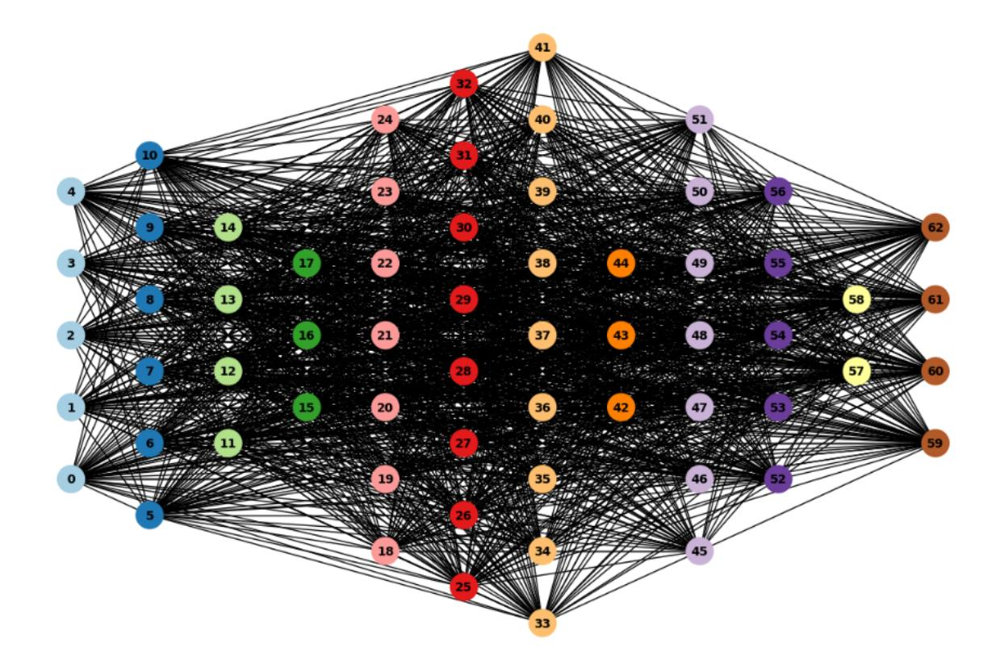
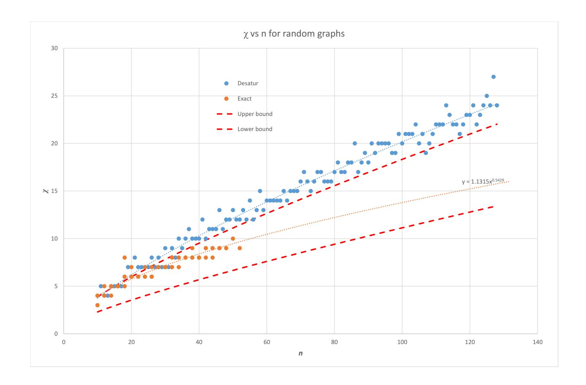
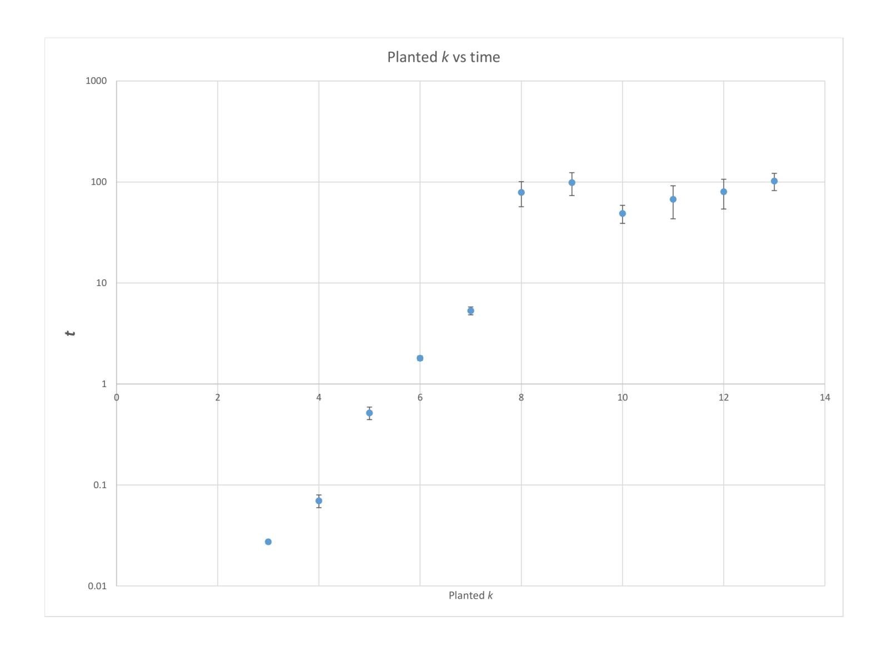
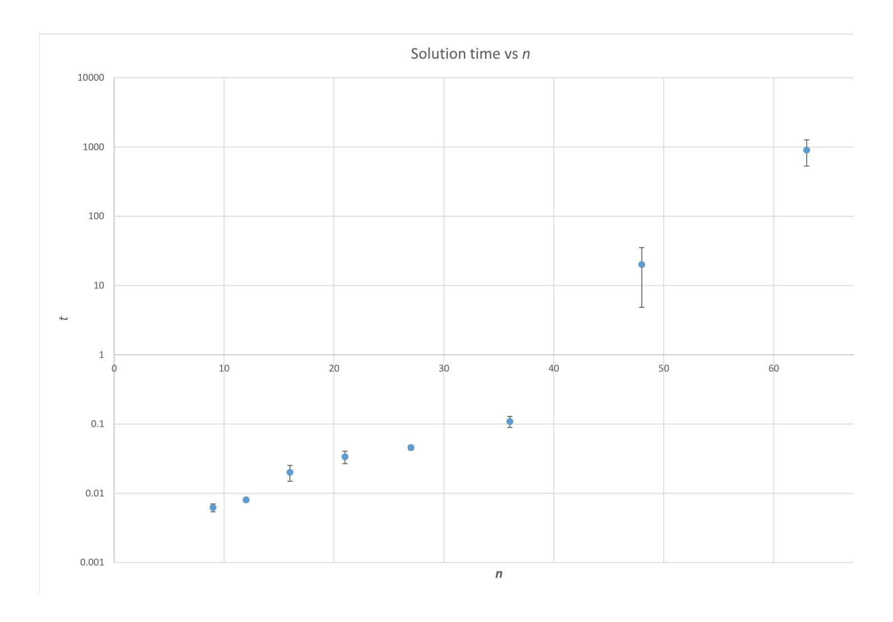
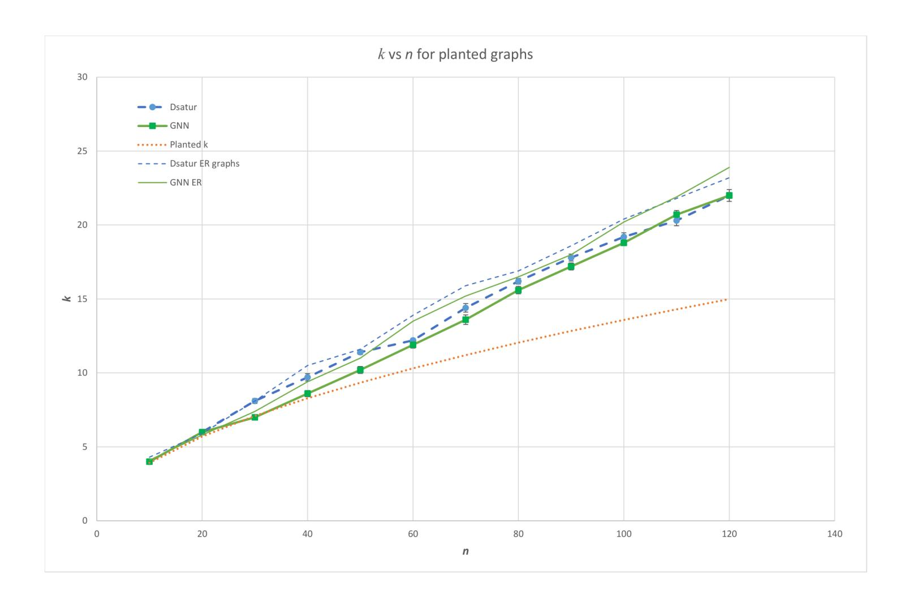

{0}------------------------------------------------

# Eidolon: A Practical Post-Quantum Signature Scheme Based on k-Colorability in the Age of Graph Neural Networks

Asmaa Cherkaoui<sup>∗</sup> Ramón Flores† Delaram Kahrobaei‡ Richard C. Wilson§

February 2, 2026

### **Abstract**

We propose Eidolon, a practical post-quantum signature scheme grounded in the NPcomplete *k*-colorability problem. Our construction generalizes the Goldreich–Micali–Wigderson zero-knowledge protocol to arbitrary *k* ≥ 3, applies the Fiat–Shamir transform, and uses Merkle-tree commitments to compress signatures from *O*(*tn*) to *O*(*t*log *n*). Crucially, we generate hard instances via planted "quiet" colorings that preserve the statistical profile of random graphs. We present the first empirical security analysis of such a scheme against both classical solvers (ILP, DSatur) and a custom graph neural network (GNN) attacker. Experiments show that for *n* ≥ 60, neither approach recovers the secret coloring, demonstrating that well-engineered *k*-coloring instances can resist modern cryptanalysis, including machine learning. This revives combinatorial hardness as a credible foundation for postquantum signatures.

**Keywords:** Post-quantum cryptography, *k*-colorability, NP-hard signatures, zero-knowledge proofs, Fiat–Shamir transform, graph neural networks.

## **1 Introduction**

With the rising threat of quantum computers to traditional cryptography, recent attention has focused on post-quantum cryptographic methods (PQC). Based on the current belief that there is no quantum speed-up for NP-complete problems, these problems are potentially a rich source of potential cryptosystems. In particular, in graph theory there are a number of problems which

<sup>∗</sup>Laboratory of Mathematical Analysis, Algebra and Applications (LAM2A), Faculty of Sciences Ain Chock (FSAC), University Hassan II, Casablanca, Morocco. esma1maysan@gmail.com

<sup>†</sup>Department of Geometry and Topology, Faculty of Mathematics, University of Seville, Seville, Spain. ramonjflores@us.es

<sup>‡</sup>Departments of Computer Science and Mathematics, Queens College, City University of New York, USA; PhD Program in Mathematics, and Initiative for the Theoretical Sciences, Graduate Center, City University of New York, USA; Department of Computer Science and Engineering, Tandon School of Engineering, New York University, USA; Department of Computer Science, University of York, United Kingdom delaram.kahrobaei@qc.cuny.edu

<sup>§</sup>Department of Computer Science, University of York, United Kingdom richard.wilson@york.ac.uk

{1}------------------------------------------------

are known to be NP-complete such as homomorphism, *k*-colorability and hamiltonicity. In this paper, we study the application of the *k*-colorability problem to a post-quantum signature system.

The *k*-colorability problem involves determining if the set of vertices of an undirected graph can be colored with *k* colors such that no edge has the same color at both ends. This problem is known to be NP-complete. In this paper, we consider specifically the *k-coloring* problem, where we seek a graph coloring with *k* colors. This provides a witness for *k*-colorability and reduces directly to *k*-colorability, therefore this problem is NP-hard.

When considering an NP-hard problem as the basis for a cryptosystem, care must be taken in the concrete realization of a particular instance. This is because many instances can be solved in acceptable time using heuristic algorithms. Indeed, a number of heuristics are available for minimal coloring and can quickly solve the problem for many graphs.

In this regard, machine learning has emerged as a particular threat because of its ability to extract powerful heuristics directly from data. In this paper, we explore the issue of instance hardness for *k*-colorability, from both a theoretical and empirical perspective, to demonstrate the security of the system. In [\[SBK22\]](#page-24-0), the authors demonstrate how graph neural networks can be used to solve combinatorial optimization problems. Their approach is broadly applicable to canonical NP-hard problems in the form of quadratic unconstrained binary optimization problems, such as maximum cut, minimum vertex cover, maximum independent set, as well as Ising spin glasses and higher-order generalizations thereof in the form of polynomial unconstrained binary optimization problems.

The rapid progress in quantum computing has intensified the search for cryptographic primitives that remain secure in a post-quantum world. While lattice, and code-based schemes currently dominate standardization efforts, combinatorial problems, particularly those proven NP-hard, offer an alternative foundation rooted in decades of computational complexity theory. Among these, the *k*-colorability problem, which asks whether the vertices of an undirected graph can be colored with *k* colors such that no adjacent vertices share the same color, is NP-complete for *k* ≥ 3 [\[GJ76\]](#page-23-0). Despite its theoretical promise, practical cryptographic use of *k*-colorability has been hindered by the gap between worst-case hardness and average-case solvability: many graph instances, though formally hard, yield quickly to heuristic solvers such as DSatur [\[Br'\]](#page-22-0), and more recently, to data-driven methods leveraging machine learning.

Recent work by Schuetz, Brubaker, and Katzgraber [\[SBK22\]](#page-24-0) demonstrates that graph neural networks (GNNs) can effectively approximate solutions to canonical NP-hard problems—including graph coloring, by learning implicit heuristics from data. This raises a critical question for cryptographic design: if machine learning methods can routinely solve structured instances, do they erode the practical security margin of schemes built on combinatorial hardness? To date, no *k*-colorability–based signature scheme has been proposed, to the best of our knowledge, that simultaneously offers a complete and practical construction, incorporates instance generation that embeds a secret coloring while aiming to maintain statistical indistinguishability from a random graph, and undergoes rigorous empirical validation against both classical and modern learning-based attacks.

In this paper, we present Eidolon, a practical post-quantum digital signature scheme derived from the *k*-colorability problem by generalizing the zero-knowledge identification protocol of Goldreich, Micali, and Wigderson (GMW) [\[GMW91\]](#page-23-1), originally demonstrated for 3-colorability, to arbitrary *k* ≥ 3, and then applying the Fiat–Shamir transform. Our design features a planted coloring mechanism, inspired by the "quiet solution" framework of Krzakala and Zdeborová [\[KZ09\]](#page-23-2), which embeds a secret *k*-coloring into a *k*-partite random graph with calibrated edge density, ensuring witness existence while aiming to maintain statistical indistinguishability from an Erdős–Rényi random graph. To overcome the prohibitive signature size that arises when directly applying the Fiat–Shamir transform to the underlying zero-knowledge protocol, we in

{2}------------------------------------------------

tegrate Merkle-tree vector commitments, compressing the per-round vertex commitments into a single root and thereby reducing overall signature size from *O*(*tn*) to *O*(*t*log *n*), where *t* denotes the number of Fiat–Shamir rounds (i.e., repetitions needed to achieve the target soundness error) and *n* = |*V* |.

Critically, we subject our scheme to comprehensive empirical cryptanalysis using two independent attack strategies: the classical DSatur heuristic and a custom-designed graph neural network (GNN). Our GNN is inspired by the framework of Schuetz, Brubaker, and Katzgraber [\[SBK22\]](#page-24-0). Both attackers are tested on the exact same class of *k*-partite random graphs generated by our Algorithm [1.](#page-4-0) Our experiments show that, for graphs with *n* ≥ 60 vertices and our chosen density parameters, neither DSatur nor our GNN recovers the planted coloring, providing strong empirical evidence, within these tested regimes, that the hardness of our *k*-colorability instances withstands both classical and modern machine learning–based cryptanalysis.

In summary, our contributions are threefold: (i) we design Eidolon, a Fiat–Shamir signature scheme based on *k*-colorability with a statistically hidden planted coloring; (ii) we reduce its asymptotic signature size via Merkle-tree vector commitments; and (iii) we provide an extensive empirical hardness study against both classical heuristics and modern GNN-based attacks. The rest of the paper is organized as follows: Section [2](#page-2-0) reviews graph coloring and instance generation; Section [3](#page-5-0) details our signature construction; and Section [6](#page-16-0) describes our attack models and experimental setup.

## <span id="page-2-0"></span>**2 Graph Instance selection**

Let *G* = (*V, E*) be a graph with vertices *V* and edges *E*. A *k*-coloring of a graph is an assignment of one of *k* colors to each vertex so that no two adjacent vertices share the same color. It is known that determining whether a graph has a *k*-coloring is NP-complete for *k* ≥ 3. The minimum number of colors needed is the *chromatic number χ*(*G*), and computing it is NP-hard.

However, worst-case hardness alone is insufficient for cryptography: many concrete instances are easy to solve. For example, if *k* = |*V* |, a trivial coloring exists; complete graphs have *χ*(*G*) = |*V* |; and heuristic algorithms like DSatur often find valid colorings quickly on structured or sparse graphs. This raises a critical issue for signature schemes based on *k*-colorability: we cannot rely on arbitrary hard-looking graphs, because the prover must know a valid *k*-coloring (to act as the secret key), while the verifier (and any adversary) must not be able to recover it from the public graph.

Thus, we must *construct* instances where:

- a valid *k*-coloring is known to the prover (by design),
- the graph appears statistically indistinguishable from a random hard instance,
- and recovering the coloring remains infeasible for classical and ML-based attackers.

This ensures the protocol is both *correct* (the prover can always respond) and *secure* (the secret remains hidden).

An (Erdös-Rényi) random graph is a graph *GR*(*n, p*) on *n* vertices, where each vertex pair is joined uniformly at random with probability *p*. A number of results are available on the hardness of coloring random graphs. In [\[GJ76\]](#page-23-0) it is shown that coloring a graph with less than 2*χ*(*G*) − *δ* is NP-hard. For fixed *p*, almost every random graph has a chromatic number [\[Bol88\]](#page-22-1)

$$\chi(G_R(n,p)) = \frac{n}{r}(1+\epsilon) \tag{1}$$

{3}------------------------------------------------

with  $0 \le \epsilon \le 3 \log \log n / \log n$  and

$$r = 2\log_d n - \log_d \log_d n + 2\log_d (e/2) + 1. \tag{2}$$

These results hold in the limit of large n. Furthermore, we observe that very sparse and very dense graphs are easy to color, and so we select p = 1/2. In this case, it has been shown that  $\chi(G_R(n,p)) \sim \log(1/(1-p))/2\log np$  [McD84]. However, these results are asymptotic and may not hold for the small graphs under consideration here. We reserve selection of k for the planted coloring until our empirical analysis, noting only that it should be the same size as the expected chromatic number of the equivalent random graph.

## <span id="page-3-0"></span>2.1 Constructing a difficult k-coloring and graph

In order to operate the digital signature scheme above, it is necessary to be able to construct a graph and k-coloring in polynomial time, where the coloring is difficult to discover. We use the natural algorithm for planting a known coloring in a random graph [KZ09]. In particular, we begin by selecting a vertex set V, |V| = n (the problem size) and  $k \approx \chi[G_R(n, p)]$ . We then follow the following steps.

- V is partitioned into k sets such that  $n_i = |V_i|, n_i \in \{\lfloor n/k \rfloor, \lceil n/k \rceil\}$  and  $\sum_i n_i = n$
- We iterate through all pairs of vertices (u, v)
- Let  $P_u, P_v$  be the partitions of the vertices. We join the vertices with probability p if  $P_u \neq P_v$  and probability zero otherwise.

The resulting graph may be colored with k colors simply by assigning one color to each partition. In [KZ09], the authors demonstrate that this is a *quiet solution* which is hidden in the random graph in the sense that the properties of the graph are not much altered by the existence of the known extra solution. In particular, they conjecture that the hardness of the problem is the same as for the original graph.

In general we work with random graphs such that the probability of an edge between two given vertices is a fixed number  $p \in [0,1]$ , in such a way that if the graph has n vertices, the expected final number of edges is  $p\binom{n}{2}$ . We consider here a multipartite graph  $\Gamma$  with n vertices and a partition in the set of vertices given by  $V = V_1 \cup \ldots V_k$ . Given a number  $s \in [0,1]$ , we compute here the probability p of existence of an edge in  $\Gamma$  such that the expected number of edges in the graph is  $s\binom{n}{2}$ .

Recall that a complete graph in  $n_j$  vertices has  $\binom{n_j}{2}$  edges. Hence, the number of forbidden edges in  $\Gamma$  is  $S = \sum_{j=1}^k \binom{n_j}{2}$ . Then, the maximum number of edges of the graph  $\Gamma$  is  $\binom{n}{2} - S$ , and given a probability p of existence of an edge, the expected number of edges in the graph is  $p(\binom{n}{2} - S)$ . We have imposed that

$$p\binom{n}{2} - S = s \binom{n}{2},$$

and hence

$$p = \frac{s\binom{n}{2}}{\binom{n}{2} - S}.$$

Observe that  $s\binom{n}{2}$  is always bounded in the graph  $\Gamma$  by  $\binom{n}{2} - S$ , and hence we always obtain  $p \leq 1$ . Edges in the graph are selected with probability p. We discuss the specific values of p and k in Section 6 on our security analysis.

{4}------------------------------------------------

### 2.1.1 Construction of the witness graph

To ensure a valid and verifiable instance of the k-colorability problem within a zero-knowledge proof protocol, we construct a k-partite graph where each partition represents a distinct color class. The graph is generated by specifying the size of each partition and then randomly adding edges only between nodes in different partitions. This construction inherently guarantees a valid k-coloring, since no adjacent vertices can share the same color. The prover then fixes this generated graph along with its corresponding coloring as the witness for the protocol. This approach removes the need to compute a coloring at runtime and ensures that the prover always holds a valid instance, enabling the protocol to execute reliably without failure.

## $\textbf{Algorithm 1} \texttt{GenerateKPartiteGraphWithAdjustedDensity}(\texttt{partition\_sizes}, p_{\texttt{density}})$

```
1: Initialize empty graph G
 2: color \leftarrow 1
 3: start\_id \leftarrow 0
 4: Partitions \leftarrow []
 5: for each n in partition_sizes do
          current\_set \leftarrow \{start\_id, \dots, start\_id + n - 1\}
 6:
          Append current_set to Partitions
 7:
          for each node in current_set do
 8:
               Add node to G with attribute color
 9:
          end for
10:
          start\_id \leftarrow start\_id + n
11:
          color \leftarrow color + 1
12:
13: end for
14: n \leftarrow \text{total number of nodes}
15: E_{\text{max}} \leftarrow \binom{n}{2}

    ▶ Total possible edges

16: E_{\texttt{forbid}} \leftarrow \sum_{i} \binom{|P_i|}{2}
17: E_{\texttt{allowed}} \leftarrow E_{\texttt{max}} - E_{\texttt{forbid}}
                                                                                       ▶ Intra-partition (forbidden) edges
18: p_{\text{adj}} \leftarrow \frac{p_{\text{density}} \cdot E_{\text{max}}}{E}
                    \overline{E_{\mathtt{allowed}}}
19: for each pair (P_i, P_j) in Partitions with i < j do
          for each u in P_i do
20:
               for each v in P_j do
21:
                    With probability p_{adj}, add edge (u, v) to G
22:
               end for
23:
          end for
24:
25: end for
26: return G
```

Figure 1 shows an example of a k-colorable graph generated using the algorithm 1. Each vertex belongs to a known color class, and edges are placed between classes based on a tuned density parameter.

{5}------------------------------------------------



Figure 1: Example of a generated *k*-colorable graph.

## <span id="page-5-0"></span>**3 Description of the protocol**

We now describe Eidolon, our post-quantum digital signature scheme based on *k*-colorability. Eidolon uses a statistically hiding, computationally binding commitment

<span id="page-5-1"></span>
$$f: \{1, \dots, k\} \times \{0, 1\}^r \longrightarrow \{0, 1\}^s,$$

as in [\[GMW91\]](#page-23-1) (equivalently, a nonuniformly secure probabilistic encryption used as a commitment). One *round* of the zero-knowledge protocol proceeds as follows; the whole protocol repeats this round independently *T* times (e.g. *T* = *m*<sup>2</sup> with *m* = |*E*|).

- **Coloring.** The prover holds a valid *k*-coloring *ϕ* : *V* → {1*, . . . , k*}.
- **Permutation.** The prover samples a fresh random permutation *π* ∈ *S<sup>k</sup>* to mask color labels.
- **Commit (lock).** For each vertex *i* ∈ *V* , the prover samples fresh randomness *r<sup>i</sup>* and commits to the permuted color

$$c_i = f(\pi(\phi(i)), r_i).$$

The prover sends all commitments {*ci*}*i*∈*<sup>V</sup>* to the verifier.

- **Challenge.** The verifier chooses a uniform random edge (*u, v*) ∈ *E* and requests openings for its endpoints.
- **Response.** The prover reveals *π*(*ϕ*(*u*))*, r<sup>u</sup>* and *π*(*ϕ*(*v*))*, r<sup>v</sup>* .
- **Verification.** The verifier checks

$$f(\pi(\phi(u)), r_u) \stackrel{?}{=} c_u, \qquad f(\pi(\phi(v)), r_v) \stackrel{?}{=} c_v,$$

{6}------------------------------------------------

and that the revealed colors are valid and distinct:

$$(u, v) \in E, \quad \pi(\phi(u)), \pi(\phi(v)) \in \{1, \dots, k\}, \quad \pi(\phi(u)) \neq \pi(\phi(v)).$$

If all checks pass, the verifier accepts this round.

**Security idea.** Because a fresh  $\pi$  and fresh randomness are used in every round, the distribution of revealed values is independent of the original coloring. The verifier only learns that the endpoints of the challenged edge carry different (permuted) colors, preserving zero knowledge.

```
Algorithm 2 Prove-One-Round(G = (V, E), \phi, k)
```

```
1: Sample \pi \leftarrow S_k uniformly at random
```

```
2: for each v \in V do
```

3: Sample 
$$r_v \leftarrow \{0,1\}^r$$

4: 
$$c_v \leftarrow f(\pi(\phi(v)), r_v)$$

- 5: end for
- 6: Send  $\{c_v\}_{v\in V}$  to the verifier
- 7: Receive a random edge  $(u, v) \in E$
- 8: Send  $(\pi(\phi(u)), r_u)$  and  $(\pi(\phi(v)), r_v)$

Algorithm 3 Verify-One-Round
$$(G = (V, E), \{c_v\}_{v \in V}, (u, v), (\alpha_u, r_u), (\alpha_v, r_v))$$

- 1: Require  $(u, v) \in E$
- 2: Check  $f(\alpha_u, r_u) \stackrel{?}{=} c_u$  and  $f(\alpha_v, r_v) \stackrel{?}{=} c_v$
- 3: Check  $\alpha_u, \alpha_v \in \{1, \dots, k\}$  and  $\alpha_u \neq \alpha_v$
- 4: Accept iff all checks pass; otherwise Reject

Repetition and soundness. Repeat Prove-One-Round/Verify-One-Round independently for  $T=m^2$  rounds, each time with fresh  $\pi$  and fresh randomness (hence fresh commitments). If no round fails, accept. As in [GMW91], if G is not k-colorable the cheating success probability is at most  $\left(1-\frac{1}{m}\right)^{m^2}\approx e^{-m}$  under the worst-case assumption that at least one edge is monochromatic in every assignment.

### 3.1 Soundness Analysis

To analyze the soundness of the zero-knowledge proof protocol for k-colorability, consider the case where the graph is not k-colorable. In such a scenario, no matter how the prover attempts to simulate a valid coloring, there will inevitably be a set of violating edges—edges whose endpoints receive the same color under any attempted coloring. Let t denote the number of these bad edges, and let m be the total number of edges in the graph. Since the verifier selects one edge uniformly at random in each round, the probability that a cheating prover is caught in a single round is at least  $\frac{t}{m}$ , while the probability of escaping detection is at most  $1 - \frac{t}{m}$ .

Although this is the general case, we often assume a worst-case scenario where  $t \geq 1$  but unknown. In this case, we conservatively lower-bound the detection probability per round by  $\frac{1}{m}$ . The protocol is repeated independently for  $m^2$  rounds to drive the cheating probability down. Therefore, the probability that a cheating prover escapes detection across all  $m^2$  rounds is:

$$\left(1 - \frac{1}{m}\right)^{m^2} = \left[\left(1 - \frac{1}{m}\right)^m\right]^m.$$

{7}------------------------------------------------

It is well known that:

$$\lim_{m \to \infty} \left( 1 - \frac{1}{m} \right)^m = \frac{1}{e},$$

so it follows that:

$$\left(1 - \frac{1}{m}\right)^{m^2} \approx \left(\frac{1}{e}\right)^m = e^{-m}.$$

This quantity becomes *negligibly small* as *m* increases, for instance, *e* <sup>−</sup><sup>40</sup> *<* 2 <sup>−</sup><sup>55</sup>. Thus, the verifier's probability of accepting a false claim is exponentially small in the number of edges.

Crucially, the number of rounds *m*<sup>2</sup> is chosen not based on the number of vertices *n* or the number of colors *k*, but on the number of *edges m*, since violations occur on edges and verifier challenges are edge-based. This ensures soundness of the protocol even in the presence of a malicious prover who does not possess a valid coloring.

## **3.2 Identification Schemes and Digital Signatures**

We rely on two classical classes of cryptographic primitives. An *identification scheme* is an interactive protocol by which a prover convinces a verifier of possession of a secret without revealing it. Conceptually, a round follows the commit–challenge–response pattern: the prover first commits to values in a binding and hiding manner, the verifier issues a random challenge, and the prover responds; the verifier then checks correctness and either accepts or rejects. A *digital signature scheme* is non-interactive: given a message, a signer produces a signature that any verifier can later check using only public data.

**Our identification instantiation (GMW-style (Goldreich–Micali–Wigderson) for graph** *k***-coloring).** We use a statistically hiding, computationally binding commitment *f* : {1*, . . . , k*}× {0*,* 1} *<sup>r</sup>* → {0*,* 1} *s* (as in [\[GMW91\]](#page-23-1)). In each independent round the prover (who knows a valid coloring *ϕ* : *V* → {1*, . . . , k*}) samples a fresh permutation *π* ∈*S<sup>k</sup>* and fresh randomness {*rv*}*v*∈*<sup>V</sup>* , and commits to *all* permuted colors *c<sup>v</sup>* ← *f*(*π*(*ϕ*(*v*))*, rv*). The verifier then challenges the prover on a uniformly random edge (*u, v*) ∈ *E*. The prover opens only the two corresponding commitments, revealing (*π*(*ϕ*(*u*))*, ru*) and (*π*(*ϕ*(*v*))*, rv*). The verifier checks that these openings match *cu, cv*, that both revealed colors lie in {1*, . . . , k*}, and that they are distinct. Repeating the round *T* times (e.g., *T* = |*E*| 2 ) yields negligible soundness error while preserving zero-knowledge, since each round uses fresh *π* and randomness and thus leaks no information about the original coloring beyond "adjacent vertices have different colors".

**From identification to signatures via Fiat–Shamir.** To obtain a non-interactive signature, we apply the Fiat–Shamir transform [\[FS86\]](#page-23-4) to the above identification protocol in the random-oracle model. Concretely, the signer first produces the round commitments (with fresh permutations and randomness), then computes a hash *h* = H(Encode(*G, k, C*(0)*, . . . , C*(*t*−1)*, M*)) of the public data, all commitments, and the message *M* using a canonical encoder Encode(·). A public "hash-to-edges" parser deterministically derives the challenge edges from *h*, and the signer includes only the openings for the endpoints of those edges. A verifier recomputes the same hash from (*G, k*), the commitments, and *M*, rederives the edges, and checks the openings and color distinctness. This faithfully instantiates the commit–challenge–response structure without interaction while preventing post-hoc challenge bias.

{8}------------------------------------------------

### **3.2.1 Identification Scheme**

We use a statistically hiding, computationally binding commitment

$$f: \{1, \dots, k\} \times \{0, 1\}^r \longrightarrow \{0, 1\}^s.$$

One *round* proceeds as follows; the protocol repeats the round independently *T* times (e.g., *T* = *m*<sup>2</sup> with *m* = |*E*|), each time with fresh permutation and randomness.

### **PROVER VERIFIER** Hold a valid coloring *ϕ* : *V* → {1*, . . . , k*} Sample a fresh permutation *π* ∈ *S<sup>k</sup>* and fresh *r<sup>v</sup>* for all *v* ∈ *V* Compute *c<sup>v</sup>* = *f π*(*ϕ*(*v*))*, r<sup>v</sup>* for all *v* ∈ *V* Set *C* = {*cv*}*v*∈*<sup>V</sup> C* −−−−−→ Sample a uniform random edge (*u, v*) ∈ *E* (*u,v*) ←−−−−−−− Reveal (*π*(*ϕ*(*u*))*, ru*) and (*π*(*ϕ*(*v*))*, rv*) (*π*(*ϕ*(*u*))*,ru*)*,* (*π*(*ϕ*(*v*))*,rv*) −−−−−−−−−−−−−−−−−−−−→ Accept if (*u, v*) ∈ *E f*(*π*(*ϕ*(*u*))*, ru*) = *c<sup>u</sup>* and *f*(*π*(*ϕ*(*v*))*, rv*) = *c<sup>v</sup> π*(*ϕ*(*u*))*, π*(*ϕ*(*v*)) ∈ {1*, . . . , k*} and *π*(*ϕ*(*u*)) ̸= *π*(*ϕ*(*v*))

Table 1: Graph *k*-Coloring Identification Scheme (one round; repeat *T* times with fresh *π* and randomness)

## **3.2.2 The** Eidolon **Signature Scheme**

Eidolon takes as public inputs a graph *G* = (*V, E*), an integer *k* ∈ N, a statistically hiding and binding commitment *f* : {1*, . . . , k*} × {0*,* 1} *<sup>r</sup>* → {0*,* 1} *s* , and a hash function H : {0*,* 1} <sup>∗</sup> → {0*,* 1} *λ* (modeled as a random oracle). The secret key is a valid *k*-coloring *ϕ* : *V* → {1*, . . . , k*}. Let *m*=|*E*| and set the repetition count *t*=*m*<sup>2</sup> . To sign a message *M* ∈ {0*,* 1} ∗ (we reserve the letter *m* for |*E*|), the signer proceeds as follows. For each *i* ∈ {0*, . . . , t*−1}, sample a fresh permutation *π<sup>i</sup>* ∈ *S<sup>k</sup>* and, for every vertex *v* ∈ *V* , sample fresh randomness *r* (*i*) *<sup>v</sup>* and compute the commitment

$$c_v^{(i)} = f(\pi_i(\phi(v)), r_v^{(i)}).$$

Let *C* (*i*) = (*c* (*i*) *<sup>v</sup>* )*v*∈*<sup>V</sup>* . Compute the challenge digest

$$h = \mathcal{H}(\operatorname{Encode}(G, k, C^{(0)}, \dots, C^{(t-1)}, M)),$$

where Encode(·) is a fixed, canonical serialization (with domain separation) so both parties derive the same bitstring. Deterministically parse *h* into a sequence of *t* edges (*e*0*, . . . , et*−1) with *e<sup>i</sup>* = (*u<sup>i</sup> , vi*) ∈ *E* via a public hash-to-edges mapping. For each *i*, form the two openings for the endpoints of *e<sup>i</sup>* :

$$(\pi_i(\phi(u_i)), r_{u_i}^{(i)})$$
 and  $(\pi_i(\phi(v_i)), r_{v_i}^{(i)}).$ 

{9}------------------------------------------------

The signature is

$$\sigma = \left( \{ C^{(i)} \}_{i=0}^{t-1}, \ \{ \pi_i(\phi(u_i)), r_{u_i}^{(i)}, \pi_i(\phi(v_i)), r_{v_i}^{(i)} \}_{i=0}^{t-1} \right),$$

(optionally accompanied by h, though the verifier will recompute it). Intuitively, the commitments bind the signer to hidden, permuted colors; the hash fixes the challenge edges non-interactively; and the openings reveal only that the two endpoints of each challenged edge bear distinct colors under the hidden permutation.

## **Algorithm 4** EIDOLON.SIGN $(G, k, \phi, m)$

- 1: **Input:** message m, private coloring  $\phi: V \to \{1, \dots, k\}$
- 2: For i = 0, ..., t 1:

choose a fresh random permutation  $\pi_i \in S_k$ 

for each  $v \in V$  choose fresh randomness  $r_v^{(i)}$  and compute

$$c_v^{(i)} \leftarrow f(\pi_i(\phi(v)), r_v^{(i)}).$$

set 
$$C^{(i)} \leftarrow (c_v^{(i)})_{v \in V}$$
.

3: Compute

$$h \leftarrow \mathcal{H}(\text{Encode}(G, k, C^{(0)}, \dots, C^{(t-1)}, m)).$$

- 4: Parse h deterministically to obtain challenges  $e_0, \ldots, e_{t-1}$ , where each  $e_i$  encodes an edge  $(u_i, v_i) \in E$ .
- 5: For each i form the opening for  $e_i = (u_i, v_i)$ :

$$open_i = (\pi_i(\phi(u_i)), r_{u_i}^{(i)}, \pi_i(\phi(v_i)), r_{v_i}^{(i)}).$$

6: Output signature

$$\sigma = \left( \{ C^{(i)} \}_{i=0}^{t-1}, \ \{ open_i \}_{i=0}^{t-1} \right).$$

Given  $(G, k, M, \sigma)$ , parse  $\sigma$  into the commitment lists  $\{C^{(i)}\}_{i=0}^{t-1}$  and per-round openings. Recompute

$$h' = \mathcal{H}(\text{Encode}(G, k, C^{(0)}, \dots, C^{(t-1)}, M)),$$

parse h' into  $(e'_0, \ldots, e'_{t-1})$  with  $e'_i = (u'_i, v'_i)$ , and for each i perform the following checks:

- (i) edge validity—verify  $e'_i \in E$ ;
- (ii) opening correctness—let the provided openings be  $(\alpha_u, r_u)$  and  $(\alpha_v, r_v)$ , then check  $f(\alpha_u, r_u) \stackrel{?}{=} c_{u'_i}^{(i)}$  and  $f(\alpha_v, r_v) \stackrel{?}{=} c_{v'_i}^{(i)}$ ;
- (iii) color constraint—check  $\alpha_u \neq \alpha_v$  and  $\alpha_u, \alpha_v \in \{1, ..., k\}$ . Accept iff all rounds pass. Recomputing h' from (G, k), the commitments, and M is essential: it binds the challenge sequence to the signer's commitments and the message, preventing any post hoc adaptation and faithfully instantiating the Fiat–Shamir transform of the underlying identification protocol.

{10}------------------------------------------------

## **Algorithm 5** EIDOLON. VERIFY $(G, k, m, \sigma)$

```
1: Parse \sigma as \{C^{(i)}\}_{i=0}^{t-1} and openings \{open_i\}_{i=0}^{t-1}.
2: Recompute
                                         h' \leftarrow \mathcal{H}(\text{Encode}(G, k, C^{(0)}, \dots, C^{(t-1)}, m)).
3: Parse h' into e'_0, \ldots, e'_{t-1} and for each i set e'_i = (u'_i, v'_i).
4: for i = 0, \dots, t - 1 do
         Let open_i = (\alpha_u, r_u, \alpha_v, r_v).
5:
         Check 1: (u'_i, v'_i) \in E. If not, reject.
6:
         Check 2: f(\alpha_u, r_u) \stackrel{?}{=} c_{u'_i}^{(i)} and f(\alpha_v, r_v) \stackrel{?}{=} c_{v'_i}^{(i)}. If not, reject.
7:
         Check 3: \alpha_u \neq \alpha_v and \alpha_u, \alpha_v \in \{1, \dots, k\}. If not, reject.
```

9: end for

8:

10: **return** Accept.

The verifier recomputes the challenge hash  $h' = \mathcal{H}(\text{Encode}(G, k, C^{(0)}, \dots, C^{(t-1)}, m))$ . The signature is accepted only if h' = h (if the signer supplies h) or equivalently if the edges parsed from the recomputed hash match the openings provided in the signature, and every opening correctly opens the corresponding commitment and shows distinct colors.

#### Signature Size Bottleneck and Merkle Compression 3.3

**Problem (size analysis).** Let n = |V|, m = |E|, and t be the number of FS repetitions (e.g.,  $t=m^2$  in the identification analysis, or any value chosen to meet a target security level in the signature setting). In the plain scheme, each round i computes per-vertex commitments

$$c_v^{(i)} = f(\pi_i(\phi(v)), r_v^{(i)}) \in \{0, 1\}^s, \quad v \in V,$$

and includes the whole list  $C^{(i)} = \{c_v^{(i)}\}_{v \in V}$  in the signature so the verifier can recompute the Fiat-Shamir hash. Thus a signature carries

$$t \cdot n$$
 commitments  $\implies |\sigma|_{\text{plain}} \approx t \cdot n \cdot s + 2t \cdot (|\alpha| + |r|)$  bits,

where  $|\alpha| \leq \lceil \log_2 k \rceil$  and |r| is the commitment randomness length. Asymptotically this is O(tn), which is prohibitive for moderate n and t.

Merkle-tree vector commitment [Mer87]. To make Eidolon practical, we compress  $C^{(i)}$ into a single Merkle root  $R_i$  using a collision-resistant hash  $H:\{0,1\}^* \to \{0,1\}^{\lambda}$ . Let  $\operatorname{enc}(v)$  be a canonical encoding of the vertex index v (fixed length  $\lceil \log_2 n \rceil$  bits), and use domain separation tags leaf, node. Define leaves

$$L_v^{(i)} = H(\operatorname{leaf} \| \operatorname{enc}(v) \| c_v^{(i)}), \quad v \in V,$$

build a binary Merkle tree over  $(L_v^{(i)})_{v \in V}$ , and let  $R_i$  be its root. The signer now publishes only the roots  $(R_0, \ldots, R_{t-1})$  instead of all  $C^{(i)}$ . For each challenged vertex, the signer provides a standard Merkle authentication path  $\mathsf{path}_v^{(i)}$  (the list of sibling hashes from the leaf to  $R_i$ ).

This construction ensures binding of the committed vector under the root: assuming H is collision-resistant and the underlying commitment scheme f is binding, it is infeasible for an adversary to open the same position v to two distinct values  $c \neq c'$ . Indeed, such a successful attack would either (i) violate the binding property of f, by producing two different openings  $(\alpha, r) \neq (\alpha', r')$  yielding the same commitment  $c_v^{(i)}$ , or (ii) produce a collision in the Merkle tree (either at the leaf level or in internal nodes), contradicting the collision resistance of H.

{11}------------------------------------------------

**FS with Merkle compression (drop-in change).** Instead of hashing the bulky lists  $C^{(0)}, \ldots, C^{(t-1)}$ , we hash their *roots*:

$$h = \mathcal{H}(\text{Encode}(G, k, R_0, \dots, R_{t-1}, M)),$$

and parse h into challenges  $(e_0, \ldots, e_{t-1})$  with  $e_i = (u_i, v_i) \in E$  via the same public hash-to-edges parser as before. For each round i we now reveal, per endpoint, the value-and-randomness opening and its Merkle path:

$$(\pi_i(\phi(u_i)), r_{u_i}^{(i)}, \mathsf{path}_{u_i}^{(i)}), (\pi_i(\phi(v_i)), r_{v_i}^{(i)}, \mathsf{path}_{v_i}^{(i)}).$$

The signature becomes

$$\sigma = \left(R_0, \dots, R_{t-1}, \ \{\pi_i(\phi(u_i)), r_{u_i}^{(i)}, \mathsf{path}_{u_i}^{(i)}, \pi_i(\phi(v_i)), r_{v_i}^{(i)}, \mathsf{path}_{v_i}^{(i)}\}_{i=0}^{t-1}\right),$$

with no  $C^{(i)}$  included.

**Lemma 3.1** (Vector binding under a Merkle root [Mer87, KL14, Gol01, CF13]). Suppose H is collision-resistant and f is binding. Fix round i and index v. Given  $R_i$ , it is infeasible to produce two distinct valid openings for position v, i.e., pairs  $(\alpha, r) \neq (\alpha', r')$  and authentication paths such that both

$$H(\mathsf{leaf} \parallel \mathsf{enc}(v) \parallel f(\alpha, r)) \rightsquigarrow R_i \quad and \quad H(\mathsf{leaf} \parallel \mathsf{enc}(v) \parallel f(\alpha', r')) \rightsquigarrow R_i.$$

Demonstration. If  $f(\alpha, r) = f(\alpha', r')$  with  $(\alpha, r) \neq (\alpha', r')$ , binding of f is broken. Otherwise the leaves differ; if both authenticate to  $R_i$ , the paths induce a collision in H (at a leaf or internal node), contradicting collision resistance.

**Verification with Merkle paths.** The verifier recomputes  $h' = \mathcal{H}(\text{Encode}(G, k, R_0, \dots, R_{t-1}, M))$ , parses  $(e'_i)_i$ , and for each round i and endpoint  $x \in \{u'_i, v'_i\}$ :

- 1. recompute the leaf value  $c'_x = f(\alpha_x, r_x)$  from the opening  $(\alpha_x, r_x)$ ;
- 2. compute  $L'_x = H(\mathsf{leaf} \parallel \mathsf{enc}(x) \parallel c'_x);$
- 3. using  $\mathsf{path}_x^{(i)}$ , hash upwards (with the stored left/right positions) to obtain a root  $R_x'$  and check  $R_x' \stackrel{?}{=} R_i$ ;
- 4. check  $\alpha_u, \alpha_v \in \{1, \ldots, k\}$  and  $\alpha_u \neq \alpha_v$ .

Accept iff all rounds pass. This preserves the FS logic (the verifier recomputes the same challenges from the roots) while the Merkle paths prove that the opened leaves are consistent with those roots.

Size calculation after compression. Each Merkle root contributes  $\lambda$  bits, so the roots cost  $t\lambda$  bits in total. A Merkle path over n leaves has length  $\lceil \log_2 n \rceil$  sibling hashes (each  $\lambda$  bits). Hence the signature size becomes

$$|\sigma|_{\text{Merkle}} \approx t \cdot \lambda + 2t \cdot (|\alpha| + |r| + \lambda \cdot \lceil \log_2 n \rceil) = O(t \log n),$$

an exponential improvement over O(tn). Optional optimization: the two paths for  $u_i$  and  $v_i$  in the same round often share a suffix above their LCA; using the union of nodes reduces the per-round hash cost to at most  $2\lceil \log_2 n \rceil - \operatorname{depth}(\operatorname{LCA}(u_i, v_i))$  hashes.

Notes. The Merkle authentication path length is  $\lceil \log_2 n \rceil$  (binary tree) [Mer87, KL14, Gol01]. We choose  $\lambda = 256$  to match standard 128-bit security recommendations for hash-based constructions [SP820] (e.g., SHA-256/SHA3-256 [FIP15a, FIP15b]). The FS repetition parameter t is selected to meet target security and follows the usual soundness amplification for FS-based signatures [PS96, KL14].

{12}------------------------------------------------

Why this solves the problem. The verifier still derives challenges from a value (h') that is fully determined by what the signer committed to (the roots and the message), so there is no post hoc bias. At the same time, instead of shipping n commitments per round, the signer ships just (i) one root and (ii) two authentication paths of logarithmic length. Collision resistance of H and binding of f ensure that openings are unique for each position under a fixed root, preserving soundness; statistical hiding of f preserves zero knowledge (the root reveals no more than the original set of commitments).

### FS Pseudocode with Merkle Roots

### SIGNER VERIFIER

```
For i = 0, ..., t - 1:
   sample \pi_i \in S_k, fresh r_v^{(i)} for all v \in V
   c_v^{(i)} = f(\pi_i(\phi(v)), r_v^{(i)}) for all v
   build Merkle tree over
L_v^{(i)} = H(\mathsf{leaf} || \operatorname{enc}(v) || c_v^{(i)})
   let R_i be the root
Compute
h = \mathcal{H}(\text{Encode}(G, k, R_0, \dots, R_{t-1}, M))
Parse h into (e_0, ..., e_{t-1}), e_i = (u_i, v_i) \in E
For each i, output openings for u_i, v_i: (\pi_i(\phi(u_i)), r_{u_i}^{(i)}, \mathsf{path}_{u_i}^{(i)}),
(\pi_i(\phi(v_i)), r_{v_i}^{(i)}, \mathsf{path}_{v_i}^{(i)})
                                                                M, R_0, ..., R_{t-1}, \text{ openings}
                                                                                   Recompute
                                                                                   h' = \mathcal{H}(\text{Encode}(G, k, R_0, \dots, R_{t-1}, M))
                                                                                   Parse (e'_0, ..., e'_{t-1}) with e'_i = (u'_i, v'_i)
                                                                                   For each i and x \in \{u'_i, v'_i\}:
                                                                                       c_x' = f(\alpha_x, r_x); L_x' = H(\mathsf{leaf} \| \mathsf{enc}(x) \| c_x')
                                                                                       verify \mathsf{path}_x^{(i)} leads to R_i
                                                                                       check \alpha_u, \alpha_v \in \{1, \dots, k\} and \alpha_u \neq \alpha_v
                                                                                    Accept iff all checks pass
```

Concrete example. Take  $n=200, t=256, \lambda=256$  bits, s=256 bits, |r|=128 bits, and  $k \le 256$  (so  $|\alpha|=8$  bits).

Plain scheme.

```
|\sigma|_{\text{plain}} = tn \cdot s + 2t(|\alpha| + |r|)
= 256 \cdot 200 \cdot 256 \text{ bits } + 512 \cdot (8 + 128) \text{ bits}
= 13,107,200 \text{ bits } + 69,632 \text{ bits } = 13,176,832 \text{ bits}
= 1,647,104 \text{ bytes } \approx 1.57 \text{ MiB}.
```

Merkle-compressed (no path sharing). Since  $|\log_2 200| = 8$ ,

$$\begin{split} |\sigma|_{\text{Merkle}} &= t\lambda \ + \ 2t \big( |\alpha| + |r| + \lambda \lceil \log_2 n \rceil \big) \\ &= 256 \cdot 256 \ + \ 512 \cdot \big( 8 + 128 + 256 \cdot 8 \big) \text{ bits} \\ &= 65,536 \ + \ 512 \cdot \mathbf{2}, \mathbf{184} = 65,536 \ + \ 1,118,208 \\ &= 1,183,744 \text{ bits} = 147,968 \text{ bytes} \approx 144.5 \text{ KiB}. \end{split}$$

{13}------------------------------------------------

*Merkle-compressed (with path sharing).* If we take the *union* of the two authentication paths per round (the suffix above the Lowest Common Ancestor (LCA) is shared), the per-round hash cost drops from 2*λ*⌈log<sup>2</sup> *n*⌉ to *λ* 2⌈log<sup>2</sup> *n*⌉ − *s<sup>i</sup>* , where *s<sup>i</sup>* is the number of shared sibling hashes in round *i*. Averaging to *s*¯ over all rounds,

$$|\sigma|_{\text{Merkle, shared}} = t\lambda + 2t(|\alpha| + |r|) + t\lambda(2\lceil \log_2 n \rceil - \bar{s}).$$

For our parameters, achieving 140*,*288 bytes (≈ 137*.*0 KiB) corresponds to saving 61*,*440 bits overall, i.e., *s*¯ = 61*,*440*/*(*tλ*) = 0*.*9375 shared hashes per round.

*Explanation of the formula.* - In the plain scheme, *tns* accounts for the *n* commitments per round, and 2*t*(|*α*| + |*r*|) for the two openings per round. - With Merkle compression, *tλ* is the *t* roots, while each endpoint contributes an opening (*α, r*) and a Merkle path of ⌈log<sup>2</sup> *n*⌉ sibling hashes (*λ* bits each), hence 2*t*(|*α*| + |*r*| + *λ*⌈log<sup>2</sup> *n*⌉); path sharing subtracts *s*¯ · *tλ* bits.

**Public inputs and secret key.** Public parameters are (*G* = (*V, E*)*, k, f,* H*, λ*), where *V* = {1*, . . . , n*}, *E* ⊆ {{*u, v*} | 1 ≤ *u < v* ≤ *n*}, *f* is a statistically hiding, computationally binding commitment, and H : {0*,* 1} <sup>∗</sup> → {0*,* 1} *λ* is modeled as a random oracle. The *secret key* is a valid *k*-coloring *ϕ* : *V* → {1*, . . . , k*}.

**Canonical encoding with domain separation.** We follow standard practice for domain separation [\[BDPVA16,](#page-22-5) [Flu23\]](#page-23-8) and canonical serialization [\[Por13,](#page-23-9) [Kra10\]](#page-23-10), using a fixed domainseparation tag TAG = "FS-GkColor-v1" and a canonical serializer Encode(·):

$$\operatorname{Encode}(G, k, X_0, \dots, X_{t-1}, M) = \langle \mathsf{TAG} \rangle \parallel \langle n \rangle_{64} \parallel \langle k \rangle_{32} \parallel \langle m \rangle_{64} \parallel \operatorname{Edges}(E)$$
$$\parallel \langle t \rangle_{32} \parallel X_0 \parallel \dots \parallel X_{t-1} \parallel \langle |M| \rangle_{64} \parallel M.$$

Here ⟨·⟩*<sup>b</sup>* is a *b*-bit big-endian length/value encoding, and ∥ is concatenation. We fix a vertex order 1 *<* · · · *< n* and encode edges as

$$\operatorname{Edges}(E) = \langle m \rangle_{64} \parallel \|_{\{u,v\} \in E^{\uparrow}} (\langle u \rangle_{\lceil \log_2 n \rceil} \parallel \langle v \rangle_{\lceil \log_2 n \rceil}),$$

where *E*<sup>↑</sup> lists edges with *u < v* in lexicographic order. This canonicalization ensures all parties hash identical byte strings.

**Challenge parser HashToEdges.** We derive *t* (independent) edge indices *with replacement* using rejection sampling to avoid bias.

## **Algorithm 6** HashToEdges(*h, t, E*)

```
1: m ← |E|; b ← λ ▷ λ-bit blocks from H
2: for i = 0 to t − 1 do
3: j ← 0
4: repeat
5: B ← H("EdgeDerive-v1" ∥ h ∥⟨i⟩32∥⟨j⟩32)
6: x ← int(B) ▷ interpret B as a big-endian integer in [0, 2
                                                               λ−1]
7: M ←

            2
             λ/m
                 · m
8: j ← j + 1
9: until x < M ▷ rejection sampling removes modulo bias
10: idxi ← x mod m; ei ← E[idxi
                          ]
11: end for
12: return (e0, . . . , et−1)
```

{14}------------------------------------------------

Duplicates are allowed (sampling with replacement), matching the identification protocol's independent uniform edge challenges. Implementations must use the same TAG and encodings above to ensure deterministic agreement between signer and verifier.

Notes. Deterministic challenge derivation via Fiat-Shamir in the Random Oracle Model follows [FS86, BR93, CGH98]. The mapping from hash output to an edge index uses standard rejection sampling to eliminate modulo bias, as in [Flu23] and [Por13, FIP23]. Domain separation for the parser is enforced by the fixed string "EdgeDerive-v1" in the hash input, in line with [BDPVA16, Kra10]. Sampling is with replacement to match independent public-coin challenges [GMW91, Gol01, KL14].

## 4 Security Model and Formal Analysis

**Definition 4.1** (PPT algorithms and negligible functions [Gol01, Sec. 1.3], [KL14, Sec. 3.1]). An algorithm  $\mathcal{A}$  is probabilistic polynomial time (PPT) if there exists a polynomial  $p(\cdot)$  such that for every input  $x \in \{0,1\}^n$  and every random coin string r,  $\mathcal{A}(x;r)$  halts within at most p(n) steps. A function  $\mu: \mathbb{N} \to [0,1]$  is negligible if for every polynomial  $q(\cdot)$  there exists N such that  $\mu(n) < 1/q(n)$  for all  $n \ge N$ .

**Definition 4.2** (EUF–CMA existential unforgeability under adaptive chosen-message attack [GMR88, p. 21], [KL14, Ch. 12]). Let  $\Pi = (\mathsf{Gen}, \mathsf{Sign}, \mathsf{Vfy})$  be a signature scheme over security parameter  $\lambda$ .

- 1. (Setup) Challenger samples  $(pk, sk) \leftarrow Gen(1^{\lambda})$  and gives pk to A.
- 2. (Queries)  $\mathcal{A}$  has adaptive oracle access to  $\mathsf{Sign}_{\mathsf{sk}}(\cdot)$ . For any message m it submits, it receives  $\sigma \leftarrow \mathsf{Sign}_{\mathsf{sk}}(m)$ . Let Q be the set of queried messages.
- 3. (Forge) Eventually  $\mathcal{A}$  outputs  $(m^*, \sigma^*)$ .

Winning condition (EUF-CMA).  $\mathcal{A}$  wins if  $\mathsf{Vfy}_{\mathsf{pk}}(m^{\star}, \sigma^{\star}) = 1$  and  $m^{\star} \notin Q$ . The scheme  $\Pi$  is EUF-CMA secure if for every PPT adversary  $\mathcal{A}$ ,  $\mathsf{Pr}[\mathcal{A}$  wins] is negli

The scheme  $\Pi$  is EUF-CMA secure if for every PPT adversary  $\mathcal{A}$ ,  $\Pr[\mathcal{A} \text{ wins}]$  is negligible in  $\lambda$ .

Strong EUF-CMA (sEUF-CMA). The winning condition is strengthened to:  $Vfy_{pk}(m^*, \sigma^*) = 1$  and  $(m^*, \sigma^*)$  is not exactly one of the oracle pairs returned during the query phase (i.e., even a new signature on an old message is a win).

**Proposition 4.1** (Unforgeability in the Random Oracle Model (ROM)). Assume:

- (i) f is statistically hiding and computationally binding,
- (ii) H is collision-resistant,
- (iii) H is modeled as a random oracle,
- (iv) recovering a valid k-coloring of G drawn from the public key distribution is computationally hard. Then the Fiat-Shamir signature with Merkle compression is EUF-CMA secure: any PPT forger that outputs a valid new signature with non-negligible probability yields (via multi-forking on the random oracle) either:
- (a) a violation of binding of f,
- (b) a collision in H, or
- (c) an algorithm that recovers a valid k-coloring for G.

Esquisse. Given a successful forger, reprogram the random oracle and multi-fork on the same  $(R_0, \ldots, R_{t-1})$  to obtain many accepting transcripts with different edge sets for the same roots ("same first message"). Either we obtain two distinct valid openings for the same leaf, breaking

{15}------------------------------------------------

binding or H's collision-resistance, or we accumulate enough edge openings to reconstruct a permuted round coloring, and from repetitions recover a valid coloring of G. The probability losses are polynomial in the number of forks and random-oracle queries; setting t accordingly yields the claimed EUF-CMA bound.

## 5 Implementation & Size (Prototype)

We implemented the Merkle–compressed Fiat–Shamir signature in Python (Jupyter). The prototype uses SHA-256 for H and  $\mathcal{H}$ , a hash-based commitment for benchmarking (any statistically hiding binding commitment can be used), canonical encoding with a fixed domain-separation tag, and the HashToEdges parser with rejection sampling and sampling with replacement.

## 5.1 Prototype measurements and sanity checks

Small demo (what we actually ran). We instantiated the prototype with n = 16, k = 3, t = 8,  $\lambda = s = 256$  bits, |r| = 128 bits, and  $k \le 256$  (so  $|\alpha| = 8$  bits). The graph was generated with color-class sizes  $n_{\text{sets}} = [6, 5, 5]$  and target density  $p_{\text{density}} = 0.5$ , which yields:

$$\binom{n}{2} = 120$$
, forbidden (within-class) =  $\binom{6}{2} + \binom{5}{2} + \binom{5}{2} = 35$ ,

allowed (cross-class) = 
$$120 - 35 = 85$$
,  $p_{\text{adj}} = p_{\text{density}} \cdot \frac{120}{85} = \frac{12}{17} \approx 0.7059$ ,

so the expected number of edges is  $85 \cdot \frac{12}{17} = 60$ . The run produced m = 59 edges, matching the expectation up to random fluctuation. (Note that the *signature size* depends on n and t, not on m.)

Size formulas (and why the numbers match). Our prototype exactly follows the analytic formulas

$$|\sigma|_{\text{plain}} = t \cdot n \cdot s + 2t (|\alpha| + |r|), \qquad |\sigma|_{\text{Merkle}} = t\lambda + 2t (|\alpha| + |r| + \lambda \lceil \log_2 n \rceil).$$

Plugging  $n=16, t=8, \lceil \log_2 n \rceil = 4, |\alpha|=8, |r|=128, \lambda=s=256$ :

$$|\sigma|_{\text{plain}} = 8 \cdot 16 \cdot 256 \ + \ 16 \cdot (8 + 128) = 32{,}768 + 2{,}176 = 34{,}944 \text{ bits} = 4{,}368 \text{ B},$$
 
$$t\lambda = 8 \cdot 256 = 2{,}048 \text{ bits}, \quad |\alpha| + |r| + \lambda \lceil \log_2 n \rceil = 8 + 128 + 256 \cdot 4 = 1{,}160 \text{ bits},$$
 
$$|\sigma|_{\text{Merkle}} = 2{,}048 + 2 \cdot 8 \cdot 1{,}160 = 2{,}048 + 18{,}560 = \mathbf{20{,}608} \text{ bits} = 2{,}576 \text{ B} \approx 2.52 \text{ KiB}.$$

The prototype prints size: 20608 bits = 2576 bytes  $\approx$  2.5 KiB, exactly matching the calculation.

Measured sizes. Table 1 reports signature sizes for two parameter sets. Numbers follow the above formulas and match the prototype's byte counts exactly. If we flip to the paper-scale parameters (n=200, t=256), the prototype produces the same sizes we computed analytically (about 144.5 KiB without path sharing, and  $\approx 137.0$  KiB with typical path sharing).

<span id="page-15-0"></span><sup>&</sup>lt;sup>1</sup>We release our implementation (Python) at https://github.com/EsmaMaysan/GNN-CSP/blob/main/k-coloringsignature.py.

{16}------------------------------------------------

<span id="page-16-1"></span>

| Setting     | n   | t   | $\lceil \log_2 n \rceil$ | Plain size         | Merkle size         | Merkle (shared) <sup>†</sup> |
|-------------|-----|-----|--------------------------|--------------------|---------------------|------------------------------|
| Toy (demo)  | 16  | 8   | 4                        | $4.27\mathrm{KiB}$ | $2.52\mathrm{KiB}$  | _                            |
| Paper-scale | 200 | 256 | 8                        | $1.57\mathrm{MiB}$ | $144.5\mathrm{KiB}$ | $137.0\mathrm{KiB}$          |

Table 1: Signature sizes from formulas and prototype. Parameters:  $s = \lambda = 256$  bits, |r| = 128 bits,  $k \le 256$  so  $|\alpha| = 8$  bits.

<sup>†</sup>Using the union of the two authentication paths per round (shared suffix above the LCA) typically saves about one sibling hash per round for these parameters.

**Permutation generation (HMAC).** To optimize signing and verification speed, we adopt a per-round HMAC-derived permutation of the k colors. Its time complexity is  $O(k \log k)$  and, in practice, its cost is negligible compared to hashing and Merkle-tree operations. On our toy parameters (n=16, t=8), we measured  $\approx 2.6 \,\mathrm{ms}$  for signing and  $\approx 0 \,\mathrm{ms}$  for verification.

## <span id="page-16-0"></span>6 Security Analysis and Attack Models

### 6.1 Exact attacks

To evaluate the security of **Eidolon**, we analyze the practical difficulty of recovering the secret k-coloring from the public graph using well-known algorithmic approach. In the context of this paper, we are interested in any coloring of the random graph with k or less colors, as this allows us to impersonate the prover. The approach we use is integer linear programming (ILP) which solves an integer optimization problem with constraints. There are a number of available formulations for the problem, but we use the partial ordering formulation where the union of vertices and colors are partially ordered and a color i is assigned to a vertex v when  $v \not\prec i$  and  $v \not\prec i$ . We have found this to be the most efficient for our problems; for a review of the different approaches, see [JM18].

We begin by confirming the properties of the random graph and the difficulty of finding the chromatic number of a random graph. Figure 2 illustrates the chromatic numbers found using the ILP solver for graphs drawn from  $G_R(n, \frac{1}{2})$  with between 10 and 52 vertices and the minimal coloring found using the DSatur heuristic. We choose p = 1/2 as this maximizes the complexity of the graphs. The Bollabas upper and lower bounds are also plotted. It is clear that the actual chromatic numbers are much larger than the asymptotic formula, which does not apply in this range. Instead, the chromatic number seems to follow a power law with best-fit equation  $\chi(n, 1/2) = 1.13n^{0.54}$ . We use this to select the number of colors in the planted solutions.

We now look at planted solutions using the algorithm described in Section 2.1 with n=36 and s=1/2, with p selected as above. The time to find a solution of the correct size is shown in Figure 3. As we might hope, the time-to-solution is exponential in k, up to a threshold value, where it becomes constant. At this point, the natural minimum coloring of the equivalent random graph has less colors that the planted solution and is found by the algorithm. The computational complexity is therefore bounded by this solution and constant (for fixed n, p). As in the previous examples, we observe that the transition occurs at k=8 not  $n/2(log_2n-1)\approx 4$ . We should therefore select  $k=\chi$  for maximum difficulty of the k-coloring problem.

{17}------------------------------------------------



<span id="page-17-0"></span>Figure 2: The observed chromatic number of random graphs using an exact algorithm and the minimal coloring discovered by the DSatur algorithm. The upper and lower bounds of *χ* due to Bollobás are also plotted.

{18}------------------------------------------------



<span id="page-18-0"></span>Figure 3: The time taken for our exact solver to find a minimal coloring of the graph with a planted coloring of size *k*. Below *k* = 8, the algorithm discovers the planted solution. Above this point, the algorithm finds a natural coloring of the random graph with size around 8.

Finally, we demonstrate the relationship between *n* and solution time in Figure [4.](#page-19-0) We select *k* for the planted solution to match the empirical prediction of *χ* for the equivalent random graph. The ILP problem setup is slightly modified to represent the practical case where *k* is known to the attacker via an additional constraint that the number of colors should be exactly *k*. This prevents the solver spending excessive time looking for an optimal solution with fewer colors. The solution times appears, empirically, to be super-exponential.

{19}------------------------------------------------



<span id="page-19-0"></span>Figure 4: The time-to-solution for the exact ILP solver on planted graphs with planted *k* chosen according to the empirical power law.

## **6.2 Heuristic attacks**

The Dsatur algorithm [\[Br'\]](#page-22-0) is a well-known greedy algorithm for coloring graphs. The algorithm sequentially selects vertices for coloring on the basis of the maximum current degree of saturation. It can recover the minimal coloring for small graphs but is known to be limited for larger graphs. We can see this in in Figure [2,](#page-17-0) where the size of the solution found by Dsatur is shown, along with the chromatic number discovered by the exact algorithm. While the method performs well for small graphs, a gap is evident for larger ones and DSatur cannot recover the minimal coloring for graphs larger than *n* = 40. This result is confirmed in Figure [5](#page-21-0) for planted graphs, where we can see identical behavior to the ER-graphs.

In [\[GHK20\]](#page-23-13), Gryak, Haralick, Kahrobaei have used machine learning algorithms to solve one of the algorithmic problems, known as conjugacy decision problem for certain classes of groups. This technique has been used for the cryptanalysis of proposed schemes using the conjugacy problem. Machine learning and pattern recognition techniques have been successfully applied to algorithmic problems in free groups. In [\[GHK20\]](#page-23-13), the authors seek to extend these techniques to finitely presented non-free groups, with a particular emphasis on polycyclic and metabelian groups that are of interest to non-commutative cryptography. As a prototypical example, they 

{20}------------------------------------------------

utilize supervised learning methods to construct classifiers that can solve the conjugacy decision problem, i.e., determine whether or not a pair of elements from a specified group are conjugate. The accuracies of classifiers created using decision trees, random forests, and N-tuple neural network models are evaluated for several non-free groups. The very high accuracy of these classifiers suggests an underlying mathematical relationship with respect to conjugacy in the tested groups.

Based on these results, we propose a modified version of the Graph Neural Network framework to tackle the GCP. The method is based on that of Schuetz et al [SBZK]. The method uses a set of random features initially assigned to the vertices of the graph. The GNN is then used to decode these features into color labels for the vertices. The network learns through a cost function to minimize the number of color conflicts in the assignment. We use the GraphSAGE variant described in the paper with one hidden layer. We optimized the parameter settings to find  $d_0 = 45, d_1 = 40, \beta = 0.0091$ , dropout=0.6, epochs=20000.

We use a modified cost function suggested by Porumbel et al [PHK] which weights color violations by the inverse of the degree, favoring violations with a smaller number of neighbors to resolve. If the softmax output of the network is  $\mathbf{p}_k$  for each color k, then the standard cost function is given by  $\sum_k \mathbf{p}_k^T \mathbf{A} \mathbf{p}_k$ . The modified cost function is

$$\sum_{k} \mathbf{p}_{k}^{T} (\mathbf{I} - \mathbf{D}^{-1}) \mathbf{A} \mathbf{p}_{k} \tag{3}$$

This down-weights the cost of violations on low degree vertices, as these are potentially easier to resolve.

2

Since the network is fixed, the expected number of colors, k, must be chosen in advance. This is not straightforward, as we found that values of k higher than the known chromatic number of the graph produced better solutions in some cases. However, since the goal is to recover a coloring equivalent to the planted coloring (in order to break the security of the key), we use the same k as the planted coloring.

We found considerable improvement from the network by initializing it with the labels given by the DSatur algorithm. This is achieved by pre-training the network with the DSatur labelling as the target output, using 70 epochs,  $\beta = 0.08$  and a cross-entropy loss. Since the DSatur algorithm will typically produce more than k colors, the coloring is reduced by replacing the excess colors with the least-conflicted of the initial k colors before training.

Finally, the network does not usually converge to a non-conflicted configuration (i.e. a graph coloring). We therefore post-process the labelling in a similar fashion to [SBZK], by relabelling conflicted nodes with the smallest number of additional colors.

<span id="page-20-0"></span><sup>&</sup>lt;sup>2</sup>Our GNN-based attack code is available at https://github.com/EsmaMaysan/GNN-CSP/blob/main/GNN+CSP.py.

{21}------------------------------------------------



<span id="page-21-0"></span>Figure 5: The size of the recovered colorings for planted graphs using approximate algorithms. The dotted line shows the number of colors *k* used in the planted graphs. The dashed line gives the number of colors used by DSatur, and the solid line those used by the GNN algorithm. The lighter lines show the results for these algorithms on ER graphs, i.e. random graphs with no planted solution.

The results are shown in Figure [5.](#page-21-0) The GNN algorithm marginally outperforms the Dsatur algorithm for intermediate sized graphs (*n* ∈ [20*,* 60]), but cannot recover the planted coloring for *n* ≥ 20. Above *n* = 60, the performance is very similar to Dsatur. This suggests for *n >* 60 it is very challenging to recover the key with known algorithms. The plot also contains results for ER random graphs (lighter lines) showing very similar performance to the planted graphs.

## **7 Conclusion**

We have presented Eidolon, a practical post-quantum digital signature scheme based on the *k*-colorability problem, featuring a generalized zero-knowledge protocol, efficient Merkle-tree compression, and carefully engineered hard instances via planted quiet colorings. Crucially, we conducted the first empirical security analysis of such a scheme against both classical solvers and a custom graph neural network attacker. Our results demonstrate that for modest graph sizes (*n* ≥ 60), neither approach recovers the secret coloring, providing concrete evidence that wellconstructed combinatorial instances can resist modern data-driven attacks. This work reaffirms that NP-hard problems, when instantiated with cryptographic care, remain viable candidates for 

{22}------------------------------------------------

post-quantum cryptography, even in the era of machine learning. Future work includes optimizing parameters for standard security levels (e.g., NIST PQ levels) and exploring hardness under adaptive or side-channel adversaries.

## **Acknowledgements**

The authors acknowledge the support from the Institut Henri Poincaré (UAR 839 CNRS-Sorbonne Université) and LabEx CARMIN (ANR-10-LABX-59-01). This project started from discussions with Farinaz Koushanfar (UCSD) by Delaram Kahrobaei. Consequently restarted during the Trimester on Post-quantum Algebraic Cryptography at IHP. DK conducted this work partially with the support of ONR Grant 62909-24-1-2002. DK thank Institut des Hautes Études Scientifiques - IHES for providing stimulating environment while this project was partially done. DK was supported by the CARMIN fellowship during the completion of this project. RF thanks IMUS-Maria de Maeztu grant CEX2024-001517-M - Apoyo a Unidades de Excelencia María de Maeztu for supporting this research, funded by MICIU/AEI/ 10.13039/501100011033". We also acknowledge the use of an AI language model for editorial assistance in refining the presentation of this work; all technical content, cryptographic design, and experimental results are the sole responsibility of the authors.

## **References**

- <span id="page-22-5"></span>[BDPVA16] G. Bertoni, J. Daemen, M. Peeters, and G. Van Assche, *Sha-3 derived functions*, Tech. Report SP 800-185, NIST, 2016.
- <span id="page-22-1"></span>[Bol88] B. Bollob'as, *The chromatic number of random graphs*, Combinatorica **8** (1988), no. 1, 49–55.
- <span id="page-22-0"></span>[Br'] D. Br'elaz, *New methods to color the vertices of a graph*, Communications of the ACM **22**, no. 4, 251–256.
- <span id="page-22-6"></span>[BR93] M. Bellare and P. Rogaway, *Random oracles are practical: A paradigm for designing efficient protocols*, Proceedings of the ACM Conference on Computer and Communications Security, ACM, 1993, pp. 62–73.
- <span id="page-22-2"></span>[CF13] D. Catalano and D. Fiore, *Vector commitments and their applications*, International Workshop on Public Key Cryptography, Springer, 2013.
- <span id="page-22-7"></span>[CGH98] R. Canetti, O. Goldreich, and S. Halevi, *The random oracle methodology, revisited*, Proceedings of the Annual ACM Symposium on Theory of Computing, ACM, 1998, pp. 209–218.
- <span id="page-22-3"></span>[FIP15a] *Secure hash standard (shs)*, Tech. Report FIPS 180-4, NIST, 2015.
- <span id="page-22-4"></span>[FIP15b] *Sha-3 standard*, Tech. Report FIPS 202, NIST, 2015.
- <span id="page-22-8"></span>[FIP23] *Digital signature standard (dss)*, Tech. Report FIPS 186-5, NIST, 2023.
- [FKK21a] R. Flores, D. Kahrobaei, and T. Koberda, *An algebraic characterization of k– colorability*, Proceedings of the American Mathematical Society **149** (2021), 2249– 2255.

{23}------------------------------------------------

- [FKK21b] , *Hamiltonicity via cohomology of right-angled artin groups*, Linear Algebra and its Applications **631** (2021), 94–110.
- <span id="page-23-8"></span>[Flu23] S. et al. Fluhrer, *Hashing to elliptic curves*, Tech. Report RFC 9380, IETF, 2023.
- <span id="page-23-4"></span>[FS86] A. Fiat and A. Shamir, *How to prove yourself: Practical solutions to identification and signature problems*, Conference on the Theory and Application of Cryptographic Techniques, Springer, 1986, pp. 186–194.
- <span id="page-23-13"></span>[GHK20] J. Gryak, R. Haralick, and D. Kahrobaei, *Solving the conjugacy decision problem via machine learning*, Experimental Mathematics **29** (2020), no. 1, 66–78.
- <span id="page-23-0"></span>[GJ76] M. R. Garey and D. S. Johnson, *The complexity of near optimal graph coloring*, Journal of the ACM **23** (1976), no. 1, 43–49.
- <span id="page-23-11"></span>[GMR88] S. Goldwasser, S. Micali, and R. L. Rivest, *A digital signature scheme secure against adaptive chosen-message attacks*, SIAM Journal on Computing **17** (1988), no. 2, 281–308.
- <span id="page-23-1"></span>[GMW91] O. Goldreich, S. Micali, and A. Wigderson, *Proofs that yield nothing but their validity or all languages in np have zero-knowledge proof systems*, Journal of the ACM **38** (1991), no. 3, 690–728.
- <span id="page-23-7"></span>[Gol01] O. Goldreich, *Foundations of cryptography, vol. 1: Basic tools*, Cambridge University Press, 2001.
- <span id="page-23-12"></span>[JM18] A. Jabrayilov and P. Mutzel, *New integer linear programming models for the vertex coloring problem*, LATIN 2018: Theoretical Informatics, Lecture Notes in Computer Science, vol. 10807, Springer, 2018.
- [KFN23] D. Kahrobaei, R. Flores, and M. Noce, *Group-based cryptography in the quantum era*, Notices of the American Mathematical Society **70** (2023), no. 5, 752–763.
- <span id="page-23-6"></span>[KL14] J. Katz and Y. Lindell, *Introduction to modern cryptography*, 2 ed., Chapman & Hall/CRC, 2014.
- <span id="page-23-10"></span>[Kra10] H. et al. Krawczyk, *Hkdf: Hmac-based extract-and-expand key derivation function*, Tech. Report RFC 5869, IETF, 2010.
- <span id="page-23-2"></span>[KZ09] F. Krzakala and L. Zdeborov'a, *Hiding quiet solutions in random constraint satisfaction problems*, Physical Review Letters **102** (2009), no. 23.
- <span id="page-23-3"></span>[McD84] C. McDiarmid, *Colouring random graphs*, Annals of Operations Research **1** (1984), 183–200.
- <span id="page-23-5"></span>[Mer87] R. C. Merkle, *A digital signature based on a conventional encryption function*, Conference on the Theory and Application of Cryptographic Techniques, Springer, 1987.
- <span id="page-23-14"></span>[PHK] D. C. Porumbel, J.-K. Hao, and P. Kuntz, *A study of evaluation functions for the graph k-coloring problem*, Artificial Evolution, Lecture Notes in Computer Science, vol. 4926, Springer.
- <span id="page-23-9"></span>[Por13] T. Pornin, *Deterministic usage of dsa and ecdsa*, Tech. Report RFC 6979, IETF, 2013.

{24}------------------------------------------------

- <span id="page-24-2"></span>[PS96] D. Pointcheval and J. Stern, *Security proofs for signature schemes*, Advances in Cryptology – EUROCRYPT, LNCS, vol. 1070, Springer, 1996, pp. 387–398.
- <span id="page-24-0"></span>[SBK22] M. J. A. Schuetz, J. K. Brubaker, and H. G. Katzgraber, *Combinatorial optimization with physics-inspired graph neural networks*, Nature Machine Intelligence **4** (2022), 367–377.
- <span id="page-24-3"></span>[SBZK] M. J. A. Schuetz, J. K. Brubaker, Z. Zhu, and H. G. Katzgraber, *Graph coloring with physics-inspired graph neural networks*, Physical Review Research **4**, 043131.
- <span id="page-24-1"></span>[SP820] *Recommendation for key management*, Tech. Report SP 800-57 Part 1 Rev. 5, NIST, 2020.
- [tut21] *Graph neural networks*, 2021, <https://distill.pub/2021/gnn-intro/>.