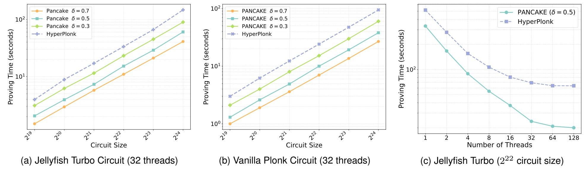
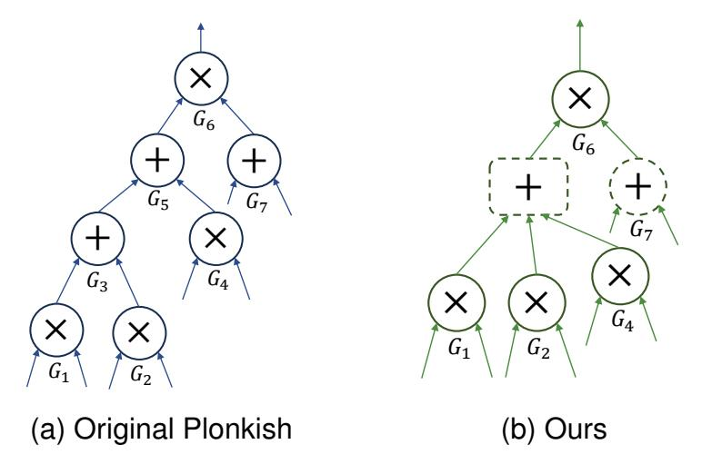
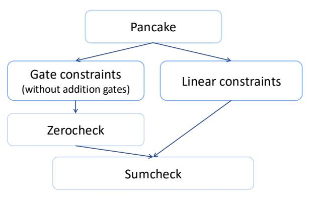
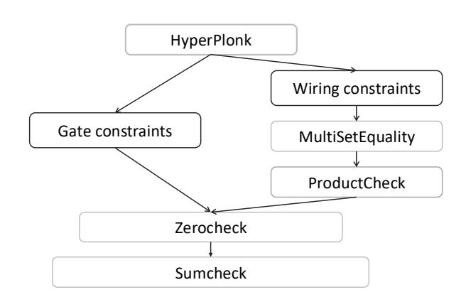
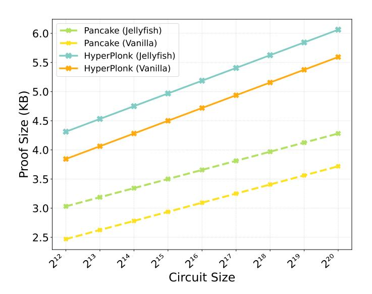

{0}------------------------------------------------

# PANCAKE: A SNARK with Plonkish Constraints, Almost-Free Additions, No Permutation Check, and a Linear-Time Prover

Yuxi Xue, Peimin Gao, Xingye Lu and Man Ho Au *The Hong Kong Polytechnic University Email: {yuxi-ivy.xue, peimin-cs.gao}@connect.polyu.hk, {xing-ye.lu, mhaau}@polyu.edu.hk*

*Abstract*—We present Pancake, a linear-time SNARK with a circuit-specific setup that eliminates the explicit representation and separate verification of addition gates in Plonkish constraint systems. Specifically, we consolidate wiring constraints and addition-gate constraints into a single family of general linear constraints, which can be enforced efficiently via a single sumcheck protocol. As a result, Pancake achieves "almostfree" addition gates, which significantly reduces the witness size and directly improves prover efficiency while preserving full support for high-degree custom gates.

Our implementation shows that Pancake outperforms the state-of-the-art Plonkish SNARK HyperPlonk (Chen et al., EUROCRYPT 2023) in terms of prover efficiency. For a circuit size of 2 <sup>24</sup> where half the gates are additions, Pancake achieves prover speedups of 1.67× (single-threaded) and 2.43× (32 threaded), while also generating smaller proofs and maintaining comparable verification time.

## 1. Introduction

Succinct non-interactive arguments of knowledge (SNARKs) [\[1\]](#page-12-0), [\[2\]](#page-12-1), [\[3\]](#page-12-2) are cryptographic primitives that enable the prover to generate a proof to convince the verifier of the validity of a computation. Typically, they are used to prove statements of the form: "Given a function F and a public input x, there exists a private witness w such that F(x, w) = 1." A key feature of SNARKs is their succinctness: the proof size and verification cost are constant or sublinear in the length of the witness. When combined with the zero-knowledge (ZK) property [\[4\]](#page-12-3), [\[5\]](#page-12-4), SNARKs allow a prover to demonstrate the validity of a computation without leaking any additional information. Due to these powerful features, SNARKs have enabled a wide range of applications, including scalable blockchain systems [\[6\]](#page-12-5), [\[7\]](#page-12-6), private smart contracts [\[8\]](#page-12-7), [\[9\]](#page-12-8), and verifiable outsourced computation [\[10\]](#page-12-9).

Modern SNARK constructions typically begin by encoding the computational statement as an arithmetic circuit defined over a finite field. This circuit is then formulated as a constraint system comprising a collection of algebraic relations, whose satisfiability guarantees the correct execution of the original computation. Two widely used constraint systems are Rank-1 Constraint Systems (R1CS) [\[11\]](#page-12-10), [\[12\]](#page-13-0),

[\[13\]](#page-13-1) and Plonkish constraint systems [\[14\]](#page-13-2), [\[15\]](#page-13-3), [\[16\]](#page-13-4), each with distinct trade-offs.

R1CS consists of a set of quadratic constraints, where each constraint verifies a single multiplication between two linear combinations of variables. This structure allows linear operations, such as addition, to be effectively "free," as they are implicitly absorbed into the combinations without increasing the number of constraints. However, R1CS is inherently limited to degree-2 relations, meaning that higher-degree relations must be decomposed into multiple intermediate constraints.

In contrast, Plonkish constraint systems adopt a gatecentric architecture, defining constraints in two categories: (1) *gate constraints* that enforce the local correctness of each gate, and (2) *wiring constraints* that ensure the output of one gate is correctly propagated as the input to subsequent gates. This design natively supports high-degree custom gates, significantly enhancing expressiveness. Specifically, a single custom gate can encapsulate complex operations, such as a round of a cryptographic hash (e.g., Poseidon hash [\[17\]](#page-13-5)) or an elliptic curve group operation [\[18\]](#page-13-6), thereby reducing the constraint count for complex operations.

Nevertheless, unlike R1CS, addition operations in Plonkish are not free, as each consumes an explicit constraint. This overhead is substantial in practice; for widely used circuits such as Poseidon hash [\[17\]](#page-13-5), SHA-256 [\[19\]](#page-13-7), and AES-128 [\[20\]](#page-13-8), addition gates constitute 50-70% of the total gate count. Since the prover cost scales with the number of constraints, these explicit addition constraints represent a large fraction of the total proving cost in Plonkish systems.

While the recent work Garuda [\[21\]](#page-13-9) demonstrates that linear-time proving with inexpensive linear computation and high-degree custom gates is achievable in the Generalized R1CS (GR1CS) system, a central challenge remains for Plonkish SNARKs: can one attain comparable prover efficiency while retaining its native circuit model and toolchain? This question is practically significant because a wide range of real-world applications are engineered around Plonkishstyle custom gates and circuit descriptions. In these existing deployments, wiring consistency and abundant linear computation are still realized and checked through mechanisms that introduce substantial prover overhead.

These considerations motivate the development of a Plonkish-compatible SNARK that retains native support for high-degree custom gates, makes linear computation essen

{1}------------------------------------------------

tially free, and enables linear-time proof generation.

In this paper, we introduce Pancake (Plonkish, Almost-free addition gate, No permutation Check, succinct non-interactive Argument of KnowledgE), a linear-time SNARK with a circuit-specific setup that directly addresses this challenge. Our core idea is to absorb linear computation into the wiring relations themselves. Specifically, we directly constrain the inputs to non-linear gates to satisfy the required linear relations (e.g., enforcing that a multiplication input equals the sum of earlier values), rather than introducing dedicated addition gates and wiring them forward. Consequently, the constraint system retains only non-linear gate constraints, while additions are handled implicitly through linear consistency checks, thereby making additions essentially free without sacrificing Plonkish-style expressiveness for custom gates.

To achieve a linear-time prover, Pancake operates within the multivariate polynomial framework, encoding the circuit's execution trace as multilinear polynomials over the Boolean hypercube. By operating over this domain rather than univariate encodings, Pancake avoids the quasi-linear overhead of Fast Fourier Transforms (FFTs) typically required in univariate settings, thereby removing a major bottleneck to achieving linear-time proof generation.

The integration of this efficient encoding with our new constraint system yields Pancake: a SNARK that preserves Plonkish expressiveness for high-degree custom gates while offering a linear-time prover and an "almost-free" treatment of linear operations.

We implement Pancake and benchmark it against HyperPlonk [15], the state-of-the-art multilinear SNARK based on Plonkish constraints. Our evaluation covers both vanilla Plonk circuit and Jellyfish Turbo Plonk circuit (the latter supporting high-degree custom gates), varying the addition gate ratio  $\delta$ . As shown in Figure 1, Pancake consistently outperforms HyperPlonk in all tested configurations. In single-threaded settings for Jellyfish circuits ( $n=2^{24}$ ), Pancake achieves speedups of  $2.37\times$  and  $1.67\times$  for  $\delta=0.7$  and  $\delta=0.5$ , respectively. Even with a low proportion of addition gates ( $\delta=0.3$ ), Pancake maintains a performance advantage with a  $1.11\times$  speedup. This advantage is further amplified in parallel settings: with 32 threads, the speedup at  $\delta=0.5$  increases to  $2.43\times$ , demonstrating Pancake's superior scalability in parallelized environments.

A limitation of Pancake is its requirement for a circuit-specific setup. While universal setups offer broader applicability, circuit-specific setups are a practical and well-accepted choice for long-lived applications like zkRollups, privacy-preserving Layer 2 solutions, and virtual machines, where the prover's cost is the dominant concern. In such large-scale scenarios, Pancake's fast proving represents a meaningful and justified trade-off.

To situate Pancake among circuit-specific SNARKs, we include two additional baselines with complementary strengths. We take Groth16 [22] as a canonical reference due to its broad adoption in industry and its compact proofs with highly efficient verification. We also include Garuda [21], a recent GR1CS-based SNARK that achieves state-of-the-

art linear proving time. However, given that direct comparisons between differing constraint systems (Plonkish vs. R1CS/GR1CS) are inherently complex and sensitive to implementation details, we defer a detailed case study on the Rescue hash circuit to Appendix A. There, Garuda achieves the fastest proving time, followed closely by Pancake, with both substantially outperforming Groth16.

### 1.1. Contributions

Our contributions are summarized as follows:

- A Plonkish-compatible constraint system with almost-free additions. We introduce a new constraint system that eliminates explicit addition gates by absorbing linear computation (in particular, additions) into the wiring relations of non-linear gates, while fully preserving support for high-degree custom gates.
- A linear check protocol. We design a new linear check, implemented via a single sumcheck, that enforces wiring consistency together with the absorbed linear relations in a unified manner.
- **The** Pancake **SNARK.** Building on the above, we construct Pancake, a SNARK with a linear-time prover under a circuit-specific trusted setup.
- Implementation and evaluation. We implement Pancake and benchmark it against HyperPlonk in both single-core and multi-core settings. Our results (Section 5) demonstrate consistent prover speedups and superior parallel scalability.

#### 1.2. Technique overview

We begin by reviewing the constraint system of Hyper-Plonk [15], which serves as the foundation for our work. This review will help clarify our technical departure point and key innovation.

Consider an arithmetic circuit  $\mathcal{C}$  with m fan-in-two gates, each performing an addition, multiplication, or a custom operation. Here, for simplicity, we assume that there is only one type of custom gate  $\tilde{G}: \mathbb{F}^2 \to \mathbb{F}$ , whereas in HyperPlonk more types of custom gates can be defined as needed. Let  $x \in \mathbb{F}^{\ell}$  be the public input. The wire values (left  $L_i$ , right  $R_i$ , output  $O_i$ ) and public inputs are encoded in a matrix  $\hat{T}$  with  $n = m + \ell + 1 = 2^{\mu}$  rows:

$$\hat{T} = \{(L_i, R_i, O_i) \in \mathbb{F}^3\}_{i=0,\dots,m+\ell}.$$

These values are interpolated into a witness polynomial  $T: B_{\mu+2} \to \mathbb{F}$  over the Boolean hypercube, where  $B_{\mu} := \{0,1\}^{\mu}$ , such that for each row index i (with  $\langle i \rangle_{\mu}$  being its  $\mu$ -bit binary representation):

$$T(0, 0, \langle i \rangle_{\mu}) = L_i, T(0, 1, \langle i \rangle_{\mu}) = R_i, T(1, 0, \langle i \rangle_{\mu}) = O_i,$$

The prover then demonstrates that T encodes a valid wire value assignment of the circuit. This process can be achieved by satisfying two types of constraints: gate constraints and wiring constraints.

{2}------------------------------------------------



<span id="page-2-5"></span>Figure 1. Proving times for HyperPlonk and Pancake across different addition gate ratios.

Gate constraints. Gate constraints ensure that each gate performs the correct arithmetic operation. For instance, an addition gate at index i must satisfy  $L_i + R_i = O_i$ , or equivalently  $T(0,0,\langle i\rangle_{\mu}) + T(0,1,\langle i\rangle_{\mu}) = T(1,0,\langle i\rangle_{\mu})$ .

In our case, with three types of gates in the circuit, we need corresponding three selector polynomials  $S_0, S_1, S_2$ :  $\mathbb{F}^\mu \to \{0,1\}$  to identify the type of gate operation for each row of the matrix  $\hat{T}$ . The evaluations of the selector polynomials on  $\langle i \rangle_\mu$  are specified in Table 1. It indicates that if gate i is an addition gate, then the evaluation of selector polynomials on  $\langle i \rangle_\mu$  should follow the row with type "addition".

<span id="page-2-1"></span>TABLE 1. SELECTOR POLYNOMIAL VALUES AND OUTPUT CONSTRAINTS FOR DIFFERENT GATE TYPES.

| Туре           | $ S_0(\langle i \rangle_\mu)$ | $ S_1(\langle i \rangle_{\mu}) $ | $S_2(\langle i \rangle_{\mu})$ | Constraint                        |
|----------------|-------------------------------|----------------------------------|--------------------------------|-----------------------------------|
| Addition       | 1                             | 0                                | 0                              | $O_i = L_i + R_i$                 |
| Multiplication | 0                             | 1                                | 0                              |                                   |
| Custom         | 0                             | 0                                | 1                              | $O_i = \tilde{G}(L_i, R_i)$       |
| Public Input   | 0                             | 0                                | 0                              | $O_i = PI(\langle i \rangle_\mu)$ |

Let polynomial PI:  $\mathbb{F}^{\mu} \to \{0,1\}$  encode the public inputs such that  $\text{PI}(\langle i \rangle_{\mu}) = \mathsf{x}_i$  for  $i \in [0,\ell-1]$  and is zero on the rest of  $B_{\mu}$ . The prover demonstrates that the following polynomial vanishes (evaluates to zero) on all  $x \in B_{\mu}$ :

$$0 = \mathsf{PI}(\boldsymbol{x}) + S_0(\boldsymbol{x}) \cdot \left( T(0,0,\boldsymbol{x}) + T(0,1,\boldsymbol{x}) \right) + S_1(\boldsymbol{x}) \cdot T(0,0,\boldsymbol{x}) \cdot T(0,1,\boldsymbol{x}) + S_2(\boldsymbol{x}) \cdot \tilde{G}\left( T(0,0,\boldsymbol{x}), T(0,1,\boldsymbol{x}) \right) - T(1,0,\boldsymbol{x}).$$
(1)

This is achieved via a *zerocheck*, a protocol which proves that a polynomial is identically zero on the Boolean hypercube, and can be reduced to a sumcheck.

**Wiring constraints.** Wiring constraints ensure the correct propagation of wire values through a circuit. Consider the circuit in Figure 2a, which contains 3 addition gates  $(G_3, G_5, G_7)$  and 4 multiplication gates  $(G_1, G_2, G_4, G_6)$ . The wiring constraints enforce the following equalities:

$$O_1 = L_3, O_2 = R_3, O_3 = L_5, O_4 = R_5, O_5 = L_6, O_7 = R_6.$$

<span id="page-2-4"></span><span id="page-2-2"></span><span id="page-2-0"></span>

Figure 2. Circuit representation comparison.

<span id="page-2-3"></span>In terms of the witness polynomial T, this translates to ensuring:

$$T(1,0,\langle 1\rangle_3) = T(0,0,\langle 3\rangle_3), T(1,0,\langle 2\rangle_3) = T(0,1,\langle 3\rangle_3),$$
  

$$T(1,0,\langle 3\rangle_3) = T(0,0,\langle 5\rangle_3), T(1,0,\langle 4\rangle_3) = T(0,1,\langle 4\rangle_3),$$
  

$$T(1,0,\langle 5\rangle_3) = T(0,0,\langle 6\rangle_3), T(1,0,\langle 7\rangle_3) = T(0,1,\langle 6\rangle_3).$$

For a circuit with w wiring constraints, each constraint  $t \in [0, w-1]$  is defined by a pair  $(\boldsymbol{b}_0^{(t)}, \boldsymbol{b}_1^{(t)})$  requiring  $T(\boldsymbol{b}_0^{(t)}) = T(\boldsymbol{b}_1^{(t)})$ .

To enforce the wiring constraints, HyperPlonk utilizes a permutation check. First, a permutation  $\sigma: B_{\mu+2} \to B_{\mu+2}$  is defined to encode all wiring relations: for each wiring pair  $(\boldsymbol{b}_0^{(t)}, \boldsymbol{b}_1^{(t)})$ , it sets  $\sigma(\boldsymbol{b}_0^{(t)}) = \boldsymbol{b}_1^{(t)}$ . For wires that are not part of the wiring relations, their permutations simply map to themselves.

The prover needs to demonstrate that  $T(\boldsymbol{b}) = T(\sigma(\boldsymbol{b}))$  for all  $\boldsymbol{b} \in B_{\mu+2}$ . To achieve this, HyperPlonk transforms the problem into a multiset equality check: prove that  $\{(\boldsymbol{b},T(\boldsymbol{b}))\}_{\boldsymbol{b}\in B_{\mu+2}}$  and  $\{(\sigma(\boldsymbol{b}),T(\boldsymbol{b}))\}_{\boldsymbol{b}\in B_{\mu+2}}$  are equal. This multiset equality is established using a product argument: given random challenges  $r_1,r_2,r_3$  from the verifier, the prover shows that

$$\prod_{\boldsymbol{b} \in B_{\mu+2}} \left( r_1 + r_2 \cdot \boldsymbol{b} + r_3 \cdot T(\boldsymbol{b}) \right) = \\
\prod_{\boldsymbol{b} \in B_{\mu+2}} \left( r_1 + r_2 \cdot \sigma(\boldsymbol{b}) + r_3 \cdot T(\boldsymbol{b}) \right)$$

{3}------------------------------------------------

Equivalently, defining  $f_1(\boldsymbol{X}) = r_1 + r_2 \cdot \boldsymbol{X} + r_3 \cdot T(\boldsymbol{X})$ ,  $f_2(\boldsymbol{X}) = r_1 + r_2 \cdot \sigma(\boldsymbol{X}) + r_3 \cdot T(\boldsymbol{X})$ , and  $f'(\boldsymbol{X}) = f_1(\boldsymbol{X})/f_2(\boldsymbol{X})$ , the prover shows that the accumulated product of f' over  $B_{\mu+2}$  equals 1. This productcheck protocol is subsequently reduced (together with the gate constraints) to a zerocheck, and then to a sumcheck, as illustrated in Figure 3b.

New approach for proving wiring constraints. Instead of the permutation check used in HyperPlonk, Pancake proves wiring constraints directly via a single sumcheck. The key idea is to batch all wiring equalities into one linear relation using random coefficients.

Consider two wiring constraints:  $T(\mathbf{a}_0) = T(\mathbf{a}_1)$  and  $T(\mathbf{a}_1) = T(\mathbf{a}_2)$ . Given a random challenge  $r \in \mathbb{F}$  from the verifier, we can combine them into:

$$r \cdot T(\boldsymbol{a}_0) - r \cdot T(\boldsymbol{a}_1) + r^2 \cdot T(\boldsymbol{a}_1) - r^2 \cdot T(\boldsymbol{a}_2) = 0.$$

This technique can be generalized for a set of w wiring constraints, each represented as a pair  $\mathcal{Q}^{(t)} := (\boldsymbol{b}_0^{(t)}, \boldsymbol{b}_1^{(t)})$ , where  $t \in [0, w-1]$ . We then have

<span id="page-3-0"></span>
$$\sum_{t=0}^{w-1} r^t \cdot \left( T(\boldsymbol{b}_0^{(t)}) - T(\boldsymbol{b}_1^{(t)}) \right) = 0.$$
 (2)

To verify Equation (2) efficiently, we encode the assigned random values of wiring relation into a selector polynomial  $W_r: B_{\mu+2} \to \mathbb{F}$ . We begin by constructing a coefficient vector  $\mathbf{w} \in \mathbb{F}^{2^{\mu+2}}$ , initialized to zero. For each constraint t, we update the entries that correspond to the wire indices:

$$\mathbf{w}[\boldsymbol{b}_0^{(t)}] \leftarrow \mathbf{w}[\boldsymbol{b}_0^{(t)}] + r^t, \quad \mathbf{w}[\boldsymbol{b}_1^{(t)}] \leftarrow \mathbf{w}[\boldsymbol{b}_1^{(t)}] - r^t.$$

Define  $W_r$  such that  $W_r(\boldsymbol{b}) = \mathbf{w}[\boldsymbol{b}]$  for all  $\boldsymbol{b} \in B_{\mu+2}$ . Then, Equation (2) is equivalent to:

$$\sum_{\boldsymbol{x}\in B_{\mu+2}} W_r(\boldsymbol{x}) \cdot T(\boldsymbol{x}) = 0,$$

which is directly amenable to a single sumcheck protocol. **New linear constraints.** Our core technical observation is that both wiring constraints and addition gate constraints are linear relations over the wire values. This allows them to be unified into a single set of *linear constraints*.

A wiring constraint enforces the equality of two wire values, e.g.,  $T(\mathbf{a}) = T(\mathbf{b})$ , which is equivalent to  $T(\mathbf{a}) - T(\mathbf{b}) = 0$ . An addition gate constraint, such as  $L_i + R_i - O_i = 0$ , is inherently linear. Consequently, both can be captured in a common form:

$$\sum_{j} \beta_{j} \cdot T(\boldsymbol{b}_{j}) = 0,$$

where  $\beta_j$  are scalar coefficients and  $\boldsymbol{b}_j$  represent hypercube points that identify specific wires. Formally, each constraint t is described by a tuple:

$$\mathcal{Q}^{(t)} := ((\beta_0^{(t)}, \boldsymbol{b}_0^{(t)}), (\beta_1^{(t)}, \boldsymbol{b}_1^{(t)}), \dots).$$

For instance, the linear relation  $T(a_1)+4\cdot T(a_2)-T(a_3)=0$  corresponds to the tuple  $(1, a_1, 4, a_2, -1, a_3)$ .

Critically, this unification changes how we verify addition gates. Rather than enforcing explicit gate constraints for each addition gate, we represent every addition gate as a linear relation among its input and output wires. Substituting

the wiring connections into these relations, we algebraically eliminate the intermediate wires introduced by additions. The result is a consolidated set of constraints involving only the wires of non-addition gates (i.e., multiplication and custom gates). These consolidated constraints simultaneously enforce correct wiring and the correctness of all original addition operations.

This substitution capability also allows a single linear relation to encode the constraints of multiple addition gates. For example, consider Fig. 2a, where verifying addition gates  $G_3$  and  $G_5$  traditionally requires six constraints:  $L_3 + R_3 = O_3$ ,  $L_5 + R_5 = O_5$ ,  $O_1 = L_3$ ,  $O_2 = R_3$ ,  $O_3 = L_5$ ,  $O_5 = L_6$ . In our approach, we absorb these into a single linear relation that involves only multiplication gate wires:

$$O_1 + O_2 + O_4 = L_6,$$

which implicitly ensures the correctness of  $G_3$  and  $G_5$  as shown in Figure 2b. Consequently, the total number of linear constraints w is typically much smaller than the original count of addition gates and wiring pairs.

Since addition gates are verified implicitly through the linear constraints, the witness polynomial T now only needs to encode the  $N=2^{\nu}$  non-addition gates. This reduces its domain size from  $2^{\mu}$  (all gates) to  $2^{\nu}$ , lowering the cost of all subsequent polynomial operations. The gate constraint is also simplified to only check non-addition gates, where the prover shows that for all  $x \in B_{\nu}$ :

$$0 = \mathsf{PI}(\boldsymbol{x}) + S_1(\boldsymbol{x}) \cdot \Big( T(0,0,\boldsymbol{x}) \cdot T(0,1,\boldsymbol{x}) \Big)$$
  
+  $S_2(\boldsymbol{x}) \cdot \tilde{G}\Big( T(0,0,\boldsymbol{x}), T(0,1,\boldsymbol{x}) \Big) - T(1,0,\boldsymbol{x}).$ 

As shown in Figure 3a, the constraint system of Pancake comprises two components: general linear constraints and gate constraints, with the latter only defining non-addition gate operations.

Put it all together. For each constraint  $t \in [0, w - 1]$ , we show:

$$\sum_{i=0}^{|\mathcal{Q}^{(t)}|-1} \beta_i^{(t)} \cdot T(\boldsymbol{b}_i^{(t)}) = 0.$$

With a random challenge r from the verifier, we batch these into a single equation:

<span id="page-3-1"></span>
$$\sum_{t=0}^{w-1} r^t \left( \sum_{i=0}^{|\mathcal{Q}^{(t)}|-1} \beta_i^{(t)} \cdot T(\boldsymbol{b}_i^{(t)}) \right) = 0.$$
 (3)

To transform Equation (3) into a sumcheck, we first encode the coefficients of each constraint t into a multilinear polynomial  $H_t$  as

$$H_t(\boldsymbol{X}) := \sum_{i=0}^{|\mathcal{Q}^{(t)}|-1} \beta_i^{(t)} \cdot \mathsf{eq}(\boldsymbol{b}_i^{(t)}, \boldsymbol{X}),$$

where eq $(\boldsymbol{b},X):=\prod_{i=1}^{\nu+2} \left(b_i X_i + (1-b_i)(1-X_i)\right)$ , and eq $(\boldsymbol{b},\boldsymbol{x})=1$  if  $\boldsymbol{b}=\boldsymbol{x}$ , and 0 otherwise. Thus, by construction,  $H_t(\boldsymbol{b}_i^{(t)})=\beta_i^{(t)}$  and  $H_t(\boldsymbol{x})=0$  for all other  $\boldsymbol{x}\in B_{\nu+2}$ . This allows us to rewrite each constraint as a sum over  $B_{\nu+2}$  as

$$\sum_{i=0}^{|\mathcal{Q}^{(t)}|-1} \beta_i^{(t)} \cdot T(\boldsymbol{b}_i^{(t)}) = \sum_{i=0}^{|\mathcal{Q}^{(t)}|-1} H_t(\boldsymbol{b}_i^{(t)}) \cdot T(\boldsymbol{b}_i^{(t)})$$
$$= \sum_{\boldsymbol{x} \in B_{\nu+2}} H_t(\boldsymbol{x}) T(\boldsymbol{x}).$$

{4}------------------------------------------------

<span id="page-4-1"></span>

(a) The PIOPs that make up Pancake.



<span id="page-4-0"></span>(b) The PIOPs that make up HyperPlonk.

Figure 3. The multilinear PIOPs that make up Pancake and HyperPlonk.

Substituting this into the batched Equation (3) yields:

$$\sum_{t=0}^{w-1} r^t \left( \sum_{x \in B_{\nu+2}} H_t(\boldsymbol{x}) \cdot T(\boldsymbol{x}) \right) = 0$$

This can also be expressed as:

$$\sum_{x \in B_{n+2}} \sum_{t=0}^{w-1} r^t H_t(\boldsymbol{x}) \cdot T(\boldsymbol{x}).$$

We define the selector polynomial  $W_r$  as the inner sum, which aggregates all batched coefficients:

$$W_r(\boldsymbol{X}) := \sum_{t=0}^{w-1} r^t \cdot H_t(\boldsymbol{X}).$$

This allows us to express the entire set of linear constraints as a single sumcheck

<span id="page-4-2"></span>
$$\sum_{\boldsymbol{x} \in B_{\nu+2}} W_r(\boldsymbol{x}) \cdot T(\boldsymbol{x}) = 0. \tag{4}$$

Challenge: Efficient evaluation of  $W_r$ . In the final round of sumcheck protocol (see section 2.4.1) for Equation (4), the verifier needs to evaluate  $W_r$  at a random point  $\alpha$ . Direct computation of  $W_r(\alpha)$  by the verifier incurs linear time complexity, which conflicts with our goal of achieving succinct verification.

A natural idea is to precompute  $W_r$  and commit to it during the offline phase, so that evaluation at any point can be handled efficiently online. However, constructing  $W_r$  depends on the random challenge r, which is chosen during the online phase. This dependency prevents fully precomputing  $W_r$  in the offline phase.

To address this, we introduce a new polynomial W(X,Y), which can be constructed offline, by replacing the random scalar r in  $W_r(X)$  with a formal variable Y:

$$W(\boldsymbol{X}, Y) := \sum_{t=0}^{w-1} Y^t \cdot H_t(\boldsymbol{X}).$$

The verifier can store the commitment  $C_W$  of W. With commitment  $C_W$  in hand, in the online phase, the verifier now asks the prover to open  $W(\alpha,r)$ . However, directly opening the commitment  $C_W$  at the point  $(\alpha,r)$  would be computationally expensive for typical multilinear polynomial commitment schemes, since W is a  $(\nu + 3)$ -variate polynomial with degree up to w-1 in Y.

Instead of a direct opening on  $(\alpha, r)$ , we exploit the relation  $W_r(\mathbf{x}) = W(\mathbf{x}, r)$  and require prover to first open  $W(\mathbf{X}, Y)$  on Y = r. This is achieved by proving the

existence of a quotient polynomial  $Q(\boldsymbol{X},Y)$  that satisfies the identity

<span id="page-4-3"></span>
$$Q(\boldsymbol{X}, Y)(Y - r) = W(\boldsymbol{X}, Y) - W_r(\boldsymbol{X})$$
(5)

If Equation (5) holds, then evaluating it at Y = r and  $X = \alpha$  gives  $W(\alpha, r) = W_r(\alpha)$ . The prover therefore opens  $W_r(X)$  at  $\alpha$ , which returns the desired value  $W(\alpha, r)$ .

Challenge: Costly online computation of Q. Our construction leverages the multilinear KZG polynomial commitment scheme [23] (see Section 2.5), which is additively homomorphic. With KZG, we can check Equation (5) using the pairing-based relation involving commitments to Q, W, and  $W_r$ . However, naively committing to Q is still very expensive.

We address this inefficiency by expressing Q as a linear combination of basis polynomials  $p_i$ , for which the commitments can be precomputed offline. As a result, the commitment to Q can be efficiently computed in linear time online.

We notice that the valid quotient polynomial Q from Equation (5) has the following structure

$$Q(\boldsymbol{X},Y) = \sum_{t=0}^{w-1} \frac{Y^t - r^t}{Y - r} \cdot H_t(\boldsymbol{X}).$$

With the standard algebraic identity  $\frac{Y^t - r^t}{Y - r} = \sum_{k=0}^{t-1} r^{t-1-k}$ .  $Y^k$ , we rewrite Q as

$$Q(X,Y) = \sum_{t=1}^{w-1} \left( \sum_{k=0}^{t-1} r^{t-1-k} \cdot Y^k \right) \cdot H_t(X).$$

Rearranging to isolate powers of the verifier challenge r yields

$$Q(X,Y) = \sum_{i=0}^{w-2} r^i \cdot \left( \sum_{t=i+1}^{w-1} Y^{t-i-1} \cdot H_t(X) \right)$$

Now we define a set of basis polynomials  $p_i$  for all  $i \in [0, w-2]$  as

<span id="page-4-4"></span>
$$p_i(\mathbf{X}, Y) := \sum_{t=i+1}^{w-1} Y^{t-i-1} \cdot H_t(\mathbf{X}).$$
 (6)

This allows Q to be expressed as a linear combination of these  $p_i$  polynomials, with coefficients being powers of r:

$$Q(\boldsymbol{X}, Y) = \sum_{i=0}^{w-2} r^i \cdot p_i(\boldsymbol{X}, Y).$$

For example, if there were w=4 constraints, we present the decomposition for Q in Figure 4.

{5}------------------------------------------------

```
Q(\textbf{\textit{X}},Y) = H_1(\textbf{\textit{X}}) + (r+Y)H_2(\textbf{\textit{X}}) + (r^2 + rY + Y^2)H_3(\textbf{\textit{X}})
\downarrow \text{Regroup terms by powers of } r
r^0: \ p_0(\textbf{\textit{X}},Y) = H_3(\textbf{\textit{X}})Y^2 + H_2(\textbf{\textit{X}})Y + H_1(\textbf{\textit{X}})
r^1: \ p_1(\textbf{\textit{X}},Y) = H_3(\textbf{\textit{X}})Y + H_2(\textbf{\textit{X}})
r^2: \ p_2(\textbf{\textit{X}},Y) = H_3(\textbf{\textit{X}})
\downarrow \text{Combine terms}
Q(\textbf{\textit{X}},Y) = p_0(\textbf{\textit{X}},Y) + r \cdot p_1(\textbf{\textit{X}},Y) + r^2 \cdot p_2(\textbf{\textit{X}},Y)
```

Figure 4. An example of rearranging the terms in quotient polynomial Q

Since the commitments  $C_i$  to  $p_i$  can be precomputed offline, the prover can compute the commitment  $C_Q$  online as  $C_Q := \sum_{i=0}^{w-2} r^i \cdot C_i$ . This calculation requires only w-2 group operations, avoiding both explicit polynomial division and the heavy cost of naive commitment approaches.

The efficiency of this approach relies on precomputing the commitments  $C_W$  and  $C_i$ . Using a generic universal setup to commit to these polynomials would involve  $O(w \cdot 2^{\nu})$  group operations, which is very expensive. In contrast, our scheme utilizes a linear-time circuit-specific setup. By exploiting the known sparsity and structure of  $H_t$ , we can generate all necessary commitments in linear time.

#### 1.3. Related Work

Achieving linear prover time has become a central focus in recent SNARK research. Spartan [24] provides a foundational paradigm in this direction: it encodes R1CS instances as multilinear polynomials to circumvent FFTs, and leverages the sparsity of constraint matrices to achieve linear-time proving. Building upon this multivariate foundation, several works have explored different trade-offs. Quarks [25] advances this line by instantiating Spartan with highly optimized polynomial commitment schemes, yielding transparent SNARKs that combine linear-time proving with sublinear verification. A separate thread of work focuses on eliminating field-specific restrictions and achieving postquantum security. Lee et al. [26] and Brakedown [27] instantiate the Spartan framework with linear-time error-correcting codes, producing field-agnostic SNARKs with strictly lineartime provers. This approach, however, inherently comes at the cost of larger proof sizes (e.g.,  $O(\sqrt{n})$ ), both asymptotically and concretely. Testudo [28] maintains Spartan's linear-time prover while achieving constant-size proofs and a square-root-size universal setup; it optimizes verification by delegating heavy proof verification to a Groth16 prover, though its handling of non-uniform circuits incurs some overhead. Most recently, Samaritan [29] integrates the Log-Up lookup argument to reduce Spartan's transparent proof size from  $O(\log^2 n)$  to  $O(\log n)$ , demonstrating how lookup techniques can further compress Spartan-style protocols.

Beyond the Spartan framework, alternative constructions pursue linear-time proving through different paradigms. LegoUAC [30] employs a modular commit-and-prove

framework based on matrix product arguments, achieving linear prover time with polylogarithmic proof sizes. Poppins [31] introduces a constraint system tailored for linear-time proving, though its concrete prover cost is reportedly higher than several earlier SNARKs. Gemini [32] proposes elastic SNARKs to offer a flexible time-space trade-off: a time-efficient mode with linear prover time, and a space-efficient mode that streams the computation, trading prover time for logarithmic memory usage.

<span id="page-5-0"></span>A significant advancement is HyperPlonk [15], which adapts Plonk [14] to the Boolean hypercube using multilinear polynomials, achieving linear-time proving while preserving native support for custom gates. Pancake builds on this foundation but departs in its constraint formulation: instead of enforcing linear relations with explicit addition gates, it absorbs linear operations and wiring consistency into a unified family of linear constraints, making additions effectively "almost free."

In the realm of circuit-specific setups, Groth16 [22] remains the industry benchmark for succinctness (three group elements), albeit requiring  $O(n \log n)$  prover time due to its reliance on FFTs. Recently, Garuda [21] proposed a linear-time SNARK that, like Pancake, leverages a circuit-specific trusted setup to make linear operations essentially free and to support high-degree custom gates. The fundamental architectural distinction lies in their constraint representations: Garuda operates over the Generalized R1CS (GR1CS) framework, whereas Pancake is built on the Plonkish model, which better aligns with existing Plonkish circuit toolchains.

Finally, we note similarities with Dynamo [33], a sparse zk-SNARK for permutation relations by employing random linear combinations technique. The key distinction lies in the algebraic encoding: Dynamo relies on univariate Lagrange polynomials, which, when extended to the multivariate setting, necessitate a higher-dimensional sumcheck involving twice the number of variables (i.e.,  $2\mu$  variables). In contrast, Pancake utilizes a monomial basis ( $Y^i$ ) to batch linear relations, which preserves the original variable count and results in a simpler multivariate sumcheck.

### 2. Preliminaries

We use  $\mathbb{F}$  to denote a finite field (e.g., the prime field  $\mathbb{F}_p$  for a large prime p) and  $\lambda \in \mathbb{N}$  to denote the security parameter. We denote the Boolean hypercube by  $B_{\mu} := \{0,1\}^{\mu}$ .

We use [n] to denote the integer set  $\{1,2,\ldots,n\}$ , and [n,m] to denote  $\{n,n+1,\ldots,m\}$  for integers m>n. For a vector  $\boldsymbol{f}$ , which is written in bold, we use  $f_i$  to denote the i-th element in  $\boldsymbol{f}$ . For a finite set S, we use  $s \stackrel{\$}{\leftarrow} S$  to denote that an element s is sampled uniformly at random from set S. For any  $m \in \mathbb{N}$  and  $i \in [0,2^m)$ , we use  $\langle i \rangle_m = v \in B_m$  to denote the m-bit binary representation of i, that is,  $i = \sum_{j=1}^m v_j \cdot 2^{j-1}$ .

**Indexed relation.** An indexed relation  $\mathcal{R}$  is a set of tuples (i; x; w), where i is the index, x is the instance, w is the witness. The corresponding indexed language  $\mathcal{L}(\mathcal{R})$  is

{6}------------------------------------------------

the set of pairs (i;x) for which there exists a witness w such that  $(i;x;w) \in \mathcal{R}$ . Given an indexed relation  $\mathcal{R}$ , the corresponding binary relation can be defined as  $\mathcal{R}_b = \{((i,x);w) : (i;x;w) \in \mathcal{R}\}$ . Typically, i describes an arithmetic circuit over a finite field  $\mathbb{F}$ , x denotes public inputs, and y denotes private witness.

**Pairings.** We consider bilinear groups  $(p, \mathbb{G}_1, \mathbb{G}_2, \mathbb{G}_T, e, g, h)$  characterized by the following properties:  $\mathbb{G}_1, \mathbb{G}_2$ , and  $\mathbb{G}_T$  are groups of prime order p, and there exists a bilinear pairing  $e: \mathbb{G}_1 \times \mathbb{G}_2 \to \mathbb{G}_T$ . The elements g and h are generators for  $\mathbb{G}_1$  and  $\mathbb{G}_2$ , respectively, with e(g, h) generating  $\mathbb{G}_T$ . Additionally, there are efficient algorithms for performing group operations, evaluating the bilinear map, verifying group membership, checking equality of elements, and sampling generators.

We write  $[a]_1$  for  $g^a$ ,  $[b]_2$  for  $h^b$ . Under this convention, we have generators  $g = [1]_1$  and  $h = [1]_2$ . Throughout, we use additive notation for group operations. For example, in this notation,  $[a]_1 + [b]_1 = [a+b]_1$ .

**Definition 1.** A multivariate polynomial is called a multilinear polynomial if its degree in each variable is at most one.

We use  $\mathbb{F}_{\mu}^{\leq d}[X]$  to denote the set of multivariate polynomials in  $\mathbb{F}[X_1,\ldots,X_{\mu}]$  where the degree in each variable is at most d;

**Lemma 1** (Multilinear extensions (MLE)). For every function  $f: B_{\mu} \to \mathbb{F}$  that maps  $\mu$ -bit elements to elements of  $\mathbb{F}$ , there is a unique multilinear polynomial  $\tilde{f} \in \mathbb{F}_{\mu}[X]$  such that  $\tilde{f}(\boldsymbol{b}) = f(\boldsymbol{b})$  for all  $\boldsymbol{b} \in B_{\mu}$ . We call  $\tilde{f}$  the multilinear extension (MLE) of f, and  $\tilde{f}$  can be expressed as:

$$\tilde{f}(X) = \sum_{\bm{b} \in B_{\mu}} f(\bm{b}) \cdot \operatorname{eq}(\bm{b}, X),$$

where  $eq(\mathbf{b}, X) := \prod_{i=1}^{\mu} (b_i X_i + (1 - b_i)(1 - X_i))$ . For any  $\mathbf{b} \in B_{\mu}$ ,  $eq(\mathbf{b}, X)$  satisfies  $eq(\mathbf{b}, \mathbf{b}) = 1$  and  $eq(\mathbf{b}, \mathbf{b}') = 0$  for any  $\mathbf{b}' \neq \mathbf{b}$ .

#### 2.1. Arguments of knowledge

An interactive argument of knowledge for an NP relation  $\mathcal{R}$  is a tuple of algorithms  $\Pi=(\mathsf{Setup},\mathcal{P},\mathcal{V})$ . Setup generates the proving key pp and verification key vp.  $\mathcal{P}$  is a computationally-bounded prover who interacts with a verifier  $\mathcal{V}$  to convince the verifier that there exists a witness w such that  $(x;w) \in \mathcal{R}$  for a public statement x through rounds of interaction. The interactive protocol x is an argument of knowledge for x if it satisfies perfect completeness and knowledge soundness. We adopt an existing definition [22]

• **Perfect Completeness:** For all  $(x, w) \in \mathcal{R}$  and  $(pp, vp) \leftarrow \mathsf{Setup}(1^{\lambda}),$ 

$$\Pr[\langle \mathcal{P}(\mathsf{pp}, \mathbf{w}), \mathcal{V}(\mathsf{vp}) \rangle(\mathbf{x}) = 1] = 1.$$

Here,  $\langle \mathcal{P}, \mathcal{V} \rangle(\mathbb{x})$  denotes the final decision of the verifier  $\mathcal{V}$  after interacting with  $\mathcal{P}$  on common input  $\mathbb{x}$ .

• **Knowledge Soundness:** For any  $(pp, vp) \leftarrow Setup(1^{\lambda})$ , any statement  $\mathbb{X}$ , and any PPT prover  $\mathcal{P}^*$ , there exists an expected polynomial-time extractor E with oracle access to  $\mathcal{P}^*$  such that  $\Pr[\langle \mathcal{P}^*(pp), \mathcal{V}(vp) \rangle(\mathbb{X}) = 1, (\mathbb{X}, \mathbb{W}) \notin \mathcal{R} \mid \mathbb{W} \leftarrow E^{\mathcal{P}^*(pp)}(\mathbb{X})] \leq negl(\lambda).$ 

**2.1.1. Succinct Non-interactive Arguments of Knowledge (SNARKs).** Interactive public-coin arguments can be transformed into non-interactive arguments using the Fiat-Shamir transform. This transformation replaces the verifier challenges with hashes of the transcript up to that point. Several works [34], [35] show that this is secure for multiround special-sound protocols and oracle proofs.

A protocol is public coin if all of the verifier's messages can be computed deterministically from a random public input. A non-interactive argument of knowledge (NARK) is considered succinct if, for every  $(x; w) \in \mathcal{R}$ , the proof size is  $poly(\lambda, \log(|x| + |w|))$ .

### **2.2. PIOP**

SNARKs can be constructed based on a combination of a cryptographic commitment scheme and an information-theoretic proof system, such as a polynomial commitment scheme and a polynomial interactive oracle proof (PIOP). In an interactive oracle proof (IOP) [36], each message is a string. Instead of reading the entire prover's messages, the verifier  $\mathcal{V}$  has oracle access to these messages, meaning that the verifier can query individual symbols of the message strings via random access. A PIOP [37] is a specific type of IOP in which the prover  $\mathcal{P}$  encodes its messages as polynomials and provides oracle access to these polynomials to  $\mathcal{V}$ . The verifier  $\mathcal{V}$  can then query the oracles by requesting the evaluations of the polynomials at randomly chosen points.

**Definition 2** (PIOP). [15] Let  $\mathcal{R} = \{(i; x; w)\}$  be a polynomial oracle relation over  $\mathbb{F}$ , where i and x can contain oracles to  $\mu$ -variate polynomials over some field  $\mathbb{F}$ . The oracles specify  $\mu$  and the degree of each variable. The oracles allow evaluation of the polynomials at arbitrary points in  $\mathbb{F}^{\mu}$ . The actual polynomials that these oracles represent are contained within the pp and the witness w. We denote an oracle to a polynomial f as [f]. In every round, the prover sends the multivariate polynomial oracles to the verifier, and the verifier then responds with random challenges, where the challenges are used to derive the query points to the oracles. Upon receiving the evaluations of the query points from the prover, the verifier outputs a decision bit.

**Proof of Knowledge.** Typically, PIOP satisfies perfect completeness, and  $\delta$ -knowledge-soundness. A formal and complete definition is provided in [15], [37].

**Complexity measures.** We measure the complexity for the PIOP based on the following parameters:

• Query complexity: number of queries the verifier performs to the oracles.

{7}------------------------------------------------

- *Round complexity*: number of rounds in the protocol, which is also the number of sent oracles.
- *Proof oracle size*: the length of the transmitted polynomials.
- Prover time: time complexity of the prover.
- Verifier time: time complexity of the verifier.

**Virtual Oracles and Commitments.** Given a set of polynomial oracles  $[[f_1]], \ldots, [[f_k]]$ , we define a virtual oracle for a function  $g(f_1, \ldots, f_k)$  as  $\{[[f_1]], \ldots, [[f_k]]\}$  and a description of g. To evaluate this virtual oracle at a point x, we first query each oracle to obtain  $y_i = f_i(x)$  for all  $i \in [k]$ , and then compute and return  $g(y_1, \ldots, y_k)$ .

This concept extends naturally to polynomial commitments. A virtual commitment to  $g([[f_1]], \ldots, [[f_k]])$  consists of the individual commitments and the function description. If the underlying commitment scheme is additively homomorphic, we can further exploit this property whenever g is an additive function. For instance, given commitments  $C_f$  and  $C_g$  to polynomials f and g respectively, a commitment to the linear combination (1-Y)f+Yg can be represented as the pair  $(C_f, C_g)$ . To evaluate this at a point (y, x), we compute  $(1-y)C_f+y\cdot C_g$  evaluated at x, utilizing the scheme's additive homomorphism.

### 2.3. PIOP Compilation [15], [37], [38]

A PIOP protocol  $\Pi_O$  can be compiled into interactive arguments of knowledge  $\Pi_A$  by leveraging cryptographic techniques such as polynomial commitments. Given a polynomial commitment scheme  $\Pi_{PC} = (\text{Setup}, \text{Com}, \text{Open}, \text{Eval})$ . In the compilation process, for each oracle polynomial in the PIOP, the prover sends its commitment. Subsequently, every oracle query by the verifier to a polynomial at some points is replaced with an invocation of the PCS's Eval algorithm at that point. The efficiency of  $\Pi_A$  depends on the efficiency of both the PIOP  $\Pi_O$  and  $\Pi_{PC}$ .

Witness-extended emulation. The property of witness-extended emulation strengthens the knowledge-soundness by requiring the extractor to produce both a witness and a simulated transcript between the prover and verifier [39]. A formal and complete definition is provided in [37].

<span id="page-7-1"></span>**Theorem 1** (PIOP Compilation [37], [38]). Let  $\Pi_{PC}$  be a polynomial commitment scheme and  $\Pi_O$  be a t-round Polynomial IOP for a relation  $\mathcal{R}$  over  $\mathbb{F}$ . If  $\Pi_{PC}$  has witness-extended emulation and  $\Pi_O$  has negligible knowledge error, then the PIOP compilation protocol  $\Pi_S$  is a secure publiccoin interactive argument of knowledge for  $\mathcal{R}$ .

The proof of Theorem 1 is presented in [37].

#### 2.4. PIOP building blocks

<span id="page-7-0"></span>**2.4.1. SumCheck.** We describe a PIOP for the sumcheck relation, based on work by [40], [41].

**Definition 3** (Sumcheck relation). The sumcheck relation  $\mathcal{R}_{\mathsf{sum}}$  is the set of tuples  $(\mathbf{x}; \mathbf{w}) = (v, [[f]]; f)$ , where  $f \in \mathbb{F}^{\leq d}_{\mu}[\mathbf{X}]$  and  $\sum_{\mathbf{b} \in B_{\mu}} f(\mathbf{b}) = v$ .

We now describe the sumcheck protocol  $\Pi_{\text{sum}}$  from Hyperplonk [15] (Section 3.1) that proves the relation  $\mathcal{R}_{\text{sum}}$ .

**Protocol**  $\Pi_{\mathsf{sum}}$ .  $\mathcal{P}(\mathbb{x}, \mathbb{w})$  and  $\mathcal{V}(\mathbb{x})$  run the following: For  $i = \mu, \mu - 1, \dots, 1$ :

• The prover computes the univariate polynomial

$$t_i(X) := \sum_{\boldsymbol{b} \in B_{i-1}} f(\boldsymbol{b}, X, \alpha_{i+1}, \dots, \alpha_{\mu}),$$

and derives the polynomial:

$$r_i(X) := \frac{t_i(X) - (1 - X) \cdot t_i(0) - X \cdot t_i(1)}{X \cdot (1 - X)}.$$

The prover sends the oracle  $[[r_i]]$  and the evaluation  $t_i(0)$  to the verifier, where  $r_i$  is univariate and of degree at most d-2.

- The verifier computes  $t_i(1) := v t_i(0)$ , samples  $\alpha_i \stackrel{\$}{\leftarrow} \mathbb{F}$  and queries  $r_i(\alpha_i)$ .
- The verifier computes

$$t_i(\alpha_i) = r_i(\alpha_i) \cdot (1 - \alpha_i) \cdot \alpha_i + (1 - \alpha_i) \cdot t_i(0) + \alpha_i \cdot t_i(1).$$

The verifier updates  $v \leftarrow t_i(\alpha_i)$ .

Finally, the verifier accepts if  $f(\alpha_1, \ldots, \alpha_{\mu}) = v$ .

Figure 5. Sumcheck PIOP  $\Pi_{\text{sum}}$  for  $\mathcal{R}_{\text{sum}}$ .

For a multivariate polynomial  $f(X) = h(g_1(X), \ldots, g_{\kappa}(X))$ , where polynomials  $g_i \in \mathbb{F}^{\leq 1}[X]$  for  $i \in [\kappa]$  are multilinear, and h is a c-variate polynomial of total degree d and is computable via an arithmetic circuit with O(d) gates, Hyperplonk leverages techniques from [42], [43]. These methods enable the prover to compute each round's univariate polynomial  $r_i$  in  $O(2^{\mu} \cdot d \log^2 d)$  field operations using dynamic programming, provided f has low circuit depth that can be evaluated in O(d) time.

<span id="page-7-3"></span>**Theorem 2.** The PIOP  $\Pi_{\mathsf{sum}}$  for relation  $\mathcal{R}_{\mathsf{sum}}$  has query complexity  $\mu+1$ , round complexity  $\mu$ , proof oracle size  $d \cdot \mu$ , prover time  $O(2^{\mu} \cdot d \log^2 d)$ , and verifier time  $O(\mu)$ .  $\Pi_{\mathsf{sum}}$  is perfectly complete and has knowledge error of  $\frac{d\mu}{|\mathbb{F}|}$ .

For the proof, we refer to [15], [41].

<span id="page-7-2"></span>**2.4.2. Zerocheck.** We now describe a PIOP that proves a multivariate polynomial evaluates to zero at every point in the Boolean hypercube. First, we define the ZeroCheck relation  $\mathcal{R}_{\sf zero}$  as follows:

**Definition 4** (ZeroCheck relation). The zerocheck relation  $\mathcal{R}_{\mathsf{zero}}$  is the set of tuples  $(\mathbf{x}; \mathbf{w}) = ([[f]]; f)$ , where  $f \in \mathbb{F}^{\leq d}_{\mu}[\mathbf{X}]$  and  $f(\mathbf{x}) = 0$  for all  $\mathbf{x} \in B_{\mu}$ .

We describe the PIOP for proving  $\mathcal{R}_{zero}$  from [15], [24] in Figure 6.

<span id="page-7-4"></span>**Theorem 3.** The PIOP  $\Pi_{\mathsf{zero}}$  for relation  $\mathcal{R}_{\mathsf{zero}}$  has query complexity  $\mu+1$ , round complexity  $\mu$ , proof oracle size  $d \cdot \mu$ ,

{8}------------------------------------------------

**Protocol**  $\Pi_{zero}$ .  $\mathcal{P}(x, w)$  and  $\mathcal{V}(x)$  run the following:

- 1)  $\mathcal{V}$  sends  $\mathcal{P}$  a random vector  $\mathbf{r} \stackrel{\$}{\leftarrow} \mathbb{F}^{\mu}$ .
- 2) Let  $f(\mathbf{X}) = f(\mathbf{X}) \cdot eq(\mathbf{X}, \mathbf{r})$ .
- 3) Run the Sumcheck PIOP  $\Pi_{\mathsf{sum}}$  for  $(0, [[\hat{f}]]; \hat{f}) \in \mathcal{R}_{\mathsf{sum}}$ .

<span id="page-8-1"></span>Figure 6. Zerocheck PIOP  $\Pi_{zero}$  for  $R_{zero}$ .

prover time  $O(2^{\mu} \cdot d \log^2 d)$ , and verifier time  $O(\mu)$ .  $\Pi_{\mathsf{zero}}$ is perfectly complete and has knowledge error of  $O(\frac{d\mu}{\|\mathbb{F}\|})$ .

Proof is referred to [15] (Section 3.2).

### <span id="page-8-0"></span>2.5. Multilinear polynomial commitment scheme

A polynomial commitment scheme (PCS) [44] enables a sender to commit to a polynomial while preserving the ability to later prove specific evaluations of that polynomial efficiently. We describe the KZG-based [44] multilinear polynomial commitment scheme [23] as follows.

• crs  $\leftarrow$  KZG.Setup $(1^{\lambda}, \mu)$ : On input of a security parameter  $\lambda$ , and the number of variables  $\mu$ . Pick  $\boldsymbol{\tau} = (\tau_1, \dots, \tau_u) \stackrel{\$}{\leftarrow} \mathbb{F}^{\mu}$ . Let  $U := \{ [eq(\boldsymbol{b}, \boldsymbol{\tau})]_1 \}_{\boldsymbol{b} \in B_u}$ . Output

$$\mathsf{crs} = \{U, [1]_1, [1]_2, [\tau_1]_2, \dots, [\tau_{\mu}]_2\}.$$

- $C \leftarrow \mathsf{KZG}.\mathsf{Com}(\mathsf{crs},f)$ : Suppose  $f(\boldsymbol{x}) = \sum_{\boldsymbol{b} \in B_{\mu}} f_{\boldsymbol{b}} \cdot \mathsf{eq}(\boldsymbol{b},\boldsymbol{x})$ . Computes  $C := \sum_{\boldsymbol{b} \in B_{\mu}} f_{\boldsymbol{b}} \cdot [\mathsf{eq}(\boldsymbol{b},\boldsymbol{\tau})]_1$ .
- $\pi \leftarrow \mathsf{KZG.Open}(f, a, \mathsf{crs})$ : To prove y := f(a) on point a. Computes the multilinear polynomials  $q_i(x)$ such that  $f(x) - y = \sum_{i \in [\mu]} (x_i - a_i)q_i(x)$ . Then computes  $\pi_i = [q_i(\boldsymbol{\tau})]_1$ , and takes  $\boldsymbol{\pi} = (\pi_1, ..., \pi_{\mu})$ as proof of the opening.
- $b \leftarrow \mathsf{KZG.Verify}(C, \boldsymbol{\pi}, \boldsymbol{a}, y, \mathsf{crs})$ : Check if

$$e(C - [y]_1, [1]_2) = \sum_{i \in [\mu]} e(\pi_i, [\tau_i - a_i]_2).$$

Returns 1 if the equality holds, else 0.

## 3. PIOP for New Constraint System

In this section, we first introduce a PIOP for proving the linear constraints. Then, we describe the complete PIOP for proving the new constraint system.

#### 3.1. PIOP for linear constraint

We begin by formalizing the linear constraint relation  $\mathcal{R}_{linear}$ . To keep the definition general, we consider a witness polynomial T over  $\nu$  variables.

**Definition 5** (Linear constraint relation). Given  $w \in \mathbb{N}$ , the relation  $\mathcal{R}_{\mathsf{linear}} = (i; x; w)$  is the set of all tuples

$$\mathcal{R}_{\mathsf{linear}} = (\mathcal{Q}; [[T]]; T),$$

where  $Q := (Q^{(0)}, \dots, Q^{(w-1)})$  is a set of linear constraints, each  $\mathcal{Q}^{(t)}:=(\beta_j^{(t)},\bm{b}_j^{(t)})_{j=0}^{|\mathcal{Q}^{(t)}|-1}$  with coefficients **Offline phase:**  $\mathcal{I}(i)$  runs

 $\bullet$   $\mathcal{I}$  constructs the polynomial  $\begin{array}{l} W(\boldsymbol{X},Y) := \sum_{t=0}^{w-1} Y^t \big( \sum_{i=0}^{|\mathcal{Q}^{(t)}|-1} \beta_i^{(t)} \cdot \operatorname{eq}(\boldsymbol{b}_i^{(t)},\boldsymbol{X}) \big). \\ \bullet \ \mathcal{I} \text{ outputs the oracle } [[W]]. \end{array}$ 

**Online phase:**  $\mathcal{P}(i, x, w)$  and  $\mathcal{V}(x, [[W]])$  execute:

- 1)  $\mathcal{V}$  samples randomness  $r \stackrel{\$}{\leftarrow} \mathbb{F}$  and sends r to  $\mathcal{P}$ .
- 2)  $\mathcal{P}$  computes:

  - $\begin{array}{l} \bullet \ \ W_r \leftarrow \mathsf{SelectPoly}(\mathcal{Q}, r, N) \ \text{using Algorithm 1,} \\ \bullet \ \ Q(\boldsymbol{X}, Y) := \frac{W(\boldsymbol{X}, Y) W_r(\boldsymbol{X})}{Y r} \in \mathbb{F}_{\nu+1}^{\leq w-2}[\boldsymbol{X}]. \end{array}$

 $\mathcal{P}$  sends oracles  $[[W_r]], [[Q]]$  to  $\mathcal{V}$ .

- 3) V samples  $\alpha \in \mathbb{F}^{\nu}, \gamma \in \mathbb{F}$  and queries  $Q(\alpha, \gamma)$ ,  $W(\boldsymbol{\alpha}, \gamma), W_r(\boldsymbol{\alpha}).$
- 4) V checks  $Q(\boldsymbol{\alpha}, \gamma)(\gamma r) = W(\boldsymbol{\alpha}, \gamma) W_r(\boldsymbol{\alpha})$ .
- 5) Let  $F(X) := W_r(X) \cdot T(X)$ .  $\mathcal{P}$  and  $\mathcal{V}$  run a sumcheck PIOP  $\Pi_{\mathsf{sum}}$  for  $(0, [[F]]; F) \in \mathcal{R}_{\mathsf{sum}}$ .

<span id="page-8-3"></span>Figure 7. PIOP  $\Pi_{\text{linear}}$  for  $\mathcal{R}_{\text{linear}}$ 

 $\beta_j^{(t)} \in \mathbb{F}$  and indices  $\boldsymbol{b}_j^{(t)} \in B_{\nu}$ .  $T \in \mathbb{F}_{\nu}^{\leq 1}[\boldsymbol{X}]$  is a multilinear polynomial such that for all  $t \in [0, w-1]$ ,  $\sum_{i=0}^{|\mathcal{Q}^{(t)}|-1} \beta_i^{(t)} \cdot T(\boldsymbol{b}_i^{(t)}) = 0.$ 

We combine these w constraints into a single sumcheck instance using a selector polynomial  $W_r \in \mathbb{F}_{\nu}^{\leq 1}[X]$ . Let  $N=2^{\nu}$ ,  $W_r$  is constructed through Algorithm 1, where  $\mathbf{w}[b]$  denotes the entry of  $\mathbf{w}$  indexed by the integer whose binary representation is b.

#### **Algorithm 1** Construct selector polynomial for $\mathcal{R}_{linear}$

```
Algorithm SelectPoly(Q, r, N)
1: \mathbf{w} \leftarrow [0; N]

    ▷ Initialize vector with zeros

2: for t = 0 to w - 1 do
             \begin{aligned} & \textbf{for } i = 0 \text{ to } |\mathcal{Q}^{(t)}| - 1 \textbf{ do} \\ & \mathbf{w}[\boldsymbol{b}_i^{(t)}] \leftarrow \mathbf{w}[\boldsymbol{b}_i^{(t)}] + \beta_i^{(t)} \cdot r^t \end{aligned} 
3:
4:
             end for
5:
6: end for
7: Define W_r such that W_r(\mathbf{b}) = \mathbf{w}[\mathbf{b}] for all \mathbf{b} \in B_{\nu}
8: return W_r
```

Our PIOP protocol  $\Pi_{\text{linear}}$  for the relation  $\mathcal{R}_{\text{linear}}$  is presented in Figure 7. In the offline phase, the indexer outputs an oracle |W| to the polynomial W. While in the online phase, the verifier uses this oracle to check the consistency between the random point evaluation of  $W_r$  and W through the quotient polynomial verification.

<span id="page-8-4"></span>**Theorem 4.** The PIOP  $\Pi_{\text{linear}}$  is perfectly complete, and has a knowledge soundness error of  $O\left(\frac{3\nu+2w}{|\mathbb{F}|}\right)$ .

The proof is presented in Appendix B.2.

## **3.2.** Pancake **PIOP construction**

Let the public input be  $x \in \mathbb{F}^{\ell}$ . Let  $\ell_{w} = 2^{\nu_{w}}$  denote the total number of input and output wires per gate, and let  $N=2^{\nu}$  be the total number of non-addition gates and public inputs.

{9}------------------------------------------------

The witness polynomial  $T \in \mathbb{F}^{\leq 1}_{\nu_{\mathsf{w}}+\nu}[\boldsymbol{Z},\boldsymbol{X}]$  is multilinear in  $(\nu_{\rm w} + \nu)$  variables. It encodes the public inputs in the output wire. Specifically, we require that for  $j \in [0, \ell - 1]$ ,  $T(\langle \ell_{\mathsf{w}} - 1 \rangle_{\nu_{\mathsf{w}}}, \langle j \rangle_{\nu}) = \mathsf{x}_{j}.$ 

To verify this encoding, the verifier constructs a public input polynomial  $PI \in \mathbb{F}_{\nu}^{\leq 1}[X]$ , where  $PI(\langle i \rangle_{\nu}) = x_i$  for  $i \in \{0, \dots, \ell-1\}$ , and  $\mathsf{PI}(\boldsymbol{x}) = 0$  for all other  $\boldsymbol{x} \in B_{\nu}$ . The verifier uses PI to check that the public inputs are correctly embedded in the witness polynomial.

<span id="page-9-2"></span>**Definition 6** (Pancake relation). Fix public parameters  $\mathsf{gp} := (\mathbb{F}, \ell, N, \ell_{\mathsf{w}}, \ell_{\mathsf{q}}, f, w), \text{ where:}$ 

- $\ell$  is the public input length.
- $N=2^{\nu}$  is the total number of non-addition gates and public inputs.
- $\ell_{\rm w}=2^{\nu_{\rm w}}$  is the total number of input wires and output wires per gate.
- $\ell_q = 2^{\nu_q}$  is the number of gate selector polynomials.  $f: \mathbb{F}^{1+\ell_q+\ell_w} \to \mathbb{F}$  is an algebraic map of degree d.
- w: total number of linear constraints.

The relation  $\mathcal{R}_{\mathsf{pcake}}$  consists of tuples

$$(i; x; w) = (Q, \{S_i\}_{i=0}^{\ell_q - 1}; PI; T),$$

where:

- $\bullet \ \mathcal{Q} := (\mathcal{Q}^{(0)}, \dots, \mathcal{Q}^{(w-1)})$  is a linear constraint set. For each  $t \in [0, w-1]$ , we define  $Q^{(t)} := (\beta_j^{(t)}, \boldsymbol{b}_j^{(t)})_{j=0}^{|Q^{(t)}|-1}$ , where  $\beta_j^{(t)} \in \mathbb{F}$  and  $\boldsymbol{b}_j^{(t)} \in B_{\nu_w+\nu}$ .
- $S_0, \ldots, S_{\ell_{\mathsf{q}}-1} \in \mathbb{F}_{\nu}^{\leq 1}[\boldsymbol{X}]$  are gate selector polynomials,
- $\mathsf{PI} \in \mathbb{F}_{\nu}^{\leq 1}[X]$  is public input polynomial,
- $T \in \mathbb{F}^{\leq 1}_{\nu_w + \nu}[\boldsymbol{Z}, \boldsymbol{X}]$  is witness polynomial,

such that

• Gate constraints:  $\forall x \in B_{\nu}$ ,

$$0 = f \begin{pmatrix} \mathsf{PI}(\boldsymbol{x}), S_0(\boldsymbol{x}), \dots, S_{\ell_{\mathsf{q}}-1}(\boldsymbol{x}), \\ T(\langle 0 \rangle_{\nu_{\mathsf{w}}}, \boldsymbol{x}), \dots, T(\langle \ell_{\mathsf{w}}-1 \rangle_{\nu_{\mathsf{w}}}, \boldsymbol{x}) \end{pmatrix}.$$

Here, the function f encodes the arithmetic relations of the circuit's non-addition gates (e.g., multiplication and custom gates).

• Linear constraints:

$$\forall t \in [0, w - 1] : \sum_{i=0}^{|\mathcal{Q}^{(t)}|-1} \beta_i^{(t)} \cdot T(\boldsymbol{b}_i^{(t)}) = 0.$$

Now, we present our PIOP  $\Pi_{pcake}$  for  $\mathcal{R}_{pcake}$ .

<span id="page-9-1"></span>**Theorem 5.** Let  $gp := (\mathbb{F}, \ell, N, \ell_w, \ell_q, f, w)$  be the public parameters where  $\ell_w, \ell_q = O(1)$  are some constants. Let d=deg(f). The PIOP construction  $\Pi_{\sf pcake}$  in Figure 8 is perfectly complete. It has knowledge soundness error  $O((d\nu+w)/|\mathbb{F}|)$  and achieves the following complexities: a query complexity  $2\nu + 4 + \nu_w$ , round complexity  $2\nu + \nu_w + 3$ , prover time and proof oracle size  $O(w \cdot N)$ , and verifier time of  $O(\nu)$ .

Proof is presented in Appendix B.3.

Offline phase:  $\mathcal{I}(i)$  runs

- $\mathcal{I}$  calls the PIOP  $\Pi_{\mathsf{linear}}$  indexer  $[[W]] \leftarrow \mathcal{I}_{\mathsf{linear}}(\mathcal{Q})$ .
- $\mathcal{I}$  outputs oracles  $\mathcal{O} = \{[[W]], [[S_0]], \dots, [[S_{\ell_q-1}]]\}.$

**Online phase:**  $\mathcal{P}(\mathsf{gp}, i, x, w)$  and  $\mathcal{V}(\mathsf{gp}, x, \mathcal{O})$  run

- 1)  $\mathcal{P}$  sends the witness oracle [[T]] to  $\mathcal{V}$ .
- 2) Gate Check: The prover runs the ZeroCheck PIOP  $\Pi_{\sf zero}$  (section 2.4.2) to show ([[G]]; G)  $\in \mathcal{R}_{\sf zero}$ , where the virtual polynomial G is defined as:

$$\mathsf{G}(\boldsymbol{X}) := f \begin{pmatrix} \mathsf{PI}(\boldsymbol{X}), S_0(\boldsymbol{X}), \dots, S_{\ell_{\mathsf{q}}-1}(\boldsymbol{X}), \\ T(\langle 0 \rangle_{\nu_{\mathsf{w}}}, \boldsymbol{X}), \dots, T(\langle \ell_{\mathsf{w}} - 1 \rangle_{\nu_{\mathsf{w}}}, \boldsymbol{X}) \end{pmatrix}.$$

3) **Linear Check:** The prover runs the PIOP  $\Pi_{\text{linear}}$  to show that  $(Q; [[T]]; T) \in \mathcal{R}_{linear}$ .

<span id="page-9-0"></span>Figure 8. PIOP  $\Pi_{\mathsf{pcake}}$  for  $\mathcal{R}_{\mathsf{pcake}}$ 

## 4. Pancake: linear-time prover SNARK with linear constraints

In this section, we introduce Pancake, our new SNARK construction that achieves linear-time prover efficiency. The adoption of our new constraint system reduces the size of the witness polynomial, resulting in substantial improvements in the prover's efficiency.

Our construction leverages the multilinear KZG polynomial commitment [23], as elaborated in Section 2.5. The KZG scheme necessitates a trusted setup phase, during which random field elements  $(\boldsymbol{\tau}, \tau_y) = (\tau_1, \dots, \tau_{\nu}, \tau_y) \in$  $\mathbb{F}^{\nu+1}$  are sampled. These parameters enable the commitment to a  $(\nu + 1)$ -variate polynomial f(X, Y) as a single group element  $|f(\boldsymbol{\tau}, \tau_y)|_1$ .

Recall that a key step in Pancake is verifying the polynomial identity in Equation (5). The KZG PCS enables efficient verification via the pairing check:

$$e([Q(\boldsymbol{\tau}, \tau_y)]_1, [\tau_y - r]_2) = e([W(\boldsymbol{\tau}, \tau_y)]_1 - [W_r(\boldsymbol{\tau})]_1, [1]_2).$$

To maintain linear-time complexity, the prover avoids explicitly constructing and committing to Q in the online phase. Instead, Pancake leverages the decomposition established in Equation (6), where Q(X,Y) is expressed as a linear combination  $\sum_{i=0}^{w-2} r^i \cdot p_i(X,Y)$ . Since the commitments  $C_i$  to  $p_i$  are precomputed during the Setup phase, the prover simply assembles the commitment to Q as  $C_Q = \sum_{i=0}^{w-2} r^i \cdot C_i$  in the online phase. This operation requires only O(w) group operations, where w is the number of linear constraints.

#### 4.1. Our construction

Let  $T \in \mathbb{F}^{\leq 1}_{\nu_w + \nu}[\boldsymbol{Z}, \boldsymbol{X}]$  be the multilinear witness polynomial. For batched PCS openings, we decompose T into  $\ell_{\mathsf{w}} = 2^{\nu_{\mathsf{w}}}$  polynomials  $\{T_j\}_{j=0}^{\ell_{\mathsf{w}}-1}$  defined by

$$\forall j \in [0, \ell_{\mathsf{w}} - 1], \ T_j(\boldsymbol{X}) := T(\langle j \rangle_{\nu_{\mathsf{w}}}, \boldsymbol{X}) \in \mathbb{F}_{\nu}^{\leq 1}[\boldsymbol{X}].$$

{10}------------------------------------------------

Following the same principle, we split the polynomial W into  $\ell_{\rm w}$  partial  $\nu+1$ -variate polynomials  $W_j$ , such that  $W_j(\boldsymbol{X},Y)=W(\langle j\rangle_{\nu_{\rm w}},\boldsymbol{X},Y)$ . We then have

<span id="page-10-2"></span>
$$W_j(\boldsymbol{X}, Y) := \sum_{t=0}^{w-1} Y^t \cdot H_t(\langle j \rangle_{\nu_w}, \boldsymbol{X}) \in \mathbb{F}_{\nu+1}^{< w}[\boldsymbol{X}], \quad (7)$$

where the term  $H_t$  is defined as:

$$H_t(\boldsymbol{Z}, \boldsymbol{X}) := \sum_{i=0}^{|\mathcal{Q}^{(t)}|-1} \beta_i^{(t)} \cdot \mathsf{eq}(\boldsymbol{b}_i^{(t)}, (\boldsymbol{Z}, \boldsymbol{X}))$$
(8)

Recall the selector polynomial  $W_r \in \mathbb{F}_{\nu_w+\nu}^{\leq 1}[\boldsymbol{Z},\boldsymbol{X}]$  is obtained by running Algorithm 1. To construct the corresponding partial polynomials  $W_{r,j} \in \mathbb{F}_{\nu}^{\leq 1}[\boldsymbol{X}]$  such that  $W_{r,j}(\boldsymbol{X}) = W_r(\langle j \rangle_{\nu_w}, \boldsymbol{X})$ , we present Algorithm 2 as:

### Algorithm 2 Construct partial selector polynomials

```
Algorithm SelectPolys(Q, r, \ell_{\mathsf{w}}, N)

1: \mathbf{w} \leftarrow [0; \ell_{\mathsf{w}} \cdot N]

2: \mathbf{for} \ t = 0 \ \text{to} \ w - 1 \ \mathbf{do}

3: \mathbf{for} \ i = 0 \ \text{to} \ |Q^{(t)}| - 1 \ \mathbf{do}

4: \mathbf{w}[\mathbf{b}_i^{(t)}] \leftarrow \mathbf{w}[\mathbf{b}_i^{(t)}] + \beta_i^{(t)} \cdot r^t

5: \mathbf{end} \ \mathbf{for}

6: \mathbf{end} \ \mathbf{for}

7: \mathbf{Define} \ \{W_{r,j}\}_{j=0}^{\ell_{\mathsf{w}}-1} \ \text{such that} \ W_{r,j}(\langle k \rangle_{\nu}) = \mathbf{w}_{j \cdot N+k} \ \text{for} \ k \in [0, N-1]

8: \mathbf{return} \ W_{r,0}, \dots, W_{r,\ell_{\mathsf{w}}-1}
```

**4.1.1. Linear Offline Setup Phase.** Our protocol relies on a circuit-specific trusted setup. While a universal setup is possible, naively committing to the polynomials  $W_j$  and the basis polynomials  $p_i^{(j)}$  (of degree w in Y) would require  $O(w \cdot N)$  time. To achieve linear time, we exploit a simple recurrence relation satisfied by the quotient basis polynomials  $p_i^{(j)}$ :

$$p_{i-1}^{(j)}(\boldsymbol{X},Y) = Y \cdot p_i^{(j)}(\boldsymbol{X},Y) + H_i(\langle j \rangle_{\nu_{\mathsf{w}}},\boldsymbol{X}).$$

We present the Setup algorithm in Algorithm 3. By precomputing a table for eq evaluations and leveraging the above recurrence, it generates all necessary commitments in O(N+w) time.

- **4.1.2. Online Protocol.** We now present the online phase of Pancake.  $\mathcal{P}(pp, x, w)$  and  $\mathcal{V}(vp, x)$  execute the following:
  - 1)  $\mathcal{P}$  computes witness commitments  $\hat{T}_j := [T_j(\boldsymbol{\tau})]_1$  for all  $j \in [0, \ell_{\mathsf{w}} 1]$  and sends them to  $\mathcal{V}$ .
  - 2)  $\mathcal{V}$  samples and sends the challenge  $r \stackrel{\$}{\leftarrow} \mathbb{F}$  to  $\mathcal{P}$ .
- 3)  $\mathcal{P}$  computes  $\{W_{r,j}\}_{j=0}^{\ell_{\mathsf{w}}-1} \leftarrow \mathsf{SelectPolys}(\mathcal{Q}, r, \ell_{\mathsf{w}}, N)$ . For each j,  $\mathcal{P}$  computes the commitment to  $W_{r,j}$  as

$$\hat{C}_{W,j} := \sum_{t=0}^{w-1} r^t \cdot \hat{H}_{j,t}.$$

and sends  $\hat{C}_{W,j}$  to  $\mathcal{V}$ . Note that  $W_{r,j}(\mathbf{X})$  is the specialization  $W_j(\mathbf{X},r)$  as in Equation (7).

- 4)  $\mathcal{V}$  samples and sends the challenge  $\gamma \stackrel{\$}{\leftarrow} \mathbb{F}$  to  $\mathcal{P}$ .
- 5)  $\mathcal{P}$  computes the batched quotient commitment:

$$\hat{C}_{Q,j} := \sum_{i=0}^{w-2} r^i \cdot \hat{C}_{j,i}, \quad \hat{C}_Q := \sum_{j=0}^{\ell_w-1} \gamma^j \cdot \hat{C}_{Q,j}.$$

### Algorithm 3 Linear-Time Circuit-Specific Trusted Setup

**Algorithm** Setup( $Q, \{S_i\}_{i=0}^{\ell_q-1}$ )

```
1: Sample \boldsymbol{\tau} = (\tau_1, \dots, \tau_{\nu}) \overset{\$}{\leftarrow} \mathbb{F}^{\nu}, \tau_y \overset{\$}{\leftarrow} \mathbb{F}.
2: Compute [\tau_i]_2 \in \mathbb{G}_2 for i \in [\nu].
  3: Set \operatorname{srs}_{\mathsf{v}} := ([1]_2, [\tau_y]_2, \{[\tau_i]_2\}_{i \in [\nu]}).
         — Precompute eq table M —
  4: Construct table M: Compute and store M|b| := eq(b, \tau) for
         all \boldsymbol{b} \in B_{\nu} in O(N) time [45].
  5: Set \operatorname{srs}_{\mathsf{p}} := (\operatorname{srs}_{\mathsf{v}}, \{\operatorname{eq}(\boldsymbol{b}, \boldsymbol{\tau})\}_{\boldsymbol{b} \in B_{\nu}}).

    Commit to selector and constraint polynomials —

  6: Compute S_i \leftarrow [S_i(\tau)]_1 for i \in [0, \ell_q - 1] using M.
  7: Compute W_j \leftarrow [W_j(\boldsymbol{\tau}, \tau_y)]_1 for j \in [0, \ell_w - 1] using M.

    Compute quotient basis commitments —

  8: for j = 0 to \ell_{w} - 1 do
                For t = 0, \dots, w - 1, compute:
  9:
                \hat{H}_{j,t} \leftarrow [H_t(\langle j \rangle_{\nu_{\mathsf{w}}}, \boldsymbol{\tau})]_1 using M. Base case for p_i^{(j)}: Set \hat{C}_{j,w-2} \leftarrow \hat{H}_{j,w-1}. Recursive step: For i = w-2 down to 1:
10:
11:
12:
                      \hat{C}_{j,i-1} \leftarrow \tau_y \cdot \hat{C}_{j,i} + \hat{H}_{j,i}.
13:
14: end for
         — Output —
15: return vp := \left( \operatorname{srs}_{\mathsf{v}}, \{ \hat{S}_i \}_{i=0}^{\ell_{\mathsf{q}}-1}, \{ \hat{W}_j \}_{j=0}^{\ell_{\mathsf{w}}-1} \right),
                       \mathsf{pp} := \left(\mathsf{srs}_{\mathsf{p}}, \{\hat{C}_{j,i}, \hat{H}_{j,t}\}_{\substack{j \in [0, \ell_{\mathsf{w}} - 1] \\ i \in [0, w - 2] \\ t \in [0, w - 1]}}, \{\hat{S}_i\}_{i = 0}^{\ell_{\mathsf{q}} - 1}\right).
```

 $\mathcal{P}$  sends  $\hat{C}_Q$  to  $\mathcal{V}$ .

- 6) For each j,  $\mathcal{V}$  computes  $\hat{E}_j := \hat{W}_j \hat{C}_{W,j}$ , and checks  $e(\hat{C}_Q, [\tau_y r]_2) \stackrel{?}{=} e\left(\sum_{j=0}^{\ell_w 1} \gamma^j \cdot \hat{E}_j, [1]_2\right).$
- 7)  $\mathcal{V}$  samples and sends the challenges  $\alpha \stackrel{\$}{\leftarrow} \mathbb{F}$ ,  $\mathbf{z} \stackrel{\$}{\leftarrow} \mathbb{F}^{\nu}$  to  $\mathcal{P}$ .
- 8) Let polynomial  $W \in \mathbb{F}_{\nu}^{\leq 2}[X], G \in \mathbb{F}_{\nu}^{\leq d}[X],$

$$W := W_{r,0} \cdot T_0 + \dots + W_{r,\ell_{w}-1} \cdot T_{\ell_{w}-1}.$$

$$G := f \left( \mathsf{PI}, S_0, \dots, S_{\ell_{q}-1}, T_0, \dots, T_{\ell_{w}-1} \right).$$

 $\mathcal{P}$  and  $\mathcal{V}$  run the sumcheck to prove

$$\sum_{\boldsymbol{b} \in B_{\nu}} \Big( \mathsf{W}(\boldsymbol{b}) + \alpha \cdot (\mathsf{G}(\boldsymbol{b}) \cdot \mathsf{eq}(\boldsymbol{b}, \boldsymbol{z})) \Big) = 0,$$

where the sumcheck is of size  $\nu$ , and has degree d+1.

- 9) The sumcheck protocol proceeds in several rounds. In each round,  $\mathcal{P}$  makes claims about certain polynomial evaluations. These evaluation claims are proved via the univariate batch-opening algorithm of Section C.2 in [46], producing a single  $\mathbb{G}_1$  proof element.
- 10) In the final round of the sumcheck protocol,  $\mathcal{V}$  queries the evaluations  $\{T_j(\boldsymbol{a}), W_{r,j}(\boldsymbol{a})\}_{j=0}^{\ell_w-1}, \{S_i(\boldsymbol{a})\}_{i=0}^{\ell_q-1}$  and computes  $\mathsf{PI}(\boldsymbol{a})$ .
- 11) V samples random challenges  $\zeta_0, \ldots, \zeta_{\ell_q+2\ell_w-1}$  and sends them to  $\mathcal{P}$ .
- 12)  $\mathcal{P}$  computes the batched polynomial B and its opening proof

$$B := \sum_{i=0}^{\ell_{\mathsf{q}}-1} \zeta_i \cdot S_i + \sum_{j=0}^{\ell_{\mathsf{w}}-1} \zeta_{j+\ell_{\mathsf{q}}} \cdot T_j + \sum_{j=0}^{\ell_{\mathsf{w}}-1} \zeta_{j+\ell_{\mathsf{q}}+\ell_{\mathsf{w}}} \cdot W_{r,j}.$$

{11}------------------------------------------------

 $\pi_o \leftarrow \mathsf{KZG.Open}(B, \boldsymbol{a}, \mathsf{srs}_\mathsf{p}). \ \mathcal{P} \ \text{sends} \ \pi_o \ \text{to} \ \mathcal{V}.$ 

13) V computes the expected commitment to B and the expected evaluation  $v_B$ :

$$C_{B} := \sum_{i=0}^{\ell_{\mathsf{q}}-1} \zeta_{i} \cdot \hat{S}_{i} + \sum_{j=0}^{\ell_{\mathsf{w}}-1} \zeta_{j+\ell_{\mathsf{q}}} \cdot \hat{T}_{j}$$

$$+ \sum_{j=0}^{\ell_{\mathsf{w}}-1} \zeta_{j+\ell_{\mathsf{q}}+\ell_{\mathsf{w}}} \cdot \hat{C}_{W,j},$$

$$v_{B} := \sum_{i=0}^{\ell_{\mathsf{q}}-1} \zeta_{i} \cdot S_{i}(\boldsymbol{a}) + \sum_{j=0}^{\ell_{\mathsf{w}}-1} \zeta_{j+\ell_{\mathsf{q}}} \cdot T_{j}(\boldsymbol{a})$$

$$+ \sum_{j=0}^{\ell_{\mathsf{w}}-1} \zeta_{j+\ell_{\mathsf{q}}+\ell_{\mathsf{w}}} \cdot W_{r,j}(\boldsymbol{a}).$$

14) V checks KZG.Verify $(C_B, \pi_o, a, v_B, srs_v)$  and accepts if it returns 1.

<span id="page-11-6"></span>**Theorem 6.** Pancake protocol is a perfectly complete and knowledge-sound argument of knowledge for the relation  $\mathcal{R}_{peake}$ .

Proof is presented in Appendix B.4.

## 4.2. Complexity

- Prover time:  $O_{\lambda}(N+w)$ .
- Verifier time:  $O_{\lambda}(\nu)$ .
- **Proof size**: Total  $2\nu + 2\ell_w + \ell_q$   $\mathbb{F}$  elements and  $2\nu + 2\ell_w + 2$   $\mathbb{G}_1$  elements.
  - $\mathbb{F}$  elements:  $2\nu$  from sumcheck rounds, and  $(2\ell_{\mathsf{w}} + \ell_{\mathsf{q}})$  from the evaluations of  $T_j, S_j, W_{r,j}$ .
  - $\mathbb{G}_1$  elements:  $2\ell_{\rm w}+1$  from polynomial commitments  $(\hat{T}_j,\hat{C}_{W,j},\hat{C}_Q)$ ,  $\nu$  from sumcheck rounds, 1 from the univariate batch-opening proof, and  $\nu$  from the Batched multilinear KZG evaluation proofs  $\pi_o$ .

## <span id="page-11-0"></span>5. Implementation and evaluations

We benchmarked Pancake on a server with 64GB RAM and an Intel Core i9-13900KF CPU (24 cores, 32 threads). Our implementation is based on the HyperPlonk library<sup>1</sup>, which utilizes the BLS12-381 curve to realize a multilinear KZG PCS.

### **5.1.** Comparison on proof size

The proof sizes of both HyperPlonk and Pancake are primarily determined by the circuit size and two circuit-dependent parameters:  $\ell_w$  (number of witness polynomials) and  $\ell_q$  (number of selector polynomials, which grows with the number of supported gate types). We consider two common circuit configurations:

- Jellyfish Turbo Plonk circuit:  $\ell_{\rm w}=5, \ell_{\rm g}=13,$
- Vanilla Plonk circuit:  $\ell_{\rm w}=3, \ell_{\rm q}=5.$

Let n be the number of total gates,  $\mu = \lceil \log_2 n \rceil$ , and  $\delta$  be the addition gate ratio. The HyperPlonk proof consists of:

- $3 + \ell_w + 2\mu$   $\mathbb{G}_1$  elements,
- <span id="page-11-1"></span>•  $4\mu + 9 + 2\ell_{\rm w} + \ell_{\rm q} + 2\lceil\log_2(8 + 2\ell_{\rm w} + \ell_{\rm q})\rceil$   $\mathbb F$  elements. Substituting these parameters yields the proof-size comparison (in KB) shown in Figure 9 (with  $\delta = 0.5$ ). As illustrated, Pancake consistently produces smaller proofs.
  - 1. https://github.com/EspressoSystems/HyperPlonk



<span id="page-11-2"></span>Figure 9. Proof size comparison

### **5.2. Performance comparison with** HyperPlonk

In this section, we evaluate the performance of Pancake against the baseline HyperPlonk [15]. We measure performance on both the Vanilla Plonk circuit [14] and the Jellyfish Turbo Plonk circuit<sup>2</sup>. Compared to the Vanilla circuit, the Jellyfish circuit supports high-degree custom gates (up to degree 5) and utilizes more witness polynomials, offering higher expressiveness with fewer gates for the same computation.

## Survey of addition gate ratios in application circuits.

To contextualize our benchmarks, Table 3 lists the addition-gate ratio  $\delta$  for several common circuits. We first compiled each benchmark program to R1CS using Circom [47], then converted it to a Plonkish circuit via Plonkify [48], and finally analyzed the gate distribution. The results show that  $\delta$  typically ranges from 0.5 to 0.7.

<span id="page-11-4"></span>TABLE 3. Addition gate ratios  $\delta$  for application circuits

| Application                            | Jellyfish | Vanilla |
|----------------------------------------|-----------|---------|
| Poseidon hash [17], [49]               | 0.59      | 0.70    |
| Curve point scalar multiplication [50] | 0.56      | 0.73    |
| SHA256 hash [19]                       | 0.54      | 0.67    |
| AES-encryption-128 [20]                | 0.65      | 0.77    |
| Zk-rollup using Poseidon hash [51]     | 0.51      | 0.63    |

**5.2.1. Verifier time.** The verifier time for Pancake is  $O(\nu)$ . To empirically assess Pancake's verifier performance, we compare it with HyperPlonk using Jellyfish Turbo Plonk circuit at  $\delta=0.5$ , as shown in Table 4, the verifier times for both systems are comparable, with Pancake being marginally slower.

TABLE 4. VERIFIER TIME COMPARISON (MS)

<span id="page-11-5"></span>

|                       | $2^{14}$   | $2^{15}$ | $2^{16}$     | $2^{17}$ | $2^{18}$ | $2^{19}$ | $2^{20}$ |
|-----------------------|------------|----------|--------------|----------|----------|----------|----------|
| HyperPlonk<br>Pancake | 9.4<br>9.8 |          | 10.3<br>10.3 |          |          |          |          |

<span id="page-11-3"></span>2. https://github.com/EspressoSystems/jellyfish/tree/HyperPlonk-bench

{12}------------------------------------------------

<span id="page-12-11"></span>TABLE 2. PROVER TIME (SECONDS) OF Pancake (FOR VARIOUS ADDITION GATE RATIOS  $\delta$ ) VS. HyperPlonk, COMPARING JELLYFISH TURBO PLONK AND VANILLA PLONK CIRCUITS FOR BOTH SINGLE-THREAD AND 32-THREAD EXECUTIONS.

|          | Jellyfish Turbo Plonk Circuit |         |         |             |            |                                            | Vanilla Plonk Circuit |            |               |         |             |            |                     |      |      |      |
|----------|-------------------------------|---------|---------|-------------|------------|--------------------------------------------|-----------------------|------------|---------------|---------|-------------|------------|---------------------|------|------|------|
| n        | Sing                          | gle Thi | read    |             | 32 Threads |                                            |                       |            | Single Thread |         |             |            | 32 Threads          |      |      |      |
|          | HyperPlonk                    | Par     | ncake l | by $\delta$ | HyperPlonk | ${VperPlonk}$ Pancake by $\delta \mid_{F}$ |                       | HyperPlonk |               | ncake l | by $\delta$ | HyperPlonk | Pancake by $\delta$ |      |      |      |
|          |                               | 0.7     | 0.5     | 0.3         |            | 0.7                                        | 0.5                   | 0.3        |               | 0.7     | 0.5         | 0.3        |                     | 0.7  | 0.5  | 0.3  |
| $2^{14}$ | 1.2                           | 0.6     | 0.9     | 1.1         | 0.2        | 0.1                                        | 0.1                   | 0.1        | 0.7           | 0.4     | 0.5         | 0.7        | 0.2                 | 0.1  | 0.1  | 0.1  |
| $2^{15}$ | 2.2                           | 1.1     | 1.6     | 2.2         | 0.3        | 0.1                                        | 0.2                   | 0.2        | 1.4           | 0.7     | 1.0         | 1.4        | 0.2                 | 0.1  | 0.1  | 0.2  |
| $2^{16}$ | 4.0                           | 2.0     | 2.9     | 4.0         | 0.6        | 0.2                                        | 0.3                   | 0.5        | 2.5           | 1.3     | 1.8         | 2.5        | 0.4                 | 0.2  | 0.2  | 0.3  |
| $2^{17}$ | 7.8                           | 3.8     | 5.4     | 7.7         | 1.1        | 0.4                                        | 0.6                   | 0.9        | 4.8           | 2.4     | 3.4         | 4.8        | 0.8                 | 0.3  | 0.4  | 0.5  |
| $2^{18}$ | 15.2                          | 7.1     | 10.2    | 14.9        | 2.0        | 0.8                                        | 1.1                   | 1.6        | 9.3           | 4.4     | 6.4         | 9.3        | 1.5                 | 0.5  | 0.7  | 1.1  |
| $2^{19}$ | 28.6                          | 13.6    | 19.6    | 28.2        | 4.0        | 1.5                                        | 2.1                   | 3.1        | 17.5          | 8.4     | 12.2        | 17.4       | 3.0                 | 1.0  | 1.3  | 2.1  |
| $2^{20}$ | 56.8                          | 25.7    | 36.9    | 54.0        | 8.9        | 3.0                                        | 3.9                   | 6.2        | 35.3          | 15.8    | 23.0        | 33.3       | 6.2                 | 1.9  | 2.6  | 4.0  |
| $2^{21}$ | 111.2                         | 49.3    | 71.0    | 104.0       | 17.1       | 5.8                                        | 7.3                   | 11.5       | 68.4          | 30.2    | 43.7        | 63.9       | 12.3                | 3.6  | 4.9  | 8.0  |
| $2^{22}$ | 215.6                         | 95.5    | 137.5   | 199.1       | 33.6       | 11.0                                       | 15.3                  | 23.2       | 132.3         | 59.2    | 84.0        | 121.6      | 24.1                | 7.0  | 10.0 | 15.2 |
| $2^{23}$ | 425.8                         | 182.5   | 263.2   | 386.8       | 66.5       | 21.1                                       | 29.0                  | 45.1       | 261.7         | 117.0   | 159.5       | 235.1      | 47.4                | 13.6 | 19.2 | 29.9 |
| $2^{24}$ | 851.1                         | 358.8   | 510.8   | 767.2       | 147.1      | 41.1                                       | 60.5                  | 89.9       | 518.6         | 230.6   | 307.9       | 465.2      | 94.6                | 26.8 | 38.0 | 60.0 |

**5.2.2.** Comparison of prover time. We benchmark prover time for Pancake and HyperPlonk in both single-threaded and multi-threaded settings. For Pancake, prover time depends on the addition-gate ratio  $\delta$ . Hence, for each  $\delta$  we (i) sample a random circuit with the target  $\delta$ , (ii) derive the corresponding linear constraint sets, and (iii) measure the prover time. For HyperPlonk, prover time is insensitive to  $\delta$ , so for each circuit size we report a single timing result.

Our prover time is dominated by multilinear extension operations and elliptic curve multi-exponentiations, both of which are highly parallelizable. Consequently, Pancake exhibits greater improvements over HyperPlonk as the level of parallelism increases.

## Jellyfish Turbo Plonk circuit.

- Single thread: As shown in Table 2, Pancake consistently outperforms HyperPlonk, with the advantage being most pronounced at high addition-gate ratios. For the circuit size  $n=2^{24}$ , Pancake achieves speedups of  $2.37 \times (\delta=0.7)$  and  $1.67 \times (\delta=0.5)$ .
- Multi-Thread (32 Threads): This advantage widens to  $3.6\times(\delta=0.7)$  and  $2.4\times(\delta=0.5)$  at  $n=2^{24}$ .
- Parallelism Scaling: Pancake demonstrates superior efficiency in leveraging parallel processing. We conducted an additional experiment on a high-performance dual-socket server (AMD EPYC 7502, 64 threads) to test scalability limits (see Figure 1c). On that hardware, for a  $2^{22}$ -gate circuit ( $\delta = 0.5$ ), Pancake achieves a  $16.6\times$  speedup when scaled from 1 to 128 threads, compared to  $8.1\times$  for HyperPlonk.

**Vanilla Plonk circuit.** We also evaluate performance on vanilla Plonk circuits, as shown in Figure 1b and Table 2.

- Single thread: At  $n=2^{24}$ , Pancake achieves a  $2.2\times$   $(\delta=0.7)$  and a  $1.7\times$   $(\delta=0.5)$  speedup.
- MultiThread (32 Threads): The speedups increase to  $3.5 \times (\delta = 0.7)$  and  $2.5 \times (\delta = 0.5)$ .

### References

- <span id="page-12-0"></span>[1] J. Kilian, "A note on efficient zero-knowledge proofs and arguments," in *Proceedings of the twenty-fourth annual ACM symposium on Theory of computing*, 1992, pp. 723–732.
- <span id="page-12-1"></span>[2] C. Gentry and D. Wichs, "Separating succinct non-interactive arguments from all falsifiable assumptions," in *Proceedings of the forty-third annual ACM symposium on Theory of computing*, 2011, pp. 99–108.
- <span id="page-12-2"></span>[3] N. Bitansky, R. Canetti, A. Chiesa, and E. Tromer, "From extractable collision resistance to succinct non-interactive arguments of knowledge, and back again," in *Proceedings of the 3rd innovations in theoretical computer science conference*, 2012, pp. 326–349.
- <span id="page-12-3"></span>[4] S. Goldwasser, S. Micali, and C. Rackoff, "The knowledge complexity of interactive proof-systems," in *Providing sound foundations for cryptography: On the work of shafi goldwasser and silvio micali*, 2019, pp. 203–225.
- <span id="page-12-4"></span>[5] E. Ben-Sasson, A. Chiesa, E. Tromer, and M. Virza, "Succinct {Non-Interactive} zero knowledge for a von neumann architecture," in *23rd USENIX Security Symposium (USENIX Security 14)*, 2014, pp. 781–796.
- <span id="page-12-5"></span>[6] T. Xie, J. Zhang, Z. Cheng, F. Zhang, Y. Zhang, Y. Jia, D. Boneh, and D. Song, "zkbridge: Trustless cross-chain bridges made practical," in *Proceedings of the 2022 ACM SIGSAC Conference on Computer and Communications Security*, 2022, pp. 3003–3017.
- <span id="page-12-6"></span>[7] T. Miyamae, F. Kozakura, M. Nakamura, and M. Morinaga, "Zgridbc: Zero-knowledge proof based scalable and privacy-enhanced blockchain platform for electricity tracking," *IEICE TRANSACTIONS on Information and Systems*, vol. 106, no. 7, pp. 1219–1229, 2023.
- <span id="page-12-7"></span>[8] D. Rathee, G. V. Policharla, T. Xie, R. Cottone, and D. Song, "Zebra: Snark-based anonymous credentials for practical, private and accountable on-chain access control," *Cryptology ePrint Archive*, 2022.
- <span id="page-12-8"></span>[9] H. Kalodner, S. Goldfeder, X. Chen, S. M. Weinberg, and E. W. Felten, "Arbitrum: Scalable, private smart contracts," in *27th USENIX Security Symposium (USENIX Security 18)*, 2018, pp. 1353–1370.
- <span id="page-12-9"></span>[10] M. Green, M. Hall-Andersen, E. Hennenfent, G. Kaptchuk, B. Perez, and G. Van Laer, "Efficient proofs of software exploitability for real-world processors," *Proceedings on Privacy Enhancing Technologies*, 2023.
- <span id="page-12-10"></span>[11] R. Gennaro, C. Gentry, B. Parno, and M. Raykova, "Quadratic span programs and succinct nizks without pcps," in *Advances in Cryptology–EUROCRYPT 2013: 32nd Annual International Conference on the Theory and Applications of Cryptographic Techniques, Athens, Greece, May 26-30, 2013. Proceedings 32.* Springer, 2013, pp. 626–645.

{13}------------------------------------------------

- <span id="page-13-0"></span>[12] S. Setty, B. Braun, V. Vu, A. J. Blumberg, B. Parno, and M. Walfish, "Resolving the conflict between generality and plausibility in verified computation," in *Proceedings of the 8th ACM European Conference on Computer Systems*, 2013, pp. 71–84.
- <span id="page-13-1"></span>[13] E. Ben-Sasson, A. Chiesa, M. Riabzev, N. Spooner, M. Virza, and N. P. Ward, "Aurora: Transparent succinct arguments for r1cs," in *Advances in Cryptology–EUROCRYPT 2019: 38th Annual International Conference on the Theory and Applications of Cryptographic Techniques, Darmstadt, Germany, May 19–23, 2019, Proceedings, Part I 38*. Springer, 2019, pp. 103–128.
- <span id="page-13-2"></span>[14] A. Gabizon, Z. J. Williamson, and O. Ciobotaru, "Plonk: Permutations over lagrange-bases for oecumenical noninteractive arguments of knowledge," *Cryptology ePrint Archive*, 2019.
- <span id="page-13-3"></span>[15] B. Chen, B. Bünz, D. Boneh, and Z. Zhang, "Hyperplonk: Plonk with linear-time prover and high-degree custom gates," in *Annual International Conference on the Theory and Applications of Cryptographic Techniques*. Springer, 2023, pp. 499–530.
- <span id="page-13-4"></span>[16] A. R. Choudhuri, S. Garg, A. Goel, S. Sekar, and R. Sinha, "Sublonk: Sublinear prover plonk," *Proceedings on Privacy Enhancing Technologies*, 2024.
- <span id="page-13-5"></span>[17] L. Grassi, D. Khovratovich, C. Rechberger, A. Roy, and M. Schofnegger, "Poseidon: A new hash function for {Zero-Knowledge} proof systems," in *30th USENIX Security Symposium (USENIX Security 21)*, 2021, pp. 519–535.
- <span id="page-13-6"></span>[18] D. Hopwood, S. Bowe, J. Taylor, and S. Hornby, "The halo 2 zero-knowledge proving system," [https://zcash.github.io/halo2/,](https://zcash.github.io/halo2/) 2020, accessed: 2024-05-01.
- <span id="page-13-7"></span>[19] iden3, "circomlib: sha256/main.circom – sha256 circuit implementation," [https://github.com/iden3/circomlib/blob/master/circuits/sha256/](https://github.com/iden3/circomlib/blob/master/circuits/sha256/main.circom) [main.circom,](https://github.com/iden3/circomlib/blob/master/circuits/sha256/main.circom) 2023, gitHub repository file. [Online; accessed 2025- 05-17].
- <span id="page-13-8"></span>[20] Pluto, "Circom aes-gcm circuits," [https://github.com/pluto/](https://github.com/pluto/aes-circuits) [aes-circuits,](https://github.com/pluto/aes-circuits) 2023, gitHub repository. [Online; accessed 2025- 05-17].
- <span id="page-13-9"></span>[21] M. Dellepere, P. Mishra, and A. Shirzad, "Garuda and pari: faster and smaller snarks via equifficient polynomial commitments," *Cryptology ePrint Archive*, 2024.
- <span id="page-13-10"></span>[22] J. Groth, "On the size of pairing-based non-interactive arguments," in *Advances in Cryptology–EUROCRYPT 2016: 35th Annual International Conference on the Theory and Applications of Cryptographic Techniques, Vienna, Austria, May 8-12, 2016, Proceedings, Part II 35*. Springer, 2016, pp. 305–326.
- <span id="page-13-11"></span>[23] C. Papamanthou, E. Shi, and R. Tamassia, "Signatures of correct computation," in *Theory of Cryptography Conference*. Springer, 2013, pp. 222–242.
- <span id="page-13-12"></span>[24] S. Setty, "Spartan: Efficient and general-purpose zksnarks without trusted setup," in *Annual International Cryptology Conference*. Springer, 2020, pp. 704–737.
- <span id="page-13-13"></span>[25] S. Setty and J. Lee, "Quarks: Quadruple-efficient transparent zksnarks," *Cryptology ePrint Archive*, 2020.
- <span id="page-13-14"></span>[26] J. Lee, S. Setty, J. Thaler, and R. Wahby, "Linear-time and postquantum zero-knowledge snarks for r1cs," *Cryptology ePrint Archive*, 2021.
- <span id="page-13-15"></span>[27] A. Golovnev, J. Lee, S. Setty, J. Thaler, and R. S. Wahby, "Brakedown: Linear-time and field-agnostic snarks for r1cs," in *Annual International Cryptology Conference*. Springer, 2023, pp. 193–226.
- <span id="page-13-16"></span>[28] M. Campanelli, N. Gailly, R. Gennaro, P. Jovanovic, M. Mihali, and J. Thaler, ": Linear time prover snarks with constant size proofs and square root size universal setup," in *International Conference on Cryptology and Information Security in Latin America*. Springer, 2023, pp. 331–351.
- <span id="page-13-17"></span>[29] C. Ganesh, S. Patranabis, and N. Singh, "Samaritan: Linear-time prover snark from new multilinear polynomial commitments," *Cryptology ePrint Archive*, 2025.

- <span id="page-13-18"></span>[30] M. Campanelli, D. Fiore, and A. Querol, "Legosnark: Modular design and composition of succinct zero-knowledge proofs," in *Proceedings of the 2019 ACM SIGSAC Conference on Computer and Communications Security*, 2019, pp. 2075–2092.
- <span id="page-13-19"></span>[31] A. Kothapalli, E. Masserova, and B. Parno, "Poppins: A direct construction for asymptotically optimal zksnarks," *Cryptology ePrint Archive*, 2020.
- <span id="page-13-20"></span>[32] J. Bootle, A. Chiesa, Y. Hu, and M. Orru, "Gemini: Elastic snarks for diverse environments," in *Annual International Conference on the Theory and Applications of Cryptographic Techniques*. Springer, 2022, pp. 427–457.
- <span id="page-13-21"></span>[33] W. Wang, C. Papamanthou, S. Srinivasan, and D. Papadopoulos, "Dynamic zk-snarks," *Cryptology ePrint Archive*, 2024.
- <span id="page-13-22"></span>[34] T. Attema, S. Fehr, and M. Klooß, "Fiat-shamir transformation of multi-round interactive proofs," in *Theory of Cryptography Conference*. Springer, 2022, pp. 113–142.
- <span id="page-13-23"></span>[35] D. Wikström, "Special soundness in the random oracle model," *Cryptology ePrint Archive*, 2021.
- <span id="page-13-24"></span>[36] E. Ben-Sasson, A. Chiesa, and N. Spooner, "Interactive oracle proofs," in *Theory of Cryptography: 14th International Conference, TCC 2016-B, Beijing, China, October 31-November 3, 2016, Proceedings, Part II 14*. Springer, 2016, pp. 31–60.
- <span id="page-13-25"></span>[37] B. Bünz, B. Fisch, and A. Szepieniec, "Transparent snarks from dark compilers," in *Advances in Cryptology–EUROCRYPT 2020: 39th Annual International Conference on the Theory and Applications of Cryptographic Techniques, Zagreb, Croatia, May 10–14, 2020, Proceedings, Part I 39*. Springer, 2020, pp. 677–706.
- <span id="page-13-26"></span>[38] A. Chiesa, Y. Hu, M. Maller, P. Mishra, N. Vesely, and N. Ward, "Marlin: Preprocessing zksnarks with universal and updatable srs," in *Advances in Cryptology–EUROCRYPT 2020: 39th Annual International Conference on the Theory and Applications of Cryptographic Techniques, Zagreb, Croatia, May 10–14, 2020, Proceedings, Part I 39*. Springer, 2020, pp. 738–768.
- <span id="page-13-27"></span>[39] Lindell, "Parallel coin-tossing and constant-round secure two-party computation," *Journal of Cryptology*, vol. 16, pp. 143–184, 2003.
- <span id="page-13-28"></span>[40] C. Lund, L. Fortnow, H. Karloff, and N. Nisan, "Algebraic methods for interactive proof systems," *Journal of the ACM (JACM)*, vol. 39, no. 4, pp. 859–868, 1992.
- <span id="page-13-29"></span>[41] J. Thaler *et al.*, "Proofs, arguments, and zero-knowledge," *Foundations and Trends® in Privacy and Security*, vol. 4, no. 2–4, pp. 117– 660, 2022.
- <span id="page-13-30"></span>[42] J. Thaler, "Time-optimal interactive proofs for circuit evaluation," in *Annual Cryptology Conference*. Springer, 2013, pp. 71–89.
- <span id="page-13-31"></span>[43] T. Xie, J. Zhang, Y. Zhang, C. Papamanthou, and D. Song, "Libra: Succinct zero-knowledge proofs with optimal prover computation," in *Advances in Cryptology–CRYPTO 2019: 39th Annual International Cryptology Conference, Santa Barbara, CA, USA, August 18–22, 2019, Proceedings, Part III 39*. Springer, 2019, pp. 733–764.
- <span id="page-13-32"></span>[44] A. Kate, G. M. Zaverucha, and I. Goldberg, "Constant-size commitments to polynomials and their applications," in *Advances in Cryptology-ASIACRYPT 2010: 16th International Conference on the Theory and Application of Cryptology and Information Security, Singapore, December 5-9, 2010. Proceedings 16*. Springer, 2010, pp. 177–194.
- <span id="page-13-33"></span>[45] V. Vu, S. Setty, A. J. Blumberg, and M. Walfish, "A hybrid architecture for interactive verifiable computation," in *2013 IEEE Symposium on Security and Privacy*. IEEE, 2013, pp. 223–237.
- <span id="page-13-34"></span>[46] D. Boneh, J. Drake, B. Fisch, and A. Gabizon, "Halo infinite: Proofcarrying data from additive polynomial commitments," in *Advances in Cryptology–CRYPTO 2021: 41st Annual International Cryptology Conference, CRYPTO 2021, Virtual Event, August 16–20, 2021, Proceedings, Part I 41*. Springer, 2021, pp. 649–680.
- <span id="page-13-35"></span>[47] Iden3, "Circom: Circuit compiler for zero-knowledge proofs," [https://](https://github.com/iden3/circom) [github.com/iden3/circom,](https://github.com/iden3/circom) 2020, gitHub repository. [Online; accessed 2025-05-17].

{14}------------------------------------------------

- <span id="page-14-2"></span>[48] P. Zhu, "Plonkify: R1cs-to-plonk transpiler," Cryptology ePrint Archive, 2025.
- <span id="page-14-3"></span>[49] Shivangi470, "Poseidon circom circuits," https://github.com/ shivangi470/poseidon.circom, 2023.
- <span id="page-14-4"></span>[50] iden3, "circomlib: escalarmul\_test.circom - test circuit for elliptic curve scalar multiplication," https://github.com/iden3/circomlib/blob/ master/test/circuits/escalarmul\_test.circom, 2023.
- <span id="page-14-5"></span>[51] stksax, "zk\_rollup: Circom-based zkrollup with eddsa verification and merkle tree batching," https://github.com/stksax/zk\_rollup, 2023, gitHub repository. [Online; accessed 2025-05-17].
- <span id="page-14-8"></span>[52] A. Szepieniec, T. Ashur, and S. Dhooghe, "Rescue-prime: a standard specification (sok)," Cryptology ePrint Archive, 2020.
- <span id="page-14-12"></span>[53] B. Libert, "Simulation-extractable kzg polynomial commitments and applications to hyperplonk," in IACR International Conference on Public-Key Cryptography. Springer, 2024, pp. 68–98.

## <span id="page-14-0"></span>Appendix A. Performance comparison with Groth16 and Garuda

To situate Pancake among state-of-the-art SNARKs with circuit-specific setups, we benchmark it against Groth16 [22] (implementation: Arkworks<sup>3</sup>) and Garuda [21] (implementation: Garuda-pari<sup>4</sup>), using the Rescue hash function [52]. Our benchmark circuit, taken from the Jellyfish library<sup>5</sup>, has an addition-gate ratio of 35%.

The systems differ fundamentally in arithmetization and proving complexity. Groth16 (R1CS-based) has a quasilinear-time prover (due to FFTs) and requires more constraints for the same operation. In contrast, Pancake (Plonkish) and Garuda (GR1CS-based) both achieve linear-time proving and are more constraint-efficient by leveraging support for high-degree custom gates. Our single-threaded experimental results are as follows:

<span id="page-14-10"></span>TABLE 5. Proving times (SECONDS) FOR GROTH16, PANCAKE, AND GARUDA ON VARYING NUMBERS OF RESCUE HASH INSTANCES (SINGLE THREAD).

| # Rescue Instances | Groth16 | Pancake | Garuda |
|--------------------|---------|---------|--------|
| $2^5$              | 0.54    | 0.21    | 0.21   |
| $2^6$              | 1.00    | 0.36    | 0.29   |
| $2^7$              | 1.90    | 0.63    | 0.52   |
| $2^8$              | 3.45    | 1.16    | 0.93   |
| $2^9$              | 6.51    | 2.14    | 1.66   |
| $2^{10}$           | 12.00   | 4.01    | 3.11   |
| $2^{11}$           | 22.74   | 7.55    | 5.93   |
| $2^{12}$           | 42.75   | 14.33   | 11.11  |

As shown in Table 5, both Pancake and Garuda significantly outperform Groth16, benefiting from their lower constraint counts. This result demonstrates that Pancake attains prover efficiency comparable to the state-of-the-art circuitspecific setup SNARK Garuda, while remaining within the Plonkish arithmetization framework and preserving its expressiveness for custom gates.

- <span id="page-14-6"></span>3. https://github.com/arkworks-rs/groth16
- <span id="page-14-7"></span>4. https://github.com/alireza-shirzad/garuda-pari
- <span id="page-14-9"></span>5. https://github.com/EspressoSystems/jellyfish

## Appendix B. **Proof of Theorems**

### **B.1. Preliminary Lemmas**

**Lemma 2** (Schwartz-Zippel Lemma). Let  $f(x_1, \ldots, x_n) \neq$ 0 be a nonzero polynomial with total degree d over a field  $\mathbb{F}$ . Let set  $S \subset \mathbb{F}^n$ . Then  $\Pr[\boldsymbol{x} \xleftarrow{R} S : f(\boldsymbol{x}) = 0] \leq d/|S|$ .

**Lemma 3.** [39] Any proof of knowledge for relation  $\mathcal{R}$ also satisfies witness extended emulation for R.

<span id="page-14-11"></span>**Lemma 4** (Sound PIOPs are knowledge sound). [15] If a PIOP for relation  $\mathcal{R}$  has soundness error  $\delta$ , and for all  $(i; x; w) \in \mathcal{R}$ , the witness w consists entirely of polynomials to which the verifier has oracle access, then the PIOP has knowledge soundness error  $\delta$ , with an extractor running in time O(|w|).

#### <span id="page-14-1"></span>**B.2.** Proof of Theorem 4

*Proof.* Completeness. Assume the witness T satisfies the linear constraints, i.e.,  $(\mathcal{Q}; ||T||; T) \in \mathcal{R}_{linear}$ . According to Algorithm 1, the constructed polynomial  $W_r$  satisfies  $W_r(\boldsymbol{x}) = W(\boldsymbol{x}, r)$  for all  $\boldsymbol{x} \in B_{\mu}$ . Therefore:

- 1) The polynomial  $W(\boldsymbol{X},Y) W_r(\boldsymbol{X})$  is divisible by (Y-r), so a valid quotient polynomial Q(X,Y) exists. The quotient check succeeds.
- 2) The polynomial  $F(X) := W_r(X) \cdot T(X)$  corresponds to the batched linear constraint. Since the constraints hold,  $\sum_{{\bm x}\in B_\mu} F({\bm x})=0.$  3) By the perfect completeness of the Sumcheck protocol
- (Theorem 2), the verifier accepts the sumcheck proof for  $(0; [[F]]; F) \in \mathcal{R}_{\mathsf{sum}}$ .

Thus, the honest prover always convinces the verifier.

**Knowledge soundness.** By Lemma 4, it suffices to bound the soundness error against a cheating prover. We consider three failure events where the verifier accepts despite the relation not holding:

- $\mathsf{E}_{\mathsf{Quot}}$ : The quotient check passes, but  $W_r(\boldsymbol{X}) \not\equiv$  $W(\boldsymbol{X},r)$ .
- E<sub>Sum</sub>: The sumcheck protocol accepts, but  $\sum_{\boldsymbol{x}} W_r(\boldsymbol{x}) T(\boldsymbol{x}) \neq 0.$ •  $\mathsf{E}_{\mathsf{Lin}} \colon W_r \equiv W(\cdot, r)$  and  $\sum W_r T = 0$ , but the original
- linear constraints are violated.

The total soundness error  $\epsilon_l$  is bounded by the sum of these probabilities:

$$\epsilon_l \leq \Pr[\mathsf{E}_{\mathsf{Quot}}] + \Pr[\mathsf{E}_{\mathsf{Sum}} \mid \neg \mathsf{E}_{\mathsf{Quot}}] + \Pr[\mathsf{E}_{\mathsf{Lin}} \mid \neg \mathsf{E}_{\mathsf{Quot}}].$$

- 1) Bound  $\Pr[\mathsf{E}_{\mathsf{Quot}}]$ : If  $W_r(\boldsymbol{X}) \neq W(\boldsymbol{X},r)$ , then  $D(X,Y) := (Y-r)Q(X,Y) - (W(X,Y) - W_r(X))$ is a non-zero polynomial of degree at most  $(\nu + w)$ . By the Schwartz-Zippel lemma, evaluating D at random  $(\alpha, \gamma)$  yields 0 with probability at most  $\frac{\nu+w}{|\mathbb{F}|}$ .
- 2) Bound  $Pr[E_{Sum} | \neg E_{Quot}]$ : If the quotient check holds, the verifier runs sumcheck on  $F = W_r \cdot T$ . The degree of F is at most 2 in each variable (since  $W_r$  and T

{15}------------------------------------------------

are multilinear). By the soundness of the sumcheck protocol (Theorem 2), the error is at most  $\frac{2\nu}{|\mathbb{F}|}$ .

3) Bound  $\Pr[\mathsf{E}_{\mathsf{Lin}} \mid \neg \mathsf{E}_{\mathsf{Quot}}]$ : Suppose  $\sum_{\boldsymbol{x}} W(\boldsymbol{x},r) T(\boldsymbol{x}) = 0$ . Let  $C_t := \sum_i \beta_i^{(t)} T(\boldsymbol{b}_i^{(t)})$ . The batched check is equivalent to checking if the univariate polynomial  $P(Y) = \sum_{t=0}^{w-1} C_t Y^t$  evaluates to 0 at Y = r. If the constraints are violated, at least one  $C_t \neq 0$ , so P(Y) is non-zero with degree at most w-1. The probability that P(r) = 0 is at most  $\frac{w}{|\mathbb{F}|}$ .

Summing these up:

$$\epsilon_l \le \frac{\nu + w}{|\mathbb{F}|} + \frac{2\nu}{|\mathbb{F}|} + \frac{w}{|\mathbb{F}|} = O\left(\frac{3\nu + 2w}{|\mathbb{F}|}\right).$$

#### <span id="page-15-0"></span>**B.3. Proof of Theorem 5**

*Proof.* Completeness. For any  $(\mathcal{Q}; \{S_i\}_{i=0}^{\ell_q-1}; \mathsf{PI}; T) \in \mathcal{R}_{\mathsf{pcake}}$ , by Definition 6, it holds that

- ([[G]]; G)  $\in \mathcal{R}_{zero}$ , by perfect completeness of  $\Pi_{zero}$  (Theorem 3),  $\mathcal{V}$  accepts this sub-protocol.
- $(Q; [[T]]; T) \in \mathcal{R}_{linear}$ , by perfect completeness of  $\Pi_{linear}$  (Theorem 4),  $\mathcal{V}$  accepts this sub-protocol.

Since all sub-protocols are perfectly complete, the full protocol is perfectly complete.

**Knowledge soundness.** If the tuple is not in  $\mathcal{R}_{pcake}$ , then either the Gate Check fails or the Linear Check fails.

- Gate Check Failure: If the gate constraints are not satisfied, G is not identically zero. By Theorem 3, the ZeroCheck PIOP accepts with probability at most  $O(\frac{d\nu}{|\mathbb{F}|})$ .
- Linear Check Failure: If the linear constraints are not satisfied, by Theorem 4,  $\Pi_{\text{linear}}$  accepts with probability at most  $O(\frac{2w+3\nu}{|\mathbb{F}|})$ .

Combining these, the total soundness error  $\epsilon_p$  is bounded by the maximum of the two errors:

$$\epsilon_p \le O\left(\frac{d\nu + w}{|\mathbb{F}|}\right).$$

#### Complexity Analysis.

- Query complexity:  $2\nu + 2\nu_w + 4$ . (Zerocheck:  $\nu + \nu_w + 1$ ; Sumcheck for Linear:  $\nu + \nu_w + 1$ ;  $W_r, Q$ : 2).
- Round complexity:  $2\nu + 2\nu_{\rm w} + 3$ . (Witness: 1; Zerocheck sumcheck:  $\nu + \nu_{\rm w}$ ; Linear sumcheck:  $\nu + \nu_{\rm w}$ ;  $W_r, Q$ : 2).
- Proof Oracle Size:  $O(w \cdot N)$  (dominated by [[Q]]).
- Prover Time:  $O(w \cdot N)$ . Computing Q takes  $O(w \cdot N)$ .
- Verifier Time:  $O(\nu)$ . Dominated by  $O(\nu)$  rounds of sumcheck verification and a constant number of PCS pairing checks.

### <span id="page-15-1"></span>**B.4. Proof of Theorem 6**

*Proof.* Completeness. Follows directly from the completeness of the underlying PIOP  $\Pi_{\text{pcake}}$  (Theorem 5) and the completeness of the Multilinear KZG PCS.

**Knowledge soundness.** By Theorem 1, the compiled SNARK is a secure argument of knowledge for  $\mathcal{R}$  pcake if the following two conditions hold:

- 1) The underlying PIOP for  $\mathcal{R}_{pcake}$  is knowledge sound.
- 2) The underlying PCS has witness-extended emulation.

We verify each condition in turn: For the first condition: as proven in Theorem 5,  $\Pi_{pcake}$  has negligible knowledge error. Note that batching the two sumchecks (for Gate and Linear checks) using a random challenge  $\alpha$  adds at most  $\frac{1}{|\mathbb{F}|}$  to the error. For the second condition: The Multilinear KZG scheme has been proven to satisfy witness-extended emulation in the Algebraic Group Model (AGM) [23], [53]. Combining these, Pancake is a secure argument of knowledge for  $\mathcal{R}_{pcake}$ .