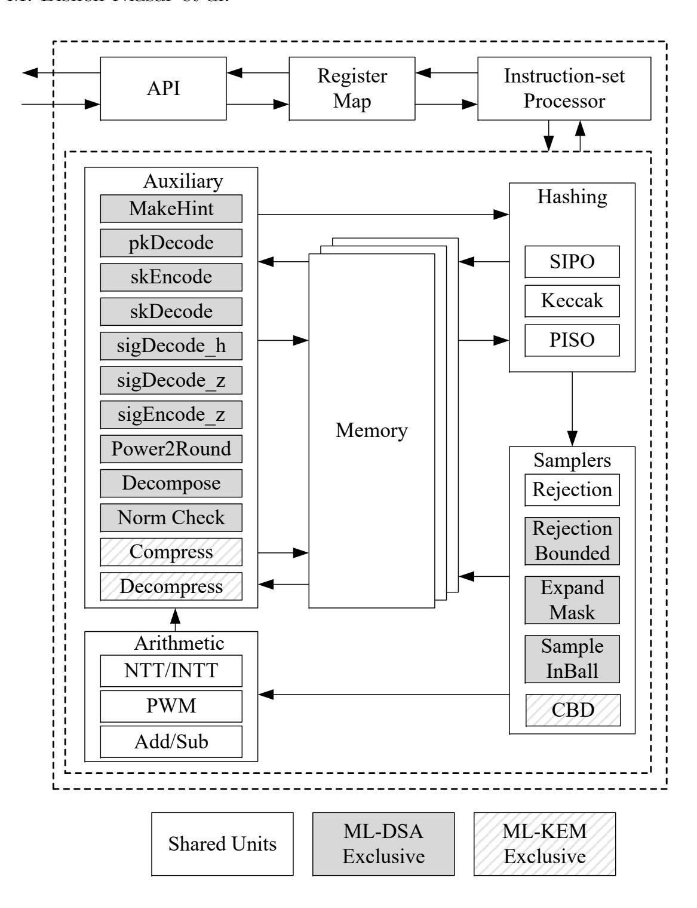
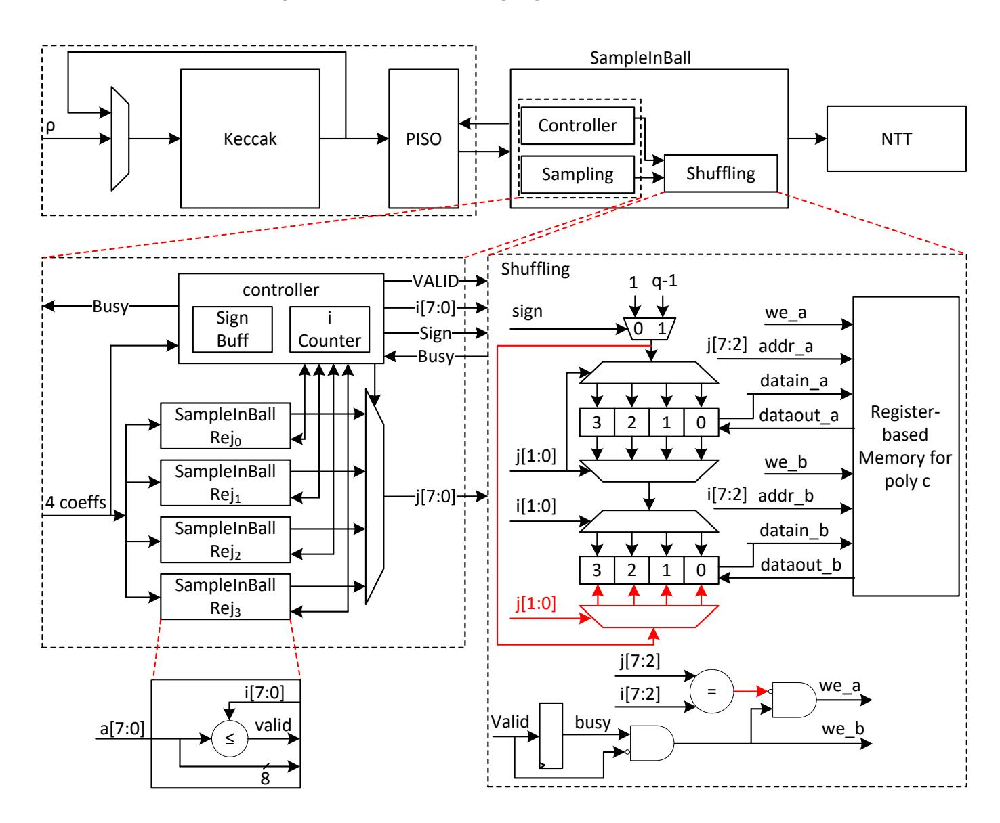
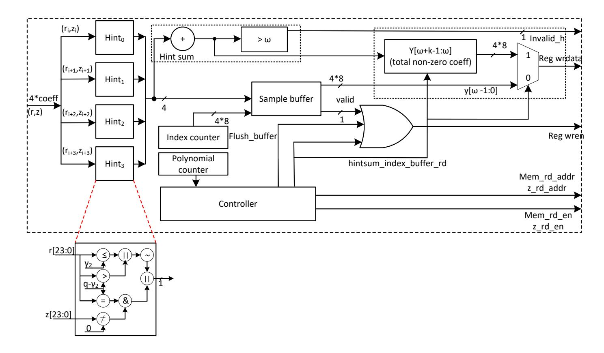
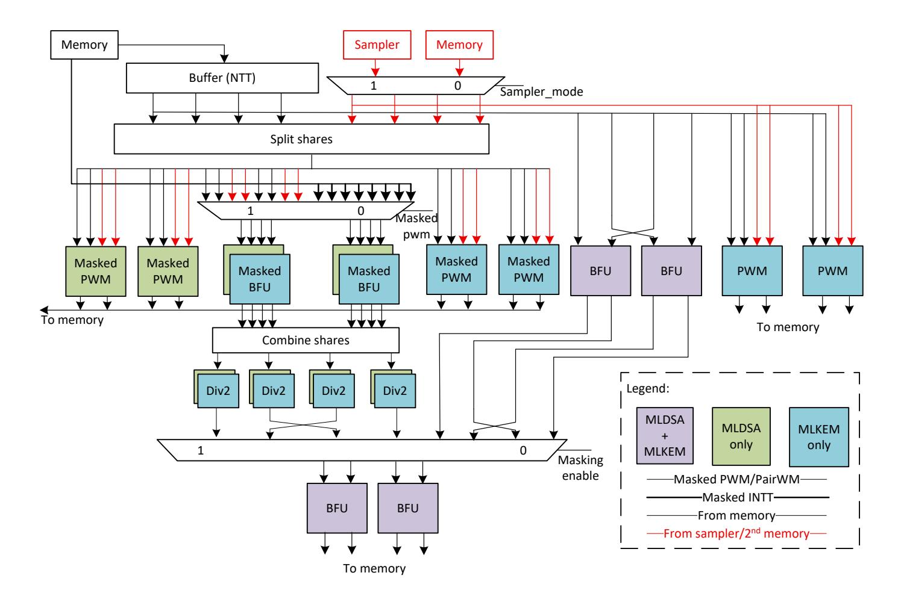
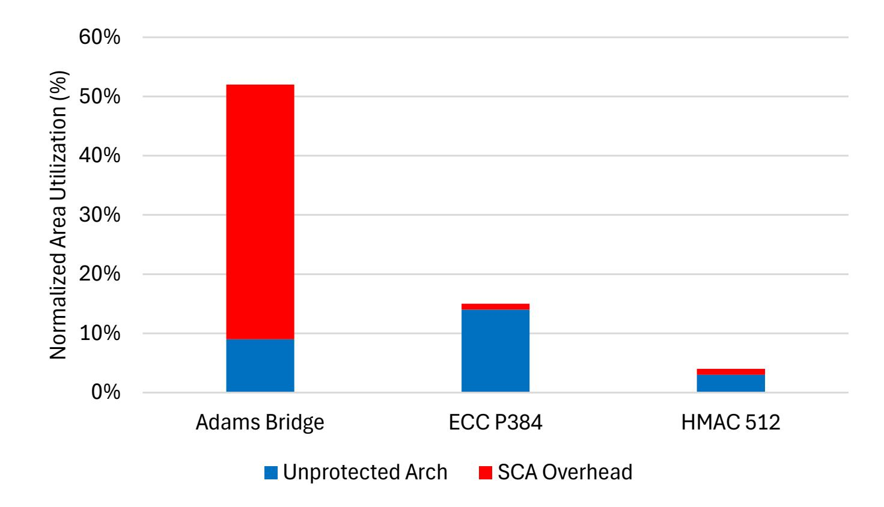
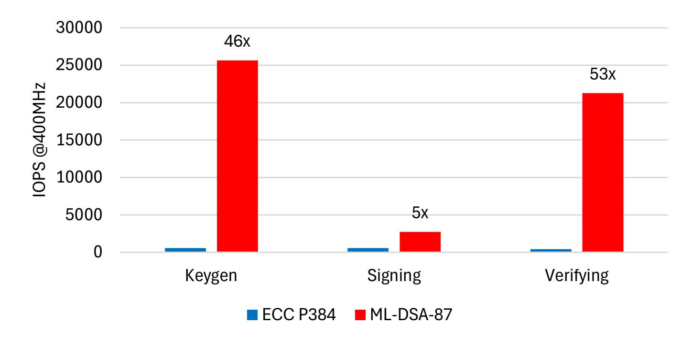
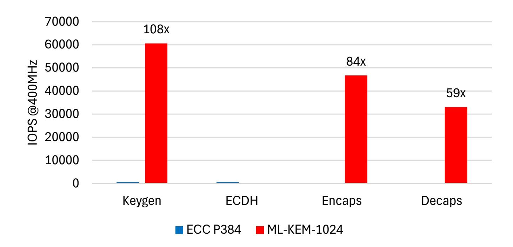
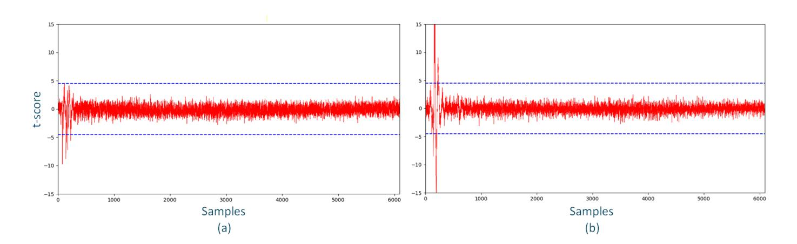
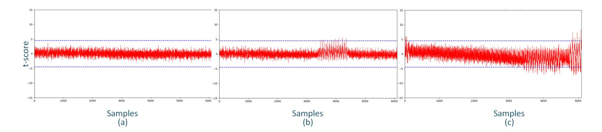

{0}------------------------------------------------

# Adams Bridge Accelerator: Bridging the Post-Quantum Transition

Mojtaba Bisheh-Niasar1 , Emre Karabulut1 , Kiran Upadhyayula1 , Michael Norris1 , and Bharat Pillilli1

> Microsoft, USA {mojtabab, ekarabulut, kupadhyayula, michnorris, bharat.pillilli}@microsoft.com

Abstract. Quantum computing threatens widely deployed public-key cryptosystems, driving the urgent adoption of post-quantum cryptography (PQC) in cloud and hardware-accelerated security infrastructures. This paper presents Adams Bridge, an industry-grade hardware accelerator for lattice-based PQC that integrates ML-KEM and ML-DSA within a unified architecture to maximize hardware reuse and silicon efficiency. The design features a staged, pipelined datapath that exploits multi-level parallelism to accelerate polynomial operations shared by both schemes. An optimized NTT/INTT and point-wise multiplication engine is tightly coupled with a high-throughput Keccak core and efficient hardware sampling, reducing memory overhead and eliminating pipeline stalls.

Synthesized in 5 nm technology and operating at 600 MHz, Adams Bridge achieves the best reported normalized Area-Time (AT) efficiency among unified designs, offering a 27% AT improvement for ML-DSA compared to state-of-the-art architectures. The three phases of ML-DSA complete in 26, 61, and 31 µs, respectively, while ML-KEM takes 11, 14, and 20 µs for its corresponding stages.

To address physical attack vectors, the accelerator embeds hardwarelevel side-channel countermeasures, including masking, shuffling, and constant-time control and arithmetic, mitigating information leakage without compromising performance. Empirical TVLA evaluation up to one million traces confirms the elimination of first-order leakage in critical datapaths. Targeted for deployment within the open-source Caliptra Root of Trust (RoT), Adams Bridge represents the first open-source PQC accelerator under the Apache 2.0 license designed for real-world hardware security systems.

Keywords: Adams Bridge · Caliptra · hardware architecture · ML-DSA · ML-KEM · lattice-based cryptography · post-quantum cryptography

### 1 Introduction

The advent of quantum computers poses a serious challenge to the security of cloud infrastructures and services, as sufficiently powerful quantum adversaries could break widely deployed public-key cryptosystems such as RSA and elliptic curve cryptography (ECC). Although current quantum computers remain 

{1}------------------------------------------------

far from this capability, the cloud ecosystem must act proactively and initiate the transition to the post-quantum era. Reflecting this urgency, the U.S. government, through the National Security Agency's Commercial National Security Algorithm (CNSA) Suite 2.0, defined a transition timeline requiring the adoption of PQC by 2033 [29].

Long-term protection of cloud platforms against quantum attacks requires lattice-based cryptosystems, widely considered strong PQC candidates. In July 2022, NIST standardized CRYSTALS-Kyber (ML-KEM) [27] and CRYSTALS-Dilithium (ML-DSA) [28] for post-quantum key establishment and digital signatures. Both rely on the module learning-with-errors (M-LWE) problem and pose significant implementation challenges in performance, area, and scalability.

Caliptra [11] is an open-source, industry-driven Root of Trust (RoT) architecture designed to provide a standardized, hardware-based security foundation for cloud-scale systems. Developed through broad collaboration among major technology companies across the cloud, semiconductor, and infrastructure ecosystems, Caliptra emphasizes transparent design review, independent verification, and broad ecosystem adoption across CPUs, GPUs, accelerators, and system-on-chip (SoC) platforms. Within this architecture, Adams Bridge serves as the dedicated post-quantum cryptography (PQC) accelerator, providing hardware acceleration for lattice-based cryptographic primitives required to secure firmware integrity, device identity, and secure boot operations. Caliptra version 2.0 integrates Adams Bridge version 1.0, which supports ML-DSA, while Caliptra version 2.1 incorporates Adams Bridge version 2.0, extending support to both ML-DSA and ML-KEM. The Adams Bridge implementation is released as open source under the Apache 2.0 license and are publicly available at [1]. This integration positions Adams Bridge as a practical and scalable PQC engine for real-world, large-scale deployment.

Adams Bridge was a mythological structure believed to span a formidable gulf between two land masses. Analogously, the transition from classical asymmetric cryptography to post-quantum cryptography represents a significant gap in modern security infrastructures. Adams Bridge is designed to bridge this gap by enabling efficient, hardware-accelerated deployment of post-quantum cryptographic algorithms.

To comply with CNSA 2.0 requirements [29], Adams Bridge is architected to exclusively support level-5 parameter sets for both ML-DSA and ML-KEM in its initial public releases. The design provides support for Pure ML-DSA across multiple operational modes, including a fixed 512-bit message mode, a streaming message mode, and external µ mode, enabling flexible integration with host systems. These modes offer practical and deployment-oriented interfaces for a wide range of use cases, from firmware authentication to large-message signing, and position Adams Bridge as a production-ready post-quantum accelerator.

This paper presents the architectural design and implementation of Adams Bridge, a unified post-quantum cryptography accelerator supporting both ML-KEM and ML-DSA. The architecture integrates algorithmic operations into a multi-stage pipeline, enabling shared resource usage across key encapsulation 

{2}------------------------------------------------

mechanism and digital signature algorithm to save area and improve efficiency. Fine-grained parallelism, reconfigurable cores, and interleaved scheduling further optimize throughput and adaptability, while built-in countermeasures protect against side-channel attacks. Together, these features deliver a secure, scalable, and flexible hardware platform, enabling practical deployment of post-quantum cryptography in cloud environments.

### 1.1 Background and Related Work

Efficient hardware implementation of lattice-based PQC is essential for highperformance and secure deployment of ML-KEM and ML-DSA. These schemes rely heavily on polynomial arithmetic over finite rings, where the Number Theoretic Transform (NTT) and its inverse (INTT) dominate the computational cost. Early studies report throughput–area trade-offs in FPGA and ASIC designs [16].

Dedicated hardware accelerators for ML-KEM or ML-DSA have been proposed to improve efficiency and throughput [6–8, 10, 19, 24, 35]. However, these designs are typically standalone, resulting in duplicated arithmetic units, memory structures, and control logic. Only a limited number of studies explore unified architectures [3, 5]. While [3] reports both FPGA and ASIC implementations, [5] evaluates its design exclusively on FPGA. Moreover, these architectures are often not publicly available and typically do not integrate side-channel resistance. The substantial differences in control flow, data dependencies, and sampling behavior between the two schemes further complicate efficient resource sharing. Moreover, several prior efforts rely on hardware/software co-designs, which hinder comprehensive assessment of hardware-only performance, resource utilization, and side-channel robustness [15, 37].

Side-channel resistance is critical for PQC hardware. Techniques such as masking of arithmetic operations, coefficient shuffling, and constant-time execution have been studied to prevent leakage from NTTs, sampling, and modular reductions [12–14, 21, 30]. However, these countermeasures often incur performance and area overheads and are rarely integrated into high-throughput, shared accelerators. Balancing side-channel protections with high performance remains an open challenge for production-grade designs.

While software implementations of PQC have been extensively studied, hardware platforms are favored for computationally intensive algorithms in securitycritical applications. Research on hardware side-channel attacks, however, remains limited [33, 34], as most prior works target isolated operations rather than fully integrated designs. To the best of our knowledge, the only publicly reported evaluation of Adams Bridge is presented in [23], which analyzed an early-stage, unprotected version of the architecture prior to the integration of the countermeasures described in this work. Consequently, the impact of side-channel countermeasures on performance, area, and throughput in high-performance, real-world PQC accelerators is still not well understood.

Prior work by Bisheh-Niasar et al. [9] demonstrates that instruction-set–based processors provide enhanced flexibility and programmability for crypto accelera-

{3}------------------------------------------------

#### 4 M. Bisheh-Niasar et al.

tion. From an industry perspective, such flexibility is critical for maintainability, modular updates, and rapid adaptation to evolving PQC standards.

#### 1.2 Our Contributions

The key contributions of this work are summarized as follows:

- 1. **First open-source, industry-scale PQC accelerator:** Adams Bridge is the first open-source PQC accelerator designed for production-scale deployment in a Root-of-Trust framework, providing a transparent, verifiable, and scalable platform.
- 2. Unified architecture: We propose a unified cryptoprocessor designed to minimize silicon footprint by sharing critical hardware resources between ML-KEM and ML-DSA. By integrating a shared Keccak sampling unit and a polymorphic arithmetic core, our design eliminates the need for separate, scheme-specific modules. This strategy, combined with aggressive memory bank reuse, significantly reduces total area compared to discrete implementations while maintaining a modular and extensible framework.
- 3. **Instruction-set flexibility:** A customized high-level instruction set defines the control flow of the cryptoprocessor. Instructions are grouped for parallel execution, improving latency without increasing area, while enabling rapid adaptation to evolving PQC algorithms and simplifying long-term maintenance.
- 4. **Side-channel resistance:** SCA countermeasures, including masked operations, shuffled coefficient processing, and constant-time execution, protect against timing and power side-channel attacks while preserving throughput and efficiency.
- 5. **High efficiency and scalability:** Pipelining, parallelization, and optimized memory management achieve low-latency operation for both schemes. ASIC-oriented design choices, such as memory architecture, further reduce area overhead while maintaining high throughput.

The rest of the paper is organized as follows. Section 2 presents the preliminaries. In Section 3, we describe the thread model, followed by the proposed architectures in Section 4. Section 5 presents our results and compares them with existing works. Section 6 discusses related considerations and overall verification. Finally, Section 7 concludes the paper.

#### 2 Preliminaries

### 2.1 Notations

To improve readability, Table 1 summarizes the main notations used in this paper. The polynomial ring is defined as  $\mathcal{R}_q = \mathbb{Z}_q[X]/(X^N + 1)$  over the field  $\mathbb{Z}_q = \mathbb{Z}/q\mathbb{Z}$ , where N is the polynomial degree and q is a prime modulus.

{4}------------------------------------------------

Table 1. List of notations used in this paper

| Symbol Definition |                                                                 |  |  |  |  |  |
|-------------------|-----------------------------------------------------------------|--|--|--|--|--|
| a, a, A           | Single polynomial, polynomial vector, and matrix of polynomials |  |  |  |  |  |
| a, ˆ ˆa, Aˆ       | NTT representations of a, a, and A                              |  |  |  |  |  |
| a ◦ b             | Point/Pair-wise multiplication of vectors                       |  |  |  |  |  |

### 2.2 ML-DSA Background

ML-DSA is a lattice-based digital signature scheme standardized by NIST for post-quantum security. It supports key generation, signature generation, and verification, with multiple parameter sets corresponding to NIST security levels 2, 3, and 5 [28]. Signature generation is iterative and employs rejection sampling to ensure statistical independence between the signature, message, and secret key; a signature is accepted only if all norm and validity constraints are satisfied.

The scheme relies on several core building blocks. Public matrix generation uses ExpandA(), which expands a 256-bit seed via SHAKE-128 to generate A ∈ Rk×ℓ q . Secret polynomials are generated by ExpandS() using SHAKE-256 and rejection sampling to produce coefficients in [−η, η], while ExpandMask() samples additional polynomials with coefficients in [0, 2 γ1 −1]. The SampleInBall() function generates sparse challenge polynomials with exactly τ non-zero coefficients in {−1, +1}.

Polynomial arithmetic is dominated by multiplications implemented using the NTT, with additions and subtractions performed coefficient-wise. Several decomposition and hinting functions enforce norm bounds and enable compact signatures, including Power2Roundq(), Decomposeq(), HighBitsq(), LowBitsq(), MakeHintq(), and UseHintq().

### 2.3 ML-KEM Background

ML-KEM is a lattice-based key encapsulation mechanism standardized by NIST to provide IND-CCA2 security against quantum adversaries. It consists of three algorithms: key generation, encapsulation, and decapsulation, with parameter sets corresponding to security levels 1, 3, and 5 [27].

During key generation, the secret vector s is sampled from a centered binomial distribution B, and the public matrix A is sampled uniformly from U. The public key is then computed in the NTT domain as pk = A · s + e, where e is a noise vector sampled from B.

Encapsulation proceeds by encoding the message m as a polynomial and sampling a random vector r from B. The algorithm computes v = pk ·r+m, u = A · r in the normal domain, and compresses u and v to form the ciphertext ct. Decapsulation recovers the message by decompressing u and v, then computing m = v − sk · u in the NTT domain.

All polynomials in ML-KEM have 256 coefficients over k-dimensional vectors, where k = 2, 3, 4 corresponds to the three security levels. These polynomial 

{5}------------------------------------------------

operations construct a CPA-secure scheme, which is then transformed into a CCA-secure KEM using a modified Fujisaki-Okamoto transformation [20].

At the coefficient level, a single modular multiplication in ML-KEM involves 128 polynomial multiplications of degree 2, computed as  $(\hat{a}_{2i} + \hat{a}_{2i+1}X) \cdot (\hat{b}_{2i} + \hat{b}_{2i+1}X) = (\hat{a}_{2i}\hat{b}_{2i} + \hat{a}_{2i+1}\hat{b}_{2i+1}\omega_n^{2br_7(i)+1}) + (\hat{a}_{2i}\hat{b}_{2i+1} + \hat{a}_{2i+1}\hat{b}_{2i})X \mod (X^2 - \omega_n^{2br_7(i)+1})$ , where  $br_7(i)$  denotes the 7-bit reversal function.

#### 2.4 Number Theoretic Transform

The Number Theoretic Transform (NTT) accelerates polynomial multiplication in lattice-based cryptography by reducing the computational complexity from  $O(n^2)$  to  $O(n \log n)$ . It operates over polynomial rings of the form  $\mathcal{R}_q = \mathbb{Z}_q[X]/(X^N+1)$ , where polynomials are mapped to the NTT domain and multiplied coefficient-wise.

Hence, the multiplication between two polynomials f and g using NTT can be performed as  $f \cdot g = \text{INTT}(\text{NTT}(f) \circ \text{NTT}(g))$ 

Efficient implementations use butterfly-based algorithms such as Cooley-Tukey (CT) for NTT and Gentleman-Sande (GS) for inverse NTT, enabling in-place computation without explicit bit-reversal. As a result, NTT dominates the performance and resource cost in ML-KEM and ML-DSA implementations.

#### 2.5 Test Vector Leakage Assessment

Test Vector Leakage Assessment (TVLA) [31] is a widely adopted statistical methodology for detecting side-channel leakage in cryptographic implementations. TVLA evaluates whether two groups of power or EM traces—typically corresponding to different classes of inputs—exhibit statistically distinguishable behavior. The test relies on Welch's t-statistic, defined as

$$t = \frac{\mu_1 - \mu_2}{\sqrt{\frac{\sigma_1^2}{N_1} + \frac{\sigma_2^2}{N_2}}},\tag{1}$$

where  $\mu_i$ ,  $\sigma_i$ , and  $N_i$  denote the mean, standard deviation, and number of traces, respectively, in group  $i \in \{0, 1\}$ . The conventional acceptance threshold is |t| < 4.5; exceeding this threshold at any sample point indicates that the two trace populations differ significantly with high statistical confidence, implying the presence of side-channel leakage.

TVLA can be applied in several ways depending on the leakage model and the order of the attack being tested. The most common form is the *first-order univariate* TVLA, which computes the t-statistic independently at each sample point across the traces. This version detects leakage that is linearly correlated with sensitive intermediates or with their masked shares.

To evaluate second-order leakage—which typically arises in masked implementations when higher-order combinations of shares correlate with sensitive data—we employ the standard *second-order univariate* TVLA. Each trace is first centered by subtracting its mean, and each sample point is squared to generate

{6}------------------------------------------------

a second-order feature. Welch's t-test is then applied to these transformed traces using the same methodology as in the first-order case. A statistically significant excursion in the resulting t-scores indicates second-order leakage.

Depending on the structure of the hardware module, additional TVLA variants may be used. For instance, fixed-vs-random TVLA is the standard configuration for detecting generic leakage, whereas fixed-vs-fixed TVLA may be appropriate for operations whose internal behavior changes only for certain operand patterns. Across all variants, the TVLA framework provides a consistent, implementation-agnostic method of empirically assessing whether countermeasures such as masking and shuffling effectively suppress exploitable sidechannel leakage.

# 3 Threat Model

We consider side-channel adversaries targeting Adams Bridge, a hardware implementation of the deterministic variants of the ML-DSA post-quantum signature scheme and the ML-KEM post-quantum key-encapsulation mechanism. Adams Bridge is instantiated as a cryptographic accelerator within a Caliptra-class silicon root of trust that is integrated into hyperscale system-on-chip (SoC) devices (e.g., CPU, GPU, and accelerator platforms) for cloud and datacenter deployments. In this context, Adams Bridge operates in a power- and activity-dense environment where many unrelated blocks are simultaneously switching.

The threat model covers all operations in ML-DSA key generation and signature generation, which are the only ML-DSA routines that process secretdependent data, as well as ML-KEM key generation and key decapsulation. The verification routine of ML-DSA and the encapsulation routine of ML-KEM are excluded from our side-channel analysis, as they operate solely on public inputs and do not manipulate secret or private intermediate values.

The adversary is assumed to have physical access to the device and to be able to acquire side-channel measurements (e.g., power, electromagnetic (EM), or acoustic emanations), as well as to observe or influence the external interface during cryptographic operations. We distinguish timing side-channel leakage from other physical side channels, and explicitly separate profiled and non-profiled multi-trace attack scenarios.

### 3.1 Assets: Secret and Private Values

All long-term secret keys in ML-DSA and ML-KEM are treated as high-value assets and must be protected against side-channel attacks. In addition to secret keys, we define private values as intermediate variables whose compromise may leak partial information about the secret key or its derived quantities. Not every private value is itself secret; however, recovering sufficiently many private values, or learning sufficiently accurate information about their distribution, can significantly reduce the adversary's uncertainty about the underlying secret. Our countermeasures therefore aim to protect both secret keys and private values from exploitable correlation with side-channel measurements.

{7}------------------------------------------------

### 3.2 Profiled vs. Non-Profiled Adversaries

We conceptually distinguish three families of side-channel attacks:

Profiled attacks. In the profiled setting, the adversary controls an identical copy of the target device and can configure it with chosen keys to capture side-channel traces under known secrets. We assume that the adversary can obtain detailed knowledge of the implementation, for example, by downloading and inspecting publicly available RTL or documentation. During a profiling phase, the attacker collects many traces while the device processes known keys or intermediate values and constructs statistical templates or models that characterize the device's leakage behavior. In the subsequent attack phase, the adversary captures one or a few traces from the victim device and compares them against the pre-computed templates to identify the most likely secret or private value.

Non-profiled multi-trace attacks. In the non-profiled setting, the adversary has no prior profiling of the target and relies solely on statistical analysis of traces collected during the actual attack. A canonical example is Correlation Power Analysis (CPA). The adversary observes or controls inputs or outputs (e.g., messages, ciphertexts, or public matrices) and collects many traces while the device repeatedly executes cryptographic operations under a fixed secret. By correlating hypothesized intermediate values with the measured leakage, the adversary attempts to recover secret or private values directly, without any auxiliary profiling phase. Non-profiled attacks are particularly effective when the device processes a constant key over a large number of operations and when the leakage model remains stable across measurements.

Simple power analysis (SPA) and related attacks. SPA-style attacks, and their derivatives that rely on very fine-grained single-trace analysis, exploit visually distinguishable patterns in individual traces without requiring statistical averaging across many executions. These attacks typically assume a relatively low-noise measurement environment and a clear power or EM view of the target block.

In this work, we treat non-profiled multi-trace attacks as the dominant threat. They can, in principle, average out noise, require fewer assumptions about access to a dedicated training device, and are often more challenging and expensive to counter in hardware. Our countermeasure design is therefore primarily driven by the non-profiled multi-trace threat, while remaining conceptually compatible with profiled attacks.

### 3.3 Scope Limitation: Excluding SPA and Profiled Attacks

Although SPA-style attacks and profiled attacks are standard elements of the side-channel taxonomy, we explicitly exclude them from our practical threat model for Adams Bridge. The key reason is the deployment context. Adams Bridge is designed as an IP block within a Caliptra-based silicon root of trust embedded in large, power-hungry SoCs for hyperscale infrastructure. In this setting:

{8}------------------------------------------------

- The power distribution network and EM environment are dominated by the aggregate activity of many concurrent blocks, leading to extremely noisy traces at the package or board level.
- The attacker's measurements are expected to reflect the superposition of hundreds or thousands of logical instances and support circuitry, rather than an isolated, low-noise view of a single cryptographic core.

Under such conditions, SPA-style attacks and profiled attacks struggle to obtain the high signal-to-noise ratio (SNR) and stable leakage characteristics required to visually distinguish operations or to construct accurate templates. In contrast, CPA-style non-profiled attacks can, in principle, overcome the same noise levels by collecting a large number of traces and exploiting statistical averaging.

Consequently, we model only non-profiled multi-trace attacks (including CPA and related statistical techniques) as in scope. SPA-family attacks and profiled attacks are considered out of scope for this work, as they do not realistically capture the adversarial capabilities against Adams Bridge in its intended Caliptra/hyperscale deployments. We do not claim resistance against laboratory-grade SPA or profiled attacks in environments where the cryptographic IP can be isolated and measured in near-ideal conditions.

### 3.4 Deterministic vs. Hedged ML-DSA

Adams Bridge implements the deterministic variant of ML-DSA, which is the standardized successor of CRYSTALS-Dilithium. In the hedged variant, certain internal randomness (e.g., values analogous to r ′ 0 in the Dilithium specification) is freshly generated for each signature, and the private intermediates derived from this randomness change on every invocation. As a consequence, several non-profiled attack vectors against these intermediates are either suppressed or rendered significantly less effective in the hedged setting, since the relevant private values are not reused across signatures.

Our threat model is defined for the deterministic variant, where the relevant intermediates can be reused across multiple signatures under a fixed key. This provides a superset of the profiled and non-profiled attack vectors applicable to the hedged variant; in particular, any side-channel attack that succeeds against the hedged construction is necessarily captured by our deterministic threat model, whereas the converse does not necessarily hold. Adams Bridge supports both deterministic and hedged modes as defined in FIPS 204 [28]. We cannot exclude especially the deterministic variant from our analysis. This constraint arises from the Caliptra attestation architecture, which implements the DICE certificate flow and therefore requires deterministic signatures for reproducible identity derivation. As a consequence, deterministic ML-DSA operation is the mode exercised in real deployments, and simplifying the threat model by appealing to hedged-mode protections would not accurately represent the security requirements of Adams Bridge in its intended Caliptra-based use cases.

{9}------------------------------------------------

### 3.5 Timing Side-Channel Model

Timing side-channel attacks in our model exploit variations in the execution time of externally visible events (e.g., completion of a signature or decapsulation operation, or observable control-flow differences) that depend on secret or private values. We assume the adversary can measure total or partial execution time with sufficient resolution to distinguish data-dependent differences.

All operations within ML-DSA key generation and signature generation, and ML-KEM key generation and key decapsulation, are considered within the timing side-channel scope. The design mandate is that operations on private values execute in constant time with respect to those values. Operations that do not depend on private values can be implemented in non-constant time, as they do not contribute to the attacker's advantage under our model.

For ML-DSA signature generation, a subtle case arises in the validity checks (cf. FIPS 204 [28], Algorithm 2). Two validity checks are performed:

- The first validity check involves constraints on private polynomials z and r0 (Algorithm 2, lines 21–23). Knowledge of the pass/fail outcome reveals partial information about whether coefficients of r0 fall within certain public bounds (e.g., whether r0 < γ2 − β), but does not expose r0 itself. The polynomial r0 is obtained via an operation that subtracts and multiplies secret and public polynomials, where the multiplication step blinds the public data, making the result a private value. Recovering the underlying secret from r0 corresponds to solving an NP-hard problem; the timing of the validity check only leaks coarse boundary information, which we consider insufficient to mount a practical key-recovery attack under our model.
- The second validity check (Algorithm 2, line 27) includes a condition on the private value ct0, where c is a publicly known challenge and t0 is a vector encoded into the secret key (Algorithm 6, line 10). To prevent coefficientwise timing leakage on ct0, our implementation always performs a full check across all coefficients before producing the final accept/reject decision. Thus, the adversary learns only that at least one coefficient of ct0 lies below a public bound (e.g., γ2), but cannot attribute the rejection to any specific coefficient. This significantly limits the granularity of timing leakage on ct0.

The same constant-time design principle is applied to ML-KEM operations involving private values, in particular during key decapsulation. By enforcing constant-time operations on private values and using full, non-short-circuit validity checks where applicable, Adams Bridge aims to ensure that timing behavior yields at most coarse-grained information that is not sufficient to compromise the underlying secrets within our threat model.

### 3.6 Physical Side-Channel Model

Physical side channels in scope include power analysis, EM analysis, and acoustic analysis, all arising from the data-dependent switching activity of the hardware 

{10}------------------------------------------------

implementation. The adversary is assumed to be able to place probes (or microphones) near the device and record traces synchronized with the execution of ML-DSA or ML-KEM operations.

We assume that the attacker can either observe or control inputs/outputs according to the standard non-profiled attack settings (known-input and choseninput scenarios). For ML-DSA, this includes messages m, public matrices A, and challenges c. For ML-KEM, this includes public keys and ciphertexts used in key establishment protocols. The attacker can repeat operations multiple times in order to acquire traces, subject to protocol or system constraints on the number of signatures or decapsulations produced under a given key.

### 3.7 ML-DSA Key Generation

ML-DSA key generation is modeled as a one-shot or infrequent operation that produces a fresh key pair. Under our threat model, ML-DSA key generation does not expose a practical non-profiled attack vector of the CPA type. Non-profiled attacks require (i) multiple traces in which the device processes constant secret or private values, and (ii) sufficient diversity in observable inputs or outputs to build exploitable statistical correlations.

Although an adversary can, in principle, trigger key generation multiple times, these invocations either (a) use the same deterministic randomness and thus reproduce identical keys and traces, or (b) use fresh randomness, in which case the secret and private values change between invocations. In both cases, the conditions for a standard CPA-style attack are not simultaneously satisfied: if the secret is fixed, the inputs lack the diversity needed for correlation; if the inputs are diversified, the secrets change, preventing trace alignment across repetitions. As a result, we do not identify a realistic non-profiled side-channel vector against ML-DSA key generation under our assumptions. ML-DSA key generation remains, however, within the conceptual reach of profiled attacks in principle, and our overall design choices (e.g., constant-time operations and generic hiding) avoid introducing trivially exploitable leakage in this phase.

### 3.8 ML-KEM Key Generation and Decapsulation

For ML-KEM, key generation produces a long-term secret key and associated public key, while decapsulation uses the secret key to recover shared secrets from ciphertexts. As with ML-DSA, ML-KEM key generation is an infrequent operation and does not naturally admit a standard CPA-style non-profiled attack, for the same reasons as above.

In contrast, ML-KEM decapsulation can be invoked many times under a fixed secret key, with the adversary observing or influencing the sequence of ciphertexts (depending on the protocol and adversarial capabilities). Non-profiled multi-trace attacks on decapsulation are therefore in scope: the attacker may attempt to correlate hypothesized intermediate values during decapsulation with measured leakage across many traces. Our timing and physical side-channel assumptions apply equally to ML-KEM decapsulation, and the same constant-time 

{11}------------------------------------------------

design principles are enforced for decapsulation operations that depend on private values.

### 3.9 ML-DSA Signature Generation

For ML-DSA, signature generation is explicitly modeled as vulnerable to nonprofiled side-channel attacks. The adversary can request signatures on multiple (known or chosen) messages under a fixed secret key and collect side-channel traces for each invocation. This enables CPA-style attacks where the attacker exploits correlations between hypothesized intermediate values and observed leakage.

Our analysis focuses on operations where known public data interacts directly and purely with secret or private values. The primary candidates are:

- PWM involving the public value c and secret-dependent polynomials, such as cs1, cs2, and ct0 in ML-DSA. Similarly, su is an operation that exposes the interaction between the secret and public value for ML-KEM.
- There is also a multiplication of the public matrix A with the private vector y (A ◦ y operation) in ML-DSA.

To mitigate these vectors, Adams Bridge employs a combination of masking and hiding techniques in the ML-DSA datapath:

- Masking. PWM involving known value and secret/private values are protected using masking countermeasures. The outputs of these multiplications are statistically independent from the underlying secrets given a secure source of randomness. In addition, the first stage of the INTT following these multiplications is also masked to avoid immediate recombination of shares that could lead to exploitable first-order leakage.
- Hiding via shuffling. Operations that precede or follow the masked multiplications, such as the forward NTT, point-wise additions, and point-wise subtractions, are protected using hiding techniques, including shuffling of coefficient processing order. The norm-check operation used in the rejection sampling process is likewise shuffled, preventing the adversary from inferring which specific coefficient causes a rejection and thereby limiting information about the rejection pattern.

In our threat model, only the first stage of the INTT is masked, even though an adversary could, in principle, target later stages. This design choice is justified by the structure of the INTT and the complexity it imposes on a CPA adversary. After the first masked layer completes, each subsequent INTT layer applies a butterfly to two coefficients at a time. As a result, an attacker attempting to construct a hypothetical CPA table for any unmasked layer must simultaneously guess both coefficients entering the butterfly. For ML-DSA, each coefficient is a 23-bit integer, meaning that the adversary must search over a combined space of 2 46 possibilities for each CPA hypothesis.

{12}------------------------------------------------

A similar argument applies to ML-KEM. Although ML-KEM uses smaller 12-bit coefficients, the second INTT layer combines values produced by two separate PWM units. Each PWM unit processes two pairs of coefficients based on Sec. 2.3, and thus the butterfly in the second layer depends on eight 12 bit coefficients. An adversary targeting this layer must therefore reason over a search space of 2 8·12 = 296 coefficient combinations. This exponential complexity arises before even accounting for the additional randomness introduced by shuffling. Once shuffling is included, the attacker must also account for the permutation of coefficient positions across cycles, further multiplying the effective hypothesis space and making CPA attacks on later INTT layers entirely impractical. Together, these observations justify masking only the first INTT layer: it provides the necessary first-order protection, while the exponential hypothesis growth in subsequent layers, compounded with shuffling, eliminates any realistic non-profiled attack vector.

All masking and shuffling techniques require a source of randomness. We assume the presence of a pseudo-random number generator (PRNG) that provides sufficient entropy and is not susceptible to tampering or manipulation by the adversary. If this assumption fails, the security of the masking and shuffling countermeasures cannot be guaranteed.

Although we do include non-profiled attack vector under our Adams Bridge key generation threat model, Adams Bridge still applies hiding-based countermeasures—most notably coefficient-level shuffling—within the key-generation datapath. This design choice follows from a broader principle: in our environment, maintaining a consistently low signal-to-noise ratio (SNR) is itself a primary defense objective. While masking provides strong first-order resistance by construction, hiding techniques such as shuffling do not offer the same provable security guarantees. Their protection is inherently statistical and therefore more easily overcome by multi-trace averaging, especially in settings where the attacker can collect large numbers of traces. For this reason, we do not treat hiding as a standalone countermeasure and do not rely on it in place of masking in operations that are truly at risk of CPA-style exploitation.

Nevertheless, hiding remains valuable when applied to operations that are outside the strict set of exploitable CPA vectors. Even though key generation does not satisfy the conditions required for a non-profiled attack, the power and EM leakage during this routine still contribute to the overall noise environment surrounding Adams Bridge when operating in a Caliptra-class SoC. The use of shuffling in key generation reflects a layered leakage-management strategy rather than a targeted countermeasure for a specific attack vector. Hiding techniques alone are insufficient to meet our security goals, but they effectively amplify the environmental noise that an adversary must overcome. Because Adams Bridge operates inside Caliptra deployments where the root-of-trust logic is embedded in a high-activity, hyperscale SoC environment, preserving a globally low-SNR profile is an important aspect of practical side-channel resilience, and the inclusion of shuffling in key generation materially contributes to this objective.

{13}------------------------------------------------

Fig. 1. Adams Bridge High-Level Architecture

# 4 Proposed Architecture

The Adams Bridge accelerator integrates all components required to execute ML-DSA and ML- protocols entirely in hardware. Figure 1 illustrates the high-level architecture of the Adams Bridge. Key architectural blocks are briefly described below; further design details can be found in [1].

### 4.1 Instruction-Set Processor

Adams Bridge adopts an instruction-set—based hardware architecture to balance performance, flexibility, and long-term maintainability. Prior work [9] demonstrates that instruction-set processors provide strong programmability and adaptability for cryptographic acceleration.

{14}------------------------------------------------

Instead of hardwiring protocol control into fixed datapaths, Adams Bridge employs a modular design in which all performance-critical primitives, including Keccak, NTT/INTT, sampling, and polynomial arithmetic, are implemented as independent hardware blocks, while a customized high-level instruction set governs protocol execution. This approach achieves high performance while preserving flexibility to update control flow, security levels, and algorithm variants.

Instructions are defined as a packed struct comprising six fields:

- 1. Structured opcode: four 1-bit enable flags (keccak\_en, sampler\_en, ntt \_en, aux\_en) that independently gate the corresponding hardware units; a 5-bit mode field selecting the operation within the enabled unit and two 1-bit flags for side-channel countermeasures.
- 2. 16-bit immediate operand: encodes array indices for polynomial vectors, Keccak nonce/counter values, or auxiliary block mode qualifiers.
- 3. 15-bit length field: specifies the number of bytes of source data to feed to the Keccak/sampler pipeline.
- 4. Three 15-bit operands: two source addresses and one destination address, referencing either register file IDs or base addresses in coefficient memory.

The combination of enable flags enables instruction-level fusion, allowing multiple operations to be executed simultaneously. For instance, rejection sampling can be combined with PWM, streaming coefficients directly into the multiplier without intermediate storage. This fusion improves datapath utilization, reduces latency, and maintains the modularity and flexibility of the architecture.

A compact instruction memory within the controller stores pre-defined programs for ML-DSA and ML-KEM. Execution is orchestrated by a centralized sequencer, implemented as a synchronous ROM addressed by a 10-bit program counter. The sequencer fetches and decodes instructions, schedules submodule invocations, and provides memory addresses to the datapaths.

### 4.2 Reconfigurable Butterfly Core

Polynomial multiplication remains the dominant bottleneck despite the use of NTT. To address this, we propose a reconfigurable butterfly-based NTT architecture that supports NTT, INTT, and transform-domain arithmetic, including point/pair-wise multiplication (PWM), as well as addition (PWA) and subtraction (PWS), enabling efficient resource sharing across PQC primitives.

The architecture adopts a merged-layer, parallel pipelined design with four butterfly cores, inspired by [8], enabling Radix-4 NTT/INTT execution while mitigating memory bandwidth limitations through a tailored multi-coefficient memory layout. CT butterflies are used for NTT and GS butterflies for INTT, eliminating explicit bit-reversal and supporting in-place computation.

In the NTT domain, ML-DSA employs point-wise multiplication, whereas ML-KEM requires pair-wise multiplication to account for its polynomial structure. The proposed butterfly core supports both modes through a reconfigurable datapath, enabling unified acceleration of ML-DSA and ML-KEM.

{15}------------------------------------------------

### 4.3 Samplers

Hashing dominates the latency of ML-KEM and ML-DSA implementations. To improve overall efficiency, Adams Bridge maximizes Keccak utilization while minimizing buffering and control overhead. Since different samplers consume hash output at different rates, our proposed architecture supports flexible data delivery without replicating buffering resources.

Keccak requires 24 sponge rounds per invocation. The Keccak core is implemented to process two rounds per cycle. Dedicated SIPO and PISO buffers are used to efficiently interface with the hash core and deliver data to downstream samplers at varying, configurable output rates.

PISO Buffer The PISO buffer provides a unified, reconfigurable interface between the Keccak core and all sampler units. It accepts full Keccak states (1088 or 1344 bits) and delivers data at configurable output rates ranging from 32 to 120 bits per cycle, depending on the active sampler.

During ExpandMask operation, the buffer supports incremental writes while valid data remains available for readout. In all other modes, the full Keccak state is written only when the buffer is empty. By using a single buffer to support multiple output granularities, the design enables efficient resource sharing, maintains continuous Keccak operation, and avoids sampler-specific buffering.

Rejection Sampler Adams Bridge employs a tightly coupled rejection sampling architecture that cascades the Keccak core, sampler, and polynomial multiplication engine, eliminating intermediate memory accesses and hiding sampler latency within hashing. A FIFO decouples sampling from downstream computation, ensuring that the multiplier receives four valid coefficients per cycle.

Let prej denote the rejection probability of a single coefficient. For ML-DSA, prej ≈ 9.76 × 10−4 , and oversampling N = 5 candidates per cycle ensures a negligible probability of failing to produce four valid coefficients. In contrast, ML-KEM has a higher rejection rate, prej ≈ 0.187, requiring N = 8 candidates per cycle to maintain steady output. In general, the probability of obtaining fewer than four valid coefficients from N candidates is

$$\Pr\{X < 4\} = \sum_{k=0}^{3} {N \choose k} (1 - p_{rej})^k p_{rej}^{N-k}.$$
 (2)

In both ML-DSA and ML-KEM, surplus valid coefficients are stored in the FIFO, smoothing short-term variability and sustaining continuous polynomial multiplication without stalls.

Expand Mask The ExpandMask unit consumes SHAKE-256 output from the shared PISO buffer and generates polynomial coefficients. Operating fully in parallel with the Keccak core, it produces four coefficients per cycle, matching

{16}------------------------------------------------

Fig. 2. SampleInBall Architecture

the NTT input bandwidth and avoiding extra buffering. The unit consists of four sampler circuits, each handling 20-bit inputs.

Each Keccak round produces 1088 bits, corresponding to about 54 coefficients. By continuously generating four coefficients per cycle, the ExpandMask unit can process 48 coefficients in 12 cycles. To maximize hardware utilization, the Keccak core monitors the PISO buffer: if at least four coefficients are available, the EMPTY flag is not set, and Keccak waits for the next cycle. This allows the final 4 coefficients to be combined with the next Keccak round, so processing 52 coefficients takes 13 cycles, ensuring smooth and efficient streaming to the sampler units.

**SampleInBall** The SampleInBall unit is a low-latency, tightly coupled hardware block that directly feeds the NTT pipeline, minimizing buffering and memory transfers. It operates concurrently with the hash generator, consuming random bytes from the shared PISO buffer to hide hash latency.

Sampling employs a multi-candidate rejection strategy, evaluating four candidates per cycle and committing at most one to the shuffle stage. Surplus samples are retained for subsequent cycles, reducing rejection stalls and maintaining

{17}------------------------------------------------

Fig. 3. MakeHint Architecture

steady throughput; in the worst-case scenario (first iteration, i = 196), the failure probability is (0.23046)4 ≈ 0.00282.

Shuffling is implemented over a dual-port register-based memory storing four coefficients per address, matching the NTT input layout. Each shuffle operation completes in two cycles: a read phase to fetch the affected coefficients, followed by a write-back phase that updates the polynomial based on the selected index and sign bit. Special handling is included for address collisions to preserve correctness without increasing memory port count.

### 4.4 Hint Sum and Hint BitPack

The output of the MakeHint unit is post-processed to construct the encoded h component of the signature and to evaluate signature validity based on the accumulated hint count. To avoid additional latency, this work integrates hint post-processing directly into the MakeHint hardware pipeline, eliminating separate processing stages while preserving low implementation complexity.

In the proposed design, four hints are generated per cycle and accumulated across all eight polynomials. The hint sum is updated every cycle and compared against the threshold ω; exceeding this bound immediately flags the signature as invalid without stalling the pipeline. In parallel, the architecture performs on-the-fly hint bit-packing to construct the byte string y. The first ω bytes of y store the indices of non-zero hints, while the remaining k bytes record the number of non-zero hints per polynomial. Zero-padding is applied when fewer than ω non-zero hints are produced; otherwise, the y buffer is overwritten and the signature is discarded.

{18}------------------------------------------------

| Instance Name       | Depth Data Width Strobe Width Block Size |        |        |         |
|---------------------|------------------------------------------|--------|--------|---------|
|                     |                                          | [bits] | [bits] | [bytes] |
| abr_sk_mem_bank0    | 596                                      | 32     | –      | 2,384   |
| abr_sk_mem_bank1    | 596                                      | 32     | –      | 2,384   |
| abr_w1_mem          | 512                                      | 4      | –      | 256     |
| abr_mem_inst0_bank0 | 832                                      | 96     | –      | 9,984   |
| abr_mem_inst0_bank1 | 832                                      | 96     | –      | 9,984   |
| abr_mem_inst1       | 576                                      | 96     | –      | 6,912   |
| abr_mem_inst2       | 1472                                     | 96     | –      | 17,664  |
| abr_mem_inst3       | 64                                       | 384    | –      | 3,072   |
| abr_sig_z_mem       | 224                                      | 160    | 8      | 4,480   |
| abr_pk_mem          | 64                                       | 320    | 8      | 2,560   |
| Total               | –                                        | –      | –      | 59,680  |

Table 2. Memory Instances in Adams Bridge

To reduce area overhead, the y buffer streams one double-word (dword) at a time directly into the register-based API, asserting a valid signal upon each dword accumulation. Signature registers are protected by a lock mechanism during the signing operation to prevent intermediate firmware reads. After processing all polynomials, the final hint sum is written to complete the encoded output. If the final cycle produces fewer than one dword of data, the controller flushes the remaining buffer contents to ensure correctness.

### 4.5 Memory Layout

Table 2 summarizes the memory instances in Adams Bridge. All memories are implemented as single-read, single-write (1R1W) SRAMs with flopped read data, suitable for industry-grade designs. Strobe width specifies the number of bits enabled per write; all strobed memories are byte-enabled.

Each memory block stores four coefficients per address for both ML-DSA and ML-KEM, matching the four-coefficient-per-cycle bandwidth of the NTT/INTT unit. This layout sustains steady NTT/INTT throughput without memory replication or complex control logic.

Some memories serve a dual purpose: they are accessed internally by the accelerator and are also exposed externally through the API (for example, for storing secret keys, public keys, and signatures), and they are aligned to 32 bit multiples to match the AHB-Lite interface. This alignment enables efficient data transfers to and from the host, cuts down the required number of interface registers, and yields substantial area savings, while still maintaining the memory access patterns necessary for high-throughput polynomial arithmetic.

The inst3 memory supports the masking architecture, storing four masked coefficients per address with two shares, each of double coefficient width. The w1 memory records whether the high bits from the Decompose function are zero and is later used by the alternative MakeHint algorithm.

{19}------------------------------------------------

Fig. 4. SCA Protected Architecture

#### 4.6 Side-Channel Protection

To protect Adams Bridge against side-channel attacks, shuffling and masking are integrated. While masking provides strong resistance against side-channel leakage, it incurs significant latency overhead. Shuffling, in contrast, introduces execution-order randomization with negligible area and latency cost, making it an efficient first-order countermeasure.

In Adams Bridge, shuffling is enabled by default across all NTT-related operations. Masking is selectively applied where stronger protection is required, specifically to the first computation layer in INTT mode and to all PWM operations. In NTT mode, the core relies only on shuffling, while PWA and PWS operations are always shuffled.

Shuffling is realized by partitioning memory into 16 interleaved chunks, each containing four coefficients. Two levels of randomization are applied: random selection of the starting chunk and random selection of the starting index within that chunk. Execution then proceeds sequentially with wrap-around, ensuring full coverage without additional control overhead.

A dual-buffer organization overlaps coefficient loading and butterfly execution, completely hiding any shuffling-induced latency. This design provides execution-order randomization at negligible performance cost, while masking is reserved for security-critical paths.

{20}------------------------------------------------

The resulting execution-order search space is S = 16×4 = 64, corresponding to 64 distinct access patterns per NTT layer. Across multiple layers, the effective search space scales as S L, significantly increasing side-channel resistance with minimal hardware overhead.

Masking countermeasures are applied to the two most security-critical operations: PWM and INTT. A fully masked architecture would incur substantial overhead in memory, area, and latency. To achieve a balanced design, Adams Bridge adopts a hybrid masking strategy in which PWM is fully masked, while only the first stage of INTT is masked.

To support A ◦ y computation, where one PWM operand is generated by the sampler, an additional share memory is introduced to store one polynomial worth of masked shares. During the first masked PWM, inputs are fetched from the coefficient memory or sampler, split internally into shares, and processed by masked PWM units. The resulting shares are stored in the share memory. Subsequent masked PWM-with-accumulation operations retrieve accumulation inputs from the share memory while splitting new operands on-the-fly, and write the updated shares back.

The masked INTT consumes inputs from the share memory. After the first masked stage, shares are recombined and forwarded to the unmasked second stage of INTT, with final outputs written back to the coefficient memory in combined form.

## 5 Implementation Results and Comparisons

Area Results Synthesized in a 5 nm technology, the Adams Bridge design occupies a total area of 0.1096 mm2 , consisting of 0.0860 mm2 of standard-cell logic (corresponding to 480 KGE of combinational logic and 244 KGE of sequential logic) and 0.0236 mm2 of SRAM implementing of on-chip memory.

The NTT subsystem dominates the overall footprint due to the masking overhead, while the sampler contributes a 6% of the total area.

The side-channel countermeasures are tightly embedded into the pipeline and control paths of the architecture, and therefore cannot be removed in a straightforward manner. To maintain long-term design maintainability, we intentionally avoid separating protected and unprotected datapaths. For evaluation of an unprotected configuration, the internal PRNG can be disabled (set to zero), allowing the synthesis tool to automatically eliminate part of the additional logic and associated latency. Nevertheless, some residual overhead remains, which we deliberately accept, as Adams Bridge is primarily intended for secure deployments with integrated countermeasures. This unified design approach simplifies maintenance and ensures architectural consistency over time.

Figure 5 shows the area of the unprotected design alongside the overhead introduced by side-channel countermeasures. While these protections significantly increase the area for PQC, the SCA cost for classical schemes such as ECC or HMAC is comparatively low. This is because post-quantum cryptography involves a diverse set of operations that require masking, whereas classical schemes

{21}------------------------------------------------

Fig. 5. Area Contribution of Cryptographic Accelerators within Caliptra RoT, Showing Base Architecture and Side-Channel Protection Overhead

Table 3. Performance of ML-DSA-87 Implementation at 600 MHz

| Operation                 |        | Unprotected    | Protected     |                |        |  |
|---------------------------|--------|----------------|---------------|----------------|--------|--|
|                           | [CC]   | Time [ms] IOPS | [CC]          | Time [ms] IOPS |        |  |
| Key Generation            | 15,600 | 0.026          | 38,462 15,600 | 0.026          | 38,462 |  |
| Signing (1 round) 26,600  |        | 0.044          | 22,556 36,700 | 0.061          | 16,349 |  |
| Signing (Average) 106,400 |        | 0.177          | 5,639 146,800 | 0.245          | 4,087  |  |
| Verification              | 18,800 | 0.031          | 31,915 18,800 | 0.031          | 31,915 |  |

are simpler and more uniform. it should be noted that these protections are integral to the design and cannot be entirely removed.

Frequency Scaling The design currently closes timing at 600 MHz across low, typical, and high voltage corners. Preliminary evaluations indicate convergence beyond 1 GHz on more advanced process nodes, demonstrating strong scalability of the proposed architecture.

# 5.1 Performance Results of ML-DSA

Table 3 reports the performance of ML-DSA-87 at 600 MHz for both unprotected and protected implementations. Latency is given in clock cycles (CCs), execution time in milliseconds, and throughput in operations per second (IOPS).

Signature generation is the most computationally intensive operation and is inherently non-constant-time due to its rejection-sampling structure. The algo-

{22}------------------------------------------------

Fig. 6. Performance Comparison between ML-DSA and ECC

rithm iterates until all validity checks pass, with the number of iterations depending on the private key, message, and signing randomness. For ML-DSA-87, the average number of iterations per signature is approximately 3.85.

Unprotected Performance Without additional masking, key generation completes in 0.026 ms (38.5k IOPS), and verification achieves 0.031 ms (31.9k IOPS). A single signing round completes in 0.044 ms, while the average signing operation requires 0.177 ms (5.6k IOPS). Shuffling is always enabled in both protected and unprotected modes, as its latency and area impact is negligible.

Performance with Side-Channel Countermeasures Enabling masking increases signing latency due to protected arithmetic and randomized execution, while key generation and verification remain unchanged. At 600 MHz, a single signing round takes 0.061 ms (+39%), and the average signing latency increases to 0.245 ms (+38%), reducing throughput from 5.6k to 4.1k IOPS. This demonstrates that the SCA protection imposes a moderate overhead on signing operations, while the rest of the protocol remains unaffected.

Performance Comparison with Classical Schemes Figure 6 shows that ML-DSA achieves 50× higher throughput than ECC for key generation and verification, and 5× higher for signing, demonstrating performance comparable to or exceeding classical pre-quantum algorithms.

### 5.2 Performance Results of ML-KEM

Table 4 reports the performance of the protected ML-KEM-1024 implementation at 600 MHz. Latency is given in clock cycles (CCs), execution time in milliseconds, and throughput in operations per second (IOPS).

{23}------------------------------------------------

Fig. 7. Performance Comparison between ML-KEM and ECC

Table 4. Performance of ML-KEM-1024 Implementation at 600 MHz

| Operation      | Ţ      | Unprotected | d      | Protected |           |        |  |
|----------------|--------|-------------|--------|-----------|-----------|--------|--|
|                | [CC]   | Time [ms]   | IOPS   | [CC]      | Time [ms] | IOPS   |  |
| Key Generation | 6,603  | 0.011       | 90,868 | 6,603     | 0.011     | 90,868 |  |
| Encapsulation  | 7,930  | 0.013       | 75,735 | 8,509     | 0.014     | 70,514 |  |
| Decapsulation  | 11,054 | 0.018       | 54,292 | 12,117    | 0.020     | 49,517 |  |

Unprotected Performance Without side-channel countermeasures, key generation completes in 6,603 CCs (0.011 ms), achieving 90.9k IOPS. Encapsulation requires 7,930 CCs (0.013 ms), corresponding to 75.7k IOPS. Decapsulation completes in 11,054 CCs (0.018 ms), achieving 54.3k IOPS.

Performance with Side-Channel Countermeasures Enabling masking and other SCA countermeasures introduces minimal overhead. At 600 MHz, key generation remains unchanged at 6,603 CCs (0.011 ms, 90.9k IOPS). Encapsulation increases slightly to 8,509 CCs (0.014 ms, 70.5k IOPS), a 7% increase in latency. Decapsulation increases to 12,117 CCs (0.020 ms, 49.5k IOPS), a 10% overhead. These results indicate that ML-KEM maintains high efficiency under side-channel protection.

Performance Comparison with Classical Schemes Figure 7 shows that ML-KEM remains highly efficient under side-channel protection. Key generation is approximately 100× faster than ECC. While classical schemes rely on ECDH at both parties, ML-KEM encapsulation and decapsulation are significantly faster than ECDH, demonstrating performance that surpasses classical approaches.

{24}------------------------------------------------

Table 5. Normalized Area-Time (AT) Comparison (Adams Bridge = 1). Smaller AT indicates better efficiency. Performance is reported as the cumulative execution time of all three constituent operations in ML-KEM and ML-DSA.

| Work             | Tech | Freq  | Area | SRAM  | Performance (µs) |        | Normalized AT                                     |       |
|------------------|------|-------|------|-------|------------------|--------|---------------------------------------------------|-------|
|                  |      |       |      |       |                  |        | (nm) (MHz) (KGE) (KB) ML-KEM ML-DSA ML-KEM ML-DSA |       |
| Sapphire [4]     | 40   | 72    | 106  | 40.25 | 6444             | 18,266 | 20.95                                             | 22.66 |
| Zhao et al. [36] | 28   | 540   | 697  | 24.75 | 747              | 1052   | 15.97                                             | 8.58  |
| Kali [3]         | 28   | 1,000 | 747  | 34.82 | 33               | 157    | 0.76                                              | 1.37  |
| Adams Bridge     | 5    | 600   | 724  | 58.28 | 45               | 118    | 1                                                 | 1     |

Note: Adams Bridge integrates hardware SCA countermeasures; prior works do not.

### 5.3 Comparison with Prior Work

Table 5 shows a normalized Area-Time (AT) comparison of Adams Bridge against prior architectures. Only a few existing designs provide a unified architecture for both ML-KEM and ML-DSA, highlighting the scarcity of fully integrated postquantum cryptoprocessors. Adams Bridge stands out as the only design that embeds SCA countermeasures directly in hardware, ensuring strong security without sacrificing performance.

In comparison, Sapphire [4] employs a HW/SW co-design approach, while other works [3, 36] focus on algorithm-specific accelerators or less integrated designs. Adams Bridge, in contrast, delivers a fully unified, secure, and highperformance architecture, achieving superior Area-Time efficiency for ML-DSA workloads, with its AT normalized to 1 as the baseline.

Scaling Adams Bridge to an operating frequency of 1 GHz further increases throughput, achieving approximately 1.22× and 2.21× performance improvements for ML-KEM and ML-DSA, respectively, compared to the best prior work. This highlights the architecture's ability to deliver high-performance postquantum operations while preserving robust hardware side-channel protections, supporting the requirements of future high-speed, security-critical applications.

In practical, industry-grade implementations, additional logic is required to meet security and operational standards. For instance, mechanisms such as zeroization of all registers and FSMs, PCR, and key vault (KV) integration significantly increase the design complexity and area. While these additions result in a larger footprint compared to state-of-the-art implementations, they are essential for compliance with Caliptra's security requirements and cannot be omitted in production-grade designs. Therefore, this comparison is not completely fair, as many state-of-the-art designs do not include these features.

Furthermore, our initial ML-DSA implementation used a customized reduction. During the development of ML-KEM, we observed that the area cost of masking for Barrett reduction is significantly lower. Our estimates indicate that switching ML-DSA to use masked Barrett reduction could save approximately 24% of the total area, which we consider as part of future enhancements.

{25}------------------------------------------------

Fig. 8. First-order TVLA results for the PWM operation with all countermeasures disabled (masking and shuffling off, PRNG disabled). Both subfigures present unprotected designs evaluated over 100K traces: (a) ML-KEM PWM, and (b) ML-DSA PWM. Clear first-order leakage is visible in both cases.

### 5.4 TVLA results

We use TVLA to empirically evaluate first-order side-channel leakage in the Adams Bridge hardware implementation, All experiments are conducted on a physical FPGA platform configured to mirror the datapath, randomness usage, and control sequencing of the taped-out design. Our evaluation focuses on operations identified in the threat model as most sensitive to statistical leakage—namely PWM, NTT/INTT layers, and memory-write stages following masked operations.

Experimental Setup All measurements were collected using CW310 Bergen board equipped with a Kintex-7 K410T FPGA implementing the Adams Bridge evaluation core. The CW310 exposes a dedicated SMA port connected across an on-board shunt resistor, enabling high-fidelity power-trace acquisition suitable for statistical leakage testing. The design operates at a deliberately low frequency of 10 MHz to minimize aliasing across cycles and preserve per-cycle visibility in the captured traces.

Power traces are captured using a PicoScope 6428E-D oscilloscope configured for 156 MS/s sampling rate. This provides more than 15 sampling points per clock cycle, matching best practices established in prior masking-evaluation literature [2, 17, 18, 22]. The acquisition buffer is sized to cover full cryptographic operations including NTT, INTT, PWM, and the subsequent memory-write phases. Unless noted otherwise, shuffling and masking countermeasures are enabled via the on-chip PRNG.

Input-Set Construction The NTT/INTT modules operate on four coefficients per cycle. For PWM and NTT layers, the fixed dataset is created using four constant coefficients for operand A and four constant coefficients for operand B. The random dataset replaces operand A's coefficients with fresh random values each trace while operand B remains fixed. For INTT layers, the fixed set contains four

{26}------------------------------------------------

Fig. 9. First-order TVLA results for operations with all countermeasures enabled (masking and shuffling on, PRNG active). All subfigures present protected implementations evaluated over 1M traces: (a) ML-KEM PWM, (b) ML-DSA PWM, and (c) INTT operation. No first-order leakage is observed in any of the protected cycles.

constant coefficients and zeros elsewhere, while the random set uses four random coefficients with all remaining coefficients set to zero. This construction ensures that leakage arises only where the design handles secret-dependent intermediates rather than due to incidental structural variations.

Unmasked and Unshuffled Baseline (PRNG Disabled) Figure 8 presents the baseline TVLA results obtained when all side-channel countermeasures are disabled. In this configuration, masking and shuffling are turned off and the PRNG responsible for generating randomness is deactivated. These results represent the leakage characteristics of the unprotected implementation and serve as a reference point against which to evaluate the effectiveness of countermeasures.

We restrict our unprotected evaluation to the PWM operation. This choice is deliberate: the PWM unit internally reuses the same base function units (BFUs) that are exercised extensively within both the NTT and INTT modules. As a result, the same computational datapath—and therefore the same leakage sources—is activated regardless of whether the design is operating in PWM, NTT, or INTT mode. Conducting separate unprotected tests for INTT does not provide additional diagnostic coverage, because it would stimulate identical BFU structures processing the same type of arithmetic operations. For this reason, the PWM test fully represents the leakage behavior of all unprotected layers.

The unmasked and unshuffled TVLA results clearly demonstrate first-order leakage for both ML-KEM and ML-DSA. In Figure 8(a), the ML-KEM PWM begins exhibiting statistically significant t-score excursions well above the |t| = 4.5 threshold within 100K traces. Figure 8(b) shows an even stronger leakage profile in the ML-DSA PWM path, where the larger prime modulus amplifies the data-dependent switching activity. These results confirm that, in the absence of masking and shuffling, the underlying datapath produces power-trace patterns that are statistically distinguishable between fixed and random inputs.

Masked and Shuffled Results (1,000,000 Traces) Figure 9 shows the firstorder TVLA results for Adams Bridge when countermeasures are enabled. In this configuration, masking is applied to all secret-dependent arithmetic operations, 

{27}------------------------------------------------

shuffling is enabled for the INTT layers, PWM and memory-write sequences, and the PRNG is active. All evaluations are performed over one million traces.

In Figure 9(a), the ML-KEM PWM exhibits no first-order leakage across the entire acquisition window. This result confirms that the combination of masking and shuffling fully suppresses first-order leakage in the ML-KEM datapath under our experimental setup.

Figure 9(b) shows the corresponding ML-DSA PWM results. Similar to ML-KEM, no leakage is observed in the masked computation region. However, we observe a sequence of sixteen bounded t-score excursions that begin around the 3,400th sample, corresponding to approximately the 217th cycle of execution. At this point in the pipeline, the masking operation has completed, the two shares have already been combined, and no further masked arithmetic is involved. The excursions arise exclusively from the memory-write phase.

The sixteen peaks are a direct consequence of the shuffling countermeasure. Since the coefficients being written back to memory are permuted with a randomness space of size sixteen, the first memory write may occur at any cycle between 217 and 233. Thus, each of the sixteen possible write positions produces a repeatable t-score excursion. Importantly, these excursions do not originate from masked operations and do not indicate exploitable leakage of secret-dependent arithmetic. They instead reflect the finite randomness domain of the shuffling mechanism applied to post-processing writes of already recombined shares. We do not see the same leakage pattern in ML-KEM because ML-KEM experiment does not use the memory to return the value due to the Karatsuba multiplication.

Figure 9(c) presents the INTT TVLA results. The figure is trimmed because only the first stage of the INTT is masked; all remaining layers are unmasked by design. As a result, leakage naturally emerges once the masked layer completes and the unmasked layers begin processing secret-dependent values. For this reason, we present INTT only for ML-DSA. Both ML-KEM and ML-DSA share the same INTT hardware structure, differing only in the modulus. Since the unprotected PWM evaluation showed stronger leakage in ML-DSA compared to ML-KEM, we use ML-DSA as the representative (and more conservative) case.

Across all tested components and up to one million traces, no first-order leakage is observed in any of the masked computation stages for either ML-KEM or ML-DSA. The only excursions correspond to shuffling-induced memory-write variability, which does not compromise the masked arithmetic or expose sensitive intermediates because these memory writes are used for the experimental setting to return the correct data back to FPGA serial interface to ensure about the functionality of the design.

### 6 Discussions

### 6.1 Limitations of Formal Validation and Rationale for Empirical Leakage Evaluation

Formal side-channel verification frameworks typically rely on strong structural assumptions about the underlying circuit, including strict composability rules, 

{28}------------------------------------------------

probing-based leakage models, and independence guarantees for masking gadgets. These frameworks often require that masking gadgets be proven secure under an abstract probing or non-interference model and the composition of gadgets follow a formally verified simulatability discipline. Such conditions rarely hold verbatim in optimized hardware, and they do not reflect the practical design constraints of Adams Bridge.

In our case, the masking gadgets used within Adams Bridge are implemented specifically for the datapath structure of the NTT top module, and their usage patterns, pipeline structure, operand reuse, and memory interactions differ fundamentally from the canonical contexts assumed in standard formal proofs. Formal probing and simulatability frameworks typically attempt to reason about all possible instantiations and wiring configurations of a gadget. Our implementation does not follow these generic composition patterns; the gadgets are used only within a tightly controlled, fixed dataflow defined by the NTT architecture. Furthermore, widely used hiding countermeasures—such as coefficient-level shuffling—fall entirely outside the scope of existing formal verification tools, which treat such techniques as undefined or unmodeled nondeterminism. As a result, attempting to apply these frameworks would produce conclusions that are overly pessimistic and misaligned with the real leakage channels of the hardware.

Given these limitations, we do not claim formal provability of the masking design under any specific probing model. Instead, we rely on empirical validation, which provides a more accurate and implementation-relevant assessment of leakage for Adams Bridge. Among empirical approaches, TVLA is widely adopted by the side-channel community due to its simplicity, statistical robustness, and applicability without requiring a power model or detailed hypotheses about internal intermediates. While TVLA is not perfect and cannot guarantee the absence of all leakage—particularly higher-order or glitch-induced effects [25, 26], it provides a widely recognized and practical baseline for screening first-order leakage in cryptographic hardware [22, 32].

Our evaluation strategy therefore emphasizes empirical validation over formal proofs. TVLA is well suited to our design because it directly measures leakage from the actual implementation, capturing the combined effects of masking, shuffling, pipeline structure, and architectural noise that formal models abstract away. Although formal frameworks remain important for theoretical assurance, their assumptions do not align with the high-performance, implementationdriven nature of Adams Bridge. For this reason, empirical leakage testing provides the most meaningful and realistic assessment of the security of our design under the threat models defined in this work.

### 6.2 Verification and Validation

Adams Bridge was thoroughly verified for functional correctness and security. A UVM-based testbench with nightly regressions and Formal property verification (FPV) exercised all datapaths, memory interfaces, and control logic under random and corner-case scenarios. While empirical TVLA testing up to one million traces validated masking, shuffling, and constant-time controls against 

{29}------------------------------------------------

first-order leakage. This multi-pronged approach provides high confidence in the design's correctness, robustness, and side-channel resistance before synthesis and performance evaluation.

### 7 Conclusion

This work introduced Adams Bridge, the first open-source, industry-scale PQC accelerator designed for deployment within a Caliptra Root-of-Trust framework. Unlike prior prototypes, Adams Bridge is architected for real-world integration, combining unified PQC acceleration, SCA resistance, and industry-mandated security infrastructure in a transparent and verifiable open-source release.

We proposed a unified cryptoprocessor that shares arithmetics, Keccak sampling, and memory resources across ML-KEM and ML-DSA, eliminating redundant scheme-specific hardware. A customized instruction set enables grouped parallel execution, improving latency while preserving modularity and long-term adaptability. Synthesized in 5 nm technology at 600 MHz, the design achieves the best reported normalized Area-Time efficiency among unified implementations. Compared to the strongest prior work, Adams Bridge improves AT efficiency by approximately 27% for ML-DSA, despite incorporating production-required features such as zeroization. When scaled to 1 GHz, Adams Bridge further increases throughput, achieving up to 1.22× and 2.21× performance improvements for ML-KEM and ML-DSA, respectively, over prior art.

To address physical attack vectors, Adams Bridge embeds masking, shuffling, and constant-time control directly into the datapath. Empirical TVLA evaluation up to one million traces demonstrates the elimination of first-order leakage in critical operations, confirming that strong side-channel resistance can be achieved without prohibitive performance overhead.

By combining architectural unification, instruction-level flexibility, empirical leakage validation, and open-source availability, Adams Bridge establishes a deployable foundation for next-generation post-quantum hardware security.

Our future work will focus on developing side-channel–protected designs that achieve strong resistance while minimizing area footprint.

### Acknowledgment

The authors would like to thank Bryan Kelly, Caleb Whitehead, and rest of our team for their insightful feedback and continued support throughout the development of this work.

We also sincerely acknowledge our partners in the Caliptra Consortium for their constructive feedback, collaborative engagement, and ongoing support. In addition, we thank the Caliptra integrators and ecosystem adopters for their practical feedback, deployment insights, and commitment to real-world integration. Their combined efforts and cross-industry expertise have been instrumental in shaping Adams Bridge into a production-ready, openly deployable post-quantum accelerator.

{30}------------------------------------------------

### References

- 1. Adams Bridge: Open-Source Post-Quantum Cryptography Accelerator. https://github.com/chipsalliance/adams-bridge (2025), accessed: 2026-02-05
- 2. Aikata, A., Basso, A., Cassiers, G., Mert, A.C., Roy, S.S.: Kavach: Lightweight masking techniques for polynomial arithmetic in lattice-based cryptography. IACR Transactions on Cryptographic Hardware and Embedded Systems 2023(3), 366– 390 (2023)
- 3. Aikata, A., Mert, A.C., Imran, M., Pagliarini, S., Roy, S.S.: KaLi: A Crystal for Post-Quantum Security Using Kyber and Dilithium. Cryptology ePrint Archive, Paper 2022/1086 (2022), https://eprint.iacr.org/2022/1086
- 4. Banerjee, U., Chandrakasan, A.P.: Sapphire: A Configurable Crypto-Processor for Post-Quantum Lattice-Based Protocols. IEEE Journal of Solid-State Circuits (2021)
- 5. Beckwith, L., Abdulgadir, A., Azarderakhsh, R.: A Flexible Shared Hardware Accelerator for NIST-Recommended Algorithms CRYSTALS-Kyber and CRYSTALS-Dilithium with SCA Protection. In: CT-RSA 2023 - Cryptographers' Track at the RSA Conference 2023, San Francisco, CA, USA, Proceedings. Lecture Notes in Computer Science, vol. 13871, pp. 469–490. Springer (2023)
- 6. Beckwith, L., Nguyen, D.T., Gaj, K.: High-Performance Hardware Implementation of CRYSTALS-Dilithium. In: International Conference on Field-Programmable Technology, (IC)FPT 2021, Auckland, New Zealand. pp. 1–10. IEEE (2021)
- 7. Bisheh-Niasar, M., Azarderakhsh, R., Kermani, M.M.: A Monolithic Hardware Implementation of Kyber: Comparing Apples to Apples in PQC Candidates. In: Progress in Cryptology - LATINCRYPT 2021 - 7th International Conference on Cryptology and Information Security in Latin America, Bogotá, Colombia, Proceedings. Lecture Notes in Computer Science, vol. 12912, pp. 108–126. Springer (2021)
- 8. Bisheh-Niasar, M., Azarderakhsh, R., Kermani, M.M.: High-Speed NTT-based Polynomial Multiplication Accelerator for Post-Quantum Cryptography. In: 28th IEEE Symposium on Computer Arithmetic, ARITH 2021, Lyngby, Denmark. pp. 94–101. IEEE (2021)
- 9. Bisheh-Niasar, M., Azarderakhsh, R., Kermani, M.M.: Instruction-Set Accelerated Implementation of CRYSTALS-Kyber. IEEE Trans. Circuits Syst. I Regul. Pap. 68(11), 4648–4659 (2021)
- 10. Bisheh-Niasar, M., Lo, D., Parthasarathy, A., Pelton, B., Pillilli, B., Kelly, B.: PQC Cloudization: Rapid Prototyping of Scalable NTT /INTT Architecture to Accelerate Kyber. In: 2023 IEEE Physical Assurance and Inspection of Electronics (PAINE). pp. 1–7 (2023)
- 11. Caliptra: Open-Source Root of Trust for Cloud-Scale Systems. https://github.com/chipsalliance/caliptra (2025), accessed: 2026-02-05
- 12. Chen, Z., Karabulut, E., Aysu, A., Ma, Y., Jing, J.: An Efficient Non-Profiled Side-Channel Attack on the CRYSTALS-Dilithium Post-Quantum Signature. In: 39th IEEE International Conference on Computer Design, ICCD 2021, Storrs, CT, USA. pp. 583–590. IEEE (2021)
- 13. Coron, J., Gérard, F., Trannoy, M., Zeitoun, R.: Improved Gadgets for the High-Order Masking of Dilithium. IACR Trans. Cryptogr. Hardw. Embed. Syst. 2023(4), 110–145 (2023)
- 14. Cui, Y., Tian, J., Lu, C., Li, Y., Ni, Z., Wang, C., Liu, W.: Two Low-Cost and Security-Enhanced Implementations Against Side-Channel Attacks of NTT for

{31}------------------------------------------------

- Lattice-Based Cryptography. IEEE Trans. Emerg. Top. Comput. 13(3), 977–989 (2025)
- 15. Dang, V.B., Farahmand, F., Andrzejczak, M., Mohajerani, K., Nguyen, D.T., Gaj, K.: Implementation and Benchmarking of Round 2 Candidates in the NIST Post-Quantum Cryptography Standardization Process Using Hardware and Software/Hardware Co-design Approaches. IACR Cryptol. ePrint Arch. p. 795 (2020)
- 16. Dang, V.B., Mohajerani, K., Gaj, K.: High-Speed Hardware Architectures and FPGA Benchmarking of CRYSTALS-Kyber, NTRU, and Saber. IEEE Trans. Computers 72(2), 306–320 (2023)
- 17. Dubey, A., Cammarota, R., Suresh, V.B., Aysu, A.: Guarding Machine Learning Hardware Against Physical Side-channel Attacks. ACM J. Emerg. Technol. Comput. Syst. 18(3), 56:1–56:31 (2022)
- 18. Fritzmann, T., Beirendonck, M.V., Roy, D.B., Karl, P., Schamberger, T., Verbauwhede, I., Sigl, G.: Masked Accelerators and Instruction Set Extensions for Post-Quantum Cryptography. IACR Trans. Cryptogr. Hardw. Embed. Syst. 2022(1), 414–460 (2022)
- 19. Fritzmann, T., Sigl, G., Sepúlveda, J.: RISQ-V: Tightly Coupled RISC-V Accelerators for Post-Quantum Cryptography. IACR Trans. Cryptogr. Hardw. Embed. Syst. 2020(4), 239–280 (2020)
- 20. Fujisaki, E., Okamoto, T.: Secure Integration of Asymmetric and Symmetric Encryption Schemes. In: Advances in Cryptology - CRYPTO '99, 19th Annual International Cryptology Conference, Santa Barbara, California, USA, Proceedings. Lecture Notes in Computer Science, vol. 1666, pp. 537–554. Springer (1999)
- 21. Karabulut, E., Alkim, E., Aysu, A.: Single-Trace Side-Channel Attacks on ω-Small Polynomial Sampling: With Applications to NTRU, NTRU Prime, and CRYSTALS-DILITHIUM. In: IEEE International Symposium on Hardware Oriented Security and Trust, HOST 2021, Tysons Corner, VA, USA. pp. 35–45. IEEE (2021)
- 22. Karabulut, E., Aysu, A.: Masking FALCON's Floating-Point Multiplication in Hardware. IACR Transactions on Cryptographic Hardware and Embedded Systems 2024(4), 483–508 (2024)
- 23. Karabulut, M., Azarderakhsh, R.: Efficient CPA Attack on Hardware Implementation of ML-DSA in Post-Quantum Root of Trust. In: IEEE International Symposium on Hardware Oriented Security and Trust, HOST 2025, San Jose, CA, USA. pp. 392–402. IEEE (2025)
- 24. Land, G., Sasdrich, P., Güneysu, T.: A Hard Crystal Implementing Dilithium on Reconfigurable Hardware. In: Smart Card Research and Advanced Applications - 20th International Conference, CARDIS 2021, Lübeck, Germany. Lecture Notes in Computer Science, vol. 13173, pp. 210–230. Springer (2021)
- 25. Levi, I., Bellizia, D., Standaert, F.: Reducing a Masked Implementation's Effective Security Order with Setup Manipulations And an Explanation Based on Externally-Amplified Couplings. IACR Trans. Cryptogr. Hardw. Embed. Syst. 2019(2), 293–317 (2019)
- 26. Moos, T., Moradi, A., Schneider, T., Standaert, F.: Glitch-Resistant Masking Revisited or Why Proofs in the Robust Probing Model are Needed. IACR Trans. Cryptogr. Hardw. Embed. Syst. 2019(2), 256–292 (2019)
- 27. National Institute of Standards and Technology: FIPS 203: Module-Lattice-Based Key-Encapsulation Mechanism Standard (Aug 2024), august 13, 2024
- 28. National Institute of Standards and Technology: FIPS 204: Module-Lattice-Based Digital Signature Standard (Aug 2024), august 13, 2024

{32}------------------------------------------------

- 29. National Security Agency: Commercial National Security Algorithm (CNSA) Suite 2.0. https://media.defense.gov/ (2022), accessed: 2026-02-13
- 30. Rodriguez, R.C., Valea, E., Bruguier, F., Benoit, P.: Hardware Implementation and Security Analysis of Local-Masked NTT for CRYSTALS-Kyber. In: IACR Cryptology ePrint Archive (2024), report 2024/1194
- 31. Schneider, T., Moradi, A.: Leakage assessment methodology Extended version. J. Cryptogr. Eng. 6(2), 85–99 (2016)
- 32. Standaert, F.: How (Not) to Use Welch's T-Test in Side-Channel Security Evaluations. In: Smart Card Research and Advanced Applications, 17th International Conference, CARDIS 2018, Montpellier, France. Lecture Notes in Computer Science, vol. 11389, pp. 65–79. Springer (2018)
- 33. Steffen, H.M., Land, G., Kogelheide, L.J., Güneysu, T.: Breaking and Protecting the Crystal: Side-Channel Analysis of Dilithium in Hardware (2023)
- 34. Wang, H., Gao, Y., Liu, Y., Zhang, Q., Zhou, Y.: In-depth Correlation Power Analysis Attacks on a Hardware Implementation of CRYSTALS-Dilithium (2024)
- 35. Xing, Y., Li, S.: A Compact Hardware Implementation of CCA-Secure Key Exchange Mechanism CRYSTALS-KYBER on FPGA. IACR Trans. Cryptogr. Hardw. Embed. Syst. 2021(2), 328–356 (2021)
- 36. Zhao, Y., Xie, R., Xin, G., Han, J.: A High-Performance Domain-Specific Processor With Matrix Extension of RISC-V for Module-LWE Applications. IEEE Trans. Circuits Syst. I Regul. Pap. 69(7), 2871–2884 (2022)
- 37. Zhou, Z., He, D., Liu, Z., Luo, M., Choo, K.R.: A Software/Hardware Co-Design of Crystals-Dilithium Signature Scheme. ACM Trans. Reconfigurable Technol. Syst. 14(2), 11:1–11:21 (2021)