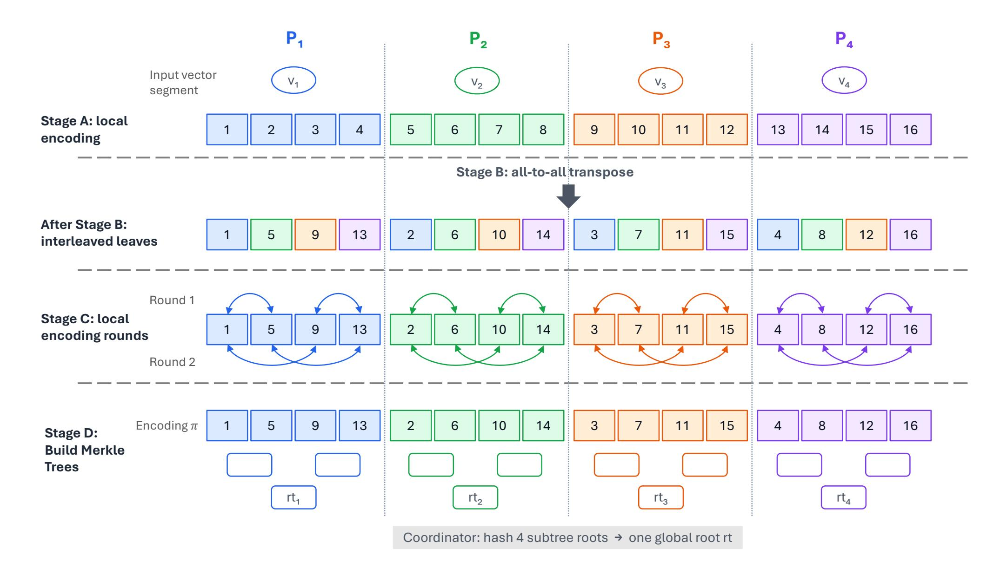
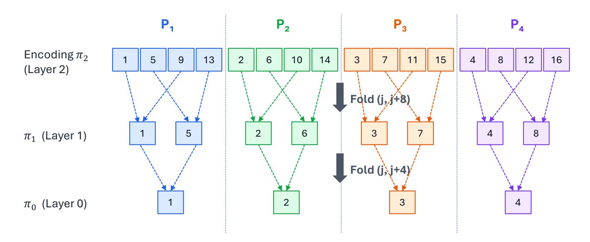
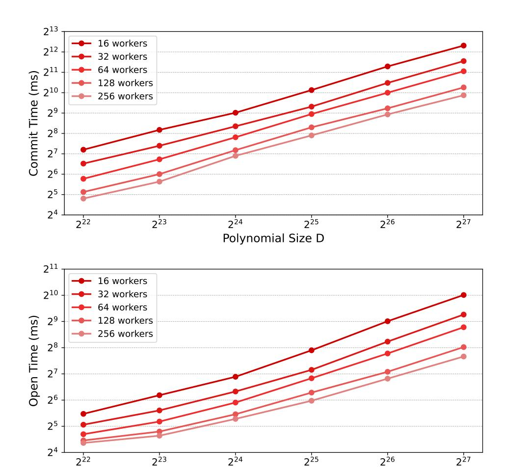
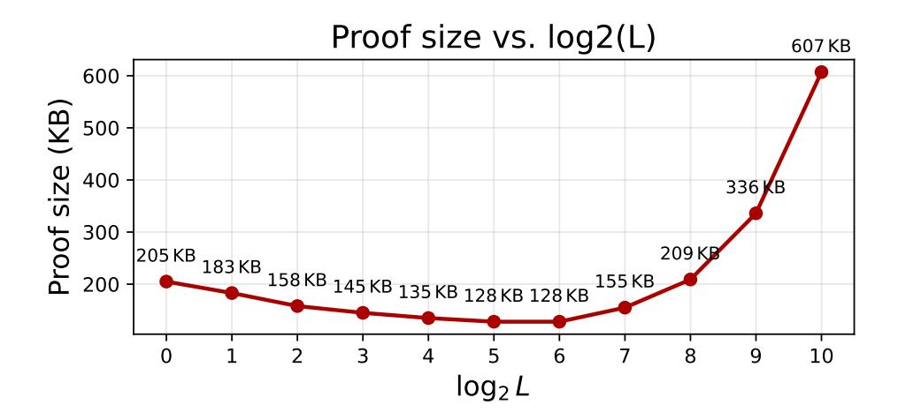

{0}------------------------------------------------

# UltraFold: Efficient Distributed BaseFold from Packed Interleaved Merkle Trees

Wenhao Wang *Yale University, IC3* wenhao.wang@yale.edu

Fan Zhang *Yale University, IC3* f.zhang@yale.edu

# Abstract

Transparent, code-based polynomial commitment schemes (PCSs) such as BaseFold (CRYPTO'24) are a compelling building block for large-scale zero-knowledge proofs (ZKPs): they avoid trusted setup, rely on standard hash assumptions, offer post-quantum security, and achieve high performance. As ZKP workloads grow, the polynomials that PCSs must commit to and open increasingly exceed the memory and throughput of a single machine, motivating a scalable distributed version of BaseFold. However, existing distribution attempts either only support polynomials of specific structures, or their proof size grows with the number of workers, or they do not scale to arbitrarily many workers. In this paper, we present UltraFold, the first distributed BaseFold PCS that works with general polynomials, scales to any number of workers, and maintains succinct proofs whose size does not depend on the worker count. To enable efficient distributed commitment and opening, UltraFold introduces an *interleaved* Merkle leaf layout that is realized via a single all-toall exchange of partially encoded values, and each worker's computation becomes local after this exchange. To mitigate hashing overhead, UltraFold further uses *packed* Merkle trees, reducing both prover time in practice and the resulting proof size. We implement UltraFold and evaluate it in a distributed setting: using 256 single-core workers, we commit to and open a 134M-coefficient polynomial in under 2 seconds, with a proof size of 216 KB.

## 1 Introduction

Zero-knowledge proofs (ZKPs) [\[7](#page-15-0)[–9,](#page-15-1)[11\]](#page-15-2) enable efficient, noninteractive verification of computations. Recent code-based schemes [\[3,](#page-14-0)[4,](#page-15-3)[6,](#page-15-4)[10,](#page-15-5)[12,](#page-15-6)[24,](#page-15-7)[27,](#page-16-0)[28\]](#page-16-1) stand out for their fast proof generation, transparent setup, and post-quantum security. For instance, BaseFold [\[27\]](#page-16-0) is a field-agnostic and practically efficient scheme that has been adopted in real-world ZKP applications for machine learning (e.g., DeepProve [\[2\]](#page-14-1)) and virtual machine computation (e.g., Ceno [\[1\]](#page-14-2)).

However, even with state-of-the-art schemes such as Base-Fold, as computation size grows, the prover runs into the memory and bandwidth limits of a single server. To scale beyond this limit, recent works [\[13](#page-15-8)[–17,](#page-15-9)[20–](#page-15-10)[23](#page-15-11)[,25,](#page-16-2)[26\]](#page-16-3) explore the design of *distributed proof generation*, using multiple servers to horizontally scale up the supported computation size and prover's performance. However, no satisfactory distributed proof generation scheme has been proposed for BaseFold-like code-based schemes, a gap we aim to close in this paper.

BaseFold is essentially a *polynomial commitment scheme* (PCS), where a prover first *commits* to a polynomial *p* by sending a short commitment com, and later can *open* the commitment at any point *z* by sending the claimed value *p*(*z*) together with an opening proof that com is consistent with this evaluation. Desiderata for a distributed version of (Base-Fold) PCS include: (1) *succinctness*, where proof size must be poly-logarithmic in the polynomial size and not grow with the number of machines, (2) supporting *general* polynomials, instead of only polynomials with specific structures, (3) horizontally scaling to an arbitrary number of workers, and (4) practical efficiency in prover time and communication.

Limitation of related works. Recent work offers preliminary methods for distributing schemes in the BaseFold/FRI family, but they do not meet the aforementioned desiderata. For instance, DeVirgo [\[23\]](#page-15-11) introduces a distributed scheme for FRI [\[6,](#page-15-4) [28\]](#page-16-1), but it only supports data-parallel polynomials and cannot generalize to arbitrary ones. HyperFond [\[26\]](#page-16-3) and FRIttata [\[25\]](#page-16-2) support general polynomials and scale to many workers, but their proof size grows linearly with the number of workers and can become large in practice. PipFRI [\[14\]](#page-15-12) distributes FRI and reduces the hashing workload of workers, but it does not scale to arbitrarily many workers, limiting its horizontal scalability.

Our work: **UltraFold**. In this work, we introduce UltraFold, a distributed PCS that addresses the limitations of prior work and achieves all desiderata. In particular, UltraFold avoids proof-size blowups that scale with *M*, and avoids heavy multi-round data movement during com-

{1}------------------------------------------------

| Scheme                     | General Polynomial | Scalable                            | Proof Size                       | Worker Time                                           | Worker Comm.          |
|----------------------------|--------------------|-------------------------------------|----------------------------------|-------------------------------------------------------|-----------------------|
| UltraFold                  | ✓                  | ✓                                   | $O(\lambda \log^2 D)$            | $O(N\log D)\mathbb{F}, O(\frac{N}{\log D})\mathbb{H}$ | O(N)                  |
| HyperFond [26]             | $\checkmark$       | ✓                                   | $O(\lambda M \log^2 N)$          | $O(N\log N)\mathbb{F},O(N)\mathbb{H}$                 | $O(\lambda \log^2 N)$ |
| DeVirgo [23]               | ×                  | ✓                                   | $O(\lambda \log^2 D)$            | $O(N\log N)\mathbb{F},O(N)\mathbb{H}$                 | O(N)                  |
| FRIttata † [25] | $\checkmark$       | ✓                                   | $O(\lambda \log^2 N + M \log N)$ | $O(N\log N)\mathbb{F},O(N)\mathbb{H}$                 | O(N)                  |
| DePip-FRI [14]             | ✓                  | $\boldsymbol{\varkappa}^{\ddagger}$ | $O(\lambda(M+\log^2 N))$         | $O(N\log N)\mathbb{F},O(\frac{N}{M})\mathbb{H}$       | O(N)                  |

&lt;sup>† Costs are for the distributed batched-FRI variant. ‡ Efficient only when  $M = O(\log N)$ .

Table 1: Comparison with prior transparent distributed code-based PCS. We consider committing to a polynomial with D coefficients using M workers, each holding a segment of size N := D/M, and opening the polynomial at one point. "General Polynomial" indicates whether the PCS supports committing/opening an *arbitrary* polynomial (as required by general PIOPs), rather than those with special structure (e.g., data-parallel polynomials). "Scalable" indicates whether the protocol can scale to an arbitrary number of workers.  $\lambda$  is the security parameter. "Comm." denotes total communication per party.  $\mathbb F$  counts field operations and  $\mathbb H$  counts hash invocations.

mitment and opening [25]. To this end, UltraFold uses a non-canonical, *interleaved* Merkle leaf layout together with a one-time balanced all-to-all exchange among workers. This layout ensures that the global commitment is a *single* Merkle root, while each queried opening is served by a single worker (plus a short coordinator-provided top path), rather than requiring per-worker openings as in schemes [16, 25, 26] that concatenate *M* independent commitments.

To further improve worker runtime, we identify that the practical bottleneck in worker computation is building Merkle trees. UltraFold therefore introduces *packing*, so that multiple polynomial coefficients are packed into a single Merkle leaf, amortizing the cost of Merkle tree construction; this optimization also shortens Merkle paths, reducing proof sizes.

As summarized in Table 1, UltraFold is the first distributed PCS in the BaseFold/FRI family that simultaneously supports general polynomials, scales to an arbitrary number of workers, achieves succinct proof size, and delivers practical prover efficiency.

## 1.1 Technical Overview

We consider a single coordinator C and  $M = 2^m$  workers. One can think of the coordinator as the party with a polynomial for which she would like to generate commitment and openings. Let  $D = 2^d$  be the size of the polynomial being committed (i.e., the number of coefficients), and let N := D/M.

Interleaved Merkle layout and distributed PCS. We divide the BaseFold PCS into two stages: *commit* and *open*. In the commit stage, the provers encode the polynomial's evaluations into a BaseFold codeword (i.e., the output of the BaseFold encoding) and output a Merkle root committing to that codeword. In the open stage, they execute the IOPP protocol of BaseFold, where the prover folds the codeword generated in the commit stage multiple times. Combined with a SumCheck protocol, this yields an opening proof for polynomial evaluations. To distribute the two stages, the most direct approach is to split the codeword into *N* segments, and have

each worker build a Merkle subtree over its segment. However, this creates a communication overhead in the open stage: each folding round pairs entries that are stored on different workers, requiring heavy cross-worker communication.

We avoid these repeated cross-worker dependencies by fixing a non-canonical interleaved leaf ordering. Concretely, worker  $i \in [M]$  stores the Merkle leaves whose indices j satisfy  $j \equiv i \pmod{M}$ . This layout can be realized efficiently with only one heavy communication round: each worker first runs the BaseFold encoder locally on its input (segments of evaluations of the polynomial), and then the workers exchange data in a way similar to Bailey's FFT [5], so that the remaining encoding steps that generate the Merkle leaves are completed locally for each worker. The interleaved ordering matches the structure of BaseFold foldings: in the round that folds level (i+1) (of length  $n_{i+1}=2n_i$ ) down to level i (of length  $n_i$ ), each parent position  $j \in [0, n_i)$  depends on exactly the two children positions  $(j, j + n_i)$ . Under the interleaved layout, these two children are assigned to the same worker whenever  $i \geq m$ , since  $n_i$  is a multiple of M. As a result, the distributed folding computation and the corresponding Merkle authentication material stay *local* to a single worker for all distributed levels. Finally, we obtain a distributed multilinear PCS by composing this distributed BaseFold IOPP with distributed SumCheck [13, 21].

Reducing prover time and proof size through packing. Although we have minimized heavy communication costs and designed a distributed protocol, we observe that Merkle hashing and Merkle authentication paths often dominate concrete costs. Concretely, each worker must repeatedly build Merkle subtrees over O(N) leaves, which costs O(N) hashing, and in our implementation it accounts for more than 80% of the worker runtime. To reduce this overhead, UltraFold uses packing: we zip many related values into tuple-valued Merkle leaves, reducing the number of leaves (and thus the hashing work) per Merkle tree.

Concretely, to commit a  $d = (k + \ell)$ -variate polynomial  $f(\mathbf{v}, \mathbf{x})$ , we define  $L = 2^{\ell}$  sub-polynomials  $f_{\mathbf{u}}(\mathbf{x}) := f(\mathbf{u}, \mathbf{x})$ 

{2}------------------------------------------------

for  $\mathbf{u} \in \{0,1\}^{\ell}$ . In the commit stage, we keep the interleaved leaf layout but replace each leaf by the packed tuple  $\widetilde{\pi}[j] := (\pi_{\mathbf{u}}[j])_{\mathbf{u} \in \{0,1\}^{\ell}}$  where  $\pi_{\mathbf{u}}$  is the encoded codeword of  $f_{\mathbf{u}}$ , so a single packed Merkle tree commits to all L sub-polynomials oracles simultaneously, and the size of the Merkle subtrees of the workers reduces to O(N/L). During evaluation, the verifier uses the same randomness and queries the same indices for every sub-polynomial, and opening one packed leaf  $\widetilde{\pi}[j]$  reveals and authenticates the corresponding values for all L instances.

With packing, each worker performs O(N/L) hashing compared with O(N) without packing, and authentication paths shorten by  $\log L$  levels. The tradeoff is that each opened leaf now carries L field elements. Choosing L to be  $O(\log D)$ , we have practical savings in prover time and proof size while keeping the proof size succinct.

# 1.2 Implementation and Evaluation

We implement an end-to-end prototype of UltraFold and evaluate its performance. We assign each worker a single core and use up to 256 workers. Across polynomial sizes up to 227 coefficients, UltraFold achieves millisecond-scale verification with succinct proofs and scales well with the number of workers. In particular, with 256 single-core workers we commit to and open a size-227 polynomial in under 2 seconds (computation time only), and for size  $2^{22}$  we obtain sub-200 KB proofs and sub-3 ms verification. We further quantify the impact of packing on proof size and demonstrate that it substantially reduces Merkle-dominated overhead at moderate packing factors L. Finally, we measure end-to-end communication and show that per-worker communication decreases with the worker count while coordinator traffic remains small. Compared to existing distributed code-based PCSs [14, 23, 26] when committing to and opening a size-222 polynomial with 16 workers, UltraFold produces at least 35% smaller proof, achieves 50% faster commit and open time, while supporting general polynomials and scaling to an arbitrary number of workers.

# **Contributions**

In summary, we present <code>UltraFold</code>, a distributed multilinear PCS based on BaseFold with full scalability, succinct proof size, and practical prover performance. We also implement <code>UltraFold</code> end-to-end and show that it is practical at scale.

#### 2 Preliminaries

In this section, we introduce the key notation, definitions, and building blocks.

**Notation.** We use boldface v to denote a vector and v[i] to denote its i-th element. Let  $\mathbb{F}$  denote a finite field of size  $\Omega(2^{\lambda})$ ,

where  $\lambda$  is the security parameter, and let  $B_{\mu} := \{0,1\}^{\mu}$  denote the  $\mu$ -dimensional Boolean hypercube. We write  $\mathbb{F}_{\mu}^{\leq d}[\boldsymbol{X}]$  for the set of  $\mu$ -variate polynomials whose degree in each variable is at most d; a multivariate polynomial is multilinear if its degree in each variable is at most 1. For  $\boldsymbol{a}, \boldsymbol{b} \in \mathbb{F}^{\mu}$ , let  $\tilde{eq}(\boldsymbol{a}, \boldsymbol{b}) := \prod_{i=1}^{\mu} (a_i b_i + (1 - a_i)(1 - b_i))$  denote the  $\mu$ -dimension multilinear Lagrange polynomial. Note that when  $\boldsymbol{a}, \boldsymbol{b} \in B_{\mu}$ ,  $\tilde{eq}(\boldsymbol{a}, \boldsymbol{b})$  is 1 if and only if  $\boldsymbol{a} = \boldsymbol{b}$ , and is 0 otherwise. For  $\boldsymbol{x} = (x_1, \dots, x_{\mu}) \in \mathbb{F}^{\mu}$ , define  $[\boldsymbol{x}] := \sum_{i=0}^{\mu-1} 2^i \cdot x_{\mu-i}$ , and let  $\langle v \rangle_m$  denote the m-bit representation of an integer  $v \in [0, 2^m - 1]$ .

### 2.1 Definitions

**Merkle tree.** A Merkle tree [18] is a vector commitment that enables efficient openings of any entries of a length-n vector. It has three algorithms: (1) Merkle.Commit( $\mathbf{x}$ )  $\rightarrow$  rt outputs the Merkle root, (2) Merkle.Open(rt,i, $\mathbf{x}$ )  $\rightarrow$  ( $x_i$ , path) outputs the i-th entry of  $\mathbf{x}$  with an opening path path, and (3) Merkle.Verify(rt,i, $x_i$ , path)  $\rightarrow$  {0,1} outputs 1 if and only if rt and  $x_i$  agree with path.

**Polynomial commitment scheme.** On a high level, a PCS securely implements polynomial oracles and queries to such oracles. Here we define PCS as follows.

**Definition 1** (Polynomial Commitment Scheme). A polynomial commit scheme for a class of functions  $\mathcal{F}$  is a tuple of algorithms (KeyGen, Commit, VerPoly, Eval), where

- $\mathsf{KeyGen}(1^{\lambda}, \mathcal{F}) \to \mathsf{pp}$ : generates the public parameter  $\mathsf{pp}$ .
- Commit(pp, f)  $\rightarrow$  com $_f$ : generates a commitment com $_f$  of a function f.
- VerPoly(pp,comf, f)  $\rightarrow$  {0,1}: takes a polynomial and a commitment and outputs 1 if and only if comf is the commitment of f.
- Eval(pp, comf,  $\mathbf{x}$ , y): an interactive protocol between  $\mathcal{P}$  and  $\mathcal{V}$  where  $\mathcal{P}$  convinces  $\mathcal{V}$  that  $f(\mathbf{x}) = y$  and comf is a commitment of f.

A PCS protocol should have the following properties:

• Completeness: For all  $f \in \mathcal{F}$  and for all  $\mathbf{x}$ 

$$\Pr\left[b = 1 \middle| \begin{array}{l} \mathsf{crs} \leftarrow \mathsf{KeyGen}(1^{\lambda}, \mathcal{F}) \\ \mathsf{com}_f \leftarrow \mathsf{Commit}(f, \mathsf{crs}) \\ (y, \pi) \leftarrow \mathsf{Open}(f, \boldsymbol{x}, \mathsf{crs}) \\ b \leftarrow \mathsf{Verify}(\mathsf{com}_f, \boldsymbol{x}, y, \pi, \mathsf{crs}) \end{array} \right] = 1 - \mathsf{negl}(\lambda)$$

• **Binding**: For all PPT adversary  $\mathcal{A}$  the following probability is  $negl(\lambda)$ .

$$\Pr\left[b_1 = b_2 = 1 \land f_1 \neq f_2 \middle| \begin{array}{l} \mathsf{pp} \leftarrow \mathsf{KeyGen}(1^\lambda, \mathcal{F}) \\ (\mathsf{com}, f_1, f_2) \leftarrow \mathcal{A}(\mathsf{pp}) \\ b_1 \leftarrow \mathsf{VerPoly}(\mathsf{pp}, \mathsf{com}, f_1) \\ b_2 \leftarrow \mathsf{VerPoly}(\mathsf{pp}, \mathsf{com}, f_2) \end{array}\right]$$

{3}------------------------------------------------

**Knowledge soundness**: For any PPT adversaries  $A_1, A_2$ , there exists a PPT extractor algorithm  $\mathcal{E}$  with oracle access to  $A_1, A_2$  such that the following probability is  $negl(\lambda)$ :

$$\Pr \begin{bmatrix} \mathsf{Eval}(\mathsf{pp},\mathsf{com},\pmb{x},y) \langle \mathcal{A}_2,\mathcal{V} \rangle & \mathsf{pp} \leftarrow \mathsf{KeyGen}(1^\lambda,\mathcal{F}) \\ \mathsf{e} \ 1 \ \land \ f(\pmb{x}) \neq y & f \leftarrow \mathcal{E}(\mathsf{pp}) \\ f(\pmb{x}) = y \end{bmatrix}$$

## 2.2 BaseFold

BaseFold [27] introduces an interactive oracle proof of proximity (IOPP) for a recursively defined family of linear codes. It has a fast recursive encoding algorithm over any field and an IOPP that checks code proximity via repeated folding. Here, we recall important notions and protocols in BaseFold and the PCS construction from the BaseFold IOPP.

**Foldable codes.** BaseFold has parameters  $c, k_0 \in \mathbb{N}$ . Here c is the *blow-up factor*, indicating how many times larger the encoded output is compared to the input. In our protocol, we use non-distributed Basefold encoding in certain steps, with blow-up factor c that is a power of 2. Let  $n_0 := c \cdot k_0$ , and let  $k_i := k_0 \cdot 2^i$  and  $n_i := n_0 \cdot 2^i$  for  $i \ge 1$ . A  $(c, k_0)$ -foldable code consists of a fixed generator  $G_0 \in \mathbb{F}^{k_0 \times n_0}$  of a  $[n_0, k_0, n_0 - k_0 + 1]$  code (e.g., a Reed-Solomon code) and two vectors  $t_i, t_i' \in \mathbb{F}^{n_i}$  for  $i = 0, \ldots, d-1$  satisfying  $t_i[j] \ne t_i'[j]$  for all  $j \in [n_i]$ . Canonically,  $t_i \stackrel{\$}{\leftarrow} \mathbb{F}^{n_i}$  and  $t_i' = -t_i$ .

**Recursive encoding.** Define  $\operatorname{Enc}_d: \mathbb{F}^{k_d} \to \mathbb{F}^{n_d}$  by  $\operatorname{Enc}_0(\boldsymbol{v}) := \boldsymbol{v}G_0$  and, for d>0, writing  $\boldsymbol{v}=(\boldsymbol{v}_\ell,\boldsymbol{v}_r)$  with  $\boldsymbol{v}_\ell,\boldsymbol{v}_r\in \mathbb{F}^{k_{d-1}}$ , the encoding of  $\boldsymbol{v}$  is  $\operatorname{Enc}_d(\boldsymbol{v}):=(\operatorname{Enc}_{d-1}(\boldsymbol{v}_\ell)+\operatorname{Enc}_{d-1}(\boldsymbol{v}_r)\circ\boldsymbol{t}_{d-1},\operatorname{Enc}_{d-1}(\boldsymbol{v}_\ell)-\operatorname{Enc}_{d-1}(\boldsymbol{v}_r)\circ\boldsymbol{t}_{d-1})$ , where  $\circ$  denotes entry-wise multiplication. Let  $\mathsf{C}_d$  denote the set of codewords generated by  $\operatorname{Enc}_d$ . This is Protocol 1 in BaseFold.

**BaseFold IOPP.** In their IOPP, the verifier is given an oracle  $\pi_d \in \mathbb{F}^{n_d}$  provided by the prover, and checks that  $\pi_d$  is close to some codeword in  $C_d$ . Note that an honest prover sets  $\pi_d = \operatorname{Enc}_d(\nu)$  for the committed vector  $\nu$ . It happens in two phases: *commit* and *query*.

In the IOPP commit phase, the prover performs d folding rounds for  $i = d - 1, \ldots, 0$ . In round i, the verifier samples a challenge  $\alpha_i \stackrel{\$}{\leftarrow} \mathbb{F}$ . For each  $j \in [n_i]$ , let  $g_{i,j}(X)$  be the unique degree-1 polynomial satisfying  $g_{i,j}(\boldsymbol{t}_i[j]) = \boldsymbol{\pi}_{i+1}[j]$  and  $g_{i,j}(\boldsymbol{t}_i'[j]) = \boldsymbol{\pi}_{i+1}[j+n_i]$ , and define the folded oracle  $\boldsymbol{\pi}_i \in \mathbb{F}^{n_i}$  by  $\boldsymbol{\pi}_i[j] := g_{i,j}(\alpha_i)$ . The prover commits to each  $\boldsymbol{\pi}_i$  using a Merkle tree and sends the Merkle root to the verifier. This is Protocol 2 in BaseFold.

In the query phase, the verifier samples  $\mu \stackrel{\$}{\leftarrow} [n_{d-1}]$  and for  $i = d-1, \ldots, 0$ : it requests Merkle openings of  $\pi_{i+1}[\mu]$  and  $\pi_{i+1}[\mu+n_i]$ , recomputes  $g_{i,\mu}$ , and checks  $g_{i,\mu}(\alpha_i) = \pi_i[\mu]$ . Then it updates  $\mu \leftarrow \mu \pmod{n_{i-1}}$ . Finally, the verifier receives  $\pi_0$  and directly verifies that it is an encoding generated with  $G_0$ . This is Protocol 3 in BaseFold.

**PCS from BaseFold.** Let  $f \in \mathbb{F}[X_1, \dots, X_d]$  be multilinear polynomial and let  $\mathbf{f} \in \mathbb{F}^{2^d}$  be its evaluations over  $B_d$ .

Commitment. Set  $\pi_f := \operatorname{Enc}_d(f) \in \mathbb{F}^{n_d}$  and publish rt := Merkle.Commit $(\pi_f)$ .

Opening at  $\mathbf{z} \in \mathbb{F}^d$ . To prove  $f(\mathbf{z}) = y$ , the prover runs the standard d-round sum-check on the above identity, sending univariate messages  $h_d, \ldots, h_1$  and receiving verifier challenges  $r_{d-1}, \ldots, r_0 \stackrel{\$}{\leftarrow} \mathbb{F}$ . In parallel, the prover and the verifier run BaseFold IOPP on  $\pi_f$  using the same points for folding, and obtain the bottom-layer code  $\pi_0$ . Finally, the verifier checks  $\pi_0 \stackrel{?}{=} \operatorname{Enc}_0\left(h_1(r_0)\big/\tilde{eq}((r_0,\ldots,r_{d-1}),\mathbf{z})\right)$ . This corresponds to Protocol 4 in BaseFold.

# 2.3 Security Model

Participants in UltraFold consist of a coordinator  $C, M = 2^m$  workers  $\mathcal{P}_1, \dots, \mathcal{P}_M$ , and a verifier  $\mathcal{V}$ . Note that C also counts as a party responsible for generating the proof alongside workers. We assume point-to-point communication channels between C and workers, between each pair of workers, and between C and C. Note that C0 only communicates with C0. We assume the adversary may corrupt any subset C1 of workers and/or the coordinator C2; corrupted parties can arbitrarily collude. We require the soundness and knowledge soundness properties of the PCS to hold against this adversary.

### 3 Distributed BaseFold PCS

In this section, we describe a fully distributed BaseFold PCS that uses a global Merkle root as the commitment. Our distributed protocol builds on ideas from Bailey's FFT [5], where we use a single round of all-to-all communication to exchange data among workers in a specific way such that all subsequent computations do not require further communication. We then introduce an *interleaved Merkle tree* with a fixed non-canonical leaf order. Each worker commits to a local subtree and sends its subtree root to the coordinator, who then obtains a single global root. Thereafter, foldings and openings are handled locally within workers (plus a short coordinator-provided top path), with no worker-to-worker communication. Finally, we obtain a distributed PCS by combining this IOPP with the distributed SumCheck protocol [21], reusing SumCheck challenges as folding points.

# 3.1 Distributed BaseFold Encoding

Here, we describe in detail our distributed BaseFold encoding for a vector  $\mathbf{v}$ . Let  $D=2^d$  be the length of a vector, and we assume there are  $M=2^m$  total workers  $\{\mathcal{P}_{\boldsymbol{b}}\}_{\boldsymbol{b}\in B_m}$  and a coordinator  $\mathcal{C}$ . At the very beginning, the vector is split into segments of length N:=D/M and each worker is given a segment, as follows. Let n:=d-m. Worker  $\mathcal{P}_{\boldsymbol{b}}$ 's segment consists of elements with indices  $\{\boldsymbol{a} | \boldsymbol{b}\}$  for all  $\boldsymbol{a} \in B_n$ . Here

{4}------------------------------------------------

the concatenation  $\boldsymbol{a} \parallel \boldsymbol{b}$  is in  $B_{n+m}$  and can be interpreted as the binary representation of an integer in  $[0, 2^{n+m})$ , and  $\boldsymbol{v}[\boldsymbol{a} \parallel \boldsymbol{b}]$  denotes the corresponding entry of  $\boldsymbol{v}$ . As an example, for D=8, M=2, worker  $\mathcal{P}_0$  gets a segment  $(\boldsymbol{v}[0], \boldsymbol{v}[2], \boldsymbol{v}[4], \boldsymbol{v}[6])$  and worker 1 gets a segment  $(\boldsymbol{v}[1], \boldsymbol{v}[3], \boldsymbol{v}[5], \boldsymbol{v}[7])$ .

In a naive distribution attempt, each worker  $\mathcal{P}_{\boldsymbol{b}}$  encodes its own vector segment and sends  $\operatorname{Enc}_n(\mathbf{v}^{(b)})$  to  $\mathcal{C}$ . Then the coordinator continues to compute the global codeword  $\pi_d :=$  $\mathsf{Enc}_d(\mathbf{v})$  using the received intermediate results. Finally, the coordinator sends  $\pi_d$  back to workers to build local Merkle subtrees, and aggregates the subtree roots into a single Merkle root. However, this scheme would have each worker send to  $\mathcal{C}$  and receive from  $\mathcal{C}$  a total of  $O(c \cdot N)$  field elements, and would require C to perform  $O(NM \log M)$  field operations, leading to both heavy communication and heavy computation for the coordinator as the coordinator here essentially has the asymptotic cost of performing a non-distributed BaseFold encoding. Furthermore, the canonical Merkle leaf order makes the distributed IOPP commit and query phase expensive: both folding and Merkle openings involve siblings stored on many workers, forcing additional cross-worker communication.

We remove the coordinator bottleneck by (1) replacing the centralized upload/download with a single all-to-all communication *only among workers*, (2) finishing all encoding computation *entirely locally* at each worker, and (3) building the Merkle tree in a specific *interleaved ordering* of the leaves so that the folding and Merkle openings in the distributed IOPP protocol remain local. Protocol 1 summarizes the distributed BaseFold encoding and commitment procedure.

Protocol 1 (Distributed BaseFold Encoding).

**Input:** The prover's input is vector  $\mathbf{v}$ ; the prover divides the vector such that worker  $\mathcal{P}_{\mathbf{b}}$  holds a segment  $\mathbf{v}^{(\mathbf{b})}$ .

**Output:** A Merkle root of the BaseFold encoding of v.

Stage A (local partial encoding): Each worker  $\mathcal{P}_b$  locally encodes and gets  $\pi_n^{(b)} := \operatorname{Enc}_n(\mathbf{v}^{(b)})$ .

Stage B (all-to-all transpose): Each worker  $\mathcal{P}_b$  partitions  $\boldsymbol{\pi}_n^{(b)}$  and sends  $(\boldsymbol{\pi}_n^{(b)}[(\boldsymbol{s}\|\boldsymbol{b}')])_{\boldsymbol{s}\in B_{n-m+\gamma}}$  to worker  $\mathcal{P}_{\boldsymbol{b}'}$ , for all  $\boldsymbol{b}'\in B_m$ . For worker  $\mathcal{P}_{\boldsymbol{b}}$ , it holds  $\{\boldsymbol{\pi}_n^{(b')}[(\boldsymbol{s}\|\boldsymbol{b})]\}_{\boldsymbol{s}\in B_{n-m+\gamma},\boldsymbol{b}'\in B_m}$  from the previous step. Then  $\mathcal{P}_{\boldsymbol{b}}$  initiates  $\boldsymbol{\pi}^{(b)}$  such that  $\boldsymbol{\pi}^{(b)}[\boldsymbol{s},\boldsymbol{b}']:=\boldsymbol{\pi}_n^{(b')}[(\boldsymbol{s}\|\boldsymbol{b})]$ .

**Stage C** (local encoding completion): Each worker  $\mathcal{P}_b$  executes the remaining m BaseFold encoding iterations locally. Specifically, for i = 1, ..., m rounds,  $\mathcal{P}_b$  does the following:

1. For every  $(\mathbf{s}, \mathbf{u}, \mathbf{w}) \in B_{n-m+\gamma} \times B_{m-i} \times B_{i-1}$ , write  $\mathbf{b}' = (\mathbf{u} \| \boldsymbol{\beta} \| \mathbf{w})$  (with  $\boldsymbol{\beta} \in \{0, 1\}$ ) and define  $\boldsymbol{\theta} := \boldsymbol{t}_{n+i-1}[(\mathbf{w} \| \mathbf{s} \| \boldsymbol{b})]$ .

2. Let  $\ell := \boldsymbol{\pi^{(b)}}[\boldsymbol{s}, \boldsymbol{u} || 0 || \boldsymbol{w}]$  and  $r := \boldsymbol{\pi^{(b)}}[\boldsymbol{s}, \boldsymbol{u} || 1 || \boldsymbol{w}]$ . Update these entries by  $\boldsymbol{\pi^{(b)}}[\boldsymbol{s}, \boldsymbol{u} || 0 || \boldsymbol{w}] \leftarrow \ell + \theta \cdot r$  and  $\boldsymbol{\pi^{(b)}}[\boldsymbol{s}, \boldsymbol{u} || 1 || \boldsymbol{w}] \leftarrow \ell - \theta \cdot r$ .

After m rounds of updates,  $\pi^{(b)}$  is the segment of the final codeword held by  $\mathcal{P}_b$ .

Stage D (interleaved Merkle commitment): Each worker  $\mathcal{P}_b$  builds a Merkle subtree over its local leaves  $\pi^{(b)}$ , sends only the subtree root  $\operatorname{rt}^{(b)}$  to  $\mathcal{C}$ .  $\mathcal{C}$  hashes the M subtree roots into a small global tree and outputs a *single* global root rt.

**Internal States:** Each worker  $\mathcal{P}_b$  stores  $\pi^{(b)}$  and the Merkle subtree from Stage D.  $\mathcal{C}$  stores the top global tree from Stage D.

We next explain Protocol 1 stage by stage. Figure 1 shows an example of the protocol execution.

Stage A: local (per-worker) partial encoding, n layers. Each worker  $\mathcal{P}_b$  holds a message shard  $\mathbf{v}^{(b)} \in \mathbb{F}^{2^n}$  and locally runs the first n layers of the BaseFold encoder, producing an intermediate codeword  $\mathbf{\pi}_n^{(b)} = \operatorname{Enc}_n(\mathbf{v}^{(b)}) \in \mathbb{F}^{c \cdot 2^n} = \mathbb{F}^{2^{n+\gamma}}$ . This is purely local computation.

Stage B: all-to-all transpose. Stage B is the *only* oracle-sized communication step. We view each  $\pi_n^{(b)} \in \mathbb{F}^{2^{n+\gamma}}$  as indexed by a bitstring  $(s || b') \in B_{n-m+\gamma} \times B_m$ . Worker  $\mathcal{P}_b$  routes each entry to the worker named by its suffix b'. Equivalently, each worker sends M equal-sized packets of length  $2^{n-m+\gamma}$ , and receives one such packet from every other worker. After this all-to-all communication, worker  $\mathcal{P}_b$  holds, for every  $s \in B_{n-m+\gamma}$ , the vector  $\pi^{(b)}[s,b'] := \pi_n^{(b')}[(s||b)]$ . Intuitively, Stage B transposes the distribution: the data needed to apply the remaining m encoder layers (which mix along the b'-dimension) is now co-located on a single worker, and the coordinator is not on the data path.

Stage C: local completion of the remaining m BaseFold layers. After Stage B, worker  $\mathcal{P}_b$  holds the transposed table  $\pi^{(b)}[s,b']$  for  $s \in B_{n-m+\gamma}$  and  $b' \in B_m$ . Stage C applies the last m BaseFold encoder layers along the b'-dimension in an iterative (FFT-style) order, where the butterfly stride doubles each round. Concretely, in round  $i \in \{1,\ldots,m\}$  we write  $b' = u \|\beta\|w$  with  $u \in B_{m-i}$ ,  $\beta \in \{0,1\}$ , and  $w \in B_{i-1}$ . For every fixed (s,u,w), the two paired coordinates are the entries with  $\beta = 0$  and  $\beta = 1$ :  $\ell := \pi^{(b)}[s,u\|0\|w]$  and  $r := \pi^{(b)}[s,u\|1\|w]$ . They are updated in place by the BaseFold encoding rule

$$\left(\boldsymbol{\pi^{(b)}}[\boldsymbol{s},\boldsymbol{u}||0||\boldsymbol{w}],\boldsymbol{\pi^{(b)}}[\boldsymbol{s},\boldsymbol{u}||1||\boldsymbol{w}]\right) \leftarrow \left(\ell + \theta \cdot r, \ell - \theta \cdot r\right),$$

using the BaseFold parameter  $\theta := t_{n+i-1}[(\boldsymbol{w} \| \boldsymbol{s} \| \boldsymbol{b})]$ . Here  $t_{n+i-1}$  is a public parameter of BaseFold, and the index expression encodes that (1)  $(\boldsymbol{s} \| \boldsymbol{b})$  forms the low-order  $n + \gamma$ 

{5}------------------------------------------------

Figure 1: Illustration of distributed BaseFold encoding (Protocol 1) with M = 4 workers. In this example, the input vector has 4 elements, and the blow-up factor is c = 4 (so BaseFold encoding has length 16).

bits (so the worker id b stays fixed), while (2) w selects the within-butterfly position at round i.

Stage D: interleaved Merkle subtrees and a small top tree. Each worker  $\mathcal{P}_b$  builds a Merkle subtree over its local leaf vector  $\boldsymbol{\pi}^{(b)}$  (in the interleaved order), sends only the subtree root  $\operatorname{rt}^{(b)}$  to  $\mathcal{C}$ , and retains the subtree for later openings. The coordinator hashes the M subtree roots into a small top Merkle tree and outputs a *single* global root rt.

This commitment structure preserves the centralized interface (one root) while keeping openings local: a queried leaf and its intra-subtree authentication path are provided by a single worker, and the coordinator supplies only the short top path from rt down to  $\mathsf{rt}^{(b)}$ .

**Protocol complexity.** We summarize the costs of the distributed BaseFold encoding. Each worker performs  $O(c \cdot N \log(MN))$  field operations and  $O(c \cdot N)$  hashing, and communicates  $O(c \cdot N)$  field elements and O(1) hash digests. The coordinator receives O(M) Merkle subroots, and performs O(M) hashing.

**Correctness.** We show that Protocol 1 computes a correct BaseFold encoding.

**Lemma 1** (Correctness of distributed BaseFold encoding). Fix BaseFold parameters  $(G_0, \{t_i\}_{i=0}^{d-1})$  with  $c = 2^{\gamma}$ , and let  $\pi_d := \operatorname{Enc}_d(\mathbf{v}) \in \mathbb{F}^{cD}$  denote the (centralized) BaseFold code-

word for  $\mathbf{v} \in \mathbb{F}^D$ . Run Protocol 1 and let each worker output its local leaf vector  $\mathbf{\pi}^{(\mathbf{b})}$ . Then for all  $\mathbf{b}, \mathbf{b}' \in B_m$  and  $\mathbf{s} \in B_{n-m+\gamma}$  we have  $\mathbf{\pi}^{(\mathbf{b})}[\mathbf{s}, \mathbf{b}'] = \mathbf{\pi}_d[\mathbf{b}' || \mathbf{s} || \mathbf{b}]$ .

The proof of Lemma 1 can be found in Appendix B.

## 3.2 Distributed BaseFold IOPP

We now describe the distributed BaseFold IOPP. Recall that in the BaseFold IOPP, after the encoding, the verifier holds a Merkle root rt that commits to an oracle  $\pi \in \mathbb{F}^{n_d}$ , and the provers need to convince the verifier that  $\pi_d$  is (close to) a valid codeword of  $C_d$ . The protocol has two phases, *commit* and *query*. In the commit phase, the provers generate a list of folded oracles  $(\pi_d, \dots, \pi_0)$  (and their Merkle roots) using the verifier's folding challenges  $\{\alpha_i\}_{i=0}^{d-1}$ . In the query phase, the verifier opens a small number of coordinates across the oracle chain to check fold consistency. In the distributed Base-Fold IOPP,  $(\pi_i)_{i=d-1}^0$  is distributed among workers, so are the corresponding Merkle trees. Therefore, a distributed protocol involves workers communicating with the coordinator.

The folding rounds in the distributed IOPP commit proceed top-down: each round forms  $\pi_i$  from  $\pi_{i+1}$  by combining pairs of positions  $(j, j+n_i)$ . Under our interleaved leaf layout, the entries in each pair reside only in one worker when  $i \geq m$ , and each worker can compute a local Merkle subtree similar to

{6}------------------------------------------------

phase D in Protocol 1. For i < m, the coordinator computes the remaining rounds of foldings. We detail the distributed BaseFold IOPP in Protocol 2.

## Protocol 2 (Distributed BaseFold IOPP).

**Input:** Worker  $\mathcal{P}_b$  holds the codeword segment  $\boldsymbol{\pi}_d^{(b)} := \boldsymbol{\pi}^{(b)}$  from Protocol 1 and its local Merkle subtree. The coordinator holds the global root  $\mathsf{rt}_d$  and the top tree built from the Merkle subroots from Protocol 1.

**Output:** The verifier outputs  $\{0,1\}$  for whether or not it accepts the proof.

#### **Commit:**

- 1. **Distributed folding rounds** (*n* **rounds**). For i = d 1, d 2, ..., m:
  - (a)  $\mathcal{V}$  samples  $\alpha_i \stackrel{\$}{\leftarrow} \mathbb{F}$  and sends  $\alpha_i$  to  $\mathcal{C}$ .  $\mathcal{C}$  then sends  $\alpha_i$  to all workers.
  - (b) Each worker  $\mathcal{P}_{\boldsymbol{b}}$  locally computes its segment  $\boldsymbol{\pi}_{i}^{(\boldsymbol{b})}$ : for every  $j \in [n_{i}]$  owned by  $\mathcal{P}_{\boldsymbol{b}}$  (i.e.,  $\boldsymbol{b}$  is the last m bits of  $\langle j \rangle_{\gamma+i}$ ), define the unique degree-1 polynomial  $g_{i,j}(X)$  interpolated from  $(\boldsymbol{t}_{i}[j],\boldsymbol{\pi}_{i+1}[j])$  and  $(\boldsymbol{t}'_{i}[j],\boldsymbol{\pi}_{i+1}[j+n_{i}])$ , and set  $\boldsymbol{\pi}_{i}[j]:=g_{i,j}(\alpha_{i})$ .
  - (c) Each worker  $\mathcal{P}_b$  builds a Merkle subtree over its local leaves  $\boldsymbol{\pi}_i^{(b)}$ , and sends the subtree root  $\operatorname{rt}_i^{(b)}$  to  $\mathcal{C}$ .  $\mathcal{P}_b$  stores the subtree for the query phase.
  - (d) C builds a Merkle tree from the M subtree roots and sends the global root  $\mathsf{rt}_i$  to  $\mathcal{V}$ . C stores the subtree for the query phase.
- 2. C reconstructs  $\pi_m$ . Each worker  $\mathcal{P}_b$  sends  $\pi_m^{(b)}$  to C. The coordinator reconstructs the full vector  $\pi_m$ .
- 3. Coordinator folding rounds (m rounds). For  $i = m-1, m-2, \ldots, 0$ :
  - (a)  $\mathcal{V}$  samples  $\alpha_i \stackrel{\$}{\leftarrow} \mathbb{F}$  and sends it to  $\mathcal{C}$ .
  - (b)  $\mathcal{C}$  computes the entire folded oracle  $\boldsymbol{\pi}_i \in \mathbb{F}^{n_i}$  using the folding algorithm in the centralized BaseFold protocol. Specifically, for each  $j \in [n_i]$ , let  $g_{i,j}(X)$  be the degree-1 polynomial interpolated from  $(\boldsymbol{t}_i[j], \boldsymbol{\pi}_{i+1}[j])$  and  $(\boldsymbol{t}_i'[j], \boldsymbol{\pi}_{i+1}[j+n_i])$ . Then  $\mathcal{C}$  sets  $\boldsymbol{\pi}_i[j] := g_{i,j}(\alpha_i)$ .
  - (c) C builds a Merkle tree from  $\pi_i$  and sends the Merkle root  $\operatorname{rt}_i$  to V. C stores the Merkle tree for the query phase.

#### **Query:**

- 1.  $\mathcal{V}$  samples  $\mu \stackrel{\$}{\leftarrow} [n_{d-1}]$  and sends it to  $\mathcal{C}$ .
- 2. For  $i = d 1, d 2, \dots, 0$ :

- (a) C obtains openings of  $\pi_{i+1}[\mu]$  and  $\pi_{i+1}[\mu+n_i]$  and of  $\pi_i[\mu]$  as follows:
  - If the queried level s (where  $s \in \{i, i+1\}$ ) satisfies  $s \ge m$  (so  $\pi_s$  is *distributed*), then  $\mathcal{C}$  routes the query to the unique worker that owns the corresponding leaf. The worker returns the leaf value together with its intra-subtree Merkle path, and  $\mathcal{C}$  appends the short top-tree path from that worker's subtree root to the global root  $\mathsf{rt}_s$ .
  - If s < m (i.e.,  $\pi_s$  is *centralized*), then C returns the values and Merkle paths under the Merkle tree for  $\mathsf{rt}_s$ .
- (b)  $\mathcal{V}$  verifies the Merkle paths against  $\mathsf{rt}_{i+1}$  and  $\mathsf{rt}_i$ . Then  $\mathcal{V}$  verifies the folding relation by interpolating a degree-1 polynomial p(X) from  $(\boldsymbol{t}_i[\mu], \boldsymbol{\pi}_{i+1}[\mu])$  and  $(\boldsymbol{t}_i'[\mu], \boldsymbol{\pi}_{i+1}[\mu+n_i])$ , and checks  $p(\alpha_i) \stackrel{?}{=} \boldsymbol{\pi}_i[\mu]$ .
- (c) If i > 0, update  $\mu \leftarrow \mu \mod n_{i-1}$ .
- 3. Finally,  $\mathcal{V}$  checks that  $\pi_0$  is a valid codeword of  $C_0$

We next explain Protocol 2. We illustrate the distributed BaseFold IOPP commit protocol with an example in Fig. 2.

**Commit.** The interleaved layout assigns leaves by the last m bits of their index. In a BaseFold fold from  $\pi_{i+1}$  to  $\pi_i$ , each parent entry  $\pi_i[j]$  depends on the two children  $\pi_{i+1}[j]$  and  $\pi_{i+1}[j+n_i]$ . For all  $i \ge m$ , we have  $n_i = 2^{\gamma+i}$  divisible by  $2^m$ , so adding  $n_i$  does not change the last m index bits. Consequently, for every  $j \in [n_i]$ , the two children indices j and  $j+n_i$  are stored by the same worker, and the folding computation is local as long as  $i \ge m$ . Each worker can therefore compute its segment of  $\pi_i$  and build its Merkle subtree without communicating with other workers; only the subtree roots are sent to C for building a single global Merkle root  $r_i$ .

After completing the distributed round at level i = m, the oracle size is  $n_m = c \cdot 2^m = cM$ , so each worker holds exactly  $n_m/M = c$  field elements. At this point, we reconstruct  $\pi_m$  at the coordinator by having each worker send its c elements. The coordinator then completes the final m folding rounds.

**Query.** For each sampled index  $\mu$ , the verifier checks folding consistency by opening the two children values and the corresponding parent value at each level. For levels  $s \ge m$ , each opening path consists of an intra-subtree path from a single worker and a short top path to the global root rts from the coordinator. For centralized levels s < m, C generates the opening path directly from the stored Merkle tree.

**Protocol complexity.** In the commit phase, each worker performs  $O(c \cdot N)$  field operations and hashing, and communicates  $O(c + \log N)$  field elements and  $O(\log N)$  hash digests. The coordinator performs  $O(c \cdot M)$  field operations and  $O(M \log N + c \cdot M)$  hashing, and communicates  $O(M (c + \log N))$ 

{7}------------------------------------------------

Figure 2: Illustration of distributed BaseFold IOPP commit (Protocol 2).

log N) field elements and O(M log N) hash digests.

In the query phase, we elaborate on the costs of one query. A single worker  $\mathcal{P}_{\langle \mu \bmod 2^m \rangle}$  has  $O(\log N \cdot \log(cN))$  total runtime and communication, and the coordinator has  $O(\log N \cdot \log M + \log M \cdot \log(cM))$  total runtime. The proof size is  $O(\log(MN) \cdot \log(cMN))$  hash digests. To verify the proof, it takes  $O(\log(MN))$  field operations and  $O(\log(MN))$  log(cMN)) hashing.

**Security.** We show that the distributed BaseFold IOPP protocol is complete (Lemma 2) and sound (Lemma 3).

**Lemma 2** (Completeness of distributed BaseFold IOPP). *Assume the workers hold a valid BaseFold codeword*  $\pi_d \in C_d$  (e.g., produced by an honest execution of Protocol 1) and that all parties follow Protocol 2. Then the verifier accepts every query with probability 1.

**Lemma 3** (Soundness of distributed BaseFold IOPP). *Fix*  $a (n_0, k_0, n_0 - k_0 + 1)$  code  $C_0$  and diagonals  $\{(\boldsymbol{t}_i, \boldsymbol{t}_i')\}_{i=0}^{d-1}$ . Assume the Merkle commitments are binding, so each root  $\mathsf{rt}_i$  determines a unique oracle  $\boldsymbol{\pi}_i \in \mathbb{F}^{n_i}$ .

Then Protocol 2 has at least proximity-soundness guarantee as the centralized BaseFold IOPP. Specifically, for any (possibly malicious and colluding) distributed prover strategy producing roots  $(\mathsf{rt}_d, \ldots, \mathsf{rt}_0)$  and answering openings, the verifier's acceptance probability is bounded by the centralized BaseFold IOPP soundness bound for the same parameters.

Proofs of Lemmas 2 and 3 can be found in Appendix B.

#### 3.3 Distributed BaseFold PCS

In this subsection, we construct a distributed multilinear PCS by composing our distributed BaseFold encoding and IOPP (Protocols 1 and 2) with distributed SumCheck.

**Segmented multilinear polynomials.** Let d = n + m,  $N = 2^n$ ,  $M = 2^m$ , and  $D = 2^d$ . Consider a multilinear polynomial  $f(\mathbf{x}, \mathbf{y}) \in \mathbb{F}_{n+m}^{\leq 1}[\mathbf{X}, \mathbf{Y}]$ . For each  $\mathbf{b} \in B_m$ , define the *seg*-

ment  $f^{(b)}(\mathbf{x}) := f(\mathbf{x}, \mathbf{b}) \in \mathbb{F}_n^{\leq 1}[\mathbf{X}]$ , and the segment is held by  $\mathcal{P}_{\mathbf{b}}$ . Equivalently,  $f(\mathbf{x}, \mathbf{y}) = \sum_{\mathbf{b} \in B_m} f^{(\mathbf{b})}(\mathbf{x}) \cdot \tilde{eq}(\mathbf{b}, \mathbf{y})$ . Let  $\mathbf{t} \in \mathbb{F}^{2^{n+m}}$  be the vector of the evaluations of  $f(\mathbf{x}, \mathbf{y})$  over  $B_{m+n} : \mathbf{t}[\mathbf{b} || \mathbf{a}] := f(\mathbf{a}, \mathbf{b})$  for  $(\mathbf{a}, \mathbf{b}) \in B_n \times B_m$ . Then  $\mathcal{P}_{\mathbf{b}}$  holds  $\mathbf{t}^{(\mathbf{b})} := (\mathbf{t}[\mathbf{b} || \mathbf{a}])_{\mathbf{a} \in B_n}$ .

**Commit.** To commit to f, the workers and the coordinator simply run Protocol 1 with t being the input vector. The commitment is the global Merkle root rt. We summarize the commit protocol in Protocol 3.

Protocol 3 (Distributed BaseFold PCS commit).

**Input:** The prover's input is a multilinear polynomial  $f(\mathbf{x}, \mathbf{y}) \in \mathbb{F}_{n+m}^{\leq 1}[\mathbf{X}, \mathbf{Y}]; \mathcal{P}_{\boldsymbol{b}} \text{ holds } f^{(\boldsymbol{b})}(\mathbf{x}) := f(\mathbf{x}, \boldsymbol{b}).$ 

**Output:** A Merkle root rt as the commitment of f(x,y).

**Protocol:** Let t be a vector of  $2^{n+m}$  elements defined as t[b||a] = f(a,b). The provers and the coordinator run the distributed BaseFold commit protocol (Protocol 1) with t as input. Output the Merkle root rt output by Protocol 1.

**Internal States:** The workers and C stores the internal states from running Protocol 1.

**Evaluation at**  $(\mathbf{z}_x, \mathbf{z}_y)$ . Fix a point  $\mathbf{z} = (\mathbf{z}_x, \mathbf{z}_y) \in \mathbb{F}^{n+m}$  and a claimed value  $v \in \mathbb{F}$ . Using the multilinear extension identity,

$$f(\mathbf{z}_{x},\mathbf{z}_{y}) = \sum_{\mathbf{a} \in B_{n}} \sum_{\mathbf{b} \in B_{m}} f(\mathbf{a},\mathbf{b}) \cdot \tilde{eq}(\mathbf{a},\mathbf{z}_{x}) \cdot \tilde{eq}(\mathbf{b},\mathbf{z}_{y}).$$

We combine the distributed SumCheck protocol with the distributed BaseFold IOPP to prove the evaluation, which is shown in Protocol 4.

Protocol 4 (Distributed BaseFold PCS evaluation).

{8}------------------------------------------------

**Input:** All parties takes point  $z = (z_x, z_y) \in \mathbb{F}^{n+m}$  and claimed value  $v \in \mathbb{F}$  as input. From Protocol 3,  $\mathcal{V}$  holds the commitment rt, and  $\mathcal{C}$  and all workers holds their internal states.

**Output:**  $\mathcal{V}$  outputs  $b \in \{0,1\}$  for whether or not it accepts the proof.

#### **Protocol:**

- 1. **Initialize.** Set  $v_0 \leftarrow v$ .
- 2. *x*-rounds (distributed, *n* rounds). For i = 1, ..., n:
  - (a) Each worker  $\mathcal{P}_{\boldsymbol{b}}$  computes its degree- $\leq 2$  univariate polynomial

$$h_i^{(\boldsymbol{b})}(X) := \sum_{\boldsymbol{a}_{>i} \in B_{n-i}} f^{(\boldsymbol{b})}(r_1, \dots, r_{i-1}, X, \boldsymbol{a}_{>i})$$
$$\cdot \tilde{eq}((r_1, \dots, r_{i-1}, X, \boldsymbol{a}_{>i}), \boldsymbol{z}_x).$$

The worker sends  $h_i^{(b)}$  to C.

- (b) C aggregates  $h_i(X) := \sum_{\boldsymbol{b} \in B_m} h_i^{(\boldsymbol{b})}(X) \cdot \tilde{eq}(\boldsymbol{b}, \boldsymbol{z}_y)$  and sends  $h_i$  to  $\mathcal{V}$ .
- (c)  $\mathcal{V}$  checks  $h_i(0) + h_i(1) \stackrel{?}{=} v_{i-1}$ . If it fails, reject. Otherwise sample  $r_i \stackrel{\$}{\leftarrow} \mathbb{F}$  and set  $v_i \leftarrow h_i(r_i)$ .  $\mathcal{V}$  sends  $r_i$  to  $\mathcal{C}$ , and  $\mathcal{C}$  sends  $r_i$  to all workers.
- (d) In parallel (IOPP commit). Set the BaseFold folding challenge  $\alpha_{d-i} = r_i$  in the interactive model. Workers and  $\mathcal{C}$  execute one distributed BaseFold fold-commit round from  $\pi_{d-i+1}$  to  $\pi_{d-i}$  and sends the root  $\operatorname{rt}_{d-i}$  to  $\mathcal{V}$  (as in Protocol 2).
- 3. Collect slice values at the random *x*-point. Let  $\mathbf{r}_x := (r_1, \dots, r_n)$ . Each worker  $\mathcal{P}_b$  computes  $u^{(b)} := f^{(b)}(\mathbf{r}_x)$  and sends  $u^{(b)}$  to  $\mathcal{C}$ .  $\mathcal{C}$  now has an explicit multilinear polynomial in  $\mathbf{y}$ :

$$\tilde{f}(\mathbf{y}) := f(\mathbf{r}_x, \mathbf{y}) = \sum_{\mathbf{b} \in B_m} u^{(\mathbf{b})} \cdot \tilde{eq}(\mathbf{b}, \mathbf{y}).$$

- 4. **y-rounds (coordinator-only,** m **rounds).** For j = 1, ..., m (letting i := n + j):
  - (a) C computes the degree- $\leq 2$  univariate

$$\begin{aligned} h_i(X) := & \sum_{\boldsymbol{b}>j \in B_{m-j}} \tilde{f}(r_{n+1}, \ldots, r_{n+j}, X, \boldsymbol{b}>j) \ & \cdot \tilde{eq}(\boldsymbol{r}_x, \boldsymbol{z}_x) \cdot \tilde{eq}((r_{n+1}, \ldots, r_{n+j}, X, \boldsymbol{b}>j), \boldsymbol{z}_y), \end{aligned}$$

and sends  $h_i$  to  $\mathcal{V}$ .

(b)  $\mathcal{V}$  checks  $h_i(0) + h_i(1) \stackrel{?}{=} y_{i-1}$ . If it fails, reject. Otherwise sample  $r_i \stackrel{\$}{\leftarrow} \mathbb{F}$  and set  $v_i \leftarrow h_i(r_i)$ .  $\mathcal{V}$  sends  $r_i$  to  $\mathcal{C}$ , and  $\mathcal{C}$  sends  $r_i$  to all workers.

- (c) In parallel (IOPP fold-commit). Set  $\alpha_{d-i} \leftarrow r_i$  and execute the corresponding distributed Base-Fold commit round from  $\pi_{d-i+1}$  to  $\pi_{d-i}$  and send the root  $\mathrm{rt}_{d-i}$  to  $\mathcal{V}$ .
- 5. **IOPP queries.**  $\mathcal{V}$  runs the distributed BaseFold query for  $O(\lambda)$  times (as in Protocol 2) and rejects if any check fails.
- 6. Consistency check. Let  $\mathbf{r} := (r_1, \dots, r_d)$  and note that, by sum-check,  $v_d$  should equal  $f(\mathbf{r}) \cdot \tilde{eq}(\mathbf{r}, \mathbf{z})$ .  $\mathcal{V}$  checks that the bottom oracle  $\pi_0$  equals  $\operatorname{Enc}_0(v_d/\tilde{eq}(\mathbf{r},\mathbf{z}))$ .

**Protocol complexity.** The cost of commit is the same as distributed BaseFold encoding. Each worker performs  $O(c \cdot N \log D)$  field operations and  $O(c \cdot N)$  hashing, and communicates  $O(c \cdot N)$  field elements and O(1) hash digests. The coordinator receives O(M) Merkle subroots and performs O(M) hashing. The size of the commitment is one hash digest.

The cost of one evaluation for provers consists of the cost of a distributed SumCheck, one distributed BaseFold IOPP commit, and  $O(\lambda)$  rounds of distributed BaseFold IOPP query. Each worker performs  $O(c \cdot N)$  field operations and hashing, and has amortized  $O(\lambda \log N \log(cN)/M + c + \log N)$  total communication. The coordinator performs  $O(c \cdot M)$  field operations and  $O(M(c + \log N))$  hashing, and has  $O(\lambda \log N \log(cN) + M(c + \log N))$  total communication.

The proof size is  $O(\log D + \lambda \log(D))$  field elements and  $O(\lambda \log D \log(cD))$  hash digests. The verifier time is  $O(\lambda \log D)$  field operations and  $O(\lambda \log D \log(cD))$  hashing. Both the proof size and the verifier time is identical to the centralized BaseFold PCS.

**Security.** We prove the completeness (Lemma 4) and knowledge soundness (Lemma 5) properties of the distributed Base-Fold multilinear PCS.

**Lemma 4** (Completeness of distributed BaseFold PCS). Assume the workers hold a correct segmentation  $\{f^{(b)}\}_{b\in B_m}$  of a multilinear polynomial  $f(\boldsymbol{x},\boldsymbol{y})$ , and that the commitment root rt is produced by an honest run of Protocol 3. Then, on any evaluation  $(\operatorname{rt},\boldsymbol{z},v)$  with  $v=f(\boldsymbol{z})$ , an honest execution of Protocol 4 is accepted by the verifier with probability  $1-\operatorname{negl}(\lambda)$  (we need  $\tilde{eq}(\boldsymbol{r},\boldsymbol{z})\neq 0$  in the final division step, which holds with overwhelming probability for large  $\mathbb{F}$ ).

**Lemma 5** (Knowledge soundness of distributed BaseFold PCS). Assume the same code parameters as the centralized BaseFold PCS. Also assume that Merkle trees are binding. Then the resulting distributed PCS has the same knowledge-soundness guarantee as the centralized BaseFold PCS: any PPT adversary that produces an accepting proof with non-negligible probability admits a PPT extractor that outputs

{9}------------------------------------------------

a multilinear polynomial  $\hat{f}$  such that the committed oracle is close to  $\operatorname{Enc}_d(\hat{f})$  and  $\hat{f}(\mathbf{z}) = v$ , with the any parameter constraints that centralized BaseFold adopts.

Proofs of Lemmas 4 and 5 can be found in Appendix B.

# 4 Efficiency Through Packing

In this section, we improve the efficiency of the distributed BaseFold PCS from Section 3, with the goal of reducing both prover time and proof size. The dominant cost in our distributed setting is not the BaseFold arithmetic itself, but the costs related to Merkle trees: to commit, each worker builds a Merkle subtree over its share of the BaseFold codeword (of length O(cD/M)), and in each query repetition the proof is composed of Merkle authentication paths of length  $O(\log(cD/M))$ . Reducing the number of Merkle leaves (or the number/length of authentication paths) directly yields a practical speedup and smaller proofs.

Our approach is based on *packing* multiple logically-related Merkle trees into one Merkle tree by zipping each of their Merkle leaves into a single leaf. This packing idea appears in prior work (e.g., in the distributed FRI of DeVirgo [23]), but using it as a drop-in optimization for our distributed BaseFold PCS is not immediate. The obstacles are specific to our setting, since (1) we must preserve the interleaved ordering of Merkle leaves, (2) BaseFold's IOPP queries traverse a chain of folded oracles, so packing only helps if the verifier's queried coordinates align across all packed instances and across all levels, and (3) our ultimate goal is a PCS for a single multilinear polynomial, rather than a batch of unrelated polynomials.

To resolve these challenges, we treat the first  $\ell$  variables of a d-variate multilinear polynomial as an instance index, so that we can split the polynomial into  $L=2^{\ell}$  sub-polynomials that share the same evaluation point in the remaining variables. We then run a packed, distributed BaseFold encoding and IOPP in which all instances share the verifier's folding challenges and query indices. As a result, each Merkle tree serves all L sub-polynomials, which yields an L-fold reduction in the size of each Merkle tree.

We organize this section as follows. In Section 4.1, we define packed Merkle trees under our interleaved leaf layout and present packed distributed BaseFold encoding and IOPP; in Section 4.2, we use these building blocks to construct UltraFold, a PCS for d-variate multilinear polynomials, and we analyze the resulting costs and security guarantees.

# 4.1 Packed Distributed BaseFold Encoding and IOPP with Packed Merkle Trees

Assume we have  $L := 2^{\ell}$  vector instances,  $\boldsymbol{t_{\nu}} \in \mathbb{F}^{2^{d}}$  for  $\boldsymbol{\nu} \in B_{\ell}$ , to encode distributedly with BaseFold. Worker  $\mathcal{P}_{\boldsymbol{b}}$  holds its local segments  $\{\boldsymbol{t_{\nu}^{(\boldsymbol{b})}} := (\boldsymbol{t_{\nu}}[\boldsymbol{a}||\boldsymbol{b}])_{\boldsymbol{a} \in B_{n}}\}_{\boldsymbol{\nu} \in B_{\ell}}$ .

**Packed Merkle trees.** Let  $L=2^{\ell}$  be the number of instances and let  $c=2^{\gamma}$  be the blow-up factor. For each level  $i \in \{0,\ldots,d\}$ , consider L length- $n_i$  vectors  $\{\boldsymbol{\pi}_{\boldsymbol{v},i} \in \mathbb{F}^{n_i}\}_{\boldsymbol{v} \in B_{\ell}}$ , where  $n_i := c \cdot 2^i$ . We *pack* these L vectors by grouping their values at the same coordinate into a single leaf:  $\widetilde{\boldsymbol{\pi}}_i[j] := (\boldsymbol{\pi}_i^{(\boldsymbol{v})}[j])_{\boldsymbol{v} \in B_{\ell}}$ , for each  $j \in \{0,\ldots,n_i-1\}$ .

A packed Merkle tree at level i is then a Merkle tree whose leaves are the serialized L-tuples  $\{\widetilde{\pi}_i[j]\}_{j=0}^{n_i-1}$ . Consequently, opening a single packed leaf (together with the authentication path) reveals *all* L values at that leaf.

**Packed distributed BaseFold encoding.** The distributed arithmetic work is unchanged: we execute the encoder for each instance, and only change the final Merkle tree (stage D) by packing.

Protocol 5 (Packed distributed BaseFold encoding).

**Input:** The prover's input is the vectors  $\{t_v\}_{v \in B_\ell}$ ;  $\mathcal{P}_b$  holds the segments  $\{t_v^{(b)}\}_{v \in B_\ell}$ .

**Output:** A single packed Merkle root  $\widetilde{\mathsf{rt}}_d$  committing to  $\{\mathsf{Enc}_d(t_v)\}_{v\in B_\ell}$ .

**Stages A-C:** For each instance  $v \in B_{\ell}$ , the workers execute Stages A-C of Protocol 1 on input  $t_{\nu}$ . At the end of Stage C, each worker  $\mathcal{P}_b$  holds, for every instance v, its final codeword segment  $\pi_{\nu}^{(b)}$ .

#### **Stage D (packed interleaved Merkle commitment):**

Each worker  $\mathcal{P}_b$  forms packed leaves by zipping instance values at each local position: set  $\widetilde{\pi}^{(b)}[s,b']:=(\pi_{\nu}^{(b)}[s,b'])_{\nu\in B_{\ell}}.$ 

Worker  $\mathcal{P}_b$  builds a Merkle subtree over its packed local leaves  $\widetilde{\pi}_d^{(b)}$ , sends only the packed subtree root  $\widetilde{\operatorname{rt}}_d^{(b)}$  to  $\mathcal{C}$ , and stores the subtree for openings.  $\mathcal{C}$  hashes the M packed subtree roots into the top tree and outputs a *single* packed global root  $\widetilde{\operatorname{rt}}$ .

**Internal States:** Each worker  $\mathcal{P}_b$  stores  $(\boldsymbol{\pi}_{\boldsymbol{\nu}}^{(b)})_{\boldsymbol{\nu} \in B_\ell}$ , and the Merkle subtree from Stage D.  $\mathcal{C}$  stores the top Merkle tree from Stage D.

**Packed distributed BaseFold IOPP.** To make packed Merkle trees work in the distributed IOPP, we run the L BaseFold IOPPs with shared folding challenge, and in the query the verifier samples a single index  $\mu$  that is used for all instances simultaneously. This ensures that the verifier requests the same oracle coordinates in every instance, so one path in the packed Merkle tree suffices to be the opening proof. We adapt the distributed IOPP (Protocol 2) to using packed Merkle trees for commitments.

{10}------------------------------------------------

Protocol 6 (Packed distributed BaseFold IOPP).

**Input:** Workers hold the packed codeword segment  $\widetilde{\pi}^{(b)}$  and its packed Merkle subtree from Protocol 5. C holds the packed global root  $\widetilde{rt}$  and the top tree.

**Output:** The verifier outputs  $\{0,1\}$  for whether or not it accepts the proof.

**Commit:** 1. **Distributed folding rounds.** For i = d - 1, d - 2, ..., m:

- (a)  $\mathcal{V}$  samples  $\alpha_i \stackrel{\$}{\leftarrow} \mathbb{F}$  and sends it to  $\mathcal{C}$ , who sends  $\alpha_i$  to all workers.
- (b) Each worker  $\mathcal{P}_{\boldsymbol{b}}$  computes its owned entries of the packed folded vector  $\boldsymbol{\pi}_{\boldsymbol{v},i}^{(\boldsymbol{b})}$  for all  $\boldsymbol{v} \in B_{\ell}$  as in Protocol 5. Then  $\mathcal{P}_{\boldsymbol{b}}$  builds the packed Merkle subtree for the packed leaves  $\widetilde{\boldsymbol{\pi}}_{i}^{\boldsymbol{b}}[\boldsymbol{s}] := (\boldsymbol{\pi}_{\boldsymbol{v},i}^{(\boldsymbol{b})}[\boldsymbol{s}])_{\boldsymbol{v} \in B_{\ell}}$  for all  $\boldsymbol{s} \in B_{\gamma+i}$ .
- (c) Each worker  $\mathcal{P}_b$  sends the packed subtree root  $\widetilde{\mathsf{rt}}_i^{(b)}$  to  $\mathcal{C}$ , and stores the subtree for openings.
- (d) C builds a Merkle tree from the M subtree roots and sends the packed global root  $\widetilde{\mathsf{rt}}_i$  to  $\mathcal{V}$ .
- 2. C reconstructs  $\pi_{v,m}$ . Each worker  $\mathcal{P}_b$  sends its packed segment  $\pi_{v,m}^{(b)}$  to C for all  $v \in B_\ell$ . The coordinator reconstructs the full vectors  $\pi_{v,m}$  for all  $v \in B_\ell$ .
- 3. Coordinator folding rounds. For i = m 1, m 2, ..., 0:
  - (a)  $\mathcal{V}$  samples  $\alpha_i \stackrel{\$}{\leftarrow} \mathbb{F}$  and sends it to  $\mathcal{C}$ .
  - (b) C computes  $\pi_{v,i}$  for all  $v \in B_{\ell}$  as in Protocol 2.
  - (c) C builds a packed Merkle tree with the packed leaves  $\widetilde{\pi}_i$  and sends the Merkle root  $\widetilde{\mathsf{rt}}_i$  to  $\mathcal{V}$ .

## Query:

- 1.  $\mathcal{V}$  samples a single  $\mu \stackrel{\$}{\leftarrow} [n_{d-1}]$  and sends it to  $\mathcal{C}$ .
- 2. For  $i = d 1, d 2, \dots, 0$ :
  - (a) C obtains openings of  $\widetilde{\pi}_{i+1}[\mu]$ ,  $\widetilde{\pi}_{i+1}[\mu+n_i]$ , and  $\widetilde{\pi}_i[\mu]$  as in Protocol 2.
  - (b) V checks the Merkle authentication paths against  $\widetilde{\mathsf{rt}}_{i+1}$  and  $\widetilde{\mathsf{rt}}_i$ .
  - (c)  $\mathcal{V}$  checks the folding relation componentwise across all L instances in the leaves.
  - (d) If i > 0, update  $\mu \leftarrow \mu \mod n_{i-1}$ .
- 3. Finally,  $\mathcal V$  checks that each entry in the packed bottom oracle  $\widetilde{\pi}_0$  is valid w.r.t.  $C_0$ .

**Protocol complexity.** Compared with the unpacked distributed encoding/IOPP (Protocols 1 and 2), with packing we reduce the number of Merkle leaves by a factor L, so

the number of hashing performed by workers and the coordinator reduces by a factor of L during encoding and IOPP commitment. Moreover, authentication paths are shortened by  $\log L$  levels and the number of authentication paths needed per query decreaces by a factor of L, which directly reduces the proof size in the query phase. We note that packing does not reduce the number of field operations.

**Security.** Packing changes only the *Merkle layout*: we commit to an *L*-tuple at each leaf and the verifier applies the BaseFold fold checks (and the bottom-code check) *componentwise* to the opened tuple. Therefore, completeness of Protocols 5 and 6 follows immediately from completeness of Protocols 1 and 2. We now state soundness for the packed IOPP in Lemma 6.

**Lemma 6** (Packing preserves per-instance soundness). *Assume the Merkle commitments used in Protocol 6 are binding.* Assume further that the distributed BaseFold IOPP Protocol 2 is (proximity-)sound for one instance, i.e., it satisfies the soundness guarantee of Lemma 3.

Then Protocol 6 enforces soundness for every packed instance: for each individual  $\mathbf{v} \in B_{\ell}$ , the verifier's acceptance probability in the packed protocol on a transcript whose  $\mathbf{v}$ -th instance oracle is far from  $C_d$  is bounded by the same soundness bound as in Protocol 2.

The proof of Lemma 6 can be found in Appendix B.

# 4.2 UltraFold: Efficient Distributed Base-Fold PCS via Packing

We use packed Merkle trees to obtain an efficient PCS for a single multilinear polynomial of d variables. We treat the first  $\ell$  variables as an *instance index* so that we can commit to and open the  $L=2^{\ell}$  sub-polynomials using Protocols 5 and 6. The provers send the evaluations of the L sub-polynomials and the proof directly to the verifier, who can locally derive the final evaluation.

Let  $d = n + m + \ell$ ,  $N = 2^n$ ,  $M = 2^m$ , and  $L = 2^\ell$ . Consider a d-variate multilinear polynomial  $f(\boldsymbol{v}, \boldsymbol{x}, \boldsymbol{y}) \in \mathbb{F}_{\ell+n+m}^{\leq 1}[\boldsymbol{V}, \boldsymbol{X}, \boldsymbol{Y}]$ , where  $\boldsymbol{v} \in \mathbb{F}^\ell$ ,  $\boldsymbol{x} \in \mathbb{F}^n$ , and  $\boldsymbol{y} \in \mathbb{F}^m$ . Similar to Section 3.3, we segment the polynomial to workers as follows: for each  $\boldsymbol{b} \in B_m$ , define  $f^{(\boldsymbol{b})}(\boldsymbol{v}, \boldsymbol{x}) := f(\boldsymbol{v}, \boldsymbol{x}, \boldsymbol{b}) \in \mathbb{F}_{\ell+n}^{\leq 1}[\boldsymbol{V}, \boldsymbol{X}]$  and worker  $\mathcal{P}_{\boldsymbol{b}}$  holds  $f^{(\boldsymbol{b})}$  via its evaluations over  $B_\ell \times B_n$ .

Equivalently, for each  $\mathbf{u} \in B_{\ell}$  define the (m+n)-variate polynomial  $f_{\mathbf{u}}(\mathbf{x},\mathbf{y}) := f(\mathbf{u},\mathbf{x},\mathbf{y}) \in \mathbb{F}_{n+m}^{\leq 1}[\mathbf{X},\mathbf{Y}]$ , with segment  $f_{\mathbf{u}}^{(b)}(\mathbf{x}) := f_{\mathbf{u}}(\mathbf{x},\mathbf{b})$  held by worker  $\mathcal{P}_{\mathbf{b}}$ . Given an evaluation point  $\mathbf{z} = (\mathbf{z}_{v},\mathbf{z}_{x},\mathbf{z}_{y}) \in \mathbb{F}^{d}$  and a claimed value  $v \in \mathbb{F}$ , the goal is to prove  $f(\mathbf{z}_{v},\mathbf{z}_{x},\mathbf{z}_{y}) = v$ . Decomposing f along the first  $\ell$  variables, we have  $f(\mathbf{z}_{v},\mathbf{x},\mathbf{y}) = \sum_{\mathbf{u} \in B_{\ell}} e\tilde{q}(\mathbf{u},\mathbf{z}_{v}) \cdot f_{\mathbf{u}}(\mathbf{x},\mathbf{y})$ . Defining weights  $w_{\mathbf{u}} := e\tilde{q}(\mathbf{u},\mathbf{z}_{v})$ , the claim reduces to evaluating the aggregated (m+n)-variate polynomial  $g(\mathbf{x},\mathbf{y}) := f(\mathbf{z}_{v},\mathbf{x},\mathbf{y}) = \sum_{\mathbf{u} \in B_{\ell}} w_{\mathbf{u}} \cdot f_{\mathbf{u}}(\mathbf{x},\mathbf{y})$  at  $(\mathbf{z}_{x},\mathbf{z}_{y})$ . We explain the protocol in detail as follows.

{11}------------------------------------------------

**Packed commit.** For each index  $u \in B_{\ell}$ , let  $t_u \in \mathbb{F}^{2^{n+m}}$  be the evaluation vector of  $f_u$  over  $B_{n+m}$ , i.e.,  $t_u[b||a] := f_u(a,b)$  for all  $((a,b) \in B_n \times B_m)$ . Worker  $\mathcal{P}_b$  holds the segments  $\{t_u^{(b)}\}_{u \in B_{\ell}}$  as in Section 4.1. The provers run the packed distributed BaseFold encoding (Protocol 5) on the L instances  $\{t_u\}_{u \in B_{\ell}}$  and output a single global root  $\widetilde{rt}$  as the commitment of the polynomial f.

Protocol 7 (UltraFold commit).

**Input:** The prover's input is a multilinear polynomial  $f(\mathbf{v}, \mathbf{x}, \mathbf{y}) \in \mathbb{F}_{\ell+n+m}^{\leq 1}$ ;  $\mathcal{P}_{\boldsymbol{b}}$  holds  $f_{\boldsymbol{u}}^{(\boldsymbol{b})}(\mathbf{x}) := f_{\boldsymbol{u}}(\mathbf{x}, \boldsymbol{b})$  for all  $\boldsymbol{u} \in B_{\ell}$ .

**Output:** A Merkle root  $\tilde{r}$ t as the commitment of f.

**Protocol:** For each  $u \in B_{\ell}$ , form the vectors  $t_{\boldsymbol{u}}^{(\boldsymbol{b})}$ . Run Protocol 5 on the L instances  $\{\boldsymbol{t}_{\boldsymbol{u}}\}_{\boldsymbol{u}\in B_{\ell}}$  and output the Merkle root  $\widetilde{\mathsf{rt}}$ .

**Internal States:** The workers and C stores the internal states from running Protocol 5.

**Packed polynomial evaluation at**  $z = (z_v, z_x, z_y)$ . Given  $(\tilde{r}t, z, v)$ , the verifier first computes the public weights  $w_u := \tilde{e}q(u, z_v)$  for all  $u \in B_\ell$ . The provers then run the distributed BaseFold PCS evaluation protocol as in Protocol 4, but applied to the aggregated polynomial  $g(x, y) = \sum_u w_u \cdot f_u(x, y) = f(z_v, x, y)$  at the point  $(z_x, z_y)$ . Concretely, we write the protocol in Protocol 8.

#### Protocol 8 (UltraFold evaluation).

**Input:** All parties take the point  $\mathbf{z} = (\mathbf{z}_v, \mathbf{z}_x, \mathbf{z}_y) \in \mathbb{F}^{\ell+n+m}$  and claimed value  $v \in \mathbb{F}$  as input. From Protocol 7,  $\mathcal{V}$  holds the packed commitment root  $\widetilde{\mathsf{rt}}$ , and  $\mathcal{C}$  and all workers holds their internal states.

**Output:** The verifier outputs  $\{0,1\}$  for whether or not it accepts the opening proof.

## **Protocol:**

- 1. Compute weights.  $\mathcal{V}$  computes  $w_{\mathbf{u}} := \tilde{eq}(\mathbf{u}, \mathbf{z}_{v})$  for all  $\mathbf{u} \in B_{\ell}$ .
- 2. **Run distributed** SumCheck **on**  $g(\mathbf{x}, \mathbf{y}) = f(\mathbf{z}_v, \mathbf{x}, \mathbf{y})$ . Execute Protocol 4 with f replaced by g and the evaluation point  $(\mathbf{z}_x, \mathbf{z}_y)$ . In particular, in the  $\mathbf{x}$ -rounds each worker  $\mathcal{P}_b$  computes the same round polynomial as in Protocol 4, but using the segment

$$g^{(b)}(x) := g(x,b) = \sum_{u \in B_{\ell}} w_u \cdot f_u^{(b)}(x).$$

- 3. **Packed IOPP in parallel.** In the IOPP fold-commit steps of Protocol 4, run the packed distributed Base-Fold IOPP Protocol 6 on the packed oracle chain committed by  $\widetilde{rt}$ , reusing the same folding challenges  $\alpha_{d-i} = r_i$  as in the unpacked PCS.
- 4. **Packed IOPP queries.** Execute the packed IOPP query phase in Protocol 6  $O(\lambda)$  times. The openings return packed leaves (length-L tuples) authenticated to the Merkle roots.
- 5. Bottom consistency check. Let  $\mathbf{r} = (r_1, \dots, r_{m+n})$  be the SumCheck randomness for the  $(\mathbf{x}, \mathbf{y})$  variables and let  $v_{m+n}$  be the final SumCheck target value. The verifier opens the entire packed bottom oracle  $\widetilde{\pi}_0 \in (\mathbb{F}^L)^{n_0}$  (since  $n_0$  is constant), forms the aggregated length- $n_0$  vector defined as  $\overline{\pi}_0[j] := \sum_{\mathbf{u} \in B_\ell} w_{\mathbf{u}} \cdot \widetilde{\pi}_0[j]_{\mathbf{u}} \in \mathbb{F}$ , for  $j \in [n_0]$ , and checks  $\overline{\pi}_0 \stackrel{?}{=} \operatorname{Enc}_0(v_d/\widetilde{eq}(\mathbf{r},(\mathbf{z}_x,\mathbf{z}_y)))$ .

**Protocol complexity.** In commit, each worker performs  $O(c \cdot NL \log(MN))$  field operations and  $O(c \cdot N)$  hashing, and communicates  $O(c \cdot NL)$  field elements and O(1) hash digests. The coordinator receives O(M) hash digests.

To evaluate at one point, each worker performs  $O(c \cdot NL)$  field operations and  $O(c \cdot N)$  hashing, and has amortized  $O(\frac{\lambda}{M}(\log N \log(cN) + L \log N) + cL + \log N)$  total communication. The coordinator performs  $O(c \cdot ML)$  field operations and  $O(M(c + \log N))$  hashing, and has  $O(\lambda(\log N \log(cN) + L \log N) + M(cL + \log N))$  total communication.

The proof size is  $O(\lambda L \log(MN))$  field elements and  $O(\lambda \log(MN) \log(cMN))$  hash digests. The verifier time is  $O(\lambda L \log(MN))$  field operations and  $O(\lambda \log(MN) \log(cMN))$  hashing.

**Efficiency gains.** We compare UltraFold with Protocols 3 and 4 to demonstrate the efficiency gains. For a fair comparison on a d-variate polynomial with  $d = n + m + \ell$  (so  $D = 2^d = MNL$ ), plugging D = MNL into the unpacked costs of the (un-packed) distributed BaseFold PCS gives that each worker would build Merkle subtrees with O(cNL) leaves, therefore incur O(cNL) hashing during commit/IOPP-commit and produce authentication paths of length  $\log(cNL) =$  $\log(cN) + \log L$ . In contrast, packing reduces the number of Merkle leaves by a factor L (from cNL to cN), yielding an L-fold reduction in the hashing-dominated parts of commitment and IOPP commitment, and shortens every Merkle path by  $\log L$  levels. The tradeoff is that each opened leaf now contains an L-tuple, so the field-element payload (and verifier field work) scales linearly in L; taking L to be polylogarithmic in D (e.g.,  $L \approx \log(D)$ ) keeps verification polylog(D) while giving a substantial practical speedup to both commitments and evaluations.

**Security.** We prove completeness and soundness of the

{12}------------------------------------------------

packed distributed PCS protocols Protocols 7 and 8. Packing only changes the Merkle layout (tuple-valued leaves) and the verifier's local post-processing (linear aggregation by the public weights  $w_{\boldsymbol{u}} = \tilde{eq}(\boldsymbol{u}, \boldsymbol{z}_{v})$ ). All algebraic checks (sumcheck and BaseFold fold checks) remain unchanged.

**Lemma 7** (Completeness of UltraFold). Assume the workers hold a correct segmentation of the polynomial  $f(\boldsymbol{v}, \boldsymbol{x}, \boldsymbol{y}) \in \mathbb{F}_{\ell+n+m}^{\leq 1}[\boldsymbol{V}, \boldsymbol{X}, \boldsymbol{Y}]$ , and that the packed commitment  $\tilde{\mathbf{r}}$  is produced by an honest run of Protocol 7. Then for any evaluation  $(\tilde{\mathbf{r}}, \boldsymbol{z}, \boldsymbol{v})$  with  $\boldsymbol{v} = f(\boldsymbol{z})$ , an honest execution of Protocol 8 is accepted by the verifier with probability  $1 - \text{negl}(\lambda)$  (the only failure event is when  $\tilde{eq}(\boldsymbol{r}, (\boldsymbol{z}_x, \boldsymbol{z}_y)) = 0$ , which has negligible probability over random  $\boldsymbol{r}$ ).

**Lemma 8** (Knowledge soundness of UltraFold). *Assume* the Merkle commitments used in Protocols 7 and 8 are binding, and assume the same BaseFold code parameters as in the (unpacked) distributed PCS (Lemma 5).

For any PPT adversary  $\mathcal{P}^*$  (controlling  $\mathcal{C}$  and all workers) that makes the verifier accept  $(\widetilde{\mathsf{rt}}, \mathbf{z}, \mathbf{v})$  with non-negligible probability, there exists a PPT extractor  $\mathcal{E}^{\mathcal{P}^*}_{\mathsf{pack}}$  that outputs a d-variate multilinear polynomial  $\hat{f}(\mathbf{v}, \mathbf{x}, \mathbf{y})$  such that, except with negligible probability:

- 1. (Consistency with the packed commitment). Writing  $\hat{f}_{\boldsymbol{u}}(\boldsymbol{x},\boldsymbol{y}) := \hat{f}(\boldsymbol{u},\boldsymbol{x},\boldsymbol{y})$  and letting  $\hat{\boldsymbol{t}}_{\boldsymbol{u}} \in \mathbb{F}^{2^{n+m}}$  be its evaluation vector on  $B_{n+m}$ , the  $\boldsymbol{u}$ -th projected top oracle  $\pi_d^{(\boldsymbol{u})}$  determined by  $\widetilde{\mathsf{rt}}$  is close to  $\mathsf{Enc}_{n+m}(\hat{\boldsymbol{t}}_{\boldsymbol{u}})$  (with the same proximity notion/parameters used in the BaseFold PCS analysis), for every  $\boldsymbol{u} \in B_\ell$ .
- 2. (Correct opening).  $\hat{f}(z_v, z_x, z_y) = v$ .

Proofs of Lemmas 7 and 8 can be found in Appendix B.

### 5 Implementation and Evaluation

We implement UltraFold based on the codebase of Cirrus [21], and we added 4,000+ lines of Rust code. We run our benchmarks on an AWS c8i.metal-96xl machine with 384 vCPUs. We assign each distributed worker a single core, and use a maximum of 256 workers.

## 5.1 Parameters

We use the Goldilocks field  $\mathbb{F}_p$  with  $p=2^{64}-2^{32}+1$ , as in other related works [14,26]. The number of sub-polynomials L in UltraFold is set to 64. We use BaseFold with blow-up factor c=8, i.e., code rate  $\rho:=1/c=1/8$ . Our target security is  $\lambda=100$ . We repeat the BaseFold IOPP query phase for q independent repetitions. In our experiments, we choose  $q=\lceil \lambda/\log_2 c \rceil=34$  as the number of query repetitions.

Here we discuss in detail our choice of q. As in FRI-style proximity tests, the soundness analysis is typically phrased

in terms of a proximity parameter  $\Delta$  (distance from the code) and a small slack  $\epsilon$  (capturing lower-order terms coming from the correlated-agreement / list-decoding analysis and finite-field effects): for an oracle that is  $\Delta$ -far from the target code, one query rejects with probability at least  $\Delta - \epsilon$ , so after q repetitions the overall soundness error is bounded by  $(1-\Delta+\epsilon)^q$  (see, e.g., the query-error bounds and discussion in DEEP-FRI [12]). For Reed-Solomon-based instantiations, WHIR [4] discusses the conjecture that the relevant (mutual) correlated-agreement / proximity-gap phenomenon holds essentially up to capacity, i.e., with proximity parameter  $\Delta \approx 1-\rho$  (more precisely,  $1-\rho-O(\epsilon)$ ), which would make the query-repetition behavior match the folklore  $(1-\Delta)^q$  heuristic [4]. Therefore, using the conjectured security, we have  $q=\left\lceil \frac{\lambda}{\log_2(1/\rho)}\right\rceil=34$ .

### **5.2** Prover Time

We benchmark the end-to-end prover computation time of UltraFold for committing to and opening polynomials. Unless stated otherwise, we do not include communication latency/bandwidth costs in the prover time, since our current implementation is not communication-optimized; this matches the reporting practice in prior distributed PCS evaluations [14]. As shown in Fig. 3, UltraFold scales well with the number of workers. In particular, with sufficiently many workers (256 workers) we can commit to and open size-227 polynomials in under 2 seconds total.

For the common reference point of size-222 polynomials with 16 workers, prior works report prover times of 7.7 seconds for DeVirgo [23] and 0.39 seconds for DePip-FRI [14] (communication time excluded in both cases). Our protocol is faster than both, taking 172 ms to commit and open a size-222 polynomial, and UltraFold works with general circuits and scales to arbitrarily many workers with succinct proofs, unlike previous works that either fail to work with general circuits [23] or have an upper bound on the number of users [14].

## 5.3 Proof Size and Verifier Time

We measure the proof size and verifier runtime for a single polynomial evaluation. The commitment is always a single Merkle root, and thus has a fixed size of 32 bytes. When the packing parameter L is fixed, both the proof size and verifier time scale only with the polynomial size and are independent of the number of workers. To reduce the size of Merkle paths in the proof, we aggregate authentication data across repeated queries using Merkle multi-proofs, which share common path segments and eliminate redundant hashes. All verifier measurements are reported for a single-threaded implementation. Table 2 reports results across polynomial sizes. Even at size  $2^{27}$ , UltraFold remains succinct, with 216KB proofs and millisecond-scale verification. We compare this proof size against the most closely related distributed code-based

{13}------------------------------------------------

Figure 3: Commit time (top) and open time (bottom) for UltraFold across worker counts and polynomial sizes. Times report prover computation only (field operations and hashing), excluding communication.

Polynomial Size D

PCSs. HyperFond [26] incurs proof sizes in the hundreds of megabytes with 16 workers when proving polynomials of size up to  $2^{25}$ . For polynomials of size  $2^{22}$ , DePip-FRI [14] reports a 198 KB proof, whereas UltraFold produces a proof that is approximately 35% smaller; DeVirgo [23] has a 213 KB proof, so the proof size of UltraFold is approximately 60% smaller; FRIttata [25] has more than 500 KB proof for size- $2^{25}$  polynomials, while UltraFold's proof size 180 KB.

Fixing the polynomial size to  $2^{22}$ , we study how the proof size varies with the packing parameter L, ranging from 1 to  $2^{10}$ . As shown in Fig. 4, proof size is minimized at moderate packing (around  $L \in \{2^5, 2^6\}$ ) and increases for both very small and very large L. This behavior matches the expected tradeoff as analyzed in Section 4.2: small L provides limited Merkle-path savings, while overly large L inflates the field-element payload per opening.

| <b>Polynomial Size</b> | <b>Proof Size</b> | Verifier Time    |
|------------------------|-------------------|------------------|
| $2^{22}$               | 128 KB            | 1.5 ms           |
| $2^{23}$               | 146 KB            | 1.8 ms           |
| $2^{24}$               | 161 KB            | 2.0 ms           |
| $2^{25}$               | 180 KB            | $2.2\mathrm{ms}$ |
| $2^{26}$               | 199 KB            | $2.3\mathrm{ms}$ |
| $2^{27}$               | 216KB             | 2.4 ms           |

Table 2: Proof size and single-threaded verifier time for UltraFold across polynomial sizes, with  $L=2^6$ .

Figure 4: Proof size versus the packing parameter L (x-axis shows  $\log_2 L$ ) for a polynomial of size  $2^{22}$  with 16 workers.

## 5.4 Communication

We measure the communication costs of UltraFold when committing to and opening a polynomial of size  $D=2^{22}$ , with packing parameter  $L=2^6$ . For each worker count M, we report the *per-worker* total communication and the total communication of the coordinator. Table 3 summarizes the results. We compare ourselves with previous works. When dealing with polynomials of the same size, DeVirgo [23] reports a per-worker communication of 110,000 KB with 16 workers; DePip-FRI [14] reports a per-worker communication of 15,000 KB with 16 workers, which is smaller than ours, but we note that they do not have arbitrary scalability; HyperFond reports communication of 10.4 MB with 16 workers.

| <b>Worker Count</b> | Worker Comm.        | Coordinator Comm. |
|---------------------|---------------------|-------------------|
| 16                  | 31,474 KB           | 265 KB            |
| 32                  | 16,265 KB           | 340 KB            |
| 64                  | $8,270~\mathrm{KB}$ | 494 KB            |
| 128                 | 4,172 KB            | 788 KB            |
| 256                 | 2,105 KB            | 1,323 KB          |

Table 3: Communication for UltraFold with  $L=2^6$  and  $D=2^{22}$ . Worker Comm. is per-worker communication; Coordinator Comm. is the communication of the coordinator.

#### **6** Related Works

**DeVirgo**. DeVirgo [23] is the first efficient transparent distributed ZKP in this line of work. At a high level, DeVirgo parallelizes proof generation by distributing the GKR-based polynomial IOP across multiple workers and by sharding the FRI polynomial commitment scheme at the input layer. With n machines, this reduces the prover's computational cost per machine by a factor of 1/n. However, DeVirgo fundamentally relies on a data-parallel circuit structure: its distribution techniques do not extend to general circuits, and no distributed

{14}------------------------------------------------

SNARK construction for general circuits is currently known within this framework.

FRIttata. FRIttata [\[25\]](#page-16-2) develops a distributed FRI-based PCS with the goal of reducing communication costs. Its core technical technique is the *Fold-and-Batch* pattern (see also the design note [\[19\]](#page-15-17)), in which each worker first commits locally to intermediate oracle(s), after which a coordinator aggregates these oracles to perform openings. While this design substantially reduces coordinator-side data transfer, the resulting proof size grows linearly with the number of workers. Consequently, when the number of workers is large (e.g., hundreds), the proof size becomes impractical.

PipFRI. Li et al. [\[14\]](#page-15-12) introduce a "PCS-improved-from-PCS" transformation (PIP) that aims to improve the prover efficiency of the FRI PCS. Their key technique is to partition a large multilinear polynomial into independently handled polynomial fragments, where the encoding of the polynomial fragments can be committed using a single Merkle tree, saving prover time to build Merkle oracles. They achieve distributed proving by assigning each polynomial fragment to a separate worker. When the number of polynomial fragments is moderate (*O*(log*N*), or 64 or 128), they achieve better prover time compared with DeVirgo while maintaining the same proof size. However, distributed PipFRI suffers from two limitations. Firstly, their protocol requires the workers to exchange codes when building the sub-oracles during opening, which incurs substantial extra communication overhead during opening. Secondly, the distribution can not be at an arbitrary scale, since the distribution has to rely on the number of polynomial fragments, which cannot be set too high, or otherwise proof size and verifier time will degrade. Our protocol, on the other hand, solves these problems.

HyperFond. HyperFond [\[26\]](#page-16-3) is the closest work to ours in terms of cryptographic substrate: it distributes BaseFold's PCS by evenly dividing the coefficient vector so that each worker computes a partial BaseFold codeword locally. The commitment is therefore represented as multiple Merkle roots (one per worker). This design avoids global encoding communication, but it introduces two scaling costs: (i) the coordinator becomes a hub in the IOPP commit phase because workers send full folded vectors each round, and (ii) the proof size scales with the number of workers. Moreover, using multiple independent Merkle roots complicates treating the commitment as a single global oracle in higher-level compositions.

Distributed Brakedown. The recent distributed Brakedown work [\[16\]](#page-15-13) targets the Brakedown code-based argument rather than BaseFold (or FRI), but it also tackles building and opening Merkle commitments distributedly. At a high level, their workers build Merkle subtrees over the polynomial slices they store. However, during opening, answering a single verifier query requires collecting Merkle paths from every worker. Consequently, while Merkle-tree construction can be distributed, the proof size (and the verifier time) scales linearly

with the number of workers.

Distributed SNARKs. A line of work studies distributed proving for pairing-based SNARKs or SNARKs with trusted setup, which are not transparent and do not offer post-quantum security. We briefly mention the most relevant ones below. DIZK [\[22\]](#page-15-18) and Hekaton [\[20\]](#page-15-10) distribute Groth16 [\[11\]](#page-15-2), which requires a circuit-specific trusted setup. Pianist [\[17\]](#page-15-9) distributes KZG-based PLONK [\[9\]](#page-15-1), Cirrus [\[21\]](#page-15-15) and HyperPianist [\[13\]](#page-15-8) distribute HyperPlonk [\[7\]](#page-15-0) with pairing-based PCS, and Soloist [\[15\]](#page-15-19) distributes Marlin [\[8\]](#page-15-20) with bi-variate KZG, so all of them require a trusted setup and do not provide postquantum security. Their techniques of distributing polynomial interactive oracle proofs are orthogonal to the transparent, post-quantum secure distributed PCS in this work, and can be combined to produce distributed SNARKs.

# 7 Conclusions and Future Directions

We have introduced UltraFold, the first transparent distributed BaseFold PCS that supports committing to and opening a general polynomial, scales to an arbitrary number of workers, and keeps proof size succinct and independent of the worker count. According to the experiments, UltraFold is horizontally scalable and is concretely performant.

One future direction is to further reduce communication. Although UltraFold requires only a single heavy all-to-all exchange, this step can still dominate end-to-end cost, especially when workers are not co-located. Designing protocols that reduce or avoid this exchange would therefore be valuable. Another future direction is robustness. In this work, the focus is on efficiency and scalability, and a natural next step is to add lightweight mechanisms for fault tolerance and accountability while preserving succinctness and low overhead.

# Acknowledgement

The authors would like to thank Ben Fisch for valuable discussions and feedback in the early stages of the project. They also thank Hadas Zeilberger for insightful guidance on distributing BaseFold and for clarifying key properties of the BaseFold protocol.

# References

- [1] Ceno: Non-uniform, segment and parallel risc-v zeroknowledge virtual machine. [https://github.com/](https://github.com/scroll-tech/ceno) [scroll-tech/ceno](https://github.com/scroll-tech/ceno). Accessed: 2026-02-05.
- [2] Deepprove: Zero-knowledge machine learning (zkml) inference. [https://github.com/Lagrange-Labs/](https://github.com/Lagrange-Labs/deep-prove) [deep-prove](https://github.com/Lagrange-Labs/deep-prove). Accessed: 2026-02-05.
- [3] Gal Arnon, Alessandro Chiesa, Giacomo Fenzi, and Eylon Yogev. Stir: reed-solomon proximity testing with

{15}------------------------------------------------

- fewer queries. In *Annual International Cryptology Conference*, pages 380–413. Springer, 2024.
- [4] Gal Arnon, Alessandro Chiesa, Giacomo Fenzi, and Eylon Yogev. Whir: Reed-solomon proximity testing with super-fast verification. In *Annual International Conference on the Theory and Applications of Cryptographic Techniques*, pages 214–243. Springer, 2025.
- [5] David H Bailey. Ffts in external or hierarchical memory. *The journal of Supercomputing*, 4(1):23–35, 1990.
- [6] Eli Ben-Sasson, Iddo Bentov, Yinon Horesh, and Michael Riabzev. Fast reed-solomon interactive oracle proofs of proximity. In *45th international colloquium on automata, languages, and programming (icalp 2018)*, pages 14–1. Schloss Dagstuhl–Leibniz-Zentrum fuer Informatik, 2018.
- [7] Binyi Chen, Benedikt Bünz, Dan Boneh, and Zhenfei Zhang. Hyperplonk: Plonk with linear-time prover and high-degree custom gates. In *Annual International Conference on the Theory and Applications of Cryptographic Techniques*, pages 499–530. Springer, 2023.
- [8] Alessandro Chiesa, Yuncong Hu, Mary Maller, Pratyush Mishra, Noah Vesely, and Nicholas Ward. Marlin: Preprocessing zksnarks with universal and updatable srs. In *Advances in Cryptology–EUROCRYPT 2020: 39th Annual International Conference on the Theory and Applications of Cryptographic Techniques, Zagreb, Croatia, May 10–14, 2020, Proceedings, Part I 39*, pages 738–768. Springer, 2020.
- [9] Ariel Gabizon, Zachary J Williamson, and Oana Ciobotaru. Plonk: Permutations over lagrange-bases for oecumenical noninteractive arguments of knowledge. *Cryptology ePrint Archive*, 2019.
- [10] Alexander Golovnev, Jonathan Lee, Srinath TV Setty, Justin Thaler, and Riad S Wahby. Brakedown: Lineartime and post-quantum snarks for r1cs. *IACR Cryptol. ePrint Arch.*, 2021:1043, 2021.
- [11] Jens Groth. On the size of pairing-based non-interactive arguments. In *Advances in Cryptology–EUROCRYPT 2016: 35th Annual International Conference on the Theory and Applications of Cryptographic Techniques, Vienna, Austria, May 8-12, 2016, Proceedings, Part II 35*, pages 305–326. Springer, 2016.
- [12] Yanpei Guo, Xuanming Liu, Kexi Huang, Wenjie Qu, Tianyang Tao, and Jiaheng Zhang. Deepfold: Efficient multilinear polynomial commitment from reed-solomon code and its application to zero-knowledge proofs. In *34th USENIX Security Symposium (USENIX Security 25)*, pages 3497–3516, 2025.

- [13] Chongrong Li, Yun Li, Pengfei Zhu, Wenjie Qu, and Jiaheng Zhang. Hyperpianist: Pianist with linear-time prover via fully distributed hyperplonk. *Cryptology ePrint Archive*, 2024.
- [14] Weihan Li, Zongyang Zhang, Sherman SM Chow, Yanpei Guo, Boyuan Gao, Xuyang Song, Yi Deng, and Jianwei Liu. Shred-to-shine metamorphosis in polynomial commitment evolution. *Cryptology ePrint Archive*, 2025.
- [15] Weihan Li, Zongyang Zhang, Yun Li, Pengfei Zhu, Cheng Hong, and Jianwei Liu. Soloist: Distributed snarks for rank-one constraint system. *Cryptology ePrint Archive*, 2025.
- [16] Zesheng Li, Xinxuan Zhang, and Yi Deng. Transparent and post-quantum distributed snark with linear prover time. *Cryptology ePrint Archive*, 2025.
- [17] Tianyi Liu, Tiancheng Xie, Jiaheng Zhang, Dawn Song, and Yupeng Zhang. Pianist: Scalable zkrollups via fully distributed zero-knowledge proofs. *Cryptology ePrint Archive*, 2023.
- [18] Ralph C Merkle. Protocols for public key cryptosystems. In *1980 IEEE Symposium on Security and Privacy*, pages 122–122. IEEE, 1980.
- [19] =nil;Research. On distributed fri-based proof generation. [https://hackmd.io/@nil-research/rJ\\_](https://hackmd.io/@nil-research/rJ_NVyiRA) [NVyiRA](https://hackmd.io/@nil-research/rJ_NVyiRA). Accessed: 2025-12-09.
- [20] Michael Rosenberg, Tushar Mopuri, Hossein Hafezi, Ian Miers, and Pratyush Mishra. Hekaton: Horizontallyscalable zksnarks via proof aggregation. *Cryptology ePrint Archive*, 2024.
- [21] Wenhao Wang, Fangyan Shi, Dani Vilardell, and Fan Zhang. Cirrus: Performant and accountable distributed snark. *Cryptology ePrint Archive*, 2024.
- [22] Howard Wu, Wenting Zheng, Alessandro Chiesa, Raluca Ada Popa, and Ion Stoica. {DIZK}: A distributed zero knowledge proof system. In *27th USENIX Security Symposium (USENIX Security 18)*, pages 675– 692, 2018.
- [23] Tiancheng Xie, Jiaheng Zhang, Zerui Cheng, Fan Zhang, Yupeng Zhang, Yongzheng Jia, Dan Boneh, and Dawn Song. zkbridge: Trustless cross-chain bridges made practical. In *Proceedings of the 2022 ACM SIGSAC Conference on Computer and Communications Security*, pages 3003–3017, 2022.
- [24] Tiancheng Xie, Yupeng Zhang, and Dawn Song. Orion: Zero knowledge proof with linear prover time. In *Annual International Cryptology Conference*, pages 299–328. Springer, 2022.

{16}------------------------------------------------

- [25] Hua Xu, Mariana Gama, Emad Heydari Beni, and Jiayi Kang. Frittata: Distributed proof generation of fri-based snarks. *Cryptology ePrint Archive*, 2025.
- [26] Yuanzhuo Yu, Mengling Liu, Yuncong Zhang, Shi-Feng Sun, Tianyi Ma, Man Ho Au, and Dawu Gu. Hyperfond: A transparent and post-quantum distributed snark with polylogarithmic communication. *Cryptology ePrint Archive*, 2025.
- [27] Hadas Zeilberger, Binyi Chen, and Ben Fisch. Basefold: efficient field-agnostic polynomial commitment schemes from foldable codes. In *Annual International Cryptology Conference*, pages 138–169. Springer, 2024.
- [28] Jiaheng Zhang, Tiancheng Xie, Yupeng Zhang, and Dawn Song. Transparent polynomial delegation and its applications to zero knowledge proof. In *2020 IEEE Symposium on Security and Privacy (SP)*, pages 859–876. IEEE, 2020.

# **A** Batch Opening

Batch opening is a technique [7,9] for reducing the cost of proving and verifying *multiple* polynomial evaluation claims. In transparent, Merkle-based PCS settings (including Base-Fold), the dominant practical cost of an opening is typically the IOPP query phase and the associated Merkle authentication paths, rather than the underlying field arithmetic. Batch opening reduces the number of separate openings by collapsing many evaluations into one global evaluation.

Assume there are  $L=2^{\ell}$  multilinear polynomials distributed across  $M=2^m$  workers. For each instance index  $\boldsymbol{v}\in B_{\ell}$  and worker index  $\boldsymbol{b}\in B_m$ , worker  $\mathcal{P}_{\boldsymbol{b}}$  holds a multilinear polynomial  $f_{\boldsymbol{v}}^{(\boldsymbol{b})}\in \mathbb{F}_n^{\leq 1}[\boldsymbol{X}]$  (given by its evaluations on  $B_n$ ). The global polynomial for instance  $\boldsymbol{v}$  is the segmented multilinear polynomial

$$f_{\boldsymbol{v}}(\boldsymbol{x}, \boldsymbol{y}) := \sum_{\boldsymbol{b} \in B_m} f_{\boldsymbol{v}}^{(\boldsymbol{b})}(\boldsymbol{x}) \cdot \tilde{eq}(\boldsymbol{b}, \boldsymbol{y}) \in \mathbb{F}_{n+m}^{\leq 1}[\boldsymbol{X}, \boldsymbol{Y}].$$

Let  $\{(\boldsymbol{\alpha}_{\boldsymbol{\nu}}, \boldsymbol{\beta}_{\boldsymbol{\nu}})\}_{{\boldsymbol{\nu}} \in B_{\ell}}$  be L evaluation points with  $\boldsymbol{\alpha}_{\boldsymbol{\nu}} \in \mathbb{F}^n$  and  $\boldsymbol{\beta}_{\boldsymbol{\nu}} \in \mathbb{F}^m$ , and let  $\{z_{\boldsymbol{\nu}}\}_{{\boldsymbol{\nu}} \in B_{\ell}} \subseteq \mathbb{F}$  be the claimed opening values. The goal is to prove, for all  ${\boldsymbol{\nu}} \in B_{\ell}$ ,  $f_{\boldsymbol{\nu}}(\boldsymbol{\alpha}_{\boldsymbol{\nu}}, \boldsymbol{\beta}_{\boldsymbol{\nu}}) \stackrel{?}{=} z_{\boldsymbol{\nu}}$ .

We build on the distributed batch opening protocol in Cirrus [21]. The verifier samples a single random point  $t \stackrel{\$}{\leftarrow} \mathbb{F}^{\ell}$  and uses the multilinear Lagrange coefficients  $\tilde{eq}(\boldsymbol{v}, \boldsymbol{t})$  to compress the L claims into one aggregated target value  $s := \sum_{\boldsymbol{v} \in B_{\ell}} \tilde{eq}(\boldsymbol{v}, \boldsymbol{t}) \cdot z_{\boldsymbol{v}}$ . The provers then prove a *single* SumCheck claim that is equivalent to  $s = \sum_{\boldsymbol{v}} \tilde{eq}(\boldsymbol{v}, \boldsymbol{t}) \cdot f_{\boldsymbol{v}}(\boldsymbol{\alpha}_{\boldsymbol{v}}, \boldsymbol{\beta}_{\boldsymbol{v}})$ , which can be combined with distributed BaseFold IOPP.

Protocol 9 (Distributed batch opening).

- $\mathcal{V}$  samples  $t \stackrel{\$}{\leftarrow} \mathbb{F}^{\ell}$  and sends t to  $\mathcal{C}$  (who sends it to all workers).
- $\mathcal{V}$  computes the target  $s := \sum_{\mathbf{v} \in B_{\ell}} \tilde{eq}(\mathbf{v}, \mathbf{t}) \cdot z_{\mathbf{v}}$ .
- Each worker  $\mathcal{P}_{\boldsymbol{b}}$  defines two multilinear polynomials over  $(\boldsymbol{v}, \boldsymbol{x}) \in B_{\ell} \times B_n$ :  $g^{(\boldsymbol{b})}(\boldsymbol{v}, \boldsymbol{x}) := \tilde{eq}(\boldsymbol{v}, \boldsymbol{t}) \cdot f_{\boldsymbol{v}}^{(\boldsymbol{b})}(\boldsymbol{x})$  and  $h^{(\boldsymbol{b})}(\boldsymbol{v}, \boldsymbol{x}) := \tilde{eq}(\boldsymbol{x}, \boldsymbol{\alpha}_{\boldsymbol{v}}) \cdot \tilde{eq}(\boldsymbol{b}, \boldsymbol{\beta}_{\boldsymbol{v}})$ .
- $\bullet$  The provers and  ${\mathcal V}$  run a distributed SumCheck protocol for the claim

$$\sum_{\boldsymbol{b}\in B_m}\sum_{\boldsymbol{v}\in B_\ell}\sum_{\boldsymbol{x}\in B_n}g^{(\boldsymbol{b})}(\boldsymbol{v},\boldsymbol{x})\cdot h^{(\boldsymbol{b})}(\boldsymbol{v},\boldsymbol{x})\stackrel{?}{=}s,$$

## **B** Proofs

#### **Proof of Lemma 1.**

*Proof.* Fix  $\boldsymbol{b} \in B_m$  and  $\boldsymbol{s} \in B_{n-m+\gamma}$ , and abbreviate  $\boldsymbol{x} := (\boldsymbol{s} || \boldsymbol{b}) \in B_{n+\gamma}$ .

Stages A–B (local prefix layers + transpose). For each  $b' \in B_m$ , Stage A computes the intermediate vector  $\boldsymbol{\pi}_n^{(b')} = \operatorname{Enc}_n(\boldsymbol{v}^{(b')}) \in \mathbb{F}^{2^{n+\gamma}}$ . Stage B routes entries by the last m bits of their index and defines, on worker  $\mathcal{P}_b$ ,

$$x^{(0)}[b'] := \pi^{(b)}[s, b'] = \pi_n^{(b')}[x] \qquad (\forall b' \in B_m).$$

Thus Stage B is a permutation of values: it does not change values, but it co-locates, for the fixed suffix  $\mathbf{x}$ , the full  $2^m$ -tuple  $\{\mathbf{\pi}_n^{(\mathbf{b}')}[\mathbf{x}]\}_{\mathbf{b}'\in B_m}$  on a single worker.

Stage C (last m encoder layers, column-wise). Consider the centralized BaseFold encoder restricted to the coordinate slice whose last  $(n+\gamma)$  bits equal  $\mathbf{x}$ , i.e., the  $2^m$  values  $\{\boldsymbol{\pi}_d[\boldsymbol{b}'\|\boldsymbol{x}]\}_{\boldsymbol{b}'\in B_m}$ . The last m layers of the encoder act on this segment by an m-round iteration: in round  $i\in\{1,\ldots,m\}$  we write  $\boldsymbol{b}'=\boldsymbol{u}\|\boldsymbol{\beta}\|\boldsymbol{w}$  with  $\boldsymbol{u}\in B_{m-i}, \,\boldsymbol{\beta}\in\{0,1\}$ , and  $\boldsymbol{w}\in B_{i-1}$ , and combine the pair  $(\boldsymbol{u}\|0\|\boldsymbol{w})\|\boldsymbol{x}$  and  $(\boldsymbol{u}\|1\|\boldsymbol{w})\|\boldsymbol{x}$  using the diagonal entry  $\boldsymbol{\theta}(\boldsymbol{w},\boldsymbol{x}):=\boldsymbol{t}_{n+i-1}[[\boldsymbol{w}\|\boldsymbol{x}]]$ . By the concatenation rule for  $[\cdot]$ ,  $[\boldsymbol{w}\|\boldsymbol{x}]=2^{n+\gamma}\cdot[\boldsymbol{w}]+[\boldsymbol{x}]$ , so  $\boldsymbol{\theta}(\boldsymbol{w},\boldsymbol{x})$  equals exactly the scalar  $\boldsymbol{\theta}$  used in Stage C:  $\boldsymbol{\theta}=\boldsymbol{t}_{n+i-1}[[\boldsymbol{x}]+2^{n+\gamma}\cdot[\boldsymbol{w}]]$ . Moreover, both the centralized encoder layer and Stage C apply the same update

$$(\ell, r) \mapsto (\ell + \theta r, \ell - \theta r)$$

to the paired entries (interpreting the two assignments simultaneously). Therefore, Stage C applies the same m-round encodings as the last m layers of the centralized encoding to the initial vector  $x^{(0)}[\cdot]$ . Consequently, after m rounds we obtain

$$\pi^{(b)}[s,b'] = x^{(m)}[b'] = \pi_d[b'||x] = \pi_d[b'||s||b],$$

{17}------------------------------------------------

for all  $b' \in B_m$ , which proves the claimed coordinate identity.

#### **Proof of Lemma 2.**

*Proof.* Assume in the query phase the sampled index is  $\mu$ .

We first show that all Merkle authentications pass. In the commit phase, each distributed oracle level  $i \ge m$  is committed by (i) honest worker subtrees and (ii) an honest top tree at C, and each centralized level i < m is committed by an honest Merkle tree at C. Therefore every opening returned in the query phase comes with a correct authentication path to the corresponding root  $\mathsf{rt}_i$ , so all Merkle checks pass.

Next, we show that all folding relation checks pass. For each level i = d - 1, d - 2, ..., 0, the verifier recomputes

$$p(X) := \operatorname{interpolate}((\boldsymbol{t}_{i}[\mu], \boldsymbol{\pi}_{i+1}[\mu]), (\boldsymbol{t}'_{i}[\mu], \boldsymbol{\pi}_{i+1}[\mu+n_{i}]))$$

and checks  $p(\alpha_i) \stackrel{?}{=} \pi_i[\mu]$ . This check always passes because, by definition of the honest commit phase at level i, the value  $\pi_i[\mu]$  is computed as  $g_{i,\mu}(\alpha_i)$  where  $g_{i,\mu}=p$  is the same degree-1 polynomial.

It remains to argue that  $\pi_0$  is a valid codeword of  $C_0$ . Let  $m_d \in \mathbb{F}^{k_d}$  be the message underlying  $\pi_d = m_d G_d$ , and write  $m_{i+1} = (m_{i+1,\ell} || m_{i+1,r})$  for the left and right halves. Define inductively  $m_i := m_{i+1,\ell} + \alpha_i \cdot m_{i+1,r}$ . By the foldable generator recursion (equivalently, by the BaseFold encoder recursion), for every i the oracle  $\pi_i$  produced by an honest commit phase is exactly the encoding of  $m_i$ , so  $\pi_i \in C_i$ . In particular,  $\pi_0 \in C_0$ , so the verifier accepts.

#### **Proof of Lemma 3.**

*Proof.* We reduce any cheating strategy against the distributed verifier to a cheating strategy against the centralized BaseFold IOPP verifier.

First, we view the distributed transcript as a standard IOPP transcript. By binding of the Merkle commitments, each root  $\mathsf{rt}_i$  fixes a unique length- $n_i$  oracle  $\pi_i$ , where  $\pi_i[j]$  is the value that must be opened at index j to authenticate against  $\mathsf{rt}_i$  (the interleaved leaf order only permutes where  $\pi_i[j]$  sits in the Merkle tree; it does not change the indexed oracle itself). Thus, the distributed commit phase determines an oracle chain  $(\pi_d, \dots, \pi_0)$  exactly as in the centralized IOPP.

Then, in each query repetition, for every  $i = d - 1, \ldots, 0$  the distributed verifier checks the same algebraic relation as BaseFold: it opens  $\pi_{i+1}[\mu]$  and  $\pi_{i+1}[\mu+n_i]$ , forms the unique interpolated polynomial  $p(X) = \text{interpolate}((\boldsymbol{t}_i[\mu], \boldsymbol{\pi}_{i+1}[\mu]), (\boldsymbol{t}_i'[\mu], \boldsymbol{\pi}_{i+1}[\mu+n_i]))$ , and checks  $p(\alpha_i) = \boldsymbol{\pi}_i[\mu]$ , with the same index update  $\mu \leftarrow \mu \mod n_{i-1}$ . Finally, it checks that  $\boldsymbol{\pi}_0 \in C_0$ . The only distributed-specific work is how openings are *delivered* (worker intra-path + coordinator top-path when  $i \geq m$ , or fully from C when i < m), which does not change whether or not the Merkle authentication succeeds.

Therefore, conditioned on Merkle binding, any accepting execution of Protocol 2 corresponds to an accepting execution of the centralized BaseFold IOPP on the same oracle chain  $(\pi_d, ..., \pi_0)$  under the same challenges and query indices. In particular, the switch at level m does not affect soundness: it only changes which party computes/stores the small oracles  $\pi_{m-1}, ..., \pi_0$ , while the verifier continues to check the standard fold relations across all levels. Therefore, the acceptance probability is upper bounded by the centralized BaseFold IOPP soundness bound, up to negligible probability of breaking the binding property of Merkle commitments.

#### Proof of Lemma 4.

*Proof.* In the **x**-rounds, for each *i* the coordinator's aggregate polynomial  $h_i(X) = \sum_{\boldsymbol{b} \in B_m} h_i^{(\boldsymbol{b})}(X) \cdot \tilde{eq}(\boldsymbol{b}, \boldsymbol{z}_y)$  is exactly the correct round polynomial for the sumcheck claim  $f(\boldsymbol{z}_x, \boldsymbol{z}_y) = v$ , so the verifier's checks  $h_i(0) + h_i(1) = v_{i-1}$  pass and the reduction is correct. The same holds for the **y**-rounds, where C evaluates the (explicit) polynomial  $\tilde{f}(\boldsymbol{y}) = f(\boldsymbol{r}_x, \boldsymbol{y})$  and sends the correct univariate round polynomials.

In parallel, the IOPP fold-commit rounds are exactly those of Protocol 2 with folding challenges  $\alpha_{d-i} = r_i$ ; by completeness of the distributed IOPP, all subsequent IOPP queries accept. Finally, the bottom consistency check holds because the sumcheck transcript ensures  $v_d = f(\mathbf{r}) \cdot \tilde{e}q(\mathbf{r}, \mathbf{z})$ , so  $\text{Enc}_0(v_d/\tilde{e}q(\mathbf{r}, \mathbf{z}))$  matches the committed  $\pi_0$  as long as  $\tilde{e}q(\mathbf{r}, \mathbf{z}) \neq 0$ .

#### **Proof of Lemma 5.**

*Proof.* We give a reduction from any successful distributed adversary to a successful adversary in the *centralized* BaseFold PCS, and then invoke the centralized knowledge extractor.

First we introduce the construction of a centralized prover from the decentralized protocol. Let  $\mathcal{P}^{\star}$  be any PPT distributed adversary for Protocol 4, controlling the coordinator and all workers. We construct a centralized prover  $\widehat{\mathcal{P}}^{\star}$  for the centralized BaseFold PCS evaluation protocol (i.e., the standard BaseFold PCS verifier predicate: SumCheck checks, IOPP query checks, and the bottom-code check), instantiated with the *same* leaf order as our interleaved Merkle layout.

On any input instance (rt, z, v),  $\widehat{\mathcal{P}}^*$  internally runs  $\mathcal{P}^*$  and answers the centralized verifier as follows.

- Sumcheck messages. Whenever the centralized verifier expects the next univariate sumcheck message  $h_i(X)$ ,  $\widehat{\mathcal{P}}^*$  outputs exactly the polynomial that  $\mathcal{C}$  would send in Protocol 4 (obtained by summing the workers' partial polynomials and, when needed, multiplying by the public weights  $\widetilde{eq}(\boldsymbol{b}, \boldsymbol{z}_{v})$ ).
- *IOPP commit roots*. Whenever the centralized verifier expects the next IOPP commitment root  $\operatorname{rt}_i$ ,  $\widehat{\mathcal{P}}^*$  outputs exactly the root produced in the distributed IOPP commit: for  $i \geq m$ , this is the global root formed from worker subroots; for i < m, this is the coordinator's Merkle root over  $\pi_i$ .

{18}------------------------------------------------

• Openings during IOPP query and the bottom check. When the centralized verifier requests an opening of some oracle entry under a root  $\operatorname{rt}_s$ ,  $\widehat{\mathcal{P}}^*$  obtains from  $\mathcal{P}^*$  the leaf value and the Merkle authentication information that the distributed protocol would provide (worker's intra-subtree path plus coordinator's top path when  $s \geq m$ , or the coordinator path when s < m), and returns it as a standard Merkle authentication path for  $\operatorname{rt}_s$ . This is well-defined because the stitched commitment is a Merkle tree whose internal nodes consist of the top tree over subroots and each subroot expands to a local subtree.

By construction, the sequence of messages that the centralized verifier receives from  $\widehat{\mathcal{P}}^{\star}$  is identical to what the distributed verifier receives from  $\mathcal{P}^{\star}$ : the sumcheck polynomials are exactly the aggregated polynomials used in Protocol 4; the IOPP roots  $\mathsf{rt}_i$  are the same roots; and every opening consists of a value plus a valid authentication path to the same root, just written as a single concatenated path. Moreover, the fold identities and the bottom-code check are identical predicates in both views. Therefore, for the same random oracle and prover coins, the centralized verifier accepts the interaction with  $\widehat{\mathcal{P}}^{\star}$  if and only if the distributed verifier accepts the interaction with  $\mathcal{P}^{\star}$ .

By the knowledge-soundness theorem of the *centralized* BaseFold PCS (under the same code parameters and Merkle assumptions), there exists a PPT extractor  $\mathcal{E}_{cen}$  such that, given oracle access to any prover that convinces the centralized verifier with non-negligible probability, it outputs (with overwhelming probability) a multilinear polynomial  $\hat{f}$  satisfying the stated properties (coset-closeness of the committed oracle to  $\operatorname{Enc}_d(\hat{f})$  and  $\hat{f}(z) = v$ ).

We now define a distributed extractor  $\mathcal{E}_{\text{dist}}$  as follows: on input  $(\text{rt}, \mathbf{z}, v)$  and with oracle access to  $\mathcal{P}^{\star}$ , it runs  $\mathcal{E}_{\text{cen}}$  while simulating oracle access to  $\widehat{\mathcal{P}}^{\star}$  using the wrapper described in Step 1. This simulation is efficient because every oracle query/opening that  $\mathcal{E}_{\text{cen}}$  makes to  $\widehat{\mathcal{P}}^{\star}$  can be answered by routing to the corresponding component of  $\mathcal{P}^{\star}$  (worker vs. coordinator) and returning the same value and Merkle authentication data. Thus  $\mathcal{E}_{\text{dist}}$  is PPT and outputs exactly the polynomial  $\widehat{f}$  extracted by  $\mathcal{E}_{\text{cen}}$ .

Finally, the only additional failure event in transferring the argument between the two views is breaking Merkle binding (i.e., a hash collision), which occurs with negligible probability under the collision resistance of the hash function. It follows that the extracted  $\hat{f}$  satisfies the same guarantees and parameter constraints as in the centralized BaseFold PCS analysis.

#### **Proof of Lemma 6.**

*Proof.* Fix an arbitrary instance index  $v \in B_{\ell}$ . By Merkle binding, the packed commit phase fixes a unique packed oracle chain  $(\widetilde{\pi}_d, \dots, \widetilde{\pi}_0)$ , where each entry  $\widetilde{\pi}_i[j] \in \mathbb{F}^L$  is an L-tuple.

Define the v-th projection of this chain by  $\pi_i^{(v)}[j] := (\widetilde{\pi}_i[j])_v$  for all  $i \in \{0,\ldots,d\}, j \in \{0,\ldots,n_i-1\}$ . Consider now the packed verifier's query checks, but restricted to the single coordinate v: whenever the packed verifier opens  $\widetilde{\pi}_{i+1}[\mu], \widetilde{\pi}_{i+1}[\mu+n_i]$  and  $\widetilde{\pi}_i[\mu]$ , it checks the BaseFold folding relation componentwise. In particular, it checks for the v-th coordinates exactly that interpolate  $((t_i[\mu], \pi_{i+1}^{(v)}[\mu]), (t_i'[\mu], \pi_{i+1}^{(v)}[\mu+n_i]))(\alpha_i) \stackrel{?}{=} \pi_i^{(v)}[\mu],$  with the same index update rule for  $\mu$ , and it also checks that  $\pi_0^{(v)} \in C_0$  via the same bottom-code test. Therefore,  $for\ this\ fixed\ v$ , the packed verifier's acceptance implies acceptance of the (unpacked) distributed BaseFold IOPP verifier Protocol 2 on the projected oracle chain  $(\pi_d^{(v)},\ldots,\pi_0^{(v)})$  under the same challenges and query indices.

By the assumed soundness of Protocol 2, if  $\pi_d^{(v)}$  is far from  $C_d$ , then the acceptance probability of these checks is bounded by the single-instance BaseFold IOPP soundness bound. This proves per-instance soundness for the packed protocol.

#### **Proof of Lemma 7.**

*Proof.* Fix  $\mathbf{z} = (\mathbf{z}_v, \mathbf{z}_x, \mathbf{z}_y)$  and set  $w_{\mathbf{u}} := \tilde{eq}(\mathbf{u}, \mathbf{z}_v)$ . By linearity in  $\mathbf{v}$  we have  $g(\mathbf{x}, \mathbf{y}) = f(\mathbf{z}_v, \mathbf{x}, \mathbf{y}) = \sum_{\mathbf{u} \in B_\ell} w_{\mathbf{u}} \cdot f_{\mathbf{u}}(\mathbf{x}, \mathbf{y})$ , so the SumCheck executed in Step 2 of Protocol 8 is exactly the honest SumCheck for the correct claim  $g(\mathbf{z}_x, \mathbf{z}_y) = v$ . Therefore, all SumCheck consistency checks pass.

In parallel, the IOPP fold-commit and query steps are exactly those of the packed distributed BaseFold IOPP Protocol 6 with the same folding challenges, so by completeness of the unpacked distributed IOPP (and the fact that packing only changes the Merkle layout), all packed Merkle authentications and fold checks pass.

Finally, in the bottom check, each slice  $\boldsymbol{u}$  contributes a bottom codeword  $\pi_0^{(\boldsymbol{u})} = \operatorname{Enc}_0(f_{\boldsymbol{u}}(\boldsymbol{r}))$  (for the SumCheck randomness  $\boldsymbol{r}$  over  $(\boldsymbol{x},\boldsymbol{y})$ ). By linearity of  $\operatorname{Enc}_0(\cdot)$ , the verifier's aggregation  $\bar{\pi}_0 := \sum_{\boldsymbol{u}} w_{\boldsymbol{u}} \cdot \pi_0^{(\boldsymbol{u})}$  equals  $\operatorname{Enc}_0(g(\boldsymbol{r}))$ . Since SumCheck guarantees  $v_{m+n} = g(\boldsymbol{r}) \cdot \tilde{eq}(\boldsymbol{r},(\boldsymbol{z}_x,\boldsymbol{z}_y))$ , the check  $\bar{\pi}_0 = \operatorname{Enc}_0(v_{m+n}/\tilde{eq}(\boldsymbol{r},(\boldsymbol{z}_x,\boldsymbol{z}_y)))$  passes whenever  $\tilde{eq}(\boldsymbol{r},(\boldsymbol{z}_x,\boldsymbol{z}_y)) \neq 0$ .

#### **Proof of Lemma 8.**

*Proof.* Let  $\mathcal{P}^*$  be any PPT adversary that convinces the verifier in Protocol 8 with non-negligible probability. We construct an extractor  $\mathcal{E}^{\mathcal{P}^*}_{\text{pack}}$ .

By the binding property of Merkle commitments, the packed roots output in the commit/IOPP-commit phases determine a unique packed oracle chain  $(\widetilde{\pi}_d, \dots, \widetilde{\pi}_0)$ , where each  $\widetilde{\pi}_i[j] \in \mathbb{F}^L$  is an L-tuple.

For each  $\boldsymbol{u} \in B_{\ell}$ , define the  $\boldsymbol{u}$ -th projection  $\pi_i^{(\boldsymbol{u})}[j] := (\widetilde{\pi}_i[j])_{\boldsymbol{u}} \in \mathbb{F}$ . This yields L scalar oracle chains  $(\pi_d^{(\boldsymbol{u})}, \ldots, \pi_0^{(\boldsymbol{u})})$ .

{19}------------------------------------------------

We first argue that, conditioned on verifier acceptance, *every* projected instance is close to the BaseFold code. Let

Bad := 
$$\{ \boldsymbol{u} \in B_{\ell} : \pi_d^{(\boldsymbol{u})} \text{ is far from } C_d \}.$$

If Bad  $\neq \emptyset$ , define a *canonical witness*  $u^* := \min(Bad)$  under a fixed public ordering of  $B_{\ell}$  (e.g., lexicographic). Note that  $u^*$  is fully determined by the committed roots, so it is well-defined as a random variable in the security experiment.

Now observe: if the packed verifier accepts, then in particular all componentwise fold checks and the bottom-code check pass for the  $u^*$ -th coordinates of every opened packed leaf. Equivalently, acceptance of the packed protocol implies acceptance of the *unpacked* distributed BaseFold IOPP (Protocol 2) on the projected chain for  $u^*$  under the same challenges and query indices. By Lemma 6 (per-instance soundness) applied to this fixed  $u^*$ , the event {verifier accepts  $\land$  Bad  $\neq$  0} occurs with at most the same negligible probability as in the single-instance analysis (after  $O(\lambda)$  repetitions). Therefore, except with negligible probability, we have Bad = 0, i.e., every  $\pi_d^{(u)}$  is close to  $C_d$ .

At this point,  $\mathcal{L}_{pack}^{\mathcal{P}^{\star}}$  extracts each slice as follows. We invoke the same BaseFold PCS extractor that underlies Lemma 5 (i.e., the centralized/BaseFold knowledge extractor applied to the oracle chain and Merkle openings), but we do so *componentwise* on the packed openings: whenever the extractor requests an oracle value at some level/index, we obtain the corresponding packed opening from  $\mathcal{P}^{\star}$  and read off *all* L components at once. Since all algebraic operations in the extractor are  $\mathbb{F}$ -linear (additions and scalar multiplications by public diagonal entries/folding challenges), this produces, in one pass, L extracted slice evaluation vectors  $\{\hat{\boldsymbol{t}}_{\boldsymbol{u}}\}_{\boldsymbol{u}\in\mathcal{B}_{\ell}}$  (equivalently, L slice polynomials  $\{\hat{\boldsymbol{f}}_{\boldsymbol{u}}\}_{\boldsymbol{u}\in\mathcal{B}_{\ell}}$ ), such that for every  $\boldsymbol{u}$ ,  $\boldsymbol{\pi}_d^{(\boldsymbol{u})}$  is close to  $\text{Enc}_{n+m}(\hat{\boldsymbol{t}}_{\boldsymbol{u}})$ . This proves claim (1) of the lemma.

Define  $\hat{f}(\mathbf{v}, \mathbf{x}, \mathbf{y})$  as the multilinear extension in  $\mathbf{v}$  of the extracted slices:

$$\hat{f}(\mathbf{v},\mathbf{x},\mathbf{y}) := \sum_{\mathbf{u}\in B_{\ell}} \tilde{eq}(\mathbf{u},\mathbf{v}) \cdot \hat{f}_{\mathbf{u}}(\mathbf{x},\mathbf{y}).$$

By construction,  $\hat{f}(\boldsymbol{u},\cdot,\cdot) = \hat{f}_{\boldsymbol{u}}(\cdot,\cdot)$  for all  $\boldsymbol{u} \in B_{\ell}$ .

Let  $w_{\pmb{u}} := \tilde{eq}(\pmb{u}, \pmb{z}_{v})$  and define the induced (n+m)-variate multilinear polynomial

$$\hat{g}(\mathbf{x},\mathbf{y}) := \hat{f}(\mathbf{z}_{v},\mathbf{x},\mathbf{y}) = \sum_{\mathbf{u}\in B_{\ell}} w_{\mathbf{u}} \cdot \hat{f}_{\mathbf{u}}(\mathbf{x},\mathbf{y}).$$

Note that  $\hat{f}(\mathbf{z}_v, \mathbf{z}_x, \mathbf{z}_y) = \hat{g}(\mathbf{z}_x, \mathbf{z}_y)$ .

In Protocol 8, the verifier runs a distributed SumCheck whose claim is precisely the multilinear-extension identity for  $\hat{g}(\mathbf{z}_x, \mathbf{z}_y)$ , and the verifier's randomness induces a uniform  $\mathbf{r} \in \mathbb{F}^{n+m}$ . The packed IOPP uses the *same* folding challenges (derived from  $\mathbf{r}$ ), and the packed bottom check (linear aggregation of the opened packed bottom oracle) enforces that the

SumCheck terminal value is consistent with the committed slices at the same random point  $\mathbf{r}$ , i.e., it pins down  $\hat{g}(\mathbf{r})$  as the corresponding linear combination of the extracted slice values at  $\mathbf{r}$ .

If  $\hat{g}(z_x, z_y) \neq v$ , then the prover would be proving a false SumCheck claim for the fixed multilinear polynomial  $\hat{g}$ , and by SumCheck soundness (Schwartz-Zippel over a degree- $\leq n+m$  polynomial), the verifier accepts only with negligible probability (plus negligible probability for breaking Merkle binding / the packed IOPP soundness events already accounted for above). Therefore, conditioned on non-negligible acceptance probability, we must have  $\hat{g}(z_x, z_y) = v$ , and it follows that  $\hat{f}(z_v, z_x, z_y) = v$ . This proves claim (2).