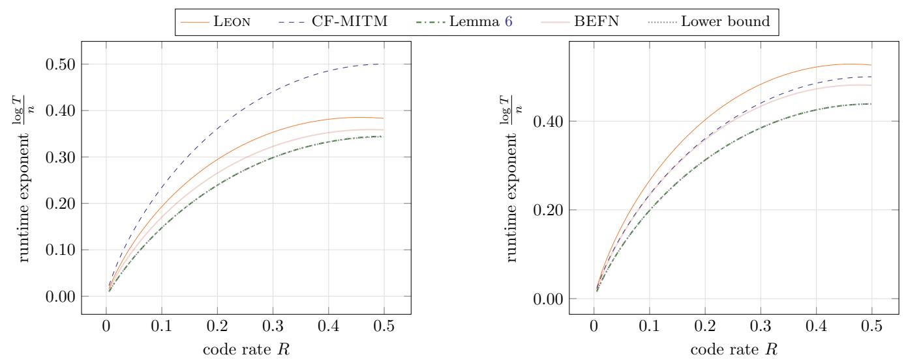
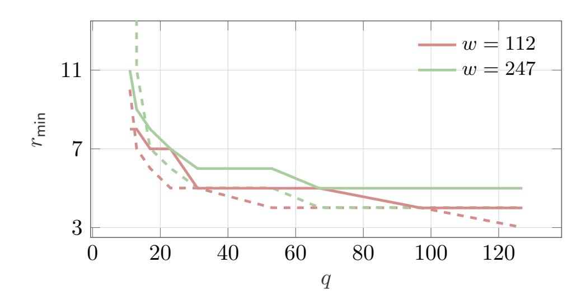
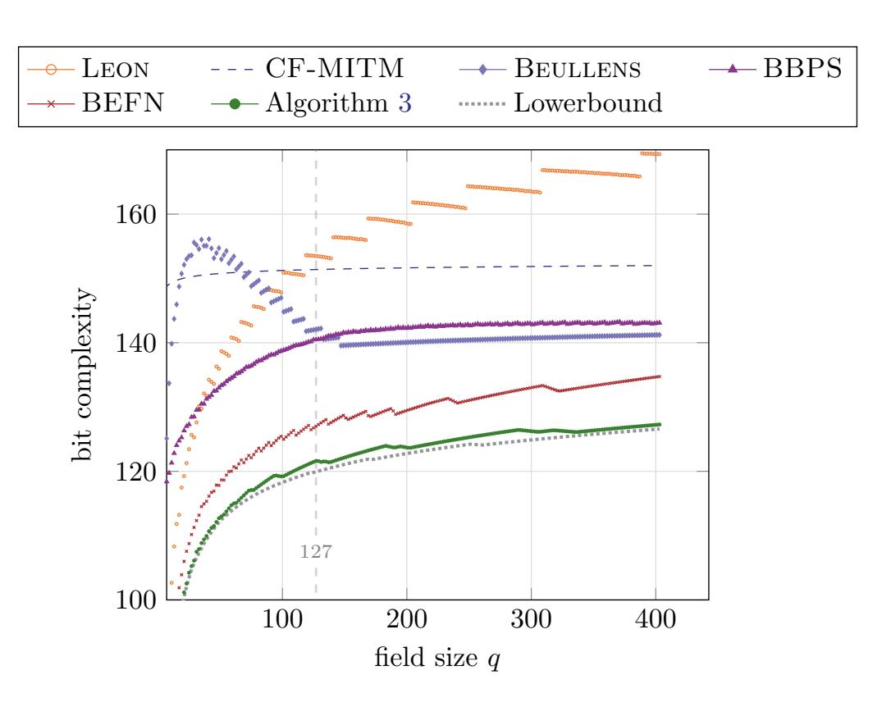

{0}------------------------------------------------

# <span id="page-0-0"></span>One Pair to Rule Them All: An Optimal Algorithm for Solving Code Equivalence via Codeword Search

Alessandro Budron[i](https://orcid.org/0000-0002-3544-5128) and Andre Esser[∗](https://orcid.org/0000-0001-5806-3600)

Technology Innovation Institute, UAE {alessandro.budroni,andre.esser}@tii.ae

Abstract. Two linear codes C, C ′ over F<sup>q</sup> are linearly equivalent if one can be mapped to the other via a monomial transformation. Recovering this monomial from C and C ′ is known as the Linear Code Equivalence (LCE) problem.

The most efficient algorithms to solve the LCE problem follow a common framework based on finding low-weight codewords. This framework admits a natural lower bound obtained by assuming that among the found low-weight codewords, a single equivalent codeword pair can be identified and used to reconstruct the monomial without overhead. Whether this lower bound can be achieved by a constructive instantiation has remained an open problem. Existing algorithms all require multiple equivalent pairs for monomial reconstruction, resulting in both concrete and asymptotic gaps to the lower bound.

In this work, we answer the question of whether there exists such an optimal framework instantiation in the affirmative. We introduce a canonical labeling technique, as a generalization of canonical forms, that allows for monomial reconstruction from a single pair of equivalent codewords. Crucially, this labeling procedure, even if not necessarily polynomial-time, can be embedded into the codeword-search framework to identify equivalent codewords and perform final monomial recovery without overhead. This gives rise to the first framework instantiation that meets its lower bound both asymptotically and concretely up to negligible tolerance. For the parameter sets proposed for the LESS signature scheme, an active second-round contender in the NIST PQC standardization process, our analysis reduces the estimated bit security by up to 15 bits.

Keywords: linear code equivalence · cryptanalysis · code-based cryptography · LESS · post-quantum

# 1 Introduction

The ongoing NIST Post-Quantum Cryptography standardization effort aims to identify cryptographic schemes that remain secure in the presence of quantum

<sup>∗</sup>Supported by the Deutsche Forschungsgemeinschaft (DFG, German Research Foundation) – Project-ID MA 2536/12.

{1}------------------------------------------------

adversaries [\[Nat23\]](#page-25-0). Following the first standardization round [\[Nat17\]](#page-25-1), which selected digital signature schemes based primarily on lattice-based assumptions and symmetric primitives, NIST initiated an additional call for post-quantum digital signatures to diversify the portfolio of standardized constructions and underlying hardness assumptions.

Among the candidates currently under evaluation is the digital signature scheme LESS [\[BBB](#page-24-0)+24], whose security relies on the Linear Code Equivalence (LCE) problem. The LCE problem is a code-based assumption that has recently attracted growing interest for the construction of digital signatures with advanced functionalities [\[BBN](#page-25-2)+22[,BBMP24,](#page-24-1)[BBD](#page-24-2)+25[,DFMS25,](#page-25-3)[DKQ](#page-25-4)+25]. As such it also serves as the basis of the LEAST submission to the NIST call for multiparty threshold schemes [\[BBB](#page-24-3)+26]. At the same time, NIST has explicitly highlighted [\[ABC](#page-24-4)+24, Sec. 3.2] that the LCE assumption requires further cryptanalytic scrutiny in order to build confidence in the security of LESS.

Given two Fq-linear [n, k] codes C and C ′ , the Linear Code Equivalence problem asks to determine, if it exists, a monomial (matrix Q) that maps C into C ′ , i.e., C ′ = CQ. The most effective algorithms for solving the LCE problem rely on finding low-weight codewords in the underlying codes. Among these codewords, the algorithms identify equivalent codeword pairs, i.e., pairs (c, c ′ ) ∈ C × C′ for which c ′ = cQ. Once sufficiently many such pairs have been collected, the monomial can be recovered from them.

A standard lower bound for the codeword search framework is obtained under the assumptions that (i) a single pair of equivalent codewords suffices for the recovery of the secret monomial, and (ii) such a pair can be identified without overhead. The lower bound is then essentially given by the time required to find sufficiently many codewords in both codes such that at least one equivalent pair exists among them. The question if there exists a constructive instantiation of the framework meeting its lower bound has been a long standing open problem.

Recently, Budroni, Esser, Natale, and Franch [\[BEFN25\]](#page-25-5) designed an algorithm that recovers the secret monomial from only two pairs of equivalent codewords in polynomial time, improving upon the previously known Ω(log n) bound. While their framework instantiation based on this routine comes closest to the lower bound for fixed q among known algorithms, it diverges asymptotically as q grows. On the other hand, Chou, Persichetti, and Santini [\[CPS25\]](#page-25-6) proposed a meet-in-the-middle algorithm outside the codeword search framework, relying on what they introduce as canonical forms. While this algorithm was shown in [\[BEFN25\]](#page-25-5) to converge to the lower bound of the codeword search framework (from above) for q = q(n) → ∞, for any fixed q there is an exponential gap to the lower bound. Furthermore, with respect to practical parameters, the convergence can be observed only for field sizes far beyond relevant parameters (q > 2 <sup>100</sup>). As a result, for all concrete instantiations, codeword search-based approaches remain more efficient.

In this work, we answer the question if there exists an optimal instantiation of the codeword search framework in the affirmative and close the existing complexity gaps. More precisely, we present the first constructive algorithm as a 

{2}------------------------------------------------

direct instantiation of the codeword search framework meeting its lower bound already for small field sizes.

We achieve this result by combining both existing approaches. We use the notion of canonical forms in combination with codeword search, to construct an algorithm that (i) is able to recover the secret monomial from a single pair of equivalent codewords and (ii) is able to identify such pairs within the codeword search framework without additional overhead. Based on this subroutine we give a framework instantiation that precisely matches the lower bound both asymptotically as well as when considering the concrete complexity of the algorithm. Applying our approach to the suggested parameters of the LESS signature scheme leads to concrete security reductions of up to 15 bits.

#### Related Work

Codeword search The first instantiation of the codeword search framework is by Leon [\[Leo82\]](#page-25-7), and requires enumerating all codewords of minimum Hamming weight in order to recover the monomial. Subsequent works [\[Beu20,](#page-25-8)[BBPS23\]](#page-25-9) refined this approach by relying on a routine that recovers the monomial from only Ω(log n) pairs of equivalent codewords. Most recently, an algorithm that reconstructs the secret monomial from just two pairs in polynomial-time led to the most efficient instantiation for any fixed q [\[BEFN25\]](#page-25-5).

Canonical forms A canonical form is a canonical representative of a specific class of equivalent codes introduced in [\[CPS25\]](#page-25-6). In fact, in that work it is shown that the monomial action between two codes C, C ′ is fully described by the knowledge of an information set I of C and J of C ′ such that I is mapped into J under the secret monomial. Furthermore for any information set I one can compute a canonical form C = CF(C, I) with C = CF(C ′ , J) iff I is mapped into J and [n] \ I mapped into [n] \ J. Nowakowski [\[Now25\]](#page-25-10) then further improved available canonical form functions by allowing application to any field size q ≥ 7 with high success probability.

#### 1.1 Our Contributions

In this work we show how to compute canonical forms for the set of equivalence classes defined over sets of arbitrary size |I| = |J| = w, sharing the essential properties of standard canonical forms, which correspond to the special case of w = n − k. In particular, with overwhelming probability two sets lead to the same canonical form imply that those sets map to each other under the secret monomial and vice versa. Moreover, from any two such sets the secret monomial can be recovered without overhead. We formalize an instantiation of the codeword search framework based on this new definition of canonical forms and provide an asymptotic as well as a concrete analysis showing that this instantiation meets the known lower bound of the framework. In following we provide details on those contributions.

{3}------------------------------------------------

**Labeling Algorithm and Monomial Recovery** Given a code  $\mathcal{C}$  a canonical form function assigns a distinct label to any information set  $I \subseteq [n]$  which is invariant under monomial transformations. We generalize this notion by introducing a labeling algorithm that assigns a canonical label to any index set I of size  $w \leq n - k$ .

The central idea of this generalization is to first move to the code punctured in I. Then find all r codewords of (close to) minimum weight  $w_r$  and store them in a list L. Now consider the code  $C_I$  generated by  $(\mathbf{I}_r \mid \mathbf{L}) \in \mathbb{F}_q^{r \times r + w}$ , where **L** is the matrix containing as rows the elements in L, i.e., the weight- $w_r$  codewords in the punctured code. We then show that  $\mathcal{C}_I$  is linear equivalent to the code  $\mathcal{C}_J$ generated by  $(\mathbf{I}_r \mid \mathbf{L}')$  whenever I is mapped into J under the secret monomial. Here L' is derived in the same way as L but from the code  $\mathcal{C}'$  punctured in the set J. Moreover, in this equivalence the first r and last w positions are invariant under the monomial defining it. This implies that the canonical forms of  $\mathcal{C}_I$ and  $\mathcal{C}_J$  with respect to the set [r] are the same, i.e.,  $\mathsf{CF}(\mathcal{C}_I, [r]) = \mathsf{CF}(\mathcal{C}_J, [r])$ . However, since the generator matrices  $(\mathbf{I}_r \mid \mathbf{L})$  and  $(\mathbf{I}_r \mid \mathbf{L}')$  are sparse, known canonical form functions do not achieve high success probability on those inputs. We therefore first lift the codewords from L and L' into the punctured coordinates, which do not carry any low-weight properties, but still satisfy a similar equivalence relation. Eventually we prove that equality between the resulting canonical labels implies that I is mapped into J with high probability and that from any two equal labels the monomial can be reconstructed without overhead.

Eventually, for any given pair of equivalent weight-w codewords  $(\mathbf{c}, \mathbf{c}') \in \mathcal{C} \times \mathcal{C}'$  we let  $I = \operatorname{Supp}(\mathbf{c})$  and  $J = \operatorname{Supp}(\mathbf{c}')$  which leads to the recovery of the secret monomial via the procedure above. In contrast to previous algorithms, such as the reconstruction from two equivalent pairs in [BEFN25], the complexity of the introduced labeling algorithm depends on the size w of the sets I, J and for  $w \ll n$  is not polynomial time, due to the codeword search in the punctured code. However, for  $w \to n - k$  we interpolate to the standard polynomial-time canonical form algorithms.

Optimal instantiation of the codeword-search framework A central obstacle in instantiating the codeword search framework optimally lies in the identification of equivalent codeword pairs once the initial lists of low-weight words have been generated. Existing approaches typically perform equivalence testing based on tuples of codewords, which increases the combinatorial overhead and may produce many false positives, i.e., pairs that are not equivalent under the secret monomial **Q**. In contrast, our labeling algorithm applies directly to individual codewords. Furthermore, with overwhelming probability, matching labels already imply equivalence under the secret monomial, and from any such match the monomial can be reconstructed without additional overhead.

Although the labeling procedure has cost  $T_{\text{label}}$  and is not polynomial-time for small support sizes w, the total cost of the identification phase scales as  $T_{\text{label}} \cdot N$ , while list generation requires  $T_{\text{ISD}} \cdot N$ , where N denotes the list size. We therefore still reach the lower bound as long as  $T_{\text{ISD}} \geq T_{\text{label}}$ .

{4}------------------------------------------------

<span id="page-4-0"></span>

|          | previous best | this work | lower bound |
|----------|---------------|-----------|-------------|
| LESS-I   | 127           | 122       | 120         |
| LESS-III | 196           | 187       | 186         |
| LESS-V   | 266           | 251       | 251         |

Table 1: Bitcomplexity estimates for suggested LESS parameters.

Concrete and Asymptotic Improvements We provide an asymptotic analysis of the time complexity T of the proposed framework instantiation computing its asymptotic runtime exponent c(R, q) in T = 2c(R,q)<sup>n</sup> where n is the code length and c(R, q) a constant depending on the code rate R and field size q. We show that already for small field sizes q ≥ 17 the constant c(R, q) meets the exponent of the complexity lower bound up to a maximal tolerance of 2.8% over all rates, while the previous best algorithm in this regime [\[BEFN25\]](#page-25-5) deviates more than 30% from the lower bound. For growing q this tolerance quickly decreases, reaching a maximum of 5 · 10−<sup>9</sup> for field sizes q ≥ 127, as found in LESS, while the previous best algorithm deviates between 10% to 25% from the lower bound exponent in that regime.

Furthermore we provide a concrete complexity analysis to compute the bit complexity of the new framework instantiation on parameters suggested throughout the literature. We observe that also in the concrete regime the algorithm closely matches the lower bound up to a tolerance of less than 2 bits. Overall we achieve bit security reductions with respect to the parameters suggested in the LESS signature scheme of up to 15 bits (compare to Table [1\)](#page-4-0).

Notably the lower bound complexities for the three parameter sets suggested in LESS actually lie below the thresholds of 128, 192 and 256 that were used as selection rationales in the LESS NIST submission. We find this to be due to a recent improvement by Carrier, Hatey and Tillich [\[CHT24\]](#page-25-11) which essentially shows that the low-weight codeword search can be sped up by a factor linear in the field size q, which is why the lower bound complexity lies approximately log<sup>2</sup> (q) ≈ 7 bits below those thresholds.

Artifacts The scripts used to produce estimations and plots, together with a SageMath proof-of-concept of our algorithm, are publicly available under an open-source license [\[BE26\]](#page-25-12).

Outline We give the necessary notation and preliminaries in Section [2.](#page-4-1) We introduce our new algorithm for recovering the secret monomial from one pair of equivalent codewords in Section [3.](#page-8-0) In Section [4,](#page-15-0) we present the full algorithm to solve LCE together with its asymptotic and concrete analysis.

# <span id="page-4-1"></span>2 Preliminaries

Throughout this work, vectors and matrices are written in bold lowercase and bold uppercase letters, respectively, and vectors are assumed to be row vectors 

{5}------------------------------------------------

unless stated otherwise. For  $n \in \mathbb{N}$ , we use the shorthand  $[n] := \{1, \ldots, n\}$ . Given an index set  $I \subseteq [n]$ , the notation  $\mathbf{v}_I$  refers to the projection of  $\mathbf{v} \in \mathbb{F}_q^n$  onto the coordinates indexed by I. For a matrix  $\mathbf{M}$ , we analogously write  $\mathbf{M}_I$  for the submatrix formed by the columns of  $\mathbf{M}$  with indices in I. The sets of permutation and monomial matrices over  $\mathbb{F}_q$  are denoted by  $\mathsf{Perm}_n(\mathbb{F}_q)$  and  $\mathsf{Mono}_n(\mathbb{F}_q)$ , respectively. Recall that a monomial matrix is of the form  $\mathbf{Q} = \mathbf{DP}$ , where  $\mathbf{D}$  is an invertible diagonal matrix and  $\mathbf{P} \in \mathsf{Perm}_n(\mathbb{F}_q)$ . We make use of standard Landau notation for our complexity statements with  $\tilde{\mathcal{O}}$ -notation suppressing poly-logarithmic factors. A probability p is said to be high if p = 1 - o(1) and overwhelming if  $p > 1 - \frac{1}{\operatorname{poly}(n)}$ .

#### 2.1 Linear Codes

An  $[n,k]_q$ -linear code  $\mathcal{C}$  is a k-dimensional subspace of  $\mathbb{F}_q^n$ . A matrix  $\mathbf{H} \in \mathbb{F}_q^{n-k\times n}$  is a parity-check matrix for  $\mathcal{C}$  if  $\mathbf{Hc} = \mathbf{0} \Leftrightarrow \mathbf{c} \in \mathcal{C}$ . A matrix  $\mathbf{G} \in \mathbb{F}_q^{k\times n}$  is called a generator matrix of  $\mathcal{C}$  if its rows form a basis for  $\mathcal{C}$ , and we say that it is in systematic form if it is row echelon reduced with respect to the first k entries, i.e.  $\mathbf{G} = [\mathbf{I} \mid \mathbf{A}]$ , where  $\mathbf{I} \in \mathbb{F}_q^{k\times k}$  is the identity matrix. We refer to n as the length of  $\mathcal{C}$  and to the ratio R := k/n as the code rate. We refer to the code with generator matrix  $\mathbf{G}$  as  $\mathcal{C}_{\mathbf{G}}$ . The support of a codeword  $\mathbf{c} \in \mathcal{C}$  is the set of indices corresponding to its nonzero entries:  $\mathrm{Supp}(\mathbf{c}) := \{i \in [n] : \mathbf{c}(i) \neq 0\}$  of  $\mathbf{c}$ . The Hamming weight  $|\mathbf{c}| = |\operatorname{Supp}(\mathbf{c})|$  of  $\mathbf{c}$  is the size of its support.

The expected numbers of codewords in  $\mathcal{C}$  of a given weight w is

<span id="page-5-0"></span>
$$N_w = \binom{n}{w} (q-1)^w q^{-n(1-R)}.$$
 (1)

We expect to find codewords of weight w in C whenever  $N_w \geq 1$ , which translates into the condition

$$\log_q\left(\binom{n}{w}(q-1)^w\right) \ge n(1-R).$$

This bound is known as the Gilbert-Varshamov bound and the small smallest w for which it holds is said to meet the Gilbert-Varshamov bound. Asymptotically the w meeting this bound can be approximated as  $w = h_q^{-1}(1-R)n$ , where  $h_q := x \log_q(q-1) - x \log_q x - (1-x) \log_q(1-x)$ , is the q-ary entropy function.

Our analysis makes use of information set decoding (ISD) algorithms for finding low-weight codewords in linear codes. All ISD algorithms follow at their core the pioneering algorithm of Prange, which consists in repeatedly selecting random information sets and checking whether the associated codeword has the desired weight.

Lemma 1 (Prange's ISD complexity [Pra62]). The cost of computing N of the  $N_w$  codewords of weight w in a random  $[n, k]_q$ -linear code is

$$T_{\mathrm{ISD},N}^{n,k,q,w} := \tilde{\mathcal{O}}\left(\frac{N}{N_w} \frac{\binom{n}{w}}{\binom{n-k}{w}}\right).$$

{6}------------------------------------------------

In the following we shorthand write  $T_{\text{ISD}}^{n,k,q,w} = T_{\text{ISD},N_w}^{n,k,q,w}$  to refer to the complexity of finding all codewords of weight w in a random  $[n,k]_q$  code. Furthermore, for our asymptotic analysis we rely on the following standard approximation of binomial coefficients

<span id="page-6-0"></span>
$$\frac{2^{h(\frac{k}{n})n}}{n+1} \le \binom{n}{k} \le 2^{h(\frac{k}{n})n},\tag{2}$$

where  $h(x) := h_2(x) = -x \log_2 x - (1-x) \log_2 (1-x)$  denotes the binary entropy function.

<span id="page-6-2"></span>Using Eq. (2) we obtain the following asymptotic approximation of  $T_{\text{ISD},N}^{n,k,q,w}$ .

Corollary 1 (Asymptotic Approximation of ISD). Let  $n \in \mathbb{N}$ , k = Rn,  $w = \omega n$ ,  $N = 2^{\eta \cdot n}$  for  $\eta$  constant,  $\omega, R \in [0,1]$  and q a constant integer. Then we have  $T_{\text{ISD},N}^{n,k,q,w} = \tilde{\mathcal{O}}\left(2^{\vartheta n}\right)$  with

$$\vartheta = h(\omega) - (1 - R)h\left(\frac{\omega}{1 - R}\right) - \gamma + \eta$$

where  $\gamma = h(\omega) + \omega \log(q-1) - (1-R) \log q$ .

*Proof.* We use Eq. (2) to approximate the number of codewords from Eq. (1) as  $N_w = \tilde{\mathcal{O}}(2^{\gamma n})$ . Analogously approximating the binomial coefficients in  $T_{\text{ISD},N}^{n,k,q,w}$  as  $\frac{\binom{n}{w}}{\binom{n-k}{w}} = 2^{\left(h(\omega)-(1-R)h\left(\frac{\omega}{1-R}\right)\right)n}$ , then yields the statement.

#### 2.2 Linear Code Equivalence

We give a formal definition of the Linear Equivalence Problem, which we refer to as the LCE problem in the remainder of this work.

<span id="page-6-1"></span>**Definition 1 (Linear Code Equivalence (LCE)).** Given two  $[n,k]_q$  linear codes  $\mathcal{C}, \mathcal{C}'$  with generator matrices  $\mathbf{G}$  and  $\mathbf{G}'$ , respectively, the Linear Code Equivalence problem asks to find a monomial  $\mathbf{Q} \in \mathsf{Mono}_n(\mathbb{F}_q)$  such that there exists an invertible matrix  $\mathbf{S} \in \mathbb{F}_q^{k \times k}$  satisfying  $\mathbf{G}' = \mathbf{SGQ}$ . We call  $(\mathcal{C}, \mathcal{C}')$  an instance of the LCE problem.

We restrict to random instances of LCE, i.e.  $\mathbf{G}$  and  $\mathbf{Q}$  are drawn uniformly at random. While LCE has been shown to be (heuristic) polynomial-time whenever q < 5 [Sen00], it is believed to be hard for all  $q \ge 5$  [SS13]. The particular case where  $\mathbf{Q} \in \mathsf{Perm}_n(\mathbb{F}_q)$  corresponds to the *Permutation Code Equivalence* (PCE) problem, to which our results apply interchangeably. Motivated by cryptographic applications, we restrict our focus to LCE instances admitting a unique solution  $\mathbf{Q}$  (up to scalars).

{7}------------------------------------------------

#### <span id="page-7-1"></span>2.3 Canonical Forms

Canonical forms for linear codes were introduced by Chou, Persichetti, and Santini [CPS25]. Informally, a canonical form is a function that maps each code to a representative of its equivalence class under an equivalence relation  $\sim_{\mathsf{F}}$  on linear codes. For our work it suffices to consider a slightly less general definition of canonical forms from Nowakowski [Now25], which considers generator matrices in systematic form only and is given with respect to the following equivalence relation.

<span id="page-7-0"></span>**Definition 2** (LRL-Equivalence, [Now25]). Two generator matrices in systematic form

$$\mathbf{G} = [\mathbf{I}_k \mid \mathbf{A}], \qquad \mathbf{G}' = [\mathbf{I}_k \mid \mathbf{A}'] \in \mathbb{F}_q^{k \times n}$$

are called left-right linearly (LRL) equivalent  $(\mathbf{G} \sim_{\mathsf{LRL}} \mathbf{G}')$  if and only if there exist  $\mathbf{Q}_r \in \mathsf{Mono}_k(\mathbb{F}_q)$  and  $\mathbf{Q}_c \in \mathsf{Mono}_{n-k}(\mathbb{F}_q)$  such that

$$\mathbf{A}' = \mathbf{Q}_r \mathbf{A} \mathbf{Q}_c$$

The equivalence class of a generator matrix in systematic form  $\mathbf{G} = [\mathbf{I}_k \mid \mathbf{A}]$  is denoted by  $[\mathbf{G}]_{LRL}$ .

Notice that LRL equivalence implies linear code equivalence among the corresponding linear codes in the sense of Definition 1. Indeed, if  $\mathbf{A}' = \mathbf{Q}_r \mathbf{A} \mathbf{Q}_c$ , then we have that  $\mathbf{G}' = \mathbf{U} \mathbf{G} \mathbf{Q}$ , for  $\mathbf{U} = \mathbf{Q}_r$  and  $\mathbf{Q} = \begin{bmatrix} \mathbf{Q}_r^{-1} \\ \mathbf{Q}_c \end{bmatrix}$ .

**Definition 3 (Canonical Form Function).** A canonical form function is a polynomial-time procedure CF which, given as input a generator matrix in systematic form  $\mathbf{G} = [\mathbf{I}_k \mid \mathbf{A}] \in \mathbb{F}_q^{k \times n}$ , outputs either a matrix  $\mathbf{A}^*$ , where  $[\mathbf{I}_k \mid \mathbf{A}^*] \in [\mathbf{G}]_{LRL}$  or the failure symbol  $\bot$ .

The generator matrix  $[\mathbf{I}_k \mid \mathbf{A}^*]$  must be canonical, meaning that for any two equivalent matrices  $\mathbf{G} \sim_{LRL} \mathbf{G}'$  such that  $\mathsf{CF}(\mathbf{G}) \neq \bot$  and  $\mathsf{CF}(\mathbf{G}') \neq \bot$ , we have  $\mathsf{CF}(\mathbf{G}) = \mathsf{CF}(\mathbf{G}')$ .

Internally, the computation of the canonical form function on input  $\mathbf{G} = [\mathbf{I}_k \mid \mathbf{A}]$  also reveals two monomial matrices  $\mathbf{Q}_r^*$ ,  $\mathbf{Q}_c^*$ , such that  $\mathbf{A} = \mathbf{Q}_r^* \mathbf{A}^* \mathbf{Q}_c^*$ . Therefore once tow inputs  $\mathbf{G} = [\mathbf{I}_k \mid \mathbf{A}]$  and  $\mathbf{G}' = [\mathbf{I}_k \mid \mathbf{A}']$  with same canonical form are known the LRL equivalence between both codes can be recovered as

$$\mathbf{A} = \mathbf{Q}_r^* \mathbf{A}^* \mathbf{Q}_c^*$$
 and  $\mathbf{A}' = \mathbf{Q}_r^{*'} \mathbf{A}^* \mathbf{Q}_c^{*'} \Rightarrow \mathbf{A}' = \mathbf{Q}_r^{*'} (\mathbf{Q}_r^*)^{-1} \mathbf{A} (\mathbf{Q}_c^*)^{-1} \mathbf{Q}_c^{*'}$ .

While the canonical forms introduced in [CPS25] have time complexity  $\mathcal{O}(n^3)$ , the canonical form proposed in [Now25] achieves a higher success probability of  $1 - \mathcal{O}(n^{-1})$  for any  $q \geq 7$ , at the cost of a slight additional overhead. Conservatively, we account for this overhead by assuming an overall time complexity of  $\tilde{\mathcal{O}}(n^4)$  in our analysis.

{8}------------------------------------------------

## <span id="page-8-0"></span>3 Monomial Recovery from One Matching Pair of Codewords

<span id="page-8-2"></span>In this section, we introduce a new algorithm for recovering the monomial transformation between two codes C, C' assuming access to a single pair of equivalent codewords.

**Definition 4 (Equivalent Codewords).** Given two  $[n,k]_q$  codes  $\mathcal{C},\mathcal{C}'$  equivalent under a monomial  $\mathbf{Q} \in \mathsf{Mono}_n(\mathbb{F}_q)$ , we say that a pair of codewords  $(\mathbf{c},\mathbf{c}') \in \mathcal{C} \times \mathcal{C}'$  is equivalent if  $\mathbf{c}' = a\mathbf{c}\mathbf{Q}$ , for  $a \in \mathbb{F}_q \setminus \{0\}$ .

Therefore, we define a function that associates a canonical label to each codeword for which, similar to a canonical form function, matching labels imply codeword equivalence with high probability. Moreover, we show that matching labels allow to compute the equivalence between the two codes without additional cost.

#### <span id="page-8-3"></span>3.1 Overview of the Algorithm

Any pair of equivalent codewords  $\mathbf{c}, \mathbf{c}'$  with  $\mathbf{c}' = a\mathbf{c}\mathbf{Q}$ ,  $a \in \mathbb{F}_q \setminus \{0\}$ , where  $I = \operatorname{Supp}(\mathbf{c})$  and  $J = \operatorname{Supp}(\mathbf{c}')$ , allows to separate the monomial into two parts: one acting independently on I, J and one acting only between  $\bar{I}, \bar{J}$ . Put differently, zero entries are mapped to zero entries and non-zero entries to non-zero entries under the monomial transformation. This allows us to rewrite the equivalence relation  $\mathbf{G}' = \mathbf{SGQ}$  as

<span id="page-8-1"></span>
$$\mathbf{G}'\mathbf{P}_{J} = \mathbf{S}(\mathbf{G}\mathbf{P}_{I})(\mathbf{P}_{I}^{-1}\mathbf{Q}\mathbf{P}_{J}) \quad \Leftrightarrow \quad (\mathbf{G}'_{J} \mid \mathbf{G}'_{\bar{J}}) = \mathbf{S}(\mathbf{G}_{I} \mid \mathbf{G}_{\bar{I}}) \underbrace{\begin{pmatrix} \mathbf{Q}_{\sup} & \mathbf{0} \\ \mathbf{0} & \mathbf{Q}_{\overline{\sup}}, \end{pmatrix}}_{\tilde{\mathbf{Q}}}$$
(3)

where  $\mathbf{P}_J, \mathbf{P}_I \in \mathsf{Perm}_n(\mathbb{F}_q)$  are arbitrary permutations that permute the columns indexed by J (resp. I) to the front of  $\mathbf{G}'\mathbf{P}_J$  (resp.  $\mathbf{GP}_I$ ). It follows that  $\mathbf{Q}_{\sup} \in \mathsf{Mono}_w(\mathbb{F}_q)$  and  $\mathbf{Q}_{\overline{\sup}} \in \mathsf{Mono}_{n-w}(\mathbb{F}_q)$ , where w = |I| = |J|.

In the following, we describe a function that, similar to a canonical form function, takes as input a generator matrix of a linear code and assigns it a *label* or canonical representative. Two generator matrices being assigned the same label indicates a high probability that the corresponding codes are equivalent with respect to a monomial  $\tilde{\mathbf{Q}}$  following the form in Eq. (3). Moreover, we show that, given the input generator matrices and the labels,  $\tilde{\mathbf{Q}}$  can be recovered with essentially no overhead. We assume, without loss of generality, that w < n - k, i.e.,  $\mathbf{G}_{\bar{I}}$  and  $\mathbf{G}'_{\bar{I}}$  generate codes of length at least k.<sup>2</sup>

Consider all codewords of certain weight  $w_r$  in the codes generated by  $\mathbf{G}_{\bar{I}}$  and  $\mathbf{G}'_{\bar{J}}$ , stored in two lists  $L_{\mathbf{G}_{\bar{I}}}$  and  $L_{\mathbf{G}'_{\bar{I}}}$  with  $|L_{\mathbf{G}_{\bar{I}}}| = |L_{\mathbf{G}'_{\bar{I}}}| = r$ . For now

<sup>&</sup>lt;sup>1</sup>Note that [BEFN25, Def. 3] is analogous to Definition 4 with a = 1.

<sup>&</sup>lt;sup>2</sup>If this should not be the case we could switch to  $\mathbf{G}_I$  and  $\mathbf{G}'_J$  instead. However, generally the optimal w is later always found to be smaller than n-k.

{9}------------------------------------------------

one might think of  $w_r$  being close to the minimum distance  $w_{\min}$  of the codes  $\mathcal{C}_{\mathbf{G}_{\bar{I}}}, \mathcal{C}_{\mathbf{G}'_{\bar{I}}}$ . Note that this implies that

<span id="page-9-1"></span>for any 
$$\mathbf{v} \in L_{\mathbf{G}_{\bar{I}}}$$
 there is  $\mathbf{w} = \gamma \mathbf{v} \mathbf{Q}_{\overline{\sup}} \in L_{\mathbf{G}'_{\bar{I}}}$  for some  $\gamma \in \mathbb{F}_q^*$ , (4)

i.e., for any codeword in one list, its image under an arbitrary scaled version of the monomial  $\mathbf{Q}_{\overline{\sup}}$  is in the other list. Now, letting  $\mathbf{L}_{\mathbf{G}_{\bar{I}}}$  (resp.  $\mathbf{L}_{\mathbf{G}'_{\bar{I}}}$ ) be the matrices whose rows are the codewords in  $L_{\mathbf{G}_{\bar{I}}}$  (resp.  $L_{\mathbf{G}'_{\bar{I}}}$ ), we have

<span id="page-9-0"></span>
$$\mathbf{L}_{\mathbf{G}_{\bar{I}}} = \mathbf{Q}_{\text{scale}} \mathbf{L}_{\mathbf{G}'_{\bar{I}}} \mathbf{Q}_{\overline{\text{sup}}},\tag{5}$$

where  $\mathbf{Q}_{\text{scale}} \in \mathsf{Mono}_r(\mathbb{F}_q)$  ensures equivalent codewords are located in the same rows and normalized with respect to the factors  $\gamma$ . Note that Eq. (5) satisfies the definition of LRL-equivalence from Definition 2. Therefore, the canonical forms  $C_{\bar{I}} = \mathsf{CF}(\mathbf{I}_r \mid \mathbf{L}_{\mathbf{G}_{\bar{I}}})$  and  $C_{\bar{J}} = \mathsf{CF}(\mathbf{I}_r \mid \mathbf{L}_{\mathbf{G}_{\bar{J}}'})$  are the same and allow for the recovery of  $\mathbf{Q}_{\overline{\sup}}$ , if  $C_{\bar{I}} = C_{\bar{J}} \neq \bot$ .

However, even in case r and q are sufficiently large,  $\mathbf{L}_{\mathbf{G}_{\bar{I}}}$  and  $\mathbf{L}_{\mathbf{G}'_{\bar{J}}}$  are sparse matrices on which known canonical form functions have significantly reduced success probability. We therefore project those codewords back onto the punctured coordinates, i.e, those corresponding to  $\mathbf{G}_{I}$  and  $\mathbf{G}'_{J}$ , before canonical form computation.

More precisely for any  $\mathbf{v} \in L_{\mathbf{G}_{\bar{I}}}$ ,  $\mathbf{w} \in L_{\mathbf{G}'_{\bar{J}}}$  let  $\mathbf{m}_{\mathbf{v}}, \mathbf{m}_{\mathbf{w}}$  be such that  $\mathbf{v} = \mathbf{m}_{\mathbf{v}} \mathbf{G}^{\bar{I}}$  and  $\mathbf{w} = \mathbf{m}_{\mathbf{w}} \mathbf{G}'^{\bar{J}}$ . Let the codewords with respect to the punctured coordinates be  $\mathbf{c}_{\mathbf{v}} = \mathbf{m}_{\mathbf{v}} \mathbf{G}_{I}$  and  $\mathbf{c}_{\mathbf{w}} = \mathbf{m}_{\mathbf{w}} \mathbf{G}'_{J}$ . For now, let us assume that  $\mathbf{m}_{\mathbf{v}}$  and  $\mathbf{m}_{\mathbf{w}}$  are uniquely determined and, hence,  $\mathbf{c}_{\mathbf{v}}$  and  $\mathbf{c}_{\mathbf{w}}$  are as well, i.e., we assume that the codes  $\mathbf{G}_{\bar{I}}, \mathbf{G}'_{\bar{J}}$  are of dimension k. Then it follows from Eqs. (3) and (4) that

$$\mathbf{c}_{\mathbf{w}} = \gamma \mathbf{c}_{\mathbf{v}} \mathbf{Q}_{\sup}.$$

We now define  $L_{\mathbf{G}_{\bar{I}}} \coloneqq \{\mathbf{m}_{\mathbf{v}} \mathbf{G}_{\bar{I}} \mid \mathbf{v} = \mathbf{m}_{\mathbf{v}} \mathbf{G}_{\bar{I}} \in L_{\mathbf{G}_{\bar{I}}} \}$  to be the list containing all projections onto the punctured coordinates for codewords in  $L_{\mathbf{G}_{\bar{I}}}$ . And analogously let  $L_{\mathbf{G}'_{\bar{J}}} =: \{\mathbf{m}_{\mathbf{w}} \mathbf{G}'_{\bar{J}} \mid \mathbf{w} = \mathbf{m}_{\mathbf{w}} \mathbf{G}'_{\bar{J}} \in L_{\mathbf{G}'_{\bar{J}}} \}$ . Similar to before it follows that

$$\mathbf{L}_{\mathbf{G}_{I}} = \mathbf{Q}_{\text{scale}} \mathbf{L}_{\mathbf{G}_{I}} \mathbf{Q}_{\text{sup}}, \tag{6}$$

which again defines an LRL-equivalence according to Definition 2. However, note that the codewords in  $L_{\mathbf{G}_I}$  and  $L_{\mathbf{G}_J'}$ , contrary to before, are distributed uniformly in  $\mathbb{F}_q^w$ . Therefore, as long as  $r = |L_{\mathbf{G}_I}| = |L_{\mathbf{G}_J'}|$  and q are large enough, known canonical form functions succeed with high probability in computing  $C_I = \mathsf{CF}(\mathbf{I}_r \mid \mathbf{L}_{\mathbf{G}_I})$  and  $C_J = \mathsf{CF}(\mathbf{I}_r \mid \mathbf{L}_{\mathbf{G}_J'})$ , without error, i.e., it holds  $C_I = C_J \neq \bot$ . Eventually, this implies the recovery of  $\mathbf{Q}_{\sup}$ . We later show that the second part of the equivalence ,i.e.,  $\mathbf{Q}_{\overline{\sup}}$ , which defines the equivalence between the codes generated by  $\mathbf{G}_{\bar{I}}$  and  $\mathbf{G}_{\bar{I}}'$ , can then be recovered without overhead.

#### 3.2 Analysis of the Label Computation

We analyze the outlined function computing the associated label for arbitrary sets  $I \subseteq [n]$ . We give the pseudocode of this function in Algorithm 1.

<span id="page-9-2"></span><sup>&</sup>lt;sup>3</sup>In fact  $w_r$  is later chosen to ensure  $r = \Theta(n)$  is linear in n.

{10}------------------------------------------------

## <span id="page-10-0"></span>Algorithm 1 Compute-Label(G, I)

```
Input: \mathbf{G} \in \mathbb{F}_q^{k \times n}, \ I \subseteq [n], \ |I| = w \le n - k
Output: \mathbf{A} \in \mathbb{F}_q^{r \times w}, \ r \in \mathbb{N} \ \mathrm{or} \ \bot
```

- 1: if  $\operatorname{rank}(\mathbf{G}_{\bar{I}}) < k$  then
- 2: return  $\perp$
- 3: Choose  $w_r \in \mathbb{N}$  optimally
- 4: Compute  $L_{\mathbf{G}_{\bar{I}}} = \{ \mathbf{v} \in \mathcal{C}_{\mathbf{G}_{\bar{I}}} \mid |\mathbf{v}| = w_r \}, r := |L_{\mathbf{G}_{\bar{I}}}|$
- 5: Compute  $L_{\mathbf{G}_I} = \{ \mathbf{m}_{\mathbf{v}} \mathbf{G}_I \mid \mathbf{v} = \mathbf{m}_{\mathbf{v}} \mathbf{G}_{\bar{I}} \in L_{\mathbf{G}_{\bar{I}}} \}$
- 6: return  $\mathsf{CF}(\mathbf{I}_r \mid \mathbf{L}_{\mathbf{G}_I})$

**Lemma 2 (Complexity of Algorithm 1).** Let  $\mathbf{G} \in \mathbb{F}_q^{k \times n}$ ,  $I \subseteq [n]$  be such that  $\operatorname{rank}(\mathbf{G}_{\bar{I}}) = k$ , |I| = w, with k/n and w/n constant and q be a constant integer. Then on input  $(\mathbf{G}, I)$ , Algorithm 1 returns a matrix  $\mathbf{A} \in \mathbb{F}_q^{r \times w}$  with high probability in time

$$\tilde{\mathcal{O}}\left(T_{\mathrm{ISD}}^{n-w,k,q,u_{\min}}\right),$$

where  $u_{\min}$  is the minimum weight of  $C_{\mathbf{G}_{\bar{1}}}$ .

*Proof.* We choose  $w_r$  to be such that  $\mathcal{C}_{\mathbf{G}_{\bar{I}}}$  contains  $r = \Theta(n)$  codewords of weight  $w_r$ . Let us first argue that such a choice for  $w_r$  exists. Let the minimum distance of  $\mathcal{C}_{\mathbf{G}_{\bar{I}}}$  be  $u_{\min} = \Theta(n)$ . Then there exist  $N'_{u_{\min}} = \Theta(1)$  codewords at that weight in  $\mathcal{C}_{\mathbf{G}_{\bar{I}}}$ . Note that when increasing  $u_{\min}$  by one the number of codewords multiplies by a constant

$$\frac{N'_{u+1}}{N'_u} = \frac{\binom{n-w}{u+1}(q-1)^{u+1}q^{-n+w+k}}{\binom{n-w}{u}(q-1)^{u}q^{-n+w+k}} = \frac{n-u}{u+1}(q-1).$$

This implies that we can reach the desired value of  $N'_{w_r} = r = \Theta(n)$  codewords of weight  $w_r$  in  $\mathcal{C}_{\mathbf{G}_{\bar{I}}}$  by choosing  $w_r = u_{\min} + c$ , for  $c \sim \log n$ .

The time of the algorithm is dominated by the computation of the two lists  $L_{\mathbf{G}_{\bar{I}}}$  and  $L_{\mathbf{G}_{\bar{I}}}$ . The computation of the latter requires finding all weight  $w_r$  codewords in an  $[n-w,k]_q$  code, which requires time  $T_{\mathrm{ISD}}^{n-w,k,q,w_r}=\tilde{\mathcal{O}}\left(T_{\mathrm{ISD}}^{n-w,k,q,u_{\min}}\right)$ . The computation of  $L_{\mathbf{G}_{\bar{I}}}$  requires for each of the r elements  $\mathbf{v}\in L_{\mathbf{G}_{\bar{I}}}$  to compute  $\mathbf{m}_{\mathbf{v}}$ , which can be done by solving a linear system in time  $\mathcal{O}(k^3)$ , leading to  $\mathcal{O}(rk^3)$ . Therefore note that for every  $\mathbf{v}$  the vector  $\mathbf{m}_{\mathbf{v}}\in\mathbb{F}_q^k$  is uniquely determined as  $\mathcal{C}_{\mathbf{G}_{\bar{I}}}$  is still of dimension k. The final canonical form computation then runs in time  $\mathcal{O}((r+w)^3)=\mathcal{O}(rk^3)$ . However, this polynomial complexity is usually dominated by the prior codeword search.

Note that given  $\operatorname{rank}(\mathbf{G}_{\bar{I}}) \geq k$  the algorithm succeeds whenever the canonical form computation succeeds, which is known to happen with high probability for random codes of constant rate. Eventually note that the code input to the CF function is of constant rate  $\frac{r}{r+w}$  since both  $r, w = \Theta(n)$ .

Note that Algorithm 1 can be seen as a generalization of a canonical form function with respect to a set of indices I of arbitrary size instead of fixed size n-k

{11}------------------------------------------------

(as in standard canonical forms). The complexity of the algorithm decreases for increasing size of the set I. Moreover, the algorithm interpolates to a standard canonical form function for a set I of size  $|I| = \delta(n-k)$  for a constant  $\delta \to 1$ .

## 3.3 Recovering the Monomial

We now show that a matching output of Algorithm 1 on two different codes  $C_{\mathbf{G}}, C_{\mathbf{G}'}$  of same parameters with two same-sized sets I, J implies an equivalence relation similar to the one defined in Eq. (3) with high probability.

<span id="page-11-1"></span>Lemma 3 (Implied Equivalence Relation). Let  $\mathbf{G}, \mathbf{G}' \in \mathbb{F}_q^{k \times n}$  be random full rank matrices,  $I, J \subseteq [n]$  with |I| = |J| = w and  $\operatorname{rank}(\mathbf{G}_{\bar{I}}) = \operatorname{rank}(\mathbf{G}'_{\bar{J}}) = k$  with k/n and w/n constant. Let  $w_r$  in Algorithm 1 be chosen such that on expectation there exist  $r = \Theta(n)$  codewords of that weight in  $\mathcal{C}_{\mathbf{G}_{\bar{I}}}$ . Then, with high probability,

$$\texttt{Compute-Label}(\mathbf{G},I) = \texttt{Compute-Label}(\mathbf{G}',J) \neq \bot,$$

if and only if there exist an invertible matrix  $\mathbf{S} \in \mathbb{F}_q^{k \times k}$  and monomials  $\mathbf{Q}_{\sup} \in \mathsf{Mono}_w(\mathbb{F}_q)$ ,  $\mathbf{Q}_{\overline{\sup}} \in \mathsf{Mono}_{n-w}(\mathbb{F}_q)$  such that

<span id="page-11-0"></span>
$$(\mathbf{G}_{J}' \mid \mathbf{G}_{\bar{J}}') = \mathbf{S}(\mathbf{G}_{I} \mid \mathbf{G}_{\bar{I}}) \underbrace{\begin{pmatrix} \mathbf{Q}_{\sup} & \mathbf{0} \\ \mathbf{0} & \mathbf{Q}_{\overline{\sup}}, \end{pmatrix}}_{\tilde{\mathbf{Q}}}.$$
 (7)

*Proof.* In Section 3.1, we have already shown that if Equation (7) holds between  $(\mathbf{G}, I)$  and  $(\mathbf{G}', J)$  then the output of Algorithm 1 on both inputs is the same and different from  $\bot$  with high probability given that  $\operatorname{rank}(\mathbf{G}_{\bar{I}}) = \operatorname{rank}(\mathbf{G}'_{\bar{J}}) = k$ . Here, the failing probability is exactly the failing probability of the CF function. It therefore remains to bound the probability of Compute-Label returning the same output matrix  $\mathbf{A} \in \mathbb{F}_q^{r \times w}$  in case Equation (7) does not hold.

Let us consider the scenario in which  $C_{\mathbf{G}}$  and  $C_{\mathbf{G}'}$  are equivalent via a monomial  $\mathbf{Q}$ , yet Equation (7) does not hold. Recall that Equation (7) implies that both  $(\mathbf{I}_r \mid \mathbf{L}_{\mathbf{G}_{\bar{I}}})$  and  $(\mathbf{I}_r \mid \mathbf{L}_{\mathbf{G}'_{\bar{J}}})$  as well as  $(\mathbf{I}_r \mid \mathbf{L}_{\mathbf{G}_I})$  and  $(\mathbf{I}_r \mid \mathbf{L}_{\mathbf{G}'_{\bar{J}}})$  are LRL equivalent, which apriori is not the case. In the following we bound the probability that the LRL-equivalence between  $(\mathbf{I}_r \mid \mathbf{L}_{\mathbf{G}_I})$  and  $(\mathbf{I}_r \mid \mathbf{L}_{\mathbf{G}'_{\bar{J}}})$  still holds, which would imply that Compute-Label nevertheless outputs the same label.

Assume that for all r codewords  $\mathbf{c} \in \mathcal{C}_{\mathbf{G}}$  that are found as  $(\mathbf{c}_{I}, \mathbf{c}_{\bar{I}}) \in L_{\mathbf{G}_{I}} \times L_{\mathbf{G}_{\bar{I}}}$  the corresponding equivalent codeword  $\mathbf{c}^{*} = \mathbf{c}\mathbf{Q}$  would not be present in the lists  $L_{\mathbf{G}'_{J}} \times L_{\mathbf{G}'_{\bar{J}}}$ , i.e.,  $(\mathbf{c}_{J}^{*}, \mathbf{c}_{\bar{J}}^{*}) \notin L_{\mathbf{G}'_{J}} \times L_{\mathbf{G}'_{\bar{J}}}$ . This would imply that together the codewords  $\mathbf{c}$  and the codewords  $\mathbf{c}'\mathbf{Q}^{-1}$  for codewords  $\mathbf{c}' \in \mathcal{C}_{\mathbf{G}'}$  found as  $(\mathbf{c}'_{J}, \mathbf{c}'_{\bar{J}}) \in L_{\mathbf{G}'_{J}} \times L_{\mathbf{G}'_{\bar{J}}}$  form 2r different codewords in  $\mathcal{C}_{\mathbf{G}}$  and, hence,  $L_{\mathbf{G}_{I}}$  and  $L_{\mathbf{G}'_{J}}$  contain (scaled) projections to index sets of different codewords in  $\mathcal{C}_{\mathbf{G}}$ . In that case due to the randomness of  $\mathcal{C}_{\mathbf{G}}$  the probability of  $(\mathbf{I}_{r} \mid \mathbf{L}_{\mathbf{G}_{\bar{I}}})$  and  $(\mathbf{I}_{r} \mid \mathbf{L}_{\mathbf{G}'_{\bar{J}}})$  being LRL equivalent is the same as for two random matrices  $\mathbf{L}_{\mathbf{G}_{\bar{I}}}, \mathbf{L}_{\mathbf{G}'_{\bar{J}}}$ . In the following we bound the amount of equivalent pairs between those lists which directly leads to an upper bound on the desired probability.

{12}------------------------------------------------

Notice that for any codeword pair  $(\mathbf{c}, \mathbf{c}')$  equivalent under  $\mathbf{Q}$  we have  $(\mathbf{c}_I, \mathbf{c}_{\bar{I}}) \in L_{\mathbf{G}_I} \times L_{\mathbf{G}_{\bar{I}}}$  and  $(\mathbf{c}'_J, \mathbf{c}'_{\bar{J}}) \in L_{\mathbf{G}'_J} \times L_{\mathbf{G}'_{\bar{J}}}$  only if  $|\mathbf{c}_{\bar{I}}| = |\mathbf{c}'_{\bar{J}}| = w_r$ . Put differently, equivalent pairs can only be present in both lists if the weight on  $\mathbf{c}$  is invariant under projection to  $\bar{I}$  and  $\pi(\bar{I})$ , as  $|\mathbf{c}'_{\bar{J}}| = |\mathbf{c}_{\pi(\bar{J})}|$  for  $\pi$  being the permutation underlying the monomial  $\mathbf{Q}$ . Since Eq. (7) does not hold, there exists at least one  $i \in I$  and  $i^* \in \bar{I}$  such that  $\pi(i) \in \bar{J}$  and  $\pi(i^*) \in J$ . Moreover the probability of the weight remaining invariant is maximized if there is exactly one such pair  $(i, i^*)$ , in which case the invariance is given whenever  $c_i$  and  $c_{i^*}$  are both zero or both non-zero. Since  $\mathbf{c}_{\bar{I}}$  is of weight  $w_r$  by constriction the probability can be bounded as

$$p = \Pr\left[ |\mathbf{c}_{\pi(\bar{I})}| = w_r \mid \mathbf{c}_{\bar{I}} \in L_{\mathbf{G}_{\bar{I}}} \right] \le \frac{(n - w - w_r)}{(n - w)} \frac{1}{q} + \frac{w_r}{(n - w)} \frac{(q - 1)}{q}$$
$$= \frac{1}{q} + \frac{w_r}{n - w} \frac{q - 2}{q} \le \frac{1}{q} + \frac{w_r}{n - w}$$

Therefore we can bound the expected amount of equivalent pairs present between the lists as  $r' \leq rp$ . The matrices restricted to those r-r' rows not corresponding to equivalent pairs are then LRL equivalent with the same probability as two random matrices of dimension  $r' \times w$ , which is at most

$$\begin{split} \frac{|\mathsf{Mono}_w(\mathbb{F}_q)| \cdot |\mathsf{Mono}_{r-r'}(\mathbb{F}_q)|}{q^{(r-r')w}} &= \frac{w!(q-1)^w \cdot (r-r')!(q-1)^{r-r'}}{q^{(r-r')w}} \\ &= \frac{w!(r-r')!(q-1)^{w+r-r'}}{q^{(r-r')w}} \\ &\leq q^{-(r-r')w+w+r-r'} \cdot w^w \, (r-r')^{r-r'} \\ &= q^{-(r-r')w+O\left(w\log w + (r-r')\log(r-r')\right)}. \end{split}$$

Note that p is constant since  $w_r, w = \Theta(n)$  and q constant. This implies that  $r - r' = \Omega(r)$ . Hence the dominating term in the above probability is  $q^{-(r-r')w} = q^{-\Omega(n^2)}$ . Implying that for equivalent codes that do not satisfy Eq. (7) the label is different with high probability. Finally, if  $\mathcal{C}_{\mathbf{G}}$  and  $\mathcal{C}_{\mathbf{G}'}$  are not equivalent, then the argument is analogous with r' = 0.

Next we show that, given two codes  $\mathcal{C}_{\mathbf{G}}$  and  $\mathcal{C}_{\mathbf{G}'}$  with the same parameters, once two sets I and J of same size are known to produce the same output under the Compute-Label function, the secret monomial can be recovered. In particular, the time required to recover the monomial from this information is at most as high as the time needed to initially compute these labels.

<span id="page-12-0"></span>Lemma 4 (Recovering the Monomial). Let  $\mathbf{G}, \mathbf{G}' \in \mathbb{F}_q^{k \times n}$  be full rank,  $I, J \subseteq [n]$  with |I| = |J| = w such that  $\mathrm{rank}(\mathbf{G}_{\bar{I}}) = \mathrm{rank}(\mathbf{G}'_{\bar{J}}) = k$ , where k/n and w/n are constants. Let  $w_r$  in Algorithm 1 be chosen such that on expectation there exist  $r = \Theta(n)$  codewords of that weight in  $\mathcal{C}_{\mathbf{G}_{\bar{I}}}$ . Then, if

$$\texttt{Compute-Label}(\mathbf{G},I) = \texttt{Compute-Label}(\mathbf{G}',J) \neq \bot,$$

{13}------------------------------------------------

there exists an algorithm Recover-Monomial that, on input G, G' and I, J, recovers the monomial defining the equivalence between  $C_G$  and  $C_{G'}$  in time  $T = \mathcal{O}(T_{\mathrm{label}})$ , where  $T_{\mathrm{label}}$  is the time complexity for label computation specified in Lemma 2.

*Proof.* As detailed in Section 2.3 two codes with same canonical form allow for the recovery of a monomial defining an equivalence relation between them in polynomial time. This implies that once  $(\mathbf{G}, I)$  and  $(\mathbf{G}', J)$  with same label are known, we can recover the secret monomial  $\mathbf{Q}_{\sup}$  in Eq. (3). Therefore recall that the labels are the canonical forms

$$\mathsf{CF}(\mathbf{I}_r \mid \mathbf{L}_{\mathbf{G}_I}) = \mathsf{CF}(\mathbf{I}_r \mid \mathbf{L}_{\mathbf{G}'_J}),$$

while we have shown that both input matrices are LRL equivalent under  $\mathbf{Q}_{\text{scale}}, \mathbf{Q}_{\text{sup}}$ , i.e.  $\mathbf{L}_{\mathbf{G}'_{J}} = \mathbf{Q}_{\text{scale}} \mathbf{L}_{\mathbf{G}_{I}} \mathbf{Q}_{\text{sup}}$ . After  $\mathbf{Q}_{\text{sup}}$  is recovered, the recovery of  $\mathbf{Q}_{\overline{\text{sup}}}$  is equivalent to solving an LCE problem defined on codes  $\mathcal{C}_{\mathbf{G}_{\bar{I}}}$  and  $\mathcal{C}_{\mathbf{G}'_{\bar{J}}}$ . This can be accomplished for example via Leon's algorithm, whose time complexity is dominated by computing all codewords of minimum weight  $u_{\min}$  in  $\mathcal{C}_{\mathbf{G}_{\bar{I}}}$  and  $\mathcal{C}_{\mathbf{G}'_{\bar{J}}}$ , which takes time  $T_{\mathrm{ISD}}^{n-w,k,q,u_{\min}}$ . However, since the label computation itself already comes at a time of  $T_{\mathrm{label}} = \tilde{\mathcal{O}}\left(T_{\mathrm{ISD}}^{n-w,k,q,u_{\min}}\right)$ , the recovery of  $\mathbf{Q}_{\overline{\text{sup}}}$  comes at a negligible overhead, not affecting the overall complexity. Once  $\mathbf{Q}_{\mathrm{sup}}$  and  $\mathbf{Q}_{\overline{\text{sup}}}$  are known we recover  $\mathbf{Q}$  by simply undoing the known permutations (see Eq. (3)), i.e., by computing

$$\mathbf{Q} = \mathbf{P}_I \begin{pmatrix} \mathbf{Q}_{\text{sup}} & \mathbf{0} \ \mathbf{0} & \mathbf{Q}_{\overline{\text{sup}}} \end{pmatrix} \mathbf{P}_J^{-1}.$$

Experiments. We provide a full proof of concept implementation of the procedure Recover-Monomial in the context of Lemma 4. In our experiments we sample random  $I \subset [n]$  with |I| = w such that  $\operatorname{rank}(\mathbf{G}_{\bar{I}}) = k$  and set J to its image under the (known) secret monomial. Furthermore we simulate the construction of the lists  $\mathbf{L}_{\mathbf{G}_{\bar{I}}}$  and  $\mathbf{L}_{\mathbf{G}'_{\bar{J}}}$  by directly injecting low-weight codewords during the generation of  $\mathbf{G}_{\bar{I}}$  to avoid the costly application of ISD routines. For all suggested LESS parameter sets we were able to recover the secret monomial in all of the preformed 10,000 experiments. In our experiments we use the values of  $w, w_r$  find optimally in our later framework instantiation. For the full details of this see Section 4.2.

We conclude this section by making explicit how the monomial can now be recovered from two equivalent codewords, given Algorithm 1.

Recovering the Monomial from Two Equivalent Codewords Note that Lemma 4 does not specify how the sets I, J are constructed. For didactic reasons in Section 3.1 those sets are chosen as  $I = \text{Supp}(\mathbf{c})$  and  $J = \text{Supp}(\mathbf{c}')$ , i.e., as the support indices of two equivalent codewords. However, there is a small

{14}------------------------------------------------

technical caveat about this choice. Namely, it would imply  $\dim(\mathcal{C}_{\mathbf{G}_{\bar{I}}}) < k$  (resp  $\dim(\mathcal{C}_{\mathbf{G}'_{\bar{I}}}) < k$ ), since puncturing on the complement of  $I = \operatorname{Supp}(\mathbf{c})$  (resp.  $J = \operatorname{Supp}(\mathbf{c}')$  removes the codeword  $\mathbf{c}$  (resp.  $\mathbf{c}'$ ), and therefore Compute-Label on input  $(\mathbf{G}, I)$  (resp.  $((\mathbf{G}', J))$ ) returns always  $\perp$  (see Line 2 of Algorithm 1). Put differently the condition of Lemma 4 on those input sets is never satisfied. In order to avoid this, we choose the sets I and J by excluding one corresponding entry from the support of  $\mathbf{c}$  and  $\mathbf{c}'$ , respectively, so that the punctured codes have maximum dimension k with high probability. To then guarantee that those input sets are still mapped to each other under the monomial, we perform the exclusion multiple times, i.e., we call Compute-Label on many different input sets. The full procedure is specified in Algorithm 2. Note that the algorithm succeeds whenever the input codewords are equivalent in the corresponding codes, in which case we recover the secret monomial with polynomial overhead in comparison to the label computation. We formalize this in the following lemma.

```
Algorithm 2 Compute-Monomial (G, G', c, c')
```

```
Input: \mathbf{G}, \mathbf{G}' \in \mathbb{F}_q^{k \times n - k}, \ (\mathbf{c}, \mathbf{c}') \in \overline{\mathcal{C}_{\mathbf{G}} \times \mathcal{C}_{\mathbf{G}'}}
Output: \mathbf{Q} \in \mathsf{Mono}_n(\mathbb{F}_q) with \mathbf{G} = \mathbf{SG'Q} for some invertible \mathbf{S} \in \mathbb{F}_q^{k \times k} or \bot
  1: Let w' = \Theta(\sqrt{w})
  2: Let I_{\mathbf{c}}, J_{\mathbf{c}} := \{ \operatorname{Supp}(\mathbf{c}) \setminus \{j\} \mid j \in S \subset \operatorname{Supp}(\mathbf{c}), |S| = w' \}
  3: L_{\text{label}} \leftarrow \{(I, \texttt{Compute-Label}(\mathbf{G}, I)) \in \mathbb{F}_q^n \times \mathbb{F}_q^{r \times w} \mid I \in I_{\mathbf{c}}\}

4: L'_{\text{label}} \leftarrow \{(J, \texttt{Compute-Label}(\mathbf{G}', J)) \in \mathbb{F}_q^n \times \mathbb{F}_q^{r \times w} \mid J \in J_{\mathbf{c}'}\}
  5: Z \leftarrow \{(I, J) \mid ((I, \mathbf{A}), (J, \mathbf{A})) \in L_{\text{label}} \times L'_{\text{label}}\}
  6: if |Z| \ge 1 then
                   \mathbf{Q} \leftarrow \mathsf{Recover}\text{-}\mathsf{Monomial}(I,J,\mathbf{G},\mathbf{G}') \text{ for any } (I,J) \in Z
  7:
  8:
                   Return Q
  9: Return \perp
```

<span id="page-14-1"></span>Lemma 5 (Recovery from One Pair). Let G, G' be generator matrices of two random equivalent  $[n,k]_q$  linear codes, and let  $(\mathbf{c},\mathbf{c}') \in \mathcal{C}_{\mathbf{G}} \times \mathcal{C}_{\mathbf{G}'}$  be two pairs of equivalent codewords of Hamming weight  $w = n - k - \Omega(\log n)$ . Then, Algorithm 2 returns the monomial defining the equivalence between  $C_{\mathbf{G}}$  and  $C_{\mathbf{G}'}$ in time  $T = \mathcal{O}(\sqrt{w} \cdot T_{\text{label}})$  with high probability.

*Proof.* Let  $I \in I_{\mathbf{c}}$ , i.e.,  $I := \operatorname{Supp}(\mathbf{c}) \setminus \{i\}$  for some  $i \in \operatorname{Supp}(\mathbf{c})$ . We show that, with high probability, the punctured code  $\mathcal{C}_{\mathbf{G}_{\bar{I}}}$  is of dimension k. Note that  $\mathcal{C}_{\mathbf{G}_{\bar{I}}}$ has dimension less than k iff there exists a non-zero codeword  $\mathbf{d} \in \mathcal{C}_{\mathbf{G}}$  such that  $\operatorname{Supp}(\mathbf{d}) \subseteq \operatorname{Supp}(\mathbf{c}) \setminus \{i\} = I$ . In the following we bound the probability that such a codeword exists. For i fixed, the number of non-zero vectors  $\mathbf{d} \in \mathbb{F}_q^n$  with support in I (up to scalar multiplication) is  $N_{\mathbf{d}} = \frac{q^{w-1}-1}{q-1}$ . Now, for each such vector the probability of being in the code  $\mathcal{C}_{\mathbf{G}}$  is

$$p_{\mathbf{d}} := \frac{|\mathcal{C}_{\mathbf{G}} \setminus \langle \mathbf{c} \rangle|}{|\mathbb{F}_q^n \setminus \langle \mathbf{c} \rangle|} = \frac{q^k - (q-1) - 1}{q^n - (q-1) - 1} = \frac{q^{k-1} - 1}{q^{n-1} - 1},$$

{15}------------------------------------------------

since by construction  $\mathbf{d} \notin \langle \mathbf{c} \rangle$ . Then a union bound yields that the probability that  $\dim(\mathcal{C}_{\mathbf{G}_{\bar{\imath}}}) < k$  is at most

$$N_{\mathbf{d}} \cdot p_{\mathbf{d}} = \frac{q^{w-1} - 1}{q - 1} \frac{q^{k-1} - 1}{q^{n-1} - 1} < \frac{1}{q - 1} q^{w-1} q^{k-n} = \frac{1}{q - 1} q^{w-1-(n-k)}.$$

In particular, for  $w = n - k - \Omega(\log n)$ , we obtain  $\dim(\mathcal{C}_{\mathbf{G}_{\bar{I}}}) = k$  with high probability.

For  $I' = \operatorname{Supp}(\mathbf{c})$ ,  $J' = \operatorname{Supp}(\mathbf{c}')$  we have already shown that Eq. (3) holds (see Section 3.1). Now the sets  $I \in I_{\mathbf{c}}$  (resp.  $J \in J_{\mathbf{c}'}$ ) are constructed by removing one index from  $i \in I'$  (resp.  $j \in J'$ ). Then, the equivalence relation still holds whenever i is mapped to j under the permutation defining the secret monomial. In this case Lemma 3 yields Compute-Label( $\mathbf{G}, I$ ) = Compute-Label( $\mathbf{G}', J$ )  $\neq$   $\bot$ , which allows for the recovery of the monomial via Lemma 4. As we have |I'| = |J'| = w a birthday paradox argument yields that a choice of  $w' = \Theta(\sqrt{w})$  indices in I', J', or equivalently  $|I_{\mathbf{c}}| = |J_{\mathbf{c}'}| = w'$  leads to at least one pair i, j such that i maps to j under the permutation with high probability.

The time complexity of Algorithm 2 is dominated by the computation of Compute-Label that is repeated 2w' times, and by Recover-Monomial that costs  $\mathcal{O}(T_{\text{label}})$  as shown in Lemma 4. Hence, the total cost is  $\mathcal{O}(w' \cdot T_{\text{label}})$ .

# <span id="page-15-0"></span>4 Reaching the Lower Bound

We now describe a new instantiation of the codeword-search framework that leverages Algorithm 1. As in previous instantiations, initially two lists L, L' of weight-w codewords in the underlying codes are computed, for some optimized weight w. With the difference that now the list sizes are chosen to ensure that there is at least *one pair* of equivalent words between the two lists.

Subsequently, we assign labels via Algorithm 1 to each word within those lists. Similarly to Algorithm 2 we again assign  $w' = \Theta(\sqrt{w})$  labels to each codeword to ensure the punctured code has full rank with high probability and for at least one index pair (i,j) the respective sets  $I \setminus \{i\}$  and  $J \setminus \{j\}$  are mapped via the secret monomial. Then, in a final step, words with same label between the list are found, from which the secret monomial is recovered. We summarize this in Algorithm 3. The following theorem details its complexity.

<span id="page-15-1"></span>**Theorem 1 (Complexity of Algorithm 3).** Let  $C_{\mathbf{G}}$ ,  $C_{\mathbf{G}'}$  be linearly equivalent  $[n,k]_q$  codes, with constant rate k/n, generated by  $\mathbf{G}$ ,  $\mathbf{G}'$  and q be constant. Then on input  $(\mathbf{G}, \mathbf{G}')$ , Algorithm 3 with high probability returns the secret monomial defining the equivalence in time

$$\tilde{\mathcal{O}}\left(\min_{w}\left(\max\left(T_{\mathrm{ISD},\sqrt{N_{w}}}^{n,k,q,w},\sqrt{N_{w}}\cdot T_{\mathrm{ISD}}^{n-w,k,q,u_{\min}}\right)\right)\right),$$

where  $u_{\min}$  is the minimum weight of the  $[n-w,k]_q$  code  $C_{\mathbf{G}_{\bar{I}}}$ .

{16}------------------------------------------------

#### <span id="page-16-0"></span>Algorithm 3 Solving LCE

```
Input: \mathbf{G}, \mathbf{G}' \in \mathbb{F}_q^{k \times n - k}
```

Output:  $\mathbf{Q} \in \mathsf{Mono}_n(\mathbb{F}_q)$  with  $\mathbf{G} = \mathbf{SG'Q}$  for some invertible  $\mathbf{S} \in \mathbb{F}_q^{k \times k}$  or  $\bot$ 

```
1: choose w and w' = \Theta(\sqrt{w}) and N = \Theta(\sqrt{\frac{N_w}{q}}) optimally

2: For \mathbf{c} \in \mathbb{F}_q^n let I_{\mathbf{c}} = J_{\mathbf{c}} := \{\operatorname{Supp}(\mathbf{c}) \setminus \{j\} \mid j \in S \subset \operatorname{Supp}(\mathbf{c}), |S| = w'\}

3: L \leftarrow \{\mathbf{c} \in \mathcal{C}_{\mathbf{G}} : |\mathbf{c}| = w\} and L' \leftarrow \{\mathbf{c} \in \mathcal{C}_{\mathbf{G}'} : |\mathbf{c}| = w\}, |L| = |L'| = N

4: L_{\text{label}} \leftarrow \{(\mathbf{c}, \operatorname{Compute-Label}(\mathbf{G}, I)) \in \mathbb{F}_q^n \times \mathbb{F}_q^{r \times w} \mid \mathbf{c} \in L, I \in I_{\mathbf{c}}\}

5: L'_{\text{label}} \leftarrow \{(\mathbf{c}, \operatorname{Compute-Label}(\mathbf{G}', J)) \in \mathbb{F}_q^n \times \mathbb{F}_q^{r \times w} \mid \mathbf{c} \in L', J \in J_{\mathbf{c}}\}

6: Z \leftarrow \{(\mathbf{c}, \mathbf{c}') \mid ((\mathbf{c}, \mathbf{A}), (\mathbf{c}', \mathbf{A})) \in L_{\text{label}} \times L'_{\text{label}}\}

7: if |Z| \geq 1 then

8: \mathbf{Q} \leftarrow \operatorname{Compute-Monomial}(\mathbf{G}, \mathbf{G}', \mathbf{c}, \mathbf{c}') for any (\mathbf{c}, \mathbf{c}') \in Z

9: Return \mathbf{Q}

10: Return \bot
```

*Proof.* The time complexity of the algorithm splits in (1) the time to compute the initial lists of codewords L, L', (2) the cost to compute all labels, (3) the cost to compute Z and (4) the cost to recover the secret monomial from any pair in Z.

In the following we show that the algorithm's complexity is dominated by steps (1) and (2). The time for step (1) is  $2T_{\text{ISD},N}^{n,k,q,w}$ , while in step (2) for each of the N elements in the lists w' labels are computed leading to a total time complexity for both steps of

<span id="page-16-1"></span>
$$2\left(T_{\text{ISD},N}^{n,k,q,w} + w'N \cdot T_{\text{Compute-Label}}\right). \tag{8}$$

Expanding  $T_{\texttt{Compute-Label}}$  according to Lemma 2 and observing that  $w' = \tilde{\mathcal{O}}(n)$ ,  $N = \tilde{\mathcal{O}}(\sqrt{N_w})$  yields the statement.

Observe that for two non-equivalent codewords  $(\mathbf{c}, \mathbf{c}') \in L \times L'$  any  $(I, J) \in I_{\mathbf{c}} \times J_{\mathbf{c}'}$  does not satisfy the equivalence relation given in Eq. (3). In the proof of Lemma 2 it is shown that any two sets I, J which do not satisfy an equivalence relation as given in Eq. (3), lead to the same label with probability at most  $q^{-\Omega(n^2)}$ , while the list sizes in the algorithm are only single exponential. In turn this implies that the size of Z is equal to the number of equivalent pairs between the lists L and L' since those are of size  $N < \sqrt{N_w} = o(q^{\mathcal{O}(n^2)})$ . Overall step (3) is therefore linear in  $N < \sqrt{N_w}$  and therefore less costly than the computation of  $L_{\text{label}}$  and  $L'_{\text{label}}$ . Eventually, step (4), i.e., the cost for the recovery of the monomial, is shown to be at most as costly as the label computation in Lemma 5.

For the correctness it remains to show that (1) there is at least one equivalent pair of codewords  $(\mathbf{c}, \mathbf{c}')$  between the lists and (2) at least one of the w' labels assigned to  $\mathbf{c}$  is equal to one of the w' labels assigned to  $\mathbf{c}'$ .

For (1): For any codeword  $\mathbf{c} \in \mathcal{C}_{\mathbf{G}}$  there are q-1 codewords  $\mathbf{c}' = \mathbf{c}\mathbf{Q}\delta \in \mathcal{C}_{\mathbf{G}'}$ ,  $\delta \in \mathbb{F}_q^*$  that are equivalent to  $\mathbf{c}$ . Therefore the birthday paradox yields that list

{17}------------------------------------------------

sizes N = Θ q<sup>N</sup><sup>w</sup> q , for a large enough constant yield at least one equivalent pair with high probability.

In regards to (2) we have already shown in the proof of Lemma [5](#page-14-1) that for a choice of w ′ = Θ(n) there is at least one pair of index set (I, J) ∈ I<sup>c</sup> × Jc′ that leads to same labels with high probability for a pair of equivalent codewords (c, c ′ ).

This implies that the equivalent pair of codewords is present in Z and, eventually, the monomial is reconstructed via Compute-Monomial in Line [8](#page-16-0) with high probability according to Lemma [5.](#page-14-1) ⊓⊔

#### 4.1 Asymptotic Runtime Exponent of Algorithm [3](#page-16-0)

Let us compute the asymptotic runtime exponent of Algorithm [3](#page-16-0) and compare it to previous results, i.e., Leon [\[Leo82\]](#page-25-7), the CF-MITM [\[CPS25\]](#page-25-6) and the BEFN [\[BEFN25\]](#page-25-5) algorithms, as well as against the lower bound for algorithms following the codeword search framework.

Therefore, we approximate the running time from Theorem [1](#page-15-1) via Eq. [\(2\)](#page-6-0) and Corollary [1](#page-6-2) which results in the following lemma.

<span id="page-17-0"></span>Lemma 6 (Asymptotic Runtime of Algorithm [3\)](#page-16-0). Let n ∈ N, k = Rn, for constant R ∈ (0, 1) and q a constant integer. Then Algorithm [3](#page-16-0) runs in time TNew = O˜ 2 ϑNewn with

$$\vartheta_{\text{New}} = \min_{\omega \in [0, 1-R]} \left( \max \left( h(\omega) - (1-R)h\left(\frac{\omega}{1-R}\right) - \gamma/2, \right. \\ \left. \frac{\gamma/2 + (1-\omega)h\left(\frac{\mu}{1-\omega}\right) - (1-R-\omega)h\left(\frac{\mu}{1-R-\omega}\right) \right) \right),$$

where 
$$\gamma = h(\omega) + \omega \log(q - 1) - (1 - R) \log q$$
 and  $\mu = (1 - w)h_q^{-1} \left(1 - \frac{R}{1 - \omega}\right)$ 

Proof. We obtain the result of the lemma by approximating both terms in the maximum from Theorem [1](#page-15-1) via Corollary [1](#page-6-2) and Eq. [\(2\)](#page-6-0). We obtain the first term in the maximum of the statement via a direct application of Corollary [1](#page-6-2) by observing that η = γ/2, since N<sup>w</sup> = O˜ (2γn).

For the second term note that the code considered is of length n − w = (1 − ω)n with new rate R′ := <sup>k</sup> <sup>n</sup>−<sup>w</sup> = R 1−ω and minimum weight umin = µn = (1 − ω)h −1 q (1 − R′ ) n. Now, dropping Landau notation and following the same approximation of the binomial coefficients in T n−w,k,q,umin ISD via Eq. [\(2\)](#page-6-0) as done in the proof of Corollary [1,](#page-6-2) yields

$$\log_2 T_{\mathrm{ISD}}^{n-w,k,q,w_r} = \left( (1-\omega)h\left(\frac{\mu}{1-\omega}\right) - (1-R-\omega)h\left(\frac{\mu}{1-R-\omega}\right) \right) n.$$

The multiplication with <sup>√</sup> N<sup>w</sup> then leads to the addition of γ/2, which yields the statement. ⊓⊔ 

{18}------------------------------------------------

Comparison to Previous Results Let us briefly recall the asymptotic runtime exponents of different known techniques. Leon's algorithm requires to find all minimum-weight codewords in the given codes leading to

$$T_{\text{Leon}} = T_{\text{ISD}}^{n,k,q,w_{\min}},$$

for wmin = h −1 (1 − R)n being the minimum weight of the code. The exponent is given by Corollary [1](#page-6-2) for η = γ.

The CF-MitM algorithm is known to run in time TCF-MitM = O˜ q<sup>n</sup> k , which can be approximated via Eq. [\(2\)](#page-6-0) as

$$T_{\text{CF-MitM}} = \tilde{\mathcal{O}}\left(\sqrt{\binom{n}{k}}\right) = \tilde{\mathcal{O}}\left(2^{h(R/2)n}\right).$$

Eventually the most recent BEFN algorithm is shown to obtain a running time of TBEFN = O˜ min<sup>w</sup> max T n,k,q,w ISD, √ N<sup>w</sup> , N<sup>2</sup> w = O˜ 2 ϑBEFNn , where

$$\vartheta_{\mathrm{BEFN}} = \min_{\omega} \left( \max \left( h(\omega) - (1 - R) h\left(\frac{\omega}{1 - R}\right) - \frac{\gamma}{2}, 2\gamma \right) \right),$$

with N<sup>w</sup> = O˜ (2γn) as defined in Corollary [1](#page-6-2) and w = ωn.

Lower bound for codeword-search framework. Recall that the lower bound for algorithms following the codeword-search framework is reached when we assume that computing two lists of (low-weight) codewords that contain at least one pair of equivalent codewords is sufficient to solve LCE. Hence, when assuming that finding those two codewords and reconstructing the monomial from them comes without any overhead. Therefore, the lower bound complexity of the framework is

<span id="page-18-1"></span>
$$T_{\text{lower}} = \tilde{\mathcal{O}}\left(\min_{w} \left(T_{\text{ISD},\sqrt{N_w}}^{n,k,q,w}\right)\right) = \tilde{\mathcal{O}}\left(\min_{\omega} \left(2^{\left(h(\omega)-(1-R)h\left(\frac{\omega}{1-R}\right)-\gamma/2\right)n}\right)\right). \tag{9}$$

Note that this term is equal to the first term in the maximum of Theorem [1,](#page-15-1) and correspondingly its exponent equal to the first term in Lemma [6,](#page-17-0) as Algorithm [3](#page-16-0) initially also computes the same list of codewords. Furthermore, observe that we generally have

$$T_{\mathrm{ISD},\sqrt{N_w}}^{n,k,q,w} > \sqrt{N_w},$$

as multiple codewords of the same weight are found by subsequent reapplications of the ISD procedure. Now, Algorithm [3](#page-16-0) reaches the lower bound whenever the first term in the maximum of Theorem [1](#page-15-1) dominates, formally

<span id="page-18-0"></span>
$$T_{\text{New}} = T_{\text{Lower}} \quad \Leftrightarrow \quad T_{\text{ISD}}^{n-w,k,q,u_{\min}} \le \frac{T_{\text{ISD}}^{n,k,q,w}}{\sqrt{N_w}} = T_{\text{ISD},1}^{n,k,q,w},$$
 (10)

for the choice of w that minimizes TLower. Put differently, whenever the search for a single codeword of weight w in the original code is at least as expensive as the search for a minimum-weight codeword in the punctured code.

{19}------------------------------------------------

<span id="page-19-0"></span>

Fig. 1: Runtime exponents of different algorithms for q = 17 (left) and q = 127 (right).

Comparison of Asymptotic Exponents Note that from Eq. (10) we already see that for growing q it holds  $T_{\text{New}} = T_{\text{Lower}}$ , i.e., Algorithm 3 reaches the lower bound. Therefore note that for  $q = q(n) \to \infty$  the minimum weight of a  $[n,k]_q$  code approaches n-k. Finding a codeword of minimum weight w = n-k-o(n) in such a code is known to have exponential (in n) complexity  $T_{\text{ISD},1}^{n,k,q,w}$ . On the other hand, the time  $T_{\text{ISD}}^{n-w,k,q,w_r}$  to find all minimum weight codewords in the punctured code of rate  $\frac{n-w}{k} = 1 - o(1)$  is only (at most) subexponential in n. However, we find that already for small constant values of q the complexity of Algorithm 3 matches the lower bound.

Generally all runtime exponents are chosen as the minimum over the choice of rate R and 1-R, as the LCE problem on codes with rate R is known to be equivalent to the LCE problem defined on codes with rate 1-R (via the dual code). This usually leads to algorithms minimizing at rates  $R \geq 0.5$  since the complexity exponent of the ISD subroutine is known to be tilted to the left, i.e., it reaches it peak for rates R < 0.5. The only exception here is the BEFN algorithm, which is only shown to work for rates  $R \leq 0.5$ .

In Fig. 1 we illustrate the runtime exponents of the different algorithms, including the lower bound of the framework. As can be observed on the left, already for q=17 Algorithm 3 meets the lower bound (up to maximum multiplicative tolerance of 1.028). For increasing q Algorithm 3 continues to converge to the lower bound, decreasing the observed multiplicative tolerance to a maximum of  $1+5\cdot 10^{-9}$  over all rates for q=127, as chosen in the LESS signature scheme. The case of q=127 is illustrated on the right of Fig. 1. Note that in [BEFN25] it was shown that also the CF-MITM eventually converges to the lowerbound, however, as the plots illustrate, at a much slower pace.

The Case of non-constant q. Note that the lemmata and theorems around Algorithms 1 to 3 require q to be constant. This is mainly a result of the fact that we require to choose a weight  $w_r$  for the punctured code, such that there exist  $r = \Theta(n)$  codewords in  $\mathcal{C}_{\mathbf{G}_{\bar{I}}}$ . For non-constant q, however, it can just be ensured that there is a weight w for which the number of codewords of that weight lies

{20}------------------------------------------------

within  $[c_1n/q, c_2n]$ , while the number of weight-w+1 codewords lies in  $[c_2n, c_3qn]$  for constants  $c_1, c_2, c_3$ . From this we can generally not derive that there exist a weight  $w_r$  for which the number of weight- $w_r$  codewords is  $r = \Theta(n)$ .

This requirement of  $r = \Theta(n)$  stems from the used canonical form function from Nowakowski being proven to have high success probability only for constant rate codes. As we show in the next section, this constraint is mostly an artifact of the analysis and can be improved drastically, which results in high success probability of the CF function already for very small choices of r. This in turn then allows for the application of Algorithms 1 to 3 for non-constant q. Note that for small choices of r the probability of two  $[w+r,r]_q$  codes being equivalent by chance, as bounded in the proof of Lemma 3 grows. However, generally, this probability remains small enough for the size of the output list Z to be bounded by the amount equivalent codewords between the two lists L, L'.

## 4.2 Concrete Complexity of Algorithm 3

We now establish the concrete runtime complexity of Algorithm 3 with a focus on parameters suggested in the LESS signature scheme.

Note that the asymptotic complexity of Algorithm 3 given by Theorem 1 disregards a few factors to obtain a clean complexity statement. However, in the proof of Theorem 1 it is shown that the complexity is dominated by (see Eq. (8))

$$2(T_{\text{ISD},N}^{n,k,q,w} + w'N \cdot T_{\text{Compute-Label}}),$$

where we choose  $w' = \sqrt{w}$  and  $N = \sqrt{\frac{N_w}{q-1}}$ . Further, following the proof of Lemma 2 we see that  $T_{\texttt{Compute-Label}}$  is dominated by

$$T_{\mathrm{ISD},N}^{n-w+1,k,q,w_r},$$

for a weight  $w_r$  near the minimum distance  $u_{\min}$  of  $\mathcal{C}_{\mathbf{G}_{\bar{I}}}$ . Note that the code length of the punctured code in Algorithm 1 (Compute-Label) is n-|I|, where the I input to Compute-Label in Algorithm 3 is of size |I|=w-1, due to the exclusion of one support index, leading to n-w+1, rather than n-w as specified in Lemma 2. In summary we obtain a concrete complexity for Algorithm 3 of

<span id="page-20-0"></span>
$$T_{\text{new}} = 2 \left( T_{\text{ISD},N}^{n,k,q,w} + w' N \cdot T_{\text{ISD},N}^{n-w+1,k,q,w_r} \right). \tag{11}$$

We now minimize this complexity term by choice of w and  $w_r$  ensuring that the number of codewords of weight  $w_r$  in  $\mathcal{C}_{\mathbf{G}_{\bar{I}}}$  is large enough.

On the Required Number of Weight- $w_r$  Codewords in  $\mathcal{C}_{G_{\bar{I}}}$  Note that Theorem 1 requires  $r = \Theta(n)$ , i.e., the number of weight- $w_r$  codewords in  $\mathcal{C}_{G_{\bar{I}}}$  to be linear in n. This ensures the generator matrix input to the CF-function in Algorithm 1 is of constant rate  $\frac{r}{r+w}$ , for which the canonical form function in [Now25] is proven to have high success probability. From a practical perspective,

{21}------------------------------------------------

however, we find that the canonical form function already succeeds for rather small choices of r, i.e., on small rate codes.

The success probability of CF is closely related to the probability that an internally computed matrix (denoted as  $\mathbf{A}_{1,1}^{(2)}$  in [Now25]) is permutation-free, i.e., that it does not contain repeated rows or columns up to permutation (see [Now25, Sec. 4.3]). This matrix is obtained from the redundancy block of the input matrix ( $\mathbf{L}_{\mathbf{G}_I}$  in Algorithm 1) after some row and column manipulations within the canonical form procedure. The probability bound used for this event in [Now25] then leads to the constant rate requirement. Although the specific row and column manipulations lead to the matrix  $\mathbf{A}_{1,1}^{(2)}$  being drawn from a specific non-uniform distribution, our experiments show that the probability of it being permutation-free closely matches that of a uniformly random matrix of same dimensions. The dimensions of the internal matrix  $\mathbf{A}_{1,1}^{(2)}$  in the context of Algorithm 1 are on expectation,  $(r-1)\frac{q-1}{q}\times w\frac{q-1}{q}$ .

Now, Figure 2 illustrates for a length  $w + r_{\min}$  code the minimum dimension  $r_{\min}$  (solid line) for which CF succeeds with empirical probability 1 (over 100 trials) as a function of the field size q. Put differently, it shows the minimum amount of  $w_r$  codewords that have to exist in  $C_{\mathbf{G}_{\bar{I}}}$  for Algorithm 1 to succeed with high empirical probability. We then compare this to the empirical probability that a uniformly random matrix with the dimensions of  $\mathbf{A}_{1,1}^{(2)}$  is permutation-free (dashed line). Overall, the experimental results closely match the theoretical predictions, with the small discrepancy being attributed to the non-uniform distribution of  $\mathbf{A}_{1,1}^{(2)}$ . Overall the experiments show that for q sufficiently large, such as q = 127 as in LESS, small  $r_{\min} = 5$  is already sufficient for CF to succeed with high empirical probability. Note that the choices of  $w \in \{112, 247\}$  are related to the optimal values in the runtime minimization of the concrete complexity of Algorithm 3 (compare to Table 3). Overall this indicates that even if for large q there might exist less than  $r = \Theta(n)$  codewords of weight  $w_r$ , the CF procedure still succeeds with high probability.

<span id="page-21-0"></span>

Fig. 2: Minimum dimension guaranteeing a high success probability for CF

{22}------------------------------------------------

<span id="page-22-1"></span>

Fig. 3: Bitcomplexity as a function of the field size q for n = 252, k = 126.

<span id="page-22-0"></span>Concrete Complexity Estimates Following the above analysis we perform the minimization of the concrete time complexity (Eq. (11)) over the choice of  $w, w_r$  with the constraint  $r \geq 5$  for  $q \geq 127$  and  $r \geq 10$  otherwise. Furthermore, to allow for a fair comparison to previous works, we use the open source library CryptogrpahicEstimators to obtain concrete bit complexity estimates of previous algorithms as well as to obtain a concrete estimate for  $T_{\text{ISD},N}^{n,k,q,w}$ , for parameters n, k, q, w, N. Our complete scripts performing this minimization are provided at [BE26], which are partly inspired by those of [BEFN25].

Complexity for growing q. In Fig. 3 we illustrate the concrete complexity exponent of all known algorithms as a function of the field size q for n=252 and rate  $\frac{1}{2}$ , i.e., the choices made for the LESS-I parameter set. Additionally, we include the concrete lowerbound for algorithms following the codeword search framework (see Eq. (9)), i.e.,  $T_{\text{lower}} = \min_{w} \left(2T_{\text{ISD},\sqrt{N_w}}^{n,k,q,w}\right)$ . We observe that also in concrete terms already for small field sizes the bit complexity of Algorithm 3 comes close to the lower bound and for growing q further converges.

Performance on LESS parameters. In Table 2 we provide the bitcomplexity estimates for the suggested parameters in the LESS signature scheme for all known algorithms and additionally for comparison provide the value of the lower bound. All LESS parameter sets use q=127 and rate  $\frac{1}{2}$ , i.e.,  $k=\frac{n}{2}$ . The code lengths used are n=252,400,548, respectively. We observe that for all parameter sets the deviation from the lower bound is less than 2 bits, with the largest parameter set essentially matching the concrete lower bound (up to 0.18 bit). In total Algorithm 3 leads to a reduction of the bit complexity of LESS parameter sets with respect to previously known algorithms by 5, 9 and 15 bits.

{23}------------------------------------------------

<span id="page-23-1"></span>

|          | CF-MITM | LEON | BEULLENS | BBPS | BEFN | Algorithm 3 | Lower bound |
|----------|---------|------|----------|------|------|-------------|-------------|
| LESS-I   | 151     | 153  | 142      | 139  | 127  | 122         | 120         |
| LESS-III | 227     | 230  | 232      | 214  | 196  | 187         | 186         |
| LESS-V   | 302     | 307  | 324      | 290  | 266  | <b>251</b>  | 251         |

Table 2: Bitcomplexity estimates to solve LCE for suggested LESS parameters.

<span id="page-23-0"></span>

|          | $\overline{w}$ | $w_r$ | $\lfloor r \rceil$ | $\log N = \log \frac{\sqrt{N_w}}{q-1}$ | $\log 2T_{\mathrm{ISD},\sqrt{N}}^{n,k,q,w}$ | $\log T_{\mathrm{ISD}}^{n-w+1,k,q,w}$ |
|----------|----------------|-------|--------------------|----------------------------------------|---------------------------------------------|---------------------------------------|
| LESS-I   | 112            | 9     | 10                 | 69.67                                  | 121.62                                      | 42.90                                 |
| LESS-III | 179            | 13    | 37                 | 118.20                                 | 186.63                                      | 59.06                                 |
| LESS-V   | 247            | 16    | 8                  | 170.40                                 | 251.06                                      | 71.87                                 |

Table 3: Full details on concrete complexity of Algorithm 3 on LESS parameters.

Interestingly we find that the lower bound lies below the AES key sizes of 128, 192 and 256 which served as the thresholds in LESS parameter selection [BBB<sup>+</sup>24]. Note that this deviation between the lower bound and those thresholds is about  $\log q = \log 127 \approx 7$ . This is explained due to the fact that the ISD subroutine to find one out of many low-weight codewords usually only benefits from codewords that have different support. Since for every codeword its scalar multiples are in the code as well, ISD routines only benefit from  $\frac{N_w}{q-1}$  of the existing codewords with respect to the permutation selection step. In terms of Prange's algorithm this translates into

$$T_{\mathrm{ISD},1}^{n,k,q,w} = \frac{\binom{n}{w}}{\binom{n-k}{w}} \left(\frac{N_w}{q-1}\right)^{-1}.$$

However, in [CHT24] it is shown that those scalar multiples can in turn be used to speed up the enumeration routine of Stern's ISD algorithm which again translates into an overall improvement of the complexity of about q-1, compensating for the initial loss. Eventually, this leads to the cost of the ISD routine in the LESS submission being overestimated by about  $\log(q-1)$  bits.

Algorithm details and performance on other parameter sets. In Table 3 we provide the full internal data of the algorithm optimization with respect to LESS parameters. We observe that for all sets the expected amount of codewords of weight  $w_r$  is  $r \geq 8$ , i.e., well above the thresholds determined empirically to ensure high success probability of the CF function. Furthermore, we observe that in all cases the cost for the initial search for weight-w codewords, i.e.,  $2T_{\text{ISD},\sqrt{N}}^{n,k,q,w}$ , dominates, as the cost for the later labeling procedure is

$$T_2 = 2\sqrt{w}N \cdot T_{\text{ISD},N}^{n-w+1,k,q,w_r},$$

which amounts to  $\log T_2 = 116.98, 182.00, 247.24$  for the different parameter sets, respectively.

Eventually in Table 4 we provide complexity estimates on other parameter sets suggested in [BBN<sup>+</sup>22]. Overall we observe that with respect to those parameter sets the BEFN algorithm already came close to the lower bound, so

{24}------------------------------------------------

<span id="page-24-5"></span>

| $\begin{array}{cccccccccccccccccccccccccccccccccccc$ | CF-MITM | LEON | BEULLENS | BBPS | BEFN | Algorithm 3 | Lower bound |
|------------------------------------------------------|---------|------|----------|------|------|-------------|-------------|
| (235, 108, 251)                                      | 142     | 154  | 125      | _    | 123  | 117         | 115         |
| (230, 115, 127)                                      | 140     | 142  | 119      | _    | 117  | 111         | 110         |
| (198, 94, 251)                                       | 123     | 134  | 113      | 114  | 105  | 99          | 99          |

Table 4: Bitcomplexity estimates on parameters suggested in [BBN<sup>+</sup>22]

that overall we obtain a moderate improvement of 6 bits on each set, while coming into a 2 bit radius of the lower bound. Note that the BBPS algorithm is applicable only in the case of the linear equivalence problem, while the first two parameter sets in the table are suggested as permutation equivalence instances, which leads to the "—" in the corresponding rows.

# References

- <span id="page-24-4"></span>ABC<sup>+</sup>24. Gorjan Alagic, Maxime Bros, Pierre Ciadoux, David Cooper, Quynh Dang, Thinh Dang, John M. Kelsey, Jacob Lichtinger, Carl A. Miller, Dustin Moody, Rene Peralta, Ray Perlner, Angela Robinson, Hamilton Silberg, Daniel Smith-Tone, Noah Waller, and Yi-Kai Liu. Status report on the first round of the additional digital signature schemes for the nist post-quantum cryptography standardization process. NIST Interagency/Internal Report (NISTIR) 8528, National Institute of Standards and Technology (NIST), Gaithersburg, MD, October 2024. doi:10.6028/NIST.IR.8528.
- <span id="page-24-0"></span>BBB<sup>+</sup>24. Marco Baldi, Alessandro Barenghi, Luke Beckwith, Jean-François Biasse, Tung Chou, Andre Esser, Kris Gaj, Patrick Karl, Kamyar Mohajerani, Gerardo Pelosi, Edoardo Persichetti, Markku-Juhani O. Saarinen, Paolo Santini, Robert Wallace, and Floyd Zweydinger. LESS — Linear Equivalence Signature Scheme. Technical report, National Institute of Standards and Technology, 2024. available at https://csrc.nist.gov/Projects/pqc-dig-sig/round-2-additional-signatures.
- <span id="page-24-3"></span>BBB<sup>+</sup>26. Marco Baldi, Michele Battagliola, Giacomo Borin, Giovanni Di Crescenzo, Rahmi El Mechri, Alessio Meneghetti, Edoardo Persichetti, Paolo Santini, and Floyd Zweydinger. LEAST: Linear Equivalence Action Threshold Signature (Preview Writeup). https://csrc.nist.gov/csrc/media/Projects/threshold-cryptography/documents/TCall-1/LEAST-PW01.pdf, Jan. 20 2026. Preliminary version submitted to the NIST First Call for Multi-Party Threshold Schemes.
- <span id="page-24-2"></span>BBD<sup>+</sup>25. Michele Battagliola, Giacomo Borin, Giovanni Di Crescenzo, Alessio Meneghetti, and Edoardo Persichetti. Enhancing threshold group action signature schemes: Adaptive security and scalability improvements. In Niederhagen and Saarinen [NS25], pages 129–161. doi:10.1007/978-3-031-865 99-2\_5.
- <span id="page-24-1"></span>BBMP24. Michele Battagliola, Giacomo Borin, Alessio Meneghetti, and Edoardo Persichetti. Cutting the GRASS: Threshold GRoup action signature schemes. In Elisabeth Oswald, editor, CT-RSA 2024, volume 14643 of LNCS, pages 460–489. Springer, Cham, May 2024. doi:10.1007/978-3-031-58868-6\_1 8.

{25}------------------------------------------------

- <span id="page-25-2"></span>BBN<sup>+</sup>22. Alessandro Barenghi, Jean-Fran¸cois Biasse, Tran Ngo, Edoardo Persichetti, and Paolo Santini. Advanced signature functionalities from the code equivalence problem. International Journal of Computer Mathematics: Computer Systems Theory, 7(2):112–128, 2022.
- <span id="page-25-9"></span>BBPS23. Alessandro Barenghi, Jean-Fran¸cois Biasse, Edoardo Persichetti, and Paolo Santini. On the computational hardness of the code equivalence problem in cryptography. Advances in Mathematics of Communications, 17(1):23–55, 2023. URL: [https://www.aimsciences.org/article/id/62fa202b4cedfd0007b](https://www.aimsciences.org/article/id/62fa202b4cedfd0007b8b288) [8b288,](https://www.aimsciences.org/article/id/62fa202b4cedfd0007b8b288) [doi:10.3934/amc.2022064](https://doi.org/10.3934/amc.2022064).
- <span id="page-25-12"></span>BE26. Alessandro Budroni and Andre Esser. Accompanying repository, 2026. URL: [https://github.com/AlessandroBudroni/One-Pair-To-Rule-Them-All.](https://github.com/AlessandroBudroni/One-Pair-To-Rule-Them-All)
- <span id="page-25-5"></span>BEFN25. Alessandro Budroni, Andre Esser, Ermes Franch, and Andrea Natale. Two is all it takes: Asymptotic and concrete improvements for solving code equivalence. Cryptology ePrint Archive, Report 2025/227, 2025. URL: [https://eprint.iacr.org/2025/227.](https://eprint.iacr.org/2025/227)
- <span id="page-25-8"></span>Beu20. Ward Beullens. Not enough LESS: An improved algorithm for solving code equivalence problems over Fq. In Orr Dunkelman, Michael J. Jacobson, Jr., and Colin O'Flynn, editors, SAC 2020, volume 12804 of LNCS, pages 387– 403. Springer, Cham, October 2020. [doi:10.1007/978-3-030-81652-0\\_15](https://doi.org/10.1007/978-3-030-81652-0_15).
- <span id="page-25-11"></span>CHT24. K´evin Carrier, Val´erian Hatey, and Jean-Pierre Tillich. Projective space stern decoding and application to sdith. In Martin Andreoni, editor, Applied Cryptography and Network Security Workshops - ACNS 2024 Satellite Workshops, AIBlock, AIHWS, AIoTS, SCI, AAC, SiMLA, LLE, and CIMSS, Abu Dhabi, United Arab Emirates, March 5-8, 2024, Proceedings, Part II, volume 14587 of Lecture Notes in Computer Science, pages 29–52. Springer, 2024. [doi:10.1007/978-3-031-61489-7\\\_3](https://doi.org/10.1007/978-3-031-61489-7_3).
- <span id="page-25-6"></span>CPS25. Tung Chou, Edoardo Persichetti, and Paolo Santini. On linear equivalence, canonical forms, and digital signatures. Designs, Codes and Cryptography, 2025. [doi:10.1007/s10623-025-01576-1](https://doi.org/10.1007/s10623-025-01576-1).
- <span id="page-25-3"></span>DFMS25. Giuseppe D'Alconzo, Andrea Flamini, Alessio Meneghetti, and Edoardo Signorini. A framework for group action-based multi-signatures and applications to LESS, MEDS, and ALTEQ. In Tibor Jager and Jiaxin Pan, editors, PKC 2025, Part II, volume 15675 of LNCS, pages 99–133. Springer, Cham, May 2025. [doi:10.1007/978-3-031-91823-0\\_4](https://doi.org/10.1007/978-3-031-91823-0_4).
- <span id="page-25-4"></span>DKQ<sup>+</sup>25. Dung Hoang Duong, Xuan Thanh Khuc, Youming Qiao, Willy Susilo, and Chuanqi Zhang. Blind signatures from cryptographic group actions. Cryptology ePrint Archive, Report 2025/397, 2025. URL: [https://eprint.iacr.or](https://eprint.iacr.org/2025/397) [g/2025/397.](https://eprint.iacr.org/2025/397)
- <span id="page-25-7"></span>Leo82. J. Leon. Computing automorphism groups of error-correcting codes. IEEE Transactions on Information Theory, 28(3):496–511, 1982. [doi:10.1109/](https://doi.org/10.1109/TIT.1982.1056498) [TIT.1982.1056498](https://doi.org/10.1109/TIT.1982.1056498).
- <span id="page-25-1"></span>Nat17. National Institute of Standards and Technology. Post-Quantum Cryptography Standardization. [https://csrc.nist.gov/projects/post-quantum-crypt](https://csrc.nist.gov/projects/post-quantum-cryptography) [ography,](https://csrc.nist.gov/projects/post-quantum-cryptography) 2017.
- <span id="page-25-0"></span>Nat23. National Institute of Standards and Technology. Post-quantum cryptography: Digital signature schemes. Round 2 Additional Signatures, 2023. URL: [https://csrc.nist.gov/projects/pqc-dig-sig/round-2-additional-signatures.](https://csrc.nist.gov/projects/pqc-dig-sig/round-2-additional-signatures)
- <span id="page-25-10"></span>Now25. Julian Nowakowski. An improved algorithm for code equivalence. In Niederhagen and Saarinen [\[NS25\]](#page-26-3), pages 71–103. [doi:10.1007/978-3-031-86599](https://doi.org/10.1007/978-3-031-86599-2_3) [-2\\_3](https://doi.org/10.1007/978-3-031-86599-2_3).

{26}------------------------------------------------

- <span id="page-26-3"></span>NS25. Ruben Niederhagen and Markku-Juhani O. Saarinen, editors. Post-Quantum Cryptography - 16th International Workshop, PQCrypto 2025, Part I. Springer, Cham, April 2025.
- <span id="page-26-0"></span>Pra62. Eugene Prange. The use of information sets in decoding cyclic codes. IRE Transactions on Information Theory, 8(5):5–9, 1962.
- <span id="page-26-1"></span>Sen00. Nicolas Sendrier. Finding the permutation between equivalent linear codes: The support splitting algorithm. IEEE Transactions on Information Theory, 46(4):1193–1203, 2000.
- <span id="page-26-2"></span>SS13. Nicolas Sendrier and Dimitris E. Simos. The hardness of code equivalence over and its application to code-based cryptography. In Philippe Gaborit, editor, Post-Quantum Cryptography - 5th International Workshop, PQCrypto 2013, pages 203–216. Springer, Berlin, Heidelberg, June 2013. [doi:10.1007/978-3-642-38616-9\\_14](https://doi.org/10.1007/978-3-642-38616-9_14).