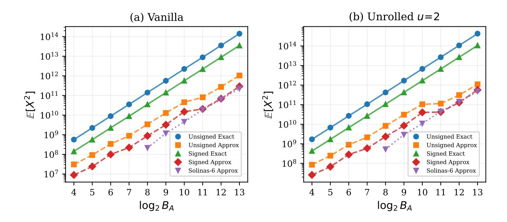
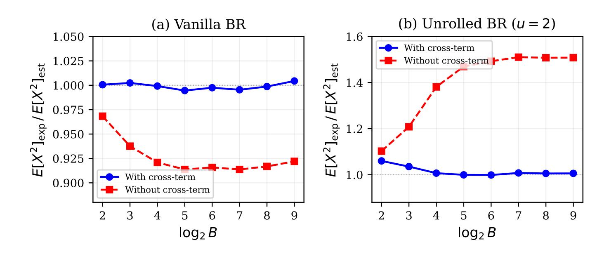
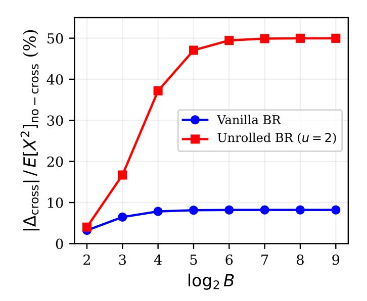
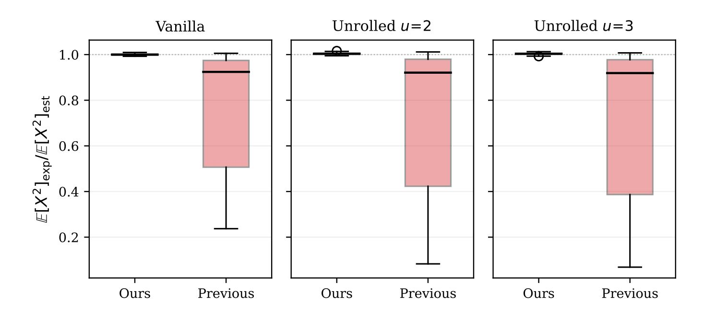
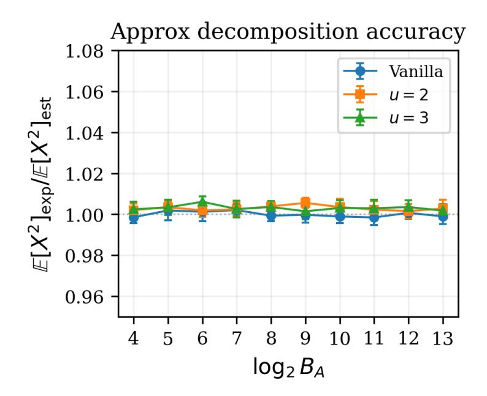
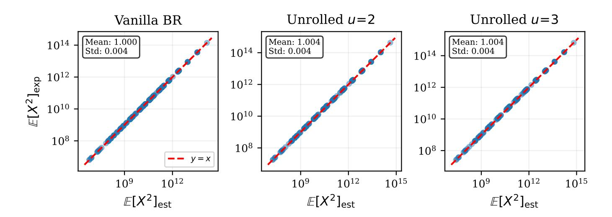

{0}------------------------------------------------

# <span id="page-0-0"></span>Exact Error Analysis for Blind Rotation in Fully Homomorphic Encryption

Sin Kim<sup>1</sup> , Seunghwan Lee1,<sup>2</sup> , and Dohyuk Kim1,<sup>2</sup> Dong-Joon Shin1,<sup>2</sup>

<sup>1</sup> Department of Electronic Engineering, Hanyang University, Seoul, Korea {thegimsin, kr2951, dohyuk1000, djshin}@hanyang.ac.kr <sup>2</sup> waLLLnut Co., Ltd., Seoul, Korea {kr2951, dhkim, djshin}@walllnut.com

Abstract. Blind rotation is the computational core of GINX, AP, and AP+ bootstrappings, yet its error behavior has not been precisely characterized. Prior analyses rely on heuristic independence assumptions that fail to capture the distinct error accumulation patterns of different algorithmic variants. We prove that no additional assumptions are needed: the (M)LWE assumption guaranteeing ciphertext indistinguishability also implies the independence properties required for an exact second-moment characterization of blind rotation error. We derive the first closed-form formulas covering all four combinations of decomposition type (full vs. approximated) and algorithmic variant (vanilla vs. unrolled). Our analysis reveals three structural phenomena previously overlooked: (i) a message-dependent residual term that halves the effective decomposition variance, (ii) a doubling coefficient inherent to unrolled implementations, and (iii) bounded cross-term correlations whose contribution remains constant in the security parameter. Our formulas match experimental measurements within 1%, whereas prior estimators deviate by up to 50% for unrolled blind rotation. Our results show that the (M)LWE assumption—already required for security— is sufficient to determine the exact error behavior of GINX, AP, and AP+ bootstrapping.

Keywords: Fully homomorphic encryption · Bootstrapping · Blind rotation · Gadget decomposition · Learning with errors (LWE) problem · Error analysis

# 1 Introduction

For nearly two decades, error analysis in fully homomorphic encryption has relied on heuristic assumptions [\[1–](#page-30-0)[4\]](#page-30-1)—treating gadget decomposition digits as independent random variables without formal justification. We justify these assumptions rigorously from the (Module) LWE assumption that is necessary for security. As a result, we obtain the first rigorously justified error formulas for blind rotation, closing a foundational gap between cryptographic security proofs and practical error estimation.

{1}------------------------------------------------

Blind rotation is the computational core of GINX [\[1\]](#page-30-0), AP [\[2\]](#page-30-2), and AP+ [\[5\]](#page-30-3) bootstrappings, consuming the majority of bootstrapping time and accounting for the dominant share of error. Loop-unrolled implementations—now widely deployed for performance [\[1–](#page-30-0)[4,](#page-30-1) [6\]](#page-30-4)—have no dedicated error analysis; prior work simply adapts vanilla formulas without accounting for structural differences. Accurate error estimation enables a tight parameter set for achieving the target security level with an acceptable failure probability [\[7–](#page-30-5)[10\]](#page-30-6)—underestimation leads to increased decryption failures, while overestimation forces unnecessarily conservative choices and hence degrades performance. Yet, despite two decades of progress in FHE, error estimation has remained surprisingly imprecise: existing estimators [\[1–](#page-30-0)[3\]](#page-30-7) deviate from experimental measurements by up to 50% for unrolled blind rotation, a gap large enough to invalidate parameter choices in practice.

(M)LWE Implies Exactness. The standard variance formula of Ducas–Micciancio [\[2\]](#page-30-2), refined in subsequent work [\[1,](#page-30-0)[3\]](#page-30-7), models decomposition digits as independent random variables. This independence assumption is never proven—it is adopted because it simplifies analysis and seems reasonable. Yet the (M)LWE assumption that guarantees ciphertext indistinguishability also implies that accumulator coefficients are computationally pseudorandom [\[11–](#page-30-8)[13\]](#page-30-9). Under this assumption, the resulting pseudorandomness yields the independence of decomposition digits. This connection between computational hardness and error statistics is the key insight that enables our exact error analysis.

Practical Impact. Accurate error estimation is not merely an academic concern—it directly determines the security level achievable in practice [\[7,](#page-30-5)[14\]](#page-30-10). Prior estimators, deviating by up to 50%, force a choice between conservative parameters that degrade performance and optimistic parameters that risk decryption failure. With our exact error formulas, parameters can be selected to achieve failure probabilities as low as 2<sup>−</sup><sup>256</sup> without relying on empirically chosen safety margins.

Our error analysis shows that the (M)LWE assumption—already required for security—provides all the structure needed for exact error estimation. The resulting formulas match experimental measurements within 1% across all tested configurations, replacing heuristic estimates with provable guarantees.

## 1.1 Our Contributions

This paper provides the first cryptographically rigorous error analysis of blind rotation, based solely on the (M)LWE assumption rather than heuristic independence assumptions. Our contributions are:

– (M)LWE-based exact error analysis framework (Section [2.7\)](#page-12-0). To our knowledge, this is the first work to leverage computational assumptions for FHE error analysis. We show that (M)LWE alone suffices to derive exact 

{2}------------------------------------------------

second-moment formulas for blind rotation, by showing that the independence and pseudorandomness of decomposition digits follow directly from (M)LWE hardness rather than heuristic assumptions.

- Exact closed-form second-moment formulas (Sections [4.2–](#page-18-0)[4.3\)](#page-20-0). We derive closed-form expressions for the second moment of blind rotation error, covering all four combinations of decomposition type (full/approximated) and algorithm variant (vanilla/unrolled). Our formulas match experimental measurements within 1% across all tested configurations.
- Cross-term characterization for shared BSK (Section [4.4\)](#page-24-0). When multiple blind rotations share a bootstrapping key (BSK), we prove that zero-mean decomposition eliminates cross-term correlation entirely, yielding exact linear variance scaling. For non-zero-mean decomposition, we derive tight upper bounds.
- Solinas signed decomposition (Section [3\)](#page-14-0). We introduce a decomposition based on Solinas primes that achieves zero-mean digits with reduced second moments, directly addressing the cross-term issue above.

# 1.2 Technical Overview

The Core Challenge. Error analysis is complicated by the fact that decomposition digits depend on ciphertexts, which in turn depend on the secret key. Prior work sidesteps this by assuming independence—but this assumption has never been justified. Our key insight is that the (M)LWE assumption, already required for security, provides the exact structure needed for error analysis: ciphertexts are computationally indistinguishable from uniform, so any efficiently computable second-moment statistic matches that of uniform inputs up to negligible error.

From Computational Hardness to Exact Moments. We formalize this via two lemmas (Section [2.7\)](#page-12-0):

- (i) Under module LWE (MLWE), accumulator coefficients are computationally indistinguishable from uniform. Thus digit statistics match those of uniform inputs (Lemma [4\)](#page-13-0).
- (ii) Under decisional LWE (DLWEn−2), ciphertext-derived quantities and any pair of secret key coefficients are computationally independent (Lemma [5\)](#page-13-1).

The bridge between computational indistinguishability and moment equality is moment decoupling: if two distributions are computationally indistinguishable, their moments differ by at most negl(λ)—a negligible function in the security parameter λ [\[15,](#page-30-11) [16\]](#page-31-0). This transforms heuristic formulas into provable bounds.

Analyzing the error structure. With this foundation, we derive exact secondmoment formulas by carefully tracking three phenomena overlooked by prior analyses:

{3}------------------------------------------------

- Message-dependent removing term. In approximated decomposition [1, 17], the residual term takes the form  $\mathbf{T}^{(i)} = m \cdot \mathbf{R}^{(i)}$ , where  $m \in \{0, 1\}$  is the module GSW (MGSW) message. When m = 0, this term vanishes entirely. Since, on average, half the bootstrapping key entries encrypt zero, conditioning on m and applying the law of total expectation yields a factor of 1/2 compared to the standard i.i.d. model—effectively halving the decomposition error variance. See Proposition 3 and Corollary 2 for details.
- Doubling coefficient in unrolled blind rotation. Vanilla and unrolled blind rotations differ in operation order: vanilla multiplies  $(X^{a_i} 1)$  before the external product, whereas unrolled multiplies  $(X^S 1)$  afterward, leaving it outside. Here S is uniformly distributed over  $\mathbb{Z}_{2N}$ . Due to the negacyclic relation  $X^N = -1$ , the sign of the extracted constant term  $\pi_0$  depends on whether  $S \geq N$ . Averaging over S and the error polynomial  $\mathbf{F}(X)$  where  $\mathbb{E}[F_i^2] = \sigma_F^2$  yields

$$\mathbb{E}_{S,\mathbf{F}}\left[\pi_0((X^S-1)\mathbf{F}(X))^2\right] = 2\sigma_F^2 = 2\mathbb{E}\left[\pi_0(\mathbf{F}(X))^2\right].$$

The resulting factor of 2—the *doubling coefficient*— is unique to unrolled implementations and is not captured by prior estimators. See Lemma 6 in Section 4.3 for details.

- Bounded cross-term. Expanding the total error over iterations introduces cross-terms between different blind rotation iterations. Let i < j denote iteration indices in the blind rotation procedure. When decomposition digits have nonzero mean, these terms do not vanish automatically. However, a cross-term between iterations i and j survives averaging only under highly constrained events whose probability decays geometrically in the number of remaining secret bits. Summing over all pairs yields a bounded total contribution independent of the security parameter. See Section 4.3 for the full derivation.

Eliminating Estimation Error. Prior analyses estimate digit variance using the digit range, such as replacing the variance by  $B^2/12$  for base-B digits. We instead compute exact moments  $\mu_t = \mathbb{E}[d_t(U)]$  and  $\nu_t = \mathbb{E}[d_t(U)^2]$  by complete enumeration over  $\mathbb{Z}_Q$ , where  $d_t(\cdot)$  denotes the t-th decomposition digit, U is uniform over  $\mathbb{Z}_Q$ , and Q is the ciphertext modulus. This eliminates estimation error at the digit level. See Algorithm 3 for the enumeration procedure.

Designing Decomposition for Zero Correlation. The cross-term analysis reveals that zero-mean decomposition—where each digit has zero expected value—eliminates the cross-term entirely. We achieve this via Solinas signed decomposition [18] with bases of the form  $B=2^{\ell}-2^{\eta}+1$ , where  $\ell$  is the bit-length of the base and  $\eta<\ell$  is a parameter controlling the subtracted term. This construction produces zero-mean digits. See Section 3 for the complete construction and analysis.

Together, these ingredients yield closed-form second-moment expressions for all four combinations of decomposition type and algorithm variant (Theorems 1–4), which are **exact up to**  $negl(\lambda)$  under the (M)LWE assumption.

{4}------------------------------------------------

#### 1.3 Related Work

**TFHE/FHEW Error Analysis.** The foundational error analysis for gate bootstrapping was established by Ducas and Micciancio [2] for the FHEW scheme later refined by Chillotti et al. [1,3] for TFHE. These works derive variance formulas under an i.i.d. digit model, yielding expressions of the form  $n \cdot \sigma_e^2 \cdot \ell \cdot \mathbb{E}[d^2]$ , where n is the LWE dimension,  $\sigma_e^2$  is the encryption error variance,  $\ell$  is the number of decomposition digits, and  $\mathbb{E}[d^2]$  is the second moment of a digit. Although elegant and widely adopted for parameter selection, this model does not capture the message-dependent structure of approximated decomposition and the distinct error accumulation patterns of unrolled implementations. Our work provides exact second-moment formulas that address both limitations. Our analysis assumes exact modular arithmetic via NTT-based polynomial multiplication; FFT-based implementations such as TFHE [1], where floating-point rounding introduces additional noise, are outside our scope.

**Exact Moment Computation.** Lee et al. [19] propose FHE16, a bootstrapping method using only 16-bit integer arithmetic, and introduce exact digit statistics computation by complete enumeration over  $\mathbb{Z}_Q$ . Our work provides the theoretical framework explaining why exact moments lead to accurate error estimation, with formulas valid for any modulus choice.

**Loop Unrolling.** The GINX blind rotation [1] processes one bit of secret key per iteration. Loop unrolling, which processes u bits per block, is introduced to reduce the depth of sequential operations and adopted in several implementations [5, 19]. Prior error analyses of the unrolled variant either adapt the vanilla formulas with heuristic corrections or do not provide closed-form second-moment expressions. We derive exact closed-form formulas for unrolled blind rotation, revealing the doubling coefficient that prior analyses miss.

**Signed Gadget Decomposition.** Signed gadget decomposition using balanced digit sets has been explored in the context of reducing decomposition error [20]. Our Solinas signed decomposition extends this idea by leveraging the algebraic structure of Solinas primes to achieve zero-mean digits with optimized second moments.

Multi-Output Bootstrapping. Recent work has explored bootstrapping constructions that produce multiple outputs from a single operation. Kim et al. [21] proposed primitive gate bootstrapping (PGB), an algebraic framework enabling multi-input hybrid gates (e.g.,  $\ell$ -input XOR, 3-input MAJ) to be evaluated with a single bootstrapping. Their construction requires summing multiple blind rotation outputs that share a common bootstrapping key, whose errors become correlated. Our cross-term analysis (Section 4.4) offers a theoretical foundation for estimating the total error in such multi-output scenarios.

Dense Parameter Sets and IND-CPA<sup>D</sup> Security. Hong and Lee [22] address the sparsity of feasible parameter sets in FHEW-like schemes by introducing heterogeneous gadget decomposition, enabling nearly continuous control over failure probability for IND-CPA<sup>D</sup> security. However, since the method relies

{5}------------------------------------------------

on the conventional digit variance estimate  $(B^2/12)$ , achieving a  $2^{-128}$  failure probability requires approximately 59.5 ms. Our exact formulas with Solinas decomposition reach  $2^{-256}$  in under 10 ms on a comparable CPU, and can be integrated into their optimization framework for further improvement.

# 2 Preliminaries

In this section, we establish the notation used throughout the paper and present the essential background required to comprehend our contributions.

#### 2.1 Notation

Let N be a power of two, and let  $R := \mathbb{Z}[X]/(X^N+1)$  denote the 2N-th cyclotomic ring. For an integer modulus  $Q \geq 2$ , define  $R_Q := R/QR \cong \mathbb{Z}_Q[X]/(X^N+1)$ . We denote vectors over  $\mathbb{Z}_Q$  by  $\vec{a}$ , polynomials in  $R_Q$  by  $\mathbf{a}$ , and vectors of polynomials by  $\vec{\mathbf{a}}$ . For  $\mathbf{a}(X) = \sum_{j=0}^{N-1} a_j X^j \in R_Q$ , we write  $a_j$  for the j-th coefficient. We write  $x \leftarrow D$  for sampling from a distribution D and  $x \leftarrow S$  for uniform sampling from a set S. The complete notation is summarized in Appendix A.

### <span id="page-5-0"></span>2.2 LWE and Module-LWE

We recall the Learning with errors (LWE) problem and its module variant (MLWE), which guarantee the security of the constructions in this paper. Throughout,  $\lambda$  denotes the security parameter and  $\operatorname{negl}(\lambda)$  denotes any function with magnitude  $o(\lambda^{-c})$  for all c>0. The proof and details are provided in Appendix B.

**Definition 1** (Discrete Gaussian Distribution  $\mathcal{D}_{\mathbb{Z},\sigma}$  [23, 24]). For  $\sigma > 0$ , the discrete Gaussian distribution  $\mathcal{D}_{\mathbb{Z},\sigma}$  over  $\mathbb{Z}$  assigns to each  $x \in \mathbb{Z}$  the probability

$$\Pr[X = x] = \frac{\exp(-x^2/2\sigma^2)}{\sum_{z \in \mathbb{Z}} \exp(-z^2/2\sigma^2)}.$$

For  $R_Q = \mathbb{Z}_Q[X]/(X^N+1)$ , we write  $\mathcal{D}_{R_Q,\sigma}$  for the distribution that samples each coefficient independently from  $\mathcal{D}_{\mathbb{Z},\sigma}$  and reduces modulo Q.

**Definition 2 (Secret Key Distribution [20]).** For a positive integer  $\tau \geq 2$ , define the secret key distribution  $\mathcal{U}_{\tau}$  as the uniform distribution over  $\{-\lfloor \tau/2 \rfloor, \ldots, \lceil \tau/2 \rceil - 1\}$ . In particular,  $\mathcal{U}_2$  is the uniform distribution over  $\{0,1\}$  (binary keys) and  $\mathcal{U}_3$  is the uniform distribution over  $\{-1,0,1\}$  (ternary keys).

**Definition 3 (LWE Distribution [11]).** Let  $n \geq 1$ ,  $q \geq 2$ , and let  $\chi$  be a distribution over  $\mathbb{Z}$ . For a secret  $\vec{s} \in \mathbb{Z}_q^n$ , the LWE distribution  $A_{\vec{s},\chi}$  over  $\mathbb{Z}_q^n \times \mathbb{Z}_q$  is defined by

<span id="page-5-1"></span>
$$(\vec{a}, b)$$
 where  $\vec{a} \leftarrow \mathbb{Z}_q^n$ ,  $e \leftarrow \chi$ ,  $b := \langle \vec{a}, \vec{s} \rangle + e \pmod{q}$ .

{6}------------------------------------------------

**Definition 4 (Decision-LWE [11]).** The decisional LWE problem  $\mathsf{DLWE}_{n,q,\chi}$  is defined as to distinguish, given m independent samples from  $\mathbb{Z}_q^n \times \mathbb{Z}_q$ , whether they are drawn from  $A_{\vec{s},\chi}$  for a uniformly random  $\vec{s} \leftarrow \mathbb{Z}_q^n$  or from the uniform distribution  $U(\mathbb{Z}_q^n \times \mathbb{Z}_q)$ .

<span id="page-6-2"></span>Assumption 1 (LWE Assumption [25–27]). For parameters  $n = n(\lambda)$ ,  $q = q(\lambda)$ , and  $\chi = \mathcal{D}_{\mathbb{Z},\sigma}$  with  $\sigma = \sigma(\lambda)$ , the LWE assumption  $\mathsf{LWE}_{n,q,\chi}$  states that for every PPT algorithm  $\mathcal{A}$ , the distinguishing advantage  $\mathsf{Adv}^{\mathsf{LWE}}_{n,q,\chi}(\mathcal{A}) \leq \mathsf{negl}(\lambda)$ . Equivalently,  $A_{\vec{s},\chi} \approx_c U(\mathbb{Z}_q^{n+1})$  for  $\vec{s} \leftarrow \mathbb{Z}_q^n$ , where  $\approx_c$  denotes computational indistinguishability.

**Definition 5 (LWE Ciphertext [11,28]).** Let  $q \geq 2$ ,  $n \geq 1$ , and  $\vec{s} \in \mathbb{Z}_q^n$  with  $s_i \leftarrow \mathcal{U}_{\tau}$ . An LWE ciphertext encrypting  $m \in \mathbb{Z}_p$  is  $\mathsf{ct} = (\vec{a}, b) \in \mathbb{Z}_q^{n+1}$  where  $\vec{a} \leftarrow \mathbb{Z}_q^n$ ,  $e \leftarrow \mathcal{D}_{\mathbb{Z},\sigma}$ ,  $b := \langle \vec{a}, \vec{s} \rangle + \Delta m + e \pmod{q}$  with  $\Delta := \lfloor q/p \rfloor$ .

**Definition 6 (MLWE Ciphertext [13]).** Let  $Q \geq 2$ ,  $k \geq 1$ ,  $R_Q = \mathbb{Z}_Q[X]/(X^N + 1)$ , and  $\vec{\mathbf{s}} \in R_Q^k$  with coefficients from  $\mathcal{U}_{\tau}$ . An MLWE ciphertext encrypting  $\mathbf{m} \in R_Q$  is  $\mathsf{ct} = (\vec{\mathbf{a}}, \mathbf{b}) \in R_Q^{k+1}$  where  $\vec{\mathbf{a}} \leftarrow R_Q^k$ ,  $\mathbf{e} \leftarrow \mathcal{D}_{R_Q,\sigma}$ ,  $\mathbf{b} := \langle \vec{\mathbf{a}}, \vec{\mathbf{s}} \rangle + \Delta \mathbf{m} + \mathbf{e}$  (mod Q).

<span id="page-6-0"></span>Corollary 1 (IND-CPA/KEM Security [11,13]). The underlying FHE scheme satisfies IND-CPA security, which is implied by the LWE and MLWE assumptions above. This is a standard requirement for any FHE scheme and ensures that ciphertexts are computationally indistinguishable from random.

### <span id="page-6-1"></span>2.3 Gadget Decomposition

In this section, we review gadget decomposition and define the digit statistics used throughout our error analysis.

**Definition 7 (Gadget Decomposition [1]).** Let  $D \subset \mathbb{Z}$  be a digit set and fix gadget parameters (D,B) with base  $B \geq 2$ . The decomposition length  $\ell = \lceil \log_B Q \rceil$  is the minimal positive integer such that every element of  $\mathbb{Z}_Q$  can be represented using  $\ell$  digits from D. For  $\alpha \in \mathbb{Z}_Q$ , let  $d_t(\alpha) \in D$  denote the t-th digit of  $\alpha$ ; we call  $d_t : \mathbb{Z}_Q \to D$  the t-th digit function. In full decomposition, all  $\ell$  digits are used and the representation is exact:

$$\alpha = \sum_{t=0}^{\ell-1} d_t(\alpha) \cdot B^t.$$

In approximated decomposition [17], the least significant digit at t=0 is intentionally discarded to reduce the number of NTT operations per external product [1,29] from  $\ell$  to  $\ell-1$ , sacrificing exactness for computational efficiency. The decomposition becomes

$$\alpha = \sum_{t=1}^{\ell-1} d_t(\alpha) \cdot B^t + r(\alpha),$$

{7}------------------------------------------------

where the residual  $r(\alpha) := d_0(\alpha) \cdot B^0 = d_0(\alpha)$  is the contribution of the discarded least significant digit. This residual plays a central role in the error analysis of Section 2.5.

Unsigned and Signed Digit Sets. The choice of digit set D determines the decomposition type. The two most common choices are:

- **Unsigned decomposition**:  $D = \{0, 1, ..., B - 1\}$ . Let X be uniformly distributed over D. Then

$$\mathbb{E}[X] = \frac{B-1}{2}, \quad \mathbb{E}[X^2] = \frac{(B-1)(2B-1)}{6}.$$

- Signed decomposition:  $D = \{-\lfloor B/2 \rfloor, \ldots, \lfloor B/2 \rfloor\}$  for any B. Let X be uniformly distributed over D. Then

$$\mathbb{E}[X] = -\frac{1}{2}, \quad \mathbb{E}[X^2] = \frac{B^2 + 2}{12}.$$

Signed decomposition reduces digit magnitude compared to unsigned, but both have nonzero mean, introducing bias in error accumulation. This motivates the zero-mean Solinas decomposition [18] in Section 3.

#### <span id="page-7-0"></span>2.4 Constant-Term Extraction in Negacyclic Rings

In TFHE/FHEW bootstrapping, the plaintext message is encoded in the constant term of the accumulator polynomial, and decryption correctness depends on the constant coefficient of the total error polynomial  $\mathbf{E}_{\text{total}}(X)$ . Our analysis focuses on the second moment of this constant-term error, denoted by  $\mathbb{E}[\pi_0(\mathbf{E}_{\text{total}})^2]$ . This requires precise control over how negacyclic arithmetic in  $R_Q = \mathbb{Z}_Q[X]/(X^N + 1)$  affects the constant term when it is extracted from polynomial products.

**Definition 8 (Constant-Term Extractor).** Let  $\mathbf{f}(X) = \sum_{j=0}^{N-1} f_j X^j \in R_Q$ . The constant term extractor  $\pi_0(\cdot)$  is defined as  $\pi_0(\mathbf{f}(X)) := f_0$ .

<span id="page-7-2"></span>**Definition 9 (Sign and Index Functions).** For  $s \in \{0, 1, ..., 2N-1\}$ , define the sign function  $\varepsilon(s)$  and the index function  $\iota(s)$  as follows:

$$\varepsilon(s) := \begin{cases} +1, & \text{if } s = 0 \text{ or } N < s < 2N, \\ -1, & \text{if } 0 < s \le N, \end{cases}$$

<span id="page-7-1"></span>
$$\iota(s) := \begin{cases} 0, & \text{if } s = 0 \text{ or } s = N, \\ N - s, & \text{if } 1 \le s \le N - 1, \\ 2N - s, & \text{if } N + 1 \le s \le 2N - 1. \end{cases}$$

{8}------------------------------------------------

Lemma 1 (Monomial Multiplication). For  $f(X) \in R_Q$  and  $s \in \mathbb{Z}_{2N}$ ,

$$\pi_0(X^s \cdot \mathbf{f}(X)) = \varepsilon(s) \cdot f_{\iota(s)}.$$

That is, multiplication by  $X^s$  selects coefficient  $f_{\iota(s)}$  with a sign determined by the negacyclic relation  $X^N=-1$ .

*Proof.* This is straightforward using  $X^N = -1$ ; see Appendix C for details.  $\square$ 

The following lemma is a key tool for analyzing the second moment of error terms in polynomial products.

<span id="page-8-1"></span>Lemma 2 (Second Moment of Product). Let  $\mathbf{D}(X) = \sum_{j=0}^{N-1} D_j X^j$  and  $\mathbf{E}(X) = \sum_{j=0}^{N-1} E_j X^j$  be polynomials with independent random coefficients. Assume  $\{E_j\}$  are i.i.d. with  $\mathbb{E}[E_j] = 0$  and  $\mathbb{E}[E_j^2] = \sigma_e^2$ , and  $\mathbb{E}[D_j^2] = \nu_D$  for all j. Then

$$\mathbb{E}[\pi_0(\mathbf{D}(X)\mathbf{E}(X))] = 0, \qquad \mathbb{E}[\pi_0(\mathbf{D}(X)\mathbf{E}(X))^2] = N\nu_D\sigma_e^2.$$

*Proof.* See Appendix C.

# <span id="page-8-0"></span>2.5 Bootstrapping: Blind Rotation

Blind rotation is a key component of TFHE/FHEW bootstrapping. We introduce two variants: the vanilla GINX method, which processes one secret key bit per iteration, and its loop-unrolled optimization, which processes u bits at once to reduce sequential external products. See Appendix D for the formal definition of MGSW.

Vanilla GINX Blind Rotation. Given an LWE ciphertext  $(\vec{a}, b)$  with binary secret key  $\vec{s} \in \{0, 1\}^n$ , the goal of blind rotation is to produce:

$$\mathsf{MLWE}\Big[\mathsf{ACC} \cdot X^{\sum_{i=0}^{n-1} a_i s_i - b}\Big] ,$$

where the accumulator polynomial  $ACC \in R_Q$  encodes the lookup table for bootstrapping.

**Definition 10 (Vanilla Blind Rotation Key).** The vanilla GINX blind rotation key (BRK) is defined as:

$$\mathsf{BRK}_i := \mathsf{MGSW}[s_i] \quad \textit{for } i = 0, \dots, n-1.$$

The vanilla method requires n sequential external products  $\square$ . Let  $\mathsf{ACC}^{(i)}$  denote the accumulator state at step i. Each iteration updates the accumulator as

$$\mathsf{ACC}^{(i)} = \mathsf{ACC}^{(i-1)} + \left[ (X^{a_i} - 1) \cdot \mathsf{ACC}^{(i-1)} \right] \boxdot \mathsf{BRK}_i.$$

{9}------------------------------------------------

# <span id="page-9-0"></span>Algorithm 1 Vanilla GINX Blind Rotation [1]

**Input:** LWE ciphertext  $(a_0, \ldots, a_{n-1}, b)$ , accumulator ACC  $\in R_Q$ , blind rotation keys  $\{BRK_i\}$ 

Output:  $\mathsf{MLWE}[\mathsf{ACC} \cdot X^{\sum_i a_i s_i - b}]$ 

1:  $\mathsf{ct} \leftarrow (0, \dots, 0, \mathsf{ACC} \cdot X^{-b})$ 

2: **for** i = 0 to n - 1

3:  $\operatorname{ct} \leftarrow \operatorname{ct} + [(X^{a_i} - 1) \cdot \operatorname{ct}] \odot \operatorname{BRK}_i$ 

4: end for

5: return ct

**Unrolled GINX Blind Rotation.** Loop unrolling processes u consecutive secret key bits per iteration, where u is called the *unrolling factor*, reducing iterations from n to  $V := \lceil n/u \rceil$  with a modified blind rotation key structure.

**Definition 11 (Unrolled Blind Rotation Key).** For each block  $\beta \in \{0, ..., V-1\}$ , define the  $\beta$ -th block of the secret key as

$$\vec{s}^{(\beta)} := (s_{\beta u}, s_{\beta u+1}, \dots, s_{\beta u+u-1}) \in \{0, 1\}^u,$$

and encode it as an integer  $z_{\beta} := \sum_{i=0}^{u-1} s_{\beta u+i} \cdot 2^i \in \{0,1,\ldots,2^u-1\}$ . For each index  $z \in \{1,\ldots,2^u-1\}$ , define the one-hot indicator using the indicator function  $\mathbf{1}[\cdot]$ , which returns 1 if the condition holds and 0 otherwise:  $w_z^{(\beta)} := \mathbf{1}[z=z_{\beta}] \in \{0,1\}$ . The unrolled blind rotation key  $\mathsf{BRK} = \{\mathsf{BRK}_{\beta,z}\}$  is defined as

$$\mathsf{BRK}_{\beta,z} := \mathsf{MGSW}[w_z^{(\beta)}], \quad 0 \le \beta \le V - 1, \quad 1 \le z \le 2^u - 1.$$

For each block  $\beta$ : if  $z_{\beta} \neq 0$ , exactly one key  $\mathsf{BRK}_{\beta,z_{\beta}}$  encrypts 1 and the rest encrypt 0; if  $z_{\beta} = 0$ , meaning all secret key bits in the block are zero, then all keys  $\mathsf{BRK}_{\beta,z}$  for  $z \in \{1,\ldots,2^u-1\}$  encrypt 0.

**Definition 12 (Block Shift).** Let  $(a_0, \ldots, a_{n-1})$  be the mask coefficients of an LWE ciphertext, where each  $a_i \in \mathbb{Z}_{2N}$ . For block index  $\beta \in \{0, \ldots, V-1\}$  with block size u, the corresponding mask coefficients are  $(a_{\beta u}, a_{\beta u+1}, \ldots, a_{\beta u+u-1})$ . For a non-zero index  $z \in \{1, \ldots, 2^u - 1\}$ , let  $\text{bit}_i(z) \in \{0, 1\}$  denote the i-th bit of z, i.e.,  $z = \sum_{i=0}^{u-1} \text{bit}_i(z) \cdot 2^i$ . The block shift is defined as

$$s_z^{(\beta)} := \sum_{\substack{i=0 \\ \text{bit}_i(z)=1}}^{u-1} a_{\beta u+i} \pmod{2N} \in \mathbb{Z}_{2N}.$$

This sums only the mask coefficients  $a_{\beta u+i}$  for which the i-th bit of z equals 1.

**Definition 13 (Active Block).** Block  $\beta$  is called active if  $z_{\beta} \neq 0$ , i.e., at least one secret key bit in the block is nonzero. The activation probability is  $q = 1 - p_0$  with  $p_0 := 2^{-u}$ .

{10}------------------------------------------------

Remark 1 (Comparison of  $z_{\beta}$  and  $s_{z}^{(\beta)}$ ). The integer  $z_{\beta} \in \{0, \ldots, 2^{u} - 1\}$  encodes which secret key bits in block  $\beta$  are nonzero via base-2 representation: the factor  $2^{i}$  in  $z_{\beta} = \sum_{i} s_{\beta u+i} \cdot 2^{i}$  assigns positional weight to each bit. In contrast, the block shift  $s_{z}^{(\beta)} \in \mathbb{Z}_{2N}$  computes the cumulative rotation exponent by summing the mask coefficients  $a_{\beta u+i}$ , without positional weights for indices i where  $\text{bit}_{i}(z) = 1$ . Their ranges differ because  $z_{\beta}$  indexes secret key bit patterns while  $s_{z}^{(\beta)}$  computes rotation amounts in the negacyclic ring.

<span id="page-10-1"></span>Lemma 3 (Uniformity of Active Shift). For each block  $\beta$  and non-zero index z, the block shift  $s_z^{(\beta)}$  is uniformly distributed over  $\mathbb{Z}_{2N}$ . In particular, conditioned on  $z_{\beta} \neq 0$ , the actual shift  $s_{\beta} := s_{z_{\beta}}^{(\beta)}$  is also uniform over  $\mathbb{Z}_{2N}$ .

*Proof.* Since  $z \neq 0$ , there exists at least one index i with  $\text{bit}_i(z) = 1$ . The corresponding mask coefficient  $a_{\beta u+i}$  is uniform over  $\mathbb{Z}_{2N}$  and independent of the remaining terms in the sum  $s_z^{(\beta)}$ . Since a uniform random variable plus any independent value remains uniform over  $\mathbb{Z}_{2N}$ , the claim follows.

# <span id="page-10-0"></span>Algorithm 2 Unrolled GINX Blind Rotation [5,19]

**Input:** LWE ciphertext  $(a_0, \ldots, a_{n-1}, b)$ , unrolling factor u, accumulator ACC, blind rotation keys  $\{\mathsf{BRK}_{\beta,z}\}$ 

Output: MLWE[ACC  $\cdot X^{\sum_i a_i^r s_i - b}]$ 

1:  $\operatorname{ct} \leftarrow (0, \dots, 0, \operatorname{ACC} \cdot X^{-b}), \quad \dot{V} \leftarrow \lceil n/u \rceil$ 

2: **for**  $\beta = 0$  to V - 1

3:  $\operatorname{ct} \leftarrow \operatorname{ct} + \sum_{z=1}^{2^{u}-1} (X^{s_{z}^{(\beta)}} - 1) \cdot [\operatorname{ct} \boxdot \mathsf{BRK}_{\beta,z}]$ 

4: end for

5: return ct

Let  $\mathsf{ACC}^{(\beta)} = (\mathbf{a}_1^{(\beta)}, \dots, \mathbf{a}_k^{(\beta)}, \mathbf{b}^{(\beta)})$  denote the accumulator state at block  $\beta$ . Each iteration updates the accumulator as

$$\mathsf{ACC}^{(\beta+1)} = \mathsf{ACC}^{(\beta)} + \sum_{z=1}^{2^u-1} (X^{s_z^{(\beta)}} - 1) \cdot \left[ \mathsf{ACC}^{(\beta)} \boxdot \mathsf{BRK}_{\beta,z} \right].$$

While loop unrolling reduces iterations from n to  $V = \lceil n/u \rceil$ , each iteration performs  $2^u-1$  external products in parallel. In terms of computational cost, vanilla requires n NTTs, n INTTs, and n polynomial multiplications [30–32], whereas unrolled requires V NTTs, V INTTs, and  $(2^u-1)V$  polynomial multiplications. Thus, unrolling reduces NTT/INTT operations at the cost of additional polynomial multiplications.

Remark 2 (Structural Difference). The two methods differ in operation order:

- Vanilla: multiplies  $(X^{a_i} - 1)$  before the external product, absorbing it into the accumulator.

{11}------------------------------------------------

- **Unrolled:** multiplies  $(X^{s_z^{(\beta)}} - 1)$  after the external product, leaving it outside.

This structural difference leads to different error accumulation patterns, which we analyze precisely in Sections 4.2 and 4.3.

Error Sources. The error in blind rotation arises from two sources:

- 1. **GSW error:** The MGSW ciphertexts in the bootstrapping key contain encryption error with variance  $\sigma_e^2$  per coefficient, propagating through external products.
- 2. **Residual Error:** In approximated decomposition, discarding the least significant digit introduces a residual error that accumulates across iterations.

In full decomposition, only the GSW error contributes; in approximated decomposition, both sources are present.

#### 2.6 Prior Error Estimators for Blind Rotation

We review the standard error variance formulas used in prior work for parameter selection.

**TFHE/FHEW Variance Formula for Vanilla Blind Rotation.** The foundational error analysis by Ducas–Micciancio [2], refined by Chillotti et al. [1,3], models decomposition digits as i.i.d. random variables independent of message. Under this model, the second moment of the GSW error from a single external product is:

$$\mathbb{E}[G^2] = N \cdot \left(\ell_B \cdot \mathbb{E}[d_B^2] + k \cdot \ell_A \cdot \mathbb{E}[d_A^2]\right) \cdot \sigma_{\mathsf{BSK}}^2,\tag{1}$$

where  $\ell_A, \ell_B$  are the decomposition levels,  $\mathbb{E}[d_A^2], \mathbb{E}[d_B^2]$  are the digit second moments, and  $\sigma_{\mathsf{BSK}}^2$  is the BSK encryption error variance. The total blind rotation second moment accumulates over n steps:

$$\mathbb{E}[E_{\rm BR}^2]_{\rm prior} = n \cdot \mathbb{E}[G^2]. \tag{2}$$

Lee et al. [19] refine this by separating the A-part and B-part contributions with distinct gadget bases  $B_A, B_B$ , and computing  $\mathbb{E}[d_A^2], \mathbb{E}[d_B^2]$  by exact enumeration over  $\mathbb{Z}_Q$  rather than approximating from the digit range.

Unrolled Blind Rotation: Prior Heuristic Multiplier. For unrolled blind rotation with unrolling factor u, each block processes  $2^u - 1$  external products, each involving multiplication by a monomial difference  $(X^{s_z^{(\beta)}} - 1)$ . The prior heuristic multiplies the vanilla variance by  $(2^u - 1)$  [19]:

<span id="page-11-0"></span>
$$Var_{prior}^{unrolled} = (2^{u} - 1) \cdot Var_{prior}.$$
 (3)

{12}------------------------------------------------

However, this heuristic overlooks the doubling coefficient, whereby the monomial factor  $(X^{s_z^{(\beta)}} - 1)$  exactly doubles the constant-term second moment, as shown in Section 4.3. Furthermore, it does not account for the fact that most blocks are inactive with probability  $2^{-u}$ , nor for the distinct error structure of the unrolled scheme.

These prior formulas have the following key limitations:

- 1. They estimate digit variance from the digit range, e.g.,  $\sigma^2 \approx B^2/12$  for unsigned digits in base B, rather than computing exact digit statistics by complete enumeration.
- 2. They do not account for the message-dependent structure of approximated decomposition error, which we address in Section 4.1.
- 3. The unrolled multiplier  $(2^u 1)$  in Eq. (3) is a worst-case heuristic that ignores both the doubling coefficient and the probabilistic activation structure of blocks.

# <span id="page-12-0"></span>2.7 Average-All-Randomness Error Framework

All error analyses in this paper, as well as in prior work [1–3, 19], compute moments of the bootstrapping error by averaging over all sources of randomness: the encryption error  $\vec{e}$ , the random masks  $\vec{a}$ , and the secret key  $\vec{s}$ . We call this the **average-all-randomness** error framework (AARE)<sup>3</sup>.

<span id="page-12-1"></span>**Definition 14 (Average-All-Randomness Error Model).** Let  $E_{\rm BR}$  denote the constant-term error after blind rotation. All moments are computed as

$$\mathbb{E}[E_{\mathrm{BR}}^k] = \mathbb{E}_{\vec{s}, \, \vec{a}, \, \vec{e}}[E_{\mathrm{BR}}^k],$$

where the expectation is taken over the secret key  $\vec{s}$ , the random masks  $\vec{a}$ , and the encryption errors  $\vec{e}$ .

Prior analyses [1,2] implicitly adopt Definition 14 but rely on heuristic digit moment estimates rather than exact computation. Our contribution is to derive exact closed-form error formulas within this framework. The following two properties, used throughout our analysis, are provable consequences of standard cryptographic assumptions rather than ad hoc heuristics.

<span id="page-12-2"></span>**Definition 15 (Digit Moments).** Let U be uniformly distributed over  $\mathbb{Z}_Q = \{0, 1, \dots, Q-1\}$ . Define the digit statistics for the t-th digit of U:

$$\mu_t := \mathbb{E}[d_t(U)], \quad \nu_t := \mathbb{E}[d_t(U)^2], \quad \sigma_t^2 := \nu_t - \mu_t^2.$$

When the A-part and B-part use different decomposition bases  $B_A$  and  $B_B$ , we write  $\mu_{A,t}$ ,  $\nu_{A,t}$ ,  $\sigma_{A,t}^2$  and  $\mu_{B,t}$ ,  $\nu_{B,t}$ ,  $\sigma_{B,t}^2$  respectively.

<sup>&</sup>lt;sup>3</sup> All prior works on error variance estimation have been conducted implicitly within the AARE framework. In this paper, we formally define and treat this framework explicitly.

{13}------------------------------------------------

Remark 3. In practice, one can compute the exact values of  $\mu_t$ ,  $\nu_t$ ,  $\sigma_t^2$  by complete enumeration over all  $u \in \{0, \dots, Q-1\}$ ; see Algorithm 3.

<span id="page-13-0"></span>Lemma 4 (Pseudorandomness of Accumulator Coefficients). Under the MLWE<sub>k,N,Q,\chi</sub> assumption, the coefficients of ACC<sup>(\beta)</sup> are computationally indistinguishable (\approx\_c) from i.i.d. uniform samples over  $\mathbb{Z}_Q$ . In particular, the coefficient-wise residuals  $r_{B,j}^{(\beta)} := d_0(\mathbf{b}_j^{(\beta)})$  and  $r_{A,v,j}^{(\beta)} := d_0(\mathbf{a}_{v,j}^{(\beta)})$  form the residual polynomials  $\mathbf{r}_B^{(\beta)} = \sum_j r_{B,j}^{(\beta)} X^j$  and  $\mathbf{r}_{A,v}^{(\beta)} = \sum_j r_{A,v,j}^{(\beta)} X^j$  satisfying

$$\mathbf{r}_{B}^{(\beta)} \approx_{c} d_{0}(\mathbf{U}), \quad \mathbf{r}_{A,v}^{(\beta)} \approx_{c} d_{0}(\mathbf{U}), \quad \mathbf{U} \leftarrow R_{Q},$$

where **U** is a polynomial with i.i.d. uniform coefficients over  $\mathbb{Z}_Q$ . Within the average-all-randomness framework of Definition 14, the moments of the individual residual coefficients  $r_{B,j}^{(\beta)}$  and  $r_{A,v,j}^{(\beta)}$  are:

$$\mathbb{E}[r_{B,j}^{(\beta)}] = \mu_{B,0}, \quad \mathbb{E}[(r_{B,j}^{(\beta)})^2] = \nu_{B,0}, \quad \mathbb{E}[r_{A,v,j}^{(\beta)}] = \mu_{A,0}, \quad \mathbb{E}[(r_{A,v,j}^{(\beta)})^2] = \nu_{A,0}.$$

The exact moments  $\mu_{X,0}$  and  $\nu_{X,0}$  are computed by complete enumeration over  $\mathbb{Z}_Q$ . These equalities hold up to negligible terms in the security parameter, via Lemma 10.

*Proof sketch.* The initial accumulator is a fresh MLWE ciphertext, and hence its coefficients are pseudorandom. Each blind rotation step applies an external product with a GSW ciphertext, producing an output that is computationally indistinguishable from a fresh MLWE ciphertext. The digit statistics then follow from computational indistinguishability via Lemma 10 in Appendix E.  $\Box$ 

<span id="page-13-1"></span>Lemma 5 (Ciphertext–Secret Key Independence under  $\mathsf{DLWE}_{kN-2}$ ). Under the  $\mathsf{DLWE}_{kN-2}$  assumption,  $\mathbf{r}_B^{(\beta)}$  and  $\mathbf{r}_{A,v}^{(\beta)}$  are computationally independent of any pair of secret key coefficients  $\mathbf{s}_{v,i}$ ,  $\mathbf{s}_{v',j}$ . That is, for any bounded PPT function f of the decomposition digits,

$$\left| \mathbb{E}[f(\mathbf{r}_B^{(\beta)}, \mathbf{r}_{A,v}^{(\beta)}) \cdot \mathbf{s}_{v,i} \cdot \mathbf{s}_{v',j}] - \mathbb{E}[f(\mathbf{r}_B^{(\beta)}, \mathbf{r}_{A,v}^{(\beta)})] \cdot \mathbb{E}[\mathbf{s}_{v,i} \cdot \mathbf{s}_{v',j}] \right| \leq \operatorname{negl}(\lambda).$$

Proof sketch. The standard  $\mathsf{DLWE}_{n-2}$  assumption guarantees that revealing any two coordinates of an n-dimensional LWE secret still leaves the ciphertext computationally indistinguishable from uniform. In the MLWE setting, the secret key  $\vec{s} \in R_Q^k$  embeds as a kN-dimensional vector via coefficient embedding, so the corresponding assumption becomes  $\mathsf{DLWE}_{kN-2}$ . Removing two coordinates from this kN-dimensional LWE instance yields a (kN-2)-dimensional instance, which remains hard under the  $\mathsf{DLWE}_{kN-2}$  assumption. The moment decoupling follows from Lemma 10; see Propositions 5 and 6 in Appendix E for the formal reduction. The underlying  $\mathsf{DLWE}_{kN-2}$  assumption itself is implied by standard LWE hardness via dimension-preserving reductions; see Appendix E for details.

For symmetric secret key distributions with  $\mathbb{E}[\mathbf{s}_{v,i}] = 0$ , we have  $\mathbb{E}[\mathbf{s}_{v,i} \cdot \mathbf{s}_{v',j}] = 0$  whenever  $(v,i) \neq (v',j)$ , and hence cross terms involving distinct secret key coefficients vanish up to negligible error.

{14}------------------------------------------------

Remark 4. Lemmas [4](#page-13-0) and [5](#page-13-1) are provable under IND-CPA/KEM security in Assumption [1](#page-6-0) and standard LWE/MLWE hardness, not ad hoc heuristics. All results in this paper are rigorous within the average-all-randomness framework of Definition [14,](#page-12-1) where computational indistinguishability implies moment equivalence via Lemma [10.](#page-38-0) Prior work implicitly adopts the same framework but relies on heuristic digit statistics; our contribution is to make the framework explicit and derive exact closed-form formulas within it.

# <span id="page-14-0"></span>3 Solinas Signed Decomposition

## 3.1 Solinas Digit Set

Standard signed gadget decomposition with base B = 2<sup>ℓ</sup> produces digits with nonzero mean E[X] = −1/2, which complicates moment calculations and introduces bias in error accumulation. We introduce Solinas signed gadget decomposition, which achieves zero mean and reduced second moment, enabling unbiased error analysis.

Definition 16 (Solinas Digit Set [\[18\]](#page-31-2)). For a base B = 2<sup>ℓ</sup> − 2 <sup>η</sup> + 1 and parameter η ≥ 1, the Solinas digit set is

$$\mathcal{D}_{\mathsf{Soli},\eta} := \left\{ -2^{\ell-1} + 2^{\eta-1}, \dots, -1, 0, 1, \dots, 2^{\ell-1} - 2^{\eta-1} \right\}. \tag{4}$$

The Solinas digit set is symmetric about zero, guaranteeing E[X] = 0 for uniformly distributed digits.

Remark 5 (Efficient Modular Reduction). The Solinas digit set is based on primes of the form q = 2<sup>m</sup> −2 <sup>k</sup> + 1 [\[33\]](#page-31-15), which satisfy 2<sup>m</sup> ≡ 2 <sup>k</sup> −1 (mod q). This allows modular reduction using only shifts and additions, avoiding expensive division.

Optimizing the Second Moment. The parameter η controls the width of the Solinas digit set: as η increases from 1 to ℓ − 1, the digit range shrinks symmetrically from both ends. Note that η = 0 yields B = 2<sup>ℓ</sup> , recovering standard signed decomposition. Since η takes finitely many values, the optimal η <sup>∗</sup> ∈ {1, 2, . . . , ℓ − 1} minimizing E[X<sup>2</sup> ] can be found by enumeration.

Remark 6 (Practical Implications). The existence of an optimal η ∗ suggests a practical parameter selection strategy: for a given security level and performance target, enumerate candidate η values and select the one minimizing the bootstrapping error variance. Our complete enumeration in Algorithm [3](#page-15-0) enables this optimization with exact moment values.

# 3.2 Exact Moment Computation via Complete Enumeration

To apply Lemma [4,](#page-13-0) we need the exact digit moments µX,<sup>0</sup> and νX,0. Rather than relying on heuristic estimates, we compute these values exactly by enumerating all Q residues and accumulating integer statistics [\[34\]](#page-31-16). This approach yields precise moment values for any choice of decomposition parameters.

{15}------------------------------------------------

Shifted Representative Map. Let  $Q \geq 2$  be the ciphertext modulus and let  $r \in \mathbb{Z}$  be a chosen right-endpoint. We represent each residue class in  $\mathbb{Z}_Q$  by an integer in [r-Q+1, r] via

<span id="page-15-1"></span>
$$\operatorname{Rep}_{Q,r}(z) := ((z - r - 1) \mod Q) + (r - Q + 1) \in [r - Q + 1, r],$$
 (5)

where  $(\cdot \mod Q)$  returns a value in  $\{0, 1, \ldots, Q - 1\}$ . The interval [r - Q + 1, r] contains exactly Q consecutive integers with r as the right-endpoint, ensuring a one-to-one correspondence with  $\mathbb{Z}_Q$ . For signed representation, we set  $r = \lfloor (Q-1)/2 \rfloor$ , which centers the interval at zero.

# <span id="page-15-0"></span>Algorithm 3 Accumulating Digit Statistics over $\mathbb{Z}_Q$

**Input:** Modulus Q, right-endpoint r, gadget parameters (D, B) with decomposition length  $\ell = \lceil \log_B Q \rceil$ 

```
sition length \ell = \lceil \log_B Q \rceil
Output: Integer accumulators (S, M) where S = \sum_{x \in \mathbb{Z}_O} \mathbf{d}_x and M = \sum_{x \in \mathbb{Z}_O} \mathbf{d}_x
       \sum_{x \in \mathbb{Z}_Q} \mathbf{d}_x \mathbf{d}_x^{\top} \text{ for } \mathbf{d}_x = (d_0(\tilde{x}), \dots, d_{\ell-1}(\tilde{x}))
 1: \mathbf{S} \leftarrow \mathbf{0} \in \mathbb{Z}^{\ell}
 2: \mathbf{M} \leftarrow \mathbf{0} \in \mathbb{Z}^{\ell \times \ell}
 3: for x = 0 to Q - 1
             \tilde{x} \leftarrow \operatorname{Rep}_{Q,r}(x)
  4:
                                                                                                                                           \triangleright Eq. (5)
             Compute digits (d_0(\tilde{x}), d_1(\tilde{x}), \dots, d_{\ell-1}(\tilde{x})) using (D, B)
  5:
             for t = 0 to \ell - 1
  6:
                     S_t \leftarrow S_t + d_t(\tilde{x})
  7:
             end for
  8:
              for t = 0 to \ell - 1
  9:
                     for t' = 0 to \ell - 1
10:
                           M_{t,t'} \leftarrow M_{t,t'} + d_t(\tilde{x}) \cdot d_{t'}(\tilde{x})
11:
12:
                     end for
              end for
13:
14: end for
15: \mathbf{return} (\mathbf{S}, \mathbf{M})
```

**Post-processing.** Assuming x is uniform over  $\mathbb{Z}_Q$ , we obtain the mean vector  $\mu$  and covariance matrix  $\Sigma$  of the decomposition output from the integer accumulators  $\mathbf{S}$  and  $\mathbf{M}$ :

$$\boldsymbol{\mu} \ = \ \frac{1}{Q} \mathbf{S} \in \mathbb{Q}^{\ell}, \qquad \boldsymbol{\Sigma} \ = \ \frac{1}{Q} \mathbf{M} - \boldsymbol{\mu} \boldsymbol{\mu}^{\top} \in \mathbb{Q}^{\ell \times \ell}.$$

Thus, it suffices to store only the integer accumulators S, M during enumeration, and then perform division by Q only when computing the final moments.

**Proposition 1 (Complexity).** Let  $\ell$  be the decomposition length and assume  $|d_t(\tilde{x})| \leq d_{\max}$  for all digits.

{16}------------------------------------------------

- **Time complexity.** Algorithm 3 performs Q iterations, each requiring  $O(\ell)$  for digit extraction (Line 5) and  $O(\ell^2)$  for the outer-product update (Lines 9–14). Hence the total time is  $T = O(Q \cdot \ell^2)$ , which is exponential in the bit-size  $\log_2 Q$ .
- **Memory complexity.** Storage is dominated by  $\mathbf{M} \in \mathbb{Z}^{\ell \times \ell}$ , so the word complexity is  $O(\ell^2)$ . The accumulated magnitudes satisfy  $|S_t| \leq Q \cdot d_{\max}$  and  $|M_{t,t'}| \leq Q \cdot d_{\max}^2$ , so each entry requires  $O(\log Q + \log d_{\max})$  bits for  $\mathbf{S}$  and  $O(\log Q + 2\log d_{\max})$  bits for  $\mathbf{M}$ . Therefore the total bit complexity is  $M_{bits} = O(\ell^2(\log Q + \log d_{\max}))$ .

The enumeration yields exact digit moments. The resulting blind rotation error formulas are exact up to negligible terms under the (M)LWE assumption.

# 4 Exact Error Analysis of Blind Rotation

This section presents our second-moment analysis of blind rotation error, which holds up to negligible terms in the security parameter under the (M)LWE assumption. We begin by analyzing the message-dependent structure of decomposition error in a single external product (Section 4.1), then derive closed-form error formulas for vanilla blind rotation (Section 4.2) and unrolled blind rotation (Section 4.3). Finally, we characterize the cross-term behavior when multiple blind rotations share a common bootstrapping key (Section 4.4).

### <span id="page-16-0"></span>4.1 Message-Dependent Decomposition Error

Before analyzing blind rotation errors, we establish a key observation about the structure of decomposition error in a single external product; see Appendix D for background on MLWE/MGSW ciphertexts and the external product. This message-dependent structure, overlooked in prior analyses, has significant implications for the accumulated error in blind rotation.

**Setup.** Let  $\mathsf{MLWE}[\Delta \mathbf{m}_1] = (\mathbf{a}_1, \dots, \mathbf{a}_k, \mathbf{b})$  be an MLWE ciphertext with message  $\Delta \mathbf{m}_1$  and error polynomial  $\mathbf{e}$ , and let  $\mathsf{MGSW}[m_2]$  be an MGSW ciphertext encrypting  $m_2 \in \{0, 1\}$ . In approximated decomposition in Section 2.3, the least significant digit at t = 0 is discarded as follows

$$\mathbf{b} = \sum_{t=1}^{\ell_B - 1} d_t(\mathbf{b}) \cdot B_B^t + \mathbf{r}_B, \qquad \mathbf{a}_v = \sum_{t=1}^{\ell_A - 1} d_t(\mathbf{a}_v) \cdot B_A^t + \mathbf{r}_{A,v},$$

where the residual polynomials are  $\mathbf{r}_B = d_0(\mathbf{b})$  and  $\mathbf{r}_{A,v} = d_0(\mathbf{a}_v)$ .

{17}------------------------------------------------

**Error Components.** Each MLWE ciphertext inside the MGSW ciphertext carries encryption error. Let  $\mathbf{e}_{B,t}$  and  $\mathbf{e}_{A,v,t}$  denote the error polynomials of the ciphertexts encrypting  $B_B^t m_2$  in MGSW<sub>B</sub>[ $m_2$ ] and  $B_A^t m_2 \mathbf{s}_v$  in MGSW<sub>A</sub>[ $m_2 \mathbf{s}_v$ ], respectively. The GSW error term is defined as

$$\mathbf{G} := \sum_{t=1}^{\ell_B - 1} d_t(\mathbf{b}) \cdot \mathbf{e}_{B,t} - \sum_{v=1}^k \sum_{t=1}^{\ell_A - 1} d_t(\mathbf{a}_v) \cdot \mathbf{e}_{A,v,t}.$$

The removing term corresponding to the discarded least significant digit is defined as

$$\mathbf{T} := m_2 \cdot \mathbf{R}, \quad \text{where} \quad \mathbf{R} := \sum_{v=1}^k \mathbf{s}_v \cdot \mathbf{r}_{A,v} - \mathbf{r}_B.$$

<span id="page-17-2"></span>Proposition 2 (Error in Output of Approximated External Product). The approximated external product  $(\tilde{\boxtimes})$  satisfies

$$\mathsf{MLWE}[\Delta \mathbf{m}_1] \tilde{\boxtimes} \mathsf{MGSW}[m_2] = \mathsf{MLWE}[\Delta \mathbf{m}_1 \cdot m_2 + \mathbf{e}_{\mathrm{out}}],$$

where the output error polynomial is  $\mathbf{e}_{\text{out}} = m_2 \cdot \mathbf{e} + \mathbf{G} + \mathbf{T}$ .

*Proof.* See Appendix F. 
$$\Box$$

The output error consists of three components: the scaled input error  $m_2 \cdot \mathbf{e}$ , the GSW error term  $\mathbf{G}$ , and the removing term  $\mathbf{T}$ . Compared to full decomposition, the approximated external product introduces an additional removing term  $\mathbf{T}$  arising from the nonzero residuals  $\mathbf{r}_B$ ,  $\mathbf{r}_{A,v}$ ; this term vanishes in full decomposition.

<span id="page-17-0"></span>Proposition 3 (Message-Dependent Removing Term). The removing term T depends on the MGSW message  $m_2$  as follows:

1. If 
$$m_2 = 0$$
, then  $\mathbf{T} = 0$ .  
2. If  $m_2 = 1$ , then  $\mathbf{T} = \mathbf{R} = \sum_{v=1}^{k} \mathbf{s}_v \cdot \mathbf{r}_{A,v} - \mathbf{r}_B$ .

Prior analyses treat this error as independent of the MGSW ciphertext content, but we observe that  $\mathbf{T}$  depends critically on the MGSW message  $m_2$ .

*Proof.* Immediate from the definition of 
$$\mathbf{T} = m_2 \cdot \mathbf{R}$$
.

<span id="page-17-1"></span>Corollary 2 (Variance Reduction due to Random Message). Let  $m_2 \in \{0,1\}$  be uniformly distributed, independent of the MLWE ciphertext. Then the second moment of the removing term becomes

$$\mathbb{E}[\pi_0(\mathbf{T})^2] = \frac{1}{2} \cdot \mathbb{E}\left[\pi_0(\mathbf{R})^2\right] = \frac{1}{2} \cdot \mathbb{E}\left[\pi_0\left(\sum_{v=1}^k \mathbf{s}_v \cdot \mathbf{r}_{A,v} - \mathbf{r}_B\right)^2\right].$$

*Proof.* By Proposition 3 and the law of total expectation,  $\mathbb{E}[\pi_0(\mathbf{T})^2] = \mathbb{E}[\pi_0(\mathbf{T})^2 \mid m_2 = 0] \cdot \frac{1}{2} + \mathbb{E}[\pi_0(\mathbf{T})^2 \mid m_2 = 1] \cdot \frac{1}{2} = 0 + \frac{1}{2}\mathbb{E}[\pi_0(\mathbf{R})^2].$ 

{18}------------------------------------------------

In vanilla blind rotation,  $\Pr[s_i = 0] = 1/2$ , so the removing term vanishes for half of the external products. In unrolled blind rotation, the one-hot structure ensures that at most one of  $2^u - 1$  external products per block contributes to the removing term. This reduces the accumulated error compared to naive estimation that assumes that the removing term occurs at every external product.

# <span id="page-18-0"></span>4.2 Exact Error Analysis: Vanilla Blind Rotation

We now set up the error polynomials for the vanilla GINX blind rotation. Unlike the unrolled case, vanilla blind rotation multiplies  $(X^{a_i} - 1)$  before the external product (Algorithm 1), which leads to a different error accumulation structure.

**Per-Step Update.** Each iteration computes the difference ciphertext  $\mathbf{D}^{(i)} := (X^{a_i} - 1) \cdot \mathsf{ACC}^{(i-1)}$  and performs the external product with  $\mathsf{BRK}_i = \mathsf{MGSW}[s_i]$ . For the MLWE components  $(\vec{\mathbf{a}}^{(i)}, \mathbf{b}^{(i)})$  of  $\mathbf{D}^{(i)}$ , we can express

<span id="page-18-3"></span><span id="page-18-1"></span>
$$\mathbf{D}^{(i)} \odot \mathsf{BRK}_i = s_i \cdot \mathbf{D}^{(i)} + \mathbf{G}^{(i)} + \mathbf{T}^{(i)},$$

where  $\mathbf{G}^{(i)}$  is the GSW error term and  $\mathbf{T}^{(i)}$  is the removing term as given in Section 4.1, which vanishes in full decomposition.

**Definition 17 (Vanilla GSW Error Term).** At step i, the GSW error contribution is

$$\mathbf{G}^{(i)} := \sum_{t=0}^{\ell_B - 1} d_t(\mathbf{b}^{(i)}) \cdot \mathbf{e}_{B,t}^{(i)} - \sum_{v=1}^k \sum_{t=0}^{\ell_A - 1} d_t(\mathbf{a}_v^{(i)}) \cdot \mathbf{e}_{A,v,t}^{(i)}, \tag{6}$$

where  $\mathbf{e}_{B,t}^{(i)}$  and  $\mathbf{e}_{A,v,t}^{(i)}$  are the error polynomials from  $\mathsf{BRK}_i$ . In approximated decomposition, these sums range over  $t \geq 1$ , excluding t = 0.

**Definition 18 (Vanilla Removing Term).** At step i, the removing term from approximated decomposition is

<span id="page-18-2"></span>
$$\mathbf{T}^{(i)} := s_i \cdot \mathbf{R}^{(i)}, \quad where \quad \mathbf{R}^{(i)} := \sum_{v=1}^k \mathbf{s}_v \cdot \mathbf{r}_{A,v}^{(i)} - \mathbf{r}_B^{(i)}, \tag{7}$$

with  $\mathbf{r}_B^{(i)} := d_0(\mathbf{b}^{(i)})$  and  $\mathbf{r}_{A,v}^{(i)} := d_0(\mathbf{a}_v^{(i)})$ , the residual polynomials from the discarded least significant digits. This term vanishes in full decomposition.

Remark 7 (Message-Dependent Structure). The vanilla removing term is scaled by  $s_i \in \{0,1\}$ : when  $s_i = 0$ ,  $\mathbf{T}^{(i)} = 0$ ; when  $s_i = 1$ ,  $\mathbf{T}^{(i)} = \mathbf{R}^{(i)}$ . Since  $\Pr[s_i = 0] = 1/2$ , this halves the variance contribution from the removing terms; cf. Corollary 2.

{19}------------------------------------------------

**Post-Rotation and Total Error.** The error  $\mathbf{G}^{(i)} + \mathbf{T}^{(i)}$  introduced at step i undergoes further rotation by all subsequent steps before appearing in the final output.

**Definition 19 (Vanilla Post-Rotation Exponent).** For step  $i \in \{1, ..., n\}$ , the post-rotation exponent is

<span id="page-19-1"></span>
$$c_i := \sum_{j=i+1}^n a_j s_j \pmod{2N}, \quad with \ c_n = 0.$$
 (8)

<span id="page-19-3"></span>**Definition 20 (Vanilla Total Error Polynomial).** The total error polynomial is

$$\mathbf{E}_{\text{total}} := \sum_{i=1}^{n} X^{c_i} \cdot (\mathbf{G}^{(i)} + \mathbf{T}^{(i)}).$$

Then, our goal is to compute  $\mathbb{E}[\pi_0(\mathbf{E}_{total})^2]$  for each of full and approximated decompositions.

<span id="page-19-0"></span>Theorem 1 (Error Moments in Vanilla Full Blind Rotation). By Lemma 4, after performing the vanilla blind rotation with full decomposition, the total error polynomial  $\mathbf{E}_{\mathrm{full}}$  is given by

$$\mathbf{E}_{\text{full}} = \sum_{i=1}^{n} X^{c_i} \cdot \mathbf{G}^{(i)}, \tag{9}$$

where  $\mathbf{G}^{(i)}$  is the GSW error term in Eq. (6) and  $c_i$  is the post-rotation exponent in Eq. (8). Let  $\nu_{A,t}$  and  $\nu_{B,t}$  be the digit second moments in Definition 15. Then the constant term  $\pi_0(\mathbf{E}_{\mathrm{full}})$  satisfies

$$\mathbb{E}[\pi_0(\mathbf{E}_{\text{full}})] = 0, \tag{10}$$

$$\mathbb{E}[\pi_0(\mathbf{E}_{\text{full}})^2] = n \cdot p \cdot N\sigma_e^2 \left( k \sum_{t=0}^{\ell_A - 1} \nu_{A,t} + \sum_{t=0}^{\ell_B - 1} \nu_{B,t} \right), \tag{11}$$

where  $p := \Pr[a_i \neq 0] = (2N - 1)/(2N)$ .

*Proof.* See Appendix I. 
$$\Box$$

<span id="page-19-2"></span>Remark 8 (Formula Interpretation). In full decomposition, only GSW encryption error contributes; there is no removing term since all digits are used. The factor n counts external products, N arises from Lemma 2 where each product  $d_t(\mathbf{b}^{(i)}) \cdot \mathbf{e}_{B,t}^{(i)}$  contributes N coefficient pairs, and p = (2N-1)/(2N) accounts for the probability that  $c_i \neq 0$ . The weighted sum  $k \sum \nu_{A,t} + \sum \nu_{B,t}$  reflects the MGSW structure: k rows in the A-part and one row in the B-part.

{20}------------------------------------------------

Theorem 2 (Error Moments in Vanilla Approximated Blind Rotation). By Lemmas 4 and 5, after performing the vanilla blind rotation with approximated decomposition, the total error polynomial  $\mathbf{E}_{approx}$  is given by

$$\mathbf{E}_{\text{approx}} = \sum_{i=1}^{n} X^{c_i} \cdot \left( \mathbf{G}^{(i)} + \mathbf{T}^{(i)} \right), \tag{12}$$

where  $\mathbf{G}^{(i)}$  is the GSW error term in Eq. (6) with digit sums starting at t=1,  $\mathbf{T}^{(i)}$  is the removing term in Eq. (7), and  $c_i$  is the post-rotation exponent in Eq. (8). Let  $\mu_{A,0}$  and  $\mu_{B,0}$  be the digit first moments in Definition 15, and  $\sigma_s^2 := \mathbb{E}[\mathbf{s}_{v,j}^2]$  the second moment of the MLWE secret key coefficients. Then the constant term  $\pi_0(\mathbf{E}_{approx})$  satisfies

$$\mathbb{E}[\pi_0(\mathbf{E}_{\text{approx}})] = -p(1 - 2^{-n})\mu_{B,0},\tag{13}$$

$$\mathbb{E}[\pi_0(\mathbf{E}_{\text{approx}})^2] = n \cdot p \cdot N\sigma_e^2 \left( k \sum_{t=1}^{\ell_A - 1} \nu_{A,t} + \sum_{t=1}^{\ell_B - 1} \nu_{B,t} \right) + n \cdot \frac{p}{2} \left( k N \sigma_s^2 \nu_{A,0} + \nu_{B,0} \right) + \Delta_{\text{cross}}, \tag{14}$$

where p := (2N-1)/(2N) as in Theorem 1, and the cross-term correction is

$$\Delta_{\text{cross}} = -\frac{p}{4N} \left( \mu_{B,0}^2 + kN\sigma_s^2 \mu_{A,0}^2 \right) \left( 2(n-2) + 2^{2-n} \right). \tag{15}$$

*Proof.* See Appendix J.

Remark 9 (Formula Interpretation). The formula in Theorem 2 extends the result in Theorem 1 with two additional contributions:

- **GSW error:** Identical to Theorem 1, but digit sums start at t = 1 since the digit at t = 0 is discarded.
- **Removing term:** The factor 1/2 arises because  $\mathbf{T}^{(i)} = s_i \cdot \mathbf{R}^{(i)}$  vanishes when  $s_i = 0$ ; cf. Corollary 2. The A-part residual contributes  $N\sigma_s^2$  per coefficient via Lemma 2, while the B-part enters directly.
- Cross-term  $\Delta_{\text{cross}}$ : When  $\mu_{B,0} \neq 0$ , removing terms from different steps share a common mean, creating correlation. This term vanishes when  $\mu_{A,0} = \mu_{B,0} = 0$ , e.g., Solinas decomposition.

### <span id="page-20-0"></span>4.3 Exact Error Analysis: Unrolled Blind Rotation

We now set up the error polynomials for the unrolled GINX blind rotation. Unlike the vanilla case, unrolled blind rotation multiplies  $(X^{s_z^{(\beta)}} - 1)$  after the external product (Algorithm 2), which leads to a different error accumulation structure.

{21}------------------------------------------------

**Per-Block Update.** At each block  $\beta$ , the accumulator is updated as

$$\mathsf{ACC}^{(\beta+1)} = \mathsf{ACC}^{(\beta)} + \sum_{z=1}^{2^u-1} (X^{s_z^{(\beta)}} - 1) \cdot \left(\mathsf{ACC}^{(\beta)} \boxdot \mathsf{BRK}_{\beta,z}\right),$$

where  $\mathsf{BRK}_{\beta,z} = \mathsf{MGSW}[w_z^{(\beta)}]$  encrypts the one-hot indicator  $w_z^{(\beta)} := \mathbf{1}[z = z_\beta]$ . By the one-hot structure, exactly one indicator equals 1 when the block is active  $(z_\beta \neq 0)$ .

**Post-Rotation Exponent.** The error introduced at block  $\beta$  undergoes further rotation by all subsequent blocks.

**Definition 21 (Unrolled Post-Rotation Exponent).** For block  $\beta \in \{0, ..., V-1\}$ , the post-rotation exponent is defined as

<span id="page-21-1"></span>
$$c_{\beta} := \sum_{\ell=\beta+1}^{V-1} \sum_{i=0}^{u-1} a_{\ell u+i} \cdot s_{\ell u+i} \pmod{2N}, \quad \text{with } c_{V-1} = 0.$$
 (16)

Remark 10 (Interpretive Perspective). Two key phenomena arise:

- Within each block: The factor  $(X^{s_z^{(\beta)}} 1)$  outside the external product produces a doubling coefficient in the second moment of constant-term; see Lemma 6.
- Across blocks: Since  $c_{\beta}$  includes the shifts of subsequent blocks, the mean components of the removing term exhibit mutual cancellation. This prevents the mean-squared contribution  $\mu^2$  from growing linearly in V.

<span id="page-21-3"></span>**Definition 22 (Unrolled GSW Error Term).** For block  $\beta$  and index  $z \in \{1, \ldots, 2^u - 1\}$ , writing  $(\vec{\mathbf{a}}^{(\beta)}, \mathbf{b}^{(\beta)})$  for the MLWE components of  $\mathsf{ACC}^{(\beta)}$ , define

<span id="page-21-0"></span>
$$\mathbf{G}_{z}^{(\beta)} := \sum_{t=0}^{\ell_{B}-1} d_{t}(\mathbf{b}^{(\beta)}) \cdot \mathbf{e}_{B,z,t}^{(\beta)} - \sum_{v=1}^{k} \sum_{t=0}^{\ell_{A}-1} d_{t}(\mathbf{a}_{v}^{(\beta)}) \cdot \mathbf{e}_{A,z,v,t}^{(\beta)},$$
(17)

where  $\mathbf{e}_{B,z,t}^{(\beta)}$  and  $\mathbf{e}_{A,z,v,t}^{(\beta)}$  are the error polynomials from  $\mathsf{BRK}_{\beta,z}$ . The total GSW error from block  $\beta$  is  $\mathbf{G}^{(\beta)} := \sum_{z=1}^{2^u-1} (X^{s_z^{(\beta)}} - 1) \cdot \mathbf{G}_z^{(\beta)}$ . In approximated decomposition, the sums range over  $t \geq 1$ .

Definition 23 (Unrolled Removing Term). The removing term at block  $\beta$  is

<span id="page-21-2"></span>
$$\mathbf{T}^{(\beta)} := \mathbf{1}[z_{\beta} \neq 0] \cdot (X^{s_{\beta}} - 1) \cdot \mathbf{R}^{(\beta)}, \tag{18}$$

where  $s_{\beta} := s_{z_{\beta}}^{(\beta)}$  is the shift when block  $\beta$  is active, and

<span id="page-21-4"></span>
$$\mathbf{R}^{(\beta)} := \sum_{v=1}^{k} \mathbf{s}_v \cdot \mathbf{r}_{A,v}^{(\beta)} - \mathbf{r}_B^{(\beta)}, \tag{19}$$

with  $\mathbf{r}_B^{(\beta)} := d_0(\mathbf{b}^{(\beta)})$  and  $\mathbf{r}_{A,v}^{(\beta)} := d_0(\mathbf{a}_v^{(\beta)})$  the residual polynomials from the discarded least significant digits. These terms vanish in full decomposition.

{22}------------------------------------------------

Remark 11 (Message-Dependent Structure). When block  $\beta$  is active with probability  $q = 1 - 2^{-u}$ , exactly one  $w_z^{(\beta)} = 1$  and  $(X^{s_\beta} - 1) \cdot \mathbf{R}^{(\beta)}$  contributes; when inactive with probability  $p_0 = 2^{-u}$ ,  $\mathbf{T}^{(\beta)} = 0$ .

<span id="page-22-3"></span>**Definition 24 (Unrolled Total Error Polynomial).** The total error polynomial is

$$\mathbf{E}_{\text{total}} := \sum_{\beta=0}^{V-1} X^{c_\beta} \cdot (\mathbf{G}^{(\beta)} + \mathbf{T}^{(\beta)}).$$

Then, our goal is to compute  $\mathbb{E}[\pi_0(\mathbf{E}_{total})^2]$  for each of full and approximated decompositions.

<span id="page-22-0"></span>**Lemma 6 (Random Shift Difference).** Let  $\mathbf{F}(X) = \sum_{j=0}^{N-1} F_j X^j \in R_Q$  be a polynomial independent of S, where S is uniform over  $\mathbb{Z}_{2N}$ . Then

$$\mathbb{E}_{S}[\pi_{0}((X^{S}-1)\mathbf{F}(X))^{2}] = \frac{1}{N} \sum_{j=0}^{N-1} F_{j}^{2} + F_{0}^{2}.$$

If, in addition, the coefficients  $\{F_j\}$  are random variables with identical second moments  $\mathbb{E}[F_j^2] = \sigma_F^2$  for all j, then

$$\mathbb{E}_{S,\mathbf{F}}\left[\pi_0\left((X^S-1)\mathbf{F}(X)\right)^2\right] = 2\sigma_F^2 = 2\mathbb{E}_{\mathbf{F}}\left[\pi_0(\mathbf{F}(X))^2\right].$$

Proof. See Appendix G.

<span id="page-22-1"></span>Bounded Mean-Squared Contribution of the Removing Term. In approximated decomposition, the removing term  $\mathbf{T}^{(\beta)}$  has a nonzero mean component due to the biases  $\mu_{A,0}$  and  $\mu_{B,0}$  of the residual digits. A naive estimate would suggest that the mean-squared contribution  $\mu^2$  grows linearly in V. However, the post-rotation exponents  $\{c_{\beta}\}$  introduce cancellation across blocks, preventing this linear growth. The cross-term  $\sum_{\beta \neq \beta'} \mathbb{E}[\pi_0(X^{c_{\beta}}\mathbf{T}^{(\beta)}) \cdot \pi_0(X^{c_{\beta'}}\mathbf{T}^{(\beta')})]$  exhibits geometric decay: since  $c_{\beta}$  includes the shifts from all subsequent blocks  $\beta' > \beta$  where each of them is uniform over  $\mathbb{Z}_{2N}$  by Lemma 3, the expectation  $\mathbb{E}[\pi_0(X^{c_{\beta}})]$  vanishes unless all intermediate blocks are inactive, that is an event with probability  $(2^{-u})^{\beta'-\beta-1}$ . As a result, the  $\mu^2$  contribution is bounded as:

$$\sum_{\beta,\beta'=0}^{V-1} \mathbb{E}\left[\pi_0(X^{c_\beta}\mu_T)\right] \mathbb{E}\left[\pi_0(X^{c_{\beta'}}\mu_T)\right] \leq 2(1-2^{-n}) \left(kN\sigma_s^2\mu_{A,0}^2 + \mu_{B,0}^2\right),$$

<span id="page-22-2"></span>which does not grow with V. This is reflected in Theorem 4, where the  $\mu^2$  term is proportional to  $(1-2^{-n})$  rather than V. In full decomposition, the removing term vanishes entirely, and so this issue does not arise. See Appendix H for the detailed derivation.

{23}------------------------------------------------

Theorem 3 (Error Moments in Unrolled Full Blind Rotation). By Lemma 4, after performing the unrolled blind rotation with full decomposition, the total error polynomial  $\mathbf{E}_{\mathrm{full}}$  is given by

$$\mathbf{E}_{\text{full}} = \sum_{\beta=0}^{V-1} X^{c_{\beta}} \cdot \mathbf{G}^{(\beta)}, \tag{20}$$

<span id="page-23-1"></span>

where  $\mathbf{G}^{(\beta)}$  is the GSW error term in Eq. (17), and  $c_{\beta}$  is the post-rotation exponent in Eq. (16). Let  $\nu_{A,t}$  and  $\nu_{B,t}$  be the digit second moments in Definition 15. Then the constant term  $\pi_0(\mathbf{E}_{\text{full}})$  satisfies

$$\mathbb{E}[\pi_0(\mathbf{E}_{\text{full}})] = 0, \tag{21}$$

$$\mathbb{E}[\pi_0(\mathbf{E}_{\text{full}})^2] = 2V(2^u - 1) \cdot N\sigma_e^2 \left( k \sum_{t=0}^{\ell_A - 1} \nu_{A,t} + \sum_{t=0}^{\ell_B - 1} \nu_{B,t} \right). \tag{22}$$

Proof. See Appendix K.

Remark 12 (Formula Interpretation). In Eq. (22), the factor 2 is the doubling coefficient from  $(X^{s_z^{(\beta)}}-1)$  appearing outside the external product; see Lemma 6. The factor  $V(2^u-1)$  counts the total external products: V blocks, each performing  $2^u-1$  operations. Unlike Theorem 1, the factor p=(2N-1)/(2N) does not appear explicitly; the conditional distribution of  $s_z^{(\beta)}$  over  $\mathbb{Z}_{2N}\setminus\{0\}$  is incorporated into the doubling coefficient analysis.

<span id="page-23-0"></span>Theorem 4 (Error Moments in Unrolled Approximated Blind Rotation). By Lemmas 4 and 5, after performing the unrolled blind rotation with approximated decomposition, the total error polynomial  $\mathbf{E}_{approx}$  is given by

$$\mathbf{E}_{\text{approx}} = \sum_{\beta=0}^{V-1} X^{c_{\beta}} \cdot \left( \mathbf{G}^{(\beta)} + \mathbf{T}^{(\beta)} \right), \tag{23}$$

where  $\mathbf{G}^{(\beta)}$  is the GSW error term in Eq. (17) with digit sums starting at t=1,  $\mathbf{T}^{(\beta)}$  is the removing term in Eq. (18), and  $c_{\beta}$  is the post-rotation exponent in Eq. (16). Let  $\mu_{A,0}$  and  $\mu_{B,0}$  be the digit first moments in Definition 15, and  $\sigma_s^2 := \mathbb{E}[\mathbf{s}_{v,j}^2]$  the second moment of the MLWE secret key coefficients. Then the constant term  $\pi_0(\mathbf{E}_{approx})$  satisfies

$$\mathbb{E}[\pi_0(\mathbf{E}_{\text{approx}})] = -(1 - 2^{-n})\mu_{B,0},\tag{24}$$

<span id="page-23-2"></span>
$$\mathbb{E}[\pi_0(\mathbf{E}_{approx})^2] = 2V(2^u - 1) \cdot N\sigma_e^2 \left( k \sum_{t=1}^{\ell_A - 1} \nu_{A,t} + \sum_{t=1}^{\ell_B - 1} \nu_{B,t} \right) + 2V \left( 1 - 2^{-u} \right) \left( k N \sigma_s^2 \sigma_{A,0}^2 + \sigma_{B,0}^2 \right) + 2 \left( 1 - 2^{-n} \right) \left( k N \sigma_s^2 \mu_{A,0}^2 + \mu_{B,0}^2 \right).$$
 (25)

{24}------------------------------------------------

Proof. See Appendix L.

Remark 13 (Formula Interpretation). The second moment in Eq. (25) decomposes into three contributions:

- 1. **GSW Error:** Each of V blocks performs  $2^u-1$  external products. The factor 2 is the doubling coefficient from Lemma 6. Unlike vanilla blind rotation where  $(X^{a_i}-1)$  is absorbed before the external product, here  $(X^{s_z^{(\beta)}}-1)$  appears outside, doubling the constant-term second moment. Digit sums start at t=1 since the digit at t=0 is discarded.
- 2. **Removing Term—Variance:** This contribution grows linearly in V, with each active block contributing independently. The factor  $(1-2^{-u})=q$  is the block activation probability, and  $\sigma_{X,0}^2=\nu_{X,0}-\mu_{X,0}^2$  captures the fluctuation of residual digits around their mean. The factor 2 again arises from the doubling coefficient.
- 3. Removing Term—Mean-Squared: This contribution does not grow with V; its coefficient is bounded by  $2(1-2^{-n})$ . Cross-block correlations from nonzero  $\mu_{X,0}$  are suppressed by geometric decay. Specifically, for two blocks  $\beta < \beta'$  to jointly contribute a nonzero cross-term, all intermediate blocks between  $\beta$  and  $\beta'$  must be inactive, which occurs with probability  $(2^{-u})^{\beta'-\beta-1}$ . See Section 4.3 for details.

#### <span id="page-24-0"></span>4.4 Sum of T' Blind Rotations with Shared BSK

In many FHE applications such as multi-bit message extraction, programmable bootstrapping, and lookup-table evaluation, the outputs of T' independent blind rotations sharing a common BSK are summed [20]. Let

<span id="page-24-1"></span>
$$Y := \sum_{\tau=1}^{T'} X^{(\tau)}, \qquad X^{(\tau)} := \pi_0 \left( \mathbf{E}^{(\tau)} \right). \tag{26}$$

where  $\mathbf{E}^{(\tau)}$  is the error polynomial of the  $\tau$ -th blind rotation. Since the BSK is shared, the GSW error polynomials are *identical* for all T' instances, resulting in correlation such that the cross-terms  $\mathbb{E}[X^{(\tau)}X^{(\tau')}]$  for  $\tau \neq \tau'$  may be nonzero. We show that the cross-term contribution is either exactly zero for zero-mean decomposition or bounded by a constant, independent of n, for general decomposition.

<span id="page-24-3"></span>Lemma 7 (Reduction to Pairwise Cross-Terms). Let T' blind rotations share the same BSK, with input ciphertexts sampled independently across  $\tau$ . Then  $(X^{(1)}, \ldots, X^{(T')})$  is exchangeable, and for Y in Eq. (26),

<span id="page-24-2"></span>
$$\mathbb{E}[Y^2] = T' \cdot \mathbb{E}\left[ (X^{(1)})^2 \right] + T'(T' - 1) \cdot \mathbb{E}\left[ X^{(1)} X^{(2)} \right]. \tag{27}$$

*Proof.* Expand  $Y^2 = \sum_{\tau} (X^{(\tau)})^2 + 2\sum_{\tau < \tau'} X^{(\tau)} X^{(\tau')}$  and use exchangeability to reduce all cross-terms to  $\mathbb{E}[X^{(1)}X^{(2)}]$ .

The single-blind rotation term  $\mathbb{E}[(X^{(1)})^2]$  is given by Theorems 1–4; the key question is the behavior of  $\mathbb{E}[X^{(1)}X^{(2)}]$ .

{25}------------------------------------------------

**Cross-Term Characterization.** Two blind rotation instances use independent input ciphertexts but share the same BSK, including GSW error polynomial **e**. The shared **e** does not factor out:

$$\mathbb{E}\Big[\pi_0(\mathbf{e}\cdot\mathbf{d}^{(1)})\cdot\pi_0(\mathbf{e}\cdot\mathbf{d}^{(2)})\Big] = \sigma_e^2 \sum_{j=0}^{N-1} \mathbb{E}\Big[\mathbf{d}_j^{(1)}\cdot\mathbf{d}_j^{(2)}\Big],$$

where  $\mathbf{d}^{(1)}$  and  $\mathbf{d}^{(2)}$  are the digit polynomials of the two instances in Definitions 17 and 22. The critical quantity is the *digit pair moment*  $\mathbb{E}[\mathbf{d}_j^{(1)} \cdot \mathbf{d}_j^{(2)}]$ , which depends on whether the decomposition has zero mean.

<span id="page-25-0"></span>**Theorem 5 (Cross-Term: Two Cases).** Let  $\mathbb{E}[X^{(1)}X^{(2)}]$  denote the cross-term for two blind rotation instances sharing a BSK. The following holds for both vanilla and unrolled blind rotations:

1. **Zero-mean decomposition** ( $\mathbb{E}[d_t(U)] = 0$ , e.g., Solinas): The digit polynomials  $\mathbf{d}^{(1)}$  and  $\mathbf{d}^{(2)}$  are conditionally independent given BSK, hence

$$\mathbb{E}[\mathbf{d}_j^{(1)} \cdot \mathbf{d}_j^{(2)}] = \mathbb{E}[\mathbf{d}_j^{(1)}] \cdot \mathbb{E}[\mathbf{d}_j^{(2)}] = 0.$$

Consequently,  $\mathbb{E}[X^{(1)}X^{(2)}] = 0$  and  $\mathbb{E}[Y^2] = T' \cdot \mathbb{E}[(X^{(1)})^2]$ 

2. General decomposition ( $\mathbb{E}[d_t(U)] \neq 0$ ): By Cauchy-Schwarz inequality,

$$\left| \mathbb{E}[\mathbf{d}_j^{(1)} \cdot \mathbf{d}_j^{(2)}] \right| \leq \sqrt{\mathbb{E}[(\mathbf{d}_j^{(1)})^2]} \cdot \sqrt{\mathbb{E}[(\mathbf{d}_j^{(2)})^2]} = \nu_t,$$

where the last equality uses Lemma 4: each coefficient  $\mathbf{d}_{j}^{(\tau)}$  is identically distributed as  $d_{t}(U)$  with U uniform over  $\mathbb{Z}_{Q}$ , so  $\mathbb{E}[(\mathbf{d}_{j}^{(\tau)})^{2}] = \nu_{t}$ .

$$\left| \mathbb{E}[X^{(1)}X^{(2)}] \right| \le 2(1 - 2^{-n}) \cdot N\sigma_e^2 \left( k \sum_t \nu_{A,t} + \sum_t \nu_{B,t} \right),$$

where digit sums range over  $t \in \{0, ..., \ell - 1\}$  for full decomposition and  $t \in \{1, ..., \ell - 1\}$  for approximated decomposition.

*Proof.* See Appendix M. 
$$\Box$$

The removing term follows the same two-case structure; see Appendix M.7 for the analogous analysis.

Remark 14 (Bounded Growth in n). The factor  $(1-2^{-n})$  in the general decomposition case is crucial: it shows that the cross-term contribution is bounded by a constant as  $n \to \infty$ , rather than growing linearly. This arises from the post-rotation structure: for the cross-term to survive averaging, all subsequent secret key bits must be zero, which occurs with probability  $2^{-(n-i)}$  at step i. Summing the geometric series  $\sum_{i=1}^{n} 2^{-(n-i)} = 2(1-2^{-n}) < 2$ . Thus, even for general decomposition, by Eq. (27),  $\mathbb{E}[X^{(1)}X^{(2)}]$  is bounded independently of n. For typical parameters (n=585, N=512, T'=6), the cross-term correction contributes less than 0.01% of the total error variance, confirming its practical negligibility.

{26}------------------------------------------------

Remark 15 (Practical Implication). Solinas decomposition achieves linear scaling  $\mathbb{E}[Y^2] = T' \cdot \mathbb{E}[(X^{(1)})^2]$ , while unsigned decomposition exhibits slight superlinear growth. The difference is significant for T' = 6 [21] but negligible for T' = 2 [3]; see Figure 3 in Appendix N.

<span id="page-26-0"></span>**Theorem 6 (Second Moment of** T'**-Sum).** Combining Lemma 7 with Theorem 5:

$$\mathbb{E}[Y^2] = T' \cdot \mathbb{E}[(X^{(1)})^2] + T'(T' - 1) \cdot \mathbb{E}[X^{(1)}X^{(2)}],$$

where  $\mathbb{E}[(X^{(1)})^2]$  is given by Theorems 1-4, and  $\mathbb{E}[X^{(1)}X^{(2)}]$  is:

- **Exactly zero** when  $\mathbb{E}[d_t(U)] = 0$  by Proposition 8 and Corollary 6, yielding  $\mathbb{E}[Y^2] = T' \cdot \mathbb{E}[(X^{(1)})^2].$
- **Upper bounded** by Proposition 9 or Corollary 7 using exact digit statistics  $\nu_{A,t}, \nu_{B,t}$  computable by complete enumeration over  $\mathbb{Z}_Q$ .

Remark 16. The ratio  $\mathbb{E}[Y^2]/(T' \cdot \mathbb{E}[(X^{(1)})^2])$  increases with T' for unsigned decomposition where  $\mathbb{E}[d_t(U)] \neq 0$ , but remains  $\approx 1$  for Solinas/signed approximate decompositions where  $\mathbb{E}[d_t(U)] = 0$ , precisely explained by this dichotomy.

## 5 Simulations

#### 5.1 Setup

Our implementation uses the FHE16 library [19]. We validate our second-moment formulas against large-scale GPU experiments with 131,072 independent bootstrap samples per configuration, each with a freshly sampled BSK; see Appendix N.1 for details.

#### 5.2 Numerical Validation

Estimator Accuracy: Ours vs. Previous Estimator. Figure 1 compares five decomposition types (unsigned exact/approx, signed exact/approx, Solinas-6 approx) across gadget bases  $\log_2 B_A \in [4,13]$  for both vanilla and unrolled (u=2) blind rotation (N=128, k=2, n=24, Q=163603457). Here, Solinas- $\eta$  refers to the Solinas decomposition with base  $B=2^b-2^\eta+1$  for the bit-width b. Our estimator accurately tracks the experimental values across all configurations, with mean ratio  $\mathbb{E}[X^2]_{\text{exp}}/\mathbb{E}[X^2]_{\text{est}} \approx 1.00 \pm 0.01$ . The semi-log scale reveals that approximated decomposition (dashed lines) consistently yields lower error than exact decomposition (solid lines) due to the mean-squared reduction from digit truncation.

Cross-Term Significance. For vanilla blind rotation, omitting the cross-term causes  $\approx 8\%$  overestimation. For unrolled blind rotation (u=2), the cross-term reaches 50% of the total second moment, making it indispensable for accurate error budgeting. This is consistent with theoretical results in Theorem 2: the cross-term scales with  $\mu_{A,0}^2$  and  $\mu_{B,0}^2$ , which grow with the gadget base B; see Figure 2 in Appendix N.3 for the detailed comparison.

{27}------------------------------------------------

<span id="page-27-0"></span>

Fig. 1: Second-moment comparison  $\mathbb{E}[X^2]$  for blind rotation error across five decomposition types: unsigned exact  $(\circ)$ , unsigned approx  $(\Box)$ , signed exact  $(\triangle)$ , signed approx  $(\diamond)$ , and Solinas-6 approx  $(\nabla)$ . Markers show experimental values  $\mathbb{E}[X^2]_{\text{exp}}$  from 131,072 samples per configuration; lines show our theoretical estimates  $\mathbb{E}[X^2]_{\text{est}}$ . (a) Vanilla blind rotation. (b) Unrolled blind rotation with u=2.

Solinas vs. Signed Approximate Decomposition. Both Solinas and standard signed approximate decomposition achieve  $\mathbb{E}[d_t(U)] \approx 0$ , causing the BSK-sharing cross-term to vanish by Proposition 8. Thus the sum of  $\gamma$  blind rotations satisfies exact  $\gamma$ -scaling:  $\mathbb{E}[Y^2] = \gamma \cdot \mathbb{E}[(X^{(1)})^2]$ . The key advantage of Solinas over standard signed decomposition lies in the digit variance structure: the trace  $\operatorname{tr}(\bar{\mathbf{T}}) = \sum_t \nu_{X,t}$  directly enters the error formula.

To isolate the effect of the Solinas digit set, we fix the output decomposition length  $\ell=3$  and the bit-width b=9 (so the nominal base is  $B=2^b-2^\eta+1$ ) with D=B, and compare all types over the same  $Q=13313\times 12289$ . Note that setting D=B means the first divisor equals the base; in practice, D can be chosen independently of B to further optimise the first-digit variance (cf. the  $(D_A, B_A)$  columns in Table 5). Table 1 summarises  $\operatorname{tr}(\bar{\mathbf{T}})$  for Signed Solinas- $\eta$  approximate decomposition. At fixed  $\ell=3$ , Solinas-6 reduces this trace by 11.4%, and Solinas-7 achieves 46.0% reduction—nearly halving the blind rotation error contribution.

### 5.3 Parameter Optimization

We search for optimal decomposition parameters under  $Q=13313\times 12289$ ,  $k=2,\ N=512$ , blind rotation error  $\sigma_{\rm bl}=3.59$ , key switching error  $\sigma_{\rm ks}=3.19$ , and binary secret; see Table 2. These parameters are chosen to match the FHE16 library [19] configuration for  $\lambda=128$ -bit security, enabling direct comparison with existing implementations. We denote by  $\gamma$  the variance multiplier, where

{28}------------------------------------------------

<span id="page-28-0"></span>Table 1: Trace of normalised second-moment matrix T¯ at ℓ = 3, b = 9, D = B, Q = 13313 × 12289. The Solinas-η base is B = 2<sup>9</sup> − 2 <sup>η</sup> + 1.

| Type                     | B | tr(T¯ )    | Reduction |
|--------------------------|---|------------|-----------|
| Signed Approx 512 42,951 |   |            | —         |
| Sol-2 Approx             |   | 509 43,263 | −0.7%     |
| Sol-4 Approx             |   | 497 43,798 | −2.0%     |
| Sol-6 Approx             |   | 449 38,036 | 11.4%     |
| Sol-7 Approx             |   | 385 23,214 | 46.0%     |

γ = 2 [\[3\]](#page-30-7) and γ = 6 [\[21\]](#page-31-5). Details on the search space and selection criteria are in Appendix [N.2.](#page-62-2) Key observations are summarized in Table [5](#page-63-0) in Appendix [N.2.](#page-62-2)

- Solinas decomposition dominates: Solinas-6 approximate decomposition (base B = 2<sup>ℓ</sup> − 2 <sup>6</sup> + 1) achieves the smallest GSW rows in nearly all configurations.
- Vanilla blind rotation (u = 0) is optimal for error: unrolling increases error variance while the GSW row count remains the same, yielding worse failure probability pfail at equal key size. However, unrolling reduces sequential NTTs from n to n/u.

<span id="page-28-1"></span>Additional observations and parameter tables for 2-bit and 3-bit message space (t = 2, 3) are in Appendix [N.2.](#page-62-2) For a comparison with literature parameter sets, see Section [5.4.](#page-28-2)

Table 2: FHE16 base parameters for λ = 128-bit security.

|        | MGSW (Blind Rotation) LWE (Key Switching) |            |       |     |     |
|--------|-------------------------------------------|------------|-------|-----|-----|
| N<br>k | log2<br>Q                                 | log2<br>q1 | n     | Bks | ℓks |
| 512 2  | 28                                        | 14<br>2    | 585 2 | 5   | 3   |
| 512 2  | 28                                        | 15<br>2    | 620 2 | 8   | 2   |
| 512 2  | 28                                        | 16<br>2    | 660 2 | 8   | 2   |

## <span id="page-28-2"></span>5.4 Comparison with Literature Parameters

We apply our error estimator to existing GINX implementations to verify their claimed failure probabilities. Table [3](#page-29-0) compares parameter sets from OpenFHE [\[35\]](#page-32-0), FHE16 [\[19\]](#page-31-3), and primitive gate bootstrapping (PGB) [\[21\]](#page-31-5). All use NTT-based polynomial multiplication (not power-of-2 FFT) for exact modular arithmetic.

The Prev. column shows failure probability computed using the previous uniformdistribution heuristic. For several OpenFHE parameter sets, both estimators indicate higher failure probabilities than claimed: e.g. STD128 claims log<sup>2</sup> pfail =

{29}------------------------------------------------

<span id="page-29-0"></span>Table 3: Failure probability estimates for existing GINX implementations (t = 2, binary message).

| Impl.            | N      | k | n                | (B, D)A              | (B, D)B                | Claim Prev. |     | Ours |
|------------------|--------|---|------------------|----------------------|------------------------|-------------|-----|------|
| OpenFHE STD128∗  | 2048 1 |   | 503              | (29<br>9<br>, 2<br>) | (29<br>9<br>, 2<br>)   | −32         | −16 | −20  |
| OpenFHE STD128Q∗ | 2048 1 |   | 534              | (27<br>7<br>, 2<br>) | (27<br>7<br>, 2<br>)   | −40         | −15 | −20  |
| OpenFHE STD192Q∗ | 4096 1 |   | 875              | (212<br>, 2          | 12) (212<br>12)<br>, 2 | −40         | −27 | −27  |
| OpenFHE STD256∗  |        |   | 2048 1 1305 (210 | , 2                  | 10) (210<br>10)<br>, 2 | −32         | −25 | −31  |
| OpenFHE STD256Q∗ |        |   | 2048 1 1305      | (27<br>7<br>, 2<br>) | (27<br>7<br>, 2<br>)   | −40         | −37 | −39  |
| FHE16 [19]       | 585    | 2 | 585              | (29<br>10)<br>, 2    | (29<br>10)<br>, 2      | <−64        | −60 | −67  |
| PGB [21]         | 512    | 2 | 585              | (27<br>7<br>, 2<br>) | (29<br>10)<br>, 2      | <−64        | −57 | −64  |

<sup>∗</sup>Source: binfhecontext.cpp (openfhe-development). Claim/Prev./Ours show log<sup>2</sup> pfail.

−32, but the previous estimate gives −16 and ours −20. Our estimator provides tighter or comparable bounds to the previous one, owing to the refined digit-variance model and cross-term correction. FHE16 and PGB, with rank-2 MLWE (k = 2) and smaller ring dimensions (N = 585 and 512), achieve very low failure probabilities; our estimates (−67 and −64) confirm they meet their claimed targets of log<sup>2</sup> pfail < −64.

## 5.5 Performance Evaluation

Table [5](#page-63-0) demonstrates that FHE16 achieves 2<sup>−</sup><sup>128</sup> failure probability with singlegate bootstrap latency of 4.12–6.34 ms on a 3.2 GHz CPU with AVX512 for unrolling depth u ≤ 2, depending on γ. For vanilla (u = 0) with γ = 2, the 2 <sup>−</sup><sup>128</sup> target requires only 4.12 ms—a modest 14% overhead compared to the 3.60 ms needed for 2<sup>−</sup>64. Even at 2<sup>−</sup><sup>256</sup> failure probability, the latency remains under 6 ms for vanilla blind rotation. These results show that exact error analysis enables achieving cryptographically strong failure bounds with minimal performance degradation.

# 6 Conclusion

We presented an exact second-moment analysis of the blind rotation error in GINX, AP, and AP+ bootstrapping, covering all four combinations of full/ approximated decomposition and vanilla/unrolled blind rotation. Our analysis relies on two properties (Lemmas [4](#page-13-0) and [5\)](#page-13-1), which are provable under standard (M)LWE assumptions, together with exact digit statistics computed by complete enumeration. Our closed-form error formulas (Theorems [1–](#page-19-0)[4\)](#page-23-0) capture key phenomena including message-dependent variance reduction, the doubling coefficient in unrolled blind rotation, bounded mean-squared contributions of the removing term, and cross-term cancellation for zero-mean decomposition. Experimental results confirm that our theoretical error variances match simulation results within ±1% across all tested configurations.

{30}------------------------------------------------

Future work. This paper focuses on the blind rotation errors. Extending the analysis to key switching and modulus switching errors would provide a complete end-to-end error budget for the full bootstrapping pipeline.

# References

- <span id="page-30-0"></span>1. Ilaria Chillotti, Nicolas Gama, Mariya Georgieva, and Malika Izabach`ene. TFHE: Fast fully homomorphic encryption over the torus. Journal of Cryptology, 33(1):34– 91, 2020.
- <span id="page-30-2"></span>2. L´eo Ducas and Daniele Micciancio. FHEW: Bootstrapping homomorphic encryption in less than a second. In Annual International Conference on the Theory and Applications of Cryptographic Techniques (EUROCRYPT), pages 617–640. Springer, 2015.
- <span id="page-30-7"></span>3. Ilaria Chillotti, Nicolas Gama, Mariya Georgieva, and Malika Izabachene. Faster fully homomorphic encryption: Bootstrapping in less than 0.1 seconds. In Advances in Cryptology (ASIACRYPT), pages 3–33. Springer, 2016.
- <span id="page-30-1"></span>4. Antonio Guimar˜aes, Edson Borin, and Diego F. Aranha. Revisiting the functional bootstrap in TFHE. IACR Transactions on Cryptographic Hardware and Embedded Systems (TCHES), pages 229–253, 2021.
- <span id="page-30-3"></span>5. Changmin Lee, Seonhong Min, Jinyeong Seo, and Yongsoo Song. Faster TFHE bootstrapping with block binary keys. Cryptology ePrint Archive, 2023. Report 2023/117.
- <span id="page-30-4"></span>6. Binwu Xiang, Jiang Zhang, Yi Deng, Yiran Dai, and Dengguo Feng. Fast blind rotation for bootstrapping FHEs. In Annual International Cryptology Conference (CRYPTO), pages 3–36, 2023.
- <span id="page-30-5"></span>7. Loris Bergerat, Anas Boudi, Quentin Bourgerie, Ilaria Chillotti, Damien Ligier, Jean-Baptiste Orfila, and Samuel Tap. Parameter optimization and larger precision for (T)FHE. Journal of Cryptology, 36(3):28, 2023.
- 8. Martin R. Albrecht, Rachel Player, and Sam Scott. On the concrete hardness of learning with errors. Journal of Mathematical Cryptology, 9(3):169–203, 2015.
- 9. Martin R. Albrecht. On dual lattice attacks against small-secret LWE and parameter choices in HElib and SEAL. In Annual International Conference on the Theory and Applications of Cryptographic Techniques (EUROCRYPT), pages 103–129. Springer, 2017.
- <span id="page-30-6"></span>10. MATZOV. Report on the security of LWE: Improved dual lattice attack. Technical report, The Center of Encryption and Information Security, 2022.
- <span id="page-30-8"></span>11. Oded Regev. On lattices, learning with errors, random linear codes, and cryptography. Journal of the ACM (JACM), 56(6):1–40, 2009.
- 12. Daniele Micciancio and Oded Regev. Lattice-based cryptography. In Post-Quantum Cryptography, pages 147–191. Springer, 2009.
- <span id="page-30-9"></span>13. Vadim Lyubashevsky, Chris Peikert, and Oded Regev. On ideal lattices and learning with errors over rings. In Advances in Cryptology (EUROCRYPT), pages 1–23. Springer, 2010.
- <span id="page-30-10"></span>14. Andreea Alexandru, Ahmad Al Badawi, Daniele Micciancio, and Yuriy Polyakov. Application-aware approximate homomorphic encryption: Configuring FHE for practical use. Cryptology ePrint Archive, 2024. Report 2024/451.
- <span id="page-30-11"></span>15. Oded Goldreich. Foundations of Cryptography, Volume 1: Basic Tools. Cambridge University Press, 2001. Section 3.2.

{31}------------------------------------------------

- <span id="page-31-0"></span>16. Salil P. Vadhan. Pseudorandomness. Foundations and Trends in Theoretical Computer Science. Now Publishers, 2012.
- <span id="page-31-1"></span>17. Ilaria Chillotti, Damien Ligier, Jean-Baptiste Orfila, and Samuel Tap. Improved programmable bootstrapping with larger precision and efficient arithmetic circuits for TFHE. In Advances in Cryptology (ASIACRYPT), pages 670–699. Springer, 2021.
- <span id="page-31-2"></span>18. Jerome A. Solinas. Generalized Mersenne numbers. Technical Report CORR 99-39, University of Waterloo, Department of Combinatorics and Optimization, 1999.
- <span id="page-31-3"></span>19. Seunghwan Lee, Dohyuk Kim, and Dong-Joon Shin. Fast, compact and hardwarefriendly bootstrapping in less than 3ms using multiple instruction multiple ciphertext. Cryptology ePrint Archive, 2024. Report 2024/234.
- <span id="page-31-4"></span>20. Marc Joye and Pascal Paillier. Blind rotation in fully homomorphic encryption with extended keys. In International Symposium on Cyber Security, Cryptology, and Machine Learning (CSCML), pages 1–18. Springer, 2022.
- <span id="page-31-5"></span>21. Dohyuk Kim, Sin Kim, Seunghwan Lee, and Dong-Joon Shin. Low-latency fully homomorphic arithmetic using parallel prefix group circuit with primitive gate bootstrapping. Cryptology ePrint Archive, 2025. Report 2025/036.
- <span id="page-31-6"></span>22. Deokhwa Hong and Yongwoo Lee. Optimizing fhew-like homomorphic encryption schemes with smooth performance-failure trade-offs. Cryptology ePrint Archive, 2025.
- <span id="page-31-7"></span>23. Wojciech Banaszczyk. New bounds in some transference theorems in the geometry of numbers. Mathematische Annalen, 296:625–635, 1993.
- <span id="page-31-8"></span>24. Daniele Micciancio and Oded Regev. Worst-case to average-case reductions based on Gaussian measures. SIAM Journal on Computing, 37(1):267–302, 2007.
- <span id="page-31-9"></span>25. Daniele Micciancio and Chris Peikert. Hardness of SIS and LWE with small parameters. In Annual Cryptology Conference (CRYPTO), pages 21–39. Springer, 2013.
- 26. Daniele Micciancio. On the hardness of learning with errors with binary secrets. Theory of Computing, 14(1):1–17, 2018.
- <span id="page-31-10"></span>27. Shafi Goldwasser, Yael Tauman Kalai, Chris Peikert, and Vinod Vaikuntanathan. Robustness of the Learning with Errors assumption. Journal of Cryptology, 2010.
- <span id="page-31-11"></span>28. Richard Lindner and Chris Peikert. Better key sizes (and attacks) for LWE-based encryption. In Topics in Cryptology (CT-RSA), pages 319–339. Springer, 2011.
- <span id="page-31-12"></span>29. Henri J. Nussbaumer. The Fast Fourier Transform. Springer, 1982.
- <span id="page-31-13"></span>30. Gregor Seiler. Faster AVX2 optimized NTT multiplication for Ring-LWE lattice cryptography. Cryptology ePrint Archive, 2018. Report 2018/139.
- 31. Hanno Becker, Vincent Hwang, Matthias J. Kannwischer, Bo-Yin Yang, and Shang-Yi Yang. Neon NTT: Faster Dilithium, Kyber, and Saber on Cortex-A72 and Apple M1. Cryptology ePrint Archive, 2021. Report 2021/553.
- <span id="page-31-14"></span>32. Chi-Ming Marvin Chung, Vincent Hwang, Matthias J. Kannwischer, Gregor Option Seiler, Cheng-Jhih Shih, and Bo-Yin Yang. NTT multiplication for NTTunfriendly rings: New speed records for Saber and NTRU on Cortex-M4 and AVX2. IACR Transactions on Cryptographic Hardware and Embedded Systems (TCHES), pages 159–188, 2021.
- <span id="page-31-15"></span>33. Daniel J. Bernstein and Jonathan Sorenson. Modular exponentiation via the explicit Chinese remainder theorem. Mathematics of Computation, 76(257):443–454, 2007.
- <span id="page-31-16"></span>34. Michael Mitzenmacher and Eli Upfal. Probability and Computing: Randomization and Probabilistic Techniques in Algorithms and Data Analysis. Cambridge University Press, 2017.

{32}------------------------------------------------

<span id="page-32-0"></span>35. Ahmad Al Badawi, Andreea Alexandru, Jack Bates, Flavio Bergamaschi, David Bruce Cousins, Saroja Erabelli, Nicholas Genise, Shai Halevi, Hamish Hunt, Andrey Kim, Yongwoo Lee, Zeyu Liu, Daniele Micciancio, Carlo Pascoe, Yuriy Polyakov, Ian Quah, Saraswathy R.V., Kurt Rohloff, Jonathan Saylor, Dmitriy Suponitsky, Matthew Triplett, Vinod Vaikuntanathan, and Vincent Zucca. OpenFHE: Open-source fully homomorphic encryption library. Cryptology ePrint Archive, Paper 2022/915, 2022.

{33}------------------------------------------------

# <span id="page-33-0"></span>A Notations

| Notation                     | Description                                                                                            |  |  |  |  |  |  |  |
|------------------------------|--------------------------------------------------------------------------------------------------------|--|--|--|--|--|--|--|
| N                            | Polynomial degree (power of two); ring $R_Q = \mathbb{Z}_Q[X]/(X^N + 1)$                               |  |  |  |  |  |  |  |
| Q                            | Ciphertext modulus for MLWE/MGSW                                                                       |  |  |  |  |  |  |  |
| q                            | Ciphertext modulus for LWE                                                                             |  |  |  |  |  |  |  |
| $R_Q$                        | Quotient ring $\mathbb{Z}[X]/(X^N+1,Q) \cong \mathbb{Z}_Q[X]/(X^N+1)$                                  |  |  |  |  |  |  |  |
|                              | Dimensions                                                                                             |  |  |  |  |  |  |  |
| n                            | Dimension of the LWE ciphertext in blind rotation                                                      |  |  |  |  |  |  |  |
| k                            | Module rank of MLWE/MGSW                                                                               |  |  |  |  |  |  |  |
|                              | Gadget decomposition                                                                                   |  |  |  |  |  |  |  |
| $B_A, B_B$                   | Gadget bases for A-part and B-part                                                                     |  |  |  |  |  |  |  |
| $\ell_A,\;\ell_B$            | Decomposition lengths for A-part and B-part                                                            |  |  |  |  |  |  |  |
| $D_A, D_B$                   | Digit sets for A-part and B-part                                                                       |  |  |  |  |  |  |  |
| $d_t(\cdot)$                 | t-th digit function $(0 \le t \le \ell - 1)$                                                           |  |  |  |  |  |  |  |
|                              | Unrolled blind rotation                                                                                |  |  |  |  |  |  |  |
| u                            | Unrolling factor (secret key bits per block)                                                           |  |  |  |  |  |  |  |
| V                            | Number of blocks; $V = \lceil n/u \rceil$                                                              |  |  |  |  |  |  |  |
| $z_{\beta}$                  | Block index: $z_{\beta} = \sum_{i=0}^{u-1} s_{\beta u+i} \cdot 2^i \in \{0, \dots, 2^u - 1\}$          |  |  |  |  |  |  |  |
| $w_z^{(\beta)}$              | One-hot indicator: $1[z=z_{\beta}]$ for $z \in \{1, \dots, 2^{u}-1\}$                                  |  |  |  |  |  |  |  |
|                              | Keys and error                                                                                         |  |  |  |  |  |  |  |
| $\vec{s} \in \{0,1\}^n$      | LWE secret key (binary)                                                                                |  |  |  |  |  |  |  |
| $\vec{\mathbf{s}} \in R_O^k$ | MLWE secret key; $\mathbf{s}_v = \sum_{j=0}^{N-1} \mathbf{s}_{v,j} X^j$                                |  |  |  |  |  |  |  |
| $\sigma_e^2$                 | Variance of each coefficient of a GSW error polynomial                                                 |  |  |  |  |  |  |  |
| $\sigma_e^2 \ \sigma_s^2$    | Second moment of secret key coefficients: $\mathbb{E}[\mathbf{s}_{v,j}^2]$                             |  |  |  |  |  |  |  |
|                              | Digit statistics                                                                                       |  |  |  |  |  |  |  |
| $\mu_{X,t}, \nu_{X,t}$       | Mean $\mathbb{E}[d_t(U)]$ and second moment $\mathbb{E}[d_t(U)^2]$ for $U$ uniform over $\mathbb{Z}_Q$ |  |  |  |  |  |  |  |
| $\sigma_{X,t}^2$             | Digit variance: $\nu_{X,t} - \mu_{X,t}^2$                                                              |  |  |  |  |  |  |  |
|                              | Index conventions                                                                                      |  |  |  |  |  |  |  |
| β                            | Block index $(0 \le \beta \le V - 1)$                                                                  |  |  |  |  |  |  |  |
| v = v                        | Module index $(0 \le \beta \le v - 1)$                                                                 |  |  |  |  |  |  |  |
| $\stackrel{o}{j}$            | Polynomial coefficient index $(0 \le j \le N - 1)$                                                     |  |  |  |  |  |  |  |
| i                            | LWE coordinate or bit index within a block $(0 \le i \le u - 1)$                                       |  |  |  |  |  |  |  |
|                              | Digit-level index for decomposition                                                                    |  |  |  |  |  |  |  |
| t                            | TEMETOTIC VOLIMICES TOL MECOMINOMIONO                                                                  |  |  |  |  |  |  |  |

Table 4: Parameters and notation for exact error analysis. Subscript  $X \in \{A, B\}$  distinguishes A-part and B-part gadget decomposition.

{34}------------------------------------------------

# <span id="page-34-0"></span>B LWE and Module-LWE (Extended)

The basic LWE and MLWE definitions are provided in Section 2.2. In this section, we provide additional details and remarks regarding their decisional variants.

**Decision-LWE Problem (Definition 4, Extended).** The decisional Learning with Errors problem, denoted as  $\mathsf{DLWE}_{n,q,\chi}$ , is defined as follows: given m independent samples from  $\mathbb{Z}_q^n \times \mathbb{Z}_q$ , the goal is to distinguish whether they are drawn from the distribution  $A_{\vec{s},\chi}$  for a uniformly random secret  $\vec{s} \leftarrow \mathbb{Z}_q^n$  or from the uniform distribution  $U(\mathbb{Z}_q^n \times \mathbb{Z}_q)$ . Formally, for any probabilistic polynomial-time algorithm  $\mathcal{A}$ , the LWE advantage is defined as:

$$\mathsf{Adv}^{\mathsf{LWE}}_{n,q,\chi}(\mathcal{A}) := \left| \Pr_{\vec{s} \leftarrow \mathbb{Z}_q^n} \! \left[ \mathcal{A}^{A_{\vec{s},\chi}}(1^{\lambda}) = 1 \right] - \Pr \! \left[ \mathcal{A}^{U(\mathbb{Z}_q^{n+1})}(1^{\lambda}) = 1 \right] \right|.$$

**LWE Assumption (Assumption 1, Extended).** For parameters  $n = n(\lambda)$  and  $q = q(\lambda)$ , and an error distribution  $\chi = \mathcal{D}_{\mathbb{Z},\sigma}$  with standard deviation  $\sigma = \sigma(\lambda)$ , the LWE<sub>n,q,\chi</sub> assumption states that for every probabilistic polynomial-time algorithm  $\mathcal{A}$ , the advantage satisfies:

$$\mathsf{Adv}^{\mathsf{LWE}}_{n,q,\chi}(\mathcal{A}) \leq \mathrm{negl}(\lambda).$$

Equivalently, the distribution  $A_{\vec{s},\chi}$  is computationally indistinguishable from the uniform distribution  $U(\mathbb{Z}_q^{n+1})$  for a uniformly random secret  $\vec{s} \leftarrow \mathbb{Z}_q^n$ .

Remark 17 (Worst-Case Hardness). Regev [11] showed via a quantum reduction that LWE<sub> $n,q,\chi$ </sub> is at least as hard as solving  $\widetilde{O}(n/\alpha)$ -approximate SIVP and GapSVP on arbitrary n-dimensional lattices, where the condition  $\alpha q \geq 2\sqrt{n}$  is satisfied. Classical reductions are also known under stronger assumptions.

**Definition 25 (Decision-MLWE Problem).** The decisional Module-LWE problem, denoted as  $\mathsf{DMLWE}_{k,N,Q,\chi}$ , is to distinguish samples from  $A_{\vec{\mathbf{s}},\chi}$  for a random secret  $\vec{\mathbf{s}} \leftarrow R_Q^k$  from samples drawn from the uniform distribution over  $R_Q^{k+1}$ . The MLWE assumption states that for every probabilistic polynomial-time algorithm  $\mathcal{A}$ , the advantage satisfies:

$$\mathsf{Adv}^{\mathsf{MLWE}}_{k,N,Q,\chi}(\mathcal{A}) \leq \operatorname{negl}(\lambda).$$

The security of the constructions in this paper relies on the hardness of  $\mathsf{LWE}_{n,q,\chi}$  for LWE-dimension ciphertexts and  $\mathsf{MLWE}_{k,N,Q,\chi}$  for ring-dimension ciphertexts.

These MLWE ciphertexts serve as the core components for building the structures that enable homomorphic multiplication through the external product operation described in Section D.

{35}------------------------------------------------

# <span id="page-35-0"></span>C Constant-Term Extraction (Extended)

The key lemmas are provided in Section [2.4.](#page-7-0) In this appendix, we provide the detailed proofs and additional lemmas.

Proof of Lemma [1.](#page-7-1) We consider s ∈ {0, 1, . . . , 2N − 1}.

- If s = 0, the result is trivial: π0(f) = f<sup>0</sup> = ε(0) · fι(0).
- If 1 ≤ s ≤ N, using the negacyclic relation X<sup>N</sup> = −1, the constant term of X<sup>s</sup> f(X) is −fN−s. In particular, when s = N, the constant term is −f0.
- If N + 1 ≤ s ≤ 2N −1, we have X<sup>s</sup> = Xs−<sup>N</sup> ·X<sup>N</sup> = −Xs−<sup>N</sup> , so the constant term becomes +f2N−s.

This matches Definition [9.](#page-7-2)

<span id="page-35-1"></span>Lemma 8 (Product Constant Term). For A(X) = P<sup>N</sup>−<sup>1</sup> <sup>j</sup>=0 ajX<sup>j</sup> and B(X) = PN−<sup>1</sup> <sup>j</sup>=0 bjX<sup>j</sup> in RQ,

$$\pi_0(\mathbf{A}(X)\mathbf{B}(X)) = a_0b_0 - \sum_{j=1}^{N-1} a_jb_{N-j}.$$

Proof. Expanding the product, A(X)B(X) = P i,j aibjXi+<sup>j</sup> . The constant term arises from indices where i + j ≡ 0 (mod N) with 0 ≤ i, j ≤ N − 1. This occurs only when i + j = 0, which forces (i, j) = (0, 0) and contributes a0b0, or when i + j = N, which contributes −aibN−<sup>i</sup> from the negacyclic relation X<sup>N</sup> = −1. Summing over i = 1, . . . , N − 1 yields the formula.

Lemma 9 (Rotated Product). For A(X), B(X) ∈ R<sup>Q</sup> and c ∈ Z2<sup>N</sup> ,

$$\pi_0(X^c \mathbf{A}(X)\mathbf{B}(X)) = \varepsilon(c) \cdot [\mathbf{A}(X)\mathbf{B}(X)]_{\iota(c)},$$

where [A · B]<sup>t</sup> denotes the t-th coefficient of A(X)B(X), given by the negacyclic convolution

$$[\mathbf{A} \cdot \mathbf{B}]_t = \sum_{i=0}^t a_i b_{t-i} - \sum_{i=t+1}^{N-1} a_i b_{N+t-i} \qquad (0 \le t \le N-1).$$

Proof. Apply Lemma [1](#page-7-1) to f(X) = A(X)B(X).

Proof of Lemma [2.](#page-8-1) By Lemma [8,](#page-35-1)

$$\pi_0(\mathbf{D}(X)\mathbf{E}(X)) = D_0 E_0 - \sum_{j=1}^{N-1} D_j E_{N-j}.$$

Since E[E<sup>j</sup> ] = 0 for all j, the mean E[π0(D(X)E(X))] = 0. For the second moment, we square and take expectation:

$$\pi_0(\mathbf{D}(X)\mathbf{E}(X))^2 = D_0^2 E_0^2 + \sum_{j=1}^{N-1} D_j^2 E_{N-j}^2 - 2\sum_{j=1}^{N-1} D_0 E_0 D_j E_{N-j}$$

{36}------------------------------------------------

$$+\sum_{1\leq j\neq k\leq N-1}D_jE_{N-j}D_kE_{N-k}.$$

Since  $\{E_i\}$  are independent with mean zero, all cross terms vanish:

$$\mathbb{E}[E_0 E_{N-j}] = 0 \quad (j \neq 0), \qquad \mathbb{E}[E_{N-j} E_{N-k}] = 0 \quad (j \neq k).$$

The diagonal terms contribute

$$\mathbb{E}[\pi_0(\mathbf{D}(X)\mathbf{E}(X))^2] = \mathbb{E}[D_0^2]\mathbb{E}[E_0^2] + \sum_{j=1}^{N-1} \mathbb{E}[D_j^2]\mathbb{E}[E_{N-j}^2]$$

$$= \nu_D \sigma_e^2 + (N-1)\nu_D \sigma_e^2$$

$$= N \nu_D \sigma_e^2.$$

# <span id="page-36-0"></span>D GSW Ciphertext and External Product

Using the gadget decomposition defined in Section 2.3, we now define GSW-type ciphertexts and the external product operation.

**Definition 26 (MGSW Ciphertext).** For a plaintext  $\mathbf{m} \in R_Q$ , gadget parameters (D,B) with  $\ell = \lceil \log_B Q \rceil$ , and secret key  $\vec{\mathbf{s}} = (\mathbf{s}_1,\ldots,\mathbf{s}_k)$ , we define the  $\overline{\mathsf{MGSW}}$  ciphertext, read as preMGSW [19], as follows:

$$\overline{\mathsf{MGSW}}_{D,B}[\mathbf{m}] := \left[\mathsf{MLWE}[B^0\mathbf{m}] \middle| \cdots \middle| \mathsf{MLWE}[B^{\ell-1}\mathbf{m}] \right] \in R_Q^{(k+1) \times \ell}.$$

Using two distinct gadget parameter sets  $(D_A, B_A)$  for the **a**-part and  $(D_B, B_B)$  for the **b**-part, the MGSW ciphertext is defined as:

$$\mathsf{MGSW}[\mathbf{m}] := \Big[\overline{\mathsf{MGSW}}_{D_A,B_A}[\mathbf{ms}_1]\Big| \cdots \Big|\overline{\mathsf{MGSW}}_{D_A,B_A}[\mathbf{ms}_k]\Big|\overline{\mathsf{MGSW}}_{D_B,B_B}[\mathbf{m}]\Big].$$

Remark 18 (Notation). For brevity, when the gadget parameter sets  $(D_A, B_A)$  and  $(D_B, B_B)$  are fixed throughout, we write  $\overline{\mathsf{MGSW}}_A$  for  $\overline{\mathsf{MGSW}}_{D_A, B_A}$  and  $\overline{\mathsf{MGSW}}_B$  for  $\overline{\mathsf{MGSW}}_{D_B, B_B}$ .

**External Product.** The external product  $\boxdot$  is a core operation for TFHE/FHEW bootstrapping. The scalar multiplication is defined as:

$$\begin{split} &(d_0(\alpha),\ldots,d_{\ell-1}(\alpha))\times\overline{\mathsf{MGSW}}_{D,B}[\mathbf{m}]\\ &=d_0(\alpha)\cdot\mathsf{MLWE}[B^0\mathbf{m}]+\cdots+d_{\ell-1}(\alpha)\cdot\mathsf{MLWE}[B^{\ell-1}\mathbf{m}]\\ &=\mathsf{MLWE}[d_0(\alpha)\mathbf{m}+d_1(\alpha)B\mathbf{m}+\cdots+d_{\ell-1}(\alpha)B^{\ell-1}\mathbf{m}]\\ &=\mathsf{MLWE}[\alpha\mathbf{m}]. \end{split}$$

{37}------------------------------------------------

For MLWE[∆m1] = (⃗a, b) and MGSW[m2], the external product is defined as:

$$\mathsf{MLWE}[\Delta\mathbf{m}_1] \odot \mathsf{MGSW}[m_2] := \sum_{t=0}^{\ell_B - 1} d_t(\mathbf{b}) \cdot \mathsf{MLWE}_B[B_B^t m_2]$$
$$- \sum_{v=1}^k \sum_{t=0}^{\ell_A - 1} d_t(\mathbf{a}_v) \cdot \mathsf{MLWE}_A[B_A^t m_2 \mathbf{s}_v]. \tag{28}$$

Proposition 4 (Correctness of External Product). The external product satisfies

$$\mathsf{MLWE}[\Delta \mathbf{m}_1] \odot \mathsf{MGSW}[m_2] = \mathsf{MLWE}[(\Delta \mathbf{m}_1 + \mathbf{e}) \cdot m_2], \tag{29}$$

where e is the error in the original MLWE ciphertext.

Proof. By the scalar multiplication property,

$$\begin{split} &\sum_{t=0}^{\ell_B-1} d_t(\mathbf{b}) \cdot \mathsf{MLWE}_B[B_B^t m_2] - \sum_{v=1}^k \sum_{t=0}^{\ell_A-1} d_t(\mathbf{a}_v) \cdot \mathsf{MLWE}_A[B_A^t m_2 \mathbf{s}_v] \\ &= \mathsf{MLWE}[\mathbf{b} \cdot m_2] - \mathsf{MLWE}\Big[\sum_{v=1}^k \mathbf{a}_v \mathbf{s}_v m_2\Big] \\ &= \mathsf{MLWE}\Big[\Big(\mathbf{b} - \sum_{v=1}^k \mathbf{a}_v \mathbf{s}_v\Big) \cdot m_2\Big] = \mathsf{MLWE}[(\Delta \mathbf{m}_1 + \mathbf{e}) \cdot m_2]. \end{split}$$

Remark 19 (Error Structure). The external product yields an MLWE encryption of m<sup>1</sup> · m<sup>2</sup> with an additional error term e · m2. The output MLWE ciphertext also inherits encryption errors from the MGSW ciphertext, combined via gadget decomposition.

# <span id="page-37-0"></span>E Proof of Lemma [5:](#page-13-1) Computational Independence from DLWEn−<sup>2</sup>

This appendix proves that Lemma [5,](#page-13-1) computational independence of ciphertextderived quantities from secret key coordinates, is implied by the hardness of DLWEn−<sup>2</sup> of Definition [4.](#page-5-1) The argument is standard but included in full for completeness.

{38}------------------------------------------------

## E.1 Computational Independence

<span id="page-38-1"></span>Definition 27 (Computational Independence). Two families of random variables {Uλ}<sup>λ</sup> and {Vλ}<sup>λ</sup> indexed by the security parameter λ are computationally independent, written U ⊥<sup>c</sup> V , if

$$(U_{\lambda}, V_{\lambda}) \approx_c U_{\lambda} \otimes V_{\lambda},$$

where Uλ⊗V<sup>λ</sup> denotes the product distribution, an independent copy of U<sup>λ</sup> paired with an independent copy of Vλ.

<span id="page-38-0"></span>Lemma 10 (Moment Decoupling [\[15,](#page-30-11) [16\]](#page-31-0)). Let U ⊥<sup>c</sup> V . For any PPTcomputable function f with |f| ≤ poly(λ),

$$|\mathbb{E}[f(U, V)] - \mathbb{E}[f(U, V')]| \le \text{negl}(\lambda),$$

where V ′ is an independent copy of V . In particular, if f(u, v) = g(u) · h(v) for bounded PPT functions g, h, then

$$\left| \mathbb{E}[g(U)h(V)] - \mathbb{E}[g(U)]\mathbb{E}[h(V)] \right| \le \text{negl}(\lambda).$$

Proof. Normalization. Since |f| ≤ poly(λ), the supremum norm ∥f∥<sup>∞</sup> is finite and at most poly(λ). Define

$$\tilde{f}(w) := \frac{f(w)}{\|f\|_{\infty}},$$

so that | ˜f(w)| ≤ 1 for every w. Because f is PPT-computable, so is ˜f.

Constructing a PPT distinguisher. We construct a randomized PPT distinguisher D as follows. On input w:

- 1. Compute ˜f(w). This is possible in polynomial time because ˜f is PPTcomputable.
- 2. Set p(w) := 1 + ˜f(w) /2. Since | ˜f(w)| ≤ 1, we have p(w) ∈ [0, 1], so this is a valid probability.
- 3. Sample an internal coin r uniformly from [0, 1] and output

$$\mathcal{D}(w) := \begin{cases} 1 & \text{if } r \leq p(w), \\ 0 & \text{otherwise.} \end{cases}$$

Since ˜f is PPT-computable and Bernoulli sampling from a known bias is efficient, D is a valid PPT algorithm. Note that for any fixed w, the probability is taken only over D's internal randomness r:

$$\Pr_{r}[\mathcal{D}(w) = 1 \mid w] = p(w) = \frac{1 + \tilde{f}(w)}{2}.$$
 (30)

Computing acceptance probabilities via iterated expectation. When w is itself a random variable drawn from some distribution, there are two sources 

{39}------------------------------------------------

of randomness: the external randomness of w and the internal randomness r of  $\mathcal{D}$ . By the tower property of conditional expectation,  $\mathbb{E}[X] = \mathbb{E}[\mathbb{E}[X \mid Y]]$ , we first condition on w and average over r, then average over w:

$$\Pr_{w,\,r}[\mathcal{D}(w) = 1] \ = \ \mathbb{E}_w \Big[ \Pr_r[\mathcal{D}(w) = 1 \mid w] \, \Big] \ = \ \mathbb{E}_w \left[ \frac{1 + \tilde{f}(w)}{2} \right] \ = \ \frac{1 + \mathbb{E}_w[\tilde{f}(w)]}{2},$$

where the last step uses linearity of expectation. Applying this to the two distributions of interest:

<span id="page-39-0"></span>
$$\Pr[\mathcal{D}((U,V)) = 1] = \frac{1 + \mathbb{E}_{(U,V)}[\tilde{f}(U,V)]}{2},$$
(31)

<span id="page-39-1"></span>
$$\Pr[\mathcal{D}(U \otimes V) = 1] = \frac{1 + \mathbb{E}_{U \otimes V}[\tilde{f}(U, V')]}{2}, \tag{32}$$

where V' denotes an independent copy of V, so (U, V') is drawn from the product distribution  $U \otimes V$ .

Applying computational indistinguishability. By hypothesis,  $U \perp_c V$ , i.e.,  $(U, V) \approx_c U \otimes V$ . This means that for *every* PPT distinguisher—in particular for the  $\mathcal{D}$  we constructed—

$$\left|\Pr[\mathcal{D}((U,V)) = 1] - \Pr[\mathcal{D}(U \otimes V) = 1]\right| \leq \operatorname{negl}(\lambda).$$

Substituting (31) and (32):

$$\left| \frac{1 + \mathbb{E}_{(U,V)}[\tilde{f}(U,V)]}{2} - \frac{1 + \mathbb{E}_{U \otimes V}[\tilde{f}(U,V')]}{2} \right| \le \operatorname{negl}(\lambda).$$

Simplifying:

$$\frac{\left|\mathbb{E}_{(U,V)}[\tilde{f}(U,V)] - \mathbb{E}_{U \otimes V}[\tilde{f}(U,V')]\right|}{2} \leq \operatorname{negl}(\lambda),$$

hence

$$\left| \mathbb{E}[\tilde{f}(U, V)] - \mathbb{E}[\tilde{f}(U, V')] \right| \le \text{negl}(\lambda).$$

**Rescaling.** Since  $\tilde{f} = f/\|f\|_{\infty}$ , multiplying both sides by  $\|f\|_{\infty} \leq \text{poly}(\lambda)$ :

$$\left| \mathbb{E}[f(U, V)] - \mathbb{E}[f(U, V')] \right| \leq \|f\|_{\infty} \cdot \operatorname{negl}(\lambda) = \operatorname{poly}(\lambda) \cdot \operatorname{negl}(\lambda) = \operatorname{negl}(\lambda).$$

**Product factorization.** If  $f(u,v) = g(u) \cdot h(v)$  where g,h are bounded PPT functions, then  $\mathbb{E}[f(U,V')] = \mathbb{E}[g(U) \cdot h(V')]$ . Since U and V' are independent under the product distribution,

$$\mathbb{E}[g(U) \cdot h(V')] = \mathbb{E}[g(U)] \cdot \mathbb{E}[h(V')].$$

Moreover V' has the same marginal distribution as V, so  $\mathbb{E}[h(V')] = \mathbb{E}[h(V)]$ . Therefore

$$\left| \mathbb{E}[g(U)h(V)] - \mathbb{E}[g(U)] \, \mathbb{E}[h(V)] \right| \, \leq \, \operatorname{negl}(\lambda). \quad \Box$$

{40}------------------------------------------------

#### E.2 LWE with Revealed Secret Coordinates

The following proposition is the core technical result. It shows that revealing any two coordinates of the secret key does not compromise the pseudorandomness of an LWE sample, provided  $\mathsf{DLWE}_{n-2}$  is hard.

<span id="page-40-0"></span>**Proposition 5** (DLWE<sub>n-2</sub>  $\Rightarrow$  Ciphertext-Secret Key Independence). Let  $n \geq 3$ ,  $q \geq 2$ , and let  $\chi$  be an error distribution such that DLWE<sub>n-2</sub> is hard as in Definition 4. Let  $\vec{s} = (s_1, \ldots, s_n) \in \mathbb{Z}_q^n$  be a secret key from any efficiently sampleable distribution S, and let

$$\vec{a} \leftarrow \mathbb{Z}_q^n, \qquad e \leftarrow \chi, \qquad b := \langle \vec{a}, \vec{s} \rangle + e \pmod{q}.$$

For any fixed distinct indices  $i, j \in [n]$  with  $i \neq j$ , define:

Real := 
$$(\vec{a}, b, s_i, s_j) \in \mathbb{Z}_q^n \times \mathbb{Z}_q \times \mathbb{Z} \times \mathbb{Z},$$

$$\mathsf{Rand} := (\vec{u}, \, v, \, s_i, \, s_j) \in \mathbb{Z}_q^n \times \mathbb{Z}_q \times \mathbb{Z} \times \mathbb{Z},$$

where  $(\vec{u}, v) \leftarrow \mathbb{Z}_q^n \times \mathbb{Z}_q$  is uniform and independent of  $(s_i, s_j)$ . Then

Real 
$$\approx_c$$
 Rand.

*Proof.* We reduce to  $\mathsf{DLWE}_{n-2}$ . Let  $\mathcal{A}$  be any PPT distinguisher with advantage

$$\epsilon := |\Pr[\mathcal{A}(\mathsf{Real}) = 1] - \Pr[\mathcal{A}(\mathsf{Rand}) = 1]|.$$

We construct a PPT algorithm  $\mathcal{B}$  that, given access to an oracle  $\mathcal{O}$  providing samples from either  $A_{\hat{\vec{s}},\chi}$  or  $U(\mathbb{Z}_q^{n-2}\times\mathbb{Z}_q)$ , has  $\mathsf{DLWE}_{n-2}$  advantage exactly  $\epsilon$ .

#### Construction of $\mathcal{B}$ :

- 1.  $\mathcal{B}$  receives a challenge sample  $(\hat{\vec{a}}, \hat{b}) \in \mathbb{Z}_q^{n-2} \times \mathbb{Z}_q$  from the oracle  $\mathcal{O}$ .
- 2.  $\mathcal{B}$  samples  $s_i, s_j \leftarrow \mathcal{S}|_{i,j}$  (the marginal of  $\mathcal{S}$  on coordinates i and j).
- 3.  $\mathcal{B}$  samples  $a_i, a_j \leftarrow \mathbb{Z}_q$  uniformly and independently.
- 4.  $\mathcal{B}$  constructs the full-dimensional vector  $\vec{a} := \mathsf{Insert}(\hat{\vec{a}}, a_i, a_j) \in \mathbb{Z}_q^n$ , where  $\mathsf{Insert}$  places  $a_i$  at position i and  $a_j$  at position j, with the remaining n-2 coordinates filled by  $\hat{\vec{a}}$ .
- 5.  $\mathcal{B}$  computes  $b := \hat{b} + a_i s_i + a_j s_j \pmod{q}$ .
- 6.  $\mathcal{B}$  runs  $\mathcal{A}$  on input  $(\vec{a}, b, s_i, s_j)$  and outputs whatever  $\mathcal{A}$  outputs.

**Analysis.** We verify that  $\mathcal{B}$  perfectly simulates the correct distribution in each case.

- Case 1:  $\mathcal{O}$  provides  $\mathsf{DLWE}_{n-2}$  samples. There exists  $\hat{\vec{s}} \in \mathbb{Z}_q^{n-2}$  such that  $\hat{b} = \langle \hat{\vec{a}}, \hat{\vec{s}} \rangle + e$  for  $e \leftarrow \chi$ . Then

$$b = \langle \hat{\vec{a}}, \hat{\vec{s}} \rangle + e + a_i s_i + a_j s_j = \langle \vec{a}, \vec{s}^* \rangle + e,$$

where  $\vec{s}^* \in \mathbb{Z}_q^n$  has  $\vec{s}_i^* = s_i$ ,  $\vec{s}_j^* = s_j$ , and  $\vec{s}_\ell^* = \hat{s}_\ell$  for  $\ell \notin \{i, j\}$ . Since  $\vec{a}$  has uniformly random components, both  $\hat{\vec{a}}$  and  $a_i, a_j$ , the input to  $\mathcal{A}$  is distributed exactly as Real.

{41}------------------------------------------------

- Case 2: O provides uniform samples. Here  $(\hat{\vec{a}}, \hat{b})$  is uniform over  $\mathbb{Z}_q^{n-2} \times \mathbb{Z}_q$ . Since  $\hat{b}$  is uniform and independent of everything else,  $b = \hat{b} + a_i s_i + a_j s_j$  is also uniform over  $\mathbb{Z}_q$ , as a uniform value plus any value is uniform. Moreover,  $\vec{a} = \mathsf{Insert}(\hat{\vec{a}}, a_i, a_j)$  is uniform over  $\mathbb{Z}_q^n$  since all components are independent and uniform. Finally,  $(s_i, s_j)$  is independent of  $(\vec{a}, b)$  because  $\hat{b}$  was independent of  $(s_i, s_j)$  and the uniform shift preserves this. Hence the input to  $\mathcal{A}$  is distributed exactly as Rand.

In both cases,  $\mathcal{B}$  perfectly simulates the correct distribution. Therefore

$$\mathsf{Adv}^{\mathsf{DLWE}}_{n-2}(\mathcal{B}) = \left|\Pr[\mathcal{A}(\mathsf{Real}) = 1] - \Pr[\mathcal{A}(\mathsf{Rand}) = 1]\right| = \epsilon.$$

By the  $\mathsf{DLWE}_{n-2}$  assumption,  $\epsilon \leq \mathsf{negl}(\lambda)$ .

# E.3 Application to Second-Moment Calculations

<span id="page-41-1"></span>Corollary 3 (Moment Decoupling for Ciphertext-Derived Quantities). Let the  $\mathsf{DLWE}_{n-2}$  assumption hold. Let  $D = D(\vec{a},b)$  be any PPT-computable function of the ciphertext, such as a gadget digit  $d_t(\mathbf{b}_j)$ , a residue digit  $r_{B,j}$ , or an NTT coefficient. Then for any distinct  $i \neq j$  and any bounded PPT function h:

$$\left| \mathbb{E}[D \cdot h(s_i, s_j)] - \mathbb{E}[D] \cdot \mathbb{E}[h(s_i, s_j)] \right| \le \text{negl}(\lambda).$$

In particular, taking  $h(s_i, s_j) = s_i \cdot s_j$ :

- (i) If  $\mathbb{E}[s_i] = 0$  under a symmetric key distribution and  $i \neq j$ , then  $\mathbb{E}[s_i s_j] = 0$ , so  $|\mathbb{E}[D \cdot s_i s_j]| \leq \text{negl}(\lambda)$ .
- (ii) Taking  $h(s_i, s_j) = s_i^2$ :  $|\mathbb{E}[D \cdot s_i^2] \mathbb{E}[D] \cdot \sigma_s^2| \leq \text{negl}(\lambda)$ .

These are the only moment-decoupling facts used in Sections 4.2-4.3.

*Proof.* By Proposition 5,  $(\vec{a}, b, s_i, s_j)$  is computationally indistinguishable from  $(\vec{u}, v, s_i, s_j)$  where  $(\vec{u}, v)$  is uniform and independent. Since D is PPT-computable from  $(\vec{a}, b)$ , the pair  $(D, (s_i, s_j))$  is computationally independent as in Definition 27. Lemma 10 then yields the moment-decoupling inequality. Items (i) and (ii) follow by choosing h appropriately and using independence of the key coordinates.

#### E.4 Extension to MLWE

<span id="page-41-0"></span>**Proposition 6 (MLWE Extension).** Proposition 5 and Corollary 3 extend to the MLWE setting. Specifically, an  $\mathsf{MLWE}_{k,N,Q,\chi}$  sample  $(\vec{\mathbf{a}},\mathbf{b}) \in R_Q^{k+1}$  can be viewed, via the coefficient embedding, as an  $\mathsf{LWE}_{kN,Q,\chi'}$  sample in  $\mathbb{Z}_Q^{kN+N}$ . The secret key  $\vec{\mathbf{s}} \in R_Q^k$  embeds as a vector in  $\mathbb{Z}_Q^{kN}$ . Revealing any two coefficients  $\mathbf{s}_{v,j}$ ,  $\mathbf{s}_{v',j'}$  corresponds to revealing two coordinates of the kN-dimensional LWE secret, and the above reduction applies with  $\mathsf{DLWE}_{kN-2}$ .

{42}------------------------------------------------

Remark 20 (Scope of Assumptions). Lemma 4, pseudorandomness of accumulator coefficients, follows from MLWE hardness: the initial accumulator is a fresh MLWE ciphertext, and each external product preserves pseudorandomness. Lemma 5, computational independence from secret key, is provably implied by  $DLWE_{kN-2}$  as shown in this appendix. All quantitative results in this paper, the closed-form second-moment formulas of Theorems 1–4, are exact within the probability model defined by these two assumptions.

# <span id="page-42-0"></span>F Proof of Proposition 2: Approximated External Product Error

We derive the output error structure of the approximated external product, showing how the removing term arises from discarding the least significant digit.

*Proof.* By the definition of the approximated external product, we compute

$$\mathsf{MLWE}[\Delta\mathbf{m}_1]\tilde{\boxtimes}\mathsf{MGSW}[m_2].$$

The external product expands as:

$$= \sum_{t=1}^{\ell_B-1} d_t(\mathbf{b}) \cdot \mathsf{MLWE}_B[B_B^t m_2] - \sum_{v=1}^k \sum_{t=1}^{\ell_A-1} d_t(\mathbf{a}_v) \cdot \mathsf{MLWE}_A[B_A^t m_2 \mathbf{s}_v]$$

$$= \mathsf{MLWE}\left[ (\mathbf{b} - \mathbf{r}_B) \cdot m_2 + \pmb{\eta}_B \right] - \sum_{v=1}^k \mathsf{MLWE}\left[ (\mathbf{a}_v - \mathbf{r}_{A,v}) \mathbf{s}_v m_2 + \pmb{\eta}_{A,v} \right]$$

$$= \mathsf{MLWE}\left[\left(\mathbf{b} - \sum_{v=1}^k \mathbf{a}_v \mathbf{s}_v\right) m_2 + \left(\sum_{v=1}^k \mathbf{s}_v \cdot \mathbf{r}_{A,v} - \mathbf{r}_B\right) m_2 + \pmb{\eta}_B - \sum_{v=1}^k \pmb{\eta}_{A,v}\right],$$

where  $\eta_B := \sum_{t=1}^{\ell_B-1} d_t(\mathbf{b}) \cdot \mathbf{e}_{B,t}$  and  $\eta_{A,v} := \sum_{t=1}^{\ell_A-1} d_t(\mathbf{a}_v) \cdot \mathbf{e}_{A,v,t}$ . Substituting the MLWE relation  $\mathbf{b} - \sum_{v=1}^k \mathbf{a}_v \mathbf{s}_v = \Delta \mathbf{m}_1 + \mathbf{e}$  yields

MLWE 
$$[\Delta \mathbf{m}_1 \cdot m_2 + \mathbf{e}_{\text{out}}]$$
,

where the output error polynomial is  $\mathbf{e}_{\text{out}} = m_2 \cdot \mathbf{e} + \mathbf{G} + \mathbf{T}$ , with  $\mathbf{T} = m_2 \cdot \mathbf{R} = m_2 \cdot \left(\sum_{v=1}^k \mathbf{s}_v \cdot \mathbf{r}_{A,v} - \mathbf{r}_B\right)$  the removing term and  $\mathbf{G} = \boldsymbol{\eta}_B - \sum_{v=1}^k \boldsymbol{\eta}_{A,v}$  the GSW error term.

# <span id="page-42-1"></span>G Proof of Lemma 6: Doubling Coefficient

We prove that the random shift difference  $(X^S - 1)\mathbf{F}(X)$  doubles the constantterm second moment in the negacyclic ring, provided that the coefficients of  $\mathbf{F}(X)$  have identical second moments. 

{43}------------------------------------------------

*Proof.* Write  $\mathbf{F}(X) = \sum_{j=0}^{N-1} F_j X^j$ . By Lemma 1, the constant term after a monomial shift is  $\pi_0(X^s \mathbf{F}(X)) = \varepsilon(s) F_{\iota(s)}$ . Therefore, the constant term of the difference polynomial is

$$\pi_0((X^s - 1)\mathbf{F}(X)) = \varepsilon(s)F_{\iota(s)} - F_0.$$

Squaring this expression and taking the expectation over S uniform over  $\mathbb{Z}_{2N}$  yields:

$$\mathbb{E}_S[\pi_0((X^S - 1)\mathbf{F}(X))^2] = \mathbb{E}_S[\varepsilon(S)^2 F_{\iota(S)}^2] - 2F_0 \mathbb{E}_S[\varepsilon(S)F_{\iota(S)}] + F_0^2.$$

Since  $\varepsilon(S)^2 = 1$  and each index  $j \in \{0, \dots, N-1\}$  is mapped to by exactly two values of  $S \in \mathbb{Z}_{2N}$  under  $\iota(S)$ , we have:

$$\mathbb{E}_{S}[F_{\iota(S)}^{2}] = \frac{1}{2N} \sum_{s=0}^{2N-1} F_{\iota(s)}^{2} = \frac{2}{2N} \sum_{j=0}^{N-1} F_{j}^{2} = \frac{1}{N} \sum_{j=0}^{N-1} F_{j}^{2}.$$

Similarly, the cross-term  $\mathbb{E}_S[\varepsilon(S)F_{\iota(S)}]$  vanishes. For each  $j \in \{1, \ldots, N-1\}$ , the two preimages under  $\iota$  contribute  $+\frac{1}{2N}F_j$  and  $-\frac{1}{2N}F_j$  respectively. For j=0, the preimages S=0 and S=N contribute  $\varepsilon(0)F_0=+F_0$  and  $\varepsilon(N)F_0=-F_0$ , which also cancel. Thus, for any fixed polynomial  $\mathbf{F}(X)$ :

<span id="page-43-1"></span>
$$\mathbb{E}_S[\pi_0((X^S - 1)\mathbf{F}(X))^2] = \frac{1}{N} \sum_{j=0}^{N-1} F_j^2 + F_0^2.$$
 (33)

Now, assume  $\mathbf{F}(X)$  is a random polynomial whose coefficients  $\{F_j\}$  are independent of S and satisfy  $\mathbb{E}[F_j^2] = \sigma_F^2$  for all  $j \in \{0, \dots, N-1\}$ . Taking the expectation over the randomness of  $\mathbf{F}$  in Eq. (33):

$$\mathbb{E}_{\mathbf{F},S}[\pi_0((X^S - 1)\mathbf{F}(X))^2] = \frac{1}{N} \sum_{j=0}^{N-1} \mathbb{E}[F_j^2] + \mathbb{E}[F_0^2] = \sigma_F^2 + \sigma_F^2 = 2\sigma_F^2.$$

Since  $\mathbb{E}[\pi_0(\mathbf{F}(X))^2] = \mathbb{E}[F_0^2] = \sigma_F^2$ , we obtain the desired result:

$$\mathbb{E}_{\mathbf{F},S}[\pi_0((X^S - 1)\mathbf{F}(X))^2] = 2 \,\mathbb{E}_{\mathbf{F}}[\pi_0(\mathbf{F}(X))^2].$$

In our application, the GSW error polynomial  $\mathbf{G}_z^{(\beta)}$  satisfies this condition because its coefficients are generated via negacyclic convolution of i.i.d. encryption errors, ensuring  $\mathbb{E}[(\mathbf{G}_z^{(\beta)})_i^2]$  is identical for all j.

# <span id="page-43-0"></span>H Proof for Section 4.3: Bounded Mean-Squared Contribution

We provide detailed proofs for the bounded  $\mu^2$  contribution of the removing term in approximated unrolled blind rotation.

{44}------------------------------------------------

### H.1 Cross-Term Analysis

<span id="page-44-0"></span>Proposition 7 (Cross-Term of Removing Term). For  $\beta < \beta'$ , let the block distance be  $d := \beta' - \beta - 1 \ge 0$ . Then

$$\mathbb{E}[W_{\beta}W_{\beta'}] = -(\mu_{B,0}^2 + kN\sigma_s^2 \mu_{A,0}^2) \cdot q^2 \cdot (p_0)^d,$$

where  $q = 1 - 2^{-u}$  is the block activation probability and  $p_0 = 2^{-u}$ .

*Proof.* Since blocks  $\beta$  and  $\beta'$  are both active with probability  $q^2$  each, we focus on the contribution from that event. Recall that  $W_{\beta} = \mathbb{E}[\pi_0(X^{c_{\beta}}\mathbf{T}^{(\beta)})]$  where  $\mathbf{T}^{(\beta)} = \mathbf{1}[z_{\beta} \neq 0](X^{s_{\beta}} - 1)\mathbf{R}^{(\beta)}$ , so

$$W_{\beta} = \mathbf{1}[z_{\beta} \neq 0] \cdot \pi_0 ((X^{c_{\beta} + s_{\beta}} - X^{c_{\beta}}) \mathbf{R}^{(\beta)}).$$

Define  $F(a,b) := \varepsilon(a+b) - \varepsilon(a)$ . Since  $\varepsilon$  takes +1 and -1 exactly N times each over  $\mathbb{Z}_{2N}$ , we have  $\mathbb{E}_{U}[\varepsilon(U)] = 0$ , thus  $\mathbb{E}[F(U,s)] = 0$ . For the cross-term, expanding:

$$F(V,U) \cdot F(0,V) = (\varepsilon(V+U) - \varepsilon(V))(\varepsilon(V) - 1).$$

Conditioning on V and averaging over U:

$$\mathbb{E}_{U}[F(V,U) \mid V] = \mathbb{E}_{U}[\varepsilon(V+U)] - \varepsilon(V) = -\varepsilon(V).$$

Thus

$$\mathbb{E}[F(V,U)\cdot F(0,V)] = \mathbb{E}[(-\varepsilon(V))(\varepsilon(V)-1)].$$

When  $\varepsilon(V) = +1$ : (-1)(0) = 0. When  $\varepsilon(V) = -1$ : (+1)(-2) = -2. Each occurs with probability 1/2, so the expectation is -1. Applying this to the cross-term: when all intermediate blocks  $\ell \in \{\beta + 1, \dots, \beta' - 1\}$  are inactive (probability  $(p_0)^d$ ), the F-product contributes -1, yielding

$$\mathbb{E}[W_{\beta}W_{\beta'}] = -(\mu_{B,0}^2 + kN\sigma_s^2 \mu_{A,0}^2) \cdot q^2 \cdot (p_0)^d.$$

### H.2 Second Moment of the Removing Term

<span id="page-44-1"></span>Theorem 7 (Second Moment of Removing Term: Closed Form). Let  $\mathbf{T}_{\text{total}} := \sum_{\beta=0}^{V-1} X^{c_{\beta}} \mathbf{T}^{(\beta)}$  and  $W := \pi_0(\mathbf{T}_{\text{total}})$ . Then

$$\mathbb{E}[W^2] = 2V(1 - 2^{-u})(kN\sigma_s^2\nu_{A,0} + \nu_{B,0}) + 2(1 - 2^{-n})(kN\sigma_s^2\mu_{A,0}^2 + \mu_{B,0}^2).$$
(34)

*Proof.* Since  $W = \sum_{\beta=0}^{V-1} W_{\beta}$ , we have

$$\mathbb{E}[W^2] = \sum_{\beta=0}^{V-1} \mathbb{E}[W_{\beta}^2] + 2 \sum_{0 \le \beta < \beta' \le V-1} \mathbb{E}[W_{\beta}W_{\beta'}].$$

{45}------------------------------------------------

Self-term. Since  $\mathbf{R}^{(\beta)}$  is a sum of negacyclic products of independent polynomials,  $\mathbb{E}[R_j^{(\beta)\,2}]$  is identical for all j by the convolution structure of Lemma 8. Applying Lemma 6 with activation probability q:

$$\mathbb{E}[W_{\beta}^2] = 2q(\nu_{B,0} + kN\sigma_s^2\nu_{A,0}),$$

SO

$$\sum_{\beta=0}^{V-1} \mathbb{E}[W_{\beta}^2] = 2Vq(\nu_{B,0} + kN\sigma_s^2\nu_{A,0}).$$

Cross-term. By Proposition 7:

$$2\sum_{\beta<\beta'} \mathbb{E}[W_{\beta}W_{\beta'}] = -2(\mu_{B,0}^2 + kN\sigma_s^2 \mu_{A,0}^2)q^2 \sum_{\beta<\beta'} (p_0)^{\beta'-\beta-1}.$$

The double sum can be rewritten as:

$$\sum_{0 \le \beta < \beta' \le V - 1} (p_0)^{\beta' - \beta - 1} = \sum_{d = 0}^{V - 2} (V - 1 - d)(p_0)^d,$$

where  $d = \beta' - \beta - 1$  is the distance. This sum  $S := \sum_{d=0}^{V-2} (V - 1 - d)(p_0)^d$  has the following closed form:

$$S = (V - 1) \sum_{d=0}^{V-2} (p_0)^d - \sum_{d=0}^{V-2} d(p_0)^d$$

$$= (V - 1) \cdot \frac{1 - (p_0)^{V-1}}{1 - p_0} - p_0 \cdot \frac{(V - 1)(p_0)^{V-1} + 1 - (p_0)^V}{(1 - p_0)^2}$$

$$= \frac{V(1 - p_0) - (1 - (p_0)^V)}{(1 - p_0)^2}.$$

Using  $q = 1 - p_0$ :

$$\mathbb{E}[W^2] = 2Vq(\nu_{B,0} + kN\sigma_s^2\nu_{A,0}) - 2(\mu_{B,0}^2 + kN\sigma_s^2\mu_{A,0}^2)q^2 \cdot S$$

$$= 2Vq(\nu_{B,0} + kN\sigma_s^2\nu_{A,0}) - 2(\mu_{B,0}^2 + kN\sigma_s^2\mu_{A,0}^2) \cdot \frac{Vq - (1 - (p_0)^V)}{1}.$$

Since 
$$(p_0)^V = (2^{-u})^V = 2^{-uV} = 2^{-n}$$
:

$$\mathbb{E}[W^{2}] = 2Vq(\nu_{B,0} + kN\sigma_{s}^{2}\nu_{A,0}) - 2(\mu_{B,0}^{2} + kN\sigma_{s}^{2}\mu_{A,0}^{2})(Vq - (1 - 2^{-n}))$$

$$= 2Vq[(\nu_{B,0} + kN\sigma_{s}^{2}\nu_{A,0}) - (\mu_{B,0}^{2} + kN\sigma_{s}^{2}\mu_{A,0}^{2})]$$

$$+ 2(1 - 2^{-n})(\mu_{B,0}^{2} + kN\sigma_{s}^{2}\mu_{A,0}^{2}).$$

{46}------------------------------------------------

Using  $\sigma_{X,0}^2 = \nu_{X,0} - \mu_{X,0}^2$ :

$$\mathbb{E}[W^2] = 2Vq(\sigma_{B,0}^2 + kN\sigma_s^2\sigma_{A,0}^2) + 2(1 - 2^{-n})(\mu_{B,0}^2 + kN\sigma_s^2\mu_{A,0}^2)$$

Finally, substituting  $q = 1 - 2^{-u}$ :

$$\mathbb{E}[W^2] = 2V(1 - 2^{-u})(kN\sigma_s^2\sigma_{A,0}^2 + \sigma_{B,0}^2) + 2(1 - 2^{-u})(kN\sigma_s^2\mu_{A,0}^2 + \mu_{B,0}^2).$$

Remark 21 (Interpretation:  $\mu^2$  Boundedness). In Theorem 7, the  $\sigma^2$  term scales as O(V), while the  $\mu^2$  term is bounded by  $2(1-2^{-n})$ , which does not grow with V. This confirms that the mean-squared contribution remains constant as the number of blocks increases. When "many blocks" are processed, the  $\mu^2$  coefficient approaches 2, but never exceeds it regardless of V. This explains why naive unsigned decomposition analysis overestimates the error by assuming the  $\mu^2$  contribution grows linearly in V.

# <span id="page-46-0"></span>I Proof of Theorem 1: Vanilla Full Decomposition

We provide the complete derivation for vanilla blind rotation with full decomposition.

#### I.1 Mean

By Definition 20,

$$\mathbf{E}_{\text{full}} = \sum_{i=1}^{n} X^{c_i} \cdot \mathbf{G}^{(i)}.$$

By Eq. (6),  $\mathbf{G}^{(i)}$  is a linear combination of products  $\mathbf{d}^{(i)} \cdot \mathbf{e}^{(i)}$  where  $\mathbf{e}^{(i)}$  are error polynomials with  $\mathbb{E}[\mathbf{e}_j^{(i)}] = 0$ . Thus each coefficient of  $\mathbf{G}^{(i)}$  has mean zero. By Lemma 1,  $\pi_0(X^{c_i} \cdot \mathbf{G}^{(i)}) = \varepsilon(c_i) \cdot \mathbf{G}_{\iota(c_i)}^{(i)}$ , which has mean zero regardless of  $c_i$ . Therefore  $\mathbb{E}[\pi_0(\mathbf{E}_{\text{full}})] = \sum_{i=1}^n \mathbb{E}[\pi_0(X^{c_i} \cdot \mathbf{G}^{(i)})] = 0$ .

#### I.2 Second Moment

*Proof.* By Definition 20, the total error polynomial is

$$\mathbf{E}_{\text{full}} = \sum_{i=1}^{n} X^{c_i} \cdot \mathbf{G}^{(i)},$$

where  $\mathbf{G}^{(i)}$  is the GSW error term in Eq. (6) and  $c_i$  is the post-rotation exponent in Eq. (8).

{47}------------------------------------------------

Expansion. Expanding the square of the sum and separating diagonal and cross terms:

$$\mathbb{E}[\pi_0(\mathbf{E}_{\text{full}})^2] = \sum_{i=1}^n \mathbb{E}[\pi_0(X^{c_i}\mathbf{G}^{(i)})^2] + 2\sum_{i < i'} \mathbb{E}[\pi_0(X^{c_i}\mathbf{G}^{(i)}) \cdot \pi_0(X^{c_{i'}}\mathbf{G}^{(i')})].$$

Cross terms vanish. For i ̸= i ′ , the GSW error polynomials e (i) and e (i ′ ) are independent from different MGSW ciphertexts in the BSK. Since G(i) is linear in e (i) with E[e (i) j ] = 0, we have

$$\mathbb{E}[\pi_0(X^{c_i}\mathbf{G}^{(i)}) \cdot \pi_0(X^{c_{i'}}\mathbf{G}^{(i')})] = \mathbb{E}[\pi_0(X^{c_i}\mathbf{G}^{(i)})] \cdot \mathbb{E}[\pi_0(X^{c_{i'}}\mathbf{G}^{(i')})] = 0.$$

Self terms. For each i, by Lemma [1,](#page-7-1)

$$\pi_0(X^{c_i}\mathbf{G}^{(i)}) = \varepsilon(c_i) \cdot \mathbf{G}_{\iota(c_i)}^{(i)}.$$

Thus E[π0(XciG(i) ) 2 ] = E[(G (i) ι(ci) ) 2 ]. When c<sup>i</sup> ̸= 0 which occurs with probability p = (2N − 1)/(2N) since a<sup>i</sup> is uniform over Z2<sup>N</sup> , the index ι(ci) is uniformly distributed over {0, . . . , N − 1}. By Definition [15](#page-12-2) and Lemma [2,](#page-8-1) for each digit level:

$$\mathbb{E}[\pi_0(\mathbf{d}_t \cdot \mathbf{e}_t)^2] = N \cdot \nu_{B,t} \cdot \sigma_e^2.$$

Summing over all digit levels and the k module components:

$$\mathbb{E}[(\mathbf{G}_{j}^{(i)})^{2}] = N\sigma_{e}^{2} \left( k \sum_{t=0}^{\ell_{A}-1} \nu_{A,t} + \sum_{t=0}^{\ell_{B}-1} \nu_{B,t} \right).$$

Final summation. Combining the above:

$$\mathbb{E}[\pi_0(\mathbf{E}_{\text{full}})^2] = n \cdot p \cdot N\sigma_e^2 \left( k \sum_{t=0}^{\ell_A - 1} \nu_{A,t} + \sum_{t=0}^{\ell_B - 1} \nu_{B,t} \right).$$

# <span id="page-47-0"></span>J Proof of Theorem [2:](#page-19-2) Vanilla Approximated Decomposition

We provide the complete derivation for vanilla blind rotation with approximated decomposition.

## J.1 Mean

By Definition [20,](#page-19-3)

$$\mathbf{E}_{\text{approx}} = \sum_{i=1}^{n} X^{c_i} \cdot (\mathbf{G}^{(i)} + \mathbf{T}^{(i)}).$$

By linearity, E[π0(Eapprox)] = P<sup>n</sup> <sup>i</sup>=1 <sup>E</sup>[π0(X<sup>c</sup><sup>i</sup> · G(i) )] + P<sup>n</sup> <sup>i</sup>=1 <sup>E</sup>[π0(X<sup>c</sup><sup>i</sup> · T(i) )]. We analyze each sum separately.

{48}------------------------------------------------

GSW Error Term. By the same argument as Theorem 1, each coefficient of  $\mathbf{G}^{(i)}$  has mean zero, so  $\sum_{i=1}^{n} \mathbb{E}[\pi_0(X^{c_i} \cdot \mathbf{G}^{(i)})] = 0$ .

Removing Term. By Eq. (7),  $\mathbf{T}^{(i)} = s_i \cdot \mathbf{R}^{(i)}$  with  $\mathbf{R}^{(i)} = \sum_{v=1}^k \mathbf{s}_v \cdot \mathbf{r}_{A,v}^{(i)} - \mathbf{r}_B^{(i)}$ , and by Eq. (8),  $c_i = \sum_{j=i+1}^n a_j s_j \pmod{2N}$ . Define  $W_i := \mathbb{E}[\pi_0(X^{c_i}\mathbf{T}^{(i)})]$ .

Effect of  $a_i = 0$ . In vanilla blind rotation, the difference ciphertext is  $\mathbf{D}^{(i)} = (X^{a_i} - 1) \cdot \mathsf{ACC}^{(i-1)}$ . When  $a_i = 0$ , we have  $\mathbf{D}^{(i)} = 0$ , so the residual polynomial  $\mathbf{r}_B^{(i)} = d_0(\mathbf{b}^{(i)}) = 0$  and consequently  $\mathbf{T}^{(i)} = 0$ . This occurs with probability 1 - p = 1/(2N). We condition on  $a_i \neq 0$  for the nonzero contribution.

Conditioning on  $a_i \neq 0$ . If at least one subsequent secret bit  $s_j = 1$  for some j > i, then  $c_i$  contains the uniform term  $a_j$  over  $\mathbb{Z}_{2N}$  and is therefore itself uniform over  $\mathbb{Z}_{2N}$ . By Lemma 1:

$$\mathbb{E}[\pi_0(X^{c_i} \cdot \mathbf{f})] = \mathbb{E}[\varepsilon(c_i)] \cdot f_{\iota(c_i)} = 0,$$

since  $|\varepsilon^{-1}(+1)| = |\varepsilon^{-1}(-1)| = N$  implies  $\mathbb{E}[\varepsilon(c_i)] = 0$  for uniform  $c_i$ . Therefore  $\mathbb{E}[W_i \mid c_i \neq 0, a_i \neq 0] = 0$ . The event  $\{c_i = 0\}$  occurs iff  $s_{i+1} = \cdots = s_n = 0$ . In this case  $X^{c_i} = 1$ , so  $W_i \mid_{c_i = 0, a_i \neq 0} = \mathbb{E}[\pi_0(s_i \cdot \mathbf{R}^{(i)})]$ .

A-part. Under Lemma 5,  $\mathbf{r}_{A,v,j}^{(i)}$  is independent of  $\mathbf{s}_{v,j}$ . The constant term in the negacyclic ring is

$$\pi_0(\mathbf{s}_v \cdot \mathbf{r}_{A,v}^{(i)}) = \mathbf{s}_{v,0} \mathbf{r}_{A,v,0}^{(i)} - \sum_{j=1}^{N-1} \mathbf{s}_{v,j} \mathbf{r}_{A,v,N-j}^{(i)}.$$

Since  $\mathbb{E}[\mathbf{s}_{v,j}] = 0$  for symmetric MLWE keys, we have  $\mathbb{E}[\pi_0(\mathbf{s}_v \cdot \mathbf{r}_{A,v}^{(i)})] = 0$ . Thus the A-part contributes zero to the mean.

*B-part.* When  $c_i = 0$  and  $a_i \neq 0$ , we have  $\pi_0(s_i \cdot (-\mathbf{r}_B^{(i)})) = -s_i \cdot \mathbf{r}_{B,0}^{(i)}$ . Taking expectation:

$$\mathbb{E}[-s_i \cdot \mathbf{r}_{B,0}^{(i)} \mid c_i = 0, a_i \neq 0] = -\mathbb{E}[s_i] \cdot \mathbb{E}[\mathbf{r}_{B,0}^{(i)}] = -\frac{1}{2} \cdot \mu_{B,0},$$

where  $\mathbb{E}[s_i] = 1/2$  for binary LWE keys and  $\mathbb{E}[\mathbf{r}_{B,0}^{(i)}] = \mu_{B,0}$  by Lemma 4.

Geometric summation with p factor. Since  $\{s_j\}_{j=i+1}^n$  are i.i.d. Bernoulli(1/2):

$$\Pr[c_i = 0] = \Pr[s_{i+1} = 0, \dots, s_n = 0] = 2^{-(n-i)}.$$

By the law of total expectation, incorporating  $Pr[a_i \neq 0] = p$ :

$$\mathbb{E}[W_i] = p \cdot \left(-\frac{1}{2}\mu_{B,0}\right) \cdot 2^{-(n-i)} + 0 \cdot (1 - p \cdot 2^{-(n-i)}) = -\frac{p}{2}\mu_{B,0} \cdot 2^{-(n-i)}.$$

Summing over i = 1, ..., n and substituting  $\ell = n - i$ :

$$\sum_{i=1}^{n} \mathbb{E}[\pi_0(X^{c_i} \cdot \mathbf{T}^{(i)})] = -\frac{p}{2} \mu_{B,0} \sum_{i=1}^{n} 2^{-(n-i)} = -\frac{p}{2} \mu_{B,0} \cdot 2(1-2^{-n}) = -p(1-2^{-n}) \mu_{B,0}.$$

{49}------------------------------------------------

#### J.2 Second Moment

*Proof.* By Definition 20, the total error polynomial is

$$\mathbf{E}_{\text{approx}} = \sum_{i=1}^{n} X^{c_i} \cdot (\mathbf{G}^{(i)} + \mathbf{T}^{(i)}),$$

where  $\mathbf{G}^{(i)}$  is the GSW error term in Eq. (6) with digit sums starting at t = 1, and  $\mathbf{T}^{(i)}$  is the removing term in Eq. (7).

GSW error term. The analysis follows Theorem 1 identically, with digit sums starting at t=1:

$$\sum_{i=1}^{n} \mathbb{E}[\pi_0(X^{c_i}\mathbf{G}^{(i)})^2] = n \cdot p \cdot N\sigma_e^2 \left(k \sum_{t=1}^{\ell_A - 1} \nu_{A,t} + \sum_{t=1}^{\ell_B - 1} \nu_{B,t}\right).$$

Removing term: self contribution. By Proposition 3,  $\mathbf{T}^{(i)}$  vanishes when  $s_i = 0$ . Since  $\Pr[s_i = 1] = 1/2$ :

$$\mathbb{E}[\pi_0(X^{c_i}\mathbf{T}^{(i)})^2] = \frac{1}{2} \cdot p \cdot \mathbb{E}[\pi_0(\mathbf{R}^{(i)})^2].$$

By Lemma 2 and Lemma 5, with  $\mathbf{R}^{(i)}$  as in Eq. (7):

$$\mathbb{E}[\pi_0(\mathbf{R}^{(i)})^2] = kN\sigma_s^2 \nu_{A,0} + \nu_{B,0}.$$

Summing over i:

$$\sum_{i=1}^{n} \mathbb{E}[\pi_0(X^{c_i}\mathbf{T}^{(i)})^2] = n \cdot \frac{p}{2} \left(kN\sigma_s^2 \nu_{A,0} + \nu_{B,0}\right).$$

Removing term: cross contribution (detailed derivation). For vanilla blind rotation, define  $W_i := \pi_0(X^{c_i}\mathbf{T}^{(i)})$ . We analyze the cross-term contribution  $2\sum_{i < j} \mathbb{E}[W_i W_j]$ .

Reduction to conditional mean products. By Eq. (7),  $\mathbf{T}^{(i)} = s_i \cdot \mathbf{R}^{(i)}$  where  $\mathbf{R}^{(i)} = \sum_{v=1}^k \mathbf{s}_v \cdot \mathbf{r}_{A,v}^{(i)} - \mathbf{r}_B^{(i)}$ . Under Lemma 4, the residual polynomials  $\mathbf{R}^{(i)}$  and  $\mathbf{R}^{(j)}$  are conditionally independent given the MLWE secret key  $\vec{\mathbf{s}} = (\mathbf{s}_1, \dots, \mathbf{s}_k)$ . Therefore:

$$\mathbb{E}[\pi_0(X^{c_i}\mathbf{R}^{(i)}) \cdot \pi_0(X^{c_j}\mathbf{R}^{(j)}) \mid \vec{\mathbf{s}}, c_i, c_j] = m_{\vec{\mathbf{s}}}(c_i) \cdot m_{\vec{\mathbf{s}}}(c_j)$$

where  $m_{\vec{\mathbf{s}}}(c) := \mathbb{E}[\pi_0(X^c\mathbf{R}^{(i)}) \mid \vec{\mathbf{s}}]$  is the conditional mean function (independent of i in distribution).

Cancellation property of  $m_{\vec{s}}$ . By Definition 9,  $\pi_0(X^c\mathbf{R}) = \varepsilon(c) \cdot R_{\iota(c)}$ . For each index  $t \in \{0, \ldots, N-1\}$ , exactly two values of  $c \in \mathbb{Z}_{2N}$  satisfy  $\iota(c) = t$ , and their signs  $\varepsilon(c)$  are +1 and -1 respectively. Therefore, for any  $\vec{s}$ :

$$\sum_{c \in \mathbb{Z}_{2N}} m_{\vec{\mathbf{s}}}(c) = 0.$$

{50}------------------------------------------------

Averaging over  $a_j, s_j$  produces  $-\frac{1}{4N}$  coefficient. By Eq. (8),  $c_i = \sum_{t=i+1}^n a_t s_t$ . Define  $C := c_j = \sum_{t=j+1}^n a_t s_t$  and  $U := \sum_{t=i+1}^{j-1} a_t s_t$ , so that  $c_i = C + a_j s_j + U \pmod{2N}$ . Since  $a_j$  is uniform over  $\mathbb{Z}_{2N}$  and independent of  $(C, U, \vec{\mathbf{s}})$ , applying the cancellation property:

$$\mathbb{E}_{s_j,a_j}\left[s_j \cdot m_{\vec{\mathbf{s}}}(C + a_j s_j + U) \mid C, U, \vec{\mathbf{s}}\right] = -\frac{1}{4N} m_{\vec{\mathbf{s}}}(C + U).$$

This follows because when  $s_j = 1$ , the sum  $\sum_{a \in \mathbb{Z}_{2N} \setminus \{0\}} m_{\vec{s}}(C + U + a) = -m_{\vec{s}}(C + U)$  by the cancellation property above.

Geometric decay from intermediate bits. Define the event  $\mathcal{F} := \{s_{i+1} = \cdots = s_{j-1} = 0\}$  with  $\Pr[\mathcal{F}] = 2^{-d}$  where  $d := j - i - 1 \geq 0$ . On  $\mathcal{F}$ , we have U = 0. On  $\mathcal{F}^c$ , at least one intermediate  $s_t = 1$ , making U uniform over  $\mathbb{Z}_{2N}$  by Lemma 3. By the cancellation property,  $\mathbb{E}[m_{\vec{s}}(C+U) \mid C, \vec{s}, \mathcal{F}^c] = 0$ . Therefore:

$$\mathbb{E}[m_{\vec{\mathbf{s}}}(C+U)\cdot m_{\vec{\mathbf{s}}}(C)] = 2^{-d}\cdot \mathbb{E}[m_{\vec{\mathbf{s}}}(C)^2].$$

Computing  $\mathbb{E}[m_{\vec{\mathbf{s}}}(C)^2]$ . Since  $m_{\vec{\mathbf{s}}}(C)^2 = \mathbb{E}[R_{\iota(C)} \mid \vec{\mathbf{s}}]^2$  (the sign  $\varepsilon(C)$  cancels when squared), we compute the conditional mean  $M_{\vec{\mathbf{s}},t} := \mathbb{E}[R_t^{(i)} \mid \vec{\mathbf{s}}]$ . By Eq. (7) and Lemma 4:

$$M_{\vec{\mathbf{s}},t} = -\mu_{B,0} + \mu_{A,0} \sum_{v=1}^{k} [\mathbf{s}_v(X) \cdot \mathbf{1}(X)]_t,$$

where  $\mathbf{1}(X) = \sum_{r=0}^{N-1} X^r$  and  $[\cdot]_t$  denotes the t-th coefficient of the negacyclic product. By Lemma 8,  $[\mathbf{s}_v \cdot \mathbf{1}]_t = \sum_{r=0}^t \mathbf{s}_{v,r} - \sum_{r=t+1}^{N-1} \mathbf{s}_{v,r}$ . Since  $\mathbb{E}[\mathbf{s}_{v,j}] = 0$  and  $\mathbb{E}[\mathbf{s}_{v,j}^2] = \sigma_s^2$  with coefficients independent across v and j:

$$\mathbb{E}[M_{\vec{\mathbf{s}},t}^2] = \mu_{B,0}^2 + kN\sigma_s^2 \mu_{A,0}^2.$$

This is independent of t, so  $\mathbb{E}[m_{\vec{\mathbf{s}}}(C)^2] = \mu_{B,0}^2 + kN\sigma_s^2\mu_{A,0}^2$ .

**Summing over all pairs.** Combining the above results, for i < j with d = j - i - 1:

$$\mathbb{E}[W_i W_j] = \mathbb{E}[s_i] \cdot p \cdot \left(-\frac{1}{4N}\right) \cdot 2^{-d} \cdot \left(\mu_{B,0}^2 + kN\sigma_s^2 \mu_{A,0}^2\right)$$
$$= -\frac{p}{8N} \left(\mu_{B,0}^2 + kN\sigma_s^2 \mu_{A,0}^2\right) \cdot 2^{-d},$$

where  $\mathbb{E}[s_i] = 1/2$  and p = (2N - 1)/(2N) accounts for  $a_i \neq 0$ . Summing over all pairs (i, j) with  $1 \leq i < j \leq n$ :

$$\Delta_{\text{cross}} = 2\sum_{i < j} \mathbb{E}[W_i W_j] = -\frac{p}{4N} \left(\mu_{B,0}^2 + kN\sigma_s^2 \mu_{A,0}^2\right) \sum_{d=0}^{n-2} (n-1-d) \cdot 2^{-d}.$$

Evaluating the weighted geometric series:

$$\sum_{d=0}^{n-2} (n-1-d) \cdot 2^{-d} = 2(n-2) + 2^{2-n}.$$

This completes the derivation of  $\Delta_{cross}$ .

{51}------------------------------------------------

Independence of GSW and removing terms. Since  $\mathbf{G}^{(i)}$  depends on GSW errors  $\{\mathbf{e}_t^{(i)}\}$  while  $\mathbf{T}^{(i)}$  depends on residual digits  $\{\mathbf{r}_{A,v}^{(i)},\mathbf{r}_B^{(i)}\}$ , and these are derived from independent randomness:

$$\sum_{i=1}^{n} \sum_{i'=1}^{n} \mathbb{E}[\pi_0(X^{c_i} \mathbf{G}^{(i)}) \cdot \pi_0(X^{c_{i'}} \mathbf{T}^{(i')})] = 0.$$

Final formula. Combining all terms:

$$\mathbb{E}[\pi_0(\mathbf{E}_{\text{approx}})^2] = \sum_{i=1}^n \mathbb{E}[\pi_0(X^{c_i}\mathbf{G}^{(i)})^2] + \sum_{i=1}^n \mathbb{E}[\pi_0(X^{c_i}\mathbf{T}^{(i)})^2] + \Delta_{\text{cross}}.$$

# <span id="page-51-0"></span>K Proof of Theorem 3: Unrolled Full Decomposition

We provide the complete derivation for unrolled blind rotation with full decomposition.

## K.1 Mean

By Definition 24,

$$\mathbf{E}_{\text{full}} = \sum_{\beta=0}^{V-1} X^{c_{\beta}} \cdot \mathbf{G}^{(\beta)}.$$

By Eq. (17),  $\mathbf{G}^{(\beta)} = \sum_{z=1}^{2^u-1} (X^{s_z^{(\beta)}} - 1) \cdot \mathbf{G}_z^{(\beta)}$ , where each  $\mathbf{G}_z^{(\beta)}$  is a linear combination of products  $\mathbf{d} \cdot \mathbf{e}$  with  $\mathbb{E}[\mathbf{e}_j] = 0$ . Thus each coefficient of  $\mathbf{G}_z^{(\beta)}$  has mean zero. Since  $(X^{s_z^{(\beta)}} - 1)$  merely selects and combines coefficients with signs, and  $X^{c_\beta}$  selects a coefficient via Lemma 1, we have  $\mathbb{E}[\pi_0(\mathbf{E}_{\text{full}})] = \sum_{\beta=0}^{V-1} \mathbb{E}[\pi_0(X^{c_\beta} \cdot \mathbf{G}^{(\beta)})] = 0$ .

## K.2 Second Moment

*Proof.* By Definition 24, the total error polynomial is

$$\mathbf{E}_{\mathrm{full}} = \sum_{\beta=0}^{V-1} X^{c_\beta} \cdot \mathbf{G}^{(\beta)},$$

where  $\mathbf{G}^{(\beta)}$  is the GSW error term in Eq. (17) and  $c_{\beta}$  is the post-rotation exponent in Eq. (16).

Cross terms between blocks. For  $\beta \neq \beta'$ , the GSW errors  $\{\mathbf{e}_{z,t}^{(\beta)}\}$  and  $\{\mathbf{e}_{z',t'}^{(\beta')}\}$  are from different MGSW ciphertexts, hence independent. Since  $\mathbb{E}[\mathbf{e}_{j}^{(\beta)}] = 0$ , cross terms vanish:

$$\mathbb{E}[\pi_0(X^{c_\beta}\mathbf{G}^{(\beta)}) \cdot \pi_0(X^{c_{\beta'}}\mathbf{G}^{(\beta')})] = 0.$$

{52}------------------------------------------------

Cross terms within block. For fixed  $\beta$  and  $z \neq z'$ , the GSW errors  $\mathbf{e}_{z,t}^{(\beta)}$  and  $\mathbf{e}_{z',t'}^{(\beta)}$  are from different MGSW ciphertexts,  $\mathsf{BRK}_{\beta,z}$  vs  $\mathsf{BRK}_{\beta,z'}$ , so these cross terms also vanish.

Self terms with doubling coefficient. For each  $(\beta, z)$ , the polynomial  $\mathbf{G}_z^{(\beta)}$  is a sum of negacyclic products  $\mathbf{d}_t \cdot \mathbf{e}_t$  where  $\{\mathbf{e}_{t,j}\}$  are i.i.d. with mean zero, so  $\mathbb{E}[(\mathbf{G}_{z,j}^{(\beta)})^2]$  is identical for all j by the convolution structure of Lemma 8. By Lemma 6 with  $S = s_z^{(\beta)}$  uniform over  $\mathbb{Z}_{2N}$  (Lemma 3):

$$\mathbb{E}[\pi_0((X^{s_z^{(\beta)}} - 1)\mathbf{G}_z^{(\beta)})^2] = 2 \cdot \mathbb{E}[\pi_0(\mathbf{G}_z^{(\beta)})^2].$$

By Lemma 2:

$$\mathbb{E}[\pi_0(\mathbf{G}_z^{(\beta)})^2] = N\sigma_e^2 \left( k \sum_{t=0}^{\ell_A - 1} \nu_{A,t} + \sum_{t=0}^{\ell_B - 1} \nu_{B,t} \right).$$

Final summation. Summing over V blocks and  $2^u - 1$  indices per block:

$$\mathbb{E}[\pi_0(\mathbf{E}_{\text{full}})^2] = 2V(2^u - 1) \cdot N\sigma_e^2 \left( k \sum_{t=0}^{\ell_A - 1} \nu_{A,t} + \sum_{t=0}^{\ell_B - 1} \nu_{B,t} \right).$$

# <span id="page-52-0"></span>L Proof of Theorem 4: Unrolled Approximated Decomposition

We provide the complete derivation for unrolled blind rotation with approximated decomposition.

### L.1 Mean

By Definition 24,

$$\mathbf{E}_{\text{approx}} = \sum_{\beta=0}^{V-1} X^{c_{\beta}} \cdot (\mathbf{G}^{(\beta)} + \mathbf{T}^{(\beta)}).$$

By linearity,  $\mathbb{E}[\pi_0(\mathbf{E}_{approx})] = \sum_{\beta=0}^{V-1} \mathbb{E}[\pi_0(X^{c_\beta} \cdot \mathbf{G}^{(\beta)})] + \sum_{\beta=0}^{V-1} \mathbb{E}[\pi_0(X^{c_\beta} \cdot \mathbf{T}^{(\beta)})]$ . We analyze each sum separately.

GSW Error Term. By the same argument as Theorem 3, each coefficient of  $\mathbf{G}_{z}^{(\beta)}$  has mean zero, so  $\sum_{\beta=0}^{V-1} \mathbb{E}[\pi_{0}(X^{c_{\beta}} \cdot \mathbf{G}^{(\beta)})] = 0$ .

{53}------------------------------------------------

Removing Term. By Eq. (18),  $\mathbf{T}^{(\beta)} = \mathbf{1}[z_{\beta} \neq 0] \cdot (X^{s_{\beta}} - 1) \cdot \mathbf{R}^{(\beta)}$  with  $\mathbf{R}^{(\beta)} = \sum_{v=1}^{k} \mathbf{s}_{v} \cdot \mathbf{r}_{A,v}^{(\beta)} - \mathbf{r}_{B}^{(\beta)}$ , and by Eq. (16),  $c_{\beta} = \sum_{\ell=\beta+1}^{V-1} \sum_{i=0}^{u-1} a_{\ell u+i} s_{\ell u+i} \pmod{2N}$ . Define  $W_{\beta} := \mathbb{E}[\pi_{0}(X^{c_{\beta}}\mathbf{T}^{(\beta)})]$ . If  $c_{\beta}$  is uniform over  $\mathbb{Z}_{2N}$ , which occurs when at least one subsequent block  $\ell > \beta$  is active, that is  $z_{\ell} \neq 0$ , then by Lemma 1:

$$\mathbb{E}[\pi_0(X^{c_\beta} \cdot \mathbf{f})] = \mathbb{E}[\varepsilon(c_\beta)] \cdot f_{\iota(c_\beta)} = 0,$$

since  $\mathbb{E}[\varepsilon(c_{\beta})] = 0$  for uniform  $c_{\beta}$ . Therefore  $\mathbb{E}[W_{\beta} \mid c_{\beta} \neq 0] = 0$ . The event  $\{c_{\beta} = 0\}$  occurs iff all subsequent blocks are inactive:  $z_{\beta+1} = \cdots = z_{V-1} = 0$ . In this case  $X^{c_{\beta}} = 1$ , so  $W_{\beta} \mid_{c_{\beta}=0} = \mathbb{E}[\pi_0(\mathbf{T}^{(\beta)})]$ .

A-part. Under Lemma 5,  $\mathbf{r}_{A,v}^{(\beta)}$  is independent of  $\mathbf{s}_v$ . Since  $\mathbb{E}[\mathbf{s}_{v,j}] = 0$  for symmetric MLWE keys:

$$\mathbb{E}[\pi_0(\mathbf{s}_v \cdot \mathbf{r}_{A,v}^{(\beta)})] = 0.$$

*B-part*. The B-part contributes  $-\mathbf{r}_B^{(\beta)}$ . When  $c_{\beta} = 0$  and  $z_{\beta} \neq 0$ :

$$\mathbb{E}[\pi_0((X^{s_\beta} - 1) \cdot (-\mathbf{r}_B^{(\beta)}))] = -\mathbb{E}[\pi_0(X^{s_\beta} \cdot \mathbf{r}_B^{(\beta)})] + \mathbb{E}[\mathbf{r}_{B,0}^{(\beta)}].$$

Since  $s_{\beta}$  is uniform over  $\mathbb{Z}_{2N}$  when  $z_{\beta} \neq 0$  (Lemma 3),  $\mathbb{E}[\pi_0(X^{s_{\beta}} \cdot \mathbf{r}_B^{(\beta)})] = 0$ . Thus  $\mathbb{E}[W_{\beta} \mid c_{\beta} = 0, z_{\beta} \neq 0] = -\mu_{B,0}$ . When  $z_{\beta} = 0$ ,  $\mathbf{T}^{(\beta)} = 0$ , so  $\mathbb{E}[W_{\beta} \mid c_{\beta} = 0, z_{\beta} = 0] = 0$ . By the law of total expectation:

$$\mathbb{E}[W_{\beta} \mid c_{\beta} = 0] = q \cdot (-\mu_{B,0}) + (1 - q) \cdot 0 = -q\mu_{B,0},$$

where  $q = 1 - 2^{-u}$  is the block activation probability.

Geometric summation. By the one-hot structure,  $\Pr[z_{\ell}=0]=2^{-u}$  for each block  $\ell$ . Since blocks are independent:

$$\Pr[c_{\beta} = 0] = \Pr[z_{\beta+1} = \dots = z_{V-1} = 0] = (2^{-u})^{V-1-\beta}.$$

By the law of total expectation:

$$\mathbb{E}[W_{\beta}] = (-q\mu_{B,0}) \cdot (2^{-u})^{V-1-\beta} + 0 \cdot (1 - (2^{-u})^{V-1-\beta}) = -q\mu_{B,0} \cdot (2^{-u})^{V-1-\beta}.$$

Summing over  $\beta = 0, \dots, V - 1$  and substituting  $\ell = V - 1 - \beta$ :

$$\sum_{\beta=0}^{V-1} \mathbb{E}[\pi_0(X^{c_\beta} \cdot \mathbf{T}^{(\beta)})] = -q\mu_{B,0} \sum_{\beta=0}^{V-1} (2^{-u})^{V-1-\beta}$$
$$= -q\mu_{B,0} \sum_{\ell=0}^{V-1} (2^{-u})^{\ell}$$
$$= -q\mu_{B,0} \cdot \frac{1 - (2^{-u})^V}{1 - 2^{-u}}.$$

Since  $q = 1 - 2^{-u}$  and  $(2^{-u})^V = 2^{-uV} = 2^{-n}$ :

$$\sum_{\beta=0}^{V-1} \mathbb{E}[\pi_0(X^{c_\beta} \cdot \mathbf{T}^{(\beta)})] = -(1 - 2^{-u})\mu_{B,0} \cdot \frac{1 - 2^{-n}}{1 - 2^{-u}} = -(1 - 2^{-n})\mu_{B,0}.$$

{54}------------------------------------------------

#### L.2 Second Moment

*Proof.* By Definition 24, the total error polynomial is

$$\mathbf{E}_{\text{approx}} = \sum_{\beta=0}^{V-1} X^{c_{\beta}} \cdot (\mathbf{G}^{(\beta)} + \mathbf{T}^{(\beta)}),$$

where  $\mathbf{G}^{(\beta)}$  is the GSW error term in Eq. (17) with digit sums starting at t = 1, and  $\mathbf{T}^{(\beta)}$  is the removing term in Eq. (18).

GSW error term. The analysis follows Theorem 3 identically, with digit sums starting at t=1:

$$\sum_{\beta=0}^{V-1} \mathbb{E}[\pi_0(X^{c_\beta}\mathbf{G}^{(\beta)})^2] = 2V(2^u - 1) \cdot N\sigma_e^2 \left(k \sum_{t=1}^{\ell_A - 1} \nu_{A,t} + \sum_{t=1}^{\ell_B - 1} \nu_{B,t}\right).$$

Removing term: self contribution. By Eq. (18),  $\mathbf{T}^{(\beta)} = \mathbf{1}[z_{\beta} \neq 0] \cdot (X^{s_{\beta}} - 1) \cdot \mathbf{R}^{(\beta)}$  with  $\mathbf{R}^{(\beta)}$  as in Eq. (19). By Proposition 3,  $\mathbf{T}^{(\beta)}$  vanishes when block  $\beta$  is inactive, that is  $z_{\beta} = 0$ . Since  $\Pr[z_{\beta} \neq 0] = q = 1 - 2^{-u}$ , only active blocks contribute. For each active block, Lemma 3 guarantees that  $s_{\beta} := s_{z_{\beta}}^{(\beta)}$  is uniform over  $\mathbb{Z}_{2N}$ . Since  $\mathbf{R}^{(\beta)}$  is a sum of negacyclic products of independent polynomials,  $\mathbb{E}[R_j^{(\beta)}]^2$  is identical for all j by the convolution structure of Lemma 8. The doubling coefficient of Lemma 6 then applies: the factor  $(X^{s_{\beta}} - 1)$  outside the polynomial  $\mathbf{R}^{(\beta)}$  exactly doubles the constant-term second moment:

$$\mathbb{E}[\pi_0((X^{s_{\beta}}-1)\mathbf{R}^{(\beta)})^2 \mid z_{\beta} \neq 0] = 2 \cdot \mathbb{E}[\pi_0(\mathbf{R}^{(\beta)})^2].$$

By Lemma 2 and Lemma 5:

$$\mathbb{E}[\pi_0(\mathbf{R}^{(\beta)})^2] = kN\sigma_s^2 \nu_{A,0} + \nu_{B,0}.$$

Summing over  $\beta$  with activation probability q:

$$\sum_{\beta=0}^{V-1} \mathbb{E}[\pi_0(X^{c_\beta}\mathbf{T}^{(\beta)})^2] = V \cdot q \cdot 2(kN\sigma_s^2\nu_{A,0} + \nu_{B,0}).$$

Removing term: cross contribution. For  $\beta < \beta'$ , the cross term  $\mathbb{E}[\pi_0(X^{c_\beta}\mathbf{T}^{(\beta)}) \cdot \pi_0(X^{c_{\beta'}}\mathbf{T}^{(\beta')})]$  requires analysis of the post-rotation structure. Both  $\mathbf{T}^{(\beta)}$  and  $\mathbf{T}^{(\beta')}$  must be nonzero, requiring  $z_\beta \neq 0$  and  $z_{\beta'} \neq 0$ , and for the cross term to survive the post-rotation averaging, we need  $c_\beta = c_{\beta'} = 0$ . The key observation is that  $c_\beta = 0$  requires all subsequent blocks  $\ell > \beta$  to be inactive, that is  $z_\ell = 0$  for all  $\ell \in \{\beta + 1, \dots, V - 1\}$ . Since each block is inactive independently with probability  $p_0 = 2^{-u}$ , the probability that all intermediate blocks  $\ell \in \{\beta + 1, \dots, \beta' - 1\}$  are inactive is  $(p_0)^{\beta' - \beta - 1}$ . This geometric decay in  $|\beta' - \beta|$  is the crucial difference from vanilla blind rotation. Unlike vanilla blind rotation

{55}------------------------------------------------

where ∆cross appears as an explicit additive correction in the final formula, in unrolled blind rotation this cross-block contribution is absorbed into a bounded mean-squared term. Combining the self and cross contributions via Theorem [7](#page-44-1) of Appendix [H,](#page-43-0) the total removing term second moment decomposes as:

$$\sum_{\beta,\beta'} \mathbb{E}[\pi_0(X^{c_\beta}\mathbf{T}^{(\beta)}) \cdot \pi_0(X^{c_{\beta'}}\mathbf{T}^{(\beta')})] = \underbrace{2V(1-2^{-u})(kN\sigma_s^2\sigma_{A,0}^2 + \sigma_{B,0}^2)}_{\text{variance term (linear in }V)} + \underbrace{2(1-2^{-n})(kN\sigma_s^2\mu_{A,0}^2 + \mu_{B,0}^2)}_{\text{mean-squared term (bounded)}},$$

where σ 2 X,<sup>0</sup> = νX,<sup>0</sup> −µ 2 X,0 . The second term absorbs all cross-block contributions and remains bounded by 2(1 − 2 <sup>−</sup>n) regardless of V , as shown in Section [4.3.](#page-22-1)

Independence of GSW and removing terms. Since G(β) depends on GSW errors {e (β) z,t } while T(β) depends on residual digits {r (β) A,v, r (β) <sup>B</sup> }, and these are derived from independent randomness:

$$\sum_{\beta=0}^{V-1} \sum_{\beta'=0}^{V-1} \mathbb{E}[\pi_0(X^{c_\beta} \mathbf{G}^{(\beta)}) \cdot \pi_0(X^{c_{\beta'}} \mathbf{T}^{(\beta')})] = 0.$$

Final formula. Note that unlike the vanilla case where ∆cross appears as a separate additive term, here the cross-block contributions are already incorporated into the removing term second moment via the bounded mean-squared term. Combining all terms:

$$\mathbb{E}[\pi_0(\mathbf{E}_{\mathrm{approx}})^2] = \sum_{\beta} \mathbb{E}[\pi_0(X^{c_{\beta}}\mathbf{G}^{(\beta)})^2] + \sum_{\beta,\beta'} \mathbb{E}[\pi_0(X^{c_{\beta}}\mathbf{T}^{(\beta)}) \cdot \pi_0(X^{c_{\beta'}}\mathbf{T}^{(\beta')})].$$

# <span id="page-55-0"></span>M Cross-Term Derivation for Shared BSK

This appendix provides the detailed derivation of Theorem [5.](#page-25-0) The key insight is that conditioning on the shared BSK renders the blind rotation outputs conditionally i.i.d., reducing the cross-term to a conditional mean squared.

# M.1 Conditional Independence Structure

<span id="page-55-1"></span>Lemma 11 (Conditional i.i.d. given BSK). Let BSK denote the bootstrapping key, including LWE secret bits s1, . . . , sn, MLWE secret polynomials sv, and all GSW error polynomials. Conditioning on BSK, the blind rotation outputs (X(1), . . . , X(<sup>T</sup> ′ ) ) are i.i.d., since only the input ciphertexts {a (τ) i } vary across τ .

{56}------------------------------------------------

Corollary 4 (Cross-Term as Conditional Mean Squared). By Lemma 11,

$$\mathbb{E}\Big[X^{(1)}X^{(2)}\Big] = \mathbb{E}\Big[\big(\mathbb{E}[X^{(1)}\mid\mathsf{BSK}]\big)^2\Big]\,.$$

*Proof.* By the tower property:  $\mathbb{E}[X^{(1)}X^{(2)}] = \mathbb{E}[\mathbb{E}[X^{(1)}X^{(2)} \mid \mathsf{BSK}]]$ . Conditional independence gives  $\mathbb{E}[X^{(1)}X^{(2)} \mid \mathsf{BSK}] = \mathbb{E}[X^{(1)} \mid \mathsf{BSK}] \cdot \mathbb{E}[X^{(2)} \mid \mathsf{BSK}]$ . Since the conditional distributions are identical, the result follows.

# M.2 Post-Rotation Damping: Vanilla Blind Rotation

The post-rotation exponent  $c_i = \sum_{j>i} a_j s_j$  creates a damping effect: the cross-term contribution from step i survives only when all subsequent rotations are trivial.

<span id="page-56-0"></span>Lemma 12 (Post-Rotation Damping for Cross-Terms). For vanilla blind rotation, define the tail event  $I_i := \mathbf{1}_{(s_{i+1} = \cdots = s_n = 0)}$ . For any random polynomials  $\mathbf{F}^{(1)}, \mathbf{F}^{(2)} \in R_Q$ ,

$$\mathbb{E}\Big[\pi_0(X^{c_i^{(1)}}\mathbf{F}^{(1)}) \cdot \pi_0(X^{c_i^{(2)}}\mathbf{F}^{(2)}) \, \Big| \, s_1, \dots, s_n \Big] = I_i \cdot \mathbb{E}\Big[\pi_0(\mathbf{F}^{(1)}) \cdot \pi_0(\mathbf{F}^{(2)}) \, \Big| \, s_1, \dots, s_n \Big] \,.$$

*Proof.* Case  $I_i = 1$ : When  $I_i = 1$ , that is all subsequent  $s_j = 0$ , we have  $c_i^{(\tau)} = 0$  for both  $\tau = 1, 2$ , and the identity is trivial. Case  $I_i = 0$ : When  $I_i = 0$ ,

there exists  $j_{\star} > i$  with  $s_{j_{\star}} = 1$ , so  $c_i^{(\tau)} \equiv a_{j_{\star}}^{(\tau)} + \cdots \pmod{2N}$  is uniform over  $\mathbb{Z}_{2N}$ . Since  $c_i^{(1)}$  and  $c_i^{(2)}$  are independent from independent inputs and uniform,  $\mathbb{E}[\varepsilon(c_i^{(1)})\varepsilon(c_i^{(2)})] = \mathbb{E}[\varepsilon(c_i^{(1)})]\mathbb{E}[\varepsilon(c_i^{(2)})] = 0$ .

Corollary 5 (Geometric Damping Factor). Since  $Pr[I_i = 1] = 2^{-(n-i)}$  for i.i.d. Bernoulli(1/2) secret bits,

$$\sum_{i=1}^{n} \mathbb{E}[I_i] = \sum_{i=1}^{n} 2^{-(n-i)} = 2(1 - 2^{-n}) < 2.$$

This geometric decay ensures bounded cross-term contribution.

### M.3 Shared Error Polynomials and Digit Pair Moments

<span id="page-56-1"></span>Lemma 13 (Cross-Expectation with Shared Error). Let  $\mathbf{e} = \sum_j \mathbf{e}_j X^j$  with i.i.d. coefficients satisfying  $\mathbb{E}[\mathbf{e}_j] = 0$ ,  $\mathbb{E}[\mathbf{e}_j^2] = \sigma_e^2$ . Let  $\mathbf{d}^{(1)}, \mathbf{d}^{(2)}$  be possibly dependent random polynomials independent of  $\mathbf{e}$ . Then

$$\mathbb{E}\left[\pi_0(\mathbf{e}\cdot\mathbf{d}^{(1)})\cdot\pi_0(\mathbf{e}\cdot\mathbf{d}^{(2)})\right] = \sigma_e^2 \sum_{j=0}^{N-1} \mathbb{E}\left[\mathbf{d}_j^{(1)}\cdot\mathbf{d}_j^{(2)}\right].$$

{57}------------------------------------------------

Proof. By Lemma 8,

$$\pi_0(\mathbf{e} \cdot \mathbf{d}^{(\tau)}) = \mathbf{e}_0 \mathbf{d}_0^{(\tau)} - \sum_{j=1}^{N-1} \mathbf{e}_j \mathbf{d}_{N-j}^{(\tau)}.$$

Taking the product for  $\tau=1,2$  and applying expectation, all cross terms in  $\mathbf{e}$  vanish since  $\mathbb{E}[\mathbf{e}_j\mathbf{e}_{j'}]=\sigma_e^2\delta_{j,j'}$ . The surviving diagonal terms yield

$$\mathbb{E}[\pi_0(\mathbf{e} \cdot \mathbf{d}^{(1)}) \cdot \pi_0(\mathbf{e} \cdot \mathbf{d}^{(2)})] = \sigma_e^2 \left( \mathbb{E}[\mathbf{d}_0^{(1)} \mathbf{d}_0^{(2)}] + \sum_{j=1}^{N-1} \mathbb{E}[\mathbf{d}_{N-j}^{(1)} \mathbf{d}_{N-j}^{(2)}] \right)$$
$$= \sigma_e^2 \sum_{j=0}^{N-1} \mathbb{E}[\mathbf{d}_j^{(1)} \mathbf{d}_j^{(2)}].$$

<span id="page-57-1"></span>Definition 28 (Digit Pair Moment). For step i and digit level t, define

$$\rho_{A,t}^{(i)} := \frac{1}{N} \sum_{j=0}^{N-1} \mathbb{E} \left[ \mathbf{d}_{A,t,j}^{(i,v,1)} \cdot \mathbf{d}_{A,t,j}^{(i,v,2)} \right], \quad \rho_{B,t}^{(i)} := \frac{1}{N} \sum_{j=0}^{N-1} \mathbb{E} \left[ \mathbf{d}_{B,t,j}^{(i,1)} \cdot \mathbf{d}_{B,t,j}^{(i,2)} \right].$$

# M.4 GSW-error Cross-Term: Vanilla Blind Rotation

<span id="page-57-0"></span>Theorem 8 (GSW-error Cross-Term: Vanilla Blind Rotation). Under Lemma 4,

$$\mathbb{E}\left[X_{\text{GSW}}^{(1)}X_{\text{GSW}}^{(2)}\right] = N\sigma_e^2 \sum_{i=1}^n 2^{-(n-i)} \left(k \sum_t \rho_{A,t}^{(i)} + \sum_t \rho_{B,t}^{(i)}\right).$$

*Proof.* The cross-term decomposes as  $\mathbb{E}[X_{\mathrm{GSW}}^{(1)}X_{\mathrm{GSW}}^{(2)}] = \sum_{i=1}^{n} \mathbb{E}[Z_{i}^{(1)}Z_{i}^{(2)}]$ , where different-step terms vanish by independence of BSK errors. Applying Lemma 12 yields the factor  $\mathbb{E}[I_{i}] = 2^{-(n-i)}$ , and Lemma 13 converts the shared-error structure into digit pair moments.

#### M.5 Two Cases for the Cross-Term

Theorem 8 expresses the cross-term exactly in terms of the digit pair moments  $\rho_{A,t}^{(i)}$  and  $\rho_{B,t}^{(i)}$ . We now show that these can be evaluated in two complementary ways, without requiring any stationarity or distributional invariance assumption across steps.

{58}------------------------------------------------

# <span id="page-58-0"></span>Case (i): Zero-Mean Digits $(\mathbb{E}[d] = 0)$

Proposition 8 (Cross-Term Vanishes for Zero-Mean Decomposition). Suppose that the decomposition produces zero-mean digits, i.e., for all digit levels t and all inputs  $\alpha \in \mathbb{Z}_Q$ ,

$$\frac{1}{Q}\sum_{\alpha=0}^{Q-1}d_t(\alpha)=0,$$

where  $d_t(\alpha)$  denotes the t-th digit of the decomposition of  $\alpha$ . Under Lemma 4, so that the decomposition input is computationally indistinguishable from uniform over  $\mathbb{Z}_Q$ , we have  $\rho_{A,t}^{(i)} = 0$  and  $\rho_{B,t}^{(i)} = 0$  for all i, t. Consequently,

$$\mathbb{E}\left[X_{\mathrm{GSW}}^{(1)}X_{\mathrm{GSW}}^{(2)}\right] = 0 \quad \Longrightarrow \quad \mathbb{E}[Y^2] = T' \cdot \mathbb{E}\left[(X^{(1)})^2\right].$$

That is, the second moment scales exactly linearly in T'.

*Proof.* Under Lemma 4, the decomposition input at each step is modeled as uniform over  $\mathbb{Z}_Q$ . Since two different blind rotation instances use independent input ciphertexts, and hence independent decomposition inputs given BSK, the digit polynomials  $\mathbf{d}^{(1)}$  and  $\mathbf{d}^{(2)}$  at the same step are conditionally independent given BSK. Therefore

$$\mathbb{E}\Big[\mathbf{d}_{j}^{(1)}\cdot\mathbf{d}_{j}^{(2)}\mid\mathsf{BSK}\Big]=\mathbb{E}\Big[\mathbf{d}_{j}^{(1)}\mid\mathsf{BSK}\Big]\cdot\mathbb{E}\Big[\mathbf{d}_{j}^{(2)}\mid\mathsf{BSK}\Big]\,.$$

Under the uniform input model, each factor equals  $\frac{1}{Q} \sum_{\alpha} d_t(\alpha) = 0$ . Hence  $\rho_{A,t}^{(i)} = \rho_{B,t}^{(i)} = 0$  for all i.

Remark 22. This case applies to **signed decomposition** with  $B = 2^{\ell} - 1$  (Solinas type) and **signed approximate decomposition**, both of which achieve  $\mathbb{E}[d_t] = 0$  by construction. In these settings, the T'-sum error is simply T' times the single-blind rotation second moment, with no cross-term correction needed.

<span id="page-58-1"></span>Case (ii): General Digits ( $\mathbb{E}[d] \neq 0$ ) — Cauchy–Schwarz Upper Bound Proposition 9 (Cross-Term Upper Bound via Cauchy–Schwarz). For any decomposition, including unsigned and standard signed with  $\mathbb{E}[d] \neq 0$ , the Cauchy–Schwarz inequality gives

$$|\rho_{A,t}^{(i)}| \le \nu_{A,t}, \qquad |\rho_{B,t}^{(i)}| \le \nu_{B,t},$$

where  $\nu_{A,t} := \frac{1}{Q} \sum_{\alpha=0}^{Q-1} d_t(\alpha)^2$  and  $\nu_{B,t} := \frac{1}{Q} \sum_{\alpha=0}^{Q-1} d_t(\alpha)^2$  are the exact second-order moments of the digit function, computable by complete enumeration over  $\mathbb{Z}_Q$ . Therefore

$$\left| \mathbb{E} \left[ X_{\text{GSW}}^{(1)} X_{\text{GSW}}^{(2)} \right] \right| \le 2(1 - 2^{-n}) N \sigma_e^2 \left( k \sum_t \nu_{A,t} + \sum_t \nu_{B,t} \right),$$

where the digit sums range over  $t \in \{0, ..., \ell - 1\}$  for full decomposition and  $t \in \{1, ..., \ell - 1\}$  for approximated decomposition.

{59}------------------------------------------------

Proof. By Cauchy-Schwarz,

$$\left| \mathbb{E}[\mathbf{d}_j^{(1)} \cdot \mathbf{d}_j^{(2)}] \right| \leq \sqrt{\mathbb{E}[(\mathbf{d}_j^{(1)})^2]} \cdot \sqrt{\mathbb{E}[(\mathbf{d}_j^{(2)})^2]}.$$

Since both blind rotation instances have identically distributed decomposition inputs, uniform over  $\mathbb{Z}_Q$  under Lemma 4, the two square roots are equal, yielding  $\mathbb{E}[\mathbf{d}_j^2]$ . Averaging over j gives  $|\rho^{(i)}| \leq \nu$ , which is independent of the step i. Summing the geometric series  $\sum_{i=1}^n 2^{-(n-i)} = 2(1-2^{-n})$  completes the proof.

Remark 23. The key observation is that the Cauchy–Schwarz bound  $\nu_{A,t}$  and  $\nu_{B,t}$  are **exact constants** computable by enumeration over  $\mathbb{Z}_Q$ , precisely the same digit statistics already used in the single-blind rotation analysis. No stationarity or distributional invariance assumption across steps is needed: the bound  $|\rho^{(i)}| \leq \nu$  holds automatically for every step i because the Cauchy–Schwarz inequality is applied pointwise.

# M.6 Unrolled Blind Rotation: Cross-Term Analysis

<span id="page-59-0"></span>The same two-case structure extends to unrolled blind rotation.

Lemma 14 (Post-Rotation Damping: Unrolled). For block  $\beta$ , define  $J_{\beta} := \{z_{\beta+1} = \cdots = z_{V-1} = 0\}$ , meaning all subsequent blocks are inactive. Then for any  $\mathbf{H}^{(1)}, \mathbf{H}^{(2)} \in R_Q$  independent of future blocks' inputs,

$$\mathbb{E}\Big[\pi_0(X^{c_{\beta}^{(1)}}\mathbf{H}^{(1)}) \cdot \pi_0(X^{c_{\beta}^{(2)}}\mathbf{H}^{(2)})\Big] = \Pr(J_{\beta}) \cdot \mathbb{E}\Big[\pi_0(\mathbf{H}^{(1)}) \cdot \pi_0(\mathbf{H}^{(2)})\Big],$$

where  $\Pr(J_{\beta}) = 2^{-u(V-1-\beta)}$  for i.i.d. Bernoulli(1/2) secret bits.

<span id="page-59-1"></span>Lemma 15 (Shift-Difference Cross-Term Reduction). For independent  $S_1, S_2$  each uniform over  $\mathbb{Z}_{2N}$ , independent of  $\mathbf{F}^{(1)}, \mathbf{F}^{(2)}$ ,

$$\mathbb{E}\Big[\pi_0((X^{S_1}-1)\mathbf{F}^{(1)})\cdot\pi_0((X^{S_2}-1)\mathbf{F}^{(2)})\Big] = \mathbb{E}\Big[\pi_0(\mathbf{F}^{(1)})\cdot\pi_0(\mathbf{F}^{(2)})\Big].$$

*Proof.* By Lemma 1,  $\pi_0((X^{S_{\tau}}-1)\mathbf{F}^{(\tau)}) = \varepsilon(S_{\tau})F_{\iota(S_{\tau})}^{(\tau)} - F_0^{(\tau)}$  for  $\tau = 1, 2$ . Expanding the product:

$$\mathbb{E}\left[\pi_{0}((X^{S_{1}}-1)\mathbf{F}^{(1)})\cdot\pi_{0}((X^{S_{2}}-1)\mathbf{F}^{(2)})\right] 
= \mathbb{E}\left[(\varepsilon(S_{1})F_{\iota(S_{1})}^{(1)}-F_{0}^{(1)})(\varepsilon(S_{2})F_{\iota(S_{2})}^{(2)}-F_{0}^{(2)})\right] 
= \mathbb{E}[\varepsilon(S_{1})]\mathbb{E}[\varepsilon(S_{2})]\mathbb{E}[F_{\iota(S_{1})}^{(1)}F_{\iota(S_{2})}^{(2)}] - \mathbb{E}[\varepsilon(S_{1})]\mathbb{E}[F_{\iota(S_{1})}^{(1)}]F_{0}^{(2)} 
- F_{0}^{(1)}\mathbb{E}[\varepsilon(S_{2})]\mathbb{E}[F_{\iota(S_{2})}^{(2)}] + F_{0}^{(1)}F_{0}^{(2)},$$

<span id="page-59-2"></span>where we used independence of  $S_1, S_2$  and  $\mathbb{E}[\varepsilon(S)] = 0$  for uniform S over  $\mathbb{Z}_{2N}$ . Only the last term survives, giving  $F_0^{(1)} F_0^{(2)} = \pi_0(\mathbf{F}^{(1)}) \cdot \pi_0(\mathbf{F}^{(2)})$ . 

{60}------------------------------------------------

Theorem 9 (GSW-error Cross-Term: Unrolled Blind Rotation). With block-level pair moments  $\rho_{A,t}^{(\beta)}, \rho_{B,t}^{(\beta)}$  defined analogously to Definition 28,

$$\mathbb{E}\left[X_{\text{GSW,un}}^{(1)}X_{\text{GSW,un}}^{(2)}\right] = (2^{u} - 1)N\sigma_e^2 \sum_{\beta=0}^{V-1} 2^{-u(V-1-\beta)} \left(\sum_{t} \rho_{B,t}^{(\beta)} + k \sum_{t} \rho_{A,t}^{(\beta)}\right).$$

Proof. Different  $(\beta, z)$  pairs contribute zero cross-terms by independence of BSK errors. For a fixed pair  $(\beta, z)$ , the two blind rotation instances share the same GSW error polynomial  $\mathbf{e}_{z,t}^{(\beta)}$  but use independent input ciphertexts, producing digit polynomials  $\mathbf{d}^{(1)}$  and  $\mathbf{d}^{(2)}$ . Applying Lemma 14 for damping yields the factor  $\Pr(J_{\beta}) = 2^{-u(V-1-\beta)}$ . Lemma 15 reduces the shift-difference structure: since  $S_1 = s_z^{(\beta,1)}$  and  $S_2 = s_z^{(\beta,2)}$  are independent and uniform over  $\mathbb{Z}_{2N}$  by Lemma 3, the factor  $(X^{S_{\tau}} - 1)$  contributes only the constant-term product. Finally, Lemma 13 converts the shared-error structure into digit pair moments. Summing over  $2^u - 1$  indices per block yields the result.

The two cases apply identically:

<span id="page-60-1"></span>Corollary 6 (Unrolled Blind Rotation: Zero-Mean Case). If  $\mathbb{E}[d_t] = 0$  for all digit levels, then  $\rho_{A,t}^{(\beta)} = \rho_{B,t}^{(\beta)} = 0$  for all  $\beta$ , and  $\mathbb{E}[Y^2] = T' \cdot \mathbb{E}[(X^{(1)})^2]$ .

<span id="page-60-2"></span>Corollary 7 (Unrolled Blind Rotation: Cauchy–Schwarz Bound). For general decomposition,  $|\rho^{(\beta)}| \leq \nu$  by Cauchy–Schwarz, and

$$\left| \mathbb{E} \left[ X_{\text{GSW,un}}^{(1)} X_{\text{GSW,un}}^{(2)} \right] \right| \le (2^u - 1) \frac{1 - 2^{-n}}{1 - 2^{-u}} N \sigma_e^2 \left( \sum_t \nu_{B,t} + k \sum_t \nu_{A,t} \right).$$

*Proof.* By Cauchy–Schwarz,  $|\rho_{A,t}^{(\beta)}| \leq \nu_{A,t}$  and  $|\rho_{B,t}^{(\beta)}| \leq \nu_{B,t}$  for all  $\beta$ , as in Proposition 9. Substituting into Theorem 9:

$$\left| \mathbb{E} \left[ X_{\text{GSW,un}}^{(1)} X_{\text{GSW,un}}^{(2)} \right] \right| \le (2^u - 1) N \sigma_e^2 \left( \sum_t \nu_{B,t} + k \sum_t \nu_{A,t} \right) \sum_{\beta=0}^{V-1} 2^{-u(V-1-\beta)}.$$

The geometric sum evaluates as  $\sum_{\beta=0}^{V-1} 2^{-u(V-1-\beta)} = \sum_{\ell=0}^{V-1} (2^{-u})^{\ell} = \frac{1-2^{-uV}}{1-2^{-u}} = \frac{1-2^{-n}}{1-2^{-u}}$ , yielding the result.

Remark 24. When u=1, we have  $(2^u-1)=1$  and  $\frac{1-2^{-n}}{1-2^{-u}}=2(1-2^{-n})$ , so the bound becomes  $2(1-2^{-n})N\sigma_e^2(k\sum\nu_{A,t}+\sum\nu_{B,t})$ , matching the vanilla case in Proposition 9.

#### <span id="page-60-0"></span>M.7 Removing Term Cross-Term

The removing term also contributes to the cross-term  $\mathbb{E}[X^{(1)}X^{(2)}]$ . We provide formal statements for both cases.

{61}------------------------------------------------

**Damping Coefficient.** In vanilla blind rotation with approximated decomposition, the removing term at step i carries the factor  $s_i$ , the shared secret key bit, so its cross-term involves

$$\Pr(s_i = 1 \text{ and } s_{i+1} = \dots = s_n = 0) = 2^{-(n-i+1)}.$$

Summing over all steps:

$$\sum_{i=1}^{n} 2^{-(n-i+1)} = 1 - 2^{-n}.$$

This coefficient  $1-2^{-n}$  appears as the damping factor in the removing-term cross-contribution, matching the GSW-error damping structure. In the unrolled case, the analogous coefficient is  $\frac{1-2^{-n}}{1-2^{-u}}$ , arising from the block-level geometric series.

# Two Cases for Removing Term.

**Proposition 10 (Removing Term Cross-Term: Zero-Mean Case).** Suppose  $\mathbb{E}[d_0(U)] = 0$  for U uniform over  $\mathbb{Z}_Q$ . Then the residual digits  $\mathbf{r}_{B,j}^{(i)}$  and  $\mathbf{r}_{A,v,j}^{(i)}$  have zero mean under Lemma 4. Since two blind rotation instances produce conditionally independent residual polynomials given BSK, the removing-term cross-term vanishes:

$$\mathbb{E}[X_{\text{rem}}^{(1)}X_{\text{rem}}^{(2)}] = 0.$$

This holds for both vanilla and unrolled blind rotation.

*Proof.* By the same conditional independence argument as Proposition 8: given BSK, the residual polynomials  $\mathbf{r}^{(\tau)}$  for  $\tau=1,2$  are conditionally independent with  $\mathbb{E}[\mathbf{r}_j^{(\tau)}\mid \mathsf{BSK}] = \mathbb{E}[d_0(U)] = 0$ . Thus the conditional cross-term  $\mathbb{E}[X_{\mathrm{rem}}^{(1)}X_{\mathrm{rem}}^{(2)}\mid \mathsf{BSK}] = \mathbb{E}[X_{\mathrm{rem}}^{(1)}\mid \mathsf{BSK}] \cdot \mathbb{E}[X_{\mathrm{rem}}^{(2)}\mid \mathsf{BSK}] = 0$ .

Proposition 11 (Removing Term Cross-Term: Cauchy–Schwarz Bound). For general decomposition with  $\mathbb{E}[d_0(U)] \neq 0$ , the removing-term cross-term is bounded as follows.

For vanilla blind rotation:

$$\left| \mathbb{E}[X_{\text{rem}}^{(1)} X_{\text{rem}}^{(2)}] \right| \le (1 - 2^{-n}) \left( kN \sigma_s^2 \nu_{A,0} + \nu_{B,0} \right).$$

For unrolled blind rotation:

$$\left| \mathbb{E}[X_{\text{rem,un}}^{(1)} X_{\text{rem,un}}^{(2)}] \right| \le \frac{1 - 2^{-n}}{1 - 2^{-u}} \left( kN \sigma_s^2 \nu_{A,0} + \nu_{B,0} \right).$$

*Proof.* For vanilla blind rotation, the removing term at step i is  $X_{\text{rem},i}^{(\tau)} = \pi_0(X^{c_i^{(\tau)}}\mathbf{T}^{(i,\tau)})$  where  $\mathbf{T}^{(i,\tau)} = s_i \cdot \mathbf{R}^{(i,\tau)}$ . The shared secret bit  $s_i$  is common to both instances. By Lemma 12, the cross-term at step i survives only when  $I_i = 1$ ,

{62}------------------------------------------------

with the additional requirement  $s_i = 1$ , giving probability  $2^{-(n-i+1)}$ . Conditioned on  $I_i = 1$  and  $s_i = 1$ , the cross-term becomes  $\mathbb{E}[\pi_0(\mathbf{R}^{(i,1)}) \cdot \pi_0(\mathbf{R}^{(i,2)})]$ . Since  $\mathbf{R}^{(i,1)}$  and  $\mathbf{R}^{(i,2)}$  share the MLWE secret key  $\mathbf{s}_v$  but have conditionally independent residual polynomials given BSK, applying Cauchy–Schwarz to the residual digit products and using  $\mathbb{E}[(\mathbf{r}_j^{(\tau)})^2] = \nu_{X,0}$  by Lemma 4:

$$\left| \mathbb{E}[\pi_0(\mathbf{R}^{(i,1)}) \cdot \pi_0(\mathbf{R}^{(i,2)})] \right| \le kN\sigma_s^2 \nu_{A,0} + \nu_{B,0}.$$

Summing over steps:  $\sum_{i=1}^{n} 2^{-(n-i+1)} = 1 - 2^{-n}$ . For unrolled blind rotation, the same argument applies at the block level with damping factor  $\Pr(J_{\beta}) = 2^{-u(V-1-\beta)}$  and activation probability  $q = 1-2^{-u}$ . The shift-difference structure contributes a factor of 1 by Lemma 15. Summing:  $q \sum_{\beta=0}^{V-1} 2^{-u(V-1-\beta)} = (1 - 2^{-u}) \cdot \frac{1-2^{-n}}{1-2^{-u}} = 1 - 2^{-n}$ , which after accounting for the block structure yields the stated bound.

# <span id="page-62-0"></span>N Additional Experimental Details

This appendix provides the experimental setup, parameter search details, and additional validation results.

# <span id="page-62-1"></span>N.1 Experimental Setup

All experiments were conducted on a local workstation equipped with a 3.2GHz CPU, a 32KiB L1 cache, a 1MiB L2 cache, and a shared 30.25MiB L3 cache, with a memory bandwidth of 7.6GB/s. The FHE16 backend is optimized with instruction-level parallelism and utilizes hardware acceleration features such as AVX512.

The reported execution times are averages over 200 runs, excluding initialization and setup overheads. Implementations were written in C++ and compiled with clang++ (18.1.3). To ensure consistency, threads were statically pinned to physical cores using POSIX threading APIs, minimizing fluctuations from OS scheduling.

### <span id="page-62-2"></span>N.2 Parameter Search Details

The search space covers approximate decomposition types (unsigned, signed, Solinas- $\eta$  for  $\eta \in \{0, \dots, 8\}$ ), gadget bases  $B_A, B_B \in \{2^5, \dots, 2^{14}\}$ , gadget divisors  $D_A, D_B \in \{2^8, \dots, 2^{17}\}$ , unrolling exponents  $u \in \{0, 2, 3, 4\}$ , and moduli  $q_1 \in \{2^{14}, 2^{15}, 2^{16}\}$ . For approximate decomposition, the 0-th digit is skipped, so the effective decomposition lengths are  $\ell_A - 1$  and  $\ell_B - 1$ . The selection criteria are, in priority order:

- 1. Minimise the GSW ciphertext rows  $k \cdot \ell_A + \ell_B$ ;
- 2. Minimise the key-switching modulus  $q_1$  (and hence n);

{63}------------------------------------------------

# 3. Maximise $|\log_2 p_{\text{fail}}|$ (tightest margin).

The blind rotation key (BSK) consists of  $n_{\rm GSW} = n$  MGSW ciphertexts for vanilla blind rotation (u = 0), or  $n_{\rm GSW} = (2^u - 1) \cdot n/u$  for unrolled blind rotation. Each MGSW ciphertext has  $k \cdot \ell_A + \ell_B$  rows, each an MLWE ciphertext of  $(k+1) \cdot N$  coefficients in  $\mathbb{Z}_Q$  ( $\lceil \log_2 Q \rceil = 27$  bits each).

- The minimum GSW rows  $k\ell_A + \ell_B$  is 5 (actual levels (2,1)) for most targets, rising to 6 (= (2,2)) for the hardest configurations  $(2^{-128}$  with  $\gamma = 6)$ .
- BSK size scales as  $(2^u 1)/u$  relative to vanilla:  $1.5 \times$  for u = 2,  $2.3 \times$  for u = 3,  $3.75 \times$  for u = 4.
- $-q_1=2^{14}$  (with n=585) suffices for  $\gamma=2$  targets up to  $2^{-64}$ ;  $q_1=2^{15}$  (n=620) is needed for  $2^{-128}$  and most  $\gamma=6$  configurations.

<span id="page-63-0"></span>Table 5: Optimal decomposition parameters for t=2-bit message space  $(Q=12289\times13313,\,k=2,\,N=512)$ . Decomp column shows  $\mathrm{Sol}_{\eta}\mathrm{A}$  for Solinas- $\eta$  approximate decomposition;  $\mathrm{Sol}_{\eta_A,\eta_B}\mathrm{A}$  indicates different Solinas levels for A and B parts. The LWE dimension n is determined by  $q_1$  for  $\lambda=128$ -bit security (Table 2). CR (cross-term ratio) =  $\mathbb{E}[(\sum e)^2]/(\gamma \cdot \mathbb{E}[e^2])$  quantifies the BSK-sharing correlation effect. Failure probabilities use the Cauchy–Schwarz sum-of- $\gamma$ -BRs estimator. Time column shows single-gate bootstrap latency in milliseconds on a 3.2 GHz CPU with AVX512.— indicates that no feasible parameter set was found.

| iouiia.    |          |   |                    |          |                 |                    |                   |                    |       |                            |           |
|------------|----------|---|--------------------|----------|-----------------|--------------------|-------------------|--------------------|-------|----------------------------|-----------|
| Target     | $\gamma$ | u | Decomp             |          |                 | $(D_A, D_B)$       | $(\ell_A,\ell_B)$ | $k\ell_A + \ell_B$ | CR    | $\log_2 p_{\mathrm{fail}}$ | Time (ms) |
| $2^{-64}$  | 2        | 0 | $Sol_{6,4}A$       | $2^{15}$ | $(2^9, 2^{11})$ | $(2^{11}, 2^{17})$ | (2,1)             | 5                  | 1.000 | -91.1                      | 3.60      |
| $2^{-128}$ | 2        | 0 | $Sol_{6,4}A$       | $2^{15}$ | $(2^9, 2^7)$    | $(2^{11}, 2^{14})$ | (2,2)             | 6                  | 1.000 | -201.4                     | 4.12      |
| $2^{-256}$ | 2        | 0 | Sol <sub>4</sub> A | $2^{16}$ | $(2^7, 2^7)$    | $(2^9, 2^{14})$    | (3,2)             | 8                  | 1.000 | -341.2                     | 5.73      |
| $2^{-64}$  | 6        | 0 | $Sol_{6,4}A$       | $2^{14}$ | $(2^9, 2^7)$    | $(2^{11}, 2^{14})$ | (2,2)             | 6                  | 1.000 | -67.1                      | 3.81      |
| $2^{-128}$ | 6        | 0 | $Sol_{6,4}A$       | $2^{15}$ | $(2^9, 2^7)$    | $(2^{11}, 2^{14})$ | (2,2)             | 6                  | 1.000 | -139.1                     | 4.12      |
| $2^{-256}$ | 6        | 0 | Sol <sub>4</sub> A | $2^{16}$ | $(2^7, 2^7)$    | $(2^9, 2^{14})$    | (3,2)             | 8                  | 1.000 | -299.9                     | 5.73      |
| $2^{-64}$  | 2        | 2 | Sol <sub>4</sub> A | $2^{14}$ | $(2^8, 2^7)$    | $(2^{12}, 2^{14})$ | (2,2)             | 6                  | 1.000 | -71.5                      | 4.01      |
| $2^{-128}$ | 2        | 2 | Sol <sub>4</sub> A | $2^{15}$ | $(2^8, 2^7)$    | $(2^{12}, 2^{14})$ | (2,2)             | 6                  | 1.000 | -161.9                     | 4.49      |
| $2^{-256}$ | 2        | 2 | Sol <sub>4</sub> A | $2^{16}$ | $(2^7, 2^7)$    | $(2^9, 2^{14})$    | (3,2)             | 8                  | 1.000 | -308.5                     | 5.76      |
| $2^{-64}$  | 6        | 2 | Sol <sub>4</sub> A | $2^{15}$ | $(2^8, 2^7)$    | $(2^{12}, 2^{14})$ | (2,2)             | 6                  | 1.000 | -92.8                      | 4.49      |
| $2^{-128}$ | 6        | 2 | Sol <sub>4</sub> A | $2^{15}$ | $(2^7, 2^7)$    | $(2^9, 2^{14})$    | (3,2)             | 8                  | 1.000 | -189.0                     | 6.34      |
| $2^{-256}$ | 6        | 2 | Sol <sub>4</sub> A | $2^{16}$ | $(2^7, 2^6)$    | $(2^9, 2^{11})$    | (3,3)             | 9                  | 1.000 | -270.1                     | 6.83      |
| $2^{-64}$  | 2        | 3 | Sol <sub>4</sub> A | $2^{14}$ | $(2^8, 2^7)$    | $(2^{12}, 2^{14})$ | (2,2)             | 6                  | 1.000 | -69.6                      | 5.79      |
| $2^{-128}$ | 2        | 3 | $Sol_4A$           | $2^{15}$ | $(2^8, 2^7)$    | $(2^{12}, 2^{14})$ | (2,2)             | 6                  | 1.000 | -151.5                     | 6.16      |
| $2^{-256}$ | 2        | 3 | Sol <sub>4</sub> A | $2^{16}$ | $(2^6, 2^7)$    | $(2^{11}, 2^{14})$ | (3,2)             | 8                  | 1.000 | -303.9                     | 9.61      |
| $2^{-64}$  | 6        | 3 | Sol <sub>4</sub> A | $2^{15}$ | $(2^8, 2^7)$    | $(2^{12}, 2^{14})$ | (2,2)             | 6                  | 1.000 | -82.9                      | 6.15      |
| $2^{-128}$ | 6        | 3 | Sol <sub>4</sub> A | $2^{15}$ | $(2^6, 2^7)$    | $(2^{11}, 2^{14})$ | (3,2)             | 8                  | 1.000 | -183.7                     | 11.31     |
| $2^{-256}$ | 6        | 3 | Sol <sub>4</sub> A | $2^{16}$ | $(2^6, 2^6)$    | $(2^{11}, 2^{11})$ | (3,3)             | 9                  | 1.000 | -269.5                     | 12.21     |

{64}------------------------------------------------

### <span id="page-64-2"></span>N.3 Additional Accuracy Figures

<span id="page-64-1"></span>

Fig. 2: Accuracy of the second-moment estimator with and without the cross-term correction (Theorem 6). The ratio  $\mathbb{E}[X^2]_{\exp}/\mathbb{E}[X^2]_{\text{est}}$  is plotted against the gadget base  $\log_2 B$  for  $\gamma = 6$  shared-BSK blind rotations. (a) Vanilla blind rotation: the cross-term is small but our estimator (blue) stays near 1.0, while ignoring the cross-term (red) overestimates by up to 8%. (b) Unrolled blind rotation (u = 2): the cross-term becomes dominant; ignoring it underestimates by up to 50%, whereas our formula remains accurate.

<span id="page-64-0"></span>

Fig. 3: Relative magnitude of the cross-term  $|\Delta_{\text{cross}}|/\mathbb{E}[X^2]_{\text{no-cross}}$  (in %) as a function of  $\log_2 B$ . For vanilla blind rotation, the cross-term contributes roughly 8% of the total second moment. For unrolled blind rotation (u=2), the cross-term reaches 50%, confirming that it cannot be neglected.

{65}------------------------------------------------



Fig. 4: Box plot comparison of estimator accuracy across all tested parameter configurations. Our estimator (left box in each panel) achieves a tight distribution near 1.0 with negligible variance, while the previous estimator (right box) exhibits large spread and systematic underestimation, especially for unrolled blind rotation.



Fig. 5: Accuracy of the approximate decomposition second-moment formula for varying gadget base  $\log_2 B_A$ , across vanilla (u=0), and unrolled (u=2,3) blind rotation. The ratio  $\mathbb{E}[X^2]_{\rm exp}/\mathbb{E}[X^2]_{\rm est}$  remains within  $\pm 0.5\%$  of 1.0 across all configurations, validating the closed-form expressions.

{66}------------------------------------------------



Fig. 6: Parity plot: Estimated vs experimental second moment  $\mathbb{E}[X^2]$  on log-log scale for all decomposition types (30 types  $\times$  10 gadget bases = 300 configurations per panel). Each point represents a single parameter configuration. The red dashed line indicates perfect estimation (y=x). Points cluster tightly along the diagonal across all three blind rotation variants—vanilla (left), unrolled u=2 (middle), and unrolled u=3 (right)—with mean ratio  $\approx$  1.00 and standard deviation < 0.01. This visualization demonstrates that our closed-form formulas accurately predict the empirical second moment across a wide range of parameters.