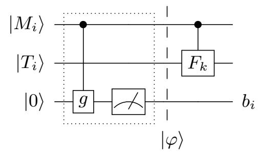
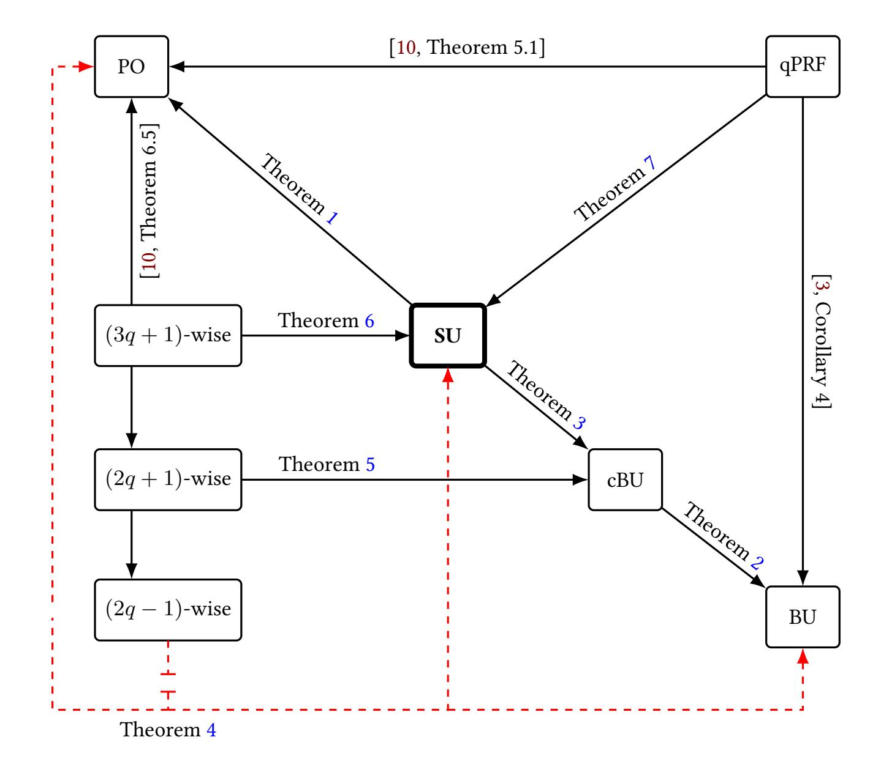
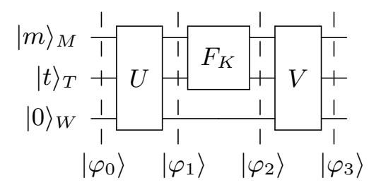

{0}------------------------------------------------

# **Defining Quantum-Secure Message Authentication**

```
Ashwin Jha1
              , Mustafa Khairallah2,3
                                        , Jannis Leuther4
                                                           , Stefan Lucks4
```

```
1 Ruhr-Universität Bochum, Bochum, Germany
             ashwin.jha@outlook.de
2 Nanyang Technological University, Singapore, Singapore
          3 Umeå University, Umeå, Sweden
              khairallah@ieee.org
   4 Bauhaus-Universität Weimar, Weimar, Germany
{jannis.leuther,stefan.lucks}@uni-weimar.de
```

**Abstract.** The classical EUF-CMA notion for the security of message authentication codes (MACs) is based on "freshness": messages chosen by the adversary are authenticated, and then the adversary has to authenticate a fresh message on its own. In a quantum setting, where classical messages are authenticated but adversaries can make queries in superposition, "freshness" is undefinable. Instead of requiring the adversary to be unable to forge a fresh message, one can require "stability" (the adversary cannot authenticate more messages than queried before), or "exclusiveness" (the adversary cannot authenticate a message from a subset of messages it did not query before). The *plus-one* security definition, proposed by Boneh and Zhandry at Eurocrypt 2013, maintains stability, but fails at exclusiveness. The *blind unforgeability* notion from Alagic et al. (Eurocrypt 2020) maintains exclusiveness, but it is unknown if it maintains stability.

This paper proposes a new security definition: *splitting unforgeability* (SU). A MAC is SU-secure, if it maintains both stability and exclusiveness. Against classical adversaries, SU is equivalent to EUF-CMA. Against quantum adversaries, SU implies both plus-one security and blind unforgeability. With respect to qquery adversaries,(2q−1)-wise independent functions do not suffice for SU, but (3q + 1)-wise independent functions do, as does a qPRF. Boneh and Zhandry's "Quantum Carter-Wegman MAC" (BZq-MAC), which combines a qPRF and an ϵ-AXU hash function, is SU-secure up to the quantum birthday bound. We additionally analyse the security of different instantiations of the Hash-then-MAC composition of a SU-secure MAC F and a hash function H which is either collapsing or Bernoulli-preserving.

**Keywords:** Symmetric Cryptography, Message Authentication, Post-Quantum Security, Security Definitions

## <span id="page-0-0"></span>**1 Introduction**

Message authentication codes (MACs) are symmetric-key primitives that let two parties who share a secret key ensure the integrity and authenticity of messages: the 

{1}------------------------------------------------

sender computes a short tag on a message, and the receiver verifies the tag to detect tampering and reject forgeries. These primitives are critical to the security of widely used network protocols [14,19], and as building blocks inside larger constructions [6,28]. Classically, the intuitive notion of *unforgeability* is captured by the *existential unforgeability under chosen message attacks* (EUF-CMA) experiment [5], where an adversary can adaptively query a MAC oracle for tags on messages of its choice and should still be unable to output a new valid message-tag pair for any unqueried message.

EUF-CMA is insufficient to model adversaries with quantum access to the MAC oracle. A naive approach would simply allow the adversary to query the MAC oracle in superposition. The classical EUF-CMA definition relies on recording the adversary's MAC queries to test later whether the purported forgery is fresh. In other words, EUF-CMA maintains copies of all queries, which is trivial in the classical case. When queries are in superposition, this is impossible due to the *no-cloning theorem* [32]. By the Born rule [24, Sections 1.8 and 1.9], one cannot even observe (or "measure") a query in superposition without inducing a (partial) collapse of the quantum state, which the adversary could detect.

### 1.1 Prior Attempts at Quantum Unforgeability

Over the years, these uniquely quantum limitations have inspired multiple attempts to formulate an appropriate security definition for quantum unforgeability in one of two natural settings: (i) quantum unforgeability of quantum data, and (ii) quantum unforgeability of classical data. In (i), the MAC is defined over arbitrary quantum states, i.e., the input space is the full Hilbert space of the authenticated system. In (ii), the MAC is classical, i.e., the input space is restricted to a fixed basis (typically the computational basis) and the adversary has quantum access to the MAC oracle. Clearly, (i) subsumes (ii), and has seen extensive research in both security definitions [4,12,18] and applications [1,17,12,18,26]. Nevertheless, (ii) remains a distinct and practical target: classical authentication is ubiquitous in real-world protocols, and allowing quantum (superposition) access enables qualitatively new attacks and invalidates classical security proofs. This has motivated several works [10,18,3], including this one, to find an appropriate abstraction for the quantum-security of classical MACs.

Plus-one unforgeability. Boneh and Zhandry [10] propose an unforgeability definition, which we refer to as plus-one unforgeability (PO). PO challenges the adversary to produce q+1 valid forgeries after making only q quantum queries to the MAC oracle. Boneh and Zhandry prove several interesting results, including PO security of quantum pseudorandom functions (qPRF), (3q+1)-wise independent functions, and a variant of the Wegman-Carter MAC [31]. They also show that (q+1)-wise independent functions are insufficient for PO security, thereby exhibiting a clear separation from the classical setting. Subsequent cryptanalytic work by Kaplan et al. [22] and Bonnetain et al. [11] show that many classically secure, standardized MACs admit efficient PO attacks, further underscoring the practical relevance of this notion.

Other results [18,3] seem to indicate that PO security may not provide the security one would reasonably expect from a MAC. Garg et al. observe [18] that it is unclear if

{2}------------------------------------------------

PO security rules out an adversary that queries the MAC oracle only on messages in a subset  $\mathcal{X}$  of the message space  $\mathcal{M}$  while forging on the disjoint subset  $\mathcal{M}\setminus\mathcal{X}$ . Moreover, Alagic et al. remark [3] that PO may miss certain quantum attacks in which the adversary must destroy the post-query states to extract some global structure and produce a single convincing forgery. They give a concrete counter-example: by exploiting periodicity in the MAC, an adversary can recover a secret value and construct a valid forgery, albeit at the cost of destroying its query history. Queries can be restricted on a subset  $\mathcal{X}$  of the message space  $\mathcal{M}$ , and the forgery is from  $\mathcal{M}\setminus\mathcal{X}$ . In a more practical example, assume messages to indicate the sender's identity: either "from Eve" or "from Bob", and  $\mathcal{X}$  to be the subset of messages "from Eve". A forgery from  $\mathcal{M}\setminus\mathcal{X}$  is thus "from Bob". Arguably, the fact that there exist PO secure MACs which are vulnerable to this kind of attack indicates that security in the PO sense is insufficient to indicate the security of a MAC under quantum attacks.

The Garg-Yuen-Zhandry approach. Garg et al. propose a one-time unforgeability notion in [18], which was christened GYZ by Alagic et al. in [2,3]. This security definition effectively allows only the trivial "query, measure (in the computational basis), and output" attack. However, as Alagic et al. observe, it is unclear how to generalize this notion to two or more queries, and even the single-query setting relies on a restricted, non-standard query model. Further, Zhandry shows a formal separation between PO and GYZ in [34].

Blind unforgeability. To date, the most viable alternative to PO is blind unforgeability (BU) due to Alagic et al. [3]. In this security notion, the MAC oracle withholds outputs on a *blinded set*  $B_{\epsilon}$  of messages: the adversary chooses a probability  $\epsilon$ , and each message  $M \in \mathcal{M}$  is included in  $B_{\epsilon}$  independently with probability  $\epsilon$ . The adversary must output a valid message-tag pair that lies in  $B_{\epsilon}$ , intuitively forcing a forgery on inputs where output from the oracle is withheld. While BU is appealingly aligned with the intuition of "forge on something you could not query", it has its own limitations. First, the definition is parameterized by the blinding rate  $\epsilon$ , and the resulting security bounds can depend sensitively on its value. In particular, meaningful analyses typically require both  $\epsilon$  and  $1 - \epsilon$  to be inverse-polynomial. Second, BU is less convenient for modular composition, since the experiment depends on an explicit blinding rate and a random hidden forbidden set. Most importantly, however, its relationship with PO remains unclear. In particular, PO does not imply BU, and whether BU implies PO is still open: an earlier proof in [3] on this implication was later found flawed and was subsequently weakened [2] to an implication to a PO variant termed quadratic-PO, which rules out producing  $\Omega(q^2)$  forgeries from q MAC queries.

On modelling verification queries. The aforementioned security definitions do not model verification queries. A recent preprint by Jiang [21] highlights a potential pitfall of this omission, exhibiting a contrived MAC for which query access to the verification oracle enables a forgery. While this is a useful cautionary point, it is not a primary motivation for our work: the construction is artificial and does not even satisfy standard classical unforgeability notions (depending on whether verification queries are permitted). Additionally, it has the unusual feature that many tags that verify cannot

{3}------------------------------------------------

arise from honest MAC evaluations. Our focus is on deterministic MACs that rule out such pathologies, tying verification to actual MAC evaluation. Such separations are thus largely orthogonal to the setting we aim to model.

Overall, given the state of the art, providing separate proofs of PO and BU security appears to be an inelegant yet the only prudent approach to quantum unforgeability of classical data. This, in turn, highlights the need for a quantum unforgeability notion that is intuitive, supports standard composition arguments, and still captures all relevant attack strategies in a non-trivial way.

#### 1.2 Our Contributions

The contributions of this work can be summarized as follows:

- 1. **A new security definition:** We present a new definition for quantum unforgeability called *splitting unforgeability* (SU).
- 2. **Relationship to existing definitions:** SU implies both PO and BU. Additionally, we argue that SU is more natural than BU. To prove the security of a MAC it now suffices to prove the MAC SU secure in a quantum setting.
- 3. **Relationship to** k**-wise independent functions:** We prove that a (3q+1)-wise independent function used as a MAC is sufficient for SU, a (2q+1)-wise independent function is sufficient for BU (improving on results from previous work), and that (2q-1)-wise independent functions are insufficient for q-time notions like PO, BU or SU.
- 4. **Instantiations**: The Wegman-Carter MAC variant from Boneh and Zhandry [10] is SU secure up to the quantum birthday bound (improving on a result from their work). Additionally, we discuss various security implications for the Hash-then-MAC construction.

### 2 Technical Overview

In this section, we provide an informal technical overview of our main ideas and contributions. Formal definitions, theorems and proofs will be provided in subsequent sections. For this overview, the function  $F: \mathcal{K} \times \mathcal{M} \to \mathcal{T}$  takes a key  $k \in \mathcal{K}$  and a message  $m \in \mathcal{M}$  to generate a value  $t = F_k(m) \in \mathcal{T}$ , which can be used as authentication tag. The verification function for such a message-tag pair is  $V_k(m,t) = T$ , if  $t = F_k(m)$ .

### 2.1 Background: EUF-CMA, PO, BU, and cBU Security

Recall the established EUF-CMA notion ("existential unforgeability under chosen-message attacks") from classical symmetric cryptography: in the query phase, an adversary  $\mathcal{A}_{\text{euf}}$  chooses messages  $m_i$  to receive authentication tags  $t_i = F_k(m_i)$ . In the challenge phase,  $\mathcal{A}_{\text{euf}}$  wins by creating a valid message-tag pair  $(m^*, t^*)$  with a *fresh* message  $m^*$ , meaning that  $m^* \notin \{m_1, \ldots, m_q\}$ , where q is the number of  $\mathcal{A}_{\text{euf}}$ 's queries. This freshness property has two implications.

{4}------------------------------------------------

- 1. **Stability:**  $A_{euf}$  cannot authenticate more messages than they queried.
- 2. **Exclusion:**  $A_{euf}$  cannot authenticate a message that they did not query. Namely, if  $A_{euf}$  only queries messages from a subset of the message space, they cannot authenticate a message outside of that subset.

In the classical case, freshness, stability and exclusion are equivalent, because  $\mathcal{A}_{\text{euf}}$  actually knows the pairs  $(m_1, t_1), \dots (m_1, t_q)$  from its own queries and the responses. In the quantum case, with queries  $|m_i\rangle$  in superposition, freshness is indefinable. It may thus be natural to employ *either* stability *or* exclusion as a definition for the security of MACs under superposition.

Boneh and Zhandry [10] follow this natural approach by modelling plus-one unforgeability (PO) [10], which employs stability as the criterion for MAC security. In the *PO game*, the adversary chooses an input (message) state  $|m_i\rangle$  and receives the output (authentication tag) state  $|F_k(m_i)\rangle$ . If the number of chosen messages is q, the adversary wins the PO game by providing q+1 valid classical pairs  $(m_1^*, t_1^*), \ldots (m_{q+1}^*, t_{q+1}^*)$  of message and authentication tag. As outlined in Section 1, it has been shown [3] that the PO game does not maintain exclusion.

Similarly, Alagic et al. [3] propose blind unforgeability (BU) using exclusion as the criterion for MAC security. In the BU game, the adversary first chooses a probability  $\epsilon$ . Then, the challenger randomly defines a set  $B_{\epsilon} \subseteq \mathcal{M}$  such that  $\Pr_{m \in \mathcal{M}}[m \in B_{\epsilon}] = \epsilon$ . The blinded MAC is defined by  $B_{\epsilon}F_k(x) = \bot$  for  $x \in B_{\epsilon}$  and  $B_{\epsilon}F_k(x) = F_k(x)$  for  $x \notin B_{\epsilon}$ . In the query phase, the adversary chooses the state  $|m_i\rangle$  and receives the partially blinded state  $|B_{\epsilon}F_k(m_i)\rangle$ . The adversary wins the BU game by providing one pair  $(m^*, t^*)$  of message  $m^* \in B_{\epsilon}$  and valid authentication tag  $t^*$ .

As pointed out in Section 1, it is unknown if the BU game maintains stability. The adversary may be able to generate more than q message-tag pairs after q queries, although the number of such pairs is in  $\Omega(q^2)$ . A possible issue with the BU security notion is its suitability for "concrete security" considerations, see Remark 3 below.

Alagic et al. [3] informally introduce a variant of the BU notion, called chosenblinding BU (cBU). Like BU, cBU maintains the exclusion property under quantum queries. In the cBU game, the adversary forgoes choosing a probability  $\epsilon$  by directly choosing the blinding set B. Our definition of cBU implies all adversarial challenges  $|m_i\rangle$  to be a superposition of messages not in B.

#### 2.2 The New Security Notion: Splitting Unforgeability

In the current paper, we propose a novel unforgeability definition called *splitting un-forgeability* (SU) which employs the conjunction of stability and exclusion as criterion for secure MACs. To model exclusion, SU splits the message space  $\mathcal{M}$  into two disjoint sets  $\mathcal{M}_0$  and  $\mathcal{M}_1$ . During the query phase, every query can be used to authenticate either a superposition of messages from  $\mathcal{M}_0$  or a superposition of messages from  $\mathcal{M}_1$ , but no superposition of messages from both  $\mathcal{M}_0$  and  $\mathcal{M}_1$ . To model stability, the challenge phase requires the adversary to either authenticate more messages from  $\mathcal{M}_0$  than queried before, or more messages from  $\mathcal{M}_1$  than queried before.

More precisely, the SU game proceeds as follows: the adversary starts by choosing a splitting function  $g: \mathcal{M} \to \{0, 1\}$ . Now, whenever the adversary chooses a query state

{5}------------------------------------------------

 $|m_i\rangle$ , the challenger computes and measures  $|g(m_i)\rangle$ . If  $|m_i\rangle$  has been a superposition of messages  $m_i^0$  with  $g(m_i^0)=0$  and  $m_i^1$  with  $g(m_i^1)=1$ , then measuring  $|g(m_i)\rangle$  with output  $b\in\{0,1\}$  partially collapses the state to a superposition of messages  $|m_i^b\rangle$ . The challenger "returns" the state  $|F_k(m_i^b)\rangle$  to the adversary, containing the corresponding authentication tags (possibly in superposition). Crucially, the adversary receives no information about  $|F_k(m_i^{1-b})\rangle$ .

For  $b \in \{0,1\}$ , let  $q_b$  be the number of messages for which the measurement of  $|g(m_i)\rangle$  returns b. To win the SU game, the adversary chooses  $b^* \in \{0,1\}$  and wins the SU game by providing  $q_{b^*} + 1$  valid pairs  $(m_1^{b^*}, t_1^{b^*}), \ldots, (m_{q_{b^*}+1}^{b^*}, t_{q_{b^*}+1}^{b^*})$  with  $g(m_i^{b^*}) = b^*$ .

### 2.3 Security Results and Implications

Equivalence to EUF-CMA in the classical setting (Proposition 4). Arguably, a new security notion for MACs under superposition queries should be equivalent to the well-established classical EUF-CMA notion, if one restricts the adversary to classical queries. Splitting Unforgeability matches this requirement.

SU implies PO (Theorem 1). We prove this result by a reduction where the splitting function is chosen to be a constant function g(m) = 1. Thus, all measurements return 1 and the total number of queries is  $q = q_1$ . If a PO adversary wins their game by generating q + 1 valid pairs of message and authentication tag, the same adversary also wins the SU game with  $b^* = 1$ .

*SU implies BU (Theorems 2 and 3).* We first prove that cBU implies BU (Theorem 2), then we show that SU implies cBU (Theorem 3).

To prove Theorem 2, assume a cBU adversary  $\mathcal{A}_{\mathsf{cbu}}$  interacting with a BU adversary  $\mathcal{A}_{\epsilon}$ .  $\mathcal{A}_{\mathsf{cbu}}$  receives  $\epsilon$  from  $\mathcal{A}_{\epsilon}$  and samples  $B \subseteq \mathcal{M}$ , such that  $\Pr[m \in B] = \epsilon$ , using a (4q+c+1)-independent function for some positive c. Whenever  $\mathcal{A}_{\epsilon}$  wins the BU game by successfully forging the authentication tag  $t^*$  for a message  $m^*$  in the blinding set,  $\mathcal{A}_{\mathsf{cbu}}$  wins the cBU game by outputting the same message-tag pair  $(m^*, t^*)$ .

For Theorem 3, we show that for every cBU adversary  $\mathcal{A}_{\mathsf{cbu}}$ , there exists a SU adversary  $\mathcal{A}_{\mathsf{su}}$  with (at least) the same probability to win the SU game.  $\mathcal{A}_{\mathsf{su}}$  defines g by  $g(m) = 1 \Leftrightarrow m \in B$  and forwards the queries from  $\mathcal{A}_{\mathsf{cbu}}$  to their own challenger. Since  $\mathcal{A}_{\mathsf{cbu}}$ 's query states  $|m_i\rangle$  are in a superposition of messages not in the blinding set B, every measurement of  $|g(m_i)\rangle$  returns 0 without collapsing the state. Thus, the responses  $\mathcal{A}_{\mathsf{cbu}}$  receives from  $\mathcal{A}_{\mathsf{su}}$  are equivalent to those that  $\mathcal{A}_{\mathsf{cbu}}$  would expect from their cBU challenger. When  $\mathcal{A}_{\mathsf{cbu}}$  wins the cBU game by providing a valid message-tag pair  $(m^*, t^*)$  with  $m^* \in B$ , then  $g(m^*) = 1$  is always satisfied. As all the measurement of  $|g(m_i)\rangle$  returned 0 and never 1, we have that  $q_1 = 0$ . Therefore,  $\mathcal{A}_{\mathsf{su}}$  wins their SU game by providing the same pair  $(m^*, t^*)$  as  $\mathcal{A}_{\mathsf{cbu}}$  to the SU challenger.

*Implications from random functions (Theorems 4 to 7).* When authors propose a new security definition, they must consider the instantiability of their new notion. Intuitively, and proven in the classical case, random functions (i.e. functions being  $|\mathcal{M}|$ -wise independent) seem to be strong MACs. We investigate the extent to which this also applies

{6}------------------------------------------------

to the quantum case, complementing earlier results from Boneh and Zhandry [10] and Alagic et al. [3].

It turns out that (2q-1)-wise independence is insufficient to satisfy either PO, BU or by implication SU security (Theorem 4). On the other hand, (3q+1)-wise independent functions are SU-secure (Theorem 6). We further show that (2q+1)-wise independent functions are cBU-secure (Theorem 5), improving on the previously known BU security of (4q+1)-wise independent functions [3].

The computational counterpart to a random function is a pseudorandom function (PRF). When a PRF preserves its pseudorandomness even under superposition queries, it is a qPRF. A qPRF is also SU-secure (Theorem 7).

### 2.4 Quantum MAC Instances

By our results on random functions, we know that SU-secure MAC instances such as qPRFs and (3q+1)-wise independent functions exist. The commonality of these instances is that we need a complex tool (a qPRF or a (3q+1)-wise independent function) taking the full messages from  $\mathcal M$  as input. In practice,  $|\mathcal M|$  can be large and implementing qPRFs or independent functions for large inputs is costly. For this reason, there exist constructions where the message is fed into a hash function  $H:\mathcal M\to\mathcal S$  while the function F (e.g., a qPRF, or a secure MAC by itself) only needs to handle much smaller inputs.

The BZq-MAC from [10] (Theorem 8). Let  $\mathcal{R}$  be a finite set and  $F: \mathcal{K} \times \mathcal{R} \to \mathcal{S}$  be a qPRF. Boneh and Zhandry [10] propose the BZq-MAC (dubbed "Quantum Carter-Wegman" in [10]). A valid authentication tag for a message m is a pair (r,s) with  $F_k(r) \oplus H(m) = s$ . To generate r, the user randomly chooses a function R from a set of pairwise independent functions and computes r = R(m).

The BZq-MAC is SU secure if F is a qPRF and H is  $\epsilon$ -AXU (Definition 7). The core of the proof of Theorem 8, which boils down to distinguishing two games with advantage  $O(\sqrt{q^3/|\mathcal{R}|})$ , is derived from the cascade claim from [20].

Hash-then-MAC [3] (Theorems 9 to 11 and Corollary 2). The Hash-then-MAC (HtM) construction employs a MAC  $F: \mathcal{K} \times \mathcal{S} \to \mathcal{T}$  and a hash function  $H: \mathcal{M} \to \mathcal{S}$ , as above, to construct a MAC

$$\mathsf{HtM}_k^{F,H}(m) = F_k(H(m)).$$

For HtM, let F be a SU-secure MAC (i.e., we do not require a qPRF). Also, H must either be collapsing (Definition 8) or Bernoulli preserving (Definition 9). Then,  $\mathsf{HtM}^{F,H}$  is PO- or BU-secure.  $\mathsf{HtM}^{F,H}$  can be SU secure, under the condition that the adversary obeys certain rules when choosing the splitting function g. Table 1 summarizes our observations on the security of  $\mathsf{HtM}^{F,H}$ .

### 3 Preliminaries

For positive  $n \in \mathbb{N}$ , let [n] denote the set  $\{1, \ldots, n\}$ ,  $\{0, 1\}^n$  the set of bit strings of length n, and  $\{0, 1\}^*$  the set of all finite bit strings. For any finite set S, we write

{7}------------------------------------------------

 $s \in_R \mathcal{S}$  to denote that the random variable s is drawn uniformly at random from  $\mathcal{S}$ . Given a probability distribution  $\mathbf{D}$  over  $\mathcal{S}$ , we write  $s \sim \mathbf{D}$  to denote that s is distributed according to  $\mathbf{D}$ .

For finite sets  $\mathcal{X}$  and  $\mathcal{Y}$ , let  $\mathcal{F}(\mathcal{X},\mathcal{Y})$  denote the set of all functions  $F \colon \mathcal{X} \to \mathcal{Y}$ . Recall that a function  $\varepsilon \colon \mathbb{N} \to \mathbb{R}_{\geq 0}$  is called *negligible* if for every positive real-valued polynomial p(n) there exists a  $n_0$  such that for all  $n > n_0$ ,

$$\varepsilon(n) < \frac{1}{p(n)}.$$

We write  $negl(\cdot)$  to denote an arbitrary negligible function.

(Efficient) computability assumptions. A real number  $\alpha$  is efficiently computable if there exists a deterministic polynomial-time algorithm  $\mathcal{E}$  such that, for all  $n \in \mathbb{N}$ ,  $\mathcal{E}(1^n) = r_n \in \mathbb{Q}$  and  $|r_n - \alpha| \leq 2^{-n}$ .

A function family  $F = \{F_n : \{0,1\}^n \to \{0,1\}^*\}_{n \in \mathbb{N}}$  is efficiently computable if there exists a probabilistic polynomial-time (PPT) algorithm  $\mathcal{A}$  such that for all  $n \in \mathbb{N}$  and  $x \in \{0,1\}^n$ ,  $\mathcal{A}(1^n,x) = f(x)$ .

When we do not care about efficiency, we allow these algorithms to be computationally unbounded.

### 3.1 Quantum Computing

While we develop the necessary background in quantum computing here, we assume familiarity with fundamentals of finite-dimensional linear algebra and quantum computing. See standard textbooks [27,24,25] for a comprehensive exposition on these subjects.

Quantum states. We use standard Dirac notation. Any quantum system X with classical domain  $\mathcal{X}$  corresponds to a Hilbert space  $\mathcal{H}_X \cong \mathbb{C}^{|\mathcal{X}|}$  with the canonical computational basis  $\{|x\rangle:x\in\mathcal{X}\}$ . We will use the terms (quantum) register and system interchangeably, but specifically reserve the former for named parts of a quantum algorithm's memory. The state of register X is given by a vector  $|\psi\rangle = \sum_{x\in\mathcal{X}} \alpha_x |x\rangle$  of unit norm, i.e.,  $||\psi\rangle|^2 = \langle \psi|\psi\rangle = \sum_x |\alpha_x|^2 = 1$ , where the sum is over all  $x\in\mathcal{X}$ . We write  $|\psi\rangle_X$  when we want to specify the register. For quantum systems X and Y, the joint quantum system XY is given by the tensor product space  $\mathcal{H}_{XY} = \mathcal{H}_X \otimes \mathcal{H}_Y$ ; given  $|\psi\rangle_X \in \mathcal{H}_X$  and  $|\phi\rangle_Y \in \mathcal{H}_Y$ , the corresponding product state is given by  $|\psi\rangle_X \otimes |\phi\rangle_Y \in \mathcal{H}_{XY}$ , interchangeably written as  $|\psi\rangle_X |\phi\rangle_Y$  or  $|\psi,\phi\rangle_{XY}$ .

Measurements and operations. A measurement of  $|\psi\rangle_X$  in the computational basis results in a classical value  $x\in\mathcal{X}$  with probability  $p(x\,|\,\psi)\coloneqq\|\mathbf{\Pi}_x|\psi\rangle\|^2=|\langle x|\psi\rangle|^2=|\alpha_x|^2$ , where  $\mathbf{\Pi}_x$  denotes the projection operator  $|x\rangle\langle x|$ . The post-measurement state is given by  $|x\rangle$ . Given the joint state  $|\psi\rangle_{XY}=\sum_{x,y}\alpha_{x,y}|x,y\rangle$ , a partial measurement of  $|\psi\rangle_{XY}$  on register X in the computational basis results in a classical value  $x\in\mathcal{X}$  with probability

$$p_X(x \mid \psi) \coloneqq \|(\mathbf{\Pi}_x \otimes \mathbf{I}_Y)|\psi\rangle\|^2 = \sum_y |\langle x, y | \psi \rangle|^2 = \sum_y |\alpha_{x,y}|^2,$$

{8}------------------------------------------------

where  $\{|y\rangle:y\in\mathcal{Y}\}$  denotes an orthonormal basis of  $\mathcal{H}_Y$ , and  $\mathbf{I}_Y$  denotes the identity operator on  $\mathcal{H}_Y$ . The post-measurement state is given by the normalized projection

$$\frac{(\mathbf{\Pi}_x \otimes \mathbf{I}_Y)|\psi\rangle}{\sqrt{p_X(x|\psi)}} = \sum_y \frac{\alpha_{x,y}}{\sqrt{p_X(x|\psi)}} |x,y\rangle.$$

Unless stated otherwise, barring measurements, all other quantum operations are unitary: an operator U on the ambient Hilbert space  $\mathcal{H}$  is unitary if  $U^{\dagger}U = UU^{\dagger} = I$ , where  $U^{\dagger}$  is the adjoint of U, and I is the identity operator. A unitary U on  $\mathcal{H}$  can be extended to a unitary  $U \otimes I'$  on the tensor product space  $\mathcal{H} \otimes \mathcal{H}'$ , where I' is the identity operator on  $\mathcal{H}'$ . Whenever convenient, we use this fact implicitly.

Oracles and algorithms. Any finite set  $\mathcal{Y}$  can be identified with a suitable ambient abelian group written additively. Then, for any function  $f \colon \mathcal{X} \to \mathcal{Y}$ , we implement the corresponding quantum oracle by a unitary operator  $\mathbf{O}_f$  on  $\mathcal{H}_{XY}$  which is defined by the map  $\mathbf{O}_f|x,y\rangle := |x,y+f(x)\rangle$ , for any  $(x,y) \in \mathcal{X} \times \mathcal{Y}$ . A quantum oraclealgorithm  $\mathcal{A}$  with compatible query interface with functions in  $\mathcal{F}(\mathcal{X},\mathcal{Y})$  operates on a product space  $\mathcal{H}_{\mathcal{A}} = \mathcal{H}_X \otimes \mathcal{H}_Y \otimes \mathcal{H}_Z$ , where  $\mathcal{H}_X$ ,  $\mathcal{H}_Y$  and  $\mathcal{H}_Z$  denote the input space, output space, and work space, respectively. The interaction between  $\mathcal{A}$  and  $\mathbf{O}_f$  is captured by a sequence of unitary actions

$$|\psi_{q+1}^f\rangle_{XYZ} = \mathbf{U}_{q+1}\mathbf{O}_f\dots\mathbf{O}_f\mathbf{U}_1|\psi_0^f\rangle_{XYZ}$$

on the initial state  $|\psi_0^f\rangle=|0\rangle_{XYZ}$ , followed by a measurement of  $|\psi_{q+1}^f\rangle_{XYZ}$  in the computational basis. We will consider two classes of quantum oracle-algorithms: (i) query-bounded and computationally unbounded algorithms, which are modelled as computable quantum circuits of unbounded depth, and (ii) quantum polynomial-time (QPT) algorithms, which are modelled as polynomial-time uniform families of quantum circuits.

*Remark 1.* The aforementioned modelling of oracle-algorithms is fairly general. Any intermediate measurements can be modelled by adding ancillas and deferring measurement (equivalently, writing outcomes into a classical register and controlling subsequent unitaries), so it suffices to describe the evolution unitarily on a larger space.

Let  $|\psi_i^f\rangle$  denote the state of  $\mathcal{A}$  after the action of  $\mathbf{U}_i$ . The *support* of  $\mathcal{A}$  is defined as:

<span id="page-8-0"></span>
$$\operatorname{Supp}(\mathcal{A}) \coloneqq \Big\{ x \in \mathcal{X} \ : \ \exists f \in \mathcal{F}(\mathcal{X}, \mathcal{Y}), \ \exists i \in [q], \ \|(\mathbf{\Pi}_x \otimes \mathbf{I}_{YZ})|\psi_i^f\rangle_{XYZ}\| > 0 \Big\},$$

**Proposition 1.** Suppose A is a q-query quantum algorithm with access to a uniform random function  $\Gamma \colon \mathcal{X} \to \mathcal{Y}$ , and A outputs a pair (x, y). Then

$$\Pr[\Gamma(x) = y : x \notin \mathsf{Supp}(\mathcal{A})] \le \frac{1}{|\mathcal{Y}|}.$$

A proof of this propositions is available in the Supplementary Material A.

{9}------------------------------------------------

### 3.2 Quantum Random Functions

A distribution **D** over  $\mathcal{F}(\mathcal{X}, \mathcal{Y})$  is said to be k-wise independent if for any pairwise distinct  $x_1, \ldots, x_k \in \mathcal{X}$  and any  $y_1, \ldots, y_k \in \mathcal{Y}$ ,

<span id="page-9-1"></span>
$$\Pr_{f \sim \mathbf{D}_k(\mathcal{X}, \mathcal{Y})}[f(x_1) = y_1, \dots, f(x_k) = y_k] = \frac{1}{|\mathcal{Y}|^k}.$$

We write  $\mathbf{D}_k(\mathcal{X},\mathcal{Y})$  to denote an arbitrary distribution over  $\mathcal{F}(\mathcal{X},\mathcal{Y})$  that is k-wise independent and, when  $k < |\mathcal{X}|$ , not (k+1)-wise independent. In particular,  $k = |\mathcal{X}|$  gives the uniform distribution  $\mathbf{D}_\$$  on  $\mathcal{F}(\mathcal{X},\mathcal{Y})$ . When  $\mathcal{X} = \mathcal{Y} = \mathbb{F}_q$ , the Galois field of order q, a standard construction [13] of k-wise independent distribution is obtained from random low-degree polynomials: define  $f(x) \coloneqq \sum_{j=0}^{k-1} a_j x^j$ , where  $(a_0,\ldots,a_{k-1}) \in_R \mathbb{F}_q^k$ . The following propositions are slight generalisations of results in [10]. The proofs are immediate from the usual monotonicity argument.

**Proposition 2 (Lemma 6.4 in [10]).** Fix two positive integers q, c. For any quantum algorithm A that makes at most q quantum and c classical queries, we have that:

$$\Pr[\mathcal{A}^H = w : H \sim \mathbf{D}_{\$}] = \Pr[\mathcal{A}^H = w : H \sim \mathbf{D}_{2q+c}].$$

<span id="page-9-2"></span>**Proposition 3 (Theorem 4.2 in [10]).** Fix a positive integer q. For any quantum algorithm  $\mathcal{A}$  that makes  $Q(\mathcal{A}) \leq q$  quantum queries to  $H \sim \mathbf{D}_{\$}$  and returns  $Q(\mathcal{A}) + 1$  distinct input-output pairs  $(x_i, y_i) \in \mathcal{X} \times \mathcal{Y}$ . Let  $\mathsf{E}(\mathcal{A})$  denote the event that  $H(x_i) = y_i$  for all  $1 \leq i \leq Q(\mathcal{A}) + 1$ . Then,  $\Pr[\mathsf{E}(\mathcal{A})] \leq (q+1)/|\mathcal{Y}|$ .

**Definition 1 (Quantum Pseudorandom Function (qPRF)).** A keyed function  $F: \mathcal{K} \times \mathcal{X} \to \mathcal{Y}$  is said to be a  $(q, t, \epsilon_{\mathsf{qprf}})$ -quantum pseudorandom function (qPRF) if for any adversary  $\mathcal{A}$  that makes at most q queries and runs in time at most t, it holds that

$$\mathsf{Advt}_F^{\mathsf{qprf}}(\mathcal{A}) \coloneqq \left| \Pr \left[ \mathcal{A}^{F_k}(1^n) \Rightarrow 1 \right] - \Pr \left[ \mathcal{A}^{\mathsf{\Gamma}}(1^n) \Rightarrow 1 \right] \right| \le \epsilon_{\mathsf{qprf}},$$

where the probabilities are computed over the randomness of A,  $k \in_R \mathcal{K}$ , and  $\Gamma \in_R \mathcal{F}(\mathcal{X}, \mathcal{Y})$ .

For some implicit security parameter n, we say that F is a qPRF if it is efficiently computable and  $\mathsf{Advt}_F^{\mathsf{qprf}}(\mathcal{A}) = \mathsf{negl}(n)$  for any QPT adversary  $\mathcal{A}$ .

#### 3.3 Message Authentication Codes and Security Definitions

<span id="page-9-0"></span>**Definition 2 (MACs).** A message authentication code (MAC) is a pair of functions (F, V). The MAC function  $F: \mathcal{K} \times \mathcal{M} \times \mathcal{R} \to \mathcal{T}$  takes a secret key  $k \in \mathcal{K}$ , a message  $m \in \mathcal{M}$  and randomness  $r \in \mathcal{R}$  to generate an authentication tag  $t \in \mathcal{T}$ . The verification function  $V: \mathcal{K} \times \mathcal{M} \times \mathcal{T} \to \{\top, \bot\}$  takes a secret key  $k \in \mathcal{K}$ , a message  $m \in \mathcal{M}$ , and authentication tag  $t \in \mathcal{T}$  and returns  $\top$  to indicate that the message is accepted, or  $\bot$  to indicate a rejection.

Given a key k, the pair  $(m,t) \in \mathcal{M} \times \mathcal{T}$  is valid, if and only if  $V_k(m,t) = \top$ . A MAC is called correct, if for all k, m, r the pair  $(m, F_k(m,r))$  is valid.

{10}------------------------------------------------

If F is deterministic, the randomness r is empty and  $F: \mathcal{K} \times \mathcal{M} \to \mathcal{T}$ . The tuple  $(F_k, V_k)$  indicates a MAC (F, V) under key  $k \in \mathcal{K}$ . If F is deterministic and V is defined by

$$V_k(m,t) = \begin{cases} \top & \text{if } t = F_k(m) \,, \ \bot & \text{else} \,, \end{cases}$$

then the "MAC F" refers to the tuple (F, V).

**Definition 3 (Plus-One Unforgeability (PO) [10]).** Let (F, V) be a MAC as in Definition 2. (F, V) is plus-one unforgeable (PO-secure), if no adversary  $A_{po}$  can win the following game with non-negligible probability:

#### **Initialization:**

- Generate a key k uniformly at random.

### Query phase:

- $-i \leftarrow 1;$
- repeat until  $A_{po}$  stops:
  - $\mathcal{A}_{po}$  provides the input-output state  $|M_i, T_i\rangle$ ;
  - If required, randomness  $r_i \in_R \mathcal{R}$  is sampled (and thus nonempty);
  - The challenger performs the transformation

$$|M_i, T_i\rangle = |M_i, T_i \oplus F_k(M_i, r_i)\rangle;$$

- $i \leftarrow i + 1$ ;
- let q denote the number of queries  $|M_1\rangle, \ldots, |M_q\rangle$  made by  $\mathcal{A}_{po}$ .

### Challenge phase:

- $A_{po}$  produces q + 1 classical distinct message-tag pairs  $(M_1^*, T_1^*), \ldots, (M_{n+1}^*, T_{n+1}^*);$
- $(M_1^*, T_1^*), \ldots, (M_{q+1}^*, T_{q+1}^*);$   $\mathcal{A}_{po}$  wins if all pairs are valid:  $V_k(M_j^*, T_j^*) = \top$  for  $1 \leq j \leq q+1$ .

The advantage of  $A_{po}$  against (F, V) is defined as  $\mathsf{Advt}^{\mathsf{po}}_{F, V} (A_{po}) = \Pr[A_{po} \ wins]$ .

<span id="page-10-0"></span>**Definition 4 (Blind Unforgeability (BU) [2]).** Let (F, V) be a MAC as in Definition 2. (F, V) is blindly unforgeable (BU-secure) if no adversary  $A_{\epsilon} = (A, \epsilon)$  with efficiently computable  $\epsilon \in (0, 1)$ , can win the following game with non-negligible probability:

#### **Initialization:**

- Generate a key k uniformly at random;
- initialize empty set  $B_{\epsilon}$  and place each  $m \in \mathcal{M}$  into  $B_{\epsilon}$  with probability  $\epsilon$ ;
- define the "blinded MAC"  $B_{\epsilon}F_k$  by

$$B_{\epsilon}F_{k}(m_{i},r_{i}) = \begin{cases} \bot & \text{if } m_{i} \in B_{\epsilon} \ , \ F_{k}(m_{i},r_{i}) & \text{otherwise} \ . \end{cases}$$

#### Query phase:

- $-i \leftarrow 1;$
- repeat until  $A_{\epsilon}$  stops:

{11}------------------------------------------------

- $\mathcal{A}_{\epsilon}$  provides the input-output state  $|M_i, T_i\rangle$ ;
- If required, randomness  $r_i \in_R \mathcal{R}$  is sampled (and thus nonempty);
- The challenger performs the transformation

$$|M_i, T_i\rangle = |M_i, T_i \oplus B_{\epsilon} F_k(M_i, r_i)\rangle;$$

- $i \leftarrow i + 1$ ;
- let q denote the number of queries  $|M_1\rangle, \ldots, |M_q\rangle$  made by  $A_{\epsilon}$ .

### Challenge phase:

- $A_{\epsilon}$  produces a candidate forgery  $(M^*, T^*)$ ;
- $A_{\epsilon}$  wins if  $V_k(M^*, T^*) = \top$  and  $M^* \in B_{\epsilon}$ .

The advantage of  $A_{\epsilon}$  against (F, V) is defined as  $\mathsf{Advt}^{\mathsf{bu}}_{F, V}(A_{\epsilon}) \coloneqq \Pr[A_{\epsilon} \ \textit{wins}].$ 

<span id="page-11-2"></span>Remark 2. The probability  $\epsilon$  cannot be negligible: The advantage of a q query quantum adversary in distinguishing  $F_k$  from  $B_{\epsilon}F_k$  is  $O\left(q^2/\epsilon\right)$ . This can be derived from the lower bound for Grover's algorithm [7]; see also [2, Theorem 2].

The probability  $(1 - \epsilon)$  also cannot be negligible, either. Note that  $B_1 F_k$  is a function constantly returning  $\bot$ . The advantage in distinguishing  $B_{\epsilon} F_k$  from  $B_1 F_k$  is  $O(q^2/(1-\epsilon))$ . This can be derived from the lower bound for Grover's algorithm, exactly as above for negligible  $\epsilon$ .

<span id="page-11-0"></span>Remark 3. For concrete security, i.e., if one attempts to derive specific bounds for adversarial advantages rather than distinguishing negligible from non-negligible advantages, blind unforgeability may tempt users to draw wrong conclusions.<sup>5</sup> As a concrete example, consider the following MAC, which has been inspired by Shamir's secret sharing scheme [29]. Let the message space  $\mathcal{M}$  be a finite field, choose the key  $a = (a_0, \ldots, a_{q-1}) \in_R \mathcal{M}^q$  and define the MAC  $F_a$  by the polynomial

$$F_a(x) = a_0 + a_1 x + a_2 x^2 + \dots + a_{q-1} x^{q-1}.$$

There is a straightforward q-query adversary  $\mathcal{A}$ , which completely breaks F.  $\mathcal{A}$  makes q classical queries and then recovers the coefficients  $a_0, \ldots, a_{q-1}$  via polynomial interpolation. Once the coefficients are known,  $\mathcal{A}$  can win the PO game, the SU game, and (since the queries are classical) even the classical EUF-CMA game, each with advantage 1.

 $\mathcal{A}$  can also win the BU game, but only with advantage  $\epsilon(1-\epsilon)^q$ . To maximize the advantage, one can choose  $\epsilon \approx 1/q$ . Then the BU advantage is about  $1/q^2$ .

There may be a better q-query BU attack against F than  $\mathcal{A}$ ; presumably with superposition queries, unlike  $\mathcal{A}$ . But  $\mathcal{A}$  is very natural and straightforward and wins other attack games with advantage 1. The mediocre BU advantage  $1/q^2$  of  $\mathcal{A}$  is an artefact from the BU security definition and no indicator for F possibly being sufficiently secure for certain applications.

<span id="page-11-1"></span><sup>&</sup>lt;sup>5</sup> The issue is the fuzziness for queries and the forgery, which stems from  $\epsilon$ . Firstly, a BU adversary  $\mathcal{A}_{\epsilon}$  is clearly at a disadvantage compared to an adversary with unblinded access to a MAC, as only a  $(1 - \epsilon)$ -fraction of messages will be authenticated. Secondly, even if  $\mathcal{A}_{\epsilon}$  manages to forge an authentication tag t for a message m,  $\mathcal{A}_{\epsilon}$  only wins if  $m \in B_{\epsilon}$ , i.e., with probability  $\epsilon$ .

{12}------------------------------------------------

### Definition 5 (Chosen-Blinding Blind Unforgeability (cBU) [2]).

Let (F, V) be a MAC as in Definition 2. (F, V) is chosen-blinding blindly unforgeable (cBU secure) if no adversary  $A_{cbu}$  can win the following game with non-negligible probability:

#### **Initialization:**

- Generate a key k uniformly at random,
- $\mathcal{A}_{\mathsf{cbu}}$  chooses a subset  $B \subset \mathcal{M}$  and provides the membership function

$$g_B(x) = \begin{cases} 1 & \text{if } x \in B, \\ 0 & \text{otherwise.} \end{cases}$$

- define the "blinded function"  $BF_k$  by

$$BF_k(M_i, r_i) = \begin{cases} \boxedsymbol{\boxedsymbol{\boxedsymbol{\boxedsymbol{H}}}} & \textit{if } M_i \in B \,, \\ F_k(M_i, r_i) & \textit{otherwise} \,. \end{cases}$$

### Query phase:

- $-i \leftarrow 1;$
- repeat until  $A_{cbu}$  stops:
  - $\mathcal{A}_{\mathsf{cbu}}$  provides the input-output state  $|M_i, T_i\rangle$ ;
  - If required, randomness  $r_i \in_R \mathcal{R}$  is sampled (and thus nonempty);
  - The challenger performs the transformation

$$|M_i, T_i\rangle = |M_i, T_i \oplus BF_k(M_i, r_i)\rangle;$$

- $i \leftarrow i + 1$ ;
- let q denote the number of queries  $|M_1\rangle, \ldots, |M_q\rangle$  made by  $\mathcal{A}_{\mathsf{cbu}}$ .

### Challenge phase:

- $\mathcal{A}_{\mathsf{cbu}}$  produces a candidate forgery  $(M^*, T^*)$ ;
- $\mathcal{A}_{\mathsf{cbu}}$  wins if  $V_k(M^*, T^*) = \top$  and  $M^* \in B_{\epsilon}$ .

The advantage of  $A_{\mathsf{cbu}}$  against (F, V) is  $\mathsf{Advt}^{\mathsf{cbu}}_{F, V}(A_{\mathsf{cbu}}) = \Pr[A_{\mathsf{cbu}} \ wins]$ .

For simplicity, we assume that  $Supp(A_{cbu}) \cap B = \emptyset$ , as there is no gain for the adversary to include messages in their queries where F is blinded on. This can be enforced by the challenger measuring  $|g_B(M_i)\rangle$  for each query and aborting the current query when the measurement returns 1.

### 4 A New Security Definition: Splitting Unforgeability

<span id="page-12-0"></span>**Definition 6 (Splitting Unforgeability (SU)).** Let (F, V) be a MAC as in Definition 2. (F, V) is splitting unforgeable (SU-secure) when no efficient quantum adversary  $A_{su}$  can win the following game with significant probability.

### **Initialization:**

- $Generate\ a\ key\ k\ uniformly\ at\ random;$
- Initialize  $q_0 = q_1 = 0$ ;

{13}------------------------------------------------

-  $A_{su}$  determines the "splitting function"  $g \in \mathcal{F}(\mathcal{X}, \{0, 1\})$ ;

### Query phase:

- $-i \leftarrow 1$ ;
- repeat until  $A_{su}$  stops:
  - $A_{su}$  provides the input-output state  $|M_i, T_i\rangle = \sum_{m,t} \alpha_{m,t} |m,t\rangle$ ;
  - If required, randomness  $r_i \in_R \mathcal{R}$  is sampled (and thus non-empty);
  - The challenger executes the following steps:
    - 1. Compute and then measure  $|g(m)\rangle$  to receive  $b \in \{0,1\}$ . This partially collapses  $|M_i\rangle$ . We call this the "splitting step" and the resulting state the "split state";
    - 2.  $q_b \leftarrow q_b + 1$ ;
    - 3. perform the transformation

$$|M_i, T_i\rangle = |M_i, T_i \oplus F_k(M_i, r_i)\rangle;$$

- $i \leftarrow i + 1$ ;
- let q denote the number of queries  $|M_1\rangle, \ldots, |M_q\rangle$  made by  $A_{su}$ .

### Challenge phase:

- $\mathcal{A}_{\mathsf{su}}$  chooses  $b^* \in \{0,1\}$  and provides  $q_{b^*} + 1$  distinct classical message-tag pairs  $(M_j^*, T_j^*)$  with  $g(M_j^*) = b^*$  and  $1 \leq j \leq q_{b^*} + 1$ .
- $\mathcal{A}_{su}$  wins if all pairs are valid:  $V_k(M_i^*, T_i^*) = \top$ .

The advantage of  $\mathcal{A}_{su}$  against (F, V) is  $\mathsf{Advt}^{\mathsf{su}}_{F, V}(\mathcal{A}_{\mathsf{su}}) = \Pr[\mathcal{A}_{\mathsf{su}} \ \textit{wins}]$ .

To achieve the computational SU game, both F and g are required to be efficient functions (i.e., to run in polynomial time on a classical computer).

Remark 4. By Born's rule, measuring  $|g(m)\rangle$  causes a partial state collapse of  $|M_i,T_i\rangle$ . Namely, the state turns from  $\sum_{m,t} \alpha_{m,t} |m,t\rangle$  to  $\sum_{m,t} \alpha'_{m,t} |m,t\rangle$  with

<span id="page-13-2"></span>
$$\alpha'_{m,t} = \begin{cases} c' \cdot \alpha_{m,t} & \text{if } g(m) = b, \\ 0 & \text{else}. \end{cases}$$
 (1)

Here, c' is defined by  $\sum_{m,t} |\alpha'_{m,t}|^2 = 1$ . Figure 1 describes a quantum circuit handling one query.

A first barometer for this definition is its relationship with the classical notion of EUF-CMA. We show that the two notions are equivalent as long as the adversary makes only classical<sup>6</sup> queries.

<span id="page-13-0"></span>**Proposition 4.** A MAC (F, V) is EUF-CMA-secure if and only if it is SU-secure against classical adversaries.

The proof of this proposition can be found in Appendix B.

<span id="page-13-1"></span><sup>&</sup>lt;sup>6</sup> The queries are computational basis labels.

{14}------------------------------------------------



Fig. 1. Handling the i-th query in the SU game:  $\mathcal{A}_{\text{su}}$  provides  $|M_i, T_i\rangle = \sum_{m,t} \alpha_{m,t} |m,t\rangle$ . The challenger measures  $|g(M_i)\rangle$ , computes  $|F_k(M_i)\rangle$  and returns the measurement result  $b_i$  and  $\sum_{m,t} \alpha'_{m,t} |m,t \oplus F_k(m)\rangle$ , with  $\alpha'_{m,t}$  defined in Equation (1). The contents of the dotted reactangle represent the "splitting step", while  $|\varphi\rangle$  is the "split state".

### <span id="page-14-1"></span>5 Placing SU in the Quantum Unforgeability Landscape

This section characterises the landscape of quantum unforgeability notions. We study how SU relates to PO, BU, and several classes of random functions (perfect, bounded-independence, computational), highlighting implications, separations, and conditions under which the notions coincide. We do not include the GYZ notion in this discussion, as it is formulated in a somewhat unconventional (in particular, one-time) query model. Nevertheless, the implication SU  $\Longrightarrow$  GYZ follows from the results of this section via our comparison with BU. Figure 2 provides a pictorial summary of these relationships.

### 5.1 SU-secure functions are PO-secure

It has proven difficult to show the relationship between BU and PO. In an earlier version of [3], a proof of BU implying PO (and thus BU being strictly stronger) was found to contain an error which made it inconclusive. With SU, we are able to show that it implies both PO and BU, providing a common link between both definitions.

<span id="page-14-0"></span>**Theorem 1.** For any q-query PO adversary  $\mathcal{A}_{po}$ , a q-query SU adversary  $\mathcal{A}_{su}$  exists such that  $\mathsf{Advt}_F^{po}(\mathcal{A}) \leq \mathsf{Advt}_F^{su}(\mathcal{A}_{su})$ . If  $\mathcal{A}_{po}$  is efficient, then so is  $\mathcal{A}_{su}$ .

*Proof.* Consider a game setup, where the PO adversary  $\mathcal{A}_{po}$  interacts with the SU adversary  $\mathcal{A}_{su}$  who interacts with the SU challenger  $\mathcal{C}_{su}$ :

- Initialization phase:  $A_{su}$  defines the constant function g(m)=1 and forwards it to  $C_{su}$
- Query phase:  $\mathcal{A}_{po}$  provides each learning query  $|M_i\rangle$  to  $\mathcal{A}_{su}$  who forwards it to  $\mathcal{C}_{su}$ .  $\mathcal{C}_{su}$  performs the splitting-step. Since g is a constant function, the splitting-step has no effect and the state remains unchanged.  $\mathcal{C}_{su}$  returns  $|T_i\rangle = |F_K(M_i)\rangle$  to  $\mathcal{A}_{su}$ , who returns it to  $\mathcal{A}_{po}$ . Note that this means that  $q_1 = q$  and  $q_0 = 0$  after the query phase has finished.
- Challenge phase:  $\mathcal{A}_{po}$  provides q+1 message-tag pairs  $(M_j^*, T_j^*)$  to  $\mathcal{A}_{su}$  who picks  $b^*=1$  and forwards all  $q_1+1=q+1$  pairs to  $\mathcal{C}_{su}$ . Iff all pairs are valid,  $\mathcal{C}_{su}$  returns win to  $\mathcal{A}_{su}$  who returns win to  $\mathcal{A}_{po}$  as well.

 $A_{su}$  perfectly simulates a PO challenger for  $A_{po}$ .

{15}------------------------------------------------



<span id="page-15-1"></span>**Fig. 2.** Overview of relations between notable quantum security definitions, k-wise independent functions and qPRF. Notably, our security definition SU implies both PO, cBU and by extension BU. The dashed red arrows indicate non-implications.

### 5.2 SU-secure functions are BU-secure

Next, we show that SU security implies BU security with a transitive approach. First, we show a very useful result: cBU security implies BU security. Second, we show that SU security implies cBU security. This immediately yields the desired implication to BU.

<span id="page-15-0"></span>**Theorem 2.** For any q-query BU adversary  $\mathcal{A}_{\epsilon}$  there exists a (q+1)-query cBU adversary  $\mathcal{A}_{\mathsf{cbu}}$ , such that  $\mathsf{Advt}_F^{\mathsf{bu}}(\mathcal{A}_{\epsilon}) \leq \mathsf{Advt}_F^{\mathsf{cbu}}(\mathcal{A}_{\mathsf{cbu}}) + \epsilon^c$ .

*Proof.* Fix a MAC  $F: \mathcal{K} \times \mathcal{M} \to \mathcal{T}$ . Assume there exists a BU adversary  $\mathcal{A}_{\epsilon}$ . Then, a cBU adversary  $\mathcal{A}_{\mathsf{cbu}}$  can be constructed as follows:

{16}------------------------------------------------

- 1. Without loss of generality assume a rational  $\epsilon = a/b$ . Then a = a/b then a = a/b then a = a/b then a = a/b then a = a/b then a = a/b then a = a/b then a = a/b then a = a/b then a = a/b then a = a/b then a = a/b then a = a/b then a = a/b then a = a/b then a = a/b then a = a/b then a = a/b then a = a/b then a = a/b then a = a/b then a = a/b then a = a/b then a = a/b then a = a/b then a = a/b then a = a/b then a = a/b then a = a/b then a = a/b then a = a/b then a = a/b then a = a/b then a = a/b then a = a/b then a = a/b then a = a/b then a = a/b then a = a/b then a = a/b then a = a/b then a = a/b then a = a/b then a = a/b then a = a/b then a = a/b then a = a/b then a = a/b then a = a/b then a = a/b then a = a/b then a = a/b then a = a/b then a = a/b then a = a/b then a = a/b then a = a/b then a = a/b then a = a/b then a = a/b then a = a/b then a = a/b then a = a/b then a = a/b then a = a/b then a = a/b then a = a/b then a = a/b then a = a/b then a = a/b then a = a/b then a = a/b then a = a/b then a = a/b then a = a/b then a = a/b then a = a/b then a = a/b then a = a/b then a = a/b then a = a/b then a = a/b then a = a/b then a = a/b then a = a/b then a = a/b then a = a/b then a = a/b then a = a/b then a = a/b then a = a/b then a = a/b then a = a/b then a = a/b then a = a/b then a = a/b then a = a/b then a = a/b then a = a/b then a = a/b then a = a/b then a = a/b then a = a/b then a = a/b then a = a/b then a = a/b then a = a/b then a = a/b then a = a/b then a = a/b then a = a/b then a = a/b then a = a/b then a = a/b then a = a/b then a = a/b then a = a/b then a = a/b then a = a/b then a = a/b then a = a/b then a = a/b then a = a/b then a = a/b then a = a/b then a = a/b then a = a/b then a = a/b then a = a/b then a = a/b then a = a/b then a = a/b then
- 2. Let  $B_{\epsilon} = \{m \in \mathcal{M} : h(m) < a\}$  denote the blinded set corresponding to  $\mathcal{A}_{\epsilon}$ .
- 3.  $\mathcal{A}_{\mathsf{cbu}}$  defines its blinding set membership function  $g \colon \mathcal{M} \to \{0, 1\}$  as:

$$g(m) = \begin{cases} 1 & \text{if } h(m) < a, \\ 0 & \text{otherwise.} \end{cases}$$

Since h is an efficient function, g can be implemented efficiently as well. g is given to the challenger of  $\mathcal{A}_{\mathsf{cbu}}$ .

- 4. Fix some  $s \in \mathcal{M} \setminus B_{\epsilon}$ , and obtain the function value at s. This can be done by sampling a random element m from the set  $\mathcal{M}$  up to c times and stopping when  $h(m) \neq 0$ . Then,  $\mathcal{A}_{\mathsf{cbu}}$  succeeds with probability  $1 \epsilon^c$ .
- 5. Let W denote a |M|-qubit ancillary register. Define the unitaries:

$$U|m\rangle_{M}|t\rangle_{T}|w\rangle_{W} \to \begin{cases} |w+s\rangle_{M}|t\rangle_{T}|m\rangle_{W} & \text{if } m \in B_{\epsilon}, \\ |m+w\rangle_{M}|t\rangle_{T}|m\rangle_{W} & \text{otherwise}. \end{cases}$$

$$V|m\rangle_{M}|t\rangle_{T}|w\rangle_{W} \to \begin{cases} |w\rangle_{M}|t-F_{K}(s)+\bot\rangle_{T}|m-s\rangle_{W} & \text{if } w \in B_{\epsilon}, \\ |w\rangle_{M}|t\rangle_{T}|m-w\rangle_{W} & \text{otherwise}. \end{cases}$$

and  $\tilde{F}_K := VF_KU$ .

- 6. Initialise W in  $|0\rangle_W$ , and answer each query from  $\mathcal{A}_{\epsilon}$  using the unitary  $\tilde{F}_K$ .
- 7. Finally,  $\mathcal{A}_{cbu}$  returns the message-tag pair it received from  $\mathcal{A}_{\epsilon}$ .

Note that simulating all q quantum queries from  $\mathcal{A}_{\epsilon}$  requires two quantum evaluations of h per query, and the initial setup uses at most c classical evaluations to find  $s \in B_{\epsilon}$ ; additionally, the challenger evaluates h (in order to compute g) on the challenge message-tag pair. Hence, the overall procedure makes at most 2q quantum and c+1 classical evaluations of h. Since, h is a (4q+c+1)-wise independent function, Proposition 2 dictates that this view is indistinguishable from the case where h is uniformly random.

All that remains is to show that  $\mathcal{A}_{\mathsf{cbu}}$  perfectly simulates the oracle  $B_{\epsilon}F_{K}$  from  $\mathcal{A}_{\epsilon}$  when register W is initialised as  $|0\rangle_{W}$ . Indeed, consider the action of  $\tilde{F}_{K}$  on the basis element  $|M\rangle_{M}|t\rangle_{T}|0\rangle_{W}$  (see also Figure 3):

$$\begin{split} |\varphi_0\rangle &= |m\rangle_M |t\rangle_T |0\rangle_W \\ |\varphi_1\rangle &= \begin{cases} |s\rangle_M |t\rangle_T |m\rangle_W & \text{if } m \in B_\epsilon \,, \\ |m\rangle_M |t\rangle_T |m\rangle_W & \text{otherwise} \,. \end{cases} \\ |\varphi_2\rangle &= \begin{cases} |s\rangle_M |t + F_K(s)\rangle_T |m\rangle_W & \text{if } m \in B_\epsilon \,, \\ |m\rangle_M |t + F_K(m)\rangle_T |m\rangle_W & \text{otherwise} \,. \end{cases} \\ |\varphi_3\rangle &= \begin{cases} |m\rangle_M |t + \bot\rangle_T |0\rangle_W & \text{if } m \in B_\epsilon \,, \\ |m\rangle_M |t + F_K(m)\rangle_T |0\rangle_W & \text{otherwise} \,. \end{cases} \end{split}$$

<span id="page-16-0"></span><sup>&</sup>lt;sup>7</sup> The requirement for  $\epsilon$  to be a rational number is not explicitly made in [2]. But the proof of [2, Corollary 3] assumes  $1/\epsilon$  to be an integer.

{17}------------------------------------------------



<span id="page-17-1"></span>**Fig. 3.** Action of  $\tilde{F}_K$  on  $|m, t, 0\rangle_{MTW}$ .

Thus,  $\tilde{F}_K|m,t,0\rangle_{MTW}=(B_\epsilon F_K\otimes I_W)|m,t,0\rangle_{MTW}$  for any  $(m,t)\in\mathcal{M}\times\mathcal{T}$ . This proves the claim.

In light of Remark 2, it is sufficient to choose  $c(n) = \mathsf{polylog}(n)$  to obtain a negligible error factor. Since for any rational choice of  $\epsilon$  the error factor is negligible and independent of q, we henceforth omit it from the analysis.

<span id="page-17-0"></span>**Theorem 3.** For any q-query cBU adversary  $A_{cbu}$ , a q-query SU adversary  $A_{su}$  exists such that  $Advt_F^{cbu}(A_{cbu}) \leq Advt_F^{su}(A_{su})$ . If  $A_{cbu}$  is efficient, so is  $A_{su}$ .

*Proof.* Consider a game setup, where the cBU adversary  $A_{cbu}$  interacts with the SU adversary  $A_{su}$  who interacts with the SU challenger  $C_{su}$ :

- Initialization phase:  $A_{cbu}$  chooses a blinding set B and forwards it to  $A_{su}$  who defines the function

$$g(m) = \begin{cases} 1 & \text{if } m \in B, \\ 0 & \text{otherwise,} \end{cases}$$

and forwards it to  $C_{su}$ .

- Query phase:  $\mathcal{A}_{\mathsf{cbu}}$  provides each learning query  $|M_i\rangle$  to  $\mathcal{A}_{\mathsf{su}}$  who forwards it to  $\mathcal{C}_{\mathsf{su}}$ .  $\mathcal{C}_{\mathsf{su}}$  performs the splitting step. Since  $\mathsf{Supp}(\mathcal{A}_{\mathsf{cbu}}) \cap B = \emptyset$  (see Definition 4),  $\mathcal{C}_{\mathsf{su}}$  will always measure 0. Thus, the splitting step has no effect and the state remains unchanged.  $\mathcal{C}_{\mathsf{su}}$  returns  $|T_i\rangle = |F_K(M_i)\rangle$  to  $\mathcal{A}_{\mathsf{su}}$ , who returns it to  $\mathcal{A}_{\mathsf{cbu}}$ . Note that this means that  $q_0 = q$  and  $q_1 = 0$  after the query phase has finished.
- Challenge phase:  $\mathcal{A}_{\mathsf{cbu}}$  provides a message-tag pair  $(M^*, T^*)$  with  $M^* \in B$  to  $\mathcal{A}_{\mathsf{su}}$  who picks  $b^* = 1$  and forwards the pair to  $\mathcal{C}_{\mathsf{su}}$ , who expects  $q_1 + 1 = 1$  pair. Iff the pair is valid,  $\mathcal{C}_{\mathsf{su}}$  returns win to  $\mathcal{A}_{\mathsf{su}}$  who returns win to  $\mathcal{A}_{\mathsf{cbu}}$  as well.

 $A_{su}$  perfectly simulates a cBU challenger for  $A_{cbu}$ .

Theorems 2 and 3 immediately give the following corollary.

**Corollary 1.** For any q-query BU adversary  $A_{\epsilon}$  there exists a q-query SU adversary  $A_{\mathsf{su}}$  such that  $\mathsf{Advt}^{\mathsf{bu}}_F(\mathcal{A}_{\epsilon}) \leq \mathsf{Advt}^{\mathsf{su}}_F(\mathcal{A}_{\mathsf{su}})$ .

#### 5.3 SU Security from Random Functions

While searching for viable PO-, BU or SU-secure MAC candidates, it is natural to look at keyed functions that satisfy bounded independence. Classically, (q + 1)-wise

{18}------------------------------------------------

independent functions are sufficient to achieve unforgeability. However, Boneh and Zhandry show in [10] that this doesn't hold in the quantum setting. Concretely, they show that any univariate degree-d polynomial f(x) over  $\mathbb{F}_p$  can be interpolated using d evaluations of f(x) with probability at least 1 - O(d/p).

Since a uniformly at random sampled degree-q polynomial f(x) is naturally a (q+1)-wise function, the aforementioned result shows that (q+1)-wise independence is insufficient to achieve any intuitive notion of quantum unforgeability. In a subsequent work [15], Childs et al. greatly improved upon the Boneh-Zhandry result and prove the following tight bound:

<span id="page-18-2"></span>**Proposition 5 (Theorem 3 in [15]).** For any positive integer d, there exists a quantum algorithm A that can interpolate any degree-d polynomial f(x) over  $\mathbb{F}_p$  using:

- 1. q = (d+1)/2 evaluations of f(x) with probability 1/q!(1-O(1/p)), if d is odd; and
- 2. q = d/2 + 1 evaluations of f(x) with probability 1 o(1), if d is even.

<span id="page-18-0"></span>This immediately results in the following observation in Theorem 4:

**Theorem 4.** For any positive integer q, there exists a (2q-1)-wise independent function H that is neither PO- nor BU- nor SU-secure.

*Proof.* Let  $\mathbf{k} = (k_0, \dots, k_{2q-2})$  denote a uniformly at random (2q-1)-dimensional vector over  $\mathbb{F}_p$ . Define the keyed function  $H_{\mathbf{k}} \colon \mathbb{F}_p \to \mathbb{F}_p$  by the map:

$$a \longmapsto k_0 + k_1 a + k_2 a^2 + \ldots + k_{2q-2} a^{2q-2}.$$

It is well-known that H is (2q-1)-wise independent function. At the same time,  $H_{\mathbf{k}}(x)$  is a degree-(2q-2) polynomial over  $\mathbb{F}_p$ . Thus, using Proposition 5 for even d=2q-2, there exists an adversary that recovers the secret key  $\mathbf{k}$  using q=d/2+1 queries with constant probability, and hence constructs an arbitrary number of valid message-tag pairs.

Remark 5. The aforementioned limitation also extends to 2q-wise independent functions in the constant query bound regime. Indeed, for constant q, the probability is a constant as it is independent of p. In the asymptotic setting, the query bound is given by a polynomial  $q(\lambda)$  in the security parameter  $\lambda$ . In that case,  $1/q(\lambda)!$  is negligible in  $\lambda$ , whence it no longer gives a non-negligible attack.

While the polynomial interpolation algorithm of Childs et al. rules out 2q-wise independent functions as generic candidates to achieve quantum unforgeability, we show that a slight strengthening of the independence is sufficient to achieve cBU security, and by virtue of Theorem 2, also BU security. This improves on a previous result from Alagic et al. in [3], who show that (4q + 1)-wise functions imply BU security.

<span id="page-18-1"></span>**Theorem 5.** For any (2q + 1)-wise independent function H and any cBU adversary  $\mathcal{A}_{\mathsf{cbu}}$  that makes q MAC queries to H, it holds that  $\mathsf{Advt}_H^{\mathsf{cbu}}(\mathcal{A}_{\mathsf{cbu}}) \leq 1/|\mathcal{T}|$ .

{19}------------------------------------------------

*Proof.* Fix a (2q+1)-wise independent function H. Let  $\mathcal{A}_{\mathsf{cbu}}$  denote a cBU adversary that makes q queries to a MAC oracle with input space  $\mathcal{M}$  and output space  $\mathcal{T}$ . Consider a reduction  $\mathcal{B}$  that distinguishes H from  $\Gamma \sim \mathbf{D}_{\$}$  using  $\mathcal{A}_{\mathsf{cbu}}$  and works as follows:

- 1.  $\mathcal{B}$  receives the blinding set  $B \neq \emptyset$  from the cBU adversary  $\mathcal{A}_{\mathsf{cbu}}$ .
- 2. For each MAC query from  $A_{cbu}$ , B relays the query to its own oracle and responds with the corresponding output.
- 3. Suppose  $A_{cbu}$  returns  $(m^*, t^*)$  at the end of the query phase.  $\mathcal{B}$  queries  $m^*$ , and:
  - if the oracle output is  $t^*$ , then it returns 1;
  - else it returns 0.

It is clear that  $\mathcal{B}$  makes exactly q quantum and 1 classical queries. Depending upon  $\mathcal{B}$ 's oracle, we are in one of the following two worlds:

1. the *ideal* world:  $\mathcal{B}$  is interacting with  $\Gamma$ , and thus  $\mathcal{A}_{\mathsf{cbu}}$  is playing the cBU game against a uniform random function. Since  $\mathsf{Supp}(\mathcal{A}_{\mathsf{cbu}}) \cap B = \emptyset$ , we have that  $m^* \notin \mathsf{Supp}(\mathcal{A}_{\mathsf{cbu}})$ , whence we have

$$\Pr[\mathcal{B}^{\Gamma} \Rightarrow 1] = \mathsf{Advt}^{\mathsf{cbu}}_{\Gamma}(\mathcal{A}_{\mathsf{cbu}})$$

$$= \Pr[\mathcal{A}^{\Gamma}_{\mathsf{cbu}} = (m^*, t^*) : m^* \in B \land \Gamma(m^*) = t^*] \le \frac{1}{|\mathcal{T}|}, \quad (2)$$

where the equality follows from the description of  $\mathcal{B}$  and the inequality follows from Proposition 1 as  $m^* \notin \mathsf{Supp}(\mathcal{A}_{\mathsf{cbu}})$ .

2. the *real* world:  $\mathcal{B}$  is interacting with H, and thus  $\mathcal{A}_{\mathsf{cbu}}$  is playing the cBU game against H. Then, we have

<span id="page-19-1"></span>
$$\mathsf{Advt}_{H}^{\mathsf{cbu}}(\mathcal{A}_{\mathsf{cbu}}) = \Pr[\mathcal{B}^{H} \Rightarrow 1] = \Pr[\mathcal{B}^{\Gamma} \Rightarrow 1] \le \frac{1}{|\mathcal{T}|},\tag{3}$$

where we employ Proposition 2 at the second inequality (with c=1), and at the last inequality we use (2).

In [10], Boneh and Zhandry show that a (3q+1)-wise independent function implies PO security. In the following, we are able to show that a (3q+1)-wise independent function also implies SU security.

<span id="page-19-0"></span>**Theorem 6.** For any (3q+1)-wise independent function H and any SU adversary  $\mathcal{A}_{su}$  that makes q MAC queries to H, it holds that  $\mathsf{Advt}^{\mathsf{su}}_H(\mathcal{A}_{\mathsf{su}}) \leq 2(q+1)/|\mathcal{T}|$ .

*Proof.* Fix a (3q+1)-wise independent function H. Let  $\mathcal{A}_{su}$  denote a SU adversary that makes q queries to a MAC oracle with input space  $\mathcal{M}$  and output space  $\mathcal{T}$ . Consider a reduction  $\mathcal{B}$  that distinguishes H from  $\Gamma \sim \mathbf{D}_{\$}$  using  $\mathcal{A}_{su}$  and works as follows:

- 1.  $\mathcal{B}$  receives the splitting function g from  $\mathcal{A}_{su}$ . Define  $\mathcal{M}_b \coloneqq \{m : g(m) = b\}$  for  $b \in \{0, 1\}$ .
- 2. For each MAC query from  $A_{su}$ , B implements the splitting step faithfully, and relays the split state to its oracle, and returns the corresponding response to  $A_{su}$ .

<span id="page-19-2"></span><sup>&</sup>lt;sup>8</sup> See Definition 6 for the definition of the splitting step and the split state.

{20}------------------------------------------------

- 3.  $\mathcal{B}$  receives the decision bit  $b^*$  from  $\mathcal{A}_{su}$  and  $q_{b^*} + 1$  pairwise distinct input-output pairs  $(m_i, t_i) \in \mathcal{M} \times \mathcal{T}$  with  $g(m_i) = b^*$ .
- 4.  $\mathcal{B}$  queries  $m_i$  and records the response  $t'_i$  for each  $i \in \{1, \ldots, q_{b^*} + 1\}$ .
- 5. If  $t'_i = t_i$  for all  $i \in \{1, \dots, q_{b^*} + 1\}$ , then  $\mathcal{B}$  returns 1; Else  $\mathcal{B}$  returns 0.

Depending upon  $\mathcal{A}_{su}$ 's oracle, we are in one of the following two worlds:

- the *ideal* world:  $\mathcal{B}$  is interacting with  $\Gamma$ , and thus  $\mathcal{A}_{su}$  is playing the SU game against a uniform random function. Thus, we have that

$$\Pr\left[\mathcal{B}^{\Gamma} \Rightarrow 1\right] = \mathsf{Advt}_{\Gamma}^{\mathsf{su}}(\mathcal{A}_{\mathsf{su}})$$

$$= \Pr\left[\mathcal{A}_{\mathsf{su}}^{\Gamma} = (m_i, t_i)_{i=1}^{q_b*} : g(m_i) = b^* \wedge \Gamma(m_i) = t_i\right]$$

$$= \sum_{b \in \{0,1\}} \Pr\left[\mathcal{A}_{\mathsf{su}}^{\Gamma} = (m_i, t_i)_{i=1}^{q_b} \wedge b^* = b : g(m_i) = b^* \wedge \Gamma(m_i) = t_i\right]$$

$$\leq \frac{2(q+1)}{|\mathcal{T}|}, \tag{4}$$

where the inequality follows from Proposition 3 since  $q_b \leq q$ , and  $\Gamma_{\mathcal{M}_0}$  is statistically independent of  $\Gamma_{\mathcal{M}_1}$ , where the random function  $\Gamma_{\mathcal{M}_b} : \mathcal{M}_b \to \mathcal{T}$  denotes the restriction of  $\Gamma$  on the subset  $\mathcal{M}_b \subseteq \mathcal{M}$ .

- the *real* world:  $\mathcal{B}$  is interacting with H, and thus  $\mathcal{A}_{su}$  is playing the SU game against H. Then, we have

<span id="page-20-1"></span>
$$\mathsf{Advt}_{H}^{\mathsf{su}}(\mathcal{A}_{\mathsf{su}}) = \Pr[\mathcal{B}^{H} \Rightarrow 1] = \Pr[\mathcal{B}^{\Gamma} \Rightarrow 1] \le \frac{2(q+1)}{|\mathcal{T}|},\tag{5}$$

where we employ Proposition 2 at the second inequality (with  $c \le q + 1$ ), and at the last inequality we use Equation (4).

A MAC that behaves like a qPRF is the strongest achievable security definition. Both PO [10] and BU security [3] have been shown to be implied by a qPRF. We show that a qPRF also implies SU security.

<span id="page-20-0"></span>**Theorem 7.** Let  $F: \mathcal{K} \times \mathcal{M} \to \mathcal{T}$  be a keyed function. For any q-query SU-adversary  $\mathcal{A}_{su}$  that runs in time t, there exists a qPRF-adversary  $\mathcal{A}_{qprf}$  that makes at most 2q+1 queries and runs in time poly(t) such that

$$\mathsf{Advt}_F^\mathsf{su}(\mathcal{A}_\mathsf{su}) \leq \mathsf{Advt}_F^\mathsf{qprf}(\mathcal{A}_\mathsf{qprf}) + \frac{2(q+1)}{|\mathcal{T}|}.$$

*Proof.* Given  $A_{su}$ , we construct a qPRF adversary  $A_{qprf}$  that given the splitting function simulates the role of the SU game faithfully using its oracle. Suppose  $A_{su}$  outputs  $b^* \in \{0,1\}$  and  $q_{b^*} + 1$  message-tag pairs. Then,  $A_{qprf}$  verifies each of the  $q_{b^*} + 1$  message-tag pairs in the end by making additional  $q_{b^*} + 1$  classical queries to its oracle, and outputs 1 if all pairs authenticate successfully and 0 otherwise. By definition,

$$\mathsf{Advt}_F^{\mathsf{qprf}}(\mathcal{A}_{\mathsf{qprf}}) = \left| \mathsf{Advt}_F^{\mathsf{su}}(\mathcal{A}_{\mathsf{su}}) - \mathsf{Advt}_\Gamma^{\mathsf{su}}(\mathcal{A}_{\mathsf{su}}) \right|, \tag{6}$$

where  $\Gamma \in_R \mathcal{F}(\mathcal{M}, \mathcal{T})$ . Since,  $\mathcal{A}_{\mathsf{qprf}}$  makes at most q quantum and  $q_{b^*} + 1 \leq q + 1$  classical queries, (4) yields  $\mathsf{Advt}^{\mathsf{su}}_{\Gamma}(\mathcal{A}_{\mathsf{su}}) \leq 2(q+1)/|\mathcal{T}|$ . The result follows by triangle inequality.

{21}------------------------------------------------

The result can be extended to the asymptotic case in a straightforward manner, whenever  $1/|\mathcal{T}|$  is negligible and F is efficiently computable.

### 6 The BZq-MAC

The BZq-MAC was introduced by Boneh and Zhandry in [10] as "Quantum Carter-Wegman MAC" and was proven PO-secure. We describe the BZq-MAC in Construction 1 which requires Definition 7. Afterwards, Theorem 8 shows that the BZq-MAC is SU-secure.

<span id="page-21-1"></span>**Definition 7 (Almost-XOR-universal Hash Functions).** For a finite abelian group S, let H be a family of hash functions from M to S. We say that H is  $\epsilon_H$ -AXU if for any distinct  $m_0, m_1 \in M$  and any  $\delta \in S$ ,

$$\Pr_{H \stackrel{\$}{\leftarrow} \mathcal{H}} [H(m_0) - H(m_1) = \delta] \le \epsilon_{\mathcal{H}}.$$

<span id="page-21-2"></span>**Construction 1 (The BZq-MAC).** Let  $F: \mathcal{K} \times \mathcal{R} \to \mathcal{S}$  be a keyed function, and  $\mathcal{H}: \mathcal{M} \to \mathcal{S}$  be a family of hash functions. Then, the BZq-MAC (F', V) is defined as follows:

The secret key is (k, H), where k is sampled uniformly at random from K and H is sampled uniformly at random from H.

 $F'_{k,H}(m)$  samples a pairwise independent function  $R \sim \mathbf{D}_2(\mathcal{M}, \mathcal{R})$  and outputs  $t = (r,s) = (R(m), H(m) + F_k(R(m)))$ . The verification function  $V_{k,H}$  returns  $\top$  when (m,r,s) satisfies  $F_k(r) + H(m) = s$ , else it returns  $\bot$ .

Note that, the function R is sampled once per query, and applied to all the basis elements in a (superposition) query coherently.

<span id="page-21-0"></span>**Theorem 8.** Suppose  $\mathcal{H}$  is an  $\epsilon_{\mathcal{H}}$ -AXU family of functions. Then, for any SU adversary  $\mathcal{A}_{su}$  against BZq-MAC that makes q queries and runs in time t, there exists a qPRF adversary  $\mathcal{B}$  against F that makes at most q superposition queries, at most q+1 classical queries and runs in time at most  $t'=\operatorname{poly}(t)$ , such that

$$\mathsf{Advt}^{\mathsf{su}}_{\mathsf{BZq}}(\mathcal{A}_{\mathsf{su}}) \leq \mathsf{Advt}^{\mathsf{qprf}}_F(\mathcal{B}) + \epsilon_{\mathcal{H}} + \frac{2(q+1)}{|\mathcal{S}|} + 19\sqrt{\frac{q^3}{|\mathcal{R}|}}\,,$$

*Proof.* The proof is developed via a sequence of games,  $G_0$  to  $G_6$ .

In  $G_0$  an adversary  $\mathcal{A}_{su}$  plays the SU game against a challenger with access to BZq-MAC. In  $G_1$ , we replace  $F_k$  with a random function  $\Gamma$ . For any adversary  $\mathcal{A}_{su}$  making q superposition queries and returning at most q+1 pairs, there exists a qPRF adversary  $\mathcal{B}$  that makes q superposition queries and at most q+1 classical queries. The advantage in distinguishing  $G_0$  from  $G_1$  is bounded by  $\mathsf{Advt}_F^{\mathsf{qprf}}(\mathcal{B})$ , since  $q_0, q_1 \leq q$ .

In  $G_2$ , we replace  $\Gamma$  with  $\Gamma^*: \{0,1\} \times \mathcal{R} \to \mathcal{S}$  and redefine the construction as  $(R(m), H(m) + \Gamma^*(g(m), R(m)))$ . Note that the challenger measures g(m) before calling the MAC. Thus, in both games, the superposition query to the MAC are in the span of either  $\{|m\rangle: g(m) = 0\}$  or  $\{|m\rangle: g(m) = 1\}$ . Since the evaluation of  $\Gamma^*$ 

{22}------------------------------------------------

is done over a measured state (i.e. after measuring g(m)),  $\mathcal{A}_{su}$ 's view remains identically distributed to the original game with random function  $\Gamma$ . Thus,  $G_1$  is perfectly indistinguishable from  $G_2$ .

In  $G_3$ , we change the goal of the adversary: produce a triple  $(m_1,m_2,s)$  satisfying  $H(m_1)-H(m_2)=s$ . Given the adversary  $\mathcal{A}_{\mathsf{su}}$  for  $G_2$  we define an adversary  $\mathcal{A}_{\mathcal{H}}$  for  $G_3$  as follows: run  $\mathcal{A}_{\mathsf{su}}$ , obtain a bit  $b^*$  and  $q_{b^*}+1$  forgeries  $(m_i,(r_i,s_i))$  such that  $H(m_i)+\Gamma^*(r_i)=s_i$ . If  $q_b^*=0$  or all  $r_i$  are distinct, then abort. Otherwise, assume without loss of generality that  $r_1=r_2$ , and return  $(m_1,m_2,s_1-s_2)$ . Since  $H(m_1)-H(m_2)=\Gamma^*(r_2)-\Gamma^*(r_1)+s_1-s_2=s_1-s_2$ , holds whenever  $r_1=r_2$ ,  $\mathcal{A}_{\mathcal{H}}$  wins with probability at least

$$\epsilon_{su} - \underbrace{\Pr[\mathcal{A}_{su} \text{ wins and } r_i\text{'s are distinct.}]}_{p},$$

where  $\epsilon_{su}$  denotes the SU advantage of  $\mathcal{A}_{su}$ . To bound p, consider an SU adversary  $\mathcal{A}_{su}^*$  against  $\Gamma^*$  that operates as follows: Sample  $H \in_R \mathcal{H}$  and define the splitting function  $g' \colon \{0,1\} \times \mathcal{R} \to \{0,1\}$  as g'(b,r) = b. Simulate the SU challenger for  $\mathcal{A}_{su}$  and obtain  $b^*$  and  $q_{b^*} + 1$  forgeries  $(m_i, (r_i, s_i))$ . Since  $\mathcal{A}_{su}^*$  measures each query of  $\mathcal{A}_{su}$  at the start, each query to  $\Gamma^*$  is either in the span of  $\{|0,r\rangle\}$  or  $\{|1,r\rangle\}$ . Thus,  $\mathcal{A}_{su}^*$  ends up with the same query counts:  $q_{b^*}^* = q_{b^*}$ . If  $r_i$ 's are distinct then return  $b^*$  and  $(r_i, H(m_i) \oplus s_i)$  as the  $q_{b^*} + 1$  forgeries. Then,  $\mathcal{A}_{su}^*$  wins with probability p. Since  $\Gamma^*$  is a random function, using (4), we have that  $p \leq 2(q+1)/|\mathcal{S}|$ . Thus, the advantage of  $\mathcal{A}_{\mathcal{H}}$  in  $G_3$  is at most  $\epsilon_{su} - 2(q+1)/|\mathcal{S}|$ .

In  $G_4$ , instead of sampling a pairwise independent function  $R \sim \mathbf{D}_2(\mathcal{M}, \mathcal{R})$ , we sample a uniform random function  $R^* \in_R \mathcal{F}([q] \times \mathcal{M}, \mathcal{R})$ , and at the *i*-th query, use  $R_i(\cdot) = R^*(i, \cdot)$ . Since each  $R_i$  is called once,  $G_3$  and  $G_4$  are indistinguishable.

In  $G_5$ , we change the MAC to  $(R^*(i, m_i), P^*(i, m_i) \oplus H(m_i))$ , where  $P^*$  is an independent uniform random function. In order to bound the transition advantage, we use the following general claim.

Claim (BZq-MAC Claim). Let  $\alpha \colon \mathcal{X} \to \mathcal{R}$ ,  $\beta \colon \mathcal{R} \to \mathcal{S}$  and  $\gamma \colon \mathcal{X} \to \mathcal{S}$  be three independent uniform random functions. Then, for any q-query quantum adversary  $\mathcal{A}$  we have

$$\left|\Pr[\mathcal{A}_{\mathsf{rand}}^{\alpha,\gamma}=1] - \Pr\Big[\mathcal{A}_{\mathsf{rand}}^{\alpha,\beta\circ\alpha}=1\Big]\right| \leq 19\sqrt{\frac{q^3}{|\mathcal{R}|}}.$$

A proof of this claim is an immediate consequence of [20, Cascade claim] with some minor modifications. For completeness, a proof is given in Appendix C. Taking  $\mathcal{X} = [q] \times \mathcal{M} \ \alpha = R^*, \ \beta = \Gamma^* \ \text{and} \ \gamma = P^*, \ \text{we conclude that the distance between } G_5 \ \text{and} \ G_4 \ \text{is upper bounded by } 19\sqrt{q^3/|\mathcal{R}|}.$ 

In  $G_6$ , we change the MAC to  $(R^*(i, m_i), P^*(i, m_i))$ , making all queries independent of H. Since  $P^*$  is a random oracle, the two games are perfectly indistinguishable. In  $G_7$ ,  $\mathcal{A}_{\mathcal{H}}$  wins only with probability at most  $\epsilon_{\mathcal{H}}$ .

<span id="page-22-0"></span> $<sup>^{9}</sup>$  For the unmeasured version, the distributions are close up to collisions in R.

{23}------------------------------------------------

| Security of $F$ | Security of $H$      | security of $HtM(F, H)$ | Proof            |
|-----------------|----------------------|-------------------------|------------------|
| PO              | collapsing           | PO                      | Theorem 9        |
| SU              | collapsing           | PO                      | Theorems 1 and 9 |
| SU              | Bernoulli preserving | PO and BU               | Corollary 2      |
| SU              | collapsing           | SU(fr)                  | Theorem 10       |
| SU              | Bernoulli preserving | SU(B)                   | Theorem 11       |
| SU(B)           | Bernoulli preserving | SU(B)                   | Thm. 11, Rem. 6  |

<span id="page-23-1"></span>**Table 1.** Security results for the MAC  $\operatorname{HtM}_k^{F,H}(m) = F_K(H(m))$ , depending on the security of F and H.  $\operatorname{SU}(\operatorname{fr})$  refers to  $\operatorname{SU}$  security against fiber-respecting adversaries,  $\operatorname{SU}(B)$  to  $\operatorname{SU}$  security against Bernoulli adversaries; cf. Definition 10.

### 7 Hash-then-MAC

The Hash-then-MAC (HtM) construction as a quantum-secure MAC was proposed by Alagic et al. [2]. Given a hash function  $H: \mathcal{M} \to \mathcal{S}$ , and a MAC  $F: \mathcal{K} \times \mathcal{S} \to \mathcal{T}$ , the Hash-then-MAC construction is given by  $\mathsf{HtM}_k^{F,H}(m) = F_k(H(m))$ . Alagic et al. [2] prove that HtM is BU-secure if F is BU-secure and H is Bernoulli-preserving. However, to the best of our knowledge there has not been a published dedicated proof of PO security yet. Given that BU security does not directly imply PO security, we show that if H is collapsible and F is PO-secure, then HtM is PO secure. The result is a straightforward adaptation of the EUF-CMA security proof of HtM using a collision-resistant hash function.

#### 7.1 Properties of Public Hash Functions

Before presenting security claims for HtM under the preceding notions, we first introduce two properties of hash functions that are especially useful in quantum settings: collapsing and Bernoulli-preserving.

<span id="page-23-0"></span>**Definition 8 (Collapsing Hash Functions).** (Adapted from [30, Definition 22]) Let  $H: \mathcal{M} \to \mathcal{S}$  be an efficiently computable hash function selected randomly from a family of hash functions at the beginning of the security game. Let  $\mathcal{A}_{\text{collapse}} = (\mathcal{A}_1, \mathcal{A}_2)$  be an adversary consisting of a pair of algorithms. Consider the following game:

- Early on, the challenger selects  $b \in \{0,1\}$  uniformly at random.
- $\mathcal{A}_{\text{collapse}}$  runs  $\mathcal{A}_1$  and provides  $(|M\rangle, |s\rangle, |z\rangle)$ , where  $|M\rangle$  is a superposition of messages,  $|z\rangle$  is the content of the working space of  $\mathcal{A}_1$  and  $s \in \mathcal{S}$ . We say  $\mathcal{A}_{\text{collapse}}$  is valid if  $\Pr[H(m) = s] = 1$  where m is the outcome of measuring  $|M\rangle$  in the computational basis.
- If b=0, the challenger measures  $|M\rangle$  in the computational basis and returns the updated registers. Otherwise, it returns the registers without change.
- $A_{\text{collapse}}$  runs  $A_2$ , which returns a bit.  $A_{\text{collapse}}$  returns the same outcome.

We say H is  $(t, \epsilon_{\text{collapse}})$ -collapsing, if for any quantum adversary  $A_{\text{collapse}}$  running in time at most t,

$$|\Pr[\mathcal{A}_{\text{collapse}} \Rightarrow 1|b=0] - \Pr[\mathcal{A}_{\text{collapse}} \Rightarrow 1|b=1]| \le \epsilon_{\text{collapse}}.$$

{24}------------------------------------------------

Note that any collision-finding adversary can be converted to a collapsing adversary. Let B be an adversary that returns a pair of messages  $(m_0, m_1)$  such that  $H(m_0) =$  $H(m_1)$ . A collapsing adversary runs  $\mathcal{B}$ , then prepares the state

<span id="page-24-1"></span>
$$\frac{1}{\sqrt{2}}(|m_0\rangle + |m_1\rangle)$$

and forwards it to their challenger. If b = 0,  $A_2$  either gets  $(m_0, H(m_0))$  or  $(m_1, H(m_1))$ . If b = 1,  $A_2$  gets a superposition of both.

**Definition 9 (Bernoulli-Preserving Hash Functions).** (Adapted from [2, Definition 8]) Let  $H: \mathcal{M} \to \mathcal{S}$  be an efficiently computable hash function selected randomly from a family of hash functions at the beginning of the security game. Let  $g\colon \mathcal{M}\to \{0,1\}$ and  $g' \colon \mathcal{S} \to \{0,1\}$  be two random Boolean functions, such that for any  $m \in \mathcal{M}$  or  $s \in \mathcal{S}$ , g(m) and g'(s) are sampled from a Bernoulli distribution with  $\Pr[g(m) = 1] = 1$  $\Pr[g'(s) = 1] = \epsilon$ . Let  $D \subseteq \mathcal{M}$ . Consider the following two distributions:

- $\mathbf{D}_{\epsilon}$ : for all  $m \in \mathcal{M}$ , M is in D if and only if g(m) = 1.  $\mathbf{D}_{\epsilon}^{H}$ : for all  $m \in \mathcal{M}$ , M is in D if and only if g'(H(m)) = 1.

We say that H is  $(t, \epsilon_{\mathsf{bernoulli}}, \epsilon)$ -Bernoulli-preserving, if for any adversary  $\mathcal{A}_{\mathsf{bernoulli}}$  running in time at most t,

$$|\Pr[\mathcal{A}_{\mathsf{bernoulli}}^{\mathbf{D}_{\epsilon}} \Rightarrow 1] - \Pr[\mathcal{A}_{\mathsf{bernoulli}}^{\mathbf{D}_{\epsilon}^{H}} \Rightarrow 1]| \leq \epsilon_{\mathsf{bernoulli}}.$$

#### **Security Claims for Hash-then-MAC** 7.2

In this section, we present several security claims for Hash-then-MAC, then discuss the difficulty of obtaining a full SU security proof.

**Theorem 9.** Let  $H: \mathcal{M} \to \mathcal{S}$  be a  $(t, \epsilon_{\mathsf{collapse}})$ -collapsing hash function. Let  $F: \mathcal{K} \times \mathcal{S}$  $\mathcal{S} \to \mathcal{T}$  be a MAC. For any PO adversary  $\mathcal{A}_{po}$  against Hash-then-MAC that makes q queries, runs in time at most t' and outputs q+1 pairs, there exists a PO adversary against F, such that

<span id="page-24-0"></span>
$$\mathsf{Advt}^{\mathsf{po}}_{\mathsf{HtM}^{F,H}}(\mathcal{A}_{\mathsf{po}}) \leq \mathsf{Advt}^{\mathsf{po}}_F(\mathcal{B}) + \epsilon_{\mathsf{collapse}} \,.$$

B makes the same number of queries and outputs the same number of pairs. Assume  $t > t' + (q+1)t_H$ , where  $t_H$  is the time for one classical hash function call.

*Proof.*  $\mathcal{A}_{po}$  makes q superposition queries to its MAC oracle F' and returns q+1pairs  $(m_i, t_i)$ , such that  $F'_k(m_i) = t_i$ . In game  $G_0$ , let  $\mathcal{B}$  be an adversary interacting with F and with access to H. B simulates the PO challenger of  $\mathcal{A}_{po}$ , responding to each superposition query  $F'_k(m)$  with  $F_k(H(m))$ . At the end of the game,  $\mathcal{B}$  returns q+1 pairs  $(H(m_i),t_i)$ .  $\mathcal{B}$  wins if  $\mathcal{A}_{po}$  wins and all the pairs  $(H(m_i),t_i)$  are pairwise distinct. By assumption that  $\mathcal{A}_{po}$  wins, the pairs  $(m_i, t_i)$  must be pairwise distinct. Since  $F'_{l}$  is a deterministic MAC, each message has only one corresponding valid tag,  $m_i$  must also be pairwise distinct.  $\mathcal{B}$  fails to win only if  $H(m_i)$ 's are not pairwise distinct. Since H is collapsing for  $t' \leq t$ , the probability of this event is upper bounded by  $\epsilon_{\text{collapse}}$ . Thus,  $\mathcal{B}$  wins with probability at least  $\mathsf{Advt}^{\mathsf{po}}_{\mathsf{HtM}^{F,H}}(\mathcal{A}_{\mathsf{po}}) - \epsilon_{\mathsf{collapse}}$ .  

{25}------------------------------------------------

When H is a Bernoulli-preserving hash function, Alagic et al. showed [3] that the resulting HtM construction is BU-secure. Since, a Bernoulli-preserving hash function is also collapsible [3, Theorem 7] and SU implies both BU and PO (see Theorems 1, 2 and 3), we arrive at the following corollary.

<span id="page-25-0"></span>**Corollary 2.** If H is a Bernoulli-preserving hash function and F is SU-secure, then H ash-then-MAC is both BU-secure and PO-secure.

On the other hand, proving a simialr result for the SU security of HtM seems challenging. We can easily see that the previous PO security proof extends to a special case of SU adversaries. We can call this class *fiber-respecting* adversaries. Instead of choosing g arbitrarily, such adversaries choose g as  $g' \circ H$  from some boolean function g'. Then, we can reduce the SU security against any such adversary to the security of F against the adversary that chooses g', assuming the final  $q_{b^*}+1$  pairs are collision-free, exactly like the proof of Theorem 9. We can push the limit even further, allowing adversaries to choose g such that for any g,  $\Pr[g(m)=1]=\epsilon$ , as well. If g is Bernoulli-preserving, then we can replace such g with  $g' \circ H$  such that  $\Pr[g'(H(m))=1]=\epsilon$ . Distinguishing this change is bounded by the Bernoulli-preserving bound of g, and in the latter game, the adversary is fiber-respecting.

<span id="page-25-2"></span>**Definition 10 (Fiber-respecting and Bernoulli Adversaries).** We say an SU adversary A is fiber-respecting relative to a hash function  $H: \mathcal{M} \to \mathcal{S}$  if it selects g as follows:

- 1.  $\mathcal{A}$  selects  $g': \mathcal{S} \to \{0, 1\}$ .
- 2. The challenger computes g as  $g' \circ H$ .

We say an SU adversary A is a Bernoulli adversary, if, for a probability  $\epsilon$  chosen by A, the splitting function g is chosen randomly, with  $Pr_m[g(m) = 1] = \epsilon$ .

We stress that both the notion of SU security against fiber-respecting adversaries and the notion of SU security against Bernoulli adversaries are different from (and likely weaker than) "normal" SU security.

<span id="page-25-1"></span>**Theorem 10.** Let H be a  $(t, \epsilon_{\text{collapse}})$ -collapsing hash function and F be an SU-secure MAC, then Hash-then-MAC is SU-secure against fiber-respecting adversaries. For any fiber-respecting adversary  $\mathcal{A}_{fr}$  that runs in time t', there exists an adversary  $\mathcal{B}$  such that

$$\mathsf{Advt}^{\mathsf{su}}_{\mathsf{HtM}^{F,H}}(\mathcal{A}_{\mathsf{fr}}) \leq \mathsf{Advt}^{\mathsf{su}}_{\mathsf{F}}(\mathcal{B}) + \epsilon_{\mathsf{collapse}},$$

where  $t > t' + (q+1)t_H$ , and  $t_H$  is the time for one classical call to H.

*Proof.* Let  $\mathcal{A}_{\mathsf{fr}}$  be a fiber-respecting adversary that makes q superposition queries to its MAC oracle F' and returns at most q+1 pairs  $(m_i,t_i)$ , such that  $F'_k(m_i)=t_i$ . In game  $G_0$ , let  $\mathcal{B}$  be an adversary interacting with F with access to H.  $\mathcal{B}$  simulates the SU challenger of  $\mathcal{A}_{\mathsf{fr}}$ , responding to each superposition query  $F'_k(m)$  with  $F_k(H(m))$ . At the beginning of the game,  $\mathcal{B}$  receives g' and forwards it to their own challenger. At the end of the game,  $\mathcal{B}$  returns the same number of pairs as  $(H(m_i), t_i)$ .  $\mathcal{B}$  wins if  $\mathcal{A}_{\mathsf{fr}}$  wins where all pairs  $(H(m_i), t_i)$  are pairwise distinct, and g(m) = g'(H(m)) for

{26}------------------------------------------------

all queries which is true by definition. By assumption that  $\mathcal{A}_{\text{fr}}$  wins, the pairs  $(m_i, t_i)$  must be pairwise distinct. Since  $F'_k$  is a deterministic MAC, each message only has one corresponding valid tag. Thus, the pairs  $(m_i, t_i)$  must be pairwise distinct, and  $\mathcal{A}_{\text{fr}}$  wins, then the message  $m_i$  must also be pairwise distinct. The only condition under which  $\mathcal{B}$  does not win, assuming  $\mathcal{A}_{\text{fr}}$  wins, is if  $\exists 1 \leq i < j \leq q_{b^*+1}$  such that  $H(m_i) = H(m_j)$ . The probability of this condition is negligible since H is a collapsing hash function. By a simple hybrid argument, we define  $G_1$  where the game terminates if  $\mathcal{B}$  detects such collision. If such condition exists, then it is easy to construct an adversary against the collapsibility of H. The transition advantage is upper-bounded by  $\epsilon_{\text{collapse}}$ , given H is  $(t, \epsilon_{\text{collapse}})$ ,  $\mathcal{A}_{\text{fr}}$  runs in time t', and  $t > t + (q+1)t_H$ , where  $t_H$  is the time for one classical call to H.

In  $G_1$ , if  $A_{fr}$  wins, then  $\mathcal{B}$  wins. Since F is PO-secure, the advantage of  $A_{fr}$  in  $G_1$  is given by

$$\mathsf{Advt}_F^{\mathsf{su}}(\mathcal{B})$$
 .

Combining the two bounds we get Theorem 10.

<span id="page-26-0"></span>**Theorem 11.** Let H be a hash function that is  $(t_1, \epsilon_{\mathsf{bernoulli}, \epsilon})$ -Bernoulli-preserving and  $(t_2, \epsilon_{\mathsf{collapse}})$ -collapsing and F be an SU-secure MAC, then Hash-then-MAC is SU-secure against Bernoulli adversaries. For any Bernoulli adversary  $\mathcal{A}_{\mathsf{bernoulli}}$  that runs in time t, there exists an adversary  $\mathcal{B}$  such that

$$\mathsf{Advt}^{\mathsf{su}}_{\mathsf{HtM}^{F,H}}(\mathcal{A}_{\mathsf{bernoulli}}) \leq \mathsf{Advt}^{\mathsf{su}}_F(\mathcal{B}) + \epsilon_{\mathsf{collapse}} + \epsilon_{\mathsf{bernoulli}},$$

where  $t_1 > t$  and  $t_2 > t + (q+1)t_H$ , and  $t_H$  is the time for one classical call to H.

Proof. We consider two games.  $G_0$  is the game where  $\mathcal{A}_{\text{bernoulli}}$  plays against their challenger  $\mathcal{C}$ .  $\mathcal{A}_{\text{bernoulli}}$  forwards  $\epsilon$  to  $\mathcal{C}$  who simulates g accordingly. In  $G_1$ ,  $\mathcal{C}$  is replaced by an adversary  $\mathcal{B}$  that simulates  $\mathcal{C}$  with access to H and F, except for one change: instead of simulating g,  $\mathcal{B}$  first computes H(m), then simulates g(m) = g'(H(m)) such that  $\Pr_{s \in \mathcal{S}}[g'(s) = 1] = \epsilon$ . While  $\mathcal{B}$  is no longer faithfully simulating the game, this behaviour is hard to distinguish since H is Bernoulli-preserving. The transition advantage is  $\epsilon_{\text{bernoulli}}$  as long as  $t_1 \geq t$ . Once  $\mathcal{A}_{\text{bernoulli}}$  returns  $q_{b^*} + 1$  pairs  $(m_i, t_i)$ ,  $\mathcal{B}$  computes  $H(m_i)$ , and terminates the game if a collision is observed, otherwise it retruns  $(H(m_i), t_i)$  as forgeries. The probability of a collision is upper bounded by  $\epsilon_{\text{collapse}}$  as long as  $t_2 \geq t + (q+1)t_H$ , where  $t_H$  is the time for one hash function call. Thus, we have

$$\mathsf{Advt}^{\mathsf{su}}_F(\mathcal{B}) \geq \mathsf{Advt}^{\mathsf{su}}_{\mathsf{HtM}^{F,H}}(\mathcal{A}_{\mathsf{bernoulli}}) - \epsilon_{\mathsf{collapse}}.$$

Combining with the distance between  $G_0$  and  $G_1$  gives the desired bound.

<span id="page-26-1"></span>Remark 6. In the proof of Theorem 11,  $\mathcal{B}$  itself is a Bernoulli adversary against F. Thus, a consequence of Theorem 11 is that if F is only SU-secure against Bernoulli adversaries, and H is collapsing and Bernoulli-preserving, then Hash-then-MAC is SU-secure against Bernoulli adversaries.

{27}------------------------------------------------

Remark 7. While fiber-respecting and Bernoulli adversaries are weaker than general adversaries, they are not totally unrealistic. For instance, SU security against fiber-respecting adversaries implies PO security, by choosing g and g' as constant. Security against Bernoulli adversaries implies PO security by choosing  $\epsilon = 0$ . It also implies BU security for BU adversaries that never query the blinded set.

Unfortunately, it is not clear if SU security against Bernoulli adversaries implies SU security in general. It is also an open question whether the SU security of Hashthen-MAC can be proven assuming H is only Bernoulli-preserving and collapsing. The proof approach of Theorems 10 and 11 faces some challenges in that regard. For instance, consider an adversary that chooses g such that g(m) = m[0], where m[0] is the leftmost bit of m. For most hash functions, there will be many pairs of messages such that  $H(m_0) = H(m_1)$  but  $g(m_0) \neq g(m_1)$ . However, such pairs will be hard to find, due to H being collapsing. Nevertheless, this presents a challenge to the reduction, as the reduction cannot choose g' just from the knowledge of g efficiently. Besides, even if it did, simple reliance on collapsibility does not guarantee that the adversary did not use the discrepancies in other ways than simply generating a collision. The challenge stems primarily from the power of the adversary to choose an arbitrary g at the beginning of the game, which makes it hard for any reduction to choose a corresponding g'.

### 8 Final Remarks

Conclusion. Every secure MAC can be expected to ensure both *stability* (adversaries cannot authenticate more messages than queried before), and *exclusiveness* (adversaries cannot authenticate messages from a subset not queried before). In a classical setting, EUF-CMA secure MACs are maintaining both stability and freshness. The current paper is about MAC security in the Q2 model, i.e., when queries can be in superposition. We introduced *splitting unforgeability* (SU), a security definition in the Q2 model, maintaining both stability and exclusiveness simultaneously. This naturally extends previous work: Boneh and Zhandry [10] proposed PO, which maintains stability but fails at exclusiveness. Alagic et al. [3] proposed BU, which provides exclusiveness but it is unclear if BU maintains stability. Up to this point, any cryptographer requiring both the stability and the exclusiveness of a MAC under superposition queries would thus have to prove the MAC to be both PO secure and BU secure. Since SU implies both PO and BU, and, by extension, both the stability and the exclusiveness of a MAC, it now suffices to prove the SU security of the MAC.

Examples for SU-secure MACs are the BZq-MAC and (3q+1)-wise independent functions while (2q-1)-wise independent functions are not SU-secure (and not even PO- or BU-secure).

Future Work and Open Problems. The classical (non-quantum) notions of integrity under chosen-plaintext or chosen-ciphertext (INT-PTXT and INT-CTXT respectively) are well established to model the authenticity of authenticated encryption schemes similarly to EUF-CMA for authenticity without encryption. It would be interesting to develop quantum counterparts in the spirit of SU.

{28}------------------------------------------------

Also in the context of classical authenticated encryption,  $\operatorname{EtM}^{E,F}$ , the generic Encrypt-then-MAC (EtM) composition of a chosen-plaintext (IND-CPA) secure encryption scheme E and an EUF-CMA secure MAC F, is known to be chosen-ciphertext (IND-CCA) secure [6]. The quantum counterpart has been studied in [23]: If E is IND-qCPA secure, then a PO secure F is insufficient for the IND-qCCA security of  $\operatorname{EtM}^{E,F}$ , but a PRF F suffices. How secure is  $\operatorname{EtM}^{E,F}$ , if F is SU-secure?

While we show that a (3q+1)-wise independent function is SU-secure and a (2q+1)-wise function is BU secure, the relationship between (2q+1)-wise independent functions and SU remains an open problem.

A more philosophical problem is the following: recall that PO misses exclusiveness and BU may miss stability, while SU provides both stability and exclusiveness. But is this enough? Or is there yet another important property, beyond stability and exclusiveness, which may be missed by SU, even though this property is maintained classically by EUF-CMA?

### Acknowledgements

Ashwin Jha was supported in part by the European Research Council (ERC) under project 101097056 (SYMTRUST). This work was initiated while he was supported by the German Research Foundation (DFG) within the framework of the Excellence Strategy of the Federal Government and the States — EXC 2092 CASA — 39078197. Mustafa Khairallah is funded by the Wallenberg-NTU Presidential Postdoctoral Fellowship.

### References

- <span id="page-28-2"></span>1. Aharonov, D., Ben-Or, M., Eban, E.: Interactive Proofs For Quantum Computations. In: Yao, A.C. (ed.) Innovations in Computer Science - ICS 2010, Tsinghua University, Beijing, China, January 5-7, 2010. Proceedings. pp. 453–469. Tsinghua University Press (2010), http://conference.iiis.tsinghua.edu.cn/ICS2010/content/papers/35.html
- <span id="page-28-4"></span>2. Alagic, G., Majenz, C., Russell, A., Song, F.: Quantum-access-secure message authentication via blind-unforgeability (revision from Apr. 20th, 2023). Cryptology print Archive (2018), https://arxiv.org/pdf/1803.03761
- <span id="page-28-3"></span>3. Alagic, G., Majenz, C., Russell, A., Song, F.: Quantum-access-secure message authentication via blind-unforgeability. In: Advances in Cryptology–EUROCRYPT 2020: 39th Annual International Conference on the Theory and Applications of Cryptographic Techniques, Zagreb, Croatia, May 10–14, 2020, Proceedings, Part III 39. pp. 788–817. Springer (2020), https://doi.org/10.1007/978-3-030-45727-3\_27
- <span id="page-28-1"></span>4. Barnum, H., Crépeau, C., Gottesman, D., Smith, A.D., Tapp, A.: Authentication of Quantum Messages. In: 43rd Symposium on Foundations of Computer Science, FOCS 2002, Vancouver, BC, Canada, November 16-19, 2002, Proceedings. pp. 449–458. IEEE Computer Society (2002). https://doi.org/10.1109/SFCS.2002.1181969
- <span id="page-28-0"></span>5. Bellare, M., Kilian, J., Rogaway, P.: The Security of Cipher Block Chaining. In: Desmedt, Y. (ed.) Advances in Cryptology - CRYPTO '94, 14th Annual International Cryptology Conference, Santa Barbara, California, USA, August 21-25, 1994, Proceedings. Lecture Notes in Computer Science, vol. 839, pp. 341–358. Springer (1994). https://doi.org/10.1007/3-540-48658-5\_32

{29}------------------------------------------------

- <span id="page-29-1"></span>6. Bellare, M., Namprempre, C.: Authenticated Encryption: Relations among Notions and Analysis of the Generic Composition Paradigm. In: Okamoto, T. (ed.) Advances in Cryptology - ASIACRYPT 2000, 6th International Conference on the Theory and Application of Cryptology and Information Security, Kyoto, Japan, December 3-7, 2000, Proceedings. Lecture Notes in Computer Science, vol. 1976, pp. 531–545. Springer (2000). [https://doi.](https://doi.org/10.1007/3-540-44448-3\_41) [org/10.1007/3-540-44448-3\\_41](https://doi.org/10.1007/3-540-44448-3\_41)
- <span id="page-29-6"></span>7. Bennett, C.H., Bernstein, E., Brassard, G., Vazirani, U.V.: Strengths and Weaknesses of Quantum Computing. SIAM J. Comput. **26**(5), 1510–1523 (1997). [https://doi.org/10.1137/](https://doi.org/10.1137/S0097539796300933) [S0097539796300933](https://doi.org/10.1137/S0097539796300933)
- <span id="page-29-8"></span>8. Bhaumik, R., Cogliati, B., Ethan, J., Jha, A.: On Quantum Secure Compressing Pseudorandom Functions. In: Guo, J., Steinfeld, R. (eds.) Advances in Cryptology - ASIACRYPT 2023 - 29th International Conference on the Theory and Application of Cryptology and Information Security, Guangzhou, China, December 4-8, 2023, Proceedings, Part III. Lecture Notes in Computer Science, vol. 14440, pp. 34–66. Springer (2023). [https://doi.org/10.1007/](https://doi.org/10.1007/978-981-99-8727-6\_2) [978-981-99-8727-6\\_2](https://doi.org/10.1007/978-981-99-8727-6\_2)
- <span id="page-29-9"></span>9. Bhaumik, R., Cogliati, B., Ethan, J., Jha, A.: Mind the Bad Norms - Revisiting Compressed Oracle-Based Quantum Indistinguishability Proofs. In: Chung, K., Sasaki, Y. (eds.) Advances in Cryptology - ASIACRYPT 2024 - 30th International Conference on the Theory and Application of Cryptology and Information Security, Kolkata, India, December 9-13, 2024, Proceedings, Part IX. Lecture Notes in Computer Science, vol. 15492, pp. 215–247. Springer (2024). <https://doi.org/10.1007/978-981-96-0947-5\_8>
- <span id="page-29-3"></span>10. Boneh, D., Zhandry, M.: Quantum-Secure Message Authentication Codes. In: Johansson, T., Nguyen, P.Q. (eds.) Advances in Cryptology - EUROCRYPT 2013, 32nd Annual International Conference on the Theory and Applications of Cryptographic Techniques, Athens, Greece, May 26-30, 2013. Proceedings. Lecture Notes in Computer Science, vol. 7881, pp. 592–608. Springer (2013). <https://doi.org/10.1007/978-3-642-38348-9\_35>
- <span id="page-29-4"></span>11. Bonnetain, X., Leurent, G., Naya-Plasencia, M., Schrottenloher, A.: Quantum linearization attacks. In: Advances in Cryptology–ASIACRYPT 2021: 27th International Conference on the Theory and Application of Cryptology and Information Security, Singapore, December 6–10, 2021, Proceedings, Part I 27. pp. 422–452. Springer (2021), [https://doi.org/10.](https://doi.org/10.1007/978-3-030-92062-3_15) [1007/978-3-030-92062-3\\_15](https://doi.org/10.1007/978-3-030-92062-3_15)
- <span id="page-29-2"></span>12. Broadbent, A., Wainewright, E.: Efficient Simulation for Quantum Message Authentication. In: Nascimento, A.C.A., Barreto, P.S.L.M. (eds.) Information Theoretic Security - 9th International Conference, ICITS 2016, Tacoma, WA, USA, August 9-12, 2016, Revised Selected Papers. Lecture Notes in Computer Science, vol. 10015, pp. 72–91 (2016). [https:](https://doi.org/10.1007/978-3-319-49175-2\_4) [//doi.org/10.1007/978-3-319-49175-2\\_4](https://doi.org/10.1007/978-3-319-49175-2\_4)
- <span id="page-29-5"></span>13. Carter, L., Wegman, M.N.: Universal Classes of Hash Functions (Extended Abstract). In: Hopcroft, J.E., Friedman, E.P., Harrison, M.A. (eds.) Proceedings of the 9th Annual ACM Symposium on Theory of Computing, May 4-6, 1977, Boulder, Colorado, USA. pp. 106–112. ACM (1977). <https://doi.org/10.1145/800105.803400>
- <span id="page-29-0"></span>14. Case, D.J.D., Mundy, R., Partain, D., Stewart, B.: Introduction and Applicability Statements for Internet-Standard Management Framework. Request for Comment (RFC) 3410, Internet Engineering Task Force (IETF) (2002). <https://doi.org/10.17487/RFC3410>, [https:](https://www.rfc-editor.org/info/rfc3410) [//www.rfc-editor.org/info/rfc3410](https://www.rfc-editor.org/info/rfc3410)
- <span id="page-29-7"></span>15. Childs, A.M., van Dam, W., Hung, S., Shparlinski, I.E.: Optimal Quantum Algorithm for Polynomial Interpolation. In: Chatzigiannakis, I., Mitzenmacher, M., Rabani, Y., Sangiorgi, D. (eds.) 43rd International Colloquium on Automata, Languages, and Programming, ICALP 2016, Rome, Italy, July 11-15, 2016. LIPIcs, vol. 55, pp. 16:1–16:13. Schloss Dagstuhl - Leibniz-Zentrum für Informatik (2016). <https://doi.org/10.4230/LIPICS.ICALP.2016.16>

{30}------------------------------------------------

- <span id="page-30-13"></span>16. Chung, K., Fehr, S., Huang, Y., Liao, T.: On the Compressed-Oracle Technique, and Post-Quantum Security of Proofs of Sequential Work. In: Canteaut, A., Standaert, F. (eds.) Advances in Cryptology - EUROCRYPT 2021 - 40th Annual International Conference on the Theory and Applications of Cryptographic Techniques, Zagreb, Croatia, October 17-21, 2021, Proceedings, Part II. Lecture Notes in Computer Science, vol. 12697, pp. 598–629. Springer (2021). <https://doi.org/10.1007/978-3-030-77886-6\_21>
- <span id="page-30-4"></span>17. Dupuis, F., Nielsen, J.B., Salvail, L.: Actively Secure Two-Party Evaluation of Any Quantum Operation. In: Safavi-Naini, R., Canetti, R. (eds.) Advances in Cryptology - CRYPTO 2012 - 32nd Annual Cryptology Conference, Santa Barbara, CA, USA, August 19-23, 2012. Proceedings. Lecture Notes in Computer Science, vol. 7417, pp. 794–811. Springer (2012). <https://doi.org/10.1007/978-3-642-32009-5\_46>
- <span id="page-30-3"></span>18. Garg, S., Yuen, H., Zhandry, M.: New Security Notions and Feasibility Results for Authentication of Quantum Data. In: Katz, J., Shacham, H. (eds.) Advances in Cryptology - CRYPTO 2017 - 37th Annual International Cryptology Conference, Santa Barbara, CA, USA, August 20-24, 2017, Proceedings, Part II. Lecture Notes in Computer Science, vol. 10402, pp. 342– 371. Springer (2017). <https://doi.org/10.1007/978-3-319-63715-0\_12>
- <span id="page-30-0"></span>19. Igoe, K., Solinas, J.: AES Galois Counter Mode for the Secure Shell Transport Layer Protocol, type = Request for Comments (RFC). Tech. Rep. 5647, Internet Engineering Task Force (IETF) (2009). <https://doi.org/10.17487/RFC5647>, [https://www.rfc-editor.](https://www.rfc-editor.org/info/rfc5647) [org/info/rfc5647](https://www.rfc-editor.org/info/rfc5647)
- <span id="page-30-8"></span>20. Jha, A.: On TRP-RF Switch in the Quantum Query Model. IACR Commun. Cryptol. **2**(2), 11 (2025). <https://doi.org/10.62056/A3WAKSUC2>
- <span id="page-30-7"></span>21. Jiang, S.: Quantum Authentication: Security against Authentication and Verification Queries. IACR Cryptol. ePrint Arch. p. 2233 (2025), [https://eprint.iacr.org/2025/](https://eprint.iacr.org/2025/2233) [2233](https://eprint.iacr.org/2025/2233)
- <span id="page-30-6"></span>22. Kaplan, M., Leurent, G., Leverrier, A., Naya-Plasencia, M.: Breaking symmetric cryptosystems using quantum period finding. In: Advances in Cryptology–CRYPTO 2016: 36th Annual International Cryptology Conference, Santa Barbara, CA, USA, August 14-18, 2016, Proceedings, Part II 36. pp. 207–237. Springer (2016), [https://doi.org/10.1007/](https://doi.org/10.1007/978-3-662-53008-5_8) [978-3-662-53008-5\\_8](https://doi.org/10.1007/978-3-662-53008-5_8)
- <span id="page-30-12"></span>23. Lang, N., Leuther, J., Lucks, S.: Generic Composition: From Classical to Quantum Security. IACR Cryptol. ePrint Arch. (2025), <https://eprint.iacr.org/2025/387>, accepted at PQCrypto 2026
- <span id="page-30-2"></span>24. Mermin, N.D.: Quantum computer science: an introduction. Cambridge University Press (2007)
- <span id="page-30-10"></span>25. Nielsen, M.A., Chuang, I.L.: Quantum Computation and Quantum Information (10th Anniversary edition). Cambridge University Press (2010). [https://doi.org/10.1017/](https://doi.org/10.1017/CBO9780511976667) [CBO9780511976667](https://doi.org/10.1017/CBO9780511976667)
- <span id="page-30-5"></span>26. Portmann, C.: Quantum Authentication with Key Recycling. In: Coron, J., Nielsen, J.B. (eds.) Advances in Cryptology - EUROCRYPT 2017 - 36th Annual International Conference on the Theory and Applications of Cryptographic Techniques, Paris, France, April 30 - May 4, 2017, Proceedings, Part III. Lecture Notes in Computer Science, vol. 10212, pp. 339–368 (2017). <https://doi.org/10.1007/978-3-319-56617-7\_12>
- <span id="page-30-9"></span>27. Rao, A.R., Bhimasankaram, P.: Linear Algebra. Hindustan Book Agency (2000). [https://](https://doi.org/10.1007/978-93-86279-01-9) [doi.org/10.1007/978-93-86279-01-9](https://doi.org/10.1007/978-93-86279-01-9)
- <span id="page-30-1"></span>28. Rescorla, E.: The Transport Layer Security (TLS) Protocol Version 1.3. Request for Comments (RFC) 8446, Internet Engineering Task Force (IETF) (2018). [https://doi.org/10.](https://doi.org/10.17487/RFC8446) [17487/RFC8446](https://doi.org/10.17487/RFC8446), <https://www.rfc-editor.org/info/rfc8446>
- <span id="page-30-11"></span>29. Shamir, A.: How to Share a Secret. Commun. ACM **22**(11), 612–613 (1979). [https://doi.](https://doi.org/10.1145/359168.359176) [org/10.1145/359168.359176](https://doi.org/10.1145/359168.359176)

{31}------------------------------------------------

- <span id="page-31-5"></span>30. Unruh, D.: Computationally Binding Quantum Commitments. In: Fischlin, M., Coron, J. (eds.) Advances in Cryptology - EUROCRYPT 2016 - 35th Annual International Conference on the Theory and Applications of Cryptographic Techniques, Vienna, Austria, May 8-12, 2016, Proceedings, Part II. Lecture Notes in Computer Science, vol. 9666, pp. 497–527. Springer (2016). https://doi.org/10.1007/978-3-662-49896-5\_18
- <span id="page-31-1"></span>31. Wegman, M.N., Carter, L.: New Hash Functions and Their Use in Authentication and Set Equality. J. Comput. Syst. Sci. **22**(3), 265–279 (1981). https://doi.org/10.1016/0022-0000(81)90033-7
- <span id="page-31-0"></span>32. Wootters, W.K., Zurek, W.H.: A single quantum cannot be cloned. Nature **299**, 802-803 (1982), https://api.semanticscholar.org/CorpusID:4339227
- <span id="page-31-6"></span>33. Zhandry, M.: How to Record Quantum Queries, and Applications to Quantum Indifferentiability. In: Boldyreva, A., Micciancio, D. (eds.) Advances in Cryptology - CRYPTO 2019 - 39th Annual International Cryptology Conference, Santa Barbara, CA, USA, August 18-22, 2019, Proceedings, Part II. Lecture Notes in Computer Science, vol. 11693, pp. 239–268. Springer (2019). https://doi.org/10.1007/978-3-030-26951-7\_9
- <span id="page-31-2"></span>34. Zhandry, M.: Quantum Lightning Never Strikes the Same State Twice. Or: Quantum Money from Cryptographic Assumptions. J. Cryptol. **34**(1), 6 (2021). https://doi.org/10.1007/S00145-020-09372-X

# **Supplementary Materials**

### <span id="page-31-3"></span>A Proof of Proposition 1

Fix some  $x^* \notin \mathsf{Supp}(\mathcal{A})$ . By definition, for any function  $f \colon \mathcal{X} \to \mathcal{Y}$  and any query index i, the pre-query state has zero amplitude for  $|x^*\rangle$  in the input register. Thus,  $\mathcal{A}$ 's output distribution is independent of the value  $\Gamma(x^*)$  conditioned on  $x = x^*$ . Since  $\Gamma(x^*)$  is uniform in  $\mathcal{Y}$ , we get  $\Pr[\Gamma(x^*) = y \mid x = x^*] = 1/|\mathcal{Y}|$ , and averaging over all  $x^* \notin \mathsf{Supp}(\mathcal{A})$  yields the claim.

### <span id="page-31-4"></span>**B** Proof of Proposition 4

Suppose there is a classical adversary  $\mathcal{A}_{\mathsf{su}}$  that makes q queries and wins the SU game with non-negligible probability. Let  $q_b$  be the number of its queries with g(m) = b, and suppose it outputs  $b^*$  and  $q_{b^*} + 1$  distinct valid pairs  $(m_i^*, t_i^*)$  all satisfying  $g(m_i^*) = b^*$ . Since only  $q_{b^*}$  queries had  $g(m) = b^*$ , at least one  $m_i^*$  was never queried at all. Output that unqueried valid pair as an EUF-CMA forgery. This succeeds whenever  $\mathcal{A}_{\mathsf{su}}$  wins, hence with the same non-negligible probability.

Now, suppose there is an EUF-CMA adversary  $\mathcal{A}_{\text{euf}}$  that, after q queries, outputs a fresh valid pair  $(m^*, t^*)$  with non-negligible probability. Build a classical SU adversary  $\mathcal{A}_{\text{su}}$  that sets g to be the constant-1 function, forwards all MAC queries of  $\mathcal{A}_{\text{euf}}$  to its SU challenger, and records the q returned pairs  $(m_i, t_i)$ . Since the queries are classical,  $\mathcal{A}_{\text{su}}$  can perfectly simulate  $\mathcal{A}_{\text{euf}}$ 's EUF-CMA challenger. On output  $(m^*, t^*)$  from  $\mathcal{A}_{\text{euf}}$ ,  $\mathcal{A}_{\text{su}}$  returns the q+1 distinct valid pairs  $(m_1, t_1), \ldots, (m_q, t_q), (m^*, t^*)$  with  $b^*=1$ .  $\mathcal{A}_{\text{su}}$  wins whenever  $\mathcal{A}_{\text{euf}}$  wins, hence with the same non-negligible probability.  $\square$ 

{32}------------------------------------------------

### <span id="page-32-0"></span>C Proof of the BZq-MAC Claim

We restate the claim as follows:

*Claim.* Let  $f: \mathcal{X} \to \mathcal{R}$ ,  $g: \mathcal{R} \to \mathcal{S}$  and  $h: \mathcal{X} \to \mathcal{S}$  be three independent uniform random functions. Define two random functions  $F, G: \mathcal{X} \to \mathcal{R} \times \mathcal{S}$  as:

$$F(x) := (f(x), h(x))$$
  $G(x) := (f(x), g \circ f(x)).$ 

Then, for any q-query quantum adversary A we have

$$\Delta_{\mathcal{A}}(F,G) := \left| \Pr \left[ \mathcal{A}^F = 1 \right] - \Pr \left[ \mathcal{A}^G = 1 \right] \right| \le 6 \sqrt{\frac{10q^3}{|\mathcal{R}|}}.$$

*Proof.* We employ the two-domain distance (TDD) framework [8,9]. For singleton k and set  $\mathcal{Z}$ , let  $\mathcal{Z}_k = \{k\} \times \mathcal{Z}$ . Let  $\mathcal{Y} = \mathcal{R} \times \mathcal{S}$ . Let

$$H: \mathcal{X}_0 \cup \mathcal{X}_1 \cup \mathcal{R}_2 \to \mathcal{Y}$$

be a uniform random function. Let  $\Pi_{\mathcal{R}}$  and  $\Pi_{\mathcal{S}}$  denote the projections on  $\mathcal{R}$  and  $\mathcal{S}$ , respectively. Defining  $f(x) \coloneqq \Pi_{\mathcal{R}}(H(0,x))$ ,  $g(r) \coloneqq \Pi_{\mathcal{S}}(H(2,r))$ , and  $h(x) = \Pi_{\mathcal{S}}(H(1,x))$  enables a single implementation for the three functions, with no change in the resulting output distributions. Concretely,

$$F(x) = (\mathbf{\Pi}_{\mathcal{R}}(H(0,x)), \mathbf{\Pi}_{\mathcal{S}}(H(1,x))),$$
  
$$G(x) = (\mathbf{\Pi}_{\mathcal{R}}(H(0,x)), \mathbf{\Pi}_{\mathcal{S}}(H(2,\mathbf{\Pi}_{\mathcal{R}}(H(0,x))))).$$

For each call to F or G, H is called twice. Let  $\mathbf{O}_H$  denote the unitary corresponding to H.

Compressed oracle. A database d is a partial function  $d \colon \mathcal{D} \to \mathcal{Y}_{\perp}$ , where  $d(x) = \bot$  signifies that d is "undefined" on x. Let  $|d| \coloneqq |\{x : d(x) \neq \bot\}|$ . Let  $\bot$  denote the constant all- $\bot$  function. Let  $\mathsf{D}$  denote the set of all databases. For any subset  $\mathsf{P} \subseteq \mathsf{D}$  and for any  $k \in \mathbb{N}$ ,  $\mathsf{P}[k] = \{d \in \mathsf{P} : |d| \le k\}$ .

The database register D is a |D|-dimensional Hilbert space generated by the basis  $\{|d\rangle:d\in D\}$ . The following proposition is the existential version of Zhandry's compressed-oracle:

**Proposition 6.** There exists a unitary  $\mathbb{C}$  acting on  $\mathcal{H}_X \otimes \mathcal{H}_Y \otimes \mathcal{H}_D$  such that for any sequence of unitaries  $\mathbb{U}_1, \dots, \mathbb{U}_k$  acting on  $\mathcal{H}_X \otimes \mathcal{H}_Y \otimes \mathcal{H}_Z$  it holds that

$$\operatorname{Tr}_D(\mathbf{O}_H\mathbf{U}_k\dots\mathbf{U}_1\mathbf{O}_H|\psi\rangle_{XYZ}|\perp\rangle_D) = \operatorname{Tr}_D(\mathbf{C}\mathbf{U}_k\dots\mathbf{U}_1\mathbf{C}|\psi\rangle_{XYZ}|\perp\rangle_D),$$

for any norm-1 vector  $|\psi\rangle_{XYZ}$ , where  $\operatorname{Tr}_D(|\phi\rangle_{XYZD})$  denotes the partial state of the XYZ registers. Furthermore, after  $l \leq k$  sequential invocations of  $\mathbf{C}$ , the database state is supported by  $\{|d\rangle: d \in \mathsf{D}[l]\}$ , i.e., each query can increase the database size by at most 1 entry.

See [33,16] for a constructive proof. Going forward, we assume that  $\mathbf{O}_H$  is implemented via this unitary  $\mathbf{C}$ .

{33}------------------------------------------------

Two-domain distance framework. Let  $\mathcal{D}_{|F} := \mathcal{X}_0 \cup \mathcal{X}_1$  and  $\mathcal{D}_{|G} := \mathcal{X}_0 \cup \mathcal{R}_2$  denote two subsets of the domain  $\mathcal{D}$  of H. Observe that all queries to F and G internally generate queries to H from the set  $\mathcal{D}_{|F}$  and  $\mathcal{D}_{|G}$ , respectively. For  $O \in \{F, G\}$ :

- let  $\mathsf{D}_{|O}\subseteq\mathsf{D}$  denote the set of databases restricted to  $\mathcal{D}_{|O}$ , and
- for any subset  $P \subseteq D_{|O|}$  and any  $i \in \mathbb{N}$ , the transition count is defined as:

<span id="page-33-0"></span>
$$\left[ \left[ \overline{\mathsf{P}}[i-1] \to \mathsf{P}[i] \right] \right]_{O} \coloneqq \max_{\substack{x \in \mathcal{D}_{|O} \\ d \in \overline{\mathsf{P}}[i-1] \\ d(x) = \bot}} |\{d' \in \mathsf{P}[i] : d' \neq_{x} d\}|,$$

where  $d' \neq_x d$  denotes  $d'(x) \neq \bot$  and d'(x') = d(x') for all  $x' \neq x$ .

The following lemma is a restatement of the TDD Lemma in [8,9] confined to our context. A proof of this result is available in [9].

**Lemma 1.** Suppose there exists subsets  $G_{|F} \subseteq D_{|F}$  and  $G_{|G} \subseteq D_{|G}$  such that there exists a bijective map  $\gamma \colon G_{|F} \to G_{|G}$  such that its restriction on  $G_{|F}[i-1]$  is a bijection from  $G_{|F}[i-1]$  to  $G_{|G}[i-1]$  for all  $i \in [2q]$ . Then, for any q-query quantum adversary A we have

$$\Delta_{\mathcal{A}}(F,G) \leq 3 \sum_{i=1}^{2q} \left( \sqrt{\frac{10 \left[ \left[ \mathsf{G}_{|F}[i-1] \to \overline{\mathsf{G}}_{|F}[i] \right] \right]_F}{|\mathcal{Y}|}} + \sqrt{\frac{10 \left[ \left[ \mathsf{G}_{|G}[i-1] \to \overline{\mathsf{G}}_{|G}[i] \right] \right]_G}{|\mathcal{Y}|}} \right).$$

The only reason F and G might differ is that F's second component is indexed by  $x \in \mathcal{X}$ , while G's second component is indexed by  $r = f(x) = H(0,x) \in \mathcal{R}$ . Thus, as long as  $x \mapsto \Pi_{\mathcal{R}}(H(0,x))$  is injective on all defined (0,x) points, F and G are identically distributed.

Define  $G_{|F}$  (res.  $G_{|G}$ ) be the subset of good databases  $d \in D_{|F}$  (res.  $d \in D_{|F}$ ) such that for all distinct  $x, x' \in \mathcal{X}$  with  $d(0, x), d(0, x') \neq \bot$  it holds that  $\mathbf{\Pi}_{\mathcal{R}}(d(0, x)) \neq \mathbf{\Pi}_{\mathcal{R}}(d(0, x'))$ . For any  $d \in G_{|F}$  (or  $d \in G_{|G}$ ), the aforementioned injectivity holds. Formally, we define a bijection  $\gamma \colon G_{|F} \to G_{|G}$  as follows: for any  $d \in G_{|F}$ , define  $d' = \gamma(d) \in G_{|G}$  by:

- for every  $x \in \mathcal{X}$ , if  $d(0,x) \neq \bot$  then set d'(0,x) = d(0,x),
- for every  $x \in \mathcal{X}$ , if  $d(0,x), d(1,x) \neq \bot$  then set  $d'(2,r_x) = d(1,x)$ , where  $r_x = \mathbf{\Pi}_{\mathcal{R}}(d(0,x))$ .

This mapping is well-defined because  $d \in \mathcal{G}_{|F}$  implies  $x \mapsto r_x$  is injective over defined (0,x), so we never assign two different values to the same cell  $(2,r_x)$ . Moreover,  $d' \in \mathsf{G}_{|G|}$  since the  $(0,\cdot)$  slice is unchanged. The existence of an inverse also follows from the goodness criteria. Finally, because  $\gamma$  preserves the number of defined points, its restrictions to  $\mathsf{G}_{|F}[i-1]$  maps into  $\mathsf{G}_{|G}[i-1]$  bijectively. To complete the proof we just have to show that

$$\left[\left[\mathsf{G}_{|F}[i-1] \to \overline{\mathsf{G}}_{|F}[i]\right]\right]_F \le (i-1)|\mathcal{S}|, \quad \left[\left[\mathsf{G}_{|G}[i-1] \to \overline{\mathsf{G}}_{|G}[i]\right]\right]_G \le (i-1)|\mathcal{S}|,$$

{34}------------------------------------------------

holds for every odd  $i \in [2q-1]$  (since the transition only depends on the odd index calls). For any  $d \in \mathsf{G}_{|F}[i-1]$  and any  $x \in \mathcal{D}_{|F}$  with  $d(0,x) \neq \bot$ , it is sufficient to upper bound:

$$|\{\mathbf{\Pi}_{\mathcal{R}}(d(0,x')): x' \neq x, d(0,x') \neq \bot\} \times \mathcal{S}|.$$

Since there are at most (i-1)/2 entries in the database, we have that the above set size is upper bounded by  $(i-1)|\mathcal{S}|/2$ . The transition count cooresponding to G is identically upper bounded. The original claim follows from Lemma 1.