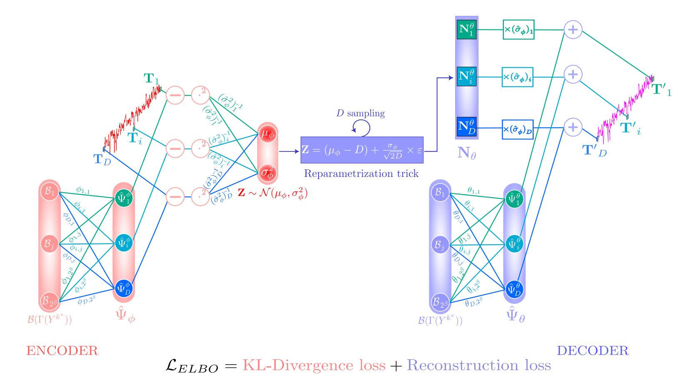
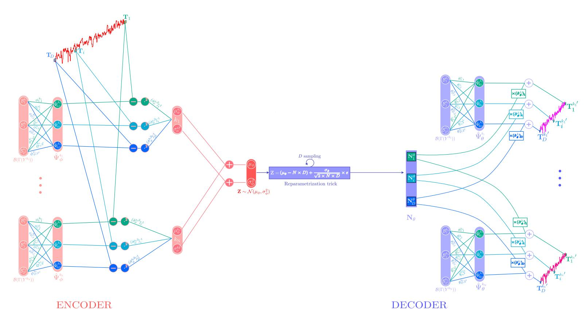
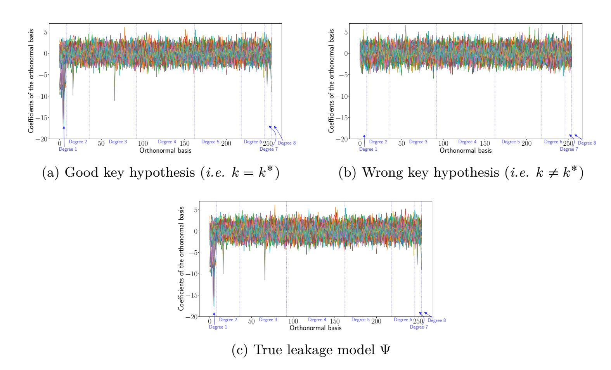

{0}------------------------------------------------

## **From linear regression to generative model for explainable non profiled side-channel attacks**

Sana Boussam<sup>3</sup>*,*<sup>4</sup> , Mathieu Carbone<sup>4</sup> , Benoît Gérard<sup>1</sup> , Guénaël Renault<sup>1</sup>*,*<sup>3</sup> and Gabriel Zaid<sup>2</sup>

```
1 ANSSI, France
                          {firstname.lastname}@ssi.gouv.fr
                             2 CryptoExperts, Paris, France
                       {firstname.lastname}@cryptoexperts.com
3 LIX, INRIA, CNRS, École Polytechnique, Institut Polytechnique de Paris, Palaiseau, France
                            {firstname.lastname}@inria.fr
                            4 Thales ITSEF, Toulouse, France
                        {firstname.lastname}@thalesgroup.com
```

**Abstract.** Non profiled side-channel attacks aim at exploiting leakage traces from a targeted embedded system to extract secret information, without *a priori* knowledge on the true leakage model of the device. To automate and simplify attacks, deep learning techniques have thus been introduced in the side-channel community. Most of the works published have mainly explored the use of discriminative models in the *profiled* or *non profiled* context. However, the lack of interpretability and explainability of these models constitutes a major limitation for security laboratory. Indeed, the lack of theoretical results regarding the choice of neural network architectures or the selection of appropriate loss functions poses significant challenges for evaluators seeking to construct a relevant and suitable model for the targeted leakage traces. To address the aforementioned limitations, we propose in this work a novel conditional generative model, specifically designed to carry out *non profiled* attacks, which is fully interpretable and explainable. To do so, we develop a novel model that fits to the *non profiled* context. To guarantee the interpretability and explainability of our model, we provide theoretical results to justify both its architecture, and a new loss function for its optimization process. We further propose a key recovery strategy based on our model that requires no leakage model assumptions. As a consequence, our work represents thus the first interpretable and generic (*i.e.* no *a priori* knowledge on the leakage model is required) *non profiled* deep learning-based side-channel attacks. Moreover, to emphasise the benefits of our new model in comparison with conventional linear regression based attack (LRA), we also provide a theoretical comparative analysis on the deterministic part estimation for different Gaussian noise configurations. Finally, we experimentally validate and compare the attack performances of our model with LRA and state-of-the-art discriminativemodels-based *non profiled* attacks using simulations and various publicly available datasets.

**Keywords:** Side-Channel Attacks · Non profiled attacks · Generic attacks · Linear regression · Generative models · Interpretability · Explainability · Variational AutoEncoder.

## **1 Introduction**

**Context.** Side-Channel Attacks (SCA) are a type of physical attacks that exploit intrinsic implementation vulnerabilities of cryptographic algorithms in embedded systems. To do 

{1}------------------------------------------------

so, evaluators leverage physical leakages such as execution time [\[Koc96\]](#page-41-0), power consumption [\[KJJ99\]](#page-40-0), or electromagnetic emissions [\[AARR03\]](#page-38-0) generated during the algorithm's execution to extract secret information. SCAs can be categorized into *profiled* and *non profiled* attacks. *Profiled* attacks, which are the most powerful, require access to a device identical or similar to the target. This enables thus the evaluator to build a learning database (*i.e.* learn the leakage model) that captures the device's behavior as a function of sensitive variables which are dependent on the secret. The objective of this type of attack is to address a classification problem by estimating the conditional probability distribution of the observed leakages given the secret information targeted by the evaluator. Consequently, for over a decade, the SCA community has increasingly explored the use of deep learning techniques to enhance *profiled* attacks and to improve their robustness against countermeasures such as masking or desynchronization [\[MPP16,](#page-41-1) [CDP17\]](#page-39-0).

In contrast, *non profiled* attacks are less restrictive and more realistic as it does not require access to a device identical or similar to the target. In this setting, the evaluator has access only to physical leakage traces from the target device and possibly limited knowledge about its implementation. A key challenge in *non profiled* attacks lies thus in identifying an appropriate method to extract meaningful information from these traces without knowing the true leakage model of the targeted device. While the introduction of deep learning in side-channel attacks (DLSCA) enhances *profiled* SCA, its application to *non profiled* scenarios remains limited and comparatively underexplored. Indeed, most existing work has focused on applying *unsupervised* deep learning techniques, such as classical autoencoders, as a pre-processing tool *e.g.* [\[WP20\]](#page-43-0). A major turning point occurred with the introduction of Differential Deep Learning-based Analysis (DDLA) by Timon in 2019 [\[Tim19\]](#page-42-0), which was the first to use *supervised* deep learning models to conduct *non profiled* SCA. Since then, new *non profiled* DLSCA have recently emerged [\[CLM23a,](#page-39-1) [SM23,](#page-42-1) [WPP24b\]](#page-43-1). Nevertheless, these emerging approaches are restricted to the use of discriminative models and rely on predefined leakage model assumptions *e.g.* Least Significant Bit (LSB) [\[Tim19,](#page-42-0) [WPP24b\]](#page-43-1), Most Significant Bit (MSB) [\[Tim19\]](#page-42-0) or Hamming Weight (HW) [\[Tim19,](#page-42-0) [WPP24b\]](#page-43-1). Thus, they cannot be considered as generic *non profiled* attacks *i.e.* attacks for which no *a priori* knowledge on the leakage model is required.

Indeed, while discriminative models often yield superior performance [\[NJ01\]](#page-41-2), they suffer from a lack of explainability and interpretability, rendering them black-box models for an evaluator. In particular, such configuration makes the evaluation process harder when the security assessment is conducted under time constraints. Selecting a suitable architecture that modelizes the good classification function can be considered as a difficult task due to the black-box property of discriminative models. To circumvent this black-box issue, timeconsuming process, *e.g.* hyperparameter selection methods [\[RWPP21,](#page-42-2) [AGF22,](#page-38-1) [WPP24a\]](#page-43-2), can be considered to target a given dataset. When discriminative models fail, evaluators cannot determine whether the implementation is secure or whether the chosen model is simply inadequate. Conversely, even if these models succeed, they offer no theoretical guarantees regarding optimality or generalization to new implementations. To satisfy evaluation needs, architectures with theoretical foundations and inherent interpretability are crucial. To sum-up, interpretability is essential for two reasons:

- 1. Reducing the time required to design/adapt a suitable neural network architecture for a targeted implementation;
- 2. Ensuring that evaluators can meaningfully assess the achieved security level.

Interpretability can be approached either by design or through post-hoc methods. We state that post-hoc methods are less appropriate for evaluation purpose as it suggests that the evaluator already design a model that successfully achieves the key recovery (*e.g.* [\[PKWP22\]](#page-41-3)). Such methods are not in line with evaluation objective stated above (*i.e.* designing a suitable model is restricted amount of time). In contrast, we argue

{2}------------------------------------------------

that interpretability by design is better suited to the objectives of the evaluators stated above, as it provides theoretical guarantees, transparency, and clear guidelines for model generation.

**Contributions.** The purpose of this paper is thus to address the limitations observed in the current state-of-the-art for *non profiled* DLSCA. To do so, we introduce in this paper a novel generative model fully interpretable and explainable that allows to conduct generic *non profiled* attacks.

The main contribution of our paper is the proposition of a novel generative model, called **[NPcVAE-OSM](#page-9-0)**, that extends state-of-the-art multi-channel generative models [\[AARL19,](#page-38-2) [KLIM19,](#page-41-4) [SKL](#page-42-3)19] and is fully interpretable and explainable. Our model is tailored to conduct *non profiled* generic attacks. NPcVAE-OSM model derives from cVAE-OSM [\[BCG](#page-38-3)25], a conditional variational autoencoder that allows to conduct optimal (*profiled*) attacks [\[HRG14\]](#page-40-1) and is designed so that it converges towards the optimal attack for the correct key hypothesis. Based on this model, we develop an end-to-end *non profiled* generic attack strategy. We experimentally assess and validate this proposed attack by comparing attack performances of our model to those of state-of-the-art SCA models (*i.e.* discriminative and conventional *non profiled* attacks) using simulations and publicly available datasets.

To design our model, we further provide some additional theoretical contributions. Indeed, we propose an extension of the cVAE-OSM model tailored to the *non profiled* attack scenarios. The proposed model is specifically designed to process traces while jointly handling all key hypotheses at the same time (yielding a minimal-weight model), which is not the case with traditional non-profiled DLSCA approaches [\[Tim19\]](#page-42-0). Some alternatives (*e.g.* [\[SKP](#page-42-4)24]) propose solutions to deal with all key hypotheses simultanously but suffer from the use of black-box models. As NPcVAE-OSM extends the cVAE-OSM model, we design a model architecture that offers full explainability and interpretability, in contrast to existing state-of-the-art approaches. In addition, NPcVAE-OSM architecture is designed to minimize the number of trainable parameters and latent space sampling required during training, reducing computational overhead without compromising performance. All trainable components are purposefully included, ensuring no redundant parameters are introduced (see [Proposition 1\)](#page-13-0).

All these design choices led to the development of a new conditional generative model, for which it is necessary to reformulate the conditional marginal log-likelihood to ensure a proper optimization process (see [Theorem 1\)](#page-14-0). To maintain a theoretically sound and effective training procedure, we also extend in [Theorem 2](#page-14-1) the standard variational lower bounds commonly used in variational autoencoders (VAE) and conditional VAEs (cVAE) [\[KW14,](#page-41-5) [SLY15\]](#page-42-5), adapting them to our specific model. Moreover, to ensure that our model converges for the correct key hypothesis toward the optimal statistical model [\[HRG14\]](#page-40-1), we introduce a customized loss function which is based on our novel variational lower bound and is specifically adapted to our problem in [Proposition 2.](#page-16-0) Based on this loss, we provide theoretical convergence proofs for all model trainable parameters, making it fully interpretable. In particular, we prove in [Theorem 3](#page-18-0) and [Theorem 4](#page-19-0) that all weights of the proposed architecture converge to their expected values, namely the true variances of traces for all key hypotheses and the true deterministic part, especially for the correct key hypothesis.

The full explainability and interpretability of our model allowed us to rigorously position our contribution with respect to existing conventional attacks, especially Linear Regression Analysis (LRA). Indeed, we provide in [Theorem 5](#page-22-0) an in-depth comparative analysis of the optimization process for both methods. Through this analysis, we show that while both approaches exhibit comparable performance in certain settings namely isotropic white Gaussian noise (see [Corollary 1\)](#page-25-0), our model consistently outperforms LRA in more realistic 

{3}------------------------------------------------

The whole implementation of NPcVAE-OSM model, as well as notebooks used to carry out attacks in this article, are available in the following GitHub repository: https://github.com/Sbsm157/NPcVAE-OSM. Although this work considers masked implementations, we assume that our proposed neural network takes as input traces that are already synchronized and possibly recombined (when targeting a masked implementation). Handling desynchronization and masking while preserving interpretability is non-trivial and requires further investigation, and is therefore considered future work.

Paper organization. In Section 2, we define our notation and recall important concepts that will be reused throughout the paper. Section 3 focuses on the explainability of our proposed model, named NPcVAE-OSM. We thus present in this section a detailed and justified description of our novel model architecture. Section 4 focuses on the interpretability aspect of our model and proposes a detailed description of the learning strategy which allows our model to be fully interpretable. We propose in Section 5 an in-depth comparative analysis of deterministic part coefficients estimation process when considering respectively conventional non profiled attacks, namely linear regression based attacks, and NPcVAE-OSM model. Then, we present in the following an end-to-end generic non profiled attack strategy considering NPcVAE-OSM model. We experimentally validate our proposed model in Section 6 using simulations and a wide range of publicly available datasets. Finally, we conclude in Section 7.

## <span id="page-3-0"></span>2 Background

4

In this section we define notations, recall definitions and summarize notions that will be useful throughout the reading of this article.

#### <span id="page-3-1"></span>2.1 Notations and definitions

**Probability theory.** Calligraphic letters such as  $\mathcal{X}$  denote sets. The cardinality of the set  $\mathcal{X}$  -if finite- is denoted  $|\mathcal{X}|$ . The corresponding bold capital letter  $\mathbf{X}$  denotes a random variable over  $\mathcal{X}$ . Its corresponding bold lowercase  $\mathbf{x}$  refers to a realization of  $\mathbf{X}$ . Let  $\mathbf{X}$  be a random variable and  $\mathbf{x}$  an event of  $\mathbf{X}$ , we denote  $\mathbb{P}(\mathbf{X} = \mathbf{x})$  also written  $\mathbb{P}(\mathbf{x})$  (resp.  $\mathbb{P}(\mathbf{X} = \mathbf{x} | \mathbf{Y} = \mathbf{y})$  also written  $\mathbb{P}(\mathbf{x} | \mathbf{y})$ ) the probability of observing  $\mathbf{x}$  (resp. the conditional probability of observing  $\mathbf{x}$  knowing a realization  $\mathbf{y}$  of the random variable  $\mathbf{Y}$ ). A  $\Theta$ -parametric conditional probability  $\mathbb{P}(\mathbf{X} | \mathbf{Y}, \Theta)$  is an approximation of the true unknown conditional probability  $\mathbb{P}(\mathbf{X} | \mathbf{Y})$  given a parameter set  $\Theta$ . We denote the first moment (*i.e.* expected value) and second moment (*i.e.* variance) of  $\mathbf{X}$  as  $\mathbb{E}[\mathbf{X}]$  and  $\mathbb{V}[\mathbf{X}]$  respectively. The expected value (resp. variance) of the random variable  $\mathbf{Y}$  over the distribution of  $\mathbf{X}$  is denoted  $\mathbb{E}_{\mathbf{X}}[\mathbf{Y}]$  (resp.  $\mathbb{V}_{\mathbf{X}}[\mathbf{Y}]$ ).

The notation  $\mathbf{X} \sim \mathcal{N}_D(\boldsymbol{\mu}, \boldsymbol{\Sigma})$  (resp.  $\mathbf{X} \sim \mathcal{N}(\boldsymbol{\mu}, \boldsymbol{\sigma^2})$ ) refers to a random vector  $\mathbf{X}$  of dimension D (resp. a random scalar) that follows a multivariate Gaussian distribution (resp. Gaussian distribution) of parameters  $\boldsymbol{\mu} \in \mathbb{R}^D$  (resp.  $\boldsymbol{\mu} \in \mathbb{R}$ ) and  $\boldsymbol{\Sigma} \in \mathbb{R}^{D \times D}$  (resp.  $\boldsymbol{\sigma^2} \in \mathbb{R}$ ). The mean and covariance matrix (resp. variance) of  $\mathbf{X}$  is denoted  $\boldsymbol{\mu_X}$  and  $\boldsymbol{\Sigma_X}$  (resp.  $\boldsymbol{\sigma_X^2}$ ). We denote  $a \stackrel{\$}{\leftarrow} \mathcal{A}$  when a is chosen uniformly in  $\mathcal{A}$ . The Kullback-Leibler (KL) divergence  $\mathcal{D}_{KL}$  is a statistical divergence measure that quantifies the difference between two probability distributions. Given  $\mathbb{P}$  and  $\mathbb{Q}$ , two discrete probability distributions on  $\mathcal{X}$ ,  $\mathcal{D}_{KL}$  is defined as

$$\mathcal{D}_{KL}\left(\mathbb{P}\left|\left|\right.\mathbb{Q}\right) = \sum_{x \in \mathcal{X}} \mathbb{P}(\mathbf{x}) \log \left(\frac{\mathbb{P}(\mathbf{x})}{\mathbb{Q}(\mathbf{x})}\right).$$

This quantity is always non-negative and equals zero if and only if  $\mathbb{P} = \mathbb{Q}$ .

{4}------------------------------------------------

**Linear algebra.** The  $i^{th}$  entry of a vector A is denoted  $A_i$ . For a given matrix M, the entry of the  $i^{th}$  row and  $j^{th}$  column is denoted  $M_{i,j}$ . We denote  $M_{i,i}$  (resp.  $M_{i,j}$ ) the  $i^{th}$  row (resp.  $j^{th}$  column) of the matrix M. The transpose and inverse operator will be denoted  $(\cdot)^T$  and  $(\cdot)^{-1}$  respectively. The identity matrix of size  $D \times D$  is denoted  $I_D$ . Given a vector A, we denote its infinity norm and Euclidean norm as  $||A||_{\infty}$  and  $||A||_{2}$  respectively. We use the following notation  $\mathbf{k}^{\mathbf{N}}$  and  $\mathbf{k}^{\mathbf{M}\times\mathbf{N}}$  to refer to a N-dimensional vector and  $M \times N$ -dimensional matrix where all the entries are the same constant k. Finally, for the sake of simplicity, the diagonal matrix  $M \in \mathbb{R}^{D \times D}$  is denoted  $M = \text{diag}[m_1, \dots, m_D]$  in this paper.

**SCA terminology.** In SCA domain, the secret key recovery is often performed using a divide-and-conquer strategy. It consists in targeting separately each secret key segment  $k_i^* \in \mathcal{K}$ . In this paper, we focus on targeting a secret key segment of n bits i.e.  $\mathcal{K} = \mathbb{F}_2^n$ with n = 1 or n > 1 such that n is even. To ease the reading, we denote a secret key segment of n bits  $k^* \in \mathbb{F}_2^n$  and refers to it as the correct secret key. A leakage trace  $\mathbf{T} \in \mathbb{R}^D$ is a random vector that consists in a deterministic part  $\Psi$  and an independent noise N such that

<span id="page-4-0"></span>
$$\mathbf{T} = \Psi(Y^{k^*}) + \mathbf{N},\tag{1}$$

where  $Y^{k^*} = f(P, k^*) \in \mathbb{F}_2^n$  is a sensitive value that corresponds to the image of a cryptographic function f (e.g. SBox function) given a plaintext  $P \in \mathbb{F}_2^n$  and the secret key  $k^* \in \mathbb{F}_2^n$ . In this paper, the deterministic part is defined as a pseudo-boolean function [Car10] (i.e. the most generic definition). Hence,  $\Psi$  takes the form of a multi-linear polynomial  $\Gamma(Y^k)$  of maximal degree n, composed of  $2^n$  monomials which represent the contribution of bits' interactions of  $Y^k$ . Let consider  $(Y^k)_b$  as the  $b^{th}$  bit of  $Y^k$ ,  $\Gamma(Y^k)$ can be formally defined as

$$\Gamma(Y^k) = 1 + \sum_{i=1}^n \sum_{1 \le j_1 < \dots < j_i \le n} r((Y^k)_{j_1}, (Y^k)_{j_2}, \dots, (Y^k)_{j_i}), \tag{2}$$

where  $j_i \in [1, n]$  and r is some boolean operations that characterize bits' interactions, e.g. a XOR or an AND. The degree 0 term corresponds to the bias (i.e. when no interactions between bits are considered).

In the rest of the paper, to ease the reading, this multi-linear polynomial will be considered as vector in which each entry corresponds to a monomial i.e.  $\Gamma(Y^k) \in \mathbb{F}_2^{2^n}$ . Hence, we define the leakage model  $\Psi$  as:

<span id="page-4-1"></span>
$$\Psi : \mathbb{F}_{2}^{n} \to \mathbb{R}^{D} 
Y^{k} \mapsto \mathcal{B}(\Gamma(Y^{k})) \cdot \alpha$$
(3)

where  $\alpha \in \mathbb{R}^{2^n \times D}$  is a matrix of coefficients representing contribution of each monomial/bits' interaction for all D time samples. We note  $\mathcal{B}$  the basis on which  $\Gamma$  is projected.

Following the independent Gaussian noise assumption [MOP10], we assume that the noise N follows a centered Gaussian distribution  $\mathcal{N}_D(\mathbf{0}^D, \mathbf{\Sigma})$  and is independent at each time sample from the sensitive variable (white noise). Hence, this implies that  $\mathbf{T} \sim \mathcal{N}_D(\Psi(Y^{k^*}), \mathbf{\Sigma}) \text{ where } \mathbf{\Sigma} = \operatorname{diag}(\boldsymbol{\sigma_1^2}, \dots, \boldsymbol{\sigma_D^2}).$ 

**Bases considered in SCA.** Usually bases  $\mathcal{B}$  considered in SCA on which  $\Gamma$  is projected are the canonical and monomial bases. In [GHMR17], Guilley et al. highlight their limitations i.e. these bases makes monomials and bits interactions not easily interpretable. They thus introduce a new basis to conduct SCA that addresses these limitations. This basis corresponds to a scaled Walsh-Hadamard matrix that has been permuted in such a way as to be ordered by increasing Hamming weight. Thanks to its orthonormality and

{5}------------------------------------------------

degree preservation properties, this basis allows a clear and comprehensible reading of the contribution of each monomial/bits' interaction. In the rest of the paper, we refer to this basis as Walsh-Hadamard basis.

**Machine learning terminology.** Following [BCG $^+$ 25], we qualify a model as *explainable* a model in which it can be easy to understand the operations performed in all layers involved in the decision-making process e.g. dimensionality reduction, leakage model extraction. Finally, a model is *interpretable* if all its inner variables i.e. weights and bias correspond to quantities clearly defined and for which it is possible to determine towards which values they converge during loss minimization.

#### <span id="page-5-0"></span>2.2 Classical non profiled SCA

Given  $\mathcal{T}$  a set of leakage traces such that all traces correspond to the manipulation of the same fixed key  $k^*$ , the goal of side-channel attacks is to retrieve  $k^*$  from  $\mathcal{T}$ . More formally, a side-channel attack can be defined as follows:

**Definition 1. Side-Channel attacks.** Let  $\mathcal{P} = \{p_1, \dots, p_Q\}$  be a set of Q plaintexts and  $\mathcal{T} = \{\mathbf{t}_1, \dots, \mathbf{t}_Q\}$  be the set of the Q associated leakage traces such that  $\forall i \in [1, Q]$ ,  $\mathbf{t}_i = \Psi(Y_i^{k^*}) + \mathbf{n}_i$  with  $Y_i^{k^*} = f(p_i, k^*)$ . The goal of an evaluator is to select a distinguisher  $\mathcal{D} : \mathbb{R}^{Q \times D} \times \mathbb{F}_2^{Q \times n} \to \mathbb{F}_2^n$  such that, by considering as few traces as possible, we have:

$$k^* = \underset{k}{\operatorname{arg\,max}} \mathcal{D}^k(\mathcal{T}, \mathcal{P}) \tag{4}$$

regardless of key hypothesis  $k \in \mathcal{K}$ .

To select the appropriate distinguisher  $\mathcal{D}$ , an evaluator can consider two different types of attacks: profiled and non profiled attacks. Profiled attacks [CRR03, SLP05] are considered as the most powerful SCA. However, these attacks require a device similar to the targeted one in order to profile the leakage model. Based on this profile, the evaluator can thus use the log-likelihood distinguisher which is considered as optimal [HRG14] assuming that distributions of the profiled leakage model are correctly estimated. Non profiled attacks [KJJ99, BCO04, GBTP08] are, on the other hand, less restrictive and more realistic than profiled attacks as this type of attack requires only traces and possibly some details about the implementation of the targeted algorithm. However, these attacks cannot use the log-likelihood distinguisher as the evaluator is unable to profile the leakage model. Instead, they are based on various types of distinguishers coming from statistic field. In the following, we recall three types of non profiled attacks based on three different distinguishers namely the correlation power, mutual information and linear regression analyses.

Correlation Power Analysis. Introduced in 2003 by Clavier et al. as a generalization of Differential Power Analysis (DPA) [KJJ99], Correlation Power Analysis or CPA [BCO04] exploits and assume that there exists a linear relationship between the leakage traces and a predicted leakage model  $\hat{\Psi}^k$ , when considering a good key hypothesis. This leakage model is built from a key hypothesis  $k \in \mathcal{K}$  and a prediction of the leakage function which is usually the Hamming weight function. The distinguisher used is the Pearson correlation coefficient as this correlation coefficient can measure the linear dependence between the leakage traces and a predicted leakage model. This attack is considered as optimal when the true leakage model  $\Psi$  corresponds to the Hamming weight model up to some affine transformation [DPRS11, HRG14]. However, as the true leakage model in a non profiled attack context is not known by the evaluator, the use of the CPA might prove insufficient, as it only detects linear dependence between the leakage traces and the predicted leakage model and does not capture the non-linear dependencies.

{6}------------------------------------------------

**Mutual Information Analysis.** To address CPA limitations, Gierlichs et al. propose the Mutual Information Analysis (MIA) [GBTP08]. This attack is based on using mutual information as an alternative distinguisher in order to exploit all possible i.e. linear and non-linear dependencies between the leakage traces and predicted leakage model  $\hat{\Psi}^k(Y^k)$ . Although the use of mutual information as a distinguisher allows the evaluator to perform a more generic attack than CPA as the assumption of linear dependencies between the predicted leakage model and leakage traces is relaxed here, MIA suffers from two major limitations. The first limitation is related to mutual information computation [GBTP08]. Indeed, the computation of the conditional entropy  $H(\mathbf{T}|\hat{\Psi}^k(Y^k))$  requires an estimation, for all key hypotheses k, of the probability density functions of the conditional leakage traces i.e.  $\mathbb{P}(\mathbf{T}|\hat{\Psi}^k(Y^k))$ . Such an estimation highly depends on the use of appropriate methods such as histograms, kernel density function, or parametric estimation [PR09]. However, selecting the appropriate method can be very challenging for an evaluator. The second limitation concerns leakage function selection. As the distinguisher used is the mutual information, the evaluator has a constraint on the leakage model assumption. Indeed, if  $\hat{\Psi}^k$  is injective, mutual information cannot be used as a distinguisher, since it returns the same score for all key hypotheses. Consequently,  $\hat{\Psi}^k$  must be non-injective [PR09]. As a result, the choice of the leakage function is restricted for the evaluator, who usually ends up choosing the Hamming weight.

**Linear Regression Analysis.** To circumvent MIA limitations, an evaluator can consider the Linear Regression Analysis (LRA) [SLP05, DPRS11]. LRA is a non profiled adaptation of a profiled attack called stochastic attacks [SLP05]. This type of attacks allows the evaluator to consider any form of leakage model as the latter is seen as a weighted sum of bits and possibly bits interactions of the sensitive value. Indeed, given D-dimensional leakage traces  $\mathbf{T} \in \mathbb{R}^{Q \times D}$ , a key hypothesis k, the hypothetical sensitive values  $Y^k \in \mathbb{F}_2^{Q \times n}$ and  $\Gamma_m(Y^k) \in \mathbb{F}_2^{Q \times \sum_{i=0}^m \binom{n}{i}}$  the binary decomposition of  $Y^k$  which one considers up to the  $m^{th}$  bits interaction degree with  $m \leq n$  (see Section 2.1) and is projected into a certain basis  $\mathcal{B}$ , LRA consists in computing for all k the predicted leakage model  $\hat{\Psi}^k \in \mathbb{R}^{Q \times D}$  by estimating coefficients  $\hat{\alpha}^k \in \mathbb{R}^{\sum_{i=0}^m \binom{n}{i} \times D}$ . This coefficients estimation is done by performing a linear regression, using ordinary least squares method. Indeed, given a time sample  $j \in [1, D]$  and the projection of hypothetical sensitive values  $B^k \in \mathbb{R}^{Q \times \sum_{i=0}^m \binom{n}{i}}$ ,  $\hat{\alpha}_{::i}^k$  is computed as follow:  $\hat{\alpha}_{:,j}^k = ((B^k)^T B^k)^{-1} (B^k)^T \mathbf{T}_{:,j}$ . Recently, an article [Bou25] highlight the benefits of using Walsh-Hadamard basis instead of the classical monomial or canonical basis: indeed, thanks to its intrinsic properties, this basis allows an evaluator to conduct generic LRA [Bou25]. Consequently in the rest of this paper, we consider that when a LRA is performed, the chosen basis is the Walsh-Hadamard basis. The correct key is then retrieved by maximizing a distinguisher such as the coefficient of determination  $R^2$  or the maximum distinguisher |Bou25|. Combining the use of Walsh-Hadamard basis and maximum distinguisher offers to the evaluator a greater flexibility regarding the choice of leakage models. It therefore allows an evaluator to perform a generic non-profiled attack as the latter can conduct a LRA considering a full basis  $\Gamma_m$  where m=n=8 i.e. all bits interactions are considered. This makes the LRA, for now, one of the most attractive non profiled attacks for an evaluator.

#### Non profiled deep learning-based side-channel attacks 2.3

One of the recent strategies, actively explored by the side-channel community since the early 2010s, consists in using deep learning techniques to enhance the classical SCA scenario while mitigating the impact of some countermeasures (e.g. masking or desynchronization). Indeed, the first work involving machine learning techniques in side-channel literature appeared in 2011 [HGDM<sup>+</sup>11, LBM11, LBM14]. Two years later, Martinasek et al. 

{7}------------------------------------------------

published the first machine learning-based side-channel attack (DLSCA) [MZ13]. Over the recent years, attention has focused more on *profiled* attacks, more specifically on how to link them to supervised deep learning algorithms [MDP19, ZZN<sup>+</sup>20, ZBD<sup>+</sup>20, IUH22]. Regarding the non profiled context, the so-called differential deep-learning-based analysis (DDLA) published in 2019 by Timon |Tim19| is the first work to establish a link between supervised deep learning and non profiled attack by proposing a deep learning variant of MIA. However a major limitation of this approach is the requirement to train a separate model for each key hypothesis. Since then, most of works focus on enhancing the DDLA [DLH<sup>+</sup>22, KHK22, DHD24, SKP<sup>+</sup>24]. Recently, new non profiled DLSCA paths emerge. In 2023, Cristiani et al. develop a model that bridges LRA and deep learning-based MIA [CLM23a]. While Staib and Moradi [SM23] propose a new non profiled DLSCA which is a deep learning-based adaptation of conventional collision SCA. In [WPP24b], Wu et al. propose a novel non profiled DLSCA method that includes a profiling phase on plaintexts, using discriminative models. Indeed, they leverage the bijective relationship between plaintexts and AES SBox outputs to get rid of knowledge of the secret key for profiling. However, such a method is only possible and applicable when the targeted function is bijective.

So far, no investigations have been yet conducted on the use of generative models as all works related to *non profiled* DLSCA use discriminative models. While this approach leads to better results [NJ01], the lack of explainability and interpretability induced by these models involves using them as black boxes. From an evaluator perspective, designing an appropriate architecture and training these models is thus very challenging because of the large number of hyperparameters that need to be taken into account (*i.e.* architecture and training hyperparameters).

In this paper, we propose a new generic non profiled attack based on a novel generative model that overcomes limitations of state-of-the-art non profiled DLSCA.

# <span id="page-7-0"></span>3 Non profiled cVAE-OSM: the first fully explainable non profiled deep learning model

In this section, we present a fully explainable non profiled deep learning model that allows to perform non profiled attacks. We first briefly describe in Section 3.1 cVAE-OSM model *i.e.* a fully explainable and interpretable generative model designed for profiled attacks. Then, based on this model, we briefly present in Section 3.2 a new model that allows to conduct non profiled DLSCA considering a single model for all key hypotheses. Finally, a detailed description of this new model is done in Section 3.3.

#### <span id="page-7-1"></span>3.1 cVAE-OSM: an optimal statistical model for side-channel attacks

Introduced in [BCG<sup>+</sup>25], Boussam *et al.* present the first generative model fully interpretable and explainable which is based on stochastic attacks (see Figure 1 for a presentation of the overall architecture of this model). This generative model called cVAE-OSM is a conditional variational autoencoder (cVAE) which consists of two distinct parts namely an encoder  $E_{\phi}$  and a decoder  $D_{\theta}$ . To reduce the architecture complexity, an optimal dimensionality reduction *i.e.* a dimensionality reduction without loss of information, is performed by the encoder such that the multivariate input trace  $\mathbf{T} \in \mathbb{R}^D$  is reduced to a monovariate trace  $\tilde{\mathbf{T}} \in \mathbb{R}$ . Based on the parameters of the distribution followed by  $\tilde{\mathbf{T}}$ , D points are sampled from the latent space and are then used by the decoder to reconstruct an output trace  $\mathbf{T}' \in \mathbb{R}^D$  such that  $\mathbf{T}'$  and input trace  $\mathbf{T}$  follows the same distribution *i.e.* a Gaussian distribution as defined in Section 2.1. To sum-up, given a trace  $\mathbf{T} = \Psi(Y^{k^*}) + \mathbf{N}$ , the cVAE-OSM extracts an estimation of the true leakage model

{8}------------------------------------------------

 $\Psi$  and the variance related to  $\mathbf{N}^1$ .

Using a generative model presents a certain number of benefits for an evaluator over using a discriminative model. Indeed, the lack of explainability and interpretability and the difficulty of designing discriminative model architectures (i.e. a high number of architecture hyperparameters must be considered) can represent a real limitation for an evaluator. In contrast, cVAE-OSM is fully interpretable and explicable and its deterministic architecture is theoretically justified and proved. This therefore allows an evaluator to manage only hyperparameters related to training i.e. learning rate, batch size and the number of epochs, which is highly desirable for time-constrained evaluators.

To adapt this model to a non profiled setting, a straightforward approach would be to apply a Differential Deep Learning-based Analysis (DDLA) [Tim19] in which  $|\mathcal{K}|$  separate cVAE-OSM networks are trained (i.e. one for each key hypothesis). However, this method quickly becomes computationally infeasible: for instance, when targeting an AES-128 secret key, which consists of 16 bytes, following a divide-and-conquer strategy i.e. each secret key byte is targeted independently inducing  $|\mathcal{K}| = 256$ , this would require to train  $16 \times 256 = 2^{12}$  distinct networks. A more scalable alternative would be to stack each  $|\mathcal{K}|$ models into a single unified network, resulting in using 16 models to retrieve the AES-128 secret key. While feasible, this solution presents a significant limitation: the sampling from the latent space. Usually, in variational autoencoders (VAE) and cVAE, a single sampling over the latent space is done to avoid a high computational cost, as stated in [Doe21]. This is not the case when considering this alternative as the model would need to perform  $|\mathcal{K}| \times D$  sampling over the latent-space in order to generate the  $|\mathcal{K}|$  corresponding output traces. This thus results in a high computational overhead. To overcome the two aforementioned limitations, we introduce in the following section a novel model that handles all key hypotheses simultaneously and performs only a single latent-space sampling. This design reduces the overall computational cost, making it well-suited for non profiled side-channel attack scenarios.

<span id="page-8-0"></span>

Figure 1: cVAE-OSM architecture [BCG<sup>+</sup>25].

<span id="page-8-1"></span><sup>&</sup>lt;sup>1</sup>As defined in Section 2.1, a trace **T** follows a multivariate Gaussian distribution of parameters  $\Psi(Y^{k^*})$ and  $\Sigma$  assuming a white Gaussian noise  $N \sim \mathcal{N}_D(\mathbf{0^D}, \Sigma)$  where  $\Sigma = \operatorname{diag}(\sigma_1^2, \dots, \sigma_D^2)$ 

{9}------------------------------------------------

## <span id="page-9-0"></span>3.2 From profiled to non profiled scenarios: emergence of a novel conditional generative model

In this section, we present a new model: an extension of cVAE models that allows to perform a generic non profiled attack i.e. no assumption about the leakage model is made.

**Context.** Given a leakage trace  $\mathbf{T} \in \mathbb{R}^D$  and the sensitive value  $Y^k \in \mathbb{F}_2^n$ , the aim of a non profiled attack based on a generative approach is to compute, for all key hypotheses in  $\mathcal{K}$ , the  $\theta$ -parametric conditional distribution  $\mathbb{P}(\mathbf{T}|Y^k,\theta)$  such that it approximates the true unknown conditional distribution  $\mathbb{P}(\mathbf{T}|Y^k)$ . To do so, we introduce a novel model that computes the  $\theta$ -parametric conditional distribution  $\mathbb{P}(\mathbf{T}|Y,\theta)$  where  $Y \in \mathbb{F}_2^{|\mathcal{K}| \times n}$  is the set of sensitive variables for all key hypotheses i.e.  $Y = \{Y^k\}_{k \in \mathcal{K}}$ . This means that for a given trace T, our model is able to consider all possible sensitive values at the same time. More specifically, our model is closely related to the Generalized Multi-channel conditional Variational Autoencoder (GMcVAE) introduced in [SKL<sup>+</sup>19] within the deep learning literature. This model builds upon the foundations of the Multichannel Variational Autoencoder (MVAE) and the Multi-channel conditional Variational Autoencoder (McVAE), proposed in [AARL19] and [KLIM19], respectively. GMcVAE extends these earlier models by allowing conditioning on multiple auxiliary variables, rather than being limited to a single one as in McVAE. Hence, this richer conditioning mechanism allows for the integration of additional information into the latent space, thereby imposing greater structure on the outputs generated by the model. However, unlike GMcVAE, which introduces a separate latent space for each conditional auxiliary variables, our model factorizes all such latent spaces into a single and shared latent representation, enabling more efficient inference and a unified generative process across all outputs. Since our proposed model converge towards the optimal statistical model for the correct key  $k^*$ [HRG14], it can be viewed as a non-profiled version of cVAE-OSM. Consequently, we call this new model a non profiled conditional variational autoencoder based on optimal attacks. In the rest of this paper, we refer to this model as NPcVAE-OSM.

**Overview of the model.** As our proposed model is also a *latent variable model* [Bis98], the computation of the parametric distribution is therefore done by marginalizing over the latent representation **Z**:

<span id="page-9-1"></span>
$$\mathbb{P}(\mathbf{T}|Y,\theta) = \int_{\mathbf{z}\in\mathcal{Z}} \mathbb{P}(\mathbf{T}|Y,\mathbf{z},\theta)\mathbb{P}(\mathbf{z}|Y,\theta) d\mathbf{z}.$$
 (5)

In practice, Equation 5 is approximated via a *Monte-Carlo* method due to its intractability. To compute this approximation, our model is structured into three main components namely *encoder*, reparametrization trick and decoder. Each one of them is described in details in Section 3.3. The aim of the encoder is to characterize latent space given  $\mathbf{T}$  and Y. This characterization is done by estimating the  $\phi$ -parametric conditional probability distribution  $\mathbb{Q}(\mathbf{Z}|\mathbf{T},Y,\phi)$  an approximation of  $\mathbb{P}(\mathbf{Z}|\mathbf{T},Y,\theta)$  that is intractable. Then, the decoder, which computes the  $\theta$ -parametric conditional probability distribution  $\mathbb{P}(\mathbf{T}|\mathbf{z},Y,\theta)$ , generates  $|\mathcal{K}|$  traces  $(\mathbf{T}')^k$  given  $\mathbf{Z}$  such that they are drawn from the same distribution as  $\mathbf{T}$ .

Figure 2 depicts our proposed model. Given a leakage trace  $\mathbf{T} \in \mathbb{R}^D$ , the encoder computes the optimal dimensionality reduction  $\tilde{\mathbf{T}}^k \in \mathbb{R}$  for all key hypotheses, following [BCG<sup>+</sup>25, Theorem 2] and then sum them to obtain  $\tilde{\mathbf{T}} \in \mathbb{R}$ . Given that, for the correct key hypothesis  $k^*$ , the distribution of  $\tilde{\mathbf{T}}^{k^*}$  is approximately Gaussian with mean  $\boldsymbol{\mu}^{k^*} = D$  and variance  $(\boldsymbol{\sigma}^2)^{k^*} = 2D$  in the asymptotic regime of large D (see [BCG<sup>+</sup>25, Corollary 1]), the core idea of our proposed model is to enforce the distribution of each  $\tilde{\mathbf{T}}^k$  to N(D, 2D) in order to identify the correct key hypothesis using the distinguisher introduced in [Bou25].

{10}------------------------------------------------

This strategy is intended to steer the model's parameters optimization toward the correct key by aligning the learned representations with the statistical structure characteristic of  $k^*$ . To force this strategy (i.e.  $\tilde{\mathbf{T}}^k$  follows  $\mathcal{N}(D,2D)$  for all key hypotheses in  $\mathcal{K}$ ), the latent space  $\mathcal{Z}$  is then characterized by the parameters  $\boldsymbol{\mu}_{\phi}$  and  $\boldsymbol{\sigma}_{\phi}^2$  such that  $\boldsymbol{\mu}_{\phi} = |\mathcal{K}|D$  and  $\boldsymbol{\sigma}_{\phi}^2 = |\mathcal{K}|2D$ . Then, to generate a D-dimensional trace  $\mathbf{T}'$  from the latent space  $\mathcal{Z}$ , a first step consists in sampling D points from  $\mathcal{Z}$  in order to construct a D-dimensional vector of noise  $\mathbf{N}_{\theta}$ . This vector follows, thanks to the reparametrization trick, a normal distribution i.e.  $\mathbf{N}_{\theta} \sim \mathcal{N}_{D}(\mathbf{0}^{\mathbf{D}}, \mathbf{I}_{\mathbf{D}})$ . From  $\mathbf{N}_{\theta}$ , the decoder finally reconstructs  $|\mathcal{K}|$  traces  $(\mathbf{T}')^k \in \mathbb{R}^D$  for all key hypotheses such that each follows a distribution similar to the one followed by  $\mathbf{T}$  (i.e.  $\mathcal{N}(\Psi(Y^{k^*}, \Sigma))$ ). Based on this modelling process, an evaluator can infer the correct key  $k^*$  among all other key hypotheses using a distinguisher, as explained in Section 5.2.

<span id="page-10-1"></span>

Figure 2: Non profiled cVAE-OSM architecture.

## <span id="page-10-0"></span>3.3 NPcVAE-OSM: a fully interpretable and explainable deep learning model for non profiled attacks

This section aims at describing in details encoder, reparametrization trick and decoder used in NPcVAE-OSM.

**Encoder.** The encoder characterizes a function  $E_{\phi}: \mathbb{R}^D \times \mathbb{F}_2^{|\mathcal{K}| \times n} \to \mathbb{R} \times \mathbb{R}$  that, given a multivariate trace  $\mathbf{T} \in \mathbb{R}^D$  which is defined as in Equation 1, approximates parameters  $\boldsymbol{\mu}$  and  $\boldsymbol{\sigma^2}$  of the distribution followed by the sum across all key hypotheses of the monovariates traces  $\tilde{\mathbf{T}}^k \in \mathbb{R}$  that we denote  $\tilde{\mathbf{T}} \in \mathbb{R}$ . To do so, we construct our encoder such it explicitly computes  $\tilde{\mathbf{T}}^k$  for all key hypotheses  $k \in \mathcal{K}$  (see [BCG<sup>+</sup>25, Theorem 2]). The computation of each  $\tilde{\mathbf{T}}^k$  is done using linear layers. For each key hypothesis k, a first linear network that consists in a single fully connected layer of D neurons is used to estimate  $\hat{\Psi}_{\phi}(Y^k)$  the deterministic part of the traces given a sensitive value  $Y^k$ . To do so,  $Y^k$  is first decomposed into  $2^n$  monomials (as no assumption is done about underlying leakage model) and then projected into the Walsh-Hadamard basis  $\mathcal{B}$  (see Section 2.1). Since the true deterministic part of a trace given a key hypothesis k, *i.e.*  $\Psi(Y^k)$ , corresponds at each sample to a weighted sum of monomials (see Equation 3), the output of this first network for the  $i^{th}$ 

{11}------------------------------------------------

sample  $(i \in [1, D])$  is then

<span id="page-11-0"></span>
$$\left(\hat{\Psi}_{\phi}(Y^k)\right)_i = \varrho\left(\sum_{j=1}^{2^n} \phi_{ji} \cdot \mathcal{B}(\Gamma(Y^k))_j\right)$$
(6)

where  $\phi_{ji}$  is the contribution of the  $j^{th}$  monomial at the  $i^{th}$  time sample and  $\varrho$  is the activation function which is set to identity to fit deterministic formula defined in Equation 3.

Once the deterministic parts for all key hypotheses are estimated, the optimal dimensionality reduction [BGH<sup>+</sup>15, BCG<sup>+</sup>25] is then computed. First, for each key hypothesis, we subtract the hypothetical deterministic part  $\hat{\Psi}_{\phi}(Y^k)$  to  $\mathbf{T}$  and then square the result. This result is then used as input for the second fully connected linear layer composed of 2 neurons. Each neuron estimates respectively  $(\mu_{\phi})^k$  and  $(\sigma_{\phi}^2)^k$  by performing the optimal dimensionality reduction  $\tilde{\mathbf{T}}^k \in \mathbb{R}$  defined in [BCG<sup>+</sup>25, Theorem 2] through the minimization of the ELBO loss (see justification in Section 4.1). The output of this second layer for a given key hypothesis k is thus:

<span id="page-11-1"></span>
$$\begin{cases}
(\boldsymbol{\mu}_{\boldsymbol{\phi}})^{k} &= \mathbb{E}\left[\varrho\left(\sum_{i=1}^{D} \frac{1}{(\hat{\sigma}_{\boldsymbol{\phi}}^{2})_{i}^{k}} \cdot \left(\mathbf{T}_{i} - \left(\hat{\Psi}_{\boldsymbol{\phi}}(Y^{k})\right)_{i}\right)^{2}\right)\right] \\
(\boldsymbol{\sigma}_{\boldsymbol{\phi}}^{2})^{k} &= \mathbb{V}\left[\varrho\left(\sum_{i=1}^{D} \frac{1}{(\hat{\sigma}_{\boldsymbol{\phi}}^{2})_{i}^{k}} \cdot \left(\mathbf{T}_{i} - \left(\hat{\Psi}_{\boldsymbol{\phi}}(Y^{k})\right)_{i}\right)^{2}\right)\right]
\end{cases} (7)$$

where  $\varrho$  is the activation function which is set to identity to fit optimal dimensionality reduction  $\tilde{\mathbf{T}}^k$  defined in [BCG<sup>+</sup>25, Theorem 2] and  $(\hat{\sigma}_{\phi}^2)_i^k$  corresponds for a given key hypothesis k to an estimation of the variance at the  $i^{th}$  time sample of  $\mathbf{T}$ . Finally, as previously explained in Section 3.2,  $\mu_{\phi}$  and  $\sigma_{\phi}^2$  are retrieved by summing all  $(\mu_{\phi})^k$  and  $(\sigma_{\phi}^2)^k$  respectively.

As previously explained,  $\tilde{T}$  is forced to follow a Gaussian distribution of parameters  $\mu = |\mathcal{K}|D$  and  $\sigma^2 = 2|\mathcal{K}|D$  (see justifications in Section 4.1) Since  $\mu_{\phi}$  and  $\sigma^2_{\phi}$  corresponds respectively to a sum over  $k \in \mathcal{K}$  of  $(\mu_{\phi})^k$  and  $(\sigma^2_{\phi})^k$ , we thus enforces  $(\mu_{\phi})^k = D$  and  $(\sigma^2_{\phi})^k = 2D$ . Hence, for the correct key  $k^* \in \mathcal{K}$ , this architecture coupled with the proposed loss function defined in Proposition 2 ensure that the deterministic part  $\hat{\Psi}_{\phi}(Y^{k^*})$  and variance  $(\hat{\sigma}^2_{\phi})^{k^*}_i$  converge respectively to true deterministic part  $\Psi(Y^{k^*})$  and true variance  $\sigma^2_i$  of  $\mathbf{T}$  (see Theorem 3). This convergence holds because  $(\mu_{\phi})^{k^*}$  and  $(\sigma^2_{\phi})^{k^*}$  are trained to approximate the parameters of the true distribution of  $\tilde{\mathbf{T}}^{k^*} \sim \mathcal{N}(D, 2D)$ , as established in [BCG<sup>+</sup>25, Corollary 1]. Regarding other key hypotheses  $k \in \mathcal{K} \setminus \{k^*\}$ , Theorem 3 shows that enforcing  $(\mu_{\phi})^k = D$  and  $(\sigma^2_{\phi})^k = 2D$  implies that estimated variance  $(\hat{\sigma}^2_{\phi})^k$  converge towards true variance  $\sigma^2_i$  and that estimated deterministic part  $\hat{\Psi}_{\phi}(Y^k)$  is computed such as  $|\hat{\Psi}_{\phi}(Y^k) - \Psi(Y^{k^*})|$  is minimized.

Reparametrization trick [KW14]. Once the leakage trace  $\mathbf{T} \in \mathbb{R}^D$  is reduced into a monovariate trace  $\tilde{\mathbf{T}} \in \mathbb{R}$  that correspond to the sum of monovariate traces  $\{\tilde{\mathbf{T}}^k\}_{k \in \mathcal{K}}$  considering all key hypotheses, a set of  $|\mathcal{K}|$   $\{(\mathbf{T}')^k\}_{k \in \mathcal{K}}$  traces must be reconstructed from latent space variable  $\mathbf{Z} \in \mathcal{Z}$ . Kingma and Welling [KW14] highlight that the randomness of the latent variable  $\mathbf{Z}$  makes it non-differentiable, preventing thus the direct application of backpropagation. To address this issue, Kingma et al. [KW14] introduce the reparameterization trick. This trick enables the computation of gradients with respect to  $\mu_{\phi}$  and  $\sigma_{\phi}^2$  despite the randomness of  $\mathbf{Z}$ . The idea is to express the sampling process in a differentiable form. To do so, Kingma et al. introduce an auxiliary noise variable

{12}------------------------------------------------

 $\varepsilon \sim \mathcal{N}(0,1)$  and define the latent variable as:

$$\mathbf{Z} = \boldsymbol{\mu_{\phi}} + \boldsymbol{\sigma_{\phi}} \times \boldsymbol{\varepsilon} \sim \mathcal{N}(\boldsymbol{\mu_{\phi}}, \boldsymbol{\sigma_{\phi}^2}).$$

This reformulation enables thus gradients to propagate through this deterministic transformation of  $\mathbf{Z}$  [KW19]. However, this reparametrization trick must be adapted to our proposed model. Since the latent variables estimated by the encoder are intended to follow the hypothetical distribution of  $\tilde{\mathbf{T}} = \sum_{k \in \mathcal{K}} \tilde{\mathbf{T}}^k$  namely a Gaussian distribution of parameters  $\boldsymbol{\mu} = |\mathcal{K}|D$  and  $\boldsymbol{\sigma^2} = 2|\mathcal{K}|D$ , our approach involves generating a D-dimensional noise vector  $\mathbf{N}_{\theta} \sim \mathcal{N}_D(\mathbf{0^D}, \mathbf{I_D})$  common for all key hypotheses. This vector is constructed by sampling iteratively D samples from  $\mathcal{Z}$  such that each sample follows a standard normal distribution. To achieve this, we modify the reparametrization trick originally proposed in [KW14], so that the latent variable  $\mathbf{Z}$  is sampled from a standard normal distribution  $\mathcal{N}(0,1)$  instead of the original Gaussian distribution  $\mathcal{N}(\boldsymbol{\mu}_{\phi}, \boldsymbol{\sigma}_{\phi}^2)$ , which, in our case, is enforced to converge toward  $\mathcal{N}(|\mathcal{K}|D,2|\mathcal{K}|D)$ . Accordingly, we redefine the reparametrization function to ensure that  $\mathbf{Z} \sim \mathcal{N}(0,1)$ :

$$\mathbf{Z} = (\boldsymbol{\mu_{\phi}} - |\mathcal{K}|D) + \frac{\boldsymbol{\sigma_{\phi}}}{\sqrt{2|\mathcal{K}|D}} \times \varepsilon.$$

Then, based on D samples from the latent space  $\mathcal{Z}$ , we design in the following a decoder that reconstructs the original trace  $\mathbf{T}$ .

**Decoder.** The decoder  $D_{\theta}: \mathbb{R}^{D} \times \mathbb{F}_{2}^{|\mathcal{K}| \times n} \to \mathbb{R}^{|\mathcal{K}| \times D}$  is designed to reconstruct traces  $\{(\mathbf{T}')^{k}\}_{k \in \mathcal{K}}$  for all key hypotheses such as to maximize the conditional probability distribution  $\mathbb{P}(\mathbf{T}|Y,\mathbf{z},\theta)$ . The parameters of the decoder  $\theta$  are optimized such that  $\mathbf{T}$  and  $(\mathbf{T}')^{k}$  follows the same distribution for each key hypothesis  $k \in \mathcal{K}$ . Given the noise vector  $\mathbf{N}_{\theta} = (\mathbf{z}_{i})_{1 \leqslant i \leqslant D}$  generated by sampling through the latent space  $\mathcal{Z}$  such that  $\mathbf{N}_{\theta} \sim \mathcal{N}_{D}(\mathbf{0}^{\mathbf{D}}, \mathbf{I}_{D})$ , each component  $(\mathbf{N}_{\theta})_{i}$  is multiplied for each key hypothesis k by its corresponding standard deviation  $(\hat{\sigma}_{\theta}^{2})_{i}^{k} = (\hat{\sigma}_{\phi}^{2})_{i}^{k}$  which was previously estimated by the encoder. As a result, for each key hypothesis  $k \in \mathcal{K}$ , the transformed noise vector  $\mathbf{N}_{\theta}^{k}$  follows a multivariate normal distribution  $\mathbf{N}_{\theta}^{k} \sim \mathcal{N}_{D}(\mathbf{0}^{\mathbf{D}}, \mathbf{\Sigma}^{k})$ , where  $\mathbf{\Sigma}^{k} = \operatorname{diag}((\hat{\sigma}_{\theta}^{2})_{1}^{k}, \dots, (\hat{\sigma}_{\theta}^{2})_{D}^{k})$  represents a diagonal covariance matrix constructed from the encoder's estimated variances for a given k. Then, similarly to the encoder, the decoder applies a linear layer, for each key hypothesis k, to model the deterministic part  $\hat{\Psi}_{\theta}(Y^{k})$ , such that the reconstructed trace  $(\mathbf{T}')^{k}$  satisfies  $(\mathbf{T}')^{k} = \hat{\Psi}_{\theta}(Y^{k}) + \mathbf{N}_{\theta}^{k}$ . This linear layer consists of a fully connected layer with D neurons and takes as input the decomposition of the sensitive value  $Y^{k}$  into  $2^{n}$  monomials. For the  $i^{th}$  neuron  $(i \in [1, D])$ , the output of the deterministic function  $(\hat{\Psi}_{\theta}(Y^{k}))_{i}$  is thus given by:

<span id="page-12-0"></span>
$$\left(\hat{\Psi}_{\theta}(Y^k)\right)_i = \varrho\left(\sum_{j=1}^{2^n} \theta_{ji} \cdot \mathcal{B}(\Gamma(Y^k))_j\right),\tag{8}$$

where  $\varrho$  denotes the identity activation function, and  $\theta_{:,i}$  are trainable parameters representing the contribution of each monomial for the  $i^{th}$  time sample. Finally, the reconstructed trace  $(\mathbf{T}')^k$  is obtained by summing the deterministic output  $\hat{\Psi}_{\theta}(Y^k)$  and the stochastic component  $\mathbf{N}_{\theta}^k$ . Hence, for the correct key  $k^* \in \mathcal{K}$ , the proposed architecture combined with the proposed loss defined in Proposition 2 ensures, like for the encoder, that the deterministic part  $\hat{\Psi}_{\theta}(Y^{k^*})$  converge towards the true deterministic function  $\Psi(Y^{k^*})$  of  $\mathbf{T}$  (see Theorem 4). For incorrect key hypotheses  $k \in \mathcal{K} \setminus \{k^*\}$ , Theorem 4 shows that the estimated deterministic part  $\hat{\Psi}_{\theta}(Y^k)$  is computed so as to minimize the distance  $|\hat{\Psi}_{\theta}(Y^k) - \Psi(Y^{k^*})|$ .

{13}------------------------------------------------

**Neural network complexity.** As demonstrated throughout this section, NPcVAE-OSM architecture offers explainability and is deterministic. This provides significant advantages over traditional discriminative models. First, the latter's lack of explainability often forces evaluators to treat them as black-box systems. Second, the use of discriminative models typically involves managing a large number of hyperparameters related to architecture design e.g. the number of layers, number of neuron per layers, activation functions. This can be especially problematic when the evaluator needs to extract secret information in constrained time. Moreover, the deterministic nature of NPcVAE-OSM architecture allows us to derive theoretical bounds on its complexity i.e. number of trainable weights. Indeed, given D as the dimensionality of the traces, n and  $d_{\text{max}} \in [0, n]$  as the maximum degree of bits interactions considered by an evaluator (i.e. the highest degree of monomials used to represent interactions among bits, for instance to conduct a generic attack,  $d_{\text{max}} = n$ , it becomes possible to analytically characterize the complexity of the model. Indeed, following Equation 6 and Equation 8, both encoder  $E_{\phi}$  and decoder  $D_{\theta}$  require  $D \cdot \sum_{i=0}^{d_{\text{max}}} {n \choose i}$  weights to estimate respectively the deterministic parts  $\hat{\Psi}_{\phi}(Y^k)$  and  $\hat{\Psi}_{\theta}(Y^k)$  for each key hypotheses  $k \in \mathcal{K}$ . Note that the bias is already included in the monomials decomposition of  $Y^k$ . Furthermore, to compute each parameter  $(\mu_{\phi})^k$  and  $(\sigma_{\phi}^2)^k$  as described in Equation 7,  $E_{\phi}$ needs to train D additional weights respectively for a given k. Consequently, the overall complexity of NPcVAE-OSM amounts to  $2|\mathcal{K}|D \cdot \left(\sum_{i=0}^{d_{\max}} \binom{n}{i}\right) + 1$ . Nonetheless, it is still possible to reduce the architecture complexity by noticing that the same D weights are used in Equation 7 to estimate both  $(\mu_{\phi})^k$  and  $(\sigma_{\phi}^2)^k$  (see Figure 2). Moreover, for all samples, estimated variances  $(\hat{\boldsymbol{\sigma}}_{\phi}^2)_i^k$  converge towards the true variance  $\boldsymbol{\sigma_i^2}$  regardless of the key hypothesis considered<sup>2</sup>. Therefore, the  $(\hat{\sigma}_{\phi}^2)_i^k$  weights are redundant for  $|\mathcal{K}|-1$  key hypotheses. Thus, it is sufficient to learn  $(\hat{\boldsymbol{\sigma}}_{\phi}^2)_i^k$  weights only for a single key hypothesis. By combining all these findings, the overall reduction in trainable parameters amounts to  $D(2|\mathcal{K}|-1)$ . Further details about the implementation of our model are provided in Section 6.2.1. All in all, the final model complexity is presented in the following proposition.

<span id="page-13-0"></span>Proposition 1. NPcVAE-OSM architecture complexity. The architecture complexity of our proposed model amounts to  $D(1+2|\mathcal{K}|\sum_{i=0}^{d_{max}} {n \choose i})$  weights.

Remark 1. Moreover, during its training, D latent variables are sampled i.e.  $\mathbf{z} \in \mathcal{Z}$  for all key hypotheses  $k \in \mathcal{K}$ .

Table 1 compares several model variants, that were previously presented in Section 3.1, in terms of the number of trained models, the number of samplings over the latent space, and the overall architectural complexity. The original cVAE-OSM model, restricted to profiled attacks, is the most computationally efficient, requiring only one model and D samplings over the latent space, with an architecture complexity that amounts to  $D\left(1+2\sum_{i=0}^{d_{\max}} \binom{n}{i}\right)$ trainable parameters. In contrast, our proposed model NPcVAE-OSM extends this architecture to non profiled settings while preserving the same number of trained models and samplings. However, its overall complexity increases proportionally with the size of the key space  $|\mathcal{K}|$  for the estimation of deterministic parts, reflecting the integration of all key hypotheses into the network. The stacked cVAE-OSM model, while still requiring a single model, multiplies the number of samplings by  $|\mathcal{K}|$  and increases the architectural complexity by adding  $D(|\mathcal{K}|-1)$  redundant trainable parameters in comparison with NPcVAE-OSM, increasing thus the inference cost significantly. Finally, regarding the DDLA approach, which trains one model per key hypothesis, this configuration results in the highest resource consumption across all metrics. As we can see, both stacking and DDLA strategies scale poorly with large key spaces and are less practical in constrained environments. In contrast, our model NPcVAE-OSM offers a balanced trade-off by enabling non profiled

<span id="page-13-1"></span><sup>&</sup>lt;sup>2</sup>This assertion is proved and justified in Theorem 3

{14}------------------------------------------------

| ext denotes best complexities regarding non promed attacks).                 |                 |                          |                                                          |                                                                         |  |  |
|------------------------------------------------------------------------------|-----------------|--------------------------|----------------------------------------------------------|-------------------------------------------------------------------------|--|--|
|                                                                              | Type of attacks | Number of trained models | Number of samplings over the latent space for $Q$ traces | Overall architecture complexity                                         |  |  |
| cVAE-OSM [BCG <sup>+</sup> 25]                                               | Profiled        | 1                        | $Q \times D$                                             | $D\left(1+2\sum_{i=0}^{d_{\max}}\binom{n}{i}\right)$                    |  |  |
| NPcVAE-OSM (this work)                                                       | Non profiled    | 1                        | $\boldsymbol{Q}\times \boldsymbol{D}$                    | $D\left(1+2 \mathcal{K} \sum_{i=0}^{d_{\max}}\binom{n}{i}\right)$       |  |  |
| Stacking of cVAE-OSM models into one<br>(GMcVAE model) [SKL <sup>+</sup> 19] | Non profiled    | 1                        | $Q \times  \mathcal{K}  \times D$                        | $ \mathcal{K}  D \left(1 + 2 \sum_{i=0}^{d_{\max}} \binom{n}{i}\right)$ |  |  |
| DDLA with cVAE-OSM models                                                    | Non profiled    | $ \mathcal{K} $          | $Q \times  \mathcal{K}  \times D$                        | $ \mathcal{K}  D \left(1 + 2 \sum_{i=0}^{d_{\max}} \binom{n}{i}\right)$ |  |  |

<span id="page-14-4"></span>Table 1: Theoretical comparison of models architectures and sampling complexities (bold text denotes best complexities regarding non profiled attacks).

attacks by significantly reducing training and sampling costs compared to DDLA and stacking approaches, while maintaining tractable complexity and being fully explainable and interpretable. This thus makes our proposed model NPcVAE-OSM well-suited for realistic attack scenarios.

## <span id="page-14-2"></span>4 Interpretability aspect of non profiled cVAE-OSM model

This section is dedicated to interpretability aspect of our proposed model. To do so, we first ensure that our model converges towards optimal statistical model especially for the correct key hypothesis by designing a customized ELBO loss in Section 4.1 Then, based on this customized loss, we provide in Section 4.2 proofs of weights convergence for all weights in our proposed model.

### <span id="page-14-3"></span>4.1 Optimization process

The aim of this section is to describe the optimization process used to correctly and effectively train NPcVAE-OSM model. As explained in Section 3.2, given the set of sensitive variables  $Y = \{Y^k\}_{k \in \mathcal{K}}$ , our model is designed so as to approximate the true unknown conditional distribution  $\mathbb{P}(\mathbf{T} \mid Y)$  by learning a  $\theta$ -parameterized distribution  $\mathbb{P}(\mathbf{T} \mid Y, \theta)$ . To do so, our model optimizes during its training the set of parameters  $\Theta = \{\phi, \theta\}$  by maximizing the conditional marginal log-likelihood  $\log \mathbb{P}(\mathbf{T} \mid Y, \theta)$  which we formally define in the following theorem.

<span id="page-14-0"></span>**Theorem 1.** Conditional marginal log-likelihood. For all choice of encoder  $E_{\phi}$  and its associated trainable parameters  $\phi$ , the conditional marginal log-likelihood  $\log (\mathbb{P}(\mathbf{T}|Y,\theta))$  is defined as

$$\log (\mathbb{P}(\mathbf{T}|Y,\theta)) = \mathbb{E}_{\mathbf{z} \sim E_{\phi}} \Big[ \log (\mathbb{P}(\mathbf{T}, \mathbf{z} \mid Y, \theta)) - \log (\mathbb{Q}(\mathbf{z} \mid \mathbf{T}, Y, \phi)) \Big] + \mathcal{D}_{KL} \Big( \mathbb{Q}(\mathbf{Z} \mid \mathbf{T}, Y, \phi) \mid | \mathbb{P}(\mathbf{Z} \mid \mathbf{T}, Y, \theta) \Big).$$
(9)

<span id="page-14-5"></span>where  $\mathbb{E}_{\mathbf{z} \sim E_{\phi}}$  is the expectation over the distribution of the random variable  $\mathbf{z}$ , sampled from  $E_{\phi}$ .

*Proof.* This is a straightforward application of [ZBC<sup>+</sup>23, Proof of Theorem 1] considering instead  $Y = \{Y^k\}_{k \in \mathcal{K}}$ .

<span id="page-14-1"></span>Nevertheless, due to  $\mathbb{P}(\mathbf{Z} \mid \mathbf{T}, Y, \theta)$  intractability, it is not possible to directly optimize the conditional marginal log-likelihood. Consequently, to overcome this issue, we propose the following theorem, which introduces a variational lower bound on the marginal log-likelihood tailored to our proposed model NPcVAE-OSM. This bound extends thus the variational lower bounds introduce respectively by Kingma et~al.~ in [KW14] and Sohn et~al.~ [SLY15] for variational autoencoder and conditional variational autoencoder models.

{15}------------------------------------------------

Theorem 2. Variational lower bound on the conditional marginal likelihood. For all choice of encoder  $E_{\phi}$  and its associated trainable parameters  $\phi$ , the variational lower bound on the conditional marginal likelihood  $\log (\mathbb{P}(\mathbf{T}|Y,\theta))$  is given as

<span id="page-15-0"></span>
$$\log (\mathbb{P}(\mathbf{T}|Y,\theta)) \geqslant -\mathcal{D}_{KL}(\mathbb{Q}(\mathbf{Z} \mid \mathbf{T}, Y, \phi) \mid\mid \mathbb{P}(\mathbf{Z})) + \sum_{k \in \mathcal{K}} \mathbb{E}_{\mathbf{z} \sim E_{\phi}} [\log (\mathbb{P}(\mathbf{T} \mid Y^{k}, \mathbf{z}, \theta))].$$
(10)

*Proof.* This proof extends [KW14] and [SLY15] results. First, applying straightforwardly [KW14, Section 2.2] and [SLY15, Section 4] yields to the following lower bound:

$$\log (\mathbb{P}(\mathbf{T}|Y,\theta)) \geqslant -\mathcal{D}_{KL}(\mathbb{Q}(\mathbf{Z} \mid \mathbf{T}, Y, \phi) \mid\mid \mathbb{P}(\mathbf{Z})) + \mathbb{E}_{\mathbf{z} \sim E_{\phi}} [\log (\mathbb{P}(\mathbf{T} \mid Y, \mathbf{z}, \theta))].$$

Equation 10 is then retrieved by expanding  $\mathbb{E}_{\mathbf{z} \sim E_{\phi}} [\log (\mathbb{P}(\mathbf{T} \mid Y, \mathbf{z}, \theta))]$  term. To ease the readability of the proof, we denote in the following the  $\theta$ -parametric distribution  $\mathbb{P}(\cdot, \theta)$  as  $\mathbb{P}_{\theta}(\cdot)$ .

$$\mathbb{E}_{\mathbf{z} \sim E_{\phi}} \left[ \log \left( \mathbb{P}_{\theta}(\mathbf{T} \mid Y, \mathbf{z}) \right) \right] = \mathbb{E}_{\mathbf{z} \sim E_{\phi}} \left[ \log \left( \frac{\mathbb{P}_{\theta}(\mathbf{T}, Y \mid \mathbf{z})}{\mathbb{P}_{\theta}(Y \mid \mathbf{z})} \right) \right]$$

$$= \mathbb{E}_{\mathbf{z} \sim E_{\phi}} \left[ \log \left( \frac{\mathbb{P}_{\theta}(\mathbf{T}, Y^{1}, \dots, Y^{|\mathcal{K}|} \mid \mathbf{z})}{\mathbb{P}_{\theta}(Y^{1}, \dots, Y^{|\mathcal{K}|} \mid \mathbf{z})} \right) \right] \text{ as } Y = \{Y^{k}\}_{k \in \mathcal{K}}$$

$$= \mathbb{E}_{\mathbf{z} \sim E_{\phi}} \left[ \log \left( \prod_{k \in \mathcal{K}} \frac{\mathbb{P}_{\theta}(\mathbf{T}, Y^{k} \mid \mathbf{z})}{\mathbb{P}_{\theta}(Y^{k} \mid \mathbf{z})} \right) \right],$$

as, to ensure the broad applicability of our model across different use cases, we assume that for a given  $\mathbf{z}$ ,  $\{Y^k\}_{k\in\mathcal{K}}$  are conditionally independent of each other. Similarly, we assume that for a given  $\mathbf{z}$ ,  $\{(\mathbf{T},Y^k)\}_{k\in\mathcal{K}}$  are conditionally independent of each other. Hence, one deduces

<span id="page-15-2"></span>
$$\mathbb{E}_{\mathbf{z} \sim E_{\phi}} \Big[ \log \big( \mathbb{P}_{\theta}(\mathbf{T} \mid Y, \mathbf{z}) \big) \Big] = \sum_{k \in \mathcal{K}} \mathbb{E}_{\mathbf{z} \sim E_{\phi}} \Big[ \log \big( \mathbb{P}_{\theta}(\mathbf{T} \mid Y^{k}, \mathbf{z}) \big) \Big].$$
 (11)

Equality between Equation 9 and Equation 10 is reached when the distribution  $\mathbb{Q}(\mathbf{Z} \mid \mathbf{T}, Y, \phi)$  computed by the encoder  $E_{\phi}$  (as explained in Section 3.2) perfectly matches the intractable conditional distribution  $\mathbb{P}(\mathbf{Z} \mid \mathbf{T}, Y, \theta)$ . In this case, the latent space  $\mathcal{Z}$  characterizes exactly the sum of monovariate traces  $\tilde{\mathbf{T}}^k$  considering all key hypotheses. Based on this lower bound, it is now possible to define in the following the empirical risk and ELBO loss expression for NPcVAE-OSM model.

**Definition 2. Empirical Risk for NPcVAE-OSM model.** Let  $\mathcal{T} = \{\mathbf{t}_1, \dots, \mathbf{t}_Q\}$  be a set of Q side-channel traces and  $\mathcal{Y} = \{y_1, \dots, y_Q\}$  the set of associated sensitive values where  $y_q = \{y_q^k\}_{k \in \mathcal{K}}$  correspond to the set of all hypothetical values for each key hypothesis  $k \in \mathcal{K}$  and a given plaintext  $p_q$ . Denoting NPcVAE $_{\phi,\theta}$  as the function resulting from NPcVAE-OSM architecture, the *empirical risk* optimizing NPcVAE-OSM model considering the set of paramaters  $\Theta = \{\phi, \theta\}$  is defined as

$$\hat{\mathcal{R}}(\mathsf{NPcVAE}_{\phi,\theta}) = \frac{1}{Q} \sum_{q=1}^{Q} \mathcal{L}_{ELBO}(\mathbf{t}_{q}, y_{q}; \phi, \theta)$$

$$= \frac{1}{Q} \sum_{q=1}^{Q} \underbrace{\mathcal{D}_{KL}(\mathbb{Q}(\mathbf{Z} \mid \mathbf{t}_{q}, y_{q}, \phi) \mid\mid \mathbb{P}(\mathbf{Z}))}_{\mathsf{KL-Divergence loss}} - \underbrace{\sum_{k \in \mathcal{K}} \mathbb{E}_{\mathbf{z} \sim E_{\phi}} \left[\log \left(\mathbb{P}(\mathbf{t}_{q} \mid y_{q}^{k}, \mathbf{z}, \theta)\right)\right]}_{\mathsf{Reconstruction loss}}$$
(12)

where  $\mathbb{Q}(\mathbf{Z} | \mathbf{t}_q, y_q, \phi)$  and  $\mathbb{P}(\mathbf{t}_q | y_q, \mathbf{z}, \theta)$  are respectively computed by the encoder  $E_{\phi}$  and decoder  $D_{\theta}$ .

<span id="page-15-1"></span>

{16}------------------------------------------------

As previously explained, the ELBO loss aims to optimize  $\Theta$  so that NPcVAE-OSM can approximate the true unknown conditional probability distribution  $\mathbb{P}(\mathbf{T} \mid Y)$ . As we can see in Equation 13, the ELBO loss consists in two "sub-losses": the KL-divergence loss and the reconstruction loss. During training, NPcVAE-OSM jointly optimizes  $\phi$ and  $\theta$  parameters. More specifically,  $\phi$  parameters are optimized and updated by the KL-divergence loss whereas the parameters  $\theta$  are optimized and updated through the reconstruction loss. This later loss, which directly affects  $D_{\theta}$ , maximizes the conditional marginal log-likelihood  $\log \mathbb{P}(\mathbf{T} | Y, \mathbf{z}, \theta)$  with respect to  $\theta$ , given a latent representation sample  $\mathbf{z}$ . The key idea of the reconstruction loss is thus to encourage the decoder  $D_{\theta}$  to reconstruct traces  $(\mathbf{T}')^k = \hat{\Psi}_{\theta}(Y^k) + \mathbf{N}_{\theta}^k$  (where  $\mathbf{N}_{\theta}^k = \mathbf{\Sigma}^k \cdot \mathbf{N}_{\theta}$ ) for each key hypothesis from a shared *D*-dimensional vector  $\mathbf{N}_{\theta} = (\mathbf{z}_i)_{1 \leq i \leq D}$  (see Section 3.3) such that **T** and  $(\mathbf{T}')^k$  follow the same distribution *i.e.* a multivariate Gaussian with a diagonal covariance matrix  $(\mathcal{N}(\Psi(Y^{k^*}), \Sigma))$ . On the other hand, the *KL-divergence loss* acts as a regularizer within the ELBO loss. Indeed, this term aims at counterbalancing the reconstruction loss and preventing trivial reconstructed traces. This loss affects only the encoder  $E_{\phi}$  and is designed to optimize the parameters  $\phi$  by minimizing the KL-divergence between  $\mathbb{Q}(\mathbf{Z} \mid \mathbf{T}, Y, \phi)$  and the prior distribution  $\mathbb{P}(\mathbf{Z})$ . As discussed in Section 3.2,  $\mathbb{Q}(\mathbf{Z} \mid \mathbf{T}, Y, \phi)$  corresponds to an approximation of the intractable distribution  $\mathbb{P}(\mathbf{Z} \mid \mathbf{T}, Y, \theta)$  which appears in the expression of the conditional marginal log-likelihood in Theorem 1. Hence, maximizing  $\log \mathbb{P}(\mathbf{T} \mid Y, \theta)$  relies heavily on how well  $\mathbb{Q}(\mathbf{Z} \mid \mathbf{T}, Y, \phi)$ matches  $\mathbb{P}(\mathbf{Z} \mid \mathbf{T}, Y, \theta)$ . However, since this latter is intractable, it not possible to directly compute the following KL-divergence  $\mathcal{D}_{KL}\left(\mathbb{Q}(\mathbf{Z} \mid \mathbf{T}, Y, \phi) \parallel \mathbb{P}(\mathbf{Z} \mid \mathbf{T}, Y, \theta)\right)$  to optimize the conditional marginal likelihood. Fortunately, as shown in Theorem 2, equality between the conditional marginal log-likelihood and its variational lower bound is achieved when  $\mathbb{Q}(\mathbf{Z} \mid \mathbf{T}, Y, \phi)$  perfectly matches  $\mathbb{P}(\mathbf{Z} \mid \mathbf{T}, Y, \theta)$  |KW14, SLY15|. As **Z** is unaffected by the model parameters  $\theta$  and **Z** is independent from **T** and Y, this motivates minimizing the following KL-divergence  $\mathcal{D}_{KL}(\mathbb{Q}(\mathbf{Z} \mid \mathbf{T}, Y, \phi) \parallel \mathbb{P}(\mathbf{Z}))$  that appears in the variational lower bound and is computationally tractable.

As a reminder, the latent space  $\mathbf{Z}$  characterizes  $\tilde{\mathbf{T}}$  *i.e.* the sum of monovariate traces  $\{\tilde{\mathbf{T}}^k\}_{k\in\mathcal{K}}$ . Thus, our strategy consists in enforcing, through KL-divergence loss minimization, each monovariate trace  $\tilde{\mathbf{T}}^k$  to follow the same distribution as  $\tilde{\mathbf{T}}^{k^*}$ , which is associated with the correct key  $k^*$  (see Section 3.2). Following [BCG<sup>+</sup>25, Corollary 1],  $\tilde{\mathbf{T}}^{k^*} \sim \mathcal{N}(D, 2D)$  for large D. This means that the distribution of  $\tilde{\mathbf{T}}$  is a sum of Gaussian of mean  $\boldsymbol{\mu} = D$  and variance  $\boldsymbol{\sigma}^2 = 2D$ . As  $\mathbf{Z}$  is defined as an estimation made by NPcVAE-OSM of  $\tilde{\mathbf{T}}$ , we assume that  $\mathbf{Z} \sim \mathcal{N}(|\mathcal{K}|D, 2|\mathcal{K}|D)$ . All in all, the KL-divergence loss must ensure that the distribution  $\mathbb{Q}(\mathbf{Z} \mid \mathbf{T}, Y, \phi)$  closely matches the Gaussian prior  $\mathcal{N}(|\mathcal{K}|D, 2|\mathcal{K}|D)$ . Combining all these elements, we can formally define the ELBO loss expression used to optimize NPcVAE-OSM.

<span id="page-16-0"></span>**Proposition 2.** NPcVAE-OSM ELBO loss. Let T be a D-dimensional side-channel trace and its associated vector of all possible sensitive values Y, the ELBO loss of NPcVAE-OSM model is defined as:

$$\mathcal{L}_{ELBO}(\mathbf{T}, Y; \phi, \theta) = \frac{1}{2} \left( \log \left( \frac{2 |\mathcal{K}| D}{\sigma_{\phi}^{2}} \right) + \frac{\left( \mu_{\phi} - |\mathcal{K}| D \right)^{2} + \sigma_{\phi}^{2}}{2 |\mathcal{K}| D} - 1 \right)$$

$$+ \sum_{k \in \mathcal{K}} \mathbb{E}_{\mathbf{z} \sim E_{\phi}} \left[ \sum_{i=1}^{D} \frac{1}{2} \left( \log(2\pi(\sigma_{\theta}^{2'})_{i}^{k}) + \frac{\left( \mathbf{T}_{i} - (\mu_{\theta}^{'})_{i}^{k} \right)^{2}}{(\sigma_{\theta}^{2'})_{i}^{k}} \right) \right].$$

where  $\mathbb{E}_{\mathbf{z} \sim E_{\phi}}$  denotes the expectation over the distribution of the random variable  $\mathbf{z}$ , which is sampled from  $E_{\phi}$ ,  $(\boldsymbol{\mu}_{\phi}, \boldsymbol{\sigma}_{\phi})$  correspond to the parameters estimated by the encoder  $E_{\phi}$  and  $((\boldsymbol{\mu}_{\theta}^{'})_{i}^{k}, (\boldsymbol{\sigma}_{\theta}^{2'})_{i}^{k})$  are the parameters of the Gaussian distribution followed at the  $i^{th}$  sample of traces  $(\mathbf{T}')^{k}$  which are reconstructed by the decoder  $D_{\theta}$  for a given key hypothesis

{17}------------------------------------------------

 $k \in \mathcal{K}$ .

Proof. Following Theorem 2,

$$\mathcal{L}_{ELBO}(\mathbf{T}, Y; \phi, \theta) = \mathcal{D}_{KL}\left(\mathbb{Q}(\mathbf{Z}|\mathbf{T}, Y, \phi) || \mathbb{P}(\mathbf{Z})\right) - \mathbb{E}_{\mathbf{z} \sim E_{\phi}}\left[\log\left(\mathbb{P}(\mathbf{T}|\mathbf{z}, Y, \theta)\right)\right].$$

As previously explained, **Z** follows by construction a Gaussian distribution of parameters  $\boldsymbol{\mu} = |\mathcal{K}| D$  and  $\boldsymbol{\sigma^2} = 2 |\mathcal{K}| D$ . Consequently, the KL-divergence loss forces the  $\phi$ -parametric distribution to fit a Gaussian distribution  $\mathcal{N}(|\mathcal{K}|D, 2 |\mathcal{K}|D)$  during training.

$$\mathcal{D}_{KL}\left(\mathbb{Q}(\mathbf{Z} \mid \mathbf{T}, Y, \phi) \mid\mid \mathbb{P}(\mathbf{Z})\right) = \mathbb{E}_{\mathbf{z} \sim E_{\phi}}\left[\log\left(\mathbb{Q}(\mathbf{z} \mid \mathbf{T}, Y, \phi)\right) - \log\left(\mathbb{P}(\mathbf{z})\right)\right]$$

$$= \mathbb{E}_{\mathbf{z} \sim E_{\phi}}\left[\log\left(\frac{1}{\sigma_{\phi}\sqrt{2\pi}}\right) - \frac{1}{2}\left(\frac{\mathbf{z} - \mu_{\phi}}{\sigma_{\phi}}\right)^{2} - \log\left(\frac{1}{\sqrt{2|\mathcal{K}|D}\sqrt{2\pi}}\right) + \frac{1}{2}\left(\frac{\mathbf{z} - |\mathcal{K}|D}{\sqrt{2|\mathcal{K}|D}}\right)^{2}\right]$$

$$= \log\left(\frac{\sqrt{2|\mathcal{K}|D}}{\sigma_{\phi}}\right) - \frac{1}{2}\left(\frac{\mathbb{E}_{\mathbf{z} \sim E_{\phi}}\left[(\mathbf{z} - \mu_{\phi})^{2}\right]}{\sigma_{\phi}^{2}}\right) + \frac{1}{2}\left(\frac{\mathbb{E}_{\mathbf{z} \sim E_{\phi}}\left[(\mathbf{z} - |\mathcal{K}|D)^{2}\right]}{2|\mathcal{K}|D}\right)$$

$$= \frac{1}{2}\left(\log\left(\frac{2|\mathcal{K}|D}{\sigma_{\phi}^{2}}\right) + \frac{(\mu_{\phi} - |\mathcal{K}|D)^{2} + \sigma_{\phi}^{2}}{2|\mathcal{K}|D} - 1\right).$$

where  $\mu_{\phi}$  and  $\sigma_{\phi}^{2}$  correspond to the parameters estimated by the encoder  $E_{\phi}$  (see Figure 2). Regarding reconstruction loss term  $\mathbb{E}_{\mathbf{z} \sim E_{\phi}} \left[ \log \left( \mathbb{P}(\mathbf{T} | \mathbf{z}, Y, \theta) \right) \right]$ , the result is straightforward as it consists in a sum of 'reconstruction sub-losses' for all key hypotheses (see Theorem 2).

$$\mathbb{E}_{\mathbf{z} \sim E_{\phi}} \left[ -\log \left( \mathbb{P}(\mathbf{T} | \mathbf{z}, Y, \theta) \right) \right] = \sum_{k \in \mathcal{K}} \mathbb{E}_{\mathbf{z} \sim E_{\phi}} \left[ -\log \left( \mathbb{P}(\mathbf{T} | \mathbf{z}, Y^{k}, \theta) \right) \right]$$

$$= \sum_{k \in \mathcal{K}} \mathbb{E}_{\mathbf{z} \sim E_{\phi}} \left[ \sum_{i=1}^{D} \frac{1}{2} \left( \log(2\pi (\boldsymbol{\sigma}_{\boldsymbol{\theta}}^{\mathbf{z}'})_{i}^{k}) + \frac{\left( \mathbf{T}_{i} - (\boldsymbol{\mu}_{\boldsymbol{\theta}}')_{i}^{k} \right)^{2}}{(\boldsymbol{\sigma}_{\boldsymbol{\theta}}^{\mathbf{z}'})_{i}^{k}} \right) \right].$$

where  $(\boldsymbol{\mu}_{\boldsymbol{\theta}}^{'})_{i}^{k}$  and  $(\boldsymbol{\sigma}_{\boldsymbol{\theta}}^{2'})_{i}^{k}$  are respectively the mean and variance of the reconstructed trace  $(\mathbf{T}^{\prime})^{k}$  at the  $i^{th}$  sample for a given key hypothesis  $k \in \mathcal{K}$ . This completes the proof.  $\square$ 

The expectation term in the  $reconstruction\ loss$  is approximated using  $Monte\ Carlo\ sampling\ method$ . In practice, only a single latent variable  ${\bf z}$  is sampled during training, due to computational efficiency. In sum, we described in this section the optimization procedure used in the training of our proposed model NPcVAE-OSM. The next section is dedicated to weights convergence proofs.

#### <span id="page-17-0"></span>4.2 Weights convergence

According to ELBO loss expression defined in Proposition 2, NPcVAE-OSM estimates from a trace  $\mathbf{T} \in \mathbb{R}^D$  the deterministic part and variance for each key hypothesis by effectively optimizing the encoder parameters  $\phi$  of  $E_{\phi}$  and the decoder parameters  $\theta$  of  $D_{\theta}$ . As a reminder, we define in Section 2.1 a D-dimensional side-channel trace  $\mathbf{T}$  as a random vector drawn from a multivariate Gaussian distribution with mean  $\boldsymbol{\mu} = \Psi(Y^{k^*})$  and diagonal covariance matrix  $\boldsymbol{\Sigma} = \operatorname{diag}[\boldsymbol{\sigma_1^2}, \dots, \boldsymbol{\sigma_D^2}]$ . Given a set of Points of Interest (PoIs)  $\{l_1, \dots, l_{np}\}$ , the  $i^{th}$  time sample  $\mathbf{T}_i$  is defined as:

$$\mathbf{T}_{i} = \begin{cases} \left(\Psi(Y^{k^{*}})\right)_{i} + \mathbf{N}_{i} \sim \mathcal{N}\left(\left(\Psi(Y^{k^{*}})\right)_{i}, \boldsymbol{\sigma_{i}^{2}}\right) & \text{if } i \in \{l_{1}, \dots, l_{np}\}\\ \mathbf{N}_{i} \sim \mathcal{N}(0, \boldsymbol{\sigma_{i}^{2}}) & \text{otherwise} \end{cases}$$

$$(14)$$

Based on this definition, we can derive in the following weights convergence proofs for both encoder and decoder under the minimization of the ELBO loss function.

{18}------------------------------------------------

**Encoder.** The trainable parameters  $\phi$  involved in the encoder  $E_{\phi}$  are only responsible for the convergence of  $\left\{ \left( \hat{\Psi}_{\phi}(Y^k) \right)_i \right\}_{k \in \mathcal{K}}$  and  $\left\{ \left( \hat{\sigma}^2_{\phi} \right)_i^k \right\}_{k \in \mathcal{K}}$ . This convergence process is induced by the minimization of the KL-divergence loss term. Hence, this implies that the  $\phi$ -parameterized distribution  $\mathbb{Q}(\mathbf{Z} \mid \mathbf{T}, Y, \phi)$  must fit to the latent variable's distribution, which is a Gaussian distribution  $\mathcal{N}(|\mathcal{K}|D, 2|\mathcal{K}|D)$ . To achieve a KL-divergence term close to zero,  $E_{\phi}$  must thus optimize its parameters  $\left\{ \left( \hat{\Psi}_{\phi}(Y^k) \right)_i \right\}_{k \in \mathcal{K}}$  and  $\left\{ \left( \hat{\sigma}^2_{\phi} \right)_i^k \right\}_{k \in \mathcal{K}}$  such that they converge to the true values  $\left( \Psi(Y^{k^*}) \right)_i$  and  $\sigma_i^2$  respectively (even for wrong key hypothesis  $k \in \mathcal{K} \setminus \{k^*\}$ ).

<span id="page-18-0"></span>**Theorem 3.** Convergence of encoder parameters. Let  $\mathbf{T} \in \mathbb{R}^D$  be a side-channel trace such that its dimension D is large (i.e. D > 100 [BHH78, Beh18]) and  $Y = \{Y^k\}_{k \in \mathcal{K}}$  its associated vector of all possible sensitive values. During its training, NPcVAE-OSM encoder optimizes its parameters  $\phi$  so as to minimize the KL-divergence loss. When this optimal configuration is reached, we have, for all samples  $i \in [1, D]$  and each key hypothesis  $k \in \mathcal{K}$ ,  $(\hat{\sigma}^2_{\phi})_i = \sigma_i^2$ . Moreover, deterministic parts of each key hypothesis  $k \in \mathcal{K}$  i.e.  $\Psi_{\phi}(Y^k)$  are estimated such that  $((\hat{\Psi}_{\phi}(Y^k))_i - (\Psi(Y^{k^*}))_i) \to 0$ . The equality is reached for the correct key hypothesis i.e.  $(\hat{\Psi}_{\phi}(Y^k))_i = (\Psi(Y^{k^*}))_i$  for  $k = k^*$ .

*Proof.* Let  $\mathbf{T} \in \mathbb{R}^D$  be a side-channel trace defined as in Equation 1. This proof will be divided into two cases *i.e.* whether  $\mathbf{T}_i$  is a PoI or not. Following Section 3.2, the encoder is designed so as to compress for each key hypothesis  $k \in \mathcal{K}$ , a multivariate trace  $\mathbf{T} \in \mathbb{R}^D$  into a monovariate trace  $\tilde{\mathbf{T}}^k \in \mathbb{R}$ , without loss of information [BCG<sup>+</sup>25, Theorem 2]. Thus,

$$\tilde{\mathbf{T}} = \sum_{k \in \mathcal{K}} \tilde{\mathbf{T}}^k = \sum_{k \in \mathcal{K}} \sum_{i=1}^D \left( \frac{\mathbf{T}_i - \sum_{j=1}^{2^S} \alpha_{ij} (\Gamma(Y^k))_j}{\boldsymbol{\sigma_i}} \right)^2.$$

According to Proposition 2, the KL-divergence loss term is defined such that the distribution followed by the latent variable  $\mathbf{Z} \in \mathcal{Z}$  is a Gaussian distribution of mean  $|\mathcal{K}|D$  and variance  $2|\mathcal{K}|D$ . By construction  $\mathbf{Z}$  results from a sum of  $\tilde{\mathbf{T}}^k$ . Thus the latter can be rewritten as  $\mathbf{Z} = \sum_{k \in \mathcal{K}} \mathbf{Z}^k$  where each  $\mathbf{Z}^k$  is sampled from an estimation of  $\tilde{\mathbf{T}}^k$  distribution (see Section 3.2 and Figure 2). As  $\{\mathbf{Z}^k\}_{k \in \mathcal{K}}$  are independent of each other, this therefore means that the KL-divergence loss implicitly optimizes encoder parameters  $\phi$  such that  $\forall k \in \mathcal{K}, \mathbf{Z}^k \sim \mathcal{N}_D(D, 2D)$ . Considering that  $\mathbf{Z}^k$  is characterized by  $\tilde{\mathbf{T}}^k$  expression *i.e.* 

$$\mathbf{Z}^{k} = \sum_{i=1}^{D} \left( \frac{\mathbf{T}_{i} - (\hat{\Psi}_{\theta}(Y^{k}))_{i}}{(\hat{\boldsymbol{\sigma}}_{\phi})_{i}^{k}} \right)^{2},$$

let define

<span id="page-18-1"></span>
$$\mathbf{V_i}^k = \frac{\mathbf{T}_i - (\hat{\Psi}_{\theta}(Y^k))_i}{(\hat{\boldsymbol{\sigma}}_{\phi})_i^k}.$$
 (15)

Since D is large (i.e. D > 100) and  $\mathbf{Z}^k$  is forced to follow a Gaussian distribution of mean D and variance 2D, parameters  $\phi$  are optimized so as  $\mathbf{V_i}^k \sim \mathcal{N}(0,1)$  [BHH78, Beh18]. Case 1:  $\mathbf{T}_i$  is a PoI i.e.  $\mathbf{T}_i = (\Psi(Y^{k^*}))_i + \mathbf{N}_i$  where  $\mathbf{N}_i \sim \mathcal{N}(0, \boldsymbol{\sigma_i^2})$ . By expanding Equation 15, one deduces:

$$\mathbf{V_{i}}^{k} \sim \mathcal{N}\left(\mathbb{E}\left[\frac{\mathbf{T}_{i} - (\hat{\Psi}_{\theta}(Y^{k}))_{i}}{(\hat{\boldsymbol{\sigma}}_{\boldsymbol{\phi}})_{i}^{k}}\right], \mathbb{V}\left[\frac{\mathbf{T}_{i} - (\hat{\Psi}_{\theta}(Y^{k}))_{i}}{(\hat{\boldsymbol{\sigma}}_{\boldsymbol{\phi}})_{i}^{k}}\right]\right)$$

$$\sim \mathcal{N}\left(\frac{(\Psi(Y^{k^{*}}))_{i} - (\hat{\Psi}_{\theta}(Y^{k}))_{i}}{(\hat{\boldsymbol{\sigma}}_{\boldsymbol{\phi}})_{i}^{k}}, \frac{\boldsymbol{\sigma_{i}^{2}}}{(\hat{\boldsymbol{\sigma}}_{\boldsymbol{\phi}}^{2})_{i}^{k}}\right).$$

{19}------------------------------------------------

Hence, for each key hypothesis  $k \in \mathcal{K}$ ,  $\phi$  parameters are optimized by the encoder such that  $(\Psi(Y^{k^*}))_i - (\hat{\Psi}_{\theta}(Y^k))_i$  converges towards 0 and  $(\hat{\boldsymbol{\sigma}_{\phi}}^2)_i^k = \boldsymbol{\sigma_i}^2$ . For the correct key hypothesis, *i.e.* when  $k = k^*$ ,  $(\hat{\Psi}_{\theta}(Y^{k^*}))_i = (\Psi(Y^{k^*}))_i$ .

Case 2:  $\mathbf{T}_i = \mathbf{N}_i$  is not a PoI. In this case, for all key hypotheses  $k \in \mathcal{K}$ ,

$$\mathbf{V_i}^k \sim \mathcal{N}\Bigg(\frac{\left(\hat{\Psi}_{\theta}(Y^k)\right)_i}{(\hat{\boldsymbol{\sigma}}_{\boldsymbol{\phi}})_i^k}, \frac{\boldsymbol{\sigma_i^2}}{(\hat{\boldsymbol{\sigma}}_{\boldsymbol{\phi}}^2)_i^k}\Bigg).$$

Therefore  $\phi$  parameters ensure that  $(\hat{\Psi}_{\theta}(Y^k))_i = 0$  and  $(\hat{\sigma}_{\phi}^2)_i^k = \sigma_i^2$ . This completes the proof.

**Decoder.** In parallel with estimating the encoder's  $\phi$ -parameters, the decoder's  $\theta$ -parameters are also optimized through the minimization of the ELBO loss (see Proposition 2). Indeed, the trainable parameters  $\theta$ , namely  $\left\{ \left( \hat{\Psi}_{\theta}(Y^k) \right)_i \right\}_{k \in \mathcal{K}}$  and  $\left\{ \left( \hat{\boldsymbol{\sigma}}^2_{\theta} \right)_i^k \right\}_{k \in \mathcal{K}}$  of the decoder  $D_{\theta}$ , are updated through the reconstruction loss term minimization. Specifically,  $D_{\theta}$  aims to reconstruct traces  $\left\{ (\mathbf{T}')^k \right\}_{k \in \mathcal{K}} \in \mathbb{R}^D$  for all key hypotheses from the shared latent variable  $\mathbf{Z}$  so that  $\left\{ (\mathbf{T}')^k \right\}_{k \in \mathcal{K}}$  and  $\mathbf{T}$  follows the same distribution. To do so,  $D_{\theta}$  seeks to find parameters  $\theta$  that minimize this reconstruction loss term. The latter is minimized when the decoder parameters  $\left\{ \left( \hat{\Psi}_{\theta}(Y^k) \right)_i \right\}_{k \in \mathcal{K}}$  and  $\left\{ \left( \hat{\boldsymbol{\sigma}}^2_{\theta} \right)_i^k \right\}_{k \in \mathcal{K}}$  converge respectively to the true mean  $\left( \Psi(Y^{k^*}) \right)_i$  and variance  $\boldsymbol{\sigma}_i^2$  of input trace  $\mathbf{T}$ .

<span id="page-19-0"></span>Theorem 4. Convergence of decoder parameters. Let  $\mathbf{T} \in \mathbb{R}^D$  be a side-channel trace and  $Y = \{Y^k\}_{k \in \mathcal{K}}$  its associated vector of all possible sensitive values. During its training, NPcVAE-OSM optimizes decoder parameters  $\theta$  in a such way that in an optimal configuration i.e. a configuration that minimizes the reconstruction loss, we have, for all samples  $i \in [1, D]$  and each key hypothesis  $k \in \mathcal{K}$ ,  $(\hat{\sigma}^2_{\theta})_i = \sigma^2_i$ . Moreover, deterministic part  $\Psi_{\theta}(Y^k)$  is estimated such that  $((\hat{\Psi}_{\theta}(Y^k))_i - (\Psi(Y^{k^*}))_i) \to 0$ . The equality is reached for the correct key hypothesis i.e.  $(\hat{\Psi}_{\theta}(Y^k))_i = (\Psi(Y^{k^*}))_i$  for  $k = k^*$ .

*Proof.* Let  $\mathbf{T} \in \mathbb{R}^D$  be a side-channel trace defined as in Equation 1. This proof will be divided into two cases *i.e.* whether  $\mathbf{T_i}$  is a PoI or not. As decoder parameters  $\theta$  are only affected by reconstruction loss, the weights convergence can be retrieved by taking a closer look to this loss term expression.

Case 1:  $\mathbf{T}_i$  is a PoI *i.e.*  $\mathbf{T}_i = (\Psi(Y^{k^*}))_i + \mathbf{N}_i$ . Indeed, by considering the reconstruction loss term defined in Proposition 2 and replacing  $\mathbf{T}_i$  by its expression, we can express:

$$\sum_{k \in \mathcal{K}} \mathbb{E}_{\mathbf{z} \sim E_{\phi}} \left[ \sum_{i=1}^{D} \frac{1}{2} \left( \log(2\pi (\hat{\boldsymbol{\sigma}}_{\boldsymbol{\theta}}^{\mathbf{2}'})_{i}^{k}) + \frac{\left( (\Psi(Y^{k^*}))_{i} + \mathbf{N}_{i} - (\boldsymbol{\mu}_{\boldsymbol{\theta}}')_{i}^{k} \right)^{2}}{(\hat{\boldsymbol{\sigma}}_{\boldsymbol{\theta}}^{\mathbf{2}'})_{i}^{k}} \right) \right]$$

As explained in [Yu20], the reconstruction loss is minimized if and only if

$$\forall k \in \mathcal{K}, \frac{\left((\Psi(Y^{k^*}))_i + \mathbf{N}_i - (\boldsymbol{\mu'_{\theta}})_i^k\right)^2}{(\hat{\boldsymbol{\sigma}_{\theta}}^{2'})_i^k} = 1.$$

Let define  $(\hat{\Psi}_{\theta}(Y^k))_i$  as  $(\mu'_{\theta})_i^k$ , this therefore means that during minimization of ELBO loss, the decoder optimizes its weights such as the following equalities hold:

$$\begin{cases} (\hat{\Psi}_{\theta}(Y^k))_i &= \mathbb{E}[(\Psi(Y^{k^*}))_i + \mathbf{N}_i] &= (\Psi(Y^{k^*}))_i \\ (\hat{\boldsymbol{\sigma}}_{\theta}^{2'})_i^k &= \mathbb{V}[(\Psi(Y^{k^*}))_i + \mathbf{N}_i] &= \boldsymbol{\sigma}_i^2. \end{cases}$$

The second equality holds as by construction,  $\forall k \in \mathcal{K}, i \in [1, D], (\hat{\sigma}_{\theta}^{2'})_i^k$  are a copy of  $(\hat{\sigma}_{\phi}^2)_i^k$  which are estimated by the encoder (see Theorem 3). To ensure the first equality, the

{20}------------------------------------------------

decoder parameters  $\theta$  are optimized such that  $|(\hat{\Psi}_{\theta}(Y^k))_i - (\Psi(Y^{k^*}))_i| = 0$ . For the correct key hypothesis *i.e.* when  $k = k^*$ , the following equality is reached  $(\hat{\Psi}_{\theta}(Y^{k^*}))_i = (\Psi(Y^{k^*}))_i$ . Case 2:  $\mathbf{T}_i = \mathbf{N}_i$  is not a PoI. In this case, for all key hypotheses  $k \in \mathcal{K}$ , the  $\theta$  parameters are optimized by the decoder such that the equalities become:

$$\begin{cases} (\hat{\Psi}_{\theta}(Y^k))_i &= \mathbb{E}[\mathbf{N}_i] &= 0 \ (= (\Psi(Y^{k^*}))_i) \\ (\hat{\boldsymbol{\sigma}}_{\boldsymbol{\theta}}^{\mathbf{2}'})_i^k &= \mathbb{V}[\mathbf{N}_i] &= \boldsymbol{\sigma}_i^{\mathbf{2}}. \end{cases}$$

This completes the proof.

In this section, we focused on the interpretability of our proposed model. To do so, we first propose in Section 4.1 a ELBO loss suited to our model that allows NPcVAE-OSM to perform non profiled attacks *i.e.* to estimate deterministic parts for all key hypotheses. Building on this foundation, we then established in Section 4.2 theoretical guarantees for the convergence of all trainable weights in the model. In the following section, we provide further details on the estimation process of the deterministic parts and compare it to conventional non profiled attacks namely linear regression analysis (LRA) as the latter is the only generic non profiled attack. Moreover, our model is conceptually inspired by this attack method.

# <span id="page-20-0"></span>5 Deterministic part coefficients estimation process and key recovery strategy

This section aims at providing an end-to-end generic non profiled DLSCA that takes advantage of both the interpretability and explainability offered by generative models and the genericity of LRA distinguisher proposed in [Bou25]. First, we present in Section 5.1 a detailed analysis of the deterministic parts estimation process in NPcVAE-OSM and compare it to LRA deterministic parts estimation process. Then, we develop in Section 5.2 a non profiled attack strategy based on our proposed model and considering LRA distinguisher proposed in [Bou25].

## <span id="page-20-1"></span>5.1 Analysis of the estimation process of the deterministic parts coefficients

Through this section, we propose an in-depth understanding of how deterministic parts are estimated both by decoder  $D_{\theta}$  in NPcVAE-OSM and when performing a LRA. Specifically, we aim to demonstrate that the deterministic parts estimation processes for both methods are performed by maximizing the correlation coefficient between the input traces and the estimated deterministic part. Then, we subsequently extend and interpret these results by comparing the "quality" of the deterministic parts estimated by our model and LRA. Consequently, as a preliminary step for our analysis, we introduce the following lemmas.

<span id="page-20-2"></span>**Lemma 1.** Given a trained encoder  $E_{\phi}$  and its associated set of parameters  $\phi$  such that the optimal configuration is reached, i.e. when the distribution computed by  $E_{\phi}$   $\mathbb{Q}(\mathbf{Z}|\mathbf{T},Y,\phi)$  corresponds perfectly to the intractable distribution  $\mathbb{P}(\mathbf{Z}|\mathbf{T},Y,\theta)$ , the following equality holds

$$\log (\mathbb{P}(\mathbf{T}|Y,\theta)) = \mathbb{E}_{\mathbf{z} \sim \mathbb{P}(\mathbf{Z})} [\log (\mathbb{P}(\mathbf{T}|\mathbf{z}, Y, \theta))]$$

where  $\mathbf{Z}$  corresponds to the random variable characterized by the latent space, i.e. the optimal dimensionality reduction  $\tilde{\mathbf{T}} \in \mathbb{R}$  and  $\mathbb{E}_{\mathbf{z} \sim \mathbb{P}(\mathbf{Z})}$  denotes the expectation over the distribution of  $\mathbf{Z}$ , sampled from  $E_{\phi}$ .

{21}------------------------------------------------

*Proof.* Following Theorem 1, the conditional marginal log-likelihood expression equals:

$$\log \left( \mathbb{P}(\mathbf{T}|Y,\theta) \right) = \mathbb{E}_{\mathbf{z} \sim \mathbb{Q}(\mathbf{Z}|\mathbf{T},Y,\phi)} \left[ \log \left( \mathbb{P}(\mathbf{T},\mathbf{z}|Y,\theta) \right) - \log \left( \mathbb{Q}(\mathbf{z}|\mathbf{T},Y,\phi) \right) \right] + \mathcal{D}_{KL} \left( \mathbb{Q}(\mathbf{Z}|\mathbf{T},Y,\phi) \mid | \mathbb{P}(\mathbf{Z}|\mathbf{T},Y,\theta) \right).$$

As it is assumed that the distribution computed by  $E_{\phi}$ , *i.e.*  $\mathbb{Q}(\mathbf{Z}|\mathbf{T},Y,\phi)$  corresponds perfectly to the intractable distribution  $\mathbb{P}(\mathbf{Z}|\mathbf{T},Y,\theta)$ , the KL divergence term vanishes. The conditional marginal log-likelihood can thus be rewritten:

$$\log \left( \mathbb{P}(\mathbf{T}|Y,\theta) \right) = \mathbb{E}_{\mathbf{z} \sim \mathbb{P}(\mathbf{Z}|\mathbf{T},Y,\theta)} \left[ \log \left( \frac{\mathbb{P}(\mathbf{T},\mathbf{z}|Y,\theta)}{\mathbb{P}(\mathbf{z}|\mathbf{T},Y,\theta)} \right) \right]$$

$$= \mathbb{E}_{\mathbf{z} \sim \mathbb{P}(\mathbf{Z}|\mathbf{T},Y,\theta)} \left[ \log \left( \frac{\mathbb{P}(\mathbf{T}|\mathbf{z},Y,\theta)\mathbb{P}(\mathbf{z}|Y,\theta)}{\mathbb{P}(\mathbf{z}|Y,\theta)} \right) \right]$$

$$= \mathbb{E}_{\mathbf{z} \sim \mathbb{P}(\mathbf{Z}|\mathbf{T},Y,\theta)} \left[ \log \left( \mathbb{P}(\mathbf{T}|\mathbf{z},Y,\theta) \right) \right]$$

$$- \mathcal{D}_{KL} \left( \mathbb{P}(\mathbf{Z}|\mathbf{T},Y,\theta) \mid | \mathbb{P}(\mathbf{Z}|Y,\theta) \right)$$

$$= \mathbb{E}_{\mathbf{z} \sim \mathbb{P}(\mathbf{Z}|\mathbf{T},Y,\theta)} \left[ \log \left( \mathbb{P}(\mathbf{T}|\mathbf{z},Y,\theta) \right) \right].$$

The KL-divergence term of the penultimate equation vanishes in the last equation since, by construction,  $\mathbf{Z}$  and  $\mathbf{T}$  are conditionally independent given Y. This thus implies that  $\mathbb{P}(\mathbf{Z}|\mathbf{T},Y,\theta)=\mathbb{P}(\mathbf{Z}|Y,\theta)$ . Finally, the result is obtained by noticing that  $\mathbb{P}(\mathbf{Z}|\mathbf{T},Y,\theta)=\mathbb{P}(\mathbf{Z}|Y,\theta)=\mathbb{P}(\mathbf{Z})$  as  $\mathbf{Z}$  is independent from  $\mathbf{T}$  and Y. Hence

$$\log (\mathbb{P}(\mathbf{T}|Y,\theta)) = \mathbb{E}_{\mathbf{z} \sim \mathbb{P}(\mathbf{Z})} \left[ \log (\mathbb{P}(\mathbf{T}|\mathbf{z}, Y, \theta)) \right].$$

This concludes the proof.

Based on this lemma, we can thus characterize the statistical estimator underlying our proposed model.

<span id="page-21-0"></span>Lemma 2. Maximum Log-likelihood Estimator (MLE). Following Lemma 1, in an optimal encoder  $E_{\phi}$  configuration, i.e. when the distribution computed by  $E_{\phi}$  i.e.  $\mathbb{Q}(\mathbf{Z}|\mathbf{T},Y,\phi)$  corresponds perfectly to the intractable distribution  $\mathbb{P}(\mathbf{Z}|\mathbf{T},Y,\theta)$ , NPcVAE-OSM model becomes a maximum log-likelihood estimator.

*Proof.* Following Theorem 1, the conditional marginal log-likelihood can be rewritten as

$$\mathbb{E}_{\mathbf{z} \sim E_{\phi}} \left[ \log \left( \mathbb{P}(\mathbf{T}, \mathbf{z} \mid Y, \theta) \right) - \log \left( \mathbb{Q}(\mathbf{z} \mid \mathbf{T}, Y, \phi) \right) \right] + \mathcal{D}_{KL} \left( \mathbb{Q}(\mathbf{Z} \mid \mathbf{T}, Y, \phi) \mid \mid \mathbb{P}(\mathbf{Z} \mid \mathbf{T}, Y, \theta) \right) \\
= \mathbb{E}_{\mathbf{z} \sim E_{\phi}} \left[ \log \left( \frac{\mathbb{P}(\mathbf{T}, \mathbf{z} \mid Y, \theta)}{\mathbb{P}(\mathbf{z} \mid \mathbf{T}, Y, \theta)} \right) \right], \text{ since } \mathbb{Q}(\mathbf{Z} \mid \mathbf{T}, Y, \phi) = \mathbb{P}(\mathbf{Z} \mid \mathbf{T}, Y, \theta) \\
= \mathbb{E}_{\mathbf{z} \sim E_{\phi}} \left[ \log \left( \frac{\mathbb{P}(\mathbf{T} \mid \mathbf{z}, Y, \theta) \mathbb{P}(\mathbf{z} \mid Y, \theta)}{\mathbb{P}(\mathbf{z} \mid \mathbf{T}, Y, \theta)} \right) \right] \\
= \mathbb{E}_{\mathbf{z} \sim E_{\phi}} \left[ \log \left( \mathbb{P}(\mathbf{T} \mid \mathbf{z}, Y, \theta) \right) \right] - \mathcal{D}_{KL} \left( \mathbb{P}(\mathbf{Z} \mid \mathbf{T}, Y, \theta) \mid \mid \mathbb{P}(\mathbf{Z} \mid Y, \theta) \right).$$

As **Z** is unaffected by the model parameters  $\theta$  and is independent from Y, one has:

$$\mathbb{E}_{\mathbf{z} \sim E_{\phi}} \left[ \log \left( \mathbb{P}(\mathbf{T} | \mathbf{z}, Y, \theta) \right) \right] - \mathcal{D}_{KL} \left( \mathbb{P}(\mathbf{Z} | \mathbf{T}, Y, \theta) || \mathbb{P}(\mathbf{Z}) \right)$$

$$= -\mathcal{L}_{ELBO} \text{ (see Theorem 2)}$$

$$= \mathbb{E}_{\mathbf{z} \sim \mathbb{P}(\mathbf{Z})} \left[ \log \left( \mathbb{P}(\mathbf{T} | \mathbf{z}, Y, \theta) \right) \right], \text{ by applying Lemma 1 (see the associated proof)}$$

$$= \log \left( \mathbb{P}(\mathbf{T} | Y, \theta) \right)$$

Hence NPcVAE-OSM becomes a maximum log-likelihood estimator since the minimization of the ELBO loss corresponds to a maximization of the log-likelihood (i.e.  $-\mathcal{L}_{ELBO} = \log (\mathbb{P}(\mathbf{T} \mid Y, \theta))$ ).

{22}------------------------------------------------

Using these lemmas, we can thus state in the following that the underlying objective function maximized by both  $D_{\theta}$  and ordinary least squares (OLS) estimator for LRA is the correlation coefficient.

<span id="page-22-0"></span>**Theorem 5.** Let consider a set of Q traces and its associated plaintexts uniformly distributed over  $\mathbb{F}_2^n$  such that all plaintexts values are at least represented  $\lfloor \frac{Q}{2^n} \rfloor$  times. In an optimal encoder configuration, i.e. the distribution computed by  $E_{\phi}$   $\mathbb{Q}(\mathbf{Z} \mid \mathbf{T}, Y, \theta)$  corresponds perfectly to the intractable distribution  $\mathbb{P}(\mathbf{Z} \mid \mathbf{T}, Y, \theta)$ , the minimization of ELBO loss done in NPcVAE-OSM model is equivalent to the minimization of mean squared error loss for linear regression based attacks (LRA) as  $Q \to \infty$ , since both correspond to the maximization of the correlation coefficient between attack traces  $\mathbf{T}$  and the sensitives values  $\{Y^k\}_{k\in\mathcal{K}}$ .

*Proof.* The aim of this proof is to show that the estimation of the deterministic part which is done for both attacks through the minimization of their respective loss functions, implies a maximization of the correlation coefficient for both NPcVAE-OSM model and linear regression based attacks. Consequently, this proof will be divided into two sub-proofs.

#### Sub-proof 1: NPcVAE-OSM decoder $D_{\theta}$ estimation.

As assumed in Lemma 1, in the case where  $E_{\phi}$  is optimally trained (i.e. parameters  $\phi$  are optimally found), the ELBO loss minimization optimizes parameters  $\theta$  so as to correctly approximate the true unknown conditional log-probability distribution  $\log (\mathbb{P}(\mathbf{T}|Y))$  such that,

$$\begin{split} & \min_{\theta} - \log \left( \mathbb{P}(\mathbf{T}|\,Y, \theta) \right) \\ &= \min_{\theta} - \mathbb{E}_{\mathbf{z} \sim \mathbb{P}(\mathbf{Z})} \left[ \log \left( \mathbb{P}(\mathbf{T}|\,\mathbf{z}, Y, \theta) \right) \right], \text{ according to Lemma 1.} \\ &= \min_{\theta} - \sum_{k \in \mathcal{K}} \mathbb{E}_{\mathbf{z} \sim \mathbb{P}(\mathbf{Z})} \left[ \log \left( \mathbb{P}(\mathbf{T}|\,\mathbf{z}, Y^k, \theta) \right) \right], \text{ (see Proof of Theorem 2, Equation 11).} \end{split}$$

As  $\mathbb{P}(\mathbf{T}|\mathbf{z}, Y^k, \theta)$  is approximated by a neural network *i.e.* the decoder  $D_{\theta}$ , the latter equality can be written as:

$$= \min_{\theta} - \sum_{k \in \mathcal{K}} \mathbb{E}_{\mathbf{z} \sim \mathbb{P}(\mathbf{Z})} \left[ \log \left( \mathbb{P} (\mathbf{T} | (\mathbf{T}')^k = D_{\theta}(\mathbf{z}, Y^k)) \right) \right].$$

Due to computational efficiency, the expectation term is approximated during training by a single sampling of latent variable  $\mathbf{z} \sim \mathbb{Q}(\mathbf{Z}|\mathbf{T},Y,\phi)$  (see Section 4.1). The ELBO loss equation can thus be simplified as:

$$= \min_{\theta} - \sum_{k \in \mathcal{K}} \log \left( \mathbb{P} (\mathbf{T} | (\mathbf{T}')^k = D_{\theta}(\mathbf{z}, Y^k)) \right).$$

Hence, in an optimal configuration, the minimization of the ELBO loss through the empirical risk minimization corresponds to the minimization of the Negative Log Likelihood (NLL) loss.

Let  $\hat{\theta} = \arg\min_{\theta} \frac{1}{Q} \sum_{q=1}^{Q} - \sum_{k \in \mathcal{K}} \log \left( \mathbb{P}(\mathbf{t}_q | (\mathbf{t}_q')^k = D_{\theta}(\mathbf{z}_q, y_q^k)) \right)$  be the parameters that minimize the empirical minimization risk and Q be the number of elements in the profiling set. As stated in [MDP19, Proposition 4],  $\hat{\theta}$  converges in probabilities, as  $Q \to \infty$ , towards the maximum of Perceived Information (PI) [BHM+19, MDP19] *i.e.* in our case  $\max_{\theta} \sum_{k \in \mathcal{K}} \operatorname{PI}(\mathbf{T}; (\mathbf{T}')^k; \theta)$  which is a lower bound of the following quantity  $\sum_{k \in \mathcal{K}} \operatorname{MI}(\mathbf{T}; (\mathbf{T}')^k)$ 

with MI denoting the Mutual Information.

{23}------------------------------------------------

24

As defined in Section 2.1,  $\mathbf{T} = \Psi(Y^{k^*}) + \mathbf{N}$ . By construction,  $(\mathbf{T}')^k = D_{\theta}(\mathbf{z}, Y^k) = \hat{\Psi}_{\theta}(Y^k) + \mathbf{N}_{\theta}^k$  where  $\mathbf{N}_{\theta}^k = \mathbf{N}$ . Indeed, as  $\mathbf{N}_{\theta}$  generation depends on parameters  $\phi$  of  $E_{\phi}$ ,  $\mathbf{N}_{\theta} = \mathbf{N}$  in an optimal encoder configuration (see Theorem 3). Thus, roughly speaking, during the convergence towards the optimal configuration, the minimization of the ELBO loss ensures that the model learns to reconstruct the trace  $(\mathbf{T}')^k$  for each key hypothesis  $k \in \mathcal{K}$  so as it maximizes the mutual information with the original trace  $\mathbf{T}$  (i.e.  $\mathbf{M}(\mathbf{T}; (\mathbf{T}')^k)$ ). As NPcVAE-OSM assumed Gaussian traces, the mutual information maximization, involved in the ELBO loss minimization, can be rewritten as a function of correlation between  $\mathbf{T}$  and  $(\mathbf{T}')^k$  when considering Gaussian random variables. This result is a classical result in statistic and information theory literature for scalar Gaussian random variables [CT06]. The extension of this result to multivariate Gaussian random variables is recalled in Lemma 3. A proof of this lemma is proposed in Appendix A. Finally, the correlation coefficient value between  $\mathbf{T}$  and  $(\mathbf{T}')^k$  corresponds up to constants to the correlation coefficient between  $\mathbf{T}$  and hypothetical sensitive value  $Y^k$ .

#### Sub-proof 2: Linear regression estimation.

As shown in [Bou25, Theorem 1], the use of Walsh-Hadamard basis implies uncorrelated predictors. Following [Gre19, Theorem 3.3], this therefore means that the coefficients resulting of the multiple regression considering all bits interaction as regressors are the same coefficients as those found by performing independently a simple regression for each bits interactions. Let consider Q D-dimensional traces  $\mathcal{T} = \{\mathbf{t}_1, \dots, \mathbf{t}_Q\}$  such that these traces are centered *i.e.* the empirical mean  $\forall j \in [1, D], \mu_{\mathcal{T}_i} = 0$ . By noticing that for each key hypothesis  $k \in \mathcal{K}$ ,  $B^k \in \mathbb{R}^{Q \times 2^n}$ , the matrix including all regressors (i.e. bits interactions, see Section 2.2) can be rewritten as the concatenation of  $\lfloor \frac{Q}{2^n} \rfloor$  Walsh-Hadamard matrices scaled by the factor  $\frac{1}{2^{\frac{n}{2}}}$  and a matrix of size  $(Q \mod 2^n) \times 2^n$  (see [Bou25, Proof of Theorem 1]), one can thus deduce that the expectation for all regressors (except the bias), i.e.  $B_{:,i}^k$ , s.t.  $i \neq 1$ , converge towards 0 as  $Q \to \infty$  (see [Bou25, Proof of Theorem 1]). Thus, based on the fact that  $\lim_{Q\to\infty} \mathbb{E}[B_{:,i}^k] = 0$  and  $\mu_{\mathcal{T}_j} = 0$ , one can introduce an intercept (whose optimal value equals 0) for all the simple linear regressions  $\forall i \in [2, 2^n], j \in [1, D]$ . Then, the final result is obtained by applying [HRG14, Theorem 5] that states that the minimization of  $||\mathbf{T}_{:,j} - B_{:,i}^k \hat{\alpha}_{i,j}^k||_2^2$ , where  $\hat{\alpha}_{i,j}^k \in \mathbb{R}$  corresponds to the estimated coefficient, is equivalent to the maximization of Pearson correlation coefficient absolute value between traces **T** and the Walsh-Hadamard projection of hypothetical intermediate values i.e.  $B_{:,i}^k$ All in all, through these two sub-proofs, it confirms that minimization of objective losses done through respectively NPcVAE-OSM model and LRA implies a maximization of the correlation coefficient, which concludes this proof. 

While Theorem 5 establishes that, under ideal conditions (i.e. when optimal configuration is reached), the optimization objectives of the NPcVAE-OSM model and LRA are asymptotically equivalent, as both effectively maximizing the correlation between traces and sensitive values, we now analyze in the following the estimation accuracy of the deterministic part coefficients for both methods (NPcVAE-OSM model and LRA) considering different noise settings. Specifically, we consider both isotropic (homoscedasticity assumption) and non isotropic (heteroscedasticity assumption) white Gaussian noise models. We start with the heteroscedastic case as it is the more realistic configuration. As a reminder, in this context,  $\mathbf{N_i} \sim \mathcal{N}(0, \sigma_i^2)$  where the trace true variance  $\sigma_i^2$  varies across all samples  $i \in [1, D]$ . The following proposition highlights the advantage of NPcVAE-OSM model in this context.

<span id="page-23-0"></span>**Proposition 3.** Given Q the number of traces, in an optimal configuration, i.e. parameters  $\phi$  of encoder and  $\theta$  of decoder are optimal, if the true distribution of traces is Gaussian and the heteroscedasticity assumption holds, then the deterministic part estimated by NPcVAE-

{24}------------------------------------------------

OSM decoder  $D_{\theta}$  yields more accurate coefficients estimation than those obtained via a linear regression-based attack as  $Q \to \infty$ .

*Proof.* This proof consists in showing that the variance of NPcVAE-OSM, which is a maximum log-likelihood estimator (MLE) (see Lemma 2), is the Best Linear Unbiased Estimator (BLUE) under heteroscedasticity [Gre19, Definition C.5] unlike ordinary least squares (OLS) estimator. The fact that the MLE is BLUE under heteroscedasticity and assuming a Gaussian distribution is well established in the statistical literature and follows directly from the generalized Gauss-Markov theorem [Han21, Theorem 4.7]. However, for the sake of completeness, a proof involving NPcVAE-OSM model is proposed in the following.

Given an optimal encoder  $E_{\phi}$  configuration,  $\mathcal{L}_{ELBO} = \mathbb{E}_{\mathbf{z} \sim \mathbb{P}(\mathbf{Z})} [\log (\mathbb{P}(\mathbf{T}|\mathbf{z}, Y, \theta))]$  (see Lemma 1). Thus, to maximize log-likelihood, the decoder  $D_{\theta}$ , which is a MLE, has to correctly estimate parameters  $\theta$ , by minimizing  $\mathcal{L}_{ELBO}$ :

$$\mathcal{L}_{ELBO} = \sum_{k \in \mathcal{K}} \mathbb{E}_{\mathbf{z} \sim E_{\phi}} \left[ \sum_{i=1}^{D} \frac{1}{2} \left( \log(2\pi (\boldsymbol{\sigma}_{\boldsymbol{\theta}}^{\mathbf{2}'})_{i}^{k}) + \frac{\left(\mathbf{T}_{i} - (\boldsymbol{\mu}_{\boldsymbol{\theta}}')_{i}^{k}\right)^{2}}{(\boldsymbol{\sigma}_{\boldsymbol{\theta}}^{\mathbf{2}'})_{i}^{k}} \right) \right] \text{ (see Proposition 2)}.$$

As  $E_{\phi}$  is optimally configured, according to Theorem 3,  $\forall i \in [1, D]$ ,  $\forall k \in \mathcal{K}, (\boldsymbol{\sigma_{\theta}^{2'}})_i^k = \boldsymbol{\sigma_i^2}$  where  $\boldsymbol{\sigma_i^2}$  correspond to the true traces variances. By factorizing ELBO loss expression and denoting  $\mathcal{B}(\Gamma(Y^k))$  as  $B^k$ , the decoder minimizes thus the following quantity:

<span id="page-24-0"></span>
$$\hat{\theta} = \underset{\theta}{\operatorname{arg\,min}} \sum_{k \in \mathcal{K}} \mathbb{E}_{\mathbf{z} \sim E_{\phi}} \left[ \frac{1}{2} \left( \mathbf{T} - B^{k} \cdot \hat{\alpha}_{\theta}^{k} \right)^{T} \mathbf{\Sigma}^{-1} \left( \mathbf{T} - B^{k} \cdot \hat{\alpha}_{\theta}^{k} \right) + \sum_{i=1}^{D} \frac{1}{2} \left( \log(2\pi \boldsymbol{\sigma}_{i}^{2}) \right) \right], (16)$$

where  $\hat{\theta}$  denotes the parameters minimizing Equation 16,  $(\mathcal{B}(\Gamma(Y^k)) \cdot \hat{\alpha}_{\theta}^k)_i = (\mu_{\theta}^{'})_i^k$  (see Equation 3) and  $\Sigma = \text{diag}(\sigma_1^2, ..., \sigma_D^2)$ . By discarding the constants, this quantity can be rewritten as

$$\hat{\theta} = \arg\min_{\theta} \sum_{k \in \mathcal{K}} \left( \mathbf{T} - B^k \cdot \hat{\alpha}_{\theta}^k \right)^T \mathbf{\Sigma}^{-1} \left( \mathbf{T} - B^k \cdot \hat{\alpha}_{\theta}^k \right),$$

as only a single latent variable **z** is sampled during training (see Section 4.1). This quantity corresponds to a Generalized Least Squares (GLS) loss minimization problem. Given Q the number of traces, it is thus minimized as  $Q \to \infty$  when

$$\hat{\theta} = \left( (B^k)^T \mathbf{\Sigma}^{-1} B^k \right)^{-1} (B^k)^T \mathbf{\Sigma}^{-1} \mathbf{T}.$$

Based on this expression, one can then estimate the (asymptotic) mean and variance of NPcVAE-OSM estimator (more specifically decoder  $D_{\theta}$  estimator).

$$\begin{cases}
\mathbb{E}[\hat{\theta}] & \xrightarrow{Q \to \infty} (\Psi(Y^{k^*})) \\
\mathbb{V}[\hat{\theta}] & \xrightarrow{Q \to \infty} ((B^k)^T \Sigma^{-1} (B^k))^{-1} & = I(\hat{\theta})^{-1}
\end{cases}$$

where  $I(\hat{\theta})$  is the Fisher Information matrix. Therefore, this means that  $D_{\theta}$  is BLUE as it is unbiased and efficient, with a minimal variance since it achieves Cramer-Rao lower bound (see [Gre19, Theorem 9.4]).

In contrast, OLS estimator (i.e. estimator used in LRA), which is minimized when  $\hat{\theta}_{OLS} = ((B^k)^T B^k)^{-1} (B^k)^T \mathbf{T}$ , is unbiased but inefficient with a variance  $\mathbb{V}[\hat{\theta}_{OLS}] = (B^k(B^k)^T)^{-1} B^k \mathbf{\Sigma} (B^k)^T (B^k(B^k)^T)^{-1} \geq \mathbb{V}[\hat{\theta}]$  [Gre19, Theorem 9.4] where  $\geq$  corresponds to the Loewner partial order. Among unbiased estimators, a more efficient one is always favored because its estimates are consistently closer to the true value, whereas a less efficient estimator is more variable and less reliable. As a consequence, in an heteroscedasticity context, NPcVAE-OSM is favored since it provides better (i.e. more accurate) coefficient estimates than linear regression based attacks.

{25}------------------------------------------------

While Proposition 3 demonstrates the advantage of NPcVAE-OSM model over LRA when heteroscedasticity assumption holds, it is also important to assess whether this advantage persists under more constrained conditions. In particular, when the noise is isotropic *i.e.*  $\mathbf{N_i} \sim \mathcal{N}(0, \sigma_i^2)$  such that all true variance of the trace  $\sigma_i^2$  are equal  $(\sigma_i^2 = \sigma_j^2, \forall 1 \leq i, j \leq D \text{ with } i \neq j)$ , we show in the following corollary that, NPcVAE-OSM model and LRA yield comparable estimates of the deterministic part coefficients.

<span id="page-25-0"></span>Corollary 1. Given Q the number of traces, in an optimal configuration, i.e. parameters  $\phi$  of encoder and  $\theta$  of decoder are optimal, if the true distribution of traces is Gaussian and the homoscedasticity assumption holds, then the deterministic part estimated by NPcVAE-OSM decoder  $D_{\theta}$  and the linear regression-based attack are similar.

*Proof.* This proof is a particular case of the proof of Proposition 3 considering  $\Sigma = \sigma^2 I_D$ . In this context, NPcVAE-OSM estimator, which is an MLE, corresponds to an OLS estimator. The result is then obtained by applying Gauss-Markov theorem which states that OLS is BLUE [Han21, Theorem 4.4].

In summary, through this section, we provide an in-depth comparison of coefficients estimation process between NPcVAE-OSM model and LRA. We first demonstrate in Theorem 5 the asymptotic equivalence of objective functions between LRA and NPcVAE-OSM model. Then, Proposition 3 highlights the advantage of our proposed model over LRA in realistic settings with non isotropic/heteroscedastic noise. Finally, Corollary 1 further confirms that this advantage in heteroscedastic settings does not come at the cost of performance in the homoscedastic case, as both methods yield comparable results. Hence, all in all, these findings validate our proposed model as a robust and statistically grounded alternative to traditional linear regression based attacks. The following section proposes an end-to-end non profiled attack strategy using NPcVAE-OSM model.

#### <span id="page-25-1"></span>5.2 Non profiled key recovery strategy

Based on this novel model, we provide in the following a new attack strategy that allows to perform a generic non profiled attack *i.e.* in which no assumption about the leakage model is done. The idea is to estimate for each key hypothesis k and a given set of D-dimensional traces, the coefficients  $\hat{\alpha}^k \in \mathbb{R}^{D \times 2^n}$ , considering a full basis *i.e.* all bits and bits interactions are considered. Then, based on these estimated coefficients, maximum distinguisher introduced in [Bou25, Proposition 4] is used to retrieve the correct key. Our two-stage attack strategy process is detailed below.

#### 1. NPcVAE-OSM model training phase

The aim of this first step is to train a NPcVAE-OSM model considering all key hypotheses in order to estimate the  $|\mathcal{K}|$  deterministic parts simultaneously. Given a set of Q attack traces  $\mathcal{T}_{att} = \{\mathbf{t}_1, \dots, \mathbf{t}_Q\}$  and its associated set of plaintexts  $\mathcal{P}_{att} = \{p_1, \dots, p_Q\}$ , the evaluator must for all hypotheses  $k \in \mathcal{K}$ :

- 1.1. Compute the set of hypothetical sensitive values  $\mathcal{Y}_{att}^k = \{y_1^k, \dots, y_Q^k\}$  for each key hypothesis  $k \in \mathcal{K}$  such that  $\forall i \in [1, Q], y_i^k = f(p_i, k)$  with f a cryptographic function e.g. SBox.
- 1.2. Decompose  $\mathcal{Y}_{att} = \{\mathcal{Y}_{att}^k\}_{k \in \mathcal{K}}$  into Walsh-Hadamard orthonormal basis [GHMR17] considering all bits' interactions *i.e.* full basis. We denote this decomposition as  $\mathcal{B}(\Gamma(\mathcal{Y}_{att})) \in \mathbb{R}^{|\mathcal{K}| \times Q \times 2^n}$ .
- 1.3. Train a NPcVAE-OSM model using  $\mathcal{T}_{att}$  and  $\mathcal{B}(\Gamma(\mathcal{Y}_{att}))$  using the ELBO loss function detailed in Proposition 2.

{26}------------------------------------------------

1.4. Once NPcVAE-OSM model is properly trained, the evaluator can extract leakage coefficients  $\hat{\alpha}_{\theta}^{k} \in \mathbb{R}^{D \times 2^{n}}$  for each key hypothesis k estimated by the decoder as the latter leads to a better estimation of the leakage model than the encoder [BCG<sup>+</sup>25].

#### 2. Key recovery phase

Once the evaluator has at its disposal the estimated coefficients for all  $k \in \mathcal{K}$ , he can:

- 2.1. Construct the matrix  $D \in \mathbb{R}^{|\mathcal{K}| \times D}$  (see [Bou25, Proposition 4]) such that each entry  $D_{k,i} = \|\hat{\alpha}_i^k\|_{\infty}$  (excluding bias).
- 2.2. Compute the key candidate  $\hat{k} = \underset{k \in \mathcal{K}}{\operatorname{arg max}} \|\mathbf{D}_{k,:}\|_{\infty}$ .

According to [Bou25, Theorem 4] and assuming that the training phase is correctly performed (i.e. coefficients  $\hat{\alpha}$  are correctly estimated for all key hypotheses k), the most likely key candidate is thus  $\hat{k} = k^*$ .

### <span id="page-26-0"></span>6 Experimental results

In this section, we experimentally assess, using simulations and publicly available datasets, the theoretical results presented in previous sections for our NPcVAE-OSM model and attack strategy. First, we report results obtained on simulations in Section 6.1. Next, we present the results of attacks on publicly available datasets in Section 6.2. Finally, we summarize all results obtained in the previous sections and provide concluding remarks in Section 6.3.

#### <span id="page-26-1"></span>6.1 Experimental results on simulations

This section is dedicated to assessing the explainability and interpretability claims of NPcVAE-OSM made in Section 3 and Section 4 respectively. First, Section 6.1.1 presents our experimental setup. Then, Section 6.1.2 validates the theoretical results, confirming the interpretability and explainability properties of NPcVAE-OSM.

#### <span id="page-26-2"></span>**6.1.1 Setup**

**Implementation tricks.** We conduct our experiments using Python, Tensforflow [AAB+15] and Keras |C<sup>+</sup>15| libraries. As in |BCG<sup>+</sup>25|, we point out that when implementing our model, some implementation tricks are considered. First, a particular attention on variances weights is required regarding their initialization and updating in order to ensure a proper model working. Indeed, we initially set them to 1 and add a custom constraint during their updating that forces these weights to be always positive. Regarding layers estimating  $\hat{\Psi}_{\phi}(Y^k)$  and  $\hat{\Psi}_{\theta}(Y^k)$  for each key hypothesis  $k \in \mathcal{K}$ , we implement these dense layers such as biases are removed since biases term are already included in Walsh-Hadamard basis decomposition of sensitive values. Moreover, as  $(\mu_{\phi})^k$  and  $(\sigma^2_{\phi})^k$  must converge respectively towards D and 2D (see Section 3.2 and Equation 7), we only estimate weights related to  $(\boldsymbol{\mu}_{\phi})^k$  and then, use those estimations to compute  $(\boldsymbol{\sigma^2}_{\phi})^k$  instead of re-estimating  $(\sigma^2_{\phi})^k$  weights. This allows to reduce the number of trainable parameters by D (with D being traces dimension) for each key hypothesis k. Similarly, following Theorem 3, we estimate weights related to  $(\mu_{\phi})^{k_0}$  for the first key hypothesis  $k_0$  namely  $(\hat{\sigma}_{\phi}^2)_i^{k_0}$  and then re-use those estimated weights for all other key hypotheses. Indeed all  $(\hat{\sigma}_{\phi}^2)_i^k$  converge for all samples towards the true variance  $\sigma_i^2$  of the input trace T, regardless of the key hypothesis considered. This allows us therefore to reach complexity presented in Proposition 1. Finally, for convenience, we scaled the reconstruction loss term by a factor  $\frac{1}{|\mathcal{K}|}$  (see Proposition 2) 

{27}------------------------------------------------

i.e. instead of summing over  $k \in \mathcal{K}$ , we consider the empirical mean over k. Note that adding this multiplicative constant does not invalidate variational lower bound on the conditional marginal likelihood in Theorem 2. To ensure proper weights convergence for all key hypotheses, we apply gradients locally in our model. In other words, for a given key hypothesis k, gradients are computed considering the sum of the KL-divergence loss term and the corresponding reconstruction sub-loss (i.e.  $\mathbb{E}_{\mathbf{z} \sim E_{\phi}} \left[ \log \left( \mathbb{P}(\mathbf{T}|Y^k, \mathbf{z}, \theta) \right) \right]$ , see Proposition 2). Then, these gradients are applied to a sub-portion of the graph that involves weights related to k. For more details, our code is publicly available in the following GitHub repository: https://github.com/Sbsm157/NPcVAE-OSM.

**Trace generation.** Given the sensitive variable  $Y^{k^*} = SBox[P \oplus k^*] \in \mathbb{F}_2^8$  that corresponds to the output of AES first round Sbox function for a given plaintext byte  $P \in \mathbb{F}_2^8$  and a secret key byte  $k^* \in \mathbb{F}_2^8$ . We generate D-dimensional traces  $\mathbf{T}$  that consist of 10 Points of Interest (PoIs). Given  $\{l_1, \ldots, l_{10}\}$  the set corresponding to the indexes of the 10 PoIs, the  $i^{th}$  sample of  $\mathbf{T}$  is defined as:

$$\mathbf{T}_{i} = \begin{cases} \Psi_{HW}\left(Sbox(P_{0} \oplus k^{*})\right) & \text{if } i \in \{l_{1}, \dots, l_{10}\} \text{ and } i \equiv 0 \mod 3 \\ \Psi_{IBL}\left(Sbox(P_{0} \oplus k^{*})\right) & \text{if } i \in \{l_{1}, \dots, l_{10}\} \text{ and } i \equiv 1 \mod 3 \\ \Psi_{ML}\left(Sbox(P_{0} \oplus k^{*})\right) & \text{if } i \in \{l_{1}, \dots, l_{10}\} \text{ and } i \equiv 2 \mod 3 \\ \mathbf{N}_{i} \sim \mathcal{N}(0, \boldsymbol{\sigma_{i}^{2}}) & \text{otherwise.} \end{cases}$$

where  $\Psi_{HW}$  corresponds to the Hamming weight leakage model,  $\Psi_{IBL}$  and  $\Psi_{ML}$  correspond respectively to the independent bit leakage and multivariate leakage (i.e. a leakage model that also depends on high degree bits' interactions) models. All detailed coefficients of deterministic part values are presented in Appendix B. We simulate two types of traces: one with non isotropic Gaussian noise and the other with isotropic Gaussian noise. For each scenario, traces are generated at three different noise levels: low, medium, and high. In the isotropic case, the noise covariance is  $\Sigma = \sigma^2 \mathbf{I}_{\mathbf{D}}$ . The standard deviation  $\sigma$  is chosen such that the maximum peak of the resulting signal-to-noise ratio (SNR) does not exceed 16, 2.5, and 0.1 for low, medium, and high noise levels, respectively. This leads to  $\sigma = 0.4$ for low noise,  $\sigma = 1$  for medium noise, and  $\sigma = 5$  for high noise. For the non-isotropic case, each diagonal element of  $\Sigma$  is independently drawn from a predefined set of values:  $\sigma \in \{0.4, 0.5, 0.6, 0.7, 0.8, 0.9, 1, 1.1, 1.2\}$  for low noise,  $\sigma \in \{1, 1.5, 2, 2.5, 3, 3.5, 4, 4.5, 5\}$  for medium noise and  $\sigma \in \{5, 6, 7, 8, 9\}$  for high noise. These ranges ensure that the maximum SNR peaks remain below 10, 2.5, and 0.1 for low, medium, and high noise, respectively. No preprocessing or dimensionality reduction is applied to the traces; the model is trained directly on raw data. To facilitate interpretability of the leakage model  $\Psi$ , we use the Walsh-Hadamard orthonormal basis [GHMR17], which provides a clear representation of bit interactions.

#### <span id="page-27-0"></span>6.1.2 Analysis of weights convergence in NPcVAE-OSM

As explained in Section 3 and Section 4, the NPcVAE-OSM model is composed of an encoder  $E_{\phi}$  and a decoder  $D_{\theta}$ , which optimize the parameters  $\phi$  and  $\theta$ , respectively, such that the leakage models  $\hat{\Psi}_{\phi}$ ,  $\hat{\Psi}_{\theta}$ , and the variance  $\Sigma_{\phi}$  are extracted from the physical traces. This experiment aims to assess the ability of NPcVAE-OSM to correctly extract  $\Psi$  and  $\Sigma$  in a non-profiled attack setting. For each scenario, we generate 10,000 traces containing D=150 samples, with 10 points of interest (PoIs) considered. The model is then trained on these traces using a full basis (*i.e.*, an orthonormal basis of size 256), and the resulting trainable parameters are visualized. This procedure is conducted exclusively on the simulated dataset, as the true deterministic component and the noise variance are known in this setting. Results obtained are summarized in Table 2.

{28}------------------------------------------------

<span id="page-28-0"></span>Table 2: Isotropic & Non isotropic noise on simulated dataset – Convergence of  $\hat{\Psi}_{\phi}$ ,  $\hat{\Psi}_{\theta}$  and  $\Sigma_{\phi}$  according to noise levels when  $k = k^*$ .

| Υ            | 0                       |                           |                         |                           |  |
|--------------|-------------------------|---------------------------|-------------------------|---------------------------|--|
|              | Isotropic               |                           | Non Isotropic           |                           |  |
|              | $\hat{\Psi}_{\phi}$ MSE | $\hat{\Psi}_{\theta}$ MSE | $\hat{\Psi}_{\phi}$ MSE | $\hat{\Psi}_{\theta}$ MSE |  |
| Low noise    | 0.0119                  | 0.0001                    | 0.053                   | 0.0001                    |  |
| Medium noise | 0.0674                  | 0.0001                    | 0.739                   | 0.0027                    |  |
| High noise   | 1.5108                  | 0.0081                    | 3.002                   | 0.0387                    |  |

|              | Isotropic | Non Isotropic |
|--------------|-----------|---------------|
| Low noise    | 3.53%     | 3.35%         |
| Medium noise | 2.80%     | 5.87%         |
| High noise   | 8.68%     | 13.53%        |

<span id="page-28-1"></span>(a) Mean Squared Error (MSE) between  $\hat{\Psi}_{\phi}$  (resp.  $\hat{\Psi}_{\theta}$ ) and the true leakage model  $\Psi$ .

<span id="page-28-2"></span>(b) Approximation errors between  $\Sigma_{\phi}$  and the true  $\Sigma$ .

**Isotropic noise.** First, we analyze the convergence of the weights for the correct key hypothesis (i.e.  $k = k^*$ ). When considering simulations with high isotropic Gaussian noise, we theoretically show that the estimated leakage models  $\hat{\Psi}_{\phi}$  and  $\hat{\Psi}_{\theta}$  converge toward the true leakage model  $\Psi$ . This behavior is further confirmed by Table 2a, which reports the mean squared error (MSE) of  $\hat{\Psi}_{\phi}$  and  $\hat{\Psi}_{\theta}$ : the corresponding MSE values are relatively low, supporting the theoretical results.

Overall, the MSE values reported in this table indicate that, across all noise levels, NPcVAE-OSM is able to recover the leakage model when the correct key is considered (i.e.,  $k=k^*$ ). Nevertheless, a noticeable difference in terms of MSE can be observed between the leakage models estimated by the encoder  $E_{\phi}$  and the decoder  $D_{\theta}$ , with higher MSE values for  $E_{\phi}$ , particularly in high-noise scenarios. This suggests that the deterministic component estimated by the decoder,  $\hat{\Psi}_{\theta}$ , exhibits better convergence than that estimated by the encoder,  $\hat{\Psi}_{\phi}$ . One possible explanation for this discrepancy is that, during the NPcVAE-OSM attack, the encoder weights are additionally influenced by the minimization of the Kullback-Leibler divergence loss. This distributional approximation induced by the KL-divergence term may lead the encoder weights to converge toward an approximation of the true leakage coefficients, rather than to the exact deterministic component.

All in all, these observations indicate that NPcVAE-OSM enables both  $E_{\phi}$  and  $D_{\theta}$  to extract the leakage model, even when the leakage model varies across samples and under noisy conditions. This conclusion is further supported by Figure 3a, which illustrates the coefficients estimated by the decoder  $\hat{\Psi}_{\theta}$  in a high (non isotropic) noise setting. The isotropic case is not shown to avoid redundancy, but it exhibits a similar behavior, confirming that  $\hat{\Psi}_{\theta}$  converges toward the true leakage model  $\Psi$  depicted in Figure 3c. In contrast, for an incorrect key hypothesis (i.e.  $k \neq k^*$ ), the coefficients estimated by the decoder  $\hat{\Psi}_{\theta}$  (see Figure 3b) do not converge toward the true deterministic component, in agreement with the theoretical results presented in Section 4.2. This divergence enables a clear distinction between the correct and incorrect key hypotheses.

Regarding the estimation of  $\Sigma$ , we summarize the results obtained under isotropic noise assumptions in Table 2b. Once again, we observe that, across all considered noise levels, the approximation of  $\Sigma$  provided by NPcVAE-OSM remains within an 8.68% margin of error. This indicates that the encoder  $E_{\phi}$  is able to effectively extract  $\Sigma$  from the observed traces. Consequently, these results suggest that, under isotropic noise conditions, NPcVAE-OSM is capable of extracting and converging toward both the true leakage model  $\Psi$  and the noise variance  $\Sigma$  during the attack.

**Non Isotropic noise.** In order to provide as comprehensive an assessment as possible, we also conduct experiments to evaluate whether the proposed model is able to correctly extract the leakage model and noise variance in the presence of non isotropic noise. To this end, we follow a procedure similar to that used for the isotropic noise setting, while considering non isotropic noise and the correct key hypothesis. The corresponding results

{29}------------------------------------------------

<span id="page-29-4"></span><span id="page-29-2"></span>

<span id="page-29-3"></span>Figure 3: Non Isotropic high noise on simulated dataset — Visualization of the leakage models  $\hat{\Psi}_{\phi}$  and  $\hat{\Psi}_{\theta}$  for all samples extracted by cVAE-OSM, excluding the bias.

are reported in Table 2a. As shown in this table, observations consistent with those obtained under isotropic Gaussian noise can be made. In particular, the MSE values reported in Table 2a indicate that NPcVAE-OSM is able to accurately extract the leakage model  $\Psi$ , as the MSE values associated with  $\hat{\Psi}_{\phi}$  and  $\hat{\Psi}_{\theta}$  remain low across all considered noise levels. With respect to the estimation of  $\Sigma$ , the results similarly suggest that the model provides accurate approximations: the relative error of  $\Sigma_{\phi}$  does not exceed 13.53% for any noise level (see Table 2b).

Once the theoretical findings have been validated, we can proceed to assess the suitability of NPcVAE-OSM for performing non-profiled attacks in the following section.

#### <span id="page-29-1"></span>6.2 Experimental results on real datasets

Now that we have assessed the properties of NPcVAE-OSM on simulations, we evaluate its relevance in the context of non profiled attacks using publicly available datasets. To this end, we present our experimental setup in Section 6.2.1, and the results obtained for alls datasets in Section 6.2.2 and Section 6.2.3.

#### <span id="page-29-0"></span>6.2.1 Setup

**Presentation of datasets.** To assess both our generative model and our proposed non profiled attack strategy, we select 4 different datasets that implement AES considering a wide range of use cases: simulations, unprotected software implementation on smart cards, unprotected hardware implementation on FPGA and protected software implementation with first-order masking.

• Simulations - Multiple leakage model corresponds to a dataset of simulated D=1,000 dimensional traces in which the leakage model varies for all points of interest (PoIs) i.e. informative points. Traces are generated following configuration described in Section 6.1.1 (see also Appendix B). The targeted variable is unprotected and corresponds to the first byte of the first round SBox operation. In

{30}------------------------------------------------

Simulation Non Isotropic and consider a non isotropic noise where  $\sigma \leftarrow \{1, 5, 10\}$ , resulting in a Signal-to-Noise ratio (SNR) that does not exceed 2.61. Whereas, the second is called **Simulation Isotropic** and consider an isotropic Gaussian noise where  $\sigma$  is set to 2 for all samples. This results in a Signal-to-Noise ratio (SNR) that does not exceed 0.63. The code to reproduce this dataset is available at the following GitHub repository https://github.com/Sbsm157/NPcVAE-OSM.

- **DPA contest v4.2** is a dataset from fourth edition of DPA contest [TP08, BBD<sup>+</sup>14] that implements an AES-128 software protected with first-order masking and shuffling countermeasures on an Atmel ATMega-163 smart-card. The dataset is available at https://dpacontest.telecom-paris.fr/v4. In our experimentations, we consider this implementation as unprotected because we assume that an evaluator has at its disposal mask and shuffling offsets values. The targeted variable is the first byte of the first round SBox operation. Consequently, given a known mask value M and the shuffling offset value offset, the targeted variable associated to each pair of traces T and 16-byte plaintexts P is  $Sbox[P_0 \oplus k^*] \oplus M[offset+1]$  with  $P_0$  being the first byte of the plaintext P.
- AES\_HD\_Ext is an extension of AES\_HD dataset introduced in [PHJ<sup>+</sup>18] and consists in an unprotected AES-128 hardware implementation on Xilinx Virtex-5 FPGA. In this dataset, the targeted operation is the register writing in the last round. Consequently, for a given leakage trace  $\mathbf{T}$  and its associated 16-byte ciphertext C, the targeted variable is  $Sbox^{-1}[C_{12} \oplus k^*] \oplus C_8$  with  $C_8$  and  $C_{12}$  being respectively the eighth and twelfth byte of C. The relation between  $C_8$  and  $C_{12}$  is given through the inverse ShiftRows of AES. The dataset is available at https://github.com/AISyLab/AES\_HD\_Ext.
- **ASCAD v1** is a dataset introduced in [BPS<sup>+</sup>20] that consists in a protected AES-128 software implementation which runs over an 8-bit AVR microcontroller ATMega8515. The countermeasure implemented is a first-order boolean masking. For each leakage trace **T** and its associated 16-byte plaintext P, the targeted operation is the third byte of the first round SBox operation *i.e.* the sensitive value is  $Sbox[P_3 \oplus k^*]$  with  $P_3$  being the third byte of the plaintext P. However, as this implementation is protected, the sensitive variable is blinded by considering a 16-byte random mask R *i.e.*  $Sbox[P_3 \oplus k^*] \oplus R_3$ . We consider two versions to conduct our experiments: **ASCAD v1-F** (fixed key for profiling) and **ASCAD v1-R** (random key for profiling). The whole database is available at <a href="https://github.com/ANSSI-FR/ASCAD">https://github.com/ANSSI-FR/ASCAD</a>.

Overall configuration. For all datasets, we follow the attack stategy presented in Section 5.2 and train NPcVAE-OSM model using Walsh-Hadamard orthonormal basis [GHMR17], considering the highest degree of bits' interactions i.e. the full basis. We conduct attacks on the datasets by performing LRA [DPRS11] and our proposed non profiled attack (see Section 5.2) with the same configuration for all i.e. we conduct both attacks on the same traces with the same preprocessing and considering Walsh-Hadamard basis with the highest bits' interactions degree. The distinguisher considered in all attacks is the maximum distinguisher introduced in [Bou25] as it allows to perform generic attacks. We use as attack metric the guessing entropy i.e. expected rank of the true key  $k^*$  [SMY09]. Comparison between attacks performances is performed using the number of traces to achieve a constant rank of 1. Regarding NPcVAE-OSM model, we only consider decoder leakage coefficients estimation as specified in Theorem 5 to conduct all attacks.

Traces preprocessing and hyperparameters settings. As both ASCAD v1 datasets are masked implementations, a preliminary preprocessing step is necessary to conduct a

{31}------------------------------------------------

Table 3: Traces settings used to conduct attacks for all datasets.

<span id="page-31-0"></span>

|                             | Recombining function     | Traces preprocessing           | Attack traces dimension |
|-----------------------------|--------------------------|--------------------------------|-------------------------|
| Simulations (both datasets) | N/A                      | Standardization                | D = 1,000               |
| DPA contest v4.2            | N/A                      | Maximum absolute value scaling | D = 4,000               |
| AES_HD_Ext                  | N/A                      | Bias suppression               | D = 1,250               |
| ASCAD v1-F                  | Centered product [PRB09] | Maximum absolute value scaling | D = 169                 |
| ASCAD v1-R                  | Centered product [PRB09] | No preprocessing               | D = 169                 |

<span id="page-31-1"></span>Table 4: Hyperparameters used to train NPcVAE-OSM models for all datasets.

|                             | Learning rate | Batch size | Number of epochs |
|-----------------------------|---------------|------------|------------------|
| Simulations (both datasets) | 0.01          | 16         | 50               |
| DPA contest v4.2            | 0.001         | 2          | 50               |
| AES_HD_Ext                  | 0.01          | 32         | 75               |
| ASCAD v1-F                  | 0.001         | 8          | 50               |
| ASCAD v1-R                  | 0.01          | 2          | 10               |

first-order attack. To do so, we recombine 13 samples that maximize the SNR associated to the masked value  $SBox[P_3 \oplus k^*] \oplus R_3$  and the mask value  $R_3$ . The combination function used in our case is the centered product combining method [PRB09]. This results in recombined traces of dimension D = 169. Once these attack traces are obtained a last preprocessing step, which consists in the application of maximum absolute value scaling, is performed for **ASCAD v1-F** recombined traces. We apply no scaling for **ASCAD v1-R** dataset and thus consider in our attacks recombined traces for this dataset. Regarding preprocessing of **Simulations** and **DPA contest v4.2** datasets, we respectively apply for both datasets standardization and maximum absolute value scaling. Finally, for **AES\_HD\_Ext** dataset, we apply on traces the bias suppression preprocessing method and then add an arbitrary constant that we set, in our case, to 5. The bias suppression preprocessing consists in removing traces modulation *i.e.* bias. It is done by subtracting the empirical mean  $\hat{\boldsymbol{\mu}} \in \mathbb{R}^D$  from traces, with D being traces dimension. The same traces preprocessings are considered for both LRA and NPcVAE-OSM based attack. For the sake of reproducibility, all preprocessing settings and hyperparameters used for the results reported in the following sections are summarized in Table 3 and Table 4. The hyperparameters were chosen as simple initial (random) values, without any fine-tuning. We use for all datasets Adam as optimizer. The following section presents results obtained for all datasets. Section 6.2.2 presents results for Simulations and DPA constest v4.2 datasets. Section 6.2.3 summarizes results for AES\_HD\_Ext and ASCAD v1 datasets. The attack results, obtained by averaging 10 independent shuffled experiments for all datasets, are reported in Table 5. Table 6 provides a comparative overview of current state-of-the-art results and those obtained with our model. It should be noted that Table 6 does not include the results of MOR (i.e. DL-based multi output regression)[DLH+22], since we considered MORE, its improved variant, instead. Moreover, we place ourselves in the context of a generic non-profiled attack, i.e., without any a priori assumption on the leakage model. Consequently, we only report results for attacks targeting the identity leakage model. When results for the identity model were not available (notably for DDLA, since DDLA does not operate in the identity setting as it is a deep learning variant of MIA), we report the best available attack result instead. Finally, the symbol "-" indicates that the corresponding result is not reported in the original paper and could not be reproduced, as the code or architecture is not available.

{32}------------------------------------------------

<span id="page-32-2"></span>Table 5: Number of traces needed to retrieve the secret key (i.e. a constant rank of 1) considering LRA and our proposed attack (NPcVAE-OSM model) for all datasets.

|                                 | Simulations<br>Isotropic | Simulations<br>Non isotropic | DPA contest v4.2 | AES_HD_Ext | ASCAD v1-F | ASCAD v1-R |
|---------------------------------|--------------------------|------------------------------|------------------|------------|------------|------------|
| LRA                             | 2,500                    | 2,500                        | 3,500            | 12,500     | 3,000      | 2,500      |
| NPcVAE-OSM model<br>(This work) | 500                      | 500                          | 200              | 12,000     | 1,000      | 750        |

<span id="page-32-3"></span>Table 6: Comparison with the state-of-the-art results of the number of traces needed to retrieve the secret key (i.e. a constant rank of 1).

|            |                                     | Generative models |              |                |                        |                  |  |  |  |  |  |  |
|------------|-------------------------------------|-------------------|--------------|----------------|------------------------|------------------|--|--|--|--|--|--|
|            | DL-based multi output<br>regression |                   | DDLA paradig | m              | Weakly profiling DLSCA | NPcVAE-OSM model |  |  |  |  |  |  |
|            | MORE [SKP <sup>+</sup> 24]          | MLP [Tim19]       | CNN [WPP24b] | NEMIA [CLM23b] | CNN [WPP24b]           | (This work)      |  |  |  |  |  |  |
| AES_HD_Ext | 15,000                              | _                 | AR:20        | _              | AR:6                   | 12,000           |  |  |  |  |  |  |
| ASCAD v1-F | 10,000                              | 20,000            | 309          | 8,000          | $30,000^1$             | 1,000            |  |  |  |  |  |  |
| ASCAD v1-R | 10,000                              | _                 | AR:48        | _              | $30,000^1$             | 750              |  |  |  |  |  |  |

<sup>&</sup>lt;sup>1</sup> The number of attack traces refers here to the total number of traces used to conduct a successful attack. Thus, for [WPP24b], the number of attack traces refers to the total traces employed throughout the weakly profiling attack, encompassing both profiling and attack phases. Based on the source code and statements in [WPP24b], these figures actually represent the traces used exclusively during the profiling phase (see [WPP24b, Table 2]), as these same traces are subsequently reused in the attack phase. Thus, the overall trace count for the attack corresponds to the number utilized in profiling.

#### <span id="page-32-0"></span>6.2.2 Simutations and DPA contest v4.2 datasets results

As we can see in Table 5, for both **Simulations** datasets and **DPA contest v4.2** dataset, our model leads to better attack results as 500 and 200 traces are respectively required to achieve a constant rank of 1 against 2,500 and 3,500 traces for LRA. Interestingly, by using our model instead of conventional non-profiled attacks such as LRA, the attack performances are improved respectively by a factor of 5 and 17.5 for **Simulations** datasets and **DPA** contest **v4.2** dataset. While results obtained for **DPA** constest **v4.2** and Simulation Non isotropic dataset can be in line with Proposition 3, those for Simulations Isotropic dataset might be surprising. Indeed, Corollary 1 states that LRA and NPcVAE-OSM model leads to a similar deterministic part estimation when the noise considered is isotropic. Hence, we assume that such a difference of attack performances is due to least squares expression. Indeed, whereas NPcVAE-OSM model determinisitic part coefficients estimation is 'on-the-fly', LRA uses OLS estimator that solves and computes a solution of normal equations (i.e. coefficients estimation). By definition, this estimation is directly influenced by a matrix inversion of the Gram matrix (i.e.  $((B^k)^T B^k)^{-1}$ , in the case of LRA, see Section 2.2). Thus, we believe that this matrix inversion require more traces to provide a good estimation of deterministic part coefficients, which ultimately allows to recover the secret key  $k^*$ , since more traces may increase the matrix rank of the Gram matrix and also might help in reducing the condition number of this matrix, which can highly affect coefficients estimation. Thus, the obtained results suggest that NPcVAE-OSM model is more appropriate in a restrictive context where the number of attack traces is limited.

#### <span id="page-32-1"></span>6.2.3 AES\_HD\_Ext and ASCAD v1 datasets results

**AES\_HD\_Ext dataset.** According to Table 5, results obtained for LRA and our model are comparable, with a slight advantage for our model as 12,000 traces are required to converge towards a constant rank of 1 against 12,500 for LRA. Here again, as with **DPA constest v4.2** dataset, this difference in performance can be explained by Theorem 5. In the case where the traces truly follow a Gaussian distribution, explanations provided for **Simulations** dataset still hold true.

Regarding discriminative models applied in a non profiled context, it appears that our model leads to the best attack performances following results summarized in Table 6. Indeed, MORE [SKP $^+24$ ] requires 15,000 traces to achieve a constant rank of 1 whereas DDLA and weakly profiling DLSCA using convolutional neural network (CNN) lead to

{33}------------------------------------------------

unsuccessful attacks. Such results are surprising as by definition discriminative models should perform equivalently or even better than generative models [\[NJ01\]](#page-41-2) at the cost of a lack of interpretability and explicability. Thus, these results highly suggest that a more suitable discriminative model has not been yet designed for this dataset. Considering the high number of parameters (*i.e.* number of layers, type of layers, number of neurons per layers, activation functions...) that must be taken into account, the design of this model can take an infinite amount of time and therefore become unfeasible, especially in the case of an evaluator restricted in time. Consequently, our model constitutes a sound alternative for evaluators, as its deterministic architecture enable to carry out end-to-end interpretable and generic non profiled attacks while maintaining competitive attack performances levels.

**ASCAD v1 datasets.** As for other datasets, the same observations hold true for **ASCAD v1** datasets when comparing our model with conventional attacks (LRA). Indeed, when considering our model, 1*,* 000 (resp. 750) traces are required to achieve a constant rank of 1 for **ASCAD v1-F** (resp. **ASCAD v1-R**) dataset whereas 3*,* 000 (resp. 2*,* 500) traces are required for **ASCAD v1-F** (resp. **ASCAD v1-R**) dataset considering LRA (see [Table 5\)](#page-32-2). As for previous datasets, this gap in attack performances can be attributed either to [Theorem 5](#page-22-0) or to explanations outlined in [Section 6.2.2](#page-32-0) if the true distribution of traces is a Gaussian distribution.

Regarding discriminative models, we notice that for **ASCAD v1-F** dataset 10*,* 000, 20*,* 000, 8*,* 000 and 30*,* 000 traces are required to retrieve the key using MORE [\[SKP](#page-42-4)24], DDLA with a Multilayer Perceptron (MLP) [\[Tim19\]](#page-42-0), NEMIA [\[CLM23b\]](#page-39-11) and weakly profiling with a CNN [\[WPP24b\]](#page-43-1). Our proposed attack improves the number of traces by at least a factor of 8. As previously pointed out, these results suggest that a better discriminative model, more suited to **ASCAD v1-F** dataset has not yet been found [\[NJ01\]](#page-41-2). In the case of a DDLA using CNN, we observe that the number of traces required to find the secret key is lower than for our model. Indeed, 309 traces are needed to recover the secret key against 1*,* 000 for our model. Nevertheless, the latter result must be put into perspective, as the attack was carried out considering least significant bit (LSB) leakage model. Indeed, as with MIA, the leakage model employed in DDLA must be non-injective, given that DDLA constitutes a deep learning-based variant of MIA. Consequently, the attack cannot be considered as generic, since it presupposes a particular form of the leakage model. For **ASCAD v1-R** dataset, our model leads to the best attack performances: 750 traces are required to achieve a stabilized rank of 1 against 10*,* 000 for MORE and 30*,* 000 for weakly profiling method. As regards DDLA using CNN and considering LSB leakage model, the attack is unsuccessful as it does not recover the key *i.e.* it achieves a key rank of 48 (see [Table 6\)](#page-32-3). Here again these results show that a discriminative model more appropriate to this datatset *i.e.* more efficient in terms of attack performance exists, but has not yet been found [\[NJ01\]](#page-41-2).

#### <span id="page-33-0"></span>**6.3 Conclusion on experimental investigations and discussions**

Throughout this section, we experimentally validate our model using publicly available datasets and simulations. [Table 7](#page-34-1) highlights concretly the efficiency of the proposed NPcVAE-OSM model compared to alternative approaches introduced in [Section 3.1](#page-7-1) across attacked datasets. Unlike DDLA method [\[Tim19\]](#page-42-0) which requires to train 256 models to attack an AES-128 secret key byte, our NPcVAE-OSM model and stacking method require just a single trained model per dataset. However our model, unlike stacking, requires fewer trainable parameters. Additionally, NPcVAE-OSM drastically decreases the required sampling for an attack trace, needing only thousands to a few thousand samplings over the latent space, whereas DDLA and stacking methods required hundreds of thousands to millions samplings. These gains demonstrate that NPcVAE-OSM effectively balances

{34}------------------------------------------------

<span id="page-34-1"></span>Table 7: Comparison of models architectures and sampling complexities for all datasets.

| 1 |                                                                               | 1 0 1                                        |                    |                |                                                    |            |               |                  |                          |              |              |     |         |
|---|-------------------------------------------------------------------------------|----------------------------------------------|--------------------|----------------|----------------------------------------------------|------------|---------------|------------------|--------------------------|--------------|--------------|-----|---------|
|   |                                                                               | Simulations<br>(both datasets)               |                    | DPA contest v4 |                                                    | AES_HD_Ext |               | ct               | ASCAD v1-F<br>ASCAD v1-R |              |              |     |         |
|   |                                                                               | (A)                                          | (B)                | (C)            | (A)                                                | (B)        | (C)           | (A)              | (B)                      | (C)          | (A)          | (B) | (C)     |
|   | Number of trained models                                                      | 1                                            | 1                  | 256            | 1                                                  | 1          | 256           | 1                | 1                        | 256          | 1            | 1   | 256     |
|   | Trainable parameters                                                          | Trainable parameters 131,073,000 131,328,000 |                    | 328,000        | <b>524</b> , <b>292</b> , <b>000</b> 525, 312, 000 |            | 163, 841, 250 | 164, 160, 000    |                          | 22, 151, 337 | 22, 194, 432 |     |         |
|   | Number of samples from the latent space $\mathcal{Z}$ , for $Q$ attack traces | $Q \times 1,000$                             | $Q \times 256,000$ |                | $Q \times 4.000$                                   | Q×         | 1,024,000     | $Q \times 1,250$ | Q×:                      | 320,000      | Q × 169      | O×4 | 43, 264 |

model complexity and sampling efficiency, offering a scalable and a more resource-friendly solution for DLSCA, while ensuring similar attack performances.

Regarding attack performance compared to conventional attacks (LRA), we notice for both simulations and public datasets that our model leads to better attack performances i.e. number of traces required to achieve a constant key rank of 1. These results are in line with our theoretical claims (see Proposition 3). Surprisingly, in a context where our model is expected to have attack performance similar to conventional attacks (see Corollary 1), we observe that our model performs better. While multiple factors may contribute to this attack performance gap, we attribute it primarily to the 'on-the-fly' coefficients estimation of our model during training. With respect to state-of-the-art discriminative models, our model achieves consistently better attack performance especially in a generic context *i.e.* no a priori about the leakage model. This observation underscores that the discriminative models employed are not well-suited to the targeted datasets. It further emphasizes that a discriminative model exhibiting strong performance in a profiled context does not necessarily retain its effectiveness in a non profiled setting (limited and small number of traces for training). Identifying an appropriate architecture for each dataset is a time-consuming and challenging task for an evaluator, particularly under time constraints. Hence, in this context, our model offers a compelling alternative, providing a practical means for conducting an initial security assessment of a target device in a nonprofiled context.

Nevertheless, certain limitations of our model, particularly in comparison to DLSCA discriminative approaches, persist and merit further discussion. Indeed, desynchronization and masking are not inherently managed by our model, unlike discriminative models, since our model estimates  $\mathbb{P}(\mathbf{T} \mid Y)$ . As a result, an initial preprocessing step is required to handle desynchronization and/or to recombine samples to mitigate masking countermeasures. To address these limitations, future works should focus on the automatic handling of masking and desynchronization in a non-profiled context, while ensuring that our model's explicability and interpretability remain unaffected. Moreover, another limitation, worth highlighting, lies in the generative approach, which, while making the model interpretable and explainable, introduces certain constraints. As our model estimates directly  $\mathbb{P}(\mathbf{T} \mid Y)$ to retrieve  $\mathbb{P}(Y \mid \mathbf{T})$  via Bayes' theorem, an assumption about  $\mathbb{P}(\mathbf{T} \mid Y)$  is made. Indeed, we assume that  $\mathbb{P}(\mathbf{T} \mid Y)$  follows a Gaussian distribution, which reduces the genericity of our model for  $\mathbb{P}(\mathbf{T} \mid Y)$  estimation. Future works could thus also focus on relaxing this Gaussian assumption to provide a more generic generative model.

#### <span id="page-34-0"></span>**Conclusion** 7

In this paper, we introduce NPcVAE-OSM, a novel conditional generative model that allows to carry out non-profiled generic deep learning-based side-channel attacks (DLSCA). This model addresses major limitations of state-of-the-art non profiled DLSCA namely their lack of interpretability and explainability. To do so, we propose a generative model called NPcVAE-OSM that extends generalized multi-channel condition variational autoencoder [SKL<sup>+</sup>19] and adapt our model to suit non profiled settings. To maintain the fully explainability of our model, we propose a suitable and deterministic architecture, that

<sup>(</sup>A) Our proposed model NPcVAE-OSM (This work).
(B) Stacking of cVAE-OSM models into one (GMcVAE model) [SKL<sup>+</sup>19].
(C) DDLA with cVAE-OSM models.

{35}------------------------------------------------

derives from cVAE-OSM architecture model which is used to carry out profiled attacks [\[BCG](#page-38-3)25]. Moreover, we ensure the full interpretability of NPcVAE-OSM by providing a tailored learning strategy, specifically designed to align with our model's structure and context. This strategy involves extending usual variational lower bounds and deriving a customized ELBO loss, adapted to the requirements of NPcVAE-OSM. In addition, we provide proofs of convergence for all trainable weights, demonstrating that our model reliably estimates both the deterministic part coefficients and the trace variances under optimal conditions. Based on our model, we then propose an end-to-end generic key recovery strategy *i.e.* no *a priori* about the leakage model of the targeted device is required. These results establish thus NPcVAE-OSM as the first generic and theoretically grounded model for non profiled generic DLSCA. We also provide a theoretical comparative analysis of our approach with conventional generic attacks, namely linear regression based attacks (LRA) [\[WOS14\]](#page-42-11) and formally show that our model should be favored in more realistic scenarios *i.e.* non isotropic white Gaussian noise.

Moreover, when experimentally validating our approach using simulations and publicly available datasets, we observe that our model outperforms indeed conventional attacks (LRA), requiring fewer traces to reach a constant key rank of 1, even in scenarios where similar performance are theoretically expected. Compared to state-of-the-art discriminative models, NPcVAE-OSM consistently achieves better results while being fully interpretable and explainable, highlighting thus the limitations of the discriminative approach in non profiled settings *i.e.* difficulty in finding a suitable architecture for a given dataset. Throughout this paper, we show that our proposed model represents a compelling, reliable alternative to discriminative approaches for non-profiled DLSCA as it enables to carry out generic attacks using an end-to-end interpretable and explainable architecture. Hence, it offers a practical and effective solution for conducting an initial security assessment of a targeted device under time constraints. Nevertheless, our model still presents several limitations, particularly in handling automatically within its architecture desynchronization and masking countermeasures. Future work should thus focus on addressing these limitations, for example by adding convolutional layers or modifying ELBO loss to enable automatic handling of these countermeasures. Finally, our approach can also be adapted for use in a profiled context, offering a solution to the limitations of cVAE-OSM [\[BCG](#page-38-3)25] regarding handling masking countermeasures. Indeed, our model can be directly used to enhance cVAE-OSM model by simultaneously estimating all shares deterministic parts, thereby enabling cVAE-OSM to automatically mount high-order attacks.

## **Acknowledgement**

Gabriel Zaid's research is funded by the European Union (ERC, AMAskZONE, 101077506). Views and opinions expressed are however those of the author only and do not necessarily reflect those of the European Union or the European Research Council. Neither the European Union nor the granting authority can be held responsible for them.

{36}------------------------------------------------

# <span id="page-36-1"></span>A Mutual information of multivariate Gaussian random variables

In this appendix, we recall mutual information expression when considering multivariate Gaussian random variables in Lemma 3. Then, we propose a proof of this lemma hereafter.

<span id="page-36-0"></span>**Lemma 3.** Let  $\mathbf{X} \in \mathbb{R}^D$  and  $\mathbf{Y} \in \mathbb{R}^D$  be two Gaussian D-dimensional random variables, the mutual information of  $MI(\mathbf{X}; \mathbf{Y})$  is given by

$$MI(\mathbf{X}; \mathbf{Y}) = -\frac{1}{2} \sum_{i=1}^{D} \log \left(1 - \rho_i^2\right),$$

where  $\rho_i$  corresponds to canonical correlation.

*Proof.* Let h denotes the differential entropy, given  $\mathbf{X} \sim \mathcal{N}_D(\boldsymbol{\mu}_{\boldsymbol{X}}, \boldsymbol{\Sigma}_{\boldsymbol{X}})$  and  $\mathbf{Y} \sim \mathcal{N}_D(\boldsymbol{\mu}_{\boldsymbol{Y}}, \boldsymbol{\Sigma}_{\boldsymbol{Y}})$ , the mutual information of  $\mathbf{X}$  and  $\mathbf{Y}$  equals:

$$\begin{aligned} \mathrm{MI}(\mathbf{X}; \mathbf{Y}) &= h(\mathbf{X}) + h(\mathbf{Y}) - h(\mathbf{X}, Y) \\ &= \frac{1}{2} \log \left[ (2\pi)^D \mathrm{det}(\boldsymbol{\Sigma}_{\boldsymbol{X}}) \right] + \frac{1}{2} \log \left[ (2\pi)^D \mathrm{det}(\boldsymbol{\Sigma}_{\boldsymbol{Y}}) \right] - \frac{1}{2} \log \left[ (2\pi)^{2D} \mathrm{det}(\boldsymbol{\Sigma}) \right] \end{aligned}$$

where  $\Sigma = \begin{bmatrix} \Sigma_X & \Sigma_{XY} \\ \Sigma_{XY}^T & \Sigma_Y \end{bmatrix}$  is the joint covariance matrix.

By expanding and simplifying this expression, one found:

<span id="page-36-2"></span>
$$MI(\mathbf{X}; \mathbf{Y}) = \frac{1}{2} \log \left[ \frac{\det(\mathbf{\Sigma}_{\mathbf{X}}) \det(\mathbf{\Sigma}_{\mathbf{Y}})}{\det(\mathbf{\Sigma})} \right]$$
(17)

Without loss of generality, let consider  $\mathbf{X}_{\mathbf{W}} \in \mathbb{R}^{D}$  and  $\mathbf{Y}_{\mathbf{W}} \in \mathbb{R}^{D}$  such that they respectively correspond to the whitening transformation of  $\mathbf{X}$  and  $\mathbf{Y}$  *i.e.*  $\mathbf{X}_{\mathbf{W}} = \mathbf{\Sigma}_{\mathbf{X}}^{-\frac{1}{2}} (\mathbf{X} - \boldsymbol{\mu}_{\mathbf{X}})$  and  $\mathbf{Y}_{\mathbf{W}} = \mathbf{\Sigma}_{\mathbf{Y}}^{-\frac{1}{2}} (\mathbf{Y} - \boldsymbol{\mu}_{\mathbf{Y}})$ .

As these whitening transformations are homeomorphisms ( $\Sigma_X$  and  $\Sigma_Y$  are invertible), one thus have  $\mathrm{MI}(\mathbf{X};\mathbf{Y})=\mathrm{MI}(\mathbf{X}_{\mathbf{W}};\mathbf{Y}_{\mathbf{W}})$  [KSG04]. Equation 17 simplifies now to:

$$MI(\mathbf{X}_{\mathbf{W}}; \mathbf{Y}_{\mathbf{W}}) = -\frac{1}{2} \log \left[ \det(\mathbf{\Sigma}_{\mathbf{W}}) \right]$$

where  $\Sigma_{\boldsymbol{W}} = \begin{bmatrix} I_D & \mathbf{C} \\ \mathbf{C^T} & I_D \end{bmatrix}$  is the joint covariance matrix, with  $\mathbf{C} = \Sigma_{\boldsymbol{X}}^{-\frac{1}{2}} \Sigma_{\boldsymbol{X}\boldsymbol{Y}} \Sigma_{\boldsymbol{Y}}^{-\frac{1}{2}}$ . Using Schur complement, the determinant of  $\Sigma_{\boldsymbol{W}}$  can be rewritten as

$$\det (\mathbf{\Sigma}_{\mathbf{W}}) = \det (I_D - \mathbf{C}\mathbf{C}^{\mathbf{T}})$$
$$= \prod_{i=1}^{D} (1 - \lambda_i),$$

where  $\lambda_i$  are the eigenvalues of  $\mathbf{CC^T}$  which are real non-negative as  $\mathbf{CC^T}$  is a symmetric positive semidefinite matrix. Moreover, these  $\lambda_i$  correspond exactly to the square of canonical correlations  $\rho_i^2$  (i.e. the square of the singular values of  $\mathbf{C}$ ) since the Canonical Correlation Analysis (CCA) of whitened variables  $\mathbf{X_W}$  and  $\mathbf{Y_W}$  simplifies to the Singular Value Decomposition (SVD) of  $\mathbf{C}$  [Che96]. Thus,

$$MI(\mathbf{X}; \mathbf{Y}) = -\frac{1}{2} \sum_{i=1}^{D} \log (1 - \rho_i^2),$$

which concludes the proof.

{37}------------------------------------------------

38

<span id="page-37-0"></span>Let us denote the sensitive variable  $Y^{k^*} = SBox[p \oplus k^*] \in \mathbb{F}_2^8$  as the output of AES first round Sbox function given a plaintext byte  $p \in \mathbb{F}_2^8$  and a secret key byte  $k^* \in \mathbb{F}_2^8$ . We generate traces **T** manipulating AES Sbox function. These traces are composed of 10 PoIs such that the  $i^{th}$  sample is defined as:

$$\mathbf{T}_{i} = \begin{cases} \Psi_{HW}(Y^{k^{*}}) & \text{if } i \in \{l_{1}, \dots, l_{10}\} \text{ and } i \equiv 0 \mod 3 \\ \Psi_{IBL}(Y^{k^{*}}) & \text{if } i \in \{l_{1}, \dots, l_{10}\} \text{ and } i \equiv 1 \mod 3 \\ \Psi_{ML}(Y^{k^{*}}) & \text{if } i \in \{l_{1}, \dots, l_{10}\} \text{ and } i \equiv 2 \mod 3 \\ \mathbf{N}_{i} \sim \mathcal{N}(0, \boldsymbol{\sigma_{i}^{2}}) & \text{otherwise.} \end{cases}$$

where  $\{l_1, \ldots, l_{10}\}$  corresponds to the set of indexes of the 10 PoIs,  $\Psi_{HW}$ ,  $\Psi_{IBL}$  and  $\Psi_{ML}$  corresponds respectively to the Hamming weight leakage model, independent bit leakage model and multivariate leakage model. If the noise considered is a non isotropic Gaussian noise,  $\sigma_i$  is different and varies across all samples. For an isotropic Gaussian noise,  $\sigma_i$  equals a constant for all samples. In our experimentations, coefficients of independent bit leakage model and multivariate leakage model are arbitrarily chosen such that they vary across bits and their interactions. Hence, these two leakage models are defined as follow:

• Independent bit leakage model: we assume that each bit leaks independently from the others.

$$\Psi_{IBL} = \sum_{b=0}^{7} \alpha_b (Y^{k^*})_b + \mathbf{N}_i,$$

where  $(Y^{k^*})_b$  is the  $b^{th}$  bit of  $Y^{k^*}$ ,  $\alpha = [1, 0.5, 1, 0, 2, 0.5, 0.75, 0.25]$  and  $\mathbf{N}_i \sim \mathcal{N}(0, \boldsymbol{\sigma_i^2})$ .

• Multivariate leakage model: we assume that the leakage also depends on high degree of bits' interaction. To simplify the equations, we exceptionally denote here  $(Y^{k^*})_b$  i.e. the  $b^{th}$  bit of the sensitive value  $Y^{k^*}$  as  $Y_b$ .

$$\begin{split} \Psi_{ML} = &1\,Y_0 + 2\,Y_5 + 0.5\,Y_6 + 0.25\,r(Y_1Y_3) + 1\,r(Y_2Y_4) + 0.15\,r(Y_4Y_7) \\ &+ 1\,r(Y_0Y_5Y_6) + 0.4\,r(Y_1Y_5Y_7) + 0.3\,r(Y_1Y_6Y_7) + 0.6\,r(Y_2Y_3Y_4Y_6) \\ &+ 0.2\,r(Y_3Y_4Y_5Y_7) + 0.1\,r(Y_0Y_1Y_2Y_5Y_6) + 0.25\,r(Y_0Y_1Y_2Y_5Y_7) \\ &+ 0.5\,r(Y_0Y_1Y_2Y_5Y_6Y_7) + 0.75\,r(Y_0Y_1Y_2Y_3Y_5Y_6Y_7) \\ &+ 1\,r(Y_0Y_1Y_2Y_3Y_4Y_5Y_6Y_7) + \mathbf{N}_i, \end{split}$$

where r is a function that characterizes bits' interaction (e.g. XOR or AND operation) and  $\mathbf{N}_i \sim \mathcal{N}(0, \sigma_i^2)$ .

{38}------------------------------------------------

## **References**

- <span id="page-38-7"></span>[AAB15] Martín Abadi, Ashish Agarwal, Paul Barham, Eugene Brevdo, Zhifeng Chen, Craig Citro, Greg S. Corrado, Andy Davis, Jeffrey Dean, Matthieu Devin, Sanjay Ghemawat, Ian Goodfellow, Andrew Harp, Geoffrey Irving, Michael Isard, Yangqing Jia, Rafal Jozefowicz, Lukasz Kaiser, Manjunath Kudlur, Josh Levenberg, Dandelion Mané, Rajat Monga, Sherry Moore, Derek Murray, Chris Olah, Mike Schuster, Jonathon Shlens, Benoit Steiner, Ilya Sutskever, Kunal Talwar, Paul Tucker, Vincent Vanhoucke, Vijay Vasudevan, Fernanda Viégas, Oriol Vinyals, Pete Warden, Martin Wattenberg, Martin Wicke, Yuan Yu, and Xiaoqiang Zheng. TensorFlow: Large-scale machine learning on heterogeneous systems, 2015. Software available from tensorflow.org.
- <span id="page-38-2"></span>[AARL19] Luigi Antelmi, Nicholas Ayache, Philippe Robert, and Marco Lorenzi. Sparse multi-channel variational autoencoder for the joint analysis of heterogeneous data. In Kamalika Chaudhuri and Ruslan Salakhutdinov, editors, *Proceedings of the 36th International Conference on Machine Learning*, volume 97 of *Proceedings of Machine Learning Research*, pages 302–311. PMLR, 09–15 Jun 2019.
- <span id="page-38-0"></span>[AARR03] Dakshi Agrawal, Bruce Archambeault, Josyula R. Rao, and Pankaj Rohatgi. The em side—channel(s). In Burton S. Kaliski, çetin K. Koç, and Christof Paar, editors, *Cryptographic Hardware and Embedded Systems - CHES 2002*, pages 29–45, Berlin, Heidelberg, 2003. Springer Berlin Heidelberg.
- <span id="page-38-1"></span>[AGF22] Rabin Y. Acharya, Fatemeh Ganji, and Domenic Forte. Information theorybased evolution of neural networks for side-channel analysis. *IACR Transactions on Cryptographic Hardware and Embedded Systems*, 2023(1):401–437, Nov. 2022.
- <span id="page-38-8"></span>[BBD14] Shivam Bhasin, Nicolas Bruneau, Jean-Luc Danger, Sylvain Guilley, and Zakaria Najm. Analysis and improvements of the dpa contest v4 implementation. In Rajat Subhra Chakraborty, Vashek Matyas, and Patrick Schaumont, editors, *Security, Privacy, and Applied Cryptography Engineering*, pages 201–218, Cham, 2014. Springer International Publishing.
- <span id="page-38-3"></span>[BCG25] Sana Boussam, Mathieu Carbone, Benoît Gérard, Guénaël Renault, and Gabriel Zaid. Optimal dimensionality reduction using conditional variational autoencoder. *IACR Transactions on Cryptographic Hardware and Embedded Systems*, 2025(3):164–211, Jun. 2025.
- <span id="page-38-4"></span>[BCO04] Eric Brier, Christophe Clavier, and Francis Olivier. Correlation power analysis with a leakage model. In *Cryptographic Hardware and Embedded Systems - CHES 2004: 6th International Workshop Cambridge, MA, USA, August 11-13, 2004. Proceedings*, volume 3156 of *Lecture Notes in Computer Science*, pages 16–29. Springer, 2004.
- <span id="page-38-6"></span>[Beh18] Eric Beh. Exploring how to simply approximate the p-value of a chi-squared statistic. *Austrian Journal of Statistics*, 47(3):63–75, May 2018.
- <span id="page-38-5"></span>[BGH15] Nicolas Bruneau, Sylvain Guilley, Annelie Heuser, Damien Marion, and Olivier Rioul. Less is more - dimensionality reduction from a theoretical perspective. In Tim Güneysu and Helena Handschuh, editors, *Cryptographic Hardware and Embedded Systems - CHES 2015 - 17th International Workshop, Saint-Malo, France, September 13-16, 2015, Proceedings*, volume 9293 of *Lecture Notes in Computer Science*, pages 22–41. Springer, 2015.

{39}------------------------------------------------

- <span id="page-39-6"></span>[BHH78] George E.P. Box, William Gordon Hunter, and J. Stuart Hunter. *Statistics for Experimenters: An Introduction to Design, Data Analysis, and Model Building*. Wiley Series in Probability and Statistics. Wiley, 1978.
- <span id="page-39-7"></span>[BHM19] Olivier Bronchain, Julien M. Hendrickx, Clément Massart, Alex Olshevsky, and François-Xavier Standaert. Leakage certification revisited: Bounding model errors in side-channel security evaluations. In *Advances in Cryptology – CRYPTO 2019: 39th Annual International Cryptology Conference, Santa Barbara, CA, USA, August 18–22, 2019, Proceedings, Part I*, page 713–737, Berlin, Heidelberg, 2019. Springer-Verlag.
- <span id="page-39-5"></span>[Bis98] Christopher M. Bishop. *Latent Variable Models*, pages 371–403. Springer Netherlands, Dordrecht, 1998.
- <span id="page-39-4"></span>[Bou25] Sana Boussam. Generic-compatible distinguishers for linear regression based attacks. Cryptology ePrint Archive, Paper 2025/1875, 2025.
- <span id="page-39-10"></span>[BPS20] Ryad Benadjila, Emmanuel Prouff, Rémi Strullu, Eleonora Cagli, and Cécile Dumas. Deep learning for side-channel analysis and introduction to ascad database. *Journal of Cryptographic Engineering*, 10(2):163–188, 2020.
- <span id="page-39-9"></span>[C15] François Chollet et al. Keras. <https://keras.io>, 2015.
- <span id="page-39-2"></span>[Car10] Claude Carlet. *Boolean Functions for Cryptography and Error-Correcting Codes*, page 257–397. Encyclopedia of Mathematics and its Applications. Cambridge University Press, 2010.
- <span id="page-39-0"></span>[CDP17] Eleonora Cagli, Cécile Dumas, and Emmanuel Prouff. Convolutional neural networks with data augmentation against jitter-based countermeasures. In Wieland Fischer and Naofumi Homma, editors, *Cryptographic Hardware and Embedded Systems – CHES 2017*, pages 45–68, Cham, 2017. Springer International Publishing.
- <span id="page-39-12"></span>[Che96] Steve Cherry. Singular value decomposition analysis and canonical correlation analysis. *Journal of Climate*, 9(9):2003 – 2009, 1996.
- <span id="page-39-1"></span>[CLM23a] Valence Cristiani, Maxime Lecomte, and Philippe Maurine. The EVIL machine: Encode, visualize and interpret the leakage. In Jiman Hong, Maart Lanperne, Juw Won Park, Tomás Cerný, and Hossain Shahriar, editors, *Proceedings of the 38th ACM/SIGAPP Symposium on Applied Computing, SAC 2023, Tallinn, Estonia, March 27-31, 2023*, pages 1566–1575. ACM, 2023.
- <span id="page-39-11"></span>[CLM23b] Valence Cristiani, Maxime Lecomte, and Philippe Maurine. Revisiting mutual information analysis: Multidimensionality, neural estimation and optimality proofs. *Journal of Cryptology*, 36(4):38, 2023.
- <span id="page-39-3"></span>[CRR03] Suresh Chari, Josyula R. Rao, and Pankaj Rohatgi. Template attacks. In Burton S. Kaliski, çetin K. Koç, and Christof Paar, editors, *Cryptographic Hardware and Embedded Systems - CHES 2002*, pages 13–28, Berlin, Heidelberg, 2003. Springer Berlin Heidelberg.
- <span id="page-39-8"></span>[CT06] Thomas M. Cover and Joy A. Thomas. *Elements of Information Theory (Wiley Series in Telecommunications and Signal Processing)*. Wiley-Interscience, USA, 2006.

{40}------------------------------------------------

- <span id="page-40-9"></span>[DHD24] Ngoc-Tuan Do, Van-Phuc Hoang, and Van Sang Doan. A novel non-profiled side channel attack based on multi-output regression neural network. *Journal of Cryptographic Engineering*, 14(3):427–439, 2024.
- <span id="page-40-7"></span>[DLH22] Ngoc-Tuan Do, Phu-Cuong Le, Van-Phuc Hoang, Van-Sang Doan, Hoai Giang Nguyen, and Cong-Kha Pham. Mo-dlsca: deep learning based non-profiled side channel analysis using multi-output neural networks. In *2022 International Conference on Advanced Technologies for Communications (ATC)*, pages 245–250. IEEE, 2022.
- <span id="page-40-10"></span>[Doe21] Carl Doersch. Tutorial on variational autoencoders, 2021.
- <span id="page-40-4"></span>[DPRS11] Julien Doget, Emmanuel Prouff, Matthieu Rivain, and François-Xavier Standaert. Univariate side channel attacks and leakage modeling. *Journal of Cryptographic Engineering*, 1:123–144, 2011.
- <span id="page-40-3"></span>[GBTP08] Benedikt Gierlichs, Lejla Batina, Pim Tuyls, and Bart Preneel. Mutual information analysis. In *Cryptographic Hardware and Embedded Systems - CHES 2008, 10th International Workshop, Washington, D.C., USA, August 10-13, 2008. Proceedings*, volume 5154 of *Lecture Notes in Computer Science*, pages 426–442. Springer, 2008.
- <span id="page-40-2"></span>[GHMR17] Sylvain Guilley, Annelie Heuser, Tang Ming, and Olivier Rioul. Stochastic side-channel leakage analysis via orthonormal decomposition. In *Innovative Security Solutions for Information Technology and Communications: 10th International Conference, SecITC 2017, Bucharest, Romania, June 8–9, 2017, Revised Selected Papers 10*, pages 12–27. Springer, 2017.
- <span id="page-40-11"></span>[Gre19] William Greene. *Econometric Analysis Global Edition - 8th Edition*. Pearson Deutschland, 2019.
- <span id="page-40-12"></span>[Han21] Bruce E. Hansen. *Econometrics (March 2021 version)*. University of Wisconsin, Department of Economics, 2021.
- <span id="page-40-5"></span>[HGDM11] Gabriel Hospodar, Benedikt Gierlichs, Elke De Mulder, Ingrid Verbauwhede, and Joos Vandewalle. Machine learning in side-channel analysis: a first study. *Journal of Cryptographic Engineering*, 1(4):293, October 2011.
- <span id="page-40-1"></span>[HRG14] Annelie Heuser, Olivier Rioul, and Sylvain Guilley. Good is not good enough. In Lejla Batina and Matthew Robshaw, editors, *Cryptographic Hardware and Embedded Systems – CHES 2014*, pages 55–74, Berlin, Heidelberg, 2014. Springer Berlin Heidelberg.
- <span id="page-40-6"></span>[IUH22] Akira Ito, Rei Ueno, and Naofumi Homma. Perceived information revisited: New metrics to evaluate success rate of side-channel attacks. *IACR Transactions on Cryptographic Hardware and Embedded Systems*, 2022(4):228–254, Aug. 2022.
- <span id="page-40-8"></span>[KHK22] Donggeun Kwon, Seokhie Hong, and Heeseok Kim. Optimizing implementations of non-profiled deep learning-based side-channel attacks. *IEEE Access*, 10:5957–5967, 2022.
- <span id="page-40-0"></span>[KJJ99] Paul Kocher, Joshua Jaffe, and Benjamin Jun. Differential power analysis. In Michael Wiener, editor, *Advances in Cryptology — CRYPTO' 99*, pages 388–397, Berlin, Heidelberg, 1999. Springer Berlin Heidelberg.

{41}------------------------------------------------

- <span id="page-41-4"></span>[KLIM19] Hirokazu Kameoka, Li Li, Shota Inoue, and Shoji Makino. Supervised determined source separation with multichannel variational autoencoder. *Neural computation*, 31(9):1891–1914, 2019.
- <span id="page-41-0"></span>[Koc96] Paul C. Kocher. Timing attacks on implementations of Diffie-Hellman, RSA, DSS, and other systems. pages 104–113, 1996. URL: http://www.cryptography.com/timingattack/paper.html.
- <span id="page-41-13"></span>[KSG04] Alexander Kraskov, Harald Stögbauer, and Peter Grassberger. Estimating mutual information. *Phys. Rev. E*, 69:066138, Jun 2004.
- <span id="page-41-5"></span>[KW14] Diederik P. Kingma and Max Welling. Auto-encoding variational bayes. In Yoshua Bengio and Yann LeCun, editors, *2nd International Conference on Learning Representations, ICLR 2014, Banff, AB, Canada, April 14-16, 2014, Conference Track Proceedings*, 2014.
- <span id="page-41-11"></span>[KW19] Diederik P. Kingma and Max Welling. An introduction to variational autoencoders. *Foundations and Trends® in Machine Learning*, 12(4):307–392, 2019.
- <span id="page-41-7"></span>[LBM11] Liran Lerman, Gianluca Bontempi, and Olivier Markowitch. Side channel attack: An approach based on machine learning. In *in Constructive Side-Channel Analysis and Secure Design*, pages 29–41. Springer, 2011.
- <span id="page-41-8"></span>[LBM14] Liran Lerman, Gianluca Bontempi, and Olivier Markowitch. Power analysis attack: an approach based on machine learning. *International Journal of Applied Cryptography*, 3(2):97–115, January 2014.
- <span id="page-41-10"></span>[MDP19] Loïc Masure, Cécile Dumas, and Emmanuel Prouff. A comprehensive study of deep learning for side-channel analysis. *IACR Transactions on Cryptographic Hardware and Embedded Systems*, 2020(1):348–375, Nov. 2019.
- <span id="page-41-6"></span>[MOP10] Stefan Mangard, Elisabeth Oswald, and Thomas Popp. *Power Analysis Attacks: Revealing the Secrets of Smart Cards*. Springer Publishing Company, Incorporated, 1st edition, 2010.
- <span id="page-41-1"></span>[MPP16] Houssem Maghrebi, Thibault Portigliatti, and Emmanuel Prouff. Breaking cryptographic implementations using deep learning techniques. In *International Conference on Security, Privacy, and Applied Cryptography Engineering*, pages 3–26. Springer, 2016.
- <span id="page-41-9"></span>[MZ13] Zdenek Martinasek and Vaclav Zeman. Innovative method of the power analysis. *Radioengineering*, 22:586–594, 06 2013.
- <span id="page-41-2"></span>[NJ01] Andrew Ng and Michael Jordan. On discriminative vs. generative classifiers: A comparison of logistic regression and naive bayes. In T. Dietterich, S. Becker, and Z. Ghahramani, editors, *Advances in Neural Information Processing Systems*, volume 14. MIT Press, 2001.
- <span id="page-41-12"></span>[PHJ18] Stjepan Picek, Annelie Heuser, Alan Jovic, Shivam Bhasin, and Francesco Regazzoni. The curse of class imbalance and conflicting metrics with machine learning for side-channel evaluations. *IACR Transactions on Cryptographic Hardware and Embedded Systems*, 2019(1):209–237, Nov. 2018.
- <span id="page-41-3"></span>[PKWP22] Guilherme Perin, Sengim Karayalcin, Lichao Wu, and Stjepan Picek. I know what your layers did: Layer-wise explainability of deep learning side-channel analysis. Cryptology ePrint Archive, Paper 2022/1087, 2022.

{42}------------------------------------------------

- <span id="page-42-7"></span>[PR09] Emmanuel Prouff and Matthieu Rivain. Theoretical and practical aspects of mutual information based side channel analysis. In *Applied Cryptography and Network Security: 7th International Conference, ACNS 2009, Paris-Rocquencourt, France, June 2-5, 2009. Proceedings 7*, pages 499–518. Springer, 2009.
- <span id="page-42-10"></span>[PRB09] Emmanuel Prouff, Matthieu Rivain, and Régis Bevan. Statistical analysis of second order differential power analysis. *IEEE Transactions on computers*, 58(6):799–811, 2009.
- <span id="page-42-2"></span>[RWPP21] Jorai Rijsdijk, Lichao Wu, Guilherme Perin, and Stjepan Picek. Reinforcement learning for hyperparameter tuning in deep learning-based side-channel analysis. *IACR Transactions on Cryptographic Hardware and Embedded Systems*, 2021(3):677–707, Jul. 2021.
- <span id="page-42-3"></span>[SKL19] Shogo Seki, Hirokazu Kameoka, Li Li, Tomoki Toda, and Kazuya Takeda. Underdetermined source separation based on generalized multichannel variational autoencoder. *IEEE Access*, 7:168104–168115, 2019.
- <span id="page-42-4"></span>[SKP24] Ioana Savu, Marina Krček, Guilherme Perin, Lichao Wu, and Stjepan Picek. The need for more: unsupervised side-channel analysis with single network training and multi-output regression. In *International Workshop on Constructive Side-Channel Analysis and Secure Design*, pages 113–132. Springer, 2024.
- <span id="page-42-6"></span>[SLP05] Werner Schindler, Kerstin Lemke, and Christof Paar. A stochastic model for differential side channel cryptanalysis. In Josyula R. Rao and Berk Sunar, editors, *Cryptographic Hardware and Embedded Systems – CHES 2005*, pages 30–46, Berlin, Heidelberg, 2005. Springer Berlin Heidelberg.
- <span id="page-42-5"></span>[SLY15] Kihyuk Sohn, Honglak Lee, and Xinchen Yan. Learning structured output representation using deep conditional generative models. In Corinna Cortes, Neil D. Lawrence, Daniel D. Lee, Masashi Sugiyama, and Roman Garnett, editors, *Advances in Neural Information Processing Systems 28: Annual Conference on Neural Information Processing Systems 2015, December 7-12, 2015, Montreal, Quebec, Canada*, pages 3483–3491, 2015.
- <span id="page-42-1"></span>[SM23] Marvin Staib and Amir Moradi. Deep learning side-channel collision attack. *IACR Transactions on Cryptographic Hardware and Embedded Systems*, 2023(3):422–444, 2023.
- <span id="page-42-9"></span>[SMY09] François-Xavier Standaert, Tal G Malkin, and Moti Yung. A unified framework for the analysis of side-channel key recovery attacks. In *Advances in Cryptology-EUROCRYPT 2009: 28th Annual International Conference on the Theory and Applications of Cryptographic Techniques, Cologne, Germany, April 26-30, 2009. Proceedings 28*, pages 443–461. Springer, 2009.
- <span id="page-42-0"></span>[Tim19] Benjamin Timon. Non-profiled deep learning-based side-channel attacks with sensitivity analysis. *IACR Transactions on Cryptographic Hardware and Embedded Systems*, 2019(2):107–131, Feb. 2019.
- <span id="page-42-8"></span>[TP08] Research Group of Telecom ParisTech. Dpa contest. [https://dpacontest.](https://dpacontest.telecom-paris.fr/home/) [telecom-paris.fr/home/](https://dpacontest.telecom-paris.fr/home/), 2008.
- <span id="page-42-11"></span>[WOS14] Carolyn Whitnall, Elisabeth Oswald, and François-Xavier Standaert. The myth of generic dpa...and the magic of learning. In Josh Benaloh, editor, *Topics in Cryptology - CT-RSA 2014 - The Cryptographer's Track at the*

{43}------------------------------------------------

- *RSA Conference 2014, San Francisco, CA, USA, February 25-28, 2014. Proceedings*, volume 8366 of *Lecture Notes in Computer Science*, pages 183– 205. Springer, 2014.
- <span id="page-43-0"></span>[WP20] Lichao Wu and Stjepan Picek. Remove some noise: On pre-processing of sidechannel measurements with autoencoders. *IACR Trans. Cryptogr. Hardw. Embed. Syst.*, 2020(4):389–415, 2020.
- <span id="page-43-2"></span>[WPP24a] Lichao Wu, Guilherme Perin, and Stjepan Picek. I choose you: Automated hyperparameter tuning for deep learning-based side-channel analysis. *IEEE Transactions on Emerging Topics in Computing*, 12(2):546–557, 2024.
- <span id="page-43-1"></span>[WPP24b] Lichao Wu, Guilherme Perin, and Stjepan Picek. Weakly profiling sidechannel analysis. *IACR Transactions on Cryptographic Hardware and Embedded Systems*, 2024(3):707–730, Nov. 2024.
- <span id="page-43-6"></span>[Yu20] Ronald Yu. A tutorial on vaes: From bayes' rule to lossless compression. *CoRR*, abs/2006.10273, 2020.
- <span id="page-43-5"></span>[ZBC23] Gabriel Zaid, Lilian Bossuet, Mathieu Carbone, Amaury Habrard, and Alexandre Venelli. Conditional variational autoencoder based on stochastic attacks. *IACR Transactions on Cryptographic Hardware and Embedded Systems*, 2023(2):310–357, Mar. 2023.
- <span id="page-43-4"></span>[ZBD20] Gabriel Zaid, Lilian Bossuet, François Dassance, Amaury Habrard, and Alexandre Venelli. Ranking loss: Maximizing the success rate in deep learning side-channel analysis. *IACR Transactions on Cryptographic Hardware and Embedded Systems*, 2021(1):25–55, Dec. 2020.
- <span id="page-43-3"></span>[ZZN20] Jiajia Zhang, Mengce Zheng, Jiehui Nan, Honggang Hu, and Nenghai Yu. A novel evaluation metric for deep learning-based side channel analysis and its extended application to imbalanced data. *IACR Transactions on Cryptographic Hardware and Embedded Systems*, 2020(3):73–96, Jun. 2020.