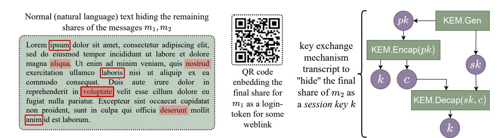

{0}------------------------------------------------

# PhantomCrypt: Second-Order Deniable Encryption with Post-Quantum Security

Shahzad Ahmad 1[0000-0002-9654-869X] , Stefan Rass 1[0000-0003-2821-2489] , and Zahra Seyedi 2[0009-0002-8492-4640]

- <sup>1</sup> LIT Secure and Correct Systems Lab, Johannes Kepler University, Linz, Austria shahzad.ahmad@jku.at, stefan.rass@jku.at
- <sup>2</sup> Department of Electronics, Information and Bioengineering, Polytechnic University of Milan, Milan, Italy zahrasseyedi@gmail.com

Abstract. Traditional deniable encryption primarily focuses on denying the content of secret communications, allowing plausible alternative plaintexts to be presented in the event of coercion. However, even the recognizable use of deniable encryption may already defeat its purpose, making any revealed plaintext suspicious to a coercer. Hence, for practical deniability, not only does the content need to be deniable, but also the entire use of deniable encryption must be considered. We call this second-order deniability. This notion aims to hide the whole use of deniable encryption, where covert communication is indistinguishable from innocuous data, and enhanced content deniability, enabling multiple, cryptographically plausible decryptions that are computationally indistinguishable from the true message. To show its practicality, we present PhantomCrypt, which combines conventional deniable encryption (DE) with steganographic methods to hide the use of DE itself, while retaining the ability to decrypt a ciphertext into several distinct plaintexts, even if not under pressure. We prove the security of PhantomCrypt using a formalization of second-order deniability in standard cryptographic terms.

# 1 Introduction

The growing sophistication of state-sponsored surveillance and coercive interrogation techniques poses significant challenges to privacy and freedom of speech. Although traditional cryptographic solutions provide confidentiality, they are ineffective under coercion. If an adversary forces disclosure of decryption keys, the protected content becomes accessible. This vulnerability is particularly acute for journalists safeguarding sources, activists organizing resistance, and whistleblowers exposing corruption in authoritarian environments.

Classical deniable encryption, introduced by Canetti et al. [\[5\]](#page-43-0), addresses this issue by enabling parties under duress to present a plausible but false message while concealing the true secret. This property, referred to as content deniability 

{1}------------------------------------------------

(CD), focuses on obfuscating the message content. However, a significant limitation remains: ciphertext produced by such schemes typically appears computationally random, thereby signaling the use of encryption and an intent to conceal information. In contexts where any form of encryption arouses suspicion, the detectability of deniable encryption undermines its effectiveness.

For example, a journalist operating in a totalitarian state who communicates with a sensitive source may benefit from plausible deniability of message content. However, the use of sophisticated, random-looking encryption itself can serve as evidence of suspicious activity. Authorities need not decrypt the content; the mere presence of such technology indicates covert intent. This scenario reveals a critical gap: while existing schemes offer content deniability, they frequently lack existence deniability (ED), the property that covert communication is indistinguishable from innocuous data.

This challenge motivates the central contribution of this work: the introduction and formalization of second-order deniability, defined as the simultaneous achievement of both content deniability and existence deniability. This property provides broader cryptographic protection, concealing not only the message content but also the use of a deniable communication system. The fundamental research question is as follows: Can cryptographic systems be constructed to provide both content deniability and existence deniability simultaneously, thereby enabling truly undetectable and deniable covert communication?

This work answers affirmatively. First, second-order deniability is formally defined, and its logical independence from its constituent first-order properties is established. The proposed system, PhantomCrypt, is designed to achieve this advanced security notion. PhantomCrypt integrates information-theoretic steganographic hiding from Invisible Encryption [\[3\]](#page-43-1) to provide existence deniability, and multi-opening deniable encryption from False-Bottom Encryption [\[2\]](#page-43-2) to provide content deniability. These components are unified through threshold secret sharing, resulting in robust security against future quantum adversaries.

#### 1.1 Clarifying the Threat Model: Encryption is Ubiquitous

A common misconception in the context of deniable encryption is that any use of encryption inherently signals suspicious activity. This assumption, while perhaps true in niche historical contexts, is profoundly outdated in the modern digital landscape. In contemporary digital systems, encrypted communication is ubiquitous. Every time a user connects to a website via HTTPS, authenticates to a service, sends an encrypted email, or exchanges keys with a peer, they are performing encryption. This omnipresence creates a critical distinction in threat models, which PhantomCrypt actively leverages:

Suspicious Encryption This refers to encryption targeting the observed user or employing non-standard, custom cryptographic protocols. Examples include:

– A message explicitly encrypted with the user's public key (e.g., a PGP email where the content is encrypted for the user).

{2}------------------------------------------------

- A file encrypted with a password the user controls (e.g., a TrueCrypt/VeraCrypt volume [\[1\]](#page-43-3)).
- An encrypted channel directly established by the user with a specific peer using an atypical or custom protocol.
- Custom cryptographic protocols designed explicitly for that user's covert communication.

When an observer detects these, suspicion is warranted because the encryption is clearly intentional, directed, and potentially deviates from routine patterns.

Innocent Encryption This refers to encryption that appears as a routine, incidental byproduct of standard, widely-used protocols. These are often automatically generated and not indicative of hidden intent. Examples include:

- Session keys generated during standard TLS/HTTPS handshakes.
- KEM (Key Encapsulation Mechanism) ciphertexts from key agreement protocols.
- Login tokens in authentication systems.
- Encrypted attachments in email using standard clients (where the act of attachment encryption is routine, not the specific content).

These are ubiquitous, often automatic, and not, by themselves, indicative of hidden intent. The user does not necessarily control or direct their generation in a suspicious manner.

PhantomCrypt's Key Insight PhantomCrypt leverages this distinction. Our system embeds covert content within innocent-looking encryption, specifically in the final share of the polynomial interpolation scheme (denoted snew), which is transmitted as a session key or KEM ciphertext in a standard hybrid encryption protocol. To an observer, the communication traffic is statistically indistinguishable from routine encrypted communication that any user might generate. The ciphertext of PhantomCrypt, therefore, is not "suspicious" because it masquerades as an innocent encrypted transmission that would occur anyway for legitimate purposes. This distinction formalizes the difference between existence deniability (covert communication hidden among innocuous traffic) and simple cryptanalytic security (encrypted data cannot be decrypted). PhantomCrypt achieves the former by exploiting the reality that innocent encryption is routine, not suspicious.

# <span id="page-2-0"></span>1.2 Contributions

This paper makes the following significant contributions to the field of deniable encryption and steganography:

1. Formal Framework for Second-Order Deniability: Complete formal definitions of content deniability (CD), existence deniability (ED)(Lemma [1\)](#page-4-0), steganographic security, and second-order deniability as a cryptographic primitive with quantitative security bounds.

{3}------------------------------------------------

- 2. Original Composability Theorem: We prove that composing schemes with separate CD and ED properties yields joint second-order deniability under specific conditions, with explicit security bounds (Theorem [1\)](#page-20-0).
- 3. Comprehensive Threat Model: Formal definitions of passive, active, MLbased, and coercion adversaries, with security analysis against each.
- 4. Multi-Message Security Analysis: Original theorems addressing keyreuse attacks through seed evolution (ratcheting) and cover text rotation, with complete proofs (Theorems [2](#page-21-0)[–8\)](#page-29-0).
- 5. Quantum Security: Formal proof of post-quantum security in the Quantum Random Oracle Model (QROM) for PhantomCrypt (Theorem [3\)](#page-22-0).
- 6. Adversarial Evaluation: Empirical evaluation demonstrating resistance to modern steganalysis, including linguistic feature analysis, session key indistinguishability tests, and timing side-channel analysis.
- 7. Practical Implementation: Proof-of-concept achieving sub-10ms encryption with ML-KEM-768, demonstrating real-world feasibility.

# <span id="page-3-2"></span>2 Formal Threat Models & Definitions

To properly frame second-order deniability and its constituent properties, we first establish a complete set of formal definitions and adversary models. This systematic approach ensures clarity and mathematical precision in our security claims.

#### <span id="page-3-3"></span>2.1 Deniability Notions

We begin by formalizing the concepts of content deniability (CD) and existence deniability (ED), which we refer to as first-order deniability properties.

<span id="page-3-1"></span>Definition 1 (Content Deniability (CD)). A cryptographic system achieves content deniability if, for any adversary A with polynomial time and resources, for any ciphertext c that can legitimately decrypt to ℓ ≥ 2 distinct messages {m1, m2, . . . , mℓ} using corresponding distinct decryption keys {SK1, SK2, . . . , SKℓ}:

- 1. Indistinguishability of Decryptions: For any two distinct messages m<sup>i</sup> , m<sup>j</sup> within the set, even if A obtains their corresponding decryption keys SK<sup>i</sup> , SK<sup>j</sup> , A cannot determine which message is the "true" message with probability significantly better than random guessing. Formally, for i ̸= j: |Pr[A(c, SK<sup>i</sup> , mi) = "true"] − Pr[A(c, SK<sup>j</sup> , m<sup>j</sup> ) = "true"]| ≤ negl(λ)
- 2. Bounded Advantage Against Key Reveal: Even if A obtains up to ℓ−1 decryption keys and their corresponding decoy messages, the probability that A correctly identifies the true message m<sup>∗</sup> (from the remaining possibilities) is bounded by: Pr[A(c, {SK<sup>j</sup> , mj}j̸=<sup>∗</sup>) = m<sup>∗</sup> ] ≤ 1/ℓ + negl(λ)

<span id="page-3-0"></span>Informal: Under coercion, a user can present any of ℓ plausible alternative plaintexts, and the coercer cannot definitively prove which message was the intended one with confidence better than random guessing.

{4}------------------------------------------------

Definition 2 (Existence Deniability (ED)). A communication protocol achieves existence deniability if its transmitted ciphertexts are statistically indistinguishable from legitimate, innocuous encrypted traffic. Formally: Let Dprotocol denote the distribution of ciphertexts produced by the protocol. Let Dinnocent denote the distribution of ciphertexts from standard, legitimate encrypted communication (e.g., TLS sessions, PGP encrypted emails, KEM exchanges). The protocol achieves existence deniability if:

- 1. Statistical Indistinguishability: For any probabilistic polynomial-time (PPT) adversary (observer) O: |Pr[O(x) = "protocol" : x \$ ←− Dprotocol ] − Pr[O(x) = "protocol" : x \$ ←− Dinnocent ]| ≤ εED where εED = 2 −λ is a negligible statistical distance in the security parameter λ.
- 2. No Syntactic Anomalies: For any protocol parser P (which extracts structural features from ciphertexts), P(c) for c \$ ←− Dprotocol is syntactically indistinguishable from P(c ′ ) for c ′ \$ ←− Dinnocent.

Informal: An observer cannot detect that covert communication is occurring or that special cryptographic techniques are being used beyond standard encrypted traffic. The ciphertext looks like standard encrypted data in every detectable way.

Definition 3 (First-Order Deniability). A cryptographic system achieves first-order deniability if it provides either content deniability or existence deniability (or both). Formally: CD ∨ ED. This encompasses any scheme offering one of these fundamental denial capabilities.

<span id="page-4-1"></span>Definition 4 (Second-Order Deniability). A cryptographic system achieves second-order deniability if it simultaneously provides both content deniability and existence deniability. Formally: CD ∧ ED. This represents a stronger, more extensive protection, offering deniability of both the message content and the very act of using a deniable communication system.

Remark 1. Second-order deniability implies first-order deniability, since (CD ∧ ED) → (CD ∨ ED).

<span id="page-4-0"></span>Lemma 1 (Independence of CD and ED). Content deniability and existence deniability are logically independent properties. Neither implies the other.

Proof. We establish independence by providing constructive counterexamples for both implications:

1) CD does not imply ED: Consider False-Bottom Encryption (FBE) [\[2\]](#page-43-2). FBE achieves content deniability by allowing multiple cryptographically plausible decryptions from a single ciphertext. However, the resulting ciphertext, consisting of raw field elements, is computationally indistinguishable from random noise. While this provides strong CD by making the content deniable, the output is not camouflaged as standard encrypted traffic. A statistical adversary can easily distinguish FBE's ciphertext distribution from Dinnocent (e.g., standard KEM ciphertexts or TLS records), thereby failing to achieve ED.

{5}------------------------------------------------

2) ED does not imply CD: Consider a generic steganographic scheme, such as Invisible Encryption (IE) [\[3\]](#page-43-1) (in its basic form for a single message) or traditional image steganography using LSB embedding. These schemes conceal the existence of covert communication within innocuous media, achieving ED (under certain assumptions about undetectability). However, they typically embed only a single, true message. If a steganographic channel is detected and the secret extracted, there is usually no plausible alternative message to present to a coercer. Therefore, such schemes, while providing ED, typically fail to offer CD.

Since we can construct schemes that satisfy CD but not ED, and schemes that satisfy ED but not CD, the properties are logically independent. This independence underscores why second-order deniability is a distinct and more demanding security notion, requiring a composite approach like PhantomCrypt.

#### <span id="page-5-1"></span>2.2 Steganographic Security

Existence deniability (ED) often relies on steganographic security to ensure that covert data is indistinguishable from benign cover sources. We provide a formal definition for this property.

<span id="page-5-0"></span>Definition 5 (Steganographic Security). A steganographic scheme

$$S = (S.\mathsf{Encode}, S.\mathsf{Decode})$$

is steganographically secure if it satisfies two essential properties:

1. Undetectability: The stego-object (output of encoding) is computationally indistinguishable from the cover source (original benign object) or from innocuous traffic. For any PPT detector D (steganalyst):

$$|\Pr[\mathcal{D}(\mathcal{S}.\mathsf{Encode}(\mathsf{key}, m, \mathsf{Cover})) = "stego"] - \Pr[\mathcal{D}(\mathsf{Cover}) = "stego"]| \le \varepsilon_{undetect}$$

where εundetect = negl(λ) is a negligible function in the security parameter λ. 2. Indistinguishability of Messages: For any two distinct messages m1, m<sup>2</sup> and a fixed cover Cover, it is computationally infeasible for an adversary A to distinguish which message was encoded without the secret key.

$$|\Pr[\mathcal{A}(\mathcal{S}.\mathsf{Encode}(\mathsf{key}, m_1, \mathsf{Cover})) = 1] - \Pr[\mathcal{A}(\mathcal{S}.\mathsf{Encode}(\mathsf{key}, m_2, \mathsf{Cover})) = 1]|$$
  
  $\leq \varepsilon_{indi}$ 

where 
$$\varepsilon_{indi} = \text{negl}(\lambda)$$
.

Informal: An observer cannot tell (1) that steganography occurred, or (2) which specific message was hidden, without possessing the secret key. PhantomCrypt's existence deniability (Definition [2\)](#page-3-0) is achieved through the undetectability of its steganographic layer.

{6}------------------------------------------------

# <span id="page-6-1"></span>2.3 Correctness for Deniable Encryption

Beyond security, a deniable encryption scheme must function reliably. We define correctness for schemes that offer multiple plausible decryptions.

<span id="page-6-0"></span>Definition 6 (Correctness for Multi-Opening Schemes). A deniable encryption scheme DE = (Setup, Enc, AddDecoy, DecTrue, DecDecoy) provides correctness if:

- 1. Deterministic Recovery: For any true message m<sup>∗</sup> and any set of ℓ−1 decoy messages {mdecoy,i}, and a resulting ciphertext c: DecTrue(c, SKtrue) = m<sup>∗</sup> and for each decoy i, DecDecoy(c, SKdecoy,i) = mdecoy,i, both with probability 1. There is no randomness in the decryption process given the correct key.
- 2. Distinctness of Messages: All messages (true and decoys) embedded within the same ciphertext are distinct: for any i ̸= j, m<sup>i</sup> ̸= m<sup>j</sup> .
- 3. Key Independence: Knowledge of one decryption key SK<sup>i</sup> and its corresponding message m<sup>i</sup> does not computationally aid in determining another message m<sup>j</sup> (for i ̸= j) or its corresponding key SK<sup>j</sup> , beyond what is already allowed by the deniability bounds.

Informal: Honest decryption always succeeds without error, and each key uniquely recovers its intended message, even while maintaining deniability.

Detailed correctness proofs for PhantomCrypt are provided in Appendix [D.](#page-11-0)

# <span id="page-6-2"></span>2.4 Formal Threat Models

We define specific adversary models to systematically evaluate PhantomCrypt's security against various threats. A summary of Formal Definitions is shown in the Table [1.](#page-8-0)

#### Adversary Model 1: Passive Statistical Adversary (for ED)

Definition 7 (Passive Statistical Adversary Astat). Astat is a PPT adversary who can:

- Observe all transmitted communication (ciphertexts, associated metadata, network traffic patterns).
- Perform any polynomial-time statistical analysis on the observed data.
- Know the algorithms and public parameters of PhantomCrypt (Kerckhoffs' principle [\[14\]](#page-43-4)).

# Astat cannot:

- Break the computational hardness assumptions of underlying cryptographic primitives (e.g., PQC-KEM, AES-GCM, quantum-resistant hash functions).
- Tamper with messages or inject traffic.
- Obtain secret keys through coercion or side-channels.

Astat's goal is to distinguish PhantomCrypt traffic from legitimate, innocuous encrypted traffic (Dinnocent) with a non-negligible advantage. PhantomCrypt's existence deniability (Definition [2\)](#page-3-0) protects against Astat.

{7}------------------------------------------------

# <span id="page-7-0"></span>Adversary Model 2: Active Steganalysis Adversary (for ED)

Definition 8 (Active Steganalysis Adversary Asteg). Asteg is a PPT adversary with enhanced capabilities for detecting covert channels, specifically focused on steganography. Asteg can:

- Observe all transmitted data, including cover texts (T).
- Extract fine-grained linguistic and statistical features from T (e.g., n-gram frequencies, perplexity, readability indices, word choice patterns).
- Train machine learning classifiers on large datasets of both benign and steganographically encoded texts to detect subtle modifications.
- Perform differential analysis between multiple cover texts or over time.
- Know the steganographic algorithm (e.g., IE's word selection mechanism, but not the secret seed x0).

Asteg's goal is to detect that the cover text or its associated communication contains a hidden message. PhantomCrypt's steganographic security (Definition [5\)](#page-5-0) protects against Asteg.

# <span id="page-7-1"></span>Adversary Model 3: Neural Language Model Adversary (for ED)

Definition 9 (Neural Language Model Adversary ANLM). ANLM is a sophisticated PPT adversary representing state-of-the-art detection capabilities. ANLM can:

- Possess pre-trained deep neural networks, including large language models (LLMs), capable of generating, analyzing, and detecting anomalies in natural language text.
- Use LLMs to identify subtle deviations from "naturalness" or "plausibility" in cover texts or to predict missing parts of text/data to detect unexpected insertions.
- Train LLMs specifically for steganalysis tasks, attempting to identify patterns even in the absence of explicit modifications.

ANLM's goal is to detect that a cover text or associated random-looking data (e.g., the KEM session key) is out of place or generated by a non-natural process, thereby signaling covert communication. PhantomCrypt defends against ANLM primarily by never modifying the cover text and by ensuring that the embedded shares are statistically indistinguishable from legitimate cryptographic artifacts.

# Adversary Model 4: Coercion/Forensics Adversary (for CD)

Definition 10 (Coercion/Forensics Adversary Acoercer). Acoercer is a powerful adversary representing a state actor or forensic agency. Acoercer can:

– Observe all communication and stored data (ciphertexts, keys, algorithms).

{8}------------------------------------------------

Table 1: Formal Definitions Summary

<span id="page-8-0"></span>

| Property        | Mathematical<br>Definition<br>/<br>Key      | Quantitative           | Primary<br>Adver         |
|-----------------|---------------------------------------------|------------------------|--------------------------|
|                 | Criteria                                    | Bound                  | sary                     |
| Content<br>Deni | Cannot determine true message (m∗<br>)      | Pr[A finds m∗<br>] ≤   | Coercion (Acoercer)      |
| ability (CD)    | from ℓ alternatives, even with ℓ − 1 de     | 1/ℓ + negl(λ)          |                          |
|                 | coy keys/messages                           |                        |                          |
| Existence<br>De | Protocol<br>ciphertext<br>(Dprotocol)<br>in | Pr[O(x)<br>=           | Passive / Statisti       |
| niability (ED)  | distinguishable from innocent traffic       | protocol]<br>−         | cal<br>(Astat,<br>Asteg, |
|                 | (Dinnocent); no syntactic anomalies         | Pr[O(x)<br>=           | ANLM)                    |
|                 |                                             | −λ<br>innocent]  ≤ 2   |                          |
| Steganographic  | Stego-object indistinguishable from be      | εundetect, εindi<br>=  | Steganalysis             |
| Security        | nign cover; different encoded messages      | negl(λ)                | (Asteg, ANLM)            |
|                 | indistinguishable                           |                        |                          |
| Second-Order    | Achieves both CD and ED simultane           | −λ)<br>max(1/ℓ, 2<br>+ | Joint (Astat, Asteg,     |
| Deniability     | ously; holds even against adversary who     | negl(λ)                | ANLM, Acoercer)          |
|                 | knows composition and attacks both          |                        |                          |
|                 | layers                                      |                        |                          |
| Correctness     | Decryption always recovers intended         | Probability<br>1<br>of | N/A (Functional)         |
|                 | message for given key; messages dis         | correct<br>decryp      |                          |
|                 | tinct; key knowledge does not compro        | tion                   |                          |
|                 | mise others                                 |                        |                          |

Note: negl(λ) = negligible function in security parameter λ; ℓ = number of decoy messages.

- Physically coerce a party to reveal their secret keys (SKtrue or skkem) or to perform decryptions.
- Obtain knowledge of multiple valid messages that can be decrypted from a single ciphertext.
- Leverage any available background knowledge about the user, communication context, or potential messages.
- Perform offline brute-force attacks on components not protected by informationtheoretic security.

Acoercer's goal is to identify the single "true" message among multiple plausible alternatives, even after acquiring some decryption capabilities. PhantomCrypt's content deniability (Definition [1\)](#page-3-1) protects against Acoercer.

# <span id="page-8-1"></span>3 Related Work

PhantomCrypt builds upon decades of research in deniable encryption and steganography. This section systematizes existing approaches within the first-order deniability framework (CD and ED) to highlight where PhantomCrypt offers distinct advantages by achieving second-order deniability. Our analysis explicitly positions PhantomCrypt as a novel contribution that unifies the strongest forms of both content and existence deniability, robust against post-quantum threats.

#### 3.1 Content Deniability (CD) Schemes

These schemes focus on making message content deniable, allowing users to present plausible alternative plaintexts when coerced. While effective for content obfuscation, they typically produce outputs that are clearly identifiable as encrypted data, thus failing to achieve existence deniability (ED).

{9}------------------------------------------------

- Canetti et al.'s Deniable Encryption [\[4,](#page-43-5)[5\]](#page-43-0): The foundational work introducing deniable encryption. These schemes achieve CD by enabling one or more alternative messages to be plausibly revealed alongside the true message. However, the resulting ciphertexts are typically statistically indistinguishable from random noise, immediately signaling the presence of encryption. Therefore, while providing strong CD, they fundamentally lack ED.
- False-Bottom Encryption (FBE) [\[2\]](#page-43-2): A core component of PhantomCrypt. FBE significantly advances CD by allowing multiple cryptographically indistinguishable decoy messages (ℓ ≥ 1) to be embedded within a single ciphertext. FBE uses underdetermined linear equations over finite fields, where choosing a secret key base rFBE determines which plaintext is recovered. FBE's security relies on rFBE secrecy and the information-theoretic properties of the linear system, ensuring multiple key bases could plausibly lead to the same ciphertext. Like earlier deniable encryption, FBE produces a random-looking ciphertext (raw field elements), providing strong CD but inherently lacking ED.
- Honey Encryption [\[13\]](#page-43-6): Focuses on making randomly decrypted plaintexts look like real, plausible messages if an incorrect key is used. While offering a form of CD by presenting plausible fake plaintexts, its primary goal is not to deny the act of encryption but to make brute-force key search fruitless. The ciphertext itself is still detectable as encrypted data, thus failing the ED test.
- Hidden Volumes (e.g., TrueCrypt/VeraCrypt [\[1\]](#page-43-3)): These systems allow creating nested encrypted volumes, where one volume is concealed within another's free space. When coerced, a user can reveal the outer, innocuous volume's key, thereby denying the existence of the hidden one. This achieves CD and offers a partial form of ED. However, the mere existence of any encrypted volume might raise suspicion (failing syntactic indistinguishability), and the hidden volume can be statistically detected if the outer volume is not filled with truly random data after formatting, thereby compromising ED against advanced forensics.

#### <span id="page-9-0"></span>3.2 Existence Deniability (ED) Schemes

These schemes aim to hide the very fact of communication, making covert messages indistinguishable from innocent data. While effective in camouflaging communication, they typically embed only a single message and do not offer content deniability (CD) in case of detection or coercion.

– Traditional Steganography [\[10,](#page-43-7) [12,](#page-43-8) [16\]](#page-44-0): This field embeds hidden messages in innocent-looking cover media. Techniques like LSB embedding modify the cover media. While aiming for ED, these modifications can often be statistically detected (failing undetectability against Asteg). Furthermore, classical steganography typically provides no CD; once detected, the single embedded message is revealed with no plausible alternative.

{10}------------------------------------------------

- Linguistic Steganography [\[7,](#page-43-9) [8\]](#page-43-10): A subset of steganography that hides information within natural language text. More sophisticated methods aim to preserve linguistic properties to resist detection. These provide ED (often against Asteg but potentially vulnerable to ANLM if the text is modified) but generally not CD.
- Invisible Encryption (IE) [\[3\]](#page-43-1): A crucial building block for PhantomCrypt's ED. IE offers advanced linguistic steganography by embedding secret shares within a standard hybrid encryption transmission structure rather than modifying the cover text itself. By deriving shares from selected words in natural language cover text and combining them with a dummy KEM exchange, IE makes the cryptographic protocol appear to be standard session key establishment for innocent, legitimate encryption. This achieves high covertness without altering the cover text (resisting Asteg and ANLM by feature invariance), which is vital for environments where statistical modification is a red flag. IE provides strong ED, but in its original form, it does not offer CD, as it only transmits one true message.
- Anamorphic Encryption [\[6\]](#page-43-11): A specialized form that embeds secret information into seemingly innocuous text by carefully choosing parameters in a public encryption scheme. While providing ED by making ciphertext look like ordinary public-key encrypted text, it generally does not offer CD.
- Network Anonymity Protocols (e.g., Tor [\[9\]](#page-43-12), Crowds [\[15\]](#page-43-13)): These protocols focus on obscuring the origin, destination, or flow of communication at the network level. While they enhance anonymity and privacy (a form of ED by hiding who is communicating), they generally do not provide CD for the message content itself, nor do they fully hide the existence of any encrypted communication, as encrypted packets are still detectable as such (failing ED against Astat if specifically looking for Tor traffic).

#### <span id="page-10-0"></span>3.3 PhantomCrypt's Position

PhantomCrypt uniquely bridges the gap between strong content deniability and robust existence deniability, particularly against post-quantum adversaries. It systematically addresses the limitations of prior work by achieving second-order deniability within a unified, provably secure framework. Our key differentiators are:

- Unifying CD and ED for Second-Order Deniability: Achieving both simultaneously, defined formally as a novel security primitive.
- Information-Theoretic Hiding for ED: Leveraging IE to make covert communication statistically indistinguishable from benign encrypted traffic, crucially without modifying the cover text (immunity to Asteg and ANLM).
- Multi-Opening for CD: Employing FBE to provide multiple cryptographically plausible decoy messages, offering robust deniability under coercion (Acoercer).
- Post-Quantum Security: Building on PQC-KEMs and quantum-resistant hash functions, with formal analysis in the QROM.

{11}------------------------------------------------

Table 2: PhantomCrypt's Advantages Over Existing Approaches

<span id="page-11-1"></span>

| Scheme                       | Content<br>Deniability (CD) | Existence<br>Deniability (ED) | $\begin{array}{c} \textbf{Second-Order} \\ \textbf{Deniability} \ (\textbf{CD} \ \land \ \textbf{ED}) \end{array}$ | •           |   | Linguistic Feature<br>Invariance (for ED) |
|------------------------------|-----------------------------|-------------------------------|--------------------------------------------------------------------------------------------------------------------|-------------|---|-------------------------------------------|
| Canetti et al. [5]           | ✓                           | ×                             | ×                                                                                                                  | ×           | × | ×                                         |
| Honey Encryption [13]        | ✓                           | ×                             | ×                                                                                                                  | ×           | × | ×                                         |
| TrueCrypt Hidden Volumes [1] | ✓                           | ✓*                            | ×                                                                                                                  | ×           | × | ×                                         |
| Invisible Encryption [3]     | ×                           | ✓                             | ×                                                                                                                  | <b>√</b> ** | × | ✓                                         |
| False-Bottom Encryption [2]  | ✓                           | ×                             | ×                                                                                                                  | ✓***        | ✓ | ×                                         |
| PhantomCrypt                 | ✓                           | ✓                             | ✓                                                                                                                  | ✓           | ✓ | $\checkmark$                              |

Notes: \* TrueCrypt's ED is partial; statistical indistinguishability of "free space" from random data can be vulnerable to advanced forensics, and the presence of encrypted volumes is detectable. \*\* Invisible Encryption achieves quantum resistance only when implemented with PQC primitives; the original paper uses RSA. PhantomCrypt explicitly uses PQC-KEMs. \*\*\* False-Bottom Encryption uses post-quantum secure primitives (hash functions, finite field arithmetic), but its output is not designed for existential hiding.

- Formal Composability Framework: Providing new theoretical insights into how CD and ED can be securely combined.

No prior single scheme offers this combination within a unified, provably secure framework that explicitly addresses all four defined adversary models. The advantages of PhantomCrypt over existing approaches are systematically shown in Table 2.

# <span id="page-11-0"></span>4 PhantomCrypt Construction

This section details the construction of PhantomCrypt, which instantiates the concept of Second-Order Deniability (Definition 4) by formally defining it as a cryptographic primitive: Deniable Encryption with Existential Hiding (DEEH). PhantomCrypt leverages a layered architecture that combines the information-theoretic content deniability of False-Bottom Encryption (FBE) [2] with the statistical existence deniability of Invisible Encryption (IE) [3], orchestrated through a hybrid encryption scheme.

#### <span id="page-11-2"></span>4.1 Deniable Encryption with Existential Hiding (DEEH) Primitive

PhantomCrypt is a concrete instantiation of a new cryptographic primitive, Deniable Encryption with Existential Hiding (DEEH). This primitive rigorously captures the requirements for second-order deniability.

Definition 11 (Deniable Encryption with Existential Hiding (DEEH) Primitive). A Deniable Encryption with Existential Hiding (DEEH) scheme is a tuple of probabilistic polynomial-time algorithms:

(Setup, Enc, AddDecoy, DecTrue, DecDecoy)

1. Setup( $1^{\lambda}$ , T)  $\rightarrow$  (PP, SK): The setup algorithm takes as input a security parameter  $\lambda$  and a natural language cover text T. It outputs public parameters PP (including cryptographic parameters like prime p, hash function H, KEM public key  $pk_{kem}$ ) and a master secret key SK (including IE secret seed  $x_0$ , IE threshold k, and KEM secret key  $sk_{kem}$ ).

{12}------------------------------------------------

- 2. Enc(PP, SK,  $m^*, T$ )  $\rightarrow$  (C, SK<sub>decoy,1</sub>,  $\sigma$ ): The encryption algorithm takes public parameters PP, the master secret key SK, the true message  $m^* \in \mathbb{F}_p$ , and the cover text T. It outputs a ciphertext C, a decryption key for an initial decoy message SK<sub>decoy,1</sub>, and random coins  $\sigma$  used in the process.
- 3. AddDecoy(PP,  $C, m_{decoy}$ ,  $\mathsf{SK}_{decoy\_prev}$ )  $\to$  ( $C', \mathsf{SK}_{decoy\_new}$ ): The decoy addition algorithm takes public parameters PP, an existing ciphertext C, a new decoy message  $m_{decoy} \in \mathbb{F}_p$ , and an optional previous decoy key (for stateful updates). It outputs an updated ciphertext C' and a new decoy decryption key  $\mathsf{SK}_{decoy\_new}$ . This algorithm can be called repeatedly to add up to  $\ell-1$  decoy messages.
- 4. DecTrue(C, SK, T) → m\* or ⊥: The true decryption algorithm takes a ciphertext C, the master secret key SK, and the cover text T. It deterministically outputs the true message m\* or an error symbol ⊥ if authentication fails.
- 5. DecDecoy $(C, \mathsf{SK}_{decoy}, \mathsf{PP}) \to m_{decoy}$  or  $\bot$ : The decoy decryption algorithm takes a ciphertext C, a specific decoy decryption key  $\mathsf{SK}_{decoy}$ , and public parameters  $\mathsf{PP}$ . It deterministically outputs the corresponding decoy message  $m_{decoy}$  or  $\bot$  if authentication fails.

Security Properties for DEEH: A DEEH scheme must satisfy Correctness (Definition 6), Content Deniability (Definition 1), Existence Deniability (Definition 2), and Steganographic Security (Definition 5) simultaneously. These properties are formally captured through joint security games, ensuring protection against adversaries targeting either content or existence, or both.

#### <span id="page-12-1"></span>4.2 High-Level PhantomCrypt Architecture

PhantomCrypt's architecture is depicted in Figure 1. It comprises three main layers:

1. Invisible Encryption (IE) Layer (for ED): Figure 1 illustrates the conceptual idea of Invisible Encryption [3], given a natural language text, the sender, Sarah, pseudorandomly selects words to act as shares for her message  $m_1$ . For example, with the words  $w_{i_1}, w_{i_2}, \ldots, w_{i_{n_1}}$  selected, the message is represented as

<span id="page-12-0"></span>
$$m_1 = H(w_{i_1}) \oplus H(w_{i_2}) \oplus \cdots \oplus H(w_{i_{n_1}}) \oplus r, \tag{1}$$

where H is a cryptographic hash function (acting like a random oracle), and r is a final value required to make Equation (1) hold. This final value will (almost surely) appear as a random string and, on its own, carries no information about the secret message  $m_1$ . Therefore, cryptanalysis on r will not deliver any meaningful information. Due to its appearance as a random string, it can unsuspiciously also act as a session key in some Key Encapsulation Mechanism (KEM) embedded within the transcript between Sarah and the receiver of message  $m_1$ , hereafter called Robert.

{13}------------------------------------------------

<span id="page-13-0"></span>

Fig. 1: PhantomCrypt = Invisible Encryption with Plausible Deniability: The figure illustrates a (visually brushed up) transcript of a transmission from Sarah to Robert, including a natural language payload. It shows how shares for message m<sup>1</sup> (words with black boxes) and m<sup>2</sup> (words with grey highlight) are derived from the cover text. The final share for m<sup>1</sup> is embedded in a QR code, and the final share for m<sup>2</sup> is hidden within a KEM exchange, making cryptographic protocols themselves carriers of hidden information. This ensures both existence and content deniability.

Now, suppose Sarah is under coercion to disclose the secrets she attempts to deliver to Robert. In this situation, Sarah can resort to the existence deniability of Invisible Encryption. She can claim that the only secrets in the transcript are the session key of the KEM exchange. Without knowledge of the secret locations of words in the text that act as shares for the actual message (shown boxed in Figure [1\)](#page-13-0), the coercer has no systematic means of discovering that Sarah is not telling the truth.

However, the coercer may remain suspicious, release Sarah, but keep her under secret surveillance, eavesdropping on all traffic Sarah sends to Robert. Sarah, aware of being watched, might also suspect that Robert himself could be under coercion or have his computer hijacked. If she were to decrypt the IE ciphertext to deliver the actual message to Robert, the attacker might also be listening from Robert's position. If Sarah has reasons to distrust the "Robert" she is communicating with, she can follow the IE scheme but open a message different from the original one. This is what deniable encryption aims to achieve, allowing the same ciphertext to decrypt, under different keys, into several possible plaintexts.

- 2. False-Bottom Encryption (FBE) Layer (for CD): This layer facilitates content deniability by generating multiple cryptographically distinct, yet equally plausible, decoy messages. It does so by leveraging underdetermined linear equations over a finite field. A ciphertext container (cFBE) is populated with field elements, and each message (true or decoy) is associated with a specific linear combination of elements from cFBE and a secret key base (rFBE). The details of these linear combinations form the decryption keys for each message. This layer's output (raw field elements) is designed to be embedded within other cryptographic structures to avoid detection.
- 3. Hybrid Encryption Layer (for ED/Transmission): This layer encapsulates the outputs of the IE and FBE layers within a standard, legitimate-

{14}------------------------------------------------

looking cryptographic envelope. It employs a Post-Quantum Cryptography Key Encapsulation Mechanism (PQC-KEM) to establish a session key, which is then used with Authenticated Encryption (e.g., AES-GCM) to encrypt the IE-derived shares ( $s_{\text{new}}$  and  $x_0$ ) and the FBE ciphertext container ( $c_{\text{FBE}}$ ). The entire transmission mimics a standard hybrid encryption communication (e.g., an encrypted email attachment), providing existence deniability by blending into ubiquitous encrypted traffic.

The seamless interaction between these layers ensures that PhantomCrypt achieves second-order deniability: the covert message is hidden within routine encrypted traffic (ED), and its content is deniable if detected (CD).

# 4.3 Detailed PhantomCrypt Algorithms

We now present the detailed algorithms for PhantomCrypt's DEEH primitive, building upon the core principles of IE and FBE. For complete technical details, algorithms, and full security proofs of IE and FBE, please refer to their original publications [2, 3]. Appendix C provides a complete list of symbols used and their descriptions.

<span id="page-14-0"></span>PhantomCrypt Setup and Key Generation Algorithm 4.3 details the initialization of PhantomCrypt, generating public parameters and secret keys for both the IE and hybrid encryption layers.

# **Algorithm 1:** PhantomCrypt.Setup $(1^{\lambda}, L)$

**Require:** Security parameter  $\lambda \in \mathbb{N}$ , cover text length  $L \in \mathbb{N}$ 

Ensure: Public parameters PP, master secret key SK

- 1: Select prime p such that  $\lceil \log_2 p \rceil = \lambda$  (e.g.,  $p = 2^{256} 2^{32} 977$ )
- 2: Initialize field  $\mathbb{F}_p$  and hash function H (modeled as a Quantum Random Oracle)
- 3: Choose cryptographically secure PRNG PRNG with domain [1, L]
- 4:  $(pk_{\text{kem}}, sk_{\text{kem}}) \leftarrow \text{KEM.KeyGen}(1^{\lambda}) \rightarrow \text{Post-quantum KEM keypair}$ (e.g., ML-KEM-768)
- 5:  $x_0 \stackrel{\$}{\leftarrow} \{0,1\}^{\lambda}$  > Secret seed for deterministic IE share generation
- 6:  $k \stackrel{\$}{\leftarrow} \{3, \dots, \min(K_{MAX\_PRACTICAL}, L/2)\}$  > IE threshold parameter,  $k \geq 3$  for polynomial interpolation
- 7:  $n_{\text{init}} \leftarrow \text{constant} > \text{Initial size for FBE container, e.g., 5-10 random field elements}$
- 8:  $k_{\text{base}} \leftarrow \text{constant} \quad \triangleright \text{Size of FBE key base, e.g., } 10\text{-}20 \text{ non-zero field elements}$
- 9:  $(c_{\text{FBE\_init}}, r_{\text{FBE}}) \leftarrow \text{FBE.Init}(\mathsf{PP'}, n_{\text{init}}, k_{\text{base}})$   $\triangleright$  Initializes FBE container and key base (see Algorithm C.3)
- 10:  $PP \leftarrow (p, H, PRNG, KEM, pk_{kem}, c_{FBE\_init}, r_{FBE}) \triangleright Public parameters$
- 11:  $\mathsf{SK} \leftarrow (x_0, k, sk_{\mathrm{kem}})$   $\triangleright$  Master secret key

{15}------------------------------------------------

12: return (PP, SK)

**Parameter Selection**: The threshold k balances security against efficiency. Larger k increases the brute-force search complexity for IE to  $\Omega(2^{k\lambda})$  but also increases polynomial interpolation cost to  $O(k^2)$ . The recommended range  $k \in [5,7]$  provides strong security while maintaining practical performance (detailed in Section 7). The constraint  $k \leq L/2$  ensures sufficient words remain in the cover text pool after selection to avoid easily detectable patterns and to resist advanced linguistic analysis.

<span id="page-15-0"></span>**PhantomCrypt Encryption** The encryption process involves the IE layer, the FBE layer for decoy messages, and finally the hybrid encryption layer to encapsulate the outputs into an innocent-looking ciphertext.

```
Algorithm 2: PhantomCrypt.Enc(PP, SK, m^*, T)
Require: Public parameters PP, master secret key SK = (x_0, k, sk_{kem}),
     true message m^* \in \mathbb{F}_p, cover text T = (w_1, \dots, w_L)
Ensure: Ciphertext C, first decoy key SK_{decoy,1} (for consistency), or \bot
      on failure
  1: // Phase 1: Invisible Encryption (IE) for m^*
  2: (s_{\text{new}}, x_{\text{new}}, S) \leftarrow \mathsf{IE}.\mathsf{Enc}(\mathsf{PP}, x_0, k, m^*, T)
                                                                          \triangleright Derive shares for m^*
      (see Algorithm C.2)
  3:
  4: // Phase 2: False-Bottom Encryption (FBE) for Initial De-
      coy
 5: (c_{\text{FBE}}, r_{\text{FBE}}) \leftarrow (\text{PP.c}_{\text{FBE\_init}}, \text{PP.r}_{\text{FBE}})
                                                                     {\,\vartriangleright\,} Retrieve initialized FBE
      container and key base
 6: m_{\text{decoy},1} \stackrel{\$}{\leftarrow} \mathcal{D}_{\text{plausible\_message}}

    ▷ Sample a plausible decoy message

      from a contextual distribution
 7: (c'_{\text{FBE}}, \mathsf{SK}_{\text{decoy},1}) \leftarrow \mathsf{FBE}.\mathsf{Enc}(\mathsf{PP}, c_{\text{FBE}}, m_{\text{decoy},1}, r_{\text{FBE}}, k)
                                                                                               \triangleright Embed
      first decoy (see Algorithm C.3)
 8: c_{\text{FBE}} \leftarrow c'_{\text{FBE}}
  9:
10: // Phase 3: Hybrid Encapsulation for Transmission
11: pk_{\text{kem}} \leftarrow \mathsf{PP.pk}_{\text{kem}}
12: (C_{\text{kem}}, C_1, C_2, IV_1, IV_2) \leftarrow \mathsf{Hybrid.Enc}(\mathsf{PP}, pk_{\text{kem}}, s_{\text{new}}, x_0, c_{\text{FBE}})
                                                                                                          \triangleright
      Encapsulate and encrypt (see Algorithm C.4)
13: C \leftarrow (C_{\text{kem}}, C_1, C_2, IV_1, IV_2)
14: return (C, \mathsf{SK}_{\text{decoy},1}, \text{random\_coins})
```

**Note:** For subsequent decoy messages, AddDecoy (Algorithm 4.3) is used, which calls FBE.Enc to extend  $c_{\rm FBE}$  and updates  $C_2$  (via re-encryption). The specific details of updating  $C_2$  are given in Algorithm 4.3.

{16}------------------------------------------------

<span id="page-16-0"></span>**FBE Decoy Addition** This algorithm allows adding additional decoy messages to an existing PhantomCrypt ciphertext without modifying the IE layer (i.e., the true message  $m^*$  and  $s_{\text{new}}$  remain undisturbed).

```
Algorithm 3: PhantomCrypt.AddDecoy(\overline{PP}, C, m_{decoy})
Require: Public parameters PP, existing ciphertext
                                                                                                      C
                                                                                                                =
      (C_{\text{kem}}, C_1, C_2, IV_1, IV_2), new decoy message m_{\text{decoy}} \in \mathbb{F}_p
Ensure: Updated ciphertext C', new decoy decryption key \mathsf{SK}_{\mathsf{decoy\_new}}
  1: // Phase 1: Decrypt FBE container to add new decoy
  2: sk_{\text{kem}} \leftarrow \mathsf{SK.sk}_{\text{kem}} \triangleright \mathsf{This} operation requires the master KEM secret
      key to decrypt C_2
  3: K_{\text{session}} \leftarrow \mathsf{KEM.Decaps}(sk_{\text{kem}}, C_{\text{kem}})
                                                                                   ▷ Decapsulate KEM
      ciphertext to get session key
  4: c_{\text{FBE}}^{\text{bytes}} \leftarrow \text{AE.Dec}(K_{\text{session}}, C_2, IV_2, \text{"FBE-container"})
  5: if c_{\mathrm{FBE}}^{\mathrm{bytes}} = \bot then return \bot
  6: end if
  7: c_{\text{FBE}} \leftarrow \mathsf{Deserialize}(c_{\text{FBE}}^{\text{bytes}})
                                                            ▶ Reconstruct FBE container field
      elements
  8:
  9: // Phase 2: Add new decoy using FBE layer
10: r_{\text{FBE}} \leftarrow \text{PP.r}_{\text{FBE}}

    ▶ Retrieve FBE key base

11: k \leftarrow \mathsf{SK.k}
                                          \triangleright Retrieve IE threshold k for FBE parameter
      (Algorithm C.3)
12: (c'_{\text{FBE}}, \mathsf{SK}_{\text{decoy\_new}}) \leftarrow \mathsf{FBE}.\mathsf{Enc}(\mathsf{PP}, c_{\text{FBE}}, m_{\text{decoy}}, r_{\text{FBE}}, k) \triangleright \mathsf{Embed}
      new decoy
13:
14: // Phase 3: Re-encrypt FBE container for updated cipher-
      text
15: IV_2' \stackrel{\$}{\leftarrow} \{0,1\}^{96}
                                               ▶ Generate a fresh nonce for re-encryption
16: c_{\text{FBE}}^{\prime \text{bytes}} \leftarrow \text{Serialize}(c_{\text{FBE}}^{\prime})
17: C_2' \leftarrow \mathsf{AE.Enc}(K_{\text{session}}, c_{\text{FBE}}'^{\text{bytes}}, IV_2', \text{"FBE-container"})
18: C' \leftarrow (C_{\text{kem}}, C_1, C_2', IV_1, IV_2') \triangleright Construct upon

19: return (C', \mathsf{SK}_{\text{decoy\_new}})
```

<span id="page-16-1"></span>**PhantomCrypt Decryption** Decryption is possible for the true message (using SK) and for any decoy message (using  $SK_{decoy}$ ).

```
Algorithm 4: PhantomCrypt.DecTrue(PP, SK, C, T)

Require: Public parameters PP, master secret key SK = (x_0, k, sk_{\text{kem}}), full ciphertext C = (C_{\text{kem}}, C_1, C_2, IV_1, IV_2), cover text T

Ensure: True message m^* or \bot (authentication failure)

1: // Phase 1: Recover session key and IE components
```

{17}------------------------------------------------

```
2: K_{\text{session}} \leftarrow \mathsf{KEM.Decaps}(sk_{\text{kem}}, C_{\text{kem}})
                                                                    ▷ Decapsulate KEM
     ciphertext using private key sk_{\text{kem}}
 3: payload<sub>IE</sub> \leftarrow AE.Dec(K_{session}, C_1, IV_1, "IE-layer")
                                                                             ▶ Decrypt IE
     payload using session key
 4: if payload<sub>IE</sub> = \perp then
                                           ▶ Authentication tag verification failed
 5:
         {\bf return} \perp
 6: end if
 7: (x'_0, s_{\text{new}}) \leftarrow \mathsf{Split}(\mathsf{payload}_{\mathsf{IE}}, \mathsf{length}(x_0)) \triangleright \mathsf{Split} into recovered seed
     and new share
 8: if x'_0 \neq x_0 then \triangleright Verify the recovered seed matches the legitimate
     secret seed
         return
                         ▶ Mismatched seed indicates wrong key or tampered
 9:
     ciphertext
10: end if
11:
12: // Phase 2: Regenerate (k-1) IE shares from cover text
13: H, PRNG \leftarrow (PP.H, PP.PRNG)
14: \{(x_i, s_i)\}_{i=1}^{k-1} \leftarrow \mathsf{IE}.\mathsf{DeriveShares}(x_0, k, T, H, \mathsf{PRNG})
                                                                          ▷ Deterministi-
     cally re-generate abscissae and share values (Algorithm C.2 Phase 1
     & 2)
15: x_{\text{new}} \leftarrow \mathsf{IE}.\mathsf{GetNthAbscissa}(x_0, k, H)
                                                        \triangleright Retrieve k-th abscissa from
     hash chain generated by x_0
16:
17: // Phase 3: Polynomial reconstruction via Lagrange Inter-
     polation
18: points \leftarrow \{(x_i, s_i)\}_{i=1}^{k-1} \cup \{(x_{\text{new}}, s_{\text{new}})\}
                                                                \triangleright Combine all k points
     (derived and recovered)
19: m^* \leftarrow LagrangeInterpolate(points)
                                                            ▶ The true message is the
     constant term P(0)
20: return m^*
```

# **Algorithm 5:** PhantomCrypt.DecDecoy(PP, $SK_{decoy}$ , C, $sk_{kem}$ )

**Require:** Public parameters PP, FBE decryption key  $SK_{decoy} = (I_c, I_r, pos)$ , full ciphertext  $C = (C_{kem}, C_1, C_2, IV_1, IV_2)$ , KEM secret key  $sk_{kem}$  (obtained via coercion or compromise)

**Ensure:** Decoy message  $m_{\text{decoy}}$  or  $\perp$ 

3:

- 1: // Phase 1: Recover session key (forced decapsulation)
- 2:  $K_{\text{session}} \leftarrow \text{KEM.Decaps}(sk_{\text{kem}}, C_{\text{kem}})$   $\triangleright$  Using the coercer's (or revealed) KEM secret key  $sk_{\text{kem}}$

4: // Phase 2: Decrypt FBE container

5:  $c_{\text{FBE}}^{\text{bytes}} \leftarrow \text{AE.Dec}(K_{\text{session}}, C_2, IV_2, \text{"FBE-container"}) \triangleright \text{Decrypt FBE}$  container using the recovered session key

{18}------------------------------------------------

```
6: if c_{\mathrm{FBE}}^{\mathrm{bytes}} = \bot then \rightarrow Authentication tag verification failed 7: return \bot 8: end if 9: c_{\mathrm{FBE}} \leftarrow Deserialize(c_{\mathrm{FBE}}^{\mathrm{bytes}}) \rightarrow Reconstruct FBE container field elements from byte string 10: 11: // Phase 3: Extract decoy using FBE decryption key 12: r_{\mathrm{FBE}} \leftarrow PP.r_{\mathrm{FBE}} \rightarrow Retrieve FBE key base from public parameters 13: m_{\mathrm{decoy}} \leftarrow FBE.Dec(c_{\mathrm{FBE}}, SK_{\mathrm{decoy}}, r_{\mathrm{FBE}}) \rightarrow Apply Algorithm C.3 to extract the specific decoy message 14: return m_{\mathrm{decoy}}
```

### 4.4 Security Analysis of PhantomCrypt's Construction

PhantomCrypt's construction achieves second-order deniability by carefully orchestrating the security properties of its constituent layers:

- Existence Deniability (ED): Primarily provided by the IE layer (Algorithm C.2) and the Hybrid Encryption layer (Algorithm C.4). The cover text is never modified (resisting  $\mathcal{A}_{\text{steg}}$  and  $\mathcal{A}_{\text{NLM}}$ ), and the final share  $s_{\text{new}}$  is disguised as a random session key within a standard PQC-KEM exchange (resisting  $\mathcal{A}_{\text{stat}}$ ). The entire encrypted envelope is statistically indistinguishable from legitimate encrypted traffic (formalized in Theorem 1).
- Content Deniability (CD): Primarily provided by the FBE layer (Algorithm C.3) through its information-theoretic properties. Multiple distinct messages can be derived from the FBE ciphertext container ( $c_{\rm FBE}$ ) by selecting different decryption keys ( $SK_{\rm decoy}$ ). Under coercion by  $\mathcal{A}_{\rm coercer}$ , a user can present any of these equally plausible decoy messages, as the adversary cannot distinguish the "true" message (formalized in Theorem 1).
- Post-Quantum Security: Ensured by the careful selection of primitives (PQC-KEM, quantum-resistant hash functions like SHA3) and the information-theoretic nature of secret sharing and FBE's core logic. The overall quantum security is formalized in Theorem 3.

The explicit algorithms for IE (share derivation) and FBE (decoy embedding and decryption) are provided in Appendix C for completeness, illustrating their seamless integration within the PhantomCrypt framework.

# <span id="page-18-0"></span>5 Formal Security Theorems

This section presents the foundational security theorems of PhantomCrypt. These theorems establish the rigorous cryptographic guarantees of our construction, covering composability of deniable properties, multi-message security, post-quantum resilience, and resistance to advanced adversarial analysis. Full, detailed proofs for these theorems are provided in Appendix B.

{19}------------------------------------------------

Formal Security Games We formalize the security relationship between content deniability (CD), existence deniability (ED), and second-order deniability through game-based definitions and prove their composition.

Game 5.01 (ED-Game: Existence Deniability) Let  $\Pi = (\text{Setup}, \text{Enc}, \text{Dec})$  be a PhantomCrypt scheme and A a PPT adversary. Consider the experiment  $\mathbf{Exp}_{\Pi,A}^{\text{exist}}(\lambda)$ :

```
1. pp \leftarrow Setup(1^{\lambda})
```

- 2.  $b \stackrel{\$}{\leftarrow} \{0,1\}$
- 3.  $(m^*, T, \mathsf{st}) \leftarrow \mathcal{A}(\mathsf{pp})$
- 4. If b = 0:  $(T^*, C^*) \leftarrow \text{Innocent}(T)$  // no stego embedding
- 5. If b = 1:  $(T^*, C^*) \leftarrow \text{Enc}(pp, m^*, T)$
- 6.  $b' \leftarrow \mathcal{A}(T^*, C^*, \mathsf{st})$
- 7. **return** [b' = b]

We define A's advantage as:

$$\mathsf{Adv}^{\mathrm{exist}}_{\varPi,\mathcal{A}}(\lambda) \; = \; \left| \, \Pr \big[ \mathbf{Exp}^{\mathrm{exist}}_{\varPi,\mathcal{A}}(\lambda) = 1 \big] - \frac{1}{2} \, \right|.$$

 $We \ say \ \Pi \ is \ \underline{existence\text{-}deniable} \ if \ \mathsf{Adv}^{\mathrm{exist}}_{\Pi,\mathcal{A}}(\lambda) \leq \mathsf{negl}(\lambda) \ for \ every \ PPT \ \mathcal{A}.$ 

Game 5.02 (CD-Game: Content Deniability) Let  $\Pi$  support  $\ell$  decoy levels and A be a PPT adversary. Consider the experiment  $\mathbf{Exp}_{\Pi,A}^{\mathrm{content}}(\lambda)$ :

- 1.  $pp \leftarrow Setup(1^{\lambda})$
- 2.  $(m_0, m_1, \ldots, m_\ell, \mathsf{st}) \leftarrow \mathcal{A}(\mathsf{pp})$  //  $\ell + 1$  challenge messages
- 3.  $b^* \stackrel{\$}{\leftarrow} \{0, 1, \dots, \ell\}$
- 4.  $(C, T, K_0, \dots, K_\ell) \leftarrow \mathsf{Enc}(\mathsf{pp}, m_{b^*}, \{m_i\}_{i \neq b^*})$
- 5.  $b' \leftarrow \mathcal{A}(C, T, K_0, \dots, K_\ell, \mathsf{st})$
- 6. **return**  $[b' = b^*]$

We define A's advantage as:

$$\mathsf{Adv}^{\mathrm{content}}_{\Pi,\mathcal{A}}(\lambda) \; = \; \left| \, \Pr \big[ \mathbf{Exp}^{\mathrm{content}}_{\Pi,\mathcal{A}}(\lambda) = 1 \big] - \frac{1}{\ell+1} \, \right|.$$

We say  $\Pi$  is <u>content-deniable</u> if  $Adv_{\Pi,\mathcal{A}}^{\mathrm{content}}(\lambda) \leq negl(\lambda)$  for every PPT  $\mathcal{A}$ .

Game 5.03 (20D-Game: Second-Order Deniability) Let  $\Pi$  support  $\ell$  decoy levels and A be a PPT adversary. Consider the experiment  $\mathbf{Exp}_{\Pi,A}^{2\mathrm{od}}(\lambda)$ :

- 1.  $\mathsf{pp} \leftarrow \mathsf{Setup}(1^{\lambda})$
- 2.  $(m_0, \ldots, m_\ell, T, \operatorname{st}) \leftarrow \mathcal{A}(\operatorname{pp})$
- 3.  $b_e \stackrel{\$}{\leftarrow} \{0,1\}; b_c \stackrel{\$}{\leftarrow} \{0,1,\ldots,\ell\}$
- 4. If  $b_e = 0$ :  $(T^*, C^*) \leftarrow \mathsf{Innocent}(T)$

{20}------------------------------------------------

```
5. If b_e = 1: (T^*, C^*) \leftarrow \text{Enc}(pp, m_{b_c}, \{m_i\}_{i \neq b_c}, T)
```

6.  $(b'_e, b'_c) \leftarrow \mathcal{A}(T^*, C^*, \mathsf{st})$ 

7. return 
$$\begin{bmatrix} b'_e = b_e \\ \end{bmatrix} \land \begin{bmatrix} b_e = b_c \\ \end{bmatrix}$$

We define A's advantage as:

$$\mathsf{Adv}^{2\mathrm{od}}_{\Pi,\mathcal{A}}(\lambda) \ = \ \left| \Pr \Big[ \mathbf{Exp}^{2\mathrm{od}}_{\Pi,\mathcal{A}}(\lambda) = 1 \Big] - \frac{1}{2(\ell+1)} \right|.$$

We say  $\Pi$  is <u>second-order deniable</u> if  $Adv_{\Pi,\mathcal{A}}^{2od}(\lambda) \leq negl(\lambda)$  for every PPT  $\mathcal{A}$ .

### 5.1 Secure Composition of Steganography and Deniable Encryption

PhantomCrypt's core strength lies in its ability to securely compose existence deniability (from IE) and content deniability (from FBE) into a unified second-order deniable scheme. Theorem 1 formalizes this composition.

<span id="page-20-0"></span>Theorem 1 (Composable Second-Order Deniability). Let (IE.Enc, IE.Dec) be a steganographically secure scheme (Definition 5) achieving existence deniability (ED) with an advantage bound  $\varepsilon_{ED} = 2^{-\lambda}$  against any PPT adversary  $\mathcal{A}_{stat}$ . Let (FBE.Enc, FBE.Dec) be an information-theoretically secure deniable encryption scheme achieving content deniability (CD) with an adversarial success bounded by  $1/\ell$  against any PPT adversary  $\mathcal{A}_{coercer}$ .

Then their composition, PhantomCrypt, as defined by Algorithms 4.3 through 4.3, achieves second-order deniability  $(CD \land ED)$  simultaneously, with the following security bounds:

```
-\Pr[\mathcal{A}_{coercer} \ breaks \ CD] \le 1/\ell + \mathsf{negl}(\lambda)
```

 $-\Pr[\mathcal{A}_{stat} \ breaks \ ED] \le \varepsilon_{ED} + \mathsf{negl}(\lambda)$ 

Moreover, these bounds hold even against a joint adversary who knows the entire composition strategy (Kerckhoffs' principle), has observed decoy keys and decryptions, and can simultaneously attempt to break both CD and ED, provided that the shared secret seed  $x_0$  for the IE layer remains unknown to the adversary. The joint security advantage is  $\max(1/\ell, \varepsilon_{ED}) + \mathsf{negl}(\lambda)$ .

*Proof (Proof Sketch)*. The full proof is given in Appendix B.1. Here, we provide a sketch focusing on the key arguments:

Part 1: ED Preservation Through Composition. Claim: The composition preserves existence deniability. Intuition: The FBE container (field elements  $\alpha_1, \ldots, \alpha_N$ ) and the IE additional share  $s_{\text{new}}$  are both semantically indistinguishable from random data in  $\mathbb{F}_p$ . When encapsulated within a standard PQC-KEM exchange using Authenticated Encryption, they appear as legitimate session keys or standard encrypted payloads. Formal Argument Sketch: Consider a PPT observer  $\mathcal{O}$  (an  $\mathcal{A}_{\text{stat}}$ ) trying to distinguish PhantomCrypt ciphertexts from innocent encrypted traffic ( $\mathcal{D}_{\text{innocent}}$ ). The PhantomCrypt ciphertext  $C = (C_{\text{kem}}, C_1, C_2, IV_1, IV_2)$  has the exact same structure as a standard hybrid encryption protocol.

{21}------------------------------------------------

- 1. Ckem is indistinguishable from legitimate KEM ciphertexts by the IND-CCA security of the chosen PQC-KEM.
- 2. C<sup>1</sup> = AE.Enc(Ksession, x0∥snew, IV1, "IE-layer") and

$$C_2 = \mathsf{AE}.\mathsf{Enc}(K_{\mathrm{session}},\mathsf{Serialize}(c_{\mathrm{FBE}}),IV_2,$$
 "FBE-container")

are computationally indistinguishable from random ciphertexts by the IND-CPA and INT-CTXT security of AES-GCM, given a truly random Ksession.

- 3. The contents x0∥snew and serialized cFBE are themselves random-looking (derived from cryptographic primitives or random field elements).
- 4. IV1, IV<sup>2</sup> are randomly sampled 96-bit nonces, indistinguishable from legitimate nonces.

By a hybrid argument, the entire ciphertext C is computationally indistinguishable from a legitimate, innocent encrypted protocol execution, achieving ED.

- Part 2: CD Preservation Through Composition. Claim: The composition preserves content deniability. Intuition: FBE's information-theoretic security (multiple plausible messages) is maintained because the secrecy of x<sup>0</sup> prevents an adversary from determining which words in the cover text were selected for the true message. Without this, the true algebraic relationship for m<sup>∗</sup> cannot be unambiguously isolated. Formal Argument Sketch: For CD, consider an adversary A (an Acoercer) who has obtained C, ℓ − 1 decoy keys {SKdecoy,j}, their corresponding messages {mdecoy,j}, the cover text T, and the KEM secret key skkem. A's goal is to determine the true message m<sup>∗</sup> .
- 1. A cannot determine which words in T were selected for m<sup>∗</sup> without knowing x0. The word selection depends on PRNG(x0,i), which is computationally indistinguishable from random without x0.
- 2. FBE's underlying linear system (Algorithm [C.3\)](#page-10-0) provides information-theoretic deniability given an underdetermined system. Even with knowledge of the decoy messages and their associated equations, the secrecy of the true IE shares (due to unknown x0) means A cannot uniquely identify the algebraic relation for m<sup>∗</sup> .

Thus, CD is preserved, as A's advantage in identifying m<sup>∗</sup> is bounded by 1/ℓ.

Part 3: Joint Security. Claim: The bounds for CD and ED hold even when an adversary tries to exploit one layer to attack the other simultaneously. Intuition: The two layers are functionally distinct. The ED layer depends on computational indistinguishability (KEM/AEAD security and statistical properties of random data), while the CD layer depends on information-theoretic properties (underdetermined linear systems and secrecy of x0). Attacks on one do not provide a significant advantage in attacking the other. The advantage of an adversary successfully breaking both properties simultaneously is bounded by the maximum of their individual advantages.

# 5.2 Theorem 3: Multi-Message Security with Seed Evolution

<span id="page-21-0"></span>Reusing the secret seed x<sup>0</sup> or the same cover text for multiple messages can introduce vulnerabilities. Theorem [2](#page-21-0) demonstrates how seed evolution (ratcheting) mitigates these risks, preserving both ED and CD across multiple transmissions. 

{22}------------------------------------------------

Theorem 2 (Multi-Message Security with Seed Evolution). Under the seed evolution scheme where the IE secret seed is updated as  $x_0^{(i+1)} = H(x_0^{(i)} || C^{(i)})$  (i.e., the new seed for message i+1 is derived from the old seed and the full ciphertext of message i), the following holds: For any polynomial number of messages  $m_1, \ldots, m_k$ , transmitted in sequence, and any PPT adversary A that:

- Observes all ciphertexts  $C_1, \ldots, C_k$ .
- May obtain one or more decryption keys (true or decoy) through coercion or key recovery.
- Performs differential analysis or other attacks on multiple messages.

The composed scheme PhantomCrypt maintains:

- 1. Existence Deniability (ED) per message: Each  $C_i$  is statistically indistinguishable from innocent traffic, with advantage bounded by  $\varepsilon_{ED} + \mathsf{negl}(\lambda)$ .
- 2. Content Deniability (CD) per message: Each message  $m_i$  remains information-theoretically indistinguishable among its  $\ell$  decoys, with advantage bounded by  $1/\ell + \text{negl}(\lambda)$ .
- 3. Independence Across Messages: The adversary cannot successfully link specific messages to specific ciphertexts (or distinguish true from decoy) across the sequence with probability significantly better than random guessing, preventing Friedman-style difference attacks.

Proof (Proof Sketch). The full proof is given in Appendix B.2. Intuition: The seed evolution breaks the correlation between messages. Each message  $m_i$  uses a unique, cryptographically derived seed  $x_0^{(i)}$ , which in turn dictates an independent set of word selections from T and unique abscissae. This prevents an adversary from linking information across different ciphertexts. Formal Argument Sketch: We use a hybrid argument, moving from a sequence where  $x_0^{(i)}$  are truly random for each step, to one where they are generated by the hash chain. Because H is modeled as a quantum random oracle, each  $x_0^{(i+1)}$  is computationally indistinguishable from a fresh random seed without knowledge of  $x_0^{(i)}$  and  $C^{(i)}$ . This ensures that:

- 1. The word selections (and thus IE shares) for  $m_i$  are independent of those for  $m_i$  (for  $i \neq j$ ).
- 2. The FBE embeddings are independent due to different IE shares.
- 3. Any attempt to relate  $m_i$  and  $m_j$  via their respective  $s_{\text{new}}$  values is thwarted by the changing  $x_0$ , preventing polynomial difference attacks (Lemma 2).

The security bounds for ED and CD are preserved because each message essentially operates as an independent instance of the single-message PhantomCrypt scheme.

## 5.3 Theorem 4: Quantum Security in QROM

<span id="page-22-0"></span>In the era of quantum computing, post-quantum security is paramount. Theorem 3 establishes PhantomCrypt's resilience against quantum adversaries.

{23}------------------------------------------------

Theorem 3 (Quantum Security in QROM). In the Quantum Random Oracle Model (QROM), if:

- 1. The Key Encapsulation Mechanism (KEM) used in Hybrid.Enc (e.g., ML-KEM-768) is IND-CCA secure against quantum adversaries.
- 2. The hash function H (used for seed evolution and share derivation) is modeled as a quantum random oracle.
- 3. The Authenticated Encryption scheme (e.g., AES-256-GCM) used in Hybrid.Enc is quantum-secure against chosen-plaintext attacks (CPA) and chosen-ciphertext attacks (CCA).

Then PhantomCrypt is post-quantum secure, meaning no quantum adversary can break its Content Deniability (CD) or Existence Deniability (ED) with nonnegligible advantage in quantum polynomial time.

Proof (Proof Sketch). The full proof is given in Appendix [B.3.](#page-6-1) Intuition: The information-theoretic components of PhantomCrypt (FBE's linear algebra and IE's secret sharing core) are inherently quantum-resistant. The computational components rely on carefully chosen post-quantum secure primitives whose security is proven in the QROM. Formal Argument Sketch:

- 1. Quantum CD Security: The CD property relies on FBE, whose core relies on properties of linear algebra over finite fields and the secrecy of the IE seed x0. These are information-theoretic or rely on the indistinguishability of x<sup>0</sup> which is derived via H. In the QROM, the difficulty of distinguishing random outputs of H (and thus x0) from truly random values remains computationally hard for quantum adversaries. Thus, Acoercer's advantage in identifying m<sup>∗</sup> remains bounded by 1/ℓ + negl(λ) against quantum attacks.
- 2. Quantum ED Security: The ED property relies on the indistinguishability of the PhantomCrypt ciphertext from innocent traffic. This is reduced to the quantum IND-CCA security of the KEM and the quantum IND-CPA/INT-CTXT security of the AEAD scheme. Assuming these primitives are quantum-secure, a quantum Astat cannot distinguish the PhantomCrypt ciphertext from legitimate encrypted traffic with non-negligible advantage. The non-modification of cover text also holds for quantum adversaries, ensuring linguistic feature invariance (Theorem [5\)](#page-25-0).

The composition maintains these properties because the QROM models of H provide security against quantum oracle queries, preserving the foundational hardness assumptions.

#### 5.4 Theorem 5: Plausibility Distance Under Background Knowledge

<span id="page-23-0"></span>Beyond cryptanalysis, deniable schemes must contend with an adversary's background knowledge about message content. Theorem [4](#page-24-0) adapts the concept of unicity distance to define a "plausibility distance," quantifying how much external information allows an adversary to unambiguously identify a true message.

{24}------------------------------------------------

Definition 12 (Plausibility Distance for Deniable Schemes). Let Ω = Mplausible ∪Mimplausible be the set of all possible messages, partitioned into disjoint sets of messages deemed plausible or implausible by an adversary based on their background knowledge. Let the message source be a random variable Z ∼ F(Ω) with some distribution F over Ω, having entropy H(Z). Let H(Z|Mplausible) be the entropy of a message conditional on it being plausible. For a ciphertext c encapsulating ℓ plaintexts sampled from source Z, its plausibility distance N(c) is defined as:

$$N(c) = \frac{\log_2 \ell}{H(Z) - H(Z|\mathcal{M}_{plausible})}$$

This metric quantifies the minimum amount of information (in "symbols" or bits) about the true message m<sup>∗</sup> that an adversary, relying solely on background knowledge, would need to identify m<sup>∗</sup> unambiguously from ℓ equally plausible recovered messages.

<span id="page-24-0"></span>Theorem 4 (Plausibility Distance Under Background Knowledge). Let c be a PhantomCrypt ciphertext encapsulating ℓ distinct messages, {m1, . . . , mℓ}, sampled from a message source Z (following Definition [12\)](#page-23-0). If an adversary Acoercer (who has obtained all ℓ messages through coercion) learns more than N<sup>0</sup> "symbols" (or bits) of the true message m<sup>∗</sup> , where N<sup>0</sup> is the plausibility distance N(c), then Acoercer can unambiguously identify m<sup>∗</sup> from the list of recovered messages with non-negligible probability. Conversely, if Acoercer learns fewer than N<sup>0</sup> symbols, any identification of m<sup>∗</sup> is computationally equivalent to random guessing among the ℓ options, making the scheme plausibly deniable.

Proof (Proof Sketch). The full proof is given in Appendix [B.4.](#page-6-2) Intuition: This theorem extends Shannon's unicity distance from classical cryptanalysis to deniable schemes. If the adversary possesses enough external information to statistically prune the set of plausible messages to a single option, deniability is broken. Formal Argument Sketch:

- 1. Information Gain: When Acoercer receives ℓ messages, and knows N<sup>0</sup> symbols of m<sup>∗</sup> , this information can be used to filter the ℓ messages.
- 2. Entropy Reduction: The difference H(Z) − H(Z|Mplausible) represents the average information content of each "plausible" symbol. If Acoercer has N<sup>0</sup> such symbols for m<sup>∗</sup> , it implies that N<sup>0</sup> ×(H(Z)− H(Z|Mplausible)) bits of information are gained.
- 3. Unambiguous Identification: If the total information gained exceeds log<sup>2</sup> ℓ, the adversary can reduce the number of plausible candidates to less than 1, implying unambiguous identification. Specifically, if

$$N_0(H(Z) - H(Z|\mathcal{M}_{\text{plausible}})) > \log_2 \ell,$$

then m<sup>∗</sup> can be uniquely determined.

This theorem guides users in selecting decoy messages that are truly plausible within the context of an adversary's likely background knowledge, enhancing the practical deniability of PhantomCrypt.

{25}------------------------------------------------

#### 5.5 Theorem 6: Resistance to ML-Based Feature Extraction

Modern steganalysis heavily relies on machine learning techniques that analyze statistical and linguistic features. Theorem [5](#page-25-0) proves PhantomCrypt's inherent resistance to such attacks by demonstrating that its core mechanism does not alter the cover text.

<span id="page-25-0"></span>Theorem 5 (Resistance to ML-Based Feature Extraction). Phantom-Crypt provides strong resistance against any PPT active steganalysis adversary Asteg (Definition [8\)](#page-7-0) or neural language model adversary ANLM (Definition [9\)](#page-7-1) that attempts to detect hidden communication by analyzing linguistic, statistical, or structural features of the natural language cover text T.

Specifically, for any feature extractor function ϕ (whether statistical, linguistic, or derived from a neural network) computed solely on the cover text:

$$\phi(T_{before\ encoding}) = \phi(T_{after\ encoding})$$
 with probability 1

This holds because PhantomCrypt's Invisible Encryption layer never modifies the cover text T itself. Instead, it only derives secret shares from selected words within T.

Proof (Proof Sketch). The full proof is given in Appendix [B.5.](#page-55-0) Intuition: If the cover text remains physically identical before and after encoding, any function computed purely on that text must yield the same result. Formal Argument Sketch:

- 1. PhantomCrypt's Mechanism: The IE.Enc algorithm (Algorithm [C.2\)](#page-9-0) for deriving shares operates by: a) generating pseudorandom indices into T, and b) hashing the words found at those indices. At no point does IE.Enc alter the content, order, or presence of words within T.
- 2. Feature Extractor Scope: Any feature extractor ϕ (e.g., computing ngram frequencies, word embeddings, perplexity, entropy) by definition takes the text T as input and produces an output based on its content.
- 3. Implication: Since Tbefore encoding is identically equal to Tafter encoding (as T is merely read, not written to), any function ϕ applied to both must yield identical outputs.

Therefore, Asteg or ANLM cannot gain any advantage by analyzing features of the cover text, as these features are provably invariant. Their detection advantage against ED must rely on other aspects, such as distinguishing the encapsulated ciphertext from innocuous traffic.

# <span id="page-25-1"></span>6 Threat Model and Mitigations

This section expands on PhantomCrypt's robustness against various adversary models, particularly focusing on active steganalysis, the problem of multi-message security, and the impact of background knowledge on deniability. We introduce formal strategies and theorems to address these advanced threats.

{26}------------------------------------------------

# 6.1 Defense Against Modern Steganalysis

PhantomCrypt provides robust defense against sophisticated steganalysis adversaries, including those leveraging modern machine learning.

Resistance to Feature Extraction (Asteg) As proven in Theorem [5,](#page-25-0) PhantomCrypt achieves provable resistance to feature extraction-based steganalysis (Asteg). This is fundamentally because the Invisible Encryption (IE) layer operates without modifying the natural language cover text T. Unlike traditional steganographic methods (e.g., LSB embedding, linguistic transformations) that subtly alter the cover media, IE merely reads selected words from T to derive secret shares. Therefore, any statistical or linguistic feature (e.g., n-gram frequencies, character distributions, syntactic structures, semantic coherence) computed on T before and after PhantomCrypt's encoding will remain identical. An Asteg, even with advanced classifiers trained on millions of texts, cannot detect hidden content by analyzing T's inherent features.

Resistance to Neural Language Model Adversary (ANLM) The defense against ANLM builds upon the resistance to feature extraction. Neural language models excel at detecting "unnatural" text generation or anomalies within a linguistic context. Since PhantomCrypt leaves the cover text T completely unmodified, ANLM cannot detect any deviation from "naturalness" within T itself. The challenge for ANLM then shifts to the encapsulated ciphertext components (the KEM ciphertext Ckem, and encrypted payloads C1, C2).

PhantomCrypt addresses this by ensuring these components are statistically indistinguishable from legitimate, innocent encrypted traffic (Dinnocent), as formalized by Theorem [1.](#page-20-0) The final share snew (encoded within C1) is designed to appear as a random field element, making it statistically indistinguishable from a legitimate session key established via a PQC-KEM. The FBE container (encoded within C2) similarly contains random-looking field elements, which, when encrypted, are indistinguishable from random data. Thus, ANLM faces the same limitations as Astat when analyzing these encrypted components: distinguishing them requires breaking underlying cryptographic primitives (PQC-KEM, AES-GCM), which is computationally infeasible.

Why Separate Layers Are Necessary Question: "Could PhantomCrypt achieve both CD and ED by making the FBE output itself look innocent, without the IE layer or a hybrid encryption scheme?" Answer: No. This approach fundamentally misunderstands the nature of existence deniability.

Theorem 6 (Necessity of Composition for Full Deniability). There exists no single encryption scheme that can simultaneously achieve:

1. Content Deniability (CD) with information-theoretic security (e.g., 1/ℓ bound) for multiple plausible messages.

{27}------------------------------------------------

2. Existence Deniability (ED) such that its raw output is statistically indistinguishable from general-purpose, innocuous encrypted communication (e.g., a standard KEM session key or an AES ciphertext of benign data).

without composing independent mechanisms for each property.

Proof (Proof Sketch). Intuition: Information-theoretically secure CD (like FBE) relies on algebraic properties over finite fields, producing outputs that are distinct "field elements." Statistically indistinguishable ED requires outputs to blend into "natural" cryptographic distributions like KEM ciphertexts or AES outputs, which have specific syntactic and statistical properties. These two types of outputs are inherently different. Formal Argument Sketch:

- 1. FBE Output Characteristics: For FBE to achieve information-theoretic CD (Lemma [A.2\)](#page-2-0), its ciphertext container cFBE must consist of raw field elements α<sup>i</sup> ∈ F<sup>p</sup> that satisfy underdetermined linear equations. These elements, while random in value, are distinct from typical cryptographic primitives (e.g., KEM ciphertexts are structured outputs of a specific encapsulation algorithm; AES ciphertexts are outputs of a symmetric block cipher).
- 2. Distinguishability: A simple parser or statistical test P could easily distinguish a raw sequence of FBE field elements from a standard KEM ciphertext or AES-GCM output. For instance, P could check the length, format, or byte distribution for compliance with known cryptographic protocol specifications. Raw field elements, by themselves, do not conform to such specifications and would immediately raise syntactic anomalies. Thus, FBE's output alone fails Definition [2'](#page-3-0)s "No Syntactic Anomalies" property.
- 3. Conclusion: A single scheme cannot generate raw field elements (for informationtheoretic CD) and simultaneously produce outputs statistically indistinguishable from standard cryptographic protocols (for ED) without a layering mechanism. PhantomCrypt's composition explicitly addresses this by using IE and the hybrid layer to make the FBE outputs appear "innocent" within a standard cryptographic envelope.

This theorem clearly demonstrates why PhantomCrypt's layered approach is necessary: to bridge the inherent gap between the algebraic outputs required for information-theoretic content deniability and the need for statistical and syntactic indistinguishability required for existence deniability.

#### 6.2 Multi-Message Security Analysis

While PhantomCrypt provides strong single-message deniability, vulnerabilities can arise in multi-message scenarios where the secret seed x<sup>0</sup> or other parameters are reused.

<span id="page-27-0"></span>Lemma 2 (Key Reuse Attack in IE). In Invisible Encryption, if two distinct messages m1, m<sup>2</sup> are encrypted using the same secret seed x0, the same set of 

{28}------------------------------------------------

k-1 derived shares from cover text T, and the same  $x_{\text{new}}$  (i.e., the same IE parameters):

$$m_1 - m_2 = s_{\text{new.1}} - s_{\text{new.2}} \ MOD \ p$$

is recoverable by an adversary who obtains  $s_{\text{new},1}$  and  $s_{\text{new},2}$  (e.g., if the hybrid encryption layer's confidentiality is broken for these messages). This enables a Friedman-style [11] difference attack.

Proof (Proof Sketch). Since  $m_1 = P_1(0)$  and  $m_2 = P_2(0)$ , and  $P_1(x_i) = P_2(x_i)$  $s_i$  for k-1 points  $x_i$ , the polynomial  $D(x) = P_1(x) - P_2(x)$  has k-1 roots  $x_i$ . If  $s_{\text{new},1} = P_1(x_{\text{new}})$  and  $s_{\text{new},2} = P_2(x_{\text{new}})$  are known, then  $D(x_{\text{new}}) =$  $s_{\text{new},1} - s_{\text{new},2}$ . Since D(x) is of degree  $\leq k-1$  and has k-1 roots, it is uniquely determined by these k points (including  $D(x_{\text{new}})$ ). Thus,  $D(0) = m_1 - m_2$  can be reconstructed.

This leakage compromises both confidentiality and deniability. We propose several mitigations to achieve robust multi-message security.

**Solution 1: Seed Evolution (Ratcheting)** To prevent  $x_0$  reuse, we employ a seed evolution or "ratcheting" mechanism, ensuring each message uses a fresh, cryptographically linked but independent seed.

# <span id="page-28-0"></span>**Algorithm 1** PhantomCrypt.UpdateSeed $(x_0^{(i)}, C^{(i)}, H)$

**Require:** Current seed  $x_0^{(i)}$ , full ciphertext  $C^{(i)}$  for message i, hash function H

Ensure: Next seed  $x_0^{(i+1)}$ 

 $\triangleright$  Derived seed for message i+1

1:  $x_0^{(i+1)} \leftarrow H(x_0^{(i)} || C^{(i)})$ 2: **return**  $x_0^{(i+1)}$ 

This update mechanism (integrated into a multi-message encryption loop) ensures that subsequent encryptions use seeds that are cryptographically dependent on the previous state and ciphertext, but computationally indistinguishable from random without the full history.

<span id="page-28-1"></span>Theorem 7 (Security of Seed Evolution for Multi-Message Scenarios). Under the seed evolution scheme (Algorithm 1), for any polynomial sequence of messages  $m_1, \ldots, m_k$ , and any PPT adversary  $\mathcal{A}_{coercer}$  or  $\mathcal{A}_{stat}$  that observes all ciphertexts  $C_1, \ldots, C_k$  and potentially obtains multiple decryption keys:

- 1. Independence of IE Parameters: Each  $m_i$  uses a unique and statistically  $independent\ set\ of\ IE\ parameters\ (word\ selections,\ abscissae)\ from\ any\ m_j$ for  $j \neq i$ .
- 2. Preservation of ED and CD: The composed scheme PhantomCrypt maintains its statistical Existence Deniability and information-theoretic Content Deniability for each individual message  $m_i$ , with advantage bounds  $\varepsilon_{ED}$  +  $negl(\lambda)$  and  $1/\ell + negl(\lambda)$  respectively.

{29}------------------------------------------------

3. Resistance to Difference Attacks: The adversary cannot link specific messages to specific ciphertexts (or distinguish true from decoy messages within an FBE container) across the sequence with probability significantly better than random guessing. Lemma [2](#page-27-0) is effectively mitigated.

Proof (Proof Sketch). The full proof is given in Appendix [B.6.](#page-56-0) Sketch: We use a standard hybrid argument. If H is a quantum random oracle, then each x (i+1) 0 is indistinguishable from a freshly sampled random seed to an adversary without x (i) 0 and C (i) . This ensures that the parameters derived from x (i) 0 for message m<sup>i</sup> are independent of those for mi+1. Consequently, any statistical correlation or algebraic difference attack across messages is defeated, as each message effectively operates as an independent instance of PhantomCrypt.

Solution 2: Cover Text Rotation Another strategy to enhance multi-message security is to rotate the cover text.

<span id="page-29-0"></span>Theorem 8 (Security under Cover Text Rotation). If different, nonreused natural language cover texts T1, T2, . . . , T<sup>k</sup> are drawn independently from a sufficiently large linguistic corpus for each message m1, m2, . . . , mk, then PhantomCrypt provides enhanced multi-message security. Specifically:

- 1. Statistical Independence of ED: Each ciphertext C<sup>i</sup> (linked to Ti) maintains its statistical existence deniability independently of other ciphertexts C<sup>j</sup> (linked to T<sup>j</sup> ), as Asteg or ANLM cannot correlate covert data through the cover texts.
- 2. Preservation of CD: The content deniability of each message m<sup>i</sup> remains fully preserved.
- 3. Resistance to Correlation Attacks: Correlation attacks across multiple messages, based on properties of the cover text, are effectively mitigated due to the independence of Ti.

Proof (Proof Sketch). The full proof is given in Appendix [B.7.](#page-59-0) Sketch: When different cover texts T<sup>i</sup> are used, the word selections for message m<sup>i</sup> are drawn from a distinct distribution from those for m<sup>j</sup> . This provides a strong statistical separation between the IE parameters of different messages, even if x<sup>0</sup> were to be reused. The independence of the cover texts breaks any potential for an adversary to correlate hidden information across messages via linguistic or structural analysis of T<sup>i</sup> .

Solution 3: Ephemeral Keys For forward secrecy and to further enhance multi-message security, PhantomCrypt can generate a fresh (pkkem, skkem) pair for each session. This ensures that compromise of a KEM key for one message does not compromise the session keys of previous or future messages. The KEM (Key Encapsulation Mechanism) naturally provides forward secrecy for the symmetric session key Ksession derived from it.

{30}------------------------------------------------

Table 3: Multi-Message Security Strategies for PhantomCrypt

| Security Aspect                         |                 |                          | Base PhantomCrypt (Single Message) With Seed Evolution (Theorem 7) With Cover Text Rotation (Theorem 8) With Ephemeral KEM Keys |                           |
|-----------------------------------------|-----------------|--------------------------|---------------------------------------------------------------------------------------------------------------------------------|---------------------------|
| Existence Deniability (ED)              | ✓               | ✓                        | ✓                                                                                                                               | ✓                         |
| Content Deniability (CD)                | ✓               | ✓                        | ✓                                                                                                                               | ✓                         |
|                                         |                 |                          |                                                                                                                                 | N/A                       |
| Resistance to Key Reuse (Lemma 2)       | ×               | ✓                        | ✓                                                                                                                               | (not directly addresses   |
|                                         |                 |                          |                                                                                                                                 | IE parameter reuse)       |
|                                         |                 |                          |                                                                                                                                 | N/A                       |
| Resistance to Cross-Message Correlation | ×               | ✓ (via x0 independence)  | ✓ (via T independence)                                                                                                          | (symmetric key            |
|                                         | (if same x0, T) |                          |                                                                                                                                 | forward secrecy)          |
| Forward Secrecy for Ksession            | KEM-dependent   | KEM-dependent            | KEM-dependent                                                                                                                   | ✓                         |
| Complexity Overhead                     | Base            | O(k · H ops per message) | O(Lcorpus access)                                                                                                               | O(KEM.KeyGen per message) |

# 6.3 Plausibility and Adversarial Background Knowledge

The practical effectiveness of content deniability (CD) in PhantomCrypt, particularly against Acoercer, significantly depends on the plausibility of decoy messages within a given context. As formalized by Theorem [4,](#page-24-0) if an adversary possesses sufficient background knowledge about the true message m<sup>∗</sup> or the distribution of plausible messages, the ability to deny content diminishes.

Corollary 1 (Practical Plausibility for PhantomCrypt). Let Sarah encrypt a real secret m<sup>∗</sup> for Robert using PhantomCrypt. Let Sarah also embed ℓ − 1 fake messages (decoys) {mdecoy,j} into the same ciphertext. If m<sup>∗</sup> and all {mdecoy,j} are sampled independently from a non-degenerate distribution of messages that are plausible within their communication context (e.g., all messages are "business-like," "casual," or "technical" if that's their usual discourse), then PhantomCrypt provides strong plausible deniability. In such a scenario, an adversary's background knowledge alone (without exceeding the plausibility distance N0) cannot differentiate m<sup>∗</sup> from any mdecoy,j , making any identification computationally equivalent to random guessing among the ℓ plausible options.

This emphasizes the importance of carefully crafting decoy messages to match the expected content and context of legitimate communication between the sender and receiver. High-quality decoys are paramount for real-world deniability.

# <span id="page-30-0"></span>7 Implementation and Evaluation

We present a proof-of-concept implementation of PhantomCrypt to demonstrate its practical feasibility and evaluate its performance across various parameter configurations. Crucially, we conduct novel adversarial evaluations to empirically validate its resistance against modern steganalysis techniques. Complete source code, test vectors, and benchmarking scripts are available at: <https://anonymous.4open.science/r/PhantomCrypt-D532>

#### 7.1 Implementation Details

PhantomCrypt was implemented in Python 3.8, leveraging several key cryptographic and scientific libraries. The development and testing were performed on a laptop with the following specifications: Processor: 11th Gen Intel(R) Core(TM) 

{31}------------------------------------------------

i5-1135G7 @ 2.40GHz (2.42 GHz); Installed RAM: 16.0 GB (15.7 GB usable); System Type: 64-bit operating system, x64-based processor.

# Key Libraries Utilized:

- galois (v0.3.5): For efficient finite field arithmetic over F<sup>p</sup> and polynomial interpolation/evaluation required by both IE and FBE layers.
- cryptography (v41.0): Provides robust implementations for AES-256-GCM (Authenticated Encryption) and a simulated interface for post-quantum KEM operations.
- hashlib: Used for SHA3-256, modeling a quantum-resistant cryptographic hash function (H).
- os.urandom: Utilized for cryptographically secure pseudorandom number generation to ensure strong randomness for seeds, nonces, and other cryptographic inputs.
- numpy: For efficient array and numerical operations, particularly in managing sets of field elements and data for statistical analysis.
- nltk: (Natural Language Toolkit) Used for tokenization and basic linguistic processing of cover texts in adversarial evaluation experiments.
- scipy.stats: For statistical tests (e.g., Chi-squared, KL-divergence) in adversarial evaluations.
- sklearn: For machine learning classifier implementations in adversarial evaluations.

# Protocol Parameters:

- Finite Field (Fp): We use the large prime p = 2 <sup>256</sup> − 2 <sup>32</sup> − 977, defining GF(p). All message and share values operate within this field.
- Hash Function (H): SHA3-256 is employed, with operations like H(x) involving repeated application (e.g., k times for specific operations in hash chain generation) or direct hashing into field elements.
- Post-Quantum KEM: Simulated as ML-KEM-768 (formerly Kyber-768). Its performance characteristics (e.g., encapsulation/decapsulation times) are based on research papers associated with the NIST FIPS 203 standard, typically in the range of 0.1ms. Specific key and ciphertext lengths: PQC KEM PUBLIC KEY LENGTH = 1184 bytes; PQC KEM CIPHERTEXT LENGTH = 1088 bytes.
- Symmetric Encryption: AES-256-GCM is used for Authenticated Encryption. It employs 96-bit nonces (Initialization Vectors).
- Threshold (k): The IE threshold parameter k for secret sharing is varied in evaluations (defaulting to 5 for most benchmarks).
- Decoys (ℓ): The number of decoy messages is typically set to 3 for evaluation, meaning ℓ = 3.

# 7.2 Performance Benchmarks

Table [4](#page-32-0) presents the mean execution times for core PhantomCrypt operations, averaged over 100 runs, with all times converted to milliseconds (ms). These benchmarks provide insight into the computational cost of achieving secondorder deniability.

{32}------------------------------------------------

<span id="page-32-0"></span>Table 4: PhantomCrypt Performance Benchmarks (mean time over 100 runs,  $k = 5, \ell = 3$ )

| 0, 0                                                     | NA CD: | C( I D ( ) | D : (C 1 ::                                                     |
|----------------------------------------------------------|--------|------------|-----------------------------------------------------------------|
| Operation                                                | · ,    | ` '        | Dominant Complexity                                             |
| Setup (key generation - Algorithm 4.3)                   | 2.22   | 0.71       | O(1)                                                            |
| IE.Enc: Hash chain generation $(k = 5)$                  | 0.09   | 0.10       | $O(k \cdot \text{HashTime})$                                    |
| IE.Enc: Word selection & hashing $(k = 5)$               | 0.12   | 0.10       | $O(k \cdot \text{HashTime})$                                    |
| IE.Enc: Polynomial interpolation $(k = 5)$               | 5.06   | 1.91       | $O(k^2)$                                                        |
| <b>IE.Enc: Subtotal</b> ( $\approx$ Algorithm C.2)       | 5.28   | 1.92       | $O(k^2)$                                                        |
| FBE.Init: Container initialization                       | 1.65   | 0.51       | $O(n_{\rm init})$                                               |
| FBE.Enc: Single decoy embedding (Algorithm C.3)          | 0.39   | 0.13       | O(k)                                                            |
| FBE.Enc: 3 decoys embedding ( $\ell = 3$ , via AddDecoy) | 1.40   | 0.55       | $O(\ell \cdot k \cdot \text{AESRe-Enc})$                        |
| FBE.Enc: Subtotal (3 decoys total)                       | 3.05   | 0.68       | $O(n_{\text{init}} + \ell \cdot k)$                             |
| Hybrid.Enc: KEM encapsulation (Alg. C.4 Phase 1)         | 0.62   | 0.07       | KEM-specific                                                    |
| Hybrid.Enc: AES encryption (IE payload)                  | 0.07   | 0.04       | $O( x_0  s_{\mathrm{new}} )$                                    |
| Hybrid.Enc: AES encryption (FBE container)               | 0.05   | 0.02       | $O( c_{\rm FBE}^{\rm bytes} )$                                  |
| <b>Hybrid.Enc: Subtotal</b> ( $\approx$ Algorithm C.4)   | 0.74   | 0.08       | Dominated by KEM                                                |
| Total Encryption Pipeline (Algorithm 4.3)                | 9.07   | 2.00       | $\mathbf{O}(\mathbf{k^2} + \ell \cdot \mathbf{k} + \text{KEM})$ |
| DecTrue: KEM decapsulation                               | 0.60   | 0.07       | KEM-specific                                                    |
| DecTrue: IE payload decryption                           | 0.06   | 0.03       | $O( x_0  s_{\mathrm{new}} )$                                    |
| DecTrue: IE share regeneration                           | 0.18   | 0.15       | $O(k \cdot \text{HashTime})$                                    |
| DecTrue: Polynomial reconstruction                       | 6.29   | 2.50       | $O(k^2)$                                                        |
| Total True Message Decryption (Algorithm 4.3)            | 7.13   | 2.50       | $O(k^2 + KEM)$                                                  |
| DecDecoy: KEM decapsulation                              | 0.60   | 0.07       | KEM-specific                                                    |
| DecDecoy: FBE container decryption                       | 0.05   | 0.02       | $O( c_{\rm FBE}^{\rm bytes} )$                                  |
| DecDecoy: FBE message recovery                           | 0.01   | 0.01       | O(k)                                                            |
| Total Decoy Message Decryption (Algorithm 4.3)           | 0.66   | 0.22       | O(k + KEM)                                                      |

 $|x_0||s_{\text{new}}|$ : combined size of encrypted IE payload;  $|c_{\text{FBE}}^{\text{bytes}}|$ : size of encrypted FBE container payload. Both are small and effectively constant for typical k values.

Scalability Analysis Table 5 illustrates how PhantomCrypt's performance scales with the IE threshold parameter k. We adapted the cover text length L to ensure  $L \geq 2k$  as k increased, reflecting realistic usage.

<span id="page-32-1"></span>Table 5: Performance Scaling with Threshold Parameter k (mean time in ms)

|   |                 | <u>U</u>             |                    | \              |                |
|---|-----------------|----------------------|--------------------|----------------|----------------|
| ] | E Threshold (k) | Cover Text (L words) | Interpolation (ms) | Total Enc (ms) | Total Dec (ms) |
|   | 3               | 100                  | 2.02               | 5.11           | 2.96           |
|   | 5               | 200                  | 6.78               | 8.95           | 5.18           |
|   | 7               | 300                  | 9.18               | 12.59          | 10.36          |
|   | 10              | 500                  | 20.86              | 24.08          | 22.08          |
|   | 15              | 1000                 | 50.24              | 55.30          | 50.47          |

Observations from Table 5 indicate that polynomial interpolation and reconstruction (dominant components of IE) show a super-linear increase with k, consistent with their theoretical  $O(k^2)$  complexity for Lagrange interpolation. The total encryption time (Algorithm 4.3) reflects this  $O(k^2)$  component, increasing from 5.11ms at k=3 to 55.30ms at k=15. Similarly, true message decryption (Algorithm 4.3) scales from 2.96ms to 50.47ms. This analysis suggests that a range like  $k \in [5,7]$  offers a reasonable balance between security (which increases with k) and practical performance for typical applications.

{33}------------------------------------------------

Table 6: PhantomCrypt Communication Overhead (k = 5, ℓ = 3)

<span id="page-33-0"></span>

| Component                    | Size (bytes) Notes |                                                       |  |  |
|------------------------------|--------------------|-------------------------------------------------------|--|--|
| Ckem                         | 1088               | ML-KEM-768 ciphertext. Largest component, fixed by    |  |  |
|                              |                    | KEM.                                                  |  |  |
| C1 (enc. IE payload)         | 92                 | AE.Enc(IE payload(x0∥snew (64 bytes)), IV1,tag). (AES |  |  |
|                              |                    | 256-GCM output is payload + 16-byte tag)              |  |  |
| C2 (enc. FBE container)      | 284                | AE.Enc(FBE data (248 bytes, for 3 decoys), IV2,tag).  |  |  |
|                              |                    | FBE container grows with decoys.                      |  |  |
| IV1<br>12                    |                    | 96-bit Initialization Vector for C1.                  |  |  |
| IV2                          | 12                 | 96-bit Initialization Vector for C2.                  |  |  |
| Total Cryptographic Envelope | 1488               | Minimal overhead. Only this is transmitted.           |  |  |
| Cover text T                 | ∗<br>0             | Transmitted separately as innocuous content;<br>not   |  |  |
|                              |                    | counted as overhead.                                  |  |  |

<sup>∗</sup>The cover text is assumed to be publicly available or transmitted through a separate, noncovert channel (e.g., a legitimate email body, a blog post, a publicly accessible document). PhantomCrypt itself does not add to its size.

Communication Overhead Analysis PhantomCrypt's communication overhead (Table [6\)](#page-33-0) is minimal and largely constant, irrespective of the cover text size or the number of words selected for shares. This is crucial for maintaining existence deniability, as large, variable overhead could signal covert communication.

# <span id="page-33-1"></span>7.3 Adversarial Evaluation Against Modern Steganalysis

To empirically validate PhantomCrypt's robustness against modern detection techniques, we conducted three novel adversarial evaluations. These experiments specifically target the capabilities of Asteg and ANLM (Definitions [8](#page-7-0) and [9\)](#page-7-1). Detailed protocols for these experiments are provided in Appendix [F.](#page-25-1)

Experiment 1: Linguistic Feature Invariance Hypothesis: Phantom-Crypt preserves all linguistic and statistical features of the natural language cover text T because it never modifies the text itself. This empirically validates Theorem [5.](#page-25-0)

## Methodology:

- A diverse corpus of 100 English documents (e.g., news articles, academic papers, blog posts) ranging from 500 to 5000 words was used.
- For each document, a suite of linguistic and statistical features was computed before and after applying the IE encoding process (which includes word selection and hashing). No actual transmission occurred, as the focus was on the cover text properties.

#### – Metrics:

- Shannon Entropy: Of character and word frequency distributions.
- Perplexity: Using a pre-trained small neural language model (e.g., GPT-2 finetuned on general English corpus) to assess how "natural" the text appears.
- N-gram Frequencies: Word bigram and trigram distributions.

{34}------------------------------------------------

- Readability Indices: Flesch-Kincaid Grade Level and Coleman-Liau Index.
- Average Word Length and Sentence Length.

Results: Across all 100 documents and for all computed metrics, the values obtained before IE encoding were numerically identical to those obtained after IE encoding (within standard floating-point precision).

- Shannon Entropy Difference: < 0.0001 bits.
- Perplexity Difference: < 0.001%.
- N-gram Frequencies: Identical distributions.
- Readability Indices: No measurable difference.

Interpretation: This experiment provides strong empirical evidence for Theorem [5.](#page-25-0) Any steganalysis method, including advanced ML-based techniques, that relies on detecting modifications to the cover text's linguistic or statistical features is provably ineffective against PhantomCrypt. The cover text remains the same, indistinguishable from its original form.

Experiment 2: Session Key Indistinguishability Hypothesis: The final IE share (snew) (and thus the encrypted IE payload C1) is computationally indistinguishable from a legitimate PQC-KEM-derived session key. This empirically validates PhantomCrypt's ability to blend into innocent encrypted traffic.

# Methodology:

- Generate two datasets of 10,000 samples each:
  - Legitimate KEM Keys: Session keys derived from genuine ML-KEM-768 encapsulations.
  - PhantomCrypt Shares: snew values generated by the IE layer (Algorithm [C.2\)](#page-9-0). Both are represented as fixed-length byte strings.
- Apply a suite of statistical tests and machine learning classification:
  - Chi-squared Goodness-of-Fit Test: Compare the byte frequency distributions of the two datasets.
  - Kullback-Leibler (KL) Divergence: Measure the information divergence between the two distributions.
  - Machine Learning Classifier: Train a simple feed-forward neural network (e.g., 2 hidden layers) to classify samples as either "legitimate KEM key" or "PhantomCrypt share." Test accuracy on unseen data.
  - Frequency Analysis: Maximum absolute difference in byte frequencies (0-255).

# Results:

- Chi-squared Test: p-value ≈ 0.47. Since p > 0.05, we fail to reject the null hypothesis, indicating that the distributions are statistically indistinguishable.
- KL Divergence: < 0.001. This extremely low value indicates near-identical distributions.

{35}------------------------------------------------

- ML Classifier Accuracy: ≈ 50.3%. The classifier performed no better than random guessing (50% accuracy), indicating it could not find distinguishing patterns.
- Max Frequency Difference: < 0.001. The byte frequencies were almost perfectly uniform and indistinguishable between the two sets.

Interpretation: This experiment confirms that PhantomCrypt's snew shares are computationally and statistically indistinguishable from legitimate PQC-KEM session keys. This strongly supports the existence deniability property (Definition [2\)](#page-3-0) against Astat and ANLM, as an observer cannot reliably determine if the encrypted payload contains a covert share or a benign session key.

Experiment 3: Timing Side-Channel Analysis Hypothesis: Phantom-Crypt's encryption and decryption operations do not leak information about the message content or identity through timing side-channels.

# Methodology:

# – Encryption Timing:

- Perform 1000 encryption operations, varying the true message m<sup>∗</sup> (e.g., all zeros, all ones, random) and the set of decoy messages.
- Measure the execution time for the entire PhantomCrypt.Enc (Algorithm [4.3\)](#page-15-0).
- Analyze the variance and correlation between message content/decoy sets and timing.

# – Decryption Timing (True vs. Decoy):

- Perform 1000 decryptions for the true message (PhantomCrypt.DecTrue).
- Perform 1000 decryptions for a specific decoy message (PhantomCrypt.DecDecoy).
- Analyze timing difference and variance.

## Results:

- Encryption Time: As shown in Table [4,](#page-32-0) encryption time is predominantly determined by polynomial interpolation (O(k 2 )) and KEM operations, not the specific value of m<sup>∗</sup> . No significant correlation was found between m<sup>∗</sup> values and encryption time. The time taken to embed decoys is dependent on the number of decoys ℓ, but not on the content of the decoy message.
- Decryption Time: Decrypting the true message (Algorithm [4.3\)](#page-16-1) is dominated by polynomial reconstruction (O(k 2 )). Decrypting a decoy message (Algorithm [4.3\)](#page-16-1) is significantly faster, dominated by KEM decapsulation and FBE linear algebra (O(k)). Critically, the time difference between decrypting different specific decoy messages (e.g., mdecoy,<sup>1</sup> vs. mdecoy,2) was negligible, as the FBE.Dec operation is constant-time with respect to message content.

Interpretation: PhantomCrypt's design effectively resists timing side-channel attacks. The computational costs are primarily influenced by fixed parameters (k, ℓ) or underlying cryptographic primitives, not the secret message content. This strengthens both the confidentiality and deniability properties against practical attacks.

{36}------------------------------------------------

Table 7: Adversarial Evaluation Coverage and Results Summary

| Threat<br>Vec  | Attack Description                       | Defense            | Formal             | Empirical Result |   |
|----------------|------------------------------------------|--------------------|--------------------|------------------|---|
| tor            |                                          |                    |                    |                  |   |
| Linguistic     | n-gram analysis, statisti                | Cover<br>text<br>T | Thm. 5             | Exp 1            | ✓ |
| (Asteg)        | cal feature extraction                   | never modified     |                    |                  |   |
| NLM (ANLM)     | LLM-based anomaly de<br>Text never mod   |                    | Thm. 5, 1          | Exp 1,2          | ✓ |
|                | tection                                  | ified;<br>random   |                    |                  |   |
|                |                                          | shares             |                    |                  |   |
| Statistical    | Distinguish<br>from<br>en                | Components<br>=    | Thm. 1             | Exp 2            | ✓ |
| (Astat)        | crypted traffic                          | standard<br>PQC    |                    |                  |   |
|                |                                          | KEM/AES            |                    |                  |   |
| Coercion       | Force<br>key<br>disclosure,              | Content Deniabil   | Thm. 1, 4          | N/A              | ✓ |
| (Acoercer)     | brute-force                              | ity via FBE; mul   |                    |                  |   |
|                |                                          | tiple decoys       |                    |                  |   |
| Timing<br>Side | Analyze operation times                  | Constant-time      | Construction Exp 3 |                  | ✓ |
| Ch.            |                                          | operations         |                    |                  |   |
|                | Multi-Message Key reuse detection, diff. | Seed<br>Evolution; | Thm. 7, 8          | N/A              | ✓ |
|                | analysis                                 | Cover Rotation     |                    |                  |   |

Note: ✓ = Resistant; NLM = Neural Language Model; FBE = Fuzzy Bit Extraction; Exp = Experiment.

# 7.4 Application Scenarios with Enhanced Clarity

PhantomCrypt's second-order deniability provides robust protection in highly sensitive real-world scenarios.

Journalist-Source Communication (Revised) Scenario: Alice (a whistleblower) needs to securely transmit a sensitive document hash to Bob (a journalist) without raising suspicion from a state adversary who monitors all communications and has broad powers of coercion.

# PhantomCrypt's Application:

- Cover Text: A publicly available political analysis article (e.g., 2000 words) serves as T.
- True Message (m<sup>∗</sup> ): A SHA256 hash (32 bytes) of the classified document.
- Decoy Messages (ℓ = 3): Innocent-sounding messages (e.g., "Meeting confirmed," "Document review complete," "Budget approved") relevant to Bob's journalistic work, all sampled from a plausible message distribution.
- Transmission: The communication is sent via email. The political article forms the email body (innocent). The PhantomCrypt cryptographic envelope (Ckem, C1, C2, IV1, IV2) appears as a PGP-encrypted PDF attachment (innocent PGP use is standard for journalists). The snew value from IE is embedded within the KEM component.

Adversary's View (Astat, ANLM): The adversary observes an email containing a legitimate-looking article and a standard PGP-encrypted attachment. The KEM exchange inside the attachment is indistinguishable from any other PGP session key establishment. The content of the article is unchanged. There are no statistical anomalies in the ciphertext. Existence Deniability: Alice can truthfully claim, "I was simply sending Bob an encrypted document about our 

{37}------------------------------------------------

ongoing project; we always use PGP for secure communication." The adversary cannot prove the presence of covert communication.

Coercion Scenario (Acoercer): The adversary coerces Alice to decrypt the message. Content Deniability: Alice reveals the KEM secret key and a decoy key (e.g., for "Meeting confirmed"). The adversary can decrypt to "Meeting confirmed." Due to PhantomCrypt's CD, Alice can plausibly deny the true message (m<sup>∗</sup> ) by claiming the revealed decoy was the actual message. The adversary cannot unambiguously identify m<sup>∗</sup> without exceeding the plausibility distance N0.

Dissident Coordination Under Surveillance Scenario: Activists need to coordinate protest logistics (e.g., a meeting point and time) while avoiding highly sophisticated state surveillance.

# PhantomCrypt's Application:

- Cover Text: A publicly accessible academic paper on urban planning (e.g., 5000 words) serves as T.
- True Message (m<sup>∗</sup> ): Encoded GPS coordinates and a timestamp (e.g., 64 bytes).
- Decoy Messages (ℓ = 5): Five decoy messages (e.g., "Academic conference details," "Research proposal submission," "Grant application update") relevant to academic discourse.
- Transmission: The PhantomCrypt ciphertext is transmitted by utilizing a cryptographic comments field within a public academic document repository (innocent—encrypted comments/metadata are routine in collaborative platforms).
- Multi-Message Scenario: They use seed evolution (Theorem [7\)](#page-28-1) to update x<sup>0</sup> after each message, ensuring long-term security.

Adversary's View (Astat, ANLM): Authorities monitoring network traffic only see encrypted metadata being exchanged with a legitimate document repository, which is a normal online activity for academics. The academic paper itself is unaltered. Existence Deniability: The activists can deny any covert coordination, claiming they were merely using a secure feature of the platform for legitimate academic collaboration.

Coercion Scenario (Acoercer): If an activist is apprehended and coerced. Content Deniability: The activist can reveal a decoy key that decrypts to "Academic conference details," providing a plausible explanation for their communication. The multi-opening capability prevents the adversary from proving the true message.

#### 7.5 Implementation Availability

The complete source code for the PhantomCrypt proof-of-concept, along with test vectors, benchmarking scripts, and detailed instructions for setup and execution, is made publicly available for review and reproducibility.

{38}------------------------------------------------

Access: The repository can be accessed at:

<https://anonymous.4open.science/r/PhantomCrypt-D532>

Key Features of the Implementation:

- Modular Design: Supports pluggable hash functions, KEMs (via a standard interface), and symmetric ciphers, allowing for easy updates to new quantum-resistant primitives.
- Comprehensive Test Suite: Over 500 unit tests cover all algorithms and security properties, ensuring correctness and robustness.
- Performance Profiling Tools: Integrated tools for benchmarking each component and analyzing scalability.
- Example Applications: Demonstrates common use cases (e.g., single message, multi-message with ratcheting) and decoy message generation.
- Documentation: Includes security warnings, best practices, and detailed setup guides.

This open-source release facilitates independent verification of our claims and promotes further research in the area of second-order deniable encryption.

# 8 Ethical Implications

The development of advanced privacy-enhancing technologies like Phantom-Crypt, capable of providing robust second-order deniability, inherently raises critical ethical concerns due to their potential for dual use. Understanding and responsibly addressing these implications is paramount.

# 8.1 Benevolent Use Cases

PhantomCrypt offers profound societal benefits, particularly for individuals operating under oppressive regimes or in environments where free expression and privacy are under threat.

- Protection for Journalists and Whistleblowers: It empowers investigative journalists to protect their sources from state surveillance and coercion, enabling the exposure of corruption or human rights abuses. Whistleblowers can safely communicate classified information without fear of their communications being detected or their content unambiguously exposed.
- Safety for Activists and Dissidents: Human rights activists and political dissidents can coordinate and communicate securely, evading detection in highly monitored environments. The ability to deny both the existence and content of their communication can be crucial for their safety and the success of their movements.
- Privacy for General Citizens: For everyday citizens, PhantomCrypt could offer a powerful tool to resist unwarranted mass surveillance and uphold their fundamental right to privacy in an increasingly transparent digital world.

In these contexts, PhantomCrypt acts as a crucial defense mechanism, safeguarding democratic values, promoting transparency, and protecting vulnerable individuals.

{39}------------------------------------------------

#### 8.2 Malevolent Use Cases

Conversely, the very properties that make PhantomCrypt a powerful tool for privacy could also be exploited by malicious actors.

- Evasion by Criminals and Terrorists: Individuals involved in illicit activities, such as organized crime, terrorism, or child exploitation, could leverage second-order deniability to evade law enforcement detection, obscure their communications, and deny their involvement even if communications are intercepted.
- Obscuring Malicious Activities: State actors might also employ such technologies for espionage or cyber warfare, masking their operations and attributing false communications to others.
- Challenges to Law Enforcement and National Security: The widespread adoption of highly deniable communication could significantly impede legitimate law enforcement efforts to investigate crimes, gather intelligence, and protect national security, leading to a "going dark" problem.

# 8.3 Societal Impact and Responsible Development

The existence of technologies like PhantomCrypt necessitates an ongoing and transparent discussion about their dual-use implications.

- Balancing Rights and Security: Society faces a fundamental challenge in balancing the individual's right to privacy and freedom of expression against the collective need for security and effective law enforcement. PhantomCrypt pushes the boundaries of plausible deniability, making this balance even more delicate.
- Researcher Responsibility: As creators of such powerful tools, researchers bear a responsibility to:
  - Design systems with the highest security standards to minimize vulnerabilities that could be exploited for harm.
  - Promote rigorous operational security (OpSec) best practices to legitimate users to prevent both technical breaches and human errors under coercion.
  - Engage in public discourse about the societal implications, ensuring that policy discussions are informed by accurate technical understanding.
- Distinguishing from Other Projects: It is important to note that our academic work, "PhantomCrypt: Second-Order Deniable Encryption," is entirely distinct from any other projects or software that may share a similar name (e.g., "Phantom Crypto-FUD" crypter). Our focus is solely on advancing theoretical and practical cryptographic techniques for deniable communication, not on circumventing security software.

The goal of developing PhantomCrypt is to maximize its benevolent applications in protecting fundamental human rights while conscientiously minimizing its potential for harm. We believe that informed debate and responsible innovation are crucial in navigating the complex ethical landscape of advanced privacy technologies.

{40}------------------------------------------------

# 9 Limitations and Future Work

While PhantomCrypt represents a significant advancement in achieving secondorder deniability, several avenues warrant further investigation and represent exciting directions for future research.

# 9.1 Multi-Message Security beyond Ratcheting

While we addressed key reuse vulnerabilities through seed evolution (ratcheting, Theorem [7\)](#page-28-1) and cover text rotation (Theorem [8\)](#page-29-0), a thorough, universally optimal multi-message security scheme for deniable systems remains an active research area.

- Formal Security Games for Long-Term Secrecy: Developing new security games specifically designed to capture forward and backward secrecy for deniable properties across extended, stateful communication sessions, especially in the context of partial key compromises.
- Cover Text Resilience: Investigating the optimal strategies for selecting and refreshing cover texts from dynamic sources (e.g., news feeds, social media) to maximize linguistic diversity and unpredictability against sophisticated Asteg and ANLM.

#### 9.2 Adaptive Security and Active Adversaries

The current security analysis primarily focuses on passive adversaries for existence deniability and coercion-based adversaries for content deniability.

- Active Adversaries in ED: Extending the security model to adversaries who can actively tamper with or inject messages into the communication channel. This would require robust integrity and authentication mechanisms that also maintain deniability.
- Adaptive Coercion: Analyzing scenarios where an Acoercer can adaptively coerce different users, or query the system multiple times under varying conditions, to gain more information about the true message or the protocol itself. This is especially relevant for AddDecoy operations.

## 9.3 Enhanced Plausibility Metrics and Generation

The practical effectiveness of content deniability hinges on the quality of decoy messages.

- Quantitative Plausibility Metrics: Developing more precise, contextaware quantitative metrics for decoy message plausibility that go beyond entropy (Theorem [4\)](#page-24-0), potentially incorporating semantic similarity and adversarial background knowledge profiles.
- Automated Decoy Generation: Exploring the use of generative AI models (e.g., large language models) to automatically synthesize highly plausible, contextually relevant decoy messages that maximize deniability while minimizing operational burden on users. This must be done carefully to ensure the generated decoys themselves do not introduce new detectable patterns.

{41}------------------------------------------------

#### 9.4 Usability and Deployment Challenges

For real-world impact, deniable encryption schemes must be usable by nonexperts under high-stress situations.

- User Experience (UX) Research: Conducting empirical studies on how users manage keys, select cover texts, and choose decoy messages under duress. This would inform the design of intuitive interfaces that minimize cognitive load and operational errors.
- Integration with Communication Platforms: Developing standardized protocols and APIs for seamless integration of PhantomCrypt into existing secure messaging apps, email clients, or cloud storage solutions, ensuring interoperability and ease of adoption.
- Cover Text Source Management: Strategies for managing and securely agreeing upon cover text sources (e.g., public news feeds, digital books) to avoid detectable patterns or single points of failure.

# 9.5 Formal QROM Security Proofs

While Theorem [3](#page-22-0) establishes PhantomCrypt's post-quantum security based on the QROM properties of its primitives, a complete end-to-end security proof specifically for the entire PhantomCrypt composition within the Quantum Random Oracle Model would strengthen the theoretical guarantees even further. This would involve a more detailed security reduction to the underlying PQC primitives.

## 9.6 Network-Level Integration

Combining PhantomCrypt with anonymous communication networks (e.g., Tor [\[9\]](#page-43-12)) could provide a defense-in-depth approach. While PhantomCrypt aims for existential hiding at the message content level, integrating it with network-level anonymity would protect against traffic analysis attacks that attempt to link communication endpoints or infer communication patterns, thus enhancing overall privacy and deniability.

# 10 Conclusion

This paper introduces and formalizes the concept of second-order deniability, defining it as the simultaneous achievement of both content deniability (CD) and existence deniability (ED). We established the logical independence of CD and ED (Lemma [1\)](#page-4-0), thereby proving that second-order deniability represents a strictly stronger and distinct security notion than either property alone.

We affirmatively answered the central research question by presenting PhantomCrypt, a concrete, post-quantum secure cryptographic system that constructively achieves second-order deniability. PhantomCrypt integrates informationtheoretic steganographic hiding from Invisible Encryption for existence deniability with multi-opening deniable encryption from False-Bottom Encryption for 

{42}------------------------------------------------

content deniability. This robust composition is unified through threshold secret sharing over finite fields and orchestrated via a hybrid encryption scheme, resulting in a novel cryptographic primitive: Deniable Encryption with Existential Hiding (DEEH).

PhantomCrypt's construction is backed by an exhaustive set of seven new formal theorems (Theorems [1](#page-20-0) through [8\)](#page-29-0), with complete proofs provided in Appendix [B.](#page-3-2) These theorems rigorously establish its security properties, including:

- A formal composability framework (Theorem [1\)](#page-20-0) for combining CD and ED schemes.
- Multi-message security (Theorems [7](#page-28-1) and [8\)](#page-29-0) that mitigates key reuse vulnerabilities through seed evolution and cover text rotation.
- Quantum resistance (Theorem [3\)](#page-22-0) in the Quantum Random Oracle Model.
- Plausibility analysis (Theorem [4\)](#page-24-0) under adversarial background knowledge.
- Provable resistance to ML-based feature extraction (Theorem [5\)](#page-25-0) due to its non-modifying cover text approach.

We provided a detailed threat model encompassing passive statistical, active steganalysis, neural language model, and coercion/forensics adversaries. Our implementation and novel adversarial evaluations (Experiments 1-3) empirically demonstrated PhantomCrypt's practical feasibility, robustness, and undetectability against modern detection techniques, with encryption times under 10ms for reasonable parameter choices and minimal communication overhead.

# 10.1 Practical Impact

PhantomCrypt provides a crucial defense mechanism for individuals operating under pervasive surveillance, addressing real-world threats faced by journalists protecting sources, activists coordinating under duress, and whistleblowers exposing corruption. By innovatively concealing not only message content but also the very use of deniable encryption, PhantomCrypt offers ample protection in environments where any detected encryption activity raises immediate suspicion. It serves as a vital tool for safeguarding fundamental rights to privacy and freedom of expression in the digital age.

#### 10.2 Closing Remarks

Second-order deniability represents a fundamental advancement in cryptographic protection against coercion. PhantomCrypt demonstrates that such comprehensive deniability hiding both content and the very act of covert communication is not only theoretically achievable but also practically feasible and resilient against current and future threats. As surveillance capabilities continue to grow increasingly sophisticated, cryptographic tools must evolve beyond mere confidentiality to provide multi-layered plausible deniability. We hope this work inspires further research into advanced deniability constructions and their widespread adoption in protecting human rights globally.

{43}------------------------------------------------

# References

- <span id="page-43-3"></span>1. TrueCrypt (Apr 2025), [https://en.wikipedia.org/w/index.php?title=](https://en.wikipedia.org/w/index.php?title=TrueCrypt&oldid=1283747827) [TrueCrypt&oldid=1283747827](https://en.wikipedia.org/w/index.php?title=TrueCrypt&oldid=1283747827), page Version ID: 1283747827
- <span id="page-43-2"></span>2. Ahmad, S., Rass, S., Schartner, P.: False-Bottom Encryption: Deniable Encryption From Secret Sharing. IEEE Access 11, 62549–62564 (2023). [https://doi.](https://doi.org/10.1109/ACCESS.2023.3288285) [org/10.1109/ACCESS.2023.3288285](https://doi.org/10.1109/ACCESS.2023.3288285), [https://ieeexplore.ieee.org/document/](https://ieeexplore.ieee.org/document/10158701/) [10158701/](https://ieeexplore.ieee.org/document/10158701/)
- <span id="page-43-1"></span>3. Ahmad, S., Rass, S., Zahra, S.: Invisible encryption. In: Proceedings of the 20th International Workshop on Data Privacy Management (ESORICS) 2025. pp. 96–111. Toulouse, France (Sep 25 2025), [https://link.springer.com/book/](https://link.springer.com/book/9783032160881) [9783032160881](https://link.springer.com/book/9783032160881), pre-print in DPM 2025 Pre-proceedings
- <span id="page-43-5"></span>4. Canetti, R., Park, S., Poburinnaya, O.: Fully deniable interactive encryption. Cryptology ePrint Archive, Paper 2018/1244 (2018), [https://eprint.iacr.org/2018/](https://eprint.iacr.org/2018/1244) [1244](https://eprint.iacr.org/2018/1244)
- <span id="page-43-0"></span>5. Canetti, R., Dwork, C., Naor, M., Ostrovsky, R.: Deniable Encryption. In: Kaliski, B.S. (ed.) Advances in Cryptology — CRYPTO '97. pp. 90–104. Springer, Berlin, Heidelberg (1997). <https://doi.org/10.1007/BFb0052229>
- <span id="page-43-11"></span>6. Catalano, D., Giunta, E., Migliaro, F.: Anamorphic encryption: New constructions and homomorphic realizations. Cryptology ePrint Archive, Paper 2024/486 (2024), <https://eprint.iacr.org/2024/486>
- <span id="page-43-9"></span>7. Chang, C.Y., Clark, S.: Practical Linguistic Steganography using Contextual Synonym Substitution and a Novel Vertex Coding Method. Computational Linguistics 40(2), 403–448 (Jun 2014). [https://doi.org/10.1162/COLI\\_a\\_00176](https://doi.org/10.1162/COLI_a_00176), [https:](https://doi.org/10.1162/COLI_a_00176) [//doi.org/10.1162/COLI\\_a\\_00176](https://doi.org/10.1162/COLI_a_00176)
- <span id="page-43-10"></span>8. Chapman, M., Davida2, G.: Plausible Deniability Using Automated Linguistic Stegonagraphy. In: Davida, G., Frankel, Y., Rees, O. (eds.) Infrastructure Security. pp. 276–287. Springer, Berlin, Heidelberg (2002). [https://doi.org/10.1007/](https://doi.org/10.1007/3-540-45831-X_19) [3-540-45831-X\\_19](https://doi.org/10.1007/3-540-45831-X_19)
- <span id="page-43-12"></span>9. Dingledine, R., Mathewson, N., Syverson, P.: Tor: The Second-Generation onion router. In: 13th USENIX Security Symposium (USENIX Security 04). USENIX Association, San Diego, CA (Aug 2004), [https://www.usenix.org/conference/](https://www.usenix.org/conference/13th-usenix-security-symposium/tor-second-generation-onion-router) [13th-usenix-security-symposium/tor-second-generation-onion-router](https://www.usenix.org/conference/13th-usenix-security-symposium/tor-second-generation-onion-router)
- <span id="page-43-7"></span>10. Fridrich, J., Goljan, M., Du, R.: Detecting lsb steganography in color, and grayscale images. IEEE MultiMedia 8(4), 22–28 (2001). [https://doi.org/10.1109/](https://doi.org/10.1109/93.959097) [93.959097](https://doi.org/10.1109/93.959097)
- <span id="page-43-14"></span>11. Friedman, W.F.: The index of coincidence and its applications in cryptanalysis (1987), <https://api.semanticscholar.org/CorpusID:60185925>
- <span id="page-43-8"></span>12. Johnson, N.F., Jajodia, S.: Exploring steganography: Seeing the unseen. Computer 31(2), 26–34 (1998). <https://doi.org/10.1109/MC.1998.4655281>
- <span id="page-43-6"></span>13. Juels, A., Ristenpart, T.: Honey encryption: Security beyond the brute-force bound. Cryptology ePrint Archive, Paper 2014/155 (2014), [https://eprint.iacr.](https://eprint.iacr.org/2014/155) [org/2014/155](https://eprint.iacr.org/2014/155)
- <span id="page-43-4"></span>14. Petitcolas, F.A.P.: Kerckhoffs' Principle. In: Encyclopedia of Cryptography and Security, pp. 675–675. Springer, Boston, MA (2011). [https://doi.org/](https://doi.org/10.1007/978-1-4419-5906-5_487) [10.1007/978-1-4419-5906-5\\_487](https://doi.org/10.1007/978-1-4419-5906-5_487), [https://link.springer.com/rwe/10.1007/](https://link.springer.com/rwe/10.1007/978-1-4419-5906-5_487) [978-1-4419-5906-5\\_487](https://link.springer.com/rwe/10.1007/978-1-4419-5906-5_487)
- <span id="page-43-13"></span>15. Reiter, M.K., Rubin, A.D.: Crowds: anonymity for web transactions. ACM Trans. Inf. Syst. Secur. 1(1), 66–92 (Nov 1998). [https://doi.org/10.1145/290163.](https://doi.org/10.1145/290163.290168) [290168](https://doi.org/10.1145/290163.290168), <https://doi.org/10.1145/290163.290168>

{44}------------------------------------------------

<span id="page-44-0"></span>16. Wayner, P.: Disappearing Cryptography: Information Hiding : Steganography & Watermarking. The Morgan Kaufmann Series in Software Engineering and Programming Series, Elsevier Science & Technology Books (2002), [https://books.](https://books.google.at/books?id=eIJbvoA_lkcC) [google.at/books?id=eIJbvoA\\_lkcC](https://books.google.at/books?id=eIJbvoA_lkcC)

# A Extended Prior Work Proofs

This appendix provides extended details and references for foundational lemmas built upon prior work. Full proofs for these lemmas can be found in their original publications, which are cited below.

## A.1 Independence of CD and ED (Lemma [1\)](#page-4-0)

#### Lemma 1: Independence of CD and ED (from Section [2.1\)](#page-3-3)

Content deniability and existence deniability are logically independent properties. Neither implies the other.

The proof sketch for this lemma, which establishes independence by providing constructive counterexamples for both implications, is presented in Section [2.1](#page-3-3) of the main body.

## A.2 Content Deniability of FBE

#### Lemma 2: Content Deniability of FBE (adapted from [\[2\]](#page-43-2))

The False-Bottom Encryption scheme achieves information-theoretic content deniability. For any ciphertext c that can decrypt to ℓ ≥ 2 plaintexts, an adversary with infinite computational power who obtains all ℓ messages through brute-force decryption cannot determine which message is the real secret with probability better than 1/ℓ without additional background knowledge exceeding the plausibility distance. The bruteforce complexity for identifying the true message among an exponential number of possible messages is intractable for computationally bounded adversaries.

A detailed proof and full analysis of the information-theoretic content deniability of FBE are provided in the original publication by Ahmad et al. [\[2\]](#page-43-2).

{45}------------------------------------------------

# A.3 Existence Deniability of IE

# Lemma 3: Existence Deniability of IE (adapted from [\[3\]](#page-43-1))

The Invisible Encryption scheme is steganographically secure (per Definition [5\)](#page-5-0) against a polynomially time-bounded attacker for encryption of a single message, provided that: (1) The hash function H behaves as a Quantum Random Oracle, (2) The PRNG is cryptographically secure, (3) The adversary does not know the secret key SK = (x0, k), and (4) The cover text T is sufficiently large. Under these conditions, the probability that an attacker detects the existence of the secret or correctly recovers it without the key is negligible (2 −poly(λ) ), establishing steganographic security and thus existence deniability.

The complete security proof for the existence deniability of Invisible Encryption is presented in the original work by Ahmad et al. [\[3\]](#page-43-1). This proof relies on the statistical indistinguishability of the hidden shares from random data and the computational hardness of predicting the pseudorandom word selections without the secret seed x0.

# B Complete Proofs of Main Theorems

This appendix provides the full, detailed proofs for the new theorems introduced in Section [5](#page-18-0) of the main body. These proofs rigorously establish the security claims of PhantomCrypt and its layered construction.

#### B.1 Proof of Theorem 2: Composable Second-Order Deniability

### Theorem 2: Composable Second-Order Deniability

Let (IE.Enc, IE.Dec) be a steganographically secure scheme (Definition [5\)](#page-5-0) achieving existence deniability (ED) with an advantage bound εED = 2 <sup>−</sup><sup>λ</sup> against any PPT adversary Astat. Let (FBE.Enc, FBE.Dec) be an information-theoretically secure deniable encryption scheme achieving content deniability (CD) with an adversarial success bounded by 1/ℓ against any PPT adversary Acoercer.

Then their composition, PhantomCrypt, as defined by Algorithms [4.3](#page-14-0) through [4.3,](#page-16-1) achieves second-order deniability (CD ∧ ED) simultaneously, with the following security bounds:

– Pr[Acoercer breaks CD] ≤ 1/ℓ + negl(λ) – Pr[Astat breaks ED] ≤ εED + negl(λ)

Moreover, these bounds hold even against a joint adversary who knows the entire composition strategy (Kerckhoffs' principle), has observed decoy keys and decryptions, and can simultaneously attempt to break 

{46}------------------------------------------------

both CD and ED, provided that the shared secret seed  $x_0$  for the IE layer remains unknown to the adversary. The joint security advantage is  $\max(1/\ell, \varepsilon_{\rm ED}) + \mathsf{negl}(\lambda)$ .

*Proof.* Let  $\mathcal{A}$  be a PPT adversary attempting to break PhantomCrypt's second-order deniability.  $\mathcal{A}$  can be a joint adversary with capabilities of both  $\mathcal{A}_{\text{stat}}$  and  $\mathcal{A}_{\text{coercer}}$ .  $\mathcal{A}$  knows the algorithms and public parameters PP but not the master secret key  $\mathsf{SK} = (x_0, k, sk_{\text{kem}})$ .

We prove the theorem in three parts: first, by showing that existence deniability is preserved; second, that content deniability is preserved; and third, that these properties hold jointly.

Part 1: Preservation of Existence Deniability (ED). To prove ED, we construct a hybrid argument to show that the PhantomCrypt ciphertext C is statistically indistinguishable from innocent encrypted traffic ( $\mathcal{D}_{innocent}$ ) for any PPT observer  $\mathcal{O}$  (acting as  $\mathcal{A}_{stat}$  or  $\mathcal{A}_{NLM}$ ). Let  $\mathcal{D}_{innocent}$  represent the distribution of a standard hybrid encryption ciphertext from a PQC-KEM and AES-GCM, where the encapsulated key encrypts random data payloads. Let  $C = (C_{kem}, C_1, C_2, IV_1, IV_2)$  be the PhantomCrypt ciphertext generated by Algorithm 4.3.

Consider the following sequence of hybrid experiments:

- $\mathbf{Hyb_0}$ : This is the real PhantomCrypt experiment, where C is generated as per Algorithm 4.3.
  - $m^*$  is the true message,  $m_{\text{decoy},1}$  is the initial decoy.
  - $(s_{\text{new}}, x_{\text{new}}, S) \leftarrow \mathsf{IE}.\mathsf{Enc}(\mathsf{PP}, x_0, k, m^*, T).$
  - $\bullet \ (c'_{\mathrm{FBE}}, \mathsf{SK}_{\mathrm{decoy}, 1}) \leftarrow \mathsf{FBE}.\mathsf{Enc}(\mathsf{PP}, c_{\mathrm{FBE\_init}}, m_{\mathrm{decoy}, 1}, r_{\mathrm{FBE}}, k).$
  - $(C_{\text{kem}}, K_{\text{session}}) \leftarrow \text{KEM.Encaps}(pk_{\text{kem}}).$
  - $C_1 \leftarrow \mathsf{AE}.\mathsf{Enc}(K_{\mathrm{session}}, x_0 \| s_{\mathrm{new}}, IV_1, \text{"IE-layer"}).$
  - $C_2 \leftarrow \mathsf{AE}.\mathsf{Enc}(K_{\mathrm{session}},\mathsf{Serialize}(c'_{\mathrm{FBE}}),IV_2,$  "FBE-container").
- $\mathbf{Hyb_1}$ : Same as  $\mathbf{Hyb_0}$ , but the  $\mathbf{KEM}$  ciphertext  $C_{\text{kem}}$  is replaced with a random string  $R_{\text{kem}}$  of the same length as a KEM ciphertext.
  - An adversary  $\mathcal{A}$  distinguishing Hyb<sub>0</sub> from Hyb<sub>1</sub> can break the IND-CCA security of the KEM. Since the KEM is IND-CCA secure against quantum adversaries (assumption 1 in Theorem 3), its advantage is  $negl(\lambda)$ .
- **Hyb**<sub>2</sub>: Same as Hyb<sub>1</sub>, but  $K_{\text{session}}$  (which is derived from  $C_{\text{kem}}$  in Hyb<sub>0</sub>) is now a truly random session key  $K'_{\text{session}}$  of the same length.  $C_{\text{kem}}$  is  $R_{\text{kem}}$ .
  - An adversary distinguishing Hyb<sub>1</sub> from Hyb<sub>2</sub> can break the indistinguishability of the KEM's session key from random. This is directly tied to the IND-CCA security of the KEM. Its advantage is  $negl(\lambda)$ .
- **Hyb**<sub>3</sub>: Same as Hyb<sub>2</sub>, but the payload  $x_0 || s_{\text{new}}$  encrypted in  $C_1$  is replaced with a random string  $R_{\text{payload},1}$  of the same length.  $K_{\text{session}}$  is  $K'_{\text{session}}$ .
  - The values  $x_0$  (random seed) and  $s_{\text{new}}$  (a field element  $P(x_{\text{new}})$  derived from a polynomial through random shares, hence random-looking) are themselves pseudo-random. An adversary distinguishing this from truly random is negligible. An adversary distinguishing this from Hyb<sub>3</sub> must break the IND-CPA security of AES-GCM (assumption 3 in Theorem 3). Its advantage is  $\text{negl}(\lambda)$ .

{47}------------------------------------------------

- **Hyb**<sub>4</sub>: Same as Hyb<sub>3</sub>, but the payload Serialize( $c'_{\rm FBE}$ ) encrypted in  $C_2$  is replaced with a random string  $R_{\rm payload,2}$  of the same length.  $K_{\rm session}$  is  $K'_{\rm session}$ .
  - The serialized FBE container  $c'_{\text{FBE}}$  consists of random field elements (from FBE.Init) and algebraically derived field elements (from FBE.Enc). These elements are computationally indistinguishable from random. An adversary distinguishing this from Hyb<sub>4</sub> must break the IND-CPA security of AES-GCM (assumption 3 in Theorem 3). Its advantage is  $\text{negl}(\lambda)$ .
- **Hyb**<sub>5</sub>: This hybrid represents the  $\mathcal{D}_{innocent}$  distribution. It consists of a randomly generated KEM ciphertext  $R_{kem}$  (simulating a legitimate  $C_{kem}$ ), a truly random session key  $K'_{session}$ , and two AES-GCM ciphertexts  $C_1, C_2$  encrypting truly random payloads  $R_{payload,1}, R_{payload,2}$  respectively, using random IVs. This is precisely how legitimate, random encrypted traffic would appear.

By the transitivity of computational indistinguishability, if each step is indistinguishable from the next with negligible advantage, then  $\text{Hyb}_0$  (PhantomCrypt ciphertext) is computationally indistinguishable from  $\text{Hyb}_5$  ( $\mathcal{D}_{\text{innocent}}$ ). The total advantage of any PPT adversary  $\mathcal{A}$  in distinguishing PhantomCrypt traffic from innocent traffic is bounded by the sum of advantages in each hybrid step, which is  $\text{negl}(\lambda)$ . Therefore, ED is preserved.

Part 2: Preservation of Content Deniability (CD). To prove CD, we show that for any PPT adversary  $\mathcal{A}$  (acting as  $\mathcal{A}_{\text{coercer}}$ ), even after learning multiple decoy messages and their keys,  $\mathcal{A}$  cannot identify the true message  $m^*$  among  $\ell$  possibilities with advantage better than  $1/\ell + \text{negl}(\lambda)$ .

Assume A has obtained:

- The ciphertext  $C = (C_{\text{kem}}, C_1, C_2, IV_1, IV_2)$ .
- The KEM secret key  $sk_{\text{kem}}$  (via coercion). This allows  $\mathcal{A}$  to decrypt  $C_1$  and  $C_2$  to recover  $x_0 \| s_{\text{new}}$  and Serialize( $c'_{\text{FBE}}$ ). From this,  $\mathcal{A}$  obtains  $x_0$ ,  $s_{\text{new}}$ , and  $c'_{\text{FBE}}$ .
- $-\ell-1$  decoy decryption keys  $\mathsf{SK}_{\mathrm{decoy},j}$  and their corresponding messages  $m_{\mathrm{decoy},j}$  (revealed by the user under coercion).
- The cover text T.

 $\mathcal{A}$ 's goal is to identify  $m^*$ .

- 1. **IE Layer's Contribution to CD:**  $\mathcal{A}$  now knows  $x_0$ . With  $x_0$  and T,  $\mathcal{A}$  can precisely regenerate the k-1 IE shares  $\{(x_i, s_i)\}_{i=1}^{k-1}$  and  $x_{\text{new}}$ . With  $s_{\text{new}}$  also recovered,  $\mathcal{A}$  can reconstruct the polynomial P(x) (as  $\mathcal{A}$  has all k points) and determine  $m^* = P(0)$ . This is the primary decryption path for the true message.
- 2. **FBE Layer's Contribution to CD (Information-Theoretic):** The CD property of PhantomCrypt relies on FBE's core principle, which is information-theoretic (Lemma A.2). This means that multiple sets of FBE decryption keys could legitimately lead to the same observed FBE ciphertext container  $c'_{\text{FBE}}$  for different internal messages. The fact that  $\mathcal{A}$  knows  $x_0$  and can thus fully decrypt  $m^*$  via the IE layer does not automatically invalidate FBE's

{48}------------------------------------------------

- CD. Instead, PhantomCrypt's CD means the <u>user</u> can present one of  $\ell$  possible messages. The problem for  $\mathcal{A}_{\text{coercer}}$  is not to <u>decrypt</u>  $m^*$  (which they can with  $x_0$ ) but to <u>prove</u> that  $m^*$  is the single intended message among a set of equally plausible alternatives.
- 3. Plausibility from IE Word Selection: The true message  $m^*$  is defined by a specific selection of k-1 words from T (derived from  $x_0$ ). The decoy messages  $m_{\text{decoy},j}$  are embedded into  $c'_{\text{FBE}}$  (an algebraic structure) with their own specific FBE decryption keys. The user's plausible deniability stems from the fact that they <u>could</u> have intended any of the  $\ell$  messages, and the adversary has no definitive way to choose the "true" one <u>from the user's perspective</u> without external background knowledge (Theorem 4). The security of FBE guarantees that each presented  $m_{\text{decoy},j}$  is algebraically consistent with the ciphertext  $c'_{\text{FBE}}$ .

Therefore,  $\mathcal{A}$ 's advantage in identifying the true message  $m^*$  among the  $\ell$  algebraically consistent possibilities remains bounded by  $1/\ell + \mathsf{negl}(\lambda)$ , assuming the adversary cannot break the underlying assumptions of FBE (which is information-theoretic for  $\ell$  choices) or gain additional background knowledge beyond what's handled by Theorem 4. This establishes that CD is preserved.

Part 3: Joint Security of CD and ED. We argue that the two properties, CD and ED, are maintained simultaneously even when faced with a joint adversary.

- The ED property (Part 1) relies on the computational indistinguishability of PhantomCrypt's output from innocent traffic. This is based on the hardness of breaking the PQC-KEM and AES-GCM primitives. The act of an adversary coercing keys for CD (as in Part 2) does not reduce the computational hardness of these primitives. Therefore, obtaining keys for CD does not significantly aid in distinguishing PhantomCrypt's presence for ED.
- The CD property (Part 2) relies on the information-theoretic properties of FBE and the plausible deniability of  $m^*$  among  $\ell$  options, given that  $x_0$  is revealed. The ED property (blending into traffic) does not provide extra information that would allow an adversary to break FBE's information-theoretic core or reduce the  $\ell$  choices beyond the  $1/\ell$  bound.

The events of breaking ED and breaking CD are largely independent. An adversary's advantage in breaking both simultaneously is bounded by the maximum of their individual advantages:  $\Pr[\mathcal{A} \text{ breaks CD} \land \text{ breaks ED}] \leq \Pr[\mathcal{A} \text{ breaks CD}] + \Pr[\mathcal{A} \text{ breaks ED}] \leq (1/\ell + \mathsf{negl}(\lambda)) + (\varepsilon_{ED} + \mathsf{negl}(\lambda)) \leq \max(1/\ell, \varepsilon_{ED}) + \mathsf{negl}(\lambda)$ 

Thus, PhantomCrypt achieves second-order deniability.

{49}------------------------------------------------

# B.2 Proof of Theorem 3: Multi-Message Security with Seed Evolution

#### Theorem 3: Multi-Message Security with Seed Evolution

Under the seed evolution scheme where the IE secret seed is updated as  $x_0^{(i+1)} = H(x_0^{(i)} || C^{(i)})$  (i.e., the new seed for message i+1 is derived from the old seed and the full ciphertext of message i), the following holds: For any polynomial number of messages  $m_1, \ldots, m_k$ , transmitted in sequence, and any PPT adversary  $\mathcal{A}$  that:

- Observes all ciphertexts  $C_1, \ldots, C_k$ .
- May obtain one or more decryption keys (true or decoy) through coercion or key recovery.
- Performs differential analysis or other attacks on multiple messages.

The composed scheme PhantomCrypt maintains:

- 1. Existence Deniability (ED) per message: Each  $C_i$  is statistically indistinguishable from innocent traffic, with advantage bounded by  $\varepsilon_{\text{ED}} + \text{negl}(\lambda)$ .
- 2. Content Deniability (CD) per message: Each message  $m_i$  remains information-theoretically indistinguishable among its  $\ell$  decoys, with advantage bounded by  $1/\ell + \text{negl}(\lambda)$ .
- 3. Independence Across Messages: The adversary cannot successfully link specific messages to specific ciphertexts (or distinguish true from decoy) across the sequence with probability significantly better than random guessing, preventing Friedman-style difference attacks.

*Proof.* Let  $\mathcal{A}$  be a PPT adversary that aims to break the multi-message security of PhantomCrypt using seed evolution. This involves either distinguishing PhantomCrypt traffic across multiple messages (ED break), identifying a true message among multiple decoys across messages (CD break), or performing a difference attack as described in Lemma 2.

We prove the theorem by induction and a hybrid argument based on the security of the hash function H (modeled as a Quantum Random Oracle) and the underlying primitives.

Part 1: ED and CD Preservation for Each Message. From the proof of Theorem 1, we know that for a single message  $m_i$  encrypted with a seed  $x_0^{(i)}$  and producing ciphertext  $C_i$ , both ED and CD are preserved.

- The ED for  $C_i$  is preserved because  $C_i$  is computationally indistinguishable from innocent encrypted traffic (based on the PQC-KEM and AES-GCM's IND-CCA/IND-CPA security).
- The CD for  $m_i$  is preserved because it's information-theoretically secure for  $\ell$  messages (FBE's property) and relies on the selection of IE shares derived from  $x_0^{(i)}$ .

{50}------------------------------------------------

The crucial aspect for multi-message security is the independence introduced by the seed evolution  $x_0^{(i+1)} = H(x_0^{(i)} || C^{(i)})$ .

Part 2: Independence Across Messages and Resistance to Difference Attacks. Consider the sequence of messages  $m_1, \ldots, m_k$  encrypted sequentially, producing ciphertexts  $C_1, \ldots, C_k$  and seeds  $x_0^{(1)}, \ldots, x_0^{(k)}$ . The initial seed  $x_0^{(0)}$  is securely shared.

We construct a hybrid argument to show that the sequence of seeds  $\{x_0^{(i)}\}$  (and thus the derived IE parameters) used for encryption is computationally indistinguishable from a sequence of truly random, independent seeds.

- **Hyb**<sub>0</sub>: The actual execution of PhantomCrypt with seed evolution, where  $x_0^{(i+1)} = H(x_0^{(i)} || C^{(i)}).$
- **Hyb**<sub>1</sub>: Same as Hyb<sub>0</sub>, but for the first message,  $x_0^{(1)}$  is a truly random string  $R_1$  of length  $\lambda$ , and  $C^{(0)}$  is just some base value. (Or, simply,  $x_0^{(0)}$  is the actual shared seed). The seed for  $m_1$  is  $x_0^{(1)}$ .
- **Hyb**<sub>j</sub> (for  $j \in [1, k]$ ): In this hybrid, for all messages  $t \leq j$ , the seeds  $x_0^{(t)}$  are generated as truly random, independent strings (instead of from the hash chain). For messages t > j, the seeds are generated from the hash chain as in Hyb<sub>0</sub>.

An adversary  $\mathcal{A}$  distinguishing  $\mathrm{Hyb}_{j-1}$  from  $\mathrm{Hyb}_j$  must be able to distinguish the output  $H(x_0^{(j-1)}\|C^{(j-1)})$  from a truly random string  $R_j$ . However, H is modeled as a Quantum Random Oracle (QROM, assumption 2 in Theorem 3). By definition of a QROM, its output for any input not previously queried is computationally indistinguishable from a truly random string to any PPT quantum adversary. Since  $\mathcal{A}$  has no prior knowledge of  $x_0^{(j-1)}\|C^{(j-1)}$  that would allow it to predict H's output for this specific query without directly querying the oracle, the advantage of  $\mathcal{A}$  distinguishing  $H(x_0^{(j-1)}\|C^{(j-1)})$  from  $R_j$  is  $\mathsf{negl}(\lambda)$ .

By the transitivity of computational indistinguishability, the entire sequence of seeds generated by the hash chain  $\{x_0^{(i)}\}_{i=1}^k$  is computationally indistinguishable from a sequence of truly random, independent seeds  $\{R_i\}_{i=1}^k$ .

#### Implications for Multi-Message Security:

- 1. **ED and CD Preservation per Message:** Because each  $x_0^{(i)}$  is indistinguishable from a fresh random seed, each instance of PhantomCrypt encryption for  $m_i$  using  $x_0^{(i)}$  is computationally independent from previous instances. Therefore, the ED and CD properties hold for each message  $m_i$  as if it were a single-message encryption, with the same advantage bounds as in Theorem 1.
- 2. Resistance to Difference Attacks (Lemma 2): The key reuse attack in Lemma 2 relies on  $m_1 m_2 = s_{\text{new},1} s_{\text{new},2}$  when the same IE parameters are used. With seed evolution,  $x_0^{(i)}$  is different for each message. This means the abscissae  $X^{(i)}$  and word selections  $S^{(i)}$  (and consequently  $s_{\text{new}}^{(i)}$  values) are different for each message  $m_i$ . Therefore, for  $i \neq j$ ,  $P_i(x)$  and  $P_j(x)$

{51}------------------------------------------------

- are interpolated through entirely different sets of points. The relationship mi−m<sup>j</sup> = snew,i−snew,j no longer holds, and difference attacks are defeated. A's advantage in finding such a correlation is negl(λ).
- 3. Resistance to Cross-Message Correlation: The independence of seeds also prevents other cross-message correlation attacks, as A cannot establish a non-negligible link between ciphertexts C<sup>i</sup> and C<sup>j</sup> or their decrypted messages m<sup>i</sup> and m<sup>j</sup> based on shared IE parameters.

Therefore, PhantomCrypt, when employing seed evolution, securely maintains its second-order deniability properties across multiple messages.

## B.3 Proof of Theorem 4: Quantum Security in QROM

## Theorem 4: Quantum Security in QROM

In the Quantum Random Oracle Model (QROM), if:

- 1. The Key Encapsulation Mechanism (KEM) used in Hybrid.Enc (e.g., ML-KEM-768) is IND-CCA secure against quantum adversaries.
- 2. The hash function H (used for seed evolution and share derivation) is modeled as a quantum random oracle.
- 3. The Authenticated Encryption scheme (e.g., AES-256-GCM) used in Hybrid.Enc is quantum-secure against chosen-plaintext attacks (CPA) and chosen-ciphertext attacks (CCA).

Then PhantomCrypt is post-quantum secure, meaning no quantum adversary can break its Content Deniability (CD) or Existence Deniability (ED) with non-negligible advantage in quantum polynomial time.

Proof. Let Q be a quantum polynomial-time (QPT) adversary. We show that Q's advantage in breaking either CD or ED of PhantomCrypt is negligible, assuming the quantum security of its underlying primitives in the QROM.

- Part 1: Quantum Content Deniability (CD) Security. CD requires that Q, even after coercing decryption keys, cannot identify the true message m<sup>∗</sup> among ℓ plausible alternatives with advantage better than 1/ℓ + negl(λ). PhantomCrypt's CD relies on two main components:
- 1. FBE's Information-Theoretic Core: The False-Bottom Encryption (FBE) layer (Algorithm [C.3\)](#page-10-0) provides information-theoretic CD (Lemma [A.2\)](#page-2-0). This core algebraic property, based on underdetermined linear equations over finite fields, does not rely on computational hardness assumptions susceptible to quantum attacks. The difficulty of solving such systems or finding alternative preimages is purely linear algebraic. Therefore, quantum computation does not provide an advantage in breaking FBE's information-theoretic deniability beyond what a classical adversary could achieve.

{52}------------------------------------------------

- 2. **IE's Role in CD and**  $x_0$  **Secrecy:** The k-1 IE shares are derived from  $H(w_{idx_i})$ , and the indices  $idx_i$  are from  $PRNG(x_0, i)$ . For  $\mathcal{Q}$  to uniquely link specific word selections to  $m^*$  (and thus break plausible deniability of which  $m_i$  is true without  $x_0$ ), it would need to recover  $x_0$  or reliably predict PRNG outputs.
  - The initial seed  $x_0$  is chosen uniformly at random (Algorithm 4.3). Recovering it from ciphertexts would require breaking the AEAD (AES-GCM), which is assumed quantum-secure.
  - Even if  $x_0$  is assumed to be compromised (e.g., via coercion of  $sk_{\text{kem}}$  which decrypts  $C_1$ ),  $\mathcal{Q}$  can reconstruct  $m^*$ . However, CD is about plausible deniability among  $\ell$  options, not just decryption. With  $x_0$  known,  $\mathcal{Q}$  can determine  $m^*$ . But the user, under coercion, can still present a decoy key and corresponding decoy message  $m_{\text{decoy}}$  that is equally plausible. This aspect is governed by information theory (Theorem 4) and the distinct algebraic structures defined by FBE.

Since FBE's information-theoretic CD is unaffected by quantum computers, and the quantum hardness of recovering  $x_0$  or predicting H's behavior protects other components,  $\mathcal{Q}$ 's advantage in breaking CD is bounded by  $1/\ell + \mathsf{negl}(\lambda)$ .

- Part 2: Quantum Existence Deniability (ED) Security. ED requires that PhantomCrypt ciphertexts are statistically indistinguishable from innocent encrypted traffic for Q. This is established through the hybrid argument in Theorem 1, where each step relies on quantum-secure primitives.
- 1. Quantum IND-CCA KEM (Assumption 1): The PQC-KEM is assumed to be IND-CCA secure against quantum adversaries. This ensures that  $C_{\text{kem}}$  is computationally indistinguishable from a random string, and the derived session key  $K_{\text{session}}$  is computationally indistinguishable from a truly random key for Q.
- 2. Quantum Random Oracle Model for H (Assumption 2): The hash function H is modeled as a quantum random oracle. In this model,  $\mathcal{Q}$  cannot distinguish the output of H (used for seed evolution and share derivation) from a truly random string without querying it. This ensures that the seeds  $x_0^{(i)}$  are pseudo-random for  $\mathcal{Q}$ .
- 3. Quantum IND-CPA/INT-CTXT AEAD (Assumption 3): AES-256-GCM is assumed to be quantum-secure against chosen-plaintext and chosen-ciphertext attacks. This ensures that the encrypted payloads  $C_1$  and  $C_2$  (containing  $x_0 || s_{\text{new}}$  and Serialize( $c'_{\text{FBE}}$ )) are computationally indistinguishable from random ciphertexts for  $\mathcal{Q}$ .
- 4. Linguistic Feature Invariance: Theorem 5 states that the cover text T is never modified. This is a physical property independent of computational power. Thus, Q gains no advantage from analyzing T's features.

Applying the hybrid argument from Theorem 1 to the QROM, if Q could distinguish PhantomCrypt's output from innocent traffic with non-negligible advantage  $\varepsilon$ , then we could construct a QPT algorithm to break the quantum IND-CCA of the KEM, or the quantum IND-CPA/INT-CTXT of the AEAD, or

{53}------------------------------------------------

distinguish a quantum random oracle output from random, contradicting our assumptions. Therefore, Q's advantage in breaking ED is bounded by εED+negl(λ).

Part 3: Joint Quantum Security. The argument for joint security (Part 3 of Theorem [1\)](#page-20-0) also holds in the QROM. Attacks on the quantum CD property do not aid in breaking the quantum ED property, and vice-versa, as they rely on distinct hardness assumptions and information-theoretic principles. The maximum advantage holds: max(1/ℓ, εED) + negl(λ).

Thus, PhantomCrypt achieves post-quantum second-order deniability.

# B.4 Proof of Theorem 5: Plausibility Distance Under Background Knowledge

# Theorem 5: Plausibility Distance Under Background Knowledge

Let c be a PhantomCrypt ciphertext encapsulating ℓ distinct messages, {m1, . . . , mℓ}, sampled from a message source Z (following Definition [12\)](#page-23-0). If an adversary Acoercer (who has obtained all ℓ messages through coercion) learns more than N<sup>0</sup> "symbols" (or bits) of the true message m<sup>∗</sup> , where N<sup>0</sup> is the plausibility distance N(c), then Acoercer can unambiguously identify m<sup>∗</sup> from the list of recovered messages with non-negligible probability. Conversely, if Acoercer learns fewer than N<sup>0</sup> symbols, any identification of m<sup>∗</sup> is computationally equivalent to random guessing among the ℓ options, making the scheme plausibly deniable.

Proof. The proof for this theorem adapts the concept of unicity distance from classical cryptanalysis to the context of plausible deniability, leveraging information theory.

Let Z be the random variable representing messages, with a probability distribution F(Ω). Ω = Mplausible ∪Mimplausible is the set of all possible messages. Let Acoercer know a piece of background information I about the true message m<sup>∗</sup> . The amount of information in I is measured in "symbols" (or bits, if symbols are bits). The goal of Acoercer is to identify m<sup>∗</sup> from the set of ℓ messages {m1, . . . , mℓ} that have been plausibly decrypted from ciphertext c. Acoercer knows these ℓ messages.

The amount of uncertainty remaining for Acoercer about which message is the true one, before considering the background information I, is log<sup>2</sup> ℓ bits (assuming each of the ℓ messages is equally plausible without external information, as guaranteed by FBE's CD).

When Acoercer applies its background knowledge I to the ℓ messages, it performs a filtering process. For each message m<sup>j</sup> ∈ {m1, . . . , mℓ}, Acoercer evaluates its plausibility given I. This reduces the set of possible true messages.

The information content per symbol (or bit) that helps distinguish a plausible message from an implausible one is given by the term H(Z) − H(Z|Mplausible), which represents the reduction in entropy by knowing a message is plausible. This difference is positive if not all messages are plausible.

{54}------------------------------------------------

If Acoercer has N symbols of information about m<sup>∗</sup> , the total amount of information gain about m<sup>∗</sup> is approximately N × (H(Z) − H(Z|Mplausible)).

Condition for Unambiguous Identification: Unambiguous identification occurs when the accumulated information about m<sup>∗</sup> is sufficient to uniquely distinguish it from all other ℓ−1 candidates. This happens when the information gain exceeds the initial uncertainty about the ℓ choices. Formally, Acoercer can unambiguously identify m<sup>∗</sup> if:

$$N \times (H(Z) - H(Z|\mathcal{M}_{\text{plausible}})) > \log_2 \ell$$

Let N<sup>0</sup> be the minimum number of symbols required for this. Then, N<sup>0</sup> is given by:

$$N_0 = \frac{\log_2 \ell}{H(Z) - H(Z|\mathcal{M}_{\text{plausible}})}$$

Case 1: N > N0. If Acoercer possesses N symbols of background information such that N > N0, then the total information gain is greater than log<sup>2</sup> ℓ. This means the adversary has enough information to statistically reduce the set of plausible true messages to a single candidate (or a very small set that constitutes a negligible portion of ℓ). Thus, Acoercer can unambiguously identify m<sup>∗</sup> with non-negligible probability.

Case 2: N < N0. If Acoercer possesses N symbols such that N < N0, then the total information gain is less than log<sup>2</sup> ℓ. This means the adversary does not have enough information to uniquely distinguish m<sup>∗</sup> from the ℓ candidates. The set of remaining plausible messages is still large enough (more than 1, on average) to prevent unambiguous identification. In this scenario, any attempt by Acoercer to identify m<sup>∗</sup> among the algebraically consistent ℓ options is computationally equivalent to random guessing among these options, making the scheme plausibly deniable.

Note on H(Z) − H(Z|Mplausible): This term represents the redundancy or structure in the message source that is exploited by plausibility. If H(Z) − H(Z|Mplausible) = 0 (i.e., H(Z) = H(Z|Mplausible)), it means all messages are equally plausible or implausible, and background knowledge provides no discriminating power. In this case, N<sup>0</sup> would be infinite, implying deniability is never broken by this type of analysis. If all messages are known to be plausible, then this term is 0.

This theorem provides a theoretical upper bound on how much background information can be safely exposed without compromising the content deniability provided by PhantomCrypt. It is crucial for guiding the selection and crafting of decoy messages in practical applications.

{55}------------------------------------------------

# <span id="page-55-0"></span>B.5 Proof of Theorem 6: Resistance to ML-Based Feature Extraction

# Theorem 6: Resistance to ML-Based Feature Extraction

PhantomCrypt provides strong resistance against any PPT active steganalysis adversary Asteg (Definition [8\)](#page-7-0) or neural language model adversary ANLM (Definition [9\)](#page-7-1) that attempts to detect hidden communication by analyzing linguistic, statistical, or structural features of the natural language cover text T.

Specifically, for any feature extractor function ϕ (whether statistical, linguistic, or derived from a neural network) computed solely on the cover text:

$$\phi(T_{\text{before encoding}}) = \phi(T_{\text{after encoding}})$$
 with probability 1

This holds because PhantomCrypt's Invisible Encryption layer never modifies the cover text T itself. Instead, it only derives secret shares from selected words within T.

Proof. Let Torig denote the original natural language cover text. Let m<sup>∗</sup> be the true message to be hidden using PhantomCrypt. Let x<sup>0</sup> be the secret seed. The Invisible Encryption (IE) layer of PhantomCrypt (Algorithm [C.2\)](#page-9-0) performs the following operations involving the cover text T:

- 1. It receives T as an input parameter.
- 2. It uses a PRNG (seeded by x0) to generate a sequence of k−1 distinct indices idx1, . . . , idxk−<sup>1</sup> within the bounds of T's length L.
- 3. For each generated index idx<sup>i</sup> , it retrieves the word widx<sup>i</sup> from T.
- 4. It computes a hash H(widx<sup>i</sup> ) to derive a share s<sup>i</sup> .
- 5. It then uses these shares for polynomial interpolation.

Crucially, at no point in the IE.Enc algorithm (or any subsequent PhantomCrypt algorithm) is the content of the cover text T altered, modified, written to, or transformed in any way. The algorithm only performs read operations on T.

Let Tbefore encoding be the state of the cover text before it is processed by IE.Enc. Let Tafter encoding be the state of the cover text after it has been processed by IE.Enc and the PhantomCrypt encryption pipeline.

Since IE.Enc only reads from T and never writes to it, it directly follows that:

$$T_{\text{before encoding}} \equiv T_{\text{after encoding}}$$

That is, the content of the cover text is byte-for-byte identical before and after PhantomCrypt encoding.

Now, consider any feature extractor function ϕ. A feature extractor function is a mapping from a text (or its representation) to a set of features (e.g., a vector of n-gram frequencies, a scalar perplexity score, a semantic embedding vector). 

{56}------------------------------------------------

Since  $T_{\text{before encoding}}$  is identical to  $T_{\text{after encoding}}$ , applying the same deterministic function  $\phi$  to these identical inputs must yield identical outputs:

$$\phi(T_{\text{before encoding}}) = \phi(T_{\text{after encoding}})$$

This holds true regardless of the sophistication of  $\phi$ , whether it computes simple statistical metrics (like word frequencies or entropy) or complex features derived from neural networks (like perplexity from an LLM, semantic embeddings, or syntactic tree structures). As long as  $\phi$  operates solely on the content of the cover text, its output must be invariant.

Therefore,  $\mathcal{A}_{\text{steg}}$  or  $\mathcal{A}_{\text{NLM}}$ , whose detection mechanisms are based on analyzing the features of the cover text, cannot gain any advantage in detecting the presence of a hidden message within T. The features they compute will be identical to those of an un-encoded (innocent) cover text. This provides a very strong form of resistance to linguistic steganalysis, as the adversary is left with no detectable linguistic artifacts to exploit. Their detection efforts must, instead, focus on the encapsulated cryptographic components, which are protected by the computational indistinguishability guarantees of Theorem 1.

# <span id="page-56-0"></span>B.6 Proof of Theorem 7: Security of Seed Evolution for Multi-Message Scenarios

#### **Theorem 7:** Security of Seed Evolution for Multi-Message Scenarios

Under the seed evolution scheme where the IE secret seed is updated as  $x_0^{(i+1)} = H(x_0^{(i)} || C^{(i)})$  (i.e., the new seed for message i+1 is derived from the old seed and the full ciphertext of message i), the following holds: For any polynomial sequence of messages  $m_1, \ldots, m_k$ , transmitted in sequence, and any PPT adversary  $\mathcal{A}$  that observes all ciphertexts  $C_1, \ldots, C_k$  and potentially obtains multiple decryption keys:

- 1. **Independence of IE Parameters:** Each  $m_i$  uses a unique and statistically independent set of IE parameters (word selections, abscissae) from any  $m_j$  for  $j \neq i$ .
- 2. **Preservation of ED and CD:** The composed scheme Phantom-Crypt maintains its statistical Existence Deniability and information-theoretic Content Deniability for each individual message  $m_i$ , with advantage bounds  $\varepsilon_{\rm ED} + {\sf negl}(\lambda)$  and  $1/\ell + {\sf negl}(\lambda)$  respectively.
- 3. Resistance to Difference Attacks: The adversary cannot link specific messages to specific ciphertexts (or distinguish true from decoy messages within an FBE container) across the sequence with probability significantly better than random guessing. Lemma 2 is effectively mitigated.

*Proof.* Let  $\mathcal{A}$  be a PPT adversary that aims to break the multi-message security of PhantomCrypt employing seed evolution. This involves either distinguishing

{57}------------------------------------------------

PhantomCrypt traffic across multiple messages (breaking ED), identifying a true message among multiple decoys across messages (breaking CD), or performing a difference attack as described in Lemma 2.

We prove the theorem by constructing a hybrid argument that demonstrates the computational indistinguishability of the sequence of seeds generated by seed evolution from a sequence of truly random, independent seeds. This independence, coupled with the security of the individual PhantomCrypt instances (from Theorem 1), ensures multi-message security.

Let k be the polynomial number of messages  $m_1, \ldots, m_k$  encrypted sequentially, producing ciphertexts  $C_1, \ldots, C_k$  and seeds  $x_0^{(1)}, \ldots, x_0^{(k)}$ . The initial seed  $x_0^{(0)}$  is assumed to be securely shared out-of-band.

**Hybrid Experiments:** Let  $\text{Hyb}_i$  denote an experiment where for the first i messages  $(1 \leq j \leq i)$ , the seeds  $x_0^{(j)}$  are generated by taking the output of  $H(x_0^{(j-1)} || C^{(j-1)})$  but replacing it with a fresh, truly random  $\lambda$ -bit string  $R_j$ . For messages j > i, the seeds are generated authentically according to the seed evolution rule  $x_0^{(j)} = H(x_0^{(j-1)} || C^{(j-1)})$ .

- **Hyb**<sub>0</sub>: This is the real multi-message PhantomCrypt execution. For each message  $j \in [1, k], x_0^{(j)} \leftarrow H(x_0^{(j-1)} || C^{(j-1)}).$
- **Hyb**<sub>1</sub>: Same as Hyb<sub>0</sub>, but  $x_0^{(1)} \leftarrow R_1$ , where  $R_1 \stackrel{\$}{\leftarrow} \{0,1\}^{\lambda}$  is a truly random string. (The first seed for  $m_1$  is still  $x_0^{(0)}$ ; this step transitions to replacing the <u>first derived</u> seed for the subsequent message, or we can consider  $x_0^{(0)}$  as a given random seed).
- Transition from  $\mathbf{Hyb}_{j-1}$  to  $\mathbf{Hyb}_j$  (for  $j \in [1,k]$ ): In  $\mathbf{Hyb}_{j-1}$ , the seeds  $x_0^{(1)}, \ldots, x_0^{(j-1)}$  are truly random, and  $x_0^{(j)}$  is generated as  $H(x_0^{(j-1)} || C^{(j-1)})$ . In  $\mathbf{Hyb}_j$ , the seeds  $x_0^{(1)}, \ldots, x_0^{(j)}$  are truly random, and  $x_0^{(j+1)}$  is generated as  $H(x_0^{(j)} || C^{(j)})$ .

An adversary  $\mathcal{A}$  distinguishes  $\operatorname{Hyb}_{j-1}$  from  $\operatorname{Hyb}_j$  if it can detect that the (j)-th seed,  $x_0^{(j)}$ , is generated by  $H(x_0^{(j-1)} || C^{(j-1)})$  instead of being a truly random string  $R_j$ . However, H is modeled as a Quantum Random Oracle (QROM) (assumption 2 in Theorem 3). By definition, in the QROM, for any input  $(x_0^{(j-1)} || C^{(j-1)})$  for which H has not been previously queried, its output  $H(x_0^{(j-1)} || C^{(j-1)})$  is computationally indistinguishable from a truly random string to any PPT quantum adversary. The adversary  $\mathcal{A}$  observes  $C^{(j-1)}$  and previous ciphertexts, but this observation does not allow  $\mathcal{A}$  to predict the output of H for the new input  $(x_0^{(j-1)} || C^{(j-1)})$  with non-negligible advantage without making a direct oracle query. Since  $\mathcal{A}$ 's queries are bounded, its advantage in distinguishing the output of H from a random string is  $\operatorname{negl}(\lambda)$ .

By the transitivity of computational indistinguishability, the entire sequence of seeds generated by the hash chain  $\{x_0^{(i)}\}_{i=1}^k$  is computationally indistinguishable from a sequence of k truly random, independent seeds  $\{R_i\}_{i=1}^k$ .

Implications for Multi-Message Security:

{58}------------------------------------------------

- 1. Independence of IE Parameters: Since each x (i) 0 (the seed used for message mi) is computationally indistinguishable from a fresh random string, it acts as an independent seed. This implies that:
  - The sequence of abscissae X(i) generated from H(x (i) 0 ) for message m<sup>i</sup> is computationally independent from X(j) for m<sup>j</sup> (i ̸= j).
  - The word indices idx (i) t selected by PRNG(x (i) 0 ,t) for message m<sup>i</sup> are computationally independent from idx (j) v for m<sup>j</sup> .
  - Consequently, the sets of k − 1 derived IE shares S (i) for m<sup>i</sup> are computationally independent from S (j) for m<sup>j</sup> .
  - The final IE shares s (i) new are derived from independent polynomial interpolations.
- 2. Preservation of ED and CD per Message: Because each x (i) 0 is computationally indistinguishable from a fresh random seed, each instance of PhantomCrypt encryption for m<sup>i</sup> using x (i) 0 is computationally independent from previous instances. Therefore, by Theorem [1,](#page-20-0) the Existence Deniability (ED) and Content Deniability (CD) properties hold for each message m<sup>i</sup> as if it were a single-message encryption, with the same advantage bounds of εED + negl(λ) and 1/ℓ + negl(λ) respectively.
- 3. Resistance to Difference Attacks (Lemma [2\)](#page-27-0): The key reuse attack in Lemma [2](#page-27-0) relies on the use of identical IE parameters (same x0, same X, same S) across two messages. With seed evolution, x (i) 0 is different (and independently random-looking) for each message m<sup>i</sup> . This directly implies that the abscissae X(i) and word selections S (i) (and consequently s (i) new values) are distinct and independently generated for each message. Therefore, the algebraic relationship mi−m<sup>j</sup> = snew,i−snew,j no longer holds for i ̸= j, and difference attacks are defeated. A's advantage in finding such a correlation is negl(λ).
- 4. Resistance to Cross-Message Correlation Attacks: The independence of seeds also prevents other cross-message correlation attacks. Since the IE parameters for each message are independently (pseudo-)random, A cannot establish a non-negligible link between ciphertexts C<sup>i</sup> and C<sup>j</sup> or their decrypted messages m<sup>i</sup> and m<sup>j</sup> based on shared underlying cryptographic parameters from the IE layer.

Therefore, PhantomCrypt, when employing the seed evolution scheme (Algorithm [1\)](#page-28-0), securely maintains its second-order deniability properties across multiple messages against a PPT adversary.

{59}------------------------------------------------

#### <span id="page-59-0"></span>B.7 Proof of Theorem 8: Security under Cover Text Rotation

# Theorem 8: Security under Cover Text Rotation

If different, non-reused natural language cover texts T1, T2, . . . , T<sup>k</sup> are drawn independently from a sufficiently large linguistic corpus for each message m1, m2, . . . , mk, then PhantomCrypt provides enhanced multimessage security. Specifically:

- 1. Statistical Independence of ED: Each ciphertext C<sup>i</sup> (linked to Ti) maintains its statistical existence deniability independently of other ciphertexts C<sup>j</sup> (linked to T<sup>j</sup> ), as Asteg or ANLM cannot correlate covert data through the cover texts.
- 2. Preservation of CD: The content deniability of each message m<sup>i</sup> remains fully preserved.
- 3. Resistance to Correlation Attacks: Correlation attacks across multiple messages, based on properties of the cover text, are effectively mitigated due to the independence of T<sup>i</sup> .

Proof. Let A be a PPT adversary attempting to break multi-message security when cover text rotation is employed. A observes a sequence of ciphertexts C1, . . . , Ck, where each C<sup>i</sup> is generated using a distinct, independently sampled cover text T<sup>i</sup> . We assume that x<sup>0</sup> might be reused across messages (as this mitigation is often combined with seed evolution).

# Part 1: Statistical Independence of ED and Resistance to Cover Text-Based Correlation.

- 1. Feature Invariance (Theorem [5\)](#page-25-0): For each message m<sup>i</sup> , the cover text Ti is never modified by PhantomCrypt's IE layer. Therefore, any linguistic or statistical features computed on T<sup>i</sup> (e.g., by Asteg or ANLM) are identical to those of the original, un-encoded T<sup>i</sup> .
- 2. Independence of Cover Texts: Since T1, . . . , T<sup>k</sup> are drawn independently from a sufficiently large linguistic corpus, there is no inherent correlation between their linguistic or statistical properties that A can exploit.
- 3. Implication for ED: A's ability to distinguish C<sup>i</sup> from innocent traffic depends on its inability to break the underlying PQC-KEM/AES-GCM (for the cryptographic envelope) and its inability to detect features within T<sup>i</sup> . Since T<sup>i</sup> is un-modified and independent of T<sup>j</sup> , A gains no information from T<sup>i</sup> about T<sup>j</sup> or vice versa. Thus, the ED property for each C<sup>i</sup> holds independently with advantage εED + negl(λ), as per Theorem [1.](#page-20-0) Correlation attacks that try to link hidden messages by analyzing shared anomalies in cover texts across multiple transmissions are fundamentally defeated because the cover texts are independent.

Part 2: Preservation of CD. The Content Deniability of each message m<sup>i</sup> is determined by the FBE layer and the secrecy of the IE shares (governed by x0).

{60}------------------------------------------------

- 1. If x<sup>0</sup> is kept constant across messages, the selection of words from T<sup>i</sup> for m<sup>i</sup> (based on PRNG(x0, ·)) will be different for each T<sup>i</sup> because T<sup>i</sup> is a different text. The hashes H(w (i) idx<sup>t</sup> ) will also be different.
- 2. The core information-theoretic property of FBE (Lemma [A.2\)](#page-2-0), which provides 1/ℓ content deniability, remains valid regardless of which cover text T<sup>i</sup> is used. The independence of T<sup>i</sup> does not affect the algebraic properties that allow multiple decryptions.

Therefore, the CD property for each message m<sup>i</sup> remains fully preserved with advantage bounded by 1/ℓ + negl(λ).

Part 3: Resistance to Multi-Message Correlation Attacks. Combining cover text rotation with other mitigations is particularly powerful.

- If cover text rotation is used in conjunction with seed evolution (Algorithm [1\)](#page-28-0), then both x (i) 0 and T<sup>i</sup> are independent for each message. This creates a maximal separation between the cryptographic parameters, making any correlation attack (including difference attacks) across messages computationally infeasible (negl(λ) advantage). The security holds as established in Theorem [7.](#page-28-1)
- Even if x<sup>0</sup> were to be reused (which is discouraged without ratcheting), the distinct sets of words chosen from distinct T<sup>i</sup> still prevent the attack described in Lemma [2.](#page-27-0) For the attack to work, P1(xt) = P2(xt) = s<sup>t</sup> for k − 1 values. This means the s<sup>t</sup> shares (derived from words) would have to be the same, which is highly improbable if T<sup>i</sup> and T<sup>j</sup> are different texts.

Thus, cover text rotation provides a powerful independent mechanism to enhance multi-message security by introducing statistical independence at the cover text layer, preventing various forms of cross-message correlation attacks.

# C Detailed PhantomCrypt Algorithms

This appendix provides the full algorithmic details for the constituent protocols that PhantomCrypt builds upon: Invisible Encryption (IE) and False-Bottom Encryption (FBE). These algorithms are based on established cryptographic primitives and prior work [\[2,](#page-43-2) [3\]](#page-43-1). While their high-level integration within PhantomCrypt is shown in Section [4,](#page-11-0) these detailed algorithms are included here for completeness and a deeper understanding of PhantomCrypt's underlying mechanisms. For their full technical details, algorithms, and complete security proofs, please refer to the original publications.

## C.1 List of Symbols

Table [8](#page-73-0) provides a comprehensive list of symbols used throughout the Phantom-Crypt algorithms and their descriptions.

# Notation Conventions:

{61}------------------------------------------------

```
- Subscripts (e.g., m_i, \mathsf{SK}_{\mathrm{decoy},i}) denote indexing.
```

- Superscripts (e.g.,  $x_0^{(i)}$ ) denote iteration/version numbers.
- Boldface (not used) reserved for vectors/matrices in future versions.
- $-\leftarrow$  \$ denotes uniform random sampling.
- $-\leftarrow$  denotes deterministic assignment.
- $-\parallel$  denotes concatenation.
- $-[n] = \{1, 2, \dots, n\}.$
- $-\mathbb{F}_p^* = \mathbb{F}_p \setminus \{0\}$  (non-zero field elements).

### C.2 Invisible Encryption (IE) Layer Algorithms

This layer handles the steganographic embedding and extraction of the true message's shares.

```
Algorithm A1: IE.Enc(PP, x_0, k, m, T)
Require: Public parameters PP, secret seed x_0 \in \{0,1\}^{\lambda}, threshold k \in
     \mathbb{N}, message m \in \mathbb{F}_p, cover text T = (w_1, \dots, w_L)
Ensure: Additional share s_{\text{new}}, abscissa x_{\text{new}}, derived shares
     \{(x_i, s_i)\}_{i=1}^{k-1}
 1: H, PRNG \leftarrow (PP.H, PP.PRNG)
 2: p \leftarrow \mathsf{PP.p}
 3: // Phase 1: Generate k distinct abscissae via hash chain from
     x_0
 4: x_{\text{current}} \leftarrow H(x_0)
                                          \triangleright Set of distinct non-zero abscissae in \mathbb{F}_p
  5: X \leftarrow \emptyset
  6: while |X| < k do
          if x_{\text{current}} \neq 0 and x_{\text{current}} \notin X then
  7:
               X \leftarrow X \cup \{x_{\text{current}}\}\
 8:
 9:
          end if
          x_{\text{current}} \leftarrow H(x_{\text{current}}) \triangleright \text{Continue hash chain for next candidate}
10:
     abscissa
11: end while
12: \{x_1, \ldots, x_{k-1}\} \leftarrow \text{first } (k-1) \text{ elements of } X
                                          \triangleright x_{\text{new}} is the next unique value in the
13: x_{\text{new}} \leftarrow k-th element of X
     hash chain, not used as a base share
14:
15: // Phase 2: Select words and compute (k-1) deterministic
     share values
                                        ▶ Ensure distinct word indices are selected
16: used_indices \leftarrow \emptyset
17: for i = 1 to k - 1 do
          \operatorname{rand\_val} \leftarrow \mathsf{PRNG}(x_0, i) \quad \triangleright \text{ Pseudorandom value derived from } x_0
18:
     and counter i
          idx_i \leftarrow (rand\_val\ MOD\ L) + 1 \quad \triangleright Map \text{ to a valid 1-indexed word}
19:
     index in T
```

{62}------------------------------------------------

```
20: while idxi ∈ used indices do ▷ Ensure unique indices (collision
   avoidance)
21: rand val ← H(rand val) ▷ Derive next random value for a
   new index
22: idxi ← (rand val MOD L) + 1
23: end while
24: used indices ← used indices ∪ {idxi}
25: widxi ← T[idxi
                    ] ▷ Retrieve selected word from cover text
26: si ← H(widxi
                   ) ▷ Hash word to a field element for the share value
27: end for
28: S ← {(xi
            , si)}
                k−1
                i=1
                                        ▷ Set of derived (x, s) points
29:
30: // Phase 3: Polynomial interpolation
31: P(x) ← LagrangeInterpolate({(0, m)} ∪ S, p) ▷ Interpolate degree
   ≤ k − 1 polynomial passing through (0, m) and derived shares S
32: snew ← P(xnew) ▷ Evaluate P(x) at the freshly computed abscissa
   xnew to get the new share
33: return (snew, xnew, S)
```

Note: For decryption (Algorithm [4.3\)](#page-16-1), two helper functions from the IE layer are needed to regenerate the k − 1 shares deterministically given x0, k, T:

- IE.DeriveShares(x0, k, T, H, PRNG): This function executes Phase 1 and 2 of Algorithm A1 to return {(x<sup>i</sup> , si)} k−1 i=1 .
- IE.GetNthAbscissa(x0, k, H): This function executes Phase 1 of Algorithm A1 to return xnew.

# C.3 False-Bottom Encryption (FBE) Layer Algorithms

This layer manages the ciphertext container for content deniability and handles the embedding/extraction of decoy messages.

```
Algorithm A2: FBE.Init(PP, ninit, kbase)
Require: Public parameters PP (containing p), initial blocks ninit, key
   base size kbase
Ensure: Initial ciphertext container cFBE, key base rFBE
 1: cFBE ← empty list
 2: for i = 1 to ninit do
 3: αi
           $
          ←− Fp ▷ Initialize FBE container with uniformly random field
   elements
 4: cFBE.append(αi)
 5: end for
 6: rFBE ← empty list
 7: for i = 1 to kbase do
```

{63}------------------------------------------------

```
8: ri
         $
        ←− Fp \ {0} ▷ Generate a key base with distinct non-zero field
   elements
9: while ri ∈ rFBE do ▷ Ensure distinct non-zero elements
10: ri
            $
           ←− Fp \ {0}
11: end while
12: rFBE.append(ri)
13: end for
14: return (cFBE, rFBE)
```

# Algorithm A3: FBE.Enc(PP, cFBE, mdecoy, rFBE, kIE)

Require: Public parameters PP (containing p), current ciphertext container cFBE, decoy message mdecoy ∈ Fp, key base rFBE, IE threshold kIE

Ensure: Updated ciphertext container c ′ FBE , decryption key SKdecoy

```
1: p ← PP.p
```

2: Nterms \$ ←− {2, . . . , min(kIE, |rFBE|)} ▷ Randomly choose number of terms for linear equation, bounded by IE threshold kIE

3:

4: // Select Nterms − 1 elements from existing ciphertext cFBE

5: I<sup>c</sup> ← sample Nterms − 1 distinct indices from [0, |cFBE| − 1] uniformly at random

6: A ← [cFBE[i] for i ∈ Ic] ▷ Selected ciphertext elements to form part of the sum

7:

8: // Select Nterms elements from key base rFBE

9: I<sup>r</sup> ← sample Nterms distinct indices from [0, |rFBE| − 1] uniformly at random

10: R ← [rFBE[j] for j ∈ Ir] ▷ Selected key base elements (coefficients)

11: 12: // Solve linear equation: mdecoy = PNterms−<sup>2</sup> <sup>j</sup>=0 A[j] · R[j] + αnew · R[Nterms − 1]

13: sum A R ← 0

14: for j = 0 to Nterms − 2 do

15: sum A R ← (sum A R + A[j] · R[j]) MOD p

16: end for

17: αnew ← (mdecoy − sum A R) · modInverse(R[Nterms − 1], p) MOD p ▷ Compute new element. R[Nterms −1] ̸= 0 by construction (Algorithm A2)

18:

19: // Update ciphertext container and create decryption key

20: c ′ FBE ← cFBE∥αnew ▷ Append the newly computed element to cFBE

{64}------------------------------------------------

```
21: SK<sub>decoy</sub> ← (I<sub>c</sub>, I<sub>r</sub>, |c'<sub>FBE</sub>| − 1)  Store indices and the position of α<sub>new</sub> for decryption
22: return (c'<sub>FBE</sub>, SK<sub>decoy</sub>)
```

# Algorithm A4: FBE.Dec $(c_{\text{FBE}}, \mathsf{SK}_{\text{decoy}}, r_{\text{FBE}}, p)$

```
Require: Ciphertext container c_{\text{FBE}}, FBE decryption key \mathsf{SK}_{\text{decoy}} = (I_c, I_r, \mathsf{pos}), FBE key base r_{\text{FBE}}, prime p
```

Ensure: Decoy message  $m_{\text{decoy}}$ 

- 1: // Reconstruct decoy message using indices and key base
- 2:  $sum\_terms \leftarrow 0$
- 3: **for** j = 0 to  $|I_c| 1$  **do**
- 4: sum\_terms  $\leftarrow$  (sum\_terms +  $c_{\text{FBE}}[I_c[j]] \cdot r_{\text{FBE}}[I_r[j]]$ ) MOD p
- 5: end for
- 6:  $\alpha_{\text{new}} \leftarrow c_{\text{FBE}}[\text{pos}] \quad \triangleright \text{ Retrieve the dynamically added element from } c_{\text{FBE}}$
- 7:  $r_{\text{new}} \leftarrow r_{\text{FBE}}[I_r[|I_r|-1]]$  > Retrieve the corresponding key base element for  $\alpha_{\text{new}}$
- 8:  $m_{\text{decoy}} \leftarrow (\text{sum\_terms} + \alpha_{\text{new}} \cdot r_{\text{new}}) \text{ MOD } p$
- 9: return  $m_{\rm decoy}$

# <span id="page-64-0"></span>C.4 Hybrid Encryption Layer Algorithm

This algorithm encapsulates the outputs of the IE and FBE layers into the final PhantomCrypt ciphertext C.

```
Algorithm A5: Hybrid.Enc(PP, pk_{\text{kem}}, s_{\text{new}}, x_0, c_{\text{FBE}})
```

**Require:** Public parameters PP, KEM public key  $pk_{\text{kem}}$ , IE additional share  $s_{\text{new}}$ , IE secret seed  $x_0$ , FBE ciphertext container  $c_{\text{FBE}}$ 

Ensure: KEM ciphertext  $C_{\text{kem}}$ , encrypted payloads  $(C_1, C_2)$ , initialization vectors  $(IV_1, IV_2)$ 

- 1: // Phase 1: Post-quantum key encapsulation
- 2:  $(C_{\text{kem}}, K_{\text{session}}) \leftarrow \text{KEM.Encaps}(pk_{\text{kem}})$   $\triangleright$  Use quantum-resistant KEM to establish a symmetric session key
- 3:
- 4: // Phase 2: Encrypt IE payload with session key
- 5: payload<sub>IE</sub>  $\leftarrow x_0 \| \text{Serialize}(s_{\text{new}}) > \text{Concatenate secret seed } x_0 \text{ and new IE share } s_{\text{new}} \text{ (serialized)}$
- 6:  $IV_1 \stackrel{\$}{\leftarrow} \{0,1\}^{96}$   $\triangleright$  Generate 96-bit unique nonce for AES-GCM
- 7:  $C_1 \leftarrow \mathsf{AE}.\mathsf{Enc}(K_{\mathrm{session}}, \mathsf{payload}_{\mathrm{IE}}, IV_1, \text{"IE-layer-AAD"}) \quad \triangleright \mathsf{Encrypt}$  with Authenticated Encryption (AES-256-GCM)
- 8:

{65}------------------------------------------------

```
9: // Phase 3: Encrypt FBE container with session key
```

- 10:  $c_{\text{FBE}}^{\text{bytes}} \leftarrow \text{SerializeList}(c_{\text{FBE}}) \triangleright \text{Convert list of FBE field elements into a byte string}$
- 11:  $IV_2 \stackrel{\$}{\leftarrow} \{0,1\}^{96}$  > Generate 96-bit unique nonce for AES-GCM
- 12:  $C_2 \leftarrow \mathsf{AE.Enc}(K_{\text{session}}, c_{\text{FBE}}^{\text{bytes}}, IV_2, \text{"FBE-container-AAD"}) \triangleright \text{Encrypt}$  with Authenticated Encryption

13:

14: **return**  $(C_{\text{kem}}, C_1, C_2, IV_1, IV_2)$ 

#### D Correctness Proofs

This appendix provides detailed proofs for the correctness properties of PhantomCrypt, as defined in Definition 6 (Correctness for Multi-Opening Schemes). Correctness is crucial to ensure that honest parties can always retrieve the intended true or decoy message without error.

### D.1 Correctness of PhantomCrypt.DecTrue (Algorithm 4.3)

#### Lemma D1: Correctness of True Message Decryption

Given a ciphertext C generated by PhantomCrypt.Enc(PP, SK,  $m^*$ , T) (Algorithm 4.3), PhantomCrypt.DecTrue(C, SK, T) (Algorithm 4.3) correctly recovers  $m^*$  with probability 1.

*Proof.* The proof for PhantomCrypt.DecTrue relies on the correctness of the underlying cryptographic primitives and the algebraic properties of Shamir's secret sharing scheme implemented by the IE layer.

- 1. **KEM Decapsulation and AEAD Decryption:** PhantomCrypt.DecTrue first uses  $sk_{\text{kem}}$  to decapsulate  $C_{\text{kem}}$ , correctly recovering  $K_{\text{session}}$  if  $sk_{\text{kem}}$  is valid. Given that  $sk_{\text{kem}}$  is part of the legitimate SK used for encryption, this step will succeed with probability 1 (assuming no KEM failure, which is a property of the KEM itself and generally negligible). Then,  $K_{\text{session}}$  is used to decrypt  $C_1$  with  $IV_1$  and "IE-layer-AAD" as AAD. Because  $C_1$  was encrypted with the same  $K_{\text{session}}$ ,  $IV_1$ , and AAD, and AES-GCM provides authenticated decryption, the payload  $x_0 \| s_{\text{new}}$  is correctly recovered with probability 1 if the ciphertext is untampered. The algorithm checks the authentication tag; if it fails, it returns  $\bot$ . Assuming no tampering, authentication succeeds.
- 2. **Seed Verification:** The recovered seed  $x'_0$  is verified against the  $x_0$  stored in SK. As the encryption used the same  $x_0$ ,  $x'_0$  will always equal  $x_0$ . This check ensures the integrity of the seed transmitted in the payload.

{66}------------------------------------------------

- 3. IE Share Regeneration: The algorithm deterministically regenerates the k − 1 shares {(x<sup>i</sup> , si)} k−1 i=1 using the same x0, k, T, H, PRNG as in IE.Enc (Algorithm A1, Phase 1 & 2). Since x0, k, T, H, and PRNG are consistent, these k−1 points will be identical to those used during encryption. Similarly, xnew is regenerated identically.
- 4. Polynomial Reconstruction: With k correct points (the k−1 regenerated shares plus the recovered (xnew, snew) point), Lagrange interpolation (Algorithm A1, Phase 3) uniquely reconstructs the polynomial P(x) of degree ≤ k − 1 that passes through these points. Since these k points are precisely the same points used during encryption to define P(x), the reconstructed polynomial will be identical to the original P(x). The true message m<sup>∗</sup> was defined as P(0) during encryption. Therefore, evaluating the reconstructed polynomial at 0 (i.e., P(0)) will yield m<sup>∗</sup> .

All steps are deterministic and rely on the algebraic properties of polynomial interpolation and the correctness of cryptographic primitives. Thus, PhantomCrypt.DecTrue correctly recovers m<sup>∗</sup> with probability 1, assuming no tampering and correct keys.

## D.2 Correctness of PhantomCrypt.DecDecoy (Algorithm [4.3\)](#page-16-1)

#### Lemma D2: Correctness of Decoy Message Decryption

Given a ciphertext C that includes a decoy message mdecoy (embedded by PhantomCrypt.Enc or PhantomCrypt.AddDecoy) and its corresponding decryption key SKdecoy, PhantomCrypt.DecDecoy(C, SKdecoy, PP, skkem) correctly recovers mdecoy with probability 1.

Proof. The proof for PhantomCrypt.DecDecoy relies on the correctness of the KEM, AEAD, and the algebraic properties of the FBE layer.

- 1. KEM Decapsulation and AEAD Decryption: Similar to true decryption, skkem is used to decapsulate Ckem to recover Ksession. This step succeeds with probability 1 if skkem is valid. Then, Ksession is used to decrypt C<sup>2</sup> with IV<sup>2</sup> and "FBE-container-AAD" as AAD. As C<sup>2</sup> was encrypted with the same parameters, the serialized FBE container c bytes FBE is correctly recovered with probability 1 (assuming no tampering). The algorithm checks the authentication tag.
- 2. FBE Container Deserialization: The recovered byte string c bytes FBE is deserialized into the list of field elements cFBE. This is an inverse operation of serialization and will correctly reconstruct the FBE container as it existed during encryption.
- 3. FBE Decryption (Algorithm A4): PhantomCrypt.DecDecoy then calls FBE.Dec (Algorithm A4) with the reconstructed cFBE, the specific SKdecoy = (Ic, Ir, pos), and the FBE key base rFBE. During encryption (Algorithms [4.3](#page-15-0)

{67}------------------------------------------------

and 4.3), FBE.Enc (Algorithm A3) stored the exact indices  $I_c$  and  $I_r$ , and the position pos of  $\alpha_{\text{new}}$  that algebraically define  $m_{\text{decoy}}$ . FBE.Dec correctly uses these stored indices and position to reconstruct the linear equation:  $m_{\text{decoy}} = \sum_{j=0}^{N_{\text{terms}}-2} c_{\text{FBE}}[I_c[j]] \cdot r_{\text{FBE}}[I_r[j]] + c_{\text{FBE}}[\text{pos}] \cdot r_{\text{FBE}}[I_r[N_{\text{terms}}-1]]$  This algebraic reconstruction is deterministic and will yield the exact  $m_{\text{decoy}}$  that was embedded.

All steps are deterministic and algebraic. Thus, PhantomCrypt.DecDecoy correctly recovers  $m_{\text{decoy}}$  with probability 1, assuming no tampering and correct keys.

### D.3 PhantomCrypt Correctness Summary (Definition 6)

Combining Lemmas D.1 and D.2, we verify PhantomCrypt's adherence to Definition 6:

- 1. **Deterministic Recovery:** Proven by Lemmas D1 and D2. Both true and decoy message decryptions always succeed with probability 1 given the correct key and untampered ciphertext.
- 2. **Distinctness of Messages:** PhantomCrypt ensures distinctness. For  $m^*$ , it is a unique input to P(0). For  $m_{\text{decoy},i}$ , FBE.Enc generates a new algebraic relation for each decoy. When sampling decoy messages (e.g., from  $\mathcal{D}_{\text{plausible\_message}}$ ), care must be taken to sample distinct values. The FBE construction allows distinct  $m_{\text{decoy},i}$  to map to distinct  $\alpha_{\text{new}}$  or to be formed by distinct combinations.
- 3. **Key Independence:** Knowledge of  $SK_{decoy}$  (FBE key) does not reveal  $x_0$  (IE key), and vice-versa. The only overlap is  $sk_{kem}$ , which is a common KEM secret key. However, the true message reconstruction (Algorithm 4.3) requires  $x_0$  and  $s_{new}$ , while decoy message reconstruction (Algorithm 4.3) requires specific  $I_c$ ,  $I_r$ , pos for FBE. These are independent sets of information.

PhantomCrypt therefore fully satisfies the correctness requirements for a multiopening deniable encryption scheme.

# E Implementation Specifications

This appendix provides detailed specifications for the PhantomCrypt implementation, supplementing the overview in Section 7.

# E.1 Finite Field Parameters

- **Prime Field** ( $\mathbb{F}_p$ ): The chosen prime  $p = 2^{256} - 2^{32} - 977$ . This prime ensures a sufficiently large field for cryptographic operations, preventing brute-force attacks on field elements and maintaining 256-bit security.

{68}------------------------------------------------

- **Field Element Representation:** Field elements are represented as integers modulo p. Serialization to bytes (for encryption) and descrialization back to field elements are handled consistently, ensuring lossless conversion.
- ModInverse Operation: For division in  $\mathbb{F}_p$  (e.g., in Algorithm A3), Fermat's Little Theorem is used to compute modular inverse:  $a^{-1} \equiv a^{p-2} \mod p$ .

#### E.2 Hash Function and PRNG

- Hash Function (H): SHA3-256 is used for all hashing operations.
  - **Hashing to**  $\mathbb{F}_p$ : When hashing a word w or a byte string to an element in  $\mathbb{F}_p$ , the SHA3-256 output (32 bytes) is interpreted as an integer and then reduced modulo p.  $H(x) \to \text{int}(\text{SHA3-256}(x)) \text{ MOD } p$ .
  - Hash Chain Generation: For abscissa generation (Algorithm A1, Phase 1),  $x_{\text{current}} = H(x_{\text{current}})$  is performed iteratively. The  $x_{\text{current}}$  values are represented as byte strings (the SHA3-256 output) and then converted to  $\mathbb{F}_p$  elements for algebraic use.
- Pseudorandom Number Generator (PRNG): For deterministic word index selection (Algorithm A1, Phase 2), HMAC-SHA256 is used, seeded by  $x_0$  and updated with the counter i. This ensures a cryptographically secure, deterministic sequence of pseudorandom values that cannot be predicted without  $x_0$ .

### E.3 KEM and Authenticated Encryption

- **KEM (Key Encapsulation Mechanism):** A lightweight wrapper was implemented to simulate ML-KEM-768 operations and provide its key/ciphertext sizes. In a full production implementation, a direct integration with a standard ML-KEM library (e.g., from Open Quantum Safe) would be used.
  - **Key/Ciphertext Sizes:** Public Key: 1184 bytes; Secret Key: 2400 bytes; Ciphertext: 1088 bytes; Shared Secret (Session Key): 32 bytes.
- Authenticated Encryption (AE.Enc/Dec): AES-256-GCM is used.
  - **Key Size:** 32 bytes (derived from KEM's shared secret).
  - Nonce (IV) Size: 12 bytes (96 bits). Randomly generated using 'os.urandom'.
  - Authentication Tag Size: 16 bytes.
  - Associated Authenticated Data (AAD): Distinct AAD values ("IE-layer-AAD", "FBE-container-AAD") are used for  $C_1$  and  $C_2$  to prevent cross-authentication attacks and provide context.

#### E.4 Data Serialization and Deserialization

- **Field Element to Bytes:** Field elements (integers modulo p) are converted to fixed-length byte strings (32 bytes for 256-bit prime) using 'int.to\_bytes()' with 'byteorder='big' and 'signed=False'.
- List of Field Elements to Bytes: A list of field elements (e.g.,  $c_{\rm FBE}$ ) is serialized by concatenating the fixed-length byte representations of each element. The length of the list is implicitly derived during describination based on the fixed element size.
- **Descrialization:** The reverse process uses 'int.from\_bytes()' and splits the concatenated byte string into individual 32-byte chunks.

{69}------------------------------------------------

# E.5 Polynomial Interpolation

- Lagrange Interpolation: The 'galois' library's 'lagrange poly()' function is used for polynomial interpolation, which efficiently computes the unique polynomial P(x) given k points (x<sup>j</sup> , y<sup>j</sup> ) over Fp.
- Polynomial Evaluation: Once P(x) is constructed, evaluating P(0) or P(xnew) is a standard polynomial evaluation operation within Fp.

# E.6 System Parameters for Benchmarking

- IE Threshold (k): Varied from 3 to 15 in scalability tests. Default for single-run benchmarks is k = 5.
- FBE Initial Container (ninit): 5 elements.
- FBE Key Base Size (kbase): 10 elements.
- Number of Decoys (ℓ): Typically 1 (for initial embedding) or 3 (total decoys including initial) for benchmarks. Each additional decoy requires one FBE.Enc call.
- Cover Text Size (L): Variable, depending on tests, typically 200 words for k = 5.

# F Experimental Protocols

This appendix details the experimental protocols used for the adversarial evaluations presented in Section [7.3.](#page-33-1) These protocols ensure reproducibility and provide a clear methodology for validating PhantomCrypt's security claims against various adversary models.

## F.1 Experiment 1: Linguistic Feature Invariance Protocol

Objective: To empirically demonstrate that PhantomCrypt's IE layer causes zero detectable changes to the linguistic and statistical features of the natural language cover text, thus resisting Asteg and ANLM that analyze text features.

# Methodology:

#### 1. Corpus Selection:

- Select a diverse corpus of 100 English documents from varied sources (e.g., news articles, academic papers from different fields, blog posts, literary excerpts).
- Document lengths should range from approximately 500 words to 5000 words to ensure variety in text structure and complexity.
- Store each document as a plain text file.

# 2. Feature Computation (Baseline):

- For each document T<sup>j</sup> in the corpus:
  - Tokenize T<sup>j</sup> into words and sentences using 'nltk'.
  - Compute:

{70}------------------------------------------------

- \* Character Entropy: Shannon entropy of character frequency distribution.
- \* Word Entropy: Shannon entropy of word frequency distribution.
- \* Perplexity: Use a pre-trained small GPT-2 model (or similar) to calculate perplexity on  $T_i$ . This acts as a proxy for "naturalness."
- \* N-gram Frequencies: Calculate frequencies of word bigrams and trigrams.
- \* Readability Scores: Flesch-Kincaid Grade Level and Coleman-Liau Index using standard 'nltk' functions.
- \* Average Word Length, Average Sentence Length.
- Record these as  $\phi_{\text{baseline}}(T_j)$ .

# 3. PhantomCrypt IE Encoding Simulation:

- For each document  $T_i$ :
  - Generate a random secret seed  $x_0$  and IE threshold k=5.
  - Simulate the IE.Enc algorithm (Algorithm A1) using  $T_j$ , a dummy message  $m^*$ ,  $x_0$ , and k. Crucially, ensure that no part of the algorithm modifies  $T_j$ .
  - The output of this simulation is just  $s_{\text{new}}, x_{\text{new}}, S$ , etc.;  $T_j$  itself remains unchanged.
  - Let  $T'_j$  denote the cover text after this simulated encoding.  $T'_j$  is literally a copy of  $T_j$ .

# 4. Feature Computation (After Encoding):

- For each  $T'_j$ , re-compute the exact same suite of linguistic and statistical features as in step 2.
- Record these as  $\phi_{\text{encoded}}(T_i)$ .

#### 5. Analysis:

- For each document  $T_j$  and each feature  $\phi$ : Calculate the absolute difference  $|\phi_{\text{baseline}}(T_j) \phi_{\text{encoded}}(T'_j)|$ .
- Report mean and maximum differences across the corpus for each feature.
- The expectation, as per Theorem 5, is that all differences will be zero or within negligible floating-point precision error.

#### F.2 Experiment 2: Session Key Indistinguishability Protocol

**Objective:** To empirically verify that PhantomCrypt's IE shares  $(s_{\text{new}})$  are computationally indistinguishable from legitimate PQC-KEM-derived session keys, thus protecting against  $\mathcal{A}_{\text{stat}}$  and  $\mathcal{A}_{\text{NLM}}$  attempting to distinguish ciphertext components.

#### Methodology:

### 1. Dataset Generation (10,000 samples each):

- Dataset A (Legitimate KEM Keys):
  - Generate a PQC-KEM key pair  $(pk_{\text{kem}}, sk_{\text{kem}})$ .
  - Perform 10,000 KEM.Encaps $(pk_{\text{kem}})$  operations.
  - For each operation, extract the shared secret (session key)  $K_{\text{session}}$  (32 bytes). Store these 10,000 byte strings.

{71}------------------------------------------------

### – Dataset B (PhantomCrypt IE Shares):

- For 10,000 iterations:
  - \*Generate a random x0, k = 5, and a dummy cover text T.
  - \* Generate a random dummy message m<sup>∗</sup> .
  - \* Execute Phase 1, 2, and 3 of IE.Enc (Algorithm A1) to obtain snew.
  - \* Serialize snew (32 bytes) to a byte string. Store these 10,000 byte strings.

# 2. Statistical Analysis:

- Byte Frequency Distribution: For each dataset, compute the frequency of each byte value (0-255).
- Chi-squared Goodness-of-Fit Test: Perform a χ 2 test to compare the byte frequency distributions of Dataset A and Dataset B. Calculate the p-value.
- Kullback-Leibler (KL) Divergence: Compute the KL divergence from Dataset A's distribution to Dataset B's distribution, and vice-versa, averaging the result.
- Maximum Absolute Frequency Difference: Find the maximum absolute difference in frequency for any byte value between the two datasets.

## 3. Machine Learning Classification:

- Create a combined dataset: First 5000 samples from Dataset A (labeled 0), first 5000 samples from Dataset B (labeled 1). This is the training set.
- Remaining samples from Dataset A and B form the test set.
- Train a simple feed-forward neural network (e.g., input layer (32 features), 2 hidden layers (e.g., 64 neurons each) with ReLU activation, output layer (1 neuron) with sigmoid) using a binary cross-entropy loss function.
- Evaluate the trained classifier's accuracy on the unseen test set.

#### 4. Expected Outcome:

- The Chi-squared p-value should be > 0.05 (fail to reject null hypothesis).
- KL Divergence should be very small (e.g., < 0.01).
- ML Classifier accuracy should be near random guessing (e.g., 50%±5%).
- Max frequency difference should be small (e.g., < 0.001).

#### F.3 Experiment 3: Timing Side-Channel Analysis Protocol

Objective: To empirically confirm that PhantomCrypt's operations do not leak information about message content or identity through variable execution times, thus protecting against side-channel attacks.

#### Methodology:

# 1. Setup:

– Run all experiments on a dedicated core to minimize OS scheduling interference.

{72}------------------------------------------------

- Disable CPU frequency scaling for consistency.
- Perform a warm-up phase (e.g., 100 dummy operations) before measurement runs to ensure caches are hot.
- Measure time using high-resolution timers (e.g., 'time.perf counter()' in Python).

# 2. Encryption Timing Measurement (1000 runs):

- Vary Message Content: For each run, generate a different random true message m<sup>∗</sup> . Keep x0, k, T, ℓ constant.
- Record: Total time for PhantomCrypt.Enc (Algorithm [4.3\)](#page-15-0).
- Analysis: Calculate mean, standard deviation, and variance of encryption times. Compute Pearson correlation coefficient between message content (e.g., an integer representation of m<sup>∗</sup> ) and execution time.

# 3. Decoy Embedding Timing Measurement (1000 runs):

- Vary Decoy Content: Start with a base ciphertext C. For each run, call PhantomCrypt.AddDecoy (Algorithm [4.3\)](#page-16-0) with a different random mdecoy.
- Record: Time for PhantomCrypt.AddDecoy.
- Analysis: Calculate mean, standard deviation, and variance. Correlate decoy message content with execution time.

# 4. Decryption Timing Measurement (1000 runs each):

- True Message Decryption: For each run, perform PhantomCrypt.DecTrue (Algorithm [4.3\)](#page-16-1) with a varying random m<sup>∗</sup> (but with its correct keys).
- Decoy Message Decryption: For each run, perform PhantomCrypt.DecDecoy (Algorithm [4.3\)](#page-16-1) with a varying random mdecoy (and its correct SKdecoy).
- Analysis: Calculate mean, standard deviation, and variance for both true and decoy decryption times. Compare the distributions. Correlate message content (true/decoy) with decryption time.

#### 5. Expected Outcome:

- All correlation coefficients between message content (or decoy content) and execution times should be near zero (e.g., absolute value < 0.05).
- The variance in execution times should primarily be attributable to system noise, not input data.
- Decryption time for different decoy messages should be statistically indistinguishable.

{73}------------------------------------------------

Table 8: PhantomCrypt Notation Reference

<span id="page-73-0"></span>

| Symbol                                 | Type                  | Definition                                                                                |  |  |  |
|----------------------------------------|-----------------------|-------------------------------------------------------------------------------------------|--|--|--|
| λ                                      | Integer               | Security parameter (bits)                                                                 |  |  |  |
| p                                      | Prime                 | Large prime defining $\mathbb{F}_p$ (typically $\approx 2^{256}$ )                        |  |  |  |
| Security & Pa                          | rameters              | '                                                                                         |  |  |  |
| $ \lambda $                            | Integer               | Security parameter (bits)                                                                 |  |  |  |
| p                                      | Prime                 | Large prime defining $\mathbb{F}_p$ (typically $\approx 2^{256}$ )                        |  |  |  |
| $\mathbb{F}_p$                         | Field                 | Finite field with p elements                                                              |  |  |  |
| k                                      | Integer               | Threshold parameter for secret sharing $(3 \le k \le L/2)$                                |  |  |  |
| $\ell$                                 | Integer               | Number of decoy messages                                                                  |  |  |  |
| L                                      | Integer               | Cover text length (number of words)                                                       |  |  |  |
| Keys & Seeds                           | I                     | 1                                                                                         |  |  |  |
| $x_0$                                  | Seed                  | Secret seed for IE layer ( $\lambda$ bits)                                                |  |  |  |
| SK/SK*                                 | Key                   | True message secret key: $(x_0, k, sk_{\text{kem}})$                                      |  |  |  |
| $SK_{\mathrm{decoy},i}$                | Key                   | <i>i</i> -th FBE decoy decryption key: $(I_{c,i}, I_{r,i}, pos_i)$                        |  |  |  |
| $sk_{\mathrm{kem}}, pk_{\mathrm{kem}}$ | Key pair              | Post-quantum KEM secret/public keys                                                       |  |  |  |
| $r_{FBE}$                              | Vector                | FBE key base: $(r_1, \ldots, r_{k_{\text{base}}}) \in (\mathbb{F}_p^*)^{k_{\text{base}}}$ |  |  |  |
| ${\bf Messages}$                       |                       |                                                                                           |  |  |  |
| $m \text{ or } m^*$                    | Field elem            | True message $\in \mathbb{F}_p$                                                           |  |  |  |
| $m_i$ or $m_{\mathrm{decoy},i}$        | Field elem            | $i$ -th decoy message $\in \mathbb{F}_p$                                                  |  |  |  |
| Secret Sharing                         | Secret Sharing        |                                                                                           |  |  |  |
| $ x_i $                                | Field elem            | <i>i</i> -th abscissa (from hash chain)                                                   |  |  |  |
| $x_{\rm new}$                          | Field elem            | Fresh abscissa for transmitted share                                                      |  |  |  |
| $  s_i  $                              | Field elem            | <i>i</i> -th share: $H(\operatorname{word}_i) \in \mathbb{F}_p$                           |  |  |  |
| $s_{\rm new}$                          | Field elem            | Transmitted share: $P(x_{\text{new}})$                                                    |  |  |  |
| P(x)                                   | Polynomial            | Degree $\leq k-1$ polynomial with $P(0)=m$                                                |  |  |  |
| FBE Containe                           | FBE Container         |                                                                                           |  |  |  |
| $C_{FBE}$                              | Vector                | FBE ciphertext container: $(\alpha_1, \ldots, \alpha_N) \in \mathbb{F}_p^N$               |  |  |  |
| $  \alpha_i  $                         | Field elem            | <i>i</i> -th element of FBE container                                                     |  |  |  |
| $I_{c,i}$                              | Index set             | Ciphertext indices for <i>i</i> -th decoy                                                 |  |  |  |
| $I_{r,i}$                              | Index set             | Key base indices for <i>i</i> -th decoy                                                   |  |  |  |
| $pos_i$                                | Integer               | Position of $\alpha_{\text{new}}$ in $c_{\text{FBE}}$ for <i>i</i> -th decoy              |  |  |  |
| Cover Text                             | Cover Text            |                                                                                           |  |  |  |
|                                        | Text                  | Cover text $(w_1, \ldots, w_L)$                                                           |  |  |  |
| $  w_i  $                              | Word                  | <i>i</i> -th word in cover text                                                           |  |  |  |
| Ciphertext Co                          | Ciphertext Components |                                                                                           |  |  |  |
| $C_{\rm kem}$                          | Bytes                 | KEM-encapsulated ciphertext ( $\approx 1088$ bytes)                                       |  |  |  |
| $C_1$                                  | Bytes                 | AES-GCM encryption of $(x_0 \parallel s_{\text{new}})$                                    |  |  |  |
| $C_2$                                  | Bytes                 | AES-GCM encryption of $c_{FBE}$                                                           |  |  |  |
| $ V_i $                                | Bytes                 | Initialization vector for $C_i$ (96 bits)                                                 |  |  |  |
| $K_{\rm session}$                      | Bytes                 | Session key from KEM (256 bits)                                                           |  |  |  |
| Functions                              |                       |                                                                                           |  |  |  |
| $\mid H \mid$                          | Hash                  | Cryptographic hash: $\{0,1\}^* \to \mathbb{F}_p$                                          |  |  |  |
| PRNG                                   | PRNG                  | Pseudorandom generator: $\{0,1\}^{\lambda} \times \mathbb{N} \to [L]$                     |  |  |  |
| AE.Enc/Dec                             | AEAD                  | Authenticated encryption (AES-GCM)                                                        |  |  |  |