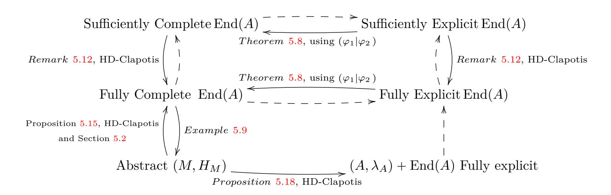
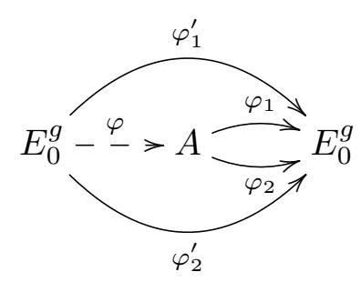

{0}------------------------------------------------

# <span id="page-0-0"></span>**On the conversion of module representations for higher dimensional supersingular isogenies**

AUREL PAGE<sup>1</sup> , DAMIEN ROBERT<sup>1</sup> , AND JULIEN SOUMIER<sup>2</sup>

Abstract. We expand the well developed toolbox between quaternionic ideals and supersingular elliptic curves into its higher dimensional version, namely (Hermitian) modules and maximal supersingular principally polarized abelian varieties. One of our main result is an efficient algorithm to compute an unpolarized isomorphism *A* » *E g* 0 given the abstract module representation of *A*. This algorithm relies on a subroutine that solves the Principal Ideal Problem (PIP) in matrix rings over quaternion orders, combined with a higher dimensional generalisation of the Clapotis algorithm. To illustrate the flexibility of our framework, we also use it to reduce the degree of the output of the KLPT<sup>2</sup> algorithm, from *O*p*p* <sup>25</sup>q to *O*p*p* 15*.*5 q.

# 1. Introduction

As a serious candidate for post-quantum cryptography standardization due to its compactness [\[AAA+25\]](#page-31-0), isogeny-based cryptography has seen a lot of algorithmic improvements over the last decade.

A major tool in this context is the Deuring correspondence [\[Ler25;](#page-34-0) [FKLPW20\]](#page-33-0). It allows to represent supersingular elliptic curves as quaternion orders, as soon as their endomorphism rings are known. Efficient algorithms to convert between ideals and isogenies are crucial backbones both for instantiating cryptographic protocols, such as SQISign [\[FKLPW20;](#page-33-0) [DLRW24;](#page-33-1) [BDF+24\]](#page-32-0), but also for security reductions [\[EHLMP18;](#page-33-2) [Wes21;](#page-35-0) [HW25\]](#page-34-1). The first algorithm in this context was the KLPT algorithm [\[KLPT14\]](#page-34-2), which allows to (heuristically) smoothen an ideal. The algorithm was made rigorous (under GRH) in [\[Wes21\]](#page-35-0) (although this rigorous version output much larger smooth ideals, so in practice the original KLPT was used in protocols). The fall of the SIDH protocol in [\[CD23;](#page-32-1) [MMPPW23;](#page-34-3) [Rob23\]](#page-35-1) led to the consideration of higher dimensional isogenies, and the discovery of the Clapotis algorithm [\[PR23\]](#page-35-2) that uses higher dimensional isogenies as "shortcuts" for the ideal to isogeny conversion problem. Clapotis has proven polynomial time complexity (without GRH), but in practice faster heuristic variants are used [\[PPS25;](#page-35-3) [DEF+25;](#page-32-2) [BCE+25;](#page-32-3) [DEIV25\]](#page-33-3).

A recent trend in isogeny based cryptography has been to consider the higher dimensional maximal supersingular graphs for their own sake, rather than just as providing convenient speed ups for computing dimension 1 isogenies. See for instance [\[CDS20;](#page-32-4) [KMM+25\]](#page-34-4) for a generalisation of the CGL Hash function [\[CLG09\]](#page-32-5) in higher dimension. More recently [\[Rob24\]](#page-35-4) proposed MIKE, a new NIKE that makes crucial use of the dimension 2 and 4 isogeny graphs.

<sup>1</sup>Centre Inria de l'Université de Bordeaux

<sup>2</sup>Université de Lorraine, CNRS, Inria

{1}------------------------------------------------

<span id="page-1-1"></span>There are two slightly different versions of the Deuring correspondence. The first one, as mentioned represents a supersingular curve  $E/\mathbb{F}_{p^2}$  by its endomorphism ring  $\mathcal{O} = \operatorname{End}(E)$ , as a maximal order in  $\mathcal{B}_{p,\infty}$ , the quaternion algebra ramified at p and  $\infty$ . The second one is to fix a base curve  $E_0/\mathbb{F}_{p^2}$  with endomorphism ring  $\mathcal{O}_0$ , and represent E by the left  $\mathcal{O}_0$ -ideal  $I = \operatorname{Hom}_{\mathbb{F}_{p^2}}(E, E_0)$ . Given  $I, \mathcal{O} = \operatorname{End}(E)$  is the right order of I. Conversely given  $\mathcal{O}$ , we can recover I as a connecting ideal between  $\mathcal{O}_0$  and  $\mathcal{O}$ . (A slight subtlety is that there are two classes of such connecting ideals, I and  $\mathfrak{p}I$  where  $\mathfrak{p}$  is the twosided ideal of  $\mathcal{O}_0$  of norm p. This is because the endomorphism ring representation does not distinguish between E and its  $\mathbb{F}_{p^2}/\mathbb{F}_p$ -Galois conjugate  $E^{\sigma}$ ).

These two versions of the Deuring correspondance extend to higher dimension. We can represent a maximal supersingular ppav  $(A, \lambda_A)$  by its polarized endomorphism ring  $(\operatorname{End}(A), r_A)$  where  $r_A$  is the Rosati involution. We can also use the module representation  $M = \operatorname{Hom}(A, E_0)$ , endowed with the unimodular Hermitian form H induced by the principal polarizations:  $H(\varphi_1, \varphi_2) = \varphi_1 \circ \tilde{\varphi}_2 \in \mathcal{O}_0$ . This later representation is due to Serre, and was introduced in the context of higher dimensional isogeny based cryptography in  $[\operatorname{Rob}24]$ .

We note that there is a phase shift compared to the dimension 1 case: in dimension 1 there are many maximal orders  $\mathcal{O}$  in  $\mathcal{B}_{p,\infty}$ , which all admit a unique positive Rosati involution (given by the quaternionic conjugation). From the ideal point of view, there are many classes of ideals (up to isomorphism as a  $\mathcal{O}_0$ -module), which all admit a unique principal polarization (i.e. a unimodular Hermitian form)  $H_I(x,y) = x\overline{y}/N(I)$ . On the geometric side, this corresponds to the fact that  $NS(E) = \mathbb{Z}$ , and all elliptic curves have have a canonical principal polarization, i.e. the one induced by  $(0_E)$ . So the polarization lies in the background in dimension 1. In higher dimension g > 1, Deligne<sup>1</sup> proved that a maximal superspecial abelian variety  $A/\mathbb{F}_{p^2}$  is always isomorphic to  $E_0^g$ . As a consequence, the endomorphism ring  $\operatorname{End}(A)$  of A is isomorphic to the ring of matrices  $\mathcal{M}_g(\mathcal{O}_0)$ , and the module  $M = \operatorname{Hom}(A, E_0)$  is isomorphic to  $\mathcal{O}_0^g$ . So this time, it is crucial to keep track of the principal polarization  $\lambda_A$  of A, either as the Rosati involution for the endomorphism representation, or as an Hermitian form in the module representation.

In particular, this means that we can represent  $(A, \lambda_A)$  by a Hermitian unimodular definite matrix  $S \in \mathcal{M}_g(\mathcal{O}_0)$ , whose associated Hermitian form on  $\mathcal{O}_0^g$  is  $H_S(x,y) = xSy^*$ , and whose associated Rosati involution on  $\mathcal{M}_g(\mathcal{O}_0)$  is  $SM^*S^{-1}$ , where  $M \mapsto M^*$  is the conjugate transpose. This is the "IKO representation", used in [CDK+25] in their (heuristic) generalisation of the KLPT algorithm to dimension 2.

1.1. **Contributions.** In this paper, we extend the dimension 1 algorithmic tools to convert between ideals and isogenies to higher dimension. Our main contributions are as follows.

First, we explain how to convert between the abstract endomorphism ring representations and the abstract module representations; this is more tricky than in dimension 1. In particular, we give algorithms to compute from abstract representations of  $(\operatorname{End}(A), r_A)$  or  $(M, H_M)$ , an isomorphism with  $\mathcal{M}_g(\mathcal{O}_0)$  or  $\mathcal{O}_0^g$  respectively. As mentioned above the existence of such isomorphisms is a new phenomena in g > 1. A key tool for this computation is a new algorithm to solve the Principal Ideal Problem in  $\mathcal{M}_g(\mathcal{O}_0)$ . Another contribution is a new algorithm (see Corollary 3.8) to

<span id="page-1-0"></span><sup>&</sup>lt;sup>1</sup>Deligne's theorem is over  $\overline{\mathbb{F}}_p$ , but [JKP+18] gives a version over  $\mathbb{F}_{p^2}$ 

{2}------------------------------------------------

<span id="page-2-0"></span>build an explicit isomorphism between two isomorphic central simple algebras A, A' over  $\mathbb{Q}$ , given maximal orders  $\Lambda \subset A$  and  $\Lambda' \subset A'$ . This algorithm builds on [IRS12], but uses the extra information given by  $\Lambda, \Lambda'$  to bypass the need for a factorization oracle.

Secondly, we extend the Clapotis algorithm from dimension 1 to dimension g. (That such an extension was possible was conjectured in [Rob24]). A new technical tool we use for this is the Poincaré decomposition for Hermitian modules, which we transfer from the well known Poincaré decomposition for polarized abelian varieties. Our generalised Clapotis (HD-Clapotis for Higher Dimensional Clapotis) allows to make our abstract representations effective. For instance given the module representation  $(M, H_M)$  of  $(A, \lambda_A)$ , we can recover A (e.g. as given by theta constants) along with the explicit endomorphism ring action of  $\operatorname{End}(A) \simeq \operatorname{End}_{\mathcal{O}_0}(M)$  on A and also the module action of  $M = \operatorname{Hom}(A, E_0)$  on A. Given an isomorphism  $M \simeq \mathcal{O}_0^g$  as constructed thanks to our solution of the PIP above, we can also use HD-Clapotis to compute the (non polarized) isomorphism  $A \simeq E_0^g$ . Likewise, given the module representations  $(M_1, H_1), (M_2, H_2)$  of  $(A_1, \lambda_1), (A_2, \lambda_2)$ , we can make effective any morphism  $\varphi: A_1 \to A_2$  as represented via the canonical isomorphism  $\operatorname{Hom}(A_1, A_2) \simeq \operatorname{Hom}_{\mathcal{O}_0}(M_2, M_1)$ , by the abstract module morphism  $\psi: M_2 \to M_1$ ,

Thirdly, we explain how to go in the other direction, namely given an explicit representation of morphisms  $(\varphi_1, \ldots, \varphi_m) \in \text{Hom}(A_1, A_2)$  that generates it (as an abelian group), how to recover its representation as an abstract abelian group. Given also explicit representations of generators of  $\operatorname{End}(A_1)$ ,  $\operatorname{End}(A_2)$ , we also explain how to recover their ring structure and the  $(\operatorname{End}(A_2), \operatorname{End}(A_1))$ -bimodule structure of  $\operatorname{Hom}(A_1, A_2)$ . For this, we use the same method as already used in dimension 1 for endomorphism rings [EHLMP18; Wes21], namely we embed  $\text{Hom}(A_1, A_2)$  into  $\mathbb{Z}^m$ thanks to the trace pairing  $(\varphi_1 | \varphi_2) = \text{Tr}(\varphi_1 \tilde{\varphi_2})$ . The trace pairing method was already used in higher dimension to compute, from an explicit representation, an abstract representation of endomorphisms rings, see [ABIGW25, § 3], and [Mon26] when g=2. We show that the method works just as well for Hom modules than for endomorphism rings. As an aside, both references above assume that they are given an explicit representation not only of the  $\varphi_i \in \text{End}(A)$ , but also of their polarized duals  $\tilde{\varphi}_i$ , so as to be able to compute the action of the  $\varphi_i\tilde{\varphi}_j$  in order to compute their traces. In this paper we sidestep this by using the Weil pairing to recover from the action of the  $\varphi_i$  on the  $\ell$ -torsion, the action of its polarized dual  $\tilde{\varphi}_i$ . The Weil pairing trick is folklore in isogeny based cryptography (see for instance | Wes22, § 3.1]), and works just as well for general morphisms. A summary of the translations between the different representations may be found in Appendix A.

To illustrate the flexibility of our algorithms, we also revisit the KLPT<sup>2</sup> algorithm in dimension 2 from [CDK+25] and show how the module point of view combined with the Poincaré decomposition allows to improve the length of the resulting isogeny from  $O(p^{25})$  to  $O(p^{15.5})$ .

All our algorithms are in classical polynomial time in  $\log(p)$ . They are mostly deterministic, except that every time we use the HD representation, such as in the HD-Clapotis algorithm, we need to express an integer as a sum of four squares, which is only known to be randomized polynomial time [PT18]. Our PIP algorithm relies on the KLPT algorithm, which is only proven to be polynomial time under GRH [Wes21], and on Algorithm 1 which is randomized. Finally our improvements to KLPT<sup>2</sup> are heuristic (it uses the same heuristics as in [CDK+25]).

{3}------------------------------------------------

<span id="page-3-1"></span>We provide a proof of concept implementation of our algorithm for solving the Principal Ideal Problem in  $\mathcal{O}_0^g$ , available at:

https://gitlab.inria.fr/module-representation/PIP-quaternion-mat An explicit example may be found in Appendix B.

<span id="page-3-0"></span>1.2. Concurrent work. In an independent unpublished work by Castryck, Eriksen, Invernizzi, and Vercauteren [CEIV26], the authors also solve the Principal Ideal Problem in the matrix ring  $\mathcal{M}_g(\mathcal{O}_0)$ , using a different approach. A noteworthy difference is that they do not rely on the KLPT algorithm as a subroutine: this makes their output smaller. On the other hand, their algorithm is only heuristically in polynomial time, while ours is proven to be polynomial time under GRH, thanks to the rigorous version of KLPT proven in [Wes21].

In another independent work, made recently available in [Mon26], Montessinos also explains how to switch, in dimension 2, between the different endomorphism ring representations above (abstract, effective, IKO), and how to compute an explicit isomorphism  $A \simeq E_0^2$ . His approach is complementary to ours: to build this isomorphism out of an IKO representation of A, he uses the (heuristic) KLPT<sup>2</sup> algorithm to build a  $2^e$ -isogeny  $E_0^2 \to A$ , and then he carefully iteratively builds isomorphisms  $E_0^2 \simeq A_i$  at each step of the  $2^e$ -isogeny chain. In this paper, we instead rely on the HD-Clapotis algorithm to construct a double path  $A \to E_0^2$ , which also allows us to explicitly compute the isomorphism.

A difference with [Mon26] is that in this paper we mainly adopt the module point of view, which is not used in [Mon26]. Thanks to the HD-Clapotis algorithm, available in any dimension, this allows us to treat any dimension g, and also to handle the missing reduction between Problem 3.3 and Problem 3.4 in [Mon26] (which is only treated for polarized products of two elliptic curves there), see Remark 5.12.

Both papers have benefited from each other. In [Mon26], Montessinos uses our solution to the PIP to find the IKO matrix. On the other hand, Montessinos pointed out to us a crucial ambiguity that we had missed in a preliminary draft version of this paper. Indeed, although all automorphisms of  $\mathcal{M}_g(\mathcal{B}_{p,\infty})$  are inner automorphisms, this is no longer the case for  $\mathcal{M}_g(\mathcal{O}_0)$ , where there is one extra outer automorphism (see [Mon26, § 6.1.1] for more details). Thus the endomorphism ring representation (End(A),  $r_A$ ), where  $r_A$  is the Rosati involution, has an ambiguity. As explained in the introduction, this ambiguity is already present in dimension 1. Montessinos solves this ambiguity by keeping track of the action by End(A) on global differentials of A. In this paper we follow his lead and use the same solution. (Although it may seem that our notion of refined endomorphism ring representation in Remark 3.2 does not involve the global differentials, by Proposition 5.10 they are hidden in the module representation.)

1.3. **History.** This work started as a follow up of the paper [GSS25] by Gaudry, Soumier, and Spaenlehauer. In that paper, the authors explain how to compute an explicit isomorphism  $E_1 \times E_2 \times \cdots \times E_g \simeq E'_1 \times E'_2 \times \cdots \times E'_g$  of the polarized product of maximal supersingular curves over  $\mathbb{F}_{p^2}$ , given the endomorphism rings of the  $E_i, E'_i$ .

In a private discussion with these authors, the second author of this paper had sketched out an heuristic algorithm on how to compute an isomorphism  $A \simeq E_0^g$  for a general maximal supersingular abelian variety  $A/\mathbb{F}_{p^2}$  (which exists by Deligne's theorem), given the module representation M of A, as introduced in [Rob24].

{4}------------------------------------------------

<span id="page-4-0"></span>This algorithm relied on two crucial ingredients. First we needed to solve the purely number theoretic problem of computing an isomorphism  $\psi \colon M \simeq \mathcal{O}_0^g$ . For this we turned to an algorithm due to the first author, who in 2014 wrote a note on how to extend the KLPT principalization algorithm to any central simple algebra. Unfortunately this note was never published. Also, and unlike the original KLPT algorithm, that algorithm is at best subexponential in general. However, in our context, the first author argued that it could be made polynomial time. In this paper we present a drastically simplified version of this general algorithm, adapted to our special case and using the module point of view. This simplified version was fully worked out, along with an implementation, by the third author. A fun fact that we realised when writing this paper is that the PIP for  $\mathcal{M}_g(\mathcal{O}_0)$  had already been implicitly solved in [GSS25], see Remark 3.6!

Once we have the abstract isomorphism  $\psi \colon M \simeq \mathcal{O}_0^g$ , it remains to make it effective (working coordinate by coordinate, this is the same as making the module action effective, i.e. given  $v \in \mathcal{O}_0^g$ , being able to evaluate  $\varphi_i = \psi^{-1}(v_i) \in M = \operatorname{Hom}(A, E_0)$  on any point of A for  $1 \leq i \leq g$ ). The second crucial ingredient relied on the heuristic approach in [Rob24] for extending Clapotis from ideals to modules. Here we give a rigorous version of HD-Clapotis, using as a crucial tool the Poincaré decomposition for modules.

- 1.4. Organization of the paper. This work is organized as follow. Section 2 is dedicated to the introduction of mathematical background, and Section 3 of the possible representations for polarized abelien varieties. In Section 4 we present a polynomial time solution to solve the principal ideal problem in matrix rings over maximal quaternion orders. Then in Section 5, we develop very general frameworks that will allow us to go back and forth between explicit and abstract representation of abelian varieties. Furthermore assuming that we can construct double paths, we show how to, given an abstract description of M, compute the associated abelian variety A along with an effective description of the module action on A. In Section 6, we develop the technical tools needed to compute the double paths using Hermitian module theory, leading to an higher dimensional version of the Clapotis algorithm. We conclude this paper by showing, in Section 7, that the tools developed above lead to lighter outputs of KLPT<sup>2</sup>.
- 1.5. **Technical overview.** In Section 2 we recall some facts about abelian varieties, and especially about maximal abelian varieties, which are isomorphic to a product of supersingular elliptic curves  $E^g$ . Then we highlight how these varieties connect to the theory of free Hermitian module through an anti-equivalence of categories. Namely, the module version of Deligne's theorem on superspecial abelian varieties is that a torsion free rank g  $\mathcal{O}_0$ -module M is isomorphic to  $\mathcal{O}_0^g$  ([JKP+18, Theorem 3.3]).

We use this in Section 3, to present the different ways we have to represent principally polarized abelian varieties. More precisely we emphasize that we can represent g-dimensional principally polarized maximal abelian varieties  $(A, \lambda_A)$  as unimodular positive definite Hermitian modules  $(M, H_M)$  of rank g over a quaternionic order  $\mathcal{O}_0$ , where  $E_0/\mathbb{F}_{p^2}$  is a maximal supersingular elliptic curve and  $\mathcal{O}_0 = \operatorname{End}(E_0)$ . Moreover, we show that specificities of such modules allows us to represent the polarized abelian varieties  $(A, \lambda_A)$  as Hermitian modules  $(\mathcal{O}_0^g, S)$  where S is the Gram matrix of the Hermitian form induced by  $H_M$  over  $\mathcal{O}_0^g$ . Indeed, in our cases, there exists an isomorphism of modules  $\varphi: \mathcal{O}_0^g \to M$ , so that  $(M, H_M)$  is

{5}------------------------------------------------

<span id="page-5-0"></span>isomorphic, as an Hermitian module, to  $(\mathcal{O}_0, \varphi^* H_M)$ . We also explore the fact that, as in dimension 1 thanks to the Deuring correspondence, we can represent a module  $(M, H_M)$  by its endomorphism ring  $\operatorname{End}(M)$  enriched by the data of an involution (up to an ambiguity). Knowing that  $M \simeq \mathcal{O}_0^g$ , we have  $\operatorname{End}(M) \simeq \mathcal{M}_g(\mathcal{O}_0)$  and the involution can be described by an Hermitian positive definite matrix over  $\mathcal{O}_0$ , as in the IKO representation of  $[\operatorname{CDK}+25]$ . We also explain how to navigate between the standard representations  $(\mathcal{O}_0^g, S)$  and  $(\mathcal{M}_g(\mathcal{O}_0), r_S)$  (resp. abstract representations  $(M, H_M)$  and  $(\operatorname{End}(M), r_M)$ .

In order to compute the standard Hermitian module representation  $(\mathcal{O}_0^g, S)$  from an abstract one  $(M, H_M)$  we thus need to compute an isomorphism  $\mathcal{O}_0^g \to M$ . In Section 3.2 we also showed that computing such an isomorphism is in fact equivalent to solving a Principal Ideal Problem over  $\mathcal{M}_g(\mathcal{O}_0)$ . In Sections 4.1, 4.2 and 4.3 we present an algorithm to solve this problem in polynomial time in  $O(\log(p))$ . The idea is two work locally and proceed in two steps, assuming that we know a small prime  $\ell \in \mathcal{O}_0$  and an element  $u \in \mathcal{O}_0$  such that  $Nrd(u) = \ell$ . Let  $I \subset \mathcal{M}_q(\mathcal{O}_0)$  be an ideal. First, thanks to the KLPT algorithm in dimension 1, we can principalize I locally almost everywhere, except at  $\ell$ . This means that we can compute an  $\alpha \in I[\frac{1}{\ell}]$  such that  $I\left[\frac{1}{\ell}\right] = \alpha \mathcal{M}_g(\mathcal{O}_0)\left[\frac{1}{\ell}\right]$ . Then we propose an algorithm that allows us to compute an  $\delta \in \mathcal{O}\left[\frac{1}{\ell}\right]^{\times}$  so that  $\delta \alpha^{-1} I \otimes \mathbb{Z}_{\ell} = \mathcal{M}_{2g}(\mathbb{Z}_{\ell})$ , thanks to the element  $u \in \mathcal{O}_0$ . Then we conclude by noticing that I and  $\alpha \delta^{-1} \mathcal{M}_q(\mathcal{O}_0)$  are equal locally everywhere, so they are equal as  $\mathbb{Z}$ -lattices. This Section 4 finally leads to our Algorithm 4 that allows to compute generator of ideals of  $\mathcal{M}_q(\mathcal{O}_0)$  in time polynomial in  $\log(p)$ , in the case where  $\mathcal{O}_0$  contains a known quadratic order of small discriminant (see Theorem 4.11). Remark that this set up includes the cryptographic use case where  $p \equiv 3 \mod 4$  and  $\mathcal{O}_0 = \mathbb{Z} + i\mathbb{Z} + \frac{i+j}{2}\mathbb{Z} + \frac{1+k}{2}\mathbb{Z} \subset \mathcal{B}_{p,\infty}$ , with the special order  $\mathbb{Z}[i] \subset \mathcal{O}_0$ . As explained below in Section 2.1, the generic case of a maximal order  $\Lambda \subset \mathcal{M}_g(\mathcal{B}_{p,\infty})$  reduces (under GRH) to the one handled above.

Then in Section 5 we show how we can switch between explicit representation (given by a theta null point of level 4 for instance) and abstract representations of polarized abelian varieties as described above. Especially we show in Section 5.1 how the bilinear form  $(\varphi_1, \varphi_2) \mapsto \operatorname{Tr}(\lambda_A^{-1} \circ \varphi_1^{\vee} \circ \lambda_B \circ \varphi_2)$  over  $\operatorname{Hom}_k(A, B)$  allows us to efficiently compute the abstract  $\mathbb{Z}$ -module structure of  $\operatorname{Hom}_k(A,B)$  from explicit representations of its generators, for  $(A, \lambda_A)$  and  $(B, \lambda_B)$  principally polarized abelian varieties. In our general Theorem 5.8, we also prove that we can recover the composition maps, and therefore the ring structure of  $\operatorname{End}_k(A)$  in the case where A = B. In Section 5.2 we show that the abstract Hermitian module representation already contains the refined information for acting over global differentials. Then in Section 5.3 we show how to recover an explicit representation from an abstract one, using coprime double path. We conclude in Section 5.4 by applying these results to the context of maximal principally polarized abelian varieties  $(A, \lambda_A)$ . Using the above subsections, our construction of double paths, and our solution to the Principal Ideal Problem, we end up proving in Proposition 5.18 that from the abstract module representation  $(M, H_M)$  we can: 1) recover the corresponding principally polarized abelian variety  $(A, \lambda_A)$  along with an effective description of the module action on A, getting rid of the heuristic [Rob24, Heuristic 2.13]; 2) compute an unpolarized isomorphism  $A \simeq E_0^g$ , generalizing [GSS25] in some sense.

Section 6 is then dedicated to the construction of double paths between A and  $E_0^g$  using the module correspondence. We begin in Section 6.1 by expliciting a technical

{6}------------------------------------------------

<span id="page-6-0"></span>tool over Hermitian modules, Proposition 6.1. It can be seen as an analogue of the Poincaré decomposition, translated in the world of Hermitian modules. In particular, it allows us to compute polarized module isogenies between  $(M, H_M)$  and a splitted Hermitian module  $M_1 \oplus M_2$ , while controlling its polarized degree in Corollary 6.2. This corollary will be the cornerstone of our improvement of KLPT<sup>2</sup> using module correspondence. We then use the Poincaré decomposition in Section 6.2, to prove an analogue of the Clapotis method for higher dimensional modules. Our method relies on the fact that we can compute specific submodules  $M_1 \hookrightarrow M$  (resp.  $M_2 \hookrightarrow M$ ) inducing a  $2^{n_1}D_1'$ -similitude (resp.  $2^{n_2}D_2'$ -similitude)  $\Psi_1, \Psi_2 \colon M^4 \to \mathcal{O}_0^{4g}$ , with  $D_1'$  and  $D_2'$  coprime integers, and such that the  $2^{\max(n_1,n_2)}$ -torsion on  $E_0$  is accessible (see Proposition 6.6). Then applying the splitting lemma to  $\Psi_2 \circ \Psi_1^{\vee} \in \operatorname{End}(\mathcal{O}_0^{4g})$ , and computing the few steps involving 2-isogenies, leads to an efficient representation of the sought double paths.

Finally, as a last illustration of the flexibility of the module representation, we end this paper by presenting in Section 7 a way to use this theory in order to lower the degree of outputs of the KLPT<sup>2</sup> algorithm. In Section 7.1, we use the tools of [CDK+25] in order to apply Corollary 6.3, and then compute a polarized module isogeny with a smooth polarized degree reaching a split module  $M_1 \oplus M_2$ . We finally conclude in Section 7.2 by showing how our method allows for the computation of a polarized isogeny of polarized degree in  $O(p^{15.5})$  between polarized abelian surfaces, compared to  $O(p^{25})$  given by the KLPT<sup>2</sup> algorithm. We emphasize that our algorithm inherits their heuristics. The key flexibility that the module representation gives is that we can easily work with submodules  $M' \subset M$  given by an orthogonal decomposition  $M' = I_1 \oplus^{\perp} I_2$  of rank 1 submodules. By contrast, the IKO representation  $(M_2(\mathcal{O}_0), r)$  of [CDK+25] needs to write down an isomorphism  $I_1 \oplus I_2 \simeq \mathcal{O}_0^2$  and can only work at the level of rank 1 submodules implicitely.

1.6. On the module versus the endomorphism ring representation. In [Rob24] it was argued that the module representation is more convenient to use for isogeny based cryptography than the endomorphism ring representation. We expand a bit on this here.

First, we have an actual anti-equivalence of category, see Theorem 2.5, a morphism  $\varphi: A_1 \to A_2$  is represented by an explicit morphism  $\varphi^*: M_2 = \operatorname{Hom}(A_2, E_0) \to \operatorname{Hom}(A_1, E_0)$ . By contrast, in the endomorphism ring representation, a morphism  $\varphi: A_1 \to A_2$  is implicitly represented via the image in  $\operatorname{End}(A_1)$  of the embedding of the  $(\operatorname{End}(A_1), \operatorname{End}(A_2))$ -bimodule  $\operatorname{Hom}(A_2, A_1)$  via the inclusion  $\varphi^*: \operatorname{Hom}(A_2, A_1) \to \operatorname{End}(A_1)$ . This makes translating the standard categorical constructions (pullback, pushforward,...) more awkward.

In dimension 1, this awkwardness was less apparent because translating between ideals and orders is easier, so often the arguments and algorithms would implicitly switch to the module representation on the fly. (Although even in dimension 1, considering invertible ideals only rather than rank 1 projective modules make some constructions more awkward. An invertible ideal I is the same thing as a rank 1 projective module M along with a choice of a specific embedding  $i: M \to R$ ; which on the geometric side corresponds to a choice of isogeny  $i: E_0 \to E$ . In other words this impose to work in the pointed overcategory, and for the categorical constructions to be compatible with the choice of pointed morphisms. But in practice we would like to work with E without imposing a specific choice of pointed isogeny  $i: E_0 \to E$ .)

{7}------------------------------------------------

<span id="page-7-2"></span>Secondly, the endomorphism ring representation is not available in the commutative case: already in dimension 1 all (primitively) oriented elliptic curves  $E/\mathbb{F}_q$  by a quadratic imaginary order R have the same oriented endomorphism ring  $\operatorname{End}_R(E)=R$ . By contrast, the R-module representation works just as well in the commutative case, and often allows to treat the maximal case and the oriented case in a uniform way. For instance in Appendix E, we sketch how to extend HD-Clapotis to the oriented case. Also, even in the maximal supersingular case, the endomorsphim ring representation alone introduces an ambiguity, since is not sufficient to distinguish between A and  $A^{\sigma}$ .

Finally, we remark that the IKO representation, althrough very compact since it represents  $(A, \lambda_A)$  by a unimodular Hermitian matrix  $S \in \mathcal{M}_g(\mathcal{O}_0)$ , is quite difficult to work with algorithmically. For HD-Clapotis, we need to work with submodules M' of our initial module M; which is not easy to do in the IKO representation. (For instance M' may not admit a principal polarization. And even if it did, the IKO representation needs an explicit  $\mathcal{O}_0$ -basis of M', which may be hard to find, and worse does not exist in general for rank 1 submodules). The IKO representation only works for g > 1, while the module representation works just as well for g = 1 as with g > 1. For instance, in our improvement of KLPT<sup>2</sup>, we make crucial use of being able to sample nice rank 1 (but not necessarily free) submodules M' of our initial rank 2 module M.

1.7. Acknowledgements. We are grateful to the authors of [CEIV26; Mon26] for sharing with us preliminary versions of their work. We are especially thankful to Montessinos for pointing to us the ambiguity in the endomorphism ring representation due to the outer automorphism of  $\mathcal{M}_g(\mathcal{O}_0)$ . As mentioned in Section 1.2 we use his solution to clear this ambiguity. We thank Sam Frengley for pointing us misprints. This work received funding from the France 2030 program managed by the French National Research Agency under grant agreement No. ANR-22-PETQ-0008 PQ-TLS.

## 2. Background

<span id="page-7-1"></span><span id="page-7-0"></span>2.1. **Notations.** In this paper we fix a prime p > 3. We denote by  $\mathcal{B}_{p,\infty}$  the unique (up to isomorphisms) quaternion algebras over  $\mathbb{Q}$ , ramified at p and  $\infty$ . We denote by 1, i, j, k the standard  $\mathbb{Q}$ -basis of  $\mathcal{B}_{p,\infty}$ . We will denote  $E_0$  a fixed supersingular elliptic curve over  $\mathbb{F}_{p^2}$ , and let  $\mathcal{O}_0 = \operatorname{End}(E_0)$ . We let  $\mathfrak{p}$  be the unique two sided ideal of  $\mathcal{O}_0$ , so that  $(p) = \mathfrak{p}^2$  and  $\mathcal{O}_0/\mathfrak{p} \simeq \mathbb{F}_{p^2}$ . If  $E_0$  is defined over  $\mathbb{F}_p$ , then  $\mathfrak{p} = (\pi_{E,p})$  is principal and generated by the Frobenius endomorphism.

In Section 4, we will require  $\mathcal{O}_0$  to be the endomorphism ring associated to an elliptic curve to be extremal in the sense of [KLPT14], i.e. whose endomorphism ring contains small discriminant  $\Delta$ . Such a curve always exist under GRH. In Section 5, to convert between the abstract module and endomorphism ring representations to explicit representations, we will assume that the action of  $\mathcal{O}_0$  on  $E_0$  is explicit. This is the case for the special curve  $E_0$  as above. See [HW25] for a detailed discussion about what can be proven without assuming GRH. In our case we will need to assume the GRH anyway for our solution to the PIP.

Typically for isogeny based cryptography, when  $p \equiv 3 \pmod{4}$ , the base curve is  $E_0: y^2 = x^3 + x$  whose endomorphism ring is isomorphic to the maximal order  $\mathcal{O}_0:=\mathbb{Z}+i\mathbb{Z}+\frac{i+j}{2}\mathbb{Z}+\frac{1+k}{2}\mathbb{Z}\subset\mathcal{B}_{p,\infty}$ , see e.g. [FMP23; Ler25; BDF+24], and in particular contains  $\mathbb{Z}[i]$  so is extremal. We emphasize here that solving the PIP

{8}------------------------------------------------

<span id="page-8-1"></span>for  $\mathcal{M}_g(\mathcal{O}_0)$  suffices to solve the general case of any maximal order  $\Lambda \subset \mathcal{M}_g(\mathcal{B}_{p,\infty})$ . Indeed, as in the proof of Proposition 3.9, at the cost of finding a connecting ideal between  $\mathcal{M}_g(\mathcal{O}_0)$  and  $\Lambda$  (which only involves basic linear algebra) we reduce to the extremal case. (This point was also remarked in [CEIV26, Corollary 1.6], to which we refer for more details.) Likewise, if we have the  $\mathcal{O}_0$ -module representation  $M = \operatorname{Hom}_{\mathbb{F}_{p^2}}(A, E_0)$  of A with respect to  $E_0$ , and we know  $I = \operatorname{Hom}_{\mathbb{F}_{p^2}}(E_0, E'_0)$ , then  $M' = I \otimes_{\mathcal{O}_0} M$  gives the  $\mathcal{O}'_0$ -module representation  $\operatorname{Hom}_{\mathbb{F}_{p^2}}(A, E'_0)$  of A with respect to  $E'_0$  (see [Rob24, Lemma 4.13]).

For an abelian variety A over a finite field  $\mathbb{F}_q$ , we denote by  $\operatorname{End}(A)$  its endomorphism ring over an algebraic closure  $\overline{\mathbb{F}_q}$ , and by  $\operatorname{End}_{\mathbb{F}_q}(A) \subset \operatorname{End}(A)$  the  $\mathbb{F}_q$ -rational endomorphisms.

In this paper, by polynomial time or efficient, we mean polynomial in  $\log p$ . Some of our arguments work for R-oriented abelian varieties over  $\mathbb{F}_q$ , in which case we mean polynomial in  $\log q$  and  $\Delta_R$ . (In the maximal supersingular case,  $q = p^2$  and  $\mathcal{O}_0$  is of discriminant p, so this reduces to  $\log p$ ). We assume that g is fixed throughout. In particular we allow exponential complexity with respect to g. For instance, representing an abelian variety in dimension g via level 2 theta constants requires  $2^g$  coordinates already. When we work with an abstract module or endomorphism ring representations, we assume that our coefficients are also polynomial in  $\log p$ . Given an arbitrary representation we can always use a lattice reduction algorithm to reduce to this case. When we say that an integer N is (power)smooth, we mean that the largest prime factor  $\ell$  (resp. prime power factor) is polynomial in  $\log \ell$ . The N-torsion on  $E_0$  is said to be accessible when one can compute a basis of it in polynomial time in  $\log p$ ; this is the case if N is powersmooth.

2.2. Maximal abelian varieties and Hermitian modules. In this section, we will introduce an equivalence of categories between principally polarized maximal supersingular abelian varieties over  $\mathbb{F}_{p^2}$  and suitable unimodular Hermitian modules. Recall that a g-dimensional abelian variety A defined over  $\mathbb{F}_{p^2}$  is maximal, when  $\#A(\mathbb{F}_{p^2}) = (p+1)^{2g}$ . Maximal abelian varieties are exactly the varieties reaching the maximal amount of points, prescribed by the Hasse-Weil bound. We will see that a maximal abelian variety over  $\mathbb{F}_{p^2}$  is automatically superspecial, hence supersingular, so we will often speak about a "maximal supersingular abelian variety" to emphasize this fact, even through "supersingular" is redundant. The main features of maximal abelian varieties are summarised in the following Theorem 2.2 for which we refer to [EPSV24, Lem. 4] and [JKP+18, Prop. 5.1, Theorem 5.3]:

**Example 2.1.** If  $E/\mathbb{F}_p$  is supersingular, then E is maximal over  $\mathbb{F}_{p^2}$ . If  $E/\mathbb{F}_{p^2}$  is a maximal elliptic curve, then it is supersingular and its endomorphism ring  $\operatorname{End}(E)$  is isomorphic to a maximal order in  $\mathcal{B}_{p,\infty}$  [Voi21, Thm. 42.1.9].

<span id="page-8-0"></span>**Theorem 2.2.** Let  $A/\mathbb{F}_{p^2}$  be a maximal abelian variety of dimension g. Then A is superspecial, and  $\operatorname{End}_{\mathbb{F}_{p^2}}(A) = \operatorname{End}(A)$ . Conversely, any polarized superspecial abelian variety  $(A_{\overline{\mathbb{F}}_p}, \lambda_{\overline{\mathbb{F}}_p})$  over  $\overline{\mathbb{F}}_p$  admit a unique (up to automorphisms) polarized model  $(A_{\mathbb{F}_{p^2}}, \lambda_{\mathbb{F}_{p^2}})$  over  $\mathbb{F}_{p^2}$  where  $A_{\mathbb{F}_{p^2}}$  is maximal.

If g > 1, and  $E/\mathbb{F}_{p^2}$  is any maximal supersingular elliptic curve, then A is isomorphic over  $\mathbb{F}_{p^2}$  to  $E^g$  as an unpolarized abelian variety, so in particular if  $O = \operatorname{End}(E)$ ,  $\operatorname{End}(A) \simeq \mathcal{M}_g(O)$ .

{9}------------------------------------------------

Essentially the same result holds for minimal abelian varieties; in fact A is maximal if and only if its quadratic twist is minimal. The reason we stick to maximal supersingular abelian varieties over  $\mathbb{F}_{p^2}$  rather than superspecial ones is to kill spurious twists. (In dimension 1, only the curves with j=0,1728 can have supersingular twists that are neither minimal nor maximal over  $\mathbb{F}_{p^2}$ , but there are many more abelian varieties with extra twists in higher dimension). In particular, the maximal supersingular isogeny graph in  $\mathbb{F}_{p^2}$  is isomorphic to the superspecial isogeny graph in  $\overline{\mathbb{F}}_p$ . Recall that  $\mathcal{O}_0 = \operatorname{End}(E_0)$  is a maximal quaternionic order in  $\mathcal{B}_{p,\infty}$ .

**Definition 2.3.** An unimodular positive definite Hermitian  $\mathcal{O}_0$ -module (M, H) is a torsion-free left  $\mathcal{O}_0$ -module of finite type together with a Hermitian bilinear form  $H: M \times M \to \mathcal{O}_0$  which is definite positive and unimodular (which means that H induces an isomorphism of M with its dual  $M^{\vee}$ ).

The rank of M is the dimension of  $M \otimes_{\mathbb{Z}} \mathbb{Q}$  over  $\mathbb{Q}$ . We denote by  $q_H : M \to \mathcal{O}_0$  (or  $q_M$ ) the quadratic form associated to H: if  $x \in M$ ,  $q_H(x) = H(x, x)$ .

We will often simply say that  $(M, H_M)$  is unimodular as an abbreviation of unimodular positive definite torsion free and of finite type. We refer to [Rob24, § 2] for some basis theory of unimodular Hermitian modules. In the quaternionic case, forgetting about the Hermitian form, the module structure is very simple:

<span id="page-9-1"></span>**Theorem 2.4.** [JKP+18, Theorem 3.3 (c)] Let M be a torsion-free left  $\mathcal{O}_0$ -module of rank g. Then M is projective, and if g > 1 M is free:  $M \simeq \mathcal{O}_0^g$ .

2.3. The equivalence of categories. The Deuring correspondence has been a major tool used in the recent advances regarding isogeny-based cryptography. The following can be seen as an extension of this correspondence to higher dimension:

<span id="page-9-0"></span>**Theorem 2.5.** [JKP+18] and [Rob24, Theorem 5.1].

The functor  $A \mapsto M = \operatorname{Hom}_{\mathbb{F}_{p^2}}(A, E_0)$  is an anti-equivalence of categories between maximal abelian varieties over  $\mathbb{F}_{p^2}$  and f.p torsion-free left  $\mathcal{O}_0$ -modules. Under this equivalence, a principal polarization on A corresponds to an unimodular positive definite Hermitian form H over M.

**Example 2.6.** Combined with Theorem 2.4, Theorem 2.5 shows that every maximal supersingular abelian variety  $A/\mathbb{F}_{p^2}$  is (non-polarized) isomorphic to  $E_0^g$ .

The converse functor can be defined as follow: to  $M/\mathcal{O}_0$  we associate the abelian variety  $A/\mathbb{F}_{p^2}$  whose associated fppf sheaf is given by the internal sheaf hom  $\mathcal{HOM}_{\mathcal{O}_0-fppf}(M,E_0)$ . (It is not hard to prove that A is a proper commutative group scheme, but to prove that it is an abelian variety requires more work.) Of course this abstract definition does not allow to compute A in practice, one of the goals of this paper is to give such an effective algorithm.

**Remark 2.7** (Isogenies and module maps). Recall that  $\varphi: A \to B$  is an isogeny if it is a surjective morphism between abelian varieties of the same dimension. On the module side this corresponds to an injective morphism  $\psi: M_B \to M_A$  between torsion free modules of the same rank. The degree of  $\varphi$  is the degree of the finite scheme  $\operatorname{Ker} \varphi$ , this corresponds to the cardinal of torsion module  $M_A/M_B$ .

In practice we deal with principally polarized abelian varieties, and isogenies that respect the polarization:  $\varphi:(A,\lambda_A)\to(B,\lambda_B)$  are said to be polarized of type [n] if  $\tilde{\varphi}\circ\varphi=[n]$ , where  $\tilde{\varphi}=\lambda_A^{-1}\circ\varphi^\vee\circ\lambda_B$  is the polarized dual of  $\phi$ . By abuse of

{10}------------------------------------------------

<span id="page-10-2"></span>notation we will also say that  $\varphi$  is polarized of type (or degree) n, note that in this case deg  $\varphi = n^g$ . On the module side this corresponds to a n-similar between unimodular Hermitian modules  $\psi : (M_B, H_B) \to (M_A, H_A)$  satisfy  $\psi^* H_A = nH_B$ .

## Example 2.8.

- i) The module associated with the abelian variety  $(E_0^g, \lambda_0^g)$  is  $(\mathcal{O}_0^g, H_{\mathcal{O}_0}^g)$ , where  $H_{\mathcal{O}_0}(x, y) = x\overline{y}$  (which we will also denote by  $H_0$ ).
- ii) In the other direction, we recover the Deuring correspondence for ideals [JKP+18, Theorem 4.4 (d)]. Indeed, the variety associated to the ideal I seen as a  $\mathcal{O}_0$ -module is  $E_0/E_0[I]$ .
- iii) Any unimodular principal Hermitian module of the form  $(\mathcal{O}_0 x, \frac{H_M}{q_M(x)})$  is isomorphic as a unimodular module to  $(\mathcal{O}_0, H_0)$ , hence corresponds to the polarized isomorphism class of  $(E_0, \lambda_0)$ .

| In Table 1 we  | summarize tl    | he main     | translations    | provided by | Theorem 2.5.      |
|----------------|-----------------|-------------|-----------------|-------------|-------------------|
| III IUDIO I WO | Daninian 120 01 | iic iiidiii | or arrestations | provided by | 1 11001 0111 2.0. |

| Maximal abelian variety $A/\mathbb{F}_{p^2}$                          | Left f.p.t.f $\mathcal{O}_0$ -module $M = \operatorname{Hom}_{\mathbb{F}_{n^2}}(A, E_0)$ |  |  |
|-----------------------------------------------------------------------|------------------------------------------------------------------------------------------|--|--|
| of dimension $g$                                                      | of rank $g$                                                                              |  |  |
| The dual abelian variety $\widehat{A}$                                | The dual module $M^{\vee}$ (or $M^{\sharp}$ if unimodular)                               |  |  |
| Principal polarization $\lambda_A : A \to \widehat{A}$                | U.p.d Hermitian form $H_M: M \times M \to \mathcal{O}_0$                                 |  |  |
| An isogeny $\varphi \colon A_1 \to A_2$                               | A module monomorphism $\psi \colon M_2 \hookrightarrow M_1$                              |  |  |
| of degree $n$                                                         | such that $\operatorname{Card}(M_1/\psi(M_2)) = n$                                       |  |  |
| An <i>n</i> -isogeny $\varphi: (A_1, \lambda_1) \to (A_2, \lambda_2)$ | An <i>n</i> -similitude $\psi \colon (M_2, H_2) \to (M_1, H_1)$                          |  |  |

<span id="page-10-1"></span>Table 1. Summary of the module correspondence.

**Example 2.9.** Let  $\varphi: A_1 \to A_2$  be the *n*-isogeny associated to the *n*-similitude  $\psi: (M_2, H_2) \to (M_1, H_1)$ . By Proposition 3.5,  $M_2 \subset M_1$  can also be equivalently described as an ideal  $I \subset \operatorname{End}_{\mathcal{O}_0}(M_1) \simeq \operatorname{End}(A_1)$ . Then  $\operatorname{Ker} \varphi = \{P \in A_1 \mid \gamma(P) = 0 \,\forall \gamma \in M_2\} = \{P \in A_1 \mid \gamma(P) = 0 \,\forall \gamma \in I\}$ , and conversely  $M_2 = \{\gamma \in M_1 \mid \gamma(\operatorname{Ker} \varphi) = 0\}$ ,  $I = \{\gamma \in \operatorname{End}(A_1) \mid \gamma(\operatorname{Ker} \varphi) = 0\}$ . This allows to go from  $\varphi$  to  $\psi$  (resp. *I*) whenever *n* is smooth, the *n*-torsion is accessible on  $A_1$ , and the module action is explicit (resp. the endomorphism action is explicit). See [Rob24] for more details (this reference only treats the module point of view, but the statements on *I* above follow immediately from the statements on  $M_2$  and Proposition 3.5).

## 3. Representing polarized abelian varieties

<span id="page-10-0"></span>Let  $(A, \lambda_A)$  be (polarized isomorphism class of) rank g principally polarized maximal abelian variety over  $\mathbb{F}_{p^2}$ . We will denote by  $r_A$  the Rosati involution on  $\operatorname{End}(A)$  induced by  $\lambda_A$  (up to isomorphism).

#### 3.1. The abstract representations.

The abstract Hermitian module representation  $(M, H_M)$ . This is the representation given by the equivalence between principally polarized abelian varieties and unimodular Hermitian modules. We assume that M is given by generators, viewed as a submodule of  $\mathcal{O}_0^g$ , and  $H_M$  is given by an Hermitian Gram matrix. We highlight that  $H_M$  is well defined up to congruence, meaning that for any  $P \in \mathrm{GL}_g(\mathcal{O}_0)$ ,  $(M, H_M)$  and  $(M, PH_M\overline{P}^t)$  represent the same Hermitian module.

{11}------------------------------------------------

**Remark 3.1.** Note that if M is given by an abstract presentation:

$$\mathcal{O}_0^m \xrightarrow{\gamma} \mathcal{O}_0^q \longrightarrow M \longrightarrow 0$$
,

then we can reduce to the case of generators over  $\mathcal{O}_0^g$  by linear algebra. Indeed, let us denote by  $G \in \mathcal{M}_{q \times m}(\mathcal{O}_0)$  the matrix given by the linear application  $\gamma$  in canonical basis. The columns of G are the m relations between the q generators of M given by the presentation. Now, extending the scalar, we obtain a matrix  $G_{\mathbb{Q}} = G \otimes \mathbb{Q}$  representing a linear application between vector spaces. Therefore it is easy to computes its cokernel, given by a matrix  $C \in \mathcal{M}_{g \times q}(\mathcal{B}_{p,\infty})$  (g rows since M is of rank g). Then, rescaling by the greatest common divisor of the denominators of the entries of C, we revover a matrix  $C' \in \mathcal{M}_{g \times q}(\mathcal{O}_0)$ . Its columns give the q generators of M seen as an  $\mathcal{O}_0^g$  submodule.

The standard Hermitian module representation  $(\mathcal{O}_0^g, S)$ . Let  $(M, H_M)$  be the abstract module representation of  $(A, \lambda_A)$ . By Theorem 2.4, if g > 1, the  $\mathcal{O}_0$ -module M is isomorphic to  $\mathcal{O}_0^g$ . Fixing an isomorphism  $\psi \colon \mathcal{O}_0^g \to M$ , we obtain an Hermitian form  $H = \psi^* H_M$  on  $\mathcal{O}_0^g$ , which is represented by a matrix S in the canonical basis:  $S = H(e_i, e_j)$ , so that  $H(u, v) = uSv^*$ .

The abstract endomorphism representation  $(\operatorname{End}(M), r_M)$ . Given the abstract module representation  $(M, H_M)$ , we can also construct the endomorphism representation  $(\operatorname{End}(M), r_M)$  where  $\operatorname{End}(M)$  is the endomorphism ring of M as a left  $\mathcal{O}_0$ -module (so M is a  $(\mathcal{O}_0, \operatorname{End}(M))$ -bimodule), and  $r_M$  is the "Rosati involution"  $\gamma \mapsto \gamma^*$ , where  $\gamma^*$  is the adjoint of  $\gamma$  with respect to  $H_M$ .

In the abstract endomorphism representation, we work in the category of rings with an involution. An isomorphism  $(A_1, r_1)$  of  $(A_2, r_2)$  of rings with an involution is an isomorphism  $\varphi : A_1 \to A_2$  such that  $r_2 = \varphi r_1 \varphi^{-1}$ . By the anti-equivalence of category,  $(\operatorname{End}(M), r_M) \simeq (\operatorname{End}(A), r_A)$  as abstract rings with an involution. This is the usual representation in dimension 1: a maximal supersingular elliptic curve  $E/\mathbb{F}_{p^2}$  is represented by  $O = \operatorname{End}(E)$ , and where the Rosati involution is implicitly given by the quaternionic conjugation on O.

<span id="page-11-0"></span>Remark 3.2 (The refined endomorphism ring representation). A very important point, is that the abstract endomorphism ring representation does not determine the Hermitian module M uniquely. This is because  $\mathcal{M}_g(\mathcal{O}_0)$  has exactly one outer automorphism as a ring,  $(\operatorname{End}(M), r_M)$  can be induced by two non isomorphic Hermitian modules. Explicitly,  $(M, H_M)$  and  $(\mathfrak{p}M, H_M/p) \simeq (M, \mathfrak{p}H_M\mathfrak{p}^{-1})$  have isomorphic associated endomorphism ring with involution (on the abelian variety sides, these correspond to A and its Galois conjugate  $A^{\sigma}$ ). This phenomena is well known in dimension 1: a supersingular curve E is uniquely determined by the ideal  $I = \operatorname{Hom}(E, E_0)$ , but the endomorphism ring  $\operatorname{End}(E)$  only determines E up to Galois conjugation.

To distinguish the two cases, we introduce the refined ring representation. The idea is that the  $\mathcal{O}_0$ -module left structure on M induces a  $\mathbb{F}_{p^2}$ -module structure on  $M/\mathfrak{p}M \simeq \mathbb{F}_{p^2}{}^g$ , hence an isomorphism  $\operatorname{End}(M)/\mathfrak{p} \simeq \mathcal{M}_g(\mathbb{F}_{p^2})$  (where  $\mathfrak{p} \subset \operatorname{End}(M)$  is the pullback of the Jacobson radical of  $\operatorname{End}(M)/p$ ). In particular, M induces an  $\mathbb{F}_{p^2}$ -algebra structure on  $\operatorname{End}(M)/\mathfrak{p}$ , independent of the choice of basis of  $M/\mathfrak{p}M$ . This extra  $\mathbb{F}_{p^2}$ -algebra structure gives us our refined representation.

Notice that the associated  $\mathbb{F}_{p^2}$ -algebra structure on  $(\operatorname{End}(M), r_M)$  associated to the two modules above differ precisely by the Galois conjugation of  $\mathbb{F}_{p^2}/\mathbb{F}_p$ .

{12}------------------------------------------------

<span id="page-12-4"></span>The standard endomorphism representation  $(\mathcal{M}_g(\mathcal{O}_0), r_S)$ . Given the standard Hermitian module representation  $(\mathcal{O}_0^g, S)$ , we obtain the standard endomorphism representation  $(\mathcal{M}_g(\mathcal{O}_0), r_S)$  where  $r_S(M) = SM^*S^{-1}$  and  $M^*$  is the canonical involution  $M \mapsto \overline{M}^t$ . (Here the  $\mathcal{O}_0/\mathfrak{p}$ -module structure on  $\mathcal{M}_g(\mathcal{O}_0)/\mathfrak{p} \simeq \mathcal{M}_g(\mathcal{O}_0/\mathfrak{p})$  should of course be the natural one.)

Recall that an involution r on  $\mathcal{M}_g(\mathcal{B}_{p,\infty}) = \mathcal{M}_g(\mathcal{O}_0) \otimes_{\mathbb{Z}} \mathbb{Q}$  is positive if  $\operatorname{Tr}_{\mathcal{B}_{p,\infty}/\mathbb{Q}}(Mr(M)) > 0$  for all  $M \in \mathcal{M}_g(\mathcal{B}_{p,\infty})$ . If r is an involution on  $\mathcal{M}_g(\mathcal{O}_0)$ , it induces an involution on  $\mathcal{M}_g(\mathcal{B}_{p,\infty})$  that we denote by r too. We say that r is standard if  $r \mod \mathfrak{p}$  respects the  $\mathbb{F}_{p^2}$ -algebra structure of  $\mathcal{M}_g(\mathcal{O}_0)/\mathfrak{p}$ . (Otherwise, it acts by the  $\mathbb{F}_{p^2}/\mathbb{F}_p$ -Galois action on scalar matrices, and conjugating r by the outer automorphism we get a standard involution.)

**Lemma 3.3.** Let r be a standard positive involution on  $\mathcal{M}_g(\mathcal{O}_0)$ . Then  $r = r_S$  for some unimodular Hermitian definite positive matrix (and conversely).

Proof. Let  $r_0(M) = M^*$  be the canonical involution on  $\mathcal{M}_g(\mathcal{O}_0)$ , then  $a = r \circ r_0$  is an automorphism. If r is standard, since  $r_0$  is standard too, then a is an inner automorphism, so  $r = SM^*S^{-1}$  for some matrix  $S \in \mathcal{M}_g(\mathcal{O}_0)^{\times}$ . Extending the scalars by  $\mathbb{R}$ , by [Voi21, Lemma 8.4.12], we see that up to replacing S by -S, S is Hermitian definite positive. Since its determinant is a rational number of absolute value 1, by positivity of S it is 1. The converse is immediate.

<span id="page-12-3"></span>**Remark 3.4.** It is immediate to convert from  $(\mathcal{O}_0^g, S)$  to  $(\mathcal{M}_g(\mathcal{O}_0), r_S)$ . In the other direction, we can recover S from  $r_S$  by solving in  $X \in \mathrm{GL}_g(\mathcal{O}_0)$  the linear system given by  $r(M_i)X = X\overline{M_i}^t$ , for  $M_i$  the  $g^2$  canonical generators of  $\mathcal{M}_g(\mathcal{O}_0)$ . Notice that a solution to this system will be well defined up to multiplication by a scalar since  $\mathcal{M}_g(\mathcal{O}_0)$  is central. But the condition of both positivity and  $\det(S) = 1$  lead to an unique S.

We remark that S, the Gram matrix of the associated Hermitian form H on  $\mathcal{O}_0^g$ : it is precisely what is called the IKO representation in [CDK+25] when g=2. Changing basis of  $\mathcal{O}_0^g$  amounts to changing S to  $GSG^*$  for G an element in  $GL_g(\mathcal{O}_0)$ , and to conjugating  $r_S: M \to SM^*S^{-1}$  by  $C_G: r_{GSG^*} = C_G \circ r_S \circ C_G^{-1}$ , where  $C_G(M) = GMG^{-1}$ .

## <span id="page-12-1"></span>3.2. Converting between the abstract representations.

<span id="page-12-2"></span>**Proposition 3.5.** The maps  $M' \subset M \mapsto I_{M'} = \{ \gamma \in \operatorname{End}(M) \mid \gamma(M) \subset M' \}$  and  $I \subset \operatorname{End}(M) \mapsto M'_I = \sum_{\gamma \in I} \gamma(M) \subset M$  give converse bijections between submodules of M and ideals of  $\operatorname{End}(M)$ .

For a general module M of finite type over a ring R, we have obvious inclusions  $M'_{I_{M'}} \subset M'$  and  $I_{M'_I} \supset I$ . If M is projective, it is locally free over R hence these inclusions are equalities. Proposition 3.5 is a baby case of the more general Morita equivalence between  $\mathcal{O}_0$  and  $\mathcal{M}_g(\mathcal{O}_0)$ , see Appendix C for more details. As we will see in Section 4, Proposition 3.5 implies that finding an explicit isomorphism  $M \simeq \mathcal{O}_0^g$  given an abstract representation of M as  $M \subset \mathcal{O}_0^g$  and solving the Principal Ideal Problem over  $\mathcal{M}_g(\mathcal{O}_0)$  are equivalent problems. These are solved in Section 4, in randomized polynomial time in  $\log p$  (under GRH).

<span id="page-12-0"></span>**Remark 3.6.** Alternatively, one can directly solve the submodule problem as follows (hence obtain yet another solution to the PIP). First, by standard linear algebra we can write M as a direct sum of ideals:  $M \simeq I_1 \oplus \cdots \oplus I_g$ . This is standard in the

{13}------------------------------------------------

<span id="page-13-2"></span>commutative case by using pseudo-basis, and the same algorithm can be adapted to the non-commutative case, see for instance [Kir16, Algorithm 2.2.6]. It remains to find an isomorphism  $I_1 \oplus \cdots \oplus I_g \simeq \mathcal{O}_0^g$ , which reduces to the case g=2 and is solved in [GSS25] (under GRH).

It is immediate to convert from  $(M, H_M)$  to the refined representation  $(\operatorname{End}(M), r_M)$ . The other direction is less obvious, we begin by computing an isomorphism  $\operatorname{End}(M) \simeq \mathcal{M}_q(\mathcal{O}_0)$ .

The first step is to compute an isomorphism  $\operatorname{End}(M) \otimes \mathbb{Q} \to \mathcal{M}_g(\mathcal{B}_{p,\infty})$ . Unfortunately, there is no polynomial time algorithm (even for fixed g) in the literature to do this: the most general algorithm is |IRS12| but it requires a factorization oracle, so it only gives a polynomial time quantum algorithm. It is enough to show how to find isomorphisms  $A \cong \mathcal{M}_n(\mathbb{Q})$ , given A as input. The algorithm proceeds by computing a maximal order  $\Lambda$  (using the factorization oracle) and finding a special element in a lattice constructed from  $\Lambda$  among its vectors in a certain ball. If the lattice does not contain very short vectors, this can be done efficiently when n is fixed, but this condition is not always satisfied. When the lattice contains very short vectors, the algorithm from [IRS12] uses a recursive step: this requires computing more maximal orders and therefore make more calls to the factorization oracle. In our setting, we can compute a maximal order in polynomial time in the initial algebra since we know a good order to start from, but not in the recursive steps since badly controlled algebras could appear. We show that we can avoid the recursion by randomizing the maximal order, using the techniques of [BPTW25] and the fact that random lattices do not have very short vectors with high probability.

## Algorithm 1: Split

```
Input: A maximal order \Lambda in an algebra A isomorphic to \mathcal{M}_n(\mathbb{Q})
  Output: An isomorphism A \cong \mathcal{M}_n(\mathbb{Q})
 1 Compute an isomorphism \iota: A \otimes \mathbb{R} \cong \mathcal{M}_n(\mathbb{R});
 2 \Lambda' \leftarrow \Lambda, \iota' \leftarrow \iota, \lambda \leftarrow \lambda_1(\Lambda, \iota);
 3 Let \ell be the next prime after c_3(n,\lambda);
 4 Compute an isomorphism \Lambda/\ell\Lambda \cong \mathcal{M}_n(\mathbb{F}_\ell);
 5 while \lambda_1(\Lambda', \iota') < \exp(-c_2(n)) do
         Let \iota' be a small random perturbation of \iota;
 6
         Let H \subset \mathbb{F}_{\ell}^n be a uniformly random hyperplane;
 7
         Let H' \subset (\mathbb{Z}/\ell^2\mathbb{Z})^n be the preimage of H;
 8
         Let \Lambda' = \frac{1}{\ell} \{ b \in \Lambda \mid b(H') \subset \ell H' \}
 9
10 end
11 Compute the set X of elements a \in \Lambda' with \|\iota'(a)\| \leqslant n;
12 Let a \in X be such that \dim_{\mathbb{Q}}(Aa) = n;
13 Return the isomorphism A \cong \mathcal{M}_n(\mathbb{Q}) derived from the action of A on Aa.
```

<span id="page-13-1"></span>**Proposition 3.7.** Given as input a maximal order  $\Lambda$  in an algebra A isomorphic to  $\mathcal{M}_n(\mathbb{Q})$ , Algorithm 1 returns an isomorphism  $A \cong \mathcal{M}_n(\mathbb{Q})$  in probabilistic polynomial time for fixed n.

{14}------------------------------------------------

<span id="page-14-2"></span>*Proof.* The algorithm is adapted from [IRS12], so we refer to there for details of intermediate steps. We also use the terminology of Euclidean lattices, cf. [Gra84; BPTW25].

Let  $c_1(n) > 0$  be a lower bound on the volume of semistable lattices of rank n. An explicit such lower bound can be derived from [SW14] or [BPTW25, Section 5]. Let  $c_2(n)$  be the constant c appearing in [Gra86, Theorem 2.2] when L = M is a lattice of rank n. By  $(\Lambda', \iota')$  we denote the Euclidean lattice obtained by pulling back via  $\iota'$  the standard Euclidean structure on  $\mathcal{M}_n(\mathbb{R})$ . Note that since n is fixed, the first minimum of any lattice of rank  $n^2$  can be computed in polynomial time, see for instance [HS07].

The order  $\Lambda$  is isomorphic to  $\operatorname{End}(L)$  for some Euclidean lattice L in a way that is compatible with  $\iota$ . From a lower bound on  $\lambda_1(\Lambda,\iota)$ , by [Gra86, Theorem 2.2], we can derive a lower bound on  $\lambda_1(L)$  (first of the successive minima). From [BPTW25, Theorem 3], determine a small random perturbation over  $\mathbb{R}$  and a bound  $c_3(n,\lambda) = \lambda^{-O_n(1)}$  such that random sublattices of L of prime index at least  $c_3(n,\lambda)$  are  $c_1(n)/2$ -close to equidistributed in the space of lattices of rank n. Such a bound can be derived without knowledge of L but simply from a lower bound on its first minimum (in the terminology of [BPTW25] this gives a bound on the balancedness parameter  $\alpha$ ). Also note that in our case, since the base field is  $\mathbb{Q}$ , the Riemann hypothesis is not needed and we do not need to average over several primes.

Since the isomorphism  $A \otimes \mathbb{R} \cong \mathcal{M}_n(\mathbb{R})$  can be computed in polynomial time, its coefficients expressed on a basis of  $\Lambda$  have polynomial size, and therefore  $\log \lambda_1(\Lambda, \iota)$  is polynomially bounded, and similarly for  $\log \ell$  when n is fixed.

In the while loop of Algorithm 1, the order  $\Lambda'$  that is constructed (note  $\ell\Lambda \subset \Lambda' \subset \frac{1}{\ell}\Lambda$ ) is of the form  $\operatorname{End}(L')$  where L' is the preimage of H in L via an isomorphism  $L/\ell L \cong \mathbb{F}^n_\ell$  compatible with  $\operatorname{End}(L)/\ell \operatorname{End}(L) = \Lambda/\ell\Lambda \cong \mathcal{M}_n(\mathbb{F}_\ell)$ ; by construction L' is a uniformly random sublattice of index  $\ell$  in L. Therefore, with probability at least  $c_1(n)/2$ , the lattice L' is semistable, and in this case by [Gra86, Theorem 2.2], the loop terminates. In particular, the expected number of loop iterations is at most  $2/c_1(n)$ .

Since n is fixed and  $\lambda_1(\Lambda', \iota')$  is lower bounded by a function of n, the set X can be computed in polynomial time [FP85; HS07]. By [IRS12, Theorem 2], the element  $a \in X$  always exists. The last step can be computed in polynomial time as in [IRS12].

<span id="page-14-0"></span>**Corollary 3.8.** Let A, A' be two isomorphic central simple algebras over  $\mathbb{Q}$  of dimension  $n^2$ . Given orders  $\Lambda \subset A$  and  $\Lambda' \subset A'$  together with factorizations of their discriminants, one can compute an isomorphism  $A \cong A'$  in probabilistic polynomial time for fixed n.

*Proof.* Since we know the factorization of the discriminants of  $\Lambda$  and  $\Lambda'$ , by [IR93] we can efficiently compute a maximal order containing  $\Lambda' \otimes \Lambda^{\text{op}}$ . Then we apply Proposition 3.7 and [IRS12, Section 4].

<span id="page-14-1"></span>Applying the previous corollary for the orders and  $\mathbb{Q}$ -algebras  $\operatorname{End}(M) \subset \operatorname{End}(M) \otimes \mathbb{Q}$  and  $\mathcal{M}_g(\mathcal{O}_0) \subset \mathcal{M}_g(\mathcal{B}_{p,\infty})$  we can efficiently compute an isomorphism  $\operatorname{End}(M) \otimes \mathbb{Q} \to \mathcal{M}_g(\mathcal{B}_{p,\infty})$ . Indeed the discriminants involved are powers of p and are therefore easy to factor.

{15}------------------------------------------------

<span id="page-15-2"></span>**Proposition 3.9.** With the above notations, for  $g \ge 2$ , there exists an algorithm that computes an isomorphism  $\varphi \colon \operatorname{End}(M) \to \mathcal{M}_g(\mathcal{O}_0)$ . Under the GRH, this algorithm is (randomized) polynomial in  $\log(p)$ .

Proof. Since we can compute an isomorphism  $\operatorname{End}(M) \otimes \mathbb{Q} \simeq \mathcal{M}_g(\mathcal{B}_{p,\infty})$ , we deduce an inclusion  $i \colon \operatorname{End}(A) \hookrightarrow \mathcal{M}_g(\mathcal{B}_{p,\infty})$ . Now  $i(\operatorname{End}(A))$  must be isomorphic to  $\mathcal{M}_g(\mathcal{O}_0)$ . Since the center  $\mathbb{Q}$  has no nontrivial automorphisms, the Skolem-Noether theorem implies that there exists a matrix  $P \in \mathcal{M}_g(\mathcal{O}_0)$  such that the map  $\operatorname{End}(A) \to \mathcal{M}_g(\mathcal{O}_0)$  given by  $\alpha \mapsto Pi(\alpha)P^{-1}$  is an ring isomorphism, and in particular  $i(\operatorname{End}(A)) = P\mathcal{M}_g(\mathcal{O}_0)P^{-1}$ . Finding this P reduces to solving a Principal Ideal Problem in  $\mathcal{M}_g(\mathcal{O}_0)$  for an ideal connecting  $\mathcal{M}_g(\mathcal{O}_0)$  and  $i(\operatorname{End}(A))$ . Indeed let  $\mathcal{O}_1$  and  $\mathcal{O}_2$  be two maximal orders in  $\mathcal{M}_g(\mathcal{B}_{p,\infty})$  and let  $I_c$  be any ideal connecting  $\mathcal{O}_1$  and  $\mathcal{O}_2$ . Since the narrow class group of  $\mathbb{Q}$  is trivial, by Eichler's theorem the ideal  $I_c$  is principal. Furthermore if  $I_c = \mathcal{O}_1\beta$ , then  $\mathcal{O}_2 = \beta^{-1}\mathcal{O}_1\beta$ . That is why solving a principal generator for a connecting ideal between  $\mathcal{M}_g(\mathcal{O}_0)$  and  $i(\operatorname{End}(A))$  gives such a P. Therefore Theorem 4.11 leads to the desired conclusion.  $\square$ 

Remark that if we start with a refined abstract representation on  $\operatorname{End}(A)$ , up to conjugating  $\varphi$  by the outer automorphism we can assume that  $\varphi$  is refined, i.e. respects the  $\mathbb{F}_{p^2}$ -algebra structure. Then we apply Remark 3.4, to recover the associated Hermitian module  $(\mathcal{O}_0^g, S)$ , where S is the Gram matrix of the Hermitian form. The following theorem sums up the translations provided in this section. An illustration of these can be found in Appendix A, Figure 1.

**Theorem 3.10.** Under GRH, there are polynomial time algorithms to convert between the abstract module representation, the refined abstract endomorphism ring representation, the standard endomorphism representation and the standard module representation.

### 4. On the Principal Ideal Problem

<span id="page-15-0"></span>This section is dedicated to the resolution of the Principal Ideal Problem for matrix spaces over maximal quaternionic order  $\mathcal{O}_0$ . In the following,  $g \geq 2$ .

<span id="page-15-1"></span>**Problem 4.1.** Let I be an integral right-ideal in  $\mathcal{M}_g(\mathcal{O}_0)$ , given by generators. Compute an element  $P \in I$  such that  $I = P\mathcal{M}_g(\mathcal{O}_0)$ .

As stated earlier this problem is equivalent to the submodule problem below, by Morita equivalence. See Appendix C for one of the main result from Morita's theory, together with a more down to earth approach.

<span id="page-15-3"></span>**Problem 4.2.** Given generators  $m_1, \ldots, m_r \in \mathcal{O}_0^g$  of a free right  $\mathcal{O}_0$ -module M of rank  $g \geq 2$ , compute a basis of M as a submodule of  $\mathcal{O}_0^g$ .

In the following we choose to fit in the framework of [Rei03], so we will work with right  $\mathcal{O}_0$ -modules (and right  $\mathcal{M}_g(\mathcal{O}_0)$ -ideals) instead of left  $\mathcal{O}_0$ -module as above. (Of course, by transposition, the left setting is equivalent to the right setting.)

To facilitate the readability of Proposition 4.9 and Theorem 4.11 we use the vague adjective *small* to call a prime  $\ell$  and a discriminant  $\Delta$  of a quadratic order. Let us make this precise. As often in this context, the complexity is described in terms of the parameter p, the ramified prime of the quaternion algebra we are dealing with. For both  $\ell$  and  $\Delta$ , we say that there are small to mean that they are in  $O(\log(p))$ .

{16}------------------------------------------------

<span id="page-16-4"></span>In the following sections we present an algorithm to solve Problem 4.1 using the KLTP algorithm as a subroutine and linear algebra over  $\mathcal{O}_0$  and its localizations. We divide the solution of Problem 4.1 in two steps. First we reduce to the case of a principal ideal I of  $\mathcal{M}_g(\mathcal{O}_0)[\frac{1}{\ell_1\cdots\ell_r}]$ , and then we try to multiply I by elements of  $\mathcal{M}_g(\mathcal{O}_0)[\frac{1}{\ell_1\cdots\ell_r}]^{\times}$  so that it becomes locally trivial at every prime  $\ell_i$ . This is the same strategy as in [Pag14] and was inspired by it, but the features of our special case allow us to design a polynomial time algorithm. For instance, our local algorithm in Section 4.2 has a natural geometric interpretation on the Bruhat–Tits building of  $\mathrm{GL}_{2g}(\mathbb{Q}_{\ell})$  similar to [Pag14, Subalgorithm 3.9 and Figure 2].

<span id="page-16-0"></span>4.1. Solving the problem almost everywhere. In the following we will denote by  $\mathcal{O}$  the algebra  $\mathcal{M}_g(\mathcal{O}_0)$ , with  $g \geq 2$ . Let I be a right  $\mathcal{O}$ -ideal, and  $S = \{\ell_1, \ldots, \ell_r\}$  a set of small primes such that  $\ell_i \neq p$ . In the following we denote by  $\pi$  the product  $\pi := \ell_1 \cdots \ell_r$  The first step is to find a generator of  $I[\frac{1}{\pi}]$ . We can handle dimension 1 thanks to KLPT.

<span id="page-16-2"></span>**Lemma 4.3.** Let I be a (integral) right  $\mathcal{O}_0$ -ideal. There exists  $\alpha \in I\left[\frac{1}{\pi}\right]$  such that  $I\left[\frac{1}{\pi}\right] = \alpha \mathcal{O}_0\left[\frac{1}{\pi}\right]$ .

Proof. KLPT returns an  $\alpha \in \mathcal{B}_{p,\infty}^{\times}$  such that  $I = \alpha J$ , where J is an ideal of norm  $\ell_1^{n_1} \cdots \ell_r^{n_r}$  for positive integers  $n_i$ . Thus we can write J as a sum  $J = j_1 \mathcal{O}_0 + \ell_1^{n_1} \cdots \ell_r^{n_r} \mathcal{O}_0$  which leads to  $J\left[\frac{1}{\pi}\right] = j_1 \mathcal{O}_0\left[\frac{1}{\pi}\right] + \ell_1^{n_1} \cdots \ell_r^{n_r} \mathcal{O}_0\left[\frac{1}{\pi}\right] = \mathcal{O}_0\left[\frac{1}{\pi}\right]$ . Thus  $I\left[\frac{1}{\pi}\right] = \alpha J\left[\frac{1}{\pi}\right] = \alpha \mathcal{O}_0\left[\frac{1}{\pi}\right]$ . Since  $1 \in \mathcal{O}_0\left[\frac{1}{\pi}\right]$ , it is clear that  $\alpha \in I\left[\frac{1}{\pi}\right]$ .

We now generalize this lemma to the right ideal I of  $\mathcal{O}$ . We want, given I and S, to find an element  $\alpha \in I\left[\frac{1}{\pi}\right]$  such that  $I\left[\frac{1}{\pi}\right] = \alpha \mathcal{O}\left[\frac{1}{\pi}\right]$ . Since we are working with I a  $\mathcal{O}$ -right ideal, it is equivalent to work with the  $\mathcal{O}$ -module generated by the columns of the given generators of I. Thus it suffices to solve following Problem 4.4, and apply the solution iteratively.

<span id="page-16-1"></span>**Problem 4.4.** Given  $M_{\ell}$  an  $\mathcal{O}\left[\frac{1}{\pi}\right]$  module generated by g+1 column vectors  $M_{\ell} = \langle v_1, \ldots, v_g, v_{g+1} \rangle_{\mathcal{O}\left[\frac{1}{\pi}\right]}$ , compute g vectors  $w_1, \ldots, w_g$  such that  $M_{\ell} = \langle w_1, \ldots, w_g \rangle_{\mathcal{O}\left[\frac{1}{\pi}\right]}$ .

We now present an algorithm to solve this problem, using only KLPT and  $\mathcal{O}$ -linear algebra. By Lemma 4.3, we know that there exists an  $\alpha_1 \in \mathcal{O}_0[\frac{1}{\pi}]$  such that  $\langle v_{1,1}, \ldots, v_{g+1,1} \rangle_{\mathcal{O}_0[\frac{1}{\pi}]} = \alpha_1 \mathcal{O}_0[\frac{1}{\pi}]$ , where  $v_{i,j}$  denotes the j-th component of  $v_i$ . Thus there exists  $c_1, \ldots, c_g, d_1, \ldots, d_{g-1} \in \mathcal{O}_0[\frac{1}{\pi}]$  such that:

$$w_1 := \sum_{i=1}^{g+1} v_i \cdot c_i = (\alpha_1, d_1, \dots, d_{g-1})^t$$

Hence, since  $\alpha_1$  left-divises every element in  $\{v_{1,1},\ldots,v_{g+1,1}\}$ , by linear combinations of the  $v_i$  and  $w_1$  we can write that:  $M_\ell = \langle v_1',\ldots,v_{g+1}',w_1\rangle_{\mathcal{O}\left[\frac{1}{\pi}\right]}$  where the  $v_i'$  are of the form:  $v_i' = (0\,v_{i,2}'\,\cdots\,v_{i,g}')^t$ . By the same argument there exists an  $\mathcal{O}_0\left[\frac{1}{\pi}\right]$ -vector  $w_2$ , such that  $M_\ell = \langle v_1'',\ldots,v_{g+1}'',w_1,w_2\rangle_{\mathcal{O}\left[\frac{1}{\pi}\right]}$ , where this time the  $v_i''$  are of the form:  $v_i'' = (0\,0\,v_{i,3}''\,\cdots\,v_{i,g}'')^t$ . Repeating this process leads to g vectors  $w_i$  such that  $M_\ell = \langle 0,\ldots,0,w_1,\ldots,w_g\rangle_{\mathcal{O}\left[\frac{1}{\pi}\right]}$ , which concludes the algorithm solving Problem 4.4. We proved the following:

<span id="page-16-3"></span>**Proposition 4.5.** Given an integral right  $\mathcal{O}$ -ideal I and a set S of small primes distinct from p, Algorithm 2 returns an element  $\alpha \in I[\frac{1}{\pi}]$  such that  $I[\frac{1}{\pi}] = \alpha \mathcal{O}[\frac{1}{\pi}]$ , where  $\pi = \prod_{\ell \in S} \ell$ . Assuming GRH, this algorithm runs in polynomial time in  $\log(p)$ .

{17}------------------------------------------------

*Proof.* The correctness of the algorithm follows from the above discussion. It only involves linear algebra and g calls to KLPT, which is proven to be polynomial under GRH. It implies the complexity statement. 

### <span id="page-17-1"></span>**Algorithm 2:** PrincipalizeAlmostEveryWhere

```
Input: An integral right \mathcal{O}-ideal I given by n generators, and a set of small
             primes distinct from p denoted S
  Output: An \alpha \in I\left[\frac{1}{\pi}\right] such that I\left[\frac{1}{\pi}\right] = \alpha \mathcal{O}\left[\frac{1}{\pi}\right]
 1 Denote by L_v the list of the column vectors of the generators of I;
 2 Denote by L_{res} := [] what will be the rows of \alpha;
 з for i_{row} in range(g) do
         Write L_v = (v_i)_{i \in [1, ng]};
 4
         Let I_{row} be the right \mathcal{O}-ideal generated by (v_i[i_{row}])_i;
 \mathbf{5}
         Call KLPT to compute \beta \in I_{row}\left[\frac{1}{\pi}\right] such that I_{row}\left[\frac{1}{\pi}\right] = \beta \mathcal{O}_0\left[\frac{1}{\pi}\right];
 6
         Compute the c_i \in \mathcal{B}_{p,\infty} such that \sum v_i[i_{row}]c_i = \beta;
 7
         Append w = \sum v_i c_i to the list L_{res};
 8
         Replace L_v = (v_i - w \cdot (\beta^{-1}v_i[i_{row}]))_i;
 9
10 end
11 Return the matrix whose rows are the elements of L_{res}
```

<span id="page-17-0"></span>4.2. Solving the problem locally at every split  $\ell \in S$ . The only obstruction left for I to be principal lies locally at primes  $\ell \in S$ , since we found a generator  $\alpha \in I\left[\frac{1}{\pi}\right]$ suitable at each place where they are invertible. Let us denote  $J := \alpha^{-1}I$ , being an  $\mathcal{O}$ -ideal. We aim now to trivialize J by acting by elements of  $\mathcal{O}\left[\frac{1}{\pi}\right]^{\times}$  to preserve the fact that  $J\left[\frac{1}{\pi}\right] = \mathcal{O}\left[\frac{1}{\pi}\right]$ . In the following we fix an  $\ell \in S$  that splits in  $\mathcal{O}_0$ , so that  $\mathcal{O}\left[\frac{1}{\ell}\right]^{\times} \subset \mathcal{O}\left[\frac{1}{\pi}\right]^{\times}$ . We fix an isomorphism  $\mathcal{O} \otimes \mathbb{Z}_{\ell} \to \mathcal{M}_{2g}(\mathbb{Z}_{\ell})$ , that naturally extend to an isomorphism  $\iota : \mathcal{O} \otimes \mathbb{Q}_{\ell} \to \mathcal{M}_{2g}(\mathbb{Q}_{\ell})$ , and we denote by  $\mathcal{O}_m$  the image of  $\mathcal{O}$  by this map. We know that  $J \otimes \mathbb{Z}_{\ell}$  embeds in  $\mathcal{M}_{2g}(\mathbb{Q}_{\ell})$  as a fractional principal ideal of  $\mathcal{M}_{2g}(\mathbb{Z}_{\ell})$  denoted  $J_{\ell}$ . Thus there exists  $\beta_{\ell} \in \mathcal{M}_{2g}(\mathbb{Z}_{\ell})$  such that  $\ell^r J_{\ell} = \beta_{\ell} \mathcal{M}_{2g}(\mathbb{Z}_{\ell})$ , for some  $r \in \mathbb{Z}_{\geq 0}$ .

Note that every permutation matrix is invertible in  $\mathcal{O}$ . In addition, for  $x \in \mathcal{O}_0$ and distinct  $i, j \in [1, g]$ , we have  $Id_g + E_{ij}x \in \mathcal{O}^{\times}$  where  $(E_{ij})_{i,j \in [1,g]}$  denotes the canonical basis of  $\mathcal{O}$ . Therefore we can act on  $\beta_{\ell}$  by  $G \subset \mathcal{O}_m^{\times}$ , the subgroup generated by elements of the form  $P \otimes Id_2$  and  $Id_{2g} + (E_{ij} \otimes M)$ , where P is a permutation matrix,  $M \in \mathcal{M}_2(\mathbb{Z}_\ell)$ ,  $i \neq j$  and  $\otimes$  denotes the usual tensor product for matrices.

<span id="page-17-2"></span>**Lemma 4.6.** The subgroup  $G \subset \mathcal{O}_m^{\times}$  acts transitivly on  $\mathbb{P}^{2g-1}(\mathbb{F}_{\ell})$ .

*Proof.* Let  $x := [x_{11}, x_{12}, \dots, x_{g1}, x_{g2}]$  and  $y := [y_{11}, y_{12}, \dots, y_{g1}, y_{g2}]$  be two points of  $\mathbb{P}^{2g-1}(\mathbb{F}_{\ell})$ . First by acting on x and y by the permutations  $P \otimes Id_2$ , we may assume that  $(x_{11}, x_{12}) \neq (0, 0)$  and that  $(y_{q1}, y_{q2}) \neq (0, 0)$ . Thus we can suppose that  $x_{11} \neq 0$  or  $x_{12} \neq 0$ , without loss of generality. We reduce to the case where  $x_{11} \neq 0$ , the other case being symmetric. We normalize  $x = [1, x'_{12}, \dots, x'_{g1}, x'_{g2}]$ . 

{18}------------------------------------------------

We can now construct the following matrix:

$$M_{1} := \begin{pmatrix} Id_{2} & 0 & 0 & \cdots & 0 \\ \begin{pmatrix} y_{21} - x'_{21} & 0 \\ y_{22} - x'_{22} & 0 \end{pmatrix} & Id_{2} & 0 & \cdots & 0 \\ \vdots & \vdots & \ddots & \vdots & \vdots \\ \begin{pmatrix} y_{g1} - x'_{g1} & 0 \\ y_{g2} - x'_{g2} & 0 \end{pmatrix} & 0 & 0 & \cdots & Id_{2} \end{pmatrix} \in G$$

such that  $M_1 \cdot x = [1, x'_{12}, y_{21}, y_{22}, \dots, y_{g1}, y_{g2}]$ . By a similar argument on  $y_{g1}$  and  $y_{g2}$ , we find  $M_2 \in G$  such that  $M_2 \cdot [1, x'_{12}, y_{21}, y_{22}, \dots, y_{g1}, y_{g2}] = [y_{11}, y_{12}, \dots, y_{g1}, y_{g2}]$ . We conclude that there exists  $M \in G$  such that  $M \cdot x = y$ .

On the other hand,  $J\left[\frac{1}{\pi}\right]$  is invariant by the action of elements of  $\mathcal{O}\left[\frac{1}{\ell}\right]^{\times}$ . Let us denote by  $D_{\ell} \in \mathcal{M}_{2g}(\mathbb{Q}_{\ell})$  the matrix image of  $D := \begin{pmatrix} u & 0 \\ 0 & Id_{g-1} \end{pmatrix} \in \mathcal{O}\left[\frac{1}{\ell}\right]^{\times}$ , where u is an uniformizer at  $\ell$  which splits in  $\mathcal{O}_0$ . Notice that  $\ell D^{-1} \in \mathcal{O}$ .

<span id="page-18-1"></span>**Lemma 4.7.** Let  $A \in \mathcal{M}_{2g}(\mathbb{Z}_{\ell})$ . A is left divisible by  $D_{\ell}$  in  $\mathcal{M}_{2g}(\mathbb{Z}_{\ell})$  if and only if  $\overline{A}$  is left divisible by  $\overline{D_{\ell}}$  in  $\mathcal{M}_{2g}(\mathbb{F}_{\ell})$ , where  $\overline{\cdot}$  is the canonical projection.

Proof. It is clear that the division in  $\mathcal{M}_{2g}(\mathbb{F}_{\ell})$  is necessary. Let us prove the converse. By assumption, there exists  $Y \in \mathcal{M}_{2g}(\mathbb{F}_{\ell})$  such that  $\overline{A} = \overline{D_{\ell}}Y$ . Taking any representative for the class Y leads to  $X, R \in \mathcal{M}_{2g}(\mathbb{Z}_{\ell})$ , such that  $A = D_{\ell}X + \ell R$ . Thus  $D_{\ell}^{-1}A = X + \ell D_{\ell}^{-1}R$ , but by the comatrix formula we see that  $\ell D_{\ell}^{-1} \in \mathcal{M}_{2g}(\mathbb{Z}_{\ell})$ . Hence  $D_{\ell}^{-1}A \in \mathcal{M}_{2g}(\mathbb{Z}_{\ell})$  which concludes the proof.

Our goal is now to act on  $\beta_{\ell}$  by  $D_{\ell}$  and by elements of G, until we reach an element  $\gamma_{\ell}$  such that  $v_{\ell}(\det(\gamma_{\ell})) = 0$ . Indeed, this action preserves the fact that I is generated locally almost everywhere by  $\alpha$ , and acting by  $D_{\ell}^{-1}$  allows us to decrease step by step the  $\ell$ -valuation of the determinant of the generator  $\beta_{\ell}$ .

<span id="page-18-2"></span>**Proposition 4.8.** There exists  $\delta_{\ell} \in \iota(\mathcal{O}[\frac{1}{\ell}]^{\times})$  such that  $\delta_{\ell}J_{\ell} = \mathcal{M}_{2g}(\mathbb{Z}_{\ell})$ .

Proof. By preceding Lemma 4.7, checking whether  $\beta_\ell$  is divisible by  $D_\ell$ , reduces to checking it on  $\mathcal{M}_{2g}(\mathbb{F}_\ell)$ . And since we are now over a field, a matrix  $A \in \mathcal{M}_{2g}(\mathbb{F}_\ell)$  is left divisible by  $\overline{D}_\ell$  if and only if  $\mathrm{Im}(A) \subset \mathrm{Im}(\overline{D}_\ell)$ . Using the Hermite normal form and the fact that  $\det(D_\ell) = \ell$ , we see that  $\mathrm{rk}(\overline{D}_\ell) = 2g - 1$ . It implies that  $\mathrm{Im}(\overline{D}_\ell)$  is a hyperplane, say  $v^\perp$ , the orthogonal of a vector v. From now on we suppose that  $v_\ell(\det(\beta_\ell)) > 0$ , else there is nothing to prove. Thus  $\overline{\beta}_\ell$  is singular, and  $\mathrm{Im}(\overline{\beta}_\ell)$  is contained in a hyperplane, say  $w^\perp$ . Note that v and w are well defined up to scaling. Hence Lemma 4.6 ensures that there exists  $M_1 \in G$  such that  $M_1v = w$ . Thus  $\mathrm{Im}(\overline{\beta}_\ell) \subset w^\perp = (M_1v)^\perp = M_1^{-1t}(v)^\perp$ , and finally  $\mathrm{Im}(M_1^t\overline{\beta}_\ell) \subset \mathrm{Im}(\overline{D}_\ell)$ . Noticing that G is stable under transposition, we rewrite the previous equality as  $\mathrm{Im}(M_1\overline{\beta}_\ell) \subset \mathrm{Im}(\overline{D}_\ell)$  for  $M_1 \in G$ . Thus there exists  $\beta_\ell^{(0)} \in \mathcal{M}_{2g}(\mathbb{Z}_\ell)$  such that  $M_1\beta_\ell = D_\ell\beta_\ell^{(0)}$ , which leads to  $v_\ell(\det\beta_\ell^{(0)}) = v_\ell(\det\beta_\ell) - 1$ . Repeating this process  $v_\ell(\det(\beta_\ell))$  times leads to a matrix  $M \in \mathcal{M}_{2g}(\mathbb{Q}_\ell)$  such that  $M\beta_\ell = \gamma_\ell \in \mathrm{GL}_{2g}(\mathbb{Z}_\ell)$ . Then by taking  $\delta_\ell := \ell^r M$ , we have  $\delta_\ell J_\ell = \gamma_\ell \mathcal{M}_{2g}(\mathbb{Z}_\ell) = \mathcal{M}_{2g}(\mathbb{Z}_\ell)$ .

<span id="page-18-0"></span>It remains to prove that  $\delta_{\ell} \in \iota(\mathcal{O}[\frac{1}{\ell}]^{\times})$ . First notice that  $\delta_{\ell}$  is constructed as a product of elements of G,  $\ell^{r}$ , and inverses of  $D_{\ell}$ . But  $G \subset \mathcal{O}_{m}^{\times} = \iota(\mathcal{O}^{\times})$ , and  $D_{\ell} = \iota(D)$ . Since we saw that  $D \in \mathcal{O}[\frac{1}{\ell}]^{\times}$ , it concludes the proof.

{19}------------------------------------------------

<span id="page-19-4"></span>**Proposition 4.9.** Algorithm 3 takes as input a right O-ideal J and an element  $u \in \mathcal{O}_0$  such that its norm  $\ell := \operatorname{Nrd}(u)$  is a small prime and outputs a  $\delta_\ell \in \iota(\mathcal{O}[\frac{1}{\ell}]^{\times})$ as in Proposition 4.8. Moreover that algorithm runs in polynomial time in the size of the inputs and in  $\log(p)$ .

*Proof.* The correctness follows from the above discussion. It is clear that the other operations derived from  $\mathbb{Z}_{\ell}$ -linear algebra lead to a polynomial algorithm. 

### <span id="page-19-2"></span>**Algorithm 3:** PrincipalizeAt $\ell$

```
Input: A fractional right \mathcal{O}-ideal J given by n generators, an elment u \in \mathcal{O}_0
                such that its norm \ell := \operatorname{Nrd}(u) is a small prime
  Output: A matrix \delta_{\ell} \in \iota(\mathcal{O}[\frac{1}{\ell}]^{\times}) such that \delta_{\ell} J \otimes \mathbb{Z}_{\ell} = \mathcal{M}_{2g}(\mathbb{Z}_{\ell})
 1 Compute r \in \mathbb{Z} such that \ell^r J \otimes \mathbb{Z}_{\ell} \subset \mathcal{M}_{2g}(\mathbb{Z}_{\ell});
 2 Compute the images of i, j, k in \mathcal{M}_{2q}(\mathbb{Z}_{\ell}) by Hensel lifting;
 3 Deduce the images \alpha_1, \ldots, \alpha_n of the generators of \ell^r J in \mathcal{M}_{2q}(\mathbb{Z}_\ell);
 4 Compute their greatest common divisor \beta_{\ell} with an Hermite Normal Form;
     // Here we know that \ell^r J \otimes \mathbb{Z}_l \simeq \beta_\ell \mathcal{M}_{2g}(\mathbb{Z}_\ell)
 5 Construct D_{\ell} thanks to u;
 6 Compute v \in \mathbb{F}_{\ell}^{2g} such that \operatorname{Im}(\overline{D_{\ell}}) = v^{\perp};
 7 Denote \beta_{\ell}^{(-1)} := \beta_{\ell} and h := v_{\ell}(\det(\beta));
 8 for i_v in range(h) do
           Compute w^{(i_v)} such that \operatorname{Im}(\overline{\beta_\ell}^{(i_v-1)}) \subset w^{(i_v)^{\perp}};
  9
           Compute M_{i_v} such that M_{i_v}v = w^{(i_v)} with Lemma 4.6;
10
           Compute \beta_{\ell}^{(i_v)} such that M_{i_v}\beta_{\ell}^{(i_v-1)} = D_{\ell}\beta_{\ell}^{(i_v)};
11
12 end
13 return \ell^r D_{\ell}^{-1} M_{h-1} D_{\ell}^{-1} M_{h-2} \dots D_{\ell}^{-1} M_0
```

<span id="page-19-0"></span>4.3. Local to global and conclusion. In this section we describe how to finally recover the generator of I. Since I is in particular a  $\mathbb{Z}$ -lattice, we will apply the following local-global principle:

<span id="page-19-3"></span>**Theorem 4.10.** /Voi21, Corollary 9.4.7/ Let M, N two R-lattices for R a Dedekind domain. Then M = N if and only if  $M \otimes R_{\mathfrak{p}} = N \otimes R_{\mathfrak{p}}$  for all primes  $\mathfrak{p}$  of R.

Suppose that  $\ell$  is a small prime and  $u \in \mathcal{O}_0$  such that  $Nrd(u) = \ell$ . From Section 4.1, taking  $S = \{\ell\}$ , we can compute  $\alpha \in I\left[\frac{1}{\ell}\right]$  such that  $I\left[\frac{1}{\ell}\right] = \alpha \mathcal{O}\left[\frac{1}{\ell}\right]$ . Thus if  $J := \alpha^{-1}I$  then for every prime  $q \neq \ell$ , we have the completion  $J \otimes \mathbb{Z}_q = \mathcal{O} \otimes \mathbb{Z}_q$ , since  $\ell$  is invertible in  $\mathbb{Z}_q$ . Now from Section 4.2 we can compute  $\delta_{\ell} \in \iota(\mathcal{O}[\frac{1}{\ell}]^{\times})$ such that  $\mathcal{M}_{2g}(\mathbb{Z}_{\ell}) = \delta_{\ell} \iota(J \otimes \mathbb{Z}_{\ell})$ . Denoting  $\delta = \iota^{-1}(\delta_{\ell})$  yields to  $\delta \in \mathcal{O}[\frac{1}{\pi}]^{\times}$  and  $\mathcal{O} \otimes \mathbb{Z}_{\ell} = \delta(J \otimes \mathbb{Z}_{\ell}) = (\delta J) \otimes \mathbb{Z}_{\ell}$ . Since  $\delta \in \mathcal{O}\left[\frac{1}{\ell}\right]^{\times}$ , we notice that  $\delta J\left[\frac{1}{\ell}\right] = \delta \mathcal{O}\left[\frac{1}{\ell}\right] = \delta \mathcal{O}\left[\frac{1}{\ell}\right]$  $\mathcal{O}\left[\frac{1}{\ell}\right]$ , and for every prime  $q \neq \ell$  we still have  $\delta J \otimes \mathbb{Z}_q = \mathcal{O} \otimes \mathbb{Z}_q$ .

Putting everything together we have that  $\delta J \otimes \mathbb{Z}_q = \mathcal{O} \otimes \mathbb{Z}_q$  for every prime q. Then by Theorem 4.10,  $\mathcal{O} = \delta J = \delta \alpha^{-1} I$ , and finally  $I = \alpha \delta^{-1} \mathcal{O}$ .

<span id="page-19-1"></span>**Theorem 4.11.** On input a right  $\mathcal{M}_g(\mathcal{O}_0)$ -ideal I, Algorithm  $\frac{4}{9}$  outputs a generator of I. If  $\mathcal{O}_0$  contains a (given) quadratic order  $\mathcal{Q}$  of small discriminant  $\Delta$ , this algorithm runs in polynomial time in the size of the input and in  $\log(p)$ .

{20}------------------------------------------------

<span id="page-20-2"></span>*Proof.* The correctness follows from the above discussion. Let us analyse the complexity of the described algorithm, assuming that we know a quadratic order  $\mathcal{Q}$  of small discriminant  $\Delta$  embedded in  $\mathcal{O}_0$ . The cost of finding a small prime  $\ell$  and  $u \in \mathcal{Q}$  such that  $\operatorname{Nrd}(u) = \ell$  is polynomial in  $\Delta$  thanks to Cornacchia's algorithm. By assumption  $\Delta = O(\log(p))$ , therefore the first step is polynomial in  $\log(p)$ . Finally we proved in Propositions 4.5 and 4.9 that the steps 3 and 6 run in polynomial time, hence Algorithm 4 also does.

In our presentation of Algorithm 4 COMPUTEGENERATOR, for clarity we choose to use  $S = \{\ell\}$ , with  $\ell$  a small prime which is a norm in  $\mathcal{O}_0$ . But for efficiency reasons we might be intersted in using several small different primes  $\ell_1, \ldots, \ell_n$ , allowing some trade-off. Let us explain the small changes needed to make it work. Firstly, Step 2 would be a call to Algorithm 2 with  $S = \{\ell_1, \cdots, \ell_n\}$ . Then for every  $\ell_i$ , we would compute the  $\delta_{\ell_i}$  iteratively, calling Algorithm 3 on the corresponding  $u_i$ , and replacing J by  $\delta_{\ell_{i-1}}J$  each time. Denoting  $\delta_i$  for the preimage of  $\delta_{\ell_i}$ , the result would be  $\alpha(\delta_n \cdots \delta_1)^{-1}$ .

Recall that, as explained in Section 2.1 and in [CEIV26], Theorem 4.11 leads to a solution of the Principal Ideal Problem for arbitrary maximal orders in  $\mathcal{M}_g(\mathcal{B}_{p,\infty})$ .

**Remark 4.12.** A solution of the Principal Ideal Problem with usual cryptographic settings comes as a corollary of Theorem 4.11. Indeed for a prime  $p \equiv 3 \mod 4$  and the maximal order  $\mathcal{O}_0 = \mathbb{Z} + i\mathbb{Z} + \frac{i+j}{2}\mathbb{Z} + \frac{1+k}{2}\mathbb{Z}$ , it is easy to find elements  $u \in \mathcal{O}_0$  of small prime norm. It follows from the fact that  $\mathbb{Z}[i] \subset \mathcal{O}_0$ , and thus that every prime  $\ell$  such that  $\ell \equiv 1 \mod 4$  will be a norm as a sum of squares.

# Algorithm 4: COMPUTEGENERATOR

<span id="page-20-1"></span>**Input:** A right  $\mathcal{O}$ -ideal I given by generators

**Output:** An element  $\gamma \in \mathcal{O}$  such that  $I = \gamma \mathcal{O}$ 

- 1 Compute an element  $u \in \mathcal{Q} \subset \mathcal{O}_0$  such that its norm  $\ell := \operatorname{Nrd}(u)$  is a small prime
- 2 Call PrincipalizeAlmostEveryWhere $(I, \{\ell\})$  to compute  $\alpha \in I[\frac{1}{\ell}]$  such that  $I[\frac{1}{\ell}] = \alpha \mathcal{O}[\frac{1}{\ell}]$  and denote  $J = \alpha^{-1}I$ ;
- **3** Call PrincipalizeAt $\ell(J, u)$  to compute  $\delta_{\ell}$  such that  $\delta_{\ell} J \otimes \mathbb{Z}_{\ell} = \mathcal{M}_{2g}(\mathbb{Z}_{\ell})$ ;
- 4 Recover the preimage of  $\delta_{\ell}$  in  $\mathcal{O}\left[\frac{1}{\ell}\right]^{\times}$ , denoted  $\delta$ ;
- **5** return  $\alpha \delta^{-1}$

#### 5. SWITCHING BETWEEN EXPLICIT AND ABSTRACT REPRESENTATIONS

<span id="page-20-0"></span>In this section we explain how to switch between explicit and abstract representations. Then we pair this framework with the results of Section 4 and 6 to prove in Proposition 5.18 that from  $(M, H_M)$  we can efficiently recover the corresponding  $(A, \lambda_A)$  together with the explicit action of  $\operatorname{End}(A)$  over A, and an unpolarized isomorphism  $A \simeq E_0^g$ .

By an explicit representation of a principally polarized abelian variety  $A/\mathbb{F}_q$ , we mean that we are given some theta null point of level 4 on it. This is too specific for our purpose: we could be agnostic on the exact model as long as it allows us to do the basic operations we need (sampling points, computing a basis of the  $\ell$ -torsion for small  $\ell$ , computing pairings, computing isogenies from generators of their kernels,

{21}------------------------------------------------

<span id="page-21-2"></span>testing if two ppavs are isomorphic and if so computing an isomorphism), but for the sake of simplicity we stick to the theta null point, for which there exist explicit algorithms in the literature for all of the above, see [\[Rob21\]](#page-35-11).

By an explicit representation of an isogeny *φ* : *A* Ñ *B*, defined over a finite extension *k* of F*q*, we mean that we have an explicit representation of *A* and *B* over *k*, and that we have a data structure that contains a bound *M* of the size of *φ* (as defined in Section [5.1\)](#page-21-0), along with an algorithm such that given any point *P* P *A*p*k*q outputs *φ*p*P*q in polynomial time in *M* (in terms of arithmetic over *k*).

Our main goal in this section is to develop algorithms to switch between abstract representations and explicit representations, both for modules and endomorphism rings.

<span id="page-21-1"></span>**Remark 5.1.** We will need slightly different variants of an explicit representation of an isogeny *φ*. A *sufficiently explicit* representation is a representation where we can evaluate *φ* only on points *P* P *A*pF*q*q of small prime torsion *ℓ* (more formally the evaluation *φ*p*P*q is polynomial in *ℓ* and log *q*.)

A *fully explicit* representation of *φ* allows to evaluate *φ* on points *P* P *A*p*R*q for *R* a local Artinian algebra over F*<sup>q</sup>* (in time polynomial in log deg *R*), not only for points defined over fields. Being able to evaluate *φ* on such infinitesimal point allows us to recover the action of *φ* on differentials.

For an *n*-isogeny *φ* between ppavs, thanks to the HD representation we can recover in polynomial time a fully explicit representation of *φ* from a sufficiently explicit representation (see [\[Rob25\]](#page-35-12) and Remark [5.16\)](#page-25-0).

It is not obvious how to extend this to general morphisms. Remarkably, we will see that if *A*{F*p*<sup>2</sup> is maximal, then a sufficiently explicit representation of generators *φ<sup>i</sup>* of *M* " Homp*A, E*0q allows to recover the Hermitian module p*M, HM*q abstractly, and then our higher dimensional Clapotis algorithm allows to recover a fully explicit representation of the *φ<sup>i</sup>* , all in polynomial time.

<span id="page-21-0"></span>5.1. **From explicit to abstract representations.** In this section we explain how to recover an abstract module structure from generators of Homp*A, B*q given by explicit isogenies. This generalizes previous algorithms to recover the endomorphism ring of a supersingular elliptic curve to higher dimension and to modules. Our method works for general abelian varieties. As a particular case, when *A* is maximal supersingular over F*p*<sup>2</sup> , applying the general method to Homp*A, E*0q or Endp*A*q " Homp*A, A*q will allow us to recover the abstract module and endomorphism ring representations from explicit ones.

**Definition 5.2.** For *A, B*{*k* explicit principally polarized abelian varieties over a finite field *k*, an explicit representation of Hom*k*p*A, B*q is a list p*γ*1*, . . . , γr*q of morphisms, each given via an explicit representation, and such that they generate Hom*k*p*A, B*q as an abelian group.

A complete representation of Hom*k*p*A, B*q is an explicit representation as above, as well as a basis of their lattice of relations. In the case where *B* " *A*, for a complete representation of End*k*p*A*q we also require explicit matrices that compute the composition.

We remark that a complete representation is both an abstract and an explicit representation, in such a way that we can express an abstract morphism *φ* P Hom*k*p*A, B*q in terms of the explicit generators *γ<sup>i</sup>* , so as to obtain an explicit representation of *φ*. As in Remark [5.1,](#page-21-1) we also have notions of sufficiently explicit and 

{22}------------------------------------------------

<span id="page-22-3"></span>sufficiently complete representations of  $\operatorname{Hom}_k(A,B)$ . We will prove in Theorem 5.8 that given an explicit (resp. sufficiently explicit) representation of  $\operatorname{Hom}_k(A,B)$ , we can recover a complete representation (resp. sufficiently complete).

Recall that if A/k is an abelian variety over a finite field, we have a well defined notion of trace on  $\operatorname{End}(A)$ , which can also be computed by embedding  $\operatorname{End}(A)$  into  $\mathcal{M}_{2g}(T_{\ell}A)$  where  $T_{\ell}A$  is any Tate module, and taking the trace of the associated matrix (which is independent of  $\ell$ , and belongs to  $\mathbb{Z}$ ), see [Mum70, p. 180–182].

<span id="page-22-1"></span>**Definition 5.3.** Let  $\varphi \colon (A, \lambda_A) \to (B, \lambda_B)$  be an isogeny between two principally polarized abelian varieties over a finite field  $k = \mathbb{F}_q$ . We define a bilinear form on  $\operatorname{Hom}_k(A, B)$  via  $(\varphi_1 | \varphi_2) = \operatorname{Tr}(\lambda_A^{-1} \circ \varphi_2^{\vee} \circ \lambda_B \circ \varphi)$  where Tr is the (reduced) trace from  $\operatorname{End}(A)$  to  $\mathbb{Z}$ , and associated norm  $N(\varphi) = \sqrt{(\varphi | \varphi)}$ .

**Example 5.4.** Let  $\varphi: (A, \lambda_A) \to (B, \lambda_B)$  be an n-isogeny, which means that  $\lambda_A^{-1} \circ \varphi^{\vee} \circ \lambda_B \circ \varphi = [n]$ . Then  $N(\varphi) = \sqrt{2gn}$ , whereas  $\deg \varphi = n^g$ . More generally, if  $\varphi: A \to B$  is an isogeny, then by the AGM,  $\deg \varphi \leq N(\varphi)^{2g}/(2g)^g$ . In particular, we can recover  $\deg \varphi$  from a bound N on its size in polynomial time (in N and  $\log p$ ) by combining the CRT and Weil pairings and DLPs on points of small order.

The main advantage of N compared to the degree is that it gives a well behaved notion of size for morphisms that may not be isogenies. In particular if a morphism  $\varphi:A\to B$  vanishes over A[m] for any  $m>N(\varphi)$ , then by submultiplicativity (proved in the next proposition)  $\varphi=0$ .

**Proposition 5.5.** The bilinear form  $(\cdot | \cdot)$  is symmetric and definite positive. It satisfies  $|(\varphi_1 | \varphi_2)| \leq N(\varphi_1)N(\varphi_2)$ ,  $N(\varphi_1 + \varphi_2) \leq N(\varphi_1) + N(\varphi_2)$ , and if  $\varphi_1 : A \to B, \varphi_2 : B \to C$ ,  $N(\varphi_2 \circ \varphi_1) \leq N(\varphi_1)N(\varphi_2)$ .

Proof. We can embed  $\operatorname{Hom}_k(A,B)$  into  $\operatorname{End}_k(A\times B)$  as well as  $\operatorname{Hom}_k(A,B)\times \operatorname{Hom}_k(B,C)$  into  $\operatorname{End}_k(A\times B\times C)$  in a way compatible with composition. If we take the product polarizations, then these embeddings respect the bilinear forms by definition of the product polarization. So we reduce to proving this statement for endomorphism rings. Tensoring with  $\mathbb{R}$ , arguing as in [Mum70, Theorem 6 p. 208] we reduce to the case of a ring  $\mathcal{M}_g(K)$  where  $K=\mathbb{R},\mathbb{C},\mathbb{H}$  and the Rosati involution is given by the conjugate transpose  $M\mapsto M^*$ . So the scalar product is  $(M_1,M_2)\mapsto \operatorname{Tr}(M_1^*M_2)$  which is symmetric definite positive, and the associated norm is the Frobenius norm which is submultiplicative, as we wanted.

<span id="page-22-0"></span>**Lemma 5.6.** Suppose that we have a sufficiently explicit representation of a morphism  $\varphi:(A,\lambda_A)\to(B,\lambda_B)$ . Then this is also true for the contragredient  $\tilde{\varphi}:B\to A$ .

*Proof.* We want to evaluate  $\tilde{\varphi}(P)$  for  $P \in B[\ell]$  and  $\ell$  a small prime. We sample a basis  $(e_1, \ldots, e_{2g})$  of  $A[\ell]$ . By compatibility of the polarized Weil pairings with morphisms [Mum70, p. 186], we have  $e_{\lambda_A}(\tilde{\varphi}(P), e_i) = e_{\lambda_B}(P, \varphi(e_i))$ . Since we can compute  $\varphi(e_i)$  by assumption on  $\varphi$ , then Weil pairings and DLPs allow to express  $\tilde{\varphi}(P)$  in the basis of the  $e_i$  in polynomial time in  $\ell$ .

<span id="page-22-2"></span>**Lemma 5.7.** Suppose that we have a sufficiently explicit representation of two morphisms  $\varphi_1, \varphi_2 : (A, \lambda_A) \to (B, \lambda_B)$ . Then we can compute  $(\varphi_1 | \varphi_2)$  in polynomial time in their size.

*Proof.* We use a CRT method as in Schoof's algorithm. Let  $\ell_i$  be a small prime. By Lemma 5.6, we can compute the action of  $\tilde{\varphi}_2 \circ \varphi_1$  on a basis of  $A[\ell_i]$ , the trace of

{23}------------------------------------------------

<span id="page-23-3"></span>the associated matrix gives us  $(\varphi_1 | \varphi_2)$  modulo  $\ell_i$ . Since  $(\varphi_1 | \varphi_2) \leq N(\varphi_1)N(\varphi_2)$  we recover the scalar product using sufficiently many small primes, in polynomial time in  $N(\varphi_1), N(\varphi_2)$ .

<span id="page-23-1"></span>**Theorem 5.8.** If we have explicit representations of generators  $\varphi_1, \ldots, \varphi_m \in \operatorname{Hom}_k(A,B)$  (as an abelian group), then we can compute the abstract  $\mathbb{Z}$ -module structure of  $\operatorname{Hom}_k(A,B)$  in polynomial time in the size of the base field, the number of generators, and their size. Given an explicit representation of some other  $\varphi \in \operatorname{Hom}_k(A,B)$ , we can also recover a decomposition  $\varphi = \sum m_i \varphi_i$  of  $\varphi$ .

If we also have explicit representations of generators of  $\operatorname{Hom}_k(B,C)$ , then we can compute the abstract structure of the composition map  $\operatorname{Hom}_k(A,B) \otimes \operatorname{Hom}_k(B,C) \to \operatorname{Hom}_k(A,C)$ .

In particular, if we have explicit representations of generators  $\gamma_i$  of  $\operatorname{End}_k(A)$  (resp. of  $\operatorname{End}_k(B)$ , resp. of both), then we can compute the ring structure of  $\operatorname{End}_k(A)$  via the multiplication map  $\operatorname{End}_k(A) \otimes \operatorname{End}_k(A) \to \operatorname{End}_k(A)$ , along with the right  $\operatorname{End}_k(A)$ -module structure of  $\operatorname{Hom}_k(A,B)$  (resp. its left  $\operatorname{End}_k(B)$ -module, resp. its  $(\operatorname{End}_k(B),\operatorname{End}_k(A))$ -bimodule structure).

*Proof.* Let  $M = \operatorname{Hom}_k(A, B)$ . Since the  $\varphi_i$  are generators of M by assumption, and the bilinear form from Definition 5.3 is definite positive,  $\psi \in M \mapsto (\psi | \varphi_i) \in \mathbb{Z}^m$  is an embedding, which we can explicitly compute by Lemma 5.7. Applying this to  $\psi = \varphi_i$  allows to recover the Gram matrix  $(\varphi_i | \varphi_j)$ . Applying this to the composition of two explicit morphisms, this also allows to recover the ring and module structures.  $\square$ 

<span id="page-23-4"></span>**Example 5.9.** Recall that  $\varphi \in \operatorname{Hom}_k(A, B) \mapsto \tilde{\varphi} \in \operatorname{Hom}_k(B, A)$  is an isomorphism of abelian groups. If we have a sufficiently explicit representation of generators  $\gamma_i$  of  $\operatorname{Hom}_k(A, B)$ , Lemma 5.6 also gives us sufficiently explicit representation of the generators  $\tilde{\gamma_i}$  of  $\operatorname{Hom}_k(B, A)$ . In particular, using Theorem 5.8, given an explicit representation of  $\operatorname{End}(B)$  we can recover the full endomorphism  $\gamma_j^{\vee} \circ \gamma_i \in \operatorname{End}(B)$  rather than just its trace. As an application, this allows to recover the abstract representation of the Rosati involution on  $\operatorname{End}(A)$  (using B = A), or the Hermitian form associated to a module  $M = \operatorname{Hom}_k(A, E_0)$  (using  $B = E_0$ ).

<span id="page-23-2"></span>5.2. The refined abstract representation of  $\operatorname{End}(A)$ . Now let us assume that  $A/\mathbb{F}_{p^2}$  is maximal supersingular. If we have an explicit representation of  $\operatorname{End}(A)$  (given by suitable generators  $\gamma_i$ ), the general framework of Section 5.1 gives us its abstract representation. But by Remark 3.2, this representation has an ambiguity, and we need its refined version to clear it. We adopt the same strategy as in  $[\operatorname{Mon}26]$ , of keeping track of the action of  $\operatorname{End}(A)$  on the global differentials  $\Omega^1_{A/k}$ . This is at this point that it is useful to be able to evaluate the  $\gamma_i$  on infinitesimal points, to recover this action. To show that this action allows us to recover the refined representation of  $\operatorname{End}(A)$ , as defined in Remark 3.2 using the module  $M = \operatorname{Hom}(A, E_0)$ , we use:

<span id="page-23-0"></span>**Proposition 5.10.** Fix  $\omega_0$  a global differential on  $E_0$ . Then the morphism  $\Phi : \varphi \in M = \operatorname{Hom}_{\mathbb{F}_{p^2}}(A, E_0) \mapsto \varphi^* M$  induces an  $\mathbb{F}_{p^2}$ -isomorphism  $M/\mathfrak{p}M \simeq \Omega^1_{A/k}$ .

*Proof.* Since  $\Omega_{E_0/\mathbb{F}_{p^2}}$  is of dimension 1, the differential  $\varphi^*\omega_0$  is non zero precisely when  $\varphi$  is not a smooth morphism. But this is the case if and ony if  $\varphi^{\vee}$  factors through the infinitesimal subgroup  $E_0[\pi_p]$ , hence the kernel of  $\Phi$  is  $\mathfrak{p}M$ , and we have a monomorphism  $M/\mathfrak{p}M \to \Omega^1_{A/k}$ . Since both modules have rank 2g over  $\mathbb{F}_p$ 

{24}------------------------------------------------

<span id="page-24-4"></span>this is an isomorphism. We remark that since the action of  $\mathcal{O}_0$  onto  $\omega_0$  gives an isomorphism  $\mathcal{O}_0/\mathfrak{p}\mathcal{O}_0 \simeq \Omega_{E_0/\mathbb{F}_{p^2}} \simeq \mathbb{F}_{p^2}$  and our morphisms  $\varphi$  are defined over  $\mathbb{F}_{p^2}$ ,  $\Phi$  is indeed compatible with he  $\mathbb{F}_{p^2}$  structure on both M and  $\Omega^1_{A/k}$ .

**Remark 5.11.** The isomorphism above is a special case of a more general isomorphism of Dieudonné modules  $\mathbb{D}(A[p]) \simeq \mathbb{D}(E_0[p]) \otimes_{\mathcal{O}_0} M$ . Here we endow  $\mathbb{D}(E_0[p])$  with its natural  $(\mathbb{Z}_q\{F,V\},\mathcal{O}_0)$ -bimodule structure coming from the natural action of  $\mathcal{O}_0$  on  $E_0$ , where  $\mathbb{Z}_q\{F,V\}$  is the usual non commutative Dieudonné ring.

Indeed, taking a presentation  $\mathcal{O}_0^m \to \mathcal{O}_0^n \to M \to 0$  of M, we have by the module action  $0 \to A \to E_0^n \to E_0^m$ , and since the Dieudonné module is a contravarient equivalence of categories on p-divisible group, we obtain  $\mathbb{D}(E_0^m[p]) \to \mathbb{D}(E_0^n[p]) \to \mathbb{D}(A[p]) \to 0$ . On the other hand, taking tensor products we have  $\mathbb{D}(E_0[p]) \otimes_{\mathcal{O}_0} \mathcal{O}_0^m \to \mathbb{D}(E_0[p]) \otimes_{\mathcal{O}_0} \mathcal{O}_0^m \to \mathbb{D}(E_0[p]) \otimes_{\mathcal{O}_0} \mathcal{O}_0^m \to \mathbb{D}(E_0[p]) \otimes_{\mathcal{O}_0} \mathcal{O}_0^m \to \mathbb{D}(E_0[p]) \otimes_{\mathcal{O}_0} \mathcal{O}_0^m$ .

Now by [Oda69, Corollary 5.11], we have a canonical isomorphism of  $\mathbb{D}(A[p])[F]$  and of the global differentials  $\Omega_A^1$ .

<span id="page-24-0"></span>Remark 5.12. Given  $(A, \lambda_A)$ , to recover the action of  $\operatorname{End}(A)$  on the differentials, we need a fully explicit representation. If we are only given a sufficiently explicit representation of  $\operatorname{End}(A)$ , then by Section 5.1 we can still build an abstract representation of  $\operatorname{End}(A)$ , but not a refined representation. This means that using Section 3 to recover the module representation, we obtain both the module  $(M, H_M)$  associated to A, but also the one associated to its Galoisian conjugate  $A^{\sigma}$ . Then to distinguish between the two, we need to use HD-clapotis to compute the abelian variety associated to each module, and test which one is isomorphic to A. By Remark 5.16, HD-Clapotis give us a fully explicit representation of  $\operatorname{End}(A)$ . In the end we obtain, in a very circumvoluted manner, a way to turn a sufficiently explicit representation of  $\operatorname{End}(A)$  into a fully explicit representation.

<span id="page-24-1"></span>5.3. From abstract to explicit representations. In this section, we give a general framework to turn an abstract module representation  $\operatorname{Hom}_k(A, B)$  into an explicit (and even full) representation. This relies on being able to construct suitable double paths, as introduced in [DLRW24].

**Definition 5.13.** A double path  $\varphi_1, \varphi_2 : (A_1, \lambda_1) \to (A_2, \lambda_2)$  between ppavs are two (explicit) isogenies of polarized coprime degrees  $d_1, d_2$ .

The splitting lemma, at the core of the Clapotis algorithm in dimension 1, gives a nice way to construct a double path between principally polarized abelian varieties, see [Rob25]:

**Lemma 5.14.** Suppose that we have an explicit description of an endomorphism  $\gamma: A_1 \to A_1$ , such that  $\gamma$  factorizes as  $\gamma = \tilde{\varphi_2} \circ \varphi_1$  for two  $n_i$ -isogenies  $\varphi_1, \varphi_2: A_1 \to A_2$  where  $n_1$  is coprime to  $n_2$ .

Then we can compute an explicit representation of  $A_2$  along with an explicit representation of  $\varphi_1, \varphi_2$  (and their duals).

<span id="page-24-3"></span>Proposition 5.15. Suppose that we have:

- An abstract representation of  $\operatorname{Hom}_k(A_1, B_1)$
- Two double paths  $u_1, u_2 : A_1 \rightarrow A_2, v_1, v_2 : B_1 \rightarrow B_2$
- A complete representation of  $\operatorname{Hom}_k(A_2, B_2)$

<span id="page-24-2"></span><sup>&</sup>lt;sup>2</sup>By Theorem 5.8 it suffices to have an explicit representation of  $\operatorname{Hom}_k(A_2, B_2)$ .

{25}------------------------------------------------

<span id="page-25-1"></span>• And the abstract representation of the maps  $\operatorname{Hom}_k(A_1, B_1) \to \operatorname{Hom}_k(A_2, B_2), \varphi \mapsto v_j \circ \varphi \circ u_i^{\vee}$ 

Then we can compute a complete representation of  $\operatorname{Hom}_k(A_1, B_1)$ , in polynomial time in the input.

Proof. Given  $P_1 \in A_1(\mathbb{F}_q)$ , and  $\varphi \in \operatorname{Hom}_k(A_1, B_1)$ , we want to compute  $\varphi(P_1)$ . We can find a multiple N of the order of  $P_1$  by point counting. Let  $d_1, d_2$  be the polarized degrees of  $u_1, u_2$ . Since they are coprime, taking suitable gcds, we can write  $N = N_1 N_2$  where  $N_1, N_2$  are coprime,  $N_1$  is coprime to  $d_2$ , and  $N_2$  is coprime to  $d_1$ . By the CRT we can write  $P_1 = P_1' + P_1''$  where  $P_1'$  (resp.  $P_1''$ ) is of order dividing  $N_1$  (resp.  $N_2$ ). We now explain how to compute  $\varphi(P_1')$ , the case  $\varphi(P_1'')$  being symmetric. To ease notations we now assume that  $P_1 = P_1'$  has order coprime to  $d_2$ . Now let  $e_1, e_2$  be the polarized degrees of  $v_1, v_2$ . Splitting further, we can decompose again  $P_1 = P_1' + P_1'$ , where this time  $P_1'$  is of order coprime to  $e_2$ , and  $P_1''$  of order coprime to  $e_1$ . Letting  $P_1 = P_1'$  again, we can now assume that  $P_1$  is of order coprime to both  $d_2$  and  $e_2$ . The other cases are treated similarly. We can find  $P_2 \in A_2$  such that  $\tilde{u_2}(P_2) = P_1$ :  $P_2 = u_2(P_1/d_2)$ , which is well defined since  $P_1$  is of order coprime to  $d_2$ . We then compute  $Q_2 = v_1 \circ \varphi \circ u_2^\vee(P_2) = v_1(Q_1)$ , where  $Q_1 = \varphi(P_1)$ . And we recover  $Q_1 = v_1^\vee(Q_2)/e_1$ .

<span id="page-25-0"></span>**Remark 5.16.** We remark that the HD representation ([Rob25]) of our polarized isogenies  $\varphi_1, \varphi_2$  in a double path, allows, using the theta isogeny algorithm of [LR22], to evaluate them on infinitesimal points (in other words give a fully explicit representation, see Remark 5.1). It follows that, in Proposition 5.15, if we have a sufficiently/fully complete representation of  $\operatorname{Hom}_k(A_2, B_2)$ , then we also obtain a sufficiently/fully complete representation of  $\operatorname{Hom}_k(A_1, B_1)$ .

To apply Proposition 5.15 for a point  $P \in A_1(R)$  where R is a finite Artinian algebra over  $k = \mathbb{F}_q$ , we need to know a multiple N of the order of P. In practice, apart from the case where R is a field, we only need the case where  $R = \mathbb{F}_q[\epsilon]/(\epsilon^2)$  in Section 5.2, and P is above  $0_{A_1}$ , i.e. gives a tangent vector of  $A_1$  at  $0_{A_1}$ , in which case we can take N = p.

We briefly explain the general case. Up to a precomputation only involving R, we may assume that we know an explicit isomorphism  $R = \prod R_i$  of R with local Artinian algebras, and reduce to the case where (R, m) is local, with residue field k'. By definition of the formal group  $\Gamma$  associated to  $A_1$  (the formal completion of the zero section in  $A_1$ ), the kernel of the reduction map  $A_1(R) \to A_1(k')$  is equal to  $\operatorname{Hom}(\operatorname{Spec} R, \Gamma)$  (morphisms of formal groups, with R given the discrete topology). Since  $\Gamma$  is a formal Lie group, we have that  $\operatorname{Hom}(\operatorname{Spec} R, \Gamma) = \Gamma[m]$ , since m consists of the nilpotent elements of R. Since A is smooth, the reduction map is surjective. Hence the reduction map gives an exact sequence

$$0 \to \Gamma[m] \to A_1(R) \to A_1(k') \to 0.$$

A bound on  $\#A_1(k')$  is given by point counting. Finally,  $\Gamma[m]$  is a p-group, and if  $P \in \Gamma[m]$ ,  $[p] \cdot P \in m^{p^h}$  where  $h \ge 1$  is the height of  $\Gamma$ . This gives a bound, depending only on the nilpotency index of m (which is smaller than the dimension of R as a  $\mathbb{F}_q$ -vector space), of the order of P.

**Remark 5.17.** The same techniques hold if, rather than a double path between  $A_1, A_2$  and  $B_1, B_2$ , we can construct explicit embeddings  $i_1 : A_1 \to A_2, i_2 : B_1 \to B_2$  along with an explicit section  $p_2 : B_2 \to B_1$  of  $i_2$ , and where we can make

{26}------------------------------------------------

<span id="page-26-3"></span> $\operatorname{Hom}_k(B_1, B_2)$  explicit (for instance using Proposition 5.15 recursively). A typical example is to take  $A_2 = A_1^r$ ,  $B_2 = B_1^r$ .

<span id="page-26-1"></span>5.4. Applications to maximal supersingular abelian varieties. Let  $(A, \lambda_A)$  be a maximal supersingular abelian variety of dimension  $g \ge 2$ . Let  $(M, H_M)$  be the corresponding Hermitian module. We gave in Section 6 a higher dimension Clapotis algorithm that from  $(M, H_M)$  builds a double path between A and  $E_0^g$ . Assume that we have an effective representation of  $\mathcal{O}_0 = \operatorname{End}(E_0)$  on our base curve  $E_0$ . In particular, we have an effective representation of  $\mathcal{M}_g(\mathcal{O}_0)$  acting on  $E_0^g$ . Given our double path to  $E_0^g$  from Proposition 6.6 and Theorem 6.5, the following proposition is an application of Proposition 5.15. We refer to Appendix D for a detailed example on how the double path allows to compute the isomorphism  $A \simeq E_0^g$ .

<span id="page-26-2"></span>**Proposition 5.18.** Given  $(M, H_M)$  of rank  $g \ge 2$ , we can construct in polynomial time the associated abelian variety  $(A, \lambda_A)$ , and also evaluate efficiently the module action M on A along with the endomorphism action  $\operatorname{End}(A) = \operatorname{End}_{\mathcal{O}_0}(M)$  on A. Using Section 3.2 to compute an (unpolarized) isomorphism  $M \simeq \mathcal{O}_0^g$ , we can also effectively compute the associated (unpolarized) isomorphism  $A \simeq E_0^g$  (in both directions).

Given  $(M_1, H_1)$ ,  $(M_2, H_2)$  we can construct in polynomial time the associated abelian varieties  $(A_1, \lambda_1)$ ,  $(A_2, \lambda_2)$ , and make explicit the isomorphism  $\operatorname{Hom}_{\mathbb{F}_{p^2}}(A_1, A_2) \simeq \operatorname{Hom}_{\mathcal{O}_0}(M_2, M_1)$ .

Remark 5.19. If  $\phi: (A_1, \lambda_1) \to (A_2, \lambda_2)$  is an isogeny between maximal supersingular abelian varieties and  $(M_1, H_1)$  the unimodular module associated to  $(A_1, \lambda_1)$ , then  $\phi$  corresponds to a monomorphism  $\psi: M_2 \to M_1$ , and we can recover the image of  $M_2$  in  $M_1$  as the elements of  $M_1$  that are zero on Ker  $\phi$  [Rob24, Proposition 4.24]. In particular if we have an explicit representation of  $\phi$  and of  $M_1$ , and that furthermore the degree d of  $\phi$  is smooth and the d-torsion is accessible on  $A_1$ , we can recover  $M_2$  by computing the action of  $\phi$  and generators of  $M_1$  on  $A_1[d]$  (as usual thanks to the Weil pairings, DLPs in  $\mu_\ell$  for divisors  $\ell$  of d and linear algebra).

Thanks to Proposition 5.18, we can refine this to the case where  $\phi$  is an N-isogeny where N is smooth but the N-torsion may not be accessible. We split  $\phi$  into a product of powersmooth isogenies:  $\phi = \phi_m \circ \cdots \circ \phi_1$ . We recover the kernel of  $\phi_1 \colon A_1 \to A_{2,1}$  a above, this gives the submodule  $M_2 \subset M_{2,1} \subset M_1$ , and we then build a double path to the codomain of  $\phi_1$  from the knowledge of  $M_{2,1}$ , to find the explicit module action of  $M_{2,1}$  on  $A_{2,1}$ . We can evaluate the reminder of the isogeny  $\phi_m \circ \cdots \circ \phi_2$  on any point of order prime to  $\deg \phi_1$ , which is enough to recover it. This allows us to proceed recursively to find the chain  $M_2 = M_{2,m} \subset \cdots \subset M_{2,1} \subset M_1$ . We refer to  $[CDK+25, \S 5.2]$  for more details.

## 6. Constructing double paths

<span id="page-26-0"></span>In this section we show how to build a double path  $E_0^g \to A$ , given an abstract module representation  $(M, H_M)$  of  $(A, \lambda_A)$  a maximal supersingular abelian variety of dimension g. Unless stated otherwise, we assume  $g \geq 2$ . Because we want to apply the theory in the commutative case and not only the maximal supersingular case, in this section we let R be either a maximal quadratic imaginary order or a maximal quaternionic order, and K its fraction field. We denote by  $r_{\mathbb{Z}}$  the rank of R as a  $\mathbb{Z}$  module, being either 2 or 4. Proposition 6.1 lies at the heart of our approach. Corollaries 6.3 and 6.2 will help us improve KLPT<sup>2</sup> in Section 7.

{27}------------------------------------------------

## <span id="page-27-6"></span><span id="page-27-0"></span>6.1. The Poincaré decomposition for modules.

<span id="page-27-1"></span>**Proposition 6.1.** Let  $(M, H_M)$  be a unimodular Hermitian module over R (torsion free of finite type as always). Let  $V = M \otimes_{\mathbb{Z}} \mathbb{Q}$ , and  $H = H_M \otimes_{\mathbb{Z}} \mathbb{Q}$  the induced Hermitian form on V. Let  $\iota_1 \colon M_1 \hookrightarrow M$  be a primitive submodule. Let  $V_1$  be the K-span of  $M_1$  inside V, and  $M_1^{\sharp}$  the R-orthogonal of  $M_1$  in  $V_1$ . Let  $V = V_1 \oplus^{\perp} V_2$  be the orthogonal decomposition given by V and  $V_1$ , and denote by  $M_2 = M \cap V_2$  the primitive submodule of M induced by  $V_2$ . Then  $M_1^{\sharp}/M_1 \simeq M_2^{\sharp}/M_2$ .

*Proof.* This follows from the polarized Poincaré decomposition for abelian varieties ([BL, § 5.3, § 12.1]), and the anti-equivalence of categories Theorem 2.5). For convenience, we give a pure module-theoretic proof. We will prove that  $M/(M_1 + M_2) \simeq M_1^{\sharp}/M_1$ . By symmetry, we deduce  $M_2^{\sharp}/M_2 \simeq M/(M_1 + M_2) \simeq M_1^{\sharp}/M_1$ .

Using the natural isomorphism  $M^{\sharp} \simeq M^{\vee}$ ,  $M_1^{\sharp} \simeq M^{\vee}$  induced by H, we have a natural restriction map  $i_1^{\sharp}: M = M^{\sharp} \to M_1^{\sharp}$ , dual to the inclusion  $i_1: M_1 \to M$ , and whose kernel is given by the elements of M that are orthogonal to  $M_1$ , which is precisely  $M_2$  by definition.

On the other hand since  $M_1$  is primitive in M,  $M/M_1$  is torsion free, so projective under our hypothesis that R is maximal. It follows that M splits as  $M_1 \oplus M/M_1$ , and that  $i_1^{\sharp}$  is surjective. So we obtain an isomorphism  $M/M_2 \simeq M_1^{\sharp}$ , which induces  $M/(M_1 + M_2) \simeq M_1^{\sharp}/M_1$ .

<span id="page-27-2"></span>**Corollary 6.2.** With the notations above, suppose that M is of even rank  $g = 2g_0$ , that  $M_1$  is of rank g and that  $M_1^{\sharp} = \frac{1}{e}M_1$ . Then the natural map  $(M_1 \oplus M_2, \frac{1}{e}H_M \mid M_1 \oplus H_M \mid M_2) \to (M, H_M)$  is an e-similitude between unimodular modules.

*Proof.* By Proposition 6.1,  $M_2^{\sharp}/M_2 \simeq M_1^{\sharp}/M_1 \simeq (\mathbb{Z}/e\mathbb{Z})^{r_{\mathbb{Z}}g_0}$  as a  $\mathbb{Z}$ -module. Since  $M_2$  is of rank  $g - g_0 = g_0$ , it follows that  $M_2^{\sharp} = \frac{1}{e}M_2$ . So  $M_1 \oplus M_2$  is unimodular for the product polarization  $\frac{1}{e}H_M \mid M_1 \oplus H_M \mid M_2$ , and the claim follows.  $\square$ 

<span id="page-27-4"></span>**Corollary 6.3.** If g = 2 and  $x \in M$  is a primitive element of norm  $q_M(x) = H_M(x,x)$ , then we obtain a  $q_M(x)$ -similitude  $Rx \oplus M_2 \to M$  where  $M_2$  is a rank 1 module.

<span id="page-27-3"></span>6.2. A higher dimensional Clapotis algorithm. Our algorithm can be seen as a generalisation of Clapotis to higher dimension. In Clapotis we had a rank 1 module Hermitian module, and we needed to sample to sample two elements  $x_1, x_2$  of coprime norm q(x) = H(x, x). Here we explain how a similar strategy as Clapotis applies in higher dimension, provided that we can sample two distinct orthogonal basis of coprime "total degree".

**Definition 6.4.** Let  $(M, H_M)$  be an unimodular Hermitian module of rank g. An orthogonal full submodule of M is a submodule  $M' \hookrightarrow M$ , given by an orthogonal basis  $M' = \bigoplus_{i=1}^g Re_i$  such that  $H_M(e_i, e_j) = 0$  for  $i \neq j$ .

Notice that for any orthogonal full submodule  $\iota: M' \hookrightarrow M$ , we have that  $\iota^* H_M = q_M(e_1) H_R \oplus \cdots \oplus q_M(e_g) H_R$ , so  $M'^{\sharp} \simeq \sum_i \frac{1}{q_M(e_i)} R$ , and in particular  $\operatorname{Card}(M'^{\sharp}/M') = \prod q_M(e_i)^{r_{\mathbb{Z}}}$ .

<span id="page-27-5"></span>**Theorem 6.5** (Higher dimensional Clapotis). Let  $M_1 = (e_1, \ldots, e_g), M_2 = (e'_1, \ldots, e'_g)$  be two orthogonal full submodules of the unimodular module  $(M, H_M)$  associated to A. Let  $D_1 = \text{lcm}(q(e_i)), D_2 = \text{lcm}(q(e'_i))$ . Assume that  $D_1, D_2$  are coprime (or

{28}------------------------------------------------

<span id="page-28-3"></span>more generally their gcd d is smooth and the d-torsion is accessible on  $E_0$ ). Then we can efficiently build a double path  $E_0^g \to A$ .

Proof. Let  $e_1, \ldots, e_g$  the orthogonal basis of  $M_1$ , and  $d_i = q_M(e_i)$ . The inclusion  $M_1 \to M$  induces a  $(d_1, \ldots, d_g)$ -isogeny  $A \to E_0^g$  on the geometric side. For every  $i \in [\![1,g]\!]$ , denote  $D_1 = d_i d_i'$ . At the cost of quadrupling the dimension we can compute, using the Zarhin's trick, a  $(d_1', \ldots, d_g')$ -isogeny  $E_0^{4g} \to E_0^{4g}$ . Hence by composition we obtain, up to dualization, a  $D_1$ -isogeny  $\Phi_1 : E_0^{4g} \to A^4$ . Similarly, we can build a  $D_2$ -isogeny  $\Phi_2 : E_0^{4g} \to A^4$ .

Under our assumptions on the gcd of  $D_1, D_2$ , then we can compute efficiently the d-isogenies  $\Phi'_1: E_0^{4g} \to A_1$  and  $\Phi'_2: E_0^{4g} \to A_2$  factoring  $\Phi_1 = \Phi''_1 \circ \Phi'_1, \Phi_2 = \Phi''_2 \circ \Phi'_2$ . Then  $\Phi = \tilde{\Phi_2} \circ \Phi_1$  factors as  $E_0^{4g} \to A_1 \to A^4 \to A_2 \to E_0^{4g}$ . We can compute  $\Phi$  which is given by explicit endomorphisms of  $E_0$ , along with  $\Phi'_1, \Phi'_2$ , so we can find the action of the middle term  $\tilde{\Phi}''_2 \circ \Phi''_1$  on enough torsion points. We can then apply the splitting lemma [Rob25] to recover  $\Phi''_1$  and  $\Phi''_2$ , since their polarized degrees are coprime.

The reason we allow  $D_1, D_2$  to not be comprime is that there exists definite positive even unimodular lattices arising from quadratic forms in (at least) 8 variables over  $\mathbb{Z}$ , see [CH87]. It means that we might end up with a quadratic form  $q_M$  such that  $2 \mid q_M(x)$  for every  $x \in M$ , and thus constructing two coprime orthogonal full submodules of M might be impossible.

The above discussion shows that we boiled down the problem to computing two orthogonal full submodules  $M_1, M_2 \hookrightarrow M$ , inducing respectively a  $D_1$  and  $D_2$ -similitudes, where  $D_i = 2^{u_i}D_i'$  for  $u_i$  polynomial in g and  $D_i'$  coprime odd integers. Therefore the following proposition will allows us to conclude. We refer to Appendix F for its proof, which makes crucial use of Proposition 6.1.

<span id="page-28-1"></span>**Proposition 6.6.** Let  $(M, H_M)$  be an unimodular Hermitian module, and D' be an odd integer bounded by a polynomial in p. We can efficiently compute an orthogonal full submodule  $M_1 \hookrightarrow M$  inducing a  $D_1$ -similitude  $M^4 \to \mathcal{O}_0^{4g}$ , where the  $2^{v_2(D_1)}$ -torsion is accessible on  $E_0$  and  $D_1$  is coprime with D'.

### 7. Improvments to KLPT2

<span id="page-28-0"></span>The goal of this section is, given a rank 2 unimodular Hermitian module  $(M, H_M)$ , to deduce a smooth N-similitude  $\mathcal{O}_0^2 \to M$ . If the N-torsion on  $E_0$  is accessible, this allows to compute the abelian surface A associated to M explicitly. This complements Section 6 where we instead compute A via a suitable double path provided by our higher dimensional Clapotis algorithm. This question was already solved in [CDK+25] (under some heuristics), using the IKO representation rather than the module representation. In this section, we explain how the module point of view, in particular Proposition 6.1 allows to improve on the bounds of [CDK+25], under the same Heuristics. For convenience, we assume that N is of the form  $\ell^e$ . Our goal is as follows:

**Problem 7.1.** Given  $(A_1, \lambda_1)$  and  $(A_2, \lambda_2)$  two principally polarized abelian surfaces, along with their associated module representation, compute an  $\ell^e$ -isogeny  $\varphi \colon (A_1, \lambda_1) \to (A_2, \lambda_2)$ , for  $\ell$  a small prime.

<span id="page-28-2"></span>By the anti-equivalence of categories, this reduces to:

{29}------------------------------------------------

<span id="page-29-1"></span>**Problem 7.2.** Given  $(M_1, H_1)$  and  $(M_2, H_2)$  two u.p.d Hermitian modules of rank 2, compute an  $\ell^e$ -similarity  $\psi: (M_2, H_2) \to (M_1, H_1)$ , for  $\ell$  a small prime.

The idea is to find short smooth similitudes  $\psi_i: (M_i, H_i) \to (I_i \oplus J_i, H_{i1} \oplus H_{i2})$  to a direct sum, and then to connect the direct sums using the 1-dimensional theory. This would lead to a composition of the form

1-dimensional computations

$$(M_2, H_2) \xrightarrow{\psi_2} (I_2 \oplus J_2, H_{21} \oplus \widehat{H_{22}}) \qquad (I_1 \oplus J_1, H_{11} \oplus H_{12}) \xrightarrow{\psi_1^{\vee}} (M_1, H_1) .$$

The 1-dimensional computations will be complete thanks to a call to Wesolowski's heuristic free variant of the KLPT algorithm, that is described in [Wes21]. Therefore we mainly focus on the special case where we want to compute an  $\ell^e$ -similitude  $\psi \colon I_1 \oplus I_2 \hookrightarrow M$  spliting the module M.

<span id="page-29-0"></span>7.1. A smooth splitting similitude. Let us present an heuristic algorithm to compute a smooth  $\psi \colon I_1 \oplus I_2 \hookrightarrow M$ . This will be done in two steps. The idea is to find an element  $v \in M$  such that  $H_M(v,v) = q_M(v)$  is the power of a small prime  $\ell$ , in order to apply Corollary 6.3. For this, we first sample a primitive small element  $x \in M$  of norm in  $O(\sqrt{p})$ . Then, we restrict to a particular submodule  $\mathcal{O}_0 x + \mathcal{O}_0 y \subset M$  to find v. In both step we will frequently use of the tools developed in the KLPT<sup>2</sup> paper.

Without any loss of generality, thanks to our solution of the PIP, we assume that our M is given by a basis:  $M = \mathcal{O}_0 b_1 + \mathcal{O}_0 b_2$ , with given  $b_1, b_2 \in M$ . Then  $H_M$  is described by its Gram matrix  $(H_M(b_i, b_j))_{i,j \in \{1,2\}}$ .

## Step 1: Find a good $x \in M$ .

For efficiency reasons we first compute an element  $x \in M$  of norm  $q_M(x) \approx \sqrt{p}$ . Writing  $x = \nu_1 b_1 + \nu_2 b_2$ , direct computations lead to the following equation:  $q_M(x) = q_M(b_1)\operatorname{Nrd}(\nu_1) + q_M(b_2)\operatorname{Nrd}(\nu_2) + \operatorname{Trd}(\nu_1 H_M(b_1,b_2)\overline{\nu}_2)$ . Knowing that  $(M,H_M)$  is an unimodular Hermitian module, since it represents a principally polarized abelian, its Gram matrix has determinant  $\det(\mathfrak{m}) = q_M(b_1)q_M(b_2) - \operatorname{Nrd}(H_M(b_1,b_2)) = 1$ . So, as in [CDK+25, Proposition 3.10], we can apply the usual Minkowski bound to argue that, using the Hermite–Korkine–Zolotarev lattice reduction algorithm we find an  $x \in M$  such that  $q_M(x) < \frac{3}{2}\sqrt{p}$ . This step is polynomial in  $\log(p)$  (the logarithm of the discriminant of the lattice), and theoretically efficient since we work at fixed dimension. Here we can suppose that x is primitive, otherwise we can find a smaller element in  $x\mathbb{Q} \cap M$ .

## Step 2: Reduce to a particular submodule.

First of all, since x is primitive then as in the proof of Proposition 6.1, we can decompose  $M \simeq \mathcal{O}_0 x \oplus M'$ . Since M' is of rank 1, it is isomorphic to an ideal, so we can find a vector  $\tilde{y} \in M'$  such that the inclusion  $\mathcal{O}_0 \tilde{y} \hookrightarrow M'$  is of index  $q_M(\tilde{y}) = \alpha \approx \sqrt{p}$ . Then if we denote by  $y \in M$  any lift of  $\tilde{y}$  we obtain a similitude  $\psi_y \colon \mathcal{O}_0 x \oplus \mathcal{O}_0 \tilde{y} \hookrightarrow M$  of index  $\alpha$ , given by  $\psi_y(\mu_1 x, \mu_1 \tilde{y}) = \mu_1 x + \mu_2 y$ . Now to recover  $v \in M$  such that  $q_M(v) = \ell^e$  for a small  $\ell$ , it suffices to find  $\mu_1, \mu_2 \in \mathcal{O}_0$  such that  $q_M(\psi_y(\mu_1 x, \mu_2 \tilde{y})) = \ell^e$ . Hence it suffices to solve the below equation in  $\mu_1, \mu_2 \in \mathcal{O}_0$  (compare with [CDK+25], Equation (10)]):

(7.1) 
$$\ell^e = q_M(x)\operatorname{Nrd}(\mu_1) + q_M(y)\operatorname{Nrd}(\mu_2) + \operatorname{Trd}(\mu_1 H_M(x, y)\overline{\mu}_2).$$

{30}------------------------------------------------

## <span id="page-30-3"></span>**Step 3:** Find v of smooth norm.

Now we want to find  $v \in \mathcal{O}_0 x + \mathcal{O}_0 y$ , such that  $q_M(x) = \ell^e$  for a small prime  $\ell$ . As before we represent the Hermitian submodule  $(\mathcal{O}_0 x + \mathcal{O}_0 y, H_M)$  by its Gram matrix  $\mathfrak{m}_y$ . Note that the congruence class  $\{u^*\mathfrak{m}_y u\}$  does not depend on the chosen lift of  $\tilde{y}$ . In particular we see that the determinant of  $\mathfrak{m}_y$  and its top left entry are independent of the chosen lift y. Now by [CDK+25, Lemma 2.10 and Corollary 2.11] we have:  $\alpha = \deg(\psi_y) = \det(\mathfrak{m}_y)^2$ . Using [CDK+25, Section 3.3] we can reduce the matrix  $\mathfrak{m}_y$  to another matrix  $g = \begin{pmatrix} s & r \\ \overline{r} & t \end{pmatrix}$ , such that  $\operatorname{Nrd}(r) \leqslant s^2(p+5)/8$ . In addition reducing  $\mathfrak{m}_y$  preserves the determinant and the top left entry of the matrix, so  $\sqrt{\alpha} = \det(g) = st - \operatorname{Nrd}(r) = q_M(x)t - \operatorname{Nrd}(r)$ . All that leads to the estimate:

$$t \leqslant q_M(x)(p+5)/8 + \sqrt{\alpha}/q_M(x) \approx q_M(x)p \approx p^{3/2}.$$

Now following the proof of [CDK+25, Theorem 3.13] we can heuristically find  $\mu_1$  and  $\mu_2$  such that  $q_M(\psi_y(x\mu_1, \tilde{y}\mu_2)) = \ell^e$ , if  $\ell^e - 2tp \operatorname{Nrd}(r) q_M(x)^2 > 0$ . Combined with the previous bounds, we obtain the approximate sufficient condition:  $\ell^e > p^{11/2}$ .

Consequently we can heuristically compute, in polylogarithmic time, a lift  $y \in M$  of  $\tilde{y}$  and  $\mu_1, \mu_2 \in \mathcal{O}_0$  such that  $q_M(x\mu_1 + y\mu_2) = \ell^e > p^{11/2}$ . Moreover, by denoting  $v := x\mu_1 + y\mu_2$ , we found an elment in  $v \in M$  such that  $q_M(v) = O(p^{11/2})$ . By Corollary 6.3, the addition map induces an  $\ell^e$ -similitude  $\mathcal{O}_0 v \oplus \mathcal{O}_0 v^{\perp} \hookrightarrow M$  between unimodular Hermitian modules. We summarize the above method in Algorithm 5.

# <span id="page-30-1"></span>Algorithm 5: SPLITTINGMODULE

**Input:** M an left f.p.t.f  $\mathcal{O}_0$ -module of rank 2, and  $H_M$  an u.p.d Hermitian form over M given as its Gram matrix

**Output:** A primitive left f.p.t.f  $\mathcal{O}_0$ -module of rank 1  $M_1 \subset M$ , such that the addition map  $M_1 \oplus M_1^{\perp} \hookrightarrow M$  induces an  $\ell^e$ -similitude, for  $\ell$  a small prime.

- 1 Use a lattice reduction algorithm to compute  $x \in M$  such that  $q_M(x) \approx \sqrt{p}$ ;
- **2** Compute  $\tilde{y} \in M' = M/\mathcal{O}_0 x$  such that  $Card(M'/\mathcal{O}_0 \tilde{y}) \approx \sqrt{p}$ ;
- **3** Compute a lift  $y \in M$  of  $\tilde{y}$ ,  $\mu_1, \mu_2 \in \mathcal{O}_0$  such that  $q_M(\mu_1 x + \mu_2 y) = \ell^e \approx p^{11/2}$ ;
- 4 Return  $\mathcal{O}_0 v$ , where  $v = \mu_1 x + \mu_2 y$ .

<span id="page-30-2"></span><span id="page-30-0"></span>7.2. **KLPT2** for the module representation. We can now solve Problem 7.2, using the same notations and the subscript  $i \in \{1,2\}$ . Previous paragraph allows (heuristically) for the computation of two vectors  $v_i \in M_i$  and  $\ell^{e_i}$ -similitudes  $\mathcal{O}_0v_i \oplus M_i' \hookrightarrow M_i$ , with  $\ell^{e_i} \approx p^{11/2}$ . Thus by effective equivalence of categories for smooth similitudes [Rob24, Corollary 4.27], we compute two  $\ell^{e_i}$ -isogenies  $\varphi_i \colon A_i \to E_0 \times E_i$ . We can now use the 1-dimensional KLPT algorithm to compute a smooth  $\ell^{e_3}$ -isogeny  $\varphi_3 \colon E_1 \to E_2$ , for  $\ell^{e_3} = O(p^{9/5})$ , as described in [BDF+24]. Since  $p^{4.5} \gg p$ , we can also find an endomorphism  $\varphi_3' \colon E_0 \to E_0$  by solving a norm equation in  $\mathcal{O}_0$ . Finally, by denoting  $\Phi \colon E_0 \times E_1 \to E_0 \times E_2$  the diagonal isogeny  $(\varphi_3', \varphi_3)$ , the composition  $\widehat{\varphi_2} \circ \Phi \circ \varphi_1 \colon A_1 \to A_2$  gives an  $\ell^{e_1+e_2+e_3}$ -isogeny for  $\ell^{e_1+e_2+e_3} = O(p^{31/2})$ .

{31}------------------------------------------------

## <span id="page-31-2"></span>**Algorithm 6:** MODULEKLPT<sup>2</sup>

**Input:** Two Hermitian unimodular f.p.t.f  $\mathcal{O}_0$ -modules of rank 2,  $(M_i, H_i)$ . **Output:** An  $\ell$ -isogeny  $A_1 \to A_2$ , where  $A_i$  is the abelian variety associated with  $M_i$ .

- 1 For  $i \in \{1, 2\}$  compute a smooth  $\ell$ -similitude of the form  $\mathcal{O}_0 v_i \oplus \mathcal{O}_0 v_i^{\perp} \to M_i$  given by Algorithm 5 SPLITTINGMODULE;
- **2** Recover the two corresponding  $\ell$ -isogeny  $\varphi_i : A_i \to E_0 \times E_i$ ;
- **3** Compute the dual isogeny  $\widehat{\varphi_2}$ :  $E_0 \times E_2 \to A_2$ ;
- 4 Use 1-dimensional KLPT to compute an  $\ell$ -isogeny  $\varphi_3 \colon E_1 \to E_2$  and an endomorphism  $\varphi_3' \colon E_0 \to E_0$  of the same degree;
- **5** Return the composition  $\widehat{\varphi_2} \circ (\varphi_3', \varphi_3) \circ \varphi_1 \colon A_1 \to A_2$ ;

**Theorem 7.3.** Algorithm 6 is correct and output an  $\ell^e$ -isogeny for  $\ell^e = O(p^{31/2})$ . Under the heuristics from [CDK+25, Theorem 3.13] this is a polynomial-time algorithm.

*Proof.* The correctness and the estimate on the size of the output follow from the above discussion. Using the same notations, since we used arguments of [CDK+25, Section 3] to compute  $\varphi_1$  and  $\varphi_2$  in polynomial time, our result inherit their heuristics for the number of iteration (for Step 3 of Algorithm 5). It is clear that the other operations are at most polynomial.

**Remark 7.4.** If g > 2, we can as above sample a primitive  $x \in M$ , and invoke Proposition 6.1 to reduce to a submodule  $M_1 \oplus_{\perp} M_2$  where  $M_1 = \mathcal{O}_0 x$ . The problem is that now  $M_2$  is of rank 2, and  $M_2 \mid H_M$  may not be a multiple of a principal polarization on  $M_2$ . This is the key difference with the case g = 2 where  $M_2$  is of rank 1 and every polarization is a multiple of the canonical principal one. Thus it is not obvious how to extend KLPT<sup>2</sup> to g > 2 by recursive calls to smaller dimension, unless we extend it to also treat non principally polarized abelian varieties.

#### REFERENCES

<span id="page-31-0"></span>[AAA+25] M. A. Aardal, G. Adj, D. F. Aranha, A. Basso, I. A. C. Martínez, J. Chávez-Saab, M. C.-R. Santos, P. Dartois, L. D. Feo, M. Duparc, J. K. Eriksen, T. B. Fouotsa, D. L. G. Filho, B. Hess, D. Kohel, A. Leroux, P. Longa, L. Maino, M. Meyer, K. Nakagawa, H. Onuki, L. Panny, S. Patranabis, C. Petit, G. Pope, K. Reijnders, D. Robert, F. R. Henríquez, S. Schaeffler, and B. Wesolowski. SQIsign - Version 2.0. Technical report. Available at https://csrc.nist.gov/Projects/pqc-dig-sig/round-2-additional-signatures. 2025 (cit. on p. 1).

<span id="page-31-1"></span>[ABIGW25] S. Anni, G. Bisson, A. Iezzi, E. L. Garciéa, and B. Wesolowski. "On the computation of endomorphism rings of abelian surfaces over finite fields". In:  $arXiv\ preprint\ arXiv:2503.08925\ (2025)\ (cit.\ on\ p.\ 3).$ 

{32}------------------------------------------------

- <span id="page-32-0"></span>[BDF+24] A. Basso, P. Dartois, L. D. Feo, A. Leroux, L. Maino, G. Pope, D. Robert, and B. Wesolowski. "SQIsign2D-West The Fast, the Small, and the Safer". In: Lecture Notes in Computer Science. Vol. 15486. Lecture Notes in Computer Science. Kolkata, India: ASIACRYPT, Dec. 2024, pp. 339–370. DOI: 10.1007/978-981-96-0891-1\\_11. URL: https://hal.science/hal-04603556 (cit. on pp. 1, 8, 31).
- <span id="page-32-9"></span>[BL] C. Birkenhake and H. Lange. Complex Abelian Varieties. Springer Berlin, Heidelberg (cit. on p. 28).
- <span id="page-32-8"></span>[BPTW25] K. de Boer, A. Page, R. Toma, and B. Wesolowski. Average hardness of SIVP for module lattices of fixed rank. Preprint, arXiv:2511.13659 [math.NT] (2025). 2025. URL: https://arxiv.org/abs/2511.13659 (cit. on pp. 14, 15).
- <span id="page-32-3"></span>[BCE+25] G. Borin, M. Corte-Real Santos, J. K. Eriksen, R. Invernizzi, M. Mula, S. Schaeffler, and F. Vercauteren. "Qlapoti: Simple and efficient translation of quaternion ideals to isogenies". In: *International Conference on the Theory and Application of Cryptology and Information Security*. Springer. 2025, pp. 174–205 (cit. on p. 1).
- <span id="page-32-1"></span>[CD23] W. Castryck and T. Decru. "An efficient key recovery attack on SIDH". In: Annual International Conference on the Theory and Applications of Cryptographic Techniques. Springer. 2023, pp. 423–447 (cit. on p. 1).
- <span id="page-32-6"></span>[CDK+25] W. Castryck, T. Decru, P. Kutas, A. Laval, C. Petit, and Y. B. Ti. "KLPT<sup>2</sup>: Algebraic Pathfinding in Dimension Two and Applications". In: *Advances in Cryptology – CRYPTO 2025*. Ed. by Y. Tauman Kalai and S. F. Kamara. Cham: Springer Nature Switzerland, 2025, pp. 167–200. ISBN: 978-3-032-01855-7 (cit. on pp. 2, 3, 6, 7, 13, 27, 29–32).
- <span id="page-32-4"></span>[CDS20] W. Castryck, T. Decru, and B. Smith. "Hash functions from superspecial genus-2 curves using Richelot isogenies". In: *Journal of Mathematical Cryptology* 14.1 (2020), pp. 268–292 (cit. on p. 1).
- <span id="page-32-7"></span>[CEIV26] W. Castryck, J. K. Eriksen, R. Invernizzi, and F. Vercauteren. "The Principal Ideal Problem for endomorphism rings of superspecial abelian varieties". 2026 (cit. on pp. 4, 8, 9, 21).
- <span id="page-32-5"></span>[CLG09] D. Charles, K. Lauter, and E. Goren. "Cryptographic hash functions from expander graphs". In: *Journal of Cryptology* 22.1 (2009), pp. 93–113. ISSN: 0933-2790 (cit. on p. 1).
- <span id="page-32-11"></span>[Coh12] H. Cohen. Advanced topics in computational number theory. Vol. 193. Springer Science & Business Media, 2012 (cit. on p. 40).
- <span id="page-32-10"></span>[CH87] P. J. Costello and J. S. Hsia. "Even unimodular 12-dimensional quadratic forms over  $\mathbb{Q}(\sqrt{5})$ ". In: *Advances in Mathematics* 64.3 (1987), pp. 241–278. ISSN: 0001-8708. DOI: https://doi.org/10.1016/0001-8708(87)90009-0. URL: https://www.sciencedirect.com/science/article/pii/0001870887900090 (cit. on p. 29).
- <span id="page-32-2"></span>[DEF+25] P. Dartois, J. K. Eriksen, T. B. Fouotsa, A. Herlédan Le Merdy, R. Invernizzi, D. Robert, R. Rueger, F. Vercauteren, and B. Wesolowski. "PEGASIS: Practical effective class group action using 4-dimensional isogenies". In: *Annual International Cryptology Conference*. Springer. 2025, pp. 67–99 (cit. on p. 1).

{33}------------------------------------------------

- <span id="page-33-3"></span>[DEIV25] P. Dartois, J. K. Eriksen, R. Invernizzi, and F. Vercauteren. "qt-Pegasis: Simpler and Faster Effective Class Group Actions". In: (2025) (cit. on p. 1).
- <span id="page-33-1"></span>[DLRW24] P. Dartois, A. Leroux, D. Robert, and B. Wesolowski. "SQISignHD: New Dimensions in Cryptography". In: Lecture Notes in Computer Science 14651 (May 2024). Ed. by M. Joye and G. Leander, pp. 3–32. DOI: 10.1007/978-3-031-58716-0\_1 (cit. on pp. 1, 25).
- <span id="page-33-2"></span>[EHLMP18] K. Eisenträger, S. Hallgren, K. Lauter, T. Morrison, and C. Petit. "Supersingular isogeny graphs and endomorphism rings: reductions and solutions". In: Advances in Cryptology—EUROCRYPT 2018: 37th Annual International Conference on the Theory and Applications of Cryptographic Techniques, Tel Aviv, Israel, April 29-May 3, 2018 Proceedings, Part III 37. Springer. 2018, pp. 329–368 (cit. on pp. 1, 3).
- <span id="page-33-6"></span>[EPSV24] J. Eriksen, L. Panny, J. Sotáková, and M. Veroni. "Deuring for the people: Supersingular elliptic curves with prescribed endomorphism ring in general characteristic". In: *Contemporary Mathematics* 796 (2024), pp. 339–373 (cit. on pp. 9, 38).
- <span id="page-33-0"></span>[FKLPW20] L. D. Feo, D. Kohel, A. Leroux, C. Petit, and B. Wesolowski. SQISign: compact post-quantum signatures from quaternions and isogenies. Cryptology ePrint Archive, Paper 2020/1240. 2020. URL: https://eprint.iacr.org/2020/1240 (cit. on p. 1).
- <span id="page-33-10"></span>[FP85] U. Fincke and M. Pohst. "Improved methods for calculating vectors of short length in a lattice, including a complexity analysis". English. In: *Math. Comput.* 44 (1985), pp. 463–471. ISSN: 0025-5718. DOI: 10.2307/2007966 (cit. on p. 15).
- <span id="page-33-5"></span>[FMP23] T. B. Fouotsa, T. Moriya, and C. Petit. "M-SIDH and MD-SIDH: Countering SIDH Attacks by Masking Information". In: *Advances in Cryptology – EUROCRYPT 2023*. Ed. by C. Hazay and M. Stam. Cham: Springer Nature Switzerland, 2023, pp. 282–309. ISBN: 978-3-031-30589-4 (cit. on p. 8).
- <span id="page-33-4"></span>[GSS25] P. Gaudry, J. Soumier, and P.-J. Spaenlehauer. "Computing Isomorphisms between Products of Supersingular Elliptic Curves". In: arXiv preprint arXiv:2503.21535 (2025) (cit. on pp. 4–6, 14).
- <span id="page-33-7"></span>[Gra84] D. R. Grayson. "Reduction theory using semistability". English. In: Comment. Math. Helv. 59 (1984), pp. 600–634. ISSN: 0010-2571. DOI: 10.1007/BF02566369. URL: https://eudml.org/doc/139993 (cit. on p. 15).
- <span id="page-33-8"></span>[Gra86] D. R. Grayson. "Reduction theory using semistability. II". English. In: Comment. Math. Helv. 61 (1986), pp. 661–676. ISSN: 0010-2571. DOI: 10.1007/BF02621937. URL: https://eudml.org/doc/140073 (cit. on p. 15).
- <span id="page-33-9"></span>[HS07] G. Hanrot and D. Stehlé. "Improved analysis of Kannan's shortest lattice vector algorithm". English. In: Advances in cryptology – CRYPTO 2007. 27th annual international cryptology conference, Santa Barbara, CA, USA, August 19–23, 2007. Proceedings. Berlin: Springer, 2007, pp. 170–186. ISBN: 978-3-540-74142-8. DOI: 10.1007/978-3-540-74143-5\_10 (cit. on p. 15).

{34}------------------------------------------------

- <span id="page-34-1"></span>[HW25] A. Herlédan Le Merdy and B. Wesolowski. "Unconditional Foundations for Supersingular Isogeny-Based Cryptography". In: *Theory of Cryptography Conference*. Springer. 2025, pp. 266–297 (cit. on pp. 1, 8).
- <span id="page-34-9"></span>[IR93] G. Ivanyos and L. Rónyai. "Finding maximal orders in semisimple algebras over Q". In: computational complexity 3 (1993), pp. 245–261. URL: https://api.semanticscholar.org/CorpusID:260640 (cit. on p. 15).
- <span id="page-34-6"></span>[IRS12] G. Ivanyos, L. Rónyai, and J. Schicho. "Splitting full matrix algebras over algebraic number fields". In: *Journal of Algebra* 354.1 (2012), pp. 211–223 (cit. on pp. 3, 14, 15).
- <span id="page-34-5"></span>[JKP+18] B. W. Jordan, A. G. Keeton, B. Poonen, E. M. Rains, N. Shepherd-Barron, and J. T. Tate. "Abelian varieties isogenous to a power of an elliptic curve". In: *Compositio Mathematica* 154.5 (2018), pp. 934–959 (cit. on pp. 2, 5, 9–11).
- <span id="page-34-8"></span>[Kir16] M. Kirschmer. "Definite quadratic and hermitian forms with small class number". In: *Habilitation*, *RWTH Aachen University* (2016) (cit. on p. 14).
- <span id="page-34-12"></span>[KNRR21] M. Kirschmer, F. Narbonne, C. Ritzenthaler, and D. Robert. Spanning the isogeny class of a power of an ordinary elliptic curve over a finite field. Application to the number of rational points of curves of genus ≤ 4. 2021. arXiv: 2004.08315 [math.NT]. URL: https://arxiv.org/abs/2004.08315 (cit. on p. 40).
- <span id="page-34-2"></span>[KLPT14] D. Kohel, K. Lauter, C. Petit, and J.-P. Tignol. "On the quaternion-isogeny path problem". In: *LMS Journal of Computation and Mathematics* 17.A (2014), pp. 418–432 (cit. on pp. 1, 8).
- <span id="page-34-4"></span>[KMM+25] S. Kunzweiler, L. Maino, T. Moriya, C. Petit, G. Pope, D. Robert, M. Stopar, and Y. B. Ti. "Radical 2-isogenies and cryptographic hash functions in dimensions 1, 2 and 3". In: *Public-Key Cryptography – PKC 2025*. Vol. 15676, Lecture Notes in Computer Science. Springer, May 2025, pp. 265–299. DOI: https://doi.org/10.1007/978-3-031-91826-1\_9 (cit. on p. 1).
- <span id="page-34-0"></span>[Ler25] A. Leroux. "Verifiable Random Function from the Deuring Correspondence and Higher Dimensional Isogenies". In: Advances in Cryptology - EUROCRYPT 2025. 2025 (cit. on pp. 1, 8).
- <span id="page-34-11"></span>[LR22] D. Lubicz and D. Robert. "Fast change of level and applications to isogenies". In: Research in Number Theory (ANTS XV Conference) 9.1 (Dec. 2022). DOI: 10.1007/s40993-022-00407-9 (cit. on p. 26).
- <span id="page-34-3"></span>[MMPPW23] L. Maino, C. Martindale, L. Panny, G. Pope, and B. Wesolowski. "A direct key recovery attack on SIDH". In: Annual International Conference on the Theory and Applications of Cryptographic Techniques. Springer. 2023, pp. 448–471 (cit. on p. 1).
- <span id="page-34-7"></span>[Mon26] M. Montessinos. "Equivalent computational problems for superspecial abelian surfaces". In: arXiv preprint arXiv:2601.18050 (2026) (cit. on pp. 3, 4, 8, 24).
- <span id="page-34-10"></span>[Mum70] D. Mumford. Abelian Varieties. Tata Institute of Fundamental Research Studies in Mathematics, no. 5. Oxford University Press, 1970 (cit. on p. 23).

{35}------------------------------------------------

- <span id="page-35-13"></span>[Oda69] T. Oda. "The first de Rham cohomology group and Dieudonné modules". In: *Annales scientifiques de l'École Normale Supérieure*. Vol. 2. 1. 1969, pp. 63–135 (cit. on p. [25\)](#page-24-4).
- <span id="page-35-10"></span>[Pag14] A. Page. "An algorithm for the Principal Ideal Problem in indefinite quaternion algebras". English. In: *LMS J. Comput. Math.* 17A (2014), pp. 366–384. issn: 1461-1570. doi: [10.1112/S1461157014000321](https://doi.org/10.1112/S1461157014000321) (cit. on p. [17\)](#page-16-4).
- <span id="page-35-2"></span>[PR23] A. Page and D. Robert. *Introducing Clapoti(s): Evaluating the isogeny class group action in polynomial time*. Cryptology ePrint Archive, Paper 2023/1766. 2023. url: [https://eprint.iacr.org/](https://eprint.iacr.org/2023/1766) [2023/1766](https://eprint.iacr.org/2023/1766) (cit. on p. [1\)](#page-0-0).
- <span id="page-35-3"></span>[PPS25] L. Panny, C. Petit, and M. Stopar. "KLaPoTi: An asymptotically efficient isogeny group action from 2-dimensional isogenies". In: *IACR Communications in Cryptology* 2.3 (2025) (cit. on p. [1\)](#page-0-0).
- <span id="page-35-6"></span>[PT18] P. Pollack and E. Treviño. "Finding the Four Squares in Lagrange's Theorem." In: *Integers* 18 (2018), A15 (cit. on p. [3\)](#page-2-0).
- <span id="page-35-9"></span>[Rei03] I. Reiner. "Maximal Orders". In: Oxford University Press, 2003. isbn: 9780198526735 (cit. on pp. [16,](#page-15-2) [38\)](#page-37-1).
- <span id="page-35-11"></span>[Rob21] D. Robert. "Efficient algorithms for abelian varieties and their moduli spaces". HDR thesis. Université Bordeaux, June 2021 (cit. on p. [22\)](#page-21-2).
- <span id="page-35-1"></span>[Rob23] D. Robert. "Breaking SIDH in polynomial time". In: *Annual International Conference on the Theory and Applications of Cryptographic Techniques*. Springer. 2023, pp. 472–503 (cit. on p. [1\)](#page-0-0).
- <span id="page-35-4"></span>[Rob24] D. Robert. *The module action for isogeny based cryptography*. Cryptology ePrint Archive, Paper 2024/1556. 2024. url: [https : / /](https://eprint.iacr.org/2024/1556) [eprint.iacr.org/2024/1556](https://eprint.iacr.org/2024/1556) (cit. on pp. [1–](#page-0-0)[7,](#page-6-0) [9–](#page-8-1)[11,](#page-10-2) [27,](#page-26-3) [31,](#page-30-3) [39,](#page-38-2) [40\)](#page-39-0).
- <span id="page-35-12"></span>[Rob25] D. Robert. "On the efficient representation of isogenies (a survey)". In: *Number-Theoretic Methods in Cryptology – NuTMiC 2024*. Ed. by A. Dąbrowski, J. Pieprzyk, and J. Pomykała. Vol. 14966. Lecture Notes in Computer Science. Springer Nature Switzerland, Feb. 2025, pp. 3–84. doi: [https://doi.org/10.1007/978-3-031-82380-0\\_1](https://doi.org/https://doi.org/10.1007/978-3-031-82380-0_1) (cit. on pp. [22,](#page-21-2) [25,](#page-24-4) [26,](#page-25-1) [29,](#page-28-3) [40\)](#page-39-0).
- <span id="page-35-8"></span>[SW14] U. Shapira and B. Weiss. "A volume estimate for the set of stable lattices". English. In: *C. R., Math., Acad. Sci. Paris* 352.11 (2014), pp. 875–879. issn: 1631-073X. doi: [10.1016/j.crma.2014.08.019](https://doi.org/10.1016/j.crma.2014.08.019) (cit. on p. [15\)](#page-14-2).
- <span id="page-35-7"></span>[Voi21] J. Voight. *Quaternion Algebras*. 2021. isbn: 978-3-030-56692-0. doi: [10.1007/978-3-030-56694-4](https://doi.org/10.1007/978-3-030-56694-4) (cit. on pp. [9,](#page-8-1) [13,](#page-12-4) [20\)](#page-19-4).
- <span id="page-35-0"></span>[Wes21] B. Wesolowski. "The supersingular isogeny path and endomorphism ring problems are equivalent". In: *FOCS 2021*. IEEE, 2021, pp. 1100– 1111 (cit. on pp. [1,](#page-0-0) [3,](#page-2-0) [4,](#page-3-1) [30\)](#page-29-1).
- <span id="page-35-5"></span>[Wes22] B. Wesolowski. "Understanding and improving the Castryck-Decru attack on SIDH". Aug. 2022. url: [https://hal.science/hal-](https://hal.science/hal-04557845)[04557845](https://hal.science/hal-04557845) (cit. on p. [3\)](#page-2-0).

{36}------------------------------------------------

### APPENDIX A. A SUMMARY OF THE PROVIDED CONVERSIONS

<span id="page-36-0"></span>In this section we illustrate the conversions provided through our work, section by section. The dashed arrows indicate trivial translations, where the starting point is already more structured than the ending one. We would like to emphasize that the abstract module representation allows to compute every other representation in polynomial time, potentially under GRH. We begin by the results from Section 3.

Abstract 
$$(M, H_M)$$
  $\leftarrow$  Standard  $(\mathcal{O}_0^g, S)$   $\uparrow$  Refined  $(\operatorname{End}(M), r_M)$   $\leftarrow$  Standard  $(\mathcal{M}_g(\mathcal{O}_0), r_S)$ 

<span id="page-36-2"></span>FIGURE 1. Summary of Section 3 translations

We continue with results from Section 5.



FIGURE 2. Summary of Section 5 translations

#### APPENDIX B. EXPLICIT EXAMPLE

<span id="page-36-1"></span>**Example B.1.** We present an experimental result obtained from our code, available at:

https://gitlab.inria.fr/module-representation/PIP-quaternion-mat . We fix the prime  $p=2^{31}-1$ . We work with SageMath version 10.8 using Python 3.12.5. In the file TestsPrincipalize.sage (where the seed is fixed at 12345), the ideal to principalize is given by the two following generators:

$$\begin{pmatrix} -107 + 133/2\,i + 7/2\,j - 21\,k & -76 - 17\,i + 8\,k \\ 47/2 - 167/2\,i - 93/2\,j + 65/2\,k & -73/2 + 126\,i + 40\,j + 33/2\,k \end{pmatrix}$$

and

$$\begin{pmatrix} -107/2 + 195/2 \, i + 1/2 \, j - 11/2 \, k & -77/2 + 2 \, i + 21 \, j - 5/2 \, k \\ 135/2 + 101/2 \, i + 75/2 \, j - 25/2 \, k & -13 - 47/2 \, i - 53/2 \, j + 15 \, k \end{pmatrix}.$$

{37}------------------------------------------------

<span id="page-37-1"></span>Then our algorithm output a generator of the form  $\begin{pmatrix} 1 & 0 \\ x & 1 \end{pmatrix}$ , where  $x \in \mathcal{O}_0$  is:

- $-\ 46730783585866828646136107206482198199245953093776405796899252978$
- $-\ 48825422605014945677722426096850970410908167898189669861575082117/2\,i$
- $+\ 9337186162012436912667941462130059756799956950052870966124091229/2\,j$
- +5921239788964024187274097361271511116360250499937526932543298788 k.

Note that we check the outputs using linear algebra. Finally, our algorithm relies on KLPT as a subroutine, and we used the already implemented version of KLPT from |EPSV24|.

## APPENDIX C. MORITA EQUIVALENCE

<span id="page-37-0"></span>In this section we explain some consequences of the Morita equivalence between  $\mathcal{O}_0$ and  $\mathcal{M}_g(\mathcal{O}_0)$ . The interested reader may refer to [Rei03] for a more comprehensive exposition.

Let M be a right  $\mathcal{O}_0$ -module. We denote by  $\Lambda$  the ring  $\operatorname{Hom}_{\mathcal{O}_0}(M,M)$ . Remark that M is canonically equipped with a left  $\Lambda$ -module structure. By [Rei03, Corollary 16.9, if M is a free module with  $g \ge 2$  generators, then we have a Morita equivalence bewteen  $\mathcal{O}_0$  and  $\Lambda$ . Moreover, if we have a free  $\mathcal{O}_0$ -basis of M, we can explicitly computes an isomorphism  $\Lambda \simeq \mathcal{M}_g(\mathcal{O}_0)$  (Equation (16.17) of the same book). We denote by N the left  $\mathcal{O}_0$ -module  $\operatorname{Hom}_{\mathcal{O}_0}(M,\mathcal{O}_0)$ , and by  $\mathcal{M}_{\mathcal{O}_0}$  (resp.  $\mathcal{M}_{\Lambda}$ ) the category of right  $\mathcal{O}_0$ -modules (resp. right  $\Lambda$ -modules). Keeping this notations, we highlight a consequence of the Morita equivalence.

**Theorem C.1.** |Rei03|, Theorem 16.14/

The following functors  $S: \mathcal{M}_{\Lambda} \to \mathcal{M}_{\mathcal{O}_0}$  and  $T: \mathcal{M}_{\mathcal{O}_0} \to \mathcal{M}_{\Lambda}$  are inverse equivalences of categories.

$$S = \cdot \otimes_{\Lambda} M \simeq \operatorname{Hom}_{\Lambda}(N, \cdot),$$
  
$$T = \cdot \otimes_{\mathcal{O}_0} N \simeq \operatorname{Hom}_{\mathcal{O}_0}(M, \cdot).$$

Moreover they induce an isomorphism of lattices:

$$\varphi : L_1 \to L_2$$

$$J \mapsto J \cdot M$$

Where  $L_1$  is the lattice of right ideals of  $\Lambda$ ,  $L_2$  is the lattice of right  $\mathcal{O}_0$ -submodules of M, and  $J \cdot M$  denotes the canonical left action of  $J \subset \Lambda = \operatorname{Hom}_{\mathcal{O}_0}(M, M)$  over elements of M.

It follows that if  $M = \mathcal{O}_0^g$ , then  $\varphi$  induces a lattice isomorphism between the right submodules of  $\mathcal{O}_0^g$  and the right ideals of  $\mathcal{M}_g(\mathcal{O}_0)$ , which recovers Proposition 3.5, establishing equivalence between Problems 4.1 and 4.2. Let us give more details to facilitate the readability of the description of our algorithm.

If  $M = m_1 \mathcal{O}_0 + \cdots + m_r \mathcal{O}_0$ , then M is exactly the module generated by the columns of the matrix  $C = (m_1 \cdots m_r) \in \mathcal{M}_{g \times r}(\mathcal{O}_0)$ . Write r = qg + r the Euclidean division of r by g, and let us denote by I the right ideal of  $\mathcal{M}_q(\mathcal{O}_0)$ generated by

$$(m_1 \cdots m_g), (m_{g+1} \cdots m_{2g}), \dots, (m_{qg+1} \cdots m_r 0 \cdots 0).$$

{38}------------------------------------------------

<span id="page-38-2"></span>Since we work with right modules, if  $\alpha$  is such that  $I = \alpha \mathcal{M}_g(\mathcal{O}_0)$  then  $\alpha$  is obtained as a linear combination of the columns  $m_i$ . In other words, the module generated by the columns of  $\alpha$  is the same than the one generated by the columns of C, which is M. Thus the columns of  $\alpha$  give a generating set of M with g elements. Since M is free of rank g, it is a basis. Reciprocally, if I is given by generators  $\alpha_1, \ldots, \alpha_r$  we consider the module M generated by the columns of the  $\alpha_i$ . Then computing a basis  $v_1, \ldots, v_g \in \mathcal{O}_0^g$  of M leads to a principal generator of I given by the matrix  $(v_1 \cdots v_g) \in \mathcal{M}_g(\mathcal{O}_0)$ .

# Appendix D. Computing explicit isomorphisms $A \simeq E_0^g$

<span id="page-38-1"></span>We detail the case of computing an effective isomorphism  $A \simeq E_0^g$ , given the Hermitian module representation  $(M, H_M)$  of a polarized abelian variety  $(A, \lambda_A)$ , as an illustration of Proposition 5.18.

By Section 6, we can compute, for  $i \in \{1, 2\}$ ,  $\psi_i : M \to \mathcal{O}_0^g$  a  $d_i$ -similitude with  $d_1$  and  $d_2$  coprime integers. Our solution to the PIP leads to the computation of an isomorphism  $\psi : M \to \mathcal{O}_0^g$ , that does not preserves the Hermitian structures. This leads to

$$(\mathcal{O}_0^g, Id) \xrightarrow{\psi_1} (M, H_M) \xrightarrow{\psi} (\mathcal{O}_0^g, (\psi^{-1})^* H_M).$$

For the similitudes  $\psi_1, \psi_2$  and  $\psi_1 \psi, \psi_2 \psi$ , we can compute their corresponding polarized isogenies  $\varphi_1, \varphi_2 \colon A \to E_0^g$  and  $\varphi_1', \varphi_2' \colon E_0^g \to E_0^g$  by applying the Clapoti(s) approach from [Rob24, Proposition 4.10]. The following diagram describes what we computed, the dashed arrow representing the isomorphism  $\varphi \colon E_0^g \to A$  we want to recover.



We have the commutativity of both up and down part of this diagram:  $\varphi_i \circ \varphi = \varphi_i'$ . Now to evaluate  $\varphi$  on points of  $E_0^g$ , for simplicity we look at the action of  $\varphi$  act on a point of order  $\ell^e$ . Let  $P \in E_0^g[\ell^e]$  for a fixed prime  $\ell$ . Since  $d_1$  and  $d_2$  are coprime, there exists  $i \in \{1,2\}$  such that  $\gcd(\ell,d_i) = 1$ . Without any loss of generality, we may assume that i = 1. Therefore to compute  $\varphi(P)$ , we first compute  $Q = \varphi_1'(P) \in E_0^g$ . Then since we have an efficient representation of an  $\varphi_i$ , we can compute the action of  $\widehat{\varphi}_i$  over  $E_0^g$ . Thus we can compute  $\widehat{\varphi}_1(Q) = d_i \varphi(P) \in A$ . Now, since  $d_1$  and  $\ell$  are coprime, we recover  $\varphi(P) = d_1^{-1} \widehat{\varphi}_1(Q)$ . The exact same type of arguments works in the other direction.

#### APPENDIX E. THE COMMUTATIVE CASE

<span id="page-38-0"></span>Let R be a primitive quadratic imaginary suborder of  $\operatorname{End}(E_0)$  for some elliptic curve  $E_0/\mathbb{F}_q$ . We suppose that we know how to evaluate the endomorphisms in R explicitly on  $E_0$ .

Typical examples are when  $E_0$  is ordinary or supersingular over  $\mathbb{F}_p$  and  $R = \operatorname{End}(E_0)$ , or  $E_0$  is maximal over  $\mathbb{F}_{p^2}$  and R is a primitive suborder of  $\mathcal{O}_0 = \operatorname{End}(E_0)$ .

{39}------------------------------------------------

<span id="page-39-0"></span>We remark that when  $\mathbb{Z}[\pi_q]$  is a non trivial suborder of R, then the isogeny division algorithm allows to compute any endomorphism on R explicitly, see [Rob25].

We also have an (anti)-equivalence of categories  $A \mapsto \operatorname{Hom}_R(A, E_0)$  between R-oriented abelian varieties A isogeneous to  $E_0^g$ , and torsion free R-modules of rank g (under some mild extra conditions on A if p is inert in R). A principal polarization on A also corresponds to a unimodular Hermitian R-form. We refer to  $[\operatorname{Rob}24]$  for more details.

Assume first for simplicity that R is a maximal order. Then most of the results of Section 5.4 apply directly to this case. First, a torsion free R-module M of rank g is projective, and isomorphic to  $R^{g-1} \oplus I$ , where I is an invertible ideal of R (called the Steinitz class of M). The isomorphism class of I uniquely determines the isomorphism class of M. Computing I from M is standard using a pseudo-basis of M, along with the computation of an explicit isomorphism  $M \simeq R^{g-1} \oplus I$ , see [Coh12, Chapter 1].

If R is a non maximal quadratic imaginary order, things become more tricky. Already in dimension 1 we do not know how to efficiently convert the isogeny associated to the conductor ideal  $\mathfrak{f} \subset R$  (which corresponds to the ascending isogeny in the volcano) into an isogeny when  $f = N(\mathfrak{f})$  contains a large prime factor. We cannot apply Clapotis directly because each element  $x \in \mathfrak{f}$  has norm divisible by f. We need to add the extra assumption that M is projective over R, not only torsion free. In that case, M is also isomorphic to  $R^{g-1} \oplus I$  for an invertible ideal I of R, as in the maximal case.

The Hermitian Poincaré decomposition theorem still holds, because it holds for principally polarized abelian varieties and we have a suitable anti-equivalence of categories. We give below a direct proof.

**Proposition E.1.** Let R be an imaginary quadratic order, and let  $(M, H_M)$  be a unimodular Hermitian module over R (torsion free of finite type as always, but we do not assume M projective here). Let  $V = M \otimes_{\mathbb{Z}} \mathbb{Q}$ , and  $H = H_M \otimes_{\mathbb{Z}} \mathbb{Q}$  the induced Hermitian form on V. Let  $\iota_1 \colon M_1 \hookrightarrow M$  be a primitive submodule. Let  $V_1$  be the K-span of  $M_1$  inside V, and  $M_1^{\sharp}$  the R-orthogonal of  $M_1$  in  $V_1$ . Let  $V = V_1 \oplus^{\perp} V_2$  be the orthogonal decomposition given by V and  $V_1$ , and denote by  $M_2 = M \cap V_2$  the primitive submodule of M induced by  $V_2$ . Then  $M_1^{\sharp}/M_1 \simeq M_2^{\sharp}/M_2$ .

Proof. The proof is the same as in Proposition 6.1, except for the argument that  $i_1^{\sharp}$  is surjective. Instead, we rely on biduality: for any lattice N in  $V = M \otimes \mathbb{Q}$ ,  $N^{\sharp\sharp} = N$  [KNRR21, p. 6]. Let  $U_1 = i_1^{\sharp}(M) \subset M_1^{\sharp}$  be the image of M by  $i_1^{\sharp}$ , we want to prove that  $U_1 = M_1^{\sharp}$ , or equivalently by biduality that  $U_1^{\sharp} = M_1$ . Since we know that  $U_1 \subset M_1^{\sharp}$ , it suffices to prove that  $U_1^{\sharp} \subset M_1$ . But if  $v_1 \in U_1^{\sharp}$ , then  $H(v_1, i_1^{\sharp}(m)) = H(v_1, m) \in R$  for all  $m \in M$ , so (using that  $M^{\sharp} = M$ ),  $v_1 \in V_1 \cap M = M_1$ , as we wanted.

**Remark E.2.** When R is not maximal, the proof of Proposition 6.1 gives the following stronger statement: since  $M/M_1$  is torsion free it is projective, hence we get a splitting  $M \simeq M_1 \oplus M/M_1$ . When R is not maximal,  $M/M_1$  may not be projective anymore, hence we may not get a splitting as above.

Now if  $(M, H_M)$  is an unimodular *projective* Hermitian R-module corresponding to  $(A, \lambda_A)$ , A is isomorphic without the polarization to  $E_0^{g-1} \times E_I$ , where  $E_I = I \cdot E_0$ . Our higher dimensional Clapotis algorithm (see Section 6.2) works just as well in

{40}------------------------------------------------

this setting, because it only relies on the Poincaré decomposition theorem and the fact that the module is locally free when it is projective, and allow us to build a double path  $E_0^g \to A$ .

As in Section 5.4, we obtain applying Proposition 5.15:

**Proposition E.3.** Given an abstract representation of a projective module  $(M, H_M)$  associated to A R-isogenous to  $E_0^g$ , we can recover A explicitly, along with the explicit action of the module  $\operatorname{Hom}_R(A, E_0)$  and the endomorphism ring  $\operatorname{End}_R(R) = \operatorname{End}_R(M)$  on A. Given an isomorphism  $M \simeq R^{g-1} \oplus I$ , we can also explicitly build the (non polarized) isomorphism  $A \simeq E_0^{g-1} \times E_I$ .

Of course, given an explicit representation of  $\operatorname{Hom}_R(A, E_0)$ , we can also build the Hermitian module  $(M, H_M)$  explicitly, this is a special case of Section 5.1.

The main difference with the maximal supersingular case is that in the commutative case,  $(\operatorname{End}_R(M), r_M)$  does not give enough information to recover M, hence A. This is already clear in dimension 1, where all ideals I have a canonical Hermitian R-form  $H_I = \frac{1}{N(I)}H_R$  where  $H_R(x,y) = x\overline{y}$ , yet their polarized endomorphism rings are all given by  $(R,\overline{\cdot})$ . The advantage of the module point of view is thus that it allows to treat both cases uniformly.

#### APPENDIX F. SAMPLING SUITABLE ORTHOGONAL BASIS

<span id="page-40-0"></span>To prove Proposition 6.6 we first state few usefull lemmas. First of all, we will rely on the Schwartz-Zippel Lemma:

<span id="page-40-2"></span>**Lemma F.1.** Let R be an integral domain, and  $I \subset R$  be a finite set of elements. Let  $Q \in R[x_1, \ldots, x_n]$  be a non-zero polynomial of degree d for, whose vanishing set is denoted Z(P). Then  $\#Z(P) \cap I^n \leq d \#I^{n-1}$ .

Indeed this lemma will help us to sample elements of M, with norm coprime to some fixed integer. Before using it, we need to be sure that the quadratic form given by  $q_M$  is not zero modulo odd primes.

<span id="page-40-1"></span>**Lemma F.2.** Let  $(M, H_M)$  be an unimodular Hermitian module of rank g. Let  $M_1 \hookrightarrow M$  be a free submodule of rank r, equipped with the induced Hermitian form. We denote  $N = \operatorname{Card}(M_1^{\sharp}/M_1)$ , and  $n_2 = v_2(N)$  its 2-adic valuation. For every odd prime  $\ell$  not dividing N, there exists  $y_{\ell} \in M_1$  such that  $q_{M_1}(y_{\ell}) \not\equiv 0 \mod \ell$ . Also there exists  $y_2 \in M_1$  such that  $q_{M_1}(y_2) \not\equiv 0 \mod 2^{n_2+2}$ .

*Proof.* To avoid any confusion, we denote by  $q_{M_1}$  (resp.  $H_{M_1}$ ) the quadratic (resp. Hermitian) form induced on  $M_1$ . We introduce the  $\mathbb{Z}$ -bilinear map  $H_{\mathbb{Z}} = \operatorname{Trd} H_{M_1}$ , and the following notation  $M_1^* = \{v \in M_1 \otimes \mathbb{Q} \mid \forall m_1 \in M_1, H_{\mathbb{Z}}(v, m_1) \in \mathbb{Z}\}$ , and similarly  $\mathcal{O}_0^* = \{v \in \mathcal{B}_{p,\infty} \mid \forall m \in \mathcal{O}_0, \operatorname{Trd}(v\overline{m}) \in \mathbb{Z}\}$ . We work by contraposition here.

First suppose that  $\ell$  be an odd prime distinct from p, such that  $q_{M_1} \equiv 0 \mod \ell$ . Then the  $\mathbb{Z}$ -bilinear map  $H_{\mathbb{Z}}$  is also zero modulo  $\ell$ . Thus we have  $\frac{1}{\ell}M_1 \subset M_1^*$ , and there exists an element of order  $\ell$  in  $M_1^*/M_1$ . Now we link  $M_1^*$  and  $M_1^\sharp$  as follow. First notice that  $M_1^* = \{v \in M_1 \otimes \mathbb{Q} \mid \forall m_1 \in M_1, H_M(v, m_1) \in \mathcal{O}_0^*\}$ . Moreover at the cost of working locally we may assume that  $\mathcal{O}_0^* = \pi/p\mathcal{O}_0$  (where  $\pi \overline{\pi} = p$ ). We thus have  $M^* = \pi/pM^\sharp$ . Let  $m \in M_1^*$  such that  $m \notin M_1$  and  $\ell m \in M_1$ . Writing  $m = \pi/pm'$  with  $m' \in M_1^\sharp$  leads to the fact that  $\ell m' \in M_1$ . To see that  $m' \notin M_1$ , remark that it would imply  $m \in \frac{1}{p}M_1 \cap \frac{1}{\ell}M_1$ , and since  $\ell \neq p$ ,  $m \in M_1$  which is a

{41}------------------------------------------------

contradiction. So we have an element of order  $\ell \in M_1^{\sharp}/M_1$ , and  $\ell \mid N$ . This reasoning also gives the last assertion of the proposition.

On the other hand if  $q_{M_1} \equiv 0 \mod p$  the same argument implies that  $\frac{1}{p}M \subset M^*$ , and hence  $\frac{1}{\pi}M \subset M^{\sharp}$ . And since  $\frac{1}{\pi}M/M \simeq \mathcal{O}_0^g/\pi\mathcal{O}_0^g$  has elements of order p, so do  $M^{\sharp}/M$ .

<span id="page-41-0"></span>**Lemma F.3.** We keep the notations of Lemma F.2, and D' be an odd integer, coprime with N, and bounded by a polynomial in p. Suppose that we can efficiently compute an  $y_0 \in M_1$  such that  $q_{M_1}(y_0) \not\equiv 0 \mod 2^{n_2+2}$ . Then we can efficiently sample an element  $y \in M_1$  such that  $q_{M_1}(y)$  is coprime with D', and that  $q_{M_1}(y) \not\equiv 0 \mod 2^{n_2+2}$ .

Proof. Notice that in order to find  $y \in M_1$  with norm coprime to D' and non zero modulo  $2^{n_2+2}$ , it suffices to work locally at each prime divisor  $\ell_i$  of D'. Indeed if, for all  $\ell_i \mid D'$ , we manage to find an  $y_i \in M_1$  such that  $q_M(y_i) \not\equiv 0 \mod \ell_i$ , then we can combine them using the CRT to recover some  $y \in M_1$  such that  $q_{M_1}(y)$  is coprime to  $\prod \ell_i$ , and hence coprime to D'. Remark that for any (odd) prime  $\ell_i \mid D'$ ,  $q_{M_1} \not\equiv 0 \mod \ell_i$  by Lemma F.2, since N and D' are coprime. On the other hand, the 2-adic condition on  $q_{M_1}(y)$  can be handle thanks to the  $y_0$  given by assumption. So now we can focus only on the  $\ell_i$  dividing D'.

Let B be a positive integer, that will be use as a bound on the primes  $\ell_i$  for the next step. Now for each  $\ell_i \leq B$  dividing D', we can compute  $q \mod \ell_i$  and construct in time polynomial in B elements  $y_i \in M_1$  such that  $q_{M_1}(y_i) \not\equiv 0 \mod \ell_i$ .

For other prime factors  $\ell_i' > B$  of D' that we do not want to compute for efficiency reasons, we proceed differently. Let  $s_B$  be the number of primes  $\ell'_i > B$  dividing D'. The idea is now to sample random elements in  $y' \in M_1/D'M_1$  and hope that one gives a non zero value  $\operatorname{mod} \ell'_i$  for every  $i \in [1, s_b]$ . To ensure that we can efficiently find such an y', we rely on Lemma F.1. Indeed it implies for an  $\ell_i' > B$ , the reduction  $\overline{q_{M_1}}$  of  $q_{M_1}$  over  $R_i = \mathbb{Z}/\ell_i^{\prime}\mathbb{Z}$  has at most  $2\ell_i^{\prime 4r-1}$  roots. This implies that the proportion of isotropic elements of  $\overline{q_{M_1}}$  in  $R_i^{4r}$  is at most  $2/\ell_i' < 2/B$ . Therefore the probabilty  $\mathbb{P}_i$  of picking at random an element  $v_i \in M_1/\ell_i'M_1$  such that  $\overline{q_{M_1}}(v_i) \not\equiv 0 \mod \ell_i'$  is at least 1-2/B. Since the CRT gives a ring isomorphism and that  $q_{M_1}$  is polynomial, the elements  $v \in M_1/\prod \ell_i' M_1$  with norm coprime with  $\prod \ell'_i$  are in bijection with the tuples  $(v_1, \ldots, v_{s_B}) \in \prod M_1/\ell'_i M_1$  such that  $\overline{q_{M_1}}(v_i) \not\equiv 0 \bmod \ell_i'$  for all  $i \in [[1, s_B]]$ . Now by independence of the events, the probabilty of finding a suitable tuple  $(v_1, \ldots, v_{s_B}) \in \prod M_1/\ell_i' M_1$  equals  $\prod \mathbb{P}_i$ . Hence the probability  $\mathbb{P}$  of finding a good  $y' \in M_1 / \prod \ell_i' M_1$  is at least  $(1 - 1/B)^{s_B}$ . We can now bound  $s_B \leq \log(D')/\log(B)$ , leading to  $\mathbb{P} \geq (1-1/B)^{\log(D')/\log(B)}$ . By setting the bound B to be  $\log(p)^2$  and using that  $\log(D') \leq C \log(p)$ , we have that  $\mathbb{P} \geqslant (1 - \frac{1}{\log(p)})^{C \log(p)/\log(\log(p))}$ . Using the substitution  $x = 1/\log(p)$ , and computing the first order expansion of  $x \mapsto \exp(\frac{-\log(1-x^2)}{x\log(x)})$  near x = 0, we eventually obtain  $\mathbb{P} \ge (1 - \frac{1}{\log(p)\log(\log(p))} + o_{p\to\infty}(\frac{1}{\log(p)}))^C$ . Therefore we only need a constant number of retries to sample an  $y' \in M_1$  such that  $q_M(y') \not\equiv 0 \mod \prod \ell_i'$ .

Wrapping up, we can construct in polynomial time in  $\log(p)$  an  $y \in M_1$  such that  $\gcd(q_M(y), D') = 1$  and  $v_2(q_M(y)) < n_2 + 2$ .

Proof. of Proposition 6.6.

To construct the desired orthogonal full submodule  $M_1 \hookrightarrow M$ , we in fact compute the elements  $e_1, \ldots, e_g \in M$  such that  $M_1 = Re_1 \oplus \cdots \oplus Re_g, i \neq j \Rightarrow H_M(e_i, e_j) = 0$ 

{42}------------------------------------------------

and  $q_M(e_i) = 2^{\epsilon_i} d_i$ , where  $d_i$  is an odd integer coprime with D', and  $\sum_{i=1}^g \epsilon_i$  is bounded by a polynomial in g (and independent with p). We proceed by iteration over the  $e_i$ .

First, we need to sample an element  $e_1 \in M$  such that  $q_M(e_1) = 2^{\epsilon_1}d_1$ , with  $d_1$  odd and coprime to D'. Such an  $e_1$  is precisely given by Lemma F.3, with  $\epsilon_1 \in \{0, 1\}$  since M is unimodular.

Second, suppose that we have  $(e_1,\ldots,e_{r-1})$  satisfying the above conditions, and let  $M_1=\bigoplus_{i=1}^{r-1}Re_i$  seen as a submodule of  $(M,H_M)$  (that we can assume to be primitive). Then we can write  $N:=\operatorname{Card}(M_1^\sharp/M_1)=\prod_{i=1}^{r-1}(q_M(e_i)^{r_{\mathbb{Z}}})=2^{n_2}d$ , where d is odd and coprime with D'. Denoting  $M_2$  the orthogonal of  $M_1$  as constructed in Proposition 6.1, then since  $M_2^\sharp/M_2\simeq M_1^\sharp/M_1$ ,  $\operatorname{Card}(M_2^\sharp/M_2)$  is also coprime with D'. Hence we can apply Lemma F.3 over  $M_2$  to compute  $e_r$ , and then we iterate over  $M_1'=M_1\oplus Re_r$ .

In the end we obtain a  $D_1$ -similitude with  $v_2(D_1) \leq r_{\mathbb{Z}}g^2$ , which leads to accessible torsion. (Recall that  $r_{\mathbb{Z}}$  is the rank of R as a  $\mathbb{Z}$ -module, hence either 2 or 4.) The coprimality condition follows directly from the constructions of the  $e_i$ .