{0}------------------------------------------------

1

# Collusion-Minimized TLS Attestation Protocol for Decentralized Applications

Ugur S¸en, Murat Osmano ˘ glu, O ˘ guz Yayla, Ali Aydın Selc¸uk, Ali Do ˘ ganaksoy ˘

*Abstract*—Transport Layer Security (TLS) attestation protocols are a key building block for decentralized applications that require authenticated off-chain data. However, existing Designed Commitment TLS (DCTLS) constructions rely on designated verifiers, which prevents public verifiability and enables prover–verifier collusion in on-chain settings. To address these limitations, we propose a collusion-minimized TLS attestation framework Π**coll-min** that enables jointly verifiable attestations with distributed verifiers. The framework combines two complementary components: a modified and exportable variant of DCTLS, denoted as dx-DCTLS, which enables third-party verification by replacing non-verifiable components with verifiable counterparts, and a decentralized validation layer based on distributed verifiable random functions (DVRF) and a threshold signature scheme (TSS). Together, these two components allow multiple verifiers to jointly validate TLS attestations while minimizing prover–verifier collusion. In this study, we formalize a threshold attestation unforgeability notion capturing adversarial behaviors in multi-verifier environments and prove security under standard assumptions. Specifically, by transitioning from independent multi-session validations, as commonly employed in decentralized oracle networks (DONs), to a unified and exportable attestation framework, we achieve a reduction in the prover complexity from O(n) to O(1). To evaluate practicality, we provide a prototype implementation of the DVRF–TSS component and a performance analysis of dx-DCTLS. The results show that the proposed framework remains efficient at high threshold sizes and introduces only modest additional overhead, demonstrating the feasibility of collusion-minimized and jointly verifiable TLS attestations for smart contract environments.

*Index Terms*—Interoperability, Attestation, Oracles, Smart Contracts, Transport Layer Security, Threshold Signatures

#### I. INTRODUCTION

Smart contracts are self-contained computation environments that lack native access to external data by default. To address this limitation and enhance the functionality of decentralized applications (dApps), *oracles* [1] serve as intermediaries that fetch off-chain data and deliver it to smart contracts, allowing dApps to react to real-world events. Among these, *TLS-based oracles* have gained prominence for leveraging the Transport Layer Security (TLS) protocol [2], [3] to obtain authenticated data directly from web servers. Given the ubiquity of HTTPS, such oracles offer a practical and secure bridge between the web and blockchain ecosystems.

- U. S¸en, O. Yayla, and A. Doganaksoy are with the Institute of Applied ˘ Mathematics, Middle East Technical University, Ankara 06800, Turkey (email: ugursen187@gmail.com, oguz@metu.edu.tr, aldoks@metu.edu.tr).
- M. Osmanoglu is with the Department of Computer Engineering, Ankara ˘ University, Ankara 06830, Turkey (e-mail: mosmanoglu@ankara.edu.tr).
- A. Aydın Selc¸uk is with the Department of Computer Engineering, TOBB University of Economics and Technology, Ankara 06530, Turkey (e-mail: aselcuk@etu.edu.tr).

Beyond TLS-based attestation mechanisms, the broader oracle literature also includes alternative designs based on voting, dispute resolution, or replication-based trust models. Representative examples include Astraea [4], which relies on decentralized voting and incentive mechanisms to resolve factual claims, and systems such as Decentagram [5], which focus on availability and dissemination guarantees rather than cryptographic attestation of authenticated web data. While these approaches explore important dimensions of oracle design, they do not aim to provide cryptographically verifiable, privacy-preserving attestations derived from authenticated TLS sessions. In contrast, this work focuses on TLS-based oracles, where the core challenge lies in minimizing prover-verifier collusion while preserving data confidentiality and public verifiability.

While the TLS itself ensures confidentiality and authenticity in client-server communications, it was not originally designed to produce verifiable session transcripts for native use by oracles. Earlier approaches [6], [7], [8] sought to enable TLSbased attestations without exposing sensitive data; however, these methods often relied on non-standard extensions or required modifications to the TLS stack, thereby hindering their practicality and broader adoption.

In response to the limitations of traditional TLS attestations, a new class of protocols collectively referred to as zkTLS or Designed Commitment TLS (DCTLS) has recently emerged [9], [10], [11], [12], [13]. DCTLS schemes typically integrate Transport Layer Security with zero-knowledge proofs (ZKP) and two-party computation (2PC) to enable privacypreserving attestations. Despite their promising properties, DCTLS protocols face a fundamental limitation: the lack of public verifiability. These protocols rely on a designated verifier who must participate in the session and deliver the attestation to the blockchain. This creates a *collusion problem*: if the prover and verifier act maliciously, they can jointly forge an attestation. For instance, in decentralized insurance, a prover may bribe the verifier to confirm a false event, triggering an unjustified payout. Such vulnerabilities reduce the trustworthiness of DCTLS attestations and hinder their safe use in smart contracts due to the trusted verifier. Thus, existing DCTLS schemes typically assume no prover–verifier collusion.

Several approaches have been proposed to address the collusion problem, including decentralized oracle networks (DONs) [14], hardware-based Trusted Execution Environments (TEEs) [15], [16], [17], and DVRF-based solutions [18], [19]. However, these methods face key barriers to widespread adoption: DON and TEE-based designs often suffer from efficiency 

{1}------------------------------------------------

constraints, hardware dependence, or ecosystem lock-in, while DVRF-based approaches typically lack comprehensive formal analysis. As a result, none of these solutions has achieved practical or widely adopted deployment.

As decentralized systems increasingly rely on off-chain information for tasks such as age verification, proof of solvency, and integrity-critical data queries, TLS-based oracle mechanisms must support joint-verifiable-attestation that minimizes collusion risks, operates efficiently, and remains free from hardware trust assumptions.

# *A. Our Contributions*

We summarize our contributions across three dimensions: a formal security model, a collusion-minimized protocol construction, and a practical evaluation demonstrating feasibility and efficiency.

Modeling. This work introduces a formal security model for jointly verifiable TLS attestations by generalizing existing DCTLS constructions in the literature. In particular, we abstract and unify the unforgeability notions of two representative DCTLS protocols, reformulating their security guarantees in a common game-based framework. While prior work, such as DECO, formalizes unforgeability in a UC-based setting, we adopt an explicit game-based formulation that better aligns with the abstraction and composability requirements of the DCTLS framework considered in this work. This unification provides a formal basis for dx-DCTLS as an extensible and secure framework, yielding well-defined security requirements such as threshold attestation unforgeability for collusion resistance in multi-verifier environments.

Construction. We present a collusion-minimized and privacy-preserving TLS attestation protocol that achieves decentralization via distributed verifiable random functions (DVRFs) and threshold signatures (TSS), removing the need for designated verifiers or trusted hardware. Based on this, we propose dx-DCTLS, a generic framework that enables exportable attestations by replacing non-verifiable twoparty components with verifiable 2PCs and collaborative zk-SNARKs while maintaining compatibility with standard TLS. We detail the derivation of dx-DCTLS from existing protocols like DECO and DiStefano, ensuring it meets the security and efficiency requirements of our model while minimizing proververifier collusion (see Fig. 9). Rather than a monolithic protocol, dx-DCTLS serves as a unifying modular layer that allows designers to evolve underlying instantiations without system re-architecting, ensuring TLS attestation remains future-proof and deployable.

Evaluation. To assess practicality, we evaluate the performance of our system by separately analyzing its two primary components. In particular, we provide a prototype implementation of the DVRF-then-Sign component, including sub-components of DVRF, threshold signing, and benchmark its computational costs under varying threshold sizes. For the dx-DCTLS construction, we derive upper bounds based on measurements from existing literature. This dual analysis demonstrates that the protocol remains efficient even at high thresholds and introduces only modest overhead, supporting the feasibility of jointly verifiable TLS attestations for smart contract environments. For details, we refer to Sec. VIII. Finally, we evaluate the architectural advantages of Πcoll-min by conducting a comparative analysis against the most closely related protocols in the literature, as summarized in Table II.

#### *B. Outline*

The remainder of the paper is organized as follows. Section II reviews related work on collusion in TLS-based attestation schemes and discusses their limitations. Section III introduces the cryptographic preliminaries and core building blocks. Section IV formalizes the problem setting. Section V presents the syntax and abstraction of the proposed approach. Section VI defines the security model and requirements. Section VII analyzes strawman constructions and highlights their shortcomings. Section VIII describes the collusion-minimized TLS attestation protocol and its concrete instantiations. Section IX evaluates performance and implementation feasibility. Section X discusses representative application scenarios. Section XI concludes the paper and outlines future directions.

# II. RELATED WORK

In this section, we present existing DCTLS-based attestation design mechanisms proposed to mitigate the collusion problem, analyzing their distinct trust models and inherent execution trade-offs.

One line of work relies on cryptographic techniques such as blind signatures to mitigate verifier–prover collusion. Blind signatures allow a signer to produce a valid signature on a message without learning its contents, thereby preventing the signer from linking the resulting signature to a specific protocol execution. TLSNotary [9], a representative DCTLS construction in this category, leverages this property by outsourcing TLS transcript verification to a set of notaries that jointly attest to the session without directly observing the underlying data. While effective in principle, this approach requires blind signature operations to be performed across a large notary set, leading to substantial computational and coordination overhead. In decentralized environments, this overhead is further amplified by the need to synchronize multiple notaries and manage repeated interactive cryptographic operations for each attestation request, limiting scalability. Moreover, the blind-signature-based components of TLSNotary are not formally specified in the academic literature, leaving their security guarantees implicit and hindering rigorous analysis, composability arguments, and practical adoption.

A second class of solutions mitigates verifier trust by shifting correctness guarantees from cryptographic execution to network-level replication. Decentralized Oracle Networks (DONs), such as Chainlink [14], Band Protocol [20], and API3 [21], achieve robustness by having multiple independent oracle nodes redundantly perform the same data-fetching or attestation task and aggregate their outputs through off-chain consensus mechanisms. In a TLS-based attestation setting, this model effectively treats each oracle as an independent verifier, necessitating the prover to conduct separate, redundant interactions with every oracle instance.

{2}------------------------------------------------

Consequently, when decentralized oracle networks (DONs) employ DCTLS protocols such as DECO, the prover is burdened with executing a distinct session for each participant, which results in a linear prover complexity of O(n). This design imposes a substantial computational and operational burden on the prover and scales poorly as the oracle set grows. Moreover, repeated attestations over time-sensitive or floating data introduce an additional accuracy challenge: multiple executions performed at slightly different times may yield inconsistent yet individually valid transcripts, complicating consensus and potentially undermining the semantic correctness of the attested result. As a result, while DONs reduce collusion risk at the system level, they do so at the cost of efficiency, prover scalability, and robustness for highfrequency or rapidly changing data. In contrast to replicationbased oracle networks, our approach scales to large verifier sets without requiring repeated DCTLS executions by the prover, as demonstrated by the performance results in Fig. 9.

Hardware-assisted approaches constitute a third direction for mitigating verifier–prover collusion. Trusted Execution Environments (TEEs) [15], [16], [17], [5] aim to provide isolated execution by running oracle logic within hardware-protected enclaves, thereby preventing the attestation system from observing or modifying sensitive computations and mitigating collusion risk. Prominent examples include Intel SGX [22], which offers enclave-based isolation with remote attestation, and AMD SEV [23], which protects virtual machines through memory encryption. In the context of TLS-based attestation, TEEs are typically used to confine the verifier or oracle logic, with the assumption that the attestation process remains trustworthy as long as the enclave is uncompromised.

Trusted execution environment (TEE)-based oracle designs represent an important and influential line of work in the oracle literature. In particular, Town Crier [17] pioneered the idea of publicly verifiable data feeds for smart contracts by combining authenticated TLS communication with on-chain verification, and can be viewed as a conceptual precursor to later DCTLS approaches, including DECO. Rather than being cryptographically flawed in principle, the primary challenges of TEE-based systems arise from their reliance on specific hardware deployments and trust assumptions. For example, the security of Town Crier relies on the correct deployment and operation of Intel SGX enclaves, which introduces two key considerations. First, correctness depends on the integrity of enclave-resident code and the absence of implementation-level vulnerabilities, which have historically been exposed through side-channel and micro-architectural attacks on specific TEE implementations. Second, the requirement for enclave-enabled hardware restricts participation to verifiers possessing compatible platforms, limiting openness and constraining the size and diversity of the verifier set.

In addition, while Town Crier provides publicly verifiable attestations, it does not offer privacy-preserving attestations in the DCTLS sense. In TEE-based designs, sensitive data must be revealed inside the enclave to be processed and attested, whereas in DCTLS protocols, the sensitive plaintext remains with the prover at all times. Even under collusion, DCTLS constructions ensure that sensitive data are never disclosed beyond the prover, and only selectively revealed statements are attested. This distinction represents a fundamental advantage of DCTLS approaches when privacy preservation is a primary requirement. As a result, while TEE-based approaches can offer strong practical isolation and are well-suited for controlled or permissioned deployments, their hardware dependence and lack of privacy-preserving attestations make them less aligned with permissionless and long-lived decentralized systems that seek broad participation and cryptographic security guarantees.

A preliminary version of the DVRF–then–TSS mechanism was introduced in [24] to demonstrate the basic validation logic in a decentralized setting. However, that work focused on a localized protocol instantiation and did not provide a formal security model or a comprehensive feasibility analysis. The present work substantially extends this line of research by embedding the DVRF–then–TSS mechanism into a unified TLS attestation framework and by introducing a formal gamebased security model grounded in existing DCTLS and DVRF constructions. We further bridge the remaining gaps by formalizing threshold attestation unforgeability and by evaluating the practical feasibility of the proposed design through a systematic performance analysis. As a result, this work elevates an initial validation mechanism into a rigorously analyzed and deployable architecture for exportable TLS attestations.

Therefore, existing approaches either rely on heavyweight cryptographic primitives, network-level replication, or hardware trust assumptions. None simultaneously achieve collusion resistance, public verifiability, and efficiency while remaining compatible with standard TLS deployments, leaving a gap that motivates the construction proposed in this work.

#### III. PRELIMINARIES

In this section, we provide a brief overview of the components used in protocol construction. The algorithm and security definition details are presented in the Appendix.

Designed Commitment TLS (DCTLS). DCTLS refers to MPC-based protocols, sometimes known as zkTLS, in which the prover, acting as the data owner, and the verifier, acting as the oracle, jointly emulate a single TLS client to interact with a data server. This joint emulation enables the prover to obtain authenticity guarantees over TLS-protected data while selectively hiding sensitive parts of the transcript from the verifier through zero-knowledge proofs. Inheriting their structure from standard TLS, DCTLS protocols consist of three fundamental phases: a three-party handshake (HSP), a query phase (QP), and a proof generation phase (PGP). Representative constructions include DECO, which supports privacy-preserving attestation over the CBC-HMAC cipher suite for TLS 1.2 by leveraging the separation between MAC authentication and encryption to maintain confidentiality, and Distefano, which operates over the AES-GCM cipher suite for TLS 1.3. Unlike DECO, Distefano relies more heavily on two-party computation (2PC) throughout its execution to achieve similar integrity and privacy guarantees, resulting in distinct trade-offs between computational efficiency and cryptographic generality.

Distributed Verifiable Random Function (DVRF). A DVRF scheme is a type of t*-out-of-*n threshold model MPC 

{3}------------------------------------------------

protocol in which t participants collaboratively generate a random value such that no single participant can bias the outcome. In addition to threshold generation, DVRF primitives allow the resulting randomness to be independently and publicly verified by third parties, as demonstrated in prior work [25] [26] [27]. The DVRF protocol consists of the algorithms (DKG, PartialEval, Combine, Verify).

In our construction, DVRFs are used to generate unbiased and publicly verifiable randomness that binds the TLS attestation session to a jointly agreed value. This randomness ensures that no single verifier can influence session parameters or replay transcripts across different executions, and it provides a common reference that auxiliary verifiers can independently validate without participating in the interactive phases of the protocol. Formal definitions and security experiments are deferred to the Appendix.

Threshold Signature Scheme (TSS). A TSS provides a digital signature scheme that enables joint signing in a t*-out-of-*n threshold setting, where any subset of at least t participants can collaboratively produce a valid signature [28], [29], [30]. The TSS scheme consists of the algorithms (DKG, Sign,Verify).

In our protocol, TSS is used to decentralize the verification authority by requiring agreement among multiple verifiers before an attestation is accepted by the smart contract. Rather than relying on a designated verifier, threshold signing ensures that a valid attestation reflects the collective approval of at least t independent verifiers, thereby reducing the risk of collusion while allowing efficient on-chain verification through a single aggregated signature.

Verifiable 2-Party Computation (v2PC). We consider a verifiable 2-party computation (v2PC) protocol, inspired by the Publicly Verifiable Covert (PVC) model introduced in [31]. The goal of v2PC is to ensure that, in the presence of potentially malicious behavior, any deviation from the agreed-upon computation can be detected and proven to an external verifier without revealing the honest party's private input. This property enables the output of a two-party computation to be exported and independently verified by third parties. A v2PC scheme consists of two algorithms, denoted as (Execute, Verify).

In our setting, v2PC is used to replace non-verifiable two-party computation components within DCTLS protocols, enabling auxiliary verifiers to validate that critical protocol steps were executed correctly. This verifiability is essential for binding TLS session state to publicly checkable evidence and for preventing transcript reuse or manipulation by a malicious prover–verifier pair.

Collaborative zk-SNARKs (Co-SNARKs). Zero-Knowledge Succinct Non-Interactive Arguments of Knowledge (zk-SNARKs) are among the most widely used zero-knowledge proof systems, allowing a prover to demonstrate the validity of a computation without disclosing the underlying witness. A key limitation of traditional zk-SNARKs, however, is that a single prover must possess the entire witness, which makes them unsuitable for settings where sensitive inputs are inherently distributed. To address this constraint, recent work by [32] introduces collaborative zk-SNARKs, in which multiple provers jointly participate in the proving process while preserving the confidentiality of their individual witness shares. A co-SNARK scheme consists of two algorithms, denoted as (Execute, Verify).

In our construction, co-SNARKs are used to replace non-verifiable two-party computations in selected phases of DCTLS protocols, enabling jointly generated proofs that attest to correct execution without requiring any party to reconstruct the full witness. This allows sensitive TLS-derived secrets to remain distributed while still producing publicly verifiable evidence that can be checked by auxiliary verifiers.

## IV. PROBLEM FORMULATION

This section formalizes the problem setting and threat model that motivate our design, abstracting away implementation details that are discussed in later sections. We focus on identifying the limitations of existing TLS attestation mechanisms in decentralized, on-chain environments, and on clarifying the specific notion of collusion addressed in this work.

On-chain TLS Attestation. We consider a standard onchain TLS attestation setting based on DCTLS, involving a server S, a prover P, a verifier V , and a smart contract SC. The prover seeks to convince the smart contract that a statement b was derived from an authentic TLS session with S, while selectively hiding sensitive data as shown in Fig. 1. Since SC cannot participate in interactive protocols, verification is delegated to an off-chain verifier acting as an oracle. A detailed description of this workflow and its cryptographic realization is provided in Section II.

Existing DCTLS constructions rely on a designated verifier assumption: the smart contract trusts a single verifier to correctly validate the TLS attestation before submitting the result on-chain. While this model enables privacy-preserving attestations, it becomes problematic in decentralized settings, as collusion between the prover and the designated verifier suffices to forge attestations.

Collusion-Minimized Attestation. We therefore consider a setting in which the verifier role is distributed across multiple verifiers. One verifier acts as a coordinator and engages in a single interactive DCTLS execution with the prover, keeping prover complexity unchanged. The remaining verifiers act as auxiliary verifiers and do not participate in the TLS interaction. Instead, they jointly validate that the attestation execution is bound to shared randomness and correctly executed. This abstraction captures the core intuition of collusion minimization: forging an attestation requires collusion with multiple verifiers rather than compromising a single designated verifier. The concrete protocol mechanisms realizing this abstraction are presented in Sections V and VI.

Without loss of generality, we assume that the smart contract accepts attestations only from whitelisted servers. Attacks involving a malicious server or a compromised smart contract are outside the scope of this work.

#### V. SYNTAX

We introduce a new primitive for collusion-minimized TLS attestations and define its syntax. The resulting framework

{4}------------------------------------------------

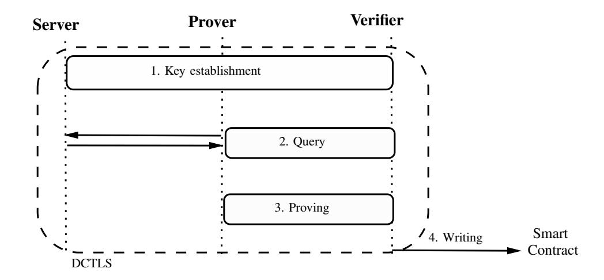

Fig. 1. The general overview of using DCTLS protocols for smart contracts: Inside the following executions in DCTLS protocol, prover P proves her data in server S to verifier V, then verifier V writes this info to the smart contract.

enables jointly verifiable attestations with constant prover complexity. The syntax specifies the entities, cryptographic components, and protocol phases that form the basis for the constructions and security definitions introduced in subsequent sections.

The protocol involves four types of entities as follows: i) A TLS server S hosts authenticated data and executes the standard TLS protocol. ii) A prover P initiates a TLS session with S and aims to attest to a statement b derived from the server response. iii) Verification is carried out by a set of verifiers V , which consists of a coordinator verifier Vcoord and multiple auxiliary verifiers V<sup>i</sup> . The coordinator verifier participates in a single interactive TLS attestation with the prover, ensuring that prover complexity remains low. In contrast, auxiliary verifiers do not engage in the TLS session itself. Instead, they collectively contribute to joint randomness generation and verify that the attestation execution is correctly bound to this shared randomness, thereby approving the attestation outcome in a distributed manner. iv) Finally, a smart contract SC acts as the on-chain consumer of the attestation, verifying threshold approvals and enforcing application-specific logic.

The proposed primitive is specified through four algorithms: Setup, RC, Attestation, and Signing. This section specifies their syntax by fixing the inputs and outputs of each algorithm. Concrete instantiations and protocol executions are defined in subsequent sections.

- Setup(1<sup>λ</sup> ): Generates public parameters pp and system metadata for n verifiers and threshold t.
- RC(pp): Randomness creation is realized via a distributed verifiable random function. The distributed verifiable random function (DVRF) follows the standard construction defined in the preliminaries and consists of the following components: (i) DKG, which establishes threshold key material among the verifier set and outputs a public key, per-verifier verification keys, secret key shares, and a qualified set of participants; (ii) PartialEval, which allows each verifier to compute a partial evaluation for an input string α together with an associated correctness proof; (iii) Combine, which aggregates at least t valid partial evaluations into a unique randomness value and a public verification proof; and (iv) Verify, which checks that the derived randomness is a valid DVRF output for the given input.

- Attestation(rand): For the attestation, we define an interactive protocol called dx-DCTLS protocol among Vcoord, P, and S. It takes the agreed randomness rand and produces the attested statement b together with an exportable proof πa. The proof π<sup>a</sup> includes the artifacts required for auxiliary verifiers to check correct execution under rand, and it is broadcast to all V<sup>i</sup> ∈ V \ {Vcoord}. The components of the dx-DCTLS are as follows:
  - HSP(1 λ ; rand) → (sps, spp, spv, πHSP): A handshake subprotocol that derives TLS key material, where S obtains sps and P, Vcoord obtain additive shares (spp, spv), with the session bound to rand. Additionally, Vcoord obtains the proof πHSP proves that the handshake is executed with the designated randomness rand, which constitutes the key distinction between dx-DCTLS and prior DCTLS constructions.
  - QP(sps, spp, spv) → (Q, R, Q, ˆ Rˆ): A query subprotocol jointly executed by the prover and the Vcoord. Since they hold additive shares of the TLS session keys, neither party can perform the query independently. To obtain a valid server response, the prover must embed a valid session secret θ<sup>s</sup> into the query. As a result, the prover obtains the plaintext pair (Q, R), while the coordinator verifier Vcoord obtains the committed encrypted values (Q, ˆ Rˆ).
  - PGP(x, w) → πpgp: A proof generation subprotocol that outputs a zero-knowledge proof πpgp ← ZKP.Prove(x, w), where the public input is w = (Q, ˆ R, sp, b ˆ ) and the witness is x = (Q, R, θs), attesting that the public statement b is correctly derived from (Q, R) and consistent with the committed values (Q, ˆ Rˆ). The value sp is derived from the designated randomness rand in the handshake phase.
- Signing(rand, πpgp, πa, b): In the signing phase, auxiliary verifiers validate the complete attestation proof by checking πpgp conducted with rand and, if valid, produce a threshold signature consumable by SC.
  - DKG(.) → (sk<sup>i</sup> , pk): Reloads the DVRF.DKG instead of recomputing again.
  - Sign(b, ski) → σ: If verification succeeds, the auxiliary verifiers engage in a threshold signing protocol by signing with sk<sup>i</sup> to produce a signature σ on b. The resulting data b and combined signature σ are submitted to the smart contract for on-chain verification and consumption.

#### VI. SECURITY DEFINITIONS

We formalize the core security requirements of a collusionminimized and efficient DCTLS-based TLS attestation scheme suitable for smart contract environments. We consider a strong adversarial model in which verifiers in set V are not assumed to be honest or semi-honest. Verifiers may behave arbitrarily, collude with each other, and collude with the prover in an attempt to forge or bias TLS attestations. The adversary may corrupt verifiers at arbitrary points during the protocol execution and obtain their internal state. We assume that the TLS 

{5}------------------------------------------------

server correctly executes the standard TLS protocol and does not behave maliciously or collude with the prover or verifiers. Likewise, the smart contract (SC) is assumed to be correctly deployed and to execute deterministically according to its code. Attacks involving a malicious server or a compromised smart contract are outside the scope of this work. Under these assumptions, we capture the primary security objective of the framework through the notion of *threshold attestation unforgeability*.

Threshold attestation unforgeability. In this model, we consider an attestation setting in which the verification functionality is executed by a set of verifiers  $\mathcal{V} = \{V_1, \dots, V_n\}$ . During an execution of the protocol, an adversary  $\mathcal{A}$  may corrupt the prover and arbitrarily many verifiers, except that at least one verifier remains honest throughout the protocol. Corrupted parties behave under the full control of  $\mathcal{A}$  as a bad event called  $B_{\text{coll}}$ , whereas honest verifiers follow the protocol specification. The adversary interacts with honest verifiers in an arbitrary, adaptive manner and eventually outputs an attestation ZKP in this  $B_{\text{coll}}$ . We require that for every PPT adversary  $\mathcal{A}$ ,  $\Pr[B_{\text{coll}}]$  is negligible small.

Threshold Attestation Unforgeability (TAU) experiment: Let  $\Pi_{\text{coll-min}} = (\text{DVRF}, \text{dx-DCTLS}, \text{TSS})$  be the protocol defined as above and we say  $\Pi_{\text{coll-min}}$  satisfies *threshold* attestation unforgeability if for all PPT adversary  $\mathcal{A}_{\text{TAU}}$  outputs 1 with negligible advantage  $\text{negl}(\lambda)$  in the following game with  $\mathcal{C}_{\text{TAU}}$  as shown in Fig. 2:

- $\mathcal{A}_{\text{TAU}}$  corrupts the prover  $P, V_{\text{coord}}$  and auxiliary verifiers  $V_i$  in a corruption set  $C \subseteq \{0, \ldots, n-1\}$  of verifiers with  $|C| \leq t-1$ . The  $\mathcal{C}_{\text{TAU}}$  controls the honest auxiliary verifiers in  $V \setminus C$ .
- $\mathcal{A}_{TAU}$  and  $\mathcal{C}_{TAU}$  run DKG and DVRF.partialEval over  $\alpha$  to obtain  $s_v$ , corresponding public key pk and proof  $\pi_{DRVF}$ .
- $\mathcal{A}_{\text{TAU}}$  runs dx-DCTLS.HSP with  $s_p$ , obtains  $(sp_s, sp_p, sp_v)$  and  $\pi_{\text{HSP}}$ .
- $\mathcal{A}_{\text{TAU}}$  queries  $\mathcal{O}^{\text{server}}$  with  $(sp_s, sp_p, sp_v)$  and receives  $(\mathsf{Q}, \mathsf{R}, \hat{Q}, \hat{R})$ .
- $\mathcal{A}$  can query  $\mathcal{O}^{\text{key-reveal}}$  oracle to get any secret key share of DKG or  $\mathcal{O}^{\text{partial-eval-reveal}}$  oracle to get any secret partial-eval of the DVRF session.
- $\mathcal{A}$  uses the transcript  $(x=(\hat{Q},\hat{R},sp,b), (w=Q,R,\theta_s), s_v \ \pi_{DRVF}, \ \pi_{HSP})$ , and calculates  $\pi_{dx-DCTLS}$  which is ZKP.Prove(x,w), that is, x is private and w is public input.
- $\mathcal{A}$  forges another dx-DCTLS transcript  $(x^*, w^*)$ , and  $s_v^*$  with its  $\pi_{\mathsf{HSP}}^*$  and  $\pi_{\mathsf{DVRF}}^*$  to calculate  $\pi_{\mathsf{DCTLS}}^* = \mathsf{ZKP.Prove}(x^*, w^*)$ . Send both to the  $\mathcal{C}_{\mathsf{TAU}}$ .
- Returns 1, if  $\mathcal{C}_{TAU}$  gets ZKP.Verify( $\pi_{DCTLS}^*$ ,  $w^*$ ) = ZKP.Verify( $\pi_{DCTLS}$ , w) = DVRF.Verify(pk,  $\alpha$ ,  $\pi_{DVRF}^*$ ,  $s_v^*$ ) = DVRF.Verify(pk,  $\alpha$ ,  $\pi_{DVRF}$ ,  $s_v$ ) = ZKP.Verify( $\pi_{HSP}^*$ ,  $s_v^*$ ,  $sp_v^*$ ) = ZKP.Verify( $\pi_{HSP}^*$ ,  $s_v$ ,  $sp_v$ ) = 1 where  $b \neq b^*$ , otherwise 0.

**Definition.** (Threshold attestation unforgeability.) We say that a protocol  $\Pi$  provides threshold attestation unforgeability if for all PPT  $\mathcal{A}$  and  $\lambda$ , in the experiment shown in Fig. 2, it holds that

$$|Pr[\operatorname{Exp}_{\Pi}^{TAU}(\mathcal{A}, \lambda) = 1] \le negl(\lambda)$$

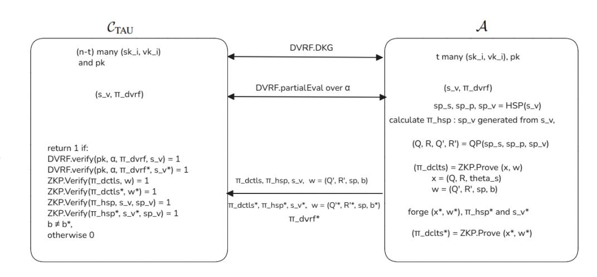

Fig. 2. Threshold attestation unforgeability (TAU) experiment

We specify a set of oracles for the adversary A, which are employed in the *threshold attestation unforgeability* (TAU) game defined above and in subsequent security definitions.

- $\mathcal{O}^{\text{key-reveal}}$ : An oracle that, upon request, provides  $\mathcal{A}$  with secret key material associated with the threshold components of the protocol, subject to the restrictions of the experiment.
- $\mathcal{O}^{\text{partial-eval-reveal}}$ : Responses secret partial-eval of the DVRF session  $\mathcal{A}$ .
- $\mathcal{O}^{\text{Server}}$ : Simulates the real server in the dx-DCTLS or DCTLS session and takes the encrypted HTTPS query  $\hat{Q}$  and replies with an encrypted response  $\hat{R}$  deterministically.
- $\mathcal{O}^{ro}$ : Upon receiving a query x from  $\mathcal{A}$ , the oracle checks a table T storing all previous queries. If x has been queried before, the oracle returns the previously stored value T[x]. Otherwise, the oracle programs the output at x-either by choosing a value uniformly at random or by setting it to a value required by the reduction-stores this value in T, and returns it. The oracle is consistent across all queries.

The protocol preserves privacy by construction, as inherited from DCTLS. The verifier V never obtains the prover's decryption key and therefore cannot decrypt or learn the query–response pair (Q,R). In addition, the security model accounts for malicious behavior by either party. A dishonest prover may attempt to generate an attestation without a valid session secret  $\theta_s$  or without correctly committing to  $(\hat{Q},\hat{R})$ , while a malicious verifier may attempt to deviate by revealing incorrect key material after the commitment phase. These behaviors are explicitly captured and required by the protocol design and the associated security guarantees.

#### VII. STRAWMAN PROTOCOLS

In this section, we present two preliminary Strawman protocol designs and critically examine why they fail to satisfy the required security and efficiency properties. The first design attempts to extend the protocol via an n-party computation (nPC) expansion rather than relying on a 2PC-based construction. The second design explores the integration of plain use of a DVRF; however, we demonstrate that such a construction is not compatible with regular DCTLS, as it cannot provide the necessary robustness or adversarial resistance in the targeted setting.

{6}------------------------------------------------

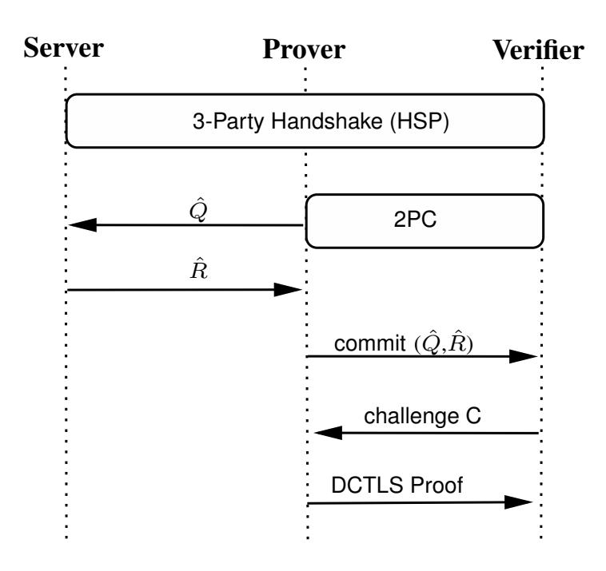

Fig. 3. General overview of DCTLS protocols with Server, Prover and Verifier

# *A. nPC-based Strawman Protocol*

All DCTLS protocols in the literature rely on two-party computation (2PC), where the prover and verifier jointly participate in a single TLS session, as illustrated in Fig. 3. A straightforward extension might attempt to generalize the protocol to support n verifiers instead of just one to mitigate collusion risk. The resulting Strawman design, shown in Fig. 4, introduces a multi-party setting with n verifiers and consists of three main phases: a handshake, a query phase, and a proof generation phase.

- Handshake Phase: The server S, the prover P, and the n verifiers initiate a handshake involving n + 2 parties. The prover and the n verifiers collectively act as a single TLS client, jointly maintaining the session keys.
- Query Phase: The prover P and the n verifiers collaboratively construct a valid query Q using n-party computation (nPC) instead of 2PC. The prover then receives the encrypted response Rˆ from the server and commits it to the verifiers.
- Proving Phase: The prover P generates a commitment that selectively hides sensitive information in the response, while allowing the verifiers to publicly open and verify the relevant data.

Limitations of the nPC-based strawman protocol. The collusion risk in the Strawman Protocol is significantly reduced, as a malicious prover P must now reach an agreement with n verifiers rather than a single verifier. However, replacing two-party computations with n-party computation introduces considerable inefficiency and increases network overhead. In addition, the Strawman design lacks modularity and imposes tight coordination requirements among verifiers, making it impractical for real-world deployment. Crucially, the same functionality-namely, collusion-resistant and publicly verifiable TLS attestation-can be achieved more efficiently by combining threshold cryptographic primitives such as TSS and DVRFs with lightweight, verifiable components.

#### *B. DVRF integrated DCTLS Strawman Protocol*

The second Strawman protocol consists of a single DVRF output, a DCTLS construction, and a single threshold signa-

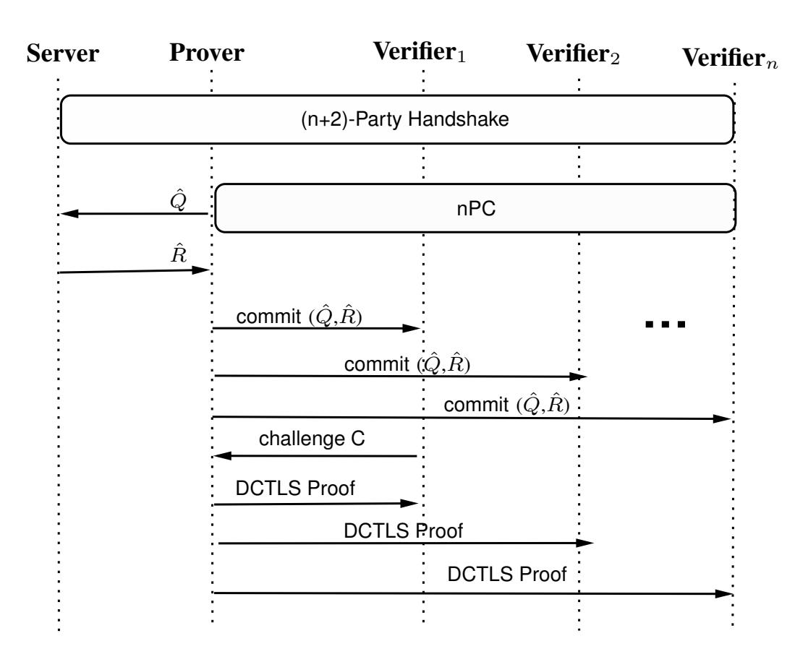

Fig. 4. Strawman DCTLS protocol with server, prover and n many verifiers

ture (TSS). However, it suffers from an unforgeability issue due to the DCTLS proofs are not exportable, which means DCTLS cannot guarantee that third parties verify the results are fresh and correct. This protocol can be viewed as a second Strawman construction and is formally defined as: Π = (DVRF, DCTLS,SA):

DVRF: The auxiliary verifiers V<sup>i</sup> ∈ V , including the coordinator Vcoord, agree on a plaintext α and collectively execute DVRF.DKG. Each verifier V<sup>i</sup> then performs a partial evaluation, and the coordinator Vcoord computes the final output s<sup>v</sup> by invoking DVRF.Combine.

DCTLS: This phase proceeds as a standard DCTLS execution involving the server S, the prover P, and the coordinator verifier Vcoord. Vcoord uses the DVRF-derived randomness s<sup>v</sup> instead of selecting it randomly. Furthermore, Vcoord is responsible for broadcasting all received messages to the auxiliary verifiers to ensure transparency.

SA: In this phase, each auxiliary verifier V<sup>i</sup> checks whether the DCTLS execution was conducted using the shared DCTLS output s<sup>v</sup> from the received messages. If V<sup>i</sup> is convinced that s<sup>v</sup> was correctly used in the DECO execution, it proceeds to execute the TSS.Sign operation; otherwise, it refuses to participate. The verification process for each V<sup>i</sup> is outlined as follows:

- 1) During the DCTLS.HSP phase, Vcoord forwards the servers y<sup>s</sup> and *TLS certificate*, and the verifier validates the *TLS certificate*.
- 2) The verifier participates into the DVRF session and obtains the shared randomness sv. It then computes the *Pre-master secret* key share of Vcoord Z<sup>p</sup> = y<sup>s</sup> ∗ sv. Therefore, the verifier can be sure about the Zp.
- 3) The verifier receives the sp<sup>v</sup> from Vcoord but cannot verify whether it was correctly derived from Zp, since the 2PC used in key derivation lacks a verifiability.

Limitations of the DVRF integrated DVTLS strawman protocol. Since an auxiliary verifier V<sup>i</sup> cannot independently verify the origin of the value sp, which is essential for binding 

{7}------------------------------------------------

an attestation to a specific session, verifiability cannot be guaranteed at this stage due to the lack of  $\pi_{\mathsf{HSP}}$  in DCTLS. As a result,  $V_i$  cannot reliably accept or reject a proof based on whether sp was correctly derived from the current execution. This enables an adversary to substitute a different but valid DCTLS transcript  $T^*$  for an honest transcript T, where validity means that  $T^*$  corresponds to a genuine and well-formed DCTLS execution whose consistency is accepted by the associated zero-knowledge proof, even if it originates from a different session. Consequently, the attestation may verify successfully while being bound to an unintended transcript, breaking the intended unforgeability guarantee.

# VIII. COLLUSION-MINIMIZED TLS ATTESTATION PROTOCOL

In this section, we give our collusion-minimized TLS attestation protocol  $\Pi_{\text{coll-min}}$  construction, which is resilient against prover-verifier collusion as shown in Fig. 8. After presenting the generic construction, we show how dx-DCTLS can be instantiated concretely from two existing DCTLS protocols-DECO and Distefano-thereby obtaining collusion-minimized variants of both schemes without modifying the server-side TLS implementation.

#### A. The dx-DCTLS Abstraction: From DCTLS to dx-DCTLS

At a high level, our protocol  $\Pi_{\text{coll-min}}$  requires a variant of DCTLS that supports external verifiability of each interaction between the prover P and the coordinator verifier  $V_{\text{coord}}$ . Standard DCTLS schemes such as DECO and Distefano provide privacy-preserving TLS attestations but rely on the non-exportability of their transcript, meaning that only the designated verifier can validate the correctness of the attestation. This property fundamentally prevents joint verification by a set of verifiers.

To overcome this limitation, we introduce a designed exportable DCTLS (dx-DCTLS) abstraction, obtained by replacing non-verifiable 2PC calls with either v2PC or co-SNARK to prove DCTLS is executed with specific randomness rather than from local random sampling. dx-DCTLS consists of the interactive protocols (HSP, QP, PGP) similarly DCTLS protocols including roles: server S, prover P and verifier V as shown in Section V.

Eventually, the verifier V in dx-DCTLS is convinced, as in standard DCTLS, that the data b originates from a valid TLS session. In addition, dx-DCTLS ensures that this conviction is obtained in an exportable form, allowing V to present verifiable evidence that the attestation was executed with the designated randomness rand. In other words, the verifier V can prove the execution by presenting rand,  $\pi_{HSP}$  to third parties with integrity. The unforgeability experiment is defined as in Fig. 5.

#### B. The Full Protocol $\Pi_{coll-min}$

In this section, we propose protocol construction from distributed randomness creation, dx-DCTLS and threshold signature scheme. We denote the protocol  $\Pi_{\text{coll-min}}$  =

# $\mathbf{Exp}^{\mathbf{Unf}}_{\mathbf{dx\text{-}DCTLS}}(\mathcal{A}, \mathcal{C}, rand)$

```
(sp_s, sp_p, sp_v, \pi_{\mathsf{HSP}}) \leftarrow \mathsf{HSP}(rand, \mathcal{A}, \mathcal{C})

(\mathsf{Q}, \mathsf{R}, \hat{Q}, \hat{R}) \leftarrow \mathsf{QP}(sp_s, sp_p, sp_v)

(\hat{Q}, \hat{R}) \leftarrow \mathsf{committed} by \mathcal{A}

sp_v received by \mathcal{A}

\pi_{\mathsf{DCTLS}} \leftarrow \mathsf{ZKP.Prove}(x, w) where w = (Q, R, \theta_s), x = (\hat{Q}, \hat{R}, sp, b))

\mathcal{A} forges (x^*, w^*)

\pi^*_{\mathsf{DCTLS}} \leftarrow \mathsf{ZKP.Prove}(x^*, w^*)

Return 1 if: \mathsf{ZKP.Verify}(x^*, w^*) = \mathsf{ZKP.Verify}(x, w) = 1

\wedge (b \neq b^*)

Otherwise, return 0
```

Fig. 5. Unforgeability experiment of dx-DCTLS

(DVRF, dx-DCTLS, TSS) with server S, prover P, smart contract SC and verifier  $V_{\rm coord}$  and  $V_i$  auxiliary verifiers, as shown in Fig. 8. We next define the *Threshold Attestation Unforgeability (TAU)* experiment, which captures the central security property required by our security model.

Threshold Attestation Unforgeability (TAU) experiment: Let  $\Pi_{\text{coll-min}} = (\text{DVRF}, \text{dx-DCTLS}, \text{TSS})$  be the protocol defined as above and we say  $\Pi_{\text{coll-min}}$  satisfies *threshold* attestation unforgeability if for all PPT adversary  $\mathcal{A}_{\text{TAU}}$  outputs 1 with negligible advantage  $\text{negl}(\lambda)$  in the following game with  $\mathcal{C}_{\text{TAU}}$  as shown in Fig. 2:

**Theorem 1.** (Collision minimization). If DVRF holds the uniqueness property and dx-DCTLS holds unforgeability (DU),  $\Pi_{\text{coll-min}}$  provides threshold attestation unforgeability (TAU) security feature. Specifically,

$$Adv_{\mathcal{A},\Pi_{\textit{coll-min}}}^{TAU} \leq Adv_{\mathcal{B}_{\mathcal{D}},DVRF}^{Uniq} + Adv_{\mathcal{B}_{\mathcal{X}},dx\text{-}DCTLS}^{Unf}$$

*Proof.* Let X be the event that  $\mathcal{A}$  wins TAU game with probability  $\Pr[X]$  as  $\operatorname{Adv}_{\mathcal{A},\Pi_{\text{coll-min}}}^{\text{TAU}}$ . In event X, the  $\mathcal{A}$  successfully forges another valid dx-DCTLS transcript  $(x^*,w^*)$  with corresponding  $s_v^*$  and its proofs  $\pi_{\text{HSP}}^*$  and  $\pi_{\text{DVRF}}^*$ . If  $\mathcal{A}$  is able to produce this transcript, then one of the two things must happen:

- 1) Attacker  $\mathcal{A}$  wins the DVRF uniqueness game and uses another valid transcript that does not belong to the original session.
- 2) DVRF uniqueness property is held.

We define two additional events based on these happenings above:

Let Y denote the event that  $\mathcal{A}$  wins the DVRF uniqueness game by forging another valid randomness  $s_v^*$  that is DVRF.Verify $(pk, \pi_{\text{DCTLS}}, \alpha, s_v^*)$ .

Let Z denote the event that  $\mathcal{A}$  wins TAU unforgeability game by forging another valid transcript without Y occurring, which implies that  $\mathcal{A}$  must break the dx-DCTLS game.

{8}------------------------------------------------

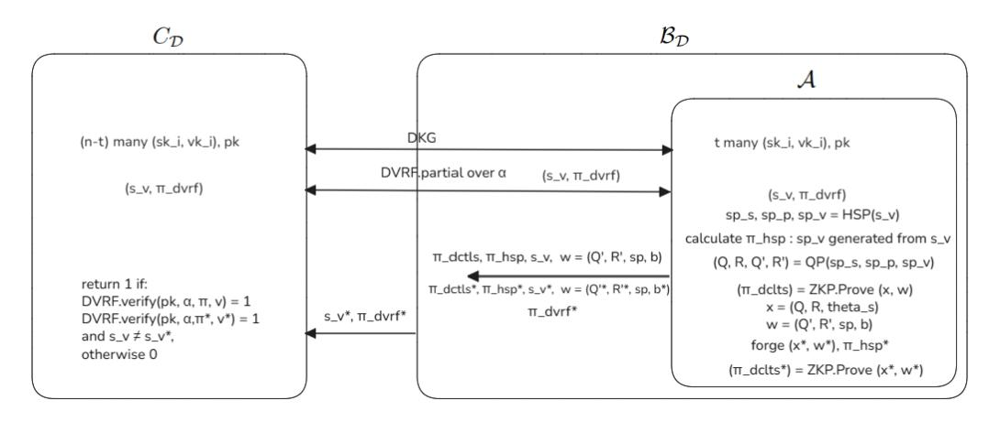

Fig. 6. Building DVRF Uniqueness adversary  $\mathcal{B}_{\mathcal{D}}$ 

$$\begin{split} \mathrm{Adv}^{\mathrm{TAU}}_{\mathcal{A},\Pi_{\mathsf{coll-min}}} &= \Pr[X] \\ &\leq \Pr[X \wedge \neg Y] + \Pr[Y] \\ &= \Pr[Z] + \Pr[Y] \\ &= \mathrm{Adv}^{\mathrm{Uniq}}_{\mathcal{B}_{\mathcal{D}},\mathrm{DVRF}} + \mathrm{Adv}^{\mathrm{Unf}}_{\mathcal{B}_{\mathcal{X}},\mathrm{dx-DCTLS}} \end{split}$$

To prove the theorem, we construct a DVRF adversary  $\mathcal{B}_{\mathcal{D}}$  and a dx-DCTLS adversary  $\mathcal{B}_{\mathcal{X}}$ .

First, we construct  $\mathcal{B}_{\mathcal{D}}$  who plays DVRF uniqueness game with challenger  $C_{\mathcal{D}}$  and runs  $\mathcal{A}$  as subroutine as shown in Fig. 6 as follows:

- $\mathcal{B}_{\mathcal{D}}$  runs DKG with  $C_{\mathcal{D}}$  including  $\mathcal{A}$ , they hold t and (n-t) many key shares as  $(sk_i, vk_i)$  respectively and a pk.
- $\mathcal{B}_{\mathcal{D}}$  runs DVRF.PartialEval over the  $\alpha$  with  $C_{\mathcal{D}}$  including  $\mathcal{A}$ , and gets  $(s_v, \pi_{\mathsf{DVRF}})$ .
- $\mathcal{A}$  runs dx-DCTLS.HSP with  $s_v$  and dx-DCTLS.QP to obtain  $(\mathsf{Q},\mathsf{P},\hat{Q},\hat{R})$ .
- $\mathcal{A}$  uses the transcript  $(x=(\hat{Q},\hat{R},sp,b),\ w=(\mathsf{Q},\mathsf{R},\theta_s),\ s_v,\ \pi_{\mathsf{DRVF}},\ \pi_{\mathsf{HSP}}),$  and calculates  $\pi_{\mathsf{dx-DCTLS}}$  which is  $\mathsf{ZKP.Prove}(x,w).$
- $\mathcal{A}$  forges another dx-DCTLS transcript  $(x^*, w^*)$ , and  $s_v^*$  with its  $\pi_{\mathsf{HSP}}^*$  and valid  $\pi_{\mathsf{DVRF}}^*$  to calculate  $\pi_{\mathsf{dx-DCTLS}}^* = \mathsf{ZKP.Prove}(x^*, w^*)$ . Sends both to the  $\mathcal{B}_{\mathcal{D}}$ .
- $\mathcal{B}_{\mathcal{D}}$  outputs  $(s_v^*, \pi_{\mathsf{DVRF}}^*)$  to the  $C_{\mathcal{D}}$ .

$$Pr[Y] = Adv_{\mathcal{B}_{\mathcal{D}}, DVRF}^{Uniq}$$

Finally, we construct  $\mathcal{B}_{\mathcal{X}}$  who plays dx-DCTLS unforgeability game with challenger  $C_{\mathcal{X}}$  and again runs  $\mathcal{A}$  as a subroutine as shown in Fig. 7:

- $\mathcal{B}_{\mathcal{X}}$  picks a random  $s_p$ ,  $C_{\mathcal{X}}$   $s_v$ .
- $\mathcal{B}_{\mathcal{X}}$  and  $C_{\mathcal{X}}$  run dx-DCTLS.HSP with  $(s_p, s_v)$ , and obtain  $(sp_s, sp_v, \pi_{\mathsf{HSP}})$ ,  $(sp_sp)$  respectively.
- $\mathcal{B}_{\mathcal{X}}$  runs dx-DCTLS.QP with  $(sp_s, sp_v, sp_sp)$  and gets  $(\mathsf{Q}, \mathsf{P}, \hat{Q}, \hat{R}).$
- $\mathcal{B}_{\mathcal{X}}$  initializes DVRF.DKG with  $\mathcal{A}$  and both of them get the secret key shares  $(sk_i, vk_i)$ , and DVRF.PartialEval output over  $\alpha$ .
- $\mathcal{A}$  receives the identical  $s_v$  by querying the  $\mathcal{O}^{Hash}$ .
- $\mathcal{A}$  runs dx-DCTLS.HSP with random sampling  $s_p$ , which  $\mathcal{B}_{\mathcal{X}}$  writes  $s_p$  to random tape.
- $\mathcal{A}$  calculates  $(sp_s, sp_v, \pi_{\mathsf{HSP}}), (sp_sp),$  and gets  $(\mathsf{Q}, \mathsf{P}, \hat{Q}, \hat{R}).$

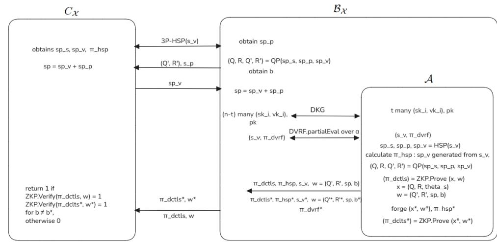

Fig. 7. Building dx-DCTLS adversary  $\mathcal{B}_{\mathcal{X}}$ 

- $\mathcal{A}$  uses the transcript  $(x = (\hat{Q}, \hat{R}, sp, b), w = (Q, R, \theta_s), s_v, \pi_{DRVF}, \pi_{HSP})$ , and calculates  $\pi_{dx\text{-DCTLS}}$  which is  $\mathsf{ZKP.Prove}(x, w)$ .
- $\mathcal{A}$  forges another dx-DCTLS transcript  $(x^*, w^*)$  and  $s_v^*$  with its  $\pi_{\mathsf{HSP}}^*$ , and a valid  $\pi_{\mathsf{DVRF}}^*$  to calculate  $\pi_{\mathsf{dx-DCTLS}}^* = \mathsf{ZKP.Prove}(x^*, w^*)$ . Sends both to  $\mathcal{B}_{\mathcal{X}}$ .
- $\mathcal{B}_{\mathcal{X}}$  outputs  $(\pi_{\mathsf{dx-DCTLS}}, w)$  and  $(\pi_{\mathsf{dx-DCTLS}}^*, w^*)$  to  $C_{\mathcal{X}}$ .  $Pr[Z] = \mathsf{Adv}_{\mathcal{B}_{\mathcal{X}}, \mathsf{dx-DCTLS}}^{\mathsf{Unf}}$

Finally,

$$\mathrm{Adv}^{\mathrm{TAU}}_{\mathcal{A},\Pi_{\mathsf{coll-min}}} \leq Pr[Z] + Pr[Y] = \mathrm{Adv}^{\mathrm{Uniq}}_{\mathcal{B}_{\mathcal{D}},\mathrm{DVRF}} + \mathrm{Adv}^{\mathrm{Unf}}_{\mathcal{B}_{\mathcal{X}},\mathrm{dx-DCTLS}}$$

Therefore, even if the prover P colludes with the verifier  $V_{\text{coord}}$  and learns the TLS session secret sp, the attestation remains confined to the prover's own TLS session with the claimed server from the binding feature of the sp. While knowledge of sp allows the parties to produce internally consistent ciphertexts and corresponding plaintext claims, such attestations cannot be extended to statements about other users' sessions or different servers, and must remain consistent with the specific TLS session established with the server. As in existing DCTLS constructions such as DECO, committhen-prove mechanisms bind attestations to authentic session transcripts but do not prevent a prover from selecting which valid request-response pairs within a single TLS session to disclose; addressing such selective disclosure would require additional transcript-locking or commitment mechanisms that are orthogonal to the goals of DCTLS and this work.

#### C. Instantiating dx-DCTLS from DECO and Distefano

We show that existing DCTLS protocols, such as DECO and Distefano, do not natively satisfy the requirements of dx-DCTLS due to their lack of exportability. However, we demonstrate that dx-DCTLS instantiations can be derived from both protocols by replacing non-verifiable primitives with their verifiable counterparts. While the underlying cryptographic mechanisms differ, we provide a unified representation of the handshake verifiability. Specifically, regardless of the protocol-specific instantiation, the handshake is validated by each auxiliary verifier  $V_i$  through a common verification function:

$$\{0,1\} \leftarrow \mathsf{ZKP.Verify}(\pi_{\mathsf{HSP}}, rand)$$
 (1)

{9}------------------------------------------------

#### $\Pi_{\text{coll-min}}$

- Setup( $1^{\lambda}$ )  $\rightarrow$   $(pp) \setminus pp$  includes security parameters and defining plaintext  $\alpha$  for the creating randomness for all parties.
- RC Phase \\Among  $V_{\text{coord}}$  and  $V_{i}$ s  $(sk_{i}, vk_{i}, pk) \leftarrow \mathsf{DKG}(pp, t, n)$   $(i, V_{i}, \pi_{i}^{DVRF}) \leftarrow \mathsf{PartialEval}(\alpha, sk_{i}, vk_{i})$   $(rand, \pi^{DVRF}) \leftarrow \mathsf{Combine}(pk, VK, \alpha, E)$
- $\bullet$  Attestation Phase \\dx-DCTLS runs among server S, prover P and coordinator verifier  $V_{\rm coord}$ 
  - (S, P,  $V_{\text{coord}}$ ) gets  $(sp_s, sp_p, sp_v) \leftarrow \mathsf{HSP}(pp, rand)$

 $V_{\text{coord}} \text{ gets } \pi_{\mathsf{HSP}} \leftarrow \mathsf{ZKP.Prove}(sp_v, rand)$ 

- P gets  $(Q,P,\hat{Q},\hat{R}) \leftarrow QP(sp_s, sp_p, sp_v)$
- P calculates  $\pi_{dx-DCTLS} \leftarrow \text{ZKP.Prove}(\mathbf{x}, w)$ : private input  $\mathbf{x} = (\mathbf{Q}, \mathbf{R}, \theta_s)$ , public input  $\mathbf{w} = (\hat{Q}, \hat{R}, sp_v, b)$ , then sends it to the  $V_{\text{coord}}$ .
- $V_{\rm coord}$  broadcasts the  $\pi_{dx-DCTLS}$  with w and pre-calculated  $\pi_{\rm HSP}$  to the  $V_i$ .
- $\bullet$  Signing Phase  $\setminus \setminus \mathsf{TSS}$  runs among  $V_{\mathsf{coord}}$  and  $V_i \mathsf{s}$

```
 \begin{cases} 0,1 \} \leftarrow \mathsf{ZKP}.\mathsf{Verify}(\pi_{DCTLS}, \, \mathsf{w}) \\ \{0,1 \} \leftarrow \mathsf{DVRF}.\mathsf{Verify}(pk, \alpha, \pi_{\mathsf{DVRF}}, sp_v) \\ \{0,1 \} \leftarrow \mathsf{ZKP}.\mathsf{Verify}(\pi_{\mathsf{HSP}}, rand), \, \text{for each } V_i \\ \mathsf{If it returns 1, each } V_i \, \mathsf{loads} \, (sk_i, vk_i, pk) \\ \sigma_i \leftarrow \mathsf{Sign}(b, sk_i) \\ V_{\mathsf{coord}} \, \mathsf{gets} \, \sigma \leftarrow \mathsf{Combine}(\sigma_i), \, \mathsf{sends} \, \mathsf{it to } \, \mathbf{SC} \\ \backslash \mathsf{SC} \, \mathsf{verifies the signature} \\ \{0,1 \} \leftarrow \mathsf{SC}.\mathsf{Verify}(\sigma, \, pk) \\ \mathsf{If it returns 1, SC accepts the } b \, \mathsf{for the decentralized} \\ \end{cases}
```

Fig. 8. The construction of our collusion-minimized protocol  $\Pi_{\text{coll-min}}$ 

application; otherwise aborts the session.

This abstraction allows us to treat the verifiable handshake as a modular component, where  $\pi_{\text{HSP}}$  serves as the exportable certificate that binds the session to the distributed randomness rand across both DECO-based and Distefano-based constructions.

**Modified DECO as dx-DCTLS.** DECO has a construction very similar to DCTLS, where the tuple  $(sp_p, sp_v, sp)$  corresponds to the TLS 1.2 MAC keys  $(K_P^{\rm MAC}, K_V^{\rm MAC}, K^{\rm MAC})$ . Our modification affects the DECO handshake (HSP) phase, in which we replace the TLS-PRF 2PC with a co-SNARK. In this co-SNARK computation, the prover P provides the key share  $K_P^{\rm MAC}$ , while the verifier V provides  $K_V^{\rm MAC}$ . Specifically, the verifiable handshake is formalized as:

$$(K^{\text{MAC}}, \pi_{\text{HSP}}) \leftarrow \text{co-SNARK.Execute}(\{K_P^{\text{MAC}}, K_V^{\text{MAC}}\}, Z_p)$$
 (2)

where  $Z_p$  denotes the pre-master secret key known by the auxiliary verifiers. This construction ensures that the verifier V obtains the MAC key along with a proof  $\pi_{\mathsf{HSP}}$ , rendering the handshake phase verifiable as required by the dx-DCTLS abstraction. To enable exportability, the verifier V distributes the reconstructed MAC key  $K^{\mathsf{MAC}}$  to the auxiliary verifiers

together with a corresponding proof  $\pi_{\mathsf{HSP}}$ . This proof allows auxiliary verifiers to independently verify the correctness of  $K^{\mathsf{MAC}}$  without participating in the underlying DCTLS session. Consequently, the verifier V obtains the full key  $K^{\mathsf{MAC}}$  along with  $\pi_{\mathsf{HSP}}$ , which constitutes the core mechanism enabling exportable and jointly verifiable attestations in dx-DCTLS.

Security of this phase follows from the reduction to the underlying cryptographic primitives; specifically, any deviation from a correctly derived  $K^{\rm MAC}$  would necessitate either forging a valid proof  $\pi_{\rm HSP}$ , thereby contradicting the soundness property of the co-SNARK as shown in Appendix E, or generating a valid session transcript in the absence of a corresponding DECO execution, which contradicts the unforgeability guarantees of the original DECO protocol.

**Modified Distefano as dx-DCTLS.** Distefano is structurally aligned with DCTLS, where the tuple  $(sp_p, sp_v, sp)$  corresponds to the TLS 1.3 traffic secrets. Unlike the DECO setting, co-SNARKs cannot be employed here because, while  $K^{\rm MAC}$  in TLS 1.2 can be made transparent to all parties, TLS 1.3 does not separate message authentication from encryption. Consequently, since authentication is integrated into the Authenticated Encryption with Associated Data (AEAD) mechanism, revealing the jointly derived keys would fundamentally violate the privacy-preserving features of the protocol.

For this reason, the sum of  $sp_p$  and  $sp_v$  is never revealed to the coordinator  $V_{\rm coord}$  or the auxiliary verifiers in the Distefano construction. While standard 2PC effectively maintains this confidentiality, its inherent lack of public verifiability prevents it from satisfying the requirements of the dx-DCTLS abstraction by default. Consequently, a Distefano-based dx-DCTLS instantiation is obtained by replacing all two-party computations with verifiable two-party computation (v2PC) primitives. This transition ensures that the handshake verifiability is realized through aggregated proofs that attest to the correct derivation of shared secrets without ever disclosing their sum to any participating or observing party.

Specifically, the verifiable handshake in Distefano based dx-DTCLS is formalized as:

$$(sp_p, sp_v, \pi_{2PC}) \leftarrow \text{v2PC.Execute}(s_p, s_v)$$
 (3)

For clarity of exposition, the tuple  $(sp_p, sp_v)$  is represented in this simplified form; however, it encapsulates the aggregate of key shares derived throughout the multi-stage Distefano handshake. This notation serves to illustrate that the resulting secrets are verifiably rooted in the DVRF output, ensuring that the entire derivation process remains bound to the distributed randomness while maintaining the rigorous confidentiality requirements of the underlying protocol.

Similar to the DECO based dx-DCTLS, the exportability in the Distefano-based instantiation, the verifier V distributes the traffic secret shares  $(sp_p,sp_v)$  to the auxiliary verifiers together with a set of proof  $\pi_{\mathsf{HSP}}$  generated via v2PC. These proofs allows auxiliary verifiers to independently verify the correct derivation of the session secrets from the DVRF output without disclosing the underlying sum or participating in the interactive handshake.

{10}------------------------------------------------

Security of this phase follows from the reduction to the underlying cryptographic primitives; specifically, any deviation from a correctly derived traffic secret tuple (spp, spv) would necessitate either forging one of the v2PC proof πHSP, thereby contradicting the soundness property of the underlying v2PC instances as shown in Appendix D, or generating a valid session transcript in the absence of a corresponding Distefano execution, which contradicts the unforgeability guarantees of the original Distefano protocol.

#### IX. PERFORMANCE EVALUATIONS

In this section, we present our prototype implementation and provide a performance evaluation. The results indicate that our modifications do not introduce substantial overhead compared to existing DCTLS protocols.

We describe how a distributed key generation (DKG), a distributed verifiable random function (DVRF), and a threshold signature scheme (TSS) can be combined in practice, with the additional requirement that the final threshold signature must be verifiable on the Ethereum Virtual Machine (EVM). We first present the design space and possible alternatives, then highlight incompatibilities across some settings, and finally identify two compatible reference instantiations: one based on DDH-style DVRFs and Schnorr/FROST[30] signatures, and another based on Glow-style DVRFs and BLS signatures. The results confirm that increasing the verifier set does not introduce prohibitive overhead, which is essential for effective collusion minimization in large-scale deployments as shown in Fig. 9.

We divide our evaluation into two parts: the DVRF-then-Sign extension and the dx-DCTLS component. It is important to note that we do not provide a full end-to-end implementation of dx-DCTLS. Instead, we measure the additional overhead that dx-DCTLS would introduce by calculating its cost relative to DECO.

Both experiments were conducted on a machine equipped with an M3 processor and 16 GB of RAM.

DVRF-then-Sign extension. We implement our prototype on secp256k1 together with FROST, although an alternative instantiation based on Glow-style DVRFs and threshold BLS over BN254 would also have been possible. Both options are algebraically consistent, yet they differ significantly in deployment complexity and verification cost. We chose the secp256k1 and FROST stack because the DDH-based DVRF and FROST signatures operate in the same prime-order group and can reuse a single DKG instance, which simplifies the overall design and reduces the number of setup phases. In contrast, Glow and other pairing-based DVRFs require bilinear groups and, consequently, a pairing-friendly DKG, and they cannot reuse Schnorr or FROST keys. While the Glow plus BLS signature alternative is valid, we prioritized the secp256k1 setting because it aligns with the cryptographic primitives already used in the EVM and provides substantially lower on-chain verification overhead compared to pairingbased constructions. This makes secp256k1 and FROST the more practical choice for an initial implementation, even though both instantiation families satisfy the theoretical requirements.

The experiments in [24] are conducted under both LAN and WAN settings for a range of t-out-of-n threshold configurations, with and without the DKG phase. The LAN results are reported in Fig. 9. To assess performance under realistic wide-area conditions, WAN experiments are performed using two simulated network profiles. The first profile (WAN1) models moderate network conditions with a one-way latency of 40 ms ± 5 ms (RTT ≈ 80 ms), bandwidth of 50 Mbps, and packet loss of 0.1%. The second profile (WAN2) represents more adverse conditions with a one-way latency of 75 ms ± 15 ms (RTT ≈ 150 ms), bandwidth of 20 Mbps, and packet loss of 0.2%. To emulate packet loss effects in simulation, additional RTT penalties are introduced upon loss events. The WAN execution times are summarized in Fig. 12. In addition to execution time, we measure network communication costs both with and without DKG, reported in Fig. 10 and Fig. 11, respectively. The results confirm that DKG constitutes the dominant communication overhead, consistent with its O(n 2 ) complexity. Notably, even under the more challenging WAN2 setting, the DVRF-then-Sign extension incurs approximately one second of additional overhead for the 15-out-of-29 configuration, indicating that the protocol remains practical for real-world, security-critical applications. Overall, these results demonstrate that the DVRF-then-Sign extension remains scalable and deployable across realistic network conditions, even at higher threshold sizes.

dx-DCTLS. We simulate a DECO-based dx-DCTLS prototype that integrates DECO with collaborative zk-SNARKs (co-SNARKs). This design is feasible in practice since co-SNARK constructions, such as those described in [32], significantly reduce the cost compared to full n-party computation. In our simulation, we replace only the 2PC-HMAC component in DECO.HSP with a co-SNARK. This 2PC-HMAC evaluates the TLS-PRF of TLS 1.2, which requires approximately 60 SHA256 compression operations and results in 1,719,598 R1CS constraints. Based on the experimental results reported in [19], generating such a proof takes about 4.7 seconds. When we also account for the collaborative communication required by co-SNARK protocols [32], the total cost becomes highly dependent on the link capacity between provers. With a high-bandwidth link around 3000 Mb/s and two provers, the slowdown is almost negligible and the co-SNARK computation approaches the cost of a single prover. Under a more conservative assumption in which participants operate on resource-constrained devices with a 64 Mb/s link, we derive an upper bound of approximately 9.4 seconds for the TLS-PRF evaluation. In the original DECO protocol, this step requires two 2PC-HMAC executions, each taking approximately 5.7 seconds, for a total of 10.4 seconds. Since the MAC key KMAC becomes visible to both the prover P and the coordinator verifier Vcoord after the co-SNARK computation, the second 2PC-HMAC in DECO.QP can be safely omitted. As a result, even though the co-SNARK component may incur higher costs under WAN conditions, eliminating one 2PC-HMAC largely offsets this overhead, yielding an overall runtime that is comparable to that of the original DECO protocol. The session and transcript are already binding at this point, which compensates for the additional overhead introduced by the

{11}------------------------------------------------

TABLE I OVERALL COMPARISON TABLE FROM [33] PRESENTING SIGNATURE SCHEMES FOR ATTESTATION SIGNING, WHERE t DENOTES THE THRESHOLD NUMBER USED IN DVRF AND TSS CONSTRUCTIONS

| Signature Scheme        | Rounds | Verification Cost                   | Aggr. | Gas Cost<br>secp256k1<br>-<br>altbn128 |
|-------------------------|--------|-------------------------------------|-------|----------------------------------------|
| Multi-Sig<br>ECDSA [34] | 0      | 2t ECMUL<br>2t ECADD<br>t Hash to G | No    | 3,000t<br>-<br>N/A                     |
| TSS-BLS [28]            | 1      | 2 Pairing check<br>1 Hash to G      | Yes   | N/A<br>-<br>115,000                    |
| FROST [30]              | 2      | 2 ECMUL<br>2 ECADD<br>1 Hash to G   | Yes   | 4,200<br>-<br>12,000                   |

co-SNARK step. Note that the high-bandwidth assumption is required only for the communication between the prover P and the coordinator verifier Vcoord, and does not apply to communication among auxiliary verifiers.

A detailed comparison of on-chain verification costs for different threshold signature schemes, including multi-signature, BLS, and the FROST scheme, which is used in our implementation, is provided in our companion work [33] as shown in Table I. In addition to the quantitative comparison in Table I, the choice of the threshold signature scheme depends on system-level requirements and deployment assumptions. For large numbers of auxiliary verifiers, and in settings where onchain gas consumption is not the primary constraint, TSS-BLS provides the most transparent and scalable verification model due to its constant-size aggregated signature and verification cost independent of the number of signers. In contrast, multisignature ECDSA benefits from highly optimized precompiled contracts, resulting in the lowest per-verification cost; however, its verification cost grows linearly with the number of auxiliary verifiers, which limits its scalability in large-threshold deployments. Finally, when sufficient bandwidth and coordination among auxiliary verifiers can be assumed, FROST offers an optimal balance by combining compact on-chain verification with moderate off-chain interaction overhead. Consequently, no single scheme dominates across all dimensions, and the signature scheme should be selected based on the desired trade-offs between transparency, scalability, on-chain cost, and communication assumptions. Accordingly, our implementation adopts FROST as it provides a practical balance between onchain efficiency and off-chain coordination in the considered threat and deployment model.

While we do not present a full end-to-end implementation of dx-DCTLS, our prototype results and deriving upper bounds for the proposed construction is practically feasible. The evaluated overhead remains moderate and scales well with the verifier set size, indicating that the collusion-minimized TLS attestation design can be implemented using existing cryptographic primitives and deployment assumptions.

To highlight the architectural advantages of our proposed protocol (Πcoll-min), we evaluate it against two primary paradigms: the monolithic DECO protocol [10] and a decentralized baseline referred to as DECO-DON, the latter being a decentralized oracle network [14] that leverages independent DECO instances for distributed data fetching. The protocol DECO-DON is a decentralized baseline architecture where each verifier independently executes the DECO protocol with the same prover, followed by an off-chain consensus mechanism to finalize the attestation and mitigate collusion risks. As summarized in Table II, while DECO is efficient for single-verifier settings, it lacks public verifiability and is susceptible to prover-verifier collusion. A naive approach to decentralize this, DECO-DON, involves n verifiers executing independent sessions with the prover to reach a consensus. However, this approach imposes a linear computation overhead of O(n) on the prover, making it impractical for large-scale decentralized networks. In contrast, our construction achieves collusion resistance while maintaining a constant O(1) prover complexity, regardless of the number of auxiliary verifiers. This is made possible by the exportable nature of dx-DCTLS, which allows a single session to be verified by multiple parties. Furthermore, our protocol optimizes the workload of auxiliary verifiers. Unlike DECO-DON, where every participating node must execute the resource-intensive TLS session components, auxiliary nodes in our framework only perform lightweight DVRF and TSS operations. This strategic distribution of computational tasks ensures that our protocol remains scalable and suitable for resource-constrained environments, such as decentralized oracle networks (DONs) and smart contract validators.

The several operational nuances further distinguish Πcoll-min from the baselines as summarized in Table II are as follows:

Auxiliary Node Load (Lightweight vs. Heavy): While DECO-DON requires every node to sustain the full cryptographic weight of a 2PC-based TLS session, Πcoll-min offloads resource-intensive tasks to a coordinator Vcoord, allowing auxiliary verifiers to participate via lightweight DVRF and TSS operations suitable for resource-constrained environments.

Floating Data Attestation: While the independent sessions in DECO-DON struggle to align on highly volatile data due to temporal drift across verifiers, our construction (similar to monolithic DECO) ensures consistency by anchoring the attestation to a single point-in-time TLS session.

TABLE II COMPARATIVE ANALYSIS OF TLS ATTESTATION ARCHITECTURES

| Feature / Metric          | DECO   | DECO-DON    | Πcoll-min     |
|---------------------------|--------|-------------|---------------|
|                           | [10]   | (Baseline)  |               |
| Public Verifiability      | No     | Yes         | Yes           |
| Collusion Resistance      | No     | Yes         | Yes           |
| Prover Complexity         | O(1)   | O(n)        | O(1)          |
| Verifier Interaction      | Direct | Independent | Collaborative |
| Auxiliary Node Load       | N/A    | Heavy       | Lightweight   |
| Floating Data Attestation | Yes    | No          | Yes           |

#### X. A USE-CASE EXAMPLES

In this section, we present the proposed protocol Πcoll-min, which can be applied to any oracle-based decentralized application that requires the following properties: 1) privacypreserving attestation, 2) integrity guarantees derived from

{12}------------------------------------------------

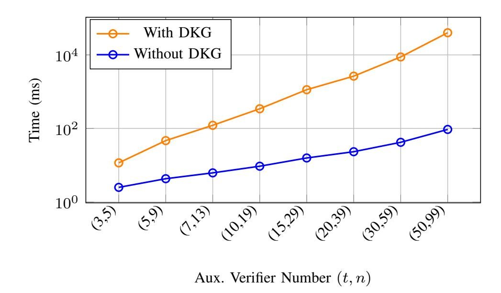

Fig. 9. LAN Performance comparison showing the execution time of the DVRF-then-Sign extension, including the initial DKG phase followed by DVRF-based randomness generation and threshold signature (TSS) creation, for varying t-out-of-n auxiliary verifier configurations.

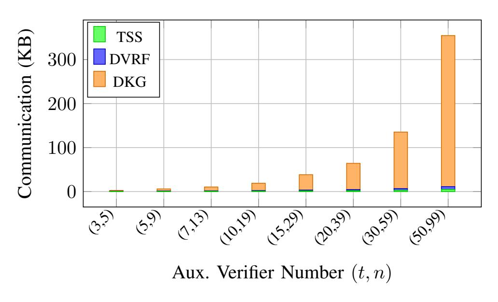

Fig. 10. Network communication cost of DVRF-then-Sign, including DKG, DVRF, and threshold signing, for different threshold configurations.

TLS, and 3) collusion mitigation. Finally, we demonstrate the applicability of our protocols through two use-case examples: off-chain credit and income verification and confidential binary options, as detailed below.

# *A. Use Case 1: Confidential Binary Options*

Binary options [35] are a fundamental type of financial derivative [36] that allows two parties to speculate on whether a specific condition related to a financial asset will be met at a future time. For example, the condition may be whether the price P <sup>∗</sup> of a stock N on a future date D will exceed a predefined threshold P. In decentralized finance (DeFi), implementing binary options on-chain poses a challenge due to the need for trusted, authenticated off-chain data (e.g., asset prices) while preserving user privacy. In particular, when large sums of money are at stake, bribery attacks become a significant concern and may incentivize collusion in financial applications of this kind, especially considering that we cannot trust a single oracle.

Using the proposed protocols, confidential binary options can be executed without revealing sensitive financial predicates or option details to the verifiers. Unlike previous approaches that rely on a single oracle or trusted execution environments (TEEs), our design utilizes a distributed verifier set, increasing trustworthiness and collusion resistance.

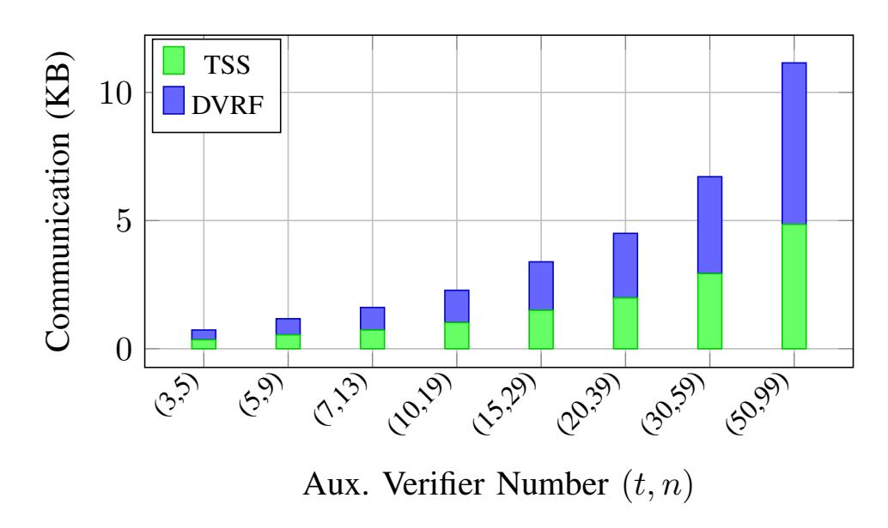

Fig. 11. Network communication cost excluding DKG, showing only the DVRF and threshold signing phases for the same threshold configurations.

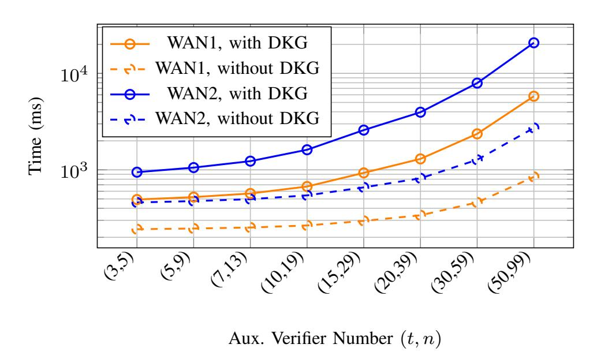

Fig. 12. Execution time of the DVRF-then-Sign extension under two WAN profiles (WAN1 and WAN2), where color encodes the WAN profile and line style distinguishes executions with and without the DKG phase, for varying t-out-of-n auxiliary verifier configurations.

The example scheme consists of three main phases; setup, settlement, and payout as follows:

Setup: Alice and Bob agree on the binary option defined by the asset name N, strike price P, and settlement date D. They generate a smart contract with identifier IDSC that contains commitments to the option parameters C<sup>N</sup> , C<sup>P</sup> , C<sup>D</sup> with their witnesses r<sup>N</sup> , r<sup>P</sup> , rD, and agreed-upon verification parameters θ<sup>p</sup> (e.g., a URL from which the price can be fetched). The verifier set is defined as V = {Vcoord, V1, . . . , Vn−1}, which jointly performs DKG to derive a shared public key pk and individual signing shares sk<sup>i</sup> for threshold signing.

Settlement: Assuming Alice wins the bet, she can invoke Πcoll-min with auxiliary verifier set V , to securely claim her payout. On the settlement date D, the prover (e.g., Alice) privately interacts with the price API server S via a TLS session and runs Πcoll-min protocol with the verifier set V . The goal is to create a signed transcript to prove that the actual price P ∗ satisfies the condition P <sup>∗</sup> ≥ P (or P <sup>∗</sup> < P) without revealing P ∗ itself. The signed transcript includes the response I = (N<sup>∗</sup> , P<sup>∗</sup> , D<sup>∗</sup> ), and Alice proves in zero-knowledge that:

$$P^* \ge P \land C_N = \operatorname{com}(N^*) \land C_P = \operatorname{com}(P) \land C_D = \operatorname{com}(D^*).$$

After successful verification, the verifiers jointly sign the attestation A = hash(IDSC ∥ Stmt) using threshold signing, where Stmt encodes the verified predicate outcome.

{13}------------------------------------------------

Payout: The signed attestation is submitted to the smart contract. If valid, the contract proceeds to transfer the winning amount to the rightful party (e.g., Alice). The smart contract checks the threshold signature via the public key derived during DKG, ensuring that the attestation has been validated by at least t verifiers.

This design ensures that: (i) The verifier set never learns the exact price or other sensitive transaction data; (ii) Collusion is mitigated-Alice must compromise at least t verifiers, including Vcoord, to generate a false proof; (iii) The final payout is computed on-chain based on an attested binary outcome, without ever revealing the internal computation.

In summary, this confidential binary option mechanism showcases how our zkTLS-based architecture can bring private yet verifiable off-chain data into smart contracts, enabling secure decentralized derivatives with strong privacy and collusion-minimization guarantees.

#### *B. Use Case 2: Off-Chain Credit and Income Verification*

Although most current DeFi [37] lending platforms, such as Aave, operate solely on-chain, incorporating off-chain user financial information, such as income level or credit score, could significantly expand their lending functionality and enable risk-adjusted lending. This is especially important for users who do not possess large amounts of on-chain collateral but have stable real-world income or verified financial standing.

Existing decentralized lending protocols offer overcollateralized loans, limiting participation for underbanked or cash-based users. Integrating zkTLS allows such protocols to trustlessly access verified income or credit score data from traditional financial websites without requiring users to reveal private information.

We illustrate the application of the proposed scheme with the example of an income-aware lending dApp built on top of Aave. The system enhances lending capability without requiring direct integration with banks or centralized credit agencies. It consists of setup, loan-request, and repayment phases.

Setup: We assume that the Aave smart contract is already deployed with additional logic to verify zkTLS-based income attestations and update borrowing parameters accordingly. Let the verifier set be V = {Vcoord, V1, . . . , Vn−1}, and each verifier obtains the same public key pk and corresponding shared secret keys sk<sup>i</sup> where i ∈ (0, t) by using DKG as described in the DRVF section. A list of accepted income attestation sources is embedded in the smart contract logic.

Loan-request: Suppose that Bob wants to borrow 2000 USDC from Aave with reduced collateral requirements. First, Bob initiates the DCTLS attestation with the Πcoll-min protocol by establishing a TLS session with his payroll provider's website as server S, where he is the prover P, and the verifier set includes Vcoord ∈ V . Bob privately proves that his income is above a required threshold, e.g., 3000 USD per month, using the TLS response that contains the tuple I = (income, employment status, timestamp). The sensitive details, such as exact salary or employer identity, are kept private in the zero-knowledge proving phase.

After successful execution of the chosen proposed protocol, each verifier jointly signs the attestation A = hash(I) using the same DKG configuration and sends TSSsign(A) to the smart contract. The contract verifies the signature and dynamically adjusts Bob's borrowing limit or required collateral ratio accordingly.

Repayment: If Bob repays his loan on time, the protocol proceeds as in traditional Aave. In case of default, the smart contract logs the signed attestation on-chain. This mechanism allows future dApps to reference verified historical income proofs for building trust or reputation scores without revealing any underlying data.

In conclusion, the proposed scheme extends Aave's functionality by incorporating off-chain real-world information, such as income or credit scores, in a privacy-preserving and verifiable manner. Since each attestation is verified and co-signed by a threshold set of verifiers, collusion risk is minimized. Even if Bob and Vcoord collaborate, Bob must still compromise at least t − 1 additional verifiers to submit a fraudulent income proof.

# XI. CONCLUSION

We presented Πcoll-min, a collusion-minimized TLS attestation framework enabling jointly verifiable and privacypreserving attestations for decentralized applications. By introducing dx-DCTLS, an exportable variant of existing DCTLS constructions, we eliminate designated-verifier assumptions through minimal replacements of non-verifiable two-party components with verifiable counterparts, without requiring changes to existing TLS servers. We formalized threshold attestation unforgeability to capture adversarial behaviors in multi-verifier environments and proved security under standard assumptions. Our evaluation shows that the DVRF–TSS validation layer remains efficient at high threshold sizes, while a DECO-based dx-DCTLS instantiation incurs only modest additional overhead. Together, these results demonstrate that a unified and exportable attestation model reduces prover complexity from O(n) to O(1) while remaining practical.

A key strength of our approach is its modularity. The framework supports different DKG and threshold instantiations, allowing implementers to adapt performance and trust assumptions to deployment requirements. More broadly, the dx-DCTLS abstraction provides a general pathway for enhancing the verifiability of interactive protocols that rely on non-exportable two-party computations.

Overall, our results indicate that jointly verifiable TLS attestations are practical and deployable, offering a foundation for secure oracle mechanisms and smart contract applications requiring authenticated off-chain data.

# REFERENCES

- [1] A. Juels, "Oracle (blockchain concept)," in *Encyclopedia of Cryptography, Security and Privacy*, Springer, 2025, pp. 1739–1741.
- [2] T. Dierks and E. Rescorla, "The transport layer security (tls) protocol version 1.2," Tech. Rep., 2008.
- [3] E. Rescorla, "The transport layer security (tls) protocol version 1.3," Tech. Rep., 2018.

{14}------------------------------------------------

- [4] J. Adler, R. Berryhill, A. Veneris, Z. Poulos, N. Veira, and A. Kastania, "Astraea: A decentralized blockchain oracle," in 2018 IEEE International Conference on Internet of Things (iThings) and IEEE Green Computing and Communications (GreenCom) and IEEE Cyber, Physical and Social Computing (CPSCom) and IEEE Smart Data (SmartData). IEEE, 2018, pp. 1145–1152.
- [5] H. Zheng, T. Tran, R. Shadmon, and O. Arden, "Decentagram: Highly-available decentralized publish/subscribe systems," in 2024 54th Annual IEEE/IFIP International Conference on Dependable Systems and Networks (DSN). IEEE, 2024, pp. 274–287.
- [6] I. Hajjeh and M. Badra, "TLS Sign," Internet Engineering Task Force, Internet-Draft draft-hajjeh-tls-sign-04, Dec. 2007, work in Progress. [Online]. Available: https://datatracker.ietf.org/doc/draft-hajjeh-tls-sign/04/
- [7] H. Ritzdorf, K. Wust, A. Gervais, G. Felley, and S. Capkun, "Tls-n: Non-repudiation over tls enabling ubiquitous content signing," in *Proceedings* 2018 Network and Distributed System Security Symposium. Internet Society, 2018.
- [8] M. Brown and R. Housley, "Transport layer security (tls) evidence extensions," *Working Draft, IETF Secretariat, Internet-Draft drafthousley-evidence-extns-01, November*, 2006.
- [9] Privacy & Scaling Explorations, "TLSNotary: Privacy-preserving tls data verification," https://tlsnotary.org/, 2025, accessed: 2025-06-22.
- [10] F. Zhang, E. Cecchetti, K. Croman, A. Juels, and E. Shi, "Deco: Liberating web data using decentralized oracles for tls," in *Proceedings of the 2020 ACM SIGSAC Conference on Computer and Communications Security (CCS)*, 2020, pp. 1911–1928.
- [11] S. Celi, A. Davidson, H. Haddadi, G. Pestana, and J. Rowell, "Distefano: Decentralized infrastructure for sharing trusted encrypted facts and nothing more," *Cryptology ePrint Archive*, 2023.
- [12] J. Lauinger, J. Ernstberger, A. Finkenzeller, and S. Steinhorst, "Janus: Fast privacy-preserving data provenance for tls," *Proceedings on Privacy Enhancing Technologies*, 2025.
- [13] J. Ernstberger, J. Lauinger, Y. Wu, A. Gervais, and S. Steinhorst, "Origo: Proving provenance of sensitive data with constant communication," *Proceedings on Privacy Enhancing Technologies*, 2025.
- [14] L. Breidenbach, C. Cachin, B. Chan, A. Coventry, S. Ellis, A. Juels, F. Koushanfar, A. Miller, B. Magauran, D. Moroz *et al.*, "Chainlink 2.0: Next steps in the evolution of decentralized oracle networks," *Chainlink Labs*, vol. 1, pp. 1–136, 2021.
- [15] M. Sabt, M. Achemlal, and A. Bouabdallah, "Trusted execution environment: What it is, and what it is not," in 2015 IEEE Trust-com/BigDataSE/Ispa, vol. 1. IEEE, 2015, pp. 57–64.
- [16] P. Jauernig, A.-R. Sadeghi, and E. Stapf, "Trusted execution environments: properties, applications, and challenges," *IEEE Security & Privacy*, vol. 18, no. 2, pp. 56–60, 2020.
- [17] F. Zhang, E. Cecchetti, K. Croman, A. Juels, and E. Shi, "Town crier: An authenticated data feed for smart contracts," in *Proceedings of the 2016 ACM SIGSAC conference on computer and communications security*, 2016, pp. 270–282.
- [18] U. Şen, M. Osmanoğlu, and A. A. Selçuk, "An efficient solution for the collusion problem of deco," in 2024 17th International Conference on Information Security and Cryptology (ISCTürkiye). IEEE, 2024, pp. 1–6.
- [19] U. Şen, "Tls prf simulation (gnark)," https://github.com/seugu/tls-prf-simulation-gnark, 2025, accessed: 2025-10-31.
- [20] "Band protocol," https://www.bandprotocol.com/, accessed: 2025-02-14.
- [21] B. Benligiray, S. Milic, and H. Vänttinen, "Decentralized apis for web 3.0," *API3 Foundation Whitepaper*, 2020.
- [22] V. Costan and S. Devadas, "Intel sgx explained," *Cryptology ePrint Archive*, 2016.
- [23] A. Sev-Snp, "Strengthening vm isolation with integrity protection and more," *White Paper, January*, vol. 53, no. 2020, pp. 1450–1465, 2020.
- [24] U. Şen, "Dvrf-then-sign," https://github.com/seugu/DVRF-then-Sign, 2025, accessed: 2025-10-31.
- [25] A. R. Ağırtaş, A. B. Özer, Z. Saygı, and O. Yayla, "Distributed verifiable random function with compact proof," in *International Symposium on Cyber Security, Cryptology, and Machine Learning*. Springer, 2024, pp. 119–134.
- [26] Y. Dodis, "Efficient construction of (distributed) verifiable random functions," in *Public Key Cryptography—PKC 2003: 6th International Workshop on Practice and Theory in Public Key Cryptography Miami, FL, USA, January 6–8, 2003 Proceedings 6.* Springer, 2002, pp. 1–17.
- [27] D. Galindo, J. Liu, M. Ordean, and J.-M. Wong, "Fully distributed verifiable random functions and their application to decentralised random beacons," in 2021 IEEE European Symposium on Security and Privacy (EuroS&P). IEEE, 2021, pp. 88–102.

- [28] A. Boldyreva, "Threshold signatures, multisignatures and blind signatures based on the gap-diffie-hellman-group signature scheme," in *International Workshop on Public Key Cryptography*. Springer, 2002, pp. 31–46.
- [29] V. Shoup, "Practical threshold signatures," in Advances in Cryptology—EUROCRYPT 2000: International Conference on the Theory and Application of Cryptographic Techniques Bruges, Belgium, May 14–18, 2000 Proceedings 19. Springer, 2000, pp. 207–220.
- [30] C. Komlo and I. Goldberg, "Frost: Flexible round-optimized schnorr threshold signatures," in *International Conference on Selected Areas in Cryptography*. Springer, 2020, pp. 34–65.
- [31] R. Zhu, C. Ding, and Y. Huang, "Efficient publicly verifiable 2pc over a blockchain with applications to financially-secure computations," in *Proceedings of the 2019 ACM SIGSAC Conference on Computer and Communications Security*, 2019, pp. 633–650.
- [32] A. Ozdemir and D. Boneh, "Experimenting with collaborative {zk-SNARKs}:{Zero-Knowledge} proofs for distributed secrets," in 31st USENIX Security Symposium (USENIX Security 22), 2022, pp. 4291–4308.
- [33] U. Şen, M. Osmanoğlu, and A. A. Selçuk, "A collusion-resistant decobased attestation protocol for practical applications," in 2025 IEEE International Conference on Cyber Security and Resilience (CSR). IEEE, 2025, pp. 234–239.
- [34] D. Johnson, A. Menezes, and S. Vanstone, "The elliptic curve digital signature algorithm (ecdsa)," *International journal of information security*, vol. 1, pp. 36–63, 2001.
- [35] Wikipedia contributors, "Binary option," https://en.wikipedia.org/wiki/Binary\_option, July 2025, accessed: 2025-07-15.
- [36] K. Karantias, A. Kiayias, and D. Zindros, "Smart contract derivatives," in *Mathematical Research for Blockchain Economy: 2nd International Conference MARBLE 2020, Vilamoura, Portugal.* Springer, 2020, pp. 1–8.
- [37] J. R. Jensen, V. von Wachter, and O. Ross, "An introduction to decentralized finance (defi)," *Complex Systems Informatics and Modeling Quarterly*, no. 26, pp. 46–54, 2021.

#### **APPENDIX**

#### A. DCTLS Security Definition

DCTLS scheme consists of interactive protocols (HSP, QP, PGP) including roles such as server S, prover P, and verifier V.

- $\mathsf{HSP}(1^\lambda)$ : Three-party handshake that inputs security parameter  $1^\lambda$ , outputs the full keys for server  $\mathsf{S}\ sp_s$ , and additive shares of  $sp_s$  to prover  $\mathsf{P}\ sp_p$  and verifier  $\mathsf{V}\ sp_v$ .
- $QP(sp_s, sp_p, sp_v)$ : Query protocol inputs the key tuples, and prover P obtains query and response tuple (Q, R), as well as the verifier V encrypted tuple ( $\hat{Q}$ ,  $\hat{R}$ ).
- PGP(Q, R,  $\hat{Q}$ ,  $\hat{R}$ ): Proof generation protocol inputs the query, response and their encrypted values, outputs the ZKP proof that response R contains the data b with corresponding  $(\hat{Q}, \hat{R})$ . This protocol is identical to the DCTLS proof generation protocol.
- A DCTLS protocol provides unforgeability as identical with dx-DCTLS as shown in Fig. 7 and Fig. 5.

#### B. DVRF Security Definition

The DVRF, denoted as **DVRF** = (**DKG**, **PartialEval**, **Combine**, **Verify**) is typically composed of the following algorithms:

**DKG** $(1^{\lambda}, t, n)$  is the distributed key generation algorithm that takes as input a security parameter  $1^{\lambda}$ , the total number of participants n, and the threshold parameter t then outputs a public key pk a set of qualified nodes named QUAL, a partial verification key list  $VK = \{vk_1, \dots, vk_n\}$  for the nodes, and a partial secret key list  $SK = \{sk_1, \dots, sk_n\}$ .

{15}------------------------------------------------

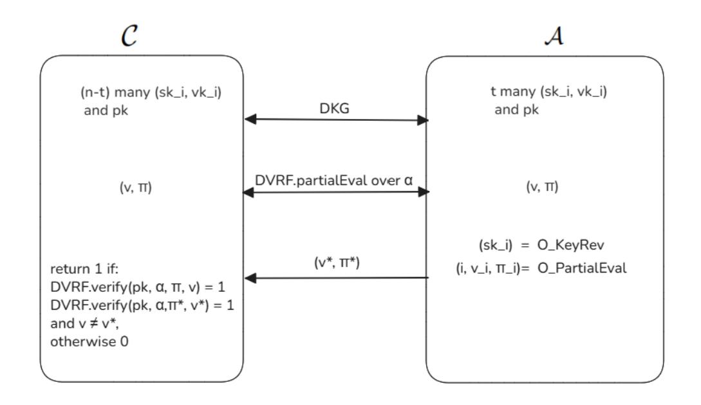

Fig. 13. DVRF Uniqueness experiment

**PartialEval** $(\alpha, sk_i, vk_i)$  is the partial evaluation algorithm that takes as inputs a plaintext  $\alpha$  and the partial secret and verification keys  $(sk_i, vk_i)$  for a node to generate a partial evaluation  $\gamma_i$  along with a corresponding non-interactive zero-knowledge (NIZK) proof  $\pi_i$ . Specifically,  $\gamma_i = (i, v_i, \pi_i)$ , where  $v_i$  represents the i-th evaluation share.

Combine $(pk, VK, \alpha, E)$  is the combination algorithm. It takes as inputs the global public key pk, the set of verification keys VK, a plaintext  $\alpha \in \text{Dom}$ , and a set  $E = \{\gamma_{i_1}^{\alpha}, \dots, \gamma_{i_{|E|}}^{\alpha}\}$ , consisting of partial function evaluations from at least  $|E| \geq t$  distinct nodes. The algorithm outputs either a pair  $(v, \pi)$ , where  $v \in \text{Rand}$  is the pseudorandom function value and  $\pi$  is its correctness proof.

**Verify** $(pk, VK, \alpha, v, \pi)$  is the verification algorithm. It takes as inputs the public key pk, a set of verification keys VK, a plaintext  $\alpha$ , a value  $v \in \text{Rand}$ , and a proof  $\pi$ . The algorithm outputs either 1, indicating that the proof is valid, or 0 otherwise.

A DVRF provides consistency, robustness, and uniqueness security features. We present only the uniqueness experiment as follows:

Attack Game (DVRF Uniqueness). For a given (t,n)-threshold DVRF scheme  $\Pi=(\mathsf{DKG},\mathsf{PartialEval},\mathsf{Combine},\mathsf{Verify})$  and a PPT adversary  $\mathcal{A},$  we define the uniqueness experiment as in Fig. 13:

- The adversary  $\mathcal{A}$  chooses a set of corrupted nodes C with size  $|C| \leq t$ . The challenger controls the remaining honest nodes. Together, they execute  $\mathsf{DKG}(1^\lambda, t, n)$  to generate the public parameters pk and verification keys VK.
- $\mathcal{A}$  can request partial evaluations (PartialEval) on any input  $\alpha$  from  $\mathcal{O}^{\text{partial-eval-reveal}}$ , or reveal the secret key (KeyRev) of specific honest nodes from  $\mathcal{O}^{\text{key-reveal}}$ .
- $\mathcal{A}$  and  $\mathcal{C}$  run DKG.PartialEval on  $\alpha$  to calculate then exchange partial evaluations, finally both calculate final randomness and proof, namely  $(v,\pi)$ .
- Adversary  $\mathcal{A}$  forges output  $(v^*, \pi^*)$ .
- C outputs 1, if DVRF.Verify $(pk, \alpha, \pi_{\text{DVRF}}^*, v^*) = \text{DVRF.Verify}(pk, \alpha, \pi_{\text{DVRF}}, v) = 1$ , otherwise outputs 0.

$$\mathrm{Adv}_{\mathcal{A},\mathrm{DVRF}}^{\mathrm{Uniq}}(\lambda) = \Pr[\mathrm{Exp}_{\mathcal{A},\mathrm{DVRF}}^{\mathrm{Uniq}}(\lambda) = 1] \leq \mathrm{negl}(\lambda)$$

# C. TSS Security Definition

The threshold signature scheme denoted as **TSS** = (**DKG**, **Sign**, **Verify**) algorithms:

**DKG** $(1^{\lambda}, t, n)$  is the distributed key generation algorithm. It takes as input a security parameter  $1^{\lambda}$ , the total number of participants n, and the threshold parameter t. The algorithm outputs a public key pk, and a partial secret key list  $SK = \{sk_1, \ldots, sk_n\}$  for each user i.

**Sign** $(\alpha, sk_i)$  is the signing phase, where each signer signs the  $\alpha$  with its share  $sk_i$  to output the partial signature  $\sigma_i$ , finally, outputs signature  $\sigma$ .

**Verify** $(pk, \alpha, \sigma)$  is the verification phase, where the verifier verifies the signature  $\sigma$  with the public key pk to output 1 if the signature is valid and output 0 otherwise.

A TSS scheme provides threshold existential unforgeability. **Attack Game (threshold existential unforgeability).** A TSS provides the *threshold existential unforgeability* (TEU) security feature as follows:

Let  $\mathbf{TSS} = (\mathbf{DKG}, \mathbf{Signing}, \mathbf{Verify})$  be a t-out-of-n threshold signature scheme. We say  $\mathbf{TSS}$  is *existentially unforgeable* under chosen message attacks if the following experiment outputs 1 with negligible advantage  $\operatorname{negl}(\lambda)$  for all PPT adversary  $\mathcal{A}$ :

- $\mathcal{A}$  chooses a corruption set  $C \subseteq \{1, \ldots, n\}$  with  $|C| \leq t$  while  $\mathcal{C}$  controls the honest nodes in  $V \setminus C$ .
- C and A run  $\mathsf{DKG}(1^{\lambda}, t, n)$ . Honest nodes receive their respective secret shares  $sk_i$  for  $i \in V \setminus C$ , while A learns the shares  $sk_i$  for  $i \in C$  and the public key pk.
- $\mathcal{A}$  may query  $\mathcal{O}^{\text{signing-oracle}}$  for signing messages  $\alpha$  of its choice. For each query on  $\alpha$ , the  $\mathcal{A}$  returns partial signatures  $\sigma_i = \text{Sign}(\alpha, sk_i)$  from any subset of honest nodes, where M is the set of queried messages.
- Eventually,  $\mathcal{A}$  outputs and sends  $(\alpha^*, \sigma^*)$  to  $\mathcal{C}$ .
- $\mathcal C$  outputs 1 if  $\operatorname{Verify}(pk,\alpha^*,\sigma^*)=1$  and  $\alpha^*\notin M.$  Otherwise, it outputs 0.

$$\mathrm{Adv}_{\mathcal{A},\mathrm{TSS}}^{\mathrm{TEU}}(\lambda) = \Pr[\mathrm{Exp}_{\mathcal{A},\mathrm{TSS}}^{\mathrm{TEU}}(\lambda) = 1] \leq \mathrm{negl}(\lambda)$$

#### D. v2PC Security Definition

v2PC = (Execute, Verify) works as follows. We note that a v2PC scheme provides soundness security features.

**Execute:** A secure computation protocol between two parties A and B, where former holds input  $a_{in}$  and latter holds input  $b_{in}$ . The protocol computes a deterministic function  $f(a_{in},b_{in})$  and privately delivers the outputs  $a_{out}$  to A and  $b_{out}$  to B, along with a non-repudiable proof  $\pi$  that can be used to verify the correctness of the computation denoted as follows:  $(a_{out},b_{out},\pi) \leftarrow \text{v2PC.Execute}(a_{in},b_{in})$ .

**Verify:** A deterministic verification algorithm that checks the consistency between an input-output pair and the proof  $\pi$ , under the function f. Namely, any party that has an input-output pair of  $(a_{in}, a_{out})$  or  $(b_{in}, b_{out})$  can verify the correction of computation:  $v2PC.verify(\pi, a_{in}, a_{out}) = v2PC.verify(\pi, b_{in}, b_{out}) = 1$ . This formulation preserves the full functionality of 2PC while enabling third-party verification of correct execution using one party's input and the claimed output, without revealing the other party's private input.

{16}------------------------------------------------

#### *E. Co-SNARK Security Definition*

A co-SNARK scheme consists of two algorithms, denoted as co-SNARK = (Execute, Verify) algorithms as follows:

Execute: Given a public statement x and a set of private witnesses { w i } ni=1 held by n collaborating provers, this algorithm performs a joint computation and outputs a public result y along with a succinct proof π attesting to the correctness of the computation. The execution is denoted as follows: ( y , π ) ← co-SNARK.Execute ( { w i } ni=1 , x) where each w i is provided by different party.

Verify: This deterministic algorithm takes as input the proof π and the public statement x, and verifies whether y was correctly computed with respect to x and some valid and hidden witnesses { w i }. The verification is denoted as co-SNARK.Verify(y, π) = 1.

While a co-SNARK scheme satisfies completeness, soundness, t-zero knowledge, succinctness, and knowledge soundness, our analysis focuses solely on the soundness property.