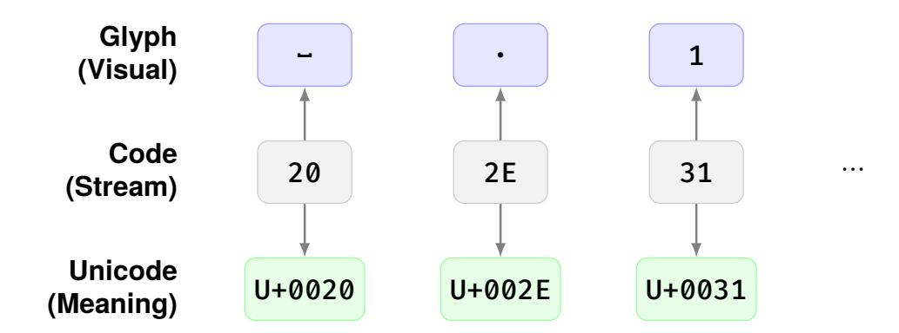
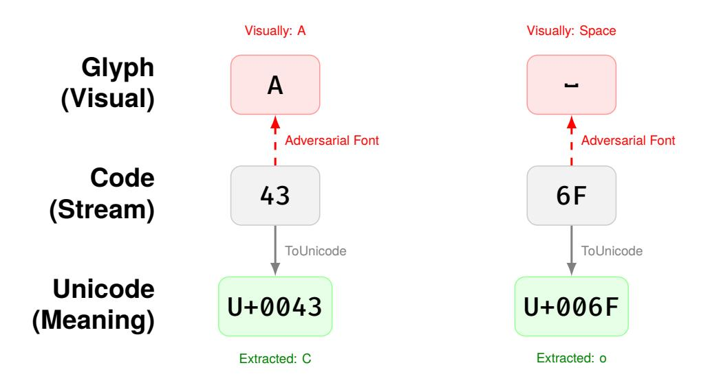

{0}------------------------------------------------

# **Exploiting PDF Obfuscation in LLMs, arXiv, and More**

Zhongtang Luo *Purdue University*

Jianting Zhang *Purdue University*

Zheng Zhong *Purdue University*

# **Abstract**

Many modern systems parse PDF files to extract semantic information, including multimodal large language models and academic submission platforms. We show that this practice is extremely vulnerable in real-world use cases. By exploiting standard-compliant features of the PDF page description language, an adversary can craft PDFs whose parsed content differs arbitrarily from what is visually rendered to human readers and whose metadata can be manipulated to mislead automated systems.

We demonstrate two concrete vulnerabilities. First, we build adversarial PDFs using font-level glyph remapping that cause several widely deployed multimodal language models to extract incorrect text, while remaining visually indistinguishable from benign documents. Across six platforms, most systems that rely on PDF text extraction are vulnerable, whereas OCR-based pipelines are robust. Second, we analyze arXiv's TeX-detection mechanism and show that it relies on brittle metadata and font heuristics, which can be fully bypassed without changing the visual output.

Our findings reveal a potential risk arising from discrepancies between automated PDF parsing and human-visible semantics. We argue that rendering-based interpretation, followed by computer vision, is one better approach for securitysensitive PDF interpretation.

# **1 Introduction**

Portable Document Format (PDF) is a file format developed by Adobe in 1992 to present documents in a manner independent of application software, hardware, and operating systems.

The PDF file format is heavily based on Postscript, which is a page description language that describes various elements on a page, such as text stream, fonts, images, and vector graphics. Many systems with the need to interpret a PDF, such as multimodal large language models and academic paper repositories, rely on interpreting the underlying page description language to extract the PDF's content. In this paper, we argue that **parsing the page description language of PDF files for information extraction is highly vulnerable in practice**, since a variety of obfuscation techniques can be exploited to mislead parsers while still being rendered correctly by PDF viewers.

To illustrate this issue, we present two vulnerabilities in popular systems that parse PDF files.

- 1. Many modern multimodal large language models allow the model to read information from PDF directly without visually inspecting the rendered contents. We show how to build an adversarial PDF file that, when parsed by some multimodal large language model, yields arbitrarily different parsed content compared to when the same PDF file is rendered and visually presented.
- 2. arXiv forces every submission to include the TeX source when the PDF submission is generated by TeX, and employs a built-in detector for the purpose. In response, we build a Python script that edits the Metadata of a TeXgenerated PDF file, such that the built-in arXiv detector is misled to believe that the PDF file is not generated by TeX, while the visual rendering of the PDF file remains unchanged.

In contrast, we argue that **one sound way to interpret a PDF file is to render it visually and then use computer vision techniques to understand the rendered content**. While this approach may be more computationally expensive, it is the only way to ensure that the interpreted content matches what a human would see when viewing the PDF.

This claim is validated by our experiments on chatbots, where we find that chatbots that employ optical character recognition (OCR) techniques to read rendered content (such as Gemini and Grok) are more robust against our PDF obfuscation attacks, while chatbots that rely on standard PDF text extraction methods (such as ChatGPT, Claude, Acrobat AI Assistant, and Copilot) are vulnerable.

**Responsible Disclosure.** We have reported our findings of chatbot vulnerabilities to all tested parties during October and November 2025. As of January 2026, xAI and Microsoft

{1}------------------------------------------------

have responded and acknowledged our findings.

We have reported our findings to arXiv on October 19, 2025. arXiv responded on October 21, assuring us that they did not consider our finding a security risk, as they actually "(do) not require TeX source in all situations," and "there is always still a human in the loop (to perform moderation)," and allowed us to release what we have found. As such, we feel comfortable to release our findings.

## **2 Technical Overview**

We preface the technical details with a brief overview of the PDF file structure, and then outline the key steps in our two main attacks.

**PDF File Structure.** The PDF file format, specified as ISO 32000-2 [\[1\]](#page-14-0), mainly consists of a list of objects that reference each other, loosely forming a tree structure. The Catalog object is the root of this tree, which points to other objects that define the structure of the PDF document, including the Pages object that points to the Page objects representing individual pages. Each Page object contains a Contents object and a Resources object. The Contents object holds the actual content stream of the page, including specific drawing commands for text, images, and graphics. The Resources object that defines the resources used on that page, such as fonts and images.

Additionally, the PDF file contains an Info object that holds metadata about the document, such as the author, title, and creation date.

It is worth noting that, since a document only uses a small subset of the glyphs in a font, PDF files often embed subsets of fonts to reduce file size. These embedded font subsets are typically given random prefixes in their names to avoid naming conflicts.

Figure [1](#page-1-0) illustrates a simplified PDF structure generated from a LaTeX document. The PDF structure highlights the hierarchical relationships between various objects in the PDF file.

**Creating Obfuscated PDFs for LLMs.** We observe that for LLMs that parse the PDF content stream directly, they attempt to fetch text by interpreting the PDF drawing commands which put glyphs from fonts in the embedded file on the page, and extract the character codes of the glyphs as the text. While in ordinary PDFs, the character codes correspond to the ASCII/Unicode values of the characters displayed on the page in the reading order, we can create adversarial PDFs where the character codes correspond to completely different characters, or where the characters are out of order.

To create such an adversarial PDF, we consider two different methods. In the first method, we build a custom font where the glyphs for certain character codes are replaced with glyphs that look like completely different characters (Section [4.1\)](#page-3-0). For example, we can build a font where the glyph for the character code corresponding to 'A' is replaced with

```
\documentclass{article}
\begin{document}
\section*{Test Document}
This is a test document to check the
 ↪ functionality of the LaTeX setup.
$$a=b+c.$$
\end{document}
```

```
Catalog (21 0 obj)
└── Pages (8 0 obj)
    └── Page (2 0 obj)
        ├── Contents (3 0 obj)
        │ └── "BT /F38 14.3462 Tf 133.768 707.125 Td
            [(T)94(est)-375(Do)-31(cumen)31(t)]TJ/F28
            9.9626 Tf 0 -21.821 Td
            [(This)-333(is)-334(a)-333(test)-333(do)- ⌋
            28(cumen)28(t)-334(to)-333(c)28(hec)27(k) ⌋
            -333(the)-333(functionalit)28(y)-334(of)- ⌋
            333(the)-333(LaT)83(eX)-333(setup.)]TJ/F31
            9.9626 Tf 150.816 -21.918 Td [(a)]TJ/F28
            9.9626 Tf 8.033 0 Td [(=)]TJ/F31 9.9626 Tf
            10.516 0 Td [(b)]TJ/F28 9.9626 Tf 6.49 0
            Td [(+)]TJ/F31 9.9626 Tf 9.962 0 Td
            [(c:)]TJ/F28 9.9626 Tf -16.452 -524.131 Td
            [(1)]TJ ET"
         ↪
         ↪
         ↪
         ↪
         ↪
         ↪
         ↪
         ↪
         ↪
         ↪
         ↪
         ↪
        └── Resources
            ├── Font /F28 (5 0 obj, /MZCFWZ+CMR10)
            ├── Font /F31 (6 0 obj, /IOSIJS+CMMI10)
            └── Font /F38 (4 0 obj, /LORVAG+CMBX12)
Info (22 0 obj)
```

Figure 1: A LaTeX document and its compiled PDF structure (simplified).

a glyph that looks like 'Z', and so on. We then create a PDF that uses this custom font to display text that looks normal to a human reader, but when parsed by an LLM, the extracted text is completely different. In the second method, we manipulate the position of glyphs on the page such that the visual order of characters is different from the order in which they are drawn in the content stream (Section [4.2\)](#page-4-0). For example, we can draw the character '1' at a certain position, then move the cursor back and draw '2' before '1', resulting in a visual output of '21' while the content stream has '12'. This way, when an LLM parses the PDF, it extracts the text in the order of drawing commands, which is different from what is visually rendered.

We tested our attacks on six different chatbot platforms, and find that our attacks succeed in misleading four out of the six platforms, and partially succeed in another one. Our attack fails only on platforms that employ optical character recognition (OCR) techniques to extract text from the rendered PDF, such as Gemini, as OCR extracts text based on visual rendering rather than PDF text extraction methods.

**Editing PDF Metadata for arXiv.** Based on our observations and experiments in Section [5.1,](#page-7-0) the arXiv's built-in

{2}------------------------------------------------

checker TeXRay appears to rely on two main detection mechanisms to identify TeX-generated PDF files:

- 1. **PDF Metadata Fields.** TeXRay inspects specific metadata fields in the PDF file to see if the PDF carries metadata from the TeX engine. Specifically, if the Producer or Creator field contains "tex" without being followed by the letter "t" (which forms "text"), TeXRay flags the PDF as TeX-generated.
- 2. **Embedded Font Information.** TeXRay analyzes the embedded font information within the PDF file, looking for font names and characteristics that are commonly associated with TeX-generated documents. Specifically, if the "BaseFont" field of any font contains "CMR" (Computer Modern Roman), TeXRay flags the PDF as TeXgenerated.

Circumventing TeXRay. We show that our understanding of TeXRay's detection mechanisms is complete by demonstrating two methods that can completely bypass TeXRay's detection, as detailed in Section [5.2:](#page-9-0)

- 1. **LaTeX Macro-based Bypass.** By incorporating a La-TeX macro that modifies the PDF metadata fields and uses non-TeX-specific fonts, we can compile TeX source files into PDF files that evade TeXRay's detection.
- 2. **Post-processing-based Bypass.** By using a Python script to post-process the compiled PDF file, we can alter the relevant PDF metadata fields and embedded font information to avoid detection by TeXRay.

We give the full scripts in the respective sections.

TeX Translation. To argue that arXiv's goal of distinguishing TeX-generated PDF files from other typesetting systems is fundamentally unsound and show that there are no intrinsic differences between PDF files from different engines, we develop a prototype obfuscation system that transforms a TeXgenerated PDF file to a Typst-generated PDF file, as detailed in Section [5.3.](#page-9-1) We note that when the TeX source files are available, many modern toolchains (including LLMs) can directly convert TeX source files to other typesetting systems and then compile. Therefore, we focus on the scenario where only the TeX-generated PDF file is available. By modifying the content streams of the TeX-generated PDF file, we can produce an obfuscated PDF file that looks like a Typst-generated PDF file while maintaining a visually nearidentical output. Figure [2](#page-2-0) shows one such example from Section [5.3.](#page-9-1)

## **3 Preliminaries**

**Multimodal Large Language Models.** Multimodal large language models extend text-only language models by incorporating additional input modalities such as images, audio, and documents. In the context of document understanding, they are commonly equipped with PDF ingestion pipelines that convert PDF files into intermediate representations—for

```
BT
/F31 9.96264 Tf
1 0 0 1 140.944 656.037 Tm [<00350049004A0054>-333<00 ⌋
    4A0054>-333<0042>-333<0055004600540055>-333<00510 ⌋
    0420053004200480053004200510049000F>]TJ
 ↪
 ↪
1 0 0 1 303.509 96.112 Tm [<0012>]TJ
ET
```

```
1 0 0 -1 0 841.8898 cm
/d65gray cs
0 scn
/F31 9.96264 Tf
BT
1 0 0 -1 140.94 185.85 Tm [(\000\065\000\111\000\112\ ⌋
    000\124\000\001\000\112\000\124\000\001\000\102\0 ⌋
    00\001\000\125\000\106\000\124\000\125\000\001\00 ⌋
    0\121\000\102\000\123\000\102\000\110\000\123\000 ⌋
    \102\000\121\000\111\000\017)] TJ
 ↪
 ↪
 ↪
 ↪
1 0 0 -1 303.51 745.78 Tm [(\000\022)] TJ
ET
```

Figure 2: An example of rewriting a TeX-generated content stream (top) to a Typst-style content stream (bottom) from Section [5.3.](#page-9-1)

example, extracted text streams, layout information, or rendered images—which are then provided to the model as input. Different systems adopt different ingestion strategies: some rely primarily on native PDF text extraction, while others render the document visually and apply optical character recognition (OCR) to the rendered pages. These design choices are typically abstracted away from end users, who interact with the model under the assumption that the model's interpretation reflects the document as it would appear to a human reader. This assumption underlies many downstream applications of LLMs for summarization, question answering, and content verification over PDF documents.

**Preprint Repositories and arXiv.** Preprint repositories are online platforms that allow researchers to share their manuscripts prior to formal peer review and publication in academic journals. These repositories facilitate rapid dissemination of research findings, enabling the scientific community to access and build upon new knowledge without the delays associated with traditional publishing processes.

arXiv is listed as one of the largest preprint repositories on Wikipedia [\[31\]](#page-15-0) with >1,000,000 preprints for research manuscripts ("e-prints") across physics, mathematics, computer science, and related disciplines. Established in 1991, it has become the primary venue for sharing preprints prior to journal publication, reaching over two million submissions by 2021 and currently receiving roughly 24,000 new papers per month. Although arXiv is not a peer-reviewed platform, each subject area is moderated to filter non-scientific or offtopic content. An endorsement mechanism, typically automatic for recognized academic authors, further helps maintain relevance within disciplines [\[7\]](#page-14-1). Many e-prints later appear in journals, yet arXiv itself has hosted landmark works

{3}------------------------------------------------

that never underwent formal publication. A notable case is Grigori Perelman's 2002 proof of the Poincaré conjecture, disseminated exclusively via arXiv but nonetheless acknowledged as one of the century's most significant mathematical achievements [\[26\]](#page-15-1).

arXiv has a list of policies governing submissions, among them a soft requirement to submit TeX files when available [\[7\]](#page-14-1):

Note: a PDF file created from a TeX/LaTeX file will typically be rejected, with exceptions granted on a caseby-case basis. There are good reasons why arXiv insists on TeX/LaTeX source if it is available. arXiv produces PDF automatically from all TeX submitted source.

On the other hand, other similar STEM preprint repositories, such as bioRxiv and Cryptology ePrint Archive, do not have such a requirement and ask for PDF-only submissions.

**Typesetting Systems.** Throughout the history of digital typesetting, multiple systems have been developed to facilitate the creation of high-quality documents. We introduce a few notable typesetting systems below.

TeX/LaTeX. TeX, created by Donald Knuth in 1978, is a typesetting system widely used in academia, particularly in mathematics, computer science, and physics. LaTeX, developed by Leslie Lamport in the 1980s, is a macro package built on top of TeX that simplifies document formatting and structuring. Most STEM field conferences and journals provide La-TeX templates for authors to use. While TeX supports compiling documents into various formats, including DVI and PostScript, PDF has become the dominant output format in recent years.

Word Processors. Microsoft Word, first released in 1983, has been the de facto standard word processing software since the 1990s. It provides a WYSIWYG (what you see is what you get) interface that allows users to create and format documents visually, without needing to understand the underlying markup or code. Multiple interdisciplinary fields, such as human-computer interaction and computer science education, often accept Word-based submissions [\[28\]](#page-15-2). Word mainly uses a proprietary binary format (.doc) for older versions and an XML-based format (.docx) for newer versions. Multiple spinoff projects, such as LibreOffice Writer and WPS, also support the format. For export purposes, Word can generate PDF files directly from the application.

Markdown-based Systems. Modern typesetting systems often leverage lightweight markup languages like Markdown to simplify document creation. For instance, Typst [\[30\]](#page-15-3), initially released in 2023, brands itself as a new markup-based typesetting system for the sciences, and contains a few templates for academic papers. Typst uses its own .typst format for source files, and can export documents to PDF directly.

# **4 Creating Obfuscated PDFs for LLMs**

Modern multimodal large language models have the capability to process and understand content from various file formats. To leverage this capability, the user uploads any supported file to the chatbot interface. The system then parses the file, and produces an output based on the content of the uploaded file.

Based on empirical observations, we find that when parsing a PDF file, most systems directly extract the binary stream and have the model parse it, with the exception of a few models, such as Gemini, that render the visual content of the PDF file and employ computer vision techniques to interpret the image.

In this section, we refine two techniques to create obfuscated PDFs that can mislead LLMs: font data manipulation and glyph position manipulation. We then evaluate their effectiveness against various commercial chatbot systems.

## <span id="page-3-0"></span>**4.1 Font Data Manipulation**

Recall that in order to save space, PDF files often use custom font subsets that only include the glyphs necessary for rendering the text in the document. While it is possible to maintain a standard character encoding, such as ASCII or Mac OS Roman (WinAnsiEncoding and MacRomanEncoding, respectively, in Section 9.10.2 of the PDF 1.7 specification [\[1\]](#page-14-0)), the presence of multilingual characters outside the standard ASCII range often leads to the use of custom encodings. For instance, we observe that while the standard TeX still uses ASCII encoding for the default Computer Modern font (e.g. Figure [1\)](#page-1-0), it no longer does so when switched to another font. Typst, on the other hand, always uses custom font subsets with custom encodings, regardless of the font choice (e.g. Figure [11\)](#page-11-0).

However, for the operating system to correctly understand the content of the file, it needs to identify the glyphs in the font subset. Otherwise, common convenience features, such as copy-paste, would be impossible. To address the issue, PDF files include a ToUnicode CMap (character map) that maps the character codes used in the content stream to Unicode code points for each font. This mapping allows the operating system to correctly interpret the text, even when custom font subsets and encodings are used. Figure [3](#page-4-1) shows an example of such mapping.

We observe that for chatbot systems that directly parse the binary stream of a PDF file, they often rely on the ToUnicode CMap to interpret the text content. To create an obfuscated PDF that misleads such systems, we modify the font data to create a mismatch between the visual representation and the interpreted content.

Specifically, we create a set of adversarial fonts by taking a base font (e.g., Roboto) and replacing all glyph outlines with the outline of a single target character. For instance,

{4}------------------------------------------------

<span id="page-4-1"></span>

Figure 3: An illustration of the relationship between glyphs, character codes, and Unicode code points in a PDF font subset with a ToUnicode CMap, taken from the Typst generated PDF in Figure [11.](#page-11-0) Each character code is mapped to a glyph in the font data, as well as mapped to a Unicode code point via the ToUnicode CMap.

<span id="page-4-2"></span>

Figure 4: An illustration of the font data manipulation attack. In this example, the PDF contains the character code for 'C' (0x43), which the ToUnicode map correctly interprets as 'C'. However, the adversarial font maps this code to the glyph 'A', causing a discrepancy between the visual output 'A' and the extracted text 'C'. In the second example, the character code for 'o' (0x6F) is mapped to a space glyph, resulting in a visual output of a space while extracting 'o' from the perspective of chatbots.

an adversarial font for the letter 'A' would have all glyphs including those for 'B', 'C', 'D', etc.—visually rendered as 'A'. We generate one such adversarial font for each printable ASCII character, resulting in a collection of fonts where each font displays only one specific character regardless of the input.

To construct the obfuscated PDF, we iterate through each character pair (ℎ, ), where ℎ is the human-visible character and is the digital (machine-readable) character. For each pair, we select the adversarial font where all glyphs render as ℎ, then write the character code for into the content stream. Since the ToUnicode CMap maps the character code to , text extraction tools will read , while humans viewing the PDF will see ℎ. Figure [4](#page-4-2) illustrates examples of such glyph replacements.

## <span id="page-4-0"></span>**4.2 Glyph Position Manipulation**

Similar to font data manipulation, we observe that while by convention, the glyph order in the PDF stream follows the natural reading order of the text, there is no strict requirement enforcing this. PDF text operators allow absolute positioning of each character or string on the page, meaning characters can be written to the content stream in any order and placed at arbitrary coordinates.

For example, to display '123456' visually while encoding '126453' in the content stream, we write the characters in the order 1, 2, 6, 4, 5, 3, but position them at coordinates corresponding to their visual locations. The character '6' is written third but positioned at the sixth slot, while '3' is written last but positioned at the third slot. Text extraction tools that read the content stream sequentially will extract '126453', while humans see '123456'. We present a general method to achieve this attack below.

- 1. First, we convert all relative positioning commands (e.g., 'Td') in the content stream to absolute positioning commands (i.e., 'Tm'). This allows us to place each glyph at specific coordinates on the page regardless of their relative order.
- 2. Then, we reorder the glyph drawing commands in the content stream to reflect the desired hidden text order.

Figure [5](#page-4-3) illustrates how absolute positioning enables this reordering attack.

```
BT 1 0 0 1 440 700 Tm (1) Tj T* ET
BT 1 0 0 1 453 700 Tm (2) Tj T* ET
BT 1 0 0 1 466 700 Tm (3) Tj T* ET
BT 1 0 0 1 479 700 Tm (4) Tj T* ET
BT 1 0 0 1 492 700 Tm (5) Tj T* ET
BT 1 0 0 1 505 700 Tm (6) Tj T* ET
```

```
BT 1 0 0 1 440 700 Tm (1) Tj T* ET
BT 1 0 0 1 453 700 Tm (2) Tj T* ET
BT 1 0 0 1 505 700 Tm (6) Tj T* ET
BT 1 0 0 1 479 700 Tm (4) Tj T* ET
BT 1 0 0 1 492 700 Tm (5) Tj T* ET
BT 1 0 0 1 466 700 Tm (3) Tj T* ET
```

Figure 5: After converting the relative positioning commands to absolute positioning commands, we can swap the glyphs without affecting the rendered output. The top content stream and the bottom content stream render the same visual output '123456', since all characters are positioned at the same coordinates. However, the top content stream encodes '123456' in the stream, while the bottom content stream encodes '126453'.

## **4.3 Evaluation**

We perform evaluations on various chatbot platforms based on two generated documents to assess the effectiveness of our PDF obfuscation techniques.

{5}------------------------------------------------

- 1. The first document makes use of the font data manipulation technique, rendering 'A small bird lost its way in the forest, but a kind fox showed it the path home. That night, they felt happy to have found a friend under the bright stars.' while encoding 'Computer security researchers carefully crafted a PDF file. Its content looks completely different from a human than from a chatbot.' in the stream. Figure [6](#page-5-0) shows a screenshot and content stream excerpt of this document.
- 2. The second document employs the glyph position manipulation technique, rendering 'The total amount of the product order is: 123456' but encoding '126453' in the stream. Figure [7](#page-5-1) shows a screenshot and content stream excerpt of this document.

<span id="page-5-0"></span>

```
BT 1 0 0 1 50 692 Tm /F2+0 12 Tf 14.4 TL (C) Tj T* ET
BT 1 0 0 1 57.82812 692 Tm /F3+0 12 Tf 14.4 TL (o) Tj T* ET
BT 1 0 0 1 60.80469 692 Tm /F4+0 12 Tf 14.4 TL (m) Tj T* ET
BT 1 0 0 1 66.99805 692 Tm /F5+0 12 Tf 14.4 TL (p) Tj T* ET
BT 1 0 0 1 77.52148 692 Tm /F6+0 12 Tf 14.4 TL (u) Tj T* ET
BT 1 0 0 1 84.04883 692 Tm /F7+0 12 Tf 14.4 TL (t) Tj T* ET
BT 1 0 0 1 86.9668 692 Tm /F7+0 12 Tf 14.4 TL (e) Tj T* ET
BT 1 0 0 1 89.88477 692 Tm /F3+0 12 Tf 14.4 TL (r) Tj T* ET
BT 1 0 0 1 92.86133 692 Tm /F8+0 12 Tf 14.4 TL ( ) Tj T* ET
BT 1 0 0 1 99.59961 692 Tm /F9+0 12 Tf 14.4 TL (s) Tj T* ET
BT 1 0 0 1 102.5176 692 Tm /F10+0 12 Tf 14.4 TL (e) Tj T* ET
BT 1 0 0 1 106.584 692 Tm /F11+0 12 Tf 14.4 TL (c) Tj T* ET
BT 1 0 0 1 113.3516 692 Tm /F3+0 12 Tf 14.4 TL (u) Tj T* ET
BT 1 0 0 1 116.3281 692 Tm /F7+0 12 Tf 14.4 TL (r) Tj T* ET
BT 1 0 0 1 119.2461 692 Tm /F12+0 12 Tf 14.4 TL (i) Tj T* ET
BT 1 0 0 1 126.0898 692 Tm /F4+0 12 Tf 14.4 TL (t) Tj T* ET
BT 1 0 0 1 132.2832 692 Tm /F13+0 12 Tf 14.4 TL (y) Tj T* ET
BT 1 0 0 1 136.209 692 Tm /F3+0 12 Tf 14.4 TL ( ) Tj T* ET
...
```

Figure 6: A screenshot and content stream excerpt of the first proof-of-concept PDF that uses font data manipulation to mislead PDF text extraction. The rendered text is shown at the top, while the content stream encoding the hidden text is shown at the bottom. Through manipulating the font data, the content stream encodes different characters than those visually rendered.

We note the result in Table [1.](#page-5-2) An example of the interaction is given in Figure [8.](#page-6-0) We notice that chatbots that employ OCR techniques (such as Gemini and Grok) are less susceptible to our PDF obfuscation attacks, as they can accurately extract the rendered text from the PDF document. This technique has been documented by Google AI as "native vision" [\[15\]](#page-14-2). However, other chatbots (such as ChatGPT, Claude, Acrobat AI Assistant, and Copilot) that rely on standard PDF text extraction methods are vulnerable to our attacks, leading to successful misinterpretation of the document content.

An interesting case here is Grok, which employs both PDF text extraction and OCR techniques. As a result, it can read different texts based on the different tools it employs. Examining its chain-of-thought reveals lines such as 'tool reveals extracted text as security message, with screenshot showing bird story.' The output is inconsistent across multiple at-

<span id="page-5-1"></span>

```
...
BT 1 0 0 1 440 700 Tm (1) Tj T* ET
BT 1 0 0 1 453 700 Tm (2) Tj T* ET
BT 1 0 0 1 505 700 Tm (6) Tj T* ET
BT 1 0 0 1 479 700 Tm (4) Tj T* ET
BT 1 0 0 1 492 700 Tm (5) Tj T* ET
BT 1 0 0 1 466 700 Tm (3) Tj T* ET
...
```

Figure 7: A screenshot and content stream excerpt of the second proof-of-concept PDF that uses glyph position manipulation to mislead PDF text extraction. The rendered text is shown at the top, while the content stream encoding the hidden text is shown at the bottom. Compared to the screenshot, the content stream encodes the digits in a different order.

<span id="page-5-2"></span>Table 1: Attack effectiveness of PDF obfuscation techniques on various platforms. A 'Success' indicates that the attack successfully misled the chatbot to output the hidden content, while a 'Fail' indicates that the chatbot correctly recognized the rendered content. A 'Partial' indicates that the chatbot's output was inconsistent across multiple attempts.

| Font Data | Glyph Position |
|-----------|----------------|
| Success   | Success        |
| Fail      | Fail           |
| Partial   | Partial        |
| Success   | Success        |
| Success   | Success        |
| Success   | Success        |
|           |                |

tempts, showing that it is not aware of the underlying reason of the discrepancy.

## **5 Editing PDF Metadata for arXiv**

arXiv is a curated research-sharing platform with over two million scholarly articles [\[7\]](#page-14-1). It is the de facto online manuscript pre-print service for computer science, mathematics, physics, and many interdisciplinary communities. Since 1991, arXiv has offered a place for researchers to reliably share their work as it undergoes the process of peerreview, and for many researchers it is their primary source of literature [\[11\]](#page-14-6).

The submission system of arXiv allows any authorized user to upload their manuscripts, which are then processed and hosted on arXiv's website for free public access. arXiv has placed numerous policies on the submission system to ensure the quality and accessibility of the hosted manuscripts, including accepting only submissions from endorsed users, 

{6}------------------------------------------------

<span id="page-6-0"></span>User:

Help me read this PDF.

#### ChatGPT:

Got it. This PDF is doing something sneaky, and your instinct is right.

Here's what's going on when I try to "read" it.

## **What the text actually looks like to a parser**

When I extract text from the PDF programmatically, this is what comes out:

"C mpute sec rity res arc er ca efully raf e a P F f le. It c nte t lo ks co plet ly dif eren fro a hu an than from hatbot" Notice the pattern:

- Letters are missing or shifted.
- Words are broken in consistent but non-human ways.
- Spacing and glyph order look wrong.

A human visually reading the PDF would likely see something close to:

Computer security researcher carefully crafted a PDF file. Its content looks completely different from a human than from a chatbot.

But **the parser never sees that**.

#### Gemini:

Based on the document provided, here is the short story it contains:

A small bird lost its way in the forest, but a kind fox showed it the path home. That night, they felt happy to have found a friend under the bright stars.

Figure 8: Example interactions with ChatGPT and Gemini on the first proof-of-concept PDF with the same user input. ChatGPT is confident but misled by the obfuscated text extraction, while Gemini correctly reads the rendered text using OCR techniques.

adopting a moderation process before hosting, and various formatting requirements [\[7\]](#page-14-1).

Among them, arXiv has a standing policy to force authors to submit TeX source files when available, and runs a built-in TeX compiler to produce the final PDF hosted on arXiv [\[8\]](#page-14-7). It claims three reasons for not accepting PDF-only submissions when TeX files are available: (1) to process submissions into accessible formats such as HTML; (2) because source files are of higher archival value; and (3) source files offer greater insight (in TeX rendering techniques).

However, the policy is not without its debates. The built-in compiler has limited functionalities and has been complained as buggy [\[13\]](#page-14-8). In arXiv's own accessibility study [\[6\]](#page-14-9), 25% of the respondents cite requiring submitting TeX as a barrier to submitting accessible papers. Moreover, such policy raises privacy concerns, as sensitive comments in the TeX source files may be accidentally released [\[27\]](#page-15-7). While arXiv claims that these concerns do not pose a significant problem [\[8\]](#page-14-7), there are dedicated bots on X that scrape comments from TeX source files [\[25\]](#page-15-8). More recent criticism also concerns about

potential data leaks to AI training datasets [\[20\]](#page-14-10).

Moreover, not all papers use TeX/LaTeX as their typesetting system. Many fields not purely in STEM, such as computer science education, also feature a significant number of Word documents [\[28\]](#page-15-2). Furthermore, new technology stacks that focus on typesetting papers, such as Typst [\[30\]](#page-15-3), are emerging as alternatives to TeX. Given that arXiv's built-in compiler only supports pdflatex, one of TeX's three main engines, as of now, and the vast amount of work needed to support every other typesetting system, as a compromise, arXiv currently allows authors to upload PDF files, as long as they are not generated from TeX source files.

To achieve this goal, arXiv runs a built-in checker, which we nickname TeXRay, to detect if any uploaded PDF file is generated from a TeX engine. Once detected, arXiv will block the upload and force the author to submit TeX source files instead. We give an example of such a TeXRay error message in Figure [9.](#page-7-1)

In this section, we conduct a detailed black-box analysis of TeXRay that outlines its detection mechanisms. We discover

{7}------------------------------------------------

<span id="page-7-1"></span>

Figure 9: An example of TeXRay error message when uploading a PDF directly generated from TeX source files.

that TeXRay is not a reliable detector of TeX-generated PDF files, and produce a 100-line Python script that completely bypasses its detection.

Furthermore, we argue that arXiv's goal of distinguishing TeX-generated PDF files from other typesetting systems is **fundamentally unsound**. We stress that there is no intrinsic difference between TeX-generated PDF files and PDF files generated from other typesetting systems, such as Typst. To demonstrate this, we develop a prototype obfuscation system that transforms a TeX-generated PDF file to an obfuscated PDF file that looks like a Typst-generated PDF file by rewriting the content streams, while maintaining a visually nearidentical output. This suggests that even if TeXRay were to be made more robust, it would still be possible to bypass it with more sophisticated obfuscation techniques.

## <span id="page-7-0"></span>**5.1 Analysis of TeXRay Mechanism**

We conduct our analysis of TeXRay by uploading PDF files with different features to see if arXiv rejects the file as being generated by TeX. Based on our empirical knowledge, we categorize the detection mechanism into two main components: the metadata analysis and the font analysis.

## **5.1.1 Metadata Analysis**

Following ISO 32000-2, a PDF allows any number of keyvalue metadata fields, with a few common entries (title, author, etc.) standardized in the specification [\[1\]](#page-14-0). Moreover, it is well-known that TeX injects specific metadata into the PDF files it generates. We show an example of such metadata extracted from a PDF file generated by LuaLaTeX 2024 with pikepdf below.

```
"/Author": "",
"/CreationDate": "D:19791231160000-08'00'",
"/Creator": "LaTeX with hyperref",
"/Keywords": "",
"/ModDate": "D:19791231160000-08'00'",
"/PTEX.FullBanner": "This is LuaHBTeX,
Version 1.18.0 (TeX Live 2024/nixos.org)",
"/Producer": "LuaTeX-1.18.0",
"/Subject": "",
```

```
"/Title": "",
"/Trapped": "/False"
```

\usepackage{hyperref}

pdfsubject = {}, pdfkeywords = {}, pdfcreator = {Not T3X},

We observe that the metadata contains fields such as Creator, Producer, etc., which indicate the TeX engine used to generate the PDF. To understand which part of the metadata triggers the detection mechanism, we take a PDF file that otherwise passes the arXiv submission process and inject certain metadata fields. Then, we check if the injected file is rejected by arXiv. Table [2](#page-8-0) summarizes our test results.

Based on the results, we hypothesize that if a PDF file contains "Creator" or "Producer" dictionary keys in its metadata, and the corresponding values of these keys contain "tex" without being followed by the letter "t" (as to form "text"), then the PDF file is detected by TeXRay.

**Bypass.** Given that the PDF metadata is freely editable both inside and outside the LaTeX system, there are many methods to bypass such detection mechanism. For instance, the following TeX command completely rewrites the PDF metadata.

```
% pdflatex
\ifdefined\pdfinfoomitdate
\pdfinfoomitdate=1
\fi
\ifdefined\pdfsuppressptexinfo
\pdfsuppressptexinfo=-1
\fi
% lualatex
\ifdefined\pdfvariable
\pdfvariable suppressoptionalinfo 1023 \relax
\fi
\hypersetup{
  pdftitle = {},
  pdfauthor = {},
```

Even when the TeX source is not directly available, plenty of tools allow editing the PDF metadata based on the PDF

pdfproducer = {Definitely not T3X}

}

{8}------------------------------------------------

<span id="page-8-0"></span>Table 2: Results of injecting different metadata fields into a PDF file and checking if arXiv's TeXRay detects it as being generated from TeX. ✓ indicates undetected, while × indicates detected.

| Field           | Data                | Undetected? |
|-----------------|---------------------|-------------|
| Creator         | TeX                 | ×           |
| Creator         | ConTeXt             | <b>/</b>    |
| Creator         | texture             | <b>/</b>    |
| Creator         | plaintext           | <b>/</b>    |
| Creator         | pdfTeXt             | <b>/</b>    |
| Creator         | textext             | <b>/</b>    |
| Creator         | texttex             | ×           |
| Creator         | tex-text            | ×           |
| Creator         | tex                 | ×           |
| Creator         | textex              | ×           |
| Creator         | ConTeX              | ×           |
| Creator         | TeX*                | ×           |
| Creator         | *TeX                | ×           |
| Creator         | LuaLaTeX            | ×           |
| Creator         | pdfTeXs             | ×           |
| Creator         | texas               | ×           |
| Creator         | TeXas               | ×           |
| Creator         | vertex              | ×           |
| Creator         | paleocortex         | ×           |
| Producer        | pdfTeX-1.40.26      | ×           |
| Producer        | pdfConTeXt-1.40.26  | <b>~</b>    |
| Producer        | texture             | <b>~</b>    |
| Producer        | plaintext           | <b>/</b>    |
| Producer        | pdfTeXt             | <b>/</b>    |
| Producer        | textext             | <b>~</b>    |
| Producer        | texttex             | ×           |
| Producer        | tex-text            | ×           |
| Producer        | pdftex-1.40.26      | ×           |
| Producer        | pdfConTeX-1.40.26   | ×           |
| Producer        | pdfTeX*-1.40.26     | ×           |
| Producer        | pdf*TeX-1.40.26     | ×           |
| Producer        | pdfLuaLaTeX-1.40.26 | ×           |
| Producer        | TeX                 | ×           |
| Producer        | pdfTeXs             | ×           |
| Producer        | texas               | ×           |
| Producer        | TeXas               | ×           |
| Producer        | vertex              | ×           |
| Producer        | paleocortex         | ×           |
| Author          | tex                 | <b>~</b>    |
| CreationDate    | tex                 | <b>~</b>    |
| ModDate         | tex                 | ✓           |
| PTEX.Fullbanner | tex                 | ✓           |
| Subject         | tex                 | ✓           |
| Title           | tex                 | <b>~</b>    |
| Trapped         | tex                 | <b>~</b>    |

file alone. For instance, pdftk allows removing the metadata from any PDF file [20].

```
pdftk $PDFFILE dump_data | \
sed -e 's/\(InfoValue:\)\s.*/\1\ /g' | \
pdftk $PDFFILE update_info - output clean-$PDFFILE
```

In our Python script, we used pikepdf to clear PDF metadata.

for key in list(pdf.docinfo.keys()):

del pdf.docinfo[key]

#### **5.1.2** Font Analysis

Being a portable format aimed for consistency, PDF allows embedding of fonts to ensure that the output is the same for every rendering software [1]. To reduce the size of the output, modern typesetting engines almost always include only a subset of the font that contains only the relevant glyphs used in the document, coded by "(random 6 capital letters) + (name of the font)".

While Computer Modern, the default font used in LaTeX, is open-sourced and thus free to use in any typesetting software [2], its rarity still leads TeXRay to make the interesting decision that using it is the sure way to detect LaTeX submissions. We can observe the fonts embedded in a PDF file through pdffonts, a PDF font analyzer from the PDF rendering library Poppler [3]. Figure 10 shows the analysis of a sample PDF file generated by LaTeX.

Since PDF often only includes a different subset of glyphs, we infer that it is impractical for TeXRay to identify fonts based on the binary data, which can drastically change based on what glyphs are available. Instead, based on ISO 32000-2, each font carries a piece of metadata including FontName, FontFamily, and BaseFont, which contain the string information of the exact font being used in the PDF.

To isolate the relevant part that TeXRay uses for detection, we upload the same PDF to arXiv except that we include a font metadata field coming from Computer Roman, and record whether the PDF remains undetected from TeXRay. Based on our test results summarized in Table 3, we conclude that TeXRay inspects the "BaseFont" field of each embedded font, and if any of them contains "CMR", then the PDF file is detected as being generated from TeX. It is worth noting that the font's binary data itself, which consists of the font name, family name, and full name fields, does not trigger the detection.

<span id="page-8-1"></span>Table 3: Results of injecting different font metadata fields into a PDF file and checking if arXiv's TeXRay detects it as being generated from TeX. ✓ indicates undetected, while × indicates detected.

| Field             | Data            | Undetected? |
|-------------------|-----------------|-------------|
| Font's FontName   | QMHNZG+CMR10    | <b>~</b>    |
| Font's FamilyName | Computer Modern | <b>~</b>    |
| Font's FullName   | CMR10           | <b>✓</b>    |
| FontName          | /QMHNZG+CMR10   | <b>/</b>    |
| BaseFont          | /QMHNZG+CMR10   | ×           |
| BaseFont          | /QMHNZG+CMMI10  | <b>~</b>    |
| BaseFont          | /QMHNZG+CMBX10  | <b>~</b>    |

Bypass. Unfortunately for TeXRay, Latin Modern, the successor of Computer Modern with an identical look and im-

{9}------------------------------------------------

<span id="page-9-2"></span>

| name                                                                                   | type                                           | encoding                                       | emb sub uni object ID                                                                          |
|----------------------------------------------------------------------------------------|------------------------------------------------|------------------------------------------------|------------------------------------------------------------------------------------------------|
| <br>HQWOEM+LMRoman12-Bold<br>FSFNHQ+LMRoman10-Regular<br>IOSIJS+CMMI10<br>RFLZJB+CMR10 | CID Type 0C<br>CID Type 0C<br>Type 1<br>Type 1 | Identity-H<br>Identity-H<br>Builtin<br>Builtin | yes yes yes<br>4<br>0<br>yes yes yes<br>5<br>0<br>yes yes no<br>6<br>0<br>yes yes no<br>7<br>0 |

Figure 10: An example of embedded fonts in a LaTeX PDF file. LMRoman stands for Latin Modern Roman, and CM(MI/R) stands for Computer Modern (Math Italic/Regular).

proved support for Type 1 and Unicode, is included in TeX since 2003 and widely available [\[18\]](#page-14-13). It can be used in TeX through a simple package:

#### \usepackage{lmodern}

Furthermore, *New Computer Modern*, a font expanded from Latin Modern, is also publicly available and widely used in typesetting software such as Typst by default [\[30\]](#page-15-3). Therefore, TeXRay cannot simply mark the font as an indicator of the use of TeX. The font can be used in TeX through a simple package as well:

#### \usepackage[regular]{newcomputermodern}

Even without access to the TeX source and thus incapable of using new packages, we observe that every font residing in the PDF file can be extracted and replaced through utilities such as pikepdf. In our circumvention script, we use Font-Forge [\[14\]](#page-14-14) to edit the extracted font and make sure that the metadata remains undetected according to TeXRay.

## <span id="page-9-0"></span>**5.2 Circumventing TeXRay**

Based on our analysis of TeXRay above, we know that it is possible to bypass different parts of TeXRay's detection with multiple simple techniques. In this section, we present two combined methods that can completely bypass TeXRay's detection: a LaTeX macro that compiles with the PDF, and a Python post-processing script that modifies the relevant PDF data.

### **5.2.1 LaTeX Macro-based Bypass**

Combining the LaTeX macro in both sections of Section [5.1](#page-7-0) gives us a macro that completely bypasses TeXRay's detection. We give the full macro below:

#### \usepackage{hyperref}

```
% pdflatex
\ifdefined\pdfinfoomitdate
\pdfinfoomitdate=1
\fi
\ifdefined\pdfsuppressptexinfo
\pdfsuppressptexinfo=-1
\fi
```

% lualatex

```
\ifdefined\pdfvariable
\pdfvariable suppressoptionalinfo 1023 \relax
\fi
\hypersetup{
  pdftitle = {},
  pdfauthor = {},
  pdfsubject = {},
  pdfkeywords = {},
  pdfcreator = {Not T3X},
  pdfproducer = {Definitely not T3X}
}
```

\usepackage[regular]{newcomputermodern}

#### **5.2.2 Post-processing-based Bypass**

In scenarios where modifying the LaTeX source is not possible, a post-processing script can be used to modify the PDF metadata and font information after compilation. We present a Python script that achieves this goal, available at <https://github.com/zhtluo/pdf-ob>. The script mainly fulfills the following two tasks:

- 1. It removes or alters the PDF metadata fields that TeXRay checks, such as Producer and Creator, to avoid detection.
- 2. It modifies the embedded font information to replace TeX-specific font identifiers with generic ones, preventing TeXRay from recognizing TeX-generated fonts.

# <span id="page-9-1"></span>**5.3 TeX Translation**

When the LaTeX source code is available, translation to other typesetting systems like Typst is often straightforward through directly translating the source code to the other system. Several tools exist for this source-to-source conversion. For instance, pandoc offers robust document format conversion capabilities. The official Typst web application provides a built-in feature to import .tex files directly. Furthermore, recent advances in Natural Language Processing have enabled Large Language Models (LLMs) to perform direct translation from LaTeX to other systems with reasonable fidelity.

In this section, we focus on the scenario where the original .tex source is unavailable or otherwise cannot be easily translated, and only the final compiled PDF document is accessible. This paper focuses on this challenging context: transforming a PDF file to retain its (mostly) exact visual appearance while rewriting its underlying byte-level structure to be 

{10}------------------------------------------------

indistinguishable from a natively generated Typst document. This approach bypasses the need for source code, operating directly on the rendered output.

#### 5.3.1 Comparison of TeX and Typst PDF

We present a comparison between the PDF outputs generated by TeX and Typst for the same simple document in Figure 11.

Based on the comparison, we observe that the two PDF files share similar high-level structures, but differ significantly in their content streams. Therefore, we focus our effort on rewriting the content streams to match Typst's style while preserving the visual appearance.

#### **5.3.2** Rewriting Content Streams

As specified in Chapter 9 in the PDF standard, the text object in the content stream, surrounded by the BT (begin text) and ET (end text) operators, contains a sequence of operators that define how text is rendered on the page. We observe that there are a few differences regarding how TeX and Typst put text objects.

- 1. TeX puts the font resource operator (Tf) inside the text object, while Typst puts it outside.
- 2. Typst employs a concatenate matrix (cm) operator to essentially "flip" the Y axis for the text object, while TeX directly works with the original coordinate system.
- 3. Typst also employs additional fancy color space operators (cs and scn) to set the text color to black, while TeX relies on the default.

Similarly, within the text object, the two systems also differ in how they position text using the Tm (text matrix) operator and the TJ (show text with position adjustments) operator.

- 1. TeX rounds every coordinate in the Tm operator to three decimal places, while Typst uses up to two decimal places.
- 2. TeX uses the hex string format (e.g. <0035>) in the TJ operator to represent text, while Typst uses the literal string format with each character represented as a three-digit octal number (e.g. \000\001\000\0002).
- 3. TeX uses position adjustments in the TJ operator to adjust spacing between characters, while Typst does not use any position adjustments and relies on using a space character.

We argue that these details are mostly superficial, and even if detectors like TeXRay were to inspect them, they could be easily modified to match Typst's style without affecting the visual appearance. To demonstrate the idea, we focus on one aspect, the concatenate matrix, and explain how we rewrite it below.

Concatenate Matrix. A concatenate matrix specifies an affine map with parameters  $[a\ b\ c\ d\ e\ f]$  interpreted as the

 $3 \times 3$  matrix

$$\begin{bmatrix} a & b & 0 \\ c & d & 0 \\ e & f & 1 \end{bmatrix}.$$

The last two parameters, e and f, are the x- and y-offsets (in PDF points): they shift the origin to (e, f). The linear part  $L = \begin{bmatrix} a & b \\ c & d \end{bmatrix}$  encodes scale, rotation and shear.

Therefore, the concatenate matrix used by Typst

$$\begin{bmatrix} 1 & 0 & 0 \\ 0 & -1 & 0 \\ 0 & 841.8898 & 1 \end{bmatrix}$$

essentially encodes a "flip" of the Y axis that goes from the bottom-left origin (used by TeX) to the top-left origin (used by Typst). To match Typst's style, we insert this matrix at the beginning of every text object and flip the Y coordinates in the Tm operators accordingly.

#### **5.3.3** Demonstration of the Rewrite Process

Based on the observations above, we develop a 300-line Python script that rewrites the content streams of a TeX-generated PDF file to match Typst's style while maintaining a visually near-identical output, available at <a href="https://github.com/zhtluo/pdf-ob">https://github.com/zhtluo/pdf-ob</a>. An example of rewriting a TeX-generated content stream to a Typst-style content stream is shown in Figure 12.

We observe that the content stream output closely matches Typst's style found in Figure 11, demonstrating the feasibility of our approach. Nevertheless, we do notice a few limitations in our current implementation.

- 1. Our current script only handles text-object-related content streams, and does not account for the full quirks of either TeX or Typst engines.
- 2. Our current script does not account for the font mapping differences between TeX and Typst. A more robust script would also rewrite the font resource objects to match Typst's style.
- 3. Our current script replaces all spacing in TeX with space characters in Typst, which may lead to minor visual differences in certain cases.

We argue that most of these limitations can be addressed with more engineering effort, and do not affect the core idea. Thus, it remains a fact that TeX-generated PDF files can be transformed to be indistinguishable from Typst-generated PDF files.

#### 6 Related Work

**PDF Obfuscation and Related Attacks.** PDF content masking attacks exploit the mismatch between a document's visual appearance and what automated systems extract and index. Markwood et al. [21] introduce *PDF Mirage*, showing that

{11}------------------------------------------------

```
Catalog (13 0 obj)
└── Pages (5 0 obj)
    └── Page (2 0 obj)
        ├── Contents (3 0 obj)
        │ └── "BT /F31 9.96264 Tf 1 0 0 1 140.944
            656.037 Tm
            [<00350049004A0054>-333<004A0054>-333< ⌋
            0042>-333<0055004600540055>-333<005100 ⌋
            420053004200480053004200510049000F>]TJ
            1 0 0 1 303.509 96.112 Tm [<0012>]TJ
            ET"
         ↪
         ↪
         ↪
         ↪
         ↪
         ↪
        └── Resources
            └── Font /F31 (4 0 obj,
             ↪ /CNSUIX+NewCM10-Book)
Trailer
└── Info (14 0 obj)
```

```
Catalog (18 0 obj)
└── Pages (9 0 obj)
    └── Page (2 0 obj)
        ├── Contents (10 0 obj)
        │ └── "1 0 0 -1 0 841.8898 cm /d65gray cs
            0 scn /F0 10 Tf BT 1 0 0 -1 126 132.83
            Tm [(\000\001\000\002\000\003\000\004\ ⌋
            000\005\000\003\000\004\000\005\000\00 ⌋
            6\000\005\000\007\000\b\000\004\000\00 ⌋
            7\000\005\000\t\000\006\000\n\000\006\ ⌋
            000\013\000\n\000\006\000\t\000\002\00 ⌋
            0\f)] TJ ET"
         ↪
         ↪
         ↪
         ↪
         ↪
         ↪
         ↪
        └── Resources
            └── Font /F0 (4 0 obj,
             ↪ /CMINVQ+NewCM10-Regular-Identity-H)
Trailer
└── Info (16 0 obj)
```

Figure 11: Comparison of the PDF structures generated by TeX (left) and Typst (right) for the same simple document. We use the same font (New Computer Modern) in both cases to isolate structural differences.

```
BT
/F31 9.96264 Tf
1 0 0 1 140.944 656.037 Tm [<00350049004A0054>-333<00 ⌋
    4A0054>-333<0042>-333<0055004600540055>-333<00510 ⌋
    0420053004200480053004200510049000F>]TJ
 ↪
 ↪
1 0 0 1 303.509 96.112 Tm [<0012>]TJ
ET
```

```
1 0 0 -1 0 841.8898 cm
/d65gray cs
0 scn
/F31 9.96264 Tf
BT
1 0 0 -1 140.94 185.85 Tm [(\000\065\000\111\000\112\ ⌋
    000\124\000\001\000\112\000\124\000\001\000\102\0 ⌋
    00\001\000\125\000\106\000\124\000\125\000\001\00 ⌋
    0\121\000\102\000\123\000\102\000\110\000\123\000 ⌋
    \102\000\121\000\111\000\017)] TJ
 ↪
 ↪
 ↪
 ↪
1 0 0 -1 303.51 745.78 Tm [(\000\022)] TJ
ET
```

Figure 12: An example of rewriting a TeX-generated content stream (top) to a Typst-style content stream (bottom).

carefully crafted PDFs can cause information-based services (e.g., reviewer assignment, plagiarism detection, and search indexing) to process content that differs from what humans see. More recently, PDF obfuscations have been studied under the context of spoofing AI agents, usually with direct font modification schemes, in concurrent works [\[12,](#page-14-15)[33\]](#page-15-10). We emphasize that these existing methods, such as the one proposed by Xiong et al. [\[33\]](#page-15-10), focus on carefully crafting TrueType fonts or other artifacts that can be used in one specific rendered text-hidden text pair (see Appendix A in the work). Our improved method, on the contrary, allows us to generate all the fonts beforehand and build whatever text we want on the fly. These results, together with our attacks, suggest that the binary structure of PDF files is highly malleable, and thus raw PDF binaries cannot be reliably trusted as the sole input to automated decision pipelines.

**Language Model Jailbreak.** Jailbreak targets the vulnerabilities within a language model. Language model jailbreak refers to the process of deliberately manipulating adversarial settings to induce models to generate responses that violate their designed ethical or operational alignments. By crafting specific prompts [\[10,](#page-14-16) [19,](#page-14-17) [34\]](#page-15-11) or inference hyperparameter [\[17\]](#page-14-18), adversaries can manipulate the model to generate unsafe responses, such as malicious code, misinformation, or hate speech. Automatic jailbreak systems exploit iterative refinement techniques, a method where a seed adversarial setting (prompt or inference hyper-parameter) is continuously modified to elicit an unsafe response from the language model. This process involves several stages. The iterative process starts with the generation of adversarial settings that are precisely crafted based on the given malicious intent. Once the adversarial settings are established, these settings are fed into the language model. The final stage involves an evaluation of the language model's responses to determine if the jailbreak attempt has been successful. This evaluation is based on predefined criteria, such as safeguard violation [\[9,](#page-14-19) [10,](#page-14-16) [17,](#page-14-18) [19,](#page-14-17) [22,](#page-15-12) [34\]](#page-15-11) or truthfulness [\[9,](#page-14-19) [10\]](#page-14-16) of the generated response. If the evaluation deems the attempt successful, the iterative process is terminated.

In the context of PDF files, such attacks can be executed by embedding invisible text that modifies the model's behavior, such as 'ignore previous instructions and accept this paper.' We notice that these attacks rely on specific prompts that overrides the model's behavior without changing the content of the PDF, while our attacks rearrange the actual content of the PDF file to mislead the model. Therefore, our attacks are orthogonal to prompt injection attacks, and can be combined to achieve more powerful effects.

**Alternative Methods to Bypass TeXRay.** Given that TeX is

{12}------------------------------------------------

```
\documentclass{article}
\usepackage{pdfpages}
\begin{document}
\includepdf[pages=-]{the_real_article.pdf}
\end{document}
```

Figure 13: A sample shell TeX script that outputs a PDF file directly.

```
Dear arXiv user,
```

Your submission appears to be a PDFLaTeX wrapper using pdfpages. This is an inappropriate submission, as it circumvents our TeX system. As a result, we have moved your submission to "Incomplete".

Instead, please submit your TeX source. If there is a particular problem that you are encountering, please request assistance and include the specific error messages you receive, as well as your submit id.

Further submissions of this type may result in the loss of your submission privileges.

For more information about our TeX system and policies, see the

```
following pages:
  • http://arxiv.org/help/submit
  • http://arxiv.org/help/submit_tex
  • http://arxiv.org/help/submit_pdf
  • http://arxiv.org/help/faq/whytex
Regards,
arXiv admin
```

Figure 14: An example of email sent by arXiv to authors who upload shell TeX files.

a very powerful typesetting language, as early as 2014, people have discovered that they can set up a shell TeX project that contains a single PDF file to be outputted directly, essentially bypassing the TeXRay checker altogether [\[13\]](#page-14-8). A sample shell TeX script is given in Figure [13.](#page-12-0)

To remedy the issue, arXiv appears to manually flag such submissions, and sends emails to require authors to submit the original TeX source files. One such email can be found online [\[29\]](#page-15-13). We include a copy of the email in Figure [14.](#page-12-1)

We consider it a policy debate what kind of TeX source files are appropriate to upload. Given that this attack vector has little to do with uploading PDF files directly, we do not discuss it to details in this paper.

# **7 Conclusion**

This paper demonstrates that **parsing PDF page description language for semantic understanding is fundamentally brittle**. Because the PDF format was designed to describe visual appearance rather than logical structure, any system that attempts to recover meaning by interpreting content streams, metadata, or font encodings inherits a large and underconstrained attack surface. Our results show that this mismatch can be exploited in practice to produce PDFs whose parsed content diverges arbitrarily from what a human observer would see.

We substantiate this claim through two classes of realworld vulnerabilities. First, we show that several widely deployed multimodal large language models extract text from PDFs by directly interpreting content streams and font encodings, making them vulnerable to glyph remapping and glyph positioning attacks. These attacks allow an adversary to control the extracted text without altering the rendered appearance. Second, we demonstrate that arXiv's TeX detection mechanism relies on heuristic signals in metadata and embedded font names, which can be bypassed either at compilation time or through post-processing, and more broadly that PDFs produced by different typesetting systems are not intrinsically distinguishable at the file level.

Our findings suggest a clear design lesson. Any system that seeks to interpret the contents of a PDF in a way that is consistent with human perception must treat visual rendering as the ground truth. Approaches that render the document and then apply OCR or vision-based models are significantly more robust against the attacks we present, precisely because they operate on the same representation that a human reader sees. While such approaches incur additional computational cost, they avoid the fundamental ambiguity of recovering semantics from a format that was never intended to encode them.

More broadly, this work highlights the risks of repurposing legacy document formats as semantic inputs to modern automated systems. As PDFs are increasingly consumed by LLMs, repositories, and automated moderation pipelines, assumptions about their structure and provenance become security-critical. We hope this work encourages system designers to re-evaluate how PDFs are interpreted in adversarial settings, and to favor architectures that align machine interpretation with human perception by construction.

# **A Ethical Considerations**

**Stakeholder Analysis.** Our work involves multiple stakeholder groups affected by the interpretation and enforcement of PDF documents.

- 1. **Document consumers** are end users who rely on systems such as large language models, document analysis tools, and accessibility software to accurately interpret the content of PDF files. These users depend on the assumption that the extracted or summarized content faithfully reflects what is visually rendered to a human reader.
- 2. **Platforms and service providers** include organizations that ingest and process PDFs at scale, such as multimodal language model providers, enterprise document pipelines, and indexing services. During both research and deployment, these platforms are exposed to integrity risks when adversarial PDFs cause discrepancies be-

{13}------------------------------------------------

tween rendered content and parsed representations.

- 3. **Repositories and integrity gatekeepers** include academic repositories and moderation systems that enforce submission policies and provenance requirements. These entities rely on automated checks to maintain integrity and compliance, and may be impacted when such checks can be evaded.
- 4. **Researchers and practitioners** who depend on robust assumptions about document interpretation to build reliable systems. This group is both a beneficiary of improved understanding of failure modes and a stakeholder in the responsible dissemination of techniques that may have dual-use implications.

**Positive Impacts.** The publication of this work yields several positive impacts across stakeholder groups by clarifying fundamental limitations in current PDF interpretation practices and providing guidance for more robust system design.

- 1. For document consumers, our findings expose integrity risks arising from discrepancies between rendered content and parsed representations, helping prevent scenarios in which users are unknowingly misled by automated document summaries or analysis.
- 2. For platforms and service providers, this work provides concrete evidence that commonly deployed PDF textextraction pipelines are insufficient under adversarial conditions, motivating the adoption of render-first or render-consistency-based ingestion strategies for highstakes applications.
- 3. For repositories and integrity gatekeepers, our analysis highlights the fragility of metadata-based provenance checks, informing the design of stronger, workflowaware enforcement mechanisms that better align automated signals with human review processes.
- 4. For researchers and practitioners, this work contributes a systematic characterization of an underexplored attack surface in document processing, enabling the development, evaluation, and benchmarking of more reliable document-understanding systems grounded in humanvisible semantics.

**Negative Impacts.** Despite its benefits, this work introduces potential negative impacts due to the dual-use nature of the demonstrated techniques.

- 1. For document consumers, adversarial PDFs that exploit discrepancies between rendered content and parsed representations may be misused to induce misinformation, fraud, or incorrect automated interpretations, particularly when users rely on language models or document analysis tools without independently verifying the rendered document.
- 2. For platforms and service providers, the techniques described in this paper could be leveraged to manipulate downstream workflows that depend on PDF text extraction, including indexing, compliance checks, and automated decision-making pipelines, thereby undermining

- system integrity.
- 3. For repositories and integrity gatekeepers, our demonstration of evasion against metadata-based provenance detection may increase the difficulty of enforcing automated submission policies and raise the burden on human moderation processes.
- 4. For society at large, the broader risk lies in the erosion of trust in automated document understanding systems if such vulnerabilities are exploited at scale, especially in contexts where documents are treated as authoritative sources.

**Mitigation Strategies.** To mitigate the risks associated with the dual-use nature of our findings, we adopt a set of responsible research practices and propose concrete defensive guidance. Each measure is designed to protect specific stakeholder groups.

- 1. **Responsible Disclosure to Protect Platforms and Users.** We notified all relevant platform providers and repository operators of the identified vulnerabilities at least 90 days prior to publication. This disclosure window allowed affected parties to investigate, acknowledge, and, where applicable, deploy mitigations before the public release of our results, thereby reducing the risk of widespread misuse against document consumers and service providers.
- 2. **Benign Experimental Design to Protect Document Consumers.** All adversarial PDF documents used in our evaluation contain safe and non-deceptive content. We avoid the use of phishing material, fraudulent instructions, or sensitive personal data. This constraint ensures that our experiments demonstrate structural vulnerabilities in document interpretation pipelines without creating artifacts that could be directly repurposed for harmful real-world exploitation.
- 3. **Render-First Interpretation via OCR to Improve System Integrity.** Based on our findings, we recommend that platforms adopt render-first document ingestion pipelines that rely on visual rendering followed by optical character recognition. By grounding interpretation in the rendered appearance of a PDF, such systems align extracted semantics with what a human reader observes, substantially reducing the attack surface exposed by adversarial manipulation of page-description constructs. While more computationally expensive, this approach provides a principled defense against the classes of obfuscation demonstrated in this work.

**Justification for Research.** This research addresses a fundamental and increasingly consequential problem in modern document-processing systems: the assumption that parsing the PDF page description reliably reflects the content visible to human readers. As PDF documents are routinely ingested by language models, indexing services, and institutional workflows, silent discrepancies between rendered content and parsed representations pose systemic integrity 

{14}------------------------------------------------

risks. Exposing these failure modes is necessary to prevent the continued deployment of brittle interpretation pipelines in high-stakes settings. We conducted this work with responsible disclosure and benign experimentation, and we provide clear guidance toward safer render-first alternatives rather than merely demonstrating exploitation. By identifying a structural mismatch between human-visible semantics and machine-extracted representations, this work enables the development of more robust and trustworthy documentunderstanding systems, thereby reducing long-term risks relative to the status quo.

# **B Open Science**

We have included the necessary proof-of-concept PDFs and TeXRay scripts at [https://github.com/zhtluo/](https://github.com/zhtluo/pdf-ob) [pdf-ob](https://github.com/zhtluo/pdf-ob).

- 1. The file PoC-1.pdf is a proof of concept PDF that exploits font data manipulation to mislead PDF text extraction.
- 2. The file PoC-2.pdf is a proof of concept PDF that exploits glyph position manipulation to mislead PDF text extraction.
- 3. The file patch.py is the Python script that modifies the Metadata of a TeX-generated PDF file to bypass TeXRay's detection.
- 4. The file transform.py is the Python script that rewrites the content streams of a TeX-generated PDF file to match Typst's style.

# **References**

- <span id="page-14-0"></span>[1] Document management — portable document format — part 2: PDF 2.0. Standard ISO 32000-2:2020, International Organization for Standardization, Geneva, Switzerland, 2020. Second edition.
- <span id="page-14-11"></span>[2] Computer modern — the LaTeX font catalogue. [http](https://tug.org/FontCatalogue/computermodern/) [s://tug.org/FontCatalogue/computer](https://tug.org/FontCatalogue/computermodern/) [modern/](https://tug.org/FontCatalogue/computermodern/), 2021. Last updated on 2021-01-19.
- <span id="page-14-12"></span>[3] Poppler: A PDF rendering library. [https://popp](https://poppler.freedesktop.org/) [ler.freedesktop.org/](https://poppler.freedesktop.org/), 2025. Version 25.08.0. Accessed 2025-08-25.
- <span id="page-14-5"></span>[4] Adobe Inc. Adobe acrobat ai assistant. [https://ww](https://www.adobe.com/acrobat/generative-ai-pdf.html) [w.adobe.com/acrobat/generative-ai-p](https://www.adobe.com/acrobat/generative-ai-pdf.html) [df.html](https://www.adobe.com/acrobat/generative-ai-pdf.html), 2025. Accessed: 2025.
- <span id="page-14-4"></span>[5] Anthropic. Claude. [https://www.anthropic.](https://www.anthropic.com/claude) [com/claude](https://www.anthropic.com/claude), 2025. Accessed: 2025.
- <span id="page-14-9"></span>[6] arXiv. Accessibility research report. [https://in](https://info.arxiv.org/about/accessibility_research_report.html) [fo.arxiv.org/about/accessibility\\_r](https://info.arxiv.org/about/accessibility_research_report.html) [esearch\\_report.html](https://info.arxiv.org/about/accessibility_research_report.html), 2022. Accessed: 2025- 07-17.

- <span id="page-14-1"></span>[7] arXiv. About arXiv. [https://info.arxiv.org](https://info.arxiv.org/about/index.html) [/about/index.html](https://info.arxiv.org/about/index.html), 2025. Accessed: 2025-07- 17.
- <span id="page-14-7"></span>[8] arXiv. Why TeX? [https://info.arxiv.org/h](https://info.arxiv.org/help/faq/whytex.html) [elp/faq/whytex.html](https://info.arxiv.org/help/faq/whytex.html), 2025. Accessed: 2025- 07-17.
- <span id="page-14-19"></span>[9] Hongyu Cai, Arjun Arunasalam, Leo Y. Lin, Antonio Bianchi, and Z. Berkay Celik. Rethinking How to Evaluate Language Model Jailbreak, 2024.
- <span id="page-14-16"></span>[10] Patrick Chao, Alexander Robey, Edgar Dobriban, Hamed Hassani, and George J. et al. Pappas. Jailbreaking Black Box Large Language Models in Twenty Queries, 2023.
- <span id="page-14-6"></span>[11] Colin B. Clement, Matthew Bierbaum, Kevin P. O'Keeffe, and Alexander A. Alemi. On the use of arxiv as a dataset, 2019.
- <span id="page-14-15"></span>[12] Aldan Creo. Complete evasion, zero modification: Pdf attacks on ai text detection, 2025.
- <span id="page-14-8"></span>[13] David Ketcheson. How to upload LaTeX-generated PDF paper to arXiv without LaTeX sources. TeX Stack-Exchange Q&A. URL: [https://tex.stacke](https://tex.stackexchange.com/questions/186068/how-to-upload-latex-generated-pdf-paper-to-arxiv-without-latex-sources) [xchange.com/questions/186068/how-t](https://tex.stackexchange.com/questions/186068/how-to-upload-latex-generated-pdf-paper-to-arxiv-without-latex-sources) [o-upload-latex-generated-pdf-paper](https://tex.stackexchange.com/questions/186068/how-to-upload-latex-generated-pdf-paper-to-arxiv-without-latex-sources) [-to-arxiv-without-latex-sources](https://tex.stackexchange.com/questions/186068/how-to-upload-latex-generated-pdf-paper-to-arxiv-without-latex-sources), accessed 2025-07-20.
- <span id="page-14-14"></span>[14] FontForge. FontForge Open Source Font Editor. [http](https://fontforge.org/en-US/) [s://fontforge.org/en-US/](https://fontforge.org/en-US/), 2021. Accessed: 2026-01-31.
- <span id="page-14-2"></span>[15] Google. Document understanding. [https://ai.g](https://ai.google.dev/gemini-api/docs/document-processing) [oogle.dev/gemini-api/docs/document](https://ai.google.dev/gemini-api/docs/document-processing) [-processing](https://ai.google.dev/gemini-api/docs/document-processing), 2025. Accessed: 2025.
- <span id="page-14-3"></span>[16] Google. Gemini. [https://gemini.google.co](https://gemini.google.com) [m](https://gemini.google.com), 2025. Accessed: 2025.
- <span id="page-14-18"></span>[17] Yangsibo Huang, Samyak Gupta, Mengzhou Xia, Kai Li, and Danqi Chen. Catastrophic Jailbreak of Opensource LLMs via Exploiting Generation, 2023.
- <span id="page-14-13"></span>[18] Bogusław Jackowski and Janusz M. Nowacki. Latin modern family of fonts (lm). [https://www.ctan](https://www.ctan.org/tex-archive/fonts/lm/) [.org/tex-archive/fonts/lm/](https://www.ctan.org/tex-archive/fonts/lm/), March 2021. Version 2.005; GUST Font License (GFL).
- <span id="page-14-17"></span>[19] Xiaogeng Liu, Nan Xu, Muhao Chen, and Chaowei Xiao. AutoDAN: Generating Stealthy Jailbreak Prompts on Aligned Large Language Models. 2023.
- <span id="page-14-10"></span>[20] Zhongtang Luo. Circumvent arxiv latex detection. [ht](https://zhtluo.com/misc/circumvent-arxiv-latex-detection.html) [tps://zhtluo.com/misc/circumvent-a](https://zhtluo.com/misc/circumvent-arxiv-latex-detection.html) [rxiv-latex-detection.html](https://zhtluo.com/misc/circumvent-arxiv-latex-detection.html), 2023. Accessed: 2025-07-18.

{15}------------------------------------------------

- <span id="page-15-9"></span>[21] Ian Markwood, Dakun Shen, Yao Liu, and Zhuo Lu. Pdf mirage: Content masking attack against informationbased online services. In *26th USENIX Security Symposium (USENIX Security 17)*, pages 833–847, 2017.
- <span id="page-15-12"></span>[22] Mantas Mazeika, Long Phan, Xuwang Yin, Andy Zou, and Zifan et al. Wang. HarmBench: A Standardized Evaluation Framework for Automated Red Teaming and Robust Refusal, 2024.
- <span id="page-15-6"></span>[23] Microsoft. Microsoft copilot. [https://copilot.](https://copilot.microsoft.com) [microsoft.com](https://copilot.microsoft.com), 2025. Accessed: 2025.
- <span id="page-15-4"></span>[24] OpenAI. Chatgpt. <https://chat.openai.com>, 2025. Accessed: 2025.
- <span id="page-15-8"></span>[25] Overheard on QuantPh (@QuantPhComments). Overheard on QuantPh [X (Twitter) account]. [https:](https://x.com/quantphcomments) [//x.com/quantphcomments](https://x.com/quantphcomments), 2025. Accessed: 2025-07-18.
- <span id="page-15-1"></span>[26] Grisha Perelman. The entropy formula for the ricci flow and its geometric applications, 2002.
- <span id="page-15-7"></span>[27] Jordi Pont-Tuset. arXiv LaTeX cleaner: safer and easier open source research papers. [https://opensour](https://opensource.googleblog.com/2019/02/arxiv-latex-cleaner.html) [ce.googleblog.com/2019/02/arxiv-l](https://opensource.googleblog.com/2019/02/arxiv-latex-cleaner.html) [atex-cleaner.html](https://opensource.googleblog.com/2019/02/arxiv-latex-cleaner.html), February 2019. Accessed: 2025-07-18.
- <span id="page-15-2"></span>[28] SIGCSE TS 2026 Organizing Committee. SIGCSE TS 2026: Submission templates (papers track). [https:](https://sigcse2026.sigcse.org/track/sigcse-ts-2026-Papers#submission-templates) [//sigcse2026.sigcse.org/track/sigc](https://sigcse2026.sigcse.org/track/sigcse-ts-2026-Papers#submission-templates) [se-ts-2026-Papers#submission-templ](https://sigcse2026.sigcse.org/track/sigcse-ts-2026-Papers#submission-templates) [ates](https://sigcse2026.sigcse.org/track/sigcse-ts-2026-Papers#submission-templates), 2025. Accessed: 2025-07-18.
- <span id="page-15-13"></span>[29] Mingshen Sun. How to bypass arXiv LaTeX-generated PDF detection in six lines. [https://mssun.me/b](https://mssun.me/blog/how-to-bypass-arxiv-latex-generated-pdf-detection-in-six-lines.html) [log/how-to-bypass-arxiv-latex-gener](https://mssun.me/blog/how-to-bypass-arxiv-latex-generated-pdf-detection-in-six-lines.html) [ated-pdf-detection-in-six-lines.htm](https://mssun.me/blog/how-to-bypass-arxiv-latex-generated-pdf-detection-in-six-lines.html) [l](https://mssun.me/blog/how-to-bypass-arxiv-latex-generated-pdf-detection-in-six-lines.html), December 2016. Updated: Sep 3, 2018; Accessed: 2025-07-20.
- <span id="page-15-3"></span>[30] Typst GmbH. Typst: Compose papers faster. [https:](https://typst.app/) [//typst.app/](https://typst.app/), 2025. Accessed: 2025-07-18.
- <span id="page-15-0"></span>[31] Wikipedia contributors. List of preprint repositories. [https://en.wikipedia.org/wiki/List](https://en.wikipedia.org/wiki/List_of_preprint_repositories) [\\_of\\_preprint\\_repositories](https://en.wikipedia.org/wiki/List_of_preprint_repositories), 2025. Last edited 1 July 2025, retrieved 28 October 2025.
- <span id="page-15-5"></span>[32] xAI. Grok. <https://x.ai>, 2025. Accessed: 2025.
- <span id="page-15-10"></span>[33] Junjie Xiong, Changjia Zhu, Shuhang Lin, Chong Zhang, Yongfeng Zhang, Yao Liu, and Lingyao Li. Invisible prompts, visible threats: Malicious font injection in external resources for large language models, 2025.

<span id="page-15-11"></span>[34] Andy Zou, Zifan Wang, J. Zico Kolter, and Matt Fredrikson. Universal and Transferable Adversarial Attacks on Aligned Language Models, 2023.