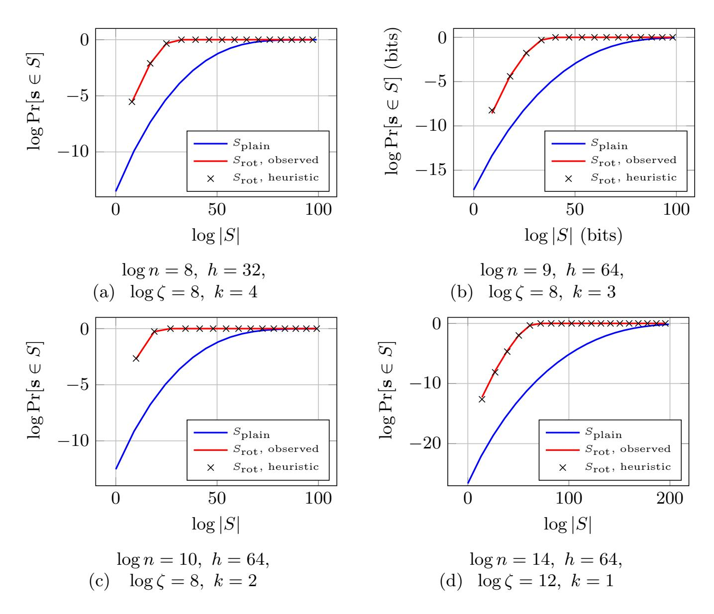
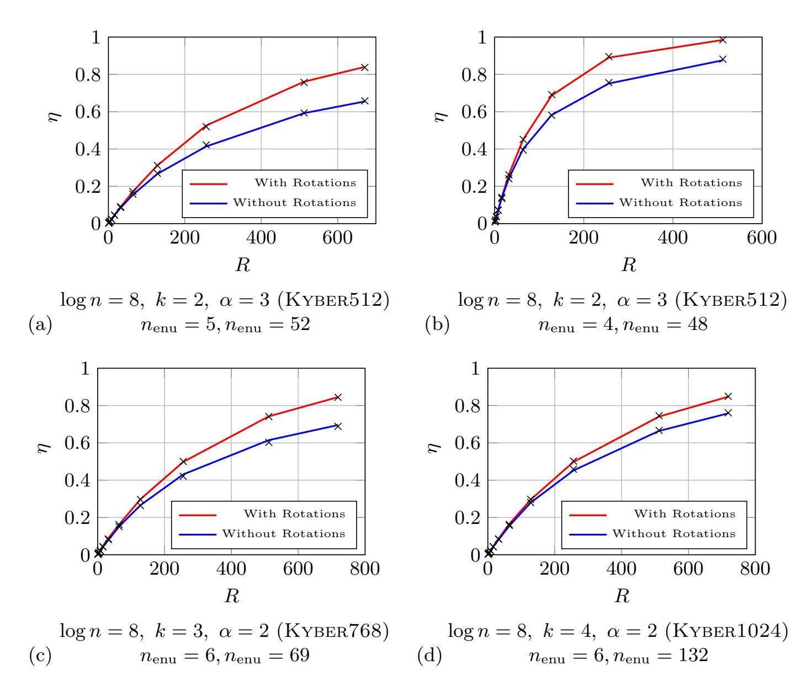

{0}------------------------------------------------

# On the Concrete Hardness Gap Between MLWE and LWE

Tabitha Ogilvie

Royal Holloway, University of London and King's College London, tabitha.l.ogilvie@gmail.com

Abstract. Concrete security estimates for Module-LWE (MLWE) over an appropriate ring are often obtained by translating to an "equivalent" unstructured LWE instance, which implicitly treats algebraic structure as a pure efficiency gain with no impact on security. We show that this heuristic fails for realistic parameters. In common MLWE/RLWE instantiations, an attacker can exploit symmetries to obtain hybrid attacks that are strictly stronger than the best corresponding attack on LWE, translating to a concrete hardness gap between MLWE and LWE.

Our starting point is the observation that many cryptographically relevant rings admit coefficient isometries: ring elements whose multiplication acts as a signed permutation on coefficient vectors and preserves the secret and error distributions of interest. Multiplying an MLWE instance by such an isometry creates many derived instances that share the same public matrix and are therefore compatible with the same expensive offline preprocessing in hybrid attacks. We formalise this mechanism and incorporate it into both primal and dual hybrid frameworks.

We instantiate coefficient isometries for power-of-two cyclotomic rings, and quantify the resulting advantage in two regimes. For sparse-secret RLWE (popular in homomorphic encryption), isometry-enabled hybrids yield gaps of up to 15 bits over LWE-based estimates. For the standardised Kyber/ML-KEM parameters, we obtain a consistent ≈ 2–3 bit gap under standard cost models. Our results demonstrate that the widely assumed equivalence between LWE and MLWE in power-of-two cyclotomics does not hold, with real world consequences for deployed schemes.

# 1 Introduction

#### 1.1 Motivation

The Learning with Errors (LWE) [\[66\]](#page-34-0) problem and its structured variant the Module Learning with Errors (MLWE) [\[45,](#page-33-0)[49](#page-33-1)[,50\]](#page-33-2) problem have proven to be a fruitful foundation for many cryptographic primitives, including digital signatures [\[34\]](#page-32-0), key exchange [\[10,](#page-30-0)[17\]](#page-31-0), and fully homomorphic encryption [\[40,](#page-33-3)[20\]](#page-31-1). MLWE in particular has led to many practical constructions, owing to its efficiency: at a high level, the module structure enables a lower ciphertext expansion 

{1}------------------------------------------------

factor when compared to LWE, decreasing bandwidth and computation requirements [\[48\]](#page-33-4).

Concrete security estimates for MLWE-based schemes are frequently obtained by relating MLWE to an unstructured LWE instance [\[1,](#page-29-0)[18\]](#page-31-2). Implicitly, this assumes the additional algebraic structure affords no additional advantage to an attacker. Because many deployed parameters rely on this assumption, understanding its validity has immediate practical consequences. In this work, we show that this assumption is not true in general: for realistic cryptographic parameters, an attacker can exploit the ring structure to get an attack which is strictly better than the best attack on the corresponding LWE instance. In other words, we find a concrete gap between the hardness of MLWE and LWE.

# 1.2 Main Idea

Our results come from a simple observation: in many cryptographically relevant MLWE parameterisations, the underlying ring/module admits symmetries that preserve the distributions of secrets and errors, while reindexing the secret's coefficients. These symmetries can be exploited algorithmically to strengthen hybrid attacks.

In more detail, consider a single MLWE sample (a, b) over a ring Rq,

$$b = \langle \mathbf{a}, \mathbf{s} \rangle + e \pmod{\mathcal{R}_q},$$

For any r ∈ Rq, we can multiply the equation by r to obtain

$$rb = \langle \mathbf{a}, r\mathbf{s} \rangle + re \pmod{\mathcal{R}_q}.$$

This transformation is always algebraically valid; the question is whether this is still distributed like an MLWE sample with the same parameters. In many cryptographic settings, there exist nontrivial choices of r where multiplying by r acts as a signed permutation on coefficient vectors, and so preserves the relevant norms and (crucially) the secret and error distributions. Such an r produces a new MLWE sample (a, rb) that has the same a, but now with the permuted secret rs.

The consequence for hybrid attacks is that any expensive preprocessing depending only on a can be used to find any secret rs: in practice, this additional freedom means we can find the secret faster.

An important special case arises in the rings in deployed and standardised MLWE schemes, which typically use power-of-two cyclotomic rings R<sup>q</sup> = Zq[X]/(X<sup>n</sup> + 1). Here, multiplication by monomials X<sup>j</sup> corresponds to a negacyclic rotation of coefficients, giving a large family of such symmetries.

We quantify the impact of these symmetries in two complementary regimes. First, we study sparse-secret Ring Learning with Errors (RLWE) (ubiquitous in Homomorphic Encryption), where hybrid attacks are already the most performant attack, and where our symmetry technique has the largest effect: We find up to a 15 bit gap between LWE and RLWE hardness in this setting, downgrading the security of many recent publications below their target level. Second, 

{2}------------------------------------------------

we study the standardised Kyber/ML-KEM parameters and find that exploiting cyclotomic symmetries gives a consistent 2 − 3 bit gap compared to LWE estimates.

### 1.3 Technical Overview

We now give a more technical overview of our work.

Hybrid Algorithms In [Algorithm 1,](#page-2-0) we give the outline for a generic hybrid guessing algorithm, which captures both the primal and dual hybrid attacks on LWE and MLWE. We see that this algorithm has two phases, starting with some offline computation, before looping through a search space S. If our guesses are for some secret s, we can calculate the time complexity of this attack as

$$\frac{1}{\Pr[s \in S]} \Big( T_{\text{InitialWork}} + |S| \, T_{\text{Check}} \Big)$$

so that the best possible attack involves carefully balancing the size and hitting probability of |S|, as well as the amount of initial and per guess computation.

# <span id="page-2-0"></span>Algorithm 1 Generic Hybrid Guessing Algorithm

- 1: Input: A set of guesses S
- 2: Output: A successful guess g or ⊥
- 3: W ← InitialWork()
- 4: for all g ∈ S do
- 5: result ← Check(W, g)
- 6: if result is successful then
- 7: Return g
- 8: Return ⊥

The key constraint in [Algorithm 1](#page-2-0) is that the initial work must be compatible with each guess g; we must have that the offline computation actually enables successfully checking whether g is correct. In hybrid attacks on LWE, this precomputation concerns a fixed part of the public matrix A: all guesses must be compatible with the same fixed part of A.

Coefficient Isometries In order to specify when the ring structure ensures different guess sets S are possible, we define the notion of coefficient isometries. These are ring elements r ∈ R that ensure that whenever (A, b = As+e) ∈ R<sup>m</sup>×(k+1) q is an MLWE sample, (A, rb = A(rs)+re) is also an MLWE sample, with identical parameters. This implies that if an attack succeeds for (A, b), it will equally succeed for (A, rb). Crucially, any precomputation with respect to A can be used equally on (A, b) to find s and (A, rb) to find rs. We define coefficient isometries in such a way that they preserve all secret and error distributions we consider.

{3}------------------------------------------------

Impact on Primal and Dual Hybrids Coefficient isometries produce derived instances  $(\mathbf{A}, r\mathbf{b})$  that share the same public matrix  $\mathbf{A}$  but correspond to a permuted secret  $r\mathbf{s}$ . Since hybrid attacks amortise expensive preprocessing that depends only on a fixed part of  $\mathbf{A}$ , these derived instances enlarge the family of guesses that are compatible with the same offline work. We formalise this effect for both primal and dual hybrid frameworks in Sections 3 and 4.

Power-of-Two Cyclotomics We now instantiate coefficient isometries in the most common rings used by deployed MLWE schemes, namely power-of-two cyclotomics  $\mathcal{R}_q = \mathbb{Z}_q[X]/(X^n+1)$  for some power-of-two  $n \in \mathbb{N}$ . In these rings, multiplication by  $X^j$  corresponds to applying a signed permutation matrix: this means that every monomial  $X^j$  is a coefficient isometry according to our definition.

We quantify the power of these isometries in the power-of-two cyclotomic case for both Primal and Dual Hybrid attacks by plotting the empirical hit probability  $\Pr[s \in S]$  against |S| for the LWE (fixed-coordinate) guessing strategy and for our isometry-enabled strategy, and we observe a consistent advantage.

#### 1.4 Contributions

This paper shows that the algebraic structure in deployed MLWE instantiations enables strictly stronger attacks than those available in the corresponding unstructured LWE setting. Concretely, our contributions are:

- 1. Coefficient isometries as a mechanism for stronger hybrids. We identify and formalise the symmetries that matter for concrete hybrid attacks, calling these *coefficient isometries*, i.e. ring elements whose multiplication acts as a signed permutation on coefficient vectors. For secret and error distributions invariant under these isometries, multiplying an MLWE instance by an isometry preserves *all parameters* while reindexing the secret, producing additional instances that are compatible with the same offline preprocessing.
- 2. **Primal hybrid with isometries.** We give an MLWE adaptation of the primal hybrid attack (IsometricPrimalHybrid) that exploits coefficient isometries. We prove that the corresponding runtime and success probability analysis is unchanged for isometry-invariant secret and error distributions, so the effect of isometries is isolated to the  $\Pr[\mathbf{s} \in S]$  vs. |S| tradeoff. We additionally propose a meet-in-the-middle variant under a natural unbalanced decomposition heuristic.
- 3. **Dual hybrid with isometries.** Building on the dual hybrid attack of [23], we describe ISOMETRICDUALHYBRID, which samples an isometry per trial and tests a zero pattern event on the permuted secret. We prove that, under isometry-invariant distributions, the distinguishing analysis is unchanged, so any concrete gain again comes through an increased hit probability  $\eta$ .
- 4. Instantiation and advantage in power-of-two cyclotomics. For  $\mathcal{R}_q = \mathbb{Z}_q[X]/(X^n+1)$  with n a power-of-two, we show every monomial  $X^j$  is a

{4}------------------------------------------------

coefficient isometry (negacyclic rotations), leading to algorithms RotPrimalHybrid and RotDualHybrid. For fixed Hamming weight and Kyber secrets, we derive accurate approximations to the resulting hit probabilities which we empirically validate for cryptographically relevant parameters. These experiments additionally demonstrate a consistent improvement in the Pr[s ∈ S] vs. |S| tradeoff compared to the LWE guessing strategy.

5. Concrete security consequences. Using these attacks, we quantify a concrete gap between MLWE/RLWE and the corresponding unstructured LWE estimates in realistic regimes: up to a 15-bit gap for sparse-secret RLWE, and a consistent ≈ 2–3 bit gap for the Kyber/ML-KEM parameter sets under the same reduction-cost models as prior work.

#### 1.5 Related Work

Concrete hardness of LWE and hybrid attacks. Understanding the concrete complexity of LWE attacks has been the subject of extensive work, including [\[7,](#page-30-1)[3](#page-30-2)[,51,](#page-33-5)[6,](#page-30-3)[14](#page-31-4)[,47,](#page-33-6)[22\]](#page-31-5). In regimes where the secret is drawn from a small or structured distribution, hybrid approaches that combine lattice reduction with guessing are often the most effective, as demonstrated in [\[2](#page-30-4)[,4,](#page-30-5)[69,](#page-34-1)[27,](#page-32-1)[38\]](#page-32-2). Our primal attack is an MLWE adaptation of the primal hybrid as modelled by the Lattice Estimator [\[7\]](#page-30-1).

Structured LWE and LWE Concrete Hardness. For power-of-two cyclotomics, concrete security estimates for RLWE/MLWE are commonly obtained by considering an "equivalent" unstructured LWE instance, treating the ring/module structure as an efficiency feature with no security impact. This is implicit in the current Homomorphic Encryption standard [\[18\]](#page-31-2) and was made explicit in the previous standard [\[1\]](#page-29-0).

Beyond power-of-two cyclotomics, a recent line of work [\[33\]](#page-32-3) examines the average case performance of the module BKZ algorithm [\[46,](#page-33-7)[57\]](#page-34-2), and find a sublinear gain on the required blocksize in non power-of-two cyclotomics. This represents a different attack style to our work, where we use the ring structure to enhance hybrid guessing strategies. Moreover, our algorithms can be used even on RLWE instances.

We use the non-dual form for MLWE, which resembles the Polynomial LWE (PLWE) problem [\[67\]](#page-34-3). Using the non-dual form can leave MLWE vulnerable to (polynomial time) attacks in rings for which the error distribution is significantly distorted when mapping from the ring to its dual [\[62,](#page-34-4)[36](#page-32-4)[,37,](#page-32-5)[24\]](#page-32-6). As such, equivalence between non-dual MLWE and LWE is never assumed in such rings.

Exploiting Symmetries in Lattice Cryptanalysis. Conceptually, our work is related to attacks on NTRU based schemes [\[59,](#page-34-5)[35\]](#page-32-7), particularly to the zero forcing technique for the NTRU problem [\[53\]](#page-33-8). Here, a dimension reduction can be achieved by observing that any rotation by a power of X of the secret polynomial vector is a small vector in the lattice, so it is enough to search for any rotation where a chosen set of coordinates is zero. However, as MLWE is inhomogeneous 

{5}------------------------------------------------

and NTRU is homogeneous, in our setting we must commit to both a rotation and a guess for a set of coordinates: a correct drop set but incorrect rotation gives no information. This necessitates a different analysis. Additionally, the zero-forcing technique doesn't constitute a hybrid attack. Indeed, if the guessed zero pattern matches no rotation, the attack must start again: the expensive reduction cannot be amortised across many guesses.

Rotations were also recently used in the Cool & Cruel attack on sparse RLWE over power-of-two cyclotomics [\[60,](#page-34-6)[70\]](#page-34-7). There, one performs full-dimensional lattice reduction and relies on obtaining a particular "Z-shaped" reduced basis profile, which induces a decomposition into a "cruel" part (handled by brute force) and a "cool" part (recovered over the integers). Rotations are then used to shift which secret coefficients align with the "cruel" portion, enabling a parallelised brute-force over rotations. Our work differs from Cool and Cruel in both structure and applicability. We build on the primal and dual hybrid attacks, both of which perform lattice reduction in a reduced dimension, leading to more efficient attacks in practice. In addition, the Cool and Cruel attack depends critically on obtaining a Z-shaped basis, a shape which may disappear as parameters get larger, especially as the corresponding Z-shape in the GSO profile disappears as q gets large [\[63\]](#page-34-8). Moreover, in our attack, the guessing dimension is independent of the of the reduced basis shape, whereas in Cool and Cruel it is tied to the width of the Z-shape "cliff". These differences make our attack structurally different and better aligned with standard estimation frameworks.

We give an overview of the differences between our proposed algorithms and [\[60\]](#page-34-6) in [Table 4](#page-35-0) in Appendix [A.](#page-35-1)

Code based dual-hybrid attack. For the Kyber/ML-KEM parameter regime, our dual attack builds directly on the code-based dual hybrid attack of [\[23\]](#page-31-3). This work introduced a decoding approach to make enumeration over residual secret key coefficients feasible, along with properly analysing the true positive and false positive probabilities of the resulting attack.

Paper Outline. In [Section 2](#page-5-0) we recall the primal and dual hybrid attacks on LWE. In [Section 3](#page-13-0) we introduce coefficient isometries and adapt the primal hybrid attack to MLWE. In [Section 4](#page-21-0) we give the corresponding adaptation of the dual hybrid attack. In [Section 5](#page-26-0) we instantiate these attacks in power-of-two cyclotomics and derive concrete security estimates for sparse-secret RLWE and for the Kyber/ML-KEM parameter sets. Additional details are deferred to the appendices.

# <span id="page-5-0"></span>2 Preliminaries

# 2.1 Notation

We write log(·) for base-2 logarithms and ln(·) for natural logarithms. Vectors are denoted by bold lowercase letters and matrices by bold uppercase letters. 

{6}------------------------------------------------

We view vectors as columns and write  $\langle \cdot, \cdot \rangle$  (or  $\cdot$ ) for the standard dot product. We write  $\|\cdot\|$  for the Euclidean norm.

We identify  $\mathbb{Z}_q$  with the interval  $[-q/2, \ldots, q/2) \cap \mathbb{Z}$ , and write  $\mod q$  for reduction into this set. We write  $x \stackrel{\$}{\leftarrow} S$  for uniform sampling from a finite set S, and  $x \stackrel{d}{=} y$  for equality in distribution.

For a ring element  $x \in \mathcal{R}$ , let  $\operatorname{coeff}(x)$  denote its coefficient vector. For  $\mathbf{x} = (x_1, \dots, x_k) \in \mathcal{R}^k$ , write

$$(\mathbf{x})_{\text{coeff}} := (\mathsf{coeff}(x_1) \mid \dots \mid \mathsf{coeff}(x_k))$$

for the flattened coefficient vector.

#### 2.2 Lattices

We detail necessary lattice background in Appendix B.1.

# 2.3 Learning with Errors, Module Learning with Errors, and Ring Learning with Errors

Our work is concerned with the Learning with Errors (LWE), Module Learning with Errors (MLWE), and Ring Learning with Errors (RLWE) problems defined as follows, following [18].

**Definition 1 (LWE Distribution).** For a secret  $\mathbf{s} \in \mathbb{Z}_q^n$  that is chosen according to  $\chi_{\mathbf{s}}$ , the LWE distribution samples  $\mathbf{a} \in \mathbb{Z}_q^n$  uniformly at random, samples  $e \in \mathbb{Z}_q$  according to  $\chi_{\mathbf{e}}$ , and outputs  $(\mathbf{a}, b := \mathbf{a} \cdot \mathbf{s} + e \mod q) \in \mathbb{Z}_q^{n+1}$ .

**Definition 2 (Decision LWE).** The Decision LWE problem is to distinguish LWE samples  $(\mathbf{a}, b)$  from uniform.

**Definition 3 (Search LWE).** The Search LWE problem is to recover the secret vector **s** given m samples from the LWE distribution.

It will be convenient to collect all the LWE samples into a single matrix-vector equation, writing  $\mathbf{b} = \mathbf{A}\mathbf{s} + \mathbf{e} \mod q$ , where each row is a different LWE sample.

If we replace  $\mathbb{Z}$  by a ring  $\mathcal{R}$ , we obtain the *Module Learning with Errors* (MLWE) problem over  $\mathcal{R}_q := \mathcal{R}/q\mathcal{R}$ . In this setting the secret and error are sampled from distributions  $\chi_s$  and  $\chi_e$  over the appropriate  $\mathcal{R}_q$ -modules.

**Definition 4 (MLWE Distribution).** For a secret  $\mathbf{s} \in \mathcal{R}_q^k$  drawn from  $\chi_{\mathbf{s}}$ , the MLWE distribution samples  $\mathbf{a} \xleftarrow{\$} \mathcal{R}_q^k$ , samples  $e \leftarrow \chi_{\mathbf{e}}$  in  $\mathcal{R}_q$ , and outputs  $(\mathbf{a}, b := \mathbf{a} \cdot \mathbf{s} + e \bmod q) \in \mathcal{R}_q^k \times \mathcal{R}_q$ .

**Definition 5 (Decision MLWE).** The Decision MLWE problem is to distinguish MLWE samples  $(\mathbf{a}, b)$  from uniform.

{7}------------------------------------------------

**Definition 6 (Search MLWE).** The Search MLWE problem is to recover the secret vector **s** given m samples from the MLWE distribution.

Once again it will be convenient to stack m such samples into a single matrix-vector equation, this time over  $\mathcal{R}_q$ , writing  $\mathbf{b} = \mathbf{A}\mathbf{s} + \mathbf{e} \in \mathcal{R}_q^m$ , where each row is a different MLWE sample.

The special case k=1 gives the Ring Learning with Errors (RLWE) problem. Following prior work estimating the concrete hardness of these problems [7,3], we treat the cost of search and decision as comparable, due to the tight reductions which exist between them [65,54,21].

### 2.4 The Primal Hybrid Attack On LWE

We now give an overview of the Primal Hybrid attack, which we build on directly. For more details on this algorithm we refer to [4,69,71].

This algorithm uses Babai's Nearest Plane algorithm [12] to find close vectors:<sup>1</sup> we detail this algorithm and corresponding probabilities in Appendix B.2. From this appendix, we use the notation  $NP(\cdot)$  to denote calling this algorithm;  $p_{\text{BABAI}}$  for the probability this algorithm succeeds; and  $p_{\text{MITM}}$  for the probability the algorithm achieves additive homomorphism for a given displacement.

We fully specify the Primal Hybrid algorithm, short secret version, in Algorithm 2, synthesising [4,69,71]. At a high level, this algorithm starts by performing a lattice reduction which makes finding close vectors easier, then calls NP for various guesses at a chunk of the secret  $\mathbf{s}_{\zeta}$ . We can relate this to the generic hybrid guessing algorithm characterisation given in Algorithm 1 of the introduction by understanding InitialWork() as the BKZ reduction, and Check() consisting of the NP call.

**2.4.1 Runtime and Correctness** For a guessing set S, our runtime consists of an initial BKZ reduction, followed by one call to NP for each guess  $\mathbf{s}_g$ . This leads us to the following runtime.

Lemma 1 (Primal Hybrid, no MitM, Runtime). The runtime of Algorithm 2 is given by

$$T_{\text{BKZ}}(\beta, d) + |S|T_{\text{NP}}(d)$$

Various cost models exist for the runtime of BKZ: in general, the cost is exponential in the blocksize  $\beta$ . We leave the precise cost model for finding the shortest vector (which translates to a cost model for BKZ) as a free parameter in our estimator.

The Primal Hybrid attack will succeed provided the guessing set contains the correct  $\mathbf{s}_{\zeta}$ , and NP is able to correctly recover  $(\mathbf{e}, -\xi \mathbf{s}_{n-\zeta})$ .

<span id="page-7-1"></span><span id="page-7-0"></span><sup>&</sup>lt;sup>1</sup> An alternative subroutine is measured by the Lattice Estimator. This procedure projects into a lower rank and uses an exact shortest vector oracle in this lower rank to find the projection of the LWE error and secret. However, this subroutine does not seem to admit a meet-in-the-middle speedup, and is therefore not competitive in the parameter regimes we consider.

{8}------------------------------------------------

# <span id="page-8-0"></span>Algorithm 2 PRIMALHYBRID

### Input:

- Samples  $(\mathbf{A}, \mathbf{b} = \mathbf{A}\mathbf{s} + \mathbf{e}) \in \mathbb{Z}_q^{m \times n} \times \mathbb{Z}_q^m$  produced by an LWE $(q, n, m, \chi_{\mathbf{s}}, \chi_{\mathbf{e}})$  oracle
- guessing dimension  $\zeta \leq n$
- guessing set  $S \subseteq \mathbb{Z}_q^{\zeta}$
- LWE error variance  $\sigma_e$  and secret scaling factor  $\xi = \sigma_e/\sigma_s$
- BKZ blocksize  $\beta$

**Output:** a short  $(\mathbf{s}, \mathbf{e})$  with  $\mathbf{A}\mathbf{s} + \mathbf{e} = \mathbf{b} \pmod{q}$  or  $\perp$ 

- 1: Select  $\zeta$  random columns of  $\mathbf{A}$ ; call the sub-matrix  $\mathbf{A}_{\zeta} \in \mathbb{Z}_q^{m \times \zeta}$ . The remaining columns form  $\mathbf{A}_{n-\zeta} \in \mathbb{Z}_q^{m \times (n-\zeta)}$ .
- 2: Construct the BKZ basis

$$\mathbf{B}_{\mathrm{BKZ}} = \begin{pmatrix} q\mathbf{I}_{m} & \mathbf{A}_{n-\zeta} \\ \mathbf{0} & \xi \mathbf{I}_{n-\zeta} \end{pmatrix} \in \mathbb{R}^{d \times d}, \qquad d \leftarrow m + n - \zeta.$$

- 3:  $\mathbf{B}'_{\mathrm{BKZ}} \leftarrow \mathrm{BKZ}_{\beta}(\mathbf{B}_{\mathrm{BKZ}})$
- 4: for each  $\mathbf{s}_g \in S$  do

5: 
$$\mathbf{t} \leftarrow \begin{pmatrix} (\mathbf{b} - \mathbf{A}_{\zeta} \mathbf{s}_g) \bmod q \\ \mathbf{0} \end{pmatrix}$$

6: 
$$(\mathbf{e}, -\xi \mathbf{s}_{n-\zeta})^T \leftarrow \mathrm{NP}_{\mathbf{B}'_{\mathrm{BKZ}}}(\mathbf{t})$$

- 7: **if**  $(\mathbf{s}_g, \mathbf{s}_{n-\zeta}, \mathbf{e})$  is a valid secret **then**
- 8: **return**  $(\mathbf{s}_g, \mathbf{s}_{n-\zeta}, \mathbf{e})$
- 9: **return** ⊥

# Lemma 2 (Primal Hybrid, no MitM, Success Probability). Algorithm 2 succeeds with probability

$$p_{NP} \cdot \Pr\left[\mathbf{s}_{\zeta} \in S\right],$$

where  $p_{NP}$  is determined by Lemma 28 applied to displacement  $(\mathbf{e}, -\xi \mathbf{s}_{n-\zeta})$  and basis  $\mathbf{B}'_{BKZ}$ .

*Proof.* Given in Section B.3.

We combine these into a single security estimate following the bit security framework [55]: namely, considering the lowest possible value for runtime divided by success probability across all parametrisations of this algorithm.

**2.4.2** Meet in the Middle Speedup It is possible to achieve a meet-in-the-middle speedup during the guessing phase, allowing us to reduce the number of calls to the NP algorithm. When we use this speedup, we have an additional success probability  $p_{\text{MITM}}$ , as discussed in in Appendix B.3.1. To the best of our understanding, standard practice is to conservatively assume it is possible to reduce the number of NP calls from |S| to exactly  $\sqrt{|S|}$ , which requires the following heuristic.

{9}------------------------------------------------

<span id="page-9-0"></span>Heuristic 1 (Plain S Decomposition.) There is an additive decomposition of S that means we require p |S| NP calls.

This heuristic also appears in ongoing work on HE standardisation [\[31\]](#page-32-8). Alternative approaches are discussed in [\[69](#page-34-1)[,71,](#page-35-3)[52\]](#page-33-11). For example, Son and Cheon [\[69\]](#page-34-1) consider building the sets S<sup>1</sup> and S<sup>2</sup> and then defining the guessing set S as their sum; Wunderer [\[71\]](#page-35-3) considers a decomposition of the set of Hamming weight h<sup>g</sup> guesses into two set of Hamming weight hg/2, which asymptotically is a square root speedup; May [\[52\]](#page-33-11) discusses a method of splitting the guess vectors into two vectors of half the length, and splitting the Hamming weight equally between the two halves: again, asymptotically, this gives a square root speedup.

Combining these observations brings us to the following runtime and probability estimates for the Primal Hybrid algorithm with a MitM speedup.

Lemma 3 (MitM Primal Hybrid Runtime). Assuming Heuristic [1,](#page-9-0) the runtime of [Algorithm 2](#page-8-0) with a MitM speedup is given by

$$T_{\text{BKZ}}(\beta, d) + \sqrt{|S|}T_{\text{NP}}(d)$$

Lemma 4 (MitM Primal Hybrid Success Probability). [Algorithm 2](#page-8-0) succeeds with probability

$$p_{NP} \cdot p_{{\scriptscriptstyle MITM}} \cdot \Pr\left[\mathbf{s}_{\zeta} \in S\right],$$

where pNP and pmitm are determined by [Lemmas 28](#page-37-0) and [29](#page-37-1) applied to displacement (e, −ξsn−<sup>ζ</sup> ) and basis B′ BKZ.

#### 2.5 The Dual Hybrid Attack on LWE

We now review the code-based dual-hybrid attack of [\[23\]](#page-31-3), which underlies the best published concrete estimates for the Kyber/ML-KEM parameter sets [\[11,](#page-30-6)[58\]](#page-34-10). We reproduce this algorithm as [Algorithm 3.](#page-10-0) Unlike the Primal Hybrid, which splits the columns of A into a guessing part (A<sup>ζ</sup> ) and a reduction part (An−<sup>ζ</sup> ), this attack splits the columns of A, and so the secret coordinates, into three parts:

- 1. Alat corresponding to slat: the part of A which we perform lattice reduction with respect to. These coordinates of the secret are fixed for all R trials
- 2. Aenu corresponding to senu: the part of the secret we guess is zero. This changes every trial
- 3. Afft corresponding to sfft: the part of the secret we exhaustively enumerate in order to verify our guess. This changes every trial

We relate this algorithm to the generic hybrid guessing algorithm characterisation of [Algorithm 1](#page-2-0) in the following way. For the sake of intuition, we omit decoding details. InitialWork() consists of finding vectors that make it easy to distinguish LWE samples with respect to Alat from random. Then suppose we guess a set of coordinates senu are zero. If we're correct,

$$\mathbf{b} = \mathbf{A}\mathbf{s} + \mathbf{e} = \mathbf{A}_{\mathrm{lat}}\mathbf{s}_{\mathrm{lat}} + \mathbf{A}_{\mathrm{fft}}\mathbf{s}_{\mathrm{fft}} + \mathbf{e},$$

{10}------------------------------------------------

so that  $(\mathbf{A}_{lat}, \mathbf{b} - \mathbf{A}_{fft}\mathbf{s}_{fft})$  is a valid LWE sample. If our guess is wrong, this tuple will be uniformly distributed. Therefore, CHECK() determines whether there exists  $\mathbf{s}_{fft}$  such that  $(\mathbf{A}_{lat}, \mathbf{b} - \mathbf{A}_{fft}\mathbf{s}_{fft})$  is an LWE sample.

This high level overview leaves out many details, which we will now expand on. In particular, we need to properly account for the false negative probability of this algorithm, and use a polar code to decode  $\mathbf{s}_{\mathrm{fft}}$  into a dimension over which the exhaustive enumeration is feasible. We give a brief description of the various subroutines.

Algorithm Dualhybrid is fundamentally a distinguishing procedure (the event  $V \geq T$ ); we follow [23] and treat the subsequent recovery step SublWE-Solver as an additional conditional stage.

# <span id="page-10-0"></span>Algorithm 3 DUALHYBRID (Algorithm 3.1 of [23])

```
Input:
           - Samples (\mathbf{A}, \mathbf{b} = \mathbf{A}\mathbf{s} + \mathbf{e}) \in \mathbb{Z}_q^{m \times n} \times \mathbb{Z}_q^m produced by an LWE(q, n, m, \chi_{\mathbf{s}}, \chi_{\mathbf{e}})
                 oracle
            - positive integers R, T, \beta_{\text{bkz}}, \beta_{\text{sieve}}, n_{\text{enu}}, n_{\text{fft}}, k_{\text{fft}}, n_{\text{lat}}, d_{\text{lsc}}
           – an [n_{\text{fft}}, k_{\text{fft}}]_q linear code with generator matrix \mathbf{G} \in \mathbb{Z}_q^{n_{\text{fft}} \times k_{\text{fft}}}
        Output: the secret vector \mathbf{s} \in \mathbb{Z}_q^n (or \perp)
  1: Choose I_{\text{lat}} \subseteq [n] such that |I_{\text{lat}}| = n_{\text{lat}}.
  2: \mathbf{A}_{\text{lat}} \leftarrow \text{the columns of } \mathbf{A} \text{ indexed by } I_{\text{lat}}.
 3: \mathscr{S} \leftarrow \text{SetOfShortLatticeVectors}(\mathbf{A}_{\text{lat}}, \beta_{\text{sieve}})
  4: for i = 1 to R do
               Choose a partition I_{\text{enu}} \cup I_{\text{fft}} = [n] \setminus I_{\text{lat}} with |I_{\text{enu}}| = n_{\text{enu}} and |I_{\text{fft}}| = n_{\text{fft}}.
  5:
                                                                                               \triangleright We now try to verify the guess \mathbf{s}_{\text{enu}} = \mathbf{0}.
  6:
  7:
               \mathbf{A}_{\text{enu}} \leftarrow \text{the columns of } \mathbf{A} \text{ indexed by } I_{\text{enu}}.
               \mathbf{A}_{\mathrm{fft}} \leftarrow \mathrm{the} \; \mathrm{columns} \; \mathrm{of} \; \mathbf{A} \; \mathrm{indexed} \; \mathrm{by} \; I_{\mathrm{fft}}.
 8:
               \triangleright Now use \mathscr{S} to decode \mathbf{s}_{\mathrm{fft}} into a lower dimension for exhaustive enumeration
 9:
                \mathcal{L} \leftarrow \text{LWESamples}(\mathscr{S}, \mathbf{A}_{\text{fft}}, \mathbf{G}, \mathbf{b})
10:
                V \leftarrow \text{SolveLWEWithFFT}(\mathcal{L}) \triangleright \text{Determine whether these are LWE samples}
11:
12:
               if V \geq T then
13:
                                                                                                                               ▶ We have verified our guess
                       \mathbf{s}_{\mathrm{enu}} \leftarrow \mathbf{0}
                       (\mathbf{s}_{\mathrm{fft}}, \mathbf{s}_{\mathrm{lat}}) \leftarrow \mathrm{SUBLWESOLVER}([\mathbf{A}_{\mathrm{fft}} \ \mathbf{A}_{\mathrm{lat}}], \ \mathbf{b}) \triangleright \mathrm{Solve} \ \mathrm{for} \ \mathrm{the} \ \mathrm{rest} \ \mathrm{of} \ \mathrm{the} \ \mathrm{key}
14:
15:
                       return (\mathbf{s}_{\text{enu}}, \mathbf{s}_{\text{fft}}, \mathbf{s}_{\text{lat}}, I_{\text{enu}}, I_{\text{fft}}, I_{\text{lat}})
16: return \perp
```

# **Definition 7 (SETOFSHORTLATTICEVECTORS).** For $\mathbf{A}_{\text{lat}} \in \mathbb{Z}_q^{m \times n_{\text{lat}}}$ , write

```
\mathscr{S} \leftarrow SetOfShortLatticeVectors(\mathbf{A}_{lat}, \beta_{sieve})
```

for the subroutine that constructs the q-ary dual lattice associated to  $\mathbf{A}_{\mathrm{lat}}$  and runs a lattice sieve with block size  $\beta_{\mathrm{sieve}}$  to output a set  $\mathscr{S}$  of short pairs  $(\mathbf{x}, \mathbf{y}) \in \mathbb{Z}^m \times \mathbb{Z}^{n_{\mathrm{lat}}}$  with  $\mathbf{y} = \mathbf{A}_{\mathrm{lat}}^\mathsf{T} \mathbf{x} \pmod{q}$ .

<span id="page-10-1"></span>**Definition 8 (LWESAMPLES).** Write  $\mathcal{L} \leftarrow LWESAMPLES(\mathcal{S}, \mathbf{A}_{\mathrm{fft}}, \mathbf{G}, \mathbf{b})$  for the following procedure.

{11}------------------------------------------------

For each  $(\mathbf{x}, \mathbf{y}) \in \mathcal{S}$ , define  $\mathbf{u}_{lsc} \in \mathbb{Z}_q^{k_{fft}}$  as the output of decoding  $\mathbf{A}_{fft}^\mathsf{T}\mathbf{x}$  to the code generated by  $\mathbf{G}$ , so that  $\mathbf{e}_{lsc} := \mathbf{A}_{fft}^\mathsf{T}\mathbf{x} - \mathbf{G}\mathbf{u}_{lsc}$  is small. Then  $LWESAMPLES(\mathcal{S}, \mathbf{A}_{fft}, \mathbf{G}, \mathbf{b})$  outputs the list  $\mathcal{L} := \{(\mathbf{u}_{lsc}, \langle \mathbf{x}, \mathbf{b} \rangle) : (\mathbf{x}, \mathbf{y}) \in \mathcal{S}\}.$ 

<span id="page-11-1"></span>The utility of this step is that if  $\mathbf{s}_{\text{enu}} = \mathbf{0}$ , it produces LWE samples with respect to the secret  $\mathbf{G}^T \mathbf{s}_{\text{fft}}$ . This is formalised by the following lemma.

**Lemma 5.** Let  $(\mathbf{A}, \mathbf{b})$  be a collection of m LWE samples with secret and error  $\mathbf{s}$  and  $\mathbf{e}$ , and let  $\{(\mathbf{u}_{lsc}, \langle \mathbf{x}, \mathbf{b} \rangle) : (\mathbf{x}, \mathbf{y}) \in \mathscr{S}\} \leftarrow LWESAMPLES(\mathscr{S}, \mathbf{A}_{fft}, \mathbf{G}, \mathbf{b})$  as in Definition 8.

Then if  $\mathbf{s}_{\mathrm{enu}} = \mathbf{0}$ , each  $(\mathbf{u}_{\mathrm{lsc}}, \langle \mathbf{x}, \mathbf{b} \rangle)$  is an LWE sample with respect to the secret  $\mathbf{G}^{\mathsf{T}}\mathbf{s}_{\mathrm{fft}}$  and error  $e' := \langle \mathbf{x}, \mathbf{e} \rangle + \langle \mathbf{y}, \mathbf{s}_{\mathrm{lat}} \rangle + \langle \mathbf{e}_{\mathrm{lsc}}, \mathbf{s}_{\mathrm{fft}} \rangle$ .

Proof. Given in Appendix B.4.

It remains to explain how SolvelWEwithFFT assigns a "score" to these LWE samples, which should be large if these are indeed LWE samples, and small if they are uniform. This value can be computed more efficiently with an FFT: we omit these details as they are extraneous to our purposes.

**Definition 9 (SolveLWEWITHFFT).** Let  $\mathcal{L}$  be a list of pairs  $(\mathbf{u}_{lsc}, b) \in \mathbb{Z}_q^{k_{fft}} \times \mathbb{Z}_q$ . For a candidate key  $\mathbf{z} \in \mathbb{Z}_q^{k_{fft}}$ , define the score

$$F_0^{(\mathrm{lsc})}(\mathbf{z}) := \sum_{(\mathbf{u}_{\mathrm{lsc}}, b) \in \mathcal{L}} \cos\left(\frac{2\pi}{q} \left(b - \langle \mathbf{u}_{\mathrm{lsc}}, \mathbf{z} \rangle\right)\right).$$

Then SolvelWeWithFFT outputs the value  $V := \max_{\mathbf{z} \in \mathbb{Z}_a^{k_{\mathrm{fft}}}} F_0^{(\mathrm{lsc})}(\mathbf{z}).$ 

With these functions defined, we are able to give the runtime and success and failure probability of this algorithm.

**2.5.1** Runtime and Correctness We refer to [23] for a detailed analysis of the runtime of each of these subroutines for different attack parameters. We will build on the estimator for this paper when estimating concrete costs. This lemma is a simplified analogue of their Theorem 4.1.

Lemma 6 (Dual Hybrid Runtime). Assume that the cost of one call to Sublive Solver is negligible. Then the runtime of Algorithm 3 is

$$T_{SetOfShortLatticeVectors} + R \left( T_{LWESAMPLES} + T_{SolveLWEWIthFFT} \right)$$

<span id="page-11-0"></span>Of more concern to us is the *correctness* of this algorithm, as we will want to prove an analogous statement for our adaptation. In [23] correctness was captured by a single theorem and proof. We instead break the result into three modular results, so that we can reuse the analysis for our own algorithm. All of these results were proven as part of the central correctness proof of [23], we simply distribute them over three results for later convenience.

{12}------------------------------------------------

Lemma 7 (True Positive). We have that

$$\Pr[V \ge T \, | \, \mathbf{s}_{\text{enu}} = \mathbf{0}] \ge P_{\text{good}}$$

where 
$$P_{\text{good}} := \Pr[F_0^{(\text{lsc})}(\mathbf{G}^T \mathbf{s}_{\text{fft}}) \geq T \mid \mathbf{s}_{\text{enu}} = \mathbf{0}].$$

<span id="page-12-0"></span>Lemma 8 (False Positive). We have that

$$\Pr[V \ge T \mid \mathbf{s}_{\text{enu}} \ne \mathbf{0}] \le q^{k_{\text{fft}}} \cdot P_{\text{wrong}}$$

where 
$$P_{\text{wrong}} := \Pr[F_0^{(\text{lsc})}(\mathbf{z}) \ge T \mid \mathbf{s}_{\text{enu}} \ne \mathbf{0}] \text{ for } \mathbf{z} \xleftarrow{\$} \mathbb{Z}_q^{k_{\text{fft}}}.$$

Now that we have both a lower bound on the probability of successfully identifying a correct guess, and an upper bound on incorrectly classifying an incorrect guess, we can precisely capture the probability with which this algorithm succeeds.

<span id="page-12-1"></span>Lemma 9 (Dual Hybrid Correctness (Lemma 3.2 of [\[23\]](#page-31-3))). Suppose A, b is sampled from an LWE(q, n, m, χs, χe) oracle, and assume SubLWESolver returns sfft, slat with probability 1 − µ whenever both senu = 0 and V ≥ T. Then the probability that [Algorithm 3](#page-10-0) succeeds in recovering the secret s is at least

$$\eta \cdot P_{\text{good}} \cdot (1 - \mu) - R \cdot q^{k_{\text{fft}}} \cdot P_{\text{wrong}}.$$

where, for z \$ ← Z kfft q ,

$$P_{\text{good}} := \Pr[F_0^{(\text{lsc})}(\mathbf{G}^T \mathbf{s}_{\text{fft}}) \ge T \, | \, \mathbf{s}_{\text{enu}} = \mathbf{0}],$$
 (1)

$$P_{\text{wrong}} := \Pr[F_0^{(\text{lsc})}(\mathbf{z}) \ge T \mid \mathbf{s}_{\text{enu}} \ne \mathbf{0}].$$
 (2)

and,

$$\eta := \Pr[\exists i \in [R] : \mathbf{s}_{\text{enu}} = \mathbf{0}],$$

where Ienu is the random choice made in a trial.

Proof. Given in Appendix [B.4.](#page-39-0)

Remark 1. The bounds on Pgood and Pwrong concern the acceptance event V ≥ T; the factor (1−µ) isolates the additional success probability of the subsequent recovery step.

The probabilities Pgood and Pwrong are modelled and experimentally verified in [\[23\]](#page-31-3) in Assumptions 4.8 and 4.9. We will rely on these results for our own Dual Hybrid attack.

In our restatement of this correctness result, we have left the final success probability in terms of the hit probability η to make this dependence explicit, as improving this factor using the module structure is the central consideration of our work.

{13}------------------------------------------------

# <span id="page-13-0"></span>3 Primal Hybrid with Coefficient Isometries

In this section we will propose an adaptation of the primal hybrid attack for Module Learning with Errors which exploits ring structure, which we will call IsometricPrimalHybrid. The algorithm is given in [Algorithm 4.](#page-15-0)

We start by summarising the Primal Hybrid for LWE given in [Algorithm 2.](#page-8-0)

- we split the columns of A into An−<sup>ζ</sup> and A<sup>ζ</sup> . We perform BKZ reduction on a lattice defined by An−<sup>ζ</sup> . This lattice (and its reduced basis) is fixed.
- For guesses s<sup>g</sup> of s<sup>ζ</sup> , we try to decode the target t = b − A<sup>ζ</sup> s<sup>g</sup> to the lattice defined by An−<sup>ζ</sup> .

Crucially, across all guesses the only fixed object is the lattice (and reduced basis) defined by An−<sup>ζ</sup> ; the target changes with every guess. In plain LWE, once the lattice is fixed this also fixes which ζ coordinates of the secret must be guessed.

Recall the form of a single MLWE sample (a, b) over a ring R:

$$b = \sum_{i=1}^{k} a_i s_i + e \bmod \mathcal{R}_q,$$

and observe that for any r ∈ R, we can form

$$rb = \sum_{i=1}^{k} a_i(rs_i) + re \mod \mathcal{R}_q.$$

If re is also sampled from a "small" distribution, then we have that both (a, b) and (a, rb) are MLWE samples with respect to the same a vector: indeed, if re is from the same distribution as e, these are MLWE samples with the same distribution. This motivates the following definition.

Definition 10 (Coefficient Isometry). Fix a ring R. Then r ∈ R is a coefficient isometry if multiplication by r acts as a signed permutation on coefficient vectors, i.e. there exists a signed permutation matrix Π<sup>r</sup> such that

$$coeff(rx) = \Pi_r coeff(x) \quad for \ all \ x \in \mathcal{R}.$$

This is quite a strict definition, and it may be sufficient that r preserves the Euclidean norm of the coefficient vector. However in our setting, we prefer this stronger property, as it preserves the distributions of interest to us. This is made concrete by the following definition and lemma.

<span id="page-13-2"></span><span id="page-13-1"></span>Definition 11. A distribution D on R<sup>k</sup> is invariant under coefficient isometries if for every coefficient isometry r ∈ R,

$$(r\mathbf{x})_{\text{coeff}} \stackrel{d}{=} (\mathbf{x})_{\text{coeff}} \qquad where \ \mathbf{x} \stackrel{\$}{\leftarrow} \mathcal{D}.$$

{14}------------------------------------------------

**Lemma 10.** The following distributions are invariant under coefficient isometries.

- the coefficients of  $\mathbf{x}$  are i.i.d. from a centred symmetric distribution;
- ( $\mathbf{x}$ )<sub>coeff</sub> is uniform over a fixed-Hamming-weight, centred symmetric set.

Looking ahead, this will be useful to us when we instantiate  ${\bf e}$  with a Discrete Gaussian sample and  ${\bf s}$  with a fixed Hamming weight ternary sample; or, when we sample both  ${\bf e},{\bf s}$  coefficients from centred binomial distributions.

Returning to the Primal Hybrid, we see any non-trivial coefficient isometry enables us to make guesses with respect to the same  $\mathbf{A}_{n-\zeta}$ , but different coordinates of the secret. We formalise this using the following lemma.

**Lemma 11.** Let  $(\mathbf{A}, \mathbf{b} = \mathbf{A}\mathbf{s} + \mathbf{e})$  have rows given by MLWE samples with  $\mathbf{A} \in \mathcal{R}_q^{m \times k}$ ,  $\mathbf{s} \in \mathcal{R}_q^k$ ,  $\mathbf{e} \in \mathcal{R}_q^m$ . Write n for the ring rank and set M := mn and N := kn.

Let  $\mathbf{A}_{\text{coeff}} \in \mathbb{Z}_q^{M \times N}$  be the integer matrix satisfying

<span id="page-14-0"></span>
$$(\mathbf{A}\mathbf{x})_{\text{coeff}} = \mathbf{A}_{\text{coeff}}(\mathbf{x})_{\text{coeff}}$$

Choose any index set  $\mathcal{J} \subseteq [N]$  with  $|\mathcal{J}| = \zeta$ . Let  $\mathbf{A}_{\zeta} \in \mathbb{Z}_q^{M \times \zeta}$  be the sub-matrix of  $\mathbf{A}_{\text{coeff}}$  consisting of the columns indexed by  $\mathcal{J}$ , and let  $\mathbf{A}_{N-\zeta} \in \mathbb{Z}_q^{M \times (N-\zeta)}$  be the sub-matrix consisting of the remaining columns. For any  $\mathbf{x} \in \mathbb{Z}_q^N$ , write  $\mathbf{x}_{\zeta} \in \mathbb{Z}_q^{\zeta}$  and  $\mathbf{x}_{N-\zeta} \in \mathbb{Z}_q^{N-\zeta}$  for the corresponding sub-vectors (indices in  $\mathcal{J}$  and  $[N] \setminus \mathcal{J}$ , respectively).

Define the augmented embedding lattice

$$\Lambda_q(\mathbf{A}_{N-\zeta}) := \Lambda\left(\begin{pmatrix} q\mathbf{I}_M & \mathbf{A}_{N-\zeta} \\ \mathbf{0} & \xi\mathbf{I}_{N-\zeta} \end{pmatrix}\right) \subseteq \mathbb{Z}^{M+N-\zeta}.$$

Let  $r \in \mathcal{R}_q$  be a coefficient isometry, and assume the distributions of  $\mathbf{s}$  and  $\mathbf{e}$  are invariant under coefficient isometries. Write

$$\mathbf{b}_{\mathrm{coeff}} := (\mathbf{b})_{\mathrm{coeff}}, \quad \mathbf{s}_{\mathrm{coeff}} := (\mathbf{s})_{\mathrm{coeff}}, \quad \mathbf{e}_{\mathrm{coeff}} := (\mathbf{e})_{\mathrm{coeff}},$$

for the flattened coefficient vectors.

Then, in the quotient group  $\mathbb{Z}^{M+N-\zeta}/\Lambda_q(\mathbf{A}_{N-\zeta})$ ,

$$\binom{(r\mathbf{b})_{\operatorname{coeff}} - \mathbf{A}_{\zeta} (r\mathbf{s})_{\zeta}}{\mathbf{0}} = \binom{(r\mathbf{e})_{\operatorname{coeff}}}{-\xi (r\mathbf{s})_{N-\zeta}} \pmod{\Lambda_q(\mathbf{A}_{N-\zeta})}.$$

Moreover,

$$\begin{pmatrix} (r\mathbf{e})_{\text{coeff}} \\ -\xi (r\mathbf{s})_{N-\zeta} \end{pmatrix} \stackrel{d}{=} \begin{pmatrix} \mathbf{e}_{\text{coeff}} \\ -\xi \, \mathbf{s}_{N-\zeta} \end{pmatrix}.$$

*Proof.* Deferred to Appendix C.

{15}------------------------------------------------

### <span id="page-15-0"></span>Algorithm 4 ISOMETRICPRIMALHYBRID

#### Input:

- A ring  $\mathcal{R}$  of rank n
- m MLWE samples  $(\mathbf{A}, \mathbf{b} = \mathbf{A}\mathbf{s} + \mathbf{e})$  with  $\mathbf{A} \in \mathcal{R}_q^{m \times k}$ ,  $\mathbf{b} \in \mathcal{R}_q^m$
- guessing dimension  $\zeta \leq N$  where N := kn
- a set of coefficient isometries  $\mathcal{T} \subseteq \mathcal{R}_a$
- guessing set  $S \subseteq \mathcal{T} \times \mathbb{Z}_q^{\zeta}$
- MLWE error variance  $\sigma_e$  and secret scaling factor  $\xi = \sigma_e/\sigma_s$
- BKZ blocksize  $\beta$

**Output:** a short  $(\mathbf{s}, \mathbf{e})$  with  $\mathbf{A}\mathbf{s} + \mathbf{e} = \mathbf{b} \pmod{q}$  or  $\perp$ 

- 1: Compute  $\mathbf{A}_{\text{coeff}} \in \mathbb{Z}_q^{M \times N}$  such that  $(\mathbf{A}\mathbf{x})_{\text{coeff}} = \mathbf{A}_{\text{coeff}}(\mathbf{x})_{\text{coeff}}$  for all  $\mathbf{x} \in \mathcal{R}_q^k$ , where M := mn and N := kn.
- 2: Select  $\zeta$  random columns of  $\mathbf{A}_{\text{coeff}}$ ; call the sub-matrix  $\mathbf{A}_{\zeta} \in \mathbb{Z}_q^{M \times \zeta}$ . The remaining columns form  $\mathbf{A}_{N-\zeta} \in \mathbb{Z}_q^{M \times (N-\zeta)}$ .
- 3: Construct the BKZ basis

$$\mathbf{B}_{\mathrm{BKZ}} \ = \ \begin{pmatrix} q\mathbf{I}_{M} & \mathbf{A}_{N-\zeta} \\ \mathbf{0} & \xi\mathbf{I}_{N-\zeta} \end{pmatrix} \in \mathbb{R}^{d\times d}, \qquad d \leftarrow M + N - \zeta.$$

- 4:  $\mathbf{B}'_{\mathrm{BKZ}} \leftarrow \mathrm{BKZ}_{\beta}(\mathbf{B}_{\mathrm{BKZ}})$
- 5: for each  $(r, \mathbf{s}_g) \in S$  do

10: return  $\perp$ 

 $\triangleright \mathbf{s}_q$  guesses  $(r\mathbf{s})_{\zeta}$ 

6: 
$$\mathbf{t} \leftarrow \begin{pmatrix} ((r\mathbf{b})_{\text{coeff}} - \mathbf{A}_{\zeta}\mathbf{s}_g) \bmod q \\ \mathbf{0} \end{pmatrix}$$

- 7:  $((r\mathbf{e})_{\text{coeff}}, -\xi(r\mathbf{s})_{N-\zeta})^T \leftarrow \text{NP}_{\mathbf{B}'_{\text{BKZ}}}(\mathbf{t})$
- 8: if  $(r, \mathbf{s}_g, (r\mathbf{s})_{N-\zeta}, r\mathbf{e})$  is a valid solution then
- 9: **return**  $(\mathbf{s}, \mathbf{e}) \triangleright \text{recover } \mathbf{s} \text{ by undoing the signed permutation induced by } r$

Informally, this Lemma says that considering a new target obtained via multiplying by a coefficient isometry r does not change the distribution of the displacement from the lattice defined by  $\mathbf{A}_{N-\zeta}$ . Additionally, it means we are able to test guesses for  $(r\mathbf{s})_{\zeta}$ , rather than only  $\mathbf{s}_{\zeta}$ . We will see that for sparse secrets, this gives a significant advantage.

We present ISOMETRICPRIMALHYBRID in Algorithm 4, which adapts the Primal Hybrid to the MLWE setting using coefficient isometries.

#### 3.1 Runtime and Correctness of IsometricPrimalHybrid

The runtime of Algorithm 4 follows identically to the plain case, except that the search space S is now contained in  $\mathcal{T} \times \mathbb{Z}_q^{\zeta}$ .

<span id="page-15-1"></span>Lemma 12 (Isometric Primal Hybrid, no MitM, Runtime). The runtime of Algorithm 4 is

$$T_{\text{BKZ}}(\beta, d) + |S|T_{\text{NP}}(d)$$
.

{16}------------------------------------------------

Algorithm 4 will succeed provided the guessing set contains a correct guess  $(r, \mathbf{s}_g) \in S$  with  $\mathbf{s}_g = (r\mathbf{s})_{\zeta}$ , and NP is able to correctly recover the displacement  $((r\mathbf{e})_{\text{coeff}}, -\xi(r\mathbf{s})_{N-\zeta})$  using the basis  $\mathbf{B}'_{\text{BKZ}}$ . As r is a coefficient isometry, Lemma 11 implies the probability that the Nearest Plane succeeds is *independent* of r.

Lemma 13 (Isometric Primal Hybrid, no MitM, Success Probability).

Algorithm 4 succeeds with probability

$$p_{NP} \cdot \Pr[\mathbf{s} \in S],$$

where  $p_{NP}$  is determined by Lemma 28 applied to the basis  $\mathbf{B}'_{BKZ}$  and displacement  $((\mathbf{e})_{coeff}, -\xi(\mathbf{s})_{N-\zeta})$ , and  $\Pr[\mathbf{s} \in S]$  is shorthand for  $\Pr[\exists (r, \mathbf{s}_g) \in S]$  such that  $(r\mathbf{s})_{\zeta} = \mathbf{s}_g$ .

*Proof.* The result follows by combining Lemma 11 and Lemma 28.  $\Box$ 

We again combine these into a single security estimate following the bit security framework [55], considering the lowest possible value for runtime divided by success probability across all parametrisations of this algorithm.

### 3.2 MitM Speedup

We find it is still possible to achieve a Meet in the Middle square root speedup for our algorithm, provided  $S = \mathcal{T} \times S_{\text{plain}}$  exactly, and we can find an *unbal-anced* additive decomposition for  $S_{\text{plain}}$ . This assumption is made concrete in Heuristic 2. We give a sketch of exactly the MitM speedup we are proposing in Algorithm 9 in Appendix C.1.

<span id="page-16-0"></span>Heuristic 2 (Isometric S Decomposition) Let  $\mathcal{T}$  be the set of coefficient isometries used by Algorithm 4, and assume  $S = \mathcal{T} \times S_{\text{plain}}$  for some  $S_{\text{plain}} \subseteq \mathbb{Z}_q^{\zeta}$ . There exist sets  $S_1, S_2 \subseteq \mathbb{Z}_q^{\zeta}$  such that

$$S_{\text{plain}} = S_1 + S_2 := \{ \mathbf{s}_1 + \mathbf{s}_2 : \mathbf{s}_1 \in S_1, \ \mathbf{s}_2 \in S_2 \},$$

Moreover, we can balance  $S_1, S_2$  such that  $|\mathcal{T}| \cdot |S_1| \approx |S_2|$ , and hence  $|\mathcal{T}| \cdot |S_1| + |S_2| \approx \sqrt{|S|}$ .

Asymptotically, such a split can be justified similarly to Heuristic 1: for example, we could extend Wunderer's approach by splitting into two sets of weights  $\frac{h_g}{2} \pm \frac{\log |\mathcal{T}|}{4}$ , or extend May's analysis by splitting the vector into two unequal lengths.

Remark 2. This heuristic is perhaps more conservative than the previous heuristic, Heuristic 1. We found that assuming the unbalanced decomposition instead of the balanced decomposition only made a few bits of difference to the final security estimates. We leave choosing between these two heuristics as a free parameter in our estimator.

{17}------------------------------------------------

Lemma 14 (MitM Isometric Primal Hybrid Runtime). Suppose  $S = \mathcal{T} \times S_{plain}$ . Assuming Heuristic 2, the runtime of Algorithm 4 with a MitM speedup is given by

 $T_{\rm BKZ}(\beta, d) + \sqrt{|S|}T_{\rm NP}(d)$ 

*Proof.* Observe from Algorithm 9 that we make  $|\mathcal{T}||S_1|+|S_2|$  calls to the Nearest Plane algorithm. The result follows from Heuristic 2, as this implies  $|\mathcal{T}||S_1|+|S_2|=\sqrt{|S|}$ .

Just as in the plain case, we can use the additive decomposition to "rebuild" the correct guess at runtime. However, the presence of isometries means we require some additional reasoning on why this is the case.

Lemma 15 (MitM Isometric Primal Hybrid Success Probability). Assume  $S = \mathcal{T} \times S_{\text{plain}}$  with  $S_{\text{plain}} = S_1 + S_2$ . Then Algorithm 4 with a MitM speedup following Algorithm 9 succeeds with probability

<span id="page-17-0"></span>
$$p_{NP} \cdot p_{MITM} \cdot \Pr[\mathbf{s} \in S],$$

where  $p_{NP}$  and  $p_{MITM}$  are determined by Lemmas 28 and 29 applied to the basis  $\mathbf{B}'_{BKZ}$  and displacement  $((r\mathbf{e})_{coeff}, -\xi(r\mathbf{s})_{N-\zeta})$ , and  $\Pr[\mathbf{s} \in S]$  is shorthand for  $\Pr[\exists (r, \mathbf{s}_g) \in S \text{ such that } (r\mathbf{s})_{\zeta} = \mathbf{s}_g]$ .

Proof. Given in Appendix C.1.

### 3.3 Power-of-Two Cyclotomics

Coefficient isometries will be different from ring to ring, and in many cases only trivial isometries will exist. However, one ring of particular interest in cryptography is the power-of-two cyclotomic ring  $\mathcal{R} = \mathbb{Z}[X]/(X^n+1)$  for some power-of-two n. In these rings, multiplication by monomials  $X^j$  has the effect of rotating the coefficients negacyclically, so that all monomials are coefficient isometries. This is shown formally with the following lemma.

**Lemma 16.** Let n be a power-of-two and let  $\mathcal{R}_q = \mathbb{Z}_q[X]/(X^n+1)$ . For any  $0 \le j < n$ , the monomial  $X^j$  is a coefficient isometry.

*Proof.* Write  $f(X) = \sum_{i=0}^{n-1} f_i X^i$  and identify f with its coefficient vector  $\operatorname{coeff}(f) = (f_0, \dots, f_{n-1})^T \in \mathbb{Z}_q^n$ . In  $\mathcal{R}_q$  we have the relation  $X^n \equiv -1$ , so multiplying by X gives

$$Xf(X) \equiv -f_{n-1} + \sum_{i=0}^{n-2} f_i X^{i+1} \pmod{X^n + 1}.$$

Then  $coeff(Xf) = \Pi coeff(f)$  where  $\Pi$  is the (negacyclic) rotation matrix (cf. [32])

$$\Pi = \begin{pmatrix}
0 & 0 & 0 & \dots & -1 \\
1 & 0 & 0 & \dots & 0 \\
0 & 1 & 0 & \dots & 0 \\
\vdots & \vdots & \ddots & \ddots & \vdots \\
0 & 0 & \dots & 1 & 0
\end{pmatrix}$$

{18}------------------------------------------------

This  $\Pi$  is a signed permutation matrix. Moreover, multiplication by  $X^j$  corresponds to multiplication by  $\Pi^j$ , which is also a signed permutation as this set is closed under multiplication. Therefore each  $X^j$  is a coefficient isometry by definition.

Fixing  $\mathcal{R}$  as the power-of-two cyclotomic ring and instantiating the set of coefficient isometries  $\mathcal{T}$  with the negacyclic rotations  $\{X^j: 0 \leq j < n\}$  brings us to an algorithm ROTPRIMALHYBRID, presented in Algorithm 5.

### <span id="page-18-0"></span>Algorithm 5 ROTPRIMALHYBRID

**Input:** m MLWE samples  $(\mathbf{A}, \mathbf{b})$  over  $\mathcal{R}_q = \mathbb{Z}_q[X]/(X^n + 1)$  with n a power-of-two; guessing dimension  $\zeta$ ; plain guessing set  $S_{\text{plain}} \subseteq \mathbb{Z}_q^{\zeta}$ ; other parameters as in Algorithm 4.

```
Output: a short (\mathbf{s}, \mathbf{e}) with \mathbf{A}\mathbf{s} + \mathbf{e} \equiv \mathbf{b} \pmod{q} or \perp.
```

```
1: \mathcal{T} \leftarrow \{X^j : j = 0, 1, \dots, n-1\}
```

2:  $S \leftarrow \mathcal{T} \times S_{\text{plain}}$ 

3: **return** IsometricPrimalHybrid( $\mathcal{R}, \mathbf{A}, \mathbf{b}, \zeta, \mathcal{T}, S, \ldots$ )

The runtime and correctness of this algorithm follow from the runtime and correctness of IsometricPrimalHybrid (Lemmas 12 to 15). In the next subsection, we will look at concrete instantiation of the guessing set S in power-of-two cyclotomics in more detail.

Remark 3. We can understand this attack without reference to the ring structure by observing that matrices  $\mathbf{A}$  that are formed of negacyclic blocks are defined by commuting with (powers of) the matrix  $\Pi^{(k)} = \Pi \otimes \mathbf{I}_k$ , which is a signed permutation matrix. Using our algorithm for plain LWE would therefore necessitate finding a signed permutation matrix of order n that commutes with an arbitrary given uniform matrix  $\mathbf{A}$ . This requires  $\mathbf{A}$  to be preserved up to sign under some simultaneous permutation of rows and columns, which is not true for arbitrary matrices.

3.3.1 A Concrete Guessing Set for Fixed Hamming Weight Keys in Power-of-Two Cyclotomics Although we have shown that coefficient isometries enable a different guessing strategy in the Primal Hybrid algorithm applied to MLWE than is possible for plain LWE, we haven't yet demonstrated this gives any advantage. We will demonstrate this in this subsection, by focusing on power-of-two cyclotomics, and the specific case of secrets with coefficients sampled from a bounded symmetric set such that the entire secret has fixed Hamming weight. We can define such secrets as having coefficient vector sampled uniformly from the following set.

Definition 12 (Fixed Hamming Weight Symmetric Set). For  $W \in 2\mathbb{Z}$ , let  $W = \{-W/2, ..., W/2\}$ . Write

$$\mathcal{W}(h,n) := \{ \mathbf{v} \in \mathcal{W}^n : \text{hwt}(v) = h \}$$

{19}------------------------------------------------

i.e., the set of all length n vectors with entries from W and Hamming weight h.

Usually n will be clear from the context, and we will suppress it. For when  $W = \{-1, 0, 1\}$ , we recover the sparse ternary distribution, an extremely popular choice for the secret key distribution in parametrisations of Homomorphic Encryption.

For keys from this distribution, the standard guessing set<sup>2</sup> is to select a maximum Hamming weight  $h_g \leq \min(\zeta, h)$ , and guess all key segments of lower weight.

<span id="page-19-1"></span>**Definition 13 (Guessing Set**  $S_{\text{plain}}(h_g)$ **).** Let  $\mathbf{s} \stackrel{\$}{\leftarrow} \mathcal{W}(h)$ . Then we define

$$S_{\text{plain}}(h_g) = \{ \mathbf{s}_g : \mathbf{s}_g \in \mathcal{W}^{\zeta} \text{ and } \text{hwt}(\mathbf{s}_g) \le h_g \}$$

It is straightforward to derive the size and hitting probability of this guessing set.

<span id="page-19-3"></span>Lemma 17 ( $S_{\text{plain}}(h_g)$  Size and Hitting Probability). Let s and  $S_{\text{plain}}(h_g)$  be as in Definition 13. Then:

$$|S_{\text{plain}}(h_g)| = \sum_{i=0}^{h_g} {\zeta \choose i} W^i, \quad \Pr[\mathbf{s}_{\zeta} \in S_{\text{plain}}(h_g)] = \frac{1}{{n \choose h}} \sum_{i=0}^{h_g} {n-\zeta \choose h-i} {\zeta \choose i}. \quad (3)$$

To construct a guessing set for MLWE in power-of-two-cyclotomic rings, we build on this  $S_{\text{plain}}(h_g)$ , considering all segments up to a certain weight, along with all possible rotations.

<span id="page-19-2"></span>**Definition 14 (MLWE Guessing Set**  $S_{\text{rot}}(h_g)$ ). Let  $\mathbf{s} \in (\mathbb{Z}[X]/(X^n+1))^k$  have coefficient vector  $(\mathbf{s})_{\text{coeff}}$  sampled uniformly from  $\mathcal{W}(h,kn)$ . We define

$$S_{\text{rot}}(h_g) = \{X^j : j \in [n]\} \times S_{\text{plain}}(h_g)$$
$$= \{(X^j, \mathbf{s}_g) : j \in [n], \mathbf{s}_g \in \mathcal{W}^{\zeta} \text{ and hwt } (\mathbf{s}_g) \le h_g\}.$$

We find the hitting probability of  $S_{\text{rot}}(h_g)$  is well approximated by extending the heuristic introduced in [53]: namely, the weight on different rotations of the dropped coordinates is independent.

<span id="page-19-4"></span>Lemma 18 ( $S_{\text{rot}}(h_g)$  Size and Hitting Probability). Let  $S_{\text{rot}}(h_g)$  and  $S_{\text{plain}}(h_g)$  be as in Definitions 13 and 14 respectively, and write  $p(h_g) = \Pr[\mathbf{s}_{\zeta} \in S_{\text{plain}}(h_g)]$ , calculated as in Lemma 17. Then

$$|S_{\text{rot}}(h_g)| = n |S_{\text{plain}}(h_g)|, \quad \Pr[\mathbf{s} \in S_{\text{rot}}(h_g)] \approx 1 - (1 - p(h_g))^n.$$

*Proof.* Deferred to Appendix C.2.

<span id="page-19-0"></span><sup>&</sup>lt;sup>2</sup> see e.g. the Lattice Estimator here: L219 of prob.py, commit 1e28f66 or following [2]

{20}------------------------------------------------

To validate this heuristic, as well as determine whether these rotations give an advantage, we simulated the hitting probabilities of this set for a range of values of the ring rank n, module rank k, hamming weight k, and guessing dimension k, and for ternary keys. We plot the results in Fig. 1.

From these experiments we make two observations. First, the independence heuristic predicts the simulated probability extremely well. Second, using  $S_{\rm rot}$  instead of  $S_{\rm plain}$  gives a significant advantage, having much greater hitting probability for the same number of guesses. For example, for the  $\log n = 14$  set (plot (d)), the guessing set that uses rotations needs  $2^{27}$  guesses to achieve a hit probability of  $2^{-7.9}$ . The guessing set without rotations needs  $2^{78.7}$  guesses to achieve the same hit probability.

<span id="page-20-0"></span>

Fig. 1: Size of guessing set vs. hit probability for LWE compared to MLWE for a range of parameters. Coordinates are given by  $(\log |S(h_g)|, \log \Pr[\mathbf{s} \in S(h_g)])$  (bits) for increasing values of  $h_g$ . x-axis truncated for readability. 10000 trials.

Remark 4. Asymptotically, the independence heuristic implies our attack gives close to an O(n) advantage due to the ring structure for the Primal Hybrid.

{21}------------------------------------------------

In more detail, assuming the cost of the initial lattice reduction dominates the guessing phase, using rotations increases the hitting probability from p to 1−(1− p) <sup>n</sup> = O(np). In practice, the best attack will involve more carefully balancing the initial reduction and number of guesses, so we may not always be able to achieve exactly a gap of log n bits between LWE and MLWE in power-of-two cyclotomics.

Remark 5. If we modelled each of the key segments X<sup>j</sup> s ζ as fully independent, rather than just Hamming weight independent, we recover the guess one out of many keys problem, introduced in [\[41\]](#page-33-12). There, the authors find that for some secret distributions, this problem is easier than guessing a single key by a factor exponential in the length of the key to be guessed, in our case ζ. We leave exploring this connection to the enumeration literature to future work.

The key conclusion from this section is that introducing isometries changes only the combinatorics of "hitting" a good guess (via Pr[s ∈ S]) while leaving the reduction and decoding part of the Primal Hybrid analysis unchanged. In the next section we adapt the same ideas to the Dual Hybrid, find we can strengthen the attack by changing the corresponding hit event.

# <span id="page-21-0"></span>4 Dual Hybrid with Coefficient Isometries

We now adapt the dual hybrid attack of [\[23\]](#page-31-3) to MLWE by exploiting coefficient isometries. We call the resulting algorithm IsometricDualHybrid, and it is given in [Algorithm 6.](#page-22-0)

We briefly recall the Dual Hybrid for LWE given in [Algorithm 3.](#page-10-0)

- we fix a submatrix of A, Alat. We find short vectors in a lattice defined by Alat. This lattice is now fixed.
- We make guesses at zero coordinates of the secret, and verify this guess is correct based on whether the (b ′ , A′ ) corresponding to this guess is an LWE sample.

Across trials, the only fixed object is the set of short vectors computed from Alat. The set of LWE samples we verify changes with every guess. In plain LWE, once the column indices Ilat are fixed, we must guess at secret coordinates among the remaining [n]\Ilat coordinates. We will see that coefficient isometries allow us to relax this restriction in the MLWE setting.

We start by showing that invoking LWESamples on target (rb)coeff generates LWE samples of the same form as in the base attack. This is the dual hybrid analogue of [Lemma 11,](#page-14-0) enabling us to argue that the underlying success and failure probabilities do not change when we introduce isometries.

<span id="page-21-1"></span>Lemma 19. Let (A, b) be a collection of m MLWE samples with secret and error s and e, and let

$$\left\{ \left(\mathbf{u}_{lsc}, \left\langle \mathbf{x}, (r\mathbf{b})_{coeff} \right\rangle \right) : \left(\mathbf{x}, \mathbf{y}\right) \in \mathscr{S} \right\} \leftarrow LWESAMPLES(\mathscr{S}, \mathbf{A}_{fft}, \mathbf{G}, (r\mathbf{b})_{coeff})$$

{22}------------------------------------------------

as in Definition 8. Further suppose that both error and secret distribution are invariant under coefficient isometries.

Then, if  $(r\mathbf{s})_{\text{enu}} = \mathbf{0}$ , each  $(\mathbf{u}_{\text{lsc}}, \langle \mathbf{x}, (r\mathbf{b})_{\text{coeff}} \rangle)$  is an LWE sample with secret  $\mathbf{G}^{\mathsf{T}}(r\mathbf{s})_{\mathrm{fft}}$  and error

$$e'(r, \mathbf{x}, \mathbf{y}) := \langle \mathbf{x}, (r\mathbf{e})_{\text{coeff}} \rangle + \langle \mathbf{y}, (r\mathbf{s})_{\text{lat}} \rangle + \langle \mathbf{e}_{\text{lsc}}, (r\mathbf{s})_{\text{fft}} \rangle,$$

Moreover, writing  $\mathbf{e}'(r) = (e'(r, \mathbf{x}, \mathbf{y}))_{(\mathbf{x}, \mathbf{y}) \in \mathscr{S}}$  for the induced error vector,

$$(\mathbf{G}^{\mathsf{T}}(r\mathbf{s})_{\mathrm{fft}}, \mathbf{e}'(r), (r\mathbf{s})_{\mathrm{enu}}) \stackrel{d}{=} (\mathbf{G}^{\mathsf{T}}(\mathbf{s})_{\mathrm{fft}}, \mathbf{e}', (\mathbf{s})_{\mathrm{enu}}).$$

where  $\mathbf{e}'$  is the induced error vector corresponding to the identity isometry.

*Proof.* Given in Appendix D.

# <span id="page-22-0"></span>Algorithm 6 IsometricDualHybrid

```
Input:
```

```
- A ring \mathcal{R} of rank n
```

- m MLWE samples  $(\mathbf{A}, \mathbf{b} = \mathbf{A}\mathbf{s} + \mathbf{e})$  with  $\mathbf{A} \in \mathcal{R}_q^{m \times k}, \mathbf{b} \in \mathcal{R}_q^m$ 

- a set of coefficient isometries  $\mathcal{T} \subseteq \mathcal{R}_q$ 

- positive integers  $R, T, \beta_{\text{bkz}}, \beta_{\text{sieve}}, n_{\text{enu}}, n_{\text{fft}}, k_{\text{fft}}, n_{\text{lat}}, d_{\text{lsc}}$ 

– an  $[n_{\mathrm{fft}}, k_{\mathrm{fft}}]_q$  linear code with generator matrix  $\mathbf{G} \in \mathbb{Z}_q^{n_{\mathrm{fft}} \times k_{\mathrm{fft}}}$ 

Output: the secret  $\mathbf{s} \in \mathcal{R}_q^k$  (or  $\perp$ )
1: Construct  $\mathbf{A}_{\text{coeff}} \in \mathbb{Z}_q^{M \times N}$  such that  $(\mathbf{A}\mathbf{x})_{\text{coeff}} = \mathbf{A}_{\text{coeff}}(\mathbf{x})_{\text{coeff}}$  for all  $\mathbf{x} \in \mathcal{R}_q^k$ , where M := mn and N := kn.

2: Choose  $I_{\text{lat}} \subseteq [N]$  such that  $|I_{\text{lat}}| = n_{\text{lat}}$ .

3:  $\mathbf{A}_{\text{lat}} \leftarrow \text{the columns of } \mathbf{A}_{\text{coeff}} \text{ indexed by } I_{\text{lat}}.$ 

4:  $\mathscr{S} \leftarrow \text{SetOfShortLatticeVectors}(\mathbf{A}_{\text{lat}}, \beta_{\text{sieve}})$ 

5: **for** i = 1 **to** R **do** 

6: Choose  $r \stackrel{\circ}{\leftarrow} \mathcal{T}$ .

Choose a partition  $I_{\text{enu}} \cup I_{\text{fft}} = [N] \setminus I_{\text{lat}}$  with  $|I_{\text{enu}}| = n_{\text{enu}}$  and  $|I_{\text{fft}}| = n_{\text{fft}}$ . 7:

8:  $\triangleright$  We now try to verify the guess  $(r\mathbf{s})_{\text{enu}} = \mathbf{0}$ .

9:  $\mathbf{A}_{\text{enu}} \leftarrow \text{the columns of } \mathbf{A}_{\text{coeff}} \text{ indexed by } I_{\text{enu}}.$ 

 $\mathbf{A}_{\mathrm{fft}} \leftarrow \text{the columns of } \mathbf{A}_{\mathrm{coeff}} \text{ indexed by } I_{\mathrm{fft}}.$ 10:

 $\mathcal{L} \leftarrow \text{LWESamples}(\mathscr{S}, \mathbf{A}_{\text{fit}}, \mathbf{G}, (r\mathbf{b})_{\text{coeff}}) \triangleright \text{build samples using the permuted}$ 11: target

 $V \leftarrow \text{SolveLWEWithFFT}(\mathcal{L})$ 12:

13: if  $V \geq T$  then

 $((r\mathbf{s})_{\mathrm{fft}}, (r\mathbf{s})_{\mathrm{lat}}) \leftarrow \mathrm{SUBLWESOLVER}([\mathbf{A}_{\mathrm{fft}} \ \mathbf{A}_{\mathrm{lat}}], (r\mathbf{b})_{\mathrm{coeff}})$ 14:  $\triangleright$  solve w.r.t.  $r\mathbf{b} = \mathbf{A}(r\mathbf{s}) + r\mathbf{e}$ 

return s $\triangleright$  recover **s** by undoing the signed permutation induced by r15:

16: return  $\perp$ 

We can now analyse runtime and correctness exactly as in the non-isometric case.

{23}------------------------------------------------

**4.0.1** Runtime and Correctness of Isometric Dual Hybrid We refer to [23] for a detailed analysis of the runtime of each subroutine. The isometric variant differs only in that each trial samples  $r \in \mathcal{T}$  and replaces the target by  $(r\mathbf{b})_{\text{coeff}}$ . we assume the cost of applying r (a signed permutation on coefficients) is negligible.

<span id="page-23-3"></span>Lemma 20 (ISOMETRICDUALHYBRID Runtime). Assume that both the cost of one call to SublWESolver and of applying any coefficient isometry is negligible. Then the runtime of Algorithm 6 is

 $T_{SetOfShortLatticeVectors} + R \left( T_{LWESamples} + T_{SolveLWEWithFFT} \right).$ 

Correctness follows the same argument as before, with the event  $\mathbf{s}_{\text{enu}} = \mathbf{0}$  replaced by  $(r\mathbf{s})_{\text{enu}} = \mathbf{0}$ . For invariant secret and error distributions, Lemma 19 implies that the LWE instance seen by Solvelwewithfft in a trial has exactly the same distribution as in [23], and hence the same bounds apply.

<span id="page-23-0"></span>**Lemma 21 (True Positive (Isometric)).** Assume the secret and error distributions are invariant under coefficient isometries. Then for any coefficient isometry r used in Algorithm 6,

$$\Pr[V \ge T \mid (r\mathbf{s})_{\text{enu}} = \mathbf{0}] \ge P_{\text{good}},$$

where  $P_{\text{good}} := \Pr[F_0^{(\text{lsc})}(\mathbf{G}^\mathsf{T}\mathbf{s}_{\text{fft}}) \ge T \, | \, \mathbf{s}_{\text{enu}} = \mathbf{0}]$  is as in Lemma 7.

*Proof.* Apply Lemma 7 to the list  $\mathcal{L}(r)$  generated from  $(r\mathbf{b})_{\text{coeff}}$ . Then use Lemma 19 to replace  $(\mathbf{G}^{\mathsf{T}}(r\mathbf{s})_{\text{fft}}, \mathbf{e}'(r), (r\mathbf{s})_{\text{enu}})$  by the identically distributed  $(\mathbf{G}^{\mathsf{T}}\mathbf{s}_{\text{fft}}, e', \mathbf{s}_{\text{enu}})$ , giving  $P_{\text{good}}$ .

<span id="page-23-1"></span>Lemma 22 (False Positive (Isometric)). Assume the secret and error distributions are invariant under coefficient isometries. Then for any coefficient isometry r used in Algorithm 6,

$$\Pr[V \ge T \mid (r\mathbf{s})_{\text{enu}} \ne \mathbf{0}] \le q^{k_{\text{fft}}} \cdot P_{\text{wrong}},$$

where  $P_{\text{wrong}} := \Pr[F_0^{(\text{lsc})}(\mathbf{z}) \geq T \mid \mathbf{s}_{\text{enu}} \neq \mathbf{0}]$  is as in Lemma 8, and  $\mathbf{z} \stackrel{\$}{\leftarrow} \mathbb{Z}_q^{k_{\text{fft}}}$ .

*Proof.* The same argument applies: apply Lemma 8 to  $\mathcal{L}(r)$ , then substitute using Lemma 19.

We combine these into one success probability in the same way as for the Dual Hybrid without isometries.

<span id="page-23-2"></span>Lemma 23 (Isometric Dual Hybrid Correctness). Suppose  $(\mathbf{A}, \mathbf{b} = \mathbf{A}\mathbf{s} + \mathbf{e})$  consists of m MLWE samples over  $\mathcal{R}_q$ , and assume the secret and error distributions are invariant under coefficient isometries. Assume SUBLWESOLVER returns  $(r\mathbf{s})_{\mathrm{fft}}$ ,  $(r\mathbf{s})_{\mathrm{lat}}$  with probability  $1-\mu$  whenever both  $(r\mathbf{s})_{\mathrm{enu}} = \mathbf{0}$  and  $V \geq T$ 

{24}------------------------------------------------

occur in a trial. Then the probability that Algorithm 6 succeeds in recovering  $\mathbf{s}$  is at least

$$\eta \cdot P_{\text{good}} \cdot (1 - \mu) - R \cdot q^{k_{\text{fft}}} \cdot P_{\text{wrong}}.$$

Here  $\mathbf{z} \overset{\$}{\leftarrow} \mathbb{Z}_q^{k_{\mathrm{fft}}}$  and

$$P_{\text{good}} := \Pr[F_0^{(\text{lsc})}(\mathbf{G}^\mathsf{T}\mathbf{s}_{\text{fft}}) \ge T \, | \, \mathbf{s}_{\text{enu}} = \mathbf{0}],$$
 (4)

$$P_{\text{wrong}} := \Pr[F_0^{(\text{lsc})}(\mathbf{z}) \ge T \mid \mathbf{s}_{\text{enu}} \ne \mathbf{0}], \tag{5}$$

and

$$\eta := \Pr[\exists i \in [R] : (r\mathbf{s})_{\text{enu}} = \mathbf{0}],$$

where  $(r, I_{enu})$  are the random choices made in each trial.

*Proof.* The proof is identical to Lemma 9, replacing Lemmas 7 and 8 with Lemmas 21 and 22.  $\Box$ 

Comparing Lemma 23 and Lemma 9 we see that, for isometry-invariant secrets and errors, the analysis is unchanged except for the hit probability  $\eta$ . Recall that in each trial the algorithm chooses an enumeration set  $I_{\text{enu}} \subset [N] \setminus I_{\text{lat}}$  of size  $n_{\text{enu}}$ . In the original attack,

$$\eta := \Pr[\exists i \in [R] : \mathbf{s}_{\text{enu}} = \mathbf{0}],$$

so success requires that the selected coefficients of **s** (restricted to  $[N]\backslash I_{\text{lat}}$ ) are all zero in at least one trial. In our isometric variant,

$$\eta := \Pr[\exists i \in [R] : (r\mathbf{s})_{\text{enu}} = \mathbf{0}],$$

where r is sampled each trial. For nontrivial r, the condition  $(r\mathbf{s})_{\text{enu}} = \mathbf{0}$  corresponds  $\mathbf{s}$  being zero on a signed-permuted set of coordinates, not necessarily contained in  $[N]\backslash I_{\text{lat}}$ . Across trials we therefore test a larger family of zero patterns. This can strictly increase  $\eta$ .

#### 4.1 Power-of-Two Cyclotomics

When the ring is a power-of-two cyclotomic ring, we instantiate  $\mathcal{T}$  with the negacyclic rotations  $\{X^j: 0 \leq j < n\}$ . This gives the algorithm ROTDUALHYBRID, presented in Algorithm 7. This mirrors ROTPRIMALHYBRID given by Algorithm 5.

Runtime and correctness of this algorithm follow directly from Lemmas 20 and 23. The remaining task is to estimate the hit probability  $\eta$ . We analyse this probability for secrets with coefficients i.i.d. from a symmetric centred distribution. This scenario matches the Kyber MLWE assumptions, to which we apply ROTDUALHYBRID in Section 5.

<span id="page-24-0"></span>We start by giving the heuristic for the hit probability  $\eta$  from [23] (the non-isometric case). Although [23] presents the following expression as an equality, it is most naturally justified under a conditional independence assumption between trials. We make this assumption explicit, since we will use an analogous heuristic in our extension to rotations.

{25}------------------------------------------------

### <span id="page-25-0"></span>Algorithm 7 ROTDUALHYBRID

**Input:** m MLWE samples  $(\mathbf{A}, \mathbf{b} = \mathbf{A}\mathbf{s} + \mathbf{e})$  over  $\mathcal{R}_q = \mathbb{Z}_q[X]/(X^n + 1)$  with n a power-of-two; other parameters as in Algorithm 6.

Output: the secret  $\mathbf{s} \in \mathcal{R}_q^k$  (or  $\perp$ ).

1:  $\mathcal{T} \leftarrow \{X^j : j = 0, 1, \dots, n-1\}$ 

2: **return** IsometricDualHybrid( $\mathcal{R}, \mathbf{A}, \mathbf{b}, \mathcal{T}, \ldots$ )

Lemma 24 (Plain Hit Probability (Lemma 3.2 of [23])). Let  $\mathbf{s} \in \mathcal{R}^k$  have N coefficients, and let all coefficients be sampled independently and identically from a distribution  $\mathcal{D}$  such that  $p_0 := \Pr[\mathcal{D} \to 0] > 0$ . Let  $N' = N - n_{\text{lat}}$ . Then the hit probability  $\eta := \Pr[\exists i \in [R] : \mathbf{s}_{\text{enu}} = \mathbf{0}]$  is well approximated by

$$\eta \approx \left(1 - \sum_{t=0}^{N'} \left(1 - \frac{\binom{t}{n_{\text{enu}}}}{\binom{N'}{n_{\text{enu}}}}\right)^R \binom{N'}{t} p_0^t (1 - p_0)^{N' - t}\right).$$

*Proof.* Given in Appendix D.1.

We extend the same model to rotations by assuming conditional independence across trials given the number of zeros in the full secret.

<span id="page-25-1"></span>**Lemma 25.** Let  $\mathcal{R}$  be the power-of-two cyclotomic ring of rank n, and suppose each trial samples r independently and uniformly from the set of isometries  $\{X^j: j \in [n]\}$ . Let  $\mathbf{s} \in \mathcal{R}^k$  have N = nk coefficients, and let all coefficients be sampled independently and identically from a distribution  $\mathcal{D}$  such that

$$p_0 := \Pr[\mathcal{D} \to 0] > 0.$$

Then the hit probability  $\eta := \Pr[\exists i \in [R] : (r\mathbf{s})_{\text{enu}} = \mathbf{0}]$  is well approximated by

$$\eta \approx 1 - \sum_{t=0}^{N} \left( 1 - \frac{\binom{t}{n_{\text{enu}}}}{\binom{N}{n_{\text{enu}}}} \right)^{R} \binom{N}{t} p_0^t (1 - p_0)^{N-t}.$$

*Proof.* Given in Appendix D.1.

Remark 6. Empirically, assuming full independence across trials already predicts  $\eta$  reasonably well when using rotations. Under this assumption,  $\eta \approx 1 - (1 - p_0^{n_{\text{enu}}})^R$ . This estimate slightly overestimates hit probability, but a more conservative estimate may be helpful for producing security estimates faster. For our results, we assume the more accurate Lemma 25.

To validate both of these heuristics and establish that rotations give an advantage, we simulated the hitting probability with and without rotations for different values of the ring rank n, module rank k, centred binomial distribution with parameter  $\alpha$ , dimensions  $n_{\rm enu}$ ,  $n_{\rm fft}$ ,  $n_{\rm lat}$ . We plot the results in Fig. 2.

From these experiments we observe that the conditional independence heuristics match the simulated probabilities extremely well, and that using rotations

{26}------------------------------------------------

gives a moderate advantage over not using rotations, in all cases having a larger hit probability η for the same number of trials R.

The key conclusion is that coefficient isometries let the Dual Hybrid "reuse" the same short vectors while testing a larger set of zero patterns, all without changing the underlying correctness analysis.

<span id="page-26-1"></span>

Fig. 2: Growth of hit probability η with number of guesses R with and without rotations. The approximations [Lemmas 24](#page-24-0) and [25](#page-25-1) are marked with black crosses. We only include logarithmically many coordinates for readability. All parameters are either from our attack parameters or [\[23\]](#page-31-3) attack parameters. 10000 trials.

# <span id="page-26-0"></span>5 Security Estimates

We now reevaluate the hardness of MLWE in power-of-two cyclotomic rings in light of our attacks. We focus on two parameter regimes that establish the impact of each of our algorithms: (i) sparse secret RLWE for the Primal Hybrid, and (ii) Kyber/ML-KEM MLWE assumptions [\[11,](#page-30-6)[58\]](#page-34-10) for the dual hybrid.

{27}------------------------------------------------

#### <span id="page-27-1"></span>5.1 Primal Hybrid with Rotations

A clear trend in applications of RLWE has been the use of increasingly sparse secrets, e.g. ternary secrets of dimension n ∈ [2<sup>14</sup> , . . . , 2 <sup>17</sup>] with Hamming weight as low as 32 [\[13](#page-31-8)[,19,](#page-31-9)[39\]](#page-32-10). In this regime, the Primal Hybrid attack is often the most performant attack [\[31,](#page-32-8)[69\]](#page-34-1), making it the natural setting to quantify the impact of our rotational symmetries.

We evaluate RotPrimalHybrid [\(Algorithm 5\)](#page-18-0) by extending the community Lattice Estimator [\[7\]](#page-30-1), commit 1e28f66. Concretely, we implement a new estimator routine that matches PrimalHybrid except for the guessing set size and hit probability computation, for which we use [Lemma 18.](#page-19-4) we assume the Geometric Series Assumption and use the MATZOV SVP cost model [\[51\]](#page-33-5) to match the HE standardisation process [\[18\]](#page-31-2). We additionally adopt a square-root meet-in-the-middle speedup at fixed success probability following Heuristic [2;](#page-16-0) for the corresponding results assuming Heuristic [1,](#page-9-0) see Appendix [E.2.](#page-46-0)

Our evaluation of RotPrimalHybrid addresses two questions: first, does rotational symmetry in power-of-two cyclotomics create a measurable gap between sparse secret RLWE and the "equivalent" unstructured LWE instance with the same parameters; and second, what is the practical impact on sparse parameter sets proposed in the recent literature?

5.1.1 Gap Between LWE and Sparse Secret RLWE We consider a range of sparse parameters sets proposed for standardisation as 128-bit secure in [\[28](#page-32-11)[,31\]](#page-32-8). We find that for these parameters, RotPrimalHybrid reveals a concrete gap between LWE and RLWE hardness in power-of-two cyclotomic rings in the sparse-secret regime, with the gap tending to widen as the secret becomes sparser. The takeaway is not that the ring structure makes the problem easy – the cost remains exponential across the range we study – but rather that the ring structure can induce significant security losses relative to the corresponding LWE instance. In particular, for many proposed parameter sets, the RLWE estimates fall below the targeted security level even when the LWE estimates remain above it.

5.1.2 Impact on Sparse RLWE in Practice To assess practical impact, we additionally surveyed recent Homomorphic Encryption publications from the last calendar year at the top venues where applied Homomorphic Encryption appears regularly, including Eurocrypt 2025, Crypto 2025, CCS 2025, and Asiacrypt 2025, and report on all sparse parameters sets[3](#page-27-0) We then recomputed their concrete hardness under RotPrimalHybrid using our estimator. We report the results in [Table 8.](#page-47-0)

<span id="page-27-0"></span><sup>3</sup> We remark that the task of determining parameters was in many cases surprisingly difficult, especially for encapsulated keys. As security is the central consideration to any HE implementation, we would encourage all authors to make explicit the parameters for which they claim security, the security they claim, and the source for the claimed security.

{28}------------------------------------------------

<span id="page-28-0"></span>

| log n   | log q          | h   | σe   | LWE Security | RLWE Security | Gap  |
|---------|----------------|-----|------|--------------|---------------|------|
| h = 64  | (σe<br>= 3.2)  |     |      |              |               |      |
| 11      | 25             | 64  | 3.2  | 150.1        | 142.6         | 7.5  |
| 12      | 52             | 64  | 3.2  | 143.5        | 134.8         | 8.7  |
| 13      | 99             | 64  | 3.2  | 146.2        | 136.7         | 9.5  |
| 14      | 219            | 64  | 3.2  | 141.3        | 130.5         | 10.8 |
| 15      | 431            | 64  | 3.2  | 145.2        | 133.0         | 12.2 |
| 16      | 930            | 64  | 3.2  | 142.5        | 129.7         | 12.8 |
| 17      | 2022           | 64  | 3.2  | 139.8        | 126.0         | 13.8 |
| h = 128 | (σe<br>= 3.2)  |     |      |              |               |      |
| 11      | 42             | 128 | 3.2  | 145.9        | 137.2         | 8.7  |
| 12      | 82             | 128 | 3.2  | 142.5        | 132.9         | 9.6  |
| 13      | 165            | 128 | 3.2  | 139.9        | 129.2         | 10.7 |
| 14      | 337            | 128 | 3.2  | 138.0        | 126.4         | 11.6 |
| 15      | 700            | 128 | 3.2  | 135.5        | 123.0         | 12.5 |
| 16      | 1450           | 128 | 3.2  | 134.5        | 120.5         | 14.0 |
| 17      | 2900           | 128 | 3.2  | 136.4        | 121.6         | 14.8 |
| h = 192 | (σe<br>= 3.19) |     |      |              |               |      |
| 11      | 46             | 192 | 3.19 | 140.9        | 139.5         | 1.4  |
| 12      | 92             | 192 | 3.19 | 142.1        | 133.2         | 8.9  |
| 13      | 186            | 192 | 3.19 | 137.6        | 128.2         | 9.4  |
| 14      | 377            | 192 | 3.19 | 135.4        | 125.3         | 10.1 |
| 15      | 767            | 192 | 3.19 | 134.1        | 123.3         | 10.8 |

Table 1: Concrete hardness of LWE vs. RLWE using our attack, measured in bits. Parameters from Cheon et al. [\[28\]](#page-32-11) (for h = 64, 128) and Curtis and Player [\[31\]](#page-32-8) (for h = 192), which propose tables of sparse FHE parameters for practitioners. Bold indicates less than 128-bit security.

We find that for all but one paper ([\[56\]](#page-34-11)) our attack drops at least one parameter set below the claimed security level. This survey forces two conclusions: first, sparse secret parameter sets have become a mainstream choice in HE constructions at top venues. Second, in this regime our attack has a significant impact: it produces substantial concrete security losses relative to the target security, with several instances dropping 15 bits.

Taken together, [Tables 1](#page-28-0) and [8](#page-47-0) establish that in the sparse secret setting, RLWE can be much easier than the corresponding sparse-secret LWE, even when both remain exponential-time. These results suggest that ring structure should be treated as a central consideration in the sparse regime.

#### 5.2 Dual Hybrid with Rotations

We estimate the cost of RotDualHybrid (Alg. [7\)](#page-25-0) under the three latticereduction cost models used by [\[23,](#page-31-3)[8\]](#page-30-7): Core-SVP (C0), classical circuit cost (CC), 

{29}------------------------------------------------

and the classical query model (CN), all instantiated with the BDGL16 sieving oracle  $[10,15,5].^4$ 

Our implementation builds on the estimator of  $[23]^5$  and match target success/failure probabilities: namely we set  $P_{\rm good} \approx \frac{1}{2}$ , so that the probability of correctly identifying MLWE samples is  $\frac{1}{2}\eta$ : for our attacks, this is never less than 0.33. We find that the false positive probability  $\epsilon$  is at most  $2^{-4.8}$ , so that the overall advantage  $\frac{1}{2}\eta - \epsilon \geq 0.33$  for all parameters. Concrete costs are shown in Table 2, and the resulting MLWE–LWE gaps (relative to the LWE-only estimates of [23]) are shown in Table 3. Full attack parameters are given in Appendix E.1.

Across all three parameter sets and all three cost models, rotations give a consistent concrete improvement over the LWE-only dual hybrid, yielding an MLWE hardness reduction of roughly 2–3 bits. This advantage arises solely from cyclotomic coefficient isometries increasing the probability of hitting a zero-pattern event, while leaving the underlying distinguishing analysis unchanged. Consequently, transferring LWE-based estimates to MLWE in power-of-two cyclotomics without accounting for these symmetries is optimistic for the KY-BER/ML-KEM regime.

<span id="page-29-3"></span>

| Scheme    |                  | MLW<br>rame |                  | 5          | Security level        | Attack Complexity (Alg. 7) |               |       |  |
|-----------|------------------|-------------|------------------|------------|-----------------------|----------------------------|---------------|-------|--|
|           | $\boldsymbol{q}$ | n           | $\boldsymbol{k}$ | $ \alpha $ | (NIST)                | C0                         | $\mathbf{CC}$ | CN    |  |
| Kyber512  | 3329             | 256         | 2                | 3          | AES-128<br>(143 bits) | 118.8                      | 137.1         | 132.2 |  |
| Kyber768  | 3329             | 256         | 3                | 2          | AES-192<br>(207 bits) | 170.2                      | 192.7         | 186.9 |  |
| Kyber1024 | 3329             | 256         | 4                | 2          | AES-256<br>(272 bits) | 234.8                      | 257.2         | 252.4 |  |

Table 2: MLWE parameters for Kyber/ML-KEM, NIST security targets, estimated cost of our attack (bits) under various lattice reduction cost models.

#### References

<span id="page-29-0"></span>1. Albrecht, M., Chase, M., Chen, H., Ding, J., Goldwasser, S., Gorbunov, S., Halevi, S., Hoffstein, J., Laine, K., Lauter, K., et al.: Homomorphic encryption standard. In: Protecting privacy through homomorphic encryption, pp. 31–62. Springer (2022)

<span id="page-29-1"></span><sup>&</sup>lt;sup>4</sup> CN corresponds to list\_decoding\_naive\_classical in [5].

<span id="page-29-2"></span><sup>&</sup>lt;sup>5</sup> available at github.com/kevin-carrier/CodedDualAttack

{30}------------------------------------------------

<span id="page-30-9"></span>

| Scheme    |       | LWE Hardness<br>([23]) |       | MLWE Hardness | Gap   |       |     |     |     |
|-----------|-------|------------------------|-------|---------------|-------|-------|-----|-----|-----|
|           | C0    | CC                     | CN    | C0            | CC    | CN    | C0  | CC  | CN  |
| Kyber512  | 121.8 | 139.5                  | 134.5 | 118.8         | 137.1 | 132.2 | 3.0 | 2.4 | 2.3 |
| Kyber768  | 173.0 | 195.1                  | 189.8 | 170.2         | 192.7 | 186.9 | 2.8 | 2.4 | 2.9 |
| Kyber1024 | 239.0 | 259.7                  | 254.6 | 234.8         | 257.2 | 252.4 | 4.2 | 2.5 | 2.2 |

Table 3: Gap between MLWE and LWE hardness for Kyber parameters according to our attack. All estimates presented in bits.

- <span id="page-30-4"></span>2. Albrecht, M.R.: On dual lattice attacks against small-secret LWE and parameter choices in HElib and SEAL. In: Coron, J.S., Nielsen, J.B. (eds.) EURO-CRYPT 2017, Part II. LNCS, vol. 10211, pp. 103–129. Springer, Cham (Apr / May 2017). [https://doi.org/10.1007/978-3-319-56614-6\\_4](https://doi.org/10.1007/978-3-319-56614-6_4)
- <span id="page-30-2"></span>3. Albrecht, M.R., Curtis, B.R., Deo, A., Davidson, A., Player, R., Postlethwaite, E.W., Virdia, F., Wunderer, T.: Estimate all the {LWE, NTRU} schemes! In: International Conference on Security and Cryptography for Networks. pp. 351– 367. Springer (2018)
- <span id="page-30-5"></span>4. Albrecht, M.R., Curtis, B.R., Wunderer, T.: Exploring trade-offs in batch bounded distance decoding. In: Paterson, K.G., Stebila, D. (eds.) SAC 2019. LNCS, vol. 11959, pp. 467–491. Springer, Cham (Aug 2019). [https://doi.org/10.1007/](https://doi.org/10.1007/978-3-030-38471-5_19) [978-3-030-38471-5\\_19](https://doi.org/10.1007/978-3-030-38471-5_19)
- <span id="page-30-8"></span>5. Albrecht, M.R., Gheorghiu, V., Postlethwaite, E.W., Schanck, J.M.: Estimating quantum speedups for lattice sieves. In: Moriai, S., Wang, H. (eds.) ASI-ACRYPT 2020, Part II. LNCS, vol. 12492, pp. 583–613. Springer, Cham (Dec 2020). [https://doi.org/10.1007/978-3-030-64834-3\\_20](https://doi.org/10.1007/978-3-030-64834-3_20)
- <span id="page-30-3"></span>6. Albrecht, M.R., Göpfert, F., Virdia, F., Wunderer, T.: Revisiting the expected cost of solving uSVP and applications to LWE. In: Takagi, T., Peyrin, T. (eds.) ASIACRYPT 2017, Part I. LNCS, vol. 10624, pp. 297–322. Springer, Cham (Dec 2017). [https://doi.org/10.1007/978-3-319-70694-8\\_11](https://doi.org/10.1007/978-3-319-70694-8_11)
- <span id="page-30-1"></span>7. Albrecht, M.R., Player, R., Scott, S.: On the concrete hardness of learning with errors. Journal of Mathematical Cryptology 9(3), 169–203 (2015)
- <span id="page-30-7"></span>8. Albrecht, M.R., Shen, Y.: Quantum augmented dual attack. Cryptology ePrint Archive, Report 2022/656 (2022),<https://eprint.iacr.org/2022/656>
- <span id="page-30-10"></span>9. Alexandru, A., Kim, A., Polyakov, Y.: General functional bootstrapping using CKKS. In: Kalai, Y.T., Kamara, S.F. (eds.) CRYPTO 2025, Part III. LNCS, vol. 16002, pp. 304–337. Springer, Cham (Aug 2025). [https://doi.org/10.1007/](https://doi.org/10.1007/978-3-032-01881-6_10) [978-3-032-01881-6\\_10](https://doi.org/10.1007/978-3-032-01881-6_10)
- <span id="page-30-0"></span>10. Alkim, E., Ducas, L., Pöppelmann, T., Schwabe, P.: Post-quantum key exchange - A new hope. In: Holz, T., Savage, S. (eds.) USENIX Security 2016. pp. 327–343. USENIX Association (Aug 2016), [https://www.usenix.org/conference/](https://www.usenix.org/conference/usenixsecurity16/technical-sessions/presentation/alkim) [usenixsecurity16/technical-sessions/presentation/alkim](https://www.usenix.org/conference/usenixsecurity16/technical-sessions/presentation/alkim)
- <span id="page-30-6"></span>11. Avanzi, R., Bos, J., Ducas, L., Kiltz, E., Lepoint, T., Lyubashevsky, V., Schanck, J.M., Schwabe, P., Seiler, G., Stehlé, D.: CRYSTALS-kyber: Algorithm specifications and supporting documentation (version 3.02). Round-3 submission to the

{31}------------------------------------------------

- NIST Post-Quantum Cryptography Standardization Project (Aug 2021), [https:](https://pq-crystals.org/kyber/data/kyber-specification-round3-20210804.pdf) [//pq-crystals.org/kyber/data/kyber-specification-round3-20210804.pdf](https://pq-crystals.org/kyber/data/kyber-specification-round3-20210804.pdf)
- <span id="page-31-7"></span>12. Babai, L.: On lovász'lattice reduction and the nearest lattice point problem. Combinatorica 6(1), 1–13 (1986)
- <span id="page-31-8"></span>13. Bae, Y., Cheon, J.H., Kim, J., Stehlé, D.: Bootstrapping bits with CKKS. In: Joye, M., Leander, G. (eds.) EUROCRYPT 2024, Part II. LNCS, vol. 14652, pp. 94–123. Springer, Cham (May 2024). [https://doi.org/10.1007/978-3-031-58723-8\\_4](https://doi.org/10.1007/978-3-031-58723-8_4)
- <span id="page-31-4"></span>14. Bai, S., Galbraith, S.D.: Lattice decoding attacks on binary LWE. In: Susilo, W., Mu, Y. (eds.) ACISP 14. LNCS, vol. 8544, pp. 322–337. Springer, Cham (Jul 2014). [https://doi.org/10.1007/978-3-319-08344-5\\_21](https://doi.org/10.1007/978-3-319-08344-5_21)
- <span id="page-31-10"></span>15. Becker, A., Ducas, L., Gama, N., Laarhoven, T.: New directions in nearest neighbor searching with applications to lattice sieving. In: Krauthgamer, R. (ed.) 27th SODA. pp. 10–24. ACM-SIAM (Jan 2016). [https://doi.org/10.1137/](https://doi.org/10.1137/1.9781611974331.ch2) [1.9781611974331.ch2](https://doi.org/10.1137/1.9781611974331.ch2)
- <span id="page-31-11"></span>16. Boneh, D., Kim, J.: Homomorphic encryption for large integers from nested residue number systems. In: Kalai, Y.T., Kamara, S.F. (eds.) CRYPTO 2025, Part III. LNCS, vol. 16002, pp. 338–370. Springer, Cham (Aug 2025). [https://doi.org/10.](https://doi.org/10.1007/978-3-032-01881-6_11) [1007/978-3-032-01881-6\\_11](https://doi.org/10.1007/978-3-032-01881-6_11)
- <span id="page-31-0"></span>17. Bos, J.W., Costello, C., Ducas, L., Mironov, I., Naehrig, M., Nikolaenko, V., Raghunathan, A., Stebila, D.: Frodo: Take off the ring! Practical, quantum-secure key exchange from LWE. In: Weippl, E.R., Katzenbeisser, S., Kruegel, C., Myers, A.C., Halevi, S. (eds.) ACM CCS 2016. pp. 1006–1018. ACM Press (Oct 2016). <https://doi.org/10.1145/2976749.2978425>
- <span id="page-31-2"></span>18. Bossuat, J.P., Cammarota, R., Chillotti, I., Curtis, B.R., Dai, W., Gong, H., Hales, E., Kim, D., Kumara, B., Lee, C., Lu, X., Maple, C., Pedrouzo-Ulloa, A., Player, R., Polyakov, Y., Lopez, L.A.R., Song, Y., Yhee, D.: Security guidelines for implementing homomorphic encryption. CiC 1(4), 26 (2024). [https:](https://doi.org/10.62056/anxra69p1) [//doi.org/10.62056/anxra69p1](https://doi.org/10.62056/anxra69p1)
- <span id="page-31-9"></span>19. Bossuat, J.P., Troncoso-Pastoriza, J.R., Hubaux, J.P.: Bootstrapping for approximate homomorphic encryption with negligible failure-probability by using sparsesecret encapsulation. In: Ateniese, G., Venturi, D. (eds.) ACNS 2022. LNCS, vol. 13269, pp. 521–541. Springer, Cham (Jun 2022). [https://doi.org/10.1007/](https://doi.org/10.1007/978-3-031-09234-3_26) [978-3-031-09234-3\\_26](https://doi.org/10.1007/978-3-031-09234-3_26)
- <span id="page-31-1"></span>20. Brakerski, Z., Gentry, C., Vaikuntanathan, V.: (leveled) fully homomorphic encryption without bootstrapping. ACM Transactions on Computation Theory (TOCT) 6(3), 1–36 (2014)
- <span id="page-31-6"></span>21. Brakerski, Z., Langlois, A., Peikert, C., Regev, O., Stehlé, D.: Classical hardness of learning with errors. In: Boneh, D., Roughgarden, T., Feigenbaum, J. (eds.) 45th ACM STOC. pp. 575–584. ACM Press (Jun 2013). [https://doi.org/10.1145/](https://doi.org/10.1145/2488608.2488680) [2488608.2488680](https://doi.org/10.1145/2488608.2488680)
- <span id="page-31-5"></span>22. Buchmann, J.A., Göpfert, F., Player, R., Wunderer, T.: On the hardness of LWE with binary error: Revisiting the hybrid lattice-reduction and meet-in-the-middle attack. In: Pointcheval, D., Nitaj, A., Rachidi, T. (eds.) AFRICACRYPT 16. LNCS, vol. 9646, pp. 24–43. Springer, Cham (Apr 2016). [https://doi.org/10.1007/](https://doi.org/10.1007/978-3-319-31517-1_2) [978-3-319-31517-1\\_2](https://doi.org/10.1007/978-3-319-31517-1_2)
- <span id="page-31-3"></span>23. Carrier, K., Meyer-Hilfiger, C., Shen, Y., Tillich, J.P.: Assessing the impact of a variant of MATZOV's dual attack on kyber. In: Kalai, Y.T., Kamara, S.F. (eds.) CRYPTO 2025, Part I. LNCS, vol. 16000, pp. 444–476. Springer, Cham (Aug 2025). [https://doi.org/10.1007/978-3-032-01855-7\\_15](https://doi.org/10.1007/978-3-032-01855-7_15)

{32}------------------------------------------------

- <span id="page-32-6"></span>24. Castryck, W., Iliashenko, I., Vercauteren, F.: Provably weak instances of ring-LWE revisited. In: Fischlin, M., Coron, J.S. (eds.) EUROCRYPT 2016, Part I. LNCS, vol. 9665, pp. 147–167. Springer, Berlin, Heidelberg (May 2016). [https:](https://doi.org/10.1007/978-3-662-49890-3_6) [//doi.org/10.1007/978-3-662-49890-3\\_6](https://doi.org/10.1007/978-3-662-49890-3_6)
- <span id="page-32-13"></span>25. Cheon, J.H., Choe, H., Kang, M., Kim, J., Kim, S., Mono, J., Noh, T.: Grafting: Decoupled scale factors and modulus in rns-ckks. Cryptology ePrint Archive (2024)
- <span id="page-32-12"></span>26. Cheon, J.H., Hanrot, G., Kim, J., Stehlé, D.: SHIP: A shallow and highly parallelizable CKKS bootstrapping algorithm. In: Fehr, S., Fouque, P.A. (eds.) EU-ROCRYPT 2025, Part III. LNCS, vol. 15603, pp. 398–428. Springer, Cham (May 2025). [https://doi.org/10.1007/978-3-031-91131-6\\_14](https://doi.org/10.1007/978-3-031-91131-6_14)
- <span id="page-32-1"></span>27. Cheon, J.H., Hhan, M., Hong, S., Son, Y.: A hybrid of dual and meet-in-the-middle attack on sparse and ternary secret lwe. IEEE Access 7, 89497–89506 (2019)
- <span id="page-32-11"></span>28. Cheon, J.H., Son, Y., Yhee, D.: Practical fhe parameters against lattice attacks. Journal of the Korean Mathematical Society 59(1), 35–51 (2022)
- <span id="page-32-14"></span>29. Choe, H., Kim, J., Stehlé, D., Suvanto, E.: Leveraging discrete ckks to bootstrap in high precision. Cryptology ePrint Archive (2025)
- <span id="page-32-15"></span>30. Coron, J.S., Seuré, T.: Paco: Bootstrapping for ckks via partial coefftoslot. Cryptology ePrint Archive (2025)
- <span id="page-32-8"></span>31. Curtis, B.R., Player, R.: On the feasibility and impact of standardising sparsesecret lwe parameter sets for homomorphic encryption. In: Proceedings of the 7th ACM Workshop on Encrypted Computing & Applied Homomorphic Cryptography. pp. 1–10 (2019)
- <span id="page-32-9"></span>32. Davis, P.J.: Circulant matrices, vol. 120. Wiley New York (1979)
- <span id="page-32-3"></span>33. Ducas, L., Engelberts, L., de Perthuis, P.: Predicting module-lattice reduction. In: International Conference on the Theory and Application of Cryptology and Information Security. pp. 133–166. Springer (2025)
- <span id="page-32-0"></span>34. Ducas, L., Kiltz, E., Lepoint, T., Lyubashevsky, V., Schwabe, P., Seiler, G., Stehlé, D.: Crystals-dilithium: A lattice-based digital signature scheme. IACR Transactions on Cryptographic Hardware and Embedded Systems pp. 238–268 (2018)
- <span id="page-32-7"></span>35. Ducas, L., Nguyen, P.Q.: Learning a zonotope and more: Cryptanalysis of NTRUSign countermeasures. In: Wang, X., Sako, K. (eds.) ASIACRYPT 2012. LNCS, vol. 7658, pp. 433–450. Springer, Berlin, Heidelberg (Dec 2012). [https:](https://doi.org/10.1007/978-3-642-34961-4_27) [//doi.org/10.1007/978-3-642-34961-4\\_27](https://doi.org/10.1007/978-3-642-34961-4_27)
- <span id="page-32-4"></span>36. Eisenträger, K., Hallgren, S., Lauter, K.E.: Weak instances of PLWE. In: Joux, A., Youssef, A.M. (eds.) SAC 2014. LNCS, vol. 8781, pp. 183–194. Springer, Cham (Aug 2014). [https://doi.org/10.1007/978-3-319-13051-4\\_11](https://doi.org/10.1007/978-3-319-13051-4_11)
- <span id="page-32-5"></span>37. Elias, Y., Lauter, K.E., Ozman, E., Stange, K.E.: Provably weak instances of ring-LWE. In: Gennaro, R., Robshaw, M.J.B. (eds.) CRYPTO 2015, Part I. LNCS, vol. 9215, pp. 63–92. Springer, Berlin, Heidelberg (Aug 2015). [https://doi.org/10.](https://doi.org/10.1007/978-3-662-47989-6_4) [1007/978-3-662-47989-6\\_4](https://doi.org/10.1007/978-3-662-47989-6_4)
- <span id="page-32-2"></span>38. Espitau, T., Joux, A., Kharchenko, N.: On a dual/hybrid approach to small secret LWE - A dual/enumeration technique for learning with errors and application to security estimates of FHE schemes. In: Bhargavan, K., Oswald, E., Prabhakaran, M. (eds.) INDOCRYPT 2020. LNCS, vol. 12578, pp. 440–462. Springer, Cham (Dec 2020). [https://doi.org/10.1007/978-3-030-65277-7\\_20](https://doi.org/10.1007/978-3-030-65277-7_20)
- <span id="page-32-10"></span>39. Geelen, R., Vercauteren, F.: Fully homomorphic encryption for cyclotomic prime moduli. In: Fehr, S., Fouque, P.A. (eds.) EUROCRYPT 2025, Part III. LNCS, vol. 15603, pp. 366–397. Springer, Cham (May 2025). [https://doi.org/10.1007/](https://doi.org/10.1007/978-3-031-91131-6_13) [978-3-031-91131-6\\_13](https://doi.org/10.1007/978-3-031-91131-6_13)

{33}------------------------------------------------

- <span id="page-33-3"></span>40. Gentry, C.: Fully homomorphic encryption using ideal lattices. In: Mitzenmacher, M. (ed.) 41st ACM STOC. pp. 169–178. ACM Press (May / Jun 2009). [https:](https://doi.org/10.1145/1536414.1536440) [//doi.org/10.1145/1536414.1536440](https://doi.org/10.1145/1536414.1536440)
- <span id="page-33-12"></span>41. Glaser, T., May, A., Nowakowski, J.: Entropy suffices for guessing most keys. Cryptology ePrint Archive, Report 2023/797 (2023),<https://eprint.iacr.org/2023/797>
- <span id="page-33-14"></span>42. Guimarães, A., Pereira, H.V.: Fast amortized bootstrapping with small keys and polynomial noise overhead. Cryptology ePrint Archive (2025)
- <span id="page-33-13"></span>43. Hirschhorn, P.S., Hoffstein, J., Howgrave-Graham, N., Whyte, W.: Choosing NTRUEncrypt parameters in light of combined lattice reduction and MITM approaches. In: Abdalla, M., Pointcheval, D., Fouque, P.A., Vergnaud, D. (eds.) ACNS 2009. LNCS, vol. 5536, pp. 437–455. Springer, Berlin, Heidelberg (Jun 2009). [https://doi.org/10.1007/978-3-642-01957-9\\_27](https://doi.org/10.1007/978-3-642-01957-9_27)
- <span id="page-33-15"></span>44. Hwang, I., Min, S., Seo, J., Song, Y.: On the security and privacy of ckks-based homomorphic evaluation protocols. Cryptology ePrint Archive (2025)
- <span id="page-33-0"></span>45. Langlois, A., Stehlé, D.: Worst-case to average-case reductions for module lattices. DCC 75(3), 565–599 (2015).<https://doi.org/10.1007/s10623-014-9938-4>
- <span id="page-33-7"></span>46. Lee, C., Pellet-Mary, A., Stehlé, D., Wallet, A.: An LLL algorithm for module lattices. In: Galbraith, S.D., Moriai, S. (eds.) ASIACRYPT 2019, Part II. LNCS, vol. 11922, pp. 59–90. Springer, Cham (Dec 2019). [https://doi.org/10.1007/](https://doi.org/10.1007/978-3-030-34621-8_3) [978-3-030-34621-8\\_3](https://doi.org/10.1007/978-3-030-34621-8_3)
- <span id="page-33-6"></span>47. Lindner, R., Peikert, C.: Better key sizes (and attacks) for LWE-based encryption. In: Kiayias, A. (ed.) CT-RSA 2011. LNCS, vol. 6558, pp. 319–339. Springer, Berlin, Heidelberg (Feb 2011). [https://doi.org/10.1007/978-3-642-19074-2\\_21](https://doi.org/10.1007/978-3-642-19074-2_21)
- <span id="page-33-4"></span>48. Lyubashevsky, V.: Basic lattice cryptography: the concepts behind kyber (ml-kem) and dilithium (ml-dsa). Cryptology ePrint Archive (2024)
- <span id="page-33-1"></span>49. Lyubashevsky, V., Peikert, C., Regev, O.: On ideal lattices and learning with errors over rings. In: Gilbert, H. (ed.) EUROCRYPT 2010. LNCS, vol. 6110, pp. 1–23. Springer, Berlin, Heidelberg (May / Jun 2010). [https://doi.org/10.1007/](https://doi.org/10.1007/978-3-642-13190-5_1) [978-3-642-13190-5\\_1](https://doi.org/10.1007/978-3-642-13190-5_1)
- <span id="page-33-2"></span>50. Lyubashevsky, V., Peikert, C., Regev, O.: A toolkit for ring-LWE cryptography. In: Johansson, T., Nguyen, P.Q. (eds.) EUROCRYPT 2013. LNCS, vol. 7881, pp. 35–54. Springer, Berlin, Heidelberg (May 2013). [https://doi.org/10.1007/](https://doi.org/10.1007/978-3-642-38348-9_3) [978-3-642-38348-9\\_3](https://doi.org/10.1007/978-3-642-38348-9_3)
- <span id="page-33-5"></span>51. MATZOV, I.: Report on the security of lwe: improved dual lattice attack, 2022. URL: https://zenodo. org/record/6412487
- <span id="page-33-11"></span>52. May, A.: How to meet ternary LWE keys. In: Malkin, T., Peikert, C. (eds.) CRYPTO 2021, Part II. LNCS, vol. 12826, pp. 701–731. Springer, Cham, Virtual Event (Aug 2021). [https://doi.org/10.1007/978-3-030-84245-1\\_24](https://doi.org/10.1007/978-3-030-84245-1_24)
- <span id="page-33-8"></span>53. May, A., Silverman, J.H.: Dimension reduction methods for convolution modular lattices. In: International Cryptography and Lattices Conference. pp. 110–125. Springer (2001)
- <span id="page-33-9"></span>54. Micciancio, D., Mol, P.: Pseudorandom knapsacks and the sample complexity of LWE search-to-decision reductions. In: Rogaway, P. (ed.) CRYPTO 2011. LNCS, vol. 6841, pp. 465–484. Springer, Berlin, Heidelberg (Aug 2011). [https://doi.org/](https://doi.org/10.1007/978-3-642-22792-9_26) [10.1007/978-3-642-22792-9\\_26](https://doi.org/10.1007/978-3-642-22792-9_26)
- <span id="page-33-10"></span>55. Micciancio, D., Walter, M.: On the bit security of cryptographic primitives. In: Nielsen, J.B., Rijmen, V. (eds.) EUROCRYPT 2018, Part I. LNCS, vol. 10820, pp. 3–28. Springer, Cham (Apr / May 2018). [https://doi.org/10.1007/](https://doi.org/10.1007/978-3-319-78381-9_1) [978-3-319-78381-9\\_1](https://doi.org/10.1007/978-3-319-78381-9_1)

{34}------------------------------------------------

- <span id="page-34-11"></span>56. Moon, J., Yoo, D., Jiang, X., Kim, M.: Thor: Secure transformer inference with homomorphic encryption. In: Proceedings of the 2025 ACM SIGSAC Conference on Computer and Communications Security. pp. 3765–3779 (2025)
- <span id="page-34-2"></span>57. Mukherjee, T., Stephens-Davidowitz, N.: Lattice reduction for modules, or how to reduce ModuleSVP to ModuleSVP. In: Micciancio, D., Ristenpart, T. (eds.) CRYPTO 2020, Part II. LNCS, vol. 12171, pp. 213–242. Springer, Cham (Aug 2020). [https://doi.org/10.1007/978-3-030-56880-1\\_8](https://doi.org/10.1007/978-3-030-56880-1_8)
- <span id="page-34-10"></span>58. National Institute of Standards and Technology: Module-lattice-based keyencapsulation mechanism standard. Federal Information Processing Standards Publication 203, National Institute of Standards and Technology (Aug 2024). [https://doi.org/10.6028/NIST.FIPS.203,](https://doi.org/10.6028/NIST.FIPS.203) [https://nvlpubs.nist.gov/nistpubs/fips/](https://nvlpubs.nist.gov/nistpubs/fips/nist.fips.203.pdf) [nist.fips.203.pdf](https://nvlpubs.nist.gov/nistpubs/fips/nist.fips.203.pdf)
- <span id="page-34-5"></span>59. Nguyen, P.Q., Regev, O.: Learning a parallelepiped: Cryptanalysis of GGH and NTRU signatures. In: Vaudenay, S. (ed.) EUROCRYPT 2006. LNCS, vol. 4004, pp. 271–288. Springer, Berlin, Heidelberg (May / Jun 2006). [https://doi.org/10.](https://doi.org/10.1007/11761679_17) [1007/11761679\\_17](https://doi.org/10.1007/11761679_17)
- <span id="page-34-6"></span>60. Nolte, N., Malhou, M., Wenger, E., Stevens, S., Li, C.Y., Charton, F., Lauter, K.E.: The cool and the cruel: Separating hard parts of LWE secrets. In: Vaudenay, S., Petit, C. (eds.) AFRICACRYPT 24. LNCS, vol. 14861, pp. 428–453. Springer, Cham (Jul 2024). [https://doi.org/10.1007/978-3-031-64381-1\\_19](https://doi.org/10.1007/978-3-031-64381-1_19)
- <span id="page-34-14"></span>61. Park, J.H.: Ciphertext-ciphertext matrix multiplication: Fast for large matrices. In: Fehr, S., Fouque, P.A. (eds.) EUROCRYPT 2025, Part VIII. LNCS, vol. 15608, pp. 153–180. Springer, Cham (May 2025). [https://doi.org/10.1007/](https://doi.org/10.1007/978-3-031-91101-9_6) [978-3-031-91101-9\\_6](https://doi.org/10.1007/978-3-031-91101-9_6)
- <span id="page-34-4"></span>62. Peikert, C.: How (not) to instantiate ring-LWE. In: Zikas, V., De Prisco, R. (eds.) SCN 16. LNCS, vol. 9841, pp. 411–430. Springer, Cham (Aug / Sep 2016). [https:](https://doi.org/10.1007/978-3-319-44618-9_22) [//doi.org/10.1007/978-3-319-44618-9\\_22](https://doi.org/10.1007/978-3-319-44618-9_22)
- <span id="page-34-8"></span>63. Postlethwaite, E.W., Virdia, F.: On the success probability of solving unique SVP via BKZ. In: Garay, J. (ed.) PKC 2021, Part I. LNCS, vol. 12710, pp. 68–98. Springer, Cham (May 2021). [https://doi.org/10.1007/978-3-030-75245-3\\_4](https://doi.org/10.1007/978-3-030-75245-3_4)
- <span id="page-34-12"></span>64. Regev, O.: Lecture 1: Introduction (2004), [https://cims.nyu.edu/~regev/teaching/](https://cims.nyu.edu/~regev/teaching/lattices_fall_2004/ln/introduction.pdf) [lattices\\_fall\\_2004/ln/introduction.pdf,](https://cims.nyu.edu/~regev/teaching/lattices_fall_2004/ln/introduction.pdf) lecture notes, Tel Aviv University, Fall 2004. Scribed by D. Sieradzki and V. Bronstein.
- <span id="page-34-9"></span>65. Regev, O.: On lattices, learning with errors, random linear codes, and cryptography. In: Gabow, H.N., Fagin, R. (eds.) 37th ACM STOC. pp. 84–93. ACM Press (May 2005).<https://doi.org/10.1145/1060590.1060603>
- <span id="page-34-0"></span>66. Regev, O.: On lattices, learning with errors, random linear codes, and cryptography. Journal of the ACM (JACM) 56(6), 1–40 (2009)
- <span id="page-34-3"></span>67. Rosca, M., Stehlé, D., Wallet, A.: On the ring-LWE and polynomial-LWE problems. In: Nielsen, J.B., Rijmen, V. (eds.) EUROCRYPT 2018, Part I. LNCS, vol. 10820, pp. 146–173. Springer, Cham (Apr / May 2018). [https://doi.org/10.1007/](https://doi.org/10.1007/978-3-319-78381-9_6) [978-3-319-78381-9\\_6](https://doi.org/10.1007/978-3-319-78381-9_6)
- <span id="page-34-13"></span>68. Schnorr, C.P.: A hierarchy of polynomial time lattice basis reduction algorithms. Theoretical computer science 53(2-3), 201–224 (1987)
- <span id="page-34-1"></span>69. Son, Y., Cheon, J.H.: Revisiting the hybrid attack on sparse secret lwe and application to he parameters. In: Proceedings of the 7th ACM Workshop on Encrypted Computing & Applied Homomorphic Cryptography. pp. 11–20 (2019)
- <span id="page-34-7"></span>70. Wenger, E., Saxena, E., Malhou, M., Thieu, E., Lauter, K.E.: Benchmarking attacks on learning with errors. In: Blanton, M., Enck, W., Nita-Rotaru, C. (eds.) 2025 IEEE Symposium on Security and Privacy. pp. 279–297. IEEE Computer Society Press (May 2025).<https://doi.org/10.1109/SP61157.2025.00058>

{35}------------------------------------------------

<span id="page-35-3"></span>71. Wunderer, T.: A detailed analysis of the hybrid lattice-reduction and meet-in-the-middle attack. Journal of Mathematical Cryptology **13**(1), 1–26 (2019)

# <span id="page-35-1"></span>A Detailed Prior Work Comparison

<span id="page-35-0"></span>

|                                | [60]                                            | RotPrimalHybrid                                               | RotDualHybrid                                        |
|--------------------------------|-------------------------------------------------|---------------------------------------------------------------|------------------------------------------------------|
| Attack Family                  | Cool & Cruel                                    | Primal Hybrid                                                 | Dual Hybrid                                          |
| Lattice Reduction<br>Dimension | Full Dimension                                  | Reduced Dimension                                             | Reduced Dimension                                    |
| Required Basis Shape           | Z-Shaped                                        | No special shape<br>assumption                                | No special shape<br>assumption                       |
| Guessing Dimension             | Determined by basis shape                       | Independently selected                                        | Independently selected                               |
| Role of Rotations              | Shift secret alignment to "cruel" basis vectors | Target different secret<br>segments during hybrid<br>guessing | Drop key coordinates<br>from different index<br>sets |

Table 4: A comparison of our algorithms to prior work which uses rotations.

# **B** Additional Preliminaries

#### <span id="page-35-2"></span>**B.1** Lattices

**Definition 15 (Lattice [64]).** A lattice is a discrete additive subgroup of  $\mathbb{R}^d$  for some  $d \geq 1$ . Given n linearly independent vectors  $\mathbf{b}_1, ..., \mathbf{b}_n \in \mathbb{R}^d$ , the lattice generated by them is defined as their integer span. We refer to  $\mathbf{b}_1, ..., \mathbf{b}_n$  as a basis of the lattice. Equivalently, given a full column rank matrix  $\mathbf{B} \in \mathbb{R}^{d \times n}$ , the lattice generated by  $\mathbf{B}$  is

$$\Lambda(\mathbf{B}) = \{ \mathbf{B} \mathbf{x} : \mathbf{x} \in \mathbb{Z}^n \}.$$

We say that the rank of the lattice is n and the dimension of the lattice is d.

There may be many bases that generate the same lattice. One invariant is the volume of a lattice.

**Definition 16 (Lattice Volume [64]).** Given a lattice  $\Lambda$  generated by a basis **B**, define the volume of  $\Lambda$  as

$$\operatorname{vol}(\Lambda) := \sqrt{\det \mathbf{B}^T \mathbf{B}}.$$

This quantity is independent of the choice of basis **B**.

For any basis  $\mathbf{b}_1, ..., \mathbf{b}_n$ , we can compute the corresponding Gram–Schmidt orthogonalisation (GSO), which gives a set of orthogonal vectors which we denote  $\mathbf{b}_1^*, ..., \mathbf{b}_n^*$ . These are formally defined as follows.

{36}------------------------------------------------

**Definition 17 (Gram–Schmidt Orthogonalisation (GSO) [64]).** For any lattice basis  $\mathbf{b}_1, ..., \mathbf{b}_n$ , we define their Gram–Schmidt orthogonalisation as the sequence of vectors  $\mathbf{b}_1^*, ..., \mathbf{b}_n^*$  defined recursively by

$$\mathbf{b}_i^* = \mathbf{b}_i - \sum_{j=1}^{i-1} \mu_{i,j} \mathbf{b}_j^*, \quad where \quad \mu_{i,j} = \frac{\mathbf{b}_i \cdot \mathbf{b}_j^*}{\mathbf{b}_j^* \cdot \mathbf{b}_j^*}.$$

We also define the *fundamental parallelepiped* of a basis. This region is *not* invariant under the choice of basis.

**Definition 18 (Fundamental parallelepiped).** Let  $\mathbf{B} = (\mathbf{b}_1, \dots, \mathbf{b}_n) \subset \mathbb{R}^d$  be a basis of a rank-n lattice  $\Lambda(\mathbf{B})$ . The (half-open) fundamental parallelepiped of  $\mathbf{B}$  is the set

$$\mathcal{P}(\mathbf{B}) := \left\{ \sum_{i=1}^n \alpha_i \mathbf{b}_i \mid \alpha_i \in \left[ -\frac{1}{2}, \frac{1}{2} \right) \right\} \subset \mathbb{R}^d.$$

One technique for solving hard problems on lattices consists of finding a new basis for the same lattice, but with basis vectors which are short and near-orthogonal. To this end, we will refer to the Block-Korkine-Zolotarev (BKZ) algorithm [68], which is parametrised by a blocksize  $\beta$ . For a comprehensive overview of the BKZ algorithm, we refer to [63]. For our purposes, we will only mention the Geometric Series Assumption (GSA) for the GSO profiles of a basis output by BKZ with blocksize  $\beta$ .

Definition 19 (Geometric Series Assumption (Definition 3 of [6])). Let  $\mathbf{b}_1, ..., \mathbf{b}_d$  be the result of applying BKZ with blocksize  $\beta$  to a basis for a full-rank lattice with volume V, and let the corresponding GSO vectors be  $\mathbf{b}_1^*, ..., \mathbf{b}_d^*$ . Then the GSA gives that

$$\|\mathbf{b}_{i}^{*}\| = \delta_{\beta}^{\frac{d}{d-1}(d+1-2i)} V^{1/d} \approx \delta_{\beta}^{d+1-2i} V^{1/d},$$

with

$$\delta_{\beta} = \left(\frac{(\pi\beta)^{1/\beta} \beta}{2\pi e}\right)^{1/(2(\beta-1))}.$$

#### <span id="page-36-0"></span>B.2 Finding Close Vectors with Babai's Nearest Plane Algorithm

We specify Babai's Nearest Plane algorithm [12] in Algorithm 8.

We also use the following standard heuristic for the runtime of this algorithm following [69,71,4].

Lemma 26 (NP Runtime [43]). The runtime of Babai's nearest plane algorithm for a lattice in dimension d is well approximated by

$$T_{NP} = d^2/2^{1.06}$$

{37}------------------------------------------------

### <span id="page-37-2"></span>Algorithm 8 Babai's Nearest Plane Algorithm NP<sub>B</sub>(t)

Input A basis  $\mathbf{B} = (\mathbf{b}_1, \dots, \mathbf{b}_n) \subset \mathbb{R}^d$  of a lattice  $\Lambda(\mathbf{B})$ ; the Gram-Schmidt orthogonalisation  $\mathbf{b}_1^*, \dots, \mathbf{b}_n^*$  of  $\mathbf{B}$ ; a target  $\mathbf{t} \in \mathbb{R}^d$ .

**Output** A vector  $\mathbf{e} \in \mathbb{R}^d$  such that  $\mathbf{t} - \mathbf{e} \in \Lambda(\mathbf{B})$ .

- 1:  $\mathbf{e} \leftarrow \mathbf{t}$
- 2: for j = n down to 1 do
- 3:  $c_j \leftarrow \left\lfloor \frac{\langle \mathbf{e}, \mathbf{b}_j^* \rangle}{\langle \mathbf{b}_j^*, \mathbf{b}_j^* \rangle} \right\rfloor$
- 4:  $\mathbf{e} \leftarrow \mathbf{e} c_j \mathbf{b}_j$
- 5: return e

If we are searching for a particular shortest displacement  $\mathbf{e}$ , as we are in (M)LWE attacks, then whether  $\mathrm{NP}_{\mathbf{B}}(\mathbf{t})$  is successful depends on whether  $\mathbf{e}$  can be found in the parallelepiped spanned by  $\mathbf{B}^*$ , as captured by the following lemma.

**Lemma 27 ([71] Lemma 2.1.).** Let  $\mathbf{B} \subset \mathbb{Z}^d$  be a lattice basis, and let  $\mathbf{t}$  be a target vector. Then  $NP_{\mathbf{B}}(\mathbf{t})$  returns the unique vector  $\mathbf{e} \in \mathcal{P}(\mathbf{B}^*)$ , that satisfies  $\mathbf{t} - \mathbf{e} \in \Lambda(\mathbf{B})$ , where  $\mathbf{B}^*$  is the GSO orthogonalisation of  $\mathbf{B}$ .

If our basis consists of close to orthogonal vectors of similar length, this algorithm can recover the displacement to the closest lattice point. However, if our basis is unreduced, the fundamental parallelepiped can be very long and narrow, and the algorithm does not recover the error to the closest vector, but instead to some other lattice point. We therefore assign to Babai's Nearest Plane algorithm a success probability  $p_{\rm NP}$  which is approximated in the following lemma.

Lemma 28 (NP Success Probability: Equation 4.1 of [71]). Let  $\mathbf{t}$  be separated from the full rank lattice  $\Lambda(\mathbf{B})$  by a random vector  $\mathbf{e}$ , and let the basis  $\mathbf{B}$  have GSO vectors  $\mathbf{b}_1^*,...,\mathbf{b}_d^*$ . Then if we let  $r_i = \frac{\|b_i^*\|_2}{2\|\mathbf{e}\|_2}$ , the probability  $NP_{\mathbf{B}}(\mathbf{t})$  returns  $\mathbf{e}$  is well approximated by:

<span id="page-37-0"></span>
$$p_{NP} = \prod_{i=1}^{d} \left( 1 - \frac{2}{B(\frac{d-1}{2}, \frac{1}{2})} \int_{-1}^{\max(-r_i, -1)} (1 - x^2)^{\frac{d-3}{2}} dx \right)$$
$$= \prod_{i=1}^{d} I\left(r_i^2; \frac{1}{2}, \frac{d-1}{2}\right),$$

where  $B(\cdot, \cdot)$  denotes the Euler beta function, and I(x; a, b) is the cumulative distribution function of the Beta(a, b) distribution evaluated at x.

<span id="page-37-1"></span>Looking ahead to the Primal Hybrid algorithm, we will want to achieve a Meet in the Middle (MitM) square root speedup during the guessing phase. As we will see, this speedup requires NP to act as an additive homomorphism when we guess the two halves of the key segment correctly. The probability this succeeds is captured by the following lemma.

{38}------------------------------------------------

Lemma 29 (MitM Probability; Lemma 4.2 of [69]). Let  $\mathbf{t}$  be separated from the lattice  $\Lambda(\mathbf{B})$  by a random Gaussian vector  $\mathbf{e}$  with standard deviation  $\sigma$ , and suppose that  $NP_{\mathbf{B}}(\mathbf{t}) \to \mathbf{e}$ . Let  $\mathbf{B}$  have GSO vectors  $\mathbf{b}_1^*, ..., \mathbf{b}_n^*$ , and let  $r_i = \frac{\|b_i^*\|}{\sqrt{2}\sigma}$ . Then for any  $\mathbf{w} \in \mathbb{R}^d$ ,

$$p_{MITM} = \Pr\left[NP_{\mathbf{B}}(w) + NP_{\mathbf{B}}(t - w) = \mathbf{e}\right]$$
 (6)

$$= \prod_{i=1}^{n} \left( \operatorname{erf}(r_i) - \frac{1 - \exp\left(-r_i^2\right)}{r_i \sqrt{\pi}} \right). \tag{7}$$

where erf is the standard error function.

Having defined  $p_{\rm NP},\,p_{\rm \tiny MITM}$  we can now analyse the success probability of the Primal Hybrid algorithm.

### <span id="page-38-0"></span>**B.3** Primal Hybrid Details

Lemma (Restatement of Lemma 2). Algorithm 2 succeeds with probability

$$p_{\rm NP} \cdot \Pr \left[ \mathbf{s}_{\zeta} \in S \right],$$

where  $p_{\text{NP}}$  is determined by Lemma 28 applied to displacement  $(\mathbf{e}, -\xi \mathbf{s}_{n-\zeta})$  and basis  $\mathbf{B}'_{\text{BKZ}}$ .

*Proof. Sketch.* Observe that if  $\mathbf{s}_{\zeta}$  is in the guessing set S, for this guess we will have that

$$\mathbf{t} = \begin{pmatrix} (\mathbf{b} - \mathbf{A}_{\zeta} \mathbf{s}_{\zeta}) \bmod q \\ \mathbf{0} \end{pmatrix} = \begin{pmatrix} (\mathbf{A}_{n-\zeta} \mathbf{s}_{n-\zeta} + \mathbf{e}) \bmod q \\ \mathbf{0} \end{pmatrix}$$
$$= \mathbf{B}_{\mathrm{BKZ}} \begin{pmatrix} \mathbf{w} \\ \mathbf{s}_{n-\zeta} \end{pmatrix} + \begin{pmatrix} \mathbf{e} \\ -\xi \mathbf{s}_{n-\zeta} \end{pmatrix}$$
$$= \mathbf{B}'_{\mathrm{BKZ}} \mathbf{x} + \begin{pmatrix} \mathbf{e} \\ -\xi \mathbf{s}_{n-\zeta} \end{pmatrix}$$

for some  $\mathbf{x} \in \mathbb{Z}^d$ , as  $\mathbf{B}_{\mathrm{BKZ}}$  and  $\mathbf{B}'_{\mathrm{BKZ}}$  generate the same lattice. Therefore  $\mathbf{t}$  is separated from the lattice spanned by  $\mathbf{B}'_{\mathrm{BKZ}}$  by the random vector  $\begin{pmatrix} \mathbf{e} \\ -\xi \mathbf{s}_{n-\zeta} \end{pmatrix}$ : the result follows by Lemma 28.

#### <span id="page-38-1"></span>B.3.1 MitM Speedup Suppose we can write

$$S = S_1 + S_2 = \{s_1 + s_2 : s_1 \in S_1, s_2 \in S_2\}$$

Then, writing  $\mathbf{s}_{\zeta} \in S$  as  $\mathbf{s}_{\zeta} = \mathbf{s}_1 + \mathbf{s}_2$ , we can calculate

$$\operatorname{NP} \begin{pmatrix} \mathbf{b} - \mathbf{A}_{\zeta} \mathbf{s}_1 \\ \mathbf{0} \end{pmatrix}, \quad \operatorname{NP} \begin{pmatrix} -\mathbf{A}_{\zeta} \mathbf{s}_2 \\ \mathbf{0} \end{pmatrix}$$

{39}------------------------------------------------

independently in an offline and online phase. If NP  $\begin{pmatrix} \mathbf{b} - \mathbf{A}_{\zeta} \mathbf{s}_{\zeta} \\ \mathbf{0} \end{pmatrix} = \begin{pmatrix} \mathbf{e} \\ -\xi \mathbf{s}_{n-\zeta} \end{pmatrix}$ , we will be able to reconstruct the missing part of the secret during the online phase provided

$$NP\begin{pmatrix} \mathbf{b} - \mathbf{A}_{\zeta} \mathbf{s}_1 \\ \mathbf{0} \end{pmatrix} + NP\begin{pmatrix} -\mathbf{A}_{\zeta} \mathbf{s}_2 \\ \mathbf{0} \end{pmatrix} = NP\begin{pmatrix} \mathbf{b} - \mathbf{A}_{\zeta} \mathbf{s}_{\zeta} \\ \mathbf{0} \end{pmatrix} = \begin{pmatrix} \mathbf{e} \\ -\xi \mathbf{s}_{n-\zeta} \end{pmatrix}.$$

Conditioned on the second equality, the first equality is precisely the probability derived in Lemma 29.

#### <span id="page-39-0"></span>B.4 Dual Hybrid Details

**Lemma (Restatement of Lemma 5).** Let  $(\mathbf{A}, \mathbf{b})$  be a collection of m LWE samples with secret and error  $\mathbf{s}$  and  $\mathbf{e}$ , and let  $\{(\mathbf{u}_{lsc}, \langle \mathbf{x}, \mathbf{b} \rangle) : (\mathbf{x}, \mathbf{y}) \in \mathscr{S}\} \leftarrow \text{LWESamples}(\mathscr{S}, \mathbf{A}_{fft}, \mathbf{G}, \mathbf{b})$  as in Definition 8.

Then if  $\mathbf{s}_{\text{enu}} = \mathbf{0}$ , each  $(\mathbf{u}_{\text{lsc}}, \langle \mathbf{x}, \mathbf{b} \rangle)$  is an LWE sample with respect to the secret  $\mathbf{G}^{\mathsf{T}}\mathbf{s}_{\text{fft}}$  and error  $e' := \langle \mathbf{x}, \mathbf{e} \rangle + \langle \mathbf{y}, \mathbf{s}_{\text{lat}} \rangle + \langle \mathbf{e}_{\text{lsc}}, \mathbf{s}_{\text{fft}} \rangle$ .

*Proof.* Using  $\mathbf{b} = \mathbf{A}_{\text{fft}} \mathbf{s}_{\text{fft}} + \mathbf{A}_{\text{lat}} \mathbf{s}_{\text{lat}} + \mathbf{e}$  and bilinearity,

$$\langle \mathbf{x}, \mathbf{b} \rangle = \langle \mathbf{A}_{\text{fft}}^{\mathsf{T}} \mathbf{x}, \mathbf{s}_{\text{fft}} \rangle + \langle \mathbf{A}_{\text{lat}}^{\mathsf{T}} \mathbf{x}, \mathbf{s}_{\text{lat}} \rangle + \langle \mathbf{x}, \mathbf{e} \rangle \pmod{q}.$$

Since  $\mathbf{A}_{\mathrm{lat}}^{\mathsf{T}}\mathbf{x} = \mathbf{y} \pmod{q}$ , the middle term equals  $\langle \mathbf{y}, \mathbf{s}_{\mathrm{lat}} \rangle$ . By definition of  $\mathbf{u}_{\mathrm{lsc}}$  we have  $\mathbf{A}_{\mathrm{fft}}^{\mathsf{T}}\mathbf{x} = \mathbf{G}\mathbf{u}_{\mathrm{lsc}} + \mathbf{e}_{\mathrm{lsc}}$ , so

$$\langle \mathbf{A}_{\mathrm{fft}}^\mathsf{T} \mathbf{x}, \mathbf{s}_{\mathrm{fft}} \rangle = \langle \mathbf{u}_{\mathrm{lsc}}, \mathbf{G}^\mathsf{T} \mathbf{s}_{\mathrm{fft}} \rangle + \langle \mathbf{e}_{\mathrm{lsc}}, \mathbf{s}_{\mathrm{fft}} \rangle.$$

The claim follows.  $\Box$ 

**Lemma (Restatement of Lemma 9).** Suppose  $\mathbf{A}, \mathbf{b}$  is sampled from an LWE $(q, n, m, \chi_{\mathbf{s}}, \chi_{\mathbf{e}})$  oracle, and assume SUBLWESOLVER returns  $\mathbf{s}_{\mathrm{fft}}, \mathbf{s}_{\mathrm{lat}}$  with probability  $1 - \mu$  whenever both  $\mathbf{s}_{\mathrm{enu}} = \mathbf{0}$  and  $V \geq T$ . Then the probability that Algorithm 3 succeeds in recovering the secret  $\mathbf{s}$  is at least

$$\eta \cdot P_{\text{good}} \cdot (1 - \mu) - R \cdot q^{k_{\text{fft}}} \cdot P_{\text{wrong}}.$$

where, for  $\mathbf{z} \stackrel{\$}{\leftarrow} \mathbb{Z}_q^{k_{\mathrm{fft}}}$ ,

$$P_{\text{good}} := \Pr[F_0^{(\text{lsc})}(\mathbf{G}^T \mathbf{s}_{\text{fft}}) \ge T \, | \, \mathbf{s}_{\text{enu}} = \mathbf{0}], \tag{8}$$

$$P_{\text{wrong}} := \Pr[F_0^{(\text{lsc})}(\mathbf{z}) \ge T \mid \mathbf{s}_{\text{enu}} \ne \mathbf{0}]. \tag{9}$$

and,

$$\eta := \Pr[\exists i \in [R] : \mathbf{s}_{\text{enu}} = \mathbf{0}],$$

where  $I_{\rm enu}$  is the random choice made in a trial.

*Proof.* Our algorithm will recover the correct secret whenever there exists a trial for which the following three events happen:

{40}------------------------------------------------

- $-\ \mathbf{s}_{\mathrm{enu}}=\mathbf{0},$
- $-V \geq T$ ,
- Sublwesolver  $\rightarrow \mathbf{s}_{\mathrm{fft}}, \mathbf{s}_{\mathrm{lat}}$ .

By conditioning on each of these events in turn and applying Lemma 7, we have that this happens with probability at least

$$\eta P_{\text{good}}(1-\mu).$$

On the other hand, our algorithm will recover the wrong secret (or incorrectly distinguish) whenever there is a trial with:

$$-\mathbf{s}_{\mathrm{enu}} \neq \mathbf{0}, \\ -V \geq T.$$

Using Lemma 8 and a union bound, we have the probability that this happens with probability at most

$$R \cdot q^{k_{\mathrm{fft}}} \cdot P_{\mathrm{wrong}}$$
.

The claim follows.

# <span id="page-40-0"></span>C Primal Hybrid with Coefficient Isometries Details

**Lemma (Restatement of Lemma 11).** Let  $(\mathbf{A}, \mathbf{b} = \mathbf{A}\mathbf{s} + \mathbf{e})$  have rows given by MLWE samples with  $\mathbf{A} \in \mathcal{R}_q^{m \times k}$ ,  $\mathbf{s} \in \mathcal{R}_q^k$ ,  $\mathbf{e} \in \mathcal{R}_q^m$ . Write n for the ring rank and set M := mn and N := kn.

Let  $\mathbf{A}_{\text{coeff}} \in \mathbb{Z}_q^{M \times N}$  be the integer matrix satisfying

$$(\mathbf{A}\mathbf{x})_{\text{coeff}} = \mathbf{A}_{\text{coeff}}(\mathbf{x})_{\text{coeff}}$$

Choose any index set  $\mathcal{J} \subseteq [N]$  with  $|\mathcal{J}| = \zeta$ . Let  $\mathbf{A}_{\zeta} \in \mathbb{Z}_q^{M \times \zeta}$  be the sub-matrix of  $\mathbf{A}_{\text{coeff}}$  consisting of the columns indexed by  $\mathcal{J}$ , and let  $\mathbf{A}_{N-\zeta} \in \mathbb{Z}_q^{M \times (N-\zeta)}$  be the sub-matrix consisting of the remaining columns. For any  $\mathbf{x} \in \mathbb{Z}_q^N$ , write  $\mathbf{x}_{\zeta} \in \mathbb{Z}_q^{\zeta}$  and  $\mathbf{x}_{N-\zeta} \in \mathbb{Z}_q^{N-\zeta}$  for the corresponding sub-vectors (indices in  $\mathcal{J}$  and  $[N] \setminus \mathcal{J}$ , respectively).

Define the augmented embedding lattice

$$\Lambda_q(\mathbf{A}_{N-\zeta}) := \Lambda\left(\begin{pmatrix} q\mathbf{I}_M & \mathbf{A}_{N-\zeta} \\ \mathbf{0} & \xi\mathbf{I}_{N-\zeta} \end{pmatrix}\right) \subseteq \mathbb{Z}^{M+N-\zeta}.$$

Let  $r \in \mathcal{R}_q$  be a coefficient isometry, and assume the distributions of **s** and **e** are invariant under coefficient isometries. Write

$$\mathbf{b}_{\mathrm{coeff}} := (\mathbf{b})_{\mathrm{coeff}}, \quad \mathbf{s}_{\mathrm{coeff}} := (\mathbf{s})_{\mathrm{coeff}}, \quad \mathbf{e}_{\mathrm{coeff}} := (\mathbf{e})_{\mathrm{coeff}},$$

for the flattened coefficient vectors.

Then, in the quotient group  $\mathbb{Z}^{M+N-\zeta}/\Lambda_q(\mathbf{A}_{N-\zeta})$ ,

$$\binom{(r\mathbf{b})_{\operatorname{coeff}} - \mathbf{A}_{\zeta} (r\mathbf{s})_{\zeta}}{\mathbf{0}} = \binom{(r\mathbf{e})_{\operatorname{coeff}}}{-\xi (r\mathbf{s})_{N-\zeta}} \pmod{\Lambda_q(\mathbf{A}_{N-\zeta})}.$$

{41}------------------------------------------------

Moreover,

$$\begin{pmatrix} (r\mathbf{e})_{\text{coeff}} \\ -\xi \, (r\mathbf{s})_{N-\zeta} \end{pmatrix} \stackrel{d}{=} \begin{pmatrix} \mathbf{e}_{\text{coeff}} \\ -\xi \, \mathbf{s}_{N-\zeta} \end{pmatrix}.$$

Proof. Since R<sup>q</sup> is commutative and r is multiplied componentwise,

$$r\mathbf{b} = r(\mathbf{A}\mathbf{s} + \mathbf{e}) = \mathbf{A}(r\mathbf{s}) + r\mathbf{e} \in \mathcal{R}_q^m$$

Applying the flattened coefficient embedding and the definition of Acoeff gives that

$$(r\mathbf{b})_{\text{coeff}} = \mathbf{A}_{\text{coeff}}(r\mathbf{s})_{\text{coeff}} + (r\mathbf{e})_{\text{coeff}} \pmod{q}$$
  
=  $\mathbf{A}_{N-\zeta}(r\mathbf{s})_{N-\zeta} + \mathbf{A}_{\zeta}(r\mathbf{s})_{\zeta} + (r\mathbf{e})_{\text{coeff}} \pmod{q}$ .

Rearranging gives

$$(r\mathbf{b})_{\text{coeff}} - \mathbf{A}_{\zeta}(r\mathbf{s})_{\zeta} = \mathbf{A}_{N-\zeta}(r\mathbf{s})_{N-\zeta} + (r\mathbf{e})_{\text{coeff}} \pmod{q}.$$

Thus there exists w ∈ Z<sup>M</sup> such that

$$(r\mathbf{b})_{\text{coeff}} - \mathbf{A}_{\zeta}(r\mathbf{s})_{\zeta} = q\mathbf{w} + \mathbf{A}_{N-\zeta}(r\mathbf{s})_{N-\zeta} + (r\mathbf{e})_{\text{coeff}} \quad \text{in } \mathbb{Z}^{M}.$$

Therefore,

$$\begin{pmatrix} (r\mathbf{b})_{\text{coeff}} - \mathbf{A}_{\zeta}(r\mathbf{s})_{\zeta} \\ \mathbf{0} \end{pmatrix} = \begin{pmatrix} q\mathbf{I}_{M} \ \mathbf{A}_{N-\zeta} \\ \mathbf{0} \ \xi \mathbf{I}_{N-\zeta} \end{pmatrix} \begin{pmatrix} \mathbf{w} \\ (r\mathbf{s})_{N-\zeta} \end{pmatrix} + \begin{pmatrix} (r\mathbf{e})_{\text{coeff}} \\ -\xi(r\mathbf{s})_{N-\zeta} \end{pmatrix},$$

so that the first claim follows by definition of Λq(AN−<sup>ζ</sup> ).

Finally, since r is a coefficient isometry, by Lemma [10](#page-13-1) (applied componentwise) we have (re)coeff <sup>d</sup>= ecoeff and (rs)coeff <sup>d</sup>= scoeff. Taking the sub-vector on N − ζ coordinates preserves distributional equality for these distributions, so that the claim follows. ⊓⊔

#### <span id="page-41-0"></span>C.1 MitM Speedup

Lemma (Restatement of [Lemma 15\)](#page-17-0). Assume S = T ×Splain with Splain = S<sup>1</sup> +S2. Then [Algorithm 4](#page-15-0) with a MitM speedup following [Algorithm 9](#page-42-0) succeeds with probability

$$p_{\text{NP}} \cdot p_{\text{MITM}} \cdot \Pr[\mathbf{s} \in S],$$

where pNP and pmitm are determined by [Lemmas 28](#page-37-0) and [29](#page-37-1) applied to the basis B′ BKZ and displacement (re)coeff, −ξ(rs)N−<sup>ζ</sup> , and Pr[s ∈ S] is shorthand for Pr-∃(r, sg) ∈ S such that (rs)<sup>ζ</sup> = s<sup>g</sup> .

{42}------------------------------------------------

#### <span id="page-42-0"></span>Algorithm 9 Isometric Primal Hybrid with MitM (NP calls only)

Input: A<sup>ζ</sup> , B ′ BKZ, and a guessing set S = T × (S<sup>1</sup> + S2), and b (MLWE target) Output: Precomputed NP outputs (to be combined in the MitM step)

- 1: for each r ∈ T do
- 2: b<sup>r</sup> ← (rb)coeff
- 3: for each s<sup>1</sup> ∈ S<sup>1</sup> do

4: 
$$\mathbf{t}_1(r, \mathbf{s}_1) \leftarrow \begin{pmatrix} (\mathbf{b}_r - \mathbf{A}_{\zeta} \mathbf{s}_1) \bmod q \\ \mathbf{0} \end{pmatrix}$$

5: 
$$\mathbf{u}_1(r, \mathbf{s}_1) \leftarrow \mathrm{NP}_{\mathbf{B}'_{\mathrm{BKZ}}}(\mathbf{t}_1(r, \mathbf{s}_1))$$
  $\triangleright$  store  $\mathbf{u}_1(r, \mathbf{s}_1)$  in a table keyed by  $r, \mathbf{s}_1$ 

6: for each s<sup>2</sup> ∈ S<sup>2</sup> do

7: 
$$\mathbf{t}_2(\mathbf{s}_2) \leftarrow \begin{pmatrix} (-\mathbf{A}_{\zeta}\mathbf{s}_2) \bmod q \\ \mathbf{0} \end{pmatrix}$$

8: 
$$\mathbf{u}_2(\mathbf{s}_2) \leftarrow \mathrm{NP}_{\mathbf{B}_{\mathrm{BKZ}}'}(\mathbf{t}_2(\mathbf{s}_2))'$$
  $\triangleright$  store  $\mathbf{u}_2(\mathbf{s}_2)$  in a table keyed by  $\mathbf{s}_2$ 

9: return tables of u<sup>1</sup> and u<sup>2</sup>

Proof. Suppose ∃(r, sg) ∈ T × Splain with (rs)<sup>ζ</sup> = sg, and write s<sup>g</sup> = s<sup>1</sup> + s<sup>2</sup> with s<sup>1</sup> ∈ S1, s<sup>2</sup> ∈ S2. Then:

$$\begin{pmatrix} (\mathbf{e})_{\text{coeff}} \\ -\xi(\mathbf{s})_{N-\zeta} \end{pmatrix} \stackrel{d}{=} \begin{pmatrix} (r\mathbf{e})_{\text{coeff}} \\ -\xi(r\mathbf{s})_{N-\zeta} \end{pmatrix}$$

$$= \text{NP} \begin{pmatrix} \begin{pmatrix} (r\mathbf{b})_{\text{coeff}} - \mathbf{A}_{\zeta} \mathbf{s}_{g} \\ \mathbf{0} \end{pmatrix} \end{pmatrix}$$

$$= \text{NP} \begin{pmatrix} \begin{pmatrix} (r\mathbf{b})_{\text{coeff}} - \mathbf{A}_{\zeta} \mathbf{s}_{1} \\ \mathbf{0} \end{pmatrix} \end{pmatrix} + \text{NP} \begin{pmatrix} \begin{pmatrix} -\mathbf{A}_{\zeta} \mathbf{s}_{2} \\ \mathbf{0} \end{pmatrix} \end{pmatrix}$$

with probability pNP · pmitm. The result follows. ⊓⊔

### <span id="page-42-1"></span>C.2 Hit Probability

Lemma (Restatement of [Lemma 18\)](#page-19-4). Let Srot(hg) and Splain(hg) be as in [Definitions 13](#page-19-1) and [14](#page-19-2) respectively, and write p(hg) = Pr[s<sup>ζ</sup> ∈ Splain(hg)], calculated as in [Lemma 17.](#page-19-3) Then

$$|S_{\text{rot}}(h_g)| = n |S_{\text{plain}}(h_g)|, \quad \Pr[\mathbf{s} \in S_{\text{rot}}(h_g)] \approx 1 - (1 - p(h_g))^n.$$

Proof. The size of the hitting set is immediate by definition. For the hitting probability,

$$\Pr[\mathbf{s} \in S_{\text{rot}}(h_g)] = \Pr\left[\exists j \text{ with hwt } \left(\left(X^j s\right)_{\zeta}\right) \le h_g\right]$$
$$= 1 - \Pr\left[\forall j \text{ hwt } \left(\left(X^j s\right)_{\zeta}\right) > h_g\right]$$
$$\approx 1 - \left(1 - p(h_g)\right)^n.$$

This final equality assumes independence between the hamming weights of (X<sup>j</sup> s)<sup>ζ</sup> for different j. ⊓⊔

{43}------------------------------------------------

# <span id="page-43-0"></span>D Dual Hybrid with Coefficient Isometries Details

**Lemma (Restatement of Lemma 19).** Let  $(\mathbf{A}, \mathbf{b})$  be a collection of m MLWE samples with secret and error  $\mathbf{s}$  and  $\mathbf{e}$ , and let

$$\left\{ \left(\mathbf{u}_{\mathrm{lsc}}, \left\langle \mathbf{x}, (r\mathbf{b})_{\mathrm{coeff}} \right\rangle \right) : \left(\mathbf{x}, \mathbf{y}\right) \in \mathscr{S} \right\} \leftarrow \mathrm{LWESAMPLES}(\mathscr{S}, \mathbf{A}_{\mathrm{fft}}, \mathbf{G}, (r\mathbf{b})_{\mathrm{coeff}})$$

as in Definition 8. Further suppose that both error and secret distribution are invariant under coefficient isometries.

Then, if  $(r\mathbf{s})_{\text{enu}} = \mathbf{0}$ , each  $(\mathbf{u}_{\text{lsc}}, \langle \mathbf{x}, (r\mathbf{b})_{\text{coeff}} \rangle)$  is an LWE sample with secret  $\mathbf{G}^{\mathsf{T}}(r\mathbf{s})_{\text{fft}}$  and error

$$e'(r, \mathbf{x}, \mathbf{y}) := \langle \mathbf{x}, (r\mathbf{e})_{\text{coeff}} \rangle + \langle \mathbf{y}, (r\mathbf{s})_{\text{lat}} \rangle + \langle \mathbf{e}_{\text{lsc}}, (r\mathbf{s})_{\text{fft}} \rangle,$$

Moreover, writing  $\mathbf{e}'(r) = (e'(r, \mathbf{x}, \mathbf{y}))_{(\mathbf{x}, \mathbf{y}) \in \mathscr{S}}$  for the induced error vector,

$$(\mathbf{G}^{\mathsf{T}}(r\mathbf{s})_{\mathrm{fft}}, \mathbf{e}'(r), (r\mathbf{s})_{\mathrm{enu}}) \stackrel{d}{=} (\mathbf{G}^{\mathsf{T}}(\mathbf{s})_{\mathrm{fft}}, \mathbf{e}', (\mathbf{s})_{\mathrm{enu}}).$$

where e' is the induced error vector corresponding to the identity isometry.

Proof. Since  $r\mathbf{b} = \mathbf{A}(r\mathbf{s}) + r\mathbf{e}$ ,

$$(r\mathbf{b})_{\text{coeff}} = \mathbf{A}_{\text{fft}}(r\mathbf{s})_{\text{fft}} + \mathbf{A}_{\text{lat}}(r\mathbf{s})_{\text{lat}} + \mathbf{A}_{\text{enu}}(r\mathbf{s})_{\text{enu}} + (r\mathbf{e})_{\text{coeff}} \mod q.$$

If  $(r\mathbf{s})_{\text{enu}} = \mathbf{0}$ , taking inner products with  $\mathbf{x}$  gives that

$$\langle \mathbf{x}, (r\mathbf{b})_{\text{coeff}} \rangle = \langle \mathbf{u}_{\text{lsc}}, \mathbf{G}^{\mathsf{T}}(r\mathbf{s})_{\text{fft}} \rangle + e'(r, \mathbf{x}, \mathbf{y}) \pmod{q},$$

where we have used that  $\mathbf{A}_{lat}^{\mathsf{T}}\mathbf{x} = \mathbf{y} \bmod q$  and  $\mathbf{A}_{fft}^{\mathsf{T}}\mathbf{x} = \mathbf{G}\mathbf{u}_{lsc} + \mathbf{e}_{lsc}$ . This gives that  $(\mathbf{u}_{lsc}, \langle \mathbf{x}, (r\mathbf{b})_{coeff} \rangle)$  is an LWE sample with the claimed secret and error.

For the distributional claim, since the secret and error distributions are invariant under coefficient isometries, by Definition 11,  $(r\mathbf{s})_{\text{coeff}} \stackrel{d}{=} \mathbf{s}_{\text{coeff}}$  and  $(r\mathbf{e})_{\text{coeff}} \stackrel{d}{=} \mathbf{e}_{\text{coeff}}$ . The claim follows.

#### <span id="page-43-1"></span>D.1 Hit Probabilities

**Lemma (Restatement of Lemma 24).** Let  $\mathbf{s} \in \mathcal{R}^k$  have N coefficients, and let all coefficients be sampled independently and identically from a distribution  $\mathcal{D}$  such that  $p_0 := \Pr[\mathcal{D} \to 0] > 0$ . Let  $N' = N - n_{\text{lat}}$ . Then the hit probability  $\eta := \Pr[\exists i \in [R] : \mathbf{s}_{\text{enu}} = \mathbf{0}]$  is well approximated by

$$\eta \approx \left(1 - \sum_{t=0}^{N'} \left(1 - \frac{\binom{t}{n_{\text{enu}}}}{\binom{N'}{n_{\text{enu}}}}\right)^R \binom{N'}{t} p_0^t (1 - p_0)^{N' - t}\right).$$

{44}------------------------------------------------

*Proof.* Let  $\mathbf{s}_{N'}$  be the vector of coefficients not selected by  $I_{\text{lat}}$ , and let T denote the number of zero coefficients in  $\mathbf{s}_{N'}$ . Assume that the events

$$\mathbf{s}_{\mathrm{enu}} = \mathbf{0}$$
 given  $T = t$ 

are independent for all  $t \in [N']$ . The result then follows by the law of total probability:

$$\eta = \Pr[\exists i \in [R] : \mathbf{s}_{\text{enu}} = \mathbf{0}]$$

$$= 1 - \Pr[\forall i \in [R] : \mathbf{s}_{\text{enu}} \neq \mathbf{0}]$$

$$= 1 - \sum_{t=0}^{N'} \Pr[\forall i \in [R] : \mathbf{s}_{\text{enu}} \neq \mathbf{0} \mid T = t] \Pr[T = t]$$

$$= 1 - \sum_{t=0}^{N'} \Pr[\mathbf{s}_{\text{enu}} \neq \mathbf{0} \mid T = t]^R \Pr[T = t].$$

Finally, note that  $T \sim \text{Binomial}(N', p_0)$ , while

$$\Pr[\mathbf{s}_{\text{enu}} = \mathbf{0} \mid T = t] = \frac{\binom{t}{n_{\text{enu}}}}{\binom{N'}{n_{\text{enu}}}}.$$

**Lemma (Restatement of Lemma 25).** Let  $\mathcal{R}$  be the power-of-two cyclotomic ring of rank n, and suppose each trial samples r independently and uniformly from the set of isometries  $\{X^j: j \in [n]\}$ . Let  $\mathbf{s} \in \mathcal{R}^k$  have N = nk coefficients, and let all coefficients be sampled independently and identically from a distribution  $\mathcal{D}$  such that

$$p_0 := \Pr[\mathcal{D} \to 0] > 0.$$

Then the hit probability  $\eta := \Pr[\exists i \in [R] : (r\mathbf{s})_{\text{enu}} = \mathbf{0}]$  is well approximated by

$$\eta \approx 1 - \sum_{t=0}^{N} \left( 1 - \frac{\binom{t}{n_{\text{enu}}}}{\binom{N}{n_{\text{enu}}}} \right)^{R} \binom{N}{t} p_0^t (1 - p_0)^{N-t}.$$

*Proof.* The proof follows the same conditioning argument as Lemma 24: let T denote the number of zero coefficients in  $\mathbf{s}$ , and assume that the events

$$(r\mathbf{s})_{\text{enu}} = \mathbf{0}$$
 given  $T = t$ 

{45}------------------------------------------------

are independent for all  $t \in [N]$ . The result then follows again by the law of total probability, since

$$\eta = \Pr[\exists i \in [R] : (r\mathbf{s})_{\text{enu}} = \mathbf{0}]$$

$$= 1 - \Pr[\forall i \in [R] : (r\mathbf{s})_{\text{enu}} \neq \mathbf{0}]$$

$$= 1 - \sum_{t=0}^{N} \Pr[\forall i \in [R] : (r\mathbf{s})_{\text{enu}} \neq \mathbf{0} \mid T = t] \Pr[T = t]$$

$$= 1 - \sum_{t=0}^{N} \Pr[(r\mathbf{s})_{\text{enu}} \neq \mathbf{0} \mid T = t]^{R} \Pr[T = t].$$

Finally, note that  $T \sim \text{Binomial}(N, p_0)$ , while

$$\Pr[(r\mathbf{s})_{\mathrm{enu}} = \mathbf{0} \mid T = t] = \frac{\binom{t}{n_{\mathrm{enu}}}}{\binom{N}{n_{\mathrm{enu}}}}.$$

# E Additional Results

## <span id="page-45-0"></span>E.1 Dual Hybrid

|    | Scheme    | m   | $\beta_{\rm bkz}$ | $\beta_{\rm sieve}$ | $n_{\rm enu}$ | $n_{\rm fft}$ | $k_{\rm fft}$ | $n_{\mathrm{lat}}$ | $d_{\rm lat}$ | $\mu_{\rm lsc}$ | $\sigma_{\rm lsc}$ | $\log_2(N)$ | $\log_2(T)$ |
|----|-----------|-----|-------------------|---------------------|---------------|---------------|---------------|--------------------|---------------|-----------------|--------------------|-------------|-------------|
|    | Kyber512  | 488 | 378               | 378                 | 1             | 38            | 8             | 473                | 3312.30       | 971.50          | 44.30              | 78.44       | 42.28       |
| C0 | Kyber768  | 664 | 579               | 579                 | 4             | 69            | 12            | 695                | 4663.97       | 1746.09         | 55.82              | 120.15      | 63.43       |
|    | Kyber1024 | 909 | 800               | 800                 | 17            | 101           | 16            | 906                | 5278.54       | 2325.98         | 41.63              | 166.01      | 86.66       |
|    | Kyber512  | 467 | 374               | 379                 | 5             | 51            | 9             | 456                | 2913.10       | 1477.63         | 45.80              | 78.65       | 42.69       |
| CC | Kyber768  | 600 | 572               | 566                 | 21            | 93            | 12            | 654                | 3849.41       | 2873.31         | 61.94              | 117.46      | 62.18       |
|    | Kyber1024 | 791 | 802               | 784                 | 25            | 133           | 17            | 866                | 4469.63       | 3432.21         | 55.22              | 162.69      | 85.02       |
| CN | Kyber512  | 439 | 375               | 380                 | 3             | 48            | 9             | 461                | 3046.83       | 1289.998        | 38.02              | 78.86       | 42.57       |
|    | Kyber768  | 619 | 572               | 566                 | 17            | 86            | 12            | 665                | 4100.70       | 2538.45         | 60.28              | 117.46      | 62.15       |
|    | Kyber1024 | 774 | 808               | 789                 | 13            | 133           | 18            | 878                | 4648.75       | 3222.31         | 53.70              | 163.73      | 85.54       |

Table 5: Parameters used to obtain Tables 2 and 3 estimates.

|    | Scheme    | $\log_2(P_{\text{wrong}})$ | $\log_2(R)$ | $\log_2(T_{\mathrm{sample}})$ | $\log_2(N \cdot T_{\mathrm{dec}})$ | $\log_2(T_{\mathrm{FFT}})$ | $\eta$ | $\log_2(\varepsilon)$ |
|----|-----------|----------------------------|-------------|-------------------------------|------------------------------------|----------------------------|--------|-----------------------|
|    | Kyber512  | -105.57                    | 2.89        | 111.38                        | 115.84                             | 112.13                     | 0.94   | -9.07                 |
| C0 | Kyber768  | -156.02                    | 6.67        | 170.07                        | 158.77                             | 159.52                     | 0.86   | -8.93                 |
|    | Kyber1024 | -233.08                    | 25.06       | 234.60                        | 204.64                             | 206.74                     | 0.76   | -20.81                |
|    | Kyber512  | -158.79                    | 9.39        | 136.95                        | 116.05                             | 124.00                     | 0.84   | -44.09                |
| CC | Kyber768  | -177.02                    | 30.72       | 192.33                        | 156.08                             | 159.52                     | 0.67   | -5.89                 |
|    | Kyber1024 | -240.66                    | 36.38       | 256.90                        | 202.51                             | 218.53                     | 0.66   | -5.37                 |
| CN | Kyber512  | -117.72                    | 6.06        | 131.88                        | 116.25                             | 124.00                     | 0.86   | -6.35                 |
|    | Kyber768  | -170.26                    | 25.06       | 186.58                        | 156.08                             | 159.52                     | 0.73   | -4.80                 |
|    | Kyber1024 | -239.22                    | 19.40       | 252.14                        | 203.55                             | 230.31                     | 0.80   | -9.21                 |

Table 6: Intermediate parameters for Tables 2 and 3. Recall that  $P_{\rm good}\approx 0.5$ .  $\eta$  and  $\varepsilon$  are as defined in Lemma 23.

{46}------------------------------------------------

#### <span id="page-46-0"></span>E.2 Primal Hybrid

We expand on the results given in [Section 5.1,](#page-27-1) reporting on security estimates with a) no MitM speedup b) MitM speedup with probability [Lemma 29](#page-37-1) assuming a guessing set decomposition under Heuristic [2](#page-16-0) and c) MitM speedup with probability [Lemma 29](#page-37-1) assuming a guessing set decomposition under the existing Heuristic [1.](#page-9-0)

|                           |       |     |      | LWE, MitM,  |         | MitM,       | MitM,       |  |  |  |
|---------------------------|-------|-----|------|-------------|---------|-------------|-------------|--|--|--|
| log n                     | log q | h   | σe   | Heuristic 1 | no MitM | Heuristic 1 | Heuristic 2 |  |  |  |
| h = 64<br>(σe<br>= 3.2)   |       |     |      |             |         |             |             |  |  |  |
| 11                        | 25    | 64  | 3.2  | 150.1       | 157.7   | 146.2       | 142.6       |  |  |  |
| 12                        | 52    | 64  | 3.2  | 143.5       | 152.0   | 138.2       | 134.8       |  |  |  |
| 13                        | 99    | 64  | 3.2  | 146.2       | 159.4   | 140.0       | 136.7       |  |  |  |
| 14                        | 219   | 64  | 3.2  | 141.3       | 153.3   | 133.7       | 130.5       |  |  |  |
| 15                        | 431   | 64  | 3.2  | 145.2       | 153.1   | 136.3       | 133.0       |  |  |  |
| 16                        | 930   | 64  | 3.2  | 142.5       | 148.1   | 133.2       | 129.7       |  |  |  |
| 17                        | 2022  | 64  | 3.2  | 139.8       | 142.2   | 129.5       | 126.0       |  |  |  |
| h = 128<br>(σe<br>= 3.2)  |       |     |      |             |         |             |             |  |  |  |
| 11                        | 42    | 128 | 3.2  | 145.9       | 140.9   | 139.3       | 137.2       |  |  |  |
| 12                        | 82    | 128 | 3.2  | 142.5       | 140.3   | 134.9       | 132.9       |  |  |  |
| 13                        | 165   | 128 | 3.2  | 139.9       | 139.1   | 131.2       | 129.2       |  |  |  |
| 14                        | 337   | 128 | 3.2  | 138.0       | 138.6   | 128.3       | 126.4       |  |  |  |
| 15                        | 700   | 128 | 3.2  | 135.5       | 133.4   | 124.9       | 123.0       |  |  |  |
| 16                        | 1450  | 128 | 3.2  | 134.5       | 130.2   | 122.3       | 120.5       |  |  |  |
| 17                        | 2900  | 128 | 3.2  | 136.4       | 131.6   | 123.5       | 121.6       |  |  |  |
| h = 192<br>(σe<br>= 3.19) |       |     |      |             |         |             |             |  |  |  |
| 11                        | 46    | 192 | 3.19 | 140.9       | 139.5   | 143.2       | 141.6       |  |  |  |
| 12                        | 92    | 192 | 3.19 | 142.1       | 135.1   | 134.8       | 133.2       |  |  |  |
| 13                        | 186   | 192 | 3.19 | 137.6       | 132.2   | 129.5       | 128.2       |  |  |  |
| 14                        | 377   | 192 | 3.19 | 135.4       | 131.0   | 126.6       | 125.3       |  |  |  |
| 15                        | 767   | 192 | 3.19 | 134.1       | 129.5   | 124.7       | 123.3       |  |  |  |

Table 7: Concrete hardness of LWE vs. RLWE using our attack under different MitM assumptions, measured in bits. Parameters from Cheon et al. [\[28\]](#page-32-11) (for h = 64, 128) and Curtis and Player [\[31\]](#page-32-8) (for h = 192), which propose tables of sparse FHE parameters for practitioners. Bold indicates < 128-bit security.

We additionally report revised security estimates for sparse secret constructions from the previous calendar year under all three of these MitM decompositions.

{47}------------------------------------------------

<span id="page-47-0"></span>

| Venue  | Source | Parameters |       |     |         |     | RotPrimalHybrid<br>Estimates (bits) |                      |                      |
|--------|--------|------------|-------|-----|---------|-----|-------------------------------------|----------------------|----------------------|
|        |        | log n      | log q | h   | σe      | λ   | no<br>MitM                          | MitM,<br>Heuristic 1 | MitM,<br>Heuristic 2 |
| EC'25  |        | 13         | 55    | 31  | 3.2     | 128 | 130.7                               | 117.5                | 113.0                |
|        | [26]   | 14         | 100   | 31  | 3.2     | 128 | 140.7                               | 121.9                | 116.9                |
|        |        | 15         | 105   | 31  | 3.2     | 128 | 177.5                               | 144.6                | 138.9                |
|        |        | 11         | 52    | 256 | 3.2     | 128 | 128.2                               | 134.9                | 133.6                |
|        |        | 12         | 64    | 256 | 3.2     | 128 | 201.8                               | 199.0                | 197.3                |
|        | [61]   | 12         | 104   | 256 | 3.2     | 128 | 123.7                               | 126.5                | 125.3                |
|        |        | 13         | 117   | 256 | 3.2     | 128 | 216.2                               | 207.0                | 205.2                |
|        |        | 13         | 178   | 256 | 3.2     | 128 | 142.6                               | 141.3                | 140.2                |
|        | [39]   | 14         | 420   | 256 | 3.2     | 128 | 121.3                               | 119.8                | 119.0                |
|        |        | 14         | 120   | 32  | 3.2     | 128 | 132.7                               | 117.7                | 113.2                |
|        | [9]    | 15         | 767   | 192 | 3.19    | 128 | 129.5                               | 124.7                | 123.3                |
|        |        | 16         | 1553  | 192 | 3.19    | 128 | 128.7                               | 123.8                | 122.6                |
| C'25   |        | 17         | 3104  | 192 | 3.19    | 128 | 130.2                               | 124.9                | 123.8                |
|        | [16]   | 16         | 1518  | 192 | 3.2     | 128 | 132.2                               | 126.3                | 125.2                |
|        |        | 16         | 104   | 32  | 3.2     | 128 | 229.0                               | 174.0                | 167.0                |
|        | [25]   | 15         | 679   | 192 | 3.2     | 128 | 145.9                               | 138.6                | 137.1                |
|        |        | 15         | 780   | 192 | 3.2     | 128 | 127.0                               | 122.9                | 121.8                |
|        |        | 16         | 1555  | 192 | 3.2     | 128 | 128.4                               | 123.6                | 122.3                |
|        | [29]   | 16         | 1533  | 192 | 3.2     | 128 | 130.3                               | 125.3                | 123.8                |
|        |        | 16         | 118   | 30  | 3.2     | 128 | 212.9                               | 161.7                | 156.3                |
| CCS'25 | [56]a  | 16         | 300   | 128 | 3.2     | 128 | 412.0                               | 325.6                | 322.0                |
|        |        | 11         | 64    | 35  | 249     | 128 | 133.6                               | 122.8                | 118.4                |
|        |        | 11         | 64    | 38  | 247     | 128 | 134.4                               | 124.0                | 119.7                |
|        | [42]   | 12         | 64    | 30  | 243     | 128 | 138.1                               | 122.1                | 117.3                |
|        |        | 13         | 64    | 25  | 243     | 128 | 148.3                               | 126.7                | 121.2                |
|        |        | 12         | 64    | 32  | 240     | 128 | 138.3                               | 122.7                | 118.1                |
|        |        | 13         | 64    | 26  | 241     | 128 | 149.1                               | 127.8                | 122.4                |
|        | [44]   | 14         | 404   | 256 | ternary | 128 | 125.1                               | 123.5                | 122.6                |
| AC'25  | [30]   | 15         | 934   | 64  | 3.2     | 100 | 92.2                                | 86.6                 | 85.1                 |
|        |        | 16         | 1496  | 64  | 3.2     | 100 | 110.0                               | 101.7                | 98.9                 |

<sup>a</sup> We were unfortunately unable to confirm these parameters directly: our best estimate is the sparse parameters used by the DESILO library, used by this paper, which we find from [here,](https://github.com/HomomorphicEncryption/SparseLWEkit/tree/draft-readme) parameter ID 8.

Table 8: Impact of our attack on CKKS sparse parameter sets from the previous year of publications. We indicate in bold where (a variant of) our attack drops the parameters below the claimed security level λ.