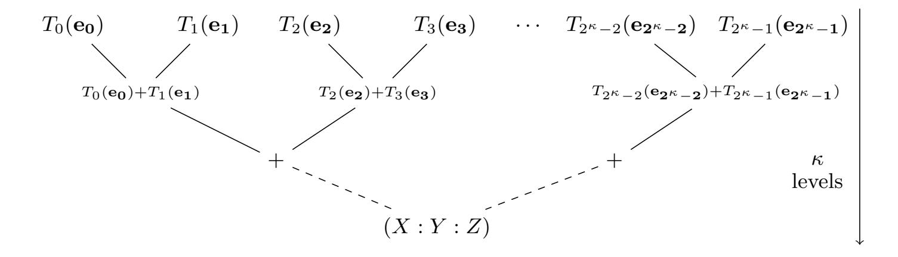

{0}------------------------------------------------

# Reducing the Number of Qubits in Quantum Discrete Logarithms on Elliptic Curves <sup>⋆</sup>

Cl´emence Chevignard, Pierre-Alain Fouque [,](https://orcid.org/0000-0003-4997-2276) and Andr´e Schrottenlohe[r](https://orcid.org/0000-0002-1329-8630)

Univ Rennes, Inria, CNRS, IRISA, Rennes, France

Abstract. Solving the Discrete Logarithm problem on the group of points of an elliptic curve is one of the major cryptographic applications of Shor's algorithm. However, current estimates for the number of qubits required remain relatively high, and notably, higher than the best recent estimates for factoring of RSA moduli. For example, recent work by Gidney (arXiv 2025) estimates 2043 logical qubits for breaking 3072-bit RSA, while previous work by H¨aner et al. (PQCrypto 2020) estimates a requirement of 2124 logical qubits for solving discrete logarithm instances on 256-bit elliptic curves. Indeed, for an n-bit elliptic curve, the most space-optimized optimized implementation by Proos and Zalka (Quant. Inf. Comput. 2003) gives 5n + o(n) qubits, as more additional space is required to store the coordinates of points and compute the addition law.

In this paper, we propose an alternative approach to the computation of point multiplication in Shor's algorithm (on input k, computing kP where P is a fixed point). Instead of computing the point multiplication explicitly, we use a Residue Number System to compute directly the projective coordinates of kP with low space usage. Then, to avoid performing any modular inversion, we compress the result to a single bit using a Legendre symbol.

This strategy allows us to obtain the most space-efficient polynomialtime algorithm for the ECDLP to date, with only 3.12n + o(n) qubits, at the expense of an increase in gate count, from O(n 3 ) to <sup>O</sup>e(<sup>n</sup> 3 ). For n = 256 we estimate that 1098 qubits would be necessary, with 22 independent runs, using 2<sup>38</sup>.<sup>10</sup> Toffoli gates each. This represents a much higher gate count than the previous estimate by H¨aner et al. (roughly 2 <sup>30</sup>), but half of the corresponding number of qubits (2124).

Keywords: Quantum cryptanalysis, Discrete Logarithms, Elliptic Curves

# 1 Introduction

Shor's Abelian period-finding algorithm [\[37\]](#page-30-0) is widely regarded as the most significant application of quantum computing to cryptography, as it solves in polynomial time the problems of factoring large integers and computing Discrete

<sup>⋆</sup> ©IACR 2026. This article is the full version of the paper submitted by the author(s) to the IACR and to Springer-Verlag in February 2026. The published version is available from the proceedings of EUROCRYPT 2026.

{1}------------------------------------------------

Logarithms in Abelian groups. Since it achieves an exponential speedup over the best classical algorithms in general, Shor's algorithm is also considered as one of the near-term applications of fault-tolerant quantum computers. In order to better understand its impact, and compare it to the steady progresses in engineering of quantum computing devices, many authors have studied its exact cost. These cost estimates range from more or less precise logical gate and qubit counts (e.g., [\[31](#page-29-0)[,20,](#page-29-1)[8\]](#page-28-0)) to estimates of physical resources under different hardware assumptions [\[18,](#page-28-1)[27](#page-29-2)[,17,](#page-28-2)[19\]](#page-28-3).

While the gate count should not be entirely left aside, many of these authors focus in priority on the number of logical qubits, which is expected to be one of the limiting factors in the first fault-tolerant quantum computations. On the contrary, as long as the operations can be error-corrected, the total runtime of Shor's algorithm does not seem to be the main limitation: in [\[18,](#page-28-1)[17\]](#page-28-2) it ranges from a few hours to a few days.

Most of the interest around Shor's algorithm in quantum cryptanalysis concerns three applications: factoring RSA public keys (large semiprime integers), and solving discrete logarithm problems in finite fields, or in groups of points of elliptic curves. Interestingly, the former two problems have seen renewed interest recently, with results on reducing its gate count [\[32\]](#page-29-3), improved arithmetic circuits [\[24\]](#page-29-4), and strong reductions of the space complexity [\[8,](#page-28-0)[17\]](#page-28-2). The latter works showed that factoring an n-bit RSA key could be done within O n 3 gates and n/2+o(n) qubits. Concretely, a 3072-bit RSA public key, roughly corresponding to 128-bit classical security, now only needs 2043 logical qubits [\[17\]](#page-28-2). But before this, the discrete logarithm on elliptic curves was considered as a potentially easier application, which required overall fewer gates and qubits. As an example, when optimizing for the space, finding a Discrete Logarithm in the group of points of a 256-bit elliptic curve on a prime field requires only 2124 qubits and 232.<sup>8</sup> T gates [\[20\]](#page-29-1). This is now slightly more qubits than an RSA instance of equivalent security.

Shor's Algorithm and Output Compression. Factoring n-bit RSA with n/2+o(n) qubits is done by combining a variant of Shor's algorithm, the Eker˚a-H˚astad algorithm [\[13\]](#page-28-4), with a compression of the output [\[28\]](#page-29-5). Since the RSA case is also reduced to a Discrete Logarithm instance, we focus on the latter.

Let (G, +) be an Abelian group, generated by an element P. We would consider a multiplicative group of integers, but as we are interested later in elliptic curves, we will use additive notation, and denote kP = P + P + . . . + P. Given another element Q, the Discrete Logarithm problem is to find k ∈ Z such that Q = kP. In Shor's algorithm, one defines the function:

$$\begin{cases} \mathbb{Z} \times \mathbb{Z} \to \mathcal{G} \\ f(\alpha, \beta) = \alpha P + \beta Q \end{cases}$$
 (1)

This function is periodic: it satisfies f(α + k, β − 1) = f(α, β) for all α, β. Shor's algorithm recovers the period (k, −1) using a subroutine whose complexity is dominated by the computation of f, called on an input space Z2m<sup>1</sup> × Z2m<sup>2</sup> for 

{2}------------------------------------------------

well-chosen parameters  $m_1, m_2$ . Initially, Shor [37] showed that with  $m_1, m_2$  large enough, the period could be recovered from a constant number of calls to the subroutine (and measurement results). Ekerå and Håstad [13] showed that  $m_1$  and  $m_2$  could be further optimized: if we guarantee that  $k < 2^d$ , where  $2^d$  can be much smaller than the order of  $\mathcal{G}$ , we can use  $m_1 = d + o(d)$  and  $m_2 = o(d)$ . The number of measurements has to increase (depending on the additional padding o(d)), and the measurement results have to be post-processed using a lattice sieving subroutine. Several variants of this algorithm were introduced [9,10,11,12], but their common point is that the classical post-processing can be efficiently simulated.

In former implementations of Shor's algorithm, the *input register* (holding the values of  $\alpha$  and  $\beta$ ) could be reduced to a single qubit, using the semi-classical Fourier transform, and the memory cost depended on the *output register* (holding  $f(\alpha,\beta)$ ) and the ancilla qubits necessary to implement f. In this paper, we will consider instead the approach of [8,17]: instead of compressing the input register, one *compresses the output*. Concretely, we consider a hash function  $h: \mathcal{G} \to \{0,1\}^r$ , where r is some small constant, and replace f by  $h \circ f$  in the algorithm. If h can be drawn from a universal hashing family, May and Schlieper [28] showed that the measurement results follow a similar distribution as the uncompressed version, allowing to apply the same post-processing. In order to reach d + o(d) qubits in total, one then implements  $h \circ f$  using o(d) bits of ancilla space.

The Case of Elliptic Curves. In the case of integer factoring and discrete logarithms in integer groups, Chevignard et al. [8] showed that the truncated modular exponentiation:

$$\alpha, \beta \to (G^{\alpha}A^{-\beta} \bmod N) \bmod 2^r$$

where G, A, N are integers and r is a small constant, can be implemented using  $\mathcal{O}(\log N + \log d)$  additional space. This allows to implement the compressed Ekerå-Håstad algorithm with only  $d+o(d)+\mathcal{O}(\log N)$  qubits. However, this result uses arithmetic techniques specific to the integer domain, notably the Residue Number System (RNS). In order to apply the compressed Ekerå-Håstad algorithm to the group of points of an elliptic curve, a dedicated method seems needed.

Contribution. In this paper, we propose a concrete implementation of the compressed Ekerå-Håstad algorithm for elliptic curves on prime fields. On a curve  $E(\mathbb{F}_q)$  where q is a prime of n bits, the work of Proos and Zalka [31] provides the best known space complexity to date, around 5n + o(n), while latest optimized circuits [20,19] give counts around 8n. Our method achieves 3.12n + o(n). It is based on two building blocks.

First, we use an adapted hash function family. Internally, we will use a system of projective coordinates to represent the point  $\alpha P + \beta Q$ . Unfortunately, this representation is not unique. From these coordinates (X:Y:Z), we would need to compute  $X/Z \mod q$ , i.e., a modular inverse, to access the unique x-coordinate

{3}------------------------------------------------

of the point. Instead, we use the Legendre symbol, and define:  $h(\alpha P + \beta Q) = \left(\frac{X/Z}{q}\right)$  as a single-bit hash function. Since the Legendre symbol is multiplicative and  $\left(\frac{1/Z}{q}\right) = \left(\frac{Z}{q}\right)$ , we can directly compute  $\left(\frac{XZ}{q}\right)$ . This avoids the costly inversion, and reduces the problem to a computation of  $XZ \mod q$ . In order to use the May-Schlieper [28] result, which needs a family of independent hash functions, we extend this by adding a random point to  $\alpha P + \beta Q$ , which is modified each time we call the quantum subroutine.

Second, we use a Residue Number System to compute  $XZ \mod q$ . However, this works very differently from factoring. Indeed, the point of the RNS is to represent a large integer by a set of residues modulo small primes, so to go through the RNS, we must first lift all operations in the integers. This is quite easy in the factoring case, as these operations are simply products of many precomputed constants: instead of performing these products modulo N, we would perform them in  $\mathbb{Z}$ , and obtain a large integer which is represented by the RNS. For elliptic curves however, the main operation is the addition of points. By using specific formulas for point addition in projective coordinates, we obtain an intermediate integer representation having approximately  $\mathcal{O}(n^3)$  bits. The value of  $XZ \mod q$  is then reconstructed from the residues modulo many small primes, around  $\mathcal{O}(n^3/\log n)$  of them. Each residue costs  $\widetilde{\mathcal{O}}(n)$  time to compute, which is where our asymptotic complexity increases to  $\widetilde{\mathcal{O}}(n^4)$ .

Organization of the Paper. Section 2 gives preliminaries of elliptic curves on prime fields, and integer arithmetic, including the RNS (Section 2.3). They are borrowed from previous works, except Algorithm 1 which is a reversible point addition in projective coordinates. Section 3 contains preliminaries of quantum DL algorithms: Shor's algorithm, Ekerå-Håstad's algorithm, and May-Schlieper compression. The rest of the paper presents our new contributions, in the following order.

In Section 4 we justify that the Legendre symbol provides a hash function family good enough for compression, and give a new reversible algorithm to compute it with low space, reducing the problem to computing  $XZ \mod q$ . Precisely, we prove:

Theorem 2 (Our algorithm, part 1). Assume that there exists a quantum circuit to compute:

$$|\alpha,\beta\rangle|0\rangle \mapsto |\alpha,\beta\rangle|X_{\alpha P + \beta Q}Z_{\alpha P + \beta Q} \bmod q\rangle$$

where  $(\alpha, \beta)$  is an input of bit-size n + o(n), in gate count  $\widetilde{\mathcal{O}}(n^4)$ , and using o(n) additional space. Then there exists a quantum algorithm to solve ECDLP using space 3.12n + o(n) and gate count  $\widetilde{\mathcal{O}}(n^4)$ .

In Section 5, we show how to compute  $XZ \mod q$  with low additional space using point additions in a binary tree and a *spooky pebbling* strategy introduced in [25], completing our algorithm. This section proves:

{4}------------------------------------------------

Theorem 4 (Our algorithm, part 2). There exists a quantum circuit to compute:

$$|\alpha,\beta\rangle|0\rangle \mapsto |\alpha,\beta\rangle|X_{\alpha P + \beta Q}Z_{\alpha P + \beta Q} \bmod q\rangle$$

where  $(\alpha, \beta)$  is an input of size n + o(n), in gate count  $\widetilde{\mathcal{O}}(n^4)$ , and using  $\mathcal{O}((\log n)^2)$  additional space.

Finally in Section 6 we put these results together and compute concrete qubit and gate count estimates for several curves, based on implementations of the main components of the circuit (point addition, binary tree pebbling, Legendre symbol). While the qubit count can be halved compared to previous works, this comes at a high price regarding the Toffoli gate count, which is multiplied by more than a thousand. This is partly due to the higher asymptotic complexity  $\tilde{\mathcal{O}}(n^4)$ , but more importantly, to the logarithmic and constant factors in this complexity which play a big role at these scales.

Our resource estimates are supported by implementations which are available at:

gitlab.inria.fr/capsule/qarton-projects/compressed-ec-dlog

# <span id="page-4-0"></span>2 Elliptic Curves and Arithmetic

In this section, we start by introducing important preliminaries on elliptic curves, notably the algorithm we use for point addition. We also give preliminaries of arithmetic.

### 2.1 Elliptic Curves

In the following, we consider elliptic curves defined on a field  $\mathbb{F}_q$  of prime characteristic  $q \notin \{2,3\}$ . We will also consider the curves to be of prime order, which is the typical case in cryptography. We could also consider the case of subgroups of a non-prime order curve, but this may bring additional technicalities (as discussed e.g. in Remark 1). Typical examples used throughout this paper are the NIST P-n curves, where  $n \in \{224, 256, 384, \ldots\}$  is the bit-size of the prime number q.

Let  $\mathbb{P}^2$  be the projective space of dimension 2 over  $\mathbb{F}_q$ . Two points (X:Y:Z) and (X':Y':Z') of  $\mathbb{P}^2$  are equal if and only if there exists  $\lambda \in \mathbb{F}_q^*$  such that  $X' = \lambda X$ ,  $Y' = \lambda Y$ , and  $Z' = \lambda Z$ . An elliptic curve E on  $\mathbb{F}_q$  is the set of points of  $\mathbb{P}^2$  that satisfy the equation

$$E: Y^2 Z = X^3 + aXZ^2 + bZ^3 \ ,$$

where a and b are in  $\mathbb{F}_q$ , and  $4a^3 + 27b^2 \neq 0$ . This set is also a commutative group for a specific addition law, and the neutral element of this group is the *point at infinity* (0:1:0), denoted  $\mathcal{O}$ . It is the only point of E whose Z coordinate equals 0.

{5}------------------------------------------------

It is very common to describe elliptic curves using only two coordinates, x and y, named "affine coordinates". For any point (X : Y : Z) of E that is not O, we have the correspondence x := X/Z, y := Y /Z, and the equation defining E (also known as short Weierstrass equation) becomes y <sup>2</sup> = x <sup>3</sup> + ax + b. The neutral element (0 : 1 : 0) is considered apart from the others.

Most previous works on solving ECDLP with Shor's algorithm, like [\[20\]](#page-29-1), consider affine coordinates, as they are more compact and require overall fewer operations. The reason we use projective coordinates instead is that adding points does not require to invert in Fq. However, it is still required if one wants to obtain a unique representative of a projective triple (X : Y : Z), by going back to the affine coordinates.

### 2.2 Point Addition in Projective Coordinates and its Computation

The point addition formula that we use is from [\[33\]](#page-29-7) (Section 3.1). It is complete for curves of odd order, and in particular, prime order. This means that the formula is valid for all input points, including the point at infinity, though this is not the main reason for our choice. Given two points P<sup>1</sup> = (X<sup>1</sup> : Y<sup>1</sup> : Z1) and P<sup>2</sup> = (X<sup>2</sup> : Y<sup>2</sup> : Z2), the sum is defined as:

<span id="page-5-0"></span>
$$\begin{cases}
P_1 + P_2 &= (X_3 : Y_3 : Z_3) \\
X_3 &= (X_1 Y_2 + X_2 Y_1) (Y_1 Y_2 - a(X_1 Z_2 + X_2 Z_1) - 3b Z_1 Z_2) \\
-(Y_1 Z_2 + Y_2 Z_1) (a X_1 X_2 + 3b(X_1 Z_2 + X_2 Z_1) - a^2 Z_1 Z_2)
\end{cases}$$

$$Y_3 &= (3X_1 X_2 + a Z_1 Z_2) (a X_1 X_2 + 3b(X_1 Z_2 + X_2 Z_1) - a^2 Z_1 Z_2) \\
+(Y_1 Y_2 + a(X_1 Z_2 + X_2 Z_1) + 3b Z_1 Z_2) (Y_1 Y_2 - a(X_1 Z_2 + X_2 Z_1) - 3b Z_1 Z_2)
\end{cases}$$

$$Z_3 &= (Y_1 Z_2 + Y_2 Z_1) (Y_1 Y_2 + a(X_1 Z_2 + X_2 Z_1) + 3b Z_1 Z_2) \\
+(X_1 Y_2 + X_2 Y_1) (3X_1 X_2 + a Z_1 Z_2)$$
(2)

The authors of [\[33\]](#page-29-7) give an algorithm to compute (X<sup>3</sup> : Y<sup>3</sup> : Z3) using only 12 multiplications (Algorithm 1 in [\[33\]](#page-29-7)). We give a reversible variant of this algorithm, using as basic operations:

- In-place addition modulo q: x ← x + y where x and y are two registers of size ⌈log<sup>2</sup> q⌉.
- Multiply-adds modulo q: x ← x + yz where x, z, y are three registers, and y or z may be a constant. Their cost dominates over the other operations.
- In-place doubling (or division by 2) modulo q: x ← 2x where x is a register.

Efficient reversible implementations of these operations have been discussed in previous works [\[20\]](#page-29-1).

Lemma 1. Let q be an n-bit prime, and assume that there exists a multiply-adds circuit modulo q that uses t ancilla qubits:

$$|x\rangle |y\rangle |z\rangle |0_t\rangle \mapsto |x\rangle |y\rangle |z + xy \bmod q\rangle |0_t\rangle$$
.

{6}------------------------------------------------

#### **Algorithm 1** Reversible elliptic curve point addition in projective coordinates.

```
Constants: b_3 = 3b, a
                                                                                        15: t_6 \leftarrow t_6 + t_7
                                                                                       16: (*) Y_3 \leftarrow t_5 t_6
       Input: X_1, Y_1, Z_1, X_2, Y_2, Z_2
       Output: X_3, Y_3, Z_3
                                                                                       17: (*) X_3 \leftarrow t_5 t_2
                                                                                        18: t_5 \leftarrow t_5 + t_6 - 2t_7
 1: Initialize t_0, t_1, t_2, t_3, t_4, t_5, t_6, t_7 to 0
                                                                                        19: \mathbf{t_7} \leftarrow \mathbf{t_7} - \mathbf{Y_1} \mathbf{Y_2} \triangleright t_5 and t_7 are now
 2: Initialize X_3, Y_3, Z_3 to 0
                                                                                               both 0
 3: \mathbf{t_0} \leftarrow \mathbf{X_1X_2}
                                                                                        20: t_7 \leftarrow b_3 t_3
 4: \mathbf{t_7} \leftarrow \mathbf{Y_1Y_2}
                                                                                        21: \mathbf{t_5} \leftarrow \mathbf{3t_0}
 5: \mathbf{t_1} \leftarrow \mathbf{Z_1}\mathbf{Z_2}
                                                                                        22: \mathbf{t_5} \leftarrow \mathbf{t_5} + \mathbf{at_1}
 6: \mathbf{t_2} \leftarrow (\mathbf{X_1} + \mathbf{Y_1})(\mathbf{X_2} + \mathbf{Y_2})
                                                                                        23: \mathbf{t_0} \leftarrow \mathbf{t_0} - \mathbf{at_1}
 7: t_2 \leftarrow t_2 - (t_0 + t_7)
                                                                                        24: t_7 \leftarrow t_7 + at_0
 8: \mathbf{t_3} \leftarrow (\mathbf{X_1} + \mathbf{Z_1})(\mathbf{X_2} + \mathbf{Z_2})
                                                                                        25: (*) Y_3 \leftarrow Y_3 + t_5 t_7
 9: t_3 \leftarrow t_3 - (t_0 + t_1)
                                                                                        26: (*) X_3 \leftarrow X_3 - t_4 t_7
10: \mathbf{t_4} \leftarrow (\mathbf{Y_1} + \mathbf{Z_1})(\mathbf{Y_2} + \mathbf{Z_2})
                                                                                        27: (*) \mathbf{Z_3} \leftarrow \mathbf{t_4t_6}
11: t_4 \leftarrow t_4 - (t_7 + t_1)
                                                                                        28: (*) \mathbf{Z_3} \leftarrow \mathbf{Z_3} + \mathbf{t_2t_5}
12: \mathbf{t_6} \leftarrow \mathbf{at_3}
                                                                                        29: Apply all operations in reverse, except
13: \mathbf{t_6} \leftarrow \mathbf{t_6} + \mathbf{b_3t_1}
                                                                                               those marked by (*)
14: t_5 \leftarrow t_7 - t_6
```

Then there exists a circuit that computes:

$$|X_1, Y_1, Z_1, X_2, Y_2, Z_2, 0, 0, 0\rangle \mapsto |X_1, Y_1, Z_1, X_2, Y_2, Z_2, X_3, Y_3, Z_3\rangle$$

which uses t+8n ancilla qubits in addition to its input and output registers, and 34 multiply-adds.

*Proof.* Our Algorithm 1 contains 20 multiply-adds forwards, which are highlighted in **bold**, and 14 multiply-adds when uncomputing the steps, so a total of 34 multiplications. It uses 8 temporary registers ( $t_0$  to  $t_7$ ) which are reinitialized to 0.

## <span id="page-6-0"></span>2.3 RNS Reconstruction

In this paper, we use a Residue Number System (RNS) to compute the coordinates of elliptic curve points. Let n and m be two integers, and  $q < 2^n$  be an n-bit prime. In the following, we note  $[x]_p$  the representative of  $x \mod p$  between 0 and p-1. Let  $T: \{0,1\}^m \to \mathbb{Z}$  be a function such that for all e,  $|T(e)| < 2^t$  for some integer t bigger than n. In this paper we will have  $t = \mathcal{O}(n^3)$ , while [8] used  $t = \mathcal{O}(n^2)$ .

We explain in this section how to implement a circuit C for:

$$|e\rangle |0\rangle \xrightarrow{C} |e\rangle |[T(e)]_q\rangle$$

using small additional space, from circuits  $C_p$  that compute  $\mathit{residues}$ :

$$|e\rangle |0\rangle \xrightarrow{C_p} |e\rangle |[T(e)]_p\rangle$$

{7}------------------------------------------------

for many primes p exponentially smaller than q. The method, which we borrow from [8], uses well-known results of classical arithmetic: the RNS combined with explicit Chinese remaindering.

Residue Number System (RNS). A residue number system is a unique representation of an integer by a set of residues modulo small primes. More precisely, if we take a set of primes  $\mathcal{P} := \{p_1, \ldots, p_\ell\}$ , and define  $M := \prod_{p \in \mathcal{P}} p$ , then the Chinese Remainder Theorem (CRT) gives a bijection  $\mathbb{Z}/M\mathbb{Z} \leftrightarrow \mathbb{Z}/p_1\mathbb{Z} \times \ldots \times \mathbb{Z}/p_\ell\mathbb{Z}$ . Let  $M_p := M/p$ , and  $w_p := (M_p)^{-1} \mod p$  for any  $p \in \mathcal{P}$ , then this bijection is explicitly given by:

<span id="page-7-0"></span>
$$r = \left[\sum_{p \in \mathcal{P}} [r]_p w_p M_p\right]_M \leftrightarrow ([r]_{p_1}, \dots, [r]_{p_\ell}) . \tag{3}$$

Thanks to the prime number theorem, we know that there are sufficiently many prime numbers so that, asymptotically, an RNS of  $\mathcal{O}(t/\log t)$  primes of  $\mathcal{O}(\log t)$  bits each can be used to represent numbers up to  $2^t$ .

Explicit CRT. From now on, consider an integer  $r < 2^t \le M$ . We can express the value of r explicitly from the residues, by removing the modulo operation that appears on the left side of Equation 3. This is known as explicit Chinese remaindering [5,4]. We take the formula of [8], although different variants exist (for example in [4]). From this point onwards, the formulas are not exact; they work with a certain probability over the input r. This is sufficient for us.

**Lemma 2.** Let  $u = \left\lceil \log_2 \sum_{p \in \mathcal{P}} p^2 \right\rceil = \mathcal{O}(\log t)$ . The following holds with probability 1 - negl(n):

$$r = \left(\sum_{p \in \mathcal{P}} [r]_p w_p M_p\right) - \left(\left\lfloor \frac{1}{2^u} \left(\sum_{p \in \mathcal{P}} [r]_p w_p \lfloor 2^u/p \rfloor\right)\right\rfloor + 1\right) M . \tag{4}$$

This follows from [8, Lemma 5], and is a consequence of Barrett's reduction, as 1/p is (roughly) approximated by  $\frac{1}{2^u} \lfloor 2^u/p \rfloor$ . In this equation, we denote:

$$q_M(e) := \left\lfloor \frac{1}{2^u} \left( \sum_{p \in \mathcal{P}} [r]_p w_p \lfloor 2^u/p \rfloor \right) \right\rfloor + 1 ,$$

where e is the bit-string input to the circuit. This is the quotient in the Euclidean division of r by M. It can be noted that  $\log_2 q_M(e) = \mathcal{O}(\log t)$ , as it is a sum of numbers polynomial in t.

Full Algorithm. Suppose that  $M > 2^t$ . For any e, we have:

$$T(e) = \left(\sum_{p \in \mathcal{P}} [T(e)]_p w_p M_p\right) - q_M(e) M$$

$$\implies [T(e)]_q = \left(\sum_{p \in \mathcal{P}} [T(e)]_p [w_p M_p]_q\right) - q_M(e) [M]_q \mod q.$$

{8}------------------------------------------------

### **Algorithm 2** Reconstruction of T(e) mod q from its residues.

```
Precomputation: compute [M]_q, (w_p \lfloor 2^u/p \rfloor) and [w_p M_p]_q for all primes in the RNS
     Input: e
     Output: [T(e)]_q
 1: q_M \leftarrow 0
                                                                      \triangleright Register for q_M(e), of logarithmic size
 2: T \leftarrow 0
                                                                                       \triangleright Register for T(e), of size n
 3: for all p \in \mathcal{P} do
          Compute [T(e)]_p
 4:
          q_M \leftarrow q_M + [T(e)]_p(w_p \lfloor 2^u/p \rfloor)
 5:
          T \leftarrow T + [T(e)]_p [w_p M_p]_q \mod q
 6:
 7: end for
8: q_M \leftarrow \left\lfloor \frac{1}{2^u} q_M \right\rfloor + 1
9: T \leftarrow T - q_M [M]_q \mod q
10: Return T
```

The algorithm that computes  $[T(e)]_q$  is given as Algorithm 2. For each prime  $p \in \mathcal{P}$ , we compute the residue  $[T(e)]_p$  and use it to update our current  $q_M(e)$  register (which is small), and our current  $[T(e)]_q$  by performing a multiplication modulo q.

<span id="page-8-2"></span>**Lemma 3.** Let n and m be integers of the same order. Let  $T: \{0,1\}^m \to \mathbb{Z}$  be a function such that for all e,  $|T(e)| < 2^t$  for some integer t, let  $q < 2^n$  be a prime, and consider an RNS to represent numbers below  $2^t$ . Assume that for all p in the RNS, there exists a circuit  $C_p: |e\rangle |0\rangle \mapsto |e\rangle |[T(e)]_p\rangle$  which on input  $e \in \{0,1\}^m$ , returns the residue, uses c ancilla qubits, and  $\widetilde{\mathcal{O}}(m)$  gates. Then there exists a circuit that computes:  $C: |e\rangle |0\rangle \mapsto |e\rangle |[T(e)_q]\rangle$  using a total of  $m+n+c+\mathcal{O}(\log t)$  qubits (including ancillas), and  $\widetilde{\mathcal{O}}(tm)$  gates.

Proof. The temporary space allocated in Algorithm 2, beyond the m-bit input register for e and the n-bit output register, is  $\mathcal{O}(\log t)$  bits, as this is the size of  $q_M$ . If the computation of each residue costs time  $\widetilde{\mathcal{O}}(m)$  (a typical case), then the total gate count is  $\mathcal{O}(t/\log t) \times \widetilde{\mathcal{O}}(m) = \widetilde{\mathcal{O}}(tm)$  for all residues, and  $\mathcal{O}(t) \times \mathcal{O}(n)$  for the accumulation steps, where the multiplication  $[T(e)]_p[w_pM_p]_q$  is done by a series of  $\mathcal{O}(\log t)$  controlled additions modulo q. Since  $m = \mathcal{O}(n)$  (which is also typical), we get a time  $\mathcal{O}(tn)$ .

In this paper, the large integers that we will reconstruct will have a bit-size  $t = \mathcal{O}(n^3)$ . This is what gives a gate count in  $\widetilde{\mathcal{O}}(n^4)$ .

# <span id="page-8-0"></span>3 Quantum (Compressed) Period-Finding

In this section, we detail the necessary building blocks of compressed period-finding: Shor's algorithm [37], the Ekerå-Håstad variant [13], and the May-Schlieper compression technique [28].

{9}------------------------------------------------

#### 3.1 Shor's Algorithm for the Discrete Logarithm Problem

Shor's algorithm can find the period of a periodic function defined over an Abelian group. We focus on the special case of solving the Discrete Logarithm Problem (DLP) in such a group.

Let  $(\mathcal{G}, +)$  be an Abelian group (in additive notation, in order to match the notation for elliptic curves) and P be an element of  $\mathcal{G}$  of order  $\operatorname{ord}(P)$ . Let Q another element in the subgroup generated by  $P: \exists k < \operatorname{ord}(P), Q = kP$ . We assume that elements of  $\mathcal{G}$  can be represented using m bits. The DLP asks to recover k from P and Q.

Consider the function:

$$\begin{cases} \mathbb{Z} \times \mathbb{Z} \to \mathcal{G} \\ f(\alpha, \beta) = \alpha P + \beta Q \end{cases}$$
 (5)

This function is *periodic*: it satisfies  $f(\alpha + k, \beta - 1) = f(\alpha, \beta)$  for all  $\alpha, \beta$ . Shor's algorithm allows to recover the period (k, -1) with one or several calls to a quantum subroutine that will be denoted  $Q_{\text{Shor}}^f$  in the following. The subroutine depends on two parameters  $m_1, m_2$  that have to be chosen in advance. It proceeds as follows:

- 1. Initialize an *input register* of  $m_1 + m_2$  qubits and construct a uniform superposition over  $\mathbb{Z}_{2^{m_1}} \times \mathbb{Z}_{2^{m_2}}$ , using a Hadamard transform;
- 2. Initialize a workspace register of size m and compute f:

$$\frac{1}{\sqrt{2^{m_1+m_2}}} \sum_{\alpha,\beta \in \mathbb{Z}_{2^{m_1}} \times \mathbb{Z}_{2^{m_2}}} |\alpha,\beta\rangle |f(\alpha,\beta)\rangle \tag{6}$$

- 3. Apply  $QFT_{2m_1} \otimes QFT_{2m_2}$ ;
- 4. Measure the workspace register and discard its value;
- 5. Measure the input register and return its value.

Both parameters  $m_1$  and  $m_2$  originally considered by Shor [37] are  $\log_2 \operatorname{ord}(P)$ .

Concerning the Quantum Fourier Transform, it can be approximated using efficient circuits (with few ancillas, small depth and small total gate count) such as [23]. Consequently, both from the perspective of space complexity and gate count, the greatest challenge for practical applications of Shor's algorithm remains the implementation of f.

Let us mention also that the circuit for f does not need to be exact, i.e., to return  $f(\alpha, \beta)$  on all inputs. As discussed in previous works [38,8,17], a constant (but small) probability of failure of the arithmetic circuit does not disrupt noticeably the algorithm.

#### <span id="page-9-0"></span>3.2 Ekerå-Håstad Algorithm

Ekerå and Håstad [13] introduced an optimization of Shor's algorithm for computing *short* discrete logarithms and (as a secondary consequence) factoring

{10}------------------------------------------------

<span id="page-10-0"></span>**Table 1.** Trade-offs to solve a DL problem using the Ekerå-Håstad algorithm, using the version of [9]. The numbers are taken from Table 7.8 in [12], and are obtained by targeting a success probability of at least 0.99 in the classical post-processing – they could be decreased if one targets a lower success probability. The total input size is given by  $n + \varsigma + \ell$  for  $\ell = \lceil m/s \rceil$ .

| Group size $n$ (bits) | ς  | s  | Input size | Measurements |
|-----------------------|----|----|------------|--------------|
| 224                   | 9  | 7  | 265        | 10           |
| 256                   | 9  | 8  | 297        | 11           |
| 384                   | 10 | 10 | 433        | 13           |
| 521                   | 10 | 13 | 572        | 16           |

RSA public keys. We consider here the DL case. Two modifications are brought to Shor's algorithm: first, the input register size is optimized from  $\log_2 \operatorname{ord}(P) + \log_2 \operatorname{ord}(P)$  to  $(\log_2 \operatorname{ord}(P) + \ell) + \ell$ , where  $\ell = (\log_2 \operatorname{ord}(P))/s$  for some parameter s to be determined. Second, the post-processing method is modified, from a continued-fractions to a lattice-based algorithm. Multiple runs of the  $Q_{\operatorname{Shor}}^f$  subroutine are now needed. One constructs an integer lattice from the measurement results, and finds a short vector in this lattice. The dimension of the lattice is equal to the number of runs, which tends to s+1.

There exists several variants of this algorithm: [9] targets the general DLP in groups of known order, [11] targets the DLP in groups of unknown order, and [13,10] target the short DLP in groups of unknown order. In the case of elliptic curves, we are interested in a non-short DLP in a group of known order. We will reuse the simulation results from [12]. Asymptotically, the parameter s can be  $o(\log_2 \operatorname{ord}(P))$ , giving an input register of size  $\log_2 \operatorname{ord}(P) + o(\log_2 \operatorname{ord}(P))$ . As the output distribution can be efficiently simulated, Ekerå performed extensive simulations, giving concrete values of s and the number of runs for cryptographic parameters.

#### 3.3 Output Compression

May and Schlieper studied the effect of *output compression* in Shor's algorithm and its variants [28], whereby the function f in the subroutine  $Q_{\text{Shor}}^f$  is replaced by  $h \circ f$ , where h is a well-chosen hash function. More precisely, one needs to use a *universal* hash function family.

**Definition 1.** A hash function family  $\mathcal{H}_t = \{h : \{0,1\}^n \to \{0,1\}^t\}$  is called universal, if for all  $x, y \in \{0,1\}^n$ ,  $x \neq y$ , one has  $Pr_{h \in \mathcal{H}_t}[h(x) = h(y)] = 2^{-t}$ .

**Theorem 1 ([28, Theorem 7]).** Let  $f: \{0,1\}^m \to \{0,1\}^n$  and  $\mathcal{H}_t$  be a universal hash function family. Let  $Q_f^{period}$  be a quantum circuit that, before measurement, on input  $|0^m\rangle |0^n\rangle$ , yields a superposition:

$$|s\rangle = \sum_{y \in \{0,1\}^m} \sum_{f(x) \in Im(f)} w_{y,f(x)} |y\rangle |f(x)\rangle$$

{11}------------------------------------------------

satisfying

<span id="page-11-1"></span>
$$\forall y \neq 0, \sum_{f(x) \in Im(f)} w_{y,f(x)} = 0$$
 (7)

Let p(y), resp.  $p_h(y)$ , be the probability to measure  $|y\rangle$ ,  $y \neq 0$  in the m input qubits when applying  $Q_f^{period}$ , resp  $Q_{h \circ f}^{period}$  with h selected uniformly at random from  $\mathcal{H}_t$ . Then,  $p_h(y) = (1 - 2^{-t})p(y)$ .

Equation 7 is shown to be satisfied by Shor's and Ekerå-Håstad's algorithms. In this paper, we are interested in the case t=1. In this case the probability to measure 0 (which is immediately discarded) increases to 1/2. If we discard the 0 outputs, then the obtained distribution is the same as in the uncompressed algorithm. We can run the post-processing routine unmodified and the estimates of Section 3.2 still apply.

A modified version of this result is used in [8,17], where there is a *single* hash function which is supposed to behave as a random function, and t is a small constant. However in this paper we intend to use t = 1 and a *family* of hash functions.

# <span id="page-11-0"></span>4 Output Compression Using the Legendre Symbol

In this section, we define and study the family of hash functions that we will use with the compressed Ekerå-Håstad routine. Given the generator P for the DL computation, the hash functions are defined using the Legendre symbol on the x-coordinate of the input point, added to a multiple of P. Recall that when q is a prime, the Legendre symbol  $\left(\frac{X}{q}\right)$  is defined by:

$$\left(\frac{X}{q}\right) = X^{\frac{q-1}{2}} = \begin{cases} 1 \text{ if } X \neq 0 \text{ is a square in } \mathbb{F}_q \\ -1 \text{ if } X \text{ is not a square in } \mathbb{F}_q \\ 0 \text{ if } X = 0 \end{cases}$$

Let  $r = \operatorname{ord}(P)$  be the additive order of the point P. We define our family of hash functions  $(h_u)_{0 \leq u \leq r-1}$  on the curve  $E(\mathbb{F}_q)$  as follows:

$$\forall 0 \le u \le r - 1, \begin{cases} h_u : E \to \{-1, 0, 1\} \\ R \mapsto \left(\frac{X_{R+uP}/Z_{R+uP}}{q}\right) \end{cases}$$
 (8)

Here, it should be noted that  $X_{R+uP}/Z_{R+uP}$  is indeed the affine x-coordinate of the point R+uP, and is unique (whereas X and Z are not). By multiplicativity of the Legendre symbol, we also have:

$$\forall 0 \le u \le r - 1, h_u(R) = \left(\frac{X_{R+uP}Z_{R+uP}}{q}\right) . \tag{9}$$

In this section, we first check that this hash function family behaves (heuristically) almost as a universal hashing family, and is good enough to be used in

{12}------------------------------------------------

the compressed Eker˚a-H˚astad algorithm. Then, we give a quantum algorithm to compute the Legendre symbol in a space-efficient way. Together the results of this section show the following.

<span id="page-12-3"></span>Theorem 2 (Our algorithm, part 1). Assume that there exists a quantum circuit to compute:

$$|\alpha, \beta\rangle |0\rangle \mapsto |\alpha, \beta\rangle |X_{\alpha P + \beta Q} Z_{\alpha P + \beta Q} \bmod q\rangle$$

where (α, β) is an input of bit-size <sup>n</sup>+o(n), in gate count <sup>O</sup><sup>e</sup> n 4 , and using o(n) additional space. Then there exists a quantum algorithm to solve ECDLP using space <sup>3</sup>.12<sup>n</sup> <sup>+</sup> <sup>o</sup>(n) and gate count <sup>O</sup><sup>e</sup> n 4 .

### 4.1 Hash Function Family

We begin by restricting the function h<sup>u</sup> to G<sup>P</sup> = {kP, k ∈ {0, . . . , r − 1}} since the point multiplication output always falls in this subgroup; this may be the full curve if it is cyclic. We also define hu(O) = 0. We use the following heuristic.

<span id="page-12-1"></span>Heuristic 1. The function :

$$\begin{cases} h : \{1, \dots, \lceil r/2 \rceil\} \to \{-1, 0, 1\} \\ k \mapsto \left(\frac{x_{kP}}{q}\right) \end{cases}$$

behaves as a random function in {−1, 1}.

In particular, this heuristic neglects that the x coordinate of multiples of P could be 0 on very rare occasions; this is not strictly necessary for our argument, but it simplifies it. Notice that we have restricted the input: if k = 0 the output would be always 0 (point at infinity), and for k ≥ ⌈r/2⌉ we have:

$$kP = -(r-k)P \implies x_{kP} = x_{(r-k)P}$$
.

Therefore the outputs are symmetric.

The randomness of the Legendre symbol applied to the x coordinates of points has been the subject of previous works. In [\[22\]](#page-29-9) Jao et al. conjecture that a sum of values of a multiplicative character, applied to multiples of points on an elliptic curve, is balanced; this conjecture was later proven in [\[14\]](#page-28-11).

<span id="page-12-0"></span>Remark 1. While [Heuristic 1](#page-12-1) is valid for a curve of prime order, and so for the most common cases in cryptanalysis, there are curves where the order is not prime[1](#page-12-2) . One works instead in a subgroup of the points. As an example, such a curve is defined in [\[30\]](#page-29-10). In this curve, the x-coordinate of all points of the subgroup happens to be a square, while all points outside the subgroup are non-squares modulo q. Fortunately, even for such curves, it is easy to fix the heuristic by replacing <sup>x</sup>kP by <sup>x</sup>kP + 1, i.e., (X+Z)Z q in projective coordinates. In all cases, the curve being known in advance, the heuristic can be validated experimentally.

<span id="page-12-2"></span><sup>1</sup> This remark was made by an anonymous reviewer of EUROCRYPT.

{13}------------------------------------------------

We now prove that under Heuristic 1, the hash function family  $h_u$  is almost universal. Our idea is to reduce the problem to the bound of the autocorrelation of a random sequence, which comes from the random function h in Heuristic 1. It is known that the autocorrelation of a random sequence in  $\{-1,1\}$  of length r is of order  $\sqrt{r} \log r$  [35]. Although we cannot use directly these results because of the symmetry property given above, and the fact that the actual domain of the random function is only half of the sum indices, the same arguments can be adapted to our case.

<span id="page-13-1"></span>**Proposition 1.** Under Heuristic 1, with probability 1 - o(1), for all points  $R \neq R'$  in  $G_P$ :

$$\left| \Pr_{u \in \{0,\dots,r-1\}} \left( h_u(R) = h_u(R') \right) - \frac{1}{2} \right| \le \frac{4 \log r}{\sqrt{r}}$$
 (10)

<span id="page-13-0"></span>**Theorem 3.** Let  $f: \{0,1\}^m \to S$  and  $(h_u)_{0 \le u \le r-1}$  a family of hash functions  $S \to \{0,1\}$  such that:

$$\forall R, R' \in S, \left| \Pr_u \left( h_u(R) = h_u(R') \right) - \frac{1}{2} \right| \le \varepsilon . \tag{11}$$

Let  $Q_f^{period}$  be a quantum circuit that, before measurement, on input  $|0^m\rangle |0^n\rangle$ , yields a superposition:

$$\sum_{y \in \{0,1\}^m} \sum_{f(x) \in Im(f)} w_{y,f(x)} |y\rangle |f(x)\rangle \tag{12}$$

satisfying:

$$\forall y \neq 0, \sum_{f(x) \in Im(f)} w_{y,f(x)} = 0$$
 (13)

Let p(y) be the probability to measure y after running  $Q_f^{period}$ . Let p'(y) be the probability to measure y after selecting u at random and running  $Q_{h_u \circ f}^{period}$ . Then, for any  $y \neq 0$ :

$$\left(\frac{1}{2} - \varepsilon\right) p(y) \le p'(y) \le \left(\frac{1}{2} + \varepsilon\right) p(y) . \tag{14}$$

Both proofs are given in Section A. Note that the output of  $h_u$ , in  $\{-1,1\}$ , has been remapped to  $\{0,1\}$  (this has no incidence on the proof).

We finally combine Theorem 3 with Proposition 1: under Heuristic 1, with a very large probability over the DL instance, the assumption of Theorem 3 will hold with a bound  $\varepsilon = \frac{4 \log r}{\sqrt{r}}$ . Since r is very large in practice, the statistical distance between the real case (outputs of the compressed algorithm) and the ideal case (rescaled distribution) is negligible, and the effect of the non-ideal compression is inconsequential throughout the algorithm.

{14}------------------------------------------------

### <span id="page-14-1"></span>4.2 Space-Efficient Computation of the Legendre Symbol

We now give a quantum circuit that, on input X, computes  $\left(\frac{X}{q}\right)$  using  $\frac{3n}{3-\log_2(3)} + \mathcal{O}(\sqrt{n}) = 2.12n + \mathcal{O}(\sqrt{n})$  qubits in total, leading to the space usage claimed in Theorem 2.

More generally, the circuit that we give implements the Jacobi symbol  $\left(\frac{p}{q}\right)$ , which is a generalization of the Legendre symbol for any integers p and q. When q is a constant, we simply write it in a second register and use the Jacobi circuit.

We start from Algorithm 3, which adapts the binary Jacobi symbol algorithm of [36]. The input numbers p,q are reduced by repeatedly swapping them, reducing q modulo p, and shifting the bits of q. Each time a swap or a division by 2 is performed, we use the laws of quadratic reciprocity to update the value of the Jacobi symbol. Note that the algorithm, as we have written it, does not support the case where  $\left(\frac{X}{q}\right) = 0$ , which merely becomes a negligible failure case. This approach is similar to the one presented in [26], although our iterations are formed differently in order to reduce the numbers as fast as possible, since we want to minimize the space complexity.

Similarly to algorithms for binary GCD [20], we use a fixed number of iterations. Our first task is therefore to determine the number of iterations required to succeed with large constant probability. We formulate the following heuristic.

Heuristic 2. At each loop, the product of p and q is reduced by a factor  $\frac{1}{2} \times \frac{3}{4}$  on average.

Indeed, the operation  $q \leftarrow q/2$  happens in all cases, while the operation  $q \leftarrow q-p$ , which will also reduce the combined bit-size of p and q, happens only with probability 1/2. Therefore, with probability 1/2 we multiply by another factor 1/2, hence the multiplication by 3/4. In other words,  $3 - \log_2(3)$  bits of (pq) are erased at each iteration, and  $\frac{2n}{3-\log_2(3)} \simeq 1.413n$  iterations are necessary on average. Furthermore, the number of iterations on random inputs p, q follows a normal law of mean 1.413n and standard deviation  $\mathcal{O}(\sqrt{n})$ . We performed numerical experiments (notably for values of n of interest, like n=256 and n=512), with random as well as fixed starting values of q, to validate this, and obtain a standard deviation around  $0.60\sqrt{n}$ . As a consequence:

<span id="page-14-0"></span>Heuristic 3. By using  $1.413n + 1.8\sqrt{n}$  iterations, Algorithm 3 succeeds on random inputs of size n with probability  $\geq 0.99$ .

#### 4.3 Reversible Variant

We start by fixing the number of iterations to  $1.413n + 1.8\sqrt{n}$  following Heuristic 3. Next, we will store the values of b and s produced during these iterations, which will be our garbage bits. At each iteration, a new b is produced (one bit of garbage), and with probability 0.5 (when b=1), a new s is produced (one bit of garbage). Thus, each iteration produces on average 1.5 bit of garbage. Experiments show that the number of garbage bits used in total by the algorithm

{15}------------------------------------------------

indeed follows a normal distribution with average  $1.5 \times 1.413n$  and standard deviation around  $0.53\sqrt{n}$ . Afterwards, by running the reverse of the iterations, we can uncompute the garbage bits.

Heuristic 4. The number of garbage bits produced by the algorithm (over all iterations) on random inputs of size n is smaller than  $2.12n + 1.6\sqrt{n}$  with probability  $\geq 0.99$ .

Our first algorithm (Algorithm 4) uses  $n + n + 2.12n + 1.6\sqrt{n}$  qubits. Our final modification is to make it compact, by reusing the most significant bits of p and q, which are erased during the iterations, to store the garbage bits. Since there are slightly more garbage bits in total than bits in p and q, we start with registers of size  $1.06n + \mathcal{O}(\sqrt{n})$  for both numbers. At each iteration, we reduce the size of the current effective registers for p and q, and increase the size of the current effective g. We simply need enough padding to make sure that the values stored (p, q, g) do not overlap.

Both p and q lose on average  $\frac{1}{2}(3 - \log_2 3) = 0.708$  bits per iteration. At iteration i, their expected length is  $\lceil n - i \times 0.708 \rceil$ . We observe that with high probability, the length remains below  $\lceil n - i \times 0.708 + 1.5\sqrt{n} \rceil$  for both registers during the entire computation. Likewise, the expected length of g is 1.5i, and with high probability, its length remains below  $1.5i + \sqrt{n}$ .

As a consequence, by starting with two registers of size  $1.06n+2\sqrt{n}$ , we ensure that there will never be an overlap between the parts that actually contain p and q (starting from the least significant bits) and the parts where we write g (starting from the most significant bits). By tuning the amounts of padding for p, q and g, we can reduce the total number of qubits at the expense of increasing the probability of failure. This gives the following (heuristic) result.

**Lemma 4.** For any constant  $\varepsilon$ , there exists a reversible classical circuit using in total  $2.12n + \mathcal{O}(\sqrt{n})$  qubits that computes the Jacobi symbol, and succeeds with probability  $1 - \varepsilon$  on inputs chosen uniformly at random.

As all operations in the main loop of Algorithm 4 have gate count linear in n, the gate count of the whole circuit is  $\mathcal{O}(n^2)$ . This will be a negligible amount compared to the remaining of our algorithm.

### <span id="page-15-0"></span>5 Point Addition using Residues in a Binary Tree

In this section, we detail the remaining part of our algorithm: the computation of  $X_{\alpha P+\beta Q}Z_{\alpha P+\beta Q}$  mod q using residue arithmetic. We show:

<span id="page-15-1"></span>Theorem 4 (Our algorithm, part 2). There exists a quantum circuit to compute:

$$|\alpha, \beta\rangle |0\rangle \mapsto |\alpha, \beta\rangle |X_{\alpha P + \beta Q} Z_{\alpha P + \beta Q} \bmod q\rangle$$

where  $(\alpha, \beta)$  is an input of size n + o(n), in gate count  $\widetilde{\mathcal{O}}(n^4)$ , and using  $\mathcal{O}((\log n)^2)$  additional space.

{16}------------------------------------------------

# Algorithm 3 Binary Jacobi symbol algorithm (adapted).

```
Input: p, q odd
   Output: 
            p
            q

1: t ← 0
2: for A fixed number of iterations do
                                               ▷ Loop invariant: p is odd
3: b ← q mod 2
4: Conditioned on b = 1 do
5: s ← (q < p)
6: Conditioned on s do
7: Swap p, q
8: If p mod 4 = 3 and q mod 4 = 3, t ← NOT(t)
9: EndConditioned
10: q ← q − p ▷ q is now even in all cases
11: EndConditioned
12: q ← q/2
13: If (p mod 8 = 3 or p mod 8 = 5) and q ̸= 0, t ← NOT(t)
                       ▷ q = 0 would mean that we have stopped the algorithm
14: end for
15: Return (−1)t
```

### Algorithm 4 Reversible binary Jacobi symbol algorithm.

```
Input: p, q odd
   Output: 
             p
             q

1: Registers: t ← 0, p (n qubits), q (n qubits), g (2.12n + 1.6
                                                     √
                                                       n qubits)
2: for 1.413n + 1.8
                 √
                   n iterations do
3: Shift g left
4: Controlled on q mod 2, shift g left;
                      ▷ We now have one or two bits at zero at the beginning of g
5: g[0] ← g[0] ⊕ (q mod 2)
6: Conditioned on g[0] do
7: g[1] ← g[1] ⊕ (q < p)
8: EndConditioned
9: Conditioned on g[1]&g[0] do
10: Swap p, q
11: If p mod 4 = 3 and q mod 4 = 3, t ← NOT(t)
12: EndConditioned
13: Conditioned on g[0] do
14: q ← q − p ▷ q is now even in all cases
15: EndConditioned
16: Shift q left
17: If (p mod 8 = 3 or p mod 8 = 5) and q ̸= 0, t ← NOT(t)
18: end for
19: Return (−1)t
                ; perform the iterations backwards to uncompute the garbage bits
   and reobtain p, q.
```

{17}------------------------------------------------

We start by explaining how the computation of  $\alpha P + \beta Q$  is reduced to a *multi-addition* of points, optimized using *windowing*, and put into a *binary tree*; then, we will go to the RNS.

#### 5.1 Multi-Addition and Windowing

When P and Q are classical constants, the operation  $\alpha, \beta \mapsto X_{\alpha P + \beta Q} Z_{\alpha P + \beta Q}$  can be reduced to a *multi-addition* of points. We write  $\alpha = \alpha_0 + \alpha_1 2 + \alpha_2 2^2 + \ldots + \alpha_{m_1-1} 2^{m_1-1}$  and  $\beta = \beta_0 + \beta_1 2 + \ldots + \beta_{m_2-1} 2^{m_2-1}$  where  $\alpha_i, \beta_i \in \{0, 1\}$  and  $m := m_1 + m_2 = n + o(n)$  is the total length of the input register. Then, we have:

$$\alpha P + \beta Q = \sum_{i} \alpha_i(2^i P) + \sum_{i} \beta_i(2^i Q) .$$

We precompute the  $2^iP$  and  $2^iQ$  and denote them as m points  $P^{(i)}$ . In Shor's algorithm, one would then perform the operation:

$$(e_0, \dots, e_{m-1}) \to \sum_{i=0}^{m-1} e_i P^{(i)}$$
, (15)

where the  $e_i$  are the bits of  $\alpha$  and  $\beta$ . In our case, we want to compute:

$$(e_0, \dots, e_{m-1}) \to X_{\sum_{i=0}^{m-1} e_i P^{(i)}} Z_{\sum_{i=0}^{m-1} e_i P^{(i)}}$$
.

For our hash function, we also need to add a random (but classical) multiple of P to the point. Clearly this is not more difficult than extending the vector  $(e_0, \ldots, e_{m-1})$  by a single bit. We shall omit this detail to simplify the notation.

Windowing. In the following, let us write  $m' = \lceil m/2^{\kappa} \rceil$  for some integers  $\kappa, m'$ . We will use windowing to reduce the cost of the whole procedure by a small factor. We separate the control bits  $(e_0, \ldots, e_{m-1})$  into groups of m' bits, denoted  $\mathbf{e}_0, \ldots, \mathbf{e}_{2^{\kappa}-1}$ . For each group, we precompute the sum of points  $P^{(i)}$  for all possible choices of the bits. Technically, this means that we precompute a function:

$$\begin{cases} T_i : \{0,1\}^{m'} \to E(\mathbb{F}_q) \\ \mathbf{e}_i = (e_{im'}, \dots, e_{(i+1)m'-1}) \to \sum_j e_{im'+j} P^{(im'+j)} \end{cases}$$
(16)

This precomputation is entirely classical. Furthermore, the additional multiple of P for hashing can be included for free by modifying the definition of  $T_0$  to add it in all cases. A quantum table look-up circuit for  $T_i$ :  $|\mathbf{e}_i\rangle |0\rangle \mapsto |\mathbf{e}_i\rangle |T_i(\mathbf{e}_i)\rangle$  requires roughly  $2^{m'}-1$  Toffoli gates and  $\mathcal{O}(m')$  additional space [2]. We will choose m' appropriately to balance this cost with other operations. We have now reduced the problem to computing:

$$(\mathbf{e}_0, \dots, \mathbf{e}_{2^k - 1}) \mapsto X_{\sum_i T_i(\mathbf{e}_i)} Z_{\sum_i T_i(\mathbf{e}_i)} . \tag{17}$$

{18}------------------------------------------------

### <span id="page-18-2"></span>5.2 Tree-Structured Addition and RNS

We need to add together 2<sup>κ</sup> points, which are produced by evaluating the circuits T<sup>0</sup> to T2κ−1. Suppose for a moment that we add these points as if their coordinates were in Z, without performing any modular reduction. That is, we interpret a and b as integers, and use the formulas of [Equation 2](#page-5-0) on the integers. It is clear that these formulas define three multivariate polynomials HX, H<sup>Y</sup> , H<sup>Z</sup> with integer coefficients such that, when adding two points (X<sup>1</sup> : Y<sup>1</sup> : Z1) and (X<sup>2</sup> : Y<sup>2</sup> : Z2):

$$\begin{cases}
X_3 = H_X(X_1, Y_1, Z_1, X_2, Y_2, Z_2) \mod q \\
Y_3 = H_Y(X_1, Y_1, Z_1, X_2, Y_2, Z_2) \mod q \\
Z_3 = H_Z(X_1, Y_1, Z_1, X_2, Y_2, Z_2) \mod q
\end{cases}$$
(18)

If we never perform modular reduction, we will eventually reach a triple of integers (X, Y, Z) such that:

$$(X \bmod q : Y \bmod q : Z \bmod q) = \sum_{i} T_i(\mathbf{e}_i) . \tag{19}$$

In order to keep the size of these integers manageable, we do the sum of these 2 <sup>κ</sup> points in a binary tree with κ levels, as shown in [Figure 1.](#page-18-0)



<span id="page-18-0"></span>Fig. 1. Binary tree of point additions (we assume here that the tree is complete; in general the last level is incomplete).

We are going to bound the maximal size of the integers X, Y, Z resulting from this process. Let n be the bit-size of q, with q < 2 <sup>n</sup>. Since the polynomials HX, H<sup>Y</sup> , H<sup>Z</sup> have degree 4, the bit-size is multiplied by 4 at each level of the binary addition tree. We formalize this as follows.

<span id="page-18-1"></span>Lemma 5. Assume that there exists integers L and R such that |X1|, |Y1|, |Z1| ≤ L and |X2|, |Y2|, |Z2| ≤ R. Then:

$$\begin{aligned}
&|H_X(X_1, Y_1, Z_1, X_2, Y_2, Z_2)| \\
&|H_Y(X_1, Y_1, Z_1, X_2, Y_2, Z_2)| \\
&|H_Z(X_1, Y_1, Z_1, X_2, Y_2, Z_2)|
\end{aligned} \le 2^{3n+5} L^2 R^2 . \tag{20}$$

{19}------------------------------------------------

Proof. It can be seen on the formulas that H<sup>X</sup> can be developed into 8 terms of degree 4, with degree 2 both in the coordinates of the first point and the second point. Likewise H<sup>Y</sup> is developed into 24 terms of degree 4, H<sup>Z</sup> into 12 such terms. The biggest coefficient that can appear is a 3 , in the H<sup>Y</sup> polynomial, which is smaller than 23n. By simply using the triangle inequality, we have:

$$\forall T \in \{X, Y, Z\}, |H_T(X_1, Y_1, Z_1, X_2, Y_2, Z_2)| < 24 \times 2^{3n} \times L^2 R^2 < 2^{3n+5} L^2 R^2$$
.  $\Box$ 

Next, we give a bound for a well-balanced binary tree, like in [Figure 1,](#page-18-0) where there are m leaves (not necessarily a power of 2), and the integer triples representing the point coordinates in the leaves are smaller than q < 2 n.

<span id="page-19-0"></span>Lemma 6. Let T be a well-balanced binary tree with m leaves, where each leaf node is a triple of integers strictly smaller than 2 <sup>n</sup>. Let (X, Y, Z) be the root node of T , computed using the integer polynomials HX, H<sup>Y</sup> , HZ. Let κ = ⌈log<sup>2</sup> m⌉. We have:

$$|X| |Y| |Z|$$
  $< (n+2)2^{2\kappa-2} + 2^{\kappa-1} (2^{\kappa}n - mn + (m-2^{\kappa-1})(7n+5)) \le 2^{(n+1)2^{2\kappa+1}}$ 

Proof. By a simple induction using [Lemma 5,](#page-18-1) we can bound the size for a complete binary tree of height κ as:

$$2^{(3n+5)(1+4+4^2+\dots+4^{\kappa-1})} \times \prod_{i=1}^{2^{\kappa}} U_i^{2^k} , \qquad (21)$$

.

where U<sup>i</sup> are the sizes of the leaves. We see an incomplete (but well-balanced) tree as a complete binary tree with one less level, of which some of the leaf nodes are the result of another point addition.

The height of the tree is given by κ+ 1 = ⌈log<sup>2</sup> m⌉+ 1. Let m′ be the number of leaves at level κ, and m′′ be the number of leaves at level κ − 1. We have 2 <sup>κ</sup>−<sup>1</sup> = m′/2 + m′′, and m′ + m′′ = m. Thus m′′ = 2<sup>κ</sup> − m and m′ = 2m − 2 κ .

Therefore there will be m′′ nodes at level κ − 1 which are leaves, and have size bounded by n, and 2<sup>κ</sup>−<sup>1</sup> − m′′ nodes which are not leaves, and have size bounded by 4n + 3n + 5. We then take the sum of these 2<sup>κ</sup>−<sup>1</sup> nodes. We can bound the bit-size by:

$$(3n+5)\left(1+4+4^2+\ldots+4^{\kappa-2}\right)+2^{\kappa-1}\left(m''n+(2^{\kappa-1}-m'')(4n+3n+5)\right)$$
  
$$\leq (n+2)2^{2\kappa-2}+2^{\kappa-1}\left(2^{\kappa}n-mn+(m-2^{\kappa-1})(7n+5)\right). \square$$

In other words, the coordinates of the output point can be represented on (n + 1)2<sup>2</sup>κ+1 bits. The value that we are interested in is XZ, which has twice this amount, i.e. (n+ 1)2<sup>2</sup>κ+2 bits. We see that the bit-size of XZ will be O n 3 (windowing has only a minor asymptotic effect).

{20}------------------------------------------------

### 5.3 Computing with the RNS

The computation of the integer polynomials HX, H<sup>Y</sup> , HZ, in the tree structure, starting from the coordinates of the initial points, followed by taking the product of X and Z, defines a function T(e) of the input bits e, with integer outputs smaller than 2(n+1)22κ+2 (or more generally the formula of [Lemma 6\)](#page-19-0).

We reconstruct [T(e)]<sup>q</sup> using an RNS, as detailed in [Section 2.3.](#page-6-0) In order to compute a residue [T(e)]p, we reproduce the entire binary tree, but:

- We replace the initial table lookup circuits |ei⟩ |0⟩ 7→ |ei⟩ |Ti(ei)⟩ by |ei⟩ |0⟩ 7→ |ei⟩ |[Ti(ei)]p⟩.
- We reduce the computations of HX, H<sup>Y</sup> , H<sup>Z</sup> at each node modulo p. That is, we use [Algorithm 1](#page-6-1) where the integer values b<sup>3</sup> and a are replaced by [b3]<sup>p</sup> and [a]p, and perform all arithmetic operations modulo p instead of q.
- At the root of the tree, we modify [Algorithm 1](#page-6-1) to compute directly [XZ]p.

While [Algorithm 1](#page-6-1) does not produce garbage, it performs only the operation:

$$|X_1, Y_1, Z_1, X_2, Y_2, Z_2, 0, 0, 0\rangle \mapsto |X_1, Y_1, Z_1, X_2, Y_2, Z_2, X_3, Y_3, Z_3\rangle$$
.

Therefore, computing the root of the tree requires to store intermediate nodes. In the next section, we detail the strategy that allows to keep the space in O(κ log n) = O (log n) 2 .

### 5.4 Spooky Pebbling of the Binary Tree

The spooky pebbling game, introduced by Gidney [\[16\]](#page-28-12), is an extension of reversible pebbling games using measurement-based uncomputation. A pebbling game is played on a directed acyclic graph, where the source nodes are the initial states of computations, and the sink node is the target of the computation. When a computation is performed, a pebble is placed on the corresponding node, indicating that its state is now stored in memory. When possible, removing a pebble from a node indicates that its state is erased from the memory.

In our case, we consider a binary tree where each node stores a triple of integers modulo an RNS prime p, except the root which stores only one.

- The leaves are the results of table lookups;
- The nodes are the results of evaluating the polynomials HX, H<sup>Y</sup> , H<sup>Z</sup> [\(Algo](#page-6-1)[rithm 1\)](#page-6-1) modulo p;
- The root is the residue [XZ]p.

A reversible pebbling strategy describes a reversible computation as a sequence of moves, either place or remove. Placing a pebble on a node is only possible if its children are already pebbled: this corresponds to computing the new state. Remove is also only possible if the children are pebbled, and consists in uncomputing the state (in our case, we run the addition circuit in reverse).

A spooky pebbling strategy allows in addition to "ghost" a pebble, meaning that it does not count anymore in the total number of pebbles. However, 

{21}------------------------------------------------

ghosts remain throughout the computation, and eventually need to be cleared. To "unghost" a pebble, the same constraints apply as a proper removal: the children need to be currently pebbled.

The ghosting of pebbles models the following strategy. Suppose that at some point of the algorithm, we are in the state:

$$|x\rangle |f(x)\rangle |g \circ f(x)\rangle$$

and we wish to clear the qubits containing f(x) in order to reuse them. We Apply a Hadamard transform on x and measure, obtaining a classical value b and:

$$|x\rangle (-1)^{b \cdot f(x)} |g \circ f(x)\rangle$$
.

Here the phase (−1)b·f(x) is the "ghost" pebble, which does not take up any quantum space, but must be cleared out before the computation finishes. Later on, since b is known classically, we are able to correct the phase using a controlled Z operation. Generically, this would require to first compute f, then apply controlled Z gates, then uncompute it again; but in practice, we can implement the phase correction:

$$|x\rangle \mapsto (-1)^{b \cdot f(x)} |x\rangle$$

using b as classical control, at the same cost as f.

Binary Tree Strategy. We use a strategy of [\[25\]](#page-29-6) for pebbling a binary tree with 2 κ leaves using O(κ) pebbles and O(κ2 κ ) pebbling steps, hence a factor O(κ) times more than a naive, space-inefficient pebbling of the tree.

The idea of their pebbling strategy is to use a fast pebbling subroutine which moves towards a node in the tree by leaving ghosts on all nodes. They first pebble the root node this way. Then, they remove the ghosts. To remove a ghost, they rapidly pebble its children (again leaving ghosts on children nodes), and continue this process recursively. For a tree with 2<sup>κ</sup> leaves, the number of steps T(κ) satisfies the relation:

$$T(\kappa) \le 2T(\kappa - 1) + 2^{\kappa + 3} + 2$$

giving T(κ) ≤ (κ + 1)2κ+3 for all κ.

Lemma 7. There is a circuit that outputs the state of the root node, that uses (κ + 2) pebbles and ≤ (κ + 1)2κ+3 pebbling steps.

Each pebble represents O(log n) space for us. In addition, we note that we do not exactly need to compute the root node, but to update our RNS accumulators using the newly computed value (see [Algorithm 2\)](#page-8-1). To do this, we simply use the root node and uncompute it immediately afterwards. This has the same computational cost as the previous strategy, and the advantage that we need one less pebble (κ + 1 for a tree with 2<sup>κ</sup> leaves).

Corollary 1. For each prime p of the RNS, there is a circuit that, on input e = (α, β), computes [XαP <sup>+</sup>βQZαP <sup>+</sup>βQ]p, and uses: O n(log n) 3 gates and O (log n) 2 additional space.

{22}------------------------------------------------

Proof. There are n leaf nodes in the tree, which is of height  $\mathcal{O}(\log n)$ , hence  $\mathcal{O}(n\log n)$  pebbling operations need to be performed. The additional factor  $(\log n)^2$  in the gate count comes from the implementation of modular multiplications modulo p in the addition circuit. In the space complexity, one factor  $\log n$  is from the number of pebbles, and the other factor  $\log n$  is from the size of the RNS residues that we are currently working with.

By combining this result with Lemma 3 (RNS reconstruction), since the bitsize of the integers represented by the RNS is  $\widetilde{\mathcal{O}}(n^3)$ , we get Theorem 4.

# <span id="page-22-0"></span>6 Detailed Estimates

In this section, we summarize our result and give detailed gate count estimates.

**Theorem 5.** The ECDLP problem on an elliptic curve defined on a prime field of size n can be solved using the compressed Ekerå-Håstad algorithm, with a quantum circuit using: 3.12n + o(n) qubits (in total) and  $\mathcal{O}(n^4(\log n)^2)$  Toffoli gates. The circuit needs to run o(n) times.

*Proof.* To simplify, assume that we do not use windowing. Then the bit-size of the largest integers in the tree is  $\mathcal{O}(n \times 2^{2\log_2 n}) = \mathcal{O}(n^3)$ . The number of primes in the RNS is  $\mathcal{O}(n^3/\log n)$ . These primes are of size  $\mathcal{O}(\log n)$ .

For each prime p of the RNS, we have an algorithm that on input  $(\alpha, \beta)$ , computes  $[X_{\alpha P+\beta Q}Z_{\alpha P+\beta Q}]_p$ : this algorithm computes the binary tree of additions of Section 5.2, using the spooky pebbling strategy of [25]. At any point throughout the algorithm, the memory contains a few triples of integers modulo p (currently pebbled nodes), and some classical information for ghosts.

Using the RNS reconstruction (Algorithm 2), the value of  $[X_{\alpha P+\beta Q}Z_{\alpha P+\beta Q}]_q$  can be computed with a gate count:  $\mathcal{O}(n^3/\log n \times n(\log n)^3) = \mathcal{O}(n^4(\log n)^2)$ , which is dominated by the computation of RNS residues. The reconstruction algorithm requires  $\mathcal{O}(\log n)$  additional space, so the RNS addition tree dominates.

At this point, we have used n + o(n) qubits for the input register, n qubits for  $[X_{\alpha P + \beta Q}Z_{\alpha P + \beta Q}]_q$ , and  $\mathcal{O}((\log n)^2)$  qubits for the addition tree. To complete the compressed Ekerå-Håstad algorithm, we need to compute the Legendre symbol. We write the constant q in quantum memory and apply the circuit of Section 4.2. The total space used will increase to 3.12n + o(n), and ends up dominated by the Legendre symbol, even though the gate count is not.

Since we are working with a rather small value of n (typically n=256), and the constants involved may be quite large, these asymptotics are not very informative. Therefore we implemented the main components of the method (the RNS, point addition, spooky pebbling strategy). We give cost estimates in number of Toffoli gates (AND gates are assumed to cost the same, though their measurement-based uncomputation is free), and logical qubits.

{23}------------------------------------------------

Table 2. Parameters for RNS sizes.

<span id="page-23-1"></span>

| Curve                                                 | P-224      | P-256      | P-384                      | P-521     |
|-------------------------------------------------------|------------|------------|----------------------------|-----------|
| log2<br>q                                             | 224        | 256        | 384                        | 521       |
| m1<br>+ m2                                            | 265        | 297        | 433                        | 572       |
| Window                                                | 16         | 16         | 16                         | 16        |
| Number of leaves                                      | 17         | 19         | 28                         | 36        |
| Tree height                                           | 5          | 5          | 5                          | 6         |
| Maximal bit-size in RNS 273568 411104 1280896 2939648 |            |            |                            |           |
| RNS primes bit-size                                   |            |            | [16; 18] [16; 19] [16; 20] | [16; 21]  |
| Number of RNS primes                                  | 13.99<br>2 | 14.55<br>2 | 16.08<br>2                 | 17.2<br>2 |
| qM<br>bit-size                                        | 49         | 51         | 55                         | 59        |
| u                                                     | 50         | 51         | 56                         | 59        |

# 6.1 Windowing and RNS Sizes

The elliptic curves that we considered are taken from [\[7\]](#page-28-13) and corresponding parameters for Eker˚a-H˚astad are taken from [Table 1.](#page-10-0) For all cases, we take a window size of 16. This makes the number of leaves in the binary tree vary depending on the input register size. We deduce the bit-size of the largest integers in the RNS using the formula of [Lemma 6](#page-19-0)[2](#page-23-0) . The resulting parameters are given in [Table 2,](#page-23-1) where the most important ones are the bit-size of the RNS primes and their total number.

### 6.2 Spooky Pebbling of the Tree

We implemented and tested the spooky pebbling strategy of [\[25\]](#page-29-6). In [Table 3](#page-24-0) we count the number of computations of:

- The leaf circuit, i.e., table lookup whose number of Toffoli gates depends on the window size;
- The inverse leaf circuit, i.e., table unlookup whose Toffoli count is much smaller than the lookup [\[6\]](#page-28-14);
- The node circuit and its inverse, i.e., the addition of two points in the RNS by [Algorithm 1](#page-6-1) (modulo the current RNS prime);
- The node phase correction, i.e., the "unghosting" step, which contains as many Toffoli gates as a node circuit.

The other operations are Hadamard layers, which will not appear in our Toffoli cost estimates. At the root of the tree, the point addition is followed by an accumulation operation, and immediately uncomputed; we also neglect the cost of the latter.

<span id="page-23-0"></span><sup>2</sup> This formula is an upper bound which can be refined by evaluating the tree on random inputs. We tried this in our case, but obtained very similar values, which changed the number of RNS primes by a factor at most 2<sup>0</sup>.<sup>2</sup> .

{24}------------------------------------------------

<span id="page-24-0"></span>Table 3. Counts of different operations in the RNS tree-based computation of [XZ]p. The column "all nodes" counts the circuits equivalent to the computation of a node.

| Number of leaves Leaf Leaf inverse Node Node inverse Node phase All nodes |     |     |     |    |    |     |
|---------------------------------------------------------------------------|-----|-----|-----|----|----|-----|
| 17                                                                        | 70  | 70  | 38  | 6  | 9  | 53  |
| 19                                                                        | 82  | 82  | 46  | 7  | 10 | 63  |
| 28                                                                        | 136 | 136 | 82  | 12 | 14 | 108 |
| 36                                                                        | 188 | 188 | 118 | 16 | 18 | 152 |

<span id="page-24-1"></span>Table 4. Cost of point addition depending on the modulus bit-size. We take the average over many random values for the prime and the constants a and 3b.

|          |                          |          | Bit-size Toffoli count (average) Bit-size Toffoli count (average) |
|----------|--------------------------|----------|-------------------------------------------------------------------|
| 18<br>19 | 16.36<br>2<br>16.52<br>2 | 20<br>21 | 16.67<br>2<br>16.80<br>2                                          |

# 6.3 Basic Operations

The Toffoli gate count of the circuit is dominated by two basic operations. First, table lookups: using a window size of 16, each table lookup circuit costs 2<sup>16</sup> − 1 Toffoli gates [\[2\]](#page-27-0). Second, point addition and its variants (inverse, phase control) which have all essentially the same cost.

We implemented the point addition circuit using modular operations in standard representation of integers. As a consequence:

- A controlled modular adder on ℓ bits costs roughly 5ℓ Toffoli gates;
- A modular doubling costs roughly 2ℓ Toffoli gates;
- A modular product-and-add costs 2ℓ modular doublings and ℓ controlled modular adders, hence 9ℓ <sup>2</sup> Toffoli gates.

Using Montgomery representation, these costs could be reduced by a factor 2 or 3 [\[34\]](#page-29-14). Since the point addition circuit depends on constants (a and b), its cost varies slightly depending on them. We computed average values over a hundred entries, given in [Table 4.](#page-24-1)

# 6.4 Total Costs and Comparisons

Since other components are negligible, we can estimate the total Toffoli cost of computing [XαP <sup>+</sup>βQZαP <sup>+</sup>βQ]<sup>q</sup> by the simple formula:

(Number of leaf circuits × cost of leaf circuit +

Number of point additions × cost of point addition) × Number of RNS primes

The result of this computation is given in [Table 5.](#page-25-0) We will neglect the cost of the final Legendre symbol circuit, which is orders of magnitude smaller.

Next, we compute the qubit count [\(Table 6\)](#page-25-1). During the computation of residues, the qubit count contains:

{25}------------------------------------------------

<span id="page-25-0"></span>Table 5. Summary of dominating Toffoli counts for computing [XZ]q.

| Curve                     |              | P-224 P-256 P-384 P-521 |         |         |
|---------------------------|--------------|-------------------------|---------|---------|
| Cost of leaf circuit      | 16<br>2      | 16<br>2                 | 16<br>2 | 16<br>2 |
| Number of leaf circuits   | 70           | 82                      | 136     | 188     |
| Number of point additions | 53           | 63                      | 108     | 152     |
| Cost of point additions   | 16.36 2<br>2 | 16.52 2                 | 16.67 2 | 16.80   |
| Cost per RNS prime        | 23.11 2<br>2 | 23.43 2                 | 24.27 2 | 24.82   |
| Number of RNS primes      | 13.99 2<br>2 | 14.55 2                 | 16.08 2 | 17.20   |
| Total                     | 37.10 2<br>2 | 37.98 2                 | 40.35 2 | 42.02   |

Table 6. Qubit count during the computation of [XZ]q.

<span id="page-25-1"></span>

| Curve                     | P-224               | P-256               | P-384               | P-521               |
|---------------------------|---------------------|---------------------|---------------------|---------------------|
| qM<br>bit-size            | 49                  | 51                  | 55                  | 59                  |
| u                         | 50                  | 51                  | 56                  | 59                  |
| Size of qM<br>register    | 99                  | 102                 | 111                 | 118                 |
| Size of output register   | 224                 | 256                 | 384                 | 521                 |
| Max number of pebbles     | 6                   | 6                   | 6                   | 7                   |
| Qubits for input          | 265                 | 297                 | 433                 | 572                 |
| Qubits for output         | 224 + 99<br>= 323   | 256 + 102<br>= 358  | 384 + 111<br>= 495  | 521 + 118<br>= 639  |
| Ancilla of point addition | 185                 | 195                 | 205                 | 215                 |
| Storage of nodes          | 6 × 3 × 18<br>= 324 | 6 × 3 × 19<br>= 342 | 6 × 3 × 20<br>= 360 | 7 × 3 × 21<br>= 441 |
| Total                     | 1097                | 1192                | 1493                | 1867                |
| Incl. ancillas            | 509                 | 537                 | 565                 | 656                 |

- Qubits for q<sup>M</sup>
- Qubits the input bits and the output value
- Qubits used as ancilla in the point addition circuit. There are roughly 10 registers of size log<sup>2</sup> p, which are the 8 temporary registers of [Algorithm 1,](#page-6-1) one register used to store logical-ands in Gidney's addition circuit [\[15\]](#page-28-15) and one additional register in the modular additions.
- Qubits to store the nodes in the tree, which are triples of integers of size log<sup>2</sup> p. Note that the root is immediately uncomputed, so it does not count as a pebble.

At the end of the computation, only the qubits for input and output are kept, and the others can be reused as ancillas. We have implemented:

$$|e\rangle |0\rangle \mapsto |e\rangle |q_M\rangle |[X_{\alpha P+\beta Q}Z_{\alpha P+\beta Q}]_q\rangle |0\rangle$$
,

where q<sup>M</sup> is the quotient value in RNS reconstruction, which will need to be eliminated. Afterwards, we run the Legendre symbol computation. We need an-

{26}------------------------------------------------

<span id="page-26-0"></span>Table 7. Qubit counts of our Legendre circuit (for a significant success probability).

| Curve                               |     |     |     | P-224 P-256 P-384 P-521 |
|-------------------------------------|-----|-----|-----|-------------------------|
| Qubits required by Legendre circuit | 541 | 611 | 899 | 1203                    |
| Incl. ancillas and q                | 317 | 355 | 515 | 682                     |

<span id="page-26-1"></span>Table 8. Total costs of our algorithm and comparison with H¨aner et al.

| Curve                                                                  | P-224                                  |                                            | P-256 P-384 P-521                |                              |
|------------------------------------------------------------------------|----------------------------------------|--------------------------------------------|----------------------------------|------------------------------|
| Toffoli count<br>Qubit count<br>Runs (average)<br>Toffoli count × runs | 38.10<br>2<br>1098<br>20<br>42.42<br>2 | 39.98 2<br>2<br>1193<br>22<br>43.44 2<br>2 | 41.42 2<br>1494<br>26<br>46.05 2 | 43.10<br>1895<br>32<br>48.02 |
| H¨aner et al. [20]                                                     | P-224                                  |                                            | P-256 P-384 P-521                |                              |
| T count<br>Qubit count                                                 | Not given 232.78 2<br>Not given 2124   |                                            | 34.59 2<br>3151                  | 35.86<br>4258                |

cillas to write down the value of q, and other ancillas to run the circuit. While we would need more ancillas asymptotically, as we can see the number required by the Legendre circuit (last line of [Table 7\)](#page-26-0) remains smaller than the number required by the RNS computation (last line of [Table 6\)](#page-25-1) in many cases. The only exception is for n = 521 where it starts to slightly dominate.

Finally, after outputting the Legendre symbol, we uncompute the values of q<sup>M</sup> and [XαP <sup>+</sup>βQZαP <sup>+</sup>βQ]<sup>q</sup> by running the same computation backwards. We then need one more qubit to keep track of the Legendre symbol output. [Table 8](#page-26-1) (above) gives the total cost of our algorithm, per run, and counting the number of runs. In the same table (below), we recall the T-gate counts and number of qubits given by H¨aner et al. [\[20\]](#page-29-1) for the same curves. In their case, there is always a single run. They also count the number of T-gates instead of Toffoli gates; the Toffoli gate is lower by a factor roughly 4.

We can see on [Table 8](#page-26-1) that we reach a consistent reduction of the number of qubits by a factor 2, but this comes at the expense of a much larger gate count. We can also compare with RSA instances. For P-224, whose classical security level of 112 bits should be comparable to RSA-2048, we obtain 1098 qubits against Gidney's count of 1399 [\[17\]](#page-28-2) (i.e., 21.5% less), but 2<sup>42</sup>.<sup>42</sup> Toffoli gates instead of 2<sup>32</sup>.<sup>60</sup> (i.e., up by a factor 1000). For P-256, which should be compared to RSA-3072, we obtain 1193 qubits against 2043.

Possible Improvements. As we have noticed above, the dominating costs in our algorithm are the table lookups (which are unlikely to be improved) and the point additions. Although the point additions performed in the RNS account only for a O (log n) 2 term, they are non-negligible in practice as shown in [Table 4.](#page-24-1) We could likely gain a factor 2 or 4 here by improving [Algorithm 1](#page-6-1) and using a more optimized modular multiplication circuit (especially by using Montgomery 

{27}------------------------------------------------

representation, as is common practice [\[20\]](#page-29-1)). On the contrary, we could gain a few qubits of space by reducing the amount of ancilla registers in [Algorithm 1.](#page-6-1)

# 7 Conclusion

In this paper, we combined several techniques from integer arithmetic (residue number systems, compression via the Legendre symbol), elliptic curve arithmetic (degree-4 formulas for projective point addition) and quantum computing (ghost pebbling games) to obtain a quantum algorithm for solving ECDLP with reduced qubit count. Asymptotically it uses 3.12n + o(n) qubits where n is the bit-size of the modulus. In practice, the reduction compared to previous works is by roughly a factor 2. The downside is that the gate count increased significantly, by a factor more than 1000. Yet, further circuit optimization could likely reduce this gap, or more favorable trade-offs.

Elliptic curves on binary fields have been the subject of other works [\[3,](#page-27-1)[21\]](#page-29-15), but our methods use specific tools of integer arithmetic which are not directly applicable to this case, and we leave this as future work.

Acknowledgments. The authors would like to thank Martin Eker˚a, Craig Gidney and Samuel Jaques for helpful comments on a draft of this paper, as well as Aurore Guillevic for discussions on elliptic curve addition formulas. A.S. would also like to thank Gregory Kahanamoku-Meyer and Craig Gidney for interesting discussions which took place at the Simon's Institute for the Theory of Computing, and Xavier Bonnetain, Pierrick Gaudry, Jean Kieffer, Pierre-Jean Spaenlehauer and Paul Zimmermann for helpful discussions and remarks on a preliminary stage of this work. The authors also thank the anonymous reviewers of EUROCRYPT for helpful comments. This work has been supported by the French Agence Nationale de la Recherche through the France 2030 program under grant agreement No. ANR-22-PETQ-0008 PQ-TLS.

# References

- <span id="page-27-2"></span>1. Alon, N., Spencer, J.H.: The Probabilistic Method, Third Edition. Wiley-Interscience series in discrete mathematics and optimization, Wiley (2008)
- <span id="page-27-0"></span>2. Babbush, R., Gidney, C., Berry, D.W., Wiebe, N., McClean, J., Paler, A., Fowler, A., Neven, H.: Encoding electronic spectra in quantum circuits with linear T complexity. Physical Review X 8(4), 041015 (2018). [https://doi.org/10.1103/](https://doi.org/10.1103/PhysRevX.8.041015) [PhysRevX.8.041015](https://doi.org/10.1103/PhysRevX.8.041015)
- <span id="page-27-1"></span>3. Banegas, G., Bernstein, D.J., van Hoof, I., Lange, T.: Concrete quantum cryptanalysis of binary elliptic curves. IACR Transactions on Cryptographic Hardware and Embedded Systems 2021(1), 451–472 (Dec 2020). [https://doi.](https://doi.org/10.46586/tches.v2021.i1.451-472) [org/10.46586/tches.v2021.i1.451-472](https://doi.org/10.46586/tches.v2021.i1.451-472), [https://tches.iacr.org/index.php/](https://tches.iacr.org/index.php/TCHES/article/view/8741) [TCHES/article/view/8741](https://tches.iacr.org/index.php/TCHES/article/view/8741)

{28}------------------------------------------------

- <span id="page-28-10"></span>4. Bernstein, D.J.: Multidigit modular multiplication with the explicit chinese remainder theorem. Chapter 4 in "Detecting perfect powers in essentially linear time, and other studies in computational number theory", Ph.D. dissertation, University of California at Berkeley (1995), [https://cr.yp.to/papers/](https://cr.yp.to/papers/mmecrt-19950518-retypeset20220326.pdf) [mmecrt-19950518-retypeset20220326.pdf](https://cr.yp.to/papers/mmecrt-19950518-retypeset20220326.pdf)
- <span id="page-28-9"></span>5. Bernstein, D.J., Sorenson, J.P.: Modular exponentiation via the explicit chinese remainder theorem. Math. Comput. 76(257), 443–454 (2007). [https://doi.org/](https://doi.org/10.1090/S0025-5718-06-01849-7) [10.1090/S0025-5718-06-01849-7](https://doi.org/10.1090/S0025-5718-06-01849-7)
- <span id="page-28-14"></span>6. Berry, D.W., Gidney, C., Motta, M., McClean, J.R., Babbush, R.: Qubitization of arbitrary basis quantum chemistry leveraging sparsity and low rank factorization. Quantum 3, 208 (2019). <https://doi.org/10.22331/Q-2019-12-02-208>, [https:](https://doi.org/10.22331/q-2019-12-02-208) [//doi.org/10.22331/q-2019-12-02-208](https://doi.org/10.22331/q-2019-12-02-208)
- <span id="page-28-13"></span>7. Chen, L., Moody, D., Regenscheid, A., Robinson, A., Randall, K.: Recommendations for discrete logarithm-based cryptography: Elliptic curve domain parameters. Tech. rep., NIST (2023). <https://doi.org/10.6028/NIST.SP.800-186>
- <span id="page-28-0"></span>8. Chevignard, C., Fouque, P., Schrottenloher, A.: Reducing the number of qubits in quantum factoring. In: CRYPTO (2). Lecture Notes in Computer Science, vol. 16001, pp. 384–415. Springer (2025). [https://doi.org/10.1007/](https://doi.org/10.1007/978-3-032-01878-6_13) [978-3-032-01878-6\\_13](https://doi.org/10.1007/978-3-032-01878-6_13)
- <span id="page-28-5"></span>9. Eker˚a, M.: Revisiting shor's quantum algorithm for computing general discrete logarithms. CoRR abs/1905.09084 (2019), <http://arxiv.org/abs/1905.09084>
- <span id="page-28-6"></span>10. Eker˚a, M.: On post-processing in the quantum algorithm for computing short discrete logarithms. Des. Codes Cryptogr. 88(11), 2313–2335 (2020). [https:](https://doi.org/10.1007/S10623-020-00783-2) [//doi.org/10.1007/S10623-020-00783-2](https://doi.org/10.1007/S10623-020-00783-2)
- <span id="page-28-7"></span>11. Eker˚a, M.: Quantum algorithms for computing general discrete logarithms and orders with tradeoffs. J. Math. Cryptol. 15(1), 359–407 (2021). [https://doi.org/](https://doi.org/10.1515/JMC-2020-0006) [10.1515/JMC-2020-0006](https://doi.org/10.1515/JMC-2020-0006), <https://doi.org/10.1515/jmc-2020-0006>
- <span id="page-28-8"></span>12. Eker˚a, M.: On factoring integers, and computing discrete logarithms and orders, quantumly. Ph.D. thesis, KTH Royal Institute of Technology (2024)
- <span id="page-28-4"></span>13. Eker˚a, M., H˚astad, J.: Quantum algorithms for computing short discrete logarithms and factoring RSA integers. In: PQCrypto. Lecture Notes in Computer Science, vol. 10346, pp. 347–363. Springer (2017). [https://doi.org/10.1007/](https://doi.org/10.1007/978-3-319-59879-6_20) [978-3-319-59879-6\\_20](https://doi.org/10.1007/978-3-319-59879-6_20)
- <span id="page-28-11"></span>14. Farashahi, R.R., Shparlinski, I.E.: Pseudorandom bits from points on elliptic curves. IEEE Trans. Inf. Theory 58(2), 1242–1247 (2012). [https://doi.org/10.](https://doi.org/10.1109/TIT.2011.2170054) [1109/TIT.2011.2170054](https://doi.org/10.1109/TIT.2011.2170054), <https://doi.org/10.1109/TIT.2011.2170054>
- <span id="page-28-15"></span>15. Gidney, C.: Halving the cost of quantum addition. Quantum 2, 74 (2018). <https://doi.org/10.22331/Q-2018-06-18-74>, [https://doi.org/10.](https://doi.org/10.22331/q-2018-06-18-74) [22331/q-2018-06-18-74](https://doi.org/10.22331/q-2018-06-18-74)
- <span id="page-28-12"></span>16. Gidney, C.: Spooky pebble games and irreversible uncomputation (2019), [https:](https://algassert.com/post/1905) [//algassert.com/post/1905](https://algassert.com/post/1905)
- <span id="page-28-2"></span>17. Gidney, C.: How to factor 2048 bit rsa integers with less than a million noisy qubits. arXiv preprint arXiv:2505.15917 (2025)
- <span id="page-28-1"></span>18. Gidney, C., Eker˚a, M.: How to factor 2048 bit RSA integers in 8 hours using 20 million noisy qubits. Quantum 5, 433 (2021). [https://doi.org/10.22331/](https://doi.org/10.22331/q-2021-04-15-433) [q-2021-04-15-433](https://doi.org/10.22331/q-2021-04-15-433)
- <span id="page-28-3"></span>19. Gouzien, E., Ruiz, D., Le R´egent, F.M., Guillaud, J., Sangouard, N.: Performance ´ analysis of a repetition cat code architecture: Computing 256-bit elliptic curve logarithm in 9 hours with 126 133 cat qubits. Physical review letters 131(4), 040602 (2023)

{29}------------------------------------------------

- <span id="page-29-1"></span>20. H¨aner, T., Jaques, S., Naehrig, M., Roetteler, M., Soeken, M.: Improved quantum circuits for elliptic curve discrete logarithms. In: PQCrypto. Lecture Notes in Computer Science, vol. 12100, pp. 425–444. Springer (2020). [https://doi.org/](https://doi.org/10.1007/978-3-030-44223-1_23) [10.1007/978-3-030-44223-1\\_23](https://doi.org/10.1007/978-3-030-44223-1_23)
- <span id="page-29-15"></span>21. Jang, K., Srivastava, V., Baksi, A., Sarkar, S., Seo, H.: New quantum cryptanalysis of binary elliptic curves. IACR Transactions on Cryptographic Hardware and Embedded Systems 2025(2), 781–804 (Mar 2025). [https://doi.](https://doi.org/10.46586/tches.v2025.i2.781-804) [org/10.46586/tches.v2025.i2.781-804](https://doi.org/10.46586/tches.v2025.i2.781-804), [https://tches.iacr.org/index.php/](https://tches.iacr.org/index.php/TCHES/article/view/12065) [TCHES/article/view/12065](https://tches.iacr.org/index.php/TCHES/article/view/12065)
- <span id="page-29-9"></span>22. Jao, D., Jetchev, D., Venkatesan, R.: On the bits of elliptic curve Diffie-Hellman keys. In: INDOCRYPT. Lecture Notes in Computer Science, vol. 4859, pp. 33–47. Springer (2007). [https://doi.org/10.1007/978-3-540-77026-8\\_4](https://doi.org/10.1007/978-3-540-77026-8_4)
- <span id="page-29-8"></span>23. Kahanamoku-Meyer, G.D., Blue, J., Bergamaschi, T., Gidney, C., Chuang, I.L.: A log-depth in-place quantum fourier transform that rarely needs ancillas. arXiv preprint arXiv:2505.00701 (2025)
- <span id="page-29-4"></span>24. Kahanamoku-Meyer, G.D., Yao, N.Y.: Fast quantum integer multiplication with zero ancillas (2024)
- <span id="page-29-6"></span>25. Kornerup, N., Sadun, J., Soloveichik, D.: Tight bounds on the spooky pebble game: Recycling qubits with measurements. Quantum 9, 1636 (2025). [https://doi.org/](https://doi.org/10.22331/Q-2025-02-18-1636) [10.22331/Q-2025-02-18-1636](https://doi.org/10.22331/Q-2025-02-18-1636), <https://doi.org/10.22331/q-2025-02-18-1636>
- <span id="page-29-13"></span>26. Li, J., Peng, X., Du, J., Suter, D.: An efficient exact quantum algorithm for the integer square-free decomposition problem. Scientific reports 2(1), 260 (2012)
- <span id="page-29-2"></span>27. Litinski, D.: How to compute a 256-bit elliptic curve private key with only 50 million toffoli gates. arXiv preprint arXiv:2306.08585 (2023)
- <span id="page-29-5"></span>28. May, A., Schlieper, L.: Quantum period finding is compression robust. IACR Trans. Symmetric Cryptol. 2022(1), 183–211 (2022). [https://doi.org/10.46586/TOSC.](https://doi.org/10.46586/TOSC.V2022.I1.183-211) [V2022.I1.183-211](https://doi.org/10.46586/TOSC.V2022.I1.183-211)
- <span id="page-29-16"></span>29. Mercer, I.D.: Autocorrelations of random binary sequences. Comb. Probab. Comput. 15(5), 663–671 (2006). <https://doi.org/10.1017/S0963548306007589>, <https://doi.org/10.1017/S0963548306007589>
- <span id="page-29-10"></span>30. Pornin, T.: A prime-order group with complete formulas from even-order elliptic curves. IACR Commun. Cryptol. 1(1), 10 (2024). [https://doi.org/10.62056/](https://doi.org/10.62056/AKMP-4C2H) [AKMP-4C2H](https://doi.org/10.62056/AKMP-4C2H), <https://doi.org/10.62056/akmp-4c2h>
- <span id="page-29-0"></span>31. Proos, J., Zalka, C.: Shor's discrete logarithm quantum algorithm for elliptic curves. Quantum Inf. Comput. 3(4), 317–344 (2003). [https://doi.org/10.26421/QIC3.](https://doi.org/10.26421/QIC3.4-3) [4-3](https://doi.org/10.26421/QIC3.4-3), <https://doi.org/10.26421/QIC3.4-3>
- <span id="page-29-3"></span>32. Regev, O.: An efficient quantum factoring algorithm. J. ACM 72(1), 10:1–10:13 (2025). <https://doi.org/10.1145/3708471>, <https://doi.org/10.1145/3708471>
- <span id="page-29-7"></span>33. Renes, J., Costello, C., Batina, L.: Complete addition formulas for prime order elliptic curves. In: EUROCRYPT (1). Lecture Notes in Computer Science, vol. 9665, pp. 403–428. Springer (2016). [https://doi.org/10.1007/978-3-662-49890-3\\_16](https://doi.org/10.1007/978-3-662-49890-3_16)
- <span id="page-29-14"></span>34. Rines, R., Chuang, I.L.: High performance quantum modular multipliers. CoRR abs/1801.01081 (2018), <http://arxiv.org/abs/1801.01081>
- <span id="page-29-11"></span>35. Rodier, F., Caullery, F., F´erard, E.: Periodic autocorrelation of sequences. Cryptogr. Commun. 16(2), 445–458 (2024). [https://doi.org/10.1007/](https://doi.org/10.1007/S12095-023-00680-0) [S12095-023-00680-0](https://doi.org/10.1007/S12095-023-00680-0), <https://doi.org/10.1007/s12095-023-00680-0>
- <span id="page-29-12"></span>36. Shallit, J.O., Sorenson, J.: A binary algorithm for the Jacobi symbol. SIGSAM Bull. 27(1), 4–11 (1993). <https://doi.org/10.1145/152379.152384>, [https://](https://doi.org/10.1145/152379.152384) [doi.org/10.1145/152379.152384](https://doi.org/10.1145/152379.152384)

{30}------------------------------------------------

- <span id="page-30-0"></span>37. Shor, P.W.: Polynomial-time algorithms for prime factorization and discrete logarithms on a quantum computer. SIAM J. Comput. **26**(5), 1484–1509 (1997). https://doi.org/10.1137/S0097539795293172
- <span id="page-30-1"></span>38. Zalka, C.: Fast versions of Shor's quantum factoring algorithm. arXiv preprint quant-ph/9806084 (1998)

# <span id="page-30-2"></span>A Omitted Proofs

We give the proof of Proposition 1 in Section 4.

**Proposition 1.** Under Heuristic 1, with probability 1 - o(1), for all points  $R \neq R'$  in  $G_P$ :

$$\left| \Pr_{u \in \{0, \dots, r-1\}} \left( h_u(R) = h_u(R') \right) - \frac{1}{2} \right| \le \frac{4 \log r}{\sqrt{r}} . \tag{10}$$

*Proof.* Let  $R = kP, R' = k'P \in G_P$  be multiples of P. We start by rewriting the quantity:

$$\Pr_{u \in \{0, \dots, r-1\}} (h_u(R) = h_u(R')) = \Pr_u \left( \left( \frac{x_{kP+uP}}{q} \right) = \left( \frac{x_{k'P+uP}}{q} \right) \right)$$

$$= \Pr_{u \in \{0, \dots, r-1\}} \left( \left( \frac{x_{kP+uP}}{q} \right) = \left( \frac{x_{uP}}{q} \right) \right)$$

$$\simeq \Pr_{u \in \{0, \dots, r-1\}} \left( \left( \frac{x_{kP+uP}}{q} \right) \times \left( \frac{x_{uP}}{q} \right) = 1 \right) .$$

Let the function  $f: \{0, \dots, r-1\} \to \{-1, 1\}$  be defined by  $f(k) = \left(\frac{x_{kP}}{q}\right)$ , then:

$$\Pr_{u \in \{0, \dots, r-1\}} (h_u(R) = h_u(R')) = \Pr_u (f(k+u)f(u) = 1)$$

$$= \Pr_u \left(\frac{1}{2}(f(k+u)f(u) + 1) = 1\right)$$

$$= \frac{1}{2} + \frac{1}{2r} \sum_{u=0}^{r-1} f(k+u)f(u) .$$

By Heuristic 1, f restricted to  $[1, \ldots, \lceil r/2 \rceil]$  is a random function. Furthermore, it satisfies: f(r-x) = f(x) since the abscissa of a point is equal to that of its inverse. In other words, we have reduced the problem to bounding the autocorrelation of a (partially) random function.

We can rewrite the sum to restrict ourselves to inputs in  $[1, ..., \lceil r/2 \rceil]$ . If  $1 < k \le \lceil r/2 \rceil$ :

$$\sum_{u=0}^{r-1} f(k+u)f(u) = \sum_{u=0}^{\lceil r/2 \rceil - k} f(k+u)f(u) + \sum_{u=\lceil r/2 \rceil - k+1}^{\lceil r/2 \rceil} f(r-k-u)f(u) + \sum_{u=\lceil r/2 \rceil + 1}^{r-k} f(r-k-u)f(r-u) + \sum_{u=r-k+1}^{r-1} f(k+u-r)f(r-u)$$

{31}------------------------------------------------

And if  $r-1 \ge k > \lceil r/2 \rceil$ :

$$\sum_{u=0}^{r-1} f(k+u)f(u) = \sum_{u=0}^{\lceil r/2 \rceil} f(r-(k+u))f(u) + \sum_{\lceil r/2 \rceil+1}^{r-1} f(r-(k+u))f(r-u)$$

$$= \sum_{u=0}^{\lceil r/2 \rceil-1} f((r-k)-u)f(u) + \sum_{u=0}^{r-\lceil r/2 \rceil} f(k-u)f(u) .$$

In both cases, we obtain either 2, or 4 sums of terms f(v)f(w), with at most r terms per sum. We prove that these terms are mutually independent random variables. For this, we proceed similarly to the proofs of Proposition 1.1 in [29] and Lemma 1 in [35]. We consider an undirected graph where the nodes are  $0 \le u \le \lceil r/2 \rceil$ , and there is an edge between u and v if the term f(u)f(v) appears in the sum. We have terms of the form:

(1) 
$$f(k+u)f(u)$$
, (2)  $f((r-k)-u)f(u)$ , (3)  $f(r-k-u)f(r-u)$ ,

(4) 
$$f(k+u-r)f(r-u)$$
, (5)  $f(k-u)f(u)$ , .

For cases (2), (4) and (5) the graph is of degree 1: indeed, any edge (u, v) indicates u + v = k (resp. u + v = r - k), so if we have two edges (u, v) and (u, w), we have  $u + v = k = u + w \implies v = w$ . In the two remaining cases, the graph is of degree 2: indeed, any edge (u, v) indicates that |u - v| = k, and there can only be two distinct values of v that satisfy this. Thus, the graph is the union of disjoint paths and cycles. Furthermore, since we have restricted the sums appropriately, there is no modular reduction of the values in input to f, and the ordering of natural integers extends to a natural ordering of the nodes. This ordering allows us to turn the graph into a directed graph, where any edge  $(u \to v)$  is such that v > u. Such a graph cannot contain a cycle.

Because the graph never contains a cycle, a product of t non-independent terms f(u)f(v) can always be factored into t independent variables f(u), which leads to their mutual independence.

We can apply the Chernoff-Hoeffding bound for each sum S with  $1 \le t \le r$  terms (see e.g. Corollary A.1.2 in [1]): for any a,  $\Pr(|S| > a) < 2e^{-a^2/(2t)} \le 2e^{-a^2/(2r)}$ . Let us take:  $a = \log r\sqrt{r}$ , so whichever the number of terms in the different sums, we have:

$$\Pr\left(\left|\sum_{u=0}^{r-1} f(k+u)f(u)\right| > 4\log r\sqrt{r}\right) < 2^4 r^{-2} . \tag{22}$$

We use a union bound on all k, and we obtain the following bound, far from optimal, but sufficient for our needs:

$$\Pr\left(\forall k, \left| \sum_{u=0}^{r-1} f(k+u)f(u) \right| \le 4\log r\sqrt{r} \right) \ge 1 - 16r^{-1} = 1 - o(1) . \tag{23}$$

This concludes the proof.

{32}------------------------------------------------

Remark 2. This proofs also gives a way to check Heuristic 1: we can directly compute the autocorrelation of the sequence  $\left(\frac{x_{kP}}{q}\right)$  for random curves. We did a few of these experiments and obtained the expected scaling.

We give the proof of Theorem 3 in Section 4.

**Theorem 3.** Let  $f: \{0,1\}^m \to S$  and  $(h_u)_{0 \le u \le r-1}$  a family of hash functions  $S \to \{0,1\}$  such that:

$$\forall R, R' \in S, \left| \Pr_u \left( h_u(R) = h_u(R') \right) - \frac{1}{2} \right| \le \varepsilon . \tag{11}$$

Let  $Q_f^{period}$  be a quantum circuit that, before measurement, on input  $|0^m\rangle |0^n\rangle$ , yields a superposition:

$$\sum_{y \in \{0,1\}^m} \sum_{f(x) \in Im(f)} w_{y,f(x)} |y\rangle |f(x)\rangle \tag{12}$$

satisfying:

$$\forall y \neq 0, \sum_{f(x) \in Im(f)} w_{y,f(x)} = 0$$
 (13)

Let p(y) be the probability to measure y after running  $Q_f^{period}$ . Let p'(y) be the probability to measure y after selecting u at random and running  $Q_{h_u \circ f}^{period}$ . Then, for any  $y \neq 0$ :

$$\left(\frac{1}{2} - \varepsilon\right) p(y) \le p'(y) \le \left(\frac{1}{2} + \varepsilon\right) p(y) . \tag{14}$$

*Proof.* The proof of this theorem follows very closely the one of [28, Theorem 7] for the case t = 1, except that we now track the influence of a non-perfect hash function family. We have:

$$p'(y) = \frac{1}{r} \sum_{u=0}^{r-1} \sum_{b \in \{0,1\}} \left| \sum_{z \in Im(f), h_u(z) = b} w_{y,z} \right|^2$$

$$= \frac{1}{r} \sum_{u=0}^{r-1} \sum_{b \in \{0,1\}} \sum_{z,z' \in Im(f), h_u(z) = h_u(z') = b} w_{y,z} \overline{w_{y,z'}}.$$

We separate the terms for z = z' from  $z \neq z'$ :

$$p'(y) = \sum_{z \in Im(f)} |w_{y,z}|^2 + \sum_{b \in \{0,1\}} \frac{1}{r} \sum_{u=0}^{r-1} \sum_{z \neq z' \in Im(f), h_u(z) = h_u(z') = b} w_{y,z} \overline{w_{y,z'}}$$

$$= \sum_{z \in Im(f)} |w_{y,z}|^2 + \sum_{z \neq z' \in Im(f)} \frac{1}{r} \sum_{u,h_u(z) = h_u(z')} (w_{y,z} \overline{w_{y,z'}})$$

$$= \sum_{z \in Im(f)} |w_{y,z}|^2 + \sum_{z \neq z' \in Im(f)} \Pr_u \left(h_u(z) = h_u(z')\right) \left(w_{y,z} \overline{w_{y,z'}}\right) .$$

{33}------------------------------------------------

By assumption we have:

$$\left| \sum_{z \in Im(f)} w_{y,z} \right|^2 = 0 = \sum_{z \in Im(f)} |w_{y,z}|^2 + \sum_{z \neq z' \in Im(f)} w_{y,z} \overline{w_{y,z'}} . \tag{24}$$

And:

$$p(y) = \sum_{z \in Im(f)} |w_{y,z}|^2 . (25)$$

Next, we bound  $|p'y| - \frac{1}{2}p(y)|$  as follows:

$$\left| p'y \right| - \frac{1}{2}p(y) \right| = \left| \frac{1}{2} \sum_{z \in Im(f)} |w_{y,z}|^2 + \sum_{z \neq z' \in Im(f)} \Pr_u \left( h_u(z) = h_u(z') \right) \left( w_{y,z} \overline{w_{y,z'}} \right) \right|$$

$$= \left| \sum_{z \neq z' \in Im(f)} \left( \Pr_u \left( h_u(z) = h_u(z') \right) - \frac{1}{2} \right) \left( w_{y,z} \overline{w_{y,z'}} \right) \right|$$

$$\leq \varepsilon \left| \sum_{z \neq z' \in Im(f)} w_{y,z} \overline{w_{y,z'}} \right| = \varepsilon p(y) .$$

This concludes the proof.