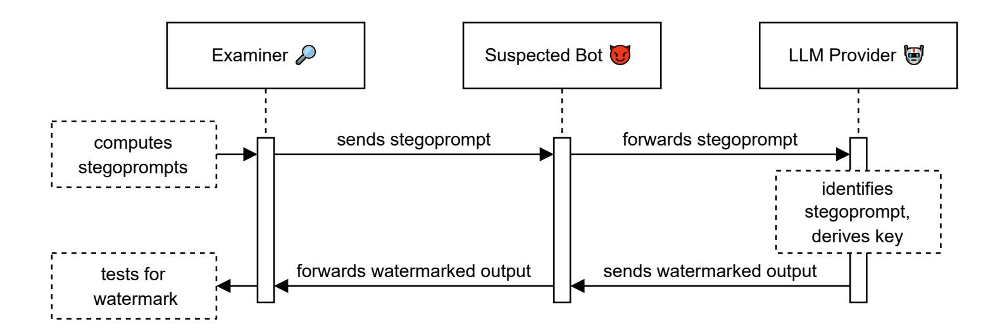
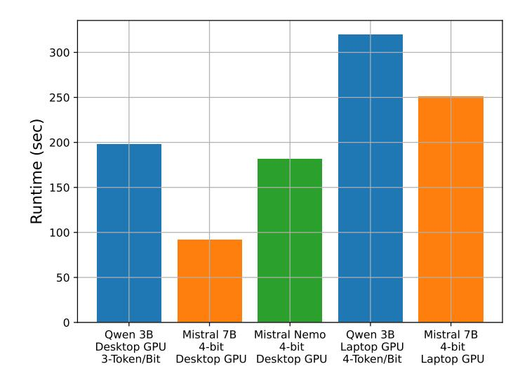
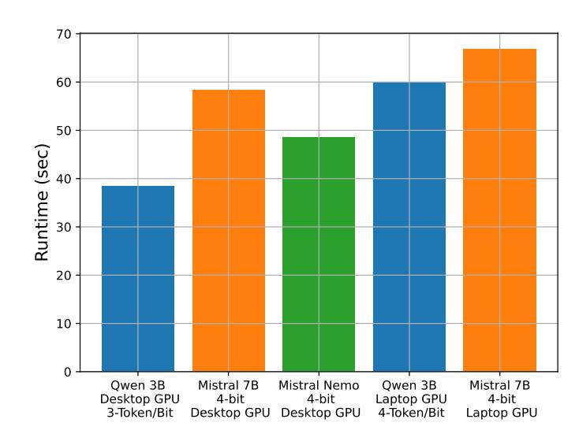
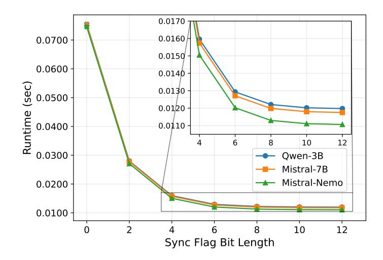
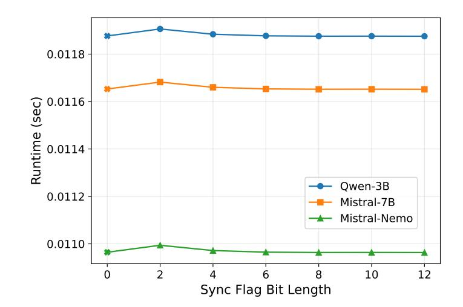
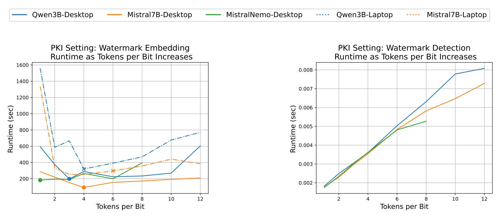
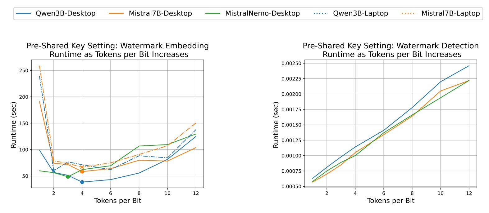

{0}------------------------------------------------

# Do Androids Dream of a Dead Internet: Interactive Watermarks for Bot Detection

Brennon Brimhall<sup>1</sup> , Harry Eldridge<sup>1</sup> , Maurice Shih<sup>2</sup> , Ian Miers<sup>2</sup> , and Matthew Green<sup>1</sup>

> <sup>1</sup>Johns Hopkins University {brimhall, hme, mgreen}@cs.jhu.edu <sup>2</sup>University of Maryland {maurices, imiers}@umd.edu

#### Abstract

A number of recent works propose watermarking the outputs of large language models (LLMs) but fail to describe who is authorized to watermark the text or check for a watermark. To resolve these problems, we propose interactive watermarking schemes. Our technique leverages the fact that, for many of the cases in which detecting synthetic text is useful, the detector is able to control some part of the prompt that is passed to the LLM.

In other words, we propose poisoning the prompt, through which the examining user establishes a steganographic channel with the LLM provider. This lets the user and the LLM provider agree on a shared key, which is then used to embed a a symmetric watermark and permits the end-user examiner to learn if the entity they are conversing with is a bot. Because the steganographic prompt and the LLM response are indistinguishable from their natural distributions, this approach simultaneously sidesteps prior impossibility results from Zhang et al. [\[44\]](#page-19-0) and resolves the authorization questions unanswered by previous work.

Our primary construction is based on elliptic curve Diffie-Hellman; we sketch a more sophisticated version using broadcast encryption. Our secondary construction uses a symmetric key protocol with a pre-shared key. To improve efficiency, we introduce steganographic synchronization codes.We experimentally validate our theoretical findings and outline directions for future work.

## <span id="page-0-0"></span>1 Introduction

Worries about malicious uses of LLM generated text [\[22,](#page-18-0) [31,](#page-18-1) [34,](#page-18-2) [37,](#page-19-1) [40,](#page-19-2) [43\]](#page-19-3) have driven considerable interest in detection mechanisms, including considerable work on watermarking schemes [\[1,](#page-17-0) [26\]](#page-18-3). While these approaches have seen limited real-world deployment, they are, in a sense, a relic of a time when LLM text was not yet-ubiquitous and there was hope that merely identifying text as LLM generated was sufficient to address many of the illicit uses of LLMs. At the same time, widespread deployment of watermarks for LLM generated text raises some challenges. Who is authorized to mark the text? Who is authorized to check if it is watermarked? What conclusions can we draw when text is present?

{1}------------------------------------------------

This paper proposes a new setting for watermarks which we believe eliminates many of these concerns, while retaining the conceptual utility of watermarks against one of the key motivating risks: bots.

Watermarking. In service of detecting LLM-generated content, a long line of work (concurrently initiated by Kirchenbauer et al. [\[26\]](#page-18-3) and Aaronson [\[1\]](#page-17-0)) proposes LLM watermarks, a keyed method of intentionally biasing LLM outputs to make them identifiable as synthetic. A watermark permits a detection procedure that allows a party to distinguish between watermarked text (i.e. synthetic text generated from an LLM) and unwatermarked text (i.e. human text) for commercial models accessed via an API. A long line of work extends their approach in various ways [\[9,](#page-17-1) [11,](#page-17-2) [13,](#page-17-3) [14,](#page-17-4) [16,](#page-17-5) [26,](#page-18-3) [36,](#page-19-4) [45,](#page-19-5) [46\]](#page-19-6).

For commercial LLM providers, both approaches leave a major procedural question unanswered: when should users be allowed to detect the presence of a watermark? While some providers apply watermarks to image model outputs and have made the detection procedure available to journalists and media professionals, we are unaware of any providers making detection available to the general public [\[18\]](#page-18-4). For commercial providers, this may be motivated by business concerns. While there are benefits to watermarking content, making the detection capability public carries various downside risks. For one thing, there are many legitimate applications of LLM-generated content in which the availability of a detection oracle would be inconvenient for commercial users. As a secondary concern, the availability of a public detection process could allow malicious users to evade the watermark by adaptively modifying LLM-generated text repeatedly until the detection procedure fails; this leads to the impossibility result of Zhang et al. [\[44\]](#page-19-0).

Changing the setting. Due to the limitations described above, there are currently no widelydeployed mechanisms for verifying that text is synthetic. This is due to prior art only considering a non-interactive setting, where some LLM user issues a single query to the model and an examiner independently seeks to determine whether the resulting text is watermarked. By contrast, many of the potential harms of widespread LLM deployment discussed in prior work – bots on social media, automated scam networks, students copying over essay prompts – inherently feature an "input" provided by a first party that is passed to an LLM provider by a second party (possibly with additional prompting added). In many of these applications, the party who produces the first message is also the same party who is interested in determining whether the response is synthetic. This raises the possibility of a new paradigm for watermark detection: here detection is "authorized" only for the party who generates the initial message, e.g., a participant in a conversation with a bot, or a teacher who issues an assignment.

### 1.1 Our Contributions

In this work we initiate the study of watermarking protocols in an interactive setting. We propose an interactive, publicly verifiable watermarking scheme we call prompt poisoning. In our construction a user steganographically encodes key material into text that they expect to become part of the prompt that is issued to an LLM. The LLM provider can detect the key material and include an undetectable symmetric watermark in its response, which can be verified only by the originating user. Critically, the bot cannot detect the presence of either the "poison" prompt or the resulting watermark.

{2}------------------------------------------------



Figure 1: Flow of an interactive watermark. The examiner prepares a stegoprompt (e.g., a social media comment), and posts it. In order to respond to the comment, the suspected bot queries the LLM on the stegoprompt. The LLM Provider then responds back with a watermark that the examiner can verify.

Intuitively, our interactive watermarking protocol can be thought of as analogous to network protocols like TLS or SSH that use a key exchange to establish a shared key for a session. Instead of using the key for symmetric encryption and message authentication, we use the shared secret key for a symmetric watermarking procedure.

Our primary construction relies on a steganographic variant of elliptic curve Diffie-Hellman. We sketch a more sophisticated version of our primary construction that uses a steganographic variant of broadcast encryption from bilinear pairings. As an efficiency optimization, we also construct a symmetric key protocol that requires an initial out-of-band communication channel between the examiner and LLM provider. We discuss practical tradeoffs between these approaches.

### 1.2 Technical Overview

We give a brief sketch of our prompt poisoning protocols below. Both protocols proceed between an LLM provider, an LLM customer, and a third party examiner. The examiner wishes to tell if the text they are receiving from the LLM customer is indeed being generated via the LLM provider's API. Both protocols include an offline phase where the parties perform precomputation and publish public information, as well as an online phase in which the examiner interacts with the LLM customer.

Public Key Interactive Watermarks. Our primary protocol occurs in the public key setting and does not allow further communication between the examiner and provider. We use asymmetric cryptographic primitives in order for the two parties to establish a shared watermarking key. Because there is no way to secretly enroll prompts in the offline phase, this shared key is also used to by the LLM provider to detect whether a request includes a poisoned prompt.

The offline phase begins with the LLM provider publishing their public key, a universal hash function U, and a pseudorandom function PRF. The examiner then creates an ephemeral symmetric key k and key encapsulation ciphertext c using the provider's public key. The examiner then computes t = PRFk(0), a "flag" which will be used by the provider to tell that a request contains 

{3}------------------------------------------------

a poisoned prompt. The offline phase concludes with the examiner using U to compute prompts that steganographically encode the message c||t, i.e. the key encapsulation ciphertext followed by the flag.

In the online phase, the examiner sends one of their precomputed prompts as a message to the LLM customer, who forwards it (possibly surrounded by additional context) to the provider. The provider uses U to map the tokens of the request to a bit string which may include the covert key exchange. The provider then performs a sliding window operation over the bit string, checking at each position whether performing a key exchange and PRF computation results in a matching flag. If the provider finds a match it uses the derived key to embed a symmetric watermark in its response, which can be checked by the examiner.

We additionally offer two optimizations to the above protocol. The first addresses the inherent inefficiencies of a sliding window computation, in which the provider must attempt a key exchange at every index of a request's bitstring representation. The optimization here is straightforward: we require that the provider only check for key exchanges immediately following some locator flag (e.g. the binary string "1000"). Examiners embed the locator flag followed by the key exchange at a random index within a uniformly random bitstring. If the random string is large enough compared to the length of the flag, the resulting string will be statistically indistinguishable from a truly uniform bitstring. We refer to this technique as a steganographic synchronization code and believe it may be of independent interest.

Our second optimization addresses the case that a examiner is unsure which LLM provider the LLM customer is using to generate their responses. The naïve solution has the examiner run multiple instances of the above protocol in sequence, embedding a flag for each possible LLM provider, which leads to growth in the message that is linear in the number of possible providers. To address this issue we turn to broadcast encryption, a cryptographic primitive that allows a sender to encrypt a message to multiple possible receivers. Critically, in such a scheme the length of the ciphertext is independent of the number of recipients. We can then have the examiner sample a key k, compute a broadcast encryption ciphertext c = Enc(k) to each of the possible providers, and steganographically encode the value c||PRFk(0). Providers then use the same sliding window technique to decrypt candidate k values and check the following flag, using k to embed a symmetric watermark if a flag matches. We discuss the tradeoffs to this approach, including when it offers practical improvements over the naïve solution, in [§7.2.](#page-15-0)

Pre-shared Key Interactive Watemarks. In the symmetric setting we allow the examiner to communicate with the LLM provider during the offline phase. The protocol begins with the examiner enrolling a prompt key (i.e. some string of text) with an LLM provider. A unique challenge in this setting is mitigating prompt reconnaissance attacks where a malicious examiner attempts to enroll a prompt that they have previously seen in the wild to ensure it will be watermarked. We resolve this using a random oracle, with which the examiner can derive both the prompt key and watermarking key that the LLM provider will use to embed a symmetric watermark if the prompt is detected. In the online phase the examiner sends their prompt as a message to the LLM customer, which in turn is forwarded to the LLM provider. Finally, when the provider receives the request it detects the enrolled prompt, retrieves the corresponding watermarking key, and embeds a symmetric watermark in the response which can be checked by the examiner.

Attacks on Interactive Watermarks. One obvious limitation of interactive watermarks is that a bot may reject any prompts that appear to come from an LLM. In particular, our steganographic 

{4}------------------------------------------------

approach produces interactive watermarks that are indistinguishable from LLM output, not human text. We believe that this is acceptable for a variety of reasons. First, a bot that rejects LLM generated text is severely limited: in many settings online, users will leverage LLMs to, at a minimum, polish and proofread text. Failure of a bot to respond to such text would, in and of itself, expose the bot. Secondly, there is a long line of work on tuning LLM models to avoid detection. For example, Krishna et al. [\[28\]](#page-18-5) and Cheng et al. [\[12\]](#page-17-6) show that paraphrasing is a viable strategy to evade detection. Work in this area could be dropped in to both mask the stegoprompt inputs and mask the watermark outputs.

A particularly subtle attack that a bot could carry out to thwart an interactive watermarking scheme is to embed a bot-generated stegoprompt in the context string. The LLM provider would see two stegoprompts with two different keys to watermark under. We refer to this as a doublekey attack. A bot that did not see otuput that is watermarked under its watermarking key could infer that the LLM provider was watermarking under a key shared by an examiner. We explicitly consider this attack out-of-scope because generating a stegoprompt requires running a language model locally to perform rejection sampling, or risks creating a stegoprompt that is detectable because it is far from the distribution of natural language. If the bot can run its own model to generate a stegoprompt, we assume it is computationally feasible for it to be its own LLM provider. Further, suppose that a bot invokes a model once to generate a stegoprompt and re-uses it in every query. If the bot fails to regularly rotate the stegoprompt, the LLM provider will see repeated queries from the same customer with the same stegoprompt. This behavior is a clear signal to the LLM provider that the bot is attempting a double-key attack.

## 2 Preliminaries

We pause here to briefly review key cryptographic concepts and building blocks that will be used in our constructions.

### 2.1 Notation

For any algorithm A, we use y := A(x; r) to denote that the algorithm runs on input x and random tape r and produces output y. In most cases we do not denote the random tape explicitly and simply write y ← A(x). We similarly let x ← D denote sampling x according to a distribution D. Some distributions may be dependent on a history of their outputs h. We indicate sampling from a distribution conditioned on history h by x ← Dh. For a finite set S we let x ←\$ S denote sampling an element from S uniformly at random. For a string x we use |x| to denote its length. We denote concatenation between two strings x and y as x||y. For a string x = x0||x1||. . . ||x<sup>n</sup> we let x[i, j] denote the substring x<sup>i</sup> ||. . . ||xj−1. We use x[: j] as shorthand for x[0 : j] and x[i :] for x[i : |x|]. We let the function Window(x, ℓ) denote the sliding window of length ℓ substrings of x, e.g. Window(abcd, 2) = {ab, bc, cd}. We use {0, 1} <sup>n</sup> to denote the set of bit strings of length n. We let ϵ denote the empty string.

### 2.2 Building Blocks

Universal and Cryptographic Hash Functions. Informally, a universal hash function maps some input distribution to the uniform distribution. A cryptographic hash function has additional 

{5}------------------------------------------------

properties, including collision resistance. We refer the reader to sources like Katz and Lindell [\[25\]](#page-18-6) or Boneh and Shoup [\[8\]](#page-17-7) for a detailed treatment.

Pseudorandom Functions. Our constructions make use of pseudorandom functions, a wellstudied cryptographic primitive. As with hash functions, Katz and Lindell [\[25\]](#page-18-6) or Boneh and Shoup [\[8\]](#page-17-7) give a detailed treatment of pseudorandom functions.

Key Encapsulation Mechanisms. A Key Encapsulation Mechanism (KEM) allows a sender to securely transfer a symmetric key to a receiver knowing only their public key.

For our constructions, we will require KEMs with ciphertexts that are indistinguishable from uniformly random binary strings. This is an analogue to the obfuscated key exchange definition of [\[19\]](#page-18-7), without the requirement that the public key is also obfuscated. We give the modified definition, which we refer to as a ciphertext-obfuscated KEM, below, omitting the standard definition of IND-CPA security.

Definition 1 (Ciphertext-Obfuscated Key Encapsulation Mechanism). Let λ be the security parameter, K = {Kλ}λ∈<sup>N</sup> be the key space, and {0, 1} ℓ be the ciphertext space. A Ciphertext-Obfuscated Key Encapsulation Mechanism (KEM) KEM is a tuple of efficient algorithms:

- KG(1<sup>λ</sup> ) → (sk, pk): Given the security parameter λ, outputs a secret key and public key.
- EC(pk) → (k, c): Given a public key, outputs a key k ∈ K and a ciphertext c ∈ {0, 1} ℓ .
- DC(sk, c) → k/⊥: Given the secret key and a ciphertext outputs either a key k ∈ K or ⊥.

A ciphertext-obfuscated KEM must satisfy the following properties.

Correctness. It must hold that

$$\Pr\left[\mathsf{DC}(sk,c) = k \, : \frac{(sk,pk) \leftarrow \mathsf{KG}(1^{\lambda})}{(k,c) \leftarrow \mathsf{EC}(pk)}\right] = 1$$

Ciphertext Uniformity. For all PPT adversaries A it must hold that

$$\Pr \begin{bmatrix} b \leftarrow \$ \{0,1\}; \ c_0 \leftarrow \$ \{0,1\}^{\ell} \\ \mathcal{A}(pk,c_b) = b : \quad (sk,pk) \leftarrow \mathsf{KG}(1^{\lambda}) \\ \quad (\cdot,c_1) \leftarrow \mathsf{EC}(pk) \end{bmatrix}$$

$$\leq \frac{1}{2} + \mathsf{negl}(\lambda)$$

As noted in [\[19\]](#page-18-7), Ciphertext-Obfucated KEMs can be achieved by using an elliptic curve Diffie-Hellman-based KEM with a uniform curve encoding such as [\[6\]](#page-17-8) or [\[42\]](#page-19-7).

{6}------------------------------------------------

#### <span id="page-6-1"></span>2.3 Steganography

Steganography was first formalized by Simmons [41] and a long line of work in cryptography has developed information-theoretic steganographic techniques [2, 10, 32, 47], symmetric-key constructions [10, 21, 38], and public-key constructions [3, 29, 30, 39]. Recent years have seen a renaissance in steganography research driven by the proliferation of generative AI models, which facilitate efficient sampling from arbitrary target distributions [23, 24].

Throughout this paper we rely on the steganographic rejection sampling technique of Hopper [20], which we review in Algorithm 1. Critically, this construction only relies on a universal hash function U. It was demonstrated in [20] that if the distribution being sampled from has a sufficient min-entropy for all histories, then the construction has a probability of failure negligible in  $\lambda$ . Hopper [20] additionally showed that if the input value c is indistinguishable from a random string, then the output of the algorithm is indistinguishable from simply sampling from the underlying distribution with initial history h. Decoding proceeds by taking the hash of each sample to recover the value c. We use  $\mathcal{O}^{\mathsf{U}}$  to indicate this decoding algorithm.

### **Algorithm 1:** Constructions 3.18 and 4.6 in [20]

```
\begin{aligned} \operatorname{\mathbf{def}} \ \mathcal{S}^{\mathsf{U}}_{\mathcal{D}_h}(c,\lambda) \mathbf{:} \\ i \leftarrow 0; \\ m \leftarrow \epsilon; \\ \mathbf{while} \ i < |c| \ \mathbf{do} \\ & | \ j \leftarrow 0; \\ \mathbf{repeat} \\ & | \ s \leftarrow \mathcal{D}_{h||m}; \\ & | \ j + +; \\ \mathbf{until} \ \mathsf{U}(s) = c_i \lor j = \lambda; \\ & | \ m \leftarrow m||s; \\ & | \ i \leftarrow i + 1; \\ \mathbf{end} \end{aligned}
```

### 2.4 Broadcast Encryption

Broadcast encryption, first posed by Fiat and Naor [17], considers the case of a cryptosystem that allows a trusted party to provide keys to participants (with a key-escrow similar to that considered in identity-based encryption). A third-party can then broadcast a secret message to some subset of enrolled participants. A result by Boneh, Gentry, and Waters realized efficient broadcast encryption using pairings [7].

A natural follow up to broadcast encryption is the notion of distributed broadcast encryption, which attempts to remove the key-escrow problem. Users generate their own secret keys without the help of a trusted third party and post their public key to an append-only bulletin board. A recent result by Kolonelos, Malavolta, and Wee realizes a concretely efficient distributed broadcast encryption scheme from bilinear pairings [27]. We refer the reader to their work for details of their construction.

{7}------------------------------------------------

#### 2.5 Language Models

We will use the definition of a language model put forth in [14].

**Definition 2.** A language model Model over a token vocabulary  $\mathcal{T}$  is a deterministic algorithm that takes in a prompt  $\rho \in \mathcal{T}^*$  and tokens previously output by the model  $t \in \mathcal{T}^*$  and outputs a probability distribution over  $\mathcal{T}$ .

As in [14], we will use  $\overline{\mathsf{Model}}(\rho)$  to indicate the algorithm that samples tokens according to the output of Model until a stop token is reached. Going forward we will use the terms "text" and "token sequence" interchangeably.

### 2.6 Symmetric Watermarks

Our constructions will make black-box use of symmetric watermarking algorithms. We reproduce the definition of symmetric watermarking put forth by [14]. [14] gives a specific condition under which they guarantee correctness, which we generalize to an arbitrary function  $\delta$ .

**Definition 3** (Symmetric Watermarking). A symmetric watermarking scheme SW is a tuple of algorithms (S, W, T) with the following interface.

- $S(1^{\lambda}) \to sk$  takes as input the security parameter and outputs a secret key.
- $W(sk, \rho) \rightarrow t$  takes as input the secret key and a prompt and outputs text.
- $T(sk, t^*) \rightarrow \{0, 1\}$  takes as input the secret key and some text and outputs 0 or 1.

A symmetric watermarking scheme must satisfy the following properties.

 $\delta$ -Correctness. A SW scheme is  $\delta$ -correct if for all prompts  $\rho$ ,

$$\Pr\begin{bmatrix} \delta(\rho,t) = 1 \wedge & sk \leftarrow \mathsf{S}(1^{\lambda}) \\ \mathsf{T}(sk,t) = 0 & t \leftarrow \mathsf{W}(sk,\rho) \end{bmatrix} \leq \mathsf{negl}(\lambda)$$

**Soundness.** For all text sequences x of length  $|x| \leq \text{poly}(\lambda)$ ,

$$\Pr \left[ \mathsf{T}(sk,x) = 1 \, : \, sk \leftarrow \mathsf{S}(1^{\lambda}) \right] \leq \mathsf{negl}(\lambda)$$

**Undetectability.** A SW scheme is undetectable if for all adversaries  $\mathcal{A}$  it holds that,

$$\begin{split} \Big| \Pr \Big[ \mathcal{A}^{\mathsf{Model}, \overline{\mathsf{Model}}}(1^{\lambda}) &= 1 \Big] - \\ \Pr \Big[ \mathcal{A}^{\mathsf{Model}, \mathsf{O}_{\mathsf{W}(sk, \cdot)}}(1^{\lambda}) &= 1 \, : \, sk \leftarrow \mathsf{S}(1^{\lambda}) \Big] \Big| \\ &\leq \mathsf{negl}(\lambda) \end{split}$$

Where the  $O_{W(sk,\cdot)}$  oracle allows for queries to  $W(sk,\rho)$  for arbitrary prompts  $\rho$ .

{8}------------------------------------------------

## <span id="page-8-1"></span>3 Steganographic Synchronization Codes

As an optimization to the constructions presented in [§5](#page-10-0) we will use a steganographic synchronization code (SSC). We believe we are the first to describe such a primitive and that it may be of independent interest.

A steganographic synchronization code consists of an alphabet Σ, a set of strings over the alphabet ϕ, and a distribution D over strings from Σ. We require that at least one element of ϕ appear in samples from D with high probability. We define this notion formally below.

Definition 4 ((ε, D)-Steganographic Synchronization Code). A (ε, D)-steganographic synchronization code C = (Σ, ϕ, p) consists of an alphabet Σ, a set of strings ϕ ⊂ (Σ<sup>∗</sup> ) ∗ , and an integer p, and is defined relative to a distribution D over Σ p .

We require the following property from an SSC:

$$\Pr[\exists \phi' \in \phi \ s.t. \ \phi' \in t : t \leftarrow \mathcal{D}] \ge 1 - \varepsilon$$

We use U p {0,1} to denote the uniform distribution over {0, 1} p . We now state a theorem showing that it is possible to construct an SSC with negligible ε and a single flag value over the binary alphabet. We prove the theorem in Appendix [A.](#page-20-0)

<span id="page-8-0"></span>Theorem 1. For all positive integers q there exists a e −(p−q+1) 2q , U p {0,1} -SSC C = ({0, 1}, ϕ, p) where ϕ contains a single bitstring of length q.

A consequence of Theorem [1](#page-8-0) is that setting p = λ2 <sup>q</sup> + q results in an SSC with ε negligible in λ. We discuss how to use SSCs in the way described in the technical overview in Appendix [A.](#page-20-0)

## 4 Definitions and Security Properties

An interactive watermark is a protocol between three parties: an end-user examiner E, the synthetic content providers P, and a potential bot A.

LLM Provider P: hosted providers of a language model, and respond to prompts chosen by their clients (e.g. A). Providers are assumed to behave semi-honestly.

End-User Examiner E: attempts to establish if a party they are communicating interactively with (A) is a bot or not (i.e. a client of P). We assume they may behave maliciously but are computationally bound.

Potential Bot A: a client of some LLM provider. The A is assumed to be a computationally bounded adversary that takes natural language input from E, adds some additional context, and queries P for a response. If it detects an anomalous prompt from E (or response from P) it may choose to stop responding or otherwise act maliciously.

Threat model. We assume E and A may act maliciously. We assume that P behaves semihonestly.

<span id="page-8-2"></span>We now formalize an interactive watermarking scheme.

{9}------------------------------------------------

**Definition 5** (Interactive Watermarking). An interactive watermarking scheme  $(\mathcal{D}, f, \Delta, v)$ -IW for a language model Model is a tuple of algorithms (Setup, KeyGen, Enroll, Request, Scan, Watermark, Test) defined relative to a distribution  $\mathcal{D}$  and with the following interface.

- Setup( $1^{\lambda}$ )  $\rightarrow$  (sk, pk, K) takes as input the security parameter and outputs a secret and public key (sk, pk) along with an initial state K.
- $\mathsf{KeyGen}(pk) \to k \ takes \ as \ input \ the \ public \ key \ and \ outputs \ a \ key \ k.$
- $\mathsf{Enroll}(pk, k, \mathsf{K}) \to \mathsf{K}'$  takes as input the public key, a key, and some state and outputs a new state.
- Request $(pk, k, \pi) \to (m, \text{st})$  takes as input a public key, a symmetric key, and a prompt  $(\pi)$  and outputs a message and a state.
- $\mathsf{Scan}(sk,\mathsf{K},\rho) \to k_w/\bot$  takes as input a secret key, a state, and a prompt  $(\rho)$  and returns either a key  $k_w$  or  $\bot$ .
- Watermark $(k_w, \rho) \to t$  takes as input a key and a prompt  $(\rho)$  and returns text.
- $\mathsf{Test}(pk,\mathsf{st},t^*) \to \{0,1\}$  takes as input the public key, a state, and some text and outputs 0 or 1.

When KeyGen and Enroll output  $\perp$  for all inputs we say that IW is asymmetric, and symmetric otherwise.

For notational shorthand we let  $\mathsf{G}(sk,\mathsf{K},\rho)$  denote the algorithm that outputs  $\mathsf{Watermark}(k_w,\rho)$  if  $\mathsf{Scan}(sk,\mathsf{K},\rho) \neq \bot$ , and  $\overline{\mathsf{Model}}(\rho)$  otherwise.

A IW scheme must satisfy the below properties. For each property we define the following oracles: RO, the random oracle,  $O_E$ , a stateful enroll oracle that when invoked on argument k' sets  $K' := \mathsf{Enroll}(k', K')$ , and  $O_G$ , a text generation oracle that when invoked on argument  $\rho$  returns  $G(sk, K', \rho)$ .

As in [14] and [16] we will limit the capabilities of our adversaries. In the robustness game we limit the adversary's ability to modify text output by Watermark to a modification function f. Additionally, in the robustness and undetectability games we limit the types of queries an adversary makes to  $O_E$  and  $O_G$  with predicates  $\Delta$  and v.

 $(f, \Delta)$ -Robustness. For all adversaries  $\mathcal{A}$  and all prompts  $\pi$  it must hold that

$$\Pr \begin{bmatrix} (sk, pk, \mathsf{K}) \leftarrow \mathsf{Setup}(1^\lambda) \\ \lambda(Q_\mathsf{E}, sk, pk, \rho, t^*) & \mathsf{K}' \leftarrow \mathsf{Enroll}(k, \mathsf{K}) \\ = 1 \wedge & (m, \mathsf{st}) \leftarrow \\ \mathsf{Test}(pk, \mathsf{st}, t^*) & : \mathsf{Request}(pk, k, \pi) \\ = 0 & z \leftarrow \mathcal{A}^{\mathsf{RO}, \mathsf{O}_\mathsf{E}, \mathsf{O}_\mathsf{G}}(m, pk) \\ & \rho \leftarrow f(m, z) \\ & t^* \leftarrow \mathsf{G}(sk, \mathsf{K}', \rho) \end{bmatrix} \\ \leq \mathsf{negl}(\lambda)$$

Where  $Q_{\mathsf{E}}$  is the set of queries made by  $\mathcal{A}$  to  $\mathsf{O}_{\mathsf{E}}$ .

{10}------------------------------------------------

**Soundness.** For all adversaries  $\mathcal{A} = (\mathcal{A}_0, \mathcal{A}_1, \mathcal{A}_2)$  it must hold that

$$\Pr \begin{bmatrix} (sk, pk, \mathsf{K}) \leftarrow \mathsf{Setup}(1^{\lambda}) \\ \mathsf{Test}(pk, \mathsf{st}, t^*) & \mathsf{st}' \leftarrow \mathcal{A}_0^{\mathsf{RO}, \mathsf{O_E}, \mathsf{O_G}}(pk) \\ & : & t^* \leftarrow \mathcal{A}_1^{\mathsf{RO}, \mathsf{O_E}, \mathsf{O_G}}(1^{\lambda}) \\ & \mathsf{st} \leftarrow \mathcal{A}_2^{\mathsf{RO}, \mathsf{O_E}, \mathsf{O_G}}(pk, \mathsf{st}', t^*) \end{bmatrix} \\ \leq \mathsf{negl}(\lambda)$$

v-Undetectability. For all adversaries A and all prompts  $\pi$  it must hold that

$$\begin{bmatrix} b \leftarrow \$ \{0,1\} \\ (sk,pk,\mathsf{K}) \leftarrow \mathsf{Setup}(1^\lambda) \\ k \leftarrow \mathsf{KeyGen}(pk) \\ v(\mathsf{K}',Q_\mathsf{G},sk) & \mathsf{K}' \leftarrow \mathsf{Enroll}(k,\mathsf{K}) \\ = 1 \land & : & (m_0,\cdot) \leftarrow \\ B = b & \mathsf{Request}(pk,k,\pi) \\ & m_1 \leftarrow \mathcal{D}_\pi \\ & B \leftarrow \\ \mathcal{A}^{\mathsf{RO},\mathsf{O}_\mathsf{E},\mathsf{O}_\mathsf{G},\overline{\mathsf{Model}}}(pk,m_b) \end{bmatrix} \\ \leq \frac{1}{2} + \mathsf{negl}(\lambda)$$

Where  $Q_{\mathsf{G}}$  is the sets of queries made by  $\mathcal{A}$  to  $\mathsf{O}_{\mathsf{G}}$ .

### <span id="page-10-0"></span>5 Construction

The algorithm descriptions for our main constructions follow here along with our main theorems.

**Steganographic encoding and decoding.** We make use of the universal hashing technique given by Hopper [20]. See Algorithm 1 and §2.3.

**Sampling a high-entropy prompt key.** For reasons described above, our constructions require sampling a high-entropy prompt key. One possible approach would be to have the prompt key be generated by a semi-honest  $\mathcal{P}$ . However, this approach does not generalize well when we consider the multiple provider setting later in the paper.

To generate a single prompt key independent from any individual  $\mathcal{P}$ , we propose invoking a random oracle on some base key k concatenated with a public parameter r.  $\mathcal{E}$  provides k to  $\mathcal{P}$ , who then accepts  $\mathsf{RO}(r||k||0)$  as a prompt key. The prompt key is then steganographically embedded into the prompt. Because the prompt embeds a random value from the output space of the random oracle, the prompt must be high-entropy. This same technique can be used to derive the watermarking key that the provider will use to respond to stegoprompts.

{11}------------------------------------------------

Synchronizing a steganographic message. As an optimization we will make use of the steganographic synchronization code described in [§3](#page-8-1) to mark the placement of the steganographic message in the poisoned prompt. The synchronization code permits P to cheaply scan incoming inputs for a steganographic message using only a universal hash function, granting a constant factor speedup. We give a formal description of this technique in Appendix [A.](#page-20-0)

Public key setting. Figure [2](#page-12-0) shows a public-key construction that makes use of a ciphertextobfuscated KEM. Note that in the public key setting, P does not know if a sequence of bits following a steganographic synchronization contain key material; the bits are indistinguishable from uniform. To indicate that a key exchange is there, we append a "key exchange flag." The flag is simply the result of evaluating a pseudorandom function on the shared secret established by the key exchange and a fixed value.

<span id="page-11-0"></span>Theorem 2 (Informal). If SW is a δ-correct symmetric watermarking scheme and KEM is a ciphertext-obfuscated KEM, then the construction shown in Fig. [2](#page-12-0) is a secure asymmetric (D, f, ∆, υ) interactive watermarking scheme in the random oracle model, where f allows for prepending and appending arbitrary text to m, and ∆ and υ prevent prompts that include two KEM encapsulations.

We give formal descriptions of (f, ∆, υ) as well as a proof of Theorem [2](#page-11-0) in Appendix [B.](#page-23-0)

Pre-shared key setting. Figure [3](#page-13-0) shows our construction for the pre-shared key setting that relies only on one-way functions and a random oracle.

<span id="page-11-1"></span>Theorem 3 (Informal). If SW is a δ-correct symmetric watermarking scheme, then the construction shown in Fig. [3](#page-13-0) is a secure symmetric (D, f, ∆, υ)-interactive watermarking scheme in the random oracle model, where f allows for prepending and appending arbitrary text to m, and ∆ and υ prevent prompts that include two enrolled stegoprompts.

We give formal descriptions of (f, ∆, υ) as well as a proof of Theorem [3](#page-11-1) in Appendix [B.](#page-23-0)

Broadcast encryption extension. Observe that in the public key setting, supporting multiple possible providers would require several key exchange flags to be concatenated together (one for each possible P). This results in a key exchange message of at least O(|P|) bits. If the number of possible P is large, this linear factor can present practical concerns. To alleviate this problem, we propose using broadcast encryption [\[17\]](#page-17-12) to securely transmit the same key to all providers simultaneously in a compact ciphertext. We give a formal description of this scheme in Appendix [C.](#page-31-0)

## <span id="page-11-2"></span>6 Microbenchmarks

We implement our constructions (asymmetric/public key setting and symmetric/pre-shared key setting) in Python using the transformers library. The experiments were run on a Windows 11 laptop under WSL 2 with an 8-core AMD Ryzen 7940Hs with 32GB of RAM and a Nvidia 4070 mobile graphics card, along with an external Nvidia 3080 desktop card. BLAKE3 [\[35\]](#page-19-12) was used as the universal hash function.

In Figure [4a](#page-14-0) and Figure [4b](#page-14-0) we show encoding benchmarks for the asymmetric/public key settings (with a watermarking of length 272-bits) and symmetric/pre-shared key setting (with a watermarking of length 64-bits), respectively, supporting synchronization codes up to 8-bits. Benchmarks

{12}------------------------------------------------

```
Setup(1λ
         )
1 : r ←$ {0, 1}
                λ
2 : (sk, pk) ← KG(1λ
                       )
3 : U ←$ H
4 : return ((r, sk),(r, pk, U), ⊥)
Request((r, pk,U), ·, π)
1 : (k, c) ← EC(pk)
2 : m ← SU
            Dπ
               (c||F(RO(r||k||0), 0), λ)
3 : return (m, k)
Scan((r, sk), ·, ρ)
1 : s := O
            U
             (ρ)
2 : for w ∈ Window(s, ℓ + λ) do
3 : k
         ′ ← DC(sk, w[: ℓ])
4 : if k
           ′ = ⊥ then continue
5 : if F(RO(r||k
                     ′
                     ||0), 0) = w[ℓ :] then
6 : return S(1λ
                       ; RO(r||k
                               ′
                                ||1))
7 : return ⊥
Watermark(kw, ρ)
1 : return W(kw, ρ)
Test((r, ·, ·), k, t∗
                 )
1 : return T(S(1λ
                    ; RO(r||k||1)), t∗
                                    )
```

Figure 2: Our construction of an asymmetric interactive watermarking scheme. The unused KeyGen and Enroll algorithms are omitted.

{13}------------------------------------------------

```
Setup(1λ
          )
 1 : r ←$ {0, 1}
                 λ
 2 : U ←$ H
 3 : return (⊥,(r, U), ∅)
                               KeyGen(·)
                               1 : k ←$ {0, 1}
                                               λ
                               2 : return k
Enroll((r, ·), k,K)
1 : k0 := RO(r||k||0)
2 : k1 :=
       S(1λ
            ; RO(r||k||1))
3 : return
       K ∪ {(k0, k1)}
                           Request((r,U), k, π)
                            1 : k0 := RO(r||k||0)
                            2 : m ← SU
                                       Dπ
                                          (k0, λ)
                            3 : return (m, k)
Scan(·,K, ρ)
1 : s := O
            U
             (ρ)
2 : for (k0, k1) ∈ K
3 : if k0 ∈ s then return k1
4 : return ⊥
Watermark(kw, ρ)
1 : return W(kw, ρ)
Test((r, ·), k, t∗
                )
1 : return T(S(1λ
                     ; RO(r||k||1)), t∗
                                     )
```

Figure 3: Our construction of a symmetric interactive watermarking scheme.

{14}------------------------------------------------

<span id="page-14-0"></span>



(a) Average runtime (in seconds) to generate a stegoprompt in the asymmetric/public key setting (280 bits).

(b) Average runtime (in seconds) to generate a stegoprompt in the symmetric pre-shared key setting (72 bits).

Figure 4: Results for generating a stegoprompt where the token per bit configuration was chosen optimally for each model and gpu

shown in these graphs are the fastest configuration of tokens per bit for the given LLM model and GPU. For the asymmetric case, we see that embedding takes about 100 to over 300 seconds, while in the symmetric case it takes from around 40 to over 70 seconds. Benchmarks for multiple tokensper-bit configurations for both the public key and pre-shared key settings are in the appendix in Figures 8a and 9a.

See Figure 5 for watermark detection benchmarks in an example configuration of text with 3000 tokens and 3 tokens used to embed a bit for the watermark. This means that the text will be decoded into 1000 bits. Within the 1000 bit space, we pick a random start index to embed the synchronization flag and watermark bits, conditioned on there being enough space remaining to fully write them. Our results show this process is very efficient and, as expected, higher synchronization code lengths leads to faster runtimes. Synchronization codes can drastically reduce the runtime by up to 90% in the asymmetric setting. Benchmarks for multiple tokens-per-bit configurations are in the appendix Figures 8b and 9b.

We believe these microbenchmarks indicate that our prompt poisoning scheme is practical and possible to deploy at scale.

Costs for  $\mathcal{P}$  are quite minimal and only amount to 1-15 milliseconds of additional compute cost per inference in the worst case. Note that these decoding microbenchmarks were performed on consumer grade hardware. Further, the decoding microbenchmarks assume a key exchange is always found and include the cost of decoding the Elligator representation and performing the elliptic curve Diffie-Hellman operations.

Comparing to benchmarks for time to first token for OpenAI gpt-4-turbo [4] and GPT-5.1 [5], we see that the time to detect embedded watermarking adds less than 2% overhead to time to first token.

Computational costs to create a stegoprompt are bourne by  $\mathcal{E}$ . While they are considerably higher than the work required by the  $\mathcal{P}$  to detect stegoprompts, it is still reasonably quick (on the order of 1-5 minutes on consumer hardware) and can be precomputed in an offline phase.

{15}------------------------------------------------

<span id="page-15-1"></span>



Figure 5: Average runtime (in seconds) for a successful watermark detection in the asymmetric/public key setting (left) and symmetric/pre-shared key setting (right) for different models with 1000 tokens and 3 tokens per embedded bit. The synchronization flag of length 0 denotes the baseline where no sync flag was used.

### 7 Discussion

### 7.1 Practical Applications

In §1 we referenced several examples of bot behavior to motivate a prompt poisoning protocol, including misinformation on social media, online scams, pull requests in open source software projects, and academic misconduct. We believe that our protocol can be used as a practical mitigation against these scenarios.

For example, consider a student who responds to an essay using LLM-generated output. If the professor is able to embed a stegoprompt into the student's prompt, the LLM will respond with output watermarked under a key known to the instructor. The instructor can show that the text is watermarked under the shared key as strong evidence in an academic discipline hearing. Researchers who receive watermarked peer reviews can likewise engage with program chairs and other academic authorities.

We acknowledge that there are some benign uses of LLMs that may be detected with this protocol, such as rephrasing human-generated text to be more natural in a non-native language. Because the use of LLMs does immediately imply misconduct, a watermark generated and detected under our protocol is a signal (albeit a strong cryptographic signal) that must be weighed against other situational factors.

### <span id="page-15-0"></span>7.2 Supporting more than one LLM provider

Our symmetric construction is able to leverage the random oracle model to enroll the same prompt key with multiple providers. In contrast, our asymmetric construction requires knowledge of the LLM's public key to generate the flag used to verify that the stegoprompt is genuine.

A naïve approach for small pools of LLM providers is to simply append additional flag ciphertexts to the end of the message. While this is linear in the pool size, the small constant factors involved ( $\sim 20$  bits per LLM) makes this practical.

{16}------------------------------------------------

An alternative for large pools is the use of distributed broadcast encryption; this provides a constant size stegoprompt. As a practical matter, the concrete size of stegoprompts are approximately 10 times larger than the construction we give in Figure [2.](#page-12-0) Thus, distributed broadcast encryption only achieves shorter ciphertexts than the naïve construction when the pool exceeds 63-101 providers (specifics depend on the pairing-friendly curve used). We provide a detailed analysis in [§C.](#page-31-0)

### 7.3 Lowering the security parameter

The system we envision has cryptographically negligible probability of false positives and false negatives. However, depending on the application, a higher false positive and false negative rate that is practically acceptable may achieved by lowering the security parameter. In the case of our symmetric construction this is done naturally by reducing the size of the prompt key and watermarking key space. In the asymmetric construction, this would require identifying smaller elliptic curves. In particular, the distributed broadcast encryption extension we discuss in [§7.2](#page-15-0) may be more practical if a smaller (and necessarily lower-security) pairing-friendly curve was used.

## 8 Conclusion

In this paper we have proposed prompt poisoning, a technique for detecting LLM bot activity that eliminates many of the concerns of prior approaches. We instantiated our protocol using symmetric and asymmetric primitives and provided microbenchmarks showing their minimal impact for LLM providers. In the process of instantiating our protocol, we also introduced steganographic synchronization codes. Our protocol bypasses the impossibility results of prior work and we believe it is practically deployable.

Our work motivates further research in several areas. For example, we have identified various extensions and optimizations, such as bespoke elliptic curves with lower security levels. While our techniques use universal hash functions to encode data, we believe that there exist more sophisticated techniques to improve the bitrates for steganography over natural language. Such techniques could dramatically reduce the amount of text required to encode the poisoned prompt. We leave exploring these issues to future work.

Acknowledgments. This work was funded, in part, by NSF under Grant 2504578 and DARPA. Opinions, findings, and conclusions or recommendations expressed in this material are those of the authors and do not necessarily reflect the views of DARPA.

{17}------------------------------------------------

### References

- <span id="page-17-0"></span>[1] Scott Aaronson. "Neurocryptography". Plenary Talk at Crypto'2023. Aug. 2023.
- <span id="page-17-9"></span>[2] R. J. Anderson and F. A.P. Petitcolas. "On the limits of steganography". In: *IEEE J.Sel. A. Commun.* 16.4 (Sept. 2006), pp. 474–481. ISSN: 0733-8716. DOI: 10.1109/49.668971. URL: https://doi.org/10.1109/49.668971.
- <span id="page-17-11"></span>[3] Michael Backes and Christian Cachin. *Public-Key Steganography with Active Attacks*. Cryptology ePrint Archive, Paper 2003/231. 2003. URL: https://eprint.iacr.org/2003/231.
- <span id="page-17-14"></span>[4] LLM Benchmarks. GPT-4-turbo by openai benchmarks - LLM Benchmarks. Jan. 2026. URL: https://llm-benchmarks.com/models/openai/gpt4turbopreview.
- <span id="page-17-15"></span>[5] LLM Benchmarks. *GPT-5.1 by openai benchmarks - LLM Benchmarks*. Jan. 2026. URL: https://llm-benchmarks.com/models/openai/gpt51.
- <span id="page-17-8"></span>[6] Daniel J. Bernstein et al. *Elligator: Elliptic-curve points indistinguishable from uniform random strings*. Cryptology ePrint Archive, Paper 2013/325. 2013. DOI: 10.1145/2508859. 2516734. URL: https://eprint.iacr.org/2013/325.
- <span id="page-17-13"></span>[7] Dan Boneh, Craig Gentry, and Brent Waters. Collusion Resistant Broadcast Encryption With Short Ciphertexts and Private Keys. Cryptology ePrint Archive, Paper 2005/018. 2005. URL: https://eprint.iacr.org/2005/018.
- <span id="page-17-7"></span>[8] Dan Boneh and Victor Shoup. A Graduate Course in Applied Cryptography. Jan. 2023.
- <span id="page-17-1"></span>[9] Massieh Kordi Boroujeny et al. Multi-Bit Distortion-Free Watermarking for Large Language Models. 2024. arXiv: 2402.16578 [cs.CL]. URL: https://arxiv.org/abs/2402.16578.
- <span id="page-17-10"></span>[10] Christian Cachin. An Information-Theoretic Model for Steganography. Cryptology ePrint Archive, Paper 2000/028. 2000. URL: https://eprint.iacr.org/2000/028.
- <span id="page-17-2"></span>[11] Patrick Chao, Edgar Dobriban, and Hamed Hassani. Watermarking Language Models with Error Correcting Codes. 2024. arXiv: 2406.10281 [cs.CR]. URL: https://arxiv.org/abs/2406.10281.
- <span id="page-17-6"></span>[12] Yize Cheng et al. Adversarial Paraphrasing: A Universal Attack for Humanizing AI-Generated Text. 2025. arXiv: 2506.07001 [cs.CL]. URL: https://arxiv.org/abs/2506.07001.
- <span id="page-17-3"></span>[13] Miranda Christ and Sam Gunn. *Pseudorandom Error-Correcting Codes*. Cryptology ePrint Archive, Paper 2024/235. 2024. URL: https://eprint.iacr.org/2024/235.
- <span id="page-17-4"></span>[14] Miranda Christ, Sam Gunn, and Or Zamir. *Undetectable Watermarks for Language Models*. Cryptology ePrint Archive, Paper 2023/763. https://eprint.iacr.org/2023/763. 2023. URL: https://eprint.iacr.org/2023/763.
- <span id="page-17-16"></span>[15] Whitfield Diffie and Martin E Hellman. "New directions in cryptography". In: Democratizing cryptography: the work of Whitfield Diffie and Martin Hellman. 2022, pp. 365–390.
- <span id="page-17-5"></span>[16] Jaiden Fairoze et al. Publicly Detectable Watermarking for Language Models. Cryptology ePrint Archive, Paper 2023/1661. https://eprint.iacr.org/2023/1661. https://eprint.iacr.org/2023/1661.
- <span id="page-17-12"></span>[17] Amos Fiat and Moni Naor. "Broadcast Encryption". In: *Proceedings of the 13th Annual International Cryptology Conference on Advances in Cryptology*. CRYPTO '93. Berlin, Heidelberg: Springer-Verlag, 1993, pp. 480–491. ISBN: 3540577661.

{18}------------------------------------------------

- <span id="page-18-4"></span>[18] Sven Gowal et al. SynthID-Image: Image watermarking at internet scale. 2025. arXiv: [2510.](https://arxiv.org/abs/2510.09263) [09263 \[cs.CR\]](https://arxiv.org/abs/2510.09263). url: <https://arxiv.org/abs/2510.09263>.
- <span id="page-18-7"></span>[19] Felix Günther et al. Hybrid Obfuscated Key Exchange and KEMs. Cryptology ePrint Archive, Paper 2025/408. 2025. url: <https://eprint.iacr.org/2025/408>.
- <span id="page-18-14"></span>[20] Nicholas J. Hopper. Toward a theory of Steganography. July 2004. url: [https://www.cs.](https://www.cs.cmu.edu/~hopper/thesis.pdf) [cmu.edu/~hopper/thesis.pdf](https://www.cs.cmu.edu/~hopper/thesis.pdf).
- <span id="page-18-9"></span>[21] Nicholas J. Hopper, John Langford, and Luis von Ahn. Provably Secure Steganography. Cryptology ePrint Archive, Paper 2002/137. 2002. url: <https://eprint.iacr.org/2002/137>.
- <span id="page-18-0"></span>[22] Diane Jeantet and Maurico Savarese. Brazilian city enacts an ordinance that was secretly written by ChatGPT. Sept. 2023. url: [https://www.reuters.com/legal/litigation/us](https://www.reuters.com/legal/litigation/us-copyright-office-denies-protection-another-ai-created-image-2023-09-06/)[copyright-office-denies-protection-another-ai-created-image-2023-09-06/](https://www.reuters.com/legal/litigation/us-copyright-office-denies-protection-another-ai-created-image-2023-09-06/).
- <span id="page-18-12"></span>[23] Tushar M. Jois, Gabrielle Beck, and Gabriel Kaptchuk. Pulsar: Secure Steganography for Diffusion Models. Cryptology ePrint Archive, Paper 2023/1758. 2023. url: [https://eprint.](https://eprint.iacr.org/2023/1758) [iacr.org/2023/1758](https://eprint.iacr.org/2023/1758).
- <span id="page-18-13"></span>[24] Gabriel Kaptchuk et al. Meteor: Cryptographically Secure Steganography for Realistic Distributions. Cryptology ePrint Archive, Paper 2021/686. 2021. url: [https://eprint.iacr.](https://eprint.iacr.org/2021/686) [org/2021/686](https://eprint.iacr.org/2021/686).
- <span id="page-18-6"></span>[25] Jonathan Katz and Yehuda Lindell. Introduction to Modern Cryptography. 2025.
- <span id="page-18-3"></span>[26] John Kirchenbauer et al. A Watermark for Large Language Models. 2023. arXiv: [2301.10226](https://arxiv.org/abs/2301.10226) [\[cs.LG\]](https://arxiv.org/abs/2301.10226).
- <span id="page-18-15"></span>[27] Dimitris Kolonelos, Giulio Malavolta, and Hoeteck Wee. Distributed Broadcast Encryption from Bilinear Groups. Cryptology ePrint Archive, Paper 2023/874. 2023. url: [https : / /](https://eprint.iacr.org/2023/874) [eprint.iacr.org/2023/874](https://eprint.iacr.org/2023/874).
- <span id="page-18-5"></span>[28] Kalpesh Krishna et al. "Paraphrasing evades detectors of ai-generated text, but retrieval is an effective defense". In: Advances in Neural Information Processing Systems 36 (2024).
- <span id="page-18-10"></span>[29] Tri Van Le. Efficient Provably Secure Public Key Steganography. Cryptology ePrint Archive, Paper 2003/156. 2003. url: <https://eprint.iacr.org/2003/156>.
- <span id="page-18-11"></span>[30] Tri Van Le and Kaoru Kurosawa. Efficient Public Key Steganography Secure Against Adaptively Chosen Stegotext Attacks. Cryptology ePrint Archive, Paper 2003/244. 2003. url: <https://eprint.iacr.org/2003/244>.
- <span id="page-18-1"></span>[31] Sara Merken. New York lawyers sanctioned for using fake ChatGPT cases in legal brief. June 2023. url: [https://www.reuters.com/legal/new- york- lawyers- sanctioned- using](https://www.reuters.com/legal/new-york-lawyers-sanctioned-using-fake-chatgpt-cases-legal-brief-2023-06-22/)[fake-chatgpt-cases-legal-brief-2023-06-22/](https://www.reuters.com/legal/new-york-lawyers-sanctioned-using-fake-chatgpt-cases-legal-brief-2023-06-22/).
- <span id="page-18-8"></span>[32] Thomas Mittelholzer. "An Information-Theoretic Approach to Steganography and Watermarking". In: Information Hiding. Ed. by Andreas Pfitzmann. Berlin, Heidelberg: Springer Berlin Heidelberg, 2000, pp. 1–16. isbn: 978-3-540-46514-0.
- <span id="page-18-16"></span>[33] Satoshi Nakamoto. "Bitcoin whitepaper". In: URL: https://bitcoin. org/bitcoin. pdf-(: 17.07. 2019) 9 (2008), p. 15.
- <span id="page-18-2"></span>[34] Larry Neumeister. Lawyers blame ChatGPT for tricking them into citing bogus case law. June 2023. url: [https://apnews.com/article/artificial-intelligence-chatgpt-courts](https://apnews.com/article/artificial-intelligence-chatgpt-courts-e15023d7e6fdf4f099aa122437dbb59b)[e15023d7e6fdf4f099aa122437dbb59b](https://apnews.com/article/artificial-intelligence-chatgpt-courts-e15023d7e6fdf4f099aa122437dbb59b).

{19}------------------------------------------------

- <span id="page-19-12"></span>[35] Jack O'Connor et al. BLAKE3: One Function, Fast Everywhere. https://github.com/BLAKE3-team/BLAKE3-specs/blob/master/blake3.pdf. Accessed: 2025-01-31. 2020.
- <span id="page-19-4"></span>[36] Wenjie Qu et al. Provably Robust Multi-bit Watermarking for AI-generated Text via Error Correction Code. 2024. arXiv: 2401.16820 [cs.CR].
- <span id="page-19-1"></span>[37] Liesel Reinhart. Apr. 2025. URL: https://www.threads.com/@lreinhubbard/post/DI71H0jRPWm.
- <span id="page-19-10"></span>[38] Leonid Reyzin and Scott Russell. Simple Stateless Steganography. Cryptology ePrint Archive, Paper 2003/093. 2003. URL: https://eprint.iacr.org/2003/093.
- <span id="page-19-11"></span>[39] Tim Ruffing, Jonas Schneider, and Aniket Kate. "POSTER: Identity-based steganography and its applications to censorship resistance". In: *Proceedings of the 2013 ACM SIGSAC Conference on Computer & Communications Security*. CCS '13. Berlin, Germany: Association for Computing Machinery, 2013, pp. 1461–1464. ISBN: 9781450324779. DOI: 10.1145/2508859. 2512526. URL: https://doi.org/10.1145/2508859.2512526.
- <span id="page-19-2"></span>[40] Steve Ruiz. Stay away from my trash! Jan. 2026. URL: https://tldraw.dev/blog/stay-away-from-my-trash.
- <span id="page-19-8"></span>[41] Gustavus J. Simmons. "The Prisoners' Problem and the Subliminal Channel". In: *Advances in Cryptology: Proceedings of Crypto 83*. Ed. by David Chaum. Boston, MA: Springer US, 1984, pp. 51–67. ISBN: 978-1-4684-4730-9. DOI: 10.1007/978-1-4684-4730-9\_5. URL: https://doi.org/10.1007/978-1-4684-4730-9\_5.
- <span id="page-19-7"></span>[42] Mehdi Tibouchi. Elligator Squared: Uniform Points on Elliptic Curves of Prime Order as Uniform Random Strings. Cryptology ePrint Archive, Paper 2014/043. 2014. URL: https://eprint.iacr.org/2014/043.
- <span id="page-19-3"></span>[43] Laura Weidinger et al. "Taxonomy of risks posed by language models". In: *Proceedings of the* 2022 ACM conference on fairness, accountability, and transparency. 2022, pp. 214–229.
- <span id="page-19-0"></span>[44] Hanlin Zhang et al. Watermarks in the Sand: Impossibility of Strong Watermarking for Generative Models. Cryptology ePrint Archive, Paper 2023/1776. https://eprint.iacr.org/2023/1776. 2023. URL: https://eprint.iacr.org/2023/1776.
- <span id="page-19-5"></span>[45] Ruisi Zhang et al. REMARK-LLM: A Robust and Efficient Watermarking Framework for Generative Large Language Models. 2023. DOI: 10.48550/arXiv.2310.12362.
- <span id="page-19-6"></span>[46] Xuandong Zhao et al. Provable Robust Watermarking for AI-Generated Text. 2023. arXiv: 2306.17439 [cs.CL]. URL: https://arxiv.org/abs/2306.17439.
- <span id="page-19-9"></span>[47] Jan Zöllner et al. "Modeling the Security of Steganographic Systems". In: Information Hiding, Second International Workshop, Portland, Oregon, USA, April 14-17, 1998, Proceedings. Ed. by David Aucsmith. Vol. 1525. Lecture Notes in Computer Science. Springer, 1998, pp. 344–354. DOI: 10.1007/3-540-49380-8\\_24. URL: https://doi.org/10.1007/3-540-49380-8%5C\_24.

{20}------------------------------------------------

## <span id="page-20-0"></span>A Steganographic Synchronization Codes

#### A.1 Proof of Theorem 1

We give here a proof of Theorem 1.

*Proof.* Define the string  $\phi' = 1||0^{q-1}$ , i.e. the bitstring consisting of a 1 followed by q-1 zeros. Define  $\mathcal{C} = (\{0,1\}, \{\phi'\}, p)$ . We consider a string  $t \leftarrow \mathcal{U}_{\{0,1\}}^l$ .

Let  $A_i$  denote the event that  $\phi'$  appears at the one-indexed position i of t, and  $A_i^c$  the complement of A. Let  $O_i$  denote the set  $\{j: i-q+1 \leq j \leq i-1\}$ , i.e. for an index i all previous indices at which an instance of  $\phi'$  would overlap with an instance that begins at i. Let  $N_i$  denote the set  $\{j: 1 \leq j \leq i-q\}$ , i.e. for an index i all previous indices at which an instance of  $\phi'$  would not overlap with an instance that begins at i.

We begin with a useful lemma.

<span id="page-20-1"></span>Lemma 1. 
$$\Pr\left[A_i \cap \left(\bigcap_{j \in O_i} A_j^c\right)\right] = \Pr[A_i]$$

*Proof.* First, observe that  $\Pr[A_i \cap \left(\bigcup_{j \in O_i} A_j\right)] = 0$ , as due to the structure of  $\phi'$  the value of t at position i must be a 1 for  $A_i$  to occur, and a 0 for any  $A_j$ . The lemma then follows from the law of total probability.

{21}------------------------------------------------

We then have for C:

$$\begin{split} &\Pr\left[\exists \phi' \in \phi \text{ s.t. } \phi' \in t : t \leftarrow \mathcal{U}_{\{0,1\}}^{l}\right] \\ &= \Pr[1||0^{q-1} \in t : t \leftarrow \{0,1\}^{p}] \\ &= 1 - \Pr[1||0^{q-1} \notin t : t \leftarrow \{0,1\}^{p}] \\ &= 1 - \Pr\left[\bigcap_{i=1}^{p-q+1} A_{i}^{c}\right] \\ &= 1 - \prod_{i=1}^{p-q+1} \Pr\left[A_{i}^{c} \left|\bigcap_{j=1}^{i-1} A_{j}^{c}\right|\right] \\ &= 1 - \prod_{i=1}^{p-q+1} \Pr\left[A_{i}^{c} \left|\bigcap_{j\in O_{i}} A_{j}^{c}\right|\right] \\ &= 1 - \prod_{i=1}^{p-q+1} \Pr\left[A_{i}^{c} \left|\bigcap_{j\in O_{i}} A_{j}^{c}\right|\right] \\ &= 1 - \prod_{i=1}^{p-q+1} 1 - \Pr\left[A_{i} \left|\bigcap_{j\in O_{i}} A_{j}^{c}\right|\right] \\ &= 1 - \left(\prod_{i=1}^{p-q+1} 1 - \Pr\left[A_{i} \left|\bigcap_{j\in O_{i}} A_{j}^{c}\right|\right]\right) \\ &= 1 - \left(\prod_{i=1}^{p-q+1} 1 - \frac{\Pr\left[A_{i} \left(\bigcap_{j\in O_{i}} A_{j}^{c}\right)\right]}{\Pr\left[\bigcap_{j\in O_{i}} A_{j}^{c}\right]}\right) \\ &= 1 - \left(\prod_{i=1}^{p-q+1} 1 - \frac{\Pr\left[A_{i} \left(\bigcap_{j\in O_{i}} A_{j}^{c}\right)\right]}{\Pr\left[\bigcap_{j\in O_{i}} A_{j}^{c}\right]}\right) \\ &\geq 1 - \left(\prod_{i=1}^{p-q+1} 1 - \Pr[A_{i}]\right) \\ &= 1 - \prod_{i=1}^{p-q+1} 1 - 2^{-q} = 1 - (1 - 2^{-q})^{p-q+1} \\ &\geq 1 - e^{\frac{-(p-q+1)}{2q}} \end{split}$$
 (Lemma 1)

A.2 Usage

We now describe a way to use SSCs to embed locator flags in uniformly random strings. Given a  $(\varepsilon, \mathcal{U}_{\{0,1\}}^p)$ -SSC  $\mathcal{C} = (\Sigma, \phi, p)$  for which  $\phi$  contains a single flag  $\phi'$  of length q, consider the following distribution.

{22}------------------------------------------------

$$\frac{D_{\mathcal{C}}}{s \leftarrow \$ \{0,1\}^p}$$

$$i \leftarrow \$ [p-q]$$

$$s[i:i+q] = \phi'$$
**return** s

Stated intuitively,  $\mathcal{D}_{\mathcal{C}}$  embeds the SSC flag at a random location within a random bitstring. Note that the above distribution is negligibly close to the distribution created in Section 6, where p = 1000 - x and x is the length of the stegoprompt.

We now prove that  $\mathcal{D}_{\mathcal{C}}$  is statistically  $\varepsilon$ -close to the uniform distribution over  $\{0,1\}^p$ . Let  $\Delta(X,Y)$  denote the statistical distance between the distributions X and Y.

Theorem 4. 
$$\Delta(\mathcal{D}_{\mathcal{C}}, \mathcal{U}^p_{\{0,1\}}) \leq \varepsilon$$

*Proof.* Let N denote the set of strings in  $\{0,1\}^p$  that contain  $\phi'$ . By the definition of an SSC we have that  $\frac{|N|}{2^p} \geq 1 - \varepsilon$ . We then have that:

$$\Delta(\mathcal{D}_{\mathcal{C}}, \mathcal{U}_{\{0,1\}}^{p})$$

$$= \frac{1}{2} \sum_{s \in \{0,1\}^{p}} \left| \Pr[\mathcal{D}_{\mathcal{C}} = s] - \Pr[\mathcal{U}_{\{0,1\}}^{p} = s] \right|$$

$$= \frac{1}{2} \sum_{s \in \{0,1\}^{p} \setminus N} \Pr[\mathcal{U}_{\{0,1\}}^{p} = s]$$

$$= \frac{1}{2} \cdot \frac{2^{p} - |N|}{2^{p}} \le \frac{1}{2} \varepsilon \le \varepsilon$$

<span id="page-22-0"></span>We give examples of the possible  $\varepsilon$  values for the synchronization flag lengths used in Section 6 in Fig. 6. We set p=720 as that is the smallest amount of "buffer" bits used between the two experiments. We can see that flags of length 2 and 4 bits result in distributions that offer statistical security, while flags of length 6 and 8 give distributions that may be practically deployable but would result in non-negligible advantage for a distinguishing adversary.

| $\overline{q}$ | $\varepsilon$ |
|----------------|---------------|
| 2              | $<1/2^{40}$   |
| 4              | $<1/2^{40}$   |
| 6              | $<1/2^{17}$   |
| 8              | < 0.06        |
| 10             | < 0.50        |
| 12             | < 0.84        |

Figure 6: Example values of q and  $\varepsilon$  when p = 720.

{23}------------------------------------------------

### <span id="page-23-0"></span>B Proofs for Interactive Watermarks

We will prove both of our constructions robust against an adversary that prepends and appends arbitrary text to the output of Watermark. We capture this formally in the function below.

$$\frac{f_{\mathsf{pa}}(m,(z_0,z_1))}{\mathbf{return}\ z_0||m||z_1}$$

When we say that a distribution "has sufficient min-entropy", we mean that it is always informative according to the definition put forth in [20].

### **B.1** Asymmetric Construction

We give here the proofs of security for the asymmetric interactive watermarking scheme shown in Fig. 2, which we refer to as Construction 1.

We first define our adversary restricting predicates. For a symmetric watermark predicate  $\delta$ , define the following robustness predicate:

$$\frac{\Delta_{\delta}^{a}(\cdot,(r,sk),\cdot,\rho,t)}{\textbf{if}\ \exists c_{0}||f_{0},c_{1}||f_{1}\in\mathcal{O}^{\mathsf{U}}(\rho)\ \textbf{s.t.}}$$

$$c_{0}\neq c_{1}\wedge$$

$$F(\mathsf{RO}(r||\mathsf{DC}(sk,c_{0})||0),0)=f_{0}\wedge$$

$$F(\mathsf{RO}(r||\mathsf{DC}(sk,c_{1})||0),0)=f_{1}$$

$$\textbf{then return }0$$

$$\textbf{else return }\delta(\rho,t)$$

Stated intuitively,  $\Delta_{\delta}^{a}$  returns 0 when the adversary's prompt includes two valid KEM encapsulations and flags, and otherwise returns the output of  $\delta$ .

Next, we define our undetectability predicate.

$$\frac{v^a(\cdot,Q_\mathsf{G},(r,sk))}{\mathbf{if}\ \exists \rho \in Q_\mathsf{G}\ \mathbf{s.t.}\ \exists c_0||f_0,c_1||f_1 \in \mathcal{O}^\mathsf{U}(\rho)\ \mathbf{s.t.}}$$

$$c_0 \neq c_1 \land$$

$$F(\mathsf{RO}(r||\mathsf{DC}(sk,c_0)||0),0) = f_0 \land$$

$$F(\mathsf{RO}(r||\mathsf{DC}(sk,c_1)||0),0) = f_1$$

$$\mathbf{then\ return}\ 0$$

$$\mathbf{else\ return}\ 1$$

Stated intuitively,  $v^a$  returns 0 when a query to  $O_G$  contains two stegoprompts, and returns 1 otherwise.

we can now state our main theorem for our asymmetric interactive watermarking construction.

<span id="page-23-1"></span>**Theorem 5** (Formal statement of Theorem 2). If SW is a  $\delta$ -correct symmetric watermarking scheme, KEM is a IND-CPA secure ciphertext-obfuscated KEM, and F is a secure PRF, then Construction 1 is a  $(\mathcal{D}, f_{\mathsf{pa}}, \Delta^a_{\delta}, v^a)$ -interactive watermarking scheme for all distributions  $\mathcal{D}$  with sufficient min-entropy in the random oracle model.

We prove Theorem 5 with a series of lemmas for each property.

{24}------------------------------------------------

#### **B.1.1** Robustness

<span id="page-24-8"></span>**Lemma 2.** If SW is a  $\delta$ -correct symmetric watermarking scheme and KEM is correct then Construction 1 satisfies  $(f_{pa}, \Delta^a_{\delta})$ -robustness for all distributions  $\mathcal{D}$  with sufficient min-entropy.

*Proof.* We let (m,k) denote the output of Request $(pk, \perp, \pi)$  in the robustness game.

First, note that if  $\Delta^a_{\delta}(\cdot, sk, pk, \rho, t) = 1$ , there cannot be any valid encapsulation/flag pair  $c_1||f_1 \in \mathcal{O}^{\mathsf{U}}(\rho)$ , and therefore by construction, the limitations imposed by  $f_{\mathsf{pa}}$ , and the correctness of KEM,  $\Pr[\Delta^a_{\delta}(\cdot, sk, pk, \rho, t) = 1 \land \mathsf{Scan}(\bot, \rho) \neq k] = 0$ .

Therefore, we have that:

$$\Pr[\Delta_{\delta}^{a}(\cdot, sk, pk, \rho, t) = 1 \land \mathsf{Test}(pk, \mathsf{st}, t^{*}) = 0]$$
(1)

$$\leq \Pr \begin{bmatrix} \Delta_{\delta}^{a}(\cdot, sk, pk, \rho, t^{*}) \\ = 1 \wedge \\ \mathsf{Test}(pk, \mathsf{st}, t^{*}) = 0 \end{bmatrix} \mathsf{Scan}(\mathsf{K}', \rho) = k_{1}$$
 (2)

$$\leq \Pr \left[ \begin{array}{c} \delta(\rho, t^*) = 1 \wedge \\ \operatorname{Test}(pk, \operatorname{st}, t^*) = 0 \end{array} \middle| \operatorname{Scan}(\mathsf{K}', \rho) = k_1 \right]$$
 (3)

$$= \Pr \begin{bmatrix} \delta(\rho, t^*) = 1 \wedge \\ \mathsf{T}(k_1, t^*) = 0 \end{bmatrix} \mathsf{Scan}(\mathsf{K}', \rho) = k_1$$
 (4)

$$\leq \Pr \left[ \frac{\delta(\rho, t^*) = 1 \wedge}{\mathsf{T}(k_1, \mathsf{W}(k_1, \rho)) = 0} \, \middle| \, \mathsf{Scan}(\mathsf{K}', \rho) = k_1 \right] \tag{5}$$

<span id="page-24-3"></span><span id="page-24-2"></span><span id="page-24-1"></span><span id="page-24-0"></span>
$$+\mathsf{negl}(\lambda)$$

$$= \Pr \left[ \frac{\delta(\rho, t^*) = 1 \wedge}{\mathsf{T}(k_1, \mathsf{W}(k_1, \rho)) = 0} \right] + \mathsf{negl}(\lambda) \tag{6}$$

$$= \Pr \begin{bmatrix} \delta(\rho, t^*) = 1 \wedge & k_1 := \\ \delta(\rho, t^*) = 1 \wedge & \vdots \\ T(k_1, t^*) = 0 & t^* \leftarrow W(k_1, \rho) \end{bmatrix}$$
(7)

$$+\mathsf{negl}(\lambda)$$

$$= \Pr \left[ \begin{array}{l} \delta(\rho, t^*) = 1 \wedge \\ \mathsf{T}(k_1, t^*) = 0 \end{array} : \begin{array}{l} k_1 \leftarrow \mathsf{S}(1^{\lambda}) \\ t^* \leftarrow \mathsf{W}(k_1, \rho) \end{array} \right]$$
(8)

$$+\mathsf{negl}(\lambda)$$

$$\leq \mathsf{negl}(\lambda) + \mathsf{negl}(\lambda) \tag{9}$$

$$= \mathsf{negl}(\lambda) \tag{10}$$

<span id="page-24-7"></span><span id="page-24-6"></span><span id="page-24-5"></span><span id="page-24-4"></span>

Where 2 follows from the note above, 3 follows from  $\Delta_{\delta}^{a}$  being a strict conjunction with  $\delta$ , 4 by construction, 5 by the correctness of  $\mathcal{S}_{\mathcal{D}}^{\mathsf{U}}$ , 6 by the independence of the events, 7 by construction, 8 by the definition of the random oracle, and 9 by the correctness of SW.

{25}------------------------------------------------

#### B.1.2 Soundness

For notational simplicity we will include only the immediately relevant parts of the setup when discussing the probability of success in the soundness experiment.

Let bad indicate the event that a query A<sup>1</sup> makes to O<sup>G</sup> results in Scan returning k<sup>w</sup> ̸= ⊥ during the execution of G. We start by proving a lemma about the probability of bad.

<span id="page-25-0"></span>Lemma 3. Pr[bad] = negl(λ).

Proof. For bad to occur, one of A1's queries must contain a bit string k<sup>0</sup> = RO(r||k||0), where r is unknown to A1. Due to the description of the random oracle and the security of F this probability is clearly negligible.

We can now state and prove our main lemma.

<span id="page-25-1"></span>Lemma 4. If SW satisfies soundness and F is a secure PRF then Construction 1 satisfies soundness.

{26}------------------------------------------------

*Proof.* First consider:

$$\Pr[\mathsf{Test}(pk,\mathsf{st},t^*) = 1 \mid \neg\mathsf{bad}] \tag{1}$$

$$= \sum_{t^*} \Pr\left[\mathsf{Test}(pk, \mathsf{st}, t^*) = 1 \mid \mathcal{A}_1(1^{\lambda}) = t^*, \neg \mathsf{bad}\right]$$
(2)

$$\cdot \Pr \big[ \mathcal{A}_1(1^{\lambda}) = t^* \mid \neg \mathsf{bad} \big]$$

$$= \sum_{t^*} \Pr[\mathsf{Test}(pk, \mathsf{st}, t^*) = 1 \mid \neg \mathsf{bad}]$$
(3)

$$\cdot \Pr \big[ \mathcal{A}_1(1^{\lambda}) = t^* \mid \neg \mathsf{bad} \big]$$

$$\cdot \Pr \big[ \mathcal{A}_1(1^{\lambda}) = t^* \mid \neg \mathsf{bad} \big]$$

$$= \sum_{t^*} \left( \Pr \begin{bmatrix} \mathsf{T}(\mathsf{S}(1^{\lambda}; \mathsf{RO}(r||k||1), t^*)) \\ = 1 \\ + \Pr[\mathsf{bad}] \end{bmatrix} \right) \tag{5}$$

$$\cdot \Pr \big[ \mathcal{A}_1(1^{\lambda}) = t^* \mid \neg \mathsf{bad} \big]$$

$$= \sum_{t^*} \left( \Pr[\mathsf{T}(\mathsf{S}(1^{\lambda}), t^*) = 1] + \Pr[\mathsf{bad}] \right)$$
(6)

$$\cdot \Pr \big[ \mathcal{A}_1(1^{\lambda}) = t^* \mid \neg \mathsf{bad} \big]$$

$$\leq \sum_{t^*} (\mathsf{negl}(\lambda) + \Pr[\mathsf{bad}]) \\
\cdot \Pr[\mathcal{A}_1(1^{\lambda}) = t^* \mid \neg \mathsf{bad}]$$
(7)

$$\leq \sum_{t^*} \mathsf{negl}(\lambda) \cdot \Pr \left[ \mathcal{A}_1(1^{\lambda}) = t^* \mid \neg \mathsf{bad} \right] \tag{8}$$

$$= \operatorname{negl}(\lambda) \cdot \sum_{t^*} \Pr[\mathcal{A}_1(1^{\lambda}) = t^* \mid \neg \operatorname{bad}]$$
 (9)

$$= \mathsf{negl}(\lambda) \tag{10}$$

Where 3 follows from  $\mathcal{A}$ 's probability of outputting  $t^*$  being independent of pk when  $\neg \mathsf{bad}$ , 5 follows from construction, 6 from the definition of the random oracle, 7 from the soundness of SW, and 8 from Lemma 3.

Then:

$$\begin{split} &\Pr[\mathsf{Test}(pk,\mathsf{st},t^*)=1] \\ &= \frac{\Pr[\mathsf{Test}(pk,\mathsf{st},t^*)=1\mid\mathsf{bad}]\cdot\Pr[\mathsf{bad}]+}{\Pr[\mathsf{Test}(pk,\mathsf{st},t^*)=1\mid\neg\mathsf{bad}]\cdot\Pr[\neg\mathsf{bad}]} \\ &= \mathsf{negl}(\lambda) + \mathsf{negl}(\lambda) = \mathsf{negl}(\lambda) \end{split}$$

{27}------------------------------------------------

#### B.1.3 Undetectability

<span id="page-27-0"></span>Lemma 5. If SW satisfies undetectability, KEM satisfies ciphertext uniformity and IND-CPA security, and F is a secure PRF, then Construction 1 satisfies υ a -undetectability.

Proof. We will prove the lemma via a sequence of games. Let G<sup>0</sup> denote the game defined in the υ s -undetectability definition. Let k<sup>0</sup> = RO(r||k||0), and k<sup>1</sup> = RO(r||k||1), where k is the key output by Request.

Let G<sup>1</sup> denote a game identical to G0, with the modification that Scan, when invoked in the G oracle, after proceeding as usual, checks if c||F(k0, 0) ∈ s, and if so returns S(1<sup>λ</sup> ; k1). G<sup>1</sup> clearly behaves identically to G0, and so Pr[B = b : G0] = Pr[B = b : G1].

Let G<sup>2</sup> denote a game identical to G1, with the modification that c is replaced with a uniformly random string of length ℓ. By the ciphertext-uniformity of KEM, we have that Pr[B = b : G1] ≤ Pr[B = b : G2] + negl(λ).

Let G<sup>3</sup> denote a game with the modification that k is replaced with a uniformly random string. By the IND-CPA security fo KEM, we have that Pr[B = b : G2] ≤ Pr[B = b : G3] + negl(λ).

Let G<sup>4</sup> denote a game with the modification that k<sup>0</sup> and k<sup>1</sup> are replaced with uniformly random strings. As the two games differ only when A queries RO on r||k||0 or r||k||1, and k is sampled uniformly at random and is unknown to A, we have that Pr[B = b : G3] ≤ Pr[B = b : G4] +negl(λ) by the difference lemma.

Let G<sup>5</sup> denote a game with the modification that F(k0) is replaced with a uniformly random string. We have that Pr[B = b : G4] ≤ Pr[B = b : G5] + negl(λ) by the security of F.

Let G<sup>6</sup> denote a game with the original formulation of Scan as a part of the O<sup>G</sup> oracle, i.e. the oracle no longer watermarks when a query contains the text output by Request. We will show that Pr[B = b : G5] ≤ Pr[B = b : G6] + negl(λ) via a reduction to the undetectability of SW. Consider the following reduction adversary B. B implement O<sup>E</sup> as in the game, simulates the Model oracle using its own Model oracle, and simulates the execution of the random oracle.

```
B
 Model,O(1λ
            )
b ←$ {0, 1}
(sk, pk, K) ← Setup(1λ
                       )
r ←$ {0, 1}
           ℓ+λ
(m0, ·) ← SU
            Dπ
              (r, λ)
m1 ← Dπ
return A
          RO,OE,OG
                  (pk, mb)
 OG(ρ)
 if r ∈ OU
           (ρ) then
   return O(ρ)
 else return G(sk, K, ρ)
```

{28}------------------------------------------------

We then have that

$$\begin{split} \Big| \Pr \Big[ \mathcal{B}^{\mathsf{Model}, \overline{\mathsf{Model}}}(1^{\lambda}) = 1 \Big] - \\ \Pr \Big[ \mathcal{B}^{\mathsf{Model}, \mathsf{O}_{\mathsf{W}(sk, \cdot)}}(1^{\lambda}) = 1 \Big] \Big| \leq \mathsf{negl}(\lambda) \end{split}$$

By the undetectability of SW.

Note that when no prompt  $\rho$  contains multiple valid KEM encapsulation/flag pairs,  $\mathcal{A}$ 's view when  $O = O_{W(sk,\cdot)}$  is exactly equal to its view in  $\mathcal{G}_5$ , and  $\mathcal{A}$ 's view when  $O = \overline{\mathsf{Model}}$  is exactly equal to its view in  $\mathcal{G}_6$ .

Therefore, by the undetectability of SW and the restriction of  $v^a$  we have that

$$\left| \Pr \left[ \mathcal{A}^{\mathsf{RO},\mathsf{O}_{\mathsf{E}},\mathsf{O}_{\mathsf{G}}}(pk,m_b) = 1 : \mathcal{G}_5 \right] - \right|$$

$$\left| \Pr \left[ \mathcal{A}^{\mathsf{RO},\mathsf{O}_{\mathsf{E}},\mathsf{O}_{\mathsf{G}}}(pk,m_b) = 1 : \mathcal{G}_6 \right] \right| \le \mathsf{negl}(\lambda)$$

and so  $\Pr[B = b : \mathcal{G}_5] \leq \Pr[B = b : \mathcal{G}_6] + \mathsf{negl}(\lambda)$ .

Next, let  $\mathcal{G}_7$  denote a game identical to  $\mathcal{G}_6$ , with the modification that  $m_0 \leftarrow \mathcal{D}_{\pi}$ . As the value passed to  $\mathcal{S}_{\mathcal{D}}^{\mathsf{U}}$  is a uniformly random string that is no longer part of  $\mathcal{A}$ 's view, we have that  $\Pr[B=b:\mathcal{G}_6]=\Pr[B=b:\mathcal{G}_7]$  by the perfect security of  $\mathcal{S}_{\mathcal{D}}^{\mathsf{U}}$ .

Finally, as in  $\mathcal{G}_7$  b is not part of  $\mathcal{A}$ 's view, we have that  $\Pr[B = b : \mathcal{G}_7] = \frac{1}{2}$ . Therefore by the hybrid lemma we have that  $\Pr[B = b : \mathcal{G}_0] \leq \frac{1}{2} + \mathsf{negl}(\lambda)$ .

### **B.2** Symmetric Construction

We give here the proofs of security for the symmetric interactive watermarking scheme shown in Fig. 3, which we refer to as Construction 2.

We first define our adversary restricting predicates. For a symmetric watermark predicate  $\delta$ , define the following robustness predicate:

$$\frac{\Delta_{\delta}^{s}(Q_{\mathsf{E}},\cdot,(r,\mathsf{U}),\rho,t)}{\mathbf{if}\ \exists k\in Q_{\mathsf{E}}\ \mathbf{s.t.}\ \mathsf{RO}(r||k||0)\in\mathcal{O}^{\mathsf{U}}(\rho)\ \mathbf{then}\ \mathbf{return}\ 0}{\mathbf{else}\ \mathbf{return}\ \delta(\rho,t)}$$

Stated intuitively,  $\Delta_{\delta}^{s}$  returns 0 when the adversary's prompt includes a key that the adversary enrolled, and otherwise returns the output of  $\delta$ .

Next, we define our undetectability predicate.

$$\frac{v^s(\mathsf{K}',Q_\mathsf{G},\cdot)}{\mathbf{if}\ \exists \rho \in Q_\mathsf{G}\ \mathbf{s.t.}\ \exists (k_0^0,\cdot),(k_0^1,\cdot) \in \mathsf{K}'\ \mathbf{s.t.}}$$
$$k_0^0 \neq k_0^1 \wedge k_0^0 \in \rho \wedge k_0^1 \in \rho$$
$$\mathbf{then\ return}\ 0$$
else return 1

Stated intuitively,  $v^s$  returns 0 when a query to  $O_G$  contains two stegoprompts, and returns 1 otherwise.

<span id="page-28-0"></span>We can now state our main theorem for our symmetric interactive watermarking construction.

{29}------------------------------------------------

**Theorem 6** (Formal statement of Theorem 3). If SW is a  $\delta$ -correct symmetric watermarking scheme, then Construction 2 is a  $(\mathcal{D}, f_{\mathsf{pa}}, \Delta^s_{\delta}, v^s)$ -interactive watermarking scheme for all distributions  $\mathcal{D}$  with sufficient min-entropy in the random oracle model.

We prove Theorem 6 with a series of lemmas for each property.

#### **B.2.1** Robustness

<span id="page-29-1"></span>**Lemma 6.** If SW is a  $\delta$ -correct symmetric watermarking scheme, then Construction 2 satisfies  $(f_{\mathsf{pa}}, \Delta^s_{\delta})$ -robustness.

*Proof.* Let k denote the key output by KeyGen in the robustness experiment, and  $k_0, k_1$  be the corresponding keys derived in Enroll.

First, note that if  $\Delta_{\delta}^{s}(Q_{\mathsf{E}}, pk, \rho, t^{*}) = 1$ , there cannot be any value  $k'_{0} \in \mathcal{O}^{\mathsf{U}}(\rho)$  where  $k'_{0} \neq k_{0}$ , and therefore by construction and the limitations imposed by  $f_{\mathsf{pa}}$ ,  $\Pr[\Delta_{\delta}^{s}(Q_{\mathsf{E}}, pk, \rho, t^{*}) = 1 \land \mathsf{Scan}(\mathsf{K}', \rho) \neq k_{1}] = 0$ .

From here, the proof proceeds identically to the proof of Lemma 2.

#### **B.2.2** Soundness

Let bad indicate the event that a query  $A_1$  makes to  $O_G$  results in Scan returning  $k_1 \neq \bot$  during the execution of G. We start by proving a lemma about the probability of bad.

**Lemma 7.**  $Pr[bad] = negl(\lambda)$ .

*Proof.* For bad to occur, one of  $\mathcal{A}_1$ 's queries must contain a bit string  $k_0 = \mathsf{RO}(r||k||0)$ , where r is unknown to  $\mathcal{A}_1$ . Due to the description of the random oracle this probability is negligible.

We can now state and prove our main lemma.

<span id="page-29-0"></span>Lemma 8. If SW satisfies soundness then Construction 2 satisfies soundness.

Having bounded the probability of bad, the proof of Lemma 8 proceeds identically to the proof of Lemma 4.

#### **B.2.3** Undetectability

<span id="page-29-2"></span>**Lemma 9.** If SW satisfies undetectability, then Construction 2 satisfies  $v^s$ -undetectability.

*Proof.* This proof proceeds similarly to the proof of Lemma 5.

We will prove the lemma via a sequence of games. Let  $\mathcal{G}_0$  denote the game defined in the  $v^s$ -undetectability definition.

Let  $\mathcal{G}_1$  denote a game identical to  $\mathcal{G}_0$ , with the modification that  $k_0$  is sampled uniformly at random from  $\{0,1\}^{\lambda}$ , and  $k_1 \leftarrow \mathsf{S}(1^{\lambda})$  instead of either being derived via the random oracle. We have that  $\Pr[B=b:\mathcal{G}_0] \leq \Pr[B=b:\mathcal{G}_1] + \mathsf{negl}(\lambda)$  by the difference lemma, as the two games differ only when  $\mathcal{A}$  queries RO on r||k||0 or r||k||1, and k is sampled uniformly from  $\{0,1\}^{\lambda}$  and is unknown to  $\mathcal{A}$ .

Next, consider an oracle  $O'_{\mathsf{G}}$  that only responds with watermarked text when it receives a prompt containing a stegoprompt enrolled by  $\mathcal{A}$ , and otherwise responds with  $\overline{\mathsf{Model}}$ . Let  $\mathcal{G}_2$  denote a game

{30}------------------------------------------------

identical to  $\mathcal{G}_1$  with the modification that  $\mathcal{A}$  has access to  $\mathsf{O}'_\mathsf{G}$  instead of  $\mathsf{O}_\mathsf{G}$ . We will show that  $\Pr[B=b:\mathcal{G}_1] \leq \Pr[B=b:\mathcal{G}_2] + \mathsf{negl}(\lambda)$  via a reduction to the undetectability of SW. Consider the following reduction adversary  $\mathcal{B}$ .  $\mathcal{B}$  implement  $\mathsf{O}_\mathsf{E}$  as in the game, simulates the  $\overline{\mathsf{Model}}$  oracle using its own Model oracle, and simulates the execution of the random oracle.

$$\frac{\mathcal{B}^{\mathsf{Model},\mathsf{O}}(1^{\lambda})}{b \leftarrow \$ \{0,1\}}$$

$$(sk,pk,\mathsf{K}) \leftarrow \mathsf{Setup}(1^{\lambda})$$

$$k_0 \leftarrow \$ \{0,1\}^{1^{\lambda}}$$

$$(m_0,\cdot) \leftarrow \mathcal{S}^{\mathsf{U}}_{\mathcal{D}_{\pi}}(k_0,\lambda)$$

$$m_1 \leftarrow \mathcal{D}_{\pi}$$

$$\mathbf{return} \ \mathcal{A}^{\mathsf{RO},\mathsf{O}_{\mathsf{E}},\mathsf{O}_{\mathsf{G}}}(pk,m_b)$$

$$\frac{\mathsf{O}_{\mathsf{G}}(\rho)}{\mathbf{if} \ k_0 \in \mathcal{O}^{\mathsf{U}}(\rho) \ \mathbf{then}}$$

$$\mathbf{return} \ \mathsf{O}(\rho)$$

$$\mathbf{else} \ \mathbf{return} \ \mathsf{G}(sk,\mathsf{K},\rho)$$

We then have that

$$\begin{split} \Big| \Pr \Big[ \mathcal{B}^{\mathsf{Model}, \overline{\mathsf{Model}}}(1^{\lambda}) = 1 \Big] - \\ \Pr \Big[ \mathcal{B}^{\mathsf{Model}, \mathsf{O}_{\mathsf{W}(sk, \cdot)}}(1^{\lambda}) = 1 \Big] \Big| \leq \mathsf{negl}(\lambda) \end{split}$$

By the undetectability of SW.

Note that when no prompt  $\rho$  contains multiple enrolled keys,  $\mathcal{A}$ 's view when  $O = O_{W(sk,\cdot)}$  is exactly equal to its view in  $\mathcal{G}_1$ , and  $\mathcal{A}$ 's view when  $O = \overline{\mathsf{Model}}$  is exactly equal to its view in  $\mathcal{G}_2$ .

Therefore, by the undetectability of SW and the admissibility predicate, we have that

$$\left| \Pr \left[ \mathcal{A}^{\mathsf{RO},\mathsf{O}_{\mathsf{E}},\mathsf{O}_{\mathsf{G}}}(pk,m_b) = 1 : \mathcal{G}_1 \right] - \right.$$

$$\left. \Pr \left[ \mathcal{A}^{\mathsf{RO},\mathsf{O}_{\mathsf{E}},\mathsf{O}_{\mathsf{G}}}(pk,m_b) = 1 : \mathcal{G}_2 \right] \right| \le \mathsf{negl}(\lambda)$$

and so  $\Pr[B = b : \mathcal{G}_1] \leq \Pr[B = b : \mathcal{G}_2] + \mathsf{negl}(\lambda)$ .

Next, let  $\mathcal{G}_3$  denote a game identical to  $\mathcal{G}_2$ , with the modification that  $m_0 \leftarrow \mathcal{F}_{\pi}$ . As  $k_0$  is no longer part of  $\mathcal{A}$ 's view, we have that  $\Pr[B = b : \mathcal{G}_2] = \Pr[B = b : \mathcal{G}_3]$  by the perfect security of  $\mathcal{S}_{\mathcal{D}}^{\mathsf{U}}$ .

Finally, as in  $\mathcal{G}_3$  b is not part of  $\mathcal{A}$ 's view, we have that  $\Pr[B = b : \mathcal{G}_3] = \frac{1}{2}$ . Therefore by the hybrid lemma we have that  $\Pr[B = b : \mathcal{G}_0] \leq \frac{1}{2} + \mathsf{negl}(\lambda)$ .

Theorem 6 then follows directly from Lemma 6, Lemma 8, and Lemma 9.

{31}------------------------------------------------

## <span id="page-31-0"></span>C Broadcast Encryption Construction

Before describing our broadcast encryption construction, we recall the definition of a distributed broadcast encryption scheme:

Definition 6 (Distributed Broadcast Encryption, [\[27\]](#page-18-15)). Let λ be a security parameter and let M = {Mλ}λ∈<sup>N</sup> be the message space. A distributed broadcast encryption scheme is a tuple of efficient algorithms:

- DBE.Setup(1<sup>λ</sup> , 1 <sup>L</sup>) → pp: given the security parameter λ and a number of slots L, the setup algorithm returns some public parameters pp.
- DBE.KeyGen(pp, j) → (usk<sup>j</sup> , upk<sup>j</sup> ): given the public parameters pp and a slot index j ∈ [0, L− 1], the key generation algorithm generates a secret key usk<sup>j</sup> and a public key upk<sup>j</sup> for the j-th slot.
- DBE.Enc(pp, {upkj}j∈S, S, M) → ct: given the public parameters pp, the public keys {upkj}j∈S, a subset S ⊆ {0, 1, . . . , L−2, L−1}, and a message M ∈ M, the encryption algorithm returns a ciphertext ct.
- DBE.Dec(pp, {upkj}j∈S, usk<sup>i</sup> , ct, S, i) → M given the public parameters pp, the public keys {upkj}j∈S, a secret key uski, a ciphertext ct, a subset S, and an index i, the decryption algorithm returns a message M.

We also require that a distributed broadcast encryption scheme have ciphertext size that is sublinear in the total number of users. Furthermore the scheme must satisfy properties of correctness, key verifiability, and adaptive security, as defined in [\[17\]](#page-17-12).

As we use broadcast encryption to efficiently generalize an interactive watermarking scheme to multiple providers, we must first describe the interface of such a scheme. A multi-provider interactive watermarking scheme is defined as in Definition [5,](#page-8-2) with the addition of a single function: MSetup(1<sup>λ</sup> , 1 <sup>L</sup>) → pp, which takes as input the security parameter and a number of slots and returns the public parameters pp. The remaining functions are modified to additionally take pp as input, Setup is modified to additionally take a slot index i as input, Request takes as input a set of public keys rather than a single public key, and Scan takes as input a set of public keys and a slot index i.

Security must hold for any polynomial number of providers L, and the security games are modified as follows:

- The oracles O<sup>G</sup> and O<sup>E</sup> take an additional index j as input, and evaluate with respect to the provider at index j.
- Robustness and Soundness must hold with respect to all providers.

We give descriptions of the modified robustness and soundness games below.

{32}------------------------------------------------

 $(f, \Delta)$ -Robustness. For all adversaries  $\mathcal{A}$ , all prompts  $\pi$  it must hold that

$$\Pr \begin{bmatrix} & \mathsf{pp} \leftarrow \mathsf{MSetup}(1^\lambda, 1^L) \\ & \forall i \in [L] : \\ (sk_i, pk_i, \mathsf{K}_i) \leftarrow \mathsf{Setup}(1^\lambda, i) \\ & k \leftarrow \mathsf{KeyGen}(\{pk_i\}) \\ & = 1 \wedge \\ & : \\ \mathsf{Test}(pk_j, \mathsf{st}, t^*) \\ & = 0 \\ & & z \leftarrow \mathcal{A}^{\mathsf{RO}, \mathsf{O_E}, \mathsf{O_G}}(m, \{pk_i\}) \\ & & \rho \leftarrow f(m, z) \\ & t^* \leftarrow \mathsf{G}(sk_j, \mathsf{K}'_j, \rho) \end{bmatrix}$$

Where  $Q_{\mathsf{E}}$  is the set of queries made by  $\mathcal{A}$  to  $\mathsf{O}_{\mathsf{E}}$ .

**Soundness.** For all adversaries  $\mathcal{A} = (\mathcal{A}_0, \mathcal{A}_1, \mathcal{A}_2)$  and all indices  $j \in [L]$  it must hold that

$$\Pr \begin{bmatrix} & \mathsf{pp} \leftarrow \mathsf{MSetup}(1^{\lambda}, 1^{L}) \\ \forall i \in [L] : \\ \mathsf{Test}(pk_{j}, \mathsf{st}, t^{*}) & : & (sk_{i}, pk_{i}, \mathsf{K}_{i}) \leftarrow \mathsf{Setup}(1^{\lambda}) \\ & : & \mathsf{st}' \leftarrow \mathcal{A}_{0}^{\mathsf{RO}, \mathsf{O_E}, \mathsf{O_G}}(\{pk_{i}\}) \\ & & t^{*} \leftarrow \mathcal{A}_{1}^{\mathsf{RO}, \mathsf{O_E}, \mathsf{O_G}}(\{pk_{i}\}, \mathsf{st}', t^{*}) \end{bmatrix} \\ & \leq \mathsf{negl}(\lambda) \\ \end{cases}$$

Our construction is given in Figure 7. When we discuss the construction in the body of the paper, we refer to instantiating our construction with the distributed broadcast encryption scheme of Kolonelos, Malavolta, and Wee [27] over some practical pairing-friendly curve. Note that their selectively secure scheme requires three group elements; using Elligator Squared to make the group elements uniform random doubles the size of representation and we still require a flag ciphertext. Thus, BN254 with 20-bit flags would require 1544 bit stegoprompts; BLS12-381 with 20-bit flags would require 2306 bit stegoprompts. Because pairing operations are more computationally expensive than regular elliptic curve operations, steganographic synchronization codes are even more important.

Under stegonographic encoding and decoding techniques we describe in the body of this paper, this roughly corresponds to 1,000 to 2,000 words of text.

We now state an informal theorem regarding our construction

**Theorem 7** (Informal). If SW is a  $\delta$ -correct symmetric watermarking scheme, DBE is a secure distributed broadcast encryption scheme with pseudorandom ciphertexts, and F is a secure PRF, the construction shown in Fig. 7 is an asymmetric  $(\mathcal{D}, f, \Delta, v)$ -multi-provider interactive watermarking

{33}------------------------------------------------

scheme for all distributions D with sufficient min-entropy in the random oracle model, where f allows for prepending and appending arbitrary text to m, and ∆ and υ prevent prompts that include two valid DBE ciphertexts.

As we use the DBE scheme as a trivial KEM, the formal theorem and proof are nearly identical to the statement and proof of Theorem [5,](#page-23-1) and so we omit them here.

{34}------------------------------------------------

```
MSetup(1λ
           , 1
              L)
1 : U ←$ H
2 : pp ← DBE.Setup(1λ
                          , 1
                            L
                             )
3 : return (pp, U)
Setup(1λ
         , i)
1 : r ←$ {0, 1}
                1
                 λ
2 : (sk, pk) ← DBE.KeyGen(pp, i)
3 : return ((r, sk),(r, pk), ⊥)
Request({(ri
             , pki)}, ·, π)
1 : k ←$ {0, 1}
                λ
2 : ct ← DBE.Enc(pp, {pki}, [L], k)
3 : m ← SU
            D(ct||F(RO(r||k||0), 0), λ)
4 : return (k, m)
Scan({pki},(r, sk), ·, ρ, i)
1 : s := O
            U
             (ρ)
2 : for w ∈ Window(s, ℓ + λ) do
3 : k
         ′ ← DBE.Dec(pp, {pki}, sk, w[: ℓ], L, i)
4 : if F(RO(r||k
                     ′
                     ||0), 0) = w[ℓ :] then
5 : return S(1λ
                       ; RO(r||k
                                ′
                                 ||1))
6 : return ⊥
Watermark(kw, ρ)
1 : return W(kw, ρ)
Test((r, ·), k, t∗
                )
1 : return T(S(1λ
                     ; RO(r||k||1)), t∗
                                     )
```

Figure 7: Our broadcast encryption-based construction.

{35}------------------------------------------------

<span id="page-35-0"></span>

- (a) Average runtime (in seconds) to generate a stegoprompt in the asymmetric PKI setting (280 bits). The highlighted point on each line denotes the smallest runtime.
- (b) Average runtime (in seconds) for stegoprompt detection in the asymmetric PKI setting case (280 bits).

Figure 8: Stegoprompt generation and detection time in the asymmetric PKI setting.

## D Additional Experimental Benchmark Data

Recall in Section 6 we discuss the optimal configuration for interactive watermark, in terms of tokens per bit, for the given LLM model and GPU. In this section, we show additional benchmarks for multiple configurations for tokens per bit for each LLM model and GPU. Figures 8a and 8b show runtimes to generate and recover the encoded bits in the asymmetric PKI setting while figures 9a and 9b show the equivalent in the symmetric pre-shared key setting.

{36}------------------------------------------------

<span id="page-36-0"></span>

(a) Average runtime (in seconds) to generate a stegoprompt in the symmetric pre-shared key setting (72 bits). The highlighted point on each line denotes the smallest runtime.

(b) Average runtime (in seconds) for stegoprompt detection in the symmetric pre-shared key setting (72 bits).

Figure 9: Stegoprompt generation and detection time in the symmetric pre-shared key setting.

{37}------------------------------------------------

## E LLM Outputs with Embedded Bits

Here we show examples of stegotext where we embed 72 bits in modified text of existing papers. This corresponds to a 64-bit prompt key with an 8 bit steganographic synchronization code in the pre-shared key setting.

### LLM Watermarking Example 1: Modifying "New Directions in Cryptography"

Example of editing the abstract of "New Directions in Cryptography" by Whitfield Diffie and Martin Hellman [\[15\]](#page-17-16).

#### User Prompt

You are a world expert cryptography researcher and you are writing a important research paper and you are working to rephrase the following abstract to better convince reviewers of the novelty and technical merit. Please use at least 350 words.

"Two kinds of contemporary developments in crytography are examined. Widening applications of teleprocessing have given rise to a need for new types of cryptographic systems, which minimize the need for secure key distribution channels and supply the equivalent of a written signature. This paper suggests ways to solve these currently open problems. It also discusses how the theories of communication and computation are beginning to provide the tools to solve cryptographic problems of long standing."

Please return revised text:

#### Model Output

Minimizing secure key distribution channels is an urgent requirement for the myriad applications created by the pervasive use of internet-based teleprocessing today. However, traditional symmetric and asymmetric encryption algorithms require frequent and efficient key exchange, posing significant challenges in executing this safely. To address this critical gap, this paper presents novel cryptographic techniques that significantly reduce dependency on secure key channels. These techniques leverage advancements in communication and computation theories to propose groundbreaking solutions to longstanding, pressing cryptographic problems. Relying on the theories of information flow and correlation, our approach substantially minimizes the burden required to distribute cryptographic keys, while ensuring robust security. By applying these novel solutions, a strong authentication mechanism, analogous to a digital signature, can be produced without resorting to conventional key exchange mechanisms, standing as a game-changing enhancement to today's cryptographic standards. Furthermore, we delve into how these innovations could further advance secure multi-party computation and private set intersection problem instantiation, broaden the scope of cryptographic systems adaptable beyond traditional key exchange-based schemes. The combination of these solutions not only offers improved efficiency but also opens promising avenues enabling sophisticated computations while maintaining the highest levels of encryption standards. The wide-ranging applications of these solutions span across digital payment systems, IoT networks, and cloud-based services, ushering in a new era of secure teleprocessing en-

{38}------------------------------------------------

```
Embedded Bits / Watermark
Chunk 0: 'Minimizing' -> Bit: 0
Chunk 1: ' secure key distribution' -> Bit: 1
Chunk 2: ' channels is an' -> Bit: 1
Chunk 3: ' urgent requirement for' -> Bit: 1
Chunk 4: ' the myriad applications' -> Bit: 1
Chunk 5: ' created by the' -> Bit: 1
Chunk 6: ' pervasive use of' -> Bit: 0
Chunk 7: ' internet-based tele' -> Bit: 1
Chunk 8: 'processing today.' -> Bit: 0
Chunk 9: ' However, traditional' -> Bit: 1
Chunk 10: ' symmetric and asymmetric' -> Bit: 0
Chunk 11: ' encryption algorithms require' -> Bit: 1
Chunk 12: ' frequent and efficient' -> Bit: 1
Chunk 13: ' key exchange,' -> Bit: 1
Chunk 14: ' posing significant challenges' -> Bit: 1
Chunk 15: ' in executing this' -> Bit: 1
Chunk 16: ' safely. To' -> Bit: 1
Chunk 17: ' address this critical' -> Bit: 0
Chunk 18: ' gap, this' -> Bit: 1
Chunk 19: ' paper presents novel' -> Bit: 1
Chunk 20: ' cryptographic techniques' -> Bit: 0
Chunk 21: ' that significantly reduce' -> Bit: 0
Chunk 22: ' dependency on secure' -> Bit: 1
Chunk 23: ' key channels.' -> Bit: 1
Chunk 24: ' These techniques leverage' -> Bit: 1
Chunk 25: ' advancements in' -> Bit: 1
Chunk 26: ' communication and computation' -> Bit: 1
Chunk 27: ' theories to propose' -> Bit: 1
Chunk 28: ' groundbreaking solutions' -> Bit: 0
Chunk 29: ' to longstanding' -> Bit: 0
Chunk 30: ', pressing crypt' -> Bit: 0
Chunk 31: 'ographic problems.' -> Bit: 1
Chunk 32: ' Relying' -> Bit: 0
Chunk 33: ' on the theories' -> Bit: 1
Chunk 34: ' of information flow' -> Bit: 1
Chunk 35: ' and correlation,' -> Bit: 0
Chunk 36: ' our approach substantially' -> Bit: 0
Chunk 37: ' minimizes the burden' -> Bit: 1
Chunk 38: ' required to distribute' -> Bit: 0
Chunk 39: ' cryptographic keys' -> Bit: 1
Chunk 40: ', while ensuring' -> Bit: 0
Chunk 41: ' robust security.' -> Bit: 1
Chunk 42: ' By applying these' -> Bit: 0
Chunk 43: ' novel solutions,' -> Bit: 1
```

{39}------------------------------------------------

```
Embedded Bits (continued)
Chunk 44: ' a strong authentication' -> Bit: 1
Chunk 45: ' mechanism, analogous' -> Bit: 0
Chunk 46: ' to a digital' -> Bit: 0
Chunk 47: ' signature, can' -> Bit: 1
Chunk 48: ' be produced without' -> Bit: 1
Chunk 49: ' resorting to' -> Bit: 1
Chunk 50: ' conventional key exchange' -> Bit: 0
Chunk 51: ' mechanisms, standing' -> Bit: 1
Chunk 52: ' as a game' -> Bit: 1
Chunk 53: '-changing enhancement' -> Bit: 0
Chunk 54: ' to today's' -> Bit: 0
Chunk 55: ' cryptographic standards' -> Bit: 1
Chunk 56: '. Furthermore,' -> Bit: 1
Chunk 57: ' we delve' -> Bit: 1
Chunk 58: ' into how these' -> Bit: 0
Chunk 59: ' innovations could further' -> Bit: 1
Chunk 60: ' advance secure multi' -> Bit: 1
Chunk 61: '-party computation and' -> Bit: 1
Chunk 62: ' private set intersection' -> Bit: 1
Chunk 63: ' problem instantiation' -> Bit: 0
Chunk 64: ', broaden' -> Bit: 1
Chunk 65: ' the scope of' -> Bit: 1
Chunk 66: ' cryptographic systems' -> Bit: 0
Chunk 67: ' adaptable beyond' -> Bit: 1
Chunk 68: ' traditional key exchange' -> Bit: 1
Chunk 69: '-based schemes.' -> Bit: 1
Chunk 70: ' The combination of' -> Bit: 1
Chunk 71: ' these solutions not' -> Bit: 0
Decoded bits: [0, 1, 1, 1, 1, 1, 0, 1, 0, 1, 0, 1, 1, 1, 1, 1, 1, 0, 1, 1, 0, 0, 1,
1, 1, 1, 1, 1, 0, 0, 0, 1, 0, 1, 1, 0, 0, 1, 0, 1, 0, 1, 0, 1, 1, 0, 0, 1, 1, 1, 0,
1, 1, 0, 0, 1, 1, 1, 0, 1, 1, 1, 1, 0, 1, 1, 0, 1, 1, 1, 1, 0]
```

#### User Prompt

You are a world expert cryptography researcher and you are writing a important research paper and you are working to rephrase the following abstract to better convince reviewers of the novelty and technical merit. Please use at least 350 words.

"Two kinds of contemporary developments in crytography are examined. Widening applications of teleprocessing have given rise to a need for new types of cryptographic systems, which minimize the need for secure key distribution channels and supply the equivalent of a written signature. This paper suggests ways to solve these currently open problems. It also discusses how the theories of communication and computation are beginning to provide the tools to solve cryptographic problems of long standing."

Please return revised text:

{40}------------------------------------------------

#### Model Output

Our research explores two intertwined and evolving directions in cryptography, motivated by the surging importance of teleprocessing applications. The first trend concerns the emerging need for cryptographic systems tailored to minimize reliance on traditional secure key distribution methods. This crucial requirement is becoming increasingly vital asetitries to accommodate the widespread adoption and scalability demands of teleprocessing systems. In response, we present a series of novel solutions that address this pressing challenge, offering innovative approaches that reduce dependence on dedicated secure channels for key dissemination. Additionally, our work considers another critical aspect: the provision of digital signature capabilities, analogous to their written counterparts. This capability is fundamental in ensuring authenticity and non-repudiability in an increasingly digital domain. The second development we delve into entails charting the burgeoning synergies between the theories of communication and computation, showcasing their profound influence on cryptographic advancements. These interdisciplinary interactions have recently provided potent tools that are now proving effective in solving cryptographic conundra that have long defied resolution. By leveraging insights and techniques from these complementary fields, our research makes significant progress towards solving problems that have hitherto remained intractable. Through this lyrrobruary, we demonstrate how cryptography can benefit from a broader scientific perspective, yielding innovative solutions to longstanding enigmas.

Our contributions lie not only in proposing effective solutions to these contemporary cryptographic challenges but also in highlighting the fruitful cross-pollination between overlapping areas of study. By shedding light on the intricate interplay between cryptography and its theoretical underpinnings, we aim to galvanize further research in this direction. Furthermore, we underscore the practical implications of our work for teleprocessing systems, stressing the essential role of our novel cryptographic methods in bolstering the security and integrity of such applications.

In summary, our research traverses two parallel trajectories: the development of cryptographic systems that meet the evolving needs of teleprocessing, and the realization of theoretical advancements that are catalyzed by the fruitful intersection of communication and computation theories. Our work, by synthesizing these perspectives, offers a novel contribution to the field and demonstrates the dividends of interdisciplinary approaches in cryptography.</s>

#### Embedded Bits / Watermark

```
Chunk 0: 'Our research explores' -> Bit: 1
Chunk 1: ' two intertwined' -> Bit: 1
Chunk 2: ' and evolving directions' -> Bit: 1
Chunk 3: ' in cryptography' -> Bit: 1
Chunk 4: ', motivated by' -> Bit: 0
Chunk 5: ' the surging' -> Bit: 1
Chunk 6: ' importance of tele' -> Bit: 0
Chunk 7: 'processing applications.' -> Bit: 1
Chunk 8: ' The first trend' -> Bit: 0
Chunk 9: ' concerns the emerging' -> Bit: 1
```

{41}------------------------------------------------

```
Embedded Bits (continued)
Chunk 10: ' need for crypt' -> Bit: 1
Chunk 11: 'ographic systems tailored' -> Bit: 0
Chunk 12: ' to minimize reliance' -> Bit: 1
Chunk 13: ' on traditional secure' -> Bit: 0
Chunk 14: ' key distribution methods' -> Bit: 1
Chunk 15: '. This crucial' -> Bit: 0
Chunk 16: ' requirement is becoming' -> Bit: 0
Chunk 17: ' increasingly vital as' -> Bit: 1
Chunk 18: 'etitries to' -> Bit: 0
Chunk 19: ' accommodate the widespread' -> Bit: 1
Chunk 20: ' adoption and scal' -> Bit: 1
Chunk 21: 'ability demands of' -> Bit: 0
Chunk 22: ' teleprocessing systems' -> Bit: 0
Chunk 23: '. In response' -> Bit: 1
Chunk 24: ', we present' -> Bit: 0
Chunk 25: ' a series of' -> Bit: 1
Chunk 26: ' novel solutions that' -> Bit: 1
Chunk 27: ' address this pressing' -> Bit: 1
Chunk 28: ' challenge, offering' -> Bit: 1
Chunk 29: ' innovative approaches that' -> Bit: 0
Chunk 30: ' reduce dependence on' -> Bit: 0
Chunk 31: ' dedicated secure channels' -> Bit: 0
Chunk 32: ' for key dissemination' -> Bit: 1
Chunk 33: '. Additionally,' -> Bit: 0
Chunk 34: ' our work considers' -> Bit: 1
Chunk 35: ' another critical aspect' -> Bit: 1
Chunk 36: ': the provision' -> Bit: 1
Chunk 37: ' of digital signature' -> Bit: 0
Chunk 38: ' capabilities, analogous' -> Bit: 0
Chunk 39: ' to their written' -> Bit: 0
Chunk 40: ' counterparts. This' -> Bit: 1
Chunk 41: ' capability is fundamental' -> Bit: 0
Chunk 42: ' in ensuring authenticity' -> Bit: 0
Chunk 43: ' and non-re' -> Bit: 1
Chunk 44: 'pudiability' -> Bit: 1
Chunk 45: ' in an increasingly' -> Bit: 0
Chunk 46: ' digital domain.
' -> Bit: 0
Chunk 47: 'The second development' -> Bit: 1
Chunk 48: ' we delve' -> Bit: 1
Chunk 49: ' into entails chart' -> Bit: 1
Chunk 50: 'ing the bur' -> Bit: 0
Chunk 51: 'geoning synerg' -> Bit: 1
Chunk 52: 'ies between the' -> Bit: 0
Chunk 53: ' theories of communication' -> Bit: 0
Chunk 54: ' and computation,' -> Bit: 0
Chunk 55: ' showcasing their' -> Bit: 0
```

{42}------------------------------------------------

```
Embedded Bits (continued)
Chunk 56: ' profound influence on' -> Bit: 0
Chunk 57: ' cryptographic adv' -> Bit: 1
Chunk 58: 'ancements. These' -> Bit: 1
Chunk 59: ' interdisciplinary interactions have' -> Bit: 0
Chunk 60: ' recently provided potent' -> Bit: 0
Chunk 61: ' tools that are' -> Bit: 1
Chunk 62: ' now proving effective' -> Bit: 0
Chunk 63: ' in solving crypt' -> Bit: 1
Chunk 64: 'ographic conund' -> Bit: 1
Chunk 65: 'ra that have' -> Bit: 0
Chunk 66: ' long defied' -> Bit: 1
Chunk 67: ' resolution. By' -> Bit: 1
Chunk 68: ' leveraging insights' -> Bit: 1
Chunk 69: ' and techniques from' -> Bit: 1
Chunk 70: ' these complementary fields' -> Bit: 1
Chunk 71: ', our research' -> Bit: 0
Decoded bits: [1, 1, 1, 1, 0, 1, 0, 1, 0, 1, 1, 0, 1, 0, 1, 0, 0, 1, 0, 1, 1, 0, 0,
1, 0, 1, 1, 1, 1, 0, 0, 0, 1, 0, 1, 1, 1, 0, 0, 0, 1, 0, 0, 1, 1, 0, 0, 1, 1, 1, 0,
1, 0, 0, 0, 0, 0, 1, 1, 0, 0, 1, 0, 1, 1, 0, 1, 1, 1, 1, 1, 0]
```

### E.1 LLM Watermarking Example 2: Modifying Bitcoin Whitepaper

Example of editing the abstract of the Bitcoin whitepaper [\[33\]](#page-18-16).

#### User Prompt

You are a world expert cryptography researcher and you are writing a important research paper and you are working to rephrase the following abstract to better convince reviewers of the novelty and technical merit. Please use at least 350 words.

"A purely peer-to-peer version of electronic cash would allow online payments to be sent directly from one party to another without going through a financial institution. Digital signatures provide part of the solution, but the main benefits are lost if a trusted third party is still required to prevent double-spending. We propose a solution to the double-spending problem using a peer-to-peer network. The network timestamps transactions by hashing them into an ongoing chain of hash-based proof-of-work, forming a record that cannot be changed without redoing the proof-of-work. The longest chain not only serves as proof of the sequence of events witnessed, but proof that it came from the largest pool of CPU power. As long as a majority of CPU power is controlled by nodes that are not cooperating to attack the network, they'll generate the longest chain and outpace attackers. The network itself requires minimal structure. Messages are broadcast on a best effort basis, and nodes can leave and rejoin the network at will, accepting the longest proof-of-work chain as proof of what happened while they were gone."

Please return revised text:

{43}------------------------------------------------

#### Model Output

A peer-to-peer version of cash enables direct online transactions between users, circumventing traditional financial entities. Secure digital signatures facilitate this process, however, preventing double-spending requires a trustless, tamper-evident system that does not rely on intermediary validation. This paper introduces a novel solution addressing the fundamental double-spending issue within a decentralized peer-to-peer network context. By integrating timestamping through hashing transactions into a continuous proof-of-work chain, a permanent, tamper-proof transaction record is established. Notably, each subsequent block extends the existing chain through its unique cryptographic seal, ensuring procedural integrity from earliest transactions onwards. Computationally intensive 'work' validates each new block, with successful tasks directly contributing to chain extension. The longest chain emerges as collective verification of witnessed events and proof of network CPU power's collective endorsement. By majority consensus, the network favorably aligns nodes with significant yet benign CPU power, effectively deterring malevolent parties from manipulating the record. The network's agility and modularity permit random node joinings and exits, seamlessly adopting the longest, most valid chain as evidence of past events.</s>

#### Embedded Bits / Watermark Chunk 0: 'A peer-to' -> Bit: 0 Chunk 1: '-peer version' -> Bit: 0 Chunk 2: ' of cash enables' -> Bit: 0 Chunk 3: ' direct online transactions' -> Bit: 1 Chunk 4: ' between users,' -> Bit: 0 Chunk 5: ' circumventing traditional' -> Bit: 0 Chunk 6: ' financial entities.' -> Bit: 0 Chunk 7: ' Secure digital signatures' -> Bit: 0 Chunk 8: ' facilitate this process' -> Bit: 1 Chunk 9: ', however,' -> Bit: 0 Chunk 10: ' preventing double-sp' -> Bit: 0 Chunk 11: 'ending requires a' -> Bit: 1 Chunk 12: ' trustless,' -> Bit: 0 Chunk 13: ' tamper-ev' -> Bit: 1 Chunk 14: 'ident system that' -> Bit: 1 Chunk 15: ' does not rely' -> Bit: 0 Chunk 16: ' on intermediary validation' -> Bit: 1 Chunk 17: '. This paper' -> Bit: 0 Chunk 18: ' introduces a novel' -> Bit: 0 Chunk 19: ' solution addressing the' -> Bit: 1 Chunk 20: ' fundamental double-sp' -> Bit: 0 Chunk 21: 'ending issue within' -> Bit: 1 Chunk 22: ' a decentralized' -> Bit: 0 Chunk 23: ' peer-to-' -> Bit: 0 Chunk 24: 'peer network context' -> Bit: 1 Chunk 25: '. By integrating' -> Bit: 1 Chunk 26: ' timestamping through' -> Bit: 0

{44}------------------------------------------------

```
Embedded Bits (continued)
Chunk 27: ' hashing transactions' -> Bit: 1
Chunk 28: ' into a continuous' -> Bit: 0
Chunk 29: ' proof-of-work' -> Bit: 1
Chunk 30: ' chain, a' -> Bit: 0
Chunk 31: ' permanent, tam' -> Bit: 0
Chunk 32: 'per-proof' -> Bit: 0
Chunk 33: ' transaction record is' -> Bit: 1
Chunk 34: ' established. Notably' -> Bit: 0
Chunk 35: ', each subsequent' -> Bit: 1
Chunk 36: ' block extends the' -> Bit: 1
Chunk 37: ' existing chain through' -> Bit: 1
Chunk 38: ' its unique crypt' -> Bit: 0
Chunk 39: 'ographic seal,' -> Bit: 0
Chunk 40: ' ensuring procedural integrity' -> Bit: 0
Chunk 41: ' from earliest transactions' -> Bit: 1
Chunk 42: ' onwards. Comput' -> Bit: 1
Chunk 43: 'ationally intensive' -> Bit: 1
Chunk 44: ' 'work" -> Bit: 1
Chunk 45: ' validates each new' -> Bit: 1
Chunk 46: ' block, with' -> Bit: 1
Chunk 47: ' successful tasks directly' -> Bit: 1
Chunk 48: ' contributing to chain' -> Bit: 0
Chunk 49: ' extension. The' -> Bit: 1
Chunk 50: ' longest chain emerges' -> Bit: 0
Chunk 51: ' as collective verification' -> Bit: 0
Chunk 52: ' of witnessed events' -> Bit: 0
Chunk 53: ' and proof of' -> Bit: 0
Chunk 54: ' network CPU power' -> Bit: 1
Chunk 55: ''s collective endorsement' -> Bit: 0
Chunk 56: '. By majority' -> Bit: 1
Chunk 57: ' consensus, the' -> Bit: 1
Chunk 58: ' network favorably' -> Bit: 0
Chunk 59: ' aligns nodes' -> Bit: 0
Chunk 60: ' with significant yet' -> Bit: 1
Chunk 61: ' benign CPU power' -> Bit: 1
Chunk 62: ', effectively deterr' -> Bit: 1
Chunk 63: 'ing malevol' -> Bit: 0
Chunk 64: 'ent parties from' -> Bit: 1
Chunk 65: ' manipulating the record' -> Bit: 1
Chunk 66: '. The network' -> Bit: 1
Chunk 67: ''s agility' -> Bit: 0
Chunk 68: ' and modularity' -> Bit: 1
Chunk 69: ' permit random node' -> Bit: 1
Chunk 70: ' joinings and' -> Bit: 1
Chunk 71: ' exits, seam' -> Bit: 0
Decoded bits: [0, 0, 0, 1, 0, 0, 0, 0, 1, 0, 0, 1, 0, 1, 1, 0, 1, 0, 0, 1, 0, 1, 0,
0, 1, 1, 0, 1, 0, 1, 0, 0, 0, 1, 0, 1, 1, 1, 0, 0, 0, 1, 1, 1, 1, 1, 1, 1, 0, 1, 0,
```

{45}------------------------------------------------

#### Embedded Bits (continued)

0, 0, 0, 1, 0, 1, 1, 0, 0, 1, 1, 1, 0, 1, 1, 1, 0, 1, 1, 1, 0]