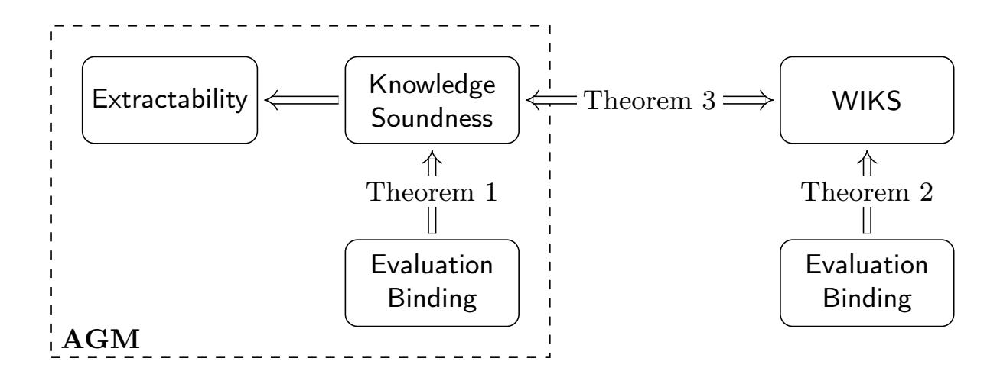
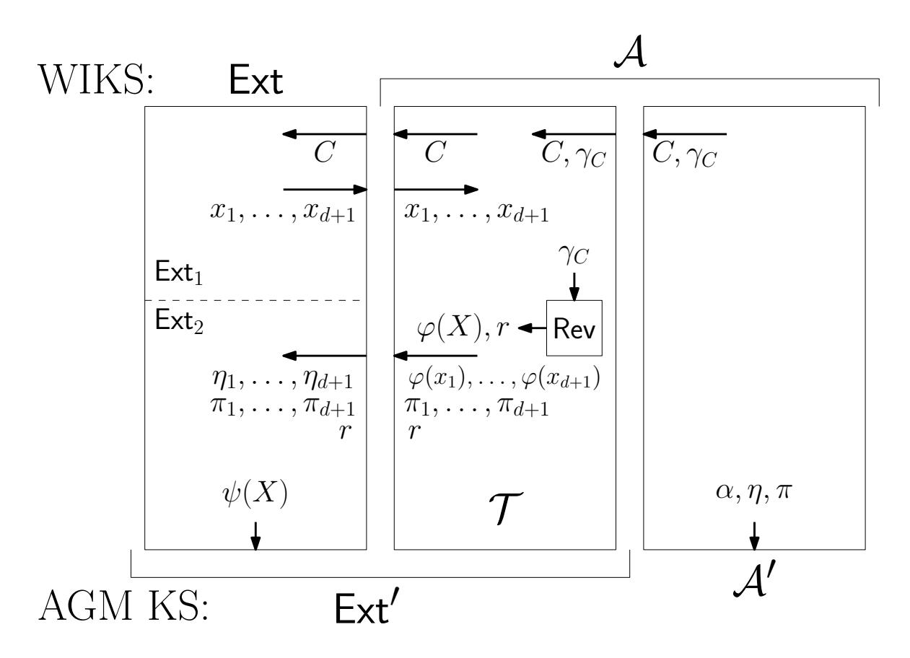
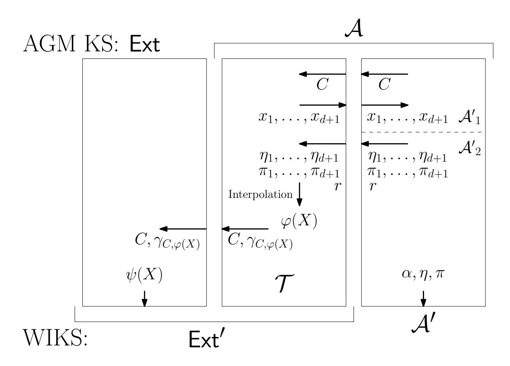

{0}------------------------------------------------

# Knowledge Soundness of Polynomial Commitments in the Algebraic Group Model Does Not Guarantee Extractability

Petr Chmel<sup>1</sup> [,](https://orcid.org/0000-0002-9131-1458) Pavel Hubáček<sup>1</sup>,<sup>2</sup> [,](https://orcid.org/0000-0002-6850-6222) and Dominik Stejskal<sup>1</sup>

- <sup>1</sup> Charles University, Faculty of Mathematics and Physics, Prague, Czech Republic chmel@iuuk.mff.cuni.cz
- 2 Institute of Mathematics, Czech Academy of Sciences, Prague, Czech Republic hubacek@math.cas.cz

Abstract. The Algebraic Group Model (AGM) has become a standard framework for analyzing the knowledge soundness of group-based polynomial commitment schemes. In this work, we formally establish inherent limitations of this methodology. We isolate a structural property satisfied by essentially all practical group-based polynomial commitments, which we term AGM-clarity. We prove that for AGMclear schemes, evaluation binding implies knowledge soundness in the AGM. This collapse reveals that the AGM definition of knowledge soundness does not capture a distinct security property, but is merely a structural consequence of evaluation binding.

To precisely characterize the guarantees on extractability provided by the AGM, we introduce Weak Interpolation Knowledge Soundness (WIKS) in the standard model, which is an extreme relaxation of extractability. We show that WIKS is implied by standard evaluation binding and prove that, for AGM-clear schemes, knowledge soundness in the AGM is equivalent to WIKS. Ultimately, our results demonstrate that proofs in the AGM for practical polynomial commitment schemes do not certify "knowledge" in the sense of immediate extractability, as they yield no guarantees beyond those already implied by standard model evaluation binding.

Keywords: Polynomial Commitment Schemes · Extractability · Knowledge Soundness · Evaluation Binding · Algebraic Group Model · AGM.

# 1 Introduction

Polynomial commitment schemes (PCS) are a central building block in modern zk-SNARKs, offering succinct openings and fast verification independent of the committed polynomial's degree. While pairingbased [\[KZG10,](#page-12-0) [PST13\]](#page-12-1) and inner-product-based [\[BBB](#page-11-0)+18] constructions clearly win in proof size, yielding proofs of a few hundred bytes compared to the polylogarithmic overhead of post-quantum alternatives, their security proofs present significant theoretical challenges. Specifically, proving knowledge soundness for these group-based schemes in the standard model is highly non-trivial, culminating in the recent proofs under new, albeit falsifiable, hardness assumptions [\[LPS24,](#page-12-2) [BDH](#page-11-1)<sup>+</sup>25].

To bypass these hurdles, security of polynomial commitments is frequently analyzed in the Algebraic Group Model (AGM) [\[FKL18\]](#page-11-2). In the AGM, the adversary is restricted to being algebraic: for every group element it outputs, it must provide an algebraic explanation, i.e., the coefficients of a linear combination of its inputs corresponding to the output. This restriction simplifies proofs dramatically. Gabizon, Williamson, and Ciobotaru [\[GWC19\]](#page-12-3) noted that the AGM allows modeling binding and knowledge soundness in a single clean game, effectively permitting the extractor to return a polynomial immediately after the commitment (Remark 3.2 in [\[GWC19\]](#page-12-3)). Indeed, for practical schemes, the algebraic explanation of a commitment is the coefficient vector of the polynomial, making extraction syntactic and the proof of knowledge soundness a straightforward reduction to a suitable q-DLog assumption. However, this simplicity raises a fundamental question:

If extraction is syntactic, what exactly is guaranteed by knowledge soundness in the AGM?

{1}------------------------------------------------

Prior Critiques of the AGM. Existing critiques of the AGM have focused on its limited expressivity. Lipmaa, Parisella, and Siim [\[LPS23\]](#page-12-4) argue that the AGM forbids oblivious sampling of group elements without knowing their linear representations, which is a capability real adversaries possess, e.g., via admissible encodings in elliptic curves. They introduced the AGM with Oblivious Sampling (AGMOS) to remedy this, motivated by the observation that assumptions like SpurKE (the spurious knowledge assumption of immediate knowledge of exponent) are false in reality despite being provable in the AGM. While clearly valuable, this line of work critiques the model. Our motivation is different: we accept the AGM as a model but study the guarantees provided by the definition of knowledge soundness within it.

## 1.1 Our Results

In this work, we present formal arguments establishing intrinsic limitations of the notion of knowledge soundness for polynomial commitments in the AGM for a broad class of schemes encompassing all known group-based constructions previously analyzed in the AGM.

AGM-Clarity. We first define a structural property satisfied by existing group-based polynomial commitments, which we term AGM-clarity. A polynomial commitment scheme is AGM-clear if, given the algebraic explanation of a commitment C, one can efficiently construct a polynomial f consistent with C. As we discussed, this property is immediate for practical proposals such as Bulletproofs [\[BBB](#page-11-0)+18], KZG [\[KZG10\]](#page-12-0), its multivariate variants [\[PST13\]](#page-12-1), KZG-based Gemini [\[BCHO22\]](#page-11-3), Zeromorph [\[KT24\]](#page-12-5), Samaritan [\[GPS25\]](#page-12-6) or Mercury [\[EG25\]](#page-11-4) since, in these constructions, the commitment is a linear function of the group elements given to the adversary as the commitment key. Intuitively, AGM-clarity allows extracting a polynomial consistent with the commitment directly from its algebraic explanation provided by any AGM adversary. However, AGM-clarity is not a security property, and it alone does not suffice for knowledge soundness in the AGM. Specifically, even after extracting the polynomial f from the algebraic explanation of the commitment C, one has to argue the consistency of f with the subsequent evaluation claim (α, η) for which the adversary provides an accepting evaluation proof.

Evaluation Binding implies Knowledge Soundness in the AGM. Our initial observation is that, for AGM-clear schemes, evaluation binding already implies knowledge soundness. The extractor can simply output the polynomial f reconstructed from the adversary's algebraic explanation of C. To argue that f is consistent with a claimed evaluation (α, η) for which the adversary produced an accepting proof π, suppose instead that f(α) ̸= η. Then one could use f with C to construct another accepting proof for (α, f(α)), contradicting evaluation binding.

Theorem [1](#page-6-0) (Informal). Every AGM-clear polynomial commitment scheme that is evaluation binding is also knowledge-sound in the AGM.

Note that the conclusion of Theorem [1](#page-6-0) is quite unexpected, as we show that a presumably strong security guarantee is a structural consequence of an arguably mild one. For comparison, in the standard model, evaluation binding is comparatively easy to establish under mild assumptions, e.g., for KZG under SBDH [\[KZG10\]](#page-12-0), since its violations are local and admit straightforward reductions. By contrast, knowledge soundness demands extracting a globally consistent polynomial, a far stronger guarantee. In particular, proving the knowledge soundness of the KZG polynomial commitment in the standard model under assumptions sufficient for evaluation binding would likely require a significant conceptual breakthrough.

On extraction from the evaluation proof in the AGM. One could consider a relaxed notion of extractability in the AGM where the extractor, besides the commitment and its algebraic explanation, may also use the evaluation proof together with its algebraic explanation (cf. Definition 6 in [\[LPS23\]](#page-12-4)). However, this relaxed notion is implied by the knowledge soundness in the AGM: an extractor that uses only the commitment with its algebraic explanation clearly succeeds also when given strictly more information. From Theorem [1,](#page-6-0) it then follows that, for AGM-clear schemes, evaluation binding implies also extractability in the AGM. In 

{2}------------------------------------------------

other words, for practical group-based schemes, giving the extractor access to the evaluation proof does not significantly alter the security notion relative to evaluation binding, and the same collapse applies.

A Standard Model Analogue of Knowledge Soundness in the AGM. The above results suggest that, for polynomial commitments, the current formulation of knowledge soundness in the AGM provides a significantly weaker guarantee compared to knowledge soundness in the standard model. We formalize this intuition by defining a clearly restricted notion of knowledge soundness in the standard model, which we term Weak Interpolation Knowledge Soundness (WIKS), and show that it is equivalent to knowledge soundness in the AGM for AGM-clear polynomial commitments. Thus, WIKS provides a tight upper bound on the standard model security guaranteed by the knowledge soundness in the AGM for AGM-clear PCS.

We define WIKS via a game between an adversary and an extractor that proceeds as follows: The adversary chooses a commitment C, and the extractor then asks d+1 evaluation queries. To all of the queries, the adversary must provide values with accepting evaluation proofs, and, moreover, interpolating over these evaluation queries must yield a polynomial consistent with the commitment C. The adversary also outputs an evaluation point  $\alpha$ , a claimed evaluation  $\eta$  and an accepting evaluation proof. Given the d+1 answers to its evaluation queries with proofs, the extractor outputs a polynomial f of degree d, and the adversary wins iff  $f(\alpha) \neq \eta$ .

WIKS can be thought of as an extreme relaxation of special soundness for polynomial commitments. In the special soundness game (cf. Def. 5 in [LPS24]), the extractor would be given d+1 accepting evaluation proofs for distinct evaluation points. However, there would be no guarantee on the consistency of the interpolating polynomial with the commitment C. Indeed, the crux of the standard model proof of special soundness for the univariate, respectively multivariate, KZG scheme (Lipmaa et al. [LPS24], respectively Belohorec et al. [BDH $^+$ 25]) is showing that the interpolating polynomial is consistent with the commitment under a suitable falsifiable assumption.

Evaluation binding implies WIKS in the standard model. The main similarity between knowledge soundness in the AGM and WIKS is that, for AGM-clear schemes, there exists a canonical extractor: for knowledge soundness in the AGM, it follows from AGM-clarity, and, for WIKS, it is enforced by the requirement that the adversary must give evaluations that interpolate to a polynomial consistent with the originally given commitment. The existence of a canonical interpolating extractor allows us to prove the analogue of Theorem 1 also for WIKS, i.e., showing that WIKS collapses to evaluation binding in the standard model.

**Theorem 2 (Informal).** Every polynomial commitment scheme that is evaluation binding is also weak interpolation-knowledge-sound.

Under AGM-clarity, WIKS characterizes knowledge soundness in the AGM. Finally, we show that knowledge soundness in the AGM is characterized by WIKS in the standard model.

**Theorem 3 (Informal).** Every AGM-clear polynomial commitment scheme is weakly interpolation-knowledge-sound if and only if it is knowledge-sound in the AGM.

A depiction of the established relations is provided in Figure 1. In particular, for an AGM-clear polynomial commitment scheme  $\Pi$ , one can prove the knowledge soundness in the AGM by simply relying on any proof of evaluation binding for  $\Pi$  in the standard model.

The two directions of Theorem 3 are both proved via a simple translation layer that turns extractors into adversaries and vice versa while preserving their joint output distributions. The common ingredient is a canonical reconstruction of a polynomial: given d+1 accepting openings at distinct points, the extractor interpolates a degree-d polynomial  $\varphi$  and then checks that  $\varphi$  is consistent with the commitment C. AGM-clarity is used to turn  $\varphi$  into the algebraic explanation demanded by the AGM.

 $WIKS \Rightarrow knowledge soundness in the AGM (Lemma 1):$  Fix any WIKS extractor Ext and wrap it into an AGM extractor Ext': on input a commitment C, Ext' queries the adversary on d+1 fresh points, interpolates  $\varphi$ , and feeds to Ext the commitment together with the algebraic explanation induced by  $\varphi$ . If some

{3}------------------------------------------------

<span id="page-3-0"></span>

Fig. 1. Visual summary of the relationships established in this work. The dashed box highlights notions in the Algebraic Group Model. Theorems [1](#page-6-0) and [3](#page-8-1) assume additionally AGM-clarity of the PCS. Note that evaluation binding in the standard model implies evaluation binding in the AGM trivially.

AGM adversary A′ breaks knowledge soundness against every AGM extractor, then, in particular, it breaks Ext′ . Composing A′ with the inverse translation yields a WIKS adversary that defeats the original Ext, contradicting WIKS.

Knowledge soundness in the AGM ⇒ WIKS (Lemma [2\)](#page-9-0): Starting from a WIKS adversary A′ that defeats every WIKS extractor, we build an AGM adversary A against any fixed AGM extractor Ext. The adversary A emulates A′ and, whenever Ext needs an algebraic explanation of C, it first obtains d+1 accepting openings from A′ at distinct random points, interpolates φ, and (by AGM-clarity) supplies the corresponding algebraic explanation for C. Because the translation preserves the joint distributions of outputs of WIKS/AGM adversary and extractor, A inherits A′ 's non-negligible success, contradicting AGM knowledge soundness.

On Randomized/Multivariate Commitments and AGMOS. Our results in the following sections are stated and proven for randomized polynomial commitments, and they also address the common hiding/zeroknowledge variants of group-based polynomial commitments. They can be simplified for deterministic commitments simply by ignoring the randomness in the corresponding definitions. While our formal exposition treats univariate polynomial commitments for clarity, the extensions to multivariate commitments are straightforward and require no new ideas beyond routine notation (e.g., component-wise explanations and multivariate interpolation).

Our results establish relationships between notions in the AGM and the standard model. Belohorec, Hubáček, and Stejskal [\[BHS26\]](#page-11-5) recently showed that, for many natural security games, AGM security can be lifted to the AGM with Oblivious Sampling (AGMOS) of Lipmaa et al. [\[LPS23\]](#page-12-4) under the Find Polynomial Representation (FPR) and Tensor Oracle Find Representation (TOFR) assumptions. Among other applications, Belohorec et al. illustrated their general lifting theorem on knowledge soundness of polynomial commitments, and showed that knowledge soundness in the AGM implies knowledge soundness in the AG-MOS for many KZG-like pairing-based polynomial commitments under these assumptions. Therefore under FPR and TOFR,[3](#page-3-1) our results can be lifted to the AGMOS, establishing that knowledge soundness in the AGMOS is also implied by evaluation binding and equivalent to WIKS. In other words, even moving to the AGMOS does not resolve the limitations of knowledge soundness in the AGM.

### 1.2 Summary and Open Problems

Given that the very premise of the AGM is to restrict adversaries to algebraic behavior, making witness extraction part of the model, one might wonder:

<span id="page-3-1"></span><sup>3</sup> Essentially all non-trivial proofs of security in the AGMOS, and, in particular, of knowledge soundness of polynomial commitments (e.g., the direct proof of extractability for KZG in [\[LPS23\]](#page-12-4)), rely on the TOFR assumption (and FPR, which reduces to PDL). Thus, we do not see them as significantly restrictive additional assumptions.

{4}------------------------------------------------

Is it so surprising that extractability comes almost for free in a model whose premise is extractability?

However, the above question is orthogonal to our motivation and our formal results. Our objective is not to critique the inherent properties of the AGM, but to clarify what the model actually guarantees for polynomial commitments. We have established that for AGM-clear schemes, knowledge soundness collapses into a structural corollary of evaluation binding. Therefore, AGM proofs for these schemes are effectively vacuous regarding "knowledge": they do not certify immediate extractability, but rather our weaker notion of WIKS, which is already implied by standard evaluation binding.

These findings have two immediate implications. First, our community must be clear about the implications of proofs of security for polynomial commitments in the AGM. Practitioners may interpret knowledge soundness in the AGM as a guarantee of real-world extractability, unaware that for practical schemes, the proof adds no security assurances beyond those provided by evaluation binding. Second, since extractability in the AGM is largely an artifact of the model, genuine knowledge guarantees must be established in the standard model. Progress has been made in this direction using new falsifiable assumptions like AR-SDH [\[LPS24,](#page-12-2) [BDH](#page-11-1)<sup>+</sup>25, [LPS25,](#page-12-7) [CGKY25\]](#page-11-6), but proving standard-model knowledge soundness under more classical assumptions remains a major open problem.

Regarding the scope of our results, removing the restriction to AGM-clear schemes is an open question. However, we view this restriction as benign: practically all group-based PCS are inherently AGM-clear due to the linearity of their commitment algorithms. Thus, our results cover essentially all schemes of practical interest.

## 1.3 Additional Related Work

Until recently, the knowledge soundness of group-based polynomial commitments was established either under non-falsifiable assumptions [\[ZGK](#page-12-8)+17, [CHM](#page-11-7)+20] or in idealized models such as the AGM [\[GWC19,](#page-12-3) [BDFG20,](#page-11-8) [BDFG21,](#page-11-9) [GW21,](#page-12-9) [GPS25,](#page-12-6) [EG25\]](#page-11-4). The drawbacks of non-falsifiable assumptions have long been recognized [\[Nao03\]](#page-12-10).[4](#page-4-0) Regarding idealized models, the knowledge soundness of group-based polynomial commitments has been analyzed primarily in the Algebraic Group Model (AGM) of Fuchsbauer, Kiltz, and Loss [\[FKL18\]](#page-11-2). As the AGM is a relatively recent framework, its limitations and relationship to other idealized models like the Generic Group Model (GGM) [\[Sho97,](#page-12-11) [Mau05\]](#page-12-12) remain the subject of ongoing research [\[KP19,](#page-12-13) [AHK20,](#page-11-10) [ABK](#page-11-11)+21, [ZZK22,](#page-12-14) [AHPP23,](#page-11-12) [JM24,](#page-12-15) [BFHK24\]](#page-11-13).

Various works leverage AGM to analyze the knowledge soundness and related notions, even for higherlevel protocols. [\[BMM](#page-11-14)+21] and [\[GMN22\]](#page-11-15) used AGM to prove soundness of batch Groth16 proofs. [\[GT21\]](#page-12-16) defined state-restoration soundness in the AGM, and gave a proof of state-restoration soundness in the AGM for Bulletproofs. The Halo2 book claims state-restoration soundness in the AGM for Halo2 [\[Com21\]](#page-11-16). Note that state-restoration soundness is stronger than knowledge soundness. Finally, [\[ZBK](#page-12-17)+22, [PK22,](#page-12-18) [EFG22,](#page-11-17) [ZGK](#page-12-19)+25] considered lookup arguments and analysed their security in the AGM.

## 2 Preliminaries

We recall the key notions, starting with polynomial commitment schemes. For conciseness, we consider the group parameter generation to be a part of the definition of a PCS.

Definition 1 (PCS). A non-interactive univariate polynomial commitment scheme (PCS) (PGen,KGen, Com, Open, Vrf) consists of the following polynomial-time algorithms:

Setup: PGen(1<sup>λ</sup> ) → gp; generate group parameters.

Commitment key generation: KGen(gp, d) → ck; given group parameters and a degree bound d, return a commitment key ck, which implicitly contains gp.

<span id="page-4-0"></span><sup>4</sup> A practical downside is that relying on non-falsifiable assumptions, such as Power-Knowledge-of-Exponent, effectively doubles the scheme's complexity, as parties must execute two "parallel" instances of the protocol.

{5}------------------------------------------------

**Commitment:** Com(ck, f(X);  $r) \to C$ ; for a polynomial  $f(X) \in \mathbb{F}[X]^{\leq d}$ , compute a (possibly random-ized) commitment C.

**Opening:** Open(ck,  $C, \alpha, f(X); r) \to (\eta, \pi);$  to open a commitment C to a polynomial  $f(X) \in \mathbb{F}[X]^{\leq d}$  at a point  $\alpha \in \mathbb{F}$ , return the evaluation  $\eta = f(\alpha)$  and an evaluation proof  $\pi$ .

**Verification:** Vrf(ck,  $C, \alpha, \eta, \pi$ )  $\rightarrow$  {0,1}; intuitively, accept (1) or reject (0) the proof  $\pi$  that  $\eta$  is the evaluation at the point  $\alpha$  of some "promised" polynomial  $f(X) \in \mathbb{F}[X]^{\leq d}$  behind the commitment C.

The above definition also covers randomised schemes such as the "blinded" KZG scheme (see, e.g., Section 3.5.3 in Kohrita and Towa [KT24]), where the commitment and opening functions take some additional randomness r to achieve hiding.

As the goal of a polynomial commitment scheme is to force the prover to commit to a polynomial, it should (among other requirements) be able to ensure that the prover cannot make a commitment which can be opened to multiple distinct values at the same evaluation point. This is formalized as the evaluation binding property of a PCS.

**Definition 2 (Evaluation binding).** A polynomial commitment scheme  $\Pi = (\mathsf{PGen}, \mathsf{KGen}, \mathsf{Com}, \mathsf{Open}, \mathsf{Vrf})$  is evaluation binding if for any  $d \in \mathsf{poly}(\lambda)$  and PPT adversary  $\mathcal{A}$ ,

$$\Pr\left[ \begin{aligned} & \mathsf{Vrf}(\mathsf{ck}, C, \alpha, \eta, \pi) = 1 \, \wedge \\ & \mathsf{Vrf}(\mathsf{ck}, C, \alpha, \eta', \pi') = 1 \, \wedge \, \eta \neq \eta' \\ \end{aligned} \right| \begin{aligned} & \mathsf{gp} \leftarrow \mathsf{PGen}(1^\lambda); \mathsf{ck} \leftarrow \mathsf{KGen}(\mathsf{gp}, d); \\ & (C, \alpha, \eta, \pi, \eta', \pi') \leftarrow \mathcal{A}(\mathsf{ck}) \end{aligned} \right] \in \mathsf{negl}(\lambda).$$

In words, the probability that A wins the following evaluation-binding game is negligible. Given a commitment key ck, A must open some commitment C at some evaluation point  $\alpha$  to two different purported evaluations  $\eta$ ,  $\eta'$  so that both proofs  $\pi$ ,  $\pi'$  are accepted.

We continue with introducing the Algebraic Group Model and algebraic adversaries in particular.

**Definition 3 (AGM).** Let PGen be a group parameter generator. A PPT algorithm  $\mathcal{A}$  is algebraic (or an AGM adversary) if, for any group elements it outputs, it also outputs their algebraic explanations with respect to its input. Formally, for any  $\mathsf{gp} \leftarrow \mathsf{PGen}(1^\lambda)$  and a vector of input group elements  $\bar{g}$ ,

$$\mathcal{A}(\mathsf{gp},\bar{g}) \to (\bar{o}, \boldsymbol{\gamma}_{\bar{o}}),$$

where  $\gamma_{\bar{o}}$ , the algebraic explanation of  $\mathcal{A}$ 's output  $\bar{o}$ , is a matrix over our field  $\mathbb{F}$ , and it holds that

$$\bar{o} = \gamma_{\bar{o}}\bar{g}.$$
 (1)

The input or output of A may contain some other field elements, which we omit. In the Algebraic Group Model (AGM), all PPT adversaries are algebraic.

The crucial property of a PCS that is of interest to us is knowledge soundness in the AGM, which informally ensures both the property of evaluation binding and a requirement on the prover to "know" the polynomial it commits itself to.

<span id="page-5-0"></span>**Definition 4 (Knowledge Soundness in the AGM).** A polynomial commitment scheme  $\Pi = (\mathsf{PGen}, \mathsf{KGen}, \mathsf{Com}, \mathsf{Open}, \mathsf{Vrf})$  is knowledge-sound in the AGM if, for any  $d \in \mathsf{poly}(\lambda)$ , there exists a PPT extractor Ext such that for every algebraic adversary  $\mathcal{A}$ ,

$$\Pr \begin{bmatrix} \mathsf{Vrf}(\mathsf{ck}, C, \alpha, \eta, \pi) = 1 \land \\ (C \neq \mathsf{Com}(\mathsf{ck}, f(X); r) \\ \lor \ \deg(f(X)) > d \\ \lor \ f(\alpha) \neq \eta) \end{bmatrix} \mathsf{gp} \leftarrow \mathsf{PGen}(1^{\lambda}); \mathsf{ck} \leftarrow \mathsf{KGen}(\mathsf{gp}, d); \\ ((C, \gamma_C), \alpha, \eta, \pi) \leftarrow \mathcal{A}(\mathsf{ck}); \\ (f(X), r) \leftarrow \mathsf{Ext}(\mathsf{ck}, (C, \gamma_C)) \end{bmatrix} \in \mathsf{negl}(\lambda),$$

where  $\gamma_C$  is the algebraic explanation of C.

{6}------------------------------------------------

The above definition is adapted from the definitions of knowledge-soundness in the AGM from the literature (see, e.g., [GWC19, BDFG20, BDFG21, LPS23]). Note that we do not require  $\mathcal{A}$  to explain the group elements in the evaluation proof  $\pi$  since the extractor has access only to the algebraic explanation of the commitment anyway. It is natural to consider a relaxation of knowledge soundness in the AGM that only requires extraction after seeing the evaluation proof with its algebraic explanation, as formalized below. Trivially, a scheme that is knowledge sound is also extractable.

**Definition 5 (Extractability in the AGM).** A polynomial commitment scheme  $\Pi = (\mathsf{PGen}, \mathsf{KGen}, \mathsf{Com}, \mathsf{Open}, \mathsf{Vrf})$  is extractable in the AGM if, for any  $d \in \mathsf{poly}(\lambda)$  and every algebraic adversary  $\mathcal{A}$ , there exists a PPT extractor  $\mathsf{Ext}_{\mathcal{A}}$  such that

$$\Pr\begin{bmatrix} \mathsf{Vrf}(\mathsf{ck}, C, \alpha, \eta, \pi) = 1 \land \\ (C \neq \mathsf{Com}(\mathsf{ck}, f(X); r) \\ \lor \ \deg(f(X)) > d \\ \lor \ f(\alpha) \neq \eta) \end{bmatrix} \mathsf{gp} \leftarrow \mathsf{PGen}(1^{\lambda}); \mathsf{ck} \leftarrow \mathsf{KGen}(\mathsf{gp}, d); \\ ((C, \gamma_C), \alpha, \eta, (\pi, \gamma_\pi)) \leftarrow \mathcal{A}(\mathsf{ck}); \\ (f(X), r) \leftarrow \mathsf{Ext}(\mathsf{ck}, (C, \gamma_C), \alpha, \eta, (\pi, \gamma_\pi)) \end{bmatrix} \in \mathsf{negl}(\lambda),$$

where  $\gamma_C$  and  $\gamma_{\pi}$  are the algebraic explanations of C and  $\pi$ , respectively.

# 3 Evaluation Binding Implies Knowledge Soundness in the AGM

In this section, we show that, in the AGM, evaluation binding implies knowledge soundness for a large class of polynomial commitments. We start with defining the polynomial commitments to which our results apply.

**Definition 6 (AGM-clarity).** A PCS  $\Pi = (\mathsf{PGen}, \mathsf{KGen}, \mathsf{Com}, \mathsf{Open}, \mathsf{Vrf})$  is AGM-clear if there exists a DPT revealer Rev such that, for every  $d \in \mathsf{poly}(\lambda)$ , the following implication holds. If  $\mathsf{gp} \leftarrow \mathsf{PGen}(1^{\lambda})$ ,  $\mathsf{ck} \leftarrow \mathsf{KGen}(\mathsf{gp}, d)$ , C is a commitment and  $\gamma_C$  its algebraic explanation with respect to  $\mathsf{ck}$ , then  $(f(X), r) \leftarrow \mathsf{Rev}(\mathsf{ck}, (C, \gamma_C))$ , where  $\deg(f(X)) \leq d$  and  $\mathsf{Com}(\mathsf{ck}, f(X); r) = C$ .

Informally, given the algebraic explanation of a commitment, the revealer allows efficient extraction of a polynomial consistent with the commitment. We note that many polynomial commitments from the literature, such as Bulletproofs [BBB<sup>+</sup>18], KZG [KZG10], its multivariate variants [PST13], Gemini [BCHO22], Zeromorph [KT24], Samaritan [GPS25] or Mercury [EG25], as well as their randomized hiding variants, are all AGM-clear with a revealer that simply outputs the algebraic explanation of the commitment.

<span id="page-6-0"></span>**Theorem 1.** Let  $\Pi = (\mathsf{PGen}, \mathsf{KGen}, \mathsf{Com}, \mathsf{Open}, \mathsf{Vrf})$  be an AGM-clear PCS. If  $\Pi$  is evaluation binding, then it is knowledge-sound in the AGM.

*Proof.* We prove the statement by establishing the contrapositive. Let  $\Pi$  be an AGM-clear PCS that is not knowledge-sound in the AGM. We show that then  $\Pi$  is not evaluation binding.

To break the evaluation binding of  $\Pi$ , we leverage any adversary  $\mathcal{A}$  that wins the knowledge-soundness game against the most basic extractor  $\mathsf{Ext}^*$  that simply outputs the polynomial produced from commitment C and its algebraic explanation  $\gamma_C$  by the revealer Rev guaranteed by AGM-clarity of  $\Pi$ . Since  $\Pi$  is not knowledge-sound in the AGM, for any efficient extractor  $\mathsf{Ext}$ , there exists an algebraic adversary  $\mathcal{A}$  such that it can win the knowledge-soundness game against  $\mathsf{Ext}$  for  $\Pi$  with non-negligible probability. In particular, there exists such a successful adversary against the above revealer-based extractor  $\mathsf{Ext}^*$ . Thus, given the commitment key  $\mathsf{ck}$ , the adversary  $\mathcal{A}$  can, with non-negligible probability, output a commitment C with an algebraic explanation  $\gamma_C$  and a point  $\alpha$  with a claimed evaluation  $\eta$  and an accepting proof  $\pi$  such that the polynomial that  $\mathsf{Ext}^*(\mathsf{ck}, (C, \gamma_C))$  outputs evaluates to a value  $\eta' \neq \eta$  and  $\mathsf{Vrf}(\mathsf{ck}, C, \alpha, \eta, \pi) = 1$ .

Given a commitment key ck, our adversary  $\mathcal{A}'$  for the evaluation binding game proceeds as follows:

1. Run  $\mathcal{A}(\mathsf{ck})$  to get a commitment C with an explanation  $\gamma_C$ , and a point  $\alpha$  with a claimed evaluation  $\eta$  and a proof  $\pi$  such that  $\mathsf{Vrf}(\mathsf{ck}, C, \alpha, \eta, \pi) = 1$ .

{7}------------------------------------------------

- 2. Run Rev(ck,  $(C, \gamma_C)$ ) to obtain a polynomial  $\psi$  and randomness r such that Com(ck,  $\psi(X); r$ ) = C. Compute  $\eta' = \psi(\alpha)$  and the corresponding evaluation proof  $\pi' = \mathsf{Open}(\mathsf{ck}, C, \alpha, \psi(X); r)$ .
- 3. Output  $(C, \alpha, \eta, \eta', \pi, \pi')$ .

The above adversary  $\mathcal{A}'$  wins the evaluation-binding game with the same probability of  $\mathcal{A}$  winning the AGM knowledge-soundness game against the extractor  $\mathsf{Ext}^*$ , which we assume to happen with non-negligible probability. Hence,  $\mathcal{A}'$  wins the evaluation binding game with non-negligible probability, establishing the contrapositive, and, thus, the theorem.

# 4 Translating Knowledge Soundness in the AGM to the Standard Model

In this section, we characterize the power of knowledge soundness in the AGM (Definition 4) with respect to the standard model. To this end, we define a standard model notion of weak interpolation knowledge soundness (WIKS) and then show that WIKS is equivalent to knowledge soundness in the AGM for all AGM-clear polynomial commitment schemes.

In the definition of WIKS below, we use Lagrange interpolation, which we recall for completeness. For two vectors  $\bar{x}, \bar{\eta} \in \mathbb{F}^d$ , we use

$$\mathsf{Interpolate}(X,\bar{x},\bar{\eta}) := \sum_{i=1}^d \eta_i \prod_{j=1,j\neq i}^d \frac{X-x_i}{x_j-x_i}$$

to denote the degree d Lagrange interpolation polynomial in variable X such that the value at point  $x_i$  is  $\eta_i$ .

Definition 7 (Weak interpolation knowledge soundness in the standard model). For a PCS  $\Pi = (\mathsf{PGen}, \mathsf{KGen}, \mathsf{Com}, \mathsf{Open}, \mathsf{Vrf}), \ a \ degree \ bound \ d \in \mathsf{poly}(\lambda), \ a \ PPT \ extractor \ \mathsf{Ext} = (\mathsf{Ext}_1, \mathsf{Ext}_2), \ and \ an \ adversary \ \mathcal{A} = (\mathcal{A}_1, \mathcal{A}_2), \ the \ weak \ interpolation \ knowledge \ soundness \ experiment \ \mathsf{WIKS}_{\mathcal{A},\mathsf{Ext}}^{\Pi,d}(\lambda) \ is \ defined \ as \ follows:$ 

```
 \begin{array}{l} \text{1. } \mathsf{gp} \leftarrow \mathsf{PGen}(1^{\lambda}); \mathsf{ck} \leftarrow \mathsf{KGen}(\mathsf{gp},d) \\ \text{2. } (C,\mathsf{state}) \leftarrow \mathcal{A}_1(\mathsf{ck}) \\ \text{3. } (x_1,\dots,x_{d+1}) \leftarrow \mathsf{Ext}_1(\mathsf{ck},C) \\ \text{4. } (((\eta_1,\pi_1),\dots,(\eta_{d+1},\pi_{d+1})),(\alpha,\eta,\pi),r) \leftarrow \mathcal{A}_2(\mathsf{state},\mathsf{ck},C,x_1,\dots,x_{d+1}) \\ \text{5. } f(X) \leftarrow \mathsf{Ext}_2(\mathsf{ck},C,((x_1,\eta_1,\pi_1),\dots,(x_{d+1},\eta_{d+1},\pi_{d+1})),r) \\ \text{6. } If all of the following hold, return 1, otherwise, return 0:} \\ (a) \ \mathsf{Vrf}(\mathsf{ck},C,\alpha,\eta,\pi) = 1 \\ (b) \ \textit{for all } i \in [d+1], \ \mathsf{Vrf}(\mathsf{ck},C,x_i,\eta_i,\pi_i) = 1 \\ (c) \ \textit{for } \bar{x} = (x_1,\dots,x_{d+1}) \ \textit{and } \bar{\eta} = (\eta_1,\dots,\eta_{d+1}), \\ C = \mathsf{Com}(\mathsf{ck},\mathsf{Interpolate}(X,\bar{x},\bar{\eta});r) \\ (d) \ C \neq \mathsf{Com}(\mathsf{ck},f(X);r) \lor \deg(f(X)) > d \lor f(\alpha) \neq \eta \\ \end{array}
```

We say that a polynomial commitment scheme  $\Pi$  satisfies weak interpolation knowledge soundness if there exists a PPT extractor  $\mathsf{Ext} = (\mathsf{Ext}_1, \mathsf{Ext}_2)$  such that, for all adversaries  $\mathcal{A} = (\mathcal{A}_1, \mathcal{A}_2)$  and degree bounds  $d \in \mathsf{poly}(\lambda)$ , it holds that  $\Pr\left[\mathsf{WIKS}_{\mathcal{A},\mathsf{Ext}}^{\Pi,d}(\lambda) = 1\right] \in \mathsf{negl}(\lambda)$ .

In words, the adversary chooses a commitment C, the extractor then asks d+1 evaluation queries. To all of the queries, the adversary must provide values with accepting evaluation proofs, and randomness r such that interpolating over these evaluation queries must yield a polynomial consistent with the commitment C under the randomness r. The adversary also outputs an evaluation point  $\alpha$ , a claimed evaluation  $\eta$  and an accepting evaluation proof. Given the d+1 answers to its evaluation queries with proofs, the extractor outputs a polynomial f of degree d consistent with C under the randomness r, and the adversary wins iff  $f(\alpha) \neq \eta$ .

Note that WIKS is, as its name suggests, indeed quite limiting as it effectively requires the adversary to have some globally consistent strategy for winning the game. In particular, there are clearly many standard-model adversaries outside the scope of WIKS we must consider when studying the full-blown notion of knowledge soundness in the standard model.

{8}------------------------------------------------

WIKS vs. Special Soundness. Lipmaa et al. [LPS24] introduced a seemingly similar standard model notion of special soundness for polynomial commitments. In their special soundness experiment (Definition 5 in [LPS24]), the evaluation points  $(x_1, \ldots, x_{d+1})$  are chosen by the adversary (under the condition of being pairwise distinct to ensure a valid interpolation domain), and, crucially, the winning condition does not contain item 6.(c), i.e., the adversary can, in principle, provide evaluation points and values that do not interpolate to a polynomial consistent with the commitment C. Since there is no syntactic guarantee on the consistency of the provided evaluations with the commitment, one proves the consistency of the extracted polynomial with the commitment under computational assumptions (ARSDH in [LPS24]). On the other hand, item 6.(c) in the winning condition in WIKS ensures syntactically that extraction via interpolation is successful, making WIKS a strictly weaker notion.

Evaluation binding implies WIKS in the standard model. First, we show that, for any PCS, an analogue of Theorem 1 holds for WIKS as well. This is due to the fact that, for WIKS, there exists a canonical extractor in the vein of the revealer for AGM-clear polynomial commitments. Indeed, to succeed in the WIKS experiment, the adversary must provide point evaluations that interpolate to a polynomial consistent with the originally output commitment.

<span id="page-8-0"></span>**Theorem 2.** Let  $\Pi = (\mathsf{PGen}, \mathsf{KGen}, \mathsf{Com}, \mathsf{Open}, \mathsf{Vrf})$  be a PCS. If  $\Pi$  is evaluation binding, then it is weakly interpolation-knowledge-sound.

*Proof.* We prove this using the contrapositive: the fact that weak interpolation knowledge soundness is broken gives us an adversary breaking evaluation binding. Let us consider the following extractor  $\mathsf{Ext}' = (\mathsf{Ext}_1', \mathsf{Ext}_2')$  for weak interpolation knowledge soundness: we query the adversary in d+1 distinct uniformly random points, and from these evaluations, we interpolate a polynomial. Then, by the fact that weak interpolation knowledge soundness is broken, we get an adversary  $\mathcal{A}' = (\mathcal{A}_1', \mathcal{A}_2')$  that wins the weak interpolation knowledge soundness game with non-negligible probability.

Using  $\mathcal{A}' = (\mathcal{A}'_1, \mathcal{A}'_2)$ , we construct an adversary  $\mathcal{A}$  for evaluation binding as follows. We take the commitment C generated by  $\mathcal{A}'_1$ , and ask  $\mathcal{A}'_2$  for d+1 correct evaluation proofs of the committed polynomial in distinct uniformly random points. Then, we interpolate the polynomial  $\varphi$  using the received evaluations. By our assumptions on  $\mathcal{A}'$ , we know that  $\varphi$  can be committed to C. Moreover, as  $\mathcal{A}'$  breaks weak interpolation knowledge soundness, it also outputs a point  $\alpha$  with claimed evaluation  $\eta$  and a proof  $\pi$  that correctly verifies such that  $\varphi(\alpha) \neq \eta$  with non-negligible probability.

Therefore, with non-negligible probability, we have two distinct evaluations of the committed polynomial at point  $\alpha$ :  $\eta$  with the proof  $\pi$ , and  $\varphi(\alpha)$ , where the proof can be generated by our knowledge of the polynomial. Thus, evaluation binding is also broken.

In fact, for the previous proposition, we can also weaken the assumptions on the adversary slightly by letting the extractor run in expected polynomial time and allowing the adversary to fail by outputting evaluation proofs which do not pass verification. In that case, to have any chance of winning with non-negligible probability, the evaluation proofs of the adversary must be correct with non-negligible probability. In particular, this implies that in expectation, we will need  $\mathcal{O}(d \cdot \lambda^c)$  queries, which would still amount to a polynomial number of steps.

Knowledge soundness in the AGM vs. WIKS in the standard model. Next, we establish the equivalence.

<span id="page-8-1"></span>**Theorem 3.** Let  $\Pi = (\mathsf{PGen}, \mathsf{KGen}, \mathsf{Com}, \mathsf{Open}, \mathsf{Vrf})$  be an AGM-clear PCS. Then  $\Pi$  satisfies WIKS if and only if it is knowledge-sound in the AGM.

<span id="page-8-2"></span>The proof of Theorem 3 is established via the two corresponding reductions presented in Lemmas 1 and 2 below. Our strategy in constructing both reductions uses a "translation layer" between an adversary and an extractor such that it can be joined with either to form a larger adversary or extractor depending on our current need, depicted in Figures 2 and 3.

{9}------------------------------------------------



<span id="page-9-1"></span>Fig. 2. A visual representation of the reduction establishing Lemma 1.

**Lemma 1.** Let  $\Pi = (\mathsf{PGen}, \mathsf{KGen}, \mathsf{Com}, \mathsf{Open}, \mathsf{Vrf})$  be an AGM-clear PCS. If  $\Pi$  satisfies WIKS then it is knowledge-sound in the AGM.

*Proof.* Again, we prove this using the contrapositive: if knowledge soundness in the AGM is broken, then so is weak interpolation knowledge soundness. As  $\Pi$  is AGM-clear, let Rev be the revealer certifying its AGM-clarity.

Let  $\mathsf{Ext} = (\mathsf{Ext}_1, \mathsf{Ext}_2)$  be a WIKS extractor for which we want to construct an adversary that breaks it. We modify  $\mathsf{Ext}$  into an extractor  $\mathsf{Ext}'$  for knowledge soundness in the AGM by composing  $\mathsf{Ext}$  with a translation layer  $\mathcal T$  as depicted in Figure 2: when the algebraic adversary outputs a commitment C with an algebraic explanation  $\gamma_C$ , we use the revealer  $\mathsf{Rev}$  to transform  $\gamma_C$  into a description of a polynomial  $\varphi$  and randomness r consistent with C, which we then use to truthfully answer the queries asked by  $\mathsf{Ext}_1$ , i.e., for all  $1 \le i \le d+1$ , set  $\eta_i = \varphi(x_i)$  and  $\pi_i = \mathsf{Open}(\mathsf{ck}, C, x_i, \eta_i; r)$ . The polynomial  $\psi$  that is the final output of  $\mathsf{Ext}_2$  is then returned unchanged.

Since Ext' is an extractor for knowledge soundness in the AGM, there exists an adversary  $\mathcal{A}'$  that wins the knowledge-soundness game against Ext' with non-negligible probability. From  $\mathcal{A}'$ , we now construct the adversary  $\mathcal{A}$  against the original extractor Ext. On a high-level, we take  $\mathcal{A}'$  and add the translation layer  $\mathcal{T}$  we used to modify Ext into Ext'. Formally, we modify  $\mathcal{A}'$  into  $\mathcal{A} = (\mathcal{A}_1, \mathcal{A}_2)$  as follows: in  $\mathcal{A}_1$ , the commitment C with its algebraic explanation  $\gamma_C$  output by  $\mathcal{A}'$  is translated using Rev into a description of a polynomial  $\varphi$  and randomness r consistent with the commitment C. The adversary  $\mathcal{A}_1$  sets state  $= (\varphi, r)$  and outputs (C, state). Then, the evaluation queries of Ext<sub>1</sub> are answered truthfully by  $\mathcal{A}_2$  using  $\varphi$  and r from state as above. When  $\mathcal{A}'$  outputs an evaluation point  $\alpha$ , the claimed evaluation  $\eta$ , and a purported proof  $\pi$ ,  $\mathcal{A}_2$  returns them unchanged.

By construction, the joint distributions of outputs of  $\mathcal{A}$  and Ext, respectively  $\mathcal{A}'$  and Ext', are identical. Moreover, by the definition of knowledge soundness in the AGM, if  $\mathcal{A}'$  wins against Ext' then  $\psi(\alpha) \neq \eta$ . Thus, for the same joint output,  $\mathcal{A}$  wins against Ext in the WIKS game. Thus,  $\mathcal{A}$  wins the WIKS game against Ext with at least the probability of  $\mathcal{A}'$  winning the AGM knowledge soundness game against Ext', which we assumed to be non-negligible.

<span id="page-9-0"></span>**Lemma 2.** Let  $\Pi = (\mathsf{PGen}, \mathsf{KGen}, \mathsf{Com}, \mathsf{Open}, \mathsf{Vrf})$  be an AGM-clear PCS. If  $\Pi$  is knowledge-sound in the AGM then it satisfies WIKS.

{10}------------------------------------------------



<span id="page-10-0"></span>Fig. 3. A visual representation of the reduction establishing Lemma 2.

*Proof.* As before, we prove the contrapositive: WIKS being broken implies broken knowledge soundness in the AGM.

Given an extractor Ext for knowledge soundness in the AGM, we construct an algebraic adversary  $\mathcal{A}$  that breaks it. We construct an extractor  $\mathsf{Ext}' = (\mathsf{Ext}'_1, \mathsf{Ext}'_2)$  for WIKS from the original extractor Ext using the translation layer  $\mathcal{T}$  depicted in Figure 3. First,  $\mathsf{Ext}'_1$  takes the provided commitment C and generates distinct uniformly random evaluation points to query the WIKS adversary  $\mathcal{A}'$ .  $\mathsf{Ext}'_2$  then interpolates a polynomial  $\varphi$  through the evaluations received from the adversary, which is guaranteed to be consistent with C under the provided randomness r (conditioned on  $\mathcal{A}'$  winning). It then passes to  $\mathsf{Ext}$  the commitment C with the algebraic explanation  $\gamma_C$  obtained when computing C as  $\mathsf{Com}(\mathsf{ck}, \varphi; r)$ . When  $\mathsf{Ext}$  outputs the final polynomial  $\psi$ ,  $\mathsf{Ext}'_2$  returns  $\psi$  as well.

As Ext' is an extractor for WIKS, there exists an adversary  $\mathcal{A}' = (\mathcal{A}'_1, \mathcal{A}'_2)$  that wins the WIKS game with non-negligible probability. We now construct the algebraic adversary  $\mathcal{A}$  similarly as in the previous lemma: starting with  $(\mathcal{A}'_1, \mathcal{A}'_2)$ , we use the commitment C given by  $\mathcal{A}'_1$ , and generate distinct uniformly random points that are given to  $\mathcal{A}'_2$ . Using the evaluations from  $\mathcal{A}'_2$ , we interpolate a polynomial  $\varphi$  consistent with the commitment C and use  $\varphi$  to create the algebraic explanation for C. The evaluation point  $\alpha$ , the claimed value  $\eta$ , and proof  $\pi$  output by  $\mathcal{A}'_2$  are returned unchanged.

By construction, the joint distributions of outputs of  $\mathcal{A}$  and Ext, respectively  $\mathcal{A}'$  and Ext', are identical. Moreover, by the definition of WIKS, if  $\mathcal{A}'$  wins against Ext' then  $\psi(\alpha) \neq \eta$ . (By Item 6(c) in the definition of WIKS, we are guaranteed correctness of the interpolation, and thus the first two disjuncts of Item 6(d) cannot be true, which ensures that  $\psi(\alpha) \neq \eta$ .) Thus, for the same joint output,  $\mathcal{A}$  wins against Ext in the AGM knowledge soundness game. Thus,  $\mathcal{A}$  wins the AGM knowledge soundness game against Ext with at least the probability of  $\mathcal{A}'$  winning the WIKS game against Ext', which we assumed to be non-negligible.  $\square$ 

### Acknowledgments

We are grateful to Charlotte Hoffmann for helpful discussions in the early stages of this work. Petr Chmel was partially supported by the Czech Science Foundation GAČR grant No. 24-10306S. Pavel Hubáček was

<span id="page-10-1"></span><sup>&</sup>lt;sup>5</sup> Here, we implicitly assume that the commitment algorithm Com is algebraic, which is without loss of generality. Specifically, the PCS  $\Pi$  is assumed to be knowledge sound in the AGM, and it would not make sense to restrict adversaries to being algebraic unless the algorithms of  $\Pi$  are also algebraic.

{11}------------------------------------------------

partially supported by the Academy of Sciences of the Czech Republic (RVO 67985840), Czech Science Foundation GAČR grant No. 25-16311S, and by Zircuit.

# References

- <span id="page-11-11"></span>ABK<sup>+</sup>21. Michel Abdalla, Manuel Barbosa, Jonathan Katz, Julian Loss, and Jiayu Xu. Algebraic adversaries in the universal composability framework. In Mehdi Tibouchi and Huaxiong Wang, editors, ASIACRYPT 2021, Part III, volume 13092 of LNCS, pages 311–341. Springer, Cham, December 2021.
- <span id="page-11-10"></span>AHK20. Thomas Agrikola, Dennis Hofheinz, and Julia Kastner. On instantiating the algebraic group model from falsifiable assumptions. In Anne Canteaut and Yuval Ishai, editors, EUROCRYPT 2020, Part II, volume 12106 of LNCS, pages 96–126. Springer, Cham, May 2020.
- <span id="page-11-12"></span>AHPP23. Benedikt Auerbach, Charlotte Hoffmann, and Guillermo Pascual-Perez. Generic-group lower bounds via reductions between geometric-search problems: With and without preprocessing. In Guy N. Rothblum and Hoeteck Wee, editors, TCC 2023, Part III, volume 14371 of LNCS, pages 301–330. Springer, Cham, November / December 2023.
- <span id="page-11-0"></span>BBB<sup>+</sup>18. Benedikt Bünz, Jonathan Bootle, Dan Boneh, Andrew Poelstra, Pieter Wuille, and Greg Maxwell. Bulletproofs: Short proofs for confidential transactions and more. In 2018 IEEE Symposium on Security and Privacy, pages 315–334. IEEE Computer Society Press, May 2018.
- <span id="page-11-3"></span>BCHO22. Jonathan Bootle, Alessandro Chiesa, Yuncong Hu, and Michele Orrù. Gemini: Elastic SNARKs for diverse environments. In Orr Dunkelman and Stefan Dziembowski, editors, EUROCRYPT 2022, Part II, volume 13276 of LNCS, pages 427–457. Springer, Cham, May / June 2022.
- <span id="page-11-8"></span>BDFG20. Dan Boneh, Justin Drake, Ben Fisch, and Ariel Gabizon. Efficient polynomial commitment schemes for multiple points and polynomials. Cryptology ePrint Archive, Report 2020/081, 2020.
- <span id="page-11-9"></span>BDFG21. Dan Boneh, Justin Drake, Ben Fisch, and Ariel Gabizon. Halo infinite: Proof-carrying data from additive polynomial commitments. In Tal Malkin and Chris Peikert, editors, CRYPTO 2021, Part I, volume 12825 of LNCS, pages 649–680, Virtual Event, August 2021. Springer, Cham.
- <span id="page-11-1"></span>BDH<sup>+</sup>25. Juraj Belohorec, Pavel Dvorák, Charlotte Hoffmann, Pavel Hubácek, Kristýna Masková, and Martin Pastyrík. On extractability of the KZG family of polynomial commitment schemes. In Yael Tauman Kalai and Seny F. Kamara, editors, CRYPTO 2025, Part VI, volume 16005 of LNCS, pages 584–616. Springer, Cham, August 2025.
- <span id="page-11-13"></span>BFHK24. Balthazar Bauer, Pooya Farshim, Patrick Harasser, and Markulf Kohlweiss. The uber-knowledge assumption: A bridge to the AGM. CiC, 1(3):31, 2024.
- <span id="page-11-5"></span>BHS26. Juraj Belohorec, Pavel Hubáček, and Dominik Stejskal. On lifting AGM security to AGM with oblivious sampling. IACR Cryptol. ePrint Arch., page 201, 2026.
- <span id="page-11-14"></span>BMM<sup>+</sup>21. Benedikt Bünz, Mary Maller, Pratyush Mishra, Nirvan Tyagi, and Psi Vesely. Proofs for inner pairing products and applications. In Mehdi Tibouchi and Huaxiong Wang, editors, ASIACRYPT 2021, Part III, volume 13092 of LNCS, pages 65–97. Springer, Cham, December 2021.
- <span id="page-11-6"></span>CGKY25. Alessandro Chiesa, Ziyi Guan, Christian Knabenhans, and Zihan Yu. On the Fiat-Shamir security of succinct arguments from functional commitments. IACR Cryptol. ePrint Arch., page 902, 2025.
- <span id="page-11-7"></span>CHM<sup>+</sup>20. Alessandro Chiesa, Yuncong Hu, Mary Maller, Pratyush Mishra, Psi Vesely, and Nicholas P. Ward. Marlin: Preprocessing zkSNARKs with universal and updatable SRS. In Anne Canteaut and Yuval Ishai, editors, EUROCRYPT 2020, Part I, volume 12105 of LNCS, pages 738–768. Springer, Cham, May 2020.
- <span id="page-11-16"></span>Com21. Electric Coin Company. Halo2 Protocol. <https://zcash.github.io/halo2/design/protocol.html>, 2021. [Online; accessed 2-October-2025].
- <span id="page-11-17"></span>EFG22. Liam Eagen, Dario Fiore, and Ariel Gabizon. cq: Cached quotients for fast lookups. IACR Cryptol. ePrint Arch., page 1763, 2022.
- <span id="page-11-4"></span>EG25. Liam Eagen and Ariel Gabizon. MERCURY: A multilinear polynomial commitment scheme with constant proof size and no prover FFTs. Cryptology ePrint Archive, Report 2025/385, 2025.
- <span id="page-11-2"></span>FKL18. Georg Fuchsbauer, Eike Kiltz, and Julian Loss. The algebraic group model and its applications. In Hovav Shacham and Alexandra Boldyreva, editors, CRYPTO 2018, Part II, volume 10992 of LNCS, pages 33–62. Springer, Cham, August 2018.
- <span id="page-11-15"></span>GMN22. Nicolas Gailly, Mary Maller, and Anca Nitulescu. SnarkPack: Practical SNARK aggregation. In Ittay Eyal and Juan A. Garay, editors, FC 2022, volume 13411 of LNCS, pages 203–229. Springer, Cham, May 2022.

{12}------------------------------------------------

- <span id="page-12-6"></span>GPS25. Chaya Ganesh, Sikhar Patranabis, and Nitin Singh. Samaritan: Linear-time prover SNARK from new multilinear polynomial commitments. In Goichiro Hanaoka and Bo-Yin Yang, editors, ASIACRYPT 2025, Part V, volume 16249 of LNCS, pages 456–489. Springer, Singapore, December 2025.
- <span id="page-12-16"></span>GT21. Ashrujit Ghoshal and Stefano Tessaro. Tight state-restoration soundness in the algebraic group model. In Tal Malkin and Chris Peikert, editors, CRYPTO 2021, Part III, volume 12827 of LNCS, pages 64–93, Virtual Event, August 2021. Springer, Cham.
- <span id="page-12-9"></span>GW21. Ariel Gabizon and Zachary J. Williamson. fflonk: a Fast-Fourier inspired verifier efficient version of PlonK. IACR Cryptol. ePrint Arch., page 1167, 2021.
- <span id="page-12-3"></span>GWC19. Ariel Gabizon, Zachary J. Williamson, and Oana Ciobotaru. PLONK: Permutations over Lagrange-bases for oecumenical noninteractive arguments of knowledge. Cryptology ePrint Archive, Report 2019/953, 2019.
- <span id="page-12-15"></span>JM24. Joseph Jaeger and Deep Inder Mohan. Generic and algebraic computation models: When AGM proofs transfer to the GGM. In Leonid Reyzin and Douglas Stebila, editors, CRYPTO 2024, Part V, volume 14924 of LNCS, pages 14–45. Springer, Cham, August 2024.
- <span id="page-12-13"></span>KP19. Julia Kastner and Jiaxin Pan. Towards instantiating the algebraic group model. Cryptology ePrint Archive, Report 2019/1018, 2019.
- <span id="page-12-5"></span>KT24. Tohru Kohrita and Patrick Towa. Zeromorph: Zero-knowledge multilinear-evaluation proofs from homomorphic univariate commitments. J. Cryptol., 37(4):38, 2024.
- <span id="page-12-0"></span>KZG10. Aniket Kate, Gregory M. Zaverucha, and Ian Goldberg. Constant-size commitments to polynomials and their applications. In Masayuki Abe, editor, ASIACRYPT 2010, volume 6477 of LNCS, pages 177–194. Springer, Berlin, Heidelberg, December 2010.
- <span id="page-12-4"></span>LPS23. Helger Lipmaa, Roberto Parisella, and Janno Siim. Algebraic group model with oblivious sampling. In Guy N. Rothblum and Hoeteck Wee, editors, TCC 2023, Part IV, volume 14372 of LNCS, pages 363–392. Springer, Cham, November / December 2023.
- <span id="page-12-2"></span>LPS24. Helger Lipmaa, Roberto Parisella, and Janno Siim. Constant-size zk-SNARKs in ROM from falsifiable assumptions. In Marc Joye and Gregor Leander, editors, EUROCRYPT 2024, Part VI, volume 14656 of LNCS, pages 34–64. Springer, Cham, May 2024.
- <span id="page-12-7"></span>LPS25. Helger Lipmaa, Roberto Parisella, and Janno Siim. On knowledge-soundness of plonk in ROM from falsifiable assumptions. In Yael Tauman Kalai and Seny F. Kamara, editors, CRYPTO 2025, Part VII, volume 16006 of LNCS, pages 362–395. Springer, Cham, August 2025.
- <span id="page-12-12"></span>Mau05. Ueli M. Maurer. Abstract models of computation in cryptography (invited paper). In Nigel P. Smart, editor, 10th IMA International Conference on Cryptography and Coding, volume 3796 of LNCS, pages 1–12. Springer, Berlin, Heidelberg, December 2005.
- <span id="page-12-10"></span>Nao03. Moni Naor. On cryptographic assumptions and challenges (invited talk). In Dan Boneh, editor, CRYPTO 2003, volume 2729 of LNCS, pages 96–109. Springer, Berlin, Heidelberg, August 2003.
- <span id="page-12-18"></span>PK22. Jim Posen and Assimakis A. Kattis. Caulk+: Table-independent lookup arguments. IACR Cryptol. ePrint Arch., page 957, 2022.
- <span id="page-12-1"></span>PST13. Charalampos Papamanthou, Elaine Shi, and Roberto Tamassia. Signatures of correct computation. In Amit Sahai, editor, TCC 2013, volume 7785 of LNCS, pages 222–242. Springer, Berlin, Heidelberg, March 2013.
- <span id="page-12-11"></span>Sho97. Victor Shoup. Lower bounds for discrete logarithms and related problems. In Walter Fumy, editor, EUROCRYPT'97, volume 1233 of LNCS, pages 256–266. Springer, Berlin, Heidelberg, May 1997.
- <span id="page-12-17"></span>ZBK<sup>+</sup>22. Arantxa Zapico, Vitalik Buterin, Dmitry Khovratovich, Mary Maller, Anca Nitulescu, and Mark Simkin. Caulk: Lookup arguments in sublinear time. In Heng Yin, Angelos Stavrou, Cas Cremers, and Elaine Shi, editors, Proceedings of the 2022 ACM SIGSAC Conference on Computer and Communications Security, CCS 2022, Los Angeles, CA, USA, November 7-11, 2022, pages 3121–3134. ACM, 2022.
- <span id="page-12-8"></span>ZGK<sup>+</sup>17. Yupeng Zhang, Daniel Genkin, Jonathan Katz, Dimitrios Papadopoulos, and Charalampos Papamanthou. vSQL: Verifying arbitrary SQL queries over dynamic outsourced databases. In 2017 IEEE Symposium on Security and Privacy, pages 863–880. IEEE Computer Society Press, May 2017.
- <span id="page-12-19"></span>ZGK<sup>+</sup>25. Arantxa Zapico, Ariel Gabizon, Dmitry Khovratovich, Mary Maller, and Carla Ràfols. Baloo: Algebraic lookup arguments. IACR Commun. Cryptol., 2(2):1, 2025.
- <span id="page-12-14"></span>ZZK22. Cong Zhang, Hong-Sheng Zhou, and Jonathan Katz. An analysis of the algebraic group model. In Shweta Agrawal and Dongdai Lin, editors, ASIACRYPT 2022, Part IV, volume 13794 of LNCS, pages 310–322. Springer, Cham, December 2022.