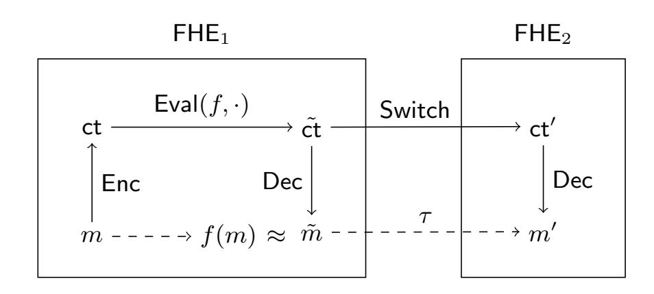
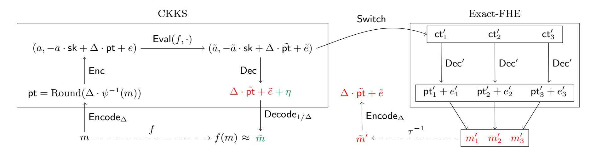

{0}------------------------------------------------

# How (not) to Switch FHE Schemes: Framework and Attacks in the IND-CPA<sup>D</sup> Model

Giacomo Santato1,<sup>2</sup> and Riccardo Zanotto1,<sup>2</sup>

<sup>1</sup> CISPA – Helmholtz Center for Information Security, Saarbr¨ucken, Germany giacomo.santato@cispa.de, riccardo.zanotto@cispa.de <sup>2</sup> Saarland University, Saarbr¨ucken, Germany

Abstract. In this paper, we study the IND-CPA<sup>D</sup> security of FHE schemes when combined through scheme switching. We introduce a formal framework that captures security in this setting and provide a rigorous analysis of different constructions. Within this framework, we identify sufficient conditions for the switching algorithm under which the combined schemes achieve IND-CPA<sup>D</sup> security, assuming the individual schemes are IND-CPA<sup>D</sup> -secure.

We then focus on the specific case of scheme switching from CKKS to TFHE. We analyze how existing switching algorithms designed for vanilla CKKS can be modified to preserve IND-CPA<sup>D</sup> security. We demonstrate an attack against the IND-CPA<sup>D</sup> security of the PEGASUS construction [\[jLHH](#page-37-0)<sup>+</sup>21] and we implement a proof-of-concept of this attack against the CKKS-to-FHEW switching mechanism in the OpenFHE library. Finally, we present a generic transformation that converts a vanilla CKKS-based switch into an IND-CPA<sup>D</sup> -secure one.

Keywords: Fully Homomorphic Encryption, Scheme switching, IND-CPA<sup>D</sup> security

# 1 Introduction

Fully Homomorphic Encryption (FHE) enables arbitrary computation over encrypted data, allowing users to offload sensitive tasks to untrusted environments without compromising privacy. It is a foundational cryptographic tool that supports a wide variety of tasks while ensuring data confidentiality throughout the whole computation process.

FHE schemes can be broadly categorized according to the types of operations they support most efficiently. Arithmetic-oriented schemes such as BFV [\[FV12\]](#page-37-1), BGV [\[BGV12\]](#page-36-0), and CKKS [\[CKKS17\]](#page-36-1) are designed for the homomorphic evaluation of arithmetic circuits. CKKS supports approximate arithmetic over real and complex numbers, and natively encodes vectors via SIMD packing, enabling faster parallel computations. In contrast, bit-oriented schemes such as TFHE [\[CGGI20\]](#page-36-2) and FHEW [\[DM15\]](#page-37-2) are tailored for gate-by-gate evaluation of Boolean circuits and feature fast bootstrapping mechanisms. These schemes support look-up table evaluation and functional bootstrapping.

{1}------------------------------------------------

Since no single FHE scheme is optimal for all types of operations, combining multiple schemes within a single computational pipeline is often desirable. To support such hybrid workflows, several frameworks have introduced schemeswitching mechanisms that transform ciphertexts from one FHE scheme to another without decryption. We describe the high-level idea of scheme switching in Figure [1.](#page-1-0)



<span id="page-1-0"></span>Fig. 1. Diagram of the scheme switching functionality

Concrete examples include Chimera [\[BGGJ20\]](#page-36-3), which enables switching between CKKS and TFHE/FHEW, as well as between BFV and TFHE; and PE-GASUS [\[jLHH](#page-37-0)+21], which supports switching between CKKS and TFHE/FHEW. These constructions make it possible to offload different parts of a computation to the schemes best suited for each task, thereby improving performance and flexibility.

While these frameworks focus on improving performance and expressiveness, less attention has been paid to how such hybrid designs interact with modern security models. Past works have shown that FHE schemes may leak keydependent information when decryption outputs are visible to the adversary. Initial attacks focused on CKKS [\[LM21\]](#page-37-3), exploiting its approximate decryption mechanism to extract linear relations on the secret key. Subsequent results demonstrated that even exact schemes such as BGV, BFV, and TFHE can be vulnerable in practice, due to decryption failures or residual noise [\[CCP](#page-36-4)<sup>+</sup>24[,CSBB24\]](#page-37-4). In all these cases, the adversary observes a decrypted result that differs from the expected plaintext, and this mismatch reveals information that could not have been simulated independently, effectively leaking bits of the underlying secret key. These findings highlight limitations in the classical IND-CPA model, which assumes that ciphertexts are public but decrypted outputs are never exposed. This assumption does not reflect many practical FHE settings, where results are explicitly shared, for instance in public statistics or collaborative analytics. To address this gap, Li and Micciancio introduced the IND-CPA<sup>D</sup> model, which augments IND-CPA with a restricted decryption oracle reflecting access to the output of honest homomorphic computations. They showed that CKKS, in its

{2}------------------------------------------------

original form, is insecure in this model [\[LM21\]](#page-37-3), and later proposed a modified construction that achieves IND-CPA<sup>D</sup> security [\[LMSS22\]](#page-37-5).

Despite increasing interest in scheme-switching constructions, their security under the IND-CPA<sup>D</sup> model remains largely unexplored. All known IND-CPA<sup>D</sup> attacks operate within a single FHE scheme, and no formal analysis exists on how security composes across scheme-switching boundaries.

The PEGASUS paper briefly acknowledges this concern, noting that

". . . the decryptor in PEGASUS should not reveal the decrypted values of CKKS ciphertexts to the encryptor and anyone else without doing any counter-measurement . . . " [\[jLHH](#page-37-0)+21, Section II.D.],

but provides no formal model or justification for this claim, and refers only to standard countermeasures [\[CHK20\]](#page-36-5) on the CKKS decryption.

In this paper we fill this gap in the literature by providing a formal study of the security of FHE pipelines that incorporate scheme-switching functionalities.

Our contributions are as follows:

- We construct a framework for discussing the security of FHE pipelines. In doing so, we provide formal definitions of the scheme switch algorithm and of an FHE pipeline, and we adapt the existing IND-CPA<sup>D</sup> definition to the FHE-pipeline setting.
- We introduce the notion of ciphertext hygiene, which consists of discarding switched ciphertexts that might break the correspondence between plaintext computation and homomorphic evaluation in the IND-CPA<sup>D</sup> oracles. We show that ciphertext hygiene is a necessary condition for security.
- We show that IND-CPA<sup>D</sup> security can compose across scheme switching boundaries when the scheme switch algorithm satisfies additional properties. In particular, we prove security from a property we call switch indistinguishability, which is sufficient when the target scheme is exact (but not when it is approximate). We also prove security from a stronger property, perfect re-encryption, which is always sufficient.
- We analyze the folklore construction for scheme switch algorithms between two FHE schemes in our new framework.
- We show that IND-CPA<sup>D</sup> security does not necessarily compose across scheme switching boundaries. Specifically, we present a key-recovery attack that succeeds even when all individual FHE schemes involved are themselves IND-CPA<sup>D</sup> -secure.
- We analyze in detail the case of switching from an IND-CPA<sup>D</sup> -secure CKKS scheme to an IND-CPA<sup>D</sup> -secure exact FHE scheme, and identify the root cause of the vulnerability as the lack of ciphertext hygiene.
- We implement our attack against the CKKS-to-FHEW switching mechanism in the OpenFHE library. Our proof-of-concept recovers the CKKS secret key using standard parameters.

{3}------------------------------------------------

#### 1.1 Technical Overview

The first main contribution of this paper is the introduction of a formal framework for analyzing FHE scheme switching between two different FHE schemes, FHE<sub>1</sub> and FHE<sub>2</sub>.

Many applications already use this concept in the following way: we have a ciphertext ct from  $FHE_1$ , and we want to turn it into a new ciphertext  $ct' \leftarrow Switch(ct)$  for  $FHE_2$ ; in this way, we are able to perform homomorphic evaluations more efficiently, mixing schemes that are more efficient for arithmetic computations with schemes that are faster for boolean functions.

The main property required by applications is that this scheme switching is *correct*, i.e., that

$$\mathsf{FHE}_2.\mathsf{Dec}(\mathsf{Switch}(\mathsf{ct})) \approx \mathsf{FHE}_1.\mathsf{Dec}(\mathsf{ct}).$$

Notice that if the message spaces of  $\mathsf{FHE}_1$  and  $\mathsf{FHE}_2$  are not the same, this requirement is not even well-defined. We thus introduce the notion of *plaintext mapping*, which provides a way to express "equality" of messages in the two different schemes; all the properties of scheme-switching algorithms will then depend on this map. Formally, we fix integers  $k_1, k_2$  and a function

$$\tau: \mathcal{M}_1^{k_1} \to \mathcal{M}_2^{k_2},$$

where  $\mathcal{M}_i$  are the plaintext spaces of the two FHE schemes  $\mathsf{FHE}_i$ .

After fixing a mapping  $\tau$ , we can define *FHE pipelines*, which formalize the concept of scheme switching. In particular, we introduce the *scheme-switching key* ssk, which allows us to compute the switched ciphertext Switch(ssk, ct). We require that ssk can be computed from the keys  $\mathsf{sk}_i$ ,  $\mathsf{pk}_i$  of the two schemes via a Setup algorithm.

Notice that our syntax requires that ct is a vector of  $k_1$  ciphertexts of  $\mathsf{FHE}_1$ , while  $\mathsf{Switch}(\mathsf{ssk},\mathsf{ct})$  is a vector of  $k_2$  ciphertexts of  $\mathsf{FHE}_2$ .

We can then define the perfect correctness of the switch as

$$\mathsf{FHE}_2.\mathsf{Dec}(\mathsf{sk}_2,\mathsf{Switch}(\mathsf{ssk},\mathsf{ct})) = \tau(\mathsf{FHE}_1.\mathsf{Dec}(\mathsf{sk}_1,\mathsf{ct})).$$

However, since we will mostly deal with approximate FHE schemes, we need a relaxation of this property. In definition 8, we require that for any message  $m \in \mathcal{M}_1^{k_1}$ , the approximation error of  $\mathsf{Dec}(\mathsf{sk}_2, \mathsf{Switch}(\mathsf{ssk}, \mathsf{ct}))$  with respect to the "plaintext"  $\tau(m)$  can be publicly estimated by a function  $\mathsf{SwEstimate}$  from the approximation error of  $\mathsf{Dec}_1(\mathsf{ct})$  with respect to the original message m.

**IND-CPA<sup>D</sup> Security of FHE Pipelines** We then proceed to study the IND-CPA<sup>D</sup> security of FHE pipelines, answering the following two natural questions about scheme switching:

What does it mean for an FHE pipeline to be secure against IND-CPA<sup>D</sup> adversaries? And which properties of Switch allow for a generic composition of the IND-CPA<sup>D</sup> security of the individual schemes into security for the full pipeline?

{4}------------------------------------------------

In definition 10, we answer the first question. Informally, the composed IND-CPA<sup>D</sup> game for pipelines gives the adversary access to the usual encrypt, eval, and restricted-decrypt oracles for each of the two schemes, and then provides access to a new SW oracle that models the procedure of scheme switching.

The SW needs to bridge the two games by allowing the adversary to move entries from  $S_1$  to  $S_2$  via plaintext mapping and the Switch algorithm. We introduce the concept of *ciphertext hygiene*, which captures the mismatch between plaintext and ciphertext computation that the IND-CPA<sup>D</sup> notion aims to capture also in the setting of scheme switching. This property is a necessary condition for security in IND-CPA<sup>D</sup> games.

The idea is that we can compute and estimate  $\rho \leftarrow \mathsf{SwEstimate}(\mathsf{ct})$ , representing the uncertainty of the new ciphertext: if  $\rho_h > 0$ , then the ciphertext  $\mathsf{ct}'_h$  might decrypt to many different messages, and one of them could encode information about the secret key. Thus, the  $\mathcal{SW}$  oracle forwards an entry of  $S_1$  to the state  $S_2$  only on ciphertext components with no uncertainty, i.e.,  $\rho_h = 0$ .

More discussion on the definition can be found in section 3.2.

We then prove the following two theorems, where we achieve  $IND\text{-}CPA^D$  security for an FHE pipeline starting from the  $IND\text{-}CPA^D$  security of the individual schemes. The first one has a very strong requirement on the Switch algorithm, namely being able to produce fresh encryptions, but works for any approximate  $FHE_1$  and  $FHE_2$  schemes. The second theorem has a weaker requirement on Switch, but gives us composition only towards exact  $FHE_2$  schemes.

**Theorem (Informal, theorem 1).** Let (FHE<sub>1</sub>, FHE<sub>2</sub>, Switch) be a FHE pipeline. If FHE<sub>1</sub> and FHE<sub>2</sub> are both IND-CPA<sup>D</sup>-secure FHE schemes, and Switch behaves like a fresh encryption in FHE<sub>2</sub> of a decryption in FHE<sub>1</sub>, then the FHE pipeline (FHE<sub>1</sub>, FHE<sub>2</sub>, Switch) is IND-CPA<sup>D</sup> secure.

**Theorem (Informal, theorem 2).** Let (FHE<sub>1</sub>, FHE<sub>2</sub>, Switch) be a FHE pipeline. If FHE<sub>1</sub> is an IND-CPA<sup>D</sup>-secure FHE scheme, FHE<sub>2</sub> is an exact IND-CPA FHE scheme, and Switch returns ciphertexts that look like random ciphertexts of FHE<sub>2</sub>, then the FHE pipeline (FHE<sub>1</sub>, FHE<sub>2</sub>, Switch) is IND-CPA<sup>D</sup> secure.

In particular, we show that the property required by theorem 2 is weaker than the property required by theorem 1, and in section 3.3 we provide an example of a FHE pipeline satisfying only the weaker property that it is not IND-CPA<sup>D</sup> secure even if the two FHE scheme are, by exploiting the non-exact nature of FHE<sub>2</sub>. The main insight of this construction is that we could insert rows  $(m_0, m_1, c)$  in the state  $S_2$  of the target approximated scheme such that c could never be achieved by honest encryptions and evaluations; in this way, the IND-CPA<sup>D</sup> game for FHE<sub>2</sub> does not guarantee ciphertext hygiene, and we could obtain information about  $sk_2$ .

Attacks on CKKS-to-Exact Pipelines In section 4 we describe an attack to the IND-CPA<sup>D</sup> game of a FHE pipeline where the two schemes are individually IND-CPA<sup>D</sup>-secure, but the composition is not, due to a poor ciphertext hygiene during the switch operation.

{5}------------------------------------------------

In particular, we target the PEGASUS scheme-switching from CKKS to any exact FHE scheme. We demonstrate the feasibility of the attack with a proof-ofconcept implementation against the OpenFHE library, described in section [5.](#page-31-0)

The high level idea of the attack is the following: if the scheme-switching algorithm gives us information about the entire CKKS plaintext, we can easily adapt the Li-Micciancio attack to recover the CKKS secret key. We exploit the fact that the PEGASUS scheme switch can be modeled by

$$\mathsf{Dec}'(\mathsf{sk}',\mathsf{Switch}(\mathsf{ssk},\mathsf{ct})) = \tau\left(\mathsf{Decode}_{1/\Delta}(\mathsf{RDec}(\mathsf{sk},\mathsf{ct}))\right),$$

where on the right we have the vanilla CKKS decryption, which leaks part of the underlying RLWE error.

With a proper ciphertext hygiene, the Switch would instead return us only the part of the ciphertext that is not dependent from the secret key.

In the actual attack, we start from an encryption c = (e − a · sk, a) of 0 in CKKS, we multiply it by 2<sup>k</sup> for some appropriate k, and then perform scheme switching. Here we obtain ciphertexts encoding the RLWE error e, and by decrypting them in the exact FHE scheme we can recover the error and then the secret key sk.

Notice that a SW oracle performing good ciphertext hygiene would instead hide from us the new ciphertexts adaptively on k, just as the noise flooding operation in the secured variant of CKKS would do.

#### 1.2 Related Work

FHE Scheme Switching To support hybrid FHE workflows, several frameworks have introduced scheme-switching mechanisms that transform ciphertexts from one scheme to another without decryption. Notable examples include Chimera [\[BGGJ20\]](#page-36-3), which enables switching between CKKS and TFHE/FHEW, as well as between BFV and TFHE; and PEGASUS [\[jLHH](#page-37-0)+21], which supports switching between CKKS and TFHE/FHEW. Although PEGASUS explicitly warns against revealing CKKS decryption results without countermeasures, it does not provide a formal security analysis under the IND-CPA<sup>D</sup> model or examine how security composes across switching boundaries.

More recent frameworks extend this line of work. Chameleon [\[WHZ](#page-38-0)+24] focuses on improving the performance of scheme switching through GPU acceleration, while Griffin [\[SYY23\]](#page-37-6) introduces techniques for handling switching in multi-key settings. However, like their predecessors, these frameworks do not address the compositional security of scheme-switching pipelines in the IND-CPA<sup>D</sup> setting.

FHE Transciphering A growing body of work designs block ciphers and other symmetric primitives to interact efficiently with fully homomorphic encryption. These ciphers are either fast to evaluate homomorphically or provide a public procedure that converts a ciphertext of the symmetric scheme into an FHE 

{6}------------------------------------------------

ciphertext and back; this conversion is often called FHE transciphering. Notable examples include HERA [\[CHK](#page-36-6)+21] and Rubato [\[HKL](#page-37-7)+22], which are specifically designed to work well with CKKS. See [\[NWH](#page-37-8)+25] for a survey of constructions that rely on, or enable, FHE transciphering.

Although cryptanalysis of these ciphers is active [\[LKSM24,](#page-37-9)[GAH](#page-37-10)+23], most studies concentrate on the security of the symmetric primitive itself (covering attacks such as differential analysis, Gr¨obner basis techniques, lattice methods, etc.) rather than on its interaction with the related FHE scheme. In particular, they rarely address security in the IND-CPA<sup>D</sup> setting.

More complex protocols are beginning to adopt FHE scheme switching and transciphering as building blocks without analysing IND-CPA<sup>D</sup> adversaries. The only work we found that explicitly accounts for this model is [\[CCG](#page-36-7)+25], where the authors design a proxy re-encryption construction and secure it against IND-CPA<sup>D</sup> attacks.

FHE Compilers The growing complexity of FHE applications has led to the emergence of compilers frameworks, which compile high-level code, typically written in C, C++, or domain-specific languages, into optimized FHE circuits. These systems abstract cryptographic details and generate circuits tailored to different classes of FHE schemes, supporting both arithmetic and boolean operations. Systems such as HEIR [\[BZZ](#page-36-8)+24], Google's FHE Transpiler [\[GSPH](#page-37-11)+21], Porcupine [\[CDA](#page-36-9)+21], HECO [\[VJHH22\]](#page-38-1), and others aim to improve performance and usability by automating circuit generation.

Some of these compilers, such as HEIR, already plan to support scheme switching between arithmetic-friendly and boolean-friendly schemes, a direction likely to be adopted by other frameworks as well to improve efficiency. As compilers increasingly take responsibility for scheme selection and switching, it becomes essential to understand how IND-CPA<sup>D</sup> security composes across such transitions, particularly in scenarios where decrypted outputs may be revealed.

Other results on IND-CPA<sup>D</sup> Security Li and Micciancio introduced the IND-CPA<sup>D</sup> model and mounted the first key-recovery attack on CKKS [\[LM21\]](#page-37-3), and later Li et al. proposed a noise flooding countermeasure that restores security [\[LMSS22\]](#page-37-5).

Subsequent work showed that exact schemes are vulnerable as well. Cheon et al. [\[CCP](#page-36-4)<sup>+</sup>24] and Checri et al. [\[CSBB24\]](#page-37-4) demonstrated practical key-recovery for BFV, BGV, TFHE, and exact variants of CKKS. These studies also extend the attacks to threshold versions of those schemes, while [\[KS25\]](#page-37-12) adapts both the attack and the countermeasures of Li et al. to the threshold setting.

Other studies observed that relying on average-case rather than worst-case noise bounds can reopen attacks even in the presence of countermeasures [\[GNSJ24\]](#page-37-13). A parallel line of research refines countermeasure techniques to minimise overhead while still achieving provable IND-CPA<sup>D</sup> security in practice [\[BCM](#page-36-10)<sup>+</sup>24[,ABMP24\]](#page-35-0).

In general, it has been observed multiple times that linearity, like vanilla CKKS, causes security losses [\[Bra13,](#page-36-11)[CCRS26\]](#page-36-12).

{7}------------------------------------------------

# 2 Background

Notations. We denote the security parameter by λ ∈ N. A function negl(λ)(·) is negligible if, for every polynomial p(·), there exists k<sup>0</sup> such that for all k > k0, it holds that negl(λ)(k) < 1/p(k).

We denote by R the polynomial ring R = Zq[X]/(X<sup>n</sup> + 1), where q is a large ciphertext modulus and n is a power-of-two ring dimension. We also denote as Φn(X) the n-th cyclotomic polynomial. To simplify notation, we identify an element r ∈ R with the vector of its coefficients; thus, r[j] denotes the j-th coefficient of the polynomial r for each j < n.

RLWE Encryption. A basic RLWE encryption of a message m ∈ R under the secret key sk ∈ R is given by (b, a) = (−sk · a + m + e, a), where a ∈ R is chosen uniformly at random, and the error polynomial e is sampled independently with coefficients drawn from an error distribution χe.

From now on, we denote an RLWE encryption of m under the secret key sk by REnc(sk, m). Given a ciphertext ct = (b, a), its decryption is defined as RDec(sk, ct) = b + a · sk.

#### 2.1 Fully Homomorphic Encryption

We recall the definition of Fully Homomorphic Encryption (FHE) in the publickey setting. Formally, a FHE scheme on the message space M consists of four algorithms FHE = (KeyGen, Enc, Eval, Dec), defined as follows:

- KeyGen(1<sup>λ</sup> ) → (sk, pk): Given a security parameter λ, outputs a secret key sk and a public key pk.
- Enc(pk, m) → ct: Given a public key pk and a message m ∈ M, outputs a ciphertext ct.
- Eval(pk, f, ct) → ct′ : Given a public key pk, a function f : M<sup>ℓ</sup> → M, and a vector of ciphertexts ct := {cti}i∈[ℓ] , outputs a ciphertext ct′ .
- Dec(sk, ct) → m: Given a secret key sk and a ciphertext ct, outputs a message m.

Exact Correctness vs. Approximate Correctness. Standard FHE schemes are expected to satisfy the following notion of correctness.

Definition 1 (Correctness). An FHE scheme FHE = (KeyGen, Enc, Eval, Dec) is said to be correct (or exact) if, for every pair of keys (sk, pk) generated by KeyGen, every function f, and every vector of ciphertexts ct = (ct1, . . . , ctℓ), the following property holds:

$$Dec(sk, Eval(pk, f, ct)) = f(m),$$

where m denotes the vector of plaintexts {mi}, each obtained by decrypting the respective ciphertext, i.e., m<sup>i</sup> ← Dec(sk, cti).

{8}------------------------------------------------

Several variants of this correctness notion have been proposed in the FHE literature to capture different trade-offs between security and efficiency. In particular, statistical correctness and adversarial correctness require the above equality to hold, respectively, with overwhelming probability and with probability  $1 - \mathsf{negl}(\lambda)(\lambda)$ .

Not all FHE schemes satisfy this exact correctness property. Some schemes, most notably CKKS, achieve only a much more relaxed variant known as ap-proximate correctness.

We require the message space to have a norm  $\|\cdot\|$ :  $\mathcal{M} \to \mathbb{R}_{\geq 0}$  in order to define a notion of closeness of messages. In particular, given a ciphertext **ct** and an "intended" message m, we can define the *error* of that ciphertext w.r.t. a secret key in the following way.

**Definition 2 (Ciphertext Error).** Let FHE = (KeyGen, Enc, Eval, Dec) be an FHE scheme with message space  $\mathcal{M}$ , which is a normed space equipped with a norm  $\|\cdot\|$ :  $\mathcal{M} \to \mathbb{R}_{\geq 0}$ . For any ciphertext ct, secret key sk, and message m, we define

$$\mathsf{Error}(\mathsf{ct}, m, \mathsf{sk}) := \|\mathsf{Dec}(\mathsf{sk}, \mathsf{ct}) - m\|.$$

We first define the approximate correctness of the FHE scheme as an encryption scheme, i.e. what is the error of freshly encrypted ciphertexts.

**Definition 3 (Approximate Encryption Correctness).** Let FHE = (KeyGen, Enc, Eval, Dec) be an FHE scheme with normed message space  $\mathcal{M}$ . Given a constant  $B \in \mathbb{R}_{\geq 0}$ , the (Enc, Dec) pair is said to be B-correct if, for all (sk, pk)  $\leftarrow$  KeyGen( $1^{\lambda}$ ) and for all messages  $m \in \mathcal{M}$ , the following property holds:

$$Error(Enc(pk, m), m, sk) \leq B.$$

We then turn to define approximate correctness of the Eval function, i.e. how far the decryption of some evaluation falls from the plaintext computation.

**Definition 4 (Approximate Evaluation Correctness).** Let FHE = (KeyGen, Enc, Eval, Dec) be an FHE scheme with normed message space  $\mathcal{M}$ . The scheme FHE is said to be approximately correct if, for all  $(\mathsf{sk}, \mathsf{pk}) \leftarrow \mathsf{KeyGen}(1^{\lambda})$ , for all functions f, and for all vectors of ciphertexts  $\mathsf{ct} = (\mathsf{ct}_1, \ldots, \mathsf{ct}_k)$  and plaintexts  $m = (m_1, \ldots, m_k)$ , the following property holds:

$$Error(Eval(pk, f, ct), f(m), sk) \leq Estimate(f, t),$$

where Estimate is a fixed, publicly computable function. This function takes as input the evaluated function f and a vector of error bounds t, where each  $t_i$  represents an upper bound on the error associated with ciphertext  $\mathsf{ct}_i$ , i.e.  $\mathsf{Error}(\mathsf{ct}_i, m_i, \mathsf{sk}) \leq t_i$ .

Since the error bound t of a ciphertext  $\operatorname{ct}$  is publicly computable, it is often stored as part of  $\operatorname{ct}$ . We sometimes improperly write  $\operatorname{Estimate}(f,\operatorname{ct})$  to refer to the tag t associated to  $\operatorname{ct}$ .

Notice that if B=0 and  $\mathsf{Estimate}(f,0)=0$  for any function f and ciphertext ct, then we recover the notion of an exact FHE scheme.

{9}------------------------------------------------

#### 2.2 CKKS

The CKKS scheme enables approximate homomorphic computation over vectors of complex numbers. It operates over a cyclotomic polynomial ring  $\mathcal{R} = \mathbb{Z}_q[X]/(X^n+1)$ . The elements of this ring can be viewed either as polynomials or, via the canonical embedding, as complex vectors.

Canonical Embedding. Let  $\omega = e^{\pi i/n}$  be the primitive 2n-th root of unity, and let  $\{\omega^1, \omega^3, \dots, \omega^{2n-1}\}$  be the roots of  $\Phi_{2n}(X) = X^n + 1$  corresponding to the multiplicative group  $\mathbb{Z}_n^*$ .

Then, given any polynomial  $r \in \mathbb{R}[X]/(X^n+1)$ , the map

$$r \mapsto (r(\omega^1), r(\omega^3), \dots, r(\omega^{2n-1})) \in \mathbb{C}^n$$

is well defined; moreover, by Hermitian symmetry, we have that  $r(\omega^{2n-i}) = \overline{r(\omega^i)}$ , thus the image of this map lives in an n/2-dimensional subspace of  $\mathbb{C}^n$ , namely  $\{z \in \mathbb{C}^n : z_{2n-i} = \bar{z}_i\}$ .

We define the canonical embedding  $\psi: \mathbb{R}[X]/(X^n+1) \to \mathbb{C}^{n/2}$  via the complex evaluation at half of these roots

$$\psi(r) = \left(r(\omega^1), r(\omega^3), \dots, r(\omega^{n-1})\right).$$

The inverse map  $\psi^{-1}(z)$ , for a  $z \in \mathbb{C}^{n/2}$ , is defined by finding an interpolating polynomial such that  $r(\omega^{2i-1}) = z_i$  and  $r(\omega^{2n-2i+1}) = \bar{z_i}$  for  $i = 1, \ldots, n/2$ .

**Encoding and Decoding.** The CKKS scheme has plaintext space  $\mathbb{C}^{n/2}$ , but uses RLWE encryption for security, so it needs a way to map complex vectors to polynomials in  $\mathcal{R}$  and vice-versa. This is done via the encoding and decoding functions, relying on the canonical embedding  $\psi$ , identifying  $\mathbb{R}[X]/(X^n+1)$  and  $\mathcal{R}$  via rounding.

To encode a plaintext vector  $m \in \mathbb{C}^{n/2}$ , CKKS applies the inverse of the canonical embedding  $\psi^{-1}$ , scales the result by a factor  $\Delta > 1$ , and rounds to the closest integer to get an element of  $\mathcal{R}$ :

$$\mathsf{Encode}_{\Delta}(m) := \mathsf{Round}(\Delta \cdot \psi^{-1}(m)) \in \mathcal{R}.$$

Decoding reverses this procedure: the polynomial is scaled down and mapped back to the complex domain via  $\psi$ ,

$$\mathsf{Decode}_{1/\Delta}(r) := \psi(\Delta^{-1} \cdot r) \in \mathbb{C}^{n/2}.$$

Due to rounding and the presence of noise in encrypted settings, this process is only approximately correct.

We define the canonical embedding norm of an element  $r \in \mathcal{R}$  as  $||r||_{\text{can}} := ||\psi(r)||_2$ , where  $\psi$  is the canonical embedding. This norm is used to track the ciphertext error of CKKS ciphertexts throughout the paper.

{10}------------------------------------------------

Encryption and Decryption. Once the message m ∈ C n/<sup>2</sup> has been encoded into a plaintext polynomial pt = Encode∆(m) ∈ R, encryption proceeds using an RLWE-based encryption scheme under a secret key sk ∈ R. The resulting ciphertext is a pair:

$$\mathsf{ct} = \mathsf{REnc}(\mathsf{sk}, \mathsf{pt}) = (b, a) = (-a \cdot \mathsf{sk} + \mathsf{pt} + e, a),$$

where a ∈ R is sampled uniformly at random and e ∈ R is drawn from a chosen bounded noise distribution (e.g., a discrete Gaussian).

To decrypt a ciphertext ct = (b, a), the decryptor computes the RLWE decryption to get:

$$\mathsf{RDec}(\mathsf{sk},\mathsf{ct}) = b + a \cdot \mathsf{sk} = \mathsf{pt} + e.$$

This returns a noisy approximation of the encoded polynomial pt. To recover an approximation of the original message, the decryptor applies the decoding map:

$$m' = \mathsf{Decode}_{1/\Delta}(\mathsf{pt} + e) = \psi(\Delta^{-1} \cdot (\mathsf{pt} + e)),$$

which outputs a vector m′ ∈ C n/2 that approximates m, up to errors induced by the RLWE encryption noise and rounding procedures.

We refer to this decryption algorithm as the vanilla CKKS decryption. Recall that, as shown by Li and Micciancio [\[LM21\]](#page-37-3), this version of CKKS is not IND-CPA<sup>D</sup> secure; we briefly recall the attack and countermeasures in section [2.4.](#page-11-0)

# 2.3 IND-CPA<sup>D</sup> Security

The classical notion of IND-CPA security assumes that decryption outputs remain hidden from the adversary, which fails to capture realistic homomorphic encryption scenarios where decrypted results may be observable.

To cover this case, Li and Micciancio introduced the IND-CPA<sup>D</sup> model (IND-CPA with Decryption) [\[LM21\]](#page-37-3), which extends IND-CPA by granting the adversary controlled access to decryption through a restricted oracle that can only be queried on honestly generated ciphertexts.

This game intends to capture leakage occurring via the approximation errors, even if the plaintext computations would reveal nothing.

The Oracles E, H, D We now describe in more detail the three oracles E, H, and D used in the definition of IND-CPA<sup>D</sup> security. Their behavior is summarized in Algorithm 1.

These oracles share a common state S, which is initially empty. Each entry in S is a triple

$$(m_0, m_1, \mathsf{ct}) \in \mathcal{M} \times \mathcal{M} \times \mathcal{C},$$

where m0, m<sup>1</sup> are messages from the message space M, and ct is a ciphertext from the ciphertext space C.

{11}------------------------------------------------

- The encryption oracle  $\mathcal{E}$  takes as input two messages  $m_0, m_1$ , encrypts the challenge message  $\mathsf{ct} = \mathsf{Enc}(\mathsf{pk}, m_b)$ , and returns the ciphertext  $\mathsf{ct}$  to the adversary. It also adds the triple  $(m_0, m_1, \mathsf{ct})$  to the global state S.
- The homomorphic evaluation oracle  $\mathcal{H}$  applies a function g to a vector of ciphertexts from the state S, producing a new ciphertext  $\mathsf{ct}' = \mathsf{Eval}(\mathsf{pk}, g, \mathsf{ct})$ . It returns this ciphertext to the adversary and stores the corresponding plaintext evaluations  $(g(m_0), g(m_1))$  along with  $\mathsf{ct}'$  in the state as a new triple.
- The decryption oracle  $\mathcal{D}$  decrypts ciphertexts from the state S, but only if the associated messages satisfy  $m_0 = m_1$ . This restriction ensures that the adversary cannot trivially learn the challenge bit b from the decryption result. Instead, any leakage must come from the ciphertext's internal structure, not from direct comparison of message values.

**Formal IND-CPA<sup>D</sup> Definition** We now recall the formal definition of IND-CPA<sup>D</sup> security from [LM21, Definition 2].

**Definition 5** (q-IND-CPA<sup>D</sup> security). Let FHE = (KeyGen, Enc, Eval, Dec) be a fully homomorphic encryption scheme. The q-IND-CPA<sup>D</sup> security experiment  $\operatorname{Exp}_b^{q-IND-CPA^D}$ , defined with respect to an adversary  $\mathcal{A}$ , provides the adversary with access to three stateful oracles  $\mathcal{E}, \mathcal{H}, \mathcal{D}$  described in Algorithm 1, with a restriction to q queries to oracle  $\mathcal{D}$ .

The security game is as follows:

$$\begin{split} \mathsf{Exp}_b^{q\text{-IND-CPA}^\mathsf{D}}[\mathcal{A}](1^\lambda): & (\mathsf{sk},\mathsf{pk}) \leftarrow \mathsf{KeyGen}(1^\lambda), \\ & b' \leftarrow \mathcal{A}^{\mathcal{E}_{\mathsf{pk}}^b,\mathcal{H}_{\mathsf{pk}},\mathcal{D}_{\mathsf{sk}}}(1^\lambda,\mathsf{pk}), \\ & \qquad \qquad \qquad \qquad \qquad \qquad \qquad \qquad \qquad \qquad \qquad \qquad \qquad \qquad \qquad \qquad \qquad \qquad$$

We say FHE is q-IND-CPA<sup>D</sup>-secure if for every PPT adversary  $\mathcal{A}$ , the advantage defined by

$$\mathsf{adv}^{q\text{-IND-CPA}^\mathsf{D}}[\mathcal{A}](1^\lambda) = \left| \Pr[\mathsf{Exp}_b^{q\text{-IND-CPA}^\mathsf{D}}[\mathcal{A}](1^\lambda) = b] - \frac{1}{2} \right|$$

<span id="page-11-1"></span>is negligible.

# <span id="page-11-0"></span>2.4 Previous IND-CPA<sup>D</sup> Attacks to CKKS and Countermeasures

The first attack exploiting the IND-CPA<sup>D</sup> model was introduced by Li and Micciancio [LM21], alongside the definition itself. They showed that for approximate schemes such as CKKS, the decrypted plaintext reveals not only the intended message but also a residual noise term that depends linearly on the secret key.

In particular, they exploit the fact that the vanilla CKKS decryption is almost linear in the secret key, because the decryption of  $\mathsf{ct} = (b, a)$  under the secret key  $\mathsf{sk}$  is  $\psi(\Delta^{-1} \cdot (b + a \cdot \mathsf{sk}))$ . By observing this linear noise across  $\Theta(n)$  carefully

{12}------------------------------------------------

#### Algorithm 1: Oracles for the IND-CPA<sup>D</sup> game

```
Setup:
    S ← ∅
    i ← 0
Oracle E
          b
          pk(m0, m1):
    ct ← Enc(pk, mb)
    S[i] ← (m0, m1, ct)
    i ← i + 1
    return ct
Oracle Hpk(g, J = (j1, . . . , jk)):
    ct˜ ← Eval(pk, g,(S[j1].ct, . . . , S[jk].ct))
    gm0 ← g(S[j1].m0, . . . , S[jk].m0)
    gm1 ← g(S[j1].m1, . . . , S[jk].m1)
    S[i] ← (gm0, gm1, ct˜ )
    i ← i + 1
    return ct˜
Oracle Dsk(i):
    if S[i].m0 = S[i].m1 then
        return Dec(sk, S[i].ct)
    else
        return ⊥
    end
```

chosen ciphertexts, where n is the dimension of the RLWE ring R, a passive adversary can recover the full secret key using standard linear algebra.

The literature proposes two principal strategies for securing CKKS against IND-CPA<sup>D</sup> adversaries. These strategies, along with their efficiency trade-offs and practical optimizations, are analyzed in depth in [\[BCM](#page-36-10)+24[,ABMP24\]](#page-35-0), which also extend the discussion to countermeasures for exact FHE schemes targeted by other IND-CPA<sup>D</sup> attacks.

Exact Decryption The first approach seeks to prevent any information about the ciphertext error e, and hence about the secret key, from ever reaching the decryptor's output. This is achieved by requiring the evaluator to track the worstcase noise growth of each ciphertext throughout homomorphic computation. Whenever the estimated error approaches the correctness threshold ∆/2, the ciphertext must be bootstrapped to reduce its noise before further evaluation. As a result, the decryption output becomes independent of the error term e, closing the leakage channel exploited in the original Li–Micciancio attack.

In this setting, correctness must be treated as a security requirement. This implies that decryption failure, caused by excessive noise, must occur with negligible probability, typically below 2<sup>−</sup><sup>128</sup>. Moreover, this bound must hold even in an adversarial setting, where the ciphertexts may be deliberately crafted to maximize noise. This is a much stricter condition than the standard 2<sup>−</sup><sup>80</sup> threshold assumed for benign, non-adversarial workloads.

{13}------------------------------------------------

The main drawback of this approach is performance: ensuring correctness under adversarial conditions requires more frequent bootstrapping and possibly larger ciphertext moduli, significantly increasing latency and memory consumption. The work of [CSBB24] estimates that bootstrapping overhead under these conditions can increase by as much as 50%.

**Noise Masking** This alternative defence also targets the leakage of information related to the ciphertext error e, but preserves the approximate nature of CKKS. It does so by injecting an additional masking term during decryption. Instead of returning the raw value Dec(sk, ct) = pt + e, the decryptor outputs  $Dec'(sk, ct) = Dec(sk, ct) + \eta = pt + e + \eta$ , where  $\eta$  is a freshly sampled polynomial in  $\mathcal{R}$ .

The masking noise  $\eta$  is drawn from an integer Gaussian distribution whose variance depends on the worst-case canonical norm estimate t tracked during homomorphic evaluation. Specifically, the noise is sampled from

$$\mathcal{N}_{\mathbb{Z}^n}\left(0,\,\sigma^2\cdot t^2\right),$$

where  $\sigma = 8\sqrt{qn2^{\lambda/2}}$  and q is the bound on the number of queries allowed to the adversary. This suffices to achieve  $\lambda$ -bit IND-CPA<sup>D</sup> security as shown in [LMSS22, Theorem 3].

Since the noise is added only after the computation is complete, this defence does not affect homomorphic execution time. Its runtime cost is minimal, limited to sampling  $\eta$  and performing a single addition. The primary trade-off is a reduction in the precision of the final result.

To ensure robustness against repeated decryption queries, several deployment variants are possible. The decryptor may sample a fresh  $\eta$  per query, restrict decryption to a single call per ciphertext, or use deterministic rounding-based masking to prevent averaging attacks. All variants aim to ensure that no information about e can be inferred from the decrypted outputs.

In the stand-alone CKKS setting, both noise masking and exact decryption successfully prevent known IND-CPA<sup>D</sup> attacks. Depending on the application, one may prefer to incur overhead in evaluation time or to tolerate reduced output precision.

## 3 A Framework for Scheme-Switching FHE

In this section we will formally introduce the syntax and properties required by the scheme switch algorithm, both for correctness and for security. We extend the IND-CPA<sup>D</sup> game to this setting and give composition theorems for IND-CPA<sup>D</sup> security, depending on the exactness of the target scheme.

#### 3.1 Formally Defining Scheme Switching

Plaintext Mapping. Since different FHE schemes might work on different plaintext spaces, we need a notion of correctness for the scheme switch, i.e. what

{14}------------------------------------------------

"encrypt the same message" means when the two message spaces are not the same. Most of the time, the plaintext spaces are quite similar, or simply admit natural conversions such as rescaling, rounding, or embedding.

Formally, we consider two schemes  $\mathsf{FHE}_1$  and  $\mathsf{FHE}_2$  with respective message spaces  $\mathcal{M}_i$  and ciphertext spaces  $\mathcal{C}_i$ . We define the notion of plaintext mapping, which consists of a function  $\tau: \mathcal{M}_1^{k_1} \to \mathcal{M}_2^{k_2}$ , where the multiplicities  $k_1$  and  $k_2$  depend on the relative interaction of the two schemes and their relative message spaces.

In the concrete case of CKKS, the message space is  $\mathcal{M}_1 = \mathbb{C}^{n/2}$ , and when the scheme switch algorithm is applied to an LWE-based FHE scheme, such as BGV/BFV, with plaintext space  $\mathcal{M}_2 = \mathbb{Z}_p$ , the plaintext mapping is a function  $\tau: \mathbb{C}^{n/2} \to \mathbb{Z}_p^n$ , with  $k_1 = 1$  and  $k_2 = n$ , where n/2 components are for the real parts and other n/2 for the complex parts. Another example is when switching from CKKS to TFHE/FHEW, when only the top l most significant bits of the real part of the message are kept. In this case  $\mathcal{M}_1 = \mathbb{C}^{n/2}$ ,  $\mathcal{M}_2 = \mathbb{Z}_2$ , with  $k_1 = 1$  and  $k_2 = l \cdot n/2$ .

**Scheme Switch.** We now give a formal definition of scheme switch.

**Definition 6 (Scheme Switch).** A scheme switch from  $\mathsf{FHE}_1$  to  $\mathsf{FHE}_2$ , with plaintext mapping  $\tau$  from  $\mathcal{M}_1^{k_1}$  to  $\mathcal{M}_2^{k_2}$  consists of two algorithms defined as follows:

- $\mathsf{Setup}(\mathsf{sk}_1,\mathsf{pk}_2) \to \mathsf{ssk}$ : Given a secret key  $\mathsf{sk}_1$  for  $\mathsf{FHE}_1$  and a public key  $\mathsf{pk}_2$  for  $\mathsf{FHE}_2$ , outputs a scheme-switching key  $\mathsf{ssk}$ .
- Switch(ssk, ct)  $\rightarrow$  ct': Given a scheme-switching key ssk and a vector of  $k_1$  ciphertexts ct =  $(ct_1, \ldots, ct_{k_1})$  in  $\mathsf{FHE}_1$ , outputs a vector of  $k_2$  ciphertexts  $\mathsf{ct'} = (\mathsf{ct'}_1, \ldots, \mathsf{ct'}_{k_2})$  in  $\mathsf{FHE}_2$ .

We refer, improperly, to the scheme switch  $(\tau, \mathsf{Setup}, \mathsf{Switch})$  directly as  $\mathsf{Switch}$ .

We can transpose the correctness definitions for exact and approximate FHE schemes to the scheme switch algorithm.

**Definition 7 (Scheme Switch Correctness).** A scheme switch Switch from an exact FHE scheme  $\mathsf{FHE}_1$  to another exact FHE scheme  $\mathsf{FHE}_2$  is said to be correct if, for every honestly-generated key pairs  $(\mathsf{sk}_1, \mathsf{pk}_1)$  for  $\mathsf{FHE}_1$  and  $(\mathsf{sk}_2, \mathsf{pk}_2)$  for  $\mathsf{FHE}_2$ , for every  $\mathsf{ssk} \leftarrow \mathsf{Setup}(\mathsf{sk}_1, \mathsf{pk}_2)$ , and for every vector of ciphertexts  $\mathsf{ct} = (\mathsf{ct}_1, \ldots, \mathsf{ct}_{k_1})$  in  $\mathsf{FHE}_1$ , the following property holds:

$$\mathsf{FHE}_2.\mathsf{Dec}(\mathsf{sk}_2,\mathsf{Switch}(\mathsf{ssk},\mathsf{ct})) = \tau(\mathsf{FHE}_1.\mathsf{Dec}(\mathsf{sk}_1,\mathsf{ct})).$$

<span id="page-14-0"></span>**Definition 8 (Approximate Scheme Switch Correctness).** A scheme switch Switch from  $\mathsf{FHE}_1$  to  $\mathsf{FHE}_2$  is said to be approximately correct if, for every honestly-generated key pairs  $(\mathsf{sk}_1, \mathsf{pk}_1)$  for  $\mathsf{FHE}_1$  and  $(\mathsf{sk}_2, \mathsf{pk}_2)$  for  $\mathsf{FHE}_2$ , for every  $\mathsf{ssk} \leftarrow \mathsf{Setup}(\mathsf{sk}_1, \mathsf{pk}_2)$ , for every vector of ciphertexts  $\mathsf{ct} = (\mathsf{ct}_1, \ldots, \mathsf{ct}_{k_1})$ 

{15}------------------------------------------------

in FHE<sub>1</sub>, and for every vector of plaintexts  $m = (m_1, \ldots, m_{k_1})$ , the following property holds:

$$\mathsf{FHE}_2.\mathsf{Error}(\mathsf{Switch}(\mathsf{ssk},\mathsf{ct}),\tau(m),\mathsf{sk}_2) \leq \mathsf{SwEstimate}(\mathsf{ct},t)$$

where SwEstimate is a fixed, publicly computable function. This function takes as input a vector of error bounds t, where each  $t_i$  represents an upper bound on the error associated with ciphertext  $\mathsf{ct}_i$ , that is,  $\mathsf{FHE}_1.\mathsf{Error}(\mathsf{ct}_i, m_i, \mathsf{sk}_1) \leq t_i$ .

Notice that in the case of exact FHE schemes we can achieve a perfect scheme switch correctness by requiring that SwEstimate(0) = 0.

Finally, we define a collective name to refer to the set of the FHE schemes together with a scheme switch algorithm between them.

**Definition 9 (FHE pipeline).** We define a FHE pipeline as a triple (FHE<sub>1</sub>, FHE<sub>2</sub>, Switch) where FHE<sub>1</sub> and FHE<sub>2</sub> are FHE schemes and Switch is an approximately correct scheme switch algorithm from FHE<sub>1</sub> to FHE<sub>2</sub>.

# <span id="page-15-0"></span>3.2 Extending IND-CPA<sup>D</sup> to Scheme Switching

In the original IND-CPA<sup>D</sup> model, the encryption, evaluation, and decryption oracles operate over a single scheme and maintain a single global state. When extending the model to multiple schemes, each scheme instance naturally maintains its own state and corresponding set of oracles. However, these states are entirely disjoint: ciphertexts created under one scheme cannot be transformed or interpreted by another. This separation fails to capture FHE pipelines, where scheme-switching operations explicitly connect the semantics and internal structure of ciphertexts across schemes.

Plaintext Computations vs. Homomorphic Evaluations. To address this issue, we introduce a new oracle SW that explicitly models the functionality of scheme switching. This oracle is responsible for transforming an entry from the state of one scheme into the corresponding entry in the state of another.

A natural first idea for such an oracle is to mirror the behavior of the Switch operation. Specifically, when SW is called on an entry  $(m_0, m_1, \text{ct})$  in the state  $S_1$  of  $\text{FHE}_1$ , we could compute  $\text{ct}' \leftarrow \text{Switch}(\text{ssk}, \text{ct})$ , append the tuple  $(\tau(m_0), \tau(m_1), \text{ct}')$  to the state  $S_2$  of  $\text{FHE}_2$ , and return the switched ciphertext ct' to the adversary.

However, this approach breaks the correspondence between plaintext computations and homomorphic evaluations. To see this, consider the case where  $\mathsf{FHE}_1$  is an approximate scheme and  $\mathsf{FHE}_2$  is exact.

In this situation,  $\mathsf{FHE}_2$  receives in its state the entry  $(\tau(m_0), \tau(m_1), \mathsf{ct}')$ . Ideally, we would like the equality  $\mathsf{Dec}_2(\mathsf{ct}') = \tau(\mathsf{Dec}_1(\mathsf{ct}))$  to hold. The problem is that the decryption of  $\mathsf{FHE}_1$  may differ from the true plaintext  $m_b$ , since  $\mathsf{FHE}_1$  only provides approximate correctness. Consequently, the entry we insert into  $S_2$  is not a valid triple that could ever appear in the game of an exact FHE scheme.

{16}------------------------------------------------

We argue that if the state of an exact FHE game ever contains a triple  $(m_0, m_1, \mathsf{ct})$  such that  $\mathsf{Dec}(\mathsf{ct}) \notin \{m_0, m_1\}$ , then the adversary can trivially win the  $\mathsf{IND-CPA}^\mathsf{D}$  game. The strategy is straightforward: define a function f(x,y) such that  $f(m_0, y) = f(m_1, y) = 0$  and f(x, y) = y for all other values of x. By querying the  $\mathcal{E}^b$  oracle on (0,1) and the  $\mathcal{H}$  oracle on the entries  $(m_0, m_1, \mathsf{ct})$  and  $(0,1,\mathsf{Enc}(b))$ , the adversary can produce a new entry  $(0,0,\mathsf{Enc}(b))$  and recover the bit b through decryption.

Therefore, to design a meaningful security game that captures the IND-CPA<sup>D</sup> security of an FHE pipeline, we must ensure a strict correspondence between plaintext computations and homomorphic evaluations.

The attack described above easily generalizes to the case where  $\mathcal{SW}$  is allowed to be queried on entries with identical plaintexts  $(m_0, m_0, \mathsf{ct})$ , as in the  $\mathcal{D}$  oracle.

It can also be extended to scenarios where  $\mathsf{FHE}_2$  is approximate. In such cases, even though  $\mathsf{FHE}_2$  provides only approximate decryption, the  $\mathsf{IND\text{-}CPA}^\mathsf{D}$  property still guarantees that the decryption process hides all information about the secret key. However, it is impossible to require the scheme to also hide the plaintext message itself during decryption.

**Ciphertext Hygiene and the** *SW* **Oracle.** The attack described in the previous paragraph shows that if we use a ciphertext obtained through scheme switching when the plaintext recovered from decryption is uncertain, the resulting FHE pipeline cannot achieve any meaningful form of IND-CPA<sup>D</sup> security.

This observation implies that, in any deployment of the scheme, the user must discard every ciphertext for which the equality between plaintext computation and homomorphic evaluation might no longer hold. To check this condition, when computing Switch(ssk, ct) the user runs the publicly computable function SwEstimate using the estimate tag contained in the ciphertext ct, obtaining  $(\rho_1, \ldots, \rho_{k_2})$  as output. Whenever some  $\rho_h \neq 0$ , the user must discard ct'<sub>h</sub> from the output of Switch and refrain from using it in further computations. We refer to this requirement as *ciphertext hygiene*.

We now define the SW oracle according to the ciphertext hygiene rule. Our definition allows us to apply Switch on any entry  $(m_0, m_1, \operatorname{ct})$  and to add to  $S_2$  only those entries where the plaintext mappings  $\tau(m_0)_h$  and  $\tau(m_1)_h$  are correctly linked to the corresponding switched ciphertext  $\operatorname{ct}'_h$ . To do this, the oracle computes  $\rho \leftarrow \operatorname{SwEstimate}(\operatorname{ct})$  and adds to the state  $S_i$  only the ciphertexts  $\operatorname{ct}'_h$  whose corresponding estimate  $\rho_h$  equals zero.

The new oracle SW is described in Algorithm 2.

<span id="page-16-1"></span>IND-CPA<sup>D</sup> for FHE Pipelines This new oracle enables a formal definition of IND-CPA<sup>D</sup> security for FHE pipelines.

<span id="page-16-0"></span>**Definition 10**  $((q_1, q_2)\text{-IND-CPA}^{\mathsf{D}} \text{ security for FHE pipelines})$ . Let  $(\mathsf{FHE}_1, \mathsf{FHE}_2, \mathsf{Switch})$  be a FHE pipeline. The  $(q_1, q_2)$ -IND-CPA<sup>D</sup> security experiment  $\mathsf{Exp}_b^{(q_1, q_2)\text{-IND-CPA}^{\mathsf{D}}}$ , defined with respect to an adversary  $\mathcal{A}$ , provides the adversary with access to the three stateful oracles  $\mathcal{E}, \mathcal{H}, \mathcal{D}$  described in Algorithm 1, for each of the two FHE

{17}------------------------------------------------

### Algorithm 2: Scheme Switch Oracle

```
 \begin{aligned} \mathbf{Oracle} & \, \mathcal{SW}_{\mathsf{ssk}}(J = (j_1, \dots, j_{k_1}); \\ & \quad \mathsf{ct} \leftarrow (S_1[j_1].\mathsf{ct}, \dots, S_1[j_{k_1}].\mathsf{ct}) \,\,; \\ & \quad \mathsf{ct}' \leftarrow \mathsf{Switch}(\mathsf{ssk}, \mathsf{ct}); \\ & m_0' \leftarrow \tau(S_1[j_1].m_0, \dots, S_1[j_{k_1}].m_0); \\ & m_1' \leftarrow \tau(S_1[j_1].m_1, \dots, S_1[j_{k_1}].m_1); \\ & \rho \leftarrow \mathsf{SwEstimate}(\mathsf{ct}); \\ & \quad \mathsf{for} \,\, h \in \{1, \dots, k_2\} \,\, \mathbf{do} \\ & \quad | \quad \mathbf{if} \,\, \rho_h = 0 \,\, \mathbf{then} \\ & \quad | \quad S_2[i_2] \leftarrow (m_{0,h}', m_{1,h}', \mathsf{ct}_h'); \\ & \quad | \quad i_2 \leftarrow i_2 + 1; \\ & \quad \mathbf{else} \\ & \quad | \quad \mathsf{ct}_h' \leftarrow \perp; \\ & \quad \mathbf{end} \\ & \quad \mathbf{end} \\ & \quad \mathbf{return} \,\, \mathsf{ct}'; \end{aligned}
```

scheme, and to the stateful oracle SW described in Algorithm 2. The total number of oracle queries to  $\mathcal{D}_1$  and  $\mathcal{D}_2$  are restricted to  $q_1$  and  $q_2$ , respectively. The security game is as follows:

```
\begin{split} \mathsf{Exp}_b^{(q_1,q_2)\text{-IND-CPA}^{\mathsf{D}}}[\mathcal{A}](1^{\lambda}): \\ (\mathsf{sk}_1,\mathsf{pk}_1) &\leftarrow \mathsf{FHE}_1.\mathsf{KeyGen}(1^{\lambda}), \\ (\mathsf{sk}_2,\mathsf{pk}_2) &\leftarrow \mathsf{FHE}_2.\mathsf{KeyGen}(1^{\lambda}), \\ \mathsf{ssk} &\leftarrow \mathsf{Setup}(\mathsf{sk}_1,\mathsf{pk}_2), \\ b' &\leftarrow \mathcal{A}^{\mathcal{E}_1^b,\mathsf{pk}_1}, \mathcal{H}_{1,\mathsf{pk}_1}, \mathcal{D}_{1,\mathsf{sk}_1}, \mathcal{E}_{2,\mathsf{pk}_2}^b, \mathcal{H}_{2,\mathsf{pk}_2}, \mathcal{D}_{2,\mathsf{sk}_2}, \mathcal{SW}_{\mathsf{ssk}}}(1^{\lambda},\mathsf{pk}_1,\mathsf{pk}_2), \\ \textit{return } b'. \end{split}
```

We say that the FHE pipeline (FHE<sub>1</sub>, FHE<sub>2</sub>, Switch) is  $(q_1, q_2)$ -IND-CPA<sup>D</sup>-secure if for every PPT adversary  $\mathcal{A}$ , the advantage defined by

$$\mathsf{adv}^{(q_1,q_2)\text{-}\mathsf{IND-CPA}^\mathsf{D}}[\mathcal{A}](1^\lambda) = \left| \Pr[\mathsf{Exp}_b^{(q_1,q_2)\text{-}\mathsf{IND-CPA}^\mathsf{D}}[\mathcal{A}](1^\lambda) = b] - \frac{1}{2} \right|$$

is negligible.

Remark 1. In the above definition, the adversary is not given access to the scheme-switching key ssk. Analyzing the behaviour of ssk within an IND-CPA $^{\rm D}$ -type game would require reasoning about its interaction with ciphertexts that are simultaneously related to both schemes FHE $_1$  and FHE $_2$ . This, in turn, involves circular security considerations, since ssk is typically derived from secret keys. Studying such interactions in the general case is a substantially harder task and lies beyond the scope of this work.

{18}------------------------------------------------

#### Achieving IND-CPA<sup>D</sup>-security for FHE Pipelines 3.3

In this section, we discuss how to achieve IND-CPA<sup>D</sup>-security for a general FHE pipeline (FHE<sub>1</sub>, FHE<sub>2</sub>, Switch). Our goal is to understand which properties of the individual schemes and of the scheme switch are sufficient to ensure that the overall pipeline preserves the indistinguishability guarantees of its components.

Property 1 (Perfect Re-Encryption). Given a scheme switch Switch from FHE<sub>1</sub> to  $\mathsf{FHE}_2$ , with plaintext mapping  $\tau:\mathcal{M}_1^{k_1}\to\mathcal{M}_2^{k_2}$ , we say that it satisfies the perfect re-encryption property if for all  $(\mathsf{sk}_1, \mathsf{pk}_1) \leftarrow \mathsf{FHE}_1.\mathsf{KeyGen}(1^{\lambda})$ , for all  $(\mathsf{sk}_2,\mathsf{pk}_2) \leftarrow \mathsf{FHE}_2.\mathsf{KeyGen}(1^{\lambda}), \text{ for all } \mathsf{ssk} \leftarrow \mathsf{Setup}(\mathsf{sk}_1,\mathsf{pk}_2) \text{ and for all } \mathsf{vectors}$ of ciphertexts  $\mathsf{ct} = (\mathsf{ct}_1, \dots, \mathsf{ct}_{k_1})$  under scheme  $\mathsf{FHE}_1$  we have that

$$(\mathsf{pk}_1,\mathsf{pk}_2,\mathsf{ct},\mathsf{Switch}(\mathsf{ssk},\mathsf{ct})) \approx_s (\mathsf{pk}_1,\mathsf{pk}_2,\mathsf{ct},\widetilde{\mathsf{ct}}),$$

where  $\widetilde{\mathsf{ct}} \leftarrow \mathsf{FHE}_2.\mathsf{Enc}(\mathsf{pk}_2, \tau(\mathsf{FHE}_1.\mathsf{Dec}(\mathsf{sk}_1, \mathsf{ct}))).$ 

<span id="page-18-0"></span>**Theorem 1.** Let  $(FHE_1, FHE_2, Switch)$  be a FHE pipeline. If  $FHE_1$  is a  $q_1$ - $\mathsf{IND}\text{-}\mathsf{CPA}^\mathsf{D}\text{-}secure \ FHE \ scheme, \ \mathsf{FHE}_2 \ is \ a \ q_2\text{-}\mathsf{IND}\text{-}\mathsf{CPA}^\mathsf{D}\text{-}secure \ FHE \ scheme,$ and Switch has the perfect re-encryption property, then the FHE pipeline (FHE<sub>1</sub>,  $\mathsf{FHE}_2$ , Switch) is  $(q_1, q_2)$ -IND-CPA secure.

*Proof.* Suppose we have an efficient adversary  $\mathcal{A}$  against the  $(q_1, q_2)$ -IND-CPA<sup>D</sup> game for the FHE pipeline ( $FHE_1$ ,  $FHE_2$ , Switch).

We first construct an intermediate game  $\mathcal{G}$ , which is identical to the  $(q_1, q_2)$ -IND-CPA<sup>D</sup> game, except that we modify the behavior of the SW oracle as follows. On input  $J = (j_1, \ldots, j_{k_1})$ , the modified SW oracle proceeds as:

- Compute  $(\mathsf{ct}, m_0', m_1', \rho)$  as in the original  $\mathcal{SW}$ .
- For  $1 \le h \le k_2$ : If  $\rho_h \ne 0$ , set  $\mathsf{ct}_h' \leftarrow \bot$ . For  $1 \le h \le k_2$ : If  $\rho_h = 0$ , query  $\mathcal{E}_2^b(m_0', m_1')$  and receive  $\mathsf{ct}_h'$ .
- Return  $\mathsf{ct}'$  to  $\mathcal{A}$ .

We argue that, due to the perfect re-encryption property of Switch, the adversary cannot distinguish the ciphertext vector produced by the original SWoracle from that produced by the modified one. Moreover, the plaintexts and indices of the states  $S_1$  and  $S_2$  remain exactly the same. Indeed, we output  $\perp$ in the same situations (when the ciphertext hygiene condition is not satisfied), and the encryption oracle  $\mathcal{E}_2^b$  provides all the information we require.

In particular,

$$\mathsf{adv}^{\mathcal{G}}[\mathcal{A}](1^{\lambda}) \geq \mathsf{adv}^{(q_1,q_2)\text{-}\mathsf{IND-CPA}^\mathsf{D}}[\mathcal{A}](1^{\lambda}) - \mathsf{negl}(\lambda).$$

We now analyze the advantage of distinguishing  $\mathsf{Exp}_0^{\mathcal{G}}$  from  $\mathsf{Exp}_1^{\mathcal{G}}$ . To this end, we define an auxiliary game  $\mathcal{G}_1$ . The game  $\mathcal{G}_1$  behaves exactly as  $\mathcal{G}$ , except that when the experiment bit is b, the bit used in the IND-CPA game of the scheme  $FHE_1$  is also set to b, whereas the bit used in the IND-CPA game of the scheme  $\mathsf{FHE}_2$  is set to the opposite value b.

{19}------------------------------------------------

Since the two sets of oracles  $(\mathcal{E}_1^b, \mathcal{H}_1, \mathcal{D}_1)$  and  $(\mathcal{E}_2^{\overline{b}}, \mathcal{H}_2, \mathcal{D}_2)$  are independent, the adversary's advantage in distinguishing  $\mathsf{Exp}_0^{\mathcal{G}}$  from  $\mathsf{Exp}_1^{\mathcal{G}}$  is at most the sum of its advantages in distinguishing  $\mathsf{Exp}_0^{\mathcal{G}}$  from  $\mathsf{Exp}_0^{\mathcal{G}_1}$  and in distinguishing  $\mathsf{Exp}_0^{\mathcal{G}_1}$  from  $\mathsf{Exp}_1^{\mathcal{G}_1}$ .

In particular,

$$\mathsf{adv}_{\mathsf{FHE}_1}^{q_1\mathsf{-IND-CPA}^\mathsf{D}}[\mathcal{A}](1^\lambda) + \mathsf{adv}_{\mathsf{FHE}_2}^{q_2\mathsf{-IND-CPA}^\mathsf{D}}[\mathcal{A}](1^\lambda) \ \geq \ \mathsf{adv}^{\mathcal{G}}[\mathcal{A}](1^\lambda).$$

As a result, we obtain

$$\mathsf{adv}^{(q_1,q_2)\text{-}\mathsf{IND-CPA}^\mathsf{D}}[\mathcal{A}](1^\lambda) \leq \mathsf{adv}_{\mathsf{FHE}_1}^{q_1\text{-}\mathsf{IND-CPA}^\mathsf{D}}[\mathcal{A}](1^\lambda) + \mathsf{adv}_{\mathsf{FHE}_2}^{q_2\text{-}\mathsf{IND-CPA}^\mathsf{D}}[\mathcal{A}](1^\lambda) + \mathsf{negl}(\lambda).$$

The perfect re-encryption property is a strong requirement. In particular, it enforces that all outputs produced by Switch must behave like fresh ciphertexts under the target scheme. In the following, we relax this condition by introducing a weaker notion, called *switch indistinguishability*, which captures a more flexible relationship between the two schemes.

Property 2 (Switch indistinguishability). Let Switch be a scheme switch from FHE<sub>1</sub> to FHE<sub>2</sub>. We say that Switch is switch-indistinguishable if

$$(\mathsf{pk}_1,\mathsf{pk}_2,\mathsf{ct},\mathsf{Switch}(\mathsf{ssk},\mathsf{ct})) \approx_c (\mathsf{pk}_1,\mathsf{pk}_2,\mathsf{ct},\mathsf{FHE}_2.\mathsf{Enc}(\mathsf{pk}_2,0)),$$

for all  $(\mathsf{sk}_1, \mathsf{pk}_1) \leftarrow \mathsf{FHE}_1.\mathsf{KeyGen}(1^{\lambda}), \ (\mathsf{sk}_2, \mathsf{pk}_2) \leftarrow \mathsf{FHE}_2.\mathsf{KeyGen}(1^{\lambda}), \ \mathsf{ssk} \leftarrow \mathsf{Setup}(\mathsf{sk}_1, \mathsf{pk}_2), \ \mathrm{and} \ \mathrm{all} \ \mathrm{ciphertext} \ \mathrm{vectors} \ \mathsf{ct} = (\mathsf{ct}_1, \dots, \mathsf{ct}_{k_1}) \ \mathrm{under} \ \mathrm{scheme} \ \mathsf{FHE}_1.$ 

<span id="page-19-0"></span>**Theorem 2.** Let  $(\mathsf{FHE}_1, \mathsf{FHE}_2, \mathsf{Switch})$  be a FHE pipeline. If  $\mathsf{FHE}_1$  is a  $q_1$ -IND-CPA<sup>D</sup>-secure FHE scheme,  $\mathsf{FHE}_2$  is an exact IND-CPA-secure FHE scheme and Switch achieves switch indistinguishability, then the FHE pipeline  $(\mathsf{FHE}_1, \mathsf{FHE}_2, \mathsf{Switch})$  is  $(q_1, \infty)$ -IND-CPA<sup>D</sup> secure.

*Proof.* Suppose that  $\mathcal{A}$  is an efficient adversary against the  $(q_1, \infty)$ -IND-CPA<sup>D</sup> game for the FHE pipeline (FHE<sub>1</sub>, FHE<sub>2</sub>, Switch), which we denote by  $\mathcal{G}_0$ .

We first define the game  $\mathcal{G}_1$ , which is identical to  $\mathcal{G}_0$ , except that we modify the  $\mathcal{D}_2$  oracle as follows: instead of returning  $\mathsf{Dec}_2(\mathsf{ct})$  on a query  $(m, m, \mathsf{ct})$ , it simply returns m.

We claim that  $\mathcal{G}_0 \approx_s \mathcal{G}_1$ , by showing that in the state  $S_2$  we maintain the following invariant: if  $(m_0, m_1, \mathsf{ct}) \in S_2$ , then  $\mathsf{Dec}_2(\mathsf{ct}) = m_b$ . For entries created directly within  $S_2$ , this follows from the exactness of  $\mathsf{FHE}_2$ , since  $\mathsf{Dec}_2(\mathsf{Eval}_2(f,\mathsf{ct})) = f(\mathsf{Dec}_2(\mathsf{ct}))$  for any ciphertext ct.

We also show that the rows of the form  $(\tau(m_0), \tau(m_1), \mathsf{Switch}(\mathsf{ssk}, \mathsf{ct}))$  satisfy the same property. Whenever the  $\mathcal{SW}$  oracle adds an entry to the state  $S_2$ , the ciphertext hygiene condition holds. In particular, since  $\rho_h = 0$ , it means that  $\mathsf{Dec}_2(\mathsf{Switch}(\mathsf{ssk},\mathsf{ct})_h) = \tau(m_b)_h$ .

{20}------------------------------------------------

We further note that  $\mathcal{G}_1$  no longer depends on  $\mathsf{sk}_2$ . Therefore, the adversary obtains information about the scheme  $\mathsf{FHE}_2$  only through the ciphertexts returned by  $\mathcal{E}_2^b$ ,  $\mathcal{H}_2$ , and  $\mathcal{SW}$  and cannot gain anymore information from the decryption of the ciphertexts in the state  $S_2$ .

Next, consider the game  $\mathcal{G}_2$ , which is identical to  $\mathcal{G}_1$  except that we modify the  $\mathcal{SW}$  oracle as follows. On input  $J=(j_1,\ldots,j_{k_1})$ , the modified oracle proceeds as:

- Compute  $(\mathsf{ct}, m_0', m_1', \rho)$  as in the original  $\mathcal{SW}$ .
- For  $1 \le h \le k_2$ : If  $\rho_h \ne 0$ , set  $\mathsf{ct}_h' \leftarrow \perp$ .
- For  $1 \leq h \leq k_2$ : If  $\rho_h = 0$ , compute  $\mathsf{ct}'_h \leftarrow_{\$} \mathsf{FHE}_2.\mathsf{Enc}(\mathsf{pk}_2, 0)$ , append  $(\tau(m_0)_h, \tau(m_1)_h, \mathsf{ct}'_h)$  to  $S_2$ , and increment the index  $i_2$  by one.
- Return  $\mathsf{ct}'$  to  $\mathcal{A}$ .

We argue that, due to the switch indistinguishability property of Switch, the adversary cannot distinguish the ciphertext vector produced by the original SW oracle from that produced by the modified oracle. Moreover, the plaintexts and indices of the states  $S_1$  and  $S_2$  remain exactly the same. Indeed, we output  $\bot$  under the same condition (when the ciphertext hygiene condition is not satisfied).

We now analyze the advantage of distinguishing  $\operatorname{Exp}_0^{\mathcal{G}_2}$  from  $\operatorname{Exp}_1^{\mathcal{G}_2}$ . To this end, we define an auxiliary game  $\mathcal{G}_3$ . The game  $\mathcal{G}_3$  behaves exactly as  $\mathcal{G}$ , except that when the experiment bit is b, the bit used in the IND-CPA game of the scheme  $\operatorname{FHE}_1$  is also set to b, whereas the bit used in the IND-CPA game of the scheme  $\operatorname{FHE}_2$  is set to the opposite value  $\overline{b}$ .

Since the two sets of oracles  $(\mathcal{E}_1^b, \mathcal{H}_1, \mathcal{D}_1)$  and  $(\mathcal{E}_2^{\overline{b}}, \mathcal{H}_2, \mathcal{D}_2, \mathcal{SW})$  are independent, the adversary's advantage in distinguishing  $\mathsf{Exp}_0^{\mathcal{G}_2}$  from  $\mathsf{Exp}_1^{\mathcal{G}_2}$  is at most the sum of its advantages in distinguishing  $\mathsf{Exp}_0^{\mathcal{G}_2}$  from  $\mathsf{Exp}_0^{\mathcal{G}_3}$  and in distinguishing  $\mathsf{Exp}_0^{\mathcal{G}_3}$  from  $\mathsf{Exp}_1^{\mathcal{G}_2}$ .

In particular,

$$\mathsf{adv}_{\mathsf{FHE}_1}^{q_1\mathsf{-IND-CPA}^\mathsf{D}}[\mathcal{A}](1^\lambda) + \mathsf{adv}_{\mathsf{FHE}_2}^{\mathsf{IND-CPA}}[\mathcal{A}](1^\lambda) \ \geq \ \mathsf{adv}^{\mathcal{G}}[\mathcal{A}](1^\lambda).$$

As a result, we obtain that

$$\mathsf{adv}^{(q_1,\infty)\text{-}\mathsf{IND-CPA}^\mathsf{D}}[\mathcal{A}](1^\lambda) \leq \mathsf{adv}_{\mathsf{FHE}_1}^{q_1\text{-}\mathsf{IND-CPA}^\mathsf{D}}[\mathcal{A}](1^\lambda) + \mathsf{adv}_{\mathsf{FHE}_2}^{\mathsf{IND-CPA}}[\mathcal{A}](1^\lambda) + \mathsf{negl}(\lambda).$$

Remark 2. Ideally, Theorem 2 would continue to hold even when the target scheme  $\mathsf{FHE}_2$  is not exact. However, this is generally not the case. The fundamental issue lies in the fact that, during a call to the oracle  $\mathcal{SW}$ , the target scheme has no intrinsic mechanism to determine whether the ciphertext it receives is fresh or the result of a previous computation. Consequently, the switched ciphertext  $\mathsf{ct'} \leftarrow \mathsf{Switch}(\mathsf{ct})$  may produce a state entry  $(m'_0, m'_1, \mathsf{ct'})$  that could not arise naturally in the  $\mathsf{IND-CPA}^\mathsf{D}$  game of  $\mathsf{FHE}_2$  itself.

{21}------------------------------------------------

In such situations, the guarantee that ciphertext hygiene is maintained during the IND-CPA<sup>D</sup> game of FHE<sub>2</sub> no longer holds. As a result, the adversary may exploit this discrepancy to create inconsistent game states and obtain information that should remain hidden. This highlights that Theorem 2 relies on switch indistinguishability, which ensures correct behavior of scheme switching in the exact case, cannot in general be extended to approximate target schemes without additional assumptions.

A detailed counterexample illustrating this issue is provided in the following paragraph, where we show a concrete FHE pipeline in which both schemes are individually IND-CPA<sup>D</sup> secure and the scheme switch satisfies switch indistinguishability, yet the combined pipeline remains insecure due to the approximate nature of the target scheme.

<span id="page-21-0"></span>A Counterexample for IND-CPA<sup>D</sup> Pipelines The objective of this example is to illustrate how, with an approximate target, adding an entry to the state of the second game that cannot be obtained by standard usage of  $\mathcal{E}_2$ ,  $\mathcal{H}_2$ , we have no ciphertext hygiene guarantees and this can lead to a break of the IND-CPA<sup>D</sup> security of the pipeline.

Example 1. As the basis for this construction, we use any exact FHE scheme FHE = (KeyGen, Enc, Eval, Dec) with  $\mathcal{M} = \{0,1,2\}$ . We consider the FHE pipeline (FHE, FHE<sub>2</sub>, Switch'), where FHE<sub>2</sub> and Switch' are defined in Algorithm 3. Let Switch be the scheme switch as in the folklore construction from FHE to FHE, and we assume that it achieves perfect re-encryption.

The scheme  $\mathsf{FHE}_2$  is  $\mathsf{IND\text{-}CPA}^\mathsf{D}$  secure. This holds because, for ciphertexts generated by  $\mathcal{E}_2$ , the oracles  $\mathcal{H}_2$  and  $\mathsf{Dec}_2$  behave as in the exact scheme  $\mathsf{FHE}$ .

We can assume that the scheme  $\mathsf{FHE}_2$  allows for a **ReRandomization** PPT algorithm, therefore the scheme switch satisfies switch indistinguishability. The decryption of a freshly switched ciphertext behaves in the same way as the corresponding decryption in  $\mathsf{FHE}$ , the original scheme.

An efficient adversary against the  $\mathsf{IND\text{-}CPA}^\mathsf{D}$  game of the FHE pipeline works as follows:

```
- Query \mathcal{E}_1(0,0).

- Query \mathcal{SW}'(0).

- Query \mathcal{H}_2(x,0).

- Query \mathcal{D}_2(0) and receive m.

At the end of the game, the two states are as follows:

- S_0 = \{(0,0,(\mathsf{Enc}(0)))\}

- S_1 = \{(0,0,(\mathsf{Enc}(1),\mathsf{Enc}(0))), (0,0,(\mathsf{Enc}(2),\mathsf{Enc}(0)))\}
```

This allows the adversary to recover the secret key of the scheme.

A similar situation can occur in practical settings when switching between RLWE-based schemes using an incorrect noise tag. Even if the ciphertext decrypts correctly immediately after the switch, the noise estimate becomes inconsistent with the actual ciphertext noise. As a result, after a few homomorphic

{22}------------------------------------------------

## **Algorithm 3:** The scheme $\mathsf{FHE}_2$ and the scheme switch $\mathsf{Switch}'$ .

```
Function KeyGen<sub>2</sub>(1^{\lambda})
        (\mathsf{sk},\mathsf{pk}) \leftarrow \mathsf{FHE}.\mathsf{KeyGen}(1^{\lambda})
        return (sk, pk)
Function Enc_2(pk, m)
        \mathsf{ct} \leftarrow (\mathsf{FHE}.\mathsf{Enc}(\mathsf{pk},0),\mathsf{FHE}.\mathsf{Enc}(\mathsf{pk},m))
        return ct
Function Eval<sub>2</sub>(pk, f, ct)
        (\mathsf{ct}_1,\mathsf{ct}_2) \leftarrow \mathsf{ct}
        \mathsf{ct}_1' \leftarrow \mathsf{FHE}.\mathsf{Eval}(\mathsf{pk}, x^2 + x, \mathsf{ct}_1)
        \mathsf{ct}_2' \leftarrow \mathsf{FHE}.\mathsf{Eval}(\mathsf{pk}, f, \mathsf{ct}_2)
        return ct'
Function Dec<sub>2</sub>(sk, ct)
        (\mathsf{ct}_1, \mathsf{ct}_2) \leftarrow \mathsf{ct}
        m_1 \leftarrow \mathsf{FHE}.\mathsf{Dec}(\mathsf{sk},\mathsf{ct}_1)
        m_2 \leftarrow \mathsf{FHE}.\mathsf{Dec}(\mathsf{sk},\mathsf{ct}_2)
        if m_1 \in \{0,1\} then return m_2
        else
          l return sk
        end
Function Switch'(ssk, ct)
        \mathsf{ct}_2' \leftarrow \mathsf{Switch}(\mathsf{ssk}, \mathsf{ct})
        \mathsf{ct}_1' \leftarrow \mathsf{FHE}.\mathsf{Enc}(\mathsf{pk}_2,1)
        return (\mathsf{ct}_1', \mathsf{ct}_2')
```

operations, due to a missing bootstrap at the correct moment, the accumulated noise exceeds the tolerated bound, breaking correctness and ultimately the exactness of the scheme.

#### 3.4 The Folklore Construction

In this subsection, we revisit the folklore construction of a scheme switch between FHE schemes, which implements the translation between schemes by homomorphically evaluating the decryption function of the source scheme within the target scheme. Specifically, the switch is informally defined as

$$\mathsf{Switch}(\mathsf{ct}) = \mathsf{Eval}_2((\tau \circ \mathsf{Dec}_1)(\cdot, \mathsf{ct}), \mathsf{Enc}_2(\mathsf{sk}_1)).$$

We provide here a more formal study of this construction. Recall that we have approximate FHE schemes  $\mathsf{FHE}_1$  and  $\mathsf{FHE}_2$ , each with its own message and ciphertext spaces,  $\mathcal{M}_i$  and  $\mathcal{C}_i$ , as well as a plaintext mapping  $\tau: \mathcal{M}_1^{k_1} \to \mathcal{M}_2^{k_2}$ .

Suppose that we have a way to encode secret keys of the first scheme in the message space of the second scheme, that is, we are given an invertible map  $\phi: \mathcal{SK}_1 \to \mathcal{M}_2^m$  for some integer m. For example, we can think of encoding the secret key into its bits.

{23}------------------------------------------------

We now describe the Setup and Switch algorithms:

- $\mathsf{Setup}(\mathsf{sk}_1, \mathsf{pk}_2)$  computes  $e = \phi(\mathsf{sk}_1) \in \mathcal{M}_2^m$  and encrypts its components as  $c_i \leftarrow \mathsf{Enc}_2(\mathsf{pk}_2, e_i)$ . The scheme-switching key is then defined as  $\mathsf{ssk} = \{c_i\}_{i \in [m]}$ .
- Switch(ssk, ct) parses  $\operatorname{ssk} = \{c_i\}_{i \in [m]}$  and  $\operatorname{ct} = (\operatorname{ct}_1, \dots, \operatorname{ct}_{k_1})$ . We define a function  $f_{\operatorname{ct}} : \mathcal{M}_2^m \to \mathcal{M}_2^{k_2}$  as follows: given an input  $s \in \mathcal{M}_2^m$ , compute  $z_i \leftarrow \operatorname{Dec}_1(\phi^{-1}(s),\operatorname{ct}_i) \in \mathcal{M}_1$  for each  $i = 1, \dots, k_1$ , and return  $\tau(z_1, \dots, z_{k_1}) \in \mathcal{M}_2^{k_2}$ . Finally, compute  $\tilde{\operatorname{ct}} \leftarrow \operatorname{Eval}_2(f_{\operatorname{ct}},\operatorname{ssk})$  and output  $\tilde{\operatorname{ct}} \in \mathcal{C}_2^{k_2}$  as the result of the switch.

We now analyze the property of the SwEstimate of this scheme switching algorithm.

**Proposition 1.** Let Estimate<sub>2</sub> be the evaluation correctness estimation of the approximate FHE scheme FHE<sub>2</sub>, which is also B<sub>2</sub>-correct. Suppose that there exists a function  $\omega : \mathbb{R}^{k_1}_{\geq 0} \to \mathbb{R}^{k_2}_{\geq 0}$  such that  $\|\tau(m_0) - \tau(m_1)\|_2 \leq \omega (\|m_0 - m_1\|_1)$  for all  $m_0, m_1 \in \mathcal{M}_1^{k_1}$ . Then the function

$$g(\mathsf{ct},t) = \mathsf{Estimate}_2(f_{\mathsf{ct}},B_2) + \omega(t)$$

is a valid SwEstimate for the Switch defined above, with the same definition of  $f_{\rm ct}$ .

*Proof.* Let ct and m be any ciphertext and message pair. Let  $t = \text{Error}(\mathsf{ct}, m, \mathsf{sk}_1) = \|\mathsf{Dec}_1(\mathsf{ct}) - m\|_1$  be the error of ct relative to m. We need to bound the quantity  $\mathsf{Error}(\mathsf{Switch}(\mathsf{ct}), \tau(m), \mathsf{sk}_2)$ . Notice that by triangle inequality we have that

$$\|\mathsf{Dec}_2(\mathsf{Switch}(\mathsf{ct})) - \tau(m)\|_2 \leq \|\mathsf{Dec}_2(\mathsf{Switch}(\mathsf{ct})) - f_{\mathsf{ct}}(\mathsf{sk}_1)\|_2 + \|f_{\mathsf{ct}}(\mathsf{sk}_1) - \tau(m)\|_2$$

Now, since  $\mathsf{Switch}(\mathsf{ssk},\mathsf{ct}) = \mathsf{Eval}_2(f_{\mathsf{ct}},\mathsf{ssk})$ , we have, first by approximate correctness of  $\mathsf{Eval}_2$  with the function  $f_{\mathsf{ct}}$  evaluated on  $\mathsf{sk}_1$ , and then by  $B_2$ -correctness, that

$$\begin{aligned} \|\mathsf{Dec}_2(\mathsf{sk}_2,\mathsf{Eval}_2(f_\mathsf{ct},\mathsf{ssk})) - f_\mathsf{ct}(\mathsf{sk}_1)\|_2 &\leq \mathsf{Estimate}_2(f_\mathsf{ct},\mathsf{Error}(\mathsf{ssk},\mathsf{sk}_1,\mathsf{sk}_2)) \\ &\leq \mathsf{Estimate}_2(f_\mathsf{ct},B_2). \end{aligned}$$

For the last part, we have that

$$||f_{\mathsf{ct}}(\mathsf{sk}_1) - \tau(m)||_2 = ||\tau(\mathsf{Dec}_1(\mathsf{sk}_1, \mathsf{ct})) - \tau(m)||_2$$
  
 $\leq \omega (||\mathsf{Dec}_1(\mathsf{sk}_1, \mathsf{ct})) - m||_1)$   
 $= \omega(t).$ 

Depending on how good the Eval algorithm of the FHE<sub>2</sub> scheme, we can use theorem 1 or theorem 2 to achieve security for the combined pipeline. For example, we have the following result.

{24}------------------------------------------------

Corollary 1. Let FHE<sup>1</sup> be a q1-IND-CPA<sup>D</sup> -secure FHE scheme and FHE<sup>2</sup> a q1- IND-CPA<sup>D</sup> -secure FHE scheme. Suppose that Eval<sup>2</sup> returns ciphertexts that are indistinguishable from fresh encryptions. Then, the FHE pipeline (FHE1, FHE2, Switch), where Switch is defined as in the folklore construction is (q1, q2)-IND-CPA<sup>D</sup> secure.

Remark 3. If the FHE scheme FHE<sup>2</sup> is exact, then B<sup>2</sup> = 0 and thus Estimate(f, B2) = 0, so we can just use SwEstimate(t) = ω(t).

If however FHE<sup>2</sup> is only approximate, we need to look at ρ ← SwEstimate(ct). This corresponds, by definition, to Estimate2(Switch(fct), B2), which needs to capture errors coming from using a wrong decryption key, since the estimate must give an upper bound on Dec1( ˜sk1, ct) − Dec1(sk1, ct), where ˜sk<sup>1</sup> is the approximate decryption of the scheme-switching key ssk = Enc2(sk1).

Thus, depending on FHE<sup>2</sup> and on how Dec<sup>1</sup> behaves with approximate values of sk1, this construction may never return usable ciphertexts, because for "bad" combinations the switch estimate ρ might never be zero, and by ciphertext hygiene we need to discard all switched ciphertexts.

# 3.5 Securing a Scheme Switch in the IND-CPA<sup>D</sup> Model

The folklore interpretation of scheme switching suggests that Switch should be viewed as a decryption under the source scheme FHE1, followed by an encryption under the target scheme FHE2. Under this view, one would apply the same decryption security strategy that is used during decryption. In the case of the CKKS scheme, this folklore interpretation suggests taking a scheme switch algorithm Switch that approximates the vanilla decryption of CKKS from [\[CKKS17\]](#page-36-1), for example Pegasus or Chimera, and modifying it by performing noise flooding, as in the modified decryption of the IND-CPA<sup>D</sup> -secure version of CKKS.

However, Theorem [2](#page-19-0) does not impose any condition on the distribution or the noise level of the ciphertexts produced by the scheme switch algorithm Switch. In particular, the theorem only requires that Switch satisfies switch indistinguishability, and it does not introduce any additional constraints, such as reproducing FHE1.Dec homomorphically. Consequently, adding extra noise during Switch provides no formal security advantage. According to our framework, security instead follows from enforcing the ciphertext hygiene rule.

This yields a generic transformation that takes an approximately correct scheme switch algorithm Switch from FHE<sup>1</sup> to FHE<sup>2</sup> and turns it into a secure FHE pipeline. We additionally require that FHE<sup>2</sup> admits a PPT algorithm ReRandomize such that, for all ciphertexts ct, ct′ , it holds that

```
(ct, ReRandomize(pk, ct)) ≈c (ct′
                                  , ReRandomize(pk, ct′
                                                         )),
```

whenever Dec(sk, ct) = Dec(sk, ct′ ). For RLWE-based FHE schemes, this operation can be realized simply by adding a fresh encryption of zero.

Theorem [2](#page-19-0) therefore implies that we can take a Switch designed for the vanilla CKKS scheme as a source scheme and for TFHE as an exact target 

{25}------------------------------------------------

scheme, such as Pegasus or Chimera, and obtain a secure FHE pipeline by doing the following: (i) apply ReRandomize immediately after Switch, and (ii) respect the ciphertext hygiene rule. This allows one to obtain an IND-CPA<sup>D</sup> -secure FHE pipeline (CKKS, TFHE, ReRandomize ◦ Switch).

# <span id="page-25-0"></span>4 Attacking FHE Pipelines with Insecure Scheme Switching from CKKS to Exact FHE

We describe an IND-CPA<sup>D</sup> key-recovery attack against the security of FHE pipelines that combine CKKS with an exact FHE scheme and do not discard ciphertexts according to the ciphertext-hygiene rules defined in the previous sections.

The objective of this section is to show that, when switching ciphertexts from one scheme to another, it is necessary to enforce ciphertext hygiene and to retain only those ciphertexts whose decryption remains exact after having undergone evaluation in an approximate scheme.

With this goal in mind, we issue a clear warning to the literature about the insecurity of naive uses of CKKS together with scheme switching. We hope to encourage scheme designers to (i) provide formal proofs that their scheme switch algorithms satisfy IND-CPA<sup>D</sup> -security for FHE pipelines, (ii) supply a SwEstimate with sufficient precision, and (iii) discard any ciphertext that may carry a plaintext error after the switch.

We now present an attack against a CKKS to exact-FHE pipeline that does not perform ciphertext hygiene. We assume that the scheme switch algorithm implements a good approximation of the vanilla CKKS decryption from [\[CKKS17\]](#page-36-1). We describe the attack below; in Section [5](#page-31-0) we implement it to provide practical evidence of its feasibility.

The high-level idea of the attack is the following, taking inspiration from other IND-CPA<sup>D</sup> attacks such as [\[LM21,](#page-37-3)[CCP](#page-36-4)+24[,CSBB24\]](#page-37-4). In Figure [2](#page-26-0) we illustrate our setting, and Algorithm [4](#page-29-0) lists the main steps of the attack.

Noise amplification in CKKS. The adversary starts with a valid CKKS ciphertext encrypting a known message m ∈ C n/2 . By homomorphically subtracting m, the adversary obtains a ciphertext ct<sup>0</sup> that encrypts zero but retains the original noise term e. The adversary then applies a sequence of scalar multiplications by 2, each of which approximately doubles the magnitude of the noise. After a sufficient number of rounds, the noise exceeds the correctness bound, that is, ∥2 k e∥∞> ∆/2, which causes the ciphertext ct˜ to become incorrect. In this regime, part of the RLWE noise leaks into the plaintext space.

Scheme switch to an exact FHE scheme. The adversary invokes the scheme switch algorithm on ct˜ , producing a new ciphertext ct′ under an exact FHE scheme. By correctness of the switching procedure, the plaintext in ct′ matches the plaintext in ct˜ , partially including the error e that was previously mixed into the message. The new ciphertext retains this information, but for the IND-CPA<sup>D</sup> oracles it is still encrypting zeros.

{26}------------------------------------------------



<span id="page-26-0"></span>**Fig. 2.** Graphic representation of the attack from Section 4. In red, the result of the unprotected CKKS decryption. In green, the additional noise added by CKKS decryption as a countermeasure. By using Switch the attacker is able to avoid the countermeasures and to retrieve the sensitive information.

**Decryption leakage and key-recovery.** The adversary queries the restricted decryption oracle on ct'. Since the target scheme is exact, decryption yields the plaintext deterministically, which includes the portion of the original CKKS error e that had been mixed into it. Depending on the parameters  $\Delta$  and p-the plaintext modulus of the target scheme- this reveals several bits of each coefficient of e. By repeating this process across multiple ciphertexts, the adversary accumulates enough information to reconstruct the CKKS secret key sk.

#### 4.1 Setup and Assumptions

Let n be a power of two representing the ring dimension, and let  $\mathcal{R} = \mathbb{Z}_q[X]/(X^n + 1)$  be the polynomial ring used by the CKKS scheme. We fix a ciphertext modulus q and a scaling factor  $\Delta$ , assuming that q is significantly larger than  $\Delta$ .

Recall that the CKKS encryption algorithm takes as input a vector  $z \in \mathbb{C}^{n/2}$  and outputs an RLWE ciphertext via  $\mathsf{REnc}(\mathsf{sk},\mathsf{Encode}_\Delta(z)) \in \mathcal{R}^2$ ; vice-versa, the decryption procedure takes as input a ciphertext  $\mathsf{ct} = (b,a) \in \mathcal{R}^2$  and returns  $\mathsf{Decode}_{1/\Delta}(\mathsf{RDec}(\mathsf{sk},\mathsf{ct}))$ .

We assume that the target FHE scheme has plaintext space  $\mathbb{Z}_p$ , for some modulus p, and that the plaintext mapping  $\tau$  has the following form:

$$\tau(z_1,\ldots,z_{n/2}) = (\lfloor z_1 \rceil \bmod p,\ldots,\lfloor z_{n/2} \rceil \bmod p)$$

Since the  $z_i$ 's are complex numbers, we could either consider a mapping that represents  $\lfloor z_i \rfloor \mod p$  as the pair  $(\lfloor \Re(z_i) \rfloor \mod p, \lfloor \Im(z_i) \rfloor \mod p)$ , or we could ignore the imaginary part.

We describe the generic attack assuming that the full information is kept, but in Section 5 we show how to easily adapt this attack in the setting where only the real part is passed to the exact FHE scheme, which is how the OpenFHE library currently implements the scheme-switching functionality.

In our setting, we are assuming that the CKKS scheme is IND-CPA<sup>D</sup> secure via noise masking, meaning that the decryption algorithm has been transformed

{27}------------------------------------------------

into Decode1/∆(RDec(sk, ct) + η), where η ∈ R is a larger polynomial whose entire goal is to completely hide the error term inside ct.

To model the insecure Switch algorithm we consider a scheme switch algorithm designed to match the vanilla CKKS decryption Decode1/∆(RDec(sk, ct)). In this way we can obtain a full key recovery. If the Switch algorithm reproduced the IND-CPA<sup>D</sup> secure masked version of the CKKS decryption Decode1/∆(RDec(sk, ct)+ η), a similar version of the attack could still be used to break IND-CPA<sup>D</sup> security of the pipeline (not with a key recovery anymore).

In other words, we model Switch as a perfectly correct switch over the vanilla CKKS decryption Finally, to model the fact that we do not discard ciphertexts that might contain a plaintext error in them, we model SwEstimate to be constantly equal to zero.

The adversary operates in the IND-CPA<sup>D</sup> game for FHE pipelines as defined in Definition [10.](#page-16-0)

# 4.2 Noise amplification and Switch

We start from the all-zero vector z<sup>0</sup> = (0, . . . , 0) ∈ C n/2 , and encrypt it into a ciphertext ct0. Since Encode∆(z0) = 0 ∈ R, we have that ct<sup>0</sup> = (a, −a · sk + e) for some RLWE error e, sampled from the error distribution χe. The goal of our attack is to recover e, so that we can subtract it and easily retrieve the secret key sk.

Our attack depends on the choice of an integer k, representing how many times we double the ciphertext ct0; we expect k to be around log ∆, but we precisely analyze how this impacts the effectiveness of the attack in Section [4.4.](#page-29-1)

Once we have chosen k, we can compute the ciphertexts cti+1 = Eval(Add, {ct<sup>i</sup> , cti}) until we get to ctk. In particular, this ciphertext is of the form

$$\mathsf{ct}_k = (a', -a' \cdot \mathsf{sk} + 2^k e).$$

If we would decrypt this CKKS ciphertext, we would get the complex number z (k) = ψ 2 k e ∆ ; by applying ψ <sup>−</sup><sup>1</sup> and rescaling, we would easily be able to obtain the original error e and be done with the attack. This is what the CKKS attack by Li and Micciancio [\[LM21\]](#page-37-3) did.

In our case, we assume that the CKKS scheme has been protected against this type of attacks via noise masking; however, we are able to get information about z (k) via the scheme-switching functionality.

By assuming that the scheme switch algorithm is correct with respect to the vanilla CKKS decryption, we get that

$$\tau\left(\mathsf{Decode}_{1/\Delta}(\mathsf{RDec}(\mathsf{sk},\mathsf{ct}))\right) = \mathsf{Dec}'(\mathsf{sk}',\mathsf{Switch}(\mathsf{ssk},\mathsf{ct}))$$

for any CKKS ciphertext ct.

In particular, we can publicly compute ct′ = Switch(ssk, ctk). Notice that, while playing the IND-CPA<sup>D</sup> game, all the ciphertexts ct<sup>i</sup> have corresponding plaintext message z0, since in the plaintext space we should just be computing 

{28}------------------------------------------------

 $2^{i} \cdot 0 = 0$ ; this means that also the switched ciphertext  $\tau(z_0)$  is associated to the plaintext vector of all zeros.

This means that we are allowed to ask the decryption of  $\mathsf{ct'}$  to the decryption oracle of the exact FHE scheme; in particular,  $\mathsf{ct'}$  is a vector of length n (or n/2 if we drop imaginary parts) of ciphertexts of the target FHE scheme, and by calling the decryption oracle we get a vector of plaintext messages  $(m_1, \ldots, m_n) \in \mathbb{Z}_p^n$ .

Now, given that  $z^{(k)} = \psi\left(\frac{2^k e}{\Delta}\right)$  would be the vanilla CKKS decryption of  $\mathsf{ct}_k$ , given our assumption about Switch, we get that

$$\tau(z^{(k)}) = (m_1, \dots, m_n).$$

If we assume that  $||z^{(k)}||_{\infty} < p/2$ , then the reduction modulo p does not happen in the message space of the exact FHE scheme, and thus we can reconstruct an approximation  $\tilde{z}$  by pairing up the approximated real and imaginary part from the  $m_i$ 's:

$$\tilde{z}_i = \lfloor \Re(z_i^{(k)}) \rceil + i \cdot \lfloor \Im(z_i^{(k)}) \rceil$$

Since we are rounding to the closest integer, we get that  $|\tilde{z}_i - z_i^{(k)}| \le |\Re(z_i^{(k)}) - |\Re(z_i^{(k)})| + |\Im(z_i^{(k)}) - |\Im(z_i^{(k)})| \le 1$ . Thus we have

$$\left\| \tilde{z} - \psi \left( \frac{2^k e}{\Delta} \right) \right\|_{\infty} \le 1.$$

We call the vector  $\tilde{z}$  the *leakage*, because the IND-CPA<sup>D</sup> oracles expect it to be 0, but we managed to get information about the RLWE error e through the noise amplification step and then Switch and decrypting.

#### 4.3 Re-encoding the leakage and key-recovery

The main idea of the key-recovery is now that we have an approximation  $\tilde{z}$  of the value  $\psi\left(\frac{2^k e}{\Delta}\right)$ , from which we hope to reconstruct information about the error e.

The attack is now very simple: we compute  $\tilde{e} = \mathsf{Encode}_{\Delta}(\tilde{z})$ , an encoding of our leakage, and then round down  $\tilde{e}$ , obtaining a guess for the original RLWE error

$$e' = \left \lfloor \frac{\mathsf{Encode}_\Delta(\tilde{z})}{2^k} \right \rfloor.$$

Once we have this e', we go back to the original ciphertext  $\mathsf{ct}_0 = (b, a) = (-a \cdot \mathsf{sk} + e, a)$  and compute  $\mathsf{sk}' = (b - e') \cdot a^{-1}$ .

In the rest of this section we show that, for appropriate values of k, we actually compute e'=e and thus  $\mathsf{sk}'=\mathsf{sk}$ .

Recall that we have the following relation

$$\psi\left(\frac{2^k e}{\Delta}\right) = \tilde{z} + \varepsilon,$$

{29}------------------------------------------------

where  $\varepsilon \in \mathbb{C}^{n/2}$  is a small approximation error, in particular with  $\|\varepsilon\|_{\infty} \leq 1$ .

Since  $\psi$  is a linear isomorphism between  $\mathbb{R}[X]/(X^n+1)$  and  $\mathbb{C}^{n/2}$ , we can apply  $\psi^{-1}$ , multiply by  $\Delta$  and obtain that

$$2^k e = \Delta \psi^{-1}(\tilde{z}) + \Delta \psi^{-1}(\varepsilon).$$

Notice that the encoding algorithm of CKKS gives us that  $\tilde{e} = \mathsf{Encode}_{\Delta}(\tilde{z}) = \mathsf{Round}(\Delta\psi^{-1}(\tilde{z})) \in \mathcal{R}$ , so  $\|\tilde{e} - \Delta\psi^{-1}(\tilde{z})\|_{\infty} \leq 1/2$ .

By denoting as  $\tilde{\varepsilon}$  the difference and dividing by  $2^k$  we get that

$$e = \frac{\tilde{e} + \tilde{\varepsilon} + \Delta \psi^{-1}(\varepsilon)}{2^k},$$

so in order to recover the correct e we need to ensure that  $\|\tilde{\varepsilon} + \Delta \psi^{-1}(\varepsilon)\|_{\infty} < 2^{k-1}$ . Since  $\tilde{\varepsilon}$  is a rounding error, we have that  $\|\tilde{\varepsilon}\|_{\infty} \leq 1$ , so we can approximate our requirement to  $\|\Delta \psi^{-1}(\varepsilon)\|_{\infty} < 2^{k-1}$ .

# Algorithm 4: $CKKS \rightarrow Exact\text{-}FHE Key\text{-}Recovery Attack}$

<span id="page-29-0"></span>**Input:** Ring dimension n (power of two); scaling factor  $\Delta$ ; ciphertext modulus q; public scheme-switching key ssk from CKKS to an exact FHE scheme with plaintext modulus p

Output: CKKS secret key sk

**Procedure** RecoverSK()

```
Choose an integer k according to section 4.4); \operatorname{ct}_0 \leftarrow \operatorname{Enc}(0); for i \leftarrow 1 to k do \mid \operatorname{ct}_i \leftarrow \operatorname{Eval}(\operatorname{Add}, \{\operatorname{ct}_{i-1}, \operatorname{ct}_{i-1}\}) end \tilde{\operatorname{ct}} \leftarrow \operatorname{ct}_k // noise now equals 2^k e; \operatorname{ct}' \leftarrow \operatorname{Switch}(\operatorname{ssk}, \tilde{\operatorname{ct}}); \operatorname{m}' \leftarrow \operatorname{Dec}'(\operatorname{ct}') // oracle leak: \tau(z^{(k)}); Reconstruct \tilde{z}_i \leftarrow \lfloor \Re(m_i') \rceil + i \cdot \lfloor \Im(m_i') \rceil; \tilde{e} \leftarrow \operatorname{Encode}_{\Delta}(\tilde{z}); e' \leftarrow \lfloor \tilde{e}/2^k \rceil; Decompose \operatorname{ct}_0 as (b,a); Compute \operatorname{sk}' \leftarrow (b-e') \cdot a^{-1} \operatorname{mod} q; return \operatorname{sk}';
```

#### <span id="page-29-1"></span>4.4 Choosing the correct k

Recall that our attack correctly finds the original error e whenever the following two conditions are met:

$$\left\|\psi\left(\frac{2^k e}{\Delta}\right)\right\|_{\infty} < p/2, \text{ and } \left\|\Delta\psi^{-1}(\varepsilon)\right\|_{\infty} < 2^{k-1},$$

{30}------------------------------------------------

where e is the original RLWE error that we are trying to recover,  $\varepsilon$  is a vector in  $\mathbb{C}^{n/2}$  with  $\|\varepsilon\|_{\infty} \leq 1$ , and p is the plaintext modulus of the exact FHE scheme.

The first equation requires that no modular wrap around exists, so that our leakage  $\tilde{z}$  is actually a good approximation of the leaked error; we are requiring k to be not too big. The second equation is instead required to correctly decode the error from our re-encoded guess  $\tilde{e}$ , so we are asking k to be not too small, otherwise we do not get any leakage.

We analyze the required intervals for k and find that there usually is a *sweet spot* where both conditions hold, allowing us to make the attack work. We make use of the following result on sub-gaussian distributions from [Ver]

**Theorem 3.** Let Z be a uniform random variable on the cube  $||Z||_{\infty} \leq B$  in  $\mathbb{C}^N$ , and let  $A \in \mathbb{C}^{N \times N}$  be a matrix with  $|A_{i,j}|_2 = 1$ . Then  $\Pr[||A \cdot Z||_{\infty} \geq t] \leq 2N \exp(-\frac{3t^2}{2NB^2})$ . As a consequence,

$$\mathbb{E}\left[\|A \cdot Z\|_{\infty}\right] = B\Theta\left(\sqrt{N\log N}\right)$$

We then easily get the following two corollaries:

- 1. Starting from a vector  $z \in \mathbb{C}^{n/2}$  with  $||z||_{\infty} \leq 1$ , then  $\mathbb{E}\left[||\psi^{-1}(z)||_{\infty}\right] = \Theta\left(\sqrt{\frac{\log n}{n}}\right)$
- 2. Starting from a polynomial  $e \in \mathcal{R}$ , then  $\mathbb{E}[\|\psi(e)\|_{\infty}] = \Theta(\sqrt{n \log n}) \cdot \|e\|_{\infty}$

This means that, on average, we can expect that

$$\left\| \psi\left(\frac{2^k e}{\Delta}\right) \right\|_{\infty} \approx \frac{2^k}{\Delta} \cdot \|e\|_{\infty} \cdot \sqrt{n \log n},$$

and on the other end

$$\|\Delta\psi^{-1}(\varepsilon)\|_{\infty} \approx \Delta\sqrt{\frac{\log n}{n}}.$$

Taking logarithms, it means that we have to satisfy the following two inequalities

$$k - \log \Delta + \log \|e\|_{\infty} + \frac{1}{2} \log n + \frac{1}{2} \log \log n < \log p - 1$$
$$\log \Delta - \frac{1}{2} \log n + \frac{1}{2} \log \log n < k - 1$$

Denoting by  $\mu = \log \Delta - \frac{1}{2} \log n$ , our attack succeeds as long as

$$\mu + \frac{1}{2}\log\log n < k < \mu - \frac{1}{2}\log\log n + \log p - \log\lVert e\rVert_{\infty}$$

For example, working on the ring of dimension  $n=2^{12}$ , with scaling factor  $\Delta=2^{50}$ , we have  $\mu=46$ ; in this setting we usually get  $\log ||e||_{\infty} \approx 10$ . If we use

{31}------------------------------------------------

a plaintext modulus for the exact FHE scheme of  $p = 2^{17}$ , the allowed interval becomes 47.8 < k < 51.2.

We show extended experimental results about the allowed ranges for k in Table 1 in section 5.4. There, we evaluate the concrete OpenFHE implementation; we fix a ring dimension of  $n=2^{15}$  and a FHEW plaintext modulus  $p=2^{17}$ , which results in an error distribution with  $\log ||e||_{\infty} \approx 10$ . With this choice, the theoretical analysis expects the success interval to be

$$\log \Delta - 5.5 < k < \log \Delta - 2.4.$$

For each possible pair of  $(\Delta, k)$  we compute the resulting quality of our approximation  $\log \|e' - e\|_{\infty}$ , where e is the original error, and  $e' = \left\lfloor \frac{\mathsf{Encode}_{\Delta}(\tilde{z})}{2^k} \right\rfloor$  is the recovered error from the leakage; the experiments align with our expectations, having e' = e in the mentioned interval.

# <span id="page-31-0"></span>5 Proof-of-Concept Implementation

We demonstrate the feasibility of our generic attack from Section 4 by implementing it using the OpenFHE library [BAB<sup>+</sup>22].

We selected this library since it is the only actively maintained major FHE library that natively implements scheme-switching functionalities.

In this section we describe OpenFHE's scheme switch feature, explain how to adapt the generic attack to this setting, and conduct an evaluation of the attack on different parameter sets.

#### 5.1 OpenFHE Scheme Switch

OpenFHE introduced scheme-switching capabilities between CKKS and FHEW, allowing users to switch scheme in both directions; we focus only on the CKKS-to-FHEW direction.

Recall that FHEW [DM15] is a LWE-based FHE scheme, meaning that the plaintext space is  $\mathbb{Z}_p$ , for some plaintext modulus p, and ciphertexts are pairs  $(b, \mathbf{a})$  with  $b \in \mathbb{Z}_q$  and  $\mathbf{a} \in \mathbb{Z}_q^{\ell}$ , where q is the ciphertext modulus, and  $\ell$  the LWE dimension.

To instantiate CKKS we need to specify a ring dimension n, a power of two, and a scaling factor  $\Delta$ ; the library automatically computes the needed ciphertext modulus. Notice that we can then pack up to n/2 complex values in a single CKKS ciphertext; in particular, for any smaller power of two  $n' \leq n/2$ , we can create packed messages by embedding  $\iota : \mathbb{C}^{n'} \to \mathbb{C}^{n/2}$ .

When switching scheme, the corresponding ciphertext mapping is given by

$$\tau(z_1,\ldots,z_{n'})=(\lfloor \Re z_1 \rceil \bmod p,\ldots,\lfloor \Re z_{n'} \rceil \bmod p)$$

The library thus only allows us to see the real part of the output, since in the most common use cases all of the  $z_i$  are actually real numbers. In the next

{32}------------------------------------------------

subsection we show that this partial knowledge requires us to execute the attack on many different ciphertexts, getting some information about the original error from each one of them.

In particular, we choose n' = n/2, i.e. a *fully packed* vector, and ask for the decryption of two CKKS ciphertexts, resulting in a total of n FHEW decrypted messages. Since each of them gives us a linear relation on the secret key, we recover it by solving a linear system via gaussian elimination, having complexity at most  $O(n^3)$ .

#### 5.2 Using Real-Only Leakage

Recall that, in the generic attack, we had  $z^{(k)} = \psi\left(\frac{2^k e}{\Delta}\right)$ , and the decryptions gave us  $\lfloor \Re(z_i^{(k)}) \rceil$  and  $\lfloor \Im(z_i^{(k)}) \rceil$ . In our case, when switching scheme to FHEW, OpenFHE only reveals to us the values  $\lfloor \Re(z_i^{(k)}) \rceil$ .

The Real Part of  $\psi$  We are now going to analyze how the canonical isomorphism  $\psi : \mathbb{R}[X]/(X^n+1) \to \mathbb{C}^{n/2}$  behaves on certain classes of polynomials. Denote by  $R = \mathbb{R}[X]/(X^n+1)$ , and given any  $r \in R$  let  $r_i$  be its *i*-th coefficient. Consider the following two spaces

$$R^- = \{ r \in R : r_{n-i} = -r_i \ \forall i = 1, \dots, n/2 \},$$

and

$$R^+ = \{r \in R : r_0 = 0, r_{n-i} = r_i \ \forall i = 1, \dots, n/2\}.$$

Notice that any polynomial r can uniquely be decomposed into a sum of  $r^+ \in R^+$  and  $r^- \in R^-$ . In particular,  $2r^+(X) = r(X) - r(1/X)$  and  $2r^-(X) = r(X) + r(1/X)$ . Indeed, since  $X^n = -1$ , we have that  $1/X^i = -X^{n-i}$ ; thus, if  $r(X) = r_0 + r_1 X + \cdots + r_{n-1} X^{n-1}$ , then

$$r(1/X) = r_0 - r_1 X^{n-1} - \dots - r_{n-1} X.$$

Now, when computing the isomorphism  $\psi$ , we evaluate the polynomial at 2n-th roots of unity  $\zeta$ . It is easy to see that

$$\psi(R^{-}) = \mathbb{R}^{n/2}, \ \psi(R^{+}) = i \cdot \mathbb{R}^{n/2}$$

So the splitting of  $R = R^- \oplus R^+$  is mapped by  $\psi$  into the splitting of  $\mathbb{C}^{n/2} = \mathbb{R}^{n/2} \oplus i \cdot \mathbb{R}^{n/2}$ .

**Real-Only Step** Going back to our setting, we have that  $z^{(k)} = \psi\left(\frac{2^k e}{\Delta}\right)$ . Now, consider the splitting of the RLWE error as  $e = e^+ + e^-$ ; then  $\psi(e) = \psi(e^+) + \psi(e^-)$ , and we know that  $\psi(e^+)$  is totally imaginary, and  $\psi(e^-)$  is totally real.

{33}------------------------------------------------

In particular, we have that  $\Re(\psi(e)) = \psi(e^-)$ , meaning that

$$\Re(z^{(k)}) = \psi\left(\frac{2^k e^-}{\Delta}\right).$$

Thus, when we re-encode the leakage  $\lfloor \Re(z_i^{(k)}) \rceil$  we obtain *exactly* the value  $e^-$ , like in the generic attack, assuming that our value of k is big enough.

**Linear Step** At this point we have fully recovered the polynomial  $e^- \in \mathcal{R}$ ; this gives us only partial information about the original RLWE error e. However, we can repeat this procedure many times, starting with many different es and obtaining their folded version  $e^-$ s. In particular, if  $e(X) = e_0 + e_1 X + \cdots + e_{n-1} X^{n-1}$ , then  $e^-(X) = \frac{1}{2} (e(X) + e(1/X))$ , which is given by

$$e_0 + X \frac{e_1 - e_{n-1}}{2} + X^2 \frac{e_2 - e_{n-2}}{2} + \dots$$

Instead of trying to recover all the coefficients of the original error, we use the partial information to create linear equations involving the secret key  $\mathsf{sk}$  of CKKS. Recall indeed that, given a ciphertext  $\mathsf{ct} = \mathsf{Enc}(\mathsf{sk}, 0) = (b, a)$  on  $\mathcal{R}^2$ , we can express the relations in the ciphertext as a linear system  $b = -A \cdot \mathsf{sk} + e$ , where A is the n-by-n circulant matrix associated to a, and we consider  $b, e, \mathsf{sk}$  as vectors of coefficients.

Notice now that, denoting by  $A_i$  the *i*-th row of A, we have that  $e_i = b_i + \langle A_i, \mathsf{sk} \rangle$ . Using our knowledge of the recovered coefficients of  $e^-$ , i.e.  $e_i^- = \frac{e_i - e_{n-i}}{2}$ , we can write the following linear equations for all indices  $i = 1, \ldots, n/2$ :

$$2e_i^- = b_i - b_{n-i} + \langle A_i - A_{n-i}, \mathsf{sk} \rangle.$$

Since any switched-and-decrypted ciphertext gives us n/2 linear equations, and  $\mathsf{sk}$  is a vector of length n, we only need to recover the  $e^-$  value of two ciphertexts.

#### 5.3 Responsible Disclosure

We responsibly disclosed our findings to the OpenFHE development team prior to the public release of the paper. We shared a earlier version of the manuscript and a proof-of-concept implementation for key-recovery in CKKS-to-FHEW scheme switching under standard parameters.

The OpenFHE team was responsive and provided detailed feedback. In particular, they emphasized that CKKS-to-FHEW scheme switching is an *experimental* capability in OpenFHE, and that the OpenFHE documentation does not claim IND-CPA<sup>D</sup> security for scheme-switching functionalities (in contrast to the security claims for standalone CKKS). Therefore our results do not break any claim from the OpenFHE team.

We are grateful to the OpenFHE team for their cooperation and for the constructive technical discussion, and we have incorporated this feedback into the manuscript.

{34}------------------------------------------------

#### <span id="page-34-1"></span>5.4 Experimental Results

We conducted a series of experiments to evaluate the effectiveness of our attack across different CKKS parameters.

We used OpenFHE version 1.3.0 and instantiated both CKKS and FHEW with parameters targeting 128-bit security, following the recommendations of the Homomorphic Encryption Standard [\[ACC](#page-35-2)+19]. All experiments were conducted on AMD EPYC 9374F processors.

For many parameter configuration, we attempted to reconstruct the original CKKS error term from the output of the ciphertext after Switch, following the methodology described in this section.

Our evaluation focuses on measuring the infinity norm of the difference between the reconstructed error polynomial and the original CKKS error.

<span id="page-34-0"></span>Table 1. Heatmap showing the effectiveness of the attack in section [5.](#page-31-0) The horizontal axis corresponds to the amplification factor k, and the vertical axis to the CKKS scaling factor ∆. When the recovery is not exact we specify the log<sup>2</sup> of the infinity norm of the difference between retrieved and original error.

Red cells indicate parameters for which the attack achieves exact recovery and enables linear key extraction.

Orange denotes partial recovery, where the residual leakage reduces the effective security level.

| ∆\k | 20 | 21             | 22 | 23                                                                             | 24 | 25 | 26 | 27  | 28  | 29 | 30 | 31 | 32  | 33 | 34 | 35                                                                                 | 36                                                                                        | 37        |
|-----|----|----------------|----|--------------------------------------------------------------------------------|----|----|----|-----|-----|----|----|----|-----|----|----|------------------------------------------------------------------------------------|-------------------------------------------------------------------------------------------|-----------|
| 30  |    |                |    |                                                                                |    |    |    |     |     |    |    |    |     |    |    |                                                                                    | 4.95 4.26 3.92 3.8 3.69 3.77 3.81 3.78 3.82 11.1 12.0 12.1 12.0 11.9 11.9 12.0 11.9 12.0  |           |
| 32  |    |                |    |                                                                                |    |    |    |     |     |    |    |    |     |    |    |                                                                                    | 8.58 7.56 6.6 5.56 4.57 3.68 2.49 1.49 0.77 0.48 6.28 11.0 12.0 12.0 12.0 12.0 11.9 12.0  |           |
| 34  |    |                |    | 8.76 7.81 6.77 5.8 4.78 3.78 2.74 1.72 1.0                                     |    |    |    |     |     |    |    |    |     |    |    |                                                                                    | 6.68 11.1 12.0 12.0 12.0 11.9                                                             |           |
| 36  |    |                |    | 10.9 10.1 9.19 8.16 7.18 6.0 4.84 4.17 3.07 2.14 1.32                          |    |    |    |     |     |    |    |    |     |    |    |                                                                                    | 6.0 11.1 12.0 12.0                                                                        |           |
| 38  |    |                |    | 11.9 11.6 10.8 10.0 8.86 7.9 6.96 6.01 4.98 4.09 2.96 2.0                      |    |    |    |     |     |    |    |    | 1.0 |    |    |                                                                                    |                                                                                           | 6.49 11.1 |
| 40  |    |                |    | 11.9 12.0 11.9 11.6 10.8 9.77 8.78 7.83 6.82 5.8 4.77 3.87 2.72 1.77 1.0       |    |    |    |     |     |    |    |    |     |    |    |                                                                                    |                                                                                           |           |
| 42  |    |                |    |                                                                                |    |    |    |     |     |    |    |    |     |    |    | 12.0 11.9 11.9 11.9 11.9 11.5 10.8 9.79 8.72 7.8 6.85 5.78 4.82 3.73 2.81 1.81 1.0 |                                                                                           |           |
| 44  |    |                |    |                                                                                |    |    |    |     |     |    |    |    |     |    |    |                                                                                    | 11.9 11.9 11.9 12.0 12.0 12.0 12.0 12.7 12.3 11.5 10.3 9.48 8.44 7.54 6.52 5.45 4.38 3.46 |           |
| 46  |    |                |    |                                                                                |    |    |    |     |     |    |    |    |     |    |    |                                                                                    | 12.0 11.9 11.9 11.9 11.9 11.9 11.9 11.9 11.9 12.8 12.5 11.5 10.5 9.54 8.46 7.55 6.51 5.53 |           |
| 48  |    |                |    |                                                                                |    |    |    |     |     |    |    |    |     |    |    |                                                                                    | 12.0 11.9 11.9 11.9 11.9 11.9 11.9 11.9 11.9 11.9 11.9 11.6 10.7 9.8 8.77 7.82 6.85 5.78  |           |
| ∆\k | 38 | 39             | 40 | 41                                                                             | 42 | 43 | 44 | 45  | 46  | 47 | 48 | 49 | 50  | 51 | 52 | 53                                                                                 | 54                                                                                        | 55        |
| 40  |    |                |    |                                                                                |    |    |    |     |     |    |    |    |     |    |    |                                                                                    | 7.0 11.2 12.0 12.0 11.9 12.0 11.9 11.9 11.9 11.9 11.9 11.9 11.9 11.9 12.0 11.9 12.0 11.9  |           |
| 42  |    |                |    |                                                                                |    |    |    |     |     |    |    |    |     |    |    |                                                                                    | 6.26 11.2 12.0 12.1 12.0 11.9 12.0 11.9 12.0 11.9 12.0 12.0 11.9 11.9 11.9 11.9           |           |
| 44  |    | 2.46 1.38 0.38 |    |                                                                                |    |    |    |     |     |    |    |    |     |    |    |                                                                                    | 5.68 11.1 12.0 12.0 11.9 11.9 11.9 11.9 11.9 12.0 11.9 11.9 11.9 12.0                     |           |
| 46  |    |                |    | 4.5 3.52 2.38 1.54 0.58                                                        |    |    |    |     |     |    |    |    |     |    |    |                                                                                    | 6.26 11.1 12.0 12.1 11.9 12.0 11.9 11.9 12.0 11.9 11.9 11.9                               |           |
| 48  |    |                |    | 4.73 3.83 2.74 1.77 1.0                                                        |    |    |    |     |     |    |    |    |     |    |    |                                                                                    | 5.26 11.1 12.0 12.0 12.0 12.0 12.0 11.9 12.0 11.9                                         |           |
| 50  |    |                |    | 9.02 8.04 6.96 5.99 5.04 4.03 3.0                                              |    |    |    | 2.0 | 1.0 |    |    |    |     |    |    |                                                                                    | 5.69 11.2 12.0 12.0 11.9 11.9 12.0 11.9                                                   |           |
| 52  |    |                |    | 9.06 7.94 7.09 5.99 4.98 3.99 3.02 2.0 1.07                                    |    |    |    |     |     |    |    |    |     |    |    |                                                                                    | 6.26 11.0 12.0 12.0 12.0 12.0                                                             |           |
| 54  |    |                |    | 10.7 9.83 8.78 7.74 6.8 5.79 4.83 3.73 2.87 1.63 1.0                           |    |    |    |     |     |    |    |    |     |    |    |                                                                                    | 6.68 11.1 12.0 12.0                                                                       |           |
| 56  |    |                |    | 11.9 11.6 10.9 9.91 8.84 7.97 7.07 5.88 4.91 3.93 2.96 1.96 1.07               |    |    |    |     |     |    |    |    |     |    |    |                                                                                    |                                                                                           | 5.68 11.1 |
| 58  |    |                |    | 11.9 11.9 11.9 11.8 11.3 10.7 9.34 8.52 7.43 6.52 5.44 4.44 3.5 2.46 1.49 0.26 |    |    |    |     |     |    |    |    |     |    |    |                                                                                    |                                                                                           |           |

{35}------------------------------------------------

In Table [1,](#page-34-0) we provide a detailed view of how the reconstructed error varies across across a range of scaling factors and parameters for the scheme switch algorithm. The same table also shows experimental evidence of the theoretical bounds from section [4.4.](#page-29-1)

This residual measures how closely the attack recovers the internal encryption noise and, by extension, how effective the attack is. Based on its magnitude, we distinguish two scenarios:

Exact recovery The attack fully reconstructs the original error. In this case, the adversary obtains exact linear equations in the CKKS secret key, enabling full key recovery via standard linear algebra.

In Table [2](#page-35-3) we report the expected runtime for this step in our proof-of-concept implementation, as a function of the CKKS ring dimension.

<span id="page-35-3"></span>Table 2. Computational resources needed for the final key-recovery step in our attack, measured as the time and memory required to solve the linear system in the real-only case. Results are shown as a function of the CKKS ring dimension N. For N = 2<sup>15</sup> we linearly interpolate the results from the smaller dimension experiments.

| log N | 12 | 13           | 14   | 15                           |
|-------|----|--------------|------|------------------------------|
| T     |    | 3m14s 18m16s | 2h3m | ≈ 13h                        |
| M     |    |              |      | 6.1GB 24.7GB 101.2GB ≈ 600GB |

Partial recovery Although the error is not recovered exactly, the approximation is close enough to leak secret-dependent information. This leakage can significantly reduce the effective security level of the scheme. For example, it may enable lattice attacks that are theoretically polynomial-time, but currently lack optimized implementations.

# References

- <span id="page-35-0"></span>ABMP24. Andreea Alexandru, Ahmad Al Badawi, Daniele Micciancio, and Yuriy Polyakov. Application-aware approximate homomorphic encryption: Configuring FHE for practical use. Cryptology ePrint Archive, Report 2024/203, 2024.
- <span id="page-35-2"></span>ACC<sup>+</sup>19. Martin Albrecht, Melissa Chase, Hao Chen, Jintai Ding, Shafi Goldwasser, Sergey Gorbunov, Shai Halevi, Jeffrey Hoffstein, Kim Laine, Kristin Lauter, Satya Lokam, Daniele Micciancio, Dustin Moody, Travis Morrison, Amit Sahai, and Vinod Vaikuntanathan. Homomorphic encryption standard. Cryptology ePrint Archive, Report 2019/939, 2019.
- <span id="page-35-1"></span>BAB<sup>+</sup>22. Ahmad Al Badawi, Andreea Alexandru, Jack Bates, Flavio Bergamaschi, David Bruce Cousins, Saroja Erabelli, Nicholas Genise, Shai Halevi, Hamish Hunt, Andrey Kim, Yongwoo Lee, Zeyu Liu, Daniele Micciancio, Carlo Pascoe, Yuriy Polyakov, Ian Quah, Saraswathy R. V., Kurt Rohloff,

{36}------------------------------------------------

- Jonathan Saylor, Dmitriy Suponitsky, Matthew Triplett, Vinod Vaikuntanathan, and Vincent Zucca. OpenFHE: Open-source fully homomorphic encryption library. Cryptology ePrint Archive, Report 2022/915, 2022.
- <span id="page-36-10"></span>BCM<sup>+</sup>24. Jean-Philippe Bossuat, Anamaria Costache, Christian Mouchet, Lea N¨urnberger, and Juan Ram´on Troncoso-Pastoriza. Practical q-ind-cpa-d-secure approximate homomorphic encryption. Cryptology ePrint Archive, 2024.
- <span id="page-36-3"></span>BGGJ20. Christina Boura, Nicolas Gama, Mariya Georgieva, and Dimitar Jetchev. Chimera: Combining ring-lwe-based fully homomorphic encryption schemes. Journal of Mathematical Cryptology, 14(1):316–338, 2020.
- <span id="page-36-0"></span>BGV12. Zvika Brakerski, Craig Gentry, and Vinod Vaikuntanathan. (Leveled) fully homomorphic encryption without bootstrapping. In Shafi Goldwasser, editor, ITCS 2012, pages 309–325. ACM, January 2012.
- <span id="page-36-11"></span>Bra13. Zvika Brakerski. When homomorphism becomes a liability. In Amit Sahai, editor, TCC 2013, volume 7785 of LNCS, pages 143–161. Springer, Berlin, Heidelberg, March 2013.
- <span id="page-36-8"></span>BZZ<sup>+</sup>24. Song Bian, Zian Zhao, Zhou Zhang, Ran Mao, Kohei Suenaga, Yier Jin, Zhenyu Guan, and Jianwei Liu. HEIR: A unified representation for crossscheme compilation of fully homomorphic computation. In NDSS 2024. The Internet Society, February / March 2024.
- <span id="page-36-7"></span>CCG<sup>+</sup>25. Aloni Cohen, David Bruce Cousins, Nicholas Genise, Erik Kline, Yuriy Polyakov, and Saraswathy RV. HRA-secure homomorphic lattice-based proxy re-encryption with tight security. IACR Communications in Cryptology, 2(1), 2025.
- <span id="page-36-4"></span>CCP<sup>+</sup>24. Jung Hee Cheon, Hyeongmin Choe, Alain Passel`egue, Damien Stehl´e, and Elias Suvanto. Attacks against the IND-CPA<sup>D</sup> security of exact FHE schemes. In Bo Luo, Xiaojing Liao, Jun Xu, Engin Kirda, and David Lie, editors, ACM CCS 2024, pages 2505–2519. ACM Press, October 2024.
- <span id="page-36-12"></span>CCRS26. Marina Checri, Pierre-Emmanuel Clet, Marc Renard, and Renaud Sirdey. Impossibility of CPAD security for a class of FHE schemes. Cryptology ePrint Archive, Paper 2026/203, 2026.
- <span id="page-36-9"></span>CDA<sup>+</sup>21. Meghan Cowan, Deeksha Dangwal, Armin Alaghi, Caroline Trippel, Vincent T Lee, and Brandon Reagen. Porcupine: A synthesizing compiler for vectorized homomorphic encryption. In Proceedings of the 42nd ACM SIG-PLAN International Conference on Programming Language Design and Implementation, pages 375–389, 2021.
- <span id="page-36-2"></span>CGGI20. Ilaria Chillotti, Nicolas Gama, Mariya Georgieva, and Malika Izabach`ene. TFHE: Fast fully homomorphic encryption over the torus. Journal of Cryptology, 33(1):34–91, January 2020.
- <span id="page-36-5"></span>CHK20. Jung Hee Cheon, Seungwan Hong, and Duhyeong Kim. Remark on the security of CKKS scheme in practice. Cryptology ePrint Archive, Report 2020/1581, 2020.
- <span id="page-36-6"></span>CHK<sup>+</sup>21. Jihoon Cho, Jincheol Ha, Seongkwang Kim, ByeongHak Lee, Joohee Lee, Jooyoung Lee, Dukjae Moon, and Hyojin Yoon. Transciphering framework for approximate homomorphic encryption. In International Conference on the Theory and Application of Cryptology and Information Security, pages 640–669. Springer, 2021.
- <span id="page-36-1"></span>CKKS17. Jung Hee Cheon, Andrey Kim, Miran Kim, and Yong Soo Song. Homomorphic encryption for arithmetic of approximate numbers. In Tsuyoshi Takagi and Thomas Peyrin, editors, ASIACRYPT 2017, Part I, volume 10624 of LNCS, pages 409–437. Springer, Cham, December 2017.

{37}------------------------------------------------

- <span id="page-37-4"></span>CSBB24. Marina Checri, Renaud Sirdey, Aymen Boudguiga, and Jean-Paul Bultel. On the practical CPA<sup>D</sup> security of "exact" and threshold FHE schemes and libraries. In Leonid Reyzin and Douglas Stebila, editors, CRYPTO 2024, Part III, volume 14922 of LNCS, pages 3–33. Springer, Cham, August 2024.
- <span id="page-37-2"></span>DM15. L´eo Ducas and Daniele Micciancio. FHEW: Bootstrapping homomorphic encryption in less than a second. In Elisabeth Oswald and Marc Fischlin, editors, EUROCRYPT 2015, Part I, volume 9056 of LNCS, pages 617–640. Springer, Berlin, Heidelberg, April 2015.
- <span id="page-37-1"></span>FV12. Junfeng Fan and Frederik Vercauteren. Somewhat practical fully homomorphic encryption. Cryptology ePrint Archive, Report 2012/144, 2012.
- <span id="page-37-10"></span>GAH<sup>+</sup>23. Lorenzo Grassi, Irati Manterola Ayala, Martha Norberg Hovd, Morten Øygarden, H˚avard Raddum, and Qingju Wang. Cryptanalysis of symmetric primitives over rings and a key recovery attack on rubato. In Helena Handschuh and Anna Lysyanskaya, editors, CRYPTO 2023, Part III, volume 14083 of LNCS, pages 305–339. Springer, Cham, August 2023.
- <span id="page-37-13"></span>GNSJ24. Qian Guo, Denis Nabokov, Elias Suvanto, and Thomas Johansson. Key recovery attacks on approximate homomorphic encryption with {Non-Worst-Case} noise flooding countermeasures. In 33rd USENIX Security Symposium (USENIX Security 24), pages 7447–7461, 2024.
- <span id="page-37-11"></span>GSPH<sup>+</sup>21. Shruthi Gorantala, Rob Springer, Sean Purser-Haskell, William Lam, Royce Wilson, Asra Ali, Eric P Astor, Itai Zukerman, Sam Ruth, Christoph Dibak, et al. A general purpose transpiler for fully homomorphic encryption. arXiv preprint arXiv:2106.07893, 2021.
- <span id="page-37-7"></span>HKL<sup>+</sup>22. Jincheol Ha, Seongkwang Kim, ByeongHak Lee, Jooyoung Lee, and Mincheol Son. Rubato: Noisy ciphers for approximate homomorphic encryption. In Orr Dunkelman and Stefan Dziembowski, editors, EURO-CRYPT 2022, Part I, volume 13275 of LNCS, pages 581–610. Springer, Cham, May / June 2022.
- <span id="page-37-0"></span>jLHH<sup>+</sup>21. Wen jie Lu, Zhicong Huang, Cheng Hong, Yiping Ma, and Hunter Qu. PEGASUS: Bridging polynomial and non-polynomial evaluations in homomorphic encryption. In 2021 IEEE Symposium on Security and Privacy, pages 1057–1073. IEEE Computer Society Press, May 2021.
- <span id="page-37-12"></span>KS25. Kamil Kluczniak and Giacomo Santato. On circuit private, multikey and threshold approximate homomorphic encryption. CiC, 2(1):9, 2025.
- <span id="page-37-9"></span>LKSM24. Fukang Liu, Abul Kalam, Santanu Sarkar, and Willi Meier. Algebraic attack on fhe-friendly cipher hera using multiple collisions. IACR Transactions on Symmetric Cryptology, 2024(1):214–233, 2024.
- <span id="page-37-3"></span>LM21. Baiyu Li and Daniele Micciancio. On the security of homomorphic encryption on approximate numbers. In Anne Canteaut and Fran¸cois-Xavier Standaert, editors, EUROCRYPT 2021, Part I, volume 12696 of LNCS, pages 648–677. Springer, Cham, October 2021.
- <span id="page-37-5"></span>LMSS22. Baiyu Li, Daniele Micciancio, Mark Schultz, and Jessica Sorrell. Securing approximate homomorphic encryption using differential privacy. In Yevgeniy Dodis and Thomas Shrimpton, editors, CRYPTO 2022, Part I, volume 13507 of LNCS, pages 560–589. Springer, Cham, August 2022.
- <span id="page-37-8"></span>NWH<sup>+</sup>25. Chao Niu, Benqiang Wei, Zhicong Huang, Zhaomin Yang, Cheng Hong, Meiqin Wang, and Tao Wei. Sok: Fhe-friendly symmetric ciphers and transciphering. Cryptology ePrint Archive, 2025.
- <span id="page-37-6"></span>SYY23. Thomas Schneider, Hossein Yalame, and Michael Yonli. Griffin: Towards mixed multi-key homomorphic encryption. Cryptology ePrint Archive, 2023.

{38}------------------------------------------------

- <span id="page-38-2"></span>Ver. Roman Vershynin. High-Dimensional Probability: An Introduction with Applications in Data Science. Cambridge Series in Statistical and Probabilistic Mathematics. Cambridge University Press.
- <span id="page-38-1"></span>VJHH22. Alexander Viand, Patrick Jattke, Miro Haller, and Anwar Hithnawi. Heco: Automatic code optimizations for efficient fully homomorphic encryption. arXiv preprint arXiv:2202.01649, 2022.
- <span id="page-38-0"></span>WHZ<sup>+</sup>24. Zhiwei Wang, Haoqi He, Lutan Zhao, Peinan Li, Zhihao Li, Dan Meng, and Rui Hou. Chameleon: An efficient fhe scheme switching acceleration on gpus. arXiv preprint arXiv:2410.05934, 2024.