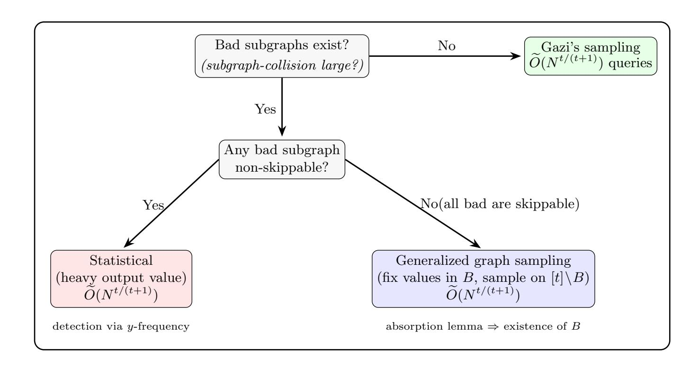
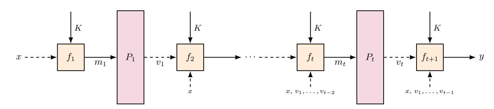
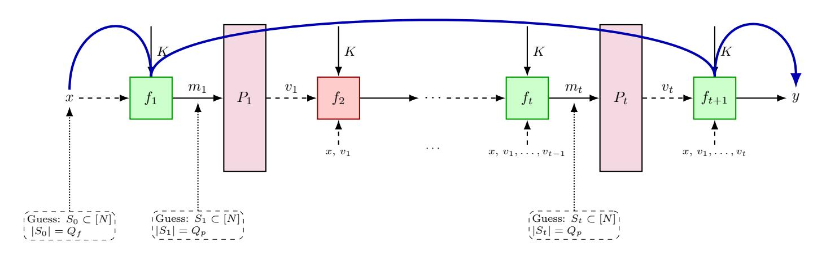
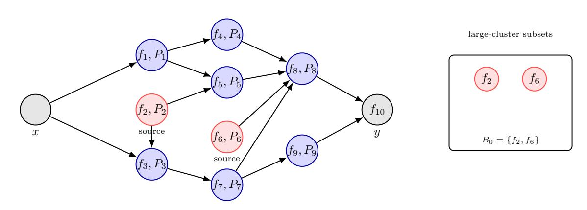
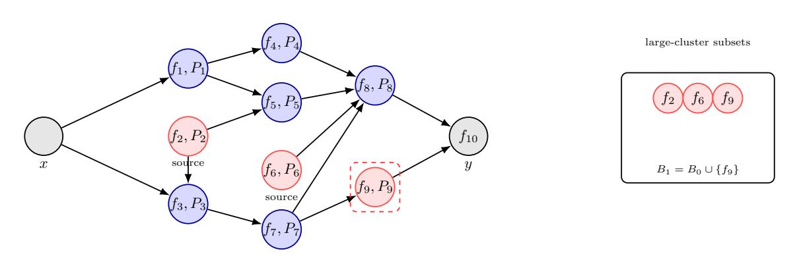
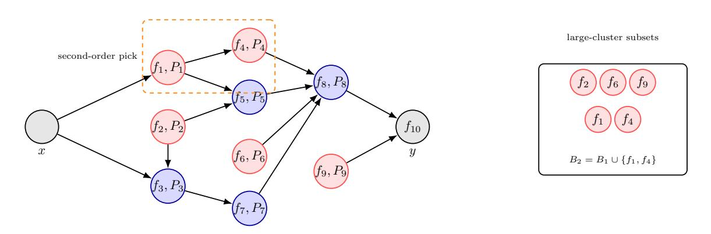
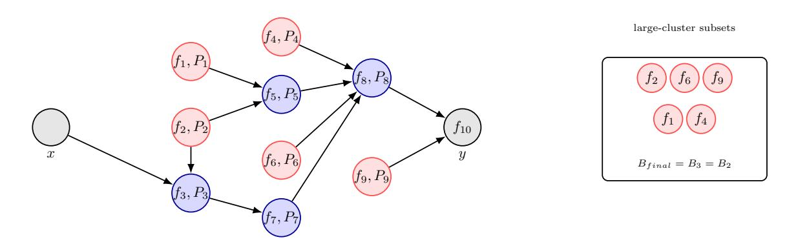

{0}------------------------------------------------

# <span id="page-0-0"></span>Upper Bound on Information-Theoretic Security of Permutation-Based Pseudorandom Functions

Chun Guo<sup>123</sup>, Jian Guo<sup>4</sup>, Xinnian Li<sup>5</sup>, and Wenjie Nan<sup>4(⊠)</sup>

- <sup>1</sup> School of Cyber Science and Technology, Shandong University, Qingdao, China
- <sup>2</sup> State Key Laboratory of Cryptography and Digital Economy Security, Shandong University, Qingdao, 266237, China
- <sup>3</sup> Key Laboratory of Cryptologic Technology and Information Security of Ministry of Education, Shandong University, Qingdao, Shandong, 266237, China
  - chun.guo.sc@gmail.com

    <sup>4</sup> Nanyang Technological University, Singapore, Singapore guojian@ntu.edu.sg, wenjie006@e.ntu.edu.sg

    <sup>5</sup> Peking University, Beijing, China lxnanswer04@gmail.com

**Abstract.** We present the first general upper bound on permutation-based pseudorandom functions in the information-theoretic setting. We show that any non-compressing PRF, with input and output domain at least [N], making t black-box calls to any t public permutations on [N], can be distinguished from a random function over the output domain with at most  $\widetilde{O}(N^{t/(t+1)})$  total queries to the PRF and the permutations. Our results suggest that the designs of Chen et al. (Crypto 2019) are optimal, among all possible constructions, in terms of information-theoretic security.

In particular, we propose the generalized key alternating construction, which captures permutation-based PRFs. We then prove that, for any such construction, there exists an explicit distinguisher achieving the tradeoff  $Q_f Q_p^t = \tilde{O}\left((2t^2)^{t+1}N^t\right)$  with constant advantage, where  $Q_f$  counts PRF queries and  $Q_p$  counts queries to each public permutation. We further extend our bound to blockcipher-based PRFs and to an adaptive setting in which each round may adaptively choose a permutation from a public family of permutations  $\mathcal{P}$ . In this case, the general upper bound becomes  $\tilde{O}\left(|\mathcal{P}|N^{t/(t+1)}\right)$ .

**Keywords:** Permutation-based PRFs · General upper bound · Attacks

### 1 Introduction

Pseudorandomness is a fundamental building block in cryptography. It enables symmetric-key primitives, supports real-world systems, and supplies randomness for algorithms. Over the years, various pseudorandom functionalities have been proposed. The most prominent are pseudorandom functions (PRFs) and pseudorandom permutations (PRPs), along with their unkeyed counterparts, public random functions (RFs) and public random permutations (RPs). A central line of

{1}------------------------------------------------

research has focused on transformations among different primitives. The switching lemma [\[6,](#page-32-0) [29\]](#page-34-0) shows that (P)RFs and (P)RPs are interchangeable when fewer than o(N1/<sup>2</sup> ) random bits are needed. Luby and Rackoff [\[30\]](#page-34-1) showed that the Feistel construction can transform PRFs into (strong) PRPs.

In recent years, permutation-based cryptography has attracted considerable interest. The last few decades of symmetric cryptography have been a golden age for blockciphers, enabling the design, standardization, and deployment of elegant ciphers such as AES [\[21\]](#page-33-0). These blockciphers, serving as "bedrock" primitives, have in turn inspired permutation-based designs across practice—e.g., permutation-based hash functions in MPC protocols [\[27\]](#page-34-2), efficient AES-based PRFs, and even AES-based post-quantum signature schemes [\[3\]](#page-32-1). Meanwhile, perhaps inspired by the success of Keccak in the NIST SHA-3 competition [\[20\]](#page-33-1), a modern trend has emerged in cryptographic designs based on public, keyless cryptographic permutations. Keyless permutations avoid key-schedule weaknesses [\[26\]](#page-34-3) and are often easier to design, where wide permutations (e.g., the 1600-bit Keccak permutation) support multiple parameter settings with flexible efficiency/security tradeoffs [\[20\]](#page-33-1).

Within this area, a central question is: how can PRFs be constructed from pseudorandom or random permutations? This question has a long history. Bellare et al. [\[5\]](#page-32-2) and Hall et al. [\[28\]](#page-34-4) initiated the study of PRP-to-PRF transformations in both the standard and ideal-cipher models, followed by a series of works on designs, bounds, and attacks [\[4,](#page-32-3) [16,](#page-33-2) [31,](#page-34-5) [34\]](#page-34-6). Motivated by recent interest in public random permutations, subsequent work investigated the construction of PRFs from a small number of public permutations. Chen et al. [\[12\]](#page-33-3) showed that the sum of two Even-Mansour (SoEM) instances achieves tight N<sup>2</sup>/<sup>3</sup> security, and Cogliati et al. [\[13\]](#page-33-4) generalized this to t EM instances, attaining tight Nt/(t+1) security. Several works have also sought to simplify these constructions while retaining the same level of security [\[32,](#page-34-7) [33,](#page-34-8) [35\]](#page-35-0).

However, most studies on constructing one functionality from another focus on establishing provable bounds for specific constructions or structures. This naturally raises two broader questions for both theoretical and practical interest: Can we make the constructions simpler? and Can we make them safer? Prior works have largely addressed these questions in a case-by-case manner by analyzing a particular protocol or structure (e.g., XoP, SoEM, Feistel), proving tight bounds within that structure, and showing how many rounds or permutation calls are needed to reach a target security level. Such results establish optimality relative to the chosen structure, but they do not yield a universal limit across all possible constructions.

In this work, we take a different approach: rather than restricting ourselves to any specific structure, we consider the problem in full generality. That is, we study the best possible security achievable by any PRF construction making t calls to t public permutations, without assuming a particular template such as Even-Mansour. This shift allows us to provide generic upper bounds on security, rather than bounds tied to a specific design. The central question we ask is:

{2}------------------------------------------------

Is there a construction using t calls to t public permutations that achieves strictly better information-theoretic security than simple templates such as the sum of Even-Mansour (SoEM) structures?

We solve this problem completely in the negative for the non-compressed output setting, i.e., when the output domain is at least [N], the permutation size. Specifically, we give an explicit attack against any such PRF that makes t calls to public permutations, showing that no such construction can exceed the security bounds  $\widetilde{O}(N^{\frac{t}{t+1}})$ . We further extend this to adaptive constructions that make at most t calls to a set of  $|\mathcal{P}|$  random permutations, obtaining the upper bound  $\widetilde{O}(|\mathcal{P}|N^{\frac{t}{t+1}})$ . This captures blockcipher-based instantiations.

### 1.1 Our model

We consider PRF constructions obtained by making black-box queries to public permutations. Formally, such a construction is a deterministic algorithm that, on input (K, x), makes at most t queries to public permutations  $P_1, \ldots, P_t$ . Before the first query, the construction may perform arbitrary computation on (K, x), which we formalize by a arbitrary function  $m_1 = f_1(K; x) \in [N]$ . The first query is then  $v_1 = P_1(m_1)$ .

More generally, before the *i*-th query, the construction can compute any function of  $(K, x, v_1, \ldots, v_{i-1})$ , so there exists some function  $f_i$  such that  $m_i = f_i(K; x, v_1, \ldots, v_{i-1}), v_i = P_i(m_i)$ . After t queries, the final output is computed as  $y = f_{t+1}(K; x, v_1, \ldots, v_t)$ . Moreover, while later functions  $f_j$  may in principle depend on intermediate values  $m_i$ , these values are always computable from  $(x, v_1, \ldots, v_{i-1}, K)$ . Thus, without loss of generality, we only use  $x, \{v_i\}$  as inputs for each keyed function. Our model is illustrated in Figure 2, and we name it generalized key alternating construction.

Known functions. We assume that all functions  $f_1, \ldots, f_{t+1}$  are public. Otherwise, a construction could trivially output  $RF_S(x)$  for a secret random function  $RF_S$ , making it indistinguishable from a true random function.

Adaptive inputs/outputs. Some constructions may output adaptively during some rounds  $f_i$  for certain i, or may input x gradually by feeding only a portion of x into some round  $f_i$ . This captures the variable-input-length and variable-output-length constructions. Our model still covers these cases since each round function  $f_i$  can depend on any of the previous values  $x, v_1, \ldots, v_{i-1}$ , and all round functions are public. We can define modified functions  $f'_i$  such that the modified round functions fit into our generalized construction. The resulting output distribution is identical to that of the original construction. Consequently, if we can distinguish the outputs of  $f'_{t+1}$  from a random function, we can also distinguish the original construction. See more detailed reduction in Appendix A.

For clarity in the early sections, we focus on the case where both the input and output domains are [N]. Extensions to other settings are discussed in Section 7.

{3}------------------------------------------------

Fixed vs. adaptive oracle calls. One subtle point is whether the construction can choose which permutation  $P_i$  to query adaptively based on intermediate values. Actually, this choice does not affect the asymptotic query complexity of the attacks we study. For simplicity, we restrict attention to the case where the order of calls is fixed, and discuss how to extend to adaptive queries in Section 6.

### 1.2 Our contribution

**Theorem (Informal).** Let  $\mathcal{P}$  be a set of  $|\mathcal{P}|$  (random) permutations on [N]. Let  $\mathcal{Q}_c$  be any PRF construction with key space  $|\mathcal{K}| = O(N^{\text{poly}(t)})$  that makes at most t oracle calls to permutations from  $\mathcal{P}$ . Then there exists an algorithm that distinguishes  $\mathcal{Q}_c$  from a uniformly random function on [N] using  $\widetilde{O}(|\mathcal{P}|N^{t/(t+1)})$  total queries to  $\mathcal{Q}_c$  and to the permutations in  $\mathcal{P}$ , with constant probability.

Our main contribution is shown in the informal theorem above, for details, refer to Theorem 1 for fixed t permutation and Theorem 5 for generalization to adaptive calls to a set of permutations. Beyond the main theorem, we also highlight several technical contributions.

Generalized key alternating construction and a DAG viewpoint. We introduce the generalized key alternating construction, which captures the general construction of permutation-based PRFs, and analyze it through a directed acyclic graph (DAG) perspective. This perspective is particularly helpful for analyzing attacks on these generic structures. Furthermore, to the best of our knowledge, this work is the first to establish nontrivial upper bounds for these general architectures. We hope this perspective will also facilitate upper-bound analyses for other cryptographic functionalities.

<span id="page-3-0"></span>

Fig. 1: Overview of attacks

{4}------------------------------------------------

New attacking algorithm and analysis. We generalize Gaži's sampling attack [\[24\]](#page-34-9), which samples randomly before each permutation in the sequential setting, to arbitrary DAGs by introducing skippable subgraphs. Our algorithm complements Gaži's attack in regimes where some skippable subgraphs are not sampling-friendly. Additionally, we propose a simple statistical test that handles non-skippable subgraphs that are also unfriendly to sampling.

We then provide a detailed analysis of all three attacks. Leveraging an absorption lemma, inspired by the proof strategy underlying Szemerédi's regularity lemma [\[36\]](#page-35-1), we show that one can algorithmically combine these components to obtain a distinguisher that succeeds with constant advantage against any generalized key alternating construction. See Figure [1](#page-3-0) for an overview illustration. Although technically involved, our analysis relies primarily on collision probabilities to study the behavior of general round functions. This perspective might also be useful for analyzing other problems.

Analysis beyond block functions. We further consider PRF constructions whose input/output domains differ from [N]. The only exception arises when the output domain is compressed. We show theoretically that simple truncation can increase resistance to the attacks considered here, thereby improving security, at least against our attacks. For non-compressed outputs, as long as the overall output range has size at least the permutation size N, our results still apply: the distinguisher under a random function on a larger domain only succeeds with even smaller probability.

For the input domain, enlarging it is harmless since we can always attack a fixed [N]-sized subspace. Restricting the input domain mainly affects the ability to achieve the optimal balance between Q<sup>f</sup> and Qp. When the input domain is smaller, Q<sup>f</sup> cannot exceed its size, which may prevent achieving the optimal tradeoff. As a result, as long as the output domain is not compressed, the same Q<sup>f</sup> –Q<sup>p</sup> tradeoff continues to hold. See Section [7](#page-28-0) for details.

### 1.3 Related Works

Most research on the information-theoretic security of permutation-based cryptography has focused on proving security for specific structures. Only a small number of works focus on generic attacks. Accordingly, we first review known attacks, and then give a brief overview of permutation-based cryptography, with emphasis on permutation-based PRFs.

Attacks in the ideal cipher model. Patarin [\[34\]](#page-34-6) studied attacks against the sum of independent ideal random permutations, showing how such constructions can be distinguished from truly random functions. Several attack scenarios were considered depending on the number of queries available to the adversary. The basic strategy is to identify statistical properties strong enough to separate the sum of permutations from random functions.

{5}------------------------------------------------

Attacks on key-alternating ciphers. Key-alternating ciphers (KAC) were introduced by Bogdanov et al. [9], which generalize the well-known Evan-Mansour structure [23]. They also proposed an attacking strategy: under some key K, check whether all tuples that survive the first t rounds also pass through the final round. However, Andreeva et al. [1] showed that this attack fails with overwhelming probability under the parameter settings in Bogdanov et al.'s original paper. In addition, Gaži proposed an attack initially designed for cascade encryption and subsequently generalized to KAC [24]. Gaži's attack provably succeeds with high probability for their chosen parameters. It applies to sequential constructions and in particular to KACs or designs where each round applies a keyed permutation before entering the random permutation. Our attack can be viewed as a further generalization of Gaži's method, extending it to arbitrary directed acyclic graphs with skippable subgraphs.

On the quantum side, Bai et al. [2] studied attacks on Even-Mansour ciphers and key-alternating ciphers. They demonstrated that quantum random walks can reduce query complexity in key-recovery attacks.

PRFs from pseudorandom permutations. This line of work was initiated by Bellare et al. [5], who analyzed how to construct pseudorandom functions from pseudorandom permutations in both the ideal cipher and the standard model. In particular, they introduced a "re-keying" technique to construct PRFs from blockciphers. Hall et al. [28] explored simple operations to enhance PRP-based PRFs, the most prominent being truncation. They showed that if one tolerates a shorter output length, then security can be increased (compared to the switching lemma) simply by outputting fewer bits. We will revisit truncation later, since it has direct implications for both security and attacks. Lucks [31] analyzed the sum of PRPs, a problem that became widely known as XoP. Subsequent works produced many elegant results, showing that the security of XoP can surpass the birthday bound and even reach  $q/N^{1.5}$ , where q is the number of queries [4, 16, 22].

PRFs from random permutations. A more recent direction considers constructing PRFs from public or random permutations. Since the work of Chen et al. [12], this area has attracted attention because public random permutations are both natural and practically available: any fixed, fixed-key blockcipher can be modeled as a public random permutation, and such permutations are usually efficient to compute [7, 17, 19]. On the construction side, Chen et al. showed that the sum of two Even-Mansour (SoEM) structures (without key-forwarding) achieves tight  $\widetilde{O}(N^{2/3})$  security in the information-theoretic setting. This result was later generalized to the sum of t EM structures, achieving  $\widetilde{O}(N^{t/(t+1)})$  security [13]. More recent works have explored minimalistic designs for PRFs from public permutations with very few calls [32, 33, 35]. On the application side, these PRF constructions have been extended to message authentication codes, nonce-based and tweakable encryption schemes [7, 8, 10, 11, 17, 18].

{6}------------------------------------------------

### 1.4 Roadmaps

In Section 3, we provide a technical overview, following Section 2, which explains the notations and the construction model for easier understanding. In Section 4, we describe the attacks and present a complete attack with a proof that it works for all constructions; some analysis and details required for this proof are left for Section 5. Section 6 covers adaptive calls and blockcipher-based PRFs. In Section 7, we analyze the constructions with different input and output domain.

### <span id="page-6-1"></span>2 Notations and Construction

Throughout this work we fix the permutation size to be N, i.e., each permutation is a bijection between  $[N] \leftrightarrow [N]$ . We denote  $U_N$  for the uniform distribution over [N]. We denote  $SW_{N,k}$  for the uniform distribution over all size k subsets of [N], i.e., sampling k elements uniformly without replacement. We also use  $[t] = \{1, 2, \ldots, t\}$ , typically referring to the first t rounds of the construction. Furthermore, we use  $\mathcal{U}$  to denote the effective support of a collection of functions. For example,  $\mathcal{U}_B$  denotes the effective support of the round functions  $f_i$  with  $i \in B \subseteq [t]$ . Because t,  $\ln N \ll N$ ,  $\widetilde{O}(N^c)$  notation is used to absorb any factors that are small polynomials in t and  $\ln N$ .

### 2.1 Generalized Key Alternating Construction

The generalized key alternating construction is illustrated in Figure 2. Compared to the original KAC, the generalized version differs in the following way:

- The term  $v_i \oplus k_{i+1}$  is replaced by a generalized keyed function  $f_{i+1}(K,\cdot)$ ,
- Each round function  $f_{i+1}(K,\cdot)$  may take any subset of  $\{v_i,\ldots,v_1,x\}$  as inputs, which we refer to as its *active variables*.

We also denote  $m_i$  as the *i*-th intermediate value output by  $f_i$ , and  $v_i = P_i(m_i)$ .

<span id="page-6-0"></span>

Fig. 2: Generalized key alternating construction. Dashed lines represent inputs that may or may not be active, depending on the function instance.

{7}------------------------------------------------

**DAG view.** Under any fixed key K, the construction can be viewed as a directed acyclic graph (DAG). There is one source vertex x and one sink vertex y. Each layer  $(f_i, P_i)$  is represented by a vertex  $V_i$ . We represent the final layer  $f_{t+1}$  together with the output y by a single sink vertex, since once the computation reaches  $f_{t+1}$  the output y is determined. We draw an edge  $V_i \to V_j$  if and only if the output  $v_i = P_i(m_i)$  is used as an active variable of  $f_j$ .

<span id="page-7-0"></span>**Definition 1** (Skippable and non-skippable sets). For  $B \subseteq [t]$ , form the reduced graph  $\mathcal{G} \setminus B$  by removing all incoming edges of each  $V_s$  where  $s \in B$ . In other words, treating  $V_s$  as a source while keeping its outgoing edges. We call B skippable if there exists a path  $x \rightsquigarrow y$  in  $\mathcal{G} \setminus B$ ; otherwise B is non-skippable.

<span id="page-7-1"></span>Lemma 1 (Non-skippable means y is determined by B). If  $B \subseteq [t]$  is non-skippable, then for any  $x, x' \in [N]$ , a collision on B implies a collision on the final output. Formally,

$$(x, x') \xrightarrow{K} \boldsymbol{z}_B \implies (x, x') \xrightarrow{K} y,$$

where  $x \xrightarrow{K} \mathbf{z}_B \in [N]^{|B|}$  means that, under key K,  $\mathbf{z}_B$  is the vector of values at the vertices in B on input x, and  $x \xrightarrow{K} y$  means the construction outputs y on input x under K.

*Proof.* Since every  $x \rightsquigarrow y$  path passes through B, once the values  $z_B$  are fixed, the entire subgraph downstream of B has no other inputs. Evaluating the DAG in topological order therefore determines y uniquely from  $z_B$ .

**Alternating representation.** Fix a key vector K. Since the adversary always queries the construction under a fixed key, we define the alternating functions  $F_i$  for  $f_i$  under K by

$$F_1(K;x) = f_1(K;x),$$

$$F_2(K;x) = f_2(K;x, P_1(F_1(K;x))),$$

$$\vdots$$

$$F_{t+1}(K;x) = f_{t+1}(K;x, P_1(F_1(K;x)), \dots, P_t(F_t(K;x))).$$

If we skip a layer  $V_{s_j}$ , then we can treat the vertex as a new source node where the values of the source node can be taken from [N]. For a fixed value  $z_{s_j}$ , all functions that depend on  $V_{s_j}$  take  $z_{s_j}$  as an additional explicit input, and the alternating representation becomes

$$F_i(K, z_{s_j}; x),$$

where  $z_{s_j}$  plays the same role as any  $P_{s_j}(F_{s_j}(K;x))$  value would have. We also write  $F_i(K, \mathbf{z}_B; x)$  if we skip a set of layers B.

{8}------------------------------------------------

**Preimages.** Fix a key K for the construction. For a subset  $B = \{s_1, \ldots, s_\ell\} \subseteq [t]$  and a value  $\mathbf{z}_B = (z_{s_1}, \ldots, z_{s_\ell}) \in [N]^{|B|}$ , let

$$P_{z_B} := \#\{x \in [N] \mid \forall s_i \in B : F_{s_i}(K; x) = z_{s_i}\}.$$

For the largest fiber on B, we write  $P_{z_B,\max} := \max_{z_B \in [N]^{|B|}} P_{z_B}$ .

<span id="page-8-1"></span>**Passing through the construction.** Fix a key vector  $K = (k_1, \ldots, k_{t+1})$  and let  $F_i(K; x)$  be the alternating representation defined above. Consider the DAG view of the construction, let  $B \subseteq \{1, \ldots, t\}$  be a set of *skippable* layers, meaning that if we remove all incoming edges to  $\{V_{s_j}\}$  and treat their outputs as externally fixed values, there still remains a directed path from x to y.

Then we say a tuple

$$(x, (m_i, v_i)_{i \in [t]/B})$$

passes through the construction under  $(K, B, \mathbf{z}_B = (z_{s_1}, \dots, z_{s_\ell}))$  if:

1. For every non-skipped layer  $i \notin B$ ,

$$F_i(K, \boldsymbol{z}_B; x) = m_i \quad \text{and} \quad v_i = P_i(m_i),$$

where the active inputs of  $f_i$  are taken from  $\{x, v_1, \ldots, v_{i-1}\}_{[t]\setminus B} \cup \{z_{s_j}\}_{s_j\in B}$ . 2. The final layer satisfies

$$F_{t+1}(K, \boldsymbol{z}_B; x) = y = \mathcal{Q}(x),$$

where y is the oracle response from querying the construction Q on x.

Remark 1 (unreachable vertices). In the reduced DAG where we skip B, some remaining vertices  $V_i$  may become unreachable from x. We can still check their local consistency

$$F_i(K, \boldsymbol{z}_B; x) = m_i$$

since all their active inputs are present in the tuple  $(x, v_1, \ldots, v_t, \{z_{s_j}\})$ , even if they do not lie on any  $x \rightsquigarrow y$  path.

### <span id="page-8-0"></span>3 Technical Overview

We mainly address three questions:

- When is Gaži's attack applicable, and when does it fail?
- How can the failure of Gaži's attack be exploited to design a complementary distinguisher?
- Do these two attacks together cover all functions/constructions? If not, which cases remain, and what additional techniques might apply?

We begin by introducing the sampling procedure and the statistic we evaluate. For simplicity, the statistic here is a simplified version of the one used in the formal analysis later. For the basic construction setting, DAG perspective and skippablity, see Section 2.

{9}------------------------------------------------

**Sampling.** We independently sample t+1 sets without replacement, namely,  $S_0 \stackrel{\$}{\leftarrow} \mathrm{SW}_{N,Q_f}$  with  $|S_0| = Q_f$  and  $S_i \stackrel{\$}{\leftarrow} \mathrm{SW}_{N,Q_p}$  with  $|S_i| = Q_p$  for  $1 \le i \le t$ . For each  $m_i \in S_i$ , query is made to obtain  $v_i := P_i(m_i)$ , where each  $P_i$  is a fixed public permutation. For  $x \in S_0$ ,  $(x, y = \mathcal{Q}(x))$  denotes the response of the construction, or a random function, on input x.

**Tuples and the statistic.** Fix a key K and a subset  $B \subseteq [t]$ . Let  $Y_{K \setminus B}$  denote the number of tuples

$$\mathcal{T} = (x, \{(m_i, v_i)\}_{i \in [t] \setminus B}) \in S_0 \times \prod_{i \in [t] \setminus B} (S_i \times P_i(S_i))$$

such that, under K, the sequence  $\{(m_i, v_i)\}_{i \in [t] \setminus B}$  are correct middle values of x on those rounds in  $[t] \setminus B$ , and they can compute to query response y, i.e.,

$$x \xrightarrow{K} \{(m_i, v_i)\}_{i \in [t] \setminus B} \xrightarrow{K} y,$$

for the queried pair  $(x, y) \in S_0 \times \mathcal{Q}(S_0)$ , where  $\mathcal{Q}$  is either the real construction or a random function. All probabilities and expectations are over the randomness of the sets  $S_0, S_1, \ldots, S_t$ . In the RF case, we also consider the randomness of  $\mathcal{Q}$ .

Expectations. For the correct key  $K^*$ ,

$$\mathbb{E}[Y_{K^* \setminus B}]_{\text{Constrution}} = \frac{Q_f Q_p^{t-|B|}}{N^{t-|B|}}, \qquad \mathbb{E}[Y_{K \setminus B}]_{\text{RF}} = \frac{Q_f Q_p^{t-|B|}}{N^{t-|B|+1}} \quad \text{(any fixed } K)$$

where the random function simply incurs an extra 1/N from the independent y.

Remark 2. Note that this expectation holds for any construction, since the randomness arises solely from the sampled sets. See Appendix D, in particular Equation 4, for a detailed proof. However, the variance depends significantly on the specific construction, and the variance is precisely the quantity that we aim to bound in this work. By controlling the variance, we can separate the two expectations and thereby obtain a distinguisher in constant probability.

**Idea of separation of expectations.** To separate the expectations, we observe that if the variance of the construction can be controlled so that

$$\Pr[Y_{K^* \setminus B} \ge c \mathbb{E}[Y_{K^* \setminus B}]] = \Omega(1),$$

for some constant c > 0, then by choosing  $Q_f, Q_p = \widetilde{O}(N^{t/(t+1)})$  we can obtain at least

$$c \mathbb{E}[Y_{K^* \setminus B}] \ge C$$

tuples passing through the construction under the correct key  $K^*$  with constant probability.

On the other hand, we choose C sufficiently large so that, under a random function and for all keys K, it is impossible, except with negligible probability, to obtain C passing tuples. This separation between the achievable expectation under the real construction and the maximal achievable number under a random function forms the core idea of the distinguisher.

{10}------------------------------------------------

### 3.1 Applicability of Gaži's attack

With the statistic  $Y_{K\setminus B}$  defined above, Gaži's method evaluates  $Y_{K^*}$  directly over all sampled sets for  $B=\varnothing$ , please refer to Section 4.1 for details. Specifically, Gaži's method samples a random subset  $S_0\subseteq [N]$  of size  $Q_f$  and queries  $\mathcal Q$  on every  $x\in S_0$ . It also samples t random subsets  $S_i\subseteq [N]$ , for  $i\in [1,t]$ , each of size  $Q_p$ , and queries every element  $m_i\in S_i$  to the random permutation  $P_i$  to obtain  $v_i$ . The method then searches for a key  $K^*$  such that there are sufficiently many tuples

$$\mathcal{T} = (x, \{(m_i, v_i)\}_{i \in [1, t]}) \in S_0 \times \prod_{i \in [t]} (S_i \times P_i(S_i))$$

that pass through the construction, according to the definition in Section 2.1. Under the correct key  $K^*$  and  $\mathcal{Q}$  is the construction, the expectation satisfies

$$\mathbb{E}[Y_{K^*}]_{\text{Construction}} = \frac{Q_f Q_p^t}{N^t}.$$

In contrast, when  $\mathcal{Q}$  is a random function, for any key K we have  $\mathbb{E}[Y_K]_{\mathrm{RF}} = \frac{Q_f Q_p^t}{N^{t+1}}$ . Gaži considered the sequential setting, where round i depends only on  $v_{i-1}$  as its active variable. Their attack also requires  $f_i$  to be permutations. Under this framework, Gaži's analysis shows directly that there exists a constant c > 0 such that

$$\Pr\left[Y_{K^*} \ge c \,\mathbb{E}[Y_{K^*}]\right] = \Omega(1).$$

by upper bounding the variance.

When does Gaži's attack fail? The attack fails when the variance of  $Y_{K^*}$  blows up due to strong positive dependence of passing tuples under some round functions  $f_i$ . An extreme case is when the round function is a constant given K, e.g.  $f_i(K;\cdot) \equiv k_i$ . Successful attack then requires sampling the correct  $k_i \in S_i$ , so the success probability degrades to  $\Pr[k_i \in S_i] = Q_p/N$ . In general, if

$$\operatorname{Var}(Y_{K^*}) \gg \mathbb{E}[Y_{K^*}]^2 \iff \mathbb{E}[Y_{K^*}^2] \gg \mathbb{E}[Y_{K^*}]^2,$$

then the statistic  $Y_{K^*}$  may lose distinguishing power.

**Tight variance analysis via subset collisions.** By decomposing the variance into contributions from tuple pairs that collide in each subgraphs  $B \subseteq [t]$ , we obtain the following sufficient condition for Gaži's statistic to succeed:

<span id="page-10-0"></span>
$$\forall B \subseteq [t], \quad \Pr_{x \neq x' \in \mathcal{U}_{N(N-1)}} \left( x, x' \text{ collide on subset } B \right) \leq \frac{1}{2^t} \cdot \left( \frac{Q_p}{N} \right)^{|B|}. \tag{1}$$

We provide a detailed proof in Theorem 3 in Appendix D, showing that if the above condition is satisfied, then

$$\Pr[Y_{K^*} \ge \frac{1}{2}\mathbb{E}[Y_{K^*}]] \ge \frac{1}{8},$$

{11}------------------------------------------------

which suffices for a successful attack. Moreover, this bound is tight up to constant or polylogarithmic factors of N. If there exists a subset B violating the above upper bound significantly, the corresponding term dominates the variance, and Gaži's attack may fail. This does not imply failure in all regimes, but it does capture balanced cases where the x's spread nearly uniformly over the effective support of rounds functions in B, where the effective support is small, so the probability of success sampling is small.

### 3.2 Our complementary attack via general graph sampling

For a subset  $B \subseteq [t]$  and a fixed key K, define the *effective support* of round functions in B as

$$\mathcal{U}_{B,K} := \left\{ z_B \in [N]^{|B|} : \exists x \in [N] \text{ with } x \xrightarrow{K,\{f_s\}_{s \in B}} z_B \right\}.$$

Although the computation of  $x \mapsto z_B$  may involve intermediate round functions outside B, once the key K is fixed, the process is deterministic. Hence we may unambiguously denote the outcome in B simply as  $z_B$ , without reference to the rounds not included in B. Let  $P_{z_B,K}$  denote the number of inputs mapping to  $z_B$  on B under K:

$$P_{\boldsymbol{z}_B,K} := \#\{x \in [N] : x \xrightarrow{K,\{f_s\}_{s \in B}} \boldsymbol{z}_B\}.$$

Sometimes we just write  $P_{z_B}$  if we are considering the correct key  $K^*$  in the construction.

Assume Gaži's attack fails, then Equation 1 does not hold anymore, meaning that it would require more queries to achieve constant advantage. Then, with the correct key  $K^*$ , there is at least one nonempty subset  $B \subseteq [t]$  such that

$$\left(\frac{N}{Q_p}\right)^{|B|} \Pr_{x \neq x' \in \mathcal{U}_{N(N-1)}} \left(x, x' \text{ collide on } B\right) \geq \frac{1}{2^t}.$$

Moreover, for random distinct x, x',

<span id="page-11-0"></span>
$$\Pr_{x \neq x' \in \mathcal{U}_{N(N-1)}}(x, x' \text{ collide on } B) = \sum_{\boldsymbol{z}_B \in \mathcal{U}_{B,K^*}} \frac{P_{\boldsymbol{z}_B}(P_{\boldsymbol{z}_B} - 1)}{N(N-1)}.$$
 (2)

Let  $\boldsymbol{z}_{B,\max} \in \mathcal{U}_{B,K^*}$  maximize  $P_{\boldsymbol{z}_B}$ . Then

<span id="page-11-1"></span>
$$\Pr_{x \neq x' \in \mathcal{U}_{N(N-1)}}(x, x' \text{ collide on } B) \leq \frac{P_{\boldsymbol{z}_{B, \max}} \cdot \sum_{\boldsymbol{z}_{B} \in \mathcal{U}_{B,K^*}} (P_{\boldsymbol{z}_{B}} - 1)}{N(N-1)} \leq \frac{P_{\boldsymbol{z}_{B, \max}}}{N},$$
(3)

and hence necessarily

$$\frac{P_{\boldsymbol{z}_{B,\text{max}}}}{N} \, \geq \, \frac{1}{2^t} \left(\frac{Q_p}{N}\right)^{|B|} \qquad \Longleftrightarrow \qquad P_{\boldsymbol{z}_{B,\text{max}}} \, \geq \, \frac{1}{2^t} \frac{Q_p^{|B|}}{N^{|B|-1}}.$$

{12}------------------------------------------------

That is, the failure of Gaži's statistic implies a heavy fiber on B. We will exploit this in our sampling attack in the general graph. Here, the factor  $2^t$  does not significantly affect the attack. Recall that the expectation is  $\frac{Q_f Q_p^t}{N^t}$ . Therefore, by increasing both  $Q_f$  and  $Q_p$  by a factor of 2, the extra factor  $2^t$  can be absorbed.

**Heuristics (will be formalized step-by-step).** Suppose  $B \subseteq [t]$  is a maximal "bad" subset with a heavy fiber, while the remaining rounds  $[t] \setminus B$  are "good" with respect to Gaži's sampling method. Then in expectation, sampling  $Q_f$  of inputs x and  $Q_p$  values per round from  $[t] \setminus B$  yields

$$\mathbb{E}[Y_{K^* \setminus B}] = \frac{Q_f \, Q_p^{t-|B|}}{N^{t-|B|}}$$

distinct tuples  $\mathcal{T} = (x, \{(m_i, v_i)\}_{i \in [t] \setminus B})$ , where  $\{(m_i, v_i)\}_{i \in [t] \setminus B}$  are the correct middle values of x in the construction under the correct key  $K^*$ . Note that these tuples have the distinct inputs x.

Now, if we can somehow check the "good" subset  $[t] \setminus B$  using responses  $(x, y = \mathcal{Q}(x))$ , we can still distinguish the construction from a random function. However, we cannot compute the rounds in  $[t] \setminus B$  in isolation, since they may depend on outputs from B. Rather than guessing the values for the round functions in B, we instead fix a concrete value  $\mathbf{z}_B$  that can be fed into other rounds with active inputs in  $\mathbf{z}_B$ . This enables us to compute the rounds in  $[t] \setminus B$  and count tuples passing through  $[t] \setminus B$  until  $y = \mathcal{Q}(x)$ . However, it is not a distinguisher yet.

To obtain a useful statistic, we rely on the fact that a heavy fiber  $z_{B,\text{max}}$  must exist whenever Gaži's attack fails, as shown in the previous analysis. Since

$$P_{\bm{z}_{B,\text{max}}} \, \geq \, \frac{1}{2^t} \frac{Q_p^{\,|B|}}{N^{\,|B|-1}},$$

among the  $Y_{K^*\setminus B}$  inputs passing through  $[t]\setminus B$ , we expect

$$Y_{K^* \setminus B} \cdot \frac{P_{\boldsymbol{z}_{B, \max}}}{N} \ge \frac{1}{2^t} \frac{Q_f Q_p^t}{N^t}$$

to also match the fixed value  $z_{B,\text{max}}$  on B. By contrast, conditioning on matching any fixed  $z_B$ , for a random function the expected number of inputs matching  $[t] \setminus B$  is

$$\frac{Q_f \, Q_p^{t-|B|}}{N^{t-|B|+1}}$$

By choosing appropriate values of  $(Q_f, Q_p)$ , these two expectations can be separated. Finally, to identify  $\mathbf{z}_{B,\text{max}}$ , we simply enumerate over all possible values in  $[N]^{|B|}$ , and one of them must correspond to  $\mathbf{z}_{B,\text{max}}$ .

However, two issues remain to be addressed before we can formalize the heuristic:

{13}------------------------------------------------

- A large fiber on B (i.e.,  $P_{\mathbf{z}_{B,\text{max}}} \geq Q_p^{|B|}/(2^t \cdot N^{|B|-1}))$  does not by itself guarantee that the remaining rounds are "sampling-friendly." We need to make sure that by sampling  $Q_p$   $m_i$  for each round  $i \in [1,t] \setminus B$ , the variance term is small.
- Even if such a B exists, we must be able to fix  $\mathbf{z}_B$  and still check consistency of the remaining rounds against  $(x, y = \mathcal{Q}(x))$ . This requires the skippability of B introduced earlier.

**Skippability.** The "second issue" above is basically a connectivity condition. By the DAG view and the Definition 1 of skippable, if B is skippable then we may treat the vertices in B as source nodes while retaining a path  $x \rightsquigarrow y$ . Hence we can check consistency on the remaining rounds and apply the sampling method there. If not, we have the following attack.

Non-skippable implies simple statistical attack. Assume Gaži's statistic fails and there exists an non-skippable and nonempty  $B \subseteq [t]$  with

$$\left(\frac{N}{Q_p}\right)^{|B|} \Pr_{x \neq x' \in \mathcal{U}_{N(N-1)}} \left(x, x' \text{ collide on } B\right) \geq \frac{1}{2^t}.$$

Since B is non-skippable, Lemma 1 implies that y is a deterministic function of  $z_B$ . Then if we query  $y = \mathcal{Q}(x)$  on randomly chosen  $x \stackrel{\$}{\leftarrow} [N]$ , there is

$$P_{\boldsymbol{z}_{B,\text{max}}} \ \geq \ \frac{1}{2^t} \frac{Q_p^{|B|}}{N^{|B|-1}} \quad \Rightarrow \quad \Pr[y \leftarrow \boldsymbol{z}_{B,\text{max}}] \ \geq \ \frac{P_{\boldsymbol{z}_{B,\text{max}}}}{N}.$$

Thus a simple high-frequency test <sup>6</sup> on y distinguishes the construction from a random function. Since an input x hits the heavy fiber  $z_{B,\max}$  with probability at least

$$\Pr[\boldsymbol{z}_B(x) = \boldsymbol{z}_{B,\max}] \geq \frac{1}{2^t} \cdot \frac{Q_p^{|B|}}{N^{|B|}},$$

the number of sampled inputs mapping to  $z_{B,\text{max}}$  among  $Q_f$  queries follows a negative hypergeometric distribution. To distinguish from a random function, it suffices to obtain  $3 \ln N$  distinct inputs x that collide on  $z_{B,\text{max}}$ , since a truly random function contains no  $3 \ln N$ -collision with overwhelming probability [15].

Following the hypergeometric distribution, it is enough to choose  $Q_f$  as

$$Q_f \cdot \frac{1}{2^t} \cdot \frac{Q_p^{|B|}}{N^{|B|}} \ge 6 \ln N \qquad \Longleftrightarrow \qquad Q_f \ge 6 \ln N \cdot 2^t \cdot \frac{N^{|B|}}{Q_p^{|B|}}, \qquad |B| \le t.$$

such that with constant probability  $\Omega(1)$ , we obtain  $3 \ln N$  inputs x sharing the same  $\mathbf{z}_{B,\text{max}}$ , and hence they produce the same output  $\mathcal{Q}(x)$  by the non-skippable property. Finally, taking  $Q_p \geq 2N^{t/(t+1)}$  implies, in the worst case

More efficient tests are possible, but a high-frequency test suffices for our purposes. See [14, 25] for more efficient collision-based uniformity tests.

{14}------------------------------------------------

$$|B| = t,$$

$$Q_f = 6 \ln N \cdot 2^t \cdot \frac{N^t}{Q_p^t} \le 6 \ln N \cdot 2^t \cdot \frac{N^t}{(2N^{t/(t+1)})^t} = 6 \ln N \cdot N^{t/(t+1)}.$$

Therefore, both  $Q_p$  and  $Q_f$  are  $\widetilde{O}(N^{t/(t+1)})$ .

Consequently, for any such "bad" subset of layers, if it is non-skippable, a statistical attack applies. Therefore, if both Gaži's attack and the statistical attack fail, there must exist "bad" subsets, and all of them must be skippable.

**Absorption method.** Then the remaining task is to show that there exists a subset B with  $P_{z_{B,\max}} \geq Q_p^{|B|}/(2^t \cdot N^{|B|-1})$ , where we can leverage sampling method on the rest of the rounds  $[t] \setminus B$ .

Intuitively, this does not hold for every such B. Instead, we seek a maximal subset B for which  $P_{z_{B,\max}} \geq Q_p^{|B|}/N^{|B|-1}$ , hoping that the remaining rounds become "sampling friendly."

Two questions arise:

- How do we ensure that such maximal B exists?
- What precise properties of the remaining rounds are required to perform the sampling attack?

For our purposes we only need existence of B. Algorithmically, we can try all separations  $(B \subseteq [t], [t] \setminus B)$ , i.e., at most  $2^t$  cases. This does not increase the query complexity: we sample  $Q_p$  values per round function once and then reuse these same samples for every candidate separation. As a result, only the offline processing time grows.

Restricted sampling is enough to collect tuples. The second issue is easier to address and, in fact, guides the solution of the first issue.

Recall what the sampling does in Gaži's attack [24]: we first sample  $Q_f$  of inputs x; then sample  $Q_p$  values for  $m_1$  and expect a fraction  $Q_p/N$  of those x to pass round 1. For round 2 we sample  $Q_p$  values for  $m_2$  and expect another factor  $Q_p/N$  among the x that already passed round 1, and so on. In other words, the sampling procedure is trying to hit the correct middle values for those x that have already survived the previous rounds. Consequently, restricting attention to a subset of x still allows us to collect enough tuples.

A direct calculation shows that it suffices to restrict to the  $P_{z_{B,\max}}$  inputs that map to the heavy fiber  $z_{B,\max}$ . Let  $Y_{K^*\setminus B,z_{B,\max}}$  denote the number of sampled tuples

$$\mathcal{T} = (x, \{(m_i, v_i)\}_{i \in [t] \setminus B})$$

that (i) pass through the rounds in  $[t] \setminus B$  under the correct key  $K^*$ , and (ii) additionally satisfy  $x \mapsto \mathbf{z}_{B,\text{max}}$  on B. Since

$$P_{\bm{z}_{B,\text{max}}} \ \geq \ \frac{1}{2^t} \cdot \frac{Q_p^{|B|}}{N^{|B|-1}},$$

{15}------------------------------------------------

the expected number of passing tuples over the remaining rounds  $[t] \setminus B$  under this restricted sampling is

$$\mathbb{E}\big[Y_{K^* \setminus B, \boldsymbol{z}_{B, \max}}\big] = \frac{P_{\boldsymbol{z}_{B, \max}}}{N} \cdot \frac{Q_f \, Q_p^{\, t - |B|}}{N^{\, t - |B|}} \; \geq \; \frac{1}{2^t} \cdot \frac{Q_f \, Q_p^{\, t}}{N^{\, t}},$$

matching the heuristic above.

Moreover, under the correct key  $K^*$  and the correct choice of  $\mathbf{z}_{B,\max}$ , any sampled tuple  $(x,\{(m_i,v_i)\}_{i\in[t]\setminus B})$  that all  $m_i$  are correct middle values of x will definitely passes through the real construction.

We now bound the variance when sampling only over  $[t] \setminus B$  and restricting to the fiber  $\{x: x \mapsto \mathbf{z}_{B,\max}\}$ . A complete derivation appears in the proof of Theorem 4. Formally, we still sample uniformly in [N], but we only count those x that map to  $\mathbf{z}_{B,\max}$ . For  $Q_f$  sampled inputs and  $Q_p$  samples per round  $i \in [t] \setminus B$ , we have the standard expansion

$$\mathbb{E}\left[Y_{K^*\backslash B, \boldsymbol{z}_{B, \max}}^2\right] = \mathbb{E}\left[Y_{K^*\backslash B, \boldsymbol{z}_{B, \max}}\right] + \sum_{\mathcal{T} \neq \mathcal{T}'} \Pr[\mathcal{T} \text{ and } \mathcal{T}' \text{ both pass}],$$

where  $\mathcal{T}, \mathcal{T}'$  are taken over all tuples in  $[N]^{1+2(t-|B|)}$ . Denote the off-diagonal sum in the second moment by

$$\Sigma := \mathbb{E} \Big[ Y_{K^* \setminus B, \boldsymbol{z}_{B, \text{max}}}^2 \Big] - \mathbb{E} \big[ Y_{K^* \setminus B, \boldsymbol{z}_{B, \text{max}}} \big] \, .$$

We decompose  $\Sigma$  according to the subset of rounds on which  $\mathcal{T}$  and  $\mathcal{T}'$  collide:

$$\Sigma = \sum_{G \subseteq [t] \setminus B} \Sigma_G, \qquad \Sigma_G := \sum_{\substack{\mathcal{T} \neq \mathcal{T}' : \\ \mathcal{T}, \mathcal{T}' \text{ collide on } G}} \Pr[\mathcal{T} \text{ and } \mathcal{T}' \text{ both pass}].$$

The decomposition shows that for each  $G \subseteq [t] \setminus B$ ,

$$\Sigma_G \leq \frac{Q_f^2 Q_p^{2(t-|B|)}}{N^{2(t-|B|)}} \cdot \frac{P_{\boldsymbol{z}_{B,\max}}^2}{N^2} \cdot \frac{N^{|G|}}{Q_p^{|G|}} \cdot \Pr(x, x' \text{ collide on } G \mid x, x' \mapsto \boldsymbol{z}_{B,\max}).$$

Hence to upper bound the  $\Sigma$  such that

$$\Sigma = \sum_{G \subseteq [t] \setminus B} \Sigma_G = O\left(2^{t-|B|} \mathbb{E}\left[Y_{K^* \setminus B, \boldsymbol{z}_{B, \max}}\right]^2\right),$$

we need the condition

$$\forall \varnothing \neq G \subseteq [t] \setminus B, \qquad \frac{N^{|G|}}{Q_p^{|G|}} \cdot \Pr\left(x, x' \text{ collide on } G \mid x, x' \mapsto \boldsymbol{z}_{B, \max}\right) \leq 1.$$

One may notice that the factor  $2^{t-|B|}$  factor is too large for the variance. To obtain the sharper bound that

$$\Sigma = O(t \cdot \mathbb{E}\left[Y_{K^* \setminus B, \boldsymbol{z}_{B, \max}}\right]^2),$$

{16}------------------------------------------------

it suffices to impose the stronger condition

$$\forall \varnothing \neq G \subseteq [t] \backslash B, \frac{N^{|G|}}{Q_p^{|G|}} \cdot \Pr\left(x, x' \text{ collide on } G \mid x, x' \mapsto \boldsymbol{z}_{B, \max}\right) \leq \frac{1}{\binom{t-|B|}{|G|}}. \tag{*}$$

Under this condition, restricted sampling over [t]B on the heavy fiber  $z_{B,\max}$  yields enough tuples with controlled variance.

Absorption guarantees the existence of such B. We now address the existence of a set B for which the above condition holds. Our approach follows the intuition behind Szemerédi's regularity lemma [36]. The difference is instead of partitioning the graph by an energy, we absorb rounds  $B_{absorb}$  into B whenever there is still a large fiber on joint effective support of  $B \cup B_{absorb}$ . A formal absorption Lemma 2 and Figures 4 for illustration appear later.

For  $B \subseteq [t]$  and  $\boldsymbol{z}_B \in \mathcal{U}_{B,K}$ , define the fiber

$$S_{\boldsymbol{z}_B} := \{x \in [N] : x \xrightarrow{K, \{f_s\}_{s \in B}} \boldsymbol{z}_B\} \text{ with size } P_{\boldsymbol{z}_B} := |S_{\boldsymbol{z}_B}|.$$

For  $G \subseteq [t] \setminus B$  and  $z_G \in \mathcal{U}_{G,K}$ , define the conditional number of preimages as

<span id="page-16-0"></span>
$$P_{\boldsymbol{z}_G|\boldsymbol{z}_B} := \#\{x \in S_{\boldsymbol{z}_B} : x \xrightarrow{K,\{f_s\}_{s \in G}} \boldsymbol{z}_G\}$$

As a result  $\sum_{z_G} P_{z_G|z_B} = P_{z_B}$ . Thus "conditioned on  $z_{B,\text{max}}$ " means we restrict to inputs from  $S_{z_{B,\text{max}}}$ .

By the failure of Gaži's attack, we can start from a subset  $B_0 \subseteq [t]$  for which there exists a heavy fiber  $\mathbf{z}_{B_0,\max}$  satisfying

$$P_{\bm{z}_{B_0, \text{max}}} \, \geq \, \frac{1}{2^t} \cdot \frac{Q_p^{|B_0|}}{N^{|B_0|-1}} \, \geq \, \frac{1}{2^t} \cdot \frac{1}{t^{|B_0|}} \cdot \frac{Q_p^{|B_0|}}{N^{|B_0|-1}},$$

where the extra factor  $1/t^{|B_0|}$  is introduced for convenience in the later union bound, serving the role of binomial coefficients.

Now, if there exists a nonempty subset  $G \subseteq [t] \setminus B_0$  and a value  $z_{G,\max}$  such that, conditioned on  $z_{B_0,\max}$ ,

$$P_{\boldsymbol{z}_{G,\max}|\boldsymbol{z}_{B_0,\max}} \, \geq \, \left(\frac{Q_p}{N}\right)^{|G|} \cdot \frac{1}{t^{|G|}},$$

then we absorb G by setting  $B_1 := B_0 \cup G$  and

$$\boldsymbol{z}_{B_1,\text{max}} := (\boldsymbol{z}_{B_0,\text{max}},\boldsymbol{z}_{G,\text{max}}).$$

Then it preserves

$$P_{\boldsymbol{z}_{B_1,\max}} \geq \frac{1}{2^t} \frac{1}{t^{|B_1|}} \frac{Q_p^{|B_1|}}{N^{|B_1|-1}}.$$

Then we can iterate this process, for any  $B_r$ , it either absorbs such an  $G \subseteq [t] \setminus B_r$  to obtain  $B_{r+1}$  with the heavy fiber, or terminate with  $B := B_r$  when no absorbing subset exists.

{17}------------------------------------------------

At termination, for every nonempty  $G \subseteq [t] \setminus B$ ,

$$\max_{\boldsymbol{z}_G} P_{\boldsymbol{z}_G | \boldsymbol{z}_{B, \max}} \ < \ P_{\boldsymbol{z}_{B, \max}} \Big( \frac{Q_p}{N} \Big)^{|G|} \frac{1}{t^{|G|}}$$

Hence, since  $t^{|G|} \ge {t-|B| \choose |G|}, |B| \in [t]$ , we have

$$\Pr(x, x^{'} \text{ collide on subset } G | x, x^{'} \xrightarrow{K^{*}} \boldsymbol{z}_{B,max})$$

$$\leq \frac{P_{\boldsymbol{z}_{G,max}|z_{B,max}}P_{\boldsymbol{z}_{B,max}}P_{\boldsymbol{z}_{B,max}}}{P_{\boldsymbol{z}_{B,max}}^2} \leq \frac{P_{\boldsymbol{z}_{B,max}}^2}{P_{\boldsymbol{z}_{B,max}}^2} \frac{Q_p^{|G|}}{N^{|G|}} \frac{1}{t^{|G|}} \leq \frac{Q_p^{|G|}}{N^{|G|}} \cdot \frac{1}{\binom{t-|B|}{|G|}}.$$

Therefore we obtain

$$\forall \varnothing \neq G \subseteq [t] \setminus B, \qquad \frac{N^{|G|}}{Q_p^{|G|}} \, \Pr \left( x, x' \text{ collide on } G \mid x, x' \mapsto \boldsymbol{z}_{B, \max} \right) \, \leq \, \frac{1}{\binom{t - |B|}{|G|}}$$

This is exactly the variance condition \* ensuring that sampling over  $[t] \setminus B$ , restricted to the heavy fiber  $z_{B,\text{max}}$ , yields enough tuples with controlled variance.

### <span id="page-17-0"></span>4 Attacks over Generalized Key Alternating Constructions

In this section, we begin by recalling Gaži's attack. Next, we introduce our graph-based generalization. Finally, we assemble these ingredients into a complete attack that covers every generalized key alternating construction. The completeness proof here assumes the correctness of the three component attacks: Gaži's attack, our generalized attack, and the statistical test. Detailed analyses and proofs of these sub-attacks are deferred to Section 5.

### <span id="page-17-1"></span>4.1 Gaži's attack

The adversary prepares sampled sets  $S_i$  for  $i \in [0, t]$ :

- $-S_0 \stackrel{\$}{\leftarrow} \mathrm{SW}_{N,Q_f}$  consists of input values x. For each  $x \in S_0$ , query the construction to obtain (x,y), yielding  $S_0^q = \{(x,y = \mathcal{Q}_c(x))\}.$
- For  $i \geq 1$ ,  $S_i \stackrel{\$}{\leftarrow} \mathrm{SW}_{N,Q_p}$  consists of intermediate values  $m_i$ . Each  $m_i \in S_i$  is queried to the permutation  $P_i$ , yielding  $S_i^q = \{(m_i, v_i) : P_i(m_i) = v_i\}$ .

Here,  $|S_0| = Q_f$  and  $|S_i| = Q_p$  for all  $i \geq 1$ . The adversary searches for tuples

$$\mathcal{T} = (x, \{(m_i, v_i)\}_{i=1}^t) \in S_0 \times \prod_{i=1}^t (S_i \times P_i(S_i))$$

that pass through the construction under some key K, according to definition 2.1 in Section 2. Under the correct key  $K^*$ , once the adversary guesses the correct sequence of intermediate values

$$x \xrightarrow{K^*} (m_1, v_1) \xrightarrow{K^*} \cdots \xrightarrow{K^*} (m_t, v_t),$$

{18}------------------------------------------------

the tuple automatically satisfies the final check

$$(m_t, v_t) \xrightarrow{K^*} y^* = \mathcal{Q}_c(x).$$

In contrast, if the construction is replaced by a truly random function RF, even if a key guess makes the first t constraints hold, the probability that it also outputs the correct y is only 1/N. This gap yields a distinguisher between the real construction and a random function. See Algorithm 3 for full details.

### 4.2 Our Generalized Attack

Our attack is a graph-based generalization of Gaži's method by viewing constructions as DAGs with some set of *skippable layers*. Given a chosen skippable set  $B = \{s_1, s_2, \ldots, s_\ell\} \subseteq [t]$ , we treat the outputs of these layers  $\mathbf{z}_B$  as externally inputs for other layers. Then we search for an assignment  $(K, \mathbf{z}_B)$  such that there are many tuples pass through the construction under this assignment:

$$\mathcal{T} = (x, \{(m_i, v_i)\}_{i \in [t] \setminus B}) \in S_0 \times \prod_{i = [t] \setminus B} (S_i \times P_i(S_i))$$

The Algorithm 1 shows the detail with Figure 3 as an example. Note that Gaži's attack is the special case  $B=\varnothing$  when there is no skipped layer.

<span id="page-18-0"></span>

Fig. 3: Example of our generalized attack that skips a subset of rounds.

Remark 3 (Reusing samples). Both Gaži's attack and our generalized attack can operate on given sample sets rather than generating them internally. In particular, the algorithms may accept previously sampled sets  $\{S_0, S_1, \ldots, S_t\}$  together with queries  $\{P_i(S_i)\}$  as inputs and skip their own sampling/querying phases. We exploit this in the next complete attack. Basically, a single batch of queries per round suffices, and different choices of  $B \subseteq [t]$  are handled offline by reusing the same data without re-sampling and re-querying.

{19}------------------------------------------------

### **Algorithm 1:** Generalized attack $\mathcal{A}_{\text{General}}$

```
1 Input: Oracle access to construction Q and permutations \{P_i\}_{i=1}^t;
     parameters Q_f, Q_p, C, N, skippable set B \subseteq [t].
 2 Output: True with some (K, z_B) / False.
 3 Sample a random set S_0 \subseteq [N] of size Q_f.
 4 for each x \in S_0 do
    Query Q(x) to obtain y and store (x, y) in S_0^q.
 \mathbf{5}
 6 for each i \in [t] \setminus B do
        Sample a random set S_i \subseteq [N] of size Q_p.
 7
        for each m_i \in S_i do
 8
             Query P_i(m_i) to obtain v_i and store (m_i, v_i) in S_i^q.
 9
10 for each candidate pair (K, z_B) do
         Count \leftarrow 0.
11
        for each tuple (x, \{m_i\}_{i \in [t] \setminus B}) \in S_0 \times \prod_{i \in [t] \setminus B} S_i do
12
             if \forall j \in [t] \setminus B : F_j(K, \mathbf{z}_B; x) = m_j \text{ and } (m_j, v_j) \in S_j^q \text{ then}
13
                 if F_{t+1}(K, \boldsymbol{z}_B; x) = y and (x, y) \in S_0^q then
14
                      Count \leftarrow Count + 1.
15
                      if Count > C then
16
                           Return True and (K \setminus \{k_{s_j}\}_{s_j \in B}, \boldsymbol{z}_B).
17
18 Return False.
```

#### 4.3 Complete attack

We now describe our complete attack for generalized key alternating constructions in Algorithm 2. To prove the correctness and soundness of the complete attack, we first establish the following absorption lemma.

**Absorption lemma** In technical overview, we have outlined the intuition behind absorption. We argue that if there exist subsets with large fiber and all of them are skippable, then there must be a maximal B among these subsets such that the remaining rounds  $[1,t] \setminus B$  are "good" for the sampling method when conditioned on the large fiber of B. The existence is shown by iteratively absorbing subsets from  $[1,t] \setminus B$  until no further absorption is possible. We now state a formal version together with a constructive proof.

**Lemma 2 (Absorption Lemma).** Let S be a finite set with |S| = t, and let  $\mathcal{F}_{S}: 2^{S} \to \{0,1\}$  be an absorption function on subsets of S. If there exists  $\mathcal{B}_{0} \subseteq S$  with  $\mathcal{F}_{S}(\mathcal{B}_{0}) = 1$ , then there is a strict separation  $S = \mathcal{B} \sqcup (S \setminus \mathcal{B})$  with

<span id="page-19-0"></span>
$$\mathcal{F}_{\mathcal{S}}(\mathcal{B}) = 1$$
 and  $\forall \varnothing \neq \mathcal{G} \subseteq \mathcal{S} \setminus \mathcal{B} : \mathcal{F}_{\mathcal{S}}(\mathcal{B} \cup \mathcal{G}) = 0.$ 

{20}------------------------------------------------

*Proof.* Initialize  $\mathcal{B} \leftarrow \mathcal{B}_0$  and  $\mathcal{H} \leftarrow \mathcal{S} \setminus \mathcal{B}$ . While there exists a nonempty  $\mathcal{G}_0 \subseteq \mathcal{H}$  with  $\mathcal{F}_{\mathcal{S}}(\mathcal{B} \cup \mathcal{G}_0) = 1$ , update

$$\mathcal{B} \leftarrow \mathcal{B} \cup \mathcal{G}_0, \qquad \mathcal{H} \leftarrow \mathcal{S} \setminus \mathcal{B}.$$

Each update strictly increases  $\mathcal{B}$ , so the process terminates in at most t iterations. At termination, by construction  $\mathcal{F}_{\mathcal{S}}(\mathcal{B}) = 1$  and there is no nonempty  $\mathcal{G} \subseteq \mathcal{S} \setminus \mathcal{B}$  with  $\mathcal{F}_{\mathcal{S}}(\mathcal{B} \cup \mathcal{G}) = 1$ , which is exactly the desired property.

Remark 4. We only require existence of such a separation. If one needs to find it explicitly, the loop above can scan  $\mathcal{G}_0$  in any order, e.g., by increasing size, see Figure 4 in Appendix for illustration.

```
Algorithm 2: \mathcal{A}_{\text{Complete}} for generalized key alternating construction
```

```
1 Input: Oracle access to Q and \{P_i\}_{i=1}^t. Q_f, Q_p, C_{\text{stat}}, C_1, C_2, N.
 2 Output: True / False.
 3 Sample a random set S_0 \subseteq [N] of size Q_f without replacement.
 4 for each x \in S_0 do
 5 | Query Q(x), obtain y and store (x, y) in S_0^q.
 {\bf 6} if more than C_{\rm stat} sampled x map to the same y then
    | Return True
 7
 s for i \leftarrow 1 to t do
        Sample a random set S_i \subseteq [N] of size Q_p without replacement.
 9
        for each m_i \in S_i do
10
            Query P_i(m_i), obtain v_i and store (m_i, v_i) in S_i^q.
11
12 for each skippable subset B \subseteq [t] do
        if B = \emptyset then
13
           Run \mathcal{A}_{\text{Gazi}}(Q_f, Q_p, C_1, N, B) using sets \{S_0^q, S_i^q\}_{i \in [t]}.
14
        else
15
         \[ \] Run \mathcal{A}_{General}(Q_f, Q_p, C_2, N, B) using sets \{S_0^q, S_i^q\}_{i \in [t] \setminus B}.
16
        if some call returns True then
17
            Return True
18
19 Return False
```

<span id="page-20-0"></span>Theorem 1 (Complete distinguisher for any construction). Let  $Q_c$  be any generalized key alternating construction that makes t calls to t fixed random permutations on [N], and the key space satisfies  $|\mathcal{K}| = O(N^{\text{poly}(t)})$ . Then there exists an algorithm that, with constant probability  $\Omega(1)$ , distinguishes  $Q_c$  from a uniformly random function on [N], using  $\widetilde{O}(N^{t/(t+1)})$  oracle queries in total.

More precisely, for any choice of parameters  $(Q_f, Q_p)$ , where  $Q_f$  is the number of queries to Q and  $Q_p$  is the number of queries to each permutation  $P_i$ , the

{21}------------------------------------------------

algorithm succeeds provided the tradeoff between  $Q_f, Q_p$  as

$$Q_f Q_p^t \ge \left\lceil \frac{(2t+2) \ln N + \ln |\mathcal{K}|}{\ln N - \ln Q_f} \right\rceil 2^{t+1} t^{2t+1} \cdot N^t, \qquad Q_f \le Q_p$$

In particular, when  $|\mathcal{K}| \leq N^{t+1}$  under the most current designs, one can take the nearly optimal settings

$$Q_f = N^{\frac{t}{t+1}}, \qquad Q_p = (2t)^{1/t} 6(t+1)^2 t^2 N^{\frac{t}{t+1}},$$

yielding total query complexity  $\widetilde{O}(N^{t/(t+1)})$ .

*Proof.* To prove the main theorem we need to apply results that will be proved in Section 5. For the random-function case, Theorem 2 shows that when we run the complete attack  $\mathcal{A}_{\text{Complete}}$  against a uniformly random function, the probability that  $\mathcal{A}_{\text{Complete}}$  returns **True** is at most 1/N, provided

$$C_1, C_2 \geq \left\lceil \frac{(2t+2)\ln N + \ln |\mathcal{K}|}{\ln N - \ln Q_f} \right\rceil, \qquad C_{\text{stat}} \geq 3\ln N.$$

We now analyze the real construction. There are three cases.

**Gaži's attack.** For the construction, if for all subsets  $B \subseteq [t]$ ,

$$x \neq x' \stackrel{\$}{\leftarrow} [N] \times [N-1], \quad \Pr(x, x' \text{ collide on the rounds in } B) \leq \frac{1}{2^t} \frac{Q_p^{|B|}}{N^{|B|}}.$$

Then by Theorem 3,  $\Pr(Y_{K^*} \geq \frac{1}{2} \cdot \frac{Q_f Q_p^t}{N^t}) \geq \frac{1}{8}$ . Thus choosing

$$\frac{1}{2} \cdot \frac{Q_f Q_p^t}{N^t} \geq C_1 \quad \Longrightarrow \quad Q_f Q_p^t \geq 2C_1 N^t$$

ensures that  $\mathcal{A}_{\mathrm{Gazi}}$  succeeds with constant probability.

**Statistical attack.** If Gaži's attack fails, then there exists some subsets  $B \subseteq [t]$ 

$$x \neq x' \stackrel{\$}{\leftarrow} [N] \times [N-1], \quad \Pr(x, x' \text{ collide on the rounds in } B) > \frac{1}{2^t} \frac{Q_p^{|B|}}{N^{|B|}}.$$

If  $any \ of \ such \ B$  is non-skippable, Lemma 1 implies

$$\Pr\left(\mathcal{Q}(x) = \mathcal{Q}(x')\right) > \frac{1}{2^t} \frac{Q_p^{|B|}}{N^{|B|}}.$$

We now transform the collision event on B to the existence of a heavy component. In particular, there exists some  $z_{B,\text{max}}$  such that

$$\frac{P_{\boldsymbol{z}_{B,\max}}}{N} \geq \Pr_{(x,x') \leftarrow U_{N(N-1)}} \left( x, x' \text{ collide on } B \right) > \frac{1}{2^t} \cdot \frac{Q_p^{|B|}}{N^{|B|}},$$

{22}------------------------------------------------

following the derivations in Equation [2](#page-11-0) and Equation [3.](#page-11-1) Consequently, for a uniform sample x \$ ←− [N], we have

$$\Pr\left[x \mapsto \boldsymbol{z}_{B,\max}\right] = \frac{P_{\boldsymbol{z}_{B,\max}}}{N} > \frac{1}{2^t} \cdot \frac{Q_p^{|B|}}{N^{|B|}}.$$

Since B is non-skippable, any inputs that collide on B must induce the same output Q(x). Therefore, it suffices to choose a threshold Cstat such that one can obtain a Cstat-way collision for the real construction, while such a Cstatway collision occurs with negligible probability when Q is a uniformly random function.

Setting Cstat = 3 ln N, the number of samples hitting the large component follows a negative hypergeometric distribution. Therefore, the number of construction queries required to obtain Cstat collisions with constant probability is

$$Q_f \geq 6 \ln N \cdot 2^t \frac{N^{|B|}}{Q_p^{|B|}}, |B| \leq t \implies Q_f Q_p^t \geq 6 \ln N \cdot 2^t N^t.$$

Remark 5. In Gaži's attack, to obtain the variance bound, we introduce a factor 1/2 t since we must account for all 2 <sup>t</sup> possible subsets. This leads to an extra 2 t loss in the statistical distinguisher. Nevertheless, since the relevant term scales as Q<sup>t</sup> p , doubling Q<sup>p</sup> suffices to absorb this extra factor.

Our generalized attack. Now suppose there are some subsets B ⊆ [t] with

$$\Pr(x, x' \text{ collide on the rounds in } B) > \frac{1}{2^t} \frac{Q_p^{|B|}}{N^{|B|}},$$

and all such B are skippable.

Applying the Absorption Lemma [2](#page-19-0) with S = [t] and define

$$\mathcal{F}_{\operatorname{constr}}(B) = 1 \iff \exists \, \boldsymbol{z}_B \in \mathcal{U}_{B,K^*} \ \, \text{s.t.} \ \, P_{\boldsymbol{z}_B,K^*} \ \, \geq \ \, \frac{1}{2^t} \, \frac{1}{t^{|B|}} \cdot \frac{Q_p^{|B|}}{N^{|B|-1}}.$$

If Gaži fails, there must exist some B<sup>0</sup> with a heavy fiber, i.e.,

$$P_{\boldsymbol{z}_{B_0},K^*} \; \geq \; \frac{1}{2^t} \, \frac{Q_p^{|B_0|}}{N^{|B_0|-1}} \; \geq \; \frac{1}{2^t} \, \frac{1}{t^{|B_0|}} \cdot \frac{Q_p^{|B_0|}}{N^{|B_0|-1}}.$$

By Lemma [2](#page-19-0) we obtain an inclusion-maximal B ⊆ [t] with Fconstr(B) = 1 and, for every nonempty G ⊆ [t] \ B, Fconstr(B) = 0, meaning that

$$\forall \, \boldsymbol{z}_{B \cup G} \in \mathcal{U}_{B \cup G, K^*} : \quad P_{\boldsymbol{z}_{B \cup G}, K^*} \ < \ \frac{1}{2^t} \, \frac{1}{t^{|B| + |G|}} \cdot \frac{Q_p^{|B| + |G|}}{N^{|B| + |G| - 1}}.$$

{23}------------------------------------------------

Let zB,max maximize PzB,K<sup>∗</sup> . Then by PzB,max ≥ 1 2 t 1 t |B| Q|B<sup>|</sup> p N|B|−<sup>1</sup> ,

$$\max_{\mathbf{z}_{G}} P_{(\mathbf{z}_{B,\max},\mathbf{z}_{G}),K^{*}} \leq \frac{1}{2^{t}} \frac{1}{t^{|B|+|G|}} \cdot \frac{Q_{p}^{|B|+|G|}}{N^{|B|+|G|-1}} \\
= \frac{1}{2^{t}} \frac{1}{t^{|B|}} \frac{Q_{p}^{|B|}}{N^{|B|-1}} \frac{1}{t^{|G|}} \left(\frac{Q_{p}}{N}\right)^{|G|} \\
\leq P_{\mathbf{z}_{B,\max}} \cdot \frac{1}{\binom{t-|B|}{|G|}} \left(\frac{Q_{p}}{N}\right)^{|G|}$$

which is equivalent to <sup>∀</sup> <sup>∅</sup> ̸<sup>=</sup> <sup>G</sup> <sup>⊆</sup> [t] \ <sup>B</sup> :

$$\Pr_{x \neq x' \overset{\$}{\leftarrow} \mathbf{U}_{N(N-1)}} \left( x, x' \text{ collide on } G \mid x, x' \mapsto \boldsymbol{z}_{B, \max} \right) \leq \frac{1}{\binom{t-|B|}{|G|}} \left( \frac{Q_p}{N} \right)^{|G|}.$$

By Theorem [4,](#page-25-0) it follows that

$$\Pr\Big[Y_{K^* \backslash B} \geq \frac{1}{2} P_{\boldsymbol{z}_{B, \max}} \cdot \frac{Q_f Q_p^{t-|B|}}{N^{t+1-|B|}}\Big] \geq \frac{1}{4t}.$$

Using

$$P_{\bm{z}_{B, \text{max}}} \; \geq \; \frac{1}{2^t} \, \frac{1}{t^{|B|}} \cdot \frac{Q_p^{|B|}}{N^{|B|-1}},$$

we get

$$\Pr\Big[Y_{K^* \setminus B} \geq \frac{1}{2} \cdot \frac{1}{2^t t^{|B|}} \cdot \frac{Q_f Q_p^t}{N^t}\Big] \geq \frac{1}{4t}.$$

Therefore, choosing

$$Q_f Q_p^t \geq C_2 N^t 2^{t+1} t^{|B|}$$

guarantees Pr[Y<sup>K</sup>∗\<sup>B</sup> ≥ C2] ≥ 1/(4t). Repeating this at most t times boosts the success probability to Ω(1), resulting in the trade-off

$$Q_f Q_p^t \geq C_2 N^t 2^{t+1} t^{|B|} \cdot t^{t+1} = C_2 N^t 2^{t+1} t^{2t+1}.$$

The three cases above cover all constructions. Among the three parameter conditions, the generalized attack bound is dominating, meaning any (Q<sup>f</sup> , Qp) satisfying it also satisfies the other two cases. Finally, setting C<sup>2</sup> to the parameter required for soundness against a random function completes the proof. ⊓⊔

From distinguisher to key recovery. For general constructions considered in our model, there is no efficiently generic transformation from distinguishing to key recovery. See [Appendix F](#page-44-0) for details. Given this, our goal here is to provide a relatively generic procedure to extract candidate keys from our distinguishers. Concretely, we return those keys K for which Y<sup>K</sup>\<sup>B</sup> ≥ C, leaving construction specific filtering to subsequent steps.

Gaži's attack. This case is immediate: output all K with Y<sup>K</sup> ≥ C.

Our generalized attack. We now show a simple transformation that turns the distinguisher into a list of key candidates on the skipped rounds as well.

{24}------------------------------------------------

- For each  $v_{s_j} \in \mathbf{z}_{B,\text{max}}$  with  $s_j \in B$ , query the inverse of public permutation  $P_{s_j}$  to get  $m_{s_j} = P_{s_j}^{-1}(v_{s_j})$ . Even in the adaptive chosen model, the relevant  $P_{s_j}$  for a given  $\mathbf{z}_{B,\text{max}}$  are known.
- For each key index  $s_j \in B$ , enumerate the key values  $k_{s_j}$  that map the observed inputs from passing tuples to  $m_{s_j}$  under the round function  $f_{s_j}(K;\cdot)$ . This yields a candidate set  $\mathcal{K}_B$  for the skipped positions.
- Combine  $\mathcal{K}_B$  with the candidates found keys with  $Y_{K\setminus B} \geq C$  to obtain a shortlist of full keys.

# <span id="page-24-0"></span>5 Analysis on Complete Attack over Random Function and Construction

In this section we analyze the success probability of our attacks when the oracle is a truly random function and when the oracle is the real construction.

### 5.1 Analysis over random functions

The following theorem shows that when querying a random function, under proper parameters, the complete Algorithm 2  $\mathcal{A}_{\text{Complete}}$  returns True with negligible probability.

<span id="page-24-2"></span>**Theorem 2.** If the oracle Q is a uniformly random function on [N], then

$$\Pr\left[\mathcal{A}_{\operatorname{Complete}} \ returns \ \mathit{True}\right] \ \leq \ \frac{1}{N}$$

provided with

$$C_1, C_2 \geq \left\lceil \frac{(2t+2)\ln N + \ln |\mathcal{K}|}{\ln N - \ln Q_f} \right\rceil, \qquad C_{\text{stat}} \geq 3\ln N.$$

Proof. Here we provide a proof sketch; full details appear in Section Appendix E. For the generalized and Gaži's attack, there are at most  $2^t |\mathcal{K}| N^t$  distinct attempts. Each attempt checks how many inputs are consistent with their outputs. We apply a union bound over these attempts to upper bound the total success probability under a random oracle, which yields the required lower bounds on the thresholds  $C_1$  and  $C_2$ . For the statistical attack, Dinur [15] shows that the probability of observing a  $3 \ln N$ -way collision in a truly random function is negligible, which justifies our choice of the collision threshold.

### 5.2 Analysis over Gaži's attack

<span id="page-24-1"></span>**Theorem 3.** For any real construction  $Q_c$  with t calls to fixed random permutations, and assume that for all  $B \subseteq [t]$ ,

$$\Pr_{x \neq x' \stackrel{\$}{\leftarrow} \mathbf{U}_{N(N-1)}} \left( x, x' \text{ collide on } B \right) \leq \frac{1}{2^t} \left( \frac{Q_p}{N} \right)^{|B|}.$$

{25}------------------------------------------------

Then under the correct key  $K^*$ , the algorithm  $\mathcal{A}_{Gazi}$  finds at least  $\frac{1}{2} \cdot \frac{Q_f Q_p^t}{N^t}$  tuples passing through the construction with probability at least  $\frac{1}{8}$ .

*Proof.* The proof closely follows, and is in fact simpler than, the proof of our generalized attack below. As a result, we defer the details to Appendix D.  $\Box$ 

### 5.3 Analysis of our generalized attack

<span id="page-25-0"></span>**Theorem 4.** Assume that under the correct key  $K^*$  there exists an maximal  $B \subseteq [t]$  with a heavy fiber  $P_{\mathbf{z}_{B,\max}}$  such that, for all  $G \subseteq [t] \setminus B$ ,

$$\Pr_{x \neq x' \overset{\$}{\leftarrow} \mathbf{U}_{N(N-1)}} \left( x, x' \text{ collide on } G \, \big| \, x, x' \mapsto \boldsymbol{z}_{B, \max} \right) \; \leq \; \frac{1}{\binom{t-|B|}{|G|}} \left( \frac{Q_p}{N} \right)^{|G|}.$$

Then under  $(K^*, \mathbf{z}_{B,\text{max}})$ , the algorithm  $\mathcal{A}_{\text{general}}$  on  $(B, [t] \setminus B)$  finds

$$Y_{K^*, \boldsymbol{z}_{B, \max}} \geq \frac{1}{2} P_{\boldsymbol{z}_{B, \max}} \cdot \frac{Q_f Q_p^{t-|B|}}{N^{t+1-|B|}}$$

tuples passing through the construction with probability at least  $\frac{1}{4t}$ .

*Proof.* Recall that  $\mathcal{A}_{general}$  counts the number of inputs x that pass through the construction under the correct key  $K^*$  and the heavy fiber  $\mathbf{z}_{B,\max} = (z_{s_1}, \cdots, z_{s_\ell})$ , which denoted by  $Y_{K^*,\mathbf{z}_{B,\max}}$ . For  $B \subseteq [t]$  and  $\mathbf{z}_B \in \mathcal{U}_{B,K}$ , define the *fiber* 

$$S_{\boldsymbol{z}_B} := \{x \in [N] : x \xrightarrow{K, \{f_s\}_{s \in B}} \boldsymbol{z}_B\} \text{ with size } P_{\boldsymbol{z}_B} := |S_{\boldsymbol{z}_B}|.$$

Then we write

$$Y_{K^* \setminus B} = \big| \{ x \in S_0 \land x \in S_{\boldsymbol{z}_{B,\max}} : \forall i \in [t] \setminus B, \ F_i(K^*, \boldsymbol{z}_{B,\max}; x) \in S_i \} \big|.$$

Clearly,  $Y_{K^*\setminus B} \leq Y_{K^*, \boldsymbol{z}_{B,\max}}$ , since  $Y_{K^*\setminus B}$  counts only inputs in the preimage of  $\boldsymbol{z}_{B,\max}$ , namely those  $x \in S_{\boldsymbol{z}_{B,\max}}$ .

The sets are sampled without replacement as  $S_0 \sim \mathrm{SW}_{N,Q_f}$  and  $S_i \sim \mathrm{SW}_{N,Q_p}$  for all  $i \in [t] \setminus B$ . Let

$$S = S_0 \times \prod_{i \in [t] \setminus B} (S_i \times P_i(S_i))$$

denote the sampled tuples together with their permutation images. For any random tuple  $\mathcal{T} = (x, \{(m_i, v_i)\}_{i \in [t] \setminus B}) \in \mathcal{S}$ , define the indicator

$$\mathbf{1}_{\mathcal{T},K^*\setminus B} = \begin{cases} 1, & \text{if } x \xrightarrow{K^*, \mathbf{z}_{B,\max}} \{(m_i, v_i)\}_{i \in [t]\setminus B} \xrightarrow{K^*, \mathbf{z}_{B,\max}} y = \mathcal{Q}(x), \\ 0, & \text{otherwise.} \end{cases}$$

In addition, for a tuple  $\mathcal{T}$  we write  $x(\mathcal{T})$  for its first component x. Then

$$Y_{K^* \setminus B} = \sum_{\substack{\mathcal{T} \in \mathcal{S} \\ x(\mathcal{T}) \in S_{\boldsymbol{z}_{B,\max}}}} \mathbf{1}_{\mathcal{T},K^* \setminus B}.$$

{26}------------------------------------------------

For fix tuples  $\mathcal{T}_{\text{fix}} \in [N]^{1+2(t-|B|)}$ , we have

$$\mathbb{E}\big[Y_{K^*\setminus B}\big] = \sum_{\mathcal{T}_{\mathrm{fix}}\in[N]^{1+2(t-|B|)}} \Pr\big[\mathbf{1}_{\mathcal{T}_{\mathrm{fix}},K^*\setminus B} = 1 \land x(\mathcal{T}_{\mathrm{fix}}) \in S_{\boldsymbol{z}_{B,\mathrm{max}}} \land \mathcal{T}_{\mathrm{fix}} \in \mathcal{S}\big].$$

For a given  $\mathcal{T}_{fix} = (x, \{(m_i, v_i)\}_{i \in [t] \setminus B})$ , by independence across the sampled sets,

$$\Pr\left[\mathcal{T}_{\text{fix}} \in \mathcal{S}\right] = \frac{Q_f}{N} \cdot \left(\frac{Q_p}{N}\right)^{t-|B|} = \frac{Q_f Q_p^{t-|B|}}{N^{t+1-|B|}}.$$

Moreover, there are exactly  $P_{z_{B,\max}}$  tuples  $\mathcal{T}_{fix}$  with  $\mathbf{1}_{\mathcal{T}_{fix},K^*\setminus B}=1$  and  $x(\mathcal{T}_{fix})\in S_{z_{B,\max}}$ , one for each  $x\in[N]$  that maps to  $z_{B,\max}$ , where all other tuples have indicator 0. Therefore

$$\mathbb{E}[Y_{K^* \setminus B}] = P_{\boldsymbol{z}_{B,\text{max}}} \cdot \frac{Q_f Q_p^{t-|B|}}{N^{t+1-|B|}}.$$

Now we need to bound the second moment  $\mathbb{E}[Y_{K^*\setminus B}^2]$ .

$$\begin{split} \mathbb{E}[Y_{K^* \backslash B}^2] &= \mathbb{E}\Big[\Big(\sum_{\substack{\mathcal{T} \in \mathcal{S} \\ x(\mathcal{T}) \in S_{\boldsymbol{z}_{B, \max}}}} \mathbf{1}_{\mathcal{T}, K^* \backslash B}\Big)^2\Big] \\ &= \sum_{\substack{\mathcal{T} \in \mathcal{S} \\ x(\mathcal{T}) \in S_{\boldsymbol{z}_{B, \max}}}} \mathbb{E}[\mathbf{1}_{\mathcal{T}, K^* \backslash B}] + \sum_{\substack{\mathcal{T} \neq \mathcal{T}' \in \mathcal{S} \\ x(\mathcal{T}), x(\mathcal{T}') \in S_{\boldsymbol{z}_{B, \max}}}} \mathbb{E}[\mathbf{1}_{\mathcal{T}, K^* \backslash B}] \end{split}$$

where

$$\begin{split} \sum_{\substack{\mathcal{T} \neq \mathcal{T}' \in \mathcal{S} \\ x(\mathcal{T}), x(\mathcal{T}') \in S_{\boldsymbol{z}_{B, \max}}}} \mathbb{E}[\mathbf{1}_{\mathcal{T}, K^* \setminus B} \mathbf{1}_{\mathcal{T}', K^* \setminus B}] \\ = \sum_{\substack{\mathcal{T}_{\text{fix}} \neq \mathcal{T}'_{\text{fix}} \\ x(\mathcal{T}), x(\mathcal{T}') \in S_{\boldsymbol{z}_{B, \max}}}} \mathbf{1}_{\mathcal{T}_{\text{fix}}, K^* \setminus B} \mathbf{1}_{\mathcal{T}'_{\text{fix}}, K^* \setminus B} \Pr[\mathcal{T}_{\text{fix}} \in \mathcal{S} \land \mathcal{T}'_{\text{fix}} \in \mathcal{S}] \end{split}$$

For fixed  $\mathcal{T}_{\text{fix}}$ ,  $\mathcal{T}'_{\text{fix}} \in [N]^{1+2(t-|B|)}$ , we say that  $\mathcal{T}_{\text{fix}} = (x, \{(m_i, v_i)\})$  and  $\mathcal{T}'_{\text{fix}} = (x', \{(m'_i, v'_i)\})$  only agree on  $G \subseteq [t] \setminus B$  if  $x \neq x'$ ,  $m_i = m'_i$  (hence  $v_i = v'_i$ ) for all  $i \in G$ , and  $m_j \neq m'_j$  for all  $j \in [t] \setminus (B \cup G)$ . We decompose

$$\sum_{\substack{\mathcal{T}_{\text{fix}} \neq \mathcal{T}'_{\text{fix}} \\ x(\mathcal{T}), x(\mathcal{T}') \in S_{\boldsymbol{z}_{B, \text{max}}}}} \mathbf{1}_{\mathcal{T}_{\text{fix}}, K^* \setminus B} \mathbf{1}_{\mathcal{T}'_{\text{fix}}, K^* \setminus B} \Pr[\mathcal{T}_{\text{fix}} \in \mathcal{S} \wedge \mathcal{T}'_{\text{fix}} \in \mathcal{S}] = \sum_{G \subseteq [t] \setminus B} \Sigma_G,$$

{27}------------------------------------------------

where

$$\Sigma_{G} = \sum_{\substack{\mathcal{T}_{\text{fix}}, \mathcal{T}'_{\text{fix}} \text{ only agree on } G \\ x(\mathcal{T}), x(\mathcal{T}') \in S_{\boldsymbol{z}_{B, \text{max}}}}} \mathbf{1}_{\mathcal{T}_{\text{fix}}, K^* \setminus B} \mathbf{1}_{\mathcal{T}'_{\text{fix}}, K^* \setminus B} \Pr[\mathcal{T}_{\text{fix}} \in \mathcal{S} \land \mathcal{T}'_{\text{fix}} \in \mathcal{S}]$$

$$\Pr\left[\mathcal{T}_{\text{fix}} \in \mathcal{S} \land \mathcal{T}'_{\text{fix}} \in \mathcal{S}\right] = \underbrace{\left(\frac{Q_f}{N} \cdot \frac{Q_f - 1}{N - 1}\right)}_{\text{both } x, x' \in S_0} \cdot \underbrace{\left(\frac{Q_p}{N}\right)^{|G|}}_{\text{for } i \in G} \cdot \underbrace{\left(\frac{Q_p}{N} \cdot \frac{Q_p - 1}{N - 1}\right)^{t - |B| - |G|}}_{\text{for } j \in [t] \setminus (B \cup G)}_{m_j \neq m'_j \text{ and both in } S_j}.$$

Then we have

$$\Sigma_{G} \leq P_{\boldsymbol{z}_{B,max}}^{2} \frac{Q_{f}^{2}Q_{P}^{2(t-|B|)}N^{|G|}}{N^{2(t+1-|B|)}Q_{P}^{|G|}} \cdot \frac{\sum_{\mathcal{T}_{\text{fix}},\mathcal{T}_{\text{fix}}' \text{ only agree on } G} \mathbf{1}_{\mathcal{T}_{\text{fix}},K^{*}\setminus B} \mathbf{1}_{\mathcal{T}_{\text{fix}}',K^{*}\setminus B}}{x(\mathcal{T}),x(\mathcal{T}')\in S_{\boldsymbol{z}_{B,\max}}} \\
= \sum_{\mathcal{T}_{\text{fix}},\mathcal{T}_{\text{fix}}' \text{ only agree on } G} \mathbf{1}_{\mathcal{T}_{\text{fix}},K^{*}\setminus B} \mathbf{1}_{\mathcal{T}_{\text{fix}}',K^{*}\setminus B} \\
= \sum_{x(\mathcal{T}),x(\mathcal{T}')\in S_{\boldsymbol{z}_{B,\max}}} P_{\boldsymbol{z}_{B,\max}}(P_{\boldsymbol{z}_{B,\max}} - 1)$$

$$\leq E[Y_{K^{*}\setminus B}]^{2} \cdot \left(\frac{N}{Q_{P}}\right)^{|G|} \Pr_{x\neq x' \overset{\$}{\leftarrow} U_{N(N-1)}} (x,x' \text{ collide on } G|x,x'\mapsto \boldsymbol{z}_{B,\max})$$

By the assumed bound,  $\Sigma_G \leq \frac{1}{\binom{t-|B|}{|G|}} (\mathbb{E}[Y_{K^*\setminus B}])^2$ . Then

$$\sum_{G \neq \varnothing} \Sigma_G \leq \sum_{|G|=1}^{t-|B|} \sum_{G \subseteq [t] \setminus B} \frac{1}{\binom{t-|B|}{|G|}} \left( \mathbb{E}[Y_{K^* \setminus B}] \right)^2 \leq (t-|B|) \cdot \left( \mathbb{E}[Y_{K^* \setminus B}] \right)^2.$$

Hence  $\mathbb{E}[Y_{K^*\setminus B}^2] \leq \mathbb{E}[Y_{K^*\setminus B}] + (t - |B|) (\mathbb{E}[Y_{K^*\setminus B}])^2 \leq t (\mathbb{E}[Y_{K^*\setminus B}])^2$ , Finally, by Paley-Zygmund with  $\theta = \frac{1}{2}$ ,

$$\Pr\left(Y_{K^* \setminus B} \ge \frac{1}{2} \mathbb{E}[Y_{K^* \setminus B}]\right) \ge \frac{(1 - \frac{1}{2})^2 (\mathbb{E}[Y_{K^* \setminus B}])^2}{\mathbb{E}[Y_{K^* \setminus B}^2]} \ge \frac{1}{4t},$$

and by  $Y_{K^*\setminus B} \leq Y_{K^*, \boldsymbol{z}_{B, \max}}$ , we have

$$\Pr\Big(Y_{K^*, \boldsymbol{z}_{B, \max}} \geq \frac{1}{2} \operatorname{\mathbb{E}}[Y_{K^* \setminus B}]\Big) \geq \Pr\Big(Y_{K^* \setminus B} \geq \frac{1}{2} \operatorname{\mathbb{E}}[Y_{K^* \setminus B}]\Big) \geq \frac{1}{4t}$$

which completes the proof.

### <span id="page-27-0"></span>6 Adaptive Calls and Blockcipher-based PRFs

<span id="page-27-1"></span>We now consider a stronger model in which, at each round, the construction may adaptively choose which public permutation to call from a fixed family  $\mathcal{P} = \{P_u\}_{u \in [|\mathcal{P}|]} \text{ of } |\mathcal{P}| \text{ independent random permutations on } [N].$  This captures some PRP-to-PRF paradigms when instantiating the PRP with a blockcipher, e.g., the early construction of Bellare et al. [5].

{28}------------------------------------------------

Theorem 5 (Adaptive construction). Let  $Q_c$  be any generalized key alternating construction that makes t calls to a set of  $|\mathcal{P}| = O(N^{\text{poly}(t)})$  random permutations on [N], and the key space satisfies  $|\mathcal{K}| = O(N^{\text{poly}(t)})$ . Then there exists an algorithm that, with constant probability  $\Omega(1)$ , distinguishes  $Q_c$  from a uniformly random function on [N], using  $\widetilde{O}(|\mathcal{P}|N^{t/(t+1)})$  oracle queries in total.

*Proof.* Below we outline the two-step algorithm.

Online query. For each  $P_u \in \mathcal{P}$ , sample without replacement a set  $S_u \subseteq [N]$  of size  $Q_p$  and query  $P_u$  on  $S_u$  to obtain the table  $P_u(S_u)$ . Then sample  $S_0 \subseteq [N]$  with  $|S_0| = Q_f$  and query the construction oracle  $\mathcal{Q}$  on  $S_0$ .

Offline enumeration without extra queries. For every ordered t-tuple  $\mathbf{u} = (u_1, \dots, u_t) \in \mathcal{P}^t$  (repetitions allowed), run  $\mathcal{A}_{\text{complete}}$  using the collected samples

$$(S_0, \mathcal{Q}(S_0), \{(S_{u_i}, P_{u_i}(S_{u_i}))\}_{i=1}^t),$$

and skipping any internal sampling/querying. Although there are  $|\mathcal{P}|^t$  candidates, this step is purely computational and does not increase the oracle query. For the real construction, some **u** matches the permutation choices used by the construction, ensuring success of the attack.

For the query complexity, the only difference from the fixed-permutation setting is an additional factor of  $|\mathcal{P}|^t$  executions which only affects the soundness against a random function. The effect of this enumeration is a larger union bound: it contributes a multiplicative factor  $|\mathcal{P}|^t$  (equivalently, an additive  $(t \ln |\mathcal{P}|)$  term in  $C_1, C_2$ ). However, our analysis already accounts for this inflation since the middle values are treated as if they pass through the sampled permutation tables, hence, only the enumeration of K and  $z_B$  accounts. Therefore,  $C_1$ ,  $C_2$  are the same. So we still requires:

$$Q_f Q_p^t \ge \left\lceil \frac{(2t+2) \ln N + \ln |\mathcal{K}|}{\ln N - \ln Q_f} \right\rceil 2^{t+1} t^{2t+1} N^t.$$

Since  $|\mathcal{P}|$ ,  $|\mathcal{K}| = O(N^{\text{poly}(t)})$ , the optimal balance is still  $Q_f \simeq Q_p = \widetilde{O}(N^{t/(t+1)})$ . We also need to sample for each  $P \in \mathcal{P}$ , the overall optimal query complexity is

$$\widetilde{O}\!\left(\left|\mathcal{P}\right|N^{t/(t+1)}\right)$$

which complete the proof.

### <span id="page-28-0"></span>7 Pseudorandomness Beyond Block Functions

We have so far considered block functions, where the PRF maps [N] to [N] using random permutations defined over [N]. However, many applications motivate investigation beyond this regime. Here, we aim to clarify in which non-block settings our attacks remain effective and identify settings where they may not apply.

{29}------------------------------------------------

**Arbitrary input domain.** In our main theorem, we consider the case where the input domain is [N]. In fact, the  $Q_f - Q_p$  tradeoff part of the theorem still holds when the input domain is  $[M] \neq [N]$ .

For Gaži's attack, the expectation remains  $\mathbb{E}[Y_{K^*}] = \frac{Q_f Q_p^t}{N^t}$ . In the second-moment analysis, the probability that a fixed pair of tuples lies in  $\mathcal{S}$  becomes

$$\frac{Q_f^2}{M^2} \cdot \frac{Q_p^{2t}}{N^{2t}} \cdot \frac{N^{|B|}}{Q_p^{|B|}},$$

so the corresponding second-moment term transforms into

$$\begin{split} & (\mathbb{E}[Y_{K^*}])^2 \cdot \frac{N^{|B|}}{Q_p^{|B|}} \cdot \frac{\sum\limits_{T_{\text{fix}}, T_{\text{fix}}' \text{ only agree on } G} \mathbf{1}_{T_{\text{fix}}, K^* \setminus B} \mathbf{1}_{T_{\text{fix}}', K^* \setminus B} \\ = & (\mathbb{E}[Y_{K^*}])^2 \cdot \frac{N^{|B|}}{Q_p^{|B|}} \cdot \Pr_{x \neq x' \leftarrow \mathbf{U}_{M(M-1)}} \left( x, x' \text{ collide on } B \right) \end{split}$$

If Gaži's attack fails, there exists some  $B \subseteq [t]$  with  $P_{z_{B,\max}} \ge (\frac{Q_p}{N})^{|B|} \cdot M$ . Therefore, a uniformly random input  $x \in [M]$  hits the heavy fiber with probability at least  $(\frac{Q_p}{N})^{|B|} \ge (\frac{Q_p}{N})^t$ . So for the statistical attack under  $Q_f$  samples, the expected number mapping into the heavy fiber is still  $Q_f(\frac{Q_p}{N})^t$ .

Now for our generalized attack, the expectation is

$$\mathbb{E}[Y_{K^* \setminus B}] = \frac{P_{\boldsymbol{z}_{B, \max}}}{M} \cdot \frac{Q_f Q_p^{t-|B|}}{N^{t-|B|}} \ge \frac{Q_f Q_p^t}{N^t}$$

as in the case M = N. For the second moment we obtain

$$\Sigma_{G} \leq \frac{P_{\boldsymbol{z}_{B,\max}}^{2}}{M^{2}} \cdot \frac{Q_{f}^{2}Q_{p}^{2(t-|B|)}}{N^{2(t-|B|)}} \cdot \left(\frac{N}{Q_{p}}\right)^{|G|} \cdot \frac{\sum_{\mathcal{T}_{\text{fix}},\mathcal{T}'_{\text{fix}} \text{ only agree on } G} \mathbf{1}_{\mathcal{T}_{\text{fix}},K^{*}\setminus B} \mathbf{1}_{\mathcal{T}'_{\text{fix}},K^{*}\setminus B}}{P_{\boldsymbol{z}_{B,\max}}(P_{\boldsymbol{z}_{B,\max}}-1)} \\
\leq \left(\mathbb{E}[Y_{K^{*}\setminus B}]\right)^{2} \cdot \left(\frac{N}{Q_{p}}\right)^{|G|} \cdot \Pr_{x \neq x' \leftarrow \mathbf{U}_{M(M-1)}} \left(x, x' \text{ collide on } G \mid x, x' \mapsto \boldsymbol{z}_{B,\max}\right).$$

Thus the second moment is again bounded by  $O((\mathbb{E}[Y_{K^*\setminus B}])^2)$  under the absorption condition for G that there exist  $z_B, z_G$  with

$$P_{(\boldsymbol{z}_B, \boldsymbol{z}_G)} \geq \left(\frac{Q_p}{N}\right)^{|B|+|G|} \cdot M.$$

As a result, the main theorem continues to hold when the input domain changes. The only effect of the input domain size is on the upper bound for  $Q_f$ , since necessarily  $Q_f \leq M$ . If M is too small, the optimal tradeoff point  $\widetilde{O}(N^{t/(t+1)})$  between  $Q_f$  and  $Q_p$  may be unattainable. When  $M \geq N$ , the optimal point can always be reached.

{30}------------------------------------------------

Non-compressed output domain. The size of the output domain, especially that of the final round  $f_{t+1}$ , directly determines whether our three attacks achieve the same  $Q_f - Q_p$  tradeoff as in the block setting. When this domain is at least N, distinguishing the construction from a random function is no harder than in our [N]-range analysis. Importantly, this is the only difference comparing to the exact [N]-output case since on the construction side, nothing changes. Under the correct  $(K^*, \mathbf{z}_{B,\text{max}})$ , we obtain enough passing tuples regardless of the output range. So we only consider the soundness under a random function.

Compressed output domain. A notable difference arises when the output domain is compressed. For instance, truncating outputs from [N] to [M] with M < N can render certain attacks ineffective.

Before providing a possible example of construction, we highlight the key differences between this approach and input compression. For PRFs under a secret key K, the objective is often to generate as much pseudorandomness as possible. In some applications like MPC, a single query must yield  $\log N$  or more fresh random bits. In other applications, e.g., tweakable symmetric primitives, MACs, sometimes we care less about per-query entropy and more about the total number of queries we can make. In the non-compressed-output setting, the security barrier  $N^{t/(t+1)}$  means that if we wish to support  $\tilde{\Theta}(N)$  queries, we cannot hope for security exceeding  $N^{t/(t+1)}$  unless we either reduce the number of construction queries or increase the permutation size N. A "magic" PRF that, with only t calls to  $[N] \to [N]$  permutations, supports  $\tilde{\Theta}(N)$  queries at  $\tilde{\Theta}(N)$  security, even when each response carries only, say, half the original bits, would be very attractive.

Consider an one-round construction. Here,  $f_1(K; x)$  maps  $x \in [N]$  into a random subset of size M, assuming M|N for simplicity. Then,  $f_2(K; P_1(f_1(x)), x)$  maps the pair  $(P_1(f_1(x)), x)$  uniformly into [N]. Finally, truncate the output to  $\log M$  bits. Then:

- Statistical attack fails. The  $\log M$  output bits are exactly uniform over [M].
- Generalized attack fails. After conditioning on any fixed  $\mathbf{z}_B = v_1 \in [N]$ , the distribution of tuples passing  $(K, \mathbf{z}_B)$  under the real construction closely matches that under a random function with the same truncation. As a result, the statistic loses distinguishing power.
- Gaži's attack applies with more cost. To hit a specific  $f_1(K, x)$  value with constant probability, we must sample  $|S_1|$  approximately N/M.

Consequently, for this specific construction, within the scope of the three attacks covered in this work, we find that the cost of the best attack is  $\frac{N}{M}$ . When  $M \ll N^{1/2}$ , this yields better security without restricting the number of construction queries  $Q_f$  to M.

Constant truncation. A natural question is what happens if we truncate a constant number c of output bits, even for c=1. This mainly affects the statistical distinguisher, since truncation reduces the effective output range from [N] to

{31}------------------------------------------------

a range of size  $N/2^c$ . In particular, under a uniformly random function with truncated outputs, the probability of observing a  $C_{\text{stat}}$ -way collision among  $Q_f$  queries can be bounded by

$$\Pr[\exists \ C_{\text{stat}}\text{-way collision}] \ \leq \ \frac{N}{2^c} \binom{N}{C_{\text{stat}}} \left(\frac{2^c}{N}\right)^{C_{\text{stat}}} \ \leq \ \frac{N}{2^c} \left(\frac{e \ 2^c}{C_{\text{stat}}}\right)^{C_{\text{stat}}}.$$

Taking  $C_{\text{stat}} = 3 \ln N \cdot 2^c$ , we obtain

$$\Pr[\exists \ C_{\text{stat}}\text{-way collision}] \ \leq \ \frac{N}{2^c} \left(\frac{e}{3\ln N}\right)^{3\ln N \cdot 2^c} \leq \frac{N}{2^c} (\frac{1}{e})^{3\ln N \cdot 2^c} \leq \frac{1}{N^2}$$

for any  $N \ge \exp(e)$ . As a result, it suffices to increase the number of queries by  $2^c$  times to obtain a  $3 \ln N \cdot 2^c$ -way collision for the real construction, whereas such a collision occurs for a random function with only negligible probability.

**Acknowledgments.** The authors thank the anonymous reviewers for their detailed and valuable comments. Chun Guo was supported by the National Key Research and Development Program of China (Grant 2023YFA1011200) and the National Natural Science Foundation of China (Grant 62372274). This research was partially supported by the Ministry of Education in Singapore under Grants RG102/24.

{32}------------------------------------------------

### References

- <span id="page-32-5"></span>[1] Elena Andreeva, Amit Singh Bhati, and Andreas Weninger. Multiforked Iterated Even-Mansour and a Note on the Tightness of IEM Proofs. Cryptology ePrint Archive, Paper 2025/1543. 2025.
- <span id="page-32-6"></span>[2] Chen Bai, Mehdi Esmaili, and Atul Mantri. Quantum Security Analysis of the Key-Alternating Ciphers. Cryptology ePrint Archive, Paper 2025/945. 2025.
- <span id="page-32-1"></span>[3] Carsten Baum et al. FAEST: algorithm specifications. Tech. rep. National Institute of Standards and Technology, 2023.
- <span id="page-32-3"></span>[4] M. Bellare and R. Impagliazzo. A tool for obtaining tighter security analyses of pseudorandom function based constructions, with applications to PRP to PRF conversion. Cryptology ePrint Archive, Report 1999/024. 1999.
- <span id="page-32-2"></span>[5] Mihir Bellare, Ted Krovetz, and Phillip Rogaway. "Luby-Rackoff Backwards: Increasing Security by Making Block Ciphers Non-invertible". In: Advances in Cryptology – EUROCRYPT'98. Ed. by Kaisa Nyberg. Vol. 1403. Lecture Notes in Computer Science. Espoo, Finland: Springer, Berlin, Heidelberg, Germany, May 1998, pp. 266–280. doi: [10.1007/BFb0](https://doi.org/10.1007/BFb0054132) [054132](https://doi.org/10.1007/BFb0054132).
- <span id="page-32-0"></span>[6] Mihir Bellare and Phillip Rogaway. "The Security of Triple Encryption and a Framework for Code-Based Game-Playing Proofs". In: Advances in Cryptology – EUROCRYPT 2006. Ed. by Serge Vaudenay. Vol. 4004. Lecture Notes in Computer Science. St. Petersburg, Russia: Springer, Berlin, Heidelberg, Germany, May 2006, pp. 409–426. doi: [10.1007/11761679\\_2](https://doi.org/10.1007/11761679_25) [5](https://doi.org/10.1007/11761679_25).
- <span id="page-32-7"></span>[7] Arghya Bhattacharjee et al. "CENCPP<sup>∗</sup> : beyond-birthday-secure encryption from public permutations". In: Designs, Codes and Cryptography 90.6 (2022), pp. 1381–1425. doi: [10.1007/s10623-022-01045-z](https://doi.org/10.1007/s10623-022-01045-z).
- <span id="page-32-8"></span>[8] Arghya Bhattacharjee et al. "PAE: Towards More Efficient and BBB-Secure AE from a Single Public Permutation". In: ICICS 23: 25th International Conference on Information and Communication Security. Ed. by Ding Wang et al. Vol. 14252. Lecture Notes in Computer Science. Tianjin, China: Springer, Singapore, Singapore, Nov. 2023, pp. 69–87. doi: [10.10](https://doi.org/10.1007/978-981-99-7356-9_5) [07/978-981-99-7356-9\\_5](https://doi.org/10.1007/978-981-99-7356-9_5).
- <span id="page-32-4"></span>[9] Andrey Bogdanov et al. "Key-Alternating Ciphers in a Provable Setting: Encryption Using a Small Number of Public Permutations - (Extended Abstract)". In: Advances in Cryptology – EUROCRYPT 2012. Ed. by David Pointcheval and Thomas Johansson. Vol. 7237. Lecture Notes in Computer Science. Cambridge, UK: Springer, Berlin, Heidelberg, Germany, Apr. 2012, pp. 45–62. doi: [10.1007/978-3-642-29011-4\\_5](https://doi.org/10.1007/978-3-642-29011-4_5).
- <span id="page-32-9"></span>[10] Avik Chakraborti et al. "On the Composition of Single-Keyed Tweakable Even-Mansour for Achieving BBB Security". In: IACR Transactions on Symmetric Cryptology 2020.2 (2020), pp. 1–39. issn: 2519-173X. doi: [10](https://doi.org/10.13154/tosc.v2020.i2.1-39) [.13154/tosc.v2020.i2.1-39](https://doi.org/10.13154/tosc.v2020.i2.1-39).

{33}------------------------------------------------

- <span id="page-33-8"></span>[11] Debrup Chakraborty, Avijit Dutta, and Samir Kundu. Designing Tweakable Enciphering Schemes Using Public Permutations. Cryptology ePrint Archive, Report 2021/128. 2021.
- <span id="page-33-3"></span>[12] Yu Long Chen, Eran Lambooij, and Bart Mennink. "How to Build Pseudorandom Functions from Public Random Permutations". In: Advances in Cryptology – CRYPTO 2019, Part I. Ed. by Alexandra Boldyreva and Daniele Micciancio. Vol. 11692. Lecture Notes in Computer Science. Santa Barbara, CA, USA: Springer, Cham, Switzerland, Aug. 2019, pp. 266–293. doi: [10.1007/978-3-030-26948-7\\_10](https://doi.org/10.1007/978-3-030-26948-7_10).
- <span id="page-33-4"></span>[13] Benoît Cogliati et al. On the Number of Restricted Solutions to Constrained Systems and their Applications. Cryptology ePrint Archive, Report 2024/1163. 2024.
- <span id="page-33-11"></span>[14] Ilias Diakonikolas et al. "Collision-based testers are optimal for uniformity and closeness". In: arXiv preprint arXiv:1611.03579 (2016).
- <span id="page-33-10"></span>[15] Itai Dinur. "Tight Time-Space Lower Bounds for Finding Multiple Collision Pairs and Their Applications". In: Advances in Cryptology – EURO-CRYPT 2020, Part I. Ed. by Anne Canteaut and Yuval Ishai. Vol. 12105. Lecture Notes in Computer Science. Zagreb, Croatia: Springer, Cham, Switzerland, May 2020, pp. 405–434. doi: [10.1007/978- 3- 030- 45721](https://doi.org/10.1007/978-3-030-45721-1_15) [-1\\_15](https://doi.org/10.1007/978-3-030-45721-1_15).
- <span id="page-33-2"></span>[16] Itai Dinur. "Tight Indistinguishability Bounds for the XOR of Independent Random Permutations by Fourier Analysis". In: Advances in Cryptology – EUROCRYPT 2024, Part I. Ed. by Marc Joye and Gregor Leander. Vol. 14651. Lecture Notes in Computer Science. Zurich, Switzerland: Springer, Cham, Switzerland, May 2024, pp. 33–62. doi: [10.1007/978-3](https://doi.org/10.1007/978-3-031-58716-0_2) [-031-58716-0\\_2](https://doi.org/10.1007/978-3-031-58716-0_2).
- <span id="page-33-6"></span>[17] Avijit Dutta and Mridul Nandi. "BBB Secure Nonce Based MAC Using Public Permutations". In: AFRICACRYPT 20: 12th International Conference on Cryptology in Africa. Ed. by Abderrahmane Nitaj and Amr M. Youssef. Vol. 12174. Lecture Notes in Computer Science. Cairo, Egypt: Springer, Cham, Switzerland, July 2020, pp. 172–191. doi: [10.1007/978](https://doi.org/10.1007/978-3-030-51938-4_9) [-3-030-51938-4\\_9](https://doi.org/10.1007/978-3-030-51938-4_9).
- <span id="page-33-9"></span>[18] Avijit Dutta, Mridul Nandi, and Suprita Talnikar. "Permutation Based EDM: An Inverse Free BBB Secure PRF". In: IACR Transactions on Symmetric Cryptology 2021.2 (2021), pp. 31–70. issn: 2519-173X. doi: [10.46](https://doi.org/10.46586/tosc.v2021.i2.31-70) [586/tosc.v2021.i2.31-70](https://doi.org/10.46586/tosc.v2021.i2.31-70).
- <span id="page-33-7"></span>[19] Avijit Dutta, Mridul Nandi, and Suprita Talnikar. Tight Security Analysis of the Public Permutation-Based PMAC\_Plus. Cryptology ePrint Archive, Report 2022/905. 2022.
- <span id="page-33-1"></span>[20] Morris J Dworkin et al. "SHA-3 standard: Permutation-based hash and extendable-output functions". In: (2015).
- <span id="page-33-0"></span>[21] Morris J Dworkin et al. "Advanced encryption standard (AES)". In: (2001).
- <span id="page-33-5"></span>[22] Sean Eberhard. "More on additive triples of bijections". In: arXiv preprint arXiv:1704.02407 (2017).

{34}------------------------------------------------

- <span id="page-34-10"></span>[23] Shimon Even and Yishay Mansour. "A Construction of a Cipher from a Single Pseudorandom Permutation". In: Journal of Cryptology 10.3 (June 1997), pp. 151–162. doi: [10.1007/s001459900025](https://doi.org/10.1007/s001459900025).
- <span id="page-34-9"></span>[24] Peter Gaži. "Plain versus Randomized Cascading-Based Key-Length Extension for Block Ciphers". In: Advances in Cryptology – CRYPTO 2013, Part I. Ed. by Ran Canetti and Juan A. Garay. Vol. 8042. Lecture Notes in Computer Science. Santa Barbara, CA, USA: Springer, Berlin, Heidelberg, Germany, Aug. 2013, pp. 551–570. doi: [10.1007/978-3-642-40041-4\\_30](https://doi.org/10.1007/978-3-642-40041-4_30).
- <span id="page-34-11"></span>[25] Oded Goldreich. Introduction to property testing. Cambridge University Press, 2017.
- <span id="page-34-3"></span>[26] Bertoni Guido et al. "Cryptographic Sponge Functions". In: 2011- STMicroelectronics NXP Semiconductors, Version 0.1 January 14 (2011).
- <span id="page-34-2"></span>[27] Chun Guo et al. "Better Concrete Security for Half-Gates Garbling (in the Multi-instance Setting)". In: Advances in Cryptology – CRYPTO 2020, Part II. Ed. by Daniele Micciancio and Thomas Ristenpart. Vol. 12171. Lecture Notes in Computer Science. Santa Barbara, CA, USA: Springer, Cham, Switzerland, Aug. 2020, pp. 793–822. doi: [10.1007/978-3-030-5](https://doi.org/10.1007/978-3-030-56880-1_28) [6880-1\\_28](https://doi.org/10.1007/978-3-030-56880-1_28).
- <span id="page-34-4"></span>[28] Chris Hall et al. "Building PRFs from PRPs". In: Advances in Cryptology – CRYPTO'98. Ed. by Hugo Krawczyk. Vol. 1462. Lecture Notes in Computer Science. Santa Barbara, CA, USA: Springer, Berlin, Heidelberg, Germany, Aug. 1998, pp. 370–389. doi: [10.1007/BFb0055742](https://doi.org/10.1007/BFb0055742).
- <span id="page-34-0"></span>[29] Russell Impagliazzo and Steven Rudich. "Limits on the Provable Consequences of One-Way Permutations". In: 21st Annual ACM Symposium on Theory of Computing. Seattle, WA, USA: ACM Press, May 1989, pp. 44– 61. doi: [10.1145/73007.73012](https://doi.org/10.1145/73007.73012).
- <span id="page-34-1"></span>[30] Michael Luby and Charles Rackoff. "How to construct pseudorandom permutations from pseudorandom functions". In: SIAM Journal on Computing 17.2 (1988).
- <span id="page-34-5"></span>[31] Stefan Lucks. "The Sum of PRPs Is a Secure PRF". In: Advances in Cryptology – EUROCRYPT 2000. Ed. by Bart Preneel. Vol. 1807. Lecture Notes in Computer Science. Bruges, Belgium: Springer, Berlin, Heidelberg, Germany, May 2000, pp. 470–484. doi: [10.1007/3-540-45539-6\\_34](https://doi.org/10.1007/3-540-45539-6_34).
- <span id="page-34-7"></span>[32] Bart Mennink. "Minimized PRFs from Public Permutations". In: IACR Transactions on Symmetric Cryptology 2025.3 (Sept. 2025), pp. 230–260. doi: [10.46586/tosc.v2025.i3.230-260](https://doi.org/10.46586/tosc.v2025.i3.230-260).
- <span id="page-34-8"></span>[33] Bart Mennink and Samuel Neves. "Optimal PRFs from Blockcipher Designs". In: IACR Transactions on Symmetric Cryptology 2017.3 (2017), pp. 228–252. issn: 2519-173X. doi: [10.13154/tosc.v2017.i3.228-252](https://doi.org/10.13154/tosc.v2017.i3.228-252).
- <span id="page-34-6"></span>[34] Jacques Patarin. "Generic Attacks for the Xor of k Random Permutations". In: ACNS 13: 11th International Conference on Applied Cryptography and Network Security. Ed. by Michael J. Jacobson Jr. et al. Vol. 7954. Lecture Notes in Computer Science. Banff, AB, Canada: Springer, Berlin, Heidelberg, Germany, June 2013, pp. 154–169. doi: [10.1007/978-3-642-3898](https://doi.org/10.1007/978-3-642-38980-1_10) [0-1\\_10](https://doi.org/10.1007/978-3-642-38980-1_10).

{35}------------------------------------------------

- <span id="page-35-0"></span>[35] Ferdinand Sibleyras and Yosuke Todo. "Keyed Sum of Permutations: A Simpler RP-Based PRF". In: Topics in Cryptology – CT-RSA 2023. Ed. by Mike Rosulek. Vol. 13871. Lecture Notes in Computer Science. San Francisco, CA, USA: Springer, Cham, Switzerland, Apr. 2023, pp. 573– 593. doi: [10.1007/978-3-031-30872-7\\_22](https://doi.org/10.1007/978-3-031-30872-7_22).
- <span id="page-35-1"></span>[36] Endre Szemerédi. "On sets of integers containing no k elements in arithmetic progression". In: Acta Arith 27.199-245 (1975), p. 2.

{36}------------------------------------------------

# <span id="page-36-0"></span>Appendix A Reduction of adaptive input/output constructions

For adaptive-input constructions, the reduction is straightforward. If a round function takes only a part of the inputs, write  $f_i(K, x_i)$  with  $x_i \in \mathbf{x}$ . Define a selector  $g_i(\mathbf{x}) = x_i$  and replace  $f_i$  by

$$f'_i(K, \boldsymbol{x}) := f_i(K, g_i(\boldsymbol{x})).$$

For adaptive-output constructions, if a round  $f_i$  reveals any output early, split it into two components  $f_i = (f_{i,\text{output}} \parallel f_{i,\text{compute}})$ . Delay all revealed bits to the last round by setting

$$f'_i := f_{i,\text{compute}}$$
 and  $f'_{t+1} := f_{t+1} \parallel f_{1,\text{output}} \parallel \cdots \parallel f_{t,\text{output}}$ .

These transformations reduce adaptive input/output designs to our *generalized key-alternating constructions*. The construction under  $\{f_i'\}$  produces exactly the same overall output as the original, so any distinguisher that works against the transformed construction immediately distinguishes the original one from a random function.

{37}------------------------------------------------

# Appendix B Absorption Process

<span id="page-37-0"></span>

(a) **Initial**: there is a subset  $B_0$  such that  $\geq \frac{Q_p^{|B_0|}}{N^{|B_0|-1}}$  of x mapping to one value  $\mathbf{z}_{B_0,\max}$  of the support of  $\mathcal{U}_{B_0}$ 



(b) **First-order check:** for each single vertex  $(f_i, P_i)$ , check if  $(f_i, P_i) \to B$ , here  $(f_9, P_9)$  can be put into B means that there is a large component over the effective support of  $B \cup f_9$ .



(c) **Second-order check:** for each pair of two vertices  $\{(f_i, P_i), (f_j, P_j)\}$ , check if  $\{(f_i, P_i), (f_j, P_j)\} \to B$ , here  $\{(f_1, P_1), (f_4, P_4)\}$  can be put into B means that there is a large component over the effective support of  $B \cup \{(f_1, P_1), (f_4, P_4)\}$ .

Fig. 4: Absorption process on a DAG view of a construction (part 1)

{38}------------------------------------------------



(a) Final: After third/fourth/· · · /|Gsample|-order check, if for any subset, there is no large component, then stop.

Fig. 5: Absorption process on a DAG view of a construction (part 2)

{39}------------------------------------------------

# Appendix C Gaži's attack

# Algorithm 3: Gaži's attack $\mathcal{A}_{\mathrm{Gazi}}$

```
1 Input: Oracle access to Q and \{P_i\}_{i=1}^t; parameters Q_f, Q_p, C, N.
 2 Output: True with some K / False.
 3 Sample a random set S_0 \subseteq [N] of size Q_f without replacement.
 4 for each x \in S_0 do
 5 | Query Q(x) to obtain y and store (x, y) in S_0^q.
 6 for i = 1 to t do
       Sample a random set S_i \subseteq [N] of size Q_p without replacement.
 7
       for each m_i \in S_i do
 8
        Query P_i(m_i) to obtain v_i and store (m_i, v_i) in S_i^q.
 9
10 for all K = (k_1, \dots, k_{t+1}) \in [N]^{t+1} do
       Count \leftarrow 0.
11
       for each tuple (x, m_1, \ldots, m_t) \in S_0 \times S_1 \times \cdots \times S_t do
12
           if \forall j \in [1, t]: F_j(k_j; x) = m_j and (m_j, v_j) \in S_j^q then
13
               if F_{t+1}(k_{t+1}; x) = y and (x, y) \in S_0^q then
14
                    Count \leftarrow Count + 1.
15
                   if Count > C then
16
                       Return True and K.
17
18 Return False.
```

{40}------------------------------------------------

# <span id="page-40-0"></span>Appendix D Analysis of Gaži's attack

**Theorem 3.** For any real construction  $Q_c$  with t calls to fixed random permutations, and assume that for all  $B \subseteq [t]$ ,

$$\Pr_{\substack{x \neq x' \xleftarrow{\$} \mathbf{U}_{N(N-1)}}} \left( x, x' \text{ collide on } B \right) \leq \frac{1}{2^t} \left( \frac{Q_p}{N} \right)^{|B|}.$$

Then under the correct key  $K^*$ , the algorithm  $\mathcal{A}_{Gazi}$  finds at least

$$\frac{1}{2} \cdot \frac{Q_f \, Q_p^t}{N^t}$$

tuples passing through the construction with probability at least  $\frac{1}{8}$ .

*Proof.* Recall that  $\mathcal{A}_{Gazi}$  counts the number of inputs x that pass through the construction under the correct key  $K^*$ . Write

$$Y_{K^*} = |\{x \in S_0 : \forall i \in [t], F_i(K^*, x) \in S_i\}|.$$

The sets are sampled without replacement as  $S_0 \sim \mathrm{SW}(N, Q_f)$  and  $S_1, \ldots, S_t \sim \mathrm{SW}(N, Q_p)$ . Let

$$S = S_0 \times \prod_{i=1}^t (S_i \times P_i(S_i))$$

denote the sampled tuples together with their permutation images. For any random tuple  $\mathcal{T} = (x, \{(m_i, v_i)\}_{i=1}^t) \in \mathcal{S}$ , define the indicator

$$\mathbf{1}_{\mathcal{T},K^*} = \begin{cases} 1, & \text{if } x \xrightarrow{K^*} \{(m_i, v_i)\}_{i=1}^t \xrightarrow{K^*} y = \mathcal{Q}_c(x), \\ 0, & \text{otherwise.} \end{cases}$$

Then  $Y_{K^*} = \sum_{\mathcal{T} \in \mathcal{S}} \mathbf{1}_{\mathcal{T}, K^*}$ . Fix tuples  $\mathcal{T}_{fix} \in [N]^{1+2t}$ . We have

$$\mathbb{E}[Y_{K^*}] = \sum_{\mathcal{T}_{\text{fix}} \in [N]^{1+2t}} \Pr[\mathbf{1}_{\mathcal{T}_{\text{fix}}, K^*} = 1 \land \mathcal{T}_{\text{fix}} \in \mathcal{S}].$$

For a given  $\mathcal{T}_{fix} = (x, \{(m_i, v_i)\})$ , by independence across the  $S_i$ ,

$$\Pr\left[\mathcal{T}_{\text{fix}} \in \mathcal{S}\right] = \frac{Q_f}{N} \cdot \left(\frac{Q_p}{N}\right)^t = \frac{Q_f Q_p^t}{N^{t+1}}.$$

Moreover, there are exactly N tuples  $\mathcal{T}_{fix}$  with  $\mathbf{1}_{\mathcal{T}_{fix},K^*} = 1$ , one for each  $x \in [N]$ , and all other tuples have indicator 0. Therefore,

<span id="page-40-1"></span>
$$\mathbb{E}[Y_{K^*}] = \sum_{\mathcal{T}_{\text{fix}}} \Pr\left[\mathbf{1}_{\mathcal{T}_{\text{fix}},K^*} = 1 \ \land \ \mathcal{T}_{\text{fix}} \in \mathcal{S}\right] = N \cdot \frac{Q_f Q_p^t}{N^{t+1}} = \frac{Q_f Q_p^t}{N^t}. \tag{4}$$

{41}------------------------------------------------

Next, we need to compute  $\mathbb{E}[Y_{K^*}^2]$ ,

$$\mathbb{E}[Y_{K^*}^2] = \mathbb{E}\Big[\Big(\sum_{\mathcal{T} \in \mathcal{S}} \mathbf{1}_{\mathcal{T},K^*}\Big)^2\Big] = \sum_{\mathcal{T} \in \mathcal{S}} \mathbb{E}[\mathbf{1}_{\mathcal{T},K^*}] + \sum_{\substack{\mathcal{T} \neq \mathcal{T}' \\ \mathcal{T},\mathcal{T}' \in \mathcal{S}}} \mathbb{E}[\mathbf{1}_{\mathcal{T},K^*}\mathbf{1}_{\mathcal{T}',K^*}]$$

With fixed tuples  $\mathcal{T}_{fix}$ ,  $\mathcal{T}'_{fix} \in [N]^{1+2t}$ ,

$$\sum_{\substack{\mathcal{T} \neq \mathcal{T}' \\ \mathcal{T}, \mathcal{T}' \in \mathcal{S}}} \mathbb{E}[\mathbf{1}_{\mathcal{T}, K^*} \mathbf{1}_{\mathcal{T}', K^*}] = \sum_{\mathcal{T}_{\mathrm{fix}} \neq \mathcal{T}'_{\mathrm{fix}}} \mathbf{1}_{\mathcal{T}_{\mathrm{fix}}, K^*} \mathbf{1}_{\mathcal{T}'_{\mathrm{fix}}, K^*} \Pr\left[\mathcal{T}_{\mathrm{fix}} \in \mathcal{S} \land \ \mathcal{T}'_{\mathrm{fix}} \in \mathcal{S}\right].$$

For a subset  $B \subseteq [t]$ , say that  $\mathcal{T}_{fix} = (x, \{(m_i, v_i)\})$  and  $\mathcal{T}'_{fix} = (x', \{(m'_i, v'_i)\})$  only agree on B if  $x \neq x'$ ,  $m_i = m'_i$  (hence  $v_i = v'_i$ ) for all  $i \in B$ , and  $m_j \neq m'_j$  for all  $j \in [t] \setminus B$ . We decompose

$$\sum_{\mathcal{T}_{\mathrm{fix}} \neq \mathcal{T}_{\mathrm{fix}}'} \mathbf{1}_{\mathcal{T}_{\mathrm{fix}}, K^*} \mathbf{1}_{\mathcal{T}_{\mathrm{fix}}', K^*} \Pr[\mathcal{T}_{\mathrm{fix}} \in \mathcal{S} \wedge \mathcal{T}_{\mathrm{fix}}' \in \mathcal{S}] = \sum_{B \subseteq [t]} \Sigma_B,$$

where

$$\Sigma_B = \sum_{\mathcal{T}_{\text{fix}}, \mathcal{T}'_{\text{fix}} \text{ only agree on } B} \mathbf{1}_{\mathcal{T}_{\text{fix}}, K^*} \mathbf{1}_{\mathcal{T}'_{\text{fix}}, K^*} \Pr[\mathcal{T}_{\text{fix}} \in \mathcal{S} \land \mathcal{T}'_{\text{fix}} \in \mathcal{S}]$$

$$\Pr\left[\mathcal{T}_{\text{fix}} \in \mathcal{S} \land \mathcal{T}'_{\text{fix}} \in \mathcal{S}\right] = \underbrace{\left(\frac{Q_f}{N} \cdot \frac{Q_f - 1}{N - 1}\right)}_{x, x' \in S_0} \underbrace{\left(\frac{Q_p}{N}\right)^{|B|}_{|B|}}_{m_i = m'_i \in S_i} \underbrace{\left(\frac{Q_p}{N} \cdot \frac{Q_p - 1}{N - 1}\right)^{t - |B|}_{|A|}_{\forall j \in [t] \backslash B, m_j \neq m'_j}}_{\forall j \in [t] \backslash B, m_j \neq m'_j}.$$

Then we have

$$\Sigma_{B} = \frac{Q_{f}^{2} Q_{P}^{2t} N^{|B|}}{N^{2t} Q_{P}^{|B|}} \cdot \frac{\sum_{\mathcal{T}_{fix}, \mathcal{T}'_{fix} \text{ only agree on } B} \mathbf{1}_{\mathcal{T}_{fix}, K^{*}} \mathbf{1}_{\mathcal{T}'_{fix}, K^{*}}}{N(N-1)}$$

$$\leq \mathrm{E}[Y_{K^{*}}]^{2} \cdot \left(\frac{N}{Q_{P}}\right)^{|B|} \Pr_{\substack{x \neq x' \leftarrow \$ \ \mathrm{U}_{N(N-1)}}} (x, x' \text{ collide on } B)$$

By the assumption that for random distinct  $x, x' \in [N]$  and any fixed  $B \subseteq [t]$ ,

$$\Pr_{\substack{x \neq x' \xleftarrow{\$} \mathbf{U}_{N(N-1)}}} \left( x, x' \text{ collide on } B \right) \leq \frac{1}{2^t} \left( \frac{Q_p}{N} \right)^{|B|},$$

we get  $\Sigma_B \leq \frac{1}{2^t} (\mathbb{E}[Y_{K^*}])^2$ . Summing over  $2^t$  subsets  $B \subseteq [t]$ , we obtain

$$\mathbb{E}[Y_{K^*}^2] \ = \ \mathbb{E}[Y_{K^*}] + \sum_{B \subseteq [t]} \varSigma_B \ \le \ \mathbb{E}[Y_{K^*}] + \left(\mathbb{E}[Y_{K^*}]\right)^2 \ \le \ 2 \big(\mathbb{E}[Y_{K^*}]\big)^2,$$

Finally, by the Paley-Zygmund inequality,

$$\Pr\left(Y_{K^*} \ge \frac{1}{2} \,\mathbb{E}[Y_{K^*}]\right) \ge \frac{(1 - 1/2)^2 \,(\mathbb{E}[Y_{K^*}])^2}{\mathbb{E}[Y_{K^*}^2]} \ge \frac{1}{4} \cdot \frac{(\mathbb{E}[Y_{K^*}])^2}{2(\mathbb{E}[Y_{K^*}])^2} = \frac{1}{8},$$

which completes the proof.

{42}------------------------------------------------

# <span id="page-42-0"></span>Appendix E Analysis of random functions

**Theorem 2.** If the oracle Q is a uniformly random function on [N], then

$$\Pr\left[\mathcal{A}_{\text{Complete}} \ returns \ \textit{True}\right] \leq \frac{1}{N}$$

provided with

$$C_1, C_2 \geq \left\lceil \frac{(2t+2)\ln N + \ln |\mathcal{K}|}{\ln N - \ln Q_f} \right\rceil, \qquad C_{\text{stat}} \geq 3\ln N.$$

*Proof.* The algorithm makes at most  $2^t$  calls in total to  $\mathcal{A}_{General}$  and  $\mathcal{A}_{Gazi}$ . Within each call there are at most  $|\mathcal{K}| \cdot N^t$  attempts, where  $|\mathcal{K}|$  is the key space and  $N^t$  is the support size of  $z_B$ . For one fixed attempt, i.e., a fixed  $(K, z_B)$ , we upper bound the probability that at least  $C \in \{C_1, C_2\}$  pairs  $(x, \mathcal{Q}(x))$  pass through the construction. We have

Pr [at least 
$$C$$
 pass through a random function]  

$$\leq \Pr_{S_0,Q} \left[ \exists \{x_1, \dots, x_C\} \subseteq S_0, \ \forall i \in [C], \ F(K \setminus \{k_{s_j}\}_{s_j \in B}, \mathbf{z}_B; x_i) = \mathcal{Q}(x_i) \right]$$

$$\leq \binom{Q_f}{C} \cdot \Pr_{Q} \left[ \forall i \in [C], \ F(K \setminus \{k_{s_j}\}_{s_j \in B}, \mathbf{z}_B; x_i) = \mathcal{Q}(x_i) \right]$$

$$= \frac{Q_f!}{C!(Q_f - C)!} \cdot \frac{1}{N^C},$$

since for a truly random function  $\mathcal{Q}$ , the outputs on distinct inputs are independent and uniform. Then using Stirling's approximation for large N,

$$\frac{Q_f!}{C!(Q_f-C)!} \le \frac{2\sqrt{2\pi Q_f} \left(\frac{Q_f}{e}\right)^{Q_f}}{\left(\frac{C}{e}\right)^C \left(\frac{Q_f-C}{e}\right)^{Q_f-C}} = \frac{2\sqrt{2\pi Q_f} Q_f^{Q_f}}{C^C (Q_f-C)^{Q_f-C}}.$$

Noting that

$$\ln Q_f - \ln(Q_f - C) = \ln\left(1 + \frac{C}{Q_f - C}\right) \le \frac{C}{Q_f - C},$$

we get

$$\frac{Q_f^{Q_f - C}}{(Q_f - C)^{Q_f - C}} \le \exp((Q_f - C)(\ln Q_f - \ln(Q_f - C))) \le e^C.$$

Hence

$$\frac{Q_f!}{C!(Q_f-C)!} \cdot \frac{1}{N^C} \leq 2\sqrt{2\pi Q_f} \left(\frac{eQ_f}{CN}\right)^C \leq \left(\frac{eQ_f}{CN}\right)^{C-\frac{\ln Q_f}{\ln N - \ln Q_f}}$$

Applying a union bound over all  $2^t \cdot |\mathcal{K}| \cdot N^t$  attempts with  $C \geq e$ , we obtain

$$\Pr\left[\mathcal{A}_{\text{Complete}} \text{ returns True}\right] \leq 2^t \, N^t \, |\mathcal{K}| \left(\frac{Q_f}{N}\right)^{C - \frac{\ln Q_f}{\ln N - \ln Q_f}}$$

{43}------------------------------------------------

Requiring the probability to be at most 1/N gives

$$C \geq \frac{\ln Q_f + (t+1)\ln N + t\ln 2 + \ln |\mathcal{K}|}{\ln N - \ln Q_f},$$

which is satisfied by following sufficient condition

$$C \geq \frac{(2t+2)\ln N + \ln |\mathcal{K}|}{\ln N - \ln Q_f}.$$

For the statistical attack, a uniformly random function  $[N] \to [N]$  has no  $\geq 3 \ln N$ -way collision except with probability at most  $\frac{1}{N^3}$  [15].

{44}------------------------------------------------

# Appendix F From Distinguishing to Key Recovery

Sometimes we are not only interested in the "weakest" goal of distinguishing the construction from a random function, and we may seek the "strongest" goal of full key recovery. In general this is hard and typically requires construction specific strategies. Furthermore, there is an separation between distinguishing attack and key recovery attack, namely, distinguishing attack is easy while key recovery attack requires  $\sim N$  queries when we consider the non-skippable construction under statistical attack.

<span id="page-44-0"></span>Statistical attack. In this scenario, general transformation from distinguisher to full key recovery is impossible. Consider the sequential construction

$$x \xrightarrow{f_1} k_1 \xrightarrow{P_1} v_1 := P_1(k_1) \xrightarrow{P_2} v_2 := P_2(k_2 \oplus v_1) \to y := v_2 \oplus k_3.$$

This construction is trivially distinguishable from a random function, since y is constant for all x. However, recovering the full key  $(k_1, k_2, k_3)$  is hard. Indeed, the last two steps form a 1-round Even-Mansour (EM) instance over the unknown input  $v_1$ :

$$y = \underbrace{P_2(v_1 \oplus k_2) \oplus k_3}_{\text{EM}},$$

with public permutation  $P_2$  and secret keys  $(k_2, k_3)$ . From the adversary's viewpoint, all queries yield the *same* output y, and the intermediate  $v_1$  is not observable. Even if  $v_1$  were known (e.g., if one reveals  $k_1$  so  $v_1 = P_1(k_1)$  is computable), the problem is reduced to the key recovery of single query EM structure.

The reduction. Consider the single query EM structure on  $x^*, y^* = P(x^* \oplus k_2) \oplus k_3$ , we can define a trivial identity permutation  $x \to x$  as  $P_1$ , where  $P_2 = P$  used in EM structure. Then we let  $k_1 = x^*$ , now we have a construction

$$x \xrightarrow{k_1=x^*} x^* \xrightarrow{P_1} v_1 = P_1(k_1) = x^* \xrightarrow{P_2} v_2 := P_2(x^* \oplus v_1) \to y := v_2 \oplus k_3.$$

any recovery attack on above construction lead to the recovery attack on EM structure with single query  $(x^*, y^*)$ , where EM structure has been proven with trade-off  $DQ = \Theta(N)$  where D is the number of queries on construction and Q is the number of queries on permutation [23], therefore, we need at least  $\Omega(N)$  queries for key recovery on EM, which means that key recovery on our sequential construction is  $\Omega(N)$ .