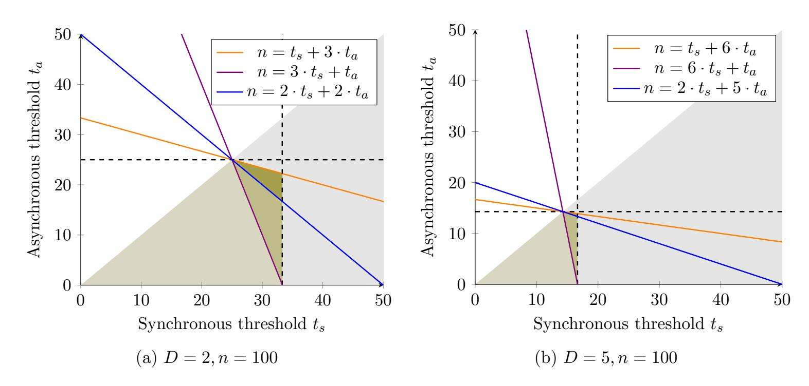
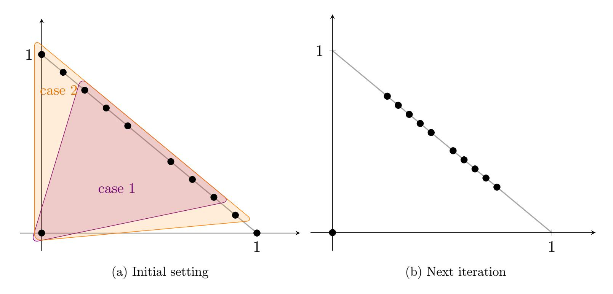

{0}------------------------------------------------

# Network-Agnostic Multidimensional Approximate Agreement with Optimal Resilience

Diana Ghinea<sup>1</sup> , Darya Melnyk<sup>2</sup> , and Tijana Milentijevi´c<sup>2</sup>

<sup>1</sup>Lucerne University of Applied Sciences and Arts <sup>2</sup>TU Berlin

#### Abstract

The Multidimensional Approximate Agreement problem (D-AA) considers a setting with n parties with inputs in R <sup>D</sup>. Out of the n parties, up to t may be byzantine (malicious). The goal is for the honest parties to obtain ε-close outputs that lie in the honest inputs' convex hull. While tight bounds on the resilience of D-AA have been found for the purely synchronous and asynchronous models, this is still an open question for the network-agnostic model. Here, the type of network is not known a priori: it may be synchronous, and then the number of byzantine parties is up to ts, or asynchronous, and then the number of byzantine parties is up to t<sup>a</sup> ≤ ts. In this model, it is known that n > (D+ 1)·t<sup>s</sup> +t<sup>a</sup> is sufficient for deterministic protocols [GLW, SPAA'23], tight for D = 1 [GLW, PODC'22], while n > max{(D + 1) · ts, t<sup>s</sup> + (D + 1) · ta} is tight for randomized protocols concerned with exact agreement [CGWW, DISC'24].

In this work, we establish that, for D > 1 the condition n > max{(D+1)·ts, ts+(D+1)·ta} is tight for deterministic protocols as well. We identify that the gap in prior deterministic protocols is not geometric, but stems from an asymmetry in the communication primitive that produces parties' "views". The core technical contribution of our work is hence a strengthened networkagnostic Gather primitive that enforces a global structural property on the number of values received by honest parties, eliminating the problematic asymmetry – so that standard safe-area geometric convergence arguments apply under the optimal thresholds.

{1}------------------------------------------------

### 1 Introduction

Distributed systems often need to coordinate on numeric or geometric values, e.g. sensor measurements [\[11\]](#page-17-0), gradients [\[18,](#page-17-1) [29,](#page-18-0) [30,](#page-19-0) [53\]](#page-20-0), clock corrections [\[48\]](#page-20-1), blockchain oracles [\[10\]](#page-17-2) – where insisting on exact equality is both unnecessary and, under faults, impossible via deterministic protocols in certain network models [\[35\]](#page-19-1). Approximate Agreement (AA), introduced in [\[27\]](#page-18-1) captures this regime: it considers a setting of n parties holding inputs. Despite t of the n parties involved being byzantine, AA requires the honest parties to obtain ε-close outputs (for a predefined error ε > 0) that are valid with respect to the honest inputs – e.g., if the input space is R, in the honest inputs' range. AA has been generalized to other input spaces as well, such as R <sup>D</sup> [\[51\]](#page-20-2) or classes of graphs [\[3,](#page-16-0) [52\]](#page-20-3) – the general validity condition becomes that the honest outputs must be in the honest inputs' convex hull. In this work, we are concerned with the AA variant on R <sup>D</sup> (D-AA), for D ≥ 2.

Although AA on real values and on trees is by now well understood, extending these results to other input spaces still leaves many questions open. For the D-dimensional variant of the problem (D-AA), tight resilience conditions are known in traditional network models: n > (D + 1)·t in the synchronous model, which assumes that all messages get delivered within a predefined amount of time and that parties hold synchronous clocks, and n > (D+2)·t in the asynchronous model, which only assumes that messages get delivered eventually. The network-agnostic model, introduced in [\[14\]](#page-17-3), aims to combine the advantages of the two traditional models: the high resilience thresholds provided by synchronous protocols, and the inherent robustness to network issues provided by asynchronous protocols. Hence, in this model, the network may be synchronous, with up to t<sup>s</sup> corruptions, and asynchronous with t<sup>a</sup> ≤ t<sup>s</sup> corruptions, and the type of network is not known by the parties a priori. In this model, the condition (D + 1)·t<sup>s</sup> +ta, which provides a tradeoff between the requirements of the pure synchronous and asynchronous models, is tight for D = 1 [\[43\]](#page-20-4), but only sufficient for multiple dimensions [\[44\]](#page-20-5).

For D > 1, the recent work of [\[22\]](#page-18-2) has investigated the exact-agreement variant of the problem (ε = 0), and has shown different tight conditions: both n > (D+1)·ts, n > ts+(D+1)·t<sup>a</sup> must hold for any (randomized) protocol, and there is a randomized protocol achieving D-AA (with ε = 0) in this setting. It is important to note that resilience bounds for the exact variant of the problem do not directly translate to AA, e.g., in discrete input spaces [\[22,](#page-18-2) [52\]](#page-20-3). Since exact agreement requires randomization when t<sup>a</sup> > 0 [\[35\]](#page-19-1), it remains to understand the deterministic feasibility region for the ε > 0. The requirements n > (D + 1)· ts, n > t<sup>s</sup> + (D + 1)· t<sup>a</sup> can be easily generalized to any ε > 0 (see Section [A\)](#page-21-0), hence our work addresses the following question:

Is 
$$n > (D+1) \cdot t_s + t_a$$
 necessary for network-agnostic deterministic D-AA (with  $D \ge 2$ )? Or do  $n > (D+1) \cdot t_s$  and  $n > t_s + (D+1) \cdot t_a$  suffice?

#### 1.1 Our Contribution

We show that deterministic network-agnostic D-AA for D ≥ 2 is solvable whenever n > (D + 1)·t<sup>s</sup> and n > t<sup>s</sup> + (D + 1) · ta, thereby matching known lower bounds and characterizing the optimal deterministic resilience in this model, as shown in Figure [1.](#page-2-0) Together with the optimal conditions for 1-AA [\[43\]](#page-20-4), this yields a complete characterization of deterministic network-agnostic D-AA for all D ≥ 1.

We first establish that the resilience loss in the network-agnostic D-AA protocol of [\[44\]](#page-20-5) is not due to a geometric limitation, but to an asymmetry in the sizes of the honest parties' views

{2}------------------------------------------------

<span id="page-2-0"></span>

Figure 1: We compare prior feasibility results for D-AA with our results. For n=100, the two plots depict in green the set of pairs  $(t_s, t_a)$  for which a protocol exists. The two dashed black lines correspond to the point-wise optimal resilience thresholds  $n > (D+1) \cdot t_s$  and  $n > (D+2) \cdot t_a$  required in the synchronous and asynchronous models, respectively. The green area under the violet line corresponds to the previously required condition  $n > (D+1) \cdot t_s + t_a$ . The extended green area to the blue line shows an upper bound on what previous purely geometric algorithms can achieve. The extended green area to the yellow line corresponds to the condition we prove to be optimal:  $n > \max\{(D+1) \cdot t_s, n > t_s + (D+1) \cdot t_a\}$ .

induced by the underlying communication primitive. In synchronous executions, this primitive may yield both "small" and "large" views among honest parties. To exceed the asynchronous optimal resilience threshold when the network is synchronous, the protocol applies different computation rules depending on the view size. Exactly these mixed-size executions form the hard case for proving convergence: arguments from the purely synchronous and purely asynchronous settings no longer suffice, and the analysis in [44] handles them only under the stronger condition  $n > (D+1)t_s + t_a$ . The exact-agreement protocol of [22] escapes this issue, as the underlying communication primitive provides the parties with the exact same view (using a randomized Byzantine Agreement protocol as a building block [14,24,46]).

Our main technical contribution is to eliminate this asymmetry by introducing a stronger deterministic communication primitive. We define a strengthened variant of network-agnostic Gather (GTHR) [2, 19, 22], an all-to-all primitive that guarantees a large intersection among the honest parties' views and, in synchronous executions, ensures that this intersection contains all honest inputs. Our construction further enforces a global size property: either all honest views are "small" or all are "large". This rules out the mixed-size executions responsible for the resilience loss in [44] and enables solvability under the optimal conditions above. Beyond resolving the main open problem, our primitive simplifies the design of network-agnostic AA protocols and yields improved sufficient resilience guarantees in other domains: for chordal graphs, plugging our primitive into the protocol of [22] improves the previously sufficient condition  $n > \omega \cdot t_s + t_a$  (where  $\omega$  is the maximum clique size) to solvability under  $n > \omega \cdot t_s$  and  $n > t_s + \omega \cdot t_a$ , while leaving matching lower bounds for chordal graphs as an open question.

#### 1.2 Related Work

Approximate Agreement. Approximate Agreement (AA) was introduced by Dolev et al. [27] for real values. They provided a tight resilience characterization in the synchronous model (without cryptographic setup) and initial feasibility results in the asynchronous model, and subsequent

{3}------------------------------------------------

work established tight asynchronous bounds [\[1,](#page-16-2) [20\]](#page-18-5). More recently, tight synchronous bounds with cryptographic setup were obtained in [\[43,](#page-20-4) [48\]](#page-20-1). A large body of follow-up work studies efficiency measures such as optimal round complexity and improved communication complexity, with and without cryptographic assumptions [\[8,](#page-16-3) [12,](#page-17-4) [31–](#page-19-2)[33,](#page-19-3) [38,](#page-19-4) [41,](#page-19-5) [45\]](#page-20-7). For a recent overview of AA across network models and efficiency measures, see [\[42\]](#page-19-6).

Multidimensional AA. Multidimensional AA over R <sup>D</sup> was developed by Mendes and Herlihy [\[50\]](#page-20-8) and Vaidya and Garg [\[54\]](#page-21-1) (see also [\[51\]](#page-20-2)), who established optimal resilience thresholds: t < n/(D+ 1) in the synchronous model and t < n/(D + 2) in the asynchronous model. In contrast to the real-valued variant, several efficiency questions remain open, such as optimal round complexity in byzantine message-passing models: [\[40\]](#page-19-7) gives convergence-rate lower bounds (oblivious message adversaries) and [\[39\]](#page-19-8) improves upper bounds; in the wait-free model, [\[7\]](#page-16-4) provides lower bounds and efficient protocols. Relaxed variants of AA, have also been studied, including validated inputs [\[28\]](#page-18-6), convex-hull-of-projections validity [\[55,](#page-21-2) [56\]](#page-21-3), geometric median approximation [\[18\]](#page-17-1) and centroid approximation [\[17\]](#page-17-5). Such relaxations enable lower local communication complexity, and also higher resilience thresholds. Beyond uni- or multidimensional real values, generalizations of AA to discrete domains such as graphs have also received significant attention [\[3,](#page-16-0) [5,](#page-16-5) [22,](#page-18-2) [37,](#page-19-9) [38,](#page-19-4) [47,](#page-20-9) [49,](#page-20-10) [52\]](#page-20-3).

AA in the network-agnostic model. In the network-agnostic model, AA was introduced for the unidimensional case in [\[43\]](#page-20-4) and extended to the multidimensional case in [\[44\]](#page-20-5), leaving optimal resilience open. The work of [\[22\]](#page-18-2) studies the exact agreement variant of AA over arbitrary convex spaces, suggesting that weaker resilience thresholds than in [\[44\]](#page-20-5) may suffice for D-AA. Our results close the optimal-resilience gap for deterministic D-AA and, via our strengthened primitive, improve the best-known sufficient resilience guarantees for chordal graphs.

Network-agnostic all-to-all communication primitives. All-to-all communication primitives are central to existing network-agnostic AA protocols. The protocol of [\[43\]](#page-20-4) introduces oBC, a network-agnostic variant of the communication techniques behind the optimal-resilience asynchronous protocol of [\[1\]](#page-16-2), which guarantees pairwise intersection of honest views. The work of [\[22\]](#page-18-2) introduces a network-agnostic variant of the GTHR primitive [\[2,](#page-16-1)[19\]](#page-18-4), that guarantees a global intersection among honest views, as well as a Core-Set Agreement (ACS) primitive [\[13\]](#page-17-6) that yields identical views but is inherently randomized. Our strengthened primitive GTHR+ sits strictly between these notions: it preserves the determinism and intersection guarantees of GTHR, strengthens it by enforcing a global size-consistency property on honest views, and falls short of full ACS (identical views), which is unnecessary for our purposes.

Other network-agnostic protocols. Designing protocols that achieve simultaneously security guarantees in both synchronous and asynchronous networks has been a subject that attracted increased attention in the recent years. This direction has been explored for Byzantine Agreement [\[14,](#page-17-3) [24,](#page-18-3) [25\]](#page-18-7) (see also [\[21\]](#page-18-8) for Byzantine Agreement with general validity conditions), State-Machine Replication [\[4\]](#page-16-6), and Multi-Party Computation [\[6,](#page-16-7) [15,](#page-17-7) [24\]](#page-18-3).

### 2 Preliminaries

In this section, we describe the model and a few notations and definitions that will be used throughout the paper.

Model. We consider a set of n parties P = {P1, P2, . . . , Pn} running a protocol over a fully connected network where links model authenticated channels. While not explicitly stated in the protocols, we assume that the messages sent over the network are provided with identification numbers ensuring that the parties can identify which messages correspond to which sub-protocol instances.

{4}------------------------------------------------

Communication. We consider the network-agnostic model – the network may be either synchronous, or asynchronous, and the parties are not aware of the type of network a priori. If the network is synchronous, every message is delivered within a publicly known amount of time  $\Delta$ , and the parties have access to synchronized clocks. If the network is asynchronous, the only assumption is that messages are delivered eventually. We additionally assume that  $\Delta$  is large enough to also cover local computation costs.

Adversary. We assume an adversary that may corrupt at most  $t_s$  parties if the network is synchronous, and at most  $t_a \leq t_s$  parties if the network is asynchronous. Corrupted parties become byzantine: they may deviate arbitrarily (maliciously) from the protocol. Moreover, the adversary may schedule the delivery of the messages, with the condition that, if the network is synchronous, the messages are delivered within  $\Delta$  time. The protocols presented will hold against an adaptive adversary (that may choose which parties to corrupt at any point in the protocol's execution), while the resilience bounds discussed hold even against a static adversary (that has to choose which parties to corrupt at the beginning of the protocol's execution).

**Notions on convexity.** Before defining D-AA, we recall a few notions in  $\mathbb{R}^D$ . We first define straight-line convexity and convex hulls.

**Definition 1** (Convex Set). A set of values  $V \subseteq \mathbb{R}^D$  is convex if for any  $v_1, v_2, \ldots, v_k \in V$  and  $\lambda_1, \lambda_2, \ldots, \lambda_k \geq 0$  such that  $\sum_{i=1}^k \lambda_i = 1$ , it holds that  $\sum_{i=1}^k \lambda_i v_i \in V$ . Alternatively, a set  $V \subseteq \mathbb{R}^D$  is convex if, for any  $v, v' \in V$ , the segment between v and v' is also included in V.

**Definition 2** (Convex Hull). The convex hull of  $V \subseteq \mathbb{R}^D$ , denoted by  $\langle V \rangle$ , is the smallest convex set V' such that  $V \subseteq V'$ .

To avoid working with multisets, we consider sets of value-sender pairs  $\mathcal{M} \subseteq \mathbb{R}^D \times \{P_1, P_2, \dots P_n\}$ . The convex hull operator extends naturally:  $\langle \mathcal{M} \rangle :=$  the convex hull of the set of values in  $\mathcal{M}$ . We will also make use of Euclidean distance, defined below.

**Definition 3** (Euclidean Distance). For any  $v, v' \in \mathbb{R}^D$ , the Euclidean distance between v and v' is  $\operatorname{dist}(v, v') = \sqrt{\sum_{d=1}^{D} (v^d - v'^d)^2}$ , where  $v^d$  is the projection of v on coordinate  $1 \le d \le D$ .

For a compact (closed and bounded) set  $V \subseteq \mathbb{R}^D$ , we use  $\operatorname{dist}_{\max}(V) = \max\{\operatorname{dist}(v, v') : v, v' \in V\}$  to denote its diameter. In addition, we say that v, v' are  $\varepsilon$ -close if  $\operatorname{dist}(v, v') \leq \varepsilon$ .

D-dimensional Approximate Agreement. We state the definition of a t-secure D-AA protocol, as presented in [50, 54]. In the network-agnostic model, we say that a protocol is  $(t_s, t_a)$ -secure D-AA protocol if it achieves  $t_s$ -secure D-AA when it runs in a synchronous network, and  $t_a$ -secure D-AA when it runs in an asynchronous network [44].

**Definition 4.** (D-dimensional Approximate Agreement) Let  $\Pi(\varepsilon)$  be a protocol where each party P holds an input in  $\mathbb{R}^D$ .  $\Pi(\varepsilon)$  is a t-secure D-AA protocol if it achieves the following properties for any given  $\varepsilon > 0$  even when up to t of the n parties involved are corrupted:

**Liveness**: Every honest party eventually obtains an output  $v_P \in \mathbb{R}^D$ .

Validity: If an honest party P outputs  $v_P$ , then  $v_P$  is in the honest inputs' convex hull.  $\varepsilon$ -Agreement: If two honest parties P and P' output  $v_P$  and  $v_{P'}$ , then  $\operatorname{dist}(v_P, v_P') \leq \varepsilon$ .

<span id="page-4-0"></span>**Building blocks.** We state the definition for oBC, a core building block for network-agnostic AA, introduced in [43]. This mechanism is an adaptation of the communication mechanisms designed in [1] for optimal-resilience asynchronous AA, tailored to the network-agnostic model.

{5}------------------------------------------------

**Definition 5** (Overlap All-to-All Broadcast). Let  $\Pi$  be a protocol where every party P holds an input  $v_P$  and may output a set of value-sender pairs  $\mathcal{M}_P$ . We consider the following properties.

**Integrity**: If P and P' are honest and  $(v', P') \in \mathcal{M}_P$ , then  $v' = v_{P'}$ .

Consistency: If P and P' are honest,  $(v, P'') \in \mathcal{M}_P$  and  $(v', P'') \in \mathcal{M}_{P'}$ , then v = v'.

**Honest Core**: If an honest party P outputs  $\mathcal{M}_P$ , then  $(v_{P'}, P') \in \mathcal{M}_P$  for every honest P'.

 $t_s$ -Overlap: If two honest parties P and P' obtain outputs  $\mathcal{M}_P$  and  $\mathcal{M}_{P'}$ , then  $|\mathcal{M}_P \cap \mathcal{M}_{P'}| \ge n - T$ .

c-Bounded Liveness: If all honest parties start the execution of the protocol at the same time  $\tau$ , then all honest parties obtain outputs by time  $\tau + c \cdot \Delta$ .

**Liveness**: Every honest party P outputs.

Then, we say that  $\Pi$  is a  $(t_s, t_a, c)$ -secure oBC protocol if it achieves:

- Integrity, Consistency, Honest Core, c-Bounded Liveness when running in a synchronous network where at most  $t_s$  of the parties involved are corrupted, and assuming that the honest parties join the protocol simultaneously;
- Integrity, Consistency,  $t_s$ -Overlap, Liveness when running in an asynchronous network where at most  $t_a$  of the parties involved are corrupted.

We also recall the definition of GTHR, as stated in [22] (seen before in [2,19]). This is a stronger variant of oBC that, instead of ensuring that the honest parties' outputs *pair-wise* overlap in an asynchronous network, it ensures that all honest outputs have a large intersection.

<span id="page-5-0"></span>**Definition 6** (Gather). Let  $\Pi$  be a protocol where every party P holds an input  $v_P$  and may output a set of value-sender pairs  $\mathcal{M}_P$ . We consider the next property, in addition to those of Definition 5. T-Common Core: If all honest parties output, then  $|\bigcap_{P \text{ honest}} \mathcal{M}_P| \geq n - T$ .

Then, we say that  $\Pi$  is a  $(t_s, t_a, c)$ -secure GTHR protocol if it achieves:

- Integrity, Consistency, Honest Core, c-Bounded Liveness when running in a synchronous network where at most  $t_s$  of the parties involved are corrupted, and assuming that the honest parties join the protocol simultaneously;
- Integrity, Consistency,  $t_s$ -Common Core, Liveness when running in an asynchronous network where at most  $t_a$  of the parties involved are corrupted.

We will make use of a weak agreement primitive, such as Crusader Agreement [26], Graded Consensus [34], Proxcensus [36,41] or even AA. A general primitive unifying these is Connected Consensus (CC) [9]. While the work of [9] considers any input space, for our scope binary inputs suffice. We present the definition of CC for binary inputs below, tailored to the network-agnostic model. We note that the definition is identical to that of Proxcensus [36,41].

**Definition 7** ((Binary) Connected Consensus [9]/(Binary) Proxcensus [36,41]). Assume a protocol  $\Pi(R)$  where each party joins with input  $B_{IN} \in V_{IN} = \{0,1\}$  and, for any predefined integer R > 0, each honest party may output a value in  $V_{OUT} = \{(\bot,0)\} \cup \{(B,r) \mid B \in B_{IN}, 1 \le r \le R\}$ . We consider the following properties, in addition to those of Definition 5.

**Strong Unanimity:** Assume there is a bit B such that all honest parties have input  $B_{IN} = B$ . Then, if an honest party obtains an output, it outputs (v, R).

**Consistency:** There is a bit B such that if an honest party outputs (v, r),  $v \in \{B, \bot\}$ . Moreover, if two honest parties output (v, r) and (v', r') then  $|r - r'| \le 1$ .

We say that  $\Pi(R)$  is a  $(t_s, t_a, c(R))$ -secure CC protocol if, for any given R, it achieves c(R)-Bounded Liveness, Strong Unanimity and Consistency whenever it runs in a synchronous network with up to  $t_s$  corruptions, and Liveness, Strong Unanimity and Consistency whenever it runs in an asynchronous network with up to  $t_a$  corruptions.

{6}------------------------------------------------

### 3 Previous Approach

Building towards our optimal-resilience approach, we start by discussing the protocol of [44] as a starting point: this protocol achieves D-AA under the stronger assumption  $n > (D+1) \cdot t_s + t_a$ . The protocol of [44] proceeds in iterations that bring the honest parties' values closer, while maintaining them in the honest inputs' convex hull. In every iteration, each party distributes its current value using the oBC protocol  $\Pi_{\text{oBC}}$  described by the theorem below.

<span id="page-6-0"></span>**Theorem 1** (Theorem 4.4 of [44]). If  $t_s \ge t_a$  and  $n > 3t_s + t_a$ , there is a  $(t_s, t_a, c_{oBC})$ -secure oBC protocol  $\Pi_{oBC}$  with  $c_{oBC} = 5$ .

Once a party obtains its set  $\mathcal{M}$  with  $|\mathcal{M}| := n - ts + k$  from  $\Pi_{\mathsf{oBC}}$ , it computes a safe area  $S := \mathsf{safe}_{\max\{k,t_a\}}$  that is included in the honest values' convex hull, similarly to [50,54], as defined below.

<span id="page-6-2"></span>**Definition 8** (Safe area). Let  $\mathcal{M} \in \mathbb{R}^D \times \mathcal{P}$ . For a given t, the safe area of  $\mathcal{M}$  is  $\mathsf{safe}_t(\mathcal{M}) = \bigcap_{M \in \mathsf{restrict}_t(\mathcal{M})} \langle M \rangle$ , where  $\mathsf{restrict}_t(\mathcal{M}) = \{M \subseteq \mathcal{M} : |M| = |\mathcal{M}| - t\}$ .

We include the code of one iteration in the protocol of [44] below.

### Protocol $\Pi_{\text{AA-it}}$

### Code for party P with input v

1: Join  $\Pi_{\mathsf{oBC}}$  with input v. Upon obtaining output  $\mathcal{M}$  in  $\Pi_{\mathsf{oBC}}$ :

2:  $S := \mathsf{safe}_{\max\{k, t_a\}}(\mathcal{M}) \text{ where } k := |\mathcal{M}| - (n - t_s).$ 

3: Output (a+b)/2, where  $a, b := \operatorname{argmax}_{a,b \in S \times S} \{ \operatorname{dist}(a,b) \}$ .

In the following, we analyze  $\Pi_{\mathsf{AA-it}}$  under the weaker conditions  $n > (D+1) \cdot t_s$ ,  $n > t_s + (D+1) \cdot t_a$ , and identify the breaking point.

Resilience of  $\Pi_{\mathsf{oBC}}$ . Our weaker conditions satisfy the requirements of Theorem 1 for every  $D \geq 2$ , hence  $\Pi_{\mathsf{oBC}}$  achieves security even under these weaker conditions.

Valid values. As shown in [22], even under our weaker conditions, the honest parties' safe areas are non-empty and included in the honest inputs' convex hull, and hence they obtain valid values. Convergence. Given that  $n > (D+1) \cdot t_s + t_a$  and assuming that the honest inputs are initially  $\delta$ -close, the honest outputs in  $\Pi_{\text{AA-it}}$  are  $\sqrt{7/8} \cdot \delta$  close. The proof of [44] relies on the honest parties' safe areas pair-wise intersecting: roughly, if two convex sets intersect, the *midpoints* of the two convex sets are closer than the diameter of the convex sets' unions. In [44], this pairwise intersection is proven in three cases: (i) by considering two parties that have received up to  $n - t_s + t_a$  values each via oBC, (ii) by considering two parties that have received at least  $n - t_s + t_a$  values each, and (iii) by considering a party that has received up to  $n - t_s + t_a$  values, and one that has received at least  $n - t_s + t_a$  values. Cases (i) and (ii), follow arguments similar to prior solutions in the pure synchronous or pure asynchronous models [51], and in fact holds whenever  $n > (D+1) \cdot t_s$  and  $n > t_s + (D+1) \cdot t_a$ . Case (iii), on the other hand, distinguishes itself from prior works, and the proof is highly dependent on  $n > (D+1) \cdot t_s + t_a$ .

**Intersection under weaker conditions.** We note that, even if  $n = (D+1) \cdot t_s + t_a$ , pair-wise intersection does not hold. In fact, this is the case even if we replace the communication mechanism with GTHR, which ensures that all honest parties' output sets have  $n - t_s$  value-sender pairs in common.

<span id="page-6-1"></span>The following example shows that the guarantees of oBC/GTHR do not suffice for solving AA under the weaker resilience thresholds  $n > (D+1) \cdot t_s$ ,  $n > t_s + (D+1) \cdot t_a$ .

{7}------------------------------------------------

<span id="page-7-0"></span>

Figure 2: This figure visualizes the construction from Example [1.](#page-6-1) On the left, the initial setting is presented, where the violet area (case 1) corresponds to the view of the parties in the first case, where the parties only receive n − t<sup>s</sup> values. The yellow area (case 2) corresponds to the view of one party in the second case i.e., the parties that receive n − c values (which include those in the first case). On the right, a possible view after one iteration of a D-AA algorithm is presented. While the values on the line converged, they did not move closer to the origin.

Example 1. We define an example in D dimensions as follows. Let a group of t<sup>a</sup> + x parties' inputs, where t<sup>s</sup> − c ≥ t<sup>a</sup> + x,(x ≥ 1, c ≥ 1), be placed at the origin with coordinate (0, . . . , 0). We assume that the other n−(t<sup>a</sup> +x) inputs are spread in the convex hull of the unit vectors e<sup>i</sup> , i ∈ [D], where e<sup>i</sup> [i] = 1 and e<sup>i</sup> [j] = 0 ∀j ̸= i. We make sure that D · t<sup>a</sup> of these values are placed such that the intersection of the subsets of (D − 1) · t<sup>a</sup> values in this set is empty. This step can be achieved by putting up to t<sup>a</sup> values close to each of the unit vectors. Observe that these values lie in a hyperplane of dimension D − 1.

We next define the views obtained by the honest parties via ΠoBC: note that these views also satisfy the properties of a GTHR protocol. In both cases, we assume that all parties will receive the t<sup>a</sup> + x values from the origin. Then, in the first case, we assume that there are t<sup>a</sup> + x parties that receive n − t<sup>s</sup> values. These t<sup>a</sup> + x parties receive the t<sup>a</sup> + x values in the origin, and D · t<sup>a</sup> values from the hyperplane spanned by the unit vectors. From the perspective of these parties, safe area only contains the origin.

In the second case, we put the remaining n − (t<sup>a</sup> + x) parties that each receive n − c values. These parties always receive all the values that the parties in the first case receive. Additionally, the parties receive n − c − ((D + 1) · t<sup>a</sup> + x) values from the hyperplane spanned by the unit vectors such that each party receives a (slightly) different set of parties. For the safe area, these parties will compute a convex hull inside the hyperplane spanned by the unit vectors. Observe that by making sure that the sets of received values are different, the computed safe area will also be different, and thus a similar input distribution can be prepared for the next iteration. The example is illustrated in Figure [2.](#page-7-0)

We now need to show that this setting can be constructed for n > (D+1)·t<sup>s</sup> and (D+1)·ts+t<sup>a</sup> > n > t<sup>s</sup> + (D + 1) · ta, thus showing the limitations of the previous algorithms. Observe first that we trivially satisfy the t<sup>a</sup> ≤ t<sup>s</sup> bound, since t<sup>a</sup> + x ≤ t<sup>s</sup> − c. We next make sure that the values at the origin are indeed removed in the second case. That is, n − c − (n − ts) ≥ t<sup>a</sup> + x must hold. We can reformulate the inequality to t<sup>s</sup> − c ≥ t<sup>a</sup> + x, showing that this condition is satisfied by definition. Finally, we consider the first case, where the parties receive n − t<sup>s</sup> values. In the construction, we have n − t<sup>s</sup> = (D + 1) · t<sup>a</sup> + x. That is, n = (D + 1) · t<sup>a</sup> + t<sup>s</sup> + x ≤ D · t<sup>a</sup> + 2 · t<sup>s</sup> − c.

{8}------------------------------------------------

Such a setting can be built in every iteration, making sure that there is a set of parties that always outputs the origin, and there is a set of parties that is converging in the (D-1)-subspace that does not contain the origin. Thus, methods that ignore that parties may receive very different numbers of messages will fail due to the presented example.

Implications for optimal-resilience. This points out the following: if we guarantee that either all honest parties obtain output sets of size up to  $n-t_s+t_a$  or all honest parties obtain output sets of size at least  $n-t_s+t_a$ , we may weaken the resilience threshold to  $n > (D+1) \cdot t_s$ ,  $n > t_s+(D+1) \cdot t_a$ .

### 4 Our GTHR+ Protocol

In this section, we implement our stronger variant of GTHR, which we denote by GTHR+. On top of the properties described in Definition 6, our implementation ensures that that either all parties obtain output sets of size up to  $n-t_s+t_a$ , or all parties obtain output sets of size at least  $n-t_s+t_a$ . We make use of the GTHR protocol  $\Pi_{\text{GTHR}}$  of [22] (presented in the full version [23]), described in Theorem 2. For a complete presentation of this protocol, see Section B.

<span id="page-8-0"></span>**Theorem 2** (Theorem 36 of [23]). Assume  $n, t_s, t_a$  such that  $t_a \leq t_s < n/3$ . Then, there is a  $(t_s, t_a, c_{GTHR})$ -secure GTHR protocol  $\Pi_{GTHR}$ , with  $c_{GTHR} := 8$ .

In our GTHR+ protocol, the parties first distribute their values via  $\Pi_{\mathsf{GTHR}}$ , and obtain their output sets  $\mathcal{M}$ . Afterward, we would like the parties to agree on whether their output sets should have size up to  $n-t_s+t_a$  or at least  $n-t_s+t_a$ . This involves multiple challenges: (i) exact agreement would require a randomized protocol whenever  $t_a \geq 1$  [35]; (ii) even if agreement is achieved, the parties need to modify their output sets: if party P has obtained an output set  $\mathcal{M}$  of size less than  $n-t_s+t_a$  and the size agreed upon is at least  $n-t_s+t_a$ , P needs to extend  $\mathcal{M}$ , while preserving Integrity and Consistency. Similarly, if party P has obtained an output set  $\mathcal{M}$  of size larger than  $n-t_s+t_a$  and the size agreed upon is at most  $n-t_s+t_a$ , P has to remove value-sender pairs from  $\mathcal{M}$ , while maintaining the Honest Core/ $t_s$ -Common Core properties. In the following, we address each of these challenges and afterward present our implementation.

**Deciding on the output set size.** Since the two options of size "up to  $n - t_s + t_a$ " and "at least  $n - t_s + t_a$ " overlap in "exactly  $n - t_s + t_a$ ", we may decide on the output size with the help of a weaker agreement primitive, namely a CC protocol. In Section C, we implement a network-agnostic CC protocol as an immediate application of 1-AA, leading us to the lemma below. Parties holding sets of size less than  $n - t_s + t_a$  join with input 0, while those holding set of size at least  $n - t_s + t_a$  join with input 1. CC provides them with consistent outputs in  $\{0, \bot, 1\}$ , which we map to the three options "size up to  $n - t_s + t_a$ ", "size exactly  $n - t_s + t_a$ ", "size at least  $n - t_s + t_a$ ".

<span id="page-8-1"></span>**Lemma 1.** Let  $t_s \ge t_a$  such that  $n > 3 \cdot t_s$ . Then, there is a  $(t_s, t_a, c_{\text{CC}}(R))$ -secure binary CC protocol  $\Pi_{\text{CC}}(R)$ , where  $c_{\text{CC}}(R) = 5 \cdot \lceil \log_2(2R+1) \rceil$ .

We present the code for this step below.

 $\mathsf{FinalSize}(\mathsf{size}_{\scriptscriptstyle \mathrm{IN}})$ 

#### Code for party P with set size $size_{in}$

- 1: Join  $\Pi_{CC}(1)$  with input  $B_{IN} := 0$  if  $size_{IN} < n t_s + t_a$  and  $B_{IN} := 1$  otherwise.
- 2: Upon obtaining output  $(B_{OUT}, r)$  from  $\Pi_{CC}$ , define size :=  $\min(\text{size}_{IN}, n t_s + t_a)$  if  $B_{OUT} = 0$ , size :=  $n t_s + t_a$  if  $B_{OUT} = \bot$ , and size :=  $\max\{n t_s + t_a, \text{size}_{IN}\}$  if  $B_{OUT} = \bot$ . Return size.

<span id="page-8-2"></span>The next lemma states the guarantees of FinalSize.

{9}------------------------------------------------

**Lemma 2.** Let  $t_s \geq t_a$  such that  $n > 3 \cdot t_s$ , and assume that all honest parties join FinalSize with inputs  $\operatorname{size}_{\operatorname{IN}}$ . Then, all honest parties obtain outputs  $\operatorname{size}$  within the range of honest inputs such that: either all honest outputs  $\operatorname{size}$  are at most  $n - t_s + t_a$ , or all honest outputs  $\operatorname{size}$  are at least  $n - t_s + t_a$ . In addition, if the network is synchronous and all honest parties join FinalSize at time  $\tau$ , all honest parties obtain outputs by time  $\tau + c_{\operatorname{CC}}(1) \cdot \Delta$ .

*Proof.* By Lemma 1, the honest parties obtain their pairs  $(B_{OUT}, r)$  from  $\Pi_{CC}(1)$  eventually, and within  $c_{CC}(1) \cdot \Delta$  time if the network is synchronous. Hence, the honest parties obtain outputs in  $\Pi_{CC}(1)$  within  $c_{CC}(1) \cdot \Delta$  time.

Next, we show that the output size of every honest party P are valid with respect to their inputs  $\operatorname{size}_{\operatorname{IN}}$ . If P has obtained  $\operatorname{size} = \operatorname{size}_{\operatorname{IN}}$ , the claim follows trivially. If P has obtained  $\operatorname{size} < \operatorname{size}_{\operatorname{IN}}$ , then  $\operatorname{size} = n - t_s + t_a$  and P has obtained  $\operatorname{B}_{\operatorname{OUT}} \in \{0, \bot\}$ . As  $\Pi_{\operatorname{CC}}(1)$  achieves Strong Unanimity, there is an honest party that joined  $\Pi_{\operatorname{CC}}(1)$  with input bit 0, and therefore has joined FinalSize with input  $\operatorname{size}'_{\operatorname{IN}} < n - t_s + t_a$ . Hence,  $\operatorname{size}'_{\operatorname{IN}} < \operatorname{size} < \operatorname{size}_{\operatorname{IN}}$ , and therefore size is valid. Otherwise, if P has obtained  $\operatorname{size} > \operatorname{size}_{\operatorname{IN}}$ , then  $\operatorname{size} = n - t_s + t_a$  and P has obtained  $\operatorname{B}_{\operatorname{OUT}} \in \{1, \bot\}$ . Similarly to the previous case, this implies that there is an honest party that joined  $\Pi_{\operatorname{CC}}(1)$  with input 1, and therefore has joined FinalSize with input  $\operatorname{size}'_{\operatorname{IN}} \ge n - t_s + t_a$ . Hence,  $\operatorname{size} \le \operatorname{size}'_{\operatorname{IN}}$ , and therefore size is valid.

It remains to show that either all honest parties have obtained size  $\leq n - t_s + t_a$ , or all honest parties have obtained size  $\geq n - t_s + t_a$ . Assuming that an honest party P has obtained size  $< n - t_s + t_a$ , while honest party P' has obtained size  $> n - t_s + t_a$  implies that P has obtained  $B_{OUT} = 0$  in  $\Pi_{CC}(1)$ , while P' has obtained  $B'_{OUT} = 1$  in  $\Pi_{CC}(1)$ . This contradicts the Consistency guarantee of  $\Pi_{CC}(1)$ : there is a bit B such that every honest party obtains  $B_{OUT} \in \{B, \bot\}$ .

Extending the output set if needed. If a party P has obtained from  $\Pi_{\mathsf{GTHR}}$  an output set  $\mathcal{M}$  of size less than  $n-t_s+t_a$ , it might need to extend  $\mathcal{M}$ . This can be done easily due to the concrete construction of  $\Pi_{\mathsf{GTHR}}$  (see Section B): the parties distribute their values via Bracha's Reliable Broadcast (rBC) protocol [16]. This ensures that, if an honest party receives a value from party P at time  $\tau$ , then every honest party receives the same value eventually, and, if the network is synchronous, by time  $\tau + 2 \cdot \Delta$ . Consequently, if P has obtained size  $> |\mathcal{M}|$  in FinalSize, Lemma 2 ensures that an honest party has received at least size values via rBC inside  $\Pi_{\mathsf{GTHR}}$ , and the remark below, which comes from [22] ensures that P receives these values eventually as well: it just needs to continue listening to the rBC invocations inside  $\Pi_{\mathsf{GTHR}}$ .

<span id="page-9-0"></span>**Remark 1.** Assume two honest parties obtain outputs  $\mathcal{M}$  and  $\mathcal{M}'$  via  $\Pi_{\mathsf{GTHR}}$  by time  $\tau$ , and  $(v,P) \in \mathcal{M}$ . Then,  $(v,P) \in \mathcal{M}'$  eventually, and, if the network is synchronous, by time  $\tau + 2 \cdot \Delta$ .

Reducing the output set if needed. If a party P has obtained in  $\Pi_{\mathsf{GTHR}}$  a set  $\mathcal{M}$  of size  $|\mathcal{M}| > n - t_s + t_a$ , and it has obtained size  $< |\mathcal{M}|$  in FinalSize, P has to discard some pairs from  $\mathcal{M}$ . To maintain the Honest Core/ $t_s$ -Common Core properties, we need to decide carefully which pairs to discard. We refine our approach so far by (i) providing the parties with information about the common core, and (ii) instead of running FinalSize on the concrete sizes of  $\mathcal{M}$ , we run FinalSize on the number of values that appear to be in the common core. We introduce an intermediate step before running FinalSize: once a party P obtains its set  $\mathcal{M}$  from  $\Pi_{\mathsf{GTHR}}$ , it sets an indicator inMySet for every party P': 1 if P' appears in  $\mathcal{M}$  and 0 otherwise. For each party P', the parties run  $\Pi_{\mathsf{CC}}(1)$  to (weakly) agree on whether P' appears in their output sets or not, and obtain an output bit inCore. Note that, due to the Strong Unanimity of  $\Pi_{\mathsf{CC}}(1)$ , the outcome for all parties belonging to the common core is 1.

{10}------------------------------------------------

### $\mathsf{CheckCore}(P',\mathcal{M})$

### Code for party P with inputs: a party P', set of value-sender pairs $\mathcal{M}$

- 1: Set inMySet := 1 if P' appears in  $\mathcal{M}$  and 0 otherwise.
- 2: Join  $\Pi_{CC}(1)$  with input inMySet and obtain output (inCore, r). Return inCore.

The next remark makes the properties of CheckCore explicit and follows directly from Lemma 1.

<span id="page-10-0"></span>**Remark 2.** Let  $t_s \geq t_a$  such that  $n > 3 \cdot t_s$ , and assume that all honest parties join CheckCore having as inputs a set of value-sender pairs  $\mathcal{M}$  and the same party P'.

Then, there is a bit B such that every honest party obtains as output  $inCore \in \{B, \bot\}$  such that: if P' appears in every honest party's set  $\mathcal{M}$ , then every honest party obtains inCore = 1, and if P' does not appear in any honest party's set  $\mathcal{M}$ , every honest party obtains inCore = 0.

In addition, if the network is synchronous and all honest parties join CheckCore at time  $\tau$ , all honest parties obtain outputs by time  $\tau + c_{\rm CC}(1) \cdot \Delta$ .

Afterward, once the indicators inCore are obtained, every party counts the number of parties with inCore  $\neq 0$ , and they run FinalSize on these counters as opposed to the size of  $\mathcal{M}$ . Then, if P obtains size  $< |\mathcal{M}|$  in FinalSize, P discards value-sender pairs in  $\mathcal{M}$  corresponding to parties with inCore  $\neq 1$ : such parties do not belong to the common core by Remark 2. We note that there are sufficiently many pairs that P can discard, as there is some honest party P' that has joined FinalSize with a count of up to  $n - t_s + t_a$ . That is, P' has obtained inCore = 0 for at least  $t_s - t_a$  parties, and P has obtained inCore  $\in \{0, \bot\}$  for these parties.

**Final protocol.** We may now present the code of  $\Pi_{\mathsf{GTHR}+}$ . The parties first join  $\Pi_{\mathsf{GTHR}}$ , and keep receiving values via the rBC invocation inside  $\Pi_{\mathsf{GTHR}}$ . The parties then compute  $\mathsf{inCore}_{P'} \in \{0, \bot, 1\}$  for each party P' using CheckCore. Afterward, they agree on whether the core size appears to be at least  $n - t_s + t_a$  or at least  $n - t_s + t_a$  using FinalSize. Depending on the outcome, parties may have to extend their output sets (by waiting for more values) or to reduce their output sets (by discarding value-sender pairs where the sender P' has  $\mathsf{inCore}_{P'} \neq 1$ ).

#### **Protocol** $\Pi_{\mathsf{GTHR}+}$

#### Code for party P with input v

- 1: Set  $\tau_{\mathsf{start}} := \tau_{\mathsf{now}}$ . Join  $\Pi_{\mathsf{GTHR}}$  with input v, obtain output  $\mathcal{M}$ .
- 2: Save  $\mathcal{M}_0 := \mathcal{M}$ , and keep extending  $\mathcal{M}$  by receiving values in the  $\Pi_{\mathsf{rBC}}$  invocations in  $\Pi_{\mathsf{GTHR}}$ .
- 3: When  $\tau_{\mathsf{now}} \geq \tau_{\mathsf{start}} + c_{\mathsf{GTHR}} \cdot \Delta$  and  $\mathcal{M}$  was obtained: for every party P', in parallel, let  $\mathsf{inCore}_{P'} := \mathsf{CheckCore}(P', \mathcal{M}_0)$ .
- 4: When  $\tau_{\mathsf{now}} \geq \tau_{\mathsf{start}} + (c_{\mathsf{GTHR}} + c_{\mathsf{CC}}(1)) \cdot \Delta$  and all CheckCore executions have terminated, let  $\mathsf{size}_{\mathsf{IN}} := \mathsf{the} \ \mathsf{number} \ \mathsf{of} \ \mathsf{parties} \ P'$  with  $\mathsf{inCore}_{P'} \neq 0$ , and  $\mathsf{size} := \mathsf{FinalSize}(\mathsf{size}_{\mathsf{IN}})$ .

**Final output:** When  $\tau_{\mathsf{now}} \geq \tau_{\mathsf{start}} + (c_{\mathsf{GTHR}} + 2 \cdot c_{\mathsf{CC}}(1)) \cdot \Delta$  and size was obtained:

- 5: If  $|\mathcal{M}| \leq \text{size}$ , wait until  $|\mathcal{M}| = \text{size}$  and output  $\mathcal{M}$ .
- 6: Otherwise, if  $|\mathcal{M}| > \text{size}$ :
- 7: Stop extending  $\mathcal{M}$  with values received in the  $\Pi_{\mathsf{GTHR}}$ , and let  $k := |\mathcal{M}| \mathsf{size}$ .
- 8: Choose (any) k parties P' such that  $\mathsf{inCore}_{P'} < 1$  and  $\mathcal{M}$  contains a value from P'.
- 9: Discard from  $\mathcal{M}$  the value-sender pairs corresponding to these k parties. Output  $\mathcal{M}$ .

<span id="page-10-1"></span>**Theorem 3.** Let  $t_s \geq t_a$  such that  $n > 3 \cdot t_s$ . Then,  $\Pi_{\mathsf{GTHR}+}$  is a  $(t_s, t_a, c_{\mathsf{GTHR}+})$ -secure  $\mathsf{GTHR}$  protocol, with  $c_{\mathsf{GTHR}+} := 28$ , that additionally ensures that: either all honest parties obtain output sets of size at least  $n - t_s + t_a$ .

{11}------------------------------------------------

Proof. We first look at the  $\Pi_{\mathsf{GTHR}}$  invocation, applying Theorem 2. If the network is asynchronous, we have the guarantee that all honest parties obtain their sets  $\mathcal{M}$  and  $\mathcal{M}_0 := \mathcal{M}$  eventually. Moreover, if the network is synchronous and all honest parties join  $\Pi_{\mathsf{GTHR}+}$  at the same time  $\tau$ , then all honest parties join  $\Pi_{\mathsf{GTHR}}$  at the same time  $\tau$ . This implies that the honest parties obtain  $\mathcal{M}$  and  $\mathcal{M}_0$  by time  $\tau + c_{\mathsf{GTHR}} \cdot \Delta$ . Moreover, regardless of the network type, these sets satisfy Integrity, Consistency and  $t_s$ -Common Core. In the synchronous case, these additionally satisfy Honest Core.

Hence, if the network is asynchronous, all honest parties join the CheckCore subroutines eventually. Afterward, Remark 2 ensures that all honest parties obtain outputs in each CheckCore invocation eventually, and hence join FinalSize eventually. Then, Lemma 2 ensures that all honest parties obtain outputs in FinalSize eventually.

If the network is synchronous, all honest parties join each CheckCore invocation at the same time  $\tau + c_{\mathsf{GTHR}} \cdot \Delta$  and, by Remark 2, obtain all scores by time  $\tau + (c_{\mathsf{GTHR}} + c_{\mathsf{CC}}(1)) \cdot \Delta$ . Afterward, the honest parties join FinalSize at time  $\tau + (c_{\mathsf{GTHR}} + c_{\mathsf{CC}}(1)) \cdot \Delta$  and, by Lemma 2, obtain outputs in FinalSize by time  $\tau + (c_{\mathsf{GTHR}} + 2 \cdot c_{\mathsf{CC}}(1)) \cdot \Delta$ .

Consequently, all honest parties reach the final output step of  $\Pi_{\mathsf{GTHR}+}$  eventually, and, in the synchronous case, by time  $\tau + (c_{\mathsf{GTHR}} + 2 \cdot c_{\mathsf{CC}}(1)) \cdot \Delta$ . It remains to show that the output rules are well-defined, can be completed within  $c_{\mathsf{GTHR}+} \cdot \Delta$  time if the network is synchronous, and that the honest parties' outputs satisfy the desired properties.

Let P be an honest party and assume that it has reached the final step with  $\mathcal{M}$  and size such that  $|\mathcal{M}| \leq$  size. Then, by Lemma 2, there is an honest party that has joined FinalSize with input size<sub>IN</sub>  $\geq$  size, and therefore has obtained inCore $_{P'} \neq 0$  for at least size parties P'. By Remark 2, each of these size parties has appeared in the set  $\mathcal{M}_0$  obtained by at least one honest party from  $\Pi_{\mathsf{GTHR}}$ . Then, Remark 1 ensures that the condition  $|\mathcal{M}| \geq$  size holds eventually, and, in the synchronous case, by time  $\tau + (c_{\mathsf{GTHR}} + 2) \cdot \Delta \leq \tau + (c_{\mathsf{GTHR}} + 2 \cdot c_{\mathsf{CC}}(1)) \cdot \Delta$ . Therefore, P outputs eventually, and, in the synchronous case, at time  $\tau + (c_{\mathsf{GTHR}} + 2 \cdot c_{\mathsf{CC}}(1)) \cdot \Delta$ .

Next, let P be an honest party and assume that it has obtained  $\mathcal{M}$  and size such that  $|\mathcal{M}| >$  size. Then, by Lemma 2, there is an honest party that has joined FinalSize with input size<sub>IN</sub>  $\leq$  size, and therefore has obtained inCore<sub>P'</sub> = 0 for at least n – size parties P'. By Remark 2, P has obtained inCore<sub>P'</sub>  $\in \{0, \bot\}$  for these n – size parties, hence for at least  $|\mathcal{M}|$  – size senders in  $\mathcal{M}$ , and therefore is able to discard sufficient value-sender pairs. Therefore, P outputs eventually, and, in the synchronous case, at time  $\tau + (c_{\mathsf{GTHR}} + 2 \cdot c_{\mathsf{CC}}(1)) \cdot \Delta$ .

Hence, Liveness holds, and, when the network is synchronous,  $c_{\mathsf{GTHR+}}$ -Bounded Liveness holds, where  $c_{\mathsf{GTHR+}} = c_{\mathsf{GTHR}} + 2 \cdot c_{\mathsf{CC}}(1) = 28$ , according to Theorem 2 and Lemma 1. Moreover, Integrity and Consistency hold as (1) honest parties' sets  $\mathcal{M}_0$  satisfy these properties due to  $\Pi_{\mathsf{GTHR}}$  achieving GTHR, and (2) any value-sender pairs added to the sets  $\mathcal{M}$  after  $\Pi_{\mathsf{GTHR}}$  is completed are received via  $\Pi_{\mathsf{rBC}}$ . It remains to discuss the  $t_s$ -Common Core/Honest Core properties.

Let Core be the intersection of the honest parties' value-sender pairs sets  $\mathcal{M}_0$  obtained in  $\Pi_{\mathsf{GTHR}}$ . Note that, due to the Honest Core and  $t_s$ -Common Core properties of  $\Pi_{\mathsf{GTHR}}$ ,  $|\mathsf{Core}| \geq n - t_s$  and, if the network is synchronous, Core contains all value-sender pairs sent by honest parties. We show that every honest party's final output  $\mathcal{M}$  in  $\Pi_{\mathsf{GTHR}+}$  satisfies  $\mathcal{M} \supseteq \mathsf{Core}$ , which implies that  $t_s$ -Common Core holds in the asynchronous case, and Honest Core holds in the synchronous case.

Note that, for every honest party P,  $\mathcal{M} \supseteq \mathcal{M}_0 \supseteq \mathsf{Core}$  up to the final output step. If P obtains  $|\mathcal{M}| \le \mathsf{size}$ , then it does not discard any pairs from  $\mathcal{M}$ , and therefore the property  $\mathcal{M} \supseteq \mathsf{Core}$  is trivially maintained. Otherwise, if P obtains  $|\mathcal{M}| > \mathsf{size}$ , we show that P only discards pairs in  $\mathcal{M} \setminus \mathsf{Core}$ : P discards pairs having as senders parties P' with  $\mathsf{inCore}_{P'} \ne 1$ . By the definition of  $\mathsf{Core}$ , all honest parties join  $\mathsf{CheckCore}$  with input  $\mathsf{inMySet} := 1$  for parties in  $\mathsf{Core}$ , hence Remark 2 ensures that  $\mathsf{inCore}_{P'} := 1$  for any party in  $\mathsf{Core}$ , completing our proof.

{12}------------------------------------------------

### 5 Optimal-Resilience Protocol

We may now show that the condition  $n > \max\{(D+1) \cdot t_s, t_s + (D+1) \cdot t_a\}$  is tight for D-AA. To prove sufficiency, we follow the protocol of [44], replacing  $\Pi_{\mathsf{oBC}}$  with our  $\Pi_{\mathsf{GTHR}+}$  construction. We first give the single-iteration subprotocol  $\Pi_{\mathsf{OPT-AA-it}}$ , and then the full protocol, which runs  $\Pi_{\mathsf{OPT-AA-it}}$  for sufficiently many iterations.

One iteration. In every iteration, the parties distribute their current value via  $\Pi_{\mathsf{GTHR}+}$ , and they compute their new value just like in the protocol of [44].

```
Protocol \Pi_{\mathsf{OPT-AA-it}}

Code for party P with input v

1: Join \Pi_{\mathsf{GTHR+}} with input v. Upon obtaining output \mathcal{M} in \Pi_{\mathsf{GTHR+}}:

2: S := \mathsf{safe}_{\max\{k,t_a\}}(\mathcal{M}) where k := |\mathcal{M}| - (n - t_s).

3: Output (a + b)/2, where a, b := \operatorname{argmax}_{a,b \in S \times S} \{ \operatorname{dist}(a, b) \}.
```

The lemma below presents the guarantees of  $\Pi_{\mathsf{OPT-AA-it}}$ .

<span id="page-12-0"></span>**Lemma 3.** Assume that  $n > (D+1) \cdot t_s$ , that  $n > t_s + (D+1) \cdot t_a$ , and that all honest parties join  $\Pi_{OPT\text{-}AA\text{-}it}$  with  $\delta$ -close inputs in  $\mathbb{R}^D$ . In addition, assume that, if the network is synchronous the honest parties join  $\Pi_{OPT\text{-}AA\text{-}it}$  at time  $\tau$ . Then, the honest parties obtain outputs in  $\mathbb{R}^D$  that are valid and  $\sqrt{7/8} \cdot \delta$ -close eventually, or, if the network is synchronous, at time  $\tau + c_{OPT\text{-}AA\text{-}it} \cdot \Delta$ , where  $c_{OPT\text{-}AA\text{-}it} := 28$ .

We split the proof of Lemma 3 into multiple lemmas. Each of these assumes that the condition  $n > \max\{(D+1) \cdot t_s, t_s + (D+1) \cdot t_a\}$  holds.

We start with a few properties that help us prove Validity. Lemma 4 comes from [22] and ensures that the parties' safe areas are non-empty. Lemma 5 follows directly from Definition 8 and ensures that the safe areas are in the honest values' convex hull. H refers to the value-sender pairs with honest senders in the message sets  $\mathcal{M}$ . Finally, Lemma 6 follows from the safe areas being compact convex sets (as they are the intersection of convex sets of finite sets) and, according to Lemma 4, non-empty.

<span id="page-12-1"></span>**Lemma 4** (Lemma 15 of [22]). Let  $\mathcal{M}$  denote a set of  $n - t_s + k$  value-sender pairs with values in  $\mathbb{R}^D$ , where  $0 \le k \le t_s$ . Then,  $\mathsf{safe}_{\max\{k,t_a\}}(\mathcal{M}) \ne \varnothing$ .

<span id="page-12-2"></span>**Lemma 5** (Lemma 5.7 of [44]). Assume  $\mathcal{M}$  is a set of  $n-t_s+k$  value-sender pairs, with  $0 \le k \le t_s$ , and let  $H \subseteq \mathcal{M}$  denote a subset of  $\mathcal{M}$  of size  $n-t_s+k-\max\{k,t_a\}$ . Then,  $\mathsf{safe}_{\max\{k,t_a\}}(\mathcal{M}) \subseteq \langle H \rangle$ .

<span id="page-12-3"></span>**Lemma 6.** Assume  $\mathcal{M}$  is a set of  $n-t_s+k$  value-sender pairs, with  $0 \le k \le t_s$ , and let  $S = \mathsf{safe}_{\max\{k,t_a\}}(\mathcal{M})$  denote its safe area. Then, if  $a,b = \mathrm{argmax}_{a,b \in S \times S}\{\mathrm{dist}(a,b)\}$ , v = (a+b)/2 is well-defined and is in S.

<span id="page-12-4"></span>For convergence, we show that the honest parties' safe areas intersect, which will imply that the values they obtain get closer. For intersection, we rely on two technical lemmas from [44] – while these are proven under the assumption of  $n > (D+1) \cdot t_s + t_a$ , they hold under the weaker condition  $n > \max\{(D+1) \cdot t_s, t_s + (D+1) \cdot t_a\}$  as well. Lemma 7 enables us to show that, if all honest parties have obtained output sets of size at least  $n - t_s + t_a$  in  $\Pi_{\mathsf{GTHR}+}$ , then the safe area of the union of the honest parties' output sets is non-empty and included in all honest parties' safe areas. For the case when all honest parties have obtained output sets of size up to  $n - t_s + t_a$ , Lemma 8 enables us to prove that the safe area of the common core of the honest parties' output sets is non-empty and included in all honest parties' safe areas. We include the proofs in Section D

{13}------------------------------------------------

**Lemma 7** (Lemma 5.9 from [44]). Let  $\mathcal{M}_1, \mathcal{M}_2$  denote two sets of value-sender pairs such that  $|\mathcal{M}_1 \cup \mathcal{M}_2| \leq n$ , and  $|\mathcal{M}_1 \cap \mathcal{M}_2| \geq n - t_s$ . We assume  $k_1 = |\mathcal{M}_1| - (n - t_s) \geq t_a$ , and we define  $k_{\cup} = |\mathcal{M}_1 \cup \mathcal{M}_2| - (n - t_s)$ . Then,  $\mathsf{safe}_{k_1}(\mathcal{M}_1) \supseteq \mathsf{safe}_{k_{\cup}}(\mathcal{M}_1 \cup \mathcal{M}_2) \neq \varnothing$ .

<span id="page-13-0"></span>**Lemma 8** (Lemma 5.11 from [44]). Let  $\mathcal{M}_1, \mathcal{M}_2$  denote two sets of value-sender pairs such that  $|\mathcal{M}_1 \cup \mathcal{M}_2| \leq n$ , and  $|\mathcal{M}_1 \cap \mathcal{M}_2| \geq n - t_s$ . Assume that  $|\mathcal{M}_1| - (n - t_s) \leq t_a$ . Then,  $\mathsf{safe}_{t_a}(\mathcal{M}_1) \supseteq \mathsf{safe}_{t_a}(\mathcal{M}_1 \cap \mathcal{M}_2) \neq \varnothing$ .

Finally, [44] shows that, if the honest parties' safe areas intersect, their values get closer. The lemma below comes from the proof of [44, Lemma 5.15], which relies on [39, Lemma 4]. We restate the proof in Section D.

<span id="page-13-1"></span>**Lemma 9** ([39,44]). Consider two non-empty compact convex sets S and S' from  $\mathbb{R}^D$ , and assume  $S \cap S' \neq \varnothing$ . Define  $a,b := \operatorname{argmax}_{a,b \in S} \{\operatorname{dist}(a,b)\}$  and  $a',b' := \operatorname{argmax}_{a',b' \in S'} \{\operatorname{dist}(a',b')\}$ . Then,  $\operatorname{dist}\left(\frac{a+b}{2},\frac{a'+b'}{2}\right) \leq \sqrt{7/8} \cdot \max_{a,b \in S \cup S'} \operatorname{dist}(a,b)$ .

We are now ready to present the proof of Lemma 3.

Proof of Lemma 3. By Theorem 3, all honest parties complete the execution of  $\Pi_{\mathsf{GTHR}+}$  and obtain output sets – if the network is synchronous, within  $c_{\mathsf{GTHR}+} \cdot \Delta$  time. This implies that the honest parties obtain outputs in  $\Pi_{\mathsf{OPT-AA-it}}$  within  $c_{\mathsf{GTHR}+} \cdot \Delta$  time.

 $\Pi_{\mathsf{GTHR}+}$  achieves Integrity along with Honest Core if the network is synchronous and  $t_s$ -Common Core if the network is asynchronous. These properties imply that: if an honest party obtains  $\mathcal{M}$ , this has size  $|\mathcal{M}| = n - t_s + k$  such that  $n - t_s \leq n - t_s + k \leq n$ , and  $\mathcal{M}$  contains  $|\mathcal{M}| - \max\{k, t_a\}$  pairs corresponding to honest senders. Then, Lemma 6 ensures that the honest parties' outputs are well-defined, and Lemma 5 ensures that honest parties' safe areas are included in the honest inputs' convex hull, and hence their outputs are also valid.

It remains to show that the honest parties' outputs get closer. By Theorem 3, either all honest parties obtain sets  $\mathcal{M}$  of size at most  $n-t_s+t_a$ , or all honest parties obtain sets  $\mathcal{M}$  of size at least  $n-t_s+t_a$ . We split the analysis into these two cases.

We first assume that all honest parties obtain sets  $\mathcal{M}$  of size at most  $n-t_s+t_a$ . Let Core be the intersection of the honest parties' sets  $\mathcal{M}$ : we show that  $\mathsf{safe}_{t_a}(\mathsf{Core})$  is non-empty and included in every honest party's safe area. Since  $\Pi_{\mathsf{GTHR}+}$  achieves  $t_s$ -Common Core/Honest Core,  $n-t_s \leq |\mathsf{Core}| \leq n-t_s+t_a$ , and Core contains up to  $t_a$  pairs corresponding to byzantine senders. Then, Lemma 4 ensures that  $\mathsf{safe}_{t_a}(\mathsf{Core}) \neq \emptyset$ . Next, let  $\mathcal{M}$  be an honest party's output set. Note that  $|\mathcal{M}-(n-t_s)| \leq t_a$  due to our assumption in this case,  $|\mathcal{M} \cup \mathsf{Core}| = |\mathcal{M}| \leq n$  due to the Consistency property of  $\Pi_{\mathsf{GTHR}}$ , and  $|\mathcal{M} \cap \mathsf{Core}| \geq n-t_s$ : these conditions enable us to apply Lemma 8 and conclude that  $\mathsf{safe}_{t_a}(\mathcal{M}) \supseteq \mathsf{safe}_{t_a}(\mathsf{Core})$ . Since this holds for all honest parties, all honest parties' safe areas intersect in  $\mathsf{safe}_{t_a}(\mathsf{Core}) \neq \emptyset$ .

We now assume that all honest parties obtain sets  $\mathcal{M}$  of size at least  $n-t_s+t_a$ . Let Union be the union of the honest parties' sets  $\mathcal{M}$ : we show that  $\mathsf{safe}_{|\mathsf{Union}|-(n-t_s)}(\mathsf{Core})$  is non-empty and included in every honest party's safe area. We first note that, due to the Consistency property of  $\Pi_{\mathsf{GTHR}}$ , and as each set  $\mathcal{M}$  has size at least  $n-t_s$ ,  $|\mathsf{Union}| := n-t_s+k_U$  such that  $n-t_s+t_a \leq n-t_s+k_U \leq n$ , where the latter inequality comes from the Consistency property of  $\Pi_{\mathsf{GTHR}+}$ . We may then apply Lemma 4 and obtain that  $\mathsf{safe}_{k_U}(\mathsf{Union}) \neq \emptyset$ . Next, let  $\mathcal{M}$  be an honest party's output set:  $\mathsf{Union} \supseteq \mathcal{M}$ . Hence,  $|\mathsf{Union} \cup \mathcal{M}| = |\mathsf{Union}| \leq n$ ,  $|\mathsf{Union} \cap \mathcal{M}| = |\mathcal{M}| \geq n-t_s$ , and  $k := |\mathcal{M}| - (n-t_s) \geq t_a$ : these conditions enable us to apply Lemma 7 and conclude that  $\mathsf{safe}_{k_U}(\mathsf{Union}) \neq \emptyset$ . Since this holds for all honest parties, all honest parties' safe areas intersect in  $\mathsf{safe}_{k_U}(\mathsf{Union}) \neq \emptyset$ .

{14}------------------------------------------------

Now the honest parties' safe areas intersect, we may show that the honest values get closer. Assume two honest parties obtain safe areas S and S ′ , and output values v and v ′ . As S ∩ S ′ ̸= ∅, and safe areas are compact and convex (as they are intersections of convex hulls of finite sets), we may apply Lemma [9.](#page-13-1) This implies that dist(v, v′ ) ≤ p 7/8 · maxa,b∈S∪S′ dist(a, b). Moreover, we have established that S and S ′ are included in the honest inputs' convex hull, hence maxa,b∈S∪S′ dist(a, b) ≤ δ, and therefore dist(v, v′ ) ≤ p 7/8 · δ.

Final protocol. Similarly to [\[44\]](#page-20-5), the final protocol proceeds in iterations executing ΠOPT-AA-it. We simplify the code of [\[44\]](#page-20-5), achieving the same guarantees.

We first provide each protocol with a valid value v<sup>0</sup> and with an over-estimation of the honest inputs' convex hull Vest using a mechanism Πinit, described in Lemma [10.](#page-14-0) We present a simplified version of the mechanism of [\[44\]](#page-20-5) in Section [E.](#page-26-0)

<span id="page-14-0"></span>Lemma 10 (Lemma 5.18 from [\[44\]](#page-20-5)). Assume every honest party joins Πinit with an input in R D. Then, every honest party obtains a value v<sup>0</sup> within the honest inputs' convex hull and a convex set Vest containing every honest party's value v0.

In addition, if the network is synchronous and the execution of Πinit starts at time τ , the honest parties obtain their outputs by time τ + cinit · ∆, where cinit := 5.

Each party then computes a sufficient number of iterations itmax based on its Vest: as Vest contains all honest values v0, D-AA is achieved within itmax iterations of ΠOPT-AA-it. Once a party observes that iteration itmax was reached, it may output the value obtained in that iteration. We present the code below.

```
Protocol ΠOPT-AA(ε)
Code for party P with input v
 1: τstart := τnow
 2: Join Πinit with input v and obtain (v0, Vest). Wait until τnow ≥ τstart + cinit · ∆.
 3: Let itmax := j
                 log√
                      8/7
                         (distmax{Vest}/ε)
                                          k
                                            + 1, it := 1.
 4: while true do
 5: Join ΠOPT-AA-it with input vit−1.
 6: Upon obtaining output vit from ΠOPT-AA-it:
 7: If it = itmax, output vit.
 8: Wait until τnow ≥ τstart + (cinit + it · cOPT-AA-it) · ∆
 9: it := it + 1
10: end while
```

Theorem 4. Assume t<sup>s</sup> ≥ t<sup>a</sup> such that n > max{(D + 1) · ts, t<sup>s</sup> + (D + 1) · ta}. Then, ΠOPT-AA(ε) is a (ts, ta)-resilient D-AA protocol.

Proof. We first note that, due to Lemma [10,](#page-14-0) all honest parties obtain values v0. We may therefore use δ<sup>0</sup> to denote the diameter of the convex hull of the honest values v0. Then, we use induction to show that the following properties hold for every it ≥ 0.

- <span id="page-14-1"></span>(A) All honest parties obtain values vit eventually, and, if the network is synchronous, by time τstart + (cinit + it · cOPT-AA-it) · ∆.
- <span id="page-14-2"></span>(B) Every honest party obtains a value vit in the convex hull of honest values vit−1.
- <span id="page-14-3"></span>(C) The honest values vit are (δ<sup>0</sup> · p 7/8 it)-close.

{15}------------------------------------------------

For the base case it := 0, Property (A) and Property (B) follow from Lemma 10: the parties obtain valid values  $v_0$  eventually, and if the network is synchronous, by time  $\tau_{\sf start} + (c_{\sf init} + 0 \cdot c_{\sf OPT-AA-it}) \cdot \Delta$ . Property (C) follows directly from the definition of  $\delta_0$ .

For the induction step, assume that the properties hold for every iteration it  $\geq 0$ , and we show that they also hold for iteration it + 1. Since Property (A) holds for iteration it, all honest parties obtain values  $v_{it}$  eventually, and, if the network is synchronous, by time  $\tau_{\mathsf{start}} + (c_{\mathsf{init}} + \mathsf{it} \cdot c_{\mathsf{OPT-AA-it}}) \cdot \Delta$ . This implies that all honest parties advance to iteration it + 1 eventually, and, if the network is synchronous, at time  $\tau_{\mathsf{start}} + (c_{\mathsf{init}} + \mathsf{it} \cdot c_{\mathsf{OPT-AA-it}}) \cdot \Delta$ . Then, Lemma 3 ensures that all honest parties eventually obtain values  $v_{\mathsf{it+1}}$  that are within the convex hull of the honest values  $v_{\mathsf{it}}$ , ensuring Property (B). Since the honest values  $v_{\mathsf{it}}$  are  $(\delta_0 \cdot \sqrt{7/8}^{\mathsf{it}})$ -close, Lemma 3 ensures that the honest values  $v_{\mathsf{it+1}}$  eventually, and, if the network is synchronous, by time  $\tau_{\mathsf{start}} + (c_{\mathsf{init}} + (\mathsf{it+1}) \cdot c_{\mathsf{OPT-AA-it}}) \cdot \Delta$ , ensuring Property (A).

We now show that every honest party outputs a value  $v_{it}$  in  $\Pi_{\mathsf{OPT-AA}}(\varepsilon)$  eventually. Note that, as every honest party completes  $\Pi_{\mathsf{init}}$  according to Lemma 10, every honest party obtains an integer  $\mathsf{it}_{\mathsf{max}} \geq 1$ . Property (A) ensures that every iteration  $\mathsf{it} \geq 1$  is completed eventually, hence every honest party outputs  $v_{\mathsf{it}_{\mathsf{max}}}$  for its  $\mathsf{it}_{\mathsf{max}}$  eventually. This ensures that Liveness holds.

Validity follows from Property (B): regardless of what value  $v_{it}$  an honest party outputs,  $v_{it}$  is in the convex hull of honest values  $v_0$ , which are in the honest inputs' convex hull according to Lemma 10.

For  $\varepsilon$ -Agreement, let  $it_{max}^{\star}$  be the lowest honest value  $it_{max}$ . We note that  $\varepsilon$ -Agreement is already reached in iteration  $it_{max}^{\star}$ :  $it_{max}^{\star}$  is computed as  $it_{max}^{\star} := \left\lfloor \log_{\sqrt{8/7}} \left( \operatorname{dist}_{\max}(V_{\text{EST}}) / \varepsilon \right) \right\rfloor + 1$ , where  $V_{\text{EST}}$  includes all honest values  $v_0$  according to Lemma 10. That is,  $\operatorname{dist}_{\max}(V_{\text{EST}}) \geq \delta_0$  and therefore  $it_{\max}^{\star} \geq \left\lfloor \log_{\sqrt{8/7}} (\delta_0 / \varepsilon) \right\rfloor + 1$ . By Property (C), honest values  $v_{it_{\max}^{\star}}$  are  $(\delta_0 \cdot \sqrt{7/8}^{it_{\max}^{\star}})$ -close, and  $\delta_0 \cdot \sqrt{7/8}^{it_{\max}^{\star}} \leq \delta_0 \cdot \sqrt{7/8}^{\left\lfloor \log_{\sqrt{8/7}} (\delta_0 / \varepsilon) \right\rfloor + 1} \leq \delta_0 \cdot \varepsilon / \delta_0 = \varepsilon$ . Therefore, the honest values  $v_{it_{\max}^{\star}}$  are  $\varepsilon$ -close. Moreover, Property (B) ensures that the honest values  $v_{it}$  with it  $\geq it_{\max}^{\star}$  are included in the convex hull of the honest values  $v_{it_{\max}^{\star}}$ . This implies that all honest values  $v_{it}$  with it  $\geq it_{\max}^{\star}$  are  $\varepsilon$ -close. Then, as every honest party outputs a value obtained in some iteration it  $\geq it_{\max}^{\star}$ , we may conclude that  $\varepsilon$ -Agreement holds and that  $\Pi_{\text{OPT-AA}}(\varepsilon)$  is a  $(t_s, t_a)$ -secure D-AA protocol.

### 6 Conclusions

Our work has pinpoined a surprisingly non-geometric source of suboptimal resilience in network-agnostic D-AA: the difficulty is not the safe-area geometry itself, but the possibility that honest parties end an all-to-all collection phase with views of incompatible sizes. Our main result shows that once this mixed-size behavior is ruled out, the standard geometric convergence arguments from the pure synchronous and pure asynchronous settings recover the optimal deterministic feasibility region for all  $D \geq 2$ .

Our main technical contribution is GTHR+, a strengthened network-agnostic GTHR primitive that preserves the usual large-intersection guarantees on honest parties' views while enforcing a global size-consistency property among them. This structural guarantee is exactly what is needed to bridge synchronous and asynchronous reasoning in the network-agnostic setting, and we expect it to be useful beyond  $\mathbb{R}^D$ . For instance, instantiating the chordal-graph AA protocol of [22] with GTHR+ yields improved sufficient resilience conditions; establishing matching lower bounds for

{16}------------------------------------------------

chordal graphs remains open.

Several natural questions remain. First, our protocols use a worst-case bound on the number of iterations; can one design a network-agnostic termination mechanism that adapts to the actual instance, e.g., by estimating the diameter of the honest inputs and stopping once ε-agreement is guaranteed? Second, it would be interesting to sharpen the efficiency of network-agnostic D-AA, in particular by improving round complexity in the synchronous case and reducing communication complexity (possibly via more lightweight all-to-all primitives). Third, even in the pure synchronous and asynchronous models, efficient local computation for D-AA with D ≥ 2 remains a general challenge (e.g., computing safe areas efficiently in high dimension).

### References

- <span id="page-16-2"></span>[1] Ittai Abraham, Yonatan Amit, and Danny Dolev. Optimal resilience asynchronous approximate agreement. In Principles of Distributed Systems, pages 229–239, Berlin, Heidelberg, 2005. Springer Berlin Heidelberg.
- <span id="page-16-1"></span>[2] Ittai Abraham, Philipp Jovanovic, Mary Maller, Sarah Meiklejohn, Gilad Stern, and Alin Tomescu. Reaching consensus for asynchronous distributed key generation. In Proceedings of the 2021 ACM Symposium on Principles of Distributed Computing, PODC'21, page 363–373, New York, NY, USA, 2021. Association for Computing Machinery. [doi:10.1145/3465084.](https://doi.org/10.1145/3465084.3467914) [3467914](https://doi.org/10.1145/3465084.3467914).
- <span id="page-16-0"></span>[3] Manuel Alc´antara, Armando Casta˜neda, David Flores-Pe˜naloza, and Sergio Rajsbaum. The topology of look-compute-move robot wait-free algorithms with hard termination. Distributed Computing, 32(3):235–255, 2019. [doi:10.1007/s00446-018-0345-3](https://doi.org/10.1007/s00446-018-0345-3).
- <span id="page-16-6"></span>[4] Andreea B. Alexandru, Erica Blum, Jonathan Katz, and Julian Loss. State machine replication under changing network conditions. In Advances in Cryptology – ASIACRYPT 2022: 28th International Conference on the Theory and Application of Cryptology and Information Security, Taipei, Taiwan, December 5–9, 2022, Proceedings, Part I, page 681–710, Berlin, Heidelberg, 2022. Springer-Verlag. [doi:10.1007/978-3-031-22963-3\\_23](https://doi.org/10.1007/978-3-031-22963-3_23).
- <span id="page-16-5"></span>[5] Dan Alistarh, Faith Ellen, and Joel Rybicki. Wait-free approximate agreement on graphs. In Structural Information and Communication Complexity, pages 87–105, Cham, 2021. Springer International Publishing. [doi:10.1007/978-3-030-79527-6\\_6](https://doi.org/10.1007/978-3-030-79527-6_6).
- <span id="page-16-7"></span>[6] Ananya Appan, Anirudh Chandramouli, and Ashish Choudhury. Perfectly-secure synchronous mpc with asynchronous fallback guarantees. In Proceedings of the 2022 ACM Symposium on Principles of Distributed Computing, PODC'22, page 92–102, New York, NY, USA, 2022. Association for Computing Machinery. [doi:10.1145/3519270.3538417](https://doi.org/10.1145/3519270.3538417).
- <span id="page-16-4"></span>[7] Hagit Attiya and Faith Ellen. The Step Complexity of Multidimensional Approximate Agreement. In 26th International Conference on Principles of Distributed Systems (OPODIS 2022), volume 253 of Leibniz International Proceedings in Informatics (LIPIcs), pages 6:1– 6:12, Dagstuhl, Germany, 2023. Schloss Dagstuhl – Leibniz-Zentrum f¨ur Informatik. URL: <https://drops.dagstuhl.de/entities/document/10.4230/LIPIcs.OPODIS.2022.6>, [doi:](https://doi.org/10.4230/LIPIcs.OPODIS.2022.6) [10.4230/LIPIcs.OPODIS.2022.6](https://doi.org/10.4230/LIPIcs.OPODIS.2022.6).
- <span id="page-16-3"></span>[8] Hagit Attiya, Itay Flam, and Jennifer L. Welch. Brief Announcement: Communication Patterns for Optimal Resilience. In 39th International Symposium on Distributed Computing (DISC 2025), volume 356 of Leibniz International Proceedings in Informatics (LIPIcs),

{17}------------------------------------------------

- pages 46:1–46:7, Dagstuhl, Germany, 2025. Schloss Dagstuhl Leibniz-Zentrum f¨ur Informatik. URL: [https://drops.dagstuhl.de/entities/document/10.4230/LIPIcs.DISC.](https://drops.dagstuhl.de/entities/document/10.4230/LIPIcs.DISC.2025.46) [2025.46](https://drops.dagstuhl.de/entities/document/10.4230/LIPIcs.DISC.2025.46), [doi:10.4230/LIPIcs.DISC.2025.46](https://doi.org/10.4230/LIPIcs.DISC.2025.46).
- <span id="page-17-8"></span>[9] Hagit Attiya and Jennifer L. Welch. Multi-Valued Connected Consensus: A New Perspective on Crusader Agreement and Adopt-Commit. In 27th International Conference on Principles of Distributed Systems (OPODIS 2023), volume 286 of Leibniz International Proceedings in Informatics (LIPIcs), pages 6:1–6:23, Dagstuhl, Germany, 2024. Schloss Dagstuhl – Leibniz-Zentrum f¨ur Informatik. URL: [https://drops.dagstuhl.de/entities/document/10.4230/](https://drops.dagstuhl.de/entities/document/10.4230/LIPIcs.OPODIS.2023.6) [LIPIcs.OPODIS.2023.6](https://drops.dagstuhl.de/entities/document/10.4230/LIPIcs.OPODIS.2023.6), [doi:10.4230/LIPIcs.OPODIS.2023.6](https://doi.org/10.4230/LIPIcs.OPODIS.2023.6).
- <span id="page-17-2"></span>[10] Akhil Bandarupalli, Adithya Bhat, Saurabh Bagchi, Aniket Kate, Chen-Da Liu-Zhang, and Michael K. Reiter. Delphi: Efficient asynchronous approximate agreement for distributed oracles. In 2024 54th Annual IEEE/IFIP International Conference on Dependable Systems and Networks (DSN), pages 456–469, 2024. [doi:10.1109/DSN58291.2024.00051](https://doi.org/10.1109/DSN58291.2024.00051).
- <span id="page-17-0"></span>[11] Akhil Bandarupalli, Adithya Bhat, Somali Chaterji, Michael K. Reiter, Aniket Kate, and Saurabh Bagchi. Sensorbft: Fault-tolerant target localization using voronoi diagrams and approximate agreement. In 2024 IEEE 44th International Conference on Distributed Computing Systems (ICDCS), pages 186–197, 2024. [doi:10.1109/ICDCS60910.2024.00026](https://doi.org/10.1109/ICDCS60910.2024.00026).
- <span id="page-17-4"></span>[12] Michael Ben-Or, Danny Dolev, and Ezra N. Hoch. Brief announcement: Simple gradecast based algorithms. In Distributed Computing, pages 194–197, Berlin, Heidelberg, 2010. Springer Berlin Heidelberg.
- <span id="page-17-6"></span>[13] Michael Ben-Or, Boaz Kelmer, and Tal Rabin. Asynchronous secure computations with optimal resilience (extended abstract). In Proceedings of the Thirteenth Annual ACM Symposium on Principles of Distributed Computing, PODC '94, page 183–192, New York, NY, USA, 1994. Association for Computing Machinery. [doi:10.1145/197917.198088](https://doi.org/10.1145/197917.198088).
- <span id="page-17-3"></span>[14] Erica Blum, Jonathan Katz, and Julian Loss. Synchronous consensus with optimal asynchronous fallback guarantees. In Theory of Cryptography, pages 131–150, Cham, 2019. Springer International Publishing.
- <span id="page-17-7"></span>[15] Erica Blum, Chen-Da Liu-Zhang, and Julian Loss. Always have a backup plan: Fully secure synchronous mpc with asynchronous fallback. In Advances in Cryptology – CRYPTO 2020, pages 707–731, Cham, 2020. Springer International Publishing.
- <span id="page-17-9"></span>[16] Gabriel Bracha. Asynchronous byzantine agreement protocols. Information and Computation, 75(2):130–143, 1987.
- <span id="page-17-5"></span>[17] M´elanie Cambus and Darya Melnyk. Centroid approximation with multidimensional approximate agreement protocols. In Stabilization, Safety, and Security of Distributed Systems: 27th International Symposium, SSS 2025, Kathmandu, Nepal, October 9–11, 2025, Proceedings, page 93–110, Berlin, Heidelberg, 2025. Springer-Verlag. [doi:10.1007/978-3-032-11127-2\\_](https://doi.org/10.1007/978-3-032-11127-2_10) [10](https://doi.org/10.1007/978-3-032-11127-2_10).
- <span id="page-17-1"></span>[18] M´elanie Cambus, Darya Melnyk, Tijana Milentijevi´c, and Stefan Schmid. Approximate Agreement Algorithms for Byzantine Collaborative Learning. In Proceedings of the 37th ACM Symposium on Parallelism in Algorithms and Architectures, SPAA '25, page 89–100, New York, NY, USA, 2025. Association for Computing Machinery. [doi:10.1145/3694906.3743343](https://doi.org/10.1145/3694906.3743343).

{18}------------------------------------------------

- <span id="page-18-4"></span>[19] Ran Canetti and Tal Rabin. Fast asynchronous byzantine agreement with optimal resilience. In Proceedings of the Twenty-Fifth Annual ACM Symposium on Theory of Computing, STOC '93, page 42–51, New York, NY, USA, 1993. Association for Computing Machinery. [doi:](https://doi.org/10.1145/167088.167105) [10.1145/167088.167105](https://doi.org/10.1145/167088.167105).
- <span id="page-18-5"></span>[20] B.A. Coan. A compiler that increases the fault tolerance of asynchronous protocols. IEEE Transactions on Computers, 37(12):1541–1553, 1988. [doi:10.1109/12.9732](https://doi.org/10.1109/12.9732).
- <span id="page-18-8"></span>[21] Andrei Constantinescu, Marc Dufay, Diana Ghinea, and Roger Wattenhofer. Validity in Network-Agnostic Byzantine Agreement. In 39th International Symposium on Distributed Computing (DISC 2025), volume 356 of Leibniz International Proceedings in Informatics (LIPIcs), pages 24:1–24:23, Dagstuhl, Germany, 2025. Schloss Dagstuhl – Leibniz-Zentrum f¨ur Informatik. URL: [https://drops.dagstuhl.de/entities/document/10.4230/LIPIcs.](https://drops.dagstuhl.de/entities/document/10.4230/LIPIcs.DISC.2025.24) [DISC.2025.24](https://drops.dagstuhl.de/entities/document/10.4230/LIPIcs.DISC.2025.24), [doi:10.4230/LIPIcs.DISC.2025.24](https://doi.org/10.4230/LIPIcs.DISC.2025.24).
- <span id="page-18-2"></span>[22] Andrei Constantinescu, Diana Ghinea, Roger Wattenhofer, and Floris Westermann. Convex Consensus with Asynchronous Fallback. In 38th International Symposium on Distributed Computing (DISC 2024), volume 319 of Leibniz International Proceedings in Informatics (LIPIcs), pages 15:1–15:23, Dagstuhl, Germany, 2024. Schloss Dagstuhl – Leibniz-Zentrum f¨ur Informatik. URL: [https://drops.dagstuhl.de/entities/document/10.4230/LIPIcs.](https://drops.dagstuhl.de/entities/document/10.4230/LIPIcs.DISC.2024.15) [DISC.2024.15](https://drops.dagstuhl.de/entities/document/10.4230/LIPIcs.DISC.2024.15), [doi:10.4230/LIPIcs.DISC.2024.15](https://doi.org/10.4230/LIPIcs.DISC.2024.15).
- <span id="page-18-10"></span>[23] Andrei Constantinescu, Diana Ghinea, Roger Wattenhofer, and Floris Westermann. Convex Consensus with Asynchronous Fallback. In 38th International Symposium on Distributed Computing (DISC 2024), volume 319 of Leibniz International Proceedings in Informatics (LIPIcs), pages 15:1–15:23, Dagstuhl, Germany, 2024. Schloss Dagstuhl – Leibniz-Zentrum f¨ur Informatik. URL: [https://drops.dagstuhl.de/entities/document/10.4230/LIPIcs.](https://drops.dagstuhl.de/entities/document/10.4230/LIPIcs.DISC.2024.15) [DISC.2024.15](https://drops.dagstuhl.de/entities/document/10.4230/LIPIcs.DISC.2024.15), [doi:10.4230/LIPIcs.DISC.2024.15](https://doi.org/10.4230/LIPIcs.DISC.2024.15).
- <span id="page-18-3"></span>[24] Giovanni Deligios, Martin Hirt, and Chen-Da Liu-Zhang. Round-efficient byzantine agreement and multi-party computation with asynchronous fallback. In Theory of Cryptography, pages 623–653, Cham, 2021. Springer International Publishing.
- <span id="page-18-7"></span>[25] Giovanni Deligios and Mose Mizrahi Erbes. Closing the efficiency gap between synchronous and network-agnostic consensus. In Advances in Cryptology – EUROCRYPT 2024, pages 432–461, Cham, 2024. Springer Nature Switzerland.
- <span id="page-18-9"></span>[26] Danny Dolev et al. The byzantine generals strike again. J. Algorithms, 3(1):14–30, 1982.
- <span id="page-18-1"></span>[27] Danny Dolev, Nancy A. Lynch, Shlomit S. Pinter, Eugene W. Stark, and William E. Weihl. Reaching approximate agreement in the presence of faults. J. ACM, 33(3):499–516, May 1986. [doi:10.1145/5925.5931](https://doi.org/10.1145/5925.5931).
- <span id="page-18-6"></span>[28] Maya Dotan, Gilad Stern, and Aviv Zohar. Validated byzantine asynchronous multidimensional approximate agreement, 2022. URL: <https://arxiv.org/abs/2211.02126>, [arXiv:](https://arxiv.org/abs/2211.02126) [2211.02126](https://arxiv.org/abs/2211.02126).
- <span id="page-18-0"></span>[29] El-Mahdi El-Mhamdi, Sadegh Farhadkhani, Rachid Guerraoui, Arsany Guirguis, Lˆe-Nguyˆen Hoang, and S´ebastien Rouault. Collaborative learning in the jungle (decentralized, byzantine, heterogeneous, asynchronous and nonconvex learning). In Proceedings of the 35th International Conference on Neural Information Processing Systems, NIPS '21, Red Hook, NY, USA, 2021. Curran Associates Inc.

{19}------------------------------------------------

- <span id="page-19-0"></span>[30] El-Mahdi El-Mhamdi, Rachid Guerraoui, Arsany Guirguis, Lˆe Nguyˆen Hoang, and S´ebastien Rouault. Genuinely distributed byzantine machine learning. In Proceedings of the 39th Symposium on Principles of Distributed Computing, PODC '20, page 355–364, New York, NY, USA, 2020. Association for Computing Machinery. [doi:10.1145/3382734.3405695](https://doi.org/10.1145/3382734.3405695).
- <span id="page-19-2"></span>[31] Mose Mizrahi Erbes and Roger Wattenhofer. Asynchronous Approximate Agreement with Quadratic Communication, 2024. URL: <https://arxiv.org/abs/2408.05495>, [arXiv:2408.](https://arxiv.org/abs/2408.05495) [05495](https://arxiv.org/abs/2408.05495).
- [32] Alan David Fekete. Asymptotically optimal algorithms for approximate agreement. In Joseph Y. Halpern, editor, 5th ACM PODC, pages 73–87, Calgary, Alberta, Canada, August 1986. ACM. [doi:10.1145/10590.10597](https://doi.org/10.1145/10590.10597).
- <span id="page-19-3"></span>[33] Alan David Fekete. Asynchronous approximate agreement. In Fred B. Schneider, editor, 6th ACM PODC, pages 64–76, Vancouver, BC, Canada, August 1987. ACM. [doi:10.1145/](https://doi.org/10.1145/41840.41846) [41840.41846](https://doi.org/10.1145/41840.41846).
- <span id="page-19-10"></span>[34] Paul Feldman and Silvio Micali. Optimal algorithms for byzantine agreement. In 20th ACM STOC, pages 148–161. ACM Press, May 1988. [doi:10.1145/62212.62225](https://doi.org/10.1145/62212.62225).
- <span id="page-19-1"></span>[35] Michael J Fischer, Nancy A Lynch, and Michael S Paterson. Impossibility of distributed consensus with one faulty process. Journal of the ACM (JACM), 32(2):374–382, 1985.
- <span id="page-19-11"></span>[36] Matthias Fitzi, Chen-Da Liu-Zhang, and Julian Loss. A new way to achieve round-efficient byzantine agreement. In Proceedings of the 2021 ACM Symposium on Principles of Distributed Computing, PODC'21, page 355–362, New York, NY, USA, 2021. Association for Computing Machinery. [doi:10.1145/3465084.3467907](https://doi.org/10.1145/3465084.3467907).
- <span id="page-19-9"></span>[37] Marc Fuchs, Diana Ghinea, and Zahra Parsaeian. Brief announcement: Towards roundoptimal approximate agreement on trees. In Proceedings of the ACM Symposium on Principles of Distributed Computing, PODC '25, page 54–57, New York, NY, USA, 2025. Association for Computing Machinery. [doi:10.1145/3732772.3733555](https://doi.org/10.1145/3732772.3733555).
- <span id="page-19-4"></span>[38] Marc Fuchs, Diana Ghinea, and Zahra Parsaeian. Round-Optimal Approximate Agreement on Trees, 2025. URL: <https://arxiv.org/abs/2502.05591>, [arXiv:2502.05591](https://arxiv.org/abs/2502.05591).
- <span id="page-19-8"></span>[39] Matthias F¨ugger and Thomas Nowak. Fast Multidimensional Asymptotic and Approximate Consensus. In 32nd International Symposium on Distributed Computing (DISC 2018), volume 121 of Leibniz International Proceedings in Informatics (LIPIcs), pages 27:1–27:16, Dagstuhl, Germany, 2018. Schloss Dagstuhl – Leibniz-Zentrum f¨ur Informatik. URL: [https://drops.](https://drops.dagstuhl.de/entities/document/10.4230/LIPIcs.DISC.2018.27) [dagstuhl.de/entities/document/10.4230/LIPIcs.DISC.2018.27](https://drops.dagstuhl.de/entities/document/10.4230/LIPIcs.DISC.2018.27), [doi:10.4230/LIPIcs.](https://doi.org/10.4230/LIPIcs.DISC.2018.27) [DISC.2018.27](https://doi.org/10.4230/LIPIcs.DISC.2018.27).
- <span id="page-19-7"></span>[40] Matthias F¨ugger, Thomas Nowak, and Manfred Schwarz. Tight bounds for asymptotic and approximate consensus. Journal of the ACM (JACM), 68(6):1–35, 2021.
- <span id="page-19-5"></span>[41] Diana Ghinea, Vipul Goyal, and Chen-Da Liu-Zhang. Round-optimal byzantine agreement. In Advances in Cryptology – EUROCRYPT 2022, pages 96–119, Cham, 2022. Springer International Publishing.
- <span id="page-19-6"></span>[42] Diana Ghinea and Chen-Da Liu-Zhang. SoK: Approximate Agreement. In Financial Cryptography and Data Security 2026 (FC), St. Kitts, March 2026.

{20}------------------------------------------------

- <span id="page-20-4"></span>[43] Diana Ghinea, Chen-Da Liu-Zhang, and Roger Wattenhofer. Optimal synchronous approximate agreement with asynchronous fallback. In Proceedings of the 2022 ACM Symposium on Principles of Distributed Computing, PODC'22, page 70–80, New York, NY, USA, 2022. Association for Computing Machinery. [doi:10.1145/3519270.3538442](https://doi.org/10.1145/3519270.3538442).
- <span id="page-20-5"></span>[44] Diana Ghinea, Chen-Da Liu-Zhang, and Roger Wattenhofer. Multidimensional approximate agreement with asynchronous fallback. In Proceedings of the 35th ACM Symposium on Parallelism in Algorithms and Architectures, SPAA '23, page 141–151, New York, NY, USA, 2023. Association for Computing Machinery. [doi:10.1145/3558481.3591105](https://doi.org/10.1145/3558481.3591105).
- <span id="page-20-7"></span>[45] Diana Ghinea, Chen-Da Liu-Zhang, and Roger Wattenhofer. Communication-optimal convex agreement. In Proceedings of the ACM Symposium on Principles of Distributed Computing, PODC '25, page 39–49, New York, NY, USA, 2025. Association for Computing Machinery. [doi:10.1145/3732772.3733551](https://doi.org/10.1145/3732772.3733551).
- <span id="page-20-6"></span>[46] Leslie Lamport, Robert Shostak, and Marshall Pease. The byzantine generals problem. ACM Transactions on Programming Languages and Systems, 4(3):382–401, 1982.
- <span id="page-20-9"></span>[47] J´er´emy Ledent. Brief announcement: Variants of approximate agreement on graphs and simplicial complexes. In Proceedings of the 2021 ACM Symposium on Principles of Distributed Computing, PODC'21, page 427–430, New York, NY, USA, 2021. Association for Computing Machinery. [doi:10.1145/3465084.3467946](https://doi.org/10.1145/3465084.3467946).
- <span id="page-20-1"></span>[48] Christoph Lenzen and Julian Loss. Optimal clock synchronization with signatures. In Proceedings of the 2022 ACM Symposium on Principles of Distributed Computing, PODC'22, page 440–449, New York, NY, USA, 2022. Association for Computing Machinery. [doi:](https://doi.org/10.1145/3519270.3538444) [10.1145/3519270.3538444](https://doi.org/10.1145/3519270.3538444).
- <span id="page-20-10"></span>[49] Shihao Liu. The Impossibility of Approximate Agreement on a Larger Class of Graphs. In 26th International Conference on Principles of Distributed Systems (OPODIS 2022), volume 253 of Leibniz International Proceedings in Informatics (LIPIcs), pages 22:1–22:20, Dagstuhl, Germany, 2023. Schloss Dagstuhl – Leibniz-Zentrum f¨ur Informatik. URL: [https://](https://drops-dev.dagstuhl.de/entities/document/10.4230/LIPIcs.OPODIS.2022.22) [drops-dev.dagstuhl.de/entities/document/10.4230/LIPIcs.OPODIS.2022.22](https://drops-dev.dagstuhl.de/entities/document/10.4230/LIPIcs.OPODIS.2022.22), [doi:10.](https://doi.org/10.4230/LIPIcs.OPODIS.2022.22) [4230/LIPIcs.OPODIS.2022.22](https://doi.org/10.4230/LIPIcs.OPODIS.2022.22).
- <span id="page-20-8"></span>[50] Hammurabi Mendes and Maurice Herlihy. Multidimensional approximate agreement in byzantine asynchronous systems. In Dan Boneh, Tim Roughgarden, and Joan Feigenbaum, editors, 45th ACM STOC, pages 391–400, Palo Alto, CA, USA, June 2013. ACM Press. [doi:10.1145/2488608.2488657](https://doi.org/10.1145/2488608.2488657).
- <span id="page-20-2"></span>[51] Hammurabi Mendes, Maurice Herlihy, Nitin Vaidya, and Vijay K Garg. Multidimensional agreement in byzantine systems. Distributed Computing, 28(6):423–441, 2015.
- <span id="page-20-3"></span>[52] Thomas Nowak and Joel Rybicki. Byzantine Approximate Agreement on Graphs. In 33rd International Symposium on Distributed Computing (DISC 2019), volume 146 of Leibniz International Proceedings in Informatics (LIPIcs), pages 29:1–29:17, Dagstuhl, Germany, 2019. Schloss Dagstuhl–Leibniz-Zentrum fuer Informatik. URL: [http://drops.dagstuhl.de/opus/](http://drops.dagstuhl.de/opus/volltexte/2019/11336) [volltexte/2019/11336](http://drops.dagstuhl.de/opus/volltexte/2019/11336), [doi:10.4230/LIPIcs.DISC.2019.29](https://doi.org/10.4230/LIPIcs.DISC.2019.29).
- <span id="page-20-0"></span>[53] Lili Su and Nitin H. Vaidya. Fault-tolerant multi-agent optimization: Optimal iterative distributed algorithms. In Proceedings of the 2016 ACM Symposium on Principles of Distributed

{21}------------------------------------------------

- Computing, PODC '16, page 425–434, New York, NY, USA, 2016. Association for Computing Machinery. doi:10.1145/2933057.2933105.
- <span id="page-21-1"></span>[54] Nitin H. Vaidya and Vijay K. Garg. Byzantine vector consensus in complete graphs. In Panagiota Fatourou and Gadi Taubenfeld, editors, 32nd ACM PODC, pages 65–73, Montreal, QC, July 2013. ACM. doi:10.1145/2484239.2484256.
- <span id="page-21-2"></span>[55] Zhuolun Xiang and Nitin H. Vaidya. Brief announcement: Relaxed byzantine vector consensus. In *Proceedings of the 28th ACM Symposium on Parallelism in Algorithms and Architectures*, SPAA '16, page 401–403, New York, NY, USA, 2016. Association for Computing Machinery. doi:10.1145/2935764.2935808.
- <span id="page-21-3"></span>[56] Zhuolun Xiang and Nitin H. Vaidya. Relaxed Byzantine Vector Consensus. In 20th International Conference on Principles of Distributed Systems (OPODIS 2016), volume 70 of Leibniz International Proceedings in Informatics (LIPIcs), pages 26:1–26:15, Dagstuhl, Germany, 2017. Schloss Dagstuhl – Leibniz-Zentrum für Informatik. URL: https://drops.dagstuhl.de/entities/document/10.4230/LIPIcs.OPODIS.2016.26, doi:10.4230/LIPIcs.OPODIS.2016.26.

### **Appendix**

### <span id="page-21-0"></span>A Lower Bounds

As stated in Theorem 5, the condition  $n > (D+1) \cdot t_s$  is required even in the pure synchronous model, hence it immediately applies to the network-agnostic model as well. This result comes from [44], which extends the argument of Vaidya and Garg [54] from  $\varepsilon = 0$  to any  $\varepsilon > 0$ . Afterward, we generalize the requirement  $n > t_s + (D+1) \cdot t_a$  of [22] from  $\varepsilon = 0$  to any  $\varepsilon > 0$ . We note that these results hold even against a static adversary.

<span id="page-21-4"></span>**Theorem 5** (Theorem 3.1 of [44]). If  $n \leq (D+1) \cdot t_s$ , there is no  $t_s$ -secure D-AA protocol.

**Theorem 6** (Theorem 3.1 of [44]). If  $n \le t_s + (D+1) \cdot t_a$ , there is no  $(t_s, t_a)$ -secure D-AA protocol.

*Proof.* Assume that  $n \leq t_s + (D+1) \cdot t_a$ , and that there is a protocol  $\Pi$  achieving D-AA in this setting. We fix an arbitrary  $\varepsilon > 0$ . We define  $e_0 \in \mathbb{R}^D$  as the zero vector. In addition, for each  $d \in \{1, \ldots, D\}$ , let  $e_d \in \mathbb{R}^D$  be the vector whose d-th coordinate is  $\varepsilon$  and whose other coordinates are zero.

The parties are partitioned into D+2 sets  $S_0, S_1, \ldots, S_{D+1}$ . For every  $0 \le d \le D$ , the sets  $|S_d|$  have size  $|S_d| \le t_a$ , while  $S_{D+1}$  has size  $|S_{D+1}| \le t_s$ . We first note the following scenario:

**Scenario** 0. The network is synchronous, the  $t_s$  parties in  $S_{D+1}$  are byzantine and they do not send any message. Parties in set  $S_d$  with  $0 \le d \le D$  are honest and have as input  $e_d$ . Since  $\Pi$  achieves D-AA in this setting, all (honest) parties in sets  $S_d$  with  $0 \le d \le D$  obtain  $\varepsilon$ -close outputs by some time  $\tau$ .

Next, we consider the following scenarios, with  $0 \le i \le D$ .

**Scenario i.** The network is asynchronous. The parties in set  $S_d$  with  $d \neq i$  and  $0 \leq d \leq D$  are honest, and have as input  $e_d$ . The parties in set  $S_i$  are byzantine, and follow the protocol correctly with input  $e_i$ . The parties in set  $S_{D+1}$  are honest, and any message from the parties in set  $S_{D+1}$  is delayed until after time  $\tau$ . Otherwise, messages sent by all parties except those in  $S_{D+1}$  are delivered exactly as in Scenario 0. This scenario is indistinguishable from Scenario 0 to the honest

{22}------------------------------------------------

parties in sets  $S_d$  with  $d \neq i$  and  $d \neq D + 1$ . These parties therefore obtain outputs in Scenario i by some time  $\tau$  as well. Moreover, in both scenarios, these parties' outputs are in  $\langle \{e_d : i \neq d\} \rangle$  due to  $\Pi$  achieving Validity.

Consequently, in Scenario 0, for every  $0 \le d \le D$ , honest parties in set  $S_d$  output values in  $\bigcap_{i \ne d} \langle \{e_j : i \ne j\} \rangle = \{e_d\}$ , meaning that each honest party outputs its own input. The diameter of the output set is  $\operatorname{dist}_{\max}(\{e_d : 0 \le d \le D\}) = \sqrt{\varepsilon^2 + \varepsilon^2} = \varepsilon \sqrt{2} > \varepsilon$ , hence  $\Pi$  does not achieve  $\varepsilon$ -Agreement.

### <span id="page-22-0"></span>B Gather

For completeness, we include the formal presentation of the GTHR protocol of [22], described in Theorem 2, restated below.

**Theorem 2** (Theorem 36 of [23]). Assume  $n, t_s, t_a$  such that  $t_a \leq t_s < n/3$ . Then, there is a  $(t_s, t_a, c_{GTHR})$ -secure GTHR protocol  $\Pi_{GTHR}$ , with  $c_{GTHR} := 8$ .

We first recall the definition of rBC [16]. We include the definition as stated in [44], which makes the termination time explicit.

**Definition 9** (Reliable Broadcast with explicit termination time). Let  $\Pi$  be a protocol where a designated party S (the sender) holds a value  $v_S$ , and every party P may output a value  $v_P$ . Consider the following properties:

**Validity**: If S is honest, and an honest party outputs  $v_P$ , then  $v_P = v_S$ .

**Consistency**: If P and P' are honest and output  $v_P$  and resp.  $v_{P'}$ , then  $v_P = v_{P'}$ .

c-Honest Liveness: If S is honest, parties obtain outputs eventually. In addition, if the network is synchronous and the parties start executing the protocol at the same time  $\tau$ , every honest party obtains output by time  $\tau + c \cdot \Delta$ .

c'-Conditional Liveness: If an honest party P obtains output at time  $\tau$ , then all honest parties obtain outputs eventually. In addition, if the network is synchronous and the honest parties start executing the protocol at the same time, then all honest parties obtain output by time  $\tau + c' \cdot \Delta$ .

We say that  $\Pi$  is a  $(t_s, t_a, c, c')$ -secure Reliable Broadcast protocol if it achieves Validity, Consistency, c-Honest Liveness, and c'-Conditional Liveness even when  $t_s$  of the parties involved are corrupted if it runs in a synchronous network, and when up to  $t_a$  corruptions if it runs in an asynchronous network.

We make use of Bracha's rBC protocol [16], which does not assume PKI. The theorem below follows from the analysis of [44].

**Theorem 7** (Bracha [16]). If n > 3t, there is a  $(t, t, c_{rBC}, c'_{rBC})$ -secure rBC protocol  $\Pi_{rBC}$ , where  $c_{rBC} := 3$  and  $c'_{rBC} := 2$ .

We may now include the code of  $\Pi_{\mathsf{GTHR}}$ , as presented in [22]. In the first step of  $\Pi_{\mathsf{GTHR}}$ , each party distributes its value via  $\Pi_{\mathsf{rBC}}$ . Whenever a party receives a value via  $\Pi_{\mathsf{rBC}}$ , it adds the corresponding value-sender pair to a set  $\mathcal{M}$ . Once enough time has passed so that all honest parties' values are received if the network is synchronous (which ensures the Honest Core property),  $\Pi_{\mathsf{GTHR}}$  continues with a sequence of steps in which parties report the values received, and then announce which parties' reports they can confirm. Once a party has gathered sufficient confirmations, it has the guarantee that it has received enough values  $\Pi_{\mathsf{rBC}}$  so that all honest parties have  $n-t_s$  values in common (hence ensuring the  $t_s$ -Common Core property) – at that point it may output.

{23}------------------------------------------------

#### **Protocol** $\Pi_{\mathsf{GTHR}}$ Code for party P with input v1: $\tau_{\text{start}} := \tau_{\text{now}}$ ; $\mathcal{M} := \varnothing$ ; $W_0, W_1, W_2 := \varnothing$ . 2: Send v to every party via $\Pi_{\mathsf{rBC}}$ . 3: Whenever receiving a value v' from P' via $\Pi_{\mathsf{rBC}}$ , add (v', P') to $\mathcal{M}$ and P' to $W_0$ . 4: If $\tau_{\text{now}} \geq \tau_{\text{start}} + c_{\text{rBC}} \cdot \Delta$ and $|W_0| \geq n - t_s$ : Send $W_0$ to all parties via $\Pi_{\mathsf{rBC}}$ . 5: 6: Whenever receiving $W'_0$ from P' via $\Pi_{\mathsf{rBC}}$ such that $|W'_0| \geq n - t_s$ : When $W'_0 \subseteq W_0$ , add P' to $W_1$ . 7: 8: When $\tau_{\text{now}} \geq \tau_{\text{start}} + 2c_{\text{rBC}} \cdot \Delta$ and $|W_1| \geq n - t_s$ : 9: Send $W_1$ to all parties. 10: Whenever receiving $W_1'$ from P' such that $|W_1'| \ge n - t_s$ : When $W_1' \subseteq W_1$ , add P' to $W_2$ . 11: 12: When $\tau_{\text{now}} \geq \tau_{\text{start}} + (2c_{\text{rBC}} + c'_{\text{rBC}}) \cdot \Delta$ and $|W_2| \geq n - t_s$ :

## <span id="page-23-0"></span>C Network-Agnostic (Binary) Connected Consensus

13:

Output  $\mathcal{M}$ .

In this section, we describe the protocol  $\Pi_{CC}$  behind Lemma 1, restated below.

**Lemma 1.** Let  $t_s \ge t_a$  such that  $n > 3 \cdot t_s$ . Then, there is a  $(t_s, t_a, c_{\text{CC}}(R))$ -secure binary CC protocol  $\Pi_{\text{CC}}(R)$ , where  $c_{\text{CC}}(R) = 5 \cdot \lceil \log_2(2R+1) \rceil$ .

As described in [9], CC can be reduced to AA – for general inputs, this refers to a variant of AA where the input space consists of vertices of a publicly known trees. As we are only concerned with binary inputs, we may reduce the CC to 1-AA. Each party first encodes its bit  $b_{\rm in} \in \{0,1\}$  as a real value  $r_0 \in \{-R,+R\}$  (mapping 0 to -R and 1 to +R). The parties then execute it<sub>max</sub> =  $\lceil \log_2(2R+1) \rceil$  sequential iterations of a real-valued 1-AA protocol, which guarantees that the resulting honest values are 1-close and remain within the convex hull of the honest starting values. Finally, each party rounds its real output  $r_{it_{\rm max}}$  to the nearest integer closestInt( $r_{\rm it_{max}}$ ) and sets  $r := |{\rm closestInt}(r_{\rm it_{max}})| \in \{0,\ldots,R\}$ : formally, for  $x \in \mathbb{R}$ , if  $z \le x < z + 1$  for  $z \in \mathbb{Z}$ , closestInt(x):= x if x - x < (x + 1) - x and closestInt(x):= x if x if x if x if x if x if x if x if x if x if x if x if x if x if x if x if x if x if x if x if x if x if x if x if x if x if x if x if x if x if x if x if x if x if x if x if x if x if x if x if x if x if x if x if x if x if x if x if x if x if x if x if x if x if x if x if x if x if x if x if x if x if x if x if x if x if x if x if x if x if x if x if x if x if x if x if x if x if x if x if x if x if x if x if x if x if x if x if x if x if x if x if x if x if x if x if x if x if x if x if x if x if x if x if x if x if x if x if x if x if x if x if x if x if x if x if x if x if x if x if x if x if x if x if x if x if x if x if x if x if x if x if x if x if x if x if x if x if x if x if x if x if x if x if x if x if x if x if x if x if x if x if x if x if x if x if x if x if x if x if x if x if x if x if

We will make use of a single iteration of a real-valued AA protocol that tolerates up to  $t_s < n/3$  corruptions even in an asynchronous network, and that moreover satisfies Bounded Termination whenever the network is synchronous. Such an iteration can be instantiated, for example from the network-agnostic 1-AA protocol of [43] while replacing its  $\Pi_{\text{oBC}}$  component with the protocol from [44] (described by Theorem 1), which does not assume a public key infrastructure. Alternatively, one may use the optimal-resilience asynchronous 1-AA protocol of [1] and replacing its Witness-Technique communication mechanism with  $\Pi_{\text{oBC}}$  in order to obtain Bounded Termination in the synchronous setting.

<span id="page-23-1"></span>**Lemma 11** ( [43,44]). Let  $n > 3 \cdot t_s$ . Assume that up to  $t_s$  of the n parties involved are byzantine, and all honest parties join  $\Pi_{\mathsf{AA-it}}^{\mathbb{R}}$  with  $\delta$ -close inputs  $v_{\mathsf{it}-1}$  in  $\mathbb{R}$  for some  $\delta$ . Then, the honest parties obtain  $(\delta/2)$ -close valid outputs  $v_{\mathsf{it}}$ . In addition, if the network is synchronous and all honest parties join  $\Pi_{\mathsf{AA-it}}^{\mathbb{R}}$  at time  $\tau$ , all honest parties obtain outputs by time  $\tau + c_{\mathsf{AA-it}} \cdot \Delta$ , where  $c_{\mathsf{AA-it}} := 5$ .

{24}------------------------------------------------

We present the code of  $\Pi_{CC}(R)$  below.

### Protocol $\Pi_{\rm CC}(R)$

```
Code for party P with input v_{in}
 1: \tau_{\mathsf{start}} := \mathsf{current} \; \mathsf{time} \; \tau_{\mathsf{now}}.
 2: it_{max} := \lceil \log_2(2R+1) \rceil; r_0 := -R if v_{IN} = 0 and r_0 := R otherwise.
 3: for it = 1 \dots it_{max} do
             Join \Pi_{\mathsf{AA-it}}^{\mathbb{R}} with input r_{\mathsf{it}-1} and obtain r_{\mathsf{it}}.
 4:
             Wait until \tau_{\mathsf{now}} \geq \tau_{\mathsf{start}} + \mathsf{it} \cdot c_{\mathsf{AA-it}} \cdot \Delta.
 5:
 6: end for
 7: r := |\mathsf{closestInt}(r_{\mathsf{it}_{\max}})|.
 8: If r = 0, set v_{\text{OUT}} = \bot. Otherwise, if r_{\text{it}_{\text{max}}} < 0, set v_{\text{OUT}} := 0, and, if r_{\text{it}_{\text{max}}} > 0, set v_{\text{OUT}} := 1.
 9: Output (v_{\text{OUT}}, r)
```

To analyze  $\Pi_{\rm CC}(R)$ , we make use of the following remarks on closestInt(·) from [38].

**Remark 3.** If  $i_{\min}, i_{\max} \in \mathbb{Z}$  and  $j \in [i_{\min}, i_{\max}]$ , then  $closestInt(j) \in [i_{\min}, i_{\max}]$ .

<span id="page-24-0"></span>**Remark 4.** If  $j, j' \in \mathbb{R}$  satisfy  $|j - j'| \leq 1$ , then  $|closestInt(j) - closestInt(j')| \leq 1$ .

We are now ready to present the proof of Lemma 1.

Proof of Lemma 1. In the following, we assume that up to  $t_s$  of the parties involved are byzantine (regardless of whether the network is synchronous or not).  $\Pi_{AA-it}^{\mathbb{R}}$ , using Lemma 11: as the honest parties join the first execution of  $\Pi_{AA-it}^{\mathbb{R}}$  with (2R+1)-close values  $r_0$ , the parties complete the  $\mathsf{it}_{\max} := \lceil \log_2(2R+1) \rceil$  sequential iterations of  $\Pi_{\mathsf{AA-it}}^{\mathbb{R}}$  with 1-close values  $r_{\mathsf{it}_{\max}}$  that are within the range of honest values  $r_0$ . Moreover, if the network is synchronous, the parties obtain these values by time  $\tau_{\mathsf{start}} + \mathsf{it}_{\mathsf{max}} \cdot c_{\mathsf{AA-it}} \cdot \Delta$ . Then, the parties proceed to define their output pairs  $(v_{\mathsf{OUT}}, r)$ . Note that each honest party obtains an integer r satisfying  $0 \le r \le R$ , and  $v \in \{0, 1, \bot\}$  such that  $v = \bot$ if and only if r = 0. Hence, each honest party obtains a pair  $(v_{\text{OUT}}, r)$  in  $V_{\text{OUT}} = \{(\bot, 0)\} \cup \{(v, r) \mid v_{\text{OUT}} = v_{\text{OUT}} = v_{\text{OUT}} = v_{\text{OUT}} = v_{\text{OUT}} = v_{\text{OUT}} = v_{\text{OUT}} = v_{\text{OUT}} = v_{\text{OUT}} = v_{\text{OUT}} = v_{\text{OUT}} = v_{\text{OUT}} = v_{\text{OUT}} = v_{\text{OUT}} = v_{\text{OUT}} = v_{\text{OUT}} = v_{\text{OUT}} = v_{\text{OUT}} = v_{\text{OUT}} = v_{\text{OUT}} = v_{\text{OUT}} = v_{\text{OUT}} = v_{\text{OUT}} = v_{\text{OUT}} = v_{\text{OUT}} = v_{\text{OUT}} = v_{\text{OUT}} = v_{\text{OUT}} = v_{\text{OUT}} = v_{\text{OUT}} = v_{\text{OUT}} = v_{\text{OUT}} = v_{\text{OUT}} = v_{\text{OUT}} = v_{\text{OUT}} = v_{\text{OUT}} = v_{\text{OUT}} = v_{\text{OUT}} = v_{\text{OUT}} = v_{\text{OUT}} = v_{\text{OUT}} = v_{\text{OUT}} = v_{\text{OUT}} = v_{\text{OUT}} = v_{\text{OUT}} = v_{\text{OUT}} = v_{\text{OUT}} = v_{\text{OUT}} = v_{\text{OUT}} = v_{\text{OUT}} = v_{\text{OUT}} = v_{\text{OUT}} = v_{\text{OUT}} = v_{\text{OUT}} = v_{\text{OUT}} = v_{\text{OUT}} = v_{\text{OUT}} = v_{\text{OUT}} = v_{\text{OUT}} = v_{\text{OUT}} = v_{\text{OUT}} = v_{\text{OUT}} = v_{\text{OUT}} = v_{\text{OUT}} = v_{\text{OUT}} = v_{\text{OUT}} = v_{\text{OUT}} = v_{\text{OUT}} = v_{\text{OUT}} = v_{\text{OUT}} = v_{\text{OUT}} = v_{\text{OUT}} = v_{\text{OUT}} = v_{\text{OUT}} = v_{\text{OUT}} = v_{\text{OUT}} = v_{\text{OUT}} = v_{\text{OUT}} = v_{\text{OUT}} = v_{\text{OUT}} = v_{\text{OUT}} = v_{\text{OUT}} = v_{\text{OUT}} = v_{\text{OUT}} = v_{\text{OUT}} = v_{\text{OUT}} = v_{\text{OUT}} = v_{\text{OUT}} = v_{\text{OUT}} = v_{\text{OUT}} = v_{\text{OUT}} = v_{\text{OUT}} = v_{\text{OUT}} = v_{\text{OUT}} = v_{\text{OUT}} = v_{\text{OUT}} = v_{\text{OUT}} = v_{\text{OUT}} = v_{\text{OUT}} = v_{\text{OUT}} = v_{\text{OUT}} = v_{\text{OUT}} = v_{\text{OUT}} = v_{\text{OUT}} = v_{\text{OUT}} = v_{\text{OUT}} = v_{\text{OUT}} = v_{\text{OUT}} = v_{\text{OUT}} = v_{\text{OUT}} = v_{\text{OUT}} = v_{\text{OUT}} = v_{\text{OUT}} = v_{\text{OUT}} = v_{\text{OUT}} = v_{\text{OUT}} = v_{\text{OUT}} = v_{\text{OUT}} = v_{\text{OUT}} = v_{\text{OUT}} = v_{\text{OUT}} = v_{\text{OUT}} = v_{\text{OUT}} = v_{\text{OUT}} = v_{\text{OUT}} = v_{\text{OUT}} = v_{\text{OUT}} = v_{\text{OUT}} = v_{\text{OUT}} = v_{\text{OUT}} = v_{\text{OUT}} = v_{\text{OUT}} = v_{\text{OUT}} = v_{\text{OUT}} = v_{\text{OUT}} = v_{\text{OUT}} = v_{\text{OUT}} = v_{\text{OUT}} = v_{\text{OUT}} = v_{\text{OUT}} = v_{\text{OUT}} = v_{\text{OUT}} = v_{\text{OUT}} = v_{\text{OUT}} = v_{\text{OUT}} = v_{\text{OUT}} = v_{\text{OUT}} = v_{\text{OUT}} = v$  $v \in V_{\text{IN}}, 1 \leq r \leq R$ . Hence, Liveness holds. Moreover, when running in a synchronous network,  $\Pi_{\mathrm{CC}}(R)$  achieves  $c_{\mathrm{CC}}(R)$ -Bounded Liveness for  $c_{\mathrm{CC}}(R) := \mathsf{it}_{\mathrm{max}} \cdot c_{\mathsf{AA-it}} = 5 \cdot \lceil \log_2(2R+1) \rceil$ .

Next, we discuss Strong Unanimity: if the honest parties hold the same value v as input, then they set  $r_0$  identically: either all honest parties set  $r_0 := -R$  if v = 0 or all honest parties set  $r_0 := R$  if v = 1. As the parties obtain values  $r_{it_{max}}$  in the range of honest values  $r_0$ , hence  $r_{\text{it}_{\text{max}}} := -R \text{ if } v = 0 \text{ or } r_{\text{it}_{\text{max}}} = R \text{ if } v = 1.$  Consequently, all honest parties obtain r := R and  $v_{\text{OUT}} = v$ .

The remainder of the proof will be concerned with the Consistency property. Assume that two honest parties output (v, r) and (v', r'), and let  $r_{it_{max}}, r'_{it_{max}}$  be the real values obtained by two honest parties after the it<sub>max</sub> iterations of  $\Pi_{AA-it}^{\mathbb{R}}$ .

We first show that the values r and r' are 1-close. We recall that  $r_{it_{max}}$  and  $r'_{it_{max}}$  are 1-close, and Remark 4 ensures that  $closestInt(r_{it_{max}})$  and  $closestInt(r'_{it_{max}})$  are 1-close. Then, as for any real values  $a, b, ||a| - |b|| \le |a - b|$ , we obtain that  $r := |\mathsf{closestInt}(r_{\mathsf{it_{max}}})|$  and  $r' := |\mathsf{closestInt}(r'_{\mathsf{it_{max}}})|$ are also 1-close.

Next, assume that v=0 and v'=1. As none of these values is  $\perp$ , by the output rule described in the protocol, we have  $\operatorname{\mathsf{closestInt}}(r_{\mathsf{it}_{\max}}) \neq 0$  and  $\operatorname{\mathsf{closestInt}}(r'_{\mathsf{it}_{\max}}) \neq 0$ . Moreover,  $r_{\mathsf{it}_{\max}} < 0$ , hence closestInt $(r_{it_{\max}}) \le -1$ , and  $r'_{it_{\max}} > 0$ , hence closestInt $(r'_{it_{\max}}) \ge 1$ . Therefore |closestInt $(r_{it_{\max}}) - \text{closestInt}(r'_{it_{\max}})| \ge 2$ , contradicting the fact that |closestInt $(r_{it_{\max}}) - \text{closestInt}(r'_{it_{\max}})| \le 1$ . Thus no two honest parties can output different non- $\perp$  values, i.e., there exists  $b \in \{0,1\}$  such that all honest outputs are in  $\{b, \bot\}$ , and, together with  $|r - r'| \le 1$ , Consistency holds. 

{25}------------------------------------------------

Note for a general input space. Our implementation  $\Pi_{\rm CC}(R)$  can be generalized to any input space by using an AA protocol for trees instead of one for real numbers, such as the protocol of [52], with  $\Pi_{\sf oBC}$  as an underlying communication primitive.

### <span id="page-25-0"></span>D Optimal-Resilience Protocol: Missing Proofs

We include the proofs of Lemma 7 and Lemma 8, which come directly from [44].

**Lemma 7** (Lemma 5.9 from [44]). Let  $\mathcal{M}_1, \mathcal{M}_2$  denote two sets of value-sender pairs such that  $|\mathcal{M}_1 \cup \mathcal{M}_2| \leq n$ , and  $|\mathcal{M}_1 \cap \mathcal{M}_2| \geq n - t_s$ . We assume  $k_1 = |\mathcal{M}_1| - (n - t_s) \geq t_a$ , and we define  $k_{\cup} = |\mathcal{M}_1 \cup \mathcal{M}_2| - (n - t_s)$ . Then,  $\mathsf{safe}_{k_1}(\mathcal{M}_1) \supseteq \mathsf{safe}_{k_{\cup}}(\mathcal{M}_1 \cup \mathcal{M}_2) \neq \emptyset$ .

Proof. As  $k_{\cup} = |\mathcal{M}_1 \cup \mathcal{M}_2| - (n - t_s)$  and  $|\mathcal{M}_1| \leq |\mathcal{M}_1 \cup \mathcal{M}_2| \leq n$ , we have that  $t_a \leq k_{\cup} \leq t_s$ . Lemma 4 immediately implies that  $\mathsf{safe}_{\max\{k_{\cup},t_a\}}(\mathcal{M}_1 \cup \mathcal{M}_2) = \mathsf{safe}_{k_{\cup}}(\mathcal{M}_1 \cup \mathcal{M}_2) \neq \varnothing$ .

Afterward, as  $\operatorname{restrict}_{k_1}(\mathcal{M}_1) = \{M \subseteq \mathcal{M}_1 : |M| = n - t_s\} \subseteq \{M \subseteq \mathcal{M}_1 \cup \mathcal{M}_2 : |M| = n - t_s\} = \operatorname{restrict}_{k_{\cup}}(\mathcal{M}_1 \cup \mathcal{M}_2).$  Then,  $\operatorname{\mathsf{safe}}_{k_1}(\mathcal{M}_1) \supseteq \operatorname{\mathsf{safe}}_{k_{\cup}}(\mathcal{M}_1 \cup \mathcal{M}_2).$ 

For the proof of Lemma 8, we recall a technical property from [50].

<span id="page-25-1"></span>**Lemma 12** (Lemma 4.3 of [50]). Let m denote a value-party pair, and  $\mathcal{M}$  a set of value-party pairs. Then,  $\mathsf{safe}_t(\mathcal{M}) \subseteq \mathsf{safe}_t(\mathcal{M} \cup \{m\})$ .

**Lemma 8** (Lemma 5.11 from [44]). Let  $\mathcal{M}_1, \mathcal{M}_2$  denote two sets of value-sender pairs such that  $|\mathcal{M}_1 \cup \mathcal{M}_2| \leq n$ , and  $|\mathcal{M}_1 \cap \mathcal{M}_2| \geq n - t_s$ . Assume that  $|\mathcal{M}_1| - (n - t_s) \leq t_a$ . Then,  $\mathsf{safe}_{t_a}(\mathcal{M}_1) \supseteq \mathsf{safe}_{t_a}(\mathcal{M}_1 \cap \mathcal{M}_2) \neq \varnothing$ .

Proof. Since  $n-t_s \leq \left| \mathcal{M}_1 \cap \mathcal{M}_2 \right| \leq \left| \mathcal{M}_1 \right| \leq n-t_s+t_a$ , Lemma 4 implies that  $\mathsf{safe}_{t_a}(\mathcal{M}_1 \cap \mathcal{M}_2) \neq \varnothing$ . Afterward, Lemma 12 implies that  $\mathsf{safe}_{t_a}(\mathcal{M}_1 \cap \mathcal{M}_2) \subseteq \mathsf{safe}_{t_a}(\mathcal{M}_1)$ .

For Lemma 9, we restate the result below from [39].

<span id="page-25-2"></span>**Lemma 13** (Lemma 4 from [39]). Let  $a, b, a', b' \in \mathbb{R}^D$ , and consider some value  $\gamma \geq 0$  such that  $\operatorname{dist_{max}}(\{a, b, a', b'\}) \leq \gamma \leq \operatorname{dist_{max}}(a, b) + \operatorname{dist_{max}}(a', b')$ . Then, setting v = (a + b)/2 and v' = (a' + b')/2, we have  $\operatorname{dist}(v, v') \leq \sqrt{7/8} \cdot \gamma$ .

**Lemma 9** ( [39,44]). Consider two non-empty compact convex sets S and S' from  $\mathbb{R}^D$ , and assume  $S \cap S' \neq \varnothing$ . Define  $a,b := \operatorname{argmax}_{a,b \in S} \{\operatorname{dist}(a,b)\}$  and  $a',b' := \operatorname{argmax}_{a',b' \in S'} \{\operatorname{dist}(a',b')\}$ . Then,  $\operatorname{dist}\left(\frac{a+b}{2},\frac{a'+b'}{2}\right) \leq \sqrt{7/8} \cdot \max_{a,b \in S \cup S'} \operatorname{dist}(a,b)$ .

*Proof.* Let  $\delta := \max_{a,b \in S \cup S'} \operatorname{dist}(a,b)$  and  $\gamma := \operatorname{dist}_{\max}(\{a,b,a',b'\})$ . Since  $\{a,b,a',b'\} \subseteq S \cup S'$ , we have  $\gamma \leq \delta$ .

Let  $c \in S \cap S'$ . Since a, b is a farthest pair in S,  $\operatorname{dist}(a, c) \leq \operatorname{dist}(a, b)$  and  $\operatorname{dist}(b, c) \leq \operatorname{dist}(a, b)$ . Similarly,  $\operatorname{dist}(a', c) \leq \operatorname{dist}(a', b')$  and  $\operatorname{dist}(b', c) \leq \operatorname{dist}(a', b')$ . By the triangle inequality,  $\operatorname{dist}(a, a') \leq \operatorname{dist}(a, c) + \operatorname{dist}(c, a') \leq \operatorname{dist}(a, b) + \operatorname{dist}(a', b')$ , and likewise  $\operatorname{dist}(b, b') \leq \operatorname{dist}(a, b) + \operatorname{dist}(a', b')$ . Therefore  $\gamma \leq \operatorname{dist}(a, b) + \operatorname{dist}(a', b')$ .

Applying Lemma 13 yields  $\operatorname{dist}(v,v') \leq \sqrt{7/8} \cdot \gamma \leq \sqrt{7/8} \cdot \delta$ .

{26}------------------------------------------------

### <span id="page-26-0"></span>E Initialization Mechanism

We present the initialization mechanism  $\Pi_{\text{init}}$  in detail, described by the lemma below. This is a simplified version of the mechanism of [44], providing the same guarantees as in [44].

**Lemma 10** (Lemma 5.18 from [44]). Assume every honest party joins  $\Pi_{init}$  with an input in  $\mathbb{R}^D$ . Then, every honest party obtains a value  $v_0$  within the honest inputs' convex hull and a convex set  $V_{\text{EST}}$  containing every honest party's value  $v_0$ .

In addition, if the network is synchronous and the execution of  $\Pi_{\mathsf{init}}$  starts at time  $\tau$ , the honest parties obtain their outputs by time  $\tau + c_{\mathsf{init}} \cdot \Delta$ , where  $c_{\mathsf{init}} := 5$ .

We proceed as follows: first, each party distributes its input value using the oBC protocol  $\Pi_{\text{oBC}}$  described in Theorem 1: this provides each party with a set of  $\mathcal{M}$  consisting of  $n-t_s+k$  value-sender pairs, with  $0 \leq k \leq t_s$ , out of which at most  $\max\{k, t_a\}$  come from byzantine parties. Each honest party then derives a valid value  $v_0$  for itself by computing the safe area  $S := \mathsf{safe}_{\max\{k, t_a\}}(\mathcal{M})$ , just like in  $\Pi_{\mathsf{AA-it}}$ , and sets  $V_{\mathsf{EST}}$  as  $\langle \mathcal{M} \rangle$ . We note that, due to the  $t_s$ -Overlap property of  $\Pi_{\mathsf{oBC}}$ , every party's safe area S is included in every honest party's  $\langle \mathcal{M} \rangle$ .

```
Protocol \Pi_{\text{init}}

Code for party P with input v_{\text{in}}

1: Join \Pi_{\text{oBC}} with input v_{\text{IN}} and obtain output \mathcal{M}.

2: k := |\mathcal{M}| - (n - t_s); S := \mathsf{safe}_{\max\{k, t_a\}}(\mathcal{M}).

3: v_0 := \text{an arbitrary value in } S.

4: V_{\text{EST}} := \langle \mathcal{M} \rangle

5: Output v_0, V_{\text{EST}}.
```

We may now present the proof of Lemma 10, describing the guarantees of  $\Pi_{\text{init}}$ .

Proof of Lemma 10. According to Theorem 1,  $\Pi_{\mathsf{oBC}}$  provides each party with a set  $\mathcal{M}$  of  $n-t_s+k$  value-sender pairs, with  $0 \le k \le t_s$ . In addition, if the network is synchronous, the  $c_{\mathsf{oBC}}$ -Bounded Liveness property of  $\Pi_{\mathsf{oBC}}$  guarantees that each honest party obtains its set  $\mathcal{M}$  within  $c_{\mathsf{oBC}} \cdot \Delta$  time, where  $c_{\mathsf{oBC}} := 5$ . Therefore, if the network is synchronous, each honest party obtains outputs in  $\Pi_{\mathsf{init}}$  within  $5 \cdot \Delta$  time as well.

Out of the  $n-t_s+k$  pairs in the sets  $\mathcal{M}$ , at most  $\max\{k,t_a\}$  correspond to corrupted parties: this is ensured by  $\Pi_{\mathsf{oBC}}$ 's Validity and Honest Core properties in a synchronous network, and by  $\Pi_{\mathsf{oBC}}$ 's Validity and  $t_s$ -Output Size in an asynchronous network. Lemma 4 ensures that each honest party obtains a non-empty safe area S, and Lemma 5 ensures that S is included in the honest inputs' convex hull. Therefore, the values  $v_0$  obtained by the honest parties are well-defined and valid.

It remains to show that, if an honest party P obtains output set  $\mathcal{M}$  and  $V_{\text{EST}} = \langle \mathcal{M} \rangle$ , and honest party P' obtains output value  $v'_0$ , then  $v'_0 \in V_{\text{EST}}$ . Let  $\mathcal{M}'$  be the output set obtained by P' from  $\Pi_{\text{oBC}}$ . As  $|\mathcal{M}'| = n - t_s + k'$ , with  $0 \leq k' \leq t_s$ , P' has computed its safe area S' as the intersection of the convex hull of all subsets in  $\operatorname{restrict}_{\max\{k',t_a\}}$ . We note that  $|\mathcal{M} \cap \mathcal{M}'| \geq n - t_s$  due to the  $t_s$ -Overlap/Honest-Core properties of  $\Pi_{\text{oBC}}$ . As  $\operatorname{restrict}_{\max\{k',t_a\}}(\mathcal{M}')$  contains all subsets of  $\mathcal{M}'$  of size  $n - t_s + k' - \max\{k', t_a\} \leq n - t_s$ , we obtain there is a subset  $M \in \operatorname{restrict}_{\max\{k',t_a\}}(\mathcal{M}')$  satisfying  $M \subseteq \mathcal{M} \cap \mathcal{M}'$ . Lemma 5 ensures that  $S' \subseteq \langle M \rangle \subseteq \langle \mathcal{M} \cap \mathcal{M}' \rangle \subseteq \langle \mathcal{M} \rangle = V_{\text{EST}}$ , which concludes our proof.