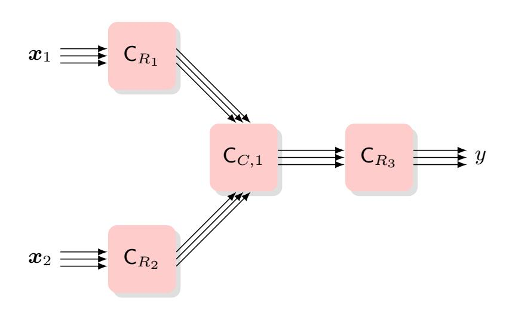
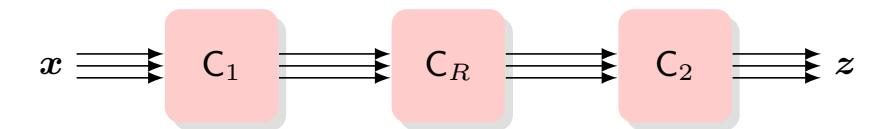

{0}------------------------------------------------

# Bypassing the Random-Probing Model in Masking Security Proofs

Julien B´eguinot1 , Gianluca Brian2 , and Lo¨ıc Masure3

1 UCLouvain, ICTEAM Institute, Crypto Group, Louvain-la-Neuve, Belgium, julien.beguinot@uclouvain.be⋆⋆

2 TU Darmstadt, gianluca.brian@tu-darmstadt.de 3 LIRMM, Univ. Montpellier, CNRS, loic.masure@lirmm.fr

Abstract. Masking, i.e., computing over secret-shared data, is one of the main counter-measures against side-channel analysis, provably secure in the standard noisy-leakage model. However, all the state-of-theart security proofs rely on a reduction to a more abstract model called random probing (Eurocrypt'14). As a result, the noise requirements of such proofs must scale with the field size of the circuit which, beyond not reflecting real-world physics of target devices, is often prohibitive, especially in the post-quantum era. That is why it is critical to find alternative strategies to the reduction to the random-probing model. In this paper, we establish for the first time a masking security proof bypassing this reduction, answering positively to the above question. Contrary to the common belief that directly working in the noisy-leakage model is not convenient, we show how to reach this goal by leveraging an extension of the Xor lemma. We also show how to leverage the IOS framework (CHES'21) in order to derive composable security directly in the noisyleakage model. As a result, our bound relies on relaxed noise requirements characterized in a weaker metric than the so far state of the art (Crypto'24, '19). Moreover, our new proof strategy allows us to derive a security bound for circuits masked with the first-order ISW compiler, for which the optimal noise requirement scales as Θ |F| 1/2 , whereas proofs using the random-probing model work in a regime of O(|F|). The latter contribution illustrates how some current design choices for masked implementations could be concretely affected: we exhibit two exemplary masked implementations such that the former one is more secure in the (more abstract) random-probing model, whereas the latter one is more secure in the (more realistic) noisy-leakage model.

Keywords: Masking · Noisy leakage · Random Probing · XOR Lemma · Reduction · Leakage Model · Dobrushin

⋆⋆ Work partly done while in LTCI, T´el´ecom Paris, Institut Polytechnique de Paris.

{1}------------------------------------------------

## 1 Introduction

#### 1.1 Context

Since the emergence in the late 1990's of side-channel attacks against embedded cryptosystems [47,48], many ways to protect cryptographic implementations have been proposed in the literature. One of them has been particularly studied: masking [20,35].

In an implementation prone to be targeted by side-channel analysis, a naive representation of the sensitive data would be to encode their binary representation into the memory. Instead, masking consists in encoding any sensitive data according to a (usually additive) secret sharing, and to reflect this changed encoding into the subsequent computations. More precisely, the idea of masking is to make any implementation t-probing secure, in the sense that any t-tuple of intermediate variables of the implementation remains independent of the secret inputs [42].

Whereas the underlying idea in the seminal works was to thwart the (back then state-of-the-art) distinguishers based on the estimation of statistical moments of small orders — i.e. such that  $t \leq 1, 2$  — it has later been emphasized that masking enjoys security in a much broader sense, namely that "whatever attack an adversary can carry out when knowing the leakage, she can also run [...] by just having black-box access" to the target device up to some negligible error [25]. In this respect, Duc et al. have been the first to provide a meaningful provable security bound, i.e., to quantify the error of a black-box adversary aiming at mimicking the behavior of an augmented adversary with access to the leakage [25].

More precisely, they have shown that any t-probing secure arithmetic circuit operating over a finite field F enjoys a provable security against leakage, up to some error scaling with  $(\mathcal{O}(t) \cdot |\mathbb{F}| \cdot \delta)^{t+1}$ . Here,  $|\mathbb{F}|$  denotes the field size, whereas  $\delta$  is the noise parameter, i.e., a scalar quantifying how leaky each wire is. More precisely,  $\delta$  denotes "the maximum probability, over all adversaries  $\mathcal{A}$ , that  $\mathcal{A}$ distinguishes between the noise from a uniform [wire] that is known to him, and a uniform [wire] that is unknown to him" [25]. The higher  $\delta$ , the leakier the wires and the more powerful the augmented adversary. Therefore, such a bound paves the way towards efficient real-world security evaluations. In order to evaluate the security of some leaky circuit, an evaluator would only have to estimate  $\delta$  through some basic leakage assessment on a few elementary computations, independently from each other, and to make sure that the circuit verifies the t-probing security, for some t. Duc et al.'s bound does the rest. This contrasts with the more tedious approach consisting in launching a series of state-of-the-art attacks against the target device, with a risk of false sense of security if those emulated attacks are non-optimal. That is why establishing provably-secure masking schemes is of utmost importance for designers and evaluators.

{2}------------------------------------------------

#### 1.2 Statement of the Problem

Unfortunately, there remains a challenging gap between this theoretical approach and practice, up to the point that, to the best of our knowledge, Duc et al.'s security bound is never used for real-world evaluations yet. This is, in particular, due to the field-size factor in the security bound, making the noise requirements, i.e., the regime of  $\delta$  leading to a non-trivial bound, prohibitively high. As an example, concrete field-size values, e.g.,  $|\mathbb{F}| = 256$  for AES,  $|\mathbb{F}| \approx 2^{13}$  for Kyber,  $|\mathbb{F}| \approx 2^{23}$  for Dilithium, are such that the level  $\delta$  of leakage must scale inversely to these numbers. Surprisingly, despite  $t \ll |\mathbb{F}|$  in most of the real-world use cases, the research community has put a lot of efforts over the last few years to propose masking schemes with leakage rates independent of t [1,9,11,12,68], whereas only a few (unfruitful) attempts have been made so far to make it independent of the field size [28,17,6].4

Overcoming this strong limitation therefore remains an open problem. At the time where Duc et al. established their result, the noise requirement scaling with the field size was considered "unnatural" [28, p. 161]. Indeed, such a requirement does not appear in the masking security bounds against an adversary targeting a single encoding only [53,4,45,66], up to the point that it was conjectured to be a proof artifact [27]. Even more surprising, for some specific types of leakages on a single encoding, increasing the field-size was shown to be helpful for improving the security level [32,31].

Additional Assumptions, beyond Probing Security. Let us clarify however that without further assumption on the target circuit, beyond probing security, this field-size factor is not a proof artifact. As a warm-up example motivating our study, we show how to craft a simple t-probing secure circuit and a leakage function with noise parameter  $\delta$  such that there exists an attack succeeding with probability  $\Omega(|\mathbb{F}| \cdot \delta)^{t+1}$  — we elaborate more on that in section 6. Even if our counter-example looks somewhat artificial, several recent works leveraged a similar rationale to defeat probing-secure masking schemes for post-quantum cryptography [41].

Therefore, one needs additional assumptions on the target circuit to overcome this limitation. Several attempts in this respect have been done in the past few years, for example by restricting the scope of probing-secure implementations to arithmetic circuits, allowing only field additions and multiplications as elementary operations in the implementation [54,17]. However, these approaches either relied on some (unrealistic) leak-free components [60,54,66], or were only shown to be provably secure against a restricted class of noisy-leakage models [17,6].

The Curse of Random Probing Simulatability. Another natural attempt to include additional assumptions would be to try to work upon Duc et al.'s proof strategy. To establish their security bound, they relied on the reduction of any

&lt;sup>4 In particular, Brian *et al.* claimed a compiler removing entirely the field-size dependency [17]. Unfortunately, their proof has later been invalidated by Béguinot and Masure [6].

{3}------------------------------------------------

sufficiently noisy leakage to an intermediate leakage model: the so-called random probing. In this model, the adversary can observe the value of each wire, independently with some probability p — otherwise nothing is learned. For this reduction to be effective, one must make sure that any leakage could have been generated from any wire value with some strictly positive probability. Unfortunately the necessary and sufficient condition for that is the noise requirement scaling with the field size [\[25,](#page-31-1)[28\]](#page-31-2). This leads to the counter-intuitive situation where some leakage models can never be proven secure with this strategy, even if they can be considered as highly noisy, and hence conjectured as being leakageresilient with masking — we elaborate later with some exemplary leakage models described in previous works [\[18,](#page-31-5)[6\]](#page-30-3). This core observation suggests that in order to circumvent the limitation of the field-size loss in the overall security bound, one must necessarily circumvent the current reduction to the random-probing model. This represents the core question of our paper:

Can we find a way to bypass the reduction to random probing in masking security proofs ?

#### 1.3 Our Contribution

As the core contribution of this paper, we answer positively to this question. We establish for the first time a masking security proof covering the leakages from computations, that does not rely on any leak-free component [\[60,](#page-34-1)[54\]](#page-33-6), nor any reduction through the random-probing model [\[25,](#page-31-1)[28,](#page-31-2)[59,](#page-34-2)[5\]](#page-30-5). This positive answer contrasts with the current and long-standing belief that the noisy-leakage model would be not "convenient" to work with, as often emphasized to ground the consideration for more abstract models [\[9,](#page-30-0)[11,](#page-30-1)[12\]](#page-30-2). The core of our contribution is summarized by two theorems, namely [Theorem 1](#page-11-0) and [Theorem 2.](#page-15-0) On a more practical side, this main result already implies the following contributions.

Weaker Leakage Metrics. We derive from our main result [\(Theorem 1\)](#page-11-0) a new security bound for t-probing secure circuits [\(Corollary 2\)](#page-21-0), where the noise requirement is expressed in terms of Dobrushin's contraction coefficient [\[24\]](#page-31-6). This well-known metric in information theory [\[58\]](#page-34-3) is much weaker (i.e., up to |F| times lower) than the Complementary Doeblin Coefficient (CDC) metric [\[5\]](#page-30-5) emerging from Duc et al.'s intermediate reduction to the random-probing model [\[25,](#page-31-1) Lemma 2]. This represents a noticeable improvement, as it has been shown that any proof using Duc et al.'s reduction cannot be expressed in a weaker metric than the CDC [\[5](#page-30-5)[,59\]](#page-34-2). In particular, we emphasize in [section 5](#page-20-0) some classes of leakage models [\[18](#page-31-5)[,6\]](#page-30-3), for which the latter approach through the reduction to the random-probing model is doomed to fail, whereas ours results in tight bounds.

Tight Composability in the Noisy-Leakage Model. We also show how to take profit from [Theorem 2](#page-15-0) in order to get composability directly established in the noisy-leakage model. To this end, we leverage the input-output separation (IOS) framework [\[36,](#page-32-3)[8\]](#page-30-6), allowing to compose probing-secure circuits together, provided 

{4}------------------------------------------------

that they are intertwined with IOS refresh gadgets. As a result, we are able to derive security bounds scaling linearly with the original circuit size, whereas a naive application of [Theorem 1](#page-11-0) to the whole circuit would yield a polynomial scaling. Moreover, our composability approach keeps the effective security order (i.e., the exponential rate of the security bound) optimal, contrary to previous composability approaches like the region-probing model [\[25,](#page-31-1)[2\]](#page-29-1), or the threshold-RPC [\[9](#page-30-0)[,11,](#page-30-1)[12\]](#page-30-2).

Breaching the Field-Size Barrier. In the particular case of (t = 1)-probing secure circuits produced by the well-known ISW compiler [\[42\]](#page-33-2), we also show that [Theorem 1](#page-11-0) implies (through [Corollary 4\)](#page-27-0) that the leakage rate, i.e. the maximum value of the noise parameter δ providing non-trivial security bounds, is Θ |F| −1/2 . This leakage rate is optimal (see [Proposition 2\)](#page-21-1), contrasting with the O |F| −1 regime using the intermediate reduction to the random-probing model. To the best of our knowledge, this is the first time that the latter regime is outperformed for leakages from computations.

Noisy-Leakage vs. Random-Probing Security. As a side effect of the latter contribution, we exhibit a use case in [subsection 6.3,](#page-28-0) in which two simple 1-probing secure gadgets with the same functionality are compared. Whereas the former one is more secure than the latter one in the random-probing model, we prove that the opposite conclusion holds in the more realistic noisy leakage model. This highlights a potential false sense of security of solely relying on formal verification tools in the random-probing model for security analysis, and advocates for further refinement in such an analysis.

# 1.4 Scope of Application and Techniques

Stateless-vs.-Stateful Leakage Resilience. The current limitation of our approach is that our security bound is established in the stateless variant of leakageresilient circuits, initially introduced by Ishai et al. [\[42\]](#page-33-2). Here, "stateless resilience" refers to computations mapping some sharing of secret inputs to some sharing of the secret output, where the computation is subject to a single round of one-shot leakage [\[15\]](#page-30-7).[5](#page-4-0) This definition can be seen as a natural extension of the definition of leakage-resilient secret sharing [\[13,](#page-30-8)[50,](#page-33-7)[51,](#page-33-8)[56,](#page-34-4)[32\]](#page-32-1). This contrasts however with leakage resilience in the more powerful stateful model, in which the random-probing reduction can work on. In the stateful model, some additional public output can be provided to the adversary, along with the leakage occurring while decoding its secret sharing.

Nevertheless, establishing security in the stateless model remains relevant for two reasons. First, stateless security is already applicable in scenarios such as "computations performed by payment terminals and access control readers,

5 This definition does not necessarily coincide with the definition of stateless hardware circuits.

{5}------------------------------------------------

hardware implementation of zero-knowledge proofs, and zero-knowledge probabilistically checkable proofs" [\[70,](#page-35-1)[34](#page-32-4)[,44,](#page-33-9)[15\]](#page-30-7). Second, most of the time, stateful security schemes are built upon stateless security schemes, as done by Ishai et al. in the probing model [\[42\]](#page-33-2), or some of its variants like t parities or t disjunctions [\[43\]](#page-33-10), or by Wang with NC1 leakages [\[70\]](#page-35-1). In that regard, generalizing this stateless-to-stateful transformation to the noisy-leakage model represents a natural (yet non-trivial) future work, beyond the scope of this paper.

Our Techniques. Usually, security bounds for leakage-resilient secret sharings show that any pair of secrets are statistically indistinguishable, given some leakage from their respective sharings. We extend such kind of bounds by showing that any pair of secrets are statistically indistinguishable, even given some leakage from all wires of the circuit in which they are embedded — except the usual encoding and decoding parts, following the definition of leakage resilience in the stateless model [\[42\]](#page-33-2).

The core building block of our results is the statement of extensions of the well-known XOR lemma [\[55\]](#page-34-5). So far, the "side-channel" version [\[53,](#page-33-3) Prop. 4] of the XOR lemma states that if X1, X2 are random variables uniformly distributed over some finite group, respectively with side information Y1, Y2, then the totalvariation distance TV of X1 + X2 induced by the leakage (Y1, Y2) is such that

$$\mathsf{TV}(\mathsf{P}_{X_1 + X_2 | Y_1, Y_2}; \mathsf{P}_{X_1 + X_2}) \leq 2 \cdot \mathsf{TV}(\mathsf{P}_{X_1 | Y_1}; \mathsf{P}_{X_1}) \cdot \mathsf{TV}(\mathsf{P}_{X_2 | Y_2}; \mathsf{P}_{X_2}).$$

The product in the right-hand side is at the core of the security amplification of masking. However in its current shape, the XOR lemma only applies to uniform encodings, and hence to uniform secrets.

We relax this constraint in two ways by leveraging two extended noise amplification lemmas. First, they no longer require the underlying secret to be uniform. Second, we do not require all the wires to be jointly independent of the secret, but at least one of them. The latter relaxation is the core reason why we are able to extend our indistinguishability bounds beyond the sole case of leaky encodings. By recursively applying these lemmas t times over the whole leakage, we are able to state our main results, from which we deduce the security bound of t-probing secure circuits.

# 2 Background and Definitions

Notations. We consider a probability space, in which we denote by Pr[E] the probability of some event E, whereas we denote by Pr[E | C] the probability that some event E occurs, conditionally to another event C. A random variable defined over some set X — denoted by calligraphic letters — is denoted by roman capital letters X. An observation of a random variable X is denoted by the corresponding small capital letter x. Likewise, bold capital letters X (respectively bold small letters x) denote random vectors (respectively vectors). 

{6}------------------------------------------------

In what follows, we assume that each random variable or vector admits some probability mass/density6 function  $\mathsf{P}_X$  — also denoted  $\Pr[X=\cdot]$  sometimes — such that for any observation x, we have  $\mathsf{P}_X(x) = \Pr[X=x]$ . Likewise, we denote by  $\mathsf{P}_{Y|x}$  or  $\Pr[Y=\cdot \mid X=x]$  the shortcut notation for the conditional probability mass/density function such that for any observation y of Y, we have  $\mathsf{P}_{Y|x}(y) = \Pr[Y=y \mid X=x]$ . We use the symbol  $\otimes$  to denote the product distribution: if the random vector  $\mathbf{X} = [X_1, X_2]$  is distributed according to  $\mathsf{P}_1 \otimes \mathsf{P}_2$ , then we mean that the two entries  $X_1, X_2$  are independent and  $X_i$  follows  $\mathsf{P}_i$ , for  $i \in \{1,2\}$ . Finally,  $\mathbb{E}_X[f(X)]$  denotes the expectation of f(X) over the distribution  $\mathsf{P}_X$ , and  $\mathbb{E}_X[f(X) \mid \mathsf{E}]$  denotes  $\sum_x \Pr[X=x \mid \mathsf{E}] \cdot f(x)$ .

#### 2.1 Total-Variation Distance

In this paper, we heavily manipulate the total-variation distance.

**Definition 1 (Total-Variation Distance).** Let P, Q be two probability distributions over the set  $\mathcal{Y}$ . Let p, q be their respective probability density functions. The total variation distance between P, Q is defined by

$$\mathsf{TV}(P;Q) = \frac{1}{2} \int_{y \in \mathcal{Y}} |p(y) - q(y)|.$$

In order to establish all our results, we need the following properties of the total-variation distance. First of all, as a distance, it cancels out if and only if P = Q. It also follows the data-processing inequality (DPI), some tensorization properties, and some Marko-chain properties. We detail these lemmas hereafter.

Lemma 1 (Data-Processing Inequality [63, Fact A.2]). Let W, W' be two random variables distributed over a support W, and let Y = f(W), Y' = f(W'), for some (possibly randomized) function  $f: W \to \mathcal{Y}$ . Then

$$\mathsf{TV}(\mathsf{P}_Y;\mathsf{P}_{Y'}) \leq \mathsf{TV}(\mathsf{P}_W;\mathsf{P}_{W'}).$$

Lemma 2 (Tensorization [63, Facts A.3, A.4]). Let  $(X_i \to Y_i)_{i=1}^n$  be a collection of channels then for all tuple  $x, x' \in \mathcal{X}^n$ ,

$$\mathsf{TV}\left( \otimes_{i=1}^n \mathsf{P}_{Y_i|X_i=x_i}; \otimes_{i=1}^n \mathsf{P}_{Y_i|X_i=x_i'} \right) \leq \sum_{i=1}^n \mathsf{TV}\left( \mathsf{P}_{Y_i|X_i=x_i}; \mathsf{P}_{Y_i|X_i=x_i'} \right).$$

**Lemma 3.** Let X be a random variable, and let  $\mathbf{W} = [W_1, \dots, W_n], \mathbf{Y} = [Y_1, \dots, Y_n]$  be two random vectors. Assume that for any  $1 \le i \le n$ , conditionally to  $W_i$ ,  $Y_i$  is independent of  $X, W_j, Y_j$  for any  $j \ne i$ .8 Then,

$$TV\left(\mathsf{P}_{\boldsymbol{Y}|X=x}; \bigotimes_{i=1}^n \mathsf{P}_{Y_i}\right) \leq \sum_{i=1}^n \mathbb{E}_{w_i} \big[ \mathsf{TV} \left(\mathsf{P}_{Y_i|W_i=w_i}; \mathsf{P}_{Y_i}\right) \mid X=x \big].$$

&lt;sup>6 It does not matter here whether the random variable denoting the leakage is discrete, nor continuous, provided that it admits some density/mass function.

&lt;sup>7 We make sure that the notation of the observed random variable speaks for itself, in order to avoid any ambiguity.

&lt;sup>8 i.e.  $(X, \mathbf{W}) \to W_i \to Y_i$  forms a Markov chain.

{7}------------------------------------------------

## 2.2 Circuits, Probing Security, and Leakages

Probing-Secure Circuits. In this paper, we modelize implementations as circuits. A circuit C can be seen as a directed acyclic graph, whose vertices are gates representing elementary operations ran by the circuit, and whose edges are wires carrying intermediate variables.

The circuit is preloaded with a wire bundle X denoting a uniform additive sharing of some secret random variable X [\[25,](#page-31-1) Sec. 5.1], and eventually stores a wire bundle denoting the additive sharing of the outputs. The wires of the circuit are denoted by the random vector WC = [W1, . . . , W|C| ]. We refer to the size of the circuit |C| as the number of wires in C. [9](#page-7-0) In particular, we focus in this paper on circuits verifying the notion of probing security defined hereafter.

Definition 2 (t-Probing Security [\[8,](#page-30-6) Def. 2, restated]). A circuit C is said t-probing secure if for any W ⊂ C such that |W| ≤ t, and for any pair (x, x′ ) of inputs:

$$\Pr[\mathbf{W} = \cdot \mid \mathbf{X} \leftarrow \mathsf{Enc}(x)] = \Pr[\mathbf{W} = \cdot \mid \mathbf{X} \leftarrow \mathsf{Enc}(x')]. \tag{1}$$

Leakage Channels. In stateless leakage resilience, the adversary is given access to public inputs (e.g., a plaintext), along with some leakage channels from each wire of C [\[37,](#page-32-5) Def. 1]. A channel W → Y can be seen as a transitional probability PY |W mapping a random variable W to a random variable Y ,

$$W \to \boxed{\mathsf{P}_{Y|W}} \to Y.$$

Equivalently, a channel can be seen as a random function mapping W (and potentially some internal randomness) to Y . This means that conditionally to its corresponding wire W, any leakage Y becomes independent of any other random variable. While this assumption is not always realistic [\[21\]](#page-31-7), it is very common in masking security proofs [\[60,](#page-34-1)[25,](#page-31-1)[13\]](#page-30-8). It can also be enforced in the implementation [\[7\]](#page-30-9).

# 2.3 Noisy Leakage and Leakage Resilience

We introduce hereafter the definition of a noisy leakage.

Definition 3 (Noisy Leakage [\[60,](#page-34-1)[25,](#page-31-1) restated]). A channel X → Y is said to be (δ, ∆)-noisy where

$$\delta(X \to Y) \le \mathbb{E}_R \left[ \mathsf{TV} \left( \mathsf{P}_{Y|X=R}; \mathbb{E}_{R'} \left[ \mathsf{P}_{Y|X=R'} \right] \right) \right]. \tag{2}$$

where R, R′ ∼ U(X ) are uniformly distributed and

$$\Delta(X \to Y) \le \max_{x,x'} \mathsf{TV}\left(\mathsf{P}_{Y|X=x}; \mathsf{P}_{Y|X=x'}\right). \tag{3}$$

9 This goes in contradiction with Ishai et al.'s work where the circuit size stands for the number of gates.

{8}------------------------------------------------

In Definition 3,  $\delta$  measures "the maximum probability, over all adversaries  $\mathcal{A}$ , that  $\mathcal{A}$  distinguishes between the noise from a uniform X that is known to kim, and a uniform X that is known to kim." [25]. Likewise,  $\mathcal{A}$ , also called "Dobrushin's contraction" coefficient [58, Eq. 7], measures the maximum probability, over all adversaries  $\mathcal{A}$ , that  $\mathcal{A}$  distinguishes between the leakages from two values x, x' that are chosen by  $\mathcal{A}$ . We will show later in Lemma 7 that any  $(\delta, \mathcal{A})$ -noisy wire is also  $(\delta, |\mathbb{F}| \cdot \delta)$ -noisy. Hence, we simply say hereafter that a wire is  $\delta$ -noisy whenever it is at least  $(\delta, |\mathbb{F}| \cdot \delta)$ -noisy according to Definition 3.

On the Convention of Uniform Wires. Notice that in Definition 3, we choose R, R' to be uniformly distributed. Such a convention has already been argued by Prouff and Rivain [60, Footnote 3] and Duc et al. [26, p.159] to be the most "natural" choice, probably because in a probing-secure circuit, most of the wires are expected to be uniformly distributed. Another argument in this respect is given by the works of Shulman and Feder, showing that the uniform distribution may be seen as the universal prior, in the sense that Equation 2 defined according to the uniform distribution is simultaneously close to the same quantity defined according to any arbitrary distribution, for all leakage channels [65]. However, if the actual distribution of the wire — conditionally to some other wires or not — is strongly biased, then the  $\delta$ -noisiness might under-estimate how leaky the wire is, as we will see in section 6.

Leakage Resilience in the Stateless Model. We next define the resilience in the stateless model against some noisy leakage, following the series of similar definitions by Wang [70, Def. 2.7], Bogdanov et al. [15, Def. 3.1], Ishai and Song [43, Def. 1], and Goyal et al. [37, Def. 1].

**Definition 4 (Leakage Resilience).** A circuit C containing the wires  $W_{\mathsf{C}} = [W_1, \ldots, W_{|\mathsf{C}|}]$  is said to be  $(\boldsymbol{\delta}, \boldsymbol{\Delta}, \epsilon)$ -leakage resilient, for some pair of vectors  $\boldsymbol{\delta} = [\delta_1, \ldots, \delta_{|\mathsf{C}|}], \ \boldsymbol{\Delta} = [\Delta_1, \ldots, \Delta_{|\mathsf{C}|}], \ and for some scalar <math>\epsilon$ , if for every family  $W_1 \to Y_1, \ldots, W_{|\mathsf{C}|} \to Y_{|\mathsf{C}|}$  of channels such that the channel  $W_i \to Y_i$  is  $(\delta_i, \Delta_i)$ -noisy, for all  $1 \le n \le |\mathsf{C}|$ , and for every pair x, x' of secret inputs:

$$\mathsf{TV}\left(\mathsf{P}_{\boldsymbol{Y}|X=x};\mathsf{P}_{\boldsymbol{Y}|X=x'}\right) \le \epsilon,\tag{4}$$

where  $\mathbf{Y} = [Y_1, \dots, Y_{|\mathsf{C}|}]$ . We say that  $\mathsf{C}$  is simply  $(\delta, \Delta, \epsilon)$ -leakage resilient if it is  $(\boldsymbol{\delta}, \boldsymbol{\Delta}, \epsilon)$ -leakage resilient for all vectors  $\boldsymbol{\delta}, \boldsymbol{\Delta}$  such that  $\delta = \max_{1 \leq n \leq |\mathsf{C}|} \delta_n$  and  $\Delta = \max_{1 \leq n \leq |\mathsf{C}|} \Delta_n$ .

#### 3 Main Result

In this section, we state our main results, namely Theorem 1 and Theorem 2. To this end, we first state in subsection 3.1 two extensions of the Xor lemma. One is owed to Polyanskyi and Wu [58], the other is an average-case contribution of ours. This will pave the way towards the statement and the proof of our main result in subsection 3.2.

The original result holds for the Kullback-Leibler divergence, but the rationale extends similarly to the total variation metric.

{9}------------------------------------------------

## 3.1 The Core Amplification Lemmas

We now state the core technical lemmas of this paper.

**Lemma 4 (Extended Noise Amplification).** Let  $X, W_1$  be two random variables, and let  $\mathbf{W}, \mathbf{Y} = (Y_1, Y_2)$  be two random vectors. Assume that:

- 1.  $(\mathbf{W}, W_1)$  is independent of X;
- 2. Conditionally to  $W_1$ ,  $Y_1$  is independent of X, W and  $Y_2$ .

Then, for any  $x, x', \boldsymbol{w}$ ,

$$\mathsf{TV}\left(\mathsf{P}_{\boldsymbol{Y}|x,\boldsymbol{w}};\mathsf{P}_{\boldsymbol{Y}|x',\boldsymbol{w}}\right) \le \mathsf{TV}\left(\mathsf{P}_{Y_{2}|x,\boldsymbol{w}};\mathsf{P}_{Y_{2}|x',\boldsymbol{w}}\right) + 2 \mathbb{E}_{w_{1}}\left[\mathsf{TV}\left(\mathsf{P}_{Y_{1}|w_{1}};\mathsf{P}_{Y_{1}}\right) \cdot \mathsf{TV}\left(\mathsf{P}_{Y_{2}|x,\boldsymbol{w},w_{1}};\mathsf{P}_{Y_{2}|x',\boldsymbol{w},w_{1}}\right) \mid \boldsymbol{W} = \boldsymbol{w}\right]. \quad (5)$$

Remark 1. Notice that Equation 5 can be seen as a generalization of the XOR lemma [55], with relaxed assumptions since one does not need  $Y_2$  to be independent of X, as in a two-secret sharing — we only needed  $Y_1$  to be independent of X. Nevertheless, with this additional assumption, the first term in the right-hand side of Equation 5 becomes zero, and by averaging both sides, we get back to the "side-channel" formulation of the XOR lemma [53].

We will also need a "worst-case" of the above Lemma 4, owed to Polyanskyi and  $\mathrm{Wu}.^{11}$ 

Lemma 5 (Polyanskyi's Amplification Lemma [58, Thm. 8, Eq. 44]). Let  $X, W_1$  be two random variables, and let  $\mathbf{Y} = (Y_1, Y_2)$  be a random vector such that conditionally to  $W_1$ ,  $Y_1$  becomes independent of  $Y_2$ . Let  $\Delta \triangleq \Delta(W_1 \to Y_1)$ . Then, for every pair (x, x') of realizations of X,

$$\mathsf{TV}\left(\mathsf{P}_{\boldsymbol{Y}|X=x};\mathsf{P}_{\boldsymbol{Y}|X=x'}\right) \le (1-\Delta) \cdot \mathsf{TV}\left(\mathsf{P}_{Y_2|X=x};\mathsf{P}_{Y_2|X=x'}\right) \\ + \Delta \cdot \mathsf{TV}\left(\mathsf{P}_{W_1,Y_2|X=x};\mathsf{P}_{W_1,Y_2|X=x'}\right). \quad (6)$$

Both Equation 5 and Equation 6 look similar. We stress however that they are neither equivalent, nor one is stronger than the other. More precisely, on the one hand we can derive from Equation 5 a slightly looser version of Equation 6, whereas the assumptions of Lemma 5 are weaker than those of Lemma 4 —  $W_1$  is not assumed independent of X. On the other hand, the latter assumption allows for a finer characterization in Equation 5 than uniformly bounding the total-variation distance by Dobrushin's coefficient  $\Delta$ , as done in Equation 3. The remaining of this subsection is devoted to proving Equation 5.

*Proof of Lemma 4.* We first express the conditional probability of Y given X, using the total probability formula:

$$\mathsf{P}_{\boldsymbol{Y}|X,\boldsymbol{W}} = \sum_{w_1} \mathsf{P}_{W_1|X,\boldsymbol{W}}(w_1) \cdot \mathsf{P}_{\boldsymbol{Y}|X,\boldsymbol{W},W_1=w_1}.$$

Take (X, Z, W, V) = (X, W, Y, Y') in [58, Eq. 44] to observe that both results coincide.

{10}------------------------------------------------

By assumption,  $(W_1, \mathbf{W})$  is independent of X, so

$$\mathsf{P}_{W_1|X,\boldsymbol{W}} = \mathsf{P}_{W_1|\boldsymbol{W}}.$$

Moreover, by assumption,  $Y_1$  is independent of  $X, \mathbf{W}, Y_2$  conditionally to  $W_1$ , so

$$\mathsf{P}_{Y_1|X,W_1,Y_2,W} = \mathsf{P}_{Y_1|W_1}.$$

Hence,

$$\mathsf{P}_{\boldsymbol{Y}|X,\boldsymbol{W}} = \sum_{w_1} \mathsf{P}_{W_1,Y_1|\boldsymbol{W}}(w_1,\cdot) \cdot \mathsf{P}_{Y_2|X,\boldsymbol{W},w_1}.$$

We may therefore express the total variation  $\mathsf{TV} = \mathsf{TV}(\mathsf{P}_{\boldsymbol{Y}|x,\boldsymbol{w}};\mathsf{P}_{\boldsymbol{Y}|x',\boldsymbol{w}})$  as follows:

$$2 \text{ TV} = \int_{y_1, y_2} \left| \mathbb{E}_{w_1} \left[ \mathsf{P}_{Y_1 | w_1}(y_1) \cdot \left( \mathsf{P}_{Y_2 | x, w_1, \boldsymbol{w}}(y_2) - \mathsf{P}_{Y_2 | x', w_1, \boldsymbol{w}}(y_2) \right) \mid \boldsymbol{W} = \boldsymbol{w} \right] \right|$$

$$= \int_{y_1, y_2} \left| \mathbb{E}_{w_1} \left[ \epsilon_1(y_1, y_2; x, x', w_1, \boldsymbol{w}) + \epsilon_2(y_1, y_2; x, x', w_1, \boldsymbol{w}) \mid \boldsymbol{W} = \boldsymbol{w} \right] \right|,$$

where

$$\epsilon_{1}(y_{1}, y_{2}; x, x', w_{1}, \boldsymbol{w}) \triangleq \mathsf{P}_{Y_{1}}(y_{1})(\mathsf{P}_{Y_{2}|x, w_{1}, \boldsymbol{w}}(y_{2}) - \mathsf{P}_{Y_{2}|x', w_{1}, \boldsymbol{w}}(y_{2})), 
\epsilon_{2}(y_{1}, y_{2}; x, x', w_{1}, \boldsymbol{w}) \triangleq (\mathsf{P}_{Y_{1}|w_{1}}(y_{1}) - \mathsf{P}_{Y_{1}}(y_{1}))(\mathsf{P}_{Y_{2}|x, w_{1}, \boldsymbol{w}}(y_{2}) - \mathsf{P}_{Y_{2}|x', w_{1}, \boldsymbol{w}}(y_{2})).$$

Then, using the linearity of the integral, we get

$$2 \, \mathsf{TV} \leq \underbrace{\int_{y_1, y_2} |\mathbb{E}_{w_1}[\epsilon_1(y_1, y_2; x, x', w_1, \boldsymbol{w}) \mid \boldsymbol{W} = \boldsymbol{w}]|}_{I_1(x, x', \boldsymbol{w})} + \underbrace{\int_{y_1, y_2} |\mathbb{E}_{w_1}[\epsilon_2(y_1, y_2; x, x', w_1, \boldsymbol{w}) \mid \boldsymbol{W} = \boldsymbol{w}]|}_{I_2(x, x', \boldsymbol{w})}.$$

It now remains to compute the two terms  $I_1$  and  $I_2$ . On the one hand:

$$\begin{split} I_{1}(x,x',\boldsymbol{w}) &= \int_{y_{1},y_{2}} \mathsf{P}_{Y_{1}}(y_{1}) \cdot \left| \mathbb{E}_{w_{1}} \left[ \mathsf{P}_{Y_{2}|x,w_{1},\boldsymbol{w}}(y_{2}) - \mathsf{P}_{Y_{2}|x',w_{1},\boldsymbol{w}}(y_{2}) \mid \boldsymbol{W} = \boldsymbol{w} \right] \right| \\ &= \int_{y_{2}} \left| \mathbb{E}_{w_{1}} \left[ \mathsf{P}_{Y_{2}|x,w_{1},\boldsymbol{w}}(y_{2}) - \mathsf{P}_{Y_{2}|x',w_{1},\boldsymbol{w}}(y_{2}) \mid \boldsymbol{W} = \boldsymbol{w} \right] \right| \\ &= \int_{y_{2}} \left| \mathsf{P}_{Y_{2}|x,\boldsymbol{w}}(y_{2}) - \mathsf{P}_{Y_{2}|x',\boldsymbol{w}}(y_{2}) \right| \\ &= 2 \, \mathsf{TV} \left( \mathsf{P}_{Y_{2}|x,\boldsymbol{w}}; \mathsf{P}_{Y_{2}|x',\boldsymbol{w}} \right), \end{split}$$

where the second equality results from Fubini, the third equality results from the definition of the expectation, and the last equality results from the definition 

{11}------------------------------------------------

of the TV. On the other hand, using Jensen's inequality, we get

$$I_{2}(x, x', \boldsymbol{w}) \leq \int_{y_{1}, y_{2}} \mathbb{E}_{w_{1}} \left[ \left| \mathsf{P}_{Y_{1}|w_{1}}(y_{1}) - \mathsf{P}_{Y_{1}}(y_{1}) \right| \cdot \left| \mathsf{P}_{Y_{2}|x, w_{1}, \boldsymbol{w}}(y_{2}) - \mathsf{P}_{Y_{2}|x', w_{1}, \boldsymbol{w}}(y_{2}) \right| \mid \boldsymbol{W} = \boldsymbol{w} \right]$$

.

Applying Fubini's identity, the latter right-hand side can be rephrased as

$$\mathbb{E}_{w_1} \left[ \int_{y_1} \left| \mathsf{P}_{Y_1|w_1}(y_1) - \mathsf{P}_{Y_1}(y_1) \right| \cdot \int_{y_2} \left| \mathsf{P}_{Y_2|x,w_1,\boldsymbol{w}}(y_2) - \mathsf{P}_{Y_2|x',w_1,\boldsymbol{w}}(y_2) \right| \mid \boldsymbol{W} = \boldsymbol{w} \right].$$

It therefore remains to identify each integral to some total-variation distances, up to some constant factors:

$$\begin{split} I_2(x,x',\boldsymbol{w}) \leq \\ \mathbb{E}_{w_1} \left[ 2 \, \mathsf{TV} \left( \mathsf{P}_{Y_1|w_1}; \mathsf{P}_{Y_1} \right) \cdot 2 \, \mathsf{TV} \left( \mathsf{P}_{Y_2|x,w_1,\boldsymbol{w}}; \mathsf{P}_{Y_2|x',w_1,\boldsymbol{w}} \right) \mid \boldsymbol{W} = \boldsymbol{w} \right], \end{split}$$

which concludes the proof.

# 3.2 Linking Probing Security and Noisy-Leakage Resilience

In this section, we establish the leakage resilience of any t-probing secure stateless circuits, i.e., for adversaries not targeting the decoding part. Disregarding the public output allows us to embrace a fully information-theoretic approach for the security proof, in opposition to simulation-based security proofs.

Before giving the result, we recall some notations introduced in [Definition 4,](#page-8-1) extensively used hereafter. Let WC = -W1, . . . , W|C| be the wires of the compiled circuit C. Let Y = -Y1, . . . , Y|C| be the joint distribution of the leakage, such that for any 1 ≤ n ≤ |C|, conditionally to Wn, Yn becomes independent of any other random variable.

We now introduce new additional notations, required for the statement of our main result. In what follows, for any 1 ≤ n ≤ |C|, we denote by Y (n) the partial vector [Y1, . . . , Yn]. In particular, Y = Y (|C|) . Likewise, for any observation w of WC, and for any subset of {1, . . . , |C|} of size t, identified by the t-dimensional vector n = {n1, . . . , nt} , let wn denote the vector [wn1 , . . . , wnt ]. We identify the set of such t-sized subsets to Pt(C) = {n : 2 ≤ nt < nt−1 < . . . n1 ≤ |C|}.

Theorem 1. Let C be a t-probing secure circuit, taking as inputs some encoding X ← Enc(X) of a secret X. For all pair x, x′ of secret input of C, let ϵx,x′ ≜ TV PY |X=x; PY |X=x′ . Then ϵx,x′ is upper bounded as follows:

$$\epsilon_{x,x'} \leq 2^{t} \sum_{\boldsymbol{n} \in \mathcal{P}_{t}(\mathsf{C})} \mathbb{E}_{\boldsymbol{w}_{\boldsymbol{n}}} \left[ \prod_{i=1}^{t} \mathsf{TV}(\mathsf{P}_{Y_{n_{i}}|w_{n_{i}}}; \mathsf{P}_{Y_{n_{i}}}) \, \mathsf{TV}(\mathsf{P}_{\boldsymbol{Y}^{(n_{t}-1)}|x,\boldsymbol{w}_{\boldsymbol{n}}}; \mathsf{P}_{\boldsymbol{Y}^{(n_{t}-1)}|x',\boldsymbol{w}_{\boldsymbol{n}}}) \right], \tag{7}$$

$$\epsilon_{x,x'} \le \Delta^t \sum_{\boldsymbol{n} \in \mathcal{P}_t(\mathsf{C})} \mathsf{TV}\left(\mathsf{P}_{\boldsymbol{Y}^{(n_t-1)},\boldsymbol{W}_{\boldsymbol{n}},Y'|X=x}; \mathsf{P}_{\boldsymbol{Y}^{(n_t-1)},\boldsymbol{W}_{\boldsymbol{n}},Y'|X=x'}\right). \tag{8}$$

{12}------------------------------------------------

Remark 2. The order of the wires does not matter in the left-hand side of Equation 7. However, its right-hand side is not symmetric with respect to the order of the wires. This means that the right-hand side of Equation 7 can be tightened, by taking the minimum over all the permutations of the wires.

#### 3.3 The Proof of Theorem 1

Before diving into the detailed proof, we first give some intuition of the techniques. The overall proof works by induction over  $t \geq 1$ . In order to prove the base case, observe that for 1-probing secure circuits, the assumptions of Lemma 4 are always valid, so Equation 5 holds. In this step, we focus on the first term in its right-hand side. Its definition is close to the left-hand side, with the only difference now that the very last wire of C no longer leaks anything. As a result, Lemma 4 can be applied again to upper bound the first term in the right-hand side of Equation 5. We repeat this process enough times until none of the wires from the circuit leaks anymore, which proves the base case of Equation 7 for t=1.

For the induction step, we consider a (t+1)-probing secure circuit. Then, it is also t-probing secure, so Equation 7 holds by virtue of the induction hypothesis. We now focus on the  $\xi_{x,x'}^{(n)}$  factor in its right-hand side. This quantity can be interpreted as the adversary's advantage when some wires of the circuit leak in a noisy manner, whereas t other wires are probed. Informally, such a circuit remains somehow 1-probing secure, so we may apply again the same strategy as in the base case.

*Proof.* With that sketch proof in mind, we are now ready to dive hereafter into the detailed proof of Equation 7. Equation 8 and can be proven in the same way, using Lemma 5 instead of Lemma 4.

Base case, for t=1. Let C be any 1-probing secure circuit and let  $2 \le n_1 \le |\mathsf{C}|$ . By definition of 1-probing security, any wire  $W_{n_1}$  is independent of X, so we may apply Lemma 4 with " $Y_1$ "=  $Y_{n_1}$ , " $Y_2$ "=  $Y^{(n_1-1)}$ , " $W_1$ "=  $W_{n_1}$ , and "W" is instantiated with some constant arbitrary variable:

$$\begin{split} \mathsf{TV} \left( \mathsf{P}_{\boldsymbol{Y}^{(n_1)}|x}; \mathsf{P}_{\boldsymbol{Y}^{(n_1)}|x'} \right) &\leq \mathsf{TV} \left( \mathsf{P}_{\boldsymbol{Y}^{(n_1-1)}|x}; \mathsf{P}_{\boldsymbol{Y}^{(n_1-1)}|x'} \right) \\ &+ 2 \, \mathbb{E}_{w_{n_1}} \Big[ \mathsf{TV} \left( \mathsf{P}_{Y_{n_1}|w_{n_1}}; \mathsf{P}_{Y_{n_1}} \right) \cdot \mathsf{TV} \left( \mathsf{P}_{\boldsymbol{Y}^{(n_1-1)}|x,w_{n_1}}; \mathsf{P}_{\boldsymbol{Y}^{(n_1-1)}|x',w_{n_1}} \right) \Big]. \end{split}$$

Combining the above inequalities for all  $2 \le n_1 \le |\mathsf{C}|$  gives:

$$\begin{split} & \mathsf{TV}\left(\mathsf{P}_{\boldsymbol{Y}|X=x};\mathsf{P}_{\boldsymbol{Y}|X=x'}\right) \leq \mathsf{TV}\left(\mathsf{P}_{\boldsymbol{Y}^{(1)}|x};\mathsf{P}_{\boldsymbol{Y}^{(1)}|x'}\right) \\ & + 2\sum_{n_1=2}^{|\mathsf{C}|} \mathbb{E}_{w_{n_1}}\Big[\mathsf{TV}\left(\mathsf{P}_{Y_{n_1}|w_{n_1}};\mathsf{P}_{Y_{n_1}}\right) \cdot \mathsf{TV}\left(\mathsf{P}_{\boldsymbol{Y}^{(n_1-1)}|x,w_{n_1}};\mathsf{P}_{\boldsymbol{Y}^{(n_1-1)}|x',w_{n_1}}\right)\Big]. \end{split}$$

{13}------------------------------------------------

We now focus on the term TV PY (1)|x ; PY (1)|x′ . By virtue of [Lemma 1,](#page-6-3) we have

$$\mathsf{TV}\left(\mathsf{P}_{\boldsymbol{Y}^{(1)}|x};\mathsf{P}_{\boldsymbol{Y}^{(1)}|x'}\right) = \mathsf{TV}\left(\mathsf{P}_{Y_1|x};\mathsf{P}_{Y_1|x'}\right) \leq \mathsf{TV}\left(\mathsf{P}_{W_1|x};\mathsf{P}_{W_1|x'}\right).$$

By definition of 1-probing secure circuits [\(Equation 1\)](#page-7-4), the above right-hand side cancels out, which proves the base case.

Induction. Assume that [Equation 7](#page-11-2) holds for some t ≥ 1, and consider a (t+ 1) probing secure circuit C. Then C is also t-probing secure, so by induction:

$$\epsilon_{x,x'} \leq 2^t \sum_{\boldsymbol{n} \in \mathcal{P}_t(\mathsf{C})} \mathbb{E}_{\boldsymbol{w}_{\boldsymbol{n}}} \Bigg[ \prod_{i=1}^t \mathsf{TV} \left( \mathsf{P}_{Y_{n_i} \mid w_{n_i}}; \mathsf{P}_{Y_{n_i}} \right) \cdot \xi_{x,x'}^{(\boldsymbol{n})} \Bigg],$$

where

$$\xi_{x,x'}^{(\boldsymbol{n})} = \mathsf{TV}\left(\mathsf{P}_{\boldsymbol{Y}^{(n_t-1)}|x,\boldsymbol{w_n}};\mathsf{P}_{\boldsymbol{Y}^{(n_t-1)}|x',\boldsymbol{w_n}}\right).$$

The induction step consists in upper bounding the inner factor ξ (n) x,x′ . To this end, we distinguish between two cases.

Case where nt = 2. This case implies that

$$\xi_{x,x'}^{(\boldsymbol{n})} = \mathsf{TV}(\mathsf{P}_{Y_1|x,\boldsymbol{w_n}};\mathsf{P}_{Y_1|x',\boldsymbol{w_n}}).$$

By the data-processing inequality [\(Lemma 1\)](#page-6-3),

$$\mathsf{TV}(\mathsf{P}_{Y_1|x,\boldsymbol{w_n}};\mathsf{P}_{Y_1|x',\boldsymbol{w_n}}) \le \mathsf{TV}(\mathsf{P}_{W_1|x,\boldsymbol{w_n}};\mathsf{P}_{W_1|x',\boldsymbol{w_n}}). \tag{9}$$

However, a simple Bayes' theorem argument shows that:

$$\mathsf{P}_{W_1|X,\boldsymbol{W_n}} = \mathsf{P}_{X|W_1,\boldsymbol{W_n}} \cdot \frac{\mathsf{P}_{W_1|\boldsymbol{W_n}}}{\mathsf{P}_{X|\boldsymbol{W_n}}} = \mathsf{P}_{W_1|\boldsymbol{W_n}}, \tag{10}$$

since by [Definition 2,](#page-7-5) any (t + 1)-probing secure circuit is such that the (t + 1)-tuple of wires [W1,Wn] must verify PX|W1,Wn = PX|Wn = PX. Hence, combining [Equation 9](#page-13-0) and [Equation 10](#page-13-1) gives

$$\xi_{x,x'}^{(n)} \le \mathsf{TV}(\mathsf{P}_{W_1|x,\boldsymbol{w_n}};\mathsf{P}_{W_1|x',\boldsymbol{w_n}}) = \mathsf{TV}(\mathsf{P}_{W_1|\boldsymbol{w_n}};\mathsf{P}_{W_1|\boldsymbol{w_n}}) = 0. \tag{11}$$

Case where nt > 2. By treating the case nt = 2, we have actually shown that

$$\epsilon_{x,x'} \le 2^t \cdot$$

$$\sum_{\boldsymbol{n}\in\mathcal{P}_{t}'(\mathsf{C})}\mathbb{E}_{\boldsymbol{w}_{\boldsymbol{n}}}\left[\prod_{i=1}^{t}\mathsf{TV}\left(\mathsf{P}_{Y_{n_{i}}|w_{n_{i}}};\mathsf{P}_{Y_{n_{i}}}\right)\cdot\mathsf{TV}\left(\mathsf{P}_{\boldsymbol{Y}^{(n_{t}-1)}|x,\boldsymbol{w}_{\boldsymbol{n}}};\mathsf{P}_{\boldsymbol{Y}^{(n_{t}-1)}|x',\boldsymbol{w}_{\boldsymbol{n}}}\right)\right],\tag{12}$$

{14}------------------------------------------------

where  $\mathcal{P}'_t(\mathsf{C}) = \{ \boldsymbol{n} : 2 < n_t < n_{t-1} < \dots n_1 \le |\mathsf{C}| \}.^{12}$  We now leverage the (t+1)-probing security of  $\mathsf{C}$  to apply Lemma 4: for every  $2 \le n_{t+1} < n_t$ , we have  $(\boldsymbol{W}_{\boldsymbol{n}}, W_{n_{t+1}})$  independent of X. Hence, we may apply Lemma 4 with " $\boldsymbol{W}$ "=  $\boldsymbol{W}_{\boldsymbol{n}}$ , " $Y_1$ "=  $Y_{n_{t+1}}$ , " $Y_2$ "=  $Y^{(n_{t+1}-1)}$ , and " $W_1$ "=  $W_{n_{t+1}}$ :

$$\begin{split} \mathsf{TV}\left(\mathsf{P}_{\boldsymbol{Y}^{(n_{t+1})}|x,\boldsymbol{w_n}};\mathsf{P}_{\boldsymbol{Y}^{(n_{t+1})}|x',\boldsymbol{w_n}}\right) &\leq \mathsf{TV}\left(\mathsf{P}_{\boldsymbol{Y}^{(n_{t+1}-1)}|x,\boldsymbol{w_n}};\mathsf{P}_{\boldsymbol{Y}^{(n_{t+1}-1)}|x',\boldsymbol{w_n}}\right) \\ &+ 2\,\mathbb{E}_{w_{n_{t+1}}}\Big[\mathsf{TV}\left(\mathsf{P}_{Y_{n_{t+1}}|w_{n_{t+1}}};\mathsf{P}_{Y_{n_{t+1}}}\right)\cdot\xi_{x,x'}^{(\boldsymbol{n'})}\mid\boldsymbol{W_n} = \boldsymbol{w_n}\Big] \end{split}$$

where  $\mathbf{n'} = [\mathbf{n}, n_{t+1}]$  and

$$\begin{split} \xi_{x,x'}^{(\boldsymbol{n'})} &= \mathsf{TV}\left(\mathsf{P}_{\boldsymbol{Y}^{(n_{t+1}-1)}|x,\boldsymbol{w_n},w_{n_{t+1}}}; \mathsf{P}_{\boldsymbol{Y}^{(n_{t+1}-1)}|x',\boldsymbol{w_n},w_{n_{t+1}}}\right) \\ &= \mathsf{TV}\left(\mathsf{P}_{\boldsymbol{Y}^{(n_{t+1}-1)}|x,\boldsymbol{w_{n'}}}; \mathsf{P}_{\boldsymbol{Y}^{(n_{t+1}-1)}|x',\boldsymbol{w_{n'}}}\right). \end{split}$$

Combining these equations for  $n_{t+1} = 2, ..., n_t - 1$ , we get that

$$\mathsf{TV}\left(\mathsf{P}_{\boldsymbol{Y}^{(n_{t}-1)}|x,\boldsymbol{w}_{n}};\mathsf{P}_{\boldsymbol{Y}^{(n_{t}-1)}|x',\boldsymbol{w}_{n}}\right) \leq \mathsf{TV}\left(\mathsf{P}_{\boldsymbol{Y}^{(1)}|x,\boldsymbol{w}_{n}};\mathsf{P}_{\boldsymbol{Y}^{(1)}|x',\boldsymbol{w}_{n}}\right) \\
+ 2\sum_{n_{t+1}=2}^{n_{t}-1} \mathbb{E}_{w_{n_{t+1}}}\left[\mathsf{TV}\left(\mathsf{P}_{Y_{n_{t+1}}|w_{n_{t+1}}};\mathsf{P}_{Y_{n_{t+1}}}\right) \cdot \xi_{x,x'}^{(n')} \mid \boldsymbol{W}_{n} = \boldsymbol{w}_{n}\right]. \quad (13)$$

Here again, notice that by virtue of Equation 11, we have that

$$\mathsf{TV}\left(\mathsf{P}_{\boldsymbol{Y}^{(1)}|x,\boldsymbol{w_n}};\mathsf{P}_{\boldsymbol{Y}^{(1)}|x',\boldsymbol{w_n}}\right) = 0$$

so that (13) becomes

$$\xi_{x,x'}^{(n)} = \mathsf{TV}\left(\mathsf{P}_{\boldsymbol{Y}^{(n_{t}-1)}|x,\boldsymbol{w}_{n}}; \mathsf{P}_{\boldsymbol{Y}^{(n_{t}-1)}|x',\boldsymbol{w}_{n}}\right) \leq \\
2 \sum_{n_{t+1}=2}^{n_{t}-1} \mathbb{E}_{w_{n_{t+1}}} \left[ \mathsf{TV}\left(\mathsf{P}_{Y_{n_{t+1}}|w_{n_{t+1}}}; \mathsf{P}_{Y_{n_{t+1}}}\right) \cdot \xi_{x,x'}^{(n')} \mid \boldsymbol{W}_{n} = \boldsymbol{w}_{n} \right]. \quad (14)$$

We may now conclude the induction, by injecting (14) into (12) to get

$$\epsilon_{x,x'} \leq 2^{t+1} \cdot \sum_{\boldsymbol{n'} \in \mathcal{P}_{t+1}(\mathsf{C})} \mathbb{E}_{\boldsymbol{w_{n'}}} \left[ \prod_{i=1}^{t+1} \mathsf{TV} \left( \mathsf{P}_{Y_{n_i} \mid w_{n_i}}; \mathsf{P}_{Y_{n_i}} \right) \cdot \xi_{x,x'}^{(\boldsymbol{n'})} \right]$$

which is the expected induction.

Spot the difference with the definition of  $\mathcal{P}_t(\mathsf{C})$ , where both indices  $n_t$  do not start at the same value.

{15}------------------------------------------------

#### 3.4 Dobrushin's Contraction Coefficient with Polyanskyi's Lemma

[Theorem 1](#page-11-0) holds for any t-probing circuits. But like [Lemma 5](#page-9-5) is a variant of [Lemma 4](#page-9-2) with less independence assumptions, we may establish a variant of [Theorem 1](#page-11-0) that does not require probing security.

Theorem 2. Let X, Y ′ be two random variables. Let W,Y be respectively two vectors of ℓ random variables each, such that for every 1 ≤ n ≤ ℓ, Yi becomes independent of every other random variable conditionally to Wi. Then

$$\mathsf{TV}\left(\mathsf{P}_{\boldsymbol{Y},Y'|X=x};\mathsf{P}_{\boldsymbol{Y},Y'|X=x'}\right) \leq \sum_{\boldsymbol{n}\subseteq\{1,...,\ell\}} \Delta^{|\boldsymbol{n}|} \cdot (1-\Delta)^{\ell-|\boldsymbol{n}|} \cdot \mathsf{TV}\left(\mathsf{P}_{\boldsymbol{W}_{\boldsymbol{n}},Y'|X=x}\mathsf{P}_{\boldsymbol{W}_{\boldsymbol{n}},Y'|X=x'}\right), \quad (15)$$

In particular, if Y ′ = 0 and if Y represents the (δ, ∆)-noisy leakage of some circuit C, [Equation 15](#page-15-1) can be seen as an improvement of Bela¨ıd et al.'s failure probability function [\[9\]](#page-30-0), in the random-probing model. The improvement is twofold. In Bela¨ıd et al.'s formula, the Dobrushin's contraction coefficient is replaced by the parameter of Duc et al.'s reduction from the noisy-leakage to the random-probing model. We will see later in this paper that the former one is a weaker metric than the latter one. Second, in Bela¨ıd et al.'s failure function, the remaining total-variation factor is trivially upper bounded by one, as soon as it is not zero. This second remark could pave the way towards a slight refinement of formal verification tools of masking security that we leave for potential future works.

Proof of [Theorem 2.](#page-15-0) We prove [Equation 15](#page-15-1) by induction over ℓ ≥ 1. The base case for ℓ = 1 straightforwardly follows from [Lemma 5.](#page-9-5) For the induction step, let us assume that [Equation 15](#page-15-1) holds for some ℓ ≥ 1, and consider two additional random variables Wℓ+1, Yℓ+1 such that conditionally to Wℓ+1, Yℓ+1 becomes independent of everything else. Then [Lemma 5](#page-9-5) applies where "Y " is instantiated as Y (ℓ) and "Y ′" is instantiated as the vector (Yℓ+1, Y ′ ). As a result, by virtue of the induction hypothesis,

$$\mathsf{TV}\left(\mathsf{P}_{\boldsymbol{Y}^{(\ell)},Y_{\ell+1},Y'|X=x};\mathsf{P}_{\boldsymbol{Y}^{(\ell)},Y_{\ell+1},Y'|X=x'}\right) \leq \sum_{\boldsymbol{n}\subseteq\{1,\dots,\ell\}} \Delta^{|\boldsymbol{n}|} \cdot (1-\Delta)^{\ell-|\boldsymbol{n}|} \cdot \underbrace{\mathsf{TV}\left(\mathsf{P}_{\boldsymbol{W}_{\boldsymbol{n}},Y_{\ell+1},Y'|X=x}\mathsf{P}_{\boldsymbol{W}_{\boldsymbol{n}},Y_{\ell+1},Y'|X=x'}\right)}_{\boldsymbol{\xi}}. \quad (16)$$

We now focus on the ξ factor. Notice that we can apply [Lemma 5](#page-9-5) on ξ, where "Y " is instantiated as Yℓ+1, and "Y ′" is instantiated as (Wn, Y ′ ). As a result,

$$\xi \leq (1 - \Delta) \cdot \mathsf{TV} \left( \mathsf{P}_{\boldsymbol{W}_{\boldsymbol{n}}, Y'|X = x}; \mathsf{P}_{\boldsymbol{W}_{\boldsymbol{n}}, Y'|X = x'} \right) + \Delta \cdot \mathsf{TV} \left( \mathsf{P}_{\boldsymbol{W}_{\boldsymbol{n}}, W_{\ell+1}, Y'|X = x}; \mathsf{P}_{\boldsymbol{W}_{\boldsymbol{n}}, W_{\ell+1}, Y'|X = x'} \right). \tag{17}$$

{16}------------------------------------------------

Injecting [Equation 17](#page-15-2) in [Equation 16](#page-15-3) implies:

$$\mathsf{TV}\left(\mathsf{P}_{\boldsymbol{Y}^{(\ell)},Y_{\ell+1},Y'|X=x};\mathsf{P}_{\boldsymbol{Y}^{(\ell)},Y_{\ell+1},Y'|X=x'}\right) \leq \sum_{\boldsymbol{n}\subseteq\{1,\dots,\ell\}} \Delta^{|\boldsymbol{n}|} \cdot (1-\Delta)^{\ell+1-|\boldsymbol{n}|} \cdot \mathsf{TV}\left(\mathsf{P}_{\boldsymbol{W}_{\boldsymbol{n}},Y'|X=x};\mathsf{P}_{\boldsymbol{W}_{\boldsymbol{n}},Y'|X=x'}\right) + \sum_{\boldsymbol{n}\subseteq\{1,\dots,\ell\}} \Delta^{|\boldsymbol{n}|+1} \cdot (1-\Delta)^{(\ell+1)-(|\boldsymbol{n}|+1)} \cdot \mathsf{TV}\left(\mathsf{P}_{\boldsymbol{W}_{\boldsymbol{n}},W_{\ell+1},Y'|x};\mathsf{P}_{\boldsymbol{W}_{\boldsymbol{n}},W_{\ell+1},Y'|x'}\right).$$

$$(18)$$

Therefore, we can merge[13](#page-16-0) the two above sums as follows:

$$\mathsf{TV}\left(\mathsf{P}_{\boldsymbol{Y}^{(\ell+1)},Y'|X=x};\mathsf{P}_{\boldsymbol{Y}^{(\ell+1)},Y'|X=x'}\right) \leq \sum_{\boldsymbol{n}\subseteq\{1,\dots,\ell+1\}} \Delta^{|\boldsymbol{n}|} \cdot (1-\Delta)^{(\ell+1)-|\boldsymbol{n}|} \cdot \mathsf{TV}\left(\mathsf{P}_{\boldsymbol{W}_{\boldsymbol{n}},Y'|X=x};\mathsf{P}_{\boldsymbol{W}_{\boldsymbol{n}},Y'|X=x'}\right), \quad (19)$$

which is the desired result of the induction step.

# 4 Composability in the Noisy-Leakage Model

In this section, we show how to leverage [Theorem 2](#page-15-0) to securely and efficiently compose sub-circuits with each other directly in the noisy-leakage model. To this end, we intertwine each sub-circuit with refresh gadgets with "good composability properties". A refresh gadget takes as input an encoding X of some value x and outputs a new encoding X′ of the same value, so that X′ is distributed as a fresh encoding:

$$X' \equiv \mathsf{Enc}(\mathsf{Dec}(X)) \equiv \mathsf{Enc}(x).$$

An intuitive way of buidling a refresh gadget is to generate some random encoding of 0, and to add it to the input encoding. However, the way of designing such a zero encoding matters [\[23,](#page-31-9)[30](#page-32-6)[,14\]](#page-30-10). So one needs to carefully choose which properties the refresh must verify.

## 4.1 IOS to the Rescue

For the composability properties, we use the input-output separation framework of Goudarzi et al. [\[36](#page-32-3)[,8\]](#page-30-6). In a nutshell, if a probing adversary has access to at most t wires from a t-IOS gadget, her view is equivalent as if she had probed t input shares and t output shares of the gadget. This allows to separate the circuit in as many sub-circuits as there are IOS refresh gadgets, each evolving independently from each other. This independence stems for the linear scaling of the overall security bound. More formally, an IOS gadget is defined as follows.

13 To see why, notice that one can enumerate all subsets of {1, . . . , ℓ + 1} by first enumerating all the subsets that do not contain ℓ + 1 — i.e., by enumerating over all the subsets of {1, . . . , ℓ} — and by second enumerating all the subsets that do contain ℓ + 1.

{17}------------------------------------------------

**Definition 5 (Input-Output Separation [8, Def. 6, restated]).** Let C be a gadget implementing a function g taking as inputs a d-tuple  $\mathbf{x}_1$  and returning a d-tuple  $\mathbf{x}_2$ . C is said t-input-output separative (t-IOS for short) if it verifies the two following properties:

- 1. Uniformity: for every input tuple  $\mathbf{x}_1$ , the output random vector  $\mathbf{X}_2$  is a uniform sharing of  $g(\sum_{i=1}^{d} \mathbf{x}_{1,i})$ ;
- 2. Separation: for every tuple  $\mathbf{W} \subseteq \mathsf{C}$  of wires such that  $|\mathbf{W}| \leq t$ , there exist two sets  $I, J \subseteq \{1, \ldots, d\}$  and a simulator  $\mathsf{Sim}_{\mathbf{W}}^{\mathsf{IOS}}$  such that  $(a) \ |I|, |J| \leq |\mathbf{W}|;$ 
  - (b) for any admissible pair  $(\mathbf{x}_1, \mathbf{x}_2)$  i.e. such that  $\Pr(\mathsf{C}(\mathbf{x}_1) = \mathbf{x}_2) > 0$ , and for every tuple  $\mathbf{w}$ :

$$\Pr[\boldsymbol{W} = \boldsymbol{w} \mid \boldsymbol{X}_{1} = \boldsymbol{x}_{1}, \boldsymbol{X}_{2} = \boldsymbol{x}_{2}] =$$

$$\Pr\left[\operatorname{Sim}_{\boldsymbol{W}}^{\mathsf{IOS}}(\boldsymbol{X}_{1,I}, \boldsymbol{X}_{2,J}) = \boldsymbol{w} \mid \boldsymbol{X}_{1} = \boldsymbol{x}_{1}, \boldsymbol{X}_{2} = \boldsymbol{x}_{2}\right], \quad (20)$$

where  $X_{1,I}$  (respectively  $X_{2,J}$ ) denotes the restriction of  $X_1$  (respectively  $X_2$ ) to the entries whose indices belong to I (respectively J).

For our main composability result, we introduce the following notations. We consider a circuit made of probing-secure gadgets, denoted by  $C_{C,i}$ , and IOS gadgets, denoted by  $C_{R,i}$ . Furthermore, for all probing-secure gadgets  $C_{C,i}$ , we define  $\partial_i$  as the set of indices corresponding to the IOS gadgets connected to the input and output of  $C_{C,i}$ . Figure 1 illustrates this setting on a simple circuit.

Fig. 1: Sketch illustrating the setting of Theorem 3. The  $C_{R,i}$  are assumed IOS, whereas  $C_{C,1}$  is assumed probing-secure. Therefore,  $\partial_1 = \{1, 2, 3\}$ .

Theorem 3 (Composability with IOS Intertwining). Let C be a circuit that composed of

- $-\ell t$ -probing secure gadgets  $\{C_{C,i}\}_{i\in[\ell]}$ ;
- r t-IOS gadgets  $\{C_{R,j}\}_{j\in[r]}$  with fan-in 1 and fan-out 1

{18}------------------------------------------------

Furthermore assume that

- If the output of a gadget CC,i is connected to a gadget then the gadget it is connected to is necessarily one of the t-IOS gadgets {CR,j}j∈[r]
- If the output of a gagdget CR,j is connected to a gadget then the gadget it is connected to is necessarily one of the t-probing secure gadgets {CC,i}i∈[ℓ]

Let Y be the vector of ∆-noisy leakages given to the adversary. Then,

$$\mathsf{TV}\left(\mathsf{P}_{\boldsymbol{Y}|x};\mathsf{P}_{\boldsymbol{Y}|x'}\right) \le \mathsf{TV}_C + \mathsf{TV}_R,\tag{21}$$

where

$$\mathsf{TV}_{R} = 1 - \prod_{j=1}^{r} (1 - \Pr(\mathcal{B}(|\mathsf{C}_{R,j}|, \Delta) > t)) \le \sum_{j=1}^{r} \Pr(\mathcal{B}(|\mathsf{C}_{R,j}|, \Delta) > t),$$

$$\mathsf{TV}_{C} = \sum_{i=1}^{\ell} \left( \prod_{j \notin \partial_{i}} \Pr(\mathcal{B}(|\mathsf{C}_{R,j}|, \Delta) \le t) \right) \Pr\left(\mathcal{B}\left(|\mathsf{C}_{C,i}| + \sum_{j \in \partial_{i}} |\mathsf{C}_{R,j}|, \Delta\right) > t\right). \tag{22}$$

### 4.2 Proof Sketch

In the remaining of this section, we prove [Theorem 3](#page-17-1) in the particular — yet more intuitive —setting depicted by [Figure 2.](#page-18-0) We provide the full proof of [Theorem 3](#page-17-1) in the general setting in Appendix [C.](#page-40-0)

Fig. 2: Sketch illustrating the setting of [Proposition 1.](#page-18-1)

Proposition 1 (Particular case of [Theorem 3\)](#page-17-1). Let C1, C2 be two t-probing secure circuits, and let CR be a t-IOS gadget. For n ⊆ CR let I(n), J(n) be two subsets of {1, . . . , d} stemming from the separation property of IOS gadgets such that |I(n)|, |J(n)| ≤ |n|. Furthermore, assume that the leakages are ∆-noisy. Then,

$$\mathsf{TV}\left(\mathsf{P}_{Y_1,Y_2,Y_R|x};\mathsf{P}_{Y_1,Y_2,Y_R|x'}\right) \le \mathsf{TV}_1 + \mathsf{TV}_2 + \mathsf{TV}_R$$
 (23)

where

$$\mathsf{TV}_{R} = \Pr(\mathcal{B}(|\mathsf{C}_{R}|, \Delta) > t)$$

$$\mathsf{TV}_{1} = \sum_{\substack{\boldsymbol{n} \subseteq \mathsf{C}_{R} \\ |\boldsymbol{n}| \le t}} \Delta^{|\boldsymbol{n}|} \cdot (1 - \Delta)^{|\mathsf{C}_{R}| - |\boldsymbol{n}|} \cdot \mathsf{TV}\left(\mathsf{P}_{Y_{1}, \boldsymbol{X}_{1, I(\boldsymbol{n})}|x}; \mathsf{P}_{Y_{1}, \boldsymbol{X}_{1, I(\boldsymbol{n})}|x'}\right)$$

$$\mathsf{TV}_{2} = \sum_{\substack{\boldsymbol{n} \subseteq \mathsf{C}_{R} \\ |\boldsymbol{n}| \le t}} \Delta^{|\boldsymbol{n}|} \cdot (1 - \Delta)^{|\mathsf{C}_{R}| - |\boldsymbol{n}|} \cdot \mathsf{TV}\left(\mathsf{P}_{Y_{2}, \boldsymbol{X}_{1, J(\boldsymbol{n})}|x}; \mathsf{P}_{Y_{2}, \boldsymbol{X}_{1, J(\boldsymbol{n})}|x'}\right).$$

$$(24)$$

{19}------------------------------------------------

Let us interpret the bound obtained in Equation 23. The first term of the right-hand side can be interpreted as the probability that at least t+1 wires are probed from the gadget  $C_R$  in the random-probing model with  $\Delta$  serving as a parameter. Moreover, the total-variation term inside  $\mathsf{TV}_1$  (resp.  $\mathsf{TV}_2$ ) can be interpreted as the advantage provided to an hybrid adversary having access both to some noisy leakage on  $\mathsf{C}_1$  (resp.  $\mathsf{C}_2$ ) and  $|n| \leq t$  perfect probes on the outputs (resp. inputs) of  $\mathsf{C}_1$  (resp.  $\mathsf{C}_2$ ).

The rest of this section focuses on the proof of Proposition 1. In order to prove Proposition 1, we need two preliminary results, we combine Theorem 2, along with an extension of the composability result on IOS gadgets, in the case where the circuits connected to the IOS gadgets leak in the more general noisy leakage model, rather than in the probing model.

**Lemma 6.** Let  $C_1, C_2$  be two circuits with respective leakage  $Y_1, Y_2$ , and let  $C^{\mathsf{IOS}}$  be a t-IOS gadget. Then, for every  $\mathbf{W} \subseteq C^{\mathsf{IOS}}$  such that  $|\mathbf{W}| \leq t$ , there exists a set of input indices I and a set of output indices J of  $C^{\mathsf{IOS}}$ , and a simulator  $\mathsf{Sim}_K^{\mathsf{IOS}}$  with  $K = I \cup J$  such that for any  $y_1, y_2, \mathbf{w_n}$ :

$$\Pr[Y_1 = y_1, Y_2 = y_2, \mathbf{W} = \mathbf{w} \mid X = x] = \\ \Pr[Y_1 = y_1, Y_2 = y_2, \mathsf{Sim}_K^{\mathsf{IOS}}(\mathbf{X}_{1,I}, \mathbf{X}_{2,J}) = \mathbf{w} \mid X = x], \quad (25)$$

where  $|I|, |J| \leq |W|$  and  $X_{1,I}, X_{2,J}$  are, respectively, the input values in positions I and the output values in positions J of gadget  $C^{\mathsf{IOS}}$ .

*Proof.* See Appendix C. 
$$\Box$$

Proof of Proposition 1. We aim at upper-bounding

$$\mathsf{TV}\left(\mathsf{P}_{Y_{1},Y_{2},Y_{R}|x};\mathsf{P}_{Y_{1},Y_{2},Y_{R}|x'}\right),\tag{26}$$

for any secret input x, x'. We first apply Theorem 2 with  $Y = Y_R$  and  $Y' = (Y_1, Y_2)$ . Then, for any x, x', we have

$$\mathsf{TV}\left(\mathsf{P}_{Y_{1},Y_{2},\boldsymbol{Y}_{R}|x};\mathsf{P}_{Y_{1},Y_{2},\boldsymbol{Y}_{R}|x'}\right) \leq \sum_{\boldsymbol{n} \in \mathsf{C}_{R}} \Delta^{|\boldsymbol{n}|} \cdot (1-\Delta)^{|\mathsf{C}_{R}|-|\boldsymbol{n}|} \cdot \mathsf{TV}\left(\mathsf{P}_{Y_{1},Y_{2},\boldsymbol{W}_{\boldsymbol{n}}|x};\mathsf{P}_{Y_{1},Y_{2},\boldsymbol{W}_{\boldsymbol{n}}|x'}\right). \tag{27}$$

We are now reduced to upper bound each term of the above sum, and in particular, to upper bound

$$\mathsf{TV}\left(\mathsf{P}_{Y_1,Y_2,\boldsymbol{W}_{\boldsymbol{n}}|x};\mathsf{P}_{Y_1,Y_2,\boldsymbol{W}_{\boldsymbol{n}}|x'}\right) \tag{28}$$

Consider now without loss of generality that  $|\mathbf{n}| = t' \leq t$  — if not, we may trivially upper bound the latter quantity by 1. By virtue of the input-output separation of the refresh gadget [8, Thm. 1, Cor. 5], we may apply Lemma 6.

{20}------------------------------------------------

For every  $n \subseteq C_R$  such that  $|n| = t' \le t$ , there exists some simulator  $Sim_{W}^{IOS}$  such that for any  $y_1, y_2, w_n$ :

$$\Pr[Y_1 = y_1, Y_2 = y_2, \mathbf{W}_n = \mathbf{w}_n \mid X = x] = \\ \Pr[Y_1, Y_2, \mathsf{Sim}_{\mathbf{W}}^{\mathsf{IOS}}(\mathbf{X}_{1,I}, \mathbf{X}_{2,J}) = (y_1, y_2, \mathbf{w}_n) \mid X = x], \quad (29)$$

where  $|I|, |J| \leq t'$ , and where  $Y_i$  stands for  $Y_i$  without the leakages coming from the wires of  $X_{i,I}$  — since the latter one may be trivially simulated from  $X_{i,I}$ . Therefore, by virtue of the data processing inequality for total variation distance (Lemma 1), applied to the function

$$(Y_1, Y_2, \boldsymbol{X}_{1,I}, \boldsymbol{X}_{2,J}) \mapsto (Y_1, Y_2, \operatorname{Sim}_{\boldsymbol{W}}^{\mathsf{IOS}}(\boldsymbol{X}_{1,I}, \boldsymbol{X}_{2,J})),$$
 (30)

we have:

$$\mathsf{TV}\left(\mathsf{P}_{Y_{1},Y_{2},\boldsymbol{W}_{\boldsymbol{n}}|x};\mathsf{P}_{Y_{1},Y_{2},\boldsymbol{W}_{\boldsymbol{n}}|x'}\right) \leq \mathsf{TV}\left(\mathsf{P}_{Y_{1},Y_{2},\boldsymbol{X}_{1,I},\boldsymbol{X}_{2,J}|x};\mathsf{P}_{Y_{1},Y_{2},\boldsymbol{X}_{1,I},\boldsymbol{X}_{2,J}|x'}\right). \tag{31}$$

Moreover, by virtue of the uniformity property of  $C_R$ , we have  $(Y_1^*, \boldsymbol{X}_{1,I})$  independent of  $(Y_2, \boldsymbol{X}_{2,J})$ , conditionally to X. Finally, Lemma 2 implies that

$$\mathsf{TV}\left(\mathsf{P}_{Y_{1},Y_{2},\boldsymbol{X}_{1,I},\boldsymbol{X}_{2,J}|x};\mathsf{P}_{Y_{1},Y_{2},\boldsymbol{X}_{1,I},\boldsymbol{X}_{2,J}|x'}\right) \leq \\ \mathsf{TV}\left(\mathsf{P}_{Y_{1},\boldsymbol{X}_{1,I}|x};\mathsf{P}_{Y_{1},\boldsymbol{X}_{1,I}|x'}\right) + \mathsf{TV}\left(\mathsf{P}_{Y_{2},\boldsymbol{X}_{2,J}|x};\mathsf{P}_{Y_{2},\boldsymbol{X}_{2,J}|x'}\right). \quad (32)$$

# 5 Applications and Comparisons

In this section, we depict several applications of our main results Theorem 1 and Theorem 2. We start from the simplest case where the adversary targets a single leaky encoding of a secret. Then, we generalize to the leakage of a single gadget, before establishing a composability result allowing for a tight bound a the scale of the whole circuit. We conclude this section with a comparison with the state of the art.

#### 5.1 Leakage Resilience of a Single Encoding

As a first, straightforward application of our main result, we note that Theorem 1 implies an improvement of the "side-channel" version of the Xor lemma [29,53].

Corollary 1 (Leakage Resilience for a Single Encoding). A circuit C made of a single d-additive secret sharing is  $(\delta, \Delta, \epsilon)$ -leakage resilient, for

$$\epsilon \le 2^{d-1} \left( \prod_{i=1}^{d-1} \delta(X_i \to Y_i) \right) \cdot \Delta(X_d \to Y_d). \tag{33}$$

Moreover, it is also  $(\delta, \Delta, \Delta^d)$ -leakage resilient.

{21}------------------------------------------------

Proof. To get [Equation 33,](#page-20-1) apply [Equation 7](#page-11-2) of [Theorem 1,](#page-11-0) on C made of d wires, and notice that on a single encoding, any subset of at most d − 1 wires is always uniformly distributed. In particular, these t wires are mutually independent. Therefore, one deduces [Equation 33.](#page-20-1) To show the (δ, ∆, ∆d )-leakage resilience, it suffice to apply [Equation 15.](#page-15-1) In this particular setting, the sum contains only one non-zero term, namely the last one equal to ∆d .

Remark 3. Like in [Remark 2,](#page-11-4) one may notice that the right-hand side of [Equa](#page-20-1)[tion 33](#page-20-1) is not symmetric in the roles of the shares. This means that the result may be improved by taking the minimum over the set of all permutations of {1, . . . , d}.

Related Works. So far at the scale of a single encoding, the state-of-the-art bounds for ϵ work by obtaining first an upper bound of a weaker variant of ϵ, where the secret is assumed to be uniformly distributed [\[53,](#page-33-3)[66,](#page-34-0)[38\]](#page-32-8). Then, they rely on a reduction from the case where the secret is arbitrarily distributed to the case where it is uniformly distributed, rather than adversarially chosen [\[29,](#page-32-7)[61,](#page-34-8)[31\]](#page-32-2). However, this generic reduction induces a field-size factor |F|. Our upper bound in [Equation 33](#page-20-1) improves upon the state of the art whenever there is at least one of the d channels such that ∆(Xi → Yi) < |F| · δ(Xi → Yi). Interestingly, we may show that [Equation 33](#page-20-1) is tight, as stated by the following proposition.

Proposition 2. Let C be a circuit made of a single (d = 2)-additive secret sharing, with leakage Y . Then, there exists δ-noisy channels W1 → Y1 and W2 → Y2 such that,

$$\max_{x} \mathsf{TV}\left(\mathsf{P}_{\boldsymbol{Y}|X=x};\mathsf{P}_{\boldsymbol{Y}}\right) = \varOmega\big(\delta^2 \cdot |\mathbb{F}|\big).$$

Proof. See Appendix [A.1.](#page-36-0)

## 5.2 Leakage Resilience for Computations

Leakage Resilience for a Single Gadget. [Theorem 2](#page-15-0) implies the following bound for probing-secure circuits in the stateless model. Hereafter, the notation B(n, p) stands for a random variable following the binomial distribution of parameters (n, p).

Corollary 2. Any stateless t-probing secure circuit C is (δ, ∆, ϵ)-leakage resilient for ϵ = Pr[B(|C|, ∆) ≥ t + 1].

Proof. We apply [Theorem 2](#page-15-0) with Y ′ = 0:

$$\epsilon \leq \sum_{\boldsymbol{n} \subseteq \{1,...,|\mathsf{C}|\}} \varDelta^{|\boldsymbol{n}|} \cdot (1-\varDelta)^{|\mathsf{C}|-|\boldsymbol{n}|} \cdot \mathsf{TV}\left(\mathsf{P}_{\boldsymbol{W}_{\boldsymbol{n}|X=x}};\mathsf{P}_{\boldsymbol{W}_{\boldsymbol{n}|X=x'}}\right).$$

Since the circuit is t-probing secure, we have TV PWn|X=x ; PWn|X=x′ = 0 for all n such that |n| ≤ t. If |n| > t we upper bound TV PWn|X=x ; PWn|X=x′ by

{22}------------------------------------------------

#### 1. Then

$$\epsilon \leq \sum_{\substack{\boldsymbol{n} \subseteq \{1, \dots, |\mathsf{C}|\}\\ |\boldsymbol{n}| > t+1}} \Delta^{|\boldsymbol{n}|} (1 - \Delta)^{|\mathsf{C}| - |\boldsymbol{n}|} = \sum_{j=t+1}^{|\mathsf{C}|} \binom{|\mathsf{C}|}{j} \Delta^{j} (1 - \Delta)^{|\mathsf{C}| - j}.$$

We conclude by identifying the right-hand side as the survival function of the binomial distribution.  $\Box$ 

Corollary 2 provides a simple upper bound for any t-probing secure circuit, as depicted in Corollary 2. Notice however that any compiler transforming an insecure circuit  $C_0$  to some functionally equivalent probing-secure circuit C is expected to be such that  $|C| = \mathcal{O}(|C_0|)$ . As a result, the security bound from Corollary 2 scales like  $\epsilon = \mathcal{O}(|C_0|^{t+1})$  — all things being otherwise fixed. This drawback is not a proof artifact, as argued by Duc et al. [25, Sec. 5.3]: as an example, in lattice-based cryptography the masked Number Theoretic Transforms (NTT) are prone to attacks reflecting this scaling [57].

**Leakage Resilience for a Circuit with IOS Refreshings.** Nevertheless, it is possible to leverage stronger security notions than probing security like IOS mentioned in Definition 5, in order to improve the scaling of the security bound with the original circuit size  $|C_0|$ .

Corollary 3 (Composability with IOS Refresh). In the same setting as in Theorem 3, the circuit C is  $(\delta, \Delta, \epsilon)$ -leakage resilient for

$$\epsilon \leq \left(\frac{e\Delta}{t+1}\right)^{t+1} \left(\sum_{j=1}^{r} |\mathsf{C}_{R,j}|^{t+1} + \sum_{i=1}^{\ell} \left(|\mathsf{C}_{C,i}| + \sum_{j \in \partial_i} |\mathsf{C}_{R,j}|\right)^{t+1}\right)$$

If further  $|C_{R,j}| \leq |C_{R,1}|$  for all j then it further simplifies to

$$\epsilon \le \left(\frac{e\Delta}{t+1}\right)^{t+1} \left(r|\mathsf{C}_{R,1}|^{t+1} + \sum_{i=1}^{\ell} \left(|\mathsf{C}_{C,i}| + |\partial_i||\mathsf{C}_{R,1}|\right)^{t+1}\right)$$

where typically  $|\partial_i| \leq 3$  for most circuits.

*Proof.* Aply Theorem 3, and conclude using Chernoff's bound for binomial distributions [16, Ex. 2.11].

Noticeably, the bounds obtained in Corollary 3 become linear with the number  $r+\ell$  of gadgets in the protected circuit  $\sf C.$ 

{23}------------------------------------------------

### 5.3 Related Works

State of the Art. The most comparable work with ours is that of B´eguinot et al. [\[5,](#page-30-5) Thm. 4], improving upon Prest et al. [\[59,](#page-34-2) Thm. 2], improving in turn upon Duc et al.'s original proof [\[25,](#page-31-1) Thm. 1]. More precisely, Prest et al. strictly improved upon Duc et al. on the reduction from the noisy-leakage to the randomprobing model, by using the so-called average relative error (ARE) metric. Later, B´eguinot et al. strictly improved upon Prest et al., not only on the reduction from the noisy-leakage to the random-probing by replacing the ARE by a weaker metric, but also by tightening the reduction from the random-probing to the (threshold-) probing model, by using a tighter version of Chernoff's concentration inequality. That is why hereafter we only compare [Corollary 3](#page-22-0) with B´eguinot et al.'s bound.

Hereupon, their leakage resilience was expressed in terms of the so-called complementary Doeblin coefficient (CDC). In order to get a comprehensive comparison between our works and theirs, we first need to recall the definition of the CDC, and its relation with the other metrics we considered so far.

Definition 6 (Complementary Doeblin Coefficient). The Complementary Doeblin coefficient (CDC) of some channel X → Y is defined as

$$\overline{\mathcal{E}}(X \to Y) = 1 - \int_{y} \min_{x: \mathsf{P}_X(x) > 0} \Pr[Y = y \mid X = x].$$

The CDC corresponds to the lowest probability p for which we may simulate a leakage channel from the random probing model [\[5,](#page-30-5) Def. 9]. In other words, any masking security proof using Duc et al.'s reduction to the random-probing model cannot be expressed in a weaker metric than the CDC. All the leakage metrics introduced so far are linked by the following sequence of inequalities.

Lemma 7. For any channel X → Y , we have:

$$\delta(X \to Y) \le \Delta(X \to Y) \le \overline{\mathcal{E}}(X \to Y) \le |\mathcal{X}| \cdot \delta(X \to Y),$$
 (34)

where |X | stands for the size of the input alphabet.

Proof. See Appendix A.3. 
$$\Box$$

With the CDC in mind, B´eguinot et al. obtain the following security bound, for region-probing secure circuits. A treg-region-probing secure circuit that can be partitioned into regions (often corresponding to some gadget) such that an adversary with treg probes from each region does not learn anything.

Theorem 4 ([\[5,](#page-30-5) Thm. 4], restated). Let C be a treg-region probing secure circuit made of |C0| gadgets, denoted by Ci for 1 ≤ i ≤ |C0|. Assume that the CDC of each leaky wire is bounded by E. Then,

$$\epsilon \le \sum_{i=1}^{|\mathsf{C}_0|} \Pr[\mathcal{B}(|\mathsf{C}_i|, \overline{\mathcal{E}}) \ge t_{\mathsf{reg}} + 1]. \tag{35}$$

{24}------------------------------------------------

Use Case: ISW-compiled Circuits. As an illustrative example, let us consider an unprotected arithmetic circuit  $C_0$  compiled with the ISW compiler [42] for d shares, with IOS refresh gadgets intertwining each ISW-compiled gadget. It has been shown that the overall circuit is  $\lfloor \frac{d-1}{2} \rfloor$ -region-probing secure [25, Lemma 7]. Using Chernoff's concentration inequality for binomial distributions [16, Ex. 2.11], and denoting by  $\Gamma = \max_{1 \leq i \leq |C_0|} |C_i|$  the size of the largest gadget in the original circuit, this guarantees a  $(\delta, \Delta, \epsilon)$ -leakage resilience where

$$\epsilon = |\mathsf{C}_0| \cdot \left( e \cdot \frac{\Gamma}{\left\lfloor \frac{d-1}{2} \right\rfloor} \cdot \overline{\mathcal{E}} \right)^{\left\lfloor \frac{d-1}{2} \right\rfloor}.$$

In the same setting, our Corollary 3 establishes a bound in

$$\epsilon = |\mathsf{C}_0| \cdot \left( e \cdot \frac{\Gamma + 3 \cdot |\mathsf{C}_R|}{d} \cdot \Delta \right)^d,$$

where  $|\mathsf{C}_R|$  stands for the size of the refresh gadget.15 In other words, assuming that  $|\mathsf{C}_R| \leq \frac{\Gamma}{3}$ , 16 our Corollary 3 removes the square-root loss due to the region-probing security, without any loss otherwise. This represents a significant improvement when  $\Delta \to 0$ . Even better, given that we have shown that  $\Delta \leq \overline{\mathcal{E}}$ , we might expect additional gains, as we replaced the CDC by Dobrushin's coefficient.

Comparing  $\Delta$  and  $\overline{\mathcal{E}}$  on exemplary Leakage Models. To which extent could we expect such additional gains? That is what we investigate in this paragraph. Naturally, the equality can never happen simultaneously for the three inequalities in Equation 34 — unless  $\delta=0$ . Nevertheless, we may find exemplary leakage models such that two out of the three inequalities are equalities (or at least up to some small constant).

In the so-called *catastrophic* leakage channel [6], we have  $\delta = \Delta = |\mathbb{F}|^{-1}$  and  $\overline{\mathcal{E}} = \delta \cdot |\mathbb{F}| = 1$ . In other words, such a leakage channel would be considered as highly insecure according to any masking security proof using Duc *et al.*'s reduction, whereas the same leakage channel is in fact highly secure — *i.e.*,  $\epsilon = \mathcal{O}(|\mathbb{F}|^{-d})$ , as proven with our strategy.

Certainly, such a significant gain is not expected for all leakage channels. As an example, in the classical random probing model considered by Duc et

&lt;sup>14 This 1/2 factor is an unavoidable proof artifact of the region-probing model, as a region-probing adversary may query half of the probes from the output sharing of some gadget, and the other half from the input sharing of the subsequent gadget.

Here, the  $\Gamma + 3 \cdot |\mathsf{C}_R|$  corresponds to the worst-case where an ISW multiplication gadget is connected by two refresh gadgets from its inputs and one refresh gadget by its output.

An assumption verified in practice for all  $d \geq 2$ , given that an efficient refresh gadget has at most  $2 \cdot d \log_2(d)$  wires, whereas an ISW multiplication gadget has at least  $3.5d^2$  wires.

{25}------------------------------------------------

al. [25], we have  $\delta = \Delta \approx \overline{\mathcal{E}}$ . Later, Dziembowski et al., have exhibited a leakage model that we considered in section 6, for which  $\overline{\mathcal{E}} \approx \Delta \approx \frac{|\mathbb{F}|}{2} \cdot \delta$  [28]. What about more realistic leakage models? In Appendix B, we show that for univariate deterministic leakages with additive Gaussian noise, the Dobrushin's coefficient  $\Delta$  and the  $\overline{\mathcal{E}}$  are equal. Nevertheless, as soon as the additive noise is no longer unimodal, or if the leakage is multivariate,  $\Delta$  becomes strictly lower than  $\overline{\mathcal{E}}$ .

# 6 Breaching the Field-Size Loss Barrier

In section 5, we derived masking security bounds for several use cases. At the scale of a single (uniform) encoding, our bound scales as  $\Delta \cdot \delta^{d-1}$  (Equation 33). However, for leakage from computations, our subsequent security bounds rather exhibit a  $\Delta^d$  convergence rate, hence leading to a  $\left(\frac{\Delta}{\delta}\right)^{d-1}$  gap between both bounds. This gap is not very satisfying, as it could hide a potentially-high factor for some leakage channels, as argued in section 5.

This question is of great interest, as ideally, an evaluator would prefer characterizing the leakage in terms of an average-case metric like in Equation 2, rather than measuring a worst-case metric like Dobrushin's coefficient (Equation 3). Indeed, from a statistical point of view, it is easier to estimate an expectation over some domain  $\mathcal{X}$  from some empirical distribution — e.g., with Monte-Carlo simulations — rather than estimating a maximum over the same domain, especially if  $\mathcal{X}$  is very large.

Moreover, the average-case metric  $\delta$  is symmetric with respect to the wire and its leakage: it can be estimated either from the generative model  $\mathsf{P}_{Y|W}$ , or from the discriminative model  $\mathsf{P}_{W|Y}$  [29]. The latter one is known to be generally simpler to estimate than the former one [52]. This shortcut is not possible with worst-case metrics.

All these reasons may explain retrospectively why the seminal works on masking security proofs chose average-case metrics as a convention to quantify the amount of leakage from the wires [60,25]. Unfortunately, a naive reduction from worst-case to average-case metric would introduce a prohibitive  $|\mathbb{F}|^{d-1}$  factor our our bounds, as argued in introduction. This issue is not specific to our results: it is even emphasized by Duc *et al.* as one of the central issues of Prouff an Rivain's work [60] that could not be resolved by their unification of leakage models [25].

In the remaining of this paper, we investigate towards removing this field-size loss. More precisely, we show how to leverage Theorem 1 in order to get a security bound for 1-probing secure gadgets from the ISW compiler that is optimal with respect to the field size  $|\mathbb{F}|$ .

#### 6.1 Random-Probing Security Alone is Insufficient

First of all, we argue that without further assumption on the circuit, beyond probing security, the field-size factor is actually not a proof artifact. This will motivate the need for additional assumptions on the masked circuit, beyond its probing security.

{26}------------------------------------------------

To this end, we consider the following leakage channel  $W \to Y$ , for wires  $W \in \{0,1\}^n$ , where

$$Y = \tau(W) = \begin{cases} 0, & \text{with probability } \alpha, \text{ if } W = 0, \\ \bot, & \text{otherwise.} \end{cases}$$
 (36)

This leakage function has been introduced by Dziembowski et al. [28]. The authors verified that  $\delta \approx \frac{2\alpha}{2^n}$ , whereas  $\Delta \approx \alpha$ . Note that the  $\delta$ -noisy convention always defines the noisiness parameter with respect to the uniform distribution. However, it remained unclear whether this gap would actually reflect in lower bounds on the leakage resilience of masked circuits. We clarify this point hereafter, by showing how a noisy-leakage adversary can leverage this gap.

Hereupon, let us consider a simple circuit that, upon some uniform additive encoding  $(X_1, \ldots, X_d) \in (\{0,1\}^n)^d$  of a secret  $x = \sum_{i=1}^d X_i \in \{0,1\}^n$ , computes the least significant bit (LSB) of x by computing the LSB of each share separately. Such a piece of code occurs, e.g., in logical additions [3, Alg. 9], an important building block for conversions between arithmetic and Boolean masking, pervasively used in secure implementations of lattice-based cryptography [64,22]. Since this simple circuit operates share-wise, it is (d-1)-probing secure. Assume without loss of generality that the input encoding is leak-free, so that the overall leakage is only made of  $\mathbf{Y} = [\tau(W_1), \ldots, \tau(W_d)]$ , where  $W_i = X_i \mod 2$ .

However, since the output shares  $W_i$  are now uniform over  $\{0,1\}$  instead of  $\{0,1\}^n$ , it is now easy to see that the leakage function becomes injective with probability  $\alpha$ . Therefore, an adversary can perfectly distinguish between two secret values x = 0...0 and x' = 0...1 with probability at least  $\alpha^d \approx (2^n \cdot \delta)^d$ , despite each wire being at most  $\delta$ -noisy. Hence, should this circuit be  $(\delta, \Delta, \epsilon)$ -leakage resilient, this would necessarily mean that

$$\epsilon = \Omega(\alpha^d) = \Omega((|\mathbb{F}| \cdot \delta)^d),$$

hence justifying the field-size factor in the generic upper bound.

#### 6.2 Additional Assumptions on the Wires' Distribution

We may add extra assumptions on the wires' distribution, in order to improve Corollary 2. For example, by assuming that the wires are almost uniform.

**Definition 7 (Close to uniform).** A random variable  $X \in \mathbb{F}$  is  $\eta$ -close to uniform, for some  $\eta \geq 1$ , if for any x,

$$\Pr[X = x] \le \frac{\eta}{|\mathbb{F}|}.$$

The following lemma tells us that the leakage of a not-so-biased random variable remains close to the  $\delta$  measure of noisiness.

**Lemma 8.** Let X, U be two random variables defined over some finite set  $\mathcal{X}$ . Assume that X is  $\eta$ -close to uniform and U is uniformly distributed. Then:

$$\mathbb{E}_x \big[ \mathsf{TV} \left( \mathsf{P}_{Y|X=x}; \mathbb{E}_u \big[ \mathsf{P}_{Y|u} \big] \right) \big] \leq \eta \cdot \delta.$$

{27}------------------------------------------------

Brian et al. [\[17\]](#page-31-3) defined a slightly different notion of closeness to uniformity, characterized in terms of statistical distance. Our definition of closeness to uniform is slightly weaker. Assuming 1-probing secure circuits to have close-touniform wires allows to spare one field-size factor, as stated hereafter.

Corollary 4. Let C be a 1-probing secure circuit, such that any wire is η-close to uniform, and (δ, ∆)-noisy. Then,

$$\mathsf{TV}\left(\mathsf{P}_{\boldsymbol{Y}|X=x};\mathsf{P}_{\boldsymbol{Y}|X=x'}\right) \le 2 \cdot \eta \cdot \delta \cdot \Delta \cdot \left|\mathsf{C}\right|^{2} \le 2 \cdot (\eta \cdot |\mathbb{F}|) \cdot (\left|\mathsf{C}\right| \cdot \delta)^{2}. \tag{37}$$

Proof. We apply [Theorem 1](#page-11-0) for t = 1. On the one hand, we have

$$\mathsf{TV}\left(\mathsf{P}_{\boldsymbol{Y}^{(n_1-1)}|x,\boldsymbol{w_n}};\mathsf{P}_{\boldsymbol{Y}^{(n_1-1)}|x',\boldsymbol{w_n}}\right) \leq 2 \cdot (n_1-1) \cdot \Delta,$$

using [Lemma 3](#page-6-5) and triangle inequality. Moreover, Ewn1 h TV PYn1 |wn1 ; PYn1 i ≤ η · δ, by virtue of [Lemma 8.](#page-26-0) Hence,

$$\mathsf{TV}\left(\mathsf{P}_{\boldsymbol{Y}|X=x};\mathsf{P}_{\boldsymbol{Y}|X=x'}\right) \le 4 \cdot \eta \cdot \delta \cdot \Delta \cdot |\mathsf{C}| \cdot \frac{|\mathsf{C}|-1}{2}$$
$$\le 2 \cdot \eta \cdot \delta \cdot \Delta \cdot |\mathsf{C}|^2$$

Application: the ISW Compiler for t = 1. As an example, a wire carrying the product of two uniform random variable, which can be found, e.g., in the ISW multiplication gadget [\[42,](#page-33-2)[62\]](#page-34-11) — is 2-close to uniform [\[17\]](#page-31-3). Every other wire in a circuit obtained from the ISW compiler is uniformly distributed. This implies the following proposition.

Proposition 3. Let C be a circuit obtained from the ISW compiler for t = 1. For any field size |F| and for any 0 < ϵ < 1, let δopt(|F|, ϵ) be the maximum value of δ, such that C is (δ, ∆, ϵ)-leakage resilient. Then,

$$\delta_{\mathsf{opt}}(|\mathbb{F}|,\epsilon) = \Theta\Big(\epsilon^{1/2}\cdot |\mathbb{F}|^{-1/2}\Big).$$

Proof. We have argued that C verifies the conditions of [Corollary 4,](#page-27-0) for η = 2. This implies that δopt(|F|, ϵ) = Ω ϵ 1/2 · |F| −1/2 . Moreover, we have δopt(|F|, ϵ) = O ϵ 1/2 · |F| −1/2 , as otherwise it would contradict [Proposition 2.](#page-21-1)

Therefore, [Proposition 3](#page-27-1) beats the usual O ϵ 1/2 · |F| −1 one would get using security bounds obtained through the reduction to the random-probing model [\[25,](#page-31-1) Thm. 1], notwithstanding with the circuit size.

{28}------------------------------------------------

### 6.3 Impact on Design Choices

We also illustrate the interest of Corollary 4 by revisiting the case study of secure LSB computation. We showed in section 6 that the best leakage resilience one could obtain for the naive share-wise LSB computation is  $\Theta(|\mathbb{F}| \cdot \delta)^{t+1}$ , if the wires are  $\delta$ -noisy. This was essentially due to the fact that the output shares were highly biased, even if probing security remained valid. That is why we propose an alternative way of computing the least significant bit of Boolean masked secret. It relies on the following identity, stating that it suffices to xor x with itself on every bit, except the least significant one:

$$\frac{\text{sec-LSB}}{\textbf{for } i = 1..d \ \textbf{do}}$$
 
$$y_i \leftarrow x_i \& (1..10)$$
 
$$\textbf{endfor}$$
 
$$\boldsymbol{z} \leftarrow \mathsf{Ref}(\boldsymbol{y})$$
 
$$\boldsymbol{u} \leftarrow \boldsymbol{x} \oplus \boldsymbol{z}$$
 
$$\textbf{return } \boldsymbol{u}$$

It is straightforward to verify that sec-LSB is correct, (d-1)-probing secure, and that each wire is 2-close to uniform — every wire is uniform, except the  $y_i$ s that are 2-close to uniform. Hence, Corollary 4 applies for d=2, in which case  $|\mathsf{C}|=8$ , so we conclude that sec-LSB is  $(\delta,\Delta,\epsilon)$ -leakage resilient for  $\epsilon \leq 256 \cdot |\mathbb{F}|\delta^2$ . This becomes better than the  $\Omega(|\mathbb{F}|\cdot\delta)^2$  concluded from section 6, whenever  $|\mathbb{F}|\geq 256$ . In other words, the sec-LSB procedure is more secure in the noisy-leakage model than the naive, share-wise computation of LSB.

Hereupon, it is worth emphasizing one insight of this case study: the above conclusion goes in contradiction with what a designer would have concluded from an analysis in the random-probing model. Indeed, no probing-secure way of computing the LSB can beat the naive, share-wise computation depicted in section 6, in terms of leakage resilience against a random-probing adversary, beside its natural advantage in terms of efficiency. However, this reasoning ignores the effect of non-uniformity in the wires. We believe that this conclusion deserves to be stressed, in view of two recent trends in the literature, namely the design of random-probing secure circuits [10,68,67], and attacks leveraging the blind spots of a security analysis in the (random-) probing model [40,69,41]. Such discrepancy could be resolved in a close future by thorough direct analyses in the noisy-leakage model, in the same vein as our case study.

#### 7 Conclusion

We managed to obtain the first security proof for masked implementations of sensitive computations in terms of total variation distance without leak-free components, nor a reduction to the random probing model. We achieved this thanks to extensions of the XOR lemma, relaxing some of its assumptions. We additionally showed how to compose directly in the noisy-leakage model, using the IOS

{29}------------------------------------------------

framework. We also improve our bound when the underlying wire distribution is known to be close to uniform. In particular, we showed that a 1-probing secure circuit obtained by the ISW compiler benefits a better leakage rate than the one obtained through a reduction to the random-probing model.

We see mainly two tracks of improvements for future works. First of all, our results are obtained in the stateless model of leakage resilient circuits. A natural line of research could be to investigate how to adapt our extensions of the Xor lemma in order to establish a similar result in the stateful model.

Another track of improvement could be to find a compiler compatible with an extension of our results of [section 6](#page-25-0) in order to completely remove the unnecessary field-size factors, beyond the case t = 1 that we addressed.

# Acknowledgements

This work was partly supported by the German Federal Ministry of Education and Research and the Hessen State Ministry for Higher Education, Research and the Arts within their joint support of the National Research Center for Applied Cybersecurity ATHENE.

This work has been funded in part by the ERC project 101096871 (acronym BRIDGE). Views and opinions expressed are those of the authors only and do not necessarily reflect those of the European Union or the European Research Council. Neither the European Union nor the granting authority can be held responsible for them.

This work received funding from the France 2030 program, managed by the French National Research Agency under grant agreement No. ANR-22-PETQ-0008 PQ-TLS.

# References

- 1. Ananth, P., Ishai, Y., Sahai, A.: Private circuits: A modular approach. In: Shacham, H., Boldyreva, A. (eds.) Advances in Cryptology – CRYPTO 2018, Part III. Lecture Notes in Computer Science, vol. 10993, pp. 427–455. Springer, Cham, Switzerland, Santa Barbara, CA, USA (Aug 19–23, 2018). [https://doi.org/10.1007/](https://doi.org/10.1007/978-3-319-96878-0_15) [978-3-319-96878-0\\_15](https://doi.org/10.1007/978-3-319-96878-0_15)
- 2. Andrychowicz, M., Dziembowski, S., Faust, S.: Circuit compilers with O(1/ log(n)) leakage rate. In: Fischlin, M., Coron, J.S. (eds.) Advances in Cryptology – EURO-CRYPT 2016, Part II. Lecture Notes in Computer Science, vol. 9666, pp. 586– 615. Springer Berlin Heidelberg, Germany, Vienna, Austria (May 8–12, 2016). [https://doi.org/10.1007/978-3-662-49896-5\\_21](https://doi.org/10.1007/978-3-662-49896-5_21)
- 3. Barthe, G., Bela¨ıd, S., Espitau, T., Fouque, P.A., Gr´egoire, B., Rossi, M., Tibouchi, M.: Masking the GLP lattice-based signature scheme at any order. In: Nielsen, J.B., Rijmen, V. (eds.) Advances in Cryptology – EUROCRYPT 2018, Part II. Lecture Notes in Computer Science, vol. 10821, pp. 354–384. Springer, Cham, Switzerland, Tel Aviv, Israel (Apr 29 – May 3, 2018). [https://doi.org/10.1007/](https://doi.org/10.1007/978-3-319-78375-8_12) [978-3-319-78375-8\\_12](https://doi.org/10.1007/978-3-319-78375-8_12)

{30}------------------------------------------------

- 4. B´eguinot, J., Cheng, W., Guilley, S., Liu, Y., Masure, L., Rioul, O., Standaert, F.X.: Removing the field size loss from duc et al.'s conjectured bound for masked encodings. Cryptology ePrint Archive, Report 2022/1738 (2022), [https://eprint.](https://eprint.iacr.org/2022/1738) [iacr.org/2022/1738](https://eprint.iacr.org/2022/1738)
- 5. B´eguinot, J., Cheng, W., Guilley, S., Rioul, O.: Formal security proofs via doeblin coefficients: - optimal side-channel factorization from noisy leakage to random probing. In: Reyzin, L., Stebila, D. (eds.) Advances in Cryptology – CRYPTO 2024, Part VI. Lecture Notes in Computer Science, vol. 14925, pp. 389– 426. Springer, Cham, Switzerland, Santa Barbara, CA, USA (Aug 18–22, 2024). [https://doi.org/10.1007/978-3-031-68391-6\\_12](https://doi.org/10.1007/978-3-031-68391-6_12)
- 6. B´eguinot, J., Masure, L.: On the average random probing model. IACR Transactions on Cryptographic Hardware and Embedded Systems 2025(3), 32–55 (2025). <https://doi.org/10.46586/tches.v2025.i3.32-55>
- 7. Bela¨ıd, S., Cassiers, G., Mutschler, C., Rivain, M., Roche, T., Standaert, F.X., Taleb, A.R.: SoK: A methodology to achieve provable side-channel security in real-world implementations. IACR Communications in Cryptology (CiC) 2(1), 4 (2025). <https://doi.org/10.62056/aebngy4e->
- 8. Bela¨ıd, S., Cassiers, G., Rivain, M., Taleb, A.R.: Unifying freedom and separation for tight probing-secure composition. In: Handschuh and Lysyanskaya [\[39\]](#page-32-10), pp. 440–472. [https://doi.org/10.1007/978-3-031-38548-3\\_15](https://doi.org/10.1007/978-3-031-38548-3_15)
- 9. Bela¨ıd, S., Coron, J.S., Prouff, E., Rivain, M., Taleb, A.R.: Random probing security: Verification, composition, expansion and new constructions. In: Micciancio, D., Ristenpart, T. (eds.) Advances in Cryptology – CRYPTO 2020, Part I. Lecture Notes in Computer Science, vol. 12170, pp. 339–368. Springer, Cham, Switzerland, Santa Barbara, CA, USA (Aug 17–21, 2020). [https://doi.org/10.1007/](https://doi.org/10.1007/978-3-030-56784-2_12) [978-3-030-56784-2\\_12](https://doi.org/10.1007/978-3-030-56784-2_12)
- 10. Bela¨ıd, S., Rivain, M., Rossi, M.: New techniques for random probing security and application to raccoon signature scheme. In: Fehr and Fouque [\[33\]](#page-32-11), pp. 94–123. [https://doi.org/10.1007/978-3-031-91101-9\\_4](https://doi.org/10.1007/978-3-031-91101-9_4)
- 11. Bela¨ıd, S., Rivain, M., Taleb, A.R.: On the power of expansion: More efficient constructions in the random probing model. In: Canteaut and Standaert [\[19\]](#page-31-11), pp. 313–343. [https://doi.org/10.1007/978-3-030-77886-6\\_11](https://doi.org/10.1007/978-3-030-77886-6_11)
- 12. Bela¨ıd, S., Rivain, M., Taleb, A.R., Vergnaud, D.: Dynamic random probing expansion with quasi linear asymptotic complexity. In: Tibouchi, M., Wang, H. (eds.) Advances in Cryptology – ASIACRYPT 2021, Part II. Lecture Notes in Computer Science, vol. 13091, pp. 157–188. Springer, Cham, Switzerland, Singapore (Dec 6– 10, 2021). [https://doi.org/10.1007/978-3-030-92075-3\\_6](https://doi.org/10.1007/978-3-030-92075-3_6)
- 13. Benhamouda, F., Degwekar, A., Ishai, Y., Rabin, T.: On the local leakage resilience of linear secret sharing schemes. Journal of Cryptology 34(2), 10 (Apr 2021). <https://doi.org/10.1007/s00145-021-09375-2>
- 14. Berti, F., Faust, S., Orlt, M.: Provable secure parallel gadgets. IACR Transactions on Cryptographic Hardware and Embedded Systems 2023(4), 420–459 (2023). <https://doi.org/10.46586/tches.v2023.i4.420-459>
- 15. Bogdanov, A., Ishai, Y., Srinivasan, A.: Unconditionally secure computation against low-complexity leakage. In: Boldyreva, A., Micciancio, D. (eds.) Advances in Cryptology – CRYPTO 2019, Part II. Lecture Notes in Computer Science, vol. 11693, pp. 387–416. Springer, Cham, Switzerland, Santa Barbara, CA, USA (Aug 18–22, 2019). [https://doi.org/10.1007/978-3-030-26951-7\\_14](https://doi.org/10.1007/978-3-030-26951-7_14)
- 16. Boucheron, S., Lugosi, G., Massart, P.: Concentration Inequalities: A Nonasymptotic Theory of Independence. Oxford University Press (02 2013). [https://](https://doi.org/10.1093/acprof:oso/9780199535255.001.0001)

{31}------------------------------------------------

- [doi.org/10.1093/acprof:oso/9780199535255.001.0001](https://doi.org/10.1093/acprof:oso/9780199535255.001.0001), [https://doi.org/10.](https://doi.org/10.1093/acprof:oso/9780199535255.001.0001) [1093/acprof:oso/9780199535255.001.0001](https://doi.org/10.1093/acprof:oso/9780199535255.001.0001)
- 17. Brian, G., Dziembowski, S., Faust, S.: From random probing to noisy leakages without field-size dependence. In: Joye and Leander [\[46\]](#page-33-12), pp. 345–374. [https:](https://doi.org/10.1007/978-3-031-58737-5_13) [//doi.org/10.1007/978-3-031-58737-5\\_13](https://doi.org/10.1007/978-3-031-58737-5_13)
- 18. Brian, G., Faonio, A., Obremski, M., Ribeiro, J.L., Simkin, M., Sk´orski, M., Venturi, D.: The mother of all leakages: How to simulate noisy leakages via bounded leakage (almost) for free. In: Canteaut and Standaert [\[19\]](#page-31-11), pp. 408–437. [https://doi.org/10.1007/978-3-030-77886-6\\_14](https://doi.org/10.1007/978-3-030-77886-6_14)
- 19. Canteaut, A., Standaert, F.X. (eds.): Advances in Cryptology – EURO-CRYPT 2021, Part II, Lecture Notes in Computer Science, vol. 12697. Springer, Cham, Switzerland, Zagreb, Croatia (Oct 17–21, 2021)
- 20. Chari, S., Jutla, C.S., Rao, J.R., Rohatgi, P.: Towards sound approaches to counteract power-analysis attacks. In: Wiener [\[71\]](#page-35-4), pp. 398–412. [https://doi.org/10.](https://doi.org/10.1007/3-540-48405-1_26) [1007/3-540-48405-1\\_26](https://doi.org/10.1007/3-540-48405-1_26)
- 21. Chari, S., Rao, J.R., Rohatgi, P.: Template attacks. In: Kaliski, Jr., B.S., Ko¸c, C¸ etin Kaya., Paar, C. (eds.) Cryptographic Hardware and Embedded Systems – CHES 2002. Lecture Notes in Computer Science, vol. 2523, pp. 13–28. Springer Berlin Heidelberg, Germany, Redwood Shores, CA, USA (Aug 13–15, 2003). [https:](https://doi.org/10.1007/3-540-36400-5_3) [//doi.org/10.1007/3-540-36400-5\\_3](https://doi.org/10.1007/3-540-36400-5_3)
- 22. Coron, J.S., G´erard, F., Lepoint, T., Trannoy, M., Zeitoun, R.: Improved highorder masked generation of masking vector and rejection sampling in Dilithium. IACR Transactions on Cryptographic Hardware and Embedded Systems 2024(4), 335–354 (2024). <https://doi.org/10.46586/tches.v2024.i4.335-354>
- 23. Coron, J.S., Prouff, E., Rivain, M., Roche, T.: Higher-order side channel security and mask refreshing. In: Moriai, S. (ed.) Fast Software Encryption – FSE 2013. Lecture Notes in Computer Science, vol. 8424, pp. 410–424. Springer Berlin Heidelberg, Germany, Singapore (Mar 11–13, 2014). [https://doi.org/10.1007/](https://doi.org/10.1007/978-3-662-43933-3_21) [978-3-662-43933-3\\_21](https://doi.org/10.1007/978-3-662-43933-3_21)
- 24. Dobrushin, R.L.: Central limit theorem for nonstationary markov chains. i. Theory of Probability & Its Applications 1(1), 65–80 (1956). [https://doi.org/10.1137/](https://doi.org/10.1137/1101006) [1101006](https://doi.org/10.1137/1101006), <https://doi.org/10.1137/1101006>
- 25. Duc, A., Dziembowski, S., Faust, S.: Unifying leakage models: From probing attacks to noisy leakage. In: Nguyen, P.Q., Oswald, E. (eds.) Advances in Cryptology – EUROCRYPT 2014. Lecture Notes in Computer Science, vol. 8441, pp. 423–440. Springer Berlin Heidelberg, Germany, Copenhagen, Denmark (May 11–15, 2014). [https://doi.org/10.1007/978-3-642-55220-5\\_24](https://doi.org/10.1007/978-3-642-55220-5_24)
- 26. Duc, A., Dziembowski, S., Faust, S.: Unifying leakage models: From probing attacks to noisy leakage. Journal of Cryptology 32(1), 151–177 (Jan 2019). [https://doi.](https://doi.org/10.1007/s00145-018-9284-1) [org/10.1007/s00145-018-9284-1](https://doi.org/10.1007/s00145-018-9284-1)
- 27. Duc, A., Faust, S., Standaert, F.X.: Making masking security proofs concrete - or how to evaluate the security of any leaking device. In: Oswald, E., Fischlin, M. (eds.) Advances in Cryptology – EUROCRYPT 2015, Part I. Lecture Notes in Computer Science, vol. 9056, pp. 401–429. Springer Berlin Heidelberg, Germany, Sofia, Bulgaria (Apr 26–30, 2015). [https://doi.org/10.1007/](https://doi.org/10.1007/978-3-662-46800-5_16) [978-3-662-46800-5\\_16](https://doi.org/10.1007/978-3-662-46800-5_16)
- 28. Dziembowski, S., Faust, S., Skorski, M.: Noisy leakage revisited. In: Oswald, E., Fischlin, M. (eds.) Advances in Cryptology – EUROCRYPT 2015, Part II. Lecture Notes in Computer Science, vol. 9057, pp. 159–188. Springer Berlin Heidelberg, Germany, Sofia, Bulgaria (Apr 26–30, 2015). [https://doi.org/10.1007/](https://doi.org/10.1007/978-3-662-46803-6_6) [978-3-662-46803-6\\_6](https://doi.org/10.1007/978-3-662-46803-6_6)

{32}------------------------------------------------

- 29. Dziembowski, S., Faust, S., Sk´orski, M.: Optimal amplification of noisy leakages. In: Kushilevitz and Malkin [\[49\]](#page-33-13), pp. 291–318. [https://doi.org/10.1007/](https://doi.org/10.1007/978-3-662-49099-0_11) [978-3-662-49099-0\\_11](https://doi.org/10.1007/978-3-662-49099-0_11)
- 30. Dziembowski, S., Faust, S., Zebrowski, K.: Simple refreshing in the noisy leakage model. In: Galbraith, S.D., Moriai, S. (eds.) Advances in Cryptology – ASI-ACRYPT 2019, Part III. Lecture Notes in Computer Science, vol. 11923, pp. 315–344. Springer, Cham, Switzerland, Kobe, Japan (Dec 8–12, 2019). [https:](https://doi.org/10.1007/978-3-030-34618-8_11) [//doi.org/10.1007/978-3-030-34618-8\\_11](https://doi.org/10.1007/978-3-030-34618-8_11)
- 31. Faust, S., Masure, L., Micheli, E., Nguyen, H.H., Orlt, M., Standaert, F.X.: IP masking with generic security guarantees under minimum assumptions, and applications. Cryptology ePrint Archive, Report 2025/337 (2025), [https://eprint.](https://eprint.iacr.org/2025/337) [iacr.org/2025/337](https://eprint.iacr.org/2025/337)
- 32. Faust, S., Masure, L., Micheli, E., Orlt, M., Standaert, F.X.: Connecting leakageresilient secret sharing to practice: Scaling trends and physical dependencies of prime field masking. In: Joye and Leander [\[46\]](#page-33-12), pp. 316–344. [https://doi.org/](https://doi.org/10.1007/978-3-031-58737-5_12) [10.1007/978-3-031-58737-5\\_12](https://doi.org/10.1007/978-3-031-58737-5_12)
- 33. Fehr, S., Fouque, P.A. (eds.): Advances in Cryptology – EUROCRYPT 2025, Part VIII, Lecture Notes in Computer Science, vol. 15608. Springer, Cham, Switzerland, Madrid, Spain (May 4–8, 2025)
- 34. Genkin, D., Ishai, Y., Weiss, M.: How to construct a leakage-resilient (stateless) trusted party. In: Kalai, Y., Reyzin, L. (eds.) TCC 2017: 15th Theory of Cryptography Conference, Part II. Lecture Notes in Computer Science, vol. 10678, pp. 209–244. Springer, Cham, Switzerland, Baltimore, MD, USA (Nov 12–15, 2017). [https://doi.org/10.1007/978-3-319-70503-3\\_7](https://doi.org/10.1007/978-3-319-70503-3_7)
- 35. Goubin, L., Patarin, J.: DES and differential power analysis (the "duplication" method). In: Ko¸c, C¸ etin Kaya., Paar, C. (eds.) Cryptographic Hardware and Embedded Systems – CHES'99. Lecture Notes in Computer Science, vol. 1717, pp. 158–172. Springer Berlin Heidelberg, Germany, Worcester, Massachusetts, USA (Aug 12–13, 1999). [https://doi.org/10.1007/3-540-48059-5\\_15](https://doi.org/10.1007/3-540-48059-5_15)
- 36. Goudarzi, D., Prest, T., Rivain, M., Vergnaud, D.: Probing security through inputoutput separation and revisited quasilinear masking. IACR Transactions on Cryptographic Hardware and Embedded Systems 2021(3), 599–640 (2021). [https://](https://doi.org/10.46586/tches.v2021.i3.599-640) [doi.org/10.46586/tches.v2021.i3.599-640](https://doi.org/10.46586/tches.v2021.i3.599-640), [https://tches.iacr.org/index.](https://tches.iacr.org/index.php/TCHES/article/view/8987) [php/TCHES/article/view/8987](https://tches.iacr.org/index.php/TCHES/article/view/8987)
- 37. Goyal, V., Ishai, Y., Maji, H.K., Sahai, A., Sherstov, A.A.: Boundedcommunication leakage resilience via parity-resilient circuits. In: Dinur, I. (ed.) 57th Annual Symposium on Foundations of Computer Science. pp. 1–10. IEEE Computer Society Press, New Brunswick, NJ, USA (Oct 9–11, 2016). [https:](https://doi.org/10.1109/FOCS.2016.10) [//doi.org/10.1109/FOCS.2016.10](https://doi.org/10.1109/FOCS.2016.10)
- 38. Gupta, U., Mahdavifar, H.: On the security of linear secret sharing with general noisy side-channel leakage. Cryptology ePrint Archive, Report 2025/1809 (2025), <https://eprint.iacr.org/2025/1809>
- 39. Handschuh, H., Lysyanskaya, A. (eds.): Advances in Cryptology – CRYPTO 2023, Part III, Lecture Notes in Computer Science, vol. 14083. Springer, Cham, Switzerland, Santa Barbara, CA, USA (Aug 20–24, 2023)
- 40. Hermelink, J., Ning, K.C., Petri, R., Strieder, E.: The insecurity of masked comparisons: SCAs on ML-KEM's FO-transform. In: Luo, B., Liao, X., Xu, J., Kirda, E., Lie, D. (eds.) ACM CCS 2024: 31st Conference on Computer and Communications Security. pp. 2430–2444. ACM Press, Salt Lake City, UT, USA (Oct 14–18, 2024). <https://doi.org/10.1145/3658644.3690339>

{33}------------------------------------------------

- 41. Hesse, D., Feldtkeller, J., G¨uneysu, T., Hermelink, J., Land, G., Krausz, M., Richter-Brockmann, J.: t-probing (in-)security - pitfalls on noise assumptions. Cryptology ePrint Archive, Paper 2025/1202 (2025), [https://eprint.iacr.org/](https://eprint.iacr.org/2025/1202) [2025/1202](https://eprint.iacr.org/2025/1202)
- 42. Ishai, Y., Sahai, A., Wagner, D.: Private circuits: Securing hardware against probing attacks. In: Boneh, D. (ed.) Advances in Cryptology – CRYPTO 2003. Lecture Notes in Computer Science, vol. 2729, pp. 463–481. Springer Berlin Heidelberg, Germany, Santa Barbara, CA, USA (Aug 17–21, 2003). [https://doi.org/](https://doi.org/10.1007/978-3-540-45146-4_27) [10.1007/978-3-540-45146-4\\_27](https://doi.org/10.1007/978-3-540-45146-4_27)
- 43. Ishai, Y., Song, Y.: Leakage-tolerant circuits. In: Joye and Leander [\[46\]](#page-33-12), pp. 196– 225. [https://doi.org/10.1007/978-3-031-58737-5\\_8](https://doi.org/10.1007/978-3-031-58737-5_8)
- 44. Ishai, Y., Weiss, M., Yang, G.: Making the best of a leaky situation: Zero-knowledge PCPs from leakage-resilient circuits. In: Kushilevitz and Malkin [\[49\]](#page-33-13), pp. 3–32. [https://doi.org/10.1007/978-3-662-49099-0\\_1](https://doi.org/10.1007/978-3-662-49099-0_1)
- 45. Ito, A., Ueno, R., Homma, N.: On the success rate of side-channel attacks on masked implementations: Information-theoretical bounds and their practical usage. In: Yin, H., Stavrou, A., Cremers, C., Shi, E. (eds.) ACM CCS 2022: 29th Conference on Computer and Communications Security. pp. 1521–1535. ACM Press, Los Angeles, CA, USA (Nov 7–11, 2022). [https://doi.org/10.1145/3548606.](https://doi.org/10.1145/3548606.3560579) [3560579](https://doi.org/10.1145/3548606.3560579)
- 46. Joye, M., Leander, G. (eds.): Advances in Cryptology – EUROCRYPT 2024, Part IV, Lecture Notes in Computer Science, vol. 14654. Springer, Cham, Switzerland, Zurich, Switzerland (May 26–30, 2024)
- 47. Kocher, P.C.: Timing attacks on implementations of Diffie-Hellman, RSA, DSS, and other systems. In: Koblitz, N. (ed.) Advances in Cryptology – CRYPTO'96. Lecture Notes in Computer Science, vol. 1109, pp. 104–113. Springer Berlin Heidelberg, Germany, Santa Barbara, CA, USA (Aug 18–22, 1996). [https://doi.org/](https://doi.org/10.1007/3-540-68697-5_9) [10.1007/3-540-68697-5\\_9](https://doi.org/10.1007/3-540-68697-5_9)
- 48. Kocher, P.C., Jaffe, J., Jun, B.: Differential power analysis. In: Wiener [\[71\]](#page-35-4), pp. 388–397. [https://doi.org/10.1007/3-540-48405-1\\_25](https://doi.org/10.1007/3-540-48405-1_25)
- 49. Kushilevitz, E., Malkin, T. (eds.): TCC 2016-A: 13th Theory of Cryptography Conference, Part II, Lecture Notes in Computer Science, vol. 9563. Springer Berlin Heidelberg, Germany, Tel Aviv, Israel (Jan 10–13, 2016)
- 50. Maji, H.K., Nguyen, H.H., Paskin-Cherniavsky, A., Suad, T., Wang, M.: Leakage-resilience of the shamir secret-sharing scheme against physical-bit leakages. In: Canteaut and Standaert [\[19\]](#page-31-11), pp. 344–374. [https://doi.org/10.1007/](https://doi.org/10.1007/978-3-030-77886-6_12) [978-3-030-77886-6\\_12](https://doi.org/10.1007/978-3-030-77886-6_12)
- 51. Maji, H.K., Nguyen, H.H., Paskin-Cherniavsky, A., Ye, X.: Constructing leakageresilient Shamir's secret sharing: Over composite order fields. In: Joye and Leander [\[46\]](#page-33-12), pp. 286–315. [https://doi.org/10.1007/978-3-031-58737-5\\_11](https://doi.org/10.1007/978-3-031-58737-5_11)
- 52. Masure, L., Cristiani, V., Lecomte, M., Standaert, F.X.: Don't learn what you already know scheme-aware modeling for profiling side-channel analysis against masking. IACR Transactions on Cryptographic Hardware and Embedded Systems 2023(1), 32–59 (2023). <https://doi.org/10.46586/tches.v2023.i1.32-59>
- 53. Masure, L., Rioul, O., Standaert, F.X.: A nearly tight proof of duc et al.'s conjectured security bound for masked implementations. Cryptology ePrint Archive, Report 2022/600 (2022), <https://eprint.iacr.org/2022/600>
- 54. Masure, L., Standaert, F.X.: Prouff and Rivain's formal security proof of masking, revisited - tight bounds in the noisy leakage model. In: Handschuh and Lysyanskaya [\[39\]](#page-32-10), pp. 343–376. [https://doi.org/10.1007/978-3-031-38548-3\\_12](https://doi.org/10.1007/978-3-031-38548-3_12)

{34}------------------------------------------------

- 55. Maurer, U.M., Pietrzak, K., Renner, R.: Indistinguishability amplification. In: Menezes, A. (ed.) Advances in Cryptology – CRYPTO 2007. Lecture Notes in Computer Science, vol. 4622, pp. 130–149. Springer Berlin Heidelberg, Germany, Santa Barbara, CA, USA (Aug 19–23, 2007). [https://doi.org/10.1007/](https://doi.org/10.1007/978-3-540-74143-5_8) [978-3-540-74143-5\\_8](https://doi.org/10.1007/978-3-540-74143-5_8)
- 56. Nguyen, H.H.: Physical-bit leakage resilience of linear code-based secret sharing. In: Fehr and Fouque [\[33\]](#page-32-11), pp. 64–93. [https://doi.org/10.1007/](https://doi.org/10.1007/978-3-031-91101-9_3) [978-3-031-91101-9\\_3](https://doi.org/10.1007/978-3-031-91101-9_3)
- 57. Pay, D., Standaert, F.X.: Keep it simple: Refreshing the ntt of kyber's decapsulation to prevent plaintext-checking side-channel attacks. IACR Transactions on Cryptographic Hardware and Embedded Systems 2026(1), 472–499 (Jan 2026). <https://doi.org/10.46586/tches.v2026.i1.472-499>, [https://tches.](https://tches.iacr.org/index.php/TCHES/article/view/12690) [iacr.org/index.php/TCHES/article/view/12690](https://tches.iacr.org/index.php/TCHES/article/view/12690)
- 58. Polyanskiy, Y., Wu, Y.: Strong data-processing inequalities for channels and bayesian networks. In: Carlen, E., Madiman, M., Werner, E.M. (eds.) Convexity and Concentration. pp. 211–249. Springer New York, New York, NY (2017)
- 59. Prest, T., Goudarzi, D., Martinelli, A., Passel`egue, A.: Unifying leakage models on a R´enyi day. In: Boldyreva, A., Micciancio, D. (eds.) Advances in Cryptology – CRYPTO 2019, Part I. Lecture Notes in Computer Science, vol. 11692, pp. 683– 712. Springer, Cham, Switzerland, Santa Barbara, CA, USA (Aug 18–22, 2019). [https://doi.org/10.1007/978-3-030-26948-7\\_24](https://doi.org/10.1007/978-3-030-26948-7_24)
- 60. Prouff, E., Rivain, M.: Masking against side-channel attacks: A formal security proof. In: Johansson, T., Nguyen, P.Q. (eds.) Advances in Cryptology – EUROCRYPT 2013. Lecture Notes in Computer Science, vol. 7881, pp. 142– 159. Springer Berlin Heidelberg, Germany, Athens, Greece (May 26–30, 2013). [https://doi.org/10.1007/978-3-642-38348-9\\_9](https://doi.org/10.1007/978-3-642-38348-9_9)
- 61. Rivain, M.: On the provable security of cryptographic implementations : Habilitation thesis. Personal website (2022), [https://www.matthieurivain.com/hdr.](https://www.matthieurivain.com/hdr.html) [html](https://www.matthieurivain.com/hdr.html), <https://www.matthieurivain.com/hdr.html>
- 62. Rivain, M., Prouff, E.: Provably secure higher-order masking of AES. In: Mangard, S., Standaert, F.X. (eds.) Cryptographic Hardware and Embedded Systems – CHES 2010. Lecture Notes in Computer Science, vol. 6225, pp. 413–427. Springer Berlin Heidelberg, Germany, Santa Barbara, CA, USA (Aug 17–20, 2010). [https://doi.org/10.1007/978-3-642-15031-9\\_28](https://doi.org/10.1007/978-3-642-15031-9_28)
- 63. Sahai, A., Vadhan, S.P.: A complete promise problem for statistical zero-knowledge. In: 38th Annual Symposium on Foundations of Computer Science. pp. 448–457. IEEE Computer Society Press, Miami Beach, Florida (Oct 19–22, 1997). [https:](https://doi.org/10.1109/SFCS.1997.646133) [//doi.org/10.1109/SFCS.1997.646133](https://doi.org/10.1109/SFCS.1997.646133)
- 64. Schneider, T., Paglialonga, C., Oder, T., G¨uneysu, T.: Efficiently masking binomial sampling at arbitrary orders for lattice-based crypto. In: Lin, D., Sako, K. (eds.) PKC 2019: 22nd International Conference on Theory and Practice of Public Key Cryptography, Part II. Lecture Notes in Computer Science, vol. 11443, pp. 534– 564. Springer, Cham, Switzerland, Beijing, China (Apr 14–17, 2019). [https://](https://doi.org/10.1007/978-3-030-17259-6_18) [doi.org/10.1007/978-3-030-17259-6\\_18](https://doi.org/10.1007/978-3-030-17259-6_18)
- 65. Shulman, N., Feder, M.: The uniform distribution as a universal prior. IEEE Transactions on Information Theory 50(6), 1356–1362 (2004). [https://doi.org/10.](https://doi.org/10.1109/TIT.2004.828152) [1109/TIT.2004.828152](https://doi.org/10.1109/TIT.2004.828152)
- 66. Ueno, R., Inoue, A., Minematsu, K., Ito, A., Homma, N.: A formal security proof of masking: Reduction from relaxed noisy leakage to probing model without random probing and application to LR primitive. Cryptology ePrint Archive, Paper 2025/2199 (2025), <https://eprint.iacr.org/2025/2199>

{35}------------------------------------------------

- 67. Wang, B., Ji, F., Sun, Y., Wang, W.: Random probing security with precomputation. IACR Transactions on Cryptographic Hardware and Embedded Systems 2025(1), 523–551 (Dec 2024). [https://doi.org/10.46586/tches.v2025.i1.](https://doi.org/10.46586/tches.v2025.i1.523-551) [523-551](https://doi.org/10.46586/tches.v2025.i1.523-551), <https://tches.iacr.org/index.php/TCHES/article/view/11943>
- 68. Wang, B., Zhang, J., Yu, Y., Wang, W.: Tighter security notions for a modular approach to private circuits. In: Fehr and Fouque [\[33\]](#page-32-11), pp. 124–152. [https://doi.](https://doi.org/10.1007/978-3-031-91101-9_5) [org/10.1007/978-3-031-91101-9\\_5](https://doi.org/10.1007/978-3-031-91101-9_5)
- 69. Wang, R., Brisfors, M., Dubrova, E.: A side-channel attack on a higher-order masked CRYSTALS-Kyber implementation. In: P¨opper, C., Batina, L. (eds.) ACNS 2024: 22nd International Conference on Applied Cryptography and Network Security, Part III. Lecture Notes in Computer Science, vol. 14585, pp. 301– 324. Springer, Cham, Switzerland, Abu Dhabi, UAE (Mar 5–8, 2024). [https:](https://doi.org/10.1007/978-3-031-54776-8_12) [//doi.org/10.1007/978-3-031-54776-8\\_12](https://doi.org/10.1007/978-3-031-54776-8_12)
- 70. Wang, Y.: Leakage-resilient circuits against NC1, revisited. In: Kalai, Y.T., Kamara, S.F. (eds.) Advances in Cryptology – CRYPTO 2025, Part V. Lecture Notes in Computer Science, vol. 16004, pp. 38–69. Springer, Cham, Switzerland, Santa Barbara, CA, USA (Aug 17–21, 2025). [https://doi.org/10.1007/](https://doi.org/10.1007/978-3-032-01901-1_2) [978-3-032-01901-1\\_2](https://doi.org/10.1007/978-3-032-01901-1_2)
- 71. Wiener, M.J. (ed.): Advances in Cryptology – CRYPTO'99, Lecture Notes in Computer Science, vol. 1666. Springer Berlin Heidelberg, Germany, Santa Barbara, CA, USA (Aug 15–19, 1999)

{36}------------------------------------------------

# A Missing Proofs

# A.1 Proof of Proposition 2

Let  $Y_1, Y_2$  be distributed according to the channel defined in Equation 36. Dziembowski et~al. have shown that  $\mathsf{TV}(\mathsf{P}_{Y|X=0};\mathsf{P}_Y) = \alpha \cdot \left(1 - \frac{1}{|\mathbb{F}|}\right)$ ,  $\mathsf{TV}(\mathsf{P}_{Y|X=x};\mathsf{P}_Y) = \frac{\alpha}{|\mathbb{F}|}$  for  $x \neq 0$ , and  $\mathbb{E}_x \left[\mathsf{TV}(\mathsf{P}_{Y|X=x};\mathsf{P}_Y)\right] = \frac{2\alpha(|\mathbb{F}|-1)}{|\mathbb{F}|^2}$  [28]. In order to prove Proposition 2, we need to compute the conditional distribution of Y given any x, and the marginal distribution.

- If x = 0: then  $x_1 = m, x_2 = -m$ , so one observes
  - (0,0), with probability  $\frac{\alpha^2}{|\mathbb{F}|}$
  - $(0, \perp)$ , with probability  $\frac{\alpha(1-\alpha)}{|\mathbb{F}|}$ ,
  - $(\perp, 0)$ , with probability  $\frac{\alpha(1-\alpha)}{|\mathbb{F}|}$ ,
  - $(\perp, \perp)$ , with probability  $1 \frac{\alpha(2-\alpha)}{|\mathbb{F}|}$ .
- If  $x \neq 0$ , then one observes:
  - $(\perp, 0)$  with probability  $\frac{\alpha}{|\mathbb{F}|}$ ,
  - $(0, \perp)$  with probability  $\frac{\alpha}{|\mathbb{F}|}$ ,
  - $(\bot, \bot)$  with probability  $1 \frac{2\alpha}{|\mathbb{F}|}$ .
- Therefore, the marginal distribution is:
  - (0,0), with probability  $\frac{\alpha^2}{|\mathbb{F}|^2}$ ,
  - $(0, \perp)$ , with probability  $\frac{\alpha(|\mathbb{F}| \alpha)}{|\mathbb{F}|^2}$ ,
  - $(\bot, 0)$ , with probability  $\frac{\alpha(|\mathbb{F}| \alpha)}{|\mathbb{F}|^2}$ ,
  - $(\perp, \perp)$ , with probability  $\left(1 \frac{\alpha}{|\mathbb{F}|}\right)^2$ .

Then, one can verify that

$$\mathsf{TV}\left(\mathsf{P}_{Y|X=0};\mathsf{P}_{Y}\right) = \frac{\alpha^{2}(1+\alpha)}{|\mathbb{F}|} \cdot \left(1 - \frac{1}{|\mathbb{F}|}\right),$$

which proves the proposition.

{37}------------------------------------------------

### A.2 Proof of [Lemma 3](#page-6-5)

We prove [Lemma 3](#page-6-5) as follows:

$$\begin{aligned} \mathsf{TV}\left(\mathsf{P}_{\boldsymbol{Y}|X=x};\bigotimes_{i=1}^{n}\mathsf{P}_{Y_{i}}\right) &= \mathsf{TV}\left(\mathbb{E}_{\boldsymbol{w}}\big[\mathsf{P}_{\boldsymbol{Y}|X=x,\boldsymbol{W}=\boldsymbol{w}}\mid X=x\big];\bigotimes_{i=1}^{n}\mathsf{P}_{Y_{i}}\right) \\ &\leq \mathbb{E}_{\boldsymbol{w}}\left[\mathsf{TV}\left(\mathsf{P}_{\boldsymbol{Y}|X=x,\boldsymbol{W}=\boldsymbol{w}};\bigotimes_{i}\mathsf{P}_{Y_{i}}\right)\mid X=x\right] \\ &= \mathbb{E}_{\boldsymbol{w}}\left[\mathsf{TV}\left(\bigotimes_{i=1}^{n}\mathsf{P}_{Y_{i}|W_{i}=w_{i}};\bigotimes_{i=1}^{n}\mathsf{P}_{Y_{i}}\right)\mid X=x\right] \\ &\leq \mathbb{E}_{\boldsymbol{w}}\left[\sum_{i=1}^{n}\mathsf{TV}\left(\mathsf{P}_{Y_{i}|W_{i}=w_{i}};\mathsf{P}_{Y_{i}}\right)\mid X=x\right] \\ &= \sum_{i=1}^{n}\mathbb{E}_{w_{i}}\big[\mathsf{TV}\left(\mathsf{P}_{Y_{i}|W_{i}=w_{i}};\mathsf{P}_{Y_{i}}\right)\mid X=x\big] \end{aligned}$$

In the above development, the first equality comes from the total probability formula. The first inequality results from Jensen's inequality, using the convexity of the total variation. The second equality holds by the Markov chain assumption. The second inequality results from [Lemma 2.](#page-6-4) The last equality results from the linearity of the sum, and the summation over any wj for j ̸= i.

### A.3 Proof of [Lemma 7.](#page-23-0)

The last inequality is already proven by Duc et al. [\[25\]](#page-31-1). The first inequality is also straightforward:

$$\begin{split} \delta(X \to Y) &= \mathbb{E}_x \big[ \mathsf{TV} \left( \mathsf{P}_{Y|X=x}; \mathbb{E}_{x'} \big[ \mathsf{P}_{Y|X=x'} \big] \right) \big] \leq \mathbb{E}_{x,x'} \big[ \mathsf{TV} \left( \mathsf{P}_{Y|X=x}; \mathsf{P}_{Y|X=x'} \right) \big] \\ &\leq \max_{x,x'} \mathsf{TV} \left( \mathsf{P}_{Y|X=x}; \mathsf{P}_{Y|X=x'} \right) \\ &= \Delta(X \to Y), \end{split}$$

where the first inequality comes from Jensen's inequality, by virtue of the convexity of the total variation distance, and the second inequality results from the maximum being greater than the expectation, regardless of the underlying distribution.

It now remains to prove the inequality ∆(X → Y ) ≤ E(X → Y ). To this end, we may simply simulate Y in the random probing model [\[25,](#page-31-1) Lemma 2]: there exists some simulator Sim such that for any x, y, we have Pr[Y = y | X = x] = Pr[Sim(φ(x)) = y], where

$$\varphi(x) = \begin{cases} x, & \text{with probability } \overline{\mathcal{E}}, \\ \bot, & \text{otherwise} \end{cases}.$$

{38}------------------------------------------------

Hence, for any x, x′ :

$$\begin{aligned} \mathsf{TV} \left( \Pr[Y = \cdot \mid X = x]; \Pr[Y = \cdot \mid X = x'] \right) &= \mathsf{TV} \left( \Pr[\mathsf{Sim}(\varphi(x)) = \cdot]; \Pr[\mathsf{Sim}(\varphi(x')) = \cdot] \right) \\ &\leq \mathsf{TV} \left( \Pr[\varphi(x) = \cdot]; \Pr[\varphi(x') = \cdot] \right) \\ &\leq \overline{\mathcal{E}}, \end{aligned}$$

where the first inequality results from the data-processing inequality.

# A.4 Proof of [Lemma 8](#page-26-0)

Hereafter, let us denote TV(x) = TV pY |X=x; Eu -PY |u for short.

$$\mathbb{E}_{x} \left[ \mathsf{TV} \left( p_{Y|X=x}; \mathbb{E}_{u} \left[ \mathsf{P}_{Y|u} \right] \right) \right] = \sum_{x} \Pr[X = x] \cdot \mathsf{TV}(x)$$

$$\leq \sum_{x} \frac{\eta}{|\mathcal{X}|} \cdot \mathsf{TV}(x)$$

$$= \eta \cdot \sum_{x} \frac{1}{|\mathcal{X}|} \cdot \mathsf{TV}(x)$$

$$= \eta \cdot \delta.$$

# B Case Study of Univariate Gaussian Noise

Proposition 4. Let X be a random variable, and Y = f(X) +Z, where f is an arbitrary real-valued function and Z is an independent radially symmetric decreasing noise with survival function S. For any x, x′ , let m = min{f(x), f(x ′ )} and M = max{f(x), f(x ′ )}. Then,

$$\mathsf{TV}\left(\mathsf{P}_{Y|X=x};\mathsf{P}_{Y|X=x'}\right) = 1 - 2S\left(\frac{M-m}{2}\right).$$
 (38)

Hence, for this channel, maxx,x′ TV PY |X=x; PY |X=x′ = E(X → Y ).

Proof. We prove hereafter [Equation 38.](#page-38-2) The equality with E follows by virtue of [\[5,](#page-30-5) Prop. 2], and by taking x = arg maxx f(x) and x ′ = arg minx′ f(x ′ ). To this end, we leverage the following equivalent definition of the total variation distance:

$$\mathsf{TV}\left(\mathsf{P}_{Y|X=x};\mathsf{P}_{Y|X=x'}\right) = 1 - \int_{y} \min\left\{\Pr[Y=y \mid X=x], \Pr[Y=y \mid X=x']\right\}. \tag{39}$$

Next, we rephrase the integrand. Since the noise is radially symmetric, decreasing, we have

$$\min \left\{ \Pr[Y = y \mid X = x], \Pr[Y = y \mid X = x'] \right\} = \mathsf{P}_Z \left( \max \left\{ |y - f(x)|, |y - f(x')| \right\} \right). \tag{40}$$

{39}------------------------------------------------

If y ≥ f(x)+f(x ′ ) 2 , then max {|y − f(x)|, |y − f(x ′ )|} = |y − m|. If y ≤ f(x)+f(x ′ ) 2 , then max {|y − f(x)|, |y − f(x ′ )|} = |y − M|. Hence,

$$\mathsf{TV}\left(\mathsf{P}_{\boldsymbol{Y}|X=x};\mathsf{P}_{\boldsymbol{Y}|X=x'}\right) = 1 - \int_{-\infty}^{\frac{m+M}{2}} \mathsf{P}_{Z}(|y-M|) - \int_{\frac{m+M}{2}}^{\infty} \mathsf{P}_{Z}(|y-m|) \quad (41)$$

Finally, we make a change of variable in each integral, respectively y ′ = M − y and y ′ = y − m.

$$\mathsf{TV}\left(\mathsf{P}_{\boldsymbol{Y}|X=x};\mathsf{P}_{\boldsymbol{Y}|X=x'}\right) = 1 - 2 \cdot \int_{\frac{M-m}{2}}^{\infty} \mathsf{P}_{Z}(y'). \tag{42}$$

{40}------------------------------------------------

# C More general composition theorem

Proof of Lemma 6. Let  $X_1$  be the output vector returned by  $C_1$ , upon input  $X_0 \leftarrow \text{Enc}(x)$ , and let  $X_2$  be the input vector of  $C_2$ , *i.e.*, the output vector of  $C_{\text{IOS}}$  upon input  $X_1$ . By the total-probability formula, we have

$$\Pr[Y_1 = y_1, Y_2 = y_2, \mathbf{W} = \mathbf{w} \mid X = x]$$

$$= \mathbb{E}_{\mathbf{x}_0, \mathbf{x}_1, \mathbf{x}_2} \left[ \mathsf{P}_{Y_1 \mid \mathbf{x}_0, \mathbf{x}_1}(y_1) \cdot \mathsf{P}_{Y_2 \mid \mathbf{x}_2}(y_2) \cdot \mathsf{P}_{\mathbf{W} \mid \mathbf{x}_1, \mathbf{x}_2}(\mathbf{w}) \mid X = x \right], \quad (43)$$

where we used the fact that

- Conditionally to  $X_0$  and  $X_1$ ,  $Y_1$  becomes independent of  $Y_2$ , W;
- Conditionally to  $X_2$ ,  $Y_2$  becomes independent of  $Y_1$ , W;
- Conditionally to  $X_1, X_2, W$  becomes independent of  $X, Y_1, Y_2$ .

By virtue of the input-output separation of  $C_{IOS}$ , there exists a pair of subsets I, J and a simulator  $Sim_K^{IOS}$ , for  $K = I \cup J$ , such that for any admissible pair  $x_1, x_2$ , we have

$$\Pr[\boldsymbol{W} = \boldsymbol{w} \mid \boldsymbol{X}_1 = \boldsymbol{x}_1, \boldsymbol{X}_2 = \boldsymbol{x}_2]$$

$$= \Pr\left[\operatorname{Sim}_K^{\mathsf{IOS}}(\boldsymbol{X}_{1,I}, \boldsymbol{X}_{2,J}) = \boldsymbol{w} \mid \boldsymbol{X}_1 = \boldsymbol{x}_1, \boldsymbol{X}_2 = \boldsymbol{x}_2\right]. \quad (44)$$

By recombining the product of probabilities using the same facts we used in Equation 43, we get that

$$\mathsf{P}_{Y_{1}|\boldsymbol{x}_{0},\boldsymbol{x}_{1}}(y_{1}) \cdot \mathsf{P}_{Y_{2}|\boldsymbol{x}_{2}}(y_{2})$$

$$\cdot \mathsf{Pr}\left[\mathsf{Sim}_{K}^{\mathsf{IOS}}(\boldsymbol{X}_{1,I},\boldsymbol{X}_{2,J}) = \boldsymbol{w} \mid \boldsymbol{X}_{1} = \boldsymbol{x}_{1}, \boldsymbol{X}_{2} = \boldsymbol{x}_{2}\right]$$

$$= \mathsf{Pr}\left[Y_{1} = y_{1}, Y_{2} = y_{2}, \mathsf{Sim}_{K}^{\mathsf{IOS}}(\boldsymbol{X}_{1,I}, \boldsymbol{X}_{2,J}) = \boldsymbol{w} \mid \boldsymbol{X}_{1} = \boldsymbol{x}_{1}, \boldsymbol{X}_{2} = \boldsymbol{x}_{2}\right], \quad (45)$$

and the lemma follows by taking the expected value over all  $X_0, X_1, X_2$  such that X = x.

**Lemma 9.** Let C be a circuit and let  $C_1^{\mathsf{IOS}}, \ldots, C_r^{\mathsf{IOS}} \subseteq \mathsf{C}$  be r distinct t-IOS gadgets in C. For each gadget  $C_i^{\mathsf{IOS}}$ , let  $\mathbf{W}_i \subseteq C_i^{\mathsf{IOS}}$  be such that  $|\mathbf{W}_i| \leq t$ , and let

$$\boldsymbol{W} = (\boldsymbol{W}_1, \dots, \boldsymbol{W}_r). \tag{46}$$

Furthermore, let  $\mathbf{Y}$  be the non-IOS leakage, i.e., the leakage coming from  $\mathsf{C} \setminus \mathsf{C}^{\mathsf{IOS}}$ , where  $\mathsf{C}^{\mathsf{IOS}} = \mathsf{C}_1^{\mathsf{IOS}} \cup \ldots \cup \mathsf{C}_r^{\mathsf{IOS}}$ . Then, there exists a set of input indices  $I_i$  and a set of output indices  $J_i$  for each  $\mathsf{C}_i^{\mathsf{IOS}}$ , and a simulator  $\mathsf{Sim}_K^{\mathsf{IOS}}$ , for  $K = \bigcup_{i=1}^r I_i \cup J_i$ , such that, for any  $\mathbf{y}, \mathbf{w}$ ,

$$\Pr[\mathbf{Y} = \mathbf{y}, \mathbf{W} = \mathbf{w} \mid X = x] = \Pr[\mathbf{Y} = \mathbf{y}, \operatorname{Sim}_{K}^{\mathsf{IOS}}(\mathbf{X}_{K}) = \mathbf{w} \mid X = x], \quad (47)$$

where  $|I_i|, |J_i| \leq |\boldsymbol{W}_i|$  and

$$\boldsymbol{X}_{K} = \left( (\boldsymbol{X}_{\mathsf{in},1|I_{1}}, \boldsymbol{X}_{\mathsf{out},1|J_{1}}), \dots, (\boldsymbol{X}_{\mathsf{in},r|I_{r}}, \boldsymbol{X}_{\mathsf{out},r|J_{r}}) \right)$$
(48)

{41}------------------------------------------------

is the collection of all the input values  $X_{\mathsf{in},i|I_i}$  in positions  $I_i$  and output values  $X_{\mathsf{out},i|J_i}$  in positions  $J_i$  of gadget  $\mathsf{C}_i^{\mathsf{IOS}}$ .

*Proof.* For the *i*-th IOS gadget  $C_i^{\mathsf{IOS}}$ , let  $X_i = (X_{\mathsf{in},i}, X_{\mathsf{out},i})$  where  $X_{\mathsf{in},i}$  is the random variable modeling its input and  $X_{\mathsf{out},i}$  the random variable modeling the output. Let  $X_0$  be the initial encoding of X in the cicuit. Finally, let  $X = (X_0, X_1, \ldots, X_r)$  be the collection of all the aforementioned random variables. For short, let  $\mathsf{P}_{y,w|x} \triangleq \Pr[Y = y, W = w \mid X = x]$ . By the total-probability formula, we have

$$P_{\boldsymbol{y},\boldsymbol{w}|x} = \mathbb{E}_{\boldsymbol{x}}[\Pr[\boldsymbol{Y} = \boldsymbol{y}, \boldsymbol{W} = \boldsymbol{w} \mid X = x, \boldsymbol{X} = \boldsymbol{x}] \mid X = x]$$

$$= \mathbb{E}_{\boldsymbol{x}}[\Pr[\boldsymbol{Y} = \boldsymbol{y}, \boldsymbol{W} = \boldsymbol{w} \mid \boldsymbol{X} = \boldsymbol{x}] \mid X = x]$$

$$= \mathbb{E}_{\boldsymbol{x}}[\Pr[\boldsymbol{Y} = \boldsymbol{y} \mid \boldsymbol{X} = \boldsymbol{x}] \Pr[\boldsymbol{W} = \boldsymbol{w} \mid \boldsymbol{X} = \boldsymbol{x}, \boldsymbol{Y} = \boldsymbol{y}] \mid X = x]$$

$$= \mathbb{E}_{\boldsymbol{x}}[\Pr[\boldsymbol{Y} = \boldsymbol{y} \mid \boldsymbol{X} = \boldsymbol{x}] \Pr[\boldsymbol{W} = \boldsymbol{w} \mid \boldsymbol{X} = \boldsymbol{x}] \mid X = x]$$

$$= \mathbb{E}_{\boldsymbol{x}}[\Pr[\boldsymbol{Y} = \boldsymbol{y} \mid \boldsymbol{X} = \boldsymbol{x}] \cdot \prod_{i=1}^{r} \Pr[\boldsymbol{W}_{i} = \boldsymbol{w}_{i} \mid \boldsymbol{X}_{i} = \boldsymbol{x}_{i}] \mid X = x],$$

where we used the fact that

- Conditionally to X, Y is independent from W;
- For all i, conditionally to  $\boldsymbol{X}_i,\,\boldsymbol{W}_i$  is independent from  $\boldsymbol{X},(\boldsymbol{W}_j)_{j\neq i}$

For all i, by virtue of the input-output separation of  $C_i^{\mathsf{IOS}}$ , there exists a pair of subsets  $(I_i, J_i)$  of  $\{1, \ldots, d\}$  such that  $|I_i|, |J_i| \leq |\boldsymbol{W}_i|$ , and a simulator  $\mathsf{Sim}_i^{\mathsf{IOS}}$  such that, for any admissible pair  $\boldsymbol{x}_i = (\boldsymbol{x}_{\mathsf{in},i}, \boldsymbol{x}_{\mathsf{out},i})$ ,

$$\Pr[\boldsymbol{W}_i = \boldsymbol{w}_i \mid \boldsymbol{X}_i = \boldsymbol{x}_i] = \Pr\left[\operatorname{Sim}_i^{\mathsf{IOS}}(\boldsymbol{X}_{\mathsf{in},i|I_i}, \boldsymbol{X}_{\mathsf{out},i|J_i}) = \boldsymbol{w}_i \mid \boldsymbol{X}_i = \boldsymbol{x}_i\right]. \tag{49}$$

Finally, we define the full simulator  $\mathsf{Sim}_K^{\mathsf{IOS}}$  as

$$\operatorname{Sim}_{K}^{\operatorname{IOS}}(\boldsymbol{X}_{K}) \triangleq \left(\operatorname{Sim}_{1}^{\operatorname{IOS}}(\boldsymbol{X}_{\operatorname{in},1|I_{1}},\boldsymbol{X}_{\operatorname{out},1|J_{1}}),\ldots,\operatorname{Sim}_{r}^{\operatorname{IOS}}(\boldsymbol{X}_{\operatorname{in},r,|I_{r}},\boldsymbol{X}_{\operatorname{out},r,|J_{r}})\right). \tag{50}$$

We have shown so far that

$$\begin{split} \mathsf{P}_{\boldsymbol{y},\boldsymbol{w}|x} &= \mathbb{E}_{\boldsymbol{x}} \left[ \mathsf{P}_{\boldsymbol{y}|\boldsymbol{x}} \cdot \prod_{i=1}^{r} \mathrm{Pr} \Big[ \mathsf{Sim}_{i}^{\mathsf{IOS}}(\boldsymbol{X}_{\mathsf{in},i|I_{i}}, \boldsymbol{X}_{\mathsf{out},i|J_{i}}) = \boldsymbol{w}_{i} \; \middle| \; \boldsymbol{X}_{i} = \boldsymbol{x}_{i} \right] \; | \boldsymbol{X} = \boldsymbol{x} \Big] \\ &= \mathbb{E}_{\boldsymbol{x}} \Big[ \mathsf{P}_{\boldsymbol{y}|\boldsymbol{x}} \cdot \mathrm{Pr} \Big[ \mathsf{Sim}_{K}^{\mathsf{IOS}}(\boldsymbol{X}_{K}) = \boldsymbol{w} \; \middle| \; \boldsymbol{X} = \boldsymbol{x} \Big] \; | \boldsymbol{X} = \boldsymbol{x} \Big] \\ &= \mathbb{E}_{\boldsymbol{x}} \Big[ \mathsf{P}_{\boldsymbol{y}|\boldsymbol{x}} \cdot \mathrm{Pr} \Big[ \mathsf{Sim}_{K}^{\mathsf{IOS}}(\boldsymbol{X}_{K}) = \boldsymbol{w} \; \middle| \; \boldsymbol{X} = \boldsymbol{x}, \boldsymbol{Y} = \boldsymbol{y} \Big] \; | \boldsymbol{X} = \boldsymbol{x} \Big] \\ &= \mathbb{E}_{\boldsymbol{x}} \Big[ \mathrm{Pr} \Big[ \boldsymbol{Y} = \boldsymbol{y}, \mathsf{Sim}_{K}^{\mathsf{IOS}}(\boldsymbol{X}_{K}) = \boldsymbol{w} \; \middle| \; \boldsymbol{X} = \boldsymbol{x} \Big] \; | \boldsymbol{X} = \boldsymbol{x} \Big] \\ &= \mathrm{Pr} \Big[ \boldsymbol{Y} = \boldsymbol{y}, \mathsf{Sim}_{K}^{\mathsf{IOS}}(\boldsymbol{X}_{K}) = \boldsymbol{w} \; \middle| \; \boldsymbol{X} = \boldsymbol{x} \Big] \end{split}$$

{42}------------------------------------------------

*Proof of Theorem 3.* First rewrite Y as  $Y_C, Y_R$  where  $Y_C$  and  $Y_R$  are the leakage from, respectively,  $\mathsf{C}^C = \bigcup_{i=1}^\ell \mathsf{C}_i^C$  and  $\mathsf{C}^R = \bigcup_{j=1}^r \mathsf{C}_j^R$ . We aim at upper-bounding

$$\mathsf{TV}\left(\mathsf{P}_{\boldsymbol{Y}_C,\boldsymbol{Y}_R|x};\mathsf{P}_{\boldsymbol{Y}_C,\boldsymbol{Y}_R|x'}\right),\tag{51}$$

for any secret input x, x'. We first apply Theorem 2 with  $Y = \mathbf{Y}_R$  and  $Y' = \mathbf{Y}_C$ . Then, for any x, x', we have

$$\mathsf{TV}\left(\mathsf{P}_{\boldsymbol{Y}_{C},\boldsymbol{Y}_{R}|x};\mathsf{P}_{\boldsymbol{Y}_{C},\boldsymbol{Y}_{R}|x'}\right) \leq \sum_{\boldsymbol{n}\subseteq\mathsf{C}_{R}} \Delta^{|\boldsymbol{n}|} \cdot (1-\Delta)^{|\mathsf{C}_{R}|-|\boldsymbol{n}|} \cdot \mathsf{TV}\left(\mathsf{P}_{\boldsymbol{Y}_{C},\boldsymbol{W}_{\boldsymbol{n}}|x};\mathsf{P}_{\boldsymbol{Y}_{C},\boldsymbol{W}_{\boldsymbol{n}}|x'}\right). \tag{52}$$

We are now reduced to upper bound each term of the above sum, and in particular, to upper bound for each n,

$$\mathsf{TV}\left(\mathsf{P}_{\boldsymbol{Y}_C,\boldsymbol{W}_{\boldsymbol{n}}|x};\mathsf{P}_{\boldsymbol{Y}_C,\boldsymbol{W}_{\boldsymbol{n}}|x'}\right). \tag{53}$$

We split the set of indices n into subsets  $n_j \subseteq C_{R,j}$  for  $j \in [r]$ . If there is at least one index j for which  $|n_j| > t$ , then, we upper bound Equation 53 by 1. Now observe that

$$\sum_{\substack{\boldsymbol{n} \subseteq \mathsf{C}_R \\ \exists j \in [r], |\boldsymbol{n}_j| > t}} \Delta^{|\boldsymbol{n}|} \cdot (1 - \Delta)^{|\mathsf{C}_R| - |\boldsymbol{n}|} = \Pr(\exists j \in [r], \mathcal{B}(|\mathsf{C}_{R,j}|, \Delta) > t)$$
 (54)

$$= 1 - \prod_{j=1}^{r} (1 - \Pr(\mathcal{B}(|\mathsf{C}_{R,j}|, \Delta) > t))$$
 (55)

$$\leq \sum_{j=1}^{r} \Pr(\mathcal{B}(|\mathsf{C}_{R,j}|, \Delta) > t). \tag{56}$$

This corresponds to the term  $\mathsf{TV}_R$  in Equation 22. It remains to upper bound

$$\sum_{\substack{\boldsymbol{n} \subseteq \mathsf{C}_R \\ \forall j \in [r], |\boldsymbol{n}_j| \le t}} \Delta^{|\boldsymbol{n}|} \cdot (1 - \Delta)^{|\mathsf{C}_R| - |\boldsymbol{n}|} \cdot \mathsf{TV}\left(\mathsf{P}_{\boldsymbol{Y}_C, \boldsymbol{W}_{\boldsymbol{n}}|x}; \mathsf{P}_{\boldsymbol{Y}_C, \boldsymbol{W}_{\boldsymbol{n}}|x'}\right). \tag{57}$$

Let n such that for all  $j \in [r]$ ,  $|n_j| \le t$ , and, by virtue of the input-output separation of the refresh gadget [8, Thm. 1, Cor. 5], we may apply Lemma 9. Then, by Lemma 9, there exists a simulator  $\mathsf{Sim}^{\mathsf{IOS}}$  such that, for all  $y_C, w_n$ ,

$$\Pr[\boldsymbol{Y}_{C} = \boldsymbol{y}_{C}, \boldsymbol{W}_{n} = \boldsymbol{w}_{n} \mid X = x] =$$

$$\Pr[\boldsymbol{Y}_{C} = \boldsymbol{y}_{C}, \operatorname{Sim}^{\mathsf{IOS}}(\boldsymbol{X}_{R,K(n)}) = \boldsymbol{w}_{n} \mid X = x], \quad (58)$$

where  $X_R$  is the set of all input and output values at the IOS refresh gadgets, and  $K(\mathbf{n})$  is such that, splitting it into the set of input indices  $I_j(\mathbf{n}_j)$  and the set of output indices  $J_j(\mathbf{n}_j)$  for IOS gadget j,  $|I_j(\mathbf{n}_j)|$ ,  $|J_j(\mathbf{n}_j)| \leq |\mathbf{n}_j|$ . Then, by

{43}------------------------------------------------

virtue of the data processing inequality for total variation distance (Lemma 1), applied to the channel

$$(\boldsymbol{Y}_{C}, \boldsymbol{X}_{R,K(\boldsymbol{n})}) \mapsto (\boldsymbol{Y}_{C}, \mathsf{Sim}^{\mathsf{IOS}}(\boldsymbol{X}_{R,K(\boldsymbol{n})})),$$
 (59)

we have:

$$\mathsf{TV}\left(\mathsf{P}_{\boldsymbol{Y}_{C},\boldsymbol{W}_{\boldsymbol{n}}|x};\mathsf{P}_{\boldsymbol{Y}_{C},\boldsymbol{W}_{\boldsymbol{n}}|x'}\right) \leq \mathsf{TV}\left(\mathsf{P}_{\boldsymbol{Y}_{C},\boldsymbol{X}_{R,K(\boldsymbol{n})}|x};\mathsf{P}_{\boldsymbol{Y}_{C},\boldsymbol{X}_{R,K(\boldsymbol{n})}|x'}\right). \tag{60}$$

Now, for all  $i \in \{1, \ldots, \ell\}$  we define  $\partial_i = (\partial_i^{\text{in}}, \partial_i^{\text{out}})$  where  $\partial_i^{\text{in}} \subseteq \{1, \ldots, r\}$  is the set of indices corresponding to the IOS gadgets connected at the input of  $C_{C,i}$  and  $\partial_i^{\text{out}} \subseteq \{1, \ldots, r\}$  is the set of indices corresponding to the IOS gadgets connected at the output of  $C_{C,i}$ . We also define  $H_i(\boldsymbol{n}_{|\partial_i}) = (H_i^{\text{in}}(\boldsymbol{n}_{|\partial_i})), H_i^{\text{out}}(\boldsymbol{n}_{|\partial_i})$  by  $H_i^{\text{in}}(\boldsymbol{n}_{|\partial_i}) = \bigcup_{j \in \partial_i^{\text{in}}} J_j(\boldsymbol{n}_j)$  and  $H_i^{\text{out}}(\boldsymbol{n}_{|\partial_i}) = \bigcup_{j \in \partial_i^{\text{out}}} I_j(\boldsymbol{n}_j)$ . Let  $Y_{C,i}$  be the leakage corresponding to the gadget  $C_{C,i}$ . Finally, by virtue of the uniformity property of  $C_{R,j}$  for all  $j \in [r]$ , we have that each  $(Y_{C,i}, \boldsymbol{X}_{H_i(\boldsymbol{n}_{|\partial_i})})$  for  $i \in [\ell]$  is independent of all the others conditionally to X, thus we can apply Lemma 2 to get that

$$\mathsf{TV}\left(\mathsf{P}_{\boldsymbol{Y}_{C},\boldsymbol{X}_{R,K(\boldsymbol{n})}|x};\mathsf{P}_{\boldsymbol{Y}_{C},\boldsymbol{X}_{R,K(\boldsymbol{n})}|x'}\right) \leq \sum_{i=1}^{\ell} \mathsf{TV}_{C,i}(\boldsymbol{n}_{|\partial_{i}}). \tag{61}$$

where for short

$$\mathsf{TV}_{C,i}(\boldsymbol{n}_{|\partial_i}) \triangleq \mathsf{TV}\left(\mathsf{P}_{Y_{C,i},\boldsymbol{X}_{H_i(\boldsymbol{n}_{|\partial_i})}|x};\mathsf{P}_{Y_{C,i},\boldsymbol{X}_{H_i(\boldsymbol{n}_{|\partial_i})}|x'}\right).$$

Now we are equipped to sum all the contributions from Equation 57 to obtain  $\mathsf{TV}_C,$ 

$$\mathsf{TV}_C = \sum_{i=1}^{\ell} \sum_{\substack{\boldsymbol{n} \subseteq \mathsf{C}_R \\ |\boldsymbol{n}_j| \le t}} \Delta^{|\boldsymbol{n}|} \cdot (1 - \Delta)^{|\mathsf{C}_R| - |\boldsymbol{n}|} \cdot \mathsf{TV}_{C,i}(\boldsymbol{n}_{|\partial_i})$$
(62)

$$= \sum_{i=1}^{\ell} \sum_{\substack{(\boldsymbol{n}_j)_{j \notin \partial_i} \\ |\boldsymbol{n}_j| \le t}} \sum_{\substack{(\boldsymbol{n}_j)_{j \in \partial_i} \\ |\boldsymbol{n}_j| \le t}} \Delta^{|\boldsymbol{n}|} \cdot (1-\Delta)^{|\mathsf{C}_R|-|\boldsymbol{n}|} \cdot \mathsf{TV}_{C,i}(\boldsymbol{n}_{|\partial_i})$$
(63)

$$=\sum_{i=1}^{\ell} x_i y_i \tag{64}$$

where

$$x_{i} = \sum_{\substack{(\boldsymbol{n}_{j})_{j \notin \partial_{i}} \\ |\boldsymbol{n}_{j}| \leq t}} \Delta^{\sum_{j \notin \partial_{i}} |\boldsymbol{n}_{j}|} (1 - \Delta)^{\sum_{j \notin \partial_{i}} |\mathsf{C}_{R,j}| - |\boldsymbol{n}_{j}|}$$

$$(65)$$

$$= \Pr(\forall j \notin \partial_i, \mathcal{B}(|\mathsf{C}_{R,j}|, \Delta) \le t)$$
(66)

$$= \prod_{j \notin \partial_i} Pr(\mathcal{B}(|\mathsf{C}_{R,j}|, \Delta) \le t) \tag{67}$$

$$\leq 1\tag{68}$$

{44}------------------------------------------------

and

$$y_{i} = \sum_{\substack{(\boldsymbol{n}_{j})_{j \in \partial_{i}} \\ |\boldsymbol{n}_{j}| \leq t}} \Delta^{\sum_{j \in \partial_{i}} |\boldsymbol{n}_{j}|} (1 - \Delta)^{\sum_{j \in \partial_{i}} |\mathsf{C}_{R,j}| - |\boldsymbol{n}_{j}|} \cdot \mathsf{TV}_{C,i}(\boldsymbol{n}_{|\partial_{i}})$$
(69)

$$\leq \Pr\left(\mathcal{B}(|\mathsf{C}_{C,i}| + \sum_{j \in \partial_i} |\mathsf{C}_{R,j}|, \Delta) > t\right). \tag{70}$$

To obtain this upper bound we apply again [Theorem 2](#page-15-0) with Y = YC,i and Y ′ = XHi(n|∂i ) . Hence,

$$\mathsf{TV}_{C,i}(\boldsymbol{n}_{|\partial_i}) = \sum_{\tilde{\boldsymbol{n}} \subseteq \mathsf{C}_{C,i}} \Delta^{|\tilde{\boldsymbol{n}}|} (1 - \Delta)^{|\mathsf{C}_{C,i}| - |\tilde{\boldsymbol{n}}|} \, \mathsf{TV}(P_{\mathsf{C}_{C,i|\tilde{\boldsymbol{n}}},\boldsymbol{X}_{H_i(\boldsymbol{n}_{|\partial_i})}|x}; P_{\mathsf{C}_{C,i|\tilde{\boldsymbol{n}}},\boldsymbol{X}_{H_i(\boldsymbol{n}_{|\partial_i})}|x'})$$

$$\tag{71}$$

Now if |n˜| + Hi(n|∂i )  ≤ |n˜| + P j∈∂i |nj | ≤ t,

$$\mathsf{TV}(P_{\mathsf{C}_{C,i|\tilde{\boldsymbol{n}}},\boldsymbol{X}_{H_{i}(\boldsymbol{n}_{|\partial_{i}})}|x};P_{\mathsf{C}_{C,i|\tilde{\boldsymbol{n}}},\boldsymbol{X}_{H_{i}(\boldsymbol{n}_{|\partial_{i}})}|x'})=0.$$

Otherwise we upper bound it by 1. Hence,

$$\mathsf{TV}_{C,i}(\boldsymbol{n}_{|\partial_i}) \le \sum_{\substack{\tilde{\boldsymbol{n}} \subseteq \mathsf{C}_{C,i} \\ |\tilde{\boldsymbol{n}}| + \sum_{j \in \partial_i} |\boldsymbol{n}_j| > t}} \Delta^{|\tilde{\boldsymbol{n}}|} (1 - \Delta)^{|\mathsf{C}_{C,i}| - |\tilde{\boldsymbol{n}}|}. \tag{72}$$

It follows that

$$y_i \leq \sum_{\substack{(\boldsymbol{n}_j)_{j \in \partial_i} \\ |\boldsymbol{n}_j| \leq t}} \sum_{\substack{\tilde{\boldsymbol{n}} \subseteq \mathsf{C}_{C,i} \\ |\boldsymbol{n}_j| \leq t}} \Delta^{\sum_{j \in \partial_i} |\boldsymbol{n}_j|} (1-\Delta)^{\sum_{j \in \partial_i} |\mathsf{C}_{R,j}| - |\boldsymbol{n}_j|} \Delta^{|\tilde{\boldsymbol{n}}|} (1-\Delta)^{|\mathsf{C}_{C,i}| - |\tilde{\boldsymbol{n}}|}$$

(73)

$$= \Pr(\mathcal{B}(|\mathsf{C}_{C,i}| + \sum_{j \in \partial_i} |\mathsf{C}_{R,j}|, \Delta) > t). \tag{74}$$

This concludes the proof.