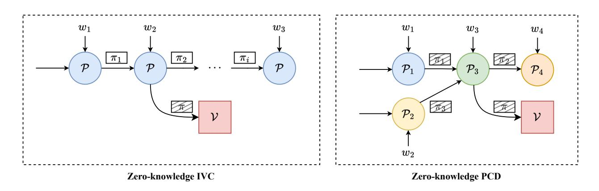
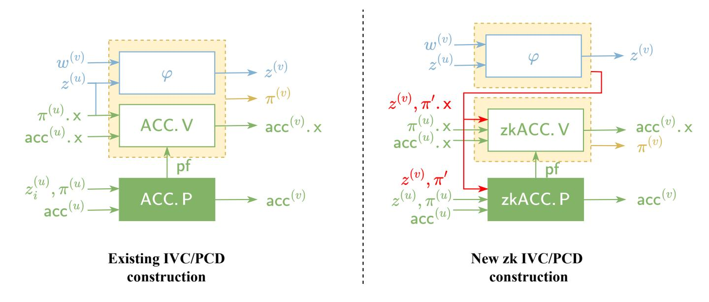

{0}------------------------------------------------

# Zero-Knowledge Proof-Carrying Data from Accumulation Schemes

Tianyu Zheng<sup>1</sup> , Shang Gao<sup>1</sup> , and Xun Liu<sup>1</sup>

Department of Computing The Hong Kong Polytechnic University, Hong Kong, China {tian-yu.zheng, compxun.liu}@connect.polyu.hk {shang-jason.gao}@polyu.edu.hk

Abstract. Proof-carrying data (PCD) is a powerful cryptographic primitive for ensuring computational integrity in distributed settings. Stateof-the-art PCD constructions based on accumulation schemes achieve practical prover efficiency and support a wide range of applications. However, realizing zero-knowledge for accumulation-based PCD remains challenging, particularly for high-degree relations. Existing solutions often incur substantial overhead due to the need for zero-knowledge in both the underlying non-interactive arguments of knowledge (NARKs) and accumulation schemes. In this work, we present new theoretical and practical improvements for zero-knowledge PCD. First, we propose a novel construction that eliminates the need for zero-knowledge NARKs by separating the compliance predicate and accumulation verification, thereby reducing proof size and improving efficiency. Second, we design an efficient zero-knowledge accumulation scheme for special sound protocols, introducing techniques such as masking vectors and zero-knowledge sum-check protocols to ensure privacy with minimal overhead. The theoretical analysis demonstrates that our construction achieves logarithmic proof size and verification time for d-degree NP relations, and outperforms existing solutions in both asymptotic and concrete complexity.

### <span id="page-0-0"></span>1 Introduction

Proof-Carrying Data (PCD) [\[CT10\]](#page-29-0) is a foundational cryptographic primitive that empowers mutually distrustful parties to collaboratively perform distributed computations with strong integrity guarantees. By enabling each participating node to attach succinct proofs certifying the correctness of every intermediate state, PCD ensures that the validity of complex, potentially unbounded computations can be efficiently verified at any point. As a generalization of incrementally verifiable computation (IVC) [\[Val08\]](#page-30-0), PCD has catalyzed advances in diverse applications, including secure enforcement of language semantics [\[CTV13\]](#page-29-1), verifiable MapReduce computations [\[CTV15\]](#page-29-2), consensus protocols [\[BCG21\]](#page-28-0), scalable blockchains [\[BMRS20b](#page-29-3)[,BMRS20a\]](#page-29-4), zero-knowledge virtual machine [\[nex24\]](#page-30-1), and verifiable inference [\[CCYY25\]](#page-29-5).

{1}------------------------------------------------

Recursive vs. Accumulation. There are two main approaches to constructing PCD. The first, exemplified by recursive SNARKs [\[BCCT13,](#page-28-1)[BSCTV17,](#page-29-6)[COS20\]](#page-29-7), requires the prover at each step to not only prove the computation of the compliance predicate, but also verify the validity of previous proofs. This demands embedding SNARK verification logic into the circuit, which is both theoretically and practically challenging due to the need for sublinear and circuit-friendly verification [\[CCDW20\]](#page-29-8). More recently, a practical alternative based on accumulation or folding schemes [\[BCMS20](#page-28-2)[,BCL](#page-28-3)+21[,KS24,](#page-30-2)[ZGGX23,](#page-30-3)[NDC](#page-30-4)+24[,BMNW25](#page-29-9)[,BCFW25\]](#page-28-4) have attracted significant attention. Here, the prover performs the compliance predicate computation and defers verification of previous proofs using accumulation schemes, replacing costly SNARK verification with a much more efficient check on the accumulation proof. Consequently, the underlying non-interactive arguments of knowledge (NARKs) need not be succinct, resulting in improved prover efficiency.

Zero-knowledge PCD. As mentioned in previous works [\[COS20,](#page-29-7)[BCMS20,](#page-28-2)[BCL](#page-28-3)+21], achieving zero-knowledge is essential for PCD in privacy-sensitive applications such as private smart contract, confidential transactions, and anonymous blocklisting [\[BBB](#page-28-5)+18[,Dia21](#page-29-10)[,ZGSX23,](#page-31-0)[KKC](#page-30-5)+25]. In the zero-knowledge PCD setting, each node's output proof should be cryptographically shielded, ensuring that no sensitive information about the witness is leaked to the distrustful next node. This requirement is notably stronger than that of zero-knowledge IVC, which involves only a single prover and typically demands zero-knowledge only for the proof presented to the verifier. We illustrate this difference by Figure [1.](#page-1-0)



<span id="page-1-0"></span>Fig. 1. Comparsion of the workfolw between zk-IVC and zk-PCD: the zero-knowledge PCD necessitates that every node's output remain confidential with respect to its witness while the IVC only achieves confidentiality for the proof to the verifier.

Challenges. Despite various accumulation-based PCD solutions, only few of them [\[BCMS20](#page-28-2)[,BCL](#page-28-3)<sup>+</sup>21[,BMNW25\]](#page-29-9) achieve practical zero-knowledge for lowdegree relations such as R1CS. Canonical accumulation-based PCD schemes require both an efficient zero-knowledge NARK and a corresponding zero-knowledge accumulation scheme [\[BCL](#page-28-3)<sup>+</sup>21]. In contrast, recursive SNARK-based PCD only

{2}------------------------------------------------

needs the SNARK to be zero-knowledge, for which many efficient solutions exist[\[BBB](#page-28-5)+18[,GWC19](#page-30-6)[,BSBHR19\]](#page-29-11). Intuitively, achieving zero-knowledge for PCD constructions based on accumulations is inherently more challenging. Practically, implementing zero-knowledge for both the NARK and accumulation schemes faces severe efficiency issues, especially for high-degree relations. This is because standard techniques like random masking introduce exponential overhead—specifically, O(2<sup>d</sup> ) elements for a NARK proof and O(m·2 d ) for an accumulation proof with m number instances both for d-degree relations in existing solutions [\[BCL](#page-28-3)+21[,BC23,](#page-28-6)[KS24\]](#page-30-2). Thus, designing efficient zero-knowledge PCD schemes for high-degree relations based on accumulation schemes remains a central challenge in researches.

#### 1.1 Our contributions

Our work makes both theoretical and practical contributions as follows:

- To address the efficiency issues of achieving zero-knowledge for NARKs, we propose a new zero-knowledge PCD construction that directly avoids this requirement in Section [4.](#page-11-0) Unlike previous approaches, our construction splits the recursive circuit into two parts: the first represents the compliance predicate in terms of the witness, the second represents the accumulation verification without witness. By instantiating the first circuit as a NARK instance-proof pair and then accumulate it by a zero-knowledge accumulation scheme, we observe that has no need to be zero-knowledge. Therefore, we eliminate the significant overhead of achieving zero-knowledge NARKs. We formalize this intuition and provide rigorous proofs: a zero-knowledge PCD can be constructed from a (non-zk) NARK and a zero-knowledge accumulation scheme for the NARK.
- To address the efficiency issues of zero-knowledge accumulation schemes, we present a concrete design for an eligible accumulation scheme for special sound protocols [\[BC23\]](#page-28-6) in Section [5.](#page-20-0) Since the zero-knowledge NARK requirement is removed, the accumulation scheme must provide a stronger zero-knowledge property for both the output accumulator and the accumulation proof. Building on previous solutions [\[BC23](#page-28-6)[,EG23\]](#page-29-12), we make two key modifications:
  - We introduce a masking vector for the final accumulator's witness. As the witness trivially satisfies the accumulator, this technique adds minimal overhead to the accumulation complexity: the prover and verifier only needs to accumulate one more proof-instance pair.
  - We apply the zero-knowledge sum-check protocol from [\[CFS17\]](#page-29-13) to provide privacy for the accumulation proof. To address the problem of growing accumulator length caused by the newly generated evaluation claims in the zero-knowledge sum-check, we introduce an additional sum-check protocol running in parallel to update and accumulate these claims.

To the authors' knowledge, this is the first zero-knowledge accumulation scheme with logarithmic proof size and verification time for d-degree NP relations.

To demonstrate the efficiency of our construction, we provide a comparison in Table [1](#page-3-0) of the additional PCD proof size incurred by zero-knowledge between

{3}------------------------------------------------

<span id="page-3-0"></span>Table 1. Comparisons of the additional proof size for zk between different PCDs

| SPS Protocols         | [BCL+21]                    | Ours                  |
|-----------------------|-----------------------------|-----------------------|
| Degree-d gate [GWC19] | )G+<br>O(d log m)F<br>O(2d  | 2G<br>+ O(d log m)F   |
| Permutation [GWC19]   | 4G+<br>O(log m)F            | 2G<br>+ O(log m)F     |
| Lookup [Hab22]        | (4ℓ + 2)G+<br>O(log m + ℓ)F | 3G+<br>O(log(m + ℓ))F |
| R1CS [Gro16]          | 7G+<br>O(log m)F            | 2G<br>+ O(log m)F     |
| CCS [STW23]           | )G+<br>O(d log m)F<br>O(2d  | 2G<br>+ O(d log m)F   |

Assume m is the number of accumulated predicate instance-proof pairs, d is the maximum degree of relations, ℓ is the size of query set for lookup arguments.

existing zero-knowledge PCD construction [\[BCL](#page-28-3)+21] and our construction. For the existing construction, we follow the result in [\[BCL](#page-28-3)<sup>+</sup>21] and instantiate it with our accumulation scheme in Section [5.](#page-20-0) This is beacuse no existing work provides zero-knowledge accumulation schemes for high-degree relations. For our scheme, we construct an PCD following the construction given in Section [4](#page-11-0) and instantiate it also with our accumulation scheme. We compare their performance i.e., the additional size of the PCD proof output by each node, for different compliance predicates including the custom gate and permutation checks in [\[GWC19\]](#page-30-6), lookup arguments [\[Hab22\]](#page-30-7), R1CS relations [\[Gro16\]](#page-30-8), and CCS relations [\[STW23\]](#page-30-9). The designs of special-sound protocol for above predicates are referred to [\[BC23\]](#page-28-6).

### 2 Technique Overview

We begin by explaining our first contribution in Section [2.1,](#page-3-1) a novel construction for zero-knowledge PCD that obviates the need for a zero-knowledge NARK. This construction provides a theoretical advancement that is also applicable to other IVC and PCD frameworks. In Section [2.2,](#page-6-0) we detail the concrete instantiation of zero-knowledge accumulation schemes, using R1CS relations as a representative example.

#### <span id="page-3-1"></span>2.1 New Construction for Zero-Knowledge PCD

Before presenting our construction, we briefly review how prior work derives PCD from NARKs equipped with accumulation schemes.

Recap of Existing Results. As discussed, zero-knowledge PCD is a versatile primitive with wide-ranging applications. Our starting point is the theorem of [\[BCL](#page-28-3)<sup>+</sup>21], which shows how to obtain PCD from any NARK that admits a split accumulation scheme. In broad terms, an accumulation scheme acc for a NARK comprises three algorithms (P, V, D): the prover produces an accumulation proof pf attesting that a new accumulator acc was computed correctly; the verifier checks the local correctness of this computation (i.e., that pf is valid for the

{4}------------------------------------------------



<span id="page-4-0"></span>Fig. 2. Comparison between different PCD constructions.

claimed accumulation of acc); and the decider determines the satisfiability of an accumulator acc, i.e., whether acc.w is a satisfying witness to the instance acc.x.

We now describe the PCD construction, illustrated on the left side of Figure [2.](#page-4-0) The prover at note v performs the following actions:

- Accumulation. Given an accumulator acc(u) and an NARK instance-proof pair (z (u) , πi) from the previous node u, the prover invokes the accumulation proving algorithm ACC.P. This generates a new accumulator acc(v) and an accumulation proof pf, attesting to the correct transition from ((z (u) , π(u) ), acc(u) ) to acc(v) .
- Recursive Circuit Synthesis. The prover then constructs a recursive circuit. This circuit takes as extra inputs z (u) and witness w (v) , and performs two main checks: (1) it evaluates the PCD predicate φ(z (u) , w(v) , z(v) ) on the claimed inputs, and (2) it verifies the accumulation proof pf by running the logic of the accumulation verifier ACC.V . A crucial feature of a split accumulation scheme is that ACC.V only checks on the public instances parts of the accumulated proof as π (u) .x and the accumulator as acc(u) .x, without their large witness parts.
- Proof Generation. Finally, the prover uses the NARK to generate a new proof π (v) for the satisfiability of this recursive circuit. This new proof π (v) and the new accumulator acc(v) are then passed to the next node in the PCD computation.

The final PCD proof consists of the artifacts output in the last step, including the final accumulation proof and the final NARK proof. The PCD verifier checks their satisfiability to ensure the validity of the entire PCD computation. Note that the above process only considers inputs from one previous node u for simplicity, which will be extended to multiple cases in the next part.

A significant drawback of the above construction from [\[BCL](#page-28-3)<sup>+</sup>21] is its efficiency: to achieve zero-knowledge for the PCD, it requires both the underlying NARK and the accumulation scheme to be zero-knowledge. The primary bottleneck lies in making the NARK component zero-knowledge. Specifically, the 

{5}------------------------------------------------

NARK proof generated from the recursive circuit is neither succinct nor zero-knowledge. Hiding this witness with the NARK proof requires applying zero-knowledge mechanisms, e.g., adding a masking string of the same length to the witness. For many high-degree argument systems, such as Plonkish [GWC19] and Customizable Constraint Systems (CCS) [STW23], compiling the relation to be zero-knowledge incurs a substantial overhead. For a relation of degree d, this can introduce  $O(2^d)$  new variables and constraints (e.g., via cross-term multiplication), leading to an exponential blowup in the size of the recursive circuit, and significantly limits the practicality of the PCD. Given that there are no known methods to efficiently enforce zero-knowledge for non-succinct argument systems with high degree, our work pursues an alternative path: we propose a new construction that eliminates the need for a zero-knowledge NARK.

New Zero-Knowledge Construction. We begin by formalizing the recursive circuit used in prior PCD constructions (some parameters are omitted for clarity). This circuit is designed to prove the validity of a single PCD step, which we denote as step for node v. Now Assume the node v takes inputs from m nodes (also denoted as arity), he then synthesizes a circuit with public inputs including the predecessor outputs  $[z^{(u_i)}]_{i=1}^m$ , their corresponding NARK proof instances  $[\pi^{(u_i)}.x]_{i=1}^m$ , their accumulator instances  $[\operatorname{acc}^{(u_i)}.x]_{i=1}^m$ , and the new accumulator instance  $\operatorname{acc}^{(v)}.x$  with proof pf. The circuit also takes private inputs as a witness  $w^{(v)}$ . As shown in R below, the circuit performs two main checks. First, it checks that the predicate by evaluating  $\varphi(z^{(v)},w^{(v)},[z^{(u_i)}]_{i=1}^m)=1$ , where  $\varphi$  is the function of PCD's compliance predicate. Second, the circuit verifies that the new accumulator  $\operatorname{acc}^{(v)}$  was correctly derived from the previous ones. Specifically, it runs the logic of the accumulation verifier ACC.V on the inputs  $([\operatorname{acc}^{(u_i)}.x,\pi^{(u_i)}.x]_{i=1}^m,\operatorname{acc}^{(v)}.x)$ . We present the description as follows:

```
R(z^{(v)}, \mathsf{acc}^{(v)}.\mathsf{x}; w^{(v)}, [z^{(u_i)}, \pi^{(u_i)}.\mathsf{x}, \mathsf{acc}^{(u_i)}.\mathsf{x}]_{i=1}^m, \mathsf{pf}):
1: Check that the compliance predicate \varphi(z^{(v)}, w^{(v)}, z^{(u_1)}, \dots, z^{(u_m)}) accepts.
2: Check that the accumulation verifier accepts if \exists z^{(u_i)} \neq \bot:
\mathsf{ACC.V}([z^{(u_i)}, \pi^{(u_i)}.\mathsf{x}, \mathsf{acc}^{(u_i)}.\mathsf{x}]_{i=1}^m, \mathsf{acc}^{(v)}.\mathsf{x}, \mathsf{pf}) = 1,
3: If the above checks hold, output 1; otherwise, output 0.
```

Our new construction is based on a key observation: the witness  $w^{(v)}$  is exclusively used for the predicate compliance check on  $\varphi$ , while the accumulation verification (ACC.V) operates only on public data. This implies that zero-knowledge is only required for the predicate-check part (step 2 in Figure 2) of the computation. This insight allows us to avoid a monolithic, fully zero-knowledge recursive circuit. Instead, we partition the circuit R into two specialized subcircuits,  $R_0$  and  $R_1$ , corresponding to steps 1 and 2, respectively, which is shown in Figure 2 (right). In essence, we replace the expensive requirement of a ZK-NARK over the entire recursive logic with a much cheaper ZK-NARK over only the small, predicate-specific sub-circuit  $R_0$ . Assuming the accumulation scheme

{6}------------------------------------------------

is zero-knowledge, the final NARK proof π (v) generated for circuit R<sup>1</sup> reveals nothing about the original witness w (v) , since w (v) is only used within the confines of the ZK-NARK proof π ′ v . Thus, the entire PCD construction achieves zero-knowledge.

The performance benefit of our approach is significant. Compared to prior works [\[BCMS20](#page-28-2)[,BCL](#page-28-3)+21], the primary overhead is accumulating one additional proof (π ′ v ) in each step. For typical accumulation schemes, this cost is negligible, especially when compared to the exponential savings from avoiding a ZK-NARK over the entire recursive circuit. Furthermore, our technique is broadly applicable. It can be adapted to other recursive proof systems, such as IVC schemes built on folding, like Nova [\[KST22\]](#page-30-10) and Halo [\[BDFG21\]](#page-28-7). The main prerequisite is an accumulation or folding scheme that can efficiently combine multiple instances. Theoretically, our work decouples the requirement of a ZK-NARK from the construction of ZK-PCD. This provides a new pathway to achieving zeroknowledge in incrementally verifiable computation, as stated below. We formalize this insight as Theorem [1](#page-13-0) in Section [4.](#page-11-0)

#### <span id="page-6-0"></span>2.2 Zero-Knowledge Accumulation Schemes

Our second contribution is a concrete instantiation of a zero-knowledge accumulation scheme for high-degree relations with practical efficiency.

Recap of Protogalaxy. To illustrate our approach, we first review an existing accumulation scheme for R1CS as an example (and extend it to high-degree relations in the main body), initially without considering zero-knowledge. Denote Commit as a homomorphic commitment scheme. Given two committed R1CS instance-witness pairs [(x<sup>i</sup> , C<sup>i</sup> ; wi)]<sup>1</sup> <sup>i</sup>=0 (also interpreted as instance-proof pairs in an R1CS NARK system), each pair satisfies the following constraints:

$$\mathsf{R}^{\mathsf{cm}}_{\mathsf{R1CS}}(\mathsf{ck}) := \big\{ \left. (\boldsymbol{x}, C; \boldsymbol{w}) : C = \mathsf{Commit}(\boldsymbol{w}) \land A\boldsymbol{z} \circ B\boldsymbol{z} = C\boldsymbol{z} \right. \big\}$$

where x ∈ F s , w ∈ F t , and z := (1, x, w), with A, B, C ∈ F <sup>n</sup>×<sup>m</sup> and m = s+t+1. For notational consistency, we define VR1CS(z) := Az ◦ Bz = Cz = 0 <sup>n</sup> as an algebraic map of maximum degree 2. We now present an informal description of the accumulation scheme for [(x<sup>i</sup> , C<sup>i</sup> ; wi)]<sup>1</sup> <sup>i</sup>=0 according to [\[BC23,](#page-28-6)[EG23\]](#page-29-12):

• The prover first computes a vector of polynomials:

$$F(X) = Az(X) \circ Bz(X) - Cz(X) \in (\mathbb{F}^{\leq 2}[X])^n, \tag{1}$$

where z(X) = eq0(X) · z<sup>0</sup> + eq1(X) · z<sup>1</sup> and eqb(X) is an equality function over b ∈ {0, 1}, mapping X to 1 if X = b and 0 otherwise.

- The accumulation verifier samples a random α ←\$ F;
- The prover and verifier engage in n parallel sum-check protocols (as defined in Section [5.1\)](#page-20-1) for the following n statements:

<span id="page-6-1"></span>
$$\sum_{b \in \{0,1\}} eq(\alpha,b) \cdot \boldsymbol{F}(b) = \mathbf{0}^n;$$

{7}------------------------------------------------

• The sum-check protocols yields the proof tr and evaluation claims  $F(\beta) = e$ .

Finally, the prover and verifier agree on a new "relaxed" committed R1CS instance-witness pair  $(\boldsymbol{x}, C, E; \boldsymbol{w})$ , where  $E := \mathsf{Commit}(\boldsymbol{e})$ . And the prover sends the sum-check transcript tr as an accumulation proof pf. The accumulated elements are defined as follows:

$$\mathbf{x} := eq_0(\beta) \cdot \mathbf{x}_0 + eq_1(\beta) \cdot \mathbf{x}_1,$$

$$C := eq_0(\beta) \cdot C_0 + eq_1(\beta) \cdot C_1,$$

$$\mathbf{w} := eq_0(\beta) \cdot \mathbf{w}_0 + eq_1(\beta) \cdot \mathbf{w}_1.$$

The key insight relies on the properties of the equality polynomials  $eq_i(X)$ , namely that for all  $i \neq j \in \{0,1\}$ : (1)  $eq_i(b)^d = eq_i(b)$  and (2)  $eq_i(b) \cdot eq_j(b) = 0$  for all  $b \in \{0,1\}$ . Therefore, for all  $b \in \{0,1\}$ , we have:

$$V(b) = V(eq_0(b) \cdot z_0 + eq_1(b) \cdot z_1) = eq_0(b) \cdot V(z_0) + eq_1(b) \cdot V(z_1),$$

which justifies the sum-check statement in Equation 1.

Adding Zero-Knowledge. We now consider how to incorporate zero-knowledge into the accumulation scheme described above. If we only require the randomness of the final output accumulator acc, the prover could simply introduce an additional R1CS pair with a randomly sampled witness among the accumulation prover's inputs. Specifically, the prover would accumulate three R1CS instance-witness pairs  $[(\boldsymbol{x}_i, C_i; \boldsymbol{w}_i)]_{i=0}^2$ , where  $\boldsymbol{x}_2$  is a trivially satisfiable instance vector corresponding to a random witness  $\boldsymbol{w}_2 \leftarrow \mathbb{F}^t$ . However, this approach is insufficient, as the accumulation proof pf may still leak information about the witness.

A practical solution is to employ the zero-knowledge sum-check protocol proposed in [CFS17], which achieves zero-knowledge by masking the coefficients of the target n-variate polynomial  $F(X) \in \mathbb{F}^{(\leq d)}[X]$  with a random polynomial G(X) of the same variables and individual degrees as F(X). Furthermore, as discussed in Section 5.1, Xie et al. optimize this approach by reducing the size of G(X) from  $O(n \cdot d)$  to O(d) [XZZ+19]. Nevertheless, introducing the zero-knowledge sum-check protocol into accumulation schemes presents a new challenge: the sum-check prover outputs additional evaluation claims of the form  $G(\beta) = v$  when proving the following statement:

$$\sum_{b \in \{0,1\}} eq(\alpha,b) \cdot \boldsymbol{F}(b) + \gamma \cdot \boldsymbol{G}(b) = \gamma \cdot \boldsymbol{r}$$

where  $\gamma$  is a challenge and  $\mathbf{r} := \sum_{b \in \{0,1\}} \mathbf{G}(b)$ . The difficulty arises because, unlike the claims for  $\mathbf{F}(\beta)$ , the prover cannot simply defer checking the claim for  $\mathbf{G}(\beta)$ ; otherwise, the length of the accumulator would continue to grow with the number of accumulation steps (i.e., with the number recursive steps in PCD).

To address this issue, we adopt a technique from [KS24], which updates the evaluation point at each new accumulation step. In essence, whenever the prover

{8}------------------------------------------------

generates a new evaluation claim  $G'(\beta') = v'$ , they can also update the point  $\beta$  in the previous claim  $G(\beta) = v$  to  $\beta'$  by executing another round of the sum-check protocol (this time without zero-knowledge). As a result, the two claims  $G'(\beta')$  and  $G(\beta')$  can be linearly combined without incurring additional overhead.

In summary, we obtain an accumulation scheme between a committed R1CS pair  $(\boldsymbol{x}_0, C_0; \boldsymbol{w}_0)$  and an accumulator

$$acc := (acc.x = (\boldsymbol{x}_1, C_1, E, \boldsymbol{v}), acc.w = (\boldsymbol{w}_1, \boldsymbol{G}(X)))$$

where the size of the accumulator is independent of the number of instances being accumulated. In Section 5, we present a more general accumulation scheme for NP relations, which possesses the following features:

- Utilizes special-sound protocols as defined in prior works [BC23,EG23].
- Supports accumulation for multiple predicate pairs and *multiple* accumulators, a capability not achieved in [EG23].
- Achieves zero-knowledge with practical prover efficiency, scaling linearly with the number of input predicate instances.

### 3 Preliminary

#### <span id="page-8-0"></span>3.1 Notations

In this paper, we use  $\lambda$  to denote the security parameter. Accordingly,  $\operatorname{negl}(\lambda)$  denotes an unspecified function that is negligible in  $\lambda$ . We denote by [n] the set  $\{1,...,n\}\subseteq\mathbb{N}$ . Let  $\mathbb{F}$  denote a finite field, e.g.,  $\mathbb{F}_p$  is a prime field for a large prime p. The vector is denoted as  $\mathbf{a}\in\mathbb{F}^n$  with elements  $a_1,...,a_n\in\mathbb{F}$ .  $\mathbf{a}[i]$  is also used to denote the i-th element of  $\mathbf{a}$  when the element is not specified with a concrete value. To represent a set, we use  $\{a_i\}_{i=1}^n$  as a short-hand for  $\{a_1,...,a_n\}$ . For a finite set S, let  $x \leftarrow S$  denote sampling x from S uniformly at random. We use "PPT algorithms" to refer to "Probabilistic Polynomial Time" algorithms. For a non-deterministic polynomial time (NP) indexed relation  $\mathbb{R}$  parameterized over public parameters  $\mathsf{pp}$  (e.g., including the field  $\mathbb{F}$ ), it consists of a triple of index  $\mathsf{i}$ , instance  $\mathsf{x}$ , and witness  $\mathsf{w}$  (the secret inputs).

#### **3.2** NARK

Specifically, we define a non-interactive argument of knowledge NARK for an indexed relation R as a tuple of algorithms (G, I, P, V) below, each with an access to the random oracle RO:

- $G^{RO}(1^{\lambda}) \to pp$  the generator takes as inputs the security parameter  $\lambda$  in unary, and outputs the public parameter pp.
- I<sup>RO</sup>(pp,i) → (ipk,ivk) the indexer takes as inputs pp and an index i under relation R, and outputs a long index proving key ipk and a short index verification key ivk.

{9}------------------------------------------------

- $P^{RO}(ipk, x, w) \to \pi$  the prover takes as inputs the ipk, and a tuple (x, w) under relation R, and outputs a NARK proof  $\pi$ .
- $V^{RO}(ivk, x, \pi) \to b$  the verifier takes as inputs the ivk, and a tuple  $(x, \pi)$ , and outputs a bit b indicating whether  $\pi$  is valid.

NARK is secure in the random oracle model if the completeness and knowledge soundness hold as defined in Appendix C.3.

#### <span id="page-9-0"></span>3.3 Accumulation Schemes

We adopt the definition of the accumulation scheme for NARK given in [BCL<sup>+</sup>21]. Let  $\Phi: \{0,1\}^* \to \{0,1\}$  be a (relation) predicate and  $\mathcal{H}$  be a randomized algorithm that can be accessed as an oracle, which inputs  $\Phi$  and outputs predicate parameters  $\mathsf{pp}_{\Phi}$ . A (split) accumulation scheme for  $(\Phi,\mathcal{H})$  is a tuple of algorithms  $\mathsf{AS} = (\mathsf{G},\mathsf{I},\mathsf{P},\mathsf{V},\mathsf{D})$  of which  $\mathsf{P},\mathsf{V}$  have access to the same random oracle RO. Typically, we denote an accumulator acc with the same form as a predicate input, consisting of the instance part acc.x and the witness part acc.w, and a decider algorithm  $\mathsf{D}$  reads the accumulator in its entirety and checks its validity. Generally, these algorithms are expected to satisfy the following security properties:

<span id="page-9-1"></span>**Definition 1 (Completeness).** ACC is complete if for every (unbounded) adversary A,

$$\Pr\left[\begin{array}{l} \forall j \in [m], \mathsf{ACC.D}(\mathsf{adk}, \mathsf{acc}_j) = 1 \\ \forall i \in [n], \varPhi(\mathsf{pp}_{\varPhi}, \mathsf{i}_{\varPhi}, \mathsf{qx}_i, \mathsf{qw}_i) = 1 \\ \mathsf{acc.V}^\mathsf{RO}\begin{pmatrix} \mathsf{avk}, [\mathsf{qx}_i]_{i=1}^n, \\ [\mathsf{acc}_j.\mathsf{x}]_{j=1}^m, \\ \mathsf{acc.x}, \mathsf{pf} \\ \end{array}\right] = 1 \\ \mathsf{acc.D}(\mathsf{adk}, \mathsf{acc}) = 1 \\ \left[\begin{array}{l} \mathsf{RO} \leftarrow \mathcal{U}(\lambda) \\ \mathsf{pp} \leftarrow \mathsf{ACC.G}(1^{\lambda}) \\ \mathsf{pp}_{\varPhi} \leftarrow \mathcal{H}(1^{\lambda}) \\ \begin{pmatrix} [\mathsf{qx}_i, [\mathsf{qw}_i]]_{j=1}^n, \\ [(\mathsf{qx}_i, \mathsf{qw}_i)]_{i=1}^n \\ \end{pmatrix} \leftarrow \mathcal{A}^\mathsf{RO}(\mathsf{pp}, \mathsf{pp}_{\varPhi}) \\ (\mathsf{apk}, \mathsf{avk}, \mathsf{adk}) \leftarrow \mathsf{ACC.I}(\mathsf{pp}, \mathsf{pp}_{\varPhi}, \mathsf{i}_{\varPhi}) \\ (\mathsf{acc}, \mathsf{pf}) \leftarrow \mathsf{ACC.P}^\mathsf{RO}\begin{pmatrix} \mathsf{apk}, [\mathsf{acc}_j]_{j=1}^m, \\ [(\mathsf{qx}_i, \mathsf{qw}_i)]_{i=1}^n \end{pmatrix} \right]$$

Note that for m = n = 0, the precondition on the left-hand side holds vacuously, and this is required for the completeness condition to be non-trivial.

<span id="page-9-2"></span>**Definition 2 (Knowledge Soundness).** ACC is knowledge sound with respect to auxiliary input distribution  $\Psi$  if for every (non-uniform) expected polynomial-

{10}------------------------------------------------

time adversary  $\tilde{P}$ , there exists an expected polynomial-time extractor  $\mathcal{E}$  such that

$$\operatorname{Pr} \left\{ \begin{array}{l} \operatorname{ACC.V^{RO}} \left( \begin{array}{l} \operatorname{avk}, [\operatorname{qx}_i]_{i=1}^n, \\ [\operatorname{acc}_j.x]_{j=1}^m, \\ \operatorname{acc.x}, \operatorname{pf} \end{array} \right) = 1 \\ \operatorname{ACC.D}(\operatorname{adk}, \operatorname{acc}) = 1 \\ \forall i \in [n], \\ \operatorname{ACC.D}(\operatorname{adk}, (\operatorname{acc}_j.x, \operatorname{qw}_i) = 1 \\ \forall j \in [m], \\ \operatorname{ACC.D}(\operatorname{adk}, (\operatorname{acc}_j.x, \operatorname{acc}_j.\operatorname{w})) = 1 \end{array} \right. \\ \left\{ \begin{array}{l} \operatorname{RO} \leftarrow \mathcal{U}(\lambda) \\ \operatorname{pp} \leftarrow \operatorname{ACC.G}(1^{\lambda}) \\ \operatorname{pp}_{\Phi} \leftarrow \mathcal{H}(1^{\lambda}) \\ \operatorname{ai} \leftarrow \Psi(1^{\lambda}) \\ \operatorname{ai} \leftarrow \Psi(1^{\lambda}) \\ \operatorname{acc}, \operatorname{pf} = 1, \\ \operatorname{acc}, \operatorname{pf} = 1, \\ \operatorname{acc}, \operatorname{pf} = 1, \\ \operatorname{acc}, \operatorname{pf} = 1, \\ \operatorname{acc}, \operatorname{pf} = 1, \\ \operatorname{acc}, \operatorname{pf} = 1, \\ \operatorname{acc}, \operatorname{pf} = 1, \\ \operatorname{acc}, \operatorname{pf} = 1, \\ \operatorname{acc}, \operatorname{pf} = 1, \\ \operatorname{acc}, \operatorname{pf} = 1, \\ \operatorname{acc}, \operatorname{pf} = 1, \\ \operatorname{acc}, \operatorname{pf} = 1, \\ \operatorname{acc}, \operatorname{pf} = 1, \\ \operatorname{acc}, \operatorname{pf} = 1, \\ \operatorname{acc}, \operatorname{pf} = 1, \\ \operatorname{acc}, \operatorname{pf} = 1, \\ \operatorname{acc}, \operatorname{pf} = 1, \\ \operatorname{acc}, \operatorname{pf} = 1, \\ \operatorname{acc}, \operatorname{pf} = 1, \\ \operatorname{acc}, \operatorname{pf} = 1, \\ \operatorname{acc}, \operatorname{pf} = 1, \\ \operatorname{acc}, \operatorname{pf} = 1, \\ \operatorname{acc}, \operatorname{pf} = 1, \\ \operatorname{acc}, \operatorname{pf} = 1, \\ \operatorname{acc}, \operatorname{pf} = 1, \\ \operatorname{acc}, \operatorname{pf} = 1, \\ \operatorname{acc}, \operatorname{pf} = 1, \\ \operatorname{acc}, \operatorname{pf} = 1, \\ \operatorname{acc}, \operatorname{pf} = 1, \\ \operatorname{acc}, \operatorname{pf} = 1, \\ \operatorname{acc}, \operatorname{pf} = 1, \\ \operatorname{acc}, \operatorname{pf} = 1, \\ \operatorname{acc}, \operatorname{pf} = 1, \\ \operatorname{acc}, \operatorname{pf} = 1, \\ \operatorname{acc}, \operatorname{pf} = 1, \\ \operatorname{acc}, \operatorname{pf} = 1, \\ \operatorname{acc}, \operatorname{pf} = 1, \\ \operatorname{acc}, \operatorname{pf} = 1, \\ \operatorname{acc}, \operatorname{pf} = 1, \\ \operatorname{acc}, \operatorname{pf} = 1, \\ \operatorname{acc}, \operatorname{pf} = 1, \\ \operatorname{acc}, \operatorname{pf} = 1, \\ \operatorname{acc}, \operatorname{pf} = 1, \\ \operatorname{acc}, \operatorname{pf} = 1, \\ \operatorname{acc}, \operatorname{pf} = 1, \\ \operatorname{acc}, \operatorname{pf} = 1, \\ \operatorname{acc}, \operatorname{pf} = 1, \\ \operatorname{acc}, \operatorname{pf} = 1, \\ \operatorname{acc}, \operatorname{pf} = 1, \\ \operatorname{acc}, \operatorname{pf} = 1, \\ \operatorname{acc}, \operatorname{pf} = 1, \\ \operatorname{acc}, \operatorname{pf} = 1, \\ \operatorname{acc}, \operatorname{pf} = 1, \\ \operatorname{acc}, \operatorname{pf} = 1, \\ \operatorname{acc}, \operatorname{pf} = 1, \\ \operatorname{acc}, \operatorname{pf} = 1, \\ \operatorname{acc}, \operatorname{pf} = 1, \\ \operatorname{acc}, \operatorname{pf} = 1, \\ \operatorname{acc}, \operatorname{pf} = 1, \\ \operatorname{acc}, \operatorname{pf} = 1, \\ \operatorname{acc}, \operatorname{pf} = 1, \\ \operatorname{acc}, \operatorname{pf} = 1, \\ \operatorname{acc}, \operatorname{pf} = 1, \\ \operatorname{acc}, \operatorname{pf} = 1, \\ \operatorname{acc}, \operatorname{pf} = 1, \\ \operatorname{acc}, \operatorname{pf} = 1, \\ \operatorname{acc}, \operatorname{pf} = 1, \\ \operatorname{acc}, \operatorname{pf} = 1, \\ \operatorname{acc}, \operatorname{pf} = 1, \\ \operatorname{acc}, \operatorname{pf} = 1, \\ \operatorname{acc}, \operatorname{pf} = 1, \\ \operatorname{acc}, \operatorname{pf} = 1, \\ \operatorname{acc}, \operatorname{pf} = 1, \\ \operatorname{acc}, \operatorname{pf} = 1, \\ \operatorname{acc}, \operatorname{pf} = 1, \\ \operatorname{acc}, \operatorname{pf} = 1, \\ \operatorname{acc}, \operatorname{pf} = 1, \\ \operatorname{acc}, \operatorname{pf} = 1, \\ \operatorname{acc}, \operatorname{pf} =$$

#### Proof-Carrying Data 3.4

According to [BCL<sup>+</sup>21], a Proof-Carrying Data consists of a tuple of algorithms PCD = (G, I, P, V). We start by defining some necessary terminology and then mention the security definitions.

**Definition 3.** A transcript T is a directed acyclic graph where each vertex  $u \in$  $V(\mathsf{T})$  is labeled by local data  $z_{\mathsf{loc}}^{(u)}$  and each edge  $e \in E(\mathsf{T})$  is labeled by a message  $z^{(e)} \neq \bot$ . The output of a transcript T denoted as  $\circ(\mathsf{T})$ , is a message  $z^{(e)}$  where e = (u, v) is the lexicographically-first edge such that v is a sink.

**Definition 4.** A vertex  $u \in V(T)$  is  $\varphi$ -compliant for  $\varphi \in F$  if for all outgoing  $edges\ e = (u, v) \in E(\mathsf{T})$ :

- (base case) if u has no incoming edges, φ(z<sup>(e)</sup>, z<sup>(u)</sup><sub>loc</sub>, ⊥, ..., ⊥) accepts;
  (recursive case) if u has incoming edges e<sub>1</sub>, ..., e<sub>m</sub>, φ(z<sup>(e)</sup>, z<sup>(u)</sup><sub>loc</sub>, z<sup>(e<sub>1</sub>)</sup>, ..., z<sup>(e<sub>m</sub>)</sup>) accepts.

T is  $\varphi$ -compliant if each of its vertices is  $\varphi$ -compliant.

Next, we define the security properties of PCD. Note that the completeness and zero-knowledge are defined for each possible vertex in a transcript. Hence, for simplicity, we omit superscripts indicating the vertex and edge in  $(z^{(e)}, z_{loc}^{(u)}, z^{(e_1)},$ ...,  $z^{(e_m)}$ ).

<span id="page-10-0"></span>**Definition 5 (Perfect Completeness).** PCD has perfect completeness if for every adversary A the following holds:

<span id="page-10-1"></span>
$$\Pr\left[\begin{array}{c|c} \varphi \in \mathsf{F} \\ \land \varphi(z, z_{\mathsf{loc}}, z_1, \dots, z_m) = 1 \\ \land \forall i, z_i = \bot \lor \mathsf{PCD.V}(\mathsf{ivk}, z_i, \pi_i) = 1 \end{array}\right] \begin{array}{c} \mathsf{pp} \leftarrow \mathsf{PCD.G}(1^{\lambda}); \\ (\varphi, z, z_{\mathsf{loc}}, [z_i]_{i=1}^m) \leftarrow \mathcal{A}(\mathsf{pp}); \\ (\mathsf{ipk}, \mathsf{ivk}) \leftarrow \mathsf{PCD.I}(\mathsf{pp}, \varphi); \\ \Pi \leftarrow \mathsf{PCD.P}(\mathsf{ipk}, z, z_{\mathsf{loc}}, [z_i, \pi_i]_{i=1}^m) \end{array}\right] = 1$$

{11}------------------------------------------------

**Definition 6 (Knowledge Soundness).** PCD has knowledge soundness (w.r.t. an auxiliary input distribution  $\mathcal{D}$ ) if for every expected polynomial time adversary  $\mathsf{P}^*$ , there exists an expected polynomial time extractor  $\mathsf{Ext}^{\mathsf{P}^*}$  such that for every set Z:

$$\Pr\left[\begin{array}{c|c} \varphi \in \mathsf{F} & \mathsf{pp} \leftarrow \mathsf{PCD}.\mathsf{G}(1^\lambda); \\ \wedge (\mathsf{pp}, \mathsf{ai}, \varphi, \circ (\mathsf{T}), \mathsf{ao}) \in Z & \mathsf{ai} \leftarrow \mathcal{D}(\mathsf{pp}); \\ \wedge \mathsf{T} \ \mathit{is} \ \varphi\mathit{-compliant} & (\varphi, \mathsf{T}, \mathsf{ao}) \leftarrow \mathsf{Ext}^{\mathsf{P}^*}(\mathsf{pp}, \mathsf{ai}) \end{array}\right],$$

$$\geq \! \operatorname{Pr} \left[ \begin{array}{c|c} \varphi \in \mathsf{F} & \mathsf{pp} \leftarrow \mathsf{PCD}.\mathsf{G}(1^\lambda); \\ \wedge (\mathsf{pp}, \mathsf{ai}, \varphi, \circ, \mathsf{ao}) \in Z \\ \wedge \mathsf{PCD}.\mathsf{V}(\mathsf{ivk}, \circ, \pi) = 1 \end{array} \right| \begin{array}{c} \mathsf{pp} \leftarrow \mathsf{PCD}.\mathsf{G}(1^\lambda); \\ \mathsf{ai} \leftarrow \mathcal{D}(\mathsf{pp}); \\ (\varphi, \circ, \pi, \mathsf{ao}) \leftarrow \mathsf{P}^*(\mathsf{pp}, \mathsf{ai}); \\ (\mathsf{ipk}, \mathsf{ivk}) \leftarrow \mathsf{PCD}.\mathsf{I}(\mathsf{pp}, \varphi, \mathsf{F}) \end{array} \right].$$

where ai and ao are auxiliary inputs and outputs. These modifications aim to ensure closeness in distribution between the outputs of the prover and the extractor for the strong extraction guarantee [BCCT13]. As a result, we can prove post-quantum security for our PCD as mentioned in Theorem 1.

**Definition 7 (Zero-Knowledge).** PCD has (statistical) zero-knowledge if there exists a probabilistic polynomial-time simulator Sim such that for every polynomial-size honest adversary  $\mathcal{A}$ , the distributions below are computationally indistinguishable:

$$\left\{ \begin{array}{c} \mathsf{pp} \leftarrow \mathsf{PCD}.\mathsf{G}(1^{\lambda}); \\ (\mathsf{pp}, \varphi, z, \pi) \middle| & (\varphi, z, z_{\mathsf{loc}}, [z_i, \pi_i]_{i=1}^m) \leftarrow \mathcal{A}(\mathsf{pp}); \\ (\mathsf{ipk}, \mathsf{ivk}) \leftarrow \mathsf{PCD}.\mathsf{I}(\mathsf{pp}, \varphi, \boldsymbol{F}); \\ \pi \leftarrow \mathsf{PCD}.\mathsf{P}(\mathsf{ipk}, z, z_{\mathsf{loc}}, [z_i, \pi_i]_{i=1}^m) \end{array} \right\} \\ and \\ \left\{ \begin{array}{c} (\mathsf{pp}, \varphi, z, \pi) \middle| & (\varphi, z, z_{\mathsf{loc}}, [z_i, \pi_i]_{i=1}^m) \leftarrow \mathcal{A}(\mathsf{pp}); \\ \pi \leftarrow \mathsf{Sim}(\tau, \varphi, z) \end{array} \right\}.$$

An adversary is honest if its output satisfies the implicant of the completeness condition with probability 1, namely:  $\varphi \in \mathsf{F}, \varphi(z, z_\mathsf{loc}, z_1, \ldots, z_m) = 1$ , and either  $\forall i, z_i = \bot$  or  $\forall i, \mathsf{PCD.V}(\mathsf{ivk}, z_i, \pi_i) = 1$ .

#### <span id="page-11-0"></span>4 New Construction for Zero Knowledge PCD

We first formalize our main theorem for constructing zero-knowledge PCD in Section 4.1. Next in Section 4.2, we propose the full construction of zero-knowledge PCD from zero-knowledge accumulation schemes, which proves the main theorem. Finally, we present the security analysis of the proposed PCD construction in Section 4.3.

{12}------------------------------------------------

#### <span id="page-12-0"></span>4.1 Main Theorem

To formalize the theorem, we first present the necessary definition and describe the syntax of accumulation schemes with zero-knowledge property.

**Definition 8 (Zero-Knowledge Accumulation Schemes).** Denote NARK = (G, I, P, V) as a non-interactive argument of a knowledge, define  $\Phi : \{0, 1\}^* \to \{0, 1\}$  as a predicate for NARK.V and  $\mathcal{H} := NARK.G$  as a randomized oracle algorithm that outputs predicate parameters  $pp_{\Phi}$ , where  $\varphi_{NARK}$  is defined below:

An accumulation scheme for  $(\Phi, \mathcal{H})$  in the random oracle model consists of a tuple of algorithms as ACC = (G, I, P, V, D), where G is the same as NARK, P, V have access to the same random oracle RO. We describe their syntaxes as follows:

- ACC.G(1 $^{\lambda}$ )  $\rightarrow$  pp: on inputs a security parameter  $\lambda$  in unary, the generator ACC.G(1 $^{\lambda}$ ) samples and outputs public parameters pp.
- ACC.I<sup>RO</sup>(pp, pp<sub> $\Phi$ </sub>, i<sub> $\Phi$ </sub>)  $\rightarrow$  (apk, avk, adk): on inputs public parameters pp, predicate parameters pp<sub> $\Phi$ </sub> generated by  $\mathcal H$  and a predicate index i<sub> $\Phi$ </sub>, the indexer ACC.I deterministically computes and outputs a triple (apk, avk, adk) consisting an accumulator proving key apk, an accumulator verification key (apk, avk), and a decision key adk.
- $\begin{array}{l} \bullet \ \ \mathsf{ACC.P^{RO}}(\mathsf{apk}, [(\mathsf{qx}_i, \mathsf{qw}_i)]_{i=1}^n, [\mathsf{acc}_j]_{j=1}^m) \ \to \ (\mathsf{acc}, \mathsf{pf}) \colon \ on \ \ inputs \ \ the \ \ key \ \ \mathsf{apk}, \\ predicate \ inputs \ [(\mathsf{qx}_i, \mathsf{qw}_i)]_{i=1}^n, \ and \ old \ accumulators \ [\mathsf{acc}_j]_{j=1}^m = [(\mathsf{acc}_j.\mathsf{x}, \mathsf{acc}_j.\mathsf{w})]_{j=1}^m, \\ the \ prover \ \mathsf{ACC.P} \ \ outputs \ \ a \ new \ \ accumulator \ \ \mathsf{acc} = (\mathsf{acc.x}, \mathsf{acc.w}) \ \ and \ \ a \ proof \\ \mathsf{pf} \ \ for \ the \ \ accumulation \ verifier. \\ \end{array}$
- ACC.V<sup>RO</sup>(avk,  $[qx_i]_{i=1}^n$ ,  $[acc_j.x]_{j=1}^m$ , acc.x, pf)  $\rightarrow$  b: on inputs the key avk, predicate input instances  $[qx_i]_{i=1}^n$ , old accumulator instance  $[acc_j.x]_{j=1}^m$ , a new accumulator instance acc.x, and a proof pf, the verifier ACC.V outputs a bit indicating whether acc.x correctly accumulated  $[qx_i]_{i=1}^n$  and  $[acc_j.x]_{j=1}^m$ .
- ACC.D(adk, acc)  $\rightarrow$  b: on inputs the key adk, and an accumulator acc = (acc.x, acc.w), the decider ACC.D outputs a bit indicating whether acc is a valid accumulator.

The accumulation scheme ACC defined above should satisfy completeness, knowledge soundness given in Definitions 1 and 2, and additionally zero-knowledge as defined below. Note that our definition is a variant of the one given in [BCL<sup>+</sup>21] that only requires the simulator to simulate an indistinguishable accumulator acc without an accumulation proof pf. Since our PCD construction removes the requirement of the zero-knowledge property for NARK, our zero-knowledge accumulation scheme must ensure the privacy of both the accumulator and the accumulation proof.

{13}------------------------------------------------

**Definition 9 (Zero Knowledge).** Assume a polynomial-time "honest" adversary  $\mathcal{A}$  that outputs a tuple  $(i_{\Phi}, [(qx_i, qw_i)]_{i=1}^n, [acc_j]_{j=1}^m)$  with probability 1, such that  $\Phi(pp_{\Phi}, i_{\Phi}, qx_i, qw_i) = 1$  and ACC.D(adk,  $acc_j) = 1$  for all  $i \in [n]$  and  $j \in [m]$ . ACC is zero knowledge if there exists a polynomial-time simulator Sim such that the following two distributions are (statistically/computationally) indistinguishable.

$$\begin{cases} \mathsf{RO} \leftarrow \mathcal{U}(\lambda) \\ \mathsf{pp} \leftarrow \mathsf{ACC}.\mathsf{G}(1^{\lambda}) \\ \mathsf{pp}_{\varPhi} \leftarrow \mathcal{H}(1^{\lambda}) \\ (\mathsf{i}_{\varPhi}, [(\mathsf{qx}_i, \mathsf{qw}_i)]_{i=1}^n, [\mathsf{acc}_j]_{j=1}^m) \leftarrow \mathcal{A}^{\mathsf{RO}}(\mathsf{pp}, \mathsf{pp}_{\varPhi}) \\ (\mathsf{apk}, \mathsf{avk}, \mathsf{adk}) \leftarrow \mathsf{ACC}.\mathsf{I}(\mathsf{pp}, \mathsf{pp}_{\varPhi}, \mathsf{i}_{\varPhi}) \\ (\mathsf{acc}, \mathsf{pf}) \leftarrow \mathsf{ACC}.\mathsf{P}^{\mathsf{RO}}(\mathsf{apk}, [(\mathsf{qx}_i, \mathsf{qw}_i)]_{i=1}^n, [\mathsf{acc}_j]_{j=1}^m) \end{cases}$$

$$\left\{ \begin{array}{c|c} \mathsf{RO}(\mu) & \mathsf{Acc.} & (\mathsf{apk}, [(\mathsf{qx}_i, \mathsf{qw}_i)]_{i=1}, [\mathsf{acc}_j]_{j=1}) \end{array} \right\}$$
 
$$\left\{ \begin{array}{c|c} \mathsf{RO} \leftarrow \mathcal{U}(\lambda) \\ (\mathsf{pp}, \tau) \leftarrow \mathsf{Sim}^{\mathsf{RO}}(1^{\lambda}) \\ \mathsf{pp}_{\varPhi} \leftarrow \mathcal{H}(1^{\lambda}) \\ (\mathsf{i}_{\varPhi}, [(\mathsf{qx}_i, \mathsf{qw}_i)]_{i=1}^n, [\mathsf{acc}_j]_{j=1}^m) \leftarrow \mathcal{A}^{\mathsf{RO}}(\mathsf{pp}, \mathsf{pp}_{\varPhi}) \\ (\mathsf{acc}, \mathsf{pf}, \mu) \leftarrow \mathsf{Sim}^{\mathsf{RO}}(\tau, \mathsf{pp}_{\varPhi}, \mathsf{i}_{\varPhi}, [\mathsf{qx}_i]_{i=1}^n, [\mathsf{acc}_j]_{j=1}^m) \end{array} \right\},$$

where  $\mathsf{RO}[\mu]$  denotes the RO domain-separated/modified to be consistent with the query–answer list  $\mu$ . For the description of PCD constructions, we propose the following definition for the representation of accumulation verification in recursive circuits.

**Definition 10 (Accumulation Verifier Circuit).** We say that an accumulation scheme for a non-interactive argument of knowledge NARK is an accumulation scheme ACC = (G, I, P, V, D) for the pair  $(\Phi, \mathcal{H})$ . We denote  $V^{\lambda, m, N, k}$  with respect to security parameter  $\lambda$ , the number m of all accumulated predicate inputs and accumulators, the maximum index size N, and the maximum instance size k, as the circuit corresponding to the computation of the accumulation verifier ACC.V. Moreover, we denote  $v(\lambda, m, N, k)$  as the size of the circuit  $V^{\lambda, m, N, k}$ ,  $|avk(\lambda, m, N)|$  as the size of the accumulator verification key avk, and  $|acc.x(\lambda, m, N)|$  as the size of an accumulator instance.

Note that the accumulator instance size of acc.x is required to be independent of the instance size bound k. This can be achieved by mapping the original k-length instance acc.x into an image with a collision-resistant hash function in the design of accumulation scheme<sup>1</sup>. Correspondingly, the new accumulator instance only contains H(acc.x) and acc.x is taken as the witness.

Next, we formalize this theoretical result in Theorem 1. Different from previous works [BCMS20,BCL<sup>+</sup>21,ZZD23], we introduce a novel construction for zero-knowledge PCD that only depends on the zero-knowledge property of accumulation schemes, thus eliminating the additional cost incurred in achieving zero-knowledge NARKs.

<span id="page-13-1"></span><span id="page-13-0"></span><sup>&</sup>lt;sup>1</sup> In Nova, such operation is explicitly performed by the IVC/PCD prover and verifier.

{14}------------------------------------------------

Theorem 1 (Zero-Knowledge PCD Construction (adopted from [BCL+21])).

There exists a polynomial-time transformation T such that if NARK = (G, I, P, V) is a (non-zero-knowledge) non-interactive argument of knowledge for circuit satisfiability and ACC is a zero-knowledge accumulation scheme for NARK, then PCD = (G, I, P, V) := T(NARK, ACC) is a zero-knowledge Proof-Carrying Data scheme for constant-depth compliance predicates, provided

$$\exists \epsilon \in (0,1) \text{ and a polynomial } \alpha \text{ s.t. } v^*(\lambda, m, N, \sigma) = O(N^{1-\epsilon} \cdot \alpha(\lambda, m, \sigma)).$$

where  $v^*$  is defined as the size of the accumulation verifier invoked in the recursive circuit, where the instance consists of an accumulator verification key avk, an accumulator instance, and some additional data of size  $\sigma$ . Specifically, we have the following equation that is sublinear in N:

$$v^*(\lambda, m, N, \sigma) := v(\lambda, m, N, |\mathsf{avk}(\lambda, m, N)| + |\mathsf{acc.x}(\lambda, m, N)| + \sigma).$$

Moreover, if NARK and ACC are secure against quantum adversaries, then PCD is secure against quantum adversaries. The theoretical performace of PCD is highlighted below, where the size of the predicate  $\varphi: \mathbb{F}^{(m+2)\sigma} \to \mathbb{F}$  is  $f = \omega(\alpha(\lambda, m, \sigma)^{1/\epsilon})$ :

- the cost of running PCD.I is equal to the cost of running both NARK.I and ACC.I on an index of size f and an index of size  $\circ(f)$ ;
- the cost of running PCD.P is equal to the cost of accumulating m+1 instance-proof pairs using ACC.P, and running NARK.P twice, one on an index of size f, and one on an index of size  $\circ(f)$ .
- the cost of running PCD.V is equal to the cost of running NARK.V on an index of size  $\circ(f)$ , and running ACC.D on two indexes of size f and  $\circ(f)$  respectively.

Note that the theoretical performance of the new PCD construction is slightly larger than the previous construction, since there are two accumulators for different predicates, as explained later. Next, we present the detailed construction of our zero-knowledge PCD as a proof of Theorem 1.

#### <span id="page-14-0"></span>4.2 Construction

Let NARK = (G, I, P, V) be a (non-zero-knowledge) non-interactive argument of knowledge for circuit satisfiability and ACC is a *zero-knowledge* accumulation scheme for NARK. For ease of presentation, we slightly abuse the denotation of acc to represent a pair of accumulators, i.e.,  $acc := (acc^{(0)}, acc^{(1)})$ , for different predicates  $\Phi^{(0)}, \Phi^{(1)}$  respectively. we refer to acc.x as  $(acc^{(0)}.x, acc^{(1)}.x)$ . We construct a zero-knowledge PCD as PCD = (G, I, P, V) as follows.

Given a compliance predicate  $\varphi : \mathbb{F}^{(m+2)\sigma} \to \mathbb{F}$ , the circuit that realizes the recursion is defined as follows.

$$R_{\varphi}^{(\lambda,N,k)}(z;z_{\mathsf{loc}},[z_i]_{i=1}^m)$$
:

- 1: Check that the compliance predicate  $\varphi(z, z_{loc}, z_1, \ldots, z_m)$  accepts.
- 2: If the above check holds, output 1; otherwise, output 0.

{15}------------------------------------------------

```
R_V^{(\lambda,N,k)}(avk, acc.x; [z_i, \pi_i.x, acc_i.x]_{i=1}^m, pf):
```

- 1: If there exists  $i \in [m]$  such that  $z_i \neq \bot$ , check that the verifier accepts  $V^{(\lambda,m,N,k)}(\mathsf{avk},[\mathsf{qx}_i]_{i=1}^m,[\mathsf{acc}_i.\mathsf{x}]_{i=1}^m,\mathsf{acc}.\mathsf{x},\mathsf{pf})=1,$  where  $\mathsf{qx}_i:=((\mathsf{avk},z_i,\mathsf{acc}_i.\mathsf{x}),\pi_i.\mathsf{x}).$
- 2: If the above check holds, output 1; otherwise, output 0.

Next, we describe the syntax for algorithms in PCD = (G, I, P, V).

- PCD.G(1 $^{\lambda}$ ): sample  $pp_{NARK} \leftarrow NARK.G(1^{\lambda})$  and  $pp_{ACC} \leftarrow ACC.G(1^{\lambda})$ , and output  $pp := (pp_{NARK}, pp_{ACC})$ .
- PCD.I(pp,  $\varphi$ ):
- 1. compute the integer  $N := N(\lambda, |\varphi|, m, \sigma)$ , where N is defined in Lemma 1 below.
- 2. construct the circuits  $R^{(0)} := R_{\varphi}^{(\lambda,N,k)}$  and  $R^{(1)} := R_{V}^{(\lambda,N,k)}$ , where  $k := |\operatorname{avk}(\lambda,N)| + |\operatorname{acc.x}(\lambda,m,N)| + \sigma$ .
- 3. compute the index key pairs for the NARK:
  - a.  $(\mathsf{ipk}^{(0)}, \mathsf{ivk}^{(0)}) \leftarrow \mathsf{NARK}.\mathsf{I}(\mathsf{pp}_{\mathsf{NARK}}, R^{(0)});$
  - b.  $(\mathsf{ipk}^{(1)}, \mathsf{ivk}^{(1)}) \leftarrow \mathsf{NARK}.\mathsf{I}(\mathsf{pp}_{\mathsf{NARK}}, R^{(1)}).$
- 4. compute the index key triples for the accumulator:
  - $\text{a. } (\mathsf{apk}^{(0)}, \mathsf{avk}^{(0)}, \mathsf{adk}^{(0)}) := \mathsf{ACC}.\mathsf{I}(\mathsf{pp}_{\mathsf{ACC}}, \mathsf{pp}_\varphi = \mathsf{pp}_{\mathsf{NARK}}, \mathsf{i}_\varphi = R^{(0)});$
  - $\mathrm{b.} \ \ (\mathsf{apk}^{(1)}, \mathsf{avk}^{(1)}, \mathsf{adk}^{(1)}) := \mathsf{ACC.I}(\mathsf{pp}_{\mathsf{ACC}}, \mathsf{pp}_\varphi = \mathsf{pp}_{\mathsf{NARK}}, \mathsf{i}_\varphi = R^{(1)}).$
- 5. output the proving key  $ipk := (ipk^{(0)}, ipk^{(1)}, apk^{(0)}, apk^{(1)})$  and verification key  $ivk := (ivk^{(0)}, ivk^{(1)}, avk^{(0)}, avk^{(1)}, adk)$ .
- PCD.P(ipk, z,  $z_{loc}$ ,  $[z_i, \pi_i, acc_i]_{i=1}^m$ ):
- 1. sample  $\pi^{(0)} \leftarrow \mathsf{NARK.P}(\mathsf{ipk}^{(0)}, z; z_{\mathsf{loc}}, [z_i]_{i=1}^m)$
- 2. set predicate instance-proof pair as  $(qx_0, qw_0) =: ((qx_0^{(0)}, \bot), (qw_0^{(0)}, \bot)),$  where  $(qx_0^{(0)}, qw_0^{(0)}) := (z, \pi^{(0)}.x; \pi^{(0)}.w).$
- 3. if  $z_i = \bot$  for all  $i \in [m]$  then set  $\mathsf{acc} := (\mathsf{acc}^{(0)}, \mathsf{acc}^{(1)})$ ,  $\mathsf{pf} := (\mathsf{pf}^{(0)}, \mathsf{pf}^{(1)})$ , by sampling
  - a.  $(\mathsf{acc}^{(0)}, \mathsf{pf}^{(0)}) \leftarrow \mathsf{ACC.P}(\mathsf{apk}^{(0)}, (\mathsf{qx}_0, \mathsf{qw}_0), \bot);$
  - b.  $(\mathsf{acc}^{(1)},\mathsf{pf}^{(1)}) \leftarrow \mathsf{ACC.P}(\mathsf{apk}^{(1)},\bot).$
- 4. if  $z_i \neq \bot$  for some  $i \in [m]$  then:
  - a. parse each  $\pi_i = (\perp, \pi_i^{(1)})$
  - $\text{a. set predicate input instance } \mathsf{qx}_i := (\bot, \mathsf{qx}_i^{(1)}) \text{ where } \mathsf{qx}_i^{(1)} = (\mathsf{avk}, z_i, \pi_i^{(1)}.\mathsf{x}, \mathsf{acc}_i.\mathsf{x});$
  - b. set predicate input witness  $\mathsf{qw}_i := (\bot, \mathsf{qw}_i^{(1)})$  where  $\mathsf{qw}_i^{(1)} = (\pi_i^{(1)}.\mathsf{w}, \mathsf{acc}_i.\mathsf{w});$

{16}------------------------------------------------

```
c. compute (\mathsf{acc},\mathsf{pf}) \leftarrow \mathsf{ACC}.\mathsf{P}(\mathsf{apk},[(\mathsf{qx}_i,\mathsf{qw}_i)]_{i=0}^m,[\mathsf{acc}_i]_{i=1}^m), \text{ where } \mathsf{apk} := (\mathsf{apk}^{(0)},\mathsf{apk}^{(1)}).
```

```
3. compute \pi^{(1)} \leftarrow \mathsf{NARK.P}(\mathsf{ipk}^{(1)}, \mathsf{avk}, \mathsf{acc.x}; (z, \pi_0.\mathsf{x}), [z_i, \pi_i.\mathsf{x}, \mathsf{acc}_i.\mathsf{x}]_{i=1}^m, \mathsf{pf})
```

```
4. output (\pi := (\bot, \pi^{(1)}), acc).
```

- PCD.V(ivk,  $(\pi, acc)$ ):
  - parse  $\pi = (\bot, \pi^{(1)}), acc = (acc^{(0)}, acc^{(1)});$
  - $b_0 \leftarrow \mathsf{NARK.V}(\mathsf{ivk}^{(1)}, (\mathsf{avk}, z, \mathsf{acc.x}), \pi^{(1)});$
  - $b_1 \leftarrow \mathsf{ACC.D}(\mathsf{adk}^{(0)}, \mathsf{acc}^{(0)});$
  - $b_2 \leftarrow \mathsf{ACC.D}(\mathsf{adk}^{(1)}, \mathsf{acc}^{(1)});$
  - output  $b_0 \wedge b_1 \wedge b_2$ .

<span id="page-16-2"></span>**Theorem 2.** PCD = (G, I, P, V) for a set of compliance predicates  $\mathbf{F}$  with constant depth in the construction above satisfies the perfect completeness, computational knowledge soundness, and statistical zero-knowledge under the random oracle model.

We provide the proof of Theorem 2 above in the next subsection.

<span id="page-16-1"></span>**Lemma 1** (Efficiency [BCL<sup>+</sup>21]). Suppose that for every security parameter  $\lambda \in \mathbb{N}$ , arity m, and message size  $t \in \mathbb{N}$ , the ratio of accumulation verifier circuit size to index size  $v^*(\lambda, m, N, k)/N$  is monotone decreasing in N. Then there exists a size function  $N(\lambda, f, m, t)$  such that

$$\forall \lambda, f, m, t \in \mathbb{N}, S(\lambda, f, m, t, N(\lambda, f, m, t)) \leq N(\lambda, f, m, t).$$

#### <span id="page-16-0"></span>4.3 Security proofs

**Completeness.** Assume  $\mathcal{A}$  as an arbitrary adversary that breaks the completeness of PCD, i.e., causes the completeness condition given in Definition 5 to be satisfied with probability 1-p. We demonstrate that there exists an adversary  $\mathcal{B}$ , that causes the completeness condition of ACC in Definition 1 to be satisfied with probability at most 1-p. The constructed adversary  $\mathcal{B}$  runs in the following:

```
1. set pp := (pp_{NARK}, pp_{ACC});
```

- 2. compute  $(\varphi, z, z_{\mathsf{loc}}, [z_i, \pi_i, \mathsf{acc}_i]_{i=1}^m) \leftarrow \mathcal{A}(\mathsf{pp});$
- 3. set (apk, avk, adk) :=  $ACC.I((pp_{ACC}, pp_{NARK}), \varphi);$
- 4. construct  $[(qx_i, qw_i)]_{i=1}^m$  as in the algorithm PCD.P;
- 5. output  $(i_{\varphi}, [(qx_i, qw_i)]_{i=1}^m, [acc_i]_{i=1}^m)$ , where  $i_{\varphi} := (R_{\varphi}^{\lambda, N, k}, R_V^{\lambda, N, k})$ .

Suppose that the adversary  $\mathcal{A}$  successfully outputs  $(\varphi, z, z_{\text{loc}}, [z_i, \pi_i, \text{acc}_i]_{i=1}^m)$  such that the precondition holds, i.e.,  $(1) \varphi \in \mathsf{F}, (2) \varphi(z, z_{\text{loc}}, z_1, \ldots, z_m) = 1$ , and (3) for all  $i \in [m]$ , either  $z_i = \bot$  or PCD.V(ivk,  $z_i, \pi_i$ ) = 1. Then with probability p, the completeness condition does not hold, which implies PCD.V(ivk,  $z_i, \pi_i$ ) = 0. According to the algorithm PCD.V, at least one of the following happens:

{17}------------------------------------------------

```
1. 0 \leftarrow \mathsf{NARK.V}(\mathsf{ivk}^{(1)}, (\mathsf{avk}, z, \mathsf{acc.x}), \pi^{(1)});
2. 0 \leftarrow \mathsf{ACC.D}(\mathsf{adk}^{(0)}, \mathsf{acc}^{(0)});
```

3. 
$$0 \leftarrow \mathsf{ACC.D}(\mathsf{adk}^{(1)}, \mathsf{acc}^{(1)})$$
.

Next, We discuss their probability case by case.

Case 1. If  $z_i = \bot$  for all  $i \in [m]$ , then ensured by the perfect completeness of NARK, both instance-proof pairs  $(z, \pi^{(0)}.x; \pi^{(0)}.w)$  and  $(avk, z, acc.x, \pi^{(1)}.x; \pi^{(0)}.x)$  trivially holds. Therefore, items 1-3 are satisfies, which implies the existence of  $i \in [m]$  such that  $z_i \neq \bot$ .

Case 2. If  $z_i \neq \bot$  for some  $i \in [m]$ , we have the precodition (3): PCD.V(ivk,  $z_i, \pi_i$ ) = 1 for all possible i. Given that Item 1 happens, i.e.,  $0 \leftarrow \mathsf{NARK.V}(\mathsf{ivk}^{(1)}, (\mathsf{avk}, z, \mathsf{acc.x}), \pi^{(1)})$ , we know that  $R_V^{(\lambda, N, k)}$  rejects (avk, acc.x;  $[z_i, \pi_i.\mathsf{x}, \mathsf{acc}_i.\mathsf{x}]_{i=1}^m$ , pf), and so

$$\mathsf{ACC.V}(\mathsf{avk}, [\mathsf{qx}_i]_{i=0}^m, [\mathsf{acc}_i.\mathsf{x}]_{i=0}^m, \mathsf{acc.x}, \mathsf{pf}) = 0.$$

Otherwise, for item 2 and 3, we have ACC.D(adk, acc) = 0. Now consider the completeness experiment of ACC with adversary  $\mathcal{B}$ . Since  $\mathsf{pp}, \mathsf{pp}_{\mathsf{ACC}}$  are drawn identically to the PCD experiment, the distribution of the output of  $\mathcal{A}$  is identical. Hence it holds that for all  $i \in [m], \, \Phi_{\varphi}(\mathsf{pp}, R_{\varphi}^{(\lambda,N,k)}, \mathsf{qx}_i^{(0)}; \mathsf{qw}_i^{(0)}) = 1, \, \Phi_V(\mathsf{pp}, R_V^{(\lambda,N,k)}, \mathsf{qx}_i^{(1)}; \mathsf{qw}_i^{(1)}) = 1, \, \text{and ACC.D(adk, acc}_i) = 1. \, \text{Particulally, for } i = 0, \, \text{by the perfect completeness of NARK, the predicate instance-proof pair must satisfy } \Phi_{\varphi}(\mathsf{pp}, R_{\varphi}^{(\lambda,N,k)}, \mathsf{qx}_0^{(0)}; \mathsf{qw}_0^{(0)}) = 1 \, \text{because } \varphi(z, z_{\mathsf{loc}}, z_1, \ldots, z_m) = 1. \, \text{(precondition in Definition 1). While according to the above discussion, we have either ACC.V(avk, <math>[\mathsf{qx}_i]_{i=0}^m$ ,  $[\mathsf{acc}_i.\mathsf{x}]_{i=0}^m$ , acc.x,  $\mathsf{pf}) = 0 \, \text{or ACC.D(adk, acc)} = 0. \, \text{As a result, the adversary } \mathcal{B} \, \text{causes the completeness condition for the accumulation scheme ACC with probability at most <math>1-p$ .

**Knowledge Soundness** For convenience, we associate a node u with labels  $(z^{(u,v)}, z^{(u)}_{loc}, \pi^{(u)}, \operatorname{acc}^{(u)})$ , where  $z^{(u,v)}$  is denoted as  $z^{(u)}$  if it is the unique outgoing edge of u,  $\pi^{(u)}$  denotes the NARK proof, and  $\operatorname{acc}^{(u)}$  denotes the accumulator.

Now given a malicious prover  $P^*$ , we can construct an extractor  $\mathcal{E}_{P^*}$  that satisfies Definition 6 through an inductive process.

Base case. In the base case, we consider the an extractor  $\mathcal{E}_0$  that outputs a tree of depth-1. Trivially, we define  $\mathcal{E}_0(pp_{NARK},ai)$  to compute  $(\varphi,\circ,\pi,acc)\leftarrow P^*(pp_{NARK},ai)$  and output  $(\varphi,T_0)$ , where  $T_0$  is a single node labeled with  $(\circ,\pi,acc)$ .

Inductive step. Next, we inductively consider the interative case that constructs an extractor  $\mathcal{E}_j$  that outputs a tree of depth-j. We use the notation  $L_{\mathsf{T}}(j)$  to denote the vertices of  $\mathsf{T}$  at depth j. Assume we already have an constructed extractor  $\mathcal{E}_{j-1}$ , an  $\mathcal{E}_j$  can be constructed in the following steps.

1. Construct a malicious NARK prover NARK. $P_i^{(1)}$  as follows:

{18}------------------------------------------------

```
NARK.P<sub>j</sub><sup>(1)</sup>(pp<sub>NARK</sub>, pp<sub>ACC</sub>, ai)

1: Compute (\varphi, \mathsf{T}_{j-1}, \mathsf{ao}) \leftarrow \mathcal{E}_{j-1}(\mathsf{pp}_{\mathsf{NARK}}, \mathsf{pp}_{\mathsf{ACC}}, \mathsf{ai}).

2: For each vertex v \in L_{\mathsf{T}_{j-1}}(j), denote its label by (z^{(v)}, \pi^{(v)}, \mathsf{acc}^{(v)}).

3: Run the NARK indexer (\mathsf{ipk}^{(1)}, \mathsf{ivk}^{(1)}) := \mathsf{NARK}.\mathsf{I}(\mathsf{pp}_{\mathsf{NARK}}, R^{(1)}).

4: Run the accumulator indexer (\mathsf{apk}^{(0)}, \mathsf{avk}^{(0)}, \mathsf{adk}^{(0)}) := \mathsf{ACC}.\mathsf{I}(\mathsf{pp}, R^{(0)}).

5: Run the accumulator indexer (\mathsf{apk}^{(1)}, \mathsf{avk}^{(1)}, \mathsf{adk}^{(1)}) := \mathsf{ACC}.\mathsf{I}(\mathsf{pp}, R^{(1)}).

6: Output (\mathsf{i}, \mathsf{x}, \pi, \mathsf{ao}') := (R^{(1)}, ((\mathsf{avk}^{(0)}, \mathsf{avk}^{(1)}), z^{(v)}, \mathsf{acc}^{(v)})_{v \in L_{\mathsf{T}_{j-1}}(j)}, (\pi^{(v,1)})_{v \in L_{\mathsf{T}_{j-1}}(j)}, (\varphi, \mathsf{T}_{j-1}, \mathsf{ao}))
```

- 2. Let  $\mathcal{E}_{\mathsf{NARK},\mathsf{P}_j^{(1)}}$  be the extractor that corresponds to  $\mathsf{NARK},\mathsf{P}_j^{(1)}$  in terms of  $\mathsf{ipk}^{(0)}$ , via the knowledge soundness of the non-interactive argument NARK.
- 3. Construct a malicious accumulation scheme prover  $ACC.P_j^*$  as follows:

```
ACC.P_{j}^{*}(pp_{ACC}, pp_{NARK}, ai)
 1: Run the extractor (\mathbf{i}, \mathbf{x}, \mathbf{w}, \mathsf{ao}') \to \mathcal{E}_{\mathsf{NARK}.\mathsf{P}^*_i}(\mathsf{pp}, \mathsf{pp}_{\mathsf{ACC}}, \mathsf{ai}).
        Parse the auxiliary output ao' as (\varphi, T', ao).
 2:
       For each vertex v \in L_{\mathsf{T}_{j-1}}(j),
 3:
         obtain acc^{(v)} from T';
         obtain [z_i^{(v)}, \pi_i^{(v)}.x, \mathsf{acc}_i^{(v)}.x]_{i=0}^m and \mathsf{pf}^{(v)} from \mathsf{w}^{(v)} \in \mathbf{w};
         let S_j := \{ v \in L_{\mathsf{T}_{j-1}}(j) : \exists i \in [m], z_i^{(v)} \neq \bot \};
         attach m children to each v \in S_j, where the i-th child is labeled with z_i^{(v)};
         parse \pi_i^{(v)} as (\perp, \pi_i^{(v,1)}) for i \in [m]
         \text{define } \mathsf{qx}_i^{(v,1)} := ((\mathsf{avk}, z_i^{(v)}, \mathsf{acc}_i^{(v)}.\mathsf{x}), \pi_i^{(v,1)}.\mathsf{x}) \ \mathsf{qx}_i^{(v)} := (\bot, \mathsf{qx}_i^{(v,1)}) \ \text{for } i \in [m]
         define qx_i^{(v)} := (\bot, qx_i^{(v,1)}) for i \in [m]
         parse \pi_0^{(v)} as (\pi_0^{(v,0)}, \perp) for i \in [m]
         define q \mathbf{x}_0^{(v,0)} := (z_i^{(v)}, \pi_0^{(v,0)})
         define qx_0^{(v)} := (qx_0^{(v,0)}, \bot)
 4: Output ((i^{(v)}, acc^{(v)}, pf^{(v)}, [qx_i^{(v)}]_{i=1}^m, [acc_i^{(v)}.x]_{i=1}^m)_{v \in S_j}, (\varphi, T', ao)).
```

- 4. Let  $\mathcal{E}_{\mathsf{ACC}.\mathsf{P}_j^*}$  be the extractor that corresponds to  $\mathsf{ACC}.\mathsf{P}_j^*$ , via the knowledge soundness of the accumulation scheme  $\mathsf{ACC}$ .
- 5. Construct a malicious NARK prover  $NARK.P_i^{(0)}$  as follows:

{19}------------------------------------------------

```
NARK.P
         (1)
         j
           (ppNARK, ppACC, ai)
```

- <sup>1</sup>: Run the extractor (i (v) , acc(v) , pf(v) , [qx (v) i , qw (v) i ] m <sup>i</sup>=0, [acc (v) i ] m <sup>i</sup>=1)v∈S<sup>j</sup> , ao′ ← EACC.<sup>P</sup> ∗ j (ppNARK, ppACC, ai).
- 2: For i = 0, parse (qx (v) 0 , qw (v) 0 ) as (qx (v,0) 0 , qw (v,0) 0 ) := ((z, π (v,0) 0 .x), π (v,0) 0 .w) .
- <sup>3</sup>: Run the NARK indexer (ipk(0) , ivk(0)) := NARK.I(ppNARK, R(0)).
- <sup>4</sup>: Output (i, x, π, ao′ ) :=

$$\left( {{{\boldsymbol{R}}^{(0)}},{z^{(v)}},({\pi ^{(v,0)}})_{v \in {L_{{\mathsf{T}}_{j-1}}}(j)},(\varphi ,{\mathsf{T}_{j-1}},\mathsf{ao})} \right)$$

- 6. Let E NARK.P (0) j be the extractor that corresponds to NARK.P (0) j in terms of ipk(1), via the knowledge soundness of the non-interactive argument NARK.
- 7. Define the extractor E<sup>j</sup> as follows:

### E<sup>j</sup> (ppNARK, ppACC, ai)

- <sup>1</sup>: Run the extractor (i (v) , acc(v) , pf(v) , [qx (v) i , qw (v) i ] m <sup>i</sup>=0, [acc (v) i ] m <sup>i</sup>=1)v∈S<sup>j</sup> , ao′ ← EACC.<sup>P</sup> ∗ j (ppNARK, ppACC, ai).
- <sup>2</sup>: Parse the auxiliary output ao′ as (φ, T ′ , ao). 3: Let S<sup>j</sup> := {v ∈ LT′ (j) : ∃i ∈ [m], z (v) i ̸= ⊥};
- <sup>4</sup>: Run the extractor (i, x, w, ao′ ) ← ENARK.<sup>P</sup> (0) j (ppNARK, ppACC, ai).
- 5: Obtain the local data z (b) loc , [z (v) i ] m <sup>i</sup>=1 from w (v) ∈ w
- 6: Parse each qx (v) i as ((avk(v) , z (v) i , acc (v) i .x), π (v) i .x) and qw (v) i as π (v) i .w; combine each pair (π (v) i .x, π (v) i .w) into a proof π (v) i .
- 7: Append z (v) loc to the label of v in T ′ and compare [z (v) i ] m <sup>i</sup>=1.
- 8: Construct T<sup>j</sup> from T ′ by adding, for each vertex v ∈ S<sup>j</sup> , (π (v) i , acc (v) i ) to the label of its i-th child.
- 9: Output (φ, T<sup>j</sup> , ao).

Given that the extractor for NARK and ACC runs in expected polynomial time, the extractor EPCD.<sup>P</sup> = Ed(φ) also runs in expected polynomial time. Given that the knowledge soundness holds for NARK and ACC, the extracted transcript tree is F-compliant. More details can be referred to [\[BCL](#page-28-3)<sup>+</sup>21].

Zero Knowledge The simulator Sim operates as follows.

#### Sim(1<sup>λ</sup> ):

- <sup>1</sup>: Sample parameters for NARK: ppNARK ← NARK.G(1<sup>λ</sup> ).
- <sup>2</sup>: Sample simulated parameters for the accumulation scheme: (ppACC, τACC) ← ACC.Sim(1<sup>λ</sup> ).
- <sup>3</sup>: Output (pp := (ppNARK, ppACC),(ppNARK, ppACC, τACC)).

{20}------------------------------------------------

```
Sim((ppNARK, ppACC, τNARK, τACC), φ, z):
 1: Compute accumulator keys: (apk(0)
                                          , avk(0)
                                                 , adk(0)) := ACC.I(ppACC, ppΦ :=
ppNARK, iΦ = R
               (0)).
 2: Compute accumulator keys: (apk(1)
                                          , avk(1)
                                                 , adk(1)) := ACC.I(ppACC, ppΦ :=
ppNARK, iΦ = R
               (1)).
 3: Sample instances [qxi
                           ]
                            n
                            i=0, [accj ]
                                      m
                                      j=1.
 4: Sample simulated accumulator and accumulation proof: (acc, pf) ←
ACC.Sim(τACC, ppΦ, iΦ, [qxi
                           ]
                            n
                            i=0, [accj ]
                                      m
                                      j=1)
 5: Compute NARK proof:
          π
            (1) ← NARK.P(ipk(1)
                                  , avk, acc.x; (z, π0.x), [zi, πi.x, acci.x]
                                                                      m
                                                                      i=1, pf)
 6: Output (π := (⊥, π(1)), acc).
```

Then we argue that the simulated (π, acc) is indistinguishable. Given that the accumulaton scheme is zero-knowledge, it is clear that acc is indistinguishable from the accumulator output by the honest accumulator prover acc.P with inputs (apk, [(qx<sup>i</sup> , qw<sup>i</sup> )]<sup>n</sup> <sup>i</sup>=0, [acc<sup>j</sup> ] m <sup>j</sup>=1). To argue the indistinguishablity of π is kind of trivial since the NARK does not provide zero-knowledge. Nevertheless, we note that π is generated by the NARK prover with the instance-witness pair as follows:

$$\mathbf{x} := (\mathsf{ipk}^{(1)}, \mathsf{avk}, \mathsf{acc.x}), \ \mathbf{w} := ((z, \pi_0.\mathbf{x}), [z_i, \pi_i.\mathbf{x}, \mathsf{acc}_i.\mathbf{x}]_{i=1}^m, \mathsf{pf})$$

where (z, π.x) can be parsed from qx<sup>0</sup> , z<sup>i</sup> , π<sup>i</sup> .x can be parsed from qx<sup>i</sup> for i ∈ [n]. The accumulation proof can be sampled from ACC.Sim. Therefore, the simulated π is also indistinguishable from the proof honestly generated by a NARK with inputs instance-witness pair simulated by ACC.Sim.

### <span id="page-20-0"></span>5 Concrete Instantiations

In this section, we present an efficient zero-knowledge accumulation scheme, providing a concrete instantiation of zero-knowledge PCD as established in Theorem [1.](#page-13-0) We begin by reviewing the necessary definitions in Section [5.1.](#page-20-1) Subsequently, we introduce a zero-knowledge accumulation scheme for special-sound protocols, which is constructed based on a variant of Protogalaxy [\[EG23\]](#page-29-12). Finally, we present a formal security proof for the proposed scheme, which also serves as a complement to the analysis in [\[EG23\]](#page-29-12).

#### <span id="page-20-1"></span>5.1 Basic Definitions

Special-Sound Protocols. We adopt the definitions of special-sound protocols [\[AC20\]](#page-28-8) given in [\[BC23](#page-28-6)[,EG23\]](#page-29-12). Define a (2µ−1)-move special-sound protocol Πsps for relation R according to Definition [14](#page-36-0) in Appendix, with verifier degree d, output length n and two PPT algorithms Psps, Vsps. Let public parameters pp contain µ, d, n, public input instance be x = x, private input witness be 

{21}------------------------------------------------

 $\mathbf{w} = \mathbf{w}$ . At each round  $i \in [\mu]$ , the prover runs  $\mathsf{P}_{\mathsf{sps}}$  to compute the next message  $\mathbf{m}_i \in \mathbb{F}^{\mu}$  and sends to the verifier, which is based on previous information including instance vector  $\mathbf{x}$ , witness vector  $\mathbf{w}$  and transcripts  $\{\mathbf{m}_j, r_j\}_{j \in [i]}$  in previous i rounds. After receiving the i-th round message from the prover, the verifier randomly samples a challenge  $r_i$  as a response. Then the two parties repeat the above procedure until  $i = \mu$ . After receiving the final message  $\mathbf{m}_{\mu}$ , the verifier runs the algorithm  $\mathsf{V}_{\mathsf{sps}}$  for checking the validity of the witness  $\mathsf{w}$ . Note that  $\mathsf{V}_{\mathsf{sps}}$  is an algebraic map with maximum degree d as below, where  $f_k^{\mathsf{V}_{\mathsf{sps}}}$  is a homogeneous algebraic map with degree k:

$$V_{sps}(\boldsymbol{x}, [\boldsymbol{m}_i]_{i=1}^{\mu}, [r_i]_{i=1}^{\mu-1}) := \sum_{k=0}^{d} f_k^{\mathsf{V}_{sps}}(\boldsymbol{x}, [\boldsymbol{m}_i]_{i=1}^{\mu}, [r_i]_{i=1}^{\mu-1}) = \boldsymbol{0}^n,$$
 (2)

where degree-k homogeneity says that each monomial term of  $f_j^{\mathsf{V}_{\mathsf{sps}}}$  has degree exactly k. We denote the  $(2\mu-1)$ -move protocol as  $\Pi_{\mathsf{sps}}$  and provide the step-by-step description below.

```
Special-sound protocol \Pi_{\mathsf{sps}} for relation \mathcal{R}

P's inputs: \mathsf{pp}_{\mathsf{sps}}, \boldsymbol{x}; \boldsymbol{w}

V's inputs: \mathsf{pp}_{\mathsf{sps}}, \boldsymbol{x}

1: For i \in [\mu - 1]

\boldsymbol{m}_i \leftarrow \mathsf{P}_{\mathsf{sps}}(\boldsymbol{x}, \boldsymbol{w}, \{\boldsymbol{m}_j, r_j\}_{j=1}^{i-1})

\mathsf{P} \to \mathsf{V} : \boldsymbol{m}_i

\mathsf{V} \to \mathsf{P} : r_i \leftarrow \mathsf{F}

2: P computes \boldsymbol{m}_\mu \leftarrow \mathsf{P}_{\mathsf{sps}}(\boldsymbol{x}, \boldsymbol{w}, \{\boldsymbol{m}_j, r_j\}_{j=1}^{\mu-1})

3: \mathsf{P} \to \mathsf{V} : \boldsymbol{m}_\mu

4: V checks if \mathsf{V}_{\mathsf{sps}}(\boldsymbol{x}, [\boldsymbol{m}_i]_{i=1}^{\mu}, [r_i]_{i=1}^{\mu-1}) = \boldsymbol{0}^n
```

**Zero-Knowledge Sumcheck Protocols.** The sumcheck protocol is an interactive proof proposed by Lund et al. [LFKN92]. Assume  $\tilde{f}(\boldsymbol{X})$  as an m-variate polynomial with the maximum individual degree of d. The prover aims to convince the verifier that  $s = \sum_{\boldsymbol{x} \in \{0,1\}^m} \tilde{f}(\boldsymbol{x})$ . We denote the (2m+1)-move sum-check protocol as  $\Pi_{sc}$  and provide the step-by-step description in  $\Pi_{sc}$ . We mention that the interactive sum-check protocol satisfies both completeness and soundness according to [LFKN92], Where the soundness ensures that any malicious prover can not forge a valid proof of a wrong statement with probability at most  $d \cdot m/|\mathbb{F}|$  by the Schwartz-Zippel lemma in Lemma 2.

To further achieve the zero-knowledge property, Chiesa et al. proposed an approach by masking the polynomial f in the sumcheck protocol by a random polynomial g in [CFS17], where the random polynomial g has the same variables and individual degrees of f. Xie et al. in [XZZ<sup>+</sup>19] reduce the size of the random

{22}------------------------------------------------

polynomial to  $O(d \cdot m)$ . Briefly, the random polynomial can be constructed as

<span id="page-22-1"></span>
$$g(\mathbf{X}) = r_0 + r_1(X_1) + r_2(X_2) + \dots + r_m(X_m), \tag{3}$$

where  $r_i(x_i) = r_{i,1}x_i + r_{i,2}x_i^2 + \cdots + r_{i,d}x_i^d$ ,  $i \in [m]$  is a random univariate polynomial of degree d. We adopt the results in previous works [CFS17,XZZ+19] that state that a simulator that forges an indistinguishable transcript can be constructed.

```
Sum-check protocol \Pi_{sc}

P_{sc}'s inputs: pp, s; \tilde{f}(X)

V_{sc}'s inputs: pp, s

1: For i \in [m]

P_{sc} computes f_i(X) = \sum_{x_{i+1}, \dots, x_n \in B_{n-i}} \tilde{f}(r_1, \dots, r_{i-1}, X, x_{i+1}, \dots, x_n)

P_{sc} \to V_{sc} : f_i(X)

for i = 1, V_{sc} checks if s + \gamma \cdot r = f_1(0) + f_1(1)
\nelse, V_{sc} checks if f_{i-1}(r_{i-1}) = f_i(0) + f_i(1)

2: V_{sc} checks if f_m(r_m) = \tilde{f}(r_1, \dots, r_m).
```

<span id="page-22-0"></span>Lemma 2 (Schwartz-Zippel lemma). Assume an m-variate non-zero polynomial  $\tilde{f}(X) \in \mathbb{F}^{(\leq d)}[X], X \in \mathbb{F}^m$ , then it holds that

$$\Pr_{\boldsymbol{r} \leftarrow \$\mathbb{F}^m} \left[ \tilde{f}(\boldsymbol{r}) = 0 \right] \le \frac{d \cdot m}{|\mathbb{F}|} \tag{4}$$

Equality Polynomials. Let  $\tilde{f}(\cdot): \mathbb{F}^n \to \mathbb{F}$  be a multivariate polynomial with n input elements over  $\mathbb{F}$ , its total degree  $\deg(\tilde{f}) \in \mathbb{N}$  is defined as the maximum degree over all monomials. A multivariate polynomial is a multilinear polynomial if the degree of each variable is at most one. Next, we denote the multilinear extension of a vector  $\boldsymbol{f}$  as a unique multilinear n-variate polynomial  $\tilde{f}(\cdot): \mathbb{F}^n \to \mathbb{F}$  such that  $\tilde{f}(\mathsf{Bits}(i)) = \boldsymbol{f}[i]$  for all  $i \in n$ , where the binary representation  $\mathsf{Bits}(i)$  belongs to the boolean hypercube  $B_{\log n} = \{0,1\}^{\log n}$ . The multilinear extension can be computed as  $\tilde{f}(\boldsymbol{X}) = \sum_{i \in [n]} \boldsymbol{f}[i] \cdot \tilde{eq}(\boldsymbol{X}, \mathsf{Bits}(i))$ , where  $eq(\boldsymbol{X}, \mathsf{Bits}(i))$  is an extension of the equality function  $eq(\cdot)$ . For simplicity, we sometimes use the integer index instead of a binary vector to represent the equality function as  $eq_i(\boldsymbol{X}) := \tilde{eq}(\boldsymbol{X}, \mathsf{Bits}(i)) = \prod_{j=0}^{\log n-1} (\mathsf{Bits}(i)[j] \cdot X_j + (1-\mathsf{Bits}(i)[j])(1-X_j)), i \in [n]$ . Denote  $\mathbb{F}^{(<d)}[\boldsymbol{X}]$  where  $\boldsymbol{X} \in \mathbb{F}^n$  as  $\mathcal{F}_n^{(<d)}$  for short.

To reduce the potential cross terms generated in accumulating predicate pairs and accumulators, Eagen et al. introduced an elegant linear combination technique based on Lagrange bases in [EG23], which is extended to equality polynomials in [ZGGX25] as the following corollary:

Corollary 1. A multilinear equality polynomial  $eq_i(\mathbf{X})$  defined over the Boolean hypercube  $\{0,1\}_{\log m}$  satisfies the following facts:

{23}------------------------------------------------

•  $(eq_i(\boldsymbol{b}))^d = eq_i(\boldsymbol{b})$  holds for all  $d \in \mathbb{N}$  and  $\boldsymbol{b} \in \{0, 1\}_{\log m}$ , •  $eq_i(\boldsymbol{b}) \cdot eq_j(\boldsymbol{b}) = 0$  holds for all  $\boldsymbol{b} \in \{0, 1\}_{\log m}$  if and only if  $i \neq j \in [\ell]$ .

The proof idea can be referred to [ZGGX25]. The above corollary inspires us to conduct an accumulation without introducing cross terms, which is especially important in accumulating multiple high-degree instances. For example, when computing the accumulation of two equations  $V(\alpha) = v_{\alpha}$  and  $V(\beta) = v_{\beta}$ , the derived equation holds for all  $b \in \{0, 1\}$ :

$$V(\boldsymbol{\alpha}) \cdot eq_0(b) + V(\boldsymbol{\beta}) \cdot eq_1(b)) = v_{\alpha} \cdot eq_0(b) + v_{\beta} \cdot eq_1(b).$$

Therefore, the prover only needs to provide an additional zero-check proof.

We mention another common technique [XZZ<sup>+</sup>19,Set20] used in our construction, which can "replace" the random point of an evaluation claim with a new one. That is, given a claim  $\widetilde{f}(\boldsymbol{r}_x) = v$ , we can derive a new claim  $\widetilde{f}(\boldsymbol{r}_x') = v'$  by running a sum-check protocol for the target polynomial  $\widetilde{G}(\boldsymbol{x}) = \widetilde{eq}(\boldsymbol{r}_x, \boldsymbol{x}) \cdot \widetilde{f}(\boldsymbol{x})$  with randomness  $\boldsymbol{r}_x'$ .

#### 5.2 Full Scheme

Let  $\rho_{\mathsf{ACC}}, \rho_{\mathsf{NARK}}, H$  be three random oracles. Next, we describe a zero-knowledge accumulation scheme for the verification algorithm  $\mathsf{V}_{\mathsf{NARK}}$  of  $\mathsf{NARK} := \mathsf{FS}[\varPi^{\mathsf{cm}}_{\mathsf{sps}}]$ , where the NARK is transformed from the special sound protocols  $\varPi_{\mathsf{sps}}$  by committing all messages and applying the Fiat-Shamir heuristic. For simplicity, we assume the commitment scheme provides a hiding property, where each commitment consists of a random element implicitly. The construction of the accumulation scheme generally follows the framework in [BC23,EG23], with the differences compared to the non-zero-knowledge version highlighted in blue texts.

**Predicate.** The predicate  $\Phi := \mathsf{V}_{\mathsf{NARK}}$  to be accumulated is the verification algorithm of the NARK system  $\mathsf{FS}[\Pi^{\mathsf{cm}}_{\mathsf{sps}}]$  for relation  $\mathcal{R}$ . Namely, the predicate takes inputs as public parameters  $\mathsf{pp}_{\mathsf{sps}}$ , commitment key  $\mathsf{ck}$ , index  $\mathsf{i}_{\Phi} := \mathsf{V}_{\mathsf{sps}}$ , instance vector  $\boldsymbol{x} \in \mathbb{F}^k$ , random challenges  $[r_i]_{i=1}^{\mu}$ , and a NARK proof  $\pi = (\pi.\mathsf{x}, \pi.\mathsf{w})$ , where  $\pi.\mathsf{x} = [C_i]_{i=1}^{\mu}$ ,  $\pi.\mathsf{w} = [\boldsymbol{m}_i]_{i=1}^{\mu}$ ,  $C_i = \mathsf{Commit}(\mathsf{ck}, \boldsymbol{m}_i), \forall i \in [\mu]$ . Denote  $\mathsf{qx}$ ,  $\mathsf{qw}$  as

$$\mathsf{qx} := ({\bm x}, [C_i]_{i=1}^\mu, [r_i]_{i=1}^{\mu-1}), \quad \mathsf{qw} := ([{\bm m}_i]_{i=1}^\mu).$$

Hence, the predicate can be checked by accessing a random oracle  $\rho_{\mathsf{NARK}}$  as follows:

- $r_i = \rho_{\mathsf{NARK}}(r_{i-1}, C_i)$  for all  $i \in [\mu 1]$   $(r_0 = \rho_{\mathsf{NARK}}(\mathsf{pi}))$ ;
- $C_i = \mathsf{Commit}(\mathsf{ck}, \boldsymbol{m}_i) \text{ for all } i \in [\mu];$
- $\sum_{k=0}^{d} f_k^{\mathsf{V}_{\mathsf{sps}}}(\boldsymbol{x}, [\boldsymbol{m}_i]_{i=1}^{\mu}, [r_i]_{i=1}^{\mu-1}) = \mathbf{0}^n,$

Here  $f_k^{\mathsf{V}_{\mathsf{sps}}}$  is a degree-k homogeneous algebraic map that outputs n field elements. In this paper, we do not consider the non-uniform case for simplicity, i.e., accumulating instances with different indexes  $i_{\varPhi}$ . Therefore, the function  $\mathsf{V}_{\mathsf{sps}}$  only inputs x as part of  $\mathsf{pi}$  and leaves the public parameters and index as invariants.

{24}------------------------------------------------

**Accumulator.** The accumulator has the following format:

- Accumulator instance  $\operatorname{acc.x} := (h, [C_i]_{i=1}^{\mu}, [r_i]_{i=1}^{\mu-1}, E, \boldsymbol{\beta}, \boldsymbol{v}_g)$ , where  $\boldsymbol{x}$  is compressed into h by a random oracle  $H, E \in \mathcal{C}$  is the accumulated commitment to the error terms,  $\boldsymbol{\beta} \in \mathbb{F}^{\log m+1}$  is challenge, and  $\boldsymbol{v}_g \in \mathbb{F}^n$  is a vector of evaluations.
- Accumulator witness  $\operatorname{acc.w} := (\boldsymbol{x}, [\boldsymbol{m}_i]_{i=1}^{\mu}, \boldsymbol{G}(\boldsymbol{X}))$ , where  $\boldsymbol{x}$  is the accumulated NARK prover instance vector,  $[\boldsymbol{m}_i]_{i=1}^{\mu}$  are the accumulated NARK prover messages, and  $\boldsymbol{G}(\boldsymbol{X}) \in \mathbb{F}^{(\leq d)}[\boldsymbol{X}]$  is vector of random polynomials, which satisfy:

$$\sum_{k=0}^d f_k^{\mathsf{V}_{\mathsf{sps}}}(\boldsymbol{x}, [\boldsymbol{m}_i]_{i=1}^\mu, [r_i]_{i=1}^{\mu-1}) = \boldsymbol{e} \wedge E = \mathsf{Commit}(\mathsf{ck}, \boldsymbol{e}) \wedge \boldsymbol{v}_g = \boldsymbol{G}(\boldsymbol{\beta})$$

**Generator.** The accumulation generator ACC.G receives as input the security parameter  $1^{\lambda}$  and outputs pp.

**Indexer.** The accumulation indexer ACC. I receives as inputs accumulation parameters pp and predicate parameters  $pp_{\Phi}$ , commitment key ck, and a predicate index  $i_{\Phi}$ . The indexer outputs

- accumulator proving key  $apk := (pp, pp_{\Phi}, ck, i_{\Phi});$
- accumulator verification key avk :=  $(pp, i_{\Phi})$ ;
- decision key adk := (pp, ck).

**Accumulation prover.** On input accumulator proving key apk, accumulators  $[\mathsf{acc}_j]_{j=1}^m$ , predicate instance-proof pairs  $[(\mathsf{qx}_j, \mathsf{qw}_j)]_{j=1}^m$  as defined above, the prover ACC.P accumulates them into a new accumulator acc by running the following process:

- 1. For  $j \in [m]$ :
  - check the consistency of challenges:  $\mathsf{qx}_j.r_i = \rho_{\mathsf{NARK}}(\mathsf{qx}_j.r_{i-1},\mathsf{qx}_j.C_i)$  for all  $i \in [\mu-1]$   $(\mathsf{qx}_j.r_1 = \rho_{\mathsf{NARK}}(\mathsf{qx}_j.\boldsymbol{x}));$
  - check the consistency of hash value  $acc_i.x.h = H(acc_i.w.x)$ ;
- 2. Sample a random predicate instance-witness pair  $\mathbf{qx}_0, \mathbf{qw}_0$  with  $\mathbf{qx}.\boldsymbol{x} \leftarrow \mathbb{F}^k$  and  $\mathbf{qw}.\boldsymbol{m}_i \leftarrow \mathbb{F}^t \forall i \in [\mu]$ , where  $\sum_{k=0}^d f_k^{\mathsf{V}_{\mathsf{sps}}}(\boldsymbol{x}, [\boldsymbol{m}_i]_{i=1}^\mu, [r_i]_{i=1}^{\mu-1}) = \boldsymbol{e}_0$ .

{25}------------------------------------------------

3. Compute a vector of  $(\log m + 1)$ -variate polynomials as:

$$\begin{split} & \boldsymbol{F}(\boldsymbol{X}) := \sum_{k=0}^d f_k^{\mathsf{V}_{\mathsf{sps}}}(\boldsymbol{x}(\boldsymbol{X}), [\boldsymbol{m}_i(\boldsymbol{X})]_{i=1}^\mu, [r_i(\boldsymbol{X})]_{i=1}^{\mu-1}) \in (\mathbb{F}^{(\leq d)}[\boldsymbol{X}])^n \\ & \boldsymbol{x}(\boldsymbol{X}) = eq_0(\boldsymbol{X}) \cdot \mathsf{qx}_0.\boldsymbol{x} + \sum_{j=1}^m \left[ eq_{j-1}(\boldsymbol{X}) \cdot \mathsf{qx}_j.\boldsymbol{x} + eq_{j+m-1}(\boldsymbol{X}) \cdot \mathsf{acc}_j.\mathsf{w}.\boldsymbol{x} \right], \\ & \boldsymbol{m}_i(\boldsymbol{X}) = eq_0(\boldsymbol{X}) \cdot \mathsf{qw}_0.\boldsymbol{m}_i + \sum_{j=1}^m \left[ eq_{j-1}(\boldsymbol{X}) \cdot \mathsf{qw}_j.\boldsymbol{m}_i + eq_{j+m-1}(\boldsymbol{X}) \cdot \mathsf{acc}_j.\mathsf{w}.\boldsymbol{m}_i \right], \\ & r_i(\boldsymbol{X}) = eq_0(\boldsymbol{X}) \cdot \mathsf{qx}_0.r_i + \sum_{j=1}^m \left[ eq_{j-1}(\boldsymbol{X}) \cdot \mathsf{qx}_j.r_i + eq_{j+m-1}(\boldsymbol{X}) \cdot \mathsf{acc}_j.\mathsf{x}.r_i \right], \end{split}$$

where  $\bm{F}(\bm{b}) = eq_0(\bm{b}) \cdot \bm{e}_0 + \sum_{j=1}^m eq_{j+m-1}(\bm{b}) \cdot \mathsf{acc}_j.$ w. $\bm{e} = \bm{e}(\bm{b})$  for all  $\bm{b} \in$  $\{0,1\}^{\log m+1}$ 

- 3.  $h \leftarrow H(\boldsymbol{x})$ .
- 4.  $\alpha \in \mathbb{F}^{\log m+1}, \gamma \in \mathbb{F} \leftarrow \rho_{\mathsf{ACC}}([\mathsf{acc}_j.\mathsf{x}]_{j=1}^m, [\mathsf{qx}_j]_{j=1}^m, h)$ 5. Run non-interactive sum-check protocols  $\mathsf{FS}[\Pi_{\mathsf{sc}}]$  in parallel for the following  $n + m \cdot n$  statements

$$\sum_{\substack{\boldsymbol{b} \in \{0,1\}^{\log m+1}}} \left[ eq(\boldsymbol{b}, \boldsymbol{\alpha}) \cdot \boldsymbol{F}(\boldsymbol{b}) + \gamma \cdot \boldsymbol{G}'(\boldsymbol{b}) \right] = \sum_{\substack{\boldsymbol{b} \in \{0,1\}^{\log m+1}}} eq(\boldsymbol{b}, \boldsymbol{\alpha}) \cdot e(\boldsymbol{b}) + \gamma \cdot \boldsymbol{e}_g' \in \mathbb{F}^n.$$
 
$$\sum_{\substack{\boldsymbol{b} \in \{0,1\}^{\log m+1}}} eq(\operatorname{acc}_j.\mathbf{x}.\boldsymbol{\beta}, \boldsymbol{b}) \cdot \operatorname{acc}_j.\mathbf{w}.\boldsymbol{G}(\boldsymbol{b}) = \operatorname{acc}_j.\mathbf{x}.\boldsymbol{v}_g \forall j \in [m]$$

where  $G'(b) \in (\mathbb{F}^{(\leq d)}[X])^n$  is a vector of random polynomials and  $e'_g := \sum_{b \in \{0,1\}^{\log m+1}} G'(b)$ according to Equation 3. The obtained transcript is denoted as:

$$\mathsf{tr} := (\boldsymbol{e}_g', [\boldsymbol{F}_j(X) \in (\mathbb{F}^{(\leq d)}[X])^{n+m \cdot n}]_{j=1}^{\log m+1}, \boldsymbol{\beta}, \gamma, \boldsymbol{v} \in \mathbb{F}^n, [\boldsymbol{v}_{g,j}']_{j=1}^m).$$

where  $F_j(X)$  is a  $n+m\cdot n$ -length vector of polynomials in round  $j, v'_{g,j} := \mathsf{acc}_j.\mathsf{w}.G(\boldsymbol{\beta})$ .

6. Compute  $\boldsymbol{v}_g' := \boldsymbol{G}'(\boldsymbol{\beta}) \in \mathbb{F}^n$ , and set

$$e := F(\beta) = (v - \gamma \cdot v_q') \cdot eq^{-1}(\beta, \alpha)$$
 (5)

- 7. Compute  $E \leftarrow \mathsf{Commit}(\mathsf{ck}, e) \in \mathcal{C}$ .
- 8. Set vectors

$$\begin{split} & \boldsymbol{v}_0 = \left( [\mathsf{qx}_0.r_i]_{i=1}^{\mu-1}, [\mathsf{qx}_0.C_i]_{i=1}^{\mu}, \boldsymbol{v}_g', \mathsf{qw}_0.\boldsymbol{x}, [\mathsf{qw}_0.\boldsymbol{m}_i]_{i=1}^{\mu}, \boldsymbol{G}'(\boldsymbol{X}) \right) \\ & \boldsymbol{v}_j = \left( [\mathsf{qx}_j.r_i]_{i=1}^{\mu-1}, [\mathsf{qx}_j.C_i]_{i=1}^{\mu}, \bot, \mathsf{qw}_j.\boldsymbol{x}, [\mathsf{qw}_j.\boldsymbol{m}_i]_{i=1}^{\mu}, \bot \right), j \in [1, m] \\ & \boldsymbol{v}_{j+m} = \begin{pmatrix} [\mathsf{acc}_j.\mathbf{x}.r_i]_{i=1}^{\mu-1}, [\mathsf{acc}_j.\mathbf{x}.C_i]_{i=1}^{\mu}, \boldsymbol{v}_{g,j}', \\ \mathsf{acc}_j.\mathbf{w}.\boldsymbol{x}, [\mathsf{acc}_j.\mathbf{w}.\boldsymbol{m}_i]_{i=1}^{\mu}, \mathsf{acc}_j.\mathbf{w}.\boldsymbol{G}(\boldsymbol{X}) \end{pmatrix}, j \in [1, m]. \end{split}$$

8. Compute the accumulated vector

$$\mathbf{v} := ([r_i]_{i=1}^{\mu-1}, [C_i]_{i=1}^{\mu}, \mathbf{v}_g, \mathbf{x}, [\mathbf{m}_i]_{i=1}^{\mu}, \mathbf{G}) = \sum_{j=0}^{2m} eq_{j-1}(\boldsymbol{\beta}) \cdot \mathbf{v}_j.$$

{26}------------------------------------------------

9. Set the new accumulator acc as

$$\begin{aligned} &\mathsf{acc.x} := (\mathsf{pp}_{\varPhi}, \mathsf{i}_{\varPhi}, h, [C_i]_{i=1}^{\mu}, [r_i]_{i=1}^{\mu-1}, E, \boldsymbol{\beta}, \boldsymbol{v}_g) \\ &\mathsf{acc.w} := (\boldsymbol{x}, [\boldsymbol{m}_i]_{i=1}^{\mu}, \boldsymbol{G}(\boldsymbol{X})). \end{aligned}$$

10. set accumulation proof  $pf := (qx_0, tr, v'_q)$ .

**Accumulation verifier.** On input accumulator verification key avk, accumulator instances  $[\mathsf{acc}_j.\mathsf{x}]_{j=1}^m$ , predicate instances  $[\mathsf{qx}_j]_{j=1}^m$ , a new accumulator instance  $\mathsf{acc}.\mathsf{x}$ , and an accumulation proof  $\mathsf{pf}$ , the verifier ACC.V checks the accumulation by running the following process:

- 1. For  $j \in [0, m]$ :
  - check the consistency of challenges:  $\mathbf{qx}_j.r_i = \rho_{\mathsf{NARK}}(\mathbf{qx}_j.r_{i-1},\mathbf{qx}_j.C_i)$  for all  $i \in [\mu-1]$   $(\mathbf{qx}_j.r_1 = \rho_{\mathsf{NARK}}(\mathbf{qx}_j.\boldsymbol{x}));$
  - check the consistency of hash value  $acc_i.x.h = H(acc_i.w.x)$ ;
- 2. Check the correctness of sum-check proof pf.tr by running the verifier of  $\mathsf{FS}[\Pi_{\mathsf{sc}}]$  in terms of  $\boldsymbol{\beta}, \gamma \leftarrow \rho_{\mathsf{ACC}}([\mathsf{acc}_j.\mathsf{x}]_{j=1}^m, [\mathsf{qx}_j]_{j=1}^m, h)$ .
- 3. Set vectors

$$\begin{split} & \boldsymbol{v}_0 = \left( [\mathsf{qx}_0.r_i]_{i=1}^{\mu-1}, [\mathsf{qx}_0.C_i]_{i=1}^{\mu}, \bot, \boldsymbol{v}_g' \right) \\ & \boldsymbol{v}_j = \left( [\mathsf{qx}_j.r_i]_{i=1}^{\mu-1}, [\mathsf{qx}_j.C_i]_{i=1}^{\mu}, \bot, \bot \right), j \in [1, m] \\ & \boldsymbol{v}_{j+m} = \left( [\mathsf{acc}_j.\mathbf{x}.r_i]_{i=1}^{\mu-1}, [\mathsf{acc}_j.\mathbf{x}.C_i]_{i=1}^{\mu}, \mathsf{acc}_j.\mathbf{x}.E, \boldsymbol{v}_{g,j}' \right), j \in [1, m]. \end{split}$$

4. Check if acc.x. $([r_i]_{i=1}^{\mu-1}, [C_i]_{i=1}^{\mu}, E, \mathbf{v}_g) = \sum_{j=0}^{2m} eq_{j-1}(\boldsymbol{\beta}) \cdot \mathbf{v}_j$ .

Decider. On inputs the decider key adk and an accumulator

$$\mathsf{acc} = (\mathsf{acc.x} = (h, [C_i]_{i=1}^\mu, [r_i]_{i=1}^{\mu-1}, E, \boldsymbol{\beta}, \textcolor{red}{\boldsymbol{v}_g}), \mathsf{acc.w} = (\boldsymbol{x}, [\boldsymbol{m}_i]_{i=1}^\mu, \boldsymbol{G}(\boldsymbol{X})),$$

the decider does the checks described as follows.

- 1. check  $C_i \stackrel{?}{=} \mathsf{Commit}(\mathsf{ck}, \boldsymbol{m}_i)$  for all  $i \in [\mu]$ ;
- 2. compute  $e \leftarrow \sum_{k=0}^{d} f_k^{\mathsf{V}_{\mathsf{sps}}}(\boldsymbol{x}, [\boldsymbol{m}_i]_{i=1}^{\mu}, [r_i]_{i=1}^{\mu-1});$
- 3. check if  $E = \mathsf{Commit}(\mathsf{ck}, e)$ ,
- 4. check if  $G(\beta) = v_q$ .

<span id="page-26-0"></span>**Theorem 3.** Let  $V_{NARK}$  be the verifier of the NARK system  $FS[\Pi_{sps}^{cm}]$  in terms of  $\rho_{sps}$  for relation  $R^n$  under the random oracle model. Let CM = (Setup, Commit, Open, Verify) be a homomorphic commitment scheme with binding and hiding properties. Let  $\rho_{acc}$ , H be another two random oracles. The accumulation scheme ACC = (G, I, P, V, D) for  $V_{NARK}$  satisfies perfect completeness, knowledge soundness and zero-knowledge.

We present the proof of Theorem theo:acc-security in Appendix A.

{27}------------------------------------------------

Complexity. We analyze the theoretical performance of the accumulation scheme. Denote by s the length of instance vector  $\boldsymbol{x}$  and t the maximum length of messages  $[\boldsymbol{m}_i]_{i\in[\mu]}$ . We assume the commitment scheme is conducted over cyclic groups for simplicity.

- The accumulation prover asks  $\mu$  queries to  $\rho_{\mathsf{NARK}}$ ,  $\log m$  queries to  $\rho_{\mathsf{ACC}}$ , and 1 query to H. Computes  $E = \mathsf{Commit}(\mathsf{ck}, \boldsymbol{e})$  with  $n \ \mathbb{G}$  operations. Performs  $O(m \cdot (\mu + s + t)) \ \mathbb{F}$  operations and  $m \cdot \mu \ \mathbb{G}$  operations to accumulate predicate pairs and accumulators. Performs  $O(m \cdot n \cdot d \cdot t \cdot \mu) \ \mathbb{F}$  operations for the proving of the sum-check protocol.
- The accumulation verifier asks  $\mu$  queries to  $\rho_{\mathsf{NARK}}$ ,  $\log m$  queries to  $\rho_{\mathsf{ACC}}$ , and 1 query to H. Performs  $O(m \cdot \mu)$   $\mathbb{F}$  operations and  $m \cdot (\mu + 1)$   $\mathbb{G}$  operations to accumulate predicate instances and accumulator instances. Performs  $O(\log m \cdot n \cdot d)$   $\mathbb{F}$  for the verification of the sum-check protocol.
- The decider computes the commitments with  $O(\mu \cdot t + n)$   $\mathbb{G}$  operations. Performs computations of the degree-s homogeneous algebraic map with inputs  $(s + \mu \cdot t + \mu)$ -length inputs for all  $s \in [d]$ .

**Optimizations.** Note that for simplicity, we do not present some optimizations explicitly in the above accumulation schemes. Here we mention a technique mentioned in [BC23] to compress the n degree-d checks in the verification algorithm  $V_{\text{sps}}$  into one. As a result, the  $n+m\cdot n$  sum-check statements can be reduced to only 1+n. At the final step, the verifier additionally samples a challenge  $\delta \leftarrow \mathbb{F}$  and the prover responds with a vector  $\delta = (\delta, \delta^2, \delta^4, \dots, \delta^{2^{\log \nu - 1}})$  (assume n is a power of 2). For  $j \in [n]$ , let  $S \subset \{0, \dots, \log n - 1\}$  be the set such that  $j = \sum_{k \in S} 2^k + 1$ . The verifier derives  $\delta^j = \mathsf{pow}_j(\delta)$ , where  $\mathsf{pow}_j$  is a log n-variate polynomial. Accordingly, the prover and verifier agree on a linearly combined map with degree  $D = d + \log n$  as follows,

$$\sum_{i \in [n]} \mathsf{pow}_j(\pmb{\delta}) \cdot \mathsf{V}_j(\mathsf{pi}, [\pmb{m}_i]_{i=1}^\mu, [r_i]_{i=1}^\mu) = 0,$$

where  $V_j(\cdot) := V_{sps}(\cdot)[j]$  is the j-th equation checked by  $V_{sps}$ .

{28}------------------------------------------------

## References

- <span id="page-28-8"></span>AC20. Thomas Attema and Ronald Cramer. Compressed Σ-Protocol Theory and Practical Application to Plug & Play Secure Algorithmics. In Proc. of the Annual International Cryptology Conference (CRYPTO), pages 513–543. Springer, 2020.
- <span id="page-28-13"></span>ACK21. Thomas Attema, Ronald Cramer, and Lisa Kohl. A compressed σ-protocol theory for lattices. In Annual International Cryptology Conference, pages 549–579. Springer, 2021.
- <span id="page-28-10"></span>Ajt96. Mikl´os Ajtai. Generating hard instances of lattice problems. In Proceedings of the twenty-eighth annual ACM symposium on Theory of computing, pages 99–108, 1996.
- <span id="page-28-5"></span>BBB<sup>+</sup>18. Benedikt B¨unz, Jonathan Bootle, Dan Boneh, Andrew Poelstra, Pieter Wuille, and Greg Maxwell. Bulletproofs: Short proofs for confidential transactions and more. In 2018 IEEE symposium on security and privacy (SP), pages 315–334. IEEE, 2018.
- <span id="page-28-6"></span>BC23. Benedikt B¨unz and Binyi Chen. Protostar: Generic efficient accumulation/folding for special-sound protocols. In International Conference on the Theory and Application of Cryptology and Information Security, pages 77–110. Springer, 2023.
- <span id="page-28-11"></span>BC24. Dan Boneh and Binyi Chen. Latticefold: A lattice-based folding scheme and its applications to succinct proof systems. Cryptology ePrint Archive, 2024.
- <span id="page-28-12"></span>BC25. Dan Boneh and Binyi Chen. Latticefold+: faster, simpler, shorter latticebased folding for succinct proof systems. In Annual International Cryptology Conference, pages 327–361. Springer, 2025.
- <span id="page-28-1"></span>BCCT13. Nir Bitansky, Ran Canetti, Alessandro Chiesa, and Eran Tromer. Recursive composition and bootstrapping for snarks and proof-carrying data. In Proceedings of the forty-fifth annual ACM symposium on Theory of computing, pages 111–120, 2013.
- <span id="page-28-4"></span>BCFW25. Benedikt B¨unz, Alessandro Chiesa, Giacomo Fenzi, and William Wang. Linear-time accumulation schemes. Cryptology ePrint Archive, 2025.
- <span id="page-28-0"></span>BCG21. Elette Boyle, Ran Cohen, and Aarushi Goel. Breaking the o( √ n)-bit barrier: Byzantine agreement with polylog bits per party. In Proceedings of the 2021 ACM Symposium on Principles of Distributed Computing, pages 319–330, 2021.
- <span id="page-28-3"></span>BCL<sup>+</sup>21. Benedikt B¨unz, Alessandro Chiesa, William Lin, Pratyush Mishra, and Nicholas Spooner. Proof-carrying data without succinct arguments. In Annual International Cryptology Conference, pages 681–710. Springer, 2021.
- <span id="page-28-2"></span>BCMS20. Benedikt B¨unz, Alessandro Chiesa, Pratyush Mishra, and Nicholas Spooner. Proof-carrying data from accumulation schemes. Cryptology ePrint Archive, 2020.
- <span id="page-28-7"></span>BDFG21. Dan Boneh, Justin Drake, Ben Fisch, and Ariel Gabizon. Halo infinite: Proof-carrying data from additive polynomial commitments. In Advances in Cryptology–CRYPTO 2021: 41st Annual International Cryptology Conference, CRYPTO 2021, Virtual Event, August 16–20, 2021, Proceedings, Part I 41, pages 649–680. Springer, 2021.
- <span id="page-28-9"></span>BGH19. Sean Bowe, Jack Grigg, and Daira Hopwood. Recursive proof composition without a trusted setup. Cryptology ePrint Archive, 2019.

{29}------------------------------------------------

- <span id="page-29-15"></span>BMNW24. Benedikt B¨unz, Pratyush Mishra, Wilson Nguyen, and William Wang. Accumulation without homomorphism. Cryptology ePrint Archive, 2024.
- <span id="page-29-9"></span>BMNW25. Benedikt B¨unz, Pratyush Mishra, Wilson Nguyen, and William Wang. Arc: Accumulation for reed–solomon codes. In Annual International Cryptology Conference, pages 128–160. Springer, 2025.
- <span id="page-29-4"></span>BMRS20a. Joseph Bonneau, Izaak Meckler, Vanishree Rao, and Evan Shapiro. Coda: Decentralized cryptocurrency at scale. Cryptology ePrint Archive, 2020.
- <span id="page-29-3"></span>BMRS20b. Joseph Bonneau, Izaak Meckler, Vanishree Rao, and Evan Shapiro. Mina: Decentralized cryptocurrency at scale. New York Univ. O (1) Labs, New York, NY, USA, Whitepaper, pages 1–47, 2020.
- <span id="page-29-11"></span>BSBHR19. Eli Ben-Sasson, Iddo Bentov, Yinon Horesh, and Michael Riabzev. Scalable zero knowledge with no trusted setup. In Annual international cryptology conference, pages 701–732. Springer, 2019.
- <span id="page-29-6"></span>BSCTV17. Eli Ben-Sasson, Alessandro Chiesa, Eran Tromer, and Madars Virza. Scalable zero knowledge via cycles of elliptic curves. Algorithmica, 79(4):1102– 1160, 2017.
- <span id="page-29-8"></span>CCDW20. Weikeng Chen, Alessandro Chiesa, Emma Dauterman, and Nicholas P Ward. Reducing participation costs via incremental verification for ledger systems. Cryptology ePrint Archive, 2020.
- <span id="page-29-5"></span>CCYY25. Mingshu Cong, Sherman SM Chow, Siu Ming Yiu, and Tsz Hon Yuen. Scalable zksnarks for matrix computations: A generic framework for verifiable deep learning. Cryptology ePrint Archive, 2025.
- <span id="page-29-13"></span>CFS17. Alessandro Chiesa, Michael A Forbes, and Nicholas Spooner. A zero knowledge sumcheck and its applications. arXiv preprint arXiv:1704.02086, 2017.
- <span id="page-29-14"></span>Che25. Binyi Chen. Symphony: Scalable snarks in the random oracle model from lattice-based high-arity folding. Cryptology ePrint Archive, 2025.
- <span id="page-29-7"></span>COS20. Alessandro Chiesa, Dev Ojha, and Nicholas Spooner. Fractal: Postquantum and transparent recursive proofs from holography. In Advances in Cryptology–EUROCRYPT 2020: 39th Annual International Conference on the Theory and Applications of Cryptographic Techniques, Zagreb, Croatia, May 10–14, 2020, Proceedings, Part I 39, pages 769–793. Springer, 2020.
- <span id="page-29-0"></span>CT10. Alessandro Chiesa and Eran Tromer. Proof-carrying data and hearsay arguments from signature cards. In ICS, volume 10, pages 310–331, 2010.
- <span id="page-29-1"></span>CTV13. Stephen Chong, Eran Tromer, and Jeffrey A Vaughan. Enforcing language semantics using proof-carrying data. Cryptology ePrint Archive, 2013.
- <span id="page-29-2"></span>CTV15. Alessandro Chiesa, Eran Tromer, and Madars Virza. Cluster computing in zero knowledge. In Advances in Cryptology-EUROCRYPT 2015: 34th Annual International Conference on the Theory and Applications of Cryptographic Techniques, Sofia, Bulgaria, April 26-30, 2015, Proceedings, Part II 34, pages 371–403. Springer, 2015.
- <span id="page-29-10"></span>Dia21. Benjamin E Diamond. Many-out-of-many proofs and applications to anonymous zether. In 2021 IEEE Symposium on Security and Privacy (SP), pages 1800–1817. IEEE, 2021.
- <span id="page-29-12"></span>EG23. Liam Eagen and Ariel Gabizon. Protogalaxy: Efficient protostar-style folding of multiple instances. Cryptology ePrint Archive, 2023.
- <span id="page-29-16"></span>FS86. Amos Fiat and Adi Shamir. How to prove yourself: Practical solutions to identification and signature problems. In Conference on the theory and application of cryptographic techniques, pages 186–194. Springer, 1986.

{30}------------------------------------------------

- <span id="page-30-8"></span>Gro16. Jens Groth. On the size of pairing-based non-interactive arguments. In Annual international conference on the theory and applications of cryptographic techniques, pages 305–326. Springer, 2016.
- <span id="page-30-6"></span>GWC19. Ariel Gabizon, Zachary J Williamson, and Oana Ciobotaru. Plonk: Permutations over lagrange-bases for oecumenical noninteractive arguments of knowledge. Cryptology ePrint Archive, 2019.
- <span id="page-30-7"></span>Hab22. Ulrich Hab¨ock. Multivariate lookups based on logarithmic derivatives. Cryptology ePrint Archive, 2022.
- <span id="page-30-5"></span>KKC<sup>+</sup>25. Jiwon Kim, Abhiram Kothapalli, Orestis Chardouvelis, Riad S Wahby, and Paul Grubbs. Alpaca: Anonymous blocklisting with constant-sized updatable proofs. In 2025 IEEE Symposium on Security and Privacy (SP), pages 3364–3382. IEEE, 2025.
- <span id="page-30-15"></span>KS22. Abhiram Kothapalli and Srinath Setty. Supernova: Proving universal machine executions without universal circuits. Cryptology ePrint Archive, 2022.
- <span id="page-30-2"></span>KS24. Abhiram Kothapalli and Srinath Setty. Hypernova: Recursive arguments for customizable constraint systems. In Annual International Cryptology Conference, pages 345–379. Springer, 2024.
- <span id="page-30-10"></span>KST22. Abhiram Kothapalli, Srinath Setty, and Ioanna Tzialla. Nova: Recursive zero-knowledge arguments from folding schemes. In Annual International Cryptology Conference, pages 359–388. Springer, 2022.
- <span id="page-30-12"></span>LFKN92. Carsten Lund, Lance Fortnow, Howard Karloff, and Noam Nisan. Algebraic methods for interactive proof systems. Journal of the ACM (JACM), 39(4):859–868, 1992.
- <span id="page-30-4"></span>NDC<sup>+</sup>24. Wilson Nguyen, Trisha Datta, Binyi Chen, Nirvan Tyagi, and Dan Boneh. Mangrove: A scalable framework for folding-based snarks. In Annual International Cryptology Conference, pages 308–344. Springer, 2024.
- <span id="page-30-1"></span>nex24. Nexus zkvm. <https://docs.nexus.xyz/zkvm/nexus-zkvm>, 2024. The Nexus zkVM is licensed under the source-available Business Source License (BUSL), converting to an open-source dual Apache 2.0 and MIT licensing on February 10th, 2029.
- <span id="page-30-14"></span>Set20. Srinath Setty. Spartan: Efficient and general-purpose zksnarks without trusted setup. In Annual International Cryptology Conference, pages 704– 737. Springer, 2020.
- <span id="page-30-9"></span>STW23. Srinath Setty, Justin Thaler, and Riad Wahby. Customizable constraint systems for succinct arguments. Cryptology ePrint Archive, 2023.
- <span id="page-30-0"></span>Val08. Paul Valiant. Incrementally verifiable computation or proofs of knowledge imply time/space efficiency. In Theory of cryptography conference, pages 1–18. Springer, 2008.
- <span id="page-30-11"></span>XZZ<sup>+</sup>19. Tiacheng Xie, Jiaheng Zhang, Yupeng Zhang, Charalampos Papamanthou, and Dawn Song. Libra: Succinct zero-knowledge proofs with optimal prover computation. In Advances in Cryptology–CRYPTO 2019: 39th Annual International Cryptology Conference, Santa Barbara, CA, USA, August 18–22, 2019, Proceedings, Part III 39, pages 733–764. Springer, 2019.
- <span id="page-30-3"></span>ZGGX23. Tianyu Zheng, Shang Gao, Yu Guo, and Bin Xiao. Kilonova: Non-uniform pcd with zero-knowledge property from generic folding schemes. Cryptology ePrint Archive, 2023.
- <span id="page-30-13"></span>ZGGX25. Tianyu Zheng, Shang Gao, Yu Guo, and Bin Xiao. quasar: sublinear accumulation schemes for multiple instances. Cryptology ePrint Archive, 2025.

{31}------------------------------------------------

<span id="page-31-0"></span>ZGSX23. Tianyu Zheng, Shang Gao, Yubo Song, and Bin Xiao. Leaking arbitrarily many secrets: Any-out-of-many proofs and applications to ringct protocols. In 2023 IEEE Symposium on Security and Privacy (SP), pages 2533–2550. IEEE, 2023.

<span id="page-31-1"></span>ZZD23. Zibo Zhou, Zongyang Zhang, and Jin Dong. Proof-carrying data from multi-folding schemes. Cryptology ePrint Archive, 2023.

### A Security Proof of Theorem 3

In this part, we provide the proofs for the security properties of the proposed accumulation schemes. Since the proof of completeness and knowledge soundness follows the general idea in previous works [BC23], we omit some details for simplicity.

**Completeness.** Assume the inputs including m satisfying predicate instance-proof pairs  $[qx_j, qw_j]_{j=1}^m$  and m satisfying accumulators  $[acc_j]_{j=1}^m$ . Let acc, pf denote the output of the accumulation prover ACC.P. We argue that both the accumulation verifier and the decider will accept, i.e.,

$$\mathsf{acc.V}^\mathsf{RO}(\mathsf{avk}, [\mathsf{qx}_i]_{i=1}^n, [\mathsf{acc}_j.\mathsf{x}]_{j=1}^m, \mathsf{acc.x}, \mathsf{pf}) = 1 \ \mathsf{acc.D}(\mathsf{adk}, \mathsf{acc}) = 1$$

For ACC.V, as he honestly computes the linear combination, the obtained acc.x. $([r_i]_{i=1}^{\mu-1}, [C_i]_{i=1}^{\mu}, E, \mathbf{v}_g)$  is consistent as the output of the prover.

For the decider ACC.D(adk, acc) with input accumulator

$$\mathsf{acc} = (\mathsf{acc.x} = (h, [C_i]_{i=1}^{\mu}, [r_i]_{i=1}^{\mu-1}, E, \boldsymbol{\beta}, \boldsymbol{v}_g), \mathsf{acc.w} = (\boldsymbol{x}, [\boldsymbol{m}_i]_{i=1}^{\mu}, \boldsymbol{G}(\boldsymbol{X})),$$

we argue that:

- 1.  $acc.C_i = Commit(ck, m_i)$  for all  $i \in [\mu]$  due to the homomorphism of the commitment scheme.
- commitment scheme. 2. the computed  $e \leftarrow \sum_{k=0}^{d} f_k^{\mathsf{V}_{\mathsf{sps}}}(\boldsymbol{x}, [\boldsymbol{m}_i]_{i=1}^{\mu}, [r_i]_{i=1}^{\mu-1})$  satisfies that

$$\boldsymbol{e} := \boldsymbol{F}(\boldsymbol{\beta}) = \sum_{k=0}^d f_k^{\mathsf{V}_{\mathsf{sps}}}(\boldsymbol{x}(\boldsymbol{\beta}), [\boldsymbol{m}_i(\boldsymbol{\beta})]_{i=1}^\mu, [r_i(\boldsymbol{\beta})]_{i=1}^{\mu-1}).$$

Again  $E = \mathsf{Commit}(\mathsf{ck}, \boldsymbol{e})$  holds by the homomorphism of the commitment scheme.

3.  $G(\beta) = v = g$  because it is the linear combination of the m+1 equations

$$\boldsymbol{G}'(\boldsymbol{\beta}) = \boldsymbol{v}_g', \; \mathsf{acc}_j.\mathsf{w}.\boldsymbol{G}(\boldsymbol{\beta}) = \boldsymbol{v}_{g,j}' \forall j \in [m].$$

**Knowledge Soundness.** We prove that the accumulation scheme has knowledge-soundness by showing that there exists an underlying  $(2 \log m + 5)$ -move interactive proof with (2, 2, ..., 2)-special-soundness. Consider the public-coin interactive proof  $\Pi_I = (\mathsf{P}_I, \mathsf{V}_I)$  where  $\mathsf{P}_I$  first sends image h and  $\mathsf{V}_I$  responds with challenges  $\alpha, \gamma$ . Next,  $\Pi_I, \mathsf{V}_I$  engage in a  $2 \log m + 3$ -move sum-check protocol interactively, where  $\Pi_I$  sends  $\mathbf{F}_{\log m+1}(X), \mathbf{v}, [\mathbf{v}'_{g,j}]_{j=1}^m, \mathbf{v}'_g$  at the final move,

{32}------------------------------------------------

Extracting witness. We first show that given 2log <sup>m</sup>+2 = 4m accepting transcripts with distinct challenges, there exists an extractor outputting [qw<sup>j</sup> ] m <sup>j</sup>=1, [acc<sup>j</sup> .w] m <sup>j</sup>=1). Simply, given 4m accepting transcripts with distinct γ, β, the extractor can compute the following

$$\begin{split} \mathsf{qw}_j. & \boldsymbol{m}_i, \forall i \in [\mu], j \in [0,m], \ \mathsf{acc}_j. \mathsf{w}. \boldsymbol{x}, \forall j \in [0,m], \\ \mathsf{acc}_j. \mathsf{w}. & \boldsymbol{m}_i, \forall i \in [\mu], j \in [0,m], \ \mathsf{acc}_j. \mathsf{w}. & \boldsymbol{G}(\boldsymbol{X}), \forall j \in [0,m]. \end{split}$$

Otherwise, the extractor will break the binding property of the commitment scheme by finding a collision for one of the linear combinations below, where i ∈ [µ]:

$$\mathsf{acc.x.} C_i = \underbrace{eq_0(\boldsymbol{\beta}) \cdot \mathsf{qx}_0.C_i}_{} + \sum_{j=1}^m \left[ eq_{j-1}(\boldsymbol{\beta}) \cdot \mathsf{qx}_j.C_i + eq_{j+m-1}(\boldsymbol{\beta}) \cdot \mathsf{acc}_j.\mathsf{x.} C_i \right],$$

which is implied by the precondition: ACC.V(avk, [qx<sup>j</sup> , acc<sup>j</sup> .x] m <sup>j</sup>=1, acc.x, pf) = 1.

Ensuring Predicates. Additionally, the extractor needs to ensure that all the extracted witnesses satisfy the constraint Vsps. Since both ACC.V and ACC.D pass, the extracted witness satisfies except for a negligible probability:

$$eq(\bm{\beta},\bm{\alpha})\cdot \bm{F}(\bm{\beta}) + \gamma\cdot \bm{v}_g' = \bm{v}$$
 acc $_j$ .w. $\bm{G}(\bm{\beta}) = \bm{v}_g' \forall j \in [m]$ 

Then ensured by the soundness of the sum-check protocol, we have the following

$$\sum_{\substack{\boldsymbol{b} \in \{0,1\}^{\log m+1}}} \left[ eq(\boldsymbol{b}, \boldsymbol{\alpha}) \cdot \boldsymbol{F}(\boldsymbol{b}) + \gamma \cdot \boldsymbol{G}'(\boldsymbol{b}) \right] = \sum_{\substack{\boldsymbol{b} \in \{0,1\}^{\log m+1}}} eq(\boldsymbol{b}, \boldsymbol{\alpha}) \cdot e(\boldsymbol{b}) + \gamma \cdot \boldsymbol{e}_g' \in \mathbb{F}^n$$
 
$$\sum_{\substack{\boldsymbol{b} \in \{0,1\}^{\log m+1}}} eq(\operatorname{acc}_j.\mathbf{x}.\boldsymbol{\beta}, \boldsymbol{b}) \cdot \operatorname{acc}_j.\mathbf{w}.\boldsymbol{G}(\boldsymbol{b}) = \operatorname{acc}_j.\mathbf{x}.\boldsymbol{v}_g \forall j \in [m]$$

.

Then guaranteed by the Schwartz-Zippel lemma, the extracted witness satisfies the following constraints:

$$\begin{split} &\sum_{k=0}^d f_k^{\mathsf{V}_{\mathsf{sps}}}(\mathsf{qx}_j.\boldsymbol{x}, [\mathsf{qw}_j.\boldsymbol{m}_i]_{i=1}^\mu, [\mathsf{qx}_j.r_i]_{i=1}^{\mu-1}) = \mathbf{0}^n, \forall j \in [m], \\ &\sum_{k=0}^d f_k^{\mathsf{V}_{\mathsf{sps}}}(\mathsf{acc}_j.\mathsf{w}.\boldsymbol{x}, [\mathsf{acc}_j.\mathsf{w}.\boldsymbol{m}_i]_{i=1}^\mu, [\mathsf{acc}_j.\mathsf{x}.r_i]_{i=1}^{\mu-1}) = \mathsf{acc}_j.\mathsf{w}.\boldsymbol{e}, \\ &\mathsf{acc}_j.\mathsf{x}.E = \mathsf{Commit}(\mathsf{ck}, \mathsf{acc}_j.\mathsf{w}.\boldsymbol{e}) \\ &\mathsf{acc}_j.\mathsf{x}.\boldsymbol{v}_g = \mathsf{acc}_j.\mathsf{w}.\boldsymbol{G}(\boldsymbol{\beta}). \end{split}$$

Otherwise, the extractor finds a collision for the following linear combination:

$$\operatorname{acc}_j.\mathbf{x}.E = \sum_{j=1}^m eq_{j+m-1}(\boldsymbol{\beta}) \cdot \operatorname{acc}_j.\mathbf{x}.E.$$

{33}------------------------------------------------

**Zero-Knowledge.** Consider an adversary  $\mathcal{A}$  outputting  $(i_{\Phi}[(qx_j,qw_j)]_{j=1}^m, [acc_j]_{j=1}^m)$ , such that  $\Phi(pp_{\Phi}, i_{\Phi}, qx_j, qw_j) = 1$  and ACC.D(adk,  $acc_j) = 1$  for all  $j \in [m]$ . We show that it is efficient to build a simulator Sim with inputs  $(\tau = \bot, pp_{\Phi}, i_{\Phi}, [qx_i]_{i=1}^n, [acc_j]_{j=1}^m)$ , outputting an accumulator  $acc^*$  and a proof  $pf^*$  that are indistinguishable from the outputs by an honest prover.

Concretely, given inputs as  $\operatorname{pp}_{\varPhi}$ ,  $i_{\varPhi}$ , the simulator first sample the elements in  $\operatorname{acc}^*$  as  $\boldsymbol{x}^* \leftarrow \mathbb{F}^k$ ,  $\boldsymbol{m}_i^* \leftarrow \mathbb{F}^t \forall i \in [\mu]$ ,  $r_i^* \leftarrow \mathbb{F} \forall i \in [\mu-1]$  and  $\boldsymbol{\beta} \leftarrow \mathbb{F}^{\log m+1}$ . Next, the simulator simulates the accumulation proof  $\operatorname{pf}^*$  consists of a random predicate instance  $\operatorname{qx}_0$ , a sum-check transcript  $\operatorname{tr}^*$ , and a vector  $(\boldsymbol{v}_g')^*$ . For  $\operatorname{qx}_0$ , the simulator computes

$$\begin{aligned} &\operatorname{qx}_0.r_i := eq_0^{-1}(\boldsymbol{\beta}) \cdot \left[r_i^* - \sum_{j=1}^m \left(eq_{j-1}(\boldsymbol{\beta}) \cdot \operatorname{qx}_j.r_i + eq_{j+m-1}(\boldsymbol{\beta}) \cdot \operatorname{acc}_j.\mathbf{x}.r_i\right)\right], \forall i \in [\mu-1] \\ &\operatorname{qx}_0.C_i := eq_0^{-1}(\boldsymbol{\beta}) \cdot \left[C_i^* - \sum_{j=1}^m \left(eq_{j-1}(\boldsymbol{\beta}) \cdot \operatorname{qx}_j.C_i + eq_{j+m-1}(\boldsymbol{\beta}) \cdot \operatorname{acc}_j.\mathbf{x}.C_i\right)\right], \forall i \in [\mu] \end{aligned}$$

where  $C_i^* := \mathsf{Commit}(\mathsf{ck}, \boldsymbol{m}_i^*)$ . The predicate instance vector  $\mathsf{qx}_0.\boldsymbol{x}$  can be randomly sampled from  $\mathbb{F}^k$ .

For the sum-check proof, the simulator randomly samples two polynomial vectors  $\mathbf{F}^*(\mathbf{X}), (\mathbf{G}'(\mathbf{X}))^* \in (\mathbb{F}^{(\leq d)}[\mathbf{X}])^n$  satisfying the following evaluation claims:

$$\boldsymbol{F}^*(\boldsymbol{\beta}) = \boldsymbol{e} \wedge (\boldsymbol{G}'(\boldsymbol{\beta}))^* = \boldsymbol{v}_g'$$

Then the simulator Sim runs the simulator  $Sim_{sc}$  of the zero-knowledge protocol with inputs of the above evaluation claims, and obtains a simulated proof tr for the following statement:

$$\sum_{\substack{\boldsymbol{b} \in \{0,1\}^{\log m+1}}} \left[ eq(\boldsymbol{b}, \boldsymbol{\alpha}) \cdot \boldsymbol{F}(\boldsymbol{b}) + \gamma \cdot \boldsymbol{G}'(\boldsymbol{b}) \right] = \sum_{\substack{\boldsymbol{b} \in \{0,1\}^{\log m+1}}} eq(\boldsymbol{b}, \boldsymbol{\alpha}) \cdot \boldsymbol{e}(\boldsymbol{b}) + \gamma \cdot \boldsymbol{e}_g' \in \mathbb{F}^n.$$
 
$$\sum_{\substack{\boldsymbol{b} \in \{0,1\}^{\log m+1}}} eq(\operatorname{acc}_j.\mathbf{x}.\boldsymbol{\beta}, \boldsymbol{b}) \cdot \operatorname{acc}_j.\mathbf{w}.\boldsymbol{G}(\boldsymbol{b}) = \operatorname{acc}_j.\mathbf{x}.\boldsymbol{v}_g \forall j \in [m]$$

Note that to ensure the simulated sum-check proof is accepted by the verifier, the simulator needs to program the random oracle  $\rho_{\mathsf{NARK}}$  by writing each query-response pair  $[(\boldsymbol{F}_j(X),\beta_{j-1}),\beta_j], \forall j \in [\log m+1].$ 

After that, the simulator constructs the accumulator acc\* by computing the remaining elements accordingly,

$$\begin{split} &h := H(\boldsymbol{x}), \ C_i := \mathsf{Commit}(\mathsf{ck}, \boldsymbol{m}_i) \forall i \in [\mu] \\ &E := \mathsf{Commit}(\mathsf{ck}, \boldsymbol{e}), \ \boldsymbol{v}_g = eq_0(\boldsymbol{\beta}) \cdot \boldsymbol{v}_g' + \sum_{j=1}^m eq_{j+m-1}(\boldsymbol{\beta}) \cdot \boldsymbol{v}_{g,j}' \\ &\mathsf{acc.x} := (h, [C_i]_{i=1}^\mu, [r_i]_{i=1}^{\mu-1}, E, \boldsymbol{\beta}, \boldsymbol{v}_g), \ \mathsf{acc.w} := (\boldsymbol{x}, [\boldsymbol{m}_i]_{i=1}^\mu, \boldsymbol{G}(\boldsymbol{X})) \end{split}$$

{34}------------------------------------------------

Clearly, the accumulator acc\* is accepted by the decider ACC.D. By writing the following query-response pairs into the random oracle  $\rho_{NARK}$ , the pair (acc\*, pf\*) is accepted by the accumulation verifier ACC.V.

• Writes the pair  $[qx_0.\boldsymbol{x}, qx_0.r_1]$   $qx_j.r_0 = \rho_{\mathsf{NARK}}(qx_j.\boldsymbol{x}).$ • Writes the pair  $[(qx_0.r_{i-1}, qx_0.C_i), qx_0.r_i]$  for all  $i \in [\mu - 1].$ • Writes the pair  $[(\mathsf{acc}.\boldsymbol{x}^*), h^*].$ 

Finally, we show that acc\* is indistinguishable from the acc generated in the honest case by  $ACC.P^{RO}(apk, [(qx_j, qw_j)]_{j=1}^m, [acc_j]_{j=1}^m)$  because the random predicate pair  $(qx_0, qw_0)$  are chosen uniformly at random from a distribution, as the random linear combination between  $(qx_0, qw_0)$  and other inputs  $[(qx_j, qw_j)]_{j=1}^m, [acc_j]_{j=1}^m$ , the resulted (acc.x, acc.w) also satisfies the distribution.

### B Related Works

Prior to the development of accumulation and folding schemes, the only known method for constructing PCD was through recursive composition of succinct non-interactive arguments (SNARGs) [BCCT13,CTV15,COS20]. In this approach, a proof for the correctness of t computation steps consists of a proof for the claim: "the t-th step was executed correctly, and there exists a proof that the computation was executed correctly for t-1 steps." The latter part is encoded using the SNARG verifier itself. This construction yields secure PCD (with IVC as a special case) provided the SNARG satisfies adaptive knowledge soundness (i.e., is a SNARK). The efficiency and security of the resulting PCD scheme correspond to those of a single invocation of the SNARK.

In 2019, Halo [BGH19] and subsequent works [BDFG21,BCMS20,BCL<sup>+</sup>21] introduced a practical approach to deferring expensive cryptographic operations in proof verification by batching them at the end of IVC/PCD protocols. Instead of verifying SNARK or (non-succinct) NARK proofs from previous steps within the recursive circuit, the prover employs an accumulation scheme to defer these checks and continue incremental computation. Specifically, an accumulation scheme enables the prover to convince the verifier that multiple instances can be linearly combined into a single running instance, whose verification is significantly more efficient than directly checking all previous proofs. By recursively accumulating at each step, the protocol produces a final instance representing the entire computation, with size comparable to a single step, which is then verified by the IVC/PCD verifier.

More recently, Nova [KST22] introduced a highly efficient IVC construction based on folding schemes. Unlike Halo, where the prover accumulates SNARK/NARK proofs compiled with polynomial commitment schemes (PCS) such as KZG or Bulletproofs [BBB+18], Nova's approach applies folding schemes—such as random linear combinations—directly to NP instances derived from Interactive Oracle Proofs (IOP), without requiring PCS compilation. This distinction leads to substantial performance improvements, as verifying uncompiled NP instances involves fewer cryptographic operations than verifying proofs. Subsequent works,

{35}------------------------------------------------

including SuperNova [\[KS22\]](#page-30-15), Protostar [\[BC23\]](#page-28-6), Protogalaxy [\[EG23\]](#page-29-12), Hyper-Nova [\[KS24\]](#page-30-2) and KiloNova [\[ZGGX23\]](#page-30-3) have further developed these ideas. As the distinction between "folding" and "accumulation" has become less pronounced in recent literature, we use these terms interchangeably in this paper.

Lattice-based accumulation schemes can leverage Ajtai's partially homomorphic commitments [\[Ajt96\]](#page-28-10). The main challenge in this setting is controlling the norm growth of the committed (and extracted) witness, which is essential for enabling unbounded accumulation. Recent works [\[BC24,](#page-28-11)[BC25,](#page-28-12)[Che25\]](#page-29-14) have made significant progress in constructing lattice-based accumulation schemes that address this challenge. However, to the best of our knowledge, no existing construction achieves a linear-time prover, due either to superlinear commitment costs or superlinear complexity in the accumulation prover. Achieving a lattice-based accumulation scheme that controls norm growth while maintaining a linear-time prover remains an open problem.

Additionally, some recent constructions in the random oracle model (ROM) utilize Merkle commitment schemes [\[BMNW24,](#page-29-15)[BCFW25,](#page-28-4)[ZGGX25\]](#page-30-13), but their provers run in quasilinear time due to the use of Reed–Solomon codes and polynomial quotients.

## C Definitions

#### C.1 Commitment Schemes

A commitment scheme is a pair of PPT algorithms (Gen, Commit) [\[AC20\]](#page-28-8).

- ck ← Gen(1<sup>λ</sup> ) : on input security parameter λ, outputs a commitment key ck, where ck specifies a message space Mc, a key space Kc, a commitment space Cc, a randomness space R<sup>c</sup> and an opener space Oc.
- c<sup>m</sup> ← Commit(ck; m) : on input commitment key ck ∈ Kc, a message m ∈ Mc, a randomness r ∈ Rc, outputs a commitment cm. Parameter r can be omitted when the sampling is implicit.

Typically, a commitment scheme should satisfy binding and hiding properties defined in Appendix [C.1.](#page-8-0)

Definition 11. (Binding Property A non-interactive commitment scheme (Gen, Com) is computationally binding if for all PPT adversaries A, there is a negligible function µ(λ) such that

$$\Pr \left[ \begin{array}{l} \mathsf{Commit}(\mathsf{ck}; m_0; r_0) \\ = \mathsf{Commit}(\mathsf{ck}; m_1; r_1) \\ \land m_0 \neq m_1 \end{array} \right| \begin{array}{l} \mathsf{ck} \leftarrow \mathsf{Gen}(1^\lambda); \\ (m_0, m_1, r_0, r_1) \leftarrow \mathcal{A}(\mathsf{ck}) \end{array} \right] = \mu(\lambda).$$

where A outputs m0, m<sup>1</sup> ∈ M<sup>c</sup> and r0, r<sup>1</sup> ∈ Rc. The scheme is perfectly binding when µ(λ) = 0.

{36}------------------------------------------------

**Definition 12.** (Hiding Property A non-interactive commitment scheme (Gen, Commit) is computationally hiding if for all PPT adversaries  $\mathcal{A}$ , there is an negligible function  $\mu(\lambda)$  such that

$$\left| \Pr \left[ \begin{array}{c} \mathcal{A}(c) = b \middle| \begin{array}{c} \mathsf{ck} \leftarrow \mathsf{Gen}(1^{\lambda}); \\ (m_0, m_1) \leftarrow \mathcal{A}(\mathsf{ck}), \\ b \leftarrow \{0, 1\}, r \leftarrow \mathfrak{R}_c, \\ c \leftarrow \mathsf{Commit}(\mathsf{ck}; m_b; r) \end{array} \right] - \frac{1}{2} \right| = \mu(\lambda),$$

where A outputs  $m_0, m_1 \in \mathcal{M}$ . The scheme is **perfectly hiding** when  $\mu(\lambda) = 0$ .

#### C.2 Definitions for Special Sound Protocols

For an  $\mathcal{NP}$  relation  $\mathcal{R} := \{(x; w)\}$ , an interactive proof for  $\mathcal{R}$  allows a prover P to convince a verifier V that a statement x admits a witness w. Typically, in a  $(2\mu -$ 1)-move protocol, the prover and the verifier interactively send  $\mu$  messages and  $\mu-1$  challenges. If V generates and sends all its messages uniformly at random and independently of the prover's messages, then the protocol is called a public coin protocol. Public coin protocols can be transformed into non-interactive forms according to the Fiat-Shamir heuristic [FS86]. For security definitions, we require the interactive proof to satisfy completeness and knowledge soundness. Furthermore, to simplify the security proof, researchers may refer to the *special* soundness definition that implies knowledge soundness (see Lemma 3). Briefly speaking, an interactive proof satisfies special soundness if there exists an efficient extractor outputting a valid witness with inputs of the instance x and a tree of transcripts, which is a collection of accepting transcripts generated by a malicious prover, where the challenges differ in a specific pattern across the transcripts. For defining the special soundness property, we first present a denotation of the tree of transcript.

**Definition 13 (Tree of transcripts).** Let  $k \in \mathbb{N}$  and  $(a_1, ..., a_k) \in \mathbb{N}^k$ . A  $(a_1, ..., a_k)$ -tree of transcripts constitutes a set of  $\prod_{i=1}^k a_i$  transcripts of a tree-like structure. The edges within this tree represent the challenges of the verifier, while the vertices are the messages from the prover, which can be empty. Each node at depth i has  $a_i$  child nodes, corresponding to  $a_i$  distinct challenges. Every transcript is uniquely represented by one path from the root node to a leaf node.

<span id="page-36-0"></span>**Definition 14** ( $(a_1,...,a_k)$ -special soundness).  $\Pi$  provides  $(a_1,...,a_k)$ -special soundness, if there is an effective PPT extraction algorithm  $\mathcal{E}$  that is capable of extracting the witness w given x and any  $(a_1,...,a_k)$ -tree of accepting transcripts T [ACK21] (defined above). Specifically, for all PPT adversaries  $\mathcal{A}$ 

<span id="page-36-1"></span>
$$\Pr\left[\,\mathsf{pp}\leftarrow\mathsf{G}(1^\lambda),(x,T)\leftarrow\mathcal{A}(\mathsf{pp}),\mathsf{w}\leftarrow\mathcal{E}(\mathsf{pp},\mathsf{x},T):(\mathsf{x};\mathsf{w})\in\mathcal{R}\,\right]\approx1.$$

According to the conclusion given in [AC20], we can imply knowledge soundness from special soundness:

{37}------------------------------------------------

Lemma 3 ( $(a_1,...,a_k)$ -special soundness implies knowledge soundness [ACK21]). Let  $k, a_1,...,a_k \in \mathbb{N}$ , (G,P,V) be a  $(a_1,...,a_k)$ -special sound (2k+1)-move interactive protocol for relation  $\mathcal{R}$ , where V samples each challenge uniformly at random from  $\mathbb{F}$ . Then (G,P,V) is knowledge sound with knowledge error

$$\kappa \le \frac{\sum_{i=1}^k a_i - 1}{|\mathbb{F}|}.$$

#### C.3 Security Definition for NARK

Completeness. NARK is complete if for every (unbounded) adversary A,

$$\Pr\left[\begin{array}{c|c} (\mathsf{i},\mathsf{x},\mathsf{w}) \notin \mathsf{R}(\mathsf{pp}) & \mathsf{RO} \leftarrow \mathcal{U}(\lambda) \\ \mathsf{pp} \leftarrow \mathsf{NARK}.\mathsf{G}^{\mathsf{RO}}(1^{\lambda}) \\ \mathsf{V} & (\mathsf{i},\mathsf{x},\mathsf{w}) \leftarrow \mathcal{A}^{\mathsf{RO}}(\mathsf{pp}) \\ \mathsf{NARK}.\mathsf{V}^{\mathsf{RO}}(\mathsf{i}\mathsf{v}\mathsf{k},\mathsf{x},\pi) = 1 & (\mathsf{i}\mathsf{pk},\mathsf{i}\mathsf{v}\mathsf{k}) \leftarrow \mathsf{NARK}.\mathsf{I}^{\mathsf{RO}}(\mathsf{pp},\mathsf{i}) \\ \pi \leftarrow \mathsf{NARK}.\mathsf{P}^{\mathsf{RO}}(\mathsf{i}\mathsf{pk},\mathsf{x},\mathsf{w}) \end{array}\right] = 1.$$

**Knowledge soundness.** NARK is knowledge sound with respect to auxiliary input distribution  $\Psi$  if for every expected polynomial-time adversary  $\tilde{\mathsf{P}}$ , there exists an expected polynomial-time extractor  $\mathcal{E}$  such that for every set Z,

$$\Pr\left[\begin{array}{c|c} (\mathsf{pp},\mathsf{ai},\mathbf{i},\mathbf{x},\mathsf{ao}) \in Z \\ \mathsf{Pr} \left[\begin{array}{c|c} (\mathsf{pp},\mathsf{ai},\mathbf{i},\mathbf{x},\mathsf{ao}) \in Z \\ \mathsf{pp} \leftarrow \mathsf{NARK}.\mathsf{G}(1^\lambda) \\ \mathsf{ai} \leftarrow \varPsi(\mathsf{pp}) \\ \forall j \in [\ell], \mathsf{NARK}.\mathsf{V}^{\mathsf{RO}}(\mathsf{ivk}_j,\mathsf{x}_j,\mathsf{w}_j) = 1 \\ \forall j \in [\ell], (\mathsf{ipk}_j,\mathsf{ivk}_j) \leftarrow \mathsf{NARK}.\mathsf{I}^{\mathsf{RO}}(\mathsf{pp},\mathsf{ai}) \end{array}\right]$$

$$\leq \! \mathsf{Pr} \left[ \begin{array}{c} (\mathsf{pp},\mathsf{ai},\mathbf{i},\mathbf{x},\mathsf{ao}) \in Z \\ \wedge \\ \forall j \in [\ell], (\mathsf{i}_j,\mathsf{x}_j,\mathsf{w}_j) \in \mathsf{R}(\mathsf{pp}) \end{array} \right| \left[ \begin{array}{c} \mathsf{RO} \leftarrow \mathcal{U}(\lambda) \\ \mathsf{pp} \leftarrow \mathsf{NARK}.\mathsf{G}(1^{\lambda}) \\ \mathsf{ai} \leftarrow \varPsi(\mathsf{pp}) \\ (\mathbf{i},\mathbf{x},\mathbf{w},\mathsf{ao}) \leftarrow \mathcal{E}^{\tilde{\mathsf{P}}}(\mathsf{pp},\mathsf{ai}) \end{array} \right] + \mathsf{negl}(\lambda).$$

We omit the random oracle if the context is clear. For more details, we encourage the readers to refer to the definitions in [COS20].