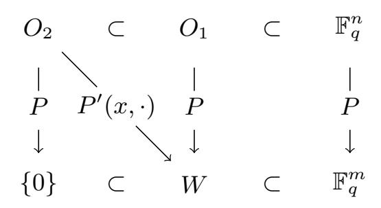
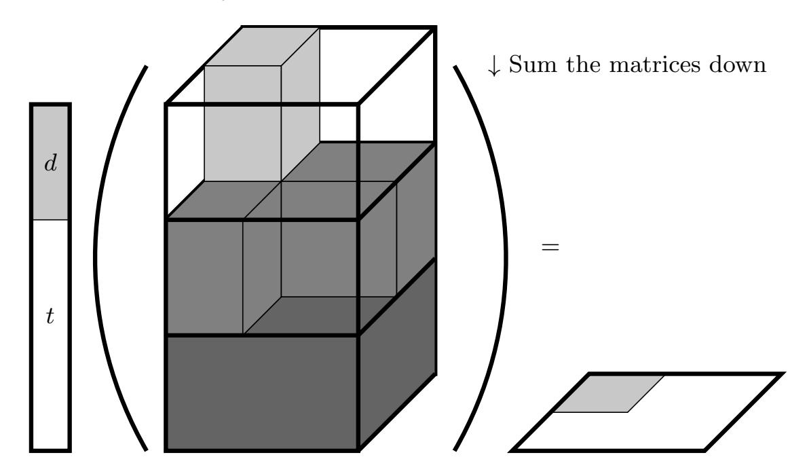

{0}------------------------------------------------

# Improved Cryptanalysis of HFERP

Max Cartor1 , Ryann Cartor2 , Hiroki Furue3 , and Daniel Smith-Tone1,4

- 1 University of Louisville, Louisville KY, USA maxwell.cartor@louisville.edu 2 Clemson University, Clemson SC, USA rcartor@clemson.edu
- 3 Department of Mathematical Informatics, The University of Tokyo, Tokyo, Japan furue-hiroki261@g.ecc.u-tokyo.ac.jp
- 4 National Institute of Standards and Technology, Gaithersburg, Maryland, USA daniel.smith@nist.gov

Abstract. In this paper we introduce a new attack on the multivariate encryption scheme HFERP, a big field scheme including an extra variable set, additional equations of the UOV or Rainbow shape as well as additional random polynomials. Our attack brings several parameter sets well below their claimed security levels. The attack combines novel methods applicable to multivariate schemes with multiple equation types with insights from the Simple Attack that broke Rainbow in early 2022, though interestingly the technique is applied in an orthogonal way. In addition to this attack, we apply support minors techniques on a MinRank instance drawing coefficients from the big field, which was effective against other multivariate big field schemes. This work demonstrates that there exist previously unknown impacts of the above works well beyond the scope in which they were derived.

Keywords: Multivariate Cryptography · HFERP · Cryptanalysis · Min-Rank · Simple Attack.

# 1 Introduction

With advancements towards widespread quantum computing, the need for accurate analysis of quantum-resistant cryptosystems is of high priority. Multivariate cryptography offers a possible path forward, providing an alternative to other post-quantum cryptosystems based on, for example, lattices or codes.

The characteristics of multivariate cryptosystems can be attractive, depending, of course, on the performance characteristics required for the application. Multivariate encryption schemes typically have quite fast encryption and relatively short ciphertexts in comparison to other post-quantum schemes. To date, this efficiency is more than counter-balanced by the extreme decryption times or decryption failure issues, see [\[27](#page-25-0)[,1\]](#page-22-0), for example. Additionally, the multitude

This work was partially supported by a grant from the Simons Foundation (712530, DCST).

{1}------------------------------------------------

of attacks, even practical attacks [\[26,](#page-25-1)[6,](#page-23-0)[2](#page-22-1)[,29\]](#page-25-2), have brought their practicality into question.

The need for accurate cryptanalysis of multivariate cryptosystems is illustrated by the call from the National Institute of Standards and Technology (NIST) for a supplementary digital signature scheme standardization track as part of their ongoing post-quantum cryptography project. The aim of this call is to obtain secure signature schemes whose security does not rely on structured lattices, which makes multivariate signature schemes of particular interest. While the scheme we attack in this paper is an encryption scheme, history has shown that multivariate cryptanalysis in one arena can often be transferred to another; thus, we expect the analysis completed in this paper to have applications across multivariate cryptography.

HFERP, which was first proposed in 2018 [\[14\]](#page-24-0), is a multivariate encryption scheme in the lineage of HFE. The basic construction is supported by a central map containing polynomials of HFE shape, see [\[21\]](#page-24-1), Rainbow shape, [\[11\]](#page-23-1), as well as random quadratic polynomials. The performance characteristics of HFERP are fairly typical for a multivariate encryption scheme; it has public key and secret key sizes of (93.6KB, 31.7KB) for 80-bit bit security and (552.3KB, 226.0KB) for 128-bit security, has fast encryption and quite slow decryption.

Several recent results inspire the need to reevaluate the cryptographic security of HFERP. The attack of [\[29\]](#page-25-2) illustrates how the use of extra variables can be mostly ignored for MinRank style attacks. The improvement of [\[2\]](#page-22-1) shows how the above attack can be performed with the support minors methodology of [\[3\]](#page-22-2) even when coefficients are from an extension field. The attack of [\[6\]](#page-23-0) demonstrates how different equation types can be exploited statistically to improve the power of an attack.

Some of the relevant pieces, however, from the above recent results do not naturally apply in the case of HFERP. For example, the attacks considered in [\[29\]](#page-25-2) and [\[2\]](#page-22-1) do not consider the effect of other equations that do not have a component of HFE shape. In the other direction, the attack of [\[6\]](#page-23-0) relies on the specific structure of Rainbow, which is not a big field scheme.

### 1.1 Our Contribution

We introduce a new attack which considerably reduces the security levels of some parameters of HFERP. This attack is a MinRank attack boosted with the same kind of "Simple Attack" observation noted in [\[6\]](#page-23-0). While the attack of [\[6\]](#page-23-0) slices the public key, viewed as a 3-tensor, in a nonstandard way (i.e., not along public equations), our attack utilizes the same statistical observation to improve the standard MinRank attack. Significantly, this attack is insensitive to the degree of the hidden HFE component; thus, for parameters where this attack is cheap, HFERP is reduced to a less efficient version of HFE.

In addition to the above attack, we also modify and apply the Big-Field Support Minors MinRank attack from [\[2\]](#page-22-1) to HFERP. Support minors techniques have been shown effective against GeMSS and Rainbow in previous works, which have central maps polynomials of only single types. We show the far reaching 

{2}------------------------------------------------

potential of the support minors technique by applying it to the central map of HFERP, which has a central map containing polynomials of HFE, UOV, and random polynomials. This attack has complexity far below the claimed security levels.

The article is organized as follows. In Section 2, we introduce some historically relevant schemes. Next, in Section 3, we describe the updated multivariate cryptanalyst's toolkit, including all of the relevant attacks affecting the selection of parameters for HFERP. In the subsequent section, we apply the "Simple Attack" approach to HFERP and describe the algebraic methods of the cryptanalysis. We then compute updated complexities for MinRank cryptanalysis of HFERP in Section 6, verifying that the security provided by HFERP is significantly reduced by our methods. Finally, we conclude, reflecting on the recent changes in multivariate cryptanalysis and suggesting new directions to explore.

### 2 Schemes

#### 2.1 C\*

The  $C^*$  Cryptosystem was introduced by Matsumoto and Imai at Eurocrypt '88 ([18]) and was the first mainstream multivariate cryptosystem. The scheme hides the easily invertible central map  $f: \mathbb{K} \to \mathbb{K}$ , using linear maps  $S, T: \mathbb{F}_q^n \to \mathbb{F}_q^n$  and a vector space isomorphism  $\phi: \mathbb{F}_q^n \to \mathbb{K}$ . The central map f is the  $\mathbb{F}_q$ -quadratic function  $f(X) = X^{q^{\theta}+1}$  where  $\theta$  is a positive integer such that  $\gcd(1+q^{\theta},q^n-1)=1$ . The public key  $P: \mathbb{F}_q^n \to \mathbb{F}_q^n$  is computed as  $P(x) = T \circ \phi^{-1} \circ f \circ \phi \circ S(x)$ .  $C^*$  was broken in [20] by Patarin.

### 2.2 HFE and variants

**Hidden Field Equations** The HFE cryptosystem, introduced in [21], is a big field scheme which replaces the monomial map of  $C^*$  with a polynomial with degree bound D. We once again consider  $\mathbb{F}_q$ ,  $\mathbb{K}$ , and  $\phi$  as described in Section 2.1. Then for degree bound D we define the central map  $f: \mathbb{K} \to \mathbb{K}$  as

$$f(X) = \sum_{i \le j}^{q^i + q^j < D} \alpha_{ij} X^{q^i + q^j} + \sum_{q^i < D} \beta_i X^{q^i} + \gamma.$$

Given invertible affine maps  $S,T:\mathbb{F}_q^n\to\mathbb{F}_q^n$ , the public key  $P:\mathbb{F}_q^n\to\mathbb{F}_q^n$  is defined as

$$P(\mathbf{x}) = T \circ \phi^{-1} \circ f \circ \phi \circ S(\mathbf{x}),$$

and the private key is (S, f, T).

To encrypt a plaintext message  $\mathbf{x} \in \mathbb{F}_q^n$ , compute  $P(\mathbf{x})$ . To invert a ciphertext  $\mathbf{y} \in \mathbb{F}_q^n$ , compute  $\mathbf{v} = T^{-1}(\mathbf{y})$  then solve  $\phi(\mathbf{v}) = f(\mathbf{s})$  for  $\mathbf{s} \in \mathbb{F}_{q^n}$  using the Berlekamp algorithm. The plaintext is then  $\mathbf{x} = S^{-1}(\phi^{-1}(\mathbf{s}))$ .

The degree bound of the central map is utilized to keep the use of Berlekamp's algorithm efficient during decryption. However, a small degree bound D has

{3}------------------------------------------------

adverse effects on the security. HFE is weak against rank attacks due to the existence of a low rank linear combination of the public quadratic forms shown in [4].

**HFEv**- After the break of HFE, HFEv- was introduced in [23]. This scheme takes an HFE scheme and adds a vinegar and a minus modifier. The minus modifier removes a small number of equations from the public key and the vinegar modifier parameterizes the central map by adding supplementary variables called vinegar variables which occupy a small subspace of the input space.

The central map  $f: \mathbb{F}_{q^n} \times \mathbb{F}_q^v \to \mathbb{F}_{q^n}$  is randomly generated of the form

$$f(X, x_1, ..., x_v) = \sum_{i,j \in \mathbb{N}}^{q^i + q^j \le D} \alpha_{ij} X^{q^i + q^j} + \sum_{i \in \mathbb{N}}^{q^i \le D} \beta_i(x_1, ..., x_v) X^{q^i} + \gamma(x_1, ..., x_v)$$

where  $\alpha_{i,j} \in \mathbb{F}_{q^n}$ ,  $\beta_i : \mathbb{F}_q^v \to \mathbb{F}_{q^n}$  are linear maps, and  $\gamma : \mathbb{F}_q^v \to \mathbb{F}_{q^n}$  is a quadratic map in the vinegar variables  $x_1, ..., x_v$ . Two random affine maps  $T : \mathbb{F}_q^n \to \mathbb{F}_q^{n-a}$  and  $S : \mathbb{F}_q^{n+v} \to \mathbb{F}_q^{n+v}$  of maximal rank bookend the central map to hide the structure of f. This results in a private key of the three maps (T, f, S).

To generate the public key, we let  $\phi$  be the vector space isomorphism previously defined. Next, let  $\psi: \mathbb{F}_q^{n+v} \to \mathbb{F}_{q^n} \times \mathbb{F}_q^v$  be  $\psi = \phi^{-1} \times id_v$  where  $id_v$  is the identity map over  $\mathbb{F}_q^v$ . Then, the composition function  $\phi \circ \psi: \mathbb{F}_q^{n+v} \to \mathbb{F}_q^n$  is a quadratic multivariate function. The public key P is then defined as

$$P = T \circ \phi \circ f \circ \psi \circ S : \mathbb{F}_q^{n+v} \to \mathbb{F}_q^{n-q}.$$

### 2.3 Unbalanced Oil and Vinegar

The Oil and Vinegar signature scheme was introduced in [22] as another response to Patarin's break of  $C^*$ . The system uses two types of variables, oil variables and vinegar variables, over a finite field  $\mathbb{F}_q$ . Originally, the number of oil and vinegar variables were equal, but Kipnis and Shamir broke the balanced oil and vinegar scheme [17]. We now only consider the Unbalanced Oil and Vinegar scheme [16] where the number of vinegar variables is strictly greater than the number of oil variables.

Let  $\mathbf{x} = (x_1, ..., x_v, x_{v+1}, ..., x_n) \in \mathbb{F}_q^n$ . The variables  $x_1, ..., x_v$  are the vinegar variables while  $x_{v+1}, ..., x_n$  are the oil variables. The central map is defined as  $F = (f_1, f_2, ..., f_{v+1})$  where each f is of the form

$$f_k(x) = \sum_{i=1}^v \sum_{j=1}^v \alpha_{ijk} x_i x_j + \sum_{i=1}^v \sum_{j=v+1}^n \beta_{ijk} x_i x_j + \sum_{i=1}^n \gamma_{ik} x_i + \delta_k.$$

Then, to create the public key equations P, we compose F with an invertible affine map  $U: \mathbb{F}_q^n \to \mathbb{F}_q^n$  to get  $P = F \circ U$ .

The map F is a quadratic map, but it is linear in the oil variables, which is imperative to obtain a signature for a message  $\mathbf{m}$ . Inversion of the central map is

{4}------------------------------------------------

completed by choosing random values from Fq for each of the vinegar variables then setting each equation equal to m and using Gaussian Elimination to solve for the remaining oil variables. If no solution is found, the process is repeated with choosing different values for the vinegar variables. The process is repeated until a solution for the set of oil variables is found. We then apply U −1 to find the final signature.

### 2.4 Rainbow

The Rainbow signature scheme introduced in [\[11\]](#page-23-1) is constructed of L many UOV layers. Rainbow was the only multivariate signature scheme in the third round of the NIST standardization process, but has recently faced major attacks [\[5,](#page-23-3)[6\]](#page-23-0).

Each layer of UOV in the Rainbow signature scheme will have a different number of vinegar variables. Consider the sequence of integer values 0 < v1 < v2 < ... < vL = n and a corresponding set of variables V1 = (x1, ..., xv1 ), V2 = (x1, ..., xv1 , ..., xv2 ), ..., VL = (x1, ..., xVL ) that contain the vinegar variables for the 1st, 2nd, ..., and Lth layers, respectively. Note, for each layer ℓ, the oil variables will contain Oℓ = (xvℓ+1, ..., xn). So, we have the relationships V1 ⊂ V2 ⊂ ... ⊂ VL and OL ⊂ OL−1 ⊂ ... ⊂ O1.

Each layer ℓ is composed of n − vℓ = oℓ equations. The kth polynomial in the ℓth layer is of the form

$$f_k = \sum_{i=1}^{v_\ell} \sum_{j=1}^{v_\ell} \alpha_{ijk} x_i x_j + \sum_{i=1}^{v_\ell} \sum_{j=v_\ell+1}^{v_{\ell+1}} \beta_{ijk} x_i x_j + \sum_{i=1}^n \gamma_{i\ell} x_i + \delta_k,$$

where we normally consider δℓ = 0. The public key is formed by composing the central map with two affine maps, U and T, to get P = T ◦ F ◦ U. In practice, we let L = 2. This means that v1 = v, and v2 = n. To speed up key generation, it is convention to use homogeneous polynomials fi .

To invert the central map F = (f1, ..., fn), we peel off the layers in the same fashion we invert the single layer UOV system. We choose values for the first layer vinegar variables x1, ..., xv1 and substitute these values into the first layer maps f1, ..., fv1 . We then solve the resulting linear system in the first layer oil variables xv1+1, ..., xv2 . We next substitute the values of these variables into the central maps fv1+1, ..., fn.

### 2.5 HFERP

HFERP was introduced in [\[14\]](#page-24-0) after SRP (introduced in [\[31\]](#page-25-5)) was broken in [\[24\]](#page-25-6). The goal of SRP was to add an invertible system to UOV so that there is a way to uniquely solve for the vinegar variables instead of choosing random values. SRP used a square map, which left it susceptible to the MinRank attack. HFERP continues this goal by using an instance of HFE with a higher Q-rank (defined in Section [5\)](#page-17-0) to protect against the attacks utilizing the low Q-rank of the Square map. HFERP utilizes a single layer of UOV with v = d vinegar 

{5}------------------------------------------------

variables where d is the degree of the extension field used in the HFE scheme. HFERP also utilizes a plus modifier, adding p additional random equations to the central map to secure the system from rank attacks and to make decryption failures less likely.

**Notation** We consider d to be the degree of the extension field in the HFE map, D the degree bound of the HFE central map,  $\delta := \lceil \log_q(D) \rceil$ , o is the number of oil variables in the UOV map, r a positive integer, and s is the number of added plus polynomials. For ease of notation, we will define n := d + o, m := d + o + r + s, and t := m - d = o + r + s. We will sometimes consider the linear maps T and U in their matrix representations, which we will denote as T and U.

**Key Generation and Encryption** To construct an HFERP system, choose a finite field  $\mathbb{F}_q$  and a degree d extension  $\mathbb{F}_{q^d}$  over  $\mathbb{F}_q$ . Let  $\phi: \mathbb{F}_q^d \to \mathbb{F}_{q^d}$  be an  $\mathbb{F}_q$ -vector space isomorphism and o, r and s be non-negative integers.

The central map of HFERP is the concatenation of an HFE map,  $F_{HFE}$ , a single layer Rainbow map,  $F_R = (f_1, ..., f_{o+r})$ , and a plus modifier,  $F_p$ . These maps are defined as follows.

 $-F_{HFE}: \mathbb{F}_q^n \to \mathbb{F}_q^d$  is the composition of

$$\mathbb{F}_q^n \xrightarrow{\pi_d} \mathbb{F}_q^d \xrightarrow{\phi} \mathbb{F}_{q^d} \xrightarrow{\mathcal{F}} \mathbb{F}_{q^d} \xrightarrow{\phi^{-1}} \mathbb{F}_q^d$$

where  $\mathcal{F}$  is the map in the extension field described in Section 2.2 and  $\pi_d$ :  $\mathbb{F}_q^n \to \mathbb{F}_q^d$  is the projection onto the first d coordinates.

- The Rainbow component is an instance of UOV defined as

$$F_R = (f_1, ..., f_{o+r}) : \mathbb{F}_q^n \to \mathbb{F}_q^{o+r}.$$

The variables  $x_1, ..., x_d$  are the vinegar variables and remaining  $x_{d+1}, ..., x_n$  are the oil variables. Each map  $f_i$  is defined as in Section 2.4.

– The plus modifier  $F_p = (g_1, ..., g_s) : \mathbb{F}_q^n \to \mathbb{F}_q^s$  consists of s randomly generated quadratic polynomials.

To generate the public key, let  $F = F_{HFE}||F_R||F_P$  (where || denotes concatenation) and let  $U: \mathbb{F}_q^n \to \mathbb{F}_q^n$  be an affine embedding of full rank and  $T: \mathbb{F}_q^m \to \mathbb{F}_q^m$  be an affine isomorphism. Then, the public key is defined as  $P = T \circ F \circ U: \mathbb{F}_q^n \to \mathbb{F}_q^m$ .

**Encryption Algorithm** Given a message  $\mathbf{x} \in \mathbb{F}_q^n$ , the ciphertext is computed as  $P(\mathbf{x}) = \mathbf{y} \in \mathbb{F}_q^m$ .

**Decryption Algorithm** Given a ciphertext  $\mathbf{y} = (y_1, ..., y_m) \in \mathbb{F}_q^m$ , we start the decryption process by computing  $\mathbf{y}' = (y_1', ..., y_m') = T^{-1}(\mathbf{y})$ . The next step is to then compute  $\mathbf{Y}' = \phi(y_1', ..., y_d') \in \mathbb{F}_{q^d}$ . We then use the Berlekamp algorithm to

{6}------------------------------------------------

compute the inverse of the HFE polynomials to recover  $\mathbf{v} = (v_1, ..., v_d)$ , which will be our vinegar variables. Once we have obtained the vinegar values  $v_1, ..., v_d$ , we then solve the system of o + r linear equations in the n - d = o variables  $o_{d+1}, ..., o_n$  given by

$$g^{(k)}(v_1,...,v_d,o_{d+1},...,o_n) = y'_{d+k},$$

for k = 1, ..., o + r. We denote the solution as  $(v_{d+1}, ..., v_n)$ . The final step is to compute the plaintext  $\mathbf{x} \in \mathbb{F}_q^n$  by finding the preimage of  $(v_1, ..., v_n)$  under the affine map U. Once a solution is found, check to see if it is consistent under the plus polynomials. If so, a valid decryption has been found. If not, repeat the process for a new solution  $(v'_1, ..., v'_n)$  until we find a consistent solution.

# 3 Relevant Attacks

There is a standard suite of attacks commonly used in multivariate cryptography. In this section we provide a brief summary of relevant techniques.

#### 3.1 Direct Attack

The most generic attack on a multivariate cryptosystem is the direct attack. In the context of encryption, the direct attack sets the public equations equal to a ciphertext value and attempts to solve the system algebraically. The complexity of the direct attack depends on a few factors.

First, by way of specializing some number of variables, one assumes that the ideal generated by these equations is zero-dimensional. In practice, if the field size is small, one should specialize more variables, attempting to solve the system by guessing some correct values of variables. This method is called the hybrid approach.

Second, the solving degree must be determined. This quantity is the degree at which the values of all monomials in the system of equations are determined uniquely. This phenomenon occurs when the number of linearly independent equations equals the number of monomials. The solving degree for a system of equations will be specific to each algorithm.

Finally, the complexity is dependent on the algorithm used to solve the system. If the system is relatively small (not cryptographic scale), then it is often beneficial to take advantage of the reduction to normal form occurring in the F4 algorithm [12]. For larger parameters, we expect it to be better to use the XL algorithm [9], not only for time complexity, but, perhaps more importantly, for memory complexity.

Given a system of m equations in n variables over  $\mathbb{F}_q$ , we may specialize k variables and in the case that n < m we have the complexities of F4 and XL at solving degree  $d_s$  to be

$$\mathcal{O}\left(q^k \binom{n-k+d_s-1}{d_s}^{\omega}\right) \text{ and } \mathcal{O}\left(3q^k \binom{n-k+1}{2} \binom{n-k+d_s-1}{d_s}^2\right),$$

where  $\omega$  is the linear algebra exponent.

{7}------------------------------------------------

### 3.2 MinRank Attacks

Many multivariate cryptosystems have been shown to be vulnerable against Min-Rank attacks. We can define the MinRank problem as follows:

**Problem 1 (MinRank Problem)** Given matrices  $A_1, \ldots, A_K \in \mathbb{F}_q^{M \times N}$  and  $R \in \mathbb{N}$ , decide if there exists a linear combination  $y_1, \ldots, y_K \in \mathbb{F}_q$  (not all zero) such that

$$rank\left(\sum_{i=1}^{K} y_i A_i\right) \le R.$$

The goal of MinRank attacks is to try to find linear combinations of the public matrices that result in a matrix with low rank. This is an effective technique against schemes such as HFE as it allows an adversary to gain information about the low rank central maps. The MinRank attack was first introduced in [15], and other methods have since followed, including minors modeling and support minors modeling [13,3]. The complexity of MinRank attacks are tied to the complexity of polynomial solvers, such as the XL algorithm [10].

There are various methods to solve the MinRank problem. These methods vary from simply enumerating the space of linear combinations to constructing systems of equations with large sets of variables.

The simplest and most direct is simply exhaustive search. In this model one simply guesses linear combinations and computes the rank until a solution is found. The complexity of this version of MinRank is  $q^K N^{\omega}$ , where  $2 \le \omega \le 3$  is the linear algebra exponent.

A simple general improvement to exhaustive search is called the combinatorial method, or sometimes linear algebra search. In this method, one guesses  $\lceil \frac{K}{M} \rceil$  kernel vectors  $\mathbf{v}_i$  and solves

$$\sum_{j=1}^{K} x_j \mathbf{A}_j \mathbf{v}_i = \mathbf{0}$$

linearly for  $\mathbf{x}$ . Simultaneously guessing two kernel vectors of a rank R matrix takes approximately  $q^{\lceil \frac{K}{M} \rceil R}$  attempts on average. Thus, this technique has complexity

$$\mathcal{O}\left(q^{\lceil \frac{K}{M} \rceil R} \left(K^{\omega} + N^{\omega}\right)\right).$$

The support minors method of MinRank, see [3], is built from decomposition modeling. Given that the matrix  $\Sigma = \sum_{i=1}^K x_i \mathbf{A}_i$  has rank R, there exist matrices  $\mathbf{S} \in \mathbb{F}_q^{M \times R}$  and  $\mathbf{C} \in \mathbb{F}_q^{R \times N}$  such that  $\Sigma = \mathbf{SC}$ . Specifically, the rowspace of  $\mathbf{C}$  is the rowspace of  $\Sigma$ , and so appending a row  $\pi$  of  $\Sigma$  to  $\mathbf{C}$  results in an  $(R+1) \times N$  matrix of rank R. The support minors modeling computes the maximal minors of such a matrix and solves the system for  $\mathbf{x}$ .

The complexity of solving the MinRank problem using Support Minors Modeling given K many matrices, M equations, N variables, and a target rank of R can be estimated as

{8}------------------------------------------------

$$\min_{M' \le M} 3(K-1)(R+1) {M' \choose R}^2 {K+b-2 \choose b}^2 \tag{1}$$

where b is the smallest integer such that

$$\binom{M'}{R} \binom{K+b-2}{b} - 1 \le \sum_{i=1}^{b} (-1)^{i+1} \binom{M'}{R+1} \binom{N+i-1}{i} \binom{K+b-i}{b-i}. (2)$$

As indicated in Equation (1) above, the number of columns used can be optimized to lower the complexity of the attack. One often finds that even a larger value of b along with a smaller M' may result in a more efficient attack.

Which MinRank technique is best in which parameter regime is a very interesting and subtle question. In general, smaller field sizes paired with either small target rank or a small search space offer more opportunities for the combinatorial search methods to be superior. If the field size is larger, or if the target rank is moderate; however, support minors are often more powerful.

The above techniques do not form a complete list of MinRank techniques. Other well-known techniques include minors modeling [4] and Kipnis-Shamir modeling [17]. Typically parameter sets for which these techniques can be effective are outperformed by support minors modeling.

#### 3.3 Simple Attack

In 2022, the security of Rainbow took a major blow with the release of Beullens' simple attack from [6]. The Simple Attack is a differential attack, meaning it will make use of the discrete differential DF(x,y) = F(x+y) - F(x) - F(y) + F(0). For our purposes in MPK cryptography, we have P(0) = 0 for a public key P. The simple attack utilizes a few key aspects to the Rainbow trapdoor function.

Recall from Section 2.4, an instance of Rainbow relies on q, the characteristic of the finite field, n, the number of variables, m, the number of public key equations, and  $o_2$ , which is the dimension of both the second layer oil subspace  $O_2 \subset \mathbb{F}_q^n$  and the image of  $O_1$  under the public key P. We will mirror the notation from [6] and set  $P(O_1) = W \subset \mathbb{F}_q^m$ .

Fig. 1. Structure of nested subspaces.

{9}------------------------------------------------

From [6], it is known that for any  $\mathbf{x} \in \mathbb{F}_q^n$  and any  $\mathbf{o}_2 \in O_2$  that  $DP(\mathbf{x}, \mathbf{o}_2) \in W$  and that  $P(O_2) = \{0\}$ . So, for a randomly chosen nonzero  $\mathbf{x} \in \mathbb{F}_q^n$ , construct the differential map

$$D_{\mathbf{x}}: \mathbb{F}_q^n \to \mathbb{F}_q^m: \mathbf{y} \mapsto DP(\mathbf{x}, \mathbf{y})$$

where DP is defined as above.  $D_{\mathbf{x}}$  is a linear map which sends  $O_2$  to W. We know that  $\dim(O_2) = o_2 = \dim(W)$ , so the probability that  $D_x$  has a kernel vector in  $O_2$  is the same probability that a random  $o_2 \times o_2$  matrix over  $\mathbb{F}_q$  is singular. This probability is known to be

$$1 - \prod_{i=0}^{o_2 - 1} (1 - q^{i - o_2}) \approx q^{-1}.$$

The goal in constructing this mapping is to find a nontrivial intersection between the kernel of the  $D_{\mathbf{x}}$  map and the  $O_2$  subspace. To search for the possible nontrivial intersection, the simple attack sets up the following system of equations:

$$\begin{cases}
D_{\mathbf{x}}(\mathbf{o}) = 0 \\
P(\mathbf{o}) = 0.
\end{cases}$$
(3)

The resulting system has m homogeneous linear equations and m homogeneous quadratic equations in the n variables of  $\mathbf{o}$ . The simple attack then uses the m linear equations to eliminate m of the variables from the quadratic equations. This yields a system of m homogeneous equations in only n-m variables. Using Beullens' notation, let  $\mathbf{B} \in \mathbb{F}_q^{n \times (n-m)}$  be a matrix whose columns form a basis for  $\ker(D_{\mathbf{x}})$ . Then the process reduces to finding a solution to  $\mathbf{o} \in \mathbb{F}_q^{n-m}$  such that  $P(\mathbf{Bo}) = 0$ . If such a solution is found, then with high probability  $\mathbf{o} \in O_2$ . If no solution exists, randomly choose a new nonzero  $\mathbf{x} \in \mathbb{F}_q^n$  and repeat the process. Once an  $O_2$  vector is found, the second layer of Rainbow can be removed and the complexity is reduced to an instance of UOV with  $m-o_2$  equations in  $n-o_2$  variables.

#### 3.4 Other Techniques

The work of Tao et al. in [29] presents a MinRank key recovery attack on HFEv- cryptosystem with complexity

$$\mathcal{O}\left(\begin{pmatrix} \hat{n} + \hat{d} + v + 1 \\ \hat{d} + 1 \end{pmatrix}^{\omega}\right),$$

where  $\hat{n}$  is the degree of the extension field, v is the number of vinegar variables,  $\hat{d} = \lceil \log_q(D) \rceil$ , D is the degree bound of the central HFE polynomial, and  $\omega$  is the linear algebra constant. This paper illustrates that the minus modifier does not increase the security of HFE type cryptosystems as the complexity is independent of a, the number of public equations deleted. The vinegar modifier only increases the complexity by a polynomial factor.

{10}------------------------------------------------

Given the public key P = T ◦ F ◦ S, the attack starts by recovering a map equivalent to the private map S by solving a MinRank problem over the base field with target rank d. Equivalent maps to the private T and F are then found by solving a system of linear and nonlinear equations. The work in [\[2\]](#page-22-1) shows how to use Support Minors modeling for the problem, and results in a total break of GeMSS. The GeMSS cryptosystem can be thought of as a specific example of HFEv− and was a candidate in the NIST standardization process.

# 4 HFERP Simple Attack: Divide and Conquer

We introduce an attack that significantly diminishes the security levels of some HFERP parameter sets. This attack uses some similar tools as the Simple Attack against Rainbow, and is thus named accordingly. The goal of this attack is to find an HFE map hiding in a subspace of the public equations, which is defined based on the kernel of a linear combination of rectangular slices of the 3 tensor representation of the public key. Membership in the kernel provides linear relations that can be used to essentially remove variables from the MinRank modeling, making it much easier to solve a MinRank instance whose solution is an HFE polynomial. From there we are able to obtain maps equivalent to the secret maps U and T and then attack each section of the central map individually. We describe this attack on HFERP with only a single Rainbow layer (i.e., a UOV map), but the attack can easily be adjusted for more Rainbow layers.

Although this attack was inspired by the Simple Attack on Rainbow, there are some subtle differences in technique. In the basic Simple Attack against Rainbow, an adversary searches for an o2 vector by finding a solution to the system of equations {Dx(y) = 0, P(y) = 0}. Similarly, the combined attack of [\[6\]](#page-23-0) on Rainbow, mostly relevant for the larger category III and V parameter sets, combines the kernel condition (the first equation above) with the rectangular MinRank attack. This technique essentially removes m of the n distinct n × m matrices of the rectangular MinRank attack, a significant improvement.

Our attack is similar, but has some notable differences. First, HFERP is an encryption scheme, and so must have at least as many equations as variables. Therefore, while we use a rectangular matrix similar to that used in the rainbow attack, it makes the most sense to consider kernel elements on the opposite side (corresponding to the output space as opposed to the input space of the HFERP public key). When the kernel of such a map intersects the subspace of HFE maps, the vectors contained in the intersection produce low rank linear combinations of the public maps.

The works of [\[29](#page-25-2)[,2\]](#page-22-1) are also related to this attack, as we are using MinRank techniques on the public matrices to find equivalent linear transformations as those used in the secret key. Although both of these attacks are exploiting the low rank properties of the HFE central map, our attack uses the MinRank techniques to strategically filter out the Rainbow and plus polynomials.

{11}------------------------------------------------

### 4.1 Finding y Vector

Let  $\mathbf{P}_i$  be the matrix representation of the *i*th public polynomial  $p_i$  such that  $\mathbf{x}\mathbf{P}_i\mathbf{x}^{\top}=p_i(\mathbf{x})$  for  $\mathbf{x}\in\mathbb{F}_q^n$ . Choose a random row vector  $\mathbf{z}\in\mathbb{F}_q^n$  and compute the  $m\times n$  matrix

$$\mathbf{A}_z = \begin{bmatrix} \mathbf{z} \mathbf{P}_1 \ \mathbf{z} \mathbf{P}_2 \ \vdots \ \mathbf{z} \mathbf{P}_m \end{bmatrix}.$$

We hope to find a  $\mathbf{z}$  such that the subspace of the rows of  $\mathbf{A}_z$  with the structure of HFE has nontrivial left kernel. We let  $\mathrm{Ker}_L(\mathbf{A}_z)$  denote the left kernel of  $\mathbf{A}_z$ . Recall that the set of HFE maps forms a dimension d subspace of the span of the  $\mathbf{P}_i$  which has support on a d-dimensional subspace of  $\mathbb{F}_q^n$ . Thus for any  $\mathbf{z}$ , the map  $\mathbf{A}_z$  restricted to the HFE subspace is a map from a d-dimensional space to a d-dimensional space. Under the heuristic assumption that this restricted map acts as a random  $d \times d$  matrix the probability that the restricted map is singular is

$$1 - \prod_{i=0}^{d-1} (1 - q^{i-d}),$$

which for large q is approximately  $q^{-1}$ .

Our goal is to find a vector  $\mathbf{y} \in \mathbb{F}_q^m$  such that

$$\begin{cases} \mathbf{y} \in \operatorname{Ker}_{L}(\mathbf{A}_{z}) \\ \operatorname{Rank}\left(\sum_{i=1}^{m} y_{i} \mathbf{P}_{i}\right) \leq d. \end{cases}$$
(4)

If the maps  $\mathbf{P}_i$  were generic then the probability that even a single map in their span is of rank d would be very close to zero. We therefore work under the following heuristic assumption, well-supported by experimental data

**Heuristic Assumption 1** The only nonzero maps in the span of the  $\mathbf{P}_i$  that have rank bounded by d are in the span of the maps  $\mathbf{UF}_i\mathbf{U}^{\top}$  for  $i=1,\ldots,d,$  i.e. the HFE maps.

Thus, we expect that any such solution y to (4) has the form

$$\mathbf{yT} = (\mathbf{a}||\mathbf{0}) \Longrightarrow \mathbf{y} = (\mathbf{a}||\mathbf{0})\mathbf{T}^{-1},$$
 (5)

where **a** is a length d vector and **0** is the length t zero vector. Note that for each public polynomial we have:

$$p_i = \sum_{k=1}^m t_{ik}(f_k \circ U),$$

{12}------------------------------------------------

where  $f_k$  represents the kth central map. The linear combination in question then becomes

$$\sum_{\ell=1}^{m} y_{\ell} \mathbf{P}_{\ell} = \sum_{\ell=1}^{m} y_{\ell} \left( \sum_{k=1}^{m} t_{\ell k} (\mathbf{U} \mathbf{F}_{k} \mathbf{U}^{\top}) \right) = \sum_{k=1}^{m} \sum_{\ell=1}^{m} y_{\ell} t_{\ell k} (\mathbf{U} \mathbf{F}_{k} \mathbf{U}^{\top})$$
$$= \sum_{k=1}^{d} a_{k} \left( \mathbf{U} \mathbf{F}_{k} \mathbf{U}^{\top} \right) + \sum_{k=d+1}^{m} 0 \left( \mathbf{U} \mathbf{F}_{k} \mathbf{U}^{\top} \right).$$

This behavior is illustrated in Figure 2.

To find such a vector y, we will compute a basis  $\{\mathbf{v}_1, \dots, \mathbf{v}_{r+s}\}$  for the left kernel of the  $m \times n$  matrix  $\mathbf{A}_z$ . For each basis vector  $\mathbf{v}_j$ , we then compute the matrix

$$\mathbf{W}_j = \sum_{i=1}^m v_{ji} \mathbf{P}_i.$$

The vector  $\mathbf{y}$  that we want is a linear combination of the basis vectors, so we can write  $\mathbf{y} = \sum_{j=1}^{r+s} \lambda_j \mathbf{v}_j$ . We can also write  $\sum_{i=1} y_i \mathbf{P}_i$  as a linear combination of the  $\mathbf{W}_j$  matrices as follows:

$$\sum_{i=1}^{m} y_i \mathbf{P}_i = \sum_{i=1}^{m} \left( \sum_{j=1}^{r+s} \lambda_j v_j \right)_i \mathbf{P}_i$$

$$= \sum_{i=1}^{m} \sum_{j=1}^{r+s} \lambda_j v_{ji} \mathbf{P}_i$$

$$= \sum_{j=1}^{r+s} \lambda_j \left( \sum_{i=1}^{m} v_{ji} \mathbf{P}_i \right)$$

$$= \sum_{j=1}^{r+s} \lambda_j \mathbf{W}_j.$$

We can then use MinRank on the r+s many  $\mathbf{W}_j \in \mathbb{F}_q^{n \times n}$  matrices with target rank d in order to find the weights  $\lambda_j$  that will give us the vector  $\mathbf{y}$  we are interested in. When q is small, it appears the exhaustive search version of MinRank will be the most efficient way to find  $\mathbf{y}$ . For large q, Linear Algebra Search or Support Minors may be used to find  $\mathbf{y}$ .

#### 4.2 Inverting U

We will use the obtained  $\mathbf{y}$  to uncover the oil and vinegar subspaces of the UOV maps. We will denote the Oil and Vinegar subspaces in the public basis as O and V, respectively. Recall that  $O, V \subset \mathbb{F}_q^n$ ,  $O + V = \mathbb{F}_q^n$ ,  $O \cap V = \{0\}$ ,  $\dim(O) = o$ ,  $\dim(V) = d$ , and for any  $x \in O$ ,  $f_i(x) = 0$  for  $1 \le i \le d + o + r$ .

{13}------------------------------------------------

Scalar multiply across →

Fig. 2. We can consider the m many n×n matrix representations of each fi as a 3 tensor where each n × n matrix Fi is stacked on top of Fi+1. We denote zero coordinates as white, and the gray areas represent nonzero coordinates. Let y be a vector that satisfies Equation [5.](#page-11-1) The figure represents the linear combination Pm i=1(yT)iFi.

Once a y ∈ F m q satisfying [\(4\)](#page-11-0) is found, we then compute the n × n matrix

$$\mathbf{P_y} = \sum_{i=1}^m y_i \mathbf{P}_i.$$

We note a couple of things about Py. First, by Heuristic Assumption [1,](#page-11-2) we have that Py is in the span of the HFE maps UFiU⊤ for i = 1, . . . , d. Second, since y ∈ ker(Az), we have that

$$0 = \sum_{i=1}^{m} y_i \mathbf{z} \mathbf{P}_i = \mathbf{z} \sum_{i=1}^{m} y_i \mathbf{P}_i = \mathbf{z} \mathbf{P}_y;$$

therefore, z ∈ ker(Py). Thus, since we do not expect z ∈ O, the rank of Py is expected to be d − 1.

Note that O is a corank 1 subspace of ker(Py). Therefore, restricting any HFE or oil-vinegar map to this subspace results in a map of rank at most 2, since all such maps are identically zero on the oil subspace O. (Prepending z to an ordered basis of O provides a projection onto ker(Py) that sends any HFE or oil-vinegar quadratic form to an (o+ 1)×(o+ 1) symmetric matrix with nonzero entries in only the first row and column.) Thus we may recover multiple maps in the span of the HFE and oil-vinegar maps by solving easy instances of MinRank at rank 2.

Finding two such rank 2 maps C and D in the span of the public key restricted to ker(Py) is sufficient to recover O. Since the kernels of all HFE and oil-vinegar 

{14}------------------------------------------------

maps are interlaced, the (m-s)-dimensional subspace of rank 2 restricted maps all have their kernels contained in O. Therefore, as long as  $\ker(\mathbf{C}) \neq \ker(\mathbf{D})$ , we have that  $\operatorname{Span}(\ker(\mathbf{C}), \ker(\mathbf{D})) = O$ .

Let  $\{\beta_1, \ldots, \beta_o\}$  be a basis for the recovered oil subspace O and define  $\mathbf{B_1}$  to be the  $o \times n$  matrix whose jth row is  $\beta_j$ . Next, we complete the basis  $\{\beta_1, \ldots, \beta_o\}$  with some arbitrary linearly independent set  $\{\alpha_1, \ldots, \alpha_d\} \subset \mathbb{F}_q^n$ . Let  $\mathbf{B_2}$  be the  $d \times n$  matrix whose jth row is  $\alpha_j$ . We then vertically adjoin  $\mathbf{B_2}$  and  $\mathbf{B_1}$  to generate the  $n \times n$  matrix

$$\widehat{\mathbf{B}} := \begin{bmatrix} \mathbf{B_2} \\ \mathbf{B_1} \end{bmatrix} = \begin{bmatrix} \alpha_1^\top & \cdots & \alpha_d^\top & \beta_1^\top & \cdots & \beta_o^\top \end{bmatrix}^\top.$$

Let  ${\bf G}$  be in the span of the public quadratic forms and consider the matrix multiplication

$$\widehat{\mathbf{B}}\mathbf{G}\widehat{\mathbf{B}}^{T} = \begin{bmatrix} \alpha_{1}\mathbf{G}\alpha_{1}^{\top} \cdots \alpha_{1}\mathbf{G}\alpha_{d}^{\top} & \alpha_{1}\mathbf{G}\beta_{1}^{\top} \cdots \alpha_{1}\mathbf{G}\beta_{o}^{\top} \\ \vdots & \ddots & \vdots & \vdots & \ddots & \vdots \\ \alpha_{d}\mathbf{G}\alpha_{1}^{\top} \cdots & \alpha_{d}\mathbf{G}\alpha_{d}^{\top} & \alpha_{d}\mathbf{G}\beta_{1}^{\top} \cdots & \alpha_{d}\mathbf{G}\beta_{o}^{\top} \\ \beta_{1}\mathbf{G}\alpha_{1}^{\top} \cdots & \beta_{1}\mathbf{G}\alpha_{d}^{\top} & \beta_{1}\mathbf{G}\beta_{1}^{\top} \cdots & \beta_{1}\mathbf{G}\beta_{o}^{\top} \\ \vdots & \ddots & \vdots & \vdots & \ddots & \vdots \\ \beta_{o}\mathbf{G}\alpha_{1}^{\top} \cdots & \beta_{o}\mathbf{G}\alpha_{d}^{\top} & \beta_{o}\mathbf{G}\beta_{1}^{\top} \cdots & \beta_{o}\mathbf{G}\beta_{o}^{\top} \end{bmatrix}.$$

Consider the case in which  $\mathbf{G}$  is in the span of  $\mathbf{UF}_i\mathbf{U}$  for  $i=1,\ldots,d$ , i.e. the HFE maps. Then the (i,j)th coordinate of  $\widehat{\mathbf{B}}\mathbf{G}\widehat{\mathbf{B}}^{\top}$  is of the form  $\alpha_i\mathbf{G}\beta_{j-d}^{\top}$  when  $i\leq d$  and  $d< j\leq n$ . Notice that because  $\mathbf{G}$  is symmetric and each  $\beta_k$  is in O, and hence in the left kernel of  $\mathbf{G}$ , we have that

$$\mathbf{0}^{\top} = (\beta_k \mathbf{G})^{\top} = \mathbf{G}^{\top} \beta_k^{\top} = \mathbf{G} \beta_k^{\top}.$$

Thus, these coordinates are all zero. The (i, j)th coordinate of  $\widehat{\mathbf{B}}\mathbf{G}\widehat{\mathbf{B}}^{\top}$  is zero for  $d < i \leq n, j \leq d$  by symmetry. Similarly, when  $d < i, j \leq n$  the (i, j)th coordinate of  $\widehat{\mathbf{B}}\mathbf{G}\widehat{\mathbf{B}}^{\top}$  is zero for the same reason. Thus  $\widehat{\mathbf{B}}\mathbf{G}\widehat{\mathbf{B}}^{\top}$  may only be nonzero in its upper left  $d \times d$  block, having the same structure as an HFE map.

Next, consider the case in which  $\mathbf{G}$  is in the span of the  $\mathbf{UF}_i\mathbf{U}$  for  $i=d+1,\ldots,d+o$ , i.e. the oil-vinegar maps. In this case, the (i,j)th coordinate of  $\widehat{\mathbf{B}}\widehat{\mathbf{G}}\widehat{\mathbf{B}}^{\top}$  is  $\beta_{i-d}\mathbf{G}\beta_{j-d}^{\top}$  when  $d< i,j\leq n$ . Since  $\mathbf{G}$  is identically zero on O, we have that the coordinate is zero. Thus,  $\mathbf{G}$  has a lower right  $o\times o$  block of zeros, the same structure as an oil-vinegar map. We have thus verified the following proposition.

**Proposition 1** The oil subspace O is invariant under the map  $U \circ \widehat{\mathbf{B}}$ .

### 4.3 Inverting T

Once we have obtained  $\widehat{\mathbf{B}}$ , we effectively have a way to circumnavigate the linear transformation on the input. Now, we wish to find a map T' that is equivalent to the linear transformation on the outputs.

{15}------------------------------------------------

Consider the structure of the public key.

$$P = T \circ \begin{bmatrix} F_{HFE} \\ F_{UOV} \\ F_{Plus} \end{bmatrix} \circ U$$

We may represent the function compositions as matrix multiplications in the following way:

$$\begin{aligned} \begin{bmatrix} p_1(\mathbf{x}) \ \vdots \ p_m(\mathbf{x}) \end{bmatrix} &= \mathbf{T} \times \begin{bmatrix} \mathbf{x} \mathbf{U} \mathbf{F}_1 \mathbf{U}^\top \mathbf{x}^\top \ \mathbf{x} \mathbf{U} \mathbf{F}_m \mathbf{U}^\top \mathbf{x}^\top \end{bmatrix} \ \mathbf{P}_i &= \sum_{k=1}^m t_{ik} \mathbf{U} \mathbf{F}_k \mathbf{U}^\top \ \mathbf{P}_i &= \mathbf{U} \left( \sum_{k=1}^m t_{ik} \mathbf{F}_k \right) \mathbf{U}^\top \end{aligned}$$

For each public equation, we have the relationship that

$$\widehat{\mathbf{B}}\mathbf{P}_{i}\widehat{\mathbf{B}}^{\top} = \sum_{k=1}^{m} t_{ik} \left( \widehat{\mathbf{B}}\mathbf{U}\mathbf{F}_{k}\mathbf{U}^{\top}\widehat{\mathbf{B}}^{\top} \right) = \widehat{\mathbf{B}}\mathbf{U} \left( \sum_{k=1}^{m} t_{ik}\mathbf{F}_{k} \right) \mathbf{U}^{\top}\widehat{\mathbf{B}}^{\top}.$$
 (6)

By construction, we know that  $\mathbf{F}_k$  will have specific traits depending on k. These properties are listed in Table 1.

|                                          | $1 \le k \le d$         | $d+1 \le k \le o+r$                | $o + r + 1 \le k \le m$ |
|------------------------------------------|-------------------------|------------------------------------|-------------------------|
| Structure of $\mathbf{F}_k$              |                         |                                    |                         |
| $\operatorname{Rank}(\mathbf{F}_k) \leq$ | d                       | n                                  | n                       |
| Guaranteed zeros                         | Rows $d \le i \le m$    | Lower right $o \times o$ submatrix | None                    |
|                                          | Columns $d \le j \le m$ | I                                  |                         |
| $\operatorname{Rank}(\mathbf{F}_k) \leq$ | Columns $d \le j \le m$ | Lower right $o \times o$ submatrix |                         |

Table 1. The table summarizes notable properties of the symmetric matrices corresponding to the  $F_{HFE}$ ,  $F_R$ , and  $F_P$  polynomials.

The next phase of the attack is to invert the output transformation T. We will denote  $\widehat{\mathbf{P}}^{(i)} := \widehat{\mathbf{B}} \mathbf{P}_i \widehat{\mathbf{B}}^{\top}$  and for any matrix  $\mathbf{M}$  we will let  $\mathbf{M}_{[i:j]}$  denote the submatrix of  $\mathbf{M}$  containing columns i through j. We consider that

$$\widehat{\mathbf{P}}^{(i)} = \sum_{k=1}^{m} t_{ik} \mathbf{F}_k.$$

{16}------------------------------------------------

Our goal now is to find  $\mathbf{c} \in \mathbb{F}_q^m$  such that

$$\sum_{i=1}^{m} c_i \widehat{\mathbf{P}}_{[d+1:n]}^{(i)} = \mathbf{0}_{n \times o}. \tag{7}$$

If such a  $\mathbf{c}$  is found, we obtain

$$\sum_{i=1}^{m} c_{i} \widehat{\mathbf{P}}_{[d+1:n]}^{(i)} = \sum_{i=1}^{m} c_{i} \left( t_{i1} \mathbf{F}_{1,[d+1:n]} + \dots + t_{im} \mathbf{F}_{m,[d+1:n]} \right)$$
$$= \sum_{i=1}^{m} c_{i} \left( t_{i1} \mathbf{F}_{d+1,[d+1:n]} + \dots + t_{im} \mathbf{F}_{m,[d+1:n]} \right),$$

since  $\mathbf{F}_{i,[d+1:n]} = \mathbf{0}_{n \times o}$ . Thus we obtain a  $\mathbf{c}$  that is in ker  $(\mathbf{T}_{[d+1:m]})$ . We can compute the left kernel of  $\mathbf{T}_{[d+1:m]}$  by finding all solutions to Equation 7. We will let  $\{\tau_1,\ldots,\tau_d\}\subseteq\mathbb{F}_q^m$  be a basis for the left kernel of  $\mathbf{T}_{[d+1:m]}$ .

We will repeat the process described, but now we will consider the lower right  $o \times o$  submatrix of each  $\widehat{\mathbf{P}}$ . Notice from Table 1 that these submatrices will be zero in  $\mathbf{F}_k$  when  $1 \le k \le d+o+r$ . By finding all solutions to the linear combination of the public key equations that make the lower coordinates zero, we will find the left kernel of  $\mathbf{T}_{[d+o+r+1:m]}$ . Notice that  $\{\tau_1,\ldots,\tau_d\}\subseteq\ker(\mathbf{T}_{[d+o+r+1:m]})$ . We can append o+r linearly independent kernel vectors to extend the set  $\tau_1,\ldots,\tau_d$  to a basis of the entire space. We will denote this as  $\{\tau_1,\ldots,\tau_d,\tau_{d+1},\ldots,\tau_{d+o+r}\}$ . We can take this set and extend it to a basis of  $\mathbb{F}_q^m$ . Let  $\Gamma$  be the basis matrix whose jth row is  $\tau_j$ .

This basis acts on the public key equations in such a way that the first d equations of  $\Gamma \circ P \circ \widehat{\mathbf{B}}$  will be HFE maps, the next o + r maps will be rainbow maps, and the final s equations are plus polynomials. Let  $\widehat{P}_i$  be the polynomial represented by  $\widehat{\mathbf{B}}\mathbf{P}_i\widehat{\mathbf{B}}^{\top}$ . Then,

$$\Gamma \circ \widehat{P} = \begin{bmatrix} \tau_1 \\ \vdots \\ \tau_{d+1} \\ \vdots \\ \tau_m \end{bmatrix} \begin{bmatrix} \widehat{P}_1 \\ \vdots \\ \widehat{P}_{d+1} \\ \vdots \\ \widehat{P}_{m} \end{bmatrix} = \begin{bmatrix} \tau_1 \left( \mathbf{T}_{1,*} [f_1 \cdots f_m]^\top \right) \\ \vdots \\ \tau_{d+1} \left( \mathbf{T}_{d+1,*} [f_1 \cdots f_m]^\top \right) \\ \vdots \\ \tau_m \left( \mathbf{T}_{m,*} [f_1 \cdots f_m]^\top \right) \end{bmatrix}$$

$$= \begin{bmatrix} \sum_{i=1}^d \widetilde{t}_{1,i} f_i \\ \vdots \\ \sum_{i=1}^{d+o+r} \widetilde{t}_{d+1,i} f_i \\ \vdots \\ \sum_{i=1}^m \widetilde{t}_{m,i} f_i \end{bmatrix} = \begin{bmatrix} \widetilde{F}_{HFE} \\ \widetilde{F}_{R} \\ \widetilde{F}_{P} \end{bmatrix}.$$

{17}------------------------------------------------

### 4.4 Divide and Conquer

At this point, we have equivalent keys for every part of the secret key. The security of HFERP is thus reduced to that of its HFE component effectively breaking the scheme. Once the HFE maps are recovered, a full message recovery or key recovery is then reduced to the task of breaking the embedded HFE instance. Having access to the oil and vinegar spaces, the remainder of inversion is just as in oil-vinegar.

# 5 HFERP Support Minors Direct Attack

The prior attack first separates the different layers of the HFERP central map, and can then break the isolated HFE scheme. Another technique would be to perform a big-field MinRank attack using Support Minors Modeling directly on the entire system, without first separating the layers. For many of the proposed parameter sets, this attack is more efficient than separating the scheme as in the Simple Attack. The complexity of this attack, however, depends on the degree bound of the HFE polynomial,  $\delta$ , whereas the simple attack does not. This fact implies that the scheme is fully broken for all feasible parameter sets.

We will apply the techniques from [2] to implement an attack on the big-field HFE system within the HFERP scheme. The work of [2] describes a total break of the GeMSS cryptosystem using Support Minors Modeling. The big-field support minors technique helps deal with the fact that the MinRank system over the public keys will not have a unique solution, as the big-field structure will result in n solutions. This means we cannot directly apply an XL algorithm. The solution will be the d-dimensional kernel of the Macaulay matrix at the appropriate degree.

In MinRank attacks against big-field multivariate schemes, the min-Q-rank is commonly considered. Given a quadratic polynomial  $f: \mathbb{F}_{q^d} \to \mathbb{F}_{q^d}$ , we call the  $d \times d$  matrix **F** the quadratic form of f when

$$f(X) = \left(X \ X^q \dots X^{q^{d-1}}\right) \mathbf{F} \left(X \ X^q \dots X^{q^{d-1}}\right)^{\top}.$$

We call the rank of the quadratic form the Q-rank of the polynomial. In the case of HFERP, the central map of the HFE polynomial will have a Q-rank of  $\delta$  over the extension field  $\mathbb{F}_{q^d}$ . In this attack, we can directly apply the big-field MinRank attack with target rank  $\delta$  to find an equivalent HFE central map.

MinRank attack with target rank  $\delta$  to find an equivalent HFE central map. Let  $\hat{U} := U^{-1} \circ \pi_d^{-1} \circ \phi^{-1}$ , where  $\pi_d^{-1}$  maps an element to a preimage under  $\pi_d$ . This can be represented as a matrix  $\hat{\mathbf{U}} \in \mathbb{F}_q^{d \times n}$ . Denote  $\delta := \lceil \log_q D \rceil$ . Let  $\mathbf{P}_1, \dots, \mathbf{P}_m \in \mathbb{F}_q^{n \times n}$  denote the symmetric matrices associated with the public key and let  $(\mathbf{e}_1, \dots, \mathbf{e}_n)$  be the canonical basis for  $\mathbb{F}_q^n$ . For  $1 \leq i \leq n$  we define the matrix  $\mathbf{M}_i \in \mathbb{F}_q^{m \times n}$  by

$$\mathbf{M}_i := \begin{pmatrix} \mathbf{e}_i \mathbf{P}_1 \ \vdots \ \mathbf{e}_i \mathbf{P}_m \end{pmatrix}.$$

{18}------------------------------------------------

Consider the MinRank problem of finding a solution  $\mathbf{v} \in \mathbb{F}_{q^d}^n$  such that

$$\operatorname{rank}\left(\sum_{i=1}^{n} v_{i} \mathbf{M}_{i}\right) \leq \delta.$$

We see that for any row  $\hat{\mathbf{u}} = (u_1, \dots, u_n)$  of  $\widehat{\mathbf{U}}$ ,  $\sum_{j=1}^n u_i \mathbf{M}_i$  is a solution to the MinRank problem (see Theorem 2 in [29] for details). We define

$$\mathbf{Z} := \sum_{i=1}^{n} u_i \mathbf{M}_i \in \mathbb{F}_q[\mathbf{u}]^{m \times n}.$$
 (8)

We consider the Support Minors equations obtained by choosing  $m' \in [2\delta + 1, m]$  columns in  $\mathbf{Z}^{\top}$ , with coefficients in  $\mathbb{F}_q$  and solutions in  $\mathbb{F}_{q^d}$ . Moreover, we fix the variables in the support minors system  $u_n = 1$  and  $c_{\{1...d\}} = 1$ . This system has  $n\binom{m'}{\delta+1}$  affine bilinear equations in  $n\binom{m'}{\delta}$  monomials, of which  $(n-1)\left(\binom{m'}{\delta}-1\right)$  of them are bilinear monomials. We call this Modeling 1.

Using Assumption 1 from [2], when  $m' \geq 2\delta + 1$ , we can expect that the number of linearly independent equations in Modeling 1 is equal to  $\mathcal{N}_1 := n\binom{m'}{\delta} - d$ .

The attack continues in two steps. The first step is to form linear combinations between the equations from Modeling 1 to produce a system  $\mathcal{L}$  of degree 1 polynomials. From Fact 3 in [2], we know that the number of linearly independent degree 1 polynomials,  $\mathcal{N}_L$ , that we can generate, is bounded below by  $\binom{m'}{\delta} + n - d - 1$ .

Once we have these linear polynomials, we can substitute variables in Modeling 1 to obtain what we call Modeling 2. Modeling 2 will consist of the quadratic system in  $d_u = d-1$  linear variables  $u_1, \ldots, u_{d-1}$  obtained by plugging in the linear polynomials of  $\mathcal{L}$  into the equations from Modeling 1. By Proposition 1 from [2], we find that the solving degree for a Gröbner basis algorithm on Modeling 2 will be 2.

We assume that  $m' \geq 2\delta + 1$  and that the reduced row echelon form of the Macauley matrix of  $\mathcal{L}$  is of the form

$$\mathcal{L} = \begin{pmatrix} I_{n_{C_T}} & * \\ 0 & \mathbf{K} \end{pmatrix} \in \mathbb{F}_q^{\mathcal{N}_L \times (n_{C_T} + n)},$$

where  $n_{C_T}$  is the number of minors variables and  $\mathbf{K} \in \mathbb{F}_q^{(\mathcal{N}_L - n_{C_T}) \times n}$ . The number of degree 2 affine equations which remain after the linear algebra step in Modeling 1 is equal to

$$\mathcal{N}_1 - \mathcal{N}_L = (n-1) \left( \binom{m'}{\delta} - 1 \right).$$

We cannot construct more degree falls between the two sets, so the linear span of the equations contains an equation with leading monomial  $u_i c_T$  for any T,

{19}------------------------------------------------

 $\#T = \delta, T \neq \{1 \dots \delta\}$  and any  $1 \leq i \leq n-1$ . Let

$$L^{(h)} := \begin{pmatrix} \mathbf{I}_{n_{C_T}} & \mathbf{0} & \mathbf{Y} \\ 0 & \mathbf{I}_{n-d} & \mathbf{W} \end{pmatrix} \in \mathbb{F}_q^{\mathcal{N}_L \times (n_{C_T} + n - 1)}$$

where  $\mathbf{Y} \in \mathbb{F}_q^{n_{C_T} \times d_u}$  and  $\mathbf{W} \in \mathbb{F}_q^{n-d \times d_u}$ . Let  $\mathbf{c}$  denote the row vector whose components are the minor variables and  $(u_1, \dots, u_{n-1}) := (u_+, u_-)$  where  $u_+$  is of length  $d_u$  (remaining linear variables) and  $u_-$  is of length  $n - d_u$  (removed linear variables. Then there is a vector of constants  $\alpha \in \mathbb{F}_q^{n_{C_T}}$  such that

$$\mathbf{c}^{\top} = -\mathbf{Y}u_{+}^{\top} - \alpha^{\top}.$$

Since Y is of full rank, the linear system can be inverted when  $n_{C_T} \geq d_u$  and therefore all  $\binom{d}{2}$  quadratic leading monomials can be found in the span of modeling 2.

To complete step 1, we can either use Strassen's Algorithm [28] or Wiedemann's Algorithm [30], which give the complexities listed below.

Using Strassen's Algorithm:

$$\mathcal{O}\left(\left(n\binom{2\delta+1}{\delta}\right)^{\omega}\right).$$

Using Wiedemann Algorthm:

$$\mathcal{O}\left(dn^3(\delta+1)\binom{2\delta+1}{\delta}^2\right)$$

The complexity of solving step 2 of the attack is

$$\mathcal{O}\left(\left(\binom{2\delta+1}{\delta}-1\right)(n-1)\binom{d+1}{2}^{\omega-1}\right).$$

Note that the complexity of solving the system is heavily dependent on the degree of the HFE polynomial.

# 6 Updated Complexities

#### 6.1 Simple Attack: Divide and Conquer

Here we discuss the complexity of finding equivalent T, F, and U maps. The general outline of the complexity of the simple attack is

(comp. of finding  $\mathbf{z}$ ) (comp. of finding  $\mathbf{y}$ ) (comp. of solving syst of linear eq).

We estimate the probability of finding an appropriate  $\mathbf{z}$  is  $q^{-1}$ , so we will expect to search for  $\mathbf{y}$  about q times. The complexity of solving systems of linear equations and computing kernels is negligible. The most computationally

{20}------------------------------------------------

expensive part of the attack is using MinRank techniques to find y, which must be done for each guess z.

Using the complexity estimate formulas for each type of MinRank attacks, we find that the optimal MinRank techniques for all parameters are combinatorial, in spite of the high target rank of the MinRank instances. Even more surprising is the fact that the best MinRank technique for attacking the parameter set targeting 80-bit of security is the exhaustive search method, which significantly outperforms the linear algebra search method. For parameters targeting 128-bit of security, the linear algebra search method performs the best. In particular, the linear algebra search MinRank technique breaks a parameter set targeting 128-bit security. These results are summarized in Table [2.](#page-20-0)

Table 2. Complexity of the Simple Attack on proposed parameters of HFERP, where D = 37 + 1 is the degree bound of the HFE central map polynomial. See Appendix [B](#page-28-0) for notes on other parameters.

| (q, d, o, r, s)                             | Claimed Simple | MinRank                                 |         |
|---------------------------------------------|----------------|-----------------------------------------|---------|
|                                             | Sec            | Attack                                  | Type    |
| (3, 42, 21, 15, 17)                         | 80 bit         | 32 · 63ω ≈ 69 3 · 3 2       | Search  |
| (3, 63, 21, 11, 10)                         | 80 bit         | 21 · 84ω ≈ 52 3 · 3 2       | Search  |
| (3, 60, oi = 40, ri = 23, 40) 128 bit |                | 59 (86ω + 140ω 115 3 · 3 ) ≈ 2 | Lin Alg |

Naturally, if the security of HFERP is no more than the security of the embedded HFE instance, the construction is broken. Still, for a full key recovery it remains necessary to break the embedded HFE instance. The complexity of this last step is reported in Table [3.](#page-20-1)

Table 3. Complexity of the HFE attack step on proposed parameters of HFERP.

| (q, d, o, r, s)        | Degree Bound Claimed HFE |         |      | MinRank        |
|------------------------|--------------------------|---------|------|----------------|
|                        |                          | Sec     | Step | Type           |
| (3, 42, 21, 15, 17)    | D = 37 + 1               | 80 bit  | 255  | Support Minors |
| (3, 63, 21, 11, 10)    | D = 37 + 1               | 80 bit  | 257  | Support Minors |
| (3, 60, oi = 40, ri | = 23, 40) D = 39 + 1     | 128 bit | 265  | Support Minors |

In addition, we performed some experiments of the attack on toy examples of the scheme. The experiments we performed using the Magma Computer Algebra System[5](#page-20-2) , see [\[7\]](#page-23-8), on a 2.3 GHz Intel® Xeon® E5-2650 v3 processor with 10 cores. The results support our theoretical conclusions, up to the noise expected from a statistical attack. In particular, since the optimal MinRank method for these parameters is exhaustive search, the complexity increases by roughly a factor of q when r + s is incremented, with any discrepancy from this quantity due to

5 Any mention of commercial products does not indicate endorsement by NIST

{21}------------------------------------------------

the number of vectors z ∈ F n q required to successfully recover a map of HFE shape. The results of the experiments are reported in Table [4,](#page-21-0) and confirm the feasibility of this attack. This toy code can be found at [\[8\]](#page-23-9).

Table 4. Experimental Results on the entire key recovery. Num. Iter. refers to the number of vectors z ∈ F n q randomly chosen in the attack.

| (q, d, o, r, s)   | Num. Iter. Time(ms) |        | (q, d, o, r, s)   | Num. Iter. Time(ms) |        |
|-------------------|---------------------|--------|-------------------|---------------------|--------|
| (3, 42, 21, 3, 3) | 2                   | 170    | (3, 63, 21, 3, 3) | 4                   | 450    |
| (3, 42, 21, 4, 3) | 4                   | 730    | (3, 63, 21, 4, 3) | 2                   | 620    |
| (3, 42, 21, 4, 4) | 5                   | 2590   | (3, 63, 21, 4, 4) | 3                   | 2500   |
| (3, 42, 21, 5, 4) | 2                   | 3150   | (3, 63, 21, 5, 4) | 3                   | 7380   |
| (3, 42, 21, 5, 5) | 4                   | 18870  | (3, 63, 21, 5, 5) | 5                   | 36930  |
| (3, 42, 21, 6, 5) | 3                   | 43150  | (3, 63, 21, 6, 5) | 3                   | 67270  |
| (3, 42, 21, 6, 6) | 3                   | 130470 | (3, 63, 21, 6, 6) | 5                   | 339670 |

### 6.2 Big-Field Support Minors MinRank Attack

In Table [5](#page-21-1) we summarize the complexity of the direct application of big-field support minors MinRank attack. We see that the scheme has dropped below NIST level 1 security levels for every proposed parameter set. See [\[8\]](#page-23-9) for more details.

Table 5. Complexity of the Big-Field Support Minors attack on proposed parameters of HFERP. See Appendix [B](#page-28-0) for notes on other parameters.

| (q, d, o, r, s)        | Degree Bound Claimed Update Algth |         |      |           |
|------------------------|-----------------------------------|---------|------|-----------|
|                        |                                   | Sec     | Comp | Type      |
| (3, 42, 21, 15, 17)    | D = 37 + 1                        | 80 bit  | 257  | Wiedemann |
| (3, 63, 21, 11, 10)    | D = 37 + 1                        | 80 bit  | 259  | Strassen  |
| (3, 85, oi = 70, ri | = 89, 61) D = 39 + 1              | 128 bit | 263  | Strasssen |
| (3, 60, oi = 40, ri | = 23, 40) D = 39 + 1              | 128 bit | 269  | Wiedemann |

### 7 Conclusion

Accurate and systematic cryptanalysis of post-quantum cryptosystems is of utmost importance as we transition into a world in which post-quantum schemes are ubiquitous. This maxim is highlighted now that NIST has announced selections for post-quantum standards to diversify the types of hard problems that our public key infrastructure is based on and the work towards the post-quantum transition has already begun.

{22}------------------------------------------------

Recent work from [\[6,](#page-23-0)[29,](#page-25-2)[2\]](#page-22-1) have had serious impacts on some of the oldest multivariate schemes in the literature, rightly causing concern for the viability of such schemes for widespread use. The field of multivariate cryptography once again finds itself in a situation in which there is rapid change, both in the development of new schemes and techniques for avoiding a collection of new attacks and in determining ways to extend these new attack ideas into new domains.

In this vein, we draw inspiration from the new "Simple Attack" of [\[6\]](#page-23-0), extending the idea into the realm of big field schemes. Interestingly, this improvement to the MinRank attack, in the case of square n × n matrices, is a super-powered instance of the type of attack outlined in [\[25](#page-25-9)[,19\]](#page-24-7), but was not noticed in the context of HFERP before now. It is the significance of the "Simple Attack" on Rainbow that draws attention to these structures in private keys.

We find a completely new context for the application of the Simple Attack. Specifically, we find that the standard MinRank instance used in attacks used to set the parameters of HFERP is sufficiently empowered by the Simple Attack to significantly break most of the parameter sets. The divide and conquer technique may have further implications on other layered schemes.

Further, we extended the reach of the new support minors technique to a strong cryptanalysis of HFERP in a MinRank attack with coefficients coming from the big field. Although past results of [\[29,](#page-25-2)[2\]](#page-22-1) had only equations of the HFE type, HFERP has equations of multiple forms (namely HFE, UOV, and random polynomials). This attack is completely detrimental against all proposed parameters. This not only has implications against the HFERP scheme, but speaks to the far reaching power of the support minors technique.

# References

- 1. Apon, D., Moody, D., Perlner, R.A., Smith-Tone, D., Verbel, J.A.: Combinatorial rank attacks against the rectangular simple matrix encryption scheme. In: Ding, J., Tillich, J. (eds.) Post-Quantum Cryptography - 11th International Conference, PQCrypto 2020, Paris, France, April 15-17, 2020, Proceedings. Lecture Notes in Computer Science, vol. 12100, pp. 307–322. Springer (2020). [https://doi.org/10.](https://doi.org/10.1007/978-3-030-44223-1\_17) [1007/978-3-030-44223-1\\\_17](https://doi.org/10.1007/978-3-030-44223-1\_17), [https://doi.org/10.1007/978-3-030-44223-1\\_](https://doi.org/10.1007/978-3-030-44223-1_17) [17](https://doi.org/10.1007/978-3-030-44223-1_17)
- 2. Baena, J., Briaud, P., Cabarcas, D., Perlner, R.A., Smith-Tone, D., Verbel, J.A.: Improving support-minors rank attacks: Applications to GeMSS and rainbow. In: Dodis, Y., Shrimpton, T. (eds.) Advances in Cryptology - CRYPTO 2022 - 42nd Annual International Cryptology Conference, CRYPTO 2022, Santa Barbara, CA, USA, August 15-18, 2022, Proceedings, Part III. Lecture Notes in Computer Science, vol. 13509, pp. 376–405. Springer (2022). [https://doi.org/10.1007/](https://doi.org/10.1007/978-3-031-15982-4\_13) [978-3-031-15982-4\\\_13](https://doi.org/10.1007/978-3-031-15982-4\_13), [https://doi.org/10.1007/978-3-031-15982-4\\_13](https://doi.org/10.1007/978-3-031-15982-4_13)
- 3. Bardet, M., Bros, M., Cabarcas, D., Gaborit, P., Perlner, R.A., Smith-Tone, D., Tillich, J., Verbel, J.A.: Improvements of algebraic attacks for solving the rank decoding and minrank problems. In: Moriai, S., Wang, H. (eds.) Advances in Cryptology - ASIACRYPT 2020 - 26th International Conference on the Theory and Application of Cryptology and Information Security, Daejeon, South Korea, December 7-11, 2020, Proceedings, Part I. Lecture Notes in Computer Science, vol. 12491, pp.

{23}------------------------------------------------

- 507–536. Springer (2020). [https://doi.org/10.1007/978-3-030-64837-4\\\_17](https://doi.org/10.1007/978-3-030-64837-4\_17), [https://doi.org/10.1007/978-3-030-64837-4\\_17](https://doi.org/10.1007/978-3-030-64837-4_17)
- 4. Bettale, L., Faug`ere, J., Perret, L.: Cryptanalysis of hfe, multi-hfe and variants for odd and even characteristic. Des. Codes Cryptogr. 69(1), 1–52 (2013). <https://doi.org/10.1007/s10623-012-9617-2>, [https://doi.org/10.](https://doi.org/10.1007/s10623-012-9617-2) [1007/s10623-012-9617-2](https://doi.org/10.1007/s10623-012-9617-2)
- 5. Beullens, W.: Improved cryptanalysis of UOV and rainbow. In: Canteaut, A., Standaert, F. (eds.) Advances in Cryptology - EUROCRYPT 2021 - 40th Annual International Conference on the Theory and Applications of Cryptographic Techniques, Zagreb, Croatia, October 17-21, 2021, Proceedings, Part I. Lecture Notes in Computer Science, vol. 12696, pp. 348–373. Springer (2021). [https://doi.org/10.](https://doi.org/10.1007/978-3-030-77870-5\_13) [1007/978-3-030-77870-5\\\_13](https://doi.org/10.1007/978-3-030-77870-5\_13), [https://doi.org/10.1007/978-3-030-77870-5\\_](https://doi.org/10.1007/978-3-030-77870-5_13) [13](https://doi.org/10.1007/978-3-030-77870-5_13)
- 6. Beullens, W.: Breaking rainbow takes a weekend on a laptop. In: Dodis, Y., Shrimpton, T. (eds.) Advances in Cryptology - CRYPTO 2022 - 42nd Annual International Cryptology Conference, CRYPTO 2022, Santa Barbara, CA, USA, August 15-18, 2022, Proceedings, Part II. Lecture Notes in Computer Science, vol. 13508, pp. 464–479. Springer (2022). [https://doi.org/10.1007/978-3-031-15979-4\\\_16](https://doi.org/10.1007/978-3-031-15979-4\_16), [https://doi.org/10.1007/978-3-031-15979-4\\_16](https://doi.org/10.1007/978-3-031-15979-4_16)
- 7. Bosma, W., Cannon, J., Playoust, C.: The magma algebra system i: The user language. J. Symb. Comput. 24(3–4), 235–265 (Oct 1997). [https://doi.org/10.](https://doi.org/10.1006/jsco.1996.0125) [1006/jsco.1996.0125](https://doi.org/10.1006/jsco.1996.0125), <https://doi.org/10.1006/jsco.1996.0125>
- 8. Cartor, M., Cartor, R., Furue, H., Smith-Tone, D.: Magma Code for Improved Cryptanalysis of HFERP (Jan 2024), [https://github.com/maxcartor/](https://github.com/maxcartor/HFERP-Cryptanalysis) [HFERP-Cryptanalysis](https://github.com/maxcartor/HFERP-Cryptanalysis)
- 9. Courtois, N.T., Klimov, A., Patarin, J., Shamir, A.: Efficient algorithms for solving overdefined systems of multivariate polynomial equations. In: Preneel, B. (ed.) Advances in Cryptology - EUROCRYPT 2000, International Conference on the Theory and Application of Cryptographic Techniques, Bruges, Belgium, May 14- 18, 2000, Proceeding. Lecture Notes in Computer Science, vol. 1807, pp. 392–407. Springer (2000). [https://doi.org/10.1007/3-540-45539-6\\\_27](https://doi.org/10.1007/3-540-45539-6\_27), [https://doi.](https://doi.org/10.1007/3-540-45539-6_27) [org/10.1007/3-540-45539-6\\_27](https://doi.org/10.1007/3-540-45539-6_27)
- 10. Courtois, N.T., Klimov, A., Patarin, J., Shamir, A.: Efficient algorithms for solving overdefined systems of multivariate polynomial equations. In: Preneel, B. (ed.) Advances in Cryptology - EUROCRYPT 2000, International Conference on the Theory and Application of Cryptographic Techniques, Bruges, Belgium, May 14- 18, 2000, Proceeding. Lecture Notes in Computer Science, vol. 1807, pp. 392–407. Springer (2000). [https://doi.org/10.1007/3-540-45539-6\\\_27](https://doi.org/10.1007/3-540-45539-6\_27), [https://doi.](https://doi.org/10.1007/3-540-45539-6_27) [org/10.1007/3-540-45539-6\\_27](https://doi.org/10.1007/3-540-45539-6_27)
- 11. Ding, J., Schmidt, D.: Rainbow, a new multivariable polynomial signature scheme. In: Ioannidis, J., Keromytis, A.D., Yung, M. (eds.) Applied Cryptography and Network Security, Third International Conference, ACNS 2005, New York, NY, USA, June 7-10, 2005, Proceedings. Lecture Notes in Computer Science, vol. 3531, pp. 164–175 (2005). [https://doi.org/10.1007/11496137\\\_12](https://doi.org/10.1007/11496137\_12), [https://doi.org/](https://doi.org/10.1007/11496137_12) [10.1007/11496137\\_12](https://doi.org/10.1007/11496137_12)
- 12. Faugere, J.C.: A new efficient algorithm for computing gr¨obner bases (f4). Journal of Pure and Applied AlgebraJournal of Pure and Applied Algebra pp. 61–88 (1999)
- 13. Faug`ere, J., Levy-dit-Vehel, F., Perret, L.: Cryptanalysis of minrank. In: Wagner, D.A. (ed.) Advances in Cryptology - CRYPTO 2008, 28th Annual International Cryptology Conference, Santa Barbara, CA, USA, August 17-21, 2008.

{24}------------------------------------------------

- Proceedings. Lecture Notes in Computer Science, vol. 5157, pp. 280–296. Springer (2008). [https://doi.org/10.1007/978-3-540-85174-5\\\_16](https://doi.org/10.1007/978-3-540-85174-5\_16), [https://doi.org/](https://doi.org/10.1007/978-3-540-85174-5_16) [10.1007/978-3-540-85174-5\\_16](https://doi.org/10.1007/978-3-540-85174-5_16)
- 14. Ikematsu, Y., Perlner, R.A., Smith-Tone, D., Takagi, T., Vates, J.: HFERP - A new multivariate encryption scheme. In: Lange, T., Steinwandt, R. (eds.) Post-Quantum Cryptography - 9th International Conference, PQCrypto 2018, Fort Lauderdale, FL, USA, April 9-11, 2018, Proceedings. Lecture Notes in Computer Science, vol. 10786, pp. 396–416. Springer (2018). [https://doi.org/10.1007/](https://doi.org/10.1007/978-3-319-79063-3\_19) [978-3-319-79063-3\\\_19](https://doi.org/10.1007/978-3-319-79063-3\_19), [https://doi.org/10.1007/978-3-319-79063-3\\_19](https://doi.org/10.1007/978-3-319-79063-3_19)
- 15. Kipnis, A., Shamir, A.: Cryptanalysis of the hfe public key cryptosystem by relinearization. Advances in Cryptology - CRYPTO 1999, Springer 1666, 788 (1999)
- 16. Kipnis, A., Patarin, J., Goubin, L.: Unbalanced oil and vinegar signature schemes. In: Stern, J. (ed.) Advances in Cryptology - EUROCRYPT '99, International Conference on the Theory and Application of Cryptographic Techniques, Prague, Czech Republic, May 2-6, 1999, Proceeding. Lecture Notes in Computer Science, vol. 1592, pp. 206–222. Springer (1999). [https://doi.org/10.](https://doi.org/10.1007/3-540-48910-X\_15) [1007/3-540-48910-X\\\_15](https://doi.org/10.1007/3-540-48910-X\_15), [https://doi.org/10.1007/3-540-48910-X\\_15](https://doi.org/10.1007/3-540-48910-X_15)
- 17. Kipnis, A., Shamir, A.: Cryptanalysis of the oil & vinegar signature scheme. In: Krawczyk, H. (ed.) Advances in Cryptology - CRYPTO '98, 18th Annual International Cryptology Conference, Santa Barbara, California, USA, August 23-27, 1998, Proceedings. Lecture Notes in Computer Science, vol. 1462, pp. 257–266. Springer (1998). <https://doi.org/10.1007/BFb0055733>, [https://doi.org/10.](https://doi.org/10.1007/BFb0055733) [1007/BFb0055733](https://doi.org/10.1007/BFb0055733)
- 18. Matsumoto, T., Imai, H.: Public quadratic polynominal-tuples for efficient signature-verification and message-encryption. In: G¨unther, C.G. (ed.) Advances in Cryptology - EUROCRYPT '88, Workshop on the Theory and Application of of Cryptographic Techniques, Davos, Switzerland, May 25-27, 1988, Proceedings. Lecture Notes in Computer Science, vol. 330, pp. 419–453. Springer (1988). [https://doi.org/10.1007/3-540-45961-8\\\_39](https://doi.org/10.1007/3-540-45961-8\_39), [https://doi.org/10.](https://doi.org/10.1007/3-540-45961-8_39) [1007/3-540-45961-8\\_39](https://doi.org/10.1007/3-540-45961-8_39)
- 19. Moody, D., Perlner, R.A., Smith-Tone, D.: An asymptotically optimal structural attack on the ABC multivariate encryption scheme. In: Mosca, M. (ed.) Post-Quantum Cryptography - 6th International Workshop, PQCrypto 2014, Waterloo, ON, Canada, October 1-3, 2014. Proceedings. Lecture Notes in Computer Science, vol. 8772, pp. 180–196. Springer (2014). [https://doi.org/10.1007/](https://doi.org/10.1007/978-3-319-11659-4\_11) [978-3-319-11659-4\\\_11](https://doi.org/10.1007/978-3-319-11659-4\_11), [https://doi.org/10.1007/978-3-319-11659-4\\_11](https://doi.org/10.1007/978-3-319-11659-4_11)
- 20. Patarin, J.: Cryptanalysis of the matsumoto and imai public key scheme of eurocrypt'88. In: Coppersmith, D. (ed.) Advances in Cryptology - CRYPTO '95, 15th Annual International Cryptology Conference, Santa Barbara, California, USA, August 27-31, 1995, Proceedings. Lecture Notes in Computer Science, vol. 963, pp. 248–261. Springer (1995). [https://doi.org/10.1007/3-540-44750-4\\\_20](https://doi.org/10.1007/3-540-44750-4\_20), [https://doi.org/10.1007/3-540-44750-4\\_20](https://doi.org/10.1007/3-540-44750-4_20)
- 21. Patarin, J.: Hidden fields equations (HFE) and isomorphisms of polynomials (IP): two new families of asymmetric algorithms. In: Maurer, U.M. (ed.) Advances in Cryptology - EUROCRYPT '96, International Conference on the Theory and Application of Cryptographic Techniques, Saragossa, Spain, May 12-16, 1996, Proceeding. Lecture Notes in Computer Science, vol. 1070, pp. 33–48. Springer (1996). [https://doi.org/10.1007/3-540-68339-9\\\_4](https://doi.org/10.1007/3-540-68339-9\_4), [https:](https://doi.org/10.1007/3-540-68339-9_4) [//doi.org/10.1007/3-540-68339-9\\_4](https://doi.org/10.1007/3-540-68339-9_4)

{25}------------------------------------------------

- 22. Patarin, J.: The oil and vinegar signature scheme. Presented at the Dagstuhl Workshop on Cryptography (September 1997)
- 23. Patarin, J., Courtois, N.T., Goubin, L.: Quartz, 128-bit long digital signatures. In: Naccache, D. (ed.) Topics in Cryptology - CT-RSA 2001, The Cryptographer's Track at RSA Conference 2001, San Francisco, CA, USA, April 8-12, 2001, Proceedings. Lecture Notes in Computer Science, vol. 2020, pp. 282–297. Springer (2001). [https://doi.org/10.1007/3-540-45353-9\\\_21](https://doi.org/10.1007/3-540-45353-9\_21), [https://doi.](https://doi.org/10.1007/3-540-45353-9_21) [org/10.1007/3-540-45353-9\\_21](https://doi.org/10.1007/3-540-45353-9_21)
- 24. Perlner, R.A., Petzoldt, A., Smith-Tone, D.: Total break of the SRP encryption scheme. In: Adams, C., Camenisch, J. (eds.) Selected Areas in Cryptography - SAC 2017 - 24th International Conference, Ottawa, ON, Canada, August 16-18, 2017, Revised Selected Papers. Lecture Notes in Computer Science, vol. 10719, pp. 355–373. Springer (2017). [https://doi.org/10.1007/978-3-319-72565-9\\\_18](https://doi.org/10.1007/978-3-319-72565-9\_18), [https://doi.org/10.1007/978-3-319-72565-9\\_18](https://doi.org/10.1007/978-3-319-72565-9_18)
- 25. Perlner, R.A., Smith-Tone, D.: A classification of differential invariants for multivariate post-quantum cryptosystems. In: Gaborit, P. (ed.) Post-Quantum Cryptography - 5th International Workshop, PQCrypto 2013, Limoges, France, June 4-7, 2013. Proceedings. Lecture Notes in Computer Science, vol. 7932, pp. 165–173. Springer (2013). [https://doi.org/10.1007/978-3-642-38616-9\\\_11](https://doi.org/10.1007/978-3-642-38616-9\_11), [https://](https://doi.org/10.1007/978-3-642-38616-9_11) [doi.org/10.1007/978-3-642-38616-9\\_11](https://doi.org/10.1007/978-3-642-38616-9_11)
- 26. Smith-Tone, D.: Practical cryptanalysis of k-ary c\* . In: Ding, J., Tillich, J. (eds.) Post-Quantum Cryptography - 11th International Conference, PQCrypto 2020, Paris, France, April 15-17, 2020, Proceedings. Lecture Notes in Computer Science, vol. 12100, pp. 360–380. Springer (2020). [https://doi.org/10.1007/](https://doi.org/10.1007/978-3-030-44223-1\_20) [978-3-030-44223-1\\\_20](https://doi.org/10.1007/978-3-030-44223-1\_20), [https://doi.org/10.1007/978-3-030-44223-1\\_20](https://doi.org/10.1007/978-3-030-44223-1_20)
- 27. Smith-Tone, D., Tone, C.: A multivariate cryptosystem inspired by random linear codes. Finite Fields Their Appl. 69, 101778 (2021). [https://doi.org/10.1016/j.](https://doi.org/10.1016/j.ffa.2020.101778) [ffa.2020.101778](https://doi.org/10.1016/j.ffa.2020.101778), <https://doi.org/10.1016/j.ffa.2020.101778>
- 28. Strassen, V.: Gaussian elimination is not optimal. Numerische Mathematik 13, 354–356 (1969), <http://eudml.org/doc/131927>
- 29. Tao, C., Petzoldt, A., Ding, J.: Efficient key recovery for all HFE signature variants. In: Malkin, T., Peikert, C. (eds.) Advances in Cryptology - CRYPTO 2021 - 41st Annual International Cryptology Conference, CRYPTO 2021, Virtual Event, August 16-20, 2021, Proceedings, Part I. Lecture Notes in Computer Science, vol. 12825, pp. 70–93. Springer (2021). [https://doi.org/10.1007/](https://doi.org/10.1007/978-3-030-84242-0\_4) [978-3-030-84242-0\\\_4](https://doi.org/10.1007/978-3-030-84242-0\_4), [https://doi.org/10.1007/978-3-030-84242-0\\_4](https://doi.org/10.1007/978-3-030-84242-0_4)
- 30. Wiedemann, D.H.: Solving sparse linear equations over finite fields. IEEE Trans. Inf. Theory 32(1), 54–62 (1986). <https://doi.org/10.1109/TIT.1986.1057137>, <https://doi.org/10.1109/TIT.1986.1057137>
- 31. Yasuda, T., Sakurai, K.: A multivariate encryption scheme with rainbow. In: Qing, S., Okamoto, E., Kim, K., Liu, D. (eds.) Information and Communications Security - 17th International Conference, ICICS 2015, Beijing, China, December 9-11, 2015, Revised Selected Papers. Lecture Notes in Computer Science, vol. 9543, pp. 236–251. Springer (2015). [https://doi.org/10.1007/978-3-319-29814-6\\\_19](https://doi.org/10.1007/978-3-319-29814-6\_19), [https://doi.org/10.1007/978-3-319-29814-6\\_19](https://doi.org/10.1007/978-3-319-29814-6_19)

# A Toy Example

We present in this appendix a toy example of the cryptanalysis of HFERP. First, we derive a public key. We choose the parameters q = 31, d = 4, degree bound 

{26}------------------------------------------------

 $D=2*31^3$  (so, in fact, the HFE map is generic quadratic) and o=r=s=2. These parameters establish n=6 and m=10.

### **Public Key Generation**

We select two random invertible transformations in  $\mathrm{GL}_n(\mathbb{F}_q)$  and  $\mathrm{GL}_m(\mathbb{F}_q)$ :

$$\mathbf{U} = \begin{bmatrix} 13 & 4 & 8 & 0 & 28 & 10 \\ 29 & 21 & 11 & 14 & 13 & 2 \\ 16 & 25 & 26 & 25 & 17 & 18 \\ 11 & 4 & 6 & 14 & 17 & 4 \\ 4 & 24 & 29 & 17 & 6 & 12 \\ 13 & 19 & 7 & 6 & 2 & 10 \end{bmatrix} \mathbf{T} = \begin{bmatrix} 7 & 16 & 11 & 8 & 30 & 17 & 27 & 13 & 28 & 25 \\ 18 & 18 & 7 & 4 & 1 & 10 & 26 & 23 & 17 & 11 \\ 22 & 9 & 29 & 7 & 11 & 14 & 6 & 7 & 19 & 4 \\ 0 & 21 & 16 & 13 & 14 & 13 & 3 & 2 & 25 & 3 \\ 24 & 28 & 2 & 21 & 26 & 22 & 20 & 15 & 1 & 2 \\ 7 & 3 & 30 & 25 & 9 & 18 & 7 & 13 & 26 & 5 \\ 14 & 25 & 1 & 4 & 1 & 14 & 26 & 15 & 15 & 24 \\ 21 & 7 & 10 & 17 & 11 & 26 & 18 & 20 & 1 & 10 \\ 16 & 10 & 24 & 14 & 30 & 0 & 0 & 0 & 11 & 3 \\ 5 & 23 & 18 & 18 & 15 & 18 & 15 & 13 & 6 & 14 \end{bmatrix}$$

After selecting the central map  $F = F_{HFE} ||F_R|| F_P$ , we compose  $P = T \circ F \circ U$  producing:

$$\mathbf{P}_0 = \begin{bmatrix} 2 & 22 & 0 & 4 & 29 & 19 \\ 22 & 6 & 18 & 29 & 26 & 3 \\ 0 & 18 & 5 & 20 & 26 & 1 \\ 4 & 29 & 20 & 4 & 14 & 7 \\ 29 & 26 & 26 & 14 & 27 & 11 \\ 19 & 3 & 1 & 7 & 11 & 19 \end{bmatrix} \mathbf{P}_1 = \begin{bmatrix} 5 & 12 & 3 & 9 & 0 & 17 \\ 12 & 23 & 29 & 19 & 11 & 4 \\ 9 & 19 & 1 & 12 & 3 & 25 \\ 0 & 11 & 10 & 3 & 22 & 29 \\ 17 & 4 & 4 & 25 & 29 & 24 \end{bmatrix} \mathbf{P}_2 = \begin{bmatrix} 30 & 4 & 24 & 25 & 4 & 6 \\ 4 & 8 & 14 & 30 & 6 & 8 \\ 24 & 14 & 12 & 29 & 22 & 11 \\ 25 & 30 & 29 & 14 & 4 & 1 \\ 4 & 6 & 22 & 4 & 7 & 11 \\ 6 & 8 & 11 & 1 & 11 & 30 \end{bmatrix}$$

$$\mathbf{P}_3 = \begin{bmatrix} 26 & 3 & 17 & 19 & 0 & 0 \\ 3 & 20 & 1 & 10 & 5 & 7 \\ 17 & 1 & 14 & 14 & 27 & 19 \\ 19 & 10 & 14 & 23 & 3 & 23 \\ 0 & 5 & 27 & 3 & 23 & 21 \\ 0 & 7 & 19 & 23 & 21 & 29 \end{bmatrix} \mathbf{P}_4 = \begin{bmatrix} 29 & 5 & 22 & 4 & 26 & 22 \\ 5 & 3 & 5 & 16 & 20 & 15 \\ 22 & 5 & 14 & 16 & 22 & 6 \\ 4 & 16 & 16 & 29 & 21 & 10 \\ 26 & 20 & 22 & 21 & 9 & 4 \\ 22 & 15 & 6 & 10 & 4 & 20 \end{bmatrix} \mathbf{P}_5 = \begin{bmatrix} 18 & 14 & 23 & 6 & 14 & 11 \\ 14 & 18 & 19 & 17 & 23 & 25 \\ 23 & 19 & 27 & 6 & 10 & 30 \\ 6 & 17 & 6 & 2 & 19 & 0 \\ 14 & 23 & 10 & 19 & 28 & 18 \\ 11 & 25 & 30 & 0 & 18 & 30 \end{bmatrix} \mathbf{P}_6 = \begin{bmatrix} 14 & 7 & 15 & 16 & 22 & 4 \\ 7 & 7 & 27 & 10 & 9 & 12 \\ 15 & 27 & 5 & 5 & 25 & 4 \\ 16 & 10 & 5 & 13 & 12 & 16 \\ 22 & 9 & 25 & 12 & 1 & 13 \\ 4 & 12 & 4 & 16 & 13 & 25 \end{bmatrix} \mathbf{P}_7 = \begin{bmatrix} 28 & 23 & 2 & 18 & 26 & 11 \\ 23 & 1 & 2 & 27 & 9 & 30 \\ 2 & 2 & 16 & 5 & 17 & 20 \\ 18 & 27 & 5 & 20 & 5 & 2 \\ 26 & 9 & 17 & 5 & 5 & 0 \\ 11 & 30 & 20 & 2 & 0 & 6 \end{bmatrix} \mathbf{P}_8 = \begin{bmatrix} 5 & 4 & 17 & 26 & 1 & 16 \\ 4 & 20 & 10 & 6 & 4 & 10 \\ 17 & 10 & 26 & 18 & 29 & 15 \\ 26 & 6 & 18 & 20 & 13 & 4 \\ 1 & 4 & 29 & 13 & 11 & 10 \\ 16 & 10 & 15 & 4 & 10 & 8 \end{bmatrix} \mathbf{P}_9 = \begin{bmatrix} 14 & 24 & 4 & 19 & 16 & 17 \\ 24 & 22 & 0 & 0 & 7 & 0 \\ 4 & 0 & 13 & 18 & 0 & 12 \\ 19 & 0 & 18 & 2 & 10 & 19 \\ 16 & 7 & 0 & 10 & 10 & 4 \\ 17 & 0 & 12 & 19 & 4 & 7 \end{bmatrix}.$$

#### Simple Attack

The first step of the attack is to randomly select a vector  $\mathbf{z} \in \mathbb{F}_q^n$ . For our example

{27}------------------------------------------------

we select  $\mathbf{z} = \begin{bmatrix} 27\ 20\ 11\ 2\ 8\ 12 \end{bmatrix}$  and compute  $\mathbf{A_z}$  as in Section 4. We compute

$$\mathbf{K} = \ker(\mathbf{A_z}) = \begin{bmatrix} 30 & 0 & 0 & 0 & 2 & 18 & 1 & 7 & 24 & 3 \\ 0 & 30 & 0 & 0 & 25 & 2 & 4 & 10 & 25 & 15 \\ 0 & 0 & 30 & 0 & 23 & 30 & 20 & 29 & 30 & 29 \\ 0 & 0 & 0 & 30 & 2 & 7 & 3 & 21 & 18 & 13 \end{bmatrix}.$$

Now, there exists an element in the left kernel of  $\mathbf{K}^{\top}$  that also produces a rank d linear combination of the public matrices. Creating the system of equations (4), we find a 1-dimensional solution space containing

$$\mathbf{y} = \begin{bmatrix} 23 \ 2 \ 0 \ 30 \ 30 \ 23 \ 3 \ 26 \ 5 \ 7 \end{bmatrix}^{\top}.$$

Setting  $\mathbf{P_y} = \sum_{i=0}^{m-1} y_i \mathbf{P}_i$ , we obtain the rank d matrix in the span of the HFE polynomials. To recover a correct input basis, we compute the left kernel

$$\ker(\mathbf{P_y}) = \begin{bmatrix} 30 & 0 & 0 & 18 & 22 & 18 \\ 0 & 30 & 0 & 10 & 0 & 5 \\ 0 & 0 & 30 & 22 & 27 & 2 \end{bmatrix},$$

which reveals a projection onto an o+1 dimensional subspace containing the oil subspace. We solve two MinRank instances at rank 2, recover the oil space as the span of the left kernels. We extend this basis to cover all of  $\mathbb{F}_q^n$  and obtain the full basis:

$$\mathbf{U}^{\prime - 1} = \begin{bmatrix} 30 & 0 & 0 & 0 & 0 & 21 \\ 0 & 30 & 0 & 0 & 0 & 13 \\ 0 & 0 & 30 & 0 & 0 & 26 \\ 0 & 0 & 0 & 30 & 0 & 5 \\ 0 & 0 & 0 & 0 & 30 & 14 \\ 30 & 23 & 15 & 16 & 20 & 28 \end{bmatrix}.$$

Once an equivalent input basis is known, finding an output transformation that "unmixes" the key is easy. We merely find linear combinations of  $\mathbf{U}'^{-1}\mathbf{P}_i\mathbf{U}'^{-\top}$  with HFE shape, find additional linear combinations orthogonal to the recovered HFE maps that have UOV shape and complete the basis. We

{28}------------------------------------------------

recover

$$\mathbf{H}_0' = \begin{bmatrix} 0 & 10 & 20 & 8 & 0 & 0 \\ 10 & 20 & 16 & 20 & 0 & 0 \\ 8 & 20 & 0 & 8 & 0 & 0 \\ 0 & 0 & 0 & 0 & 6 & 27 \\ 0 & 0 & 0 & 0 & 27 & 9 \end{bmatrix} \mathbf{H}_1' = \begin{bmatrix} 24 & 20 & 15 & 27 & 0 & 0 \\ 20 & 25 & 25 & 22 & 0 & 0 \\ 15 & 25 & 7 & 13 & 0 & 0 \\ 27 & 22 & 13 & 22 & 0 & 0 \\ 0 & 0 & 0 & 0 & 5 & 25 \\ 0 & 0 & 0 & 0 & 5 & 25 \\ 0 & 0 & 0 & 0 & 5 & 25 \\ 0 & 0 & 0 & 0 & 5 & 25 \\ 0 & 0 & 0 & 0 & 25 & 24 \end{bmatrix} \mathbf{H}_2' = \begin{bmatrix} 18 & 12 & 25 & 3 & 10 & 27 \\ 12 & 21 & 13 & 2 & 30 & 11 \\ 25 & 13 & 9 & 20 & 22 & 15 \\ 3 & 2 & 20 & 16 & 18 & 6 \\ 10 & 30 & 22 & 18 & 2 & 3 \\ 27 & 11 & 15 & 6 & 3 & 28 \end{bmatrix} \mathbf{H}_4' = \begin{bmatrix} 28 & 27 & 12 & 10 & 12 & 28 \\ 27 & 30 & 30 & 24 & 20 & 1 \\ 12 & 20 & 27 & 20 & 0 & 0 \\ 28 & 1 & 21 & 12 & 0 & 0 \end{bmatrix} \mathbf{H}_5' = \begin{bmatrix} 15 & 13 & 29 & 4 & 17 & 2 \\ 13 & 13 & 29 & 8 & 10 & 13 \\ 29 & 29 & 13 & 30 & 6 & 14 \\ 4 & 8 & 30 & 7 & 30 & 28 \\ 17 & 10 & 6 & 30 & 0 & 0 \\ 2 & 13 & 14 & 28 & 0 & 0 \end{bmatrix} \mathbf{H}_6' = \begin{bmatrix} 27 & 1 & 29 & 5 & 20 & 20 \\ 1 & 24 & 27 & 17 & 14 & 10 \\ 29 & 27 & 24 & 17 & 4 & 27 \\ 5 & 17 & 17 & 2 & 10 & 24 \\ 20 & 14 & 4 & 10 & 0 & 0 \\ 20 & 10 & 27 & 24 & 0 & 0 \end{bmatrix} \mathbf{H}_7' = \begin{bmatrix} 3 & 1 & 14 & 12 & 30 & 19 \\ 1 & 10 & 8 & 25 & 30 & 23 \\ 14 & 8 & 6 & 29 & 21 & 6 \\ 12 & 25 & 29 & 0 & 5 & 30 \\ 30 & 30 & 21 & 5 & 21 & 10 \\ 19 & 23 & 6 & 30 & 10 & 0 \end{bmatrix} \mathbf{H}_8' = \begin{bmatrix} 15 & 20 & 22 & 13 & 17 & 8 \\ 20 & 21 & 27 & 26 & 26 & 19 \\ 22 & 27 & 7 & 7 & 20 & 23 \\ 13 & 26 & 7 & 8 & 2 & 3 \\ 17 & 26 & 20 & 2 & 17 & 17 \\ 8 & 19 & 23 & 3 & 17 & 29 \end{bmatrix}$$

$$\mathbf{H}_9' = \begin{bmatrix} 4 & 22 & 28 & 6 & 8 & 0 \\ 22 & 19 & 26 & 13 & 27 & 25 \\ 28 & 26 & 21 & 30 & 13 & 4 \\ 6 & 13 & 30 & 2 & 25 & 30 \\ 8 & 27 & 13 & 25 & 8 & 14 \\ 0 & 25 & 4 & 30 & 14 & 7 \end{bmatrix}$$
and 
$$\mathbf{T}' = \begin{bmatrix} 15 & 11 & 4 & 20 & 17 & 28 & 0 & 5 & 11 & 1 \\ 16 & 8 & 10 & 18 & 16 & 3 & 4 & 17 & 11 & 4 \\ 15 & 1 & 28 & 13 & 29 & 27 & 28 & 3 & 2 & 25 \\ 3 & 5 & 52 & 15 & 22 & 16 & 25 & 14 & 25 & 6 \\ 28 & 8 & 27 & 23 & 12 & 8 & 27 & 07 & 7 & 19 \\ 16 & 8 & 22 & 4 & 6 & 9 & 27 & 13 & 18 & 14 \\ 16 & 9 & 26 & 27 & 25 & 19 & 17 & 3 & 19 & 4 \\ 16 & 11 & 24 & 25 & 18 & 23 & 27 & 23 & 5 & 1 \\ 7 & 28 & 30 & 25 & 0 & 18 & 14 & 4 & 14 & 27 \\ 20 &$$

One easily checks that  $P = T' \circ F' \circ U'$ , where U' and T' are the linear transformations defined by  $\mathbf{U}'$  and  $\mathbf{T}'$  and F' is the map defined coordinate-wise by the matrices  $\mathbf{H}'_i$  above.

# B Note on Updated Complexities

It is worth noting that the parameters q=3, d=85  $o_i=70, r_i=89$ , and s=61 were proposed in [14] as having 128 bits of security against a direct attack. Upon closer evaluation, it appears a direct attack against these parameters would actually have bit complexity closer to 187. Using the divide and conquer approach (Simple Attack) against these parameters we have around 158 bits of security  $(3 \cdot 3^{85} (239^{\omega} + 225^{\omega}) \approx 2^{158}$  using linear algebra search), which beats the best known direct attack. Furthermore, these parameters provide only 63 bits of security against the Big-Field Support Minors attack.