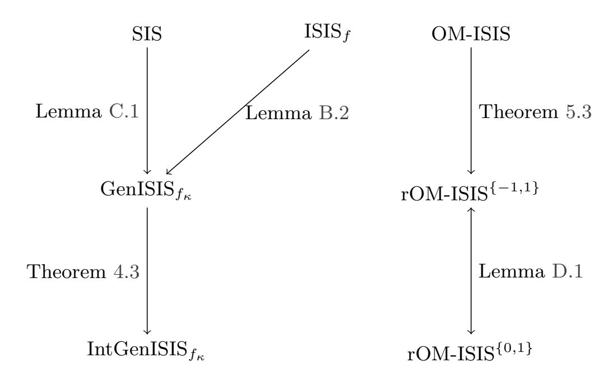
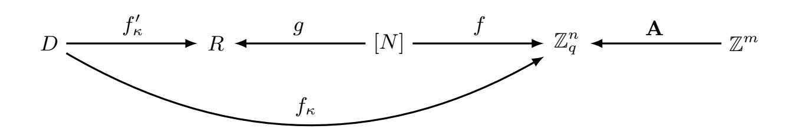

{0}------------------------------------------------

# Tight Reductions for SIS-with-Hints Assumptions with Applications to Anonymous Credentials

Ngoc Khanh Nguyen[1](https://orcid.org/0000-0001-8240-6167) and Jan Niklas Siemer[1](https://orcid.org/0009-0004-6525-6362)

King's College London

Abstract. In this work, we investigate the landscape of emerging latticebased assumptions tailored for anonymous credentials, focusing on variants of the Short Integer Solution (SIS) problem augmented with auxiliary hints. We provide a tight reduction from the Generalised ISIS<sup>f</sup><sup>κ</sup> (GenISIS<sup>f</sup><sup>κ</sup> ) (Dubois et al., PKC 2025) assumption to its interactive variant IntGenISIS<sup>f</sup><sup>κ</sup> , enabling the construction of proof-friendly signature schemes without incurring the significant efficiency loss observed in prior works. This allows constructions such as the anonymous credential scheme proposed by Bootle et al. (CRYPTO 2023) to base their security directly on the more extensively studied and easier to analyse assumption GenISIS<sup>f</sup><sup>κ</sup> , circumventing the previous 4X blow-up in credential size accompanying this decision. We also identify families of functions f for which GenISIS<sup>f</sup><sup>κ</sup> is as hard as SIS, leading to the first (strongly) unforgeable standard-model signature scheme from SIS without relying on chameleon hash functions.

Moreover, we analyse the "one-more"-type lattice assumptions, showing in particular that Randomised One-More-ISIS (Baldimtsi et al., ASI-ACRYPT 2024) is at least as hard as standard One-More-ISIS (Agrawal et al., ACM CCS 2022). Further, we inspect different, yet equivalent, variations of Randomised One-More-ISIS which could be of independent interest. Finally, we compare the structural properties of GenISIS<sup>f</sup><sup>κ</sup> and One-More-ISIS, highlighting both shared techniques and fundamental differences. We believe our results contribute to a clearer understanding of the assumptions underpinning efficient, lattice-based anonymous credential systems.

## <span id="page-0-0"></span>1 Introduction

Anonymous credentials have become a foundational component in digital identity and e-wallet systems, which are gaining increasing attention from governmental bodies, including several U.S. states [\[mDL\]](#page-32-0), the European Union [\[EUD\]](#page-31-0), and the UK [\[UKD\]](#page-33-0). With the rapid advancements in quantum computing, there is a growing demand for anonymous credential systems that offer post-quantum security, particularly those based on lattice-based assumptions.

Recent works [\[BLNS23b,](#page-30-0)[JRS23,](#page-32-1)[AGJ](#page-30-1)<sup>+</sup>24[,LCL](#page-32-2)<sup>+</sup>23] adopt the well-established "signatures with efficient protocols" paradigm introduced by Camenisch and Lysyanskaya [\[CL03\]](#page-31-1). This approach relies on three cryptographic primitives: a 

{1}------------------------------------------------

commitment scheme, a signature scheme, and a non-interactive zero-knowledge proof of knowledge. Informally, a user  $\mathcal{U}$  begins by committing to their attribute vector  $\mathbf{m}$  using fresh randomness  $\mathbf{r}$  to compute  $\mathbf{t} = \mathsf{Com}(\mathbf{m}; \mathbf{r})$ , which is then sent to the issuer  $\mathcal{I}^1$ . The issuer, using a secret key  $\mathsf{sk}$ , signs the message  $\mathbf{t}$  and returns the signature  $\sigma = \mathsf{Sig}(\mathsf{sk}, \mathbf{t})$  to  $\mathcal{U}$ . To produce an anonymous credential, the user then provides a zero-knowledge proof demonstrating knowledge of the attributes  $\mathbf{m}$ , randomness  $\mathbf{r}$ , and signature  $\sigma$ , satisfying

$$\mathsf{Vf}(\mathsf{pk},\mathsf{Com}(\mathbf{m};\mathbf{r}),\sigma)=1.$$

To instantiate this framework efficiently, the signature scheme must be "proof-friendly," meaning it allows efficient proofs of signature possession. This requirement excludes many ROM-secure schemes, such as the NIST-selected Dilithium [DKL+18] and Falcon [FHK+20]<sup>2</sup>. One line of works [dPK22, JRS23, LCL+23, AGJ+24, JS24] constructs anonymous credentials and blind signatures using ABB-type standard model signatures [ABB10], which are secure under the well-established (Module-)SIS assumption. However, the underlying signatures are less efficient than their ROM-based counterparts and the anonymous credentials rely on non-tight reductions via complexity leveraging and puncturing strategies, making them less practical overall. These limitations have motivated exploration into signature schemes based on non-standard lattice assumptions.

### <span id="page-1-4"></span>1.1 SIS-with-Hints Assumptions

To support privacy-preserving applications, several works have proposed new lattice assumptions that can be viewed as SIS variants augmented with additional hints.

<span id="page-1-3"></span> $ISIS_f$  assumption. Introduced by Bootle et al. [BLNS23b], the  $ISIS_f$  assumption has been applied in anonymous credentials [BLNS23b, DKLW25] and direct anonymous attestation [CHE24]. Let  $f:[N] \to \mathbb{Z}_q^n$  be an efficiently computable function with domain size  $N \in \mathbb{N}$ . The  $ISIS_f$  assumption states that given a random matrix  $\mathbf{A} \leftarrow \mathbb{Z}_q^{n \times m}$  and k hint pairs  $(x_i, \mathbf{s}_i) \in [N] \times \mathbb{Z}^m$  such that

$$\mathbf{A}\mathbf{s}_i = f(x_i) \pmod{q}$$
 and  $\mathbf{s}_i$  is short,

it is hard to find a new pair  $(x^*, \mathbf{s}^*) \notin \{(x_1, \mathbf{s}_1), \dots, (x_k, \mathbf{s}_k)\}$  such that  $\mathbf{A}\mathbf{s}^* = f(x^*) \pmod{q}$  and  $\mathbf{s}^*$  is also short. Dubois et al. [DKLW25] recently generalised this to the GenISIS<sub>f<sub>k</sub></sub> assumption, introducing two key changes: the use of a keyed function  $f: \mathcal{K} \times D \to \mathbb{Z}_q^n$  and allowing non-uniform sampling of preimages  $x_i$ . [BLNS23b] showed that ISIS<sub>f</sub> can be reduced to SIS when f is modeled as a random oracle<sup>3</sup>. However, to maintain proof-friendliness, one must efficiently

<span id="page-1-0"></span>The user must also prove that  $\mathbf{t}$  was correctly formed, but we omit this detail for the sake of the introduction.

<span id="page-1-1"></span><sup>&</sup>lt;sup>2</sup> As an exception, the work by Beullens et al. [BLNS23a] builds a blind signature scheme by instantiating Falcon with a concrete hash function and running a generic succinct argument [BS23] to prove signature possession.

<span id="page-1-2"></span><sup>&</sup>lt;sup>3</sup> Additionally, [DKLW25] related the hardness of GenISIS<sub> $f_{\kappa}$ </sub> to the Vanishing SIS assumption [CLM23].

{2}------------------------------------------------

prove knowledge of f's preimages, highlighting the classic trade-off between security and efficiency.

To construct more efficient proof-friendly signatures, [BLNS23b, DKLW25] introduce a variant called  $Interactive \ ISIS_f$  (IntISIS<sub>f</sub>). Bootle et al. [BLNS23b] provide a reduction from  $ISIS_f$  to  $IntISIS_f$ , but with a security loss of  $\mathcal{O}(k)$ . As shown in their parameter selection, this non-tight reduction significantly impacts performance, increasing credential size by even a factor of four (for  $k=2^{64}$ ). Hence, it is no surprise the LaZeR library implementation [LSS24] of the anonymous credential system from [BLNS23b] heuristically assumes  $IntISIS_f$  is as hard as SIS.

<span id="page-2-1"></span>One-More ISIS assumption. Proposed by Agrawal et al. [AKSY22] for round-optimal blind signatures, the One-More-ISIS (OM-ISIS) problem is defined as follows. Given a random matrix  $\mathbf{A} \leftarrow \mathbb{Z}_q^{n \times m}$  and a set  $T \subset \mathbb{Z}_q^n$  of uniformly random target vectors, an adversary receives  $(\mathbf{A}, T)$  and oracle access to a "preimage oracle"  $O_{\text{pre}}$  that returns a short vector  $\mathbf{x} \in \mathbb{Z}^m$  such that  $\mathbf{A}\mathbf{x} = \mathbf{y}$  (mod q) for any input  $\mathbf{y} \in \mathbb{Z}_q^n$ . If the adversary makes k oracle queries and outputs k+1 pairwise distinct short vectors

$$\mathbf{s}_1, \dots, \mathbf{s}_{k+1} \in \mathbb{Z}^m$$
 such that  $\mathbf{A}\mathbf{s}_i \in T$ ,

it wins the OM-ISIS game. Baldimtsi et al. [BCGY24] introduced a variant, Randomised OM-ISIS (rOM-ISIS), enabling the first lattice-based non-interactive blind signature [Han23]. However, it remains unclear whether these assumptions can be reduced to SIS, or even how OM-ISIS and rOM-ISIS relate in terms of hardness.

Ultimately, given the increase of new lattice-based assumptions, it is crucial to understand their interrelations to boost confidence in security of the recent efficient, privacy-preserving constructions.

#### <span id="page-2-0"></span>1.2 Our Contributions

In this work, we explore the relationships between the hardness of recently proposed lattice-based assumptions in the context of anonymous credentials. An overview of our hardness reductions is presented in Figure 1.

<span id="page-2-2"></span>Strong unforgeable signatures from GenISIS<sub> $f_{\kappa}$ </sub>. We present a new and streamlined framework for constructing signature schemes based on the GenISIS<sub> $f_{\kappa}$ </sub> assumption. Central to our contribution is a *tight reduction* from GenISIS<sub> $f_{\kappa}$ </sub> to IntGenISIS<sub> $f_{\kappa}$ </sub>, significantly improving upon the work of [BLNS23b], which incurred a poly( $\lambda$ ) security loss. Our result implies that proof-friendly signature schemes can be instantiated from GenISIS<sub> $f_{\kappa}$ </sub> with minimal or no parameter adjustments. In particular, we avoid the 4X efficiency loss observed in Table 6 of [BLNS23b], demonstrating that the anonymous credential system implemented in LaZeR [LSS24] retains its efficiency under the plain GenISIS<sub> $f_{\kappa}$ </sub> assumption.

{3}------------------------------------------------



<span id="page-3-0"></span>Fig. 1. Overview of our results.

Additionally, we identify families of functions f for which GenISISf<sup>κ</sup> is as hard as SIS. Combined with the results of [\[DKLW25\]](#page-31-5), this yields, to the best of our knowledge, the first strongly unforgeable standard-model signature scheme from SIS that does not rely on chameleon hash functions [\[KR00,](#page-32-6)[CHKP10,](#page-31-8)[CDJ](#page-30-7)+25].

<span id="page-3-1"></span>Analysis of the "one-more"-type lattice assumptions. We present the first formal connection between OM-ISIS and its randomised variant. Specifically, we prove that rOM-ISIS is at least as hard as OM-ISIS, thereby enabling the construction of non-interactive blind signature schemes based on the OM-ISIS assumption. Furthermore, we analyse variations of rOM-ISIS in which the additional randomness is sampled from different domains. In particular, we show that the original {−1, 1}-restriction on the randomness, as used in [\[BCGY24\]](#page-30-6), yields the same hardness guarantees as the rOM-ISIS variant with {0, 1}-randomness. This could potentially broaden the applicability and flexibility of the rOM-ISIS assumption in cryptographic constructions.

GenISIS<sup>f</sup><sup>κ</sup> vs OM-ISIS. Some hardness reductions on GenISIS<sup>f</sup><sup>κ</sup> and OM-ISIS described in Figure [1](#page-3-0) do apply similar techniques (in particular, Theorems [4.3](#page-17-0) and [5.3\)](#page-25-0), which include careful entropy-based analysis of adversarial outputs. However, while some structural similarities can be found, ISIS<sup>f</sup> and OM-ISIS are fundamentally distinct. In ISIS<sup>f</sup> , the adversary is given multiple preimagetarget pairs and must produce a new one. In contrast, OM-ISIS challenges the adversary to find preimages for random targets, while having access to an oracle that produces short preimages for arbitrary targets. Hence, establishing a formal connection between these two assumptions remains an intriguing direction for future research.

{4}------------------------------------------------

### <span id="page-4-0"></span>2 Technical Overview

As we analyse two families of assumptions in our paper, we split the technical overview per family of assumptions and compare them at the end.

### <span id="page-4-1"></span>2.1 $ISIS_f$ and its Generalisation

ISIS<sub>f</sub> is a versatile problem, which can be used to generically derive constructions for several primitives such as signatures, group signatures, blind signatures, and anonymous credentials. The problem was introduced by Bootle et al. [BLNS23b] to build practical anonymous credentials from lattices. The unique property of the ISIS<sub>f</sub> assumption, which makes it so versatile, is the absence of one or multiple target vectors, as known from ISIS. In the case of ISIS<sub>f</sub>, the function f takes on this part and introduces a more dynamic target, which in theory can be chosen by the adversary. Thus, the choice of the function f crucially determines the hardness of an ISIS<sub>f</sub> instance. We elaborate on this further in Section 4.

<span id="page-4-2"></span>**Definition 2.1 (ISIS**<sub>f</sub> - **Informal).** Let  $f:[N] \to \mathbb{Z}_q^n$  be a function. In the ISIS<sub>f</sub> experiment, the challenger samples a matrix  $\mathbf{A} \leftarrow \mathbb{Z}_q^{n \times m}$  uniformly at random along with k hints  $(x_i, \mathbf{s}_i)$ . The hints are sampled by choosing  $x_i \leftarrow \mathbb{N}[N]$  and  $\mathbf{s}_i \leftarrow \mathbb{N}[n]$  under the condition  $\mathbf{A} \cdot \mathbf{s}_i = f(x_i)$ , which we also denote by  $\mathbf{s}_i \leftarrow \mathbb{N}[n]$ . Given  $\mathbf{A}$  and  $\{(x_i, \mathbf{s}_i)\}_{i \in [k]}$ , the adversary is asked to output a pair  $(x^*, \mathbf{s}^*)$ . The adversary wins if

<span id="page-4-3"></span>
$$\mathbf{A} \cdot \mathbf{s}^* = f(x^*) \wedge 0 < \|\mathbf{s}^*\| \le \beta \wedge (x^*, \mathbf{s}^*) \notin \{(x_i, \mathbf{s}_i)\}_{i \in [k]}.$$

Intuitively, the ISIS<sub>f</sub> assumption states that it is hard to find a new tuple  $(x^*, \mathbf{s}^*)$  satisfying  $\mathbf{A} \cdot \mathbf{s}^* = f(x^*)$  with short vector  $\mathbf{s}^* \in \mathbb{Z}^m$  given a set of solutions. Due to the shape of the equation  $\mathbf{A} \cdot \mathbf{s}^* = f(x^*)$ , the adversary is required to either break ISIS or to find a preimage for the function f.

Deriving new signatures from more fundamental assumptions by reducing to  $\mathrm{ISIS}_f$ , seems to be hard due to some restrictive choices in the definition of  $\mathrm{ISIS}_f$ . Thus, Dubois et al. [DKLW25] introduced a generalised version of  $\mathrm{ISIS}_f$  (GenISIS $_f$ ) for this purpose. It lifts two constraints of  $\mathrm{ISIS}_f$  while retaining the versatility of  $\mathrm{ISIS}_f$  to derive constructions for several primitives. We highlight the differences to  $\mathrm{ISIS}_f$  below.

**Definition 2.2 (GenISIS**<sub> $f_{\kappa}$ </sub> - Informal). Let  $f_{\kappa}: D \to \mathbb{Z}_q^n$  be a keyed function and let  $\chi(D)$  be a distribution over D. In the GenISIS<sub> $f_{\kappa}$ </sub> experiment, the challenger samples a key  $\kappa \leftarrow \$ \mathcal{K}$  and a matrix  $\mathbf{A} \leftarrow \$ \mathbb{Z}_q^{n \times m}$  uniformly along with k hints  $(x_i, \mathbf{s}_i)$ . The hints are sampled by choosing  $\mathbf{x}_i \leftarrow \$ \chi(D)$  and  $\mathbf{s}_i \leftarrow \$ D_{\mathbb{Z}^m, s}$  under the condition  $\mathbf{A} \cdot \mathbf{s}_i = f_{\kappa}(x_i)$ . Given  $\mathbf{A}, \kappa$ , and  $\{(x_i, \mathbf{s}_i)\}_{i \in [k]}$ , the adversary is asked to output a pair  $(x^*, \mathbf{s}^*)$ . The adversary wins if

$$\mathbf{A} \cdot \mathbf{s}^* = f_{\kappa}(x^*) \wedge ||\mathbf{s}^*|| \leq \beta \wedge (x^*, \mathbf{s}^*) \notin \{(x_i, \mathbf{s}_i)\}_{i \in [k]}.$$

{5}------------------------------------------------

Other than  $\mathrm{ISIS}_f$ ,  $\mathrm{GenISIS}_{f_\kappa}$  allows  $x_i$  to be chosen from any distribution  $\chi(D)$  over an arbitrary domain D and introduces a keyed function  $f_\kappa$  instead of a 'static' function f.

To present our first result, we theoretically need to introduce the notion of a Preimage Sampleable Function (PSF). However, it is suitable to think of a PSF as a keyed hash function  $f'_{\kappa}: D \to R$ , which is invertible with a trapdoor. Inverting the function on a value  $y \in R$  results in outputting a preimage  $x \in D$  distributed according to some distribution  $\chi(D)$  under the condition  $f'_{\kappa}(x) = y$ .

Now, we can state our first result. Notice that any  $ISIS_f$  instance is also a  $GenISIS_{f_{\kappa}}$  instance but with size of its keyspace  $|\mathcal{K}| = 1$ . The following reduction enables a generic transformation from  $ISIS_f$  to  $GenISIS_{f_{\kappa}}$  with a properly keyed function.

<span id="page-5-0"></span>**Lemma 2.3 (Informal version of Lemma B.2).** Let  $\mathcal{F}$  be a collision-resistant PSF with a keyed function  $f'_{\kappa}: D \to R$  and let  $\chi(D)$  denote the distribution induced by the PSF. Furthermore, let  $g:[N] \to R$  be a bijection. Then,  $GenISIS_{f_{\kappa}}$  with  $f_{\kappa} := f \circ g^{-1} \circ f'_{\kappa}$  is at least as hard as  $ISIS_f$  if f is preimage-resistant.

In the proof of Lemma B.2, we use the bijection g to map the uniformly distributed part of the hints  $x_i \in [N]$  to some set R of the same size. As g is a bijection, the distribution of  $r_i = g(x_i)$  stays uniform over R. In the next step, we invert each value  $f_{\kappa}^{\prime -1}(y_i) = d_i \in D$  for some previously sampled  $\kappa \leftarrow \mathcal{K}$ , which results in values distributed according to the distribution  $\chi(D)$  as the set  $\{r_i\}_{i\in[k]}$  was distributed uniformly over R. Furthermore, each hint remains valid as  $f_{\kappa}(d_i) = f \circ g^{-1} \circ f_{\kappa}' \left( (f_{\kappa}')^{-1} \circ g(x_i) \right) = f(x_i)$ . Thus, the hints are distributed as expected by the GenISIS $f_{\kappa}$  adversary. Any GenISIS $f_{\kappa}$  solution  $(d^*, \mathbf{s}^*) \in D \times \mathbb{Z}^m$ , then yields an ISISf solution as

$$\mathbf{A} \cdot \mathbf{s}^* = f_{\kappa}(d^*) = f(g^{-1} \circ f'_{\kappa}(d^*)).$$

The fact that f is preimage resistant is required to argue that a solution with  $\mathbf{s}^* = \mathbf{0}$  is unlikely.

The reduction described above does not only provide a generic transformation from  $\mathrm{ISIS}_f$  to  $\mathrm{GenISIS}_{f_\kappa}$  instances, but it shows that sampling the first part of the hints  $x_i$  as a discrete Gaussian in a  $\mathrm{GenISIS}_{f_\kappa}$  instance does not decrease the robustness of the corresponding  $\mathrm{ISIS}_f$  instance. If we choose to use Lemma 2.3 with the PSF introduced in [GPV08], the hints  $x_i \in D$  are distributed as a discrete Gaussian. With this observation, we move to the next reduction from  $\mathrm{SIS}$  to a  $\mathrm{GenISIS}_{f_\kappa}$  instance, which requires  $x_i$  to be distributed partly discrete Gaussian and partly uniform.

We define a suitable function  $f_{\kappa}$  to reduce SIS to GenISIS<sub> $f_{\kappa}$ </sub> in the standard model. To sample a key for  $f_{\kappa}$ , we sample  $\ell+1$  matrices  $\mathbf{A}_0, \ldots, \mathbf{A}_{\ell} \leftarrow \mathbb{Z}_q^{n \times n \lceil \log q \rceil}$  and a vector  $\mathbf{u} \leftarrow \mathbb{Z}_q^n$  uniformly. Furthermore, define D as  $D \coloneqq \{0,1\}^{\ell} \times \{\mathbf{s} \in \mathbb{Z}^{n \lceil \log q \rceil} : \|\mathbf{s}\| \le s \cdot \sqrt{n \lceil \log q \rceil} \}, \kappa = (\mathbf{A}_0, \ldots, \mathbf{A}_{\ell}, \mathbf{u})$  and

<span id="page-5-1"></span>
$$f_{\kappa}: D \to \mathbb{Z}_q^n, (\mathbf{m}, \mathbf{x}) \mapsto \mathbf{A}_{\mathbf{m}} \cdot \mathbf{x} + \mathbf{u}, \text{ where } \mathbf{A}_{\mathbf{m}} \coloneqq \mathbf{A}_0 + \sum_{i \in [\ell]} m_i \cdot \mathbf{A}_i.$$

{6}------------------------------------------------

Lemma 2.4 (Informal version of Lemma C.1). Let  $\beta \in \mathcal{O}(\ell(n \log q)^{3/2})$   $\omega \left(\sqrt{\log(n \lg q)}\right)^4$  and let  $f_{\kappa}$  be defined as above. Then,  $GenISIS_{f_{\kappa}}$  with  $f_{\kappa}$  is at least as hard as SIS.

We adapt the Strong Existential Unforgeability under Static Chosen Message Attacks (sEUF-SCMA) secure signature from [MP12] to GenISIS<sub> $f_{\kappa}$ </sub>.<sup>4</sup> The signature scheme described by Micciancio and Peikert provides short preimages  $\mathbf{s}_i \in \mathbb{Z}_q^{n \lg q + 2n \lceil \log q \rceil}$  of the matrix  $\begin{bmatrix} \bar{\mathbf{A}} & \mathbf{G} - \mathbf{A}\mathbf{R} & \mathbf{A}_{\mathbf{m}} \end{bmatrix}$  for some uniformly chosen target vector  $\mathbf{u} \in \mathbb{Z}_q^n$  as signatures. We move the last part of this matrix into the function  $f_{\kappa}$  as described above s.t. the function depends on the message  $\mathbf{m}$ .

To prove the signature and our GenISIS<sub> $f_{\kappa}$ </sub> instance secure, the **G**-trapdoor moves to the last part of the matrix, i.e., into our function  $f_{\kappa}$ . Then, the proof uses the lattice-mixing [Boy10] and the prefix [CHKP10] technique to puncture the trapdoor for a specific (set of) message(s). As the proof proceeds similarly to the one of the signature scheme, we focus on the two major differences to the original proof here.

- Originally, there are no messages  $\mathbf{m}_i$  in the GenISIS $_{f_{\kappa}}$  experiment. As the keyed function  $f_{\kappa}$  depends on the choice of the message  $\mathbf{m} \in \{0,1\}^{\ell}$ , it becomes part of the hints. Thus, a hint in this GenISIS $_{f_{\kappa}}$  instance is described by  $(x_i = (\mathbf{m}_i, \mathbf{x}_i), \mathbf{s}_i)$ , where  $\mathbf{x}_i$  and  $\mathbf{s}_i$  are distributed discrete Gaussian and  $\mathbf{m}_i$  is distributed uniformly random over  $\{0,1\}^{\ell}$ .
- In the sEUF-SCMA experiment, the adversary provides the set of distinct messages to sign to the challenger upfront. GenISIS<sub> $f_{\kappa}$ </sub> requires the hints to be distributed according to some distribution  $\chi(D)$ . As the messages have to be distinct, the probability of a collision induced by  $\chi(D)$  needs to be negligible.

The evaluation of these differences suggests that any lattice-based sEUF-SCMA secure signature can be reduced to  $\operatorname{GenISIS}_{f_{\kappa}}$ . Furthermore, the reduction presented below implies an efficient technique to make lattice-based sEUF-SCMA signatures generically strong existential unforgeable under *adaptively* chosen message attacks (sEUF-ACMA). The new result presented below should make this transformation a sound competitor compared to the existing technique using chameleon hashes [KR00].

<span id="page-6-2"></span>Interactive  $GenISIS_{f_{\kappa}}$  The true potential of the  $ISIS_f$  framework stems from the interactive version of  $ISIS_f$ . Instances of this problem can be used to generically derive constructions for several primitives such as signatures, group signatures, blind signatures and anonymous credentials. In this paper, we alter the generalised interactive  $ISIS_f$  version provided in [DKLW25] slightly to keep reductions for constructions relying on  $IntGenISIS_{f_{\kappa}}$  as simple as possible.

<span id="page-6-1"></span><span id="page-6-0"></span><sup>&</sup>lt;sup>4</sup> A definition of signatures and security notions mentioned in this paper can be found in Appendix A.2.

{7}------------------------------------------------

**Definition 2.5 (IntGenISIS**<sub> $f_{\kappa}$ </sub> - **Informal).** Let  $f: \mathcal{K} \times D \to \mathbb{Z}_q^n$  be a keyed function and let  $\chi(D)$  be a distribution over D. The  $IntGenISIS_{f_{\kappa}}$  experiment is defined in the following way.

- The challenger samples two matrices  $\mathbf{A} \leftarrow \mathbb{Z}_q^{n \times m}$ ,  $\mathbf{C} \leftarrow \mathbb{Z}_q^{n \times \ell}$  and a key  $\kappa \leftarrow \mathbb{K}$  uniformly at random and gives them to  $\mathcal{A}$ .
- Then,  $\mathcal{A}$  adaptively queries a preimage oracle k-times with short messages  $\mathbf{m}_i \in \mathbb{Z}_q^\ell$ , which are answered by  $(x_i, \mathbf{s}_i)$  sampled as  $x_i \leftarrow \$ \chi(D)$  and  $\mathbf{s}_i \leftarrow \$ D_{\mathbb{Z}^m,s}$  under the condition  $\mathbf{A} \cdot \mathbf{s}_i = f_{\kappa}(x_i) + \mathbf{C} \cdot \mathbf{m}_i$ .
- Finally,  $\mathcal{A}$  outputs a tuple  $(x^*, \mathbf{s}^*, \mathbf{m}^*) \in D \times \mathbb{Z}^m \times \mathbb{Z}^\ell$ .

The adversary wins if  $\|\mathbf{m}^*\| \leq \beta_m$  and

$$\mathbf{A} \cdot \mathbf{s}^* = f_{\kappa}(x^*) + \mathbf{C} \cdot \mathbf{m} \wedge \|\mathbf{s}^*\| \leq \beta_s \wedge (x^*, \mathbf{s}^*, \mathbf{m}^*) \notin \{(x_i, \mathbf{s}_i, \mathbf{m}_i)\}_{i \in [k]}.$$

The interactive version extends  $\operatorname{GenISIS}_{f_{\kappa}}$  by an Ajtai commitment  $\mathbf{C} \cdot \mathbf{m} \in \mathbb{Z}_q^n$ . Although the security of constructions is based directly on  $\operatorname{IntGenISIS}_{f_{\kappa}}$ , the non-interactive version remains important, as it is typically easier to analyse a non-interactive problem. Bootle et al. [BLNS23b, Theorem 3.3] provide a reduction from  $\operatorname{ISIS}_f$  to the interactive version of  $\operatorname{ISIS}_f$  incurring a polynomial loss-factor  $\mathcal{O}(k)$ . We generalise this theorem to  $\operatorname{GenISIS}_{f_{\kappa}}$  and optimise it by removing the polynomial loss-factor, providing a tight reduction between the problems. Thus, the following theorem prevents a loss of  $2^{64}$  in bit-security for any constructions based on  $\operatorname{GenISIS}_{f_{\kappa}}$ , considering the number of preimage queries as  $2^{64}$  as proposed by  $\operatorname{NIST}$  [NIS].

<span id="page-7-0"></span>Theorem 2.6 (Informal version of Theorem 4.3). Require  $\chi(D)$  to have large min-entropy. Any IntGenISIS<sub> $f_{\kappa}$ </sub> instance allowing at most k queries is at least as hard as GenISIS<sub> $f_{\kappa}$ </sub> handing out  $k \cdot T_{\max}$  hints, where  $T_{\max} \in poly(\lambda)$  and  $\lambda$  denotes the security parameter.

In the proof of this theorem, we use several game hops starting with the IntGenISIS $_{f_{\kappa}}$  game. The first hop replaces  $\mathbf{C}$  by  $\mathbf{A} \cdot \mathbf{R}$  for some uniformly chosen  $\mathbf{R} \in \{0,1\}^{m \times \ell}$ . In the next game hops, we alter the preimage oracle  $O_{\mathrm{pre}}$ . First, we introduce a loop and introduce the possibility of rejecting samples  $(x, \mathbf{A}_s^{-1}(f(x) + \mathbf{C} \cdot \mathbf{m}))$  before outputting one. Next, we ensure that every query generates at most  $T_{\mathrm{max}}$  samples before it outputs one. Finally, we use generalised rejection sampling [BTT22] to replace the inversion of matrix  $\mathbf{A}$  by  $\mathbf{A}_s^{-1}(f(x)) + \mathbf{R} \cdot \mathbf{m}$ , where  $(x, \mathbf{A}_s^{-1}(f(x))) = (x, \mathbf{s})$  is known from the  $k \cdot T_{\mathrm{max}}$  hints provided by  $\mathrm{GenISIS}_{f_{\kappa}}$ . Thus, the reduction algorithm is now capable of answering preimage queries correctly with a distribution statistically close to the expected one. However, the recovered  $\mathrm{GenISIS}_{f_{\kappa}}$  solution  $(x^*, \mathbf{s}^* - \mathbf{R} \cdot \mathbf{m}^*)$  might collide with an element from the set of hints  $\{(x_i, \mathbf{s}_i)\}_{i \in [k \cdot T_{\mathrm{max}}]}$  given to the reduction algorithm as . . .

- it does not output all the hints due to rejection sampling, and ...

{8}------------------------------------------------

-  $O_{\text{pre}}$  does not output  $(x_i, \mathbf{s}_i)$  directly (removing it from the space of suitable solutions), but  $(x_i, \mathbf{s}_i + \mathbf{R} \cdot \mathbf{m}_i)$  for any queried message  $\mathbf{m}_i \in \mathbb{Z}^{\ell}$ . Thus, a solution  $(x^*, \mathbf{s}^* - \mathbf{R} \cdot \mathbf{m}^*) = (x_i, \mathbf{s}_i)$  could be a valid IntGenISIS $_{f_{\kappa}}$  solution for some  $i \in [k \cdot T_{\text{max}}]$ , but it would imply an invalid GenISIS $_{f_{\kappa}}$  solution.

As the first part of the hints  $x_i \in D$  is sampled with large min-entropy, we can upper-bound the probability that the adversary picks a value  $x^*$ , which was part of the hints but rejected by  $O_{\text{pre}}$ , with  $k \cdot T_{\text{max}} \cdot 2^{-\omega(\lambda)}$ . Therefore, the probability that  $\mathcal{A}$  outputs a solution, which reuses a rejected hint, is negligible. Thus, we only need to argue about the case that the adversary reuses a hint output by  $O_{\text{pre}}$ , i.e.,  $x^* = x_i$  for some  $i \in k \cdot T_{\text{max}}$  and  $\mathcal{A}$  has seen  $x_i \in D$  as output of a preimage query. To rule out the second case more conveniently, we remove the possibility that any  $x \in D$  appears twice in the set of hints. We can upper bound the probability of this scenario due to the large min-entropy of  $\chi(D)$  using the birthday bound  $k^2 \cdot T_{\text{max}}^2 \cdot 2^{-\omega(\lambda)}$ . Thus, the first part  $x_i$  of any hint output by  $O_{\mathrm{pre}}$  can only occur once in the set of hints, which implies that the solution of  $\mathcal{A}$ can collide with at most one hint and this hint was output by  $O_{\rm pre}$ . Focusing on this case, the condition  $(x^*, \mathbf{s}^*, \mathbf{m}^*) \notin \{(x_i, \mathbf{s}_i, \mathbf{m}_i)\}_{i \in [k]}$  then ensures  $\mathbf{m}^* \neq \mathbf{m}_i$ as  $\mathbf{s}^* = \mathbf{s}_i$  follows immediately otherwise. Since  $\mathbf{m}^* \neq \mathbf{m}_i$ , there is at least one index  $j \in [\ell]$  s.t.  $m_i^* \neq m_{i,j}$ . We focus on the corresponding column in matrix C denoted by  $\mathbf{c}_j \in \mathbb{Z}_q^{\ell}$ . As the matrix **R** is hidden from the adversary, we consider the number of potential preimages  $\mathbf{r}_j \in \{0,1\}^m$  s.t.  $\mathbf{A} \cdot \mathbf{r}_j = \mathbf{c}_j$ . An adapted version of [Lyu12, Lemma 5.2] shows that there at least two preimages  $\mathbf{r}_i$  with overwhelming probability. Only one of the two choices for  $\mathbf{r}_j$  can potentially cause a collision with the set of hints and the matrix  $\mathbf{R} \in \{0,1\}^{m \times \ell}$  is sampled uniformly at random. Thus, the possibility that  $(x^*, \mathbf{s}^* - \mathbf{R} \cdot \mathbf{m}^*) \in \{x_i, \mathbf{s}_i\}_{i \in [k \cdot T_{\text{max}}]}$  is at most  $\frac{1}{2}$  – negl( $\lambda$ ). This concludes the proof of Theorem 2.6.

Theorem 2.6 yields the first formalisation of the reduction from  $\operatorname{GenISIS}_{f_{\kappa}}$  to  $\operatorname{IntGenISIS}_{f_{\kappa}}$ . Furthermore, it tightens the existing proof for  $\operatorname{ISIS}_f$  in terms of security losses by exploiting conditions rather than probabilities. The reduction satisfies stronger conditions by keeping the 'strong unforgeability flavor' of  $\operatorname{IntGenISIS}_{f_{\kappa}}$ , while the interactive version of  $\operatorname{ISIS}_f$  is closely related to weak unforgeability. Almost all of the techniques used in this proof can be naturally lifted to rings and the reduction trivially applies to the non-generalised  $\operatorname{ISIS}_f$  context as well. We elaborate on this further in Section 4.

#### <span id="page-8-0"></span>2.2 One-More-ISIS and its Randomised Variant

Alongside  $ISIS_f$ , we examine two assumptions called One-More-ISIS (OM-ISIS) and Randomised OM-ISIS (rOM-ISIS). The OM-ISIS assumption was introduced by Agrawal et al. [AKSY22] to build practical, round-optimal lattice-based blind signatures.

**Definition 2.7 (One-More-ISIS - Informal).** The challenger samples a matrix  $\mathbf{A} \leftarrow \mathbb{Z}_q^{n \times m}$  and a set T of target vectors from  $\mathbb{Z}_q^n$  uniformly at random and gives them to A. Then, A adaptively queries a preimage oracle k-times with

{9}------------------------------------------------

arbitrary target vectors  $\hat{\mathbf{t}} \in \mathbb{Z}_q^n$ , which are answered by  $\hat{\mathbf{s}}$  sampled as  $\hat{\mathbf{s}} \leftarrow D_{\mathbb{Z}^m,s}$  under the condition  $\mathbf{A} \cdot \hat{\mathbf{s}} = \hat{\mathbf{t}}$ . Finally,  $\mathcal{A}$  outputs a set S of k+1 vectors. The adversary wins if for all vectors  $\mathbf{s} \in S$  the following holds.

<span id="page-9-1"></span>
$$\mathbf{A} \cdot \mathbf{s} \in T \wedge \|\mathbf{s}\| \le \beta$$

<span id="page-9-0"></span>Intuitively, the OM-ISIS notion states that given access to an ISIS solver, it remains hard to compute an additional preimage for a polynomial number of possible ISIS targets. The authors provide an analysis of several attack strategies for OM-ISIS to gain confidence in the assumption [AKSY22, Section 4.5]. To build a non-interactive blind-signature, Baldimtsi et al. [BCGY24] introduce a closely related assumption called rOM-ISIS, which they claim to be more robust. We highlight the differences to OM-ISIS below.

**Definition 2.8 (Randomised One-More-ISIS - Informal).** The challenger samples two matrices  $\mathbf{A}, \mathbf{B} \leftarrow \mathbb{S} \mathbb{Z}_q^{n \times m}$  and a set T of target vectors from  $\mathbb{Z}_q^n$  uniformly at random and gives them to  $\mathcal{A}$ . Then,  $\mathcal{A}$  adaptively queries a preimage oracle k-times with arbitrary target vectors  $\hat{\mathbf{t}} \in \mathbb{Z}_q^n$ , which are answered by a pair  $(\hat{\mathbf{s}}, \hat{\mathbf{u}})$  sampled as  $\hat{\mathbf{s}} \leftarrow \mathbb{S} D_{\mathbb{Z}^m, \mathbf{s}}$  and  $\hat{\mathbf{u}} \leftarrow \mathbb{S} \{-1, 1\}^m$  under the condition  $\mathbf{A} \cdot \hat{\mathbf{s}} + \mathbf{B} \cdot \hat{\mathbf{u}} = \hat{\mathbf{t}}$ . Finally,  $\mathcal{A}$  outputs a set S of k+1 pairs  $(\mathbf{s}, \mathbf{u})$ . The adversary wins if for all vectors  $\mathbf{s} \in S$  the following holds.

$$\mathbf{A} \cdot \mathbf{s} + \mathbf{B} \cdot \mathbf{u} \in T \wedge ||\mathbf{s}|| \le \beta \wedge \mathbf{u} \in \{-1, 1\}^m$$

The authors state that their assumption is more robust due to the fact that the adversary is not able to select the preimage vector for the challenge. The actual target vector for  $O_{\text{pre}}$  is  $\mathbf{t} - \mathbf{B} \cdot \hat{\mathbf{u}}$ , which they claim to be re-randomised due to the random choice of  $\hat{\mathbf{u}} \in \{-1,1\}^m$ . Baldimtsi et al. [BCGY24] provide some analysis of their assumption, which resembles the analysis of OM-ISIS closely and shows that the restriction of  $\hat{\mathbf{u}}$  to  $\{-1,1\}$  mostly prevents the previously presented attacks on OM-ISIS. In this paper, we present a reduction from OM-ISIS to rOM-ISIS, which proves that rOM-ISIS is at least as hard as OM-ISIS.

<span id="page-9-2"></span>Theorem 2.9 (Informal version of Theorem 5.3). Let  $m \ge 2n \log q$  and q > 2. Randomised One-More-ISIS is at least as hard as One-More-ISIS.

We prove this theorem by replacing  $\mathbf{B} \in \mathbb{Z}_q^{n \times m}$  by  $\mathbf{A} \cdot \mathbf{R}$  for some uniformly sampled  $\mathbf{R} \leftarrow \$ \{0,1\}^{m \times m}$ . This allows us to recover a OM-ISIS solution for the matrix  $\mathbf{A} \in \mathbb{Z}_q^{m \times m}$  once  $\mathcal{A}$  outputs a rOM-ISIS solution for  $\mathbf{A}, \mathbf{B} \in \mathbb{Z}_q^{n \times m}$ . The set of targets T can be forwarded to  $\mathcal{A}$  without any changes. Preimage queries for vectors  $\hat{\mathbf{t}} \in \mathbb{Z}_q^n$  are answered by sampling a vector  $\hat{\mathbf{u}} \leftarrow \$ \{-1,1\}^m$  and asking the preimage oracle of OM-ISIS for a preimage  $\hat{\mathbf{s}} \in \mathbb{Z}^m$  of  $\hat{\mathbf{t}} - \mathbf{B} \cdot \hat{\mathbf{u}}$ . Then, the pair  $(\hat{\mathbf{s}}, \hat{\mathbf{u}})$  is a suitable and correctly distributed answer to the preimage query. Once  $\mathcal{A}$  outputs a valid rOM-ISIS solution as a set of tuples  $(\mathbf{s}_i, \mathbf{u}_i)$ , the reduction algorithm converts them to short OM-ISIS solutions  $\mathbf{s}_i + \mathbf{R} \cdot \mathbf{m}_i$ . As any tuple of the rOM-ISIS solution satisfies  $\mathbf{A} \cdot \mathbf{s}_i + \mathbf{B} \cdot \mathbf{u}_i \in T$ , the converted solution satisfies  $\mathbf{A} \cdot (\mathbf{s}_i + \mathbf{R} \cdot \mathbf{u}_i) \in T$  as required. However, the addition of  $\mathbf{s}_i$  and  $\mathbf{R} \cdot \mathbf{u}_i$  could

{10}------------------------------------------------

potentially introduce collisions in the set of solutions. We inspect a potential collision

$$\mathbf{s}_i + \mathbf{R} \cdot \mathbf{u}_i = \mathbf{s}_j + \mathbf{R} \cdot \mathbf{u}_j \Leftrightarrow \mathbf{s}_i - \mathbf{s}_j = \mathbf{R} \cdot (\mathbf{u}_j - \mathbf{u}_i)$$

for some  $i \neq j \in [k+1]$ . If  $\mathbf{u}_i = \mathbf{u}_j$ , then  $\mathbf{s}_i = \mathbf{s}_j$  follows immediately. This contradicts the winning condition of rOM-ISIS. Therefore, we know  $\mathbf{u}_i \neq \mathbf{u}_j$  and apply the same technique as described before. As  $\mathbf{u}_i \neq \mathbf{u}_j$ , there is an index  $c \in [m]$  s.t.  $u_{i,c} \neq u_{j,c}$ . We consider column  $\mathbf{b}_c$  of the matrix  $\mathbf{B}$  and the number of preimages  $\mathbf{r}_c \in \{0,1\}^m$  in the matrix  $\mathbf{R}$  s.t.  $\mathbf{A} \cdot \mathbf{r}_c = \mathbf{b}_c$ . This time, we require a stronger version of [Lyu12, Lemma 5.2], which we provide in Lemma 3.7. This lemma states that there are at least  $2^n$  preimages with overwhelming probability  $1-2^n \cdot q^{-n}$ . As the examined collision occurs for at most one choice of  $\mathbf{R}$  out of the  $2^n$ -many and  $\mathbf{R}$  is hidden from  $\mathcal{A}$ , the probability of picking  $\mathbf{R}$  so that this collision occurs is  $2^{-n}$ . We have examined one potential collision, but there could be many within the k+1 tuples output by  $\mathcal{A}$ . We use the union bound to upper bound the probability of a collision in the OM-ISIS solution by  $\frac{k \cdot (k+1)}{2} \cdot 2^{-n}$ .

It is important to notice that this theorem does not state that rOM-ISIS is strictly harder than OM-ISIS. However, a reduction showing that the assumptions are essentially equivalently robust seems to be prohibited by the constraint  $\mathbf{u} \in \{-1,1\}^m$ . As we could not find any justification for the choice of  $\{-1,1\}$ , we assumed that this choice forces an adversary to make their solution dependent on the matrix  $\mathbf{B}$ . So, we investigated whether rOM-ISIS with a binary constraint  $\mathbf{u} \in \{0,1\}^m$  differs from  $\mathbf{u} \in \{-1,1\}^m$ , because the adversary could potentially set  $\mathbf{u} = \mathbf{0}$  in the binary case to make its solutions independent of the matrix  $\mathbf{B}$ . However, Lemma 2.10 shows that our assumed justification is incorrect. rOM-ISIS with  $\mathbf{u} \in \{0,1\}^m$  is exactly as hard as rOM-ISIS with  $\mathbf{u} \in \{-1,1\}^m$ . We believe that this reduction and the rOM-ISIS version with  $\{-1,1\}$  can be of independent interest.

<span id="page-10-0"></span>Lemma 2.10 (Informal version of Lemma D.1). Let q > 2 be odd. Then, rOM- $ISIS^{\{0,1\}}$  is as hard as rOM- $ISIS^{\{-1,1\}}$ .

The proof of this lemma is based on the fact that we can transform any vector  $\mathbf{v} \in \{-1,1\}^m$  into a vector  $\mathbf{u} \in \{0,1\}^m$  and vice versa (if q > 2 is odd).

$$\mathbf{u} = 2^{-1} \cdot (\mathbf{v} + \mathbf{1}) \tag{1}$$

$$\Leftrightarrow \mathbf{v} = 2 \cdot \mathbf{u} - \mathbf{1} \tag{2}$$

This transformation is a public operation and as the multiplication of 2 or its inverse can not introduce any collisions, the set of transformed solutions stays valid. Furthermore, we require q > 2 to be odd s.t. the distribution of matrix  $\mathbf{B} \in \mathbb{Z}_q^{n \times m}$  stays uniform as the reduction algorithm hands  $2 \cdot \mathbf{B}$  or  $2^{-1} \cdot \mathbf{B}$  to  $\mathcal{A}$ . In order to apply the public transformation, the reduction algorithms from rOM-ISIS $^{\{0,1\}}$  to rOM-ISIS $^{\{-1,1\}}$  and vice versa have to make several small adjustments, which require control over the target vector for preimage oracles. We omit a detailed description at this point as both reduction algorithms follow immediately from the observation presented above. The formal statement and proof can be found in Appendix D.

{11}------------------------------------------------

### <span id="page-11-1"></span>2.3 Comparison of $ISIS_f$ and One-More-ISIS

As the (keyed) function f can be set arbitrarily for  $\mathrm{ISIS}_f$  and  $\mathrm{GenISIS}_{f_\kappa}$ , we focus on the initial choice of Bootle et al. [BLNS23b] to compare the assumptions. They set  $f(x) = \mathbf{B} \cdot \mathrm{bin}(x)$ , where bin denotes the binary encoding of  $x \in [N]$ . Then, the corresponding  $\mathrm{IntISIS}_f$  instance shows a lot of similarities to rOM-ISIS with binary vectors  $\hat{\mathbf{u}}$ . However, there are two differences between the problems.

- The preimage oracle of  $\operatorname{IntISIS}_f$  does not provide direct control over the target vector due to the multiplication of messages  $\mathbf{m}$  by the matrix  $\mathbf{C}$ , which the rOM-ISIS problem tries to prohibit by 'randomising' the target vector with  $\mathbf{B} \cdot \hat{\mathbf{s}}$ .
- $ISIS_f$  requests a new solution depending on f while rOM-ISIS asks for a new solution for randomly picked target vectors.

As the rOM-ISIS assumption and ISIS<sub>f</sub> assumption crucially rely on the restriction that bin(x) and  $\mathbf{u}$  are binary, we lift this restriction slightly and allow bin(x) and  $\mathbf{u}$  to become any short vector. Under this assumption, the ISIS<sub>f</sub> instance becomes trivially insecure and the rOM-ISIS instance becomes a OM-ISIS instance. It follows that the random target vectors of OM-ISIS prevent the trivial attack mounted on the ISIS<sub>f</sub> instance.

### <span id="page-11-0"></span>3 Preliminaries

For a positive integer N, [N] denotes  $\{1, \ldots, N\}$ . By convention, vectors are in column form and denoted by bold lower-case letters, e.g.  $\mathbf{x}$ . The i-th component of  $\mathbf{x}$  is represented by  $x_i$ . Matrices are written as bold capital letters, e.g.  $\mathbf{X}$ , and their i-th column vector is denoted by  $\mathbf{x}_i$ . Transposed matrices or vectors are described by  $\mathbf{X}^T$ . Special matrices are the zero matrix  $\mathbf{0}_n$  and the identity matrix  $\mathbf{I}_n$  of size n with column vectors  $\mathbf{0}$  and unit vectors  $\mathbf{e}_i$  respectively. The norm of a vector  $\|\cdot\|$  denotes the Euclidean norm  $\|\cdot\|_2$  if not specified otherwise. The length of a matrix is defined by the largest norm of its column vectors. Furthermore, let  $s_1(\mathbf{X})$  denote the largest singular value of  $\mathbf{X}$ .

The natural security parameter throughout this paper is  $\lambda$ , and all other quantities are implicit functions of  $\lambda$ . We use standard Landau notation to classify the growth of functions. Denote by  $\operatorname{negl}(\lambda)$  an unspecified function that is negligible in  $\lambda$ . Let  $\operatorname{poly}(\lambda)$  denote an unspecified function  $f(\lambda) \in \mathcal{O}(\lambda^c)$  for some constant c.

If a value x is sampled from some distribution  $\chi$ , this is denoted by  $x \leftarrow x$ . In some cases, we draw from a finite set X. This denotes sampling uniformly random from this set, which is also described by U(X).

The statistical distance between two distributions X and Y over some finite set  $\Omega$  is defined by  $\Delta(X;Y) := \frac{1}{2} \sum_{s \in \Omega} |X(s) - Y(s)|$ . Two ensembles of distributions  $\{X_{\lambda}\}$  and  $\{Y_{\lambda}\}$  are statistically close if their statistical distance  $\Delta(X_{\lambda};Y_{\lambda})$  is negligible in  $\lambda$ . If two ensembles of distributions are statistically close, they are also computationally indistinguishable, i.e., for every probabilistic polynomial-time (ppt) algorithm A,  $|\Pr[A(1^{\lambda}, X_{\lambda}) = 1] - \Pr[A(1^{\lambda}, Y_{\lambda}) = 1]| = \operatorname{negl}(\lambda)$ .

{12}------------------------------------------------

#### 3.1 Lattices

Since lattices provide the mathematical structure on which the security of all presented problems relies, we dedicate this section to its definition, related structures, and some of their most important properties.

**Definition 3.1 (Lattice).** An n-dimensional lattice  $\Lambda$  is an additive subgroup of  $\mathbb{R}^n$  and discrete, i.e., for every  $\mathbf{x} \in \Lambda$  there exists an n-dimensional ball around  $\mathbf{x}$  that contains no other lattice point.

Throughout this paper, we exclusively consider q-ary lattices over the ring  $\mathbb{Z}_q$  for  $q \geq 2$ , which are usually defined by a matrix  $\mathbf{A} \in \mathbb{Z}_q^{n \times m}$  as in Definition 3.2.

<span id="page-12-0"></span>**Definition 3.2 (q-ary Lattice).** Let  $n, m, q \in \mathbb{N}$  with  $m \geq n$ . Then, define the following q-ary lattice for  $\mathbf{A} \in \mathbb{Z}_q^{n \times m}$ .

$$\Lambda_q^{\perp}(\mathbf{A}) \coloneqq \{ \mathbf{e} \in \mathbb{Z}^m : \mathbf{A} \cdot \mathbf{e} = \mathbf{0} \mod q \}$$

Furthermore, let  $\Lambda_q^{\mathbf{u}}(\mathbf{A}) \coloneqq \{\mathbf{e} \in \mathbb{Z}^m : \mathbf{A} \cdot \mathbf{e} = \mathbf{u} \mod q \}$  define a lattice coset for  $\mathbf{u} \in \mathbb{Z}_q^n$ . Observe that if  $\mathbf{t} \in \Lambda_q^{\mathbf{u}}(\mathbf{A})$ , then  $\Lambda_q^{\mathbf{u}}(\mathbf{A}) = \Lambda_q^{\perp}(\mathbf{A}) + \mathbf{t}$ . Hence,  $\Lambda_q^{\mathbf{u}}(\mathbf{A})$  denotes a shift of  $\Lambda_q^{\perp}(\mathbf{A})$ .

One of the two lattice-based assumptions that are considered to be standard assumptions is called Short Integer Solution (SIS). It states that it is hard to find a short non-zero vector in  $\Lambda_q^{\perp}(\mathbf{A})$ . We define SIS and its inhomogeneous version ISIS in Definition 3.3.

<span id="page-12-1"></span>Definition 3.3 ((Inhomogeneous) Short Integer Solution [Ajt96]). Let  $n, q, \beta, m$  be functions of the security parameter  $\lambda$ . The SIS problem and ISIS problem are defined by the experiments described in Figure 2. For any adversary A, we define

$$\mathsf{Adv}^{\mathrm{SIS}}_{n,q,\beta,m}\left(\mathcal{A}\right) \coloneqq \Pr\left[\mathrm{Exp}^{\mathrm{SIS}}_{n,q,\beta,m}(\mathcal{A}) \to 1\right]$$
$$\mathsf{Adv}^{\mathrm{ISIS}}_{n,q,\beta,m}\left(\mathcal{A}\right) \coloneqq \Pr\left[\mathrm{Exp}^{\mathrm{ISIS}}_{n,q,\beta,m}(\mathcal{A}) \to 1\right].$$

The  $\mathrm{SIS}_{n,q,\beta,m}$  and  $\mathrm{ISIS}_{n,q,\beta,m}$  assumptions state that for every ppt adversary  $\mathcal{A}$ ,  $\mathrm{Adv}^{\mathrm{SIS}}_{n,q,\beta,m}\left(\mathcal{A}\right)$  and  $\mathrm{Adv}^{\mathrm{ISIS}}_{n,q,\beta,m}\left(\mathcal{A}\right)$  respectively are negligible.

SIS is considered to be a standard assumption due to a reduction of well-studied worst-case problems on lattices to SIS given in [Ajt96]. Its inhomogeneous version (ISIS) is at least as hard as SIS because any SIS challenge can be transformed into an ISIS challenge by using the last column of  $\mathbf{A}$  as target vector  $\mathbf{t} \in \mathbb{Z}_q^n$  (and removing that column vector from  $\mathbf{A}$ ). If a ppt adversary was able output a short, suitable solution to ISIS, that solution could be appended by -1 and serve as a solution to the given SIS challenge with marginally larger norm bound.

{13}------------------------------------------------

| $\boxed{\operatorname{Exp}^{\operatorname{SIS}}_{n,q,\beta,m}\left(\mathcal{A}\right)}$    | $\operatorname{Exp}_{n,q,\beta,m}^{\operatorname{ISIS}}\left(\mathcal{A}\right)$                  |
|--------------------------------------------------------------------------------------------|---------------------------------------------------------------------------------------------------|
| $\mathbf{A} \leftarrow \mathbb{Z}_q^{n \times m}$                                          | $\mathbf{A} \leftarrow \!\!\!\! *  \mathbb{Z}_q^{n \times m}$                                     |
| $\mathbf{s} \leftarrow \mathcal{A}(\mathbf{A})$                                            | $\mathbf{t} \leftarrow \!\!\!\!/  \mathbb{Z}_q^n$                                                 |
| if $\mathbf{A} \cdot \mathbf{s} = 0 \in \mathbb{Z}_q^n \land 0 <   \mathbf{s}   \le \beta$ | $\mathbf{s} \leftarrow \mathcal{A}(\mathbf{A}, \mathbf{t})$                                       |
| then return 1                                                                              | if $\mathbf{A} \cdot \mathbf{s} = \mathbf{t} \in \mathbb{Z}_q^n \wedge \ \mathbf{s}\  \leq \beta$ |
| return 0                                                                                   | then return $1$                                                                                   |
|                                                                                            | return 0                                                                                          |

<span id="page-13-0"></span>Fig. 2. The SIS and ISIS experiments.

#### 3.2 Gaussians over Lattices

The previously presented problem highlights that the shortness of vectors is essential for lattice-based problems. Thus, we need to be able to find short vectors efficiently. For this purpose, vectors are usually drawn according to the discrete Gaussian distribution over lattices.

For any Gaussian parameter s>0 and  $m\geq 1,$  define the Gaussian function on  $\mathbb{R}^m$  centered at  ${\bf c}$  by

$$\forall \mathbf{x} \in \mathbb{R}^m : \rho_{s,\mathbf{c}}(\mathbf{x}) = \exp(-\pi \|\mathbf{x} - \mathbf{c}\|^2 / s^2).$$

The center  $\mathbf{c}$  is taken to be  $\mathbf{0}$  when omitted.

For any  $\mathbf{c} \in \mathbb{R}^m$ , real s > 0, and m-dimensional lattice  $\Lambda$ , the discrete Gaussian distribution over  $\Lambda$  is defined as

$$\forall \mathbf{x} \in \Lambda : D_{\Lambda, s, \mathbf{c}}(\mathbf{x}) = \frac{\rho_{s, \mathbf{c}}(\mathbf{x})}{\rho_{s, \mathbf{c}}(\Lambda)},$$

where the denominator is merely a normalisation factor  $\rho_{s,\mathbf{c}}(\Lambda) = \sum_{\mathbf{x} \in \Lambda} \rho_{s,\mathbf{c}}(\mathbf{x})$ . Hence,  $D_{\Lambda,s,\mathbf{c}}$  is proportional to  $\rho_{s,\mathbf{c}}$  for all  $\mathbf{x} \in \Lambda$ .

<span id="page-13-1"></span>Smoothing Parameter For an n-dimensional lattice  $\Lambda$  and positive real  $\epsilon > 0$ , the smoothing parameter  $\eta_{\epsilon}(\Lambda)$  is defined to be the smallest positive real s > 0 such that  $\rho_{1/s}(\Lambda^{\vee} \setminus \{\mathbf{0}\}) \leq \epsilon$ , where  $\Lambda^{\vee}$  defines the dual lattice of  $\Lambda$  [MR04]. The key property of the smoothing parameter is that if  $s > \eta_{\epsilon}(\Lambda)$ , then every coset of  $\Lambda$  has roughly equal mass. More precisely, for  $s > \eta_{\epsilon}(\Lambda)$ ,  $\epsilon \in (0,1)$ , and  $\mathbf{c} \in \mathbb{R}^n$ , then we have [GPV08, Lemma 2.7]

<span id="page-13-2"></span>
$$\frac{1-\epsilon}{1+\epsilon} \cdot \rho_s(\Lambda) \le \rho_{s,\mathbf{c}}(\Lambda) \le \rho_s(\Lambda).$$

This states that the overall density of  $\Lambda$  is almost shift-independent, i.e., the Gaussian blurs out the discrete structure of  $\Lambda$ .

There is a natural bound to  $\eta_{\epsilon}(\Lambda)$  given in Lemma 5.3 of [GPV08] for matrices **A** with q prime and  $m \geq 2n \lg q$ .

{14}------------------------------------------------

Lemma 3.4 (Lemma 5.3 in [GPV08]). Let  $n \in \mathbb{N}$ , q be prime, and  $m \ge 2n \lg q$ . Then, for all but an at most  $q^{-n}$  fraction of  $\mathbf{A} \in \mathbb{Z}_q^{n \times m}$ , we have  $\eta_{\epsilon}(\Lambda_q^{\perp}(\mathbf{A})) \le \omega(\sqrt{\log m})$ .

Further, discrete Gaussian distributions often introduce a lot of entropy. We use min-entropy as a metric for entropy.

**Definition 3.5 (Min-entropy).** Let  $\chi$  be some probability distribution over the (finite) set D. Then, the min-entropy of  $\chi(D)$  is defined as

<span id="page-14-0"></span>
$$H_{\min}(\chi(D)) := -\log\left(\max_{d \in D} \Pr_{x \leftarrow \$\chi(D)}[x = d]\right).$$

A distribution  $\chi(D)$  has large min-entropy if  $H_{\min}(\chi(D)) \in \Omega(\lambda)$ .

#### <span id="page-14-2"></span>3.3 Other Useful Lemmas

Rejection sampling [Lyu09, Lyu12] is a widely used technique to ensure the zero-knowledge property of many lattice-based (non-)interactive proofs. In this paper, we use a generalised rejection sampling method for ellipsoidal Gaussians proposed in [BTT22, Theorem B.1] and provide a simplified version of the result applied to q-ary lattices in Lemma 3.6.

Lemma 3.6 (Generalised Rejection Sampling [BTT22]). Take any  $\alpha, \beta > 0$  and  $\epsilon \leq \frac{1}{2}$ . Let  $\mathbf{s} \in \mathbb{Z}_q^m$  be such that  $\|\mathbf{s}\| \leq \beta, \mathbf{A} \in \mathbb{Z}_q^{n \times m}, \mathbf{w} \in \mathbb{Z}_q^n$  and  $\mathbf{t} := \mathbf{A} \cdot \mathbf{s} \in \mathbb{Z}_q^n$ . Also, pick  $s \geq \max(\alpha\beta, \eta_{\epsilon}(\Lambda_q^{\perp}(\mathbf{A})))$ . Then, for any

$$t > 0, \quad M \coloneqq \exp\left(\frac{1}{2\alpha^2} + \frac{t}{\alpha}\right), \quad \varepsilon \coloneqq 2\left(\frac{1+\epsilon}{1-\epsilon}\right) \exp\left(-2t^2 \cdot \frac{\pi-1}{\pi}\right),$$

the statistical distance between distributions RejSamp and SimRS defined in Figure 3 is at most  $\frac{\varepsilon}{2M} + \frac{2\epsilon}{M}$ . Moreover, the probability that RejSamp outputs something is at least  $\frac{1-\varepsilon}{M}\left(1-\frac{4\epsilon}{(1+\epsilon)^2}\right)$ .

$$\begin{array}{ll} \hline \text{RejSamp}(\mathbf{A},\mathbf{s},\mathbf{t},\mathbf{w}) & \underline{\text{SimRS}}(\mathbf{A},\mathbf{t},\mathbf{w}) \\ \textbf{if } \mathbf{A} \cdot \mathbf{s} \neq \mathbf{t} \ \textbf{then return} \perp & \mathbf{z} \leftarrow \$ \ \mathbf{A}_s^{-1}(\mathbf{t} + \mathbf{w}) \\ \mathbf{y} \leftarrow \$ \ \mathbf{A}_s^{-1}(\mathbf{w}) & \textbf{return } (\mathbf{A},\mathbf{t},\mathbf{w},\mathbf{z}) \ \textbf{with prob.} \ \frac{1}{M} \\ \mathbf{z} = \mathbf{y} + \mathbf{s} \\ p = \frac{D_{\mathbb{Z}^m,s}(\mathbf{z})}{M \cdot D_{\mathbb{Z}^m,s,s}(\mathbf{z})} \\ \textbf{return } (\mathbf{A},\mathbf{t},\mathbf{w},\mathbf{z}) \ \textbf{with prob.} \ \textbf{min}(p,1) \\ \hline \end{array}$$

<span id="page-14-1"></span>Fig. 3. Generalised rejection sampling on q-ary lattices.

{15}------------------------------------------------

Furthermore, we require a stronger version of Lemma 5.2 in [Lyu12] for uniform binary vectors, which states that there are at least  $2^{\lambda}$  binary preimages of a wide matrix  $\mathbf{A} \in \mathbb{Z}_q^{n \times m}$  with high probability.

<span id="page-15-1"></span>**Lemma 3.7 (Generalisation of [Lyu12, Lemma 5.2]).** Let matrix  $\mathbf{A} \in \mathbb{Z}_q^{n \times m}$ , C > 1 and  $m > C \cdot n \cdot \log q$ . For uniformly chosen  $\mathbf{r} \leftarrow \$ \{0,1\}^m$  there are at least k+1 other  $\mathbf{r}' \in \{0,1\}^m$  with probability  $1-k \cdot q^{-(C-1) \cdot n}$  such that  $\mathbf{A} \cdot \mathbf{r} = \mathbf{A} \cdot \mathbf{r}'$ .

Note that Lemma 3.7 states that for uniformly picked  $\mathbf{r} \in \{0,1\}^m$ , the probability that there are at least  $2^n$  preimages of  $\mathbf{A} \cdot \mathbf{r}$  is overwhelming with probability  $1 - 2^n \cdot q^{-(C-1) \cdot n}$  for any q > 2.

*Proof.* Define  $P_{\mathbf{t}} := {\{\mathbf{r} \in \{0,1\}^m : \mathbf{A} \cdot \mathbf{r} = \mathbf{t}\}}$  to be the set of preimages of some vector  $\mathbf{t} \in \mathbb{Z}_q^n$ .

As the size of the image space is  $q^n$  and k is the maximum number of colliding preimages for any element in  $\mathbb{Z}_q^n$ , the set of preimages with no more than k preimages  $S = \{\mathbf{r} \in \{0,1\}^m : |P_{\mathbf{A}\cdot\mathbf{r}}| \leq k\}$  has size strictly less than  $k \cdot q^n$ . Thus, picking an element uniformly out of set S happens with probability

$$\Pr_{\mathbf{r} \leftarrow \$\{0,1\}^m} [\mathbf{r} \in S] < \frac{k \cdot q^n}{2^m}$$

$$\leq \frac{k \cdot q^n}{q^{Cn}} = \frac{k}{q^{(C-1)n}}.$$

Thus, the probability of picking an element  $\mathbf{r} \in \{0,1\}^m \setminus S$  by choosing uniformly random out of  $\{0,1\}^m$  is  $\Pr_{\mathbf{r} \leftarrow \mathbf{s}\{0,1\}^m}[\mathbf{r} \notin S] > 1 - k \cdot q^{-(C-1) \cdot n}$ .

## <span id="page-15-0"></span>4 Generalised $ISIS_f$ and its Interactive Version

The  $\mathrm{ISIS}_f$  framework [BLNS23b] is a versatile framework to generically derive a variety of constructions for primitives such as blind signatures and anonymous credentials directly from an  $\mathrm{ISIS}_f$  instance. It introduces a function f that removes the requirement of a random target vector as known from ISIS and passes additional hints to the adversary. However,  $\mathrm{ISIS}_f$  is an ad-hoc assumption and the only known choice for which  $\mathrm{ISIS}_f$  is proven to be at least as hard as a standard assumption (SIS) is in the random oracle model with  $f = \mathrm{RO}$  [BLNS23b, Section 3.1.1]. In this case, the  $\mathrm{ISIS}_f$  instance closely resembles a GPV signature [GPV08].

To rest the hardness of specific  $\mathrm{ISIS}_f$  instances on other assumptions, Dubois et al.  $[\mathrm{DKLW25}]$  introduced the Generalised  $\mathrm{ISIS}_{f_\kappa}$  (GenISIS $_{f_\kappa}$ ) assumption, which relaxes two restrictions of the  $\mathrm{ISIS}_f$  assumption. The authors reduce a new assumption called Vanishing SIS to  $\mathrm{GenISIS}_{f_\kappa}$ . Then, they utilise that  $\mathrm{GenISIS}_{f_\kappa}$  inherits the versatility of  $\mathrm{ISIS}_f$  to derive a new family of proof-friendly signatures. We simplify their notion and modify their definition slightly by allowing  $\mathbf{s}^* = \mathbf{0}$  to be a suitable solution in Definition 4.1. This condition seemed to be an artifact from the SIS assumption.

<span id="page-15-2"></span>The original definition is given in the module setting. Definition 4.1 is the natural translation to the classical setting replacing  $\mathcal{R}$  by  $\mathbb{Z}$ .

{16}------------------------------------------------

**Definition 4.1 (GenISIS**<sub> $f_{\kappa}$ </sub> [**DKLW25**]). Let pp =  $(n, q, m, \beta, s, k)$  be a tuple of functions of the security parameter  $\lambda$ . Furthermore, let  $f: \mathcal{K} \times D \to \mathbb{Z}_q^n$  be an efficiently computable, keyed function with sets  $\mathcal{K}, D$  and the distribution  $\chi$  only depending on  $\lambda$ . The Generalised ISIS<sub>f</sub> problem is defined by the experiment in Figure 4. For any adversary  $\mathcal{A}$ , we define

$$\mathsf{Adv}_{\mathrm{pp}}^{\mathrm{GenISIS}_{f_{\kappa}}}\left(\mathcal{A}\right) \coloneqq \Pr\bigl[\mathrm{Exp}_{\mathrm{pp}}^{\mathrm{GenISIS}_{f_{\kappa}}}(\mathcal{A}) \to 1\bigr].$$

The GenISIS $_f^{\mathrm{pp}}$  assumption states that for every ppt adversary  $\mathcal{A}$ ,  $\mathsf{Adv}_{\mathrm{pp}}^{\mathrm{GenISIS}_{f_{\kappa}}}$  ( $\mathcal{A}$ ) is negligible.

```
 \begin{split} & \frac{\operatorname{Exp}_{\operatorname{pp}}^{\operatorname{GenISIS}_{f_{\kappa}}}\left(\mathcal{A}\right)}{\mathbf{A} \leftarrow \$ \, \mathbb{Z}_{q}^{n \times m}} \\ & \kappa \leftarrow \$ \, \mathcal{K} \\ & \mathbf{for} \,\, i \in [k] \,\, \mathbf{do} \\ & x_{i} \leftarrow \$ \, \chi(D) \\ & \mathbf{s}_{i} \leftarrow \$ \, \mathbf{A}_{s}^{-1}(f_{\kappa}(x_{i})) \\ & (x^{*}, \mathbf{s}^{*}) \leftarrow \mathcal{A}(\kappa, \mathbf{A}, \{(x_{i}, \mathbf{s}_{i})\}_{i \in [k]}) \\ & \mathbf{if} \,\, \mathbf{A} \cdot \mathbf{s}^{*} = f_{\kappa}(x^{*}) \wedge \|\mathbf{s}^{*}\| \leq \beta \wedge (x^{*}, \mathbf{s}^{*}) \notin \{(x_{i}, \mathbf{s}_{i})\}_{i \in [k]} \\ & \quad \mathbf{then} \,\, \mathbf{return} \,\, \mathbf{1} \\ & \mathbf{return} \,\, \mathbf{0} \end{split}
```

<span id="page-16-0"></span>**Fig. 4.** The GenISIS $_{f_{\kappa}}$  experiment.

GenISIS<sub> $f_{\kappa}$ </sub> essentially expects the adversary to either successfully solve ISIS or to calculate a preimage of the function  $f_{\kappa}$  given k provided hints. Thus, the hardness of a GenISIS<sub> $f_{\kappa}$ </sub> instance crucially relies on the choice of the function  $f_{\kappa}$ . To showcase this, we present a few families of functions, which render GenISIS<sub> $f_{\kappa}$ </sub> trivially solvable.

- Additively homomorphic functions imply a trivial solution by adding or subtracting two hints.
- Any form of efficiently invertible function given publically available information enables choosing  $\mathbf{s}^* \in \mathbb{Z}^m$  short and finding a preimage of  $\mathbf{A} \cdot \mathbf{s}^*$ .
- Assume  $f_{\kappa}$  is a linear function and the domain of  $f_{\kappa}$  was  $\mathbb{Z}_q$ , then any hint  $(x_i, \mathbf{s}_i)$  can be used to generate a valid GenISIS<sub> $f_{\kappa}$ </sub> solution  $(-x_i, -\mathbf{s}_i)$ .

Hence, the choice of  $f_{\kappa}$  needs to be non-homomorphic, preimage-resistant, and non-linear or significantly restrict the domain D. In the original paper, Bootle et al. use an  $\mathrm{ISIS}_f$  instance with  $f(x) = \mathbf{B} \cdot \mathrm{bin}(x)$  for some matrix  $\mathbf{B}$ , where bin denotes the binary decomposition of  $x \in [N]$ . They call this problem  $\mathrm{ISIS}_{\mathsf{bin}}$  and analyse direct lattice reduction as well as exploiting relations on the image

{17}------------------------------------------------

space [BLNS23b, Section 3.1.2]. Their assumption crucially relies on the restriction of the domain space, which is virtually  $\{0,1\}^{\lceil \log N \rceil}$  picturing bin(x) as the input.

As stated before, the  $\mathrm{ISIS}_f$  framework provides generic constructions for several primitives. However, these constructions do not rely on  $\mathrm{ISIS}_f$  directly, but on its interactive version. We define the interactive version of  $\mathrm{GenISIS}_{f_\kappa}$  and adapt its design to be as simple as possible. In addition to the changes made from  $\mathrm{ISIS}_f$  to  $\mathrm{GenISIS}_{f_\kappa}$  and in comparison to its definition in [DKLW25], we make the following changes in Definition 4.2.

- We simplify the input to the oracle from  $(\mathbf{m}, \mathbf{r}) \in \mathbb{Z}_q^{\ell_m + \ell_r}$  to  $\mathbf{m} \in \mathbb{Z}_q^{\ell}$ . The adversary has control over  $\mathbf{m}$  and  $\mathbf{r}$  in the original game as well.
- We remove the condition  $0 \neq \mathbf{s}^*$ .
- We follow the idea of [DKLW25] to allow for solutions under the same message  $\mathbf{m}^*$ .

These decisions were made to remove unnecessary restrictions in order to keep reductions to  $\mathrm{IntGenISIS}_{f_\kappa}$  as concise as possible.

<span id="page-17-1"></span>**Definition 4.2 (Interactive GenISIS**<sub> $f_{\kappa}$ </sub> [**DKLW25**]). Define public parameters pp =  $(n, q, m, \beta_m, \beta_s, s, k, \ell)$  as a tuple of functions of the security parameter  $\lambda$ . Furthermore, let  $f: \mathcal{K} \times D \to \mathbb{Z}_q^n$  be an efficiently computable, keyed function with sets  $\mathcal{K}$ , D and the distribution  $\chi$  only depending on  $\lambda$ . The IntGenISIS<sub> $f_{\kappa}$ </sub> assumption is defined by the experiment in Figure 5. For an adversary  $\mathcal{A}$ , we define

$$\mathsf{Adv}_{\mathrm{pp}}^{\mathrm{IntGenISIS}_{f_{\kappa}}}\left(\mathcal{A}\right) \coloneqq \Pr\left[\mathrm{Exp}_{\mathrm{pp}}^{\mathrm{IntGenISIS}_{f_{\kappa}}}(\mathcal{A}) \to 1\right].$$

The  $\operatorname{IntGenISIS_{f}^{pp}}$  assumption states that for every ppt adversary  $\mathcal{A}$ , its advantage  $\operatorname{Adv_{pp}^{IntGenISIS_{f_{\kappa}}}}(\mathcal{A})$  is negligible.

Usually, it is easier to analyse and reduce problems to non-interactive assumptions. Thus, Bootle et al. [BLNS23b] provided a reduction from ISIS<sub>f</sub> to the interactive version of ISIS<sub>f</sub> so that the hardness of interactive ISIS<sub>f</sub> instances can rely on the hardness of their corresponding ISIS<sub>f</sub> instance. However, their reduction has a polynomial loss-factor depending on the number of hints (resp. queries) k. We provide a tight reduction from IntGenISIS<sub>f<sub>k</sub></sub> to GenISIS<sub>f<sub>k</sub></sub> in Theorem 4.3. This reduction removes the polynomial loss-factor of  $\frac{1}{3k}$ , where k denotes the number of queries to  $O_{\text{pre}}$ , compared to the original proof in [BLNS23b, Theorem 3.3].

<span id="page-17-0"></span>Theorem 4.3 (Optimisation of [BLNS23b, Theorem 3.3]). Let pp =  $(n, q, m, \beta_s, s, k, \ell)$  and pp' =  $(n, q, m, \beta_s + \sqrt{m} \cdot \beta_m, s, k \cdot T_{\text{max}})$  be public parameters such that

$$M \coloneqq \exp\left(\frac{1}{2\alpha^2} + 1\right) \ \ and \ \varepsilon \coloneqq 2\left(\frac{1+\epsilon}{1-\epsilon}\right) \exp\left(-2\alpha^2 \cdot \frac{\pi-1}{\pi}\right),$$

{18}------------------------------------------------

| $\boxed{\operatorname{Exp}^{\operatorname{IntGenISIS}_{f_{\kappa}}}_{pp}(\mathcal{A})}$                                      | $O_{\mathrm{pre}}\left(\mathbf{m}\in\mathbb{Z}^{\ell}\right)$                                        |
|------------------------------------------------------------------------------------------------------------------------------|------------------------------------------------------------------------------------------------------|
| $\boxed{\mathbf{A} \leftarrow \$ \ \mathbb{Z}_q^{n \times m}}$                                                               | if $\ \mathbf{m}\  > \beta_m$                                                                        |
| $\mathbf{C} \leftarrow \mathbb{Z}_q^{n \times \ell}$                                                                         | then return $\perp$                                                                                  |
| $\kappa \leftarrow \mathcal{K}$                                                                                              | $x \leftarrow \$ \chi(D)$                                                                            |
| $\mathcal{H}=\emptyset$                                                                                                      | $\mathbf{s} \leftarrow \mathbf{A}_s^{-1} \left( f_{\kappa}(x) + \mathbf{C} \cdot \mathbf{m} \right)$ |
| $(x^*, \mathbf{s}^*, \mathbf{m}^*) \leftarrow \mathcal{A}^{O_{\text{pre}}}(\kappa, \mathbf{A}, \mathbf{C})$                  | $\mathcal{H} \leftarrow \mathcal{H} \cup \{(x, \mathbf{s}, \mathbf{m})\}$                            |
| $b_1 := (x^*, \mathbf{s}^*, \mathbf{m}^*) \notin \mathcal{H} \wedge   \mathbf{m}^*   \leq \beta_m$                           | <b>return</b> $(x, \mathbf{s})$                                                                      |
| $b_2 := \mathbf{A} \cdot \mathbf{s}^* = f_{\kappa}(x^*) + \mathbf{C} \cdot \mathbf{m}^* \wedge   \mathbf{s}^*   \le \beta_s$ |                                                                                                      |
| if $b_1 \wedge b_2$                                                                                                          |                                                                                                      |
| then return 1                                                                                                                |                                                                                                      |
| return 0                                                                                                                     |                                                                                                      |

<span id="page-18-0"></span>Fig. 5. The IntGenISIS $f_{\kappa}$  experiments.

where  $\epsilon = \operatorname{negl}(\lambda)$ ,  $\alpha = \operatorname{poly}(\lambda)$  and  $s \geq \max(\alpha \beta_s + \sqrt{m} \cdot \beta_m, \eta_{\epsilon}(\Lambda_q^{\perp}(\mathbf{A})))$ . Furthermore, let C > 1 and  $m \geq C n \log q$ . Suppose  $\chi(D)$  has large min-entropy and  $T_{\max}$  satisfies  $\left(1 - \frac{1}{M}\right)^{T_{\max}} \leq 2^{-\lambda}$ .

Then,  $\operatorname{IntGenISIS_{f_{\kappa}}^{pp}}$  is at least as hard as  $\operatorname{GenISIS_{f_{\kappa}}^{pp'}}$ , i.e., for every ppt adversary  $\mathcal A$  against  $\operatorname{IntGenISIS_{f_{\kappa}}}$  that makes at most k queries there is a ppt adversary  $\mathcal B$  against  $\operatorname{GenISIS_{f_{\kappa}}}$  with

$$\begin{split} \mathsf{Adv}_{\mathrm{pp'}}^{\mathrm{GenISIS}_{f_{\kappa}}}\left(\mathcal{B}\right) &\geq \frac{1}{2} \cdot \mathsf{Adv}_{\mathrm{pp}}^{\mathrm{IntGenISIS}_{f_{\kappa}}}\left(\mathcal{A}\right) \ -\frac{q^{n}}{2^{m}} \\ &- 2 \cdot \mathsf{StatDist} - \frac{k^{2} \cdot T_{\mathrm{max}}^{2} + k \cdot T_{\mathrm{max}}}{2^{\Omega(\lambda)}}, \end{split}$$

$$\textit{where } \mathsf{StatDist} \coloneqq \tfrac{\ell}{2} \cdot \sqrt{q^n/2^m} + k \cdot \left(1 - \tfrac{1}{M}\right)^{T_{\max}} + k \cdot T_{\max} \cdot \left(\tfrac{\varepsilon}{2M} + \tfrac{2\epsilon}{M}\right).$$

*Proof.* Let  $\mathcal{A}$  be an arbitrary but fixed ppt algorithm for IntGenISIS<sub> $f_{\kappa}$ </sub> with advantage  $\delta$ . Assume without loss of generality that  $\mathcal{A}$  makes at most k queries. We construct a ppt adversary  $\mathcal{B}$  for GenISIS<sub> $f_{\kappa}$ </sub> from  $\mathcal{A}$  in Figure 8. To prove the relation between  $\mathcal{A}$  and  $\mathcal{B}$ , we use a hybrid argument starting with  $\mathsf{Game}_1$ , which denotes the IntGenISIS<sub> $f_{\kappa}$ </sub> game described in Figure 5. In the following, define  $E_i$  to be the event that  $\mathcal{A}$  wins  $\mathsf{Game}_i$ .

<span id="page-18-1"></span> $\mathsf{Game}_2$ : Instead of choosing the matrix  $\mathbf{C}$  uniformly at random, a binary matrix  $\mathbf{R} \leftarrow \$ \{0,1\}^{m \times \ell}$  is sampled uniformly and  $\mathbf{C}$  is defined by  $\mathbf{C} \coloneqq \mathbf{A} \cdot \mathbf{R}$ .

**Lemma 4.4.** 
$$\Pr[E_2] \ge \Pr[E_1] - \frac{\ell}{2} \cdot \sqrt{q^n/2^m}$$

*Proof.* As q is prime and  $m \geq Cn \log q$ , each column of the matrix  $\mathbf{C} = \mathbf{A} \cdot \mathbf{R}$  has statistical distance to the uniform distribution  $U(\mathbb{Z}_q^n)$  of at most  $\frac{1}{2} \cdot \sqrt{q^n/2^m}$  according to the Leftover Hash Lemma (LHL) [Reg05, Claim 5.3]. Applying the LHL  $\ell$ -times for each column of the matrix  $\mathbf{C}$  yields the result.

{19}------------------------------------------------

```
O_2\left(\mathbf{m}\in\mathbb{Z}^\ell\right)
                                                                                                                                                     O_3 \left( \mathbf{m} \in \mathbb{Z}^{\ell} \right)
O_1 \ (\mathbf{m} \in \mathbb{Z}^\ell)
if \|\mathbf{m}\| > \beta_m
                                                                          if \|\mathbf{m}\| > \beta_m
                                                                                                                                                     if \|\mathbf{m}\| > \beta_m
        then return \perp
                                                                                   then return \perp
                                                                                                                                                              then return \perp
\mathbf{c} = \mathbf{C} \cdot \mathbf{m}
                                                                          \mathbf{c} = \mathbf{C} \cdot \mathbf{m}
                                                                                                                                                      \mathbf{c} = \mathbf{R} \cdot \mathbf{m}
                                                                                                                                                     for ctr \in [T_{\text{max}}] do
                                                                          for ctr \in [T_{\text{max}}] do
while true do
     x \leftarrow \$ \chi(D) x \leftarrow \$ \chi(D)

\mathbf{s} \leftarrow \$ \mathbf{A}_s^{-1} (f_\kappa(x) + \mathbf{c}) \mathbf{s} \leftarrow \$ \mathbf{A}_s^{-1} (f_\kappa(x) + \mathbf{c})
                                                                                x \leftarrow \$ \chi(D)
                                                                                                                                                           x \leftarrow \$ \chi(D)
                                                                                                                                                           \overline{\mathbf{s}} \leftarrow \mathbf{A}_s^{-1} \left( f_{\kappa}(x) \right)
                                                                              u \leftarrow \$ [0,1)
      u \leftarrow s [0,1)
                                                                                                                                                           \mathbf{s} = \overline{\mathbf{s}} + \mathbf{c}
     if u \leq \frac{1}{M} thenif u \leq \frac{1}{M} then\mathcal{H} \leftarrow \mathcal{H} \cup \{(x, \mathbf{s}, \mathbf{m})\}\mathcal{H} \leftarrow \mathcal{H} \cup \{(x, \mathbf{s}, \mathbf{m})\}
                                                                                                                                                           u \leftarrow \$ | 0, 1)
                                                                                                                                                           p = \frac{D_{\mathbb{Z}^m,s}(\mathbf{s})}{M \cdot D_{\mathbb{Z}^m,s,\mathbf{c}}(\mathbf{s})}
           return (x, s)
                                                                                      return (x, s)
                                                                                                                                                           if u \leq \min(p, 1) then
{\bf return}\ \bot
                                                                          \operatorname{return} \perp
                                                                                                                                                                  \mathcal{H} \leftarrow \mathcal{H} \cup \{(x, \mathbf{s}, \mathbf{m})\}\
                                                                                                                                                                 return (x, s)
                                                                                                                                                      return \perp
```

<span id="page-19-0"></span>**Fig. 6.** Preimage oracles  $O_1$  to  $O_3$  used in the hybrid argument.

Game<sub>3</sub>: In Game<sub>3</sub>, the oracle  $O_{\text{pre}}$  of  $\mathcal{A}$  is changed to  $O_1$  defined in Figure 6.

**Lemma 4.5.** 
$$Pr[E_3] = Pr[E_2].$$

*Proof.* There is no change in behavior between  $O_{\text{pre}}$  and  $O_1$  if they are observed as a black box. The oracle  $O_1$  introduces an infinite while-loop<sup>5</sup> and rejects samples with probability  $\frac{1}{M}$  before outputting one.  $O_{\text{pre}}$  outputs the first sample it produces. As the distribution of the samples is the same, the oracles distinguish in runtime only. This can be formalised in the following way.

Let  $i^* \in \mathbb{N}$  denote the execution of the while-loop, in which  $O_1$  outputs  $(x, \mathbf{s})$ . Then, for any input  $(\mathbf{m}) \in \{0, 1\}^{\ell}$  and any possible output  $(x, \mathbf{s})$ , we have:

$$\Pr[(x, \mathbf{s}) \leftarrow O_1(\mathbf{m})] = \sum_{i=1}^{\infty} \Pr[(x, \mathbf{s}) \leftarrow O_1(\mathbf{m}) \land i = i^*]$$

$$= \sum_{i=1}^{\infty} \frac{1}{M} \cdot \left(1 - \frac{1}{M}\right)^{i-1} \cdot \Pr[(x, \mathbf{s}) \leftarrow O_{\text{pre}}(\mathbf{m})]$$

$$= \Pr[(x, \mathbf{s}) \leftarrow O_{\text{pre}}(\mathbf{m})].$$

<span id="page-19-1"></span><sup>&</sup>lt;sup>5</sup> The infinite while-loop in  $O_1$  leads to a potentially inefficient challenger. Note that the oracle is still expected to execute in polynomial time as long as  $M \in \operatorname{poly}(\lambda)$ . Furthermore, we could directly hop from  $\mathsf{Game}_2$  to  $\mathsf{Game}_4$  to keep the challenger polynomial-time.  $\mathsf{Game}_3$  is part of the reduction to make the reduction more comprehensible.

{20}------------------------------------------------

 $\mathsf{Game}_4$ : This game differs from  $\mathsf{Game}_3$  by altering the preimage oracle of  $\mathcal{A}$  to  $O_2$  defined in Figure 6.

**Lemma 4.6.** 
$$\Pr[E_4] \ge \Pr[E_3] - k \cdot \left(1 - \frac{1}{M}\right)^{T_{\max}}$$
.

*Proof.* The only difference between  $O_1$  and  $O_2$  is that  $O_2$  aborts after rejecting  $T_{\text{max}}$  samples. As the accepting condition is fulfilled with probability  $\frac{1}{M}$ , the statistical distance between  $O_2$  and  $O_1$  is at most  $(1 - \frac{1}{M})^{T_{\text{max}}}$ . Therefore, the advantage of  $\mathcal{A}$  using at most k queries yields  $\Pr[E_4] \geq \Pr[E_3] - k \cdot \left(1 - \frac{1}{M}\right)^{T_{\text{max}}}$ .

<span id="page-20-1"></span> $\mathsf{Game}_5$  In this game, we run  $\mathcal{A}$  with preimage oracle access to  $O_3$  defined in Figure 6.

**Lemma 4.7.** 
$$\Pr[E_5] \ge \Pr[E_4] - k \cdot T_{\max} \cdot \left(\frac{\varepsilon}{2M} + \frac{2\epsilon}{M}\right).$$

*Proof.* By Lemma 3.6, the statistical distance between  $O_2(\mathbf{m})$  and  $O_3(\mathbf{m})$  is at most  $\frac{\varepsilon}{2M} + \frac{2\epsilon}{M}$ .  $O_3(\mathbf{m})$  uses rejection sampling at most  $T_{\text{max}}$  times per execution and there are k queries.

At this point, the reduction algorithm is capable of efficiently simulating  $O_{\text{pre}}$  using  $O_3$  based on the knowledge of at most  $k \cdot T_{\text{max}}$  GenISIS<sub> $f_{\kappa}$ </sub> hints  $(x_i, \mathbf{s}_i)$  as  $\mathbf{s}_i = \mathbf{A}_s^{-1}(f_{\kappa}(x_i))$ . The following game hops are required to ensure the extraction of a valid GenISIS<sub> $f_{\kappa}$ </sub> solution.

 $\mathsf{Game}_6$ : This challenger algorithm keeps track of all accepted samples in set A and all generated samples in set G.

<span id="page-20-0"></span>
$$A = \{(x, \mathbf{s} - \mathbf{R} \cdot \mathbf{m}) : x \text{ and } \mathbf{s} \text{ were sent to } A \text{ by } O_3\}$$
  
 $G = \{(x, \mathbf{s} - \mathbf{R} \cdot \mathbf{m}) : x \text{ and } \mathbf{s} \text{ were generated while querying } O_3\}$ 

Furthermore, an additional, not publically verifiable winning condition  $b_3 := (x^*, \mathbf{s}^* - \mathbf{R} \cdot \mathbf{m}^*) \notin G \setminus A$  is introduced.

Lemma 4.8. 
$$\Pr[E_6] \ge \Pr[E_5] - \frac{k \cdot T_{\max}}{2^{\Omega(\lambda)}}$$
.

*Proof.* As  $\chi(D)$  has large min-entropy, the probability to sample an arbitrary element out of D is at most  $2^{-H_{\min}(\chi(D))} \leq 2^{-\Omega(\lambda)}$ . As the first part of the hints x is sampled according to  $\chi(D)$ , the probability that  $\mathcal{A}$  hits one of the  $k \cdot T_{\max}$  generated samples that it has not seen before is at most  $k \cdot T_{\max} \cdot 2^{-\Omega(\lambda)}$ .  $\square$ 

Game<sub>7</sub>: This game differs from the previous one in the execution of the oracle as it aborts whenever it samples an index  $x \in D$  twice. The preimage oracle  $O_4$  is defined in Figure 7.

<span id="page-20-2"></span>**Lemma 4.9.** 
$$\Pr[E_7] \ge \Pr[E_6] - \frac{k^2 \cdot T_{\max}^2}{2^{\Omega(\lambda)+1}}$$
.

*Proof.* Similar to the proof of Lemma 4.8, we use the large min-entropy of  $\chi(D)$ . As the first part of the hints x is sampled with the large min-entropy of  $\chi(D)$ , the probability that some index x is sampled twice in k queries is at most  $k^2 \cdot T_{\text{max}}^2 \cdot 2^{-\Omega(\lambda)-1}$  due to the birthday bound.

{21}------------------------------------------------

<span id="page-21-1"></span>Game<sub>8</sub>: In this game, the previously added, not publically-verifiable winning condition  $b_3$  is replaced by an enclosing condition  $b_3 := (x^*, \mathbf{s}^* - \mathbf{R} \cdot \mathbf{m}^*) \notin G$ . For convenience, we summarise Game<sub>8</sub> in Figure 7.

| Game <sub>8</sub>                                                                                                            | $O_4\left(\mathbf{m}\in\mathbb{Z}^\ell\right)$                                                                               |
|------------------------------------------------------------------------------------------------------------------------------|------------------------------------------------------------------------------------------------------------------------------|
| $\boxed{\mathbf{A} \leftarrow \$ \ \mathbb{Z}_q^{n \times m}}$                                                               | $\overline{\mathbf{if}  \ \mathbf{m}\  > \beta_m}$                                                                           |
| $\mathbf{R} \leftarrow \$ \{0,1\}^{m \times \ell}$                                                                           | then return $\perp$                                                                                                          |
| $\mathbf{C} = \mathbf{A} \cdot \mathbf{R}$                                                                                   | $\mathbf{c} = \mathbf{R} \cdot \mathbf{m}$                                                                                   |
| $\kappa \leftarrow \mathfrak{K}$                                                                                             | for $\operatorname{ctr} \in [T_{\max}]$ do                                                                                   |
| $\big  \mathcal{H} = \emptyset$                                                                                              | $x \leftarrow \$ \chi(D)$                                                                                                    |
| $\mathcal{Y}=\emptyset$                                                                                                      | $\textbf{if} \ \ x \in \mathcal{Y} \ \textbf{then return} \ \bot$                                                            |
| $(x^*, \mathbf{s}^*, \mathbf{m}^*) \leftarrow \mathcal{A}^{O_4}(\kappa, \mathbf{A}, \mathbf{C})$                             | $\mathcal{Y} \leftarrow \mathcal{Y} \cup \{x\}$                                                                              |
| $b_1 := (x^*, \mathbf{s}^*, \mathbf{m}^*) \notin \mathcal{H} \wedge   \mathbf{m}^*   \leq \beta_m$                           | $\mathbf{\bar{s}} \leftarrow \mathbf{\$} \mathbf{A}_s^{-1} \left( f_{\kappa}(x) \right)$                                     |
| $b_2 := \mathbf{A} \cdot \mathbf{s}^* = f_{\kappa}(x^*) + \mathbf{C} \cdot \mathbf{m}^* \wedge   \mathbf{s}^*   \le \beta_s$ | $\mathbf{s} = \overline{\mathbf{s}} + \mathbf{c}$                                                                            |
| $b_3 \coloneqq (x^*, \mathbf{s}^* - \mathbf{R} \cdot \mathbf{m}^*) \notin G$                                                 | $u \leftarrow \$ [0,1)$                                                                                                      |
| $\mathbf{if} \ b_1 \wedge b_2 \wedge b_3$                                                                                    | if $u \leq \min\left(\frac{D_{\mathbb{Z}^m,s}(\mathbf{s})}{M \cdot D_{\mathbb{Z}^m,s,\mathbf{c}}(\mathbf{s})},1\right)$ then |
| then return 1                                                                                                                | $\mathcal{H} \leftarrow \mathcal{H} \cup \{(x, \mathbf{s}, \mathbf{m})\}$                                                    |
| return 0                                                                                                                     | return $(x, \mathbf{s})$                                                                                                     |
| $\mathbf{return} \perp$                                                                                                      |                                                                                                                              |

<span id="page-21-0"></span>Fig. 7. Description of Game<sub>8</sub> and the preimage oracle  $O_4$ .

**Lemma 4.10.**  $\Pr[E_8] \geq \frac{1}{2} \cdot \Pr[E_7] - \frac{q^n}{2^m} - \mathsf{StatDist}, \ where$ 

$$\mathsf{StatDist} \coloneqq \frac{\ell}{2} \cdot \sqrt{q^n/2^m} + k \cdot \left(1 - \frac{1}{M}\right)^{T_{\max}} + k \cdot T_{\max} \cdot \left(\frac{\varepsilon}{2M} + \frac{2\epsilon}{M}\right).$$

*Proof.* The difference to the previous winning condition  $b_3$  is that the set of disallowed solutions now also contains all accepted samples A. Thus, we need to analyse solutions output by A so that  $(x^*, \mathbf{s}^* - \mathbf{R} \cdot \mathbf{m}^*) \in A$  only.

Assume the solution of  $\mathcal{A}$  is a valid IntGenISIS<sub> $f_{\kappa}$ </sub> solution but it does not satisfy the condition  $b_3$ , i.e., there is a hint that was output by  $O_3(\mathbf{m})$  as  $(x, \mathbf{s} - \mathbf{R} \cdot \mathbf{m}) \in A$ . Then,  $x^* = x$  follows immediately. Consider the case  $\mathbf{m}^* = \mathbf{m}$ . Then,

$$\mathbf{s}^* - \mathbf{R} \cdot \mathbf{m}^* = \mathbf{s} - \mathbf{R} \cdot \mathbf{m}$$

$$\overset{\mathbf{m}^* = \mathbf{m}}{\Rightarrow} \mathbf{s}^* = \mathbf{s},$$

which implies that winning condition  $b_1$  is not satisfied and  $\mathcal{A}$  has not solved its IntGenISIS<sub> $f_{\kappa}$ </sub> instance correctly.

{22}------------------------------------------------

Thus, we know  $x^* = x$  and  $\mathbf{m}^* \neq \mathbf{m}$  if  $b_3$  is not satisfied, which implies

<span id="page-22-2"></span><span id="page-22-1"></span>
$$\mathbf{m}' \coloneqq \mathbf{m}^* - \mathbf{m} \neq \mathbf{0} \ \land \tag{3}$$

$$\mathbf{s}^* - \mathbf{R} \cdot \mathbf{m}^* = \mathbf{s} - \mathbf{R} \cdot \mathbf{m} \Leftrightarrow \mathbf{s}^* - \mathbf{s} = \mathbf{R} \cdot (\mathbf{m}^* - \mathbf{m}) \tag{4}$$

Using the previous Lemmas 4.4 to 4.7, the statistical distance between Game<sub>1</sub> and Game<sub>5</sub> can be upper-bounded by

$$\mathsf{StatDist} \coloneqq \frac{\ell}{2} \cdot \sqrt{q^n/2^m} + k \cdot \left(1 - \frac{1}{M}\right)^{T_{\max}} + k \cdot T_{\max} \cdot \left(\frac{\varepsilon}{2M} + \frac{2\epsilon}{M}\right).$$

Thus, the input given to  $\mathcal{A}$  in  $\mathsf{Game}_5$  is statistically close to the expected input from  $\mathsf{Hnt}_{\mathsf{Game}_1}$  or  $\mathsf{Game}_5$  could differentiate between the two worlds with at most negligible advantage  $\mathsf{StatDist}$ . With this in mind, define two distinct matrices  $\mathbf{R}, \mathbf{R}' \in \{0,1\}^{m \times \ell}$  s.t.  $\mathbf{A} \cdot \mathbf{R} = \mathbf{C} = \mathbf{A} \cdot \mathbf{R}'$ . Then, another implication is that a distinguisher with input from  $\mathsf{Game}_5$  with either matrix  $\mathbf{R}$  or  $\mathbf{R}'$  would not be able to tell the difference with more than negligible advantage  $2 \cdot \mathsf{StatDist}^6$ . Equation (3) ensures that there is an index  $i^* \in [\ell]$  of a non-zero entry in  $\mathbf{m}'$ , i.e.,  $m'_{i^*} \neq 0$ . Define the set

$$S_{\mathbf{R}} = \left\{ \mathbf{R}' \in \left\{ 0, 1 \right\}^{m \times \ell} : \mathbf{A} \cdot \mathbf{R} = \mathbf{A} \cdot \mathbf{R}' \wedge \forall i \in [\ell] \setminus \left\{ i^* \right\} : \mathbf{r}_i = \mathbf{r}_i' \right\}.$$

Assume there is another matrix  $\mathbf{R}' \in S_{\mathbf{R}}$  with  $\mathbf{R}' \neq \mathbf{R}$ , then

$$\mathbf{r}'_{i^*} \neq \mathbf{r}_{i^*} \Leftrightarrow \mathbf{r}'_{i^*} \cdot m'_{i^*} \neq \mathbf{r}_{i^*} \cdot m'_{i^*}$$

$$\Rightarrow \mathbf{R}' \cdot \mathbf{m}' \neq \mathbf{R} \cdot \mathbf{m}'$$

$$\stackrel{Eq. \ 3}{\Leftrightarrow} \ ^4 \mathbf{R}' \cdot (\mathbf{m} - \mathbf{m}^*) \neq \mathbf{s}^* - \mathbf{s}$$

$$\Leftrightarrow \mathbf{s} - \mathbf{R}' \cdot \mathbf{m} \neq \mathbf{s}^* - \mathbf{R}' \cdot \mathbf{m}^*$$

$$\stackrel{\text{Lemma 4.9}}{\Rightarrow} (x^*, \mathbf{s}^* - \mathbf{R}' \cdot \mathbf{m}^*) \notin G.$$

Thus, if the game had been run with a different matrix  $\mathbf{R}'$ , the condition  $b_3$  would have been met.

The binary matrix  $\mathbf{R}$  is sampled uniformly at random. Therefore, given the matrix  $\mathbf{C} = \mathbf{A} \cdot \mathbf{R}$ , the probability to choose any matrix  $\mathbf{R} \in S_{\mathbf{R}}$  is  $\frac{1}{|S_{\mathbf{R}}|}$ . Thus, the probability that  $\mathcal{A}$  outputs a solution so that condition  $b_3$  is not met is at most  $\frac{1}{|S_{\mathbf{R}}|} \Pr[E_7] - \mathsf{StatDist}$ . Lemma 3.7 states that with probability at least  $1 - \frac{q^n}{2^m}$  there exist at least two matrices in the set  $S_{\mathbf{R}}$ .

To summarise, the probability that at least two distinct matrices  $\mathbf{A} \cdot \mathbf{R} = \mathbf{A} \cdot \mathbf{R}'$  with  $\mathbf{R}, \mathbf{R}' \in S_{\mathbf{R}}$  exist is  $1 - \frac{q^n}{2^m}$ . The probability to choose either one is at least  $\frac{1}{2}$ 

<span id="page-22-0"></span>As games  $\mathsf{Game}_1$  and  $\mathsf{Game}_5$  are statistically close, a reduction can hop from  $\mathsf{Game}_5$  with matrix  $\mathbf{R}$  to  $\mathsf{Game}_1$  and back to  $\mathsf{Game}_5$  with matrix  $\mathbf{R}'$  within statistical distance  $2 \cdot \mathsf{StatDist}$ . The added factor for this game hop remains  $1 \cdot \mathsf{StatDist}$  as we include the distance for the second hop while adding up the advantages at the end.

{23}------------------------------------------------

and a difference depending on the choice of  $\mathbf{R}$  can only be detected with statistical distance StatDist. Furthermore, only one choice for the matrix  $\mathbf{R}$  can result in violating winning condition  $b_3$ . Thus,  $\Pr[E_8] \geq \frac{1}{2} \cdot \Pr[E_7] - \frac{q^n}{2^m} - \mathsf{StatDist}$ .

The hybrid argument induces the adversary  $\mathcal{B}$  against GenISIS<sub> $f_{\kappa}$ </sub> defined in Figure 8.

```
\begin{split} & \mathcal{B}(\kappa, \mathbf{A}, \{(x_i, \mathbf{s}_i)\}_{i \in [k \cdot T_{\max}]}, \mathcal{A}) \\ & \mathbf{R} \leftarrow \{0, 1\}^{m \times \ell} \\ & \mathbf{B} = \mathbf{A} \cdot \mathbf{R} \\ & \mathcal{Y} = \emptyset \\ & (x^*, \mathbf{s}^*, \mathbf{m}^*) \leftarrow \mathcal{A}^{O_4}(\kappa, \mathbf{A}, \mathbf{B}) \\ & \text{ } \# \text{ Each call of } O_4 \text{ in Figure 6 consumes at most } T_{\max} \text{ hints from } \{(x_i, \mathbf{s}_i)\}_{i \in [k \cdot T_{\max}]} \\ & \text{ if } (x^*, \mathbf{s}^* - \mathbf{R} \cdot \mathbf{m}^*) \notin \{(x_i, \mathbf{s}_i)\}_{i \in [k \cdot T_{\max}]} \\ & \text{ then return } (x^*, \mathbf{s}^* - \mathbf{R} \cdot \mathbf{m}^*) \\ & \text{ return } \bot \end{split}
```

<span id="page-23-0"></span>**Fig. 8.** Reduction algorithm  $\mathcal{B}$  reducing GenISIS<sub> $f_{\kappa}$ </sub> to IntGenISIS<sub> $f_{\kappa}$ </sub>.

A correct IntGenISIS $_{f_{\kappa}}$  solution of  $\mathcal{A}$  yields

$$\mathbf{A} \cdot \mathbf{s}^* = f_{\kappa}(x^*) + \mathbf{C} \cdot \mathbf{m}^*$$
  
 
$$\Leftrightarrow \mathbf{A} \cdot (\mathbf{s}^* - \mathbf{R} \cdot \mathbf{m}^*) = f_{\kappa}(x^*).$$

The norm of  $\mathbf{s}^* - \mathbf{R} \cdot \mathbf{m}^*$  can be upper bounded by  $\beta_s + \sqrt{m} \cdot \beta_m$  as  $\|\mathbf{s}^*\| \leq \beta_s$  and  $\|\mathbf{m}^*\| \leq \beta_m$ . Therefore, if  $\mathcal{A}^{O_4}$  wins the IntGenISIS<sub> $f_{\kappa}$ </sub> game and the condition  $(x^*, \mathbf{s}^* - \mathbf{R} \cdot \mathbf{m}^*) \notin \{(x_i, \mathbf{s}_i)\}_{i \in [k \cdot T_{\text{max}}]}$  holds, then  $\mathcal{B}$  outputs a correct GenISIS<sub> $f_{\kappa}$ </sub> solution.

The advantage of  $\mathcal B$  can be upper bounded by the advantage of  $\mathcal A$  in the following way.

<span id="page-23-1"></span>
$$\begin{split} \operatorname{Adv}_{pp'}^{GenISIS_{f_{\kappa}}}\left(\mathcal{B}\right) &= \Pr[E_{8}] \\ &\geq \frac{1}{2} \cdot \Pr[E_{7}] - \frac{q^{n}}{2^{m}} - \operatorname{StatDist} \\ &\geq \frac{1}{2} \cdot \Pr[E_{6}] - \frac{q^{n}}{2^{m}} - \operatorname{StatDist} - \frac{k^{2} \cdot T_{\max}^{2}}{2^{\Omega(\lambda)}} \\ &\geq \frac{1}{2} \cdot \Pr[E_{5}] - \frac{q^{n}}{2^{m}} - \operatorname{StatDist} - \frac{k^{2} \cdot T_{\max}^{2}}{2^{\Omega(\lambda)}} - \frac{k \cdot T_{\max}}{2^{\Omega(\lambda)}} \\ &\geq \frac{1}{2} \cdot \Pr[E_{1}] - \frac{q^{n}}{2^{m}} - 2 \cdot \operatorname{StatDist} - \frac{k^{2} \cdot T_{\max}^{2} + k \cdot T_{\max}}{2^{\Omega(\lambda)}} \\ &\geq \frac{1}{2} \cdot \delta - \frac{q^{n}}{2^{m}} - 2 \cdot \operatorname{StatDist} - \frac{k^{2} \cdot T_{\max}^{2} + k \cdot T_{\max}}{2^{\Omega(\lambda)}} \end{split}$$

{24}------------------------------------------------

This reduction can be lifted to rings by borrowing techniques from the original approach [BLNS23b, Theorem 3.3]. The only technique that does not naturally lift to rings is the fact that q is prime, which is only used for the LHL and to ensure that changing the matrix  $\mathbf{R} \in \{0,1\}^{m \times \ell}$  removes the potential collision. The latter argument can be resolved (as in [BLNS23b, Theorem 3.3]) by introducing a lower bound for q s.t. the equation  $\mathbf{s}^* - \mathbf{s} \neq \mathbf{R}' \cdot (\mathbf{m} - \mathbf{m}^*)$  works over integers.

Generally, this reduction can be modified in several ways to optimise it for specific use-cases. Here are a few examples.

- Choosing the matrix  ${\bf R}$  with more entropy, e.g. discrete Gaussian, in order to keep the parameter m smaller.
- We use statistical distances for this proof. There are several steps, where Rényi divergence might introduce a smaller loss-factor, e.g. for rejection sampling [JRS24, Theorem 3.1].
- The number of samples for  $\operatorname{GenISIS}_{f_{\kappa}}$  is currently upper-bounded per query and then multiplied by the number of queries. As the upper-bound per query must be (significantly) larger than the expected number of consumed hints per query, there must be a better bound for the number of required  $\operatorname{GenISIS}_{f_{\kappa}}$  hints.
- The constant multiplicative loss-factor of  $\frac{1}{2}$  can be swapped for two negligible terms using Lemma 3.7.

Further practical implications of Theorem 4.3 are described in Section 2.

## <span id="page-24-0"></span>5 One-More-ISIS and its Randomised Variant

In this section, we introduce two assumptions from the family of SIS-with-Hints assumptions. They are called One-More-ISIS (OM-ISIS) and Randomised OM-ISIS (rOM-ISIS). The security guarantees of two round-optimal (non-interactive) blind signatures rely on their hardness. Both assumptions provide a preimage oracle for target vectors  $\mathbf{t} \in \mathbb{Z}_q^n$  specified by the adversary. We provide the first reduction from OM-ISIS to rOM-ISIS in Theorem 5.3 to relate the assumptions. Furthermore, we provide a brief discussion about the relationship between these problems and inspect rOM-ISIS further in Appendix D.

The OM-ISIS assumption was introduced by Agrawal et al. [AKSY22] to build practical, round-optimal lattice-based blind signatures. Their assumption is inspired by the one-more-RSA assumption by Bellare et al. [BNPS03], and they provide an analysis of several attack strategies for OM-ISIS to gain confidence in the assumption [AKSY22, Section 4.5].

<span id="page-24-1"></span>**Definition 5.1 (One-More-ISIS [AKSY22]).** Let  $pp = (n, q, m, \beta, s, \ell)$  be a tuple of functions of the security parameter  $\lambda$ . The One-More-ISIS problem is defined by the experiment in Figure 9. For any adversary  $\mathcal{A}$ , we define

$$\mathsf{Adv}_{pp}^{\mathrm{OM\text{-}ISIS}}\left(\mathcal{A}\right) \coloneqq \mathrm{Pr}\big[\mathrm{Exp}_{pp}^{\mathrm{OM\text{-}ISIS}}(\mathcal{A}) \to 1\big].$$

The OM-ISIS<sub>pp</sub> assumption states that for every ppt adversary  $\mathcal{A}$ ,  $\mathsf{Adv}^{\mathrm{OM\text{-}ISIS}}_{\mathrm{pp}}(\mathcal{A})$  is negligible.

{25}------------------------------------------------

<span id="page-25-1"></span>Fig. 9. The One-More-ISIS (OM-ISIS) experiment.

The OM-ISIS notion roughly outlines the assumption that, given access to an ISIS solver, it remains hard to compute an additional preimage for a polynomial number of possible ISIS targets. For the construction of a non-interactive blind signature, Baldimtsi et al. [BCGY24] introduced a closely related assumption called rOM-ISIS, which they claim to be more robust. They provide some analysis for their assumption, which resembles the analysis of OM-ISIS closely. We highlight the differences to OM-ISIS below.

<span id="page-25-2"></span>**Definition 5.2 (Randomised One-More-ISIS [BCGY24]).** Let  $pp = (n, q, m, \beta, s, \ell)$  be a tuple of functions of the security parameter  $\lambda$ . The Randomised OM-ISIS problem is defined by the experiment in Figure 10. For any adversary A, we define

$$\mathsf{Adv}^{\mathrm{rOM\text{-}ISIS}}_{\mathrm{pp}}\left(\mathcal{A}\right) \coloneqq \Pr\bigl[\mathrm{Exp}^{\mathrm{rOM\text{-}ISIS}}_{\mathrm{pp}}(\mathcal{A}) \to 1\bigr].$$

The rOM-ISIS<sub>pp</sub> assumption states that for every ppt adversary  $\mathcal{A}$ , its advantage  $\mathsf{Adv}^{\mathrm{rOM-ISIS}}_{\mathrm{pp}}(\mathcal{A})$  is negligible.

Baldimtsi et al. [BCGY24] state that their assumption is more robust due to the fact that the adversary is not able to truly control the preimage vector  $\hat{\mathbf{t}}$  since the actual target vector for  $O_{\text{pre}}$  is  $\hat{\mathbf{t}} - \mathbf{B} \cdot \hat{\mathbf{u}}$ . As  $\hat{\mathbf{u}}$  is a random  $\pm 1$  vector, they claim, this randomises the preimage query. The analysis of the authors shows that the restriction of  $\hat{\mathbf{u}}$  to  $\{-1,1\}$  prevents one of the previously presented attacks for OM-ISIS, which provides more freedom in parameter selection for their construction. We provide a reduction from OM-ISIS to rOM-ISIS in Theorem 5.3.

<span id="page-25-0"></span>**Theorem 5.3.** Let  $m \geq C \cdot n \log q$  with C > 1 and let q > 2 be prime. Then,  $\text{rOM-ISIS}_{n,q,m,\beta,s,\ell}$  is at least as hard as  $\text{OM-ISIS}_{n,q,m,\beta+m^{3/2},s,\ell}$ , i.e., for every ppt adversary  $\mathcal A$  against rOM-ISIS there is a ppt adversary  $\mathcal B$  against OM-ISIS with

$$\mathsf{Adv}^{\mathrm{OM\text{-}ISIS}}_{n,q,m,\beta+m^{3/2},s,\ell}\left(\mathcal{B}\right) > \mathsf{Adv}^{\mathrm{rOM\text{-}ISIS}}_{n,q,m,\beta,s,\ell}\left(\mathcal{A}\right) - m \cdot (k+1)^2 \cdot 2^n \cdot q^{-(C-1) \cdot n},$$

where  $2^n \cdot q^{-(C-1) \cdot n}$  is negligible due to q > 2 and C > 1.

{26}------------------------------------------------

```
ExprOM−ISIS
    pp (A)
A, B ←$ Z
           n×m
           q
T = {t1, . . . , tℓ} ←$ Z
                       n
                       q × · · · × Z
                                   n
                                   q
k = 0
{(si, ui)}i∈[k+1] ← AOpre (A, B, T)
b1 := ∀i ∈ [k + 1] : A · si + B · ui ∈ T ∧ ∥si∥ ≤ β
b2 := ∀i ∈ [k + 1] : ui ∈ {−1, 1}
                                 m
if b1 ∧ b2
   then return 1
return 0
                                                      Opre 
                                                             ˆt ∈ Z
                                                                  n
                                                                  q

                                                      ˆu ←$ {−1, 1}
                                                                    m
                                                      ˆs ←$ A−1
                                                              s (ˆt − B · ˆu)
                                                      k ← k + 1
                                                      return (ˆs, ˆu)
```

<span id="page-26-0"></span>Fig. 10. The Randomised One-More-ISIS (rOM-ISIS) experiment.

Proof. Let A O′ pre be an arbitrary but fixed ppt algorithm for rOM-ISIS with oracle access to O′ pre for preimage queries. We construct an adversary B for OM-ISIS with oracle access to Opre for preimage queries from A in Figure [11.](#page-26-1)

B <sup>O</sup>pre (A ∈ Z n×m <sup>q</sup> , T ⊂ Z n <sup>q</sup> , A) R ←\$ {0, 1} m×m B = A · R {(si, <sup>u</sup>i)}i∈[k+1] ← A<sup>O</sup>′ pre (A, B, T) S = {s<sup>i</sup> + R · ui}i∈[k+1] if |S| < k + 1 then return ⊥ return S O ′ pre(ˆt ∈ Z n q ) ˆu ←\$ {−1, 1} m ˆs = Opre(ˆt − B · u) return (ˆs, ˆu)

<span id="page-26-1"></span>Fig. 11. Reduction algorithm B reducing OM-ISIS to rOM-ISIS.

A single tuple from a correct rOM-ISIS solution (s<sup>i</sup> , ui) of A yields

$$\mathbf{A} \cdot \mathbf{s}_i + \mathbf{B} \cdot \mathbf{u}_i = \mathbf{A} \cdot \mathbf{s}_i + \mathbf{A} \cdot \mathbf{R} \cdot \mathbf{u}_i = \mathbf{A} \cdot (\mathbf{s}_i + \mathbf{R} \cdot \mathbf{u}_i) = \mathbf{t}$$

for some t ∈ T. Furthermore, the norm bound ∥s<sup>i</sup> + R · ui∥ ≤ ∥si∥ + ∥R · ui∥ ≤ β + m<sup>3</sup>/<sup>2</sup> holds for any tuple of a correct rOM-ISIS solution and thus, yields a valid instance in a OM-ISIS solution.

Inspecting multiple tuples, the addition of s<sup>i</sup> and R · u<sup>i</sup> could potentially lead to collisions in the set S. In this case, the adversary aborts.

{27}------------------------------------------------

We inspect a possible collision between two tuples  $(\mathbf{s}_i, \mathbf{u}_i), (\mathbf{s}_j, \mathbf{u}_j)$  with  $i \neq j$  so that  $\mathbf{s}_i + \mathbf{R} \cdot \mathbf{u}_i = \mathbf{s}_j + \mathbf{R} \cdot \mathbf{u}_j$ , which is equivalent to

<span id="page-27-0"></span>
$$\mathbf{s}_i - \mathbf{s}_j = \mathbf{R} \cdot (\mathbf{u}_j - \mathbf{u}_i) \,. \tag{5}$$

If we assume  $\mathbf{u}_i = \mathbf{u}_j$ , then  $\mathbf{s}_i = \mathbf{s}_j$  follows immediately from the fact that the tuples  $(\mathbf{s}_i, \mathbf{u}_i), (\mathbf{s}_j, \mathbf{u}_j)$  output by the adversary  $\mathcal{A}$  must be distinct. Therefore, we know that  $\mathbf{u}_i \neq \mathbf{u}_j$ , which implies that there exists at least one coordinate  $c \in [m]$ , where  $\mathbf{u}_i$  and  $\mathbf{u}_j$  differ. Define  $\mathbf{u} := \mathbf{u}_j - \mathbf{u}_i$ .

We use the same technique as in Lemma 4.10. Define two distinct matrices  $\mathbf{R}, \mathbf{R}' \in \{0, 1\}^{m \times m}$ , which differ in one column only and satisfy  $\mathbf{A} \cdot \mathbf{R} = \mathbf{B} = \mathbf{A} \cdot \mathbf{R}'$ . Switching from the reduction algorithm  $\mathcal{B}$  with matrix  $\mathbf{B} = \mathbf{A} \cdot \mathbf{R}$  to the same algorithm with a uniformly chosen matrix  $\mathbf{B}$  can be done with statistical distance  $\frac{1}{2} \cdot \sqrt{q^n/2^m}$  according to the LHL [Reg05, Claim 5.3]. Switching back to a version of  $\mathcal{B}$  with matrix  $\mathbf{R}'$  is within the same statistical distance. Thus, there is provably no ppt distinguisher that can distinguish between  $\mathcal{B}$  with  $\mathbf{R}$  and  $\mathbf{R}'$  with more than negligible advantage  $\sqrt{q^n/2^m}$ .

Lemma 3.7 states that with probability  $1 - 2^n \cdot q^{-(C-1) \cdot n}$  there are at least  $2^n$  other matrices

$$\mathbf{R}' = \begin{bmatrix} \mathbf{r}_1 & \dots & \mathbf{r}_{c-1} & \mathbf{r}_c' & \mathbf{r}_{c+1} & \dots & \mathbf{r}_m \end{bmatrix}$$

with  $\mathbf{r}'_c \neq \mathbf{r}_c$  satisfying  $\mathbf{A} \cdot \mathbf{R} = \mathbf{B} = \mathbf{A} \cdot \mathbf{R}'$ . As q is prime, the use of any  $\mathbf{R}'$  resolves the collision.

$$\mathbf{r}_{c} \neq \mathbf{r}_{c}' \overset{u_{c} \neq 0}{\Leftrightarrow} \mathbf{r}_{c} \cdot u_{c} \neq \mathbf{r}_{c}' \cdot u_{c}$$

$$\Rightarrow \mathbf{R} \cdot \mathbf{u} \neq \mathbf{R}' \cdot \mathbf{u}$$

$$\overset{Eq. 5}{\Leftrightarrow} \mathbf{s}_{i} - \mathbf{s}_{j} \neq \mathbf{R}' \cdot (\mathbf{u}_{j} - \mathbf{u}_{i})$$

$$\Leftrightarrow \mathbf{s}_{i} - \mathbf{R}' \cdot \mathbf{u}_{i} \neq \mathbf{s}_{j} - \mathbf{R}' \cdot \mathbf{u}_{j}$$

As the matrix  $\mathbf{R}$  is chosen uniformly, the probability to choose the single colliding matrix  $\mathbf{R}$  is  $\frac{1}{2^n}$ . There are at least  $2^n$  matrices  $\mathbf{R}, \mathbf{R}'$  with probability  $1 - 2^n \cdot q^{-(C-1)\cdot n}$  with  $\mathbf{r}_c \neq \mathbf{r}'_c$  as only difference satisfying  $\mathbf{A} \cdot \mathbf{R} = \mathbf{A} \cdot \mathbf{R}'$ . Furthermore, the choice of  $\mathbf{r}_c$  can not be distinguished with more than negligible probability  $\sqrt{q^n/2^m} \leq q^{-(C-1)\cdot n}$ . Thus, the probability of choosing a matrix  $\mathbf{R} \in \{0,1\}^{m \times m}$  s.t. a collision between two arbitrary tuples occurs is at most

$$\Pr_{\mathbf{R} \leftarrow \$\left\{\mathbf{R} \in \{0,1\}^{m \times m} : \mathbf{A} \cdot \mathbf{R} = \mathbf{B}\right\}} [\mathbf{s}_i + \mathbf{R} \cdot \mathbf{u}_i = \mathbf{s}_j + \mathbf{R} \cdot \mathbf{u}_j] < (2^n + 2) \cdot q^{-(C-1) \cdot n}.$$

Note that  $2^n \cdot q^{-(C-1) \cdot n}$  is negligible due to q > 2 and C > 1.

{28}------------------------------------------------

To argue about the probability of collisions in a set with k+1 tuples, we use the union bound.

$$\Pr_{\mathbf{R} \leftarrow \$\left\{\mathbf{R} \in \{0,1\}^{m \times m} : \mathbf{A} \cdot \mathbf{R} = \mathbf{B}\right\}} [\exists i, j \in [k+1], i \neq j : \mathbf{s}_i + \mathbf{R} \cdot \mathbf{u}_i = \mathbf{s}_j + \mathbf{R} \cdot \mathbf{u}_j]$$

$$\leq \sum_{\substack{i,j \in [k+1]\\i < j}} \Pr_{\mathbf{R} \leftarrow \$\left\{\mathbf{R} \in \{0,1\}^{m \times m} : \mathbf{A} \cdot \mathbf{R} = \mathbf{B}\right\}} [\mathbf{s}_i + \mathbf{R} \cdot \mathbf{u}_i = \mathbf{s}_j + \mathbf{R} \cdot \mathbf{u}_j]$$

$$= \frac{k(k+1)}{2} \cdot \Pr_{\mathbf{R} \leftarrow \$\left\{\mathbf{R} \in \{0,1\}^{m \times m} : \mathbf{A} \cdot \mathbf{R} = \mathbf{B}\right\}} [\mathbf{s}_i + \mathbf{R} \cdot \mathbf{u}_i = \mathbf{s}_j + \mathbf{R} \cdot \mathbf{u}_j]$$

$$\leq \frac{k(k+1)}{2} \cdot (2^n + 2) \cdot q^{-(C-1) \cdot n}$$

$$\leq k(k+1) \cdot 2^n \cdot q^{-(C-1) \cdot n}$$

It remains to show that the input of  $\mathcal{A}$  is correct. The distributions of  $\mathbf{A} \in \mathbb{Z}_q^{n \times m}$  and  $T \subset \mathbb{Z}_q^n$  do not differ between OM-ISIS and rOM-ISIS. As q is prime, the matrix  $\mathbf{B} = \mathbf{A} \cdot \mathbf{R}$  has statistical distance to the uniform distribution  $U(\mathbb{Z}_q^n)$  of at most  $\frac{m}{2} \sqrt{q^n/2^m}$  according to the LHL [Reg05, Claim 5.3]. Preimage queries are answered exactly as in the rOM-ISIS experiment. Therefore, the provided distribution of preimages is statistically close to the expected one.

$$\begin{split} &\operatorname{Adv}_{pp}^{rOM\text{-}ISIS}(\mathcal{B}) \\ &> \Pr \Big[ \operatorname{Exp}_{pp}^{\operatorname{rOM-}ISIS}(\mathcal{A}) = 1 \wedge \Big| \big\{ \mathbf{s}_i + \mathbf{R} \cdot \mathbf{u}_i \big\}_{i \in [k+1]} \Big| = k+1 \wedge \mathbf{A} \cdot \mathbf{R} \sim U(\mathbb{Z}_q^n) \Big] \\ &- k(k+1) \cdot 2^n \cdot q^{-(C-1) \cdot n} - \frac{1}{2} \sqrt{q^n/2^m} \\ &\geq \operatorname{Adv}_{pp}^{rOM\text{-}ISIS}(\mathcal{A}) - k(k+1) \cdot 2^n \cdot q^{-(C-1) \cdot n} - \frac{m}{2} \sqrt{q^n/2^m} \end{split}$$

Note that this reduction can be adapted in similar ways as proposed for Theorem 4.3. An additional optimisation could be introduced by moving from a total bound for  $\|\mathbf{R} \cdot \mathbf{u}_i\| \leq m^{3/2}$  to a probabilistic bound as  $\mathbf{R} \in \{0,1\}^{m \times m}$  is chosen uniformly at random.

<span id="page-28-0"></span>Relationship between OM-ISIS and rOM-ISIS. Theorem 5.3 shows that rOM-ISIS is at least as hard as OM-ISIS for suitable choices of parameters. However, this does not mean that rOM-ISIS is strictly harder to solve than OM-ISIS. Baldimtsi et al. [BCGY24] point out that the ability to randomise the target vector provides more flexibility for the challenger to answer the preimage query. However, this is always possible - also with discrete Gaussian values as shown in Lemma C.1. As discrete Gaussians provide more Shannon entropy than binary vectors (as [PR06, Lemma 2.10] shows), this flexibility is inherent in the OM-ISIS assumption and can not be the difference between the two assumptions. Furthermore, choosing the challenge matrix as [A B] doubles the width of the challenge matrix, which makes an instance generally easier to solve. Thus, the single property that might induce that rOM-ISIS is more robust than OM-ISIS

{29}------------------------------------------------

is the restriction that  $\hat{\mathbf{u}} \in \{-1,1\}^m$ , which essentially introduces a generalised compact knapsack problem as defined in [Mic07] with  $S = \{-1,1\}$ . According to Baldimtsi et al. [BCGY24] this restriction prevents the algebraic attacks that were mounted on the OM-ISIS assumption.

As we could not find a justification for the choice of  $\{-1,1\}^m$  other than potentially requiring the adversary to make the solutions dependent on the matrix  $\mathbf{B}$ , we examined an adversary that could potentially output solutions ignoring  $\mathbf{B}$  by setting  $\mathbf{u}_i = \mathbf{0}$ . Thus, the vectors  $\hat{\mathbf{u}}$  had to be binary for this scenario. As we show in Lemma D.1, an adversary is capable of ignoring the matrix  $\mathbf{B}$  for its solution by reducing rOM-ISIS with  $\hat{\mathbf{u}} \in \{-1,1\}^m$  to rOM-ISIS with  $\hat{\mathbf{u}} \in \{0,1\}^m$  and vice versa. This leaves the question about this unusual choice unanswered and provides a slightly more conventional and equivalent version of rOM-ISIS with binary vectors  $\hat{\mathbf{u}}$ .

## <span id="page-29-0"></span>6 Comparison of $ISIS_f$ and One-More-ISIS

As the function of  $\mathrm{ISIS}_f$  and  $\mathrm{GenISIS}_{f_\kappa}$  can be set arbitrarily, it is not surprising that one can choose  $f_\kappa$  s.t. it resembles OM-ISIS and rOM-ISIS closely. The initial choice of the function f by Bootle et al. [BLNS23b] was  $f(x) = \mathbf{B} \cdot \mathrm{bin}(x)$  with  $\mathrm{bin}(x)$  denoting a binary encoding. Comparing  $\mathrm{ISIS}_f$  with this function f and rOM-ISIS with binary vectors  $\hat{\mathbf{u}} \in \{0,1\}^m$  shows a close resemblance. Especially, when you compare the corresponding  $\mathrm{IntISIS}_f$  instance

$$\mathbf{A} \cdot \mathbf{s} = \mathbf{B} \cdot \mathrm{bin}(x) + \mathbf{C} \cdot \mathbf{m}$$

with rOM-ISIS. The hardness of both assumptions crucially relies on the fact that the value multiplied by matrix  ${\bf B}$  is binary. However, a major difference is that the adversary does not have full control over the target vector in IntISIS $_f$  as its message is multiplied by  ${\bf C}$  whereas the adversary controls the target vector  $\hat{\bf t}$  in rOM-ISIS completely (disregarding the randomisation argument). From this point of view, the IntISIS $_f$  instance seems to be more robust than the rOM-ISIS assumption. Nevertheless, the ISIS $_f$  instance is trivially broken if the value multiplied by matrix  ${\bf B}$  would not be restricted to binary vectors while the rOM-ISIS assumption is not. If rOM-ISIS would not have the restriction to binary vectors  $\hat{\bf t}$ , it would be closely related to OM-ISIS, which is not trivially broken due to a second major difference. The winning conditions of ISIS $_f$  and rOM-ISIS seem to be closely related at first glance, but ISIS $_f$  and GenISIS $_f$  $_\kappa$  remove the requirement for random target vectors. The random target vectors in OM-ISIS dampen the effect of the trivial combinatorial attack of adding two hints, which breaks the ISIS $_f$  instance for non-binary vectors bin(x).

Acknowledgements We thank Laurens Porzenheim for helpful discussions and literature recommendations inspiring Lemma C.1. This work was partially funded by the EPSRC Research Council, part of the EPSRC/UKRI Horizon Europe Grant Studentship, Grant Ref: EP/Y02432X/1.

{30}------------------------------------------------

## <span id="page-30-12"></span>References

- <span id="page-30-2"></span>ABB10. Shweta Agrawal, Dan Boneh, and Xavier Boyen. Efficient lattice (H)IBE in the standard model. In Gilbert [\[Gil10\]](#page-31-10), pages 553–572. [1,](#page-0-0) [C](#page-11-0)
- <span id="page-30-1"></span>AGJ<sup>+</sup>24. Sven Argo, Tim G¨uneysu, Corentin Jeudy, Georg Land, Adeline Roux-Langlois, and Olivier Sanders. Practical post-quantum signatures for privacy. In Luo et al. [\[LLX](#page-32-15)<sup>+</sup>24], pages 1523–1537. [1](#page-0-0)
- <span id="page-30-10"></span>Ajt96. Mikl´os Ajtai. Generating hard instances of lattice problems (extended abstract). In 28th ACM STOC, pages 99–108. ACM Press, May 1996. [3.3,](#page-12-1) [3.1](#page-13-0)
- <span id="page-30-5"></span>AKSY22. Shweta Agrawal, Elena Kirshanova, Damien Stehl´e, and Anshu Yadav. Practical, round-optimal lattice-based blind signatures. In Heng Yin, Angelos Stavrou, Cas Cremers, and Elaine Shi, editors, ACM CCS 2022, pages 39–53. ACM Press, November 2022. [1.1,](#page-2-1) [2.2,](#page-8-0) [2.2,](#page-9-0) [5,](#page-24-0) [5.1](#page-24-1)
- <span id="page-30-13"></span>Alp15. Jacob Alperin-Sheriff. Short signatures with short public keys from homomorphic trapdoor functions. In Jonathan Katz, editor, PKC 2015, volume 9020 of LNCS, pages 236–255. Springer, Berlin, Heidelberg, March / April 2015. [C,](#page-11-0) [C](#page-43-0)
- <span id="page-30-6"></span>BCGY24. Foteini Baldimtsi, Jiaqi Cheng, Rishab Goyal, and Aayush Yadav. Noninteractive blind signatures: Post-quantum and stronger security. In Kai-Min Chung and Yu Sasaki, editors, ASIACRYPT 2024, Part II, volume 15485 of LNCS, pages 70–104. Springer, Singapore, December 2024. [1.1,](#page-2-1) [1.2,](#page-3-1) [2.2,](#page-9-0) [2.2,](#page-9-1) [5,](#page-25-1) [5.2,](#page-25-2) [5,](#page-26-0) [5](#page-28-0)
- <span id="page-30-14"></span>BHJ<sup>+</sup>15. Florian B¨ohl, Dennis Hofheinz, Tibor Jager, Jessica Koch, and Christoph Striecks. Confined guessing: New signatures from standard assumptions. Journal of Cryptology, 28(1):176–208, January 2015. [C](#page-11-0)
- <span id="page-30-3"></span>BLNS23a. Ward Beullens, Vadim Lyubashevsky, Ngoc Khanh Nguyen, and Gregor Seiler. Lattice-based blind signatures: Short, efficient, and round-optimal. In Weizhi Meng, Christian Damsgaard Jensen, Cas Cremers, and Engin Kirda, editors, ACM CCS 2023, pages 16–29. ACM Press, November 2023. [2](#page-1-1)
- <span id="page-30-0"></span>BLNS23b. Jonathan Bootle, Vadim Lyubashevsky, Ngoc Khanh Nguyen, and Alessandro Sorniotti. A framework for practical anonymous credentials from lattices. In Handschuh and Lysyanskaya [\[HL23\]](#page-32-16), pages 384–417. [1,](#page-0-0) [1.1,](#page-1-3) [1.2,](#page-2-2) [2.1,](#page-4-1) [2.1,](#page-6-1) [2.3,](#page-11-1) [4,](#page-15-0) [4,](#page-16-0) [4,](#page-18-0) [4.3,](#page-17-0) [4,](#page-23-1) [6,](#page-29-0) [B.1](#page-4-2)
- <span id="page-30-11"></span>BNPS03. Mihir Bellare, Chanathip Namprempre, David Pointcheval, and Michael Semanko. The one-more-RSA-inversion problems and the security of Chaum's blind signature scheme. Journal of Cryptology, 16(3):185–215, June 2003. [5](#page-24-0)
- <span id="page-30-8"></span>Boy10. Xavier Boyen. Lattice mixing and vanishing trapdoors: A framework for fully secure short signatures and more. In Phong Q. Nguyen and David Pointcheval, editors, PKC 2010, volume 6056 of LNCS, pages 499–517. Springer, Berlin, Heidelberg, May 2010. [2.1,](#page-5-1) [C,](#page-11-0) [C](#page-39-0)
- <span id="page-30-4"></span>BS23. Ward Beullens and Gregor Seiler. LaBRADOR: Compact proofs for R1CS from module-SIS. In Helena Handschuh and Anna Lysyanskaya, editors, CRYPTO 2023, Part V, volume 14085 of LNCS, pages 518–548. Springer, Cham, August 2023. [2](#page-1-1)
- <span id="page-30-9"></span>BTT22. Cecilia Boschini, Akira Takahashi, and Mehdi Tibouchi. MuSig-L: Latticebased multi-signature with single-round online phase. In Dodis and Shrimpton [\[DS22\]](#page-31-11), pages 276–305. [2.1,](#page-7-0) [3.3,](#page-14-2) [3.6](#page-14-0)
- <span id="page-30-7"></span>CDJ<sup>+</sup>25. Sebastian Clermont, Samed D¨uzl¨u, Christian Janson, Laurens Porzenheim, and Patrick Struck. Lattice-based sanitizable signature schemes: Chameleon

{31}------------------------------------------------

- hash functions and more. Cryptology ePrint Archive, Report 2025/602, 2025. [1.2](#page-2-2)
- <span id="page-31-6"></span>CHE24. Liqun Chen, Patrick Hough, and Nada El Kassem. Collaborative, segregated NIZK (CoSNIZK) and more efficient lattice-based direct anonymous attestation. Cryptology ePrint Archive, Report 2024/864, 2024. [1.1](#page-1-3)
- <span id="page-31-8"></span>CHKP10. David Cash, Dennis Hofheinz, Eike Kiltz, and Chris Peikert. Bonsai trees, or how to delegate a lattice basis. In Gilbert [\[Gil10\]](#page-31-10), pages 523–552. [1.2,](#page-2-2) [2.1,](#page-5-1) [C,](#page-11-0) [C](#page-39-0)
- <span id="page-31-1"></span>CL03. Jan Camenisch and Anna Lysyanskaya. A signature scheme with efficient protocols. In Stelvio Cimato, Clemente Galdi, and Giuseppe Persiano, editors, SCN 02, volume 2576 of LNCS, pages 268–289. Springer, Berlin, Heidelberg, September 2003. [1](#page-0-0)
- <span id="page-31-7"></span>CLM23. Valerio Cini, Russell W. F. Lai, and Giulio Malavolta. Lattice-based succinct arguments from vanishing polynomials - (extended abstract). In Handschuh and Lysyanskaya [\[HL23\]](#page-32-16), pages 72–105. [3](#page-1-2)
- <span id="page-31-2"></span>DKL<sup>+</sup>18. L´eo Ducas, Eike Kiltz, Tancr`ede Lepoint, Vadim Lyubashevsky, Peter Schwabe, Gregor Seiler, and Damien Stehl´e. CRYSTALS-Dilithium: A lattice-based digital signature scheme. IACR TCHES, 2018(1):238–268, 2018. [1](#page-0-0)
- <span id="page-31-5"></span>DKLW25. Adrien Dubois, Michael Klooß, Russell W. F. Lai, and Ivy K. Y. Woo. Latticebased proof-friendly signatures from vanishing short integer solutions. In Tibor Jager and Jiaxin Pan, editors, PKC 2025, Part I, volume 15674 of LNCS, pages 452–486. Springer, Cham, May 2025. [1.1,](#page-1-3) [3,](#page-1-2) [1.2,](#page-2-2) [2.1,](#page-4-3) [2.1,](#page-6-2) [4,](#page-15-0) [4.1,](#page-15-2) [4,](#page-16-0) [4.2,](#page-17-1) [C](#page-43-1)
- <span id="page-31-13"></span>DM14. L´eo Ducas and Daniele Micciancio. Improved short lattice signatures in the standard model. In Juan A. Garay and Rosario Gennaro, editors, CRYPTO 2014, Part I, volume 8616 of LNCS, pages 335–352. Springer, Berlin, Heidelberg, August 2014. [C,](#page-11-0) [C](#page-43-0)
- <span id="page-31-4"></span>dPK22. Rafa¨el del Pino and Shuichi Katsumata. A new framework for more efficient round-optimal lattice-based (partially) blind signature via trapdoor sampling. In Dodis and Shrimpton [\[DS22\]](#page-31-11), pages 306–336. [1](#page-0-0)
- <span id="page-31-11"></span>DS22. Yevgeniy Dodis and Thomas Shrimpton, editors. CRYPTO 2022, Part II, volume 13508 of LNCS. Springer, Cham, August 2022. [6](#page-30-12)
- <span id="page-31-0"></span>EUD. European Commission. EU Digital Identity Wallets. [https:](https://ec.europa.eu/digital-building-blocks/sites/display/EUDIGITALIDENTITYWALLET/EU+Digital+Identity+Wallet+Home) [//ec.europa.eu/digital-building-blocks/sites/display/](https://ec.europa.eu/digital-building-blocks/sites/display/EUDIGITALIDENTITYWALLET/EU+Digital+Identity+Wallet+Home) [EUDIGITALIDENTITYWALLET/EU+Digital+Identity+Wallet+Home](https://ec.europa.eu/digital-building-blocks/sites/display/EUDIGITALIDENTITYWALLET/EU+Digital+Identity+Wallet+Home). [1](#page-0-0)
- <span id="page-31-3"></span>FHK<sup>+</sup>20. Pierre-Alain Fouque, Jeffrey Hoffstein, Paul Kirchner, Vadim Lyubashevsky, Thomas Prest, Thomas Pornin, Thomas Ricosset, Gregor Seiler, William Whyte, , and Zhenfei Zhang. Falcon: Fast-fourier lattice-based compact signatures over ntru. Technical report, 2020. [https:/https://falcon](https:/https://falcon-sign.info/falcon.pdf)[sign.info/falcon.pdf](https:/https://falcon-sign.info/falcon.pdf). [1](#page-0-0)
- <span id="page-31-12"></span>GGH97. Oded Goldreich, Shafi Goldwasser, and Shai Halevi. Public-key cryptosystems from lattice reduction problems. In Burton S. Kaliski, Jr., editor, CRYPTO'97, volume 1294 of LNCS, pages 112–131. Springer, Berlin, Heidelberg, August 1997. [A.1](#page-1-4)
- <span id="page-31-10"></span>Gil10. Henri Gilbert, editor. EUROCRYPT 2010, volume 6110 of LNCS. Springer, Berlin, Heidelberg, May / June 2010. [6](#page-30-12)
- <span id="page-31-9"></span>GPV08. Craig Gentry, Chris Peikert, and Vinod Vaikuntanathan. Trapdoors for hard lattices and new cryptographic constructions. In Richard E. Ladner and Cynthia Dwork, editors, 40th ACM STOC, pages 197–206. ACM Press, May 2008. [2.1,](#page-5-0) [3.2,](#page-13-1) [3.4,](#page-13-2) [4,](#page-15-0) [A.2,](#page-34-0) [B.3,](#page-38-0) [C,](#page-11-0) [C](#page-40-0)

{32}------------------------------------------------

- <span id="page-32-5"></span>Han23. Lucjan Hanzlik. Non-interactive blind signatures for random messages. In Carmit Hazay and Martijn Stam, editors, EUROCRYPT 2023, Part V, volume 14008 of LNCS, pages 722–752. Springer, Cham, April 2023. [1.1](#page-2-1)
- <span id="page-32-16"></span>HL23. Helena Handschuh and Anna Lysyanskaya, editors. CRYPTO 2023, Part II, volume 14082 of LNCS. Springer, Cham, August 2023. [6](#page-30-12)
- <span id="page-32-1"></span>JRS23. Corentin Jeudy, Adeline Roux-Langlois, and Olivier Sanders. Lattice signature with efficient protocols, application to anonymous credentials. In Handschuh and Lysyanskaya [\[HL23\]](#page-32-16), pages 351–383. [1](#page-0-0)
- <span id="page-32-12"></span>JRS24. Corentin Jeudy, Adeline Roux-Langlois, and Olivier Sanders. Phoenix: Hashand-sign with aborts from lattice gadgets. In Markku-Juhani Saarinen and Daniel Smith-Tone, editors, Post-Quantum Cryptography - 15th International Workshop, PQCrypto 2024, Part I, pages 265–299. Springer, Cham, June 2024. [4](#page-23-1)
- <span id="page-32-3"></span>JS24. Corentin Jeudy and Olivier Sanders. Improved lattice blind signatures from recycled entropy. Cryptology ePrint Archive, Report 2024/1289, 2024. [1](#page-0-0)
- <span id="page-32-6"></span>KR00. Hugo Krawczyk and Tal Rabin. Chameleon signatures. In NDSS 2000. The Internet Society, February 2000. [1.2,](#page-2-2) [2.1](#page-5-1)
- <span id="page-32-2"></span>LCL<sup>+</sup>23. Qiqi Lai, Chongshen Chen, Feng-Hao Liu, Anna Lysyanskaya, and Zhedong Wang. Lattice-based commit-transferrable signatures and applications to anonymous credentials. Cryptology ePrint Archive, Report 2023/766, 2023. [1](#page-0-0)
- <span id="page-32-15"></span>LLX<sup>+</sup>24. Bo Luo, Xiaojing Liao, Jun Xu, Engin Kirda, and David Lie, editors. ACM CCS 2024. ACM Press, October 2024. [6](#page-30-12)
- <span id="page-32-4"></span>LSS24. Vadim Lyubashevsky, Gregor Seiler, and Patrick Steuer. The LaZer library: Lattice-based zero knowledge and succinct proofs for quantum-safe privacy. In Luo et al. [\[LLX](#page-32-15)<sup>+</sup>24], pages 3125–3137. [1.1,](#page-1-3) [1.2](#page-2-2)
- <span id="page-32-11"></span>Lyu09. Vadim Lyubashevsky. Fiat-Shamir with aborts: Applications to lattice and factoring-based signatures. In Mitsuru Matsui, editor, ASIACRYPT 2009, volume 5912 of LNCS, pages 598–616. Springer, Berlin, Heidelberg, December 2009. [3.3](#page-14-2)
- <span id="page-32-9"></span>Lyu12. Vadim Lyubashevsky. Lattice signatures without trapdoors. In Pointcheval and Johansson [\[PJ12\]](#page-32-17), pages 738–755. [2.1,](#page-7-0) [2.2,](#page-9-2) [3.3,](#page-14-2) [3.3,](#page-14-1) [3.7](#page-15-1)
- <span id="page-32-0"></span>mDL. American Association of Motor Vehicle Administrators. Mobile Driver License. <https://www.aamva.org/topics/mobile-driver-license>. [1](#page-0-0)
- <span id="page-32-14"></span>Mic07. Daniele Micciancio. Generalized compact knapsacks, cyclic lattices, and efficient one-way functions. Comput. Complex., 16(4):365–411, 2007. [5](#page-28-0)
- <span id="page-32-7"></span>MP12. Daniele Micciancio and Chris Peikert. Trapdoors for lattices: Simpler, tighter, faster, smaller. In Pointcheval and Johansson [\[PJ12\]](#page-32-17), pages 700–718. [2.1,](#page-5-1) [A.1,](#page-1-4) [A.1,](#page-33-2) [C,](#page-11-0) [C,](#page-39-0) [0,](#page-40-1) [C,](#page-40-0) [C](#page-43-0)
- <span id="page-32-10"></span>MR04. Daniele Micciancio and Oded Regev. Worst-case to average-case reductions based on Gaussian measures. In 45th FOCS, pages 372–381. IEEE Computer Society Press, October 2004. [3.2](#page-13-1)
- <span id="page-32-8"></span>NIS. NIST - National Institute of Standards and Technology, USA. Call for Additional Digital Signature Schemes for the Post-Quantum Cryptography Standardization Process. [https://csrc.nist.gov/csrc/media/Projects/pqc](https://csrc.nist.gov/csrc/media/Projects/pqc-dig-sig/documents/call-for-proposals-dig-sig-sept-2022.pdf)[dig-sig/documents/call-for-proposals-dig-sig-sept-2022.pdf](https://csrc.nist.gov/csrc/media/Projects/pqc-dig-sig/documents/call-for-proposals-dig-sig-sept-2022.pdf). [2.1](#page-6-1)
- <span id="page-32-17"></span>PJ12. David Pointcheval and Thomas Johansson, editors. EUROCRYPT 2012, volume 7237 of LNCS. Springer, Berlin, Heidelberg, April 2012. [6](#page-30-12)
- <span id="page-32-13"></span>PR06. Chris Peikert and Alon Rosen. Efficient collision-resistant hashing from worst-case assumptions on cyclic lattices. In Shai Halevi and Tal Rabin,

{33}------------------------------------------------

editors, TCC 2006, volume 3876 of LNCS, pages 145–166. Springer, Berlin, Heidelberg, March 2006. 5, C

<span id="page-33-1"></span>Reg05. Oded Regev. On lattices, learning with errors, random linear codes, and cryptography. In Harold N. Gabow and Ronald Fagin, editors, 37th ACM STOC, pages 84–93. ACM Press, May 2005. 4, 5

<span id="page-33-0"></span>UKD. UK Department for Science, Innovation & Technology. UK digital identity and attributes trust framework beta version (0.3). https://www.gov.uk/government/publications/uk-digital-identity-and-attributes-trust-framework-beta-version/uk-digital-identity-and-attributes-trust-framework-beta-version. 1

## A Additional Background

This section provides further background on lattice trapdoors and provides formal definitions for primitives and security notions.

### A.1 Lattice Trapdoors

The ability to sample short vectors with a given target vector  $\mathbf{u}$  and matrix  $\mathbf{A}$  is achieved using a hidden trapdoor. There are two types of trapdoors.

One keeps a *short basis* [GGH97] to itself and hands out a bad basis or other hard representation. It can be applied to any lattice.

The other technique is only applicable to q-ary lattices. It is called "gadget" or G-trapdoor [MP12] and according to the authors at least as powerful and computationally more efficient than short bases. We define the vector

$$\mathbf{g}^t = \begin{bmatrix} 1 & 2 & 4 & \dots & 2^{k-1} \end{bmatrix},$$

where  $k = \lceil \log q \rceil$ . Given any  $u \in \mathbb{Z}_q$ , we can find a short solution  $\mathbf{z} \in \mathbb{Z}^k$  s.t.  $\mathbf{g}^t \cdot \mathbf{z} = u$ . One example of a sufficient solution is choosing  $\mathbf{z}$  as the binary representation of u. This shows that ISIS is easy to solve for  $\mathbf{g}^t$ . Furthermore, it is easy to randomly sample from a discrete Gaussian over the lattice coset  $\Lambda_q^u(\mathbf{g}^t)$  of solutions. We extend this to the n-dimensional case defining

$$\mathbf{G}_n \coloneqq \mathbf{I}_n \otimes \mathbf{g}^t \in \mathbb{Z}_q^{n \times nk},$$

where  $\otimes$  denotes the tensor product. Then, it is easy to solve ISIS and sample from a discrete Gaussian with respect to  $\mathbf{G}_n$ . Furthermore, given an invertible  $tag \ \mathbf{H} \in \mathbb{Z}_q^{n \times n}$ , these tasks stay simple with respect to  $\mathbf{H} \cdot \mathbf{G}_n$ .

A trapdoor for a matrix  $\mathbf{A} \in \mathbb{Z}_q^{n \times m}$  is any sufficiently short integer matrix  $\mathbf{R} \in \mathbb{Z}^{m \times nk}$  such that

<span id="page-33-2"></span>
$$\mathbf{A} \cdot \mathbf{R} = \mathbf{H} \cdot \mathbf{G}_n$$
.

We are mainly interested in the ability of sampling short, discrete Gaussian distributed preimages of matrices with trapdoors.

**Lemma A.1 (Theorem 5.1 in [MP12]).** Let  $\mathbf{A} \in \mathbb{Z}_q^{n \times m}$  be a matrix with  $\mathbf{G}$ -trapdoor  $\mathbf{R}$ . For any  $\mathbf{y} \in \mathbb{Z}_q^n$  and large enough  $m, s \in \mathcal{O}(\sqrt{n \log q})$ , there is a ppt algorithm  $\mathsf{SampleD}(\mathbf{A}, \mathbf{R}, \mathbf{y}, s)$  that generates a sample from  $D_{\Lambda_q^{\mathbf{y}}(\mathbf{A}), s}$  up to negligible statistical distance.

{34}------------------------------------------------

### A.2 Primitives and Security Notions

In this section, we briefly summarise primitives and security notions used in this paper. A quite unique notion to lattice-based cryptography are Preimage Sampleable Functions (PSFs) as defined in Definition [A.2.](#page-34-1)

Definition A.2 (Preimage Sampleable Function). A PSF is a triple of ppt algorithms F = (TrapGen, SampleDom, SamplePre), where

- <span id="page-34-1"></span>– TrapGen(1<sup>λ</sup> ) outputs a pair (κ, td), where κ describes an efficiently computable function f<sup>κ</sup> : D → R for D, R only depending on λ,
- SampleDom(1<sup>λ</sup> ) outputs an x ←\$ χ, where χ denotes a distribution over D,
- SamplePre(td, y) outputs an element x ∈ D such that fκ(x) = y for any y ∈ R.

We require for all λ ∈ N,(κ, td) ← TrapGen(1<sup>λ</sup> ), y ∈ R:

$$\Pr[f_{\kappa}(x) = y \mid x \leftarrow \text{SampleDom}(1^{\lambda})] = 1/|R|$$
(6)

$$\forall x \in D : \Pr[\text{SamplePre}(td, y) = x] = \Pr[\text{SampleDom}(1^{\lambda}) = x \mid f_{\kappa}(x) = y]$$
 (7)

<span id="page-34-0"></span>Definition A.3 (Properties of PSFs). Let F be a PSF.

– F is one-way if for every ppt algorithm A the following probability is negligible.

<span id="page-34-2"></span>
$$\Pr_{(\kappa,td)\leftarrow \operatorname{TrapGen}(1^{\lambda}), y\leftarrow \$R, x\leftarrow \mathcal{A}(1^{\lambda}, \kappa, y)}[f_{\kappa}(x) = y]$$

– F is collision-resistant if for every ppt A the following probability is negligible.

$$\Pr_{(\kappa,td)\leftarrow \operatorname{TrapGen}(1^{\lambda}),(x,x')\leftarrow \mathcal{A}(1^{\lambda},\kappa)}[f_{\kappa}(x)=f_{\kappa}(x'),x\neq x']$$

– F has large min-entropy if for all (κ, td) ← TrapGen(1<sup>λ</sup> ), x ∈ D, y ∈ R :

$$-\log(\Pr[\operatorname{SamplePre}(td, y) = x]) \in \omega(\log \lambda).$$

Since these properties are quite restrictive, we sometimes use them in the following, relaxed way.

- All properties and requirements only hold with overwhelming probability over the choice of (x, td) ← TrapGen(1<sup>λ</sup> ).
- The distribution of fκ(x) is only statistically close to uniform.
- SamplePre samples from a distribution statistically close to Equation [\(7\)](#page-34-2).

Signatures are closely related to PSFs as e.g. the GPV-signature [\[GPV08\]](#page-31-9) is built from a PSF.

Definition A.4 (Signature). A signature scheme Π with message space M is a triple of ppt algorithms (Gen, Sign, Vrfy).

- Gen(1<sup>λ</sup> ) outputs a verification key vk and a signing key sk.
- Sign(sk, µ) given a signing key sk and a message µ, outputs a signature σ.

{35}------------------------------------------------

- Vrfy $(vk, \mu, \sigma)$  given a verification key vk, a message  $\mu$ , and a signature  $\sigma$ , either returns 1 to accept or returns 0 to reject.

Correctness requires that for all messages  $\mu \in \mathcal{M}$  the following holds.

$$\Pr_{(vk,sk)\leftarrow \operatorname{Gen}(1^{\lambda})}[\operatorname{Vrfy}(vk,\mu,\operatorname{Sign}(sk,\mu))=1]=1$$

We argue about several security notions for signatures, but the difference to others is easily described once Strong Existential Unforgeability under *Static* Chosen Message Attacks (sEUF-SCMA) security is defined.

**Definition A.5 (sEUF-SCMA).** Let  $\Pi$  be a signature scheme. The security game is defined as follows.

- 1. Adversary A outputs a list of k distinct messages  $\mu_1, \ldots, \mu_k$ .
- 2. The challenger generates  $(vk, sk) \leftarrow \text{Gen}(1^{\lambda})$ , signatures  $\sigma_i \leftarrow \text{Sign}(sk, \mu_i)$  for all messages and provides vk and  $\{\sigma_i\}_{i \in [k]}$  to  $\mathcal{A}$ .
- 3. Finally,  $\mathcal{A}$  outputs an attempted forgery  $(\mu^*, \sigma^*)$ .

We define

$$\mathsf{Adv}_{\varPi}^{\mathsf{sEUF\text{-}SCMA}}\left(\mathcal{A}\right) \coloneqq \Pr\Big[ \mathsf{Vrfy}(vk, \mu^*, \sigma^*) = 1 \land (\mu^*, \sigma^*) \notin \{\mu_i, \sigma_i\}_{i \in [k]} \Big].$$

A signature scheme is sEUF-SCMA secure if  $Adv_{II}^{\text{sEUF-SCMA}}(A) = \text{negl}(\lambda)$ .

Besides sEUF-SCMA, we refer to Strong Existential Unforgeability under Random Message Attacks (sEUF-RMA) and Strong Existential Unforgeability under Adaptive Chosen Message Attacks (sEUF-ACMA). The security notion of sEUF-RMA differs marginally from sEUF-SCMA as the challenger picks the messages to sign at random. We refer to sEUF-ACMA security as the adaptive version of sEUF-SCMA, where the adversary queries its messages adaptively after it has been given the verification key vk.

## B $ISIS_f$ and its Generalised Variant

In this section, we provide some intuition on  $\mathrm{ISIS}_f$  and  $\mathrm{GenISIS}_{f_{\kappa}}$  by reducing  $\mathrm{ISIS}_f$  to  $\mathrm{GenISIS}_{f_{\kappa}}$  for a subset of functions and under the use of a PSF. To argue about  $\mathrm{ISIS}_f$ , we first need to formally define it. The formal definition, given in Definition B.1, is the natural translation to the classical setting replacing  $\mathcal{R}$  by  $\mathbb{Z}$ . We highlight the differences to  $\mathrm{GenISIS}_{f_{\kappa}}$  below.

**Definition B.1 (ISIS**<sub>f</sub> [BLNS23b]). Let pp =  $(n, q, m, \beta, s, k, N)$  be a tuple of functions of the security parameter  $\lambda$ . Furthermore, let  $f : [N] \to \mathbb{Z}_q^n$  be an efficiently computable function. The  $ISIS_f$  problem is defined by the experiment in Figure 12. For any adversary A, we define

$$\mathsf{Adv}^{\mathrm{ISIS}_f}_{\mathrm{pp}}\left(\mathcal{A}\right) \coloneqq \mathrm{Pr}\big[\mathrm{Exp}^{\mathrm{ISIS}_f}_{\mathrm{pp}}(\mathcal{A}) \to 1\big].$$

The  $\mathrm{ISIS}_f^{\mathrm{pp}}$  assumption states that for every ppt adversary  $\mathcal{A}$ ,  $\mathrm{Adv}_{\mathrm{pp}}^{\mathrm{ISIS}_f}\left(\mathcal{A}\right)$  is negligible.

{36}------------------------------------------------

<span id="page-36-1"></span>Fig. 12. The  $ISIS_f$  experiment.

Assume that finding a preimage for f of  $\mathbf{0}$  is hard, then it is easy to see that  $\text{GenISIS}_{f_{\kappa}}$  with  $\mathcal{K} = \{0\}$  and  $\chi(D) := U([N])$  resembles an  $\text{ISIS}_f$  instance.

While it is impossible to show that a generalisation of an assumption is at least as hard as the assumption itself, it is possible to prove this for a subset of functions and distributions  $\chi(D)$  over the domain space. Lemma B.2 shows that there are GenISIS<sub> $f_{\kappa}$ </sub> instances, which are at least as hard as corresponding ISIS<sub>f</sub> instances.

<span id="page-36-0"></span>**Lemma B.2.** Let  $\mathcal{F} = (\text{TrapGen}, \text{SampleDom}, \text{SamplePre})$  be some collision-resistant PSF with a keyed function  $f': \mathcal{K} \times D \to R$  and some distribution  $\chi(D)$  over D. Furthermore, let  $g: [N] \to R$  be an efficiently computable and invertible bijection and f be preimage-resistant. Then,  $GenISIS_{f_{\kappa}}$  with  $f_{\kappa} = f \circ g^{-1} \circ f'_{\kappa}$  is at least as hard as  $ISIS_f$ , i.e., for every ppt adversary  $\mathcal{A}$  against  $GenISIS_{f_{\kappa}}$  there is a ppt adversary  $\mathcal{B}$  against  $ISIS_f$  with

$$\mathsf{Adv}^{\mathrm{ISIS}_f}_{\mathrm{pp}}\left(\mathcal{B}\right) \geq \mathsf{Adv}^{\mathrm{GenISIS}_{f_{\kappa}}}_{\mathrm{pp}}\left(\mathcal{A}\right) - \mathrm{Pr}_{x \leftarrow \mathcal{A}(1^{\lambda})}[f(x) = \mathbf{0}]$$
$$- \mathrm{Pr}_{(\kappa,td) \leftarrow \mathrm{TrapGen}(1^{\lambda}), x \leftarrow \mathcal{A}(1^{\lambda},\kappa)}[f'_{\kappa}(x) = g \circ f^{-1}(\mathbf{0})]$$
$$- \mathrm{Pr}_{(\kappa,td) \leftarrow \mathrm{TrapGen}(1^{\lambda}), (x,x') \leftarrow \mathcal{A}(1^{\lambda},\kappa)}[f'_{\kappa}(x) = f'_{\kappa}(x'), x \neq x'].$$



Fig. 13. Overview of the different functions used in Lemma B.2.

{37}------------------------------------------------

$$\frac{\mathcal{B}\left(\mathbf{A} \in \mathbb{Z}_{q}^{n \times m}, \left\{(x_{i}, \mathbf{s}_{i})_{i \in [k]}\right\}, \mathcal{A}\right)}{(\kappa, td) \leftarrow \operatorname{TrapGen}(1^{\lambda})}$$

$$\mathbf{for} \ i \in [k] \ \mathbf{do}$$

$$x'_{i} \leftarrow \operatorname{SamplePre}(td, g(x_{i}))$$

$$f_{\kappa} \coloneqq f \circ g^{-1} \circ f'_{\kappa}$$

$$(x', \mathbf{s}^{*}) \leftarrow \mathcal{A}\left(\kappa, \mathbf{A}, \left\{(x'_{i}, \mathbf{s}_{i})_{i \in [k]}\right\}\right)$$

$$x^{*} = g^{-1} \circ f'_{\kappa}(x')$$

$$\mathbf{return} \ (x^{*}, \mathbf{s}^{*})$$

<span id="page-37-0"></span>**Fig. 14.** Reduction algorithm  $\mathcal{B}$  reducing ISIS<sub>f</sub> to GenISIS<sub>f<sub>E</sub></sub>.

*Proof.* Let  $\mathcal{A}$  be an arbitrary but fixed ppt algorithm for GenISIS<sub> $f_{\kappa}$ </sub>. We construct an efficient adversary  $\mathcal{B}$  for ISIS<sub>f</sub> from  $\mathcal{A}$  in Figure 14.

A correct GenISIS<sub> $f_{\kappa}$ </sub> solution  $(x', \mathbf{s}^*)$  from  $\mathcal{A}$  yields

$$\mathbf{A} \cdot \mathbf{s}^* = f_{\kappa}(x') = f\left(g^{-1} \circ f'_{\kappa}(x')\right) = f(x^*)$$

with  $\|\mathbf{s}^*\| \leq \beta$ . Assume  $\mathbf{s}^* = \mathbf{0}$ , then  $\mathbf{A} \cdot \mathbf{s}^* = \mathbf{0}$  and  $\mathcal{A}$  would have found a preimage of  $\mathbf{0}$  for  $f_{\kappa}$ . The function  $f_{\kappa} \coloneqq f \circ g^{-1} \circ f_{\kappa}'$  is defined by a preimage-resistant function f, a bijection  $g^{-1}$  and a collision-resistant function  $f_{\kappa}'$ . As collision resistance implies preimage resistance, the function  $f_{\kappa}$  is preimage-resistant. Thus, the probability that  $\mathcal{A}$  finds a preimage of  $\mathbf{0} \in \mathbb{Z}_q^n$  for  $f_{\kappa}$  can be upper-bounded by

$$\Pr_{(\kappa,td)\leftarrow \operatorname{TrapGen}(1^{\lambda}),x\leftarrow\mathcal{A}(1^{\lambda},\kappa)}[f_{\kappa}(x)=\mathbf{0}]$$

$$\leq \Pr_{x\leftarrow\mathcal{A}(1^{\lambda})}[f(x)=\mathbf{0}] + \Pr_{(\kappa,td)\leftarrow \operatorname{TrapGen}(1^{\lambda}),x\leftarrow\mathcal{A}(1^{\lambda},\kappa)}[f'_{\kappa}(x)=g\circ f^{-1}(\mathbf{0})]$$

$$= \operatorname{negl}(\lambda).$$

Therefore, the condition  $0 < ||\mathbf{s}^*|| \le \beta$  holds with overwhelming probability.

Applying  $f'_{\kappa}$  to x' could potentially lead to collisions  $f'_{\kappa}(x') = f'_{\kappa}(x_i)$  for some  $i \in [k]$  if  $\mathcal{A}$  reused some  $\mathbf{s}_i$ . As  $\mathcal{A}$  is a collision-resistant function by assumption, the likelihood of this scenario is bounded by

$$\Pr_{(\kappa,td)\leftarrow \operatorname{TrapGen}(1^{\lambda}),(x,x')\leftarrow \mathcal{A}(1^{\lambda},\kappa)}[f'_{\kappa}(x)=f'_{\kappa}(x'),x\neq x']=\operatorname{negl}(\lambda).$$

Thus,  $\mathcal{B}$  outputs a correct  $\mathrm{ISIS}_f$  solution with overwhelming probability if  $\mathcal{A}$  outputs a correct  $\mathrm{GenISIS}_{f_\kappa}$  solution.

It remains to show that the input of  $\mathcal{A}$  is distributed correctly. The only part of the input that was tampered with are the hints  $(x_i', \mathbf{s}_i)$ . These are valid as

$$f_{\kappa}(x_i') = f \circ g^{-1} \circ f_{\kappa}'(\text{SamplePre}(td, g(x_i))) \stackrel{Cond.}{=} {}^{A.2} f \circ g^{-1} \circ g(x_i)$$
  
=  $f(x_i) = \mathbf{A} \cdot \mathbf{s}_i$ .

Furthermore, SamplePre ensures that the integer part of the hints  $x'_i$  is sampled according to  $\chi(D)$  conditioned on  $f'_{\kappa}(x'_i) = g(x_i)$  due to Equation (7). As the

{38}------------------------------------------------

second part of the original hints  $x_i$  is distributed uniformly at random, it follows that the overall distribution of  $x_i'$  follows  $\chi(D)$ . The distribution of  $\kappa$  is uniform as required in Definition 4.1 and valid as long as the family of functions to choose from is restricted to  $f \circ g^{-1} \circ f_{\kappa}' : D \to \mathbb{Z}_q^n$ .

Thus,  $\mathcal{B}$  succeeds in the  $\mathrm{ISIS}_f$  game with advantage

$$\begin{split} \mathsf{Adv}_{pp}^{ISIS_f}\left(\mathcal{B}\right) & \geq \mathsf{Adv}_{pp}^{GenISIS_{f_\kappa}}\left(\mathcal{A}\right) - \mathrm{Pr}_{x \leftarrow \mathcal{A}(1^\lambda)}[f(x) = \mathbf{0}] \\ & - \mathrm{Pr}_{(\kappa,td) \leftarrow \mathrm{TrapGen}(1^\lambda), x \leftarrow \mathcal{A}(1^\lambda,\kappa)} \big[f_\kappa'(x) = g \circ f^{-1}(\mathbf{0})\big] \\ & - \mathrm{Pr}_{(\kappa,td) \leftarrow \mathrm{TrapGen}(1^\lambda), (x,x') \leftarrow \mathcal{A}(1^\lambda,\kappa)}[f_\kappa'(x) = f_\kappa'(x'), x \neq x']. \end{split}$$

Lemma B.2 is specifically interesting as it implies that  $\operatorname{GenISIS}_{f_{\kappa}}$  with a discrete Gaussian distribution  $\chi(D) = D_{\mathbb{Z}^m,s}$  is at least as hard as some corresponding  $\operatorname{ISIS}_f$  instance. The following example provides some explicit choices for the functions  $f_{\kappa}'$  and g to showcase this.

<span id="page-38-0"></span>Example B.3. Let  $D = \mathbb{Z}^m$  and  $R = \mathbb{Z}_q^n$  with  $|[N]| = N = q^n = |\mathbb{Z}_q^n|$ . Choose  $g:[N] \to \mathbb{Z}_q^n$  as an encoding. Let  $\mathcal{F} = (\text{TrapGen}, \text{SampleDom}, \text{SamplePre})$  be the collision-resistant PSF given in Proposition 5.3 of [GPV08]. Then, GenISIS $_{f_{\kappa}}$  with  $f_{\kappa} \coloneqq f \circ g^{-1} \circ f_{\kappa}'$  is at least as hard as the corresponding ISIS $_f$  version for any choice of function  $f:[N] \to \mathbb{Z}_q^n$ .

The ISIS<sub>f</sub> challenger provides k hints  $(x_i, \mathbf{s}_i)$ , where  $x_i$  is distributed uniformly over [N]. The bijection g is an encoding from [N] to  $\mathbb{Z}_q^n$  and does not change any distributions by definition. Then, Equation (7) ensures that the distribution of the indices  $x_i'$  is statistically close to the one that SampleDom outputs. As SampleDom outputs discrete Gaussian samples  $\mathbf{x}_i' \leftarrow \mathbb{S} D_{\mathbb{Z}^m,s}$  in case of the GPV-PSF, both parts of the hints  $(\mathbf{x}_i', \mathbf{s}_i)$  are distributed discrete Gaussian.

Note that Lemma B.2 can also be used for partly uniformly distributed and partly discrete Gaussian distributed hints. Assume you want to split the hints  $x_i$  into a discrete Gaussian part  $x_i^{\dagger}$  and a uniformly distributed part  $\hat{x}_i$ . To achieve this behavior, use a PSF that operates on a subset of the input only, e.g.  $x_i^{\dagger}$ , keeping the rest of the input uniform.

## C Hardness of GenISIS $_{f_{\kappa}}$

In this section, we present a reduction from SIS to GenISIS<sub> $f_{\kappa}$ </sub> for a specific keyed function  $f_{\kappa}$ . This is the first reduction from a standard assumption to GenISIS<sub> $f_{\kappa}$ </sub> in the standard model and the choice of this function should be considered as a blueprint for further reductions. Generally, the provided reduction should be understood as a tool to better assess the hardness of GenISIS<sub> $f_{\kappa}$ </sub>.

The reduction presented in Lemma C.1 shows that the GenISIS $_{f_{\kappa}}$  framework is capable of capturing ABB-type signatures [ABB10] in the standard model. The only previously existing reduction using the GPV-framework [GPV08] was in the Random Oracle Model (ROM). This makes it unhandy for anonymous credential systems, which mostly rely on proof-friendly signatures.

{39}------------------------------------------------

In the following, we choose  $f_{\kappa}$  so that the GenISIS $_{f_{\kappa}}$  instance resembles the sEUF-SCMA secure signature described in [MP12]. We emphasize that there is a series of works that use similar techniques [Boy10, CHKP10, DM14, Alp15, BHJ<sup>+</sup>15] and we expect them to provide further choices for  $f_{\kappa}$  to reduce standard assumptions to GenISIS $_{f_{\kappa}}$  in a similar way. The close resemblence of GenISIS $_{f_{\kappa}}$  and sEUF-SCMA signatures suggests that any SIS-based signature implies a reduction from SIS to GenISIS $_{f_{\kappa}}$ . Lemma C.1 is the first instance to showcase this. We discuss the differences between sEUF-SCMA security and GenISIS $_{f_{\kappa}}$  further below the proof.

First, we describe the keyed function  $f_{\kappa}$ , which enables a reduction from SIS to GenISIS<sub> $f_{\kappa}$ </sub>. Sample  $\ell+1$  matrices  $\mathbf{A}_0, \mathbf{A}_1, \dots \mathbf{A}_{\ell} \leftarrow \mathbb{Z}_q^{n \times n \lceil \log q \rceil}$  and a vector  $\mathbf{u} \leftarrow \mathbb{Z}_q^n$  uniformly at random. Set  $D = \left\{ \mathbf{s} \in \mathbb{Z}^{n \lceil \log q \rceil} : \|\mathbf{s}\| \leq s \cdot \sqrt{n \lceil \log q \rceil} \right\}, \kappa = (\mathbf{A}_0, \mathbf{A}_1, \dots \mathbf{A}_{\ell}, \mathbf{u})$  and define

$$f_{\kappa}: D \to \mathbb{Z}_q^n,$$
 
$$(\mathbf{m}, \mathbf{x}) \mapsto \mathbf{A}_{\mathbf{m}} \cdot \mathbf{x} + \mathbf{u},$$

where  $\mathbf{A}_{\mathbf{m}} \coloneqq \mathbf{A}_0 + \sum_{i \in [\ell]} m_i \cdot \mathbf{A}_i$ .

<span id="page-39-0"></span>**Lemma C.1.** Let n,q be functions in  $\lambda$  with q prime and  $l = \lceil \log q \rceil$ . We define  $\bar{m} \geq 2n \lg q, \bar{m} \in \mathcal{O}(nl), m = \bar{m} + nl$ . Choose  $\beta \in \mathcal{O}\left(\ell(nl)^{3/2}\right) \cdot \omega\left(\sqrt{\log \bar{m}}\right)^4, s_{\mathbf{R}} \in \omega(\sqrt{\log \bar{m}}), \text{ and } s \in \mathcal{O}\left(\sqrt{\ell nl}\right) \cdot \omega\left(\sqrt{\log \bar{m}}\right)^2$ . Furthermore, let  $\mathrm{pp} = (n,q,m,s) \cdot \sqrt{m}$ , s,k be public parameters and let  $f_{\kappa}$  denote the keyed function as described above.

Then,  $\mathsf{GenISIS}^{\mathrm{pp}}_{f_{\kappa}}$  is at least as hard as  $\mathsf{SIS}_{n,q,\beta,m}$ , i.e., for every ppt adversary  $\mathcal{A}$  against  $\mathsf{GenISIS}_{f_{\kappa}}$  that makes at most k queries there is a ppt adversary  $\mathcal{B}$  against  $\mathsf{SIS}$  with

$$\mathsf{Adv}^{\mathrm{SIS}}_{\mathrm{pp}}\left(\mathcal{B}\right) \geq \frac{1}{2\ell k} \cdot \mathsf{Adv}^{\mathrm{GenISIS}_{f_{\kappa}}}_{\mathrm{pp}}\left(\mathcal{A}\right) - \mathrm{negl}\left(\lambda\right).$$

The proof of this lemma is an adaption of the signature scheme provided in [MP12, Theorem 6.1] to the  $\operatorname{GenISIS}_{f_{\kappa}}$  context. Even though the adaption is almost immediate once the idea is understood, we write down the proof in its entirety so that it can be used as a blueprint for similar signature schemes.

The proof of Theorem 6.1 in [MP12] uses lattice-mixing [Boy10] and the prefix technique [CHKP10]. The former technique introduces trapdoors in several matrices  $\mathbf{A}_0, \ldots, \mathbf{A}_\ell$  and adds or subtracts them (usually based on the signed message  $\mathbf{m} \in \{0,1\}^\ell$ ). It samples preimages using these trapdoors and removes the trapdoor for a specific combination of the matrices  $\mathbf{A}_i$  hoping that the forgery of adversary  $\mathcal{A}$  will use this combination s.t. they can recover a SIS solution. Assume the matrices  $\mathbf{A}_1, \ldots, \mathbf{A}_\ell$  contain a trapdoor except for  $\mathbf{A}_0$  and  $f_\kappa((\mathbf{m}, \mathbf{x}))$  is as defined above. Then, the trapdoor of function  $f_\kappa$  is punctured, i.e., there is no trapdoor is available, for the message  $\mathbf{m} = \mathbf{0}$  as  $f_\kappa((\mathbf{0}, \mathbf{x})) = \mathbf{A}_0 \cdot \mathbf{x}$ . By removing the trapdoor for some matrices, which will be done in our case by

{40}------------------------------------------------

setting  $\mathbf{H}_i = \mathbf{0}_n$ , we can puncture more than one message. Furthermore, by setting  $\mathbf{A}_0$  to a negative combination of  $\mathbf{A}_1$  to  $\mathbf{A}_\ell$ , the set of punctured messages can be defined arbitrarily.

The prefix technique [CHKP10] can be used to select the message space, where the trapdoor is punctured. At its core is an algorithm that computes the set P of shortest strings  $\mathbf{p} \in \{0,1\}^{\leq \ell}$  such that none of the messages  $\mathbf{m}^{(i)} \in \{0,1\}^{\ell}$  has any string  $\mathbf{p}$  as a prefix. The algorithm is basically a modified breadth-first search in the binary tree spanned by the messages. An important result is that the number of elements in the set P can not be larger than  $(\ell-1) \cdot k$  for k messages. An in-depth description of the described algorithm and result can be found in Section 4.3 of [CHKP10].

*Proof.* Let  $\mathcal{A}$  be an arbitrary but fixed ppt algorithm for GenISIS<sub> $f_{\kappa}$ </sub>. We construct an efficient adversary  $\mathcal{B}$  for SIS from  $\mathcal{A}$ . It parses the given SIS challenge matrix  $\mathbf{A} \in \mathbb{Z}_q^{n \times m}$  as  $\begin{bmatrix} \bar{\mathbf{A}} & \mathbf{B} \end{bmatrix} \in \mathbb{Z}_q^{n \times \bar{m}} \times \mathbb{Z}_q^{n \times nl}$ .

The reduction algorithm redefines the way, we choose the matrices  $\mathbf{A}_0, \ldots, \mathbf{A}_\ell$  as described in Figure 15. By choosing the matrices  $\mathbf{A}_i$  this way, we introduce a  $\mathbf{G}$ -trapdoor for any choice of message  $\mathbf{m}$  except for any message with  $\mathbf{p} \in \{0,1\}^t$  as a prefix. Thus,  $\mathbf{H}_0 + \sum_{i \in [\ell]} m_i \cdot \mathbf{H}_i = \mathbf{0}_n$  for any message with  $\mathbf{p}$  as a prefix. Otherwise, the  $\mathbf{G}$ -trapdoor can be accessed using

$$\mathbf{R_m} = \mathbf{R}_0 + \sum_{i \in [\ell]} m_i \cdot \mathbf{R}_i.$$

<span id="page-40-1"></span>AssemblePSFs 
$$(\mathbf{A} = [\bar{\mathbf{A}} \quad \mathbf{B}] \in \mathbb{Z}_q^{n \times \bar{m} + nl}, \ell \in \mathbb{N}, \mathbf{p} \in \{0, 1\}^t)$$
 $\forall i \in [t] : \text{Choose } \mathbf{H}_i \in \mathbb{Z}_q^{n \times n} \text{ s.t. any sum of } \sum_{i \in [t]} \pm \mathbf{H}_i \text{ for } b_i \in \{0, 1\} \text{ is invertible.}$ 

### This is efficiently possible as shown in Section 6.1 of [MP12].

for  $i \in [\ell] \cup \{0\}$  do

 $\mathbf{R}_i \leftarrow (D_{\mathbb{Z}, s_{\mathbf{R}}})^{\bar{m} \times nl}$ 
 $\mathbf{H}_i = \begin{cases} \mathbf{0}_n & i > t \\ \mathbf{H}_i & i \leq t \\ -\sum_{j \in [t]} p_j \cdot \mathbf{H}_j & i = 0 \end{cases}$ 
 $\mathbf{A}_i = \mathbf{H}_i \cdot \mathbf{G}_n - \bar{\mathbf{A}} \cdot \mathbf{R}_i$ 

return  $(\mathbf{A}_0, \dots, \mathbf{A}_\ell)$ 

<span id="page-40-0"></span>Fig. 15. Description of the AssemblePSFs algorithm.

The reduction algorithm distinguishes between two types of adversaries. Either  $\mathcal{A}$  returns a solution for a message  $\mathbf{m}^*$  that was part of the hints  $\mathcal{H} := \{((\mathbf{m}^{(i)}, \mathbf{x}^{(i)}), \mathbf{s}_i)\}_{i \in [k]}$  or the message was not part of the hints. The reduction algorithm  $\mathcal{B}$  guesses the case by flipping a coin with probability  $\frac{1}{2}$ . First, we describe the reduction algorithm if  $\mathbf{m}^* \notin \mathcal{H}$ , which we denote by  $\mathcal{B}_0$ .

{41}------------------------------------------------

The reduction algorithm  $\mathcal{B}_0$  samples parts of the hints  $(\mathbf{m}^{(i)}, \mathbf{s}_i^{(\mathbf{B})}) \leftarrow \mathbb{S}$   $U(\{0,1\}^{\ell}) \times D_{\mathbb{Z}^{nl},s}$ . Then, it uses the randomly sampled messages to find the set P of shortest strings  $\mathbf{p} \in \{0,1\}^{\leq \ell}$  so that none of the message  $\mathbf{m}^{(i)}$  has any string  $\mathbf{p}$  as a prefix. The reduction algorithm  $\mathcal{B}_0$  samples a string  $\mathbf{p}$  uniformly from the set P and runs AssemblePSFs $(\mathbf{A},\ell,\mathbf{p})$  to generate  $(\mathbf{A}_0,\ldots,\mathbf{A}_{\ell})$  s.t.  $f_{\kappa}$  is punctured for any message with  $\mathbf{p}$  as prefix. After that, it chooses the target vector by sampling  $\mathbf{b} \leftarrow \mathbb{S} D_{\mathbb{Z}^{\bar{m}+2nl}}$  and defines  $\mathbf{u} \coloneqq \begin{bmatrix} \bar{\mathbf{A}} & \mathbf{B} & -\mathbf{A}_{\mathbf{p}} \end{bmatrix} \cdot \mathbf{b}$ . The next step is to compute the hints in the following way.

$$\begin{bmatrix} \mathbf{s}_i^{(\bar{\mathbf{A}})} \\ -\mathbf{x}_i \end{bmatrix} \leftarrow \mathsf{SampleD} \left( \begin{bmatrix} \bar{\mathbf{A}} & \mathbf{A}_{\mathbf{m}^{(i)}} \end{bmatrix}, \mathbf{R}_{\mathbf{m}^{(i)}}, \mathbf{u} - \mathbf{B} \cdot \mathbf{s}_i^{(\mathbf{B})}, s \right)$$

The algorithm SampleD, as described in Algorithm 3 of [MP12], returns vectors that are distributed statistically close to discrete Gaussian vectors and satisfy the following condition.

$$\begin{aligned} \begin{aligned} \bar{\mathbf{A}} & \mathbf{A}_{\mathbf{m}^{(i)}} \end{bmatrix} \cdot \begin{bmatrix} \mathbf{s}_i^{(\bar{\mathbf{A}})} \ -\mathbf{x}_i \end{bmatrix} &= \mathbf{u} - \mathbf{B} \cdot \mathbf{s}_i^{(\mathbf{B})} \end{aligned} \ &\Leftrightarrow \begin{bmatrix} \bar{\mathbf{A}} & \mathbf{B} \end{bmatrix} \cdot \begin{bmatrix} \mathbf{s}_i^{(\bar{\mathbf{A}})} \ \mathbf{s}_i^{(\mathbf{B})} \end{bmatrix} &= \mathbf{A}_{\mathbf{m}^{(i)}} \cdot \mathbf{x}_i + \mathbf{u} \end{aligned} \ &\Leftrightarrow \mathbf{A} \cdot \mathbf{s}_i &= f_{\kappa}((\mathbf{m}^{(i)}, \mathbf{x}_i)) \end{aligned}$$

Now,  $\mathcal{B}_0$  runs the GenISIS $_{f_{\kappa}}$  adversary  $\mathcal{A}$  with input  $\kappa = (\mathbf{A}_0, \dots, \mathbf{A}_{\ell}, \mathbf{u}), \mathbf{A}$ , and  $\mathcal{H} = \{(\mathbf{m}^{(i)}, \mathbf{x}_i), \mathbf{s}_i)\}_{i \in [k]}$ . Once  $\mathcal{A}$  returns a GenISIS $_{f_{\kappa}}$  solution  $((\mathbf{m}^*, \mathbf{x}^*), \mathbf{s}^*)$ , the reduction algorithm assesses whether  $\mathbf{p}$  is a prefix of  $\mathbf{m}^*$ . If  $\mathbf{p}$  is a prefix of  $\mathbf{m}^*$ , then  $\mathbf{H}_{\mathbf{m}^*} = \mathbf{0}_n$  and  $\mathbf{A}_{\mathbf{m}^*} = -\bar{\mathbf{A}} \cdot \mathbf{R}_{\mathbf{m}^*}$ , which yields

$$\begin{split} \mathbf{A} \cdot \mathbf{s}^* &= \mathbf{\bar{A}_{m^*}} \cdot \mathbf{x}^* + \mathbf{u} \\ \Leftrightarrow \begin{bmatrix} \mathbf{\bar{A}} & \mathbf{B} \end{bmatrix} \cdot \begin{bmatrix} \mathbf{s}^{*(\bar{\mathbf{A}})} \\ \mathbf{s}^{*(\mathbf{B})} \end{bmatrix} = -\mathbf{\bar{A}} \cdot \mathbf{R_{m^*}} \cdot \mathbf{x}^* - \begin{bmatrix} \mathbf{\bar{A}} & \mathbf{B} & -\mathbf{A_p} \end{bmatrix} \cdot \begin{bmatrix} \mathbf{b_1} \\ \mathbf{b_2} \\ \mathbf{b_3} \end{bmatrix} \\ \Leftrightarrow \begin{bmatrix} \mathbf{\bar{A}} & \mathbf{B} \end{bmatrix} \cdot \begin{bmatrix} \mathbf{s}^{*(\bar{\mathbf{A}})} + \mathbf{R_{m^*}} \cdot \mathbf{x}^* \\ \mathbf{s}^{*(\mathbf{B})} \end{bmatrix} = -\begin{bmatrix} \mathbf{\bar{A}} & \mathbf{B} \end{bmatrix} \cdot \begin{bmatrix} \mathbf{b_1} + \mathbf{R_p} \cdot \mathbf{b_3} \\ \mathbf{b_2} \end{bmatrix} \\ \Leftrightarrow \begin{bmatrix} \mathbf{\bar{A}} & \mathbf{B} \end{bmatrix} \cdot \begin{bmatrix} \mathbf{s}^{*(\bar{\mathbf{A}})} + \mathbf{R_{m^*}} \cdot \mathbf{x}^* + \mathbf{b_1} + \mathbf{R_p} \cdot \mathbf{b_3} \\ \mathbf{s}^{*(\mathbf{B})} + \mathbf{b_2} \end{bmatrix} = \mathbf{0}. \end{split}$$

Finally,  $\mathcal{B}_0$  returns the SIS solution described above.

If  $\mathcal{B}$  guesses that  $\mathcal{A}$  reuses a message  $\mathbf{m}^* \in \mathcal{H}$ , it executes  $\mathcal{B}_1$ , which proceeds almost exactly like  $\mathcal{B}_0$ . The only step that differs from  $\mathcal{B}_0$  defines the puncture of  $f_{\kappa}$ . As  $\mathcal{B}_1$  expects a message from the hints to be reused, it chooses a query  $g \leftarrow [k]$  uniformly at random and punctures  $f_{\kappa}$  for  $\mathbf{p} = \mathbf{m}^{(g)}$ . Thus, it can not use SampleD to sample a preimage for this hint. Instead, it uses  $\mathbf{b}$  as completion for query g. As  $\mathbf{A}_{\mathbf{m}^{(g)}} = \mathbf{A}_{\mathbf{p}}$ , it can split  $\mathbf{b}$  into  $\mathbf{s}_g \in \mathbb{Z}^m$  and  $\mathbf{x}_g \in \mathbb{Z}^{nl}$ , which

{42}------------------------------------------------

immediately yields a valid hint  $((\mathbf{m}^{(g)}, \mathbf{x}_g), \mathbf{s}_g)$  for query g as the following holds.

$$\begin{aligned} \mathbf{A} \cdot \mathbf{s}_g &= f_{\kappa}((\mathbf{m}^{(g)}, \mathbf{x}_g)) = \mathbf{A}_{\mathbf{m}^{(g)}} \cdot \mathbf{x}_g + \mathbf{u} \\ &= \mathbf{A}_{\mathbf{p}} \cdot \mathbf{x}_g + \begin{bmatrix} \bar{\mathbf{A}} & \mathbf{B} & -\mathbf{A}_{\mathbf{p}} \end{bmatrix} \cdot \mathbf{b} \\ &= \mathbf{A}_{\mathbf{p}} \cdot \mathbf{x}_g + \begin{bmatrix} \bar{\mathbf{A}} & \mathbf{B} \end{bmatrix} \cdot \mathbf{s}_g - \mathbf{A}_{\mathbf{p}} \cdot \mathbf{x}_g \\ &= \mathbf{A} \cdot \mathbf{s}_g \end{aligned}$$

We can upper bound the probability of sampling a message twice by  $2^{-\ell+1}$  using the birthday bound. As this probability is negligible, it is sufficient to be able to generate only a single hint for the potentially reused message. Otherwise,  $\mathcal{B}_1$  runs exactly as  $\mathcal{B}_0$ .

Next, we inspect the distribution of  $\mathcal{A}$ 's input. The hints are distributed statistically close to the expected distribution as described above. The matrix  $\mathbf{A}$  is provided to  $\mathcal{B}$  as a uniform matrix and the distribution of the key  $\kappa = (\mathbf{A}_0, \dots, \mathbf{A}_\ell)$  is statistically close to uniform by the LHL [GPV08, Lemma 5.2]. For the LHL to apply with negligible statistical distance, we require  $\epsilon = \text{negl}(\lambda)$  and  $s_{\mathbf{R}} \geq \eta_{\epsilon}(\Lambda_q^{\perp}(\bar{\mathbf{A}}))$ , which is satisfied as Lemma 3.4 bounds  $\eta_{\epsilon}(\Lambda_q^{\perp}(\bar{\mathbf{A}})) \leq \omega(\sqrt{\log \bar{m}})$  for  $\bar{m} \geq 2n \lg q$  and q prime. Furthermore, the algorithm SampleD from [MP12, Algorithm 3] requires  $s \gtrsim \sqrt{5} \cdot s_1(\mathbf{R_m})$  for all messages  $\mathbf{m}$ . We use Lemma 2.9 of [MP12] to estimate  $s_1(\mathbf{R_m}) \in \sqrt{\ell+1} \cdot \sqrt{\bar{m}} + \omega\left(\sqrt{\log \bar{m}}\right)^2 \cdot \sqrt{nl}$ . As  $\bar{m} \in \mathcal{O}(nl)$ , then  $s_1(\mathbf{R_m}) \in \mathcal{O}\left(\sqrt{\ell nl}\right) \cdot \omega\left(\sqrt{\log \bar{m}}\right)^2$ .

Finally, we reason about the SIS solution.

$$\begin{split} & \left\| \begin{bmatrix} \mathbf{s}^{*(\bar{\mathbf{A}})} + \mathbf{R}_{\mathbf{m}^*} \cdot \mathbf{x}^* + \mathbf{b}_1 + \mathbf{R}_{\mathbf{p}} \cdot \mathbf{b}_3 \end{bmatrix} \right\| \\ & \leq \left\| \mathbf{s}^{*(\bar{\mathbf{A}})} + \mathbf{R}_{\mathbf{m}^*} \cdot \mathbf{x}^* + \mathbf{b}_1 + \mathbf{R}_{\mathbf{p}} \cdot \mathbf{b}_3 \right\| + \left\| \mathbf{s}^{*(\mathbf{B})} + \mathbf{b}_2 \right\| \\ & \leq \left\| \mathbf{s}^{*(\bar{\mathbf{A}})} \right\| + \left\| \mathbf{R}_{\mathbf{m}^*} \cdot \mathbf{x}^* \right\| + \left\| \mathbf{b}_1 \right\| + \left\| \mathbf{R}_{\mathbf{p}} \cdot \mathbf{b}_3 \right\| + \left\| \mathbf{s}^{*(\mathbf{B})} \right\| + \left\| \mathbf{b}_2 \right\| \end{split}$$

Because the norm of any vector  $\mathbf{s}^{*(\mathbf{A})}, \mathbf{x}^{*}, \mathbf{b}_{1}, \mathbf{b}_{3}, \mathbf{s}^{*(\mathbf{B})}, \mathbf{b}_{2} \leq s \cdot \sqrt{m} \in \mathcal{O}\left(\sqrt{\ell n l}\right) \cdot \omega\left(\sqrt{\log m}\right)^{2}$  and  $s_{1}(\mathbf{R}) \in \mathcal{O}\left(\sqrt{\ell n l}\right) \cdot \omega\left(\sqrt{\log m}\right)^{2}$ , the norm of the solution is with overwhelming probability in  $\mathcal{O}\left(\ell(n l)^{3/2}\right) \cdot \omega\left(\sqrt{\log m}\right)^{4}$ .

It remains to prove that the solution is non-zero. In case of  $\mathcal{B}_0$ , **b** is a discrete Gaussian preimage sampled with  $s \geq 2\eta_{\epsilon}(\Lambda_q^{\perp}(\bar{\mathbf{A}}))$  in  $\Lambda_q^{\mathbf{u}}(\bar{\mathbf{A}})$  and otherwise hidden from the adversary. Then, the entropy of the discrete Gaussian vector **b** ensures that the solution is non-zero with probability  $1 - 2^{-\Omega(n)}$  according to Lemma 2.10 in [PR06]. If  $\mathcal{B}_1$  runs, the vector **b** is known to the adversary  $\mathcal{A}$ . However, the matrix  $\mathbf{R}_{\mathbf{p}}$  is not. With the same argument as before,  $\mathbf{b}_3$  is non-zero with probability  $1 - 2^{-\Omega(n)}$ . Thus, there is at least one non-zero entry, which we denote by  $b_{3,i}$ . We inspect the corresponding column  $\mathbf{r}_{\mathbf{p},i}$  of matrix  $\mathbf{R}_{\mathbf{p}}$ . For any fixed

{43}------------------------------------------------

columns of  $\mathbf{R}_{\mathbf{p}}$  except for column i, the solution can only be zero if

$$\mathbf{0} = \mathbf{s}^{*(\bar{\mathbf{A}})} + \mathbf{R}_{\mathbf{p}} \cdot \mathbf{x}^{*} - \mathbf{b}_{1} - \mathbf{R}_{\mathbf{p}} \cdot \mathbf{b}_{3}$$
$$\Leftrightarrow b_{3,i} \cdot \mathbf{r}_{\mathbf{p},i} = -\mathbf{s}^{*(\bar{\mathbf{A}})} - \mathbf{R}_{\mathbf{p}} \cdot \mathbf{x}^{*} - \mathbf{b}_{1} - \mathbf{R}'_{\mathbf{p}} \cdot \mathbf{b}'_{3},$$

where  $\mathbf{R}'_{\mathbf{p}}$  denotes  $\mathbf{R}_{\mathbf{p}}$  without its *i*-th column and  $\mathbf{b}'_3$  denotes  $\mathbf{b}_3$  without its *i*-th entry. Conditioned on the adversary's view, the vector  $\mathbf{r}_{\mathbf{p},i}$  is unknown and it is distributed discrete Gaussian with parameter  $s_{\mathbf{R}} \geq 2\eta_{\epsilon}(\Lambda_q^{\perp}(\bar{\mathbf{A}}))$  over some coset of  $\Lambda_q^{\perp}(\bar{\mathbf{A}})$  and some negligible  $\epsilon$ . Thus, Lemma 2.10 of [PR06] can be applied as above and the probability of a non-zero solution is at least  $1 - 2^{-\Omega(n)}$ .

The reduction algorithm  $\mathcal{B}_0$  punctures the correct space of messages with probability  $\frac{1}{(\ell-1)\cdot k}$ . If  $\mathcal{B}_1$  runs, it picks the right hint with probability  $\frac{1}{k}$ . As our reduction algorithm  $\mathcal{B}$  picks the right algorithm to perform with probability  $\frac{1}{2}$ , the advantage of adversary  $\mathcal{B}$  can be lower-bounded by the advantage of adversary  $\mathcal{A}$  in the following way.

<span id="page-43-0"></span>
$$\mathsf{Adv}_{pp}^{SIS}\left(\mathcal{B}\right) \geq \frac{1}{2\ell k} \cdot \mathsf{Adv}_{pp}^{GenISIS_{f_{\kappa}}}\left(\mathcal{A}\right) + \operatorname{negl}\left(\lambda\right) \qquad \qquad \Box$$

Compared to the signature described in [MP12, Section 6.2.2], this reduction puts the adaptive part of the matrix in the function  $f_{\kappa}$ . Furthermore, the use of SampleD differs slightly from the original proof in order to shape the public matrix according to the requirements of Algorithm 3 in [MP12]. Otherwise, the proof proceeds similarly with slight changes for a more concise description of the reduction algorithm.

We expect the result to transfer to rings as the described puncturing technique of gadget trapdoors is available in the ring and module setting. Furthermore, we use the fact that q is prime merely for the LHL and arguments about entropy of discrete Gaussians. For either purpose, there are suitable results to replace these arguments, which can be found for example in [DM14, Alp15].

Below, we provide a brief overview of the most important steps involved in turning a sEUF-SCMA signature into a reduction to  $\mathrm{GenISIS}_{f_\kappa}$ .

<span id="page-43-1"></span>sEUF-SCMA to  $GenISIS_{f_{\kappa}}$  In the sEUF-SCMA experiment, the adversary is required to output k distinct messages upfront. The challenger can generate the key pair depending on this input and is required to output k signatures for the given messages. In  $GenISIS_{f_{\kappa}}$ , the challenger has to choose the messages according to some distribution. If this distribution has large min-entropy, the probability of a collision is negligible. Thus, the requirement of distinct messages can be met with overwhelming probability.

Otherwise, any adaptive part of a lattice-based signature has to become part of the keyed function  $f_{\kappa}$  and should be encoded in  $\kappa$ . Furthermore, we have to embed any part (of the message) that defines the behavior of  $f_{\kappa}$  into its input to enable preimage sampling and puncturing of the trapdoor.

A well-trained eye might have spotted that sEUF-SCMA security might not always be required. As the messages that are signed in  $\text{GenISIS}_{f_{\kappa}}$  are chosen

{44}------------------------------------------------

according to some distribution, lattice-based sEUF-RMA signatures might suffice for some reductions to  $\operatorname{GenISIS}_{f_{\kappa}}$ . A reduction that shows this possibility for a family of sEUF-RMA signatures is provided in Theorem 7 of [DKLW25].

## D Domain Equivalence of Randomised One-More-ISIS

In this section, we show that an adversary in the rOM-ISIS experiment is capable of ignoring the matrix  $\mathbf{B}$  for its solution by reducing rOM-ISIS with  $\hat{\mathbf{u}} \in \{-1,1\}^m$  to rOM-ISIS with  $\hat{\mathbf{u}} \in \{0,1\}^m$  and vice versa. We denote the instances as rOM-ISIS<sup>{-1,1}</sup> and rOM-ISIS<sup>{0,1}</sup> for this purpose.

<span id="page-44-0"></span>**Lemma D.1.** Let q > 2 be odd and  $pp = (n, q, m, \beta, s, \ell)$ . Then, pp = rowthin to the problem of the problem of the problem of the problem of the problem of the problem of the problem of the problem of the problem of the problem of the problem of the problem of the problem of the problem of the problem of the problem of the problem of the problem of the problem of the problem of the problem of the problem of the problem of the problem of the problem of the problem of the problem of the problem of the problem of the problem of the problem of the problem of the problem of the problem of the problem of the problem of the problem of the problem of the problem of the problem of the problem of the problem of the problem of the problem of the problem of the problem of the problem of the problem of the problem of the problem of the problem of the problem of the problem of the problem of the problem of the problem of the problem of the problem of the problem of the problem of the problem of the problem of the problem of the problem of the problem of the problem of the problem of the problem of the problem of the problem of the problem of the problem of the problem of the problem of the problem of the problem of the problem of the problem of the problem of the problem of the problem of the problem of the problem of the problem of the problem of the problem of the problem of the problem of the problem of the problem of the problem of the problem of the problem of the problem of the problem of the problem of the problem of the problem of the problem of the problem of the problem of the problem of the problem of the problem of the problem of the problem of the problem of the problem of the problem of the problem of the problem of the problem of the problem of the problem of the problem of the problem of the problem of the problem of the problem of the problem of the problem of the problem of the problem of the problem of the problem of the problem of the problem of the problem of the problem of the problem of the probl

$$\begin{split} \mathsf{Adv}_\mathrm{pp}^\mathrm{rOM\text{-}ISIS^{\{-1,1\}}}\left(\mathcal{B}\right) &= \mathsf{Adv}_\mathrm{pp}^\mathrm{rOM\text{-}ISIS^{\{0,1\}}}\left(\mathcal{A}\right), \\ \mathsf{Adv}_\mathrm{pp}^\mathrm{rOM\text{-}ISIS^{\{0,1\}}}\left(\mathcal{B}\right) &= \mathsf{Adv}_\mathrm{pp}^\mathrm{rOM\text{-}ISIS^{\{-1,1\}}}\left(\mathcal{A}\right). \end{split}$$

*Proof.* Let **1** denote the vector  $\begin{bmatrix} 1 & 1 & \dots & 1 \end{bmatrix}^T \in \mathbb{Z}^m$ . First, note that we can transform a vector  $\mathbf{v} \in \{-1,1\}^m$  to a vector  $\mathbf{u} \in \{0,1\}^m$  (over  $\mathbb{Z}_q^m$ ) and vice versa in the following way.

<span id="page-44-4"></span><span id="page-44-3"></span>
$$\mathbf{u} = 2^{-1} \cdot (\mathbf{v} + \mathbf{1}) \tag{8}$$

$$\Leftrightarrow \mathbf{v} = 2 \cdot \mathbf{u} - \mathbf{1} \tag{9}$$

This fact will be the core of our reductions. We will keep the notion  $\mathbf{v}$  for vectors in  $\{-1,1\}^m$  and  $\mathbf{u}$  for vectors in the set  $\{0,1\}^m$  throughout this proof. Notice that this transformation can not introduce any collisions for any two distinct vectors

<span id="page-44-2"></span><span id="page-44-1"></span>
$$\mathbf{u}_0 \neq \mathbf{u}_1 \Leftrightarrow \mathbf{v}_0 \neq \mathbf{v}_1 \tag{10}$$

for  $\mathbf{u}_0, \mathbf{u}_1 \in \{0,1\}^m, \mathbf{v}_0, \mathbf{v}_1 \in \{-1,1\}^m$  as q > 2 is odd, i.e., 2 is invertible in  $\mathbb{Z}_q$ . The fact that 2 is invertible, is also useful to ensure that the uniform distribution over  $\mathbb{Z}_q$  stays uniform after multiplication by 2 or its inverse. Thus, multiplication by 2 or its inverse and addition by a constant  $c \in \mathbb{Z}_q$  do not alter the uniform distribution over  $\mathbb{Z}_q$ .

$$U(\mathbb{Z}_q) = 2 \cdot U(\mathbb{Z}_q) = 2 \cdot U(\mathbb{Z}_q) + c \tag{11}$$

rOM-ISIS  $\{0,1\}$   $\Longrightarrow$  rOM-ISIS  $\{-1,1\}$ : Let  $\mathcal{A}^{O'_{\text{pre}}}$  be an arbitrary but fixed ppt algorithm for rOM-ISIS  $\{0,1\}$  with oracle access to  $O'_{\text{pre}}$  for preimage queries. We construct an adversary  $\mathcal{B}$  for rOM-ISIS  $\{-1,1\}$  with oracle access to  $O_{\text{pre}}$  for preimage queries from  $\mathcal{A}$  in Figure 16.

{45}------------------------------------------------

<span id="page-45-0"></span>**Fig. 16.** Reduction algorithm  $\mathcal{B}$  reducing rOM-ISIS<sup>{-1,1}</sup> to rOM-ISIS<sup>{0,1}</sup>.

A single tuple from a correct rOM-ISIS $\{0,1\}$  solution  $(\mathbf{s}_i,\mathbf{u}_i)$  of  $\mathcal{A}$  yields

$$\mathbf{A} \cdot \mathbf{s}_i + 2 \cdot \mathbf{B} \cdot \mathbf{u}_i = \mathbf{t} + \mathbf{B} \cdot \mathbf{1}$$
  
 
$$\Leftrightarrow \mathbf{A} \cdot \mathbf{s}_i + \mathbf{B} \cdot (2 \cdot \mathbf{u}_i - \mathbf{1}) = \mathbf{t}$$

for some  $\mathbf{t} \in T$ . Furthermore,  $\|\mathbf{s}_i\| \leq \beta$  and  $2 \cdot \mathbf{u}_i - \mathbf{1} \in \{-1, 1\}^m$  for any tuple of a correct rOM-ISIS<sup>{0,1}</sup> solution. Due to Equation (10), the changes made in the set output by  $\mathcal{B}$  can not introduce any collisions.

It remains to show that the input of  $\mathcal{A}$  is correctly distributed. The distribution of  $\mathbf{A}$  remains untouched and  $\mathbf{B}$  is distributed uniformly random due to Equation (11). The same argument applies to the distribution of target vectors in T' as addition by the constant vector  $\mathbf{B} \cdot \mathbf{1}$  preserves the uniformity of the samples in set T.

The adaptive preimage queries should provide hints with the following constraints.

$$\mathbf{A} \cdot \hat{\mathbf{s}} + 2 \cdot \mathbf{B} \cdot \hat{\mathbf{u}} = \hat{\mathbf{t}}$$

$$\stackrel{Equation (8)}{\Leftrightarrow} \mathbf{A} \cdot \hat{\mathbf{s}} + 2 \cdot \mathbf{B} \cdot (2^{-1} \cdot (\hat{\mathbf{v}} + \mathbf{1})) = \hat{\mathbf{t}}$$

$$\Leftrightarrow \mathbf{A} \cdot \hat{\mathbf{s}} + \mathbf{B} \cdot \hat{\mathbf{v}} = \hat{\mathbf{t}} - \mathbf{B} \cdot \mathbf{1}$$

As  $\hat{\mathbf{s}} \in \mathbb{Z}^m$  remains untouched, the input for  $\mathcal{A}$  fulfills all constraints and is correctly distributed. Therefore,  $\mathcal{B}$  always outputs a valid solution for rOM-ISIS<sup>{-1,1}</sup> if  $\mathcal{A}$  outputs a valid solution for rOM-ISIS<sup>{0,1}</sup>, i.e.,

$$\mathsf{Adv}_{pp}^{\mathit{rOM-ISIS}^{\{-1,1\}}}\left(\mathcal{B}\right) = \mathsf{Adv}_{pp}^{\mathit{rOM-ISIS}^{\{0,1\}}}\left(\mathcal{A}\right).$$

rOM-ISIS  $\{-1,1\}$   $\Longrightarrow$  rOM-ISIS  $\{0,1\}$ : Let  $\mathcal{A}^{O'_{\text{pre}}}$  be an arbitrary but fixed ppt algorithm for rOM-ISIS  $\{-1,1\}$  with oracle access to  $O'_{\text{pre}}$  for preimage queries. We construct an adversary  $\mathcal{B}$  for rOM-ISIS  $\{0,1\}$  with oracle access to  $O_{\text{pre}}$  for preimage queries from  $\mathcal{A}$  in Figure 17.

A single tuple from a correct rOM-ISIS<sup>{0,1}</sup> solution ( $\mathbf{s}_i, \mathbf{u}_i$ ) of  $\mathcal{A}$  yields

$$\mathbf{A} \cdot \mathbf{s}_i + 2^{-1} \cdot \mathbf{B} \cdot \mathbf{v}_i = \mathbf{t} - 2^{-1} \cdot \mathbf{B} \cdot \mathbf{1}$$
  

$$\Leftrightarrow \mathbf{A} \cdot \mathbf{s}_i + \mathbf{B} \cdot 2^{-1} \cdot (\mathbf{v}_i + \mathbf{1}) = \mathbf{t}$$

{46}------------------------------------------------

<span id="page-46-0"></span>**Fig. 17.** Reduction algorithm  $\mathcal{B}$  reducing rOM-ISIS<sup>{0,1}</sup> to rOM-ISIS<sup>{-1,1}</sup>.

for some  $\mathbf{t} \in T$ . The vectors  $\mathbf{s}_i$  remain untouched again, i.e.,  $\|\mathbf{s}_i\| \leq \beta$ . Furthermore,  $2^{-1} \cdot (\mathbf{v}_i + \mathbf{1}) \in \{0, 1\}^m$  and Equation (10) ensures that no additional collisions can occur in the set of solutions output by  $\mathcal{B}$ .

The input distribution of  $(\mathbf{A}, 2^{-1} \cdot \mathbf{B}, T')$  remains uniform due to the facts stated in Equation (11). The adaptive preimage queries have to capture the following constraint.

$$\mathbf{A} \cdot \hat{\mathbf{s}} + 2^{-1} \cdot \mathbf{B} \cdot \hat{\mathbf{v}} = \hat{\mathbf{t}}$$

$$\stackrel{Equation (9)}{\Leftrightarrow} \mathbf{A} \cdot \hat{\mathbf{s}} + 2^{-1} \cdot \mathbf{B} \cdot (2 \cdot \hat{\mathbf{u}} - \mathbf{1}) = \hat{\mathbf{t}}$$

$$\Leftrightarrow \mathbf{A} \cdot \hat{\mathbf{s}} + \mathbf{B} \cdot \hat{\mathbf{u}} = \hat{\mathbf{t}} + 2^{-1} \cdot \mathbf{B} \cdot \mathbf{1}$$

The vector  $\hat{\mathbf{s}}$  remains untouched again, which completes our check that the input for  $\mathcal{A}$  meets all constraints and is correctly distributed. Therefore,  $\mathcal{B}$  always outputs a valid solution for rOM-ISIS<sup>{0,1}</sup> if  $\mathcal{A}$  outputs a valid solution for rOM-ISIS<sup>{-1,1}</sup>, i.e.,

$$\mathsf{Adv}_{pp}^{rOM\text{-}ISIS^{\{0,1\}}}\left(\mathcal{B}\right) = \mathsf{Adv}_{pp}^{rOM\text{-}ISIS^{\{-1,1\}}}\left(\mathcal{A}\right).$$

This reduction shows that there is a slightly more conventional definition of rOM-ISIS with binary vectors  $\hat{\mathbf{u}} \in \{0,1\}^m$ , which is equivalently hard to solve. Furthermore, the equivalence of these versions proves that an adversary is able to 'ignore' the matrix  $\mathbf{B}$  for its solution  $(\mathbf{s}^*, \mathbf{u}^*)$  by setting  $\mathbf{u}^* = \mathbf{0}$ .