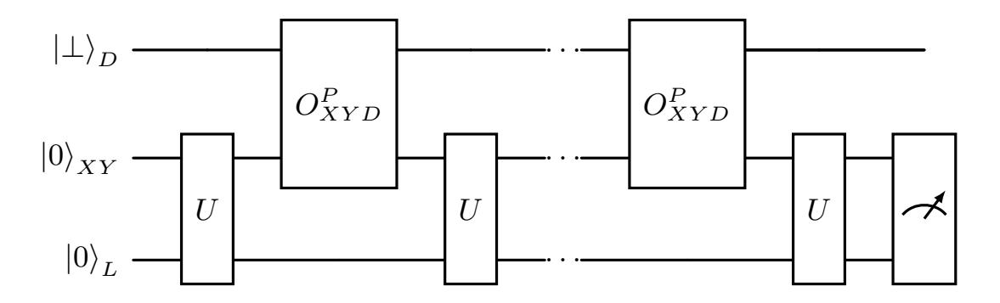

{0}------------------------------------------------

## <span id="page-0-0"></span>Quantum Oracle Distribution Switching and its Applications to Fully Anonymous Ring Signatures

Marvin Beckmann[1](https://orcid.org/0009-0008-0178-1423) and Christian Majenz<sup>1</sup>

Technical University of Denmark, Kongens Lyngby 2800 {mabeck, chmaj}@dtu.dk

Abstract. Ring signatures are a powerful primitive that allows a member to sign on behalf of a group, without revealing their identity. Recently, ring signatures have received additional attention as an ingredient for post-quantum deniable authenticated key exchange, e.g., for a post-quantum version of the Signal protocol, employed by virtually all end-to-end-encrypted messenger services. While several ring signature constructions from post-quantum assumptions oer suitable security and efficiency for use in deniable key exchange, they are currently proven secure in the random oracle model (ROM) only, which is insuf cient for post-quantum security. In this work, we provide four security reductions in the quantum-accessible random oracle model (QROM) for two generic ring signature constructions: two for the AOS framework and two for a construction paradigm based on ring trapdoors, whose generic backbone we formalize. The two security proofs for AOS ring signatures dier in their requirements on the underlying sigma protocol and their tightness. The two reductions for the ring-trapdoor-based ring signatures exhibit various dierences in requirements and the security they provide. We employ the measure-and-reprogram technique, QROM straightline extraction tools based on the compressed oracle, history-free reductions and QROM reprogramming tools. To make use of Rényi divergence properties in the QROM, we study the behavior of quantum algorithms that interact with an oracle whose distribution is based on one of two different distributions over the set of outputs. We provide tight bounds for the statistical distance, show that the Rényi divergence can not be used to replace the entire oracle and provide a workaround.

{1}------------------------------------------------

## Table of Contents

|     | Quantum Oracle Distribution Switching and its Applications to Fully |
|-----|---------------------------------------------------------------------|
|     | Anonymous Ring Signatures<br>                                       |
|     | Marvin Beckmann<br>and Christian Majenz                             |
|     | Introduction                                                        |
|     | Preliminaries                                                       |
| 2.1 | Signatures                                                          |
| 2.2 | Sigma Protocols                                                     |
| 2.3 | QROM                                                                |
|     | Query Complexity bounds in the QROM                                 |
| 2.4 | Deutsch-Jozsa Algorithm                                             |
|     | Quantum Oracle Distribution Switching                               |
| 3.1 | Oracle Switching using Statistical Distance                         |
| 3.2 | Oracle Switching using Rényi Divergence                             |
|     | Replacing the entire Distribution Fails                             |
|     | Replacing some Positions using Small-Range Distributions            |
| 3.3 | Reprogramming with Different Distributions                            |
|     | Ring Signature from Ring Preimage Sampleable Functions              |
| 4.1 | Unforgeability via Adaptive Reprogramming                           |
| 4.2 | Unforgeability via History-Free Proofs                              |
| 4.3 | Anonymity                                                           |
|     | AOS Ring Signatures                                                 |
| 5.1 | SUF-CRA to UF-NRA                                                   |
| 5.2 | UF-NRA: General Strategy using Measure-and-Reprogram                |
| 5.3 | UF-NRA: Commit-and-Open Sigma Protocols                             |
|     | UF-NRA using C&O Σ-Protocols                                        |
|     | Merkle Tree Based C&O Protocols                                     |
|     | Instantiation and Discussion                                        |
| 6.1 | Instantiation of Ring Signatures                                    |
| 6.2 | Implications for Falcon                                             |
|     | Acknowledgments                                                     |
|     | Additional Preliminaries                                            |
| A.1 | Probabilities                                                       |
|     | Sigma Protocols                                                     |
|     | Quantum Computation Basics                                          |
|     | Grover Search                                                       |
|     | NTRU Lattices                                                       |
|     | Omitted Proofs                                                      |
|     | Proof of Theorem 3                                                  |
|     | Statistical Distance with the Compressed Oracle                     |
|     | Tightness                                                           |
|     | Proof of Lemma 6                                                    |
|     | A.2<br>A.3<br>A.4<br>B.1<br>B.2                                     |

{2}------------------------------------------------

|   | Quantum Oracle Distribution Switching and Fully Anonymous RSS | 3  |  |  |
|---|---------------------------------------------------------------|----|--|--|
|   | B.3<br>Proof of Lemma 7                                       | 50 |  |  |
|   | B.4<br>Proof of Lemma 9                                       | 51 |  |  |
|   | B.5<br>Proof of Lemma 11                                      | 52 |  |  |
| C | History-Freeness for Ring Signatures                          |    |  |  |
|   | C.1<br>Proof of Theorem 8                                     | 58 |  |  |
| D | AOS Ring Signatures from Merkle Tree Based C&O Protocols      | 59 |  |  |
| E | Applications and Instantiations                               | 60 |  |  |
|   | Application to Gandalf<br>E.1<br>                             | 60 |  |  |
|   | Properties of the ring preimage sampleable function (RPSF)    | 62 |  |  |
|   | QROM bounds on Gandalf<br>                                    | 64 |  |  |

{3}------------------------------------------------

## <span id="page-3-0"></span>1 Introduction

Group signatures enable a member of a group to authenticate messages on behalf of the group without revealing their identity. Group signatures require a trusted entity for setup, departing from the usual peer-to-peer functionality signature schemes provide. Rivest, Shamir, and Tauman [\[54\]](#page-36-0) introduced ring signature schemes (RSSs), which provides the same functionality without trusted setup.

A prominent application of RSSs is the construction of deniable authenticated key exchange (DAKE), e.g., for messenger applications. The most widely used key exchange protocol for end-to-end-encrypted instant messaging is the Signal protocol (WhatsApp, Signal, and Facebook Messenger, etc.). Its initial DAKE, X3DH [\[46\]](#page-36-1), is, however, based on the Die-Hellman key exchange, which can be broken by quantum computing attacks. A variant of that protocol, PQXDH [\[41\]](#page-36-2), uses a hybrid approach with ML-KEM to ensure post-quantum (PQ) con dentiality. PQXDH thus prevents harvest-now-decrypt-later attacks, but lacks PQ authentication and might not be PQ-anonymous either (harvest-now-judgelater [\[40\]](#page-35-0)). Most proposals for fully PQ secure Signal-conforming DAKEs use RSS [\[36](#page-35-1)[,12,](#page-33-0)[37\]](#page-35-2). An authenticated KEM (AKEM) is also the primitive behind two modes of the hybrid public key encryption standard [\[4\]](#page-33-1). Recent work [\[30\]](#page-35-3) provides a generic construction of deniable AKEMs based on KEMs and RSSs.

Signal-conforming DAKE constructions apply RSSs for ring size 2, and require strong anonymity (anonymity under full key-exposure) [\[6\]](#page-33-2). In this context, RSSs with a signature size growing linearly in the ring size are typically more efficient than logarithmic-sized RSSs. There are two types of linear-sized RSSs that have been proposed for instantiating Signal protocols. The rst type uses the AOS-transform [\[1\]](#page-33-3), transforming Σ-protocols into linear-sized RSSs, used in Erebor and MayoRS [\[10](#page-33-4)[,40\]](#page-35-0). The second type follows a ring-trapdoor-like approach that yields constructions like Gandalf and FalconRS [\[30,](#page-35-3)[40\]](#page-35-0).

Both approaches and the resulting explicit constructions are currently only proven secure in the classical random oracle model (ROM), and thus not supported by a quantum random oracle model (QROM) proof [\[9\]](#page-33-5). In other words, They do not enjoy provable PQ security. Prior to our work, there were thus two options for PQ Signal-conforming DAKE: Accepting the lower level of assurance provided by a ring-signature-based protocol without provable PQ security, or using a split-KEM-based protocol and accepting its disadvantages (like its ineciency).

Our Contribution. In this work, we provide QROM proofs for the two types of RSS used in Signal-conforming DAKEs.

For the ring trapdoor paradigm of constructing RSSs, we generalize the approach of FalconRS and Gandalf by formalizing a novel primitive: RPSFs. We then give a generic RSS construction from RPSFs. Finally, we prove QROM security for the generic RPSF-based RSS construction using two different techniques. One of them, (a generalization of) the formalism of history-free reductions [\[9\]](#page-33-5), is relatively straightforward and relies on statistical distance arguments. In ring signature constructions like Gandalf, this proof does not nd application, as 

{4}------------------------------------------------

the statistical distance arguments are replaced by arguments based on the Rényi divergence. We thus provide a second proof for RPSF based RSS using Rényi divergence-based arguments, by exploring various properties of quantum oracle distribution switching in relation to the classical distributions. We believe these properties will nd additional applications, they could, for example, be used in proving the QROM security of Falcon [\[28\]](#page-35-4).

For AOS RSSs, we give two security bounds, one for generic Σ-protocols and a tighter bound for Σ-protocols with commit-and-open structure. To obtain the generic bound, we employ the measure-and-reprogram technique [\[22\]](#page-34-0). While the resulting bound grows quickly with the ring size, it can give meaningful guarantees for ring size 2, as needed for the application to Signal-conforming DAKEs. For the second bound we use straightline extraction techniques, yielding a multiplicatively tight reduction to the special soundness of the Σ-protocol.The result can be extended to Merkle tree-based commit-and-open Σ-protocols.

Technical Overview. In the following, we give a more detailed overview. Ring Trapdoor Ring Signatures. We introduce ring trapdoor function (RTDF) and describe preimage sampleable properties for them, generalizing preimage sampleable (trapdoor) functions (PSFs) [\[31\]](#page-35-5), to give a general RSS construction. [\[11\]](#page-33-6) introduces a less general framework from PSFs to construct ring signatures in the standard model. The rst digital signature scheme for which QROM security was proven uses PSFs [\[9\]](#page-33-5). Unsurprisingly, similar strategies can be employed when proving the security of our RSS: We observe that a history-free ROM proof can be given. For this, we adapt the original notion of history-free proofs for digital signatures to the setting of RSSs. In essence, we can simulate the random oracle (RO) by composing a private RO with the domain sampler and the evaluation function of the RTDF. Combining the domain sampler and the evaluation function to simulate the RO requires statistical distance arguments, and under those, this mapping produces a distribution in the range close to

We present a second result that works with properties based on the Rényi divergence instead of the statistical distance. To make the Rényi divergence work, we conduct a separate study of quantum oracle distribution switching. Quantum Oracle Distribution Switching. Consider an adversary with quantum access to an oracle for a function f<sup>P</sup> : X → Y. The outputs of f are independently sampled from a distribution P over Y for each x ∈ X . If P is the uniform distribution, then this is exactly the QROM. We give several results on the distinguishability of such oracles for pairs of distributions P and Q.

uniform, replacing the RO. Similar to the ordinary signature case, the classical

history-free reduction implies a QROM reduction.

First, we provide a tight explicit bound on the statistical distance of an algorithm's output, where the algorithm interacts with an oracle that has either underlying distribution P or Q, as a function of the statistical distance of P and Q. For this explicit bound, we use a compressed oracle [\[60\]](#page-37-2) view, and analyze the trace norm of the nal states produced by an algorithm interacting with the two oracles. By adding null-terms, we bound the trace norm by a sum of the operator norms of two compression operators that depend on the underlying classical 

{5}------------------------------------------------

distributions. The norm of these operators can be bounded by the statistical distance of the classical distributions.

Now consider the Rényi divergence between P and Q instead. For an algorithm making q classical queries, the probability of any event depending on the algorithm's output can be multiplicatively bounded based on the Rényi divergence raised to the power of q (and an additional power based on the order of the chosen Rényi divergence). For q quantum queries, this bound fails. In fact, there cannot be a multiplicative bound without an additional error term, we give an explicit counterexample to show this. First, we construct a function based on the given oracle that is almost perfectly balanced function for one of the distributions and a very unbalanced one for the other. We can now distinguish the two using the Deutsch-Jozsa (DJ) algorithm [\[21\]](#page-34-1). The ratio of the probability that the DJ algorithm outputs unbalanced in the two cases is unbounded for a xed pair of distributions P and Q as it grows with the domain size of f<sup>P</sup> /f<sup>Q</sup> Thus, a multiplicative bound is impossible in the QROM.

As a positive result, we show that by accepting an additive error, we can use the small-range distribution toolkit from [\[58\]](#page-37-3). Here, r values are sampled according to the underlying distribution, and for each value in X , one of these r samples is assigned as the value in Y. For these r samples, we can use the classical Rényi divergence properties and bound the overall capabilities of any algorithm. However, the error term depends on r, and for practical applications, r must be chosen super-polynomially large, increasing the power of the Rényi divergence factor. To have practical application, it turns out that the statistical distance of the two distributions would also need to be negligible, so the Rényi divergence would not need to be used in the rst place. This concludes the Rényi divergence study with the insight that replacing the entire underlying oracle is not practical when using the Rényi divergence.

Taking a closer look at explicit constructions, we observed that the hash input usually includes a salt to achieve strong unforgeability. In this case, we can use results on adaptive reprogramming [\[33\]](#page-35-6), also known as resampling, to replace only the outputs used by the signing oracle. In this technique, R positions are reprogrammed by sampling them again from the same underlying distribution before they are programmed into the oracle. Replacing these samples with samples from a different distribution, we can use the classical properties of the Rényi divergence (or the statistical distance).

AOS Ring Signatures. Here, we rst describe how to simulate the signing oracle. This again requires adaptive reprogramming in the QROM. To simulate, replace the single instance of the honest Σ-protocol prover by the honest verier zero knowledge (HVZK) simulator, and reprogram the RO accordingly. Given su cient min-entropy in the simulated commitments and thus the RO inputs, we can apply the adaptive reprogramming lemma from [\[33\]](#page-35-6). It is from this point on that we give two reductions, one for generic sigma protocols and a tight one for commit-and-open protocols.

The strategy for the generic proof is to construct an impersonation adversary against the underlying Σ-protocol using a successful forgery adversary. This 

{6}------------------------------------------------

adversary must send a commitment com, receive a challenge ch, and send a response rsp in order. Like in ordinary Fiat-Shamir, this requires programming the random oracle, but here, challenges are computed from the previous commitments in the ring. In the impersonation game, the challenge is received after the commitment, so to reprogram, the query producing the challenge has to happen after the commitment was queried, requiring a denite time order. To get such an order, we use the measure-and-reprogram technique [\[22\]](#page-34-0). This technique incurs a multiplicative loss in (2q + 1)2n, where n is the number of queries for which the order is desired. As we need an order of all queries for the ring, and the ring is of size N, this introduces an exponential loss in N. Here, one of the reprogrammings actually programs the Σ-protocol challenge, and the remaining ones commit the adversary to a classical ordering of the queries made for producing the signature.

For commit-and-open protocols, we use a different approach. Commit-andopen protocols in the (Q)ROM allow RO-based extraction of commitments. If an adversary succeeds for sufficiently many different challenges, one can use (generalized) special soundness to extract a witness. Generalizing the strategy from [\[16,](#page-34-2)[24\]](#page-34-3), we dene a compressed oracle database property for fooling the extractor, i.e., the database contains a valid forgery, but the special soundness extractor fails. Using the quantum transition capacity framework [\[17\]](#page-34-4) we bound the probability that after q<sup>H</sup> hash queries, this database property holds. If the database property does not hold, and the prover succeeds, we can measure the compressed oracle database to recover a witness. An additional Merkle tree optimization only requires slight modications in the database properties.

Additional Related Work. To the best of our knowledge, the AOS framework has not been analyzed in the QROM, and ring trapdoor constructions also have not been proven secure in the QROM. There is one work [\[20\]](#page-34-5) that considers QROM security of a logarithmic ring signature based on symmetric primitives to build an accumulator and simulation-sound extractability of an additional proof system (not considering inefficient plain model RSSs like [\[11\]](#page-33-6)). The specific ring signatures, though logarithmic in asymptotics, are in the order of several hundred KBs even for small rings, and therefore practically infeasible. Recent candidates for fully anonymous RSSs [\[45,](#page-36-3)[8,](#page-33-7)[10,](#page-33-4)[43](#page-36-4)[,57\]](#page-37-4) are also not proven secure in the QROM. We identified some works that consider the QROM, but they are either not fully anonymous [\[35\]](#page-35-7), only for group signatures and accountable RSSs [\[18\]](#page-34-6) or consider QROM quantum-access-secure RSS [\[14,](#page-33-8)[15\]](#page-34-7), but are inefficient. [\[40\]](#page-35-0) present a new weaker anonymity notion for RSSs that they argue to be sufficient. Full anonymity implies this new deniability notion. Signal-conforming DAKEs can also be constructed from split-KEMs like [\[19,](#page-34-8)[50\]](#page-36-5) instead of RSS using the K-Waay [\[19\]](#page-34-8) protocol.

Concurrent independent work. After the research for this paper was concluded, we noticed a concurrent independent work [\[48\]](#page-36-6) that also generalizes the RTDF approach from [\[11\]](#page-33-6) to capture the work of Gandalf. Their work does not consider QROM security, and they consider weaker anonymity notions.

{7}------------------------------------------------

## <span id="page-7-0"></span>2 Preliminaries

By a ← D, we assign a value to a given D, where D is a distribution or an algorithm. If D is a finite set, a ← D denotes uniform sampling from the set. Let U(D) denote the uniform distribution over D. We denote [n] := {1, 2, . . . , n}. For standard definitions of the statistical distance ∆(P, Q), the Rényi divergence Rα(P∥Q) and the Kullback-Leibler divergence DKL(P∥Q), see Appendix [A.1.](#page-37-1)

<span id="page-7-2"></span>Lemma 1 ([\[42,](#page-36-7) Lemma 4.1] and [\[26,](#page-34-9) Theorem 1 and 9]). Let P and Q be two discrete probability distributions and E an event such that E ⊆ Supp(P) ⊆ Supp(Q). Let f : Supp(Q) → X be a function (or stochastic map). For any α ∈ (1, ∞], we have the probability preservation property and the data processing inequality,

$$\Pr[P \in E]^{\frac{\alpha}{\alpha-1}} \le R_{\alpha}(P||Q) \cdot \Pr[Q \in E], \quad and \quad R_{\alpha}(f(P)||f(Q)) \le R_{\alpha}(P||Q).$$

<span id="page-7-4"></span>Lemma 2 ([\[2,](#page-33-9) Lemma 2.9]). Let α ∈ (1, ∞], and P and Q denote distributions with Supp(P) ⊆ Supp(Q). Let P q (and Q<sup>q</sup> ) be the i.i.d. distributions constructed from sampling P (and Q) q times, then

$$R_{\alpha}(P^q || Q^q) = R_{\alpha}(P || Q)^q.$$

<span id="page-7-3"></span>Lemma 3 ([\[52,](#page-36-8) Lemma 1]). Let A<sup>P</sup> , A<sup>Q</sup> be algorithms making at most q queries to an oracle sampling from distribution P and Q respectively, and returning a bit. Let 0 ≤ DKL(P∥Q) ≤ ϵ. Then, it holds that

$$\left| \Pr \left[ 1 \leftarrow \mathcal{A}^P \right] - \Pr \left[ 1 \leftarrow \mathcal{A}^Q \right] \right| \le \sqrt{q\epsilon/2}.$$

#### <span id="page-7-1"></span>2.1 Signatures

Ring signature schemes (RSSs), introduced by [\[54\]](#page-36-0), enable members of a group, also referred to as a ring, to sign messages on behalf of the entire group without revealing which member of the group has generated the signature. Each member can run a key generation algorithm on their own without the need for an additional trusted party to distribute key material.

Definition 1 (Ring Signatures). A ring signature scheme (RSS) RSig is a quadruple of probabilistic polynomial time (ppt) algorithms (Stp,KGen, Sign, Vf) such that:

- Stp(1<sup>λ</sup> ) → p: The setup algorithm takes as input the security parameter 1 λ and outputs public parameters p. These parameters also dene the message space and an upper bound on the ring size κ.
- KGen(p) → (pk,sk): The key generation algorithm takes as input the public parameters p and produces a pair of public and private keys (pk,sk).

{8}------------------------------------------------

- Sign(sk, ρ, m) → σ: The signing algorithm takes as input the secret key of the signer sk, a list of public keys ρ = {pk<sup>1</sup> , . . . , pk<sup>N</sup> } dening the ring and a message m. The ring must satisfy the size bound, i.e., N ≤ κ, and ∃i ∈ [N] : µ(sk) = pk<sup>i</sup> . [1](#page-8-0) It outputs a signature σ.
- Vf(ρ, m, σ) → b: The deterministic verification algorithm takes as input a list of public keys ρ = {pk<sup>1</sup> , . . . , pk<sup>N</sup> } with N ≤ κ, a message m and a signature σ. It outputs either false (b = 0) or true (b = 1).

RSig is δ(κ)-correct if for any p ← Stp(1<sup>λ</sup> ), all N ≤ κ, any {(pk<sup>j</sup> ,sk<sup>j</sup> )}j∈[N] ⊆ Supp(KGen(p)) dening ρ = {pk<sup>1</sup> , . . . , pk<sup>N</sup> }, any m and any i ∈ [N]

$$\Pr[\mathsf{Vf}(\rho, m, \mathsf{Sign}(\mathsf{sk}_i, \rho, m)) \neq 1] \leq \delta(\kappa).$$

Unforgeability of Ring Signatures. As in standard EUF-CMA, a forgery adversary against a RSS must output a forgery σ ∗ for a message m<sup>∗</sup> for a ring ρ <sup>∗</sup> ⊆ {pk<sup>1</sup> , . . . , pk<sup>N</sup> } of valid public keys. The adversary can make adaptive queries to a signing oracle with a message, a signer position, and a list of public keys. The signer position must refer to a valid public key. This is referred to as insider security [\[7\]](#page-33-10). In the following, we treat the size bound for signing queries and verification queries as implicit, i.e. the ring size of queries cannot exceed κ.

```
SUF-CRAA,RSig,N,qs
                      (λ)
 1 : q ← 0; L ← ∅
 2 : p ← Stp(1λ
                  )
 3 : for i ∈ [N] :
 4 : (pki
             ,ski
                 ) ← KGen(p)
 5 : ρ ← {pk1
                , . . . , pkN }
 6 : (ρ
        ∗
         , m
             ∗
              , σ
                ∗
                  ) ← AOSign(ρ)
 7 : if (ρ
           ∗
            , m
               ∗
                 , σ
                   ∗
                     ) ∈ L ∨ ρ
                               ∗
                                 ̸⊆ ρ :
 8 : return 0 // return false
 9 : return Vf(ρ
                    ∗
                     , m
                        ∗
                          , σ
                            ∗
                             )
                                         OSign(i, ρ′ = {pk′
                                                            1
                                                             , . . . , pk′
                                                                     N′}, m)
                                          1 : if q = qs ∨ pk′
                                                              i ∈/ ρ :
                                          2 : return ⊥
                                          3 : // let j ∈ [N] be the index s.t. µ(skj
                                                                                  ) = pk′
                                                                                        i
                                          4 : q ← q + 1
                                          5 : σ ← Sign(skj
                                                             , ρ
                                                                ′
                                                                 , m)
                                          6 : L ← L ∪ {(ρ
                                                             ′
                                                              , m, σ)}
                                          7 : return σ
```

<span id="page-8-1"></span>Fig. 1. Unforgeability game for ring signatures.

Definition 2 (UF-NRA of Ring Signatures). A RSS RSig is unforgeable under no-ring attacks for N ≤ κ if, for any ppt adversary A

$$\mathsf{Adv}^{\mathrm{UF}\text{-}\mathrm{NRA}}_{\mathcal{A},\mathsf{RSig},N}(\lambda) := \Pr[1 \leftarrow \mathrm{UF}\text{-}\mathrm{NRA}_{\mathcal{A},\mathsf{RSig},N}(\lambda)] = \mathsf{negl}(\lambda),$$

where UF-NRA<sup>A</sup>,RSig,N = SUF-CRA<sup>A</sup>,RSig,N,0.

<span id="page-8-0"></span><sup>1</sup> We assume (w.l.o.g.) that there exists a one-way function µ such that µ(sk) = pk for all (pk,sk) ∈ Supp(KGen).

{9}------------------------------------------------

Definition 3 (SUF-CRA of Ring Signatures). Consider the unforgeability game in Fig. [1.](#page-8-1) We say a RSS RSig is strongly unforgeable under q<sup>s</sup> chosen ring attacks for N ≤ κ if, for any ppt adversary A

$$\mathsf{Adv}^{\mathrm{SUF\text{-}CRA}}_{\mathcal{A},\mathsf{RSig},N,q_s}(\lambda) := \Pr[1 \leftarrow \mathrm{SUF\text{-}CRA}_{\mathcal{A},\mathsf{RSig},N,q_s}(\lambda)] = \mathsf{negl}(\lambda).$$

Consider the unforgeability game in Fig. [1.](#page-8-1) Dene the UF-CRA1 game as the SUF-CRA game, except that i) L contains pairs (ρ, m) (without the signatures), ii) a forgery counts as fresh if it is for a pair (ρ ∗ , m<sup>∗</sup> ) ∈ L / and iii) the signing oracle cannot be queried for (ρ ′ , m) already in L.

Definition 4 (UF-CRA1 of Ring Signatures). We say a RSS RSig is oneper-message weakly unforgeable under q<sup>s</sup> chosen ring attacks for N ≤ κ if, for any ppt adversary A

$$\mathsf{Adv}^{\mathrm{UF\text{-}CRA1}}_{\mathcal{A},\mathsf{RSig},N,q_s}(\lambda) := \Pr[1 \leftarrow \mathrm{UF\text{-}CRA1}_{\mathcal{A},\mathsf{RSig},N,q_s}(\lambda)] = \mathsf{negl}(\lambda).$$

Anonymity of Ring Signatures. We consider anonymity under full key exposure introduced in [\[7\]](#page-33-10). As in [\[12](#page-33-0)[,30\]](#page-35-3), we parameterize the anonymity notion with qc, dening the number of allowed calls to the challenge oracle.

| ANONA,RSig,N,qc<br>(λ) |                                     | CHAL(i0, i1, ρ′ =<br>{pk′<br>, , pk′<br>N′} , m)<br>1 |                                                        |  |
|------------------------|-------------------------------------|-------------------------------------------------------|--------------------------------------------------------|--|
| 1 :                    | q ← 0; b ← {0, 1}                   | 1 :                                                   | ∨ pk′<br>∈/ ρ ∨ pk′<br>if q = qc<br>∈/ ρ :<br>i0<br>i1 |  |
| 2 :                    | p ← Stp(1λ<br>)                     | 2 :                                                   | return ⊥                                               |  |
| 3 :                    | for i ∈ [N] :                       | 3 :                                                   | ) = pk′<br>// let j ∈ [N] be the index s.t. µ(skj<br>i |  |
| 4 :                    | (pki<br>,ski<br>) ← KGen(p)         | 4 :                                                   | q ← q + 1                                              |  |
| 5 :                    | ρ ← {pki}i∈[N]<br>; SK ← {ski}i∈[N] | 5 :                                                   | ′<br>return Sign(skj<br>, ρ<br>, m)                    |  |
| 6 :                    | ′ ← ACHAL(ρ,<br>b<br>SK)            |                                                       |                                                        |  |
| 7 :                    | ′<br>return b = b                   |                                                       |                                                        |  |

<span id="page-9-1"></span>Fig. 2. The anonymity game for RSSs under full key exposure.

Definition 5 (Anonymity of Ring Signatures). Consider the anonymity game in Fig. [2.](#page-9-1) We say a RSS RSig is anonymous under full key exposure with q<sup>c</sup> challenge queries if, for N ≤ κ and any ppt adversary A

$$\mathsf{Adv}^{\mathrm{ANON}}_{\mathcal{A},\mathsf{RSig},N,q_c}(\lambda) := |\mathrm{Pr}[\mathrm{ANON}_{\mathcal{A},\mathsf{RSig},N,q_c}(\lambda) \Rightarrow \mathsf{true}] - 1/2| = \mathsf{negl}(\lambda)$$

#### <span id="page-9-0"></span>2.2 Sigma Protocols

A Σ-protocol is a 3-round public-coin interactive proof (P = (P1, P2), V = (V1, V2)) for a relation R ⊆ I × W: First, the prover P<sup>1</sup> sends a commitment com; then the verier V<sup>1</sup> responds with a random challenge ch ∈ C; and finally, P<sup>2</sup> sends a response rsp. This nal response is evaluated using V2. The formal definition and well-known properties can be found in Appendix [A.2.](#page-38-0)

{10}------------------------------------------------

#### <span id="page-10-0"></span>2.3 QROM

Our main technical proofs rely on reprogramming techniques [\[22](#page-34-0)[,33\]](#page-35-6) and on a framework [\[17\]](#page-34-4) for proving query complexity bounds in the QROM. The latter is a framework exploiting Zhandry's compressed-oracle technique. We use a slightly adjusted version of the framework by [\[24\]](#page-34-3). We also use a proof technique for digital signatures from [\[9\]](#page-33-5) based on history-free reductions, which we generalize to the ring signature setting. We model quantum access to a random oracle O : X → Y via oracle access to a unitary U<sup>O</sup> defined by |x⟩<sup>X</sup> |y⟩<sup>Y</sup> 7→ |x⟩<sup>X</sup> |y ⊕ O(x)⟩<sup>Y</sup> , and adversaries with quantum access to O act as a sequence of unitaries, interleaved with applications of UO. We utilize two reprogramming techniques in the QROM.

Measure-and-reprogram. The rst, measure-and-reprogram [\[23,](#page-34-10)[22\]](#page-34-0), allows measuring randomly selected query inputs and reprogramming the random oracle at those inputs to fresh random outputs. If an algorithm outputs a tuple of query inputs such that the resulting input-output pairs together with an additional output fulll a predicate, then the same will hold when the measurements and reprogrammings are applied, with respect to the reprogrammed values. This also yields the order in which the relevant queries were made.

<span id="page-10-2"></span>Theorem 1 ([\[22,](#page-34-0) Theorem 6]). Let n be a positive integer, and let X and Y be finite non-empty sets. Let A be an arbitrary oracle quantum algorithm that makes q queries to a uniformly random H : X → Y and that outputs a tuple x = (x1, . . . , xn) ∈ X <sup>n</sup> and a (possibly quantum) output z. There exists a blackbox polynomial-time (n + 1)-stage quantum algorithm S, satisfying the following properties. S has the following syntactic behavior: in the rst stage it outputs a permutation π together with xπ(1) and takes as input Θπ(1), and then for every subsequent stage 1 < i ≤ n it outputs xπ(i) and takes as input Θπ(i) ; eventually, in the nal stage (labeled by n + 1) it outputs z. We denote such an execution of S as (π, π(x), z) ← ⟨S<sup>A</sup>, π(Θ)⟩. For any x ′ ∈ X <sup>n</sup> without duplicate entries, any predicate V and uniformly random Θ ∈ Y<sup>n</sup> :

$$\Pr\left[\boldsymbol{x} = \boldsymbol{x}' \wedge V(\boldsymbol{x}, \boldsymbol{\Theta}, z) : (\pi, \pi(\boldsymbol{x}), z) \leftarrow \langle \mathcal{S}^{\mathcal{A}}, \pi(\boldsymbol{\Theta}) \rangle\right]$$
$$\geq \frac{1}{(2q+1)^{2n}} \Pr\left[\boldsymbol{x} = \boldsymbol{x}' \wedge V(\boldsymbol{x}, \mathsf{H}(\boldsymbol{x}), z) : (\boldsymbol{x}, z) \leftarrow \mathcal{A}^{\mathsf{H}}\right].$$

Resampling lemma. The resampling lemma [\[33\]](#page-35-6) says that if an input with sufficiently high min-entropy is chosen and the corresponding output is reprogrammed to a fresh, uniformly random value (it is resampled), a polynomialquery distinguisher can detect the reprogramming with a small probability only. For a precise statement, let REPRO<sup>0</sup> and REPRO<sup>1</sup> refer to two games, where after an initial learning phase with q queries, in REPRO<sup>1</sup> the random oracle is reprogrammed as described, while it is left unchanged in REPRO0.

<span id="page-10-1"></span>Lemma 4 ([\[33,](#page-35-6) Proposition 2]). Let X1, X2, X ′ and Y be finite sets, and let p be a distribution on X<sup>1</sup> × X ′ . Let Dist be any distinguisher, issuing q (quantum) queries to O and R reprogramming instructions such that each instruction 

{11}------------------------------------------------

consists of a value  $x_2$ , together with the fixed distribution p. Then

$$\left| \Pr \Big[ 1 \leftarrow \mathsf{REPRO}_1^{\mathsf{Dist}} \Big] - \Pr \Big[ 1 \leftarrow \mathsf{REPRO}_0^{\mathsf{Dist}} \Big] \right| \leq \frac{3R}{2} \sqrt{q \cdot p_{\max}}$$

where  $p_{\max} := \max_{x_1} p(x_1)$ .

<span id="page-11-0"></span>Query Complexity bounds in the QROM. For query bounds in the QROM we rely on the technique from [17] which builds on Zhandry's compressed oracle framework [60]. The compressed oracle is a simulation of the quantum oracle of a random function  $H: \mathcal{X} \to \mathcal{Y}$ . Its internal state of the oracle can be thought of as a (superposition of) lazy-sampling-style databases of input-output pairs. The probability that  $\mathcal{A}$  succeeds in a search task can be related to the probability of the database D, obtained by measuring the internal state of the compressed oracle after the interaction with  $\mathcal{A}$ , satisfying a certain property related to the search task (see Lemma 5 below). We can think of the database D as a partial function from  $\mathcal{X}$  to  $\mathcal{Y}$ . We write  $D(x) = \bot$  if D is undefined on x. We denote the set of all possible such databases by  $\mathcal{D}$ . For  $D \in \mathcal{D}$ ,  $x \in \mathcal{X}$  and  $y \in \mathcal{Y} \cup \{\bot\}$ , we define  $D[x \mapsto y]$  by  $D[x \mapsto y](x) = y$  and  $D[x \mapsto y](x') = D(x')$  for  $x' \neq x$ . It will suffice for us to use the (quantum) transition capacity formalism from [17], so we will not introduce the compressed oracle in detail.

A subset  $P \subseteq \mathfrak{D}$  is called a *database property*, we say that  $D \in \mathfrak{D}$  satisfies P. The complement is denoted by  $\neg P = \mathfrak{D} \setminus P$ . For a database property P, a database D and an input  $x \in \mathcal{X}$ , we define the corresponding local property as

$$P|_{D|^x} = \{ y \in \mathcal{Y} | D[x \mapsto y] \in P \}.$$

The maximal probability of a database D satisfying P, when D is obtained by measuring the internal state of the compressed oracle after interaction with A, maximized over all q-query algorithms A, is defined as

$$\llbracket \bot \Rightarrow^q P \rrbracket := \max_{\mathcal{A}} \sqrt{\Pr[D \in P]}.$$

Its square is an upper bound on the probability of  $\mathcal{A}$  producing such a database. Lemma 5.6 in [17] shows that the probability of fulfilling a database property after q queries can be bounded using the quantum transition capacity. More precisely, a sequence  $P_0, P_1, \ldots, P_q$  with  $\neg P_0 = \{\bot\}$  and  $P_q = P$  yields

<span id="page-11-1"></span>
$$\llbracket \bot \Rightarrow^{q} P \rrbracket \le \sum_{s=0}^{q-1} \llbracket \neg P_s \to P_{s+1} \rrbracket$$

where each term is the quantum transition capacity between the databases. We do not define the transition capacity as we will only use it as a formal tool. The transition capacity can be bounded using the following.

**Theorem 2 ([24, Theorem 2.4]).** Let P and P' be database properties with trivial intersection, i.e.  $P \cap P' = \emptyset$ , and for every  $D \in \mathcal{D}$  and  $x \in \mathcal{X}$  let

$$L^{x,D} := \begin{cases} P|_{D|^x} & \text{if } \bot \in P'|_{D|^x} \\ P'|_{D|^x} & \text{if } \bot \in P|_{D|^x} \end{cases}$$

{12}------------------------------------------------

with  $L^{x,D}$  being either of the two if  $\bot \notin P|_{D|^x} \cup P'|_{D|^x}$ . Then

<span id="page-12-6"></span><span id="page-12-4"></span>
$$[P \to P'] \le \max_{x,D} \sqrt{10 \Pr[U \in L^{x,D}]},\tag{1}$$

where U is uniform over  $\mathcal{Y}$ , and the maximization can be restricted to  $D \in \mathcal{D}$  and  $x \in \mathcal{X}$  for which both  $P|_{D|^x}$  and  $P'|_{D|^x}$  are non-empty.

The fundamental lemma of the compressed oracle relates the database to the knowledge of a q-query adversary, which yields query bounds.

**Lemma 5** ([24, Lemma 2.6]). Let  $\mathcal{A}$  be an oracle quantum algorithm that outputs  $\mathbf{x} = (x_1, \dots, x_\ell) \in \mathcal{X}^\ell$  and  $z \in \mathcal{Z}$ . Let  $\tilde{\mathcal{A}}$  be the oracle quantum algorithm that runs  $\mathcal{A}$ , makes  $\ell$  classical queries on the outputs  $x_i$  to obtain  $\mathbf{y} = \mathsf{H}(\mathbf{x})$ , and then outputs  $(\mathbf{x}, \mathbf{y}, z)$ . When  $\tilde{\mathcal{A}}$  interacts with the compressed oracle instead, and at the end D is obtained by measuring the internal state of the compressed oracle, then, conditioned on  $\tilde{\mathcal{A}}$ 's output  $(\mathbf{x}, \mathbf{y}, z)$ ,

$$\Pr[y = D(x) \mid (x, y, z)] \ge 1 - 2\ell |\mathcal{Y}|^{-1}.$$

#### <span id="page-12-0"></span>2.4 Deutsch-Jozsa Algorithm

Let  $f: \{0,1\}^n \to \{0,1\}$  be an *n*-bit function. As a quantum circuit, the Deutsch-Jozsa algorithm [21] can be seen as a measurement in the +/- basis on the first n qubits of the state  $U_f \mid + \rangle^{\otimes n} \mid - \rangle$ , where  $U_f \mid x \rangle \mid y \rangle := \mid x \rangle \mid y \oplus f(x) \rangle$ ,  $x \in \{0,1\}^n$  and  $y \in \{0,1\}$ . The amplitude of the state  $\mid + \rangle^{\otimes n}$  is  $Z_f/2^n$  where

<span id="page-12-5"></span>
$$Z_f := \sum_{x \in \{0,1\}^n} (-1)^{f(x)}. \tag{2}$$

#### <span id="page-12-1"></span>3 Quantum Oracle Distribution Switching

We define an oracle  $O_{f_P}$  for the i.i.d function  $f_P : \mathcal{X} \to \mathcal{Y}$  where  $f_P(x) \sim P$  for all  $x \in \mathcal{X}$  independently and P is a probability distribution on  $\mathcal{Y}$ .

Consider an algorithm  $\mathcal{A}$  interacting with an oracle  $\mathsf{O}_{f_P}$  or an oracle  $\mathsf{O}_{f_Q}$ . We characterize  $\mathcal{A}$ 's output behavior based on the number of quantum queries q, as well as the statistical distance and Rényi divergence of P and Q.

#### <span id="page-12-2"></span>3.1 Oracle Switching using Statistical Distance

<span id="page-12-3"></span>In this section, let  $\epsilon = \Delta(P,Q)$ . Boneh et al. [9, Lemma 3] show that the output distributions of  $\mathcal{A}$  have statistical distance  $\mathcal{O}(q^2\sqrt{\epsilon})$  when P or Q is the uniform distribution. This was improved to  $\mathcal{O}(q^{1.5}\sqrt{\epsilon})$  in [58, Section 7.2]. Using the compressed oracle technique, we show that it is bounded by  $\mathcal{O}(q\sqrt{\epsilon})$ . More explicitly, the density matrices of  $\mathcal{A}$ 's outputs have trace distance at most  $8q\sqrt{2\epsilon}$ . This tightly characterizes the number of queries that are needed to achieve constant distinguishing advantage, as Grover's algorithm with q queries can also produce two states with trace distance  $\Theta(q\sqrt{\epsilon})$ .

{13}------------------------------------------------

**Theorem 3.** An algorithm  $\mathcal{A}$  making q quantum queries to either  $O_{f_P}$  or  $O_{f_Q}$ , will have the same output distribution, up to statistical distance at most  $8q\sqrt{2\epsilon}$ .

The proof can be found in Appendix B.1.

Subsequent to our derivation, we became aware that an asymptotically equivalent bound has been proven in the complexity theory literature [5], a result that, to our knowledge, has not been used in cryptography. They do not, however, provide a concrete bound. They use the adversary method, a fundamental tool in standard (worst-case) quantum query complexity.

Using compressed oracle techniques, we give a self-contained elementary proof and obtain explicit bounds that are needed in cryptography.

#### <span id="page-13-0"></span>3.2 Oracle Switching using Rényi Divergence

The Rényi divergence measures how close two probability distributions are multiplicatively. The post-processing and probability-preservation properties (see Lemma 1) facilitate relative-error bounds on  $\mathcal{A}$ 's outputs when restricted to classical queries. We explore how this behavior generalizes to quantum access.

<span id="page-13-1"></span>Replacing the entire Distribution Fails Consider replacing the entire underlying distribution. While the Rényi divergence provides meaningful bounds on  $\mathcal{A}$ 's output behavior given q classical queries, these bounds do not to the quantum-access setting.

**Theorem 4.** For all distributions  $P \neq Q$  on  $\mathcal{Y}$  with  $Supp(P) \subseteq Supp(Q)$ , there exists an algorithm  $\mathcal{A}$  making at most  $q_{\mathsf{H}}$  quantum queries such that

$$\lim_{n \to \infty} \Pr \left[ 1 \leftarrow \mathcal{A}^{f_P} \right] / \Pr \left[ 1 \leftarrow \mathcal{A}^{f_Q} \right] = \infty.$$

*Proof.* First, we construct a function that is, in expectation, balanced if the underlying function is Q and unbalanced if it is P. We then use the Deutsch-Jozsa algorithm and observe that the ratio of the probabilities scales with the size of the input domain. Fix  $\mathcal{X} = \{0,1\}^n$  and define the point of maximal relational difference  $y_0 := \arg\max_{y \in \operatorname{Supp}(P)} \frac{P(y)}{Q(y)}$ .

From any function  $f: \mathcal{X} \to \mathcal{Y}$ , we construct a function with binary outputs,  $g_f: \mathcal{X} \to \{0,1\}$ , where  $g_f(x) = 0$  if  $f(x) = y_0$  and  $g_f(x) = 1$  otherwise. Since this function is not necessarily balanced, we define a padded function  $h_f: \{0,1\}^{1+n+n'} \to \{0,1\}$ , where  $h_f(b||x||z) = g_f(x)$  if b = 0. For b = 1,  $h_f$  is defined to be 0 for exactly  $\lfloor 2^{n+n'}(1-Q(y_0)) \rfloor$  elements. After running the Deutsch-Jozsa algorithm with  $h_f$ , the probability of measuring  $|+\rangle^{\otimes (1+n+n')}$  is

$$\mathbb{E}_{f} \left[ \frac{Z_{h_{f}}^{2}}{2^{2(1+n+n')}} \right] = \frac{\mathbb{E}_{f} \left[ Z_{h_{f}}^{2} \right]}{2^{2(1+n+n')}} = \frac{\mathbb{E}_{f} \left[ Z_{h_{f}} \right]^{2} + \operatorname{Var}_{f} \left( Z_{h_{f}} \right)}{2^{2(1+n+n')}}$$

<span id="page-13-2"></span><sup>&</sup>lt;sup>2</sup> The factor n' can be increased to reduce the expected loss, caused by  $2^{n+n'}(1-Q(y_0))=N$  not being an integer. For simplicity, assume that  $n'=\mathcal{O}(n)$  and  $N\in\mathbb{N}$ .

{14}------------------------------------------------

using the notation from Eq. (2). We observe that  $\mathbb{E}_{f_Q}\left[Z_{h_{f_Q}}\right]=0$  and

$$\mathbb{E}_{f_P}[Z_{h_{f_P}}] = 2^{n'} \mathbb{E}_{f_P}[Z_{g_{f_P}}] = 2^{1+n+n'} (P(y_0) - Q(y_0)).$$

For the variance, it suffices to consider the behavior of  $g_f$  and get

$$\operatorname{Var}_{f}\left(Z_{h_{f}}\right) = \sum_{x' \in \{0,1\}^{n}} \operatorname{Var}_{f}\left(2^{n'}(-1)^{g_{f}(x')}\right)$$
$$= \sum_{x' \in \{0,1\}^{n}} 2^{2n'} 4P[g_{f}(x') = 0](1 - P[g_{f}(x') = 0]) = 2^{2+n+2n'} x_{f}$$

where  $x_f = P(y_0)(1 - P(y_0))$  if  $f = f_P$  and  $Q(y_0)(1 - Q(y_0))$  if  $f = f_Q$ . In the final ratio

$$\frac{\mathbb{E}_{f_P}[Z_{h_{f_P}}^2]}{\mathbb{E}_{h_{f_Q}}[Z_{f_Q}^2]} = \frac{2^{2(1+n+n')} \left(P(y_0) - Q(y_0)\right)^2 + 2^{2+n+2n'} P(y_0)(1-P(y_0))}{2^{2+n+2n'} Q(y_0)(1-Q(y_0))} 
= \frac{2^n \left(P(y_0) - Q(y_0)\right)^2 + P(y_0)(1-P(y_0))}{Q(y_0)(1-Q(y_0))} = \Omega(2^n),$$

the first term scales exponentially with n, and when considering  $n \to \infty$ , the fraction tends to  $\infty$ .

This implies that the bounds for q classical queries do not translate to the quantum setting. For any target relative-error loss, there exists a choice of n where the quotient of success probabilities exceeds the target.

<span id="page-14-0"></span>Replacing some Positions using Small-Range Distributions The previous result makes crucial use of the fact that the multiplicative bounds should hold for any absolute value for the probabilities, even be it tiny as in the counterexample. Adding an additive error term could be sufficient to achieve a meaningful result for the Rényi divergence, even if the classical properties do not translate. We explore this approach by considering small-range distributions from [58]. In short, our approach relies on first sampling r independent values according to a distribution P on  $\mathcal{Y}$ . These are used to simulate the oracle  $O_{f_P}$ . It is indistinguishable for  $\mathcal{A}$  up to an error term of  $\mathcal{O}(q^3/r)$  using [58]. Next, the distribution is changed from P to Q. Now we can use the properties of the Rényi divergence for r replacements.

<span id="page-14-1"></span>**Lemma 6.** Let P, Q be classical distributions over  $\mathcal{Y}$  with  $\operatorname{Supp}(P) \subseteq \operatorname{Supp}(Q)$  and  $\delta = R_{\alpha}(P||Q)$ , for  $\alpha \in (1, \infty]$ . For any  $\mathcal{A}$  making at most q quantum queries

$$\Pr[1 \leftarrow \mathcal{A}^{f_P}] \le \left(\delta^r \left(\Pr[1 \leftarrow \mathcal{A}^{f_Q}] + \frac{\ell(q)}{r}\right)\right)^{\frac{\alpha - 1}{\alpha}} + \frac{\ell(q)}{r},$$

where  $\ell(q) = \pi^2 (2q)^3/6 < 14q^3$ .

{15}------------------------------------------------

It seems like this solution could be useful in some situations. For a significant range of parameters, however, statistical distance arguments yield tighter bounds. This is because selecting r such that the error is negligible implies a small statistical distance, sufficient to apply the results from Section 3.1. The full discussion can be found in Appendix B.2.

#### <span id="page-15-0"></span>3.3 Reprogramming with Different Distributions

Though possible for the statistical distance, it is impossible to use the Rényi divergence for post-quantum security as in the classical setting. For a fixed oracle, replacing all underlying values with another distribution is infeasible when using the Rényi divergence. However, if only a limited number of output values need to be replaced, it is possible as shown in Section 3.2.

In many applications, it turns out to be sufficient to reprogram a quantum oracle for an i.i.d. function with output distribution P using outputs sampled according to Q, for a number of randomly sampled inputs. The adaptive reprogramming approach can be modified to facilitate this (see Lemma 4). Let  $\mathsf{REPRO}_{1,Q}$  refer to a game, modified from  $\mathsf{REPRO}_1$ , where the output is reprogrammed to a fresh, random value sampled from a distribution Q.

<span id="page-15-2"></span>Lemma 7 (Adaptive Reporgramming with Distribution Switching). Let  $\mathcal{X}_1, \mathcal{X}_2, \mathcal{X}'$  and  $\mathcal{Y}$  be finite sets, and let p be a distribution on  $\mathcal{X}_1 \times \mathcal{X}'$ . Let Q be a distribution over  $\mathcal{Y}$  and Dist be any distinguisher, issuing q (quantum) queries to O and R reprogramming instructions such that each instruction consists of a value  $x_2$ , together with the fixed distribution p. Then

$$\left| \Pr \left[ 1 \leftarrow \mathsf{REPRO}_{1,Q}^{\mathsf{Dist}} \right] - \Pr \left[ 1 \leftarrow \mathsf{REPRO}_{0}^{\mathsf{Dist}} \right] \right| \leq R \cdot \Delta(Q, \mathcal{U}(\mathcal{Y})) + \delta_{repr}$$

$$\Pr \left[ 1 \leftarrow \mathsf{REPRO}_{0}^{\mathsf{Dist}} \right] \leq \left( R_{\alpha}(\mathcal{U}(\mathcal{Y}) \| Q)^{R} \Pr \left[ 1 \leftarrow \mathsf{REPRO}_{1,Q}^{\mathsf{Dist}} \right] \right)^{\frac{\alpha - 1}{\alpha}} + \delta_{repr}$$

where  $\delta_{repr} = \frac{3R}{2} \sqrt{q \cdot p_{\text{max}}}$  with  $p_{\text{max}} := \max_{x_1} p(x_1)$  and  $\alpha \in (1, \infty]$ .

The lemma is an immediate consequence of Lemma 4 when applying the statistical and Rényi divergence properties to the classical samples used in reprogramming. A proof, outlining the equations, can be found in Appendix B.3. The result can be extended to two arbitrary underlying distributions.

# <span id="page-15-1"></span>4 Ring Signature from Ring Preimage Sampleable Functions

We analyse the QROM security of ring-trapdoor-based ring signatures. We first formulate a notion of RTDFs to capture these ring signatures.

<span id="page-15-3"></span>**Definition 6 (Ring Trapdoor Function).** A ring trapdoor function (RTDF) is a quadruple of ppt algorithms (Stp, TpdGen, f, SamplePre) defined as follows:

{16}------------------------------------------------

- $\operatorname{Stp}(1^{\lambda}) \to \operatorname{p}$ : The setup algorithm takes the security parameter  $1^{\lambda}$  and outputs public parameters  $\operatorname{p}$  as input, that also define the maximal ring size  $\kappa$ .
- TpdGen(p)  $\rightarrow$  (a,t): The trapdoor generation algorithm takes the security parameter  $1^{\lambda}$  as input and produces a pair (a,t) with public value a and trapdoor t. Every ring  $\rho = \{a_1, \ldots, a_N\}$  with  $N \leq \kappa$  defines a domain  $\mathsf{D}_{\rho}$ , a finite range  $\mathsf{R}_{\rho}$  and an efficient function  $f_{\rho} : \mathsf{D}_{\rho} \rightarrow \mathsf{R}_{\rho}$ .
- SamplePre $(\rho, t_i, r) \to d$ : The presampling algorithm takes a ring  $\rho$ , a trapdoor t and an element  $r \in \mathsf{R}_{\rho}$  as input. The ring must satisfy the size bound, i.e.,  $N = |\rho| \le \kappa$ , and  $\exists i \in [N]$  such that  $\mu(t) = \rho_i^3$ . It outputs an element  $d \in \mathsf{D}_{\rho}$ .

A RTDF is  $\delta(\kappa)$ -correct if for any  $\mathsf{p} \leftarrow \mathsf{Stp}(1^{\lambda})$ , all  $N \leq \kappa$ , any  $\{(a_j, t_j)\}_{j \in [N]} \subseteq \mathsf{Supp}(\mathsf{TpdGen}(\mathsf{p}))$  defining  $\rho = \{a_1, \ldots, a_N\}$  and any  $r \in \mathsf{R}_{\rho}$ 

$$\Pr[f_{\rho}(\mathsf{SamplePre}(\rho, t_i, r)) \neq r] \leq \delta(\kappa).$$

We introduce properties for RTDFs similar to those of PSFs [31], in particular, the existence of an efficient domain sampling algorithm  $\mathsf{SampleDom}(\rho)$  that takes a ring  $\rho$  with  $|\rho| \leq \kappa$  as input and outputs  $d \in \mathsf{D}_\rho$  satisfying the properties below. Let  $\mathsf{p} \leftarrow \mathsf{Stp}(1^\lambda), \{(a_i, t_i)\}_{i \in [\kappa]} \leftarrow \mathsf{TpdGen}(\mathsf{p})$  and  $\rho = \{a_i\}_{i \in [\kappa]}$ .

<span id="page-16-1"></span>1. Domain sampling with uniform output: Define  $\epsilon_{\mathsf{RPSF}}^{dom}$  and  $\epsilon_{\mathsf{RPSF}}^{\alpha-dom}$  such that for any  $\rho'$  with  $\rho \cap \rho' \neq \emptyset$  it holds that

$$\Delta(D, \mathcal{U}(\mathsf{R}_{o'})) \le \epsilon_{\mathsf{RPSF}}^{dom}$$
 and  $R_{\alpha}(\mathcal{U}(\mathsf{R}_{o'}), D) \le \epsilon_{\mathsf{RPSF}}^{\alpha - dom}$ 

where  $D := f_{\rho'}(\mathsf{SampleDom}(\rho'))$ .

<span id="page-16-2"></span>2. Preimage sampling is not detectable: Define three upper bounds  $\epsilon_{\mathsf{RPSF}}^{pre}$ ,  $\delta_{\mathsf{RPSF}}^{\alpha-pre}$  and  $\epsilon_{\mathsf{RPSF}}^{KL-pre}$  such that for every  $\rho'$  with  $\rho \cap \rho' \neq \emptyset$  it holds that

$$\Delta(D,Q) \le \epsilon_{\mathsf{RPSF}}^{pre}, \quad R_{\alpha}(D,Q) \le \delta_{\mathsf{RPSF}}^{\alpha-pre} \quad \text{ and } \quad D_{KL}(D,Q) \le \epsilon_{\mathsf{RPSF}}^{KL-pre}$$

where  $r \leftarrow \mathsf{R}_{\rho'}$ ,  $D := \mathsf{SamplePre}(\rho', t_i, r)$  and Q is the distribution of  $d \leftarrow \mathsf{SampleDom}(\rho')$  conditioned on  $f_{\rho'}(d) = r$  for  $\alpha \in (1, \infty]$ .

<span id="page-16-3"></span>3. One-wayness: For a ppt algorithm  $\mathcal{A} = (\mathcal{A}_1, \mathcal{A}_2)$ , define the one-wayness advantage

$$\mathsf{Adv}^{\mathrm{OW}}_{\mathcal{A},\mathsf{RPSF}}(\lambda) = \Pr \left[ f_{\rho'}(d) = r \land \rho' \subseteq \rho : \land r \leftarrow \mathsf{R}_{\rho'} \\ \land d \leftarrow \mathcal{A}_2(\mathsf{state},r) \right].$$

<span id="page-16-4"></span>4. Preimage min-entropy: The min-entropy of SampleDom( $\rho'$ ) conditioned on  $f_{\rho'}(d) = r$  for  $\rho' \subseteq \rho$  is at least  $\beta(\lambda)$  if for every  $r \in \mathsf{R}_{\rho'}$  and every  $D \in \mathsf{D}_{\rho'}$ 

$$\Pr[D = d : d \leftarrow \mathsf{SampleDom}(\rho') \mid f_{\rho'}(d) = r] \leq 2^{-\beta(\lambda)}.$$

<span id="page-16-0"></span>We assume (w.l.o.g.) that there exists a one-way function  $\mu$  such that  $\mu(t) = a$  for all  $(a, t) \in \operatorname{Supp}(\mathsf{TpdGen})$ .

{17}------------------------------------------------

<span id="page-17-3"></span>5. Collision-resistance: For any ppt algorithm A, dene the collision resistance

$$\mathsf{Adv}_{\mathcal{A},\mathsf{RPSF}}^{\mathsf{COL}}(\lambda) \!=\! \Pr \big[ f_{\rho'}(d_1) \!=\! f_{\rho'}(d_2) \land d_1 \!\neq\! d_2 \land \rho' \!\subseteq\! \rho : (d_1,d_2,\rho') \leftarrow \mathcal{A}(1^{\lambda},\rho) \big].$$

We construct a generic ring signature from a RPSF as in Fig. [3.](#page-17-1) Each party generates a RPSF trapdoor (sk) and public value (pk). To sign a message for a xed ring, hash the ring and the message together with a salt salt to compute a target h. We then use the RPSFs presample algorithm to get a preimage. The signature is the preimage and the salt. A signature is veried by recomputing the target and checking that the signature maps to the target under f.

| Sign(sk, ρ, m)                     | Vf(ρ, m,(salt, σ))           |  |
|------------------------------------|------------------------------|--|
| k<br>1 :<br>salt ← {0, 1}          | 1 :<br>h ← H(ρ,salt, m)      |  |
| h ← H(ρ,salt, m)<br>2 :            | 2 :<br>return RPSF.fρ(σ) = h |  |
| 3 :<br>σ ← RPSF.SamplePre(ρ,sk, h) |                              |  |
| 4 :<br>return (salt, σ)            |                              |  |

<span id="page-17-1"></span>Fig. 3. Generic construction of a ring signature from a RPSF with k bits of salt. The key generation and setup algorithm of the ring signature are identical to those of RPSF.

#### <span id="page-17-0"></span>4.1 Unforgeability via Adaptive Reprogramming

The target for the preimage sampler in the signing algorithm in Fig. [3](#page-17-1) is computed using a hash function. If the hash input has sufficiently high min-entropy in its inputs to H, e.g. λ = k, we can model the hash function as a quantumaccessible random oracle and use reprogramming (Lemma [7\)](#page-15-2) to simulate the signing oracle for an SUF-CRA attacker (Lemma [7\)](#page-15-2).

<span id="page-17-2"></span>Theorem 5. Let RPSF be a δ(κ)-correct RPSF with preimage-min entropy β(λ), and RSig be the generic ring signature from Fig. [3.](#page-17-1) Let α1, α<sup>2</sup> ∈ (1, ∞], N ≤ κ, k ∈ N and H be modeled in the QROM. Let C be the minimal number of elements in R<sup>ρ</sup> for any honestly generated ring ρ. For any SUF-CRA adversary A making at most q<sup>s</sup> signing and q<sup>H</sup> hash queries, we can construct an adversary Acol against the collision property of the RPSF such that

<span id="page-17-4"></span>
$$\mathsf{Adv}_{\mathcal{A},\mathsf{RSig},N,q_s}^{\mathsf{SUF-CRA}}(\lambda) \le \left( \left( \epsilon_{\mathsf{RPSF}}^{\alpha_1\text{-}dom} \right)^{q_s} \left( \left( \delta_{\mathsf{RPSF}}^{\alpha_2\text{-}pre} \right)^{q_s} \cdot \epsilon \right)^{\frac{\alpha_2-1}{\alpha_2}} \right)^{\frac{\alpha_1-1}{\alpha_1}} + \epsilon' \tag{3}$$

$$\mathsf{Adv}_{\mathcal{A},\mathsf{RSig},N,q_s}^{\mathsf{SUF-CRA}}(\lambda) \le q_s \left( (\delta_{\mathsf{RPSF}}^{\alpha_2 - pre})^{q_s} \cdot \epsilon \right)^{\frac{\alpha_2 - 1}{\alpha_2}} + q_s \epsilon_{\mathsf{RPSF}}^{dom} + \epsilon' \tag{4}$$

$$\mathsf{Adv}_{\mathcal{A},\mathsf{RSig},N,q_s}^{\mathsf{SUF-CRA}}(\lambda) \le \left( \left( \epsilon_{\mathsf{RPSF}}^{\alpha_1\text{-}dom} \right)^{q_s} \left( \epsilon + q_s \epsilon_{\mathsf{RPSF}}^{pre} \right)^{\frac{\alpha-1}{\alpha}} \right)^{\frac{\alpha_1-1}{\alpha_1}} + \epsilon' \tag{5}$$

$$\mathsf{Adv}_{\mathcal{A},\mathsf{RSig},N,q_s}^{\mathsf{SUF-CRA}}(\lambda) \le q_s(\epsilon_{\mathsf{RPSF}}^{dom} + \epsilon_{\mathsf{RPSF}}^{pre}) + \epsilon + \epsilon' \tag{6}$$

{18}------------------------------------------------

where 
$$\epsilon' = \frac{3q_s}{2}\sqrt{(q_s+q_{\mathsf{H}}+1)\cdot \frac{1}{2}^k} + q_s\delta(\kappa)$$
 and

$$\epsilon = \mathsf{Adv}^{\mathrm{COL}}_{\mathcal{A},\mathsf{RPSF}}(\lambda) + \frac{20(q_s + q_\mathsf{H} + 1)^3}{C} + (q_s + q_\mathsf{H} + 1)^2 \mathsf{Adv}^{\mathrm{OW}}_{\mathcal{A},\mathsf{RPSF}}(\lambda).$$

*Proof.* The correctness is  $\delta(\kappa)$  and follows by construction. The strategy for the SUF-CRA proof is as follows. The random oracle is reprogrammed at every signature query. The hash inputs are domain-separated for different rings. We can reprogram the hash value to a fresh uniform random value, which we then in turn can replace by sampling a value  $\sigma$  in the domain using SampleDom and using  $f_{\rho}(\sigma)$ . Now, the signature  $\sigma$  is freshly uniformly sampled and thus does not depend on the private signing keys anymore, so we can transition to the UF-NRA game. Finally, a forgery breaks the one-wayness of the underlying RPSF. Game<sub>0</sub>: This is the original game, so here we have

$$\mathsf{Adv}^{\mathrm{SUF\text{-}CRA}}_{\mathcal{A},\mathsf{RSig},N,q_s}(\lambda) = \Pr\Big[\mathsf{Game}_0^{\mathcal{A}}\Big].$$

 $\mathcal{A}$  eventually outputs a forgery  $(\rho^*, (\mathsf{salt}^*, \sigma^*), m^*)$ , and we assume that the adversary made a classical query on  $(\rho^*, \mathsf{salt}^*, m^*)$ . This adds one query to  $q_{\mathsf{H}}$ . Game<sub>1</sub>: The hash value in signature query i for  $\rho_i$  is reprogrammed to  $f_{\rho_i}(\sigma_i)$ , where  $\sigma_i \leftarrow \mathsf{SampleDom}_{\rho_i}(1^{\lambda})$ . We use Property 1 and Lemma 7 to get

$$\begin{split} \left| \Pr \Big[ \mathsf{Game}_0^{\mathcal{A}} \Big] - \Pr \Big[ \mathsf{Game}_1^{\mathcal{A}} \Big] \right| &\leq q_s \cdot \epsilon_{\mathsf{RPSF}}^{dom} + \epsilon' \\ &\qquad \qquad \Pr \Big[ \mathsf{Game}_0^{\mathcal{A}} \Big] \leq \left( (\epsilon_{\mathsf{RPSF}}^{\alpha_1 \text{-}dom})^{q_s} \Pr \Big[ \mathsf{Game}_1^{\mathcal{A}} \Big] \right)^{\frac{\alpha_1 - 1}{\alpha_1}} + \epsilon' \end{split}$$

where  $\epsilon' = \frac{3q_s}{2} \sqrt{(q_s + q_H + 1) \cdot p_{\text{max}}}$  and  $\rho' \cap \rho \neq \emptyset$ . The hash input has at least k bits of min-entropy from salt, so  $p_{\max} \leq \frac{1}{2}^k$ . Game<sub>2</sub>: Each signature is replaced by  $\sigma_i$ .<sup>4</sup> This is undetected due to Property 2

$$\begin{split} \left| \Pr \Big[ \mathsf{Game}_1^{\mathcal{A}} \Big] - \Pr \Big[ \mathsf{Game}_2^{\mathcal{A}} \Big] \right| &\leq q_s \cdot \epsilon_{\mathsf{RPSF}}^{pre} \\ &\qquad \qquad \Pr \Big[ \mathsf{Game}_1^{\mathcal{A}} \Big] \leq \Big( (\delta_{\mathsf{RPSF}}^{\alpha_2 \text{-}pre})^{q_s} \Pr \Big[ \mathsf{Game}_2^{\mathcal{A}} \Big] \Big)^{\frac{\alpha_2 - 1}{\alpha_2}} \,. \end{split}$$

We reduce  $\mathsf{Game}_2^{\mathcal{A}}$  to the properties of the underlying RPSF. If the forgery  $(\rho^*, (\mathsf{salt}^*, \sigma^*), m^*)$  uses the same target as a previous signature queries on  $(m, \mathsf{salt}, \rho)$ , they define two preimages for the same target. If the signatures are the same, then  $(m^*, salt) \neq (m, salt)$  and  $\mathcal{A}$  found a hash-collision, so we apply Lemma 10<sup>5</sup>. Otherwise this breaks the collision resistance of the RPSF

<span id="page-18-1"></span><span id="page-18-0"></span><sup>&</sup>lt;sup>4</sup> This step implicitly contains the correctness properties of RPSF. The simulated signatures are all valid, but the ones generated with SamplePre might not be actual preimages. This difference in distribution is, however, captured within Property 2, as the property already considers that SamplePre might not output correct preimages. <sup>5</sup>  $\gamma$  can be chosen such that hashing into  $\mathcal{Y}$  and mapping it to  $\mathsf{R}_{\rho}$  satisfies  $\gamma_{cl}/\mathcal{Y} \leq \frac{2}{C}$ .

{19}------------------------------------------------

If  $\mathcal{A}$  uses a different uniform target, we reduce to one-wayness by replacing the hash query from the final forgery by a uniform value using measure-and-reprogram. This incurs a multiplicative loss of  $(q_s + q_{\mathsf{H}} + 1)^2$ . In total, this yields

$$\Pr \Big[\mathsf{Game}_2^{\mathcal{A}}\Big] \leq \mathsf{Adv}_{\mathcal{A},\mathsf{RPSF}}^{\mathrm{COL}}(\lambda) + 20(q_s + q_{\mathsf{H}} + 1)^3 C^{-1} + (q_s + q_{\mathsf{H}} + 1)^2 \mathsf{Adv}_{\mathcal{A},\mathsf{RPSF}}^{\mathrm{OW}}(\lambda).$$

Note that removing the salt does not yield a construction with UF-CRA or UF-CRA1 security. The salt is in fact required for the proof technique itself, as the adaptive reprogramming is not possible without the additional min-entropy.

<span id="page-19-1"></span>Comparison to the ROM. The proof in the ROM is structurally the same. The terms for adaptive reprogramming and QROM collisions are replaced by terms for salt and ROM collisions. Both are only additive, but the salt length k and size of the range can be made smaller. Lastly, the one-wayness challenge can be included by guessing of one of the  $q_{\rm H}+1$  hash queries and include the challenge in there. This is roughly a multiplicative difference of  $q_{\rm H}$  assuming that  $q_s \leq q_{\rm H}$ .

#### <span id="page-19-0"></span>4.2 Unforgeability via History-Free Proofs

If adding a salt is too costly, we can use the history-free reduction technique from [9]. Instead of targeted reprogramming, this technique replaces all hash outputs by the RPSF applied to random domain samples, i.e., it switches to a different i.i.d. function and the results from Section 3.1 and Section 3.2 apply. Hence, we cannot use the Rényi divergence properties in Property 1.

We can only show UF-CRA1 security of the ring signature without the salt.

<span id="page-19-2"></span>**Theorem 6.** Let RPSF be a  $\delta(\kappa)$  correct RPSF with preimage-min entropy  $\beta(\lambda)$ , and RSig be the generic ring signature from Fig. 3. Let  $\alpha \in (1, \infty], N \leq \kappa, k = 0$  and H be modeled in the QROM. For any UF-CRA1 adversary  $\mathcal{A}$  making at most  $q_s$  signing and  $q_H$  hash queries, we can construct an adversary  $\mathcal{A}_{col}$  against the collision property of the RPSF such that

$$\mathsf{Adv}_{\mathcal{A},\mathsf{RSig},N,q_s}^{\mathsf{UF-CRA1}}(\lambda) \le \epsilon + q_s \epsilon_{\mathsf{RPSF}}^{pre} + 2^{-\beta(\lambda)} + \mathsf{Adv}_{\mathcal{A}_{col},\mathsf{RPSF}}^{\mathsf{collision}}(\lambda), \tag{7}$$

$$\mathsf{Adv}_{\mathcal{A},\mathsf{RSig},N,q_s}^{\mathsf{UF-CRA1}}(\lambda) \le \epsilon + \left[ (\delta_{\mathsf{RPSF}}^{\alpha-pre})^{q_s} \left( 2^{-\beta(\lambda)} + \mathsf{Adv}_{\mathcal{A}_{col},\mathsf{RPSF}}^{\mathsf{collsion}}(\lambda) \right) \right]^{\frac{\alpha-1}{\alpha}} \tag{8}$$

where 
$$\epsilon = 8 (q_s + q_H) \sqrt{2\epsilon_{\mathsf{RPSF}}^{dom}}$$
.

We prove the QROM security of this generic ring signature by constructing a history-free reduction. This includes the history-free simulation of the random oracle and signing oracle, ensuring consistency. History-free reductions were initially introduced in [9] for signature schemes. We extend the concept to ring signatures (see Appendix C). We augment the formalism to support explicit security bounds and use Theorem 3 to bound the detectability of switching the

{20}------------------------------------------------

oracle distribution. The adaptations and the formal proof can be found in Appendix C.

The reduction strategy can be sketched as follows. The random oracle is simulated by using a different, private random oracle  $O_c$  to generate randomness for SampleDom, using it to "sample"  $\sigma$  in the domain, and then mapping  $\sigma$  to the range using f. Then, Theorem 3 can be applied. The signing queries can be simulated by using  $O_c$  and SampleDom, which is undetectable due to the preimage sampling being undetectable. A valid forgery yields a collision for the RPSF with high probability due to the min-entropy of the domain sampling.

#### <span id="page-20-0"></span>4.3 Anonymity

The anonymity proof uses the same ideas as [30, Theorem 1]. The strategy is independent of the modelling of the hash oracle, so it applies to the QROM.

Corollary 1. Let RPSF be a  $\delta(\kappa)$ -correct RPSF, and RSig be the generic ring signature from Fig. 3. Let H be modeled in the QROM. For any ANON adversary  $\mathcal{A}$  making at most  $q_c$  challenge queries

<span id="page-20-2"></span>
$$\mathsf{Adv}_{\mathcal{A},\mathsf{RSig},N,q_c}^{\mathsf{ANON}}(\lambda) \le q_c \epsilon_{\mathsf{RPSF}}^{pre},\tag{9}$$

$$\mathsf{Adv}_{\mathcal{A},\mathsf{RSig},N,q_c}^{\mathsf{ANON}}(\lambda) \le \sqrt{\left(q_c \epsilon_{\mathsf{RPSF}}^{KL\text{-}pre}\right)/2}. \tag{10}$$

In the anonymity game, we simulate the CHAL oracle using conditional preimage sampling, rendering the signature manifestly independent of the signer and thus the CHAL oracle independent of b. The change in output behavior of  $\mathcal{A}$  can be measured using the statistical distance or the Kullback-Leibler divergence.

*Proof.* Replace line 3 in the signing algorithm of Fig. 3 by the conditional preimage sampling, i.e.,  $d \leftarrow \mathsf{SampleDom}_{\rho}(1^{\lambda})$  conditioned on  $f_{\rho}(d) = h$ . In the anonymity game, observe that the signature is independent of b, so the adversary can only output the correct b with probability 1/2. It remains to consider how to bound the difference between the original and the modified signing oracle.

To get Eq. (9), we use the statistical distance  $\epsilon_{\mathsf{RPSF}}^{pre}$ . No matter whether b=0 or b=1, the statistical distance for each query is  $\epsilon_{\mathsf{RPSF}}^{pre}$ , and with  $q_c$ , the overall difference in winning in the unmodified and the modified game is at most  $q_c \epsilon_{\mathsf{RPSF}}^{pre}$ .

For Eq. (10), we use the Kullback-Leibler divergence. For both b=0 and b=1, the only change is in the signing oracle, and the difference between signing oracle and the domain sampling is given by the Kullback-Leibler divergence with  $\epsilon_{\mathsf{RPSF}}^{KL-pre}$ . By application of Lemma 3 for  $q_c$  queries, we get the desired relation.

## <span id="page-20-1"></span>5 AOS Ring Signatures

Abe et al. [1] provide simple ring signatures from any  $\Sigma$ -protocol using a circular version of the Fiat-Shamir transform [27], the AOS-transform. It is used

<span id="page-20-3"></span>

{21}------------------------------------------------

in several linear-size ring signatures [\[10](#page-33-4)[,40\]](#page-35-0). Its security was recently proven by Yuen et al. [\[57\]](#page-37-4) for canonical verification and argued for general AOS-like ring signatures by Borin et al. [\[10\]](#page-33-4). However, both proofs have been done in the ROM only.

The specication of AOS ring signatures is in Fig. [4.](#page-21-1) Given a Σ-protocol, we refer to the ring signature obtained using the AOS-framework as AOS(Σ). We will show SUF-CRA security of AOS ring signatures in the QROM. First,

```
Sign(sk = w, ρ = {inst1
                        , . . . , instN }, m)
 1 : // let i ∈ [N] be the index such that µ(w) = insti
 2 : (comi
            ,statei
                   ) ← Σ.P1(insti
                                   )
 3 : for j = i + 1, . . . , N, 1, . . . , i − 1
 4 : chj ← H(j, ρ, comj−1
                               , m)
 5 : (comj
              ,rspj
                    ) ← Sim(instj
                                  , chj
                                       )
 6 : chi ← H(i, ρ, comi−1
                            , m)
 7 : rsp ← Σ.P2(state, w, chi
                                )
 8 : σ ← ((com1
                  ,rsp1
                        ), . . . ,(comN ,rspN ))
 9 : return σ
                                                       Vf(ρ = {inst1
                                                                     , . . . , instN }, m, σ)
                                                        1 : ch1 = H(1, ρ, comN , m)
                                                        2 : for j = 1, . . . , N
                                                        3 : if ¬ID.V2(instj
                                                                                , comj
                                                                                      , chj
                                                                                           ,rspj
                                                                                                )
                                                        4 : return false
                                                        5 : chj+1 ← H(j + 1, ρ, comj
                                                                                          , m)
                                                        6 : return true
```

<span id="page-21-1"></span>Fig. 4. Construction of a ring signature AOS(Σ) from a Σ-protocol Σ and its HVZK simulator Sim using [\[1\]](#page-33-3). The construction can be modified if Σ has commitment recoverability. In the modified version, ch<sup>1</sup> can be sent instead of all the commitments, and the commitments and challenges are computed on the y. Finally, there would be a consistency check, if ch<sup>1</sup> is the challenge that can be recovered from the last commitment. Stp only xes the maximal ring size and KGen is identical to Σ.Gen.

we use Lemma [4](#page-10-1) to relate the SUF-CRA security to the UF-NRA security. In Section [5.2,](#page-25-0) we employ the measure-and-reprogram technique from Theorem [1](#page-10-2) to generically relate the UF-NRA security to impersonation security of the Σprotocol. For C&O Σ-protocols, we give a tighter alternative in Section [5.3,](#page-26-0) generalizing the approach from [\[24\]](#page-34-3). In this section, we assume perfect correctness for simplicity, but the technique also works for imperfect correctness.

## <span id="page-21-0"></span>5.1 SUF-CRA to UF-NRA

<span id="page-21-3"></span>Theorem 7. Let Σ be a Σ-protocol with HVZK simulator Sim and simulator commitment min-entropy[6](#page-21-2) β(λ). Consider the AOS RSS with maximal ring size κ = κ(λ) ≥ N. For any SUF-CRA adversary A making at most q<sup>s</sup> signing

<span id="page-21-2"></span><sup>6</sup> If the min-entropy is too small, we can either add commitment entropy by appending a random string, or we can instantiate the AOS construction with a salted RO, resulting in a higher effective commitment min-entropy.

{22}------------------------------------------------

queries and ANON adversary  $\mathcal{B}$  making at most  $q_c$  challenge queries, each making at most  $q_H$  quantum queries to the RO H, there exists a UF-NRA adversary  $\mathcal{A}_{\text{UF-NRA}}$ , a CUR adversary  $\mathcal{A}_{\text{CUR}}$  and a W-REC adversary  $\mathcal{A}_{\text{W-REC}}$  such that

<span id="page-22-0"></span>
$$\mathsf{Adv}^{\mathsf{SUF-CRA}}_{\mathcal{A},\mathsf{AOS}(\Sigma),N,q_s}(\lambda) \le \epsilon_{\mathsf{UF-NRA}} + q_s \cdot \epsilon_{\Sigma}^{\mathsf{HVZK}} + \epsilon_{repr} + \epsilon_{repr}', \tag{11}$$

<span id="page-22-1"></span>
$$\mathsf{Adv}_{\mathcal{A},\mathsf{AOS}(\Sigma),N,q_s}^{\mathsf{SUF-CRA}}(\lambda) \le \left[ (\delta_{\Sigma}^{\alpha\text{-HVZK}})^{q_s} \epsilon_{\mathsf{UF-NRA}} \right]^{\frac{\alpha-1}{\alpha}} + \epsilon_{repr} + \epsilon_{repr}', \tag{12}$$

<span id="page-22-2"></span>
$$\mathsf{Adv}^{\mathsf{ANON}}_{\mathcal{B},\mathsf{AOS}(\Sigma),N,q_c}(\lambda) \le q_c \cdot \epsilon_{\Sigma}^{\mathsf{HVZK}} + \epsilon_{repr}^{"}, \tag{13}$$

<span id="page-22-3"></span>
$$\mathsf{Adv}_{\mathcal{B},\mathsf{AOS}(\Sigma),N,q_c}^{\mathsf{ANON}}(\lambda) \le \sqrt{\left(q_c \cdot \epsilon_{\Sigma}^{KL\text{-HVZK}}\right)/2} + \epsilon_{repr}^{"},\tag{14}$$

$$\begin{array}{l} \textit{for all } \alpha \in (1,\infty], \textit{ where } \epsilon_{repr} := \frac{3q_s}{2} \sqrt{(q_{\mathsf{H}} + \kappa \cdot q_s + N) \cdot 2^{-\beta(\lambda)}}, \; \epsilon'_{repr} := N \cdot (\mathsf{Adv}^{\mathrm{CUR}}_{\mathcal{A}_{\mathrm{CUR}},\Sigma}(\lambda) + \mathsf{Adv}^{\mathrm{W-REC}}_{\mathcal{A}_{\mathrm{W-REC}},\Sigma}(\lambda)) + 20(q_{\mathsf{H}} + N \cdot q_s + N)^3/|\mathcal{C}|, \\ \epsilon''_{repr} := \frac{3q_c}{2} \sqrt{(q_{\mathsf{H}} + \kappa \cdot q_c) \cdot 2^{-\beta(\lambda)}} \; \textit{and} \; \epsilon_{\mathrm{UF-NRA}} := \mathsf{Adv}^{\mathrm{UF-NRA}}_{\mathcal{A}_{\mathrm{UF-NRA}},\mathsf{AOS}(\Sigma),N}(\lambda). \end{array}$$

*Proof.* For SUF-CRA security, we define a sequence of games. The proof follows essentially the same pattern as [33, Theorem 3].

The first game is the normal SUF-CRA game. In the second game, we make two changes. The jth signature query  $\mathsf{OSign}(i_j, m_j, \rho_j)$  will be modified as follows. We sample a value  $\mathsf{ch}_j \leftarrow \mathcal{C}$  uniformly at random and everything in the ring stays as it is, until the query to  $\mathsf{H}(i_j, \rho_j, \mathsf{com}_{i_j-1}, m)$  is made. This query will now be programmed to the initially sampled value of  $\mathsf{ch}_j$ . All values  $\mathsf{ch}_j$  for  $j \in [q_s]$  can be sampled at the beginning. In the next game, we have already defined  $\mathsf{ch}_j$  at the beginning, so we can use the HVZK simulator for every participant of the ring and get a valid signature. This removes the secret key, and the oracle can be simulated, i.e., we can simulate the oracle and transition to UF-NRA. The games are formally depicted in Fig. 5.

Game<sub>0</sub>: This is the original game, so here we have

$$\mathsf{Adv}^{\mathrm{SUF\text{-}CRA}}_{\mathcal{A},\mathsf{AOS}(\varSigma),N,q_s}(\lambda) = \Pr\Big[\mathsf{Game}_0^{\mathcal{A}}\Big].$$

Game<sub>1</sub>: In game Game<sub>1</sub>, each signing query is adapted as described in Fig. 5. The adaptive reprogramming lemma, Lemma 4 from [33], yields a bound on the difference of Game<sub>0</sub> and Game<sub>1</sub>. At the cost of at most N additional queries, assume that the adversary runs the verifier on its output signature. We construct a reprogramming distinguisher: Run  $\mathcal{A}$ , calling the reprogramming oracle for each signing query. The distinguisher issues  $q_H + \kappa \cdot q_s + N$  queries to H with  $q_s$  many reprogramming queries, so Lemma 4 yields

$$|\Pr[\mathsf{Game}_0(\mathcal{A})] - \Pr[\mathsf{Game}_1(\mathcal{A})]| \leq \frac{3q_s}{2} \sqrt{(q_\mathsf{H} + \kappa \cdot q_s + N) \cdot p_{\max}} + \epsilon'_{repr}$$

where  $p_{\text{max}} \leq 2^{-\beta(\lambda)}$  by assumption on the simulator commitment min-entropy, and  $\epsilon'_{repr}$  is an additional error as the eventually produced signature forgery must be valid for the non-reprogrammed hash function H. For the eventual signature  $(\rho^*, m^*, \sigma^*)$  to be valid, there can not be a pair  $(\rho^*, m^*, \sigma')$  that was produced

{23}------------------------------------------------

```
Unforgeability games Game0 − Game2
 1 : q ← 0; L ← ∅
 2 : for i ∈ [N] :
 3 : (insti
              , wi) ← Gen(1λ
                              )
 4 : ρ = {inst1
                 , . . . , instN }
 5 : (ρ
        ∗
         , m
             ∗
              , σ
                ∗
                  ) ← AOSign(ρ)
 6 : if (ρ
           ∗
            , m
               ∗
                 , σ
                   ∗
                    ) ∈ L ∨ ρ
                              ∗
                                ̸⊆ ρ :
 7 : return false
 8 : {inst∗
           1
            , . . . , inst∗
                     N∗ } ← ρ
                               ∗
 9 : ((com
            ∗
            i
             ,rsp
                  ∗
                  i
                   ))i∈[N∗] ← σ
                                 ∗
10 : for i ∈ [N
                 ∗
                  ] :
11 : ch∗
           i+1 ← H(i + 1, ρ
                             ∗
                              , com
                                   ∗
                                   i
                                    , m
                                        ∗
                                         )
12 : return ^
               i∈[N∗]
                      V2(inst∗
                             i
                               , com
                                    ∗
                                    i
                                     , ch∗
                                         i
                                          ,rsp
                                              ∗
                                              i
                                                )
                                                   Anonymity games Game0 to Game2
                                                    1 : q ← 0; b ← {0, 1}
                                                    2 : for i ∈ [N] :
                                                    3 : (insti
                                                                  , wi) ← Gen(1λ
                                                                                  )
                                                    4 : ρ = {insti}i∈[N]
                                                                          ; SK = {wi}i∈[N]
                                                    5 : b
                                                          ′ ← BCHAL(ρ, SK)
                                                    6 : return b = b
                                                                        ′
                                                   CHAL(i0, i1, ρ′ = {inst′
                                                                            i}i∈[N′
                                                                                    , m)
                                                    1 : if inst′
                                                                i0
                                                                   ∈/ ρ ∨ inst′
                                                                             i1
                                                                                ∈/ ρ :
                                                    2 : return ⊥
                                                    3 : return OSign(ib, ρ
                                                                              ′
                                                                               , m)
OSign(i, ρ′ = {inst′
                    1
                     , . . . , inst′
                              N′}, m)
 1 : if q = qmax ∨ i /∈ [N
                            ′
                             ] ∨ inst′
                                    i ∈/ ρ : // qmax is qs or qc in the respective games
 2 : return ⊥
 3 : q ← q + 1
 4 : // let w be the witness such that µ(w) = inst′
                                                 i
 5 : chi ← C // Game1 − Game2
 6 : (comi
            ,st) ← P1(inst′
                           i
                            ) // Game0 − Game1
 7 : (comi
            ,rspi
                 ) ← Sim(inst′
                               i
                                , chi
                                    ) // Game2
 8 : for j = i + 1, . . . , N′
                             , 1, . . . , i − 1 :
 9 : chj ← H(j, ρ′
                       , comj−1
                                , m)
10 : (comj
               ,rspj
                    ) ← Sim(inst′
                                  j
                                   , chj
                                        )
11 : chi ← H(i, ρ′
                    , comi−1
                             , m) // Game0
12 : rspi ← P2(state, w, chi
                              ) // Game0 − Game1
13 : H := H
             (i,ρ′
                 ,comi−1,m)7→chi // Game1 − Game2
14 : σ ← ((com1
                   ,rsp1
                        ), . . . ,(comN′ ,rspN′ ))
15 : L ← L ∪ {(ρ
                    ′
                    , m, σ)}
16 : return σ
```

<span id="page-23-0"></span>Fig. 5. Unforgeability and anonymity games Game<sup>0</sup> to Game<sup>2</sup> in Theorem [7.](#page-21-3) All indices are interpreted to be modulo N, N′ , and modulo N ∗ , respectively. In Game0, we have the normal unforgeability/anonymity game. In Game1, the RO is reprogrammed to a RO value, and in Game2, the signature is generated entirely without the secret key w.

{24}------------------------------------------------

by an oracle query where i was the signer and  $com'_{i-1} = com^*_{i-1}$ . For this index, there was reprogramming, so the actual signature might not be valid under the non-reprogrammed oracle. We bound this probability as  $\epsilon'_{repr}$ . Assume a signing query exists where  $com'_{i-1} = com^*_{i-1}$ . Let  $ch^*_j$  and  $ch'_j$  for  $j \in [N^*]$  be challenges computed with the reprogrammed oracle H. If  $\mathsf{ch}'_{i-1} \neq \mathsf{ch}^*_{i-1}$  and both signatures are valid, we can extract the witness via special soundness, creating an adversary  $\mathcal{A}_{W-REC}$ . Now assume that  $\mathsf{ch}'_{i-1} = \mathsf{ch}^*_{i-1}$ , then, either the same commitments for the previous ring member were used, i.e.,  $com'_{i-2} = com^*_{i-2}$ , or a hash collision was found. For a hash collision with ring  $\rho^*$ , there are at most  $q_{\mathsf{H}} + N^* \cdot q_s + N^*$  queries to H and a collision happens with probability at most  $20(q_{\mathsf{H}} + N \cdot q_s + N)^3/|\mathcal{C}|$  using Lemma 10.<sup>7</sup> If the commitments are the same for i-2, we can repeat the same argument. Assuming no hash collisions, all commitments and (challenges) are the same. If all commitments and challenges are the same, then there must be a response that is different for one index  $j \in$  $|N^*|$  because the signatures are different. This can be used to construct a CUR adversary  $\mathcal{A}_{\text{CUR}}$  against  $\Sigma$ . The W-REC and CUR adversaries rely on guessing the correct index when placing the  $\Sigma$ -protocol instances before giving them to the adversary, which introduces the multiplicative factor of N. Altogether, this allows to bound

$$\epsilon'_{repr} \leq N \cdot (\mathsf{Adv}^{\mathrm{CUR}}_{\mathcal{A}_{\mathrm{CUR}},\Sigma}(\lambda) + \mathsf{Adv}^{\mathrm{W-REC}}_{\mathcal{A}_{\mathrm{W-REC}},\Sigma}(\lambda)) + 20(q_{\mathsf{H}} + N \cdot q_s + N)^3/|\mathcal{C}|.$$

Game<sub>2</sub>: In game Game<sub>2</sub>, we remove the signing key. We do not compute an initial commitment, but rather compute the commitment and response from the challenge using the simulator, and reprogram as in the previous game.

For Eq. (11) we now use the statistical distance. There are  $q_s$  queries, and for each replacement, the statistical difference is at most  $\epsilon_{\Sigma}^{\text{HVZK}}$  such that

$$|\Pr[\mathsf{Game}_1(\mathcal{A})] - \Pr[\mathsf{Game}_2(\mathcal{A})]| \le q_s \cdot \epsilon_{\Sigma}^{\mathrm{HVZK}}.$$

 $\mathcal{A}$  now makes no actual signing queries, i.e., we can define a UF-NRA adversary  $\mathcal{A}_{\text{UF-NRA}}$  that plays the role of the challenger for  $\mathcal{A}$  by simulating all transcripts themselves and reprogramming the RO

$$\Pr[\mathsf{Game}_2(\mathcal{A})] \leq \mathsf{Adv}^{\mathrm{UF}\text{-}\mathrm{NRA}}_{\mathcal{A}_{\mathrm{UF}\text{-}\mathrm{NRA}},\mathsf{AOS}(\varSigma),N}(\lambda).$$

We can also use Lemmas 1 and 2 as the underlying distributions are independent. This introduces the multiplicative factor  $(\delta_{\Sigma}^{\alpha\text{-HVZK}})^{q_s}$  of Eq. (12).

We now prove anonymity. Classically, we would rely on reprogramming and running the simulator. We start with the normal anonymity game  $\mathsf{Game}_0 = \mathsf{ANON}_{\mathcal{B},\mathsf{RSig},N,q_c}(\lambda)$ , and from it, we define two small modifications formally depicted in Fig. 5. The first one is just a reprogramming of the QROM, and the second game uses the simulator to remove the use of the secret key. With

<span id="page-24-0"></span>Here, we make use of domain-separation between different rings. The hash function we are using in the definition maps directly into  $\mathcal{C}$ . Note that  $\gamma$  can be chosen such that hashing into  $\mathcal{Y}$  and mapping to  $\mathcal{C}$  with  $\gamma$  satisfies  $\gamma_{cl}/\mathcal{Y} \leq \frac{2}{|\mathcal{C}|}$ .

{25}------------------------------------------------

the same reasoning as in the unforgeability part, except for the additional hash assumption that was needed for the eventual forgery, it follows that

$$|\Pr[\mathsf{Game}_0(\mathcal{B})] - \Pr[\mathsf{Game}_1(\mathcal{B})]| \leq 3q_c/2\sqrt{(q_\mathsf{H} + \kappa \cdot q_c) \cdot 2^{-\beta(\lambda)}}.$$

We distinguish two cases now. To prove Eq. (13), observe that the statistical distance between a signature from the oracle in the two games is the difference of using the simulator or the actual proof algorithm for one of the ring members. Hence, the statistical distance for each oracle query is bounded by  $\epsilon_{\Sigma}^{\text{HVZK}}$ . There are  $q_c$  queries which yield the final bound of  $q_c \cdot \epsilon_{\Sigma}^{\text{HVZK}}$ . For Eq. (14), we use the Kullback-Leibler divergence to bound the difference in probability between  $\text{Game}_1$  and  $\text{Game}_2$  using Lemma 3. This introduces a factor of  $\sqrt{(q_c \cdot \epsilon_{\Sigma}^{KL-\text{HVZK}})/2}$ . Considering  $\text{Game}_2$ , the signing oracle is independent of the choice of b, so the probability that  $\mathcal{B}$  outputs b is exactly 1/2.

Proof in the ROM As in Section 4.1, the main changes arise from natural transitioning between collision resistance in the QROM to the ROM and the adaptive reprogramming. Both are only additive terms, and when viewing in the ROM, smaller choices for the min-entropy and the challenge space are likely possible. A proof of UF-CRA in the ROM can be found in [10, Proposition A.3].

#### <span id="page-25-0"></span>5.2 UF-NRA: General Strategy using Measure-and-Reprogram

When considering the classical reduction from SUF-CRA to UF-NRA, a timeordered list of the queries is essential. The ROM naturally provides this timeordered list (and only has a guessing cost of  $q_{\mathsf{H}} \cdot (q_{\mathsf{H}} - 1)$  [10, In the proof of Proposition A.3]), but unfortunately not the QROM. We can get such a list using the measure-and-reprogram technique [22]. We can get a query order for a subset of queries, allowing us to reprogram these queries in that specific order.

<span id="page-25-1"></span>**Theorem 8** (UF-NRA using Measure-and-Reprogram 2.0). Let  $\Sigma$  be a  $\Sigma$ -protocol. For any UF-NRA adversary  $\mathcal A$  making at most  $q_H$  quantum queries to H, there exists an impersonation adversary  $\mathcal B$  that can convince an honest verifier V such that

$$\mathsf{Adv}^{\mathrm{UF}\text{-}\mathrm{NRA}}_{\mathcal{A},\mathsf{AOS}(\varSigma),N}(\lambda) \leq \frac{1}{2} \cdot \left(2(q_{\mathsf{H}}+N)+1)^{2N} \cdot \mathsf{Adv}^{\mathrm{IMP}}_{\mathcal{B},\varSigma}(\lambda).$$

*Proof.* We construct an adversary  $\mathcal{B}$  from  $\mathcal{A}$ .  $\mathcal{B}$  receives an instance inst, where (inst, w)  $\leftarrow \Sigma$ .Gen(1 $^{\lambda}$ ).  $\mathcal{B}$  wants to convince the verifier  $\mathsf{V}$ .

 $\mathcal{B}$  samples  $i \leftarrow [N]$ , sets  $\mathsf{inst}_i = \mathsf{inst}$  and generates  $(\mathsf{inst}_j, w_j) \leftarrow \mathcal{L}.\mathsf{Gen}(1^\lambda)$  for  $j \in [N] \setminus \{i\}$ . It forwards  $(\mathsf{inst}_k)_{k \in [N]}$  to  $\mathcal{A}$ . Let  $\rho^* \subseteq \{\mathsf{inst}_1, \ldots, \mathsf{inst}_N\}$  be the ring for which  $\mathcal{A}$  will provide its final forgery. We ensure that  $\mathcal{A}$  must have made at least a classical query for every  $(1, \rho^*, \mathsf{com}_1^*, m^*), \ldots, (N', \rho^*, \mathsf{com}_{N'}^*, m^*)$  from the final forgery. For this, define an adversary that runs  $\mathcal{A}$ , and before it forwards the final forgery, it queries all N' values. Theorem 1 yields an order  $\pi$  of the

{26}------------------------------------------------

queries to the hash function, in which we can reprogram the values. This mimics the behavior of the time-ordered list that is immediate in the classical case. The order comes at the cost of a multiplicative security loss of  $(2 \cdot (q_{\mathsf{H}} + N') + 1)^{-2 \cdot N'}$ . One of the reprogramming values can be attributed to actually reprogramming, and the other N'-1 values are reprogrammed to get the order.

With probability  $\frac{N'}{N}$  we have that  $\operatorname{inst}_i \in \rho^*$ . Let i' be the index of  $\operatorname{inst}_i$  in  $\rho^*$ . Now  $\pi(i')$  defines the position at which i' is queried in the hash oracle. The commitment from this hash query will now be used by  $\mathcal B$  in its interactive game. As a result,  $\mathcal B$  will receive a challenge ch. To reconnect the challenge and commitment, we must program the challenge in i'-1 (viewed as a ring modulo N'), and therefore, we need that  $\pi(i'-1) > \pi(i')$ . This happens with probability  $\frac{1}{2}$  for a random permutation. For every other query j that we have to reprogram, sample a  $\operatorname{ch}_j \leftarrow \mathcal C$  uniformly at random and program it into the oracle.

 $\mathcal{A}$  eventually outputs a forgery  $((\mathsf{com}_1, \mathsf{rsp}_1), \dots, (\mathsf{com}_{N'}, \mathsf{rsp}_{N'}))$ , and  $\mathcal{B}$  will send  $\mathsf{rsp}_{i'}$  to  $\mathsf{V}$ . If the signature is valid, so must be  $\mathsf{rsp}_{i'}$ , which concludes the proof. We observe that the loss is maximized for N' = N.

#### <span id="page-26-0"></span>5.3 UF-NRA: Commit-and-Open Sigma Protocols

In this section, we consider commit-and-open (C&O)  $\Sigma$ -protocols to construct AOS RSS. In a C&O  $\Sigma$ -protocol, the prover commits to responses within the first message of the protocol. The challenge defines which responses need to be opened in the third protocol message. Formally, we define them as follows.

**Definition 7 (Commit-and-Open Sigma Protocols).** A commit-and-open  $\Sigma$ -protocol  $\Sigma$  is a  $\Sigma$ -protocol with a special form that uses a hash function H. In this protocol, the first message consists of  $\ell$  commitments  $y_1, \ldots, y_\ell$  computed as  $y_i = H(m_i)$  for  $m_i \in \mathcal{M}$  and possibly an additional string  $a_\circ$ . The challenge is then picked uniformly at random from  $\mathcal{C} \subseteq 2^{[\ell]}$ . This identifies the responses as  $m_c = (m_i)_{i \in c}$ . The verifier accepts iff  $H(m_i) = y_i$  for all  $i \in c$  and some given predicate  $V(\text{inst}, c, m_c, a_\circ)$  is satisfied.

Don et al. [25] showed that C&O  $\Sigma$ -protocols have online extractability after application of the Fiat-Shamir transform. We introduce their soundness definition for  $\Sigma$ -protocols, which will also be essential in our proof. We recall the definition of  $\mathfrak{S}^*$ -soundness for C&O  $\Sigma$ -protocols from [24].

Consider  $\mathcal{C} \subseteq 2^{[\ell]}$ , and let  $\mathfrak{S} \subseteq 2^{\mathcal{C}}$  be an arbitrary non-empty, monotone increasing set of subsets  $S \subseteq \mathcal{C}$ , where the monotonicity means that  $S \in \mathfrak{S} \wedge S \subseteq S' \Rightarrow S' \in \mathfrak{S}$ . We also define  $\mathfrak{S}_{\min} := \{S \in \mathfrak{S} \mid S' \subsetneq S \Rightarrow S' \notin \mathfrak{S}\}$ . As an example, consider  $\mathfrak{S}$  to be  $\{S \subseteq \mathcal{C} \mid |S| \geq k\}$ , then  $\mathfrak{S}_{\min}$  is defined as the subsets of  $\mathcal{C}$  with exactly k elements.

**Definition 8** ([25, **Def. 5.2**]). A C&O  $\Sigma$ -protocol  $\Sigma$  is  $\mathfrak{S}$ -sound\* if there exists an efficient deterministic algorithm  $\operatorname{Ext}_{\mathfrak{S}}^*(\operatorname{inst}, m_1, \ldots, m_\ell, a_\circ)$  that takes on input an instance inst  $\in \mathcal{I}$ , messages  $m_1, \ldots, m_\ell \in \mathcal{M} \cup \{\bot\}$  and a string  $a_\circ$ , outputs a witness for inst, if  $\exists S \in \mathfrak{S}$  such that  $V(\operatorname{inst}, c, \boldsymbol{m}_c, a_\circ)$  for all  $c \in S$ .

<span id="page-26-1"></span><sup>&</sup>lt;sup>8</sup> Note that  $m_i \in \mathcal{M}$  may contain some additional randomness.

{27}------------------------------------------------

Informally, this soundness implies the existence of an extractor capable of recovering a witness if the transcript is valid for many challenges. This is modeled using  $\mathfrak{S}_{\min}$  without explicitly being given the set S. Similar to [25], we define

$$sz_{triv}^{\mathfrak{S}} := \max_{\hat{S} \notin \mathfrak{S}} |\hat{S}|.$$

capturing the number of challenges a prover can successfully answer by first picking a set  $\hat{S} \notin \mathfrak{S}$  of challenges, and then preparing a message  $\hat{m}$  and  $a_0$  such that  $V(\mathsf{inst}, c, \hat{m}_c, a_0)$  holds if  $c \in \hat{S}$ . If an adversary prepares the same for an  $S \in \mathfrak{S}$ , running the soundness-extractor retrieves the witness. [25] defines the probability of a successful attack by dividing  $sz_{triv}^{\mathfrak{S}}$  by  $|\mathcal{C}|$  as  $p_{triv}^{\mathfrak{S}}$ .

<span id="page-27-0"></span>UF-NRA using C&O  $\Sigma$ -Protocols Our goal is to show that AOS RSSs are UF-NRA secure by utilizing the online-extractability of C&O  $\Sigma$ -protocols. The main tool for this analysis uses the framework introduced in Section 2.3. We follow a similar procedure to that of Don et al. [24, Section 4] when proving the online extractability of C&O  $\Sigma$ -protocols under the Fiat-Shamir transformation. (Alternatively, the formalism of [16] could be used.) First, we introduce three database properties, similar to those in [24]. The properties capture collisions, limited size, and the event where a proof can be produced, and no extraction is possible. The size property can be defined as

$$SZ_{\leq s} := \{D \mid |\{x|D(x) \neq \bot\}| \leq s\}.$$

We now define the prover-success-extractor-fail property. Consider a set of N instances  $\{\mathsf{inst}_1,\ldots,\mathsf{inst}_N\}\subseteq\mathcal{I}.$  We define the sets  $\mathcal{M}$  for messages,  $\mathcal{C}$  for challenges, and  $\mathcal{Y}$  for commitments referring to the sets from the C&O  $\Sigma$ -protocols. We define commitment queries as D(m) for  $m\in\mathcal{M}$ , returning a commitment  $y\in\mathcal{Y}$  and extend this notation to vectors of messages  $\mathbf{m}$ . For a database D and a commitment  $y\in\mathcal{Y}$ , we define  $D^{-1}(y)$  to be the smallest  $m\in\mathcal{M}$  with D(m)=y. If no such m exists, we define  $D^{-1}(y)=\bot$ , as well as  $D^{-1}(\bot)=\bot$ . We denote challenge queries as  $D(\beta,\rho,y,\mu)$  where  $y\in\mathcal{Y}^\ell$ ,  $\mu$  acts as auxiliary input, and  $\rho$  is a collection of instances. The output is a string from  $\mathcal{Y}$ , which means that we need an additional map  $\gamma:\mathcal{Y}\to\mathcal{C}$ . With this, we can define the remaining two database properties of collision<sup>9</sup>

$$\mathsf{CL} := \big\{ D \, \big| \,\, \exists x \neq x' \in \mathcal{X} : D(x) \neq \bot \neq D(x') \land \gamma \circ D(x) = \gamma \circ D(x') \,\big\}$$

and adversarial success  $(\rho' \subseteq \rho \subseteq \text{Supp}(\Sigma.\mathsf{Gen}(1^{\lambda})), N' = |\rho'| \leq |\rho| = N)$ 

$$\mathsf{SUC} := \left\{ D \middle| \begin{array}{c} \exists \mu \text{ and } \boldsymbol{y}_{\beta} \in \mathcal{Y}^{\ell} \text{ s.t. } \forall \beta \in [N'] : \\ \mathsf{V}(\mathsf{inst}_{\beta}, c_{\beta}, \boldsymbol{m}_{\beta, c_{\beta}}) \wedge (\mathsf{inst}, \mathsf{Ext}^{*}(\mathsf{inst}_{\beta}, \boldsymbol{m}_{\beta})) \notin R \\ \mathsf{where } c_{\beta+1} := \gamma \circ D(\beta+1, \rho', \boldsymbol{y}_{\beta}, \mu) \wedge \boldsymbol{m}_{\beta} := D^{-1}(\boldsymbol{y}_{\beta}) \end{array} \right\}.$$

Our intermediate goal is to bound the transition capacity from an empty compressed database to satisfy either SUC or CL after q queries.

<span id="page-27-2"></span><span id="page-27-1"></span><sup>&</sup>lt;sup>9</sup> This collision property captures slightly more than what we need, as we could also separate between collisions for commitments and challenges.

{28}------------------------------------------------

Lemma 8. Let γcl := maxc∈C |{y ∈ Y | γ(y) = c}| and N < q, then

$$\llbracket \bot \Rightarrow^{q} \mathsf{SUC} \cup \mathsf{CL} \rrbracket \leq q \sqrt{10/|\mathcal{Y}|} \left( \sqrt{(q-1)\gamma_{cl}} + \sqrt{\max\left\{ (q-1)\ell, \gamma_{cl}(sz_{triv}^{\mathfrak{S}})^{N} \right\}} \right).$$

Proof. Using the same arguments as in [\[24,](#page-34-3) Proof of Lemma 4], we get that

$$[\![\bot\Rightarrow^q\mathsf{SUC}\cup\mathsf{CL}]\!]\leq\sum_{s=0}^{q-1}\Big([\![\mathsf{SZ}_{\leq s}\setminus\mathsf{CL}\to\mathsf{CL}]\!]+[\![\mathsf{SZ}_{\leq s}\setminus\mathsf{SUC}\setminus\mathsf{CL}\to\mathsf{SUC}]\!]\Big).$$

Compared to [\[24\]](#page-34-3), we have implicitly removed the rst term, as it vanishes regardless, and we have not simplified the last term, as we explicitly need the collision property. The rst term is bounded similarly to [\[17,](#page-34-4) Example 5.28], but we use Lemma [9](#page-28-0) to get a tighter bound. The second term is bounded by Lemma [11.](#page-28-1) Finally, we combine the results and use that s ≤ q − 1. ⊓⊔

<span id="page-28-0"></span>**Lemma 9.** Let 
$$\gamma_{cl} := \max_{c \in \mathcal{C}} |\{y \in \mathcal{Y} \mid \gamma(y) = c\}|, then$$

$$[\![\mathsf{SZ}_{\leq s} \setminus \mathsf{CL} \to \mathsf{CL}]\!] \leq \sqrt{10} \sqrt{s \cdot \gamma_{cl}/|\mathcal{Y}|}.$$

Similar results can be found in [\[17,](#page-34-4) Example 5.28], so we defer the proof to Appendix [B.4.](#page-50-0) We can now nalize Theorem [7](#page-21-3) using the previously established bound on the quantum transition capacity.

<span id="page-28-2"></span>Lemma 10. Let γcl := maxc∈C |{y ∈ Y | γ(y) = c}|, then for any oracle quantum algorithm A with query complexity q, it holds that

$$\Pr_{\mathcal{A}}[D \in \mathsf{CL}] \le 10q^2(q-1) \cdot \gamma_{cl}/|\mathcal{Y}|.$$

Proof. Consider <sup>J</sup>⊥ ⇒<sup>q</sup> CL<sup>K</sup> <sup>≤</sup> Pq−<sup>1</sup> <sup>s</sup>=0JSZ<sup>≤</sup><sup>s</sup> \ CL <sup>→</sup> CLK. Using Lemma [9](#page-28-0) we get

$$\sum_{s=0}^{q-1} [\![ \mathsf{SZ}_{\leq s} \setminus \mathsf{CL} \to \mathsf{CL} ]\!] \leq q \sqrt{10} \sqrt{(q-1) \cdot \gamma_{cl}/|\mathcal{Y}|}.$$

Squaring this term yields the upper bound for any A with q queries. ⊓⊔

<span id="page-28-1"></span>Lemma 11. Let γcl := maxc∈C |{y ∈ Y | γ(y) = c}|, then

$$\llbracket \mathsf{SZ}_{\leq s} \setminus \mathsf{SUC} \setminus \mathsf{CL} \to \mathsf{SUC} \rrbracket \leq \sqrt{10} \sqrt{\max \left\{ N \cdot \ell, s \cdot \ell, \gamma_{cl} \cdot (sz_{triv}^{\mathfrak{S}})^N \right\} / |\mathcal{Y}|}.$$

<span id="page-28-3"></span>A similar result can be found in [\[24,](#page-34-3) Proof of Lemma 4.1], so we defer the full proof to the Appendix [B.5.](#page-51-0) The main modications are based on having to account for more potential targets due to the ring size N. Specifically, sz<sup>S</sup> triv captures the number of challenges that can be answered without allowing for extraction. This size is now propagated through the entire ring, giving a total number of potentially valid targets of (sz<sup>S</sup> triv) <sup>N</sup> , where it was only sz<sup>S</sup> triv in [\[24\]](#page-34-3). 

{29}------------------------------------------------

**Theorem 9.** Let  $\Sigma$  be a  $\mathfrak{S}^*$ -sound C&O  $\Sigma$ -protocol with challenge space  $\mathcal{C} = \mathcal{C}_{\lambda}$ ,  $\ell = \ell(\gamma)$  commitments,  $H: \{0,1\}^* \to \mathcal{Y}$  be a hash function modeled in the QROM and  $\gamma: \mathcal{Y}^{\ell} \to \mathcal{C}_{\lambda}$  be a function with  $\gamma_{cl} := \max_{c \in \mathcal{C}} |\{y \in \mathcal{Y} \mid \gamma(y) = c\}|$ . Set  $\omega = \omega(\lambda) := \max_{c \in \mathcal{C}_{\lambda}} |c|$ . Furthermore, let  $N \in \mathbb{N}$  be fixed with  $N < q_H$ . For any UF-NRA adversary  $\mathcal{A}$  making at most  $q_H$  quantum queries to H, there exists an efficient adversary  $\mathcal{B}$  against witness-recovery of the  $\Sigma$  with

$$\begin{split} \mathsf{Adv}^{\mathrm{UF-NRA}}_{\mathcal{A},\mathsf{AOS}(\varSigma),N}(\lambda) &\leq N \cdot \mathsf{Adv}^{\mathrm{W-REC}}_{\mathcal{B},\varSigma}(\lambda) + 2 \cdot N(\omega(\lambda) + 1) \cdot |\mathcal{Y}|^{-1} \\ &+ q_{\mathsf{H}}^2 10/|\mathcal{Y}| \left( \sqrt{(q_{\mathsf{H}} - 1) \cdot \gamma_{cl}} + \sqrt{\max\left\{ (q_{\mathsf{H}} - 1) \cdot \ell, \gamma_{cl} \cdot (sz^{\mathfrak{S}}_{triv})^N \right\}} \right)^2. \\ &\leq N \cdot \mathsf{Adv}^{\mathrm{W-REC}}_{\mathcal{B},\varSigma}(\lambda) + 2 \cdot N(\omega(\lambda) + 1) \cdot |\mathcal{Y}|^{-1} \\ &+ q_{\mathsf{H}}^2 (q_{\mathsf{H}} - 1) \ell 10 \gamma_{cl}/|\mathcal{Y}| \left( 1 + 2 (sz^{\mathfrak{S}}_{triv})^{N/2} + (sz^{\mathfrak{S}}_{triv})^N \right). \end{split}$$

Proof. Let  $\mathcal{A}$  be an UF-NRA-adversary. We will construct a witness-recovery adversary  $\mathcal{B}$  for  $\mathcal{L}$  that succeeds if  $\mathcal{A}$  produces a forgery in the UF-NRA game.  $\mathcal{B}$  is given inst where (inst, w)  $\leftarrow \mathsf{Gen}(1^{\lambda})$ . Now,  $\mathcal{B}$  guesses an index  $i^* \leftarrow [N]$ . For all other  $i \in [N] \setminus \{i^*\}$ ,  $\mathcal{B}$  computes (inst<sub>i</sub>,  $w_i$ )  $\leftarrow \mathsf{Gen}(1^{\lambda})$ . Set  $\rho = \{\mathsf{inst}_1, \ldots, \mathsf{inst}_N\}$ . For simplicity, we assume that all challenges  $c \in \mathcal{C}$  are of the same length.

 $\mathcal{B}$  gives  $\rho$  to  $\mathcal{A}$  and plays the role of the challenger simulating the random oracle of  $\mathcal{A}$  as a compressed oracle. We denote this by  $\mathcal{A}^{CO}$ . After making  $q_H$  queries to the random oracle H,  $\mathcal{A}$  outputs  $(\rho^*, m^*, \sigma^*)$  where  $\rho^* \subseteq \rho$ . If  $i^*$  is not part of the ring, we abort. Now, each  $\sigma_i$  with  $i \in [N^*]$  where  $\sigma^* = (\sigma_1, \ldots, \sigma_{N^*})$  consists of commitments  $\mathbf{y}_i \in \mathcal{Y}^{\ell}$  and messages  $\mathbf{m}_{i,c_i} = (m_{i,j})_{j \in c_i}$ . Now, we obtain  $c_{i+1} = \gamma \circ H(i+1, \rho^*, \mathbf{y}_i, \mu)$  as well as  $\mathbf{h}_{i,c_i} = H(\mathbf{m}_{i,c_i})$ . For a signature to be valid, the relation  $\tilde{R}_{\rho^*}$  must hold for the triple  $(\sigma^*, \mathbf{c}, \mathbf{h})$  which is defined as

$$\forall i \in [N^*] : \boldsymbol{h}_{i,c_i} = \boldsymbol{y}_{i,c_i} \quad \wedge \quad \mathsf{V}(\rho_i, c_i, \boldsymbol{m}_{i,c_i}).$$

Next, we measure the internal state of the compressed oracle to obtain a database D. Let  $j^*$  be the index with which  $i^*$  is identified in  $\rho^*$ . Now, we obtain  $m_{j,c} = D^{-1}(y_{j,c})$  for  $c \in \mathcal{C}$  and run  $\operatorname{Ext}^*(\rho^*, \boldsymbol{m}_{j^*})$  to obtain a witness w.

Defining  $\hat{c}$  and  $\hat{h}$  like c and  $\hat{h}$ , but using D in place of H, we get

$$\mathsf{Adv}_{\mathcal{A},\mathsf{RSig},N}^{\mathsf{UF-NRA}}(\lambda) := \Pr[\mathsf{Vf}(\rho^*, m^*, \sigma^*) \land \rho^* \subseteq \rho] \le \Pr\Big[(\sigma^*, \boldsymbol{c}, \boldsymbol{h}) \in \tilde{R}_{\rho^*} \land \rho^* \subseteq \rho\Big]$$
$$\le \Pr\Big[(\sigma^*, \hat{\boldsymbol{c}}, \hat{\boldsymbol{h}}) \in \tilde{R}_{\rho^*} \land \rho^* \subseteq \rho\Big] + 2 \cdot N^*(\omega(\lambda) + 1) \cdot |\mathcal{Y}|^{-1}$$

In the last step, we have used Lemma 5. Now, we bound the first term by distinguishing whether the database D satisfies  $SUC \cup CL$ . For simplicity, we drop the explicit notation for how  $(\rho^*, m^*, \sigma^*)$  are generated. We bound

$$\Pr\Big[(\sigma^*, \hat{\boldsymbol{c}}, \hat{\boldsymbol{h}}) \in \tilde{R}_{\rho^*} \wedge \rho^* \subseteq \rho\Big] \leq \Pr\Big[(\sigma^*, \hat{\boldsymbol{c}}, \hat{\boldsymbol{h}}) \in \tilde{R}_{\rho^*} \wedge \rho^* \subseteq \rho \wedge D \in \mathsf{SUC} \cup \mathsf{CL}\Big] + \Pr\Big[(\sigma^*, \hat{\boldsymbol{c}}, \hat{\boldsymbol{h}}) \in \tilde{R}_{\rho^*} \wedge \rho^* \subseteq \rho \wedge D \notin \mathsf{SUC} \cup \mathsf{CL}\Big].$$

{30}------------------------------------------------

For the first case, we have

$$\begin{split} &\Pr\Big[(\sigma^*, \hat{\boldsymbol{c}}, \hat{\boldsymbol{h}}) \in \tilde{R}_{\rho^*} \wedge \rho^* \subseteq \rho \wedge D \in \mathsf{SUC} \cup \mathsf{CL}\Big] \leq \Pr[D \in \mathsf{SUC} \cup \mathsf{CL}] \\ &\leq [\![\bot \Rightarrow^{q_\mathsf{H}} \mathsf{SUC} \cup \mathsf{CL}]\!]^2. \end{split}$$

In the second case, we get that  $(\sigma^*, \hat{\boldsymbol{c}}, \hat{\boldsymbol{h}}) \in \tilde{R}_{\rho^*}$  and  $D \notin \mathsf{SUC} \cup \mathsf{CL} \subseteq \mathsf{SUC}$ . Considering the definition of  $\mathsf{SUC}$ , there exists  $i \in [N^*] : (\mathsf{inst}_i, \mathsf{Ext}^*(\mathsf{inst}_i, D^{-1}(\boldsymbol{y}_i))) \in R$  succeeds because the other terms are all satisfied due to  $\tilde{R}_{\rho^*}$ . Formally,

$$\begin{split} \Pr \Big[ (\sigma^*, \hat{\boldsymbol{c}}, \hat{\boldsymbol{h}}) \in \tilde{R}_{\rho^*} \wedge \rho^* \subseteq \rho \wedge D \notin \mathsf{SUC} \cup \mathsf{CL} \Big] \\ \leq \Pr \Big[ \exists i \in [N^*] : (\mathsf{inst}_i, \mathsf{Ext}^*(\mathsf{inst}_i, D^{-1}(\boldsymbol{y}_i))) \in R \Big]. \end{split}$$

With probability  $\frac{1}{N^*}$ , this is the index where the challenge instance of  $\mathcal{B}$  is placed, and  $\mathcal{B}$  outputs  $\mathsf{Ext}^*(\mathsf{inst}_i, \boldsymbol{m}_i)$  as a witness. As the index where the challenge instance was placed is used in the signature with probability  $\frac{N^*}{N}$ , we get

$$N^{-1}\Pr\Big[(\sigma^*,\hat{\boldsymbol{c}},\hat{\boldsymbol{h}}) \text{ satisfies } \tilde{R}_{\rho^*} \wedge D \notin \mathsf{SUC} \cup \mathsf{CL}\Big] \leq \mathsf{Adv}^{\mathsf{W-REC}}_{\mathcal{B},\Sigma}(\lambda),$$

and combining these results with Lemma 8 shows our final bound.

<span id="page-30-0"></span>Merkle Tree Based C&O Protocols. Previously, we discussed C&O  $\Sigma$ -protocols with basic random-oracle-based commitments. In constructions, the number of commitments might be large, so we can utilize Merkle trees to reduce the signature size. [24] also discusses Merkle tree based C&O protocols. Our proof can be modified in the same way for RSS, making it possible to use Merkle trees. The details are in Appendix D.

#### <span id="page-30-1"></span>6 Instantiation and Discussion

#### <span id="page-30-2"></span>6.1 Instantiation of Ring Signatures

AOS-based Ring Signature. There are several AOS-based RSS in the literature. EREBOR [10] and MAYORS [40] are recent examples. Neither is based on a C&O  $\Sigma$ -protocol, but Theorem 8 yields the first QROM security bound for both. The bounds are not tight, but at least rule out fundamental quantum vulnerabilities.

Explicit examples for C&O  $\Sigma$ -protocols are ZKBOO [32] and ZKB++ [13] which are the underlying  $\Sigma$ -protocols in Fish and Picnic [13]. More generally, C&O  $\Sigma$ -protocols can be constructed using the MPC-in-the-head paradigm [39].

RPSF-based Ring Signature. As an example, consider the ring signature GAN-DALF [30]. The translation of GANDALF-like ring signatures into our RPSF framework is relatively straightforward (for details see Appendix E.1). Compared to the classical proof technique, we get the modified hash-collision term

{31}------------------------------------------------

from the QROM, the additional additive adaptive reprogramming term that requires sufficiently many salt bits k and an increased multiplicative loss when reducing to the one-wayness of q<sup>H</sup> to (q<sup>s</sup> + q<sup>H</sup> + 1)<sup>2</sup> . Exact calculations are required, but the resulting loss in effective security is only linear in q.

Another example where our framework can be applied (both for Theorem [5](#page-17-2) and Theorem [6\)](#page-19-2) is [\[56\]](#page-37-5), a lattice-based ring signature directly based on [\[31\]](#page-35-5).

Comparison and Trade-os. The generic bound for the AOS construction is exponential in the number of ring members. We do not expect this bound to be tight. For AOS RSS, there are many instantiation options. The bound provides meaningful guarantees for small ring sizes.

The C&O Σ-protocol proof for AOS ring signatures is multiplicatively tight. For Σ-protocols where the parameter sztriv is equal to 1, e.g., if the protocol has 2-special soundness, this avoids exponential scaling in the ring size N.

The RPSF-based construction has relatively tight bounds, but RPSFs are also hard to construct for larger rings. Constructing RPSFs with collision resistance for large public keys is non-trivial. Consider lattice-based RPSFs like Gandalf, then the collision property depends on the number of ring members. Here, the collision property impacts the underlying NTRU instance parameters.

Computational Assumptions. In our work, we relied on a number of statistical properties of primitives. For anonymity, statistical properties are often necessary, while, particularly for unforgeability, computational notions can often be used.

First, consider unforgeability. For Σ-protocols in AOS, it is sufficient to consider weak special HVZK properties, i.e., an adversary given a transcript from the simulator or the actual algorithm cannot distinguish them. Analogously, for RPSFs, computational indistinguishability between presampling and conditional domain sampling would suce. For domain sampling, computational properties suce when considering Theorem [5,](#page-17-2) but not when considering Theorem [6.](#page-19-2)

For deniability, this is not clear; computational indistinguishability, even given the witness/trapdoor, is needed (called strong HVZK of Σ-protocols [\[10\]](#page-33-4)).

### <span id="page-31-0"></span>6.2 Implications for Falcon

Our analysis in Section [3](#page-12-1) was not only motivated by its applications to our RPSF construction, but also by the National Institute of Standards and Technology (NIST) candidate Falcon [\[28\]](#page-35-4). Falcon relies on the GPV-framework, which is proven secure in the QROM using history-free proofs. However, similar to the problems we have discussed here, the modern usage of the GPV-framework (using the Rényi divergence for the domain uniformity) causes problems. The history-free proof technique only supports the statistical distance. In Section [3.2,](#page-13-1) we demonstrate that the classical bounds used in the NIST candidate cannot translate to the QROM setting. As shown in [\[29\]](#page-35-11), the statistical distance properties of the domain uniformity are also insufficient.

The results in Section [3.2](#page-13-1) imply that the current QROM argument for Falcon does not hold. Taking a closer look at Falcon and [\[29\]](#page-35-11), we observe that the 

{32}------------------------------------------------

actual construction of Falcon uses the probabilistic full-domain-hash (PFDH) signature construction, with additional salt. Lemma [7](#page-15-2) can serve as a tool for a full QROM analysis for the provable security of Falcon.

A formal analysis of the actual QROM security of Falcon is outside the scope of this work, as this requires additional consideration of signing repetitions, optimizations and parameter selection.

<span id="page-32-0"></span>Acknowledgments. The authors acknowledge support from the Danish Ministry of Defense Acquisition and Logistics Organization (FMI). CM acknowledges support by the Independent Research Fund Denmark via a DFF Sapere Aude grant (IM-3PQC, grant ID 10.46540/2064-00034B).

{33}------------------------------------------------

## References

- <span id="page-33-3"></span>1. Abe, M., Ohkubo, M., Suzuki, K.: 1-out-of-n signatures from a variety of keys. In: Zheng, Y. (ed.) ASIACRYPT 2002. LNCS, vol. 2501, pp. 415432. Springer, Berlin, Heidelberg (Dec 2002). [https://doi.org/10.1007/3-540-36178-2\\_26](https://doi.org/10.1007/3-540-36178-2_26)
- <span id="page-33-9"></span>2. Bai, S., Langlois, A., Lepoint, T., Stehlé, D., Steinfeld, R.: Improved security proofs in lattice-based cryptography: Using the Rényi divergence rather than the statistical distance. In: Iwata, T., Cheon, J.H. (eds.) ASIACRYPT 2015, Part I. LNCS, vol. 9452, pp. 324. Springer, Berlin, Heidelberg (Nov / Dec 2015). [https://doi.org/10.1007/978-3-662-48797-6\\_1](https://doi.org/10.1007/978-3-662-48797-6_1)
- <span id="page-33-13"></span>3. Banaszczyk, W.: New bounds in some transference theorems in the geometry of numbers. Mathematische Annalen 296(1), 625635 (1993)
- <span id="page-33-1"></span>4. Barnes, R., Bhargavan, K., Lipp, B., Wood, C.A.: Hybrid Public Key Encryption. RFC 9180 (Feb 2022). [https://doi.org/10.17487/RFC9180,](https://doi.org/10.17487/RFC9180) [https://www.](https://www.rfc-editor.org/info/rfc9180) [rfc-editor.org/info/rfc9180](https://www.rfc-editor.org/info/rfc9180)
- <span id="page-33-11"></span>5. Belovs, A.: Quantum algorithms for classical probability distributions. arXiv preprint arXiv:1904.02192 (2019)
- <span id="page-33-2"></span>6. Bender, A., Katz, J., Morselli, R.: Ring signatures: Stronger definitions, and constructions without random oracles. In: Halevi, S., Rabin, T. (eds.) TCC 2006. LNCS, vol. 3876, pp. 6079. Springer, Berlin, Heidelberg (Mar 2006). [https:](https://doi.org/10.1007/11681878_4) [//doi.org/10.1007/11681878\\_4](https://doi.org/10.1007/11681878_4)
- <span id="page-33-10"></span>7. Bender, A., Katz, J., Morselli, R.: Ring signatures: Stronger definitions, and constructions without random oracles. Journal of Cryptology 22(1), 114138 (Jan 2009). <https://doi.org/10.1007/s00145-007-9011-9>
- <span id="page-33-7"></span>8. Beullens, W., Katsumata, S., Pintore, F.: Calamari and Fala: Logarithmic (linkable) ring signatures from isogenies and lattices. In: Moriai, S., Wang, H. (eds.) ASIACRYPT 2020, Part II. LNCS, vol. 12492, pp. 464492. Springer, Cham (Dec 2020). [https://doi.org/10.1007/978-3-030-64834-3\\_16](https://doi.org/10.1007/978-3-030-64834-3_16)
- <span id="page-33-5"></span>9. Boneh, D., Dagdelen, Ö., Fischlin, M., Lehmann, A., Schaner, C., Zhandry, M.: Random oracles in a quantum world. In: Lee, D.H., Wang, X. (eds.) ASI-ACRYPT 2011. LNCS, vol. 7073, pp. 4169. Springer, Berlin, Heidelberg (Dec 2011). [https://doi.org/10.1007/978-3-642-25385-0\\_3](https://doi.org/10.1007/978-3-642-25385-0_3)
- <span id="page-33-4"></span>10. Borin, G., Lai, Y.F., Leroux, A.: Erebor and durian: Full anonymous ring signatures from quaternions and isogenies. CiC 1(4), 4 (2024). [https://doi.org/10.62056/](https://doi.org/10.62056/ava3zivrzn) [ava3zivrzn](https://doi.org/10.62056/ava3zivrzn)
- <span id="page-33-6"></span>11. Brakerski, Z., Kalai, Y.T.: A framework for efficient signatures, ring signatures and identity based encryption in the standard model. Cryptology ePrint Archive, Report 2010/086 (2010), <https://eprint.iacr.org/2010/086>
- <span id="page-33-0"></span>12. Brendel, J., Fiedler, R., Günther, F., Janson, C., Stebila, D.: Post-quantum asynchronous deniable key exchange and the Signal handshake. In: Hanaoka, G., Shikata, J., Watanabe, Y. (eds.) PKC 2022, Part II. LNCS, vol. 13178, pp. 334. Springer, Cham (Mar 2022). [https://doi.org/10.1007/978-3-030-97131-1\\_1](https://doi.org/10.1007/978-3-030-97131-1_1)
- <span id="page-33-12"></span>13. Chase, M., Derler, D., Goldfeder, S., Orlandi, C., Ramacher, S., Rechberger, C., Slamanig, D., Zaverucha, G.: Post-quantum zero-knowledge and signatures from symmetric-key primitives. In: Thuraisingham, B.M., Evans, D., Malkin, T., Xu, D. (eds.) ACM CCS 2017. pp. 18251842. ACM Press (Oct / Nov 2017). [https:](https://doi.org/10.1145/3133956.3133997) [//doi.org/10.1145/3133956.3133997](https://doi.org/10.1145/3133956.3133997)
- <span id="page-33-8"></span>14. Chatterjee, R., Chung, K.M., Liang, X., Malavolta, G.: A note on the post-quantum security of (ring) signatures. In: Hanaoka, G., Shikata, J., Watanabe, Y. (eds.) PKC 2022, Part II. LNCS, vol. 13178, pp. 407436. Springer, Cham (Mar 2022). [https://doi.org/10.1007/978-3-030-97131-1\\_14](https://doi.org/10.1007/978-3-030-97131-1_14)

{34}------------------------------------------------

- <span id="page-34-7"></span>15. Chatterjee, R., Garg, S., Hajiabadi, M., Khurana, D., Liang, X., Malavolta, G., Pandey, O., Shiehian, S.: Compact ring signatures from learning with errors. In: Malkin, T., Peikert, C. (eds.) CRYPTO 2021, Part I. LNCS, vol. 12825, pp. 282312. Springer, Cham, Virtual Event (Aug 2021). [https://doi.org/10.1007/](https://doi.org/10.1007/978-3-030-84242-0_11) [978-3-030-84242-0\\_11](https://doi.org/10.1007/978-3-030-84242-0_11)
- <span id="page-34-2"></span>16. Chiesa, A., Manohar, P., Spooner, N.: Succinct arguments in the quantum random oracle model. In: Hofheinz, D., Rosen, A. (eds.) TCC 2019, Part II. LNCS, vol. 11892, pp. 129. Springer, Cham (Dec 2019). [https://doi.org/10.1007/](https://doi.org/10.1007/978-3-030-36033-7_1) [978-3-030-36033-7\\_1](https://doi.org/10.1007/978-3-030-36033-7_1)
- <span id="page-34-4"></span>17. Chung, K.M., Fehr, S., Huang, Y.H., Liao, T.N.: On the compressed-oracle technique, and post-quantum security of proofs of sequential work. In: Canteaut, A., Standaert, F.X. (eds.) EUROCRYPT 2021, Part II. LNCS, vol. 12697, pp. 598629. Springer, Cham (Oct 2021). [https://doi.org/10.1007/978-3-030-77886-6\\_21](https://doi.org/10.1007/978-3-030-77886-6_21)
- <span id="page-34-6"></span>18. Chung, K.M., Hsieh, Y.C., Huang, M.Y., Huang, Y.H., Lange, T., Yang, B.Y.: Group signatures and accountable ring signatures from isogeny-based assumptions. Cryptology ePrint Archive, Report 2021/1368 (2021), [https://eprint.iacr.org/](https://eprint.iacr.org/2021/1368) [2021/1368](https://eprint.iacr.org/2021/1368)
- <span id="page-34-8"></span>19. Collins, D., Huguenin-Dumittan, L., Nguyen, N.K., Rolin, N., Vaudenay, S.: K-waay: Fast and deniable post-quantum X3DH without ring signatures. In: Balzarotti, D., Xu, W. (eds.) USENIX Security 2024. USENIX Association (Aug 2024), [https://www.usenix.org/conference/usenixsecurity24/presentation/](https://www.usenix.org/conference/usenixsecurity24/presentation/collins) [collins](https://www.usenix.org/conference/usenixsecurity24/presentation/collins)
- <span id="page-34-5"></span>20. Derler, D., Ramacher, S., Slamanig, D.: Post-quantum zero-knowledge proofs for accumulators with applications to ring signatures from symmetric-key primitives. In: Lange, T., Steinwandt, R. (eds.) Post-Quantum Cryptography - 9th International Conference, PQCrypto 2018. pp. 419440. Springer, Cham (2018). [https://doi.org/10.1007/978-3-319-79063-3\\_20](https://doi.org/10.1007/978-3-319-79063-3_20)
- <span id="page-34-1"></span>21. Deutsch, D., Jozsa, R.: Rapid solution of problems by quantum computation. Proceedings of the Royal Society of London. Series A: Mathematical and Physical Sciences 439(1907), 553558 (1992)
- <span id="page-34-0"></span>22. Don, J., Fehr, S., Majenz, C.: The measure-and-reprogram technique 2.0: Multi-round at-shamir and more. In: Micciancio, D., Ristenpart, T. (eds.) CRYPTO 2020, Part III. LNCS, vol. 12172, pp. 602631. Springer, Cham (Aug 2020). [https://doi.org/10.1007/978-3-030-56877-1\\_21](https://doi.org/10.1007/978-3-030-56877-1_21)
- <span id="page-34-10"></span>23. Don, J., Fehr, S., Majenz, C., Schaner, C.: Security of the Fiat-Shamir transformation in the quantum random-oracle model. In: Boldyreva, A., Micciancio, D. (eds.) CRYPTO 2019, Part II. LNCS, vol. 11693, pp. 356383. Springer, Cham (Aug 2019). [https://doi.org/10.1007/978-3-030-26951-7\\_13](https://doi.org/10.1007/978-3-030-26951-7_13)
- <span id="page-34-3"></span>24. Don, J., Fehr, S., Majenz, C., Schaner, C.: Efficient NIZKs and signatures from commit-and-open protocols in the QROM. In: Dodis, Y., Shrimpton, T. (eds.) CRYPTO 2022, Part II. LNCS, vol. 13508, pp. 729757. Springer, Cham (Aug 2022). [https://doi.org/10.1007/978-3-031-15979-4\\_25](https://doi.org/10.1007/978-3-031-15979-4_25)
- <span id="page-34-11"></span>25. Don, J., Fehr, S., Majenz, C., Schaner, C.: Online-extractability in the quantum random-oracle model. In: Dunkelman, O., Dziembowski, S. (eds.) EURO-CRYPT 2022, Part III. LNCS, vol. 13277, pp. 677706. Springer, Cham (May / Jun 2022). [https://doi.org/10.1007/978-3-031-07082-2\\_24](https://doi.org/10.1007/978-3-031-07082-2_24)
- <span id="page-34-9"></span>26. van Erven, T., Harremoes, P.: Rényi divergence and kullback-leibler divergence. IEEE Transactions on Information Theory 60(7), 37973820 (Jul 2014). [https://doi.org/10.1109/tit.2014.2320500,](https://doi.org/10.1109/tit.2014.2320500) [http://dx.doi.org/10.](http://dx.doi.org/10.1109/TIT.2014.2320500) [1109/TIT.2014.2320500](http://dx.doi.org/10.1109/TIT.2014.2320500)

{35}------------------------------------------------

- <span id="page-35-8"></span>27. Fiat, A., Shamir, A.: How to prove yourself: Practical solutions to identication and signature problems. In: Odlyzko, A.M. (ed.) CRYPTO'86. LNCS, vol. 263, pp. 186194. Springer, Berlin, Heidelberg (Aug 1987). [https://doi.org/10.1007/](https://doi.org/10.1007/3-540-47721-7_12) [3-540-47721-7\\_12](https://doi.org/10.1007/3-540-47721-7_12)
- <span id="page-35-4"></span>28. Fouque, P.A., Hostein, J., Kirchner, P., Lyubashevsky, V., Pornin, T., Prest, T., Ricosset, T., Seiler, G., Whyte, W., Zhang, Z., et al.: Falcon: Fast-fourier latticebased compact signatures over ntru. Submission to the NIST's post-quantum cryptography standardization process 36(5), 175 (2018)
- <span id="page-35-11"></span>29. Gajland, P., Janneck, J., Kiltz, E.: A closer look at falcon. Cryptology ePrint Archive, Report 2024/1769 (2024), <https://eprint.iacr.org/2024/1769>
- <span id="page-35-3"></span>30. Gajland, P., Janneck, J., Kiltz, E.: Ring signatures for deniable AKEM: Gandalf's fellowship. In: Reyzin, L., Stebila, D. (eds.) CRYPTO 2024, Part I. LNCS, vol. 14920, pp. 305338. Springer, Cham (Aug 2024). [https://doi.org/10.1007/](https://doi.org/10.1007/978-3-031-68376-3_10) [978-3-031-68376-3\\_10](https://doi.org/10.1007/978-3-031-68376-3_10)
- <span id="page-35-5"></span>31. Gentry, C., Peikert, C., Vaikuntanathan, V.: Trapdoors for hard lattices and new cryptographic constructions. In: Ladner, R.E., Dwork, C. (eds.) 40th ACM STOC. pp. 197206. ACM Press (May 2008). [https://doi.org/10.1145/](https://doi.org/10.1145/1374376.1374407) [1374376.1374407](https://doi.org/10.1145/1374376.1374407)
- <span id="page-35-9"></span>32. Giacomelli, I., Madsen, J., Orlandi, C.: ZKBoo: Faster zero-knowledge for Boolean circuits. In: Holz, T., Savage, S. (eds.) USENIX Security 2016. pp. 1069 1083. USENIX Association (Aug 2016), [https://www.usenix.org/conference/](https://www.usenix.org/conference/usenixsecurity16/technical-sessions/presentation/giacomelli) [usenixsecurity16/technical-sessions/presentation/giacomelli](https://www.usenix.org/conference/usenixsecurity16/technical-sessions/presentation/giacomelli)
- <span id="page-35-6"></span>33. Grilo, A.B., Hövelmanns, K., Hülsing, A., Majenz, C.: Tight adaptive reprogramming in the QROM. In: Tibouchi, M., Wang, H. (eds.) ASIACRYPT 2021, Part I. LNCS, vol. 13090, pp. 637667. Springer, Cham (Dec 2021). [https:](https://doi.org/10.1007/978-3-030-92062-3_22) [//doi.org/10.1007/978-3-030-92062-3\\_22](https://doi.org/10.1007/978-3-030-92062-3_22)
- <span id="page-35-12"></span>34. Grover, L.K.: A fast quantum mechanical algorithm for database search. In: 28th ACM STOC. pp. 212219. ACM Press (May 1996). [https://doi.org/10.1145/](https://doi.org/10.1145/237814.237866) [237814.237866](https://doi.org/10.1145/237814.237866)
- <span id="page-35-7"></span>35. Haque, A., Scafuro, A.: Threshold ring signatures: New definitions and postquantum security. In: Kiayias, A., Kohlweiss, M., Wallden, P., Zikas, V. (eds.) PKC 2020, Part II. LNCS, vol. 12111, pp. 423452. Springer, Cham (May 2020). [https://doi.org/10.1007/978-3-030-45388-6\\_15](https://doi.org/10.1007/978-3-030-45388-6_15)
- <span id="page-35-1"></span>36. Hashimoto, K., Katsumata, S., Kwiatkowski, K., Prest, T.: An efficient and generic construction for Signal's handshake (X3DH): Post-quantum, state leakage secure, and deniable. In: Garay, J. (ed.) PKC 2021, Part II. LNCS, vol. 12711, pp. 410440. Springer, Cham (May 2021). [https://doi.org/10.1007/978-3-030-75248-4\\_15](https://doi.org/10.1007/978-3-030-75248-4_15)
- <span id="page-35-2"></span>37. Hashimoto, K., Katsumata, S., Wiggers, T.: Bundled authenticated key exchange: A concrete treatment of (post-quantum) signal's handshake protocol. Cryptology ePrint Archive, Paper 2025/040 (2025), <https://eprint.iacr.org/2025/040>
- <span id="page-35-13"></span>38. Hostein, J., Pipher, J., Silverman, J.H.: NTRU: A ring-based public key cryptosystem. In: Third Algorithmic Number Theory Symposium (ANTS). LNCS, vol. 1423, pp. 267288. Springer (Jun 1998)
- <span id="page-35-10"></span>39. Ishai, Y., Kushilevitz, E., Ostrovsky, R., Sahai, A.: Zero-knowledge from secure multiparty computation. In: Johnson, D.S., Feige, U. (eds.) 39th ACM STOC. pp. 2130. ACM Press (Jun 2007). <https://doi.org/10.1145/1250790.1250794>
- <span id="page-35-0"></span>40. Katsumata, S., Niot, G., Tucker, I., Wiggers, T.: Comprehensive deniability analysis of signal handshake protocols: X3DH, PQXDH to fully post-quantum with deniable ring signatures. Cryptology ePrint Archive, Paper 2025/1090 (2025), <https://eprint.iacr.org/2025/1090>

{36}------------------------------------------------

- <span id="page-36-2"></span>41. Kret, E., Schmidt, R.: The pqxdh key agreement protocol. Online (2023), [https:](https://signal.org/docs/specifications/pqxdh/) [//signal.org/docs/specifications/pqxdh/](https://signal.org/docs/specifications/pqxdh/)
- <span id="page-36-7"></span>42. Langlois, A., Stehlé, D., Steinfeld, R.: GGHLite: More efficient multilinear maps from ideal lattices. In: Nguyen, P.Q., Oswald, E. (eds.) EUROCRYPT 2014. LNCS, vol. 8441, pp. 239256. Springer, Berlin, Heidelberg (May 2014). [https://doi.org/](https://doi.org/10.1007/978-3-642-55220-5_14) [10.1007/978-3-642-55220-5\\_14](https://doi.org/10.1007/978-3-642-55220-5_14)
- <span id="page-36-4"></span>43. Lu, X., Au, M.H., Zhang, Z.: Raptor: A practical lattice-based (linkable) ring signature. In: Deng, R.H., Gauthier-Umaña, V., Ochoa, M., Yung, M. (eds.) ACNS 2019. LNCS, vol. 11464, pp. 110130. Springer, Cham (Jun 2019). [https://doi.](https://doi.org/10.1007/978-3-030-21568-2_6) [org/10.1007/978-3-030-21568-2\\_6](https://doi.org/10.1007/978-3-030-21568-2_6)
- <span id="page-36-12"></span>44. Lyubashevsky, V.: Lattice signatures without trapdoors. In: Pointcheval, D., Johansson, T. (eds.) EUROCRYPT 2012. LNCS, vol. 7237, pp. 738755. Springer, Berlin, Heidelberg (Apr 2012). [https://doi.org/10.1007/978-3-642-29011-4\\_](https://doi.org/10.1007/978-3-642-29011-4_43) [43](https://doi.org/10.1007/978-3-642-29011-4_43)
- <span id="page-36-3"></span>45. Lyubashevsky, V., Nguyen, N.K., Seiler, G.: SMILE: Set membership from ideal lattices with applications to ring signatures and condential transactions. In: Malkin, T., Peikert, C. (eds.) CRYPTO 2021, Part II. LNCS, vol. 12826, pp. 611640. Springer, Cham, Virtual Event (Aug 2021). [https://doi.org/10.1007/](https://doi.org/10.1007/978-3-030-84245-1_21) [978-3-030-84245-1\\_21](https://doi.org/10.1007/978-3-030-84245-1_21)
- <span id="page-36-1"></span>46. Marlinspike, M., Perrin, T.: The x3dh key agreement protocol. Online (2016), <https://signal.org/docs/specifications/x3dh/>
- <span id="page-36-10"></span>47. Micciancio, D., Regev, O.: Worst-case to average-case reductions based on Gaussian measures. In: 45th FOCS. pp. 372381. IEEE Computer Society Press (Oct 2004). <https://doi.org/10.1109/FOCS.2004.72>
- <span id="page-36-6"></span>48. Mittal, B.: Ring trapdoor functions: A lattice-based framework for secure ring signatures, [https://bhumikamittal.in/assets/pdf/undergrad\\_thesis\\_bhumika.](https://bhumikamittal.in/assets/pdf/undergrad_thesis_bhumika.pdf) [pdf](https://bhumikamittal.in/assets/pdf/undergrad_thesis_bhumika.pdf)
- <span id="page-36-9"></span>49. Nielsen, M.A., Chuang, I.L.: Quantum computation and quantum information. Cambridge university press (2010)
- <span id="page-36-5"></span>50. Niot, G.: Practical deniable post-quantum X3DH: A lightweight split-KEM for kwaay. Cryptology ePrint Archive, Paper 2025/853 (2025), [https://eprint.iacr.](https://eprint.iacr.org/2025/853) [org/2025/853](https://eprint.iacr.org/2025/853)
- <span id="page-36-11"></span>51. Peikert, C., Rosen, A.: Efficient collision-resistant hashing from worst-case assumptions on cyclic lattices. In: Halevi, S., Rabin, T. (eds.) TCC 2006. LNCS, vol. 3876, pp. 145166. Springer, Berlin, Heidelberg (Mar 2006). [https://doi.org/10.1007/](https://doi.org/10.1007/11681878_8) [11681878\\_8](https://doi.org/10.1007/11681878_8)
- <span id="page-36-8"></span>52. Pöppelmann, T., Ducas, L., Güneysu, T.: Enhanced lattice-based signatures on recongurable hardware. In: Batina, L., Robshaw, M. (eds.) CHES 2014. LNCS, vol. 8731, pp. 353370. Springer, Berlin, Heidelberg (Sep 2014). [https://doi.org/](https://doi.org/10.1007/978-3-662-44709-3_20) [10.1007/978-3-662-44709-3\\_20](https://doi.org/10.1007/978-3-662-44709-3_20)
- <span id="page-36-13"></span>53. Prest, T.: Gaussian sampling in lattice-based cryptography. Theses, Ecole normale supérieure - ENS PARIS (Dec 2015), [https://theses.hal.science/](https://theses.hal.science/tel-01245066) [tel-01245066](https://theses.hal.science/tel-01245066)
- <span id="page-36-0"></span>54. Rivest, R.L., Shamir, A., Tauman, Y.: How to leak a secret. In: Boyd, C. (ed.) ASIACRYPT 2001. LNCS, vol. 2248, pp. 552565. Springer, Berlin, Heidelberg (Dec 2001). [https://doi.org/10.1007/3-540-45682-1\\_32](https://doi.org/10.1007/3-540-45682-1_32)
- <span id="page-36-14"></span>55. Stehlé, D., Steinfeld, R.: Making NTRU as secure as worst-case problems over ideal lattices. In: Paterson, K.G. (ed.) EUROCRYPT 2011. LNCS, vol. 6632, pp. 2747. Springer, Berlin, Heidelberg (May 2011). [https://doi.org/10.1007/](https://doi.org/10.1007/978-3-642-20465-4_4) [978-3-642-20465-4\\_4](https://doi.org/10.1007/978-3-642-20465-4_4)

{37}------------------------------------------------

- <span id="page-37-5"></span>56. Wang, J., Sun, B.: Ring signature schemes from lattice basis delegation. In: Qing, S., Susilo, W., Wang, G., Liu, D. (eds.) ICICS 11. LNCS, vol. 7043, pp. 1528. Springer, Berlin, Heidelberg (Nov 2011). [https://doi.org/10.1007/](https://doi.org/10.1007/978-3-642-25243-3_2) [978-3-642-25243-3\\_2](https://doi.org/10.1007/978-3-642-25243-3_2)
- <span id="page-37-4"></span>57. Yuen, T.H., Esgin, M.F., Liu, J.K., Au, M.H., Ding, Z.: DualRing: Generic construction of ring signatures with efficient instantiations. In: Malkin, T., Peikert, C. (eds.) CRYPTO 2021, Part I. LNCS, vol. 12825, pp. 251281. Springer, Cham, Virtual Event (Aug 2021). [https://doi.org/10.1007/978-3-030-84242-0\\_10](https://doi.org/10.1007/978-3-030-84242-0_10)
- <span id="page-37-3"></span>58. Zhandry, M.: How to construct quantum random functions. In: 53rd FOCS. pp. 679687. IEEE Computer Society Press (Oct 2012). [https://doi.org/10.1109/](https://doi.org/10.1109/FOCS.2012.37) [FOCS.2012.37](https://doi.org/10.1109/FOCS.2012.37)
- <span id="page-37-6"></span>59. Zhandry, M.: Secure identity-based encryption in the quantum random oracle model. In: Safavi-Naini, R., Canetti, R. (eds.) CRYPTO 2012. LNCS, vol. 7417, pp. 758775. Springer, Berlin, Heidelberg (Aug 2012). [https://doi.org/10.1007/](https://doi.org/10.1007/978-3-642-32009-5_44) [978-3-642-32009-5\\_44](https://doi.org/10.1007/978-3-642-32009-5_44)
- <span id="page-37-2"></span>60. Zhandry, M.: How to record quantum queries, and applications to quantum indierentiability. In: Boldyreva, A., Micciancio, D. (eds.) CRYPTO 2019, Part II. LNCS, vol. 11693, pp. 239268. Springer, Cham (Aug 2019). [https://doi.org/](https://doi.org/10.1007/978-3-030-26951-7_9) [10.1007/978-3-030-26951-7\\_9](https://doi.org/10.1007/978-3-030-26951-7_9)

## <span id="page-37-0"></span>A Additional Preliminaries

#### <span id="page-37-1"></span>A.1 Probabilities

Let P and Q be probability distributions on the same countable alphabet Ω. Then, the statistical distance between P and Q is ∆(P, Q) := P <sup>x</sup>∈<sup>Ω</sup> |P(x) − Q(x)|/2. The Rényi divergence of order α ∈ (1, ∞) of distributions P, Q with Supp(P) ⊆ Supp(Q) is

$$R_{\alpha}(P||Q) = \left(\sum_{x \in \text{Supp}(P)} P(x)^{\alpha} \cdot Q(x)^{1-\alpha}\right)^{\frac{1}{\alpha-1}}$$

and the Rényi divergence of order ∞ is defined as

$$R_{\infty}(P||Q) = \sup_{x \in \text{Supp}(P)} P(x)/Q(x) \in [1, \infty].$$

These are the multiplicative relations often used in cryptography. The divergences are defined as

$$D_{\alpha}(P||Q) := \ln(R_{\alpha}(P||Q)).$$

The Kullback-Leibler divergence for two distributions over the same countable set Ω is defined as

$$D_{KL}(P||Q) = \sum_{x \in \Omega} \ln \left( \frac{P(x)}{Q(x)} \right) \cdot P(x)$$

with the convention that ln(x/0) = +∞ for any x > 0 and 0 for x = 0. Furthermore, Pinsker's inequality gives an implicit bound on the statistical distance ∆(P, Q) ≤ p DKL(P∥Q)/2. As DKL(P∥Q) ≤ Dα(P∥Q) for all α > 1, the Rényi divergence can be used to bound the statistical distance.

{38}------------------------------------------------

#### <span id="page-38-0"></span>A.2 Sigma Protocols

**Definition 9** ( $\Sigma$ -protocol). A  $\Sigma$ -protocol  $\Sigma = (Gen, P, V)$  is a three-move identification protocol consisting of five ppt algorithms  $Gen, P_1, P_2, V_1, V_2$  where  $V_2$  is deterministic. We assume  $P_1, P_2$  to share state, and likewise  $V_1$  and  $V_2$ . Denote the challenge space by C. Then,  $\Sigma$  behaves as follows.

- 1. The prover gets a pair of instance and witness (inst, w)  $\leftarrow \text{Gen}(1^{\lambda})$  where  $w \in \mathcal{W}$  and publishes its instance inst  $\in \mathcal{I}$ .
- 2. The prover runs  $P_1$  with input inst to get a commitment (com, state)  $\leftarrow$   $P_1(inst)$ , and sends com to the verifier.
- 3. The verifier runs  $V_1$  with input inst, com, and generates an independent random challenge from the challenge set C and sends it to the prover.
- 4. The prover runs  $P_2$  with input state, w, ch to compute a response rsp  $\leftarrow$   $P_2(\mathsf{state}, w, \mathsf{ch})$  for the commitment com, and sends it to the verifier.
- 5. The verifier runs  $V_2$  with input inst, com, ch, rsp and outputs either false or true.

A protocol transcript (com, ch, rsp) is said to be valid in case  $V_2(inst, com, ch, rsp)$  outputs true. We say a  $\Sigma$ -protocol is complete, if

$$\Pr \bigg[ \mathsf{V}_2(\mathsf{inst},\mathsf{com},\mathsf{ch},\mathsf{rsp}) : \begin{smallmatrix} (\mathsf{inst},w) \leftarrow \mathsf{Gen}(1^\lambda); \; (\mathsf{com},\mathsf{state}) \leftarrow \mathsf{P}_1(\mathsf{inst}); \\ \mathsf{ch} \leftarrow \mathsf{V}_1(\mathsf{inst},\mathsf{com}); \; \mathsf{rsp} \leftarrow \mathsf{P}_2(\mathsf{state},w,\mathsf{ch}) \end{smallmatrix} \bigg] = 1.$$

If a response and a challenge uniquely define the commitment, then we call the  $\Sigma$ -protocol *commitment-recoverable*.

Security for the Verifier. The verifier needs to be convinced that the prover knows the witness. Therefore, an adversary without knowing the witness should not be able to impersonate an honest prover.

**Definition 10 (Impersonation under Passive Attacks).** We say that a  $\Sigma$ -protocol  $\Sigma$  is secure against impersonations under passive attacks, if for any  $ppt \ \mathcal{A} = (\mathcal{A}_1, \mathcal{A}_2)$  and honest verifier  $V = (V_1, V_2)$ , we have

$$\mathsf{Adv}^{\mathrm{IMP}}_{\mathcal{A}, \mathcal{\Sigma}}(\lambda) := \Pr \left[ \mathsf{V}_2(\mathsf{inst}, \mathsf{com}, \mathsf{ch}, \mathsf{rsp}) : \begin{smallmatrix} (\mathsf{inst}, w) \leftarrow \mathcal{\Sigma}.\mathsf{Gen}(1^\lambda); \\ (\mathsf{com}, \mathsf{state}) \leftarrow \mathcal{A}_1(\mathsf{inst}); \\ \mathsf{ch} \leftarrow \mathsf{V}_1(\mathsf{inst}, \mathsf{com}); \\ \mathsf{rsp} \leftarrow \mathcal{A}_2(\mathsf{state}, \mathsf{ch}) \end{smallmatrix} \right] = \mathsf{negl}(\lambda).$$

An important security notion for  $\Sigma$ -protocols is *special soundness*.

**Definition 11 (Special Soundness).** We say that a  $\Sigma$ -protocol  $\Sigma$  is special sound if there exists an ppt Ext that on input of any inst from (inst, w)  $\leftarrow$  Gen(1 $^{\lambda}$ ) and any two valid transcripts (com, ch<sub>0</sub>, rsp<sub>0</sub>) and (com, ch<sub>1</sub>, rsp<sub>1</sub>) with ch<sub>0</sub>  $\neq$  ch<sub>1</sub>, outputs some witness w' such that (inst, w')  $\in R$ .

<span id="page-38-1"></span>We assume (w.l.o.g.) that there exists a function  $\mu$  such that  $\mu(w) = \text{inst for all } (\text{inst}, w) \in \text{Supp}(\mathsf{Gen})$ . If this is not the case, we can re-define the witness to contain a copy of the instance.

{39}------------------------------------------------

A  $\Sigma$ -protocol has unique responses if there is only one valid response for a commitment-challenge-pair. A relaxation is computational unique responses.

**Definition 12 (Computational Unique Responses).** We say that a  $\Sigma$ -protocol  $\Sigma$  has computational unique responses if for any ppt A, we have

$$\mathsf{Adv}^{\mathrm{CUR}}_{\mathcal{A}, \Sigma}(\lambda) := \Pr \left[ \begin{matrix} \mathsf{rsp}_0 \neq \mathsf{rsp}_1 \\ \land \mathsf{V}_2(\mathsf{inst}, \mathsf{com}, \mathsf{ch}, \mathsf{rsp}_0) \\ \land \mathsf{V}_2(\mathsf{inst}, \mathsf{com}, \mathsf{ch}, \mathsf{rsp}_0) \end{matrix} : \begin{matrix} (\mathsf{inst}, w) \leftarrow \mathsf{Gen}(1^\lambda); \\ (\mathsf{com}, \mathsf{ch}, \mathsf{rsp}_0, \mathsf{rsp}_1) \leftarrow \mathcal{A}(\mathsf{inst}) \end{matrix} \right] = \mathsf{negl}(\lambda).$$

Security for the Prover. The prover wants to ensure that the witness is not revealed to others. There are two levels to this. First, the instance should not reveal anything about the witness, and secondly, the commitments and responses should not reveal anything about the witness.

**Definition 13 (Witness Recovery).** We say that a  $\Sigma$ -protocol  $\Sigma$  for a witness relation R is secure against witness recovery, if for any ppt A, we have

$$\mathsf{Adv}^{\operatorname{W-REC}}_{\mathcal{A},\Sigma}(\lambda) := \Pr\Big[(\mathsf{inst},w') \in R : \frac{(\mathsf{inst},w) \leftarrow \mathsf{Gen}(1^\lambda);}{w' \leftarrow \mathcal{A}(\mathsf{inst})}\Big] = \mathsf{negl}(\lambda).$$

**Definition 14 (Honest Verifier Zero Knowledge).** We say that a  $\Sigma$ -protocol  $\Sigma$  is statistically special  $\epsilon_{\Sigma}^{\text{HVZK}}$  HVZK if there exists a ppt simulator, such that for any  $\lambda$ , (inst, w)  $\leftarrow$  Gen(1 $^{\lambda}$ ) and any challenge ch  $\in \mathcal{C}$ , we have

$$\Delta(P_{\mathsf{ch}}(\mathsf{inst}, w), \mathsf{Sim}(\mathsf{inst}, \mathsf{ch})) \leq \epsilon_{\Sigma}^{\mathsf{HVZK}}$$

where  $P_{\mathsf{ch}}(\mathsf{inst}, w)$  denotes the distribution of honestly generated transcripts according to the algorithm's description, conditioned on having challenge ch. Furthermore, we call it  $\delta_{\Sigma}^{\alpha\text{-HVZK}}$ -divergence HVZK for  $\alpha \in (1, \infty]$  if

$$R_{\alpha}(P_{\mathsf{ch}}(\mathsf{inst}, w), \mathsf{Sim}(\mathsf{inst}, \mathsf{ch})) \leq \delta_{\Sigma}^{\alpha - \mathsf{HVZK}}$$

We also define the Kullback-Leibler divergence for HVZK as

$$D_{KL}(P_{\mathsf{ch}}(\mathsf{inst}, w), \mathsf{Sim}(\mathsf{inst}, \mathsf{ch})) \le \epsilon_{\Sigma}^{KL-\mathsf{HVZK}}.$$

A simulator produces commitments and responses. However, the distribution of commitments in the range of all commitments is not immediate, so we consider the notion of commitment min-entropy for a HVZK simulator for *any* input.

**Definition 15 (Simulator Commitment Min-Entropy).** We say that simulator Sim for  $\Sigma$  has  $\beta(\lambda)$  commitment min-entropy, if

$$\max_{C,\mathsf{ch}\in\mathcal{C},\mathsf{inst}\in\{0,1\}^*}\Pr[C=\mathsf{com}:(\mathsf{com},\mathsf{rsp})\leftarrow\mathsf{Sim}(\mathsf{inst},\mathsf{ch})]\leq 2^{-\beta(\lambda)}.$$

For protocols with statistical HVZK, the notion is equivalent to the more common notion of commitment min-entropy.

{40}------------------------------------------------

#### <span id="page-40-0"></span>A.3 Quantum Computation Basics

The length of a vector  $|\psi\rangle \in \mathbb{C}^d$  can be measured with the Euclidean norm

$$\||\psi\rangle\|_2 := \sqrt{\langle \psi | \psi \rangle}.$$

Given an operator  $M \in \mathcal{L}(\mathbb{C}^d)$ , define its trace norm and operator norm as

$$\|M\|_{tr} := \operatorname{Tr} \sqrt{M^{\dagger}M} \quad \text{and} \quad \|M\|_{\infty} := \max_{\text{unit vectors} \, |\psi\rangle \in \mathbb{C}^d} \|M\, |\psi\rangle\|_2.$$

For a vector  $|\psi\rangle \in \mathbb{C}^d$  and two unitaries U, V on  $\mathbb{C}^d$  it holds that

<span id="page-40-3"></span>
$$\|U^{\dagger} |\psi\rangle \langle\psi| U - V^{\dagger} |\psi\rangle \langle\psi| V\|_{tr} \le 2\|U - V\|_{\infty}. \tag{15}$$

Both the trace and the operator norm are also invariant under multiplication with unitaries. Any rank-1 operator  $M = |\psi\rangle \langle \phi| \in \mathcal{L}(\mathbb{C}^d)$  satisfies

$$||M||_{\infty} = |||\psi\rangle||_{2} |||\phi\rangle||_{2}. \tag{16}$$

<span id="page-40-1"></span>**Grover Search** Let  $f:\{0,1\}^n \to \{0,1\}$  be an n-bit function. An element  $x \in \{0,1\}^n$  is marked, if and only if f(x)=1. Grover's algorithm [34] allows for finding a marked element in time  $\mathcal{O}\left(\sqrt{N/M}\right)$  where M is the number of marked elements and  $N=2^n$ . We follow the notation of [49] in this work. The initial state of Grover's algorithm is an equal superposition  $|\psi\rangle = \frac{1}{\sqrt{N}} \sum_{x \in \{0,1\}^n} |x\rangle$ . By separating the marked and unmarked elements, the state can be written as

$$|\psi\rangle = \sqrt{\frac{N-M}{N}} |\alpha\rangle + \sqrt{\frac{M}{N}} |\beta\rangle,$$

where

$$|\alpha\rangle = \frac{1}{\sqrt{N-M}} \sum_{\substack{x \in \{0,1\}^n \\ f(x)=0}} |x\rangle, \qquad |\beta\rangle = \frac{1}{\sqrt{M}} \sum_{\substack{x \in \{0,1\}^n \\ f(x)=1}} |x\rangle.$$

This is interpreted geometrically by defining an angle  $\theta$  such that  $\cos(\theta/2) = \sqrt{(N-M)/N}$ , which yields  $|\psi\rangle = \cos\left(\frac{\theta}{2}\right)|\alpha\rangle + \sin\left(\frac{\theta}{2}\right)|\beta\rangle$ . The Grover iteration G applied q times takes the state to

<span id="page-40-4"></span>
$$\left|\psi^{(q)}\right\rangle := G^q \left|\psi\right\rangle = \cos\left(\frac{2q+1}{2}\theta\right)\left|\alpha\right\rangle + \sin\left(\frac{2q+1}{2}\theta\right)\left|\beta\right\rangle.$$
 (17)

### <span id="page-40-2"></span>A.4 NTRU Lattices

We introduce the lattice notation used in this appendix. Most definitions are adapted from [30,29], with details omitted where they are not essential.

We work with polynomial rings of the form  $\mathcal{R} = \mathbb{Z}[X]/f(X)$  where  $f(X) = X^M + 1$  and M is a power of two, i.e.,  $\exists k : M = 2^k$ . Polynomials are denoted by lower-case bold letters. We write  $\mathcal{R}_q = \mathbb{Z}_q[X]/f(X)$ .

{41}------------------------------------------------

A lattice  $\Lambda \subseteq \mathbb{R}^n$  is defined by a basis  $\boldsymbol{B} = \{\boldsymbol{b}_1, \dots, \boldsymbol{b}_m\}$  of linearly independent vectors  $\boldsymbol{b}_i \in \mathbb{R}^n$ . They form the lattice

$$\boldsymbol{\Lambda}(\boldsymbol{B}) = \boldsymbol{B}\mathbb{Z}^m = \left\{ \sum_{i \in [m]} c_i \boldsymbol{b}_i : c_1, \dots, c_m \in \mathbb{Z} \right\}.$$

For a basis  $\boldsymbol{B}$ , denote the Gram-Schmidt norm from [31] as  $\|\boldsymbol{B}\|_{GS} = \max_{i \in [m]} \|\tilde{\boldsymbol{b}}_i\|$ , where  $\tilde{\boldsymbol{B}}$  is the Gram-Schmidt orthogonalization of  $\boldsymbol{B}$ .

A discrete Gaussian over a lattice  $\Lambda$  is defined via the n-dimensional Gaussian function  $\rho_{s,c}: \mathbb{R}^n \to (0,1]$  on  $\mathbb{R}^n$  centered at  $c \in \mathbb{R}^n$  with standard deviation s > 0:

$$\rho_{s,\boldsymbol{c}}(\boldsymbol{x}) := \exp\left(-\frac{\|\boldsymbol{x}-\boldsymbol{c}\|_2^2}{2s^2}\right).$$

A discrete Gaussian over  $\Lambda$  is the Gaussian function normalized by all points of the lattice

$$\forall \boldsymbol{x} \in \boldsymbol{\Lambda}: \mathcal{D}_{\boldsymbol{\Lambda}, s, \boldsymbol{c}}(\boldsymbol{x}) := \frac{\rho_{s, \boldsymbol{c}}(\boldsymbol{x})}{\sum_{\boldsymbol{z} \in \boldsymbol{\Lambda}} \rho_{s, \boldsymbol{c}}(\boldsymbol{z})}.$$

We may omit c if it is c0, and we may omit c1, if it is c2. We write c2, where c3 to denote the polynomial c4 whose coefficient embedding is sampled as c2, sampled as c3.

W denote by  $\eta_{\epsilon}(\Lambda)$  the smoothing parameter of a lattice  $\Lambda$  (introduced and properly defined in [47]). Intuitively, the smoothing parameter is the smallest s such that a discrete Gaussian distribution with standard deviation s looks "smooth" (nearly uniform), when it is wrapped over the quotient  $\mathbb{R}^n/\Lambda$ .

<span id="page-41-2"></span>**Lemma 12 ([51, Lemma 2.11]).** For any n-dimensional lattice  $\Lambda$ , center  $c \in \mathbb{R}^n$ ,  $\epsilon > 0$ , and  $s \geq 2\eta_{\epsilon}(\Lambda)$ , and for every  $x \in \Lambda$ , we have

$$\mathcal{D}_{\boldsymbol{\Lambda},s,\boldsymbol{c}}(\boldsymbol{x}) \leq \frac{1+\epsilon}{1-\epsilon} 2^{-n}.$$

In particular, for  $\epsilon < 1/3$ , the min-entropy is at least n-1.

<span id="page-41-1"></span>**Lemma 13** ([44,3]). Let n > 1 and s > 0.

- 1. For any  $\tau > 0$ ,  $\Pr[|z| > \tau s : z \leftarrow \mathcal{D}_{\mathbb{Z},s}] \leq 2e^{\frac{-\tau^2}{2}}$ .
- 2. For any  $\tau > 1$ ,  $\Pr[\|\mathbf{z}\|_{2} > \tau s \sqrt{n} : \mathbf{z} \leftarrow \mathcal{D}_{\mathbb{Z}^{n}, s}] \leq \tau^{n} e^{\frac{n}{2}(1 \tau^{2})}$ .

**Definition 16 (NTRU Lattice).** Let M be a power of two, q prime,  $f, g \in \mathcal{R} = \mathbb{Z}[X]/(X^M+1)$  and  $h = gf^{-1} \mod q$ . The NTRU lattice of h is defined by the coefficient embedding of

$$\{(\boldsymbol{u}, \boldsymbol{v}) \in \mathcal{R}^2 \mid \boldsymbol{h}\boldsymbol{u} + \boldsymbol{v} = \boldsymbol{0} \mod q\}.$$

We denote this lattice as  $\Lambda_{h,q}$ .

<span id="page-41-0"></span> $<sup>\</sup>overline{}^{11}$  This embedding identifies polynomials in  $\mathcal{R}$  with their coefficient vectors in  $\mathbb{Z}^M$ .

{42}------------------------------------------------

The basis of the lattice can be computed easily from the anticirculant matrix of h. The sampling procedure also generates h typically such that it is in R<sup>∗</sup> q , i.e., that it is coprime to q.

<span id="page-42-0"></span>Lemma 14 (NTRU Trapdoor Generation [\[38,](#page-35-13)[53\]](#page-36-13)). Let R = Z[X]/(X<sup>M</sup> + 1). There exists a ppt algorithm, TpdGenNTRU(q, α), that given a modulus q, and a target quality α, returns a public key h ∈ Rq, and the trapdoor (f, g) ∈ R × R such that they each dene a basis B<sup>h</sup> and Bf,g for the same lattice. Furthermore, ∥Bf,g∥GS ≤ α √q.

<span id="page-42-2"></span>Corollary 2 ([\[29,](#page-35-11) Corollary 2]). Let q be prime, h ∈ R<sup>q</sup> \{0}, α ∈ (1, ∞), ϵ ∈ (0, 1/2), s ≥ ηϵ(Λh,q) and Q be the distribution of hu + v where u, v ← D<sup>R</sup>,s,0. Then it holds that

$$R_{\alpha}(\mathcal{U}(\mathcal{R}_q)||Q) \lesssim 1 + \frac{2\alpha\epsilon^2}{(1-\epsilon)^2}.$$

<span id="page-42-1"></span>Corollary 3 ([\[30,](#page-35-3) Corollary 1 that uses [\[53\]](#page-36-13)]). Let M be a positive integer, α > 1 and ϵ ∈ (0, 1/4). Then, there exists a preimage sampling algorithm PreSmpNTRU(B, s, c), such that for any basis B, standard deviation s ≥ ηϵ(Z2M) · ∥B∥GS and arbitrary syndrome c, the Kullback-Leibler divergence and Rényi divergence are bounded as

$$D_{KL}(\mathsf{PreSmp}_{\mathsf{NTRU}}(\boldsymbol{B},s,\boldsymbol{c})\|\mathcal{D}_{\boldsymbol{A}(\boldsymbol{B}),s,\boldsymbol{c}})\lesssim 2\epsilon^2$$

and

$$R_{\alpha}(\mathsf{PreSmp}_{\mathsf{NTRU}}(\boldsymbol{B},s,\boldsymbol{c})\|\mathcal{D}_{\boldsymbol{\Lambda}(\boldsymbol{B}),s,\boldsymbol{c}}) \lesssim 1 + 2\alpha\epsilon^{2}.$$

We dene two hardness problems for NTRU lattices with respect to the trapdoor algorithm TpdGenNTRU.

Definition 17 (NTRU-SIS). Let R := Z[X]/(X<sup>M</sup> + 1). The short integer solution problem relative to the NTRU trapdoor algorithm TpdGenNTRU with parameters m, q, α, β > 0 is defined via the R-NTRU-SIS game from Fig. [6.](#page-43-2) We dene the advantage of A in R-NTRU-SIS as

$$\mathsf{Adv}_{\mathcal{A},m,q,\alpha,\beta}^{\mathcal{R}\text{-NTRU-SIS}}(\lambda) := \Pr[1 \leftarrow \mathcal{R}\text{-NTRU-SIS}_{\mathcal{A},m,q,\beta}].$$

Definition 18 (NTRU-ISIS). Let R := Z[X]/(X<sup>M</sup> + 1). The inhomogeneous short integer solution problem relative to the NTRU trapdoor algorithm TpdGenNTRU with parameters m, q, α, β > 0 is defined via the R-NTRU-ISIS game from Fig. [6.](#page-43-2) We dene the advantage of A in R-NTRU-ISIS as

$$\mathsf{Adv}_{\mathcal{A},m,q,\alpha,\beta}^{\mathcal{R}\text{-NTRU-ISIS}}(\lambda) := \Pr[1 \leftarrow \mathcal{R}\text{-NTRU-ISIS}_{\mathcal{A},m,q,\beta}].$$

{43}------------------------------------------------

<span id="page-43-2"></span>**Fig. 6.** Games defining  $\mathcal{R}$ -NTRU-SIS<sub> $\mathcal{A},m,q,\beta$ </sub> and  $\mathcal{R}$ -NTRU-ISIS<sub> $\mathcal{A},m,q,\beta$ </sub>.

#### <span id="page-43-0"></span>B Omitted Proofs

#### <span id="page-43-1"></span>B.1 Proof of Theorem 3

**Theorem 3.** An algorithm A making q quantum queries to either  $O_{f_P}$  or  $O_{f_Q}$ , will have the same output distribution, up to statistical distance at most  $8q\sqrt{2\epsilon}$ .

We rely on techniques and perspectives on the QROM from [17] utilizing the compressed oracle framework from [60]. We recall notation from [17], simplified in [25]. Refer to the original work for a more detailed introduction.

Consider the multiregister  $D = (D_x)_{x \in \mathcal{X}}$ , where the state space of  $D_x$  is given by  $\mathcal{H}_{D_x} = \mathbb{C}[\{0,1\}^n \cup \{\bot\}]$ , meaning that it is spanned by an orthonormal set of vectors  $|y\rangle$  labelled by  $y \in \{0,1\}^n \cup \{\bot\}$ . The initial state is set to be  $|\bot\rangle := \bigotimes_x |\bot\rangle_{D_x}$ . Let P be a probability distribution over  $\{0,1\}^n$ . Define the state  $|\phi_P\rangle := \sum_{y \in \{0,1\}^n} \sqrt{P(y)} |y\rangle$  and the unitary

$$F^{P} = |\bot\rangle \langle \phi_{P}| + |\phi_{P}\rangle \langle \bot| + I_{\{0,1\}^{n}} - |\bot\rangle \langle \bot| - |\phi_{P}\rangle \langle \phi_{P}|.$$

When the compressed oracle is queried, a unitary  $O_{XYD}^P$ , acting on the query registers X and Y and the oracle register D, is applied, given by

$$O_{XYD}^P = \sum_{x \in \mathcal{X}} |x\rangle \langle x|_X \otimes O_{YD_x}^{P,x}, \quad \text{with} \quad O_{YD_x}^{P,x} = F_{D_x}^P \operatorname{CNOT}_{YD_x} F_{D_x}^P$$

where  $\text{CNOT}_{YD_x} |y\rangle |y_x\rangle = |y \oplus y_x\rangle |y_x\rangle$  for  $y, y_x \in \{0, 1\}^n$  and acting as the identity on  $|y\rangle |\bot\rangle$ . Instantiated with the uniform distribution over  $\{0, 1\}^n$ , the formalism describes the "compressed" oracle as formalized in [25].

{44}------------------------------------------------

A q-query adversary A querying the compressed oracle with underlying distribution P can be described as in Fig. [7](#page-44-1) where the measurement describes the nal output of A. The adversary describes the strategy via a unitary U [12](#page-44-2) on LXY and the eventual outcome is described by a measurement on the state

$$|\psi_P\rangle := \underbrace{\left(UO_{XYD}^P\right)^q U}_{:=V_P} |0\rangle_{LXY} |\bot\rangle_D.$$



Fig. 7. General q-query quantum adversary using oracle with the underlying distribution of P.

<span id="page-44-1"></span><span id="page-44-0"></span>Statistical Distance with the Compressed Oracle We are interested in the trace distance of |ψ<sup>P</sup> ⟩ ⟨ψ<sup>P</sup> | and |ψQ⟩ ⟨ψQ| where we are given the statistical distance of P and Q.

<span id="page-44-3"></span>Lemma 15. Let ϵ be the statistical distance of P and Q over {0, 1} <sup>n</sup>. Then,

$$\| |\psi_Q\rangle \langle \psi_Q| - |\psi_P\rangle \langle \psi_P| \|_{tr} \le 8q\sqrt{2\epsilon}.$$

Proof. Both ψ<sup>Q</sup> and ψ<sup>P</sup> are constructed by applying V<sup>Q</sup> or V<sup>P</sup> to the same initial state. The trace norm can now be bounded by the operator norm of the unitaries that are applied to the initial state as in Eq. [\(15\)](#page-40-3)

$$\||\psi_Q\rangle\langle\psi_Q| - |\psi_P\rangle\langle\psi_P|\|_{tr} \le 2\|V_Q - V_P\|_{\infty}.$$

By adding 2q null terms where we replace one F<sup>Q</sup> with F<sup>P</sup> , we get that the operator norm is bounded by the sum of the operator norms of the compressed oracle switches.

Let j ∈ [2q] be the oracle switch, we are replacing in the current step. Now, add the null-term of the form

$$\pm \left( UO_{XYD}^P \right)^{q - \lfloor (j+1)/2 \rfloor} UW_j \left( UO_{XYD}^Q \right)^{\lfloor (j-1)/2 \rfloor} U$$

<span id="page-44-2"></span><sup>12</sup> One can also consider a sequence of unitaries Ui, but they can be combined into a single unitary with a counter and a controlled unitary to get the same behavior.

{45}------------------------------------------------

where

$$W_{j} := \begin{cases} \sum_{x} |x\rangle \langle x| \otimes F_{D_{x}}^{P} \operatorname{CNOT}_{YD_{x}} F_{D_{x}}^{Q} & \text{if } j \equiv 1 \mod 2, \\ \sum_{x} |x\rangle \langle x| \otimes F_{D_{x}}^{Q} \operatorname{CNOT}_{YD_{x}} F_{D_{x}}^{Q} & \text{if } j \equiv 0 \mod 2. \end{cases}$$

Now, we consider the original operator norm and add this nullterm for every  $j \in [2q]$ . By using the triangular inequality and the fact that the operator norm is invariant under application of unitaries, it follows that

$$\|V_Q - V_P\|_{\infty} \le 2q \cdot \left\| \sum_x |x\rangle \langle x| \otimes (F_{D_x}^Q - F_{D_x}^P) \right\|_{\infty}.$$

We bound it as  $\sqrt{8\epsilon}$  in the next lemma.

**Lemma 16.** Let  $\epsilon$  be the statistical distance of P and Q over  $\{0,1\}^n$ . Then,

$$\left\| \sum_{x} |x\rangle \langle x| \otimes (F_{D_x}^Q - F_{D_x}^P) \right\|_{\infty} \leq \sqrt{8\epsilon}.$$

Proof.

$$\left\| \sum_{x} |x\rangle \langle x| \otimes (F_{D_{x}}^{Q} - F_{D_{x}}^{P}) \right\|_{\infty} = \max_{x} \left\| F_{D_{x}}^{Q} - F_{D_{x}}^{P} \right\|_{\infty}$$

$$= \left\| |\bot\rangle \langle \phi_{Q}| - |\bot\rangle \langle \phi_{P}| + |\phi_{Q}\rangle \langle \bot| - |\phi_{P}\rangle \langle \bot| + |\phi_{P}\rangle \langle \phi_{P}| - |\phi_{Q}\rangle \langle \phi_{Q}| \right\|_{\infty}$$

$$= \left\| |\bot\rangle (\langle \phi_{Q}| - \langle \phi_{P}|) + (|\phi_{Q}\rangle - |\phi_{P}\rangle) \langle \bot| + |\phi_{P}\rangle \langle \phi_{P}| - |\phi_{Q}\rangle \langle \phi_{Q}| \right\|_{\infty}$$

We set  $|\Delta_{+}\rangle := |\phi_{Q}\rangle + |\phi_{P}\rangle$  and  $|\Delta_{-}\rangle := |\phi_{Q}\rangle - |\phi_{P}\rangle$ . Now we express the above using these orthogonal states.

$$\left\| \sum_{x} |x\rangle \langle x| \otimes (F_{D_{x}}^{Q} - F_{D_{x}}^{P}) \right\|_{\infty} = \left\| |\bot\rangle \langle \Delta_{-}| + |\Delta_{-}\rangle \langle \bot| + 1/4(|\Delta_{+}\rangle - |\Delta_{-}\rangle)(\langle \Delta_{+}| - \langle \Delta_{-}|) - 1/4(|\Delta_{+}\rangle + |\Delta_{-}\rangle)(\langle \Delta_{+}| + \langle \Delta_{-}|) \right\|_{\infty}$$

Considering an orthonormal basis that includes normalized versions of  $|\perp\rangle$ ,  $|\Delta_{-}\rangle$ ,  $|\Delta_{+}\rangle$ , it is sufficient to consider how the operator behaves:

$$\begin{split} |\bot\rangle &\mapsto |\varDelta_{-}\rangle \\ \frac{1}{\|\varDelta_{-}\|_{2}} |\varDelta_{-}\rangle &\mapsto \frac{1}{\|\varDelta_{-}\|_{2}} \left( \left\langle \varDelta_{-}|\varDelta_{-}\right\rangle |\bot\rangle - 1/2 \left\langle \varDelta_{-}|\varDelta_{-}\right\rangle |\varDelta_{+}\right\rangle \right) \\ &= \|\varDelta_{-}\|_{2} \left( |\bot\rangle - 1/2 |\varDelta_{+}\rangle \right) \\ \frac{1}{\|\varDelta_{+}\|_{2}} |\varDelta_{+}\rangle &\mapsto \frac{1}{\|\varDelta_{+}\|_{2}} \left( 1/2 \left\langle \varDelta_{+}|\varDelta_{+}\right\rangle |\varDelta_{-}\right\rangle \right) = 1/2 \|\varDelta_{+}\|_{2} |\varDelta_{-}\rangle \end{split}$$

{46}------------------------------------------------

In matrix form, we thus get

$$\begin{pmatrix}
0 & \|\Delta_{-}\|_{2} & 0 \\
\|\Delta_{-}\|_{2} & 0 & \frac{1}{2}\|\Delta_{-}\|_{2}\|\Delta_{+}\|_{2} \\
0 & \frac{1}{2}\|\Delta_{-}\|_{2}\|\Delta_{+}\|_{2} & 0
\end{pmatrix}.$$

The eigenvalues of this matrix are  $\lambda_1 = 0$  and  $\lambda_{2,3} = \pm \|\Delta_-\|_2 \sqrt{1 + \frac{1}{4} \|\Delta_+\|_2^2}$ . We have trivially  $\|\Delta_+\|_2 \le 2$  and thus  $|\lambda_{2,3}| \le \sqrt{2} \|\Delta_-\|_2$ 

We thus have

$$\left\| \sum_{x} |x\rangle \langle x| \otimes (F_{D_x}^Q - F_{D_x}^P) \right\|_{\infty} \leq \sqrt{2} \||\phi_P\rangle - |\phi_Q\rangle\|_{2}.$$

Now we can proceed considering that both are unit vectors and we get

$$\||\phi_P\rangle - |\phi_Q\rangle\|_2 = \sqrt{2 - \langle \phi_P |\phi_Q\rangle - \langle \phi_Q |\phi_P\rangle}.$$

With  $\langle \phi_P | \phi_Q \rangle = \langle \phi_Q | \phi_P \rangle$ , we can bound this term separately. We want an upper bound for the tracenorm, so we need a lower bound for  $\langle \phi_P | \phi_Q \rangle$ .

$$\langle \phi_P | \phi_Q \rangle = \sum_{y \in \{0,1\}^n} \sqrt{P(y)Q(y)} = \sum_{y \in \{0,1\}^n} \sqrt{P(y)(P(y) + \delta(y))}$$
$$\geq \sum_{y \in \{0,1\}^n} \sqrt{P(y)(P(y) - \max\{0, P(y) - |\delta(y)|\})},$$

where  $\delta(y)$  is the difference in probability from P and Q. Now, view it as a function  $f(x) = \sqrt{z-x}$  for  $x \in [0,z]$  where z = P(y). For  $z - x \in (0,1]$ , we always have that  $\sqrt{z-x} \ge \frac{z-x}{\sqrt{z}}$  and f(0) = 0. Now, we insert this observation in the previous equation and get

$$\langle \phi_P | \phi_Q \rangle \ge \sum_{y \in \{0,1\}^n} \sqrt{P(y)} \frac{P(y) - |\delta(y)|}{\sqrt{P(y)}} = \sum_{y \in \{0,1\}^n} P(y) - |\delta(y)| = 1 - 2\epsilon$$

where  $\epsilon$  is the statistical distance of P and Q. Inserting this into our previous equations yields

$$\||\phi_P\rangle - |\phi_Q\rangle\|_2 \le \sqrt{2 - 1 + 2\epsilon - 1 + 2\epsilon} = \sqrt{4\epsilon}$$

and in total

$$\left\| \sum_{x} |x\rangle \langle x| \otimes (F_{D_x}^Q - F_{D_x}^P) \right\|_{\infty} \le \sqrt{8\epsilon}.$$

This makes it possible to get to our main result.

{47}------------------------------------------------

**Theorem 10.** Let A be a quantum algorithm given oracle access to an oracle instantiated with P or Q and

$$|\Pr[\mathcal{A} \to 1|P] - \Pr[\mathcal{A} \to 1|Q]| \ge \zeta,$$

where A can make q queries. Then  $\Delta(P,Q) = \Omega(\zeta^2/q^2)$ .

*Proof.* View the algorithm in the compressed oracle formalism. This perfectly simulates the interaction with the oracle. The final output of  $\mathcal{A}$  corresponds to a measurement on the final state, which by Lemma 15 has trace distance  $8q\sqrt{2\epsilon}$  where  $\epsilon$  is the statistical distance of P and Q. The trace distance also provides an upper bound for the difference in output probability, such that

$$|\Pr[\mathcal{A} \to 1|P] - \Pr[\mathcal{A} \to 1|Q]| \le 8q\sqrt{2\epsilon}.$$

Rewriting it, we get

$$\zeta \le 8q\sqrt{2\epsilon} \Rightarrow \zeta^2/(128q^2) \le \epsilon = \Delta(P, Q).$$

This result improves the bound from [58, Section 7.2] by a factor of q, which itself improved the bound by a factor of q compared to [9]. After finishing this, we found that there is another work achieving the same asymptotic bounds [5], but using the quantum query complexity. Our approach therefore only gives a different proof technique to reach the same final statement, albeit they do not provide explicit bounds needed in cryptography.

<span id="page-47-0"></span>**Tightness** We show that this result is tight, i.e., there exists an algorithm that produces two states with a trace distance that is asymptotically the same as our previously computed bound. For this, consider the following two distributions over  $\{0,1\}$ . Let P be a probability distribution that outputs 0 with probability  $\epsilon$  and else 1. Let Q be a probability distribution that is 1 with certainty. The statistical distance of these two distributions is exactly  $\epsilon$ .

Now, run Grover search to find a pre-image of 0. The oracle function is a random function, where the result of each entry is distributed according to P or Q respectively. The expected Grover angle is  $\theta/2 := \arccos(\sqrt{\frac{N-t}{N}}) = \arcsin(\sqrt{t/N})$  where t is the number of marked values. The expected Grover angle is  $\theta/2 := \arccos(\sqrt{\frac{N-t}{N}}) = \arcsin(\sqrt{t/N})$  where t is the number of marked values. After q queries, the state is Eq. (17). For distribution Q, the state remains unchanged, and the final state is given as  $|\psi\rangle$ . Next, consider the trace distance of  $|\psi^{(q)}\rangle\langle\psi^{(q)}|$  and  $|\psi\rangle\langle\psi|$ . Given that both are pure states, the trace distance can be expressed as

$$\begin{split} &2\sqrt{1-\left|\left\langle \psi^{(q)} \left| \psi \right\rangle \right|^2} \\ &= 2\sqrt{1-\left|\sin\left(\frac{\theta}{2}\right)\sin\left(\frac{2q+1}{2}\theta\right) + \cos\left(\frac{\theta}{2}\right)\cos\left(\frac{2q+1}{2}\theta\right)\right|^2}. \end{split}$$

{48}------------------------------------------------

Using the identity that  $\cos(\alpha - \beta) = \sin \alpha \sin \beta + \cos \alpha \cos \beta$ , we get that the trace distance is

$$2\sqrt{1-|\langle\psi^{(q)}|\psi\rangle|^2} = 2\sqrt{1-|\cos(q\theta)|^2} = 2\sqrt{\sin^2(q\theta)} = 2\sin(q\theta).$$

For  $0 \le x \le \frac{\pi}{2}$ , it holds that  $\frac{2}{\pi}x \le \sin(x) \le x$ . This bounds the trace distance in the range of  $[\frac{4q}{\pi}\theta, 2q\theta]$ , and for  $\theta/2 = \arcsin(\sqrt{t/N})$  we use that  $y \le \arcsin(y) \le \frac{\pi}{2}y$  for  $0 \le y \le 1$  to get the final trace distance bounded in  $[\frac{8}{\pi}q\sqrt{t/N}, 2\pi q\sqrt{t/N}]$ .

Using the standard Chernoff bound, t is tightly concentrated around  $\epsilon N$ , and when only considering that state, the trace distance is in the range of  $\left[\frac{8}{\pi}q\sqrt{\epsilon},2\pi q\sqrt{\epsilon}\right]$ . This is asymptotically tight to our computed result.

#### <span id="page-48-0"></span>B.2 Proof of Lemma 6

The counterexample presented in Section 3.2 has the property that while the ratio of success probabilities increases, the absolute success probability decreases. This opens the door to an approach with a mix of additive and multiplicative loss terms.

We use the small-range distributions and subsequent results from [58] towards such a mixed approach. We note that this approach opens a path to exploiting a small Rényi divergence even between distributions that have large statistical distance. The small-range distribution approach replaces the i.i.d. function with the composition of two i.i.d functions where the first one is uniform with small range r, and the second one uses the actual distribution. This introduces a loss based on  $\mathcal{A}$ 's capabilities of distinguishing this oracle from the honest oracle. The small-range distribution with range size r gets r classical samples from the original i.i.d. function, this approach is amenable to applying the classical Rényi divergence machinery.

Formally, given a distribution D on  $\mathcal{Y}$ , define  $SR_r^D(\mathcal{X})$  as the following distribution on functions from  $\mathcal{X}$  to  $\mathcal{Y}$ :

- For each  $i \in [r]$ , sample a value  $y_i \in \mathcal{Y}$  according to D.
- For each  $x \in \mathcal{X}$ , pick a uniformly random  $i \in [r]$  and set  $O(x) = y_i$ .

<span id="page-48-2"></span>**Lemma 17 ([58, Corollary 7.5]).** The output distributions of a quantum algorithm making q quantum queries to an oracle either drawn from  $SR_r^D$  or  $D^{\mathcal{X}\mathbf{13}}$  have statistical distance at most  $\ell(q)/r$ , where  $\ell(q) = \pi^2(2q)^3/6 < 14q^3$ .

**Lemma 6.** Let P, Q be classical distributions over  $\mathcal{Y}$  with  $\operatorname{Supp}(P) \subseteq \operatorname{Supp}(Q)$  and  $\delta = R_{\alpha}(P||Q)$ , for  $\alpha \in (1, \infty]$ . For any  $\mathcal{A}$  making at most q quantum queries

$$\Pr\big[1 \leftarrow \mathcal{A}^{f_P}\big] \le \left(\delta^r \left(\Pr\big[1 \leftarrow \mathcal{A}^{f_Q}\big] + \frac{\ell(q)}{r}\right)\right)^{\frac{\alpha - 1}{\alpha}} + \frac{\ell(q)}{r},$$

where  $\ell(q) = \pi^2 (2q)^3/6 < 14q^3$ .

<span id="page-48-1"></span>This notation corresponds to our oracle notation  $O_{f_D}$ .

{49}------------------------------------------------

Proof (Proof of Lemma 6). Apply Lemma 17, then apply post-processing of the Rényi divergence on the classical samples of which there are r, and then apply Lemma 17 again:

$$\Pr\left[1 \leftarrow \mathcal{A}^{f_{P}}\right] \leq \Pr\left[1 \leftarrow \mathcal{A}^{\mathsf{SR}_{r}^{P}}\right] + \frac{\ell(q)}{r}$$

$$\leq \left(\delta^{r} \Pr\left[1 \leftarrow \mathcal{A}^{\mathsf{SR}_{r}^{Q}}\right]\right)^{\frac{\alpha-1}{\alpha}} + \frac{\ell(q)}{r}$$

$$\leq \left(\delta^{r} \left(\Pr\left[1 \leftarrow \mathcal{A}^{f_{Q}}\right] + \ell(q)/r\right)\right)^{\frac{\alpha-1}{\alpha}} + \frac{\ell(q)}{r}.$$
(18)

<span id="page-49-1"></span>

Applicability This technique can be used in some regimes, but in some situations, using a generic relationship between Rényi divergence and the statistical distance in combination with Theorem 3 will yield stronger bounds. Consider a Rényi divergence of factor  $(1 + \epsilon)$  which is applied r times. The multiplicative factor becomes

$$(1+\epsilon)^r = e^{r\ln(1+\epsilon)} \approx e^{r\epsilon}.$$

The factor should not be super-polynomial in q, so  $\epsilon$  must be chosen as  $\frac{k \ln q}{r}$  where k is some positive constant. The factor  $\ell(q)/r$  should be negligible, forcing a super-polynomial r. Therefore,  $\epsilon$  needs to be selected to be negligible. Following standard inequalities of the Rényi divergence (see Appendix A.1), it bounds the statistical distance as  $\Delta(P,Q) \leq \sqrt{\ln(1+\epsilon)} \approx \sqrt{\epsilon}$ , which is negligible.

Using Pinsker's inequality and Theorem 3 we can obtain a bound on the trace distance, namely

$$C \cdot q \cdot \sqrt{\sqrt{\epsilon}},$$

for some small constant C. In Eq. (18), clearly,  $r \leq -\log \Pr[1 \leftarrow \mathcal{A}^{f_Q}]/\epsilon$ , otherwise the  $\delta^r \Pr[1 \leftarrow \mathcal{A}^{f_Q}] \geq 1$ . This implies that the bound in Lemma 17 is at least

$$\frac{\ell(q)}{r} \ge \frac{q^3}{-\log \Pr[1 \leftarrow \mathcal{A}^{Q^{\mathcal{X}}}]/\epsilon} = \epsilon \frac{q^3}{-\log \Pr[1 \leftarrow \mathcal{A}^{f_Q}]}.$$

The statistical distance error bound  $C \cdot q \cdot \sqrt{\sqrt{\epsilon}}$  is smaller than the additive error of the small range distribution technique at least whenever

$$q \ge \sqrt{\frac{-C\log(\Pr[1 \leftarrow \mathcal{A}^{f_Q}])}{\epsilon^{3/4}}}.$$

#### <span id="page-49-0"></span>B.3 Proof of Lemma 7

Lemma 7 (Adaptive Reporgramming with Distribution Switching). Let  $\mathcal{X}_1, \mathcal{X}_2, \mathcal{X}'$  and  $\mathcal{Y}$  be finite sets, and let p be a distribution on  $\mathcal{X}_1 \times \mathcal{X}'$ .

{50}------------------------------------------------

Let Q be a distribution over  $\mathcal{Y}$  and Dist be any distinguisher, issuing q (quantum) queries to O and R reprogramming instructions such that each instruction consists of a value  $x_2$ , together with the fixed distribution p. Then

$$\begin{split} \left| \Pr \Big[ 1 \leftarrow \mathsf{REPRO}_{1,Q}^{\mathsf{Dist}} \Big] - \Pr \Big[ 1 \leftarrow \mathsf{REPRO}_0^{\mathsf{Dist}} \Big] \right| &\leq R \cdot \varDelta(Q, \mathcal{U}(\mathcal{Y})) + \delta_{repr} \\ \Pr \Big[ 1 \leftarrow \mathsf{REPRO}_0^{\mathsf{Dist}} \Big] &\leq \Big( R_\alpha (\mathcal{U}(\mathcal{Y}) \| Q)^R \Pr \Big[ 1 \leftarrow \mathsf{REPRO}_{1,Q}^{\mathsf{Dist}} \Big] \Big)^{\frac{\alpha - 1}{\alpha}} + \delta_{repr} \end{split}$$

where  $\delta_{repr} = \frac{3R}{2} \sqrt{q \cdot p_{\max}}$  with  $p_{\max} := \max_{x_1} p(x_1)$  and  $\alpha \in (1, \infty]$ .

Proof (Proof of Lemma 7). The proof is quite straightforward. Apply Lemma 4 and sample all values that need resampling. This gives the additive terms from the reprogramming. Replace the R classical samples from the uniform distribution, by values from distribution Q and use the properties of the Rényi divergence. The factor of  $R_{\alpha}(\mathcal{U}(\mathcal{Y})||Q)^{R}$  follows from observing that each sample to be reprogrammed is independent, so we can apply Lemma 2 to get the overall bound on the Rényi divergence.

$$\begin{split} \left| \Pr \Big[ 1 \leftarrow \mathsf{REPRO}^{\mathsf{D}}_{1,Q} \Big] - \Pr \Big[ 1 \leftarrow \mathsf{REPRO}^{\mathsf{D}}_{0} \Big] \right| \\ & \leq \left| \Pr \Big[ 1 \leftarrow \mathsf{REPRO}^{\mathsf{D}}_{1} \Big] - \Pr \Big[ 1 \leftarrow \mathsf{REPRO}^{\mathsf{D}}_{0} \Big] \right| \\ & + \left| \Pr \Big[ 1 \leftarrow \mathsf{REPRO}^{\mathsf{D}}_{1,Q} \Big] - \Pr \Big[ 1 \leftarrow \mathsf{REPRO}^{\mathsf{D}}_{1} \Big] \right| \\ & \leq \delta_{repr} + R \Delta(Q, \mathcal{U}(\mathcal{Y})) \\ & \Pr \Big[ 1 \leftarrow \mathsf{REPRO}^{\mathsf{D}}_{0} \Big] \leq \Pr \Big[ 1 \leftarrow \mathsf{REPRO}^{\mathsf{D}}_{1} \Big] + \delta_{repr} \\ & \leq \left( R_{\alpha}(\mathcal{U}(\mathcal{Y}) \| Q)^{R} \Pr \Big[ 1 \leftarrow \mathsf{REPRO}^{\mathsf{Dist}}_{1,Q} \Big] \right)^{\frac{\alpha-1}{\alpha}} + \delta_{repr} \end{split}$$
 where  $\delta_{repr} = \frac{3R}{2} \sqrt{q_{s} p_{\max}}$ .

#### <span id="page-50-0"></span>B.4 Proof of Lemma 9

**Lemma 9.** Let  $\gamma_{cl} := \max_{c \in \mathcal{C}} |\{y \in \mathcal{Y} \mid \gamma(y) = c\}|, then$ 

$$[SZ_{\leq s} \setminus CL \to CL] \leq \sqrt{10} \sqrt{s \cdot \gamma_{cl}/|\mathcal{Y}|}.$$

Proof (Lemma 9). We apply Theorem 2 with  $P := SZ_{\leq s} \setminus CL$  and P' := CL. Consider an arbitrary  $D \in \mathcal{D}$  and input  $x \in \mathcal{X}$ . By [24, Remark 2.5], the argument of the maximum in the RHS of Eq. (1) does not depend on the value D(x), but only on the values of D outside x. Therefore, we may assume that  $D(x) = \bot$  when bounding  $Pr[U \in L^{x,D}]$ . Since  $P \subset SZ_{\leq s}$ , if  $P|_{D|^x}$  is non-empty, it follows that  $D \in SZ_{\leq s}$ . We thus assume  $D \in SZ_{\leq s}$ , otherwise, Theorem 2 allows us to set  $L^{x,D} = P|_{D|^x} = \emptyset$ . The convention of  $D(x) = \bot$  implies that  $D \in CL \Rightarrow D[x \mapsto U] \in CL$  for all  $U \in \mathcal{Y}$ . Hence, with the same argument as

{51}------------------------------------------------

before, we may assume that  $D \notin \mathsf{CL}$ , as we could set  $L^{x,D} = P|_{D|^x}$  which is empty.

It remains to consider  $D \in \neg \mathsf{CL} \cap \mathsf{SZ}_{\leq s}$ . Assuming  $D(x) = \bot$ , we have that  $\bot \notin P'|_{D|^x}$ , and so we choose  $L^{x,D} = P'|_{D|^x}$ . We observe that

$$U \in L^{x,D} \Leftrightarrow D[x \mapsto U] \in P' \Rightarrow \exists x' : D(x') \neq \bot \land \gamma \circ D(x') = \gamma \circ D(x).$$

As  $D \in \mathsf{SZ}_{\leq s}$ , there are at most s possible values x' with  $D(x') \neq \bot$ . Therefore, we consider  $\Pr[\gamma(U) \in \{\gamma(D(x')) \mid x' : D(x') \neq \bot\}]$ . This holds if and only if  $U \in \gamma^{-1}(\{\gamma(D(x')) \mid x' : D(x') \neq \bot\})$  which is of size at most  $s \cdot \gamma_{cl}$ . Thus,

$$\Pr[U \in L^{x,D}] \le s \cdot \gamma_{cl}/|\mathcal{Y}|$$

holds. Applying Theorem 2, this yields

$$\llbracket \mathsf{SZ}_{\leq s} \setminus \mathsf{CL} \to \mathsf{CL} \rrbracket \leq \sqrt{10} \sqrt{s \cdot \gamma_{cl}/|\mathcal{Y}|}.$$

#### <span id="page-51-0"></span>B.5 Proof of Lemma 11

**Lemma 11.** Let  $\gamma_{cl} := \max_{c \in \mathcal{C}} |\{y \in \mathcal{Y} \mid \gamma(y) = c\}|, then$ 

$$[\![\mathsf{SZ}_{\leq s} \setminus \mathsf{SUC} \setminus \mathsf{CL} \to \mathsf{SUC}]\!] \leq \sqrt{10} \sqrt{\max \left\{ N \cdot \ell, s \cdot \ell, \gamma_{cl} \cdot (sz_{triv}^{\mathfrak{S}})^N \right\} / |\mathcal{Y}|}.$$

*Proof.* We apply Theorem 2 with  $P := SZ_{\leq s} \setminus SUC \setminus CL$  and P' := SUC. Consider an arbitrary but fixed  $D \in \mathcal{D}$  and input  $x \in \mathcal{X}$ . Furthermore, by [24, Remark 2.5], the transition capacity does not depend on the value D(x), but only on the values of D outside x. Therefore, we may assume that  $D(x) = \bot$  for any x for which we consider the transition capacity. When considering P, we observe that it satisfies the database property  $SZ_{\leq s}$ . If  $P|_{D|^x}$  is non-empty, the database D must satisfy  $SZ_{\leq s}$ , i.e., it is bounded in size.

We now consider different cases as depicted in Table 1. We can assume  $D \in \mathsf{SZ}_{\leq s}$ . Otherwise, Theorem 2 allows us to set  $L^{x,D} = P|_{D|^x}$  which is empty. The convention of  $D(x) = \bot$  implies that  $D \in \mathsf{CL} \Rightarrow D[x \mapsto U] \in \mathsf{CL}$  for all  $U \in \mathcal{Y}$ . Therefore, with the same argument as before, we may assume that  $D \notin \mathsf{CL}$ , as we could set  $L^{x,D} = P|_{D|^x}$  which is empty.

**1.)** Let  $D \in \mathsf{SUC} \cap \neg \mathsf{CL} \cap \mathsf{SZ}_{\leq s}$ . We assume  $D(x) = \bot$ , which implies that  $\bot \in \mathsf{P}'_{D|x}$ . Following Theorem 2, we must set  $L^{x,D} := \mathsf{P}_{D|x}$ . As  $D \in \mathsf{SUC}$ , there are a  $(y_i)_{i \in [N']}$  and  $\mu$  s.t.

$$V(\mathsf{inst}_i, c_i, \boldsymbol{m}_{i,c_i}) \land (\mathsf{inst}, \mathsf{Ext}^*(\mathsf{inst}_i, \boldsymbol{m}_i)) \notin R$$

where  $c_{i+1} := \gamma \circ D(i+1, \rho', y_i, \mu) \wedge m_i := D^{-1}(y_i)$ .

(a) Let x describe a commitment query to D with input m, i.e. x = m. By assumption,  $D(m) = \bot$ , and so, D(m) is not a coordinate of any  $\mathbf{y}_i \in \mathcal{Y}^{\ell}$  which we express here as  $D(m) \notin \mathbf{y}_i$  for ease of notation. Furthermore,

$$U \in L^{x,D} \Leftrightarrow D[x \mapsto U] \in \mathsf{P} \Rightarrow D[x \mapsto U] \notin \mathsf{SUC} \Rightarrow \exists i \in [N'] : U \in \boldsymbol{y}_i,$$

{52}------------------------------------------------

<span id="page-52-0"></span>**Table 1.** We have to consider two types of transitions regarding success, namely the transitions from SUC to  $\neg$ SUC and the transitions from  $\neg$ SUC to SUC. We separate the individually domain-separated commitment and challenge queries.

| Case | Condition                                      | Query Type | Bound                                                           |
|------|------------------------------------------------|------------|-----------------------------------------------------------------|
| 1a   | $D \in SUC \cap \neg CL \cap SZ_{\leq s}$      | commitment | $\leq N \cdot \ell/ \mathcal{Y} $                               |
| 1b   |                                                | challenge  | =0                                                              |
| 2a   | $D \in \neg SUC \cap \neg CL \cap SZ_{\leq s}$ | commitment | $\leq s \cdot \ell/ \mathcal{Y} $                               |
| 2b   |                                                | challenge  | $\leq \gamma_{cl} (sz_{triv}^{\mathfrak{S}})^N /  \mathcal{Y} $ |

where the last property can be seen by contraposition: Assuming that  $U \notin y_i$ , then the defining properties of SUC remain as before. This means that

$$\Pr[U \in L^{x,D}] \le \Pr[\exists i \in [N'] : U \in \mathbf{y}_i] \le N \cdot \ell/|\mathcal{Y}|.$$

(b) Let x describe a challenge query. Because x describes a challenge query, it has no impact on preimages of  $(y_i)_{i \in [N]}$  and  $\mu$ . They remain as they are, and hence  $D[x \mapsto U] \in \mathsf{SUC}$  for any U which means that

$$\Pr[U \in L^{x,D}] = 0.$$

- **2.)** Let  $D \in \neg \mathsf{SUC} \cap \neg \mathsf{CL} \cap \mathsf{SZ}_{\leq s}$ . We assume  $D(x) = \bot$  which implies that  $\bot \in \mathsf{P}_{D|^x}$ . Following Theorem 2, we must set  $L^{x,D} := \mathsf{P}'_{D|^x}$ .
- (a) Let x be a commitment query to D with input m, i.e. x = m. We then have

$$U \in L^{x,D} \Leftrightarrow D[x \mapsto U] \in \mathsf{P}' \Rightarrow \exists y : D(\beta, \rho', y, \mu) \neq \bot \land U \in y$$

for some  $\beta \in [N']$  and  $\mu$ . The final implication can be seen by contradiction. Assume that  $U \notin \mathbf{y}$ , but  $D[x \mapsto U] \in \mathsf{SUC}$ . This implies that for every instance satisfying the  $\mathsf{SUC}$  property, m can not be a preimage, because for a valid instance it must hold that each  $c_{\beta+1} \neq \bot$ . Therefore, the extraction would have also worked before setting x in the database, which means that  $D \in \mathsf{SUC}$  already forms a contradiction. Thus, for a transition, it must hold that there exists a  $\mathbf{y}$  such that  $D(\beta, \rho', \mathbf{y}, \mu) \neq \bot$  with  $U \in \mathbf{y}$  in the database. By  $\mathsf{SZ}_{\leq s}$  there are at most s queries with  $\ell$  possible  $y_i \in \mathcal{Y}$  as targets. Hence,

$$\Pr[U \in L^{x,D}] \le \Pr[\exists \boldsymbol{y}, \mu, \beta : D(\beta, \rho', \boldsymbol{y}, \mu) \ne \bot \land U \in \boldsymbol{y}] \le s \cdot \ell \cdot |\mathcal{Y}|^{-1}.$$

(b) Let x describe a challenge query, i.e.  $x = (\beta, \rho', \boldsymbol{y}, \mu)$ . We then have

$$U \in L^{x,D} \Leftrightarrow D[x \mapsto U] \in P' = SUC$$

$$\Rightarrow \exists \boldsymbol{y}_i \in \mathcal{Y}^k \text{ for } i \in [N'] \setminus \{\beta - 1\} \text{ and } \boldsymbol{y}_{\beta - 1} := \boldsymbol{y} \text{ s.t.}$$

$$\forall j \in [N'] : \mathsf{V}(\mathsf{inst}_j, c_j, \boldsymbol{m}_{j,c_j}) \land (\mathsf{inst}_j, \mathsf{Ext}(\mathsf{inst}_j, \boldsymbol{m}_j)) \notin R$$

where  $c_j := D(j, \rho', y_{j-1}, \mu)$  and  $m_j = D^{-1}(y_j)$ . The last implication can be seen by observing that because x is a challenge query, if it is not part of the proof satisfying the database property, the property would hold for D, too.

{53}------------------------------------------------

Considering the satisfying instance, we can observe that y uniquely defines  $m_{\beta-1}$ . For these, we consider the set of possible challenges  $S_{\beta-1} := \{c \in \mathcal{C} | \mathsf{V}(\mathsf{inst}_{\beta-1}, c, m_{\beta-1,c}) \}$ . This set must be bounded by  $sz_{triv}^{\mathfrak{S}}$ , because there would be an extractor otherwise that could extract a witness from  $m_{\beta-1}$  which would in turn mean, that  $m_{\beta}$  can not be contained in the instance satisfying SUC causing a contradiction. Each of these challenges c has at most one preimage, because there are no collisions in our database. This continues around the ring until we reach  $\beta$ . Here, there is again such a set  $S_{\beta}$ . Now we consider all possible paths and thereby get an upper bound on the number of possible values U can take on while causing the transition.

$$\Pr[U \in L^{x,D}] \le \frac{\gamma_{cl} \cdot \prod_{i \in [N']} |S_i|}{|\mathcal{Y}|} \le \frac{\gamma_{cl} \cdot (sz_{triv}^{\mathfrak{S}})^N}{|\mathcal{Y}|}.$$

Applying Theorem 2, we now get

$$[\![\mathsf{SZ}_{\leq s} \setminus \mathsf{SUC} \setminus \mathsf{CL} \to \mathsf{SUC}]\!] \leq \sqrt{10} \sqrt{|\mathcal{Y}|^{-1} \max \left\{ N \cdot \ell, s \cdot \ell, \gamma_{cl} \cdot (sz^{\mathfrak{S}}_{triv})^N \right\}}.$$

## <span id="page-53-0"></span>C History-Freeness for Ring Signatures

We now formulate a version of history-freeness [9, Definition 4] for ring signatures. Additionally, we modify and generalize in the following ways. Firstly, we remove the pseudorandom function (PRF) used in the original version of [9, Definition 4] and use 2q-wise independent functions [59] instead. Secondly, we also add explicit bounds to the final security statement.

**Definition 19 (Problem [9, Definition 2]).** A problem P is defined by a pair  $(\mathsf{Game}_P, \alpha_P)$  where  $\mathsf{Game}_P$  specifies a game that a (possibly quantum) adversary plays with a classical challenger. The game works as follows:

- On input  $1^{\lambda}$ , the challenger computes a value x, which it sends to the adversary as its input.
- The adversary is then run on x, and is allowed to make classical queries to the challenger.
- The adversary then outputs a value y, which it sends to the challenger.
- The challenger then looks at x, y, and the classical queries made by the adversary, and outputs 1 or 0.

Here,  $\alpha_P \in [0,1)$ . It may also depend on n.

We say that an adversary  $\mathcal{A}$  wins the game  $\mathsf{Game}_P$  if the challenger outputs 1. We define the advantage  $\mathsf{Adv}_P^{\mathcal{A}}(\lambda)$  of  $\mathcal{A}$  in problem P as

$$\mathsf{Adv}_P^{\mathcal{A}}(\lambda) = |\Pr[\mathcal{A} \text{ wins in game } \mathsf{Game}_P] - \alpha_P|.$$

{54}------------------------------------------------

**Definition 20 (Hard Problem [9, Definition 3]).** A problem P is hard for quantum computers, if for all polynomial time quantum adversaries A,  $Adv_P^A(\lambda)$  is negligible.

The following definition is a direct adaptation of history-freeness for signatures [9, Definition 4]. The original definition only allowed for statistical distance as a measure between the actual sign algorithm and the simulated one. We observe that the Rényi divergence can also be used, and added this to our definition as an alternative.

<span id="page-54-0"></span>**Definition 21 (History-free Reduction for Ring Signatures).** A reduction from a hard problem  $P = (\mathsf{Game}_P, 0)$  to the UF-CRA1 security of a ring signature  $\mathsf{RSig} = (\mathsf{Stp}, \mathsf{KGen}, \mathsf{Sign}^\mathsf{O}, \mathsf{Vf}^\mathsf{O})$  in the ROM is called history-free, if it has the following form. Let  $\mathcal{A}$  be an adversary against the UF-CRA1 security of RSig and  $\mathcal{B}$  be the algorithm  $\mathcal{B}$  for problem P such that:

- Algorithm  $\mathcal{B}$  for P contains four (explicit, classical) algorithms: START, RAND<sup>O<sub>c</sub></sup>, SIGN<sup>O<sub>c</sub></sup>, and FINISH<sup>O<sub>c</sub></sup>. The latter three algorithms have access to a shared random oracle O<sub>c</sub>. These algorithms, except for RAND<sup>O<sub>c</sub></sup>, may also make queries to the challenger for problem P. The algorithms are used as follows:
  - 1. Given an instance x for problem P as input, algorithm B first runs  $\mathsf{START}(x,N)$  to obtain  $(\mathsf{pk}_i,z_i)$  for  $i\in[N]$ ,  $\mathsf{pk}_i$  is a public key, and  $z_i$  is a private state.  $\mathcal{B}$  gets these where  $z=(z_1,\ldots,z_N)$ , and sends  $\rho=\{\mathsf{pk}_1,\ldots,\mathsf{pk}_N\}$  to  $\mathcal{A}$  and plays the role of the challenger for  $\mathcal{A}$ .
  - 2. When  $\mathcal{A}$  makes a random oracle query to  $O(\rho', r)$ , algorithm  $\mathcal{B}$  responds with  $\mathsf{RAND}^{O_c}(\rho', r, z)$ . Note that  $\mathsf{RAND}$  is given the current query as input, but is unaware of previous queries and responses.
  - 3. When  $\mathcal{A}$  makes a signature query  $\mathsf{Sign}(\rho',\mathsf{sk}_i,m)$ , algorithm  $\mathcal{B}$  responds with  $\mathsf{SIGN}^{\mathsf{O}_c}(\rho',m,z)$ .
  - 4. When  $\mathcal{A}$  outputs a signature forgery  $(m,\sigma)$  for  $\rho^* \subseteq \rho$ , algorithm  $\mathcal{B}$  outputs  $\mathsf{FINISH}^{\mathsf{O}_c}(\rho^*,m,\sigma,z)$ .
- There is an efficiently computable function INSTANCE( $\rho$ ) which produces an instance x of problem P such that  $START(x) = (\rho, z)$  for some z. Consider the process of first generating  $p \leftarrow Stp(1^{\lambda})$ , then  $(\mathsf{sk}_i, \mathsf{pk}_i)$  from KGen where  $\rho = \{(\mathsf{sk}_i, \mathsf{pk}_i)\}_{i \in [N]}$ , and then computing  $x = \mathsf{INSTANCE}(\rho)$ . The distribution of x generated in this way is  $\epsilon_{\mathsf{INSTANCE}}$  close to the distribution of x generated in  $\mathsf{Game}_P$ .
- For fixed z, consider the (classical) random oracle  $O(\rho',r) = \mathsf{RAND}^{O_c}(\rho',r,z)$ . Define a quantum oracle  $O_{quant}$ , which transforms a basis element  $|x,y\rangle$  to  $|x,y \oplus O(x)\rangle$ . The oracle, although noted slightly differently, is the same, remains the same. We require that  $O_{quant}$  is quantum computationally indistinguishable from a random oracle. The distinguishing advantage for  $q_{\mathsf{H}}$  queries is bounded by  $\epsilon_{\mathsf{RAND},q_{\mathsf{H}}}$ .
- SIGN<sup>O<sub>c</sub></sup> either aborts (and hence B aborts) or it generates a valid signature relative to the oracle  $O(\rho', r) = \mathsf{RAND}^{O_c}(\rho', r, z)$  with a distribution that for  $q_s$  sign queries is either  $\epsilon_{\mathsf{SIGN},q_s}$  close to the correct signing algorithm or

{55}------------------------------------------------

it has a small Rényi divergence δSIGN,qs,α compared to the correct signing algorithm.[14](#page-55-0) The probability that none of the signature queries abort is at least 1 − ϵabort.

 If (m, σ) is a valid signature forgery relative to ρ <sup>∗</sup> and oracle O(ρ ∗ , r) = RANDO<sup>c</sup> (ρ ∗ , r, z) then the output of B (i.e. FINISHOc(<sup>ρ</sup> ∗ ,m,σ,z) ) causes the challenger for problem P to output 1 with probability at least 1 − ϵFINISH.

The following theorem is adapted from the corresponding theorem for signatures [\[9,](#page-33-5) Theorem 1]. We give a full proof and ll in the details needed for a concrete analysis of the security loss.

Theorem 11. Let RSig = (KGen, Sign, Vf) be a ring signature scheme. Suppose that there is a history-free reduction for RSig with ϵINSTANCE, ϵRAND,q<sup>H</sup> , ϵSIGN,q<sup>s</sup> , δSIGN,qs,α, ϵabort, ϵFINISH. Then, for every UF-CRA1 adversary A against RSig making q<sup>s</sup> sign queries and q<sup>H</sup> queries to the QROM, we can construct a quantum adversary B for problem P such that

<span id="page-55-1"></span>
$$\begin{aligned} \mathsf{Adv}^{\mathrm{UF-CRA1}}_{\mathcal{A},\mathsf{RSig}}(\lambda) &\leq \Pr[\mathcal{B} \, solves \, P] + \epsilon_{\mathsf{RAND},q_{\mathsf{H}}} + \epsilon_{\mathsf{INSTANCE}} \\ &+ \epsilon_{\mathsf{SIGN},q_s} + \epsilon_{abort} + \epsilon_{\mathsf{FINISH}}. \end{aligned}$$

and using the Rényi divergence, we can get

$$\begin{aligned} \mathsf{Adv}^{\mathrm{UF-CRA1}}_{\mathcal{A},\mathsf{RSig}}(\lambda) &\leq \left[\delta_{\mathsf{SIGN},q_s,\alpha}\left(\Pr[\mathcal{B}\,solvesP] + \epsilon_{\mathsf{INSTANCE}} + \epsilon_{abort} + \epsilon_{\mathsf{FINISH}}\right)\right]^{\frac{\alpha-1}{\alpha}} \\ &+ \epsilon_{\mathsf{RAND},q_{\mathsf{H}}} \end{aligned}$$

Proof. The history-free reduction includes ve (classical) algorithms START, RAND, SIGN, FINISH, and INSTANCE. We consider a sequence of games where the rst game is the standard SUF-CRA ring signature game with respect to RSig in the QROM.

Game1(λ): The quantum adversary A<sup>Q</sup> plays the standard UF-CRA1 game for RSig. Assume that A<sup>Q</sup> has a non-negligible winning probability.

Game2(λ): Perform the following modications compared to Game1. After the challenger generates (pk<sup>i</sup> ,sk<sup>i</sup> ) ← KGen(p) for i ∈ [N] where p ← Stp(1<sup>λ</sup> ), it computes x ← INSTANCE(ρ) as well as (ρ, z) ← START(x). Further, instead of answering AQ's quantum random oracle queries with a truly random oracle, the challenger simulates for A<sup>Q</sup> a quantum accessible oracle O<sup>q</sup> as an oracle that maps a basis element |x, y⟩ into the element |x, y⊕RAND<sup>O</sup>q(<sup>ρ</sup> ′ ,x,z) ⟩, where O<sup>q</sup> is a random quantum-accessible oracle. By Definition [21,](#page-54-0) Oquant is computationally indistinguishable from random for quantum adversaries. The success probability of A<sup>Q</sup> is thus ϵRAND,q<sup>H</sup> close to the probability in Game1,

$$|\Pr[\mathcal{A}_Q \text{ wins in } \mathsf{Game}_1] - \Pr[\mathcal{A}_Q \text{ wins in } \mathsf{Game}_2]| \leq \epsilon_{\mathsf{RAND},q_\mathsf{H}}.$$

<span id="page-55-0"></span><sup>14</sup> The statement about the Rényi divergence was added to capture proofs that use a conceptually different proof technique requiring the Rényi divergence.

{56}------------------------------------------------

Game3(λ): Modify the challenger from Game<sup>2</sup> as follows: instead of generating (sk<sup>i</sup> , pk<sup>i</sup> ) and computing x = INSTANCE(ρ), start o by running the challenger for problem P. When the challenger sends x, then start the challenger from the previous game using this x. The challenger is no longer in possession of sk<sup>i</sup> , therefore, when A<sup>Q</sup> asks for a signature on m, answer with SIGNO<sup>q</sup> (ρ ′ , m, z). First, since INSTANCE is part of a history-free reduction, this change in how we compute x only aects the distribution of x with ϵINSTANCE, and hence the behavior of AQ. Second, as long as all signing algorithms succeed, changing how we answer signing queries only negligibly aects the behavior of AQ, i.e., either multiplicatively using the Rényi divergence δSIGN,qs,α and Lemma [1,](#page-7-2) or additively using the statistical distance ϵSIGN,q<sup>s</sup> .

Pr[A<sup>Q</sup> wins in Game2] ≤ ϵSIGN,q<sup>s</sup> + Pr[A<sup>Q</sup> wins in Game3] + ϵINSTANCE or alternatively using the Rényi divergence

$$\Pr[\mathcal{A}_Q \text{ wins in } \mathsf{Game}_2] \leq \left(\delta_{\mathsf{SIGN},q_s,\alpha} \cdot \Pr[\mathcal{A}_Q \text{ wins in } \mathsf{Game}_3] + \epsilon_{\mathsf{INSTANCE}}\right)^{\frac{\alpha-1}{\alpha}}.$$

For the Rényi divergence, it should be noted that the modication of the instance, i.e., removing the use of the secret key, is only possible after the signature queries are simulated. Otherwise, the queries cannot be answered. Game4(λ): Dene Game<sup>4</sup> as in Game3, except for the following: First, generate a key k for the 2qH-wise independent function F [15](#page-56-0), and then to answer a query to Oq, the challenger applies the unitary transformation that takes a basis element |x, y⟩ into |x, y ⊕ F(ρ ′ , k, x)⟩. This can perfectly simulate the random oracle [\[59,](#page-37-6) Theorem 6.1], i.e.

$$\Pr[\mathcal{A}_Q \text{ wins in } \mathsf{Game}_3] = \Pr[\mathcal{A}_Q \text{ wins in } \mathsf{Game}_4]$$

Given a quantum adversary that has a non-negligible advantage in Game4, we construct a quantum algorithm B<sup>Q</sup> that solves the problem P. When B<sup>Q</sup> receives instance x from the challenger for problem P, it computes (ρ, z) ← START(x, N) and generates a key k for F. Then, it simulates A<sup>Q</sup> on ρ. B<sup>Q</sup> answers AQ's quantum random oracle queries using RAND<sup>F</sup> (<sup>ρ</sup> ′ ,k,·) (ρ ′ , ·, z). It answers signing queries using SIGN<sup>F</sup> (<sup>ρ</sup> ′ ,k,·) (ρ ′ , ·, z). Then, when A<sup>Q</sup> outputs a forgery candidate (m, σ) for ρ ∗ , B<sup>Q</sup> computes FINISH<sup>F</sup> (<sup>ρ</sup> ∗ ,k,·) (ρ ∗ , m, σ, z), and returns the result to the challenger for problem P. Observe that the behavior of A<sup>Q</sup> in Game<sup>4</sup> is identical to that of A<sup>Q</sup> as a subroutine of BQ. If (m, σ) is a valid forgery, then since FINISH is part of a history-free reduction, FINISH<sup>F</sup> (<sup>ρ</sup> ∗ ,k,·) (ρ ∗ , m, σ, z) will cause the challenger for the problem P to accept with non-negligble probability contradicting our assumption that P is hard for quantum computers. Now, with probability

<span id="page-56-0"></span><sup>15</sup> [\[9\]](#page-33-5) use quantum-accessible PRFs, but Zhandry [\[59,](#page-37-6) Theorem 6.1] showed that 2qHwise independent functions suce in this step.

{57}------------------------------------------------

 $(1 - \epsilon_{abort})$ , no abort occurs, and with probability at least  $(1 - \epsilon_{\mathsf{FINISH}})$ , the output is a valid solution for the problem P. Combined, this yields an adversary  $\mathcal{B}_Q$ 

$$\Pr[\mathcal{A}_Q \text{ wins in } \mathsf{Game}_4] \leq \Pr[\mathcal{B}_Q \text{ solves } P] + \epsilon_{abort} + \epsilon_{\mathsf{FINISH}}.$$

#### <span id="page-57-0"></span>C.1 Proof of Theorem 8

Proof (Theorem 6). By adapting the proof of [9, Theorem 2] we can construct a history-free reduction for RSig. Using Theorem 11, a generalization of the QROM lifting theorem for history-free reductions [9, Theorem 1], we then obtain a QROM security proof. We analyze the explicit security bounds this chain of arguments supports. We now describe the history-free reduction to the collision-resistance of the RPSF, i.e., the FINISH algorithm outputs a probable collision.

- On input  $\rho$ , define INSTANCE( $\rho$ ) :=  $\rho$  and START( $\rho$ ) =  $(\rho, \rho)$ . The key generation of the ring signature is exactly the key generation of the RPSF which refers to the hard problem of collision-resistance of the RPSF we reduce to.
- When  $\mathcal{A}$  queries the (hash) oracle  $\mathsf{H}(\rho',r)$ ,  $\mathcal{A}_{col}$  responds with

$$\mathsf{RAND}^{\mathsf{O}_c}(\rho', r, \rho) := f_{\rho'}(\mathsf{SampleDom}_{\rho'}(1^{\lambda} : \mathsf{O}_c(\rho', r))).$$

– When  $\mathcal{A}$  queries for a signature on  $(\rho', m)$  signed by party i where  $\mathsf{pk}_i \in \rho' \cap \rho$ ,  $\mathcal{A}_{col}$  responds with

$$\mathsf{SIGN}^{\mathsf{O}_c}(\rho',m,\rho) := (\mathsf{SampleDom}_{\rho'}(1^\lambda : \mathsf{O}_c(\rho',m))).$$

– When  $\mathcal{A}$  outputs  $(\rho^*, m^*, \sigma^*)$ ,  $\mathcal{A}_{col}$  outputs a potential collision

$$\mathsf{FINISH}^{\mathsf{O}_c}(\rho^*, m^*, \sigma^*) := (\mathsf{SampleDom}_{\rho^*}(1^{\lambda} : \mathsf{O}_c(\rho^*, m^*)), \sigma^*).$$

The key generation of the ring keys remains the same as in the original game, which is the same as for the underlying RPSF, which means that the instances are distributed the same, i.e.,  $\epsilon_{\mathsf{INSTANCE}} = 0$ .

By definition of a RPSF, the distribution of  $f_{\rho'}(\cdot)$  is within TV distance  $\epsilon_{\mathsf{RPSF}}^{dom}$  from uniform if at least one of the public keys in  $\rho'$  was generated honestly. As  $\mathsf{O}(\rho',r) = \mathsf{RAND}^{\mathsf{O}_c}(\rho',r,\rho) = f_{\rho'}(\mathsf{SampleDom}_{\rho'}(1^\lambda : \mathsf{O}_c(\rho',r)))$  and  $\mathsf{O}_c$  is a random oracle, the outputs  $\mathsf{O}(\rho',r)$  are distributed independently according to a distribution that is at most  $\epsilon_{\mathsf{RPSF}}^{dom}$  away from uniform. Using Theorem 3, for any algorithm  $\mathcal{A}$  making q quantum queries to its oracle, the TV distance between the output of  $\mathcal{A}$  using a random oracle or  $\mathsf{O}$  is at most  $8(q_s+q_\mathsf{H})\sqrt{2\epsilon_{\mathsf{RPSF}}^{dom}} =: \epsilon_{\mathsf{RAND},q_\mathsf{H}}$ .

SIGN is now following the distribution of conditional preimage sampling, which by definition of the RPSF is similar to normal signing up to a statistical distance of  $\epsilon_{\mathsf{RPSF}}^{pre} =: q_s \epsilon_{\mathsf{SIGN},q_s}$  and a Rényi divergence of  $(\delta_{\mathsf{RPSF}}^{\alpha-pre})^{q_s} =: \delta_{\mathsf{SIGN},q_s,\alpha}$  for  $q_s$  sign queries. In this process of replacement, there is an additional loss:

{58}------------------------------------------------

the SIGN algorithm is now deterministic. This could be used for distinguishing. However, we are in the UF-CRA1 game, so the adversary can only query the signing oracle for a fixed ring and message once, so the determinism can not be detected.

Observe that RAND and SIGN correspond to each other in that for a given message m, they define the same value in the range, and implicitly in the domain. Furthermore, the algorithms abort in the same cases, e.g., if a signature is queried for a secret key sk that is not contained in the ring, or if the challenger does not have knowledge of it. If  $\mathcal{A}$  outputs a valid forgery  $(m^*, \sigma^*)$  for  $\rho^* \subseteq \rho$ , FINISH $^{O_c}(\rho^*, m^*, \sigma^*)$  produces a collision with probability at least  $1 - 2^{-\beta(\lambda)}$  due to the min-entropy of the RPSF, i.e.,  $\epsilon_{\text{FINISH}} = 2^{-\beta(\lambda)}$ .  $(m^*, \text{salt}^*)$  cannot be part of a sign query, so  $O_c(\rho^*, \text{salt}^* || m^*)$  is independent of the forgery. The signature produced in FINISH by running SIGN is thus using the conditional preimage sampling for a fixed target for which the min-entropy statement is defined. Finally, we apply Theorem 11 to get the claimed security bound.

# <span id="page-58-0"></span>D AOS Ring Signatures from Merkle Tree Based C&O Protocols

**Theorem 12.** Let  $\Sigma$  be a  $\mathfrak{S}^*$ -sound Merkle tree C&O  $\Sigma$ -protocol with challenge space  $C = \mathcal{C}_{\lambda}$ ,  $\ell = \ell(\gamma)$  commitments,  $H : \{0,1\}^* \to \mathcal{Y}$  be a hash function modelled as a QROM and  $\gamma : \mathcal{Y} \to \mathcal{C}_{\lambda}$  be a function with  $\gamma_{cl} := \max_{c \in \mathcal{C}} |\{y \in \mathcal{Y} \mid \gamma(y) = c\}|$ . Set  $\omega = \omega(\lambda) := \max_{c \in \mathcal{C}_{\lambda}} |c|$ . Furthermore, let  $N \in \mathbb{N}$  be fixed with  $N(2\ell-1) \leq 2(q_H-1)$ . For any UF-NRA adversary  $\mathcal{A}$  making at most  $q_H$  quantum queries to H, there exists an efficient adversary  $\mathcal{B}$  against witness-recovery of the  $\Sigma$  with

$$\begin{split} \mathsf{Adv}^{\mathrm{UF-NRA}}_{\mathcal{A},\mathsf{AOS}(\varSigma),N}(\lambda) &\leq N \cdot \mathsf{Adv}^{\mathrm{W-REC}}_{\mathcal{B},\varSigma}(\lambda) + 2 \cdot N(\omega(\lambda) \log \ell + 1) \cdot |\mathcal{Y}|^{-1} \\ &+ q_{\mathsf{H}}^2 10/|\mathcal{Y}| \left( \sqrt{(q_{\mathsf{H}} - 1) \cdot \gamma_{cl}} + \sqrt{\max \left\{ 2(q_{\mathsf{H}} - 1), \gamma_{cl} \cdot (sz^{\mathfrak{S}}_{triv})^N \right\}} \right)^2. \\ &\leq N \cdot \mathsf{Adv}^{\mathrm{W-REC}}_{\mathcal{B},\varSigma}(\lambda) + 2 \cdot N(\omega(\lambda) \log \ell + 1) \cdot |\mathcal{Y}|^{-1} \\ &+ q_{\mathsf{H}}^2(q_{\mathsf{H}} - 1) 20 \gamma_{cl}/|\mathcal{Y}| \left( 1 + 2(sz^{\mathfrak{S}}_{triv})^{N/2} + (sz^{\mathfrak{S}}_{triv})^N \right). \end{split}$$

*Proof* (Outline). We omit the full proof here, instead we briefly describe how our previous proof would change.

First, we consider how Lemma 8 changes. We must redefine the success game to use a different procedure to recompute the openings. As in [24], this is basically just a backwards traversal of the Merkle tree. The collision and size definition stay the same. Therefore, we can still utilize Lemma 9. This leaves us to consider how to adapt Lemma 11. The cases 1b and 2b remain as they are, and it remains to consider the cases 1a and 2a. In 1a, the number of possible targets for a collision grows, and there are a total of  $N \cdot (2\ell - 1)$  targets now, as  $(2\ell - 1)$  limits the number of elements of the Merkle tree. In 2a, the number each query now fixes at most 2 other commitments (challenge queries fix 1, and commitment

{59}------------------------------------------------

queries x up to 2). Hence, there are at most 2s targets to consider.[16](#page-59-2) Combining them bounds the transition capacity as

$$\leq q_{\mathsf{H}} \sqrt{\frac{10}{|\mathcal{Y}|}} \left( \sqrt{(q_{\mathsf{H}}-1) \cdot \gamma_{cl}} + \sqrt{\max\left\{N(2\ell-1), 2(q_{\mathsf{H}}-1), \gamma_{cl} \cdot (sz_{triv}^{\mathfrak{S}})^{N}\right\}} \right).$$

Then, we would use this transition bound in Theorem [9.](#page-28-3) Due to the switch, we have to make the same modications that were done in [\[24\]](#page-34-3). More precisely, this means that we can keep almost everything as it is, except that we must check for consistency of the eventual signatures. This signature now builds a Merkle tree in its verification, and the verification of a response from the Σprotocol requires log ℓ many consistency checks (the height of the Merkle tree). Combining this with the ring size of N and the consistency between the classical queries in the verification, and the database is given except with probability

$$2 \cdot N(\omega(\lambda) \cdot \log \ell + 1) \cdot |\mathcal{Y}|^{-1}$$
.

The remainder of the proof is analogous to the proof of Theorem [9.](#page-28-3) ⊓⊔

## <span id="page-59-0"></span>E Applications and Instantiations

This section serves to demonstrate how our techniques can be used in practice. We provide some background in the additional preliminaries in Appendix [A.4](#page-40-2)

## <span id="page-59-1"></span>E.1 Application to Gandalf

This section is not intended as a full QROM security analysis of Gandalf, but rather to demonstrate the viability of our techniques. To that extent, we do not provide a viable parameter set. Applying the technique to obtain a complete proof requires a deep and proper analysis, which is outside the scope of what we show in this work. The original ring signature scheme [\[30,](#page-35-3) Figure 5] can be translated into a RPSF (as detailed in Fig. [8\)](#page-60-0).

When instantiating Gandalf as a RPSF-based ring signature (see Fig. [3\)](#page-17-1), the resulting signature is syntactically equivalent to Gandalf, except for two small modications. First, we need to add k salt bits such that we can use the Rényi divergence properties (see Section [4.1\)](#page-17-0). This does not have any functional impact on the RPSF and is also what is done for Gandalf, when turning it into a SUF-CRA ring signature [\[30,](#page-35-3) Appendix B.2, Theorem 7]. Secondly, the RPSF presampling algorithm returns N + 1 elements for a ring ρ with |ρ| = N instead of N as in Gandalf. This one element can, however, be saved by changing the evaluation in Fig. [3](#page-17-1) such that the RPSF recomputes the missing element with the hash target and then all are evaluated. Thus, this second modication is just an additional optimization in Gandalf.

<span id="page-59-2"></span><sup>16</sup> In [\[24\]](#page-34-3), the bound was given as s · (2ℓ − 1), but it can be reduced to this tighter bound.

{60}------------------------------------------------

```
\mathsf{Stp}(1^{\lambda})
                                                                                    SamplePre(\rho, t, r)
 1: (s,\kappa,M) // derive from 1^{\lambda}
                                                                                     1: \;\; \mathbf{parse} \; \rho \rightarrow (\bm{h}_1, \bm{h}_2, \ldots, \bm{h}_N)
 2: \quad \tau := \phi(\kappa)
                                                                                      2: parse t \rightarrow (\boldsymbol{f}, \boldsymbol{g})
 3: \beta := \tau \cdot s \cdot \sqrt{(\kappa + 1)M}
                                                                                      3: parse r \to r \in \mathsf{R}_{\rho} = \mathcal{R}_q
 4: p := (\kappa, \tau, \beta)
                                                                                      4: require N \leq \kappa
                                                                                      5: require \exists j \in [N] : \mu(a_j) = t
  5: return p
                                                                                      6: \quad \mathbf{for} \ i \in [N] \setminus \{j\}:
\mathsf{TpdGen}(\mathsf{p})
                                                                                     7: \boldsymbol{u}_i \leftarrow \mathcal{D}_{\mathcal{R},s}
 1: \quad (\bm{f}, \bm{g}, \bm{h}) \leftarrow \mathsf{TpdGen}_{\mathsf{NTRU}}(q, \alpha)
                                                                                      8: \boldsymbol{c}_i := \boldsymbol{u}_i \cdot \boldsymbol{h}_i \in \mathcal{R}_q
2: \quad t:=(\boldsymbol{f},\boldsymbol{g})\in\mathcal{R}_q\times\mathcal{R}_q \ 3: \quad a:=\boldsymbol{h}\in\mathcal{R}_q
                                                                                  9: \boldsymbol{c}_j := \boldsymbol{r} - \sum_{i \in N \setminus \{j\}} \boldsymbol{c}_i
 4: \mathbf{return} (a, t)
                                                                                   10: (\boldsymbol{u}_j, \boldsymbol{v}) \leftarrow \mathsf{PreSmp}_{\mathsf{NTRU}}(\boldsymbol{B}_{\boldsymbol{f}, \boldsymbol{g}}, s, \boldsymbol{c}_j)
                                  11: \quad d:=(\boldsymbol{u}_1,\boldsymbol{u}_2,\ldots,\boldsymbol{u}_N,\boldsymbol{v})\in\mathcal{R}_q^{N+1}
f_{\rho}(d)
 1: parse \rho \to (\bm{h}_1, \bm{h}_2, \dots, \bm{h}_N)
                                                                                    12: return d
 2: \quad \mathbf{parse} \ d \to (\boldsymbol{u}_1, \boldsymbol{u}_2, \dots, \boldsymbol{u}_N, \boldsymbol{v})
 3: r := \boldsymbol{v} + \sum_{i \in [N]} \boldsymbol{h}_i \cdot \boldsymbol{u}_i \in \mathsf{R}_\rho
  4: return r
```

<span id="page-60-0"></span>**Fig. 8.** A RPSF build from Gandalf. The domain  $D_{\rho}$  for  $|\rho| = N$  is  $\{(\boldsymbol{d}_1, \boldsymbol{d}_2, \dots \boldsymbol{d}_N) \in \mathcal{R}_q^N : \|\boldsymbol{d}_1, \boldsymbol{d}_2, \dots, \boldsymbol{d}_N\|_2 \leq \beta\}$ . The range  $R_{\rho} = \mathcal{R}_q$  for every  $\rho$ . The algorithms TpdGen<sub>NTRU</sub> and PreSmp<sub>NTRU</sub> are from Lemma 14 and Corollary 3. The function  $\mu$  identifies the public value a that belongs to the trapdoor t. SampleDom $(\rho)$  for  $|\rho| = N$  is  $\mathcal{D}_{\mathcal{R},s}^{N+1}$ .

{61}------------------------------------------------

<span id="page-61-0"></span>Properties of the RPSF The effective RPSF built from Gandalf has slightly different correctness properties than those outlined in the definition of RPSFs (Definition [6\)](#page-15-3). Both SampleDom and SamplePre for a xed ρ are defined over R<sup>|</sup>ρ<sup>|</sup> instead of D<sup>ρ</sup> which is a ball in R<sup>|</sup>ρ<sup>|</sup> . SamplePre will always return valid preimages under evaluation of the map, but the images might not be in the domain. The correctness property of RPSFs, for simplicity, does not consider that SampleDom and SamplePre might be outside the domain. To account for this, the actual function f<sup>ρ</sup> needs to check if the provided value is in the domain when used in Fig. [3.](#page-17-1) In the RSig proof (Theorem [5\)](#page-17-2), treat f<sup>ρ</sup> simply as the map from R<sup>|</sup>ρ<sup>|</sup> to Rq. However, when the adversary provides a forgery for a previously signed target, this is only a proper signature, if the simulated signature is also in the domain. Therefore, we get an additional error term based on whether the sample from SampleDom is in the domain. This can be bounded using Lemma [13](#page-41-1) and describes the additional error term (multiplied by q<sup>s</sup> and added to the total error).

Correctness The correctness can be imported directly from [\[30\]](#page-35-3), as the two ring signatures are equivalent (up to our small changes that do not impact correctness).

Corollary 4. RPSF (Fig. [8\)](#page-60-0) is δ(κ)-correct where

$$\delta(\kappa) = \tau^{(\kappa+1)M} \cdot e^{\frac{(\kappa+1)M}{2}(1-\tau^2)}$$

with τ > 1.

Domain Sampling with Uniform Output. We can use the Rényi uniformity arguments for NTRU shown in [\[29,](#page-35-11) Corollary 2], that we have presented in Corollary [2.](#page-42-2)

Corollary 5. Let q be prime, α ∈ (1, ∞), ϵ ∈ (0, 1/2), s ≥ ηϵ(Λh,q) . The SampleDom algorithm of Fig. [8](#page-60-0) satisfies domain sampling with uniform outputs (see notation in Property [1\)](#page-16-1) with

$$\epsilon_{\mathsf{RPSF}}^{\alpha\text{-}dom} \lesssim 1 + \frac{2\alpha\epsilon^2}{(1-\epsilon)^2}.$$

Proof. Considering the definition of Property [1,](#page-16-1) there is at least one honestly generated (non-zero) public value h<sup>j</sup> in the ring ρ = (a1, . . . , a<sup>N</sup> ) = (h1, . . . , h<sup>N</sup> ) for j ∈ [N]. Let d = (u1, . . . ,uN+1) be a sample from SampleDom. Fixing all i ∈ [N] \ j, and the respective u<sup>i</sup> from SampleDom, they describe a simple shift in Rq:

$$f_{\rho}(d) = \underbrace{\boldsymbol{u}_{j}\boldsymbol{h}_{j} + \boldsymbol{u}_{N+1}}_{:=\boldsymbol{x}} + \sum_{i \in [N] \setminus \{j\}} \boldsymbol{u}_{i}\boldsymbol{h}_{i}.$$

Applying Corollary [2](#page-42-2) to x gives the Rényi divergence bound, which is preserved by the xed shift applied after. ⊓⊔ 

{62}------------------------------------------------

Preimage Sampling is not detectable. To show that the preimage sampling is not detectable, we can use Corollary 3.

Corollary 6. Let M be a positive integer,  $\alpha > 1$  and  $\epsilon \in (0, 1/4)$ . Then, with parameter choice according to Corollary 3  $(s \geq \eta_{\epsilon(\mathbb{Z}^{2M})} \cdot ||\mathbf{B}||_{GS})$ , the SamplePre algorithm of Fig. 8 has Kullback-Leibler divergence and Rényi divergence bounded as

$$\epsilon_{\mathsf{RPSF}}^{KL\text{-}pre} \lesssim 2\epsilon^2 \quad and \quad \delta_{\mathsf{RPSF}}^{\alpha\text{-}pre} \lesssim 1 + 2\alpha\epsilon^2.$$

Proof. Considering the definition of Property 2, there is at least one honestly generated (non-zero) public value  $h_j$  in the ring  $\rho = (a_1, \ldots, a_N) = (h_1, \ldots, h_N)$  for  $j \in [N]$ . Observe that Corollary 3 can be applied for an arbitrary target. For a preimage sample  $d = (\boldsymbol{u}_1, \ldots \boldsymbol{u}_{N+1}) \leftarrow \mathsf{SamplePre}(\rho, t, \boldsymbol{r})$  where  $j \in [N]$  is the honest index for which the trapdoor is given. Then, treat all other indices  $[N+1]\setminus\{j,N+1\}$  as a target shift that is sampled before using the same distribution. Now, they have both a fixed arbitrary target with the same distribution so far. Applying Corollary 3 yields the respective bounds.

One-Wayness.

**Lemma 18.** For any adversary  $A = (A_1, A_2)$  against the one-wayness (Property 3) of Fig. 8, there exists an adversary B such that

$$\mathsf{Adv}^{\mathrm{one-wayness}}_{\mathcal{A},\mathsf{RPSF}}(\lambda) \leq \mathsf{Adv}^{\mathcal{R}-\mathrm{NTRU-ISIS}}_{\mathcal{A},\kappa,q,\alpha,\beta}(\lambda).$$

Proof. Assume an adversary  $\mathcal{A}$  against the one-wayness of Fig. 8. We can make a straightforward reduction to the  $\mathcal{R}$ -NTRU-ISIS problem. Consider  $\mathcal{R}$ -NTRU-ISIS game with N values  $h_i$ ,  $\beta$  as defined in the setup algorithm of the RPSF and a random target  $\mathbf{r} \leftarrow \mathcal{R}_q$ . All  $h_i$  will now be given to  $\mathcal{A}$  as the public values and  $\mathbf{r}$ .  $\mathcal{A}_1$  outputs (state,  $\rho'$ ) where  $\rho' \subseteq \rho$ . We define L as the set of indices such that  $\{\rho_i\}_{i\in L} = \rho'$ . Now, we give the target  $\mathbf{r}$  to  $\mathcal{A}_2$  with state and we will receive a preimage d of r. The preimage  $d = (\mathbf{u}_i)_{i\in L\cup\{N+1\}}$  must be in the domain to be properly evaluated by  $f_{\rho'}$ , so  $\|(\mathbf{u}_i)_{i\in L\cup\{N+1\}}\|_2 \le \beta$  and  $f_{\rho'}(d) = \mathbf{r}$ . This preimage can be extended to a  $\mathcal{R}$ -NTRU-ISIS solution by setting the remaining positions to  $\mathbf{0}$ , i.e., output  $(\mathbf{u}_i)_{i\in[N+1]}$  where  $\mathbf{u}_j = \mathbf{0}$  for  $j \notin L \cup \{N+1\}$ . The evaluation remains the same, and the norm bounds have not changed, making it a valid  $\mathcal{R}$ -NTRU-ISIS solution.

Conditional Preimage Min-Entropy.

**Lemma 19.** If  $s \geq 2\eta_{\epsilon}(\Lambda_{h,q})$  and  $\epsilon \in (0,1/3)$ , then the conditional min-entropy described in Property 4 of SampleDom as defined in Fig. 8 is at least 2M-1.

*Proof.* The domain is defined by the ring size N of  $\rho$ , where all are honestly generated. We consider a subring  $\rho' \subseteq \rho$ . To be meaningful  $\rho'$  is of size  $N \geq 1$ . SampleDom samples a discrete Gaussian over  $\mathbb{R}^{N+1}$ . Consider the first N-1 to be fixed. This allows us to use the conditional min-entropy of the normal NTRU

{63}------------------------------------------------

PSFs, so we can use the existing literature. So, for any value of the first N-1 elements, we can already get high min-entropy.

We use the arguments from [55, Proof of Property 4 in Theorem 4.2]. For any fixed target  $\mathbf{t} \in \mathcal{R}_q$ , the conditional distribution of  $\mathbf{z} = (\mathbf{z}_1, \mathbf{z}_2) \leftarrow \mathcal{D}_{\mathcal{R},s}^2$ , given  $\mathbf{h}\mathbf{z}_1 + \mathbf{z}_2 = \mathbf{t}$  is exactly  $\mathbf{c} + \mathcal{D}_{\mathbf{\Lambda}_{h,q},s,-\mathbf{c}}$  where  $\mathbf{c} = (\mathbf{1}, \mathbf{t} - \mathbf{h})^{17}$ . Now, apply Lemma 12 to get the conditional min-entropy of at least 2M - 1.

Collision-Resistance.

**Lemma 20.** For any adversary A against the collision-resistance (Property 5) of Fig. 8, there exists an adversary B such that

$$\mathsf{Adv}^{\mathrm{collision}}_{\mathcal{A},\mathsf{RPSF}}(\lambda) \leq \mathsf{Adv}^{\mathcal{R}\text{-NTRU-SIS}}_{\mathcal{A},\kappa,q,\alpha,2\beta}(\lambda).$$

Proof. The collision resistance, similarly to the one-wayness, can be converted directly from a subring  $\rho'$  to the highest ring  $\rho$ , by adding  $\mathbf{0}$  values. Two different short values  $d_1$  and  $d_2$ , mapping to the same target, means that  $d_1 - d_2$  (coordinate-wise) maps to  $\mathbf{0}$  due to the linearity. This is directly a solution to  $\mathcal{R}$ -SIS and has length at most  $2\beta$ .

<span id="page-63-0"></span>**QROM bounds on GANDALF** Our proof for RPSF considers perfect correctness. To accommodate non-perfect correctness, consider the first game and assume that all signatures are correct, introducing a loss of  $q_s \cdot \delta(\kappa)$ . Combine all previous results with Eq. (3) to get the following.

**Theorem 13.** Let  $\mathcal{R} = \mathbb{Z}[X]/(X^M+1)$  where M is a power-of-two, q prime,  $\alpha_1, \alpha_2 \in (1, \infty), \epsilon \in (0, 1/4), s \geq 2\eta_{\epsilon}(\boldsymbol{\Lambda}_{\boldsymbol{h},q}), \ \kappa \in \mathbb{N}, \ k \in \mathbb{N}, \ \tau > 1 \ and \ \alpha \geq 1$ . For any adversary  $\mathcal{A}$  against the SUF-CRA security of RSig (Fig. 3) instantiated with RPSF (Fig. 8) with PreSmp<sub>NTRU</sub> and TpdGen<sub>NTRU</sub> making at most  $q_s$  signature and  $q_H$  QROM queries to H, there exists adversaries  $\mathcal{B}$  and  $\mathcal{C}$  such that

$$\begin{aligned} \mathsf{Adv}^{\mathsf{SUF-CRA}}_{\mathcal{A},\mathsf{RSig},N,q_s}(\lambda) &\leq \left( \left( \epsilon_{\mathsf{RPSF}}^{\alpha\text{-}dom} \right)^{q_s} \left( \left( \delta_{\mathsf{RPSF}}^{\alpha\text{-}pre} \right)^{q_s} \cdot \epsilon' \right)^{\frac{\alpha_2 - 1}{\alpha_2}} \right)^{\frac{\alpha_1 - 1}{\alpha_1}} \\ &+ \frac{3q_s}{2} \sqrt{\frac{q_s + q_{\mathsf{H}} + 1}{2^k}} \end{aligned}$$

where

$$\epsilon' = \mathsf{Adv}_{\mathcal{B},\kappa,q,\alpha,2\beta}^{\mathcal{R}\text{-NTRU-SIS}}(\lambda) + \frac{20(q_s + q_\mathsf{H} + 1)^3}{q^M} + (q_s + q_\mathsf{H} + 1)^2 \mathsf{Adv}_{\mathcal{C},\kappa,q,\alpha,\beta}^{\mathcal{R}\text{-NTRU-ISIS}}(\lambda) + q_s \cdot \tau^{(\kappa+1)M} \cdot e^{\frac{(\kappa+1)M}{2}(1-\tau^2)}.$$

When instantiating, explicit Rényi divergence analysis can be done using for example [30, Lemma 9] or optimized analysis of Rényi divergence as in [30].

<span id="page-63-1"></span> $<sup>\</sup>overline{\mathbf{c}}$  is a preimage of t, i.e.,  $h\mathbf{1} - h + t = t$ .

{64}------------------------------------------------

Comparison to Classical Proof The QROM result is very close to what can be expected when transitioning the classical results to the QROM. Guessing the index for inclusion comes at the additional multiplicative cost of all queries, as we need to rely on Theorem [1.](#page-10-2) The term for hash collisions suers the same factor as we transition to the QROM and is standard. Finally, the tight adaptive reprogramming Lemma [7](#page-15-2) only introduces an additive term that can be controlled entirely by the saltbits k. The remaining terms remain untouched, showing that the classical proof can be transferred to the QROM without significant overhead.