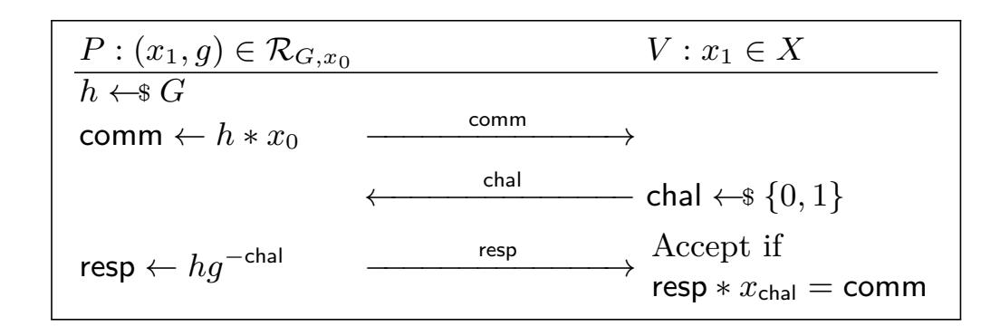

{0}------------------------------------------------

# **Post-Quantum Adaptor Signatures with Strong Security from Cryptographic Group Actions**

Ryann Cartor<sup>1</sup> , Nathan Daly<sup>2</sup> , Giulia Gaggero<sup>3</sup> , Jason T. LeGrow2*,*<sup>4</sup> , Andrea Sanguineti<sup>5</sup> , and Silvia Sconza<sup>6</sup>

**Abstract.** We present One Round "Cheating" Adaptor Signatures (OR-CAS): a novel and efficient construction of adaptor signature schemes from CSI-FiSh. Our protocol improves substantially on existing group action-based schemes: Unlike IAS (Tairi et al., FC 2021), our scheme does not require expensive non-interactive zero-knowledge proofs, and unlike adaptor MCSI-FiSh (Jana et al., CANS 2024) our construction does not require any modification to the underlying digital signature scheme. We prove the protocol's security under the strong security notions of Dai et al. (Indocrypt 2022) and Gerhart et al. (Eurocrypt 2024).

**Keywords:** Digital Signatures · Adaptor Signatures · Post-Quantum Cryptography · Group Action-Based Cryptography

# **1 Introduction**

Adaptor signatures—first introduced by Poelstra [[23\]](#page-31-0)—augment a digital signature scheme by incorporating an additional "pre-signing" phase, in which a user produces a pre-signature that can be transformed into a proper signature once a witness *y* to a statement *Y* of an NP language is revealed. The prototypical use case is the *atomic swap*, which allows two mutually untrusting parties to securely exchange digital assets, without using a trusted party. Aumayr *et al.* [\[3](#page-30-0)] formalize security notions that guarantee adaptor signatures' suitability for atomic swaps: adaptive existential unforgeability, pre-signature adaptability, and witness extractability.

Beyond this basic functionality, adaptor signature schemes have been used for many constructions for blockchain, such as payment channels [\[22](#page-31-1)] and generalized channels [[3\]](#page-30-0), deterministic wallets [\[13](#page-31-2), [14](#page-31-3)], private coin mixing protocols [[26,](#page-31-4) [17\]](#page-31-5), oracle-based payments [[21](#page-31-6)], and multiparty fair exchange [[4\]](#page-30-1). Recent works due to Dai *et al.* [[12\]](#page-30-2) and Gerhart *et al.* [[15,](#page-31-7) [16](#page-31-8)] demonstrate that Aumayr *et al.*'s security definitions do not guarantee security in these applications. These

<sup>1</sup> School of Mathematical and Statistical Sciences, Clemson University, Clemson, South Carolina, USA

<sup>2</sup> Department of Mathematics, Virginia Tech, Blacksburg, Virginia, USA <sup>3</sup> Department of Mathematics, McMaster University, Hamilton, Ontario, Canada

<sup>4</sup> Virginia Tech Center for Quantum Information Science and Engineering

<sup>5</sup> Dipartimento di Matematica, Università di Genova, Genova, Italy

<sup>6</sup> Institute of Mathematics, University of Zurich, Zurich, Switzerland

{1}------------------------------------------------

works define a number of stronger security notions—full extractability, unique extractability, unlinkability, and pre-verify soundness—to suit these new protocols. Gerhart *et al.* also present a number of protocol constructions that satisfy these new definitions. The most notable among these are *dichotomic signatures*, which generalize Schnorr signatures. Gerhart *et al.* demonstrate that a number of existing digital signature schemes can be framed as dichotomic signatures, and thus transformed into secure adaptor signatures.

Novel security notions notwithstanding, the vast majority of existing adaptor signature schemes—including all schemes constructed and analyzed in [\[15](#page-31-7), [16\]](#page-31-8) face a serious threat: quantum cryptanalysis. Indeed, any scheme based on the difficulty of discrete logarithms or factoring is broken by Shor's algorithm, and so will not be secure once large-scale quantum computers are built. To ensure that these functionalities can be realized securely in the future, we develop *postquantum* protocols, which run on classical computers but resist attacks by quantum adversaries. *Cryptographic group actions* [[2\]](#page-30-3) are a promising technique that underlie many many post-quantum digital signatures, including CSI-FiSh [\[8](#page-30-4)], LESS [\[9](#page-30-5)], and MEDS [\[10](#page-30-6)]. One major benefit of schemes built in this way is that they can often be easily modified to provide advanced functionalities, including ring signatures [[7\]](#page-30-7), threshold signatures [[5\]](#page-30-8), and blind signatures [[19,](#page-31-9) [20\]](#page-31-10). Despite this, there are only two group action-based adaptor signature constructions in the literature: Isogeny Adaptor Signatures (IAS) [[27\]](#page-31-11) and adaptor modified CSI-FiSh [[18\]](#page-31-12). These constructions have many disadvantages: (1) they have not been proven secure in the security model of Gerhart *et al.*; (2) IAS requires a large, expensive non-interactive zero-knowledge proof, making pre-signatures between 10 and 70 times as large as signatures, and taking between 15 and 20 times as long to produce as signatures; and (3) adaptor modified CSI-FiSh is not directly compatible with CSI-FiSh, and is instead built on a non-standard digital signature, limiting its usefulness to only those blockchains which choose to support the modified signature scheme. These drawbacks make existing group action-based schemes unsuitable for practical applications, and naturally lead us to the following question:

*Is it possible to construct efficient group action-based adaptor signatures without modification to the underlying signature scheme?*

#### **1.1 Our Contributions**

We answer this question in the affirmative with our new construction, ORCAS. More precisely, ORCAS improves upon existing group action-based adaptor signatures in several ways:

**Standard underlying signature:** In contrast with MCSI-FiSh [[18\]](#page-31-12), our scheme does not require any modification to the underlying digital signature scheme. It is compatible with CSI-FiSh, as specified in [\[8\]](#page-30-4).

**Security:** Our scheme is the only post-quantum adaptor signature scheme that is compatible with an unmodified underlying signature which provably sat

{2}------------------------------------------------

isfy the strong security notions of Dai *et al.* [\[12](#page-30-2)]. It is also the only postquantum scheme that is proven to satisfy the pre-verify soundness property introduced by Gerhart *et al.* [\[16](#page-31-8)].

**Efficiency:** We exploit the small challenge space of group action-based signatures to avoid IAS' expensive proof. This results in pre-signatures only a byte longer than the signatures themselves. Our pre-signatures are 8 to 36 times shorter than IAS pre-signatures at the same parameter sizes.

Our scheme is built from a sigma protocol using the Fiat-Shamir heuristic, like the Schnorr scheme[[25\]](#page-31-13). While the Schnorr protocol has an exponential challenge space and attains strong soundness in a single round, CSI-FiSh has a constant-size challenge space, and must amplify its soundness through repetition. Generally this is an undesirable feature, since it leads to larger signatures and slower singing and verifying. But our construction actually exploits this limitation in an essential way, yielding a Schnorr-inspired adaptor signature protocol with no Schnorr-based analogue. Our scheme is built on three observations:

- 1. As in both MCSI-FiSh [[18\]](#page-31-12) and the optimized version of IAS [\[27](#page-31-11)], it is only necessary to adapt a single round of the signature.
- 2. The expensive NIZK proof in IAS [[27\]](#page-31-11) is only necessary if the challenge is nonzero; as in MCSI-FiSh [[18\]](#page-31-12), it is easy to adapt a round in which the challenge is guaranteed to be 0.
- 3. The extra round in MCSI-FiSh [[18\]](#page-31-12) is not necessary in order to have a round whose challenge is predictably 0; for a constant-sized challenge space, any sequence of randomly chosen rounds has sufficiently high probability of including at least one round with challenge 0.

Of course, we aim to prove that ORCAS is a secure adaptor signature scheme for CSI-FiSh. There are a number of small differences between them that make the proof difficult. To make the proof easier, we introduce both a modified version of CSI-FiSh and a highly unoptimized version of ORCAS, for which the security proofs are relatively straightforward. We then prove a general set of lemmas that establish that, at a high level, if AS is a adaptor signature that is secure for the signature scheme *Σ*, then for any adaptor signature AS*′* and signature *Σ′* that are "sufficiently similar" to AS and *Σ*, respectively, AS*′* will be a secure adaptor signature for *Σ′* . With this very general result established, we show that both versions of ORCAS are sufficiently similar, as are both versions of CSI-FiSh. We present these ideas formally in Sections [4](#page-13-0) and [5.](#page-25-0) We expect that our techniques will see applications to other adaptor signature constructions.

Aside from our new protocol and proof techniques, we also include some new analyses of the definitions of [\[16](#page-31-8)], which demonstrate the need for novel adaptor signature constructions in the post-quantum setting.

# **2 Background and Definitions**

For brevity, we defer basic definitions related to hard relations, non-interactive zero-knowledge proofs, and ordinary digital signatures to Appendix [A.](#page-32-0)

{3}------------------------------------------------

# **2.1 Adaptor Signatures**

An adaptor signature scheme extends a digital signature scheme by incorporating a "pre-signing" phase, in which parties irrevocably commit to signing messages when specified conditions are met. In particular, Alice and Bob can agree on messages *mA, mB*, and construct pre-signatures (intuitively, commitments to signatures) on them. Alice will have the ability to transform (called "adapting" in this context) Bob's pre-signature into a signature on *mB*, but by doing so she will reveal enough information for Bob to adapt Alice's pre-signature into a signature on *mA*. In this way, each party is assured that if their message becomes signed, they can produce a signature on their partner's message.

Adaptor signatures are formally defined in Definition [2.1](#page-3-0).

<span id="page-3-0"></span>**Definition 2.1 (Adaptor Signature Scheme [[15](#page-31-7)]).** *An* adaptor signature scheme *with respect to a digital signature scheme Σ* = (KeyGen*,* Sign*,* Verify) *and a relation R with underlying language L is a tuple* AS = (PreSign*,* PreVerify*,* Adapt*,* Ext) *of algorithms defined as follows:*

PreSign(sk*, m, Y* )**:** *On input a secret key* sk*, a message m, and a statement <sup>Y</sup> ∈ L, the pre-signing algorithm outputs a pre-signature <sup>σ</sup>*b*.*

PreVerify(pk*, m, Y, <sup>σ</sup>*b)**:** *On input a public key* pk*, a message <sup>m</sup>, a statement <sup>Y</sup> <sup>∈</sup> <sup>L</sup>, and a pre-signature <sup>σ</sup>*b*, the pre-verification algorithm outputs a bit <sup>b</sup> ∈ {*0*,* <sup>1</sup>*}.*

Adapt(pk*, σ, y* <sup>b</sup> )**:** *On input a public key* pk*, a pre-signature <sup>σ</sup>*b*, and a witness <sup>y</sup> for the relation R, the adapting algorithm outputs a signature σ.*

Ext(*σ, σ, Y* <sup>b</sup> )**:** *On input a signature <sup>σ</sup>, a pre-signature <sup>σ</sup>*b*, and a statement <sup>Y</sup> ∈ L, the extraction algorithm outputs either a witness y such that* (*Y, y*) *∈ R, or ⊥.*

Alice and Bob can use an adaptor signature scheme to exchange digital goods securely across blockchains, as follows: first, Alice and Bob agree to exchange Alice's good A for Bob's good B. Let Alice's message *m<sup>A</sup>* encode "Send good A to Bob", and Bob's message *m<sup>B</sup>* encode "Send good B to Alice". Then

- 1. Alice pre-signs *m<sup>A</sup>* and publishes the pre-signature.
- 2. Bob pre-signs *m<sup>B</sup>* and publishes the pre-signature.
- 3. Alice adapts Bob's pre-signature into a signature, and records this signature on the blockchain. This authorizes sending Bob's good B to Alice.
- 4. Bob uses his pre-signature and signature (obtained from the blockchain) to adapt Alice's pre-signature into a signature, which he records on the blockchain. This authorizes sending Alice's good A to Bob.

The following correctness notion intuitively requires that if the scheme is used honestly, then all adaptor signature functionalities work as expected.

**Definition 2.2 (Pre-Signature Correctness [\[3](#page-30-0), Definition 1]).** *We say that* AS *is* pre-signature correct *if for all λ ∈* N*, all* (*Y, y*) *∈ R, and any message* 

{4}------------------------------------------------

m, we have

$$\mathbb{P}\left[ \begin{array}{c} \mathsf{PreVerify}(\mathsf{pk}, m, Y, \widehat{\sigma}) = 1 \\ \mathsf{Verify}(\mathsf{pk}, m, \sigma) = 1 \\ (Y, y') \in \mathcal{R} \end{array} \middle| \begin{array}{c} (\mathsf{sk}, \mathsf{pk}) \leftarrow \mathsf{KeyGen}(1^{\lambda}) \\ \widehat{\sigma} \leftarrow \mathsf{PreSign}(\mathsf{sk}, m, Y) \\ \sigma \leftarrow \mathsf{Adapt}(\widehat{\sigma}, y) \\ y' \leftarrow \mathsf{Ext}(\widehat{\sigma}, \sigma, Y) \end{array} \right] = 1.$$

**Security Notions.** Recent works due to Dai *et al.* [12] and Gerhart *et al.* [15, 16] identify gaps in existing adaptor signature security definitions [3], provide examples of schemes that satisfy older definitions but which still fail to satisfy security in natural real-world applications, and propose new security definitions that guarantee security in those applications. We adopt the definitions of [12, 15, 16] in our work, and state them here for completeness.

Pre-Signature Adaptability. This property guarantees that any valid pre-signature with respect to a statement in the language of the hard relation can be adapted into a valid signature. This prevents a cheating user from providing a pre-signature that pre-verifies but cannot be adapted, which would break the security of the atomic swap protocol. Formally, we have the following definition.

**Definition 2.3 (Pre-Signature Adaptability.).** An adaptor signature scheme AS satisfies pre-signature adaptability if for all  $\lambda \in \mathbb{N}$ ,  $(\mathsf{sk}, \mathsf{pk}) \leftarrow \mathsf{KeyGen}(1^{\lambda})$ ,  $(Y,y) \in \mathcal{R}$ , and  $m \in \{0,1\}^*$ , if  $\widehat{\sigma}$  satisfies  $\mathsf{PreVerify}(\mathsf{pk}, m, Y, \widehat{\sigma}) = 1$ , then  $\mathsf{Verify}(\mathsf{pk}, m, \mathsf{Adapt}(\widehat{\sigma}, y)) = 1$ .

Unlinkability and Canonical Signing. Unlinkability guarantees that ordinary signatures (produced using the signing algorithm of the underlying signature scheme) cannot be distinguished from adapted pre-signatures. Thus, a third-party observer who sees the signatures resulting from an atomic swap cannot identify those signatures as having arisen from an atomic swap.

**Definition 2.4 (Unlinkability [12, Section 3]).** Let Unlinkability be as defined in Figure 1. For an adversary  $\mathcal{A}$ , define the adversary's advantage as  $\mathsf{Adv}(\mathcal{A}) = 2\mathbb{P}[\mathsf{Unlinkability}_{\mathcal{A},\mathsf{AS}}(\lambda) = 1] - 1$ . We say that an adaptor signature scheme AS is unlinkable if for all PPT adversaries  $\mathcal{A}$ , there exists a negligible function  $\nu$  such that for all  $\lambda \in \mathbb{N}$ ,  $\mathsf{Adv}(\mathcal{A}) \leq \nu(\lambda)$ .

A related notion is canonical signing, which requires that for any message m and secret key sk, ordinary signatures are distributed identically to signatures coming from the canonical signing algorithm CanonicalSign, defined in Figure 2. We also define strongly canonical signing: the output of Sign is distributed identically to that of CanonicalSign<sub>(Y,y)</sub> (Figure 2), for every statement-witness pair  $(Y,y) \in \mathcal{R}$ . It is not hard to see that strongly canonical signing implies canonical signing.

In addition to unlinkability, we define a new security property called *weak* unlinkability, which guarantees that, even if an observer may be able to distinguish an adapted pre-signature from a standard signature, it is still hard to link

{5}------------------------------------------------

```
Unlinkability<sub>A,AS</sub>(\lambda)
                                                                                        Challenge(b, m, (Y, y))
101 : (\mathsf{sk}, \mathsf{pk}) \leftarrow \mathsf{KeyGen}(1^{\lambda})
                                                                                        201: assert (Y, y) \in R
102: b \leftarrow \$ \{0,1\}
                                                                                        202: \widehat{\sigma} \leftarrow \mathsf{PreSign}(\mathsf{sk}, m, Y)
103: b' \leftarrow \mathcal{A}^{\mathcal{O}_{S}, \mathcal{O}_{pS}(\cdot, \cdot), \mathsf{Challenge}(b, \cdot, \cdot)}(\mathsf{pk})
                                                                                        203: \sigma_0 \leftarrow \mathsf{Adapt}(\widehat{\sigma}, y)
                                                                                        204 : \sigma_1 \leftarrow \mathsf{Sign}(\mathsf{sk}, m)
104: return [b = b']
                                                                                        205: return \sigma_b
\mathcal{O}_{\mathsf{S}}(m)
                                                                                        \mathcal{O}_{\mathsf{pS}}(m,Y)
301: \sigma \leftarrow \mathsf{Sign}(\mathsf{sk}, m)
                                                                                        401: \widehat{\sigma} \leftarrow \mathsf{PreSign}(\mathsf{sk}, m, Y)
302: return \sigma
                                                                                        402: return \hat{\sigma}
```

Fig. 1: The unlinkability game.

<span id="page-5-1"></span>

| ${\sf CanonicalSign}({\sf sk}, m)$                    | $CanonicalSign_{(Y,y)}(sk,m)$                         |  |  |  |  |
|-------------------------------------------------------|-------------------------------------------------------|--|--|--|--|
| $101: (Y,y) \leftarrow Rgen(1^{\lambda})$             | $201:  \widehat{\sigma} \leftarrow PreSign(sk, m, Y)$ |  |  |  |  |
| $102:  \widehat{\sigma} \leftarrow PreSign(sk, m, Y)$ | $202:  \sigma \leftarrow Adapt(\widehat{\sigma},y)$   |  |  |  |  |
| $103:  \sigma \leftarrow Adapt(\widehat{\sigma}, y)$  | $203:$ return $\sigma$                                |  |  |  |  |
| $104: \mathbf{return} \ \sigma$                       |                                                       |  |  |  |  |

Fig. 2: The canonical signing algorithm for an adaptor signature scheme AS.

an adapted pre-signature to the statement with respect to which it was generated. In practice, this means that even a user publishing a signature cannot hide the fact that they participated in an atomic swap, any information beyond that remains private. This privacy guarantee should be sufficient for most applications.

**Definition 2.5 (Weak Unlinkability).** An adaptor signature scheme AS for the signature/relation pair  $(\Sigma, \mathcal{R})$  is weakly unlinkable if for any PPT  $\mathcal{A}$ ,

$$\mathbb{P}[\mathsf{WeakUnlinkability}^{\mathcal{A}}(1^{\lambda}) = 1] \leq \frac{1}{2} + \mathsf{negl}(\lambda)$$

where WeakUnlinkability is as defined in Figure 3.

It is straightforward to verify that unlinkability always implies weak unlinkability, and the converse holds if AS has canonical signing for  $\Sigma$ .

(Strong) Full Extractability and Extractability. Dai et al.'s notion of (strong) full extractability replaces the earlier notions of witness extractability [3, Definition 4] and existential unforgeability [3, Definition 2], which are now known to be insufficient for some applications. This new notion guarantees that it is infeasible for any adversary to produce a valid signature (on a new message for full extractability, on any message for strong full extractability) except by adapting a pre-signature given with respect to a statement that has a known witness.

{6}------------------------------------------------

```
WeakUnlinkability(1^{\lambda})
                                                                       Challenge(m, (Y_0, y_0))
101: (\mathsf{sk}, \mathsf{pk}) \leftarrow \mathsf{KGen}(1^{\lambda})
                                                                       201: assert (Y_0, y_0) \in \mathcal{R}
102: \quad b \leftarrow \$ \ \{0,1\}
                                                                       202: (Y_1, y_1) \leftarrow \mathsf{Rgen}()
103: \ b' \leftarrow \$ \mathcal{A}^{\mathcal{O}_{S},\mathcal{O}_{pS},\mathsf{Challenge}}(\mathsf{pk})
                                                                      203 : \widehat{\sigma} \leftarrow \mathsf{PreSign}(\mathsf{sk}, m, Y_b)
                                                                       204 : \sigma \leftarrow \mathsf{Adapt}(\widehat{\sigma}, y_b)
104: return [b = b']
                                                                       205: return \sigma
\mathcal{O}_{\mathsf{S}}(m)
                                                                       \mathcal{O}_{\mathsf{pS}}(m,Y)
301: \quad \sigma \leftarrow \mathsf{Sign}(\mathsf{sk}, m)
                                                                       401: \widehat{\sigma} \leftarrow \mathsf{PreSign}(\mathsf{sk}, m, Y)
302: \mathbf{return} \ \sigma
                                                                       402: return \hat{\sigma}
```

Fig. 3: The weak unlinkability game.

**Definition 2.6 (Full Extractability [12, Figure 3]).** An adaptor signature scheme AS satisfies full extractability if, for every PPT adversary  $\mathcal{A}$  there exists a negligible function  $\nu$  such that for all  $\lambda \in \mathbb{N}$ ,  $\mathbb{P}[\text{FullExtractability}_{\mathcal{A}, \mathsf{AS}}(\lambda) = 1] \leq \nu(\lambda)$ , where FullExtractability is defined in Figure 4.

Definition 2.7 (Strong Full Extractability [12, Figure 3]). An adaptor signature scheme AS satisfies strong full extractability if, for every PPT adversary  $\mathcal{A}$  there exists a negligible function  $\nu$  such that for all  $\lambda \in \mathbb{N}$ ,  $\mathbb{P}[\mathsf{StrongFullExtractability}_{\mathcal{A},\mathsf{AS}}(\lambda) = 1] \leq \nu(\lambda)$ , where  $\mathsf{StrongFullExtractability}$  is defined in Figure 4.

```
FullExtractability(\lambda) StrongFullExtractability(\lambda)
101: \ (\mathsf{sk}, \mathsf{pk}) \leftarrow \mathsf{KeyGen}(1^{\lambda})
102: C, T, S, U \leftarrow \emptyset
103: (m^*, \sigma^*) \leftarrow \mathcal{A}^{\mathcal{O}_{\mathsf{NewY}}, \mathcal{O}_{\mathsf{S}}, \mathcal{O}_{\mathsf{pS}}(\cdot, \cdot)}(\mathsf{pk})
104: assert Verify(pk, m^*, \sigma^*) = 1
105: assert m^* \notin S
106: assert (m^*, \sigma^*) \notin U
107: return ((Y, \mathsf{Ext}(Y, \widehat{\sigma}, \sigma^*)) \not\in \mathcal{R} \ \forall (Y, \widehat{\sigma}) \in T[m^*] \text{ such that } Y \not\in C)
\mathcal{O}_{\mathsf{S}}(m)
                                                        \mathcal{O}_{\mathsf{pS}}(m,Y)
                                                                                                                            \mathcal{O}_{\mathsf{NewY}}
                                                        301: \widehat{\sigma} \leftarrow \mathsf{PreSign}(\mathsf{sk}, m, Y)
                                                                                                                           401: (Y, y) \leftarrow \mathsf{Rgen}()
201: \sigma \leftarrow \mathsf{Sign}(\mathsf{sk}, m)
                                                                                                                           402: C \leftarrow C \cup \{Y\}
                                                        302: T[m] \leftarrow T[m] \cup \{(Y, \widehat{\sigma})\}
202: \quad S \leftarrow S \cup \{m\}
                                                        303: \ \mathbf{return} \ \widehat{\sigma}
                                                                                                                            403: \ \mathbf{return}\ Y
203: U \leftarrow U \cup \{(m, \sigma)\}
204: \ \mathbf{return} \ \sigma
```

Fig. 4: The FullExtractability and StrongFullExtractability games. Lines in gray appear only in the FullExtractability game.

{7}------------------------------------------------

The authors also introduce a simpler security property, *extractability*, which is equivalent to full extractability if  $\mathcal{R}$  is a hard relation and the scheme has canonical signing.

<span id="page-7-1"></span>**Definition 2.8 (Extractability [12, Figure 5]).** An adaptor signature scheme AS is extractable if, for every PPT adversary  $\mathcal{A}$  there exists a negligible function  $\nu$  such that for all  $\lambda \in \mathbb{N}$ ,  $\mathbb{P}[\mathsf{Extractability}_{\mathcal{A},\mathsf{AS}}(\lambda) = 1] \leq \nu(\lambda)$ , where Extractability is the game defined in Figure 5.

Fig. 5: The extractability game.

Unique Extractability. Unique extractability guarantees that it is infeasible for any efficient adversary to generate a pre-signature for some message and statement that corresponds to two distinct valid signatures on the message. As demonstrated in [16, Section 4.1], some adaptor signature applications can be rendered insecure if this property is not satisfied—e.g., the coin-mixing protocol of [17].

**Definition 2.9** (Unique Extractability [16, Definition 13]). An adaptor signature scheme AS is uniquely extractable if for every PPT adversary  $\mathcal{A}$  there exists a negligible function  $\nu$  such that for every  $\lambda \in \mathbb{N}$ ,  $\mathbb{P}[$ UniqueExtractability  $_{\mathcal{A},AS}(\lambda) = 1] \leq \nu(\lambda)$ , where UniqueExtractability is the game defined in Figure 6.

Pre-verify soundness. While pre-signature adaptability ensures that, for any honest witness  $Y \in \mathcal{L}$ , valid pre-signatures with respect to Y can be adapted into valid signatures, pre-verify soundness protects against adversaries using malicious witnesses by ensuring that for  $Y \notin \mathcal{L}$ , it is difficult to find valid presignatures with respect to Y. Gerhart  $et\ al.$  define two notions of pre-verify soundess:

Definition 2.10 (Computational Pre-verify Soundness [16, Definition 15]). An adaptor signature scheme AS is computationally pre-verify sound if

{8}------------------------------------------------

```
 \begin{array}{|llllllllllllllllllllllllllllllllllll
```

Fig. 6: The unique extractability game.

for every PPT adversary  $\mathcal{A}$  there exists a negligible function  $\nu$  such that for all  $\lambda \in \mathbb{N}$  and all (polynomially-bounded)  $Y \notin \mathcal{L}$ ,

$$\mathbb{P}\left[\mathsf{PreVerify}(\mathsf{pk}, m, \widehat{\sigma}, Y) = 1 \middle| \begin{array}{l} (\mathsf{sk}, \mathsf{pk}) \leftarrow \mathsf{KeyGen}(\lambda) \\ (m, \widehat{\sigma}) \leftarrow \mathcal{A}(\mathsf{sk}) \end{array} \right] \leq \nu(\lambda).$$

<span id="page-8-1"></span>Definition 2.11 (Statistical Pre-verify Soundness [16, Definition 16]). An adaptor signature scheme AS is statistically pre-verify sound if for all  $\lambda \in \mathbb{N}$ , all (polynomially-bounded)  $Y \notin \mathcal{L}$ , and all (sk, pk)  $\leftarrow$  KeyGen(1 $^{\lambda}$ ),

$$\mathbb{P}\left[\exists (m, \widehat{\sigma}) : \mathsf{PreVerify}(\mathsf{pk}, m, \widehat{\sigma}, Y) = 1\right] = 0.$$

# 2.2 Cryptographic Group Actions

Cryptographic group actions were first studied (under the name "hard homogenenous spaces") by Couveignes [11], before being independently rediscovered by Rostovtsev and Stolbunov |24| and later formalized and modernized in |2|. These group actions generalize Diffie-Hellman and discrete logarithm-based protocols, and can be used to design similar protocols that are believed to resist attacks by quantum computers. For the purposes of designing digital signatures, we are particularly interested in *effective* group actions, as defined in [2, Definition 3.4]. In this work, we only consider CSI-FiSh, although many of our constructions work for other cryptographic group actions, like those used in LESS and MEDS. Unfortunately, certain protocol optimizations (unrelated to the cryptographic group action framework) used in LESS and MEDS make them incompatible with our adaptor signature mechanism. Thus, since we are interested in protocols that do not require modifications to the underlying digital signature scheme, we restrict our attention to CSI-FiSh. Moreover, since the particulars of the group action used in CSI-FiSh are not important to our construction we omit them; we refer the reader to [19, Sections 2.2.8 and 3.4] for more details.

Hard Relations and Sigma Protocols from Group Actions. Given the action of a group G on a set X, we are interested in relations of the following form,

{9}------------------------------------------------

for any fixed *x*<sup>0</sup> *∈ X*: *RG,x*<sup>0</sup> = *{*(*Y, y*) *∈ X ×G* : *Y* = *y ∗x*0*}.* The corresponding language is *LG,x*<sup>0</sup> = *{Y* : *∃ y ∈ G* such that *Y* = *y∗x*0*}.* When uniform sampling from *G* is feasible—in particular, for CSI-FiSh—there is a natural sampling algorithm for the relation *RG,x*<sup>0</sup> : sample *g ←*\$ *G* and set *Y* = *g ∗ x*0. Equipped with this sampling algorithm *RG,x*<sup>0</sup> is a hard relation under the *group action inverse assumption* for *G, X*:

**Definition 2.12 (Group Action Inverse Problem).** *Let G act on X, and let x*<sup>0</sup> *∈ X. The* group action inverse problem *(GAIP) is, given x*<sup>1</sup> *∈ G ∗ x*0*, to find g ∈ G such that x*<sup>1</sup> = *g ∗ x*0*. The* group action inverse assumption *is that there exists no PPT adversary that solves the GAIP with non-negligible probability.*

One can use multiple public keys to reduce the soundness error of a sigma protocol. This idea naturally leads to the "multi-target" problem.

**Definition 2.13 (Multi-Target GAIP).** *Let G act on X, and let x*<sup>0</sup> *∈ X. The* multi-target group action inverse problem *(MT-GAIP) is, given x*1*, . . . , x<sup>t</sup> ∈ G ∗ x*0*, to find g ∈ G such that x<sup>i</sup>* = *g ∗ x<sup>j</sup> for some i, j ∈ {*0*, . . . , t} with i ̸*= *j. The* multi-target group action inverse assumption *is that there exists no PPT adversary that solves the MT-GAIP with non-negligible probability.*

Any cryptographic group action yields a straightforward sigma protocol for the relation *RG,x*<sup>0</sup> as depicted in Figure [7.](#page-9-0) The signature scheme in Figure [8](#page-10-0) results from applying the Fiat-Shamir transform to this sigma protocol, repeated over several rounds to reach cryptographic levels of soundness and optimized by using multiple public keys and a fixed-weight hash function.

<span id="page-9-0"></span>

Fig. 7: The canonical sigma protocol associated to *RG,x*<sup>0</sup> .

# **3 Our Adaptor Signature Construction: ORCAS**

Recall the standard construction of a digital signature *Σ* from CSI-FiSh (or any cryptographic group action) [[8\]](#page-30-4), depicted in Figure [8](#page-10-0) along with a variant, Filtered CSI-FiSh, which we will use for our security proof.

{10}------------------------------------------------

**Notation.** Let S-1 be the number of public keys, t the number of rounds, and H a hash function (modeled as a random oracle) with outputs sampled uniformly  $\{1-S,\ldots,S-1\}^t$ . Let  $\mathcal{D}_H$  be the distribution of the hash outputs.

We will consider a transitive action of a group G on a set X with starting element  $x_0 \in X$ , for which GAIP is hard. Denote a public key by  $\mathsf{pk} = (x_1, \ldots, x_{S-1}) \in X^{S-1}$ , with corresponding secret key  $\mathsf{sk} = (\mathsf{sk}_1, \ldots, \mathsf{sk}_{S-1}) \in G^{S-1}$  such that  $x_i = \mathsf{sk}_i * x_0$  for each i. Define  $\mathsf{sk}_0 = e_G$  so that  $\mathsf{sk}_0 * x_0 = x_0$ .

```
\mathsf{KeyGen}(1^{\lambda})
                                                                                \mathsf{Sign}(\mathsf{sk}, m)
101: for i = 1, ..., S - 1:
                                                                                 201: parse sk = (sk_1, ..., sk_{S-1})
               \mathsf{sk}_i \leftarrow \$ G
102:
                                                                                 202: g_1, \ldots, g_t \leftarrow \$ G
                x_i \leftarrow \mathsf{sk}_i * x_0
103:
                                                                                 203:  for i = 1, \ldots, t:
104: \mathsf{sk} \leftarrow (\mathsf{sk}_1, \dots, \mathsf{sk}_{S-1})
                                                                                204:
                                                                                                \mathsf{comm}_i = g_i * x_0
105: pk \leftarrow (x_1, \dots, x_{S-1})
                                                                                205: \operatorname{chal} = \operatorname{H}(m||\operatorname{comm}_1||\cdots||\operatorname{comm}_t)
106 : return (sk, pk)
                                                                                206: parse chal = (chal_1, \dots, chal_t)
                                                                                207:
                                                                                             r \leftarrow \$ [t]
Verify(pk, m, \sigma)
                                                                                            if chal_r \neq 0
                                                                                208:
301: parse pk \leftarrow (x_1, \dots, x_{S-1})
302: parse \sigma \leftarrow (\mathsf{chal}, \mathsf{resp}_1, \dots, \mathsf{resp}_t)
                                                                                                 goto line 202
                                                                                 209:
303: \mathbf{parse} \; \mathsf{chal} \; \leftarrow (\mathsf{chal}_1, \ldots, \mathsf{chal}_t)
                                                                                 210: for i = 1, ..., t:
304: \text{ for } i = 1, \dots, t:
                                                                                                \mathsf{resp}_i \leftarrow g_i \cdot \mathsf{sk}_{\mathsf{chal}_i}^{-1}
                                                                                 211:
                \mathsf{comm}_i' \leftarrow \mathsf{resp}_i * x_{\mathsf{chal}_i}
305:
                                                                                212: return \sigma = (\mathsf{chal}, \mathsf{resp}_1, \dots, \mathsf{resp}_t)
306 : \operatorname{chal}' \leftarrow \operatorname{H}(m||\operatorname{comm}_1'|| \cdots ||\operatorname{comm}_t')
307: \mathbf{return} \mathsf{chal}' \stackrel{?}{=} \mathsf{chal}
```

Fig. 8: The CSI-FiSh signature scheme. Lines in gray are not included in standard CSI-FiSh but give a variant, **Filtered CSI-FiSh**, in which the probability of a signature being output is proportional to the number of zero entries in its challenge vector. This variant will appear in our proofs in later sections.

Existing Group Action-Based Adaptor Signature Schemes. In order to motivate our adaptor signature construction, we first explain an important technique that originated with Schnorr adaptor signatures [23], and which is used in both IAS [27] and adaptor MCSI-FiSh [18]. This technique—while natural and useful for constructing adaptor signatures—has a fundamental limitation in the group action setting, since it loses the algebraic structure of the discrete logarithm setting. IAS and adaptor MCSI-FiSh overcome this limitation in different ways, but each comes with a disadvantage: IAS' expensive NIZK proofs, and adaptor MCSI-FiSh's additional rounds and non-standard underlying signature. Our method does not suffer from either disadvantage.

First consider the Schnorr signature scheme and the corresponding adaptor signature [16, Section 6.1]. The translation is straightforward: instead of constructing the commitment as  $comm = g^r$ , we set  $comm = g^r \cdot Y = g^{r+y}$ , construct the challenge chal and response  $resp = r - chal \cdot sk$  as usual, and finally define the

{11}------------------------------------------------

pre-signature as (chal,  $\widehat{\text{resp}}$ ). To pre-verify, we check that  $g^{\widehat{\text{resp}}} \cdot \mathsf{pk}^{\mathsf{chal}} \cdot Y = \mathsf{comm}$ . To adapt, we set  $\mathsf{resp} = \widehat{\mathsf{resp}} + y$ , and to extract we set  $y = \mathsf{resp} - \widehat{\mathsf{resp}}$ .

Tairi et al. [27] describe the pitfall that occurs when we apply this idea to the protocol of Figure 8 in a naïve way. For simplicity, we first consider a single public key (S=2) and a single round of signing (t=1). The natural approach is to set  $\mathsf{comm} = g * Y$  on line 204, and then define chal and  $\widehat{\mathsf{resp}}$  as in Figure 8. However we run into a problem during pre-verification when we try to use the Schnorr technique: we have no way to check for a meaningful relationship between comm,  $\mathsf{pk}$  and Y, since these now live in a  $\mathsf{set}$  with no group structure. We can check for a relationship between any two of these,  $\mathsf{e.g.}$  that  $\mathsf{resp} * x_\mathsf{chal} = \mathsf{comm}$ , but not between all three. Yet the ability to relate  $\mathsf{comm}$ ,  $\mathsf{pk}$ , and Y together was essential to pre-verification in the Schnorr adaptor signature.

IAS solves this problem for abelian group actions by including a NIZK proof that relates comm, pk, and Y. In particular, pre-signatures in this scheme have two commitments  $\widehat{\mathsf{comm}} = g * x_0, \mathsf{comm} = g * Y$  generated from the same ephemeral randomness g. The challenge is generated as usual by hashing comm, and the response  $\widehat{\mathsf{resp}}$  is computed as  $g \cdot \mathsf{sk}^{-\mathsf{chal}}$ . IAS pre-signatures include one additional component: a "proof of parallelness" for  $\widehat{\mathsf{comm}}$  and  $\widehat{\mathsf{comm}}$ , which proves that the same underlying g is used to construct them from  $x_0$  and Y, respectively. The pre-verifier checks that  $\widehat{\mathsf{comm}} = \widehat{\mathsf{resp}} * x_{\mathsf{chal}}$  and that the parallelness proof is acceptable. These two checks together replace the Schnorr verification, and guarantee that if we adapt the response as  $\widehat{\mathsf{resp}} = \widehat{\mathsf{resp}} \cdot y$ , then (for an abelian group action)

$$\operatorname{resp} * x_{\mathsf{chal}} = (\widehat{\mathsf{resp}} \cdot y) * x_{\mathsf{chal}} = y * \widehat{\mathsf{comm}} = g * Y = \mathsf{comm}.$$

This ensures the signature (comm, resp) will verify according to Figure 8. In practice, IAS uses many rounds, of which only the first is constructed as above to be adapted; the rest are constructed as in CSI-FiSh. Unfortunately, even one proof of parallelness is computationally expensive and large.

Adaptor MCSI-FiSh takes a different approach, noting that when chal = 0 only two set elements need to be compared: comm and Y. This is easily accomplished by checking that  $\widehat{\mathsf{resp}} * Y = \mathsf{comm}$ ; if that check passes we are guaranteed, after adapting, to have  $\mathsf{resp} * x_0 = \mathsf{comm}$ . However, the unpredictability of the hash function means that no round of "honest" CSI-FiSh can be known in advance to have  $\mathsf{chal} = 0$ . To solve this, on top of the t rounds in standard CSI-FiSh the authors add a  $(t+1)^{\mathsf{st}}$  round with commitment  $\mathsf{comm}_{t+1} = g_{t+1} * Y$ , challenge  $\mathsf{chal}_{t+1}$  which is always set to 0, and response  $\widehat{\mathsf{resp}}_{t+1} = g_{t+1}$ ; this  $(t+1)^{\mathsf{st}}$  round can be adapted by setting  $\mathsf{resp}_{t+1} = \widehat{\mathsf{resp}}_{t+1} \cdot y = g_{t+1} \cdot y$ . While this obviates the need for a NIZK proof, it modifies the underlying signature scheme, rendering it unusable except in blockchains that support a non-standard digital signature.

A Remark on Dichotomic Signatures. In [16, Sections 6–8], Gerhart *et al.* present a generic construction for adaptor signatures from dichotomic signatures. We do not attempt to follow this construction because, unfortunately, it

{12}------------------------------------------------

is not suitable for post-quantum adaptor signatures. Dicnotomic signatures require a (quasi-injective) homomorphic one-way function, but such a function—specifically, a truly homomorphic one-way function whose domain is an abelian group—was shown by Alamati to be impossible in a post-quantum setting: a quantum algorithm can use the function's homomorphism to break its one-wayness [1, Theorem 4.4.1]. While the construction may be salvageable in the post-quantum setting by using a weaker notion, we do not pursue this approach in this work.

Our Construction. Our approach is similar to adaptor MCSI-FiSh but instead of adding an extra "always zero" round we exploit the fact that, while we cannot guarantee any particular round r to have  $\mathsf{chal}_r = 0$ , we can expect to have  $\mathsf{chal}_r = 0$  once in every 2S - 1 attempts. We guess a round r which we hope will have  $\mathsf{chal}_r = 0$ , and construct our commitments as

$$comm_i = \begin{cases} g_i * x_0 & \text{if } i \neq r \\ g_i * Y & \text{if } i = r \end{cases}$$

We then construct the challenges according to Fiat-Shamir:  $(\mathsf{chal}_1, \ldots, \mathsf{chal}_t) \leftarrow \mathsf{H}(m||\mathsf{comm}_1||\cdots||\mathsf{comm}_t)$ . If  $\mathsf{chal}_r = 0$ , we are in luck: we can construct the responses  $(\widehat{\mathsf{resp}}_i)_{i=1}^t$ , and the resulting pre-signature  $(r, (\mathsf{comm}_i)_{i=1}^t, (\widehat{\mathsf{resp}}_i)_{i=1}^t))$  can later be adapted by setting  $\mathsf{resp}_r = \widehat{\mathsf{resp}}_r \cdot y$ . If  $\mathsf{chal} \neq 0$ , we can simply generate fresh commitments and try again. This resembles the way that an adversary can attempt to forge a signature in the Fiat-Shamir paradigm: make a random guess at the challenge, construct a compatible commitment and response, and hope the random oracle will output the challenge that was guessed. The crucial difference, however, is that while a forger must guess the challenge in every position—which it can do only with probability  $(2S-1)^t$ —we just need to guess the position of a single zero. In particular, for randomly chosen r we will have  $\mathsf{chal}_r = 0$  with probability 1/(2S-1). After 2S-1 tries, we expect to successfully produce an adaptable pre-signature.

Because our construction works by generating commitments repeatedly—like a cheating signer who does not know the secret key—until we get a favourable challenge in a particular round, we call our construction *One Round "Cheating"* Adaptor Signatures, or ORCAS. There two versions of the scheme: Base ORCAS, which admits easy security proofs, and Fast ORCAS, which is efficient enough to be used in practice. We present Base ORCAS in Figure 9.

<span id="page-12-0"></span>**Theorem 3.1.** Assuming MT-GAIP is hard for the action of G on X, the adaptor signature Base ORCAS (denoted AS) is a correct, pre-signature adaptable, strongly fully extractable, uniquely extractable, unlinkable, and pre-verify sound adaptor signature for Filtered CSI-FiSh in the random oracle model.

{13}------------------------------------------------

```
\mathsf{PreSign}(\mathsf{sk}, m, Y)
                                                                                                         PreVerify(pk, m, Y, \widehat{\sigma})
                                                                                                        201: if Y \notin \mathcal{L}
101: parse sk = (sk_1, ..., sk_{S-1})
102: do
                                                                                                        202:
                                                                                                                            return 0
103:
                   r \leftarrow \$ [t]
                                                                                                        203: parse pk = (x_1, \dots, x_{S-1})
                   g_1,\ldots,g_t \leftarrow \$ G
                                                                                                        204: parse \widehat{\sigma} = (r, \mathsf{chal}, \widehat{\mathsf{resp}}_1, \dots, \widehat{\mathsf{resp}}_t)
104:
                   for i = 1, ..., t
105:
                                                                                                        205: \mathbf{parse} \ \mathsf{chal} = (\mathsf{chal}_1, \dots, \mathsf{chal}_t)
                                                                                                        206: \mathbf{for} \ i = 1, \dots, t
                       \mathsf{comm}_i \leftarrow \begin{cases} g_i * x_0 & \text{if } i \neq r \\ g_i * Y & \text{if } i = r \end{cases}
106:
                                                                                                                           \mathsf{comm}_i' \leftarrow \begin{cases} \widehat{\mathsf{resp}}_i * x_{\mathsf{chal}_i} & \text{if } i \neq r \\ \widehat{\mathsf{resp}}_i * Y & \text{if } i = r \end{cases}
                                                                                                         207:
                   \mathsf{chal} \leftarrow \mathsf{H}(m||\mathsf{comm}_1||\cdots||\mathsf{comm}_t)
107:
108:
                    \mathbf{parse} \ \mathsf{chal} = (\mathsf{chal}_1, \dots, \mathsf{chal}_t)
                                                                                                        208: \operatorname{chal}' \leftarrow \operatorname{H}(m||\operatorname{comm}'_1||\cdots||\operatorname{comm}'_t)
109: \mathbf{until} \ \mathsf{chal}_r = 0
                                                                                                        209: return (chal' \stackrel{?}{=} chal \wedge chal<sub>r</sub> \stackrel{?}{=} 0)
110: for i = 1, ..., t
                   \widehat{\mathsf{resp}}_i \leftarrow g_i \cdot \mathsf{sk}_{\mathsf{chal}_i}^{-1}
111:
                                                                                                        \mathsf{Adapt}(\widehat{\sigma},y)
112: return \widehat{\sigma} = (r, \mathsf{chal}, \widehat{\mathsf{resp}}_1, \dots, \widehat{\mathsf{resp}}_t)
                                                                                                        401: parse \widehat{\sigma} = (r, \mathsf{chal}, \widehat{\mathsf{resp}}_1, \dots, \widehat{\mathsf{resp}}_t)
                                                                                                        402: parse chal = (\mathsf{chal}_1, \dots, \mathsf{chal}_t)
\mathsf{Ext}(\sigma,\widehat{\sigma},Y)
                                                                                                        403:  for i = 1, \ldots, t
301: \mathbf{parse} \ \sigma = (\mathsf{chal}, \mathsf{resp}_1, \dots, \mathsf{resp}_t)
                                                                                                                            \operatorname{resp}_i \leftarrow \begin{cases} \widehat{\operatorname{resp}}_i & \text{if } i \neq r \\ \widehat{\operatorname{resp}}_i \cdot y & \text{if } i = r \end{cases}
                                                                                                         404:
302: parse \widehat{\sigma} = (r, \mathsf{chal}', \widehat{\mathsf{resp}}_1, \dots, \widehat{\mathsf{resp}}_t)
303: \mathbf{if} \mathsf{chal} \neq \mathsf{chal}'
                                                                                                        405: return \sigma = (\mathsf{chal}, \mathsf{resp}_1, \dots, \mathsf{resp}_t)
304:
                   return 1
305: \mathbf{return} \ y = \widehat{\mathsf{resp}}_r^{-1} \cdot \mathsf{resp}_r
```

Fig. 9: Base ORCAS.

### <span id="page-13-0"></span>4 Security of Base ORCAS

#### 4.1 Security for Filtered CSI-FiSh

We will first prove the security of Base ORCAS for the modified scheme Filtered CSI-FiSh introduced in Figure 8. We do not propose this scheme to be used in practice, but because the security of Base ORCAS for Filtered CSI-Fish implies its security for standard CSI-Fish.

We will prove Theorem 3.1, showing that ORCAS for Filtered CSI-FiSh is correct, and secure with respect to the strong security definitions of [12, 15, 16]. Throughout this section let KeyGen, Sign, and Verify denote the components of Filtered CSI-FiSh.

We consider Filtered CSI-FiSh instead of standard CSI-FiSh because our adaptor signature scheme has (strongly) canonical signing with reference to this scheme: we can generate a "correctly-distributed" signature by adapting a pre-signature generated with respect to any statement-witness pair (even an adversarially-chosen one). This property greatly simplifies the remaining proofs. Lemmas 4.1, 4.2, and 4.3 are routine; we defer their proofs to Appendix C.

<span id="page-13-2"></span>Lemma 4.1 (Canonical Signing). AS has strongly canonical signing.

<span id="page-13-4"></span><span id="page-13-3"></span>Lemma 4.2 (Pre-Signature Correctness). AS is pre-signature correct.

{14}------------------------------------------------

Lemma 4.3 (Pre-Signature Adaptability). AS is pre-signature adaptable.

<span id="page-14-0"></span>The proof of Lemma 4.4 is substantially more involved.

**Lemma 4.4 (Strong Full Extractability).** Assuming MT-GAIP is hard for the action of G on X and H is a collision-resistant hash-function, the adaptor signature scheme AS satisfies strong full extractability in the random oracle model.

*Proof.* We will show that the scheme satisfies extractability. Since AS has canonical signing for Filtered CSI-FiSh,  $\mathcal{R}$  is a hard relation (under the GAIP assumption), and (by Lemma 4.5 below) AS satisfies unique extractability, by [12, Theorem 3.4] this implies strong full extractability.

We will construct an algorithm  $\mathcal{B}$  to attack MT-GAIP by simulating the security game Extractability<sub>A,AS</sub>. The simulator acts identically to the honest challenger, except it does not know sk and must instead program the random oracle in order to answer pre-signature queries. When asked to pre-sign message m with respect to statement Y, it first samples a random challenge chal and an index r in [t]. If  $\operatorname{chal}_r \neq 0$ , then it repeats the random sampling of chal and r until it gets  $\operatorname{chal}_r = 0$ . The simulator also samples at random a response  $\widehat{\operatorname{resp}}_1, \ldots, \widehat{\operatorname{resp}}_t$ . It then computes the (unique) commitment  $\operatorname{comm}_1, \ldots, \operatorname{comm}_t$  consistent with r, chal and  $\widehat{\operatorname{resp}}_1, \ldots, \widehat{\operatorname{resp}}_t$ , setting  $\operatorname{comm}_r = \operatorname{resp}_r * Y$  and  $\operatorname{comm}_i = \widehat{\operatorname{resp}}_i * x_{\operatorname{chal}_i}$  for each  $i \neq r$ . Finally, it programs the random oracle by setting  $H[m||\operatorname{comm}_1||\cdots||\operatorname{comm}_t] = \operatorname{chal}$  and outputs the completed presignature  $\widehat{\sigma} = (r, \operatorname{chal}, \widehat{\operatorname{resp}}_1, \ldots, \widehat{\operatorname{resp}}_t)$ .

Naturally random oracle programming fails if the random oracle has already been queried on  $m||\mathsf{comm}_1||\cdots||\mathsf{comm}_t$ . Since the commitment is sampled at random from  $C_1 \sqcup \cdots \sqcup C_t$ , where  $C_r = \{(\mathsf{comm}_1, \ldots, \mathsf{comm}_t) \in X^t : \mathsf{chal}_r = 0\}$ , this will happen with negligible probability.

Notice that the honest pre-signing algorithm chooses r at random before computing chal, while the simulator samples iteratively at random chal and r until it finds an acceptable pair with  $\operatorname{chal}_r = 0$ . However, this slight difference does not effect the distribution of the output of  $\mathcal{O}_{pS}$ , since both chal and r are sampled at random from  $\mathcal{D}_H$  and [t], respectively.

Recall the security game Extractability as described in Figure 5. We now make the reduction from Extractability<sub>A,AS</sub>, to the simulator B.

Assuming the pre-signing oracle does not abort, in which case chal  $\leftarrow \$ \mathcal{D}_H$ , we claim the pre-signature  $\widehat{\sigma}$  output by  $\mathcal{O}_{pS}$  is distributed the same in  $\mathbf{G}_1$  as in  $\mathbf{G}_0$ . Fix m and Y and define  $p_n(\widehat{\sigma}) = \Pr[\widehat{\sigma}' = \widehat{\sigma}|\widehat{\sigma}' \leftarrow \mathbf{G}_n.\mathcal{O}_{pS}]$  for  $n \in \{0,1\}$ . Since each  $\widehat{\mathsf{resp}}_i$  is distributed uniformly over G, for any valid pre-signature  $\widehat{\sigma} = (r, \mathsf{chal}, \widehat{\mathsf{resp}}_1, \dots, \widehat{\mathsf{resp}}_t)$  we can write  $p_0(\widehat{\sigma})$  and  $p_1(\widehat{\sigma})$  as

$$p_0(\widehat{\sigma}) = p_1(\widehat{\sigma}) = \frac{1}{|G|^t} \Pr\left[r' = r \land \mathsf{chal'} = \mathsf{chal} \, \middle| \mathsf{chal'}_{r'} = 0 \land \mathsf{chal'} \leftarrow \$ \, \mathcal{D}_\mathsf{H} \land r' \leftarrow \$ \, [t] \, \right].$$

Since the non-abort distributions are identical, the adversary's probability of success in  $\mathbf{G}_1$  is  $\Pr[\mathbf{G}_1 = 1] \leq \Pr[\mathbf{G}_0 = 1] + \operatorname{negl}(\lambda)$ . Notice that we are not

{15}------------------------------------------------

```
\mathcal{B}(x_1,\ldots,x_{S-1})
                                                                                    \mathcal{O}_{\mathsf{pS}}(m,Y)
101: T, Q \leftarrow \emptyset
                                                                                   301 : do
102: parse pk = (x_1, \dots, x_{S-1})
                                                                                   302:
                                                                                                      chal \leftarrow \$ \mathcal{D}_{\mathsf{H}}
                                                                                    303:
                                                                                                      \mathbf{parse} \ \mathsf{chal} = (\mathsf{chal}_1, \dots, \mathsf{chal}_t)
103: (m, \sigma) \leftarrow \mathcal{A}^{\mathcal{O}_{\mathsf{pS}}(\cdot, \cdot)}(\mathsf{pk})
                                                                                    304:
                                                                                                      r \leftarrow \$ [t]
104: assert Verify(pk, m, \sigma) = 1
                                                                                    305: until chal<sub>r</sub> = 0
105: for (Y, \widehat{\sigma}) \in T[m]
                                                                                    306: \widehat{\mathsf{resp}}_1, \ldots, \widehat{\mathsf{resp}}_t \leftarrow \
                  assert (Y, \mathsf{Ext}(\sigma, \widehat{\sigma}, Y)) \notin \mathcal{R}
106:
                                                                                    307:  for i = 1, \ldots, t:
107: return (m, \sigma)
                                                                                                     \mathsf{comm}_i \leftarrow \begin{cases} \widehat{\mathsf{resp}}_i * x_{\mathsf{chal}_i} & \text{if } i \neq r \\ \widehat{\mathsf{resp}}_i * Y & \text{if } i = r \end{cases}
                                                                                    308:
\mathcal{O}_{\mathsf{H}}(x)
                                                                                   309: \mathbf{assert} \ H[m||\mathsf{comm}_1||\cdots||\mathsf{comm}_t] \neq \bot
201: \quad \mathcal{Q} \leftarrow \mathcal{Q} \cup \{x\}
                                                                                   310: H[m||\mathsf{comm}_1||\cdots||\mathsf{comm}_t] \leftarrow \mathsf{chal}
202: if H[x] = \bot
                                                                                   311: \widehat{\sigma} = (r, \mathsf{chal}, \widehat{\mathsf{resp}}_1, \dots, \widehat{\mathsf{resp}}_t)
203:
                   H[x] \leftarrow \$ \mathcal{D}_{\mathsf{H}}
                                                                                   312: T[m] \leftarrow T[m] \cup \{(Y, \widehat{\sigma})\}
204: return H[x]
                                                                                   313 : return \hat{\sigma}
```

Fig. 10: Our MT-GAIP algorithm  $\mathcal{B}$  built from an adversary  $\mathcal{A}$  which attacks the extractability of our scheme.

```
\mathbf{G}_0
                                                                                 \mathcal{O}_{\mathsf{H}}(x)
101: T, Q \leftarrow \emptyset
                                                                                 201: \quad \mathcal{Q} \leftarrow \mathcal{Q} \cup \{x\}
102: H := [\bot]
                                                                                 202: if H[x] = \bot
                                                                                 203:
                                                                                                  H[x] \leftarrow \$ \mathcal{D}_{\mathsf{H}}
103: (\mathsf{sk}, \mathsf{pk}) \leftarrow \mathsf{KeyGen}(1^{\lambda})
                                                                                 204: return H[x]
104: (m, \sigma) \leftarrow \mathcal{A}^{\mathcal{O}_{\mathsf{pS}}(\cdot, \cdot)}(\mathsf{pk})
105: assert Verify(pk, m, \sigma) = 1
                                                                                 \mathcal{O}_{\mathsf{pS}}(m,Y)
106: for (Y, \widehat{\sigma}) \in T[m]
                                                                                 301: \widehat{\sigma} \leftarrow \mathsf{PreSign}(\mathsf{sk}, m, Y)
                 assert (Y, \mathsf{Ext}(\sigma, \widehat{\sigma}, Y)) \notin \mathcal{R}
107:
                                                                                 302: T[m] \leftarrow T[m] \cup \{(Y, \widehat{\sigma})\}
108: return 1
                                                                                 303: return \hat{\sigma}
```

Fig. 11: **Game G**<sub>0</sub>: This game corresponds to the original Extractability game, in which the adversary  $\mathcal{A}$  is given access to a pre-signature oracle  $\mathcal{O}_{pS}$  and an oracle  $\mathcal{O}_{H}$  and, to win, must produce a valid signature  $(m, \sigma)$  such that  $(Y, \mathsf{Ext}(\sigma, \widehat{\sigma}, Y)) \notin \mathcal{R}$  for any previous queries to  $\mathcal{O}_{pS}$ . Thus  $\Pr[\mathbf{G}_0 = 1] = \Pr[\mathsf{Extractability}_{\mathcal{A}, \mathsf{AS}}(\lambda) = 1]$ .

using the secret key sk anymore. Therefore we have done the reduction from Extractability<sub>A,AS</sub> to B.

Suppose there exists a PPT adversary  $\mathcal{A}$  winning game  $\mathbf{G}_0$  with non-negligible probability. So  $\mathcal{A}$  also wins game  $\mathbf{G}_1$  with non-negligible probability, which we will call  $\epsilon(\lambda)$ . This is the probability that, instead of aborting,  $\mathcal{B}$  returns a message and signature  $(m, \sigma)$ , where  $\sigma = (\mathsf{chal}, \mathsf{resp}_1, \dots, \mathsf{resp}_t)$ . We consider two cases, based on whether  $\mathcal{A}$  has or has not queried the random oracle  $\mathcal{O}_{\mathsf{H}}$  to construct  $\sigma$ . Let  $\epsilon_0(\lambda)$  be the probability  $\mathcal{B}$  outputs  $(m, \sigma)$  such that  $\mathsf{chal} \neq \mathsf{H}(x)$ 

{16}------------------------------------------------

```
\mathbf{G}_1
                                                                                     \mathcal{O}_{\mathsf{pS}}(m,Y)
101: T, Q \leftarrow \emptyset
                                                                                                  \mathbf{do}
                                                                                     301:
102: H := [\bot]
                                                                                     302:
                                                                                                        chal \leftarrow \$ \mathcal{D}_{\mathsf{H}}
103 : (\mathsf{sk}, \mathsf{pk}) \leftarrow \mathsf{KeyGen}(1^{\lambda})
104: (m, \sigma) \leftarrow \mathcal{A}^{\mathcal{O}_{\mathsf{pS}}(\cdot, \cdot)}(\mathsf{pk})
                                                                                                        parse chal = (chal_1, ..., chal_t)
                                                                                     303:
105: assert Verify(pk, m, \sigma) = 1
                                                                                     304:
                                                                                                        r \leftarrow \$ [t]
106: for (Y, \widehat{\sigma}) \in T[m]
                                                                                                    \mathbf{until} \ \mathsf{chal}_r = 0
                   assert (Y, \mathsf{Ext}(\sigma, \widehat{\sigma}, Y)) \notin \mathcal{R}
                                                                                     305:
107:
108:  return 1
                                                                                                    \widehat{\mathsf{resp}}_1, \dots, \widehat{\mathsf{resp}}_t \leftarrow \
                                                                                     306:
\mathcal{O}_{\mathsf{H}}(x)
                                                                                                    for i = 1, ..., t:
                                                                                     307:
201: \quad \mathcal{Q} \leftarrow \mathcal{Q} \cup \{x\}
                                                                                                                              \begin{cases} \widehat{\mathsf{resp}}_i * x_{\mathsf{chal}_i} & i \neq r \\ \widehat{\mathsf{resp}}_i * Y & i = r \end{cases}
                                                                                                        \mathsf{comm}_i \leftarrow
202: if H[x] = \bot:
                                                                                     308:
203:
                  H[x] \leftarrow \$ \mathcal{D}_{\mathsf{H}}
204: return H[x]
                                                                                                    assert H[m||\mathsf{comm}_1||\cdots||\mathsf{comm}_t] = \perp
                                                                                     309:
                                                                                                   H[m||\mathsf{comm}_1||\cdots||\mathsf{comm}_t] \leftarrow \mathsf{chal}
                                                                                     310:
                                                                                                   \widehat{\sigma} = (r, \mathsf{chal}, \widehat{\mathsf{resp}}_1, \dots, \widehat{\mathsf{resp}}_t)
                                                                                     311:
                                                                                     312: T[m] \leftarrow T[m] \cup \{(Y, \widehat{\sigma})\}
                                                                                     313 : return \hat{\sigma}
```

Fig. 12: Game  $G_1$ .

for all  $x \in \mathcal{Q}$ , and  $\epsilon_1(\lambda)$  the probability that  $\mathsf{chal} = \mathsf{H}(x^*)$  for some  $x^* \in \mathcal{Q}$ . If  $\mathsf{chal} = \mathsf{H}(x^*)$  we run  $\mathcal{B}$  again with the same randomness but a fresh response  $\mathsf{H}'(x^*) \leftarrow \mathcal{D}_\mathsf{H}$  to the random oracle query  $x^*$ . By the Forking Lemma [6, Theorem 1], if  $\epsilon_1(\lambda)$  is non-negligible, then with non-negligible probability the second run of  $\mathcal{B}$  outputs  $(m', \sigma')$  such that  $\mathsf{chal}' = \mathsf{H}'(x^*)$ .

Suppose both runs of  $\mathcal{B}$  output message-signature pairs as desired, with chal =  $\mathsf{H}(x^*)$  and  $\mathsf{chal}' = \mathsf{H}'(x^*)$ . Define  $\mathsf{comm}_i = \mathsf{resp}_i * x_{\mathsf{chal}_i}$  and  $\mathsf{comm}_i' = \mathsf{resp}_i' * x_{\mathsf{chal}_i'}$ . Since neither run of  $\mathcal{B}$  aborted, we know that  $\mathsf{Ver}(\mathsf{pk}, m, \sigma) = \mathsf{Ver}(\mathsf{pk}, m', \sigma') = 1$ . This gives us two equalities:

$$\mathsf{H}(m||\mathsf{comm}_1||\cdots||\mathsf{comm}_t) = \mathsf{chal} = \mathsf{H}(x^*),$$
  
 $\mathsf{H}'(m'||\mathsf{comm}_1'||\cdots||\mathsf{comm}_t') = \mathsf{chal}' = \mathsf{H}'(x^*).$ 

Since the probability of a collision is negligible, with overwhelming probability  $m||\mathsf{comm}_1||\cdots||\mathsf{comm}_t = m'||\mathsf{comm}_1'||\cdots||\mathsf{comm}_t' = x^*$ . Since  $\mathcal{D}_\mathsf{H}$  is large, with overwhelming probability  $\mathsf{H}(x^*) \neq \mathsf{H}'(x^*)$ . So  $\mathsf{comm}_i = \mathsf{comm}_i'$  for each round i, but there is at least one round j such that  $\mathsf{chal}_j \neq \mathsf{chal}_j'$ . We can now compute a path between two distinct public keys  $x_{\mathsf{chal}_j}$  and  $x_{\mathsf{chal}_i'}$ . Indeed,

$$\operatorname{resp}_{j} * x_{\operatorname{chal}_{j}} = \operatorname{comm}_{j} = \operatorname{comm}_{j}' = \operatorname{resp}_{j}' * x_{\operatorname{chal}_{j}'}.$$

Therefore  $g = \operatorname{resp}_{j}^{-1} \cdot \operatorname{resp}_{j}'$  is a solution to MT-GAIP, with  $g * x_{\operatorname{chal}_{j}'} = x_{\operatorname{chal}_{j}}$ .

{17}------------------------------------------------

To complete the proof, we show that  $\epsilon_1(\lambda)$  is non-negligible. Since  $\epsilon(\lambda) = \epsilon_0(\lambda) + \epsilon_1(\lambda)$  is non-negligible by assumption, it suffices to show that  $\epsilon_0(\lambda)$  is negligible; that is,  $\mathcal{A}$  cannot win with non-negligible probability unless chal =  $\mathsf{H}(x^*)$  for some  $x^* \in \mathcal{Q}$ .

Suppose  $\mathcal{B}$  outputs  $(m, \sigma)$  such that  $\operatorname{chal} \neq \operatorname{H}(x)$  for all  $x \in \mathcal{Q}$ . Define  $x^* = m||\operatorname{comm}_1||\cdots||\operatorname{comm}_t$ . Since  $\operatorname{Verify}(\operatorname{pk}, m, \sigma) = 1$ , we know that  $\operatorname{chal} = \operatorname{H}(x^*)$  and thus  $x^* \notin \mathcal{Q}$ . In fact, we claim that at the time  $\mathcal{A}$  returns  $(m, \sigma)$  the random oracle is undefined at  $x^*$   $(H[x^*] = \perp)$ . So  $\operatorname{H}(x^*)$  is sampled from  $\mathcal{D}_{\operatorname{H}}$  at the time of verification, meaning  $\operatorname{Verify}(\operatorname{pk}, m, \sigma) = 1$  only if  $\mathcal{A}$  succeeds in blindly guessing  $\operatorname{H}(x^*)$ , which happens with probability  $1/|\mathcal{D}_{\operatorname{H}}|$ . Therefore  $\epsilon_0(\lambda) \leq 1/|\mathcal{D}_{\operatorname{H}}|$  is negligible.

To prove the claim, suppose for sake of contradiction that  $H[x^*] \neq \bot$  when  $\mathcal{A}$  returns. Since  $\mathcal{A}$  has never queried  $\mathcal{O}_{\mathsf{H}}(x^*)$ , it must be that  $H[x^*]$  was defined during some pre-signing query  $\mathcal{O}_{\mathsf{pS}}(m',Y)$ . Let  $\widehat{\sigma} = (r,\mathsf{chal}',\widehat{\mathsf{resp}}_1,\ldots,\widehat{\mathsf{resp}}_t)$  be the pre-signature output by this computation, and let  $(\mathsf{comm}'_1,\ldots,\mathsf{comm}'_t)$  be the commitment used to generate  $\widehat{\sigma}$ . Assuming  $H[x^*]$  was defined here, we must have  $x^* = m' ||\mathsf{comm}'_1|| \cdots ||\mathsf{comm}'_t$  and therefore  $\mathsf{chal}' = \mathsf{chal} = \mathsf{H}(x^*)$ . Since  $\mathsf{PreVerify}(\mathsf{pk}, m, Y, \widehat{\sigma}) = 1$ , we know that  $\mathsf{chal}'_r = \mathsf{chal}_r = 0$  and thus  $\mathsf{resp}_r * x_0 = \mathsf{comm}_r = \mathsf{comm}'_r = \widehat{\mathsf{resp}}_r * Y$ . Define  $y = \mathsf{Ext}(\sigma, \widehat{\sigma}, Y) = \widehat{\mathsf{resp}}_r^{-1} \cdot \mathsf{resp}_r$ . So  $y * x_0 = Y$ , meaning  $(Y, y) \in \mathcal{R}$ . Since  $(\widehat{\sigma}, Y) \in T[m]$  this would cause  $\mathcal{B}$  to abort during its extraction checks, but we assume that  $\mathcal{B}$  does not abort.  $\square$ 

<span id="page-17-0"></span>Lemma 4.5 (Unique Extractability). Assuming H is a collision-resistant hash-function, the adaptor signature scheme AS satisfies unique extractability.

*Proof.* Suppose  $\mathcal{A}$  outputs a tuple  $(m, Y, \widehat{\sigma}, \sigma, \sigma')$  that wins the UniqueExtractability game. Expand the (pre-)signatures as follows:

```
\sigma = (\mathsf{chal}, \mathsf{resp}_1, \dots, \mathsf{resp}_t),
\sigma' = (\mathsf{chal}', \mathsf{resp}_1', \dots, \mathsf{resp}_t'),
\widehat{\sigma} = (r, \mathsf{chal}'', \widehat{\mathsf{resp}}_1, \dots, \widehat{\mathsf{resp}}_t).
```

For each  $i \in [t]$ , define  $\mathsf{comm}_i = \mathsf{resp}_i * x_{\mathsf{chal}_i}$  and  $\mathsf{comm}_i' = \mathsf{resp}_i' * x_{\mathsf{chal}_i'}$ . Since both extractions succeed and Ext checks that the challenges match, we have  $\mathsf{chal} = \mathsf{chal}' = \mathsf{chal}''$ . Moreover  $\mathsf{chal} = \mathsf{chal}'$  and  $\sigma \neq \sigma'$  imply that there exists i such that  $\mathsf{resp}_i \neq \mathsf{resp}_i'$ , thus  $\mathsf{comm}_i \neq \mathsf{comm}_i'$ . Since  $\mathsf{Verify}(\mathsf{pk}, m, \sigma) = \mathsf{Verify}(\mathsf{pk}, m, \sigma') = 1$ , we have found a hash collision:

```
\mathsf{H}(m||\mathsf{comm}_1||\cdots||\mathsf{comm}_t) = \mathsf{chal} = \mathsf{chal}' = \mathsf{H}(m||\mathsf{comm}_1'||\cdots||\mathsf{comm}_t').
```

If H is collision resistant, then  $\mathcal{A}$  can output a winning tuple  $(m, Y, \widehat{\sigma}, \sigma, \sigma')$  only with negligible probability. Therefore AS satisfies unique extractability.

# Lemma 4.6 (Unlinkability). AS satisfies unlinkability.

*Proof.* We will show that unlinkability is implied by strongly canonical signing, which we have already shown the scheme to have. Recalling the algorithm  $\mathsf{CanonicalSign}_{(Y,y)}$  from the definition of strongly canonical signing, we can rewrite the algorithm  $\mathsf{Challenge}$  from the security game as follows:

{18}------------------------------------------------

Fig. 13: A reformulation of the Challenge algorithm.

For a scheme with strongly canonical signing, by definition  $\sigma_0$  is distributed identically to  $\sigma_1$  for every  $(Y, y) \in \mathcal{R}$ . Therefore the output of Challenge is independent of b, meaning  $\mathcal{A}$  succeeds with probability exactly 1/2.

## <span id="page-18-0"></span>Lemma 4.7 (Pre-verify Soundness). AS has pre-verify soundness.

*Proof.* Consider a statement  $Y \notin \mathcal{L}$ , a keypair ( $\mathsf{sk}, \mathsf{pk}$ ), a message m, and a presignature  $\widehat{\sigma}$ . Since the first step of pre-verification is to check whether  $Y \in \mathcal{L}$ , we are guaranteed that  $\mathsf{PreVerify}(\mathsf{pk}, m, Y, \widehat{\sigma}) = 0$ .

The Lemmas 4.2–4.7 together prove Theorem 3.1.

#### 4.2 Filtered Signatures

Having proven Base ORCAS correct and secure for Filtered CSI-FiSh, we will define precisely the relationship between Filtered CSI-FiSh and CSI-FiSh and use this relationship to prove Base ORCAS correct and secure for CSI-FiSh. We notice that the two signature schemes have identical key generation and verification; the only difference is in their signing algorithms. Even the signing algorithms are not too different: every Filtered CSI-FiSh signature is also CSI-FiSh signature. In fact, signing in Filtered CSI-FiSh is equivalent to generating a sequence of CSI-FiSh signatures and choosing one to output with probability proportional to the number of zeros in its challenge. We call such a relationship filtering. We formally define filtering below, first for a pair of general algorithms  $A_1$  and  $A_2$ , then for a pair of signature schemes  $\Sigma_1$  and  $\Sigma_2$ .

**Definition 4.8 (Filtering).** Let  $\mathsf{KGen}(1^{\lambda})$  be an algorithm that key pairs  $(\mathsf{sk}, \mathsf{pk})$ . Let  $\mathcal{A}_1$  and  $\mathcal{A}_2$  be algorithms that take as input secret keys and public keys, respectively, and common information aux. We call  $\mathcal{A}_2$  a perfect (resp. statistical) filtering of  $\mathcal{A}_1$  (written  $\mathcal{A}_2 \leq \mathcal{A}_1$ , resp.  $\mathcal{A}_2 \lesssim \mathcal{A}_1$ ) if there exists a PPT algorithm Filter such that for all  $(\mathsf{sk}, \mathsf{pk}) \leftarrow \mathsf{KGen}(1^{\lambda})$  and all aux, we have

- 1.  $\{x \leftarrow \mathcal{A}_1(\mathsf{sk}, \mathsf{pk}, \mathsf{aux})\} \subseteq \{x \leftarrow \mathcal{A}_2(\mathsf{sk}, \mathsf{pk}, \mathsf{aux})\}$ .
- 2.  $\mathbb{P}[\mathsf{Filter}(\mathsf{pk},\mathsf{aux},x)=1|x\leftarrow\mathcal{A}_1(\mathsf{sk},\mathsf{aux})]$  is non-negligible.
- 3. The statistical distance between the output distributions of  $\mathcal{F}(\mathsf{sk}, \mathsf{pk}, \mathsf{aux})$  and  $\mathcal{A}_2(\mathsf{sk}, \mathsf{aux})$  is zero (resp. negligible in  $\lambda$ ), where  $\mathcal{F}$  is as defined in Figure 14.

Perfect filtering immediately implies a statistical filtering: if  $A_2 \leq A_1$  then  $A_2 \lesssim A_1$ . We now apply the notion of filtering to signature schemes.

{19}------------------------------------------------

<span id="page-19-0"></span>Fig. 14:  $\mathcal{F}$  is the result of filtering the algorithm  $\mathcal{A}_1$ .

**Definition 4.9 (Filtered Signature).** Consider two signature schemes  $\Sigma_1 = (\text{KeyGen}, \text{Sign}_1, \text{Verify})$  and  $\Sigma_2 = (\text{KeyGen}, \text{Sign}_2, \text{Verify})$ . We call  $\Sigma_2$  a perfect (resp. statistical) filtered signature of  $\Sigma_1$  if  $\text{Sign}_2$  is a perfect (resp. statistical) filtering of  $\text{Sign}_1$ . In this case we say  $\Sigma_2$  perfectly (resp. statistically) filters  $\Sigma_2$ , and write  $\Sigma_2 \leq \Sigma_1$  (resp.  $\Sigma_2 \lesssim \Sigma_1$ ).

<span id="page-19-1"></span>As its name suggests, Filtered CSI-FiSh (which we will denote as  $\Sigma_2$ ) is a perfect filtered signature of CSI-FiSh (which we will denote as  $\Sigma_1$ ). The two schemes' key generation and verification are identical by definition. To show that  $\Sigma_2 \leq \Sigma_1$  we define Filter as in Figure 15, making Sign(sk, m) identical to  $\mathcal{F}(\mathsf{sk}, \mathsf{pk}, m)$ . Thus each signature output by  $\mathsf{Sign}_2$  must also be an output of  $\Sigma_1$ .

Fig. 15: Algorithm Filter<sub>CSI-FiSh</sub> to generate Filtered CSI-FiSh from CSI-FiSh.

Moreover, since each element of a CSI-FiSh signature's challenge is uniform in  $\{1 - S, \dots, S - 1\}$ , the probability that Filter accepts a signature generated by  $\mathsf{Sign}_1$  is non-negligible:

$$\mathbb{P}\left[\mathsf{Filter}(\mathsf{pk}, m, \sigma) = 1 | \sigma \leftarrow \mathsf{Sign}_1(\mathsf{sk}, m)\right] = \mathbb{P}\left[\mathsf{chal}_r = 0 \middle| \begin{matrix} \mathsf{chal} \leftarrow \$ \ \mathcal{D}_\mathsf{H} \\ r \leftarrow \$ \ [t] \end{matrix}\right] = \frac{1}{2S-1}.$$

<span id="page-19-2"></span>Altogether, we have the following lemma.

# Lemma 4.10. Filtered CSI-FiSh perfectly filters CSI-FiSh.

We are now in a position to reduce the security of Base ORCAS for CSI-FiSh to its security for Filtered CSI-FiSh, using the language of filtered signatures. Our idea is to show general statements of the form, "If  $\Sigma_2$  filters  $\Sigma_1$  and AS satisfies security property X for  $\Sigma_2$ , then AS satisfies security property X for

{20}------------------------------------------------

*Σ*1." For some properties we require additional hypotheses, but these are simple and modular. We first give a few definitions used in these additional hypotheses.

First, we must have some guarantees on the security of *Σ*<sup>1</sup> itself. One can easily construct an insecure scheme *Σ*<sup>1</sup> which filters to a secure scheme *Σ*2: for example, define *Σ*<sup>1</sup> to append sk to the signature with probability 1/2, and define Filter to reject all signatures that contain sk. In this example *Σ*<sup>2</sup> may be EUF-CMA secure but *Σ*<sup>1</sup> certainly is not. But EUF-CMA alone is not a strong enough guarantee, since we could still design a scheme *Σ*<sup>1</sup> for which some of the signatures leak information when combined with pre-signatures (*e.g.* with probability 1/2 a signature contains sk*⊕*sk*′* for some masking secret key sk*′* , while a pre-signature always contains sk*′* ). The guarantee we want is simulatability in the random oracle model, as defined below.

**Definition 4.11 (Simulatable Signature).** *A digital signature scheme Σ* = (KGen*,* Sign*,* Verify) *is* perfectly simulatable *(in the random oracle model (ROM)) if there exists a PPT algorithm (which programs the random oracle)* Sim(pk*, m*) *→* (*σ, H*)*, where H is a table of input/output pairs programmed by* Sim *during its execution, such that for all keypairs* (sk*,* pk) *←* KGen(pp) *and all m ∈ {*0*,* 1*} ∗ , the following distributions are identical:*

$$\mathcal{D}_0 = \left\{ (\sigma, H) \, : \, H \leftarrow [ \, ], \sigma \leftarrow \mathsf{Sign}^{\mathcal{O}_\mathsf{H}}(\mathsf{sk}, m) \right\}, \ \ and \ \mathcal{D}_1 = \left\{ (\sigma, H) \leftarrow \mathsf{Sim}(\mathsf{pk}, m) \right\}$$

*where, in D*0*, the output H is the table of input/output pairs programmed by the queries that* Sign *makes in the course of its execution, and in D*1*, it is the table of input/output pairs programmed by* Sim *in its execution.*

In our security reduction we will have to program the random oracle to simulate signing queries while for other queries using the random oracle provided by the security game we are reducing to. So we want some restrictions on how the algorithms interact with the random oracle, in order to prevent unwanted interference between the programmed random oracle and the provided random oracle. The relevant restrictions are defined below.

**Definition 4.12 (Clean Simulation).** *A simulator* Sim *for a signature scheme σ (satisfying Definition [4.11\)](#page-8-1) (in the ROM) is called* clean *if for all* (sk*,* pk) *←* KGen(pp)*, and all messages m, if* (*σ, H*) *←* Sim(pk*, m*) *and H*[*x*] *̸*=*⊥ (i.e.,* Sim *programmed the random oracle value* H(*x*) *during its execution) then* Verify*<sup>O</sup>*<sup>H</sup> (pk*, m, σ*) *queries O*<sup>H</sup> *at x. We call Σ a* cleanly simulatable *signature.*

**Definition 4.13 (Unpredictable Queries).** *A randomized algorithm A<sup>O</sup>*<sup>H</sup> *(in the ROM) has* unpredictable queries *if for all inputs* inputs *and all strings x ∈ {*0*,* 1*} ∗ , we have* P[*A<sup>O</sup>*<sup>H</sup> (inputs) *queries x*] = negl(*λ*)*, where λ* = *|*inputs*|.*

**Definition 4.14 (Distinct Queries).** *A randomized algorithm A<sup>O</sup>*<sup>H</sup> *(in the ROM) has the* distinct queries *property if for all pairs* inputs<sup>1</sup> *̸*= inputs<sup>2</sup> *,*

$$\mathbb{P}[\mathcal{A}^{\mathcal{O}_{\mathsf{H}}}(\mathsf{inputs}_1) \ queries \ x \wedge \mathcal{A}^{\mathcal{O}_{\mathsf{H}}}(\mathsf{inputs}_2) \ queries \ x] = 0 \ for \ all \ x \in \{0,1\}^*.$$

{21}------------------------------------------------

Lemma 4.15 will allow us to deduce many security properties of an adaptor signature scheme for a signature scheme from its security for a filtering of that signature scheme. Note that the lemma does not reference unique extractability: this implication does not hold in general. We prove it for ORCAS separately.

<span id="page-21-0"></span>**Lemma 4.15.** Let  $\Sigma_1$  and  $\Sigma_2$  be two signature schemes with  $\Sigma_2 \lesssim \Sigma_1$ , and let AS be an adaptor signature scheme for  $\Sigma_2$  with respect to hard relation  $\mathcal{R}$ . Then:

- 1. If AS is pre-signature correct for  $\Sigma_2$ , then it is also for  $\Sigma_1$ .
- 2. If AS is pre-signature adaptable for  $\Sigma_2$ , then it is also for  $\Sigma_1$ .
- 3. If AS is statistically (resp. computationally) pre-verify sound for  $\Sigma_2$ , then AS is statistically (resp. computationally) pre-verify sound for  $\Sigma_1$ .

In the random oracle model, if  $\Sigma_1$  is simulatable and both  $\mathsf{Sign}_1$  and  $\mathsf{PreSign}$  have unpredictable queries, then the following also hold:

- 4. If AS is weakly unlinkable for  $\Sigma_2$ , then it is also for  $\Sigma_1$ .
- 5. If  $\Sigma_1$  is cleanly simulatable,  $\mathsf{Verify}(\mathsf{pk},\cdot,\cdot)$  has distinct queries for all  $\mathsf{pk}$ , and  $\mathsf{AS}$  satisfies full extractability (resp. strong full extractability) for  $\Sigma_2$ , then  $\mathsf{AS}$  satisfies full extractability (resp. strong full extractability) for  $\Sigma_1$ .

*Proof.* Claims 1-3 follow immediately since the algorithm Sign (the only difference between  $\Sigma_1$  and  $\Sigma_2$ ) is irrelevant for pre-signature correctness, pre-signature adaptability, and pre-verify soundness.

To prove claims 4 and 5, we will reduce the relevant security game for  $\Sigma_1$  to its counterpart for  $\Sigma_2$  by answering signing queries using the simulator for  $\Sigma_1$  and pre-signing queries (as well as challenge queries, in the case of weak unlinkability) using the interfaces provided by the security game for  $\Sigma_2$ . This reduction requires us to stitch together a hash table with some entries given by the outputs of the actual random oracle and others by the signing simulator, but an adversary will not be able to distinguish this from an honest random oracle. We demonstrate the reduction, using a series of hybrid games, for full extractability; the reductions for strong full extractability and weak unlinkability follow the same pattern.

- Game  $G_0$ : The original security game FullExtractability<sub>1</sub> for AS and  $\Sigma_1$ . Let  $H_1$  denote the challenger's random oracle and  $H_1$  its hash table.
- **Game G<sub>1</sub>:** Every time  $\mathsf{Sign}_1$  or  $\mathsf{PreSign}$  would make a random oracle query  $\mathsf{H}_1(x)$ , it first checks whether  $H_1[x] = \bot$  and aborts if not (*i.e.*, if the random oracle has already been queried at x).
- **Game G<sub>2</sub>:** Replace  $\operatorname{Sign}_1$  with the signing simulator  $\operatorname{Sim}$  for  $\Sigma_1$ . Each time  $\operatorname{Sim}$  outputs  $(\sigma, H')$ , for all  $x \in H'$  it checks whether  $H_1[x]$  has already been set, aborts if so, but if not sets  $H_1[x] = H'[x]$ .
- Game G<sub>3</sub>: PreSign uses its own random oracle H<sub>2</sub> and hash table  $H_2$ . Each time PreSign makes a random oracle query H<sub>2</sub>(x) it checks whether  $H_1[x]$  has already been set, aborts if so, but if not sets  $H_1[x] = H_2[x]$ .
- **Game G<sub>4</sub>:** Each time PreSign makes a query  $H_2(x)$ , it aborts if  $H_1[x]$  has already been set, but does not immediately update it otherwise. Each time  $H_1(x)$  is queried, if  $H_1[x] = \bot$  it queries  $h \leftarrow H_2(x)$  and sets  $H_1[x] = h$ .

{22}------------------------------------------------

**Game G**<sub>5</sub>: Remove the aborts. Each time Sim outputs  $(\sigma, H')$ , for all  $x \in H'$  it sets  $H_1[x] = H'[x]$ , regardless of whether  $H_1[x] = \bot$ .

Because  $\mathsf{Sign}_1$  and  $\mathsf{PreSign}$  have unpredictable queries, the probability that a single execution of  $\mathsf{Sign}$  or  $\mathsf{PreSign}$  queries  $\mathsf{H}_1(x)$  for any individual  $x \in H_1$  which has already been set is  $p \leq \mathsf{negl}(\lambda)$ . If an execution of game  $\mathbf{G}_1$  has  $q_{\mathsf{S}}$  signing queries,  $q_{\mathsf{pS}}$  pre-signing queries, and  $q_{\mathsf{H}}$  (total) random oracle queries, by the union bound the probability of an abort is  $p_{\mathsf{abort}} \leq (q_{\mathsf{S}} + q_{\mathsf{pS}})q_{\mathsf{H}} \cdot p$ . Since a PPT adversary can cause only polynomially many queries to be made, the probability of an abort in game  $\mathbf{G}_1$  is negligible. So games  $\mathbf{G}_0$  and  $\mathbf{G}_1$  are computationally indistinguishable.

Games  $G_1$  and  $G_2$  are identical because the outputs  $(\sigma, H')$  of Sim are distributed identically to those of  $Sign_1$  as long as neither algorithm queries the random oracle on a value x for which  $H_1[x]$  is already set. But in this case both games abort, so their behavior is in fact identical.

Games  $G_2$  and  $G_3$  are identical because, as long as  $H_1[x]$  has not already been set, querying  $h \leftarrow H_2(x)$  then setting  $H_2[x] = h$  is equivalent to simply querying  $h \leftarrow H_1(x)$ . But if  $H_1[x]$  has been set, both games abort.

Game  $G_4$  differs from game  $G_3$  only in the delay between setting  $H_2[x]$  and updating  $H_1[x]$  with it. If  $H_1(x)$  is queried while  $H_1[x] = H_2[x] = \bot$ , then setting  $H_1[x]$  by querying  $H_2(x)$  is equivalent to sampling  $H_1[x]$  from  $\mathcal{D}_H$  directly. If  $H_2[x]$  is set by PreSign and  $H_1(x)$  is queried before Sim attempts to program  $H_1[x]$ , then the outputs are likewise equivalent. The outputs would only differ if  $H_2[x]$  were set by PreSign then Sim attempted to program  $H_1[x]$ . In game  $G_3$ , since  $H_1[x]$  was already updated with  $H_2[x]$ , the simulator would abort. In game  $G_4$ , since  $H_1[x]$  was not yet updated with  $H_2[x]$ , the simulator would successfully program  $H_1[x] = H'[x]$ . But the probability of Sim programming a H'[x] for which  $H_2[x] \neq \bot$  is negligible, since Sign<sub>1</sub> has unpredictable queries and Sim has the same distribution of queries as Sign<sub>1</sub>. So games  $G_3$  and  $G_4$  are computationally indistinguishable.

Games  $G_4$  and  $G_5$  differ only when Sim tries to program or PreSign tries to query a value x for which  $H_1[x]$  is already defined. But we have already established that, because these algorithms have unpredictable queries, this happens with negligible probability so the games are computationally indistinguishable.

Consider a PPT adversary  $\mathcal{A}$  which wins the game FullExtractability<sub>1</sub> for  $\Sigma_1$  with non-negligible probability  $\epsilon(\lambda)$ . By the hybrid argument above,  $\mathcal{A}$  also wins game  $\mathbf{G}_5$  with probability  $\epsilon'(\lambda) \geq \epsilon(\lambda) - \mathsf{negl}(\lambda)$ . We define a reduction  $\mathcal{B}_{\mathsf{FullExtractability}}$  as shown in Figure 16: given an instance  $\mathsf{pk}$  of FullExtractability<sub>2</sub> for  $\sigma_2$ , we initiate game  $\mathbf{G}_5$  with  $\mathcal{A}$  on input  $\mathsf{pk}$ . While FullExtractability<sub>2</sub> has its tables  $C_2$ ,  $T_2$ ,  $S_2$ ,  $U_2$ , and  $H_2$ , we will also keep of our own tables  $C_1$ ,  $T_1$ ,  $S_1$ ,  $U_1$ , and  $H_1$ . We will answer queries to  $\mathcal{O}_{\mathsf{pS}}$  and  $\mathcal{O}_{\mathsf{NewY}}$  using the oracles provided by FullExtractability<sub>2</sub>, updating  $T_1$  and  $C_1$  appropriately. This means we will always have  $C_1 = C_2$  and  $T_1 = T_2$ . We will answer  $\mathcal{O}_{\mathsf{S}}(m)$  queries using  $(\sigma, H') \leftarrow \mathsf{Sim}(\mathsf{pk}, m)$ , updating  $S_1$  and  $U_1$  appropriately and then setting  $H_1[x] = H'[x]$  for all  $x \in H'$ . This means we will always have  $S_2 = U_2 = \emptyset$ , since  $\mathcal{O}_{\mathsf{S}_2}$  is never called. For queries to  $\mathcal{O}_{\mathsf{H}_1}(x)$ , if  $H_1[x]$  has not already been

{23}------------------------------------------------

set we will set it by querying  $\mathcal{O}_{\mathsf{H}_2}(x)$ , then we will return  $H_1[x]$ . This behavior is all identical to game  $\mathbf{G}_5$ . On receiving output from  $\mathcal{A}$ , we simply pass it on as our output to FullExtractability<sub>2</sub>.

```
\mathcal{B}_{\text{FullExtractability}}^{\mathcal{O}_{\text{NewY}_2},\mathcal{O}_{\text{S}_2},\mathcal{O}_{\text{pS}_2},\mathcal{O}_{\text{H}_2}}(\text{pk})
                                                                                                          \mathcal{O}_{\mathsf{S}_1}(m)
                                                                                                          201: (\sigma, H') \leftarrow \mathsf{Sim}(\mathsf{pk}, m)
101: C_1, T_1, S_1, U_1, H_1 \leftarrow \emptyset
                                                                                                          202: S_1 \leftarrow S_1 \cup m
102: (m^*, \sigma^*) \leftarrow \mathcal{A}^{\mathcal{O}_{\mathsf{NewY}_1}, \mathcal{O}_{\mathsf{S}_1}, \mathcal{O}_{\mathsf{pS}_1}, \mathcal{O}_{\mathsf{H}_1}}(\mathsf{pk})
                                                                                                          203: U_1 \leftarrow U_1 \cup \{(m,\sigma)\}
103: assert Verify {}^{\mathcal{O}}\mathsf{H}_1\left(\mathsf{pk},m^*,\sigma^*\right)=1
                                                                                                          204: for x \in H':
104: assert m^* \notin S_1
                                                                                                                            H_1[x] \leftarrow H'[x]
                                                                                                          205:
105: assert (m^*, \sigma^*) \notin U_1
                                                                                                          206: return \sigma
106: return (m^*, \sigma^*)
\mathcal{O}_{\mathsf{pS_1}}(m,Y)
                                                                         \mathcal{O}_{\mathsf{NewY}_1}(\cdot)
                                                                                                                             \mathcal{O}_{\mathsf{H}_1}(x)
301: \ \widehat{\sigma} \leftarrow \mathcal{O}_{\mathsf{pS}_2}(m, Y)
                                                                        401: Y \leftarrow \mathcal{O}_{\mathsf{NewY}_2}(\cdot)
                                                                                                                             501: if H_1[x] = \perp:
                                                                                                                             502:
                                                                                                                                               h \leftarrow \mathcal{O}_{\mathsf{H}_2}(x)
302: T_1[m] \leftarrow T_1[m] \cup \{(Y, \hat{\sigma})\}
                                                                        402: C_1 \leftarrow C_1 \cup \{Y\}
303: return \widehat{\sigma}
                                                                         403:  return Y
                                                                                                                                               H_1[x] \leftarrow h
                                                                                                                             503:
                                                                                                                             504: return H_1[x]
```

Fig. 16: Reduction  $\mathcal{B}_{\mathsf{FullExtractability}}$  from  $\mathbf{G}_5$  for  $\Sigma_1$  to  $\mathsf{FullExtractability}_2$  for  $\Sigma_2$ .

For weak unlinkability, the reduction is complete since  $\mathsf{Chall}_1$  queries are being passed directly to  $\mathsf{Chall}_1$ , so  $\mathcal{A}$  is guessing the bit b from  $\mathsf{WeakUnlinkability}_2$ . For (strong) full extractability, we must also ensure that the signature output by the adversary passes all the checks applied by  $\mathsf{FullExtractability}_2$ . Since  $C_1 = C_2$ ,  $T_1 = T_2$ , and  $U_2 = S_2 = \emptyset$ , a valid forgery for  $\mathsf{FullExtractability}_1$  will automatically pass every test for  $\mathsf{FullExtractability}_2$  except possibly verification with respect to the untampered hash function  $\mathsf{H}_2$ . When  $\Sigma_1$  is cleanly simulatable and  $\mathsf{Verify}(\mathsf{pk},\cdot,\cdot)$  has distinct queries, any forgery which verifies with respect to the modified hash function must also verify with respect to the original.

Assume  $(m^*, \sigma^*)$  is a valid forgery for FullExtractability<sub>1</sub>. Let  $(\sigma_j, H'_j)$  be the outputs of the j-th call to the signing simulator,  $\mathsf{Sim}(m_j)$ . Since  $(m^*, \sigma^*) \notin U_2$ , we know that  $(m^*, \sigma^*) \neq (m_j, \sigma_j)$  for all j. For any  $x \in H'_j$ , since  $\mathsf{Sim}$  is clean,  $\mathsf{Verify}^{\mathcal{O}_{\mathsf{H}}}(\mathsf{pk}, m_j, \sigma_j)$  queries  $\mathcal{O}_{\mathsf{H}}(x)$ , and since  $\mathsf{Verify}(\mathsf{pk}, \cdot, \cdot)$  has distinct queries,  $\mathsf{Verify}^{\mathcal{O}_{\mathsf{H}}}(\mathsf{pk}, m^*, \sigma^*)$  does not query  $\mathcal{O}_{\mathsf{H}}(x)$ . So the only random oracle queries made by  $\mathsf{Verify}^{\mathcal{O}_{\mathsf{H}}}(\mathsf{pk}, m^*, \sigma^*)$  are for  $x \notin \left(\bigcup_j H'_j\right)$ , and for those x we have  $H_1[x] = H_2[x]$ , so  $\mathsf{Verify}^{\mathcal{O}_{\mathsf{H}_2}}(\mathsf{pk}, m^*, \sigma^*) = \mathsf{Verify}^{\mathcal{O}_{\mathsf{H}_1}}(\mathsf{pk}, m^*, \sigma^*) = 1$ .

#### 4.3 Security for Standard CSI-FiSh

<span id="page-23-1"></span>We can now prove Base ORCAS secure for standard CSI-FiSh.

{24}------------------------------------------------

**Theorem 4.16.** Assuming MT-GAIP is hard for the action of G on X, Base ORCAS (denoted AS) is a correct, pre-signature adaptable, strongly fully extractable, uniquely extractable, unlinkable, and pre-verify sound adaptor signature for CSI-FiSh in the random oracle model.

Proof. Denote CSI-FiSh by  $\Sigma_1$  and Filtered CSI-FiSh by  $\Sigma_2$ . We know from lemma 4.10 that  $\Sigma_1 \leq \Sigma_2$ , and from Theorem 3.1 that AS satisfies the above properties for  $\Sigma_2$ . Furthermore, PreSign and Sign<sub>1</sub> both have unpredictable queries (since the commitment is sampled uniformly at random from an exponentially large space) and Verify(pk,  $\cdot$ ,  $\cdot$ ) has distinct queries for all pk (since CSI-Fish verification computes a single hash  $H(m||\text{comm}'_1||\cdots||\text{comm}'_t)$  whose input depends on both the message and the signature). If  $\Sigma_1$  is cleanly simulatable, then Lemma 4.15 gives us every security property except unique extractability. So for these properties it suffices to show that  $\Sigma_1$  is cleanly simulatable, which we do in Lemma 4.17 below.

For unique extractability, we notice that the proof of Lemma 4.5 relied only on the structure of (pre-)signatures and the collision-resistance of H, making no reference to the signature scheme  $\Sigma_2$  itself. So the same proof shows that AS satisfies unique extractability for  $\Sigma_1$ .

#### <span id="page-24-0"></span>Lemma 4.17. CSI-FiSh is cleanly simulatable.

*Proof.* Consider the simulator Sim for CSI-FiSh defined in Figure 17, and compare its output distribution with that of the CSI-FiSh signing algorithm Sign.

```
\mathsf{Sign}(\mathsf{sk}, m)
                                                                                     \mathsf{Sim}(\mathsf{pk}, m)
101: parse sk = (sk_1, ..., sk_{S-1})
                                                                                     201: parse pk = (x_1, \dots, x_{S-1})
                                                                                     202: \ \operatorname{resp}_1, \dots, \operatorname{resp}_t \leftarrow \$ \ G
102: g_1, \ldots, g_t \leftarrow \$ G
103: for i = 1, ..., t:
                                                                                     203: chal \leftarrow \$ \mathcal{D}_{\mathsf{H}}
104:
                \mathsf{comm}_i \leftarrow g_i * x_0
                                                                                     204: \mathbf{parse} \ \mathsf{chal} = (\mathsf{chal}_1, \dots, \mathsf{chal}_t)
105: \operatorname{chal} = \operatorname{H}(m||\operatorname{comm}_1||\cdots||\operatorname{comm}_t)
                                                                                     205: \mathbf{for} \ i = 1, \dots, t:
106: parse chal = (chal_1, \dots, chal_t)
                                                                                     206:
                                                                                                     \mathsf{comm}_i \leftarrow \mathsf{resp}_i * x_{\mathsf{chal}_i}
107: for i = 1, ..., t:
                                                                                     207: \quad \sigma = (\mathsf{chal}, \mathsf{resp}_1, \dots, \mathsf{resp}_t)
                \mathsf{resp}_i \leftarrow g_i \cdot \mathsf{sk}_{\mathsf{chal}_i}^{-1}
                                                                                     208: H[m||\mathsf{comm}_1||\cdots||\mathsf{comm}_t| \leftarrow \mathsf{chal}
108:
                                                                                     209 : return (\sigma, H)
109: \mathbf{return} \ \sigma = (\mathsf{chal}, \mathsf{resp}_1, \dots, \mathsf{resp}_t)
```

Fig. 17: Actual and simulated CSI-FiSh signing algorithms.

For a fixed keypair ( $\mathsf{sk}, \mathsf{pk}$ ) and message m, in both cases  $\sigma$  is uniquely determined by  $(\mathsf{comm}_1, \ldots, \mathsf{comm}_t)$  and  $\mathsf{chal}$ , distributed independently and uniformly over their respective spaces  $(X^t)$  for the commitment vector and  $\mathcal{D}_\mathsf{H}$  for the challenge). So  $\mathsf{Sim}$  is a simulator for CSI-FiSh. It is a clean simulator because it programs exactly one value of its hash table,  $H[m||\mathsf{comm}_1||\cdots||\mathsf{comm}_t]$ , which is precisely the value  $\mathsf{Verify}(\mathsf{pk}, m, \sigma)$  must query.

{25}------------------------------------------------

# <span id="page-25-0"></span>5 Optimization

The most time-intensive part of CSI-FiSh signing is computing the isogenies to find the commitment curves. Since this is the part which Base ORCAS presigning must successively recompute until it finds a challenge with  $\mathsf{chal}_r = 0$ , the expected runtime of PreSign is approximately 2S - 1 times that of Sign. Even for relatively few public keys, this is impractical. But we do not actually need to recompute all the commitments from scratch: once we have generated one commitment vector we can rerandomize by permuting the commitments until we receive a favorable challenge. We refer to the optimized scheme as Fast ORCAS, and define it formally in Figure 18.

```
\mathsf{PreSign}(\mathsf{sk}, m, Y)
101: parse sk = (sk_1, ..., sk_{S-1})
                                                                                                   while chal_r \neq 0
                                                                                      110:
102: r \leftarrow \$[t]
                                                                                                        \mathsf{count} \leftarrow \mathsf{count} + 1
                                                                                     111:
103: g_1, \ldots, g_t \leftarrow \$ G
                                                                                                        if count > t! : \mathbf{return} \perp
                                                                                      112:
104: for i = 1, ..., t
                                                                                      113:
                                                                                                        \phi \leftarrow \$ S_t
                \mathsf{comm}_i \leftarrow \begin{cases} g_i * x_0 & \text{if } i \neq r \\ g_i * Y & \text{if } i = r \end{cases}
                                                                                      114:
                                                                                                        r \leftarrow \phi(r)
105:
                                                                                                        \overrightarrow{\mathsf{comm}} \leftarrow \phi(\overrightarrow{\mathsf{comm}})
                                                                                      115:
                                                                                      116:
                                                                                                        \mathsf{chal} \leftarrow \mathsf{H}(m||\mathsf{comm}_1||\cdots||\mathsf{comm}_t)
106: \overrightarrow{\mathsf{comm}} \leftarrow (\mathsf{comm}_1, \dots, \mathsf{comm}_t)
                                                                                                        \mathbf{parse} \ \mathsf{chal} = (\mathsf{chal}_1, \dots, \mathsf{chal}_t)
                                                                                      117:
107: \mathsf{chal} \leftarrow \mathsf{H}(m||\mathsf{comm}_1||\cdots||\mathsf{comm}_t)
                                                                                                   for i = 1, ..., t
                                                                                     118:
108: parse chal = (chal_1, \dots, chal_t)
                                                                                                        \widehat{\mathsf{resp}}_i \leftarrow g_i \cdot \mathsf{sk}_{\mathsf{chal}}^{-1}
                                                                                      119:
109: count = 0
                                                                                      120: return \widehat{\sigma} = (r, \mathsf{chal}, \widehat{\mathsf{resp}}_1, \dots, \widehat{\mathsf{resp}}_t)
```

Fig. 18: Fast ORCAS pre-signing (other algorithms are unchanged from Base ORCAS). Here  $S_t$  denotes the symmetric group of permutations on t elements, and for  $\phi \in S_t$ , we define  $\phi(\overrightarrow{\mathsf{comm}}) := (\mathsf{comm}_{\phi^{-1}(1)}, \mathsf{comm}_{\phi^{-1}(2)}, \dots, \mathsf{comm}_{\phi^{-1}(t)})$ .

There is a probability  $p_{\perp}$  that  $\mathsf{chal}_r \neq 0$  for every permutation  $\phi \in S_n$ . In this case we have no choice but to abort and try again with a fresh commitment generated from scratch. This probability is given by  $p_{\perp} = \left(\frac{2S-2}{2S-1}\right)^{t!}$ . If t is sufficiently small and S is sufficiently large, then  $p_{\perp}$  can be a problematic: for instance,  $p_{\perp} \approx \frac{1}{2}$  when  $S = 2^{15}$  and t = 7. For the parameters we consider, however, this is not an issue: even with  $S = 2^{12}$  and t = 9 we have  $p_{\perp} \approx 2^{-64}$ . Thus in practice we assume Fast ORCAS pre-signing never aborts.

We must also ensure that permuting preserves adaptability. If  $r' = \phi(r)$  and  $(\mathsf{comm}_1', \dots, \mathsf{comm}_t') = (\mathsf{comm}_{\phi^{-1}(1)}, \dots, \mathsf{comm}_{\phi^{-1}(t)})$ , then we have

$$\mathsf{comm}_{r'}' = \mathsf{comm}_{\phi^{-1}(r')} = \mathsf{comm}_{\phi^{-1}(\phi(r))} = \mathsf{comm}_r.$$

Thus, even after permuting, r' still points to the one "adaptable" round of the pre-signature. With this established, every pre-signature output by the optimized

{26}------------------------------------------------

```
\mathsf{Filter}_{\mathsf{ORCAS},k}(\mathsf{pk},m,Y,\widehat{\sigma})
101: parse pk = (x_1, \dots, x_{S-1})
                                                                                                  110 : do
102: parse \widehat{\sigma} = (r, \mathsf{chal}, \widehat{\mathsf{resp}}_1, \dots, \widehat{\mathsf{resp}}_t)
                                                                                                  111:
                                                                                                                      \mathsf{count} \leftarrow \mathsf{count} + 1
103: parse chal = (chal_1, \dots, chal_t)
                                                                                                                      \phi \leftarrow \$ S_t
                                                                                                  112:
104: for i = 1, ..., t
                                                                                                                      \overrightarrow{\mathsf{comm}}' \leftarrow \phi \left( \overrightarrow{\mathsf{comm}}' \right)
                                                                                                  113:
                 \mathsf{comm}_i' \leftarrow \begin{cases} \widehat{\mathsf{resp}}_i * x_{\mathsf{chal}_i} & \text{if } i \neq r \\ \widehat{\mathsf{resp}}_i * Y & \text{if } i = r \end{cases}
                                                                                                                      \mathsf{chal} \leftarrow \mathsf{H}(m||\mathsf{comm}_1'||\cdots||\mathsf{comm}_t')
                                                                                                 114:
105:
                                                                                                  115:
                                                                                                                      \mathbf{parse} \ \mathsf{chal} = (\mathsf{chal}_1, \dots, \mathsf{chal}_t)
106: \operatorname{chal}' \leftarrow \operatorname{H}(m||\operatorname{comm}_1'||\cdots||\operatorname{comm}_t')
                                                                                                  116: while \operatorname{chal}'_{r'} \neq 0
                                                                                                  117: rand \leftarrow$ [k \cdot (2S-1)]
107: \overrightarrow{\mathsf{comm}}' \leftarrow (\mathsf{comm}_1', \dots, \mathsf{comm}_t')
                                                                                                  118: \mathbf{return} (rand \leq count)
108: \text{count} \leftarrow 0
```

Fig. 19: Filtering algorithm Filter<sub>ORCAS,k</sub> to approximate Fast ORCAS using Base ORCAS. The parameter k controls the closeness of the approximation. As above, we define  $\phi(\overrightarrow{\mathsf{comm}}) := (\mathsf{comm}_{\phi^{-1}(1)}, \mathsf{comm}_{\phi^{-1}(2)}, \dots, \mathsf{comm}_{\phi^{-1}(t)})$ .

algorithm is a possible outputs of the original algorithm. In fact, we will define a notion of filtering for adaptor signatures and show that that Fast ORCAS filters Base ORCAS, a fact which will allow us to prove the security of Fast ORCAS.

#### 5.1 Filtered Adaptor Signatures

We first define formally a filtered adaptor signature.

Definition 5.1 (Filtered Adaptor Signature). Consider two adaptor signature schemes  $\mathsf{AS}_i = (\mathsf{PreSign}_i, \mathsf{PreVerify}, \mathsf{Adapt}, \mathsf{Ext}), \ i = 1, 2, \ for \ the \ same \ signature \ scheme \ \Sigma \ and \ hard \ relation \ \mathcal{R}. \ We \ call \ \mathsf{AS}_2 \ a \ \mathsf{perfect} \ (\mathsf{resp.} \ \mathsf{statistical})$  filtered adaptor signature of  $\mathsf{AS}_1$  if  $\mathsf{PreSign}_2$  is a perfect (resp.  $\mathsf{statistical}$ ) filtering of  $\mathsf{PreSign}_1$ . In this case we say  $\mathsf{AS}_2$  perfectly (resp.  $\mathsf{statistically}$ ) filters  $\mathsf{AS}_2$ , and write  $\mathsf{AS}_2 \leq \mathsf{AS}_1$  (resp.  $\mathsf{AS}_2 \lesssim \mathsf{AS}_1$ ).

We claim that this describes the relationship between the optimized and unoptimized ORCAS variants. Intuitively, given the action of  $S_t$  on the set of commitments, Fast ORCAS chooses an orbit uniformly at random then chooses uniformly at random one of the acceptable elements within that orbit, whereas Base ORCAS chooses an acceptable commitment uniformly at random from the whole set. If different  $S_t$ -orbits contain different numbers of acceptable commitments, the two distributions will be distinct, but a filtering algorithm can approximate one from the other by estimating the number of acceptable commitments in an orbit and biasing its accept probability to compensate. The algorithm is shown in Figure 19.

#### **Lemma 5.2.** Fast ORCAS statistically filters Base ORCAS.

The proof of Lemma 5.2 is quite involved; we defer it to Appendix B and focus instead on its consequences. In Theorem 4.16 we proved Base ORCAS secure for

{27}------------------------------------------------

standard CSI-FiSh. We will show that Fast ORCAS inherits this security from Base ORCAS, using general statements of the form, "If  $AS_2$  filters  $AS_1$  and  $AS_1$  satisfies security property X for  $\Sigma$ , then  $AS_2$  satisfies property X for  $\Sigma$ ."

Before formalizing these implications, we need one additional definition. An algorithm has unpredictable outputs if any particular value is unlikely to be output; the (unfiltered) pre-signing algorithm must have this property to ensure that a forgery against the filtered algorithm is also a forgery against the unfiltered algorithm in the strong full extractability game.

**Definition 5.3 (Unpredictable Output).** A randomized algorithm  $\mathcal{A}$  has unpredictable output if for all inputs inputs and all  $x^* \in \{0,1\}^*$ , we have  $\mathbb{P}[x = x^* | x \leftarrow \mathcal{A}(\mathsf{inputs})] = \mathsf{negl}(\lambda)$ , where  $\lambda = |\mathsf{inputs}|$ .

We now state Lemma 5.4, formalizing the implications hinted at above. Whereas Lemma 4.15 referenced all properties but unique extractability, this lemma references all but weak unlinkability, and for the same reason: the implication is hard to prove in general, but the property is easy to prove directly for the schemes we are using.

**Lemma 5.4.** Let  $AS_1$  and  $AS_2$  be two adaptor signature schemes for signature scheme  $\Sigma$  with respect to hard relation  $\mathcal{R}$ , and suppose  $AS_2 \lesssim AS_1$ . Then:

- 1. If  $AS_1$  is pre-signature correct for  $\Sigma$ , then so is  $AS_2$ .
- 2. If  $AS_1$  is pre-signature adaptable for  $\Sigma$ , then so is  $AS_2$ .
- 3. If  $AS_1$  is statistically (resp. computationally) pre-verify sound for  $\Sigma$ , then  $AS_2$  is statistically (resp. computationally) pre-verify sound for  $\Sigma$ .
- 4. If  $AS_1$  is uniquely extractable for  $\Sigma$ , then so is  $AS_2$ .
- 5. If  $AS_1$  satisfies full extractability for  $\Sigma$ , then so does  $AS_2$ .
- 6. If  $PreSign_1$  has unpredictable outputs and  $AS_1$  satisfies strong full extractability for  $\Sigma$ , then  $AS_2$  satisfies strong full extractability for  $\Sigma$ .

*Proof.* Claim 1 follows from the fact that  $\{\widehat{\sigma} \leftarrow \mathsf{PreSign}_2(\mathsf{sk}, m, Y)\} \subseteq \{\widehat{\sigma} \leftarrow \mathsf{PreSign}_1(\mathsf{sk}, m, Y)\}$ , for all inputs  $\mathsf{sk}$ , m, and Y. Any property which holds for all  $\widehat{\sigma} \leftarrow \mathsf{PreSign}_1(\mathsf{sk}, m, Y)$  must therefore hold for all  $\widehat{\sigma} \leftarrow \mathsf{PreSign}_2(\mathsf{sk}, m, Y)$ . Claims 2 and 3 follow immediately, since the respective definitions make no reference to pre-signing.

For claims 4-6, suppose we have a PPT adversary  $\mathcal{A}$  that wins the respective security game  $\mathbf{G}_2$  for  $\mathsf{AS}_2$  with non-negligible probability  $\epsilon(\lambda)$ . We use  $\mathcal{A}$  to win the same security game  $\mathbf{G}_1$  for  $\mathsf{AS}_1$ . First, define a hybrid game  $\mathbf{G}_2'$  which is identical to  $\mathbf{G}_2$  except that it answers pre-signing queries  $\mathcal{O}_{\mathsf{pS}_2}(m,Y)$  not by calling  $\mathsf{PreSign}_2(\mathsf{sk},m,Y)$  but by calling the filtering algorithm  $\mathcal{F}(\mathsf{sk},\mathsf{pk},m,Y)$  defined in Figure 14. Since  $\mathsf{PreSign}_2 \lesssim \mathsf{PreSign}_2$ , the statistical distance between the output distributions of  $\mathcal{O}_{\mathsf{pS}_2}$  in  $\mathbf{G}_2$  and in  $\mathbf{G}_2'$  is negligible; that is, the games themselves are statistically indistinguishable.

Now we construct a reduction from game  $G_1$  to game  $G_2$ . We answer all of  $\mathcal{A}$ 's queries except pre-signing queries by passing them to the oracles provided by  $G_1$ . We answer pre-signing queries as shown in Figure 20, which is identical to calling  $\mathcal{F}(\mathsf{sk}, \mathsf{pk}, m, Y)$ . We pass  $\mathcal{A}$ 's output as our output to  $G_1$ .

{28}------------------------------------------------

| $\mathcal{O}_{pS_2}(m,Y)$ |                                                       |  |  |  |  |
|---------------------------|-------------------------------------------------------|--|--|--|--|
| 101 :                     |                                                       |  |  |  |  |
| 102:                      | $\widehat{\sigma} \leftarrow \mathcal{O}_{pS_1}(m,Y)$ |  |  |  |  |
|                           | $b \leftarrow Filter(pk, m, Y, \widehat{\sigma})$     |  |  |  |  |
| 104:                      | until $b = 1$                                         |  |  |  |  |
| 105:                      | $\textbf{return}  \widehat{\sigma}$                   |  |  |  |  |

<span id="page-28-0"></span>Fig. 20: Answering  $AS_2$  pre-signing queries with the  $AS_1$  pre-siging oracle.

For unique extractability and full extractability the proof is now complete, since a valid output for game  $G_2$  is also valid for game  $G_1$ . For strong full extractability we must also ensure that the forgery  $(m^*, \sigma^*)$  is not related to any  $\widehat{\sigma}_i$  produced by game  $G_1$  in response to some query  $\mathcal{O}_{\mathsf{pS}_1}(m_i, Y_i)$ . Since  $\sigma^*$  is a forgery for game  $G_2$ , it cannot be related to any  $\widehat{\sigma}_i$  that was returned by  $\mathcal{O}_{\mathsf{pS}_2}$ . The only other possibility is that  $\widehat{\sigma}_i$  was returned by  $\mathcal{O}_{\mathsf{pS}_1}$  in response to a query from  $\mathcal{O}_{\mathsf{pS}_2}(m_i, Y_i)$ , but Filter( $\mathsf{pk}, m_i, Y_i, \widehat{\sigma}_i$ ) returned 0 and thus  $\widehat{\sigma}_i$  was not returned to  $\mathcal{A}$ . But  $\mathcal{A}$  makes only polynomially-many queries to  $\mathcal{O}_{\mathsf{pS}_2}$ , and each execution of  $\mathcal{O}_{\mathsf{pS}_2}$  makes only polynomially-many queries to  $\mathcal{O}_{\mathsf{pS}_1}$ , so the total number of queries to  $\mathcal{O}_{\mathsf{pS}_1}$  is bounded by some Q polynomial in  $\lambda$ .. Since each query  $\mathcal{O}_{\mathsf{pS}_1}$  makes to  $\mathcal{O}_{\mathsf{pS}_1}$  is independent of each other query, and since  $\mathsf{PreSign}_1$  has unpredictable outputs, by the union bound we have

$$\mathbb{P}[\exists i: \widehat{\sigma}_i = \widehat{\sigma}^*] \leq Q \cdot \mathbb{P}[\widehat{\sigma}_i = \widehat{\sigma}^* | \sigma_i \leftarrow \mathsf{PreSign}_1(\mathsf{sk}, m_i, Y_i)] \leq Q \cdot \mathsf{negl}(\lambda) \leq \mathsf{negl}(\lambda).$$

Therefore, even for strong full extractability, we win game  $G_1$  with probability at least  $\epsilon(\lambda) - \mathsf{negl}(\lambda)$ .

# 5.2 Security of Fast ORCAS

In Theorem 3.1 we showed the security of an inefficient adaptor signature scheme (Base ORCAS) for a nonstandard signature scheme (Filtered CSI-FiSh). We are now ready to prove our main result: the security of an efficient adaptor signature scheme (Fast ORCAS) for a standard signature scheme (CSI-FiSh).

**Theorem 5.5.** Assuming MT-GAIP is hard for the action of G on X, Fast ORCAS (denoted  $AS_2$ ) is a correct, pre-signature adaptable, strongly fully extractable, uniquely extractable, unlinkable, and pre-verify sound adaptor signature for CSI-FiSh (denoted  $\Sigma$ ) in the random oracle model.

*Proof.* Observe that the distribution of  $(r, \mathsf{comm}_1, \ldots, \mathsf{comm}_t)$  is independent of Y for any call to  $\mathsf{PreSign}(\mathsf{sk}, m, Y)$ . Since both  $\widehat{\sigma}$  and  $\sigma = \mathsf{Adapt}(\widehat{\sigma}, y)$  are fully determined by  $(\mathsf{comm}_1, \ldots, \mathsf{comm}_t)$ , and since adapting preserves the commitments, we conclude that the output of  $\mathsf{CanonicalSign}_{\mathsf{AS}_2}^{(Y,y)}(\mathsf{sk}, m)$  is independent of Y, and thus  $\mathsf{AS}_2$  satisfies weak unlinkability.

{29}------------------------------------------------

For the other properties: Theorem 4.16 shows that Base ORCAS (denoted  $AS_1$ ) satisfies these properties for  $\Sigma$ . By Lemma 5.2,  $AS_2 \lesssim AS_1$ , so if  $PreSign_1$  has unpredictable outputs we can apply Lemma 5.4 to conclude the proof.

To show that  $\mathsf{PreSign}_1$  has unpredictable outputs, observe that  $\mathsf{pre}\text{-signatures}$  are in bijection with vectors  $(r, \mathsf{comm}_1, \dots, \mathsf{comm}_t)$  which are sampled uniformly (before rejection sampling) from  $[t] \times X^t$ . The number of such vectors generated before an acceptable one is found (for which  $\mathsf{chal}_r = 0$ ) is bounded by some polynomial M. So the probability of a particular vector  $(r, \mathsf{comm}_1, \dots, \mathsf{comm}_t)$  being generated (much less accepted) is at most  $\frac{M}{t|X|^t} \leq \mathsf{negl}(\lambda)$ . Thus  $\mathsf{PreSign}_1$  has unpredictable outputs, completing the proof.

# 6 Implementation, Parameters, and Performance

To implement ORCAS, we fork from commit a7ccb87 of the CSI-FiSh reference implementation (https://github.com/KULeuven-COSIC/CSI-FiSh), using the eXtended Keccak Code Package for its SHAKE256 implementation as well as the GMP library for high-precision arithmetic. Our implementation is available at https://github.com/NCDaly/ORCAS-CSI-FiSh.

We fix  $\lambda=128$  bits of security. Note that the codomain of the hash function of CSI-FiSh is  $\{-S+1,\ldots,-1,0,1,\ldots,S-1\}$ , thanks to the existence of the twists. While this is the challenge set described in the CSI-FiSh paper, the reference implementation excludes the challenge zero, presumably because it allows for slightly simpler code. We update the challenge set to reflect the paper, shortening signatures by several rounds when there are not too many public keys. Here d is the depth of the pk tree, with public keys  $\mathsf{pk}_1,\ldots,\mathsf{pk}_{2^d}$  and thus  $S=2^d+1$ ; t is the number of rounds; and k is the rate of the slow hash function.

We performed the testing on an Intel Xeon Gold 6246R CPU @ 3.40GHz.

| d  | t  | k  | sk | pk     | $ \widehat{\sigma} $ | $ \sigma $ | KeyGen | Sig  | Ver  | PreSig | PreVer | Adapt | Ext   |
|----|----|----|----|--------|----------------------|------------|--------|------|------|--------|--------|-------|-------|
| 1  | 49 | 15 | 16 | 128    | 1650                 | 1649       | 0.11   | 2.00 | 2.01 | 2.03   | 2.00   | 0.005 | 0.005 |
| 2  | 36 | 14 | 16 | 256    | 1221                 | 1220       | 0.19   | 1.46 | 1.47 | 1.49   | 1.47   | 0.005 | 0.005 |
| 4  | 23 | 12 | 16 | 1024   | 792                  | 791        | 0.70   | 0.94 | 0.95 | 0.99   | 0.95   | 0.005 | 0.005 |
| 6  | 16 | 16 | 16 | 4096   | 561                  | 560        | 2.65   | 0.68 | 0.68 | 3.40   | 0.68   | 0.005 | 0.005 |
| 8  | 13 | 11 | 16 | 16384  | 462                  | 461        | 10.39  | 0.53 | 0.53 | 0.85   | 0.54   | 0.005 | 0.005 |
| 10 | 11 | 7  | 16 | 65536  | 396                  | 395        | 40.67  | 0.45 | 0.45 | 0.55   | 0.44   | 0.005 | 0.005 |
| 12 | 9  | 11 | 16 | 262144 | 330                  | 329        | 164.38 | 0.37 | 0.36 | 6.23   | 0.36   | 0.005 | 0.005 |

Table 1: ORCAS performance. Sizes are in bytes and times in seconds.

Notice that, with respect to the pre-signature sizes in the first adaptor signature built from CSI-FiSh [27], our scheme's are smaller because we don't have to provide the expensive NIZK proof.

{30}------------------------------------------------

# **References**

- <span id="page-30-10"></span>1. Alamati, N.: Algebraic Frameworks for Cryptographic Primitives. PhD thesis, University of Michigan, USA (2020). [https://deepblue.lib.umich.edu/handle/](https://deepblue.lib.umich.edu/handle/2027.42/166137) [2027.42/166137](https://deepblue.lib.umich.edu/handle/2027.42/166137).
- <span id="page-30-3"></span>2. Alamati, N., De Feo, L., Montgomery, H., Patranabis, S.: Cryptographic Group Actions and Applications. In: Moriai, S., Wang, H. (eds.) ASIACRYPT 2020, Part II. LNCS, pp. 411–439. Springer, Cham (2020). [https://doi.org/10.1007/978-3-](https://doi.org/10.1007/978-3-030-64834-3_14) [030-64834-3\\_14](https://doi.org/10.1007/978-3-030-64834-3_14)
- <span id="page-30-0"></span>3. Aumayr, L., Ersoy, O., Erwig, A., Faust, S., Hostáková, K., Maffei, M., Moreno-Sanchez, P., Riahi, S.: Generalized Channels from Limited Blockchain Scripts and Adaptor Signatures. In: Tibouchi, M., Wang, H. (eds.) ASIACRYPT 2021, Part II. LNCS, pp. 635–664. Springer, Cham (2021). [https://doi.org/10.1007/978-3-](https://doi.org/10.1007/978-3-030-92075-3_22) [030-92075-3\\_22](https://doi.org/10.1007/978-3-030-92075-3_22)
- <span id="page-30-1"></span>4. Baecker, R., Gerhart, P., Katz, J., Schröder, D.: Fair Exchange for Decentralized Autonomous Organizations via Threshold Adaptor Signatures, Cryptology ePrint Archive, Report 2025/388 (2025). <https://eprint.iacr.org/2025/388>.
- <span id="page-30-8"></span>5. Battagliola, M., Borin, G., Meneghetti, A., Persichetti, E.: Cutting the GRASS: Threshold GRoup Action Signature Schemes. In: Oswald, E. (ed.) CT-RSA 2024. LNCS, pp. 460–489. Springer, Cham (2024). [https://doi.org/10.1007/978-3-](https://doi.org/10.1007/978-3-031-58868-6_18) [031-58868-6\\_18](https://doi.org/10.1007/978-3-031-58868-6_18)
- <span id="page-30-11"></span>6. Bellare, M., Neven, G.: Multi-signatures in the plain public-Key model and a general forking lemma. In: Juels, A., Wright, R.N., De Capitani di Vimercati, S. (eds.) ACM CCS 2006, pp. 390–399. ACM Press (2006). [https://doi.org/10.1145/](https://doi.org/10.1145/1180405.1180453) [1180405.1180453](https://doi.org/10.1145/1180405.1180453)
- <span id="page-30-7"></span>7. Beullens, W., Katsumata, S., Pintore, F.: Calamari and Falafl: Logarithmic (Linkable) Ring Signatures from Isogenies and Lattices. In: Moriai, S., Wang, H. (eds.) ASIACRYPT 2020, Part II. LNCS, pp. 464–492. Springer, Cham (2020). [https:](https://doi.org/10.1007/978-3-030-64834-3_16) [//doi.org/10.1007/978-3-030-64834-3\\_16](https://doi.org/10.1007/978-3-030-64834-3_16)
- <span id="page-30-4"></span>8. Beullens, W., Kleinjung, T., Vercauteren, F.: CSI-FiSh: Efficient Isogeny Based Signatures Through Class Group Computations. In: Galbraith, S.D., Moriai, S. (eds.) ASIACRYPT 2019, Part I. LNCS, pp. 227–247. Springer, Cham (2019). [https://doi.org/10.1007/978-3-030-34578-5\\_9](https://doi.org/10.1007/978-3-030-34578-5_9)
- <span id="page-30-5"></span>9. Biasse, J.-F., Micheli, G., Persichetti, E., Santini, P.: LESS is More: Code-Based Signatures Without Syndromes. In: Nitaj, A., Youssef, A.M. (eds.) AFRICACRYPT 20. LNCS, pp. 45–65. Springer, Cham (2020). [https://doi.org/10.1007/978-3-](https://doi.org/10.1007/978-3-030-51938-4_3) [030-51938-4\\_3](https://doi.org/10.1007/978-3-030-51938-4_3)
- <span id="page-30-6"></span>10. Chou, T., Niederhagen, R., Persichetti, E., Randrianarisoa, T.H., Reijnders, K., Samardjiska, S., Trimoska, M.: Take Your MEDS: Digital Signatures from Matrix Code Equivalence. In: El Mrabet, N., De Feo, L., Duquesne, S. (eds.) AFRICACRYPT 23. LNCS, pp. 28–52. Springer, Cham (2023). [https://doi.org/10.1007/978-3-](https://doi.org/10.1007/978-3-031-37679-5_2) [031-37679-5\\_2](https://doi.org/10.1007/978-3-031-37679-5_2)
- <span id="page-30-9"></span>11. Couveignes, J.-M.: Hard Homogeneous Spaces, Cryptology ePrint Archive, Report 2006/291 (2006). <https://eprint.iacr.org/2006/291>.
- <span id="page-30-2"></span>12. Dai, W., Okamoto, T., Yamamoto, G.: Stronger Security and Generic Constructions for Adaptor Signatures. In: Isobe, T., Sarkar, S. (eds.) INDOCRYPT 2022. LNCS, pp. 52–77. Springer, Cham (2022). [https://doi.org/10.1007/978-3-](https://doi.org/10.1007/978-3-031-22912-1_3) [031-22912-1\\_3](https://doi.org/10.1007/978-3-031-22912-1_3)

{31}------------------------------------------------

- <span id="page-31-2"></span>13. Das, P., Faust, S., Loss, J.: A Formal Treatment of Deterministic Wallets. In: Cavallaro, L., Kinder, J., Wang, X., Katz, J. (eds.) ACM CCS 2019, pp. 651–668. ACM Press (2019). <https://doi.org/10.1145/3319535.3354236>
- <span id="page-31-3"></span>14. Erwig, A., Riahi, S.: Deterministic Wallets for Adaptor Signatures. In: Atluri, V., Di Pietro, R., Jensen, C.D., Meng, W. (eds.) ESORICS 2022, Part II. LNCS, pp. 487–506. Springer, Cham (2022). [https://doi.org/10.1007/978-3-031-](https://doi.org/10.1007/978-3-031-17146-8_24) [17146-8\\_24](https://doi.org/10.1007/978-3-031-17146-8_24)
- <span id="page-31-7"></span>15. Gerhart, P., Schröder, D., Soni, P., Thyagarajan, S.A.K.: Foundations of Adaptor Signatures. In: Joye, M., Leander, G. (eds.) EUROCRYPT 2024, Part II. LNCS, pp. 161–189. Springer, Cham (2024). [https://doi.org/10.1007/978-3-031-](https://doi.org/10.1007/978-3-031-58723-8_6) [58723-8\\_6](https://doi.org/10.1007/978-3-031-58723-8_6)
- <span id="page-31-8"></span>16. Gerhart, P., Schröder, D., Soni, P., Thyagarajan, S.A.: Foundations of Adaptor Signatures, Cryptology ePrint Archive, Report 2024/1809 (2024). [https://eprint.](https://eprint.iacr.org/2024/1809) [iacr.org/2024/1809](https://eprint.iacr.org/2024/1809).
- <span id="page-31-5"></span>17. Glaeser, N., Maffei, M., Malavolta, G., Moreno-Sanchez, P., Tairi, E., Thyagarajan, S.A.K.: Foundations of Coin Mixing Services. In: Yin, H., Stavrou, A., Cremers, C., Shi, E. (eds.) ACM CCS 2022, pp. 1259–1273. ACM Press (2022). [https :](https://doi.org/10.1145/3548606.3560637) [//doi.org/10.1145/3548606.3560637](https://doi.org/10.1145/3548606.3560637)
- <span id="page-31-12"></span>18. Jana, P., Shaw, S., Dutta, R.: Compact Adaptor Signature from Isogenies with Enhanced Security. In: Kohlweiss, M., Di Pietro, R., Beresford, A.R. (eds.) CANS 2024, Part I. LNCS, pp. 77–100. Springer, Singapore (2024). [https://doi.org/10.1007/](https://doi.org/10.1007/978-981-97-8013-6_4) [978-981-97-8013-6\\_4](https://doi.org/10.1007/978-981-97-8013-6_4)
- <span id="page-31-9"></span>19. Katsumata, S., Lai, Y.-F., LeGrow, J.T., Qin, L.: CSI-Otter: isogeny-based (partially) blind signatures from the class group action with a twist. DCC **92**(11), 3587–3643 (2024). <https://doi.org/10.1007/s10623-024-01441-7>
- <span id="page-31-10"></span>20. Kuchta, V., LeGrow, J.T., Persichetti, E.: Post-Quantum Blind Signatures from Matrix Code Equivalence, Cryptology ePrint Archive, Report 2025/274 (2025). <https://eprint.iacr.org/2025/274>.
- <span id="page-31-6"></span>21. Madathil, V., Thyagarajan, S.A.K., Vasilopoulos, D., Fournier, L., Malavolta, G., Moreno-Sanchez, P.: Cryptographic Oracle-based Conditional Payments. In: NDSS 2023. The Internet Society (2023)
- <span id="page-31-1"></span>22. Miller, A., Bentov, I., Bakshi, S., Kumaresan, R., McCorry, P.: Sprites and State Channels: Payment Networks that Go Faster Than Lightning. In: Goldberg, I., Moore, T. (eds.) FC 2019. LNCS, pp. 508–526. Springer, Cham (2019). [https:](https://doi.org/10.1007/978-3-030-32101-7_30) [//doi.org/10.1007/978-3-030-32101-7\\_30](https://doi.org/10.1007/978-3-030-32101-7_30)
- <span id="page-31-0"></span>23. Poelstra, A.: Scriptless scripts. Presentation Slides (2017)
- <span id="page-31-14"></span>24. Rostovtsev, A., Stolbunov, A.: Public-Key Cryptosystem Based On Isogenies, Cryptology ePrint Archive, Report 2006/145 (2006). [https://eprint.iacr.org/2006/](https://eprint.iacr.org/2006/145) [145](https://eprint.iacr.org/2006/145).
- <span id="page-31-13"></span>25. Schnorr, C.-P.: Efficient Signature Generation by Smart Cards. Journal of Cryptology **4**(3), 161–174 (1991). <https://doi.org/10.1007/BF00196725>
- <span id="page-31-4"></span>26. Tairi, E., Moreno-Sanchez, P., Maffei, M.: A<sup>2</sup>L: Anonymous Atomic Locks for Scalability in Payment Channel Hubs. In: 2021 IEEE Symposium on Security and Privacy, pp. 1834–1851. IEEE Computer Society Press (2021). [https://doi.org/](https://doi.org/10.1109/SP40001.2021.00111) [10.1109/SP40001.2021.00111](https://doi.org/10.1109/SP40001.2021.00111)
- <span id="page-31-11"></span>27. Tairi, E., Moreno-Sanchez, P., Maffei, M.: Post-Quantum Adaptor Signature for Privacy-Preserving Off-Chain Payments. In: Borisov, N., Díaz, C. (eds.) FC 2021, Part II. LNCS, pp. 131–150. Springer, Berlin, Heidelberg (2021). [https://doi.](https://doi.org/10.1007/978-3-662-64331-0_7) [org/10.1007/978-3-662-64331-0\\_7](https://doi.org/10.1007/978-3-662-64331-0_7)

{32}------------------------------------------------

# Supplementary Material

# <span id="page-32-0"></span>A Background and Definitions

holds:

# A.1 Hard Relations and Non-Interactive Zero-Knowledge

**Definition A.1 (Hard Relation [27, Definition 1]).** A hard relation  $\mathcal{R}$  with underlying language  $\mathcal{L}$  is an NP relation such that there is a PPT sampling algorithm GenR that, on input  $1^{\lambda}$ , outputs a statement/witness pair (Y, y), such that for all PPT adversaries A,

$$\mathbb{P}\left[(Y,y') \in \mathcal{R} \;\middle|\;$$

where  $negl(\lambda)$  is a negligible function in the security parameter.

Given  $(Y, y) \in \mathcal{R}$  for an NP relation  $\mathcal{R}$ , it is easy to prove that  $Y \in \mathcal{L}$  simply by showing y. In many cases, however, we wish to prove that  $Y \in \mathcal{L}$  without leaking any information about y. For this we can use a non-interactive zero-knowledge proof of knowledge.

Definition A.2 (Non-Interactive Zero-Knowledge Proof of Knowledge [27]). A pair (P, V) of PPT algorithms is called a non-interactive zero-knowledge proof of knowledge (NIZKPoK) with an online extractor for a relation  $\mathcal{R}$ , random oracle  $\mathcal{H}$  and security parameter  $\lambda$  (in the random oracle model) if the following

**Completeness:** For any  $(Y, y) \in \mathcal{R}$  and any  $\pi \leftarrow P^{\mathcal{H}}(Y, y)$  there exists a negligible function negl such that it holds that  $\mathbb{P}[V^{\mathcal{H}}(Y, \pi) = 1] \geq 1 - \mathsf{negl}(\lambda)$ .

**Zero Knowledge:** There exists a PPT algorithm S, the zero knowledge simulator, such that for any pair (Y, y) and any PPT algorithm D the following distributions are computationally indistinguishable:

- 1. Let  $\pi \leftarrow P^{\mathcal{H}}(Y,y)$  if  $(Y,y) \in \mathcal{R}$ , and  $\pi \leftarrow \perp$  otherwise. Output  $D^{\mathcal{H}}(Y,y,\pi)$ .
- 2. Let  $\pi \leftarrow \mathsf{S}(Y,1)$  if  $(Y,y) \in \mathcal{R}$ , and  $\pi \leftarrow \mathsf{S}(Y,0)$  otherwise. Output  $\mathsf{D}^{\mathcal{H}}(Y,y,\pi)$ .

**Online Extractor:** There exist a PPT algorithm K, the online extractor, such that the following holds for any algorithm A. Let  $(Y, \pi) \leftarrow A^{\mathcal{H}}(\lambda)$  and  $H_A$  be the sequence of queries of A to  $\mathcal{H}$  and  $\mathcal{H}$ 's answers. Let  $y \leftarrow K(Y, \pi, H_A)$ . Then it holds that

$$\mathbb{P}[(Y,y) \not\in \mathcal{R} \wedge \mathsf{V}^{\mathcal{H}}(Y,\pi) = 1] \le \mathsf{negl}(\lambda),$$

where  $negl(\lambda)$  is a negligible function in the security parameter.

{33}------------------------------------------------

#### A.2 Digital Signatures

Digital signature schemes are cryptographic protocols that enable a user to sign messages in a way that allows anyone to verify the message's authenticity and integrity using the signer's public key, ensuring that the message comes from the claimed sender and has not been tampered with.

**Definition A.3 (Digital Signature Scheme).** A digital signature scheme is a tuple  $\Sigma = (\text{KeyGen}, \text{Sign}, \text{Verify})$  of algorithms defined as follows:

KeyGen( $1^{\lambda}$ ): On input a security parameter  $1^{\lambda}$ , outputs a keypair (sk, pk).

Sign(sk, m): On input a secret key sk and a message m, returns a signature  $\sigma$ .

Verify(pk,  $m, \sigma$ ): On input a public key pk, a message m, and a signature  $\sigma$ , returns a bit  $b \in \{0, 1\}$ .

A digital signature scheme  $\Sigma$  is *correct* if honestly-generated signatures always pass verification; more precisely, if for all messages m and all  $\lambda \in \mathbb{N}$ , we have

$$\mathbb{P}\left[ \mathsf{Verify}(\mathsf{pk}, m, \sigma) = 1 \, \left| \begin{array}{c} (\mathsf{sk}, \mathsf{pk}) \leftarrow \mathsf{KeyGen}(1^\lambda) \\ \sigma \leftarrow \mathsf{Sign}(\mathsf{sk}, m) \end{array} \right] = 1.$$

The standard security notion for digital signatures is existential unforgeability under adaptive chosen message attack, abbreviated EUF-CMA. Intuitively this says that an efficient adversary who has access to a signing oracle should be unable to produce a message  $m^*$  and valid signature  $\sigma^*$  which it has not been signed before. More precisely, we have the following definition:

**Definition A.4 (EUF-CMA Security).** A signature scheme  $\Sigma$  is EUF-CMA secure if for every PPT adversary  $\mathcal{A}$  there exists a negligible function  $\nu$  such that for all  $\lambda \in \mathbb{N}$   $\mathbb{P}[\mathsf{SigForge}_{\mathcal{A},\Sigma}(\lambda) = 1] \leq \nu(\lambda)$ , where the  $\mathsf{SigForge}_{\mathcal{A},\Sigma}$  game is defined in Figure 21.

```
\begin{array}{lll} & & & & & & & & & \\ \hline SigForge_{\mathcal{A}, \Sigma}(\lambda) & & & & & & & \\ \hline 101: & \mathcal{Q} \leftarrow \emptyset & & & & & & \\ \hline 102: & (\mathsf{sk}, \mathsf{pk}) \leftarrow \mathsf{KeyGen}(1^{\lambda}) & & & & & \\ \hline 103: & (m, \sigma) \leftarrow \mathcal{A}^{\mathcal{O}_{\mathsf{S}}}(\mathsf{pk}) & & & & \\ \hline 104: & \mathbf{return} & (m \not\in \mathcal{Q} \land \mathsf{Verify}(\mathsf{pk}, m, \sigma)) & & & & \\ \hline \end{array}
```

Fig. 21: The SigForge<sub> $A,\Sigma$ </sub> game.

While the previous definition is the standard security notion for digital signatures, it does not address the difficulty of transforming a valid signature of a message m into another valid signature of the same message m. The difficulty of this transformation is captured by a stronger notion of security, called strong existential unforgeability under chosen message attack, abbreviated SUF-CMA. In the following we describe how it works.

{34}------------------------------------------------

**Definition A.5 (SUF-CMA Security).** A signature scheme  $\Sigma$  is SUF-CMA secure if for every PPT adversary  $\mathcal{A}$  there exists a negligible function  $\nu$  such that for all  $\lambda \in \mathbb{N}$ 

```
\mathbb{P}[\mathsf{StrongSigForge}_{\mathcal{A},\Sigma}(\lambda) = 1] \leq \nu(\lambda),
```

<span id="page-34-1"></span>where the  $\mathsf{StrongSigForge}_{\mathcal{A},\Sigma}$  game is defined in Figure 22.

Fig. 22: The StrongSigForge<sub> $\mathcal{A}, \Sigma$ </sub> game.

# <span id="page-34-0"></span>B Fast ORCAS Filters Base ORCAS

Lemma 5.2 states that Fast ORCAS is a statistical filtering of Base ORCAS. We will prove this abstractly, using simplified notation to represent our actual construction. For a security parameter  $\lambda$ , consider a table  $V = [m] \times [n]$  with size exponential in  $\lambda$ . For some integer  $\ell \leq \mathsf{poly}(\lambda)$ , consider a subset  $U \subseteq T$  of "acceptable" elements, chosen at random such that for each  $(i,j) \in T$  there is an independent probability  $1/\ell$  that  $(i,j) \in U$ . For each  $i \in [m]$  define the weight of row i as  $\mathsf{wt}(i) = |\{j \in [n] : (i,j) \in U\}|$  and its density  $\rho(i) = \frac{\mathsf{wt}(i)}{n}$ . Define the total weight  $w = |U| = \sum_{i=1}^m \mathsf{wt}(i_0)$ . Define algorithms  $\mathcal{A}_1$  and  $\mathcal{A}_2$  as in Figure 23, along with the filtering algorithm Filter<sub>k</sub>, whose "strength"  $k \leq \mathsf{poly}(\lambda)$  controls the closeness of the approximation. Lemma B.2 shows that  $k \geq 2\lambda \ell(\lambda + \ln(m))$  is sufficient to ensure the approximation error is negligible.

We claim this setup models our ORCAS construction. The table  $T \simeq [t] \times X^t$  is the set of all possible vectors  $(r, \overline{\mathsf{comm}})$ , which is in bijection with the set of possible pre-signatures. For a particular message m, the subset U(m) of acceptable elements is the set of all  $(r, \overline{\mathsf{comm}})$  such that  $\mathsf{H}(m||\mathsf{comm}_1||\cdots||\mathsf{comm}_t)_r = 0$ . When  $\mathsf{H}$  is modeled as a random function with outputs uniform over  $\{1 - S, \ldots, 0, \ldots, S - 1\}^t$ , we see that U is distributed correctly with  $\ell = 2S - 1$ .

Each row i corresponds to an orbit of the action of the symmetric group  $S_t$ : i.e., the set  $\{(\phi(r), \phi(\overrightarrow{\mathsf{comm}}) : \phi \in \mathcal{S}_t\}$  for some representative  $(r, \overrightarrow{\mathsf{comm}})$ , and each element (i, j) represents a particular vector  $(r, \overrightarrow{\mathsf{comm}})$  in that orbit. If we fix a canonical representative  $(r_i, \overrightarrow{\mathsf{comm}}_i)$  for each row/orbit i, we may identify each column j with a permutation  $\phi_j \in S_t$ . Thus (i, j) corresponds to the vector  $(\phi_j(r_i), \phi_j(\overrightarrow{\mathsf{comm}}_i))$ .

{35}------------------------------------------------

<span id="page-35-0"></span>

| $A_1(U)$                    | $\mathcal{A}_2(U)$                   | $Filter_k(U,i,j)$                     |  |  |  |
|-----------------------------|--------------------------------------|---------------------------------------|--|--|--|
| 101: <b>do</b>              | 201 : <b>do</b>                      | 301: c = 0                            |  |  |  |
| $102: i \leftarrow \$ [m]$  | $202: \qquad i \leftarrow \$ \ [m]$  | 302: <b>do</b>                        |  |  |  |
| $103:  j \leftarrow \$ [n]$ | 203: <b>until</b> $w_i > 0$          | $303:  j' \leftarrow \$ [n]$          |  |  |  |
| 104: until $(i,j) \in U$    | 204: <b>do</b>                       | $304:  c \leftarrow c + 1$            |  |  |  |
| 105: <b>return</b> $(i, j)$ | $205: \qquad j \leftarrow \$ \ [n]$  | 305: until $(i, j') \in U$            |  |  |  |
|                             | $206: \ \mathbf{until}\ (i,j) \in U$ | $306: r \leftarrow \$ [k \cdot \ell]$ |  |  |  |
|                             | $207: \mathbf{return} \ (i,j)$       | $307: \mathbf{return} \ (r \le c)$    |  |  |  |

Fig. 23: Two algorithms  $\mathcal{A}_1$  and  $\mathcal{A}_2$  with a filtering algorithm Filter<sub>k</sub>. Compare the algorithms  $\mathsf{PreSign}_1$  (Figure 9) for Base ORCAS,  $\mathsf{PreSign}_2$  (Figure 18) for Fast ORCAS, and their filtering algorithm  $\mathsf{Filter}_{\mathsf{ORCAS},k}$  (Figure 19).

The vectors  $(r, \overrightarrow{\mathsf{comm}})$  which have  $\mathsf{comm}_i = \mathsf{comm}_j$  for some  $i \neq j$  are rare enough that we can safely ignore them: if N = |X|, when  $\overrightarrow{\mathsf{comm}}$  is sampled uniformly from  $X^t$  we have

$$\mathbb{P}[\exists i \neq j : \mathsf{comm}_i = \mathsf{comm}_j] = 1 - \prod_{i=1}^{t-1} \frac{N-i}{N} \leq \mathsf{negl}(\lambda).$$

For our purposes, then, each orbit has exactly n=t! elements, and there are exactly  $m=t\binom{N}{t}$  different orbits. By comparing the algorithms in Figures 9, 18, and 19 with those in Figure 23, we see that  $\mathsf{PreSign}_1 \simeq \mathcal{A}_1$ ,  $\mathsf{PreSign}_2 \simeq \mathcal{A}_2$ , and  $\mathsf{Filter}_{\mathsf{ORCAS},k} \simeq \mathsf{Filter}_k$ . We can therefore prove that  $\mathsf{PreSign}_2 \lesssim \mathsf{PreSign}_1 \operatorname{simply}$  by proving that  $\mathcal{A}_2 \lesssim \mathcal{A}_1$ .

**Lemma B.1.** If  $A_1$ ,  $A_2$ , and Filter<sub>k</sub> are defined as in Figure 23, then  $A_2 \lesssim A_1$ .

*Proof.* First, observe that  $\mathsf{Filter}_k$  is efficient with expected runtime of  $O(\ell)$ . Now we will study the accept probability of  $\mathsf{Filter}_k$  and output distribution of the filtering algorithm  $\mathcal{F}$ . Whether  $(i,j) \leftarrow \mathcal{A}_1(U)$  or  $(i,j) \leftarrow \mathcal{A}_2(U)$ , in either case

$$\mathbb{P}[(i,j) = (i_0,j_0)|i = i_0] = \frac{1}{\mathsf{wt}(i)}.$$

So we need only concern ourselves with the distribution of i. On the one hand, if  $(i,j) \leftarrow \mathcal{A}_1(U)$  then  $\mathbb{P}[i=i_0] = \frac{\operatorname{wt}(i_0)}{w}$ . On the other hand, if  $(i,j) \leftarrow \mathcal{A}_2(U)$  then i is uniform over  $\{i \in [m] : \operatorname{wt}(i) > 0\}$ . In order to understand  $\mathcal{F}(U)$ , we need to study the probability of a value  $(i_0, j_0)$  being output in a given iteration of the loop in  $\mathcal{F}$ . This is  $\mathbb{P}[i=i_0 \wedge \operatorname{Filter}_k(U,i,j)=1]$  where  $(i,j) \leftarrow \mathcal{A}_1(U)$ . Since  $\operatorname{Filter}_k(U,i,j)$  ignores j, we can consider the two events as independent and rewrite the probability as:

$$p_{\mathcal{F}}(i_0) = \mathbb{P}[i = i_0 \land \mathsf{Filter}_k(U, i_0, \bot) = 1] = \mathbb{P}[i = i_0] \cdot \mathbb{P}[\mathsf{Filter}_k(U, i_0, \bot) = 1].$$

We know that  $\mathbb{P}[i=i_0] = \frac{\mathsf{wt}(i_0)}{w}$ , so now we will to study  $\mathbb{P}[\mathsf{Filter}_k(U,i_0,\bot) = 1]$ . Assume  $\mathsf{wt}(i_0) > 0$ . For a fixed  $c_0$ , we have  $\mathbb{P}[\mathsf{Filter}_k(U,i_0,\bot) = 1 | c = c_0] = \mathbb{P}[r \le 1]$ 

{36}------------------------------------------------

 $c_0$ ] = min  $(1, \frac{c_0}{k\ell})$ . We also know that  $\mathbb{P}[c = c_0] = \rho(i_0)(1 - \rho(i_0))^{c_0-1}$ , meaning  $\mathbb{P}[c = c_0 + c_1] = (1 - \rho(i_0))^{c_1}\mathbb{P}[c = c_0]$ . So, by the law of total probability

$$\begin{split} \mathbb{P}[\mathsf{Filter}_k(U,i_0,\bot) = 1] &= \sum_{c_0=1}^\infty \min\left(1,\frac{c_0}{k\ell}\right) \cdot \mathbb{P}[c = c_0] \\ &= \sum_{c_0=1}^{k\ell} \frac{c_0}{k\ell} \mathbb{P}[c = c_0] + \sum_{c_0=k\ell+1}^\infty \mathbb{P}[c = c_0] \\ &= \sum_{c_0=1}^\infty \frac{c_0}{k\ell} \mathbb{P}[c = c_0] + \sum_{c_0=k\ell+1}^\infty \left(1 - \frac{c_0}{k\ell}\right) \mathbb{P}[c = c_0] \\ &= \sum_{c_0=1}^\infty \frac{c_0}{k\ell} \mathbb{P}[c = c_0] - \sum_{c_0=k\ell+1}^\infty \frac{c_0 - k\ell}{k\ell} \mathbb{P}[c = c_0] \\ &= \sum_{c_0=1}^\infty \frac{c_0}{k\ell} \mathbb{P}[c = c_0] - \sum_{c_0=1}^\infty \frac{c_0}{k\ell} \mathbb{P}[c = c_0 + k\ell] \\ &= \sum_{c_0=1}^\infty \frac{c_0}{k\ell} \mathbb{P}[c = c_0] - \sum_{c_0=1}^\infty \frac{c_0}{k\ell} \left(1 - (1 - \rho(i_0))^{k\ell}\right) \mathbb{P}[c = c_0] \\ &= \frac{1}{k\ell} \left(1 - (1 - \rho(i_0))^{k\ell}\right) \sum_{c_0=1}^\infty c_0 \mathbb{P}[c = c_0] \\ &= \frac{1}{k\ell} \left(1 - (1 - \rho(i_0))^{k\ell}\right) \mathbb{E}[c] \\ &= \frac{1}{k\ell} \left(1 - (1 - \rho(i_0))^{k\ell}\right) \frac{1}{\rho(i_0)}. \end{split}$$

Thus  $p_{\mathcal{F}}(i_0) = \frac{n}{wk\ell} \left(1 - (1 - \rho(i_0))^{k\ell}\right)$ . If we can control  $(1 - \rho(i_0))^{k\ell}$ , then we can make  $p_{\mathcal{F}}(i_0) \approx p_*(i_0)$ , where  $p_*(i_0) = \frac{1}{wk\ell}$ . Define distributions  $\mathcal{D}_{\mathcal{F}}$  and  $\mathcal{D}_*$  on  $[m] \cup \{\bot\}$  which assign probabilities  $p_{\mathcal{F}}(i_0)$  and  $p_*(i_0)$  as defined above to each  $i_0 \in [m]$  with  $\mathsf{wt}(i_0) > 0$ , set  $p_{\mathcal{F}}(i_0) = p_*(i_0) = 0$  for each  $i_0 \in [m]$  with  $\mathsf{wt}(i_0) > 0$ , and assign the remaining probability to  $p_{\mathcal{F}}(\bot)$  and  $p_*(\bot)$ . We will show in Lemma B.2 below that  $(1 - \rho(i_0))^{k\ell} \le \mathsf{negl}(\lambda)$  for all  $i_0$  with  $\mathsf{wt}(i_0) > 0$ . If follows that

$$\begin{split} \sum_{i_0=1}^m |p_{\mathcal{F}}(i_0) - p_*(i_0)| &= \sum_{\mathsf{wt}(i_0) > 0} |p_{\mathcal{F}}(i_0) - p_*(i_0)| \\ &= \sum_{\mathsf{wt}(i_0) > 0} \left| \frac{n}{wk\ell} \left( 1 - (1 - \rho(i_0))^{k\ell} \right) - \frac{n}{wk\ell} \right| \\ &= \frac{n}{wk\ell} \sum_{\mathsf{wt}(i_0) > 0} (1 - \rho(i_0))^{k\ell} \\ &\leq \frac{mn}{wk\ell} \max_{\mathsf{wt}(i_0) > 0} \left( 1 - \rho(i_0) \right)^{k\ell} \\ &\leq \frac{mn}{wk\ell} \mathsf{negl}(\lambda). \end{split}$$

{37}------------------------------------------------

The expected weight w (taken over the random choice of U) is  $\mathbb{E}[w] = \frac{mn}{\ell}$ , and by Hoeffding's inequality

$$\mathbb{P}\left[w<\frac{mn}{2\ell}\right]=\mathbb{P}\left[\frac{mn}{\ell}-w>\frac{mn}{2\ell}\right]\leq \exp\left(-\frac{mn}{\ell^2}\right)\leq \mathsf{negl}(\lambda)$$

We may therefore assume  $w \ge \frac{mn}{2\ell}$ , so  $\sum_{i_0=1}^m |p_{\mathcal{F}}(i_0) - p_*(i_0)| \le \frac{2}{k} \operatorname{negl}(\lambda)$ . By a similar argument,

$$\begin{aligned} |p_{\mathcal{F}}(\bot) - p_*(\bot)| &= \left| \left( 1 - \sum_{i_0 = 1}^m p_{\mathcal{F}}(i_0) \right) - \left( 1 - \sum_{i_0 = 1}^m p_*(i_0) \right) \right| \\ &= \left| \sum_{i_0 = 1}^m \left( p_{\mathcal{F}}(i_0) - p_*(i_0) \right) \right| \\ &\leq \mathsf{negl}(\lambda). \end{aligned}$$

We conclude that  $\mathcal{D}_{\mathcal{F}}$  and  $\mathcal{D}_*$  have statistical distance  $\Delta(\mathcal{D}_{\mathcal{F}}, \mathcal{D}_*) \leq \mathsf{negl}(\lambda)$ . Therefore we may assume each iteration of the loop in  $\mathcal{F}$  outputs  $i_0$  with probability  $\frac{n}{wk\ell}$  for each  $i_0$  with  $\mathsf{wt}(i_0) > 0$ . This shows that the distribution  $\{i: (i,j) \leftarrow \mathcal{F}(U)\}$  is statistically indistinguishable from the uniform distribution on  $\{i \in [m]: \mathsf{wt}(i) > 0\}$ , which, as stated above, is the distribution of  $\{i: (i,j) \leftarrow \mathcal{A}_1(U)\}$ . This proves property 3 in the definition of Filtering (Definition 4.8). Property 1 is immediately true, and we can now show property 2 (that  $p_{\mathsf{accept}} = \mathbb{P}[\mathsf{Filter}_k(U,i,j) = 1 | (i,j) \leftarrow \mathcal{A}_1(U)]$  is non-negligible) as well:

$$p_{\mathsf{accept}} = \sum_{i_0=1}^m p_{\mathcal{F}}(i_0) \approx \sum_{\mathsf{wt}(i_0)>0} \frac{n}{wk\ell} \ge \sum_{\mathsf{wt}(i_0)>0} \frac{\mathsf{wt}(i_0)}{wk\ell} = \frac{1}{k\ell}.$$

Finally, we show that the error  $(1 - \rho(i))^{k\ell}$  can be made negligibly small.

**Lemma B.2.** If  $k \geq 2\lambda \ell(\lambda + \ln(m))$ , then with overwhelming probability over the choice of U we have  $(1 - \rho(i))^{k\ell} \leq \text{negl}(\lambda)$  for all  $i \in [m]$  with wt(i) > 0.

*Proof.* First, suppose  $n \leq 2\ell^2(\lambda + \ln(m))$ . So  $k \geq 2\lambda\ell(\lambda + \ln(m)) \geq \frac{n\lambda}{\ell}$ . Since  $\mathsf{wt}(i) \geq 1$ , we have

$$(1-\rho(i))^{k\ell} = (1-\rho(i))^{n\lambda} = \left(1-\frac{\operatorname{wt}(i)}{n}\right)^{n\lambda} \le \left(1-\frac{1}{n}\right)^{n\lambda} \le e^{-\lambda}.$$

{38}------------------------------------------------

Now suppose  $n > 2\ell^2(\lambda + \ln(m))$ . By Hoeffding's inequality, for any particular i we have

$$\mathbb{P}\left[\rho(i) < \frac{1}{2\ell}\right] = \mathbb{P}\left[\frac{\mathsf{wt}(i)}{n} < \frac{1}{2\ell}\right]$$

$$= \mathbb{P}\left[\frac{1}{\ell} - \frac{\mathsf{wt}(i)}{n} > \frac{1}{2\ell}\right]$$

$$\leq \exp\left(-\frac{n}{2\ell^2}\right)$$

$$\leq \exp\left(-\frac{2\ell^2(\lambda + \ln(m))}{2\ell^2}\right)$$

$$\leq \frac{1}{m}e^{-\lambda}.$$

Thus, by the union bound,  $\mathbb{P}\left[\exists i \in [m]: \rho(i) < \frac{1}{2\ell}\right] \leq e^{-\lambda}$ . We may therefore assume that  $\rho(i) > \frac{1}{2\ell}$  for all  $i \in [m]$ . Since  $k \geq 2\lambda \ell(\lambda + \ln(m)) \geq 2\lambda$ , we have

$$(1 - \rho(i))^{k\ell} \le (1 - \rho(i))^{2\lambda\ell} \le \left(1 - \frac{1}{2\ell}\right)^{2\ell\lambda} \le e^{-\lambda}.$$

# <span id="page-38-0"></span>C Deferred Security Proofs

Here we present the deferred proofs of Lemmas 4.1, 4.2, and 4.3. Recall that AS refers to Base ORCAS, depicted in 9.

Lemma C.1 (Canonical Signing). AS has strongly canonical signing.

Proof. Let  $(Y,y) \in \mathcal{R}$  and  $(\mathsf{sk},\mathsf{pk}) \leftarrow \mathsf{KeyGen}(1^\lambda)$ , and fix a message m. A signature  $\sigma \leftarrow \mathsf{Sign}(\mathsf{sk},m)$  is uniquely determined by the tuple of commitments  $(\mathsf{comm}_1,\ldots,\mathsf{comm}_t)$ , which is distributed uniformly over  $C_1 \sqcup \cdots \sqcup C_t$  (the disjoint union means we count multiplicity), where  $C_r = \{(\mathsf{comm}_1,\ldots,\mathsf{comm}_t) \in X^t : \mathsf{chal}_r = 0\}$ . In fact  $(\mathsf{comm}_1,\ldots,\mathsf{comm}_t)$  is sampled uniformly from  $X^t$ . It may, however, be rejected depending on the value of  $\mathsf{chal} = \mathsf{H}(m||\mathsf{comm}_1||\cdots||\mathsf{comm}_t)$ : a commitment is used if and only if  $\mathsf{chal}_r = 0$ , where  $r \leftarrow \{t]$ . Thus it is clear that the final commitment is sampled uniformly from  $C_1 \sqcup \cdots \sqcup C_t$ .

A pre-signature  $\widehat{\sigma} \leftarrow \mathsf{PreSign}(\mathsf{sk}, m, Y)$  is uniquely determined by its own tuple of commitments  $(\mathsf{comm}_1', \ldots, \mathsf{comm}_t')$ , along with its choice of r. Since two pre-signatures with the same commitments but different choices of r will both adapt to the same signature, the output of  $\mathsf{CanonicalSign}_{(Y,y)}$  is uniquely determined by  $(\mathsf{comm}_1', \ldots, \mathsf{comm}_t')$ . Therefore, it suffices to show that  $(\mathsf{comm}_1', \ldots, \mathsf{comm}_t')$  is uniform over  $C_1 \sqcup \cdots \sqcup C_t$ , which follows from the previous reasoning done for  $(\mathsf{comm}_1, \ldots, \mathsf{comm}_t)$ .

# Lemma C.2 (Pre-Signature Correctness). AS is pre-signature correct.

*Proof.* For pre-signature correctness we will show three properties:

{39}------------------------------------------------

- 1. For a given keypair (sk, pk), message m, tuple  $(Y, y) \in \mathcal{R}$ , and pre-signature  $\widehat{\sigma} \leftarrow \mathsf{PreSign}(\mathsf{sk}, m, Y)$ , we have  $\mathsf{PreVerify}(\mathsf{pk}, m, Y, \widehat{\sigma}) = 1$ .
- 2. After adapting the pre-signature  $\widehat{\sigma}$  into the signature  $\sigma := \mathsf{Adapt}(\widehat{\sigma}, y)$ , we have  $\mathsf{Verify}(\mathsf{pk}, m, \sigma) = 1$ .
- 3. After extracting  $y' := \mathsf{Ext}(\sigma, \widehat{\sigma}, Y)$ , we have  $(Y, y') \in \mathcal{R}$ .

Let  $\lambda \in \mathbb{N}$ ,  $m \in \{0,1\}^*$  and  $(Y,y) \in \mathcal{R}$ . Given  $\mathsf{sk}_i \in G$  for  $i=1,\ldots,S-1$ , then we compute  $x_i = \mathsf{sk}_i * x_0$ , for all  $i=1,\ldots,S-1$ . Consider keys  $\mathsf{sk} = (\mathsf{sk}_1,\ldots,\mathsf{sk}_{S-1})$  and  $\mathsf{pk} = (x_1,\ldots,x_{S-1})$ , where each  $x_i = \mathsf{sk}_i * x_0$ .

To show property 1, let  $\widehat{\sigma} = (r, \mathsf{chal}, \widehat{\mathsf{resp}}_1, \dots, \widehat{\mathsf{resp}}_t) \leftarrow \mathsf{PreSign}(\mathsf{sk}, m, Y)$ . Notice that asking the couple (Y, y) is in  $\mathcal{R}$  implies in particular that Y is in  $\mathcal{L}$ . Then the first  $\mathsf{PreVerify}$  check is satisfied. Moreover, for each  $i \neq r$ , the pre-signer computes  $\mathsf{comm}_i = g_i * x_0$  and  $\widehat{\mathsf{resp}}_i = g_i \cdot \mathsf{sk}_{\mathsf{chal}_i}^{-1}$ , while the pre-verifier computes  $\mathsf{comm}_i' = \widehat{\mathsf{resp}}_i * x_{\mathsf{chal}_i}$ . So,  $\mathsf{comm}_i' = (g_i \cdot \mathsf{sk}_{\mathsf{chal}_i}^{-1}) * x_{\mathsf{chal}_i} = g_i * x_0 = \mathsf{comm}_i$ . For i = r, the pre-signer computes  $\mathsf{comm}_r = g_i * Y$  and  $\widehat{\mathsf{resp}}_r = g_i$ , while the pre-verifier computes  $\mathsf{comm}_r' = \widehat{\mathsf{resp}}_r * Y = g_i * Y = \mathsf{comm}_r$ . Having shown that  $\mathsf{comm}_i' = \mathsf{comm}_i$  for each  $i \in [t]$ , we know

$$\mathsf{chal}' = \mathsf{H}(m||\mathsf{comm}_1'||\cdots||\mathsf{comm}_t') = \mathsf{H}(m||\mathsf{comm}_1||\cdots||\mathsf{comm}_t) = \mathsf{chal}.$$

The honesty of the pre-signature  $\widehat{\sigma}$  guarantees us that  $\mathsf{chal}_r = 0$ . Therefore  $\mathsf{PreVerify}(\mathsf{pk}, m, Y, \widehat{\sigma}) = 1$ .

To show property 2, let  $\sigma = (\mathsf{chal}, \mathsf{resp}_1, \dots, \mathsf{resp}_t) = \mathsf{Adapt}(\widehat{\sigma}, y)$ . For each  $i \neq r$ , the adaptor computes  $\mathsf{resp}_i = \widehat{\mathsf{resp}}_i$  while the verifier computes  $\mathsf{comm}_i' = \mathsf{resp}_i * x_{\mathsf{chal}_i}$ . Once again, we have  $\mathsf{comm}_i' = \mathsf{comm}_i$ . For i = r, the adaptor computes  $\mathsf{resp}_r = \widehat{\mathsf{resp}}_r \cdot y$  while the verifier computes  $\mathsf{comm}_r = \mathsf{resp}_r * x_{\mathsf{chal}_r}$ . Since  $\mathsf{chal}_r = 0$ , we have  $\mathsf{comm}_r' = (\widehat{\mathsf{resp}}_r \cdot y) * x_0 = \widehat{\mathsf{resp}}_r * Y = \mathsf{comm}_r$ . Again,

$$\mathsf{chal}' = \mathsf{H}(m||\mathsf{comm}_1'||\cdots||\mathsf{comm}_t') = \mathsf{H}(m||\mathsf{comm}_1||\cdots||\mathsf{comm}_t) = \mathsf{chal}.$$

This is the verifier's only check, so  $Verify(pk, m, \sigma) = 1$ .

To show property 3, let  $y' = \text{Ext}(\sigma, \widehat{\sigma}, Y)$ . Since  $\sigma$  and  $\widehat{\sigma}$  have the same challenge chal, the extractor will not return  $\bot$ ; instead, it will return

$$y' = \widehat{\mathsf{resp}}_r^{-1} \cdot \mathsf{resp}_r = \widehat{\mathsf{resp}}_r^{-1} \cdot (\widehat{\mathsf{resp}}_r \cdot y) = y.$$

Therefore  $(Y, y') = (Y, y) \in \mathcal{R}$ .

Lemma C.3 (Pre-Signature Adaptability). AS is pre-signature adaptable.

Proof. Let  $(Y,y) \in \mathcal{R}, m \in \{0,1\}^*$ , and  $\mathsf{pk} = (x_1,\ldots,x_{S-1})$ . Consider a presignature  $\widehat{\sigma} = (r,\mathsf{chal},\mathsf{resp}_1,\cdots,\mathsf{resp}_t)$  such that  $\mathsf{PreVerify}(\mathsf{pk},m,Y,\widehat{\sigma}) = 1$ , and let  $\sigma = (\mathsf{chal},\mathsf{resp}_1,\ldots,\mathsf{resp}_t) \leftarrow \mathsf{Adapt}(\widehat{\sigma},y)$ . For all  $i \neq r$ , since  $\mathsf{resp}_i = \widehat{\mathsf{resp}}_i$  we have the same  $\mathsf{comm}_i'$  in both  $\mathsf{PreVerify}$  and  $\mathsf{Verify}$ . For i = r, we know from pre-verification that  $\mathsf{chal}_r = 0$  and thus  $\mathsf{resp}_r * x_{\mathsf{chal}_r} = (\widehat{\mathsf{resp}}_r \cdot y) * x_0 = \widehat{\mathsf{resp}}_r * Y$ . So  $\mathsf{comm}_r'$  is also the same in both  $\mathsf{PreVerify}$  and  $\mathsf{Verify}$ , meaning so is  $\mathsf{chal}'$  and thus  $\mathsf{Verify}(\mathsf{pk},m,\sigma) = 1$ .