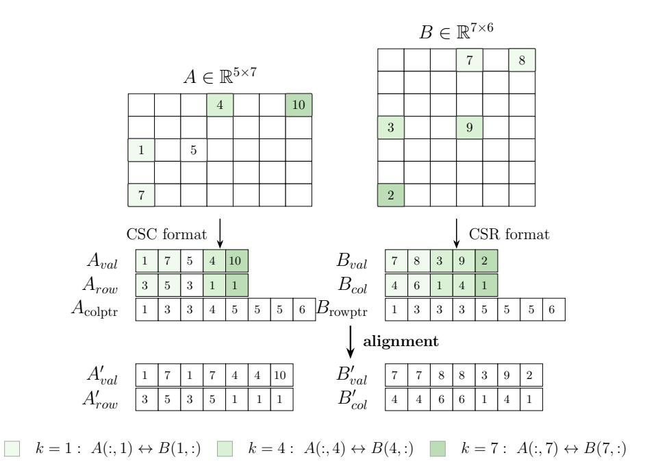
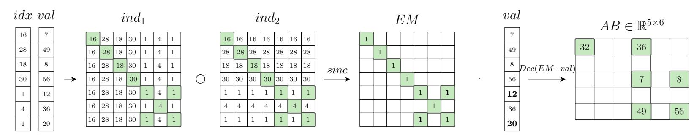
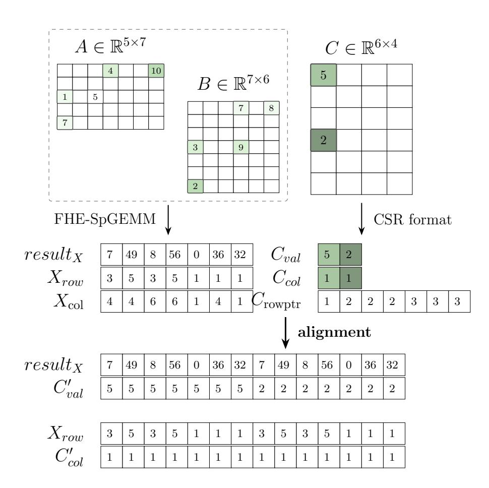
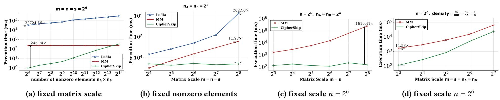
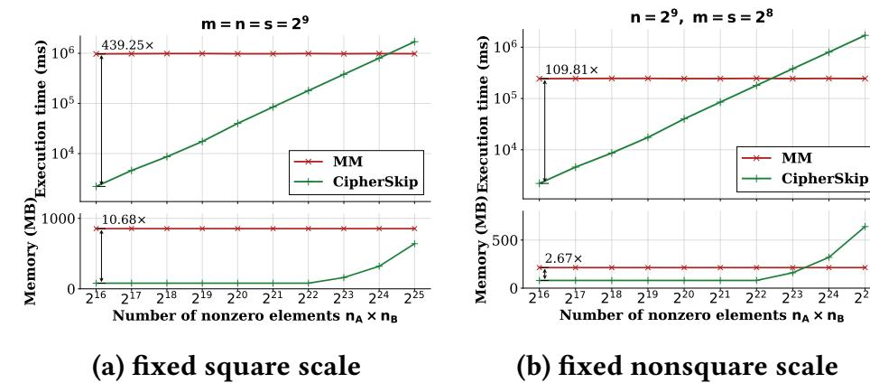
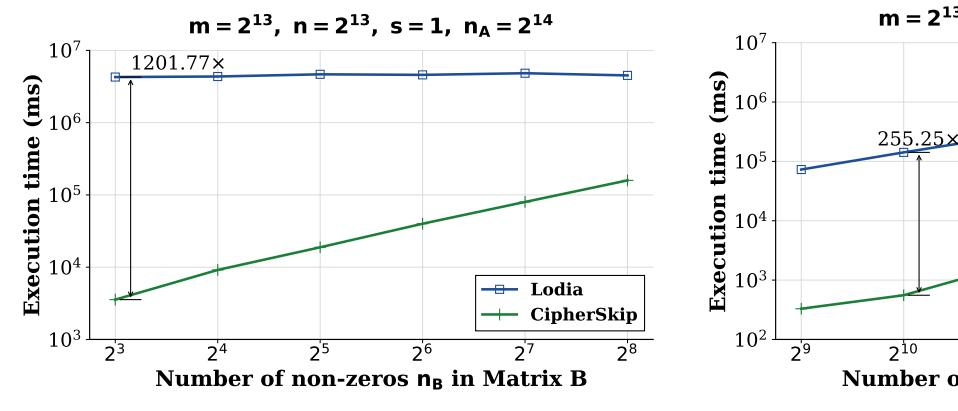
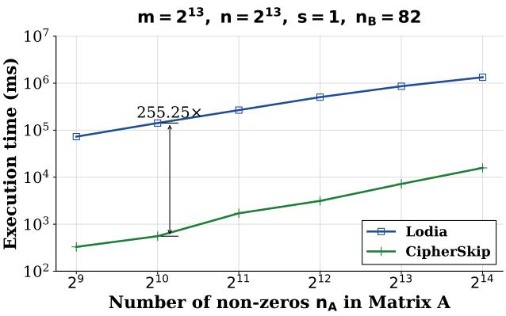
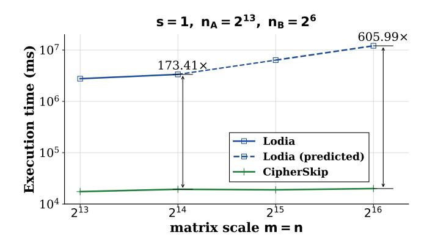

{0}------------------------------------------------

## CipherSkip: Efficient Sparse Matrix Multiplication with FHE

[Wujie Xiong](https://orcid.org/0009-0004-4853-3268) Kent State University Kent, OH, USA wxiong1@kent.edu

[Hao Zhou](https://orcid.org/0009-0001-1048-5502) Kent State University Kent, OH, USA hzhou6@kent.edu

[Yutong Ye](https://orcid.org/0000-0002-6874-5741) Beihang University Beijing, China yutongye@buaa.edu.cn

[Ruoming Jin](https://orcid.org/0000-0003-1895-4243) Kent State University Kent, OH, USA rjin1@kent.edu

[Lei Xu](https://orcid.org/0000-0002-7662-2119) Kent State University Kent, OH, USA lxu12@kent.edu

## Abstract

Sparse General Matrix–Matrix Multiplication (SpGEMM) is a fundamental but computationally intensive operation that underpins many scientific workloads, including numerous AI applications. With the increasing demands for data security, privacy-preserving computation techniques, such as Fully Homomorphic Encryption (FHE), have gained significant attention for their ability to process sensitive data without decryption. Nonetheless, executing SpGEMM within the framework of FHE presents significant challenges. The most effective SpGEMM algorithms exploit matrix sparsity to minimize computational costs; however, FHE obscures both the data values and the sparsity structures. Prior FHE-based privacy-preserving computation frameworks either ignore the inherent sparsity of matrices and rely on dense General Matrix–Matrix Multiplication (GEMM), incurring substantial overhead from redundant homomorphic multiplications, or they attempt to exploit sparsity by encrypting only the non-zero values, which inadvertently exposes sensitive positional information. To address this gap and achieve a better balance between efficiency and privacy, we propose Cipher-Skip, an efficient FHE-compatible SpGEMM framework that enables oblivious data and position processing under a Single Instruction Multiple Data (SIMD) scheme. Moreover, we extend our method to support an arbitrary number of sparse matrices (FHE-SpGEMCM). The efficiency analysis shows that our method achieves an average homomorphic computation cost of () 2 / <sup>2</sup>, where and represent the number of nonzero elements in and respectively, is the shared inner dimension of the multiplication, and denotes the batch size used in FHE. Experimental results demonstrate that for square matrices of scale 2 9 , our scheme achieves an average speedup of 439.25× and a 10.68× reduction in memory consumption compared to state-of-the-art baselines that ignore sparsity. Furthermore, when the scale increases to 2 <sup>13</sup>, our method yields up to a 1201.77× speedup over baselines that only exploit the sparsity of a single matrix.

## CCS Concepts

• Security and privacy → Privacy-preserving protocols.


[This work is licensed under a Creative Commons Attribution 4.0 International License.](https://creativecommons.org/licenses/by/4.0) ICS '26, Belfast, United Kingdom

© 2026 Copyright held by the owner/author(s). ACM ISBN 979-8-4007-2522-7/2026/07 <https://doi.org/10.1145/3797905.3807876>

## Keywords

Fully homomorphic encryption, Sparse general matrix-matrix multiplication

#### ACM Reference Format:

Wujie Xiong, Hao Zhou, Yutong Ye, Ruoming Jin, and Lei Xu. 2026. Cipher-Skip: Efficient Sparse Matrix Multiplication with FHE. In 2026 International Conference on Supercomputing (ICS '26), July 06–09, 2026, Belfast, United Kingdom. ACM, New York, NY, USA, [12](#page-11-0) pages. [https://doi.org/10.1145/3797905.](https://doi.org/10.1145/3797905.3807876) [3807876](https://doi.org/10.1145/3797905.3807876)

#### 1 Introduction

Sparse General Matrix-matrix Multiplication (SpGEMM) [\[9\]](#page-11-1) is a fundamental mathematical operation that calculates the multiplication of two sparse matrices, and it has various applications that are applied across graph analytics [\[4,](#page-11-2) [13,](#page-11-3) [23\]](#page-11-4), neural network inference [\[5,](#page-11-5) [17,](#page-11-6) [34\]](#page-11-7), and recommendation systems [\[21,](#page-11-8) [28,](#page-11-9) [39\]](#page-11-10). By leveraging the fact that most elements of a sparse matrix are zero, SpGEMM algorithms are usually more efficient than general purpose matrix multiplication methods. Classical SpGEMM algorithms include Gustavson's algorithm [\[15\]](#page-11-11), outer-product algorithm [\[7\]](#page-11-12), and many others [\[9\]](#page-11-1). Additionally, substantial research has been conducted on employing specialized hardware, such as Graphics Processing Units (GPUs) [\[24\]](#page-11-13) and Field Programmable Gate Arrays (FPGAs) [\[26\]](#page-11-14), to accelerate SpGEMM. All these works use information about the positions of nonzero elements to achieve better performance than General Matrix-Matrix Multiplication (GEMM).

Many SpGEMM-based applications process sensitive datasets, such as financial and medical records, precipitating a critical demand for privacy-preserving computation. In these contexts, confidentiality requirements extend beyond the nonzero values to include their locations, as the sparsity pattern itself often reveals proprietary structural information. This scenario is typically modeled as a secure outsourcing problem, in which a data owner delegates SpGEMM operations to an untrusted third-party provider. Fully Homomorphic Encryption (FHE) [\[1\]](#page-11-15) has emerged as a promising solution for such tasks by enabling computation directly on encrypted data. While adapting FHE for dense matrix multiplication is methodologically straightforward, reconciling comprehensive data protection with the performance benefits of sparsity remains a formidable challenge. Although recent studies [\[10,](#page-11-16) [42\]](#page-11-17) have attempted to implement sparse matrix operations under FHE, these approaches fail to effectively leverage the joint sparsity of both input matrices to minimize the computational complexity of homomorphic evaluations.

1

{1}------------------------------------------------

To address this challenge, we propose CipherSkip, a flexible and general framework for privacy-preserving SpGEMM under FHE. CipherSkip supports sparse matrices with arbitrary shapes and fully exploits sparsity without revealing underlying nonzero patterns. Moreover, it is compatible with mainstream SIMD-based FHE schemes, including CKKS [40], BGV [22], and BFV [11], as it relies only on fundamental homomorphic operations such as addition, multiplication, and rotation. While the overall framework does not depend on a specific FHE scheme, primitives such as equality checking need to be implemented differently depending on the underlying scheme. The key idea of CipherSkip is to pre-align the nonzero elements of the input sparse matrices prior to encryption, thereby preserving the confidentiality of both data values and sparsity structures while enabling efficient sparsity-aware computation. During accumulation, CipherSkip further employs an oblivious equality check mechanism to eliminate explicit index matching, which enables full utilization of SIMD packing and amortizes the homomorphic computation cost. To the best of our knowledge, CipherSkip is the first framework that enables efficient outsourcing of SpGEMM under FHE with full sparsity preservation. Let  $n_A$  and  $n_B$ denote the numbers of nonzero entries in the input matrices, *n* the shared inner dimension, and N the batch size supported by FHE. Theoretically, CipherSkip achieves a worst-case time complexity of  $O((n_A n_B)^2/N)$ , while under a random sparsity model, the expected complexity further reduces to  $O((n_A n_B)^2/(n^2 N))$ . By using the Pyfhel [20] library, we evaluate CipherSkip on sparse matrices ranging from 2<sup>4</sup> to 2<sup>13</sup>. Comprehensive experimental results show that, compared with state-of-the-art FHE-based SpGEMM solutions, CipherSkip delivers up to 439.25× speedup and 10.68× memory reduction for square matrices, and achieves up to 1201.77× acceleration on highly non-square matrices.

In summary, the contributions of this paper include:

- We present a FHE-compatible framework for outsourced SpGEMM on matrices with arbitrary dimensions, preserving the confidentiality of both values and sparsity patterns while leveraging sparsity for efficiency.
- We extend the framework to accommodate an arbitrary number of sparse matrices by enabling the structural alignment of matrices directly within the ciphertext. Furthermore, we design a deduplication mechanism to effectively constrain the growth of intermediate product elements.
- We provide a theoretical security analysis under the semihonest adversary model, validating that our scheme keeps both data confidentiality and structural privacy. Furthermore, we provide rigorous mathematical proofs to verify the tightness of our theoretical upper bound and to establish the average-case complexity.
- We conduct comprehensive evaluations across various matrix scales, demonstrating that CipherSkip consistently outperforms state-of-the-art methods in both computation efficiency and memory consumption.

## 2 Background and Problem Statement

## 2.1 Fully Homomorphic Encryption (FHE)

Fully Homomorphic Encryption (FHE) allows computation over encrypted data with encrypted outputs, providing a promising solution for enhancing data privacy and security in public cloud settings. Modern FHE research has established several mainstream schemes tailored for different data types, including BGV and BFV for exact integer arithmetic, TFHE for boolean gate evaluations, and CKKS for approximate fixed-point arithmetic. To achieve functional completeness, these schemes support two fundamental operations.

- Fully Homomorphic Addition (FHE-Add):  $Enc(m_1) + Enc(m_2) = Enc(m_1 + m_2)$ ;
- Fully Homomorphic Multiplication (FHE-Mult):  $\operatorname{Enc}(m_1) \times \operatorname{Enc}(m_2) = \operatorname{Enc}(m_1 \times m_2)$ .

While FHE-Add is computationally efficient, FHE-Mult is significantly more expensive and introduces substantial noise, necessitating techniques such as relinearization and bootstrapping to maintain ciphertext correctness. To mitigate these overheads, modern FHE implementations leverage packing (SIMD) techniques, which encode a vector of messages into a single ciphertext. This allows a single homomorphic operation to be applied to multiple plaintext slots simultaneously, effectively amortizing the computational cost and enhancing throughput for data-intensive tasks such as matrix multiplication.

### 2.2 Sparse Matrix Multiplication

Sparse General Matrix-Matrix Multiplication (SpGEMM) is a fundamental kernel in linear algebra that computes the product of two matrices containing a significant proportion of zero elements. Unlike dense matrix multiplication, which computes every element pair regardless of value, SpGEMM algorithms aim to reduce computational complexity by performing arithmetic operations only on non-zero entries. Standard optimizations on conventional architectures rely on compressed formats (e.g., CSR, CSC, and COO [12]) to eliminate redundant storage and on dynamic formulations (e.g., row-by-row [9] or outer product [7]) to enhance data reuse.

However, these classical techniques are largely incompatible with Fully Homomorphic Encryption (FHE). First, the data-hiding nature of FHE prohibits data-dependent branching, such as index matching or dynamic memory allocation, which are central to sparse optimizations. Second, FHE relies on ciphertext packing (SIMD) to amortize costs, but the irregular and unstructured access patterns of classical sparse formats conflict with the alignment and rotation operations required in the encrypted domain. Consequently, the high overhead of homomorphic multiplication and the constraints of data-independent execution render conventional SpGEMM algorithms prohibitively expensive for FHE-based privacy-preserving applications.

#### 2.3 Security Model and Problem Statement

**Participants and assumptions.** Our FHE-based outsourcing sparse matrix multiplication computation involves two parties: Client  $\mathcal U$  and Server  $\mathcal S$ .

•  $\mathcal{U}$ : The party who owns the input matrices, and is aware of both the values and the coordinates of all nonzero elements. As the data owner and the end user for subsequent operations,  $\mathcal{U}$  is assumed to be honest, because any manipulation will undermine its final result.

{2}------------------------------------------------

• S: Possessing more powerful computation resources, S is responsible for executing the encrypted FHE operations. S is considered as semi-honest, implying it is curious but honest, as it will not generate computation errors intentionally.

**High-level protocol.** The high-level interaction workflow of  $\mathcal U$  and  $\mathcal S$  proceeds as follows: (i) Element alignment.  $\mathcal U$  pre-processes and expands the nonzero elements of input matrices to align them for computation. These elements are then encrypted and transmitted to  $\mathcal S$ ; (ii) Multiplication and accumulation.  $\mathcal S$  calculates elementwise multiplication and accumulates the element corresponding to the same indices of the result matrix; and (iii) Decryption and reconstruction. When receiving the final result from  $\mathcal S$ ,  $\mathcal U$  decrypts and reconstructs the final result matrix.

**Security goals.** The primary objective is to ensure data confidentiality and access pattern privacy, while fully utilizing sparsity to improve computation efficiency. Specifically,  $\mathcal S$  should remain oblivious to the values of the nonzero elements and their positions during processing.

## 3 Detailed Design of CipherSkip

In this section, we present the details of CipherSkip design in three parts: (i) the major tools used in the construction; (ii) multiplication of two sparse matrices; and (iii) chained sparse matrices multiplication for three or more matrices.

## 3.1 Major Building Blocks

3.1.1 Matrices Storage. The storage format of sparse matrices can significantly affect the efficiency of the multiplication operation. CipherSkip uses both compressed sparse column (CSC) and compressed sparse row (CSR) formats [12]. To facilitate the description, we consider the multiplication of two matrices  $A \times B$ .

The sparse matrix  $A \in \mathbb{R}^{m \times n}$  contains  $n_A$  nonzero elements and is stored using the CSC format, where  $\mathbb{R}$  denotes the domain of real numbers. Specifically, A is represented by three arrays  $A_{\text{val}} \in \mathbb{R}^{n_A}$ ,  $A_{\text{row}} \in \{1, \ldots, m\}^{n_A}$ , and  $A_{\text{colptr}} \in \{p \in \mathbb{Z}^{n+1} \mid 1 = p_1 \leq p_2 \leq \cdots \leq p_{n+1} = n+1\}$ . These arrays satisfy:

$$\begin{cases} A_{\text{val}}[k] = A_{i,j} & \text{if the $k$-th stored element corresponds to $A_{i,j}$,} \\ A_{\text{row}}[k] = i & \text{if the $k$-th stored element lies in row $i$.} \end{cases}$$

For each column j, A's nonzero elements are stored in the contiguous segment of  $A_{\text{val}}[k]$ , where  $A_{\text{colptr}}[j] \le k < A_{\text{colptr}}[j+1]$ .

Similarly, the sparse matrix  $B \in \mathbb{R}^{n \times s}$  with  $n_B$  nonzero elements is stored using the CSR format and represented using three arrays:  $B_{\text{val}} \in \mathbb{R}^{n_B}$ ,  $B_{\text{col}} \in \{1, \dots, s\}^{n_B}$ , and  $B_{\text{rowptr}} \in \{p' \in \mathbb{Z}^{n+1} \mid 1 = p'_1 \le p'_2 \le \dots \le p'_{n+1} = n+1\}$ . These arrays satisfy:

$$\begin{cases} B_{\text{val}}[k] = B_{i,j} & \text{if the } k\text{-th stored element corresponds to } B_{i,j}, \\ B_{\text{col}}[k] = j & \text{if the } k\text{-th stored element lies in column } j. \end{cases}$$

For each row i, the nonzero elements of B are stored in the contiguous segment of  $B_{\text{val}}[k]$ , where  $B_{\text{rowptr}}[i] \le k < B_{\text{rowptr}}[i+1]$ .

<span id="page-2-1"></span>3.1.2 Equality Check. Comparison is a critical operation for CipherSkip, i.e., given two ciphertexts Enc(x) and Enc(y), we need to decide whether the corresponding plaintexts x and y are equal. For integer based schemes like BFV and BGV, the equality check over a finite field  $\mathbb{Z}_p$  can be implemented as an exact operation:  $1 - (\text{Enc}(x) - \text{Enc}(y))^{p-1} \pmod{p}$  via Fermat's Little Theorem [3].

For the CKKS scheme, instead of using a costly scheme-switching approach [27], CipherSkip adopts the  $sinc(\cdot)$  function for equality check [35], which is defined as:

$$\operatorname{sinc}(m) = \frac{\sin(m\pi)}{(m\pi)} = \prod_{n=1}^{\infty} \left(1 - \frac{m^2}{n^2}\right).$$

This function has three essential properties: (i)  $\operatorname{sinc}(0) = 1$ ; (ii)  $\operatorname{sinc}(m) = \operatorname{sinc}(-m)$ ; and (iii)  $\operatorname{sinc}(m) = 0$  for every  $m \in \mathbb{Z} \setminus \{0\}$ . Unlike the  $\operatorname{sgn}(\cdot)$  function [18],  $\operatorname{sinc}(\cdot)$  is a continuous function with no discontinuities and low multiplicative depth, which means it will not suffer from severe Gibbs phenomena [14] using polynomial approximation. Given its ideal characteristics, the  $\operatorname{sinc}(\cdot)$  function could serve as an effective zero equality test under the CKKS scheme.

To efficiently evaluate the  $\operatorname{sinc}(\cdot)$  function under the CKKS scheme, we approximate it using Chebyshev polynomials [36]. The target function is first linearly rescaled to the interval [-1,1] and the polynomials are defined by the recurrence relations  $T_0(t)=1$ ,  $T_1(t)=t$ ,  $T_{2n}(t)=2T_n(t)^2-1$ , and  $T_{2n+1}(t)=2T_n(t)T_{n+1}(t)-t$ , which satisfy the identity  $T_k(\cos\theta)=\cos(k\theta)$ .

The approximation is then constructed by interpolating the rescaled function at the Chebyshev nodes:

$$t_i = \cos\left(\frac{(i+\frac{1}{2})\pi}{n}\right), \quad i = 0, \dots, n-1, \tag{1}$$

yielding a truncated Chebyshev expansion:

$$p_{n-1}(t) = \sum_{k=0}^{n-1} c_k T_k(t), \tag{2}$$

where the coefficients  $c_k$  are efficiently obtained via a discrete cosine transform. The resulting polynomial is then mapped back to the original variable to obtain a polynomial approximation  $P(x) = p_{n-1}\left(\frac{2x-(a+b)}{b-a}\right)$  of  $\mathrm{sinc}(x)$  over [a,b]. Moreover, to maintain low multiplicative depth while efficiently evaluating P(x), we employ a modified Paterson-Stockmeyer scheme [33] to reduce computation cost and numerical bias.

3.1.3 FHE Vector Extension. In many FHE applications, particularly those involving cross-slot computations, it is often necessary to replicate a small encrypted vector across all slots of a ciphertext. Under the FHE scheme, we achieve this efficiently by leveraging the SIMD structure of ciphertexts and implementing a Homomorphic Vector Extension algorithm (Algorithm 1) based on cyclic rotations and additions.

Compared to a naive linear extension, this approach offers two significant advantages: (i) Logarithmic Complexity: It requires only  $\lceil \log_2(L_2/L_1) \rceil$  homomorphic rotations and additions, which is critical since rotation is a computationally expensive operation in FHE; (ii) Noise Management: By minimizing the number of operations,

<span id="page-2-0"></span><sup>&</sup>lt;sup>1</sup>For simplicity, indices and pointers of matrix start from 1.

{3}------------------------------------------------

it preserves the ciphertext's budget for subsequent functional evaluations, such as the  $sinc(\cdot)$  function described in Section 3.1.2.

#### <span id="page-3-0"></span>**Algorithm 1** Homomorphic Vector Extension

```
1: procedure VectorExtension(ct, L_1, L_2)
                      \triangleright ct: Ciphertext, L_1: initial length, L_2: final length
 2:
          ct_{ext} \leftarrow ct
                                                               ▶ Initialize the result
 3:
          step \leftarrow L_1
 4:
          while 2 \times step \leq L_2 do
 5:
               ct_{rot} \leftarrow \text{Rotate}(ct_{ext}, -step)
                                                                    ▶ Left cyclic shift
 6:
               ct_{ext} \leftarrow Add(ct_{ext}, ct_{rot})
 7:
               step \leftarrow 2 \times step
 8:
          end while
 9:
          if step < L_2 then
10:
               ct_{rot} \leftarrow \text{Rotate}(ct_{ext}, -(L_2 - step))
11:
               ct_{ext} \leftarrow Add(ct_{ext}, ct_{rot})
12:
13:
          end if
          return ct_{ext}
14:
15: end procedure
```

## <span id="page-3-3"></span>3.2 FHE-SpGEMM: Case of Multiplication of Two Matrices

We first consider the scenario where the user  $\mathcal{U}$  has two sparse matrices  $A \in \mathbb{R}^{m \times n}$  and  $B \in \mathbb{R}^{n \times s}$ , stored in plaintext using CSC and CSR formats respectively, and wants to utilize the service provider S to carry out the multiplication  $A \times B$ . Unlike the conventional approach of storing A in CSR and B in CSC, which offers no guarantee that the aligned elements in their respective compressed structures share a matching inner dimension for valid multiplication, the core intuition relies on a pre-alignment strategy that ensures every paired non-zero element is eligible for an immediate multiplicative operation. This alignment allows us to fully harvest inherent sparsity to minimize both homomorphic multiplications and costly rotations. While this introduces a subsequent accumulation phase, we strategically delegate this computationally heavy task to the server S, whose superior computation power makes the overhead of outsourced method a highly acceptable trade-off.

Before presenting the formal construction, we first illustrate the alignment process in Figure 1. For each inner index k, CipherSkip expands these elements into two vectors: the entire column segment of A is replicated as a block, while each individual element in the row of B is repeated contiguously to match the length of A's column. This transformation ensures that all candidate pairs are aligned for efficient SIMD-based ciphertext multiplication. We next formalize this process via the expansion length and index mapping.

3.2.1 Element Alignment. Before sending the encrypted matrices to S for multiplication, U first expands the matrices A and B to enable efficient matching in ciphertext form.

**Expansion length.** For the matrix product:

<span id="page-3-2"></span>
$$C_{ij} = \sum_{k=1}^{n} A_{i,k} B_{k,j}, \tag{3}$$

a nonzero product arises only from pairs of candidates that share the same inner index k. Thus for each inner index k, we just consider **column** k **of** A and **row** k **of** B.

<span id="page-3-1"></span>

Figure 1: An example of Element Alignment for  $A \in \mathbb{R}^{m \times n}$  and  $B \in \mathbb{R}^{n \times s}$ , where m = 5, n = 7, s = 6. Matrices A and B are stored in CSC and CSR formats, respectively. The expanded index mapping is performed to ensure the correspondence between elements of column k in A and row k in B. All procedures are executed locally on the client  $\mathcal{U}$ .

For column k of A, let  $z_k^A = A_{\text{colptr}}[k+1] - A_{\text{colptr}}[k]$  be the number of nonzero elements in that column, and let  $p_k^A = A_{\text{colptr}}[k]$  be the starting position of that column.

For row k of B, let  $z_k^B = B_{\text{rowptr}}[k+1] - B_{\text{rowptr}}[k]$  be the number of nonzero elements in that row, and let  $p_k^B = B_{\text{rowptr}}[k]$  be the starting position of that row.

The expansion length for index k is then given by  $L_k = z_k^A z_k^B$ , which represents the total number of candidate pairs produced by pairing each nonzero element in column k of A with each nonzero in row k of B.

**Expanded index mapping.** For each position  $\ell=1,\ldots,L_k$ , define:  $r_k(\ell)=(\ell-1) \bmod z_k^A$  and  $q_k(\ell)=\left\lfloor \frac{\ell-1}{z_k^A} \right\rfloor$ . Using these offsets, the expanded indices that map back to the original CSC and CSR structures are:

$$\operatorname{idx}_{k}^{A}(\ell) = p_{k}^{A} + r_{k}(\ell), \qquad \operatorname{idx}_{k}^{B}(\ell) = p_{k}^{B} + q_{k}(\ell).$$

Thus the expanded sequences for each inner index k given in Eq. (3) are:

$$\begin{split} &A_{\mathrm{val}}^{\prime(k)}[\ell] = A_{\mathrm{val}}\big[\mathrm{idx}_k^A(\ell)\big]\,, \quad A_{\mathrm{row}}^{\prime(k)}[\ell] = A_{\mathrm{row}}\big[\mathrm{idx}_k^A(\ell)\big]\,, \\ &B_{\mathrm{val}}^{\prime(k)}[\ell] = B_{\mathrm{val}}\big[\mathrm{idx}_k^B(\ell)\big]\,, \quad B_{\mathrm{col}}^{\prime(k)}[\ell] = B_{\mathrm{col}}\big[\mathrm{idx}_k^B(\ell)\big]\,. \end{split}$$

In other words, for the inner index k, the alignment of  $A_{val}$  yields the following results, where a subsequence includes  $z_k^A$  elements and the same subsequence is repeated  $z_k^B$  times.

$$A'_{\text{val}}\left[\sum_{t=1}^{k-1} L_t, \dots, \sum_{t=1}^{k-1} L_t + L_k - 1\right] = A_{\text{val}}\left[p_k^A + 0\right], \dots, A_{\text{val}}\left[p_k^A + z_k^A - 1\right],$$

$$z_k^A \text{ elements}$$

$$\dots, A_{\text{val}}\left[p_k^A + 0\right], \dots, A_{\text{val}}\left[p_k^A + z_k^A - 1\right].$$

{4}------------------------------------------------

Moreover, the aligned  $B_{val}$  is defined as follows, where each subsequence includes  $z_k^A$  elements of the same value and there are  $z_k^B$  different subsequences.

$$B'_{\text{val}}\left[\sum_{t=1}^{k-1} L_t, \dots, \sum_{t=1}^{k-1} L_t + L_k - 1\right] = \underbrace{B_{\text{val}}[p_k^B + 0], \dots, B_{\text{val}}[p_k^B + 0]}_{z_k^A \text{ elements}},$$

$$\ldots, \underbrace{B_{\text{val}}[p_k^B + z_k^B - 1], \dots, B_{\text{val}}[p_k^B + z_k^B - 1]}_{z_k^A \text{ elements}}.$$

$$\dots, B_{\text{val}}[p_k^B + z_k^B - 1], \dots, B_{\text{val}}[p_k^B + z_k^B - 1]$$

<span id="page-4-2"></span>3.2.2 *Element-wise Products and Indexing.* After the matching step, the expanded vectors are encrypted and transmitted to S, which performs element-wise multiplications. For convenience, we assume each vector obtained contains L elements, where  $L = \sum_{k=1}^{n} L_k$ is the total expansion length.

Given the expanded value vectors  $\text{Enc}(A'_{\text{val}})$  and  $\text{Enc}(B'_{\text{val}})$ ,  $\mathcal{S}$ computes the Hadamard product<sup>2</sup>, where val  $= A'_{\text{val}} \odot B'_{\text{val}}$ :

$$\operatorname{Enc}(\operatorname{val}) = \operatorname{Enc}(A'_{\operatorname{val}}) \odot \operatorname{Enc}(B'_{\operatorname{val}}), \tag{4}$$

We assign a linearized output Enc(ind) to each pair corresponding to the coordinate  $\ell$ , where the index ranges from 1 to  $m \times s$ :

$$\operatorname{Enc}(\operatorname{ind}[\ell]) = s(\operatorname{Enc}(A'_{\operatorname{row}}[\ell]) - 1) + \operatorname{Enc}(B'_{\operatorname{col}}[\ell]), \ell = 1, \dots, L.$$
 (5)

**Indicator matrices from index vector.** For simplicity, let Enc(ind) =  $\operatorname{Enc}(\mathbf{a}) = [a_1, a_2, \dots, a_L]$ . We follow the replication-and-transposition framework developed in [31] to homomorphically transform Enc(a) into two index matrices  $Enc(ind_1)$  and  $Enc(ind_2)$ . Specifically,  $Enc(ind_1)$ is generated by applying recursive row replications (ReplR) to Enc(a), whereas  $Enc(ind_2)$  is obtained by first performing a row-tocolumn transposition via recursive homomorphic rotations (TransR), and subsequently applying recursive column replications (ReplC).

$$\operatorname{Enc}(\operatorname{ind}_{1}) = \begin{pmatrix} a_{1} & \cdots & a_{L} \\ a_{1} & \cdots & a_{L} \\ \vdots & \ddots & \vdots \\ a_{1} & \cdots & a_{L} \end{pmatrix}, \operatorname{Enc}(\operatorname{ind}_{2}) = \begin{pmatrix} a_{1} & \cdots & a_{1} \\ a_{2} & \cdots & a_{2} \\ \vdots & \ddots & \vdots \\ a_{L} & \cdots & a_{L} \end{pmatrix}.$$

To compare indices in an encrypted form, we leverage the  $sinc(\cdot)$ equality check function described in Section 3.1.2. If  $a_i = a_j$ ,  $\operatorname{sinc}(a_i - a_j)$  $a_i$ ) = 1, otherwise  $sinc(a_i - a_i)$  = 0. Thus, we can obtain the encrypted equality matrix EM by leveraging the SIMD scheme. It should be noted that if  $sinc(\cdot)$  takes a vector as its argument throughout this paper, we denote it a SIMD operation where the  $\operatorname{sinc}(\cdot)$  function is applied to each element of the vector individually.

<span id="page-4-1"></span> $Enc(EM) = sinc(Enc(ind_1 \ominus ind_2)) =$ 

$$\begin{pmatrix}
\operatorname{sinc}(a_{1} - a_{1}) & \operatorname{sinc}(a_{1} - a_{2}) & \cdots & \operatorname{sinc}(a_{1} - a_{L}) \\
\operatorname{sinc}(a_{2} - a_{1}) & \operatorname{sinc}(a_{2} - a_{2}) & \cdots & \operatorname{sinc}(a_{2} - a_{L}) \\
\vdots & \vdots & \ddots & \vdots \\
\operatorname{sinc}(a_{L} - a_{1}) & \operatorname{sinc}(a_{L} - a_{2}) & \cdots & \operatorname{sinc}(a_{L} - a_{L})
\end{pmatrix} (6)$$

The matrix Enc(EM) is symmetric and it satisfies  $EM_{ii} = 1$  for all i. Its entries indicate that encrypted indices are equal; thus, EM functions could be used as an encrypted equality-check operator. Moreover, to avoid the quadratic memory overhead  $O(L^2)$  in practice, the matrix Enc(EM) is treated as a logical construct. During

the accumulation phase, S computes each wrap-around diagonal vector  $M_k$  via a sliding window. This ensures that the peak memory consumption remains  $O(L \cdot N)$ , where L is the expanded length and *N* is the number of SIMD slots.

Diagonal extraction of the equality matrix. Given the equality matrix  $\operatorname{Enc}(\operatorname{EM}) = (a_{ij})_{1 \leq i,j \leq L}$ , we reorganize its diagonals to adapt to diagonal-rotation multiplication.

*Wrap-around diagonal vectors.* For any integer offset  $k \in \mathbb{Z}$ , we define the wrap-around diagonal:

$$M_k = (a_{i, (i+k-1 \mod L)+1})_{i=1}^L.$$

This vector collects the elements on the (i, i + k) diagonal of EM, with indices evaluated modulo L so that out-of-range positions wrap around. Here, we denote positive offsets k > 0 produce rightshifted diagonals, and negative offsets k < 0 produce left-shifted diagonals.

*Modulo reduction of negative offsets.* Since the column index is computed through modulo-L arithmetic, negative offsets do not produce new diagonals. Indeed, for k > 0,

$$(i - k - 1) \mod L = (i + (L - k) - 1) \mod L$$

which implies that the diagonal obtained from offset -k is identical to that obtained from offset L - k. Thus,

$$M_{-k} = M_{L-k}, \qquad k = 1, \dots, L-1.$$

Consequently, although offsets from -(L-1) to (L-1) are allowed conceptually, only the nonnegative offsets  $M_0, M_1, \ldots, M_{L-1}$ correspond to distinct wrap-around diagonals.

*Redundancy from symmetry.* Due to the symmetry of *EM*, the diagonals  $M_k$  and  $M_{L-k}$  are identical up to cyclic rotation. More precisely,

$$M_{L-k} = \text{Rot}(M_k, k), \qquad k = 1, ..., L-1.$$

Therefore, each pair  $(M_k, M_{L-k})$  carries the same information modulo rotation, and only half of the diagonals are unique. The set of unique diagonals is:

$$M_0, M_1, \ldots, M_{\lfloor L/2 \rfloor}$$

Diagonal collection. Conceptually, one may list all wrap-around diagonals in symmetric order,

$$(M_{-(L-1)},\ldots,M_{-1},M_0,M_1,\ldots,M_{L-1}),$$

but modulo reduction and symmetry imply that all negative-offset diagonals are either identical to or cyclic rotations of the positiveoffset diagonals. Thus, we store only:

$$M = (M_0, M_1, \ldots, M_{L-1}),$$

and for computation, we use only the unique subset:

$$(M_0, M_1, \ldots, M_{|L/2|}).$$

<span id="page-4-0"></span> $<sup>^2\</sup>odot$  denotes the Hadamard product under FHE.

{5}------------------------------------------------



Figure 2: The process involves accumulation over val. Here,  $ind_1$  and  $ind_2$  are derived from predefined transformations of ind, while the symmetric matrix EM is generated by applying  $sinc(\cdot)$  equality check function in Eq. (6). Except for the final decryption, all operations are performed by S directly on ciphertexts within the FHE encrypted domain. Finally, the accumulated results are decrypted by U.

<span id="page-5-3"></span>3.2.3 Accumulation. Since the diagonal  $M_0$  consists of identity elements (all ones), the accumulation can be performed homomorphically by aggregating the unique diagonals: <sup>3</sup>

$$Enc(\text{result}) = M_0 \odot Enc(\text{val}) + \sum_{k=1}^{\lfloor (L-1)/2 \rfloor} (M_k \odot \text{Rot}(\text{val}, -k) + \\ \text{Rot}(M_k \odot \text{val}, k)) + \begin{cases} 0, & L \text{ odd,} \\ M_{L/2} \odot \text{Rot}(\text{val}, L/2), & L \text{ even.} \end{cases}$$

Since  $M_0$  consists of ones, we have

Enc(result) =

<span id="page-5-1"></span>
$$\operatorname{Enc}(\operatorname{val}) + \sum_{k=1}^{\lfloor (L-1)/2 \rfloor} \left( M_k \odot \operatorname{Rot}(\operatorname{val}, -k) + \operatorname{Rot}(M_k \odot \operatorname{val}, k) \right)$$

$$+ \begin{cases} 0, & L \text{ odd,} \\ M_{L/2} \odot \operatorname{Rot}(\operatorname{val}, L/2), & L \text{ even.} \end{cases}$$

$$(7)$$

The proposed accumulation pattern in Eq. (7) yields several critical computational advantages while keeping data confidential: (i) Noise Management. Since terms share a synchronized multiplicative depth, a single rescaling suffices to maintain precision. (ii) SIMD Efficiency. This structure allows  $\mathcal S$  to overlap rotation latencies, enabling concurrent operations.

3.2.4 Deduplication. While the most efficient way to handle redundancies in the Enc(result) vector is to let  $\mathcal U$  perform deduplication using ind data, this approach fails when considering sparse matrix chain multiplication. To address this, we present an FHE-based deduplication scheme for the Enc(result) vector to enable following ciphertext processing.

For Enc(EM), here's a SIMD-friendly occurrence accumulation method, we can use it to determine the number of occurrences of each element up to its current position in the vector Enc(result), denote the result of Algorithm 2 as Enc(r). It is important to emphasize that the masks are predefined plaintext vectors generated based on the matrix dimensions, thus the server  $\mathcal S$  only performs plaintext-ciphertext multiplications (MulPlain), which are significantly more efficient and introduce less noise than standard homomorphic multiplications. This allows  $\mathcal S$  to process the occurrence sums with negligible computational overhead while maintaining sufficient numerical precision for the subsequent  $\mathrm{sinc}(\cdot)$  evaluation.

Based on the properties of vector Enc(r), it can be observed that if  $r[i] \neq 0$ , there must exist another element with an identical value

#### <span id="page-5-2"></span>Algorithm 2 Occurrence Accumulation

```
\rightharpoonup ct_i packs row i:
 1: procedure GetOccSums(EncRows(A))
     (a_{i,1},\ldots,a_{i,n}) in SIMD slots
         ct_{\text{sum}} \leftarrow \text{Enc}(0,\ldots,0)
2:
         for i \leftarrow 1 to n do
3:
              mask_i \leftarrow [\underbrace{0, \dots, 0}_{i}, \underbrace{1, \dots, 1}_{n-i}]
4:
          ▶ Predefined plaintext mask, independent of input values
5:
               ct \leftarrow \text{MulPlain}(ct_i, mask_i)
                                                           ▶ Plaintext-Ciphertext
6:
    multiplication: mask out lower triangle and diagonal.
              ct_{\text{sum}} \leftarrow \text{Add}(ct_{\text{sum}}, ct)
7:
          end for
8:
         return ct_{\text{sum}}
                                        ▶ Column sums of the upper matrix
9:
10: end procedure
```

as val[i]. Consequently, a deduplication mask Enc(m) is produced by evaluating each element in vector r against the value 0.

$$Enc(m) = sinc(Enc(r))$$
 (8)

Thus, we obtain the final de-duplicated vectors result' and ind', which can be sent directly to the user side  $\mathcal{U}$  for decryption.

Enc(result') = Enc(result) 
$$\odot$$
 Enc(m),  
Enc(ind') = Enc(ind)  $\odot$  Enc(m),  
Enc( $A'_{row}$ ) = Enc( $A'_{row}$ )  $\odot$  Enc(m),  
Enc( $B'_{col}$ ) = Enc( $B'_{col}$ )  $\odot$  Enc(m).

# 3.3 FHE-SpGEMCM: Case of Chained Matrices Multiplication

In this section, we describe the approach for computing the product of an arbitrary number of sparse matrices, which is built upon the two matrices multiplication method FHE-SpGEMM.

Without loss of generality, we consider the FHE matrix multiplication of ABC, where  $A \in \mathbb{R}^{m \times n}$ ,  $B \in \mathbb{R}^{n \times s}$  and  $C \in \mathbb{R}^{s \times t}$ . If the multiplication of three matrices can be computed successfully, it follows by induction that it can be extended to an arbitrary chain of matrices. In the multiplication of the matrix chain ABC, to fully leverage the algorithm in Section 3.2, we consider the product AB as an intermediate result to be multiplied by C. Therefore, the problem is simplified as given an encrypted matrix  $X = AB \in \mathbb{R}^{m \times s}$ , how to perform multiplication with a subsequent matrix  $C \in \mathbb{R}^{s \times t}$  with  $n_C$  nonzero elements.

<span id="page-5-0"></span> $<sup>^3</sup>$ For Rot(v,k),  $\overline{k} > 0$  means right shift, and k < 0 means left shift.

{6}------------------------------------------------

It should be noted that, while the initial matrices can be perfectly pre-aligned by the user  $\mathcal U$  to maximize slot utilization, the intermediate product X is encrypted on the server  $\mathcal S$ , and C remains as plaintext on  $\mathcal U$  before being sent to  $\mathcal S$ . Consequently, to preserve data confidentiality and security, pre-alignment is no longer fully feasible, which inevitably sacrifices some computational efficiency.

For the intermediate product  $X = AB \in \mathbb{R}^{m \times s}$ , the computation yields deduplicated vectors  $\operatorname{Enc}(\operatorname{result'})$  and  $\operatorname{Enc}(\operatorname{ind'})$ . By applying the deduplication mask  $\operatorname{Enc}(m)$ , CipherSkip enforces a homomorphic sparsity restoration, logically zeroing out redundant entries to ensure only unique intermediate products remain active. This logical reset effectively optimizes the input density for subsequent operations. Furthermore,  $\operatorname{Enc}(X_{\operatorname{row}}) = \operatorname{Enc}(A'_{\operatorname{row}})$  and  $\operatorname{Enc}(X_{\operatorname{col}}) = \operatorname{Enc}(B'_{\operatorname{col}})$ , and there are one-to-one correspondences among them at each vector's index. For  $C \in \mathbb{R}^{s \times t}$ , here we still adopt CSR format for the storage on  $\mathcal{U}$ , getting three vectors  $C_{\operatorname{val}}$ ,  $C_{\operatorname{col}}$  and  $C_{\operatorname{rowptr}}$ :

$$C_{\text{val}} \in \mathbb{R}^{n_{\text{C}}}, \qquad C_{\text{col}} \in \{1, \dots, t\}^{n_{\text{C}}},$$

$$C_{\text{rowptr}} \in \{ p' \in \mathbb{Z}^{s+1} \mid 1 = p'_{1} \le p'_{2} \le \dots \le p'_{s+1} = s+1 \}.$$
(9)

Before transmission to S, since C resides on  $\mathcal{U}$ , it possesses the alignment length  $L_X = \sum_{k=1}^n L_k$ , each element in vector C is replicated  $L_X$  times consecutively.

$$C'_{\text{val}} = [C_{\text{val}}[0], \dots, C_{\text{val}}[0], \dots, C_{\text{val}}[n_C - 1], \dots, C_{\text{val}}[n_C - 1], \dots, C_{\text{val}}[n_C - 1], \dots, C_{\text{val}}[n_C - 1], \dots, C_{\text{val}}[n_C - 1], \dots, C_{\text{row}}[n_C - 1], \dots, C_{\text{row}}[n_C - 1], \dots, C_{\text{row}}[n_C - 1], \dots, C_{\text{row}}[n_C - 1], \dots, C_{\text{col}}[n_C - 1], \dots, C_{\text{col}}[n_C - 1].$$

To propagate the computation to matrix  $C \in \mathbb{R}^{s \times t}$ , we utilize the restored vectors along with their corresponding indices  $\operatorname{Enc}(X_{\operatorname{row}})$  and  $\operatorname{Enc}(X_{\operatorname{col}})$  for X. S then expands these intermediate ciphertexts using Algorithm 1 to a total length of  $L_X \cdot n_C$ . This ensures that the active elements are correctly replicated to align with the plaintext entries of C provided by  $\mathcal{U}$ .

Enc(result<sub>X</sub>) = VectorExtension(Enc(result'), 
$$L_X$$
,  $L_X \cdot n_C$ ),  
Enc( $X_{\text{row}}$ ) = VectorExtension(Enc( $X_{\text{row}}$ ),  $L_X$ ,  $L_X \cdot n_C$ ),  
Enc( $X_{\text{col}}$ ) = VectorExtension(Enc( $X_{\text{col}}$ ),  $L_X$ ,  $L_X \cdot n_C$ ).

Following this processing (Figure 3), the data structures are aligned with the requirements of FHE-SpGEMM. This consistency allows us to leverage the methods (as described in Section 3.2.2 and Section 3.2.3) using the improved formula below to obtain the final result, where the index ranges from 1 to  $m \times t$ :

$$\operatorname{Enc}(\operatorname{val}) = \operatorname{Enc}(\operatorname{result}_X) \odot \operatorname{Enc}(C'_{\operatorname{val}}) \odot \operatorname{sinc}(\operatorname{Enc}(X_{\operatorname{col}}) - \operatorname{Enc}(C'_{\operatorname{row}}))$$
$$\operatorname{Enc}(\operatorname{ind}[c]) = t(\operatorname{Enc}(X_{\operatorname{row}}[c]) - 1) + \operatorname{Enc}(C'_{\operatorname{col}}[c]).$$

## 3.4 Packing Strategies

To achieve high computational throughput and minimize memory consumption, both the element-wise multiplication (Section 3.2.2) and the accumulation stage (Section 3.2.3) are implemented using the SIMD capabilities of the underlying FHE scheme.

<span id="page-6-0"></span>

Figure 3: An example of Sparse Matrix Chain Multiplication for  $X = AB \in \mathbb{R}^{5 \times 6}$  and  $C \in \mathbb{R}^{6 \times 4}$  with m = 5, s = 6 and t = 4. VectorExtension() function and CSR storage format are conducted on X and C respectively for pre-alignment. All executions are conducted by the server S.

**Packing for FHE-SpGEMM.** For the initial multiplication  $A \times B$ , CipherSkip utilizes a static encoding strategy where the client  $\mathcal{U}$  partitions the pre-aligned value vectors  $(A_{\text{val}}, B_{\text{val}})$  and coordinate vectors  $(A_{\text{row}}, B_{\text{col}})$  into  $\lceil L/N \rceil$  ciphertexts, where N is typically  $2^{13}$  to  $2^{15}$ .

On the server side S, the indicator matrices ind<sub>1</sub>, ind<sub>2</sub> and the equality matrix EM are never explicitly materialized as 2D structures. Instead, they are treated as conceptual objects implicitly represented by N-length diagonal vectors  $M_k$ . These diagonals are extracted via homomorphic rotations within the SIMD slots, allowing the accumulation stage to update N elements concurrently. This strategy transforms the logical  $O(L^2)$  complexity of indexing into a hardware-friendly  $O(L^2/N)$  operations, maintaining high slot utilization throughout the two-matrix multiplication. Crucially, the SIMD-friendly accumulation (Eq. (7)) enables the lazy relinearization strategy detailed in Section 3.2.3, ensuring high slot utilization while minimizing the homomorphic maintenance overhead.

**Packing for FHE-SpGEMCM.** In the chained case of multiplying three matrices *ABC*, the strategy shifts to dynamic server-side alignment to handle encrypted intermediate results. After the deduplication of *AB*, CipherSkip applies the mask Enc(**m**) to perform a logical reset on Enc(result') and Enc(ind'). This operation zeros out redundant slots and effectively restores the vector's sparsity in its packed state without requiring decryption. Note that this does not physically compress the ciphertext. The redundant entries remain in the fixed-length slot structure to avoid potential side-channel leakage. From the server's perspective, the ciphertext remains a uniform encrypted block, without revealing which indices were masked. Furthermore, to propagate the computation to

{7}------------------------------------------------

matrix C, the server S executes a homomorphic VectorExtension (Algorithm 1) using a recursive sequence of rotations and additions to replicate intermediate entries  $L_X \cdot n_C$  times. This evaluation significantly reduces the multiplicative depth and noise growth, ensuring the efficiency of the matrix chain processing.

## 4 Analysis and Evaluation of CipherSkip

In this section, we first analyze the security features of CipherSkip and then provide both theoretical and experimental evaluations of the performance of CipherSkip.

## 4.1 Security Analysis and Privacy Guarantees

**Threat model.** For CipherSkip, we consider a **semi-honest** (honest-but-curious) adversary model, which is a standard assumption in outsourced computation [8, 16, 19]. In this setting, S correctly executes the assigned FHE-based homomorphic calculation tasks and does not deviate from the protocol. However, the server S is curious about the data that it may attempt to infer private information about the underlying sparse matrix from its view, which consists of two value vectors  $\text{Enc}(A'_{\text{val}})$ ,  $\text{Enc}(B'_{\text{val}})$  and two index vectors  $\text{Enc}(A'_{\text{row}})$ ,  $\text{Enc}(B'_{\text{col}})$ . We assume that the adversary does not have access to the secret key SK and has no out-of-band information that could compromise the semantic security of the FHE scheme.

**Security analysis and privacy guarantees.** We analyze the security and privacy guarantees of our proposed scheme under the semi-honest threat model. Our analysis demonstrates that the server learns no information about the underlying sparse matrices beyond the public parameter L and the dimensions of the matrices.

Data confidentiality. The core confidentiality of our scheme is based on the semantic security (IND-CPA) of the underlying FHE scheme. All four vectors transmitted to S are encrypted using  $\mathcal{U}$ 's public key. Based on the Ring Learning with Errors (RLWE) hardness assumption, these ciphertexts are computationally indistinguishable from random noise to any adversary without the secret key SK. Therefore, S cannot retrieve the plaintext values of the nonzero elements during storage or computation.

Structural privacy. CipherSkip achieves robust structural privacy by breaking the deterministic correlation between the observable execution time and the underlying matrix sparsity. The expansion length  $L = \sum_{k=1}^n L_k$  functions as an inherent structural obfuscation layer. Since L is a joint product of the alignment interactions between A and B, it induces a many-to-one mapping: a single observed L is consistent with exponentially many possible matrix supports. The server cannot uniquely decompose this aggregate sum to reconstruct the specific row or column indices or the precise distribution of nonzero elements. Thus, the framework achieves obliviousness: by sending only L interacting pairs, the original nonzero counts  $n_A$  and  $n_B$  are effectively masked, preventing the untrusted server S from reconstructing their structure.

Data-oblivious equality check. To prevent privacy leakage via memory side-channel, our method ensures a data-oblivious scheme. Traditional sparse computation relies on conditional branching (e.g., if (a==b)), which triggers data-dependent instruction flows. In our FHE-based construction, we transform these selective operations into an oblivious arithmetic circuit. We implement the equality test using a  $\operatorname{sinc}(\cdot)$  function (Section 3.1.2) via Chebyshev polynomial

approximation. Since polynomial evaluation in the FHE domain consists of a deterministic sequence of homomorphic additions, multiplications, and rotations, the computational cost is fixed. Regardless of the underlying plaintext values, memory access patterns of  $\mathcal S$  remain identical, ensuring deterministic and data-independent execution patterns at the protocol level.

## 4.2 Theoretical Complexity Analysis

Here we analyze the computation complexity of CipherSkip.

<span id="page-7-0"></span>LEMMA 4.1. Given two sparse matrices  $A \in \mathbb{R}^{m \times n}$  with  $n_A$  nonzero elements and  $B \in \mathbb{R}^{n \times s}$  with  $n_B$  nonzero elements, let  $L = \sum_{k=1}^n z_k^A z_k^B$  denote the total number of candidate pairs for element-wise multiplication. Then  $L \leq n_A n_B$ .

PROOF. By definition,  $z_k^A$  is the number of nonzero elements in column k of A, and  $z_k^B$  is the number of nonzero elements in row k of B. Hence,  $n_A = \sum_{k=1}^{n} z_k^A$ ,  $n_B = \sum_{k=1}^{n} z_k^B$ .

of *B*. Hence, 
$$n_A = \sum_{k=1}^n z_k^A$$
,  $n_B = \sum_{k=1}^n z_k^B$ .  
Therefore,  $L = \sum_{k=1}^n z_k^A z_k^B \le \sum_{k=1}^n n_A z_k^B = n_A \sum_{k=1}^n z_k^B = n_A n_B$ .

Note that when L reaches its upper bound, this corresponds to the extreme case where all  $n_A$  nonzero elements of matrix A lie in a single column and all  $n_B$  nonzero elements of matrix B lie in a single row. Consequently,  $L' = L * n_C <= n_A n_B n_C$  for the FHE-SpGEMCM method.

Theorem 4.2. Under the standard random sparsity model, where the supports of A and B are drawn uniformly at random with independent placements, the expected expansion length satisfies  $\mathbb{E}[L] = \frac{n_A n_B}{n}$ .

PROOF. Under uniform random placement, each column of A contains  $\mathbb{E}[z_k^A] = n_A/n$  nonzero elements in expectation, and each row of B contains  $\mathbb{E}[z_k^B] = n_B/n$ .

By independence, 
$$\mathbb{E}[z_k^A z_k^B] = \mathbb{E}[z_k^A] \mathbb{E}[z_k^B] = \frac{n_A}{n} \cdot \frac{n_B}{n}$$
. Summing over  $k = 1, ..., n$  gives  $\mathbb{E}[L] = \sum_{k=1}^n \mathbb{E}[z_k^A z_k^B] = n \cdot \frac{n_A n_B}{n^2} = \frac{n_A n_B}{n}$ .

Theorem 4.3. Given a standard random sparsity model, let  $A \in \mathbb{R}^{m \times n}$  and  $B \in \mathbb{R}^{n \times s}$  where the nonzero positions of each matrix are chosen uniformly at random, the event that L reaches its upper bound occurs with probability  $P \approx n^{2-(n_A+n_B)}$ .

PROOF. Out of  $\binom{mn}{n_A}$  possible supports,  $n\binom{m}{n_A}$  lie entirely within one column, yielding  $P_A = \frac{n\binom{m}{n_A}}{\binom{mn}{n_A}}$ . Similarly,  $P_B = \frac{n\binom{s}{n_B}}{\binom{ns}{n_B}}$ . Because  $P_A$  and  $P_B$  are independent, we have  $P = P_A P_B$ . Using  $\binom{mn}{n_A} \approx (mn)^{n_A}/n_A!$  and  $\binom{m}{n_A} \approx m^{n_A}/n_A!$ , it gives  $P_A \approx n^{1-n_A}$  and hence  $P \approx n^{2-(n_A+n_B)}$ .

Theorem 4.4. Given an encrypted vector v of length L, CipherSkip requires  $O(L^2/N)$  FHE operations where N denotes the batch size of FHE scheme.

PROOF. The computational efficiency of algorithms described in Sections 3.2.2 and 3.2.3 are analyzed primarily through the lens of homomorphic operation overhead, as ciphertext rotations (Rot) and multiplications (Mul) constitute the primary performance bottlenecks in FHE.

In each diagonal of the EM matrix, the algorithm executes two critical rotation operations: one to generate the shifted index vector

{8}------------------------------------------------

Rot(Enc(val), k) and another to align the accumulation terms via Rot(Mul(Enc( $M_k$ ), Enc(val)), -k). Furthermore, each iteration involves two explicit homomorphic multiplications for accumulation. To evaluate the sinc(·) function used for equality checking, we leverage the Paterson–Stockmeyer (P-S) optimization [35]. Given a polynomial of degree d used to approximate  $\operatorname{sinc}(\cdot)$  operator, the P-S method reduces the number of non-scalar homomorphic multiplications to  $O(\sqrt{d})$ , significantly lowering the multiplicative depth compared to the standard O(d) approach.

From a global complexity perspective, let L denote the total length of the index vector and N denote the number of available SIMD slots. Because the algorithm iterates through approximately L/2 offsets and each full vector operation requires  $\lceil L/N \rceil$  batches to process, the total computational complexity of CipherSkip is  $O(L^2/N)$ . Thus, the average complexity is  $O((n_A n_B)^2/n^2N)$  for FHE-SpGEMM and  $O((n_A n_B n_C)^2/n^2N)$  for FHE-SpGEMCM.  $\square$ 

### 4.3 Experimental Evaluation

4.3.1 Experimental Setup. To validate our theoretical analysis and compare CipherSkip with other related state-of-the-art schemes, all evaluations are performed on a high-performance server equipped with dual AMD EPYC 9254 24-Core processors, totaling 48 physical cores and 96 logical threads. Our software implementation utilizes the CKKS scheme within the Pyfhel [20] FHE framework, which is based on the Ring Learning With Errors (RLWE) assumption [29] over the cyclotomic ring  $R_q = \mathbb{Z}_q[X]/(X^N+1)$ . As discussed in Section 3.1.2, CipherSkip is largely independent of the underlying FHE scheme, with the equality-check primitive being the only scheme specific component. For schemes such as BGV and BFV, the same pipeline can be instantiated by replacing the CKKS-based approximation with a finite-field equality test like Fermat's Little Theorem.

In our primary configuration, we set the polynomial degree to  $N=2^{13}$ , providing  $2^{13}$  SIMD slots per ciphertext. To accommodate the required multiplicative depth d, we select 9 intermediate prime levels, as a larger set of levels enables a more extensive sequence of homomorphic operations. Furthermore, to examine the performance under extreme conditions, we investigate edge cases using an expanded configuration of d=13 and  $N=2^{14}$ .

We compare our approach with general matrix multiplication (MM) [10] and sparse matrix-vector multiplication (SpMV Lodia) [42]. MM is a method whose homomorphic cost scales with logical matrix dimensions, whereas Lodia is an an HE-optimized sparse matrix-vector multiplication scheme. To standardize the experimental conditions, we execute Lodia s times to compute C = AB column-by-column, reflecting a common practical reduction from SpMV to matrix-matrix multiplication.

4.3.2 Performance Comparison with Baselines. Before evaluating performance, we assess the numerical stability of CipherSkip. Our implementation maintains a relative error of approximately  $10^{-3}$  after rescaling indices (up to  $2^{14}$ ) into the Chebyshev interval. This precision balances the CKKS scaling factor with circuit depth, providing sufficient precision for structural alignment without requiring double-precision homomorphic evaluation. All results were cross-validated against plaintext implementations to confirm structural correctness.

To facilitate a systematic performance comparison, we categorize the test cases into three groups based on their scales, defined as the dimensions of the matrices: (i) small-scale matrices, where the number of rows or columns does not exceed  $2^8$ ; (ii) middle-scale matrices, where the number of rows or columns are  $2^9$ ; and (iii) large-scale matrices, where both the row and column dimensions are fixed to  $2^{14}$ .

**Small-scale matrices.** Figure 4 reports the performance results under small-scale sparse settings. As shown in Figure 4a, we assume matrix  $A = B \in \mathbb{R}^{2^6 \times 2^6}$  and vary the dimensions  $n_A \times n_B$ . CipherSkip consistently outperforms both MM and Lodia when the nonzero interaction scale  $n_A \times n_B$  is below  $2^{14}$ . The reduced execution time is primarily attributed to CipherSkip's ability to exploit sparsity by limiting homomorphic operations to nonzero interactions only. This behavior aligns with the analysis in Lemma 4.1, which bounds the number of encrypted elements involved in the multiplication by  $n_A \times n_B$ . As the scale decreases, CipherSkip correspondingly reduces the number of homomorphic rotations and multiplications required for data alignment and accumulation. In particular, for  $n_A \times n_B = 2^6$ , CipherSkip achieves up to a 245.74× speedup over the baseline methods.

Figure 4b further illustrates the scalability of the three approaches as the matrix dimension m=n=s scales, under a fixed setting of  $n_A \times n_B = 2^{10}$  ( $n_A = n_B = 2^5$ ). While the execution times of MM and Lodia grow noticeably with n, the runtime of CipherSkip remains largely stable across the evaluated range. This behavior arises from the fact that the computational cost of CipherSkip is not directly determined by the logical matrix dimension, but is instead determined by the nonzero interaction scale  $\ell$ . In contrast, MM exhibits approximately linear growth with respect to n, achieving a speedup of up to  $11.97\times$  and  $262.50\times$  at  $n=2^8$  compared to MM and Lodia, respectively. By skipping zero-value slots and avoiding unnecessary homomorphic operations, CipherSkip effectively translates sparsity into a reduction in computational overhead.

To demonstrate the versatility of our approach in non-square configurations, Figure 4c and Figure 4d present the performance results under small-scale sparse settings. As illustrated in Figure 4c, we fix the number of nonzero entries at  $n_A = n_B = 2^4$ ,  $n = 2^6$ , to examine the execution time as the matrix dimension m = sscales from 2<sup>3</sup> to 2<sup>8</sup>. While the baseline MM method exhibits a linear increase in execution time with the matrix scale, CipherSkip maintains remarkably stable performance and lower computational overhead, achieving a speedup of 1616.41×. It demonstrates its efficiency even when the matrix dimensions grow rapidly due to its sparse structure. This scalability is further explored in Figure 4d under a constant density setting where  $n = 2^6$  and  $\frac{n_A}{mn} = \frac{n_B}{ns} = \frac{1}{4}$ . Although both methods show an upward trend as the problem size grows, CipherSkip consistently outperforms the baseline by approximately one order of magnitude. The findings are consistent with expectations: as the matrix parameters *m* and *s* double, the value of  $n_A \times n_B$  grows by four times, justifying the validity of the results.

**Middle-scale matrices.** To evaluate performance under middle-scale matrix dimensions, Figure 5 compares CipherSkip and the MM baseline under two configurations: (a) square matrices with  $m = n = 10^{15}$  and (b) nonsquare matrices with  $n = 10^{15}$  and  $n = 10^{15}$  and  $n = 10^{15}$  and  $n = 10^{15}$  and  $n = 10^{15}$  and  $n = 10^{15}$  and  $n = 10^{15}$  and  $n = 10^{15}$  and  $n = 10^{15}$  and  $n = 10^{15}$  and  $n = 10^{15}$  and  $n = 10^{15}$  and  $n = 10^{15}$  and  $n = 10^{15}$  and  $n = 10^{15}$  and  $n = 10^{15}$  and  $n = 10^{15}$  and  $n = 10^{15}$  and  $n = 10^{15}$  and  $n = 10^{15}$  and  $n = 10^{15}$  and  $n = 10^{15}$  and  $n = 10^{15}$  and  $n = 10^{15}$  and  $n = 10^{15}$  and  $n = 10^{15}$  and  $n = 10^{15}$  and  $n = 10^{15}$  and  $n = 10^{15}$  and  $n = 10^{15}$  and  $n = 10^{15}$  and  $n = 10^{15}$  and  $n = 10^{15}$  and  $n = 10^{15}$  and  $n = 10^{15}$  and  $n = 10^{15}$  and  $n = 10^{15}$  and  $n = 10^{15}$  and  $n = 10^{15}$  and  $n = 10^{15}$  and  $n = 10^{15}$  and  $n = 10^{15}$  and  $n = 10^{15}$  and  $n = 10^{15}$  and  $n = 10^{15}$  and  $n = 10^{15}$  and  $n = 10^{15}$  and  $n = 10^{15}$  and  $n = 10^{15}$  and  $n = 10^{15}$  and  $n = 10^{15}$  and  $n = 10^{15}$  and  $n = 10^{15}$  and  $n = 10^{15}$  and  $n = 10^{15}$  and  $n = 10^{15}$  and  $n = 10^{15}$  and  $n = 10^{15}$  and  $n = 10^{15}$  and  $n = 10^{15}$  and  $n = 10^{15}$  and  $n = 10^{15}$  and  $n = 10^{15}$  and  $n = 10^{15}$  and  $n = 10^{15}$  and  $n = 10^{15}$  and  $n = 10^{15}$  and  $n = 10^{15}$  and  $n = 10^{15}$  and  $n = 10^{15}$  and  $n = 10^{15}$  and  $n = 10^{15}$  and  $n = 10^{15}$  and  $n = 10^{15}$  and  $n = 10^{15}$  and  $n = 10^{15}$  and  $n = 10^{15}$  and  $n = 10^{15}$  and  $n = 10^{15}$  and  $n = 10^{15}$  and  $n = 10^{15}$  and  $n = 10^{15}$  and  $n = 10^{15}$  and  $n = 10^{15}$  and  $n = 10^{15}$  and  $n = 10^{15}$  and  $n = 10^{15}$  and  $n = 10^{15}$  and  $n = 10^{15}$  and  $n = 10^{15}$  and  $n = 10^{15}$  and  $n = 10^{15}$  and  $n = 10^{15}$  and  $n = 10^{15}$  and  $n = 10^{15}$  and  $n = 10^{15}$  and  $n = 10^{15}$  and  $n = 10^{15}$  and  $n = 10^{15}$  and  $n = 10^{15}$  and  $n = 10^$ 

{9}------------------------------------------------

<span id="page-9-0"></span>

Figure 4: Small scale performance comparison of CipherSkip, MM and Lodia: (a-b) Square matrices; (c-d) Non-square matrices.

The horizontal axis represents the number of nonzero interactions  $n_A \times n_B$ , while both execution time and memory consumption are reported.

In the square setting (Figure 5a), MM exhibits a nearly constant execution time of around 10<sup>6</sup> ms, as its homomorphic cost depends on matrix dimensions rather than sparsity. In contrast, CipherSkip scales with  $n_A n_B$ , reflecting its dependence on the effective interaction scale. Under extremely sparse settings, CipherSkip achieves up to 439.25× speedup and remains competitive until the matrix density reaches approximately 12.5%. The memory consumption results show a similar pattern. MM consistently consumes approximately 854 MB regardless of sparsity, whereas CipherSkip maintains significantly lower memory usage, achieving up to 10.68× reduction. Memory consumption increases only when  $n_A n_B$  approaches the dense limit, consistent with the quadratic growth of candidate interactions. The non-square setting (Figure 5b) exhibits the same trend. MM remains insensitive to sparsity, while CipherSkip scales smoothly with  $n_A n_B$ , achieving up to 109.81× runtime speedup and 2.67× memory reduction in sparse settings.

<span id="page-9-1"></span>

Figure 5: Middle scale performance and memory consumption comparison of CipherSkip and MM

**Large-scale matrices.** To evaluate the performance with matrices of large dimensions, Figure 6 compares CipherSkip and Lodia with  $A \in \mathbb{R}^{2^{13} \times 2^{13}}$ ,  $B \in \mathbb{R}^{2^{13} \times 1}$ ,  $N = 2^{14}$ , and d = 13. The MM method is excluded from this experiment, as prior baseline analysis shows that it requires ciphertext partitioning once the matrix dimensions exceed the slot limit, making it unsuitable for direct comparison at this scale.

The results demonstrate that CipherSkip significantly outperforms Lodia across all cases, maintaining execution times 1 to 2 orders of magnitude lower than the baseline. A notable observation in Figure 6a is that the execution time of Lodia remains nearly constant as  $n_B$  increases. This indicates that Lodia fails to account for the sparsity of Matrix B, treating the operation as a fixed computational task and failing to benefit from B's low density. Furthermore,

the results reveal that Lodia experiences a dramatic escalation in execution time (i.e., exceeding 10<sup>6</sup> ms in large-scale cases) primarily due to its substantial memory demands. In these settings, Lodia's memory footprint surpasses the 250 GB of physical RAM available on the experimental server, triggering frequent disk I/O operations. This excessive swapping leads to severe latency amplification, ultimately causing the observed performance collapse.

In contrast, CipherSkip exhibits high sensitivity to the sparsity of both matrices. In Figure 6a, CipherSkip follows a clear linear growth trend as  $n_B$  scales, reaching at most 255.25× speedup. As shown in Figure 6b, with  $n_B = 82$  fixed, the speedup further reaches 1201.77×. In Figure 6c, when  $n_A \times n_B$  is fixed, CipherSkip maintains a near-constant execution time even as the logical dimensions m and n scale from  $2^{13}$  to  $2^{16}$ . This consistency aligns with our findings in smaller-scale experiments, indicating that CipherSkip effectively bounds homomorphic complexity by the nonzero interaction scale  $\ell$ , rather than the logical matrix dimensions, enabling efficient sparse matrix multiplication even at large scales.

#### 5 Discussion on Further Optimizations

The associative property of matrix multiplication provides critical optimization opportunities for CipherSkip. By selecting the grouping order and execution structure, we can enhance the performance through two primary dimensions: data volume control and noise management.

#### 5.1 Minimizing Intermediate Data Expansion

According to Lemma 4.1, the number of effective elements  $\ell$  in an encrypted multiplication result is determined by the sparsity patterns of the input matrices, defined as  $\ell = \sum_{k=1}^{n} k_A k_B$ . When executing a chain of multiplications, the optimal execution plan must prioritize merging matrix pairs that produce the smallest  $\ell$  to prevent an explosion of encrypted data.

Consider the multiplication of three matrices:  $A \in \mathbb{R}^{10^5 \times 10^5}$  (all its nonzero elements are in the first column),  $B \in \mathbb{R}^{10^5 \times 10^5}$  (all its nonzero elements are in the first row), and  $C \in \mathbb{R}^{10^5 \times 10}$  (highly sparse). There are two distinct computational strategies:

- **Strategy 1:**  $(A \times B) \times C$ : If  $A \times B$  is computed first, the relatively high density of B causes each column of A to intersect with multiple row vectors of B. This results in a dense intermediate matrix AB with a high nonzero count  $(\ell_{AB})$ , which subsequently introduces a massive number of homomorphic rotations and additions when multiplied by C.
- **Strategy 2:**  $A \times (B \times C)$ : In this execution order, the multiplication between B and C is performed first. Since C is

{10}------------------------------------------------

<span id="page-10-0"></span>





- (a) fixed matrix size and fixed  $n_A$
- (b) fixed matrix size and fixed  $n_B$
- (c) fixed scale s and fixed  $n_A * n_B$

Figure 6: Large scale performance comparison of CipherSkip and Lodia

highly sparse and has a relatively small number of rows, the intermediate result BC preserves a sparse structure with a limited number of effective elements. Specifically, only the nonzero elements in the first row of B participate in the multiplication, and their interaction with the sparse rows of C significantly constrains the expansion of nonzero entries. As a result, the effective length  $\ell_{BC}$  remains small, leading to a compact encrypted representation of the intermediate matrix. Subsequently, multiplying A with BC becomes more efficient, as A contains nonzero elements only in its first column. This structure aligns well with the sparsity pattern of BC, minimizing the number of homomorphic multiplications, rotations, and additions required.

More generally, this example highlights that, in FHE-based sparse matrix multiplication, the execution order of chained matrix products can have a significant impact on performance. By carefully reordering matrix multiplications according to sparsity patterns, users can effectively control the expansion of intermediate encrypted data and reduce the number of expensive homomorphic operations. Therefore, selecting an appropriate multiplication order serves as a practical and powerful optimization strategy for reducing the computational overhead in FHE-SpGEMM.

#### 5.2 Noise Management

In addition to data patterns, managing the inherent noise growth in FHE is also critical for performance. Homomorphic multiplication introduces substantial noise, which accumulates rapidly as the multiplicative depth of the circuit increases. For a chain of four matrices  $A \times B \times C \times D$ , leveraging associativity allows for a choice of different structures:

- **Linear Chain:** A structure such as  $((A \times B) \times C) \times D$  results in a multiplicative depth of 3.
- **Balanced Tree:** Reorganizing the operations into  $(A \times B) \times (C \times D)$  reduces the multiplicative depth to 2.

Minimizing this depth is of significant practical value, as it reduces the frequency of computationally expensive and memory-intensive bootstrapping operations. Alternatively, it allows for the selection of smaller security parameters, thereby enhancing overall system throughput.

#### 6 Related Works

Sparse matrix-matrix multiplication has been widely optimized in plaintext settings through classical algorithms [32, 37, 43] and specialized hardware accelerators [25, 30, 38], all of which rely on explicit sparsity patterns and data-dependent access—capabilities incompatible with fully homomorphic encryption (FHE). Within encrypted computation, numerous works address matrix multiplication under FHE, but primarily in dense regimes [2, 6, 41]. Gao et al. propose HEGMM and HEGMM-Enhanced [10], which leverage SIMD packing and optimized linear transformations to significantly reduce the cost of general matrix multiplication on encrypted data. However, these methods assume dense matrices and cannot exploit joint sparsity without revealing structural information. For sparse workloads, Yu et al. introduced Lodia [42], the first FHE-compatible sparse matrix-vector multiplication framework. Lodia decomposes a sparse matrix into low-diagonal factors that can be processed efficiently by a diagonal-order encoder, achieving optimal asymptotic complexity while hiding sparsity structure. However, Lodia focuses on SpMV and does not extend to general sparse matrix-matrix multiplication or chained sparse operations. CipherSkip differs from these lines of work by enabling privacy-preserving sparse matrix-matrix multiplication that jointly exploits sparsity in both operands while keeping all structural information hidden. Unlike dense HEGMM-style multiplication and vector-oriented Lodia, CipherSkip introduces encrypted pre-alignment, SIMD-friendly equality testing, and homomorphic accumulation tailored for SpGEMM, and extends naturally to multi-matrix chains. To our knowledge, it is the first FHE framework to provide fully oblivious, sparsity-aware SpGEMM for general sparse matrices.

#### 7 Conclusion

This paper introduced CipherSkip, a privacy-preserving sparse matrix multiplication framework that efficiently exploits joint sparsity under FHE. By combining pre-alignment of nonzero elements, SIMD-optimized vector extension, efficient equality checking, and diagonal-aware encrypted accumulation, CipherSkip enables sparsity aware computation without revealing data values or structural patterns. Our theoretical analysis shows that CipherSkip achieves a complexity theoretical worst-case upper bound of  $O((n_A n_B)^2/N)$  and expected cost  $O((n_A n_B)^2/n^2N)$ . Moreover, our method extends naturally to chained multiplications. Experiments demonstrate that CipherSkip achieves at most  $1201.77 \times$  speedup while preserving the flexibility of supporting sparse matrices with different shapes. These results highlight CipherSkip's potential as a fundamental building block to enable a wide range of privacy-preserving applications that involve sparse matrix multiplications.

{11}------------------------------------------------

#### <span id="page-11-0"></span>References

- <span id="page-11-15"></span>[1] Abbas Acar, Hidayet Aksu, A Selcuk Uluagac, and Mauro Conti. 2018. A survey on homomorphic encryption schemes: Theory and implementation. *ACM Computing Surveys (Csur)* 51, 4 (2018), 1–35.
- <span id="page-11-41"></span>[2] Aikata Aikata and Sujoy Sinha Roy. 2024. Secure and Efficient Outsourced Matrix Multiplication with Homomorphic Encryption. In *International Conference on Cryptology in India*. Springer, 51–74.
- <span id="page-11-23"></span>[3] Giedrius Alkauskas. 2009. A curious proof of Fermat's Little Theorem. *The American Mathematical Monthly* 116, 4 (2009), 362–364.
- <span id="page-11-2"></span>[4] Ariful Azad, Aydın Buluç, and John R. Gilbert. 2015. Parallel Triangle Counting and Enumeration Using Matrix Algebra. 2015 IEEE International Parallel and Distributed Processing Symposium Workshop (2015), 804–811. https://api.semanticscholar.org/CorpusID:2796736
- <span id="page-11-5"></span>[5] Ariful Azad, Georgios A Pavlopoulos, Christos A Ouzounis, Nikos C Kyrpides, and Aydin Buluç. 2018. HipMCL: a high-performance parallel implementation of the Markov clustering algorithm for large-scale networks. *Nucleic acids research* 46, 6 (2018), e33–e33.
- <span id="page-11-42"></span>[6] Youngjin Bae, Jung Hee Cheon, Guillaume Hanrot, Jai Hyun Park, and Damien Stehlé. 2024. Plaintext-ciphertext matrix multiplication and FHE bootstrapping: fast and fused. In *Annual International Cryptology Conference*. Springer, 387–421.
- <span id="page-11-12"></span>[7] Aydin Buluç and John R Gilbert. 2012. Parallel sparse matrix-matrix multiplication and indexing: Implementation and experiments. *SIAM Journal on Scientific Computing* 34, 4 (2012), C170–C191.
- <span id="page-11-31"></span>[8] Tore Kasper Frederiksen, Yehuda Lindell, Valery Osheter, and Benny Pinkas. 2018. Fast distributed RSA key generation for semi-honest and malicious adversaries. In *Annual International Cryptology Conference*. Springer, 331–361.
- <span id="page-11-1"></span>[9] Jianhua Gao, Weixing Ji, Fangli Chang, Shiyu Han, Bingxin Wei, Zeming Liu, and Yizhuo Wang. 2023. A systematic survey of general sparse matrix-matrix multiplication. *Comput. Surveys* 55, 12 (2023), 1–36.
- <span id="page-11-16"></span>[10] Yang Gao, Gang Quan, Soamar Homsi, Wujie Wen, and Liqiang Wang. 2024. Secure and efficient general matrix multiplication on cloud using homomorphic encryption. *The Journal of Supercomputing* 80, 18 (Aug. 2024), 26394–26434. doi:10.1007/s11227-024-06428-8
- <span id="page-11-20"></span>[11] Robin Geelen and Frederik Vercauteren. 2023. Bootstrapping for BGV and BFV Revisited. *Journal of Cryptology* 36, 2 (2023), 12.
- <span id="page-11-22"></span>[12] John R Gilbert, Cleve Moler, and Robert Schreiber. 1992. Sparse matrices in MATLAB: Design and implementation. *SIAM journal on matrix analysis and applications* 13, 1 (1992), 333–356.
- <span id="page-11-3"></span>[13] Vitaliy Gleyzer, Andrew J Soszynski, and Edward K Kao. 2020. Leveraging linear algebra to count and enumerate simple subgraphs. In 2020 IEEE High Performance Extreme Computing Conference (HPEC). IEEE, 1–8.
- <span id="page-11-27"></span>[14] Sigal Gottlieb, Jae-Hun Jung, and Saeja Kim. 2011. A review of David Gottlieb's work on the resolution of the Gibbs phenomenon. *Communications in Computational Physics* 9, 3 (2011), 497–519.
- <span id="page-11-11"></span>[15] Fred G Gustavson. 1978. Two fast algorithms for sparse matrices: Multiplication and permuted transposition. *ACM Transactions on Mathematical Software (TOMS)* 4, 3 (1978), 250–269.
- <span id="page-11-32"></span>[16] Carmit Hazay and Yehuda Lindell. 2010. A note on the relation between the definitions of security for semi-honest and malicious adversaries. *Cryptology ePrint Archive* (2010).
- <span id="page-11-6"></span>[17] Torsten Hoefler, Dan Alistarh, Tal Ben-Nun, Nikoli Dryden, and Alexandra Peste. 2021. Sparsity in deep learning: Pruning and growth for efficient inference and training in neural networks. *Journal of Machine Learning Research* 22, 241 (2021), 1–124.
- <span id="page-11-26"></span>[18] Seungwan Hong, Seunghong Kim, Jiheon Choi, Younho Lee, and Jung Hee Cheon. 2021. Efficient sorting of homomorphic encrypted data with k-way sorting network. *IEEE Transactions on Information Forensics and Security* 16 (2021), 4389–4404.
- <span id="page-11-33"></span>[19] Yan Huang, Jonathan Katz, and David Evans. 2012. Quid-pro-quo-tocols: Strengthening semi-honest protocols with dual execution. In *2012 IEEE Symposium on Security and Privacy*. IEEE, 272–284.
- <span id="page-11-21"></span>[20] Alberto Ibarrondo and Alexander Viand. 2021. Pyfhel: Python for homomorphic encryption libraries. In *Proceedings of the 9th on workshop on encrypted computing & applied homomorphic cryptography*. 11–16.
- <span id="page-11-8"></span>[21] Nouhaila Idrissi and Ahmed Zellou. 2020. A systematic literature review of sparsity issues in recommender systems. *Social Network Analysis and Mining* 10, 1 (2020), 15.
- <span id="page-11-19"></span>[22] Ilia Iliashenko and Vincent Zucca. 2021. Faster homomorphic comparison operations for BGV and BFV. *Proceedings on Privacy Enhancing Technologies* 2021, 3 (2021), 246–264.
- <span id="page-11-4"></span>[23] Jiayu Li, Fugang Wang, Takuya Araki, and Judy Qiu. 2019. Generalized sparse matrix-matrix multiplication for vector engines and graph applications. In *2019*

- *IEEE/ACM Workshop on Memory Centric High Performance Computing (MCHPC).* IEEE, 33–42.
- <span id="page-11-13"></span>[24] Weifeng Liu and Brian Vinter. 2014. An efficient GPU general sparse matrix-matrix multiplication for irregular data. In 2014 IEEE 28th international parallel and distributed processing symposium. IEEE, 370–381.
- <span id="page-11-38"></span>[25] Xing Liu, Mikhail Smelyanskiy, Edmond Chow, and Pradeep Dubey. 2013. Efficient sparse matrix-vector multiplication on x86-based many-core processors. In Proceedings of the 27th international ACM conference on International conference on supercomputing. 273–282.
- <span id="page-11-14"></span>[26] Yajing Liu, Ruiqi Chen, Shuyang Li, Jing Yang, Shun Li, and Bruno da Silva. 2024. FPGA-based sparse matrix multiplication accelerators: From state-of-the-art to future opportunities. *ACM Transactions on Reconfigurable Technology and Systems* 17, 4 (2024), 1–37.
- <span id="page-11-24"></span>[27] Wen-jie Lu, Zhicong Huang, Cheng Hong, Yiping Ma, and Hunter Qu. 2021. PEGASUS: bridging polynomial and non-polynomial evaluations in homomorphic encryption. In *2021 IEEE Symposium on Security and Privacy (SP)*. IEEE, 1057–1073.
- <span id="page-11-9"></span>[28] Xin Luo, Mengchu Zhou, Shuai Li, Yunni Xia, Zhuhong You, Qingsheng Zhu, and Hareton Leung. 2015. An efficient second-order approach to factorize sparse matrices in recommender systems. *IEEE transactions on industrial informatics* 11, 4 (2015), 946–956.
- <span id="page-11-34"></span>[29] Vadim Lyubashevsky, Chris Peikert, and Oded Regev. 2010. On ideal lattices and learning with errors over rings. In *Annual international conference on the theory and applications of cryptographic techniques*. Springer, 1–23.
- <span id="page-11-39"></span>[30] Kiran Matam, Siva Rama Krishna Bharadwaj Indarapu, and Kishore Kothapalli. 2012. Sparse matrix-matrix multiplication on modern architectures. In *2012 19th International Conference on High Performance Computing*. IEEE, 1–10.
- <span id="page-11-30"></span>[31] Federico Mazzone, Maarten Everts, Florian Hahn, and Andreas Peter. 2025. Efficient Ranking, Order Statistics, and Sorting under {CKKS}. In 34th USENIX Security Symposium (USENIX Security 25). 8541–8558.
- <span id="page-11-35"></span>[32] Subhankar Pal, Jonathan Beaumont, Dong-Hyeon Park, Aporva Amarnath, Siying Feng, Chaitali Chakrabarti, Hun-Seok Kim, David Blaauw, Trevor Mudge, and Ronald Dreslinski. 2018. Outerspace: An outer product based sparse matrix multiplication accelerator. In 2018 IEEE International Symposium on High Performance Computer Architecture (HPCA). IEEE, 724–736.
- <span id="page-11-29"></span>[33] Michael S Paterson and Larry J Stockmeyer. 1973. On the number of nonscalar multiplications necessary to evaluate polynomials. *SIAM J. Comput.* 2, 1 (1973), 60–66.
- <span id="page-11-7"></span>[34] Eric Qin, Ananda Samajdar, Hyoukjun Kwon, Vineet Nadella, Sudarshan Srinivasan, Dipankar Das, Bharat Kaul, and Tushar Krishna. 2020. Sigma: A sparse and irregular gemm accelerator with flexible interconnects for dnn training. In 2020 IEEE International Symposium on High Performance Computer Architecture (HPCA). IEEE, 58–70.
- <span id="page-11-25"></span>[35] Lorenzo Rovida, Alberto Leporati, and Simone Basile. 2025. Lightweight Sorting in Approximate Homomorphic Encryption. Cryptology ePrint Archive, Paper 2025/1150. https://eprint.iacr.org/2025/1150
- <span id="page-11-28"></span>[36] Lloyd N Trefethen. 2019. Approximation theory and approximation practice, extended edition. SIAM.
- <span id="page-11-36"></span>[37] Sinong Wang, Jiashang Liu, and Ness Shroff. 2018. Coded sparse matrix multiplication. In *International Conference on Machine Learning*. PMLR, 5152–5160.
- <span id="page-11-40"></span>[38] Jordi Wolfson-Pou, Jan Laukemann, and Fabrizio Petrini. 2025. MAGNUS: Generating Data Locality to Accelerate Sparse Matrix-Matrix Multiplication on CPUs. In *Proceedings of the 39th ACM International Conference on Supercomputing*. 442–457.
- <span id="page-11-10"></span>[39] Di Wu, Xin Luo, Mingsheng Shang, Yi He, Guoyin Wang, and MengChu Zhou. 2019. A deep latent factor model for high-dimensional and sparse matrices in recommender systems. *IEEE Transactions on Systems, Man, and Cybernetics: Systems* 51, 7 (2019), 4285–4296.
- <span id="page-11-18"></span>[40] Lingling Wu, Xu An Wang, Jiasen Liu, Yunxuan Su, Zheng Tu, Wenhao Liu, Haibo Lei, Dianhua Tang, Yunfei Cao, and Jianping Zhang. 2025. Homomorphic Encryption for Machine Learning Applications with CKKS Algorithms: A Survey of Developments and Applications. *Computers, Materials, & Continua* 85, 1 (2025), 89
- <span id="page-11-43"></span>[41] Yatao Yang, Zhaofu Li, Yucheng Ding, and Man Hu. 2025. MAT-FHE: arbitrary dimension matrix multiplication scheme for floating point over fully homomorphic encryption. *Cybersecurity* 8, 1 (2025), 48.
- <span id="page-11-17"></span>[42] Jiping Yu, Kun Chen, Xiaoyu Fan, Yunyi Chen, Xiaowei Zhu, and Wenguang Chen. 2025. Lodia: Towards Optimal Sparse Matrix-Vector Multiplication for Batched Fully Homomorphic Encryption. In *Proceedings of the 2025 ACM SIGSAC Conference on Computer and Communications Security*. 3649–3663.
- <span id="page-11-37"></span>[43] Raphael Yuster and Uri Zwick. 2005. Fast sparse matrix multiplication. ACM Transactions On Algorithms (TALG) 1, 1 (2005), 2–13.