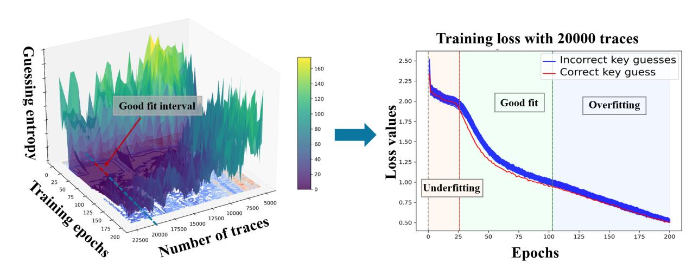
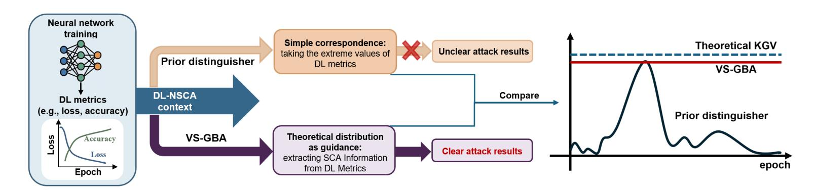
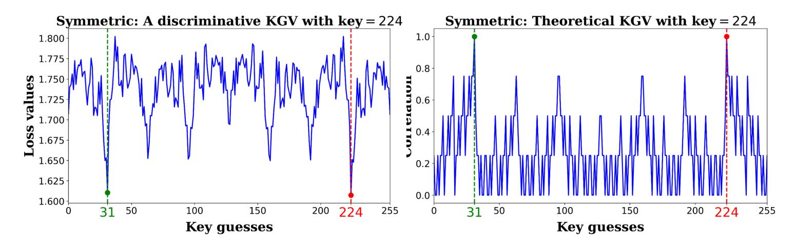
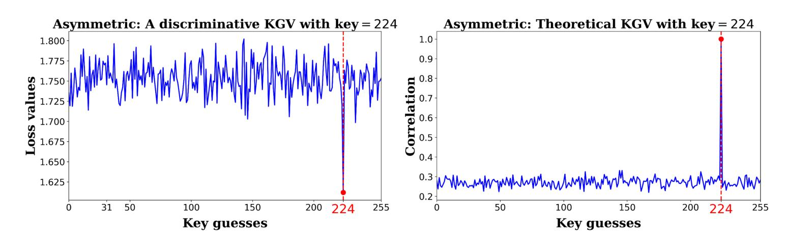
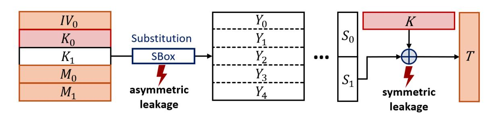
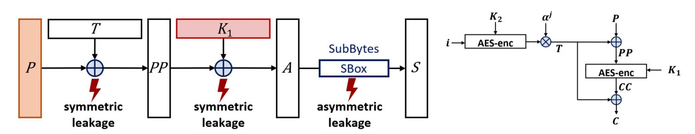

{0}------------------------------------------------

# **Cross-Algorithm Deep Learning-based Non-Profiled Side-Channel Attacks Exploiting Symmetric Leakage**

Jintong Yu, Yuxuan Wang, Zixin He, Yihan Nie, Yubo Zhao, Zhiliang An, Yipeng Shi, Pei Cao, Chi Zhang and Dawu Gu

Shanghai Jiao Tong University, Shanghai, China

**Abstract.** Deep Learning-based Non-profiled Side-Channel Analysis (DL-NSCA) enables automatic feature extraction without a profiling device, but existing approaches mainly target non-linear operations, requiring prior knowledge of the algorithm's unique non-linear structure and computable non-linear intermediate values. These limit applicability in analyzing proprietary or undisclosed implementations and in settings where plaintext/ciphertext are masked by unknown randomness (e.g., tweaks or nonces).

We observe that linear operations are fundamental as common cryptographic primitives appearing at the beginning or end of algorithms in conjunction with the secret key, and are widely used to mask sensitive input/output. Motivated by this observation, we propose a new DL-NSCA perspective that targets the outputs of linear operations, referred to as blind leakage, to enable cross algorithm attacks. However, the prior distinguisher in DL-NSCA is designed for non-linear operations, and how to effectively analyze blind leakage within this framework remains an open problem. The main limitation of the prior distinguisher lies in their reliance on a simplistic correspondence between deep learning metrics and side channel information, namely selecting the key guess corresponding to the minimum training loss. This leads to two issues: the effectiveness of the distinguisher varies significantly with the chosen training epoch, and the implicit assumption of a unique correlation maximum adopted by it does not hold for symmetric leakage. To address this, we provide a formal algebraic characterization of the relationship between the structure of the leakage function and the number of correlation maxima for all linear operations. Guided by this theory, we propose a new distinguisher, VS-GBA, an epoch-invariant distinguisher that interprets SCA information from deep learning metrics and approaches the theoretical optimum. It is applicable to both the single-maximum case (asymmetric leakage) and the dual-maximum case (symmetric leakage) through a structure-aware screening criterion. Experiments on a high-noise 32-bit ARM Cortex-M4 device demonstrate that asymmetric leakage analysis fails to recover keys for all three evaluated algorithms at the maximum trace budget (*GE* = 70 for masked AES, *GE* = 27 for masked PRESENT, *GE* = 66 for masked ASCON), whereas VS-GBA targeting symmetric leakage recovers the key with a 100% success rate in 8,000, 8,500, and 16,000 traces, respectively. Furthermore, we present the first DL-NSCA attack on XTS-AES (NIST SP 800-38E), extending DL-NSCA to scenarios where plaintext/ciphertext is masked by a secret tweak.

**Keywords:** Side-Channel Analysis · Deep Learning · Non-profiled Attack · Cross-Algorithm Attack · Linear Operations

{1}------------------------------------------------

### **1 Introduction**

2

Side-Channel Analysis (SCA) poses a persistent threat to cryptographic implementations by exploiting unintended physical leakage, such as power consumption and electromagnetic emanations, to recover secret information. Over the past two decades, SCA has evolved into a powerful class of attack techniques, capable of breaking implementations that are theoretically secure at the algorithmic level [\[KJJ99\]](#page-21-0). SCA is typically categorized into two attack models: profiled and non-profiled. In profiled attacks, the attacker must have access to a fully controllable device that is identical to the target. The attacker characterizes the side-channel behaviors on the profiling device, and then leverages them to recover the secret key from the target device. Under this prerequisite, profiled SCA has demonstrated remarkable effectiveness, such as template attacks [\[CRR02,](#page-20-0)[BLR12,](#page-20-1)[PHG17\]](#page-22-0) and deep learning-based attacks [\[WP20,](#page-23-0)[WPP22,](#page-23-1)[PWP22,](#page-22-1)[PHJ](#page-22-2)<sup>+</sup>19,[PSK](#page-22-3)<sup>+</sup>18]. However, this prerequisite is often infeasible to meet in practice, especially for closed devices. Nonprofiled SCA relaxes this assumption and therefore is more applicable to many practical scenarios [\[LYS](#page-22-4)<sup>+</sup>15,[Tih22\]](#page-23-2).

Non-profiled SCA employs a divide-and-conquer strategy, typically targeting subkeys at the byte level. Traditionally, statistical metrics such as Pearson correlation in CPA [\[BCO04\]](#page-20-2) or mutual information in MIA [\[VCS09\]](#page-23-3) are used to identify the correct key guess through correlation maxima. However, modern countermeasures [\[AG01,](#page-20-3)[KJJ99\]](#page-21-0) and the difficulty of manual Point of Interest (PoI) identification in unknown implementations have limited these methods. A pivotal shift occurred with the introduction of Differential Deep Learning Analysis (DDLA) [\[Tim19\]](#page-23-4), which leverages neural networks to automate feature extraction and PoI discovery. Subsequent advancements [\[KHK22,](#page-21-1)[DHD24,](#page-21-2)[SKP](#page-23-5)<sup>+</sup>24,[YWQ](#page-23-6)<sup>+</sup>25] have focused on optimizing computational efficiency, culminating in state-of-the-art frameworks like ConvWIN-MCR [\[YWQ](#page-23-6)<sup>+</sup>25], which successfully analyzes masked raw traces exceeding 100,000 feature points.

Existing SCA research predominantly targets the outputs of non-linear operations, such as the first round SubBytes in AES. However, this focus imposes two critical limitations that hinder applicability in real-world scenarios. First, analyzing non-linear operations requires prior knowledge of the cryptographic algorithm. Since non-linear designs are often the defining characteristic of a cipher, they vary significantly across different primitives. For example, while AES, ASCON, and PRESENT all utilize SBoxes, their respective mapping tables are entirely distinct. However, this requirement is difficult to meet when evaluating proprietary or undisclosed algorithms, IP-protected hardware modules, or security evaluations of IoT devices [\[ZSIG18,](#page-23-7)[MN17,](#page-22-5)[Cor,](#page-20-4)[GLC](#page-21-3)<sup>+</sup>22]. Second, this approach depends on the computability of the non-linear output. For instance, given a plaintext *p* and a key guess *k*, the AES SBox output is calculated as SBox[*p* ⊕ *k*]. In modern cryptographic designs, however, plaintext/ciphertext is frequently obscured by random values, such as nonces in authenticated encryption (e.g., Ascon) [\[DEMS21\]](#page-20-5) and tweaks in tweakable block ciphers (e.g., XTS-AES) [\[LRW02,](#page-21-4)[KR14\]](#page-21-5), which effectively masks the input/output data required to compute these non-linear intermediate values.

To address these limitations, we offer an alternative perspective for Deep Learning-based Non-profiled Side-Channel Analysis (DL-NSCA), namely analysis targeting leakages from the output of linear operations, which offers significant potential for broader applicability. First, many cryptographic primitives employ identical linear components; for instance, the XOR operation is ubiquitous across block ciphers. These common linear operations may generate more universal and fundamental key-dependent leakage features, thereby enabling cross-algorithm SCA. Second, the key-mixing linear operations in most standard symmetric ciphers are structurally positioned at the beginning or end of the encryption procedure, for example, the AddRoundKey at the start of AES, the first-round XOR in PRESENT, and the tag-generation XOR at the end of ASCON. This structural regularity means that an attacker can identify key-mixing linear operation's region by simply examining

{2}------------------------------------------------

the beginning or end of the trace, without any implementation details. Third, due to their lower computational overhead, linear operations are frequently used to mask the plaintext/ciphertext upon which non-linear computations depend. A prominent example is the XTS-AES algorithm (recommended by NIST SP 800-38E), where the input is XORed with a random value before being processed by the internal AES module [\[MD24\]](#page-22-6).

However, the distinguisher used in all existing DL-NSCA works targets non-linear operations, and how to analyze linear operations under this framework remains an open question. The primary challenge for the prior distinguisher lies in the simple correspondence between deep learning metrics and side channel results. This leads to two issues, the first is that the effectiveness of the distinguisher varies significantly with the chosen training epoch, and the second is that the implicit assumption of a unique correlation maximum does not hold for linear operations under DL-NSCA. Typically, for each key guess *k*, a distinguisher calculates the correlation between the observed traces and the hypothetical leakage (e.g., the Hamming weight of the attack point *f*(*k*)). It is known that, in traditional CPA, targeting the output of an XOR operation yields two symmetric correlation peaks, one positive and one negative, rather than the single peak observed when targeting non-linear SBox outputs [\[LSP04,](#page-21-6)[AFM17,](#page-20-6)[BCO04,](#page-20-2)[KJJ99\]](#page-21-0). With the introduction of deep learning, the correlation is evaluated by neural network training metrics, The correct key's model converges the fastest, yielding the lowest loss value or the highest accuracy. However, this criterion is inherently equivalent to finding the point(s) where the absolute value of the correlation coefficient is maximized, rendering the two symmetric peaks of an XOR operation indistinguishable to the prior distinguisher. Moreover, no existing work has formally characterized the relationship between the structure of *f* and the number of correlation maxima for arbitrary linear operations.

**Contributions.** We theoretically establish that when *f* is non-linear, there exists a unique correlation maximum attained exclusively at the correct key; we term this **asymmetric leakage**. Conversely, when *f* is linear with an invertible coefficient matrix **B**, exactly two symmetric maxima exist; we term this **symmetric leakage**. The main contributions of this work are as follows:

- 1. **Formal theory of correlation maxima structure.** We formally derive the relationship between the structure of the coefficient matrix **B** and the number of global maxima. While prior work has empirically observed that CPA targeting an XOR output yields two symmetric correlation extrema, we provide a formal algebraic proof of this phenomenon and generalize it to all linear operations, thereby revealing that the underlying assumptions of the prior distinguisher invalid under symmetric leakage and leaving a range of potential attacks unexplored.
- 2. **An epoch-invariant versatile key distinguisher VS-GBA.** We propose VS-GBA, a versatile key distinguisher effective for both asymmetric and symmetric leakage. Guided by theoretical analysis, it establishes a principled link between deep learning metrics and side channel information. This yields two concrete advantages: (i) it is epoch-invariant, automatically identifying discriminative epochs without manual selection; and (ii) it does not require a unique correlation maximum, explicitly handling both the single-maximum case (asymmetric leakage) and the dualmaximum case (symmetric leakage) through a structure-aware screening criterion. Both advantages are empirically validated through experiments on public datasets.
- 3. **Cross-algorithm attacks exploiting symmetric leakage.** We propose a symmetric leakage analysis framework enabling cross-algorithm attacks on a real-world, high-noise 32-bit ARM Cortex-M4 device. On this challenging platform, asymmetric leakage analysis fails to recover keys for all three evaluated algorithms (*GE* = 70 for masked AES, *GE* = 27 for masked PRESENT, *GE* = 66 for masked ASCON). In contrast, by targeting the algorithm-agnostic symmetric leakage, our method

{3}------------------------------------------------

successfully recovers the keys for all three algorithms with a 100% success rate, using 8,000 traces, 8,500 traces and 16,000 traces respectively. These results demonstrate that symmetric leakage provides a fundamentally more viable attack surface on high-noise masked implementations.

4. **The first DL-NSCA attack on tweakable block ciphers.** We present the first DL-NSCA method that successfully recovers secret keys from XTS-AES (NIST SP 800-38E), a standardized tweakable block cipher widely deployed in disk encryption, where the plaintext/ciphertext is masked by a secret tweak. Prior DL-NSCA methods cannot compute the non-linear intermediate values under this scenario; by instead targeting symmetric leakage, our method recovers the true AddRoundKey input without knowledge of the tweak, extending DL-NSCA to a class of ciphers previously considered out of scope.

### **2 Background**

### **2.1 Notation**

We use calligraphic letters to represent sets like X , with bold upper-case letters (e.g., **X**) denoting matrices, bold lowercase letters (e.g., **x**) representing vectors, and lowercase letters (e.g., x) indicating the scalar values or random variables.

### <span id="page-3-1"></span>**2.2 Non-profiled SCA**

Non-profiled SCA takes a divide-and-conquer strategy recovering a *n*-bit key each time. Denote *k*<sup>∗</sup> the fixed but unknown secret key, key space K = {0*,* 1*, . . . ,* 2 *<sup>n</sup>* − 1}. An attacker has access to a set of *N* known, random data D = {*d*1*, d*2*, . . . , d<sup>N</sup>* } (typically plaintexts or ciphertexts), and their corresponding set of *N* side-channel traces T = {**¯x1***,* **¯x2***, . . . ,* **¯xN**}. Each trace **¯x<sup>i</sup>** = (*xi,*1*, xi,*2*, . . . , xi,M*) is a vector of *M* feature points and is assumed to comprise both the actual data-dependent leakage and noise. For each key guess *k* ∈ K and random data *d*, the output of a specific operation *f*(*d, k*) is targeted. For example, in the case of non-linear leakage involving a SBox output, defined as *f*(*d, k*) = *SBox*[*d* ⊕ *k*], the SBox mapping is algorithm-specific. While this operation is common to algorithms like AES, PRESENT, and ASCON, their underlying mathematical expressions differ. Conversely, linear leakage associated with the XOR operation follows a universal form, *f*(*d, k*) = *d* ⊕ *k*, regardless of the algorithm. Finally, assuming a leakage model *H*, the attacker can then generate a set of hypothetical leakage H*<sup>k</sup>* = {*hk,*1*, hk,*2*, . . . , hk,N* }, with each being derived from the formula *hk,i* = *H*(*f*(*d<sup>i</sup> , k*)). The commonly used model is the Hamming Weight (HW) model, i.e., *hk,i* = *HW*(*f*(*d<sup>i</sup> , k*)).

#### **2.2.1 Traditional non-profiled SCA**

Traditional non-profiled SCA methods utilize the key distinguisher, usually a statistical tool, denoted as Corr to measure the correlation between the hypothetical leakage vector **h<sup>k</sup>** = (*hk,*1*, hk,*2*, . . . , hk,N* ) and the actual leakage at leakage point *p*0, i.e., **x<sup>p</sup><sup>0</sup>** = (*x*1*,p*<sup>0</sup> *, x*2*,p*<sup>0</sup> *, . . . , xN,p*<sup>0</sup> ), where the key guess corresponding to the maximum correlation can be considered as the correct key guess:

<span id="page-3-0"></span>
$$k_* = \arg\max_{k \in \mathcal{K}} \operatorname{Corr}(\mathbf{h_k}, \mathbf{x_{p_0}}).$$
 (1)

As implied by the equation [\(1\)](#page-3-0), traditional non-profiled SCA primarily targets single-point leakage. Alternatively, they can analyze multi-point leakage, but this typically requires prior knowledge of the specific implementation. To this end, researchers have proposed

{4}------------------------------------------------

various statistical tools to serve as the key distinguisher, such as the Pearson Correlation Coefficient for CPA [\[BCO04\]](#page-20-2) and Mutual Information for MIA [\[GBTP08\]](#page-21-7). As Doget et al. have demonstrated, most single-point attacks can be reformulated as a CPA with a different hypothetical power model [\[DPRS11\]](#page-21-8). In this study, Corr is calculated using the Pearson correlation coefficient.

#### **2.2.2 DL-NSCA**

In contrast to statistical tools used in traditional methods, DL-NSCA utilizes deep learning training metrics to evaluate the correlation between side-channel traces and hypothetical leakage. We term this the Deep Learning (DL) key distinguisher. Since the hypothetical leakage corresponding to the correct key guess exhibits the highest correlation with the traces, its neural network converges faster than those for incorrect key guesses. This is reflected in the training metrics that as the number of epochs increases, the model for the correct key guess shows a more rapid decrease in the loss value or a faster increase in accuracy [\[Tim19\]](#page-23-4). As both metrics reflect the network's training progress, we primarily consider the loss value, noting that the conclusions drawn are equally applicable to the accuracy metric.

For each key guess *k*, DL-NSCA trains a neural network, denoted *f***Θ***<sup>k</sup>* , which takes the set of side-channel traces T = {**¯x1***,* **¯x2***, . . . ,* **¯xN**} as input and the corresponding hypothetical leakage H*<sup>k</sup>* = {*hk,*1*, hk,*2*, . . . , hk,N* } as labels. Let *L<sup>t</sup>* be the loss function value at training epoch *t*. The training is typically performed up to a maximum number of epochs, *tmax*, such that *t* ∈ {0*,* 1*, . . . , tmax*}. Existing methods assume that the network converges at a specific epoch *t*0, and the correct key guess, *k*∗, is then determined as follows:

<span id="page-4-0"></span>
$$k_* = \arg\min_{k \in \mathcal{K}} L_{t_0}(f_{\mathbf{\Theta}_k}(\mathcal{T}), \mathcal{H}_k). \tag{2}$$

#### **2.2.3 SCA evaluation metrics**

Guessing Entropy (GE) is the commonly used metric in SCA, as standardized in ISO/IEC 17825:2024. In DL-SCA, we utilize the output *Lt*<sup>0</sup> as the score for each key candidate. By sorting these scores in descending order, we obtain a key ranking vector **G** = (*G*0*, G*1*, . . . , G*|K|−1), where *G*<sup>0</sup> represents the most probable candidate. GE is defined as the average index of the correct key within **G** over multiple experiments. A *GE* = 0 implies that *G*<sup>0</sup> = *k*<sup>∗</sup> is consistently in all experiments, which means a successful attack.

### <span id="page-4-1"></span>**2.3 Peak detection algorithm**

Peak detection constitutes a fundamental task in signal processing, essential for identifying critical features such as event timings, spectral components, or transient anomalies within temporal or spectral data. The find\_peaks algorithm serves as a widely adopted computational tool for this purpose [\[Ste93\]](#page-23-8), and it has become integral to diverse applications, including spectral analysis [\[Pro07\]](#page-22-7), biomedical signal processing [\[Ham02\]](#page-21-9), and vibration monitoring [\[Ran21\]](#page-23-9).

This approach operates by systematically identifying local maxima within a discrete signal sequence. The core methodology involves evaluating each data point against its local neighborhood, typically defined by a symmetric window, to confirm its status as a peak. To ensure robustness, threshold-based constraints such as minimum peak prominence are applied to distinguish significant features from noise or minor fluctuations.

{5}------------------------------------------------

### <span id="page-5-2"></span>**2.4 Rank aggregation algorithm**

Rank aggregation is a critical problem in information retrieval, social choice theory, and data fusion, where the goal is to combine multiple preference rankings (e.g., from voters, search algorithms, or feature-based models) into a single consensus ranking. This task arises in diverse applications such as meta-search engines, ensemble learning, recommendation systems, and collective decision-making. A fundamental challenge lies in resolving conflicts between input rankings while preserving meaningful global orderings.

Among classical rank aggregation methods, the Borda Count algorithm, proposed by Jean-Charles de Borda, remains a widely studied and practical approach due to its simplicity, computational efficiency, and theoretical properties [\[MU95\]](#page-22-8). The core mechanism assigns scores to candidates based on their positions in each input ranking. For a ranking of *n* candidates, a candidate ranked *k*-th receives a score of *n* − *k* from that ranking. Scores from all input rankings are aggregated (typically summed), and candidates are ordered by their total Borda scores in descending order to form the final consensus ranking. The Borda Count algorithm offers several notable advantages. Firstly, it leverages the full spectrum of preference information provided by each voter, making the final result more comprehensive and robust. Secondly, it tends to favor consensus candidates who are ranked highly by many, rather than polarized candidates who may be controversial.

### **2.5 ASCADv1 public dataset**

The ASCADv1 dataset is a public benchmark containing electromagnetic traces from an 8 bit ATmega8515 microcontroller[1](#page-5-0) . The device implements an AES-128 encryption algorithm protected with a first-order Boolean masking scheme [\[PR07\]](#page-22-9). The dataset is provided in two main versions: fixed key (ASCAD\_F\_R) and variable key (ASCAD\_V\_R). As our work targets a non-profiled scenario, we utilize the attack traces from the ASCAD\_V\_R subset, which are captured when the device operates under a single, constant key. The raw traces from the ASCAD\_F\_R and ASCAD\_V\_R datasets consist of 100000 and 250000 feature points, respectively.

# <span id="page-5-1"></span>**3 Limitations of the key distinguisher in DL-NSCA**

In this section, we analyze the limitations of the prior distinguisher, which primarily manifest in two aspects. First, the loss values in equation [\(2\)](#page-4-0) do not have the capability to distinguish the correct key guess from incorrect key guesses at every epoch *t*, and the effective epoch *t*<sup>0</sup> at which it becomes capable of doing so is **unknown and varies** with the number of input traces, hyperparameter settings, and other factors. This limitation applies to both asymmetric and symmetric leakage, and is elaborated in Section [3.1.](#page-6-0) Second, when targeting symmetric leakage, an additional and more fundamental failure arises: the DL key distinguisher cannot uniquely identify the correct key due to the **non-uniqueness** of key guesses achieving maximum absolute correlation, regardless of the epoch chosen. This issue is rooted in a structural property previously observed in CPA that targeting an XOR operation yields two symmetric correlation peaks rather than one [\[LSP04,](#page-21-6)[AFM17,](#page-20-6)[BCO04,](#page-20-2)[KJJ99\]](#page-21-0), but has never been formally analyzed for all linear operations, nor addressed within the DL framework. We present its formal theoretical derivation in Section [3.2.](#page-7-0)

<span id="page-5-0"></span><sup>1</sup>https://github.com/ANSSI-FR/ASCAD

{6}------------------------------------------------

### <span id="page-6-0"></span>**3.1 The Condition for an Effective DL Key Distinguisher**

DL key distinguisher replaces traditional distinguishers by using the loss values *Lt*<sup>0</sup> at the model's convergence epoch *t*0. This loss value characterizes the correlation between the side-channel traces and the hypothetical leakage, as shown in equation [\(2\)](#page-4-0). The training process of the neural network comprises three distinct phases [\[GBD92\]](#page-21-10):

- 1. Underfitting phase: In the initial stage of training, the model fails to learn the features from the data effectively.
- 2. Good fit phase: In the good fit phase, both training loss and validation loss decrease and stabilize at a low level, reaching an optimal balance where the model has successfully learned generalizable patterns without capturing excessive noise.
- 3. Overfitting phase: In the overfitting phase, the training loss continues to decrease to very low levels while the validation loss begins to rise, indicating that the model is memorizing the specific noise of the training set rather than learning generalizable features.

To prevent overfitting, the most common strategy in supervised learning is to monitor the loss on a held-out validation set and apply early stopping when validation loss begins to rise. However, as we demonstrate below, the absence of a validation set is not the only fundamental difficulty. The deeper issue is that the epoch at which the model enters the good fit phase is not a fixed quantity: it shifts substantially with the number of input traces, the neural network architecture, and other hyperparameter settings. Existing methods attempt to handle this by manually fixing the value of *t*<sup>0</sup> through observation of the loss curves, which is imprecise and non-generalizable across experimental configurations.

<span id="page-6-1"></span>

**Figure 1:** Unfixed good fit interval on the ASCAD\_F\_R dataset

Figure [1](#page-6-1) presents the evaluation results of the ConvWIN-MCR model on the AS-CAD\_F\_R dataset under different numbers of training epochs and trace quantities. The right subplot displays the loss curve when training with 20000 input traces. From this single-condition view, the three training phases are visually identifiable, and one might expect that a statistical method, such as a change-point detector applied to the loss trajectories, could automatically locate the good fit interval.

However, the right subplot reflects only one experimental condition. The left subplot reveals a fundamentally different picture: it plots a heatmap of GE across varying numbers of input traces and training epochs. The contour where *GE* = 0 precisely delineates the good fit region, and a critical observation emerges. The good fit boundaries shift substantially as the number of traces changes, and they are even more sensitive to changes in the neural network architecture and hyperparameters.

Crucially, this epoch-dependency is orthogonal to model capability. The same trained model can appear to succeed or fail depending solely on which epoch is selected for 

{7}------------------------------------------------

evaluation. Any fixed epoch chosen by inspecting one experimental condition will inevitably fall outside the good fit region under different configurations, rendering it an unreliable and non-generalizable evaluation criterion.

We define the vector of loss values for all key guesses at a given epoch t,  $\mathbf{l_t} = (L_t(f_{\Theta_0}(\mathcal{T}), \mathcal{H}_0), L_t(f_{\Theta_1}(\mathcal{T}), \mathcal{H}_1), \dots, L_t(f_{\Theta_{255}}(\mathcal{T}), \mathcal{H}_{255}))$  as the **Key Guess Vector** (KGV). The core challenge lies in identifying the epochs for which the KGV accurately represents the correlation between traces and hypothetical leakage. Formally, we aim to find a set of epochs  $\mathcal{T}_{conv} \subseteq \{0, 1, \dots, t_{max} - 1\}$ , where for any epoch  $t_0$  within this set, the DL key distinguisher is effective.

### <span id="page-7-0"></span>3.2 Limitations of prior key distinguisher

As defined in equation (1), the CPA distinguisher measures the Pearson correlation coefficient  $\rho_k = \text{Corr}(h_k, x_{p_0})$  between the hypothetical leakage  $h_k$  and the observed leakage  $x_{p_0}$ . Prior studies have found that when the attack target is the output of a non-linear SBox, only the correct key guess yields a single, prominent peak in  $\rho_k$ ; by contrast, when targeting the output of an XOR operation, the correct key appears as one of two symmetric extrema [LSP04, AFM17, BCO04, KJJ99].

With the introduction of deep learning, the Pearson statistic is replaced by neural network training metrics (the lowest loss value at a given epoch) as established in Section 2.2. However, since a neural network's loss function measures the strength of the statistical dependency regardless of its sign, this criterion is theoretically equivalent to maximizing the absolute value of the correlation coefficient:

<span id="page-7-2"></span>
$$k_* = \arg\max_{k \in \mathcal{K}} |\operatorname{Corr}(\mathbf{h_k}, \mathbf{x_{p_0}})| = \arg\max_{k \in \mathcal{K}} |\rho_k|.$$
 (3)

All existing DL-NSCA methods exploit non-linear operations, for which this maximization has a unique solution. Whether this uniqueness holds for *all* linear operations, and how to formally characterize the number of global maxima of  $|\rho_k|$  for *all* linear functions beyond XOR, has not been addressed in the existing literature<sup>2</sup>.

Firstly, we discuss the existence and uniqueness of the extremum for equation (3).

<span id="page-7-4"></span>**Theorem 1.** When f is a non-linear function, the maximum point of equation (3) is theoretically unique.

*Proof.* First, our analysis is based on the fundamental assumption about the leakage model [BCO04]. Consider the power consumption leakage  $\mathbf{x}_{\mathbf{p_0}}$  and the hypothetical leakage of the correct key guess  $\mathbf{h}_{\mathbf{k}_*}$ , there is

$$\mathbf{x}_{\mathbf{p_0}} = a\mathbf{h}_{\mathbf{k}_*} + b,$$

where a represents the gain, b is the offset, and the noise term is assumed to be independent of the other variables. For any k, we have

<span id="page-7-3"></span>
$$|\rho_k| = \left| \frac{aCov(\mathbf{h_{k_*}}, \mathbf{h_k})}{|a|\sigma_{\mathbf{h_{k_*}}}\sigma_{\mathbf{k}}} \right| = |Corr(\mathbf{h_{k_*}}, \mathbf{h_k})|.$$
 (4)

When f is a non-linear function, it implies that a minor difference in the input, such as  $k \neq k_*$ , will lead to completely different outputs for  $\mathbf{h_k}$  and  $\mathbf{h_{k_*}}$ . This is the primary design objective of non-linear operations with high degrees of nonlinearity in cryptographic algorithms to introduce confusion about the secret. Consequently, the hypothetical leakage

<span id="page-7-1"></span><sup>&</sup>lt;sup>2</sup>Profiled SCA leverages a profiling device with a known key to learn the correspondence between real and hypothetical leakage, reducing the attack to trace template matching. Its framework is therefore independent of operational linearity or nonlinearity, and thus profiled SCA does not suffer from this issue.

{8}------------------------------------------------

generated by an incorrect key guess is statistically uncorrelated with the actual power consumption. As the number of side-channel traces increases, the correlation between them approaches zero, i.e.,  $\rho_k \to 0$ . Thus, provided that f is a non-linear operation, the maximum value in equation (3) exists and is unique, and it is attained at  $k = k_*$ .

<span id="page-8-1"></span>**Theorem 2.** When  $f(\mathbf{d}, \mathbf{k}) : GF(2)^n \times GF(2)^n \to GF(2)^n$  is a linear map, there exist matrices  $\mathbf{A}$  and  $\mathbf{B}$  such that  $f(\mathbf{d}, \mathbf{k}) = \mathbf{Ad} \oplus \mathbf{Bk}$ . Set  $Im(\mathbf{B}) = {\mathbf{Bx} | \mathbf{x} \in GF(2)^n}$ , we have

- (1) When  $2^n 1 \notin Im(\mathbf{B})$ , the maximum point of equation (3) is unique at  $k_*$ ;
- (2) When  $2^n 1 \in Im(\mathbf{B})$ , there are  $2^{n-r} + 1$  maximum points. In particular, when  $\mathbf{B}$  is invertible, there are exactly two symmetric maximum points of equation (3):  $k_*$  and  $k_* \oplus \mathbf{B}^{-1}(2^n 1)$ .

*Proof.* We use lowercase letters to denote the integer representation of binary vectors; for instance, a vector **d** is represented as a decimal integer  $d \in \{0, 1, ..., 2^n - 1\}$ . It can be observed from equation (4) that  $|\rho_k| \leq 1$ , and  $k = k_*$  is a natural solution for  $|\rho_k| = 1$ . In the following, we investigate whether other solutions for  $|\rho_k| = 1$  exist.

Let the key difference be  $\delta = |k \oplus k_*|$  and hypothetical intermediate value difference be  $\Delta = f(\mathbf{d}, \mathbf{k}) \oplus f(\mathbf{d}, \mathbf{k}_*)$ . Denoting  $\mathbf{s} = f(\mathbf{d}, \mathbf{k}_*)$ , we have  $h_{k_*} = HW(\mathbf{s})$  and  $h_k = HW(\mathbf{s} \oplus \Delta)$ . Since  $f(\cdot, \mathbf{k}_*)$  is a linear map and  $\mathbf{d}$  is uniformly distributed on  $GF(2)^n$ , it follows that  $\mathbf{S}$  is also uniformly distributed on  $GF(2)^n$  with its bits being mutually independent. That is, each bit  $s_i$  of  $\mathbf{s}$  is an independent Bernoulli(1/2) random variable. Consequently, we obtain

$$E[h_k] = E[h_{k_*}] = \frac{n}{2}, \quad Var[h_k] = Var[h_{k_*}] = \frac{n}{4}.$$

Next, we analyze the covariance of  $\mathbf{h_k}$  and  $\mathbf{h_{k_*}}$ , i.e.,  $Cov(\mathbf{h_k}, \mathbf{h_{k_*}}) = E[\mathbf{h_k}\mathbf{h_{k_*}}] - E[\mathbf{h_k}]E[\mathbf{h_{k_*}}]$ . By expanding the Hamming weight, we have  $\mathbf{h_{k_*}} = HW(\mathbf{s}) = \sum_{j=1}^n s_j$ ,  $\mathbf{h_k} = HW(\mathbf{s} \oplus \Delta) = \sum_{i=1}^n (s_i \oplus \Delta_i)$ . We can get

$$E[\mathbf{h_k}\mathbf{h_{k_*}}] = \sum_{i=1}^n \sum_{j=1}^n E[(s_i \oplus \Delta_i)s_j].$$

Following, we discuss the value of  $E[(s_i \oplus \Delta_i)s_j]$  for different i and j:

- 1) When i = j: if  $\Delta_i = 0$ , then  $E[(s_i \oplus 0)s_j] = E[s_i^2] = E[s_i] = \frac{1}{2}$ ; if  $\Delta_i = 1$ , then  $E[(s_i \oplus 1)s_j] = E[(1 s_i)s_i] = 0$ .
- 2) When  $i \neq j$ : due to independence of  $s_i$  and  $s_j$ ,  $E[(s_i \oplus \Delta_i)s_j] = E[s_i \oplus \Delta_i]E[s_j] = \frac{1}{4}$ . Substituting the above expression into  $E[\mathbf{h_k}\mathbf{h_{k_*}}]$  and setting  $r = HW(\Delta)$ , we get

$$E[\mathbf{h_k h_{k_*}}] = \sum_{i=j} E[(s_i \oplus \Delta_i)s_j] + \sum_{i \neq j} E[(s_i \oplus \Delta_i)s_j] = \frac{r}{2} + \frac{n(n-1)}{4} = \frac{n^2}{4} - \frac{n}{4} + \frac{r}{2}.$$

Therefore,  $Cov(\mathbf{h_k}, \mathbf{h_{k_*}}) = \frac{r}{2} - \frac{n}{4}$  and

<span id="page-8-2"></span>
$$\rho_k = \operatorname{Corr}(\mathbf{h_k}, \mathbf{h_{k_*}}) = \frac{2r}{n} - 1.$$
 (5)

Finally, we have  $|\rho_k| = 1 \iff |\frac{2r}{n} - 1| = 1 \iff r \in \{n, 0\} \iff \Delta \in \{2^n - 1, 0\} \iff \Delta = 2^n - 1$  or  $k = k_*$ . Accordingly, our problem reduces to finding the solutions for

<span id="page-8-0"></span>
$$\Delta = \mathbf{B}(k \oplus k_*) = 2^n - 1. \tag{6}$$

In light of the necessary and sufficient conditions for the solvability of a linear equation, we have the equation (6) admits a solution if and only if  $2^n - 1 \in Im(\mathbf{B})$ , where  $Im(\mathbf{B})$  denotes the image of  $\mathbf{B}$ , i.e.,  $\{\mathbf{B}\mathbf{x}|\mathbf{x}\in GF(2)^n\}$ .

{9}------------------------------------------------

- (1) When  $2^n 1 \notin Im(\mathbf{B})$ , equation (6) has no solution. So  $|\rho_k|$  has a unique maximum point, namely  $k_*$ .
- (2) When  $2^n 1 \in Im(\mathbf{B})$ , equation (6) is solvable, and the number of solutions is  $2^{n-r}$ , where r denotes the rank of matrix  $\mathbf{B}$ . Let  $k_0$  be a particular solution; then all solutions are given by  $k = k_* \oplus k_0 \oplus z$  with  $z \in \{\mathbf{z} | \mathbf{B}\mathbf{z} = 0\}$ . Thus, there exist  $2^{n-r} + 1$  values of k such that  $|\rho_k| = 1$ . In particular, when  $\mathbf{B}$  is invertible,  $k = k_* \oplus \mathbf{B}^{-1}(2^n 1)$ , and in this case,  $|\rho_k|$  has exactly two symmetric maximum points:  $k_*$  and  $k_* \oplus \mathbf{B}^{-1}(2^n 1)$ .

Theoretical definitions of asymmetric and symmetric leakage. Theorems 1 and 2 provide a theoretical analysis of the number of global maxima for  $|\rho_k|$  regarding an arbitrary function f:

- (1) When f is non-linear, or when f is linear with  $2^n 1 \notin \mathbf{Im}(\mathbf{B})$ , the maximum of  $|\rho_k|$  is unique and attained specifically at  $k = k_*$ . We theoretically define **asymmetric** leakage as the side-channel information arising specifically from the intermediate value computations under this condition.
- (2) Conversely, when f is linear and  $2^n 1 \in \text{Im}(\mathbf{B})$ , the number of global maxima for  $|\rho_k|$  increases to  $2^{n-r} + 1$ . When the value of n r is not equal to zero, it implies that this target is inherently unfavorable for a successful SCA attack.
- (3) In the special case where f is linear and B is invertible, there are exactly two symmetric maxima located at  $k_*$  and  $k_* \oplus B^{-1}(2^n 1)$ . This phenomenon is defined as symmetric leakage.

Consequently, these theorems establish the formal definitions of asymmetric and symmetric leakage, demonstrating that asymmetric leakage does not correspond exclusively to non-linear operations. Furthermore, since the global maximum in equation (3) is non-unique under symmetric leakage conditions, the prior distinguisher inevitably fails.

<span id="page-9-0"></span>**Theorem 3.** When  $f(d,k) = d \oplus k$ ,  $|\rho_k|$  attains its maximum value at two points, namely  $k_*$  and its bitwise complement.

*Proof.* According to Theorem 2,  $k_*$  and  $k_* \oplus (2^n - 1)$  are the only two solutions for  $|\rho_k| = 1$ .

Remark 1. As established in Theorem 3, leakage from the XOR operation constitutes a form of symmetric leakage. This result is consistent with the empirical observations reported in prior work [LSP04, AFM17, BCO04, KJJ99], where targeting an XOR output in traditional CPA was shown to produce two symmetric correlation extrema. Our contribution is to provide the first formal proof of this phenomenon within a unified linear-algebraic framework (Theorem 2), extending the characterization beyond XOR to all invertible linear operations. Given that XOR is the most ubiquitous linear operation in block ciphers, this paper adopts it as the primary representative case for symmetric leakage analysis.

Remark 2. From a practical standpoint, this theoretical two-key result does not render the attack infeasible. For example in AES-128, when attacking 16 key bytes independently, each byte yields exactly two candidates, resulting in a residual search space of  $2^{16}$ , which is computationally trivial.

{10}------------------------------------------------

## 4 DL key distinguisher VS-GBA

To address the two issues identified in Section 3, we propose a new DL key distinguisher, named Valley-Screened Gaussian Borda Aggregation (VS-GBA), as shown in Algorithm 1 and 2. It is designed for both symmetric and asymmetric leakage. The process consists of two main steps. First, based on leakage features, it filters the loss values to select discriminative KGVs, which is detailed in Section 4.1. Second, we employ a multi-voter rank aggregation method to derive the final key rank from the selected KGVs, as detailed in Section 4.2.

### <span id="page-10-1"></span>4.1 Step 1: screening epochs with discriminative KGVs

As established in Section 3.1, our goal is to identify a set of valid epochs,  $\mathcal{T}_{conv}$ , from all training epochs that correspond to discriminative KGVs. The theoretical basis for what constitutes a discriminative KGV follows directly from Theorems 1–3. For asymmetric leakage, a discriminative KGV should exhibit a unique minimum; for symmetric leakage, it should exhibit two symmetric minima. We formalize this using a correlation vector,  $\mathbf{C} = (|\rho_0|, |\rho_1|, \dots, |\rho_{2^n-1}|)$ , which we term the **theoretical KGV**.

<span id="page-10-0"></span>**Algorithm 1** Valley-Screened Gaussian Borda Aggregation Algorithm for asymmetric leakage

```
Input: Key candidate space \mathcal{K}, KGVs for all epochs \mathbf{L} = \{\mathbf{l_t}\}_{t=0}^{t_{max}-1}, prominence threshold
       \tau_p, decay coefficient \alpha
Output: Final key ranking r
  1: N \leftarrow len(\mathcal{K})
  2: \mathbf{L}_{\mathcal{T}_{\mathbf{conv}}} \leftarrow empty\ list
                                                                                                ▶ Screening discriminative KGVs
  3: for t=0 to t_{max}-1 do
           \langle \mathbf{V}, \mathbf{P} \rangle \leftarrow \text{FIND\_PEAKS}(-\mathbf{l_t}, \tau_p)
  4:
           if |V| > 0 then
  5:
              \text{Append}(\mathbf{L}_{\mathcal{T}_{\mathbf{conv}}}, \mathbf{l_t})
  6:
  7:
           end if
  8: end for
  9: \mathbf{R}[j, c] \leftarrow \text{ARGSORT}(\mathbf{L}_{\mathcal{T}_{\mathbf{conv}}}[j]))[c]
                                                                                                  \triangleright rank of candidate c in epoch j
10: \mathbf{s}[c] \leftarrow \sum_{j} e^{-\alpha \mathbf{R}[j,c]^2}
 11: \mathbf{r} \leftarrow \text{ARGSORT}(-\mathbf{s})
 12: return r
```

For an asymmetric leakage framework, the theoretical KGV possesses a unique maximum, resulting in a single and distinct peak. Consequently, a discriminative KGV is expected to exhibit a unique minimum, the position of which indicates the correct key guess. For a symmetric leakage framework, according to Theorem 3, the theoretical KGV has two maxima, corresponding to the correct key guess and its bitwise complement. Thus, a discriminative KGV should feature two symmetric minimum points. While recovery by symmetric leakage is theoretically feasible using the prior distinguisher by identifying the candidate keys corresponding to the minimum and the second-smallest loss values, it comes at the cost that a greater number of traces is needed before the two symmetric loss trends become sufficiently distinct from those of all other key candidates. VS-GBA addresses this by automatically selecting epochs at which such discriminative two-minima structure is observable.

We assume that the global minimum of a theoretical KGV corresponds to the local minimum with the greatest valley prominence. Therefore, in both scenarios, the task of filtering for discriminative KGVs transforms into a problem of identifying local minima

{11}------------------------------------------------

within maximum prominence. We employ the FIND\_PEAKS algorithm, a standard method in signal processing introduced in Section 2.3. We use this algorithm to first identify all local minima in a KGV and then apply a prominence-based condition to select the significant ones (1 for asymmetric leakage and 2 for symmetric leakage), thereby isolating the discriminative KGVs.

In the asymmetric leakage scenario, we iterate through the KGVs from all epochs. A KGV  $\mathbf{l_t}$  is added to the set  $\mathbf{L}_{\mathcal{T}_{conv}}$  if the prominence of its local minimum exceeds a prominence threshold  $\tau_p$ . This procedure is detailed in lines 1-8 of Algorithm 1.

In the symmetric leakage scenario, in addition to the valley prominence, we introduce an additional symmetry condition. This condition requires that for the two key guesses with the highest valley prominence, the absolute difference between their sum and value N-1 must be less than a symmetry tolerance  $\tau_s$ . Secondly, based on the symmetry property of the theoretical KGV, we divide the key space  $\{0,1,\ldots,N-1\}$  into two halves around the symmetric axis  $\frac{N-1}{2}$ :  $\mathcal{K}_l = \{0,1,\ldots,\frac{N}{2}-1\}$  and  $\mathcal{K}_r = \{\frac{N}{2},\frac{N}{2}+1,\ldots,N-1\}$ . For any key guess  $k_2$  in the set  $\mathcal{K}_r$ , there exists a corresponding key  $k_1 = (N-1) \oplus k_2$  in the set  $\mathcal{K}_l$  such that  $|\rho_{k_1}| = |\rho_{k_2}|$ . Therefore, we fold the KGV from  $\mathcal{K}_r$  to  $\mathcal{K}_l$  in the same way, and the two minimum points in the folded KGVs can be interpreted as two predictions for the correct key pair  $(k_*, (N-1) \oplus k_*)$ . This process is outlined in lines 1-14 of Algorithm 2.

### <span id="page-11-0"></span>4.2 Step 2: Key rank aggregation using a voting-based method

Regardless of whether the underlying leakage is symmetric or asymmetric, the procedure in Step 1 yields predicted rankings of the correct key (or key pair) across multiple epochs. This outcome allows us to frame the problem as one of ranking aggregation within a multi-voter system. In this model, we treat each discriminative epoch as a "voter" and each potential key as a "candidate". The core task is to aggregate the individual rankings provided by all voters to produce a final, consolidated rank for the key guesses. In this paper, we utilize a modified Borda count method to determine the optimal ordering of a set of candidates based on their loss values across multiple valid epochs.

Firstly, we assign a rank based on the ascending order of loss values for each epoch, thereby constructing the ranking matrix  $\mathbf{R}$  that contains the ordered preference of candidates for each epoch, as described in lines 9 of Algorithm 1 and lines 15 of Algorithm 2. Subsequently, the algorithm calculates an aggregate score for each candidate. For a candidate's rank i in a given epoch, a score is awarded according to the formula  $e^{-\alpha i^2}$ , and this step is described in lines 10-11 of Algorithm 1 and lines 16-17 of Algorithm 2.

Unlike the classical Borda count algorithm<sup>3</sup>, which assigns scores that decrease linearly with rank, we employ a Gaussian function,  $g(i) = e^{-\alpha i^2}$ , where  $\alpha$  is the decay coefficient. This approach assigns significantly higher weight to top-ranked positions, thereby avoiding the shortcoming of the Borda count algorithm, which violates the Majority Criterion [PC77]. Finally, these scores are summed for each candidate across all epochs to produce a final cumulative score. We then sort these cumulative scores in descending order to obtain the final key ranking.

# 5 Experimental results

In this section, we present a comprehensive experimental evaluation of the proposed framework. Section 5.1 describes the experimental setup and evaluation criteria. In Section 5.2, we validate the correctness of our theoretical analysis using public benchmark datasets. Section 5.3 conducts cross-algorithm experiments on three classes of standard cryptographic algorithms, demonstrating the advantages of the symmetric leakage analysis

<span id="page-11-1"></span><sup>&</sup>lt;sup>3</sup>It is detailed in Section 2.4.

{12}------------------------------------------------

13

<span id="page-12-0"></span>Algorithm 2 Valley-Screened Gaussian Borda Aggregation Algorithm for symmetric leakage

```
Input: Key candidate space \mathcal{K}, KGVs for all epochs \mathbf{L} = \{\mathbf{l_t}\}_{t=0}^{t_{max}-1}, prominence threshold
      \tau_p, symmetry tolerance \tau_s, decay coefficient \alpha
Output: Final key ranking r
  1: N \leftarrow len(\mathcal{K})
  2: \mathbf{L}_{\mathcal{T}_{\mathbf{conv}}} \leftarrow empty\ list
                                                                                       ▶ Screening for discriminative KGVs
  3: for t = 0 to t_{max} - 1 do
          \langle \mathbf{V}, \mathbf{P} \rangle \leftarrow \text{FIND\_PEAKS}(-\mathbf{l_t}, \tau_p)
  4:
          if |V| > 1 then
  5:
              j_1, j_2 \leftarrow \text{ARGSORT}(\mathbf{P}[0:2])
                                                                                                             ▶ Prominence condition
  6:
              k_1, k_2 \leftarrow \mathbf{V}[j_1], \mathbf{V}[j_2]
                                                                                          ▶ Key guesses of top-2 prominence
  7:
              SymErr \leftarrow |k_1 + k_2 - (N-1)|

  8:
              if SymErr \leq \tau_s then
  9:
                  Append(\mathbf{L}_{\mathcal{T}_{\mathbf{conv}}}, \mathbf{l_t}[0:\frac{N}{2}))
10:
                  APPEND(\mathbf{L}_{\mathcal{T}_{\mathbf{conv}}}, Reverse(\mathbf{l_t}[\frac{N}{2}:N)))
11:
              end if
12:
           end if
13:
14: end for
15: \mathbf{R}[j, c] \leftarrow \text{ARGSORT}(\text{ARGSORT}(\mathbf{L}_{\mathcal{T}_{\mathbf{conv}}}[j]))[c]
                                                                                              \triangleright rank of candidate c in epoch j
16: \mathbf{s}[c] \leftarrow \sum_{j} e^{-\alpha \mathbf{R}[j,c]^2}
17: \mathbf{r} \leftarrow \text{ARGSORT}(-\mathbf{s})
18: return r
```

framework on real devices and under masking countermeasures. Finally, Section 5.4 shows that the proposed framework is capable of recovering the secret key of tweakable block ciphers where plaintext/ciphertext is masked.

#### <span id="page-12-1"></span>5.1 Experimental setup and metrics

We employ GE as the evaluation metric, measured at intervals of 500 traces to determine the minimum trace count required. For each trace set, experiments are repeated 10 times to compute the average key rank, mitigating variability from random weight initialization and other factors. If the average key rank reaches zero across all runs, the corresponding trace number is recorded as NTGE, indicating successful key recovery; otherwise, if key recovery fails within the maximum 50,000 traces, model performance is evaluated using the GE value at 50,000 traces.

In our experiments, the VS-GBA key distinguisher's hyperparameters are fixed to verify its generality: the prominence threshold is  $\tau_p = 0.1$  for AVR devices and  $\tau_p = 0.001$  for ARM devices, the symmetry tolerance is  $\tau_s = 10$ , and the decay coefficient is set to  $\alpha = 1$ . All networks were implemented using the PyTorch framework with an AMD EPYC 7763 64-Core Processor, an NVIDIA GeForce RTX 4090 GPU, and 1 TB of RAM.

<span id="page-12-2"></span>**Table 1:** Attack performance under different key distinguisher under asymmetric and symmetric leakage scenarios

| Attack points      | Key distinguisher      | VS-GBA         | Prior key distinguisher |                |                |                     |                     |                   |
|--------------------|------------------------|----------------|-------------------------|----------------|----------------|---------------------|---------------------|-------------------|
|                    | Epoch                  |                | 0                       | 10             | 20             | 30                  | 40                  | 50                |
| asymmetric leakage | ASCAD_F_R<br>ASCAD_V_R | 10000<br>6000  | GE = 47 $GE = 35$       | 11500<br>7000  | 18500<br>12000 | 29500<br>12000      | 36000<br>15000      | 38000<br>19500    |
| symmetric leakage  | ASCAD_F_R<br>ASCAD_V_R | 25500<br>35000 | GE = 12 $GE = 96$       | 49000 $GE = 8$ | 42000<br>49500 | GE = 238 $GE = 236$ | GE = 105 $GE = 160$ | GE = 12 $GE = 96$ |

{13}------------------------------------------------

#### <span id="page-13-0"></span>5.2 Validation of theoretical analysis and VS-GBA

In the field of artificial intelligence, the performance of neural networks is evaluated by DL metrics, such as loss and accuracy. The principle of the prior distinguisher relies on this **simple correspondence**: the key guess corresponding to the model with the minimum loss value is regarded as the correct key. As discussed in Section 3.1, the drawback of this approach is that the efficacy of the prior distinguisher exhibits a strong dependence on the selected training epochs. For symmetric leakage, it is further limited by the non-uniqueness of the correlation maxima, as established in Section 3.2.

Therefore, when performing DL-NSCA, it is critical to investigate how to leverage the data provided by DL metrics and interpret them as SCA information, where building this communication bridge is essential. We observe that the prior distinguisher fails to adequately perform this interpretation task, meaning that the attack outcome remains concealed in the DL metrics after neural network training. To address this issue, we propose the novel VS-GBA distinguisher, which extracts SCA information from DL metrics under the **guidance of the theoretical KGV distribution**, as illustrated in Figure 2. Unlike prior distinguisher, VS-GBA is a deterministic algorithm that is invariant to the choice of epoch and generally lies closer to the theoretical optimum.

In the following part, we provide empirical validation of these findings using public datasets.

<span id="page-13-1"></span>

Figure 2: VS-GBA: Building a bridge from DL metrics to SCA information

**Settings.** We analyze the asymmetric and symmetric leakage of the ASCAD\_F\_R and ASCAD\_V\_R datasets. We employ the state-of-the-art model, ConvWIN-MCR, and use the same parameters as the original authors on both datasets [YWQ<sup>+</sup>25]. The target intermediate values are  $f_s(d,k) = p[2] \oplus k[2]$  and  $f_{as}(d,k) = \text{SubBytes}[p[2] \oplus k[2]]$  respectively, where p[2] is the third byte of the plaintext and k[2] is the third byte of the key.

Results under symmetric leakage. Using the prior distinguisher to analyze symmetric leakage, we find that the GE value fluctuates between 0 and 1, which is consistent with the analysis in Section 3.2. This is because the theoretical KGV yields maximum correlation for two indistinguishable key guesses. For fairness in comparison, for the prior distinguisher, a GE value of either 0 or 1 is regarded as a successful attack. The analysis results are summarized in the last two rows of Table 1. We observe that the results obtained from VS-GBA still outperform the prior distinguisher for most epochs.

We next further analyze how discriminative KGVs selected by the VS-GBA method approach the theoretical KGV under the symmetric leakage scenario. We perform attacks on the ASCAD\_F\_R dataset to recover the third byte key 224. First, we compute the theoretical KGV. From Equation (5), we have  $|\rho_k| = \left|\frac{2HW[f(d,k) \oplus f(d,k_*)]}{n} - 1\right| = \left|\frac{HW[k \oplus k_*]}{4} - 1\right|$ , as shown in the right subplot of Figure 3. According to results on DL metric, we then adopt the VS-GBA method to select discriminative KGVs. The left subplot in Figure 3 shows the loss values of a discriminative KGV across all key guesses. Specifically, the two highest points of the theoretical KGV (with maximum correlation) correspond to

{14}------------------------------------------------

the lowest points of the discriminative KGV (with fastest convergence), which validates that the proposed VS-GBA well approximates and approaches the theoretical optimum. Furthermore, both the theoretical KGV and the discriminative KGV are symmetric about the middle key guesses, which further supports our conclusion in Theorem 2 and 3.

<span id="page-14-1"></span>

**Figure 3:** Visualization of results for VS-GBA on symmetric leakage

Results under asymmetric leakage. The analysis results for the asymmetric leakage are presented in Table 1. It is observed that the performance of the prior key distinguisher varies significantly across different training epochs, yet their best results are comparable to those of the proposed VS-GBA. We next examine how discriminative KGVs selected by the VS-GBA method approach the theoretical KGV under the asymmetric leakage scenario. For the recovery of the third-byte key 224 on the ASCAD\_F\_R dataset, we calculate the theoretical KGV. Based on Equation (5), it follows that  $|\rho_k|$  $|\frac{HW[Sbox[\bar{d}\oplus k]\oplus Sbox[\bar{d}\oplus k_*]]}{4}-1|^4$ , and the results are presented in the right subplot of Figure 4. Subsequently, we conduct DL-NSCA analysis on the input traces, and a discriminative KGV filtered by the VS-GBA is displayed in the leftmost part of Figure 4. It can be seen that the theoretical KGV and the discriminative KGV exhibit analogous distributions: the sole highest point of the theoretical KGV (corresponding to the maximum correlation) aligns with the only lowest point of the discriminative KGV (corresponding to the fastest convergence). This indicates that VS-GBA has successfully deciphered SCA information transmitted by the neural network, thereby further confirming Theorem 1.

#### <span id="page-14-0"></span>5.3 **Cross-algorithm evaluation**

Section 5.2 demonstrates that the VS-GBA distinguisher successfully builds a bridge from DL metrics to SCA information. In this section, we explore how to perform crossalgorithm analysis under symmetric leakage. Our analysis typically targets symmetric leakage occurring at the beginning or end of encryption algorithms, which is common in symmetric cryptography. This setup offers the advantage that the adversary does not need implementation details to locate the leakage positions, greatly improving the feasibility of our analysis framework in real-world scenarios.

To demonstrate practical feasibility, we experimentally analyze three standard cryptographic algorithms, and our attacks are conducted against implementations protected by masking countermeasures and subjected to high-noise environments. First, we observe that multiple standard algorithms share the same symmetric leakage pattern  $f_s(d,k) = d \oplus k$ . This work takes three algorithms as examples: AES, a symmetric block cipher widely adopted as a global encryption standard; ASCON, the winner of the CAESAR competition and NIST's recommended lightweight cipher for resource-constrained environments; and PRESENT, a lightweight block cipher specifically designed for low-power and compact

<span id="page-14-2"></span><sup>&</sup>lt;sup>4</sup>As stated in Theorem 1, the theoretical KGV possesses a single unique maximum when the volume of output data is sufficient. Consequently, we utilize 500 plaintext samples and calculate the average value of input data d.

{15}------------------------------------------------

<span id="page-15-0"></span>

**Figure 4:** Visualization of results for VS-GBA on asymmetric leakage

hardware implementations. Second, while prior studies primarily focused on simulations or 8-bit AVR microcontrollers [\[Tim19,](#page-23-4)[KHK22,](#page-21-1)[DHD24,](#page-21-2)[SKP](#page-23-5)<sup>+</sup>24], this work transitions to the 32-bit ARM Cortex-M4 architecture to better reflect real-world scenarios. Third, although DL-NSCA methods have shown strong performance in bypassing masking countermeasures, their application has been mainly limited to Boolean-masked AES, as used in the public ASCADv1 dataset. Our work targets the more challenging masked implementations of AES, and further extends to masked implementations of ASCON and PRESENT.

Notably, for AES, a more challenging public benchmark, ASCADv2, employs a combination of affine masking and shuffling countermeasures. Existing work has shown that even in the profiled setting, where the attacker has access to a fully controlled clone device and knows the values of affine masks during profiling, attacking ASCADv2 requires either a 27-layer multi-task deep learning architecture [\[MS21\]](#page-22-11) or large language models [\[KVPB23\]](#page-21-11). In the non-profiled setting, these challenges are substantially compounded: the absence of a profiling device exponentially increases the learning difficulty, and the limited capacity of practically deployable neural networks poses a fundamental bottleneck [\[YWQ](#page-23-6)<sup>+</sup>25]. Consequently, non-profiled analysis of ASCADv2 remains an open problem, and shuffling countermeasures are beyond the scope of this work. Instead, we target implementations protected by Rivain-Prouff masking [\[RP10\]](#page-23-10), which has been proven secure against SCA.

#### <span id="page-15-2"></span>**5.3.1 AES**

Standardized by NIST in 2001, AES is a symmetric block cipher based on a Substitution-Permutation Network (SPN). This study utilizes AES-128 as the primary benchmark for analysis.

**Attack points.** For each key byte *K*, the Round 0 AddRoundKey operation yields *A* = *P* ⊕*K*, where *P* is the corresponding plaintext byte. This value forms the input to the first-round SubBytes transformation, as illustrated in Figure [5.](#page-16-0) For asymmetric leakage, we target the first-round SBox output, a primary target of SCA works [\[KHK22,](#page-21-1)[DHD24,](#page-21-2) [SKP](#page-23-5)+24,[SKP](#page-23-5)<sup>+</sup>24,[WP20,](#page-23-0)[WPP22,](#page-23-1)[PWP22\]](#page-22-1), defined as *fas*(*P, K*) = *SubBytes*[*P* ⊕ *K*]. For symmetric leakage, we focus on the direct output of AddRoundKey, given by *fs*(*P, K*) = *P* ⊕ *K*.

**Datasets.** Existing methods can successfully recover keys from the ASCADv1 dataset, mainly due to the low-noise 8-bit AVR ATMega platform and simple first-order Boolean masking implementation. Neural networks typically learn secret values by automatically recombining masked shares [\[PPM](#page-22-12)<sup>+</sup>23]. Instead, we evaluate the more secure Rivain-Prouff masking [\[RP10\]](#page-23-10) on a 32-bit ARM Cortex-M4 platform. This scheme protects nonlinear SBox operations by a dedicated field-multiplication gadget (SecMult), creating a challenging task comparable to masking countermeasures in ASCADv2 and extending DL-NSCA beyond Boolean masking. Our implementation uses a public first-order version of the scheme[5](#page-15-1) .

<span id="page-15-1"></span><sup>5</sup>https://github.com/coron/htable/tree/master

{16}------------------------------------------------

<span id="page-16-0"></span>**Figure 5:** The two initial operations of the AES(left) and PRESENT(right) algorithm. We employ a color-coding scheme to show different elements in *f*(*d, k*): red denotes the unknown secret key *K*, blue blocks represent the function *f* itself, and orange blocks signify the known data involved in the calculation.

**Key recovery.** Experimental results are summarized in Table [2.](#page-16-1) As shown in Section [5.2,](#page-13-0) the choice of distinguisher strongly affects key recovery in DL-NSCA, which consists of a neural network and a distinguisher. Since this work does not focus on network architecture, we use the same network as ConvWIN-MCR[6](#page-16-2) , differing only in the distinguisher. Under symmetric leakage, our method recovers the key with very few traces, whereas analysis fails for asymmetric leakage, where the correct key is poorly ranked. Notably, substantial progress has been made in securing AES nonlinear operations [\[AG01,](#page-20-3) [BGK04,](#page-20-7)[Mes00,](#page-22-13)[OMPR05,](#page-22-14)[PR07,](#page-22-9)[KHL11\]](#page-21-12), greatly increasing SCA difficulty. In contrast, protections for XOR operations typically follow standard secret-sharing schemes [\[RP10\]](#page-23-10). Our experiments **show that such implementations remain vulnerable to DL-NSCA**, suggesting the need for more advanced masking strategies for linear XOR operations to further bolster overall side-channel resilience.

<span id="page-16-1"></span>**Table 2:** Performance comparison across different algorithms under high-noise conditions and masking countermeasures.

| Datasets       | Attack points      | DDLA [Tim19] | ConvWIN-MCR [YWQ+25] | this work |
|----------------|--------------------|--------------|----------------------|-----------|
| AES_rp_masked  | asymmetric leakage | GE=236       | GE=205               | GE=70     |
|                | symmetric leakage  | GE=23        | 24500                | 8000      |
| PRESENT        | asymmetric leakage | 45500        | 3500                 | 3000      |
|                | symmetric leakage  | 48500        | 5500                 | 4500      |
| PRESENT_masked | asymmetric leakage | GE=210       | GE=90                | GE=27     |
|                | symmetric leakage  | GE=138       | 9500                 | 8500      |
| ASCON          | asymmetric leakage | GE=195       | GE=122               | GE=46     |
|                | symmetric leakage  | GE=5         | 39500                | 3000      |
| ASCON_masked   | asymmetric leakage | GE=211       | GE=196               | GE=66     |
|                | symmetric leakage  | GE=39        | GE=3                 | 16000     |

#### **5.3.2 PRESENT**

Standardized by ISO/IEC in 2012 as a lightweight cryptographic benchmark, PRESENT was specifically engineered for hardware-constrained environments such as RFID tags and sensor networks [\[BKL](#page-20-8)<sup>+</sup>07]. It features a compact 64-bit block size and supports 80 or 128-bit keys, utilizing a bit-oriented permutation and a 4-bit SBox for high efficiency. This study focuses on PRESENT-80 as a representative target.

**Attack Points.** Focusing on each byte *K* within the initial 64 bits of the key, the first-round operations begin with AddRoundKey, where the plaintext *P* is XORed with the key *K* to produce the intermediate state *A*. Subsequently, the sBoxLayer transformation is applied to *A*, resulting in *S* = sBoxLayer[*A*]. As illustrated in rightmost part of

<span id="page-16-2"></span><sup>6</sup>The ConvWIN-MCR network has only one hyperparameter to be searched, where we made grid search for the pooling stride over [5*,* 10*,* 20*,* 50*,* 100*,* 200*,* 500*,* 1000*,* 2000].

{17}------------------------------------------------

Figure [5,](#page-16-0) we define the target intermediate values for asymmetric and symmetric leakage as *f*as(*P, K*) = sBoxLayer[*P* ⊕ *K*] and *f*s(*P, K*) = *P* ⊕ *K*, respectively.

**Datasets.** We implemented two versions of the PRESENT algorithm on the ARM Cortex-M4 platform: an unprotected version and a first-order Boolean masked version. For the unprotected implementation, we utilized a public library[7](#page-17-0) to generate the PRESENT dataset, which correspond to the side-channel traces captured at the locations of symmetric and asymmetric leakage, respectively. Regarding the masked implementation, given the scarcity of public code specifically for masked PRESENT, we adapted a well-documented first-order Boolean masked AES library[8](#page-17-1) to ensure experimental reproducibility. This approach is justified by the shared SPN architecture of both ciphers, and attain the PRESENT\_masked dataset.

**Key Recovery.** The experimental results are summarized in Table [2.](#page-16-1) For the unprotected implementation, our method requires fewer traces regardless of whether symmetric or asymmetric leakage is considered. It can be observed that under the unprotected scenario, asymmetric leakage exhibits stronger intensity, thus requiring slightly fewer traces for a successful attack. However, under the first-order masked implementation, the advantage of analyzing symmetric leakage becomes evident. Although asymmetric leakage is marginally stronger in intensity than symmetric leakage, this difference is insufficient to overcome the confounding effects introduced by high noise environments and complex masking operations.

#### **5.3.3 ASCON**

ASCON was selected as the winner of both the CAESAR competition and the NIST Lightweight Cryptography standardization process, and is currently undergoing standardization for widespread deployment [\[DEMS21\]](#page-20-5). As a sponge-based authenticated encryption scheme, it guarantees message confidentiality and ensures integrity by generating an authentication tag over the ciphertexts and associated data. ASCON takes a key *K*, a nonce *N*, an associated data *A*, and a plaintext *P* as inputs to generate the authenticated ciphertext *C* and authentication tag *T*. The internal logic progresses through four phases: initialization, associated data processing, plaintext processing , and finalization.

<span id="page-17-2"></span>

**Figure 6:** Left: ASCON Substitution Layer. The SBox operation processes a 5-bit input formed by taking one bit from each word. It then produces a 5-bit output, where each bit corresponds to a word *Y<sup>i</sup>* . Right: Tag generation step in finalization phase. The tag *T* derives from the last 128-bit state *S*<sup>1</sup> XORed with 128-bit key *K*.

**Attack points.** In the initialization phase, the 320-bit ASCON state {*X*0*, . . . , X*4} is composed of an initial constant *IV*0, a 128-bit secret key *K* = *K*1||*K*<sup>2</sup> and a 128-bit nonce, and a 128-bit unique nonce *M* = *M*0||*M*1. Its permutation includes round constant addition, column-wise 5-bit SBox substitution and linear diffusion, as shown on the left of Figure [6.](#page-17-2) In the finalization phase, the tag *T* is derived by XORing the key *K* with the last 128 bits of the state (right of Figure [6\)](#page-17-2). As the final step of ASCON, this leakage point locates at the end of side-channel traces and can be easily identified without prior

<span id="page-17-1"></span><span id="page-17-0"></span><sup>7</sup>https://github.com/michaelkitson/Present-8bit/tree/master

<sup>8</sup>https://github.com/Secure-Embedded-Systems/Masked-AES-Implementation/tree/master/Byte-Masked-AES

{18}------------------------------------------------

implementation details. For asymmetric leakage, we target the first-round permutation SBox output [\[RYJ](#page-23-11)<sup>+</sup>25[,RBBWP24\]](#page-23-12). *Y*<sup>4</sup> is computed as *Y*<sup>4</sup> = *K*1&(255⊕*IV*0⊕*M*0)⊕*M*0⊕*M*1, with the target intermediate value *fas*(*IV*0*, m*0*, m*1*, k*) = *k*&(255 ⊕ *IV*<sup>0</sup> ⊕ *m*0) ⊕ *m*<sup>0</sup> ⊕ *m*1, recovered in 8-bit chunks. For symmetric leakage, we attack the last XOR operation in the tag generation phase; notably, this attack point has not been previously investigated. The target intermediate value is *fs*(*T, k*) = *T* ⊕ *k*.

**Datasets.** Firstly, we execute a unprotected implementation of ASCON-128. This implementation is derived from the 8-bit optimized version of the official ASCON reference code[9](#page-18-1) , which is designed for efficient execution on eight-bit microprocessors while maintaining compatibility with 32-bit architectures. The dataset ASCON consist of traces corresponding to symmetric leakage and asymmetric leakage. Furthermore, we consider the masked implementation scenario, which is based on the public masked implementation scheme of ASCON[10](#page-18-2). The dataset ASCON\_masked is composed of traces associated with masked symmetric leakage and masked asymmetric leakage.

**Key recovery.** The experimental results are detailed in Table [2.](#page-16-1) For the unprotected implementation, recovering the secret key from asymmetric leakage in the initial phase of ASCON remains non-trivial under low-noise conditions, whereas symmetric leakage during the tag generation phase achieves successful key recovery. In the protected scenario, symmetric leakage successfully recovers the secret key, whereas asymmetric leakage fails to do so, further validating the advantage of targeting symmetric leakage under masking countermeasures.

### <span id="page-18-0"></span>**5.4 Key recovery in masked I/O scenarios**

While the cross-algorithm experiments in the preceding section demonstrated potent attack capabilities, they rely on the critical assumption that the attacker has direct access to plaintext/ciphertext of the cryptographic primitive. Although this is a foundational premise in SCA literature, real-world implementations often obfuscate these values with random variables, resulting in what we define as masked plaintext/ciphertext. A prime example of this is found in disk encryption, a critical mechanism for protecting data at rest on personal computers and servers. To address the unique security and performance requirements of block-oriented storage, NIST released SP 800-38E in 2010, formally recommending the XTS-AES mode of operation as a standardized and secure solution [\[Dwo10\]](#page-21-13).

<span id="page-18-3"></span>

**Figure 7:** Left:The first three primary operations of the XTS-AES algorithm. Right: The encryption procedure of XTS-AES.

Unlike traditional modes like CBC or CTR, XTS-AES operates on arbitrary-sized data without requiring padding, leveraging a tweak value *T* derived from the data's logical block address to ensure that the same plaintext in different blocks produces distinct ciphertexts, eliminating the risk of pattern leakage. The encryption procedure of XTS-AES is illustrated in the right part of Figure [7.](#page-18-3) It uses two AES keys: *K*<sup>1</sup> for the core encryption and *K*<sup>2</sup> for generating the tweak. We demonstrate that an attacker can collect multiple side-channel traces under a constant tweak value *T* to obtain the corresponding masked

<span id="page-18-2"></span><span id="page-18-1"></span><sup>9</sup>https://github.com/ascon/ascon-c

<sup>10</sup>https://github.com/ascon/simpleserial-ascon

{19}------------------------------------------------

plaintext/ciphertext[11](#page-19-0). For the purposes of this study, we utilize AES-128 as the underlying primitive, where both *K*<sup>1</sup> and *K*<sup>2</sup> are 128 bits in length.

**Attack points.** Given that the attacker only possesses masked plaintexts, the attack on XTS-AES is partitioned into two independent stages, as illustrated in Figure [7.](#page-18-3) Following the algorithmic execution order, we define these stages as follows:

- **Phase 1: Pre-AES operations.** This phase involves the operations occurring before the core AES encryption. Here, the masked input *P* is XORed with the tweak value *T* to produce the actual AES input *P P*. This stage yields symmetric leakage, where the target intermediate value is defined as: *fs*(*P, T*) = *P* ⊕ *T*.
- **Phase 2: AES encryption.** This phase encompasses the internal AES transformation. Consistent with the attack points identified in Section [5.3.1,](#page-15-2) we consider both symmetric and asymmetric leakage. By substituting *P P* = *P* ⊕ *T*, the target functions are expressed in terms of known data (*P, T*) and the secret key *K*1: *fs*(*P P, K*1) = *P P* ⊕ *K*<sup>1</sup> = *P* ⊕ (*T* ⊕ *K*1) = *fs*(*P, T* ⊕ *K*1) and *fas*(*P P, K*1) = SubBytes[*P P* ⊕ *K*1] = SubBytes[*P* ⊕ (*T* ⊕ *K*1)] = *fas*(*P, T* ⊕ *K*1).

**Datasets.** The XTS-AES algorithm was implemented on an ARM Cortex-M4 platform utilizing a public library[12](#page-19-1) to generate our XTS-AES dataset. The captured power traces encompass the entire execution window, from the initiation of the XTS-AES mode to the SubBytes operation in the first round of the internal AES engine. Since these traces contain all three targeted feature points, we identified the boundary between Phase 1 and Phase 2 empirically through iterative testing. Each trace consists of 9000 samples; for the purpose of evaluating our attack, we partitioned the first 5000 samples into Phase 1 and the subsequent 4000 samples into Phase 2.

**Table 3:** Performance comparison on XTS-AES under high-noise conditions.

<span id="page-19-2"></span>

| Datasets | Attack points                          | DDLA [Tim19]   | ConvWIN-MCR [YWQ+25] | this work    |
|----------|----------------------------------------|----------------|----------------------|--------------|
| Phase 1  | symmetric leakage                      | GE=8           | 16500                | 9500         |
| Phase 2  | asymmetric leakge<br>symmetric leakage | 49500<br>26500 | 13000<br>4000        | 6500<br>2500 |

**Key recovery.** The experimental results are detailed in Table [3,](#page-19-2) where our method recovers the secret key using the fewest traces. Furthermore, while the specific leakage source in Phase 2 differs, since only symmetric leakage is present in Phase 1, the successful exploitation of symmetric leakage remains the fundamental component that enables secret key recovery for XTS-AES.

### **6 Conclusion**

In summary, this work makes three key contributions: (i) a formal algebraic characterization of the number of correlation maxima for arbitrary leakage functions, establishing that non-linear operations yield asymmetric leakage with a unique maximum while invertible linear operations yield symmetric leakage with exactly two maxima; (ii) VS-GBA, an epoch-invariant distinguisher applicable to both asymmetric and symmetric leakage

<span id="page-19-0"></span><sup>11</sup>The first phase involves encrypting the Logical Block Address (LBA), represented by index *i*. The LBA serves as a critical component of the tweak mechanism, ensuring that identical data stored at different physical locations results in unique ciphertexts, thereby maintaining the confidentiality of data at rest. In the context of SCA, adversaries typically target leakages at fixed locations; thus, it is assumed that the attacker can acquire multiple traces for different plaintexts under constant *i* and *j* values.

<span id="page-19-1"></span><sup>12</sup>https://github.com/heisencoder/XTS-AES/tree/master

{20}------------------------------------------------

that approaches the theoretical optimum; (iii) cross-algorithm attacks on masked AES, PRESENT, and ASCON on a high-noise ARM Cortex-M4 device, where asymmetric leakage analysis fails (*GE* = 70, 27, and 66 respectively) while VS-GBA recovers all keys within 8,000, 8,500, and 16,000 traces; and (iv) the first DL-NSCA attack on XTS-AES (NIST SP 800-38E), confirming that symmetric leakage extends DL-NSCA to tweakable block ciphers with secret tweaks. Extending this framework to higher-order masked and shuffled implementations remains an important direction for future research.

While this work focuses on first-order masking due to the high overhead of higher-order countermeasures, and analysis of higher-order countermeasures is currently restricted to simulated environments, extending DL-NSCA to higher-order masked and shuffled implementations remains an important direction for future research.

## **References**

- <span id="page-20-6"></span>[AFM17] Alexandre Adomnicai, Jacques JA Fournier, and Laurent Masson. Bricklayer attack: A side-channel analysis on the chacha quarter round. In *International Conference on Cryptology in India*, pages 65–84. Springer, 2017.
- <span id="page-20-3"></span>[AG01] Mehdi-Laurent Akkar and Christophe Giraud. An implementation of des and aes, secure against some attacks. In *Cryptographic Hardware and Embedded Systems—CHES 2001: Third International Workshop Paris, France, May 14–16, 2001 Proceedings 3*, pages 309–318. Springer, 2001.
- <span id="page-20-2"></span>[BCO04] Eric Brier, Christophe Clavier, and Francis Olivier. Correlation power analysis with a leakage model. In *Cryptographic Hardware and Embedded Systems-CHES 2004: 6th International Workshop Cambridge, MA, USA, August 11-13, 2004. Proceedings 6*, pages 16–29. Springer, 2004.
- <span id="page-20-7"></span>[BGK04] Johannes Blömer, Jorge Guajardo, and Volker Krummel. Provably secure masking of aes. In *International workshop on selected areas in cryptography*, pages 69–83. Springer, 2004.
- <span id="page-20-8"></span>[BKL<sup>+</sup>07] Andrey Bogdanov, Lars R Knudsen, Gregor Leander, Christof Paar, Axel Poschmann, Matthew JB Robshaw, Yannick Seurin, and Charlotte Vikkelsoe. Present: An ultra-lightweight block cipher. In *Cryptographic Hardware and Embedded Systems-CHES 2007: 9th International Workshop, Vienna, Austria, September 10-13, 2007. Proceedings 9*, pages 450–466. Springer, 2007.
- <span id="page-20-1"></span>[BLR12] Timo Bartkewitz and Kerstin Lemke-Rust. Efficient template attacks based on probabilistic multi-class support vector machines. In *International Conference on Smart Card Research and Advanced Applications*, pages 263–276. Springer, 2012.
- <span id="page-20-4"></span>[Cor] IBM Corporation. Ibm 4769-001 cryptographic coprocessor security module non-proprietary security policy. [https://csrc.nist.gov/CSRC/media/](https://csrc.nist.gov/CSRC/media/projects/cryptographic-module-validation-program/documents/security-policies/140sp4079.pdf) [projects/cryptographic-module-validation-program/documents/](https://csrc.nist.gov/CSRC/media/projects/cryptographic-module-validation-program/documents/security-policies/140sp4079.pdf) [security-policies/140sp4079.pdf](https://csrc.nist.gov/CSRC/media/projects/cryptographic-module-validation-program/documents/security-policies/140sp4079.pdf).
- <span id="page-20-0"></span>[CRR02] Suresh Chari, Josyula R Rao, and Pankaj Rohatgi. Template attacks. In *International workshop on cryptographic hardware and embedded systems*, pages 13–28. Springer, 2002.
- <span id="page-20-5"></span>[DEMS21] Christoph Dobraunig, Maria Eichlseder, Florian Mendel, and Martin Schläffer. Ascon v1. 2: Lightweight authenticated encryption and hashing. *Journal of Cryptology*, 34(3):33, 2021.

{21}------------------------------------------------

- <span id="page-21-2"></span>[DHD24] Ngoc-Tuan Do, Van-Phuc Hoang, and Van Sang Doan. A novel non-profiled side channel attack based on multi-output regression neural network. *Journal of Cryptographic Engineering*, 14(3):427–439, 2024.
- <span id="page-21-8"></span>[DPRS11] Julien Doget, Emmanuel Prouff, Matthieu Rivain, and François-Xavier Standaert. Univariate side channel attacks and leakage modeling. *Journal of Cryptographic Engineering*, 1(2):123–144, 2011.
- <span id="page-21-13"></span>[Dwo10] Morris J Dworkin. Recommendation for block cipher modes of operation: The xts-aes mode for confidentiality on storage devices. 2010.
- <span id="page-21-10"></span>[GBD92] Stuart Geman, Elie Bienenstock, and René Doursat. Neural networks and the bias/variance dilemma. *Neural computation*, 4(1):1–58, 1992.
- <span id="page-21-7"></span>[GBTP08] Benedikt Gierlichs, Lejla Batina, Pim Tuyls, and Bart Preneel. Mutual information analysis: A generic side-channel distinguisher. In *International Workshop on Cryptographic Hardware and Embedded Systems*, pages 426–442. Springer, 2008.
- <span id="page-21-3"></span>[GLC<sup>+</sup>22] Ming Gao, Yajie Liu, Yike Chen, Yimin Li, Zhongjie Ba, Xian Xu, and Jinsong Han. Inertiear: Automatic and device-independent imu-based eavesdropping on smartphones. In *IEEE INFOCOM 2022-IEEE Conference on Computer Communications*, pages 1129–1138. IEEE, 2022.
- <span id="page-21-9"></span>[Ham02] Pat Hamilton. Open source ecg analysis. In *Computers in cardiology*, pages 101–104. IEEE, 2002.
- <span id="page-21-1"></span>[KHK22] Donggeun Kwon, Seokhie Hong, and Heeseok Kim. Optimizing implementations of non-profiled deep learning-based side-channel attacks. *IEEE Access*, 10:5957–5967, 2022.
- <span id="page-21-12"></span>[KHL11] HeeSeok Kim, Seokhie Hong, and Jongin Lim. A fast and provably secure higher-order masking of aes s-box. In *International Workshop on Cryptographic Hardware and Embedded Systems*, pages 95–107. Springer, 2011.
- <span id="page-21-0"></span>[KJJ99] Paul Kocher, Joshua Jaffe, and Benjamin Jun. Differential power analysis. In *Advances in Cryptology—CRYPTO'99: 19th Annual International Cryptology Conference Santa Barbara, California, USA, August 15–19, 1999 Proceedings 19*, pages 388–397. Springer, 1999.
- <span id="page-21-5"></span>[KR14] Ted Krovetz and Phillip Rogaway. The ocb authenticated-encryption algorithm. Technical report, 2014.
- <span id="page-21-11"></span>[KVPB23] Praveen Kulkarni, Vincent Verneuil, Stjepan Picek, and Lejla Batina. Order vs. chaos: A language model approach for side-channel attacks. *IACR Cryptol. ePrint Arch.*, 2023:1615, 2023.
- <span id="page-21-4"></span>[LRW02] Moses Liskov, Ronald L Rivest, and David Wagner. Tweakable block ciphers. In *Annual International Cryptology Conference*, pages 31–46. Springer, 2002.
- <span id="page-21-6"></span>[LSP04] Kerstin Lemke, Kai Schramm, and Christof Paar. Dpa on n-bit sized boolean and arithmetic operations and its application to idea, rc6, and the hmacconstruction. In *International Workshop on Cryptographic Hardware and Embedded Systems*, pages 205–219. Springer, 2004.

{22}------------------------------------------------

- <span id="page-22-4"></span>[LYS<sup>+</sup>15] Junrong Liu, Yu Yu, François-Xavier Standaert, Zheng Guo, Dawu Gu, Wei Sun, Yijie Ge, and Xinjun Xie. Small tweaks do not help: Differential power analysis of milenage implementations in 3g/4g usim cards. In *European Symposium on Research in Computer Security*, pages 468–480. Springer, 2015.
- <span id="page-22-6"></span>[MD24] Nicky Mouha and Morris Dworkin. *Report on the block cipher modes of operation in the NIST SP 800-38 series*. US Department of Commerce, National Institute of Standards and Technology, 2024.
- <span id="page-22-13"></span>[Mes00] Thomas S Messerges. Securing the aes finalists against power analysis attacks. In *International Workshop on Fast Software Encryption*, pages 150–164. Springer, 2000.
- <span id="page-22-5"></span>[MN17] Marek Sýs Matúš Nemec. Roca vulnerability. 2017. [https://en.wikipedia.](https://en.wikipedia.org/wiki/ROCA_vulnerability) [org/wiki/ROCA\\_vulnerability](https://en.wikipedia.org/wiki/ROCA_vulnerability).
- <span id="page-22-11"></span>[MS21] L Masure and R Strullu. Side channel analysis against the anssi's protected aes implementation on arm. iacr cryptol. eprint arch. 2021.
- <span id="page-22-8"></span>[MU95] I McLean and A Urken. Classics of social choice. university of michiganpress. *Ann Arbor, Michigan*, 1995.
- <span id="page-22-14"></span>[OMPR05] Elisabeth Oswald, Stefan Mangard, Norbert Pramstaller, and Vincent Rijmen. A side-channel analysis resistant description of the aes s-box. In *International workshop on fast software encryption*, pages 413–423. Springer, 2005.
- <span id="page-22-10"></span>[PC77] James Roland Pennock and John W Chapman. *Due Process: Nomos XVIII*, volume 18. NYU Press, 1977.
- <span id="page-22-0"></span>[PHG17] Stjepan Picek, Annelie Heuser, and Sylvain Guilley. Template attack versus bayes classifier. *Journal of Cryptographic Engineering*, 7(4):343–351, 2017.
- <span id="page-22-2"></span>[PHJ<sup>+</sup>19] Stjepan Picek, Annelie Heuser, Alan Jovic, Shivam Bhasin, and Francesco Regazzoni. The curse of class imbalance and conflicting metrics with machine learning for side-channel evaluations. *IACR Transactions on Cryptographic Hardware and Embedded Systems*, pages 209–237, 2019.
- <span id="page-22-12"></span>[PPM<sup>+</sup>23] Stjepan Picek, Guilherme Perin, Luca Mariot, Lichao Wu, and Lejla Batina. Sok: Deep learning-based physical side-channel analysis. *ACM Computing Surveys*, 55(11):1–35, 2023.
- <span id="page-22-9"></span>[PR07] Emmanuel Prouff and Matthieu Rivain. A generic method for secure sbox implementation. In *International Workshop on Information Security Applications*, pages 227–244. Springer, 2007.
- <span id="page-22-7"></span>[Pro07] John G Proakis. *Digital signal processing: principles, algorithms, and applications, 4/E*. Pearson Education India, 2007.
- <span id="page-22-3"></span>[PSK<sup>+</sup>18] Stjepan Picek, Ioannis Petros Samiotis, Jaehun Kim, Annelie Heuser, Shivam Bhasin, and Axel Legay. On the performance of convolutional neural networks for side-channel analysis. In *International Conference on Security, Privacy, and Applied Cryptography Engineering*, pages 157–176. Springer, 2018.
- <span id="page-22-1"></span>[PWP22] Guilherme Perin, Lichao Wu, and Stjepan Picek. Exploring feature selection scenarios for deep learning-based side-channel analysis. *IACR Transactions on Cryptographic Hardware and Embedded Systems*, pages 828–861, 2022.

{23}------------------------------------------------

- <span id="page-23-9"></span>[Ran21] Robert Bond Randall. *Vibration-based condition monitoring: industrial, automotive and aerospace applications*. John Wiley & Sons, 2021.
- <span id="page-23-12"></span>[RBBWP24] Azade Rezaeezade, Abraham Basurto-Becerra, Léo Weissbart, and Guilherme Perin. One for all, all for ascon: Ensemble-based deep learning side-channel analysis. In *International Conference on Applied Cryptography and Network Security*, pages 139–157. Springer, 2024.
- <span id="page-23-10"></span>[RP10] Matthieu Rivain and Emmanuel Prouff. Provably secure higher-order masking of aes. In *International Workshop on Cryptographic Hardware and Embedded Systems*, pages 413–427. Springer, 2010.
- <span id="page-23-11"></span>[RYJ<sup>+</sup>25] Azade Rezaeezade, Trevor Yap, Dirmanto Jap, Shivam Bhasin, and Stjepan Picek. Breaking the blindfold: Deep learning-based blind side-channel analysis. *Cryptology ePrint Archive*, 2025.
- <span id="page-23-5"></span>[SKP<sup>+</sup>24] Ioana Savu, Marina Krček, Guilherme Perin, Lichao Wu, and Stjepan Picek. The need for more: unsupervised side-channel analysis with single network training and multi-output regression. In *International Workshop on Constructive Side-Channel Analysis and Secure Design*, pages 113–132. Springer, 2024.
- <span id="page-23-8"></span>[Ste93] M Kay Steven. Fundamentals of statistical signal processing. *PTR Prentice-Hall, Englewood Cliffs, NJ*, 10(151045):148, 1993.
- <span id="page-23-2"></span>[Tih22] Tihmstar. Using a magic wand to break the iphone's last security barrier, 2022. <https://hardwear.io/netherlands-2022/speakers/tihmstar.php>.
- <span id="page-23-4"></span>[Tim19] Benjamin Timon. Non-profiled deep learning-based side-channel attacks with sensitivity analysis. *IACR Transactions on Cryptographic Hardware and Embedded Systems*, pages 107–131, 2019.
- <span id="page-23-3"></span>[VCS09] Nicolas Veyrat-Charvillon and François-Xavier Standaert. Mutual information analysis: how, when and why? In *International workshop on cryptographic hardware and embedded systems*, pages 429–443. Springer, 2009.
- <span id="page-23-0"></span>[WP20] Lichao Wu and Stjepan Picek. Remove some noise: On pre-processing of side-channel measurements with autoencoders. *IACR Transactions on Cryptographic Hardware and Embedded Systems*, pages 389–415, 2020.
- <span id="page-23-1"></span>[WPP22] Lichao Wu, Guilherme Perin, and Stjepan Picek. I choose you: Automated hyperparameter tuning for deep learning-based side-channel analysis. *IEEE Transactions on Emerging Topics in Computing*, 12(2):546–557, 2022.
- <span id="page-23-6"></span>[YWQ<sup>+</sup>25] Jintong Yu, Yuxuan Wang, Shipei Qu, Yubo Zhao, Yipeng Shi, Pei Cao, Xiangjun Lu, Chi Zhang, and Dawu Gu. End-to-end non-profiled side-channel analysis on long raw traces. In *European symposium on research in computer security*. Springer, 2025.
- <span id="page-23-7"></span>[ZSIG18] Andreas Zankl, Hermann Seuschek, Gorka Irazoqui, and Berk Gulmezoglu. Side-channel attacks in the internet of things: threats and challenges. In *Solutions for Cyber-Physical Systems Ubiquity*, pages 325–357. IGI Global, 2018.