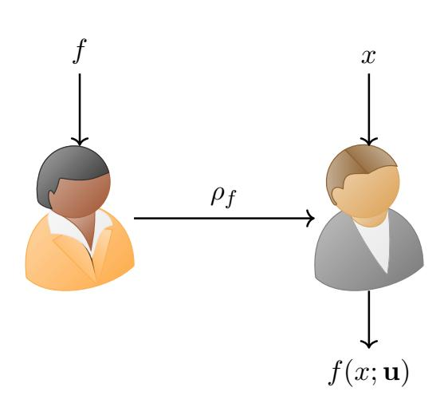
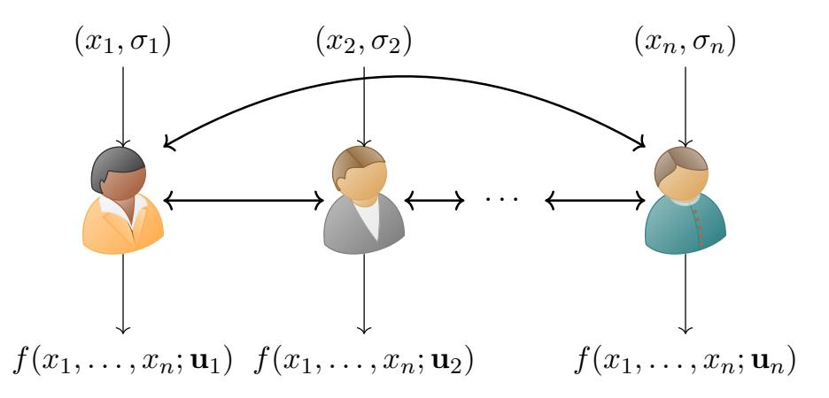

{0}------------------------------------------------

#### Non-Interactive MPC, |Revisited⟩ ∗

<span id="page-0-1"></span><span id="page-0-0"></span>Prabhanjan Ananth† UCSB

Divyanshu Bhardwaj‡ UCSB

Aparna Gupte§ MIT

February 18, 2026

#### Abstract

Classical non-interactive secure computation, despite being extensively studied, suffers from an inherent barrier: adversaries can learn the entire residual function via resetting attacks. We investigate whether quantum resources can circumvent this barrier and restrict adversarial leakage. Our results are as follows:

- 1. Definitions: We introduce new security definitions for the one-message MPC and 2PC settings that restrict the amount of adversarial leakage compared to prior classical definitions.
- 2. MPC: There exist information-theoretically secure one-message multi-party computation protocols in the oracle model in both the quantum pre-processing and classical preprocessing settings.
- 3. 2PC: There exist semi-honest secure one-message two-party computation for (randomized) pseudorandom functionalities in the plain model based on LWE and maliciously secure onemessage two-party computation for (randomized) constrained functionalities in the CRS model based on iO. Prior work by [Gupte, Liu, Raizes, Roberts and, Vaikuntanathan STOC 2025] achieved semi-honest security based on iO.

Our results demonstrate the power of quantum information to circumvent barriers in classical secure computation.

<sup>∗</sup>This work subsumes [\[AB25\]](#page-83-0)

<sup>†</sup> prabhanjan@cs.ucsb.edu

<sup>‡</sup> dbhardwaj@ucsb.edu

<sup>§</sup> agupte@mit.edu. This work was done in part while the author was at the Simons Institute and participating in the Challenge Institute for Quantum Computation at UC Berkeley.

{1}------------------------------------------------

### Contents

| 1 | Introduction<br>4                                                       |    |  |  |  |  |  |  |  |
|---|-------------------------------------------------------------------------|----|--|--|--|--|--|--|--|
|   | 1.1<br>Our Results<br>                                                  | 5  |  |  |  |  |  |  |  |
|   | 1.1.1<br>Secure Multiparty Computation                                  | 5  |  |  |  |  |  |  |  |
|   | 1.1.2<br>Secure Two-Party Computation                                   | 6  |  |  |  |  |  |  |  |
| 2 | Technical Overview                                                      | 6  |  |  |  |  |  |  |  |
|   | 2.1<br>Definitional Contributions<br>                                   | 6  |  |  |  |  |  |  |  |
|   | 2.2<br>Part I: One-Message 2PC<br>                                      | 8  |  |  |  |  |  |  |  |
|   | 2.2.1<br>One-Message 2PC for Privately Constrained Functionality        | 9  |  |  |  |  |  |  |  |
|   | 2.2.2<br>One-Message 2PC for Constrained Functionalities                | 11 |  |  |  |  |  |  |  |
|   | 2.2.3<br>Malicious QOTP<br>                                             | 13 |  |  |  |  |  |  |  |
|   |                                                                         |    |  |  |  |  |  |  |  |
|   | 2.3<br>Part II: One-Message MPC<br>                                     | 14 |  |  |  |  |  |  |  |
|   | 2.3.1<br>One-message MPC with Quantum Pre-processing                    | 14 |  |  |  |  |  |  |  |
|   | 2.3.2<br>One-message MPC with Classical Pre-processing<br>              | 16 |  |  |  |  |  |  |  |
| 3 | Preliminaries                                                           | 20 |  |  |  |  |  |  |  |
|   | 3.1<br>Constrained Functionalities<br>                                  | 20 |  |  |  |  |  |  |  |
|   | 3.2<br>Privately Constrained Functionality                              | 22 |  |  |  |  |  |  |  |
|   | 3.3<br>Indistinguishability Obfuscation                                 | 25 |  |  |  |  |  |  |  |
|   | 3.4<br>Subspace Hiding Obfuscator                                       | 25 |  |  |  |  |  |  |  |
|   | 3.5<br>Non Interactive Zero Knowledge Proof of Knowledge<br>            | 26 |  |  |  |  |  |  |  |
|   | 3.6<br>Trace Distance<br>                                               | 26 |  |  |  |  |  |  |  |
|   | 3.7<br>Quantum Query Algorithms                                         | 27 |  |  |  |  |  |  |  |
|   | 3.8<br>Direct Product Hardness of Coset States                          | 27 |  |  |  |  |  |  |  |
|   |                                                                         |    |  |  |  |  |  |  |  |
|   | 3.9<br>The Compressed Oracle Technique/The Recording Method [Zha19]<br> | 28 |  |  |  |  |  |  |  |
|   | 3.10 Single Effective Query Oracle [GLR+25]<br>                         | 29 |  |  |  |  |  |  |  |
|   | 3.11 Quantum One-Time Programs<br>                                      | 30 |  |  |  |  |  |  |  |
| 4 | Defining One-Message 2PC in Plain Model                                 |    |  |  |  |  |  |  |  |
|   | 4.1<br>One-Message 2PC vs One-Time Programs<br>                         | 34 |  |  |  |  |  |  |  |
| 5 | One-Message 2PC for Privately Constrained Functionalities               | 35 |  |  |  |  |  |  |  |
|   | 5.1<br>Construction<br>                                                 | 35 |  |  |  |  |  |  |  |
|   | 5.2<br>Correctness and Security                                         | 36 |  |  |  |  |  |  |  |
|   | 5.3<br>One-Message 2PC for Pseudorandom Functions<br>                   | 42 |  |  |  |  |  |  |  |
| 6 | One-Message 2PC for Constrained Functionalities                         | 42 |  |  |  |  |  |  |  |
|   |                                                                         |    |  |  |  |  |  |  |  |
|   | 6.1<br>Construction<br>                                                 | 42 |  |  |  |  |  |  |  |
|   | 6.2<br>Correctness and Security                                         | 43 |  |  |  |  |  |  |  |
| 7 | Malicious Secure Quantum One-Time Programs<br>46                        |    |  |  |  |  |  |  |  |
|   | 7.1<br>Construction<br>                                                 | 49 |  |  |  |  |  |  |  |
|   | 7.2<br>Correctness and Security                                         | 50 |  |  |  |  |  |  |  |

{2}------------------------------------------------

| 8 | Malicious Secure One-Message 2PC                             |    |  |  |  |  |  |  |
|---|--------------------------------------------------------------|----|--|--|--|--|--|--|
|   | 8.1<br>Construction<br>                                      | 55 |  |  |  |  |  |  |
|   | 8.2<br>Correctness and Security                              | 55 |  |  |  |  |  |  |
| 9 | Defining One-Message MPC in Oracle Model                     |    |  |  |  |  |  |  |
|   | 9.1<br>One-message MPC with Quantum Pre-processing           | 57 |  |  |  |  |  |  |
|   | 9.2<br>One-message MPC with Classical Pre-processing<br>     | 59 |  |  |  |  |  |  |
|   | 10 One-message MPC with Quantum Pre-processing               |    |  |  |  |  |  |  |
|   | 10.1 Construction<br>                                        | 61 |  |  |  |  |  |  |
|   | 10.2 Correctness and Security                                | 62 |  |  |  |  |  |  |
|   | 11 One-message MPC with Classical Pre-processing             | 69 |  |  |  |  |  |  |
|   | 11.1 Construction<br>                                        | 70 |  |  |  |  |  |  |
|   | 11.2 Correctness and Security                                | 71 |  |  |  |  |  |  |
| A | Our Results: Additional Discussion                           | 89 |  |  |  |  |  |  |
|   | A.1<br>Quantum versus Classical Pre-processing               | 89 |  |  |  |  |  |  |
|   | A.1.1<br>Adversarial Leakage in Classical Pre-processing MPC | 90 |  |  |  |  |  |  |
|   | A.1.2<br>On Unanimous vs Selective Abort<br>                 | 90 |  |  |  |  |  |  |
|   | A.2<br>Challenges in Instantiating MPC in Plain Model<br>    | 91 |  |  |  |  |  |  |
|   | A.3<br>Comparison with [BKS23]<br>                           | 91 |  |  |  |  |  |  |
| B | Proof of Lemma 30                                            | 92 |  |  |  |  |  |  |

{3}------------------------------------------------

### <span id="page-3-5"></span><span id="page-3-0"></span>1 Introduction

Secure multi-party computation (MPC) is one of the biggest success stories of cryptography. Informally speaking, in a secure multi-party computation protocol, multiple parties interact with each other to compute a function on their private inputs in such a way that each party only learns the output of the function and nothing else. First introduced in [\[GMW87;](#page-86-1) [BGW88;](#page-85-1) [CCD88\]](#page-85-2), over the last few decades, we have witnessed the evolution of MPC slowly transitioning from theory to practice leading to many practical privacy preserving applications [\[ABL+18\]](#page-83-1). One of the important efficiency metrics of interest is the number of rounds of interaction. Over the years, a substantial number of works [\[KO04;](#page-87-1) [DI05;](#page-86-2) [GMPP16;](#page-86-3) [ACJ17;](#page-84-0) [BHP17;](#page-85-3) [BGJ+18;](#page-84-1) [CCG+20\]](#page-85-4) have studied the (in)feasibility of secure computation in less number of rounds. It is well known that at least two rounds of communication are necessary for secure computation. The reason why one round of communication is impossible is because that the adversary can perform resetting attacks: the adversary, given the messages of the honest parties, can locally evaluate on two different adversarial inputs to obtain two possibly different outputs; this is a contradiction since the security of secure computation posits that the adversary should only learn one output (as a function of the inputs of the honest parties). On the other hand, in the insecure solution, all the parties only need to exchange one message with each other (i.e., share their inputs). Thus, it seems that achieving security[1](#page-3-1)[2](#page-3-2) necessarily incurs an additional round of communication.

Circumventing the One-Message Barrier, Quantumly. Starting with the seminal work on information-theoretic quantum key distribution, we have witnessed remarkable progress [\[Wie83;](#page-87-2) [Aar09;](#page-83-2) [BL19;](#page-85-5) [Zha21a;](#page-87-3) [AL21;](#page-84-2) [GLSV21;](#page-86-4) [BCKM21;](#page-84-3) [AQY22;](#page-84-4) [MY22;](#page-87-4) [BKS23\]](#page-85-0) in leveraging the principles of quantum mechanics to circumvent barriers in classical cryptography. In the same vein, it is natural to wonder if we could leverage quantum information tools to circumvent the round complexity barrier of secure computation. If for instance, the messages in secure computation are quantum states, then the impossibility of one-message secure computation or non-interactive secure computation[3](#page-3-3) does not hold anymore. Concretely, if the adversary attempts to mount the resetting attacks then they would be unsuccessful: after evaluating on one input, the messages of the honest parties might get destroyed preventing it from performing future evaluations. Our goal is to initiate a formal treatment of quantumly designing one-message secure computation protocols. Recent works [\[GLR+25;](#page-86-0) [GM25\]](#page-86-5) provide some initial constructions of semi-honest one-message 2PC using quantum resources[4](#page-3-4) , but several fundamental questions remain open:

What security definitions are achievable? Which functionalities admit one-message protocols? Can we achieve this from standard assumptions? Can we extend beyond two parties to multi-party computation? Can we achieve malicious security?

<span id="page-3-1"></span><sup>1</sup> It would be remiss to not mention a rich literature on one-message secure computation using stateful and stateless trusted hardware [\[Kat07;](#page-87-5) [GKR08;](#page-86-6) [GIS+10\]](#page-86-7). However, we are interested in solutions that do not use trusted hardware.

<span id="page-3-2"></span><sup>2</sup>Note that here we still target the traditional MPC security definition where the adversary learns only one output. One could instead consider relaxed security definitions where the adversary learns the residual function and such definitions have been studied in the literature (see for example [\[HIJ+17\]](#page-87-6)).

<span id="page-3-3"></span><sup>3</sup>The term non-interactive secure computation[\[IKO+11;](#page-87-7) [BGI+14\]](#page-84-5) has been extensively used in the literature. However, non-interactive secure computation has not historically been synonymous with one-message secure computation. The models we consider in this work is closely related to the one considered in [\[HIJ+17\]](#page-87-6). To avoid ambiguity, we choose to use the term one-message secure computation from here onwards.

<span id="page-3-4"></span><sup>4</sup>Technically, they construct quantum one-time programs. However, semi-honest one-message secure two-party computation and quantum one-time programs are equivalent.

{4}------------------------------------------------

#### <span id="page-4-0"></span>1.1 Our Results

We initiate a comprehensive study of these questions, establishing new definitional frameworks and feasibility results across multiple settings. We state our main results below.



Figure 1: One-message two-party secure computation. The sender has input f and the receiver has input x. In the end, the receiver gets the output  $f(x; \mathbf{u})$ , for some randomness  $\mathbf{u}$ .



Figure 2: One-message multi-party computation in the pre-processing model. The  $i^{th}$  party receives as input  $x_i$  along with  $\sigma_i$ , where  $\sigma_1, \ldots, \sigma_n$  are generated by a trusted party. Additionally, each party has access to an oracle generated by the trusted party. Depending on the setting,  $\sigma_i$  can either be quantum or classical information. Each party exchange one message with each other. In the end, the  $i^{th}$  party produces the output  $f(x_1, \ldots, x_n; \mathbf{u}_i)$ , for some randomness  $\mathbf{u}_i$ . In some cases,  $\mathbf{u}_1 = \mathbf{u}_2 = \cdots = \mathbf{u}_n$ .

#### <span id="page-4-1"></span>1.1.1 Secure Multiparty Computation

**Quantum Pre-processing.** We design n-party secure computation protocols in the setting where there is a setup<sup>5</sup> that produces an n-partite state that is shared among the n parties. During the online phase, all the parties exchange just one message to securely compute an n-party functionality on their joint inputs. We show the following:

<span id="page-4-4"></span>**Theorem 1** (Informal). There exists an information-theoretically secure<sup>6</sup> multi-party computation protocol for all functionalities with quantum pre-processing in the oracle model that guarantees security against all-but-one corruptions (see Definition 55).

We compare the amount of information adversary learns (henceforth, termed as adversarial leakage) in the quantum pre-processing setting versus the classical setting below: suppose f is the n-party functionality that is securely computed,  $x_1, \ldots, x_n$  are the inputs of the n parties and, S is the set of honest parties.

- In the quantum pre-processing setting, adversary only learns one output  $f(\mathbf{x}_S, \mathbf{x}'_{\overline{S}})$ , where  $\mathbf{x}_S$  is a subset of  $\{x_1, \ldots, x_n\}$  defined with respect to S and  $\mathbf{x}'_{\overline{S}}$  is the set of inputs chosen by the adversary,
- However, in the classical setting, for instance in [HIJ+17], the security definition allows for the adversarial party to only learn the residual function  $f(\mathbf{x}_S, \cdot)$ .

Following [GLR+25], we consider a quantum analogue of the simulation security definition. Since the definition and construction of [GLR+25] is inherently based in the classical oracle model, our protocol is also similarly designed in the oracle model.

<span id="page-4-3"></span><span id="page-4-2"></span><sup>&</sup>lt;sup>5</sup>It must be clarified that the setup does not depend on the inputs of the parties.

<sup>&</sup>lt;sup>6</sup>While the adversary is computationally unbounded, it can still only make polynomial queries to the oracle it has access to.

{5}------------------------------------------------

<span id="page-5-3"></span>Classical Pre-Processing. Similarly, we consider the classical pre-processing setting. This is defined similar to the quantum pre-processing setting except that the setup algorithm is fully classical and hence each party only receive classical information from the setup phase.

Theorem 2 (Informal). There exists an information-theoretically secure multi-party computation protocol for all randomized functionalities with classical pre-processing in the oracle model that guarantees security against all-but-one corruptions (see Definition [56\)](#page-59-0).

We justify the need for considering quantum pre-processing and classical pre-processing settings separately in Appendix [A.1.](#page-88-1)

#### <span id="page-5-0"></span>1.1.2 Secure Two-Party Computation

Since our MPC constructions are in the oracle model, a natural next step is to explore the possibility of constructing MPC in the plain model. As noted earlier, we adopt the current framework [\[GLR+25\]](#page-86-0) which only allows us to achieve simulation-based definition in the oracle model. Hence we adopt a relaxed but still meaningful definition called operational security, already considered in [\[GLR+25\]](#page-86-0). Informally speaking, operational security stipulates that the adversarial party cannot receive more than one output. A fully classical one-message two-party secure computation protocol cannot prevent an adversary from learning more than one output which in turn justifies the need for leveraging quantum resources.

We show the following:

Theorem 3 (Informal). Assuming learning with errors, there exists a semi-honest secure onemessage 2PC for (randomized) pseudorandom functionalities in the plain model satisfying Definition [31.](#page-31-2)

Assuming the existence of indistinguishability obfuscation, there exists a malicious secure onemessage 2PC for (randomized) constrained functionalities in the CRS model satisfying Definition [32.](#page-32-0)

Our results strictly improve upon the results of [\[GLR+25\]](#page-86-0) who showed the existence of semi-honest secure one-message 2PC for (randomized) pseudorandom functionalities based on indistinguishability obfuscation whereas our work only relies upon the learning with errors assumption. Moreover, their work does not address malicious security.

In Table [1,](#page-6-0) we compare our results with existing works on one-message secure computation (both in the classical and quantum settings).

### <span id="page-5-1"></span>2 Technical Overview

### <span id="page-5-2"></span>2.1 Definitional Contributions

Adversarial Leakage. Let us start with the following question: how many outputs should an adversary receive in a non-interactive MPC protocol? Let us first look at the fully classical setting. Suppose x1, . . . , x<sup>n</sup> are the inputs of the n parties P1, . . . , Pn. Suppose S is the set of honest parties.

<sup>7</sup>Concretely, their protocol is in the public key infrastructure model (PKI) in [\[HIJ+17\]](#page-87-6).

<sup>8</sup>While any functionality can be securely computed using the protocol of [\[BKS23\]](#page-85-0), the model they consider is different from the typical setting. In particular, one of the parties does not get to control its input and their input is chosen uniformly at random.

{6}------------------------------------------------

<span id="page-6-2"></span>

|             | # of    | Model  | Pre-Proc.              | Func.                   | Security    | Adversarial | Assumptions |
|-------------|---------|--------|------------------------|-------------------------|-------------|-------------|-------------|
|             | Parties |        |                        |                         |             | Leakage     |             |
| [HIJ+17]    | n       | CRS    | Classical <sup>7</sup> | Any                     | Malicious   | Residual    | iO, DDH     |
| (Classical) |         |        |                        |                         |             | Function    |             |
| [BKS23]     | 2       | EPR    | Quantum                | Randomized <sup>8</sup> | Simulation  | 1 output    | Sub-exp.    |
|             |         |        |                        |                         |             |             | LWE         |
| [GLR+25]    | 2       | Oracle | No                     | Any                     | Simulation  | 1 output    | _           |
| [GLR+25]    | 2       | Plain  | No                     | Pseudorandom            | Semi-honest | 1 output    | LWE, iO     |
|             |         |        |                        |                         | Operational |             |             |
| This work   | 2       | Plain  | No                     | Pseudorandom            | Semi-honest | 1 output    | LWE         |
|             |         |        |                        |                         | Operational |             |             |
| This work   | 2       | CRS    | No                     | Constrained             | Malicious   | 1 output    | iO          |
|             |         |        |                        |                         | Operational |             |             |
| This work   | n       | Oracle | Quantum                | Any                     | Simulation  | 1 output    | _           |
| This work   | n       | Oracle | Classical              | Any                     | Simulation  | k outputs   | _           |

<span id="page-6-0"></span>Table 1: Comparison of this work with previous results. # of parties is n for MPC and 2 for 2PC protocol. **Pre-Proc.** column denotes the flavor of pre-processing. **Func.** is the functionalities for which the protocol can be realized. **Security** column denotes the security definition satisfied by the protocol. **Adversarial leakage** is the maximum number of outputs adversary can learn from the residual function (which is the function obtained by fixing the inputs of the honest parties to the n-party functionality). For the last row, k denotes the number of corrupted parties.

In the information-theoretic setting, the adversarial parties can invariably learn the entire residual function  $f(\mathbf{x}_S, \cdot)$ , where  $\mathbf{x}_S$  is the set of inputs of the honest parties. The reason being that the adversary can perform resetting attacks and get multiple outputs. Utilizing quantum resources, we aim to come up with new definitions that restrict the number of outputs the adversary receives.

A first attempt: simulation security. A natural approach would be to define simulation security in the standard manner. That is, for every real-world adversary, there exists a simulator with oracle access to the residual function  $f(x_S, \cdot)$ ; the simulator queries this oracle on adversarial inputs  $x'_{\overline{S}}$  to obtain  $f(x_S, x'_{\overline{S}})$  and produces a view indistinguishable from the adversary's real-world view. However, this definition is impossible to achieve even in the two-party setting, as observed in prior works [GKR08; BGS13; GLR+25]. As a result, we need to identify a relaxation of the simulation security definition that is achievable and meaningful.

Single-Effective Query Simulation Security. For this reason, we work with the "single effective query (SEQ)" simulation security introduced by [GLR+25]. While their framework only handles the two-party setting, we extend their framework to the multi-party setting. A protocol is SEQ-secure if any (unbounded)<sup>9</sup>  $\mathcal{A}$  can be simulated by a simulator  $\mathcal{S}$ , given access to  $f^{\mathcal{H}}$ , in the form of an SEQ oracle. Intuitively, the SEQ oracle, denoted by  $SEQ_{f^{\mathcal{H}}}$ , allows multiple (polynomially many) queries as long as at most one "non-gentle" query is made. It does this by using the compressed oracle technique of [Zha19] to records the queries made and only replies when no other query is recorded in the database. This means any adversary making polynomial queries to  $SEQ_{f^{\mathcal{H}}}$  cannot learn two or more outputs of the residual function. Based on this definition of  $SEQ_{f^{\mathcal{H}}}$ 

<span id="page-6-1"></span><sup>&</sup>lt;sup>9</sup>In [GLR+25], SEQ security is defined with respect to QPT adversary however, the oracle construction of quantum one-time programs also satisfy SEQ security with respect to a query-bounded (computationally unbounded) adversary.

{7}------------------------------------------------

<span id="page-7-1"></span>based simulation-security for one-time programs, we give simulation-based security definitions for one-message MPC. These definitions are more closer to the ideal security definition in terms of adversarial leakage when compared to its classical analog of non-interactive MPC where the adversary can learn the whole residual function[\[HIJ+17\]](#page-87-6). As we alluded to earlier (Table [1\)](#page-6-0), depending on whether the pre-processing phase is classical or quantum, our constructions leak different levels of information about the residual function, and require us to come up with different ideal functionalities for the SEQ-based simulation security of one-message MPC.

Operational Security. Since the SEQ definition is inherently based in the oracle model, a natural question to ask is whether we can propose a meaningful security definition that is achievable in the plain model. As we discuss in Appendix [A.2,](#page-90-0) it is not clear whether the oracle in MPC protocol can be instantiated in a meaningful way. So we focus on two party secure computation and consider a security definition based on weak operational security that can be realized in the plain model.

The setting for the 2PC is as follows: the sender receives a function f (from a family of randomized functionalities F) as input and a receiver receives as input x. The sender sends a single message to the receiver who obtains f(x; r), where r is the randomness. In terms of security, we require the following:

- Operational security against malicious receiver: A malicious receiver should not be able to obtain f(x; r) and f(x ′ ; r ′ ), where (x, r) ̸= (x ′ , r′ ).
- Simulation security against malicious sender: we resort to the standard simulation security in this setting. That is, there is an efficient simulator which can simulate the view of the adversary.

Note that there is no fully classical protocol achieving operational security since a malicious receiver can always mount resetting attacks. This motivates the use of quantum resources to achieve the above definition.

To summarize, we leverage the SEQ framework to define the security of the one-message MPC protocols whereas we leverage the operational security framework to define the security of onemessage 2PC in the plain model.

### <span id="page-7-0"></span>2.2 Part I: One-Message 2PC

Based on the corruption of the sender P1, we define semi-honest and malicious secure one-message 2PC in Section [4](#page-31-0) where the sender satisfies simulation security and the receiver satisfies operational security. The ideal functionality (Algorithm [1\)](#page-32-1) simply takes inputs from both the parties, samples u \$←− {0, 1} <sup>r</sup> and outputs fk(x; u) to P2.

On the equivalence of one-message 2PC and QOTP. Quantum one-time programs (Definition [26\)](#page-29-1) and semi-honest one message 2PC (Definition [31\)](#page-31-2) are equivalent to each other: we can construct semi-honest one message 2PC from quantum one-time programs in a black-box way and vice-versa. Therefore, we use the terms semi honest one message 2PC and quantum one time programs interchangeably. For more discussion on this, see Section [4.1.](#page-33-0)

{8}------------------------------------------------

#### <span id="page-8-1"></span><span id="page-8-0"></span>2.2.1 One-Message 2PC for Privately Constrained Functionality

We construct a QOTP (semi-honest one-message 2PC) scheme for privately constrained functionalities without any extra assumption. As a corollary, we obtain the first construction of semi-honest one-message 2PC for pseudorandom functions assuming quantum hardness of learning with errors (LWE). We discuss the main ideas behind Theorem 34. Suppose we have a class of private constrained functionalities  $PCF = \{f_k : \{0,1\}^n \times \{0,1\}^r \to \{0,1\}^m\}$ . We will assume that PCF satisfies decisional security (Definition 11). The same template can also be adapted for the case when PCF satisfies search security (Definition 7).

To compute a one-time program for a function  $f_k$ , do the following:

• First generate n coset states, where the  $i^{th}$  coset state is defined as follows:

$$|A_{s_i,s_i'}^{(i)}\rangle = \frac{1}{\sqrt{|A_i|}} \sum_{a_i \in A_i} (-1)^{\langle a_i,s_i'\rangle} |a_i + s_i\rangle$$

Here,  $A_i$  is a random subspace of  $\mathbb{F}_2^{\lambda}$  of dimension  $\lfloor \frac{\lambda}{2} \rfloor$ . Moreover,  $s_i, s_i' \stackrel{\$}{\leftarrow} \mathbb{F}_2^{\lambda}$ .

• Next constrain the function  $f_k$  using the constraint circuit  $P_{\mathbf{A}}$  to obtain  $k_{\mathbf{A}}$ . Informally speaking, the constraint  $P_{\mathbf{A}}$  takes as input x along with n vectors  $u^{(1)}, \ldots, u^{(n)}$ . It performs the following check for every i:  $x^{(i)} = 0$  if and only if  $u^{(i)} \in A_i + s_i$  or  $x^{(i)} = 1$  if and only if  $u_i \in A_i^{\perp} + s_i'$ . If even one check is violated then it returns 0, otherwise it returns 1.

Set  $\left(\left\{|A_{s_i,s_i'}^{(i)}\rangle\right\}_i,\ k_{\mathbf{A}}\right)$  to be the one-time program computing  $f_k$ .

To evaluate on an input x, we measure the coset states to obtain the vectors  $\mathbf{u} = (u^{(1)}, \dots, u^{(n)})$  such that  $u^{(i)} \in A_i + s_i$  if  $x^{(i)} = 0$  and  $u^{(i)} \in A_i^{\perp} + s_i'$  if  $x^{(i)} = 1$ . Evaluate the constrained function  $k_{\mathbf{A}}$  on  $(x, u^{(1)}, \dots, u^{(n)})$  to obtain y. Since the constraint  $P_{\mathbf{A}}(x, u^{(1)}, \dots, u^{(n)}) = 1$  by definition, we have that  $y = f_k(x; \mathbf{u})$ .

**Security: Challenges.** To prove security, suppose there exists a quantum polynomial time (QPT) adversary that breaks decisional weak operational security. That is, for two input-randomness pairs  $(x_1, \mathbf{u}_1), (x_2, \mathbf{u}_2)$ , it can distinguish (with non-negligible advantage) both  $f_k(x_1; \mathbf{u}_1)$  versus a sample from  $\mathcal{D}$  and  $f_k(x_2; \mathbf{u}_2)$  versus a sample from  $\mathcal{D}$ .

Let us first discuss the main challenges we encounter before diving into the details. There are two possibilities.

Case 1: Both inputs satisfy  $P_{\mathbf{A}}$ . The first possibility is that the constraint program  $P_{\mathbf{A}}(x_i, \mathbf{u}_i)$ , for both  $i \in \{1, 2\}$ , outputs 1, i.e., both the inputs satisfy the constraint. In this case, we first observe that by design if  $(x_1, \mathbf{u}_1) \neq (x_2, \mathbf{u}_2)$  then  $\mathbf{u}_1 \neq \mathbf{u}_2$ . Let us first discuss the main challenges we encounter before diving into the details. There are two possibilities. In this case, our hope is to prove that we violate the direct product hardness of coset states. There are two flavors of direct product hardness studied in the literature [CLLZ21; CHV23]:

• Information-theoretic direct product hardness: given one copy of a coset state  $\frac{1}{\sqrt{|A|}} \sum_{a \in A} (-1)^{\langle a, s' \rangle} |a + s \rangle$  and given quantum query access to oracles that test membership in A + s and  $A^{\perp} + s'$ , except with negligible probability, cannot produce u, v such that: (a)  $u \in A + s, v \in A^{\perp} + s'$ ,

{9}------------------------------------------------

- (b)  $u, v \in A + s$  where  $u \neq v$  and, (c)  $u, v \in A^{\perp} + s'$  where  $u \neq v$ . There is another variant considered by [CHV23] where the adversary, instead of having access to oracles, gets as input the descriptions of T, V, t, t' where T is a random superspace of A (of dimension  $\lfloor \frac{3\lambda}{4} \rfloor$ ) and V is a random subspace of A (of dimension  $\lfloor \frac{\lambda}{4} \rfloor$ ). Moreover, t, t' are random vectors subject to the constraint that  $A + s \subseteq T + t$  and  $A^{\perp} + s' \subseteq V^{\perp} + t'$ .
- Computational (iO-based) direct-product product hardness: given one copy of a coset state  $\frac{1}{\sqrt{|A|}}\sum_{a\in A}(-1)^{\langle a,s'\rangle}|a+s\rangle$  and given  $\widehat{A},\widehat{A}^{\perp}$  (where  $\widehat{A}$  is the obfuscation of the program checking membership in A+s,  $\widehat{A}^{\perp}$  is the obfuscation of the program checking membership in  $A^{\perp}+s'$ ), except with negligible probability, cannot (in quantum polynomial-time) produce u,v such that: (a)  $u\in A+s,v\in A^{\perp}+s'$ , (b)  $u,v\in A+s$  where  $u\neq v$  and, (c)  $u,v\in A^{\perp}+s'$  where  $u\neq v$ .

Unfortunately both flavors are not immediately useful for us! We cannot work in the information-theoretic setting because the adversary gets information about the subspaces and the coset representatives embedded in the constraint program  $P_{\mathbf{A}}$ . At the same time we cannot use the iO-based direct product hardness property because we would like to avoid the use of obfuscation. We propose the design of a third flavor of computational direct-product hardness property that is based on private-constrained functionalities; we discuss this later.

Case 2: At least one of the inputs do not satisfy  $P_{\mathbf{A}}$ . The second possibility is that the constraint program  $P_{\mathbf{A}}(x_i, \mathbf{u}_i)$ , for some  $i \in \{1, 2\}$ , outputs 0, i.e., at least one of the inputs does not satisfy the constraint. In this case, the hope is to violate the security of the private-constrained functionality. A natural idea is to consider a constraint program  $P_{\mathsf{null}}$  such that  $P_{\mathsf{null}}$  is an all zeroes function. That is, on every  $(x, \mathbf{u})$ , we have  $P_{\mathsf{null}}(x, \mathbf{u}) = 0$ . Then, the idea would be to switch  $k_{\mathbf{A}}$  (as computed in the description of the one-time program) with  $k_{\mathsf{null}}$ , where  $k_{\mathsf{null}}$  is obtained by constraining  $f_k$  with  $P_{\mathsf{null}}$ . Unfortunately, we do not know how to perform reduction in this case. Informally speaking, the issue is that in order to successfully utilize the one-time program adversary, reduction will be forced to make queries (to the challenger of private constrained security) of the form  $(x_i, u_i)$  where  $P_{\mathbf{A}}(x_i, \mathbf{u}_i) = 1$  but  $P_{\mathsf{null}}(x_i, \mathbf{u}_i) = 0$ . But such queries are disallowed in the security experiment of private constrained functionalities; refer to Definition 10 for more details.

We show how to come up with a different constraint program  $P_{\mathbf{T},\mathbf{V}}$  (we will discuss the description later) such that the constrained key  $k_{\mathbf{A}}$  can be safely switched to  $k_{\mathbf{T},\mathbf{V}}$  (obtaining by constraining  $f_k$  with  $P_{\mathbf{T},\mathbf{V}}$ ) while ensuring that the reduction is admissible; i.e., it only makes allowed queries to the external challenger.

**Proof Template.** We present the proof template below.

**Hybrid 0**: This corresponds to the real world. The adversary gets  $\left(\left\{|A_{s_i,s_i'}^{(i)}\rangle\right\}_i,\ k_{\mathbf{A}}\right)$  from the challenger. The adversary then submits two input-randomness pairs  $(x_1,\mathbf{u}_1),(x_2,\mathbf{u}_2)$ . The challenger then samples two uniformly random bits  $b_1,b_2$ . It then sends  $f_k(x_1;\mathbf{u}_1)$  (if  $b_1=0$ ) or a sample from  $\mathcal{D}$  (if  $b_1=1$ ). Similarly, it sends  $f_k(x_2;\mathbf{u}_2)$  (if  $b_2=0$ ) or a sample from  $\mathcal{D}$  (if  $b_2=1$ ). The adversary then outputs  $(b_1',b_2')$  and it wins if  $b_i'=b_i$ .

{10}------------------------------------------------

**Hybrid 1**: The only difference with the previous hybrid is that the challenger generates the following program  $P_{\mathbf{T},\mathbf{V}}$  which is defined as follows: the program  $P_{\mathbf{T},\mathbf{V}}$  takes as input  $(x=x^{(1)}\cdots x^{(n)},\mathbf{u}=(u^{(1)},\ldots,u^{(n)}),$ 

- Parse **T** as  $\{T_i + t_i\}_{i \in [n]}$  and **V** as  $\{V_i^{\perp} + t_i'\}_{i \in [n]}$ , where  $V_i \subseteq A_i \subseteq T_i$ . In more detail  $V_i$  is a random subspace of  $A_i$  of dimension  $\lfloor \frac{\lambda}{4} \rfloor$  and  $T_i$  is a random superspace of  $A_i$  of dimension  $\lfloor \frac{3\lambda}{4} \rfloor$ .
- First it checks if either of the following holds: (a)  $x^{(i)} = 0$  and  $u^{(i)} \in T_i + t_i$  or, (b)  $x^{(i)} = 1$  and  $u^{(i)} \in V_i^{\perp} + t_i'$ .
- If all the checks are satisfied then output 1. Else, output 0.

We emphasize that the challenger does not use the above program in any way to respond to the adversary. Clearly, this hybrid is identical to the previous one.

**Hybrid 2**: This is similar to the previous hybrid except in the generation of the constrained key. Previously, we constrained  $f_k$  using  $P_{\mathbf{A}}$ . We now constrain  $f_k$  using  $P_{\mathbf{T},\mathbf{V}}$ .

The high level idea is to invoke the security of private constrained functionalities to switch from Hybrid 1 to Hybrid 2. Once we are in Hybrid 2, we can then invoke the direct product hardness of coset states, specifically the variant by [CHV23], wherein the descriptions of  $\mathbf{T}$ ,  $\mathbf{V}$  are made public.

Let us first focus on switching from Hybrid 1 to Hybrid 2. As we discussed in Case 2, in order to invoke the private constrained security, we need to ensure that the reduction never needs to answer queries that are satisfied by  $P_{\mathbf{T},\mathbf{V}}$  but not by  $P_{\mathbf{A}}$ . We show this in Lemma 39 and Lemma 40. At a high level, we first argue (refer to Lemma 39) that the probability that the adversary makes such queries in Hybrid 1 is negligible. This is because  $\mathbf{T}, \mathbf{V}$  is information-theoretically hidden from the adversary in Hybrid 1. Similarly, we argue (refer to Lemma 40) that the probability that the adversary makes such queries in Hybrid 2 is also negligible. If not, there is a reduction that uses the programs  $P_{\mathbf{T},\mathbf{V}}$  and  $P_{\mathbf{A}}$  to break the security of private constrained functionalities.

Once we are in Hybrid 2, we consider two cases:

- Both  $P_{\mathbf{A}}(x_1, \mathbf{u}_1) = 1$  and  $P_{\mathbf{A}}(x_2, \mathbf{u}_2) = 1$ . Suppose  $\mathbf{u}_1 = (u_1^{(1)}, \dots, u_1^{(n)})$  and  $\mathbf{u}_2 = (u_2^{(1)}, \dots, u_2^{(n)})$ . In this case, since  $\mathbf{u}_1 \neq \mathbf{u}_2$ , we have that there exists  $i \in [n]$  such that  $u_1^{(i)} \neq u_2^{(i)}$ . This violates the direct product hardness property of coset states.
- Either one of  $P_{\mathbf{A}}(x_1, \mathbf{u}_1)$  or  $P_{\mathbf{A}}(x_2, \mathbf{u}_2)$  is 0. In this case, we violate the constraint hiding property of constrained functionalities.

Putting both of the above cases together, we have that the advantage of the adversary in the security experiment of private constrained functionality to be negligible. We prove this formally in Lemma 42.

#### <span id="page-10-0"></span>2.2.2 One-Message 2PC for Constrained Functionalities

We construct a QOTP for constrained functionalities assuming post quantum indistinguishability obfuscation (iO) which implies semi-honest one-message 2PC for constrained functionalities. We

{11}------------------------------------------------

<span id="page-11-1"></span>discuss the main ideas behind proving Theorem 44. Our main approach is inspired by the construction of one-time programs for pseudorandom functions by [GLR+25]. However, in comparison with [GLR+25], not only do we generalize the class of functionalities for which we show that one-time programs exist, we also simplify their approach<sup>10</sup>.

Suppose we have a class of constrained functionalities

$$\mathsf{CF} = \{f_k : \{0,1\}^n \times \{0,1\}^r \to \{0,1\}^m\}$$

. We will assume that  $\mathsf{CF}$  satisfies search security. The same template can also be adapted for the case when  $\mathsf{CF}$  satisfies decisional security (Definition 6, 7).

To compute a one-time program for a function  $f_k$ , do the following:

- As in Section 2.2.1, first generate n coset states, where the  $i^{th}$  coset state is  $|A_{s_i,s_i'}^{(i)}\rangle = \frac{1}{\sqrt{|A_i|}} \sum_{a_i \in A_i} (-1)^{\langle a_i,s_i'\rangle} |a_i + s_i\rangle$
- Constrain the function  $f_k$  using the constraint circuit  $P_{\mathbf{A}}$  to obtain  $k_{\mathbf{A}}$ . While the functionality of  $P_{\mathbf{A}}$  is identical to its counterpart from Section 2.2.1, the implementation of  $P_{\mathbf{A}}$  is different. To recall, the constraint  $P_{\mathbf{A}}$  takes as input x along with n vectors  $u^{(1)}, \ldots, u^{(n)}$ . It performs the following check for every i:  $x^{(i)} = 0$  if and only if  $u^{(i)} \in A_i + s_i$  or  $x^{(i)} = 1$  if and only if  $u^{(i)} \in A_i^{\perp} + s_i'$ . If even one check is violated then it returns 0, otherwise it returns 1.

The main difference lies in the implementation of the coset membership performed inside  $P_{\mathbf{A}}$ . The constrained function  $k_{\mathbf{A}}$  need not necessarily hide the description of the subspaces  $A_i$ ; after all CF only satisfies constrained security and not constrained hiding property. To be able to make use of the unclonability property of the coset states, it is important that the adversary is not able to readily observe the description of the cosets. To address this issue, we hardwire,  $\{\widehat{A}_i, \widehat{A}_i^{\perp}\}_i$  in  $P_{\mathbf{A}}$ , where  $\widehat{A}_i$  is the obfuscation of a program that checks for membership in  $A_i + s_i$  and moreover,  $\widehat{A}_i^{\perp}$  is the obfuscation of a program that checks for membership in  $A_i^{\perp} + s_i'$ .

Set  $\left(\left\{|A_{s_i,s_i'}^{(i)}\rangle\right\}_i,\ k_{\mathbf{A}}\right)$  to be the one-time program computing  $f_k$ .

The evaluation of the one-time program is identical to its counterpart from Section 2.2.1.

**Security.** To prove security, suppose there exists a quantum polynomial time (QPT) adversary that can produce (with non-negligible advantage) two inputs  $(x_1, \mathbf{u}_1), (x_2, \mathbf{u}_2)$  and two outputs  $y_1, y_2$  such that  $f_k(x_1; \mathbf{u}_1) = y_1$  and  $f_k(x_2; \mathbf{u}_2) = y_2$ . We first observe that if  $x_1 \neq x_2$  then  $\mathbf{u}_1 \neq \mathbf{u}_2$ . Consider the following two cases:

• Both  $P_{\mathbf{A}}(x_1, \mathbf{u}_1) = 1$  and  $P_{\mathbf{A}}(x_2, \mathbf{u}_2) = 1$ . Suppose  $\mathbf{u}_1 = (u_1^{(1)}, \dots, u_1^{(n)})$  and  $\mathbf{u}_2 = (u_2^{(1)}, \dots, u_2^{(n)})$ . In this case, since  $\mathbf{u}_1 \neq \mathbf{u}_2$ , we have that there exists  $i \in [n]$  such that  $u_1^{(i)} \neq u_2^{(i)}$ . This violates the following direct product hardness property of coset states [CLLZ21; CHV23]: given one copy of a coset state  $\frac{1}{\sqrt{|A|}} \sum_{a \in A} (-1)^{\langle a, s' \rangle} |a+s\rangle$  and given  $\widehat{A}, \widehat{A}^{\perp}$  (where  $\widehat{A}$  is the obfuscation of the program checking membership in A+s,  $\widehat{A}^{\perp}$  is the obfuscation of the program checking membership in  $A^{\perp} + s'$ ), cannot produce u, v such that: (a)  $u \in A + s, v \in A^{\perp} + s'$ , (b)  $u, v \in A + s$  where  $u \neq v$  and, (c)  $u, v \in A^{\perp} + s'$  where  $u \neq v$ .

<span id="page-11-0"></span><sup>&</sup>lt;sup>10</sup>As a concrete example, they use a primitive referred to as *invertible* pseudorandom functions in their constructions whereas we observe that it is not required.

{12}------------------------------------------------

• Either one of  $P_{\mathbf{A}}(x_1, \mathbf{u}_1)$  or  $P_{\mathbf{A}}(x_2, \mathbf{u}_2)$  is 0. Let's assume  $P_{\mathbf{A}}(x_1, \mathbf{u}_1) = 0$ . This violates the constraint hiding property of constrained functionalities since it is computationally hard to produce the output of  $f_k$  on  $(x_1, \mathbf{u}_1)$  given the constrained program  $k_{\mathbf{A}}$ , where  $P_{\mathbf{A}}(x_1, \mathbf{u}_1) = 0$ .

#### <span id="page-12-0"></span>2.2.3 Malicious QOTP

We consider another variant called malicious quantum one-time programs which acts a stepping stone to achieve malicious secure one-message 2PC. This primitive is of independent interest and can be useful in scenarios where the generator is not expected to behave honestly. Suppose  $\mathcal{F} = \{f_k : \{0,1\}^n \times \{0,1\}^r \to \{0,1\}^m\}$  is the class of functionalities for which we design quantum one-time programs. In a malicious quantum one-time program for  $\mathcal{F}$ , we guarantee security against the party generating the one-time program. Specifically, we equip the scheme with an efficient verification algorithm Verify that attests whether the quantum one-time program is valid or invalid. In terms of security, we require that there is an extraction algorithm E such that conditioned on verification succeeding (i.e. valid output), E can extract an index E with probability close to 1. Intuitively, this means that if the quantum one-time program is valid then there should exist some E such that the post-verification quantum state is a valid one-time program of E.

We design a malicious QOTP for constrained functionalities. The starting point is the construction we sketched in Section 2.2.2. A natural first thought to upgrade this scheme to be secure against a malicious generator is as follows: prove using a non-interactive zero-knowledge proof (NIZK) that the quantum one-time program has been correctly computed. Unfortunately this does not work: the statement we want to prove is a quantum state and NIZKs have been mainly realized for languages and promise problems (i.e. with classical statements). Instead, we crucially make use of the structure of the quantum one-time program construction. The construction consists of two components: the first component is the set of coset states and the second component is the constrained functionality. Since the constrained functionality has a classical description, we can at least attach a NIZK to prove that this component is correctly computed. But what about the first component? here, we make use of the fact that the first component is required to be a set of coset states of the form  $\{|A_{s_i,s_i'}^{(i)}\rangle_{i.}$ . To check whether the first component is indeed of this form, we give out obfuscated membership programs. Specifically, for every i, we provide obfuscation of membership in  $A_i + s_i$  and similarly, provide obfuscation of membership in  $A_i^{\perp} + s_i'$ . It can be shown that on any state applying the following verification:

- Run the obfuscation of membership in  $A_i + s_i$ ,
- Perform  $H^{\otimes \lambda}$  (here,  $\lambda$  is the dimension of the vector space from which we draw  $A_i$ ),
- Run the obfuscation of membership in  $A_i^{\perp} + s_i'$ ,
- Perform  $H^{\otimes \lambda}$ .

will result in the state  $|A_{s_i,s_i'}^{(i)}\rangle$  since the above verification procedure is a rank one projector  $|A_{s_i,s_i'}^{(i)}\rangle\langle A_{s_i,s_i'}^{(i)}|$ . Thus, these obfuscated membership programs serve the purpose of verifying whether the quantum states are of the right form. Furthermore, we will also prove using NIZK that the obfuscated membership programs themselves are correctly computed. The formal definition and construction of malicious secure QOTP is given in Section 7.

{13}------------------------------------------------

**Implication to One-Message 2PC.** Finally, we show that any such malicious secure QOTP can be compiled into a malicious secure one-message 2PC in Section 8.

#### <span id="page-13-0"></span>2.3 Part II: One-Message MPC

We now consider the more general setting of *multi*-party computation (MPC), and explore the possibility of one-message MPC in the oracle model. Our goal is to achieve single effective query simulation security. All our MPC construction require a pre-processing step that does not depend on the inputs of the parties. Interestingly, depending on whether the pre-processing step is quantum or classical, the constructions and security guarantees we achieve are quite different (as discussed in Section 9). For security, we consider a *rushing adversary* which sends its messages only after receiving the messages of the honest parties.

#### <span id="page-13-1"></span>2.3.1 One-message MPC with Quantum Pre-processing

We first describe our construction in the quantum pre-processing model, and then describe the notion of security this construction achieves. Let  $f:(\{0,1\}^{\ell})^n \times \{0,1\}^r \mapsto \{0,1\}^m$  be a n-party randomized functionality. For all  $i \in [n]$ ,  $P_i$  has private input  $x_i \in \{0,1\}^{\ell}$  and at the end of MPC protocols, all parties learn  $f(x_1,\ldots,x_n;R)$  for  $R \xleftarrow{\$} \{0,1\}^r$ .

**Construction.** The MPC protocol works as follows:

- In pre-processing, a trusted third party prepares  $\ell$  coset states for each party, and sends  $\{|A_k^i\rangle\}_{k\in[\ell]}$  to the  $P_i^{11}$  along with oracle  $\mathcal{O}_f^q$ . We define the input/output behavior of this oracle soon.
- For all  $i \in [n]$ ,  $P_i$  encodes its input  $x_i$  into  $\ell$  vectors  $u_1^i, \ldots, u_\ell^i$ , where  $u_k^i$  is obtained by measuring  $|A_k^i\rangle$  in the standard (or Hadamard) basis if  $x_{i,k} = 0$  (or  $x_{i,k} = 1$ )<sup>12</sup>. The  $i^{th}$  party then broadcasts these  $\ell$  vectors to all the other parties. Since these messages are vectors from some unknown random subspace, these leak nothing about the parties' inputs.
- All the parties query  $\mathcal{O}_f^q$  on  $\{u_k^i\}_{i\in[n],k\in[\ell]}$ .  $\mathcal{O}_f^q$  takes as input all  $n\ell$  of these vectors, decodes them to find the corresponding  $x_i$ 's using the coset description hardwired in the oracle and produces an output:  $f(x_1,\ldots,x_n;R)$ , where the randomness R is derived as  $G(u_1^1,\ldots,u_n^\ell)$  where G is a random function sampled during the pre-processing phase.

Security. In the ideal experiment, all the honest parties send their input to the ideal functionality which gives adversary query access to  $\mathsf{SEQ}_{f^{\mathcal{H}}}$ , single effective query oracle for residual function. The residual function  $f^{\mathcal{H}} = f(\mathbf{x}_S, \cdot)$  is the function that fixes the inputs of the honest parties. The simulator computes and sends the output of pre-processing to  $\mathcal{A}$ . The simulator makes polynomially many queries to  $\mathsf{SEQ}_{f^{\mathcal{H}}}$  to simulate the queries made by  $\mathcal{A}$  to  $\mathcal{O}_f^q$ . The  $\mathcal{A}$  then sends its message which is the encoding of its private inputs. Finally  $\mathcal{S}$  extracts  $\mathcal{A}$ 's inputs from this message and sends it to the ideal functionality. The ideal functionality computes the output for the honest party

<span id="page-13-2"></span><sup>&</sup>lt;sup>11</sup>The coset state  $|A_k^i\rangle = 1/2^{\lambda/4} \sum_{v \in \mathbb{F}_2^{\lambda}} (-1)^{\langle u, t_k^i \rangle} |u + s_k^i\rangle$ . We omit  $s_k^i, t_k^i$  in the coset notation to keep it simple. We follow similar notation throughout the MPC constructions.

<span id="page-13-3"></span> $<sup>^{12}</sup>x_{i,k}$  is the  $k^{th}$  bit of  $x_i$ 

{14}------------------------------------------------

<span id="page-14-0"></span>by querying  $SEQ_{fH}$ . We prove that the joint distribution of view of adversary and output of all parties in the real experiment and ideal experiment is indistinguishable in Theorem 57.

In the hybrids described below, we reduce the security of the MPC to the security of quantum one-time programs from Theorem 5.2 in [GLR+25]. The QOTP for f consists of coset states and oracle :  $\{|A_k\rangle\}_{k\in[\ell]}$ ,  $\mathcal{O}_f$ . To evaluate the program on input  $x\in\{0,1\}^{\ell}$ , the evaluator measures  $|A_k\rangle$  if  $x_k=0$  or  $H^{\otimes\lambda}|A_k\rangle$  if  $x_k=1$ . It then queries  $\mathcal{O}_f$  with input  $(x,\{u_k\}_k)$  where  $u_k$  are the measurement outputs and  $\mathcal{O}_f$  outputs f(x;G(x)) if all  $u_k$  correspond to the cosets otherwise  $\bot$ .

#### **Proof Template.** To prove Theorem 57, we consider the following hybrids:

- **Hybrid 0:** This is the real experiment. The adversary gets  $\{\rho_i\}_{P_i \in \mathcal{P}^{\mathcal{A}}}$  from pre-processing and  $\{u_k^j\}_{P_j \in \mathcal{P}^{\mathcal{H}}}$  from honest parties as well as query access to  $\mathcal{O}_f^q$ . After querying  $\mathcal{O}_f^q$ , the adversary sends messages  $\{u_k^j\}_{P_j \in \mathcal{P}^{\mathcal{A}}}$  to the honest parties. The honest parties output correct y or  $\bot$ .
- **Hybrid 1:** The only difference from the previous hybrid is that the adversary gets oracle  $\mathcal{O}_f^1$  which is a punctured version of oracle  $\mathcal{O}_f^q$  such that  $\mathcal{O}_f^q\left((v_k^i)_{i\in[n]}\right) = \bot$  if  $v_k^i \neq u_k^i$  for any  $i \in \mathcal{P}^{\mathcal{H}}$ . That means the oracle is punctured for all queries where the vectors corresponding to honest parties do not match the vectors actually sent by the honest parties to the adversary.
- **Hybrid 2:** In this hybrid, adversary gets query access to  $\mathcal{O}_{f^{\mathcal{H}}}^1$  which in turn uses the oracle of QOTP for  $f^{\mathcal{H}}$ :  $\mathcal{O}_{f^{\mathcal{H}}}$  defined above to answer queries. The oracle  $\mathcal{O}_{f^{\mathcal{H}}}^1$  outputs  $\bot$  on query  $(v_k^i)_{i\in[n]}$  if for any  $i\in\mathcal{P}^{\mathcal{H}}$ ,  $v_k^i\neq u_k^i$ . Otherwise it outputs whatever the one-time program oracle outputs on  $\{v_k^i\}_{P_i\in\mathcal{P}^{\mathcal{A}}}$ . The output of honest party is also generated by querying the one-time program oracle.
- Hybrid 3: The only difference from the previous hybrid is that the oracle  $\mathcal{O}_{f^{\mathcal{H}}}$  is simulated using  $\mathsf{SEQ}_{f^{\mathcal{H}}}$ .
- **Hybrid 4:** This is the ideal experiment. The only difference is how the output of honest party is generated. Instead of querying  $\mathcal{O}_{f^{\mathcal{H}}}^1$ , the ideal functionality queries  $\mathsf{SEQ}_{f^{\mathcal{H}}}$ .

On a high level, we invoke the direct product hardness and O2H lemma (Lemma 21) to switch from **Hybrid 0** to **Hybrid 1**.

One of the challenges we face in constructing **Hybrid 2** is the fact that the one-time program oracle from [GLR+25] expects inputs of the form  $(x, \mathbf{u})$  where  $\mathbf{u}$  are the vectors encoding x but  $\mathcal{O}_{f^{\mathcal{H}}}^1$  is queried on just the vectors  $\mathbf{u}$ . Thus,  $\mathcal{O}_{f}^1$  needs to compute x from  $\mathbf{u}$  to be able to query the one-time program. To resolve this issue, we consider a modified QOTP where the QOTP generator also outputs coset membership testing oracles. This allows  $\mathcal{O}_{f^{\mathcal{H}}}^1$  to compute x by checking the membership of  $\mathbf{u}$ . The proof of original QOTP can be adapted to show security of this modified one-time program (Lemma 30, proved in Appendix B).

Now we can switch from **Hybrid 1** to **Hybrid 2** using the fact that the oracle  $\mathcal{O}_{f^{\mathcal{H}}}^1$  is functionally equivalent to  $\mathcal{O}_{f}^1$ . Once we are in **Hybrid 2**, we can invoke the security (Lemma 30) of quantum one-time programs to switch to **Hybrid 3**. The view of adversary can be simulated by just query access to  $\mathsf{SEQ}_{f^{\mathcal{H}}}$  in **Hybrid 3** already. To switch from **Hybrid 3** to **Hybrid 4**, we prove and use the fact that the output generated by querying one-time program oracle or  $\mathsf{SEQ}_{f^{\mathcal{H}}}$  directly and by querying  $\mathcal{O}_{f^{\mathcal{H}}}^1$  is identically distributed.

{15}------------------------------------------------

#### <span id="page-15-0"></span>2.3.2 One-message MPC with Classical Pre-processing

If we restrict the output of pre-processing to be classical, the construction is not so simple anymore; each party needs some quantum state to authenticate its input (which is the coset state in our constructions) otherwise the parties can authenticate multiple inputs (as the authentication key will be classical). Since the pre-processing phase is restricted to be classical, these quantum keys must come from the other parties in the protocol, some (and at least one) of whom are hopefully honest. Although this is the only distinction between classical and quantum pre-processing settings, we observe that the achievable security is different in this setting. To be more specific, an adversary corrupting  $c \le n-1$  parties can learn at most c outputs of the residual function compared to just 1 output in the quantum pre-processing setting. This leakage is unavoidable and baked into the properties of one-message MPC in this setting. We provide a more formal proof of why this leakage is unavoidable in Appendix A.1.1.

**First Attempt.** Building on the MPC protocol in the quantum pre-processing setting, we will now describe a first attempt at a scheme that satisfies some of the desired properties.

- In pre-processing, a trusted third party sends description of  $n\ell$  cosets  $\{A_k^{i,j}, s_k^{i,j}, t_k^{i,j}\}_{j\in[n],k\in[\ell]}$  to  $P_i$  along with oracle  $\mathcal{O}_f^i$  which will be defined later. Here,  $\ell$  is the length of the input  $x_i$  of  $P_i$ .  $P_i$  will generate the coset states  $\{|A_k^{i,j}\rangle\}_{k\in[\ell]}$  and send it to  $P_j$  in the online phase.  $P_j$  will use these coset states to encode its input  $x_j \in \{0,1\}^{\ell}$  and query its oracle  $\mathcal{O}_f^j$  to learn the output.
- In the online phase,  $P_i$  sends  $m_{i,e}$  to  $P_e$  where

$$m_{i,e} = \left(\{|A_k^{i,e}\rangle\}_{k\in[\ell]}, \mathbf{u}^{i,i}\right)$$

Here  $\{|A_k^{i,e}\rangle\}_k$  are coset states generated by  $P_i$  to be used in the evaluation by  $P_e$  and  $\mathbf{u}^{i,i} = (u_1^{i,i}, \dots, u_\ell^{i,i})$  is the encoding of  $x_i$  using  $\{|A_k^{i,i}\rangle\}_{k\in[\ell]}$ .

- After receiving message from all parties,  $P_e$  encodes  $x_e$  using  $\{|A_k^{i,e}\rangle\}_{k\in[\ell]}$  to obtain  $\mathbf{u}^{i,e} = (u_1^{i,e},\ldots,u_\ell^{i,e})$  for all  $i\in[n]\setminus\{e\}$ .
- $P_e$  queries  $\mathcal{O}_f^e$  on  $(\{\mathbf{u}^{i,e}\}_{i\in[n]}, \{\mathbf{u}^{i,i}\}_{i\in[n]\setminus\{e\}})$  which outputs y as follows:  $\mathcal{O}_f^e$  decodes  $\{\mathbf{u}^{i,i}\}_{i\in[n]\setminus\{e\}}$  using the cosets  $\{A_k^{i,i}, s_k^{i,i}, t_k^{i,i}\}_{i\in[n]\setminus\{e\},k\in[\ell]}$  to get  $\{x_i\}_{i\in[n]\setminus\{e\}}$ .  $\mathcal{O}_f^e$  also decodes  $\{\mathbf{u}^{i,e}\}_{i\in[n]}$  to get  $x_e^i$ . Since  $\{\mathbf{u}_{i,e}\}_i$  should encode the same  $x_e$ ,  $\mathcal{O}_f^e$  checks that the decoded input  $x_e^i = x_e^{i'}$  for all  $i, i' \in [n]$ ; that is,  $x_e$  is consistent across all encodings. If both of the checks pass,  $\mathcal{O}_f^e$  outputs  $f(x_1, \ldots, x_n; R_e)$  where  $R_e = G_e(\mathbf{u}^{1,e}, \ldots, \mathbf{u}^{n,e})$  for random function  $G_e$  sampled in the pre-processing. If any of the check fails,  $\mathcal{O}_f^e$  outupts  $\bot$ .

ISSUE 1: INPUT DEPENDENT ABORT. The first issue with this protocol is that a malicious party can send corrupted coset states  $\{|A_k^{i,j}\rangle\}_{j\in[n],k\in[\ell]}$  that can lead to input dependent abort. This problem is already discussed in malicious QOTP. We can simply let the pre-processing also output oracles for coset membership testing which can be used to verify these coset states coherently. Since  $P_i$  sends  $\{|A_k^{i,e}\rangle\}_{k\in[\ell]}$  to  $P_e$ ,  $P_i$  should receive the cosets  $\{A_k^{i,j},s_k^{i,j},t_k^{i,j}\}_{j\in[n],k\in[\ell]}$  and  $P_e$  should receive the oracles  $\{\mathcal{O}_{k,0}^{i,e},\mathcal{O}_{k,1}^{i,e}\}_{i\in[n],k\in[\ell]}$  where  $\mathcal{O}_{k,0}^{i,e}(v)=1$  if and only if  $v\in A_k^{i,j}+s_k^{i,j}$  and  $\mathcal{O}_{k,1}^{i,e}(v)=1$  if

{16}------------------------------------------------

and only if 
$$v \in \left(A_k^{i,j}\right)^{\perp} + t_k^{i,j}$$
.

ISSUE 2: SUBSTITUTION ATTACKS. The second and more concerning issue is that a malicious adversary controlling two or more parties can learn many outputs of residual function by collaboration between the malicious parties: Suppose there are three parties.  $P_1$  is honest and  $P_2$ ,  $P_3$  are malicious. We focus on the case when  $P_2$  evaluates.  $P_2$  gets  $\{\mathbf{u}^{1,1}, \{|A_k^{1,2}\rangle\}_{k\in[\ell]}\}$  from  $P_1$  and  $\{\mathbf{u}^{3,3}, \{|A_k^{3,2}\rangle\}_{k\in[\ell]}\}$  from  $P_3$ .  $P_2$  has  $P_2$  and computes  $\mathbf{u}^{1,2}, \mathbf{u}^{3,2}$  from  $\{|A_k^{1,2}\rangle\}_k$  and  $\{|A_k^{3,2}\rangle\}_k$  respectively.  $P_2$  can query  $\mathcal{O}_f^2$  to learn  $f(x_1, x_2, x_3; R_2)$ . Now  $P_3$  can choose another  $P_3$  and send  $P_3$  to  $P_4$  again where  $P_3$  explanation in  $P_4$  is evaluation  $P_4$  and the outputs of the function  $P_4$  can learn  $P_4$  to learn exponential number of outputs of the residual function.

To remedy this issue, it is important that even when  $P_e$  is evaluating, it should encode input of all the parties using coset states of all other parties (not just its own input). However,  $P_e$  does not know inputs of other parties and cannot encode the inputs directly. So each party also sends an encryption of its input and instead of encoding the inputs of other parties,  $P_e$  can encode the encryption of these inputs. Let  $\mathsf{SKE} = (\mathsf{KeyGen}, \mathsf{Enc}, \mathsf{Dec})$  be a one-time information theoretic encryption. The pre-processing sends secret key  $\mathsf{sk}_i \leftarrow \mathsf{SKE}.\mathsf{KeyGen}(1^\lambda)$  to all  $P_i$ . This will ensure that if another malicious party's input is changed, the evaluator has to recompute its encoding under honest parties coset states which is impossible (direct product hardness). Thus, instead of  $n\ell$  coset descriptions, pre-processing sends  $n^2\ell$  cosets  $\{A_k^{i,j,e}, s_k^{i,j,e}, t_k^{i,j,e}\}_{j,e\in[n],k\in[\ell]}$  to each party  $P_i$  where  $\{|A_k^{i,j,e}\rangle\}_{k\in[\ell]}$  is the coset state used to encode  $x_j$  (or encryption of  $x_j$ ) when  $P_e$  is evaluating.

**Construction.** With the changes described above, the MPC protocol will be as follows:

- In the pre-processing, a trusted third party outputs  $\rho_i$  to  $P_i$  where  $\rho_i$  consists of:
  - Secret key  $sk_i$  for one-time encryption.
  - Description of  $n^2\ell$  cosets  $\{A_k^{i,j,e},s_k^{i,j,e},t_k^{i,j,e},\}_{j,e\in[n],k\in[\ell]}$
  - Coset membership testing oracles  $\{\mathcal{O}_{k,0}^{j,e,i},\mathcal{O}_{k,1}^{j,e,i}\}_{j,e\in[n],k\in[\ell]}$  and
  - Oracle  $\mathcal{O}_f^i$ . The input/output behavior of  $\mathcal{O}_f^i$  will be described later.
- In the online phase, each party  $P_i$  sends  $m_{i,e}$  to  $P_e$  where  $m_{i,e}$  consists of:
  - $\mathbf{u}^{i,i,e}$  encoding input  $x_i^{13}$  by measuring  $\{|A_k^{i,i,e}\rangle\}_{k\in[\ell]}$ .
  - Coset states  $\{|A_k^{i,j,e}\rangle\}_{j\in[n]\setminus\{i\},k\in[\ell]}$ .
  - $\operatorname{ct}_i = \mathsf{SKE}.\mathsf{Enc}(\mathsf{sk}_i, x_i).$
- Once message from all the parties are received, each party  $P_e$  outputs  $y_e$  which is computed as follows:
  - For all  $i \in [n], j \in [n] \setminus \{i\}, k \in [\ell]$ , check whether  $|A_k^{i,j,e}\rangle$  is honestly generated using  $\{\mathcal{O}_{k,0}^{i,j,e}, \mathcal{O}_{k,1}^{i,j,e}\}$ . If the check fails,  $P_e$  outputs  $\bot$ . Otherwise continue.

<span id="page-16-0"></span><sup>&</sup>lt;sup>13</sup>As a simplification, we assume that  $|x_i| = |\mathsf{Enc}(sk, x_i)| = \ell$ . We can always pad  $x_i$  appropriately such that this is true.

{17}------------------------------------------------

- Obtain  $\mathbf{u}^{i,j,e}$  encoding  $\mathsf{ct}_j$  using  $\{|A_k^{i,j,e}\rangle\}_k$ .
- Obtain  $\mathbf{u}^{i,e,e}$  by encoding  $x_e$  using  $\{|A_k^{i,e,e}\rangle\}_k$ .
- Obtain  $y_e$  by querying  $\mathcal{O}_f^e$  on input

$$(\{\mathbf{u}^{i,i,e}\}_{i\in[n]\setminus\{e\}}, \{\mathbf{u}^{i,j,e}\}_{i\in[n],j\in[n]\setminus\{i,e\}}, \{\mathbf{u}^{i,e,e}\}_{i\in[n]})$$

The oracle  $\mathcal{O}_f^e$  works as follows:

- Decode  $\{\mathbf{u}^{i,i,e}\}_{i\neq e}$  to obtain  $\{x_i\}_{i\neq e}$ .
- For all  $j \neq e$ , decode  $\{\mathbf{u}^{i,j,e}\}_{i \in [n] \setminus \{j\}}$  to obtain  $\{\mathsf{ct}_j^i\}_i$ . Since all these vectors encode the same  $\mathsf{ct}_j$ .  $\mathcal{O}_f^e$  checks whether all  $\mathsf{ct}_j^i$  are same. If the check fails, output  $\bot$  otherwise continue.
- For all  $j \neq e$ , check that  $\mathsf{ct}_j = \mathsf{Enc}(\mathsf{sk}_j, x_j)$ . If not, output  $\bot$  otherwise continue.
- Decode  $\{\mathbf{u}^{i,e,e}\}_{i\in[n]}$  to get  $\{x_e^i\}_i$ . Check that all the decoded  $x_e^i$  are same. If not, output  $\perp$  otherwise continue.
- Output  $f(x_1, \ldots, x_n; R_e)$ . Here  $R_e = G_e(\{u_k^{i,j,e}\}_{i,j,k})$  where  $G_e$  is a random function sampled in the pre-processing.

**Security.** As leakage of c function outputs is unavoidable even for semi-honest adversary, the best achievable guarantee is that any adversary corrupting upto c parties should not learn anything more than c outputs of the residual function  $f_{\mathcal{H}}$ . We call this c-SEQ simulation security. A protocol is c-SEQ secure if any (unbounded) adversary can be simulated by a simulator  $\mathcal{S}$  with query access to c copies of  $\mathsf{SEQ}_{f^{\mathcal{H}}}$  - SEQ oracle of  $f^{\mathcal{H}}$ . Since each SEQ oracle allows at most one query, the simulator (hence the adversary) cannot learn more than c outputs of the residual function.

In the ideal experiment, all the honest parties send their input to the ideal functionality which gives the simulator query access to c copies of  $\{SEQ_{fH}^i\}_{P_i\in\mathcal{P}^A}$ . When the adversary queries  $\mathcal{O}_f^i$ , the simulator simulates it by querying  $SEQ_{fH}^i$ . Finally when the adversary sends its message, the simulator extracts inputs and forward it to the ideal functionality. For all  $P_i \in \mathcal{P}^H$ , the ideal functionality samples  $R_i$  uniformly and outputs  $f(x_1, \ldots, x_n; R_i)$  or  $\bot$  if the adversary is cheating. The ideal functionality is described in Section 9. We prove that the joint distribution of view of the adversary and output of all parties in the real and ideal experiments is indistinguishable in Theorem 62.

**Proof Template.** Similar to the proof template in quantum pre-processing setting, we give a high level descriptions of the hybrids (Note that in Hybrid 1-6, S gets the inputs of honest parties in the clear. In the ideal experiment, S does not get the inputs in clear. We only consider that S gets the input in clear to be able to define the hybrids easily. Our final simulator S in **Hybrid 7** only has access to the ideal functionality):

• **Hybrid 0**: This is the real experiment. The adversary  $\mathcal{A}$  gets  $\mathsf{sk}_i$  and  $\{A_k^{i,j,e}, s_k^{i,j,e}, t_k^{i,j,e}\}_{j,e,k}\}$  for all  $P_i \in \mathcal{P}^{\mathcal{H}}$  from pre-processing.  $\mathcal{A}$  gets query access to  $\{\mathcal{O}_f^i\}_{P_i \in \mathcal{P}^{\mathcal{A}}}$  as well as coset membership oracles. The honest parties send their message  $\{m_{i,e}\}_{P_i \in \mathcal{P}^{\mathcal{H}}, P_e \in \mathcal{P}^{\mathcal{A}}}$  to the adversary where

$$m_{i,e} = \left(\{|A_k^{i,j,e}\rangle\}_{j,k}, \mathbf{u}^{i,i,e}, \mathsf{ct}_i\right)$$

{18}------------------------------------------------

The adversary performs polynomially many queries and then outputs its message  $\{m_{i,e}\}_{P_i \in \mathcal{P}^{\mathcal{A}}, P_e \in \mathcal{P}^{\mathcal{H}}}$  to the honest parties. The honest party  $P_e$  verify that the quantum states are valid coset states using coset membership oracles. If the check passes, they compute the encoding and query  $\mathcal{O}_f^e$  on input

$$(\{\mathbf{u}^{i,i,e}\}_{i\in[n]\setminus\{e\}}, \{\mathbf{u}^{i,j,e}\}_{i\in[n],j\in[n]\setminus\{i,e\}}, \{\mathbf{u}^{i,e,e}\}_{i\in[n]})$$

to compute the output.

- **Hybrid 1**: In this hybrid, the interaction between  $\mathcal{A}$  and honest parties is routed via  $\mathcal{S}$ . The only difference from the previous hybrid is that the adversary get query access to  $\{\mathcal{O}_f^i\}_{P_i \in \mathcal{P}^{\mathcal{A}}}$  punctured at all queries where  $\mathbf{v}^{j,j,e} \neq \mathbf{u}^{j,j,e}$  at any  $P_j \in \mathcal{P}^{\mathcal{H}}$ . Here  $\mathbf{v}^{j,j,e}$  is the encoding of  $x_j$  submitted by  $\mathcal{A}$  as part of the query and  $\mathbf{u}^{j,j,e}$  is the actual encoding of honest parties input  $x_j$  sent as part of message  $\{m_{j,e}\}_{e \in \mathcal{P}^{\mathcal{A}}}$  to  $\mathcal{A}$ .
- **Hybrid 2**: In this hybrid, all honest parties send their inputs to S in clear. The only difference in view of A is that it gets access to oracles  $\{\mathcal{O}_{f_i}^i\}_{P_i\in\mathcal{P}^A}$  which in turn uses oracle  $\mathcal{O}_{f_i}$ . Oracle  $\mathcal{O}_{f_i}$  takes as input  $z_1,\ldots,z_n$  as well as encodings of these inputs. Then it checks for consistency of the encodings. If the check fails, it outputs  $\bot$ , otherwise it outputs  $f_i(z_1,\ldots,z_n;R)$  where  $f_e$  is defined as follows:

$$f_e(z_1,\ldots,z_n;R)=f(\mathsf{SKE}.\mathsf{Dec}(\mathsf{sk}_1,z_1),\ldots,z_i,\ldots,\mathsf{SKE}.\mathsf{Dec}(\mathsf{sk}_n,z_n);R)$$

that is  $f_e$  decrypts all  $z_i$  using  $\mathsf{sk}_i$  except  $z_i$  and computes f on these inputs. Additionally, instead of forwarding the inputs of  $\mathcal{A}$  to honest parties,  $\mathcal{S}$  simply runs the honest parties internally and delivers the final outputs to them.

- **Hybrid 3**: The only difference between this and the previous hybrid is that  $\mathcal{A}$  gets oracles  $\{\tilde{\mathcal{O}}_{f_e}^e\}_{e\in[c]}$ . The only difference between the oracle is that instead of using  $\mathsf{sk}_j$  to check that  $\mathsf{ct'}_j = \mathsf{SKE}.\mathsf{Enc}(\mathsf{sk}_j, x_j)$  for  $P_j \in \mathcal{P}^{\mathcal{H}}$ , it checks that  $\mathsf{ct'}_j = \mathsf{ct}_j$ ; that is  $\mathsf{ct}_j$  for  $P_j \in \mathcal{P}^{\mathcal{H}}$  is hardcoded in the oracle. Here  $\mathsf{ct'}_j$  is decoded from the query by  $\mathcal{A}$  and  $\mathsf{ct}_j$  is the actual encryption of  $x_j$  computed by  $\mathcal{S}$ .
- **Hybrid 4**: The only difference between this hybrid and the previous hybrid is that  $\mathcal{A}$  gets oracles  $\{\mathcal{O}_{f_e^{\mathcal{H}}}^e\}_{e\in[c]}$  which in turn uses oracle  $\mathcal{O}_{f_e^{\mathcal{H}}}$ . The oracle  $\mathcal{O}_{f_e^{\mathcal{H}}}$  takes as input  $z_1,\ldots,z_c$  as well as their encodings. If the encodings are consistent, it outputs  $f_e^{\mathcal{H}}(z_1,\ldots,z_c)$  where  $f_e^{\mathcal{H}}$  is defined as follows:

$$f_e^{\mathcal{H}}(z_1,\ldots,z_c;R) = f^{\mathcal{H}}(\mathsf{SKE}.\mathsf{Dec}(\mathsf{sk}_1,z_1),\ldots,z_e,\ldots,\mathsf{SKE}.\mathsf{Dec}(sk_c,z_c);R)$$

Here  $f^{\mathcal{H}}$  is the residual function that fixes inputs of the honest parties i.e.  $f^{\mathcal{H}} = f(\cdot, \mathbf{x}_{\mathcal{P}^{\mathcal{H}}})$ .

- **Hybrid 5**: The only difference from previous hybrid is that here  $\mathcal{S}$  sets  $\mathsf{ct}_j \leftarrow \mathsf{SKE}.\mathsf{Enc}(\mathsf{sk}_j, 0)$  and  $\mathbf{u}^{i,i,e} \overset{\$}{\leftarrow} (\mathbb{F}_2^{\lambda})^{\ell}$ .
- **Hybrid 6**: The only difference between this hybrid and previous hybrid is that S uses the simulator from Lemma 30 to simulate  $\mathcal{O}_{f_e^{\mathcal{H}}}$  given  $\mathsf{SEQ}_{f_e^{\mathcal{H}}}$ .

{19}------------------------------------------------

<span id="page-19-3"></span>• Hybrid 7: This is the ideal experiment. The simulator interacts with the ideal functionality which provides query access to c copies of  $SEQ_{f^{\mathcal{H}}}$ . The only difference between previous hybrids and this hybrid is that  $\mathcal{S}$  does not know  $\{f_e^{\mathcal{H}}\}_{e\in[c]}$  in clear and simulates  $SEQ_{f_e^{\mathcal{H}}}$  using  $\{sk_i\}_{P_i\in\mathcal{P}^{\mathcal{A}}}$  (secret keys sampled by  $\mathcal{S}$ ) and  $SEQ_{f^{\mathcal{H}}}$  (provided by the ideal functionality). For computing output of the honest parties,  $\mathcal{S}$  runs verifications and extracts input of  $\mathcal{A}$ . Instead of computing the output of honest party, it sends the input of  $\mathcal{A}$  to the ideal functionality which computes and sends the output to the honest parties. Note that the honest parties outputs are still computed exactly the same way,  $\mathcal{S}$  just delegated the final step of generating output to the ideal functionality since it does not know the inputs of honest party.

The technique to switch from **Hybrid 0** to **Hybrid 1** is similar to the quantum pre-processing case, except we have to carefully argue that these are indistinguishable given additional information in the pre-processing and messages. We can switch from **Hybrid 1** to **Hybrid 2** using the fact that the two oracles are functionally equivalent. Similarly we can switch from **Hybrid 3** to **Hybrid 4** as the oracles are functionally equivalent. The oracles  $\{\mathcal{O}_{f_e^{\mathcal{H}}}^e\}_{P_e \in \mathcal{P}^{\mathcal{A}}}$  in **Hybrid 4** does not use  $\{\mathsf{sk}_i\}_{P_i \in \mathcal{P}^{\mathcal{H}}}$  and  $\{A_k^{i,i,e},s_k^{i,i,e},t_k^{i,i,e}\}_{P_i \in \mathcal{P}^{\mathcal{H}},k \in [\ell]}$  so  $\{\mathbf{u}^{i,i,e}\}_{P_i \in \mathcal{P}^{\mathcal{H}}}$  is uniformly random and independent of  $\{x_i\}_i$  in view of  $\mathcal{A}$ . We can switch from **Hybrid 4** to **Hybrid 5** using the security of one-time encryption scheme. We switch from **Hybrid 5** to **Hybrid 6** using simulator for QOTP from[GLR+25]. We use a slightly modified version of their QOTP construction which is described in more detail in Section 11.2. To switch from **Hybrid 6** to **Hybrid 7**, we use the fact that SEQ oracle for  $f_e^{\mathcal{H}}$ ,  $P_e \in \mathcal{P}^{\mathcal{A}}$  can be simulated using  $\{\mathsf{sk}_i\}_{P_i \in \mathcal{P}^{\mathcal{A}}}$  and SEQ oracle for  $f^{\mathcal{H}}$  using Algorithm 26.

### <span id="page-19-0"></span>3 Preliminaries

**Notation.** We denote the security parameter by  $\lambda$ . The set  $\{1,\ldots,n\}$ , for  $n \in \mathbb{N}$ , is denoted by [n]. Vectors are denoted by boldface font  $\mathbf{A} = (A_1,\ldots,A_n)$ . A function  $\epsilon(\lambda)$  is negligible denoted by  $\mathsf{negl}(\lambda)$  if for all polynomial  $p(\lambda)$ ,  $\epsilon(\lambda) < 1/p(\lambda)$  for sufficiently large  $\lambda$ . Let  $x \in \{0,1\}^n$ ,  $x^{(1)}x^{(2)}\ldots x^{(n)} = \mathsf{Decomp}(x)$  is the binary representation of x.

### <span id="page-19-1"></span>3.1 Constrained Functionalities

<span id="page-19-2"></span>We recall the definition and properties of constrained randomized functionalities.

**Definition 4** (Constrained Functionality (CF)). Let  $CF = \{f_k : \{0,1\}^n \times \{0,1\}^r \to \{0,1\}^m\}$  be a randomized functionalities indexed by  $k \in \{0,1\}^{\lambda}$ . Let  $P : \{0,1\}^n \times \{0,1\}^r \to \{0,1\}$  be a predicate. CF is a constrained functionality if there is tuple of PPT algorithms (KeyGen, Eval, Constrain, CEval) such that:

- KeyGen(1 $^{\lambda}$ ) is a PPT algorithm that takes as input security parameter  $\lambda$  and outputs uniformly random  $k \in \{0,1\}^{\lambda}$ .
- Eval(k, (x; u)) is a deterministic algorithm that takes as input function key  $k \in \{0, 1\}^{\lambda}$ , function input  $x \in \{0, 1\}^n$ , random string  $u \in \{0, 1\}^r$  and outputs  $y \in \{0, 1\}^m$ .
- Constrain(k, P) is a PPT algorithm that takes as input function key  $k \in \{0, 1\}^{\lambda}$ , predicate  $P: \{0, 1\}^{n+r} \to \{0, 1\}$  and outputs constrained key  $k_P$ .

{20}------------------------------------------------

• CEval $(k_P, (x; u))$  is a deterministic algorithm that takes as input constrained key  $k_P$ , function input  $x \in \{0,1\}^n$ , random string  $u \in \{0,1\}^r$  and outputs  $y \in \{0,1\}^m$ .

Additionally it satisfies correctness:  $\forall \lambda \in \mathbb{N}, k \in \{0,1\}^{\lambda}, x \in \{0,1\}^n, u \in \{0,1\}^r \text{ and } P : \{0,1\}^n \times \{0,1\}^r \to \{0,1\} \text{ such that } P(x,u) = 1, \text{ we have}$ 

$$\Pr\left[\mathsf{CEval}(k_P,(x;u)) = \mathsf{Eval}(k,(x;u)) = f_k(x;u)|_{\substack{k_P \leftarrow \mathsf{Constrain}(1^\lambda,k,P)}}^{\quad k \leftarrow \mathsf{KeyGen}(1^\lambda)}\right] = 1$$

We capture both decision and search security for constrained functionalities by a security game between challenger and adversary. The security game has two phases - (i) evaluation phase and (ii) challenge phase. The first phase is common for decision and search security games.

**Evaluation Phase.** The adversary receives a constrained function key  $k_P$  where P is a predicate chosen by the adversary. Then adversary makes  $q = \mathsf{poly}(\lambda)$  evaluation queries  $\{(x_i, u_i)\}_{i \in [q]}$  and receives function value  $\{f_k(x_i; u_i)\}_{i \in [q]}$ .

Challenge Phase. In the decision security, the adversary sends a challenge query (x, u). The challenger samples  $c \leftarrow \{0, 1\}$  and sends  $f_k(x; u)$  or  $y \leftarrow \mathcal{D}$  ( $\mathcal{D}$  is a distribution over  $\{0, 1\}^m$ ) to the adversary. The adversary wins if it can distinguish the two cases with non-negligible probability. In the search security, the adversary outputs (x, u, y) and wins if  $y = f_k(x; u)$ . Moreover, we need to restrict the queries the adversary can make otherwise it can win the security game trivially. To address this, we define an admissible adversary that makes permissible queries.

<span id="page-20-1"></span>**Definition 5** (Admissible adversary). Let  $\mathcal{A}$  be a QPT adversary that makes  $\{(x_i, u_i)\}_{i \in [q]}$  evaluation queries and (x, u) (or (x, u, y)) challenge query.  $\mathcal{A}$  is an admissible adversary if following conditions are satisfied:

- 1.  $\forall i \in [q] : (x_i, u_i) \neq (x, u)$
- 2. P(x, u) = 0.

<span id="page-20-0"></span>**Definition 6** (Decision CF security). Let  $\mathsf{CF} = \{f_k : \{0,1\}^n \times \{0,1\}^r \to \{0,1\}^m\}$  be a constrained randomized functionality. Let  $\mathcal{D}$  be a distribution over  $\{0,1\}^m$ . Consider the following game between a QPT adversary  $\mathcal{A}$  and a challenger  $\mathcal{C}$ :

- A samples a predicate  $P: \{0,1\}^n \times \{0,1\}^r \to \{0,1\}$  and sends to challenger.
- C generates  $k \leftarrow \mathsf{KeyGen}(1^{\lambda}), k_P \leftarrow \mathsf{Constrain}(k, P)$  and sends  $k_P$  to A.
- $\mathcal{A} \ sends \ q = \mathsf{poly}(\lambda) \ adaptive \ queries \ (x_i, u_i) \in \{0, 1\}^n \times \{0, 1\}^r \ to \ \mathcal{C}.$
- For all  $i \in [q]$ : C sends  $y_i = \text{Eval}(k, (x_i; u_i))$  to A.
- $\mathcal{A}$  sends (x, u) to  $\mathcal{C}$ .
- C samples  $c \stackrel{\$}{\leftarrow} \{0,1\}$  and sends  $y \in \{0,1\}^m$  to A where:

$$y = \begin{cases} \mathsf{Eval}(k, (x; u)) & c = 0 \\ \mathcal{D}(\{0, 1\}^m) & c = 1 \end{cases}$$

{21}------------------------------------------------

- $\mathcal{A}$  outputs c'.
- $\mathcal{A}$  wins if c' = c.

Let  $\mathcal{A}$  be an admissible QPT adversary. Let  $\mathsf{Adv}^\mathsf{CF}_{\mathcal{A}}\left(1^\lambda\right) = \left|\Pr[\mathcal{A} \ wins] - \frac{1}{2}\right|$  be the advantage of  $\mathcal{A}$  in the security game over trivial adversary that outputs random c'.  $\mathsf{CF}$  satisfies decision  $\mathit{CF}$  security if for all  $\mathit{QPT}\ \mathcal{A}$ ,  $\mathsf{Adv}^\mathsf{CF}_{\mathcal{A}}\left(1^\lambda\right) = \mathsf{negl}(\lambda)$ .

<span id="page-21-1"></span>**Definition 7** (Search CF security). Let  $CF = \{f_k : \{0,1\}^n \times \{0,1\}^r \to \{0,1\}^m\}$  be a constrained randomized functionality. Consider the following game between a QPT adversary A and a challenger C:

- A samples a predicate P and sends to challenger.
- C generates  $k \leftarrow \mathsf{KeyGen}(1^{\lambda}), k_P \leftarrow \mathsf{Constrain}(k,P)$  and sends  $k_P$  to A.
- $\mathcal{A} \ sends \ q = \mathsf{poly}(\lambda) \ adaptive \ queries \ (x_i, u_i) \in \{0, 1\}^n \times \{0, 1\}^r \ to \ \mathcal{C}.$
- For all  $i \in [q]$ : C sends  $y_i = \text{Eval}(k, (x_i; u_i))$  to A.
- $\mathcal{A}$  outputs (x, u, y).
- $\mathcal{A}$  wins if  $y = f_k(x; u)$ .

Let  $\mathcal{A}$  be an admissible QPT adversary. Let  $\nu(\lambda)$  be the winning probability of a trivial adversary that outputs (x, u, y) for a random  $y \leftarrow \mathcal{D}$ . Then  $\mathsf{Adv}^\mathsf{CF}_{\mathcal{A}} \left( 1^\lambda \right) = |\Pr[\mathcal{A} \ wins] - \nu(\lambda)|$  is the advantage of  $\mathcal{A}$  in the security game over the trivial adversary. CF satisfies search CF security if for all QPT  $\mathcal{A}$ ,  $\mathsf{Adv}^\mathsf{CF}_{\mathcal{A}} \left( 1^\lambda \right) = \mathsf{negl}(\lambda)$ .

**Remark 8.** In all of our applications, probability of winning in search security for a trivial adversary will be negligible.

#### <span id="page-21-0"></span>3.2 Privately Constrained Functionality

We define privately constrained randomized functionalities (PCF) and their properties. PCF is a generalization of privately constrained pseudorandom functions.

<span id="page-21-2"></span>**Definition 9** (Privately Constrained Functionality (PCF)). Let  $PCF = \{f_k : \{0,1\}^n \times \{0,1\}^r \to \{0,1\}^m\}$  be a randomized functionality indexed by  $k \in \{0,1\}^{\lambda}$ . Let  $P : \{0,1\}^n \times \{0,1\}^r \to \{0,1\}$  be a predicate. PCF is a privately constrained functionality if there are PPT algorithms (KeyGen, Eval, Constrain, CEval) such that:

- KeyGen(1 $^{\lambda}$ ) is a PPT algorithm that takes as input security parameter  $\lambda$  and outputs uniformly random  $k \in \{0,1\}^{\lambda}$ .
- Eval(k, (x; u)) is a deterministic algorithm that takes as input key  $k \in \{0, 1\}^{\lambda}$ , function input  $x \in \{0, 1\}^n$ , random string  $u \in \{0, 1\}^r$  and outputs  $y \in \{0, 1\}^m$ .
- Constrain(k, P) is a PPT algorithm that takes as input function key k, predicate  $P : \{0, 1\}^{n+r} \to \{0, 1\}$  and outputs constrained key  $k_P$ .

{22}------------------------------------------------

• CEval $(k_P, (x; u))$  is a deterministic algorithm that takes as input constrained key  $k_P$ , function input  $x \in \{0,1\}^n$ , random string  $u \in \{0,1\}^r$  and outputs  $y \in \{0,1\}^m$ .

Additionally, it satisfies correctness:  $\forall \lambda \in \mathbb{N}, k \in \{0,1\}^{\lambda}, x \in \{0,1\}^n, u \in \{0,1\}^r \text{ and } P : \{0,1\}^n \times \{0,1\}^r \to \{0,1\} \text{ such that } P(x,u) = 1, \text{ we have}$ 

$$\Pr\left[\mathsf{CEval}(k_P,(x;u)) = \mathsf{Eval}(k,(x;u)) = f_k(x;u) \left| \begin{smallmatrix} k \leftarrow \mathsf{KeyGen}(1^\lambda) \\ k_P \leftarrow \mathsf{Constrain}(1^\lambda,k,P) \end{smallmatrix} \right] = 1 \right]$$

Similar to constrained functionality, we define decision and search security with added requirement that given constrained  $k_P$ , no adversary  $\mathcal{A}$  can learn about predicate P.

The security game will begin by  $\mathcal{A}$  sending predicates  $P_0, P_1$  to challenger  $\mathcal{C}$ .  $\mathcal{C}$  will sample a random bit  $c_1 \stackrel{\$}{\leftarrow} \{0,1\}$ , key  $k \leftarrow \mathsf{KeyGen}(1^\lambda)$  and send  $k_P \leftarrow \mathsf{Constrain}(k,P_{c_1})$  to  $\mathcal{A}$ . Rest of the security game will follow same as for constrained functionality where  $\mathcal{A}$  queries  $\{(x_i,u_i)\}_{i\in[q]}$  and learn  $\{f_k(x_i;u_i)\}_{i\in[q]}$ . Finally in the challenge phase,  $\mathcal{C}$  samples  $c_2 \stackrel{\$}{\leftarrow} \{0,1\}$  and responds to the challenge query. Now the adversary has two options, it can either output  $(1,c'_1)$  or  $(2,c'_2)$  and  $\mathcal{A}$  wins if  $c'_1 = c_1$  or  $c'_2 = c_2$ . In the search security,  $\mathcal{A}$  can either output  $(1,c'_1)$  or (x,u,y) and wins if  $c'_1 = c_1$  or  $y = f_k(x;u)$ . In addition to the restriction on admissible queries (Definition 5) for constrained functionality security, we further require that the adversary does not query on an input that satisfies only one of the predicate otherwise the adversary can learn  $c_0$  trivially. This requirement is captured by condition (1) in definition below.

<span id="page-22-1"></span>**Definition 10** (Admissible adversary). Let  $\mathcal{A}$  be a QPT adversary that makes  $\{(x_i, u_i)\}_{i \in [q]}$  evaluation queries and (x, u) (or (x, u, y)) challenge query.  $\mathcal{A}$  is an admissible adversary if following conditions are satisfied:

- 1.  $\forall i \in [q] : (P_0(x_i, u_i) = 0) \Leftrightarrow (P_1(x_i, u_i) = 0)$
- 2.  $\forall i \in [q] : (x_i, u_i) \neq (x, u)$
- 3.  $P_0(x, u) = 0 \land P_1(x, u) = 0.$

<span id="page-22-0"></span>**Definition 11** (Decision PCF Security). Let PCF =  $\{f_k : \{0,1\}^n \times \{0,1\}^r \to \{0,1\}^m\}$  be a privately constrained randomized functionality. Let  $\mathcal{D}$  be a distribution over  $\{0,1\}^m$ . Consider the following game between a QPT adversary  $\mathcal{A}$  and challenger  $\mathcal{C}$ :

- $\mathcal{A}$  sends predicates  $P_0, P_1 : \{0,1\}^n \times \{0,1\}^r \to \{0,1\}$  to  $\mathcal{C}$ .
- C generates  $k \leftarrow \mathsf{KeyGen}(1^{\lambda})$ . C samples  $c_1 \xleftarrow{\$} \{0,1\}$  and generates  $k_P \leftarrow \mathsf{Constrain}(k, P_{c_1})$  and sends  $k_P$  to  $\mathcal{A}$ .
- $\mathcal{A} \ sends \ q = \mathsf{poly}(\lambda) \ adaptive \ queries \ (x_i, u_i) \in \{0, 1\}^n \times \{0, 1\}^r \ to \ \mathcal{C}.$
- For all  $i \in [q]$ : C sends  $y_i = \text{Eval}(k, (x_i; u_i))$  to A.
- $\mathcal{A}$  sends (x, u) to  $\mathcal{C}$ .
- C samples  $c_2 \stackrel{\$}{\leftarrow} \{0,1\}$  and sends  $y \in \{0,1\}^m$  to A where:

$$y = \begin{cases} \operatorname{Eval}(k, (x; u)) & c_2 = 0 \\ \mathcal{D}(\{0, 1\}^m) & c_2 = 1 \end{cases}$$

{23}------------------------------------------------

- <span id="page-23-1"></span>•  $\mathcal{A}$  outputs (j, c') where  $j \in \{1, 2\}$ .
- $\mathcal{A}$  wins if  $c' = c_j$ .

Let  $\mathcal{A}$  be an admissible QPT adversary. Let  $\mathsf{Adv}_{\mathcal{A}}^{\mathsf{PCF}}\left(1^{\lambda}\right) = \left|\Pr[\mathcal{A} \ wins] - \frac{1}{2}\right|$  be the advantage of  $\mathcal{A}$  in the security game over trivial adversary that outputs random  $c'_{j}$ .  $\mathsf{PCF}$  satisfies decision PCF security if for all QPT  $\mathcal{A}$ ,  $\mathsf{Adv}_{\mathcal{A}}^{\mathsf{PCF}}\left(1^{\lambda}\right) = \mathsf{negl}(\lambda)$ .

<span id="page-23-0"></span>**Definition 12** (Search PCF security). Let  $PCF = \{f_k : \{0,1\}^n \times \{0,1\}^n \to \{0,1\}^m\}$  be a privately constrained randomized functionality. Consider the following game between a QPT adversary  $\mathcal{A}$  and a challenger  $\mathcal{C}$ :

- $\mathcal{A}$  sends predicates  $P_0, P_1 : \{0, 1\}^n \times \{0, 1\}^r \to \{0, 1\}$  to  $\mathcal{C}$ .
- C generates  $k \leftarrow \mathsf{KeyGen}(1^{\lambda})$ . C samples  $c_1 \stackrel{\$}{\leftarrow} \{0,1\}$  and generates  $k_P \leftarrow \mathsf{Constrain}(k, P_{c_1})$  and sends  $k_P$  to  $\mathcal{A}$ .
- $\mathcal{A} \ sends \ q = \mathsf{poly}(\lambda) \ adaptive \ queries \ (x_i, u_i) \in \{0, 1\}^n \times \{0, 1\}^r \ to \ \mathcal{C}.$
- For all  $i \in [q]$ : C sends  $y_i = \text{Eval}(k, (x_i; u_i))$  to A.
- $\mathcal{A}$  outputs either  $(1, c'_1)$  or (x, u, y).
- $\mathcal{A}$  wins if either  $c'_1 = c_1$  or  $y = f_k(x; u)$ .

Let  $\mathcal{A}$  be an admissible QPT adversary. Let  $\nu(\lambda)$  be the winning probability of a trivial adversary that outputs (x, u, y) for random  $y \leftarrow \mathcal{D}$ . Then

$$\mathsf{Adv}^{\mathsf{PCF}}_{\mathcal{A}}\left(1^{\lambda}\right) = \left|\Pr[\mathcal{A} \ wins \mid \mathcal{A} \ outputs \ b_{1}'] - \frac{1}{2}\right| + \left|\Pr[\mathcal{A} \ wins \mid \mathcal{A} \ outputs \ (x, u, y)] - \nu(\lambda)\right|$$

is the advantage of  $\mathcal{A}$  in the security game over trivial adversary. PCF satisfies search PCF security if for all QPT  $\mathcal{A}$ ,  $\mathsf{Adv}^{\mathsf{PCF}}_{\mathcal{A}}\left(1^{\lambda}\right) = \mathsf{negl}(\lambda)$ .

**Remark 13.** In all of our applications, probability of winning for a trivial adversary that outputs (x, u, y) will be negligibly small.

A well known example of PCF is privately constrained pseudorandom functions (PCPRF). PCPRF allows constraining the PRF key such that, given the constrained PRF key  $k_P$ , we can compute the PRF output at all x such that P(x) = 1 (correctness) and no QPT adversary can distinguish PRF output on x (such that P(x) = 0) from uniformly random output. This indistinguishability is captured by the Decision PCF security where after making the queries,  $\mathcal{C}$  either sends  $y \leftarrow \mathsf{Eval}(k,(x;u))$  or  $y \overset{\$}{\leftarrow} \{0,1\}^m$ . The probability that an admissible  $\mathcal{A}$  can distinguish whether it got the PRF output or uniformly random output is negligibly small. [BTVW17] construct a PCPRF from lattices for constraints in  $P/\mathsf{poly}$ .

**Theorem 14** ([BTVW17]). Assuming that learning with errors (LWE) is hard against quantum polynomial time adversaries, there exists a single-key PCPRF for P/Poly.

**Remark 15.** Definition 11 is stronger that the security game considered in [BTVW17]. Specifically, in the above definition, the adversary is allowed to obtain the outputs of the PRF on an input  $x_i$  wherein  $P_0(x_i) = P_1(x_i) = 0$ . On the other hand, in the definition of [BTVW17], on any input  $x_i$  wherein  $P_0(x_i) = P_1(x_i) = 0$ , the challenger returned either the PRF output or a uniformly random string. However, the proof of the construction in [BTVW17] can be adapted to satisfy Definition 11.

{24}------------------------------------------------

#### <span id="page-24-4"></span><span id="page-24-0"></span>3.3 Indistinguishability Obfuscation

<span id="page-24-2"></span>We recall the definition of post-quantum secure indistinguishability obfuscation [BGI+01; GGH+13].

**Definition 16** (Indistinguishability obfuscator  $(i\mathcal{O})$ ). A uniform PPT machine  $i\mathcal{O}$  is called an indistinguishability obfuscator for a circuit class  $\{\mathcal{C}_{\lambda}\}$  if the following conditions are satisfied:

• For all  $\lambda \in \mathbb{N}, C \in \mathcal{C}_{\lambda}$ , for all inputs x, we have

$$\Pr\left[\hat{C}(x) = C(x) \mid \hat{C} \leftarrow i\mathcal{O}\left(1^{\lambda}, C\right)\right] = 1$$

• For any QPT distinguisher D, there exists a negligible function  $\alpha$  such that following hold: For all  $\lambda \in \mathbb{N}$ , for all pairs of circuits  $C_0, C_1 \in \mathcal{C}_{\lambda}$ , we have that if  $C_0(x) = C_1(x)$  for all inputs x, then

$$\left| \Pr[D\left(i\mathcal{O}\left(1^{\lambda}, C_1\right)\right) = 1] - \Pr[D\left(i\mathcal{O}\left(1^{\lambda}, C_0\right)\right) = 1] \right| \le \alpha(\lambda)$$

There are several candidates of post-quantum secure iO for polynomial-size classical circuits [BGMZ18; AP20; DQV+21].

#### <span id="page-24-1"></span>3.4 Subspace Hiding Obfuscator

Obfuscators for circuits that check subspace membership can be constructed from  $i\mathcal{O}$  and injective one-way functions that hide the description of subspace. We recall definition of subspace hiding obfuscator from [Zha21b].

<span id="page-24-3"></span>**Definition 17** (Subspace Hiding Obfuscator [Zha21b]). A subspace hiding obfuscator (shO) for field  $\mathbb{F}$  is a PPT algorithm that takes as input description of a subspace  $S \subset \mathbb{F}^{\lambda}$  and outputs a circuit  $\hat{S}$  such that is satisfies following properties:

• Correctness: For all  $x \in \mathbb{F}^{\lambda}$  and subspace  $S \subset \mathbb{F}^{\lambda}$ ,

$$\Pr[\hat{S}(x) = S(x) | \hat{S} \leftarrow \mathsf{shO}\left(1^{\lambda}, S\right)] \geq 1 - \mathsf{negl}(\lambda)$$

- Security: Consider the following game between QPT adversary A and challenger C:
  - 1. A samples a subspace  $S_0 \subset \mathbb{F}^{\lambda}$  of dimension  $d_0$  and sends to  $\mathcal{C}$ .
  - 2. C samples a uniformly random subspace  $S_1 \subset \mathbb{F}^{\lambda}$  of dimension  $d_1 \geq d_0$  such that  $S_0 \subseteq S_1$ .
  - 3. C samples a random coin  $b \stackrel{\$}{\leftarrow} \{0,1\}$ , generates  $\hat{S} \leftarrow \mathsf{shO}\left(1^{\lambda}, S_b\right)$  and sends  $\hat{S}$  to  $\mathcal{A}$ .
  - 4. A outputs  $b' \in \{0,1\}$  and wins if b' = b.

Let  $\mathsf{Adv}^{\mathsf{shO}}_{\mathcal{A}}\left(1^{\lambda}\right) = \left|\Pr\left[b \leftarrow \mathcal{A}\left(\hat{S}_{b}\right)\right] - \frac{1}{2}\right|$  be the advantage of  $\mathcal{A}$  in the security game.  $\mathsf{shO}$  is secure subspace hiding obfuscator if for all  $\mathit{QPT}\ \mathcal{A}$ ,  $\mathsf{Adv}^{\mathsf{shO}}_{\mathcal{A}}\left(1^{\lambda}\right) = \mathsf{negl}(\lambda)$ .

**Theorem 18** (Theorem 5.3 in [Zha21b]). If an injective one way function exists then any post-quantum indistinguishability obfuscator, appropriately padded, is also a secure subspace hiding obfuscator for field  $\mathbb{F}$  and dimensions  $d_0, d_1$  as long as  $|\mathbb{F}|^{\lambda - d_1}$  is exponential.

{25}------------------------------------------------

#### <span id="page-25-3"></span><span id="page-25-0"></span>Non Interactive Zero Knowledge Proof of Knowledge 3.5

Let R(x, w) be an efficiently computable relation. The language  $\mathcal{L} = \{x \mid \exists w : R(x, w) = 1\}$  is in NP. We recall the definition of NIZK-PoK for language  $\mathcal{L}$ .

<span id="page-25-2"></span>**Definition 19.** Let  $\lambda \in \mathbb{N}$ , R be a binary predicate and  $\mathcal{L}$  be a language as defined above.  $\Pi$  is a NIZK- $PoK\ proof\ system\ for\ \mathcal{L}\ if\ there\ is\ a\ tuple\ of\ QPT\ algorithms\ (\mathsf{Setup},\mathsf{Prove},\mathsf{Verify})\ such\ that:$ 

- Setup $(1^{\lambda})$ : Outputs common reference string crs.
- Prove(x, w, crs): On input  $x \in \mathcal{L}_{\mathcal{F}}$  and witness w, outputs proof  $\pi$ .
- Verify $(x, \pi, crs) : Outputs \top / \bot$

Additionally, it satisfies the following properties:

• Completeness: For all x, w such that R(x, w) = 1,

$$\Pr\left[\mathsf{Verify}(x,\pi,\mathsf{crs}) = \top \left| \begin{smallmatrix} \mathsf{crs} \leftarrow \mathsf{Setup}(1^\lambda) \\ \pi \leftarrow \mathsf{Prove}(x,w,\mathsf{crs}) \end{smallmatrix} \right] = 1$$

• Soundness: For all QPT  $\mathcal{A}$  and  $x \notin \mathcal{L}$ ,

$$\Pr\left[\mathsf{Verify}(x,\pi,\mathsf{crs}) = \bot \left| \begin{smallmatrix} \mathsf{crs} \leftarrow \mathsf{Setup}(1^\lambda) \\ (x,\pi) \leftarrow \mathcal{A}(\mathsf{crs}) \end{smallmatrix} \right] \geq 1 - \mathsf{negl}(\lambda)$$

• Knowledge Extraction: There is a QPT extractor  $E = (E_1, E_2)$  such that for all QPT A,

$$\Pr[1 \leftarrow \mathcal{A}(\mathsf{crs}) | \mathsf{crs} \leftarrow \mathsf{Setup}(1^{\lambda})] - \Pr[1 \leftarrow \mathcal{A}(\mathsf{crs}) | (\mathsf{crs}, \tau) \leftarrow E_1(1^{\lambda})]| \leq \mathsf{negl}(\lambda)$$

$$\Pr\left[ \mathsf{Verify}(x,\pi,\mathsf{crs}) = \bot \ \lor \ R(x,w) = 1 \left| \begin{smallmatrix} (\mathsf{crs},\tau) \leftarrow E_1(1^\lambda) \\ (x,\pi) \leftarrow \mathcal{A}(\mathsf{crs}) \\ w \leftarrow E_2(x,\pi,\mathsf{crs},\tau) \end{smallmatrix} \right] \geq 1 - \mathsf{negl}(\lambda)$$

• Single Theorem Zero Knowledge: For all QPT adversary A,  $\exists$  QPT S such that

$$\left|\Pr[1 \leftarrow \mathsf{Expt}_\mathsf{Real}^{\mathcal{A}}(1^\lambda)] - \Pr[1 \leftarrow \mathsf{Expt}_\mathsf{Ideal}^{\mathcal{A}}(1^\lambda)]\right| \leq \mathsf{negl}(\lambda)$$

where  $\mathsf{Expt}^{\mathcal{A}}_\mathsf{Real}(1^{\lambda})$  and  $\mathsf{Expt}^{\mathcal{A}}_\mathsf{Ideal}(1^{\lambda})$  are defined as follows:

## $\mathsf{Expt}^{\mathcal{A}}_{\mathsf{Real}}(1^{\lambda})$ :

# $\mathsf{Expt}^{\mathcal{A}}_{\mathsf{Ideal}}(1^{\lambda})$ :

1. crs  $\leftarrow$  Setup $(1^{\lambda})$ .

1.  $(crs, \tau) \leftarrow \mathcal{S}(1^{\lambda})$ .

2.  $(x, w, s) \leftarrow \mathcal{A}(\mathsf{crs})$ 

2.  $(x, w, s) \leftarrow \mathcal{A}(\mathsf{crs})$ 

3.  $\pi \leftarrow \mathsf{Prove}(x, w, \mathsf{crs})$ 

3.  $\pi \leftarrow \mathcal{S}(x, \text{crs}, \tau)$ 

4. Return  $\mathcal{A}(p,s)$ 

4. Return  $\mathcal{A}(p,s)$ 

#### <span id="page-25-1"></span>Trace Distance 3.6

We assume the familiarity of readers with fundamentals of quantum computing covered in [NC11]. We recall the definition of trace distance which will be used later in defining malicious security.

**Definition 20** (Trace Distance). Trace distance for two density matrices of quantum states  $\rho, \sigma$  is defined as

$$\mathsf{TD}(\rho,\sigma) = \|\rho - \sigma\|_{tr} = \frac{1}{2}\mathsf{Tr}\sqrt{[(\rho - \sigma)^\dagger(\rho - \sigma)]}$$

{26}------------------------------------------------

### <span id="page-26-4"></span><span id="page-26-0"></span>3.7 Quantum Query Algorithms

Suppose  $\mathcal{O}: X \to Y$  is an oracle. A quantum algorithm can query a oracle  $\mathcal{O}$  in superposition. To model this, the algorithm can query the oracle on  $\sum_{x,u} |x\rangle_{\mathcal{X}} |u\rangle_{\mathcal{U}}$  where  $\mathcal{X}$  is the query input register and  $\mathcal{U}$  is the response register. The oracle applies the unitary

$$O: |x\rangle_{\mathcal{X}}|u\rangle_{\mathcal{U}} \mapsto |x\rangle_{\mathcal{X}}|u \oplus \mathcal{O}(x)\rangle_{\mathcal{U}}$$

Alternatively, we can also define a phase oracle that adds phase based on the oracle output

$$O': |x\rangle_{\mathcal{X}}|u\rangle_{\mathcal{U}} \mapsto (-1)^{u\cdot\mathcal{O}(x)}|x\rangle_{\mathcal{X}}|u\rangle_{\mathcal{U}}$$

Any quantum algorithm making q queries can be canonically represented as a series of unitary operations  $U_0, \ldots, U_q$  as well as queries to the oracle. The final state of the algorithm is  $|\psi_q\rangle = U_q \mathcal{O} U_{q-1} \mathcal{O} \ldots U_0 |0\rangle_{\mathcal{X}} |0\rangle_{\mathcal{U}}$  which can be measured depending on the output of the algorithm. Both standard and phase oracles are equivalent and can be used interchangably.

<span id="page-26-2"></span>**Lemma 21** (Lemma 3.6 of [BBV24]). For each  $\lambda \in \mathbb{N}$ , let  $\mathcal{K}_{\lambda}$  be a set of keys, and let  $\{|\psi_k\rangle, O_k^0, O_k^1, B_k\}_{k \in \mathcal{K}_{\lambda}}$  be a set of state  $|\psi_k\rangle$ , classical functions  $O_k^0, O_k^1$ , and sets of inputs  $B_k$ . Suppose that the following properties holds.

- 1. The oracles  $O_k^0$ ,  $O_k^1$  are identical on inputs outside of  $S_k$ .
- 2. For any oracle-aided unitary U, with  $q = q(\lambda)$  queries, there is some  $\epsilon = \epsilon(\lambda)$  such that 14

$$\mathbb{E}_{k \leftarrow \mathcal{K}} \left[ \| \Pi[B_k] U^{O_k^0} | \psi_k \rangle \|^2 \right] \le \epsilon$$

Then, for any oracle-aided unitary U with  $q = q(\lambda)$  queries and for every distinguisher D,

$$\left| \Pr_{k \leftarrow \mathcal{K}} \left[ D\left(k, U^{O_k^0} | \psi_k \rangle \right) = 0 \right] - \Pr_{k \leftarrow \mathcal{K}} \left[ D\left(k, U^{O_k^1} | \psi_k \rangle \right) = 0 \right] \right| \le 4q\sqrt{\epsilon}.$$

### <span id="page-26-1"></span>3.8 Direct Product Hardness of Coset States

We recall the definition and properties of coset states in this section. Consider vector space  $\mathbb{F}_2^{\lambda}$  of dimension  $\lambda$  over binary field  $\mathbb{F}_2$ . For any subspace  $A \subseteq \mathbb{F}_2^{\lambda}$ , the orthogonal space is denoted by  $A^{\perp}$ . Moreover,  $\dim(A) + \dim(A^{\perp}) = \lambda$  for any subspace A.

**Definition 22** (Coset State). For any subspace  $A \subseteq \mathbb{F}_2^{\lambda}$  and  $s, s' \in \mathbb{F}_2^{\lambda}$ , the coset state is defined as

$$|A_{s,s'}\rangle = \frac{1}{\sqrt{|A|}} \sum_{a \in A} (-1)^{\langle a,s' \rangle} |a+s\rangle$$

For any coset state  $|A_{s,s'}\rangle$ , applying an  $\lambda$ -fold Hadamard maps it to the coset state of orthogonal space  $A^{\perp}$  i.e.

$$H^{\otimes \lambda}|A_{s,s'}\rangle = |A_{s',s}^{\perp}\rangle$$

<span id="page-26-3"></span> $<sup>^{14}\</sup>Pi[B_k]$  is the projector onto subspace spanned by  $B_k$ . Informally what this means is that the probability of that U given query access to  $\mathcal{O}_k^0$  outputs  $b \in B_k$  is at most  $\epsilon$ .

{27}------------------------------------------------

<span id="page-27-3"></span>Given  $|A_{s,s'}\rangle$  for random subspace A of dimension  $\lambda/2$  and membership oracles for cosets  $A+s, A^{\perp}+s'$ , it was shown in [CLLZ21; CHV23] that no adversary can output distinct  $u, v \in \mathbb{F}_2^{\lambda}$  where  $u, v \in A+s$  or  $u, v \in A^{\perp}+s'$  or  $u \in A+s, v \in A^{\perp}+s'$  except with non-negligible probability. This is called the information theoretic direct hardness property of coset states. It was further proved that computational direct product hardness property holds even if the membership oracles are replaced by obfuscated membership circuits  $i\mathcal{O}(A+s), i\mathcal{O}(A^{\perp}+s')$  using subspace hiding obfuscator.

<span id="page-27-2"></span>**Theorem 23** (Direct Product Hardness [CLLZ21; CHV23]). Let  $A \subseteq \mathbb{F}_2^{\lambda}$  be a uniformly random subspace of dimension  $\lfloor \lambda/2 \rfloor$ . Given one copy of  $|A_{s,s'}\rangle$  and obfuscated membership check circuits  $i\mathcal{O}(A+s), i\mathcal{O}(A^{\perp}+s')$ , no QPT A can output  $(u,v) \in \mathbb{F}_2^{\lambda} \times \mathbb{F}_2^{\lambda}$  such that either:

- 1.  $u, v \in A + s \text{ and } u \neq v$ .
- 2.  $u, v \in A^{\perp} + s'$  and  $u \neq v$ .
- 3.  $u \in A + s, v \in A^{\perp} + s'$ .

except with negligible probability.

We also state a variation of direct product hardness which is proved in [CHV23].

<span id="page-27-1"></span>**Theorem 24** (Lemma 4.14 in [CLLZ21], Claim 11 in [CHV23]). Let  $C, A, B \subseteq \mathbb{F}_2^{\lambda}$  be uniformly random subspaces of dimensions  $\lfloor \lambda/4 \rfloor, \lfloor \lambda/2 \rfloor, \lfloor 3\lambda/4 \rfloor$  respectively such that  $C \subseteq A \subseteq B$ . Let  $t = w_B + s, t' = w_{C^{\perp}} + s'$  for  $s, s' \stackrel{\$}{\leftarrow} \mathbb{F}_2^{\lambda}$ ,  $w_B \stackrel{\$}{\leftarrow} B$  and  $w_{C^{\perp}} \stackrel{\$}{\leftarrow} C^{\perp}$ . Given one copy of  $|A_{s,s'}\rangle$  and B, C, t, t', no (unbounded) A can output  $(u, v) \in \mathbb{F}_2^{\lambda} \times \mathbb{F}_2^{\lambda}$  such that either:

- 1.  $u, v \in A + s \text{ and } u \neq v$ .
- 2.  $u, v \in A^{\perp} + s'$  and  $u \neq v$ .
- 3.  $u \in A + s, v \in A^{\perp} + s'$ .

except with negligible probability.

### <span id="page-27-0"></span>3.9 The Compressed Oracle Technique/The Recording Method [Zha19]

In compressed oracle, the algorithm still queries by submitting a query and response register. The core idea of the technique is to consider a purification of random oracle (superposition of all functions)  $\sum_{H} |H\rangle$  instead of a uniformly random H. The initial state of the oracle is given by  $|\Pi\rangle = \bigotimes_{x \in \mathcal{X}} \sum_{y \in \mathcal{Y}} |y\rangle = |\hat{\mathbf{0}}\rangle$ . In the Fourier bases, any query is defined as follows:

$$O: |x\rangle |\hat{y}\rangle \otimes |\hat{H}\rangle \mapsto |x\rangle |\hat{y}\rangle \otimes |\hat{H} - \delta_x \cdot \hat{y}\rangle$$

The compressed oracle is obtained by applying  $\mathsf{Comp} = \bigotimes_{x \in \mathcal{X}} \mathsf{Comp}_x$  where  $\mathsf{Comp}_x = |\bot\rangle\langle\hat{0}| + \sum_{\hat{y} \neq \hat{0}} |\hat{y}\rangle\langle\hat{y}|$ . The initial state of the compressed oracle is  $|\Delta\rangle = \mathsf{Comp}|\Pi\rangle = |\bot\rangle$ . Applying the compression operator  $|D\rangle = \mathsf{Comp}|H\rangle$  gives us an efficient representation of the function H as a database D which encodes the queries  $(x_1, y_1), \ldots, (x_q, y_q)$  performed on the oracle. To query the compressed oracle, we apply the following operator:

$$\mathsf{CO} = \mathsf{Comp} \circ O \circ \mathsf{Comp}^{\dagger},$$

{28}------------------------------------------------

<span id="page-28-1"></span>where Comp† recovers |H⟩ from |D⟩, O applies the query operator as defined before and Comp compresses the database again. We state the theorem linking the success probability of a quantum query algorithm interacting with compressed oracle and standard oracle.

Lemma 25. [\[Zha19\]](#page-87-0) Let R ⊆ X <sup>ℓ</sup> × Y<sup>ℓ</sup> be a relation. Let A be an algorithm that outputs x ∈ X <sup>ℓ</sup> , y ∈ Y<sup>ℓ</sup> . Let p be the probability that H(x) = y and (x, y) ∈ R when A has interacted with the standard oracle model, initialized with a uniformly random function. Let p ′ be the probability of same when A interacts with compressed oracle. Then

$$\sqrt{p} \le \sqrt{p'} + \sqrt{\frac{\ell}{|\mathcal{Y}|}}$$

### <span id="page-28-0"></span>3.10 Single Effective Query Oracle [\[GLR+25\]](#page-86-0)

Let f : X × R → Y be a randomized function. The Single Effective Query Oracle SEQ<sup>f</sup> maintains an internal compressed oracle D initialized to |⊥⟩. Any QPT algorithm with access to SEQ<sup>f</sup> can submit query P x,u,b |x⟩<sup>X</sup> |u⟩U|b⟩<sup>B</sup> where X is the query input register, U is the response register and B is the flag qubit. If the oracle responds to the query, the qubit b is flipped. Let Q = (X , U, B) be the query register.

Let C : X × D → {0, 1} be a predicate such that

$$C(x,D) = \begin{cases} 0 & \exists x' \neq x : (x',r) \in D \\ 1 & \text{otherwise} \end{cases}$$

and U<sup>C</sup> : |x⟩<sup>X</sup> |D⟩D|c⟩<sup>C</sup> 7→ |x⟩<sup>X</sup> |D⟩D|c ⊕ C(x, D)⟩<sup>C</sup> be the unitary implementing C. U<sup>C</sup> is efficient as C is efficiently computable function. On each query, SEQ<sup>f</sup> acts as an isometry described below on query and database register |x, u, b⟩<sup>Q</sup> ⊗ |D⟩<sup>D</sup>

- 1. Append ancilliary qubit |0⟩<sup>C</sup> to get |x, u, b⟩Q|D⟩D|0⟩C.
- 2. Apply U<sup>C</sup> to registers (X , D, C).
- 3. Controlled on C, apply the following operations:
  - (a) Append ancilliary registers X ′ and U ′ initialized to |0⟩X′|0⟩U′. Let Q′ = (X ′ , U ′ ).
  - (b) Apply unitary |x⟩<sup>X</sup> |x ′ ⟩X′ 7→ |x⟩<sup>X</sup> |x ′ ⊕ x⟩X′ to registers (X , X ′ ). The state after this step is

$$|x, u, b\rangle_{\mathcal{Q}} \otimes |x, 0\rangle_{\mathcal{Q}'} \otimes |D\rangle_{\mathcal{D}} \otimes |C(x, D)\rangle_{\mathcal{C}}$$

(c) Query the compressed oracle with Q′ . X ′ is the query input register and U ′ is the response register. The state after the query will be will be

$$\sum_{r} |x, u, b\rangle_{\mathcal{Q}} \otimes |c\rangle_{\mathcal{C}} \otimes |x, r\rangle_{\mathcal{Q}'} \otimes |D \cup \{(x, r)\}\rangle_{\mathcal{D}}$$

(d) Apply the unitary |x, u, b⟩<sup>Q</sup> ⊗ |x, r⟩Q′ 7→ |x, u ⊕ f(x; r), b ⊕ 1⟩<sup>Q</sup> ⊗ |x, r⟩Q′ to registers (Q, Q′ ).

{29}------------------------------------------------

- <span id="page-29-2"></span>(e) Query Q' to the compressed oracle again to uncompute U'.
- (f) Apply $|x\rangle_{\mathcal{X}}|x'\rangle_{\mathcal{X}'} \mapsto |x\rangle_{\mathcal{X}}|x'\oplus x\rangle_{\mathcal{X}'}$  to  $(\mathcal{X},\mathcal{X}')$  to uncompute  $\mathcal{X}'$
- 4. Apply  $U_C$  to registers  $(\mathcal{X}, \mathcal{D}, \mathcal{C})$  to uncompute  $\mathcal{C}$ .
- 5. Return register  $Q = (\mathcal{X}, \mathcal{U}, \mathcal{B})$ .

The predicate C checks if the compressed oracle was queried on a different input before. If it is true, the oracle does not respond to any other query. However, if the oracle was not queried before (or queried on the same input x), the oracle responds with a query and flips the flag qubit b. Note that  $U_C$  applied in step (2) is uncomputed in step (4) as  $C(x, D) = C(x, D \cup \{(x, r)\})$  for all r. We can alternatively define a single effective query oracle such that it acts as follows:

$$|x,x_r\rangle_{\mathcal{X}}|u\rangle_{\mathcal{U}}|b\rangle_{\mathcal{B}}\mapsto |x,x_r\rangle_{\mathcal{X}}|u\oplus f(x;D(x,x_r))\rangle_{\mathcal{U}}|b\oplus 1\rangle_{\mathcal{B}}$$

. It checks whether compressed oracle D already stores some (x',r) s.t.  $x' \neq x||x_r|$  and outputs  $\bot$  in this case. Otherwise it queries the compressed oracle on  $x||x_r|$  and outputs f(x;r) where r is the output of random oracle. Note that any QPT with access to this SEQ oracle can still learn no more than one function output however, this gives ability to control the input of random oracle partially which comes in handy in the proof of classical pre-processing MPC in oracle model.

#### <span id="page-29-0"></span>3.11 Quantum One-Time Programs

Quantum one time programs for deterministic functionalities are ruled out in [BGS13]. We recall the definition of quantum one time programs for randomized functionalities from [GLR+25]. A randomized functionality is a family of functions  $\mathcal{F} = \{f_k : \{0,1\}^n \times \{0,1\}^r \to \{0,1\}^m\}$  indexed by function key  $k \in \{0,1\}^{\lambda}$ . The output of function  $f_k$  on input  $x \in \{0,1\}^n$  and random string  $u \stackrel{\$}{\leftarrow} \{0,1\}^r$  is denoted by  $f_k(x;u)$ .

<span id="page-29-1"></span>**Definition 26.** Let  $\mathcal{F} := \{f_k : \{0,1\}^n \times \{0,1\}^r \to \{0,1\}^m\}$  be a randomized functionality indexed by  $k \in \{0,1\}^{\lambda}$ . A quantum one-time program for  $\mathcal{F}$ ,  $\mathcal{F} - \mathsf{QOTP}$  consists of QPT algorithms (Generate, Evaluate) where:

- Generate $(1^{\lambda}, k)$  is a QPT algorithm that takes as input  $k \in \{0, 1\}^{\lambda}$  and outputs QOTP key  $k_{\text{QOTP}}$ .
- Evaluate $(k_{\text{QOTP}}, x)$  is a QPT algorithm that takes as input QOTP key  $k_{\text{QOTP}}$  and  $x \in \{0, 1\}^n$ , outputs  $(y, u) \in \{0, 1\}^m \times \{0, 1\}^r$ .

Additionally, it satisfies correctness i.e. for all  $\lambda \in \mathbb{N}, k \in \{0,1\}^{\lambda}, x \in \{0,1\}^n$ , we have

$$\Pr\left[y = f_k(x;u) \,\middle|\, \substack{k_{\mathsf{QOTP}} \leftarrow \mathsf{Generate}(1^\lambda,k) \\ (y,u) \leftarrow \mathsf{Evaluate}(k_{\mathsf{QOTP}},x)}\right] = 1$$
 
$$\left\{\mathsf{Evaluate}(\mathsf{Generate}(1^\lambda,k),x)\right\} \approx_c \left\{(f_k(x;u),u) \mid u \xleftarrow{\$} \{0,1\}^r\right\}$$

There are various security definitions for QOTP. In the plain model, we consider the weak operational security for QOTP which says that no efficient algorithm can produce outputs on two different inputs (x, u). However, there is a weaker security definition where no efficient adversary is

{30}------------------------------------------------

even able to distinguish whether  $y = f_k(x; u)$  or  $y \leftarrow \mathcal{D}$  (for some distribution  $\mathcal{D}$ ) for adversarially chosen x and u. We call the former search weak operational security and the latter decision weak operational security. For certain primitives like one-time signatures, no adversary should be able to produce two messages and signatures which implies search security whereas for other primitives like pseudorandom functions, no adversary should be able to distinguish outputs from uniform distribution so it should satisfy decision security.

<span id="page-30-1"></span>**Definition 27** (Decision Weak Operational Security). Suppose  $\mathcal{F} - \mathsf{QOTP}$  is a quantum one-time program for  $\mathcal{F} := \{f_k : \{0,1\}^n \times \{0,1\}^r \to \{0,1\}^m\}$ . Let  $\mathcal{D}$  be a distribution over  $\{0,1\}^m$ . Consider the following game between QPT adversary  $\mathcal{A}$  and challenger  $\mathcal{C}$ :

- C samples  $k \stackrel{\$}{\leftarrow} \{0,1\}^{\lambda}$  and sends  $k_{QOTP} \leftarrow Generate(1^{\lambda}, k)$  to A.
- $A \text{ sends } (x_1, u_1) \text{ and } (x_2, u_2) \text{ to } C. C \text{ aborts if } (x_1, u_1) = (x_2, u_2).$
- C samples  $b_1, b_2 \stackrel{\$}{\leftarrow} \{0, 1\}$  and computes  $y_1, y_2 \in \{0, 1\}^m$  where

$$y_i = \begin{cases} f_k(x_i; u_i) & b_i = 0 \\ \mathcal{D}(\{0, 1\}^m) & b_i = 1 \end{cases}$$

- C sends  $y_1, y_2$  to A.
- $\mathcal{A}$  outputs  $b'_1, b'_2$ .
- $A \text{ wins if } b'_1 = b_1 \wedge b'_2 = b_2.$

An adversary can win trivially by checking whether  $y_1$  is a correct function output and guessing bit  $b_2$  with probability  $\frac{1}{2}$ . Let  $\mathsf{Adv}_{\mathcal{A}}^{\mathcal{F}-\mathsf{QOTP}}(1^{\lambda}) = \left|\Pr[\mathcal{A} \ wins] - \frac{1}{2}\right|$  be the advantage of  $\mathcal{A}$  in the security game.  $\mathcal{F}-\mathsf{QOTP}$  satisfies decision weak operational security if for any  $\mathit{QPT}\ \mathcal{A}$ ,  $\mathsf{Adv}_{\mathcal{A}}^{\mathcal{F}-\mathsf{QOTP}}(1^{\lambda}) = \mathsf{negl}(\lambda)$ 

<span id="page-30-0"></span>**Definition 28** (Search Weak Operational Security). Suppose  $\mathcal{F} - \mathsf{QOTP}$  is a quantum one-time program for  $\mathcal{F} := \{f_k : \{0,1\}^n \times \{0,1\}^r \to \{0,1\}^m\}$ . Consider the following game between QPT adversary  $\mathcal{A}$  and challenger  $\mathcal{C}$ :

- C samples  $k \stackrel{\$}{\leftarrow} \{0,1\}^{\lambda}$  and sends  $k_{\mathsf{QOTP}} \leftarrow \mathsf{Generate}(1^{\lambda}, k)$  to  $\mathcal{A}$ .
- A outputs  $(x_1, u_1, y_1)$  and  $(x_2, u_2, y_2)$  where  $x_i \in \{0, 1\}^n, u_i \in \{0, 1\}^r$  and  $y \in \{0, 1\}^m$ .
- $\mathcal{A}$  wins if  $(x_1 \neq x_2) \lor (u_1 \neq u_2)$  and  $\forall i \in \{0,1\} : y_i = f_k(x_i; u_i)$ .

An adversary can win trivially by computing  $(x_1, u_1, y_1)$  from the one-time program and guessing  $y_2 \in \{0, 1\}^m$  with probability  $1/2^m$  (for  $m = \text{poly}(\lambda)$ , probability of winning is  $\text{negl}(\lambda)$ ). Let  $\text{Adv}_{\mathcal{A}}^{\mathcal{F}-\text{QOTP}}(1^{\lambda}) = \left|\Pr\left[\mathcal{A} \text{ wins}\right] - \frac{1}{2^m}\right|$  be the advantage of  $\mathcal{A}$  over the trivial adversary in the security game.  $\mathcal{F}-\text{QOTP}$  satisfies search weak operational security if for any  $QPT\mathcal{A}$ ,  $\text{Adv}_{\mathcal{A}}^{\mathcal{F}-\text{QOTP}}(1^{\lambda}) = \text{negl}(\lambda)$ .

**Remark 29.** We use the same notation  $Adv_{\mathcal{A}}^{\mathcal{F}-QOTP}(1^{\lambda})$  for both search and decision-weak-operational security to avoid overloading the notation. The security game will be clear from the context.

{31}------------------------------------------------

<span id="page-31-3"></span>In the oracle model, we consider the SEQ simulation security. A quantum one-time program is SEQ simulation secure, if there is an efficient simulator  $\mathcal{S}_{\mathsf{QOTP}}$  such that

$$\mathsf{Generate}(1^{\lambda},f) \approx \mathcal{S}^{\mathsf{SEQ}_f}_{\mathsf{QOTP}}(1^{\lambda})$$

that is  $S_{QOTP}$  given query access to  $SEQ_f$  outputs a simulated QOTP that is indistinguishable from the real QOTP output by  $Generate(1^{\lambda}, f)$ . SEQ simulation security implies weak operational security. [GLR+25] constructs quantum one-time program for any randomized functionality in the oracle model that satisfies SEQ security. The one-time program for randomized functionality  $\mathcal{F}$  is  $(|A_k\rangle_k, \mathcal{O}_{f,A,G})$ . For more details on this construction, refer to Figure 3 in [GLR+25]. Consider a modified QOTP where the generator also outputs oracle for coset membership testing i.e.  $QOTP = (|A_k\rangle_k, \mathcal{O}_{f,A,G}, \{\mathcal{O}_0^k, \mathcal{O}_1^k\}_k)$ .  $\mathcal{O}_0^k(v) = 1$  ( $\mathcal{O}_1^k(v) = 1$ ) if and only if  $v \in A_k + s_k$  ( $v \in A_k^{\perp} + t_k$ ). The proof of Theorem 5.2 ([GLR+25]) can be adapted to show that this QOTP is also SEQ simulation secure. The coset membership oracles allow us to do certain reduction proofs in oracle model MPC. We state the security of this QOTP and use it in oracle model MPC security proofs.

<span id="page-31-1"></span>**Lemma 30.** Let (Generate, Evaluate) be the QOTP defined in Figure 3 ([GLR+25]) for functionality  $\mathcal{F}$ . Let (Generate', Evaluate) be another QOTP where Generate' outputs the coset membership testing oracles in addition to the output of Generate. Then there is an efficient simulator  $\mathcal{S}_{QOTP}$  with query access to  $SEQ_f$ , such that for all QPT  $\mathcal{D}$ .

$$\left| \Pr \left[ 0 \leftarrow \mathcal{D} \left( \mathsf{Generate}'(1^{\lambda}, f), f, aux_f \right) \right] - \Pr \left[ 0 \leftarrow \mathcal{D} \left( \mathcal{S}_{\mathsf{QOTP}}(1^{\lambda}), f, aux_f \right) \right] \right| = \mathsf{negl}(\lambda)$$

We provide a proof sketch for Lemma 30 in Appendix B.

### <span id="page-31-0"></span>4 Defining One-Message 2PC in Plain Model

We consider the following setting for one-message 2PC: Let  $\mathcal{F} = \{f_k : \{0,1\}^n \times \{0,1\}^r \to \{0,1\}^m\}$  be a randomized functionality indexed by k. There are two parties (semi-honest or malicious)  $P_1$  and  $P_2$  where  $P_1$ 's secret input k specifies the function  $f_k \in \mathcal{F}$  and  $P_2$ 's secret input specifies the input of function x.  $P_1$  computes a message  $m \leftarrow \mathsf{NextMsg}(1^\lambda, k)$ , where  $\mathsf{NextMsg}$  is a QPT algorithm, and sends m to  $P_2$ . Then  $P_2$  computes  $y \leftarrow \mathsf{Eval}(m, x)$  and outputs y. For correctness, we require that if both parties behave honestly then  $y \leftarrow f(x; U)$  where U is uniform distribution over  $\{0, 1\}^r$ .

We define the semi-honest one-message 2PC in Definition 31. We define the ideal functionality  $\mathsf{IDEAL}_f$  in Algorithm 1. Since  $P_1$  (sender) has input k and no output, 2PC is secure against semi-honest  $P_1$  if the joint distribution of  $(\mathcal{S}(k), \mathsf{IDEAL}_f(k, x))$  is computationally indistinguishable from the view of  $P_1$  and output of  $P_2$  in the real execution of the 2PC protocol.

<span id="page-31-2"></span>**Definition 31** (Semi Honest Secure One-Message 2PC). Let  $\mathcal{F} := \{f_k : \{0,1\}^n \times \{0,1\}^r \to \{0,1\}^m\}$  be a family of randomized functions indexed by  $k \in \{0,1\}^{\lambda}$ . A one-message semi-honest secure 2PC is the set of algorithm (NextMsg, Eval) where

- NextMsg $(1^{\lambda}, k)$  is a QPT algorithm that takes as input  $k \in \{0, 1\}^{\lambda}$  and outputs message m.
- Eval $(x_2, m)$  is a QPT algorithm that takes as input  $x \in \{0, 1\}^n$ , message m and outputs  $\perp$  or  $y \in \{0, 1\}^m$ .

Additionally, it satisfies following properties:

{32}------------------------------------------------

- Correctness: Let y be the output of  $P_2$  in the 2PC. If all parties follow the protocol, then for all  $k \in \{0,1\}^{\lambda}$ ,  $x \in \{0,1\}^n$  there exists  $R \xleftarrow{\$} \{0,1\}^r$  such that  $y = f_k(x;R)$ .
- Simulation Security against Semi-Honest Sender: Let  $k \in \{0,1\}^{\lambda}$ ,  $x \in \{0,1\}^n$  be the inputs of  $P_1$  and  $P_2$ . Let  $\mathsf{IDEAL}_f(k,x)$  be the output of  $P_2$  where  $\mathsf{IDEAL}_f$  is defined in Algorithm 1. There exists a QPT simulator  $\mathcal{S}$  such that

$$\left(\mathsf{View}_{P_1}^{\mathsf{Real}},\mathsf{Out}^{\mathsf{Real}}\right) \approx_c \left(\mathcal{S}(k),\mathsf{IDEAL}_f(k,x)\right)$$

where  $(\text{View}_{\mathcal{A}}^{\text{Real}}, \text{Out}^{\text{Real}})$  is the joint distribution of view of  $\mathcal{A}$  and output of honest receiver in real execution of 2PC.

• Weak Operational Security against Receiver: Let  $k \leftarrow \{0,1\}^{\lambda}$  and  $m \leftarrow \mathsf{NextMsg}(1^{\lambda}, k)$ , no  $QPT\mathcal{A}(m)$  can output (x, R, y), (x', R', y') such that  $(x, R) \neq (x', R')$  and  $y = f_k(x; R), y' = f_k(x', r')$  except with negligible probability:

$$\Pr_{k \overset{\$}{\longleftarrow} \{0,1\}^{\lambda}} \left[ f_k(x;R) = y \land f_k(x';R') = y' \left| \begin{matrix} m \leftarrow \mathsf{NextMsg}(1^{\lambda},k) \\ (x,R,y),(x',R',y') \leftarrow \mathcal{A}(m) \\ (x,R,y) \neq (x',R',y') \end{matrix} \right] = \mathsf{negl}(\lambda) \right|$$

### **Algorithm 1:** Ideal functionality IDEAL<sub>f</sub>

- <span id="page-32-1"></span>1 Functionality receives (input, sid, 1, k) from  $P_1$ .
- **2** Functionality receives (input, sid, 2, x) from  $P_2$ .
- **3** Sample  $R \stackrel{\$}{\leftarrow} \{0,1\}^r$  and let  $y \leftarrow f_k(x;R)$ .
- 4 Functionality sends (output, sid, (y, R)) to  $P_2$ .

<span id="page-32-0"></span>We can also define a malicious secure 2PC which is secure against malicious  $P_1$ :

**Definition 32** (Malicious Secure One-Message 2PC). Let  $\mathcal{F} := \{f_k : \{0,1\}^n \times \{0,1\}^r \to \{0,1\}^m\}$  be a family of randomized functions indexed by  $k \in \{0,1\}^{\lambda}$ . A one-message malicious secure 2PC has algorithms (Setup, NextMsg, Eval) where

- Setup(1 $^{\lambda}$ ) is a QPT algorithm that takes as input security parameter  $\lambda$  and outputs crs.
- NextMsg $(1^{\lambda}, k, \text{crs})$  is a QPT algorithm that takes as input  $k \in \{0, 1\}^{\lambda}$ , crs and outputs message m.
- Eval(x, m, crs) is a QPT algorithm that takes as input  $x \in \{0, 1\}^n$ , message m and outputs  $\bot$  or  $y \in \{0, 1\}^m$ .

Additionally, it satisfies following properties:

• Correctness: Let y be the output of  $P_2$  in the 2PC. If all parties follow the protocol, then for all  $k \in \{0,1\}^{\lambda}$ ,  $x \in \{0,1\}^n$  there exists  $R \xleftarrow{\$} \{0,1\}^r$  such that  $y = f_k(x;R)$ .

{33}------------------------------------------------

• Simulation Security against Malicious Sender: For any malicious QPT adversary A corrupting sender, there exists an efficient simulator S with access to ideal functionality (Algorithm 1) such that

$$\left(\mathsf{View}^{\mathsf{Real}}_{\mathcal{A}},\mathsf{Out}^{\mathsf{Real}}\right) \approx_{c} \left(\mathsf{View}^{\mathsf{Ideal}}_{\mathcal{S}},\mathsf{Out}^{\mathsf{Ideal}}\right)$$

where  $(\text{View}_{\mathcal{A}}^{\text{Real}}, \text{Out}^{\text{Real}})$  is the joint distribution of view of  $\mathcal{A}$  and output of honest receiver in real execution of 2PC and  $(\text{View}_{\mathcal{S}}^{\text{Ideal}}, \text{Out}^{\text{Ideal}})$  is the joint distribution of view of  $\mathcal{S}$  and output of honest receiver in the ideal execution.

• Weak Operational Security against Receiver: Let  $k \leftarrow \{0,1\}^{\lambda}$  and  $m \leftarrow \mathsf{NextMsg}(1^{\lambda}, k)$ , no QPT A can output (x, R, y), (x', R', y') such that  $(x, R) \neq (x', R')$  and  $y = f_k(x; R), y' = f_k(x', r')$  except with negligible probability:

$$\Pr_{k \overset{\$}{\leftarrow} \{0,1\}^{\lambda}} \left[ f_k(x;R) = y \land f_k(x';R') = y' \left| \begin{matrix} m \leftarrow \mathsf{NextMsg}(1^{\lambda},k) \\ (x,R,y),(x',R',y') \leftarrow \mathcal{A}(m) \\ (x,R,y) \neq (x',R',y') \end{matrix} \right] = \mathsf{negl}(\lambda) \right|$$

### <span id="page-33-0"></span>4.1 One-Message 2PC vs One-Time Programs

We establish that semi-honest one-message 2PC and quantum one-time programs are equivalent primitives, providing reductions in both directions.

**Theorem 33.** Semi-honest secure one-message 2PC for functionality  $\mathcal{F}$  (Definition 31) exists if and only if quantum one-time program for  $\mathcal{F}$  satisfying search weak operational security (Definition 28) exists.

Proof. Let QOTP = (Generate, Evaluate) be a one-time program satisfying search weak operational security. Consider the one-message 2PC where  $P_1$  sends  $m = k_{QOTP} \leftarrow Generate(1^{\lambda}, k)$  to  $P_2$  and  $P_2$  outputs  $y \leftarrow Evaluate(k_{QOTP}, x)$ . The correctness and weak operational security against receiver follows from the correctness and security of the one-time program. Since  $P_1$  does not receive any message, it's view only depends on its input  $k \in \{0,1\}^{\lambda}$  which can be simulated by S as it knows k.. By correctness of the QOTP,  $IDEAL_f(k, x) \equiv Out_{P_2}^{Real}$  and the 2PC satisfies simulation security against semi-honest  $P_1$ .

Similarly let (NextMsg, Eval) be a one-message semi-honest 2PC for  $\mathcal{F}$ . Then consider the one-time program where  $\mathsf{Generate}(1^\lambda, k)$  outputs  $m \leftarrow \mathsf{NextMsg}(1^\lambda, k)$  and  $\mathsf{Evaluate}(m, x)$  outputs  $y \leftarrow \mathsf{Eval}(m, x)$ . The weak operational security of 2PC against receiver implies that the one-time program satisfies search weak operational security.

Thus, we use the term one-message semi-honest 2PC and quantum one-time program interchangably. Note that if the one-message semi-honest 2PC satisfies simulation security for the receiver, then the one-time program constructed above also satisfies simulation security and vice versa. This implies that achieving traditional simulation security for receiver in one-message 2PC is impossible.

This equivalence between one-message 2PC and QOTP breaks down when we require the sender of 2PC to be maliciously secure. In particular, in a QOTP, the generation of the one-time program is performed by a trusted party whereas this would not be the case in the maliciously secure 2PC protocol. To be able to simulate the malicious sender in the ideal world, the simulator needs to generate indistinguishable output from the real execution for the parties using the ideal functionality.

{34}------------------------------------------------

In order to do this, the simulator needs to extract the input of adversary from its message kQOTP and input it to the ideal functionality.

We give construction for one-message semi-honest 2PC (one-time program) for privately constrained and constrained randomized functionalities in Section [5](#page-34-0) and [6](#page-41-1) respectively. We also give construction for a new one-time programs with additional properties, which we call malicious secure QOTP (Section [7\)](#page-45-0), and compile it into one-message malicious secure 2PC in Section [8.](#page-53-0)

### <span id="page-34-0"></span>5 One-Message 2PC for Privately Constrained Functionalities

We construct a quantum one-time program (semi-honest one-message 2PC) for privately constrained randomized functionality.

### <span id="page-34-1"></span>5.1 Construction

Let

$$\mathcal{F} = \left\{ f_k : \{0, 1\}^n \times \{0, 1\}^{n\lambda} \to \{0, 1\}^m \mid k \in \{0, 1\}^{\lambda} \right\}$$

be a privately constrained randomized functionality (Definition [9\)](#page-21-2) that takes as input x ∈ {0, 1} n and random string u ∈ {0, 1} nλ and outputs fk(x; u) ∈ {0, 1} <sup>m</sup>. The Generate and Evaluate algorithm for QOTP of F will be as follows:

#### Generate(1<sup>λ</sup> , k):

- 1. Sample n uniformly random subspaces A<sup>i</sup> ⊆ F λ 2 of dimension ⌊λ/2⌋. Let A = (A1, . . . , An). Let s = (s1, . . . , sn) and s ′ = (s ′ 1 , . . . , s′ n ) where s<sup>i</sup> , s′ i \$ ←− F λ 2 for all i ∈ [n].
- 2. For all i ∈ [n], generate coset states:

$$|A_{s,s'}^{(i)}\rangle = \frac{1}{2^{\lambda/4}} \sum_{a \in A_i} (-1)^{\langle a,s_i' \rangle} |a + s_i\rangle$$

.

3. Generate k<sup>A</sup> = F.Constrain(1<sup>λ</sup> , k, PA) where P<sup>A</sup> : {0, 1} <sup>n</sup> × {0, 1} nλ → {0, 1} is the following predicate:

On input (x, u) where x ∈ {0, 1} <sup>n</sup> and u = (u (1), . . . , u(n) ), u (i) ∈ F λ <sup>2</sup> do:

- Let x (1)x (2) . . . x(n) ← Decomp(x).
- For any i ∈ [n]: if x (i) = 0 ∧ u (i) ∈/ A<sup>i</sup> + s<sup>i</sup> or x (i) = 1 ∧ u<sup>i</sup> ∈/ A<sup>⊥</sup> <sup>i</sup> + s ′ i , output 0.

.

- Output 1 otherwise.
- 4. Output QOTP key kQOTP = n |A (i) s,s′⟩ o i∈[n] , k<sup>A</sup>

### Evaluate(kQOTP, x) :

1. Parse QOTP key <sup>k</sup>QOTP as n |A (i) s,s′⟩ o i∈[n] , k<sup>A</sup> and let x (1)x (2) . . . x(n) ← Decomp(x).

{35}------------------------------------------------

- 2. For all  $i \in [n]$ : Compute  $|\psi_i\rangle = (H^{\otimes \lambda})^{x^{(i)}} |A_{s,s'}^{(i)}\rangle$  and measure to get  $u^{(i)} \in \mathbb{F}_2^{\lambda}$ .
- 3. Compute  $y \leftarrow \mathcal{F}.\mathsf{CEval}(k_{\mathbf{A}}, (x; \mathbf{u}))$  where  $\mathbf{u} = (u^{(1)}, \dots, u^{(n)}) \in \{0, 1\}^{n\lambda}$ .
- 4. Output  $(y, \mathbf{u})$ .

### <span id="page-35-0"></span>5.2 Correctness and Security

For all  $\lambda \in \mathbb{N}$ ,  $f_k \in \mathcal{F}$  and  $x \in \{0,1\}^n$ , we can verify that

$$\Pr\left[y = f_k(x; \mathbf{u}) \left| \begin{array}{c} k_{\mathsf{QOTP}} \leftarrow \mathsf{Generate}(1^\lambda, k) \\ (y, \mathbf{u}) \leftarrow \mathsf{Evaluate}(k_{\mathsf{QOTP}}, x) \end{array} \right] = 1 \right.$$

Suppose for any  $i \in [n], x^{(i)} = 0$ . Since the coset  $A_i + s_i$  is uniformly random coset and measurement gives uniformly random  $u^{(i)} \in A_i + s_i$ , we have

$$\left\{ \mathsf{Evaluate}(\mathsf{Generate}(1^{\lambda},k),x) \right\} \approx_c \left\{ (f_k(x;\mathbf{u}),\mathbf{u}) \mid \mathbf{u} \xleftarrow{\$} \{0,1\}^{n\lambda} \right\}$$

Thus, the QOTP scheme for  $\mathcal{F}$  satisfies correctness(Definition 26). Next, we show that if  $\mathcal{F}$  is a PCF satisfying decision PCF (search PCF resp.) security (Definition 11 and 12) then  $\mathcal{F}$  – QOTP satisfies decision(search resp.) weak operational security (Definition 27 and 28).

<span id="page-35-1"></span>**Theorem 34.** Let  $\mathcal{X} \in \{decision, search\}$ . If  $\mathcal{F}$  satisfies  $\mathcal{X}$ -PCF security then  $\mathcal{F}$ -QOTP satisfies  $\mathcal{X}$ -weak operational security.

Remark 35. We give a proof for decision weak operational security below. The proof for search weak operational security will be exactly same except reduction to decision PCF security will be replaced by search PCF security.

To prove Theorem 34, we need to show that the advantage of  $\mathcal{A}$  in the decision weak operational security game (Definition 27) is negligible for any QPT adversary  $\mathcal{A}$ . To prove this result, we consider the following sequence of hybrids:

- $\underline{\mathsf{Hyb}_0}$ : This is the real security game between  $\mathcal{A}$  and  $\mathcal{C}$ . For any (unbounded)  $\mathcal{A}$ ,  $\mathsf{Adv}_{\mathcal{A}}^{\mathsf{Hyb}_0} \left( 1^{\lambda} \right) = \overline{\mathsf{Adv}_{\mathcal{A}}^{\mathcal{F}} \mathsf{QOTP}} \left( 1^{\lambda} \right)$ .
- $\underline{\mathsf{Hyb}_1}$ : This is the identical to  $\mathsf{Hyb}_0$  except  $\mathcal C$  additionally computes a predicate  $P_{\mathbf T,\mathbf V}$  as described below. (The difference from  $\mathsf{Hyb}_0$  is  $\underset{}{\mathsf{highlighted}}$ ):
  - $-\mathcal{C}$  samples  $k \leftarrow \mathcal{F}$ . KeyGen(1 $^{\lambda}$ ) and sends  $k_{QOTP} \leftarrow$  Generate(1 $^{\lambda}$ , k) to  $\mathcal{A}$ .
  - $\mathcal{C}$  additionally computes a predicate  $P_{\mathbf{T},\mathbf{V}}:\{0,1\}^n\times\{0,1\}^r\to\{0,1\}$  as follows:
    - \*  $\mathcal{C}$  samples 2n uniformly random subspaces of  $\mathbb{F}_2^{\lambda}$ ,  $\mathbf{T} = (T_1, \dots, T_n)$ ,  $\mathbf{V} = (V_1, \dots, V_n)$  such that  $\dim(V_i) = \lfloor \lambda/4 \rfloor$ ,  $\dim(T_i) = \lfloor 3\lambda/4 \rfloor$ , and  $V_i \subseteq A_i \subseteq T_i$  for all  $i \in [n]$ .
    - \* For all  $i \in [n] : \mathcal{C}$  samples  $w_T^i \stackrel{\$}{\leftarrow} T_i, w_{V^{\perp}}^i \stackrel{\$}{\leftarrow} V_i^{\perp}$  and sets  $t_i \leftarrow s_i + w_T^i, t_i' \leftarrow s_i' + w_{V^{\perp}}^i$ .
    - \* Predicate  $P_{\mathbf{T},\mathbf{V}}$  is defined as follows: On input  $(x,\mathbf{u})\in\{0,1\}^n\times\{0,1\}^{n\lambda}$  do:
      - 1. Let  $x^{(1)} \dots x^{(n)} \leftarrow \mathsf{Decomp}(x)$ .
      - 2. For all  $i \in [n]$ : If  $x^{(i)} = 0 \land u^{(i)} \notin T_i + t_i$  or  $x^{(i)} = 1 \land u^{(i)} \notin V_i^{\perp} + t_i'$ , output 0.

{36}------------------------------------------------

#### 3. Output 1 otherwise.

- $-\mathcal{A}$  sends  $(x_1, \mathbf{u}_1), (x_2, \mathbf{u}_2)$  to  $\mathcal{C}$ .  $\mathcal{C}$  aborts if  $(x_1, \mathbf{u}_1) = (x_2, \mathbf{u}_2)$ .
- $-\mathcal{C}$  sends  $y_1, y_2 \in \{0, 1\}^m$  to  $\mathcal{A}$ .
- $\mathcal{A}$  outputs  $b'_1, b'_2$  and wins if  $b'_1 = b_1 \wedge b'_2 = b_2$ .

**Remark 36.** In  $\mathsf{Hyb}_1$ ,  $\mathcal{C}$  computes  $P_{\mathbf{T},\mathbf{V}}$  but the function key k is still constrained by  $P_{\mathbf{A}}$ .

<span id="page-36-4"></span>Remark 37. Since  $V_i \subseteq A_i \subseteq T_i, t_i \in T_i + s_i$  and  $t'_i \in V_i^{\perp} + s'_i$ , we have  $A_i + s_i \subseteq B_i + t_i$  and  $A^{\perp} + s'_i \subseteq V^{\perp} + t'_i$ . Therefore,  $P_{\mathbf{A}}(x, \mathbf{u}) = 1 \implies P_{\mathbf{T}, \mathbf{V}}(x, \mathbf{u}) = 1$  and  $P_{\mathbf{T}, \mathbf{V}}(x, \mathbf{u}) = 0 \implies P_{\mathbf{A}}(x, \mathbf{u}) = 0$ .

**Definition 38.** We define a bad event when  $\mathcal{A}$  outputs at least one  $(x, \mathbf{u})$  such that  $P_{\mathbf{A}}(x, \mathbf{u}) = 0 \land P_{\mathbf{T}, \mathbf{V}}(x, \mathbf{u}) = 1$ . Let  $\Pr\left[\text{bad event}|\mathcal{A}^{\mathsf{Hyb}}\right]$  be the probability that bad event event happens when  $\mathcal{A}$  is in hybrid  $\mathsf{Hyb}$ .

<span id="page-36-0"></span>**Lemma 39.** For any (unbounded)  $\mathcal{A}$ ,  $\mathsf{Adv}^{\mathsf{Hyb}_1}_{\mathcal{A}}\left(1^{\lambda}\right) = \mathsf{Adv}^{\mathsf{Hyb}_0}_{\mathcal{A}}\left(1^{\lambda}\right)$  and  $\mathsf{Pr}\left[\mathsf{bad}\;\mathsf{event}|\mathcal{A}^{\mathsf{Hyb}_1}\right] = \mathsf{negl}(\lambda)$ .

*Proof.* The only difference between  $\mathsf{Hyb}_1$  and  $\mathsf{Hyb}_0$  is that  $\mathcal{C}$  samples additional predicate  $P_{\mathbf{T},\mathbf{V}}$  internally. However, the view of  $\mathcal{A}$  is identical in both hybrids and  $\mathsf{Adv}_{\mathcal{A}}^{\mathsf{Hyb}_1}\left(1^{\lambda}\right) = \mathsf{Adv}_{\mathcal{A}}^{\mathsf{Hyb}_0}\left(1^{\lambda}\right)$ . To bound the probability that  $\mathsf{bad}$  event occurs, we bound the probability that  $\mathcal{A}$  outputs a  $\mathsf{bad}$  query  $(x,\mathbf{u})$  such that  $P_{\mathbf{A}}(x,\mathbf{u}) = 0 \land P_{\mathbf{T},\mathbf{V}}(x,\mathbf{u}) = 1$  or, equivalently,

$$\exists i \in [n] : \left( x^{(i)} = 0 \land u^{(i)} \in (T_i + t_i) \setminus (A_i + s_i) \right) \lor \left( x^{(i)} = 1 \land u^{(i)} \in (V_i^{\perp} + t_i') \setminus (A_i^{\perp} + s_i') \right)$$

. Therefore, we have

<span id="page-36-2"></span><span id="page-36-1"></span>
$$\Pr[\mathsf{bad} \; \mathsf{event} | \mathcal{A}^{\mathsf{Hyb}_1}] = \Pr\left[ (x_1, \mathbf{u}_1) \; \mathsf{is} \; \mathsf{bad} \cup (x_2, \mathbf{u}_2) \; \mathsf{is} \; \mathsf{bad} \; \middle| \; \mathcal{A}^{\mathsf{Hyb}_1} \right]$$

$$\leq 2 \Pr\left[ (x, \mathbf{u}) \; \mathsf{is} \; \mathsf{bad} \; \middle| \; \mathcal{A}^{\mathsf{Hyb}_1} \right]$$

$$\leq 2 \sum_{i=1}^n \Pr\left[ u^{(i)} \in (T_i + t_i) \setminus (A_i + s_i) \middle| \; \mathcal{A}^{\mathsf{Hyb}_1} \right]$$

$$+ 2 \sum_{i=1}^n \Pr\left[ u^{(i)} \in (V_i^{\perp} + t_i') \setminus (A_i^{\perp} + s_i') \middle| \; \mathcal{A}^{\mathsf{Hyb}_1} \right]$$

$$(1)$$

Since  $\mathbf{T}, \mathbf{V}, \mathbf{t}, \mathbf{t}'$  are uniformly random and information theoretically hidden from  $\mathcal{A}$ , for all  $i \in [n]$ :

<span id="page-36-3"></span>
$$\Pr\left[u^{(i)} \in (T_i + t_i) \setminus (A_i + s_i) \middle| \mathcal{A}^{\mathsf{Hyb}_1}\right] \leq \Pr\left[u^{(i)} \in (T_i + t_i) \setminus (A_i + s_i) \middle| A_i, s_i, s_i'\right]$$

$$= \frac{2^{3\lambda/4} - 2^{\lambda/2}}{2^{\lambda} - 2^{\lambda/2}}$$

$$\Pr\left[u^{(i)} \in (V_i^{\perp} + t_i') \setminus (A_i^{\perp} + s_i') \middle| \mathcal{A}^{\mathsf{Hyb}_1}\right] \leq \Pr\left[u^{(i)} \in (V_i^{\perp} + t_i') \setminus (A_i^{\perp} + s_i') \middle| A_i^{\perp}, s_i', s_i'\right]$$

$$= \frac{2^{3\lambda/4} - 2^{\lambda/2}}{2^{\lambda} - 2^{\lambda/2}}$$

$$(3)$$

{37}------------------------------------------------

Hence from equation (1), (2) and (3), we have

$$\Pr\left[\mathsf{bad}\ \mathsf{event}\ \middle|\ \mathcal{A}^{\mathsf{Hyb}_1}\right] \leq 4n2^{-\lambda/4} = \mathsf{negl}(\lambda)$$

- $\underline{\mathsf{Hyb}_2}$ : This is same as  $\mathsf{Hyb}_1$  except  $\mathcal{C}$  constrains the PCF key k with predicate  $P_{\mathbf{T},\mathbf{V}}$  as described below. (The difference from  $\mathsf{Hyb}_0$  is highlighted):
  - $\mathcal{C}$  samples  $k \leftarrow \mathcal{F}$ . KeyGen(1 $^{\lambda}$ ). When executing Generate(1 $^{\lambda}$ , k),  $\mathcal{C}$  samples  $\mathbf{A}$ ,  $\mathbf{T}$ ,  $\mathbf{V}$  and  $P_{\mathbf{T},\mathbf{V}}$  as before but computes  $k_{\mathbf{T},\mathbf{V}} \leftarrow \mathcal{F}$ . Constrain(1 $^{\lambda}$ , k,  $P_{\mathbf{T},\mathbf{V}}$ ).

- $\mathcal{C} \text{ sets } k_{\mathsf{QOTP}} = \left( \left\{ |A_{s,s'}^{(i)} \rangle \right\}_{i \in [n]}, k_{\mathbf{T}, \mathbf{V}} \right) \text{ and sends } k_{\mathsf{QOTP}} \text{ to } \mathcal{A}.$
- $\mathcal{A}$  sends  $(x_1, \mathbf{u}_1), (x_2, \mathbf{u}_2)$  to  $\mathcal{C}$ .  $\mathcal{C}$  aborts if  $(x_1, \mathbf{u}_1) = (x_2, \mathbf{u}_2)$ .
- $-\mathcal{C}$  samples  $b_1, b_2 \stackrel{\$}{\leftarrow} \{0, 1\}$  and sends  $y_1, y_2$  to  $\mathcal{A}$ .
- $\mathcal{A}$  outputs  $b'_1, b'_2$  and wins if  $b'_1 = b_1 \wedge b'_2 = b_2$ .

<span id="page-37-0"></span>**Lemma 40.** For any  $QPT \mathcal{A}$ ,  $Pr \left[ bad event \left| \mathcal{A}^{\mathsf{Hyb}_2} \right] = \mathsf{negl}(\lambda) \right]$ 

*Proof.* From lemma 39, we know that  $\Pr\left[\mathsf{bad} \; \mathsf{event} \; | \; \mathcal{A}^{\mathsf{Hyb}_1}\right] = \nu(\lambda)$  for negligible  $\nu(\cdot)$ . Assume that  $\Pr\left[\mathsf{bad} \; \mathsf{event} \; | \; \mathcal{A}^{\mathsf{Hyb}_2}\right] = 1/p(\lambda)$  for polynomial  $p(\cdot)$ . Then we can construct an adversary  $\mathcal{B}$  that can win in the decision PCF security game (Definition 11) for  $\mathcal{F}$  with non-negligible advantage as follows:

### Description of $\mathcal{B}$ :

- 1.  $\mathcal{B}$  samples vectors of subspaces  $\mathbf{A}, \mathbf{T}, \mathbf{V}$  and sends  $P_{\mathbf{A}}, P_{\mathbf{T}, \mathbf{V}}$  to challenger  $\mathcal{C}$ .
- 2. C samples  $k \leftarrow \mathcal{F}.\mathsf{KeyGen}(1^{\lambda}), c_1 \xleftarrow{\$} \{0,1\}$  and sends  $k_P \leftarrow \mathcal{F}.\mathsf{Constrain}(k,P)$  to  $\mathcal{B}.$   $P = P_{\mathbf{A}}$  if  $c_1 = 0$  and  $P = P_{\mathbf{T},\mathbf{V}}$  otherwise.
- 3.  $\mathcal{B}$  computes  $k_{\mathsf{QOTP}} = \left(\left\{|A_{s,s'}^{(i)}\rangle\right\}_{i\in[n]}, k_P\right)$  and sends to  $\mathcal{A}$ .
- 4.  $\mathcal{B}$  receives  $(x_1, \mathbf{u}_1)$  and  $(x_2, \mathbf{u}_2)$  from  $\mathcal{A}$ .
- 5. If bad event occurs, output  $(1, c'_1) = (1, 1)$ .
- 6. Output  $(1, c'_1) = (1, 1)$  otherwise.

If  $c_1 = 0$ ,  $\mathcal{A}$  is in  $\mathsf{Hyb}_1$  otherwise  $\mathcal{A}$  is in  $\mathsf{Hyb}_2$ . Therefore, we have

$$\begin{aligned} \mathsf{Adv}^{\mathsf{PCF-QOTP}}_{\mathcal{B}}\left(1^{\lambda}\right) &= \left| \mathsf{Pr}[c_1' = 1 | c_1 = 1] - \mathsf{Pr}[c_1' = 1 | c_1 = 0] \right| \\ &= \left| \mathsf{Pr}\left[\mathsf{bad} \; \mathsf{event} \left| \; \mathcal{A}^{\mathsf{Hyb}_2} \right] - \mathsf{Pr}\left[\mathsf{bad} \; \mathsf{event} \left| \; \mathcal{A}^{\mathsf{Hyb}_1} \right] \right| \\ &= \left| \frac{1}{p(\lambda)} - \nu(\lambda) \right| \\ &= 1/\mathsf{poly}(\lambda) \end{aligned}$$

<span id="page-37-1"></span>Hence  $\mathcal{B}$  wins decision PCF security game with non-negligible advantage. Therefore,  $\Pr\left[\mathsf{bad}\;\mathsf{event}|\mathcal{A}^{\mathsf{Hyb}_2}\right] = \mathsf{negl}(\lambda)$ .

{38}------------------------------------------------

 $\mathbf{Lemma\ 41.}\ \mathit{For\ any\ }\mathit{QPT\ }\mathcal{A},\ \left|\mathsf{Adv}^{\mathsf{Hyb}_2}_{\mathcal{A}}\left(1^{\lambda}\right)-\mathsf{Adv}^{\mathsf{Hyb}_1}_{\mathcal{A}}\left(1^{\lambda}\right)\right|=\mathsf{negl}(\lambda).$ 

*Proof.* Suppose there is an adversary  $\mathcal{A}$  that can distinguish  $\mathsf{Hyb}_1$  and  $\mathsf{Hyb}_2$  with advantage  $1/p(\lambda)$  for polynomial  $p(\cdot)$ . Then we construct an adversary that wins in the decision PCF security (Definition 11) as follows:

### Description of $\mathcal{B}$ :

- 1.  $\mathcal{B}$  samples  $\mathbf{A}, \mathbf{T}, \mathbf{V}$  and sends  $P_{\mathbf{A}}, P_{\mathbf{T}, \mathbf{V}}$  to challenger  $\mathcal{C}$ .
- 2. C samples  $k \leftarrow \mathcal{F}$ . KeyGen $(1^{\lambda}), c_1 \xleftarrow{\$} \{0, 1\}$  and sends  $k_P \leftarrow \mathcal{F}$ . Constrain(k, P) to  $\mathcal{B}$ .  $P = P_{\mathbf{A}}$  if  $c_1 = 0$  and  $P = P_{\mathbf{T}, \mathbf{V}}$  otherwise.
- 3.  $\mathcal{B}$  computes  $k_{\mathsf{QOTP}} = \left(\left\{|A_{s,s'}^{(i)}\rangle\right\}_{i\in[n]}, k_P\right)$  and sends to  $\mathcal{A}$ .
- 4.  $\mathcal{B}$  receives  $(x_1, \mathbf{u}_1), (x_2, \mathbf{u}_2)$  from  $\mathcal{A}$  and does the following:
  - (a) If bad event happens,  $\mathcal{B}$  outputs  $(0, b_1' \stackrel{\$}{\leftarrow} \{0, 1\})$ .
  - (b) Otherwise,  $\mathcal{B}$  sets evaluation query set to be  $\{(x_1, \mathbf{u}_1), (x_2, \mathbf{u}_2)\}$  and sends to  $\mathcal{C}$ .
- 5.  $\mathcal{C}$  sends  $y_1, y_2 \in \{0, 1\}^m$  to  $\mathcal{B}$  where  $y_i = \mathcal{F}.\mathsf{Eval}(k, (x_i; \mathbf{u}_i))$ .
- 6.  $\mathcal{B}$  samples  $b_1, b_2 \stackrel{\$}{\leftarrow} \{0, 1\}$  and sends  $z_1, z_2$  to  $\mathcal{A}$  where

$$z_j = \begin{cases} y_j & b_j = 0 \\ \mathcal{D}(\{0, 1\}^m) & b_j = 1 \end{cases}$$

- 7.  $\mathcal{A}$  sends  $c'_1$  to  $\mathcal{B}$ .
- 8.  $\mathcal{B}$  outputs  $(1, c'_1)$  and wins if  $c'_1 = c_1$ .

We do a case-by-case analysis:

- Case 1:  $\exists j \in \{1,2\} : P_{\mathbf{A}}(x_j,\mathbf{u}_j) = 0 \land P_{\mathbf{T},\mathbf{V}}(x_j,\mathbf{u}_j) = 1$ . This is the bad event and the probability that this happens is  $\mathsf{negl}(\lambda)$  in both hybrids. Let  $\Pr[\mathsf{Case}\ 1|\mathsf{Hyb}_1] \leq \nu(\lambda)$  and  $\Pr[\mathsf{Case}\ 1|\mathsf{Hyb}_2] \leq \nu(\lambda)$  for  $\mathsf{negligible}\ \nu(\cdot)$ .
- Case 2:  $\forall j \in \{1,2\} : P_{\mathbf{A}}(x_j, \mathbf{u}_j) = 1 \lor P_{\mathbf{T}, \mathbf{V}}(x_j, \mathbf{u}_j) = 0$ . Since  $P_{\mathbf{A}}(x_j, \mathbf{u}_j) = 1 \Longrightarrow P_{\mathbf{T}, \mathbf{V}}(x_j, \mathbf{u}_j) = 1$  and  $P_{\mathbf{T}, \mathbf{V}}(x_j, \mathbf{u}_j) = 0 \Longrightarrow P_{\mathbf{A}}(x_j, \mathbf{u}_j) = 0$  (See Remark 37), the set of evaluation queries  $\{(x_1, \mathbf{u}_1), (x_2, \mathbf{u}_2)\}$  is admissible (Definition 10).  $\mathcal{C}$  sends  $y_j = \mathcal{F}.\mathsf{Eval}(k, (x_j; \mathbf{u}_j))$  to  $\mathcal{B}$ . Samples  $b_1, b_2 \xleftarrow{\$} \{0, 1\}$  and sends  $z_j$  to  $\mathcal{A}$  distributed independent of the  $c_1$  sampled by  $\mathcal{C}$ . Therefore, if  $c_1 = 0$ ,  $\mathcal{A}$  is in  $\mathsf{Hyb}_1$  otherwise  $\mathcal{A}$  is in  $\mathsf{Hyb}_2$  and  $\mathcal{B}$  guesses correct  $c_1$  with probability  $1/2 + 1/p(\lambda)$  (the distinguishing advantage of  $\mathcal{A}$  is  $1/p(\lambda)$ ).

{39}------------------------------------------------

Now, we can compute winning probability and advantage of  $\mathcal{B}$ :

$$\Pr\left[\mathcal{B} \text{ wins}\right] = \Pr\left[\mathsf{Case} \ 1\right] \cdot \Pr\left[\mathcal{B} \text{ wins in Case 1}\right] + \Pr\left[\mathsf{Case} \ 2\right] \cdot \Pr\left[\mathcal{B} \text{ wins in Case 2}\right]$$

$$\geq \left(1 - \nu(\lambda)\right) \cdot \left(\frac{1}{2} + \frac{1}{p(\lambda)}\right)$$

$$\geq \frac{1}{2} + \frac{1}{p'(\lambda)}$$

for some polynomial  $p'(\lambda)$  and  $\mathsf{Adv}^{\mathsf{PCF}}_{\mathcal{B}}\left(1^{\lambda}\right) \geq 1/p'(\lambda)$  which is a contradiction. Therefore,  $\mathsf{Hyb}_1$  and  $\mathsf{Hyb}_2$  are computationally indistinguishable and for all QPT  $\mathcal{A}$ ,

$$\left|\mathsf{Adv}^{\mathsf{Hyb}_2}_{\mathcal{A}}\left(1^{\lambda}\right) - \mathsf{Adv}^{\mathsf{Hyb}_1}_{\mathcal{A}}\left(1^{\lambda}\right)\right| = \mathsf{negl}(\lambda)$$

Finally, we show that no efficient adversary can win in  $\mathsf{Hyb}_2$  with non-negligible advantage.

<span id="page-39-0"></span>**Lemma 42.** For any 
$$QPT \mathcal{A}$$
,  $Adv_{\mathcal{A}}^{\mathsf{Hyb}_2}\left(1^{\lambda}\right) = \mathsf{negl}(\lambda)$ 

*Proof.* Suppose for contradiction, there is a QPT  $\mathcal{A}$  that wins in  $\mathsf{Hyb}_2$  with probability  $1/2 + 1/p(\lambda)$  for polynomial  $p(\cdot)$ . Then, we can construct an adversary  $\mathcal{B}$  that wins in the decision PCF security (Definition 11) of  $\mathcal{F}$  as follows:

### Description of $\mathcal{B}$ :

- 1.  $\mathcal{B}$  samples  $\mathbf{A}, \mathbf{T}, \mathbf{V}$  and sends  $P_{\mathbf{T}, \mathbf{V}}, P_{\mathbf{T}, \mathbf{V}}$  to challenger  $\mathcal{C}$ .
- 2. C samples  $k \leftarrow \mathsf{KeyGen}(1^{\lambda}), c_1 \xleftarrow{\$} \{0, 1\}$  and sends  $k_P \leftarrow \mathsf{Constrain}(k, P_{\mathbf{T}, \mathbf{V}})$ . Since  $\mathcal{B}$  sent same predicate,  $k_P$  is independent of  $c_1$ .
- 3.  $\mathcal{B}$  sends  $k_{QOTP} = \left(\left\{|A_{s,s'}^{(i)}\rangle\right\}_{i\in[n]}, k_P\right)$  to  $\mathcal{A}$ .
- 4.  $\mathcal{B}$  receives  $(x_1, \mathbf{u}_1), (x_2, \mathbf{u}_2)$  from  $\mathcal{A}$  and does the following:
  - (a) If  $(x_1, \mathbf{u}_1) = (x_2, \mathbf{u}_2)$ ,  $\mathcal{B}$  aborts.
  - (b) If  $\forall j \in [2] : P_{\mathbf{T}, \mathbf{V}}(x_j, \mathbf{u}_j) = 1$ ,  $\mathcal{B}$  outputs  $(1, c_1' \stackrel{\$}{\leftarrow} \{0, 1\})$ .
  - (c) If  $\exists j \in [2] : P_{\mathbf{T},\mathbf{V}}(x_j,\mathbf{u}_j) = 0$ ,  $\mathcal{B}$  sets the evaluation query set to  $\{(x_{2-j+1},\mathbf{u}_{2-j+1})\}$  and the challenge query is  $(x_j,\mathbf{u}_j)$ .
- 5.  $\mathcal{B}$  sends the evaluation query set  $\{(x_{2-j+1}, \mathbf{u}_{2-j+1})\}$  to  $\mathcal{C}$ .
- 6. C sends  $y_{2-j+1} = \mathcal{F}.\mathsf{Eval}(k, (x_{2-j+1}; \mathbf{u}_{2-j+1}))$  to  $\mathcal{B}$ .
- 7.  $\mathcal{B}$  sends challenge query  $(x_j, \mathbf{u}_j)$  to  $\mathcal{C}$ .
- 8. C samples  $c_2 \stackrel{\$}{\leftarrow} \{0,1\}$  and sends  $y_j$  where

$$y_j = \begin{cases} \mathcal{F}.\mathsf{Eval}(k, (x_j; \mathbf{u}_j)) & c_2 = 0 \\ \mathcal{D}(\{0, 1\}^m) & c_2 = 1 \end{cases}$$

{40}------------------------------------------------

9.  $\mathcal{B}$  samples  $b_{2-j+1} \stackrel{\$}{\leftarrow} \{0,1\}$  and sends  $z_1, z_2$  to  $\mathcal{A}$  where  $z_j = y_j$  and

$$z_{2-j+1} = \begin{cases} y_{2-j+1} & b_{2-j+1} = 0\\ \mathcal{D}(\{0,1\}^m) & b_{2-j+1} = 1 \end{cases}$$

- 10.  $\mathcal{A}$  sends  $b'_1, b'_2$  to  $\mathcal{B}$ .
- 11.  $\mathcal{B}$  outputs  $(2, b_i')$

We do a case-by-case analysis:

- Case 1:  $(x_1, \mathbf{u}_1) = (x_2, \mathbf{u}_2)$ . Since probability  $\mathcal{A}$  wins is  $\frac{1}{2} + \frac{1}{p(\lambda)}$ ,  $\Pr[\mathsf{Case}\ 1] \leq \frac{1}{2} \frac{1}{p(\lambda)}$ .
- Case 2:  $\forall j \in \{1,2\}: P_{\mathbf{T},\mathbf{V}}(x_j,\mathbf{u}_j) = 1$ . Suppose  $P_{\mathbf{A}}(x_1,\mathbf{u}_1) = 0$ . Then  $(x_1,\mathbf{u}_1)$  is a bad query and, by Lemma 40, the probability that  $\mathcal{A}$  outputs such a query is negligible. Therefore  $\forall j \in \{1,2\}: P_{\mathbf{A}}(x_j,\mathbf{u}_j) = 1$  except with negligible probability. Since  $(x_1,\mathbf{u}_1) \neq (x_2,\mathbf{u}_2)$ , there is a  $i \in [n]$  such that one of the following holds:
  - 1.  $u_1^{(i)}, u_2^{(i)} \in A_i + s_i \text{ and } u_1^{(i)} \neq u_2^{(i)}$
  - 2.  $u_1^{(i)}, u_2^{(i)} \in A_i^{\perp} + s_i' \text{ and } u_1^{(i)} \neq u_2^{(i)}$
  - 3. For some  $j \in \{1, 2\}, u_i^{(i)} \in A_i + s_i \text{ and } u_{2-j+1}^{(i)} \in A_i^{\perp} + s_i'$

However, by direct product hardness property of coset states (Theorem 24), probability  $\mathcal{A}$  outputs such  $(x_1, \mathbf{u}_1), (x_2, \mathbf{u}_2)$  given  $\mathbf{T}, \mathbf{V}, \mathbf{t}, \mathbf{t}'$  in clear in is also negligibly small. Therefore,  $\Pr[\mathsf{Case}\ 2] = \nu(\lambda)$  for negligible  $\nu(\cdot)$ .

• Case 3:  $\exists j \in \{1,2\} : P_{\mathbf{T},\mathbf{V}}(x_j,\mathbf{u}_j) = 0$ . WLOG assume that  $P_{\mathbf{T},\mathbf{V}}(x_2,\mathbf{u}_2) = 0$  and  $P_{\mathbf{T},\mathbf{V}}(x_1,\mathbf{u}_1)$  can be either 0 or 1. The evaluation query set will be  $\{(x_1,\mathbf{u}_1)\}$ , the challenge query will be  $(x_2,\mathbf{u}_2)$  and  $\mathcal{B}$  is an admissible adversary(Definition 10) for PCF security game.  $\mathcal{C}$  sends  $y_1 = \mathcal{F}.\mathsf{Eval}(k,(x_1;\mathbf{u}_1))$  for the evaluation query. To answer the challenge query,  $\mathcal{C}$  samples  $c_2 \stackrel{\$}{\leftarrow} \{0,1\}$  and sends  $y_2 = \mathcal{F}.\mathsf{Eval}(k,(x_2;\mathbf{u}_2))$  if  $c_2 = 0$  and  $y_2 \leftarrow \mathcal{D}(\{0,1\}^m)$  otherwise. So,  $z_1 = \mathcal{F}.\mathsf{Eval}(k,(x_1;\mathbf{u}_1))$  if  $b_1 = 0$  and  $z_2 \leftarrow \mathcal{D}$  otherwise. Similarly,  $z_2 = \mathcal{F}.\mathsf{Eval}(k,(x_2;\mathbf{u}_2))$  if  $c_2 = 0$  and  $z_2 \leftarrow \mathcal{D}$  otherwise. This is same as  $\mathcal{B}$  sampling  $b_1, c_2$  as a challenger in the weak operational security game. Therefore,  $b_1' = b_1 \wedge b_2' = c_2$  with probability  $\frac{1}{2} + \frac{1}{p'(\lambda)}$  for some polynomial  $p'(\cdot)$  and we have

$$\Pr\left[b_2'=c_2\mid \mathsf{Case}\; 3\right] \geq \Pr\left[b_1'=b_1 \wedge b_2'=c_2\mid \mathsf{Case}\; 3\right] = \frac{1}{2} + \frac{1}{p'(\lambda)}$$

$$\Pr[\mathsf{Case}\; 3] = 1 - \Pr[\mathsf{Case}\; 1] - \Pr[\mathsf{Case}\; 2] \geq \frac{1}{2} + \frac{1}{q(\lambda)}$$

for some polynomial  $p'(\cdot), q(\cdot)$ .

{41}------------------------------------------------

<span id="page-41-4"></span>Computing the winning probability of  $\mathcal{B}$ :

$$\begin{split} \Pr[\mathcal{B} \ wins] &= \sum_{i=1}^{3} \Pr[\mathcal{B} \ wins | \mathsf{Case} \ i] \cdot \Pr[\mathsf{Case} \ i] \\ &\geq \left(\frac{1}{2} + \frac{1}{q(\lambda)}\right) \cdot \left(\frac{1}{2} + \frac{1}{p'(\lambda)}\right) \\ &= \frac{1}{2} + \frac{1}{\mathsf{poly}(\lambda)} \end{split}$$

and  $\mathsf{Adv}^{\mathsf{PCF}}_{\mathcal{B}}\left(1^{\lambda}\right) = 1/\mathsf{poly}(\lambda)$ . Thus,  $\mathcal{B}$  wins the decision PCF security game with non-negligible advantage which is a contradiction. Therefore,  $\mathsf{Adv}^{\mathsf{Hyb}_2}_{\mathcal{A}}\left(1^{\lambda}\right) = \mathsf{negl}(\lambda)$  for all QPT  $\mathcal{A}$ .

Proof of Theorem 34. From Lemma 39, 41 and 39, we have  $\mathsf{Adv}_{\mathcal{A}}^{\mathcal{F}-\mathsf{QOTP}}(1^{\lambda}) = \mathsf{negl}(\lambda)$  and  $\mathcal{F} - \mathsf{QOTP}$  satisfies decision weak operational security.

### <span id="page-41-0"></span>5.3 One-Message 2PC for Pseudorandom Functions

<span id="page-41-3"></span>We can construct privately constrained pseudorandom functions from LWE:

**Theorem 43** ([BTVW17]). Assuming that learning with errors is hard against quantum polynomial time algorithms, there is a privately constrained pseudorandom function PCPRF for predicates with circuit size polynomial in input length that satisfies decision PCF security (Definition 11).

As a corollary of Theorem 43 and 34, we obtain a quantum one-time program for pseudorandom functions from quantum hardness of LWE. One-message 2PC for pseudorandom functions was only known from iO previously[GLR+25].

## <span id="page-41-1"></span>6 One-Message 2PC for Constrained Functionalities

Since semi-honest one-message 2PC and quantum one time program are equivalent, we construct a quantum one-time program for privately constrained randomized functionality.

### <span id="page-41-2"></span>6.1 Construction

Let  $\mathcal{F} = \{f_k : \{0,1\}^n \times \{0,1\}^{n\lambda} \to \{0,1\}^m\}$  be a constrained randomized functionality (Definition 4). Let  $i\mathcal{O}$  be a quantum secure indistinguishability obfuscator (Definition 16) and shO be a subspace hiding obfuscator (Definition 17) for  $\mathbb{F}_2^{\lambda}$ . For a subspace  $A \subseteq \mathbb{F}_2^{\lambda}$ ,  $s \in \mathbb{F}_2^{\lambda}$  let  $i\mathcal{O}(A+s)$  be the obfuscated membership check circuit for the coset A+s as defined in Theorem 23. The Generate and Evaluate algorithm for quantum one-time program for  $\mathcal{F}$  will be as follows.

### Generate $(1^{\lambda}, k)$ :

1. Sample n uniformly random subspaces  $i \subseteq \mathbb{F}_2^{\lambda}$  of dimension  $\lfloor \lambda/2 \rfloor$ . Let  $\mathbf{A} = (A_1, \ldots, A_n)$ . Let  $\mathbf{s} = (s_1, \ldots, s_n)$  and  $\mathbf{s}' = (s'_1, \ldots, s'_n)$  where  $s_i, s'_i \stackrel{\$}{\leftarrow} \mathbb{F}_2^{\lambda}$  for all  $i \in [n]$ .

{42}------------------------------------------------

2. For all  $i \in [n]$ , generate coset states:

$$|A_{s,s'}^{(i)}\rangle = \frac{1}{2^{\lambda/4}} \sum_{a \in A_i} (-1)^{\langle a, s_i' \rangle} |a + s_i\rangle$$

.

3. Generate the obfuscated coset membership circuits

$$\forall i : \widehat{A}_i = i\mathcal{O}(A_i + s_i) \quad \text{and} \quad \widehat{A}_i^{\perp} = i\mathcal{O}(A_i^{\perp} + s_i')$$

Let 
$$\widehat{\mathbf{A}} = (\widehat{A}_1, \dots, \widehat{A}_n)$$
 and  $\widehat{\mathbf{A}}^{\perp} = (\widehat{A}_1^{\perp}, \dots, \widehat{A}_n^{\perp})$ .

4. Generate  $k_{P_{\widehat{\mathbf{A}},\widehat{\mathbf{A}}^{\perp}}} = \mathsf{CF}.\mathsf{Constrain}\left(k,P_{\widehat{\mathbf{A}},\widehat{\mathbf{A}}^{\perp}}\right)$  where  $P_{\widehat{\mathbf{A}},\widehat{\mathbf{A}}^{\perp}}:\{0,1\}^n \times \{0,1\}^{n\lambda} \to \{0,1\}$  is the following predicate:

On input  $x \in \{0,1\}^n$  and  $\mathbf{u} = (u^{(1)}, \dots, u^{(n)}), u^{(i)} \in \mathbb{F}_2^{\lambda}$  do:

- Let  $x^1x^2 \dots x^n \leftarrow \mathsf{Decomp}(x)$ .
- If for any  $i \in [n]$ ,  $(x^{(i)} = 0) \wedge (\widehat{A}_i(u^{(i)}) = 0)$  or  $(x^{(i)} = 1) \wedge (\widehat{A}_i^{\perp}(u^{(i)}) = 0)$ , output 0.
- Output 1 otherwise.
- 5. Output QOTP key  $k_{\mathsf{QOTP}} = \left(\left\{|A_{s,s'}^{(i)}\rangle\right\}_{i\in[n]}, k_{P_{\widehat{\mathbf{A}},\widehat{\mathbf{A}}^{\perp}}}\right)$ .

### $\overline{\mathsf{Evaluate}(k_{\mathsf{QOTP}},x)}:$

- 1. Parse QOTP key  $k_{\mathsf{QOTP}}$  as  $\left(\left\{|A_{s,s'}^{(i)}\rangle\right\}_{i\in[n]}, k_{P_{\widehat{\mathbf{A}},\widehat{\mathbf{A}}^{\perp}}}\right)$  and let  $x^1x^2\dots x^n\leftarrow\mathsf{Decomp}(x)$ .
- 2. For all  $i \in [n]$ : Compute  $|\psi_i\rangle = (H^{\otimes \lambda})^{x^i} |A_{s,s'}^{(i)}\rangle$  and measure to get  $u^{(i)} \in \mathbb{F}_2^{\lambda}$ .
- 3. Compute  $y \leftarrow \mathcal{F}.\mathsf{CEval}\left(k_{P_{\widehat{\mathbf{A}},\widehat{\mathbf{A}}^{\perp}}},(x;\mathbf{u})\right)$  where  $\mathbf{u} = (u^{(1)},\ldots,u^{(n)})$ .
- 4. Output  $(y, \mathbf{u})$ .

### <span id="page-42-0"></span>6.2 Correctness and Security

Similar to the correctness proof of QOTP for privately constrained functionality, one can show that

$$\Pr\left[y = f_k(x; \mathbf{u}) \left| \begin{smallmatrix} k_{\mathsf{QOTP}} \leftarrow \mathsf{Generate}(1^\lambda, k) \\ (y, \mathbf{u}) \leftarrow \mathsf{Evaluate}(k_{\mathsf{QOTP}}, x) \end{smallmatrix} \right] = 1$$

$$\left\{ \mathsf{Evaluate}(\mathsf{Generate}(1^{\lambda},k),x) \right\} \approx_c \left\{ (f_k(x;\mathbf{u}),\mathbf{u}) \mid \mathbf{u} \xleftarrow{\$} \{0,1\}^{n\lambda} \right\}$$

Next, we show that if  $\mathcal{F}$  is a constrained randomized functionality satisfying decision CF (search CF resp.) security then  $\mathcal{F}$  – QOTP satisfies decision (search resp.) weak operational security.

<span id="page-42-1"></span>**Theorem 44.** Let  $\mathcal{X} \in \{decision, search\}$ . If  $\mathcal{F}$  satisfies  $\mathcal{X}$ -CF security,  $i\mathcal{O}$  is a quantum secure indistinguishability obfuscator and shO is secure subspace hiding obfuscator, then  $\mathcal{F}$ -QOTP satisfies  $\mathcal{X}$ -weak operational security.

{43}------------------------------------------------

**Remark 45.** We give the proof for decision weak operational security of  $\mathcal{F}$  – QOTP below. The proof for search weak operational security will be same except the reduction to decision CF security will be replaced by reduction to search CF security.

*Proof.* Suppose there is a QPT  $\mathcal{A}$  that can win in decision weak operational security game (Definition 6) with non-negligible advantage i.e.  $\mathsf{Adv}_{\mathcal{A}}^{\mathcal{F}-\mathsf{QOTP}}\left(1^{\lambda}\right) = 1/p(\lambda)$  for polynomial  $p(\cdot)$ . Then we construct an adversary  $\mathcal{B}$  that wins the CF security (definition 6) with non-negligible advantage.

### Description of $\mathcal{B}$ :

- 1.  $\mathcal{B}$  samples subspaces  $\mathbf{A} = (A_1, \dots, A_n)$  and vectors  $\mathbf{s} = (s_1, \dots, s_n), \mathbf{s}' = (s'_1, \dots, s'_n)$ .  $\mathcal{B}$  generates coset states  $\{|A_{s,s'}^{(i)}\rangle\}_{i\in[n]}$ .
- 2.  $\mathcal{B}$  generates obfuscated membership check circuit for coset states  $\widehat{\mathbf{A}} = (\widehat{A}_1, \dots, \widehat{A}_n)$  and  $\widehat{\mathbf{A}}^{\perp} = (\widehat{A}_1^{\perp}, \dots, \widehat{A}_n^{\perp})$  where

$$\forall i : \widehat{A}_i = i\mathcal{O}\left(A_i + s_i\right) \quad \text{and} \quad \widehat{A}_i^{\perp} = i\mathcal{O}\left(A_i^{\perp} + s_i'\right)$$

- 3.  $\mathcal{B}$  sends predicate  $P_{\widehat{\mathbf{A}},\widehat{\mathbf{A}}^{\perp}}$  to challenger  $\mathcal{C}$ .
- 4. C generates  $k \leftarrow \mathcal{F}$ . Key $\mathsf{Gen}(1^{\lambda})$  and sends the constrained key  $k_{P_{\widehat{\mathbf{A}},\widehat{\mathbf{A}}^{\perp}}} \leftarrow \mathcal{F}$ . Constrain  $\left(k, P_{\widehat{\mathbf{A}},\widehat{\mathbf{A}}^{\perp}}\right)$  to  $\mathcal{B}$ .
- 5.  $\mathcal{B}$  sends  $k_{\mathsf{QOTP}} = \left(\left\{|A_{s,s'}^{(i)}\rangle\right\}_{i\in[n]}, k_{P_{\widehat{\mathbf{A}},\widehat{\mathbf{A}}^{\perp}}}\right)$  to  $\mathcal{A}$ .
- 6.  $\mathcal{B}$  receives  $(x_1, \mathbf{u}_1), (x_2, \mathbf{u}_2)$  from  $\mathcal{A}$  and does the following:
  - (a) If  $(x_1, \mathbf{u}_1) = (x_2, \mathbf{u}_2)$ ,  $\mathcal{B}$  aborts.
  - (b) If  $\forall j \in [2] : P_{\widehat{\mathbf{A}},\widehat{\mathbf{A}}^{\perp}}(x_j, \mathbf{u}_j) = 1$ ,  $\mathcal{B}$  aborts.
  - (c) If  $\exists j \in [2] : P_{\widehat{\mathbf{A}},\widehat{\mathbf{A}}^{\perp}}(x_j, \mathbf{u}_j) = 0$ ,  $\mathcal{B}$  sets the evaluation query set to be  $\{(x_{2-j+1}, \mathbf{u}_{2-j+1})\}$  and the challenge query is  $(x_j, \mathbf{u}_j)$ .
- 7.  $\mathcal{B}$  sends the evaluation query set  $\{(x_{2-j+1}, \mathbf{u}_{2-j+1})\}$  to  $\mathcal{C}$ .
- 8. C sends  $y_{2-j+1} = \mathcal{F}.\mathsf{Eval}(k, (x_{2-j+1}; \mathbf{u}_{2-j+1}))$  to  $\mathcal{B}$ .
- 9.  $\mathcal{B}$  sends challenge query  $(x_j, \mathbf{u}_j)$  to  $\mathcal{C}$ .
- 10. C samples  $c \stackrel{\$}{\leftarrow} \{0,1\}$  and sends  $y_j$  where

$$y_j = \begin{cases} \mathcal{F}.\mathsf{Eval}(k, (x_j; \mathbf{u}_j)) & c = 0\\ \mathcal{D}(\{0, 1\}^m) & c = 1 \end{cases}$$

11.  $\mathcal{B}$  samples  $b_{2-j+1} \stackrel{\$}{\leftarrow} \{0,1\}$  and sends  $z_1, z_2$  to  $\mathcal{A}$  where  $z_j = y_j$  and

$$z_{2-j+1} = \begin{cases} y_{2-j+1} & b_{2-j+1} = 0\\ \mathcal{D}(\{0,1\}^m) & b_{2-j+1} = 1 \end{cases}$$

{44}------------------------------------------------

- 12.  $\mathcal{A}$  sends  $b'_1, b'_2$  to  $\mathcal{B}$ .
- 13.  $\mathcal{B}$  outputs  $b'_i$ .

We do a case by case analysis:

- Case 1:  $(x_1, \mathbf{u}_1) = (x_2, \mathbf{u}_2)$ . Since  $\mathcal{A}$  is successful with probability  $\frac{1}{2} + \frac{1}{p(\lambda)}$ ,  $\Pr[\mathsf{Case}\ 1] \leq \frac{1}{2} \frac{1}{p(\lambda)}$ .
- Case 2:  $\forall j \in \{1,2\} : P_{\widehat{\mathbf{A}},\widehat{\mathbf{A}}^{\perp}}(x_j,\mathbf{u}_j) = 1$ . As  $(x_1,\mathbf{u}_1) \neq (x_2,\mathbf{u}_2)$ , there is a  $i \in [n]$  such that one of the following holds:
  - 1.  $u_1^{(i)}, u_2^{(i)} \in A_i + s_i \text{ and } u_1^{(i)} \neq u_2^{(i)}$
  - 2.  $u_1^{(i)}, u_2^{(i)} \in A_i^{\perp} + s_i' \text{ and } u_1^{(i)} \neq u_2^{(i)}$
  - 3. For some  $j \in \{1, 2\}, u_j^{(i)} \in A_i + s_i \text{ and } u_{2-j+1}^{(i)} \in A_i^{\perp} + s_i'$

By the direct hardness property of coset states (Theorem 23), the probability that  $\mathcal{A}$  outputs such  $(x_1, \mathbf{u}_1), (x_2, \mathbf{u}_2)$  that satisfy any of the above condition given obfuscated membership circuits  $\widehat{\mathbf{A}}, \widehat{\mathbf{A}}^{\perp}$  is negligibly small. Therefore,  $\Pr[\mathsf{Case}\ 2] = \nu(\lambda)$  for negligible  $\nu(\cdot)$ .

• Case 3:  $\exists j \in \{1,2\} : P_{\widehat{\mathbf{A}},\widehat{\mathbf{A}}^{\perp}}(x_j,\mathbf{u}_j) = 0$ . WLOG assume that  $P_{\widehat{\mathbf{A}},\widehat{\mathbf{A}}^{\perp}}(x_2,\mathbf{u}_2) = 0$  and  $P_{\widehat{\mathbf{A}},\widehat{\mathbf{A}}^{\perp}}(x_1,\mathbf{u}_1)$  can be either 0 or 1. The evaluation query set will be  $\{(x_1,\mathbf{u}_1)\}$ , the challenge query will be  $(x_2,\mathbf{u}_2)$  and  $\mathcal{B}$  is an admissible adversary(Definition 5) for CF security game.  $\mathcal{C}$  sends  $y_1 = \mathcal{F}.\mathsf{Eval}(k,(x_1;\mathbf{u}_1))$  for the evaluation query. To answer the challenge query,  $\mathcal{C}$  samples  $c \stackrel{\$}{\leftarrow} \{0,1\}$  and sends  $y_2 = \mathcal{F}.\mathsf{Eval}(k,(x_2;\mathbf{u}_2))$  if c = 0 and  $y_2 \leftarrow \mathcal{D}(\{0,1\}^m)$  otherwise. So,  $z_1 = \mathcal{F}.\mathsf{Eval}(k,(x_1;\mathbf{u}_1))$  if  $b_1 = 0$  and  $z_2 \leftarrow \mathcal{D}$  otherwise. Similarly,  $z_2 = \mathcal{F}.\mathsf{Eval}(k,(x_2;\mathbf{u}_2))$  if c = 0 and  $c_2 \leftarrow \mathcal{D}$  otherwise. This is same as  $\mathcal{B}$  sampling  $c_1 = c_2 \leftarrow \mathcal{D}$  otherwise in the weak operational security game. Therefore,  $c_1 = c_2 \leftarrow c_3 \leftarrow c_4 \leftarrow c_4 \leftarrow c_5 \leftarrow c_5 \leftarrow c_5 \leftarrow c_5 \leftarrow c_5 \leftarrow c_5 \leftarrow c_5 \leftarrow c_5 \leftarrow c_5 \leftarrow c_5 \leftarrow c_5 \leftarrow c_5 \leftarrow c_5 \leftarrow c_5 \leftarrow c_5 \leftarrow c_5 \leftarrow c_5 \leftarrow c_5 \leftarrow c_5 \leftarrow c_5 \leftarrow c_5 \leftarrow c_5 \leftarrow c_5 \leftarrow c_5 \leftarrow c_5 \leftarrow c_5 \leftarrow c_5 \leftarrow c_5 \leftarrow c_5 \leftarrow c_5 \leftarrow c_5 \leftarrow c_5 \leftarrow c_5 \leftarrow c_5 \leftarrow c_5 \leftarrow c_5 \leftarrow c_5 \leftarrow c_5 \leftarrow c_5 \leftarrow c_5 \leftarrow c_5 \leftarrow c_5 \leftarrow c_5 \leftarrow c_5 \leftarrow c_5 \leftarrow c_5 \leftarrow c_5 \leftarrow c_5 \leftarrow c_5 \leftarrow c_5 \leftarrow c_5 \leftarrow c_5 \leftarrow c_5 \leftarrow c_5 \leftarrow c_5 \leftarrow c_5 \leftarrow c_5 \leftarrow c_5 \leftarrow c_5 \leftarrow c_5 \leftarrow c_5 \leftarrow c_5 \leftarrow c_5 \leftarrow c_5 \leftarrow c_5 \leftarrow c_5 \leftarrow c_5 \leftarrow c_5 \leftarrow c_5 \leftarrow c_5 \leftarrow c_5 \leftarrow c_5 \leftarrow c_5 \leftarrow c_5 \leftarrow c_5 \leftarrow c_5 \leftarrow c_5 \leftarrow c_5 \leftarrow c_5 \leftarrow c_5 \leftarrow c_5 \leftarrow c_5 \leftarrow c_5 \leftarrow c_5 \leftarrow c_5 \leftarrow c_5 \leftarrow c_5 \leftarrow c_5 \leftarrow c_5 \leftarrow c_5 \leftarrow c_5 \leftarrow c_5 \leftarrow c_5 \leftarrow c_5 \leftarrow c_5 \leftarrow c_5 \leftarrow c_5 \leftarrow c_5 \leftarrow c_5 \leftarrow c_5 \leftarrow c_5 \leftarrow c_5 \leftarrow c_5 \leftarrow c_5 \leftarrow c_5 \leftarrow c_5 \leftarrow c_5 \leftarrow c_5 \leftarrow c_5 \leftarrow c_5 \leftarrow c_5 \leftarrow c_5 \leftarrow c_5 \leftarrow c_5 \leftarrow c_5 \leftarrow c_5 \leftarrow c_5 \leftarrow c_5 \leftarrow c_5 \leftarrow c_5 \leftarrow c_5 \leftarrow c_5 \leftarrow c_5 \leftarrow c_5 \leftarrow c_5 \leftarrow c_5 \leftarrow c_5 \leftarrow c_5 \leftarrow c_5 \leftarrow c_5 \leftarrow c_5 \leftarrow c_5 \leftarrow c_5 \leftarrow c_5 \leftarrow c_5 \leftarrow c_5 \leftarrow c_5 \leftarrow c_5 \leftarrow c_5 \leftarrow c_5 \leftarrow c_5 \leftarrow c_5 \leftarrow c_5 \leftarrow c_5 \leftarrow c_5 \leftarrow c_5 \leftarrow c_5 \leftarrow c_5 \leftarrow c_5 \leftarrow c_5 \leftarrow c_5 \leftarrow c_5 \leftarrow c_5 \leftarrow c_5 \leftarrow c_5 \leftarrow c_5 \leftarrow c_5 \leftarrow c_5 \leftarrow c_5 \leftarrow c_5 \leftarrow c_5 \leftarrow c_5 \leftarrow c_5 \leftarrow c_5 \leftarrow c_5 \leftarrow c_5 \leftarrow c_5 \leftarrow c_5 \leftarrow c_5 \leftarrow c_5 \leftarrow c_5 \leftarrow c_5 \leftarrow c_5 \leftarrow c_5 \leftarrow c_5 \leftarrow c_5 \leftarrow c_5 \leftarrow c_5 \leftarrow c_5 \leftarrow c_5 \leftarrow c_5 \leftarrow c_5 \leftarrow c_5 \leftarrow c_5 \leftarrow c_5 \leftarrow c_5 \leftarrow c_5 \leftarrow c_5 \leftarrow c_5 \leftarrow c_5 \leftarrow c$ 

$$\Pr\left[b_2'=c\mid \mathsf{Case}\; 3\right] \geq \Pr\left[b_1'=b_1 \wedge b_2'=c\mid \mathsf{Case}\; 3\right] = \frac{1}{2} + \frac{1}{p'(\lambda)}$$

$$\Pr[\mathsf{Case}\; 3] = 1 - \Pr[\mathsf{Case}\; 1] - \Pr[\mathsf{Case}\; 2] \geq \frac{1}{2} + \frac{1}{g(\lambda)}$$

for some polynomial  $p'(\cdot), q(\cdot)$ .

Computing the winning probability of  $\mathcal{B}$ :

$$\begin{split} \Pr[\mathcal{B} \ wins] &= \sum_{i=1}^{3} \Pr[\mathcal{B} \ wins | \mathsf{Case} \ i] \cdot \Pr[\mathsf{Case} \ i] \\ &\geq \left(\frac{1}{2} + \frac{1}{q(\lambda)}\right) \cdot \left(\frac{1}{2} + \frac{1}{p'(\lambda)}\right) \\ &= \frac{1}{2} + \frac{1}{\mathsf{poly}(\lambda)} \end{split}$$

and  $\mathsf{Adv}^{\mathsf{CF}}_{\mathcal{B}}\left(1^{\lambda}\right) = 1/\mathsf{poly}(\lambda)$ . Thus  $\mathcal{B}$  wins the decision CF security game with non-negligible advantage which is a contradiction. Therefore,  $\mathsf{Adv}^{\mathcal{F}-\mathsf{QOTP}}_{\mathcal{A}}\left(1^{\lambda}\right) = \mathsf{negl}(\lambda)$  for all QPT  $\mathcal{A}$  and  $\mathcal{F}-\mathsf{QOTP}$  scheme satisfies decision weak operational security.

{45}------------------------------------------------

### <span id="page-45-0"></span>7 Malicious Secure Quantum One-Time Programs

One natural extension of quantum one-time programs that we consider is security against malicious program generators. While the QOTP generator in existing definitions is trusted which is sufficient for semi-honest 2PC, it is insufficient for malicious secure one-message 2PC. Concretely, the generator of a QOTP for a class of functions  $\mathcal{F}$  could generate a corrupted one-time program. In this section, we abstract out the properties we require from a malicious secure quantum one-time program that would allow us to compile it into malicious secure one-message 2PC generically. We also give construction of malicious secure QOTP for constrained functionalities. We begin by defining valid QOTP keys for a functionality  $\mathcal{F}$  which in turn will be helpful in defining malicious secure QOTP.

Let  $\mathcal{F} = \{f_k\}$  be a keyed randomized functionality where membership in functionality  $f_k \in \mathcal{F}$  can be checked efficiently given function key k. We define a malicious secure quantum one-time program in such a way that the evaluator can verify the quantum one-time program and if the verification passes, then the guarantee is that the QOTP corresponds to some  $f_k \in \mathcal{F}$ .

**Definition 46.** Let  $\mathcal{F} = \{f_k\}$  be a keyed randomized functionality. Let  $\mathcal{K}_k$  be the set of all quantum one-time programs for  $f_k \in \mathcal{F}$  i.e.

$$\mathcal{K}_k := \{ \rho \mid \rho \leftarrow \mathcal{F} - \mathsf{QOTP}.\mathsf{Generate}(1^\lambda, k) \}$$

The set of all possible QOTP keys for  $\mathcal{F}$  will be  $\mathcal{K} = \bigcup_{f_k \in \mathcal{F}} \mathcal{K}_k$ . A QOTP key output by a malicious generator  $k_{\mathsf{QOTP}}$  is corrupted if  $k_{\mathsf{QOTP}} \notin \mathcal{K}$  or alternatively  $\mathsf{TD}(k_{\mathsf{QOTP}}, \mathcal{K}) = \min_{\rho \in \mathcal{K}} \mathsf{TD}(k_{\mathsf{QOTP}}, \rho) \neq 0$  where  $\mathsf{TD}$  is the trace distance.

<span id="page-45-1"></span>**Definition 47** (Malicious Secure Quantum One-Time Program). Let  $\mathcal{F} := \{f_k : \{0,1\}^n \times \{0,1\}^r \to \{0,1\}^m\}$  be a family of randomized functions indexed by  $k \in \{0,1\}^{\lambda}$  which is equipped with an efficient membership checking algorithm. A malicious secure quantum one-time program for  $\mathcal{F}$ ,  $\mathcal{F}_{\mathsf{mal}} - \mathsf{QOTP}$  is a tuple of algorithm (Setup, Generate, Evaluate, Verify) where:

- Setup( $1^{\lambda}$ ) is a PPT algorithm that takes as input security parameter  $\lambda$  and outputs a common reference string crs.
- Generate( $1^{\lambda}$ , k, crs) is a QPT algorithm that takes as input security parameter  $\lambda$ , common reference string crs and outputs  $k_{\text{QOTP}}$  and  $\pi_{\text{QOTP}}$ .
- Evaluate $(k_{\text{QOTP}}, x)$  is a QPT algorithm that takes as input  $k_{\text{QOTP}}, x \in \{0, 1\}^n$  and outputs  $(y \in \{0, 1\}^m, u \in \{0, 1\}^{n\lambda})$ .
- Verify( $k_{\text{QOTP}}, \pi_{\text{QOTP}}, \text{crs}$ ) is a QPT algorithm that takes as input  $k_{\text{QOTP}}, \pi_{\text{QOTP}}, \text{crs}$  and outputs  $\top/\bot$  and  $\rho_{\text{QOTP}}$ . Since Verify performs measurement on  $k_{\text{QOTP}}$ ,  $\rho_{\text{QOTP}}$  is the residual state post verification.

Additionally, it satisfies the following properties:

• Completeness: For all  $\lambda \in \mathbb{N}$ , crs  $\leftarrow$  Setup $(1^{\lambda})$ ,  $f_k \in \mathcal{F}$  and  $(k_{\mathsf{QOTP}}, \pi_{\mathsf{QOTP}}) \leftarrow$  Generate $(1^{\lambda}, k, \mathsf{crs})$ , we have

$$\Pr\left[\mathsf{Verify}(k_{\mathsf{QOTP}}, \pi_{\mathsf{QOTP}}, \mathsf{crs}) = (\top, \rho_{\mathsf{QOTP}}) \land \mathsf{TD}(\rho_{\mathsf{QOTP}}, k_{\mathsf{QOTP}}) = 0\right] \geq 1 - \mathsf{negl}(\lambda)$$

{46}------------------------------------------------

<span id="page-46-0"></span>• Correctness: If  $\mathsf{TD}(\rho_{\mathsf{QOTP}}, \mathcal{K}) = 0$ , then  $\exists f_k \in \mathcal{F} \ such \ that \ \forall x \in \{0, 1\}^n$  $\mathsf{Pr}\left[y = f_k(x; u) \mid (y, u) \leftarrow \mathsf{Evaluate}(\rho_{\mathsf{QOTP}}, x)\right] \geq 1 - \mathsf{negl}(\lambda)$ 

• **Key Extraction:** There is a QPT extractor  $E = (E_1, E_2)$  such that for all QPT  $\mathcal{A}$  such that

$$\left| \Pr\left[ 1 \leftarrow \mathcal{A}(\mathsf{crs}) \mid \mathsf{crs} \leftarrow \mathsf{Setup}(1^{\lambda}) \right] - \Pr\left[ 1 \leftarrow \mathcal{A}(\mathsf{crs}) \mid (\mathsf{crs}, \tau) \leftarrow E_1(1^{\lambda}) \right] \right| = \mathsf{negl}(\lambda)$$

$$\Pr\left[ b = \bot \lor \rho_{\mathsf{QOTP}} \in \mathcal{K}_k \middle| \begin{matrix} (\mathsf{crs}, \tau) \leftarrow E_1(1^{\lambda}) \\ (k_{\mathsf{QOTP}}, \pi_{\mathsf{QOTP}}) \leftarrow \mathcal{A}(\mathsf{crs}) \\ (k_{\mathsf{QOTP}}, \pi_{\mathsf{QOTP}}, \pi_{\mathsf{QOTP}}, \mathsf{crs}) \\ k \leftarrow E_2(\rho_{\mathsf{QOTP}}, \pi_{\mathsf{QOTP}}, \mathsf{crs}, \tau) \end{matrix} \right] \geq 1 - \mathsf{negl}(\lambda)$$

That is either Verify outputs  $\bot$  or  $E_2$  outputs k where  $\rho_{QOTP} \in \mathcal{K}_k$  and  $f_k \in \mathcal{F}$ .

• Decision(Search)-Weak-Operational Security: For all QPT  $\mathcal{A}$ , advantage of  $\mathcal{A}$  in winning the weak operational security game (Definition 27, 28) is negligible:  $\mathsf{Adv}_{\mathcal{A}}^{\mathcal{F}_{\mathsf{mal}}-\mathsf{QOTP}}(1^{\lambda}) = \mathsf{negl}(\lambda)$ .

To upgrade our QOTP scheme for constrained functionality from Section 6.1 to malicious security, the generator will additionally provide a proof that the  $k_{\text{QOTP}} = \left(\left\{|A_{s,s'}^{(i)}\rangle\right\}_{i\in[n]}, k_{P_{\widehat{\mathbf{A}},\widehat{\mathbf{A}}^{\perp}}}\right)$  is honestly generated. We can break the verification into two parts. Firstly, the evaluator should be able to verify that the quantum states  $\left\{|A_{s,s'}^{(i)}\rangle\right\}$  are indeed some coset states without knowing  $\mathbf{A}, \mathbf{s}, \mathbf{s}'$  in clear. Secondly, the evaluator should be able to verify that that  $k_{P_{\widehat{\mathbf{A}},\widehat{\mathbf{A}}^{\perp}}}$  is constrained using the same cosets  $\{A_i + s_i, A_i^{\perp} + s_i'\}_{i \in [n]}$ .

The main observation is that if generator gives obfuscated coset membership testing programs  $\{i\mathcal{O}(A_i+s_i), i\mathcal{O}(A_i^{\perp}+s_i')\}_{i\in[n]}$  with  $k_{\mathsf{QOTP}}$ , the evaluator can verify that the states  $\{|A_{s,s'}^{(i)}\rangle\}$  and obfuscated circuits correspond to same cosets. Moreover, the evaluator can learn constrain  $P_{\widehat{\mathbf{A}},\widehat{\mathbf{A}}^{\perp}}$  in clear and this does not affect the reduction of weak operational security to CF security of  $\mathcal{F}$  as the adversary is allowed to know the constraining predicate in clear in CF security game (Definition 6). Finally, to ensure that  $k_{P_{\widehat{\mathbf{A}},\widehat{\mathbf{A}}^{\perp}}}$  is generated from some k such that  $f_k \in \mathcal{F}$  and predicate  $P_{\widehat{\mathbf{A}},\widehat{\mathbf{A}}^{\perp}}$ , generator is required to submit a NIZK proof which can be verified by the evaluator. We prove that these two checks are enough to achieve security against a malicious generator.

Verification of Coset States. Suppose  $\mathbf{A} = (A_1, \dots, A_n)$  are subspaces  $A_i \subseteq \mathbb{F}_2^{\lambda}$  and obfuscated circuits  $\widehat{\mathbf{A}}, \widehat{\mathbf{A}}^{\perp}$  correspond to coset states

$$\forall i \in [n] : s_i, s_i' \in \mathbb{F}_2^{\lambda}, \quad \widehat{A}_i \leftarrow i\mathcal{O}(A_i + s_i), \quad \widehat{A}_i^{\perp} \leftarrow i\mathcal{O}(A_i^{\perp} + s_i')$$

Let  $\{|\psi_i\rangle\}_{i\in[n]}$  are some arbitrary quantum states supported on  $\mathbb{F}_2^{\lambda}$ . Given  $(\widehat{\mathbf{A}}, \widehat{\mathbf{A}}^{\perp})$ , we want to verify that the state  $|\psi_i\rangle$  is the coset state  $|A_{s,s'}^{(i)}\rangle$ . This can be done simply using the technique to verify quantum money states [AC12] as follows:

#### VerifyState:

$$\overline{\text{On input } |\psi\rangle}, A_0 \leftarrow i\mathcal{O}(A+s), A_1 \leftarrow i\mathcal{O}(A^{\perp}+s') \text{ do},$$

{47}------------------------------------------------

- 1. Apply unitary  $U: |x\rangle|0\rangle \mapsto |x\rangle|A_0(x)\rangle$  to  $|\psi\rangle|0\rangle$  and measure last qubit. Let  $|\psi'\rangle$  be the remaining state. If output of measurement is 0, output  $(\perp, |\psi'\rangle)$ .
- 2. Apply unitary  $(H^{\otimes \lambda} \otimes I)V(H^{\otimes \lambda} \otimes I)$  to  $|\psi'\rangle|0\rangle$  where  $V:|x\rangle|0\rangle \mapsto |x\rangle|A_1(x)\rangle$ . Measure the last qubit. Let  $|\psi^v\rangle$  be the remaining state.
- 3. If output of measurement is 0, output  $(\perp, |\psi^v\rangle)$ .
- 4. Output  $(\top, |\psi^v\rangle)$  otherwise.

<span id="page-47-0"></span>**Lemma 48.** Pr[VerifyState  $accepts |\psi_i\rangle] = \left|\left\langle \psi_i \left| A_{s,s'}^{(i)} \right\rangle \right|^2$ . If VerifyState  $outputs (\top, |\psi^v\rangle)$  then  $|\psi^v\rangle = |A_{s,s'}^{(i)}\rangle$ .

Let  $P_{A,s} = \sum_{a \in A} |a+s\rangle\langle a+s|$  and  $P_{A^{\perp},s'} = \sum_{a \in A^{\perp}} |a+s'\rangle\langle a+s'|$ . If VerifyState outputs  $\top$ ,  $|\psi^v\rangle = H^{\otimes \lambda}P_{A^{\perp},s'}H^{\otimes \lambda}P_{A,s}|\psi\rangle$ .  $H^{\otimes \lambda}P_{A^{\perp},s'}H^{\otimes \lambda}P_{A,s}$  is a rank 1 projector  $|A_{s,s'}\rangle\langle A_{s,s'}|$ . Therefore,  $|\psi^v\rangle = |A_{s,s'}\rangle$  irrespective of initial state  $|\psi\rangle$ . Thus, if VerifyState outputs  $\top$  on all states  $|\psi_i\rangle$ , it is guaranteed that all the states are coset states  $\{|A_{s,s'}^{(i)}\rangle\}_{i\in[n]}$ .

<span id="page-47-1"></span>Verification of obfuscated circuits and constrained key. The generator has to give a proof that the obfuscated coset membership circuits  $(\widehat{\mathbf{A}}, \widehat{\mathbf{A}}^{\perp})$  correspond to coset states and constrained key  $k_{P_{\widehat{\mathbf{A}},\widehat{\mathbf{A}}^{\perp}}}$  is correctly generated for some  $f_k \in \mathcal{F}$ . Suppose the  $k_{\mathsf{QOTP}} \leftarrow \mathsf{Generate}(1^\lambda, k)$  uses algorithm  $\mathsf{CosetSamp}$  which takes randomness  $r_1$  and outputs the description of 2n random cosets  $\{A_i + s_i, A_i^{\perp} + s_i'\}_{i \in [n]}$  where  $\mathsf{dim}(A_i) = \lfloor \lambda/2 \rfloor$ . Then  $x = \left(\left\{\widehat{T}_i, \widehat{V}_i\right\}_i, k_C\right)$  is correctly generated if  $\exists w : R(x, w) = 1$  where R(x, w) is the following efficiently computable relation:

On input x, w do

- 1. Parse  $x = (\{\widehat{T}_i, \widehat{V}_i^{\perp}\}_i, k_C)$  and  $w = r_1 ||r_2||r_3||r_4||k$ .
- 2. Parse  $r_2 = r_{2,1} || \dots || r_{2,n}$  and  $r_3 = r_{3,1} || \dots || r_{3,n}$ .
- 3. If  $f_k \notin \mathcal{F}$ , output 0 (Membership check).
- 4. Generate  $\mathbf{A}, \mathbf{A}^{\perp}, \mathbf{s}, \mathbf{s}' \leftarrow \mathsf{CosetSamp}(r_1)$ .
- 5. For all  $i \in [n]$ , Generate  $\widehat{A}_i \leftarrow i\mathcal{O}(A_i + s_i; r_{2,i})$  and  $\widehat{A}_i^{\perp} \leftarrow i\mathcal{O}(A_i^{\perp} + s_i'; r_{3,i})$ .
- 6. For any  $i \in [n]$ : if  $\widehat{T}_i \neq \widehat{A}_i$  or  $\widehat{V}_i \neq \widehat{A}_i^{\perp}$ , output 0.
- 7. Compute the predicate  $P_{P_{\widehat{\mathbf{A}},\widehat{\mathbf{A}}^{\perp}}}$ .
- 8. Compute  $k_{P_{\widehat{\mathbf{A}},\widehat{\mathbf{A}}^{\perp}}} \leftarrow \mathsf{Constrain}\left(k, P_{P_{\widehat{\mathbf{A}},\widehat{\mathbf{A}}^{\perp}}}; r_4\right)$ . If  $k_C \neq k_{P_{\widehat{\mathbf{A}},\widehat{\mathbf{A}}^{\perp}}}$ , output 0.
- 9. Otherwise output 1.

Now, we can define a language  $\mathcal{L}_{\mathcal{F}}$  such that  $\mathcal{L}_{\mathcal{F}} := \{x \mid \exists w : R(x, w) = 1\}$ .  $\mathcal{L}_{\mathcal{F}}$  is in NP since given a witness w, membership of x in  $\mathcal{L}_{\mathcal{F}}$  can be verified in polynomial time by computing R(x, w). Let  $\Pi$  be a NIZK-PoK proof system (Definition 19) for  $\mathcal{L}_{\mathcal{F}}$ . To prove that the obfuscated coset membership circuits and constrained key  $\left(\left\{\widehat{T}_i, \widehat{V}_i\right\}_i, k_C\right)$  are correctly generated, generator submits a proof of correctness which can be efficiently checked by the evaluator.

{48}------------------------------------------------

### <span id="page-48-0"></span>7.1 Construction

Let F = {f<sup>k</sup> : {0, 1} <sup>n</sup> × {0, 1} nλ → {0, 1} <sup>m</sup> | k ∈ {0, 1} <sup>λ</sup>} be a constrained functionality (Definition [4\)](#page-19-2) and F − QOTP be the quantum one-time program from section [6.1.](#page-41-2) Let Π be NIZK-PoK proof system (Definition [19\)](#page-25-2) for L<sup>F</sup> . We describe malicious secure QOTP Fmal − QOTP below. Setup(1<sup>λ</sup> ):

- 1. Generate crs ← Π.Setup(1<sup>λ</sup> ).
- 2. Output crs

#### Generate(1<sup>λ</sup> , k, crs):

- 1. Sample r = r1||r2||r3||r<sup>4</sup> where r<sup>2</sup> = r2,1|| . . . ||r2,n and r<sup>3</sup> = r3,1|| . . . ||r3,n.
- 2. Compute kQOTP ← F − QOTP.Generate(1<sup>λ</sup> , k; r) as follows:

$$\begin{split} \mathbf{A}, \mathbf{A}^{\perp}, \mathbf{s}, \mathbf{s}' &= \mathsf{CosetSamp}(r_1) \\ \widehat{\mathbf{T}} &= (i\mathcal{O}(A_1 + s_1; r_{2,1}), \dots, i\mathcal{O}(A_n + s_n; r_{2,n})) \\ \widehat{\mathbf{A}}^{\perp} &= \left(i\mathcal{O}(A_1^{\perp} + s_1'; r_{3,1}), \dots, i\mathcal{O}(A_n^{\perp} + s_n'; r_{3,n})\right) \\ k_{P_{\widehat{\mathbf{A}}, \widehat{\mathbf{A}}^{\perp}}} &\leftarrow \mathsf{Constrain}\left(1^{\lambda}, k, P_{\widehat{\mathbf{A}}, \widehat{\mathbf{A}}^{\perp}}, r_4\right) \\ k_{\mathsf{QOTP}} &= \left(\left\{|A_{s,s'}^{(i)}\rangle\right\}_{i \in [n]}, k_{P_{\widehat{\mathbf{A}}, \widehat{\mathbf{A}}^{\perp}}}\right) \end{split}$$

- 3. Set w ← r1|| . . . ||r4||k.
- 4. Compute π ← Π.Prove {A<sup>b</sup> , <sup>A</sup><sup>b</sup> <sup>⊥</sup>, kPA<sup>b</sup> ,A<sup>b</sup> <sup>⊥</sup> }, w, crs . Let πQOTP = <sup>A</sup><sup>b</sup> , <sup>A</sup><sup>b</sup> <sup>⊥</sup>, π .
- 5. Output kQOTP, πQOTP.

### Evaluate(kQOTP, x):

- 1. Compute (y, u) ← F − QOTP.Evaluate(kQOTP, x).
- 2. Output (y, u).

### Verify(kQOTP, πQOTP, crs):

- 1. Parse kQOTP = (|ψi⟩<sup>i</sup> , kC), πQOTP = <sup>T</sup>b, <sup>V</sup><sup>b</sup> , π and <sup>T</sup><sup>b</sup> = (Tb1, . . . , <sup>T</sup>bn), <sup>V</sup><sup>b</sup> = (Vb1, . . . , <sup>V</sup>bn).
- 2. Let x ← <sup>T</sup>b, <sup>V</sup><sup>b</sup> , k<sup>C</sup>
- 3. Compute b ← Π.Verify (x, π, crs).
- 4. If b = ⊥, output ⊥. Otherwise continue.
- 5. For all i ∈ [n] do:
  - (a) Run (b, |ψ v i ⟩) ← VerifyState <sup>|</sup>ψi⟩, <sup>T</sup>b<sup>i</sup> , Vbi .
  - (b) If b = ⊥, output ⊥. Otherwise continue.
- 6. Output ⊤, |ψ v i ⟩i∈[n] .

{49}------------------------------------------------

### <span id="page-49-0"></span>7.2 Correctness and Security

<span id="page-49-1"></span>**Theorem 49.** Let  $\mathcal{X} \in \{decision, search\}$ . If  $\mathcal{F}$  satisfies  $\mathcal{X}$ -CF security (Definition 6),  $i\mathcal{O}$  is a indistinguishability obfuscator and  $\Pi$  is a NIZK-PoK then  $\mathcal{F}_{\mathsf{mal}}$ —QOTP is malicious secure quantum one-time program for  $\mathcal{F}$  in CRS model assuming the existence of quantum secure indistinguishability obfuscator and injective one-way functions.

Remark 50. Since both  $\mathcal{F}_{mal}$  – QOTP and  $\mathcal{F}$  – QOTP have Generate, Evaluate algorithms, we use  $\mathcal{F}$  – QOTP. Algorithm to refer to algorithm of  $\mathcal{F}$  – QOTP and we use Algorithm to refer to algorithm of  $\mathcal{F}_{mal}$  – QOTP.

Proof. Completeness. If  $k_{\text{QOTP}}$ ,  $\pi_{\text{QOTP}}$  are honestly generated, then  $k_{\text{QOTP}} = \left(\left\{|A_{s,s'}^{(i)}\rangle\right\}_{i\in[n]}, k_{P_{\widehat{\mathbf{A}},\widehat{\mathbf{A}}^{\perp}}}\right)$  and  $\pi_{\text{QOTP}} = \left(\widehat{\mathbf{A}}, \widehat{\mathbf{A}}^{\perp}, \pi\right)$ . By completeness of NIZK and Lemma 48,  $\text{Verify}(k_{\text{QOTP}}, \pi_{\text{QOTP}}, \text{crs}) = \top$  with probability 1 and  $\rho_{\text{QOTP}} = k_{\text{QOTP}}$ . Therefore,

$$\Pr[\mathsf{Verify}(k_{\mathsf{QOTP}}, \pi_{\mathsf{QOTP}}, \mathsf{crs}) = (\top, \rho_{\mathsf{QOTP}}) \land \mathsf{TD}(\rho_{\mathsf{QOTP}}, k_{\mathsf{QOTP}}) = 0] \ge 1 - \mathsf{negl}(\lambda)$$

**Correctness.** If  $\mathsf{TD}(\rho_{\mathsf{QOTP}}, \mathcal{K}) = 0, \exists f_k \in \mathcal{F} : \rho_{\mathsf{QOTP}} \in \mathcal{K}_k$ . Therefore, there is a random string r such that  $\rho_{\mathsf{QOTP}} \leftarrow \mathcal{F} - \mathsf{QOTP}$ . Generate $(1^{\lambda}, k; r)$  and by correctness of  $\mathcal{F} - \mathsf{QOTP}$  for constrained functionalities (Theorem 44), we have  $\forall x \in \{0, 1\}^n$ :

$$\Pr\left[y = f_k(x; \mathbf{u}) \mid (y, \mathbf{u}) \leftarrow \mathsf{Evaluate}(\rho_{\mathsf{QOTP}}, x)\right] \geq 1 - \mathsf{negl}(\lambda)$$

**Key Extraction:** Let  $k_{\text{QOTP}} = (|\psi_i\rangle_i, k_C)$ ,  $\pi_{\text{QOTP}} = (\widehat{\mathbf{T}}, \widehat{\mathbf{V}}, \pi)$ . Suppose verification passes i.e. Verify $(k_{\text{QOTP}}, \pi_{\text{QOTP}}, \text{crs}) = (\top, \rho_{\text{QOTP}})$ . Then Π.Verify $(x, \pi, \text{crs}) = \top$  where  $x = (\widehat{\mathbf{T}}, \widehat{\mathbf{V}}, k_C)$  and by the knowledge extraction property of Π, there are efficient  $E'_1, E'_2$  such that  $(\text{crs}, \tau) \leftarrow E'_1(1^\lambda)$  such that

$$\left| \Pr\left[ 1 \leftarrow \mathcal{A}(\mathsf{crs}) \mid \mathsf{crs} \leftarrow \Pi.\mathsf{Setup}(1^{\lambda}) \right] - \Pr\left[ 1 \leftarrow \mathcal{A}(\mathsf{crs}) \mid (\mathsf{crs}, \tau) \leftarrow E_1'(1^{\lambda}) \right] \right| = \mathsf{negl}(\lambda)$$

$$\Pr\left[ R(x, w) = 1 \mid w \leftarrow E_2'\left(x, \pi, \mathsf{crs}, \tau\right) \right] \geq 1 - \mathsf{negl}(\lambda)$$

where  $w = (r_1||\ldots||r_4||k)$ . The key extractor for malicious QOTP will be  $E = (E_1, E_2)$  described below.

### Description of $E_1(1^{\lambda})$ :

• Output  $(crs, \tau) \leftarrow E'_1(1^{\lambda})$ .

Description of  $E_2(\rho_{QOTP}, \pi_{QOTP}, crs, \tau)$ :

- Parse  $\rho_{\mathsf{QOTP}} = (|\psi_i\rangle_{i\in[n]}, k_C)$  and  $\pi_{\mathsf{QOTP}} = (\widehat{\mathbf{T}}, \widehat{\mathbf{V}}, \pi)$ .
- Let  $x = (\widehat{\mathbf{T}}, \widehat{\mathbf{V}}, k_C)$ . Compute  $w \leftarrow E'_2(x, \pi, \operatorname{crs}, \tau)$ .
- Parse  $w = r_1 ||r_2||r_3||r_4||k$ .
- Output k.

{50}------------------------------------------------

Conditioned on the fact that  $\mathsf{Verify}(k_{\mathsf{QOTP}}, \pi_{\mathsf{QOTP}}, \mathsf{crs}) = \top \text{ and } \rho_{\mathsf{QOTP}} \leftarrow \mathsf{Generate}(1^{\lambda}, k; r_1 || \dots || r_4)$  where  $(r_1 || \dots || r_4 || k) \leftarrow E_2'(x, \pi, \mathsf{crs}, \tau)$  and we have

$$\begin{split} \left| \Pr\left[ 1 \leftarrow \mathcal{A}(\mathsf{crs}) \mid \mathsf{crs} \leftarrow \mathsf{Setup}(1^{\lambda}) \right] - \Pr\left[ 1 \leftarrow \mathcal{A}(\mathsf{crs}) \mid (\mathsf{crs}, \tau) \leftarrow E_1(1^{\lambda}) \right] \right| &= \mathsf{negl}(\lambda) \\ \Pr\left[ b = \bot \lor \rho_{\mathsf{QOTP}} \in \mathcal{K}_k \left| \begin{array}{c} (\mathsf{crs}, \tau) \leftarrow E_1(1^{\lambda}) \\ (k_{\mathsf{QOTP}}, \pi_{\mathsf{QOTP}}) \leftarrow \mathcal{A}(\mathsf{crs}) \\ (b, \rho_{\mathsf{QOTP}}) \leftarrow \mathsf{Verify}(k_{\mathsf{QOTP}}, \pi_{\mathsf{QOTP}}, \mathsf{crs}) \\ k \leftarrow E_2(\rho_{\mathsf{QOTP}}, \pi_{\mathsf{QOTP}}, \mathsf{crs}, \tau) \end{array} \right] \geq 1 - \mathsf{negl}(\lambda) \end{split}$$

Decision/Search weak operational security. We prove that  $\mathcal{F}_{\mathsf{mal}} - \mathsf{QOTP}$  satisfies decision weak operational security (Definition 27) in the CRS model. The proof for search weak operational security (Definition 28) will be identical except the reduction to decision CF security (Definition 6) will be replaced by reduction to search CF security (Definition 7) of  $\mathcal{F}$ . The security game for  $\mathcal{F}_{\mathsf{mal}} - \mathsf{QOTP}$  will be identical to  $\mathcal{F} - \mathsf{QOTP}$  except the challenger will receive ( $k_{\mathsf{QOTP}}, \pi_{\mathsf{QOTP}}$ ) instead of just  $k_{\mathsf{QOTP}}$ . On a high level, since Π is zero-knowledge, giving  $\pi_{\mathsf{QOTP}}$  to  $\mathcal{A}$  does not give any additional advantage to  $\mathcal{A}$  and the security still holds.

Consider the following sequence of hybrids:

- Hyb<sub>0</sub>: This is the real experiment between  $\mathcal{A}$  and challenger  $\mathcal{C}$ :
  - $-\mathcal{C}$  runs crs  $\leftarrow$  Setup $(1^{\lambda})$  and sends crs to  $\mathcal{A}$ .
  - $-\mathcal{C}$  generates  $k \leftarrow \mathcal{F}.\mathsf{KeyGen}(1^{\lambda})$  and sends  $(k_{\mathsf{QOTP}}, \pi_{\mathsf{QOTP}}) \leftarrow \mathsf{Generate}(1^{\lambda})$  to  $\mathcal{A}$ .
  - $-\mathcal{A}$  sends  $(x_1, \mathbf{u}_1), (x_2, \mathbf{u}_2)$  to  $\mathcal{C}$ .  $\mathcal{C}$  aborts if  $(x_1, \mathbf{u}_1) = (x_2, \mathbf{u}_2)$ .
  - $-\mathcal{C}$  samples  $b_1, b_2 \stackrel{\$}{\leftarrow} \{0, 1\}$  and computes  $y_1, y_2 \in \{0, 1\}^m$  where

$$y_i = \begin{cases} f_k(x_i; \mathbf{u}_i) & b_i = 0\\ \mathcal{D}(\{0, 1\}^m) & b_i = 1 \end{cases}$$

-  $\mathcal{A}$  outputs  $b'_1, b'_2$  and wins if  $b'_1 = b_1 \wedge b'_2 = b_2$ .

<span id="page-50-0"></span>Since  $\mathsf{Hyb}_0$  is exactly same as decision weak operational security game (Definition 27), we have **Lemma 51.**  $\mathsf{Adv}_{\mathcal{A}}^{\mathsf{Hyb}_0}(1^{\lambda}) = \mathsf{Adv}_{\mathcal{A}}^{\mathcal{F}_{\mathsf{mal}}-\mathsf{QOTP}}(1^{\lambda})$ 

- $\mathsf{Hyb}_1$ : This is same as  $\mathsf{Hyb}_0$  except  $\pi_{\mathsf{QOTP}}$  is generated by simulator  $\mathcal{S}$  as described below. (The difference from  $\mathsf{Hyb}_0$  are highlighted.):
  - $-\mathcal{C}$  runs  $(\operatorname{crs}, \tau) \leftarrow \mathcal{S}(1^{\lambda})$  and sends  $\operatorname{crs}$  to  $\mathcal{A}$ .
  - $-\mathcal{C}$  generates  $k \leftarrow \mathcal{F}.\mathsf{KeyGen}(1^{\lambda}).$
  - $\mathcal{C}$  generates  $(k_{\text{QOTP}}, \pi'_{\text{QOTP}}) \leftarrow \text{Generate}'(1^{\lambda}, k)$  where  $k_{\text{QOTP}}$  is generated same as before and  $\pi'_{\text{QOTP}}$  is generated using the NIZK proof simulator  $\mathcal{S}$  as follows:

1. Let 
$$k_{\mathsf{QOTP}} = \left(\left\{|A_{s,s'}^{(i)}\rangle\right\}_{i\in[n]}, k_{P_{\widehat{\mathbf{A}},\widehat{\mathbf{A}}^{\perp}}}\right)$$
.

{51}------------------------------------------------

- 2. Let  $x = (\widehat{\mathbf{A}}, \widehat{\mathbf{A}}^{\perp}, k_{P_{\widehat{\mathbf{A}}, \widehat{\mathbf{A}}^{\perp}}})$ .
- 3.  $\pi'_{\mathsf{QOTP}} \leftarrow \mathcal{S}(x, \mathsf{crs}, \tau)$ .

and sends  $(k_{QOTP}, \pi'_{QOTP})$  to  $\mathcal{A}$ .

- $\mathcal{A}$  sends  $(x_1, \mathbf{u}_1), (x_2, \mathbf{u}_2)$  to  $\mathcal{C}$ .  $\mathcal{C}$  aborts if  $(x_1, \mathbf{u}_1) = (x_2, \mathbf{u}_2)$ .
- $-\mathcal{C}$  samples  $b_1, b_2 \stackrel{\$}{\leftarrow} \{0, 1\}$  and sends  $y_1, y_2$  to  $\mathcal{A}$ .
- $\mathcal{A}$  outputs  $b'_1, b'_2$  and wins if  $b'_1 = b_1 \wedge b'_2 = b_2$ .

<span id="page-51-0"></span>**Lemma 52.** For any 
$$QPT \mathcal{A}$$
,  $Adv_{\mathcal{A}}^{\mathsf{Hyb}_1}\left(1^{\lambda}\right) = Adv_{\mathcal{A}}^{\mathsf{Hyb}_0}\left(1^{\lambda}\right) + \mathsf{negl}(\lambda)$ 

This lemma follows from the fact that  $\mathsf{Hyb}_0 \approx_c \mathsf{Hyb}_1$ . To prove by contradiction, suppose there is an adversary  $\mathcal{A}$  that can distinguish  $\mathsf{Hyb}_0$  and  $\mathsf{Hyb}_1$  with non-negligible probability. Then, we can construct a QPT  $\mathcal{B}$  that can distinguish  $\mathsf{Expt}^\mathsf{Real}$  and  $\mathsf{Expt}^\mathsf{Ideal}$  defined in Definition 19 as follows:

#### Description of $\mathcal{B}$ :

- 1. Challenger  $\mathcal{C}$  samples  $b \stackrel{\$}{\leftarrow} \{0,1\}$  and generates  $\operatorname{crs} \leftarrow \operatorname{\mathsf{Setup}}(1^{\lambda})$  if b=0, and  $(\operatorname{\mathsf{crs}},\tau) \leftarrow \mathcal{S}(1^{\lambda})$  if b=1.
- 2. C sends crs to B.
- 3.  $\mathcal{B}$  generates  $k \leftarrow \mathcal{F}$ . KeyGen $(1^{\lambda})$  and  $(k_{QOTP}, \widehat{\mathbf{A}}, \widehat{\mathbf{A}}^{\perp}) \leftarrow \mathcal{F} QOTP$ . Generate $(1^{\lambda}, k)$ . Let w be the witness (randomness used to generated  $k_{QOTP}$ ).
- 4.  $\mathcal{B}$  sends (x, w) to  $\mathcal{A}$  where  $x = (\widehat{\mathbf{A}}, \widehat{\mathbf{A}}^{\perp}, k_{P_{\widehat{\mathbf{A}}, \widehat{\mathbf{A}}^{\perp}}})$ .
- 5.  $\mathcal{C}$  sends  $\pi$  to  $\mathcal{B}$  where

$$\pi \leftarrow \begin{cases} \mathsf{Prove}(x, w, \mathsf{crs}) & b = 0 \\ \mathcal{S}(x, \mathsf{crs}, \tau) & b = 1 \end{cases}$$

- 6.  $\mathcal{B}$  sends  $k_{QOTP}$ ,  $\pi_{QOTP}$  to  $\mathcal{A}$ .
- 7.  $\mathcal{A}$  sends  $(x_1, \mathbf{u}_1), (x_2, \mathbf{u}_2)$  to  $\mathcal{B}$ .
- 8.  $\mathcal{B}$  samples  $b_1, b_2 \stackrel{\$}{\leftarrow} \{0, 1\}$  and sends  $y_1, y_2$  to  $\mathcal{A}$ .
- 9.  $\mathcal{A}$  sends b' to  $\mathcal{B}$ .
- 10.  $\mathcal{B}$  outputs b' and wins if b' = b.

 $\mathcal{A}$  outputs b'=0(b'=1) if it is in  $\mathsf{Hyb}_0(\mathsf{Hyb}_1)$  with non-negligible probability. If  $b=0, \pi \leftarrow \Pi.\mathsf{Prove}(x,w,\mathsf{crs})$  and  $\mathcal{A}$  is in  $\mathsf{Hyb}_0$ . If  $b=1, \pi \leftarrow \mathcal{S}(x,\mathsf{crs},\tau)$  and  $\mathcal{A}$  is exactly in  $\mathsf{Hyb}_1$ . Thus,  $\mathcal{B}$  can distinguish  $\mathsf{Expt}^\mathsf{Real}$  and  $\mathsf{Expt}^\mathsf{Ideal}$  with non-negligible probability which is a contradiction.

<span id="page-51-1"></span>**Lemma 53.** For all 
$$QPT \mathcal{A}$$
,  $Adv_{\mathcal{A}}^{\mathsf{Hyb}_1}(1^{\lambda}) = \mathsf{negl}(\lambda)$ 

{52}------------------------------------------------

Assume for contradiction that there is an adversary  $\mathcal{A}$  such that  $\mathsf{Adv}^{\mathsf{Hyb}_1}_{\mathcal{A}}\left(1^{\lambda}\right) = 1/p(\lambda)$  for polynomial  $p(\cdot)$ . Then we can construct a QPT  $\mathcal{B}$  such that it violates the decision CF security (Definition 6) of  $\mathcal{F}$  i.e  $\mathsf{Adv}^{\mathsf{CF}}_{\mathcal{A}}\left(1^{\lambda}\right) = 1/p(\lambda)$  as follows:

#### Description of $\mathcal{B}$ :

- 1.  $\mathcal{B}$  generates  $(crs, \tau) \leftarrow \mathcal{S}(1^{\lambda})$ .
- 2.  $\mathcal{B}$  generates obfuscated coset membership circuits  $\widehat{\mathbf{A}}, \widehat{\mathbf{A}}^{\perp}$  and sends predicate  $P_{\widehat{\mathbf{A}}, \widehat{\mathbf{A}}^{\perp}}$  to challenger  $\mathcal{C}$ .
- 3.  $\mathcal{B}$  receives constrained key  $k_{P_{\widehat{\mathbf{A}},\widehat{\mathbf{A}}^{\perp}}}$  from  $\mathcal{C}$ .
- 4. Let  $x \leftarrow (\widehat{\mathbf{A}}, \widehat{\mathbf{A}}^{\perp}, k_{P_{\widehat{\mathbf{A}}, \widehat{\mathbf{A}}^{\perp}}})$ .  $\mathcal{B}$  computes

$$\begin{split} k_{\text{QOTP}} &\leftarrow \left( \left\{ |A_{s,s'}^{(i)} \rangle \right\}_{i \in [n]}, k_{P_{\widehat{\mathbf{A}}, \widehat{\mathbf{A}}^{\perp}}} \right) \\ \pi &\leftarrow \mathcal{S}(x, \text{crs}, \tau) \\ \pi_{\text{QOTP}} &\leftarrow \left( \widehat{\mathbf{A}}, \widehat{\mathbf{A}}^{\perp}, \pi \right) \end{split}$$

and sends  $(k_{QOTP}, \pi_{QOTP})$  to A.

- 5.  $\mathcal{B}$  receives  $(x_1, \mathbf{u}_1), (x_2, \mathbf{u}_2)$  from  $\mathcal{A}$  and does the following:
  - (a) If  $(x_1, \mathbf{u}_1) = (x_2, \mathbf{u}_2)$ ,  $\mathcal{B}$  aborts.
  - (b) If  $\forall j \in [2] : P_{\widehat{\mathbf{A}}_{\widehat{\mathbf{A}}^{\perp}}}(x_j, \mathbf{u}_j) = 1$ ,  $\mathcal{B}$  aborts.
  - (c) If  $\exists j \in [2] : P_{\widehat{\mathbf{A}},\widehat{\mathbf{A}}^{\perp}}(x_j, \mathbf{u}_j) = 0$ ,  $\mathcal{B}$  sets the evaluation query set to be  $\{(x_{2-j+1}, \mathbf{u}_{2-j+1})\}$  and the challenge query is  $(x_j, \mathbf{u}_j)$ .
- 6.  $\mathcal{B}$  sends the evaluation query set  $\{(x_{2-j+1}, \mathbf{u}_{2-j+1})\}$  to  $\mathcal{C}$ .
- 7.  $C \text{ sends } y_{2-j+1} = \mathcal{F}.\mathsf{Eval}(k, (x_{2-j+1}; \mathbf{u}_{2-j+1})) \text{ to } \mathcal{B}.$
- 8.  $\mathcal{B}$  sends challenge query  $(x_j, \mathbf{u}_j)$  to  $\mathcal{C}$ .
- 9. C samples  $c \stackrel{\$}{\leftarrow} \{0,1\}$  and sends  $y_j$  where

$$y_j = \begin{cases} \mathcal{F}.\mathsf{Eval}(k, (x_j; \mathbf{u}_j)) & c = 0\\ \mathcal{D}(\{0, 1\}^m) & c = 1 \end{cases}$$

10.  $\mathcal{B}$  samples  $b_{2-j+1} \stackrel{\$}{\leftarrow} \{0,1\}$  and sends  $z_1, z_2$  to  $\mathcal{A}$  where  $z_j = y_j$  and

$$z_{2-j+1} = \begin{cases} y_{2-j+1} & b_{2-j+1} = 0\\ \mathcal{D}(\{0,1\}^m) & b_{2-j+1} = 1 \end{cases}$$

11.  $\mathcal{A}$  sends  $b'_1, b'_2$  to  $\mathcal{B}$ .

{53}------------------------------------------------

On input  $k' \in \{0,1\}^{\lambda+p}$ ,  $x \in \{0,1\}^n$ , randomness  $r \in \{0,1\}^{n\lambda}$  do:

- 1. Parse  $k' = (k, z) \in \{0, 1\}^{\lambda} \times \{0, 1\}^{p}$ .
- 2. Compute  $x_1 x_2 \dots x_n \leftarrow \mathsf{Decomp}(x)$ .
- 3. Parse  $(r_1, r_2, \dots, r_n) \leftarrow r$  where  $\forall i : r_i \in \{0, 1\}^{\lambda}$ .
- 4. Compute  $\mathbf{A}, \mathbf{s}, \mathbf{s}' \leftarrow \mathsf{CosetSamp}(z)$ .
- 5. For all  $i \in [n]$ , compute  $u^{(i)}$  where

$$u^{(i)} \leftarrow \begin{cases} \mathsf{VecSamp}(A_i + s_i, r_i) & x_i = 0 \\ \mathsf{VecSamp}(A_i^{\perp} + s_i', r_i) & x_i = 1 \end{cases}$$

- 6. Let  $\mathbf{u} = (u^{(1)}, \dots, u^{(n)}) \in \{0, 1\}^{n\lambda}$ .
- 7. Output  $g_{k'}(x;r) \leftarrow (f_k(x_2;\mathbf{u}),\mathbf{u})$

<span id="page-53-1"></span>Figure 3: Description of randomized functionality  $\mathcal{G}$ 

### 12. $\mathcal{B}$ outputs $b'_j$ .

This reduction from  $\mathsf{Hyb}_1$  to decision CF security is similar to the reduction in Theorem 44 with the only exception that  $\mathcal{B}$  additionally generates  $\pi \leftarrow \mathcal{S}(x,\mathsf{crs},\tau)$  here. Using the same case-by-case analysis, we have  $\mathsf{Adv}^\mathsf{CF}_{\mathcal{B}}\left(1^\lambda\right) = 1/\mathsf{poly}(\lambda)$  which is a contradiction. Hence  $\mathsf{Adv}^\mathsf{Hyb}_1\left(1^\lambda\right) = \mathsf{negl}(\lambda)$ .

Finally, from lemma 51, 52 and 53, we have  $\mathsf{Adv}_{\mathcal{A}}^{\mathcal{F}_{\mathsf{mal}}-\mathsf{QOTP}}\left(1^{\lambda}\right) = \mathsf{negl}(\lambda)$  for all QPT  $\mathcal{A}$ .

## <span id="page-53-0"></span>8 Malicious Secure One-Message 2PC

Let  $\mathcal{F} = \{f_k : \{0,1\}^n \times \{0,1\}^n \times \{0,1\}^m\}$  be a randomized constrained functionality (Definition 4) satisfying search weak operational security (Definition 7). Let CosetSamp and VecSamp be two algorithms as follows:

- CosetSamp(z) defined in Section 7 is an efficient classical algorithm that takes as input randomness  $z \in \{0,1\}^p$  for some  $p = \mathsf{poly}(n,\lambda)$  and outputs  $\mathbf{A}, \mathbf{s}, \mathbf{s}'$  such that  $\{A_i + s_i, A_i^{\perp} + s_i'\}_{i \in [n]}$  are 2n cosets in  $\mathbb{F}_2^{\lambda}$  and  $\mathsf{dim}(A_i) = \lfloor \lambda/2 \rfloor$ .
- VecSamp(A+s,r) is an efficient classical algorithm that takes as input description of a coset A+s and randomness  $r \in \{0,1\}^{\ell}$  and outputs a vector  $\mathbf{u} \in A+s$ . For  $r \xleftarrow{\$} \{0,1\}^{\ell}$ ,  $\mathbf{u}$  is uniformly random in A+s.

We describe a randomized functionality  $\mathcal{G} = \{g_{k'} : \times \{0,1\}^n \times \{0,1\}^{n\lambda} \to \{0,1\}^m \times \{0,1\}^{n\lambda}\}$  indexed by  $k' \in \{0,1\}^{\lambda+p}$  in Figure 3.

{54}------------------------------------------------

#### <span id="page-54-0"></span>8.1 Construction

We construct a malicious secure one-message 2PC for  $\mathcal{G}$ . Let  $\mathcal{F}_{\mathsf{mal}}$  – QOTP from Section 7.1 be the malicious-secure QOTP (Theorem 49) for  $\mathcal{F}$  satisfying search weak operational security (Definition 28). The algorithms (Setup, NextMsg, Eval) for malicious secure one-message 2PC for  $\mathcal{G}$  are described in Algorithm 2, 3 and 4 respectively.

#### Algorithm 2: Setup

<span id="page-54-2"></span>**Input:** Security parameter  $1^{\lambda}$ 

1 Output crs  $\leftarrow \mathcal{F}_{\mathsf{mal}} - \mathsf{QOTP}.\mathsf{Setup}(1^{\lambda}).$ 

#### Algorithm 3: NextMsg

<span id="page-54-3"></span>Input: k' = (k, z), crs

- 1 Compute  $(k_{QOTP}, \pi_{QOTP}) \leftarrow \mathcal{F}_{mal} QOTP$ . Generate  $(1^{\lambda}, k, crs; z)$  where the cosets  $\{A_i + s_i, A_i^{\perp} + s_i'\}_{i \in [n]}$  are generated using CosetSamp(z) in the Generate algorithm.
- 2 Output  $m \leftarrow (k_{\mathsf{QOTP}}, \pi_{\mathsf{QOTP}})$ .

### Algorithm 4: Eval

<span id="page-54-4"></span>Input: m, x, crs

- 1 Parse  $m = (k_{QOTP}, \pi_{QOTP})$ .
- 2 Compute  $(b, \rho_{QOTP}) \leftarrow \mathcal{F}_{mal} QOTP.Verify(k_{QOTP}, \pi_{QOTP}, crs)$ .
- 3 If  $b = \bot$ , output  $\bot$ .
- 4 Otherwise output  $(y, u) \leftarrow \mathcal{F}_{\mathsf{mal}} \mathsf{QOTP}.\mathsf{Evaluate}(k_{\mathsf{QOTP}}, x_2)$

#### <span id="page-54-1"></span>8.2 Correctness and Security

**Theorem 54.** If  $\mathcal{F} = \{f_k : \{0,1\}^n \times \{0,1\}^{n\lambda} \to \{0,1\}^m\}$  is a constrained randomized functionality satisfying search CF security (Definition 7). Assuming quantum secure indistinguishability obfuscator, injective one-way functions and NIZK-PoK, there is a one-message malicious-secure 2PC for  $\mathcal{G}$  satisfying Definition 32.

Proof. Correctness. Suppose  $m \leftarrow \text{Send}(k', \text{crs})$  and let  $(y, \mathbf{u}) \leftarrow \text{Recv}(m, x, \text{crs})$ . Then from correctness of  $\mathcal{F}_{\mathsf{mal}} - \mathsf{QOTP}$  (Theorem 49),  $(y, \mathbf{u}) = (f_k(x, \mathbf{u}), \mathbf{u}) = g_{k'}(x, r)$  for  $r \xleftarrow{\$} \{0, 1\}^{n\lambda}$  and we have for all  $k' \in \{0, 1\}^{\lambda + p}, x \in \{0, 1\}^{n_2}, \exists r \in \{0, 1\}^{n\lambda}$ :

$$\Pr\left[\mathsf{Recv}(m,x,\mathsf{crs}) = g_{k'}(x;r) \,\middle|\, \underset{m \leftarrow \mathsf{Send}(k',\mathsf{crs})}{\mathsf{crs} \leftarrow \mathsf{Setup}(1^\lambda)}\right] = 1$$

$$\left\{\mathsf{Recv}(\mathsf{Send}(k',\mathsf{crs}),x,\mathsf{crs})\right\} \approx_c \left\{g_{k'}(x_2;r) : r \xleftarrow{\$} \{0,1\}^{n\lambda}\right\}$$

Weak Operational Security. Suppose there is a QPT  $\mathcal{A}$  that outputs (x, r, y), (x', r', y') with non-negligible advantage. Then, there is a QPT  $\mathcal{B}$  that wins search weak operataional security

{55}------------------------------------------------

for  $\mathcal{F}_{\mathsf{mal}} - \mathsf{QOTP}$  (Definition 28) with same advantage.

### Description of $\mathcal{B}$ :

- 1. Challenger  $\mathcal{C}$  samples  $\operatorname{\mathsf{crs}} \leftarrow \operatorname{\mathsf{Setup}}(1^{\lambda})$  and sends  $\operatorname{\mathsf{crs}}$  to  $\mathcal{B}$ .
- 2.  $\mathcal{C}$  generates  $k \leftarrow \mathcal{F}.\mathsf{KeyGen}(1^{\lambda})$  and  $z \xleftarrow{\$} \{0,1\}^p$ .
- 3.  $\mathcal{C}$  sends  $(k_{\mathsf{QOTP}}, \pi_{\mathsf{QOTP}}) \leftarrow \mathcal{F}_{\mathsf{mal}} \mathsf{QOTP}$ . Generate  $(1^{\lambda}, k; z)$  to  $\mathcal{B}$ .
- 4.  $\mathcal{B}$  sends  $m = (k_{QOTP}, \pi_{QOTP})$  to  $\mathcal{A}$ .
- 5. A sends (x, r, y), (x', r', y').
- 6. C outputs (x, y), (x', y') to C.

If  $\mathcal{A}$  is successful, then  $y = (f_k(x; \mathbf{u}), \mathbf{u})$  and  $y' = (f_k(x'; \mathbf{u}'), \mathbf{u}')$ . Then,  $(x, y) = (x, \mathbf{u}, f_k(x; \mathbf{u}))$ ,  $(x', y') = (x', \mathbf{u}', f_k(x', \mathbf{u}'))$  and  $(x, \mathbf{u}) \neq (x', \mathbf{u}')$ . Thus,  $\mathcal{B}$  wins with same probability.

Simulation Security against Malicious Sender. Let  $\mathcal{A}$  be a QPT adversary corrupting the sender. We describe a QPT simulator  $\mathcal{S}$  such that joint distribution of view of  $\mathcal{A}$  and output of honest receiver in real execution of 2PC is indistinguishable from joint distribution of view of  $\mathcal{S}$  and output of honest receiver in ideal execution with ideal functionality. Let  $E = (E_1, E_2)$  be the QPT key extractor defined in Definition 47. The extractor additionally outputs  $z \in \{0,1\}^p$  which was used by generator to sample coset states  $\mathbf{A}, \mathbf{s}, \mathbf{s}' \leftarrow \mathsf{CosetSamp}(z)$  in Generate algorithm. Note that in the description of  $E_2$  (Theorem 49), it is already extracting z from NIZK proof  $\pi$  but doesn't output it.

### Description of S:

- 1. Generate  $(crs, \tau) \leftarrow E_1(1^{\lambda})$ .
- 2. Run  $m \leftarrow \mathcal{A}(crs)$ .
- 3. Parse  $m = (k_{\text{QOTP}}, \pi_{\text{QOTP}})$  and run  $(b, \rho_{\text{QOTP}}) \leftarrow \mathcal{F}_{\text{mal}} \text{QOTP.Verify}(k_{\text{QOTP}}, \pi_{\text{QOTP}}, \text{crs}).$
- 4. If  $b = \bot$ , send  $\bot$  to the ideal functionality.
- 5. If  $b = \top$ , run  $(k, z) \leftarrow E_2(\rho_{QOTP}, \pi_{QOTP}, \text{crs}, \tau)$ .
- 6. Send k' = (k, z) to the ideal functionality.

By the key extraction property of  $\mathcal{F}_{\mathsf{mal}} - \mathsf{QOTP}$  (Definition 47), crs generated by  $\mathsf{Setup}(1^{\lambda})$  and  $E_1(1^{\lambda})$  are computationally indistinguishable.

Suppose  $\mathcal{A}$  sends a honestly generated message m. In this case,  $\mathcal{F}_{\mathsf{mal}} - \mathsf{QOTP}.\mathsf{Verify}$  always outputs  $(\top, k_{\mathsf{QOTP}})$ .  $E_2$  outputs (k, z), except with negligible probability, such that  $k_{\mathsf{QOTP}} \leftarrow \mathcal{F}_{\mathsf{mal}} - \mathsf{QOTP}.\mathsf{Generate}(1^{\lambda}, k; z)$ .  $\mathcal{S}$  sends k' = (k, z) to the ideal functionality which then sends  $g_{k'}(x; r) = (f_k(x; \mathbf{u}), \mathbf{u})$  to receiver where  $\mathbf{u} \overset{\$}{\leftarrow} \{0, 1\}^{n\lambda}$ . Since  $k_{\mathsf{QOTP}} \leftarrow \mathcal{F}_{\mathsf{mal}} - \mathsf{QOTP}.\mathsf{Generate}(1^{\lambda}, k; z)$  so  $\mathsf{Recv}(k_{\mathsf{QOTP}}, x, \mathsf{crs})$  outputs  $f_k(x; \mathbf{u}), \mathbf{u}$  for uniformly random  $\mathbf{u}$ . Therefore, the joint distribution

{56}------------------------------------------------

of view and output is computationally indistinguishable in the real and ideal experiment. Now suppose  $\mathcal{A}$  sends a corrupted message  $m = (k_{\mathsf{QOTP}}, \pi_{\mathsf{QOTP}})$ . There are two cases: (i) the obfuscated coset membership circuits and the constrained key  $\{\widehat{\mathbf{T}}, \widehat{\mathbf{V}}, k_C\}$  are corrupted, and (ii) coset states  $\{\psi_i\}_i$  are corrupted.

- If  $\{\widehat{\mathbf{T}}, \widehat{\mathbf{V}}, k_C\}$  is corrupted, then by the extraction property of NIZK-PoK (Definition 19), Verify will output  $\bot$  except with negligible probability. So  $\mathcal{S}$  sends  $\bot$  to ideal functionality and output of receiver is  $\bot$ . In the real execution, receiver runs  $\mathsf{Recv}(m,\mathsf{crs})$  which will runs Verify as a subroutine and output  $\bot$  except with negligible probability. Thus, the distribution is of view and output is computationally indistinguishable in the real and ideal experiment.
- Suppose the coset states  $\{\psi_i\}_i$  are corrupted and  $\{\widehat{\mathbf{T}}, \widehat{\mathbf{V}}, k_C\}$  is honestly generated. If the amplitude of state  $A_{s,s'}^{(i)}$  in  $|\psi_i\rangle$  is  $\sqrt{q}$ , then Verify projects onto the coset state and outputs  $\top$  with probability q and  $\bot$  with probability 1-q. Moreover, if Verify outputs  $\top$ , the residual state is indeed the coset state  $|A_{s,s'}^{(i)}\rangle$  post verification and receiver outputs  $(f_k(x;\mathbf{u}),\mathbf{u})$  in both real and ideal experiments (from key extracting property of  $\mathcal{F}_{\mathsf{mal}} \mathsf{QOTP}$ , if verification passes then  $E_2$  outputs (k,z) such that  $\rho_{\mathsf{QOTP}} \leftarrow \mathsf{Generate}(1^\lambda,k;z)$ ). So in real experiment, honest receiver outputs  $\bot$  with probability (1-q) or  $g_{k'}(x;r)$  for  $r \stackrel{\$}{\leftarrow} \{0,1\}^{n\lambda}$  with probability q. In the real experiment, honest receiver outputs  $\bot$  with probability (1-q) or  $g_{k'}(x;r)$  for  $r \stackrel{\$}{\leftarrow} \{0,1\}^{n\lambda}$  with probability q. Hence, the distribution of view and output is computationally indistinguishable in real and ideal experiment.

### <span id="page-56-0"></span>9 Defining One-Message MPC in Oracle Model

We define one-message MPC with pre-processing in the oracle model. We consider two settings: quantum pre-processing and classical pre-processing setting. Suppose  $\mathcal{P} = (P_1, \dots, P_n)$  want to compute a n-party randomized functionality  $f: (\{0,1\}^{\ell})^n \times \{0,1\}^r \to \{0,1\}^m$ . Let  $x_i \in \{0,1\}^{\ell}$  be the private input of party  $P_i$ . In the online phase, all parties send their message in one round. Given these messages,  $P_i$ , for all  $i \in [n]$ , can compute  $y_i \leftarrow f(x_1, \dots, x_n; R_i)$ . We consider a malicious adversary that can corrupt upto n-1 parties. In presence of the malicious adversary, the MPC protocol can achieve different notion of security depending on the setting. We formalize the definition of one-message MPC in these settings below.

### <span id="page-56-1"></span>9.1 One-message MPC with Quantum Pre-processing

In this setting, a trusted third party runs an input-independent offline phase and sends quantum information  $\rho_i$  along with oracle  $\mathcal{O}^i$  to  $P_i$ , for all  $i \in [n]$ . In the online phase, each party sends a message. In our construction, the communication in online phase is purely classical. One message MPC in this setting is fairly easy to realize and has minimum leakage.

**Security.** Let  $\mathcal{A}$  be a QPT adversary corrupting  $\mathcal{P}^{\mathcal{A}} \subset \mathcal{P}$  parties where  $|\mathcal{P}^{\mathcal{A}}| = c \leq n-1$ . Let  $\mathcal{P}^{\mathcal{H}} = \mathcal{P} \setminus \mathcal{P}^{\mathcal{A}}$  be the set of honest parties and  $f^{\mathcal{H}}$  be the residual function that fixes the inputs

{57}------------------------------------------------

of the honest parties. As discussed in Section [2.3,](#page-13-0) we define the security of the MPC in terms of "single effective query" (SEQ) simulation security.

The ideal functionality implements this as follows: Firstly, the honest parties send their inputs x<sup>i</sup> and simulator sends the list of corrupted parties P <sup>A</sup> to the ideal functionality. It computes the residual function f <sup>H</sup> and the simulator is given query access to SEQf<sup>H</sup>.The simulator can make polynomially many queries to SEQf<sup>H</sup>. Finally, the simulator sends inputs of the corrupted parties x<sup>A</sup> to the ideal functionality and can query SEQf<sup>H</sup> again. Once the simulator has made its final query, the ideal functionality prepares |xA, 0, 0⟩<sup>Q</sup> and queries SEQf<sup>H</sup>. The query output f <sup>H</sup>(xA; R) is recorded in the response register which it forwards to the honest parties as output of the protocol. If simulator sends x<sup>A</sup> = ⊥ then the ideal functionality sends ⊥ to the honest parties as the final output. The formal description of the ideal functionality is given in Algorithm [5.](#page-57-1)

#### Algorithm 5: Ideal Functionality in the Quantum Pre-processing setting

- <span id="page-57-1"></span>/\* Functionality parametrized by f running with parties P1, . . . , P<sup>n</sup> and adversary A that corrupts parties P <sup>A</sup> ⊂ P. The set of honest parties is P <sup>H</sup>. \*/
- 1 Functionality receives (corrupt, sid,P <sup>A</sup>) from A[15](#page-0-0) where |PA| = c < n.
- <sup>2</sup> For all P<sup>i</sup> ∈ P<sup>H</sup> : Functionality receives (input, sid, i, xi) from P<sup>i</sup> . Let f <sup>H</sup> : {0, 1} cℓ × {0, 1} <sup>r</sup> → {0, 1} <sup>m</sup> be the residual function that fixes honest party's inputs.
- <sup>3</sup> Initialize SEQf<sup>H</sup> SEQ oracle for the residual function f H.
- 4 On receiving (query, sid, i, Q) from A where P x,u,b |x, u, b⟩<sup>Q</sup> is the query register, query SEQf<sup>H</sup> and return Q to A.
- <sup>5</sup> On receiving (genout, sid, xA) from A, set y ← ⊥ if x<sup>A</sup> = ⊥.
- <sup>6</sup> Otherwise query SEQf<sup>H</sup> on |xA⟩<sup>X</sup> |0⟩U|0⟩<sup>B</sup> and let y ← U. On receiving (output, sid, y) from A, send (output, sid, i, y) to all parties P<sup>i</sup> ∈ PH. For all P<sup>i</sup> ∈ PH, send (output, sid, i, y) to P<sup>i</sup>

<span id="page-57-0"></span>Definition 55. Let f : ({0, 1} ℓ ) <sup>n</sup> × {0, 1} <sup>r</sup> → {0, 1} <sup>m</sup> be a n-party functionality where x<sup>i</sup> ∈ {0, 1} ℓ is private input of party P<sup>i</sup> and f(x1, . . . , xn; R) ∈ {0, 1} <sup>m</sup> is the output of functionality for R \$ ←− {0, 1} r . A one-message MPC with the quantum pre-processing in the oracle model consists of algorithms (Offline, Online) defined as follows:

- Offline is a QPT algorithm that takes as input parameters 1 λ , f and outputs correlated randomness ρ<sup>i</sup> and oracle O<sup>i</sup> to party Pi. We emphasize that during this phase, the inputs to the parties have not been specified.
- Online is a one round n-party QPT algorithm where the i th party gets as input {xi}, (quantum) correlated information ρi, query access to O<sup>i</sup> and send the message msg (i) j to the j th party, for j ̸= i. After receiving the messages {msg (j) i }j̸=<sup>i</sup> , the i th party P<sup>i</sup> outputs yi.

Additionally it satisfies the following properties:

• Correctness: Let (y1, . . . , yn) be the output of protocol. If all the parties follow the protocol, then for all (x1, . . . , xn) ∈ {0, 1} nℓ there exists R \$←− {0, 1} r such that

$$\forall i \in [n] : y_i = f(x_1, \dots, x_n; R)$$

{58}------------------------------------------------

- Efficiency: The communication and computational complexity is  $poly(\lambda, n, \ell, m)$ . The round complexity is 1.
- Security against malicious adversary: For any (even computationally unbounded) adversary  $\mathcal{A}$  controlling up to n-1 parties  $\mathcal{P}^{\mathcal{A}} \subset \mathcal{P}$  and making polynomial queries to oracles  $\{\mathcal{O}^i\}_{P_i \in \mathcal{P}^{\mathcal{A}}}$ , there exists an efficient simulator  $\mathcal{S}$  with access to ideal functionality (Algorithm 5) such that

$$\left(\mathsf{View}^{\mathsf{Real}}_{\mathcal{A}},\mathsf{Out}^{\mathsf{Real}}\right) \approx_{c} \left(\mathsf{View}^{\mathsf{Ideal}}_{\mathcal{S}},\mathsf{Out}^{\mathsf{Ideal}}\right)$$

where  $(\mathsf{View}_{\mathcal{A}}^{\mathsf{Real}}, \mathsf{Out}^{\mathsf{Real}})$  is the joint distribution of view of  $\mathcal{A}$  and output of honest parties in the real execution and  $(\mathsf{View}_{\mathcal{S}}^{\mathsf{Ideal}}, \mathsf{Out}^{\mathsf{Ideal}})$  is the joint distribution of view of  $\mathcal{S}$  and output of the honest parties in the ideal execution.

### <span id="page-58-0"></span>9.2 One-message MPC with Classical Pre-processing

In this setting, the output of offline phase  $\rho = (\rho_1, \dots, \rho_n)$  is purely classical. Naturally, the message sent by the parties in the online phase will be quantum.

As leakage of c function outputs for an adversary corrupting c parties seem unavoidable even for semi honest adversary, we define the ideal functionality such that it gives access to c copies of SEQ oracle of residual function  $f_{\mathcal{H}}$  in the ideal experiment. We call this c-SEQ simulation security. A protocol is c-SEQ secure if any (unbounded) adversary can be simulated by a simulator  $\mathcal{S}$  with query access to c copies of  $\mathsf{SEQ}_{f^{\mathcal{H}}}$  - SEQ oracle of  $f^{\mathcal{H}}$ . Since each SEQ oracle allows at most one query, the simulator (hence the adversary) cannot learn more than c outputs of  $f_{\mathcal{H}}$ .

Apart from this leakage, another unavoidable property in this setting is that the adversary can selectively abort some of the honest parties and achieving unanimous abort is impossible unlike the quantum pre-processing setting. To capture this, the ideal functionality allows the simulator to choose which honest parties will abort. Note that the abort is still input independent.

The ideal functionality in this setting will be same as before except the following changes:

- Upon receiving the list of corrupted parties  $\mathcal{P}^{\mathcal{A}}$ , ideal functionality will initialize  $|\mathcal{P}^{\mathcal{H}}|$  copies of SEQ oracle for  $f_{\mathcal{H}}$ :  $\{\mathcal{O}_{f^{\mathcal{H}}}^i\}_{P_i\in\mathcal{P}^{\mathcal{A}}}$ .
- Upon receiving query (query, sid, i,  $\mathcal{Q}$ ) from  $\mathcal{A}$ , functionality will query  $\mathcal{O}_{f^{\mathcal{H}}}^{i}$  and return the output to  $\mathcal{A}$ .
- Functionality will additionally receive (genout,  $sid, \mathcal{P}'$ ) where  $\mathcal{P}' \subseteq \mathcal{P}^{\mathcal{H}}$ . This allows the adversary to control which honest parties will output  $\bot$ .
- For all  $P_i \in \mathcal{P}^{\mathcal{H}} \setminus \mathcal{P}'$ : The output sent to party  $P_i$  will be  $y_i = f(x_1, \dots, x_n; R_i)$  for  $R_i \stackrel{\$}{\leftarrow} \{0, 1\}^r$ .

While the first and second change are to handle the additional leakage, the third change models the ability of adversary to decide which honest party will output abort. The fourth change makes it such that honest party learns a different output  $y_i^{16}$ . The formal description of the ideal functionality is given in Algorithm 6.

<span id="page-58-1"></span><sup>&</sup>lt;sup>16</sup>Unlike quantum pre-processing setting, all parties will learn different outputs.

{59}------------------------------------------------

#### Algorithm 6: Ideal functionality in the Classical Pre-processing setting

- <span id="page-59-1"></span>/\* Functionality parametrized by f running with parties P1, . . . , P<sup>n</sup> and adversary A that corrupts parties P <sup>A</sup> ⊂ P. The set of honest parties is P <sup>H</sup>. \*/
- 1 Functionality receives (corrupt, sid,P <sup>A</sup>) from A. Let |PA| = c.
- <sup>2</sup> For all P<sup>i</sup> ∈ P<sup>H</sup> : Functionality receives (input, sid, i, xi) from the honest party. Let f <sup>H</sup> : {0, 1} cℓ × {0, 1} <sup>r</sup> → {0, 1} <sup>m</sup> be the residual function that fixes honest party's inputs.
- <sup>3</sup> Initialize {O<sup>i</sup> <sup>f</sup><sup>H</sup>}Pi∈P<sup>A</sup> : c copies of SEQ oracle for the residual function f H.
- 4 On receiving (query, sid, i, Q) from A where P x,xr,u,b |(x||xr), u, b⟩<sup>Q</sup> is the query register, query O<sup>i</sup> <sup>f</sup><sup>H</sup> with input Q and return Q to A.
- 5 Functionality receives (genout, sid,P ′ ) from A where P ′ ⊆ PH.
- <sup>6</sup> for P<sup>i</sup> ∈ P<sup>H</sup> do
- <sup>7</sup> Functionality receives (input, sid, xA) from A.
- <sup>8</sup> If x<sup>A</sup> = ⊥, send (output, sid, i, ⊥) to P<sup>i</sup> .
- <sup>9</sup> Otherwise sample R<sup>i</sup> \$←− {0, 1} <sup>r</sup> and send (output, sid, i, yi) to P<sup>i</sup> where y<sup>i</sup> = f(x1, . . . , xn; Ri).

<span id="page-59-0"></span>Definition 56. Let f : ({0, 1} ℓ ) <sup>n</sup> × {0, 1} <sup>r</sup> → {0, 1} <sup>m</sup> be a n-party functionality where x<sup>i</sup> ∈ {0, 1} ℓ is private input of party P<sup>i</sup> and f(x1, . . . , xn; R) ∈ {0, 1} <sup>m</sup> is the output of functionality for R \$ ←− {0, 1} r . A one-message MPC with classical pre-processing in the oracle model consists of algorithms (Offline, Online) defined as follows:

- Offline is a PPT algorithm that takes as input parameters 1 λ , f and outputs correlated randomness ρ<sup>i</sup> and oracle O<sup>i</sup> to P<sup>i</sup> to party Pi. We emphasize that during this phase, the inputs to the parties have not been specified and ρ<sup>i</sup> is a classical string.
- Online is a one round n-party QPT algorithm where the i th party gets has input xi, random string ρi, query access to O<sup>i</sup> and sends message msg (i) j to the j th party, for j ̸= i. After receiving the messages {msg (j) i }j̸=<sup>i</sup> , the i th party P<sup>i</sup> outputs yi.

Additionally it satisfies the following properties:

• Correctness: Let (y1, . . . , yn) be the output of protocol. If all the parties follow the protocol, then for all (x1, . . . , xn) ∈ {0, 1} nℓ there exists R<sup>i</sup> \$←− {0, 1} r such that

$$\forall i \in [n] : y_i = f(x_1, \dots, x_n; R_i)$$

- Efficiency: The communication and computational complexity is poly(n, ℓ, m). The round complexity is 1.
- Security against malicious adversary: For any (even computationally unbounded) adversary A controlling up to n − 1 parties P <sup>A</sup> ⊂ P and making polynomial queries to oracles {Oi}Pi∈P<sup>A</sup> , there exists an efficient simulator S with with access to ideal functionality (Algorithm [6\)](#page-59-1) such that

$$\left(\mathsf{View}^{\mathsf{Real}}_{\mathcal{A}},\mathsf{Out}^{\mathsf{Real}}\right)\approx_{c}\left(\mathsf{View}^{\mathsf{Ideal}}_{\mathcal{S}},\mathsf{Out}^{\mathsf{Ideal}}\right)$$

{60}------------------------------------------------

where  $(View_{\mathcal{A}}^{Real}, Out^{Real})$  is the joint distribution of view of  $\mathcal{A}$  and output of honest parties in the real execution and  $(View_{\mathcal{S}}^{Ideal}, Out^{Ideal})$  is the joint distribution of view of  $\mathcal{S}$  and output of the honest parties in the ideal execution.

### <span id="page-60-0"></span>10 One-message MPC with Quantum Pre-processing

We construct a one-message MPC with quantum pre-processing for a n-party functionality  $f: (\{0,1\}^{\ell})^n \times \{0,1\}^r \to \{0,1\}^m$ . There are n parties  $\mathcal{P} = (P_1,\ldots,P_n)$  with private inputs  $x_1,\ldots,x_n$  respectively and at the conclusion of protocol, all parties output  $f(x_1,\ldots,x_n;R)$  for  $R \leftarrow \{0,1\}^r$ .

#### <span id="page-60-1"></span>10.1 Construction

In the offline phase (Algorithm 7), a trusted third party samples  $n\ell$  cosets  $\{A_k^i, s_k^i, t_k^i\}_{i \in [n], k \in [\ell]}$  of  $\mathbb{F}_2^{\lambda}$  and sends cosets  $\{|A_k^i\rangle\}_{k \in [\ell]}$  to  $P_i$  which the party uses to encode its input  $x_i = x_{i,1} \dots x_{i,\ell}$ . It also samples a random function  $G: \{0,1\}^{\lambda} \to \{0,1\}^r$  and generates oracle  $\mathcal{O}_f^q$  (Algorithm 9) that has the coset descriptions hardwired in it. All the parties receive query access to  $\mathcal{O}_f^q$ .

### Algorithm 7: Offline

- <span id="page-60-2"></span>1 Sample  $n\ell$  uniformly random cosets  $\{A_k^i, s_k^i, t_k^i\}_{i \in [n], k \in [\ell]}$  where  $\dim(A_k^i) = \lambda/2$  and  $s_k^i, t_k^i \stackrel{\$}{\leftarrow} \mathbb{F}_2^{\lambda}$ . Samples function  $G \stackrel{\$}{\leftarrow} \{h : \{0,1\}^{\lambda} \to \{0,1\}^r\}$ .
- **2** Prepare coset states  $|A_k^i\rangle$  for all  $i\in[n], k\in[\ell]$

$$|A_k^i\rangle := \mathsf{X}^{s_k^i} \mathsf{Z}^{t_k^i} \sum_{a \in A_k^i} |a\rangle.$$

- **3** Generate oracle  $\mathcal{O}_f^q$  as defined in Algorithm 9.
- 4 Output  $\{|A_k^i\rangle\}_{k\in[\ell]}$ ,  $\mathcal{O}_f^q$  to  $P_i$  for all  $i\in[n]$ .

### Algorithm 8: One-message MPC with Quantum Pre-processing: Online phase

- <span id="page-60-3"></span>1 for  $i \in [n]$  do
- **2**  $P_i$  has input  $x_i \in \{0,1\}^{\ell}, \{|A_k^i\rangle\}_{k \in [\ell]}$  and query access to  $\mathcal{O}_f^q$ .
- **3**  $P_i$  computes  $|\psi_k^i\rangle = (H^{\otimes \lambda})^{x_{i,k}} |A_k^i\rangle$  and measures to obtain  $u_k^i \in \mathbb{F}_2^{\lambda}$  for all  $k \in [\ell]$ .
- 4  $P_i$  broadcasts  $\{u_k^i\}_k$ .
- 5 for  $i \in [n]$  do
- **6**  $P_i$  queries  $\mathcal{O}_f^q$  with input  $\{u_k^j\}_{j,k}$  and receives y.

In the online phase (Algorithm 8),  $P_i$  (for all  $i \in [n]$ ) encodes  $x_i \in \{0,1\}^{\ell}$  by measuring the coset state  $|A_k^i\rangle$  if  $x_{i,k} = 0$  and  $H^{\otimes \lambda}|A_k^i\rangle$  if  $x_{i,k} = 1$ .  $P_i$  broadcasts  $m_i = \{u_k^i\}_{k \in [\ell]}$ . Once all the parties

{61}------------------------------------------------

receive all the messages, they can query oracle  $\mathcal{O}_f^q$  with input  $\{u_k^i\}_{i\in[n],k\in[\ell]}$ . The oracle, with coset description hardcoded, checks the membership of these vectors in their respective cosets decoding  $x_1,\ldots,x_n$ . Finally, the oracle outputs  $f(x_1,\ldots,x_n;R)$  where  $R=G(\bigoplus_{i,k}u_k^i)$ . In the decoding process, if any of the vector does not belong to a valid coset, oracle outputs  $\perp$ .

### Algorithm 9: Oracle $\mathcal{O}_f^q$

```
Input: \left\{u_k^j\right\}_{j\in[n],k\in[\ell]}
1 for j\in[n],k\in[\ell] do
2 Define x_{j,k} as follows: x_{j,k} = \begin{cases} 0 & u_k^j \in A_k^j + s_k^j \text{ and } u_k^j \neq 0 \\ 1 & u_k^j \in \left(A_k^j\right)^{\perp} + t_k^j \text{ and } u_k^j \neq 0 \\ \perp & \text{otherwise} \end{cases}
3 If \exists j,k: x_{j,k} = \bot, output \bot.
```

4 Otherwise output  $f(x_1, \ldots, x_n; R)$  where  $R = G(\bigoplus_{i,k} u_k^i)$ .

#### <span id="page-61-0"></span>10.2 Correctness and Security

<span id="page-61-1"></span>**Theorem 57.** (Algorithm 7, Algorithm 8) is a one-message MPC for functionality f satisfying Definition 55.

*Proof.* Correctness and Efficiency. Let  $x_{j,k}$  be the  $k^{th}$  bit of  $j^{th}$  party's input. If all the parties behave honestly, they learn  $\{u_k^j\}_{j\in[n],k\in[\ell]}$  where

$$u_k^j \in \begin{cases} A_k^j + s_k^j & x_{j,k} = 0\\ (A_k^j)^{\perp} + t_k^j & x_{j,k} = 1 \end{cases}$$

By the Theorem 23, it is hard for any query-bounded adversary to find a vector that  $u \in (A_k^j + s_k^j) \cap ((A_k^j)^\perp + t_k^j)$ , so the oracle  $\mathcal{O}_f^q$  is defined unambigously for all query-efficient parties. As a result, on querying  $\mathcal{O}_f^q$  with input  $\{u_k^j\}_{j,k}$ , each party receives  $f(x_1, \ldots, x_n; R)$  for  $R \stackrel{\$}{\leftarrow} \{0, 1\}^r$ . Similarly, it can be verified that the communication and computation of both offline and online phase is  $\mathsf{poly}(\lambda, n, \ell, m)$ .

Security against malicious adversary. Let  $\mathcal{A}$  be a QPT adversary controlling  $\mathcal{P}^{\mathcal{A}}$  parties where  $|\mathcal{P}^{\mathcal{A}}| = c \leq n-1$  and  $\mathcal{P}^{\mathcal{H}}$  be the set of honest parties. Without loss of generality, assume that  $\mathcal{A}$  corrupts parties  $P_1, \ldots, P_c$ . Let  $f^{\mathcal{H}}$  be the residual function. The simulator  $\mathcal{S}$  is described in Algorithm 11.

Let  $QOTP = (|B_k^i\rangle_{i\in[c],k\in[\ell]}, \mathcal{O}_{f^{\mathcal{H}},B,G}, \{\mathcal{O}_{k,0}^i, \mathcal{O}_{k,1}^i\}_{i,k})$  be the oracle-aided quantum one-time program for the residual function and  $\mathcal{S}_{QOTP}$  is the corresponding simulator defined in Lemma 30. To be able to simulate the queries made by  $\mathcal{A}$  to  $\mathcal{O}_f^q$  in the real world, our MPC simulator  $\mathcal{S}$  invokes

{62}------------------------------------------------

the QOTP simulator  $\mathcal{S}_{QOTP}$  to handle these queries. Since  $\mathcal{S}$  has query access to  $\mathsf{SEQ}_{f^{\mathcal{H}}}$  from the ideal functionality, it can run  $\mathcal{S}_{\mathsf{QOTP}}$  and answer queries in a way that is indistinguishable for the  $\mathcal{A}$ .

In the real world,  $\mathcal{A}$  receives  $\{|A_k^i\rangle\}_{i\in[c],k\in[\ell]}$ , query access to  $\mathcal{O}_f^q$  as well as vectors  $\{u_k^i\}_{i\in[n]\setminus[a]}$  from the honest parties.  $\mathcal{A}$  also broadcasts vectors  $\{u_k^i\}_{i\in[a]}$ . In the proof, we consider a rushing adversary that sends its messages in the end. Upon receiving honest party's messages,  $\mathcal{A}$  makes polynomially many arbitrary quantum queries  $\sum_{\mathbf{v},u}|\mathbf{v}^1,\ldots,\mathbf{v}^n\rangle|u\rangle$  where  $\mathbf{v}^i=(v_1^i,\ldots,v_\ell^i)\in(\mathbb{F}_2^\lambda)^\ell$  to  $\mathcal{O}_f^q$ . In the ideal world,  $\mathcal{S}$  invokes  $\mathcal{S}_{QOTP}$  that outputs  $(|B_k^i\rangle_{i,k},\mathcal{O}_{f^{\mathcal{H}}}^{\text{sim}},\{\mathcal{O}_{k,0}^i,\mathcal{O}_{k,1}^i\}_{i,k})$  and forwards the queries sent by adversary to  $\mathcal{O}_{f^{\mathcal{H}}}^{\text{sim}}$ . To respond to a query,  $\mathcal{O}_{f^{\mathcal{H}}}^{\text{sim}}$  makes queries to SEQ oracle  $\mathsf{SEQ}_{f^{\mathcal{H}}}$  which is provided by the ideal functionality. The queries that  $\mathcal{S}$  receives from  $\mathcal{A}$  are of the form  $\sum_{\mathbf{v},u}|\mathbf{v},u\rangle$  but  $\mathcal{O}_{f^{\mathcal{H}}}^{\text{sim}}$  expects queries of the form  $\sum_{x,\mathbf{v},u}|x,\mathbf{v},u\rangle$ . To transform  $|\mathbf{v},u\rangle$  to  $|x,\mathbf{v},u\rangle$ ,  $\mathcal{S}$  computes x from  $\mathbf{v}$  using the coset membership testing oracles  $\{\mathcal{O}_{k,0}^i,\mathcal{O}_{k,1}^i\}_{i,k}$ . It is for this reason we modify the QOTP such that it also outputs these membership testing oracles. Let be the algorithm that decodes  $\mathbf{v}$  to output x as described in Algorithm 10.

```
Algorithm 10: Decode
```

```
Input: \mathbf{v} = (v_1^1, \dots, v_\ell^c)

1 for i \in [c], k \in [\ell] do

2
```

Finally,  $\mathcal{A}$  broadcasts its message  $\mathbf{u} = (u_1^1, \dots, u_\ell^c)$ . The adversary can also query after sending its message but the simulator can always wait till  $\mathcal{A}$  halts to generate honest party's output. So we assume that the adversary always sends its message in the end and does not send any query afterwards.  $\mathcal{S}$  queries  $\mathcal{O}_{f^{\mathcal{H}}}^{\text{sim}}$  with  $|x\rangle_{\mathcal{X}}|\mathbf{u}\rangle_{\mathcal{V}}|\mathbf{u}\rangle_{\mathcal{U}}$  one more time, measure the response register and send  $\mathcal{U}$  to the ideal functionality which sends register  $\mathcal{U}$  to the honest party and repeat this n-c times to send each honest party a register  $\mathcal{U}$  that stores y. If the vectors sent by  $\mathcal{A}$  are not valid coset members,  $\mathcal{O}_{f^{\mathcal{H}}}^{\text{sim}}$  does not respond to the last query and the honest parties output  $\bot$ . A description of the simulator  $\mathcal{S}$  is given in Algorithm 11.

{63}------------------------------------------------

### **Algorithm 11:** Description of simulator $\mathcal{S}$

<span id="page-63-0"></span>/\*  $\mathcal{A}$  corrupts parties  $P^{\mathcal{A}} = (P_1, \dots, P_c)$ .

\*/

- 1  $\mathcal{S}$  invokes  $\mathcal{S}_{\mathsf{QOTP}}$  using access to  $\mathsf{SEQ}_{f^{\mathcal{H}}}$  from the ideal functionality, which outputs  $(|A_k^i\rangle_{i\in[c],k\in[\ell]},\mathcal{O}^{\mathsf{sim}}_{f^{\mathcal{H}}},\{\mathcal{O}^i_{k,0},\mathcal{O}^i_{k,1}\}_{i,k}).$
- **2** S samples  $(n-c)\ell$  uniformly random vectors of  $\mathbb{F}_2^{\lambda}$ :  $\{u_k^i\}_{i\in[n]\setminus[c],k\in[\ell]}$ .
- **3** S sends  $\{|A_k^i\rangle_{i\in[c]}, \{u_k^i\}_{i\in[n]\setminus[c]}\}_{k\in[\ell]}$  to  $\mathcal{A}$ .
- 4 On receiving query which is superposition of  $|\mathbf{v}^1, \dots, \mathbf{v}^c\rangle_{\mathcal{V}} |\mathbf{v}^{c+1}, \dots, \mathbf{v}^n\rangle_{\mathcal{V}'} |u\rangle_{\mathcal{U}}$  from  $\mathcal{A}$ , if  $\forall i \in [n] \setminus [c] : \mathbf{v}^i = \mathbf{u}^i$ ,  $\mathcal{S}$  does the following:
  - (i) Append a register  $|0\rangle_{\mathcal{X}}$  to the query and apply the unitary

$$|x\rangle_{\mathcal{X}}|\mathbf{v}\rangle_{\mathcal{V}} \mapsto |x\oplus(\mathbf{v})\rangle_{\mathcal{X}}|\mathbf{v}\rangle_{\mathcal{V}}$$

to registers  $(\mathcal{X}, \mathcal{V})$ .

- (ii)  $\mathcal{S}$  queries  $\mathcal{O}_{f^{\mathcal{H}}}^{\mathsf{sim}}$  on  $|x\rangle_{\mathcal{X}}|\mathbf{v}^1,\ldots,\mathbf{v}^c\rangle_{\mathcal{V}}|u\rangle_{\mathcal{U}}$ .
- (iii) Uncompute register  $\mathcal{X}$ .
- (iv) Return registers  $(\mathcal{V}, \mathcal{V}', \mathcal{U})$  to  $\mathcal{A}$ .
- **5** On receiving broadcast  $\{u_k^i\}_{i\in[c]}$  from  $\mathcal{A}$ ,  $\mathcal{S}$  computes  $(x_1,\ldots,x_c)\leftarrow(\mathbf{u})$ .
- 6 If  $\exists i \in [c], k \in [\ell] : x_{i,k} = \bot$ , set  $x_{\mathcal{A}} \leftarrow \bot$ . Otherwise set  $x_{\mathcal{A}} \leftarrow x_1 || \dots || x_c$ .
- 7 S sends (input, sid,  $x_A$ ) to ideal functionality.

We consider the following sequence of hybrids:

- Hyb<sub>0</sub>: This is the real experiment. Pre-processing creates oracle  $\mathcal{O}_f^q$  and coset states  $\{|A_k^i\rangle\}_{i\in[n],k\in[\ell]}$ . Adversary  $\mathcal{A}$  receives  $\{|A_k^i\rangle\}_{i\in[c],k\in[\ell]}$  and oracle access to  $\mathcal{O}_f^q$ .  $P_i$ , for all  $P_i\in\mathcal{P}^{\mathcal{H}}$ , receives  $|A_k^i\rangle_{k\in[\ell]}$  and query access to  $\mathcal{O}_f^q$ .  $\mathcal{A}$  receives vectors  $\{u_k^i\}_{i\in[n]\setminus[c],k\in[\ell]}$  from honest parties.  $\mathcal{A}$  queries the oracle coherently and finally broadcasts its messages  $\{u_k^i\}_{i\in[c],k\in[\ell]}$ . The honest parties output  $f(x_1,\ldots,x_n;R)$  if  $\{u_k^i\}_{i\in[c],k\in[\ell]}$  are valid coset vectors otherwise they output  $\perp$ .
- $\mathsf{Hyb_1}$ : In this hybrid, there is another party  $\mathcal S$  that runs  $\mathcal A$  in a black-box way and the interaction between honest parties and  $\mathcal A$  happen via  $\mathcal S$ .  $\mathcal S$  receives  $|A_k^i\rangle_{i\in[c],k\in[\ell]}$  and query access to  $\mathcal O_f^q$  as well as messages of honest parties  $\{u_k^i\}_{i\in[n]\setminus[c],k\in[\ell]}$ .  $\mathcal S$  prepares  $\mathcal O_f^1$  which is a puncturing of  $\mathcal O_f^q$  on inputs in S where

$$S = \left\{ (v_1^1, \dots, v_\ell^n) \mid \exists i \in [n] \setminus [c], k \in [\ell] : v_k^i \in \left( A_k^i + s_k^i \right) \cup \left( \left( A_k^i \right)^\perp + t_k^i \right) \setminus \left\{ u_k^i \right\} \right\}$$

Oracle  $\mathcal{O}_f^1$  is described in Algorithm 12.  $\mathcal{S}$  sends  $|A_k^i\rangle_{i\in[c],k\in[\ell]}$  and vectors  $\{u_k^i\}_{i\in[n]\setminus[c],k\in[\ell]}$  to  $\mathcal{A}$ .  $\mathcal{S}$  also provides  $\mathcal{A}$  query access to  $\mathcal{O}_f^1$ .  $\mathcal{A}$  makes polynomial queries to  $\mathcal{O}_f^1$  and finally broadcasts its vectors  $\{u_k^i\}_{i\in[c],k\in[\ell]}$ .  $\mathcal{S}$  computes  $y\leftarrow\mathcal{O}_f^1(\{u_k^i\}_{i\in[n],k\in[\ell]})$  and sends y to all the honest parties. In this hybrid,  $\mathcal{S}$  directly sends the honest parties output instead of sending adversary's message to the parties. Honest parties output y.

{64}------------------------------------------------

### Algorithm 12: Oracle $\mathcal{O}_f^1$

<span id="page-64-0"></span>Input:  $\{v_k^i\}_{i\in[n],k\in[\ell]}$ 1 for  $i\in[n]\setminus[c],k\in[\ell]$  do
2 L If  $v_k^i\neq u_k^i$ , output  $\perp$ .
3 Output  $\mathcal{O}_f^q\left(\{v_k^i\}\right)$ .

By direct product hardness, the adversary should not be able to find vectors other than  $\{u_k^i\}$  from the honest parties that the oracle accepts.

<span id="page-64-2"></span>**Lemma 58.** The joint distribution of view of adversary and output of honest parties in  $\mathsf{Hyb}_0$  and  $\mathsf{Hyb}_1$  are indistinguishable i.e.

$$\left(\mathsf{view}_{\mathsf{Hyb}_0}^{\mathcal{A}},\mathsf{output}_{\mathsf{Hyb}_0}^{\mathcal{P}^{\mathcal{H}}}\right) \approx \left(\mathsf{view}_{\mathsf{Hyb}_1}^{\mathcal{A}},\mathsf{output}_{\mathsf{Hyb}_1}^{\mathcal{P}^{\mathcal{H}}}\right)$$

*Proof.* The only difference in the view of adversary in  $\mathsf{Hyb}_0$  and  $\mathsf{Hyb}_1$  is the different oracles  $\mathcal{O}_f^q$  and  $\mathcal{O}_f^1$  respectively. Moreover, the honest parties have the same output in both hybrids if the message of  $\mathcal{A}$  is same(as  $\mathcal{O}_f^1(\{u_k^i\}) = \mathcal{O}_f^q(\{u_k^i\})$  if  $\mathbf{u} \notin S$ ). So if view of  $\mathcal{A}$  is indistinguishable in both hybrids, then the joint distribution is also indistinguishable in both hybrids.

Coming back to the view of  $\mathcal{A}$ ,  $\mathcal{O}_f^q$  and  $\mathcal{O}_f^1$  have different outputs on inputs in set S:

$$S = \left\{ (v_1^1, \dots, v_\ell^n) \mid \exists i \in [n] \setminus [c], k \in [\ell] : v_k^i \in \left( A_k^i + s_k^i \right) \cup \left( \left( A_k^i \right)^\perp + t_k^i \right) \setminus \left\{ u_k^i \right\} \right\}$$

and  $\forall \mathbf{v} \notin S : \mathcal{O}_f^q(\mathbf{v}) = \mathcal{O}_f^1(\mathbf{v})$ . Additionally, by direct product hardness (Theorem 24), the probability that any  $\mathcal{A}$  making polynomial queries to oracle  $\mathcal{O}_f^q$  outputs  $\mathbf{v} \in S$  is negligible. Suppose for contradiction, there is an algorithm  $\mathcal{A}$  with access to  $\mathcal{O}_f^q$  that outputs  $\mathbf{v} \in S$ . Then  $\exists i \in [n] \setminus [c], k \in [\ell] : v_k^i, u_k^i \in (A_k^i + s_k^i) \cup ((A_k^i)^{\perp} + t_k^i)$  and  $v_k^i \neq u_k^i$ . Thus,  $\mathcal{A}$  has produced a second coset vector breaking the direct product hardness property of coset states. Therefore, we have

$$||\Pi[S]\mathcal{A}(\mathcal{O}_f^q)||^2 = \mathsf{negl}(\lambda)^{17}$$

Hence, from Lemma 21, for all A:  $\mathsf{view}_{\mathsf{Hyb}_0}^{\mathcal{A}} \approx \mathsf{view}_{\mathsf{Hyb}_1}^{\mathcal{A}}$  and we have

$$\left(\mathsf{view}_{\mathsf{Hyb}_0}^{\mathcal{A}}, \mathsf{output}_{\mathsf{Hyb}_0}^{\mathcal{P}^{\mathcal{H}}}\right) \approx \left(\mathsf{view}_{\mathsf{Hyb}_1}^{\mathcal{A}}, \mathsf{output}_{\mathsf{Hyb}_1}^{\mathcal{P}^{\mathcal{H}}}\right)$$

•  $\mathsf{Hyb_2}$ : In this hybrid, honest parties begin by sending their private inputs in clear to  $\mathcal S$  which can compute the residual function  $f^{\mathcal H}$ .  $\mathcal S$  then computes

$$QOTP = \left( |A_k^i\rangle_{i \in [c], k \in [\ell]}, \mathcal{O}_{f^{\mathcal{H}}, A, G'}, \{\mathcal{O}_{k, 0}^i, \mathcal{O}_{k, 1}^i\}_{i, k} \right)$$

where  $G'(v_1^1,\ldots,v_\ell^c)=G(v^1,\ldots,v_\ell^c,u_1^{c+1},\ldots,u_\ell^n)$ .  $\mathcal S$  also samples  $(n-c)\ell$  uniformly random vectors  $\{u_k^i\}_{i\in[n]\setminus[c],k\in[\ell]}$  in  $\mathbb F_2^\lambda$  and generates oracle  $\mathcal O_{f^\mathcal H}^1$  which is described in Algorithm 13.

<span id="page-64-1"></span> $<sup>^{17}\</sup>Pi[S]$  is the projector on set S.

{65}------------------------------------------------

 $\mathcal{S}$  sends  $|A_k^i\rangle_{i\in[c],k}$  and  $\{u_k^i\}_{i\in[n]\setminus[c],k}$  to  $\mathcal{A}$  and provides query access to  $\mathcal{O}_{f^{\mathcal{H}}}^1$ .  $\mathcal{A}$  makes polynomial queries to  $\mathcal{O}_{f^{\mathcal{H}}}^1$  and then broadcasts its message  $\mathbf{u}=\{u_k^i\}_{i\in[c],k\in[\ell]}$ .  $\mathcal{S}$  computes  $y\leftarrow\mathcal{O}_{f^{\mathcal{H}},A,G}(\mathbf{u})$  and sends to all the honest parties. Honest parties output y.

Suppose  $\mathcal{A}$  queries on  $(v_1^1, \ldots, v_\ell^n)$ . Then  $\mathcal{O}_{f^{\mathcal{H}}}^1$  outputs  $\bot$  if there is  $i \in [n] \setminus [c], k \in [\ell]$  such that  $v_k^i \neq u_k^i$  same as  $\mathcal{O}_f^1$ . Otherwise,  $\mathcal{O}_{f^{\mathcal{H}}}^1$  outputs whatever  $\mathcal{O}_{f^{\mathcal{H}},A,G'}$  outputs. Note that even though  $\mathcal{O}_{f^{\mathcal{H}}}^1$  takes vectors of all parties as input,  $\mathcal{O}_{f^{\mathcal{H}},A,G'}$  only takes the vectors of adversary as the residual function already fixes the honest parties' inputs.

## **Algorithm 13:** Oracle $\mathcal{O}_{f^{\mathcal{H}}}^1$

<span id="page-65-0"></span>Input:  $\{v_k^i\}_{i\in[n],k\in[\ell]}$ 

- 1 for  $i \in [n] \setminus [c], k \in [\ell]$  do
- 2 | If  $v_k^i \neq u_k^i$ , output  $\perp$ .
- **3** Let  $\mathbf{v}_{\mathcal{A}} = (v_1^1, \dots, v_{\ell}^c)$  and  $x_{\mathcal{A}} \leftarrow (\mathbf{v}_{\mathcal{A}})$ .
- 4 Output  $\mathcal{O}_{f^{\mathcal{H}},A,G'}(\mathbf{v}_{\mathcal{A}})$ .

<span id="page-65-1"></span>**Lemma 59.** The joint distributions of view of adversary and output of honest party in  $\mathsf{Hyb}_1$  and  $\mathsf{Hyb}_2$  are identical i.e.

$$\left(\mathsf{view}_{\mathsf{Hyb}_1}^{\mathcal{A}},\mathsf{output}_{\mathsf{Hyb}_1}^{\mathcal{P}^{\mathcal{H}}}\right) \equiv \left(\mathsf{view}_{\mathsf{Hyb}_2}^{\mathcal{A}},\mathsf{output}_{\mathsf{Hyb}_2}^{\mathcal{P}^{\mathcal{H}}}\right)$$

*Proof.* Same as before, the only difference in the view of adversary in  $\mathsf{Hyb}_1$  and  $\mathsf{Hyb}_2$  is the different oracles  $\mathcal{O}^1_f$  and  $\mathcal{O}^1_{f^{\mathcal{H}}}$  respectively. We claim that both the oracles are equal, that is they give same output on same input. Let  $\{v_k^i\}_{i\in[n],k\in[\ell]}$  be a query. We can consider the following two cases:

- $\exists i \in [n] \setminus [c], k \in [\ell] : v_k^i \neq u_k^i$ . In this case  $\mathcal{O}_f^1(\mathbf{v}) = \mathcal{O}_{f^{\mathcal{H}}}^1(\mathbf{v}) = \bot$ .
- $\forall i \in [n] \setminus [c], k \in [\ell] : v_k^i = u_k^i$ . In this case the query is  $\mathbf{v} = (v_1^1, \dots, v_\ell^c, u_1^{c+1}, \dots, u_\ell^n)$  and

$$\mathcal{O}_{f}^{1}(\mathbf{v}, \mathbf{u}) = \mathcal{O}_{f}^{q} \left( \{ v_{k}^{i} \}_{i \in [c], k \in [\ell]}, \{ u_{k}^{i} \}_{i \in [n] \setminus [c], k \in [\ell]} \right)$$

$$= \mathcal{O}_{f^{\mathcal{H}}}^{q} \left( \mathbf{v} \right)$$

$$= \mathcal{O}_{f^{\mathcal{H}}, A, G'}^{1}(\mathbf{v})$$

$$= \mathcal{O}_{f^{\mathcal{H}}}^{1}(\mathbf{v}, \mathbf{u})$$

Hence the view of  $\mathcal{A}$  in  $\mathsf{Hyb}_1$  and  $\mathsf{Hyb}_2$  is indistinguishable. Moreover, the output of honest party is identical in both hybrids if the message of  $\mathcal{A}$  is identical (as  $\mathcal{O}_f^1(\{u_k^i\}_{i\in[n]}) = \mathcal{O}_{f^{\mathcal{H}},A,G}(\{u_k^i\}_{i\in[c]})$ ). So we have,

$$\left(\mathsf{view}_{\mathsf{Hyb}_1}^{\mathcal{A}},\mathsf{output}_{\mathsf{Hyb}_1}^{\mathcal{P}^{\mathcal{H}}}\right) \equiv \left(\mathsf{view}_{\mathsf{Hyb}_2}^{\mathcal{A}},\mathsf{output}_{\mathsf{Hyb}_2}^{\mathcal{P}^{\mathcal{H}}}\right)$$

{66}------------------------------------------------

• Hyb<sub>3</sub>: In this hybrid,  $\mathcal{S}$  has query access to  $\mathsf{SEQ}_{f^{\mathcal{H}}}$  and runs  $\mathcal{A}$  in a black-box way. Since  $\mathcal{S}$  can query  $\mathsf{SEQ}_{f^{\mathcal{H}}}$ , it runs  $\mathcal{S}_{\mathsf{QOTP}}$  which outputs  $|A_k^i\rangle_{i\in[c],k\in[\ell]}, \mathcal{O}_{f^{\mathcal{H}}}^{\mathsf{sim}}, \{\mathcal{O}_{k,0}^i, \mathcal{O}_{k,1}^i\}_{i,k})$ .  $\mathcal{S}$  samples  $(n-c)\ell$  uniformly random vectors  $\{u_k^i\}_{i\in[n]\setminus[c],k\in[\ell]}$  and sends to  $\mathcal{A}$  along with  $|A_k^i\rangle_{i,k}$ .  $\mathcal{S}$  also gives  $\mathcal{A}$  query access to  $\mathcal{O}_{f^{\mathcal{H}}}^2$  which is defined in Algorithm 14.  $\mathcal{A}$  makes polynomially many queries to  $\mathcal{O}_{f^{\mathcal{H}}}^2$  and finally broadcasts  $\mathbf{u} = \{u_k^i\}_{i\in[c],k\in[\ell]}$ . For all  $P_i \in \mathcal{P}^{\mathcal{H}}$ ,  $\mathcal{S}$  queries  $\mathcal{O}_{f^{\mathcal{H}}}^2$  on  $|\mathbf{u}\rangle_{\mathcal{V}}|0\rangle_{\mathcal{U}}$  and sends  $y \leftarrow \mathcal{U}$  to  $P_i$ .

 $\mathcal{S}$  decodes  $x_1, \ldots, x_c$  by testing membership of  $\{u_k^i\}$ . If all  $\{u_k^i\}$  are valid coset vectors, then for all  $P_i \in \mathcal{P}^{\mathcal{H}}$ ,  $\mathcal{S}$  queries  $\mathcal{O}_{f^{\mathcal{H}}}^{\mathsf{sim}}$  on  $|x_1, \ldots, x_c\rangle_{\mathcal{X}}|\{\mathbf{u}^i\}_{i \in [c]}\rangle_{\mathcal{V}}|0\rangle_{\mathcal{U}}$  and sends the response register  $\mathcal{U}$  to  $P_i$ . If  $\{u_k^i\}$  are not valid coset members,  $\mathcal{S}$  sends  $\perp$  to all  $P_i \in \mathcal{P}^{\mathcal{H}}$ .

## Algorithm 14: Oracle $\mathcal{O}_{f^{\mathcal{H}}}^2$

```
Input: \{v_k^i\}_{i \in [n], k \in [\ell]}

1 for i \in [n] \setminus [c], k \in [\ell] do

2 \bigcup \text{If } v_k^i \neq u_k^i, \text{ output } \bot.

3 Let \mathbf{v}_{\mathcal{A}} = \begin{pmatrix} v_1^1, \dots, v_{\ell}^c \end{pmatrix} \text{ and } x_{\mathcal{A}} \leftarrow (\mathbf{v}_{\mathcal{A}}).

4 Output \mathcal{O}_{f^{\mathcal{H}}}^{\text{sim}}(\mathbf{v}_{\mathcal{A}}).
```

<span id="page-66-1"></span>**Lemma 60.** The joint distribution of view of adversary and output of honest party is indistinguishable in Hyb<sub>2</sub> and Hyb<sub>3</sub> i.e.

$$\left(\mathsf{view}_{\mathsf{Hyb}_2}^{\mathcal{A}}, \mathsf{output}_{\mathsf{Hyb}_2}^{\mathcal{P}^{\mathcal{H}}}\right) \approx \left(\mathsf{view}_{\mathsf{Hyb}_3}^{\mathcal{A}}, \mathsf{output}_{\mathsf{Hyb}_3}^{\mathcal{P}^{\mathcal{H}}}\right)$$

*Proof.* In  $\mathsf{Hyb}_2$ ,  $\mathcal{A}$  gets oracle  $\mathcal{O}_{f^{\mathcal{H}}}^1$  and the output of honest party is generated by quering  $\mathcal{O}_{f^{\mathcal{H}}}^1$ . In  $\mathsf{Hyb}_3$ , the view of  $\mathcal{A}$  and outputs of honest party are generated by querying  $\mathcal{O}_{f^{\mathcal{H}}}^2$ . Suppose there is a QPT  $\mathcal{D}$  that can distinguish the joint distribution of view of  $\mathcal{A}$  and output of honest parties in  $\mathsf{Hyb}_2$  from  $\mathsf{Hyb}_3$  with inverse polynomial probability. Then there is a distinguisher  $\mathcal{D}'$  such that

$$\left| \Pr \left[ \mathcal{D}'(\mathsf{Generate}(1^{\lambda}, f^{\mathcal{H}})) = 0 \right] - \Pr \left[ \mathcal{D}'\left(\mathcal{S}_{\mathsf{QOTP}}(1^{\lambda})\right) \right] \right| \geq 1/\mathsf{poly}(\lambda)$$

That is the distinguisher can break the security of quantum one-time program for  $f^{\mathcal{H}}$ . The distinguisher  $\mathcal{D}'$  works as follows:

- 1. Challenger samples  $b \stackrel{\$}{\leftarrow} \{0,1\}$  and sends  $(|A_k^i\rangle_{i,k}, \mathcal{O}_b)$  to  $\mathcal{D}'$  where  $\mathcal{O}_0 = \mathcal{O}_{f^{\mathcal{H}},A,G}$  and  $\mathcal{O}_1 = \mathcal{O}_{f^{\mathcal{H}}}^{\text{sim}}$  along with coset membership oracles  $\{\mathcal{O}_{k,0}^i, \mathcal{O}_{k,1}^i\}_{i,k}$ .
- 2.  $\mathcal{D}'$  receives  $\rho = (|A_k^i\rangle_{i,k}, \mathcal{O}_b\{\mathcal{O}_{k,0}^i, \mathcal{O}_{k,1}^i\}_{i,k})$  and samples  $\{u_k^i\}_{i\in[n]\setminus[c],k\in[\ell]}$ .  $\mathcal{D}'$  computes  $\mathcal{O}_{f^{\mathcal{H}}}^2$ .
- 3.  $\mathcal{D}'$  runs  $\mathcal{A}$  to generate the view of  $\mathcal{A}$ , view and output of honest party output  $\mathcal{P}^{\mathcal{H}}$ .
- 4.  $\mathcal{D}'$  sends (view<sup> $\mathcal{A}$ </sup>, output<sup> $\mathcal{P}^{\mathcal{H}}$ </sup>) to  $\mathcal{D}$  which outputs b'.
- 5.  $\mathcal{D}'$  outputs b' and wins if b' = b.

{67}------------------------------------------------

Now when b = 0,  $\mathcal{D}'$  receives  $\mathcal{O}_0$  and  $\mathcal{A}$  is in  $\mathsf{Hyb}_2$ . If b = 1,  $\mathcal{D}'$  receives  $\mathcal{O}_1$  and  $\mathcal{A}$  is in  $\mathsf{Hyb}_3$ . Thus, if  $\mathcal{D}$  can distinguish the two hybrids with inverse polynomial probability,  $\mathcal{D}'$  will win the security game for quantum one-time programs with same probability. Hence by contradiction, we have

$$\left(\mathsf{view}_{\mathsf{Hyb}_2}^{\mathcal{A}},\mathsf{output}_{\mathsf{Hyb}_2}^{\mathcal{P}^{\mathcal{H}}}\right) \approx \left(\mathsf{view}_{\mathsf{Hyb}_3}^{\mathcal{A}},\mathsf{output}_{\mathsf{Hyb}_3}^{\mathcal{P}^{\mathcal{H}}}\right)$$

• Hyb<sub>4</sub>: This is the ideal experiment. The honest parties and simulator  $\mathcal{S}$  have access to the ideal functionality. The honest parties send (input, sid, i,  $x_i$ ) to the ideal functionality which initializes the SEQ oracle  $\mathsf{SEQ}_{f^{\mathcal{H}}}$ . runs  $\mathcal{S}_{\mathsf{QOTP}}$  which outputs  $|A_k^i\rangle_{i\in[c],k\in[\ell]}$ ,  $\mathcal{O}_{f^{\mathcal{H}}}^{\mathsf{sim}}$ ,  $\{\mathcal{O}_{k,0}^i,\mathcal{O}_{k,1}^i\}_{i,k}$ ).  $\mathcal{S}$  samples  $(n-c)\ell$  uniformly random vectors  $\{u_k^i\}_{i\in[n]\setminus[c],k\in[\ell]}$  and sends to  $\mathcal{A}$  along with  $|A_k^i\rangle_{i,k}$ .  $\mathcal{S}$  also gives  $\mathcal{A}$  query access to  $\mathcal{O}_{f^{\mathcal{H}}}^2$  (Algorithm 14). When  $\mathcal{A}$  broadcasts its message  $\mathbf{u}=\{u_k^i\}_{i\in[c],k\in[\ell]}$ ,  $\mathcal{S}$  computes  $x_{\mathcal{A}}=x_1||\dots||x_c$ :

- For all  $i \in [c], k \in [\ell], \text{ if } u_k^i \in A_k^i + s_k^i, \text{ set } x_{i,k} = 0.$
- Otherwise if  $u_k^i \in (A_k^i)^{\perp} + t_k^i$ , set  $x_{i,k} = 1$ .
- If  $u^{i,k} \notin (A_k^i + s_k^i) \cup ((A_k^i)^{\perp} + t_k^i)$ , set  $x_{i,k} = \perp$ .
- Set  $x_{\mathcal{A}} \leftarrow x_1 || \dots || x_c$ . If there is a  $x_{i,k} = \bot$ , set  $x_{\mathcal{A}} \leftarrow \bot$ .

 $\mathcal{S}$  sends  $x_{\mathcal{A}}$  to the ideal functionality. For all  $P_i \in \mathcal{P}^{\mathcal{H}}$ , ideal functionality queries  $\mathsf{SEQ}_{f^{\mathcal{H}}}$  on  $|x_{\mathcal{A}}\rangle|0\rangle_{\mathcal{U}}|0\rangle_{\mathcal{B}}$  and sends  $y \leftarrow \mathcal{U}$  to  $P_i$ .

<span id="page-67-0"></span>**Lemma 61.** The joint distribution of view of adversary and output of honest party is indistinguishable in Hyb<sub>3</sub> and Hyb<sub>4</sub> i.e.

$$\left(\mathsf{view}_{\mathsf{Hyb}_3}^{\mathcal{A}}, \mathsf{output}_{\mathsf{Hyb}_3}^{\mathcal{P}^{\mathcal{H}}}\right) \approx \left(\mathsf{view}_{\mathsf{Hyb}_4}^{\mathcal{A}}, \mathsf{output}_{\mathsf{Hyb}_4}^{\mathcal{P}^{\mathcal{H}}}\right)$$

*Proof.* The view of  $\mathcal{A}$  in both the hybrids (as well as the broadcasted vectors  $\{u_k^i\}_{i\in[c],k\in[\ell]}$ ) is identical. The only difference is that in  $\mathsf{Hyb}_3$ , output of honest party y is computed by querying  $\mathcal{O}_{f^{\mathcal{H}}}^2$  on  $|\mathbf{u}\rangle_{\mathcal{V}}|0\rangle_{\mathcal{U}}$  where as in  $\mathsf{Hyb}_4$  it is computed by the ideal functionality by querying  $\mathsf{SEQ}_{f^{\mathcal{H}}}$  on  $|x_{\mathcal{A}}\rangle_{\mathcal{X}}|0\rangle_{\mathcal{V}}|0\rangle_{\mathcal{B}}$ .

If the message of  $\mathcal{A}$ ,  $\{u_k^i\}$  are not valid coset vectors, then  $y \leftarrow \bot$  in both the hybrids. Suppose  $\{u_k^i\}$  are valid coset vectors. Then  $\mathcal{O}_{f^{\mathcal{H}}}^2$  decodes  $x_{\mathcal{A}} \leftarrow (\mathbf{u})$  outputs  $\mathcal{O}_{f^{\mathcal{H}}}^{\mathsf{sim}}(x_{\mathcal{A}}, \mathbf{u})$ . What  $\mathcal{O}_{f^{\mathcal{H}}}^{\mathsf{sim}}$  does is check that  $\mathbf{u}$  are valid coset vectors, and then query  $\mathsf{SEQ}_{f^{\mathcal{H}}}$  on  $|x_{\mathcal{A}}\rangle_{\mathcal{X}}|0\rangle_{\mathcal{U}}|0\rangle_{\mathcal{B}}$  to compute  $f(x_{\mathcal{A}};R)$  in register  $\mathcal{U}$ . In  $\mathsf{Hyb}_4$ ,  $\mathcal{S}$  checks whether  $\mathbf{u}$  are valid coset vectors and sends  $x_{\mathcal{A}} \leftarrow (\mathbf{u})$  to ideal functionality if the check passes. Thus, the response register should be identical in both the hybrids, as performing validity checks and querying  $\mathsf{SEQ}_{f^{\mathcal{H}}}$  on  $x_{\mathcal{A}}$  is equivalent to querying  $\mathcal{O}_{f^{\mathcal{H}}}^{\mathsf{sim}}$ . Therefore, we have

$$\left(\mathsf{view}_{\mathsf{Hyb}_3}^{\mathcal{A}}, \mathsf{output}_{\mathsf{Hyb}_3}^{\mathcal{P}^{\mathcal{H}}}\right) \approx \left(\mathsf{view}_{\mathsf{Hyb}_4}^{\mathcal{A}}, \mathsf{output}_{\mathsf{Hyb}_4}^{\mathcal{P}^{\mathcal{H}}}\right)$$

Combining Lemma 58, 59, 60 and 61, we have Theorem 57.

{68}------------------------------------------------

### <span id="page-68-0"></span>11 One-message MPC with Classical Pre-processing

We construct a one-message MPC with classical pre-processing for a n-party functionality  $f: (\{0,1\}^{\ell})^n \times \{0,1\}^r \to \{0,1\}^m$ . There are n parties with private inputs  $x_1, \ldots, x_n$  and at the end of protocol,  $P_i$  outputs  $f(x_1, \ldots, x_n; R_i)$  for  $R_i \stackrel{\$}{\leftarrow} \{0,1\}^r$ .

**Notation.** We first fix some notations that are used in the MPC protocol below. Let SKE be a one-time secret key encryption scheme with the following algorithms:

- SKE.KeyGen $(1^{\lambda})$  samples secret key sk.
- SKE.Enc(sk, m) outputs  $\mathsf{ct} \in \{0,1\}^\ell$ , encryption of  $m \in \{0,1\}^\ell$  under key sk.
- SKE.Dec(ct, sk) outputs  $m \in \{0,1\}^{\ell}$ , decryption of ciphertext ct under key sk.

The encryption scheme satisfies information theoretic one-time security. We assume that  $|m| = |\mathsf{ct}| = \ell$ . We can always appropriately pad m such that this is true.

Let  $A_k^{i,j,e} \subset \mathbb{F}_2^{\lambda}$  be a uniformly random subspace of dimension  $\lambda/2$ . Let  $s_k^{i,j,e}, t_k^{i,j,e} \xleftarrow{\$} \mathbb{F}_2^{\lambda}$  be vectors. Let  $|A_k^{i,j,e}\rangle$  be the coset state corresponding to  $\{A_k^{i,j,e}, s_k^{i,j,e}, t^{i,j,e}\}$  that is

$$|A_k^{i,j,e}\rangle = \sum_{a \in A_k^{i,j,e}} (-1)^{\langle a,t_k^{i,j,e}\rangle} |a + s_k^{i,j,e}\rangle$$

Let Encode be a QPT algorithm that takes as input  $x \in \{0,1\}^{\ell}$  and  $\ell$  coset states  $|A_k\rangle_{k \in [\ell]}$  and outputs vectors  $\mathbf{u} = (u_1, \dots, u_\ell)$  such  $u_k$  is the output of measuring  $|A_k\rangle$  if  $x_k = 0$  or the output of measuring  $H^{\otimes \lambda}|A_k\rangle$  if  $x_k = 1$ . Encode can also take as input classical description of  $\ell$  cosets  $\{A_k, s_k, t_k\}_{k \in [\ell]}$  and output  $\mathbf{u} = (u_1, \dots, u_\ell)$  where  $u_k \overset{\$}{\leftarrow} A_k + s_k$  if  $x_k = 0$  and  $u_i \overset{\$}{\leftarrow} A_k^{\perp} + t_k$  if  $x_k = 1$ .  $\{A_k^{i,j,e}, s_k^{i,j,e}, t_k^{i,j,e}\}$  is the classical description of coset state that is tegenerated by party  $P_i$  and sent to party  $P_i$  to encode  $k^{th}$  bit of  $x_j^{18}$  (i.e. input of party  $P_j$ ). Based on the description, we know that  $i, j, e \in [n]$  and  $k \in [\ell]$ . We also define Decode (Algorithm 10) which is a classical algorithm. It takes as input  $\mathbf{u} = (u_1, \dots, u_\ell)$  and outputs  $x \in \{0,1\}^{\ell}$ . Note that Decode also needs the coset descriptions or the membership check oracles to be able to decode. These are assumed to be provided by the decoding party implicitly. If any of the vectors is such that  $u_k \notin (A_i + s_i) \cup (A_i^{\perp} + t_i)$  then Decode outputs  $\perp$  denoting unsuccessful decoding.

then Decode outputs  $\bot$  denoting unsuccessful decoding. Let  $\mathcal{O}_{k,0}^{i,j,e}, \mathcal{O}_{k,1}^{i,j,e}$  be the membership check oracles such that  $\mathcal{O}_{k,0}^{i,j,e}(u)=1$  if and only if  $u\in A_k^{i,j,e}+s_k^{i,j,e}$  and  $\mathcal{O}_{k,1}^{i,j,e}(u)=1$  if and only if  $u\in \left(A_k^{i,j,e}\right)^\bot+t_k^{i,j,e}$ . Note that if  $\mathbf{u}\leftarrow \mathsf{Encode}(x,|A_k^{i,j,e}\rangle_k)$ , then  $\mathcal{O}_{k,x_k}^{i,j,e}(u_k)=1$  for all  $k\in [\ell]$  where  $x_k$  is the  $k^{th}$  bit of x.

We define a QPT algorithm VerifyState that verifies that the quantum state is indeed a valid coset state. VerifyState has membership check oracles  $\{\mathcal{O}_{k,0}^{i,j,e},\mathcal{O}_{k,1}^{i,j,e}\}_{i,j,e\in[n],k\in[\ell]}$  hardwired. VerifyState is formally described in Algorithm 15. It takes a quantum register  $\mathcal{V}$  and checks that the state on  $\mathcal{V}$  is indeed the coset state  $|A_k^{i,j,e}\rangle$ . From Lemma 48,

we have that if VerifyState outputs  $(1, \mathcal{V})$  then the state  $\rho$  on register  $\mathcal{V}$  is the correct coset state.

<span id="page-68-1"></span><sup>&</sup>lt;sup>18</sup>or encryption  $\mathsf{ct}_j = \mathsf{SKE}.\mathsf{Enc}(\mathsf{sk}, x_j)$  for some secret key  $\mathsf{sk}$ .

{69}------------------------------------------------

### Algorithm 15: VerifyState

<span id="page-69-1"></span>Input: (i, j, e, k, V)

- 1 Append a register  $|0\rangle_{\mathcal{B}}$  and apply the unitary  $|v\rangle_{\mathcal{V}}|b\rangle_{\mathcal{B}} \mapsto |v\rangle_{\mathcal{V}}|b \oplus \mathcal{O}_{k,0}^{i,j,e}(v)\rangle_{\mathcal{B}}$ .
- **2** Measure  $\mathcal{B}$  in computational basis. If output is 0, output  $(0, \mathcal{V})$  otherwise continue.
- **3** Apply  $H^{\otimes \lambda}$  to  $\mathcal{V}$ . Append a register  $|0\rangle_{\mathcal{B}}$  and apply the unitary  $|v\rangle_{\mathcal{V}}|b\rangle_{\mathcal{B}} \mapsto |v\rangle_{\mathcal{V}}|b \oplus \mathcal{O}_{k,1}^{i,j,e}(v)\rangle_{\mathcal{B}}$ .
- 4 Measure  $\mathcal{B}$  in computational basis. If output is 0, output  $(0, \mathcal{V})$  otherwise continue.
- **5** Apply  $H^{\otimes \lambda}$  to  $\mathcal{V}$ .
- 6 Output  $(1, \mathcal{V})$ .

#### <span id="page-69-0"></span>11.1 Construction

A high level summary of our construction is provided in the technical overview. In the offline phase, a trusted third party sends to party  $P_i$ , for all  $i \in [n]$ , the following:

- Secret key  $\mathsf{sk}_i \leftarrow \mathsf{SKE}.\mathsf{KeyGen}(1^{\lambda}).$
- Description of  $n^2\ell$  uniformly random cosets  $\{A_k^{i,j,e}, s_k^{i,j,e}, t_k^{i,j,e}\}_{j,e\in[n],k\in[\ell]}$ . These allow  $P_i$  to create and send coset states to other parties for encoding their inputs during online phase.
- Coset membership testing oracles  $\{\mathcal{O}_{k,0}^{e,j,i}, \mathcal{O}_{k,1}^{e,j,i}\}_{e,j\in[n],k\in[\ell]}$ . These oracles helps  $P_i$  in verifying the coset states it receives from other parties. Since  $P_i$  will be receiving coset states  $|A_k^{e,j,i}\rangle_{e,j,k}$  from  $P_e$ , it needs oracles  $\{\mathcal{O}_{k,b}^{e,j,i}\}_{e,j,k,b}$  to verify these states.
- Oracle  $\mathcal{O}_f^i$  which is described in Algorithm 18. In the online phase, party  $P_i$  will query  $\mathcal{O}_f^i$  to compute the function output.

The offline phase is described in Algorithm 16.

In the online phase,  $P_i$  sends  $m_{i,e}$  to  $P_e$  for all  $e \in [n] \setminus \{i\}$  where  $m_{i,e}$  consists of the following:

- $\mathbf{u}^{i,i,e} \leftarrow \mathsf{Encode}(x_i, \{A_k^{i,i,e}, s_k^{i,i,e}, t_k^{i,i,e}\}_{k \in [\ell]})$ . As  $P_i$  gets  $\{A_k^{i,i,e}, s_k^{i,i,e}, t_k^{i,i,e}\}_{k \in [\ell]}$  from offline phase, it can encode its input  $x_i$  using these cosets.
- Coset states  $\{|A_k^{i,j,e}\rangle\}_{j\in[n]\setminus\{i\},k\in[\ell]}$ . Since  $\{A_k^{i,i,e},s_k^{i,i,e},t_k^{i,i,e}\}_k$  are used in encoding  $x_i$  by  $P_i$ , it only sends coset states for  $j\in[n]\setminus\{i\}$ .
- Ciphertext encrypting  $x_i$  i.e.  $\mathsf{ct}_i = \mathsf{SKE}.\mathsf{Enc}(\mathsf{sk}_i, x_i)$ .

After receiving all the messages  $\{m_{i,e}\}_{i\in[n]\setminus\{e\}}$ ,  $P_e$  (for all  $e\in[n]$ ) does the following:

- For all  $i \in [n], j \in [n] \setminus \{i\}, k \in [\ell]$ , check whether  $|A_k^{i,j,e}\rangle$  is honestly generated using  $\{\mathcal{O}_{k,0}^{i,j,e}, \mathcal{O}_{k,1}^{i,j,e}\}$  by running VerifyState defined in Algorithm 15. If the check fails,  $P_e$  outputs  $\perp$ . Otherwise continue.
- For  $j \in [n] \setminus \{e\}$ , compute  $\mathbf{u}^{i,j,e} \leftarrow \mathsf{Encode}(\mathsf{ct}_j, |A_k^{i,j,e}\rangle_{k \in [\ell]})$ .
- Compute  $\mathbf{u}^{i,e,e} \leftarrow \mathsf{Encode}(x_e, |A_k^{i,e,e}\rangle_{k\in[\ell]})$  for all  $i\in[n]\setminus\{e\}$ . Since  $P_e$  knows  $x_e$  in clear, it can encode  $x_e$  but for inputs from other parties, it encodes the encryptions  $\{\mathsf{ct}_j\}_{j\in[n]\setminus\{e\}}$  using the respective coset states.

{70}------------------------------------------------

#### Algorithm 16: Offline

- <span id="page-70-2"></span>1 Generate  $\overline{\mathsf{sk}} = \{\mathsf{sk}_i\}_{i \in [n]}$  where  $sk_i \leftarrow \mathsf{SKE}.\mathsf{KeyGen}(1^{\lambda})$  for all i.
- **2** Generate  $n^3\ell$  coset descriptions and coset membership testing oracles

$$\{A_k^{i,j,e}, s_k^{i,j,e}, t_k^{i,j,e}, \mathcal{O}_{k,0}^{i,j,e}, \mathcal{O}_{k,1}^{i,j,e}\}_{i,j,e \in [n], k \in [\ell]}$$

Here  $\mathcal{O}_{k,0}^{i,j,e}(v) = 1$  if  $v \in A_k^{i,j,e} + s_k^{i,j,e}$  otherwise it outputs 0. Similarly  $\mathcal{O}_{k,1}^{i,j,e}(v)$  outputs 1 if  $v \in \left(A_k^{i,j,e}\right)^{\perp} + t_k^{i,j,e}$  otherwise it outputs 0.

- 3 Sample n random functions  $\{G_i\}_{i\in[n]}$  where  $G_i:\{0,1\}^{n^2\ell\lambda}\to\{0,1\}^r$ .  $G_i$  will be used in generating oracle  $\mathcal{O}_f^i$  in the next step.
- 4 Generate oracles  $\{\mathcal{O}_f^i\}_{i\in[n]}$  as defined in Algorithm 18.
- **5** Output  $\rho_i$  to  $P_i$  where

$$\rho_i = \left(\mathsf{sk}_i, \{A_k^{i,j,e}, s_k^{i,j,e}, t_k^{i,j,e}, \}_{j,e \in [n], k \in [\ell]}, \{\mathcal{O}_{k,0}^{j,e,i}, \mathcal{O}_{k,1}^{j,e,i} \}_{j,e \in [n], k \in [\ell]}, \mathcal{O}_f^i \right)$$

To compute the function output,  $P_e$  queries  $\mathcal{O}_f^e$  with input

$$(\{\mathbf{u}^{i,i,e}\}_{i\in[n]\setminus\{e\}}, \{\mathbf{u}^{i,j,e}\}_{i\in[n],j\in[n]\setminus\{i,e\}}, \{\mathbf{u}^{i,e,e}\}_{i\in[n]})$$

The online algorithm is described in Algorithm 17. To summarize,  $\mathbf{u}^{i,i,e}$  is the encoding of  $x_i$  using  $|A_k^{i,i,e}\rangle_k$  (sent by  $P_i$ ),  $\mathbf{u}^{i,j,e}$  is the encoding of  $\mathsf{ct}_j \leftarrow \mathsf{SKE}.\mathsf{Enc}(sk_j,x_j)$  using  $|A_k^{i,j,e}\rangle_k$  ( $\mathsf{ct}_j$  and  $|A_k^{i,j,e}\rangle_k$  sent by  $P_j$  and  $P_i$  resp.) and  $\mathbf{u}^{i,e,e}$  is the encoding of  $x_e$  using  $|A_k^{i,e,e}\rangle_k$  ( $|A_k^{i,e,e}\rangle_k$  sent by  $P_i$ ).  $\mathcal{O}_f^e$  has the secret keys  $\overline{\mathsf{sk}}$  and description of all cosets  $\{A_k^{i,j,e},s_k^{i,j,e},t_k^{i,j,e}\}_{i,j,e\in[n],k\in[\ell]}$  hardwired.

 $\mathcal{O}_f^e$  has the secret keys  $\overline{\mathsf{sk}}$  and description of all cosets  $\{A_k^{i,j,e}, s_k^{i,j,e}, t_k^{i,j,e}\}_{i,j,e\in[n],k\in[\ell]}$  hardwired.  $\mathcal{O}_f^e$  decodes  $\mathbf{u}^{i,e,e}$  to get  $x_e$ . It checks that the same  $x_e$  is used to obtain all  $\{\mathbf{u}^{i,e,e}\}_i$ . For all  $j\in[n]\setminus\{e\}$  and  $i\neq j$ ,  $\mathcal{O}_f^e$  decodes  $\mathbf{u}^{i,j,e}$  to get  $\mathsf{ct}_j$ . It checks that the same  $\mathsf{ct}_j$  is used to obtain all  $\{\mathbf{u}^{i,j,e}\}_{i\neq j}$ . Then for all  $i\in[n]\setminus\{e\}$ ,  $\mathcal{O}_f^e$  decodes  $\mathbf{u}^{i,i,e}$  to obtain  $x_i$ . Finally it checks that for all  $j\neq e$ ,  $\mathsf{ct}_j$  is the encryption of  $x_j$  under  $\mathsf{sk}_j$ . We abstract out these checks in Check algorithm (Algorithm 19). If all these checks pass, then  $\mathcal{O}_f^e$  outputs  $f(x_1,\ldots,x_n;G_e(v))$  where  $v=\{u_k^{i,j,e}\}_{i,j\in[n],k\in[\ell]}$ . If any of the check fails,  $\mathcal{O}_f^e$  outputs  $\bot$ . Oracle  $\mathcal{O}_f^e$  is described in Algorithm 18.

#### <span id="page-70-0"></span>11.2 Correctness and Security

<span id="page-70-1"></span>**Theorem 62.** (Algorithm 16, Algorithm 17) is a one-message MPC for functionality f satisfying Definition 56.

Proof. Correctness and Efficiency. In an honest execution, after receiving the messages,  $P_e$  verifies the coset states it received using VerifyState which passes with probability 1. Then  $P_e$  encodes  $\{\mathsf{ct}^j\}_j$  using the coset states and queries  $\mathcal{O}_f^e$ . Since all the inputs are honestly encoded,  $\mathcal{O}_f^e$  outputs  $f(x_1,\ldots,x_n;G_e(v))$  where  $v=\{u_k^{i,j,e}\}_{i,j\in[n],k\in[\ell]}$ . Similar to the quantum pre-processing case, it can be verified that the communication and computation of both offline and online phase is

{71}------------------------------------------------

### Algorithm 17: Online

```
1 for i \in [n] do
           P_i generates coset states |A_k^{i,j,e}\rangle_{j,e\in[n]\setminus\{i\},k\in[\ell]}.
  \mathbf{2}
           P_i computes \mathsf{ct}_i \leftarrow \mathsf{SKE}.\mathsf{Enc}(sk_i, x_i) where \mathsf{ct}_i \in \{0, 1\}^\ell.
  \mathbf{3}
           P_i generates \mathbf{u}^{i,i,e} \leftarrow \mathsf{Encode}(x_i, \{A_k^{i,i,e}, s_k^{i,i,e}, t_k^{i,i,e}\}_{k \in [\ell]}) for all e \in [n]. The description of
  4
             Encode is given in the previous section.
           For all e \in [n] \setminus \{i\} : P_i \text{ sends } m_{i,e} \text{ to } P_e \text{ where}
  5
                                                        m_{i,e} = \left( |A_k^{i,j,e}\rangle_{j \in [n] \setminus \{i\}, k \in [\ell]}, \mathbf{u}^{i,i,e}, \mathsf{ct}_i \right)
 6 for e \in [n] do
            After round of communication, P_e has \{m_{i,e}\}_{i\in[n]\setminus\{e\}} where
  7
                                                        m_{i,e} = \left( \{ \sigma_k^{i,j,e} \}_{j \in [n] \setminus \{i\}, k \in [\ell]}, \mathbf{u}^{i,i,e}, \mathsf{ct}_i \right)
             for i \in [n], j \in [n] \setminus \{i\}, k \in [\ell] do
                 if i \neq e then
  8
                       P_e runs b \leftarrow \mathsf{VerifyState}\left(i, j, e, k, \sigma_k^{i, j, e}\right) and outputs \bot if b = 0. Otherwise
  9
                         continue. Note that P_e can run this verification using coset membership
                         checking oracles received in offline phase.
                 if j = e then
10
                     Pe computes \mathbf{u}^{i,e,e} = \mathsf{Encode}(x_e, |A_k^{i,e,e}\rangle_{k\in[\ell]}).
11
                  else
12
                   P_e \text{ computes } \mathbf{u}^{i,j,e} = \mathsf{Encode}(\mathsf{ct}_j, |A_k^{i,j,e}\rangle_{k\in[\ell]}).
13
           P_e queries \mathcal{O}_f^e (Algorithm 18) with input
14
             (\{\mathbf{u}^{i,i,e}\}_{i\in[n]\setminus\{e\}}, \{\mathbf{u}^{i,j,e}\}_{i\in[n],j\in[n]\setminus\{i,e\}}, \{\mathbf{u}^{i,e,e}\}_{i\in[n]}) and receives output y.
```

### Algorithm 18: Oracle $\mathcal{O}_f^e$

```
Hardwired: \overline{sk}, G_e, \{A_k^{i,j,e}, s_k^{i,j,e}, t_k^{i,j,e}\}_{i,j,e\in[n],k\in[\ell]}

Input: \mathbf{u} = (\{\mathbf{u}^{i,i,e}\}_{i\in[n]\setminus\{e\}}, \{\mathbf{u}^{i,j,e}\}_{i\in[n],j\in[n]\setminus\{i,e\}}, \{\mathbf{u}^{i,e,e}\}_{i\in[n]})

1 Let b \leftarrow \mathsf{Check}(\mathbf{u}) where \mathsf{Check} is described in Algorithm 19.

2 If b=0, output \bot, otherwise continue.

3 For all i\in[n], let x_i\leftarrow \mathsf{Decode}(\mathbf{u}^{i,i,e}). where \mathsf{Decode} is described in Algorithm 10. If any \mathsf{Decode} outputs \bot, output \bot. Otherwise continue.

4 Compute R_e = G_e\left(\{u_k^{i,j,e}\}_{i,j\in[n],k\in[\ell]}\right).

5 Output f(x_1,\ldots,x_n;R_e).
```

{72}------------------------------------------------

### Algorithm 19: Check

```
Input: (\{\mathbf{u}^{i,i,e}\}_{i\in[n]\setminus\{e\}}, \{\mathbf{u}^{i,j,e}\}_{i\in[n],j\in[n]\setminus\{i,e\}}, \{\mathbf{u}^{i,e,e}\}_{i\in[n]})
    /* Decoding \mathbf{u}^{i,e,e} and checking consistency of decoded x_e.
                                                                                                                                          */
 1 for i \in [n] do
 2 Let x_e^i \leftarrow \mathsf{Decode}(\mathbf{u}^{i,e,e}). Output 0 if \mathsf{Decode} outputs \bot, otherwise continue.
 3 If \exists i, i' \in [n] : x_e^i \neq x_e^{i'}, output 0. Otherwise set x_e = x_e^1 and continue.
    /* Decoding \mathbf{u}^{i,j,e} and checking consistency of decoded \mathsf{ct}_i.
                                                                                                                                          */
 4 for i \in [n], j \in [n] \setminus \{i, e\} do
 5 Let \operatorname{ct}_j \leftarrow \operatorname{Decode}(\mathbf{u}^{i,j,e}). Output 0 if Decode outputs \perp, otherwise continue.
 6 If \exists j, i, i' \in [n] : \mathsf{ct}_i^i \neq \mathsf{ct}_i^{i'}, outputs 0. Otherwise let \mathsf{ct}_j = \mathsf{ct}_j^1 and continue.
    /* Decoding \mathbf{u}^{i,i,e} to get x_i.
                                                                                                                                          */
 7 for i \in [n] \setminus \{e\} do
 8 Let x_i \leftarrow \mathsf{Decode}(\mathbf{u}^{i,i,e}). Output 0 if \mathsf{Decode} outputs \bot, otherwise continue.
    /* Checking if plaintext and ciphertext are consistent.
                                                                                                                                          */
 9 If \exists j \in [n] : \mathsf{ct}_j \neq \mathsf{Enc}(sk_j, x_j), output 0.
10 Output 1.
```

 $poly(\lambda, n, \ell, m)$ .

Security against malicious adversary. Let  $\mathcal{A}$  be an adversary corrupting parties  $\mathcal{P}^{\mathcal{A}}$ ,  $|\mathcal{P}^{\mathcal{A}}| = c$  and let  $\mathcal{P}^{\mathcal{H}} = \mathcal{P} \setminus \mathcal{P}^{\mathcal{A}}$  be the set of honest parties. WLOG assume that  $\mathcal{P}^{\mathcal{A}} = \{P_1, \dots, P_c\}$ . We consider a rushing adversary that sends its message in the end. The simulator  $\mathcal{S}$  is described in Algorithm 20.

We consider the following sequence of hybrids:

- Hyb<sub>0</sub>: This is the real experiment.  $\mathcal{A}$  receives  $\{\mathsf{sk}_i, A_k^{i,j,e}, s_k^{i,j,e}, t_k^{i,j,e}\}_{i \in [c], j,e \in [n], k \in [\ell]}$  and query access to oracles  $\{\mathcal{O}_{k,0}^{j,e,i}, \mathcal{O}_{k,1}^{i}, \mathcal{O}_{f}^{i}\}_{i \in [c], j,e \in [n], k \in [\ell]}$  from pre-processing. For all  $i \in [n] \setminus [c]$ ,  $P_i$  receives  $\mathsf{sk}_i, \{A_k^{i,j,e}, s_k^{i,j,e}, t_k^{i,j,e}, \}_{j,e \in [n], k \in [\ell]}$  and query access to oracles  $\{\mathcal{O}_{k,0}^{j,e,i}, \mathcal{O}_{k,1}^{j}, \mathcal{O}_{f}^{i}\}_{j,e \in [n], k \in [\ell]}$ .  $\mathcal{A}$  receives  $\{\sigma_k^{i,j,e}\}_{i \in [n] \setminus [c], j \in [n], e \in [c], k \in [\ell]}$ ,  $\{\mathbf{u}^{i,i,e}\}_{i \in [n] \setminus [c], e \in [c]}$  and  $\{\mathsf{ct}_i\}_{i \in [c]}$  from the honest parties.  $\mathcal{A}$  queries the oracles coherently and finally sends its message  $\{\sigma_k^{i,j,e}\}_{i \in [c], j \in [n], k \in [\ell]}$ ,  $\{\mathbf{u}^{i,i,e}\}_{i \in [c]}$  and  $\{\mathsf{ct}_i\}_{i \in [c]}$  to  $P_e \in \mathcal{P}^{\mathcal{H}}$ .  $P_e$  verifies  $\{\sigma_k^{i,j,e}\}$  using VerifyState, queries  $\mathcal{O}_f^e$  and outputs y. If the message sent by  $\mathcal{A}$  to  $P_e$  is corrupted,  $P_e$  outputs  $\bot$  otherwise it outputs  $f(x_1, \ldots, x_n; G_e(v))$  where  $v = \{u_k^{i,j,e}\}_{i,j \in [n], k \in [\ell]}$ .
- $\mathsf{Hyb}_1$ : In this hybrid, there is another party  $\mathcal{S}$  that runs  $\mathcal{A}$  in a black-box way and the interaction between  $\mathcal{A}$  and the honest parties happen via  $\mathcal{S}$ .  $\mathcal{S}$  runs pre-processing and sends  $\rho_i$  to all  $P_i \in \mathcal{P}^{\mathcal{H}}$  where

$$\rho_i = \left(\mathsf{sk}_i, \{A_k^{i,j,e}, s_k^{i,j,e}, t_k^{i,j,e}, \}_{j,e \in [n], k \in [\ell]}, \{\mathcal{O}_{k,0}^{j,e,i}, \mathcal{O}_{k,1}^{j,e,i} \}_{j,e,k}, \mathcal{O}_f^i \right)$$

{73}------------------------------------------------

```
Algorithm 20: Description of simulator \mathcal{S}
      /* \mathcal{A} corrupts parties P^{\mathcal{A}} = (P_1, \dots, P_c).
                                                                                                                                                                                              */
      /* Simulating the pre-processing output.
                                                                                                                                                                                              */
  1 for i \in |c| do
             \mathcal{S} samples \mathsf{sk}_i \leftarrow \mathsf{SKE}.\mathsf{KeyGen}(1^{\lambda}), \{A_k^{i,j,e}, s_k^{i,j,e}, t_k^{i,j,e}\}_{j,e \in [n], k \in [\ell]}.
  \mathbf{2}
       \mathcal{S} generates oracles \{\mathcal{O}_{k,0}^{j,e,i},\mathcal{O}_{k,1}^{j,e,i}\}_{j,e\in[n],k\in[\ell]}.
  3
 4 \mathcal{S} sends \rho_i = \left( \mathsf{sk}_i, \{A_k^{i,j,e}, s_k^{i,j,e}, t_k^{i,j,e}, \}_{j,e \in [n], k \in [\ell]}, \{\mathcal{O}_{k,0}^{j,e,i}, \mathcal{O}_{k,1}^{j,e,i} \}_{j,e \in [n], k \in [\ell]} \right) to \mathcal{A}.
       /* Simulating the honest messages.
                                                                                                                                                                                              */
  5 for i \in [n] \setminus [c], e \in [c] do
             \mathcal{S} samples u_k^{i,i,e} \stackrel{\$}{\leftarrow} \mathbb{F}_2^{\lambda}. Let \mathbf{u}^{i,i,e} = \{u_k^{i,i,e}\}_{k \in [\ell]}.
  6
             \mathcal{S} generates \mathsf{sk}_i \leftarrow \mathsf{KeyGen}(1^{\lambda}) and computes \mathsf{ct}_i \leftarrow \mathsf{Enc}(\mathsf{sk}_i, 0).
  7
             \mathcal{S} samples coset states \{|A_k^{i,j,e}\rangle\}_{j\in[n]\setminus\{i\},e\in[c],k\in[\ell]}.
  8
  9 \mathcal{S} sends m_{i,e} = \left( |A_k^{i,j,e}\rangle_{j\in[n]\setminus\{i\},k\in[\ell]}, \mathbf{u}^{i,i,e}, \mathsf{ct}_i \right) to \mathcal{A} along with corresponding
                membership testing oracles.
      /* Simulating A's queries.
                                                                                                                                                                                              */
10 S invokes c copies S_{QOTP} (Lemma 30) to generate \{\mathcal{O}_{f_e^{\mathcal{H}}}^{sim}\}_{e \in [c]}. \mathcal{O}_{f_e^{\mathcal{H}}}^{sim,e} uses \{SEQ_{f^{\mathcal{H}}}^e\}_{e \in [c]} as
         subroutine (Algorithm 26).
11 \mathcal{S} generates \{\tilde{\mathcal{O}}_{f_e^{\mathcal{H}}}^{sim,e}\}_{e\in[c]}. \tilde{\mathcal{O}}_{f_e^{\mathcal{H}}}^{sim,e} uses \mathcal{O}_{f_e^{\mathcal{H}}}^{sim} as a subroutine (Algorithm 25).
12 On receiving query, |\{\mathbf{v}^{i,i,e}\}_{i\in[n]\setminus\{e\}}\rangle_{\mathcal{V}}|\{\mathbf{v}^{i,j,e}\}_{i\in[n],j\in[n]\setminus\{i,e\}}\rangle_{\mathcal{V}'}|\{\mathbf{v}^{i,e,e}\}_{i\in[n]}\rangle_{\mathcal{V}''}|u\rangle_{\mathcal{U}}, if \forall i\in[n]\setminus[c]:\mathbf{v}^{i,i,e}=\mathbf{u}^{i,i,e} then \mathcal{S} does the following:
             (i) Query oracle \tilde{\mathcal{O}}_{f_c^{\mathcal{H}}}^{sim,e} using the query and response register.
            (ii) When \tilde{\mathcal{O}}_{f_{e}^{\mathcal{H}}}^{sim,e} queries \mathsf{SEQ}_{f^{\mathcal{H}}} on |x,u,b\rangle_{\mathcal{Q}}, send (query, sid,e,\mathcal{Q}) to the ideal functionality.
           (iii) Return registers (\mathcal{V}, \mathcal{V}', \mathcal{V}'', \mathcal{U}) to \mathcal{A}.
      /* Simulating output of honest parties.
                                                                                                                                                                                              */
13 for e \in [n] \setminus [c] do
             \mathcal{S} receives \{m_{i,e}\}_{i\in[c]} from \mathcal{A} where
14
                                                                  m_{i,e} = \left( \{ \sigma_k^{i,j,e} \}_{j \in [n] \setminus \{i\}, k \in [\ell]}, \mathbf{u}^{i,i,e}, \mathsf{ct}_i \right)
             For all i \in [c], j \in [n], k \in [\ell], \mathcal{S} runs b \leftarrow \mathsf{VerifyState}(i, j, e, k, \sigma_k^{i, j, e}). If b = 0, set
15
                x_{\mathcal{A}} \leftarrow \bot.
             S computes (x_1, \ldots, x_c) as x_i \leftarrow \mathsf{Dec}(sk_i, \mathsf{ct}_i).
16
             If \exists i \in [c], k \in [\ell] : (x_{i,k} = 0) \land (u_k^{i,i,e} \notin A_k^{i,i,e} + s_k^{i,i,e}) or
17
                (x_{i,k} = 0) \wedge \left(u_k^{i,i,e} \notin \left(A_k^{i,i,e}\right)^{\perp} + t_k^{i,i,e}\right), \text{ set } x_{\mathcal{A}} \leftarrow \perp.
              Otherwise set x_{\mathcal{A}} \leftarrow (x_1 || \dots || x_c).
18
             \mathcal{S} sends (input, sid, x_{\mathcal{A}}) to the ideal functionality.
19
```

{74}------------------------------------------------

<span id="page-74-2"></span>All honest parties send their message  $\{m_{i,e}\}_{i\in[n]\setminus[c],e\in[c]}$  to  $\mathcal{S}$  where

$$m_{i,e} = \left( |A_k^{i,j,e}\rangle_{j\in[n]\setminus\{i\},k\in[\ell]}, \mathbf{u}^{i,i,e},\mathsf{ct}_i \right)$$

 $\mathcal{S}$  prepares oracle  $\{\tilde{\mathcal{O}}_f^i\}_{i\in[n]}$  which is defined in Algorithm 21.  $\mathcal{S}$  sends  $\{\tilde{\rho}_i\}_{i\in[c]}$  to  $\mathcal{A}$  where

$$\tilde{\rho_i} = \left( \mathsf{sk}_i, \{A_k^{i,j,e}, s_k^{i,j,e}, t_k^{i,j,e}, \}_{j,e,k}, \{\mathcal{O}_{k,0}^{j,e,i}, \mathcal{O}_{k,1}^{j,e,i} \}_{j,e,k}, \tilde{\mathcal{O}}_f^i \right)$$

as well as the messages of honest parties  $\{m_{i,e}\}_{i\in[n]\setminus[c],e\in[c]}$ .  $\mathcal{A}$  makes polynomially many queries to the oracles and finally sends messages  $\{m_{i,e}\}_{i\in[c],e\in[n]\setminus[c]}$  where

$$m_{i,e} = \left( \{\sigma_k^{i,j,e}\}_{j \in [n] \setminus \{i\}, k \in [\ell]}, \mathbf{v}^{i,i,e}, \mathsf{ct}_i \right)$$

For all  $e \in [n] \setminus [c]$ , S sends  $\{m_{i,e}\}_{i \in [c]}$  to  $P_e$  which computes the output  $y_e$  same as in  $\mathsf{Hyb}_0$ .

### Algorithm 21: Oracle $\tilde{\mathcal{O}}_f^e$

<span id="page-74-0"></span>Input:  $(\{\mathbf{v}^{i,i,e}\}_{i\in[n]\setminus\{e\}}, \{\mathbf{v}^{i,j,e}\}_{i\in[n],j\in[n]\setminus\{i,e\}}, \{\mathbf{v}^{i,e,e}\}_{i\in[n]})$ 

- 1 for  $i \in [n] \setminus [c]$  do
- 2 | If  $\mathbf{v}^{i,i,e} \neq \mathbf{u}^{i,i,e}$ , output  $\perp$ .
- **3** Output  $\mathcal{O}_f^e(\{\mathbf{v}^{i,i,e}\}_{i\in[n]\setminus\{e\}}, \{\mathbf{v}^{i,j,e}\}_{i\in[n],j\in[n]\setminus\{i,e\}}, \{\mathbf{v}^{i,e,e}\}_{i\in[n]}).$

<span id="page-74-1"></span>**Lemma 63.** The joint distribution of view of adversary and output of honest parties in  $\mathsf{Hyb}_0$  and  $\mathsf{Hyb}_1$  are indistinguishable i.e.

$$\left(\mathsf{view}_{\mathsf{Hyb}_0}^{\mathcal{A}},\mathsf{output}_{\mathsf{Hyb}_0}^{\mathcal{P}^{\mathcal{H}}}\right) \approx \left(\mathsf{view}_{\mathsf{Hyb}_1}^{\mathcal{A}},\mathsf{output}_{\mathsf{Hyb}_1}^{\mathcal{P}^{\mathcal{H}}}\right)$$

*Proof.* The only difference in the view of  $\mathcal{A}$  in  $\mathsf{Hyb}_0$  and  $\mathsf{Hyb}_1$  is the different oracles  $\{\mathcal{O}_f^i\}_{i\in[c]}$  and  $\{\tilde{\mathcal{O}}_f^i\}_{i\in[c]}$ . Following the proof of Lemma 58, oracles  $\mathcal{O}_f^e$ ,  $\mathcal{O}_f^{e'}$  have different outputs on inputs in S:

$$S = \left\{ \left( \{ \mathbf{v}^{i,i,e} \}_i, \{ \mathbf{v}^{i,j,e} \}_{i,j}, \{ \mathbf{v}^{i,e,e} \}_i \right) \mid \exists i \in [n] \setminus \{e\} : \mathbf{v}^{i,i,e} \neq \mathbf{u}^{i,i,e} \right\}$$

and, by direct product hardness (Theorem 24), any  $\mathcal{A}$  making polynomial queries to  $\mathcal{O}_f^e$  cannot output  $\mathbf{v} \in S$  except with negligible probability. Hence from Lemma 21, any  $\mathcal{A}$  cannot distinguish  $\mathcal{O}_f^e$  from  $\tilde{\mathcal{O}}_f^e$  except with negligible probability  $\epsilon$  and cannot distinguish  $\{\mathcal{O}_f^e\}_e$  from  $\{\tilde{\mathcal{O}}_f^e\}_e$  except with  $c\epsilon$  probability. Therefore, for all  $\mathcal{A}$ :  $\mathsf{view}_{\mathsf{Hyb}_0}^{\mathcal{A}} \approx \mathsf{view}_{\mathsf{Hyb}_1}^{\mathcal{A}}$ . Since the views are indistinguishable, the message  $P_e$  receives from  $\mathcal{S}$  is indistinguishable and we have

$$\left(\mathsf{view}_{\mathsf{Hyb}_0}^{\mathcal{A}},\mathsf{output}_{\mathsf{Hyb}_0}^{\mathcal{P}^{\mathcal{H}}}\right) \approx \left(\mathsf{view}_{\mathsf{Hyb}_1}^{\mathcal{A}},\mathsf{output}_{\mathsf{Hyb}_1}^{\mathcal{P}^{\mathcal{H}}}\right)$$

We discuss a modification to QOTP from [GLR+25] before constructing the next hybrid. Suppose we want to construct QOTP for  $\mathcal{F} = \{f : (\{0,1\}^{\ell})^n \times \{0,1\}^r \mapsto \{0,1\}^m\}$ . Firstly, instead of giving one coset for encoding each bit of input, we can give multiple cosets for encoding just one

{75}------------------------------------------------

bit. This means that there will be multiple cosets  $|A_k^i\rangle_i$  every one of which will encode  $k^{th}$  bit of x. The QOTP oracle will take all the encodings and check that these indeed correspond to the same input. Only if all the encodings are correct and consistent, the oracle will output the function value. This QOTP can be proved secure similar to the proof in Appendix B. Thus the QOTP for function f will be  $QOTP = \{|A_k^i\rangle_{k\in[\ell],i}, \mathcal{O}_f\}$  where the range of i can be chosen by the generator.

- $\mathsf{Hyb}_2$ : In this hybrid, the interaction between  $\mathcal A$  and honest parties happen via  $\mathcal S$ .
  - For all  $i \in [n] \setminus [c]$ ,  $P_i$  sends it private input  $x_i$  in clear to S.
  - S samples secret key for encryption  $\overline{\mathsf{sk}}$  same as before and computes  $\mathsf{ct}_i \leftarrow \mathsf{SKE}.\mathsf{Enc}(\mathsf{sk}_i, x_i)$  for all  $i \in [n] \setminus [c]$ .
  - S computes n copies of quantum one time program  $\{QOTP_e\}_{e \in [n]}$ . The one-time program will be  $QOTP_e = \{|A_k^{i,j,e}\rangle_{i \in [n], j \in [n], k \in [\ell]}, \mathcal{O}_{f_e}\}$  where coset  $\{A_k^{i,j,e}, s_k^{i,j,e}, t_k^{i,j,e}\}$  encode  $k^{th}$  bit of  $x_j$  if j = e and  $k^{th}$  bit of  $\mathsf{ct}_j$  if  $j \neq e$ .  $f_e \in \mathcal{F}_e$  is described as follows: For all  $f \in \mathcal{F}$ , define function  $f_e$  such that

$$f_e(z_1,\ldots,z_n;R)=f(\mathsf{SKE}.\mathsf{Dec}(\mathsf{sk}_1,z_1),\ldots,z_e,\ldots,\mathsf{SKE}.\mathsf{Dec}(\mathsf{sk}_n,z_n);R)$$

that is  $f_e$  first runs decryption over all the inputs except  $x_e$  using keys  $\mathsf{sk}_i$  for input  $x_i$  and then computes f with the decrypted inputs.

- $-\mathcal{S}$  computes  $\mathbf{u}^{i,i,e} \leftarrow \mathsf{Encode}(x_i, |A_k^{i,i,e}\rangle_k)$  for all  $i \in [n] \setminus [c], e \in [c]$ .
- $-\mathcal{S}$  also generates membership checking oracles  $\{\mathcal{O}_{k,0}^{i,j,e},\mathcal{O}_{k,1}^{i,j,e}\}_{i,j,e\in[n],k\in[\ell]}$ . Since  $\mathcal{S}$  generated the QOTP, it knows the cosets in clear and can generate these membership oracles.
- $-\mathcal{S}$  sends  $\rho_i''$  to  $P_i$  for all  $i \in [c]$  where

$${\color{red} \rho_{i}^{''}} = \left(\mathsf{sk}_{i}, \{A_{k}^{i,j,e}, s_{k}^{i,j,e}, t_{k}^{i,j,e}, \}_{j,e \in [n], k \in [\ell]}, \{\mathcal{O}_{k,0}^{j,e,i}, \mathcal{O}_{k,1}^{j,e,i}\}_{j,e,k}, {\color{red} \mathcal{O}_{f_{i}}^{i}} \right)$$

where  $\mathcal{O}_{f_i}^i$  uses QOTP oracle  $\mathcal{O}_{f_i}$  and is described in Algorithm 22.

- S also sends  $\{m_{i,e}\}_{i\in[n]\setminus[c],e\in[c]}$  where

$$m_{i,e} = \left( |A_k^{i,j,e}\rangle_{j\in[n]\setminus\{i\},k\in[\ell]}, \mathbf{u}^{i,i,e}, \mathsf{ct}_i \right)$$

- $\mathcal{A}$  makes polynomial number of queries to oracles  $\{\mathcal{O}_{f_i}^i\}_{i\in[c]}$  and sends  $\{m_{i,e}\}_{i\in[c],e\in[n]\setminus[c]}$  to  $\mathcal{S}$  same as before.
- S runs all honest parties internally. After performing verification using VerifyState and encoding on behalf of  $P_e \in \mathcal{P}^{\mathcal{H}}$ , it runs Check to verify the encodings. If Check outputs 1, it decodes A's input by  $\{x_i \leftarrow \mathsf{Decode}(\mathbf{u}^{i,i,e})\}_{i \in [c]}$  where  $\mathbf{u}^{i,i,e}$  was sent as part of A's message to honest parties  $\{m_{i,e}\}_{i \in [c], e \in [n] \setminus [c]}$ . If any of the check fails or Decode outputs  $\bot$ , it sends  $y_e \leftarrow \bot$  to  $P_e \in \mathcal{P}^{\mathcal{H}}$ .
- Otherwise, S samples  $R_e \stackrel{\$}{\leftarrow} \{0,1\}^r$  and sends  $y_e = f(x_1, \dots, x_n; R_e)$  to  $P_e \in \mathcal{P}^{\mathcal{H}}$ . Note that even though we are defining oracle  $\mathcal{O}_{f_e}^e$  for all  $e \in [n]$ , the honest parties outputs are computed directly by running the computation of oracle  $\mathcal{O}_f^e$  of the real world MPC protocol. Since A cannot interact with the oracles of the honest parties, it does not affect the view of A.

{76}------------------------------------------------

```
Algorithm 22: Oracle \mathcal{O}_{f_e}^e
Input: (\{\mathbf{v}^{i,i,e}\}_{i\in[n]\setminus\{e\}}, \{\mathbf{v}^{i,j,e}\}_{i\in[n],j\in[n]\setminus\{i,e\}}, \{\mathbf{v}^{i,e,e}\}_{i\in[n]})
  1 for i \in [n] \setminus [c] do
         | If \mathbf{v}^{i,i,e} \neq \mathbf{u}^{i,i,e}, output \perp.
  \mathbf{2}
  3 for j \in [n] do
              if j = e then
  4
                x_j \leftarrow \mathsf{Decode}(\mathbf{v}^{c+1,j,e})
   5
  6
     \begin{array}{c} \mathsf{ct}_j \leftarrow \mathsf{Decode}(\mathbf{v}^{c+1,j,e}). \\ x_j \leftarrow \mathsf{Decode}(\mathbf{v}^{j,j,e}). \\ \mathsf{Output} \perp \text{ if any Decode outputs } \bot. \text{ Otherwise continue.} \end{array}
  7
  8
10 for j \in [n] \setminus \{e\} do
              Check if \operatorname{ct}_{i} = \mathsf{SKE}.\mathsf{Enc}(\mathsf{sk}_{j}, x_{j}).
11
              Output \perp if check fails. Otherwise continue.
12
13 Let x = (\mathsf{ct}_1, \dots, \mathsf{ct}_{e-1}, x_e, \mathsf{ct}_{e+1}, \dots, \mathsf{ct}_n).
14 Output \mathcal{O}_{f_e}(x, \mathbf{u}) where \mathbf{u} = \{v_k^{i,j,e}\}_{i,j\in[n],k\in[\ell]}.
```

<span id="page-76-1"></span>**Lemma 64.** The joint distributions of view of adversary and output of honest party in Hyb<sub>1</sub> and Hyb<sub>2</sub> are identical i.e.

$$\left(\mathsf{view}_{\mathsf{Hyb}_1}^{\mathcal{A}},\mathsf{output}_{\mathsf{Hyb}_1}^{\mathcal{P}^{\mathcal{H}}}\right) \equiv \left(\mathsf{view}_{\mathsf{Hyb}_2}^{\mathcal{A}},\mathsf{output}_{\mathsf{Hyb}_2}^{\mathcal{P}^{\mathcal{H}}}\right)$$

*Proof.* The only difference in the view of  $\mathcal{A}$  is that it gets oracles  $\{\mathcal{O}_f^i\}_{i\in[c]}$  in  $\mathsf{Hyb}_1$  and oracles  $\{\mathcal{O}_{f_i}^i\}_{i\in[c]}$  in  $\mathsf{Hyb}_2$ . Apart from that, the pre-processing material and the messages from honest parties are identically generated in both the hybrids. The only difference is that the honest parties generate these messages in  $\mathsf{Hyb}_1$  whereas  $\mathcal S$  generates these messages in  $\mathsf{Hyb}_2$ . However, from  $\mathcal A$ point of view, the messages regardless of who is actually generating the messages. Now, we consider a case by case comparison of input/output behavior of the oracles  $\tilde{\mathcal{O}}_f^e$  and  $\mathcal{O}_{f_e}^e$ :

- Case 1. Suppose  $\mathcal{A}$  queries on input such that  $\exists i \in [n] \setminus [c] : \mathbf{v}^{i,i,e} \neq \mathbf{u}^{i,i,e}$  that is the encoding of inputs  $x_i$  of honest parties in the query are not same as the encodings sent by the honest parties. In this case, both the oracles output  $\perp$ .
- Case 2. Suppose  $\mathcal{A}$  queries on input such that  $\forall i \in [n] \setminus [c] : \mathbf{v}^{i,i,e} = \mathbf{u}^{i,i,e}$  but  $\exists i, i', j \in$  $[n]: x_j^i \neq x_j^{i'} \text{ where } x_j^i \leftarrow \mathsf{Decode}(\mathbf{v}^{i,j,e}) \text{ and } x_j^{i'} \leftarrow \mathsf{Decode}(\mathbf{v}^{i',j,e}).$  This means that the encodings of same input (plain input  $x_e$  or ciphertext  $\mathsf{ct}_j$ ) are inconsistent. In this case,  $\tilde{\mathcal{O}}_f^e$ will output  $\perp$  because  $\mathcal{O}_f^e$  will output  $\perp$  as it runs Check algorithm that verifies that the encodings are consistent. Moreover,  $\mathcal{O}_{f_e}^e$  will also output  $\perp$  because the QOTP oracle also checks that multiple encodings of the same input are consistent.
- Case 3. Case 1 and 2 does not happen but  $\exists i \neq j \in [n] : \mathsf{ct}_j^i \neq \mathsf{SKE}.\mathsf{Enc}(\mathsf{sk}_j, x_j)$  where  $\mathsf{ct}_j^i \leftarrow \mathsf{Decode}(\mathbf{v}^{i,j,e}) \text{ and } x_j \leftarrow \mathsf{Decode}(\mathbf{v}^{j,j,e}).$  Since  $\mathbf{v}^{j,j,e}$  encodes the plaintext input  $x_j$ and  $\{\mathbf{v}^{i,j,e}\}_{i\neq j}$  are the multiple encodings of ciphertext  $\mathsf{ct}_j$ , it might be possible that all the

{77}------------------------------------------------

encodings of  $\mathsf{ct}_j$  are consistent (ruled out in Case 1) but  $\mathsf{ct}_j$  is not an encryption of  $x_j$  under  $\mathsf{sk}_j$ . In this case, oracle  $\tilde{\mathcal{O}}_f^e$  outputs  $\bot$  as  $\mathcal{O}_f^e$  verifies this relation between ciphertext and plaintext in the Check algorithm. Oracle  $\mathcal{O}_{f_e}^e$  will also output  $\bot$  since this relation is explicitly checked in step 8-10(Algorithm 22).

• Case 4. Neither of the above cases happen. What this means is that  $\mathbf{v}^{i,i,e} = \mathbf{u}^{i,i,e}$  for all  $i \in [n] \setminus [c]$ . Moreover, the multiple encodings of  $x_e$  and  $\{\mathsf{ct}_j\}_{j\neq e}$  are consistent as well as  $\mathsf{ct}_j = \mathsf{SKE}.\mathsf{Enc}(\mathsf{sk}_j, x_j)$ . Thus Check will pass and  $\tilde{\mathcal{O}}_f^e$  will output  $f(x_1, \ldots, x_n; R_e)$  for  $R_e \overset{\$}{\leftarrow} \{0, 1\}^r$ . Similarly the checks in step 8-10 of oracle  $\mathcal{O}_{f_e}^e$  will pass as well as the check of consistency of multiple encodings in  $\mathcal{O}_{f_e}$  will also pass. So  $\mathcal{O}_{f_e}$  will output  $f_e(\mathsf{ct}_1, \ldots, x_e, \ldots, \mathsf{ct}_n; R_e) = f(x_1, \ldots, x_n; R_e)$  for  $R_e \overset{\$}{\leftarrow} \{0, 1\}^r$ .

Hence, we conclude that the two oracles and have identical input/output behavior and no  $\mathcal{A}$  can distinguish  $\{\tilde{\mathcal{O}}_f^e\}_{e\in[c]}$  from  $\{\mathcal{O}_{f_e}^e\}_{e\in[c]}$  and the views of  $\mathcal{A}$  are identical in  $\mathsf{Hyb}_1$  and  $\mathsf{Hyb}_2$ . Since the views are identical, the messages sent by  $\mathcal{A}$  to  $\mathcal{S}: \{m_{i,e}\}_{i\in[c],e\in[n]\setminus[c]}$  are also identically distributed in both hybrids. The only difference in computing honest parties' outputs is that the honest parties themselves compute the output in  $\mathsf{Hyb}_1$  whereas  $\mathcal{S}$  computes these outputs and send to honest parties in  $\mathsf{Hyb}_2$ . Hence if the views of adversary are identically distributed in both hybrids and computation of honest parties outputs is exactly same, the outputs of honest parties will also be identically distributed. Hence, we have

$$\left(\mathsf{view}_{\mathsf{Hyb}_1}^{\mathcal{A}},\mathsf{output}_{\mathsf{Hyb}_1}^{\mathcal{P}^{\mathcal{H}}}\right) \equiv \left(\mathsf{view}_{\mathsf{Hyb}_2}^{\mathcal{A}},\mathsf{output}_{\mathsf{Hyb}_2}^{\mathcal{P}^{\mathcal{H}}}\right)$$

•  $\mathsf{Hyb}_3$ : This hybrid is exactly the same as before except the adversary receives different oracles  $\{\tilde{\mathcal{O}}_{f_e}^e\}_{e\in[c]}$  described in Algorithm 23. The oracle  $\tilde{\mathcal{O}}_{f_e}^e$  differs from  $\mathcal{O}_{f_e}^e$  in steps 8-10 where instead of checking  $\mathsf{ct}_j' = \mathsf{SKE}.\mathsf{Enc}(\mathsf{sk}_j, x_j)$ , it checks  $\mathsf{ct}_j' = \mathsf{ct}_j^{19}$  for all  $j \in [n] \setminus [c]$ .

**Lemma 65.** The joint distribution of view of adversary and output of honest party is identical in  $\mathsf{Hyb}_2$  and  $\mathsf{Hyb}_3$  i.e.

$$\left(\mathsf{view}_{\mathsf{Hyb}_2}^{\mathcal{A}},\mathsf{output}_{\mathsf{Hyb}_2}^{\mathcal{P}^{\mathcal{H}}}\right) \equiv \left(\mathsf{view}_{\mathsf{Hyb}_3}^{\mathcal{A}},\mathsf{output}_{\mathsf{Hyb}_3}^{\mathcal{P}^{\mathcal{H}}}\right)$$

Proof. The only difference is that for all honest parties  $P_j \in \mathcal{P}^{\mathcal{H}}$ ,  $\tilde{\mathcal{O}}_{f_e}^e$  checks that  $\mathsf{ct}_j'$  decoded from  $\mathbf{v}^{c+1,j,e}$  is equal to the  $\mathsf{ct}_j$  sent by  $\mathcal{S}$  to  $\mathcal{A}$  as part of the message  $m_{j,e}$ . Since  $\mathbf{v}^{j,j,e} = \mathbf{u}^{j,j,e}$  (otherwise both the oracles output  $\bot$ ), we know that if  $x_j' \leftarrow \mathsf{Decode}(\mathbf{v}^{j,j,e})$  then  $x_j' = x_j$  and  $\mathsf{SKE}.\mathsf{Enc}(x_j) = \mathsf{ct}_j$ . So checking whether  $\mathsf{ct}_j' = \mathsf{SKE}.\mathsf{Enc}(\mathsf{sk}_j, x_j') = \mathsf{SKE}.\mathsf{Enc}(\mathsf{sk}_j, x_j)$  is same as checking  $\mathsf{ct}_j' = \mathsf{ct}_j$ . Hence oracles  $\{\tilde{\mathcal{O}}_{f_e}^e\}_{e \in [c]}$  are identical to  $\{\mathcal{O}_{f_e}^e\}_{e \in [c]}$  and

$$\left(\mathsf{view}_{\mathsf{Hyb}_2}^{\mathcal{A}},\mathsf{output}_{\mathsf{Hyb}_2}^{\mathcal{P}^{\mathcal{H}}}\right) \equiv \left(\mathsf{view}_{\mathsf{Hyb}_3}^{\mathcal{A}},\mathsf{output}_{\mathsf{Hyb}_3}^{\mathcal{P}^{\mathcal{H}}}\right)$$

<span id="page-77-0"></span><sup>&</sup>lt;sup>19</sup>Here  $\mathsf{ct}_j'$  is used to denote the ciphertext obtained by decoding in the oracle and  $\mathsf{ct}_j$  is the ciphertext that was computed and sent by  $\mathcal{S}$  to  $\mathcal{A}$  as part of messages  $\{m_{j,e}\}_{e\in[c]}$ 

{78}------------------------------------------------

## Algorithm 23: Oracle $\tilde{\mathcal{O}}_{f_e}^e$

```
Input: (\{\mathbf{v}^{i,i,e}\}_{i\in[n]\setminus\{e\}}, \{\mathbf{v}^{i,j,e}\}_{i\in[n],j\in[n]\setminus\{i,e\}}, \{\mathbf{v}^{i,e,e}\}_{i\in[n]})
 1 for i \in [n] \setminus [c] do
 2 | If \mathbf{v}^{i,i,e} \neq \mathbf{u}^{i,i,e}, output \perp.
 3 for j \in [n] do
           if j = e then
  4
             \ \ \ \ \ \ \ \ \ \ \ \ \ \ \ \ \ \ \ 
  5
            else
  6
           | \operatorname{\mathsf{ct}}_i' \leftarrow \operatorname{\mathsf{Decode}}(\mathbf{v}^{c+1,j,e}).
  7
           Output \perp if any Decode outputs \perp. Otherwise continue.
  8
 9 for j \in [n] \setminus \{e\} do
           if j \in [c] then
10
             Check if \mathsf{ct}'_i = \mathsf{SKE}.\mathsf{Enc}(\mathsf{sk}_j, x'_i).
11
            else
12
            Check if \mathsf{ct}_i' = \mathsf{ct}_j
13
            Output \perp if check fails. Otherwise continue.
14
15 Let x = (\mathsf{ct}'_1, \dots, \mathsf{ct}'_{e-1}, x'_e, \mathsf{ct}'_{e+1}, \dots, \mathsf{ct}'_n).
16 Output \mathcal{O}_{f_e}(x, \mathbf{u}) where \mathbf{u} = \{v_k^{i,j,e}\}_{i,j \in [n], k \in [\ell]}.
```

- $\mathsf{Hyb}_4$ : In this hybrid,  $\mathcal{S}$  uses QOTP of the residual function  $f^{\mathcal{H}}$  that fixes the honest parties inputs instead of QOTP of f. Similar to previous hybrids, the communication between honest parties and adversary are routed through  $\mathcal{S}$  which works as follows:
  - For all  $i \in [n] \setminus [c]$ ,  $P_i$  sends it private input  $x_i$  in clear to S.
  - S samples secret key for encryption  $\overline{\mathsf{sk}}$  same as before and computes  $\mathsf{ct}_i \leftarrow \mathsf{SKE}.\mathsf{Enc}(\mathsf{sk}_i, x_i)$  for all  $i \in [n] \setminus [c]$ .
  - S computes c copies of quantum one time program  $\{QOTP_e\}_{e \in [c]}$ . The one-time program will be  $QOTP_e = \{|A_k^{i,j,e}\rangle_{i \in [n], j \in [c], k \in [\ell]}, \mathcal{O}_{f_e^{\mathcal{H}}}\}$  where coset  $\{A_k^{i,j,e}, s_k^{i,j,e}, t_k^{i,j,e}\}$  encode  $k^{th}$  bit of  $x_j$  if j = e and  $k^{th}$  bit of  $\operatorname{ct}_j$  if  $j \neq e$ . Given  $\{\operatorname{sk}_e\}_{e \in [c]}$  and  $\{x_i\}_{i \in [n] \setminus [c]}, f_e^{\mathcal{H}} \in \mathcal{F}_e^{\mathcal{H}}$  is described as follows: For all  $f \in \mathcal{F}$ , define  $f^{\mathcal{H}} : (\{0,1\}^{\ell})^c \times \{0,1\}^r \mapsto \{0,1\}^r$  such that  $f^{\mathcal{H}}(z_1,\ldots,z_c;R) = f(z_1,\ldots,z_n;R)$  and define for all  $e \in [c]$ ,

$$f_e^{\mathcal{H}}(z_1,\ldots,z_c;R) = f^{\mathcal{H}}(\mathsf{SKE}.\mathsf{Dec}(\mathsf{sk}_1,z_1),\ldots,z_e,\ldots,\mathsf{Dec}.\mathsf{SKE}(\mathsf{sk}_c,z_c);R)$$

Note that  $f_e^{\mathcal{H}}$  only depends on secret keys of adversarial parties  $\{\mathsf{sk}_1, \ldots, \mathsf{sk}_c\}$ . This fact will be useful later.

- $\mathcal{S} \text{ samples additional cosets } \{A_k^{i,j,e}, s_k^{i,j,e}, t_k^{i,j,e}\}_{i \in [n], j \in [n] \setminus [c], k \in [\ell]}. \text{ and computes } \mathbf{u}^{i,i,e} \leftarrow \mathsf{Encode}(x_i, |A_k^{i,i,e}\rangle_k) \text{ for all } i \in [n] \setminus [c], e \in [c].$
- $-\mathcal{S}$  also generates coset membership checking oracles  $\{\mathcal{O}_{k,0}^{i,j,e},\mathcal{O}_{k,1}^{i,j,e}\}_{i,j,e\in[n],k\in[\ell]}$ . Since  $\mathcal{S}$  generates all the cosets, it can efficiently generate these oracles.

{79}------------------------------------------------

 $-\mathcal{S}$  sends  $\tilde{\rho}_i$  to  $P_i$  for all  $i \in [c]$  where

$$\tilde{\rho_i} = \left( \mathsf{sk}_i, \{A_k^{i,j,e}, s_k^{i,j,e}, t_k^{i,j,e}, \}_{j,e \in [n], k \in [\ell]}, \{\mathcal{O}_{k,0}^{j,e,i}, \mathcal{O}_{k,1}^{j,e,i} \}_{j,e,k}, \mathcal{O}_{f_i^{\mathcal{H}}}^{i} \right)$$

where  $\mathcal{O}_{f_i^{\mathcal{H}}}^i$  uses QOTP oracle  $\mathcal{O}_{f_i^{\mathcal{H}}}$  and is described in Algorithm 24.

- $\mathcal{A}$  makes polynomial number of queries to oracles  $\{\mathcal{O}_{f_i^{\mathcal{H}}}^i\}_{i\in[c]}$  and sends  $\{m_{i,e}\}_{i\in[c],e\in[n]\setminus[c]}$ to S same as before.
- $\mathcal{A}$  computes and sends  $y_e$  to  $P_e \in \mathcal{P}^{\mathcal{H}}$  same as before.

Oracles  $\{\mathcal{O}_{f_i^{\mathcal{H}}}^i\}_{i\in[c]}$  sent by  $\mathcal{S}$  to  $\mathcal{A}$  are independent of the secret keys  $\{\mathsf{sk}_i\}_{i\in[n]\setminus[c]}$  of honest parties.

```
Algorithm 24: Oracle \mathcal{O}_{f_e^{\mathcal{H}}}^e
Input: (\{\mathbf{v}^{i,i,e}\}_{i\in[n]\setminus\{e\}}, \{\mathbf{v}^{i,j,e}\}_{i\in[n],j\in[n]\setminus\{i,e\}}, \{\mathbf{v}^{i,e,e}\}_{i\in[n]})
       /* Running the Check algorithm to verify consistency.
                                                                                                                                                                                                   */
  1 for i \in [n] \setminus [c] do
  2 | If \mathbf{v}^{i,i,e} \neq \mathbf{u}^{i,i,e}, output \perp.
  3 for j \in [n] \setminus [c], i \in [n] \setminus \{j\} do
        Let \mathsf{ct}^i_j \leftarrow \mathsf{Decode}(\mathbf{v}^{i,j,e}).
  5 | If \operatorname{ct}_{i}^{i} \neq \operatorname{ct}_{j} or \operatorname{ct}_{j}^{i} = \bot, output \bot. Otherwise continue.
  6 for j \in [c] \setminus \{e\} do
         \mid \text{ Let } x_j' \leftarrow \mathsf{Decode}(\mathbf{v}^{j,j,e}).
  8 Let \mathsf{ct}'_j \leftarrow \mathsf{Decode}(\mathbf{v}^{c+1,j,e})
          If \operatorname{ct}_j' \neq \mathsf{SKE}.\mathsf{Enc}(\mathsf{sk}_j, x_j') or \operatorname{ct}_j' = \bot or x_j' = \bot, output \bot.
             Continue otherwise
10
11 Let x = (\mathsf{ct}_1', \dots, \mathsf{ct}_{e-1}', x_e', \mathsf{ct}_{e+1}', \dots, \mathsf{ct}_c').
12 Output \mathcal{O}_{f_e^{\mathcal{H}}}(x, \mathbf{u}) where \mathbf{u} = \{v_k^{i,j,e}\}_{i \in [n], j \in [c], k \in [\ell]}.
```

**Lemma 66.** The joint distribution of view of adversary and output of honest party is identical in  $\mathsf{Hyb}_3$  and  $\mathsf{Hyb}_4$  i.e.

$$\left(\mathsf{view}_{\mathsf{Hyb}_3}^{\mathcal{A}},\mathsf{output}_{\mathsf{Hyb}_3}^{\mathcal{P}^{\mathcal{H}}}\right) \equiv \left(\mathsf{view}_{\mathsf{Hyb}_4}^{\mathcal{A}},\mathsf{output}_{\mathsf{Hyb}_4}^{\mathcal{P}^{\mathcal{H}}}\right)$$

*Proof.* The only difference between  $\mathsf{Hyb}_3$  and  $\mathsf{Hyb}_4$  is the different oracles  $\mathcal{A}$  gets. The oracle  $\mathcal{O}_{f_e}^e$ calls the QOTP oracle for f. This QOTP oracle takes multiple encodings for all inputs  $\{x_i\}_{i\in[n]}$ and checks for consistency. However, the oracle  $\mathcal{O}_{f_e^{\mathcal{H}}}^e$  calls QOTP oracle for the residual function  $f^{\mathcal{H}}$ which only checks encodings of  $\{x_i\}_{i\in[c]}$  for consistency. So  $\mathcal{O}_{f_e^{\mathcal{H}}}^e$  explicitly checks the consistency of encodings of  $\{x_i\}_{i\in[n]\setminus[c]}$  in step 3-4. If this check passes, then it decodes  $\mathsf{ct}_1,\ldots,x_e,\ldots,\mathsf{ct}_c$  and calls the QOTP oracle for  $f_e^{\mathcal{H}}$ . By an analysis similar to proof of Lemma 64, it can be shown that the two oracles have identical input/output behavior and the lemma follows:

$$\left(\mathsf{view}_{\mathsf{Hyb}_3}^{\mathcal{A}},\mathsf{output}_{\mathsf{Hyb}_3}^{\mathcal{P}^{\mathcal{H}}}\right) \equiv \left(\mathsf{view}_{\mathsf{Hyb}_4}^{\mathcal{A}},\mathsf{output}_{\mathsf{Hyb}_4}^{\mathcal{P}^{\mathcal{H}}}\right)$$

{80}------------------------------------------------

- Hyb<sub>5</sub>: The only difference between this hybrid and the previous hybrid is the following:
  - $-\mathcal{S}$  computes  $\mathsf{ct}_j \leftarrow \mathsf{SKE}.\mathsf{Encode}(\mathsf{sk}_j, 0)$  instead of  $\mathsf{SKE}.\mathsf{Encode}(\mathsf{sk}_j, x_j)$ .
  - $\mathcal{S} \text{ computes } \mathbf{u}^{i,i,e} \xleftarrow{\$} (\mathbb{F}_2^{\lambda})^{\ell}.$

Everything else remains same as the previous hybrid.

**Lemma 67.** The joint distribution of view of adversary and output of honest party is identical in  $\mathsf{Hyb}_4$  and  $\mathsf{Hyb}_5$  i.e.

$$\left(\mathsf{view}_{\mathsf{Hyb}_4}^{\mathcal{A}},\mathsf{output}_{\mathsf{Hyb}_4}^{\mathcal{P}^{\mathcal{H}}}\right) \equiv \left(\mathsf{view}_{\mathsf{Hyb}_5}^{\mathcal{A}},\mathsf{output}_{\mathsf{Hyb}_5}^{\mathcal{P}^{\mathcal{H}}}\right)$$

Proof. Since the oracles  $\{\mathcal{O}_{f_e^{\mathcal{H}}}^e\}_{e\in[c]}$  are independent  $\{A_k^{j,j,e},s_k^{j,j,e},t_k^{j,j,e}\}_{j\in[c],k\in[\ell]}, \{\mathbf{u}^{j,j,e}\}_{j\in[n]\setminus[c]}$  is uniformly random and independent of  $\{x_j\}_{j\in[n]\setminus[c]}$ . Moreover, since the view (including the oracle) is also independent of  $\{\mathsf{sk}_j\}_{j\in[n]\setminus[c]}, \mathsf{ct}_j$  is also uniformly distributed and independent of  $x_j$ . If there is a distinguisher that can distinguish view of  $\mathcal{A}$  in  $\mathsf{Hyb}_4$  from  $\mathsf{Hyb}_5$ , then we can construct a distinguisher that can break the security of the information theoretic encryption scheme. Now since the view is identically distributed, the messages of  $\mathcal{A}$  to  $\mathcal{S}$  are also identically generated and the output of honest parties are also identically generated. Thus, we have

$$\left(\mathsf{view}_{\mathsf{Hyb}_4}^{\mathcal{A}},\mathsf{output}_{\mathsf{Hyb}_4}^{\mathcal{P}^{\mathcal{H}}}\right) \equiv \left(\mathsf{view}_{\mathsf{Hyb}_5}^{\mathcal{A}},\mathsf{output}_{\mathsf{Hyb}_5}^{\mathcal{P}^{\mathcal{H}}}\right)$$

- $\mathsf{Hyb}_6$ : In this hybrid,  $\mathcal{S}$  uses the simulated QOTP for function  $f_e^{\mathcal{H}}$  instead of actual QOTP for all  $e \in [c]$ .  $\mathcal{S}$  can efficiently compute the simulated QOTP given SEQ oracle for  $f_e^{\mathcal{H}}$ .  $\mathcal{S}$  works as follows:
  - For all  $i \in [n] \setminus [c]$ ,  $P_i$  sends its private input  $x_i$  in clear to S.
  - S samples secret keys for encryption  $\overline{sk}$  and computes  $\mathsf{ct}_i \leftarrow \mathsf{SKE}.\mathsf{Enc}(\mathsf{sk}_i,0)$  for all  $i \in [n] \setminus [c]$ .
  - S generates c SEQ oracles :  $\{SEQ_{f_e^{\mathcal{H}}}\}_{e\in[c]}$ . Since it knows the description of these functions in clear (as it knows the inputs of honest parties), it can generate these SEQ oracles.
  - S runs c copies of  $S^{QOTP}$ , the simulator of QOTP, that output  $QOTP'_e = \{|A^{i,j,e}_k\rangle_{i\in[n],j\in[c],k\in[\ell]}, \mathcal{O}^{sim}_{f_e^{\mathcal{H}}}\}$ . The simulated oracle  $\mathcal{O}^{sim}_{f_e^{\mathcal{H}}}$  makes queries to  $\mathsf{SEQ}_{f_e^{\mathcal{H}}}$ .

- $-\mathcal{S} \text{ samples additional cosets } \{A_k^{i,j,e}, s_k^{i,j,e}, t_k^{i,j,e}\}_{i \in [n], j \in [n] \setminus [c], k \in [\ell]}. \text{ and computes } \mathbf{u}^{i,i,e} \leftarrow \mathsf{Encode}(0, |A_k^{i,i,e}\rangle_k) \text{ for all } i \in [n] \setminus [c], e \in [c].$
- S also generates coset membership checking oracles  $\{\mathcal{O}_{k,0}^{i,j,e},\mathcal{O}_{k,1}^{i,j,e}\}_{i,j,e\in[n],k\in[\ell]}$ . Since S generates all the cosets, it can efficiently generate these oracles.
- $-\mathcal{S}$  sends  $\tilde{\rho}_i$  to  $P_i$  for all  $i \in [c]$ :

$$\tilde{\rho_i} = \left( \mathsf{sk}_i, \{A_k^{i,j,e}, s_k^{i,j,e}, t_k^{i,j,e}, \}_{j,e \in [n], k \in [\ell]}, \{\mathcal{O}_{k,0}^{j,e,i}, \mathcal{O}_{k,1}^{j,e,i} \}_{j,e,k}, \tilde{\mathcal{O}}_{f_i^{\mathcal{H}}}^{sim,i} \right)$$

where  $\tilde{\mathcal{O}}_{f_i^{\mathcal{H}}}^{sim,i}$  uses simulated QOTP oracle  $\mathcal{O}_{f_i^{\mathcal{H}}}^{sim}$  and is described in Algorithm 25.

{81}------------------------------------------------

- $\mathcal{A}$  makes polynomial number of queries to oracles  $\{\tilde{\mathcal{O}}_{f_i^{\mathcal{H}}}^{sim,i}\}_{i\in[c]}$  and sends  $\{m_{i,e}\}_{i\in[c],e\in[n]\setminus[c]}$  to  $\mathcal{S}$  same as before.
- $\mathcal{A}$  computes and sends  $y_e$  to  $P_e \in \mathcal{P}^{\mathcal{H}}$  same as before.

```
Algorithm 25: Oracle \tilde{\mathcal{O}}_{f_e^{st}}^{sim,e}

Input: (\{\mathbf{v}^{i,i,e}\}_{i\in[n]\setminus\{e\}}, \{\mathbf{v}^{i,j,e}\}_{i\in[n],j\in[n]\setminus\{i,e\}}, \{\mathbf{v}^{i,e,e}\}_{i\in[n]})

/* Running the Check algorithm to verify consistency.

*/

1 for i \in [n] \setminus [c] do

2 \bigcup If \mathbf{v}^{i,i,e} \neq \mathbf{u}^{i,i,e}, output \bot.

3 for j \in [n] \setminus [c], i \in [n] \setminus \{j\} do

4 \bigcup Let \mathsf{ct}_j^i \leftarrow \mathsf{Decode}(\mathbf{v}^{i,j,e}).

5 \bigcup If \mathsf{ct}_j^i \neq \mathsf{ct}_j or \mathsf{ct}_j^i = \bot, output \bot. Otherwise continue.

6 for j \in [c] \setminus \{e\} do

7 \bigcup Let x_j' \leftarrow \mathsf{Decode}(\mathbf{v}^{i,j,e}).

8 \bigcup Let \mathsf{ct}_j' \leftarrow \mathsf{Decode}(\mathbf{v}^{c+1,j,e}).

9 \bigcup If \mathsf{ct}_j' \neq \mathsf{SKE.Enc}(\mathsf{sk}_j, x_j') or \mathsf{ct}_j' = \bot or x_j' = \bot, output \bot.

10 \bigcup Continue otherwise.

11 Let x = (\mathsf{ct}_1', \dots, \mathsf{ct}_{e-1}', x_e', \mathsf{ct}_{e+1}', \dots, \mathsf{ct}_c').

12 Output \mathcal{O}_{f_e^{sim}}^{sim}(x, \mathbf{u}) where \mathbf{u} = \{v_k^{i,j,e}\}_{i \in [n], j \in [c], k \in [\ell]}.
```

**Lemma 68.** The joint distribution of view of adversary and output of honest party is indistinguishable in Hyb<sub>5</sub> and Hyb<sub>6</sub> i.e.

$$\left(\mathsf{view}_{\mathsf{Hyb}_5}^{\mathcal{A}},\mathsf{output}_{\mathsf{Hyb}_5}^{\mathcal{P}^{\mathcal{H}}}\right) \equiv \left(\mathsf{view}_{\mathsf{Hyb}_6}^{\mathcal{A}},\mathsf{output}_{\mathsf{Hyb}_6}^{\mathcal{P}^{\mathcal{H}}}\right)$$

*Proof.* Consider intermediate hybrids  $\{\mathsf{Hyb}_{5,z}\}_{z\in[c]}$  where only the first z QOTP are replaced by simulated QOTP. Then  $\mathsf{Hyb}_{5,0} = \mathsf{Hyb}_5$  and  $\mathsf{Hyb}_{5,c} = \mathsf{Hyb}_6$ . Suppose  $\mathcal{D}$  is a QPT that can distinguish the joint distribution of view of adversary and output of honest parties in  $\mathsf{Hyb}_{2,z}$  from  $\mathsf{Hyb}_{2,z+1}$  with non-negligible probability. Then, we can construct  $\mathcal{D}'$  that breaks the SEQ security of quantum one-time program (Lemma 30) as follows:

- 1. Challenger samples  $b \stackrel{\$}{\leftarrow} \{0,1\}$  and sends  $(|A_k^{i,j,e}\rangle_{i\in[n],j\in[c],k\in[\ell]},\mathcal{O}_b)$  along with membership testing oracles  $\{\mathcal{O}_{k,0}^{i,j,e},\mathcal{O}_{k,1}^{i,j,e}\}_{i,j,k}$  to  $\mathcal{D}'$  where  $\mathcal{O}_0 = \mathcal{O}_{f_e^{\mathcal{H}}}$  and  $\mathcal{O}_1 = \mathcal{O}_{f_e^{\mathcal{H}}}^{sim}$ . Challenger also sends the description of  $f_e^{\mathcal{H}}$  to  $\mathcal{D}'$ .
- 2.  $\mathcal{D}'$  receives  $\rho = (|A_k^{i,j,e}\rangle_{i,j,k}, \mathcal{O}_b\{\mathcal{O}_{k,0}^{j,e}, \mathcal{O}_{k,1}^{i,j,e}\}_{j,e,k})$  and generates z-1 copies of simulated QOTP  $\{QOTP_e\}_{e\in[z-1]}\leftarrow\mathcal{S}_{QOTP}(1^{\lambda})$  and n-z copies of quantum one-time program  $\{QOTP_e\}_{e\in[n]\setminus[z]}\leftarrow \mathsf{Generate}(1^{\lambda}, f_e^{\mathcal{H}})$ .  $\mathcal{D}'$  sets  $QOTP_z\leftarrow\rho$ .
- 3.  $\mathcal{D}'$  invokes  $\mathcal{A}$  by sending the pre-processing material and messages of honest parties to  $\mathcal{A}$ .  $\mathcal{D}'$  obtains the view of  $\mathcal{A}$  and output of honest parties.

{82}------------------------------------------------

- 4.  $\mathcal{D}'$  sends (view<sup> $\mathcal{A}$ </sup>, output<sup> $\mathcal{P}^{\mathcal{H}}$ </sup>) to  $\mathcal{D}$  which outputs b'.
- 5.  $\mathcal{D}'$  outputs b' and wins if b' = b.

If  $b \leftarrow 0$ , then  $\mathcal{O}_b = \mathcal{O}_{f_e^{\mathcal{H}}}$  and  $\mathcal{A}$  is in  $\mathsf{Hyb}_{2,z}$ . If b = 1, then  $\mathcal{O}_b = \mathcal{O}_{f_e^{\mathcal{H}}}^{\mathsf{sim}}$  and  $\mathcal{A}$  is in  $\mathsf{Hyb}_{2,z+1}$ . Therefore, we have

$$\left| \mathsf{Pr} \left[ \mathcal{D}' \left( \mathsf{Generate}(1^{\lambda}, f_e^{\mathcal{H}}), f \right) = 0 \right] - \mathsf{Pr} \left[ \mathcal{D}' \left( \mathcal{S}_{\mathsf{QOTP}}(1^{\lambda}), f_e^{\mathcal{H}} \right) \right] \right| \geq 1/\mathsf{poly}(\lambda)$$

which is a contradiction. Hence,  $\mathsf{Hyb}_{2,z} \approx \mathsf{Hyb}_{2,z+1}$  for all  $z \in [c-1]$  and

$$\left(\mathsf{view}_{\mathsf{Hyb}_5}^{\mathcal{A}},\mathsf{output}_{\mathsf{Hyb}_5}^{\mathcal{P}^{\mathcal{H}}}\right) \equiv \left(\mathsf{view}_{\mathsf{Hyb}_6}^{\mathcal{A}},\mathsf{output}_{\mathsf{Hyb}_6}^{\mathcal{P}^{\mathcal{H}}}\right)$$

- $\mathsf{Hyb}_7$ : This is the ideal experiment where  $\mathcal{S}$  is interacting with the ideal functionality and  $\mathcal{A}$ . The description of  $\mathcal{S}$  is given in Algorithm 20. There are three main differences in this hybrid from previous hybrid:
  - 1. Instead of receiving inputs of honest parties in clear, S will interact with an ideal functionality that provides access to  $\{SEQ_{f^{\mathcal{H}}}^e\}_{e\in[c]}$  where  $SEQ_{f^{\mathcal{H}}}^e$  is the SEQ oracle of  $f^{\mathcal{H}}$  for all e.
  - 2. In  $\mathsf{Hyb}_6$ , we are simulating the QOTP for  $\{f_e^{\mathcal{H}}\}_{e \in [c]}$  given the SEQ oracle for function  $\{f_e^{\mathcal{H}}\}_{e \in [c]}$  but in this hybrid  $\mathcal{S}$  only has access to c SEQ oracles for  $f^{\mathcal{H}}$ .  $\mathcal{S}$  simulates  $\mathsf{SEQ}_{f_e^{\mathcal{H}}}$  given  $\{\mathsf{sk}_i\}_{i \in [c]}$  and  $\mathsf{SEQ}_{f^{\mathcal{H}}}$  as shown in Algorithm 26. So instead of simulating QOTP of  $f_e^{\mathcal{H}}$  using  $\mathsf{SEQ}_{f_e^{\mathcal{H}}}$ , we are simulating it using  $\{\mathsf{sk}_i\}_{i \in [c]}$  and  $\mathsf{SEQ}_{f^{\mathcal{H}}}^e$ .
    - As  $f_e^{\mathcal{H}}(z_1, \ldots, z_c; R) = f^{\mathcal{H}}(z_1', \ldots, z_e, \ldots, z_c'; R)$  where  $x_i' \leftarrow \mathsf{SKE.Decode}(\mathsf{sk}_i, x_i)$ ,  $\mathsf{SEQ}_{f_e^{\mathcal{H}}}$  also first decrypts all inputs except  $x_e$  and computes f on these inputs by querying  $\mathsf{SEQ}_{f^{\mathcal{H}}}$ . It can be verified that Algorithm 26 indeed implements  $\mathsf{SEQ}_{f_e^{\mathcal{H}}}$ .
  - 3. Instead of generating the output of honest parties on its own, S runs VerifyState, Check same as before. It then extracts A's input by running  $\{x_i \leftarrow \mathsf{Decode}(\mathbf{u}^{i,i,e})\}_{i \in [c]}$ . If any of the check or decoding fails, it sends (output, sid, e,  $\bot$ ) to the ideal functionality. Otherwise if sends (input, sid,  $\{x_i\}_{i \in [c]}$ ) to the ideal functionality. The ideal functionality will sample  $R_e$  and send  $f(x_1, \ldots, x_n; R_e)$  to the honest party  $P_e$ .

<span id="page-82-0"></span>**Lemma 69.** The joint distribution of view of adversary and output of honest party is identical in Hyb<sub>6</sub> and Hyb<sub>7</sub> i.e.

$$\left(\mathsf{view}_{\mathsf{Hyb}_6}^{\mathcal{A}},\mathsf{output}_{\mathsf{Hyb}_6}^{\mathcal{P}^{\mathcal{H}}}\right) \equiv \left(\mathsf{view}_{\mathsf{Hyb}_7}^{\mathcal{A}},\mathsf{output}_{\mathsf{Hyb}_7}^{\mathcal{P}^{\mathcal{H}}}\right)$$

*Proof.* Since Algorithm 26 perfectly simulates  $\{SEQ_{f_e^{calH}}\}_{e\in[c]}$  from  $\{sk_i\}_{i\in[c]}$  and  $\{SEQ_{f^{\mathcal{H}}}^e\}_{e\in[c]}$ , the distribution of view of  $\mathcal{A}$  is  $\mathsf{Hyb}_6$  and  $\mathsf{Hyb}_7$  is identical. This implies that the messages sent by  $\mathcal{A}$  to  $\mathcal{S}$  are also identically distributed. Moreover, the outputs of honest parties are computed exactly the same way with the only difference being that  $\mathcal{S}$  samples  $R_e$  and computes  $y_e$  in  $\mathsf{Hyb}_6$  and the ideal

{83}------------------------------------------------

### Algorithm 26: SEQfH<sup>e</sup>

<span id="page-83-3"></span>Hardwired: {ski}i∈[c] and oracle SEQf<sup>H</sup>

Input: |x⟩<sup>X</sup> |u⟩U|b⟩<sup>B</sup>

/\* Recall the definition of SEQ oracle from prelims. SEQ<sup>f</sup> acts on query and database register |x, u, b⟩Q|D⟩D. \*/

<sup>1</sup> Append |0⟩X′ and apply

U<sup>e</sup> : |x⟩<sup>X</sup> |x ′ ⟩X′ 7→ |x⟩<sup>X</sup> |x ′ ⊕ (SKE.Decode(sk1, x1)|| . . . ||xe|| . . . ||SKE.Decode(skc, xc)⟩X′ to registers X , X ′ .

- <sup>2</sup> Query SEQf<sup>H</sup> on query register (X ′ , U, B).
- <sup>3</sup> Apply U<sup>e</sup> to register X , X ′ .
- 4 Return register (X , U, B).

functionality computes this step in Hyb<sup>7</sup> . Therefore, if the views of A are identically distributed, so are the outputs of honest parties and we have

$$\left(\mathsf{view}_{\mathsf{Hyb}_6}^{\mathcal{A}}, \mathsf{output}_{\mathsf{Hyb}_6}^{\mathcal{P}^{\mathcal{H}}}\right) \equiv \left(\mathsf{view}_{\mathsf{Hyb}_7}^{\mathcal{A}}, \mathsf{output}_{\mathsf{Hyb}_7}^{\mathcal{P}^{\mathcal{H}}}\right)$$

Combining Lemma [63](#page-74-1) to Lemma [69,](#page-82-0) we have Theorem [62.](#page-70-1)

### Acknowledgements

PA and DB are supported by the National Science Foundation under the grants FET-2329938, CAREER-2341004 and, FET-2530160.

Generative AI tools were used for polishing text and generating some figures.

### References

- <span id="page-83-2"></span>[Aar09] Scott Aaronson. "Quantum copy-protection and quantum money". In: 2009 24th Annual IEEE Conference on Computational Complexity. IEEE. 2009, pp. 229–242 (cit. on p. [4\)](#page-3-5).
- <span id="page-83-0"></span>[AB25] Prabhanjan Ananth and Divyanshu Bhardwaj. "Quantum One-Time Programs: Less Assumptions, More Feasibility, and One-Message 2PC". In: (2025) (cit. on p. [1\)](#page-0-1).
- <span id="page-83-1"></span>[ABL+18] David W. Archer, Dan Bogdanov, Yehuda Lindell, Liina Kamm, Kurt Nielsen, Jakob Illeborg Pagter, Nigel P. Smart, and Rebecca N. Wright. "From Keys to Databases—Real-World Applications of Secure Multi-Party Computation". In: The Computer Journal 61.12 (Dec. 2018), pp. 1749–1771. doi: [10.1093/comjnl/bxy090](https://doi.org/10.1093/comjnl/bxy090). url: [https://doi.](https://doi.org/10.1093/comjnl/bxy090) [org/10.1093/comjnl/bxy090](https://doi.org/10.1093/comjnl/bxy090) (cit. on p. [4\)](#page-3-5).
- <span id="page-83-4"></span>[AC12] Scott Aaronson and Paul Christiano. "Quantum money from hidden subspaces". In: Proceedings of the forty-fourth annual ACM symposium on Theory of computing. 2012, pp. 41–60 (cit. on p. [47\)](#page-46-0).

{84}------------------------------------------------

- <span id="page-84-0"></span>[ACJ17] Prabhanjan Ananth, Arka Rai Choudhuri, and Abhishek Jain. "A New Approach to Round-Optimal Secure Multiparty Computation". In: Advances in Cryptology–CRYPTO 2017. Vol. 10401. Lecture Notes in Computer Science. Springer, 2017, pp. 468–499 (cit. on p. [4\)](#page-3-5).
- <span id="page-84-2"></span>[AL21] Prabhanjan Ananth and Rolando L La Placa. "Secure software leasing". In: Annual International Conference on the Theory and Applications of Cryptographic Techniques. Springer. 2021, pp. 501–530 (cit. on p. [4\)](#page-3-5).
- <span id="page-84-8"></span>[AP20] Shweta Agrawal and Alice Pellet-Mary. "Indistinguishability Obfuscation Without Maps: Attacks and Fixes for Noisy Linear FE". In: 39th Annual International Conference on the Theory and Applications of Cryptographic Techniques, Zagreb, Croatia, May 10–14, 2020, Proceedings. Vol. 12105. Lecture Notes in Computer Science. Springer, 2020. doi: [10.1007/978-3-030-45721-1\\_5](https://doi.org/10.1007/978-3-030-45721-1_5) (cit. on p. [25\)](#page-24-4).
- <span id="page-84-4"></span>[AQY22] Prabhanjan Ananth, Luowen Qian, and Henry Yuen. "Cryptography from pseudorandom quantum states". In: Annual International Cryptology Conference. Springer. 2022, pp. 208–236 (cit. on p. [4\)](#page-3-5).
- <span id="page-84-9"></span>[BBV24] James Bartusek, Zvika Brakerski, and Vinod Vaikuntanathan. "Quantum state obfuscation from classical oracles". In: Proceedings of the 56th Annual ACM Symposium on Theory of Computing. 2024, pp. 1009–1017 (cit. on p. [27\)](#page-26-4).
- <span id="page-84-3"></span>[BCKM21] James Bartusek, Andrea Coladangelo, Dakshita Khurana, and Fermi Ma. "One-way functions imply secure computation in a quantum world". In: Annual International Cryptology Conference. Springer. 2021, pp. 467–496 (cit. on p. [4\)](#page-3-5).
- <span id="page-84-6"></span>[BGI+01] Boaz Barak, Oded Goldreich, Rusell Impagliazzo, Steven Rudich, Amit Sahai, Salil Vadhan, and Ke Yang. "On the (Im)possibility of Obfuscating Programs". In: Advances in Cryptology — CRYPTO 2001. Ed. by Joe Kilian. Berlin, Heidelberg: Springer Berlin Heidelberg, 2001, pp. 1–18. isbn: 978-3-540-44647-7 (cit. on p. [25\)](#page-24-4).
- <span id="page-84-5"></span>[BGI+14] Amos Beimel, Ariel Gabizon, Yuval Ishai, Eyal Kushilevitz, Sigurd Meldgaard, and Anat Paskin-Cherniavsky. "Non-interactive secure multiparty computation". In: Annual Cryptology Conference. Springer. 2014, pp. 387–404 (cit. on p. [4\)](#page-3-5).
- <span id="page-84-1"></span>[BGJ+18] Saikrishna Badrinarayanan, Vipul Goyal, Abhishek Jain, Yael Tauman Kalai, Dakshita Khurana, and Amit Sahai. "Promise Zero Knowledge and Its Applications to Round Optimal MPC". In: Advances in Cryptology–CRYPTO 2018. Vol. 10992. Lecture Notes in Computer Science. Cham: Springer, 2018, pp. 459–487. doi: [10.1007/978-3-319-](https://doi.org/10.1007/978-3-319-96881-0_16) [96881- 0\\_16](https://doi.org/10.1007/978-3-319-96881-0_16). url: [https://link.springer.com/chapter/10.1007/978- 3- 319-](https://link.springer.com/chapter/10.1007/978-3-319-96881-0_16) [96881-0\\_16](https://link.springer.com/chapter/10.1007/978-3-319-96881-0_16) (cit. on p. [4\)](#page-3-5).
- <span id="page-84-7"></span>[BGMZ18] James Bartusek, Jiaxin Guan, Fermi Ma, and Mark Zhandry. "Return of GGH15: Provable Security Against Zeroizing Attacks". In: Theory of Cryptography: 16th International Conference, TCC 2018, Panaji, India, November 11–14, 2018, Proceedings, Part II. Panaji, India: Springer-Verlag, 2018, pp. 544–574. isbn: 978-3-030-03809-0. doi: [10.1007/978-3-030-03810-6\\_20](https://doi.org/10.1007/978-3-030-03810-6_20). url: [https://doi.org/10.1007/978-3-](https://doi.org/10.1007/978-3-030-03810-6_20) [030-03810-6\\_20](https://doi.org/10.1007/978-3-030-03810-6_20) (cit. on p. [25\)](#page-24-4).

{85}------------------------------------------------

- <span id="page-85-6"></span>[BGS13] Anne Broadbent, Gus Gutoski, and Douglas Stebila. "Quantum One-Time Programs". In: Advances in Cryptology – CRYPTO 2013. Springer Berlin Heidelberg, 2013, pp. 344– 360. isbn: 9783642400841. doi: [10 . 1007 / 978 - 3 - 642 - 40084 - 1 \\_ 20](https://doi.org/10.1007/978-3-642-40084-1_20). url: [http :](http://dx.doi.org/10.1007/978-3-642-40084-1_20) [//dx.doi.org/10.1007/978-3-642-40084-1\\_20](http://dx.doi.org/10.1007/978-3-642-40084-1_20) (cit. on pp. [7,](#page-6-2) [30\)](#page-29-2).
- <span id="page-85-1"></span>[BGW88] Michael Ben-Or, Shafi Goldwasser, and Avi Wigderson. "Completeness Theorems for Non-Cryptographic Fault-Tolerant Distributed Computation". In: Proceedings of the 20th Annual ACM Symposium on Theory of Computing. Chicago, IL, USA: ACM, 1988, pp. 1–10. doi: [10.1145/62212.62213](https://doi.org/10.1145/62212.62213). url: [https://dl.acm.org/doi/10.](https://dl.acm.org/doi/10.1145/62212.62213) [1145/62212.62213](https://dl.acm.org/doi/10.1145/62212.62213) (cit. on p. [4\)](#page-3-5).
- <span id="page-85-3"></span>[BHP17] Zvika Brakerski, Shai Halevi, and Antigoni Polychroniadou. "The Round Complexity of Secure Protocols". In: Theory of Cryptography Conference. Springer, 2017, pp. 3–32 (cit. on p. [4\)](#page-3-5).
- <span id="page-85-0"></span>[BKS23] James Bartusek, Dakshita Khurana, and Akshayaram Srinivasan. Secure Computation with Shared EPR Pairs (Or: How to Teleport in Zero-Knowledge). Cryptology ePrint Archive, Paper 2023/564. 2023. url: <https://eprint.iacr.org/2023/564> (cit. on pp. [4,](#page-3-5) [6,](#page-5-3) [7,](#page-6-2) [91,](#page-90-2) [92\)](#page-91-1).
- <span id="page-85-5"></span>[BL19] Anne Broadbent and Sébastien Lord. "Uncloneable quantum encryption via oracles". In: arXiv preprint arXiv:1903.00130 (2019) (cit. on p. [4\)](#page-3-5).
- <span id="page-85-9"></span>[BTVW17] Zvika Brakerski, Rotem Tsabary, Vinod Vaikuntanathan, and Hoeteck Wee. "Private Constrained PRFs (and More) from LWE". In: Theory of Cryptography: 15th International Conference, TCC 2017, Baltimore, MD, USA, November 12-15, 2017, Proceedings, Part I. Baltimore, USA: Springer-Verlag, 2017, pp. 264–302. isbn: 978-3-319- 70499-9. doi: [10.1007/978-3-319-70500-2\\_10](https://doi.org/10.1007/978-3-319-70500-2_10). url: [https://doi.org/10.1007/](https://doi.org/10.1007/978-3-319-70500-2_10) [978-3-319-70500-2\\_10](https://doi.org/10.1007/978-3-319-70500-2_10) (cit. on pp. [24,](#page-23-1) [42\)](#page-41-4).
- <span id="page-85-2"></span>[CCD88] David Chaum, Claude Crépeau, and Ivan Damgård. "Multiparty Unconditionally Secure Protocols". In: Proceedings of the 20th Annual ACM Symposium on Theory of Computing. Chicago, IL, USA: ACM, 1988, pp. 11–19. doi: [10.1145/62212.62214](https://doi.org/10.1145/62212.62214). url: <https://dl.acm.org/doi/10.1145/62212.62214> (cit. on p. [4\)](#page-3-5).
- <span id="page-85-4"></span>[CCG+20] Arka Rai Choudhuri, Michele Ciampi, Vipul Goyal, Abhishek Jain, and Rafail Ostrovsky. "Round optimal secure multiparty computation from minimal assumptions". In: Theory of Cryptography Conference. Springer. 2020, pp. 291–319 (cit. on p. [4\)](#page-3-5).
- <span id="page-85-8"></span>[CHV23] Céline Chevalier, Paul Hermouet, and Quoc-Huy Vu. "Semi-quantum Copy-Protection and More". In: Theory of Cryptography: 21st International Conference, TCC 2023, Taipei, Taiwan, November 29–December 2, 2023, Proceedings, Part IV. Taipei, Taiwan: Springer-Verlag, 2023, pp. 155–182. isbn: 978-3-031-48623-4. doi: [10.1007/978- 3-](https://doi.org/10.1007/978-3-031-48624-1_6) [031-48624-1\\_6](https://doi.org/10.1007/978-3-031-48624-1_6). url: [https://doi.org/10.1007/978-3-031-48624-1\\_6](https://doi.org/10.1007/978-3-031-48624-1_6) (cit. on pp. [9–](#page-8-1)[12,](#page-11-1) [28\)](#page-27-3).
- <span id="page-85-7"></span>[CLLZ21] Andrea Coladangelo, Jiahui Liu, Qipeng Liu, and Mark Zhandry. "Hidden Cosets and Applications to Unclonable Cryptography". In: Advances in Cryptology – CRYPTO 2021: 41st Annual International Cryptology Conference, CRYPTO 2021, Virtual Event, August 16–20, 2021, Proceedings, Part I. Berlin, Heidelberg: Springer-Verlag, 2021, pp. 556–584. isbn: 978-3-030-84241-3. doi: [10.1007/978-3-030-84242-0\\_20](https://doi.org/10.1007/978-3-030-84242-0_20). url: [https://doi.org/10.1007/978-3-030-84242-0\\_20](https://doi.org/10.1007/978-3-030-84242-0_20) (cit. on pp. [9,](#page-8-1) [12,](#page-11-1) [28\)](#page-27-3).

{86}------------------------------------------------

- <span id="page-86-2"></span>[DI05] Ivan Damgård and Yuval Ishai. "Constant-Round Multiparty Computation Using a Black-Box Pseudorandom Generator". In: Advances in Cryptology–CRYPTO 2005. Springer, 2005, pp. 378–394 (cit. on p. [4\)](#page-3-5).
- <span id="page-86-9"></span>[DQV+21] Lalita Devadas, Willy Quach, Vinod Vaikuntanathan, Hoeteck Wee, and Daniel Wichs. "Succinct LWE Sampling, Random Polynomials, and Obfuscation". In: Theory of Cryptography: 19th International Conference, TCC 2021, Raleigh, NC, USA, November 8–11, 2021, Proceedings, Part II. Raleigh, NC, USA: Springer-Verlag, 2021, pp. 256– 287. isbn: 978-3-030-90452-4. doi: [10.1007/978- 3- 030- 90453- 1\\_9](https://doi.org/10.1007/978-3-030-90453-1_9). url: [https:](https://doi.org/10.1007/978-3-030-90453-1_9) [//doi.org/10.1007/978-3-030-90453-1\\_9](https://doi.org/10.1007/978-3-030-90453-1_9) (cit. on p. [25\)](#page-24-4).
- <span id="page-86-8"></span>[GGH+13] Sanjam Garg, Craig Gentry, Shai Halevi, Mariana Raykova, Amit Sahai, and Brent Waters. "Candidate Indistinguishability Obfuscation and Functional Encryption for all Circuits". In: 2013 IEEE 54th Annual Symposium on Foundations of Computer Science. 2013, pp. 40–49. doi: [10.1109/FOCS.2013.13](https://doi.org/10.1109/FOCS.2013.13) (cit. on p. [25\)](#page-24-4).
- <span id="page-86-7"></span>[GIS+10] Vipul Goyal, Yuval Ishai, Amit Sahai, Ramarathnam Venkatesan, and Akshay Wadia. "Founding cryptography on tamper-proof hardware tokens". In: Theory of Cryptography Conference. Springer. 2010, pp. 308–326 (cit. on p. [4\)](#page-3-5).
- <span id="page-86-6"></span>[GKR08] Shafi Goldwasser, Yael Tauman Kalai, and Guy N Rothblum. "One-time programs". In: Advances in Cryptology–CRYPTO 2008: 28th Annual International Cryptology Conference, Santa Barbara, CA, USA, August 17-21, 2008. Proceedings 28. Springer. 2008, pp. 39–56 (cit. on pp. [4,](#page-3-5) [7\)](#page-6-2).
- <span id="page-86-0"></span>[GLR+25] Aparna Gupte, Jiahui Liu, Justin Raizes, Bhaskar Roberts, and Vinod Vaikuntanathan. "Quantum One-Time Programs, Revisited". In: Proceedings of the 57th Annual ACM Symposium on Theory of Computing. STOC '25. Prague, Czechia: Association for Computing Machinery, 2025, pp. 213–221. isbn: 9798400715105. doi: [10.1145/3717823.](https://doi.org/10.1145/3717823.3718204) [3718204](https://doi.org/10.1145/3717823.3718204). url: <https://doi.org/10.1145/3717823.3718204> (cit. on pp. [4](#page-3-5)[–7,](#page-6-2) [12,](#page-11-1) [15,](#page-14-0) [20,](#page-19-3) [29,](#page-28-1) [30,](#page-29-2) [32,](#page-31-3) [42,](#page-41-4) [75,](#page-74-2) [89,](#page-88-2) [91,](#page-90-2) [92\)](#page-91-1).
- <span id="page-86-4"></span>[GLSV21] Alex B Grilo, Huijia Lin, Fang Song, and Vinod Vaikuntanathan. "Oblivious transfer is in MiniQCrypt". In: Annual International Conference on the Theory and Applications of Cryptographic Techniques. Springer. 2021, pp. 531–561 (cit. on p. [4\)](#page-3-5).
- <span id="page-86-5"></span>[GM25] Sam Gunn and Ramis Movassagh. "Quantum one-time protection of any randomized algorithm". In: Annual International Cryptology Conference. Springer. 2025, pp. 334– 349 (cit. on p. [4\)](#page-3-5).
- <span id="page-86-3"></span>[GMPP16] Sanjam Garg, Pratyay Mukherjee, Omkant Pandey, and Antigoni Polychroniadou. "The Exact Round Complexity of Secure Computation". In: Advances in Cryptology– EUROCRYPT 2016. Vol. 9666. Lecture Notes in Computer Science. Berlin, Heidelberg: Springer, 2016, pp. 448–476. doi: [10.1007/978- 3- 662- 49896- 5\\_16](https://doi.org/10.1007/978-3-662-49896-5_16). url: [https:](https://link.springer.com/chapter/10.1007/978-3-662-49896-5_16) [//link.springer.com/chapter/10.1007/978-3-662-49896-5\\_16](https://link.springer.com/chapter/10.1007/978-3-662-49896-5_16) (cit. on p. [4\)](#page-3-5).
- <span id="page-86-1"></span>[GMW87] Oded Goldreich, Silvio Micali, and Avi Wigderson. "How to Play any Mental Game or A Completeness Theorem for Protocols with Honest Majority". In: Proceedings of the 19th Annual ACM Symposium on Theory of Computing. New York, NY, USA: ACM, 1987, pp. 218–229. isbn: 0-89791-221-7. doi: [10 . 1145 / 28395 . 28420](https://doi.org/10.1145/28395.28420). url: <https://dl.acm.org/doi/10.1145/28395.28420> (cit. on p. [4\)](#page-3-5).

{87}------------------------------------------------

- <span id="page-87-10"></span>[GS18] Sanjam Garg and Akshayaram Srinivasan. "Two-Round Multiparty Secure Computation from Minimal Assumptions". In: Advances in Cryptology - EUROCRYPT 2018 - 37th Annual International Conference on the Theory and Applications of Cryptographic Techniques, Tel Aviv, Israel, April 29 - May 3, 2018 Proceedings, Part II. Ed. by Jesper Buus Nielsen and Vincent Rijmen. Vol. 10821. Lecture Notes in Computer Science. Springer, 2018, pp. 468–499. doi: [10.1007/978-3-319-78375-8\\\_16](https://doi.org/10.1007/978-3-319-78375-8\_16). url: [https://doi.org/10.1007/978-3-319-78375-8%5C\\_16](https://doi.org/10.1007/978-3-319-78375-8%5C_16) (cit. on p. [92\)](#page-91-1).
- <span id="page-87-6"></span>[HIJ+17] Shai Halevi, Yuval Ishai, Abhishek Jain, Ilan Komargodski, Amit Sahai, and Eylon Yogev. "Non-Interactive Multiparty Computation Without Correlated Randomness". In: Advances in Cryptology – ASIACRYPT 2017. Ed. by Tsuyoshi Takagi and Thomas Peyrin. Cham: Springer International Publishing, 2017, pp. 181–211. isbn: 978-3-319- 70700-6 (cit. on pp. [4](#page-3-5)[–8\)](#page-7-1).
- <span id="page-87-7"></span>[IKO+11] Yuval Ishai, Eyal Kushilevitz, Rafail Ostrovsky, Manoj Prabhakaran, and Amit Sahai. "Efficient non-interactive secure computation". In: Annual International Conference on the Theory and Applications of Cryptographic Techniques. Springer. 2011, pp. 406–425 (cit. on p. [4\)](#page-3-5).
- <span id="page-87-5"></span>[Kat07] Jonathan Katz. "Universally composable multi-party computation using tamper-proof hardware". In: Annual International Conference on the Theory and Applications of Cryptographic Techniques. Springer. 2007, pp. 115–128 (cit. on p. [4\)](#page-3-5).
- <span id="page-87-1"></span>[KO04] Jonathan Katz and Rafail Ostrovsky. "Round-Optimal Secure Two-Party Computation". In: Advances in Cryptology–CRYPTO 2004. Vol. 3152. Lecture Notes in Computer Science. Berlin, Heidelberg: Springer, 2004, pp. 335–354. doi: [10.1007/978-3-](https://doi.org/10.1007/978-3-540-28628-8_21) [540- 28628- 8\\_21](https://doi.org/10.1007/978-3-540-28628-8_21). url: [https://link.springer.com/chapter/10.1007/978- 3-](https://link.springer.com/chapter/10.1007/978-3-540-28628-8_21) [540-28628-8\\_21](https://link.springer.com/chapter/10.1007/978-3-540-28628-8_21) (cit. on p. [4\)](#page-3-5).
- <span id="page-87-4"></span>[MY22] Tomoyuki Morimae and Takashi Yamakawa. "Quantum commitments and signatures without one-way functions". In: Annual International Cryptology Conference. Springer. 2022, pp. 269–295 (cit. on p. [4\)](#page-3-5).
- <span id="page-87-9"></span>[NC11] Michael A. Nielsen and Isaac L. Chuang. Quantum Computation and Quantum Information: 10th Anniversary Edition. 10th. USA: Cambridge University Press, 2011. isbn: 1107002176 (cit. on p. [26\)](#page-25-3).
- <span id="page-87-2"></span>[Wie83] Stephen Wiesner. "Conjugate coding". In: ACM SIGACT News 15.1 (1983). Original manuscript written circa 1970, pp. 78–88. doi: [10.1145/1008908.1008920](https://doi.org/10.1145/1008908.1008920) (cit. on p. [4\)](#page-3-5).
- <span id="page-87-0"></span>[Zha19] Mark Zhandry. "How to record quantum queries, and applications to quantum indifferentiability". In: Annual International Cryptology Conference. Springer. 2019, pp. 239– 268 (cit. on pp. [7,](#page-6-2) [28,](#page-27-3) [29\)](#page-28-1).
- <span id="page-87-3"></span>[Zha21a] Mark Zhandry. "Quantum lightning never strikes the same state twice. or: quantum money from cryptographic assumptions". In: Journal of Cryptology 34.1 (2021), pp. 1– 56 (cit. on p. [4\)](#page-3-5).
- <span id="page-87-8"></span>[Zha21b] Mark Zhandry. "Quantum lightning never strikes the same state twice. or: quantum money from cryptographic assumptions". In: Journal of Cryptology 34 (2021), pp. 1–56 (cit. on p. [25\)](#page-24-4).

{88}------------------------------------------------

### <span id="page-88-2"></span><span id="page-88-0"></span>A Our Results: Additional Discussion

### <span id="page-88-1"></span>A.1 Quantum versus Classical Pre-processing

For both the settings, we propose a new simulation based definition using the *single-effective query* (SEQ) oracle defined in [GLR+25]. While it is desirable to have constructions in the plain model, it is important to note that even for quantum one-time programs, which is a special case of one-message secure multi-party computation, the only known constructions satisfying (SEQ) simulation-based security are in the oracle model. In fact, even coming up with a simulation-based definition that does not depend on oracles is an intereseting open question.

Below, we explain our rationale for considering the quantum pre-processing and the classical pre-processing models separately.

- <u>Type of communication channels</u>: In our construction of MPC in the quantum preprocessing model (Theorem 1), the communication is purely classical. However, in our MPC construction in the classical pre-processing model, the communication is quantum and this is necessary; in other words, we cannot simultaneously have the pre-processing and the communication between the parties be classical.
- Type of security: Since the communication is classical in the quantum pre-processing model, we can in fact achieve unanimous abort. That is, either all the honest parties get the same output or all of them abort. However, due to the communication being quantum amongst the parties<sup>20</sup>, in the classical pre-processing setting, we can only achieve selective abort. That is, an adversary can force a subset of the honest parties to abort and the rest to output the function's value. Both unanimous abort and selective abort have been extensively studied in the (classical) information-theoretic secure computation literature.
- <u>OUTPUTS</u>: In the quantum pre-processing model, all the parties learn the same output  $f(x_1, \ldots, x_n; \mathbf{u})$ . That is, the randomness  $\mathbf{u}$  is the same for every party. However, in the classical pre-processing model, again owing to the fact that the communication is quantum, the  $i^{th}$  party gets the output  $f(x_1, \ldots, x_n; \mathbf{u}_i)$ , where the  $\{\mathbf{u}_i\}$  are independently chosen. Moreover, in the classical pre-processing model, the adversary corrupting parties  $\{P_i\}_{i \in S}$  can force the  $j^{th}$  party to learn  $f\left(\left\{x_i^{(j)}\right\}_{i \in S}, \left\{x_i\right\}_{i \notin S}; \mathbf{u}_i\right)$ . That is, the set of inputs  $\left\{x_i^{(j)}\right\}_{i \in S}$  the adversary uses for the  $j^{th}$  party could be different from the set of inputs it uses for a different party. We note that this is unavoidable owing to the fact that pre-processing is classical and the communication is only via P2P channels. This means that the adversary can encode different inputs to different parties. Nonetheless, we emphasize that each adversarial party can only learn one output as a function of the inputs of the honest parties and thus, the security notion we consider is the best possible security notion in the classical pre-processing model.

Reusable Pre-Processing. While we do not formally prove, it is possible to make the pre-processing reusable in classical pre-processing setting. Instead of giving out descriptions of cosets,

<span id="page-88-3"></span><sup>&</sup>lt;sup>20</sup>To elaborate, if a party needs to "broadcast" a quantum state, this can only be physically realized by having this party send multiple copies of this state and share these copies with different parties. In this case, it is difficult to ensure that the malicious party does not send junk states to some parties and the correct ones to the rest. Consequently, peer-to-peer (P2P) channels constitutes the most natural model for quantum communication.

{89}------------------------------------------------

the oracle can have another mode in which a party can query uniformly sampled seed and receive these cosets. By supplying an encryption of this seed during evaluation, the oracle can compute the coset descriptions internally and proceed as described above.

#### <span id="page-89-0"></span>A.1.1 Adversarial Leakage in Classical Pre-processing MPC

We have  $(\rho_i)_{i\in[n]} \leftarrow \mathsf{Setup}(1^{\lambda}, f)$  from the pre-processing which is classical. Party  $P_i$  generates its message  $m_i \leftarrow \mathsf{NextMsg}(x_i, \rho_i)$  in the online phase. Moreover, the messages  $\{m_e\}_{e\neq i}$  received from other parties are independent of  $x_i$ . Now consider three executions of the MPC protocol.

- Execution 1.  $P_i$  behaves maliciously in this execution.  $P_i$  generates  $m_i \leftarrow \mathsf{NextMsg}(x_i, \rho_i)$  and  $m_i' \leftarrow \mathsf{NextMsg}(x_i', \rho_i)$ .  $P_i$  sends  $m_i$  to all the parties. After receiving messages from other parties, party  $P_i$  computes  $y_i \leftarrow \mathsf{Eval}(x_i', \{m_e\}_{e \neq i}, m_i')$ . Party  $P_e$ ,  $e \in [n] \setminus \{i\}$ , computes  $y_e \leftarrow \mathsf{Eval}(x_e, \{m_j\}_j)$ .
- Execution 2. All parties are honest.  $P_i$  sends  $m_i \leftarrow \mathsf{NextMsg}(x_i, \rho_i)$  and computes  $y_i \leftarrow \mathsf{Eval}(x_i, \{m_j\}_j)$ .  $P_e, e \in [n] \setminus \{i\}$ , computes  $y_e$  same as before.
- Execution 3. All parties are honest.  $P_i$  sends  $m_i' \leftarrow \mathsf{NextMsg}(x_i', \rho_i)$  and computes  $y_i \leftarrow \mathsf{Eval}(x_i', \{m_j\}_{j \neq i}, m_i')$ .  $P_e, e \in [n] \setminus \{i\}$ , computes  $y_e$  same as before.

By correctness of the MPC, all the parties will output  $f(\ldots, x_i, \ldots; R)$  and  $f(\ldots, x_i', \ldots; R')$  in second and third execution respectively. Now the view of  $P_i$  is identical in execution 1 and 3. Similarly, the view of all other parties will be identical in execution 1 and 2. Therefore,  $P_i$  must output  $f(\ldots, x_i', \ldots; R)$  and other parties must output  $f(\ldots, x_i, \ldots; R)$  in execution 1. Thus for any one-message MPC in classical pre-processing, any malicious adversary controlling c parties can learn at least c outputs of the residual function<sup>21</sup>. This inevitable leakage stems from the fact that parties can compute messages encoding different inputs because the pre-processing output is classical.

#### <span id="page-89-1"></span>A.1.2 On Unanimous vs Selective Abort

In the online phase, the parties can either use broadcast or P2P channel to send their message. When the message is purely classical and messages are broadcasted, we can achieve unanimous abort i.e. all the honest parties abort if one honest party abort. If messages are sent via P2P channels, it is impossible to achieve unanimous abort since a malicious party can deliver corrupted message to only some of the honest parties leading to abort while the other honest parties will not output abort and there is no way for honest parties to decide to abort together without any more interaction. For this reason, our quantum pre-processing protocol uses broadcast channel achieving unanimous abort.

When the messages are quantum (classical pre-processing), using broadcast channel has the following main issues:

• Corruption of communication between honest parties: Suppose  $P_i$  is honest and sends message  $m_{i,j}$  to honest  $P_j$  via broadcast channel. A malicious adversary can corrupt this message allowing a whole range of new attacks - the adversary can alter the message by applying some

<span id="page-89-2"></span>Suppose  $P_1, \ldots, P_c$  are corrupted and  $f^{\mathcal{H}}$  is the residual function.  $P_1$  can compute  $f^{\mathcal{H}}(x'_1, x_2, \ldots; R_1)$ ,  $P_2$  can compute  $f^{\mathcal{H}}(x_1, x'_2, \ldots; R_2)$  and so on.

{90}------------------------------------------------

<span id="page-90-2"></span>unitary  $|m'_{i,j}\rangle \leftarrow U|m_{i,j}\rangle$ . The behavior of  $P_j$  can potentially leak information about the private input  $x_j$  ( $m'_{i,j}$  can be such that it leads to input dependent abort).

• Impossibility of unanimous abort: Suppose there is a check which all the parties run on the message broadcasted which coherently verifies the validity of message. If all the parties successfully verify, the receiver uses the message to generate output otherwise all parties abort. Even with this check in place, a corrupted party can simply wait for all the parties to verify the message and corrupt the message after verification, but before the receiver uses it. This kind of attack is always possible in classical pre-processing setting and leads to selective abort of some parties irrespective of the verification performed.

Hence, the parties use P2P channels for communication in the classical pre-processing setting since it solves the first problem - no corrupted party can interfere in the communication between honest parties and already achieves selective abort.

### <span id="page-90-0"></span>A.2 Challenges in Instantiating MPC in Plain Model

We briefly discuss the possibility of MPC protocols in plain model by instantiating the oracle using iO. First of all, since one-message MPC gives QOTP where the messages sent by the honest parties can be thought of as QOTP key for the residual function  $f^{\mathcal{H}}$  which fixes the inputs of the honest parties and the adversary is the evaluator of said QOTP. The impossibility of QOTP for general functionalities in the plain model[GLR+25] means that one-message MPC for general functionalities is not possible. One option is to explore MPC for specific functionalities like constrained functionality similar to our 2PC construction. However, to prove security for adversaries corrupting any subset of parties, we need to ensure that QOTP exists for all residual functions depending on the corrupted parties. It is not immediately clear which class of functionalities satisfy this. For these reasons, we did not pursue the direction of instantiating our MPC results in the plain model, and open for future work the question of finding broader, more natural classes of functionalities that can be concretely instantiated as one-message MPC protocols in the plain model. For 2PC on the other hand, where we are interested in the setting where at most one party is corrupted, the pre-existing (and more natural) notion of constrainable functions suffices.

### <span id="page-90-1"></span>A.3 Comparison with [BKS23]

The feasibility of one-message secure computation using quantum resources was previously explored in [BKS23]. However, there are a number of differences.

• Firstly, they work in the shared EPR pair model, where the parties have access to EPR pairs from pre-processing. In the shared EPR model, they construct a one-message two party secure computation for a restricted class of functionalities. Concretely, the receiver of the message in [BKS23] is **input-less** and learns f(x) for some x input by the sender. Compared to this, we construct two party secure computation in the plain model and both parties have inputs which captures more useful functionalities. We aim for a weaker security notion for the receiver compared to simulation security in [BKS23]. However as we note later on, achieving simulation security for a receiver that is not input-less is impossible as it would imply simulation secure one-time program which is impossible (See Section 4.1 for more details).

{91}------------------------------------------------

<span id="page-91-1"></span>• Secondly, they construct two round MPC protocol with in the shared EPR model. The two round MPC protocol follows from compiler given in [\[GS18\]](#page-87-10) that compiles any MPC into two round MPC using two round oblivious transfer and garbled circuits. We take a completely different approach and construct one-round MPC protocols with pre-processing, albeit in classical oracle model. For this reason, our MPC definitions and results are incomparable to [\[BKS23\]](#page-85-0).

### <span id="page-91-0"></span>B Proof of Lemma [30](#page-31-1)

Proof. We modify the simulator of Theorem 5.2 of [\[GLR+25\]](#page-86-0) so that it also outputs the coset membership oracles.

1. For each i ∈ [m], sample a coset A<sup>i</sup> ⊆ F λ 2 , s<sup>i</sup> , t<sup>i</sup> ∈ F λ 2 of dimension λ/2 uniformly at random, and prepare the coset states

$$|A_i\rangle = \mathsf{X}^{s_i} \mathsf{Z}^{t_i} \sum_{a \in A_i} |a\rangle.$$

- 2. Prepare the oracles OA<sup>i</sup> and OA<sup>⊥</sup> i to be the membership oracles for the cosets A<sup>i</sup> + a<sup>i</sup> and (A<sup>i</sup> + si) ⊥.
- 3. Initialize vector cache register V = V<sup>1</sup> × · · · × V<sup>m</sup> to |0 λ ⟩V<sup>1</sup> ⊗ · · · ⊗ |0 λ ⟩Vm.
- <span id="page-91-2"></span>4. Prepare an oracle OSim as follows.
  - (a) OSim acts on a query register Q = (Qx, Qv, Qu), which contains superpositions over states of the form |x, v, u⟩, where x ∈ X , v = (v1, . . . , vm) ∈ {0, 1} <sup>n</sup>·m, u ∈ Y.
  - (b) If V contains 0 <sup>n</sup>·<sup>m</sup> or v, and if v<sup>i</sup> ∈ (A<sup>i</sup> + si) <sup>x</sup>i\{0} for all i ∈ [m], then OSim does the following:
    - i. Prepare |x ⊕ 1, 0, 0⟩ in a register Q′ = (Q′ x , Q′ u , B ′ ), then query f\$,<sup>1</sup> on register Q′ .
    - ii. If B ′ has value 0, apply a CNOT from register Q<sup>v</sup> to register V.
    - iii. Uncompute step [4\(b\)i](#page-91-2)
    - iv. Query f\$,<sup>1</sup> on |x, u, 0⟩Qx,Qu,B.
    - v. Prepare |x ⊕ 1, 0, 0⟩ in a register Q′ = (Q′ x , Q′ u , B ′ ), then query f\$,<sup>1</sup> on register Q′ .
    - vi. If B ′ has value 0, apply a CNOT from register Q<sup>v</sup> to register V.
    - vii. Uncompute step [4\(b\)v.](#page-91-3)
- <span id="page-91-3"></span>5. Output |Ai⟩ for i ∈ [m], OSim and OA<sup>i</sup> , OA<sup>⊥</sup> i for i ∈ [m].

The indistinguishability of the hybrids in the proof of Theorem 5.2 of [\[GLR+25\]](#page-86-0) also holds when the coset membership oracles are released, since direct product hardness also holds when the adversary is given access to these oracles. Therefore, this proves Lemma [30.](#page-31-1)