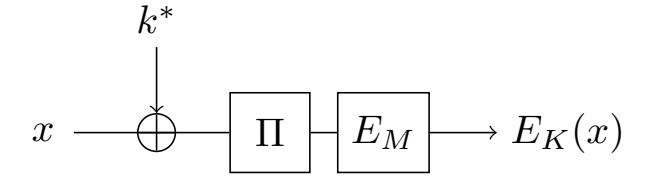
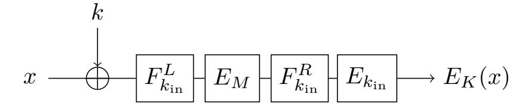
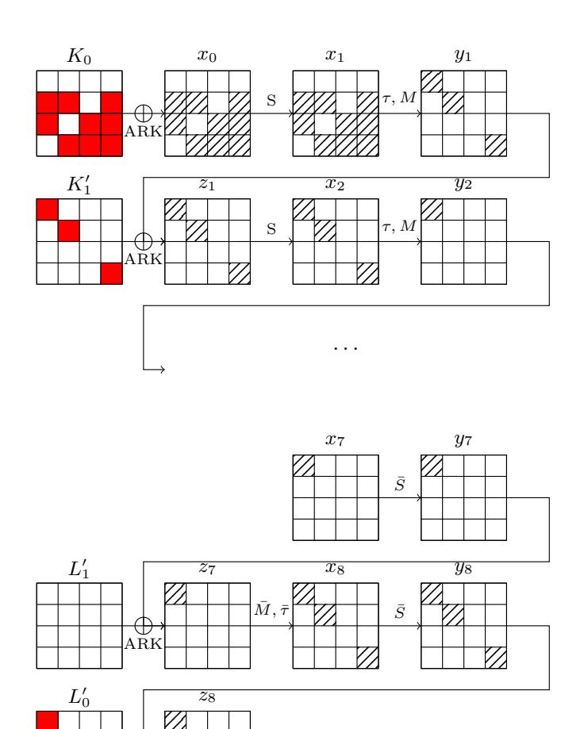
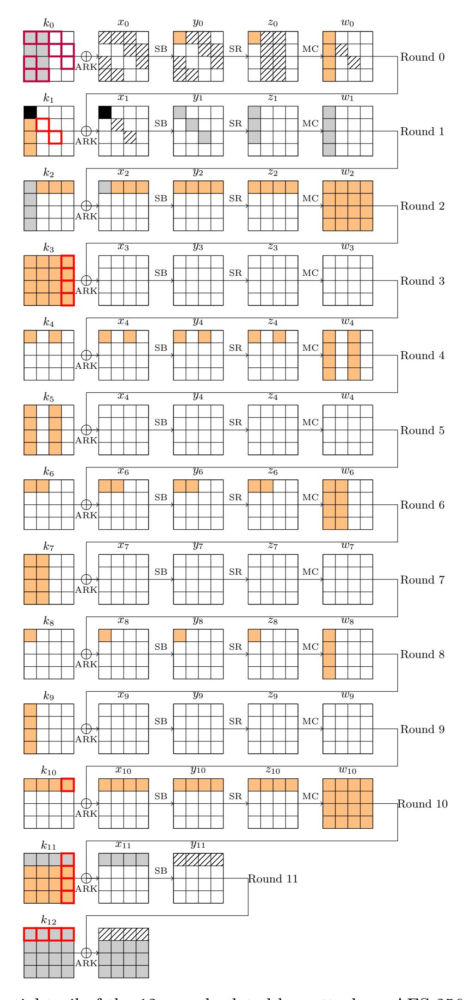

{0}------------------------------------------------

# **Quantum Truncated Differential Attacks using Convolutions**

Aurel Pichollet--Mugnier André Schrottenloher

Univ Rennes, Inria, CNRS, IRISA, Rennes, France [firstname.lastname@inria.fr](mailto:firstname.lastname@inria.fr)

**Abstract.** This paper focuses on quantum key-recovery attacks on block ciphers. Previous works on quantum differential and truncated differential attacks like [Kaplan et al., ToSC 2016] have shown that classical algorithms for key-recovery, typically based on generating differential pairs and sieving them, can be accelerated by up to a quadratic speedup using variants of quantum search, quantum amplitude amplification, and quantum collision-finding.

In this paper, we introduce a new quantum truncated differential key-recovery attack, which leverages the quantum convolution algorithm introduced in [Schrottenloher, CRYPTO 2022] and previously used in linear cryptanalysis. We adapt this algorithm to the case of differential cryptanalysis, by rewriting the probability of a differential of an *n*-bit cipher as a convolution of functions with 2*n*-bit input. We then construct a quantum state whose amplitudes encode the probability of the differential for different key guesses, and use this as the starting point of a quantum search. In some cases (although not on practical ciphers so far), the speedup is better than quadratic compared to classical attacks. We also extend the framework to related-key differential attacks.

We give applications to a 9-round attack on QARMAv2-64 adapted from [Ahmadian et al., DCC 2024] and a 12-round related-key attack on AES-256 from [Boura et al., CRYPTO 2023], which show improvement over classical attacks and over Kaplan et al.'s strategy when taking into account the amount of memory and the type of quantum memory used (as our attack requires only quantum-accessible classical memory).

**Keywords:** Quantum Cryptanalysis · Truncated Differential Cryptanalysis · Discrete convolution · Quantum Fourier Transform

# **1 Introduction**

While the quantum computing model offers an exponential speedup over the best classical algorithms for *some* problems (such as factoring [\[Sho94\]](#page-36-0)), it encounters severe limitations when solving problems arising in symmetric cryptanalysis. As an example, Grover's algorithm [\[Gro96\]](#page-35-0) is known to solve black-box search problems with a quadratic speedup over classical exhaustive search, but this is optimal [\[BBBV97\]](#page-34-0).

Due to Grover's search and its lower bound, exhaustive key search of a block cipher with *κ*-bit keys has a quantum complexity O 2 *κ/*2 (instead of a classical O(2*κ* )). From this perspective, a certain confidence in symmetric primitives is not unwarranted. However, to prove that primitives indeed retain an ideal behavior, a meticulous analysis of dedicated quantum attacks still needs to be done: like in the classical setting, cryptanalysis provides the only quantifiable measure of security of symmetric ciphers.

{1}------------------------------------------------

In the past two decades, many classical attacks on block ciphers have been adapted into quantum algorithms. Such attacks include differential and linear cryptanalysis [KLLN16b], integral, Meet-in-the-middle and Demirci-Selçuk Meet-in-the-middle attacks [BNS19], Boomerang attacks [FNS21, ZZL23] and so on. Despite the variety of classical techniques used, most of the quantum algorithms rely on combinations of Grover's search [Gro96], amplitude amplification [BHMT02], and certain quantum walk algorithms [Amb07], which are all limited to a quadratic speedup in this context. Therefore, while these algorithms confirm the applicability of attacks in the quantum setting, they are unlikely to challenge the established security margins of primitives.

Meanwhile, attacks based on Simon's algorithm [Sim97, KM10, KM12, KLLN16a, SS17] achieve exponential speedups when the adversary makes superposition queries to the scheme, the so-called Q2 model. This model is regarded as impractical, as opposed to the Q1 model where only classical queries are allowed. Yet, by combining Simon's algorithm with Grover's algorithm in the "Grover-meet-Simon" attack [LM17], later improved into the "offline-Simon" algorithm [BHN+19], one can indeed obtain a small Q1 super-quadratic speedup [BSS22]. However, this attack is very limited in scope, because it needs some periodicity property to occur in order to apply Simon's algorithm as a distinguisher. Hosoyamada [Hos23] also showed that certain types of multidimensional linear distinguishers could also exhibit super-quadratic speedups; to the best of our knowledge these are the only two examples of distinguishing attacks with such speedups.

**Linear Cryptanalysis using Convolutions.** In this paper, we use a *quantum convolution algorithm*, which was introduced in [Sch23] for linear cryptanalysis (a similar algorithm appeared independently in [CNDP+22]). The convolution algorithm is used to design statistical key-recovery attacks on block ciphers. Contrary to the works previously cited, it does not accelerate the distinguisher, but the key-recovery part itself. We explain briefly its relation to linear cryptanalysis.

**Figure 1:** Basic attack scenario, where  $E_M$  is the reduced-round cipher on which we have a distinguisher, and  $\Pi(k^* \oplus \cdot)$  is the first round.

Let  $E_K$  be an *n*-bit block cipher with unknown key K, and  $E_M$  a reduced-round version of  $E_K$  admitting a linear approximation  $(\alpha, \beta)$  with high correlation:

$$|\operatorname{cor}(\alpha,\beta)| := \frac{1}{2^n} \left| \sum_{x} (-1)^{\alpha \cdot x} (-1)^{\beta \cdot E_M(x)} \right| \gg 2^{-n/2} .$$
 (1)

By prepending a round  $\Pi(k^* \oplus \cdot)$ , where  $k^*$  is an *n*-bit round key and  $\Pi$  is an unkeyed round function as in Figure 1, one can see that  $k^*$  has to maximize the *experimental* correlation:

$$cor(k) = \frac{1}{2^n} \sum_{x} (-1)^{\alpha \cdot \Pi(x \oplus k)} (-1)^{\beta \cdot E_K(x)} .$$
 (2)

The experimental correlation is the discrete convolution of two functions:  $f(x) := (-1)^{\beta \cdot E_K(x)}$  and  $g(x) := (-1)^{\alpha \cdot \Pi(x)}$ , which we denote  $(f \star g)$ . Classically one can compute it efficiently thanks to the fast Walsh-Hadamard transform [CSQ07]. In the quantum setting, the algorithm from [Sch23, CNDP+22] allows to compute a quantum convolution state, which is proportional to:

$$\sum_{k} (f \star g) (k) |k\rangle .$$

{2}------------------------------------------------

This quantum state provides a good starting point for a quantum search of the round key  $k^*$  (and ultimately the whole key K). Indeed, because of the linear approximation, the amplitude over  $k^*$  starts much bigger than  $2^{-n/2}$ , which would be the starting point in Grover's search. When the correlation is very large, this higher starting amplitude may even provides a super-quadratic speedup compared to the best cryptanalysis, although this does not happen for typical ciphers.

A natural question would be whether this method can be extended to other statistical attacks, such as differential [BS90] and truncated differential [Knu94] cryptanalysis. It is known that there are links between differential and linear properties [BN14]. However, to the best of our knowledge, no classical truncated differential attacks uses Hadamard transforms or convolutions.

**Method.** We consider truncated differential cryptanalysis of a cipher with a structure similar as Figure 1. A truncated differential is given by two vector subspaces of  $\mathbb{F}_2^n$ , denoted  $\Delta_{\text{in}}$  and  $\Delta_{\text{out}}$ , of size  $2^{\delta_{\text{in}}}$  and  $2^{\delta_{\text{out}}}$ , such that a pair of inputs with difference in  $\Delta_{\text{in}}$  maps to  $\Delta_{\text{out}}$  through the reduced-round cipher  $E_M$  with high probability. We use as statistic the rescaled probability of the truncated differential:

$$\widehat{A}(k) = \frac{1}{2^{n+\delta_{\text{in}}+\delta_{\text{out}}}} \sum_{x \neq y \in \mathbb{F}_2^n} \mathbf{1}[\Pi(x \oplus k) \oplus \Pi(y \oplus k) \in \Delta_{\text{in}}] \mathbf{1}[E_K(x) \oplus E_K(y) \in \Delta_{\text{out}}] ,$$

where  $\mathbf{1}[\cdot]$  denotes an indicator function (1 if the property is satisfied, 0 otherwise). This statistic is around  $2^{-n}$  for a wrong guess of the subkey, and much higher for the right key guess  $k^*$ . If we define two functions1 as follows:

$$\begin{cases} f, g : (\mathbb{F}_2^n)^2 \to \{0, 1\} \\ g(x, y) = \mathbf{1}[x \neq y] \mathbf{1}[\Pi(x) \oplus \Pi(y) \in \Delta_{\text{in}}] \\ f(x, y) = \mathbf{1}[E_K(x) \oplus E_K(y) \in \Delta_{\text{out}}] \end{cases}$$

then  $\widehat{A}(k) = (f \star g)(k, k)$ . This is useless in the classical setting, as computing the convolution would take time  $\widetilde{\mathcal{O}}(2^{2n})$ , bigger than just guessing  $k^*$ . In the quantum setting, we apply the convolution algorithm on f, g, and efficiently compute:

$$\sum_{k,k'} (f \star g) (k,k') |k,k'\rangle .$$

The next step, which differs from linear key-recovery attacks [Sch23, BBH+24], is to use quantum amplitude amplification to retain only the basis states  $|k,k\rangle$ . This is a costly step; we find that it requires about  $2^{(n-\delta_{\text{out}})/2}$  iterations. We complete the algorithm by a quantum search for the right subkey  $k^*$ .

**Results.** Consider the structure of Figure 1. Assume that  $E_M$  admits a single differential of probability  $p < 2^{-n/2}$ , that  $\Pi$  has full diffusion, that we can make Q2 queries, and that the master key K of the cipher has size |K|. Then the complexity of our attack, given by Theorem 3, would be:

$$\mathcal{O}\left(\frac{1}{2^{n/2}p}\right) \times \left(\widetilde{\mathcal{O}}\left(2^{n/2}\right) + \mathcal{O}\left(2^{(|K|-n)/2}\right)\right) . \tag{3}$$

This assumes that the convolution algorithm can be implemented efficiently, which needs to be checked on a case-by-case basis, and actually depends on the function  $\Pi$ . In this

&lt;sup>1Please note that this is a simplified view, and the detailed definitions in Section 4 are more technical.

{3}------------------------------------------------

complexity, the term  $\widetilde{\mathcal{O}}(2^{n/2})$  is the cost of pre-amplification, i.e., constructing the quantum state:  $\sum_{k} (f \star g) (k, k) | k, k \rangle$ . Indeed, the differential probabilities corresponding to wrong keys are around  $2^{-n}$ , so the total amplitude on basis states  $|k, k\rangle$  is around  $2^{n/2}$ . The term  $2^{(|K|-n)/2}$  is the cost of checking if a potential round-key key k is good (i.e if  $k = k^*$ ), by searching the remaining |K| - n keys bits. Finally, since the starting amplitude on  $k^*$  is around p, which gets pre-amplified to  $2^{n/2}p$ , we will find it after  $\mathcal{O}(1/(2^{n/2}p))$  iterations of quantum search.

In this example, the standard differential attack would start from a set of 1/p pairs having the appropriate difference in output of the cipher. Each pair yields a candidate k. In the quantum setting, the method put forward by Kaplan et al. [KLLN16b] is to use a Grover search among these pairs (thus  $\mathcal{O}(1/\sqrt{p})$  iterations), and for each one, to check the obtained key guess k in time  $2^{(|K|-n)/2}$  by completing it. This would give a complexity  $\mathcal{O}\left(\frac{1}{\sqrt{p}}2^{(|K|-n)/2}\right)$  in total, while we obtained  $\widetilde{\mathcal{O}}\left(\frac{1}{p}+\frac{1}{2^{n/2}p}2^{(|K|-n)/2}\right)$ . Assuming that |K| is large enough, e.g., |K|=2n, our attack has complexity  $\mathcal{O}(1/p)$ , which is always better than Kaplan et al.'s formula (indeed,  $2^{n/2}p \geq \sqrt{p}$ ). The improvement from our method stems from the convolution state; while it is costly to build, it allows us to start from a larger amplitude over the good subkey (proportional to p instead of  $\sqrt{p}$ ).

As there are many optimizations of differential key-recovery attacks, our new algorithm is certainly not competitive against all of them. And indeed, in the oversimplified example above, a classical attack may already reach a complexity close to  $\mathcal{O}(1/p)$  using key counters. Nevertheless, we study several examples to show the potential of our technique:

- In Section 5.6, we picture a block cipher on which our algorithm would reach a super-quadratic speedup against classical attacks (although this remains theoretic).
- In Section 6, we give an example of an attack on the QARMAv2-64 tweakable block cipher, where we can show the advantage over the Kaplan et al.'s strategy. On this particular example, both attack seem competitive against classical cryptanalysis if we take into account the memory complexity.
- In Section 7 we give a related-key attack on 12-round AES-256 (Section 7) which uses the path of the classical differential Meet-in-the-middle attack of [BDD+23], obtaining a slight improvement over a Grover's exhaustive search. To give a fair comparison point, we also adapt [KLLN16b] to the key-related setting. While the time complexity obtained with [KLLN16b] is lower (which is mostly due to the non-negligible polynomial overhead of the convolution algorithm), our new approach requires quantum-accessible classical memory (QRACM) instead of quantum memory (QRAQM), which is an interesting feature.

In all these examples we use only Q1 (classical) queries, and less queries than the full codebook of the cipher.

**Organization of the Paper.** The paper is structured as follows. In Section 2, we introduce notations and detail the quantum convolution algorithm. In Section 3, we introduce preliminaries related to truncated differential cryptanalysis. Section 4 relates our statistic to a convolution of functions, and analyzes them. In Section 5 we give our new algorithm and our main result, including its extension to related-key attacks. Applications to concrete ciphers (QARMAv2 and AES-256) are given in Section 6 and Section 7.

## 2 Preliminaries

In this section, we give technical preliminaries and notations for the Hadamard transform, convolutions, and quantum computing. Throughout this paper, we use  $\mathbf{1}[\cdot]$  to denote

{4}------------------------------------------------

an indicator function, which returns 1 if the property in argument is satisfied, and 0 otherwise, and |k| to denote the bit-size of a parameter k (e.g., a secret subkey). Note that  $|\cdot|$  is also used to denote the module of a complex number, but this should be clear from context. Furthermore, when  $f: \mathbb{F}_2^n \to \mathbb{C}$  is a function, we will use the notation  $||f|| := \sqrt{\sum_x |f(x)|^2}$ .

#### 2.1 Hadamard Transforms and Convolutions

Let  $f: \mathbb{F}_2^n \to \mathbb{C}$  be a function, we define its  $Hadamard\ transform\ \widehat{f}: \mathbb{F}_2^n \to \mathbb{C}$  as:

$$\widehat{f}(x) = \frac{1}{\sqrt{2^n}} \sum_{y \in \mathbb{F}_2^n} (-1)^{x \cdot y} f(y) . \tag{4}$$

This is a special case of a Discrete Fourier Transform, and the only one that we will use in this paper. The scaling factor  $2^{-n/2}$  is intended to match the definition of the quantum Hadamard transform that we give below. The transformation is self-inverse. Parseval's identity gives the equality:

$$\sum_{y} |\widehat{f}(y)|^2 = \sum_{y} |f(y)|^2 . \tag{5}$$

**Convolutions.** Let  $f, g : \mathbb{F}_2^n \to \mathbb{C}$  be two functions. We define the *discrete convolution* of f and g as:

$$(f \star g)(x) = \sum_{y \in \mathbb{F}_2^n} f(x \oplus y)g(y) = \sum_y g(x \oplus y)f(y) . \tag{6}$$

The convolution theorem relates the convolution to the Hadamard transform:

$$(f \star g) = \sqrt{2^n} \widehat{\widehat{f} \cdot \widehat{g}} \ . \tag{7}$$

#### 2.2 Quantum Computing

We refer to [NC02] for basics of quantum computing such as qubits, quantum states and their normalization, measurements, and quantum gates. In this paper, we denote by  $\mathcal{T}$  the "time complexity" of a quantum algorithm, understood as the number of gates in the circuit. We often focus on the most costly steps, i.e., block cipher queries, and approximate  $\mathcal{T}$  accordingly. When clear from context, we also use  $\mathcal{T}(|\psi\rangle)$  to denote the complexity of an algorithm that, on input  $|0\rangle$ , returns  $|\psi\rangle$  (i.e., "constructs" the state  $|\psi\rangle$ ).

The *Hadamard transform*, a specific case of the Quantum Fourier Transform, is the unitary operator that maps:

$$\frac{1}{\|f\|} \sum_{x \in \mathbb{F}_2^n} f(x) |x\rangle \xrightarrow{QFT} \frac{1}{\|f\|} \sum_{y \in \mathbb{F}_2^n} \widehat{f}(y) |y\rangle . \tag{8}$$

Both states are normalized due to Parseval's identity. This operator can be implemented at practically no cost using a layer of n Hadamard gates.

**Memory.** The algorithms developed in this paper use quantum-accessible classical memory (QRACM) and quantum-accessible quantum memory (QRAQM). Both models are very powerful, but often appear in cryptanalysis and quantum algorithms. The QRACM model assumes that we can, in time  $\mathcal{O}(M)$ , construct a large memory of size M that holds classical data  $(y_1, \ldots, y_M)$ , and allows a unitary operator:  $|x\rangle |i\rangle \xrightarrow{\mathsf{Access}} |x \oplus y_i\rangle |i\rangle$  implemented in time 1, or negligible compared to other costs in the algorithm. The QRAQM model assumes in addition that the entire memory can be held as a quantum state  $|y_1, \ldots, y_M\rangle$ .

{5}------------------------------------------------

To be clear, when considering a QRACM of size M, we assume that the cost to build it is of  $\mathcal{O}(M)$  quantum time, instead of  $\mathcal{O}(M)$  classical time for a purely classical memory. We include this term in our complexity estimates. We use  $\mathcal{T}(\mathsf{Access})$  to note the time to query a large QRACM / QRAQM, which may be assumed to be similar to a block cipher query.

**Queries.** In key-recovery attacks on block ciphers, the adversary is given access to a black-box implementing a specified cipher  $E_K$  with an unknown key K; the goal being to output the key. Quantum cryptanalysis distinguishes two adversary models. The Q1 (classical query) model gives only access to the classical encryption (resp. decryption) oracle  $x \mapsto E_K(x)$  (resp.  $x \mapsto E_K^{-1}(x)$ ). Most often these queries can be made non-adaptively, before running the quantum part of the algorithm.

The Q2 (quantum query) model gives access to the encryption (resp. decryption) oracle as a unitary  $O_{E_K}$  (resp.  $O_{E_K^{-1}}$ ):  $|x\rangle |y\rangle \mapsto |x\rangle |E_K(x) \oplus y\rangle$  (resp.  $|x\rangle |y\rangle \mapsto |x\rangle |E_K(x) \oplus y\rangle$ ). Note that with quantum query access to both  $E_K$  and  $E_K^{-1}$ , we can implement an *in-place* oracle:  $|x\rangle \mapsto |E_K(x)\rangle$  (and its inverse) with two queries:

$$|x\rangle\,|0\rangle\xrightarrow{O_{E_K}}|x\rangle\,|E(x)\rangle\xrightarrow{\mathsf{Swap}}|E_K(x)\rangle\,|x\rangle\xrightarrow{O_{E_K^{-1}}}|E_K(x)\rangle\,|x\oplus E_K^{-1}(E_K(x))\rangle\,=|E_K(x)\rangle\,|0\rangle\quad.$$

In this paper, when considering the Q2 model, we will therefore assume that we have access to this more powerful oracle of complexity  $2\mathcal{T}(O_E)$ .

The Q2 model is known to be strictly more powerful than the Q1 one: as an example, the Even-Mansour cipher is Q1-secure [ABKM22] and broken in Q2 [KM12]. However, as remarked by multiple authors (e.g., [BBH+24]), the Q2 model cannot be much more powerful than the Q1+QRACM model when the block cipher has a block size n and  $\geq 2n$  classical bits of security against key-recovery.

Consider for example an n-bit block cipher with 2n bits of key, which is the case of many ciphers of interest (e.g., AES-256 with n=128). Grover's exhaustive search of the key costs slightly more than  $2^n$  (quantum) computations of the cipher. A Q2 quantum attack in (quantum) time  $< 2^n$  may be reduced to a Q1+QRACM attack as follows. As a classical precomputation, one queries the codebook and constructs a  $2^n$ -size QRACM: this costs  $2^n$  classical computations of the cipher and  $2^n$  quantum time for constructing the memory. One then uses the QRACM Access unitary as a replacement for any  $O_{E_K}$  /  $O_{E_K^{-1}}$  query.

**QAA.** Let  $\mathcal{A}$  be a quantum circuit that, on input  $|0\rangle$ , constructs a quantum state of the form:  $\alpha |\phi_1\rangle |1\rangle + \beta |\phi_0\rangle |0\rangle$  where  $\alpha$ ,  $\beta$  are real positive numbers, and  $|\phi_1\rangle$  ("good component") and  $|\phi_0\rangle$  are orthogonal normalized states. Quantum Amplitude Amplification (QAA) [BHMT02] is a process which iterates the circuit  $\mathcal{A}$  and its inverse  $\mathcal{A}^{\dagger}$  in order to create a state close to  $|\phi_1\rangle$ , i.e., it amplifies the state tagged by  $|1\rangle$ . We shall use the following theorem from [BHMT02]:

**Theorem 1.** Let  $O_0$  be the unitary:  $|x\rangle \xrightarrow{O_0} (-1)^{x==0} |x\rangle$  and O be the unitary:  $|x\rangle |b\rangle \xrightarrow{O} (-1)^b |x\rangle |b\rangle$ . Then for all  $i \geq 0$ :

$$(-\mathcal{A}O_0\mathcal{A}^{\dagger}O)^i\mathcal{A}|0\rangle = \sin((2i+1)\arcsin\alpha)|\phi_1\rangle + \cos((2i+1)\arcsin\alpha)|\phi_0\rangle .$$

In particular, by choosing the number of iterations  $i = \lfloor (\pi/(4 \arcsin \alpha)) \rfloor$ , this state is negligibly close to  $|\phi_1\rangle$ . This leads to the (well-known) quadratic speedup of quantum search over classical exhaustive search. In this paper, we typically use QAA over subroutines producing quantum states of the form  $\alpha |\phi\rangle + |*\rangle$ , where  $|*\rangle$  represents some orthogonal component that we refrain from writing entirely (but can easily be recognized by O, and then filtered out). Note that, as an iteration contains two calls to  $\mathcal{A}$  (one to  $\mathcal{A}$  and one to its conjugate transposition  $\mathcal{A}^{\dagger}$ ), the constant  $\pi/2$  often appears in our computations.

{6}------------------------------------------------

## **2.3 Quantum Convolution Algorithm**

Let *fz, gz* : F *n* 2 → C be families of functions indexed by a parameter *z* ∈ *Z*, where *Z* is identified to a set of bit-strings. In this section, we detail a *quantum convolution algorithm* that is taken from [\[Sch23\]](#page-36-4) (but appeared independently in [\[CNDP](#page-35-9)+22]). This algorithm produces a *convolution state*:

$$|(f \star g)\rangle = \frac{1}{\sqrt{\sum_{z \in Z} \|(f_z \star g_z)\|^2}} \sum_{z} \sum_{x \in \mathbb{F}_2^n} (f_z \star g_z)(x) |x\rangle |z\rangle . \tag{9}$$

This state is named "correlation state" in [\[Sch23,](#page-36-4) [BBH](#page-34-6)+24] since the convolutions are interpreted as correlations in linear cryptanalysis. Note that we leave in this section the definition of *fz, gz*, their dependency in *Z*, and the set *Z* itself, unspecified, as we are describing a generic algorithm. The definitions of *fz, gz* in the context of this paper will be given in [Section 4.](#page-14-0)

**Preliminaries.** The convolution algorithm requires several assumptions, subroutines, and notations which will be kept throughout this paper.

• We assume that a bound on the Fourier coefficients of *gz* is given:

$$\forall z, G_z := \max_x |\widehat{g}_z(x)| \text{ and } G := \max_z |G_z| . \tag{10}$$

In the following, we will need the convolution to succeed only for a single *z* (the "good one"), so we replace the bound *G* holding for *all* values of *z* by a bound that should hold for a *single* one.

• We use an initialization unitary:

Init 
$$: |0\rangle \mapsto \frac{1}{\sqrt{\sum_{z \in Z} \|f_z\|^2}} \sum_{z \in Z} \sum_{x \in \mathbb{F}_2^n} f_z(x) |x\rangle |z\rangle ,$$
 (11)

that is implemented with a time complexity T (Init). The details of this unitary depend on the details of *fz*, and so does its complexity. The implementations of Init used in the context of this paper will be detailed later in [Section 5.2.](#page-17-0) We note that they contain data access (i.e., QRACM or Q2 queries).

• We use a unitary that computes the Fourier coefficients of *gz*:

gFourier 
$$: |x\rangle |z\rangle |0\rangle \mapsto |x\rangle |z\rangle \left(\frac{\widehat{g}_z(x)}{G} |0^{n+1}\rangle + |*\rangle\right)$$
 (12)

where |∗⟩ is a superposition of non-zero basis states, and *G* is the upper bound on the Fourier coefficients defined above. This unitary is a *state preparation*, which we detail in [Section 2.4](#page-8-1) for completeness. In particular, if we can implement efficiently the computation of *g*b*z*: |*x*⟩ |*z*⟩ |0⟩ 7→ |*x*⟩ |*z*⟩ |*g*b*z*(*x*)⟩, then we can implement efficiently gFourier.

**Theorem 2** (Adapted from [\[Sch23\]](#page-36-4))**.** *There exists a quantum algorithm with complexity at most:*

$$\frac{\pi}{2} \frac{\sqrt{\sum_{z \in Z} \|f_z\|^2} G2^{n/2}}{\sqrt{\sum_{z \in Z} \|(f_z \star g_z)\|^2}} \left( \mathcal{T}(\mathsf{Init}) + \mathcal{T}(\mathsf{gFourier}) \right) \tag{13}$$

*that returns a state close to* |(*f ⋆ g*)⟩*.*

{7}------------------------------------------------

*Proof.* We start from the subroutine of [Algorithm 1,](#page-7-0) which produces a state of the form *α* |(*f ⋆ g*)⟩ + |∗⟩, where *α <* 1 and |∗⟩ is an orthogonal component which can be filtered out by QAA. The subroutine contains one call to Init and one call to gFourier. By combining with [Theorem 1,](#page-5-0) we get that we can produce a state close to |(*f ⋆ g*)⟩ in time less than *π* 2*α* (T (Init) + T (gFourier)). To finish the proof, we determine the quantity *α*:

$$\alpha = \frac{1}{\sqrt{\sum_{z \in Z} \|f_z\|^2} G2^{n/2}} \times \sqrt{\sum_{z \in Z} \|(f_z \star g_z)\|^2}.$$

Thus, the complexity of the algorithm depends heavily on the properties of the functions *fz* and *gz*, and crucially on the bound *G*. When *g* has values into {−1*,* 1} and is a *Bent function*, with all Fourier coefficients equal, then *G* = 1 and this algorithm becomes the hidden shift algorithm of [\[Röt10\]](#page-36-6). If both *g* and *f* behave as random functions in {−1*,* 1}, *G* = O(*n*), and *α* is inverse-linear in *n* [\[Sch23\]](#page-36-4). Practical applications of the algorithm require a dedicated analysis for *G*. As an example, such an analysis is performed in [Section 7,](#page-27-0) and we observe that the concrete value of *G* is non-negligible, and affects significantly the final complexity of the algorithm.

#### **Algorithm 1** Quantum convolution algorithm (subroutine).

1: Starting from a zero state, apply Init:

$$\frac{1}{\sqrt{\sum_{z \in Z} \|f_z\|^2}} \sum_{x,z} f_z(x) |x\rangle |z\rangle$$

2: Apply a Hadamard transform to the part (*x*):

$$\frac{1}{\sqrt{\sum_{z} \|f_{z}\|^{2}}} \sum_{x,z} \widehat{f}_{z}(x) |x\rangle |z\rangle$$

3: Append an ancillary state and apply gFourier:

$$\frac{1}{\sqrt{\sum_{z} \|f_{z}\|^{2}}} \sum_{x,z} \widehat{f}_{z}(x) |x\rangle |z\rangle \left( \frac{\widehat{g}_{z}(x)}{G} |0^{n+1}\rangle + |*\rangle \right)$$

$$= \frac{1}{\sqrt{\sum_{z} \|f_{z}\|^{2}} G} \left( \sum_{x,z} \widehat{f}_{z}(x) \widehat{g}_{z}(x) |x\rangle |z\rangle \right) |0^{n+1}\rangle + |*\rangle$$

where the component |∗⟩ contains orthogonal basis states (which can be easily recognized and filtered out later). We do not write |0 *n*+1⟩ anymore.

4: Apply a Hadamard transform on the component *x*:

$$\frac{1}{\sqrt{\sum_{z} \|f_{z}\|^{2}} G} \left( \sum_{x,z} \widehat{f_{z}} \cdot \widehat{g_{z}}(x) |x\rangle |z\rangle \right) + |*\rangle$$

$$= \frac{1}{\sqrt{\sum_{z} \|f_{z}\|^{2}} G2^{n/2}} \left( \sum_{x,z} (f_{z} \star g_{z}) (x) |x\rangle |z\rangle \right) + |*\rangle .$$

{8}------------------------------------------------

#### 2.4 Implementation of gfourier via Quantum State Preparation

We conclude the description of the convolution algorithm with the implementation of gFourier, defined as:

gFourier 
$$:|x\rangle |z\rangle |0\rangle \mapsto |x\rangle |z\rangle \left(\frac{\widehat{g_z}(x)}{G} |0^{n+1}\rangle + |*\rangle\right)$$

where  $|*\rangle$  is a superposition of non-zero basis states. Here G is the bound on all Fourier coefficients, which is necessary for this unitary to be properly defined. We explain here how to implement gFourier if we are able to compute  $\widehat{g}_z$  digitally, that is, the operation:

$$|x\rangle |z\rangle |0\rangle \mapsto |x\rangle |z\rangle |2^m(\widehat{g_z}(x)/G)\rangle$$
 (14)

Here  $m \leq 2n$  is a constant for fixed-point approximation of  $\widehat{g_z}(x)/G$ , where G is the bound over  $\widehat{g_z}(x)$ . Indeed, in the cases studied in this paper, the function  $g_z$  has values into  $\{-1,0,1\}$  and  $(2^nG)$  is a known integer constant, which we can assume to be a power of 2, so by choosing this m appropriately we know that  $2^m(\widehat{g_z}(x)/G)$  is always an m-bit integer. Very often, we simply write:  $|x\rangle |z\rangle |0\rangle \mapsto |x\rangle |z\rangle |\widehat{g_z}(x)/G\rangle$ , leaving the fixed-point representation implicit.

Implementing this computation is difficult in general, and the method used depends on the applications. Most often (like in Section 6 and Section 7), we try to ensure that the function  $\hat{g}_z(x)$  splits into a product of several functions with smaller domain, which can be precomputed, and whose values are stored in QRACM. Equation 14 then corresponds to a QRACM access.

The implementation of gFourier from Equation 14 uses a method of [SLSB19]. It only requires a *comparison* unitary Comp:

Comp: 
$$|a\rangle |b\rangle |0\rangle \mapsto |a\rangle |b\rangle |\mathbf{1}[a \ge b]\rangle$$
.

This unitary can be efficiently implemented with a linear number of gates [SLSB19], which remains negligible compared to the other costs considered in this paper. The full algorithm of [SLSB19] is detailed in Algorithm 2.

# 3 Preliminaries of (Truncated) Differential Cryptanalysis

In this section, we give important preliminaries of (truncated) differential cryptanalysis and detail the key-recovery attack scenario. At the beginning, we follow some definitions and notations of [AKM $^+$ 24b]. Later in Section 3.3 we define the notion of experimental truncated differential advantage (noted  $\widehat{A}$ ), which is our statistic of interest.

# 3.1 Truncated Differential Advantage

Differential cryptanalysis was introduced by Biham and Shamir [BS90], and later generalized into truncated differential cryptanalysis by Knudsen [Knu94]. A differential of a block cipher  $E_M$  is a pair of input-output differences  $(\alpha, \beta)$ . We say that a pair (x, y) satisfies the differential if:  $x \oplus y = \alpha$  and  $E_M(x) \oplus E_M(y) = \beta$ .

A truncated differential (TD) is a pair of vector2 subspaces ( $\Delta_{\rm in}, \Delta_{\rm out}$ ) each in  $\mathbb{F}_2^n$ , of respective sizes noted  $|\Delta_{\rm in}| = 2^{\delta_{\rm in}}$  and  $|\Delta_{\rm out}| = 2^{\delta_{\rm out}}$ . A pair (x, y) satisfies the truncated differential if  $x \oplus y \in \Delta_{\rm in}$  and  $E_M(x) \oplus E_M(y) \in \Delta_{\rm out}$ . In the following, we consider a differential as a special case of truncated differentials where  $\delta_{\rm in} = \delta_{\rm out} = 0$ , and our formulas will cover both cases.

&lt;sup>2Affine subspaces may be used in general. Our formulas could be adapted to this case.

{9}------------------------------------------------

#### Algorithm 2 Implementation of gFourier

1: Start with the state  $|x\rangle |z\rangle |0^m\rangle$  and compute the unitary of Equation 14:

$$|x\rangle |z\rangle |2^m \widehat{g_z}(x)/G\rangle$$

2: Add an ancilla register  $|0^m\rangle$  and apply a Hadamard transform:

$$\frac{1}{\sqrt{2^m}} |x\rangle |z\rangle \sum_a |a\rangle |2^m \widehat{g_z}(x)/G\rangle$$

3: Use the Comp unitary to compare each a with  $2^m |\widehat{g}_z(x)|/G$ , using an additional register to store the result:

$$\frac{1}{\sqrt{2^m}} |x\rangle |z\rangle \sum_a |a\rangle |\mathbf{1}[a \ge 2^m |\widehat{g_z}(x)|/G]\rangle |x\rangle |2^m \widehat{g_z}(x)/G\rangle$$

4: Reapply the Hadamard transform on the register containing the a's. This results in each  $|a\rangle |\mathbf{1}[a \ge 2^m |\widehat{g_z}(x)|/G]\rangle$  being sent to a state of the form:

$$\frac{1}{\sqrt{2^m}} |X\rangle |\mathbf{1}[a \ge 2^m |\widehat{g}_z(x)|/G]\rangle$$

where X is a superposition of basis states. Therefore, if  $|a\rangle$  is such that  $a < 2^m |\widehat{g_z}(x)|/G$ , then the last register is  $|0\rangle$ , the resulting state can thus be rewritten as  $\frac{1}{\sqrt{2^m}} |0^{m+1}\rangle + |*\rangle$ , where  $|*\rangle$  is a superposition of non-zero basis states. If  $a \ge 2^m |\widehat{g_z}(x)|/G$ , then the resulting state does not contain the zero basis state. By filtering all such non-zero states, we can finally write the whole resulting state as:

$$\frac{1}{2^m} |x\rangle |z\rangle \left( \#\{a, a < 2^m |\widehat{g_z}(x)|/G\} |0^{m+1}\rangle + |*\rangle \right) |2^m \widehat{g_z}(x)/G\rangle .$$

Observe that  $\#\{a, a < 2^m | \widehat{g_z}(x)|/G\} = \frac{2^m |\widehat{g_z}(x)|}{G}$ . We can write the current state as:

$$|x\rangle |z\rangle \left(\frac{|\widehat{g_z}(x)|}{G} |0^{m+1}\rangle + |*\rangle\right) |2^m \widehat{g_z}(x)/G\rangle$$
.

The next step is to correct the sign of the amplitude using a phase flip, which is controlled by the known sign of  $\hat{g}_z(x)/G$ . Finally, we uncompute the last register.

{10}------------------------------------------------

$$x \xrightarrow{k^*} K_{\text{in}}^* \qquad k_{\text{out}}^*$$

$$\downarrow \qquad \qquad \downarrow \qquad \qquad \downarrow$$

$$F_{k_{\text{in}}^*}^L - E_M - F_{k_{\text{out}}^*}^R \longrightarrow E_K(x)$$

**Figure 2:** Attack scenario. Here  $E_M$  is the part of the cipher with a distinguisher,  $F_L$  and  $F_R$  are partial rounds which contain the diffusion of the truncated differential.

A reduced-round cipher admits a *TD distinguisher* if there exists a *TD* with probability higher than random. This probability is often estimated on average over all keys, but this leads to inaccuracies, since there can be classes of keys for which the differential has higher probability, and classes of keys for which it is smaller (or even impossible) [BR22]. In the context of this paper, we simply assume that a lower bound on the probability is given, that holds for the attacked key.

The probability that a differential propagates forwards and backwards are related by Proposition 2 in [AKM+24b]:

$$\Pr_{x \neq y} \left( \Delta_{\text{in}} \xrightarrow{E_M} \Delta_{\text{out}} \right) 2^{\delta_{\text{in}}} = \Pr_{x \neq y} \left( \Delta_{\text{out}} \xrightarrow{E_M^{-1}} \Delta_{\text{in}} \right) 2^{\delta_{\text{out}}} . \tag{15}$$

In particular, a single differential is symmetric (it has the same probability backwards and forwards). This motivates us to rescale the differential probability in order to preserve this symmetry.

**Definition 1.** The advantage of a TD  $(\Delta_{in}, \Delta_{out})$  is defined as:

$$A(\Delta_{\text{in}}, \Delta_{\text{out}}) := 2^{-\delta_{\text{out}}} \Pr_{x \neq y} \left( \Delta_{\text{in}} \xrightarrow{E_M} \Delta_{\text{out}} \right) = 2^{-\delta_{\text{in}}} \Pr_{x \neq y} \left( \Delta_{\text{out}} \xrightarrow{E_M^{-1}} \Delta_{\text{in}} \right)$$
$$= \frac{1}{2^{n+\delta_{\text{in}}+\delta_{\text{out}}}} \sum_{x \neq y \in \mathbb{F}_2^n} \mathbf{1}[x \oplus y \in \Delta_{\text{in}}] \mathbf{1}[E_M(x) \oplus E_M(y) \in \Delta_{\text{out}}].$$

For a random permutation and TD,  $A(\Delta_{\rm in}, \Delta_{\rm out})$  is around  $2^{-n}$ . In the following we note  $A(\Delta_{\rm in}, \Delta_{\rm out}) := 2^{-a}$  for some parameter  $a \le n$ , which determines the efficiency of the TD.

## 3.2 Last- and First-Rounds Extension

Let  $E_K$  be an *n*-bit block cipher. Let  $E_M$  be a reduced-round version admitting a TD  $(\Delta_{\text{in}}, \Delta_{\text{out}})$  with  $A := A(\Delta_{\text{in}}, \Delta_{\text{out}}) \gg 2^{-n}$ . We append a few *first rounds*  $F^L$  and a few *last rounds*  $F^R$  to the cipher  $E_M$ , obtaining the structure in Figure 2.

Here,  $F^L$  and  $F^R$  are only partial computations of some rounds of the cipher, which serve to identify a pair that satisfies the truncated differential for  $E_M$ . They depend only on parts of the key  $k_{\text{in}}^*$  and  $k_{\text{out}}^*$ . In order for them to be properly defined as functions, we compute  $F^L$  forwards from the plaintext, and  $F^R$  backwards from the ciphertext.

The first round key is  $k^*$ , of size n. In the first and last rounds, we consider a deterministic propagation of the differential. We let  $D_{\rm in}$  and  $D_{\rm out}$  be two vector subspaces of  $\mathbb{F}_2^n$  such that, respectively, a difference in  $\Delta_{\rm in}$  maps backwards to a difference in  $D_{\rm in}$  through the first rounds with probability 1, and a difference in  $\Delta_{\rm out}$  maps to a difference in  $D_{\rm out}$  through the last rounds with probability 1. We denote  $|D_{\rm in}| = 2^{d_{\rm in}}$  and  $|D_{\rm out}| = 2^{d_{\rm out}}$ , with  $d_{\rm in} \geq \delta_{\rm in}$  and  $d_{\rm out} \geq \delta_{\rm out}$ . We have the following:

**Lemma 1** (Lemma 1 in [AKM+24b]). The probability that a pair with plaintext difference in  $D_{\rm in}$  leads to a difference  $\Delta_{\rm in}$  through  $F^L$  (resp. the probability that a pair with ciphertext

{11}------------------------------------------------

difference in  $D_{\text{out}}$  leads to a difference  $\Delta_{\text{out}}$  through  $F^R$ ) is:

$$\begin{cases}
\Pr_{x \neq y} \left( F^L(x) \oplus F^L(y) \in \Delta_{\text{in}} | x \oplus y \in D_{\text{in}} \right) = 2^{-(d_{\text{in}} - \delta_{\text{in}})} \\
\Pr_{x \neq y} \left( F^R(x) \oplus F^R(y) \in \Delta_{\text{out}} | x \oplus y \in D_{\text{out}} \right) = 2^{-(d_{\text{out}} - \delta_{\text{out}})} .
\end{cases} (16)$$

Note that Lemma 1 is valid for all keys, as long as pairs are taken uniformly at random; we neglect the key dependencies that may arise when this is not the case.

Although our definitions support more general spaces, it is convenient to identify  $D_{\text{in}}$  with  $\mathbb{F}_2^{d_{\text{in}}}$  and its orthogonal subspace  $D_{\text{in}}^{\perp}$  with  $\mathbb{F}_2^{n-d_{\text{in}}}$ . Up to a permutation of the bits, we write any element  $x \in \mathbb{F}_2^n$  as x = y || z with  $y \in D_{\text{in}}$  and  $y \in D_{\text{in}}^{\perp}$ . We will follow this convention to separate clearly the active and inactive parts of the truncated differential. In the following we will denote by  $k_d^*$  the projection of  $k^*$  on  $D_{\text{in}}$ , i.e., its first  $d_{\text{in}}$  bits using this convention.

Some overlap is to be expected between  $k_{\rm in}^*$  and  $k_{\rm out}^*$ , so the total amount of key bits in  $F^L$  and  $F^R$  is noted  $|k_{\rm in}^* \cup k_{\rm out}^*|$ . We will assume that if we guess  $k_{\rm in}^*$  (resp.  $k_{\rm out}^*$ ) first, it is easy to complete the key by making  $|k_{\rm out}^*| - |k_{\rm in}^* \cap k_{\rm out}^*|$  guesses. Finally, we denote by  $k_c^*$  the remaining part of the key; i.e.,  $|k_c^*|$  is the number of bits to guess in order to complete it. We have:  $K = k_{\rm in}^* \cup k_{\rm out}^* \cup k_d^* \cup k_c^*$ .

#### 3.3 Experimental Truncated Differential Advantage

We formulate a statistic to distinguish right and wrong guesses of  $k_d^*, k_{\rm in}^*, k_{\rm out}^*$ . We let m be a parameter, to be chosen later, which will determine the data complexity of the attack. We take a number of  $2^m$  input structures, in which the inactive part of the input difference set is fixed, and the active part takes all possible values – this is the same definition for classical and for quantum attacks. The inactive part is noted  $z \in Z \subseteq \mathbb{F}_2^{n-d_{\rm in}}$ , where Z is an arbitrary set of size  $2^m$ , with  $m \le n - d_{\rm in}$ .

**Definition 2.** The experimental truncated differential advantage is defined as:

$$\widehat{\mathbf{A}}(k_d, k_{\text{in}}, k_{\text{out}}) := \frac{1}{2^{m+d_{\text{in}}+\delta_{\text{in}}+\delta_{\text{out}}}} \sum_{z \in \mathbb{Z}} \sum_{x \neq y \in \mathbb{F}_2^{d_{\text{in}}}} \mathbf{1}[F_{k_{\text{in}}}^L(x \oplus k_d) \oplus F_{k_{\text{in}}}^L(y \oplus k_d) \in \Delta_{\text{in}}]$$

$$\times \mathbf{1}[F_{k_{\text{out}}}^R(E_K(x||z)) \oplus F_{k_{\text{out}}}^R(E_K(y||z)) \in \Delta_{\text{out}}].$$

Note that the computation of  $F^L$ , i.e., the propagation of the differential in the first rounds, is not affected by z, which is the inactive part of the input. Therefore, we have written  $F_{k_{\text{in}}}^L(x)$  instead of  $F_{k_{\text{in}}}^L(x||z)$  both to simplify the notation and to emphasize this.

Statistic for the Good Key. While summing over all structures would require the entire codebook, we use only  $2^m$  arbitrary structures. There is a minimal number of structures to use.

**Lemma 2.** For 
$$m \ge a - \delta_{\rm in} - \delta_{\rm out} - d_{\rm in}$$
, we can approximate  $\widehat{A}(k_d^*, k_{\rm in}^*, k_{\rm out}^*) \simeq 2^{-a}$ .

Proof. This condition ensures that there are pairs in the input structures which satisfy the truncated differential path, i.e., they go through the first rounds (probability  $2^{\delta_{\rm in}-d_{\rm in}}$ ) and go through the middle rounds (probability  $2^{-a+\delta_{\rm out}}$ ). Indeed, each structure contains roughly  $2^{d_{\rm in}}(2^{d_{\rm in}}-1) \simeq 2^{2d_{\rm in}}$  (ordered) pairs (x,y) such that  $x \neq y$ . In classical attacks, we typically consider unordered pairs, since (x,y) and (y,x) lead to the same result. However Definition 2 is a sum over all pairs. Therefore, the amount of valid ones is on average:

$$2^{2d_{\rm in}+m} \times 2^{\delta_{\rm in}-d_{\rm in}} \times 2^{-a+\delta_{\rm out}} . \tag{17}$$

When this is bigger than 1, we start seeing valid pairs, and the experimental TD advantage for the right key quickly averages to  $2^{-a}$ .

{12}------------------------------------------------

**Statistic for Wrong Keys.** For wrong keys, we assume the TD to be satisfied independently and uniformly at random for input pairs, so we model the number of differential pairs using Poisson distributions.

**Heuristic 1.** For  $(k_d, k_{\text{in}}, k_{\text{out}}) \neq (k_d^*, k_{\text{in}}^*, k_{\text{out}}^*)$ , let Y be the number of triples (x, y, z) with  $z \in Z$  and  $x \neq y$  two elements in  $\mathbb{F}_2^{d_{\text{in}}}$  satisfying the relations:

$$\begin{cases}
F_{k_{\text{in}}}^{L}(x \oplus k_{d}) \oplus F_{k_{\text{in}}}^{L}(y \oplus k_{d}) \in \Delta_{\text{in}} \\
F_{k_{\text{out}}}^{R}(E_{K}(x||z)) \oplus F_{k_{\text{out}}}^{R}(E_{K}(y||z)) \in \Delta_{\text{out}}
\end{cases},$$
(18)

then Y can be approximated by a Poisson distribution of parameter  $2^{\delta_{\rm in}+\delta_{\rm out}+m+(d_{\rm in}-n)}$ .

Indeed, we are looking at a set of  $2^m \times 2^{2d_{\text{in}}}$  different inputs which have probability  $2^{\delta_{\text{out}}-n}$  to satisfy the output differential, and probability  $2^{\delta_{\text{in}}-d_{\text{in}}}$  to satisfy the input differential. We derive from Heuristic 1 an important normalization factor, noted N.

Corollary 1 (informal). With high constant probability, for  $m \ge n - \delta_{\rm in} - \delta_{\rm out} - d_{\rm in}$ , we have:

$$N := \sum_{k_d, k_{\rm in} \cup k_{\rm out}} \widehat{A}(k_d, k_{\rm in}, k_{\rm out})^2 \simeq 2^{d_{\rm in} + |k_{\rm in} \cup k_{\rm out}|} 2^{-n} \left( 2^{-n} + 2^{-(m + d_{\rm in} + \delta_{\rm in} + \delta_{\rm out})} \right) + 2^{-2a} .$$
(19)

*Proof.* For the wrong keys, we use a bound, based on the central limit theorem, on the sum of squares of Poisson variables (Lemma 7 in Appendix). There are  $(2^{d_{\text{in}}}-1)(2^{|k_{\text{in}}\cup k_{\text{out}}|}-1) \simeq 2^{d_{\text{in}}+|k_{\text{in}}\cup k_{\text{out}}|}$  variables in the sum over wrong keys, of parameter  $2^{\delta_{\text{in}}+\delta_{\text{out}}+m+(d_{\text{in}}-n)}$ . With high constant probability:

$$\begin{split} \sum_{\substack{k_d, k_{\rm in} \cup k_{\rm out} \\ \neq k_d^*, k_{\rm in}^* \cup k_{\rm out}^* \\ \\ & \simeq 2^{d_{\rm in} + |k_{\rm in} \cup k_{\rm out}|} \left( \frac{1}{2^{m + d_{\rm in} + \delta_{\rm out}}} \right)^2 2^{(\delta_{\rm in} + \delta_{\rm out} + m + (d_{\rm in} - n))} \left( 2^{(\delta_{\rm in} + \delta_{\rm out} + m + (d_{\rm in} - n))} + 1 \right) \\ & = 2^{d_{\rm in} + |k_{\rm in} \cup k_{\rm out}|} \frac{1}{2^{m + d_{\rm in} + \delta_{\rm in} + \delta_{\rm out}}} 2^{-n} \left( 2^{(\delta_{\rm in} + \delta_{\rm out} + m + (d_{\rm in} - n))} + 1 \right) \\ & = 2^{d_{\rm in} + |k_{\rm in} \cup k_{\rm out}|} 2^{-n} \left( 2^{-n} + 2^{-(m + d_{\rm in} + \delta_{\rm in} + \delta_{\rm out})} \right) \; . \end{split}$$

It only remains to add the term for the right key, which is approximated by  $2^{-2a}$ .

If a is small enough, we can remove the term  $2^{-2a}$  to simplify the notations (this will be the case in the remainder of this paper). One can notice that the formula is different if  $m + d_{\rm in} + \delta_{\rm in} + \delta_{\rm out}$  is positive or negative. In the former case, each wrong key has on average more than one pair randomly satisfying the TD; in the latter there is less than one pair.

#### 3.4 Classical and Quantum Key-recovery Attacks

As a comparison point, we give here a very high-level description of existing classical and quantum TD key-recovery attacks and their (approximated) complexities. Recall that we noted  $A(\Delta_{\text{in}}, \Delta_{\text{out}}) := 2^{-a}$  the advantage of the TD.

{13}------------------------------------------------

**Classical Pair-Sieving Attack.** The typical classical TD key-recovery attack has two phases. First, one uses a limited-birthday algorithm to find a set of pairs with input differences in *D*in and output differences in *D*out (see [\[BNS14\]](#page-34-10) for details). The goal is to have sufficiently many pairs so that one of them leads to the correct subkey guess.

For the correct subkey guess, the probability that a pair of plaintexts with difference in *D*in goes through the truncated differential is:

$$\Pr\left(\Delta_{\text{in}} \to \Delta_{\text{out}}\right) 2^{\delta_{\text{in}} - d_{\text{in}}} = 2^{-a + \delta_{\text{in}} + \delta_{\text{out}} - d_{\text{in}}}$$
.

Therefore, by collecting 2 *a*−*δ*in−*δ*out+*d*in pairs of plaintexts with difference in *D*in, and computing all choices of subkey guesses under which the truncated differential is satisfied, we can expect the correct subkey guess to appear among these choices (ensuring that the attack works) [\[AKM](#page-34-8)+24b, Section 3]. Furthermore, among these pairs, we can keep only those which have a ciphertext difference in *D*out. Therefore, the number of pairs used during the sieving phase is:

$$2^{a-\delta_{\rm in}-\delta_{\rm out}+d_{\rm in}} \times 2^{d_{\rm out}-n} = 2^{a+d_{\rm in}+d_{\rm out}-\delta_{\rm in}-\delta_{\rm out}-n} . \tag{20}$$

Notice that this formula remains symmetric between the input and the output differences, since we may use both directions.

The pair-sieving attack will then search exhaustively among these remaining pairs satisfying the *D*in and *D*out input and output differences. For each pair, one finds all the subkeys (*k*in*, k*out*, kd*) such that the activity pattern reaches ∆in and ∆out. One can then store the obtained candidates with counters, or perform an exhaustive search of the remaining key bits for each of them. While some attacks can be more or less efficient, the complexity of the key-recovery part is often approximated by the number of partial key candidates in the first and last rounds, i.e., in our case, 2 |*k*in∪*k*out|+*d*in . When there is a large amount of key bits involved, we can expect this part to dominate.

There are other ways to perform the key-recovery, such as the Differential-MITM attack [\[BDD](#page-34-7)+23, [AKM](#page-34-11)+24a, [SLY](#page-36-8)+24], but we focus on pair-sieving because it has been studied in the quantum setting.

**Quantum Pair-Sieving.** In the quantum setting, Kaplan et al. [\[KLLN16b\]](#page-35-1) studied quantum TD key-recovery attacks using quantum search, and adapted the classical attack given above. One starts by constructing the same number of pairs, either via a classical or quantum algorithm (see, e.g., [\[DNS24\]](#page-35-13)). Then, a quantum search over all the pairs is run, and for each given key candidate, one tries to complete the entire key and test if it is correct.

The number of pairs to ensure success is the same as in the classical setting, given by [Equation 20](#page-13-0) above. Since we assumed a deterministic difference propagation, each partial key *kd*∪*k*in∪*k*out has probability 2 *δ*in−*d*in+*δ*out−*d*out to lead to the truncated differential, and so, for each pair, the number of key candidates obtained is 2 *d*in+|*k*in∪*k*out|+*δ*in−*d*in+*δ*out−*d*out . If, on average, each pair yields more than one key candidate, this gives:

$$2^{d_{\text{in}} + |k_{\text{in}} \cup k_{\text{out}}| + \delta_{\text{in}} - d_{\text{in}} + \delta_{\text{out}} - d_{\text{out}}} \times 2^{(a-n) + d_{\text{in}} + d_{\text{out}} - \delta_{\text{in}} - \delta_{\text{out}}} = 2^{d_{\text{in}} + |k_{\text{in}} \cup k_{\text{out}}|} 2^{(a-n)}$$

key candidates, where 2 *a*−*n <* 1. To test a key candidate, one performs an exhaustive search of all completions *kc* with Grover's algorithm. This gives a complexity (up to a constant factor):

$$2^{(d_{\rm in}+|k_{\rm in}\cup k_{\rm out}|)/2}2^{(a-n)/2}2^{|k_c|/2} \simeq 2^{(a-n)/2}2^{|K|/2}$$

with an advantage of 2 (*a*−*n*)*/*2 compared to Grover's search, at best.

{14}------------------------------------------------

# 4 Expressing the Statistic as a Convolution

In order to use the quantum convolution algorithm, similarly as the situation in linear cryptanalysis, we want to rewrite our statistic of interest as a discrete convolution of functions. However, contrary to linear cryptanalysis, the key k appears twice in the expression of  $\widehat{A}$  given in Definition 2. This section defines an appropriate extension of  $\widehat{A}$ , the corresponding pair(s) of functions, and gives useful results.

#### 4.1 Definitions

We start by defining an extension of  $\widehat{A}$ . We will use the same notation, without ambiguity. In order to prepare for the convolution algorithm, we need to introduce a perturbation term  $h: \mathbb{F}_2^{d_{\text{in}}} \to \{-1,1\}$ . The main purpose of h is to randomize the sign of the functions in the convolution. In our analysis, we assume that h statistically behaves as a random function, however we do not need it to be one. We may derive h from a non-cryptographic hash function, and assume it has negligible cost.

**Definition 3.** Let Z be a set of  $2^m$  structures. The (extended) experimental truncated differential advantage is defined as:

$$\widehat{\mathbf{A}}(k_d, k_{d}', k_{\text{in}}, k_{\text{out}}) := \frac{1}{2^{m+d_{\text{in}}+\delta_{\text{out}}}} \sum_{z \in Z} \sum_{x, y \in \mathbb{F}_2^{d_{\text{in}}}} \mathbf{1}[x \oplus k_d \neq y \oplus k_d'] 
\times \mathbf{1}[F_{k_{\text{in}}}^L(x \oplus k_d) \oplus F_{k_{\text{in}}}^L(y \oplus k_d') \in \Delta_{\text{in}}]h(x \oplus k_d \oplus y \oplus k_d') 
\times \mathbf{1}[F_{k_{\text{out}}}^R(E_K(x||z)) \oplus F_{k_{\text{out}}}^R(E_K(y||z)) \in \Delta_{\text{out}}]h(x \oplus y) .$$

When  $k_d = k_d'$ , the terms in h cancel out and  $\widehat{A}(k_d, k_d, k_{\rm in}, k_{\rm out})$  matches the previous definition of  $\widehat{A}$  in Definition 2:

$$\widehat{\mathbf{A}}(k_d, k_d, k_{\text{in}}, k_{\text{out}}) = \frac{1}{2^{m+d_{\text{in}}+\delta_{\text{in}}+\delta_{\text{out}}}} \sum_{z \in \mathbb{Z}} \sum_{x \neq y \in \mathbb{F}_2^{d_{\text{in}}}} \mathbf{1}[F_{k_{\text{in}}}^L(x \oplus k_d) \oplus F_{k_{\text{in}}}^L(y \oplus k_d) \in \Delta_{\text{in}}] \times \mathbf{1}[F_{k_{\text{out}}}^R(E_K(x||z)) \oplus F_{k_{\text{out}}}^R(E_K(y||z)) \in \Delta_{\text{out}}].$$

The generalization of  $\widehat{A}$  allows to rewrite it as a sum of convolutions for a family of functions. These functions have a domain that corresponds to the active part of the input difference (the  $d_{\rm in}$  bits), doubled, since we consider pairs of inputs. The family is indexed by the value  $z \in Z \subseteq \mathbb{F}_2^{n-d_{\rm in}}$ , which is the fixed value in the inactive part of the input difference.

**Definition 4.** The functions  $g_{k_{\text{in}}}, f_{z,k_{\text{out}}} : \mathbb{F}_2^{d_{\text{in}}} \times \mathbb{F}_2^{d_{\text{in}}} \to \{-1,0,1\}$  are defined as follows:

$$\begin{cases} g_{k_{\text{in}}}(x,y) = \mathbf{1}[x \neq y] \mathbf{1}[F_{k_{\text{in}}}^{L}(x) \oplus F_{k_{\text{in}}}^{L}(y) \in \Delta_{\text{in}}] h(x \oplus y) \\ f_{z,k_{\text{out}}}(x,y) = \mathbf{1}[F_{k_{\text{out}}}^{R}(E_{K}(x||z)) \oplus F_{k_{\text{out}}}^{R}(E_{K}(y||z)) \in \Delta_{\text{out}}] h(x \oplus y) \end{cases}$$
(21)

It follows directly from these definitions that for all  $k_d, k_d', k_{\rm in}, k_{\rm out}$ :

$$\widehat{\mathbf{A}}(k_d, k_d', k_{\text{in}}, k_{\text{out}}) = \frac{1}{2^{m+d_{\text{in}}+\delta_{\text{in}}+\delta_{\text{out}}}} \sum_{z \in Z} \left( f_{z, k_{\text{out}}} \star g_{k_{\text{in}}} \right) \left( k_d, k_d' \right) . \tag{22}$$

#### 4.2 Bounding the Fourier Coefficients

As shown in Section 2.3, an important parameter in the complexity of the quantum convolution algorithm is an upper bound G on the Fourier coefficients of  $g_{k_{\text{in}}^*}$ . Note that

{15}------------------------------------------------

G needs only to be a valid bound for the good key  $k_{\text{in}}^*$  (not all possible keys).

$$G := \max_{x,y \in \mathbb{F}_2^{d_{\text{in}}}} |\widehat{g_{k_{\text{in}}^*}}(x,y)| . \tag{23}$$

We can first estimate the norm of the function  $g_{k_{\text{in}}^*}$ , which simply means counting the number of pairs of a structure that belong to  $\Delta_{\text{in}}$ :

$$\sum_{x,y} |g_{k_{\text{in}}^*}(x,y)|^2 = \sum_{x \neq y \in \mathbb{F}_2^{d_{\text{in}}}} \mathbf{1}[F_{k_{\text{in}}}^L(x) \oplus F_{k_{\text{in}}}^L(y) \in \Delta_{\text{in}}] \simeq 2^{d_{\text{in}} + \delta_{\text{in}}} . \tag{24}$$

Indeed, there are  $2^{2d_{\text{in}}}$  pairs and each has a probability  $2^{\delta_{\text{in}}-d_{\text{in}}}$  to satisfy the differential (by Lemma 1). Thanks to Parseval's identity, this gives us the norm of  $\widehat{g_{k_{\text{in}}^*}}$ :

$$\sum_{x,y} |\widehat{g_{k_{\text{in}}^*}}(x,y)|^2 \simeq 2^{d_{\text{in}} + \delta_{\text{in}}} . \tag{25}$$

As a consequence, the best bound G we could hope for would be around  $\sqrt{2^{-2d_{\rm in}}2^{d_{\rm in}+\delta_{\rm in}}} = 2^{-d_{\rm in}/2+\delta_{\rm in}/2}$ , corresponding to a perfectly flat Fourier spectrum.

In Appendix B we prove the following bound, assuming (heuristically) that for any pair  $(x,y) \in (D_{\text{in}})^2$  with  $x \neq y$ , the event  $F_{k_{\text{in}}^*}^L(x) \oplus F_{k_{\text{in}}^*}^L(y) \in \Delta_{\text{in}}$  happens independently of the values of x and y.

**Lemma 3.** If h behaves as a random function, and the differential is randomly satisfied, then with overwhelming probability:

$$G \le \sqrt{(8\ln 2)d_{\rm in}} 2^{\delta_{\rm in} - d_{\rm in}/2} = \widetilde{\mathcal{O}}\left(2^{\delta_{\rm in} - d_{\rm in}/2}\right) . \tag{26}$$

The sole purpose of h is to give us the bound of Lemma 3. This is specific to the setting of differential cryptanalysis, where we have a convolution of indicator functions, whereas linear cryptanalysis (as recalled in Section 1) considers a convolution of functions in  $\{-1,1\}$ . Without h, the function  $g_{k_{\text{in}}^*}$  would take only values in  $\{0,1\}$ , i.e., a positive domain. Its Fourier coefficient in (0,0), being the (rescaled) sum of all its outputs, would become extremely large, making the bound of Lemma 3 much higher. Since G intervenes as a multiplicative factor in the complexity of the convolution algorithm, this would make our attack inefficient.

# 5 Quantum Truncated Differential Attack Using Convolutions

Following the notations developed in Section 4, we now reach the technical core of our approach.

We define a quantum state which is a superposition over key guesses encoding, in its amplitudes, the experimental truncated differential probabilities corresponding to these guesses. We name it the *truncated differential advantage state* (TDAS):

$$|\mathsf{TDAS}\rangle := \frac{1}{\sqrt{N}} \sum_{k_d, k_{\text{in}} \cup k_{\text{out}}} \widehat{A}(k_d, k_{\text{in}}, k_{\text{out}}) | k_d, k_{\text{in}} \cup k_{\text{out}} \rangle , \qquad (27)$$

where the normalization factor N is given by Corollary 1, which follows from our heuristics on the distribution of differential pairs:

$$N = 2^{d_{\rm in} + |k_{\rm in} \cup k_{\rm out}|} 2^{-n} \left( 2^{-n} + 2^{-(m + d_{\rm in} + \delta_{\rm in} + \delta_{\rm out})} \right) . \tag{28}$$

{16}------------------------------------------------

As discussed in Section 4, the quantity  $\widehat{A}(k_d, k_{\rm in}, k_{\rm out})$  can be expressed as a convolution of (a family of) functions. Therefore, this state can be constructed via the Quantum Convolution Algorithm (QCA) of Section 2. This section thus starts with the construction of the unitaries, namely Init and gFourier, needed in order to apply the QCA. While gFourier is often implemented via a precomputation, the strategy for Init can be more complex, and we describe it in detail in Section 5.2.

The application of the QCA and construction of the TDAS is detailed in Section 5.3. Having amplitudes heavily biased towards the good keys, due to the statistic  $\widehat{A}(k_d, k_{\rm in}, k_{\rm out})$ , we can finally leverage this state to perform a key-recovery attack: this is detailed in Section 5.4 onwards. In a second time, we study the feasibility and provide some examples and possible tweaks of the attack.

#### 5.1 Preliminaries

We give here the building blocks needed to construct the state  $|\mathsf{TDAS}\rangle$ . First, given  $x, y \in \mathbb{F}_2^{d_{\mathrm{in}}}$  and  $z \in Z$ , recall the definition of the functions  $f_{z,k_{\mathrm{out}}}$  and  $g_{k_{\mathrm{in}}} : \mathbb{F}_2^{d_{\mathrm{in}}} \to \{-1,0,1\}$ :

$$\begin{cases}
g_{k_{\text{in}}}(x,y) = \mathbf{1}[x \neq y]\mathbf{1}[F_{k_{\text{in}}}^{L}(x) \oplus F_{k_{\text{in}}}^{L}(y) \in \Delta_{\text{in}}]h(x \oplus y) \\
f_{z,k_{\text{out}}}(x,y) = \mathbf{1}[F_{k_{\text{out}}}^{R}(E_{K}(x||z)) \oplus F_{k_{\text{out}}}^{R}(E_{K}(y||z)) \in \Delta_{\text{out}}]h(x \oplus y)
\end{cases} .$$
(29)

From the discussion in Section 4.1, we know that for all  $k_d, k_d', k_{\text{in}}, k_{\text{out}}$ :

$$\widehat{A}(k_d, k_d', k_{\text{in}}, k_{\text{out}}) = \frac{1}{2^{m+d_{\text{in}}+\delta_{\text{in}}+\delta_{\text{out}}}} \sum_{z \in Z} (f_{z, k_{\text{out}}} \star g_{k_{\text{in}}}) (k_d, k_d') . \tag{30}$$

So  $|\mathsf{TDAS}\rangle$  is proportional to:

$$\sum_{k_{\text{in}} \cup k_{\text{out}}} \sum_{k_d \in \mathbb{F}_2^{d_{\text{in}}}} \left( \sum_{z \in Z} \left( f_{z, k_{\text{out}}} \star g_{k_{\text{in}}} \right) \left( k_d, k_d \right) \right) |k_d\rangle |k_{\text{in}} \cup k_{\text{out}}\rangle . \tag{31}$$

Our strategy to construct |TDAS\ is as follows.

- 1. We use the quantum convolution algorithm (Section 2.3) to compute a quantum state encoding the discrete convolution of  $f_{z,k_{\text{out}}}$  and  $g_{k_{\text{in}}}$  in its amplitudes, in superposition over z,  $k_{\text{out}}$ ,  $k_{\text{in}}$ .
- 2. Then, our approach starts differing significantly from quantum linear attacks [Sch23], as we have two issues to solve. First, we need to take the sum over z (i.e., over all structures) in order to obtain the expression of  $\widehat{A}$  that we want. This is done by applying a Hadamard transform on the register for z: this sum will now appear in the component  $|0\rangle$ . Next, the convolution algorithm creates a superposition over all pairs  $(k_d, k_d')$ , where we are interested only in the part  $k_d = k_d'$ . In order to solve these two problems, we use QAA over the procedure of Step 1 to amplify the part of the state that we need.

**Building Blocks.** In order to apply Theorem 2, we need to have access to the two unitaries lnit and gFourier:

$$\operatorname{Init} : |0\rangle \mapsto \frac{1}{\sqrt{\sum\limits_{z,k_{\operatorname{in}} \cup k_{\operatorname{out}}} \|f_{z,k_{\operatorname{out}}}\|^2}} \sum_{z,k_{\operatorname{in}} \cup k_{\operatorname{out}}} \sum_{x,y \in \mathbb{F}_2^{d_{\operatorname{in}}}} f_{z,k_{\operatorname{out}}}(x,y) |x,y\rangle |k_{\operatorname{in}} \cup k_{\operatorname{out}},z\rangle$$

gFourier 
$$:|x,y\rangle\,|k_{\rm in}\rangle\,|0\rangle\mapsto|x,y\rangle\,|k_{\rm in}\rangle\left(\frac{\widehat{g_{k_{\rm in}}}(x,y)}{G}\,|0^{n+1}\rangle+|*\rangle\right)$$
,

{17}------------------------------------------------

where  $|*\rangle$  is a superposition of non-zero basis states, and G is our upper bound on the Fourier coefficients of  $g_{k_{\text{in}}^*}$ . Note that gFourier needs only to be correct for  $k_{\text{in}} = k_{\text{in}}^*$ ; although, since  $k_{\text{in}}^*$  is not known, we can only give a general implementation for any input  $k_{\text{in}}$ . As explained in Section 2.4, the computation of gFourier can be reduced to the computation of:

$$|x,y\rangle |k_{\rm in}\rangle |0\rangle \mapsto |x,y\rangle |k_{\rm in}\rangle |\widehat{g_{k_{\rm in}}}(x)\rangle$$
.

Two different ways to construct Init are described in the following section.

# 5.2 Implementation(s) of Init

First, we start by finding the normalization of the state in output of Init. We have:

$$\sum_{z,k_{\rm in}\cup k_{\rm out}} ||f_{z,k_{\rm out}}||^2 = 2^{|k_{\rm in}\cup k_{\rm out}|+2d_{\rm in}+m-n+\delta_{\rm out}} . \tag{32}$$

Indeed, we are simply counting the pairs in all the structures (a total of  $2^{m+2d_{\text{in}}}$  pairs) which satisfy the  $\Delta_{\text{out}}$  difference (probability  $2^{-n+\delta_{\text{out}}}$ ). We give two different implementations of lnit.

Implementation without Precomputation. The first implementation that we can give, detailed in Algorithm 3, is specific to the case where the data is maximal,  $m = n - d_{\text{in}}$ . It has complexity  $\mathcal{O}(2^{(n-d_{\text{in}})/2})$ , therefore it can be useful when  $d_{\text{in}}$  is large (for example  $d_{\text{in}} = n$ ), but cannot be used in general. We may consider that either a Q2 oracle is available, or that we queried the entire codebook and built a large QRACM beforehand. We note that the attack would still work if slightly less queries (e.g.,  $2^{n-1}$ ) are performed, because even if we replace  $E_K(x)$  by random outputs on the unavailable inputs x, we will still get a good approximation of the truncated differential advantage.

We use three unitaries:

- A phase oracle for  $h: |x,y\rangle \xrightarrow{O_h} h(x \oplus y) |x,y\rangle$ . As explained in Section 4, we can implement h as a weak hash function, so that its oracle  $O_h$  costs negligible time and memory complexities, and can be omitted from complexity analyses.
- The in-place quantum oracle to  $E_K: |x\rangle \mapsto |E_K(x)\rangle$ , with cost  $2\mathcal{T}(O_{E_K})$ .
- An initialization unitary Init' that creates the state:

$$\frac{1}{2^{|k_{\text{in}} \cup k_{\text{out}}|/2}} \frac{1}{\sqrt{2^{n+\delta_{\text{out}}}}} \sum_{\substack{x',y' \in \mathbb{F}_2^n \\ k_{\text{in}} \cup k_{\text{out}}}} \mathbf{1} [F_{k_{\text{out}}}^R(x') \oplus F_{k_{\text{out}}}^R(y') \in \Delta_{\text{out}}] |x',y'\rangle |k_{\text{in}} \cup k_{\text{out}}\rangle .$$

Such an algorithm will have to be constructed on a case by case basis. However, we expect it to have a negligible complexity. It corresponds to a classical algorithm that would sample uniformly at random an output value  $(x', y', k_{\text{out}})$  where (x', y') satisfies the output truncated differential path. We expect that this has very small cost. Indeed, we can typically start from a pair x, y with difference in  $D_{\text{out}}$ , then sample keys that validate the remaining steps of the truncated differential (round by round). When key additions are full, we expect that we always have valid choices of key bits.

The correctness of Algorithm 3 is straightforward, and gives the following.

**Lemma 4.** There exists an implementation of Init with cost:

$$\mathcal{T}(\mathsf{Init}) = \frac{\pi}{2} 2^{(n-d_{\mathrm{in}})/2} \left( 4\mathcal{T}(O_{E_K}) + \mathcal{T}(O_h) + \mathcal{T}(\mathsf{Init}') \right) . \tag{33}$$

{18}------------------------------------------------

#### Algorithm 3 Implementation of Init without precomputation.

1: Compute Init':

$$\frac{1}{2^{|k_{\text{in}} \cup k_{\text{out}}|/2}} \frac{1}{\sqrt{2^{n+\delta_{\text{out}}}}} \sum_{\substack{x',y',\\k_{\text{in}} \cup k_{\text{out}}}} \mathbf{1}[F_{k_{\text{out}}}^R(x') \oplus F_{k_{\text{out}}}^R(y') \in \Delta_{\text{out}}] |x',y'\rangle |k_{\text{in}} \cup k_{\text{out}}\rangle$$

2: Apply  $E_K^{-1}$  twice in-place:

$$\frac{1}{2^{\frac{|k_{\text{in}} \cup k_{\text{out}}| + n + \delta_{\text{out}}}{2}}} \sum_{\substack{x',y', \\ k_{\text{in}} \cup k_{\text{out}}}} \mathbf{1} [F_{k_{\text{out}}}^R(x') \oplus F_{k_{\text{out}}}^R(y') \in \Delta_{\text{out}}] |E_K^{-1}(x'), E_K^{-1}(y')\rangle |k_{\text{in}} \cup k_{\text{out}}\rangle$$

$$= \frac{1}{2^{\frac{|k_{\text{in}} \cup k_{\text{out}}| + n + \delta_{\text{out}}}{2}}} \sum_{\substack{x',y', \\ k_{\text{in}} \cup k_{\text{out}}}} \mathbf{1} [F_{k_{\text{out}}}^R(E_K(x')) \oplus F_{k_{\text{out}}}^R(E_K(y')) \in \Delta_{\text{out}}] |x', y'\rangle |k_{\text{in}} \cup k_{\text{out}}\rangle$$

3: Apply a QAA on the previous steps to project on the basis states x', y' where  $x' \oplus y' \in \mathbb{F}_2^{d_{\mathrm{in}}}$ , i.e., the pairs (x', y') which can be written  $x' = x \| z$  and  $y' = y \| z$ , with  $x, y \in \mathbb{F}_2^{d_{\mathrm{in}}}$  and  $z \in \mathbb{F}_2^{n-d_{\mathrm{in}}}$ .

$$\frac{1}{2^{\frac{|k_{\text{in}} \cup k_{\text{out}}| + d_{\text{in}} + \delta_{\text{out}}}{2}}} \sum_{z \in \mathbb{F}_2^{n-d_{\text{in}}}, \atop x, y \in \mathbb{F}_2^{d_{\text{in}}}, \atop k_{\text{in}} \cup k_{\text{out}}} 1[F_{k_{\text{out}}}^R(E_K(x||z)) \oplus F_{k_{\text{out}}}^R(E_K(y||z)) \in \Delta_{\text{out}}] |x, y, z\rangle |k_{\text{in}} \cup k_{\text{out}}\rangle$$

4: Compute h using its phase oracle, obtaining  $f_{z,k_{\text{out}}(x,z)}$  in the amplitudes.

Sketch. The quantity  $\frac{\pi}{2}2^{(n-d_{\rm in})/2}$  corresponds to the  $\frac{\pi}{4}2^{(n-d_{\rm in})/2}$  iterations of QAA, that we have to do in Step 3, to project on all pairs having a difference in  $D_{\rm in}$ . Indeed, the probability to fall in  $D_{\rm in}$  randomly is  $2^{d_{\rm in}-n}$ .

Implementation with Precomputation. Lemma 4 quickly becomes useless when  $d_{in} < n$ , and when less data is available. In this case, we propose another implementation of Init. In this version, we are using a variable number of  $2^m$  structures.

Instead of taking into account  $F^R$  and then computing the cipher, we first construct a state which contains the information from the cipher queries, then complete the differential path of the last rounds.

This implementation relies on the following assumption: for each pair (x', y') in  $(D_{\text{out}})^2$ , there should be at least one key  $k_{\text{out}}$  such that  $F_{k_{\text{out}}}^R(x') \oplus F_{k_{\text{out}}}^R(y')$  belongs to  $\Delta_{\text{out}}$ , and there should be roughly the same number of solutions. Assuming that  $F^R$  behaves randomly, this is equivalent to having  $|k_{\text{out}}| \geq d_{\text{out}} - \delta_{\text{out}}$ . In other words, each time a new condition is brought forth in the differential path of the last rounds, bits of  $k_{\text{out}}$  should be added to the active parts of the differential in sufficient number.

To construct quickly the state in Step 1 of Algorithm 4, we will use precomputations and QRACM:

- We use  $2^{m+d_{in}}$  classical chosen-plaintext queries to build  $2^m$  structures of size  $2^{d_{in}}$ .
- In each structure, we find the pairs with difference in  $D_{\text{out}}$ . We do this classically, producing  $2^{m+2d_{\text{in}}-d_{\text{out}}}$  pairs.
- We construct a QRACM of size  $2^{m+2d_{in}-d_{out}}$  storing these pairs. Then, the state of Step 1 is simply the uniform superposition of elements that belong to this QRACM,

{19}------------------------------------------------

#### **Algorithm 4** Implementation of Init with precomputation.

1: Using a QRACM query, compute:

$$\frac{1}{2^{\frac{2d_{\text{in}} + m - n + d_{\text{out}}}{2}}} \sum_{z \in Z, x, y \in \mathbb{F}_2^{d_{\text{in}}}} \mathbf{1} [E_K(x||z) \oplus E_K(y||z) \in D_{\text{out}}] |x, y\rangle |E_K(x||z), E_K(y||z), z\rangle$$

2: Compute Filter:

$$\frac{1}{2^{(2d_{\text{in}}+m-n+d_{\text{out}}+|k_{\text{out}}|-d_{\text{out}}+\delta_{\text{out}})/2}} \sum_{x,y,z,k_{\text{out}}} \mathbf{1}[E_K(x\|z) \oplus E_K(y\|z) \in D_{\text{out}}]$$

$$\times \mathbf{1}[F_{k_{\text{out}}}^R(E_K(x\|z)) \oplus F_{k_{\text{out}}}^R(E_K(y\|z)) \in \Delta_{\text{out}}] |x,y\rangle |E_K(x\|z), E_K(y\|z), z\rangle |k_{\text{out}}\rangle$$

- 3: Erase *EK*(*x*∥*z*)*, EK*(*y*∥*z*) using a QRACM query
- 4: Expand the superposition over *k*out into *k*out ∪ *k*in
- 5: Compute *h* using its phase oracle.

which can be constructed in one query.

In Step 2, we assume that a unitary Filter is given, which given a pair of elements in *D*out, creates a superposition of the appropriate keys *k*out leading to a difference ∆out:

$$|x', y'\rangle \mapsto \sum_{k_{\text{out}}} \mathbf{1}[F_{k_{\text{out}}}^R(E(x')) \oplus F_{k_{\text{out}}}^R(E(y')) \in \Delta_{\text{out}}] |x', y'\rangle |k_{\text{out}}\rangle$$
 (34)

This could also be precomputed, but more generally we assume that this step is easy. There is also a subtlety that we will neglect here: when the number of candidate keys varies, the normalization factor varies as well. As long as the number of candidate keys does not vary too much, this effect is marginal.

This alternative construction of Init finally gives us the following Lemma.

**Lemma 5.** *There exists an implementation of* Init *using a precomputation with* 2 *m*+*d*in *classical chosen-plaintext queries, and a QRACM of size* 2 *m*+2*d*in−*d*out *, with quantum time complexity:*

$$\mathcal{T}(\mathsf{Init}) = 2\mathcal{T}(\mathsf{Access}) + \mathcal{T}(O_h) + \mathcal{T}(\mathsf{Filter})$$
 (35)

# **5.3 Convolution**

We can now use the quantum convolution algorithm. Actually, we just start from the subroutine (not the QAA layer), which creates a state containing the convolution and an orthogonal component. This orthogonal component stems from gFourier and can easily be filtered out afterwards.

**Corollary 2** (of [Theorem 2\)](#page-6-1)**.** *There exists a quantum algorithm with cost:*

$$\mathcal{T}(\mathsf{Init}) + \mathcal{T}(\mathsf{gFourier})$$
 (36)

*producing a quantum state of the form:*

$$\left(\frac{2^{-d_{\rm in}/2 + \delta_{\rm in}}}{G}\right) 2^{\delta_{\rm out}/2} \sqrt{2^{-n} + 2^{-(m+d_{\rm in} + \delta_{\rm in} + \delta_{\rm out})}} \left| \mathsf{TDAS} \right\rangle + \left| * \right\rangle , \tag{37}$$

*where m is the number of structures, or n* − *d*in *if the first implementation of* Init *is used.*

{20}------------------------------------------------

*Proof.* The algorithm is constructed as follows.

First we apply the convolution subroutine in superposition over  $k_{\rm in} \cup k_{\rm out}$  and z. With one call to Init and one call to gFourier, we obtain a state of the form:

$$\frac{2^{-d_{\text{in}}}}{\sqrt{\sum_{k_{\text{in}}\cup k_{\text{out}},z}} \|f_{z,k_{\text{out}}}\|^2 G} \left(\sum_{\substack{k_d,k_{d'},z\\k_{\text{in}}\cup k_{\text{out}}}} (f_{k_{\text{out}},z} \star g_{k_{\text{in}}}) \left(k_d,k_{d'}\right) |k_d,k_{d'}\rangle |z\rangle |k_{\text{in}}\cup k_{\text{out}}\rangle\right) + |*\rangle.$$

As noticed before, we have:

$$\sum_{k_{\rm in} \cup k_{\rm out}, z} ||f_{z, k_{\rm out}}||^2 = 2^{|k_{\rm in} \cup k_{\rm out}| + 2d_{\rm in} + m - n + \delta_{\rm out}}.$$

Next, we can rewrite this state by focusing on the component  $k_d = k_d'$ . This simply means that we put the rest in the orthogonal state  $|*\rangle$ . In what follows, we write  $|k_d\rangle$  instead of  $|k_d, k_d\rangle$ :

$$\frac{2^{-d_{\rm in}}}{2^{(|k_{\rm in}\cup k_{\rm out}|+2d_{\rm in}+m-n+\delta_{\rm out})/2}G} \left(\sum_{\substack{k_d,z,\\k_{\rm in}\cup k_{\rm out}}} \left(f_{z,k_{\rm out}} \star g_{k_{\rm in}}\right) \left(k_d,k_d\right) |k_d\rangle |z\rangle |k_{\rm in}\cup k_{\rm out}\rangle\right) + |*\rangle .$$

We then assume, without loss of generality, that the values of z belong to a vector subspace of dimension m (since they result from chosen-plaintext queries). We then apply a Hadamard transform on z. The goal of this operation is essentially to sum all the convolutions for different values of z into the same amplitude. Since each z is mapped to  $\frac{1}{2^{m/2}} \sum_{z'} (-1)^{z \cdot z'} |z'\rangle$  by this transform, the component 0 is where this sum appears. We just focus on this one, and put all others into the orthogonal part  $|*\rangle$ . We can rewrite the state as:

$$\frac{2^{-d_{\rm in}}}{2^{(|k_{\rm in}\cup k_{\rm out}|+2d_{\rm in}+m-n+\delta_{\rm out})/2}G}\frac{1}{2^{m/2}}\sum_{\substack{k_d,\\k_{\rm in}\cup k_{\rm out}\\}}\sum_{z}\left(f_{z,k_{\rm out}}\star g_{k_{\rm in}}\right)\left(k_d,k_d\right)|k_d\rangle|k_{\rm in}\cup k_{\rm out}\rangle+|*\rangle.$$

Recall that, by definition:

$$\forall k_d, k_{\rm in}, k_{\rm out}, \widehat{A}(k_d, k_{\rm in}, k_{\rm out}) = \frac{1}{2^{m+d_{\rm in}+\delta_{\rm in}+\delta_{\rm out}}} \sum_z \left( f_{z, k_{\rm out}} \star g_{k_{\rm in}} \right) \left( k_d, k_d \right) . \tag{38}$$

So the state that we have obtained is:

$$\frac{2^{-d_{\rm in}+d_{\rm in}+m+\delta_{\rm in}+\delta_{\rm out}}}{2^{(|k_{\rm in}\cup k_{\rm out}|+2d_{\rm in}-n+\delta_{\rm out})/2+m}G}\sum_{\substack{k_d,z,\\k_{\rm in}\cup k_{\rm out}}}\widehat{\mathbf{A}}(k_d,k_{\rm in},k_{\rm out})\,|k_d,k_{\rm in}\cup k_{\rm out}\rangle+|*\rangle\ .$$

Which is simplified into:

$$\frac{1}{2^{|k_{\rm in} \cup k_{\rm out}|/2}} \left( \frac{2^{-d_{\rm in}/2 + \delta_{\rm in}}}{G} \right) \frac{2^{(\delta_{\rm out} + n)/2}}{2^{d_{\rm in}/2}} \sum_{\substack{k_d, z, \\ k_{\rm in} \cup k_{\rm out}}} \widehat{A}(k_d, k_{\rm in}, k_{\rm out}) |k_d, k_{\rm in} \cup k_{\rm out}\rangle + |*\rangle . \quad (39)$$

We have thus obtained a state proportional to |TDAS\rangle. Recall that |TDAS\rangle is equal to:

$$\frac{1}{2^{(d_{\rm in} + |k_{\rm in} \cup k_{\rm out}|)/2} 2^{-n/2} \sqrt{2^{-n} + 2^{-(m + d_{\rm in} + \delta_{\rm in} + \delta_{\rm out})}}} \sum_{k_d, k_{\rm in} \cup k_{\rm out}} \widehat{A}(k_d, k_{\rm in}, k_{\rm out}) \, |k_d, k_{\rm in} \cup k_{\rm out}\rangle \; .$$

So we can rewrite our result as:

$$\left(\frac{2^{-d_{\rm in}/2+\delta_{\rm in}}}{G}\right)2^{\delta_{\rm out}/2}\sqrt{2^{-n}+2^{-(m+d_{\rm in}+\delta_{\rm in}+\delta_{\rm out})}}\left|\mathsf{TDAS}\right\rangle + \left|*\right\rangle \ . \ \Box$$

{21}------------------------------------------------

There are essentially two regimes. If m is large enough  $(m \ge n - d_{\rm in} - \delta_{\rm in} - \delta_{\rm out})$ , we have  $\sqrt{2^{-n} + 2^{-(m+d_{\rm in}+\delta_{\rm in}+\delta_{\rm out})}} \simeq 2^{-n/2}$ . This is the case where  $\widehat{A}$  is non-zero for all subkey guesses (for any wrong key, we expect more than one pair to satisfy the truncated differential on average). If m is relatively smaller, but still satisfying the data requirement of classical attacks:  $m \ge a - d_{\rm in} - \delta_{\rm out}$  (see Lemma 2), only a fraction of subkey guesses actually have a pair. For many subkey guesses,  $\widehat{A}$  is actually equal to 0. It modifies the normalization of  $|\mathsf{TDAS}\rangle$ , leading to a different asymptotic formula.

Remark 1. The asymmetry between  $\delta_{\rm in}$  and  $\delta_{\rm out}$  in these formulas can be tracked to the asymptotic bound G of Lemma 3. Essentially, we are unable to meet the "ideal bound"  $\widetilde{\mathcal{O}}(2^{-d_{\rm in}/2+\delta_{\rm in}/2})$ . If we did, we would obtain a formula with a symmetry between  $\delta_{\rm in}$  and  $\delta_{\rm out}$ , which makes more sense since our definition of  $\widehat{A}$  was symmetric.

We have thus obtained  $|\mathsf{TDAS}\rangle$  as a component in a bigger state. If we plug in the asymptotic estimate  $G = \widetilde{\mathcal{O}}(2^{-d_{\mathrm{in}}/2 + \delta_{\mathrm{in}}})$  of Lemma 3, we get a state of the form:

$$\widetilde{\mathcal{O}}\left(2^{\delta_{\text{out}}/2}\sqrt{2^{-n} + 2^{-(m+d_{\text{in}} + \delta_{\text{in}} + \delta_{\text{out}})}}\right) |\text{TDAS}\rangle + |*\rangle . \tag{40}$$

In particular, in the case of a single differential,  $\delta_{\rm out}$  is 0 and the component  $|{\sf TDAS}\rangle$  has a very small amplitude, around  $2^{-n/2}$ . This is not unexpected, since we used a large convolution while being interested only in a fraction of the state. Next, we will use QAA to construct  $|{\sf TDAS}\rangle$ .

Corollary 3. There exists a quantum algorithm of complexity:

$$\mathcal{T}(|\mathsf{TDAS}\rangle) = \frac{\pi}{2} \frac{G}{2^{-d_{\mathrm{in}}/2 + \delta_{\mathrm{in}}}} \min\left(2^{(n - \delta_{\mathrm{out}})/2}, 2^{(m + d_{\mathrm{in}} + \delta_{\mathrm{in}})/2}\right) \left(\mathcal{T}(\mathsf{Init}) + \mathcal{T}(\mathsf{gFourier})\right) (41)$$

that, on input  $|0\rangle$ , returns  $|TDAS\rangle$ .

*Proof.* The number of QAA iterations to perform is:

$$\frac{\pi}{4} \frac{G}{2^{-d_{\rm in}/2 + \delta_{\rm in}}} 2^{-\delta_{\rm out}/2} \left( 2^{-n} + 2^{-(m + d_{\rm in} + \delta_{\rm in} + \delta_{\rm out})} \right)^{-1/2} . \tag{42}$$

If  $m \ge n - d_{\text{in}} - \delta_{\text{out}}$ , we have  $2^{-n} + 2^{-(m + d_{\text{in}} + \delta_{\text{in}} + \delta_{\text{out}})} \simeq 2^{-n}$  and the parenthesized term becomes  $2^{n/2}$ . Otherwise, we have  $2^{-n} + 2^{-(m + d_{\text{in}} + \delta_{\text{in}} + \delta_{\text{out}})} \simeq 2^{-(m + d_{\text{in}} + \delta_{\text{in}} + \delta_{\text{out}})}$  and the parenthesized term becomes  $2^{(m + d_{\text{in}} + \delta_{\text{in}} + \delta_{\text{out}})/2}$ .

#### 5.4 Attack

We can now complete our attack. From now on, we will assume that:

- a is not too small (the probability of the differential is not too large): the condition is  $a \ge \frac{1}{2} (2n d_{\text{in}} |k_{\text{in}} \cup k_{\text{out}}|)$ .
- We use  $m \ge a d_{\rm in} \delta_{\rm out}$  structures, and we use the second implementation of lnit (with precomputation), which uses a set of classical pairs stored in QRACM.

**Theorem 3.** Let  $A = 2^{-a}$  be the advantage of the TD. Let m be such that  $m \ge a - d_{\rm in} - \delta_{\rm in} - \delta_{\rm out}$ . There exists a quantum key-recovery attack using  $2^{m+d_{\rm in}}$  classical chosen-plaintext queries,  $2^{m+2d_{\rm in}-d_{\rm out}}$  QRACM, and quantum time:

$$\begin{split} 2^{m+2d_{\rm in}-d_{\rm out}} + \left(\frac{\pi}{2}\right)^2 2^{a+\frac{-\delta_{\rm out}-n}{2} + \frac{|k_{\rm in}\cup k_{\rm out}|}{2} + \frac{d_{\rm in}}{2}} \frac{G}{2^{-d_{\rm in}/2 + \delta_{\rm in}}} (\mathcal{T}(\mathsf{Init}) + \mathcal{T}(\mathsf{gFourier})) \\ + \left(\frac{\pi}{2}\right)^2 2^{a-n/2 + |k_{\rm in}\cup k_{\rm out}|/2 + d_{\rm in}/2 + |k_c|/2} \left(2^{-n/2} + 2^{-(m+d_{\rm in}+\delta_{\rm in}+\delta_{\rm out})}\right) \mathcal{T}(O_{E_K}) \ . \end{split}$$

{22}------------------------------------------------

*Proof.* We use a QAA where the amplified algorithm has two steps: 1. Construct  $|\mathsf{TDAS}\rangle$ ; 2. Mark the good key.

We start by detailing the procedure dist that marks the good key. It's applied on a superposition of  $|k_{\rm in},k_{\rm out},k_d\rangle$ , and writes 1 in a new qubit if  $k_{\rm in},k_{\rm out},k_d=k_{\rm in}^*,k_{\rm out}^*,k_d^*$ , 0 otherwise. The procedure (similar to Kaplan et al.'s attack [KLLN16b]) is a Grover's search over all key completions  $k_c$ , which for a given  $k_c$ , checks whether  $k_{\rm in},k_{\rm out},k_d,k_c$  is the right key. It requires only a few plaintext-ciphertext pairs, so no additional data. This search runs in time  $\frac{\pi}{2}2^{|k_c|/2}$ . If the subkey is correct, we expect the final state to contain exactly  $k_c^*$ . Otherwise, the final state will contain a superposition of wrong keys. So, we perform a checking step and write the result in our flag.

The amplitude over the good key in the marked TDAS is  $\frac{2^{-a}}{\sqrt{N}}$  where

$$N = 2^{d_{\rm in} + |k_{\rm in} \cup k_{\rm out}|} 2^{-n} \left( 2^{-n} + 2^{-(m + d_{\rm in} + \delta_{\rm in} + \delta_{\rm out})} \right) . \tag{43}$$

Therefore, we need:  $\frac{\pi}{4}2^a\sqrt{N}$  iterations of QAA, each calling the amplified algorithm twice, in order to measure the good key with probability close to 1. This gives the complexity:

$$\frac{\pi}{2} 2^a \sqrt{N} \left( \mathcal{T}(\ket{\mathsf{TDAS}}) + \mathcal{T}(\mathsf{dist}) \right) \ .$$

Each iteration of the Grover search compute the block cipher E, and we consider that this cost is around  $\mathcal{T}(O_E)$ . We replace  $\mathcal{T}(|\mathsf{TDAS}\rangle)$  by the formula of Corollary 3, and we replace  $\sqrt{N}$  by its expression, giving the following complexity formula:

$$\left(\frac{\pi}{2}\right)^{2} 2^{a + \frac{-\delta_{\text{out}} - n}{2} + \frac{|k_{\text{in}} \cup k_{\text{out}}|}{2} + \frac{d_{\text{in}}}{2}} \frac{G}{2^{-d_{\text{in}}/2 + \delta_{\text{in}}}} (\mathcal{T}(\mathsf{Init}) + \mathcal{T}(\mathsf{gFourier}))$$

$$+ \left(\frac{\pi}{2}\right)^{2} 2^{a} 2^{(d_{\text{in}} + |k_{\text{in}} \cup k_{\text{out}}|)/2} 2^{-n/2} \max(2^{-n/2}, 2^{-(m + d_{\text{in}} + \delta_{\text{in}} + \delta_{\text{out}})/2}) 2^{|k_{c}|/2}$$

Upper bounding the max by a sum in the second term gives the result. We also add the construction of the QRACM into the quantum time complexity.  $\Box$ 

Let us now interpret the formula of Theorem 3 and compare it with Kaplan et al. Assuming that subkey guesses can be produced efficiently, Kaplan et al.'s attack has complexity around  $2^{(a-n)/2+|K|/2}$ . Assuming that there are no relations between the keys  $k_d$  and  $k_{\rm in}$ ,  $k_{\rm out}$ , the term  $|k_{\rm in} \cup k_{\rm out}| + d_{\rm in} + |k_c|$  is equal to |K|, the size of the master key.

When  $m=a-d_{\rm in}-\delta_{\rm out}$ , which is the minimal data complexity, the second term of the formula becomes equal to  $2^{(a-n)/2+|K|/2}$ , and we recover Kaplan et al.'s time complexity. However, if we are able to use more data, this term will become significantly smaller than Kaplan et al. When  $m=n-d_{\rm in}-\delta_{\rm in}-\delta_{\rm out}$  (which always corresponds to  $\leq 2^n$  data complexity), we get  $2^{(a-n)+|K|/2} < 2^{(a-n)/2+|K|/2}$ .

Therefore, as long as we can set a suitable data complexity, whether our attack outperforms Kaplan et al.'s depends on the first term. This term corresponds to the construction of the TDAS, and does not depend on the data complexity. Here we expect  $\frac{G}{2^{-d_{\rm in}/2+\delta_{\rm in}}}$  to be small, as it contains the ratio between G and its expected asymptotic value. This gives a necessary condition for improvement:

$$\frac{a}{2} + \frac{|k_{\rm in} \cup k_{\rm out}|}{2} + \frac{d_{\rm in}}{2} + \frac{-\delta_{\rm out}}{2} < \frac{|K|}{2} . \tag{44}$$

We give a concrete example where this condition is satisfied in Section 6. We note that this condition is neither sufficient (since the bound on G could be larger than expected), nor necessary, since there are cases in which the simplified complexity formula  $2^{(a-n)/2+|K|/2}$  is not valid.

{23}------------------------------------------------

Figure 3: Attack scenario.

#### 5.5 On the Feasibility

There are essentially two ways to run our attack:

- With Q2 queries, using the first implementation of Init. In that case, the memory complexity of the attack does not depend on the number of pairs (unlike Kaplan et al. [KLLN16b]), but only on the implementation of gFourier, if it uses a precomputed QRACM table.
- With Q1 chosen-plaintext queries, using the second implementation of Init (with precomputations), which is the most practical, and the one used by default in Theorem 3. The cost to precompute pairs is similar to the one in the classical setting, but slightly higher since we use a higher number of structures. The data complexity will also be mildly higher than an equivalent classical attack (and Kaplan et al.'s quantum attack [KLLN16b]). Therefore, we only gain an advantage during the pair sieving step. We need a large QRACM to store the pairs, which is at least as large as the one used in Kaplan et al. [KLLN16b]. The cost to construct this memory is counted in the time complexity formula of Theorem 3.

In both cases, the additional components gFourier and  $O_h$  need to be implemented explicitly. As we have said above, h only needs to be a very simple function exhibiting statistical randomness. The implementation of gFourier may be non-trivial, and require a trade-off between precomputations, QRACM, and online computing time. Such trade-offs were already explored in the context of convolution-based quantum linear cryptanalysis [Sch23, BBH+24], and a concrete example is given in Section 7.

#### 5.6 Super-Quadratic Speedup

To go further, we devise a more contrived example on which our algorithm could reach a super-quadratic speedup compared to classical attacks, which is not achievable with previous frameworks.

Consider an n-bit block cipher  $E_K$  as shown in Figure 3, where  $E_M$  admits a differential  $(\alpha, \beta)$  of probability p (thus  $\delta_{\rm in} = \delta_{\rm out} = 0$ ). We assume that  $|k_{\rm in}| = n$  and  $d_{\rm in} = d_{\rm out} = n$ , that both  $F_{k_{\rm in}}^L$  are "weak" (but non-invertible, and having full diffusion), and that  $E_{k_{\rm in}}$  is a strong block cipher. The simplicity of  $F_{k_{\rm in}}^L$  ensures that we can precompute the function  $\widehat{g}$  and implement the unitary gFourier via QRACM queries. We also set  $|k_c| = n$ .

Thanks to  $d_{\text{in}} = n$ , we end up in a case where the initialization unitary is easy to compute. We start from:

$$\sum_{x',y'\in\mathbb{F}_2^n,k_{\rm in}\cup k_{\rm out}} \mathbf{1}[F_{k_{\rm in}}^R(x')\oplus F_{k_{\rm in}}^R(y')=\beta] |x',y'\rangle |k_{\rm in}\rangle .$$

We compute  $E_{k_{\text{in}}}$  in place on x' and y':

$$\sum_{x',y'\in\mathbb{F}_2^n,k_{\rm in}\cup k_{\rm out}} \mathbf{1}[F_{k_{\rm in}}^R(x')\oplus F_{k_{\rm in}}^R(y') = \beta] |E_{k_{\rm in}}(x'),E_{k_{\rm in}}(y')\rangle |k_{\rm in}\rangle . \tag{45}$$

Then, by computing  $E_K^{-1}$  in place as well, we will have constructed the initial state (we are simply using the implementation of lnit without precomputation from Section 5.2).

{24}------------------------------------------------

**Comparing Attacks.** Using a standard differential attack, following the formulas from Section 3.4, we know that  $\frac{1}{p}2^n$  pairs are necessary to run it. For each pair, we need to find a key  $(k, k_{\rm in})$  such that the transition through  $F_{k_{\rm in}}^L$  gives a difference  $\alpha$ , and the transition through  $F_{k_{\rm in}}^R \circ E_{k_{\rm in}}$  (backwards) gives a difference  $\beta$ . But since  $E_{k_{\rm in}}$  is supposed to be a secure block cipher, this is a difficult task, of complexity  $2^n$  in the worst case. Then, the time complexity of the attack becomes at least  $\frac{1}{p}2^{2n}$ .

Now, we can use Theorem 3 with the implementation of Init' given above (which is easy) and assuming precomputations for gFourier and h, it gives a complexity:

$$\widetilde{\mathcal{O}}\left(\frac{1}{p}2^{|k_{\rm in}|/2} + \frac{1}{p}2^{-n+|k_{\rm in}|/2 + n/2 + |k_c|/2}\right) = \widetilde{\mathcal{O}}\left(\frac{1}{p}2^{|k_{\rm in}|/2}\right)$$

in the Q2 setting. Setting a probability  $p = 2^{-3n/4}$ , the best classical attack that we found had complexity at least  $\mathcal{O}(2^{2.75n})$ , while our quantum attack has complexity  $\widetilde{\mathcal{O}}(2^{1.25n})$ . This is a super-quadratic speedup, and better than other attacks. By using a QRACM of size  $2^{n-1}$ , with half of the codebook, we make this attack Q1.

#### 5.7 Related-Key Attacks

In related-key TD attacks, the attacker has access to two (sometimes more) encryption oracles  $E_K$  and  $E_{K'}$ , such that K and K' remain unknown, but related. In relation to Section 7, we suppose that some difference is introduced in the key-schedule algorithm, and that guessing  $k_{\rm in} \cup k_{\rm out}$  is sufficient to deduce the entire difference  $k^{\Delta}$  in the first round key. We also separate  $k^{\Delta}$  into  $k_d^{\Delta}$  (active part) and  $k_{nd}^{\Delta}$  (inactive part).

The experimental truncated differential advantage is almost unchanged with respect to Definition 3:

$$\widehat{\mathbf{A}}(k_d, k_d', k_{\text{in}}, k_{\text{out}}) := \frac{1}{2^{m+d_{\text{in}} + \delta_{\text{out}}}} \sum_{z \in \mathbb{Z}} \sum_{x, y \in \mathbb{F}_2^{d_{\text{in}}}} \mathbf{1}[x \oplus k_d \neq y \oplus k_d']$$

$$\times \mathbf{1}[F_{k_{\text{in}}}^L(x \oplus k_d) \oplus F_{k_{\text{in}}}^L(y \oplus k_d') \in \Delta_{\text{in}}]h(x \oplus k_d \oplus y \oplus k_d')$$

$$\times \mathbf{1}[F_{k_{\text{out}}}^R(E_K(x||z)) \oplus F_{k_{\text{out}}}^R(E_K'(y||(z \oplus k_{nd}^{\Delta}))) \in \Delta_{\text{out}}]h(x \oplus y) .$$

Indeed, we are just using the two encryption oracles instead of a single one, and introducing the key difference in the inactive part of the first-rounds differential. As a consequence, the function  $g_{k_{\text{in}}}$  remains unchanged, but the function  $f_{k_{\text{out}}}$  changes. The first implementation of Init from Section 5.2 is not affected. The second is affected, as we need to store input pairs that are not only active in  $D_{\text{in}}$ , but also wherever the key difference is nonzero (we don't know in advance what the value of  $k_{nd}^{\Delta}$  will be).

Next, we define the new truncated differential advantage state as follows:

$$|\mathsf{TDAS}\rangle := \frac{1}{\sqrt{N}} \sum_{k_d, k_{\mathrm{in}}, k_{\mathrm{out}}} \widehat{A}(k_d, k_d \oplus k_d^{\Delta}, k_{\mathrm{in}}, k_{\mathrm{out}}) |k_d, k_{\mathrm{in}}, k_{\mathrm{out}}\rangle ,$$
 (46)

where N is the same normalization factor as above (Equation 28). Since the definition of  $\widehat{A}$  is almost unchanged, the statistical analyses of Section 3 and Section 5 still apply. The only change is that  $|\mathsf{TDAS}\rangle$  is supported by a different subset of basis states: before we were interested in the pairs  $(k_d, k_d)$ , now we want the pairs  $(k_d, k_d \oplus k_d^{\Delta})$ . As long as  $k^{\Delta}$  can be computed only from  $(k_{\rm in}, k_{\rm out})$ , it is possible to check efficiently if  $(k_d, k_d', k_{\rm in}, k_{\rm out}) = (k_d, k_d \oplus k_d^{\Delta}, k_{\rm in}, k_{\rm out})$ , and so, we can apply a QAA like in Corollary 3.

As a consequence, Theorem 3, up to an adaptation of the data complexity, is valid for related-key attacks when the difference in the first round key can be computed from  $k_{\rm in} \cup k_{\rm out}$ .

{25}------------------------------------------------

**Table 1:** Comparison of attack algorithms on reduced-round QARMAv2-64. The quantum time complexity is counted in computations of the cipher, with QRACM construction and access assumed to be negligible. (\*) indicates estimates made by us, following techniques of the cited works.

| Type (rounds)                                     | Time                                     | Data                                                             | Memory                                      | Reference                                                                      |
|---------------------------------------------------|------------------------------------------|------------------------------------------------------------------|---------------------------------------------|--------------------------------------------------------------------------------|
| Classical (10) Classical (11) Classical (9) | $ 2^{70.68} \\ 2^{105.03} \\ 2^{58.22} $ | $ 2^{47.36} \\ 2^{46.94} \\ 2^{46.36} $                          | $2^{68.68} \ 2^{103.28} \ 2^{57.22}$        | [AKM + 24b] [AKM + 24b] [AKM + 24b] (*) |
| Quantum (all) Quantum (9) Quantum (9)             | $2^{64.65} 2^{58.13} 2^{57.57}$          | negl. (Q1) 2 45.36 (Q1) 2 45.36 (Q1) | negligible $2^{27.24}$ QRACM $2^{40}$ QRACM | Grover search [KLLN16b] (*) Ours                                               |

# 6 Example on QARMAv2-64

QARMA-v2 is a family of tweakable block ciphers introduced in [ABD+23]. We refer to [ABD+23] for the complete specification and only give here the details relevant to us. QARMAv-v2-64 is a 64-bit block cipher with 128-bit keys, where the state is arranged as a  $4 \times 4$  matrix of 4-bit cells. The *forward* round function  $\mathcal{R}$  is composed of:

- AddRoundTweakey (ARK) which adds the round key, tweak and constant to the internal state. We consider a fixed-tweak key-recovery attack in the following, so the tweak will be omitted;
- ShuffleCells  $(\tau)$ : the cells are permuted;
- MixColumns (M): the columns of the state are multiplied by a MixColumns matrix (not MDS, contrary to AES);
- SubCells (S): the 4-bit S-Box is applied to individual cells.

The backward round function  $\overline{\mathcal{R}}$  is the inverse of the forward round function. Here and in the remainder of this section  $\overline{\cdot}$  denotes an inverse. A pseudo-reflector function  $\mathcal{P}$ , taking as input a middle key  $k_r$ , is positioned in the middle of the cipher.

The key schedule is linear. The master key K is divided into  $K_0 || K_1$  and extended to  $L_0, L_1$  where  $L_0$  and  $L_1$  are affine functions of  $K_0$  and  $K_1$  respectively. The round key forwards alternates between  $K_0$  and  $K_1$ , and backwards it alternates between  $L_0$  and  $L_1$ . Table 1 summarizes the classical and quantum attacks considered in this section.

#### 6.1 Parameters of the Classical Attack

We consider the 10-round truncated differential attack on QARMA-v2-64 of Figure 6 in [AKM+24b]. The attack is a single-tweakey attack based on a 4-round truncated differential distinguisher that includes the reflector, and maps a single active cell to a single active cell. The probability is  $p = 2^{-48.27}$ , and therefore, the advantage is  $2^{-a} = 2^{-52.27}$ .

The path of the key-recovery attack is reproduced in Figure 4. We remove the last round of the classical attack, making it a 9-round attack. The states at round i after ARK, S, and the linear transformation have been named  $x_i, y_i, z_i$  respectively, and the key additions of internal rounds have been pushed through the MixColumns operation: in the forward rounds this replaces the key  $K_i$  by an equivalent key  $K_i'$ , and in the backward rounds this replaces  $L_i$  by  $L_i'$ .

The classical attack on 10-round QARMA-v2-64 given in [AKM+24b] already reaches a very competitive complexity: to recover the entire 128-bit key on the 10-round version takes time 270.68 classically [AKM+24b] (with a memory 268.68).

{26}------------------------------------------------

**Figure 4:** Path of a 9-round truncated differential attack on QARMA-v2-64 (from Figure 6 in [AKM+24b].)

#### 6.2 Quantum Attack

In the attack, the parameters are  $d_{\rm in}=36$ ,  $\delta_{\rm in}=\delta_{\rm out}=4$ ,  $d_{\rm out}=12$ ,  $|k_{\rm in}\cup k_{\rm out}|=24$  and |K|=128. After having guessed the 36 bits of key at the first round and  $k_{\rm in}\cup k_{\rm out}$ , there are slightly more than 128-24-36=68 bits of key to guess to complete the entire key: indeed, following [AKM+24b], 7 bits of linear relations between the known cells of  $L'_0$  and  $K_0$  can be written down. Thus, one needs to guess 75 additional bits of key.

As explained in Section 3.4, the complexity of Kaplan et al.'s attack in this case would be around:

$$2^{(a-n)/2}2^{|K|/2} = 2^{(52.27-64)/2}2^{64} = 2^{58.13}$$

quantum evaluations of the block cipher. Their attack requires the same number of chosen plaintext queries and pairs as a classical attack, that is:  $2^{a-\delta_{\rm in}-\delta_{\rm out}}=2^{52.27-4-4}=2^{44.27}$  queries.

This number of pairs needs to be refined following [AKM+24b]. Indeed, thanks to an accurate computation of the BPT (Branching Property) of the MixColumns in QARMA-v2-64, the transitions from three active nibbles to one in the MixColumns have probability  $2^{-7.81}$ . Thus the probability that a pair passes the first two rounds is  $2^{-31.25}$ , and the total number of pairs in each structure is  $2^{70.16}$ , so one needs  $2^{9.36}$  structures to have  $2^{9.36+70.16} = 2^{48.27+31.25}$ , indicating that a valid pair traverses the differential. This gives a data complexity of  $2^{9.36+36} = 2^{45.36}$  chosen-plaintext queries. The number of pairs after sieving using the ciphertext pattern is:

$$2^{70.16} \times 2^{9.36} \times 2^{-4 \times 13} (15/16)^3 = 2^{27.24}$$
.

This is the dominating cost in QRACM, while the total memory cost of the attack is  $2^{36}$  (the storage of a single structure during the pair computation phase).

We notice that we are in a case where Equation 44 is satisfied:

$$\frac{a}{2} + \frac{|k_{\rm in} \cup k_{\rm out}|}{2} + \frac{d_{\rm in}}{2} + \frac{-\delta_{\rm out}}{2} = \frac{52.27}{2} + \frac{60}{2} - \frac{4}{2} = 54.13 < \frac{|K|}{2} = 64 . \tag{47}$$

{27}------------------------------------------------

Therefore, our attack may improve over Kaplan et al.'s strategy. Following Theorem 3, we will use  $2^{n-\delta_{\rm in}-\delta_{\rm out}}=2^{56}$  classical chosen-plaintext queries, in structures of size  $2^{d_{\rm in}}=2^{36}$ . The total number of pairs after sieving is (roughly)  $2^{56+36-13\times 4}=2^{40}$ . This is also the dominating cost in QRACM (the classical queries do not need to be stored in QRACM).

We detail the complexity formula from Theorem 3 as follows:

$$\begin{split} \left(\frac{\pi}{2}\right)^2 2^{52.27 + \frac{-4-64}{2} + 24/2 + 37/2} \frac{G}{2^{-d_{\rm in}/2 + \delta_{\rm in}}} (\mathcal{T}(\mathsf{Init}) + \mathcal{T}(\mathsf{gFourier})) \\ &+ \left(\frac{\pi}{2}\right)^2 2^{52.27 - 64 + 24/2 + 37/2 + 75/2} \mathcal{T}(O_{E_K}) \quad . \\ &\simeq 2^{50.07} \frac{G}{2^{-d_{\rm in}/2 + \delta_{\rm in}}} (\mathcal{T}(\mathsf{Init}) + \mathcal{T}(\mathsf{gFourier})) + 2^{57.57} \mathcal{T}(O_{E_K}) \quad . \end{split}$$

We can notice that the second term  $2^{57.57}\mathcal{T}(O_{E_K})$  manages to get slightly below the corresponding term in Kaplan et al.'s complexity  $2^{58.13}$ , despite the fact that we did not use the key schedule relations (whereas these relations can be used in Kaplan et al.'s exhaustive search step).

As the function g is very simple (it can be separated into 3 independent functions with 3-cell input), gFourier can be precomputed with a negligible-sized QRACM. Using the formula of Lemma 3, we can bound G as:  $\frac{G}{2^{-d_{\rm in}/2+\delta_{\rm in}}} \leq (\sqrt{(8\ln 2)\times 12})^3$  (by a product on the 3 independent functions). This gives a term  $\frac{G}{2^{-d_{\rm in}/2+\delta_{\rm in}}} \simeq 2^{9.08}$ .

To accommodate this term, we need to assume that the QRACM queries to the data, which are performed in  $\mathcal{T}(\mathsf{Init})$ , and the QRACM queries required for computing gFourier, cost much less than the computation of  $E_K$  itself (for example, the cost of a single S-Box). Under this assumption the first term in the complexity becomes non-dominating again.

Comparison with Classical Attacks. We see on this example that our attack can compete against Kaplan et al.'s [KLLN16b]. However, this does not mean it constitutes the best attack on 9-round QARMA-v2-64, as a classical truncated differential attack may still be competitive. As we have noted above, only  $2^{28.27}$  pairs are sufficient to run the attack. For each pair, we can estimate that the transitions  $D_{\rm in} \to \Delta_{\rm in}$  and  $D_{\rm out} \to \Delta_{\rm out}$  will be valid for a proportion  $2^{-39.05}$  of the key guesses, leaving  $2^{68-40} = 2^{28.95}$  keys. This means that we would get a total of  $2^{57.22}$  key candidates. From there, we could modify the path of the attack to obtain candidates for the other key cells, *etc.* This gives a time complexity of at least  $2^{58.22}$  with a corresponding memory complexity  $2^{57.22}$ .

The time complexities of both Kaplan et al.'s and our attack are slightly above this. However, the classical attack that we just suggested is very dependent on the storage of the subkey candidates, and it seems difficult to decrease its memory complexity without increasing significantly the time complexity: the alternative would essentially be to check the subkey candidates immediately, like we do in the quantum setting.

Consequently, under the constraint that the memory complexity should be below  $2^{40}$ , both quantum attacks become the only procedures capable of recovering the key faster than Grover's search. The importance of memory complexity in quantum attacks has been observed before for different categories of attacks, e.g., Demirci-Selçuk Meet-in-the-middle [BNS19].

# 7 Related-Key Attack on 12-round AES-256

The Advanced Encryption Standard (AES) is arguably the most studied block cipher since its standardization by NIST in 2001. It operates on 128-bit blocks represented as a matrix

{28}------------------------------------------------

| Type                                | Time                             | Data                          | Memory                         | Reference                        |
|-------------------------------------|----------------------------------|-------------------------------|--------------------------------|----------------------------------|
| Classical Classical Classical | 214 2 145 2 185 2 | 89 2 89 2 89 2 | 89 2 128 2 89 2 | [BDD+23] [SLY+24] [SLY+24] |
| Quantum                             | 129.15 2                      | negl. (Q1)                    | negligible                     | Grover search                    |
| Quantum                             | (2125.69 +2110)               | 92 (Q1) 2                  | 110 QRACM 2                 | Ours                             |
| Quantum                             | 118.65 2                      | 89 (Q1) 2                  | 89 QRAQM 2                  | [KLLN16b] and [SLY+24] (*)    |

**Table 2:** Comparison of attack algorithms on 12-round AES-256. The quantum time complexity is counted in computations of the cipher, with QRACM construction and access assumed to have similar costs. (\*): this estimate is also made by us, following loosely the attack strategies of [\[KLLN16b\]](#page-35-1) and [\[SLY](#page-36-8)+24].

of bytes, numbered as follows:

$$\begin{pmatrix}
0 & 4 & 8 & 12 \\
1 & 5 & 9 & 13 \\
2 & 6 & 10 & 14 \\
3 & 7 & 11 & 15
\end{pmatrix}$$

The key size is either 128, 192 or 256 bits, and the corresponding number of rounds is 10, 12, and 14. Each round contains the following operations: AddRoundKey (ARK), SubBytes (SB, the application of the S-Box to each byte), ShiftRows (SR, a permutation of the bytes), MixColumns (MC, a linear transformation applied to the columns of the matrix). The states after ARK, SB, SR and MC at round *i* are denoted by *xi , yi , zi , wi* respectively. We use *xi* [*j*] to denote byte *j* in the state *xi* , and *xi* [*j*1*, j*2*, . . .*] for multiple bytes.

The full AES-129 and AES-256 are known to be broken by related-key attacks [\[BK09\]](#page-34-12); however these attacks contain more than two related keys and the relations between these keys are complex.

We consider in this paper the related-key attack of [\[BDD](#page-34-7)+23] which targets 12-round AES-256, using a simpler relation. The classical attack has a time complexity 2 214 [\[SLY](#page-36-8)+24]. Alternative complexities are given in [\[SLY](#page-36-8)+24], one of 2 145, but requiring 2 128 memory (thus unlikely to be applicable in the quantum setting), and one of 2 185 .

We give a quantum attack following our method and compare it with other classical and quantum attacks. The results are given in [Table 2.](#page-28-0)

#### **7.1 Path of the Attack**

The differential trail shown in [Figure 5](#page-30-0) is the one of [\[BDD](#page-34-7)+23] with a small modification in the last round. We use the following notation:

- Hatched bytes are the active bytes in the truncated differential path (whose value and difference depend on the plaintext);
- Orange bytes are bytes of the key for which differences are fixed by the differential path;
- Red circled bytes are the key bytes *k*in ∪ *k*out;
- Gray bytes are bytes for which the difference becomes fixed *and known* after guessing *k*in ∪ *k*out;

{29}------------------------------------------------

- Black bytes are bytes for which the difference is fixed but unknown;
- Purple circled bytes are the bytes  $k_d$ .

The attack considers a pair of related keys with a difference controlled by the adversary, that is injected at rounds 8 and 9. The key relation is as follows. The attacker chooses a transition  $a \to b$  with probability  $2^{-6}$  of the AES S-Box, then injects the difference b into  $k_8[0]$  and MC(a, 0, 0, 0) into  $k_9[0, 1, 2, 3]$ . This fixes the differences of the orange bytes (non-zero) and the white bytes (zero) in the key on the figure.

The differential distinguisher is between round 1 and round 10. The transition  $x_1[0] \to y_1[0]$  has probability  $2^{-7}$ , but will be satisfiable only with probability 0.5 over all keys. The same holds for the transition  $x_2[0] \to y_2[0]$ . There are 12 other transitions of probability  $2^{-6}$  in the distinguisher, so the total probability is  $2^{-7\times 2-6\times 12} = 2^{-86}$ .

After guessing  $k_3[12, 13, 14, 15]$ , the differences in the gray bytes of  $k_0, k_2$  can be deduced following the AES-256 key-schedule. Indeed, one has  $k_4[0, 1, 2, 3] = k_2[0, 1, 2, 3] \oplus S(k_3[13, 14, 15, 12])$ , thus the difference relation follows. Next, one has  $k_0[0, 1, 2, 3] = k_2[0, 1, 2, 3] \oplus S(k_1[13, 14, 15, 12])$ , but since there is no difference in  $k_1[13, 14, 15, 12]$ , the difference in  $k_0[0, 1, 2, 3]$  is the same as in  $k_2[0, 1, 2, 3]$ . Finally, one has  $k_2[4, 5, 6, 7] = k_0[0, 1, 2, 3] \oplus k_0[4, 5, 6, 7]$ , so we can also deduce the difference in  $k_0[4, 5, 6, 7]$ .

In the lower part of the trail, we guess  $k_{10}[12]$  in order to deduce all differences in  $k_{11}$ , and we guess  $k_{11}[12, 13, 14, 15]$  in order to deduce all differences in  $k_{12}$ . We further guess  $k_{12}[0, 4, 8, 12]$ ; one of the bytes can be deduced using the key schedule relation  $k_{10}[12] = k_{12}[8] \oplus k_{12}[12]$ .

#### **Parameters and Data.** The parameters of the attack are:

- $\delta_{\rm in} = \delta_{\rm out} = 0$ , a = 86 (differential distinguisher of probability  $2^{-86}$ )
- |K| = 256,  $|k_{\text{in}} \cup k_{\text{out}}| = 14 \times 8 = 112$ ,  $d_{\text{in}} = 9 \times 8 = 72$ ,  $d_{\text{out}} = 4 \times 8 = 32$

We use Theorem 3, and adapt the precomputation slightly to adapt to the related-key setting.

The input difference set  $D_{\text{in}}$  and output difference set  $D_{\text{out}}$  both depend on the key guesses. When the key guesses are fixed, and all fixed differences become known,  $D_{\text{in}}$  is of size  $2^{72}$  and  $D_{\text{out}}$  is of size  $2^{32}$ , so the minimal number of structures to consider is  $2^{a-d_{\text{in}}-\delta_{\text{in}}-\delta_{\text{out}}} = 2^{14}$ .

We need to encrypt more plaintexts in order to retrieve, after making the key guesses, the appropriate structures. In particular, the exact 12-byte difference pattern  $D_{\text{out}}$  that we are aiming for depends on the key guesses for  $k_{10}[12]$ ,  $k_{11}[12,14,15]$ . However, the bottom three bytes in each of the 4 columns of  $k_{12}$  always have equal differences, so 9 bytes of differences are fixed for the whole attack. Furthermore, there are three bytes in  $D_{\text{in}}$  which depend on the key guesses for  $k_3[12,13,14,15]$ . We will make the difference on these bytes vary as well, and keep only the pairs for which the difference corresponds to the wanted one.

Overall, we form a single structure of  $2^{19+72} = 2^{91}$  plaintexts for each key, with  $2^{19}$  random varying values in bytes 1, 5, 6 of the plaintext (but not all the values). During the precomputation, we sieve the pairs using the fixed  $D_{\text{out}}$  constraint and obtain  $2^{91+91-72} = 2^{110}$  pairs. After having fixed the subkeys, we can further sieve using the  $D_{\text{out}}$  constraint (3 bytes) and the  $D_{\text{in}}$  constraint (3 bytes), obtaining  $2^{62}$  pairs. These pairs correspond to the ones that we would obtain in  $2^{14}$  structures, had we fixed completely the difference patterns.

The table of size  $2^{110}$  is constructed and stored in QRACM. Inside the Grover search for the subkey bytes, we can query the appropriate locations of the QRACM to get the pairs that we need.

{30}------------------------------------------------

**Figure 5:** Differential trail of the 12-round related-key attack on AES-256 of [\[BDD](#page-34-7)+23].

{31}------------------------------------------------

#### 7.2 Details of our Attack

In order to use Theorem 3, we detail the computation of gFourier and the bounding of G in the case of this attack.

**Definition of g.** Recall that g is the indicator function that, on input a pair  $x, y \in D_{\text{in}}$  after the first key addition, determines if x, y satisfies the differential transition  $D_{\text{in}} \to \Delta_{\text{in}}$ . In our case, there are 3 independent conditions to satisfy:

- The transition  $y_0[0] \to a$  which depends only on x[0], y[0]
- The transition  $z_0 \to w_0$  and  $x_1 \to y_1$  in the second column, which depends only on  $x[2,7,8,13], y[2,7,8,13], k_1[5]$
- The transition  $z_0 \to w_0$  and  $x_1 \to y_1$  in the third column, which depends only on  $x[3,4,9,14], y[3,4,9,14], k_1[10]$

We let  $x[d_2] := x[2,7,8,13]$ ,  $x[d_3] := x[3,4,9,14]$  to simplify the notation. The function  $g_{k_1[5,10]}(x,y)$  is therefore the product of three indicator functions for these transitions, which we can denote as  $i_1, i_2$  and  $i_3$ ; and  $\mathbf{1}[x \neq y]$ , and  $h(x \oplus y)$ , where the function h must be chosen by us. Our strategy is to first replace  $\mathbf{1}[x \neq y]$  by three indicator functions as well:

$$g_{k_1[5,10]}(x,y) = \mathbf{1}[x[0] \neq y[0]]\mathbf{1}[x[d_2] \neq y[d_2]]\mathbf{1}[x[d_3] \neq y[d_3]]$$
$$i_1(x[0],y[0])i_2(x[d_2],y[d_2],k_1[5])i_3(x[d_3],y[d_3],k_1[10])h(x \oplus y) .$$

This means that we compute the convolution only with a subset of all possible pairs. But only a fraction of the pairs are dismissed, so the effect on the statistic is negligible. We also split the function h:

$$h(x \oplus y) = h_1(x[0] \oplus y[0])h_2(x[d_2] \oplus y[d_2])h_3(x[d_3] \oplus y[d_3])$$
(48)

where  $h_1, h_2, h_3$  are random functions. This allows us to rewrite  $g_{k_1[5,10]}$  as the product of 3 independent functions  $g_1, g_2, g_3$ , its Fourier transform being  $\widehat{g_1}\widehat{g_2}\widehat{g_3}$ . This helps both to compute it and bound its coefficients.

The first function has an input size of 16 bits, so precomputing it is trivial. The second function has an input size of 64 bits, and must be precomputed for each  $k_1[5]$ . The same goes for the third function. This will cost around  $2 \times 2^8 \times 64 \times 2^{64} = 2^{79}$  (classical) time and  $2^{72}$  QRACM. The construction and access to this memory is therefore negligible.

Then, the unitary gFourier can be implemented using about 8 QRACM queries (2 per sub-function), simply by calling unitaries for the three functions separately:

$$|x,y\rangle \mapsto |x,y\rangle \bigotimes_{i=1}^{3} \left(\frac{\widehat{g}_i(x,y)}{G_i}|0\rangle + |1\rangle\right) .$$
 (49)

**Bounding the Coefficients.** It remains to compute the bounds  $G_i$ , whose product will give the bound G for the entire function g. For  $\widehat{g_2}$  and  $\widehat{g_3}$  we use the bound of Lemma 3 with  $\delta_{in} = 0$ :

$$G_2 = G_3 \le 2^{-32/2} \sqrt{8(\ln 2) \times 32} \simeq 2^{-12.26}$$
 (50)

For  $\widehat{g_1}$ , we do a direct computation. We choose at random a difference that is appropriate for the differential path (i.e.,  $\alpha$  such that the transition  $\beta \to \alpha$  through the AES S-Box has probability  $2^{-6}$ ), a random function h, compute the table of the function:

$$g_1(x,y) = h(x \oplus y)\mathbf{1}[S(x) \oplus S(y) = \alpha]$$
(51)

and its Fourier transform. We found instances for which  $|\widehat{g_1}| = 2^{-8} \times 60 \simeq 2^{-2.09}$ . Finally, we obtain  $G = 2^{-26.61}$ .

{32}------------------------------------------------

#### 7.3 Complexity

As explained in Section 5.7, we can still use the formula from Theorem 3 in the case of a related-key attack.

We assume that a query to the QRACM costs *less* than a computation of the full AES-256, and upper bound its cost by  $\mathcal{T}(O_{E_K})$ . The first term in the complexity formula of Theorem 3 is:

$$\underbrace{\left(\frac{\pi}{2}\right)^{2}}_{2^{1.30}} \underbrace{2^{a + \frac{-\delta_{\text{out}} - n}{2}}}_{2^{118 - 64 - 16}} \underbrace{2^{\frac{|k_{\text{in}} \cup k_{\text{out}}|}{2}}}_{2^{40}} \underbrace{2^{\frac{d_{\text{in}}}{2}}}_{2^{36}} \underbrace{\frac{G}{2^{-d_{\text{in}}/2 + \delta_{\text{in}}}}}_{2^{9.39}} 2\mathcal{T}(O_{E_K}) = 2^{125.69} \mathcal{T}(O_{E_K}) . \tag{52}$$

Where  $2\mathcal{T}(O_{E_K})$  approximates the cost of  $\mathcal{T}(\mathsf{Init}) + \mathcal{T}(\mathsf{gFourier})$ .

The second term in the complexity is the exhaustive search term, which relies on the completion of the key. In [BDD+23] the authors indicate that by guessing additional key bytes, one can deduce the entire key easily. As a consequence, this term is around:

$$\underbrace{\left(\frac{\pi}{2}\right)^{2}}_{21.30} \underbrace{2^{a-n/2+|K|/2}}_{2^{86-64+128}} \left(\underbrace{2^{-n/2}}_{2^{-64}} + \underbrace{2^{-(m+d_{\rm in}+\delta_{\rm in}+\delta_{\rm out})/2}}_{2^{-(14+72)/2}}\right) \mathcal{T}(O_{E_K}) \simeq 2^{108.3} \mathcal{T}(O_{E_K}) \quad . \tag{53}$$

This term is negligible in the complexity.

As a comparison, Grover's exhaustive search requires about  $\frac{\pi}{4}2^{128-1/2}$  iterations3, and each iteration contains two calls to  $O_E$  on average, thus  $2^{129.15}\mathcal{T}(O_E)$ . We are shortly below this complexity. It should be noticed, however, that the differential path depends on a condition of the key that is satisfied with probability 0.25 only, and we need to assume that we fall in this weak key space for the attack to run.

While this complexity barely reaches the cost of exhaustive search, this is due to the fact that the polynomial factor  $2^{9.39}$  in the bound of G estimated above is far from negligible in the total account. Without it, the complexity would be closer to  $2^{120}$ . It also becomes lower if we consider the access cost to the QRACM to be completely free, compared to the computation of the cipher.

#### 7.4 Comparison with Kaplan et al.

Kaplan et al. [KLLN16b] do not provide a generic extension of their technique to the related-key setting. In order to compare with our attack, we propose to adapt the classical pattern of Section 4.1 in [SLY+24]. One encrypts  $2^{88}$  plaintexts (under both related keys) and guesses  $k_3[12, 13, 14, 15], k_{11}[13], k_{12}[8, 12]$  in order to deduce the required key differences. This first guess is done with a Grover's search with  $\frac{\pi}{4}2^{28}$  iterations.

Under this search, one processes the  $2^{88}$  plaintexts to compute  $2^{72}$  pairs. For each pair there are two additional bytes of state to guess, in order to obtain a candidate for the 23 subkey bytes in the path. There remain 9 bytes to complete by exhaustive search. In the exhaustive key search, we need to compute the encryption 3 times (with 3 plaintext-ciphertext pairs) to flag the right key with good probability.

The complexity is thus:

$$\frac{\pi}{2}2^{28} \left( 2^{89} + \underbrace{\frac{\pi}{2}2^{36}}_{\text{Search on pairs}} \times \underbrace{\frac{\pi}{2}2^{36} \times 3\mathcal{T}(O_E)}_{\text{9 remaining bytes}} \right) \simeq 2^{118.65}\mathcal{T}(O_E) . \tag{54}$$

 $^{3}$ There are two solutions in a search space of size  $2^{256}$ , as we have two related keys instead of a single one.

{33}------------------------------------------------

However, because the pairs are computed at runtime, this attack requires QRAQM instead of QRACM, which is an important difference with our result.

Therefore, our attack seems to have both advantages and drawbacks. An advantage is that the complexity term corresponding to computations of the cipher does not dominate. The complexity ends up being dominated by [Equation 52,](#page-32-1) which is the first term in the complexity formula of [Theorem 3,](#page-21-0) and corresponds to the convolution algorithm. This is also a term that we could hope to reduce further if we managed to improve the dependency on the bound *G*, which plays a major role in the final result. Reducing *G* would make our attack much more useful in practice.

Another advantage, which is unfortunately irrelevant here, is that our attack depends less on the complexity to reconstruct the key, contrary to Kaplan et al.'s. If reconstructing the key was more costly, it would only increase the term of [Equation 53,](#page-32-2) which currently is non dominating, while Kaplan et al.'s attack could quickly become inapplicable. Thus, our attack could be more interesting on ciphers using highly non-linear key-schedules, where subkey relations are difficult to resolve.

# **8 Conclusion**

In this paper, we introduced a new type of quantum truncated differential attack. Our method relies on rewriting the probability of the truncated differential as a discrete convolution, and combining this with the quantum convolution algorithm. To the best of our knowledge, this is the first time that discrete convolutions are used beyond linear cryptanalysis: in the quantum setting, we can afford to use functions with a larger domain than classically.

Despite offering up to super-quadratic speedups in theory, applying this algorithm in practice is quite challenging, as we need to implement non-trivial components and analyze their time complexity. Nevertheless, it seems competitive compared to existing quantum attacks. We hope that the current framework can be extended to target more truncated differential paths, like those using probabilistic propagations and non-full key additions.

#### **Acknowledgements.**

The authors would like to thank Kaveh Bashiri, Zoé Amblard, Nicolas David and Patrick Derbez for helpful comments on a preliminary version of this paper, as well as the anonymous reviewers of ToSC for their comments. A.S. thanks Michiel Verbauwhede for helpful discussions.

This work has been partially supported by the French Agence Nationale de la Recherche through the France 2030 program under grant agreement No. ANR-22-PETQ-0008 PQ-TLS and through the QATS project under Contract ANR-24-CE39-7894-01, and by the Agence de l'innovation de défense (AID) through the ASCON-CAT project.

# **References**

- [ABD+23] Roberto Avanzi, Subhadeep Banik, Orr Dunkelman, Maria Eichlseder, Shibam Ghosh, Marcel Nageler, and Francesco Regazzoni. The QARMAv2 family of tweakable block ciphers. *IACR Trans. Symmetric Cryptol.*, 2023(3):25–73, 2023.
- [ABKM22] Gorjan Alagic, Chen Bai, Jonathan Katz, and Christian Majenz. Postquantum security of the Even-Mansour cipher. In *EUROCRYPT (3)*, volume 13277 of *Lecture Notes in Computer Science*, pages 458–487. Springer, 2022.

{34}------------------------------------------------

- [AKM+24a] Zahra Ahmadian, Akram Khalesi, Dounia M'foukh, Hossein Moghimi, and María Naya-Plasencia. Improved differential meet-in-the-middle cryptanalysis. In *EUROCRYPT (1)*, volume 14651 of *Lecture Notes in Computer Science*, pages 280–309. Springer, 2024.
- [AKM+24b] Zahra Ahmadian, Akram Khalesi, Dounia M'foukh, Hossein Moghimi, and María Naya-Plasencia. Truncated differential cryptanalysis: new insights and application to QARMAv1-n and QARMAv2-64. *Des. Codes Cryptogr.*, 92(12):4549–4591, 2024.
- [Amb07] Andris Ambainis. Quantum walk algorithm for element distinctness. *SIAM J. Comput.*, 37(1):210–239, 2007.
- [BBBV97] Charles H. Bennett, Ethan Bernstein, Gilles Brassard, and Umesh V. Vazirani. Strengths and weaknesses of quantum computing. *SIAM J. Comput.*, 26(5):1510–1523, 1997.
- [BBH+24] Kaveh Bashiri, Xavier Bonnetain, Akinori Hosoyamada, Nathalie Lang, and André Schrottenloher. Improved quantum linear attacks and application to CAST. *IACR Cryptol. ePrint Arch.*, page 1992, 2024.
- [BDD+23] Christina Boura, Nicolas David, Patrick Derbez, Gregor Leander, and María Naya-Plasencia. Differential meet-in-the-middle cryptanalysis. In *CRYPTO (3)*, volume 14083 of *Lecture Notes in Computer Science*, pages 240–272. Springer, 2023.
- [BHMT02] Gilles Brassard, Peter Hoyer, Michele Mosca, and Alain Tapp. Quantum amplitude amplification and estimation. *Contemporary Mathematics*, 305:53– 74, 2002.
- [BHN+19] Xavier Bonnetain, Akinori Hosoyamada, María Naya-Plasencia, Yu Sasaki, and André Schrottenloher. Quantum attacks without superposition queries: The offline Simon's algorithm. In *ASIACRYPT (1)*, volume 11921 of *Lecture Notes in Computer Science*, pages 552–583. Springer, 2019.
- [BK09] Alex Biryukov and Dmitry Khovratovich. Related-key cryptanalysis of the full AES-192 and AES-256. In *ASIACRYPT*, volume 5912 of *Lecture Notes in Computer Science*, pages 1–18. Springer, 2009.
- [BN14] Céline Blondeau and Kaisa Nyberg. Links between truncated differential and multidimensional linear properties of block ciphers and underlying attack complexities. In *EUROCRYPT*, volume 8441 of *Lecture Notes in Computer Science*, pages 165–182. Springer, 2014.
- [BNS14] Christina Boura, María Naya-Plasencia, and Valentin Suder. Scrutinizing and improving impossible differential attacks: Applications to CLEFIA, Camellia, LBlock and Simon. In *ASIACRYPT (1)*, volume 8873 of *Lecture Notes in Computer Science*, pages 179–199. Springer, 2014.
- [BNS19] Xavier Bonnetain, María Naya-Plasencia, and André Schrottenloher. Quantum security analysis of AES. *IACR Trans. Symmetric Cryptol.*, 2019(2):55– 93, 2019.
- [BR22] Tim Beyne and Vincent Rijmen. Differential cryptanalysis in the fixed-key model. In *CRYPTO (3)*, volume 13509 of *Lecture Notes in Computer Science*, pages 687–716. Springer, 2022.

{35}------------------------------------------------

- [BS90] Eli Biham and Adi Shamir. Differential cryptanalysis of DES-like cryptosystems. In *CRYPTO*, volume 537 of *Lecture Notes in Computer Science*, pages 2–21. Springer, 1990.
- [BSS22] Xavier Bonnetain, André Schrottenloher, and Ferdinand Sibleyras. Beyond quadratic speedups in quantum attacks on symmetric schemes. In *EURO-CRYPT (3)*, volume 13277 of *Lecture Notes in Computer Science*, pages 315–344. Springer, 2022.
- [CNDP+22] Grecia Castelazo, Quynh T Nguyen, Giacomo De Palma, Dirk Englund, Seth Lloyd, and Bobak T Kiani. Quantum algorithms for group convolution, cross-correlation, and equivariant transformations. *Physical Review A*, 106(3):032402, 2022.
- [CSQ07] Baudoin Collard, François-Xavier Standaert, and Jean-Jacques Quisquater. Improving the time complexity of Matsui's linear cryptanalysis. In *ICISC*, volume 4817 of *Lecture Notes in Computer Science*, pages 77–88. Springer, 2007.
- [DNS24] Nicolas David, María Naya-Plasencia, and André Schrottenloher. Quantum impossible differential attacks: applications to AES and SKINNY. *Des. Codes Cryptogr.*, 92(3):723–751, 2024.
- [FNS21] Paul Frixons, María Naya-Plasencia, and André Schrottenloher. Quantum boomerang attacks and some applications. In *SAC*, volume 13203 of *Lecture Notes in Computer Science*, pages 332–352. Springer, 2021.
- [Gro96] Lov K. Grover. A fast quantum mechanical algorithm for database search. In *STOC*, pages 212–219. ACM, 1996.
- [Hos23] Akinori Hosoyamada. Quantum speed-up for multidimensional (zero correlation) linear distinguishers. In *ASIACRYPT (3)*, volume 14440 of *Lecture Notes in Computer Science*, pages 311–345. Springer, 2023.
- [KLLN16a] Marc Kaplan, Gaëtan Leurent, Anthony Leverrier, and María Naya-Plasencia. Breaking symmetric cryptosystems using quantum period finding. In *CRYPTO (2)*, volume 9815 of *Lecture Notes in Computer Science*, pages 207–237. Springer, 2016.
- [KLLN16b] Marc Kaplan, Gaëtan Leurent, Anthony Leverrier, and María Naya-Plasencia. Quantum differential and linear cryptanalysis. *IACR Trans. Symmetric Cryptol.*, 2016(1):71–94, 2016.
- [KM10] Hidenori Kuwakado and Masakatu Morii. Quantum distinguisher between the 3-round feistel cipher and the random permutation. In *ISIT*, pages 2682–2685. IEEE, 2010.
- [KM12] Hidenori Kuwakado and Masakatu Morii. Security on the quantum-type Even-Mansour cipher. In *ISITA*, pages 312–316. IEEE, 2012.
- [Knu94] Lars R. Knudsen. Truncated and higher order differentials. In *FSE*, volume 1008 of *Lecture Notes in Computer Science*, pages 196–211. Springer, 1994.
- [LM17] Gregor Leander and Alexander May. Grover meets Simon - quantumly attacking the FX-construction. In *ASIACRYPT (2)*, volume 10625 of *Lecture Notes in Computer Science*, pages 161–178. Springer, 2017.

{36}------------------------------------------------

- [NC02] Michael A Nielsen and Isaac Chuang. Quantum computation and quantum information, 2002.
- [Röt10] Martin Rötteler. Quantum algorithms for highly non-linear boolean functions. In *SODA*, pages 448–457. SIAM, 2010.
- [Sch23] André Schrottenloher. Quantum linear key-recovery attacks using the QFT. In *CRYPTO (5)*, volume 14085 of *Lecture Notes in Computer Science*, pages 258–291. Springer, 2023.
- [Sho94] Peter W. Shor. Algorithms for quantum computation: Discrete logarithms and factoring. In *FOCS*, pages 124–134. IEEE Computer Society, 1994.
- [Sim97] Daniel R. Simon. On the power of quantum computation. *SIAM J. Comput.*, 26(5):1474–1483, 1997.
- [SLSB19] Yuval R Sanders, Guang Hao Low, Artur Scherer, and Dominic W Berry. Black-box quantum state preparation without arithmetic. *Physical review letters*, 122(2):020502, 2019.
- [SLY+24] Ling Song, Huimin Liu, Qianqian Yang, Yincen Chen, Lei Hu, and Jian Weng. Generic differential key recovery attacks and beyond. In *ASIACRYPT (7)*, volume 15490 of *Lecture Notes in Computer Science*, pages 361–391. Springer, 2024.
- [SS17] Thomas Santoli and Christian Schaffner. Using Simon's algorithm to attack symmetric-key cryptographic primitives. *Quantum Inf. Comput.*, 17(1&2):65– 78, 2017.
- [Was04] Larry Wasserman. *All of Statistics: A Concise Course in Statistical Inference*. Springer New York, 2004.
- [ZZL23] Hongkai Zou, Jian Zou, and Yiyuan Luo. New results on quantum boomerang attacks. *Quantum Inf. Process.*, 22(4):171, 2023.

# **A Bounds on Random Variables**

We give here three bounds on random variables which are useful in our analysis: a tail bound of a normal distribution [\(Lemma 6\)](#page-36-9); a concentration result for the sum of squares of Poisson variables [\(Lemma 7\)](#page-37-0), which is required to normalize some quantum states; a concentration inequality for the sum of randomly flipped Poisson variables [\(Lemma 8\)](#page-37-1), which we need for our asymptotic bound on *G*.

#### **Tail Bound of a Normal Distribution.**

**Lemma 6** (Mill's Inequality, Theorem 4.7 in [\[Was04\]](#page-36-10))**.** *Let X be a random variable following the normal distribution* N (0*, σ*2 )*, then for any r >* 0*:*

$$\Pr\left(|X| \ge \sigma r\right) \le \sqrt{\frac{2}{\pi}} \frac{e^{-r^2/2}}{r} . \tag{55}$$

{37}------------------------------------------------

#### Sum of Squared Poisson Variables.

**Lemma 7** (Informal). Let  $Y_k$  be  $2^n$  independent Poisson variables of parameter  $\lambda$ . Then with large constant probability:

$$\sum_{k} Y_k^2 = 2^n (\lambda^2 + \lambda) + \mathcal{O}\left(2^{n/2} \sqrt{\lambda} (1 + \lambda)\right) . \tag{56}$$

*Proof.* Since the variance and expectancy of a Poisson variable Y of parameter  $\lambda$  are both equal to  $\lambda$ , we have  $\mathbb{E}(Y^2) = \lambda^2 + \lambda$ . Furthermore,  $\mathbb{E}(Y^4) = \lambda^4 + 6\lambda^3 + 7\lambda^2 + \lambda$  (this expression comes from evaluating the factorial moments of the Poisson distribution, like  $\mathbb{E}(Y(Y-1)) = \lambda^2$ ). Thus:

$$Var(Y^{2}) = \mathbb{E}(Y^{4}) - \mathbb{E}(Y^{2})^{2} = \lambda^{4} + 6\lambda^{3} + 7\lambda^{2} + \lambda - (\lambda^{2} + \lambda)^{2}$$
$$= 4\lambda^{3} + 6\lambda^{2} + \lambda .$$

By the central limit theorem, when  $n \to \infty$ , the variable  $2^{-n/2}(\sum Y_k^2 - (\lambda^2 + \lambda))$  is a normal distribution with mean 0 and variance  $Var(Y^2) = 4\lambda^3 + 6\lambda^2 + \lambda$ . Using Equation 55:

$$\Pr\left(\left|2^{-n/2}(\sum_{k}Y_{k}^{2}-(\lambda^{2}+\lambda))\right| \ge \sqrt{(4\lambda^{3}+6\lambda^{2}+\lambda)}r\right) \le \frac{\sqrt{2}}{\pi r}e^{-r^{2}/2}$$
 (57)

By choosing r a large constant (e.g., r = 16), we ensure that with a large constant probability:

$$\left| \left( \sum_{k} Y_k^2 - 2^n (\lambda^2 + \lambda) \right) \right| \le \mathcal{O} \left( 2^{n/2} \sqrt{\lambda} (1 + \lambda) \right) . \tag{58}$$

Indeed, when  $\lambda$  is small the term  $\sqrt{\lambda}$  dominates, and when  $\lambda$  is large the term  $\lambda^{3/2}$  dominates.

#### Sum of Flipped Poisson Variables.

**Lemma 8** (Informal). Let  $Y_i$  be  $2^n$  independent Poisson variables of parameter  $\lambda$ , and  $X_i = \pm 1$  uniform independent random variables in  $\{-1, 1\}$ . Then for any k:

$$\Pr\left(\left|\sum_{i} (Y_i X_i)\right| \ge \sqrt{(2\ln 2)k} 2^{n/2} \sqrt{\lambda + \lambda^2}\right) \le \frac{2^{-k}}{\sqrt{\pi(\ln 2)k}} . \tag{59}$$

*Proof.* If X is a random variable,  $\mathbb{E}(\pm X) = 0$  and  $Var(\pm X) = \mathbb{E}(X^2) - (\mathbb{E}(\pm X)^2) = \mathbb{E}(X^2) = Var(X) + \mathbb{E}(X)^2$ .

Thus,  $X_iY_i$  is a random variable with  $\mathbb{E}(X_iY_i) = 0$  and  $\mathrm{Var}(X_iY_i) = \lambda + \lambda^2$ . Using the central limit theorem, we get that:

$$2^{n/2} \left( 2^{-n} \left( \sum_{i} Y_i X_i \right) \right) \simeq \mathcal{N}(0, \lambda + \lambda^2) ,$$

i.e., the rescaled average follows a normal distribution of average 0 and variance  $\lambda + \lambda^2$ . Next, we use the tail bound of the normal distribution  $\mathcal{N}(0, \sigma^2)$  (Equation 55). For any r:

$$\Pr\left(|X| \ge \sigma r\right) \le \sqrt{\frac{2}{\pi}} \frac{e^{-r^2/2}}{r} \tag{60}$$

and we obtain:

$$\Pr\left(\left(\sum_{i} Y_{i} X_{i}\right) \ge r 2^{n/2} \sqrt{\lambda + \lambda^{2}}\right) \le \sqrt{\frac{2}{\pi}} \frac{e^{-r^{2}/2}}{r} . \tag{61}$$

{38}------------------------------------------------

We choose  $r = \sqrt{(2 \ln 2)k}$  which ensures:

$$\sqrt{\frac{2}{\pi}} \frac{e^{-r^2/2}}{r} = 2^{-k} \sqrt{\frac{2}{\pi}} \frac{1}{\sqrt{(2\ln 2)k}} = \frac{2^{-k}}{\sqrt{\pi(\ln 2)k}} . \tag{62}$$

# **B** Asymptotic Bound on **G**

In this section we prove the bound on G, assuming a sufficiently random distribution of pairs  $(x,y) \in (D_{\rm in})^2$ , with  $x \neq y$ , that satisfy the condition  $F_{k_{\rm in}^*}^L(x) \oplus F_{k_{\rm in}^*}^L(y) \in \Delta_{\rm in}$ .

**Lemma 3.** If h behaves as a random function, and the differential is randomly satisfied, then with overwhelming probability:

$$G \le \sqrt{(8\ln 2)d_{\rm in}} 2^{\delta_{\rm in} - d_{\rm in}/2} = \widetilde{\mathcal{O}}\left(2^{\delta_{\rm in} - d_{\rm in}/2}\right) . \tag{26}$$

*Proof.* We start by computing  $\widehat{g_{k_{in}^*}}(x,y)$ :

$$\widehat{g_{k_{\text{in}}^{*}}}(x,y) = 2^{-d_{\text{in}}} \sum_{u,v \in D_{\text{in}}} (-1)^{x \cdot u + y \cdot v} \mathbf{1}[u \neq v] \mathbf{1}[F_{k_{\text{in}}^{*}}^{L}(u) \oplus F_{k_{\text{in}}^{*}}^{L}(v) \in \Delta_{\text{in}}] h(u \oplus v)$$

$$= 2^{-d_{\text{in}}} \sum_{t \in D_{\text{in}} \setminus \{0\}} h(t) \sum_{u \in D_{\text{in}}} (-1)^{x \cdot u + y \cdot (u \oplus t)} \mathbf{1}[F_{k_{\text{in}}^{*}}^{L}(u) \oplus F_{k_{\text{in}}^{*}}^{L}(u \oplus t) \in \Delta_{\text{in}}]$$

$$= 2^{-d_{\text{in}}} \sum_{t \in D_{\text{in}} \setminus \{0\}} h(t) (-1)^{y \cdot t} \sum_{u \in D_{\text{in}}} (-1)^{(x \oplus y) \cdot u} \mathbf{1}[F_{k_{\text{in}}^{*}}^{L}(u) \oplus F_{k_{\text{in}}^{*}}^{L}(u \oplus t) \in \Delta_{\text{in}}].$$

We study separately the inputs x, y such that  $x \neq y$  or x = y.

For any pair  $x \neq y$ ,  $\widehat{g_{k_{\text{in}}^*}}(x, y)$  is (up to rescaling by  $2^{d_{\text{in}}}$ ) a sum of  $2^{d_{\text{in}}}$  randomly flipped variables  $\pm X_t$ , where

$$X_t := \sum_{u \in D_{\text{in}}} (-1)^{(x \oplus y) \cdot u} \mathbf{1} [F_{k_{\text{in}}^*}^L(u) \oplus F_{k_{\text{in}}^*}^L(u \oplus t) \in \Delta_{\text{in}}].$$

Each  $X_t$  can be seen as the difference of two (assumed independent) Poisson variables each of parameter  $2^{-(d_{\rm in}-\delta_{\rm in})}2^{d_{\rm in}-1}=2^{\delta_{\rm in}-1}$ . Therefore, the  $X_t$  are random variables with average 0 and variance  $2^{\delta_{\rm in}}$ . Since  $\mathbb{E}(X_t)=0$ , we have  $\mathbb{E}(\pm X_t)=0$  and  $Var(\pm X_t)=Var(X_t)=2^{\delta_{\rm in}}$ . As  $\widehat{g_{k_{\rm in}^*}}(x,y)$  is the sample average of such random variables, using the central limit theorem and Mill's formula (Equation 55), we have for all  $r\geq 0$ :

$$\Pr\left(|\widehat{g_{k_{\text{in}}^*}}(x,y)| \ge r\sqrt{2^{\delta_{\text{in}}-d_{\text{in}}}}\right) \le \sqrt{\frac{2}{\pi}} \frac{e^{-r^2/2}}{r} .$$

Using a union bound, we get that for any r > 0:

$$\Pr\left(\exists x \neq y, |\widehat{g_{k_{\text{in}}^*}}(x, y)| \ge r\sqrt{2^{\delta_{\text{in}} - d_{\text{in}}}}\right) \le \sqrt{\frac{2}{\pi}} \frac{e^{-r^2/2}}{r} 2^{2d_{\text{in}}}.$$

By choosing  $r = \sqrt{6(\ln 2)d_{\rm in}}$ , we have  $e^{-r^2/2} = 2^{-3d_{\rm in}}$ , and we obtain, with probability at most  $1 - \frac{2^{-d_{\rm in}}}{\sqrt{3\pi(\ln 2)d_{\rm in}}}$ , the bound:

$$\forall x \neq y, |\widehat{g_{k_{\text{in}}^*}}(x,y)| \leq 2\sqrt{(\ln 2)d_{\text{in}}}2^{\delta_{\text{in}}/2 - d_{\text{in}}/2}$$
.

{39}------------------------------------------------

When x = y, we have a sum of  $2^{d_{\text{in}}}$  randomly flipped Poisson variables of parameter  $2^{\delta_{\text{in}}} > 1$  (the sum over u). Using Equation 59, we have for any x and any parameter k:

$$\Pr\left(2^{d_{\text{in}}}\widehat{g_{k_{\text{in}}^*}}(x,x) \ge \sqrt{(2\ln 2)k}2^{d_{\text{in}}/2}\sqrt{2^{2\delta_{\text{in}}} + 2^{\delta_{\text{in}}}}\right) \le \frac{2^{-k}}{\sqrt{\pi(\ln 2)k}} \ . \tag{63}$$

Choosing  $k=2d_{\rm in}$ , and using a union bound over all x, we get that with probability  $\geq 1-2^{-d_{\rm in}}$ :

$$|\forall x, |\widehat{g_{k_{\text{in}}^*}}(x, x)| \le \sqrt{(4 \ln 2) d_{\text{in}}} 2^{-d_{\text{in}}/2} \sqrt{2^{2\delta_{\text{in}}} + 2^{\delta_{\text{in}}}}$$

$$\le \sqrt{(8 \ln 2) d_{\text{in}}} 2^{\delta_{\text{in}} - d_{\text{in}}/2} .$$

Putting these two bounds together concludes the proof.

We can observe that the asymptotic bound  $\widetilde{\mathcal{O}}(2^{\delta_{\rm in}-d_{\rm in}/2})$  (instead of the "ideal" bound  $\widetilde{\mathcal{O}}(2^{\delta_{\rm in}/2-d_{\rm in}/2})$ ) comes from the Fourier coefficients (x,x), which are higher, despite the perturbation term h.