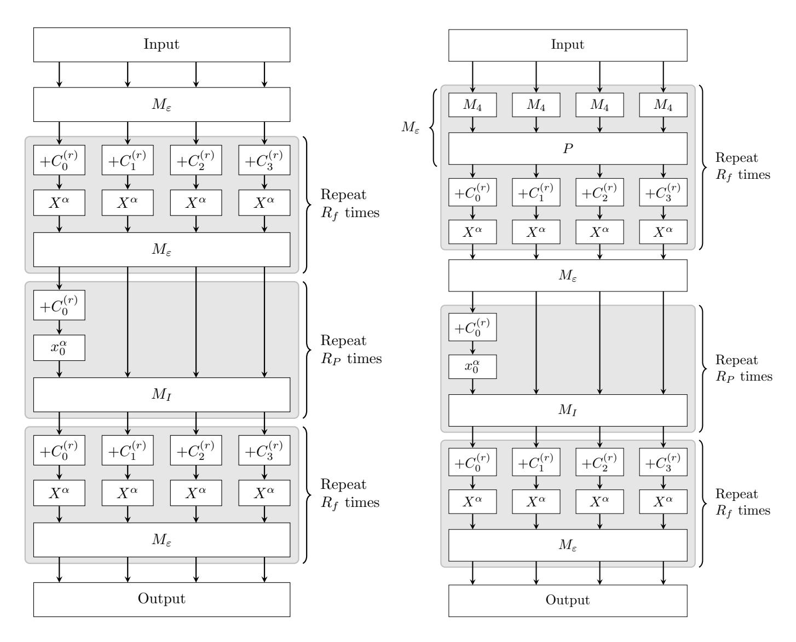
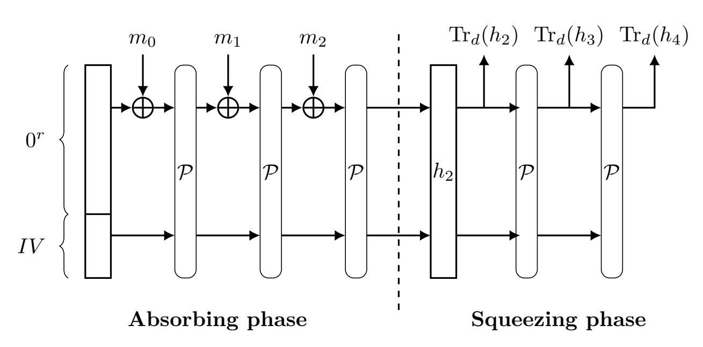

{0}------------------------------------------------

# Skipping Class: Algebraic Attacks exploiting weak matrices and operation modes of Poseidon2(b)

Simon-Philipp  $\mathrm{Merz}^1,$  Àlex Rodríguez  $\mathrm{Garc}(\mathbf{a}^2$ 

1 ETH Zurich, Switzerland
 2 Universitat Politècnica de Catalunya, Spain

Abstract We present new algebraic attacks on Poseidon2 and Poseidon2B. We exploit the specific structure of the matrices that define the linear layers in the hash function which allows us to improve round-skipping for the constrained-input constrained-output (Cico) problem. The security of many circuit-friendly hash functions has been measured by their resistance against attacks on the Cico problem. However, we show how to boost our round-skipping attack when directly modelling algebraic preimage attacks of Poseidon2(B) in compression and sponge mode. To the best of our knowledge, our attack provides the first examples where finding preimages is easier than solving the corresponding Cico problem in Poseidon2(B). Furthermore, we describe the first algebraic collision attack that outperforms its algebraic preimage counterpart. We improve over state-of-the-art algebraic attacks for a range of parameters, e.g. for one recommended 128-bit parameter set we improve over previous state-of-the-art algebraic collision attacks by a factor of 2106. However, due to the algebraic security margin this does not mean the primitive falls short of its claimed security level. Finally, we discuss how our attacks can be mitigated without affecting the efficiency of Poseidon2(B).

### 1 Introduction

Circuit-friendly hash functions are designed specifically to make zero-knowledge proof systems faster. Compared to traditional hash functions, this is achieved by prioritizing (a small number of) additions and multiplications over bitwise operations such as XOR or bit rotations.

Poseidon is one of the first circuit-friendly hash functions. The work introducing it dates back to 2019 [GKR+21], with updated versions forged in response to a progression of crypt-analytic results, e.g. [BCD+20, KR21]. In 2023, an overhauled and more efficient version was published under the name Poseidon2 [GKS23]. Most recently, another version was introduced as Poseidon(2)B. It works over binary fields, and is thus particularly suited for use in binary proof systems [GKK+26].

Despite a series of cryptanalytic results on Poseidon and Poseidon2 [BCD+20, KR21, BBLP22, BBB+25, ZSVD25], none of the recommended parameter sets have been broken to date, making it one of the more trusted circuit-friendly hash functions. At the time of writing, Poseidon2 is being considered for adoption by Ethereum. As part of Polygon's Plonky libraries, Poseidon2 has been widely used in cryptographic research and elsewhere, e.g. in the Quantus network blockchain3, Poseidon2 is already deployed.

All Poseidon variants follow a classical SPN construction with the Partial SPN (PSPN) construction using an underlying permutation on  $\mathbb{F}_q^t$ . It is recommended for use in sponge and

The authors are listed in alphabetical order. This research was undertaken as part of the second author's Bachelor's thesis conducted at ETH Zurich.

&lt;sup>3 https://github.com/Quantus-Network/qp-poseidon/blob/main/core/src/lib.rs

{1}------------------------------------------------

compression mode. The underlying permutation consists of rounds, each of which is made up of a linear layer and a non-linear S-box. Here, the linear layers can be described by matrix multiplications and the S-boxes consist of element-wise exponentiation by  $\alpha$ , where  $\alpha$  is typically the smallest odd integer coprime to q-1. In the *external* rounds, all t states are raised to the power  $\alpha$ , whereas in the *internal* rounds the power map is only applied to a single state.

In this work, we introduce new algebraic attacks that exploit the structure of the matrices defining the linear layers in both external and internal rounds of Poseidon2 and Poseidon2B. The hash function's security has usually been studied by estimating the hardness of the cico (constraint input, constraint output) problem of its underlying permutation. This means finding an input to a permutation such that the input and the output satisfy certain constraints, e.g. certain input and output elements should equal 0.

Our attacks use the  $round\ skipping\ technique$ . Consider the permutation underlying Poseidon2(B) as split into two parts

$$Poseidon^{\pi} = \pi_2 \circ \pi_1,$$

where  $\pi_1$  corresponds to the initial rounds that are "skipped" and  $\pi_2$  contains the remaining subsequent rounds. A round skip is a an algebraic variety V parametrized in certain variables in the image of  $\pi_1$  such that all points in  $\pi_1^{-1}(V)$  satisfy the input constraints. Thus, to find a solution to the CICO problem, it is sufficient to impose the output constraints on  $\pi_2$  given inputs from the parametrized space. If the equations describing the parametrization are of sufficiently low degree, this leads to an improvement over a more direct algebraic approach. Depending on the available degrees of freedom, we can give advantageous parametrizations for the initial rounds. We used our round-skipping attack to claim the largest CICO-2 bounty available in Ethereum's Poseidon initiative [Eth24] with less than 11 hours of computation on 64 cores. As a comparison, the second largest bounty, which is  $\approx 5^6$  times easier to solve, was claimed using 40 hours of computation on 1000 cores [BBB+26]. Theoretically, we anticipated a speed-up of approximately  $5^9$  for the same instance and in practice, we observed an even greater acceleration.

If the inner permutation of the hash function is close to pseudorandom, then the security of a sponge mode hash function can be related to the hardness of the CICO problem for the permutation instantiating the sponge [BDPVA08]. A priori, it is not clear whether POSEIDON's underlying permutation indeed satisfies this condition, but no previous attack on POSEIDON has exploited a concrete mode of operation to achieve better results than when attacking the CICO problem. We explore how our attack ideas can be modified when applied directly to algebraic preimage attacks on POSEIDON in sponge and in compression mode. In both cases, we can further improve the round-skipping attack for some suggested parameter sets. This calls into question the implicit assumption made in previous POSEIDON cryptanalysis that it is sufficient to study the CICO-security of the underlying permutation alone. As such, we argue that the folklore belief that the security can be studied entirely through the CICO problem should be abandoned.

Finally, we adapt the algebraic modelling of the polynomial systems arising from sponge mode with round-skipping to algebraic collision search. This yields yet another speed-up and shows that this problem should be studied separately.

We summarise the resulting speed-ups of our attack in different settings for two recommended parameter sets in Table 1.

**Related Work.** Previous cryptanalysis of Poseidon showed how to bypass arbitrarily many internal rounds [BCD+20, KR21], and how to choose the linear layer to prevent this from happening [GRS21]. As a result, the internal linear layers of Poseidon were adapted. Further, certain parameter choices in previous iterations of Poseidon such as raising all entries element-wise to

{2}------------------------------------------------

| Type of attack,                                 | (n,t,c,d)                                          |                    | Reference       |  |
|-------------------------------------------------|----------------------------------------------------|--------------------|-----------------|--|
| (mode of operation)                             | (32, 24, 8, 8)                                     | (64, 12, 4, 4)     |                 |  |
| CICO- $(c,d)$ problem                           | $\alpha^{7\omega}$                                 | $\alpha^{3\omega}$ | Section 3.3 and |  |
| (c, a) problem                                  | $\alpha$                                           | $\alpha$           | Tables 2 and 3  |  |
| Preimage attack                                 | $\alpha^{4\omega}$                                 | $\alpha^\omega$    | Lemma 4.5 and   |  |
| $(2\text{-to-}1 \text{ compression}^{\dagger})$ | $\alpha$                                           | $\alpha$           | Appendix A      |  |
| Preimage attack                                 | $\alpha^{12\omega}$                                | $\alpha^{8\omega}$ | Section 4.1 and |  |
| (3-to-1 compression)                            | α                                                  | $\alpha$           | Tables 4 and 5  |  |
| Preimage attack                                 | $\alpha^{11\omega}$                                | $\alpha^{6\omega}$ | Section 5.2     |  |
| (sponge mode, single squeeze)                   | α                                                  | α                  | Section 5.2     |  |
| Collision attack                                | $\min(\alpha^{(35-R_P)\omega}, \alpha^{19\omega})$ | _                  | Section 5.3     |  |
| (sponge mode, single squeeze)                   | $\frac{1}{\alpha}$                                 |                    | Decemon 5.5     |  |

**Table 1.** Speed-ups over previous algebraic attacks [BBB+25] for the CICO problem, different security notions and modes of operation modes for recommended parameter sets [GKS23, GKK+25] with  $R_F = 8$  external rounds. The size of field elements is denoted by n, t the number of states, c the sponge capacity and d the digest size. Complexity of Gröbner basis attack assumed to be proportional to  $d_I^{\omega}$ , where  $2 \le \omega < 3$ , and  $d_I$  is the ideal degree. S-boxes are instantiated with the element-wise power map by  $\alpha$ . In the binary case,  $\alpha = 7$ .  $R_P$  denotes the number of internal rounds.

† In 2-to-1 compression, 2d = n. Speed-ups are for parameters (n, t, d) = (32, 24, 12) and (n, t, d) = (64, 12, 6).

the power -1 in the non-linear layer and a binary version, called STARKAD, were abandoned. A first attack that observed how to skip two rounds in the original POSEIDON [BBLP22, Sect. 4.3] was countered by adding an additional linear layer at the beginning. Later, a different attack on POSEIDON2 allowed an attacker to skip two rounds in a single variable for the CICO-1 problem [BBB+25, Appendix D] exploiting the structure of the matrix defining the linear layers in POSEIDON2.

Further cryptanalytic research used resultants to compute solutions to CICO-2 bounty instances in Ethereum's competition [BBB+26] or used refined root-finding techniques to solve CICO-1 problems in the context of Poseidon2 [ZSVD25]. Solving general CICO-k problems for k > 1 can further be done using Gröbner basis techniques to solve the arising polynomial systems as first done for Poseidon in [BCD+20, KR21]. A more recent thorough analysis in the context of Poseidon2 was done in the "Algebraic CheapLunch" [BBB+25]. There, a custom monomial ordering is computed that claims to compute the Gröbner bases for Poseidon(2) more efficiently. To estimate the complexity of finding solutions to the CICO-k problem using Gröbner bases, the authors of [BBB+25] further provided tighter bounds on the degree of the ideal generated by the polynomials.

Contributions. We formalise round-skipping and introduce a notation that enables a better comparison of different round-skipping attacks in the literature. Then, we improve round-skipping for Poseidon2 and Poseidon2(B) for a range of parameters that were suggested by its authors [GKS23, GKK+25]. Hereby, we take advantage of the specific structure of the matrices used to define the linear layers of Poseidon2(B) in both the external and internal rounds. We keep our treatment of round-skipping modular, so that it can be easily combined with previous cryptanalytic results such as resultant-based attacks and Gröbner basis attacks.

{3}------------------------------------------------

#### S.P. Merz, À. Rodríguez García

4

For some parameter sets we provide closed formulae for the parametrization describing the skipped rounds (for the CICO-4 and the CICO-8 problem). For other parameters we describe and list the possible round skips.

Beyond the CICO-k problem, we adapt our techniques to further improve the round skips in the setting of algebraic preimage attacks when POSEIDON2(B) is used in compression and sponge mode. This shows that there is a qualitative difference between studying CICO problems and evaluating the security of the hash function in different modes of operation directly.

We show further that for some parameter ranges the algebraic collision attacks outperform algebraic preimage attack. For some parameter sets this leads to performance improvements by  $2^{106}$  over previous state-of-the-art algebraic attacks, namely in the collision attack on Pos-EIDON2B with parameters  $\alpha = 7$  and  $R_P = 15$  taken from [GKK+25, Tbl. 1], see Table 1, for which we show how to skip the first 10 rounds.

Despite a significant speed-up over previous algebraic attacks, the generous algebraic security margin of Poseidon2(B) prevents breaking the asserted security level of practical parameter sets. We discuss limits of our attack in full-round Poseidon and possible countermeasures.

**Technical Overview.** To find suitable parametrizations for our improved round skips, we take advantage of the specific structure of the matrices used to define the linear layers of Poseidon2 and Poseidon2 in both the external and internal rounds. We use the available degrees of freedom on the input to force certain variables to propagate through invariant subspaces thus preventing the full diffusion of the variables intended by the designers. Forcing these subspaces is only possible because the matrix defining the linear layer has a tensor structure with the left matrix having low-weight eigenvectors with entries 1 and -1. This leads to invariant low-weight unconstrained subspaces. Invariance is with respect to both the linear layer and the S-box layer. The low-weight is used to bypass several variables at the expense of only few degrees of freedom. Unconstrained means that those subspaces do not have any constraints on their input. As such, we can model our parametrization using only few low-degree polynomials, hence reducing the degree of the final equations to ultimately decrease the complexity of solving the resulting polynomial system. A possible countermeasure of the described attack is changing the matrix design so that all these invariant low-weight subspaces have some constraints on their inputs.

To solve the CICO problem, we impose certain input values to be given constants. In sponge, we impose those input values to be the output of the previous permutation, which, with the appropriate modelling, gives us additional degrees of freedom that can be used for an improved round skip. This introduces another system of equations, namely the one arising from the round skip restrictions, which we justify to be cheaper than the second one. We can think about compression as having some inputs constrained to constants of our choice or low degree polynomials of our parametrizations, which ultimately also leads to additional degrees of freedom compared to fixing those values beforehand. Finally, for collisions, we can parametrize half of the variables and impose that the given outputs are equal to another similar parametrization. As such, since the propagated variety has a smaller dimension, we can skip even more rounds. Even though the system from this modelling ends up being asymptomatically more complex, the difference in the number of rounds skipped makes it a worth trade-off for some parameter sets.

Outline. In Section 2 we introduce notation that is used throughout the paper and we recall the relevant background including the details of the Poseidon2(B) permutation, and the modes of operation. In Section 3 we formally define round-skipping and apply it to the CICO problem for a range of parameters. We adapt the modelling for algebraic preimage attacks of Poseidon in compression and sponge mode in Section 4. In Section 5 we discuss the algebraic modelling

{4}------------------------------------------------

for the resulting polynomial system after applying round-skipping for our preimage attack, the modelling of sponge mode with two permutations as well as the algebraic modelling of our algebraic collision attack. We conclude in Section 6 with the impact on full-round Poseidon2 and potential countermeasures.

#### 2 Preliminaries

We begin this section by recalling the relevant security definitions in Section 2.1. Then, we describe the permutation underlying both Poseidon2 and Poseidon2B. In particular, we recollect the matrices that define the linear layers of the external and the internal rounds. Using the tensor structure of these matrices and to simplify the nomenclature later, we present an equivalent way to view the underlying permutation in Fig. 1. We conclude the preliminaries by describing the modes of operation of the Poseidon2(B) hash functions and setting some notation for the rest of the paper.

#### 2.1 Security definitions

In this section we recall relevant security definitions for this paper as previously defined in Poseidon(2)B [GKK+26]. For a meaningful treatment of unkeyed hash functions such as Poseidon2 and Poseidon2B, we rule out non-uniform adversaries as is the convention in symmetric cryptography. A *unit of time* is a single evaluation of the hash function.

**Definition 2.1 (Preimage resistance).** Let  $\mathcal{H}: \mathbb{F}_q^* \to \mathbb{F}_q^d$ . We call  $\mathcal{H}$   $\lambda$ -bit preimage resistant, if for any known algorithm with random  $h \in \mathbb{F}_q^d$  as input that runs in time  $\tau$ , the probability to output x such that  $\mathcal{H}(x) = h$  is at most  $\frac{\tau}{2^{\lambda}}$ .

**Definition 2.2 (Collision resistance).** Let  $\mathcal{H}: \mathbb{F}_q^* \to \mathbb{F}_q^d$ . We say  $\mathcal{H}$  is  $\lambda$ -bit collision resistant, if for any known algorithm that runs in time  $\tau$  the probability to output x, y such that  $\mathcal{H}(x) = \mathcal{H}(y)$  is at most  $\frac{\tau^2}{2^{\lambda}}$ .

Further, we define the CICO problem, which is used by the authors of both Poseidon and previous cryptanalysis to be the fundamental problem to assess security.

**Definition 2.3** (CICO-(IN,OUT) **Problem).** Let  $\mathcal{P}: \mathbb{F}_q^t \to \mathbb{F}_q^t$  be a function. The CICO-(IN,OUT) problem of  $\mathcal{P}$  is to find two vectors  $\mathbf{x} \in \mathbb{F}^{t-IN} \times \{0\}^{IN}$ , and  $\mathbf{y} \in \mathbb{F}^{t-OUT} \times \{0\}^{OUT}$  such that  $\mathcal{P}(\mathbf{x}) = \mathbf{y}$ . By the CICO-k problem, we mean the CICO-(k,k) problem.

**Definition 2.4** (CICO-(IN,OUT) **Security).** Let  $\mathcal{P}: \mathbb{F}_q^t \to \mathbb{F}_q^t$  be a function. We say that  $\mathcal{P}$  is  $\lambda$ -bit CICO-(IN,OUT) secure, if no algorithm that runs in time less than  $2^{\lambda}$  outputs a valid solution to the CICO-(IN,OUT) problem with probability 1.

In Section 4, we will describe how to improve round-skipping attacks on the CICO-k problem on Poseidon2(B) when used in the recommended modes of operation. In particular, this will contradict the widespread folklore belief that any attack on Poseidon is as hard as solving its CICO-k problem.

{5}------------------------------------------------

#### 2.2 The Poseidon2(b) permutation

The Poseidon2(B) $\pi$  permutation is the permutation underlying the Poseidon2 [GKS23] and Poseidon2B [GKK+25] hash functions. The Poseidon2(B) $\pi$  permutation is a map  $\mathbb{F}_q^t \to \mathbb{F}_q^t$ , where q is an n-bit prime in the case of Poseidon2 and an n-bit binary field in the case of Poseidon2B. The permutation consists of a concatenation of  $R_f$  external (full) rounds at the beginning and end as well as  $R_P$  internal (partial) rounds. Each round in turn consists of a linear layer and a non-linear layer, i.e. an affine transformation and an S-box. The S-box consists of an element-wise power map  $S(x) := x^{\alpha}$  of all entries in full rounds, and only the first entry in partial rounds. The affine transformation is defined by a matrix and round constants. Hereby, the round constants are derived from the parameters n,  $R_F$  (:=  $2 \cdot R_f$ ),  $R_P$ , t and  $\alpha$  using a PRNG.

Matrices defining the affine transformations. In this work, we focus on parameter sets with n being 32 or 64,  $t \in \{12, 16, 20, 24\}$ , i.e. including a subset of the parameter sets considered by the authors of Poseidon2 and Poseidon2 [GKS23, Tbl. 1], [GKK+25, Tbl. 1].

For all of these parameters, the matrix that defines the affine transformation in the external layer is of the form  $M_{\varepsilon} := P_{t/4} \otimes M_4$  (resp.  $M_{\varepsilon}^{(b)} := P_{t/4}^{(b)} \otimes M_4^{(b)}$ ), where  $P_m$  is an  $m \times m$  matrix with 2 (resp. X in the binary case) on all diagonal entries and 1 elsewhere, and  $M_4$  (resp.  $M_4^{(b)}$ ) is the following MDS matrix.

$$M_4 := \begin{bmatrix} 5 & 7 & 1 & 3 \\ 4 & 6 & 1 & 1 \\ 1 & 3 & 5 & 7 \\ 1 & 1 & 4 & 6 \end{bmatrix}, \qquad M_4^{(b)} := \begin{bmatrix} X^2 + 1 & X^2 + X + 1 & 1 & X + 1 \\ X^2 & X^2 + X & 1 & 1 \\ 1 & X + 1 & X^2 + 1 & X^2 + X + 1 \\ 1 & 1 & X^2 & X^2 + X \end{bmatrix}.$$

For t = 16, for example, the  $16 \times 16$  matrix  $M_{\varepsilon}$  is given by

$$M_{\varepsilon} \coloneqq P_4 \otimes M_4 = \begin{bmatrix} 2 & 1 & 1 & 1 \\ 1 & 2 & 1 & 1 \\ 1 & 1 & 2 & 1 \\ 1 & 1 & 1 & 2 \end{bmatrix} \otimes \begin{bmatrix} 5 & 7 & 1 & 3 \\ 4 & 6 & 1 & 1 \\ 1 & 3 & 5 & 7 \\ 1 & 1 & 4 & 6 \end{bmatrix}.$$

The property that we will use later to improve round-skipping is that the matrices  $P_m$  have low-weight eigenvectors with entries 1 and -1 and thus  $M_{\varepsilon}$  does also when viewed as acting on quadruples of  $\mathbb{F}_q$ -elements.

The matrices  $M_I$  that define the affine layer in the internal rounds are of the form

$$M_I \coloneqq \begin{bmatrix} \mu_0 & 1 & \cdots & 1 \\ 1 & \mu_1 & \cdots & 1 \\ \vdots & \vdots & \ddots & \vdots \\ 1 & 1 & \cdots & \mu_{t-1} \end{bmatrix},$$

where  $\mu_0, \ldots, \mu_{t-1} \in \mathbb{F}_q \setminus \{0,1\}$  are chosen such that  $M_I$  is invertible and does not admit arbitrarily long subspace trails (see [GRS21, GKK+26] for details).

The tensor structure of  $M_{\varepsilon}$  enables us to interpret the Poseidon2(B) $\pi$  permutation as acting on t/4 quadruples of  $\mathbb{F}_q$ -elements. For t=16, we depict this action in Fig. 1, where we represent the initial vector of 16  $\mathbb{F}_q$ -elements as 4 quadruples.

For ease of exposition of our attack later, we further modify what we call an external round. Instead of considering an initial linear layer followed by the external rounds which alternate S-boxes and additional linear layers, we say that an external round starts with a linear layer followed

{6}------------------------------------------------

**Figure 1.** Left: Original description of Poseidon2(B) $\pi$  for t=16. Right: Equivalent description of the scheme using the structure of  $M_{\varepsilon}$  and relabelling external rounds.

by an S-box and one additional linear layer is applied after all the initial external rounds. This equivalent view is depicted on the right in Fig. 1.

#### 2.3 Modes of operation in Poseidon2(b)

Starting from a permutation, one can build hash functions using different modes of operation. Poseidon2(B) is recommended for use in compression and sponge mode which we will recall in this section. In Sections 4.1 and 4.2, we adapt our ideas for round-skipping attacks targeting the CICO problem to further improve round-skipping of Poseidon2(B) when used in a specific mode of operation.

Compression Hash Functions can be instantiated from permutations in multiple ways. In Poseidon2(B), the compression mode is obtained by combining the truncation function  $\operatorname{Tr}_d: \mathbb{F}_q^t \to \mathbb{F}_q^d$ , which truncates after the first d elements, with a feed-forward operation. More precisely, the compression  $\mathcal{C}: \mathbb{F}_q^t \to \mathbb{F}_q^d$  is computed as

$$x \in \mathbb{F}_q^t \mapsto \operatorname{Tr}_d(\mathcal{P}(x) + x) \in \mathbb{F}_q^d.$$

Other compression modes in the literature such as Jive [BBC+23] can be seen as variants of the compression function above with an additional multiplication by an invertible matrix  $M_C \in GL_t(\mathbb{F}_q)$  such that  $C'(x) := \operatorname{Tr}_d(\mathcal{P}(x) + M_C \cdot x) \in \mathbb{F}_q^d$ . To simplify the construction, the additional matrix multiplication was dismissed for Poseidon2 [GKS23, p. 7] following an

{7}------------------------------------------------

argument made in GHR+23, Sect. 4, which says that dismissing the matrix multiplication has no impact on security if no conditions are imposed on the inputs to the compression functions. However, the round-skipping attack on Poseidon2(B) which we will describe in Section 4.1 does impose conditions on the input and could have been prevented by adding a multiplication with an appropriately chosen matrix.

**Sponge Hash Functions** are built using an internal permutation and can be used with inputs of arbitrary size to provide outputs of arbitrary size [BDPVA07, BDPVA08]. Let  $\mathcal{P}: \mathbb{F}_q^t \to \mathbb{F}_q^t$ be the internal permutation, and let t = c + r, where t are the number of states, c denotes the capacity and r is called the rate. The sponge construction works as follows.

1. Given an input message  $m \in \mathbb{F}_q^*$ , it is padded such that it length is a multiple of r, i.e. we have

$$m = m_0 || m_1 || \dots || m_{\ell-1} \in (\mathbb{F}_q^r)^{\ell}.$$

2. The message blocks are absorbed sequentially, one at a time into an  $\mathbb{F}_q^t$  state by computing

$$h_i := \mathcal{P}(h_{i-1} + m_i || 0^c), \quad \forall i \in \{0, 1, \dots \ell - 1\},$$

where  $h_{-1} := 0^r || IV \in \mathbb{F}_q^t$  for some  $IV \in \mathbb{F}_q^c$  as initial capacity. 3. The output of the hash function of required length is then squeezed from the state d elements at a time by calculating  $\operatorname{Tr}_d(h_{\ell-1}) \| \operatorname{Tr}_d(h_{\ell}) \| \dots$ , where  $\operatorname{Tr}_d : \mathbb{F}_q^t \to \mathbb{F}_q^d$ .

Remark 2.5. When discussing round skips and and algebraic modellings for algebraic preimage and collision attacks on Poseidon2(B) in sponge mode, we restrict ourselves to the setting where the absorbing phase consists of at least two rounds and there is only a single squeeze. This is the setting Poseidon2 is used for example in the leaf hashing of [DKKW25].

**Figure 2.** Sponge hash function with underlying permutation  $\mathcal{P}$ , three absorptions and three squeezes. We will study the security of sponge mode with at least two absorptions and a single squeeze.

**Notation.** For our round-skipping attack, we use the  $(t/4) \times 4$  tensor structure of the matrix defining the linear layer in the external rounds. We simplify our exposition by denoting vectors where elements are vectors of  $\mathbb{F}_p$ -elements of length 4 using square brackets  $|\ldots|$  and vectors consisting of 4  $\mathbb{F}_p$ -elements using round parentheses (...). For simplicity, we denote the matrices  $M_4$  by M and  $P_{t/4}$  by P. For the remainder of the paper there is no need to distinguish between the binary and prime fields. Therefore, we use  $\mathbb{F}$  to denote the base field. By modular reduction  $\pmod{m}$ , we denote the map that sends integers to their residue in the interval  $\{0,\ldots,m-1\}$ .

{8}------------------------------------------------

# 3 Improved round-skipping for the CICO problem

In this section we study how to skip rounds when solving the CICO problems for the permutation underlying Poseidon2(B). We begin by formalising the meaning of a round skip and introduce the notation which allows us to also discuss and compare partial round skips. In Section 3.2, we discuss how to exploit the properties of the matrix that defines the affine transformations in Poseidon2(B) for round-skipping at the example of a round-reduced version corresponding to the biggest bounty challenge from Ethereum's Poseidon initiative 2025 [Eth24]. In Section 3.3, we give closed formulas to skip one external round for CICO-4 and CICO-8 for some recommended parameter sets. Finally, by deriving more general rules for round skipping we extend our analysis to a range of parameters in Section 3.4 and summarise the available round skips for different parameter sets from the Poseidon2(B) specifications in Tables 2 and 3.

#### 3.1 Defining round-skipping or how to cut corners without missing the point(s)

Recall that the general idea behind round skipping for the CICO-k problem is to decompose a permutation consisting of many rounds into two parts.

$$Poseidon^{\pi} = \pi_2 \circ \pi_1$$

Here,  $\pi_1$  corresponds to the initial rounds that are "skipped", meaning one can find an efficiently computable parametrization of the space in the image of  $\pi_1$  that satisfies the input constraints when inverting  $\pi_1$  on it. The map  $\pi_2$  denotes the remainder of the permutation in terms of the sequential rounds. Thus, if one wishes to find a solution to the CICO-k problem for POSEIDON $\pi$ , it is sufficient to impose the output constraints on  $\pi_2$  given inputs from the parametrized space. This leads to an improvement as long as the polynomials arising from  $\pi_2$  given inputs from the parametrized space will be of lower degree than the ones coming from the entire permutation. As such, depending on the parametrization, round skipping can be seen as a tool to lower the degrees of the equations that need to be solved in an algebraic attack, which in turn are used to estimate the cost of solving the CICO problem.

As prior work describing and citing round skips of Poseidon has a slightly inconsistent nomenclature, we suggest the following definition to describe round skips, which not only depends on the number of rounds described by  $\pi_1$ , but also the degree on each variable of the parametrization.

**Definition 3.1 (Round skip).** For a CICO-(IN,OUT) problem of the POSEIDON permutation  $\mathcal{P}: \mathbb{F}^t \to \mathbb{F}^t$ , an

$$((r_F, r_P), [\delta_0, \dots, \delta_{OUT-1}])$$

round skip consist of an algebraic variety  $\mathcal{V} \subset \mathbb{F}^t$  with the following properties:

1. Let  $\pi_1$  denote the first  $r_F$  external rounds and  $r_P$  partial rounds of  $\mathcal{P}$ . We have

$$\pi_1^{-1}(\mathcal{V}) \subset \mathbb{F}^{t-IN} \times \{0\}^{IN}$$
.

2. V can be parametrized with variables  $(x_0, \ldots, x_{OUT-1})$  over  $\mathbb{F}$  such that the degree of  $x_i$  in this parametrization is upper bounded by  $\delta_i$ .

If  $r_P = 0$ , we write  $(r_F, [\delta_0, \dots, \delta_{OUT-1}])$  instead. Whenever the bound on the degrees is repeated g times, we shorten to  $[\delta]^g$  and we concatenate the lists using +, e.g.  $[1]^2 + [3] = [1, 1, 3]$ .

{9}------------------------------------------------

Definition 3.1 can be adapted in a natural way to different settings such as compression and sponge mode. For example, we may require constraints to non-zero elements.

Note that for  $\pi_1$  coming from the Poseidon2(B) $\pi$  permutation, we have  $r_P = 0$  unless all initial external rounds are skipped. In this paper, we will investigate round skips for which we expect parametrizations (for a random choice of round constants and constraints). For some parameters, we will further give *closed formulae* for the round skip meaning the parametrization always exists and can be written down for any set of round constants and constraint constants.

We can use this notation to describe previous round skips in the literature considering the CICO-k problem, i.e. IN = OUT = k. The round skip for POSEIDON described in [BBLP22] is (2,[1]). Its generalization to further variables as described in [BBB+25, Appendix D] is a  $(1,[1]^s+[\alpha]^{k-s})$  round skip, where  $s:=\lfloor t/k\rfloor-2$ . For POSEIDON2, a (2,[1]) round skip has also been described there. The main advantage of this new notation is to give a more precise description of the round skip which can also be used to upper-bound the ideal degree of the equations that solve the resulting CICO-k problem, which we discuss in Theorem 5.1.

Further, note that additional rounds can be trivially absorbed into  $\pi_1$  by increasing the degrees of the parametrization in every variable. However, this change clearly does not reduce the complexity of solving the resulting algebraic system.

#### 3.2 Skipping rounds in round-reduced Poseidon2

As a warm-up, we describe how to skip rounds in a round-reduced version of Poseidon2. The parameters of the round-reduced Poseidon2 we analyse are  $(p, n, t, \alpha, R_F, R_P) = (2^{31} - 1, 31, 16, 5, 6, 4)$ , which corresponds to the largest CICO-2 bounty instance of Ethereum's Poseidon initiative [Eth24]. In the following, we present a ((3,4),[5,5]) round skip which is an improved version of the attack we ran to break the larger bounty instance in less than 11 hours on 64 cores as described in Appendix B. In the subsequent subsections, we generalise several ideas from the round-reduced example to further parameter sets and more general CICO-k problems.

Recall that for t=16, the matrix defining the linear layer in the external rounds is of the form  $M_{\epsilon}=P\otimes M$ , where P has the low-weight eigenvector (0,1,-1,0). We view the 16 states of a solution as 4 vectors of length 4 consisting of  $\mathbb{F}_p$ -elements. For vectors, exponentiation by  $\alpha$  means element-wise exponentiation.

The core idea behind our round skip is to find constants for our parametrization such that solutions to the remaining variables are of the form that the second and third components of vectors of length 4 will be additive inverses of each other after each of the initial rounds, while the remaining entries can be derived from various constants. This prevents "mixing" of the variables for the initial rounds and ultimately allows us to lower the degree of the remaining algebraic system.

**Skipping the first round.** Let  $U_i^{(0)}$  denote vectors of  $\mathbb{F}_p$  constants of length 4, yet to be defined, and let X denote a vector of  $\mathbb{F}_p$  variables of length 4. Consider the structure of the first round depicted in Eq. (1).

$$\begin{bmatrix} U_0^{(0)} \\ U_1^{(0)} + X^{(0)} \\ -X^{(0)} \\ U_3^{(0)} \end{bmatrix} \xrightarrow{\mathcal{E}_0} \begin{bmatrix} (2MU_0^{(0)} + MU_1^{(0)} + MU_3^{(0)} + C_0^{(0)})^{\alpha} \\ (MX^{(0)} + MU_0^{(0)} + 2MU_1^{(0)} + MU_3^{(0)} + C_1^{(0)})^{\alpha} \\ (-MX^{(0)} + MU_0^{(0)} + MU_1^{(0)} + MU_3^{(0)} + C_2^{(0)})^{\alpha} \\ (MU_0^{(0)} + MU_0^{(0)} + MU_1^{(0)} + 2MU_3^{(0)} + C_3^{(0)})^{\alpha} \end{bmatrix} =: \begin{bmatrix} U_0^{(1)} \\ X^{(1)} \\ -X^{(1)} \\ U_3^{(1)} \end{bmatrix}$$
(1)

Note that we can explicitly write the first round in terms of the action of M on vectors of length 4. Furthermore, note that only the two middle vectors depend on  $X^{(0)}$ , so the first and

{10}------------------------------------------------

the last vector can be equal to two constant vectors  $U_0^{(1)}$ ,  $U_3^{(1)}$ , yet to be defined. However, we impose that the second vector and the third vector of the evaluation are additive inverses of each other, e.g. they are vectors of variables  $X^{(1)}$  and  $-X^{(1)}$ , respectively.

Clearly, the latter is equivalent to

$$MU_0^{(0)} + 2MU_1^{(0)} + MU_3^{(0)} + C_1^{(0)} = -(MU_0^{(0)} + MU_1^{(0)} + MU_3^{(0)} + C_2^{(0)}) =: L,$$
 (2)

as in this case, one has

$$(MX^{(0)} + L)^{\alpha} = X^{(1)}$$
$$(-MX^{(0)} - L)^{\alpha} = -X^{(1)}.$$

Note that  $\alpha$  is odd as it has to be coprime to p-1. Thus, there is a bijection between  $X^{(0)}$  and  $X^{(1)}$  and one can simply make a change of variables. Additionally, we need to consider the following equations which describe the constants in the first and fourth component vector of the output of the first external round.

$$2MU_0^{(0)} + MU_1^{(0)} + MU_3^{(0)} + C_0^{(0)} = (U_0^{(1)})^{1/\alpha}$$
$$MU_0^{(0)} + MU_1^{(0)} + 2MU_3^{(0)} + C_3^{(0)} = (U_3^{(1)})^{1/\alpha}$$

Together with Eq. (2) and some linear algebra, this leads to the following equations.

$$5U_0^{(0)} = M^{-1}(4(U_0^{(1)})^{1/\alpha} - (U_3^{(1)})^{1/\alpha} - 4C_0^{(0)} + C_1^{(0)} + C_2^{(0)} + C_3^{(0)})$$

$$5U_1^{(0)} = M^{-1}(-2(U_0^{(1)})^{1/\alpha} - 2(U_3^{(1)})^{1/\alpha} + 2C_0^{(0)} - 3C_1^{(0)} - 3C_2^{(0)} + 2C_3^{(0)})$$

$$5U_3^{(0)} = M^{-1}(4(U_3^{(1)})^{1/\alpha} - (U_0^{(1)})^{1/\alpha} - 4C_3^{(0)} + C_0^{(0)} + C_1^{(0)} + C_2^{(0)})$$

Thus, given the matrix M, the round constants  $C_i^{(0)}$ ,  $U_0^{(1)}$ , and  $U_3^{(1)}$ , one can recover all of the  $U_i^{(0)}$ . Moreover, to force the input constraints for CICO-2 solution, the final two components of  $U_3^{(0)}$  must be zero. As such, we impose two equations on the elements of  $U_0^{(1)}$  and  $U_3^{(1)}$  as a first step to construct our parametrization.

Skipping the second round. Similarly, we can consider the second round as shown in Eq. (3).

$$\begin{bmatrix}
U_0^{(1)} \\
X^{(1)} \\
-X^{(1)} \\
U_3^{(1)}
\end{bmatrix} \xrightarrow{\mathcal{E}_1} \begin{bmatrix}
(2MU_0^{(1)} + MU_3^{(1)} + C_0^{(1)})^{\alpha} \\
(MX^{(1)} + MU_0^{(1)} + MU_3^{(1)} + C_1^{(1)})^{\alpha} \\
(-MX^{(1)} + MU_0^{(1)} + MU_3^{(1)} + C_2^{(1)})^{\alpha} \\
(MU_0^{(1)} + 2MU_3^{(1)} + C_3^{(1)})^{\alpha}
\end{bmatrix} =: \begin{bmatrix}
U_0^{(2)} \\
X^{(2)} \\
-X^{(2)} \\
U_3^{(2)}
\end{bmatrix}$$
(3)

As before, for the second and third components to be additive inverses of each other, we impose the following constraint.

$$MU_0^{(1)} + MU_3^{(1)} + C_1^{(1)} = -(MU_0^{(1)} + MU_3^{(1)} + C_2^{(1)})$$

Note that this corresponds to four more equations in the 8 variables over the base field  $\mathbb{F}_p$ . Together with the constraints from the first round, we thus require 6 equations in the 8 variables of  $U_0^{(1)}$  and  $U_3^{(1)}$ , leaving us with two degrees of freedom, which can be used for another (partial) round skip.

{11}------------------------------------------------

Skipping the third round. For the third round, we consider

$$\begin{bmatrix} U_0^{(2)} \\ X^{(2)} \\ -X^{(2)} \\ U_3^{(2)} \end{bmatrix} \xrightarrow{\mathcal{E}_2} \begin{bmatrix} (2MU_0^{(2)} + MU_3^{(2)} + C_0^{(2)})^{\alpha} \\ (MX^{(2)} + MU_0^{(2)} + MU_3^{(2)} + C_1^{(2)})^{\alpha} \\ (-MX^{(2)} + MU_0^{(2)} + MU_3^{(2)} + C_2^{(2)})^{\alpha} \\ (MU_0^{(2)} + 2MU_3^{(2)} + C_3^{(2)})^{\alpha} \end{bmatrix} =: \begin{bmatrix} U_0^{(3)} \\ X^{(3)} + U_1^{(3)} \\ -X^{(3)} + U_2^{(3)} \\ U_3^{(3)} \end{bmatrix}. \tag{4}$$

To skip one extra round, we would like to impose the following analogous to previous rounds.

$$MU_0^{(2)} + MU_3^{(2)} + C_1^{(2)} = -(MU_0^{(2)} + MU_3^{(2)} + C_2^{(2)})$$
(5)

However, with only two degrees of freedom left, imposing another four equations would be too much to ask. As such, we could only impose constraints on two variables. If we find a solution for which the equation is satisfied for any two  $\mathbb{F}_p$ -components, for example the first two, then we could use two degrees of freedom and impose  $MX^{(2)} = (\overline{x}, \overline{y}, 0, 0)$ , and consider the change of variables  $x = (\overline{x} + k_x)^{\alpha}$ ,  $y = (\overline{y} + k_y)^{\alpha}$  for some suitable constants  $k_x, k_y$ . In that case,  $X^{(3)}$  would be a vector of two variables in the first two components and zeros in the last two. The constant corresponding to the third and fourth components is encapsulated in  $U_1^{(3)}$  and  $U_2^{(3)}$ , which only depends on our choice of the last components of  $MX^{(2)}$ , the constants  $U_0^{(2)}$  and  $U_3^{(2)}$ , the round constants, and the power map  $\alpha$ .

Now that we have 8 equations in 8 variables, we can solve this polynomial system for which we expect a solution which provides us with a suitable parametrization. Notice that the existence of a solution depends on the round constants. If no solution exists, we could try to impose another two equations from Eq. (5) and retry.

**Skipping two partial rounds.** Next, we show that with a solution to the system above giving rise to a parametrization we can skip the subsequent two partial rounds for free.

After the initial three external rounds, we need to apply the remaining external matrix as shown in Fig. 1 followed by the two first partial rounds. To skip a partial round, it is sufficient to prove that the input at the first coordinate, the only one which is changed in the non-linear layer, is a constant.

For the first partial round in this round-reduced version of Poseidon2, the first coordinate is  $(MU_0^{(3)})_0 + c^{(4)}$  which is a constant. For the second partial round, the input in the first coordinate is the sum of elements in all other components plus  $\mu_0$ , the first diagonal entry of the matrix defining the internal layer as defined in Section 2.2, times the output of the first partial S-box. Clearly, the output of the first partial S-box is a constant as it is the power of a constant. Finally, since the sum adds the elements of  $MX^{(3)}$  and  $-MX^{(3)}$  it is independent of  $X^{(3)}$ .

The structure of the internal matrix that allows us to skip the first two partial rounds was made to improve the performance of Poseidon2 as described in [GKS23, Sect. 5.2].

Skipping the remaining two partial rounds (partially). If we set  $X^{(3)} = (x, y, 0, 0)$ , then the input to the third partial S-box depends on both x and y, but we could have parametrized this two dimensional space in a better way. More precisely, we could have set  $X^{(3)} = (x, y + a \cdot x, 0, 0)$  for some parameter  $a \in \mathbb{F}_p$ . It is still true that the input to the third S-box depends linearly on x and y, but now the coefficient of x further depends linearly on x. Thus, for an appropriate choice of x, we can force the third partial S-box to act only depending on y.

Let P(y) be the output of that S-box, i.e. the  $\alpha$ -th power of a linear function in y. Then, the input to the fourth partial S-box depends linearly on x, y, P(y). Looking back at the initial

{12}------------------------------------------------

parametrization, if we had chosen  $X^{(3)} = (x + Q(y), y + a \cdot (x + Q(y)), 0, 0)$  for the appropriate polynomial Q(y), then the input will only depend linearly on x, and not on y. Each element of the state after the fourth partial round now depends linearly on x, y, P(y), and the output of the fourth partial S-box. Overall, each component can be expressed as a polynomial of degree  $\alpha$  in x and y.

To compute a solution to the CICO-2 problem, all that remains to do is to propagate this state for the remaining three external rounds, set the last two components of the output to be zero and solve the polynomial system. That is, after round-skipping we only need to solve a system with two bivariate equations of degree  $\alpha^4$ .

#### 3.3 Closed formulae for round skips in full-round Poseidon2(b)

Full-round Poseidon2(B) has an additional external round, and thus we cannot skip the partial rounds as described in the previous example. However, an astute reader may have noticed that the attack on the round-reduced version of Poseidon2 can be further improved whenever there are fewer (IN, OUT)-restrictions in the CICO problem and more degrees of freedom, i.e. a larger number of states t.

In this subsection, we give a closed formula for an immediate skip of one round of the CICO-k problem for the two proposed parameter sets (n, t, k) = (32, 24, 8) and (n, t, k) = (64, 12, 4) which use a larger number of states t for a given prime size n. Note further, that for a CICO-k problem the parametrized algebraic variety will have to be of degree k to expect a solution.

Skipping one round for (n, t, k) = (32, 24, 8): For the CICO-8 problem we need to impose the final 8 inputs and outputs to be zero, leaving us with 8 degrees of freedom of the the t = 24 states. Similarly to the round-reduced example of Poseidon2, we observe that the matrix P in this case has the eigenvectors (1, -1, 0, 0, 0, 0) and (0, 0, 1, -1, 0, 0). To force the output of the first round to be of the form

$$\begin{bmatrix} U_{0}^{(0)} + X^{(0)} \\ -X^{(0)} \\ U_{2}^{(0)} + Y^{(0)} \\ -Y^{(0)} \\ 0 \end{bmatrix} \xrightarrow{\mathcal{E}_{0}} \begin{bmatrix} (MX^{(0)} + 2MU_{0}^{(0)} + MU_{2}^{(0)} + C_{0}^{(0)})^{\alpha} \\ (-MX^{(0)} + MU_{0}^{(0)} + MU_{2}^{(0)} + C_{1}^{(0)})^{\alpha} \\ (MY^{(0)} + MU_{0}^{(0)} + 2MU_{2}^{(0)} + C_{2}^{(0)})^{\alpha} \\ (-MY^{(0)} + MU_{0}^{(0)} + MU_{2}^{(0)} + C_{3}^{(0)})^{\alpha} \\ (-MY^{(0)} + MU_{0}^{(0)} + MU_{2}^{(0)} + C_{3}^{(0)})^{\alpha} \\ (MU_{0}^{(0)} + MU_{2}^{(0)} + C_{4}^{(0)})^{\alpha} \\ (MU_{0}^{(0)} + MU_{2}^{(0)} + C_{5}^{(0)})^{\alpha} \end{bmatrix} = \begin{bmatrix} X^{(1)} \\ -X^{(1)} \\ Y^{(1)} \\ -Y^{(1)} \\ U_{4}^{(1)} \\ U_{5}^{(1)} \end{bmatrix},$$
 (6)

we need to impose the two linear equations;

$$2MU_0^{(0)} + MU_2^{(0)} + C_0^{(0)} = -(MU_0^{(0)} + MU_2^{(0)} + C_1^{(0)})$$
  
$$MU_0^{(0)} + 2MU_2^{(0)} + C_2^{(0)} = -(MU_0^{(0)} + MU_2^{(0)} + C_3^{(0)}).$$

We observe that this is a linear system of full rank consisting of 8 equations in 8 variables for which a unique solution always exists.

**Skipping one round for** (n, t, k) = (64, 12, 4): In this case, we have analogously t = 12 states and we require the last 4 inputs and outputs to be zero. This leaves us four degrees of freedom that we can use to skip the first round. The details are provided in Eq. (7)

{13}------------------------------------------------

$$\begin{bmatrix} U_0^{(0)} + X^{(0)} \\ -X^{(0)} \\ 0 \end{bmatrix} \xrightarrow{\mathcal{E}_0} \begin{bmatrix} (MX^{(0)} + 2MU_0^{(0)} + C_0^{(0)})^{\alpha} \\ (-MX^{(0)} + MU_0^{(0)} + C_1^{(0)})^{\alpha} \\ (MU_0^{(0)} + C_2^{(0)})^{\alpha} \end{bmatrix} =: \begin{bmatrix} X^{(1)} \\ -X^{(1)} \\ U_2^{(1)} \end{bmatrix}, \tag{7}$$

where we imposed

$$2MU_0^{(0)} + C_0^{(0)} = -(MU_0^{(0)} + C_1^{(0)}).$$

Again, we are left with a linear system of full rank consisting of 4 equations in 4 variables which has a unique solution.

#### 3.4 Generalizing CICO round-skipping to further parameter sets

In this section we generalize the methods described in the previous examples to skip rounds for more general CICO-(IN,OUT) problems. Since we require sufficiently many degrees of freedom, our attacks on Poseidon2(B) $\pi$  are limited to  $t \in \{12, 16, 20, 24\}$ , whereas it has been designed to be applied for  $t \in \{4, 8, 12, 16, 20, 24\}$ .

To characterise different approaches, we consider the following parameters for the CICO-(IN,OUT) problems. By IN we denote the number of input components that have to be zero, which must be either the first or last elements of the input vector. Similarly, our means the number of required zero entries of the output. As we would like to reuse some of our results in Section 4 when studying more general modes of operation, we further introduce CT to denote the number of input elements that are fixed to be constants not necessarily zero, chosen by an attacker. Again, these constants are either at the beginning or end of the input vector. In particular, we have IN  $\leq$  CT and for the CICO-(IN,OUT) problem equality holds. We also introduce  $\nu$ , the number of degrees of freedom in the input. For the CICO-(IN,OUT) problem,  $\nu = t$  – IN. Since only CT components are fixed to a constant,  $\nu \geq t - \text{CT}$  is true in general.

Lemma 3.2 characterises round-skipping whenever out  $\leq 4$ . We distinguish several cases depending on the relation between the number of available degrees of freedom and the number of initial external rounds. In particular, we explore how partial rounds can be jumped whenever all of the initial  $R_f$  external rounds can be skipped. The case OUT > 4 is studied in Lemma 3.6. Finally, we illustrate our findings by explicitly stating the round-skips for a range of parameters in Tables 2 and 3.

**Lemma 3.2.** Consider the Poseidon2(B) permutation. Let  $t \in \{12, 16, 20, 24\}$ , out  $\leq 4$ , and  $8 \leq t - CT$ , where CT denotes the number of input elements fixed to be a constant. Further, let the number of initial external rounds  $R_f \geq 3$ , define  $\nu$  to be the available degrees of freedom of the input, i.e. for a CICO-(IN,OUT) problem  $\nu = t - IN$ , and let  $s := \nu \pmod{4}$ .

- 1. If  $\lfloor \nu/4 \rfloor < R_f$ , then there exists a  $(\lfloor \nu/4 \rfloor 1, [1]^4)$  round skip if s = 0, or a  $(\lfloor \nu/4 \rfloor, [1]^s + 1)$  $\lceil \alpha \rceil^{(4-s)}$ ) round skip if s > 0.
- 2. If  $\lfloor \nu/4 \rfloor = R_f$ : For s = 0, there exists a  $(R_f 1, [1]^{OUT})$  round skip. For s > 0, there exist a  $((R_f, s + 1), [1])$  and a  $((R_f, s + 2), [\alpha]^s + [(\alpha 1)\alpha^2]^{(4-s)})$  round skip.

  3. If  $\lfloor \nu/4 \rfloor > R_f$ , then there exists a  $((R_f, 6), [\alpha, \alpha, \alpha, \alpha])$  round skip.

*Proof.* Suppose we are in the first case. Without loss of generality, we assume that the input constraints are at the end of the input vector. Then, we force a space of the form (X, -X) in the first 8 F-elements through the outputs of the first rounds. Note that this is well-defined as  $CT + 8 \le t$ . Let the initial 8 components of the input be  $(U_0^{(0)} + X^{(0)}, -X^{(0)})$ . Of the remaining t-8 components, since the first 8 were part of the available degrees of freedom, we have an 

{14}------------------------------------------------

additional  $\nu-8$  freedom available. Together with the four degrees of freedom when choosing  $U_0^{(0)}$ , we therefore have  $\nu-4$  available degrees of freedom in total. To force the relation (X, -X) within the output of a round, 4 equations per round are imposed on the input constants. Thus, we can skip  $\lfloor (\nu-4)/4 \rfloor = \lfloor \nu/4 \rfloor - 1$  rounds using  $4\lfloor \nu/4 \rfloor - 4$  degrees of freedom. Consequently, we are left with  $\nu-4-(4\lfloor \nu/4 \rfloor-4)=s$  degrees of freedom. We only impose s of the 4 equations required to skip the subsequent round.

If  $\lfloor \nu/4 \rfloor = R_f$  and s=0, then we have the same round skip as previously described. If s>0, then we partially skip some variables that will go through the first partial round. Notice that, by hypothesis,  $\nu \geq 4\lfloor \nu/4 \rfloor = 4R_f \geq 12$ . Thus, we can choose to force the space (X, -X) in the outputs of the initial rounds to be placed after the initial four  $\mathbb{F}$ -elements instead. Using a similar argument as the one in Section 3.2, for those s dimensions the first 2 partial rounds can be skipped for free. For the next s partial rounds, we can apply the same trick as described in Section 3.2 and partially skip them by increasing the degree of one variable from 1 to  $\alpha$ . The remaining 4-s dimensions neither skip the last external round nor the first two partial rounds, so their degree at the end should be  $\alpha^3$ . However, one can notice that at the input of the first partial round, the top-most coefficients get cancelled out, so that the polynomial that will be raised to the power of  $\alpha$  will be of degree  $\alpha-1$ . Thus, those variables will have degree  $(\alpha-1)\alpha^2$  after the two first partial rounds, matching the described degrees.

For the third case, the argument is quite similar and the result matches if we set s=4 in the previous formula.

Example 3.3. In the round-reduced instance of Poseidon2 described in Section 3.2, we have OUT =  $2 \le 4$ ,  $\nu = t - \text{IN} = 16 - 2 = 14$ ,  $\lfloor \nu/4 \rfloor = 3$ , and  $R_f = 3$ . This puts us in Case 1 of Lemma 3.2 with  $s = 14 \pmod{4} = 2$ . The Lemma tells us that a  $((3,4), [\alpha]^2 + [(\alpha - 1)\alpha^2]^2)$  round skip exists. Evaluating at a fixed constant in the last two dimensions, we get a  $((3,4), [\alpha]^2)$  round skip, which is the same as the one described in Section 3.2 with  $\alpha = 5$ .

Example 3.4. Through the round skip for the parameters (n, t, k) = (64, 12, 4) described in Section 3.3 we have IN = OUT = 4 and we can apply Lemma 3.2. More precisely, we have  $\nu = 8$  which allows us to skip  $\lfloor 8/4 \rfloor - 1 = 1$  external rounds with  $s = 8 \pmod{4} = 0$  extra degrees of freedom. As such, Lemma 3.2 can be seen as a generalisation of the round skip in Section 3.3.

Remark 3.5. A reader may notice that using some linear transformation in the given round skips of Lemma 3.2 one may force the terms with the largest degree in the input to the next partial S-box to cancel out. However, this does not reduce the ideal degree. In Appendix B, we present a different modelling idea that can be used to cancel out the terms with the largest degree in the input to the first partial S-box and reduce the ideal degree.

**Lemma 3.6.** Consider the Poseidon2(B) permutation. Let  $t \in \{16, 20, 24\}$ ,  $4 < \text{OUT} \leq 8$ , and assume that the number of initial external rounds  $R_f \geq 3$ . Define  $\nu$  as the input degrees of freedom. We distinguish the following cases:

- 1. If 4 + OUT < t CT < 8 + OUT, define  $s_1 := (t CT) (4 + OUT)$ . Then there exists a  $(1, [1]^{s_1} + [\alpha]^{(OUT s_1)})$  round skip with a closed formula.
- 2. If  $8 + OUT \le t CT < 16$ , define  $s_2 := \min_{t \in S_1(t)} (2((t CT) (8 + OUT)) + (\nu (t CT)), 4)$ .
  - (a) If  $s_2 = 0$ , there exists a  $(1, [1]^4 + [\alpha]^{(OUT-4)})$  round skip. (b) If  $s_2 > 0$ , then there exists a  $(2, [1]^{s_2} + [\alpha]^{(4-s_2)} + [\alpha^2]^{(OUT-4)})$  round skip.
- 3. If  $16 \le t cT$ , define  $s_3 := \min(\nu (8 + oUT), 4)$ .
  - (a) If  $s_3 = 0$ , there exists a  $(1, [1]^8)$  round skip with a closed formula.
  - (b) If  $s_3 > 0$ , there is a  $(2, \lceil 1 \rceil^{s_3} + \lceil \alpha \rceil^{(8-s_3)})$  round skip.

{15}------------------------------------------------

The proof proceeds with a case-by-case analysis of the different parametrizations. For conciseness, we defer the proof to [Appendix C.](#page-35-0)

*Example 3.7.* The round skip with closed formula in [Section 3.3](#page-12-0) for (*n, t, k*) = (32*,* 24*,* 8) satisfies the condition 16 ≤ *t* − ct in [Lemma 3.6](#page-14-0) with *s*1 = 0. [Lemma 3.6](#page-14-0) implies a (1*,* [1]8 ) round skip corresponding to what we have seen in [Section 3.3.](#page-12-0)

| k t | 1             | 2                      | 3                                                  | 4                        | Source    |
|--------|---------------|------------------------|----------------------------------------------------|--------------------------|-----------|
|        | (2, [1])      | (2, [1]2 )          | 2 (2, [1] + [α] )                            | (1, [1]4 )            | This work |
| 12     | (1, [1])      | (1, [1]2 )          | (1, [1]2 + [α])                                    | 3 (1, [1] + [α] )  | [BBB+25]  |
| 16     | (3, [1])      | (3, [1]2 )          | 2 (3, [1] + [α] )                            | (2, [1]4 )            | This work |
|        | (2, [1])      | (1, [1]2 )          | (1, [1]3 )                                      | (1, [1]2 + [α] 2 ) | [BBB+25]  |
| 20     | ((4, 4), [1]) | 2 ((4, 4), [α] ) | 3 − 2 2 ((4, 3), [α] + [α α ] ]) | (3, [1]4 )            | This work |
|        | (2, [1])      | (1, [1]2 )          | (1, [1]3 )                                      | (1, [1]3 + [α])          | [BBB+25]  |
| 24     | ((4, 5), [1]) | 2 ((4, 6), [α] ) | 3 ((4, 6), [α] )                             | 4 ((4, 6), [α] )   | This work |
|        | (2, [1])      | (1, [1]2 )          | (1, [1]3 )                                      | (1, [1]4 )            | [BBB+25]  |

**Table 2.** Poseidon2(b) round skips for the cico-*k* problem with *t* states, assuming *RF* = 8 and sufficiently large *RP* using our formulas from [Lemma 3.2](#page-13-2) and notation from [Definition 3.1.](#page-8-1) Previous best-known round skips from [\[BBB](#page-32-3)+25] are for *Mε* or an MDS matrix.

| k t | 5                        | 6                        | 7                        | 8                       | Source    |
|--------|--------------------------|--------------------------|--------------------------|-------------------------|-----------|
| 16     | (1, [1]2 + [α] 3 ) | –                        | –                        | –                       | This work |
|        | 4 (1, [1] + [α] )  | –                        | –                        | –                       | [BBB+25]  |
| 20     | (2, [1]4 + [α 2 ]) | (1, [1]4 + [α] 2 ) | (1, [1]2 + [α] 5 ) | –                       | This work |
|        | (1, [1]2 + [α] 3 ) | 5 (1, [1] + [α] )  | –                        | –                       | [BBB+25]  |
| 24     | (2, [1]4 + [α])          | (2, [1]4 + [α] 2 ) | (2, [1]2 + [α] 5 ) | (1, [1]8 )           | This work |
|        | (1, [1]2 + [α] 3 ) | (1, [1]2 + [α] 4 ) | 6 (1, [1] + [α] )  | 7 (1, [1] + [α] ) | [BBB+25]  |

**Table 3.** Poseidon2(b) round skips for the cico-*k* problem with *t* states, assuming *RF* ≥ 6 using [Lemma 3.6](#page-14-0) with the notation from [Definition 3.1.](#page-8-1) Round skips from [\[BBB](#page-32-3)+25] are for *Mε* or an MDS matrix.

#### **4 Improved modelling for compression and sponge mode**

In this section we study round-skipping of Poseidon2(b) when taking the concrete mode of operation into account. We begin with a few examples for compression mode in [Section 4.1](#page-16-0) and sponge mode in [Section 4.2,](#page-18-0) before discussing the round skips for general parameters in [Section 4.3.](#page-20-0)

{16}------------------------------------------------

In previous round skips in the literature [BBLP22, BBB+25, GKR25] many input states depend on the parametrization describing the round skip. Yet, in our attacks on the CICO problem for Poseidon2(B) many of the initial states are fixed to be constants. When considering Poseidon2(B) in compression mode, where both input and output of the permutation are added to form the output of the hash, this is a strong asset that can be exploited. Note that a lower degree on the input parameters helps to reduce the overall degree of the system that remains to be solved.

We give round skips parametrized such that the first d elements of the input are going to be constants in Corollary 4.4. In cases where we have fewer degrees of freedom available, we describe round skips where the first d elements of the input are part of the parametrization, but of degree one. This idea can also be exploited if the external matrix is an MDS matrix, giving rise to the first partial round skip for some recommended parameter sets in compression mode, see Appendix A. Our attacks in compression mode outperform the attacks on the CICO problem because instead of having input constraints that force certain entries to be zero, the constraints are relaxed to only require inputs of 'low degree'.

A perhaps more surprising observation is that our particular modelling enables a more efficient attack in the sponge mode of operation compared to the CICO problem. Instead of fixing all last components to 0, in sponge mode the last components are the output of the previous permutation. With the appropriate modelling, this can give us extra degrees of freedom at the expense of solving another system of equations. In Section 5 we discuss the concrete speed-up, taking into account the additional system to solve.

#### 4.1 Compression mode: Round-skipping examples

All constraints in the CICO problem applied to the final elements of the input and output. In this section we study the preimage resistance of Poseidon2(B) in compression mode directly. Recall that compression is defined as

$$\mathcal{C}: \mathbb{F}^t \to \mathbb{F}^d, \qquad x \mapsto \operatorname{Tr}_d \left( \operatorname{Poseidon2}(\mathbf{B})^{\pi}(x) + x \right),$$

where  $\text{Tr}_d$  denotes truncation after the initial d elements. The authors of Poseidon2(B) recommend use of a 2-to-1 compression. For illustrative purposes, we first focus on a 3-to-1 compression as an example, before getting back to the recommended parameters in Section 4.3. Similarly to Section 3.3, we treat the cases (n, t, d) = (32, 24, 8) and (n, t, d) = (64, 12, 4) first.

Round skipping for (n, t, d) = (32, 24, 8) in compression mode. For the first round skip, we consider the following diagram.

$$\begin{bmatrix} U_0^{(0)} \\ U_1^{(0)} \\ U_2^{(0)} + X^{(0)} \\ -X^{(0)} \\ U_4^{(0)} + Y^{(0)} \\ -Y^{(0)} \end{bmatrix} \xrightarrow{\mathcal{E}_0} \begin{bmatrix} (& MU_0^{(0)} + V^{(0)} + C_0^{(0)})^{\alpha} \\ (& MX^{(0)} + MU_1^{(0)} + V^{(0)} + C_1^{(0)})^{\alpha} \\ (& MX^{(0)} + MU_2^{(0)} + V^{(0)} + C_2^{(0)})^{\alpha} \\ (& -MX^{(0)} + V^{(0)} + C_3^{(0)})^{\alpha} \\ (& MY^{(0)} + MU_4^{(0)} + V^{(0)} + C_4^{(0)})^{\alpha} \\ (& -MY^{(0)} + MU_4^{(0)} + V^{(0)} + C_4^{(0)})^{\alpha} \end{bmatrix} =: \begin{bmatrix} U_0^{(1)} \\ U_1^{(1)} \\ X^{(1)} \\ -X^{(1)} \\ Y^{(1)} \\ -Y^{(1)} \end{bmatrix}$$

{17}------------------------------------------------

where  $V^{(0)} := MU_0^{(0)} + MU_1^{(0)} + MU_2^{(0)} + MU_4^{(0)}$ . To force the output to be of the required form, we impose the following set of linear equations.

$$MU_0^{(0)} + V^{(0)} + C_0^{(0)} = (U_0^{(1)})^{1/\alpha}$$

$$MU_1^{(0)} + V^{(0)} + C_1^{(0)} = (U_1^{(1)})^{1/\alpha}$$

$$MU_2^{(0)} + V^{(0)} + C_2^{(0)} = -(V^{(0)} + C_3^{(0)})$$

$$MU_4^{(0)} + V^{(0)} + C_4^{(0)} = -(V^{(0)} + C_5^{(0)})$$

One can check that this linear system in  $U_i^{(0)}$  has full-rank, and thus for any  $U_0^{(1)}$  and  $U_1^{(1)}$  a unique solution can be found. To fully skip the second round in the same way as the first one, we would require a solution to the following system of equations

$$MU_0^{(1)} + MU_1^{(1)} + C_2^{(1)} = -(MU_0^{(1)} + MU_1^{(1)} + C_3^{(1)})$$
  
$$MU_0^{(1)} + MU_1^{(1)} + C_4^{(1)} = -(MU_0^{(1)} + MU_1^{(1)} + C_5^{(1)}).$$

However, this system is not of full-rank in the  $U_i^{(1)}$  and thus will not have solutions for general round constants. Instead, we only impose the first equation and 4 arbitrary restrictions leading to the second round

$$\begin{bmatrix} U_0^{(1)} \\ U_1^{(1)} \\ X^{(1)} \\ -X^{(1)} \\ Y^{(1)} \\ -Y^{(1)} \end{bmatrix} \xrightarrow{\mathcal{E}_1} \begin{bmatrix} ( & 2MU_0^{(1)} + MU_1^{(1)} + C_0^{(1)})^{\alpha} \\ ( & MU_0^{(1)} + 2MU_1^{(1)} + C_1^{(1)})^{\alpha} \\ ( & MX^{(1)} + MU_0^{(1)} + MU_1^{(1)} + C_2^{(1)})^{\alpha} \\ ( & MX^{(1)} + MU_0^{(1)} + MU_1^{(1)} + C_2^{(1)})^{\alpha} \\ ( & MY^{(1)} + MU_0^{(1)} + MU_1^{(1)} + C_3^{(1)})^{\alpha} \\ ( & MY^{(1)} + MU_0^{(1)} + MU_1^{(1)} + C_4^{(1)})^{\alpha} \\ ( & & & & & & & & & & & & & & & & & &$$

Thus, we can partially skip the second round with four variables, i.e. a  $(2, [1]^4 + [\alpha]^4)$  round skip since the  $X^{(2)}$  is linear and  $Y_0^{(2)}$ ,  $Y_1^{(2)}$  are polynomials of degree  $\alpha$  in the inputs of  $MY^{(1)}$ .

In the literature, a solution to the compression problem with the given parameters would be modelled as a CICO-8 problem for which we could show a  $(1,[1]^8)$  round skip in Section 3.3. This shows that round-skipping can be improved when taking into account the concrete mode of operation.

Round skipping for (n, t, d) = (64, 12, 4) in compression mode. In this case, we show a  $(2, [1]^4)$  round skip in compression mode, which previous literature would compare to a CICO-4 problem for which we previously found a  $(1, [1]^4)$  round skip in Section 3.3. Consider

$$\begin{bmatrix} U_0^{(0)} \\ U_1^{(0)} + X^{(0)} \\ -X^{(0)} \end{bmatrix} \xrightarrow{\mathcal{E}_0} \begin{bmatrix} (2MU_0^{(0)} + MU_1^{(0)} + C_0^{(0)})^{\alpha} \\ (MX^{(0)} + MU_0^{(0)} + 2MU_1^{(0)} + C_1^{(0)})^{\alpha} \\ (-MX^{(0)} + MU_0^{(0)} + MU_1^{(0)} + C_2^{(0)})^{\alpha} \end{bmatrix} =: \begin{bmatrix} U_0^{(1)} \\ X^{(1)} \\ -X^{(1)} \end{bmatrix}$$

for which we only have to impose the following two linear equations in  $U_0^{(0)}$  and  $U_1^{(0)}$ .

$$2MU_0^{(0)} + MU_1^{(0)} + C_0^{(0)} = (U_0^{(1)})^{1/\alpha}$$
  

$$MU_0^{(0)} + 2MU_1^{(0)} + C_1^{(0)} = -(MU_0^{(0)} + MU_1^{(0)} + C_2^{(0)})$$

{18}------------------------------------------------

The second round skip proceeds similarly with

$$\begin{bmatrix} U_0^{(1)} \\ X^{(1)} \\ -X^{(1)} \end{bmatrix} \xrightarrow{\mathcal{E}_1} \begin{bmatrix} (2MU_0^{(1)} + C_0^{(1)})^{\alpha} \\ (MX^{(1)} + MU_0^{(1)} + C_1^{(1)})^{\alpha} \\ (-MX^{(1)} + MU_0^{(1)} + C_2^{(1)})^{\alpha} \end{bmatrix} =: \begin{bmatrix} U_0^{(2)} \\ X^{(2)} \\ -X^{(2)} \end{bmatrix},$$

for which we impose we need to impose the following linear equation.

$$MU_0^{(1)} + C_1^{(1)} = -(MU_0^{(1)} + C_2^{(1)})$$

Once again, this system always has a solution as the matrix has full rank.

We can use this round skip as follows. After solving for  $U_0^{(1)}$  in the last equation, we can recover  $U_0^{(0)}$  and  $U_1^{(0)}$  using the previous linear system. We have fully parametrized two external rounds. To find a preimage of some  $y \in \mathbb{F}^4$  with respect to the Poseidon2(B) in compression mode, we are left to solve the following four equations

$$\operatorname{Tr}_{4}\left(\operatorname{Poseidon2(B)}\left(\begin{bmatrix} U_{0}^{(0)} \\ U_{1}^{(0)} + X^{(0)} \\ -X^{(0)} \end{bmatrix}\right)\right) + U_{0}^{(0)} = y \in \mathbb{F}^{4},$$

where  $U_0^{(0)}$  has already been computed and the equations are thus of lower degree than when trying to solve the system directly without round-skipping. In the case with t=24 above, one can proceed analogously.

#### 4.2 Sponge mode: Round-skipping examples

In this section we explain how to exploit the sponge mode when the absorbing phase has at least two permutations and the output consists only of one single squeezing phase. This setting is for example how Poseidon2 is used in hash-based multi-signatures for post-quantum Ethereum [DKKW25].

First, we introduce Lemmas 4.1 and 4.2 for specific parameters, and then explain how to use them for an improved round skip in sponge mode. The parameters are determined by the field element size n, the number of states t, the capacity c and the digest size d.

Round skipping for (n, t, c, d) = (32, 24, 8, 8) in sponge mode.

**Lemma 4.1.** Consider Poseidon2(B) with parameters (n, t, c, d) = (32, 24, 8, 8) in sponge mode with at least two absorptions and one squeeze and let  $(U_4^{(0)}, U_5^{(0)})$  be the last 8 elements of the input to the last permutation. If the following equations hold, then we can run a  $(2, [1]^4 + [\alpha]^4)$  round skip.

$$\begin{split} &(-\frac{1}{5}(4MU_4^{(0)}+4MU_5^{(0)}+C_2^{(0)}+C_3^{(0)}+C_4^{(0)}+C_5^{(0)})+2MU_4^{(0)}+MU_5^{(0)}+C_4^{(0)})^\alpha\\ &+(-\frac{1}{5}(4MU_4^{(0)}+4MU_5^{(0)}+C_2^{(0)}+C_3^{(0)}+C_4^{(0)}+C_5^{(0)})+MU_4^{(0)}+2MU_5^{(0)}+C_5^{(0)})^\alpha\\ &=-\frac{1}{2}M^{-1}(C_1^{(1)}+C_0^{(1)}). \end{split}$$

{19}------------------------------------------------

*Proof.* Consider the following modelling with variables in the first 16 elements, followed by the 8 constants given by the input to the last permutation, where we let  $V^{(0)} := MU_0^{(0)} + MU_2^{(0)} + MU_4^{(0)} + MU_5^{(0)}$ .

$$\begin{bmatrix} U_0^{(0)} + X^{(0)} \\ -X^{(0)} \\ U_2^{(0)} + Y^{(0)} \\ -Y^{(0)} \\ U_3^{(0)} \end{bmatrix} \xrightarrow{\mathcal{E}_0} \begin{bmatrix} (MX^{(0)} + MU_0^{(0)} + V^{(0)} + C_0^{(0)})^{\alpha} \\ (-MX^{(0)} + WU_0^{(0)} + V^{(0)} + C_1^{(0)})^{\alpha} \\ (MY^{(0)} + MU_2^{(0)} + V^{(0)} + C_2^{(0)})^{\alpha} \\ (-MY^{(0)} + V^{(0)} + C_3^{(0)})^{\alpha} \\ (MU_4^{(0)} + V^{(0)} + C_4^{(0)})^{\alpha} \\ (MU_5^{(0)} + V^{(0)} + C_5^{(0)})^{\alpha} \end{bmatrix} =: \begin{bmatrix} X^{(1)} \\ -X^{(1)} \\ Y^{(1)} \\ -Y^{(1)} \\ U_4^{(1)} \\ U_5^{(1)} \end{bmatrix}$$

$$\begin{bmatrix} X^{(1)} \\ -X^{(1)} \\ Y^{(1)} \\ -Y^{(1)} \\ -Y^{(1)} \\ U_{5}^{(1)} \end{bmatrix} \xrightarrow{\mathcal{E}_{1}} \begin{bmatrix} (MX^{(1)} + MU_{4}^{(1)} + MU_{5}^{(1)} + C_{0}^{(1)})^{\alpha} \\ (-MX^{(1)} + MU_{4}^{(1)} + MU_{5}^{(1)} + C_{1}^{(1)})^{\alpha} \\ (MY^{(1)} + MU_{4}^{(1)} + MU_{5}^{(1)} + C_{2}^{(1)})^{\alpha} \\ (-MY^{(1)} + MU_{4}^{(1)} + MU_{5}^{(1)} + C_{3}^{(1)})^{\alpha} \\ (MU_{4}^{(1)} + MU_{5}^{(1)} + C_{4}^{(1)})^{\alpha} \\ (MU_{4}^{(1)} + 2MU_{5}^{(1)} + C_{5}^{(1)})^{\alpha} \end{bmatrix} = \begin{bmatrix} X^{(2)} \\ -X^{(2)} \\ Y_{0}^{(2)} \\ Y_{1}^{(2)} \\ U_{4}^{(2)} \\ U_{5}^{(2)} \end{bmatrix}$$

For the claimed round skip to work, the following equations must be satisfied.

$$(MU_0^{(0)} + MU_2^{(0)} + 2MU_4^{(0)} + MU_5^{(0)} + C_4^{(0)})^{\alpha} = U_4^{(1)}$$
(8)

$$(MU_0^{(0)} + MU_2^{(0)} + MU_4^{(0)} + 2MU_5^{(0)} + C_5^{(0)})^{\alpha} = U_5^{(1)}$$
(9)

$$MU_0^{(0)} + V^{(0)} + C_2^{(0)} = -(V^{(0)} + C_3^{(0)})$$
(10)

$$MU_2^{(0)} + V^{(0)} + C_4^{(0)} = -(V^{(0)} + C_5^{(0)})$$
(11)

$$MU_4^{(1)} + MU_5^{(1)} + C_0^{(1)} = -(MU_4^{(1)} + MU_5^{(1)} + C_1^{(1)})$$
 (12)

As  $U_4^{(0)}$ ,  $U_5^{(0)}$  are given, a solution for  $U_0^{(0)}$  and  $U_2^{(0)}$  is uniquely determined by Eqs. (10) and (11). Then, Eqs. (8) and (9) determine  $U_4^{(1)}$  and  $U_5^{(1)}$ . Finally, Eq. (12) is satisfied if and only if the hypothesis of the Lemma holds, finishing the proof.

Round skipping for (n, t, c, d) = (64, 12, 4, 4) in sponge mode.

**Lemma 4.2.** Consider Poseidon2(B) with parameters (n, t, c, d) = (64, 12, 4, 4) in sponge mode with at least two absorptions and one squeeze and let  $U_2^{(0)}$  be the last 4 elements of the input of the last permutation. If 3 of the following 4 equations hold, then there is a  $(2, [1]^3 + [\alpha])$  round skip.

$$2M(-\frac{1}{3}(2MU_2^{(0)} + C_0^{(0)} + C_1^{(0)}) + 2MU_2^{(0)} + C_0^{(0)})^{\alpha} = -(C_0^{(1)} + C_1^{(1)})$$

*Proof.* The proof proceeds analogously to the one of Lemma 4.1. Consider

$$\begin{bmatrix} U_0^{(0)} + X^{(0)} \\ -X^{(0)} \\ U_2^{(0)} \end{bmatrix} \xrightarrow{\mathcal{E}_0} \begin{bmatrix} (MX^{(0)} + 2MU_0^{(0)} + MU_2^{(0)} + C_0^{(0)})^{\alpha} \\ (-MX^{(0)} + MU_0^{(0)} + MU_2^{(0)} + C_1^{(0)})^{\alpha} \\ (MU_0^{(0)} + 2MU_2^{(0)} + C_2^{(0)})^{\alpha} \end{bmatrix} =: \begin{bmatrix} X^{(1)} \\ -X^{(1)} \\ U_2^{(1)} \end{bmatrix}$$

{20}------------------------------------------------

$$\begin{bmatrix} X^{(1)} \\ -X^{(1)} \\ U_2^{(1)} \end{bmatrix} \xrightarrow{\mathcal{E}_1} \begin{bmatrix} (MX^{(1)} + MU_2^{(1)} + C_0^{(1)})^{\alpha} \\ (-MX^{(1)} + MU_2^{(1)} + C_1^{(1)})^{\alpha} \\ (2MU_2^{(1)} + C_2^{(1)})^{\alpha} \end{bmatrix} =: \begin{bmatrix} X_0^{(2)} \\ X_1^{(2)} \\ U_2^{(2)} \end{bmatrix}$$

To obtain the claimed round skip, we need the following equations

$$(MU_0^{(0)} + 2MU_2^{(0)} + C_2^{(0)})^{\alpha} = U_2^{(1)}$$
(13)

$$2MU_0^{(0)} + MU_2^{(0)} + C_0^{(0)} = -(MU_0^{(0)} + MU_2^{(0)} + C_1^{(0)})$$
(14)

as well as 3 out of the following 4 equations to hold

$$MU_2^{(1)} + C_0^{(1)} = -(MU_2^{(1)} + C_1^{(1)}).$$
 (15)

Eq. (14) is equivalent to  $MU_0^{(0)} = -\frac{1}{3}(2MU_2^{(0)} + C_0^{(0)} + C_1^{(0)})$ , which we can substitute into Eq. (13). Multiplying either side by 2M and using Eq. (15) for the second equality, we get

$$2M(-\frac{1}{3}(2MU_2^{(0)} + C_0^{(0)} + C_1^{(0)}) + 2MU_2^{(0)} + C_2^{(0)})^{\alpha} = 2MU_2^{(1)} = -(C_0^{(1)} + C_1^{(1)}),$$

which is true in exactly three components by hypothesis.

Similarly to seeing round-skipping as breaking a permutation into two parts, we can regard the improvements on the sponge mode as consisting of two parts.

In the case of (n,t,c)=(64,12,4), we can model the first permutation using the round skip described in Lemma 3.2 for CT = 4, OUT = 3,  $\nu=8$ . The last four outputs correspond to  $U_2^{(0)}$  in the input to the second permutation for which we impose the necessary condition to apply Lemma 4.2, corresponding to three equations.

In the same way, for (n, t, c) = (32, 24, 8) to apply Lemma 4.1 we model the prior permutation using the round skip with parameters CT = 8, OUT = 4,  $\nu = 16$  of Lemma 3.2, and for the last 8 components, we impose the 4 equations to fulfil the necessary condition of Lemma 4.1.

In the following subsection, we discuss the general case.

Remark 4.3. Note that similar to the round skips given in the case of CICO-k problems, solutions to the arising systems are generally not guaranteed. However, for all the systems we expect on average one solution to exist.

#### 4.3 Adapting round skips to preimage attacks using the mode of operation

We can build on top of the results described for the CICO problem in Section 3.4 with additional degrees of freedom coming from the mode of operation. Corollary 4.4 provides the details for both compression and sponge mode (with at least two absorptions and one squeeze). Concrete numbers for the resulting round skips for several parameters can be found in Tables 4 and 5.

Corollary 4.4. Suppose that we want to find preimages in Poseidon2(B).

1. If Poseidon2(B) is used in compression mode and d denotes the digest size, then Lemmas 3.2 and 3.6 gives us a possible round skip with CT = OUT = d,  $\nu = t$ .

{21}------------------------------------------------

2. If we are in sponge mode (with at least two absorptions and one squeeze), c denotes the capacity, d is the digest size, and o is the dimension of the variety parametrized in the previous permutation, then Lemmas 3.2 and 3.6 give us a possible round skip with CT = c, OUT = d,  $\nu = t - c + o$ .

*Proof.* As the output in the case of compression will be the output of the permutation plus the constants from the initial d components, the round skips follow immediately from Lemmas 3.2 and 3.6 with CT = OUT = d, IN = 0.

In sponge mode, we add the equations  $Q_i^{(0)}(x_0,\ldots,x_{o-1})-u_i=0$ , where  $x_i$  are the variables modelling the first permutation,  $Q_i^{(0)}(x_0,\ldots,x_{o-1})$  is the *i*-th output of the first permutation, and  $u_i$  is the *i*-th input of the second permutation. Thus, we impose c equations in total, one for each constant in the capacity. As we have replaced the c variables of the capacity by o variables, we can apply the same modelling as in Lemmas 3.2 and 3.6 with  $\nu=t-c+o$ , i.e. we have o additional degrees of freedom with respect to the CICO modeling.

Note that the larger o is chosen in Corollary 4.4 the more degrees of freedom we get to solve the system arising from the second permutation, but the harder it gets to solve the system arising from the first permutation. We will discuss more details in Section 5.2.

Corollary 4.4 generalizes the particular round skips explored in Sections 4.1 and 4.2. In the examples for sponge mode, the modelling of the first permutation can be simplified since most equations are linear, giving rise to Lemmas 4.1 and 4.2. In general, this is not true as we will see in Example 5.3. This more complex modelling will then be used in Section 5.3 to describe an algebraic collision attack that outperforms the algebraic preimage attack for the same recommended parameters.

As a final contribution in this section, we discuss round skips in compression mode where the first d elements of the input are part of the parametrization of degree one in Lemma 4.5. The idea can be extended to the case where the external matrix is MDS as is the case in Poseidon(B), giving rise to the first partial round skip for some recommended parameter sets in compression mode. Details of the latter are provided in Appendix A. Note further, that the authors of Poseidon2(B) recommend 2-to-1 compression, i.e. 2d = t, which is treated in the following lemma.

**Lemma 4.5.** Consider Poseidon2(B) in t-to-d compression mode. Let  $t \in \{16, 20, 24\}$  and  $2d \le t$ .

- 1. If t = 16, then there exists a  $(2, [1]^{(8-d)} + [\alpha]^{(d-4)} + [\alpha^2]^{(d-4)})$  round skip if d < 8, or a  $(1, [1]^4 + [\alpha]^4)$  round skip if d = 8.
- 2. If t = 20, then there exists a  $(2, [1]^4 + [\alpha^2]^4)$  round skip if  $d \le 8$  and a  $(1, [1]^{(12-d)} + [\alpha]^{2d-12})$  round skip otherwise.
- 3. If t = 24, then there exists a  $(2, [1]^{(12-d)} + [\alpha]^{(d-8)} + [\alpha^2]^{(d-4)})$  round skip if 8 < d < 12, or a  $(1, [1]^4 + [\alpha]^8)$  round skip if d = 12. The case  $d \le 8$  was covered in Corollary 4.4.

Proof. If t = 16,  $d \le 8$ , we can model our input as  $(U_0^{(0)} + X^{(0)}, -X^{(0)}, U_2^{(0)} + Y^{(0)}, -Y^{(0)})$ . The first round skip is enforced by imposing 8 linear equations in  $U_0^{(0)}$  and  $U_2^{(0)}$ . However, we do not make any change of variables in the  $X^{(0)}$  vector, since this would increase the degree of the input variables, and thus increase the degree of the equations. To further improve this attack if d < 8, note that the vector  $X^{(0)}$  can be modelled such that its weight satisfies  $w(MX^{(0)}) = 8 - d$ , and thus we only need to impose d equations. The additional 8 - d degrees of freedom can be used for another partial round skip in the next round, justifying the claim.

{22}------------------------------------------------

If t=20,  $d \leq 8$ , we can model the round skip in a similar way with an additional 4 inputs that are arbitrary constants. The additional degrees of freedom can be used to fully skip the next round in the  $Y^{(0)}$  variables. If  $d \in \{9,10,11\}$ , then we model the input as  $(Z^{(0)}, U_1^{(0)} + X^{(0)}, -X^{(0)}, Y^{(0)}, -Y^{(0)})$  in such a way that  $w(MZ^{(0)}) = d - 8$ . Then we can skip 4 - (d - 8) = 12 - d variables from the  $Y^{(0)}$  vector using the degrees of freedom from  $U_1^{(0)}$ .

12-d variables from the  $Y^{(0)}$  vector using the degrees of freedom from  $U_1^{(0)}$ .

If  $t=24,\,8< d\leq 12$ , we model the input as  $(U_0^{(0)}+X^{(0)},-X^{(0)},U_2^{(0)}+Y^{(0)},-Y^{(0)},U_4^{(0)}+Z^{(0)},-Z^{(0)})$ . We can model  $X^{(0)}$  such that  $w(MX^{(0)})=d-8$ , and thus skip the first round (without any change of variables in  $X^{(0)}$  nor  $Y^{(0)}$ ) using d degrees of freedom, 4 in  $Y^{(0)}$ , 4 in  $Z^{(0)}$  and d-8 in  $X^{(0)}$ . The 12-d remaining degrees of freedom can be used to partially skip the second round in the  $Z^{(0)}$  variables.

Considering both Corollary 4.4 and Lemma 4.5 together, we see that certain parameters are captured in both cases. However, a case-by-case comparison shows that the round skip described by Lemma 4.5 is always at least as strong as the one of Corollary 4.4 (see Table 5).

| t  | 1           | 2                     | 3                                             | 4                                             |
|----|-------------|-----------------------|-----------------------------------------------|-----------------------------------------------|
|    | (2, [1])    | $(2,[1]^2)$           | $(2,[1]+[\alpha]^2)$                          | $(1,[1]^4)$                                   |
| 12 | (2, [1])    | $(2,[1]^2)$           | $(2,[1]^3)$                                   | $(2,[1]^4)$                                   |
|    | (2, [1])    | $(2,[1]^2)$           | $(2,[1]^3)$                                   | $(2,[1]^3+[\alpha])$                          |
|    | (3, [1])    | $(3,[1]^2)$           | $(3,[1]+[\alpha]^2)$                          | $(2,[1]^4)$                                   |
| 16 | (3,[1])     | $(3,[1]^2)$           | $(3,[1]^3)$                                   | $(3,[1]^4)$                                   |
|    | (3, [1])    | $(3,[1]^2)$           | $(3,[1]^3)$                                   | $(3,[1]^3+[\alpha])$                          |
|    | ((4,4),[1]) | $((4,4),[\alpha]^2)$  | $((4,3), [\alpha] + [\alpha^3 - \alpha^2]^2)$ | $(3,[1]^4)$                                   |
| 20 | ((4,5),[1]) | $((4,6),[\alpha]^2)$  | $((4,6), [\alpha]^3)$                         | $((4,6),[\alpha]^4)$                          |
|    | ((4,4),[1]) | $((4,5), [\alpha]^2)$ | $((4,5), [\alpha]^3)$                         | $((4,5), [\alpha]^3 + [\alpha^3 - \alpha^2])$ |
|    | ((4,5),[1]) | $((4,6), [\alpha]^2)$ | $((4,6), [\alpha]^3)$                         | $((4,6),[\alpha]^4)$                          |
| 24 | ((4,5),[1]) | $((4,6), [\alpha]^2)$ | $((4,6), [\alpha]^3)$                         | $((4,6),[\alpha]^4)$                          |
|    | ((4,5),[1]) | $((4,6),[\alpha]^2)$  | $((4,6), [\alpha]^3)$                         | $((4,6),[\alpha]^4)$                          |

**Table 4.** Round skips for the CICO-k problem (above), compression mode (middle) and sponge (below) with t states, assuming k = c = d,  $R_F = 8$  and  $R_P \ge 6$ , with the notation from Definition 3.1.

Comparing the entries in Tables 4 and 5, we see that the round skips for the algebraic preimage attack on Poseidon2(B) in compression and sponge mode are always at least as strong as the round skips of the Cico modelling for the same parameters. This shows how the additional structure of the mode of operation can be exploited to improve algebraic preimage attacks. In particular, it casts doubt on studying the security of Poseidon2(B) entirely through the Cico problem.

#### 5 Algebraic modelling

Recall that the round skipping technique splits the permutation Poseidon $\pi$  =  $\pi_2 \circ \pi_1$  into two parts and uses a parametrization of low degree to describe an algebraic variety in the image of

{23}------------------------------------------------

| t  | 5                                   | 6                                   | 7                                 | 8                        |
|----|-------------------------------------|-------------------------------------|-----------------------------------|--------------------------|
|    | $(1,[1]^2+[\alpha]^3)$              | _                                   | _                                 | <del>-</del>             |
| 16 | $(2,[1]^3 + [\alpha] + [\alpha^2])$ | $(2,[1]^2+[\alpha]^2+[\alpha^2]^2)$ | $(2,[1]+[\alpha]^3+[\alpha^2]^3)$ | $(1,[1]^4+[\alpha]^4)$   |
|    | $(1,[1]^2 + [\alpha]^3)$            | _                                   | <u>-</u>                          | <del>-</del>             |
|    | $(2,[1]^4+[\alpha^2])$              | $(1,[1]^4+[\alpha]^2)$              | $(1,[1]^2+[\alpha]^5)$            | _                        |
| 20 | $(2,[1]^4+[\alpha^2])$              | $(2,[1]^4+[\alpha^2]^2)$            | $(2,[1]^4+[\alpha^2]^3)$          | $(2,[1]^4+[\alpha^2]^4)$ |
|    | $(2,[1]^4+[\alpha^2])$              | $(2,[1]^4+[\alpha^2]^2)$            | $(2,[1]^3+[\alpha]+[\alpha^2]^3)$ | _                        |
|    | $(2,[1]^4+[\alpha])$                | $(2,[1]^4+[\alpha]^2)$              | $(2,[1]^2+[\alpha]^5)$            | $(1,[1]^8)$              |
| 24 | $(2,[1]^4+[\alpha])$                | $(2,[1]^4+[\alpha]^2)$              | $(2,[1]^4+[\alpha]^3)$            | $(2,[1]^4+[\alpha]^4)$   |
|    | $(2,[1]^4+[\alpha])$                | $(2,[1]^4+[\alpha]^2)$              | $(2,[1]^4+[\alpha]^3)$            | $(2,[1]^4+[\alpha]^4)$   |

**Table 5.** Round skips for the CICO-k problem (above), compression mode (middle) and sponge (below) with t states, assuming  $R_F \geq 6$ , with the notation from Definition 3.1.

 $\pi_1$  such that its preimage satisfies any input constraints. Using a low degree parametrization as input to  $\pi_2$  allows an attacker to simplify the algebraic system of equations to solve compared to modelling the entire permutation. Naturally, the complexity of the whole attack then depends on the algebraic attack to solve the remaining polynomial system.

Previous algebraic cryptanalysis of Poseidon relies on the complexity of the Gröbner basis attack to solve the resulting polynomial system. Roughly speaking, its complexity can be upper bounded by  $d_I^{\omega}$ , where  $d_I$  is the degree of the ideal generated by the equations of the system, and  $2 \leq \omega < 3$  is the linear algebra constant. As a conservative choice, the designers consider  $\omega = 2$ . Using Bézout's bound the ideal degree  $d_I$  can be upper bounded. A recent work [BBB+25] shows how to further tighten the bound using a better modelling and the weighted Bézout bound [Mon21, Thm. VIII.2].

As stipulated by the authors of Poseidon and its variants, we assume throughout this section that the capacity and digest size are chosen to prevent the birthday attack with 128 bits of security, meaning that  $c=d=k=\frac{256}{n}$ . However, a birthday attack is meant to find collisions, not solutions to the Cico problem, which has a 256-bit complexity by brute force. The round parameters are set by the authors such that the permutation has 128 bits of security against the Cico-k' problem for  $k'=\frac{128}{n}$ , which also implies the 128-bit security of Cico-k [GKK+26, Sect. 5.3.2]. This argument, together with the choice of  $\omega=2$  for the linear algebra constant, intrinsically yields what we call an algebraic security margin. No algebraic attack has been able to break this huge security margin. Despite showing significant complexity improvements in this section over previous state-of-the-art, the algebraic security margin prevents us from breaking the hash function's claimed security level.

In this section, we adapt algebraic modellings of previous work to accommodate our round skips. First, we describe how to upper bound the degree of the ideal after a round skip, which is used to estimate the complexity of algebraic attacks. Further, we adapt the bound to the case where Poseidon2(B) in sponge mode as described in Corollary 4.4 is attacked. Finally, this will allow us to argue that running an algebraic collision attack on Poseidon2(B) will be cheaper than algebraic preimage attacks for a range of proposed parameters.

{24}------------------------------------------------

#### 5.1 Bounding the degree of the generated ideal

The following theorem adapts the modelling of [BBB+25, Sect. 4.2] to incorporate our round skips. To avoid invalidating the following theorem by artificially lowering the degree as described in Remark 3.5, we restrict it to modellings that have been previously discussed in the paper.

**Theorem 5.1.** For all modellings previously described in this work, a  $((r_F, r_P), [\delta_0, \dots, \delta_{d-1}])$  round skip induces a polynomial system of equations, whose ideal degree can be upper bounded by

$$d_I \le \alpha^{d(R_F - r_F) + (R_P - r_P)} \cdot \prod_{i=0}^{d-1} \delta_i.$$

*Proof.* Without loss of generality, assume  $\delta_i \leq \delta_j$  for all  $i \leq j$ . Define  $w_i \coloneqq \frac{\delta_{d-1}}{\delta_i}$ , which is an integer for all round skips described in this article. The proof consists of defining a system of equations where the degrees of the variables are weighted, and then apply the weighted Bézout bound [Mon21, Thm. VIII.2] to obtain the desired result.

Let  $(x_0, \ldots, x_{d-1})$  be the variables parametrized by the round skip, with weights  $(w_0, \ldots, w_{d-1})$ . The weighted degree of each variable in the parametrization is  $\delta_{d-1}$ . After evaluating the remaining  $R_f - r_F$  initial external rounds on the parametrization, the degree of the corresponding variables in the resulting polynomials is  $\alpha^{(R_f - r_F)} \cdot \delta_{d-1}$ . We impose the equation  $s_0 - P_0(x_0, \ldots, x_{d-1}) = 0$ , where  $s_0$  is an auxiliary variable and  $P_0$  is the input to the first S-box in  $\pi_2$ . Analogously, we add equations for the input of subsequent S-boxes, namely  $s_i - P_i(x_0, \ldots, x_{d-1}, s_0, \ldots, s_{i-1}) = 0$ . We define the weights of every  $s_i$  to be  $\alpha^{(R_f - r_F) - 1} \cdot \delta_{d-1}$ , so that each of the described  $R_P - r_P$  equations has weighted degree  $\alpha^{(R_f - r_F)} \cdot \delta_{d-1}$ . Finally, the d equations corresponding to the d output components that we are modelling are of degree  $\alpha^{(R_f - r_F) + R_f} \cdot \delta_{d-1} = \alpha^{(R_F - r_F)} \cdot \delta_{d-1}$ . In summary, we have:

- $R_P r_P$  equations of degree at most  $\alpha^{(R_f r_F)} \cdot \delta_{d-1}$ .
- d equations of degree  $\alpha^{(R_F-r_F)} \cdot \delta_{d-1}$ .
- $R_P r_P$  variables of weight  $\alpha^{(R_f r_F) 1} \cdot \delta_{d-1}$ .
- d variables of weight  $w_i$ .

Thus, the weighted Bézout bound provides the following upper bound for the ideal degree.

$$d_{I} \leq \frac{\alpha^{(R_{P}-r_{P})\cdot(R_{f}-r_{F})+d\cdot(R_{F}-r_{F})}}{\alpha^{(R_{P}-r_{P})\cdot((R_{f}-r_{F})-1)}} \cdot \frac{\delta_{d-1}^{R_{P}-r_{P}+d}}{\delta_{d-1}^{R_{P}-r_{P}}} \cdot \prod_{i=0}^{d-1} w_{i}^{-1} = \alpha^{d(R_{F}-r_{F})+(R_{P}-r_{P})} \cdot \prod_{i=0}^{d-1} \delta_{i}$$

The best description of a round skip in previous work allowed the modelling to skip the first round in exactly one dimension for the two recommended parameters (e.g. (n, t, c) = (32, 24, 8) and (n, t, c) = (64, 12, 4)), see Tables 2 and 3. The best previous upper bound for the ideal degree was  $d_I \leq \alpha^{kR_F + R_P - 1}$  [BBB+25]. As our upper bound is  $\frac{\alpha^{kr_F + r_P - 1}}{\prod_{i=0}^{k-1} \delta_i}$  times smaller, our preimage

attack represents a speed-up of  $\left(\frac{\alpha^{kr_F+r_P-1}}{\prod_{i=0}^{k-1}\delta_i}\right)^{\omega}$  with respect to the previous state-of-the-art. Concrete examples for recommended parameters can be found in Table 1.

**Lemma 5.2.** Consider any compression modelling for which either  $t \geq 12$  if  $d \leq 4$  or  $t \geq 20$  if  $d \leq 8$ , or in the sponge modelling for  $d \leq 4$  or  $d \leq 4$  or  $d \leq 4$  or  $d \leq 8$ , when used with only one squeezing phase. If we are under the same conditions as in Lemmas 3.2 and 3.6, then there exists a round skip for which the bound in Theorem 5.1 is not tight.

{25}------------------------------------------------

Proof. In Lemmas 3.2 and 3.6 we push the subspace (X, -X) if  $d \leq 4$  or (X, -X, Y, -Y) if  $4 < d \leq 8$ . The conditions on t and c are the necessary ones to ensure that we can choose this subspace not to contain the first component. After every external round, the coefficient of the topmost multi-degree will propagate through the same 4-dimensional subspace as well. In particular, the input of the first partial round will not have any topmost multi-degree. Thus, the upper bound on the degree of the equation  $s_0 - P_0(x_0, \ldots, x_{d-1}) = 0$  is not tight, which leads to a non-tight upper bound on the ideal degree.

During this work we have applied a trick to activate a partial S-box with only one variable and thus skip one partial round at the expense of multiplying the degree of one variable by  $\alpha$ . For example, in Section 3.2 instead of writing a  $((3,2),[1]^2)$  round skip, we wrote  $((3,4),[\alpha]^2)$  round skip. While Theorem 5.1 gives us the same upper bound in both cases, we prefer the second representation as it allows us to write a more compact system of equations, since the equations have lower degree. For some attacks, e.g. the resultant-based attacks in [BBB+26], the complexity depends on both the degree of the resultant and the degree of the equations. For example, the complexity of the resultant-based attack on CICO-2 described in [BBB+26] is  $O(d_{res} \cdot d_{poly})$ , where  $d_{res}$  is the degree of the resultant (which is the same for both round skips given above), but  $d_{poly}$  is the degree of the polynomial, which is lowered in the second case. Thus, lowering the degree of the equations improves the overall complexity of the attack.

#### 5.2 Modelling the sponge mode with two permutations

Before we give the general result for the algebraic modelling of sponge mode with at least two permutations in the absorbing phase and one squeeze, we discuss one concrete example using a recommended parameter set for illustrative purposes. Without loss of generality, we assume that there are exactly two permutations. We use  $d_I^{(0)}$  to denote the ideal degree of the system that needs solving for the first permutation and  $d_I^{(1)}$  for the second one.

Example 5.3. In this example we describe the  $((4,6), [\alpha]^4)$  round skip in sponge mode, with parameters (n,t,c)=(32,24,8) and  $R_F=8$ . To save space, we define  $V^{(0)}:=M(U_0^{(0)}+U_1^{(0)}+U_1^{(0)}+U_1^{(0)}+U_1^{(0)}+U_1^{(0)}+U_1^{(0)}+U_1^{(0)}+U_1^{(0)}+U_1^{(0)}+U_1^{(0)}+U_1^{(0)}+U_1^{(0)}+U_1^{(0)}+U_1^{(0)}+U_1^{(0)}+U_1^{(0)}+U_1^{(0)}+U_1^{(0)}+U_1^{(0)}+U_1^{(0)}+U_1^{(0)}+U_1^{(0)}+U_1^{(0)}+U_1^{(0)}+U_1^{(0)}+U_1^{(0)}+U_1^{(0)}+U_1^{(0)}+U_1^{(0)}+U_1^{(0)}+U_1^{(0)}+U_1^{(0)}+U_1^{(0)}+U_1^{(0)}+U_1^{(0)}+U_1^{(0)}+U_1^{(0)}+U_1^{(0)}+U_1^{(0)}+U_1^{(0)}+U_1^{(0)}+U_1^{(0)}+U_1^{(0)}+U_1^{(0)}+U_1^{(0)}+U_1^{(0)}+U_1^{(0)}+U_1^{(0)}+U_1^{(0)}+U_1^{(0)}+U_1^{(0)}+U_1^{(0)}+U_1^{(0)}+U_1^{(0)}+U_1^{(0)}+U_1^{(0)}+U_1^{(0)}+U_1^{(0)}+U_1^{(0)}+U_1^{(0)}+U_1^{(0)}+U_1^{(0)}+U_1^{(0)}+U_1^{(0)}+U_1^{(0)}+U_1^{(0)}+U_1^{(0)}+U_1^{(0)}+U_1^{(0)}+U_1^{(0)}+U_1^{(0)}+U_1^{(0)}+U_1^{(0)}+U_1^{(0)}+U_1^{(0)}+U_1^{(0)}+U_1^{(0)}+U_1^{(0)}+U_1^{(0)}+U_1^{(0)}+U_1^{(0)}+U_1^{(0)}+U_1^{(0)}+U_1^{(0)}+U_1^{(0)}+U_1^{(0)}+U_1^{(0)}+U_1^{(0)}+U_1^{(0)}+U_1^{(0)}+U_1^{(0)}+U_1^{(0)}+U_1^{(0)}+U_1^{(0)}+U_1^{(0)}+U_1^{(0)}+U_1^{(0)}+U_1^{(0)}+U_1^{(0)}+U_1^{(0)}+U_1^{(0)}+U_1^{(0)}+U_1^{(0)}+U_1^{(0)}+U_1^{(0)}+U_1^{(0)}+U_1^{(0)}+U_1^{(0)}+U_1^{(0)}+U_1^{(0)}+U_1^{(0)}+U_1^{(0)}+U_1^{(0)}+U_1^{(0)}+U_1^{(0)}+U_1^{(0)}+U_1^{(0)}+U_1^{(0)}+U_1^{(0)}+U_1^{(0)}+U_1^{(0)}+U_1^{(0)}+U_1^{(0)}+U_1^{(0)}+U_1^{(0)}+U_1^{(0)}+U_1^{(0)}+U_1^{(0)}+U_1^{(0)}+U_1^{(0)}+U_1^{(0)}+U_1^{(0)}+U_1^{(0)}+U_1^{(0)}+U_1^{(0)}+U_1^{(0)}+U_1^{(0)}+U_1^{(0)}+U_1^{(0)}+U_1^{(0)}+U_1^{(0)}+U_1^{(0)}+U_1^{(0)}+U_1^{(0)}+U_1^{(0)}+U_1^{(0)}+U_1^{(0)}+U_1^{(0)}+U_1^{(0)}+U_1^{(0)}+U_1^{(0)}+U_1^{(0)}+U_1^{(0)}+U_1^{(0)}+U_1^{(0)}+U_1^{(0)}+U_1^{(0)}+U_1^{(0)}+U_1^{(0)}+U_1^{(0)}+U_1^{(0)}+U_1^{(0)}+U_1^{(0)}+U_1^{(0)}+U_1^{(0)}+U_1^{(0)}+U_1^{(0)}+U_1^{(0)}+U_1^{(0)}+U_1^{(0)}+U_1^{(0)}+U_1^{(0)}+U_1^{(0)}+U_1^{(0)}+U_1^{(0)}+U_1^{(0)}+U_1^{(0)}+U_1^{(0)}+U_1^{(0)}+U_1^{(0)}+U_1^{(0)}+U_1^{(0)}+U_1^{(0)}+U_1^{(0)}+U_1^{(0)}+U_1^{(0)}+$ 

$$\begin{bmatrix} U_{0}^{(0)} \\ U_{1}^{(0)} + X^{(0)} \\ -X^{(0)} \\ U_{3}^{(0)} \\ U_{4}^{(0)} \\ U_{5}^{(0)} \end{bmatrix} \xrightarrow{\mathcal{E}_{0}} \begin{bmatrix} (MU_{0}^{(0)} + V^{(0)} + C_{0}^{(0)})^{\alpha} \\ (MX^{(0)} + MU_{1}^{(0)} + V^{(0)} + C_{1}^{(0)})^{\alpha} \\ (-MX^{(0)} + V^{(0)} + C_{2}^{(0)})^{\alpha} \\ (MU_{3}^{(0)} + V^{(0)} + C_{3}^{(0)})^{\alpha} \\ (MU_{4}^{(0)} + V^{(0)} + C_{4}^{(0)})^{\alpha} \\ (MU_{5}^{(0)} + V^{(0)} + C_{5}^{(0)})^{\alpha} \end{bmatrix} = \begin{bmatrix} U_{0}^{(1)} \\ X^{(1)} \\ -X^{(1)} \\ U_{3}^{(1)} \\ U_{4}^{(1)} \\ U_{5}^{(1)} \end{bmatrix}, \quad (16)$$

which requires the following five sets of equations to be satisfied

$$\begin{split} MU_1^{(0)} + V^{(0)} + C_1^{(0)} &= -(V^{(0)} + C_2^{(0)}) \\ (MU_0^{(0)} + V^{(0)} + C_0^{(0)})^\alpha &= U_0^{(1)} \\ (MU_3^{(0)} + V^{(0)} + C_3^{(0)})^\alpha &= U_3^{(1)} \\ (MU_4^{(0)} + V^{(0)} + C_4^{(0)})^\alpha &= U_4^{(1)} \\ (MU_5^{(0)} + V^{(0)} + C_5^{(0)})^\alpha &= U_5^{(1)}. \end{split}$$

{26}------------------------------------------------

The subsequent rounds of the second permutation are then described by Eq. (17).

$$\begin{bmatrix} U_0^{(r)} \\ X^{(r)} \\ -X^{(r)} \\ U_3^{(r)} \\ U_4^{(r)} \\ U_5^{(r)} \end{bmatrix} \xrightarrow{\mathcal{E}_r} \begin{bmatrix} (MU_0^{(r)} + V^{(r)} + C_0^{(r)})^{\alpha} \\ (MX^{(r)} + V^{(r)} + C_1^{(r)})^{\alpha} \\ (-MX^{(r)} + V^{(r)} + C_2^{(r)})^{\alpha} \\ (MU_3^{(r)} + V^{(r)} + C_3^{(r)})^{\alpha} \\ (MU_4^{(r)} + V^{(r)} + C_4^{(r)})^{\alpha} \\ (MU_5^{(r)} + V^{(r)} + C_5^{(r)})^{\alpha} \end{bmatrix} =: \begin{bmatrix} U_0^{(r+1)} \\ X^{(r+1)} \\ -X^{(r+1)} \\ U_3^{(r+1)} \\ U_4^{(r+1)} \\ U_5^{(r+1)} \end{bmatrix}$$

$$(17)$$

In the second permutation, the rounds we skip require us to impose the equation  $2V^{(r)}$  +  $C_1^{(r)} + C_2^{(r)} = 0$  for  $r \in \{1, 2, 3\}$ . These equations have degrees  $\alpha$ ,  $\alpha^2$  and  $\alpha^3$  in  $U_i^{(0)}$ , respectively. The modelling works as follows. The first permutation is modelled such that we impose the last 8 inputs to be zero and we model a 4-dimensional variety. The best round skip is described in Lemma 3.2 by setting CT = 8, OUT = 4,  $\nu = 16$ . In this case,  $\nu = 4 \cdot R_f$  and s = 0, which gives us a  $(3, [1]^4)$  round skip. We then model the rest of the permutation in a similar way as described in the proof of Theorem 5.1, which we recall here. Let  $P_0(x_0, x_1, x_2, x_3)$  be the input of the first partial S-box, whose degree is  $\alpha$ . We then add a new variable,  $s_0$ , and a new equation,  $s_0 - P_0(x_0, x_1, x_2, x_3) = 0$ . We add one new variable and one new equation for each internal round, namely  $s_i - P_i(x_0, x_1, x_2, x_3, s_0, \dots, s_{i-1}) = 0$ . Since the output of the S-box will be  $s_i^{\alpha}$ , all equations are of degree  $\alpha$ . Let  $Q_i^{(0)}(x_0, x_1, x_2, x_3, s_0, \dots, s_{R_P-1})$  be the *i*-th output of the first permutation, which is a polynomial of degree  $\alpha^{R_f+1} = \alpha^5$ . Similarly to the model described in the proof of Corollary 4.4, we add 8 variables  $u_i$  corresponding to the input of the second permutation, and 8 equations of the form  $u_i - Q_i^{(0)}(x_0, x_1, x_2, x_3, s_0, \dots, s_{R_P-1}) = 0$ . Those variables  $u_i$  have weight  $\alpha^5$ , and correspond to the variables in  $U_4^{(0)}$  and  $U_5^{(0)}$ . We add 12 more variables to our modeling, also with weight  $\alpha^5$ , corresponding to the variables in  $U_0^{(0)}$ ,  $U_1^{(0)}$  and  $U_3^{(0)}$ . For the round skip in the second permutation, we consider the 16 equations coming from Eqs. (16) and (17). 4 of them are linear in  $U_i^{(0)}$ , so of degree  $\alpha^5$ . The next 4 are of degree  $\alpha^6$ , then 4 more of degree  $\alpha^7$  and the last 4 ones of degree  $\alpha^8$ .

In summary, we have:

- $R_P$  equations involving  $P_i$  of degree  $\alpha$ .
- 8 equations involving  $Q_i^{(0)}$  of degree  $\alpha^5$ .
- 16 equations of degree  $\alpha^5$ ,  $\alpha^6$ ,  $\alpha^7$  and  $\alpha^8$ , four each.
- 4 variables  $(x_i)$  of weight 1.
- $R_P$  variables  $(s_i)$  of weight 1.
- 20 variables  $(u_i)$  of weight  $\alpha^5$ .

This system of  $R_P + 24$  equations in  $R_P + 24$  variables incorporates our round skip. Using the weighted Bézout bound, the ideal degree of the resulting polynomial system can be bounded by

$$d_I^{(0)} \le \alpha^{R_P + 8 \cdot 5 + 4 \cdot (5 + 6 + 7 + 8)} / \alpha^{20 \cdot 5} = \alpha^{R_P + 44}.$$

Next, we generalize the above example in Lemma 5.4.

**Lemma 5.4.** Consider Poseidon2(B) in sponge mode with two absorptions and a single squeeze. Suppose we parametrize the first permutation using a  $((r_F, r_P), [\delta_0, \ldots, \delta_{o-1}])$  round skip in order to have  $\nu = t - c + o$  degrees of freedom to skip rounds in the second permutation, where  $OUT \leq 4$ ,  $s \coloneqq \nu \pmod{4}$  and  $r'_F \coloneqq (\nu - s)/4 - 1$ . Suppose all  $\nu$  degrees of freedom are used. Then, the

{27}------------------------------------------------

polynomial system whose solutions also satisfy the equations of our round skips has ideal degree upper bounded by

$$d_I^{(0)} \le \alpha^{o(R_F - r_F) + (R_P - r_P) + 2(r_F' - 1)r_F' + s \cdot r_F'} \cdot \prod_{i=0}^{o-1} \delta_i.$$

Under the same conditions, if  $4 < OUT \le 8$ , let  $s = \max(t - c + o - 16, 0)$ . Then  $s \le 4$  and the ideal degree is upper bounded by

$$d_I^{(0)} \le \alpha^{o(R_F - r_F) + (R_P - r_P) + s} \cdot \prod_{i=0}^{o-1} \delta_i.$$

*Proof.* Assume first OUT  $\leq 4$ . Out of the  $\nu$  degrees of freedom, we use 4 in the X subspace and  $\nu - 4$  in constants, used to skip rounds. If not all  $\nu$  degrees of freedom were used, we could decrease  $\nu$  by decreasing the output constraints o in the first permutation simplifying its modelling. As such, we can assume that all  $\nu$  degrees of freedom are used. We proceed using analogous notation to Theorem 5.1. Also note that  $u_i$  will be in every component except the ones parametrized as -X, i.e. t-4 variables. We follow a similar modelling as the one described in Example 5.3. For the system of equations, the weight of  $x_i$  will be  $w_i = \frac{\delta_{o-1}}{\delta_i}$ , in order to ensure that the weighted degree of the parametrization is  $\delta_{o-1}$ . The weight of each  $s_i$  will then be  $\alpha^{(R_f-r_F)-1} \cdot \delta_{d-1}$ . The weight of each  $u_i$  will be  $\alpha^{(R_F-r_F)} \cdot \delta_{d-1}$ . The  $\nu-4$  degrees of freedom will be used in groups of 4 to skip a round each up to  $(\nu - 4 - s)/4 = r_F'$  rounds. Those equations will be of weighted degree  $\alpha^{(R_F-r_F)+r} \cdot \delta_{d-1}$  for each round  $0 \le r \le r_F' - 1$ . For the next one, we only impose s equations of weighted degree  $\alpha^{(R_F-r_F)+r_F'} \cdot \delta_{d-1}$ . We thus have

- $R_P r_P$  equations  $(s_i P_i)$  of degree  $\alpha^{(R_f r_F)} \cdot \delta_{d-1}$ .
- c equations  $(u_i Q_i^{(0)})$  of degree  $\alpha^{(R_F r_F)} \cdot \delta_{d-1}$ .  $\nu s 4$  equations of degree  $\alpha^{(R_F r_F) + r} \cdot \delta_{d-1}$  for  $0 \le r \le r_F' 1$ .
- s equations of degree  $\alpha^{(R_F-r_F)+r_F'} \cdot \delta_{d-1}$ .
- o variables  $(x_i)$  of weight  $w_i$ .
- $R_P r_P$  variables  $(s_i)$  of weight  $\alpha^{(R_f r_F) 1} \cdot \delta_{d-1}$ .
- t-4 variables  $(u_i)$  of weight  $\alpha^{(R_F-r_F)} \cdot \delta_{d-1}$ .

Thus, we have described a system of  $(R_P - r_P) + \nu + c - 4$  equations in  $(R_P - r_P) + t + o - 4 =$  $(R_P - r_P) + \nu + c - 4$  variables whose solution will give us the claimed round skip. The ideal degree of this system can be computed using the weighted Bézout bound.

$$d_{I}^{(0)} \leq \frac{\alpha^{(R_{P}-r_{P})\cdot(R_{f}-r_{F})+(c+f)\cdot(R_{F}-r_{F})+2(r'_{F}-1)r'_{F}+s\cdot r'_{F}}}{\alpha^{(R_{P}-r_{P})\cdot(R_{f}-r_{F}-1)+(t-4)\cdot(R_{F}-r_{F})}} \cdot \frac{\delta_{o-1}^{(R_{P}-r_{P})+c+f}}{\delta_{o-1}^{(R_{P}-r_{P})+t-4}} \cdot \prod_{i=0}^{o-1} w_{i}^{-1}$$

$$= \alpha^{o(R_{F}-r_{F})+(R_{P}-r_{P})+2(r'_{F}-1)r'_{F}+s\cdot r'_{F}} \cdot \prod_{i=0}^{o-1} \delta_{i}$$

In case  $4 < \text{OUT} \le 8$ , Lemma 4.1 gives an upper bound on the number of rounds that can be skipped, namely  $(2, [1]^4 + [\alpha]^4)$ . From the initial  $\nu$  degrees of freedom, 8 are used to parametrize the subspaces X and Y, and 8 more in the first round skip, using linear equations that do not increase the degree of the ideal. In case t-c+o-16>0, we can skip at most 4 more dimensions in the second round, corresponding to equations of degree  $\alpha$ . In total, we impose s such equations  $(s \leq 4 \text{ from the hypothesis that all degrees of freedom are used)}$ . Then, the degree obtained from Theorem 5.1 should be increased by a factor of  $\alpha^s$ .

{28}------------------------------------------------

We can see that Lemma 5.4 generalizes Example 5.3, which used the formula for o=4,  $\nu=20,\,s=0,\,r_F'=4,\,r_F=3$  and  $\delta_i=1$ , so that the ideal degree is bounded by

$$d_I^{(0)} \le \alpha^{4(8-3)+R_P+2(4-1)4+0\cdot 4} \cdot \prod_{i=0}^{o-1} 1 = \alpha^{R_P+44}.$$

Preimage attack in sponge, revisited. In Section 4.2, we described two round skips for the sponge mode without providing concrete complexity estimates for the overall attack. In order to keep it modular, we now provide speed-ups over previous state-of-the-art.

In the case  $(n,t,c)=(32,24,8),\ R_F=8$ , we use Lemma 5.4 with OUT = 8, o=4, s=4, and a  $(3,[1]^4)$  round skip (Lemma 3.2 for OUT = 4, CT = 8,  $\nu=16$ ). The ideal degree can be upper bounded by  $d_I^{(0)} \leq \alpha^{4(8-3)+R_P+4} = \alpha^{R_P+24}$ . Using the obtained  $(2,[1]^4+[\alpha]^4)$  round skip (Lemma 3.2 for OUT = 8, CT = 8,  $\nu=20$ ), Theorem 5.1 bounds  $d_I^{(1)} \leq \alpha^{8(8-2)+R_P+4} = \alpha^{R_P+52}$ , i.e. the complexity of the attack is dominated by the cost of solving the system arising from the second permutation. Using the bound for the CICO modelling, the  $(1,[1]^8)$  round skip provides the bound  $d_I \leq \alpha^{R_P+56}$ . Thus, the sponge modelling leads to a speed-up of  $\alpha^{4\omega}$  with respect to our CICO modelling, and an  $\alpha^{11\omega}$  speed-up with respect to the previous state-of-the-art  $(1,[1]+[\alpha]^7)$  round skip also using a CICO modelling.

In the case (n,t,c)=(64,12,4), there is a  $(1,[1]^3)$  round skip for the first permutation (Lemma 3.2 with CT = 4, OUT = 3,  $\nu=8$ ). Other parameters are  $\nu=11$ , o=3, s=3 and  $r_F'=1$ , so Lemma 5.4 gives us the upper bound  $d_I^{(0)} \leq \alpha^{3(8-1)+R_P+3\cdot 1} = \alpha^{R_P+24}$ , which could be also obtained from Lemma 4.2. Using these degress of freedom, we can obtain a  $(2,[1]^3+[\alpha])$  round skip for the second permutation. Then, using Theorem 5.1 the ideal degree of the second system can be upper bounded by  $d_I^{(1)} \leq \alpha^{4(8-2)+R_P+1} = \alpha^{R_P+49}$ . As in the first example, solving the second system dominates the complexity of the preimage attack. Compared to the  $(1,[1]^4)$  round skip for the CICO modelling, the sponge attack is  $\alpha^{3\omega}$  times faster, while this speed-up is increased to  $\alpha^{6\omega}$  if we compare it to the previous best  $(1,[1]+[\alpha]^3)$  round skip.

#### 5.3 Improving algebraic collision attacks

In this subsection, we want to touch on the security of Poseidon2(B) with respect to collision resistance. A dedicated algebraic modelling for collision finding is missing from the literature. In fact, both algebraic collision and algebraic preimage attacks were solely studied via the CICO modelling, e.g. [BBB+25, Appendix A.3]. Together with the absence of improvements to the modelling for algebraic collision attacks in previous cryptanalysis, this gave rise to the assumption that algebraic collision attacks are more expensive than algebraic preimage attacks; see for example

"Algebraic collision attacks are known to be even more expensive than preimage attacks due to twice the number of variables."  $[GKK^+26]$ 

In this subsection, we provide a counterexample. More precisely, for some recommended parameter sets of both Poseidon2 and Poseidon2B, we give a modelling of the algebraic collision attack which is cheaper than the algebraic preimage attack. We use the same parameter sets as in previous sections.

Consider the case (n, t, c, d) = (32, 24, 8, 8) with  $R_F = 8$  in sponge mode. Suppose we want to skip rounds to parametrize a 4-dimensional variety. We can use the formula from Corollary 4.4, which gives us a  $((4,6), [\alpha]^4)$  round skip at the expense of solving a system of equations whose ideal degree is bounded by  $d_I^{(0)} \leq \alpha^{R_P+44}$  (see Example 5.3). If we propagate this round skip, we

{29}------------------------------------------------

can parametrize the first d=8 outputs as polynomials  $Q_i^{(1)}(x_0,x_1,x_2,x_3)$ , for  $0 \le i \le 7$ . Then, finding a solution  $(x_0,\ldots,x_3,y_0,\ldots,y_3)$  to the system  $Q_i^{(1)}(x_0,x_1,x_2,x_3)-Q_i^{(1)}(y_0,y_1,y_2,y_3)=0$  of 8 equations in 8 variables will result in a collision as long as  $x_j \ne y_j$  for some j. To get rid of the last restriction, we could find another parametrization for the  $y_j$  and impose the equations  $Q_i^{(1)}(x_0,x_1,x_2,x_3)-\overline{Q}_i^{(1)}(y_0,y_1,y_2,y_3)=0$  instead.

**Lemma 5.5.** Assume d is even. In the algebraic collision attack on Poseidon2(B) in sponge mode with at least two absorptions and one squeeze, a  $((r_F, r_P), [\delta_0, \ldots, \delta_{d/2-1}])$  round skip induces a polynomial system of equations, whose ideal degree can be upper bounded by

$$d_I^{(1)} \le \alpha^{d(R_F - r_F) + 2(R_P - r_P)} \cdot \prod_{i=0}^{d/2 - 1} \delta_i^2.$$

*Proof.* The proof consists of a very similar modelling to the one described in the proof of Theorem 5.1. The difference is that we impose the equations for  $s_i$  twice, one per modelling. The variables all have the same weights as described in the previous proof. Assume one modelling is with respect to the variables  $x_i$  and one with respect to the variables  $y_i$ . Then, we require the d equations  $Q_i^{(1)}(x_0,\ldots,x_{d/2}) - \overline{Q}_i^{(1)}(y_0,\ldots,y_{d/2}) = 0$ , of the same degree as before. In summary, we have:

- $2(R_P r_P)$  equations of degree at most  $\alpha^{(R_f r_F)} \cdot \delta_{d-1}$ .
- d equations of degree  $\alpha^{(R_F-r_F)} \cdot \delta_{d-1}$ .
- $2(R_P r_P)$  variables of weight  $\alpha^{(R_f r_F) 1} \cdot \delta_{d-1}$ .
- d/2 variables  $(x_i)$  of weights  $w_i$ , and another d/2 variables  $(y_i)$  with the same weights.

Thus, the weighted Bézout bound gives us the upper bound for the ideal degree

$$d_I^{(1)} \leq \frac{\alpha^{2(R_P - r_P)(R_f - r_F) + d(R_F - r_F)}}{\alpha^{2(R_P - r_P) \cdot ((R_f - r_F) - 1)}} \cdot \frac{\delta_{d-1}^{2(R_P - r_P) + d}}{\delta_{d-1}^{2(R_P - r_P)}} \cdot \prod_{i=0}^{d/2 - 1} w_i^{-2} = \alpha^{d(R_F - r_F) + 2(R_P - r_P)} \cdot \prod_{i=0}^{d/2 - 1} \delta_i^2.$$

Lemma 5.5 upper bounds the degree of the ideal that needs to be solved to find a solution to an algebraic collision attack. Comparing it to the upper bound given by Theorem 5.1, we note that it scales worse in the number of partial rounds. However, for a sufficiently small number of partial rounds, the bound above leads to improvements as we see in the following.

For example, a preimage attack in the sponge mode for the parameters outlined above can have a  $(2, [1]^4 + [\alpha]^4)$  round skip, so that the ideal degree can be upper bounded by  $d_I^{(1)} \leq \alpha^{R_P + 52}$  (see Section 5.2). On the other hand, the collision attack described has an ideal degree that can be upper bounded by  $d_I^{(1)} \leq \alpha^{8\cdot(8-4)+2(R_P-6)} \cdot \alpha^8 = \alpha^{2R_P + 28}$  using the  $((6,4), [\alpha]^4)$  round skip from Example 5.3. Given that  $d_I^{(0)} \leq \alpha^{R_P + 44}$ , the attack has complexity  $\max(\alpha^{(2R_P + 28)\omega}, \alpha^{(R_P + 44)\omega})$ . The recommended parameters in Plonky3 for the KoalaBear prime  $p_{\text{KB}} = 2^{31} - 2^{24} + 1$  are  $(\alpha, R_P) = (3, 23)$ , so  $d_I^{(1)}$  dominates the complexity. In the case of binary fields of the same size, the recommended parameters are  $(\alpha, R_P) = (7, 15)$  [GKK+25, Tbl. 1], in which case  $d_I^{(0)}$  dominates the complexity. In particular, the speedup is about  $7^{19\omega}$  with respect to previous work, which is at least  $2^{106}$  given  $2 \leq \omega < 3$ . To summarize, the collision attack is roughly  $\min(\alpha^{(24-R_P)\omega}, \alpha^{8\omega})$  times more efficient than the preimage attack previously described in this work, which itself was already faster than the previous state-of-the-art preimage attacks.

{30}------------------------------------------------

*Remark 5.6.* A more careful analysis of the round skips taking into account the phenomenon described in [Lemma 5.2](#page-24-1) would lead to a complexity of max(*α* 2*RP* +28*, αRP* +40 · (*α* − 1)4 ). If *d* (0) *I* significantly dominates the attack complexity and we can assume that there are at least 3 permutations in the absorbing phase of the sponge, we could even afford to compute a round skip for the penultimate permutation. While we do not delve into the details here, we have previously outlined all the necessary tools to calculate the corresponding complexity earlier in this article.

# **6 Impact on full round Poseidon2 and countermeasures**

In this paper, we have described several new attack vectors on Poseidon2(b). Yet, despite improving the complexity of previous state-of-the-art algebraic attacks by a factor larger than 2 100 for a recommended parameter set, the 128-bit security of Poseidon2(b) with respect to preimage and collision attacks does not appear to be compromised.

If we establish a quadratic lower bound on the complexity of the Gr¨obner basis attack based on the ideal degree, as done in previous algebraic cryptanalysis, and assume the bounds specified in [Theorem 5.1](#page-24-0) and [Lemma 5.4](#page-26-1) are tight, then the complexity of our attacks detailed in [Section 5](#page-22-1) surpasses 2128 whenever *α* ≥ 3 which is a condition that consistently holds true.

As described at the beginning of [Section 5,](#page-22-1) the number of rounds in Poseidon was chosen with a large algebraic security margin. Nonetheless, the number of external rounds in [\[GKK](#page-32-1)+26] was increased after disclosing a preliminary report of our findings to Ethereum's Poseidon initiative.

To better understand the scope of the presented attacks, we explore various countermeasures that can mitigate them.

*Increasing the round numbers.* The obvious countermeasure would be to increase the number of external rounds to mitigate the possible round skips. The downside would be a slowdown in evaluation and verification time.

*Revert to MDS matrices defining the linear layers.* Instead of using the aggressive non-MDS matrices to define the linear layers which allowed us to execute our attacks, one could revert to more conservative MDS matrices as was the case in the original Poseidon. However, note that the change in the linear layer to the non-MDS matrices came with a decrease in the number of up to 90% of multiplications [\[GKS23\]](#page-33-2). In fact, the original Poseidon using MDS matrices was not recommended due to its performance in the StarkWare security report [\[BSGL20\]](#page-32-12).

*Change the linear layer to an efficient and secure one.* The current matrix is defined as *Mε* = *Pt/*4 ⊗ *M*4. With a more careful analysis, one can observe that if *c* ≥ *t/*4 (in sponge) or *d* ≥ *t/*4 (in compression), which is the case for all recommended parameters, none of our attacks apply to the matrix *Mε* = *M*4 ⊗ *Pt/*4. Yet, for such an *Mε* the same fast matrix multiplication as the one described in [\[GKS23,](#page-33-2) Appendix B] can be applied up to a permutation of indices. All of our round skips require to force subspaces of the form (*X,* −*X*) in the output of rounds, which seems incompatible with the constraints on every fourth element of the vector that this matrix would enforce.

#### **6.1 Poseidon in the wild**

While certain parameter choices were given in all Poseidon papers, the authors also provided formulas to compute further parameter sets. This has lead to Poseidon being implemented 

{31}------------------------------------------------

with a wide range of parameters. For example, an implementation in arkworks4 uses a 64 bit prime with t = 24, which could be susceptible to an improved round skip, but an MDS matrix is implemented instead. In Plonky35, the main reference for many Poseidon implementations, there are recommended round numbers for (n,t) = (64,16), which were not considered by the designers of Poseidon and are also more susceptible to improved round skips. However, for all Poseidon instances we found no parameter set failed to meet its asserted 128-bit security level.

Since some applications require an individual analysis for their parameter set, we finish with a systematic way of computing the best round skips with the tools presented in this paper. This should help to compute the ideal degree that dominates the attack complexity, and then the attack complexity will be proportional to  $d_I^{\omega}$ .

- 1. If Poseidon2(B) is applied in sponge mode, let CT = c, OUT = d,  $\nu = t c + o$  for some parameter o. If it is in compression mode, then let CT = d, OUT = d,  $\nu = t$ .
- 2. Check if the parameters are under conditions of Lemmas 3.2 and 3.6. If in compression, then also check Lemma 4.5.
- 3. For the given round skip, the degree of the ideal in the preimage attack modelling is given in Theorem 5.1. If in compression, the complexity can be estimated from that value. If in sponge, call this value  $d_I^{(1)}$  and go to Step 4.
- 4. Check what is the best round skip for the first permutation in Lemmas 3.2 and 3.6 with CT = c, OUT = o,  $\nu = t c$ .
- 5. If OUT  $\leq$  4, compute the complexity of the round skip for the second permutation using the formula from Lemma 5.4 with the round skip obtained for the first permutation. If OUT > 4, use Lemma 4.1 and Theorem 5.1 instead, as in Section 5.2. Assume tightness and call this ideal degree  $d_I^{(0)}$ .
- 6. The complexity of the preimage attack can be derived from  $\max(d_I^{(0)}, d_I^{(1)})$ , which depends on o. The best attack is obtained from  $\min_{0 \le o \le c} (\max(d_I^{(0)}, d_I^{(1)}))$ .
- 7. For collisions with d even, the best round skip for the second permutation can be obtained from Lemmas 3.2 and 3.6 with CT = c, IN = c o, OUT = d/2.
- 8. This round skip leads to a collision attack with  $d_I^{(1)}$  bounded as in Lemma 5.5, which depends on o. With  $d_I^{(0)}$  as defined in Step 4, the best collision attack is obtained from  $\min_{0 \le o \le c} (\max(d_I^{(0)}, d_I^{(1)}))$ .

#### 6.2 Acknowledgements

We would like to express our gratitude to Kenny Paterson for supporting this research, for insightful discussions and for valuable comments.

4 https://github.com/arkworks-rs/spongefish/blob/main/poseidon2/src/arkworks/f64.rs

&lt;sup>5 https://github.com/0xPolygonZero/Plonky3/blob/main/poseidon2/src/round\_numbers.rs

{32}------------------------------------------------

# **Bibliography**

- [BBB+25] Antoine Bak, Augustin Bariant, Aur´elien Boeuf, Pierre Briaud, Morten Øygarden, and Atharva Phanse. The algebraic CheapLunch: Extending FreeLunch attacks on arithmetization-oriented primitives beyond CICO-1. Cryptology ePrint Archive, Paper 2025/2040, 2025.
- [BBB+26] Antoine Bak, Augustin Bariant, Aur´elien Boeuf, Ma¨el Hostettler, and Guilhem Jazeron. Claiming bounties on small scale Poseidon and Poseidon2 instances using resultant-based algebraic attacks. Cryptology ePrint Archive, Paper 2026/150, 2026.
- [BBC+23] Cl´emence Bouvier, Pierre Briaud, Pyrros Chaidos, L´eo Perrin, Robin Salen, Vesselin Velichkov, and Danny Willems. New design techniques for efficient arithmetizationoriented hash functions: Anemoi permutations and Jive compression mode. In *Annual International Cryptology Conference*, pages 507–539. Springer, 2023.
- [BBLP22] Augustin Bariant, Cl´emence Bouvier, Ga¨etan Leurent, and L´eo Perrin. Algebraic attacks against some arithmetization-oriented primitives. *IACR Transactions on Symmetric Cryptology*, 2022, Issue 3:73–101, 2022.
- [BCD+20] Tim Beyne, Anne Canteaut, Itai Dinur, Maria Eichlseder, Gregor Leander, Ga¨etan Leurent, Mar´ıa Naya-Plasencia, L´eo Perrin, Yu Sasaki, Yosuke Todo, and Friedrich Wiemer. Out of oddity – new cryptanalytic techniques against symmetric primitives optimized for integrity proof systems. In Daniele Micciancio and Thomas Ristenpart, editors, *Advances in Cryptology – CRYPTO 2020*, pages 299–328, Cham, 2020. Springer International Publishing.
- [BDPVA07] Guido Bertoni, Joan Daemen, Micha¨el Peeters, and Gilles Van Assche. Sponge functions. In *ECRYPT hash workshop*, volume 2007, 2007.
- [BDPVA08] Guido Bertoni, Joan Daemen, Micha¨el Peeters, and Gilles Van Assche. On the indifferentiability of the sponge construction. In *Annual International Conference on the Theory and Applications of Cryptographic Techniques*, pages 181–197. Springer, 2008.
  - [BSGL20] Eli Ben-Sasson, Lior Goldberg, and David Levit. STARK friendly hash survey and recommendation. Cryptology ePrint Archive, Paper 2020/948, 2020.
- [DKKW25] Justin Drake, Dmitry Khovratovich, Mikhail Kudinov, and Benedikt Wagner. Hashbased multi-signatures for post-quantum ethereum. *IACR Communications in Cryptology*, 2(1), 2025.
  - [Eth24] Poseidon cryptanalysis initiative 2024–2026: Scrutinizing Poseidon for good. Technical report, Ethereum Foundation, 2024. url: [https:](https://www.poseidon-initiative.info/) [//www.poseidon-initiative.info/](https://www.poseidon-initiative.info/). (visited on 03/02/2026).
- [GHR+23] Lorenzo Grassi, Yonglin Hao, Christian Rechberger, Markus Schofnegger, Roman Walch, and Qingju Wang. Horst meets fluid-SPN: Griffin for zero-knowledge applications. In *Annual international cryptology conference*, pages 573–606. Springer, 2023.
- [GKK+25] Lorenzo Grassi, Dmitry Khovratovich, Katharina Koschatko, Christian Rechberger, Markus Schofnegger, and Verena Schr¨oppel. Poseidon2b: A binary field version of Poseidon2. Cryptology ePrint Archive, Paper 2025/1893, 2025. [https://eprint.](https://eprint.iacr.org/archive/2025/1893/20251010:101323) [iacr.org/archive/2025/1893/20251010:101323](https://eprint.iacr.org/archive/2025/1893/20251010:101323) (Version from Oct/2025).
- [GKK+26] Lorenzo Grassi, Dmitry Khovratovich, Katharina Koschatko, Christian Rechberger, Markus Schofnegger, Verena Schr¨oppel, and Zhuo Wu. Poseidon(2)b: Binary field versions of poseidon/poseidon2. *IACR Communications in Cryptology*, 2(4), 2026.

{33}------------------------------------------------

- [GKR+21] Lorenzo Grassi, Dmitry Khovratovich, Christian Rechberger, Arnab Roy, and Markus Schofnegger. Poseidon: A new hash function for zero-knowledge proof systems. In *30th USENIX Security Symposium (USENIX Security 21)*, pages 519–535, 2021.
  - [GKR25] Lorenzo Grassi, Katharina Koschatko, and Christian Rechberger. Poseidon and Neptune: Gr¨obner basis cryptanalysis exploiting subspace trails. *IACR Transactions on Symmetric Cryptology*, 2025(2):34–86, Jun. 2025.
  - [GKS23] Lorenzo Grassi, Dmitry Khovratovich, and Markus Schofnegger. Poseidon2: A faster version of the Poseidon hash function. In *International Conference on Cryptology in Africa*, pages 177–203. Springer, 2023.
  - [GRS21] Lorenzo Grassi, Christian Rechberger, and Markus Schofnegger. Proving resistance against infinitely long subspace trails: How to choose the linear layer. *IACR Transactions on Symmetric Cryptology*, 2021(2):314–352, Jun. 2021.
  - [KR21] Nathan Keller and Asaf Rosemarin. Mind the middle layer: The HADES design strategy revisited. In Anne Canteaut and Fran¸cois-Xavier Standaert, editors, *Advances in Cryptology - EUROCRYPT 2021 - 40th Annual International Conference on the Theory and Applications of Cryptographic Techniques, Zagreb, Croatia, October 17-21, 2021, Proceedings, Part II*, volume 12697 of *Lecture Notes in Computer Science*, pages 35–63. Springer, 2021.
  - [Mon21] Pinaki Mondal. *How Many Zeroes?* CMS/CAIMS Books in Mathematics. Springer Cham, 2021.
- [ZSVD25] Ziyu Zhao, Antonio Sanso, Giuseppe Vitto, and Jintai Ding. Graeffe-based attacks on Poseidon and NTT lower bounds. Cryptology ePrint Archive, Paper 2025/1916, 2025.

{34}------------------------------------------------

# A Partial round skip in the MDS case in compression mode

In a 2-to-1 compression, we require d=t/2. The idea is very similar to that of Lemma 4.5 and [BBB+26, Section 4.2]. We force the state before the first external S-box to be of the form  $(a_0x_0^{1/\alpha}, \ldots, a_tx_0^{1/\alpha})$  for the first t/2+1 components. The constants  $a_i$  are chosen such that only the last t/2 components depend on  $x_0$ . This is always possible. The next t/2-1 components will be of the form  $x_k$  for  $1 \le k \le t/2-1$ . In particular, every component of the input will depend linearly on every  $x_k$  for  $k \ge 1$ . The output of the S-box will be of degree  $\alpha$  for all variables but one, thus admitting a  $(1, [1] + [\alpha]^{(t/2-1)})$  round skip. The equations will then be the output of the permutation plus a linear combination of the  $x_k$ , i.e. they have the same degree as the output of the permutation.

# B Solving CICO-2 bounty instances for Poseidon2 in practice

Here, we add a brief description how we solved the CICO-2 bounty instance of Poseidon2 in practice. The code to run the attack is publicly available  $^6$ .

Since we did not find a solution to the 8 equations of the system described in Section 3.2 in a reasonable amount of time, we only imposed a subset of 7 equations and used a ((3,2),[1,20]) round skip. The modelling strategy for the round skip works as follows. We define the input to be  $(U_0^{(0)}, U_1^{(0)} + X, -X, U_3^{(0)})$  where  $U_3^{(0)} = (7\mu - 6\lambda, 4\lambda - 5\mu, 0, 0)$ . Then, we model  $(U_0^{(1)})^{\frac{1}{5}} = (b_0, b_1, b_2, b_3)$ . The equation for the first round skip allow us to define the elements of  $(U_3^{(1)})^{\frac{1}{5}}$  linearly in  $b_0, b_1, b_2, b_3, \lambda, \mu$ , such that the first component only depends on  $b_0$  and  $\lambda$ . For the second round skip, we need to impose the equations  $2M(U_0^{(1)} + U_3^{(1)}) + C_1^{(1)} + C_2^{(1)} = 0$ , which are of degree 5 in each component. Finally, for the third round skip there are 4 additional equations, as specified in Section 3.2, that could be satisfied. Our strategy was the following. We fix  $b_0$  (for this analysis,  $b_0 = 1$ ). Then, from  $(U_0^{(1)} + U_3^{(1)}) = -\frac{1}{2}M^{-1}(C_1^{(1)} + C_2^{(1)})$ , the first equation is of the form  $((*)\lambda + (*))^5 = (*)$ , such that there exists a unique solution. We then exhaustively try all possible values for  $b_1$ . Using a similar argument,  $\mu$  is uniquely determined from the second equation. After determining  $\lambda$  and  $\mu$ ,  $b_2$  and  $b_3$  can be derived from the third and fourth equations. We then check if any of the four equations for the third round skip is satisfied. If so, a valid parametrization for  $\pi_1$  has been found.

Assuming that we have found such a solution, without loss of generality for the first component, we can model  $X^{(2)}$  as

$$MX^{(2)} = \begin{pmatrix} \overline{x} \\ y + \overline{k}_1 \\ ay + \overline{k}_2 \\ by + \overline{k}_3 \end{pmatrix},$$

for suitable constants  $\overline{k}_i$ , a and b. Here, suitable means that  $\overline{k}_i$  are chosen such that  $X_1^{(3)}$  and  $X_2^{(3)}$  are of the following form.

$$X_1^{(3)} = \begin{pmatrix} (\overline{x} + k_0)^5 \\ (y + k_1)^5 \\ (ay + k_2)^5 \\ (by + k_3)^5 \end{pmatrix}, \quad X_2^{(3)} = \begin{pmatrix} (-\overline{x} - k_0)^5 \\ (-y + k_1)^5 \\ (-ay + k_2)^5 \\ (-by + k_3)^5 \end{pmatrix}$$

6 https://github.com/AlexRG03/Poseidon\_m31\_bounty

{35}------------------------------------------------

Note that such constants must exist and that they have a closed form given the round constants and the value of  $U_i^{(2)}$ , which in turn depends only on the round constants and our parametrization for  $\pi_1$ . For  $x := (\overline{x} + k_0)^5$  all terms that contain  $\overline{x}$  can be eliminated. The constants a and b can be fixed as follows: Note that the next non-linear layer only affects the first component, as we have already moved through all of the external rounds. The input will be  $(M(X_1^{(3)} + X_2^{(3)}))_0 + (2MU_0^{(3)} + MU_3^{(3)})_0 + C_0^{(3)}$  (see Fig. 1). The sum  $X_1^{(3)} + X_2^{(3)}$  has only terms of an even degree in y, thanks to the choice of  $\overline{k}_i$ . Consequently, the first component of  $M(X_1^{(3)} + X_2^{(3)})$  will be a quartic with terms  $y^4$ ,  $y^2$  and constant terms. The coefficients of the terms of degree 2 and 4 in y depend on a, b in a non-homogeneous way, which allows us to solve a system to force them to be zero. After this, the input of the first non-linear layer will be constant.

For the following round, as argued in Section 3.2, the first component does not depend on x. The dependency on y is of degree 4 since it corresponds to the sum of all elements in the previous round, so the top-most coefficient is cancels out. After this partial round, the obtained round skip is the claimed ((3,2),[1,20]).

To solve the system, we proceed via the resultant approach, as described in [BBB+26]. We interpolate the resultant R(y) with respect to x. Thus, every univariate resultant is of size  $5^5$ , corresponding to the degree in x after the next 5 rounds. The degree of the resultant is  $4 \cdot 5^9$ . We have no theoretical explanation for this result, but it follows from experimental observations. The previous bounty instance was claimed computing a resultant of degree  $5^{11}$  by interpolation of univariate resultants of degree  $5^6$ . Given that the complexity of the attack is  $O(d_{res} \cdot d_{poly})$ , our attack on the larger bounty instance is theoretically 25/4 times faster.

Time measurements. We provide the sage code we used to break the bounty instance and the logs of the execution in a public git repository7. The exhaustive search for solutions for  $\pi_1$  runs in 5.5h on 64 physical cores in 128 threads, each one exploring  $2^{24}$  different values of  $b_1$ . We found six candidates. Out of them, four did not provide any solution (a,b), one gave rise to 4 solutions and another one 8 solutions. In total, we end the first part of the program with 12 distinct parametrizations  $\pi_1$ . For the second part, we interpolate  $4 \cdot 5^9 + 1$  points in 128 threads, each of them computing  $\approx 61.000$  univariate resultants during 43 minutes. The interpolation and root finding took an extra 11 minutes per iteration, single threaded. While some iterations found roots of R(y), it was not until the 6-th that we found a solution to the system, adding up to a total of 10h, 54 minutes of running time. The memory bottleneck was to store all pairs of points and values for the resultant to compute the interpolation. That is, we store  $4 \cdot 5^9 + 1$  pairs of elements in  $F_p$ , where each element takes around 32 bits of representation. Theoretically the memory requirement is thus  $2 \cdot 32 \cdot (4 \cdot 5^9 + 1) = 2^{28.9}$  bits. In practice, we have observed that the size of the database was  $2^{26.8}$  bytes, or 118.7 MB, thus having very little overhead.

#### C Proof of Lemma 3.6

Proof (of Lemma 3.6). Without loss of generality, we assume that the input constraints fix the final elements of the input. We first treat the case  $t-\text{CT} \geq 16$ . As 4 < OUT we need to parametrize a variety of dimension larger than 4, and therefore it is not sufficient to force a subspace of the form (X, -X) in the output of the initial rounds. Following the example in Section 3.3, we instead force a subspace of the form (X, -X, Y, -Y). To this end, we set the first 16 elements of the input to be  $(U_0^{(0)} + X^{(0)}, -X^{(0)}, U_2^{(0)} + Y^{(0)}, -Y^{(0)})$ , where both  $X^{(0)}$  and  $Y^{(0)}$  are vectors consisting of 4 variables each and  $U_0^{(0)}$ ,  $U_2^{(0)}$  are vectors of 4 arbitrary constants each. This is well defined

7 https://github.com/AlexRG03/Poseidon\_m31\_bounty

{36}------------------------------------------------

as  $t - \text{CT} \geq 16$  and thus none of the first 16 elements has input constraints on it. The initial degrees of freedom for the constants are 8 coming from  $U_0^{(0)}$  and  $U_2^{(0)}$  of the first 16 F-elements, and  $\nu - 16 = \geq 0$  coming from the remaining inputs without constraints. As we only need to parametrize an OUT-dimensional variety, we can parametrize  $Y^{(0)}$  such that  $MY^{(0)}$  is zero in the last 8 - OUT components. Thus, instead of imposing the same 8 equations as in Section 3.3, we only impose the first OUT of them. In this way, we can bypass the first round, while having  $\nu - 8 - \text{OUT}$  additional degrees of freedom. For the second round, we can only impose 4 equations at most, corresponding to the ones necessary to enforce the (X, -X)-subspace, see Section 4.1 for details. Using as many degrees of freedom as possible, we impose  $s_3$  equations, enabling us to push  $s_3$  variables through the second round. This gives the claimed  $(2, [1]^{s_3} + [\alpha]^{(8-s_3)})$  round skip. If  $s_3 = 0$ , then we are not skipping anything in the second round, which is equivalent to a  $(1, [1]^8)$  round skip.

In the case  $8+\mathrm{OUT} \leq t-\mathrm{CT} < 16$ , only the first  $t-\mathrm{CT}$  input components can be non-constant. We parametrize the first 16 input components as  $(U_0^{(0)}+X^{(0)},-X^{(0)},U_2^{(0)}+Y^{(0)},U_3^{(0)}-Y^{(0)})$ , where  $X^{(0)}$  is a vector of 4 variables,  $Y^{(0)}$  is a vector of  $\mathrm{OUT}-4$  variables with zeroes in the last  $16-(t-\mathrm{CT})$  components,  $U_0^{(0)}$  and  $U_2^{(0)}$  are vectors of 4 arbitrary constants and  $U_3^{(0)}$  is a vector of constants in the orthogonal of the  $\mathrm{OUT}-4$ -dimensional subspace parametrized by  $Y^{(0)}$ . The remaining t-16 components must all be constant as  $t-\mathrm{CT}<16$ . Yet, if  $\nu-16>0$  we have an additional  $\nu-16$  degrees of freedom, corresponding to constants after the 16-th component. We thus have  $\nu-\mathrm{OUT}$  degrees of freedom for the constants corresponding to the initial  $\nu$  degrees of freedom, minus the  $\mathrm{OUT}$  used to parametrize the round skip.

To maximise the round-skip, we aim to minimize the components on which  $MY^{(0)}$  depends. We know  $w(MY^{(0)}) + w(Y^{(0)}) \geq 4 + (\text{OUT} - 4) = \text{OUT}$ , where  $w(\cdot)$  is the weight of a vector and counts the number of non-zero entries, as  $Y^{(0)}$  is parametrized by OUT - 4 variables and M is MDS. Further, for any choice of  $MY^{(0)}$  we can parametrize such that equality holds. As  $w(Y^{(0)}) \leq 4 - (16 - t - \text{CT})$ , we have  $w(MY^{(0)}) \geq 12 + \text{OUT} - (t - \text{CT})$  where we can force the equality. Further,  $MY^{(0)}$  is a vector of length 4, and therefore  $w(MY^{(0)}) \leq 4$ . This implies the existence of such a parametrization when  $4 \geq 12 + \text{OUT} - (t - \text{CT})$ , which is guaranteed by the condition  $t - \text{CT} \geq 8 + \text{OUT}$ .

In order to bypass the first round, we impose 4 equations to force the (X, -X) subspace in the output, and another 12 + OUT - (t - CT) equations to force parts of the (Y, -Y) subspace in those non-zero components of MY. We then have  $\nu - \text{OUT} - 4 - (12 + \text{OUT} - (t - \text{CT})) = 2((t - \text{CT}) - (8 + \text{OUT})) + (\nu - (t - \text{CT}))$  remaining degrees of freedom, which can be used for a partial round-skip. We impose another  $s_2$  equations to the second round of the subspace corresponding to (X, -X) and, if  $s_2 > 0$ , then this allows to push another  $s_2$  dimensions through the second round, where at most 4 equations can be imposed.

Finally, we treat the case 4 + OUT < t - CT which we divide further into two subcases. Suppose first  $4 + \text{OUT} < t - \text{CT} \le 12$ . In this case, we impose the first 12 input components to be  $(U_0^{(0)} + X^{(0)}, -X^{(0)}, Y^{(0)})$ , where  $X^{(0)}$  is a vector of 4 variables,  $U_0^{(0)}$  is a vector of 4 constants,  $Y^{(0)}$  is a vector modelling OUT - 4 variables with 12 - (t - CT) zeroes in the last components with weight  $w(Y^{(0)}) \le (t - \text{CT}) - 8$ . The vector  $MY^{(0)}$  will also be (OUT - 4)-dimensional. Yet, we want it to be zero in as many positions as possible as it will affect how to propagate the space (X, -X). We know  $w(MY^{(0)}) \ge \text{OUT} - ((t - \text{CT}) - 8)$ , where equality can be achieved.

To push some variable from  $X^{(0)}$  through additional rounds, we need to impose some equation that do not depend on  $Y^{(0)}$ , i.e. we can impose at most  $4-(\text{OUT}-((t-\text{CT})-8))=(t-\text{CT})-(4+\text{OUT})=s_1$  such equations. Given that those equations are linear in  $MU_0^{(0)}$ , we can assure that a solution for this round skip always exists. This solution is not unique, as not all the degrees of freedom of  $MU_0^{(0)}$  were used.

{37}------------------------------------------------

For the remaining subcase let  $12 < t - \text{CT} < 8 + \text{OUT} \le 16$ . We set the first 16 input components to  $(U_0^{(0)} + X^{(0)}, -X^{(0)}, Y^{(0)} + Z^{(0)}, -Y^{(0)})$ . Here,  $X^{(0)}$  is a vector of 4 variables,  $Y^{(0)}$  is a vector of (t - CT) - 12 variables in the first components and zeroes in the last 16 - (t - CT) components, and  $Z^{(0)}$  is a vector containing the remaining (8 + OUT) - (t - CT) variables, modeled such that  $w(MZ^{(0)}) = (8 + \text{OUT}) - (t - \text{CT})$ . Then, of the 4 necessary equations to enforce a subspace of the form (X, -X), (8 + OUT) - (t - CT) depend on MZ. Therefore, we impose the other  $4 - (8 + \text{OUT}) + (t - \text{CT}) = (t - \text{CT}) - (4 + \text{OUT}) = s_1$  equations, which gives us a closed formula in  $U_0^{(0)}$  for the claimed round skip.