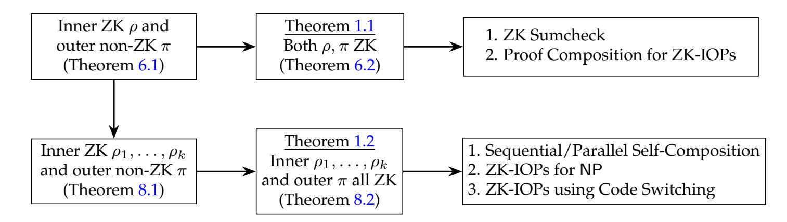

{0}------------------------------------------------

# Composition Theorems for Zero-Knowledge IOPs

Himanshu Vashishth\* and Mor Weiss† February 18, 2026

#### **Abstract**

Interactive Oracle Proofs (IOPs) enable a probabilistic verifier interacting with a prover to verify NP statements while reading only few bits from the prover messages. Zero-Knowledge IOPs (ZK-IOPs) have the additional guarantee that a query-bounded (possibly malicious) verifier learns nothing about the NP witness.

We initiate a systematic study of ZK preservation under IOP composition, and prove general composition theorems for ZK-IOPs in the 2- and multi-IOP setting. Our main result shows that ZK is preserved in the setting of *perfect, black-box, straight-line* ZK (the standard setting for ZK-IOPs), if the outer IOP has an additional mild property that is satisfied by existing ZK-IOPs. Contrary to common belief, this does not follow from composition theorems for multiparty protocols (Kushilevitz, Lindell and Rabin, STOC'06).

Our composition theorems show that ZK-IOPs can be modularly designed by composing sub-protocols, and ZK of the composed system follows seamlessly from the ZK guarantees of its building blocks. Using our composition theorems, we easily derive both new and known results on ZK-IOPs in various settings, including ZK preservation under parallel/sequential composition, ZK of IOPs for sumcheck and codeswitching, ZK of IOPs for NP using arithmetization and sumcheck, and ZK preservation under IOP proof composition (reproving a result of Bootle, Chiesa and Liu, EC'22).

\*Bar-Ilan University, Israel, [himanshu18235@iiitd.ac.in](mailto:himanshu18235@iiitd.ac.in).

†Bar-Ilan University, Israel, [mor.weiss@biu.ac.il](mailto:mor.weiss@biu.ac.il).

{1}------------------------------------------------

## **Contents**

| 1 | Introduction                                                    |    |  |  |
|---|-----------------------------------------------------------------|----|--|--|
|   | 1.1 Our Results                                           | 4  |  |  |
|   | 1.2 Open Questions and Future Directions.                 | 9  |  |  |
|   | 1.3 Related Works                                            | 9  |  |  |
| 2 | Technical Overview                                              | 10 |  |  |
| 3 | Preliminaries                                                   | 14 |  |  |
|   | 3.1 Interactive Oracle Reductions                         | 16 |  |  |
| 4 | IOR Toolkit For ZK Composition                                  | 18 |  |  |
|   | 4.1 Public-Coin IORs                                      | 19 |  |  |
|   | 4.2 Output Computability                                  | 19 |  |  |
|   | 4.3 Output Locality                                       | 21 |  |  |
|   | 4.4 Stronger Correctness Properties for IORs              | 22 |  |  |
| 5 | ZK-IOP Composition: The Model                                   | 24 |  |  |
|   | 5.1 ZK Under 1-Concurrent General Composition             | 26 |  |  |
| 6 | Composition Theorems for Perfect ZK-IOPs                        | 27 |  |  |
|   | Composition of a ZK-IOP ρ with an Arbitrary IOP π 6.1  | 27 |  |  |
|   | 6.2 Composition of Two ZK-IOPs                               | 32 |  |  |
| 7 | Composition of Statistical and Computational ZK-IOPs            | 39 |  |  |
| 8 | Composition of Multiple PZK-IOPs                                | 45 |  |  |
| 9 | Applications                                                    | 52 |  |  |
|   | 9.1 Concurrent Self Composition                           | 52 |  |  |
|   | 9.2 Proof Composition for ZK-IOP                          | 54 |  |  |
|   | 9.3 ZK-IOPs for Sumcheck                                     | 56 |  |  |
|   | ZK-IOP for NP 9.4 via Arithmetization and Sumcheck        | 58 |  |  |
|   | 9.5 Code-Switching Based ZK-IOPs                             | 60 |  |  |
|   | References                                                      | 62 |  |  |

{2}------------------------------------------------

# **1 Introduction**

Interactive Oracle Proofs (IOPs) [\[BCS16,](#page-63-0) [RRR16\]](#page-65-0) allow a Probabilistic Polynomial Time (PPT) verifier V to verify that x ∈ L for some NP-language L, by interacting with a PPT prover P that also knows the corresponding NP-witness w. Importantly, the verifier has oracle access to prover messages, and verification can be carried out while reading only few proof bits. If the verifier has oracle access *also to her input*, then verification can even be done in sublinear time. More specifically, in such cases the input is divided into two parts: an explicit input x which the verifier knows in full, and an implicit input y to which the verifier has oracle access. IOPs generalize both interactive proofs [\[GMR89\]](#page-64-0) and Probabilistically-Checkable Proofs (PCPs) [\[ALM](#page-61-1)+92, [AS92\]](#page-61-2). Since their introduction, a large body of works has focused on improving the efficiency of IOPs, leading to highly-efficient constructions beating their PCP counterparts [\[BCF](#page-61-3)+17, [BKK](#page-63-1)+13, [KR08,](#page-65-1) [RR20,](#page-65-2) [BCG20,](#page-62-0) [RR22\]](#page-65-3), as well as practical implementations [\[BCR](#page-62-1)+19, [Set20,](#page-66-0) [GLS](#page-64-1)+23, [XZS22\]](#page-66-1). These highly-efficient IOPs underlie state-of-the-art succinct arguments.

*Zero-Knowledge (ZK)* IOPs (ZK-IOPs) [\[KPT97,](#page-65-4) [BCGV16,](#page-62-2) [BCS16\]](#page-63-0) are IOPs with an additional ZK property which, roughly, guarantees that any verifier V ∗ that is restricted to querying at most t proof bits for an a-priori bound t (but is otherwise unrestricted, and can be malicious and computationally unbounded) learns only that x ∈ L. In particular, such t*-restricted* verifiers learn nothing about the corresponding NP-witness w. This is formalized in the simulation-based paradigm by requiring the existence of a PPT simulator SimV∗ that is given only x ∈ L, and can perfectly simulate V ∗ *view* when interacting with the honest P, namely her input, and the answers to her oracle queries.[1](#page-2-1) ZK also extends to the setting in which the verifier receives x and has oracle access to y, for (x, y) ∈ L, by giving the simulator (restricted) access to the implicit input y. [2](#page-2-2) ZK then guarantees that so long as V ∗ queries at most t bits of y and the proof oracles, then SimV∗ can perfectly simulate her view while making the same number of queries to y alone. Of particular interest in the literature is the important special case of *black-box, straight-line ZK* which guarantees the existence of a *single* simulator Sim that can successfully simulate the view of any t-restricted V ∗ , while using V ∗ in a *streamlined* and *black-box* manner.

Many ZK-IOPs are constructed by composing ZK-IOPs for sub-tasks, e.g., in constructions of ZK-IOPs for NP via arithmetization and sumcheck [\[BCGV16,](#page-62-2) [BCF](#page-61-3)+17, [BCG](#page-62-3)+17a, [BCG](#page-62-4)+17b, [BBHR19,](#page-61-4) [BCR](#page-62-1)+19, [XZZ](#page-66-2)+19, [CHM](#page-63-2)+20, [ZXZS20,](#page-66-3) [BCL22,](#page-62-5) [RW24,](#page-65-5) [GOS25\]](#page-64-2). The ZK property of such constructions is generally believed to follow immediately from the ZK guarantee of their building blocks, so long as the latter have *black-box, straight-line* ZK (which is indeed the case in most — if not all — existing constructions). The justification for this belief is that security of Multi-Party Computation (MPC) protocols is known to be preserved in the black-box, straight-line setting [\[KLR06\]](#page-64-3). However, upon closer examination it becomes evident that the implication to ZK preservation under IOP composition is not immediate, and in fact the proof from [\[KLR06\]](#page-64-3) does not extend to the IOP setting. Indeed, the composition results of Kushilevitz, Lindell, and Rabin [\[KLR06\]](#page-64-3) are in the *full knowledge* and *full security* setting, in which parties have full access to their inputs, and the security property is a holistic guarantee which encompasses both privacy and correctness. In the IOP setting, on the other hand, privacy and correctness — namely, ZK and soundness, respectively — are separate properties, and the (possibly malicious) verifier V ∗ (and consequently also the simulator) does not have full access to her input y. We should be partic-

1The verifier's view includes also her randomness, but an unbounded malicious verifier might use an exponential amount of randomness, which a PPT simulator cannot generate efficiently. Instead, the verifier's randomness is usually prepended to the simulated view.

2Dividing the input into explicit and implicit parts is crucial both to designing IOPs with sublinear verification runtime, as well as to obtaining a meaningful ZK guarantee for P relations.

{3}------------------------------------------------

ularly careful since composition does *not* necessarily preserve ZK in interactive proofs (i.e., for standard ZK proofs [FS90, GK96, CCH+19, PS19, HLR21]).

The effect of IOP-composition on the ZK property has been studied only in few specific settings. Bootle, Chiesa and Liu [BCL22, Lemma B.6] show that ZK is preserved when an inner IOP is used to verify the execution of an outer IOP. They also analyze [BCL22, Lemma A.4] the ZK guarantee of a ZK-IOP constructed by encoding the prover messages in another ZK-IOP using a code with a ZK property. Additionally, they show [BCL22, Thm. 6.2] that zero knowledge is preserved when applying the tensoring operation on a code with ZK guarantees. Their results on ZK codes were recently extended, with improved ZK bounds, in [RW24]. Gur, O'Connor and Spooner [GOS25] recently considered ZK preservation under composition for the special case of ZK *PCPs* (where the prover-verifier interaction consists of a single oracle message sent from the prover to the verifier). They show ZK preservation under proof composition, under alphabet reduction, and for proofs that are "locally computable" [GOS25, Def. 3.1]. See Section 1.3 for a more detailed discussion and comparison with our results.

The current state of affairs naturally motivates the following research question:

Does composition preserve ZK in the IOP setting?

#### 1.1 Our Results

We initiate a systematic study of ZK preservation under composition in the IOP setting. More specifically, we introduce a methodology for composing ZK-IOPs, use it to prove ZK composition theorems for IOPs, and show several applications.

While our results hold for composition of multiple IOPs, for simplicity we focus first on the composition of two IOPs  $\pi$  and  $\rho$ . Extensions to the composition of multiple IOPs are discussed later in this section, as well as in Sections 2 and 8.

**A Methodology for ZK-IOP Composition.** Our goal is to analyze the ZK guarantees of a composed system  $\pi^{\rho}$  consisting of a ZK-IOP  $\pi$  for  $\mathcal{R}_{\pi}$  which calls as a sub-routine a ZK-IOP  $\rho$  for  $\mathcal{R}_{\rho}$ , where  $\mathcal{R}_{\pi}$  and  $\mathcal{R}_{\rho}$  are NP-relations. Several subtleties arise when formalizing this composition scenario, as we now discuss.

Message Scheduling: The scheduling of messages in such composition scenarios is usually apriori fixed by the protocol specification (e.g., to be sequential/parallel), and can be enforced by the prover, who can abort if the verifier deviates from the scheduling. However, the prover has no control over — or even knowledge of — the verifier's *oracle queries*. Thus, IOP composition is *inherently concurrent* since a malicious verifier can in effect cause it to be so by cleverly scheduling her oracle queries.

<u>The Interaction Model:</u> We formalize ZK-IOP composition within the Interactive Oracle Reductions (IORs) framework [BCG+19, BMNW25, BMMS25a, BCFW25, BMMS25b], a useful abstraction recently introduced to facilitate modular analysis of composed IOP constructions, which captures several important IOPs as special cases (e.g., the sumcheck protocol [LFKN92, Mei13], codeswitching [RR20] and batching).

Roughly, an IOR is an interactive protocol in the IOP setting (namely, where prover messages are oracles) which reduces verifying membership in some relation  $\mathcal{R}_{\pi}$  to verifying membership in another relation  $\mathcal{R}_{\rho}$ . More precisely, the prover  $\mathcal{P}$  has input  $((x_{\pi}, y_{\pi}), w_{\pi}) \in \mathcal{R}_{\pi}$  and the verifier  $\mathcal{V}$  has input  $x_{\pi}, 1^{|y_{\pi}|}$ , and oracle access to  $y_{\pi}$ . The prover's output is  $((x_{\rho}, y_{\rho}), w_{\rho}) \in \mathcal{R}_{\rho}$ , and the verifier's output is  $(x_{\rho}, 1^{|y_{\rho}|})$  as well as a *virtual oracle*  $\mathbf{y}_{\rho}$  [BCG+19]. Intuitively,  $\mathbf{y}_{\rho}$  is a mapping from  $y_{\pi}$  and the prover oracle messages to  $y_{\rho}$ , which can be used to compute any symbol of  $y_{\rho}$ 

{4}------------------------------------------------

(by reducing it to querying few symbols of yπ and the prover oracle messages). IORs have output consistency, namely the prover and verifier outputs in an honest execution are consistent; completeness, i.e., if ((xπ, yπ), wπ) ∈ Rπ then in an honest execution ((xρ, yρ), wρ) ∈ Rρ; and soundness. Using IORs, we can meaningfully define the inputs of the sub-routine IOP ρ with respect to π's inputs and messages: the former are the outputs of the IOR induced by executing π until ρ's execution begins.[3](#page-4-0)

IOR Properties in the Malicious-Verifier Setting: The semantic properties of standard IORs, discussed above, hold only when the verifier is honest. (This is because IORs are usually used to argue *soundness* of a composed system.) This is inconsistent with our setting, in which the IOP is executed with a *possibly malicious* verifier V ∗ . In this case, the IOR outputs are not guaranteed to be consistent, and the prover's output is not even guaranteed to be in Rρ, in which case we cannot invoke ρ's ZK guarantee. Moreover, even if the prover can determine whether ((xρ, yρ), wρ) ∈ Rρ, he cannot abort the computation in this case, since this decision might reveal non-trivial information to the verifier (similar to selective failure attacks in other cryptographic contexts).

We identify several IOR properties that enable the reduction from Rπ to Rρ to go through, even when the IOR is executed with a malicious verifier V ∗ . These include: (1) a *strong correctness* property that guarantees the honest P's output will be in Rρ; (2) a *public output computability* property which guarantees that the virtual oracle is well-defined from the public transcript, and consistent with the prover's output yρ; and (3) that the virtual oracle yρ is ℓ*-local* in the sense that the output of yρ on any index i depends on ≤ ℓ bits of yπ and the prover oracle messages. All of these properties should hold even when P interacts with a malicious (and possibly computationally unbounded) verifier V ∗ . We say that an IOR satisfying these three properties is an ℓ*-reduction from* Rπ *to* Rρ. We formalize and further discuss these properties in Section [3.1,](#page-15-0) where we also show that any perfectly-complete public-coin IOR has strong correctness and public output computability.[4](#page-4-1)

**Composition Theorems for ZK-IOPs.** Using our methodology, we prove several composition theorems for ZK-IOPs. Our main result is that ZK is preserved when composing two IOPs with perfect, black-box, straight-line t-ZK, where the latter means there exists a black-box, straight-line PPT simulator that perfectly simulates the view of any verifier making at most t queries to her implicit input and prover messages. (See Theorem [6.2](#page-31-1) and Corollary [6.4](#page-37-0) for the formal statement.)

**Theorem 1.1** (Composition Theorem (2 IOPs) — Informal)**.** *Let* t ∈ N *be a ZK parameter, let* ℓ ∈ N *be a locality parameter, and let* π, ρ *be IOPs for* Rπ, Rρ ∈ NP*, respectively, with perfect, black-box, straightline* t*-ZK. If the IOR induced by executing* π *until* ρ *begins is an* ℓ*-reduction from* Rπ *to* Rρ*, then* π ρ *has perfect, black-box, straight-line* t/ℓ*-ZK with a simulator that queries at most* t *bits of* π*'s implicit input.*

Intuitively, Theorem [1.1](#page-4-2) guarantees that π ρ is ZK if π, ρ both have perfect ZK with blackbox, straight-line simulators, and π is an ℓ-reduction from Rπ to Rρ. Since the latter holds for any perfectly-complete public-coin π with ℓ-locality, Theorem [1.1](#page-4-2) implies that perfect, black-box, straight-line ZK is preserved for public-coin IOPs (that have locality).

We note that the ZK parameter of the composed system deteriorates proportionally to the locality ℓ of ρ with respect to π, while the simulator could potentially make ℓ-times more queries than the malicious verifier. Intuitively, this is because ρ's ZK property guarantees that every proof bit of ρ reveals at most a single bit of ρ's implicit input, which could potentially depend on ℓ

3This is well defined because the prover sends the first message in an IOP. Therefore, even a malicious V ∗ cannot cause ρ to start executing without the honest prover's knowledge.

4An IOR/IOP is *public coin* if the verifier messages are simply random strings, and the verifier doesn't use any hidden randomness.

{5}------------------------------------------------

bits of π's implicit input (to which the simulator of the composed π ρ has oracle access). We note that when ℓ = 1, the combined system has the same ZK guarantee t as the underlying π, ρ, and the simulator also makes at most t oracle queries. We discuss this special case further in the applications paragraph below, and in Section [9.](#page-51-0)

We consider several generalizations of Theorem [1.1](#page-4-2) in Section [6:](#page-26-0)

- The composition of IOPs π, ρ with different ZK parameters tπ, tρ, and also with simulation *overheads* where the simulator might make *more* queries to the implicit input than the verifier. We show ZK preservation in this case, and analyze the ZK parameter and simulation overhead properties of the composed system; see Theorem [6.2.](#page-31-1) [5](#page-5-0)
- The composition of a general (not necessarily ZK) IOP π with a ZK-IOP ρ. Since π has no ZK guarantees, the composed π ρ will not generally have ZK, however we quantify in Theorem [6.1](#page-26-2) the amount of information which ρ's execution reveals on π's implicit input and NP-witness. We formalize this composition setting in Section [5,](#page-23-0) following works in the MPC setting [\[Lin02,](#page-65-9) [Lin03,](#page-65-10) [KLR06\]](#page-64-3).
- The composition of IOPs π, ρ with *statistical/computational* ZK. We show that ZK is preserved also in the statistical/computational setting, so long as ρ's ZK guarantee holds with respect to *auxiliary inputs*; see Section [7](#page-38-0) and Theorems [7.1](#page-39-0) and [7.2.](#page-43-0)

**Comparison with [\[KLR06,](#page-64-3) [KLR09\]](#page-64-7).** Kushilevitz, Lindell and Rabin [\[KLR09,](#page-64-7) Thm. 3] prove a similar result to Theorem [1.1](#page-4-2) in the setting of Secure Multi-Party Computation (MPC) protocols. They show that if ρ has *full security* with a black-box and straight-line simulator, then it remains secure under general concurrent composition with any protocol π. The fact that ρ has full security implies, in particular, that privacy holds for *all* possible ρ-inputs, and allows them to invoke ρ's security even when π executes with corrupted parties (that may cause ρ to use incorrect inputs). As noted above, this is not possible in the IOP setting, where ZK holds only for inputs in the language, and is the reason we consider enhanced IOR properties such as strong correctness. Another issue which arises in the IOP setting is how the verifier can even determine her ρ-inputs without having full access to her π-inputs, which we handle using virtual oracles. Finally, we note that even with an appropriate composition methodology in place, [\[KLR09,](#page-64-7) Thm. 3] does not imply ZK preservation for IOPs, since *the proof* of [\[KLR09,](#page-64-7) Thm. 3] crucially relies on the full security of ρ in the security reduction. We discuss this further in Sections [2](#page-9-0) and [6.2.](#page-31-0)

Next, we consider the setting in which a protocol π for Rπ calls as sub-routines k IOPs ρ1, . . . , ρk for R1, . . . , Rk, respectively, for some k ∈ N. We formalize this composition model in Section [8,](#page-44-0) extending the notion of an ℓ-reduction to the multi-composition setting. Specifically, we say that π is an ℓ-reduction from Rπ to (R1, . . . , Rk) if for every i ∈ [k], the IOR induced by π's execution until ρi begins is an ℓ-reduction from Rπ to Ri . [6](#page-5-1) We show that black-box, straight-line ZK is preserved in the multi-composition setting (see Theorem [8.2](#page-49-0) for the formal statement):

**Theorem 1.2** (Composition Theorem (Multiple IOPs) — Informal)**.** *Let* k ∈ N*, let* t ∈ N *be a ZK parameter, let* ℓ ∈ N *be a locality parameter, and let* π, ρ1, . . . , ρk *be IOPs for* Rπ, R1, . . . , Rk*, respectively,*

5Calculating a tight-ish bound on the knowledge complexity of ZK-IOPs is challenging, as evidenced by prior works in the ZK-IOP setting [\[BCL22\]](#page-62-5), as well as the special case of ZK codes [\[BCL22,](#page-62-5) [RW24\]](#page-65-5).

6 Some care should be taken when considering *multiple* inner ρi's, since one needs to formally treat the possible interplay between the executions of the different internal protocols. For simplicity, we assume that the internal protocol executions are *independent*, and can depend only on the (1-bit) output of other internal executions. This is discussed further in Section [8.](#page-44-0)

{6}------------------------------------------------

| Theorem  | Outer ZK? | Single/Multiple Inner | ZK Type (P/S/C) | Aux-Input    |
|----------|-----------|-----------------------|-----------------|--------------|
| Thm. 6.1 | ×         | Single                | P               | Not Required |
| Thm. 6.2 | ✓         | Single                | P               | Not Required |
| Thm. 7.1 | ×         | Single                | S/C             | Required     |
| Thm. 7.2 | ✓         | Single                | S/C             | Required     |
| Thm. 8.1 | ×         | Multiple              | P               | Not Required |
| Thm. 8.2 | ✓         | Multiple              | P               | Not Required |

Table 1: Our ZK-IOP Composition Theorems.

The "Outer ZK?" column specifies whether the outer protocol π is required to have a ZK guarantee or not. The "Single/Multiple Inner" column specifies how many sub-routine ZK-IOPs the outer π can call. The "ZK Type (P/S/C)" column specifies the ZK quality of the (underlying and composed) ZK-IOPs, where P, S and C stand for perfect, statistical, and computational ZK, respectively. The "Aux-Input" column specifies whether ZK holds in the standard model or only in the auxiliary-input setting.

*with perfect, black-box, straight-line* t*-ZK. If* π *is an* ℓ*-reduction from* Rπ *to* (R1, . . . , Rk)*, then* π ρ1,...,ρk *has perfect, black-box, straight-line* t/ℓ*-ZK, with a simulator that queries at most* t *bits of* π*'s implicit input.*

We consider several generalizations of Theorem [1.2,](#page-5-2) similar to the 2-protocol case. Specifically, we show that Theorem [1.2](#page-5-2) extends also to the case in which π, ρ1, . . . , ρk have different ZK and locality parameters, and there is a simulation overhead; see Theorem [8.2.](#page-49-0) We also analyze the amount of information revealed on π's witness and implicit input when π has no ZK guarantees; see Theorem [8.1.](#page-46-0) Our results are summarized in Table [1.](#page-6-0)

**Applications.** We demonstrate the usefulness of our composition theorems by applying them in several standard composition settings, showing both new results, and re-proving some known results on ZK preservation under composition. Specifically, we show (cf. Figure [1\)](#page-7-0):

- **Sequential/Parallel Self-Composition.** We show that if ρ has black-box, straight-line t-ZK then so does its parallel/sequential repetition; see Theorem [9.1.](#page-52-0) In particular, this proves that ZK is preserved under soundness amplification for IOPs. Roughly, this result is obtained by applying Theorem [1.2](#page-5-2) to a "dummy" outer IOP π which determines the sequential/parallel scheduling, and passes its inputs to multiple internal calls to ρ. Then π is a 1-reduction and trivially has ZK.
- **Proof Composition for IOPs.** We show that ZK is preserved under standard proof composition of ZK-IOPs; this re-proves a result of [\[BCL22,](#page-62-5) Lemma B.6, Item 2]. More specifically, in this setting an internal IOP of proximity is used to check that the verification of an external IOP π would have succeeded. Here, π is an IOP for some relation Rπ, and ρ is an IOP for the P-relation of all accepting views of π's verifier. We show that if π has black-box straight-line t-ZK, and ρ has a strong black-box straight-line ZK guarantee,[7](#page-6-1) then the composed system has t-ZK; see Theorem [9.3.](#page-54-0) This follows from Theorem [1.1](#page-4-2) by noting that in this case π is a 1-reduction from Rπ to ρ's relation.
- **ZK-IOPs for Sumcheck.** The sumcheck protocol [\[LFKN92,](#page-65-7) [Mei13\]](#page-65-8) is an important building block in many proof systems. Many ZK-IOPs rely on a *ZK variant* of sumcheck [\[BCGV16,](#page-62-2)

7Roughly, the stronger guarantee is that ZK holds for all ZK parameters t ′ ∈ N, with a simulator that makes t ′ oracle queries.

{7}------------------------------------------------

Figure 1: Our Composition Theorems and their Applications (Perfect ZK Setting Only)

[BCF](#page-61-3)+17, [BCG](#page-62-3)+17a, [BCG](#page-62-4)+17b, [BCR](#page-62-1)+19, [BBHR19,](#page-61-4) [CHM](#page-63-2)+20, [ZXZS20,](#page-66-3) [BCL22,](#page-62-5) [XZS22,](#page-66-1) [RW24\]](#page-65-5), which is obtained by applying the (standard, non-ZK) sumcheck IOP on a random shift γ·c+r of the original implicit input c of the sumcheck IOP, where r, γ are random. Soundness of the sumcheck IOP then relies on the assumption that r is well-formed (in particular, has the same structure as c, e.g., is a codeword). Thus, the IOP should include an additional test/IOP of proximity attesting to the well-formedness of r. Using Theorem [1.1,](#page-4-2) ZK of the composed system — consisting of the sumcheck on γ · c + r as the external π, and the wellformedness check for r as the internal ρ — reduces to proving ZK separately for sumcheck and for the well-formedness test, since here again π is a 1-reduction; see Theorem [9.4.](#page-57-1) This enables a modular design of ZK-IOPs for sumcheck, where one test for r can be switched-out with another test without having to analyze the ZK property of the combined system from scratch, only the ZK guarantee of r's test; see discussion in Section [9.3.](#page-55-0)

- **ZK-IOPs for** NP**.** Using Theorem [1.2,](#page-5-2) we give a modular ZK analysis of ZK-IOPs for NP constructed using the standard technique of arithmetization and sumcheck; see Theorem [9.6.](#page-58-0) The high-level idea of such constructions is for the prover to encode the witness w using its Low-Degree Extension (LDE) wˆ. Verifying membership in the NP-relation then reduces to checking that the LDE encoding wˆ is well-formed, and checking the sum on a cube of some local function of wˆ. This blueprint can be made ZK by using ZK versions of the sumcheck and well-formedness tests, and replacing the LDE encoding with its t-ZK variant (roughly, encoding is now randomized and any t symbols in a random encoding of w are uniformly distributed). The ZK property of the combined system can be analyzed by viewing it as the composition of an outer IOP π in which the prover sends the LDE encoding wˆ to the verifier, and calls inner IOPs ρ1, ρ2 for checking well-formedness and sumcheck, respectively.
- **ZK-IOPs for Code Switching.** Code switching [\[RR20\]](#page-65-2) is a recent and highly useful technique for constructing highly-efficient IOPs. It enables reducing a claim about a codeword c in some tensor code C to a claim about a different (but related) codeword c ′ in another tensor code C ′ . Ron-Zewi and Rothblum [\[RR20\]](#page-65-2) show that code switching can be instantiated using a generalized form of sumcheck which enables verifying sums of the form " P i∈[k] λ(i) · m(i) = α" for coefficients λ(i) with a certain tensor structure. We use Theorem [1.2](#page-5-2) to show that code switching preserves ZK when used as a sub-routine; see Theorem [9.8.](#page-60-0)

**Remark: On Defining** ℓ**-Reductions.** Our composition theorems hold when the outer IOR π is an ℓ-reduction, namely it is ℓ-local and has strong correctness and public output computability. As noted above, we show that any perfectly-complete public-coin IOR satisfies the latter two properties. We could have therefore restricted our composition theorems to the *public coin* setting only.

{8}------------------------------------------------

However, this would have ruled out some of the applications considered above. For example, our results on ZK preservation under proof composition (which re-prove results of [\[BCL22\]](#page-62-5)) hold even when π, ρ are *not* public coin. Moreover, the definition of an ℓ-reduction identifies more precisely which properties are needed to obtain our composition results.

## **1.2 Open Questions and Future Directions.**

Our composition theorems leave several interesting open questions for future research. First, our results on composition of an "outer" ZK-IOP π with multiple "inner" ZK-IOPs ρi (Theorem [1.2\)](#page-5-2) assumes the executions of the ρi 's are independent (in particular, the inputs to one ρi are independent of the internal execution of another ρj , and can only depend on the output of ρj ). It would be interesting to study extensions to nested executions, and other settings in which the executions of the ρi 's are not independent. Second, our composition theorems are stated for IOPs, and generalizing them to apply to *IORs* could be useful, especially given the host of recent works using the IOR abstraction. This would necessitate generalizing the notions of strong correctness and public output computability to also incorporate a distribution over the inputs to the output relation of the IOR. Another interesting future direction is to scale-down our results to the setting of semi-Honest-Verifier ZK (semi-HVZK), where the underlying π, ρ are only guaranteed to have ZK against the *honest* verifier (with possibly skewed randomness). Our composition theorems do not directly apply to this setting since they consider only the *number* of queries which the verifier is allowed to make. Scaling-down to the semi-HVZK setting could be done by considering the *structure* of queries instead. Another possible direction is to extend our results to the setting of Polynomial IOPs (PIOPs). Finally, our results assume by default that the honest verifier is non-adaptive (i.e., makes all her oracle queries in the final IOP round). While this assumption is satisfied by many existing IOPs, one could also consider adaptive honest verifiers. Capturing such verifiers within our framework would require generalizing the notion of a virtual oracle.

### **1.3 Related Works**

**Composition Theorems for ZK-IOPs.** Composition of ZK-IOPs was considered in some specific settings. Bootle et al. [\[BCL22,](#page-62-5) Lemma B.6] show that ZK is preserved under proof composition; we obtain their result as a special case of our composition theorems, see Section [9.2.](#page-53-0) [\[BCL22,](#page-62-5) Lemma A.4] analyzes the ZK guarantee of a robustification operation for ZK-IOPs, where each prover message in a ZK-IOP is encoded using a ZK code. They obtain a better ZK bound than implied by our generic composition theorems, by exploiting an equivocation property of linear ZK codes; see discussion in Section [6.2.](#page-31-0) ZK preservation has also been considered in the special case of ZK codes, where [\[BCL22,](#page-62-5) Thm. 6.2] show that zero-knowledge is preserved under tensoring. These results were later extended and improved in [\[RW24\]](#page-65-5). Composition theorems for ZK *PCPs* were given in [\[GOS25\]](#page-64-2) for the setting of proof composition, alphabet reduction, and for proofs that are "locally computable". We match their ZK bound for poof composition, but it does not follow from our composition theorems since in the PCP setting the outer protocol does not have public output computability.

**The Composition Theorems of [\[KLR06,](#page-64-3) [KLR09\]](#page-64-7).** Kushilevitz, Lindell and Rabin [\[KLR09,](#page-64-7) Thm. 3] show that if an MPC protocol ρ has *full security* with a black-box and straight-line simulator, then it remains secure under general concurrent composition with any MPC protocol π. Their result is incomparable to ours. Indeed, on the one hand it offers a stronger guarantee (full security 

{9}------------------------------------------------

of the composed protocol) and handles an arbitrary number of parties. On the other hand, they require a stronger guarantee from the underlying ρ (full security, instead of just ZK) and work only in the "full knowledge" setting where parties fully know their inputs. They extend their results to the statistical and computational setting [\[KLR09,](#page-64-7) Thm. 5] assuming π has an additional property that they call "input availability" which, roughly, guarantees that the inputs to ρ's execution are determined before ρ's execution commences. Our composition framework ensures that this property trivially holds for all π's, by relying on IOR properties, and the fact that IOPs/IORs are 2-party protocols. See Section [6.1](#page-26-1) for further details.

**Reductions of Knowledge (RoK).** Kothapalli and Parno [\[KP23,](#page-64-8) [Kot24\]](#page-64-9) recently introduced Reductions of Knowledge (which share some similarities with IORs), and used them to prove composition theorems for zero-knowledge *interactive proofs*. Despite discussing ZK preservation under generic composition, the results of [\[KP23,](#page-64-8) [Kot24\]](#page-64-9) differ significantly from ours in several respects. We briefly survey these differences here, see Section [6.2](#page-31-0) for a more detailed discussion. First, [\[KP23,](#page-64-8) [Kot24\]](#page-64-9) considers the *interactive proofs* setting, with a possibly non-black-box simulator, and *PPT* verifiers, whereas we consider *IOPs* with *black-box* simulators and *query-restricted* verifiers. Second, they consider the *honest verifier* ZK setting, while we consider full-fledged ZK. Consequently, they do not need to consider stronger properties of the outer π (such as strong correctness and public output computability).

**Paper Organization.** We give technical highlights of our results in Section [2.](#page-9-0) In Section [5](#page-23-0) we describe a framework for the composition of ZK-IOPs, that relies on the new IOR properties which we introduce in Section [4.](#page-17-0) The proof of our main composition theorem (Theorem [1.1\)](#page-4-2) is given in Section [6,](#page-26-0) and extended to the multi-IOP setting in Section [8,](#page-44-0) where we also prove Theorem [1.2.](#page-5-2) We describe several applications of our composition theorems in Section [9.](#page-51-0) Finally, we show in Section [7](#page-38-0) that our main composition theorem generalizes to the setting of statistical/computational-ZK with auxiliary inputs.

# **2 Technical Overview**

We now describe the high-level idea underlying our main composition theorem (Theorem [1.1\)](#page-4-2). We consider an IOP π = (Pπ, Vπ) for some NP-relation Rπ, which calls as a sub-routine an IOP ρ = (Pρ, Vρ) for some NP-relation Rρ. Our goal is to show that if both π and ρ have t-ZK with black-box, straight-line simulation, then so does their composition π ρ .

**A Simple Usecase.** As a first example, consider an IOP π in which the prover sends an oracle message c to the verifier, and soundness relies on the fact that c ∈ C for some code C. (This is indeed the case in many ZK-IOP constructions, e.g., ZK-IOPs for sumcheck, and ZK-IOPs for NP constructed via arithmetization and sumcheck; these are discussed further in Sections [9.3](#page-55-0) and [9.4.](#page-57-0)) If C is *locally testable* then checking membership in C can be done directly by querying few symbols of c. Otherwise, the parties can run a code-membership IOP (of proximity) as a sub-routine. This naturally gives rise to a composed IOP in which the outer π calls as a sub-routine an inner ρ for code membership. If both π and ρ have t-ZK with black-box, straight-line simulation, then so does π ρ , as we now explain.

{10}------------------------------------------------

A Simulator Sim for  $\pi^{\rho}$ . The ZK property of  $\rho$  guarantees the existence of a simulator Sim $_{\rho}$  that can perfectly simulate the view of any t-restricted verifier  $\mathcal{V}_{\rho}^{*}$  — i.e., a verifier that queries at most t bits of her implicit input c and the prover oracle messages — by querying only t bits of c. Moreover,  $\operatorname{Sim}_{\rho}$  uses  $\mathcal{V}_{\rho}^{*}$  as a black-box, and the simulation is straight-line (i.e.,  $\operatorname{Sim}_{\rho}$  doesn't rewind  $\mathcal{V}_{\rho}^{*}$ ). Similarly, the ZK property of  $\pi$  guarantees the existence of a simulator  $\operatorname{Sim}_{\pi}$  that can perfectly simulate the view of any t-restricted verifier  $\mathcal{V}_{\pi}^{*}$  in  $\pi$ , while making at most t queries to  $\mathcal{V}_{\pi}^{*}$ 's implicit input in  $\pi$ , and using  $\mathcal{V}_{\pi}^{*}$  in a black-box, straight-line manner. Here,  $\pi$  describes the IOP without the code membership check. Using these simulators, we describe a black-box, straight-line simulator Sim that perfectly simulates the view of any t-restricted verifier  $\mathcal{V}^{*}$  in the composed  $\pi^{\rho}$  (i.e., when executing  $\pi$  with the code-membership check  $\rho$ ).

The simulator Sim is given as input the explicit input  $x_{\pi}$  of  $\pi$ , has oracle access to the implicit input  $y_{\pi}$ , and has black-box, straight-line access to a t-restricted verifier  $\mathcal{V}^*$ . Sim uses  $\mathsf{Sim}_{\pi}$  to emulate  $\pi$ 's prover for  $\mathcal{V}^*$ , and uses  $\mathsf{Sim}_{\rho}$  to emulate  $\rho$ 's prover. During their executions,  $\mathsf{Sim}_{\pi}$ ,  $\mathsf{Sim}_{\rho}$  query their implicit inputs. The implicit input of  $\mathsf{Sim}_{\pi}$  is  $y_{\pi}$ , and  $\mathsf{Sim}$  answers these queries by forwarding them to  $\mathsf{Sim}$ 's own input oracle. The implicit input of  $\mathsf{Sim}_{\rho}$  is c, which is an oracle message sent by  $\mathcal{P}_{\pi}$  in  $\pi$ , and so these queries can be answered by forwarding them to  $\mathsf{Sim}_{\pi}$ .

Overall, if  $\mathcal{V}^*$  makes  $t_\rho$  queries to  $\rho$ -oracles (namely, oracle messages generated by  $\mathcal{P}_\rho$ ), then by the t-ZK of  $\rho$ ,  $\mathsf{Sim}_\rho$  makes at most  $t_\rho$  queries to c, which induce  $t_\rho$  queries to  $\mathsf{Sim}_\pi$ . If  $\mathcal{V}^*$  additionally makes  $t_\pi$  queries to  $\pi$ -oracles (i.e., to  $y_\pi$  and the oracle messages generated by  $\mathcal{P}_\pi$ ), then these induce  $t_\pi$  additional queries to  $\mathsf{Sim}_\pi$ . Overall,  $\mathsf{Sim}_\pi$  is asked to simulate  $t_\rho + t_\pi \leq t$  oracle queries (since  $\mathcal{V}^*$  is t-restricted), and by the t-ZK of  $\pi$ ,  $\mathsf{Sim}_\pi$  can perfectly simulate all the oracle answers while querying at most t bits of  $y_\pi$ .

The General Case. In the simple usecase described above,  $\rho$ 's implicit input was sent explicitly — as an oracle message — in  $\pi$ 's execution. More generally,  $\rho$ 's implicit input  $y_{\rho}$  may be defined implicitly through  $\pi$ 's execution. In such cases,  $y_{\rho}$  is defined through a mapping from the prover oracle messages in  $\pi$ , and  $\pi$ 's implicit input  $y_{\pi}$ . In particular, the prover will know  $y_{\rho}$  in full (since he has full knowledge of  $y_{\pi}$  and all his oracle messages), and the verifier will have a virtual oracle [BCG+19]  $\mathbf{y}_{\rho}$  which defines any bit of  $y_{\rho}$  as a function of  $y_{\pi}$  and  $\pi$ 's oracle message. Using the virtual oracle  $\mathbf{y}_{\rho}$ , the verifier can recover any bit of  $y_{\rho}$  by querying the appropriate bits in  $y_{\pi}$  and  $\pi$ 's oracle messages, as defined by the mapping. (See Definition 3.6 in Section 3.1 for the formal definition.)

In the general case, the ZK parameter (i.e., query bound on the malicious  $\mathcal{V}^*$ ) of the composed system  $\pi^\rho$  depends on the *locality* of the virtual oracle  $\mathbf{y}_\rho$  as a function of  $y_\pi$  and  $\pi'$ s oracle messages. That is,  $\mathbf{y}_\rho$  is  $\ell$ -local if for any i,  $\mathbf{y}_\rho(i)$  depends on  $\leq \ell$  bits of  $y_\pi$  and  $\mathcal{P}_\pi$ 's oracle messages. (Locality was defined in [BCG+19, Definition 5.1], but we require a stronger property that holds even when  $\pi$  is executed with *malicious* verifiers; see Section 4.3 for further details.) Locality causes a loss in the ZK bound of the composed system: if  $\pi$ ,  $\rho$  both have t-ZK, and  $\mathbf{y}_\rho$  is  $\ell$ -local, then the composed system will have  $t/\ell$ -ZK. (We note that the bound  $t/\ell$  also holds for the simple usecase, since there  $\mathbf{y}_\rho$  is 1-local so  $t/\ell = t$ .) This lower ZK parameter is evident from the analysis of the simulator described above for the simple usecase. Indeed, to answer each query i of  $\mathsf{Sim}_\rho$  to its implicit input  $y_\rho$ , the simulator  $\mathsf{Sim}$  will now need to make  $\ell$  queries to  $\mathsf{Sim}_\pi$  (to generate the bits of  $y_\pi$  and  $\mathcal{P}_\pi$ 's messages on which  $\mathbf{y}_\rho(i)$  depends). The simulator for the general case obtained in this way is described in Figure 2.

We stress that requiring locality of  $\mathbf{y}_{\rho}$  is not an artifact of our simulation strategy, but rather is an artifact of the *ZK definition* for IOPs. Indeed, the *ZK* property intuitively guarantees that a t-restricted verifier learns only t physical bits of her implicit input (and learns nothing about the

{11}------------------------------------------------

#### **Simulator for a Composed ZK-IOP** π ρ **(Simplified)**

The simulator Sim has explicit input xπ, and oracle access to the implicit input yπ. Sim also has black-box, straight-line access to a t-restricted verifier V ∗ .

**Building Blocks:** black-box, straight-line simulators Simπ, Simρ for π, ρ, respectively.

- 1. Emulate Simπ with input xπ, and oracle access to implicit input yπ, by forwarding messages between Simπ and V ∗ . Any oracle queries of Simπ to yπ are forwarded to yπ. During this execution, the verifier's ρ-inputs (xρ, yρ) are determined, where yρ is a virtual oracle.
- 2. When ρ's execution starts, emulate Simρ, by forwarding messages between Simρ and V ∗ . Any oracle query i of Simρ is answered as follows: (1) compute the set Ii of bits on which yρ(i) depends, (2) query Simπ on Ii , (3) use Simπ's answers to compute yρ(i), and (4) give yρ(i) to Simρ as the oracle answer.
- 3. Throughout the simulation, Simπ and Simρ are emulated concurrently, according to the scheduling determined by π ρ .

Figure 2: Simulator for π ρ (Simplified Description of the Simulator from Section [6.2\)](#page-31-0)

NP witness). In particular, ρ's ZK guarantees that a t-restricted verifier learns t outputs of yρ (i.e., t physical bits of yρ). If yρ is not a local function of yπ, then V ∗ might learn *global* information on yπ, that cannot be simulated given only t bits of yπ. For example, if yρ(1) = P i yπ(i) then even a 1-restricted verifier in ρ might learn the sum of all bits of yπ!

**Issues in the ZK Analysis of** Sim**.** The natural approach to analyzing the ZK guarantees of Sim (Figure [2\)](#page-11-0) is by reduction to the ZK guarantees of π, ρ. More specifically, consider a hybrid distribution in which V ∗ is executing with the real prover Pπ in π, but with the simulator Simρ in ρ. We would then use ρ's ZK guarantee to claim that the real-world view of V ∗ in π ρ (i.e., when interacting with Pπ and Pρ) is distributed identically to her view in the hybrid distribution. Then, we would use π's ZK guarantee to show that the latter is distributed identically to V ∗ 's view in the simulation with Sim.

Unfortunately, this blueprint towards proving ZK of π ρ does not quite work in general. Indeed, the ZK property of ρ holds only for inputs which *are in* ρ*'s relation* Rρ. While this is expected to be the case in honest executions (e.g., when ρ's input is a codeword c ∈ C as in the simplified usecase described above), it might not hold in an execution with a *malicious* verifier V ∗ . Indeed, ρ's inputs may depends on π's execution before ρ is called, so a malicious V ∗ might be able to cause ρ to be executed on malformed inputs. In particular, ZK of π ρ could be violated if ρ is executed with inputs that are not in Rρ. Even if the prover can check the latter, he cannot abort the computation in case the check fails, since that might leak non-trivial information on yπ to V ∗ (similar to selective failure attacks).

To overcome this issue, we formulate a property *of the IOP* π, which we call *strong correctness*, that intuitively guarantees that ρ is never executed with inputs not in Rρ. In more detail, recall that π's execution before ρ is called defines an *Interactive Oracle Reduction (IOR)*, namely, an interactive protocol between Pπ, Vπ in which the prover sends oracle messages, and where an input claim of the form "((xπ, yπ), wπ) ∈ Rπ" is reduced to a claim of the form "((xρ, yρ), wρ) ∈ Rρ".[8](#page-11-1) An IOR

8 Since the full execution of π defines an IOP, and its execution before ρ is executed defines an IOR, we refer to π below both as an IOP and as an IOR interchangeably.

{12}------------------------------------------------

 $\pi$  is *strongly correct* if for any  $((x_{\pi}, y_{\pi}), w_{\pi}) \in \mathcal{R}_{\pi}$ , the IOR output is in  $\mathcal{R}_{\rho}$  with probability 1, *even* when the IOR is executed with a malicious verifier  $\mathcal{V}^*$ . We formally define this property in Section 4.4, where we show that any public-coin IOP/IOR with perfect completeness is strongly correct.9

Using the notion of strong correctness, we can now safely invoke the ZK guarantee of  $\rho$  whenever it is composed with an IOP  $\pi$  that is strongly correct (and has a locality guarantee). However, there is one additional subtlety that should be handled with regards to  $\rho$ 's implicit input  $\mathbf{y}_{\rho}$ . The description of the simulator Sim (Figure 2) implicitly assumes that Sim *can compute*  $\mathbf{y}_{\rho}$  without access to the internals of  $\mathcal{V}^*$ . This issue arises not only in the simulation (where it could potentially be solved by giving the simulator non-black-box access to  $\mathcal{V}^*$ ), but even in the *protocol description itself*. Indeed, the honest prover  $\mathcal{P}$  in  $\pi^{\rho}$  should be able to compute  $\rho$ 's implicit input given only the *joint information* known to both  $\mathcal{P}$  and the verifier in  $\pi^{\rho}$ , i.e., given  $\pi$ 's explicit input and the transcript. Moreover, similar to the correctness issue discussed above,  $\rho$ 's inputs should be well-defined even when the transcript was generated in an execution *with a malicious verifier*. (For example, a malicious verifier  $\mathcal{V}^*$  could skew the distribution over the transcript by using skewed randomness in  $\mathcal{V}$ 's program. It could also use some other malicious strategy.)

In more detail, we require that there exists an efficiently-computable function that, given  $x_{\pi}$  and any  $\pi$ -transcript  $\mathcal{T}^*$ , generates the virtual oracle  $\mathbf{y}_{\rho}^*$  which the honest verifier would have used, given the transcript  $\mathcal{T}^{*,10}$ . This property, which we call public output computability, extends the standard notion of output consistency of IORs — which guarantees consistent outputs in honest executions — to executions with malicious verifiers. It is also related to the "public reducibility" property of [KP23, Definition 8(iii)], but [KP23] consider public reducibility in the presence of malicious provers, whereas in our case the verifier is malicious. We define public output computability in Section 4.2, where we show that it is satisfied by any public-coin IOR.

Equipped with these properties, we can now prove ZK of  $\pi^{\rho}$  for any  $\pi$  that is  $\ell$ -local (for some locality parameter  $\ell \in \mathbb{N}$ ) and has strong correctness and public output computability. We call an IOR  $\pi$  satisfying these 3 properties an  $\ell$ -reduction from  $\mathcal{R}_{\pi}$  to  $\mathcal{R}_{\rho}$ .

**Proving ZK of**  $\pi^{\rho}$  **When**  $\pi$  **is an**  $\ell$ -**Reduction.** When  $\pi$  is an  $\ell$ -reduction, the natural proof strategy described above can be used to prove that  $\pi^{\rho}$  has  $t/\ell$ -ZK. That is, we show that the real-world view View $_R$  of any  $t/\ell$ -restricted verifier  $\mathcal{V}^*$  in  $\pi^{\rho}$ , and her view View $_S$  in the simulation with Sim of Figure 2, are both distributed identically to  $\mathcal{V}^*$ 's view View $_H$  in a hybrid execution in which she interacts with the real prover  $\mathcal{P}_{\pi}$  in  $\pi$ , and the simulator  $\mathrm{Sim}_{\rho}$  in  $\rho$ . The proof that  $\mathrm{View}_S \equiv \mathrm{View}_H$  follows by a standard reduction to  $\pi'$ s ZK guarantee. In more detail, we design a  $\pi$ -verifier  $\mathcal{V}_{\pi}^*$  that internally emulates  $\mathcal{V}^*$ , relaying her  $\pi$ -messages and oracle queries to  $\mathcal{V}_{\pi}^*$ 's external prover, and uses  $\mathrm{Sim}_{\rho}$  to emulate the interaction in  $\rho$ . The fact that  $\pi$  is an  $\ell$ -reduction guarantees that  $\mathcal{V}_{\pi}^*$  is well defined.

Proving that  $\mathsf{View}_R \equiv \mathsf{View}_H$  is trickier. Intuitively, reducing this claim to the ZK guarantee of  $\rho$  boils down to designing a  $\rho$ -verifier  $\mathcal{V}_\rho^*$  that emulates  $\mathcal{V}^*$ , forwarding her  $\rho$ -messages and oracle queries to  $\mathcal{V}_\rho^*$ 's external prover. Notice that emulating  $\mathcal{V}^*$  necessitates also emulating  $\pi$ 's execution. However, which inputs should  $\mathcal{V}_\rho^*$  use for this emulation?11 At a high level, we solve this issue

&lt;sup>9Recall that an IOP/IOR is public coin if the verifier messages are simply random strings. Perfect completeness (namely, the assumption that inputs in  $\mathcal{R}_{\pi}$  are accepted in honest executions *with probability 1*) is standard in the IOP/IOR literature.

&lt;sup>10Notice that the virtual oracle  $\mathbf{y}_{\rho}^{*}$  depends on the programs of both the honest verifier  $\mathcal{V}$ , and the malicious verifier  $\mathcal{V}^{*}$ :  $\mathcal{V}^{*}$ 's program determines a (possibly ill-formed) transcript  $\mathcal{T}^{*}$ , which is then used to determine  $\mathbf{y}_{\rho}^{*}$  via the honest  $\mathcal{V}$ 's program. This is because the honest prover expects the verifier to generate  $\rho$ 's inputs according to the honest verifier strategy, using  $\mathcal{T}^{*}$ .

&lt;sup>11This issue of determining the inputs for  $\mathcal{V}^*$ 's emulation does not arise when proving  $V_{\text{iew}} = V_{\text{iew}}$ , since there

{13}------------------------------------------------

by having  $\mathcal{V}_{\rho}^{*}$  guess the  $\pi$ -inputs (including the implicit input and the NP witness), and use these to emulate  $\mathcal{V}^{*}$  in  $\pi$  (by emulating the honest  $\pi$ -prover  $\mathcal{P}_{\pi}$  on these guessed inputs). Intuitively, if  $\mathsf{View}_{R} \not\equiv \mathsf{View}_{H}$  then there *exists* a choice of  $\pi$ -inputs which leads to real and hybrid  $\mathcal{V}^{*}$ -views that are not identically distributed. Since  $\mathcal{V}_{\rho}^{*}$  guesses these  $\pi$ -inputs with positive probability, this would violate the *perfect* ZK property of  $\rho$ . This "guess the input" trick was used in by Kushilevitz et al. to prove their composition theorem for perfectly-secure *MPC protocols* [KLR09, Thm. 3].

Unfortunately, this idea in itself is insufficient in the IOP setting. Indeed, in the context of *fully* secure protocols (as in [KLR06, KLR09]), a distinguisher between the real and hybrid executions also has access to the honest parties' outputs, and can therefore determine whether the adversary's guess was correct.12 This does not hold in our setting, where  $\rho$  has ZK (and not full security). Moreover, the verifier  $\mathcal{V}_{\rho}^*$  (and consequently, also the distinguisher between the real and simulated  $\rho$ -views) doesn't have full access to *her implicit input*. The distinguisher therefore cannot determine whether a guess of  $\pi$ -inputs leads to the correct  $\rho$ -inputs (with which  $\mathcal{V}_{\rho}^{*}$  was executed). We overcome this issue by defining a *family* of verifiers, and showing that  $\rho$ -simulation fails when executing  $\rho$  with one of the verifiers in the family, and with a specific set of inputs. This suffices to contradict the (perfect, black-box, straight-line) ZK property of  $\rho$ . This idea is reminiscent of providing the "right" choice of  $\pi$ -inputs to the adversary using auxiliary inputs [KLR09, Thm. 5]. However, we stress that the family of  $\rho$ -verifiers we define is used *only in the proof*, and does not affect the requirements from the underlying protocols. Specifically,  $\pi$ ,  $\rho$  are only required to have ZK in the standard setting (i.e., without auxiliary inputs). This should be contrasted with [KLR09, Thm. 5], which require that  $\pi$ ,  $\rho$  are secure in the auxiliary input setting. See Section 6.1 for further discussion.

Extensions and Generalization. We extend and generalize our main composition theorem (Theorem 1.1) in several respects. First, we consider also ZK-IOPs  $\pi$ ,  $\rho$  with a *simulation overhead*, in which the simulator's query complexity differs from the query bound t on the malicious verifier. We show that ZK is preserved in this case too, and calculate the new ZK parameter and simulation overheads (see Section 6). Second, we extend (Section 8) our composition framework to the composition of *multiple* ZK-IOPs, and show that the composed IOP has ZK provided that the underlying IOPs have ZK with black-box, straight-line simulation. Finally, we show that similar to [KLR09, Thm. 5], our results extend also to the setting of statistical and computational ZK, so long as  $\rho$ 's ZK guarantee holds with respect to auxiliary inputs. We stress that all our results in the setting of perfect ZK hold *without* auxiliary inputs. We show several applications of our composition theorems in Section 9.

#### 3 Preliminaries

**Notation and terminology.** We use  $\mathbb{F}$  to denote a finite field. For a string  $m \in \mathbb{F}^k$  and  $i \in [k]$ , we use m(i) to denote the i'th symbol of m. If X,Y are random variables, we write  $X \approx^s Y$  ( $X \approx Y$ , respectively) to denote that X,Y are close up to a negligible statistical distance (computationally close, respectively). For a security parameter  $\lambda \in \mathbb{N}$ ,  $\text{negl}(\lambda)$  denotes a negligible function in  $\lambda$ .

**Languages and relations.** By default, all relations are assumed to be NP relations (with relations in P as a special case). We consider NP relations in which the input is divided into an explicit input

 $\mathcal{V}^*$  and  $\mathcal{V}^*_{\pi}$  have the same input, and the inputs used for  $\rho$ 's emulation are determined by the execution of the IOR  $\pi$ .

12[KLR06, KLR09] achieve this by "tweaking"  $\pi$  s.t. honest parties output their inputs and outputs as part of their  $\pi$ -output.

{14}------------------------------------------------

x, and an implicit input y. That is, an NP relation R is a set of input-witness pairs ((x, y), w). The lengths |y| , |w| are bounded by a polynomial in |x|.

**Notation 1.** *For an* NP *relation* R*, we denote by* LR *the corresponding* NP *language:*

$$\mathcal{L}_{\mathcal{R}} = \{(x, y) \mid \exists w \text{ s.t. } ((x, y), w) \in \mathcal{R}\}.$$

**Definition 3.1** (Interactive Oracle Proof (IOP))**.** *An* r*-round* Interactive Oracle Proof *(IOP)* π *with soundness error* ϵ *for an* NP *relation* R *is a pair* (P, V) *of probabilistic polynomial time (PPT) algorithms satisfying the following properties.*

#### • *Synatx:*

- **–** *Inputs: The prover* P *receives as input* ((x, y), w) ∈ R*. The verifier* V *receives as input* x *and* 1 |y| *, and is also given oracle access to* y*.*
- **–** *Protocol Structure: The protocol is divided into two phases: the* Interaction phase *and the* Query phase*. The interaction phase consists of* r *rounds, where in each round* P *sends an oracle message to* V*, and* V *replies with an explicit message. In the query phase, the verifier queries her implicit input* y*, as well as the oracle messages received from* P*, and outputs either accept or reject. We assume by default that the verifier is non-adaptive (i.e., makes a single round of queries).*

#### • *Semantics:*

- **–** *Completeness: If* ((x, y), w) ∈ R*, then when* V *interacts with* P*, she accepts with probability 1.*
- **–** *Soundness: If* (x, y) ∈ L / R*, then for any prover strategy* P ∗ *, when* V *interacts with* P ∗ *, she accepts with probability at most* ϵ*.*

**Zero-Knolwedge IOPs (ZK-IOPs).** Next, we define a *Zero-Knowledge (ZK)* property for IOPs. Intuitively, in a ZK-IOP, even a malicious verifier learns — via the interaction with the prover only few *physical* symbols of the implicit input (and the fact that the input is in the corresponding NP langauge). To formalize this notion, we first need to set some terminology.

**Definition 3.2** (Transcript)**.** *Let* π = (P, V) *be an IOP. The* transcript *of an execution of* π *is the ordered set of all explicit messages exchanged between the prover and the verifier.*

**Definition 3.3** (t-restricted Adversary)**.** *We say that an algorithm* A *with oracle access to oracles* O1, . . . , Or *is* t-restricted *if* A *makes at most* t *queries (in total) to* O1, . . . , Or*.*

**Definition 3.4** (Verifier View)**.** *Let* π = (P, V) *be an IOP, and let* V ∗ *be a (possibly malicious) verifier interacting with* P *in the protocol. We denote the* view of the verifier V ∗ *in this protocol execution by* ViewP,π V∗ (x, y, w)*. It consists of* x, 1 |y| *,* V ∗ *'s random coins, and the answers to* V ∗ *'s queries to* y *and* P*'s oracle messages.*

*When clear from the context, we omit* π *from the view notation.*

We are now ready to formally define the Zero-Knowledge property for IOPs. We use the notion of black-box, straight-line simulation, since that is the focus of our work. (Other forms of ZK were given in prior works, see, e.g., [\[RW24\]](#page-65-5).)

{15}------------------------------------------------

**Definition 3.5** (Perfect, Black-Box, Straight-Line ZK). Let  $\mathcal{R}$  be an NP relation, let  $t \in \mathbb{N}$  be a ZK query bound, and let  $Q : \mathbb{N} \to \mathbb{N}$  be a non-decreasing query overhead function. We say that an IOP  $\pi = (\mathcal{P}, \mathcal{V})$  for  $\mathcal{R}$  has perfect, black-box, straight-line (Q, t)-ZK if there exists a PPT simulator Sim which has black-box, straight-line access to the verifier, such that for every t-restricted verifier  $\mathcal{V}^*$ , and every  $((x, y), w) \in \mathcal{R}$ , the following two distributions are identical:

- REAL $_{\pi,\mathcal{V}^*}(x,y,w) := (\mathsf{View}^{\mathcal{P}}_{\mathcal{V}^*}(x,y,w), Q(q_{\mathcal{V}^*}))_{r_{\mathcal{P}},r_{\mathcal{V}^*}} : \mathcal{V}^*$ 's view when interacting with  $\mathcal{P}$  in  $\pi$ , where  $r_{\mathcal{P}}$ ,  $r_{\mathcal{V}^*}$  are the random coins of  $\mathcal{P}$ ,  $\mathcal{V}^*$  respectively, and  $q_{\mathcal{V}^*}$  is the number of queries that  $\mathcal{V}^*$  makes to all her oracles (i.e., y and the oracle messages sent by  $\mathcal{P}$ ).
- IDEAL $_{\pi, Sim, \mathcal{V}^*}(x, y) := (View_{\mathcal{V}^*}^{Sim}(x, y), q_{Sim})_{r_{\mathcal{V}^*}, r_{Sim}} : \mathcal{V}^*$ 's view when she interacts with Sim instead of with  $\mathcal{P}$  (namely,  $\mathcal{V}^*$ 's oracle queries are answered by Sim), where  $r_{\mathcal{V}^*}$ ,  $r_{Sim}$  are the random coins of  $\mathcal{V}^*$  and Sim respectively, and  $q_{Sim}$  denotes the number of queries that Sim makes to y. Sim's input in this execution is  $x, 1^{|y|}$ , and it has oracle access to y.

We say that the IOP has black-box, straight-line t-ZK if it has black-box, straight-line (Q,t)-ZK where Q is the identity function. We say that the IOP has  $(Q,\infty)$ -ZK  $(\infty$ -ZK, respectively) if it has (Q,t)-ZK (t-ZK, respectively) for any  $t \in \mathbb{N}$ .

#### 3.1 Interactive Oracle Reductions

When considering composition of IOPs, it is useful to interpret them as Interactive Oracle Reductions (IORs) [BCG+19, BMNW25, BMMS25a, BCFW25], namely as interactive reductions between relations, in which prover messages are sent as oracles. We follow the IOR definition of [BCG+19], and discuss our definitional choices and other related primitives after the formal definition (Definition 3.7).

Intuitively, an interactive oracle reduction is an interactive protocol between a prover and a verifier, reducing the task of proving membership in some relation  $\mathcal{R}_1$  to proving membership in another relation  $\mathcal{R}_2$ . The prover-verifier interaction is similar to IOPs, however, their outputs are different. For input  $((x_1, y_1), w_1) \in \mathcal{R}_1$ , where  $x_1$  is the explicit input,  $y_1$  is the implicit input and  $w_1$  is the witness, the prover outputs  $((x_2, y_2), w_2) \in \mathcal{R}_2$ , and the verifier outputs  $(x_2, 1^{|y_2|})$  and a "virtual oracle"  $y_2$  [BCG+19]. Roughly,  $y_2$  is a mapping from the IOR oracles (prover messages and implicit input) to the implicit input oracle  $y_2$ . Formally:

**Definition 3.6** (Virtual Oracle [BCG+19, Definition 5.1]). Let  $s, r \in \mathbb{N}$  be proof length and round complexity parameters, and  $\Sigma$  be the underlying alphabet. A virtual oracle  $\mathbf{y}$  of size s is a pair of deterministic (non-uniform) polynomial-time algorithms  $(\mathbf{Q}, \mathbf{A})$ , where  $\mathbf{Q} : \mathbb{N} \to 2^{\mathbb{N} \times \mathbb{N}}$  and  $\mathbf{A} : \mathbb{N} \times \Sigma^* \to \Sigma$ . For oracles  $o_1, o_2, \ldots, o_{r+1}$  (of appropriate sizes),  $(\mathbf{Q}, \mathbf{A})$  define a bit string y by:  $y(i) = \mathbf{A}(i, (o_j(k))_{(j,k) \in \mathbf{Q}(i)})$  for every  $i \in [s]$ . We denote the size of  $\mathbf{y}$  by  $|\mathbf{y}|$  or |y|. We call y the oracle corresponding to  $\mathbf{y}$ .

Jumping ahead, we will use virtual oracles in the following sections to capture the verifier's input in sub-protocols of a composed ZK-IOP. More specifically, when considering the ZK property of an IOP obtained by composing an "outer" IOP  $\pi$  calling an "inner" IOP  $\rho$  as a sub-routine, the verifier's implicit input in  $\rho$  will be determined via a virtual oracle. The *honest* verifier's algorithm, for a fixed choice of randomness and explicit input, determines a virtual oracle ( $\mathbf{Q}, \mathbf{A}$ ). We note that Definition 3.6 implicitly assumes non-adaptive verification. Indeed, each query  $\mathbf{Q}(i)$  depends

 $^{13}$ The notion of (Q, ∞)-ZK has been considered in the literature, (see, e.g., the inner system in [BCL22, Lemma B.6, part 2]).

{16}------------------------------------------------

only on the index of the query, as well as the verifier algorithm and her (fixed) explicit input and randomness, and is independent of the identity of the oracles. (This should be contrasted with *adaptive* verification, in which the identity of the *i*'th query may depend on the oracle answers to previous queries.) While this non-adaptivity assumption is not WLOG, we stress that it nonetheless suffices for proving ZK preservation even against *malicious* and *adaptive* verifiers. We discuss this further in Section 4.2.

We now use the notion of virtual oracles to define IORs.

**Definition 3.7** (Interactive Oracle Reduction (IOR)). Let  $\mathcal{R}_1$  and  $\mathcal{R}_2$  be NP relations. An r-round Interactive Oracle Reduction (IOR) from  $\mathcal{R}_1$  to  $\mathcal{R}_2$  with soundness error  $\epsilon$  is a pair  $(\mathcal{P}, \mathcal{V})$  of probabilistic polynomial time algorithms satisfying the following properties.

#### • Syntax:

- **Inputs:** The prover  $\mathcal{P}$  has input  $((x_1, y_1), w_1)$ . The verifier  $\mathcal{V}$  has input  $x_1, 1^{|y_1|}$ , and also has oracle access to  $y_1$ .
- **Protocol Structure:** The protocol consists of r rounds as in the interaction round of an IOP (cf. Definition 3.1).14 When the interaction ends,  $\mathcal{P}$  outputs  $((x_2, y_2), w_2)$ , and  $\mathcal{V}$  outputs  $\tilde{x}_2, 1^{|\tilde{\mathbf{y}_2}|}$  and a virtual oracle  $\tilde{\mathbf{y}_2}$ . We denote such a protocol execution by

$$(((x_2, y_2), w_2), (\tilde{x}_2, 1^{|\tilde{\mathbf{y}_2}|}, \tilde{\mathbf{y}_2})) \leftarrow \langle \mathcal{P}, \mathcal{V} \rangle (x_1, y_1, w_1).$$

#### • Semantics:

- Output Consistency (honest execution): In an honest execution of the IOR  $(\mathcal{P}, \mathcal{V})$  on input  $((x_1, y_1), w_1) \in \mathcal{R}_1$ , with probability 1 we have  $\tilde{x}_2 = x_2$ ,  $|y_2| = |\tilde{\mathbf{y}_2}|$ , and  $y_2(i) = \tilde{\mathbf{y}_2}(i)$ ,  $\forall i \in [|\tilde{\mathbf{y}_2}|]$ .
- (Perfect) Completeness: If  $((x_1, y_1), w_1) \in \mathcal{R}_1$  then in an honest execution of the IOR  $(\mathcal{P}, \mathcal{V})$ , with probability 1 the output satisfies  $((x_2, y_2), w_2) \in \mathcal{R}_2$ .
- **Soundness:** For any prover  $\mathcal{P}^*$ , if  $(x_1, y_1) \notin \mathcal{L}_{\mathcal{R}_1}$  then  $(\tilde{x}_2, \tilde{y}_2) \notin \mathcal{L}_{\mathcal{R}_2}$  except with probability  $\epsilon$ , where  $(((x_2, y_2), w_2), (\tilde{x}_2, 1^{|\tilde{\mathbf{y}_2}|}, \tilde{\mathbf{y}_2})) \leftarrow \langle \mathcal{P}^*, \mathcal{V} \rangle (x_1, y_1, w_1)$ , and  $\tilde{y}_2$  is the oracle corresponding to the virtual oracle  $\tilde{\mathbf{y}_2}$  (cf. Definition 3.6).

**Comparison with Previous IOR Definitions: Discussion.** Our IOR definition (Def. 3.7) closely follows the IOR definition first given in [BCG+19]. We chose to follow [BCG+19] since their definition explicitly discusses virtual oracles and locality, both of which are useful in the ZK setting we focus on. We note that while our definition is similar to [BCG+19] and follow up works [BMNW25, BMMS25a, BCFW25], there are some notable differences:

- 1. Definition 3.7 captures both the private- and public-coin settings (similar to [BCG+19]), whereas more recent works [BMNW25, BMMS25a, BCFW25] define IORs only for the public-coin setting.
- 2. The notion of a virtual oracle [BCG+19] is essential to our results. Similar to [BCG+19], we allow the virtual oracle to compute arbitrary efficient functions on the prover's oracles. Follow up works [BMNW25, BMMS25a, BCFW25] did not explicitly consider virtual oracles

&lt;sup>14In particular, we assume by default that the honest IOR verifier *does not make any queries*. While this assumption is not WLOG, to the best of our knowledge, it captures all IORs used in existing ZK-IOP constructions. We discuss this further in Section 1.2.

{17}------------------------------------------------

(though the implicit output y2 on the verifier side is effectively a virtual oracle), or they considered a more limited "oracle selection function" [\[BMNW25,](#page-63-4) Remark 5.2] (in which each symbol of the virtual oracle y2 is equal to a symbol of y1, or of some oracle sent during the interaction).[15](#page-17-1) Explicitly defining the verifier's output via a virtual oracle is also needed to define the notion of *output locality* (Section [4.3\)](#page-20-0), which is essential to our results on ZK preservation under composition.

- 3. IOR definitions from the literature do not explicitly define output consistency, rather this property follows from the syntactic properties of their IOR definition. We chose to define output consistency explicitly as a *semantic* property to stress that the parties' outputs may not be consistent (since the prover and the verifier determine their outputs *independently* after the interaction). This also clearly distinguishes prover and verifier outputs, which may not be identical when one of the parties is malicious. We note that [\[KP23\]](#page-64-8) — who introduce and study the closely-related notion of a Reduction of Knowledge (RoK) — explicitly define output consistency as a semantic property (it is defined within the completeness property of RoK).
- 4. Some works [\[BCG](#page-62-6)+19, [BCFW25\]](#page-62-7) consider a stronger soundness property, w.r.t. a proximity bound δ (specifically, if (x1, y1) ∈ L / R1 then (˜x2, y˜2) is δ-far from LR2 [\[BCG](#page-62-6)+19], where y˜2 is the oracle corresponding to ˜y2; and in some works soundness only holds for (x1, y1) which is far from LR1 [\[BCFW25\]](#page-62-7)). Since our focus in this work is ZK, we chose to follow the simpler soundness notion (in fact, soundness isn't needed at all for our composition theorems). This also makes our results stronger, since we use IORs as a building block.

**Remark 3.1.** *The output consistency property guarantees that the outputs of the honest prover* P *and verifier* V *in the IOR execution are consistent. This implies that the virtual oracle* (Q, A) *which* V *outputs in an honest execution can be computed given only the* common information *available to both the prover and the verifier, namely from the explicit input* x1*, the length* |y1| *of the implicit input, and the execution transcript* T *. This captures the main application of an IOR, in which the outputs of the IOR are used in another IOP execution* (P ′ , V ′ )*, and so the parties should agree on the inputs to* (P ′ , V ′ )*. We will use this observation when defining additional IOR properties in Section [4.](#page-17-0)*

# **4 IOR Toolkit For ZK Composition**

In this section, we delve deeper into the notion of an IOR, defining new IOR properties, and discussing their connection to existing properties of IORs and IOPs. We first discuss public-coin IORs in Section [4.1,](#page-18-0) then define output computability in Section [4.2](#page-18-1) and locality in Section [4.3,](#page-20-0) and finally introduce stronger correctness properties for IORs in Section [4.4.](#page-21-0) These properties will be essential for our ZK composition theorems in the following sections.

Throughout the section, it might be useful to keep in mind the following application scenario as a running example. Consider an IOP π ρ obtained by composing an "outer" ZK-IOP π for a relation R1 with an "inner" ZK-IOP ρ for a relation R2. The goal is to use the ZK properties of π, ρ to analyze the ZK guarantee of π ρ . This will be possible when the execution of π leading up to the call to ρ is an IOR from R1 to R2, assuming the IOR satisfies some additional properties, which we define next.

15Namely, the virtual oracle is defined via a 1-local function; see Section [4.3.](#page-20-0)

{18}------------------------------------------------

## **4.1 Public-Coin IORs**

We recall the definition of public-coin IORs, and study the connection between the properties of public coin and output consistency.

**Definition 4.1** (Public-Coin IOR)**.** *An* r*-round IOR is* public-coin *if for every* i ∈ [r]*, the* i th *verifier message is a uniformly random string* Ri *of a prescribed length* li *(where* li *may depend on the instance).*

**Remark 4.1** (Public-coin implies Output Consistency)**.** *Note that every public-coin protocol* (P, V) *with the syntax of an IOR, can be converted into a protocol* (P ′ , V ′ ) *that has the syntax of an IOR and additionally satisfies output consistency, where* (P ′ , V ′ ) *are defined as follows.*

- V ′ = V*.*
- P ′ *emulates* P *to obtain his output* (˜x2, y˜2, w2)*. Then,* P ′ *emulates the honest verifier* V *(using her public randomness, and the oracles generated by* P*) to obtain her output* (x2, 1 |y2| , y2)*. He then outputs* (x2, y2, w2)*, where* y2 *is the oracle corresponding to* y2*.* [16](#page-18-2)

## **4.2 Output Computability**

The output consistency of an IOR (Definition [3.7\)](#page-16-0) guarantees that in an *honest* execution, the virtual oracle y2 (which the honest verifier V outputs) is fully determined by V's input and the execution transcript (cf. Remark [3.1\)](#page-17-2). However, when considering IORs in the ZK setting, the IOR is executed with a (possibly *malicious*) verifier V ∗ , so there are no guarantees on y2. This is problematic because the string y2 corresponding to y2 (or, at least, the string y2 which the honest P *believes* is the corresponding oracle) may then be used by the *honest* P as his input in a subsequent IOP execution, and this might violate ZK. More specifically, recall that we consider an IOP system π ρ obtained by composing an "outer" ZK-IOP π for R1 with an "inner" ZK-IOP ρ for R2. If the execution of π leading up to the call to ρ is an IOR from R1 to R2, then the oracle corresponding to y2 will indeed be used by P as his input to ρ's execution.

In the context of ZK, the outer IOR π may be executed with a *malicious* verifier V ∗ . In this case, output consistency cannot be used, but we still want the implicit input which the *honest* prover uses for ρ to be well defined. This implicit input is the string which the *honest* prover P of π ρ would use for ρ's execution. That is, it is what P believes is the oracle corresponding to the virtual oracle the *honest* verifier V in π ρ would output in the IOR. However, P is actually interacting with the (possibly *malicious*) verifier V ∗ . So, for the input to ρ in the execution to be well defined (a necessary condition for reducing ZK of π ρ to the ZK of ρ), the IOR should have the property that the virtual oracle can be computed from the *common information* (known to both the prover and the verifier) in the IOR execution *with* V ∗ . This common information consists of the explicit input to the IOR, the length of the implicit input, and the execution transcript so far.

This property, which we call "public output computability", and formalize in Definition [4.2](#page-19-0) below, is reminiscent of the "public reducibility" property defined in [\[KP23,](#page-64-8) Definition 8(iii)]. However, since [\[KP23\]](#page-64-8) focus on *knowledge soundness* under composition, they define public reducibility in the presence of a malicious *prover*. This should be contrasted with the ZK setting — which is the focus of this work — where the concern is a malicious *verifier*. In particular, while [\[KP23\]](#page-64-8) require that one can extract the honest *verifier's* output from the public transcript (even if the prover is malicious), we require that one can extract the explicit and implicit inputs to R2 defined by the honest *prover's* outputs (even if the verifier is malicious). Moreover, the RoK of [\[KP23\]](#page-64-8) are

16Note that since the protocol is public coin, P ′ can emulate V and obtain y2. While it is possible that (x2, y2, w2) ∈/ R2, this does not affect output consistency (only completeness).

{19}------------------------------------------------

in the *interactive proofs* setting, where all exchanged messages are explicit, whereas we consider public reducibilty in the interactive *oracle* proofs setting. Having to contend with oracle messages introduces some subtleties; see discussion below.

**Definition 4.2** (Public Output Computability). We say that an IOR  $\pi = (\mathcal{P}, \mathcal{V})$  has public output computability if there exists a deterministic polynomial-time function g, such that for any verifier  $\mathcal{V}^*$  and any input  $((x_1, y_1), w_1) \in \mathcal{R}_1$ , we have:

$$g(x_1, 1^{|y_1|}, T^*) = (x_2, 1^{|\mathbf{y_2}|}, \mathbf{y_2})$$

where  $((x_2, y_2, w_2), (\tilde{x}_2, 1^{|\tilde{\mathbf{y}_2}|}, \tilde{\mathbf{y}_2})) \leftarrow \langle \mathcal{P}, \mathcal{V}^* \rangle (x_1, y_1, w_1), T^*$  denotes the transcript in the execution, and  $\mathbf{y_2}$  is the virtual oracle to which  $y_2$  corresponds via the algorithms  $(\mathbf{Q}, \mathbf{A})$  defined by the honest verifier  $\mathcal{V}$  for  $x_1, 1^{|y_1|}, T^*$ .

**Defining Public Output Computability: Discussion.** A few remarks are in order. First, we note that public output computability and output consistency are different notions. Indeed, while output consistency guarantees that *in an honest execution* the virtual oracle can be computed from the transcript T, public output computability guarantees that the virtual oracle can be efficiently computable *even from a transcript*  $T^*$  *generated in an interaction with a malicious verifier*. This is essential for our application of proving ZK of a composed IOP  $\pi^{\rho}$ , in which the IOR  $\pi$  is executed with a malicious  $\mathcal{V}^*$ . Moreover, public output computability *does not* follow directly from output consistency. For example, consider a private-coin IOR from the universal relation to itself, in which the verifier samples a random encryption key for a perfectly-correct symmetric encryption scheme (e.g., one-time pad), sends an encryption c of 0 to  $\mathcal{P}$ , and the parties then determine their outputs as follows.  $\mathcal{P}$  takes his output to be  $y_2 := 0 \cdot y_1$ , and  $\mathcal{V}$  decrypts c to obtain a bit b, and outputs  $\tilde{y}_2$  whose corresponding oracle  $\tilde{y}_2$  is defined as  $\tilde{y}_2 := b \cdot y_1$  (i.e., if b = 0 then  $\tilde{y}_2 = \vec{0}$ , else  $\tilde{y}_2 = y_1$ ). This IOR has output consistency (in an honest execution, both parties output  $\vec{0}$  with probability 1). However, a malicious  $\mathcal{V}^*$  may send an encryption of b = 1, in which case the virtual oracle determined by the honest verifier will be  $y_1$ .

Second, notice that the virtual oracle  $\tilde{\mathbf{y}}_2$  is defined with respect to the *honest* verifier algorithm, rather than the output/algorithm of the malicious verifier  $\mathcal{V}^*$ . As discussed above, the output consistency property (Definition 3.7) does not give any guarantees regarding an execution with a malicious verifier (which might not determine any virtual oracle or have any output at all). Therefore, public output computability cannot be defined with respect to the output of the malicious verifier. Choosing to define the virtual oracle with respect to the *honest verifier* is motivated by the application to proving ZK of a composed IOP  $\pi^{\rho}$ . Indeed, in  $\pi^{\rho}$  the virtual oracle  $\tilde{\mathbf{y}}_2$  will be used as the implicit input in the execution of  $\rho$ . This implicit input is part of  $\mathcal{P}$ 's input in  $\rho$ , and  $\mathcal{P}$  expects it to be consistent with the honest  $\mathcal{V}$ 's algorithm. The fact that public output computability is defined with respect to the honest verifier's algorithm also clarifies why defining virtual oracles (Definition 3.6) only with respect to *non-adaptive* verifiers does not restrict the generality: it suffices to capture also the IOR outputs induced by an execution with a *malicious* verifier.

Third, defining public output computability with respect to the honest  $\mathcal{V}$ 's algorithm introduces a subtlety: the virtual oracle  $(\mathbf{Q}, \mathbf{A})$  is defined by the honest verifier  $\mathcal{V}$ 's algorithm with respect to a specific choice of randomness for  $\mathcal{V}$  (cf. the discussion following Definition 3.6 in Section 3.1). This randomness might, in general, include also *private* randomness which is not part of the transcript. However, public output computability is still well-defined in such cases, because

&lt;sup>17This is similar to the MPC setting, in which the outputs of corrupted parties are discarded, and security only considers their views, and the outputs of honest parties.

{20}------------------------------------------------

the output consistency property guarantees that the honest verifier's virtual oracle is computable from the verifier's inputs and the interaction transcript (see Remark 3.1).

Finally, we note that while public-coin IORs have public output computability (see Remark 4.2 below), Definition 4.2 is more general since there might be private-coin IOPs that have public output computability. Therefore, considering only public-coin IORs would restrict the generality. For example, consider an IOR in which  $\mathcal{P}$  sends an oracle o to the verifier,  $\mathcal{V}$  responds with an encryption c of 0, and the virtual oracle is then defined as the coordinate-wise product of o, c. This is not a public-coin IOP, but it has public output computability (for example,  $\tilde{\mathbf{y}_2}$  is efficiently computable even if  $\mathcal{V}^*$  sends an encryption of 1, or a string which is not a valid ciphertext).

**Remark 4.2** (Public-coin implies Public Output Computability). Note that every public-coin IOR  $(\mathcal{P}, \mathcal{V})$  has public output computability. Indeed, the function  $g(x_1, 1^{|y_1|}, T^*)$  uses  $T^*$  to emulate the honest verifier  $\mathcal{V}$  on input  $(x_1, 1^{|y_1|})$ , fixing the verifier's randomness to be as reported in  $T^*$ . Let  $((x_2, y_2, w_2), (\tilde{x}_2, 1^{|\tilde{y}_2|}, \tilde{y}_2)) \leftarrow \langle \mathcal{P}, \mathcal{V}^* \rangle (x_1, y_1, w_1)$ . Since the IOR  $(\mathcal{P}, \mathcal{V})$  has perfect output consistency,  $(x_2, y_2, w_2)$  is consistent with the output that the honest verifier  $\mathcal{V}$  would have produced (with probability 1), conditioned on her using the randomness reported in  $T^*$ . Since g emulates the honest verifier  $\mathcal{V}$  using the same randomness and transcript, g outputs  $(x_2, 1^{|\mathbf{y}_2|}, \mathbf{y}_2)$ .

## 4.3 Output Locality

In an IOR  $\pi=(\mathcal{P},\mathcal{V})$  from  $\mathcal{R}_1$  to  $\mathcal{R}_2$ , the virtual oracle  $\tilde{\mathbf{y}}_2$  which  $\mathcal{V}$  outputs in  $\pi$  may depend on the implicit input  $y_1$  of  $\pi$ , and the proof oracles sent in  $\pi$ 's execution. In particular, even few physical bits of the oracle  $y_2$  corresponding to  $\tilde{\mathbf{y}}_2$  may reveal *global information* on  $y_1$ . This is problematic in the context of ZK-IOPs, where ZK requires that the view of any (possibly malicious) verifier  $\mathcal{V}^*$  can be efficiently simulated given only few *physical* bits of  $y_1$ . Such a guarantee would not generally hold in a composed protocol  $\pi^\rho$ , even if both  $\pi$  and  $\rho$  have ZK. To see why, recall that the ZK of  $\rho$  only guarantees that  $\rho$ 's execution reveals few physical bits of  $\rho$ 's implicit input  $y_2$  (where  $y_2$  is the oracle corresponding to  $\tilde{\mathbf{y}}_2$ ), but — as noted above —  $y_2$  might reveal *global* information on  $y_1$ . To rule out such cases, we require that the bits of  $\tilde{\mathbf{y}}_2$  are computable by a local function from  $y_1$  and the proof oracles sent during  $\pi$ 's execution. Such a locality property was given in [BCG+19]:

**Definition 4.3** ([BCG+19, Definition 5.1]). An IOR  $(\mathcal{P}, \mathcal{V})$  is  $\ell$ -local for honest executions if for every possible choice r of  $\mathcal{V}$ 's randomness, the virtual oracle  $\mathbf{y_2^r} = (\mathbf{Q}_r, \mathbf{A}_r)$  which  $\mathcal{V}$  outputs on explicit input x when using randomness r satisfies  $\max_{i \in [|\mathbf{y_2}|]} |\mathbf{Q}_r(i)| \leq \ell^{19}$ , i.e.,  $\mathbf{y_2^r}$  is an  $\ell$ -local virtual oracle.

Definition 4.3 guarantees locality of the virtual oracle obtained in an execution of the IOR with the *honest* verifier. This locality notion was sufficient for prior works, who considered executions of (honest or malicious) provers with *honest verifiers*. This is because locality depends only on the verifier's input and randomness, her algorithm description, and problem parameters, and so an execution with a malicious prover does not affect locality. However, similar to the public output computability property (Section 4.2), in our application to proving ZK of a composed system  $\pi^{\rho}$ , we will consider virtual oracles induced by an execution with a *malicious* verifier  $\mathcal{V}^*$ . We therefore require a stronger property, which guarantees locality even when the virtual oracle is induced by the transcript in a dishonest execution. Formally:

 $^{18}$ We stress that this randomness was chosen by the malicious  $\mathcal{V}^*$ , and might not be uniformly distributed. However, this does not pose a problem since output consistency is perfect.

&lt;sup>19We note that in [BCG+19], locality was defined as a function of a specific virtual oracle (i.e., for a specific choice of verifier randomness). We define locality as a property of the IOR (as the maximum over all possible random strings), since this definition more easily extends to the malicious setting.

{21}------------------------------------------------

**Definition 4.4** ( $\ell$ -Local IOR). We say that an IOR  $\pi = (\mathcal{P}, \mathcal{V})$  is  $\ell$ -local if for any verifier  $\mathcal{V}^*$ , any input  $(x_1, y_1)$ , and any transcript  $T^*$  in an execution of  $\mathcal{P}$  with  $\mathcal{V}^*$ , the following holds. Let  $\mathbf{y_2}$  be the virtual oracle defined via the algorithms  $(\mathbf{Q}, \mathbf{A})$  of the honest verifier  $\mathcal{V}$  for  $x_1, 1^{|y_1|}, T^*$ . Then  $\max_{i \in [|\mathbf{y_2}|]} |\mathbf{Q}(i)| \leq \ell$ . We say that  $y_2$  is an  $\ell$ -local virtual oracle.

**Defining Locality: Discussion.** The rationale underlying the locality definition (Definition 4.4) shares some similarities with the definitional choices made in Definition 4.2 (as discussed in Section 4.2).

First, locality in an honest execution (Definition 4.3) is insufficient for our application of ZK-IOP composition. For example, consider an IOR from the universal relation to itself, in which  $\mathcal{V}$  sends 0 to  $\mathcal{P}$ , and then the parties set their output  $y_2$  to be:

$$y_2(i) = \begin{cases} y_1(i) & b = 0\\ \sum_{j \in |y_1|} y_1(j) & b = 1 \end{cases}$$

where b is the bit  $\mathcal{V}$  sent to  $\mathcal{P}$  in the first round. This IOR has locality 1 according to Definition 4.3, but is maximally non local (i.e., has locality  $|y_1|$ ) in an execution with a malicious  $\mathcal{V}^*$  that sends b=1 in the first round.

Second, even in a dishonest execution, locality is defined with respect to the virtual oracle defined by the *honest* verifier. Similar to Definition 4.2, this is because the malicious verifier's algorithm might not define any valid virtual oracle, and since the prover  $\mathcal{P}$  determine his output in the IOR based on the *honest* verifier's algorithm (with respect to the transcript generated in the execution).

Finally, we note that the notion of a virtual oracle defined with respect to a (possibly maliciously generated) execution transcript  $T^*$  is well-defined, since output consistency guarantees that  $\mathcal{V}$ 's virtual oracle is computable from  $x_1, 1^{|y_1|}, T^*$  (see Remark 3.1).

**Remark 4.3** (Locality for Honest Executions Implies Locality in Public-Coin IORs.). We note that in a public-coin IOR, locality for honest executions (Definition 4.3) implies full-fledged locality (Definition 4.4). Indeed, in a public-coin IOR, a transcript  $T^*$  induced by the execution with a malicious  $V^*$  corresponds to some transcript  $T_r$  generated in the execution with the honest V, when she uses randomness r. Therefore,  $\ell$  locality for honest executions guarantees that the virtual oracle induced by  $T^*$  also has  $\ell$ -locality.

We note that IOR locality is a useful property even for composition of *non-ZK* IOPs, where it can be used to obtain a composed system with sublinear verification. For example, in the context of proof composition, an inner IOP of proximity is used to verify that the verifier in an outer IOP would have accepted. The verification runtime of the composed system therefore depends on the size of input to the inner system. If the outer IOR has sufficient locality, then the verification runtime of the composed system can be sublinear. In standard examples of IOP-composition (such as proof composition, code-switching, and IOPs for NP based on arithmetization and sumcheck), the induced IOR is indeed local; see Section 9 for further details.

#### 4.4 Stronger Correctness Properties for IORs

In this section, we describe stronger variants of standard completeness, which are useful in the context of ZK-IOP composition. We first explain why standard completeness is insufficient in this context. Recall that we consider an IOP  $\pi^{\rho}$  obtained by composing an "outer" ZK-IOP  $\pi$  for some relation  $\mathcal{R}_1$  with an "inner" ZK-IOP  $\rho$  for some relation  $\mathcal{R}_2$ , where  $\pi$  is an IOR from  $\mathcal{R}_1$  to  $\mathcal{R}_2$ . To

{22}------------------------------------------------

argue ZK of  $\pi^{\rho}$ , we would like to reduce it to the ZK guaranties of  $\pi$ ,  $\rho$ . However, this might not be possible in general. Indeed, a malicious  $\mathcal{V}^*$  may cause the execution of  $\pi$  to output an invalid statement  $(x_2,y_2) \notin \mathcal{L}_{\mathcal{R}_2}$ . (This scenario is not ruled-out by standard completeness, which only holds for *honest* executions.) If  $(x_2,y_2)$  is then used in  $\rho$ 's execution, the execution might reveal arbitrary, global information on  $y_2$ , since  $\rho$ 's ZK guarantee only holds for  $(x_2,y_2) \in \mathcal{L}_{\mathcal{R}_2}$ . This, in turn, might reveal non-trivial information on  $y_1, w_1$ . Notice that for an efficiently-verifiable relation  $\mathcal{R}_2$ , the prover can check whether  $((x_2,y_2),w_2) \in \mathcal{R}_2$ , and choose to abort the computation if this does not hold. However, this decision in itself might reveal non-trivial information to the verifier (similar to selective failure attacks in other cryptographic contexts). To prevent such situations, we consider IORs with stronger correctness notions, which we now define.

**Definition 4.5** (Semi-Strong Correctness). We say that an IOR as in Definition 3.7 has semi-strong correctness if for every  $((x_1, y_1), w_1) \in \mathcal{R}_1$ , and for every (possibly malicious) verifier  $\mathcal{V}^*$  interacting with the honest prover  $\mathcal{P}$ , we have:

$$\Pr[o_P = ((x_2, y_2), w_2) \in \mathcal{R}_2 \vee o_P = \bot \mid (o_P, o_V) \leftarrow \langle \mathcal{P}, \mathcal{V}^* \rangle (x_1, y_1, w_1)] = 1.$$

**Definition 4.6** (Strong Correctness). We say that an IOR as in Definition 3.7 has strong correctness if for every  $((x_1, y_1), w_1) \in \mathcal{R}_1$ , and for every (possibly malicious) verifier  $\mathcal{V}^*$  interacting with the honest prover  $\mathcal{P}$ , we have:

$$\Pr[((x_2, y_2), w_2) \in \mathcal{R}_2 \mid ((x_2, y_2, w_2), (\tilde{x}_2, 1^{|\tilde{\mathbf{y}_2}|}, \tilde{\mathbf{y}_2})) \leftarrow \langle \mathcal{P}, \mathcal{V}^* \rangle (x_1, y_1, w_1)] = 1.$$

The notions of semi-strong and strong correctness pertain to the correctness of an IOR execution in the presence of a malicious verifier. Similar notions were considered in the context of distributed ZK proofs [HVW23].20 These properties are satisfied by standard IOP constructions, such as the IOP for sumcheck or the IOP for SAT obtained by combining arithmetization with sumcheck [BFLS91, BCG+17a, BCGV16, BCG+19]. Indeed, this holds because in the public-coin setting, strong correctness follows from *perfect* (standard) completeness, as we now show.

**Proposition 4.4.** Public-coin IORs with perfect completeness have strong correctness.

**Proof:** Let  $(\mathcal{P}, \mathcal{V})$  be a public-coin IOR from  $\mathcal{R}_1$  to  $\mathcal{R}_2$  with perfect completeness, and consider an execution of the IOR on input  $((x_1, y_1), w_1) \in \mathcal{R}_1$  with the honest  $\mathcal{P}$  and a (possibly malicious) verifier  $\mathcal{V}^*$ . Since the IOR is public-coin, the execution is distributed identically to the execution of  $(\mathcal{P}, \mathcal{V})$  conditioned on  $\mathcal{V}$  using the randomness defined by the messages that  $\mathcal{V}^*$  sent (which may not be correctly distributed). The perfect completeness of  $(\mathcal{P}, \mathcal{V})$  then guarantees that  $\mathcal{P}'$ s output  $((x_2, y_2), w_2)$  satisfies  $((x_2, y_2), w_2) \in \mathcal{R}_2$ .

We define IORs in Section 3.1 by default to have perfect completeness. This definition can be generalized to allow a completeness error (see Definition 4.7 below), however, in this case the IOR might not have perfect completeness even if it is public-coin. Indeed, consider for example an IOR from the universal relation to the relation of all values in some large field  $\mathbb{F}$ , that operates as follows. The honest verifier sends a uniformly random element  $\alpha$  from  $\mathbb{F}$  to the prover, and the prover then outputs  $\alpha$  if  $\alpha \neq 0$ , and some element  $\beta \notin \mathbb{F}$  if  $\alpha = 0.21$  Note that the IOR is

&lt;sup>20The IOP and distributed ZK settings are similar in the sense that both the soundness and the ZK properties hold unconditionally. In the IOP setting, this is obtained by restricting the verifier's access to prover messages, whereas in the distributed ZK setting this is obtained by distributing the verification tasks between multiple verifiers.

&lt;sup>21This simple example captures IOPs arising in natural constructions. For example, viewing an IOP for sumcheck as an interactive reduction (from checking the sum of a polynomial on a cube to checking the value of the polynomial at a single point), this would describe a situation in which the verifier is restricted to choosing a non-zero evaluation point (this could be useful when the value at 0 is secret, as is indeed the case in, e.g., constructions of ZK-IOPs for SAT).

{23}------------------------------------------------

public-coin, but not perfectly complete or strongly correct, since with probability 1/|F| the prover communicating with the honest verifier outputs an element which is not in F. However, we can easily build a semi-strongly correct IOR from it by having the prover output ⊥ when α = 0. In general, imperfect completeness for public-coin IORs implies semi-strong correctness.

The example above demonstrates that IORs without perfect completeness do not necessarily have strong correctness. Next, we show that such IORs still have *semi*-strong correctness. We first formalize the notion of imperfect completeness.

**Definition 4.7** (Imperfect Completeness)**.** *Let* ϵ ∈ (0, 1)*. We say that an IOR* (P, V) *as in Definition [3.7](#page-16-0) has* imperfect completeness *with completeness error* ϵ *if in an honest execution of the IOR,*

$$\Pr[((x_2, y_2), w_2) \in \mathcal{R}_2] \ge 1 - \epsilon$$

*where* ((x2, y2), w2) *is the IOR's output.*

**Proposition 4.5.** *Public-coin IORs with imperfect completeness have semi-strong correctness.*

**Proof:** Let (P, V) be a public-coin IOR from R1 to R2 with completeness error ϵ, and consider an execution of the IOR on input ((x1, y1), w1) ∈ R1 with the honest P and a (possibly malicious) verifier V ∗ . Since the IOR is public-coin, the execution is distributed identically to the execution of (P, V) *conditioned on* V *using the randomness defined by the messages that* V ∗ *sent* (which may not be correctly distributed). Since the IOR has completeness error ϵ, an ϵ-fraction of the honest V's random strings cause P to output ((x2, y2), w2) ∈ R / 2. Notice that a malicious verifier can bias her messages and cause this outcome with higher probability. However, since R2 ∈ NP, it is efficiently verifiable, so the prover can determine whether this happened. Specifically, when the execution terminates and the prover obtains his output ((x2, y2), w2), he can efficiently check whether ((x2, y2), w2) ∈ R2, and if not, he can output ⊥.

**Remark 4.6.** *The proof of Proposition [4.5](#page-23-2) crucially relied on the fact that the output relation of the IOR is an* NP *relation (to enable the prover to efficiently determine whether the output is valid or not), whereas Proposition [4.4](#page-22-2) extends also to IORs for relations that are not necessarily in* NP*.*

When discussing composition of ZK-IOPs π, ρ (for relations R1, R2, respectively) in the following sections, we will only consider outer protocols π that are IORs from R1 to R2 satisfying additionally public output computability, locality and strong correctness.

**Remark 4.7** (Output Consistency in Malicious Executions)**.** *While output consistency of IORs only holds in* honest *executions, the combination of strong correctness and public output computability implies output consistency also when the honest prover is executing with a* malicious *verifier* V ∗ *. This observation will be used in the proofs of our composition theorems in the following sections.*

# **5 ZK-IOP Composition: The Model**

In this section, we describe our framework for (ZK) IOP composition. To simplify the exposition, we focus on the composition of *two* IOPs (at least one of which is ZK): an "outer" π for an NP relation Rπ, and an "inner" ρ for an NP relation Rρ. We note that unlike the standard setting (with no oracles and in particular with no implicit inputs), extending the 2-protocol setting to the composition of *multiple* IOPs is non trivial; see discussion in Section [8.](#page-44-0) We formalize ZK in such an execution by comparing the execution of π with ρ in the real world, with a hybrid-model execution in which the parties can make an ideal call to ρ's functionality (instead of executing ρ). We first set some useful notation.

**Notation 2.** *We denote by* π ρ *an IOP* π *which runs another IOP* ρ *as a sub-protocol.* 

{24}------------------------------------------------

**The Real Execution.** Our goal is to analyze the ZK guarantee of a composed protocol executing in the real world. This execution is formalized as follows:

**Definition 5.1** (The Real Model (Single Sub-Protocol Call))**.** *Let* Rπ, Rρ *be* NP *relations, and let* π = (Pπ, Vπ) *and* ρ = (Pρ, Vρ) *be IOPs for* Rπ *and* Rρ*, respectively. The* real-model *IOP* π ρ = (P, V) *for* Rπ *is the IOP that: (1) executes* π*, (2) during the execution of* π*, makes a single call to* ρ*, and (3) the execution of* π *up to the call to* ρ *induces an IOR from* Rπ *to* Rρ*.*

In more detail, the execution of π ρ = (P, V) proceeds as follows. P and V emulate Pπ and Vπ, until at some point in the execution, ρ is called. Since by (3) above, the execution of π (before the call to ρ) is an IOR from Rπ to Rρ, at this point Pπ and Vπ have locally determined their inputs ((xρ, yρ), wρ) and (xρ, 1 |yρ| ), yρ (respectively) for ρ (i.e., for Pρ and Vρ, respectively).[22](#page-24-0) Then, P, V emulate ρ = (Pρ, Vρ) on these inputs, where π and ρ are executed simultaneously according to the schedule specified by the protocol π ρ .

**Remark 5.1** (Scheduling in a Composed Protocol Execution)**.** *The scheduling within a composed protocol execution* π ρ *is as follows:*

- Message scheduling *within* π *and* ρ *is predetermined as part of the protocol specification, and the malicious verifier has no control over it.*
- Oracle query scheduling *is fully controlled by the malicious verifier. In particular, oracle queries may be sent according to some arbitrary scheduling determined by* V ∗ *, and might deviate from the query scheduling prescribed by the protocol specification. We remind the reader that* V ∗ *may additionally make more oracle queries than the honest verifier.*

*This scheduling therefore lies between the fully-synchronous and fully-concurrent settings of composition for secure multi-party computation. Indeed, the scheduling of messages is fixed ahead of time and cannot be influenced by the adversarial verifier (as in the fully-synchronous setting), whereas oracle queries can be sent in some arbitrary order, fully determined by* V ∗ *(as in the fully-concurrent setting). We chose to define scheduling in this way, since it accurately captures the main application of our composition theorems, namely, for proving ZK preservation when ZK-IOPs are composed to construct a larger ZK-IOP system. In such situations, the prover can enforce the predetermined scheduling of messages (by aborting if it identifies that the verifier isn't following the message scheduling determined by the protocol). However, the prover does not know when and which oracle queries the verifier makes, so a malicious* V ∗ *can schedule these arbitrarily, without the prover knowing that* V ∗ *is deviating from the protocol.*

**Remark 5.2** (Counting Queries to Oracles of π or ρ)**.** *When considering a composed protocol execution* π ρ *, we "partition" proof oracles between* π *and* ρ *according to the identity of the prover (*Pπ *or* Pρ*) who generated them. We then divide the oracle queries of a (possibly malicious) verifier* V ∗ *between* π, ρ*, using* qπ *to denote the number of queries to the proof oracles and the implicit input of* π*, and* qρ *to denote the number of queries to the proof oracles of* ρ*. In particular, queries to the implicit input of* π *are counted in* qπ*. We note that the verifier does not actually have access to the implicit input* yρ *of* ρ*, and instead has a virtual oracle* yρ*. Hence in a real protocol execution, there are no actual queries to* yρ*, and instead queries are made to the (implicit input and proof) oracles of* π *(and are therefore counted in* qπ*).*

22yρ is a virtual oracle (as defined in Definition [3.6\)](#page-15-1). We note that the inputs of Pρ and Vρ are consistent due to the output consistency guarantee of the IOR π.

{25}------------------------------------------------

The Hybrid Model. We analyze the ZK properties of a composed real-world IOP  $\pi^{\rho}$  by comparing its execution to an execution of  $\pi$  in a *hybrid* model, in which  $\pi$  can make a single ideal call to  $\mathcal{R}_{\rho}$ . That is, the parties in  $\pi$  are allowed to make a single joint call to an oracle checking membership in the relation  $\mathcal{R}_{\rho}$ . This oracle, which we call the "ZK functionality", is defined as follows:

**Definition 5.2** (ZK Functionality). The ZK Functionality  $\mathcal{F}_{\mathcal{R}}$  for an NP relation  $\mathcal{R}$  receives inputs ((x,y),w) and  $(x',1^{|y'|})$  from  $\mathcal{P}$  and  $\mathcal{V}$ , respectively.  $\mathcal{F}_{\mathcal{R}}$  returns an output b to  $\mathcal{V}$  (the prover has no output), where:

$$b = \begin{cases} 1 & ((x,y),w) \in \mathcal{R} \land x' = x \land |y| = |y'| \\ 0 & \textit{o/wise} \end{cases}$$

**Remark 5.3.** We note that since the prover is required to provide an NP witness to the functionality  $\mathcal{F}_{\mathcal{R}}$ , then a protocol  $\rho$  realizing  $\mathcal{F}_{\mathcal{R}}$  (according to the standard definition from the MPC literature) will in fact constitute a proof of knowledge;23 see [Lin02, Section 4.6]. However, when using the ZK functionality in later sections, we will not consider the standard notion of a protocol realizing  $\mathcal{F}_{\mathcal{R}}$  (we will only care about the verifier's view when executing with an honest prover), and so our results will hold also for protocols that are not proofs of knowledge.

Next, we use the ZK functionality to define the hybrid model execution, which will be used to quantify the amount of information revealed by running  $\pi$  alone (i.e., without the  $\rho$ -execution).

**Definition 5.3** (The  $\mathcal{R}$ -Hybrid Model (Single Ideal Call)). Let  $\mathcal{R}_{\pi}$ ,  $\mathcal{R}$  be NP relations. We say that an IOP  $\pi = (\mathcal{P}_{\pi}, \mathcal{V}_{\pi})$  for a relation  $\mathcal{R}_{\pi}$  is in the  $\mathcal{R}$ -hybrid model if: (1)  $\pi$  makes a single call (termed an "ideal call") to the ZK functionality  $\mathcal{F}_{\mathcal{R}}$  for  $\mathcal{R}$ , and (2) the execution of  $\pi$  up to the ideal call induces an IOR from  $\mathcal{R}_{\pi}$  to  $\mathcal{R}$ .

#### 5.1 ZK Under 1-Concurrent General Composition

In this section, we formalize the notion of an IOP  $\rho$  having ZK even when  $\rho$  is used as a subroutine in an arbitrary outer IOP  $\pi$  (i.e., when an inner IOP  $\rho$  is composed with an outer IOP  $\pi$ ). We first define some properties which the outer IOP  $\pi$  should satisfy for the notion of ZK under composition to be well defined:

**Definition 5.4** ( $\ell$ -Reduction). Let  $\mathcal{R}_{\pi}$  and  $\mathcal{R}_{\rho}$  be NP relations, let  $\ell \in \mathbb{N}$  be a locality parameter, and let  $\pi$  be an IOP in the  $\mathcal{R}_{\rho}$ -hybrid model. We say that  $\pi$  is an  $\ell$ -reduction from  $\mathcal{R}_{\pi}$  to  $\mathcal{R}_{\rho}$  if the IOR induced by the execution of  $\pi$  until the call to  $\mathcal{F}_{\mathcal{R}_{\rho}}$  is  $\ell$ -local, public output computable, and strongly correct.

Next, we define the notion of ZK under composition. Intuitively, in this setting an "outer" IOP  $\pi$  for some NP-relation  $\mathcal{R}_{\pi}$  uses an "inner" IOP  $\rho$  (for an NP-relation  $\mathcal{R}_{\rho}$ ) as a sub routine, and moreover  $\pi$  constitutes an  $\ell$ -reduction from  $\mathcal{R}_{\pi}$  to  $\mathcal{R}_{\rho}$ , for some locality parameter  $\ell$ . ZK in this setting quantifies the information which  $\rho$ 's execution reveals on  $\pi$ 's inputs (implicit input  $y_{\pi}$  and witness  $w_{\pi}$ ), by comparing the real-world execution of  $\pi^{\rho}$  with a hybrid-model execution in which  $\rho$ 's execution is replaced with a single ideal call to  $\mathcal{F}_{\mathcal{R}_{\rho}}$ . This is formalized in the following definition of ZK under 1-concurrent general composition.24 We note that our definition of ZK

&lt;sup>23Roughly speaking, a proof of knowledge is an enhanced soundness guarantee which ensures that if the verifier accepts then not only is the statement true, but the prover also knows a satisfying witness for it.

&lt;sup>24We chose the terminology "1-concurrent general composition" following the categorization given in [Lin03]. The composition is 1-concurrent since  $\rho$  is composed with a single protocol  $\pi$ . It is **concurrent** because the malicious verifier can arbitrarily schedule her queries to the oracles of  $\pi$ ,  $\rho$ , in effect forcing a concurrent execution of these IOPs (see Remark 5.1). Finally, it is **general** in the sense that  $\rho$  can be composed with an arbitrary  $\pi$  — which is an  $\ell$ -reduction from  $\mathcal{R}_{\pi}$  to  $\mathcal{R}_{\rho}$  — as opposed to self-composition, where  $\rho$  is composed with itself.

{26}------------------------------------------------

under 1-concurrent general composition is with a black-box, straight-line simulator, and ZK is perfect (i.e., the real and simulated views are identically distributed).

**Definition 5.5** (ZK under 1-Concurrent General Composition). Let  $\mathcal{R}_{\rho}$  be an NP relation, let  $t_{\rho} \in \mathbb{N}$  be a ZK parameter, and let  $Q_{\rho} : \mathbb{N} \to \mathbb{N}$  be a non-decreasing query overhead function. We say that an IOP  $\rho = (\mathcal{P}_{\rho}, \mathcal{V}_{\rho})$  has  $(Q_{\rho}, t_{\rho})$ -ZK for  $\mathcal{R}_{\rho}$  under 1-concurrent general composition if the following holds. For every locality parameter  $\ell \in \mathbb{N}$ , every NP relation  $\mathcal{R}_{\pi}$ , and every IOP  $\pi = (\mathcal{P}_{\pi}, \mathcal{V}_{\pi})$  for  $\mathcal{R}_{\pi}$  in the  $\mathcal{R}_{\rho}$ -hybrid model that is an  $\ell$ -reduction from  $\mathcal{R}_{\pi}$  to  $\mathcal{R}_{\rho}$ , there exists a hybrid simulator  $\mathsf{Sim}_{\rho|\pi}$  which interacts with  $\mathcal{P}_{\pi}$  in  $\pi$  and has black-box, straight-line access to the verifier, and satisfies the following. For every verifier  $\mathcal{V}^*$  for  $\pi^{\rho} = (\mathcal{P}, \mathcal{V})$  which makes at most  $t_{\rho}$  queries to the proof oracles of  $\rho$  (as defined in Remark 5.2), and for every input  $((x_{\pi}, y_{\pi}), w_{\pi}) \in \mathcal{R}_{\pi}$ , the following two distributions are identically distributed:

- 1. REAL $_{\pi^{\rho},\mathcal{V}^*}(x_{\pi},y_{\pi},w_{\pi}):=(\mathsf{View}^{\mathcal{P}}_{\mathcal{V}^*}(x_{\pi},y_{\pi},w_{\pi}),q_{\pi}+\ell\cdot Q_{\rho}(q_{\rho}))_{r_{\mathcal{P}},r_{\mathcal{V}^*}}$ , where  $r_{\mathcal{P}}$  and  $r_{\mathcal{V}^*}$  are the randomness used by  $\mathcal{P}$  and  $\mathcal{V}^*$  respectively,  $q_{\pi}$  is the number of oracle queries  $\mathcal{V}^*$  made to the (proof and implicit input) oracles of  $\pi$ ,  $q_{\rho}$  is the number of oracle queries  $\mathcal{V}^*$  made to the proof oracles of  $\rho$ , and  $\mathsf{View}^{\mathcal{P}}_{\mathcal{V}^*}$  is the real-world view of  $\mathcal{V}^*$ .
- 2. HYBRID $_{\pi^{\rho}, \operatorname{Sim}_{\rho|\pi}, \mathcal{V}^*}(x_{\pi}, y_{\pi}, w_{\pi}) := (\operatorname{View}_{\mathcal{V}^*}^{\operatorname{Sim}_{\rho|\pi}}(x_{\pi}, y_{\pi}, w_{\pi}), q_S)_{r_{\mathcal{P}_{\pi}}, r_S, r_{\mathcal{V}^*}}$ , where  $r_{\mathcal{P}_{\pi}}$ ,  $r_S$  and  $r_{\mathcal{V}^*}$  are the randomness used by  $\mathcal{P}_{\pi}$ ,  $\operatorname{Sim}_{\rho|\pi}$  and  $\mathcal{V}^*$  respectively,  $q_S$  is the number of queries that  $\operatorname{Sim}_{\rho|\pi}$  makes to all its oracles in  $\pi$  (proof oracles of  $\pi$  and the implicit input  $y_{\pi}$ ), and  $\operatorname{View}_{\mathcal{V}^*}^{\operatorname{Sim}_{\rho|\pi}}$  is  $\mathcal{V}^*$ 's view in the simulated execution with  $\operatorname{Sim}_{\rho|\pi}$ , where  $\operatorname{Sim}_{\rho|\pi}$  interacts with  $\mathcal{P}_{\pi}$  (see Definition 3.5). We note that  $\operatorname{Sim}_{\rho|\pi}$  is given  $x_{\pi}, 1^{|y_{\pi}|}$  as input, and has oracle access to  $y_{\pi}$ .

Note that even if  $\rho$  has ZK under 1-concurrent general composition, Definition 5.5 does not guarantee that  $\rho$ 's execution reveals no information. Rather, it states that whatever the verifier  $\mathcal{V}^*$  can learn from  $\rho$ 's execution, she could have learned by making (a possibly larger number of) queries to the input and proof oracles of  $\pi$ .

**Remark 5.4** (Verifier Query Bound In Concurrent Composition). In Definition 5.5, we bound only the number of queries which  $V^*$  makes to the oracles of  $\rho$ . This is because the definition does not guarantee anything regarding information leakage in  $\pi$ , rather only bounds the amount of information leakage caused by  $\rho$ 's execution. In particular, this is property of  $\rho$ , and depends on the number of queries which the verifier makes to  $\rho$ -oracles.

# 6 Composition Theorems for Perfect ZK-IOPs

In this section, we show that perfect ZK is preserved under concurrent composition, so long as the ZK simulator is *black box and straight-line*. In Section 6.1 we analyze the ZK properties of a composed protocol  $\pi^{\rho}$  when  $\rho$  has ZK, but  $\pi$  might not. Then, in Section 6.2 we analyze the ZK guarantees of  $\pi^{\rho}$  when both  $\pi$  and  $\rho$  have ZK.

## 6.1 Composition of a ZK-IOP $\rho$ with an Arbitrary IOP $\pi$

In this section we analyze how ZK is affected when a (Perfect ZK) PZK IOP  $\rho$  is composed with an arbitrary (non-ZK) IOP  $\pi$ . Specifically, in Theorem 6.1 we show that if  $\rho$  has perfect, black-box, straight-line ZK then it has ZK under 1-concurrent general composition.

&lt;sup>25We note that while  $\operatorname{Sim}_{\rho|\pi}$  interacts with  $\mathcal{P}_{\pi}$  and  $\mathcal{V}^*$  in a black-box and straight-line manner, it might not be black box in the *description of the protocol*  $\pi$  (i.e., there might be a different simulator  $\operatorname{Sim}_{\rho|\pi}$  for every protocol  $\pi$ ). This is indeed the case in our main composition theorem (Theorem 6.1).

{27}------------------------------------------------

**Theorem 6.1.** Let  $\mathcal{R}_{\rho}$  be an NP relation, let  $t_{\rho} \in \mathbb{N}$  be a ZK parameter, and let  $Q_{\rho} : \mathbb{N} \to \mathbb{N}$  be a non-decreasing query overhead function. Let  $\rho$  be an IOP for  $\mathcal{R}_{\rho}$  with perfect, black-box, straight-line  $(Q_{\rho}, t_{\rho})$ -ZK. Then  $\rho$  has (perfect, black-box, straight-line)  $(Q_{\rho}, t_{\rho})$ -ZK under 1-concurrent general composition.

**Proof:** Let  $Sim_{\rho}$  be a black-box, straight-line simulator for  $\rho$ , whose existence is guaranteed by the assumptions of the theorem. Let  $\ell \in \mathbb{N}$  be a locality parameter. Let  $\pi = (\mathcal{P}_{\pi}, \mathcal{V}_{\pi})$  be an IOP for an NP-relation  $\mathcal{R}_{\pi}$  in the  $\mathcal{R}_{\rho}$ -hybrid model, such that the IOR induced by  $\pi$ 's execution until the ideal call is an  $\ell$ -reduction from  $\mathcal{R}_{\pi}$  to  $\mathcal{R}_{\rho}$ .

To prove that  $\rho$  has (perfect, black-box, straight-line)  $(Q_{\rho}, t_{\rho})$ -ZK under 1-concurrent general composition, we show that there exists a simulator  $\operatorname{Sim}_{\rho|\pi}$ , such that for every verifier  $\mathcal{V}^*$  for  $\pi^{\rho}=(\mathcal{P},\mathcal{V})$  which makes at most  $t_{\rho}$  queries to the proof oracles of  $\rho$  (cf. Remark 5.2), and every  $((x_{\pi},y_{\pi}),w_{\pi})\in\mathcal{R}_{\pi}$ ,

$$\mathsf{REAL}_{\pi^{\rho},\mathcal{V}^{*}}(x_{\pi},y_{\pi},w_{\pi}) \equiv \mathsf{HYBRID}_{\pi^{\rho},\mathsf{Sim}_{\rho|\pi},\mathcal{V}^{*}}(x_{\pi},y_{\pi},w_{\pi}),\tag{1}$$

where  $\mathsf{REAL}_{\pi^{\rho},\mathcal{V}^*}(x_{\pi},y_{\pi},w_{\pi})$  and  $\mathsf{HYBRID}_{\pi^{\rho},\mathsf{Sim}_{\rho|\pi},\mathcal{V}^*}(x_{\pi},y_{\pi},w_{\pi})$  are as in Definition 5.5, namely:

$$\mathsf{REAL}_{\pi^{\rho}, \mathcal{V}^{*}}(x_{\pi}, y_{\pi}, w_{\pi}) = (\mathsf{View}_{\mathcal{V}^{*}}^{\mathcal{P}}(x_{\pi}, y_{\pi}, w_{\pi}), q_{\pi} + \ell \cdot Q_{\rho}(q_{\rho}))_{r_{\mathcal{P}}, r_{\mathcal{V}^{*}}}$$
(2)

and

$$\mathsf{HYBRID}_{\pi^{\rho},\mathsf{Sim}_{\rho|\pi},\mathcal{V}^{*}}(x_{\pi},y_{\pi},w_{\pi}) = (\mathsf{View}_{\mathcal{V}^{*}}^{\mathsf{Sim}_{\rho|\pi}}(x_{\pi},y_{\pi},w_{\pi}),q_{S})_{r_{\mathcal{P}_{\pi}},r_{S},r_{\mathcal{V}^{*}}}. \tag{3}$$

We prove Eq. (1) in the following steps. First, we define a hybrid simulator  $Sim_{\rho|\pi}$ , which satisfies the query restriction in Eq. (1). Then, we prove that the real and simulated views in Eq. (2) and Eq. (3) are identically distributed, by reducing indistinguishability to the perfect ZK property of  $\rho$ . This last step involves using  $\mathcal{V}^*$  to design a (possibly malicious) verifier  $\mathcal{V}_{\rho}^*$  for  $\rho$ . We proceed with the formal proof.

Step (1): A Hybrid Simulator  $\operatorname{Sim}_{\rho|\pi}$  for  $\pi^{\rho}$ . We now define the hybrid simulator  $\operatorname{Sim}_{\rho|\pi}$ .  $\operatorname{Sim}_{\rho|\pi}$  has input  $x_{\pi}, 1^{|y_{\pi}|}$ , and is given oracle access to  $y_{\pi}$  for some  $((x_{\pi}, y_{\pi}), w_{\pi}) \in \mathcal{R}_{\pi}$ .  $\operatorname{Sim}_{\rho|\pi}$  interacts with  $\mathcal{P}_{\pi}$  and  $\mathcal{V}^*$  in a straight-line black-box manner, and operates as follows:

- 1. **Executing**  $\pi$ :  $\operatorname{Sim}_{\rho|\pi}$  participates in  $\pi$ 's execution with  $\mathcal{P}_{\pi}$ , forwarding  $\pi$ -messages untouched between  $\mathcal{P}_{\pi}$  and  $\mathcal{V}^*$ .  $\operatorname{Sim}_{\rho|\pi}$  answers  $\mathcal{V}^*$ 's implicit input and oracle queries by querying its own implicit input oracle  $y_{\pi}$ , and the proof oracles generated by  $\mathcal{P}_{\pi}$ , respectively.
- 2. **Determine Input for**  $\rho$  **execution:** At some point, the execution of the underlying IOR (induced by  $\pi$ 's execution until the ideal call) terminates, at which point  $\mathcal{P}_{\pi}$  determines its IOR output  $((x_{\rho}, y_{\rho}), w_{\rho})$ .

*Notice that*  $((x_{\rho}, y_{\rho}), w_{\rho}) \in \mathcal{R}_{\rho}$  *because the underlying IOR is strongly correct.* 

 $\operatorname{Sim}_{\rho|\pi}$  determines  $(x_{\rho}, 1^{|\mathbf{y}_{\rho}|})$  and the virtual oracle  $\mathbf{y}_{\rho}$  corresponding to  $y_{\rho}$ , as follows. By the public output computability of the IOR, there exists a function g (cf. Definition 4.2) which on input  $(x_{\pi}, 1^{|y_{\pi}|})$  and the transcript so far, outputs  $(x_{\rho}, 1^{|\mathbf{y}_{\rho}|})$  and the virtual oracle  $\mathbf{y}_{\rho} = (\mathbf{Q}^*, \mathbf{A}^*)$ . Therefore,  $\operatorname{Sim}_{\rho|\pi}$  can use g to compute  $(x_{\rho}, 1^{|\mathbf{y}_{\rho}|}, \mathbf{y}_{\rho})$ .

Notice that  $\mathbf{y}_{\rho}$  is an  $\ell$ -local virtual oracle (cf. Definition 4.4). This follows from the  $\ell$ -locality of the underlying IOR, since  $\mathbf{y}_{\rho}$  is defined via the algorithm of the honest verifier (evaluated on the possibly malformed — transcript).

&lt;sup>26For this, g could be hard-wired into  $\mathsf{Sim}_{\rho|\pi}$ . In particular,  $\mathsf{Sim}_{\rho|\pi}$ 's description in *not* black-box in the *description of*  $\pi$ . However,  $\mathsf{Sim}_{\rho|\pi}$  does use  $\mathcal{V}^*$  in a black-box way.

{28}------------------------------------------------

- 3. **Emulating**  $\rho$ :  $\operatorname{Sim}_{\rho|\pi}$  emulates  $\operatorname{Sim}_{\rho}$  with input  $(x_{\rho}, 1^{|y_{\rho}|})$ , forwarding  $\rho$ -messages, and  $\mathcal{V}^{*}$ 's oracle queries in  $\rho$ , between  $\operatorname{Sim}_{\rho}$  and  $\mathcal{V}^{*}$ . During its emulation,  $\operatorname{Sim}_{\rho}$  may query its implicit input  $y_{\rho}$ .  $\operatorname{Sim}_{\rho|\pi}$  answers query i to  $y_{\rho}$  using the virtual oracle  $\mathbf{y}_{\rho}$  computed in Step 2 above, by: (1) computing  $\mathbf{Q}^{*}(i)$ , (2) querying  $\operatorname{Sim}_{\rho|\pi}$ 's oracles  $(y_{\pi})$  and the oracles generated in  $\pi$ ) in locations  $\mathbf{Q}^{*}(i)$  to obtain answers  $(o_{j}(k))_{(j,k)\in\mathbf{Q}^{*}(i)}$ , and (3) sending  $\mathbf{A}^{*}(i,(o_{j}(k))_{(j,k)\in\mathbf{Q}^{*}(i)})$  as the answer  $y_{\rho}(i)$ .
- 4. **Concurrent Execution:** The emulation of  $\rho$  and  $\pi$  is performed according to the predefined scheduling determined by the protocol specification (see Remark 5.1), where the emulation of  $\pi$  is performed as in Step 1.

When  $V^*$  halts, then so does  $Sim_{\rho|\pi}$ .

Step (2): Analyzing the Query Complexity of  $\operatorname{Sim}_{\rho|\pi}$ . Denote by  $\bar{q}_{\pi}$  the number of queries which  $\mathcal{V}^*$  makes in the simulation with  $\operatorname{Sim}_{\rho|\pi}$  to her (proof and implicit input) oracles in  $\pi$ , and let  $\bar{q}_{\rho}$  denote the number of queries she makes to the oracles of  $\rho$  in the simulation (see Remark 5.2). The  $\bar{q}_{\pi}$  queries to  $\pi$ -oracles induce  $\bar{q}_{\pi}$  queries of  $\operatorname{Sim}_{\rho|\pi}$  to  $\pi$ -oracles. The  $\bar{q}_{\rho}$  queries to  $\rho$ -oracles induce  $\ell \cdot Q_{\rho}(\bar{q}_{\rho})$  queries of  $\operatorname{Sim}_{\rho|\pi}$  to  $\pi$ -oracles. Indeed, queries of  $\mathcal{V}^*$  to  $\rho$ -oracles are answered using  $\operatorname{Sim}_{\rho}$ . For this,  $\operatorname{Sim}_{\rho}$  makes  $Q_{\rho}(\bar{q}_{\rho})$  queries to its implicit input  $\mathbf{y}_{\rho}$ . (This follows from the  $(Q_{\rho}, t_{\rho})$ -ZK property of  $\rho$ , which can be used here because  $\mathcal{V}^*$  makes at most  $t_{\rho}$  queries to  $\rho$ -oracles.) By the  $\ell$ -locality of the IOR, each of the  $Q_{\rho}(\bar{q}_{\rho})$  implicit input queries of  $\operatorname{Sim}_{\rho}$  then induces  $\ell$  queries to  $\pi$ -oracles. The query complexity  $q_{S}$  of  $\operatorname{Sim}_{\rho|\pi}$  therefore satisfies:

$$q_S = \bar{q}_{\pi} + \ell \cdot Q_{\rho}(\bar{q}_{\rho}).$$

Since the queries  $q_{\pi}, q_{\rho}$  and  $\bar{q}_{\pi}, \bar{q}_{\rho}$  can be computed from the view of  $\mathcal{V}^*$  in the real and simulated executions, respectively, then if these views are identically distributed, then  $(q_{\pi}, q_{\rho}) \equiv (\bar{q}_{\pi}, \bar{q}_{\rho})$ , and so

$$q_{\pi} + \ell \cdot Q_{\rho}(q_{\rho}) \equiv \bar{q}_{\pi} + \ell \cdot Q_{\rho}(\bar{q}_{\rho}) = q_{S}.$$

Therefore, to prove that Eq. (1) holds, it suffices to prove that  $\mathsf{View}_{\mathcal{V}^*}^{\mathcal{P}} \equiv \mathsf{View}_{\mathcal{V}^*}^{\mathsf{Sim}_{\rho|\pi}}$ , where  $\mathsf{View}_{\mathcal{V}^*}^{\mathcal{P}}$ ,  $\mathsf{View}_{\mathcal{V}^*}^{\mathsf{Sim}_{\rho|\pi}}$  were defined in Eq. (2) and Eq. (3), respectively. We proceed to show that this is indeed the case.

Step (3): Proving that the Real and Simulated Views Are Identically Distributed. Fix some input  $((x_{\pi}, y_{\pi}), w_{\pi}) \in \mathcal{R}_{\pi}$ . We need to prove that

$$\mathsf{View}_{\mathcal{V}^*}^{\mathcal{P}}(x_{\pi}, y_{\pi}, w_{\pi}) \equiv \mathsf{View}_{\mathcal{V}^*}^{\mathsf{Sim}_{\rho|\pi}}(x_{\pi}, y_{\pi}, w_{\pi}) \tag{4}$$

where  $\operatorname{Sim}_{\rho|\pi}$  is the hybrid-model simulator defined above. Notice first that the randomness  $r_{\mathcal{P}_{\pi}}$  used by the honest prover  $\mathcal{P}_{\pi}$  in  $\pi$ 's execution, and the randomness rand used by  $\mathcal{V}^*$  throughout the execution, are identically distributed in the random variables on both sides of Eq. (4). It therefore suffices to prove Eq. (4) conditioned on every possible choice of  $r_{\mathcal{P}_{\pi}}$  and rand (but notice that we do not fix the prover randomness used in  $\rho$ 's execution), and we fix some choice of  $r_{\mathcal{P}_{\pi}}$ , rand for the rest of the proof.27 The proof is by reduction to the perfect ZK property of  $\rho$ . Assume towards contradiction that Eq. (4) does not hold (for this choice of  $r_{\mathcal{P}_{\pi}}$ , rand), and we will show

&lt;sup>27This is where we use the perfect nature of  $\rho$ 's ZK property. In the statistical or computational ZK setting, there might be a negligible fraction of  $\mathcal{P}_{\pi}$ -randomness for which the views are maximally far, without violating overall statistical/computational indistinguishability.

{29}------------------------------------------------

the existence of a verifier  $\mathcal{V}_{\rho}^*$  in  $\rho$ , and an input  $((x_{\rho}, y_{\rho}), w_{\rho}) \in \mathcal{R}_{\rho}$ , such that  $\mathsf{Sim}_{\rho}$  fails to perfectly simulate  $\mathcal{V}_{\rho}^*$ 's view on this input.

For this, we define a family of verifiers  $\{\mathcal{V}_{\tilde{x}_{\pi},\tilde{y}_{\pi},\tilde{w}_{\pi}}^*\}_{\tilde{x}_{\pi},\tilde{y}_{\pi},\tilde{w}_{\pi}}$  for every possible choice of inputs  $(\tilde{x}_{\pi},\tilde{y}_{\pi},\tilde{w}_{\pi})$  for  $\pi$  (notice that we do *not* require  $((\tilde{x}_{\pi},\tilde{y}_{\pi}),\tilde{w}_{\pi})\in\mathcal{R}_{\pi}$ ). Intuitively, each verifier  $\mathcal{V}_{\tilde{x}_{\pi},\tilde{y}_{\pi},\tilde{w}_{\pi}}^*$  will execute in  $\rho$  by emulating  $\mathcal{V}^*$  in an execution of  $\pi$  on input  $(\tilde{x}_{\pi},\tilde{y}_{\pi},\tilde{w}_{\pi})$ .

**Step (3a):** A Family of Verifiers  $\{\mathcal{V}_{\tilde{x}_{\pi},\tilde{y}_{\pi},\tilde{w}_{\pi}}^*\}$  for  $\rho$ . For every  $(\tilde{x}_{\pi},\tilde{y}_{\pi},\tilde{w}_{\pi})$ , we define a verifier  $\mathcal{V}_{\tilde{x}_{\pi},\tilde{y}_{\pi},\tilde{w}_{\pi}}^*$  for  $\rho$  that has  $\tilde{x}_{\pi},\tilde{y}_{\pi},\tilde{w}_{\pi}$ , as well as  $r_{\mathcal{P}_{\pi}}$  and rand (defined above) hard-wired. On input  $(x_{\rho},1^{|y_{\rho}|})$  and given oracle access to  $y_{\rho}$ ,  $\mathcal{V}_{\tilde{x}_{\pi},\tilde{y}_{\pi},\tilde{w}_{\pi}}^*$  operates as follows:

- 1. **Emulating**  $\mathcal{V}^*$ : Emulate  $\mathcal{V}^*$  on input  $(\tilde{x}_{\pi}, 1^{|\tilde{y}_{\pi}|})$  with randomness rand, answering her implicit input queries using  $\tilde{y}_{\pi}$ . More specifically,  $\mathcal{V}^*$  is executing in  $\pi^{\rho}$ , so her emulation consists of emulations in both  $\pi$  and  $\rho$ , which are carried out as follows.
  - (a) **Emulating**  $\pi$ : To emulate  $\pi$ , emulate  $\mathcal{P}_{\pi}$  with input  $((\tilde{x}_{\pi}, \tilde{y}_{\pi}), \tilde{w}_{\pi})$ , and forward (explicit and oracle) messages between  $\mathcal{V}^*$  and  $\mathcal{P}_{\pi}$ .  $\mathcal{V}^{*}$ 's implicit input queries in  $\pi$ 's execution are answered using  $\tilde{y}_{\pi}$ .  $\mathcal{V}^*_{\tilde{x}_{\pi},\tilde{y}_{\pi},\tilde{w}_{\pi}}$  uses  $r_{\mathcal{P}_{\pi}}$  as  $\mathcal{P}_{\pi}$ 's randomness. At the end of the underlying IOR in  $\pi$ ,  $\mathcal{P}_{\pi}$  determines his IOR output  $((\tilde{x}_{\rho},\tilde{y}_{\rho}),\tilde{w}_{\rho})$  (which should be used in the inner IOP  $\rho$ ).
    - We note that this emulation is carried out using the hard-wired  $\pi$ -inputs  $(\tilde{x}_{\pi}, \tilde{y}_{\pi}, \tilde{w}_{\pi})$ , without inducing any oracle queries of  $\mathcal{V}_{\rho}^*$ .
  - (b) **Emulating**  $\rho$ : To emulate  $\rho$ , (explicit and proof oracle) messages are forwarded between  $\mathcal{V}^*$  and  $\mathcal{V}^*_{\tilde{x}_{\pi},\tilde{y}_{\pi},\tilde{w}_{\pi}}$ 's external prover. Queries to proof oracles are answered using the oracles generated by the external prover.

We note that  $V^*$  does not make any queries to the implicit input of  $\rho$ , since she does not have access to it in  $\pi^{\rho}$ .

The emulations of  $\rho$  and  $\pi$  are performed according to the predefined scheduling determined by the protocol specification (see Remark 5.1).

2. **Output:**  $\mathcal{V}_{\tilde{x}_{\pi},\tilde{y}_{\pi},\tilde{w}_{\pi}}^{*}$  continues the emulation until  $\pi^{\rho}$  terminates, and only halts when  $\mathcal{V}^{*}$  halts.28

Step (3b): Reducing Indistinguishability of  $\mathcal{V}^*$ 's View to Indistinguishability of  $\rho$ -Views. Since we have conditioned on  $r_{\mathcal{P}_{\pi}}$  and rand, then for every  $(\tilde{x}_{\pi}, \tilde{y}_{\pi}, \tilde{w}_{\pi})$ , the execution of  $\mathcal{V}^*_{\tilde{x}_{\pi}, \tilde{y}_{\pi}, \tilde{w}_{\pi}}$  before  $\rho$ 's execution commences, is deterministic. Therefore, the inputs  $((\tilde{x}_{\rho}, \tilde{y}_{\rho}), \tilde{w}_{\rho})$  for  $\rho$  determined in Step 1a are also fully determined and fixed by  $\tilde{x}_{\pi}, \tilde{y}_{\pi}, \tilde{w}_{\pi}, r_{\mathcal{P}_{\pi}}$ , rand. In particular, for the specific  $((x_{\pi}, y_{\pi}), w_{\pi}) \in \mathcal{R}_{\pi}$  fixed in the beginning of Step (3) above, the execution of  $\mathcal{V}^*_{x_{\pi}, y_{\pi}, w_{\pi}}$  will result in some specific input  $((x_{\rho}, y_{\rho}), w_{\rho})$  in Step 1a satisfying  $((x_{\rho}, y_{\rho}), w_{\rho}) \in \mathcal{R}_{\rho}$ , since the IOR induced by  $\pi$ 's execution is an  $\ell$ -reduction from  $\mathcal{R}_{\pi}$  to  $\mathcal{R}_{\rho}$  (and therefore strongly correct). We will show that if Eq. (4) does not hold (conditioned on  $r_{\mathcal{P}_{\pi}}$ , rand), then

$$\mathsf{View}_{\mathcal{V}_{x_{\pi},y_{\pi},w_{\pi}}^{\mathcal{P}_{\rho}}}^{\mathcal{P}_{\rho}}(x_{\rho},y_{\rho},w_{\rho}) \not\equiv \mathsf{View}_{\mathcal{V}_{x_{\pi},y_{\pi},w_{\pi}}^{\mathsf{Sim}_{\rho}}}^{\mathsf{Sim}_{\rho}}(x_{\rho},y_{\rho}) \tag{5}$$

&lt;sup>28We stress that although we are only interested in generating  $\mathcal{V}^*$ 's view in  $\rho$ , we still need to continue  $\pi^{\rho}$ 's emulation until it terminates. Indeed,  $\mathcal{V}^*$  may make queries to oracles of  $\rho$  even after  $\mathcal{P}_{\rho}$  has terminated (so long as  $\pi$ 's emulation continues), and we need to continue the emulation to determine if — and which — queries she makes.

{30}------------------------------------------------

where  $\mathsf{View}_{\mathcal{V}_{x_{\pi},y_{\pi},w_{\pi}}^{\mathcal{P}_{\rho}}}^{\mathsf{Sim}_{\rho}}$ ,  $\mathsf{View}_{\mathcal{V}_{x_{\pi},y_{\pi},w_{\pi}}^{\mathsf{Sim}_{\rho}}}^{\mathsf{Sim}_{\rho}}$  are the real-world and simulated views of  $\mathcal{V}_{\rho}^{*}$  (as in Definition 3.5) with respect to simulator  $\mathsf{Sim}_{\rho}$ . This will contradict the ZK property of  $\rho$ .

Notice first that since  $\mathcal{V}^*$  makes at most  $t_\rho$  queries to the proof oracles of  $\rho$ , and the only queries that  $\mathcal{V}^*_{x_\pi,y_\pi,w_\pi}$  makes to her own oracles are the queries made by the emulated  $\mathcal{V}^*$  to her proof oracles in  $\rho$ , we have that  $\mathcal{V}^*_{x_\pi,y_\pi,w_\pi}$  is  $t_\rho$ -restricted. Hence Eq. (5) will contradict the perfect, blackbox, straight-line  $(Q_\rho,t_\rho)$ -ZK of  $\rho$ , because  $\mathcal{V}^*_{x_\pi,y_\pi,w_\pi}$  is  $t_\rho$ -restricted.

We now use the negation assumption (i.e., the assumption that Eq. (4) does not hold, when conditioned on  $r_{\mathcal{P}_{\pi}}$ , rand) to prove Eq. (5). For this, we define a function F, which on input  $\mathsf{View}_{\mathcal{V}^*_{x_{\pi},y_{\pi},w_{\pi}}}^{\mathcal{P}_{\rho}}(x_{\rho},y_{\rho},w_{\rho})$  ( $\mathsf{View}_{\mathcal{V}^*_{x_{\pi},y_{\pi},w_{\pi}}}^{\mathsf{Sim}_{\rho}}(x_{\rho},y_{\rho})$ , respectively) outputs  $\mathsf{View}_{\mathcal{V}^*}^{\mathcal{P}}(x_{\pi},y_{\pi},w_{\pi})$ , respectively).

F has  $x_{\pi}, y_{\pi}, w_{\pi}, r_{\mathcal{P}_{\pi}}$  and rand hard-wired. On input View, it works as follows:

- 1. **Extract input and randomness of**  $\rho$ : Extract from View the randomness rand $_{\rho}$  of the verifier  $\mathcal{V}_{x_{\pi},y_{\pi},w_{\pi}}^{*}$ , and her input  $(x_{\rho},1^{|y_{\rho}|})$ .
- 2. **Emulate**  $\mathcal{V}^*$ : F emulates  $\mathcal{V}^*$ 's execution by emulating  $\mathcal{V}^*$  and  $\mathcal{P}_{\pi}$  on inputs  $(x_{\pi}, 1^{|y_{\pi}|})$  and  $(x_{\pi}, y_{\pi}, w_{\pi})$ , respectively, using rand and  $r_{\mathcal{P}_{\pi}}$  as  $\mathcal{V}^*$ 's and  $\mathcal{P}_{\pi}$ 's randomness, respectively. Recall that the execution of  $\mathcal{V}^*$  consists of executions of both  $\pi$  and  $\rho$ . These are emulated as follows:
  - (a) **Emulating**  $\pi$ : To emulate  $\pi$ , emulate  $\mathcal{P}_{\pi}(x_{\pi}, y_{\pi}, w_{\pi})$  (with randomness  $r_{\mathcal{P}_{\pi}}$ ), and forward messages between  $\mathcal{P}_{\pi}$  and  $\mathcal{V}^*$ . F answers  $\mathcal{V}^*$ 's implicit input queries using the hard-wired  $y_{\pi}$ .
  - (b) **Emulating**  $\rho$ : When  $\rho$ 's execution commences, provide  $(x_{\rho}, 1^{|y_{\rho}|})$  to  $\mathcal{V}^*$  as her input in  $\rho$ . Throughout the execution, provide her with prover messages, and answer all her oracle queries, using View.

Throughout the emulation, F stores  $\mathcal{V}^*$ 's view  $\mathsf{View}_{\mathcal{V}^*}$  (this includes her randomness rand, which is hard-wired into F, as well as the answers to her oracle queries).

3. **Output:** When  $V^*$  halts, halt and output View $_{V^*}$ .

Now, note that

$$F(\mathsf{View}_{\mathcal{V}_{\pi_{\pi},y_{\pi},w_{\pi}}^{\mathcal{P}_{\rho}}}^{\mathcal{P}_{\rho}}(x_{\rho},y_{\rho},w_{\rho})) = \mathsf{View}_{\mathcal{V}^{*}}^{\mathcal{P}_{+}}(x_{\pi},y_{\pi},w_{\pi})|_{\mathsf{rand},r_{\mathcal{P}_{\pi}}}$$

(i.e, F outputs the LHS of Eq. (4), conditioned on the randomness rand of  $\mathcal{V}^*$ , and the randomness  $r_{\mathcal{P}_{\pi}}$  used by  $\mathcal{P}_{\pi}$  before the execution of  $\rho$  commences), and

$$F(\mathsf{View}^{\mathsf{Sim}_{\rho}}_{\mathcal{V}^*_{x_{\pi},y_{\pi},w_{\pi}}}(x_{\rho},y_{\rho})) = \mathsf{View}^{\mathsf{Sim}_{\rho|\pi}}_{\mathcal{V}^*}(x_{\pi},y_{\pi},w_{\pi})|_{\mathsf{rand},r_{\mathcal{P}_{\pi}}}$$

(i.e, F outputs the RHS of Eq. (4), conditioned on the rand and  $r_{\mathcal{P}_{\pi}}$ ). The negation assumption implies that the outputs of F are not identically distributed, and so Eq. (5) holds, a contradiction to the ZK guarantee of  $\rho$ .

**Remark 6.1** (Canonical Hybrid Simulator). The hybrid simulator  $\operatorname{Sim}_{\rho|\pi}$  described in the proof of Theorem 6.1 operates by participating in the execution of  $\pi$  with  $\mathcal{P}_{\pi}$  (transferring messages and queries between  $\mathcal{P}_{\pi}$  and  $\mathcal{V}^*$  untouched), and simulating  $\rho$  (by emulating a simulator for  $\rho$ ). We call such a simulator the canonical hybrid simulator.

{31}------------------------------------------------

**Discussion: Comparison with [KLR09, Thm. 3].** Kushilevitz, Lindell and Rabin prove [KLR09, Thm. 3] a similar result to Theorem 6.1 in the MPC setting: they show that perfect, black-box, straight-line security implies perfect security under concurrent general composition. As discussed in Section 1.3, their result is incomparable to ours. These differences lead to different proof strategies. In more detail, the proof of Theorem 6.1 shares some similarities with the proof of [KLR09, Thm. 3], specifically in the security reduction (which internally emulates the  $\pi$  execution), and exploiting the perfect ZK/security of  $\rho$  to restrict the analysis to a specific fixed choice of  $\pi$ -inputs that cause the "bad" event (i.e., distinguishable real- and ideal-world views). However, the proofs differ substantially in how this is used to derive a contradiction to the ZK/security of the underlying  $\rho$ .

In particular, [KLR09] operate in the setting where parties have full access to their inputs and received messages, and they assume the inner protocol  $\rho$  is *fully secure*. They are therefore essentially operating in a "full knowledge" setting, where the distinguisher (between Real and Hybrid in  $\pi$ ) also has access to the honest parties'  $\rho$  inputs and outputs. (They get this by "tweaking" the external  $\pi$  to have honest parties output their  $\rho$  inputs and outputs as part of their  $\pi$ -output, and use the fact that these outputs are given to the distinguisher together with the adversary's view.) They can therefore make do with a single ideal-world adversary (verifier, in the ZK setting) for  $\rho$ , who guesses the "bad" set of  $\pi$ -inputs (together with randomness tapes for the honest parties). This is possible because the function F generating the  $\pi$ -views (and honest parties' outputs, in the MPC setting) can *determine* whether a guess for  $\pi$ -inputs is correct or not. Indeed, a guess is correct if it leads to the actual  $\rho$ -outputs (of the honest parties) given as part of the inputs to the distinguisher between Real and Ideal in  $\rho$ . In [KLR09]'s proof, these  $\rho$ -outputs are part of the input to the function F (defined in the last part of the proof of Theorem 7.1). While their proof could be modified to handle  $\rho$  which has ZK (instead of full security), assuming the ZK property is perfect and holds with a black-box, straight-line simulator, this would still not carry over to the setting of IOPs. Indeed, if  $\rho$  is a ZKP, then the prover does not have any outputs, and a guess is correct if it leads to the correct  $\rho$ -inputs. However, in the ZK-IOP setting with implicit inputs, the verifier (and consequently, also the distinguisher between Real and Ideal in  $\rho$ ) doesn't have full access to her inputs. The distinguisher therefore cannot determine whether a guess of  $\pi$  inputs and random tapes is "correct" (leads to the correct  $\rho$ -inputs). We overcome this issue by defining a *family* of verifiers, and showing that  $\rho$ -simulation fails when executing  $\rho$  with one of the verifiers in the family, and with a specific set of inputs. This nonetheless suffices to contradict the (perfect, black-box, straight-line) ZK property of  $\rho$ . One can think of this family of verifiers as representing a single verifier that is given the  $\pi$  inputs and random tapes as an auxiliary inputs (this is similar to [KLR09, Thm. 5]). We will use the latter view when discussing ZK preservation under composition in the statistical/computational setting in Section 7.

## 6.2 Composition of Two ZK-IOPs

In this section we show that ZK is preserved when composing two PZK-IOPs  $\pi$  and  $\rho$  that have black-box, straight-line ZK. More specifically, in Theorem 6.2 we show that if  $\pi$  and  $\rho$  both have perfect ZK, then  $\pi^{\rho}$  is ZK:

**Theorem 6.2.** Let  $\ell \in \mathbb{N}$  be a locality parameter, let  $\mathcal{R}_{\rho}$  and  $\mathcal{R}_{\pi}$  be NP relations, let  $t_{\rho}, t_{\pi} \in \mathbb{N}$  be ZK parameters, and let  $Q_{\rho}, Q_{\pi} : \mathbb{N} \to \mathbb{N}$  be non-decreasing query overhead functions. Let  $\rho$  be an IOP for  $\mathcal{R}_{\rho}$  with perfect, black-box, straight-line  $(Q_{\rho}, t_{\rho})$ -ZK. Let  $\pi$  be an IOP for  $\mathcal{R}_{\pi}$  in the  $\mathcal{R}_{\rho}$ -hybrid model, such that  $\pi$  is an  $\ell$ -reduction from  $\mathcal{R}_{\pi}$  to  $\mathcal{R}_{\rho}$ . If  $\pi$  has perfect, black-box, straight-line  $(Q_{\pi}, t_{\pi})$ -ZK, then  $\pi^{\rho}$  has

{32}------------------------------------------------

perfect, black-box, straight-line  $(Q^*, t^*)$ -ZK, where

$$Q^*(q) = \max_{q_{\rho} \text{ s.t. } q_{\rho} \le q} \{ Q_{\pi}(q - q_{\rho} + \ell \cdot Q_{\rho}(q_{\rho})) \},$$

and

$$t^* = \max\{q \in \mathbb{N} \mid q \leq t_\rho \land \text{for every } q_\rho \leq q \text{ we have } (q - q_\rho + \ell \cdot Q_\rho(q_\rho)) \leq t_\pi\}.$$

**Discussion:** Query Bound in Theorem 6.2. The query bound  $t^*$  in Theorem 6.2 is, intuitively, the maximum number of queries that a verifier  $\mathcal{V}^*$  for  $\pi^\rho$  can make without violating the ZK of either  $\pi$  or  $\rho$ . Indeed, let q denote the query complexity of a malicious verifier  $\mathcal{V}^*$ , out of which  $q_\rho$  queries are to  $\rho$ -oracles, and the remaining  $q-q_\rho$  queries are to  $\pi$ -oracles (cf. Remark 5.2). Since  $\mathcal{V}^*$  can send all her q queries to  $\rho$ -oracles (i.e., set  $q_\rho=q$ ), then we must require  $q\leq t_\rho$ . Next, we explain the requirement " $(q-q_\rho+\ell\cdot Q_\rho(q_\rho))\leq t_\pi$  for every  $q_\rho\leq q$ ". Intuitively, the ZK property of  $\rho$  guarantees that the  $q_\rho$  queries of  $\mathcal{V}^*$  to  $\rho$ -oracles reveal at most  $Q_\rho(q_\rho)$  physical symbols of  $\rho$ 's implicit input  $y_\rho$ . Since  $\pi$  is an  $\ell$ -reduction from  $\mathcal{R}_\pi$  to  $\mathcal{R}_\rho$ , these  $Q_\rho(q_\rho)$  symbols of  $y_\rho$  depend on at most  $\ell\cdot Q_\rho(q_\rho)$  physical symbols of  $\pi$ -oracles. That is, from making  $q_\rho$  queries in  $\rho$ , the verifier  $\mathcal{V}^*$  might learn information about  $\ell\cdot Q_\rho(q_\rho)$  symbols of  $\pi$ -oracles. She additionally makes  $q-q_\rho$  queries directly to  $\pi$ -oracles. Overall, the information that  $\mathcal{V}^*$  obtains through the interaction can therefore be computed by making  $q-q_\rho+\ell\cdot Q_\rho(q_\rho)$  queries directly to  $\pi$ -oracles. To use the ZK guarantee of  $\pi$ , we therefore need  $(q-q_\rho+\ell\cdot Q_\rho(q_\rho))\leq t_\pi$ , for every possible choice of  $q_\rho$  (i.e., for every  $q_\rho\leq q$ ). Notice, in particular, the number of queries that  $\mathcal{V}^*$  makes directly to  $\pi$ -oracles (i.e.,  $q-q_\rho$ , which may be as large as q), does not exceed the ZK parameter  $t_\pi$  of  $\pi$ .

We note that the query bound obtained in Theorem 6.2 matches the query bound obtained in [BCL22, Lemma B.6(2)] for the special case of proof composition; see Section 9.2 for further details.

Theorem 6.2 will follow as a special case of the following theorem, in which we explicitly consider the partition of verifier queries to  $\pi$ - and  $\rho$ -oracles.

**Theorem 6.3.** Let  $\ell \in \mathbb{N}$  be a locality parameter, let  $\mathcal{R}_{\rho}$  and  $\mathcal{R}_{\pi}$  be NP relations, let  $t_{\rho}, t_{\pi} \in \mathbb{N}$  be ZK parameters, and let  $Q_{\rho}, Q_{\pi} : \mathbb{N} \to \mathbb{N}$  be non-decreasing query overhead functions. Let  $\rho$  be an IOP for  $\mathcal{R}_{\rho}$  with perfect, black-box, straight-line  $(Q_{\rho}, t_{\rho})$ -ZK. Let  $\pi$  be an IOP for  $\mathcal{R}_{\pi}$  in the  $\mathcal{R}_{\rho}$ -hybrid model, such that  $\pi$  is an  $\ell$ -reduction from  $\mathcal{R}_{\pi}$  to  $\mathcal{R}_{\rho}$ . If  $\pi$  has perfect, black-box, straight-line  $(Q_{\pi}, t_{\pi})$ -ZK, then  $\pi^{\rho}$  has the following ZK guarantee. Let  $t^*$  be defined as in Theorem 6.2, namely:

$$t^* := \max\{q \in \mathbb{N} \mid q \leq t_\rho \ \land \ \textit{for every} \ q_\rho \leq q \ \textit{we have} \ (q - q_\rho + \ell \cdot Q_\rho(q_\rho)) \leq t_\pi\},$$

then there exists a PPT simulator Sim as in Definition 3.5such that for every  $t^*$ -restricted verifier in  $\pi^{\rho}$ , and every  $((x_{\pi}, y_{\pi}), w_{\pi}) \in \mathcal{R}_{\pi}$ , the following two distributions are identical:

- REAL' $\pi^{\rho},\mathcal{V}^{*}$  $(x_{\pi},y_{\pi},w_{\pi}):=(\text{View}_{\mathcal{V}^{*}}^{\mathcal{P}}(x_{\pi},y_{\pi},w_{\pi}),Q_{\pi}(q_{\pi}+\ell\cdot Q_{\rho}(q_{\rho})))_{r_{\mathcal{P}},r_{\mathcal{V}^{*}}}$ , namely  $\mathcal{V}^{*}$ 's view when interacting with  $\mathcal{P}$  in  $\pi^{\rho}$ , where  $r_{\mathcal{P}}$ ,  $r_{\mathcal{V}^{*}}$  are the random coins of  $\mathcal{P}$ ,  $\mathcal{V}^{*}$  respectively, and  $q_{\pi},q_{\rho}$  are the number of queries that  $\mathcal{V}^{*}$  makes in  $\pi$  and  $\rho$  respectively (cf. Remark 5.2).
- IDEAL $_{\pi^{\rho}, \operatorname{Sim}, \mathcal{V}^*}(x_{\pi}, y_{\pi}) := (\operatorname{View}_{\mathcal{V}^*}^{\operatorname{Sim}}(x_{\pi}, y_{\pi}), q_{\operatorname{Sim}})_{r_{\mathcal{V}^*}, r_{\operatorname{Sim}}}$ , namely  $\mathcal{V}^*$ 's view when instead of interacting with  $\mathcal{P}$  she interacts with  $\operatorname{Sim}$  (that has input  $x_{\pi}, 1^{|y_{\pi}|}$  and is given oracle access to  $y_{\pi}$ ), where  $r_{\mathcal{V}^*}, r_{\operatorname{Sim}}$  are the random coins of  $\mathcal{V}^*$  and  $\operatorname{Sim}$  respectively, and  $q_{\operatorname{Sim}}$  denotes the number of queries that  $\operatorname{Sim}$  makes to  $y_{\pi}$ .

{33}------------------------------------------------

**Proof:** We will construct a black-box, straight-line simulator Sim for  $\pi^{\rho}$  such that for all  $t^*$ -bounded verifiers  $\mathcal{V}^*$ , and for all  $((x_{\pi}, y_{\pi}), w_{\pi}) \in \mathcal{R}_{\pi}$ ,

$$(\mathsf{View}_{\mathcal{V}^*}^{\mathcal{P}}(x_{\pi}, y_{\pi}, w_{\pi}), Q_{\pi}(q_{\pi}^{\mathcal{R}} + \ell \cdot Q_{\rho}(q_{\rho}^{\mathcal{R}})))_{r_{\mathcal{P}}, r_{\mathcal{V}^*}} \equiv (\mathsf{View}_{\mathcal{V}^*}^{\mathsf{Sim}}(x_{\pi}, y_{\pi}), q_{\mathsf{Sim}})_{r_{\mathcal{V}^*}, r_{\mathsf{Sim}}}, \tag{6}$$

where  $r_{\mathcal{P}}$ ,  $r_{\mathcal{V}^*}$ ,  $r_{\mathsf{Sim}}$  are the random coins of  $\mathcal{P}$ ,  $\mathcal{V}^*$ ,  $\mathsf{Sim}$  respectively,  $q_{\pi}^{\mathcal{R}}$ ,  $q_{\rho}^{\mathcal{R}}$  are the number of queries that  $\mathcal{V}^*$  makes in  $\pi$  and  $\rho$  respectively, and  $q_{\mathsf{Sim}}$  is the number of queries that  $\mathsf{Sim}$  makes to  $y_{\pi}$ . Recall that we denote the distribution on the LHS of Eq. (6) by  $\mathsf{REAL}'_{\pi^{\rho},\mathcal{V}^*}(x_{\pi},y_{\pi},w_{\pi})$  and the distribution on the RHS by  $\mathsf{IDEAL}_{\pi^{\rho},\mathsf{Sim},\mathcal{V}^*}(x_{\pi},y_{\pi})$ .

Due to the perfect, black-box, straight-line  $(Q_\pi, t_\pi)$ -ZK property of  $\pi$ , there exists a simulator  $\operatorname{Sim}_\pi$  for  $\pi$ . Since  $\rho$  has perfect, black-box, straight-line  $(Q_\rho, t_\rho)$ -ZK, then by Theorem 6.1,  $\rho$  has perfect, black-box, straight-line  $(Q_\rho, t_\rho)$ -ZK under 1-concurrent general composition. So there exists a hybrid simulator  $\operatorname{Sim}_{\rho|\pi}$  for  $\pi^\rho$ , as in Definition 5.5. We will use these two simulators to construct an ideal model simulator  $\operatorname{Sim}$  for  $\pi^\rho$  (that operates in the plain model).

**Step (1):** A simulator Sim for  $\pi^{\rho}$ . Consider the following ideal model simulator Sim which has input  $(x_{\pi}, 1^{|y_{\pi}|})$  and oracle access to  $y_{\pi}$ , and interacts (in a black-box, straight-line manner) with  $\mathcal{V}^*(x_{\pi}, 1^{|y_{\pi}|})$ , playing the role of  $\mathcal{V}^*$ 's prover in  $\pi^{\rho}$ . Sim emulates  $\operatorname{Sim}_{\pi}$  and  $\operatorname{Sim}_{\rho|\pi}$ , both on input  $(x_{\pi}, 1^{|y_{\pi}|})$  and with implicit input  $y_{\pi}$ , where  $\operatorname{Sim}_{\pi}$  is used instead of  $\mathcal{P}_{\pi}$  in  $\operatorname{Sim}_{\rho|\pi}$ 's emulation. More specifically, this is done as follows:

- 1. Sim emulates  $\operatorname{Sim}_{\rho|\pi}$  with input  $(x_{\pi}, 1^{|y_{\pi}|})$  and implicit input  $y_{\pi}$ , forwarding messages between  $\operatorname{Sim}_{\rho|\pi}$  and  $\mathcal{V}^*$ . During its emulation,  $\operatorname{Sim}_{\rho|\pi}$  might send messages to  $\mathcal{P}_{\pi}$ , or queries to  $\mathcal{P}_{\pi}$ 's oracle messages or the implicit input  $y_{\pi}$ . These messages and queries are forwarded to  $\operatorname{Sim}_{\pi}$ , and the answers are sent back to  $\operatorname{Sim}_{\rho|\pi}$ .
- 2. Implicit input queries of  $Sim_{\pi}$  and  $Sim_{\rho|\pi}$  are answered using Sim's implicit input  $y_{\pi}$ .
- 3. Sim halts when  $V^*$  halts. Notice that at this point  $Sim_{\pi}$  and  $Sim_{\rho|\pi}$  also halt (if they haven't already done so).

Next, we analyze the simulator Sim and show that Eq. (6) holds with respect to it.

Terminology and Notation for the Rest of the Proof. In the following analysis, we consider 3 executions: (1) the real execution, namely an execution of  $\pi^{\rho}$  in which  $\mathcal{P}$  interacts with  $\mathcal{V}^*$ , (2) the hybrid execution, namely an execution of  $\pi$  in which  $\text{Sim}_{\rho|\pi}$  interacts with  $\mathcal{P}_{\pi}$  and  $\mathcal{V}^*$ , and (3) the ideal execution, namely an execution of  $\pi^{\rho}$  in which Sim interacts with  $\mathcal{V}^*$ . Recall from Eq. (6) that  $q_{\pi}^{\mathcal{R}}, q_{\rho}^{\mathcal{R}}$  denote the number of queries which  $\mathcal{V}^*$  makes in (1) (namely, when interacting with  $\mathcal{P}$  in  $\pi^{\rho}$ ) to the proof oracles and implicit input oracles of  $\pi$ , and the proof oracles of  $\rho$ , respectively (see Remark 5.2; note that  $\mathcal{V}^*$  makes no queries to the implicit input of  $\rho$  since it is defined virtually by the IOR). Similarly, let  $q_{\pi}^{\mathcal{I}}, q_{\rho}^{\mathcal{I}}$  ( $q_{\pi}^{\mathcal{H}}, q_{\rho}^{\mathcal{H}}$ ) denote the number of queries which  $\mathcal{V}^*$  makes to the oracles of  $\pi$ ,  $\rho$  in (3), i.e., when interacting with Sim in  $\pi^{\rho}$  (respectively, in (2), i.e., when interacting with  $\text{Sim}_{\rho|\pi}$  and  $\mathcal{P}_{\pi}$  in  $\pi$ ). Let  $q_{S}^{\mathcal{H}}, q_{S}^{\mathcal{I}}$  denote the number of queries to  $\pi$ -oracles made by  $\text{Sim}_{\rho|\pi}$  in (2) and its emulation in (3), respectively.

**Step (2): Analyzing the Query Complexity of** Sim. Using the notation introduced in the previous paragraph,  $\mathcal{V}^*$  makes  $q_{\pi}^{\mathcal{R}} + q_{\rho}^{\mathcal{R}}$  queries in (1), and since she is  $t^*$ -restricted then  $q_{\pi}^{\mathcal{R}} + q_{\rho}^{\mathcal{R}} \leq t^*$ , where  $t^*$  was defined in the theorem statement as

$$t^* := \max\{q \in \mathbb{N} \mid q \le t_\rho \land \text{ for every } q_\rho \le q \text{ we have } (q - q_\rho + \ell \cdot Q_\rho(q_\rho)) \le t_\pi\}. \tag{7}$$

{34}------------------------------------------------

In particular,  $t^* \leq t_\rho$ , which means  $q_\rho^{\mathcal{R}} \leq t_\rho$ . Therefore, we can invoke the 1-concurrent ZK property of  $\rho$  in (1), which guarantees that in an execution of  $\operatorname{Sim}_{\rho|\pi}$  with  $\mathcal{V}^*$  and  $\mathcal{P}_{\pi}$  (i.e., in (2)), the number of queries  $q_S^{\mathcal{H}}$  which  $\operatorname{Sim}_{\rho|\pi}$  makes to its  $\pi$ -oracles satisfies  $q_S^{\mathcal{H}} \equiv q_\pi^{\mathcal{R}} + \ell \cdot Q_\rho(q_\rho^{\mathcal{R}})$ . Moreover, since

$$q_S^{\mathcal{H}} \equiv q_{\pi}^{\mathcal{R}} + \ell \cdot Q_{\rho}(q_{\rho}^{\mathcal{R}}) \le t_{\pi} \tag{8}$$

(where the rightmost inequality follows from the definition of  $t^*$  and the fact that the verifier is  $t^*$ -restricted), we can apply the ZK property of  $\pi$  in (2) (i.e., in an execution of  $\mathcal{P}_{\pi}$  with a verifier that internally emulates the interaction of  $\mathrm{Sim}_{\rho|\pi}$  and  $\mathcal{V}^*$ ). The ZK property of  $\pi$  then guarantees that  $q_{\mathrm{Sim}} \equiv Q_{\pi}(q_S^{\mathcal{H}})$  (here, we also use the fact that  $\mathrm{Sim}$  makes implicit input queries only to answer  $\mathrm{Sim}_{\pi}$ 's implicit inputs queries). Therefore, the query complexity  $q_{\mathrm{Sim}}$  of  $\mathrm{Sim}$  satisfies:

$$q_{\mathsf{Sim}} \equiv Q_{\pi}(q_{S}^{\mathcal{H}}) \equiv Q_{\pi}(q_{\pi}^{\mathcal{R}} + \ell \cdot Q_{\rho}(q_{\rho}^{\mathcal{R}})). \tag{9}$$

Since  $q_{Sim}$ ,  $q_{\pi}^{\mathcal{R}}$ ,  $q_{\rho}^{\mathcal{R}}$  can be computed from the simulated and real-world views of  $\mathcal{V}^*$  (i.e., from the RHS and LHS of Eq. (6), respectively), then to prove Eq. (6) it suffices to prove that

$$\mathsf{View}_{\mathcal{V}^*}^{\mathcal{P}}(x_{\pi}, y_{\pi}, w_{\pi}) \equiv \mathsf{View}_{\mathcal{V}^*}^{\mathsf{Sim}}(x_{\pi}, y_{\pi}, w_{\pi}). \tag{10}$$

**Step (3): Reducing ZK of**  $\pi^{\rho}$  **to ZK of**  $\pi$  — **Using**  $\rho$ '**s ZK Guarantee.** Recall that since  $t^* \leq t_{\rho}$ , the number of queries that  $\mathcal{V}^*$  makes to the (proof) oracles of  $\rho$  is also bounded by  $t_{\rho}$ , so we can invoke the 1-concurrent ZK property of  $\rho$  to prove that executions (1) and (2) (defined in the terminology paragraph above) are identically distributed. Specifically, using Theorem 6.1, we have that

$$\mathsf{REAL}_{\pi^{\rho},\mathcal{V}^{*}}(x_{\pi},y_{\pi},w_{\pi}) \equiv \mathsf{HYBRID}_{\pi^{\rho},\mathsf{Sim}_{\rho|\pi},\mathcal{V}^{*}}(x_{\pi},y_{\pi},w_{\pi}),\tag{11}$$

where the two distributions are as in Definition 5.5, namely:

- 1.  $\mathsf{REAL}_{\pi^{\rho},\mathcal{V}^*}(x_{\pi},y_{\pi},w_{\pi}) := (\mathsf{View}_{\mathcal{V}^*}^{\mathcal{P}}(x_{\pi},y_{\pi},w_{\pi}), q_{\pi}^{\mathcal{R}} + \ell \cdot Q_{\rho}(q_{\rho}^{\mathcal{R}}))_{r_{\mathcal{P}_{\pi}},r_{\mathcal{P}_{\rho}},r_{\mathcal{V}^*}}$ , where  $r_{\mathcal{P}_{\pi}},r_{\mathcal{P}_{\rho}}$  and  $r_{\mathcal{V}^*}$  are the randomness used by  $\mathcal{P}_{\pi}$ ,  $\mathcal{P}_{\rho}$  and  $\mathcal{V}^*$  respectively, and  $q_{\pi}^{\mathcal{R}},q_{\rho}^{\mathcal{R}}$  are as defined above
- 2.  $\mathsf{HYBRID}_{\pi^{\rho},\mathsf{Sim}_{\rho\mid\pi},\mathcal{V}^*}(x_{\pi},y_{\pi},w_{\pi}) := (\mathsf{View}_{\mathcal{V}^*}^{\mathsf{Sim}_{\rho\mid\pi}}(x_{\pi},y_{\pi},w_{\pi}),q_{S}^{\mathcal{H}})_{r_{\mathcal{P}_{\pi}},r_{S},r_{\mathcal{V}^*}}$ , where  $r_{S}$  is the randomness used by  $\mathsf{Sim}_{\rho\mid\pi}$ .

Eq. (11) implies that

$$\mathsf{View}_{\mathcal{V}^*}^{\mathcal{P}}(x_\pi, y_\pi, w_\pi) \equiv \mathsf{View}_{\mathcal{V}^*}^{\mathsf{Sim}_{\rho|\pi}}(x_\pi, y_\pi, w_\pi).$$

Hence in order to prove Eq. (10), it is enough to prove the following:

$$\mathsf{View}_{\mathcal{V}^*}^{\mathsf{Sim}_{\rho|\pi}}(x_{\pi}, y_{\pi}, w_{\pi}) \equiv \mathsf{View}_{\mathcal{V}^*}^{\mathsf{Sim}}(x_{\pi}, y_{\pi}). \tag{12}$$

We will show this using the perfect, black-box, straight-line  $(Q_{\pi}, t_{\pi})$ -ZK of  $\pi$ .

**Step (3a):** A Verifier  $\mathcal{V}_{\pi}^*$  for  $\pi$ . We construct a verifier  $\mathcal{V}_{\pi}^*$  for  $\pi$  which emulates the verifier for the composed protocol  $\mathcal{V}^*$  in a black-box, straight-line manner, and also uses  $\text{Sim}_{\rho|\pi}$ . An execution of  $\mathcal{V}_{\pi}^*$  in  $\pi$  will be execution (2) defined in the terminology paragraph above. Specifically,  $\mathcal{V}_{\pi}^*$  on input  $(x_{\pi}, 1^{|y_{\pi}|})$ , while communicating with the prover  $\mathcal{P}_{\pi}$  (and making a single call to the functionality  $\mathcal{F}_{\mathcal{R}_{\rho}}$ ), operates as follows:

{35}------------------------------------------------

- 1. **Emulating**  $\mathcal{V}^*$  **up to the ideal call:**  $\mathcal{V}_{\pi}^*$  emulates both  $\mathcal{V}^*$  and  $\mathsf{Sim}_{\rho|\pi}$  with input  $(x_{\pi}, 1^{|y_{\pi}|})$  and implicit input  $y_{\pi}$ , forwarding messages between  $\mathsf{Sim}_{\rho|\pi}$  and  $\mathcal{V}^*$ . During its emulation,  $\mathsf{Sim}_{\rho|\pi}$  might send messages to  $\mathcal{P}_{\pi}$ , or queries to  $\mathcal{P}_{\pi}$ 's oracle messages. These messages and queries are forwarded to  $\mathcal{V}_{\pi}^*$ 's prover  $\mathcal{P}_{\pi}$ , and the answers are sent back to  $\mathsf{Sim}_{\rho|\pi}$ . Implicit input queries of  $\mathsf{Sim}_{\rho|\pi}$  are answered using  $\mathcal{V}_{\pi}^*$ 's implicit input  $y_{\pi}$ . (We note that all queries of  $\mathcal{V}^*$  are answered using  $\mathsf{Sim}_{\rho|\pi}$  and not  $\mathcal{P}_{\pi}$ .) At some point in  $\pi$ 's execution, the parties make an ideal call to  $\mathcal{F}_{\mathcal{R}_{\rho}}$ . At this point,  $\mathcal{V}_{\pi}^*$  moves to the next step of its execution.
- 2. **Determining Input for the ideal call to**  $\mathcal{F}_{\mathcal{R}_{\rho}}$ : At some point  $\mathcal{P}_{\pi}$  determines his IOR output  $((x_{\rho},y_{\rho}),w_{\rho})$ . Since  $\pi$  is an  $\ell$ -reduction from  $\mathcal{R}_{\pi}$  to  $\mathcal{R}_{\rho}$ , then by definition  $\pi$ 's execution up to the ideal call induces a strongly correct and public output computable IOR. By strong correctness,  $((x_{\rho},y_{\rho}),w_{\rho})\in\mathcal{R}_{\rho}$ . By public output computability, there exists a function g which on input  $(x_{\pi},1^{|y_{\pi}|})$  and the transcript T of the execution so far, outputs  $(x_{\rho},1^{|y_{\rho}|},y_{\rho})$ . Therefore, when  $\mathcal{V}^*$ 's execution reaches the ideal call,  $\mathcal{V}_{\pi}^*$  can compute  $x_{\rho},1^{|y_{\rho}|}$  and  $y_{\rho}$ , where  $y_{\rho}$  is an  $\ell$ -local virtual oracle (by the  $\ell$ -locality of the IOR).
- 3. **Executing the ideal call:**  $\mathcal{V}_{\pi}^*$  sends to  $\mathcal{F}_{\mathcal{R}_{\rho}}$  the input  $(x_{\rho}, 1^{|\mathbf{y}_{\rho}|})$ , and receives as output a bit  $b^{29}$ .
- 4. **Emulating**  $\mathcal{V}^*$  in  $\rho$ 's execution:  $\mathcal{V}_{\pi}^*$  continues  $\mathcal{V}^*$ 's emulation, by emulating  $\operatorname{Sim}_{\rho|\pi}$  and interacting with  $\mathcal{P}_{\pi}$ , as in Step 1. During this step,  $\rho$  and  $\pi$  are executed concurrently based on the predefined schedule of  $\pi^{\rho}$  (see Remark 5.1).
- 5. **Output:** When  $V^*$  halts,  $V_{\pi}^*$  halts with the same output as  $V^*$ .

Step (3b): Reducing Indistinguishability of  $\mathcal{V}^*$ 's View to Indistinguishability of  $\mathcal{V}^*_{\pi}$ 's View — Using  $\pi$ 's ZK Guarantee. Consider the following two distributions:

$$\mathsf{REAL}_{\pi,\mathcal{V}_{\pi}^{*}}(x_{\pi},y_{\pi},w_{\pi}) := (\mathsf{View}_{\mathcal{V}_{\pi}^{*}}^{\mathcal{P}_{\pi}}(x_{\pi},y_{\pi},w_{\pi}), Q_{\pi}(q_{\pi}^{\mathcal{H}} + \ell \cdot Q_{\rho}(q_{\rho}^{\mathcal{H}}))),$$

where  $q_{\pi}^{\mathcal{H}}, q_{\rho}^{\mathcal{H}}$  were defined (in the terminology paragraph above) as the number of queries which  $\mathcal{V}^*$  makes during her emulation in ( $\mathcal{V}_{\pi}^*$ 's execution) to her  $\pi$ - and  $\rho$ -oracles, respectively, and

$$\mathsf{IDEAL}_{\pi,\mathsf{Sim}_{\pi},\mathcal{V}_{\pi}^{*}}(x_{\pi},y_{\pi}) := (\mathsf{View}_{\mathcal{V}_{\pi}^{*}}^{\mathsf{Sim}_{\pi}}(x_{\pi},y_{\pi}),q_{\mathsf{Sim}_{\pi}}),$$

where  $q_{\text{Sim}_{\pi}}$  is the number of queries  $\text{Sim}_{\pi}$  makes to its implicit input oracle  $y_{\pi}$  when interacting with  $\mathcal{V}_{\pi}^*$ . Since  $\mathcal{V}_{\pi}^*$  only makes the queries that emulated  $\text{Sim}_{\rho|\pi}$  makes, and using Eq. (8)  $q_S^{\mathcal{H}} \leq t_{\pi}$ , the perfect  $(Q_{\pi}, t_{\pi})$ -ZK of  $\pi$  guarantees that:

$$\mathsf{REAL}_{\pi,\mathcal{V}_{\pi}^*}(x_{\pi},y_{\pi},w_{\pi}) \equiv \mathsf{IDEAL}_{\pi,\mathsf{Sim}_{\pi},\mathcal{V}_{\pi}^*}(x_{\pi},y_{\pi}),$$

which implies

$$\mathsf{View}_{\mathcal{V}_{\pi}^{+}}^{\mathcal{P}_{\pi}}(x_{\pi}, y_{\pi}, w_{\pi}) \equiv \mathsf{View}_{\mathcal{V}_{\pi}^{+}}^{\mathsf{Sim}_{\pi}}(x_{\pi}, y_{\pi}). \tag{13}$$

Now, we describe a deterministic function F, which on input the distribution  $\text{View}_{\mathcal{V}_{\pi}^{*}}^{\mathsf{Sim}_{\pi}}(x_{\pi},y_{\pi},w_{\pi})$  or  $\text{View}_{\mathcal{V}_{\pi}^{*}}^{\mathsf{Sim}_{\pi}}(x_{\pi},y_{\pi})$ , outputs  $\text{View}_{\mathcal{V}_{\pi}^{*}}^{\mathsf{Sim}_{\rho|\pi}}(x_{\pi},y_{\pi},w_{\pi})$  or  $\text{View}_{\mathcal{V}_{\pi}^{*}}^{\mathsf{Sim}}(x_{\pi},y_{\pi})$ , respectively. Then, Eq. (12) will follow directly from Eq. (13). F on input View works as follows:

&lt;sup>29We note that the output of the ideal call is not used by  $\mathcal{V}_{\pi}^{*}$  in its emulation (since  $\mathcal{V}^{*}$  is not expecting an ideal call). However, since  $\mathcal{V}_{\pi}^{*}$  operates in the protocol " $\pi$  with an ideal call to  $\mathcal{F}_{\mathcal{R}_{\rho}}$ " then  $\mathcal{V}_{\pi}^{*}$  is expected to make this call. We note that the inputs  $\mathcal{V}_{\pi}^{*}$  uses for the ideal call are consistent with the ones the honest prover  $\mathcal{P}_{\pi}$  would provide to  $\pi$ . This will ensure that the output of the ideal call is b=1 (with probability 1), because of the strong correctness of  $\pi$  as an IOP. Therefore, b can be easily simulated.

{36}------------------------------------------------

- 1. Extract randomness and input: Extract the randomness  $r_v$  and the input  $(x_{\pi}, 1^{|y_{\pi}|})$  from View.
- 2. Extract  $\mathcal{V}^*$  and  $\operatorname{Sim}_{\rho|\pi}$ 's randomness:  $\mathcal{V}_{\pi}^*$ 's randomness  $r_v$  contains randomness used to emulate  $\mathcal{V}^*$  and  $\operatorname{Sim}_{\rho|\pi}$ , let us denote these by  $r_{\mathcal{V}^*}$  and  $r_{\operatorname{Sim}}$  respectively.
- 3. **Emulating**  $\mathcal{V}^*$ : F emulates the interaction between  $\operatorname{Sim}_{\rho|\pi}$  and  $\mathcal{V}^*$ , as follows. F emulates  $\mathcal{V}^*$ ,  $\operatorname{Sim}_{\rho|\pi}$  on input  $(x_{\pi}, 1^{|y_{\pi}|})$  with randomness  $r_{\mathcal{V}^*}$ ,  $r_{\operatorname{Sim}}$  (respectively), using the prover messages and oracle answers provided in the view View to emulate  $\operatorname{Sim}_{\rho|\pi}$  (recall that  $\mathcal{V}^*$ 's queries are answered using  $\operatorname{Sim}_{\rho|\pi}$ ).
- 4. **Output:** When  $V^*$  halts, halt and output View $_{V^*}$ .

Now, note that

$$F(\mathsf{View}_{\mathcal{V}_{\pi}^{*}}^{\mathcal{P}_{\pi}}(x_{\pi},y_{\pi},w_{\pi})) = \mathsf{View}_{\mathcal{V}^{*}}^{\mathsf{Sim}_{\rho\mid\pi}}(x_{\pi},y_{\pi},w_{\pi}), \text{ and}$$

$$F(\mathsf{View}_{\mathcal{V}_{\pi}^{*}}^{\mathsf{Sim}_{\pi}}(x_{\pi},y_{\pi},w_{\pi})) = \mathsf{View}_{\mathcal{V}^{*}}^{\mathsf{Sim}}(x_{\pi},y_{\pi},w_{\pi}).$$

Therefore, Eq. (12) follows from Eq. (13).

**Proof of Theorem 6.2:** The only difference between Theorems 6.2 and 6.3 is that in Theorem 6.3 the query bound on the simulator is bounded by a function of the *actual* query partition between  $\pi$  and  $\rho$ , whereas Theorem 6.2 gives a more lenient bound in terms of the *worst possible* partition (i.e., the one leaking the most amount of information to the malicious verifier  $\mathcal{V}^*$ ). Since both theorems impose the same query bound on the verifier, then Theorem 6.2 follows directly from Theorem 6.3.

**Discussion:** Comparison with [BCL22, Lemma A.4, part 2]. Bootle, Chiesa and Liu consider a "robustification" operation for ZK-IOPs, which enhances the IOP to have robust soundness. (Roughly, robust soundness means the verifier's view on inputs not in the language is far from any accepting view.) Given an IOP  $\pi = (\mathcal{P}_{\pi}, \mathcal{V}_{\pi})$  they encode each symbol of every prover message using a ZK code, 30 and emulate  $\mathcal{V}_{\pi}$  using these encoded oracles. If the original IOP has  $t_{\pi}$  ZK, and the code has  $t_C$ -ZK, then the robustified ZK-IOP has  $(t_{\pi} \cdot t_C + t_{\pi} + t_C)$ -ZK. This ZK guarantee exceeds the bounds obtained by our theorems (which cannot exceed  $\min\{t_{\pi}, t_C\}$ ). Their improved ZK bound is obtained by exploiting a special property of linear ZK-codes, specifically, that they are equivocal in the following sense. The simulator  $\mathrm{Sim}_C$ , after answering  $\leq t_C$  oracle queries to the codeword, is given a message m, and can efficiently sample an encoding  $c_m$  that is random s.t. agreeing with the previously simulated oracle answers. Similar strong bounds for equivocal codes in the ZK-PCP setting were given also in [HVW22].

**Discussion:** Comparison with [Kot24, Section 7.3.3]. As noted in Section 3.1, reductions of knowledge (RoK) [KP23] share some similarities with IORs. Kothapalli [Kot24, Section 7.3.3] also showed some results regarding composition of ZK-RoKs, which have some similar flavors to our composition theorems. More specifically, they use RoKs to prove ZK preservation under composition, and consider also compositions in which only one of the protocols is ZK (though in their setting the *outer* protocol has ZK against *honest* verifiers, and the inner protocol is arbitrary, see

&lt;sup>30Roughly, a *t*-ZK code C is associated with a *randomized* encoding function s.t. for any pair of messages  $m, m' \in \mathbb{F}^k$ , any t symbols in *random* encodings of m, m' are identically distributed.

{37}------------------------------------------------

Item 5 below). However their results are significantly different from the result obtained through Theorem 6.3:

- 1. [Kot24] considers the IP setting, with a non-black-box simulator, and a PPT verifier. In contrast, our results are for the IOP setting with black-box, straight-line simulators and for perfect ZK, where the malicious verifier can be unbounded.
- 2. [Kot24] considers only two composition settings, sequential and parallel, while we consider concurrent composition.
- 3. [Kot24]'s composition results are for the more restricted *honest verifier* ZK setting, while we prove ZK preservation in the presence of a malicious verifier.
- 4. RoKs have a "public reducibility" property, which is a complementary property to our public output computability property for IORs. Roughly, public reducability in ROKs guarantees that the output can be computed from the public transcript in the presence of a malicious *prover*, whereas we consider public output reducability for IORs in the presence of malicious *verifiers* (and honest provers). Since [Kot24] only consider honest-verifier ZK, they do not need public output computability as we do.
- 5. In their composition theorems, [Kot24] consider a stronger notion of honest-verifier ZK which they call *strong* honest-verifier ZK. Roughly, this property ensures that the simulator can extract a witness. [Kot24, Lemma 7.10] then shows that when sequentially composing an *outer* RoK  $\pi_1$  that has *strong* honest-verifier ZK with an arbitrary *inner* RoK  $\pi_2$ , then the composed RoK is also strong honest-verifier ZK. The proof relies on the strong honest-verifier ZK property of  $\pi_1$  to enable  $\pi_1$ 's simulator to extract a witness for  $\pi_2$ , which is then used to emulate  $\pi_2$  by honestly emulating the  $\pi_2$ -prover with the extracted witness.
- 6. [Kot24] define a notion of "public reducibility" which is in some sense the dual of our public output computability property: it guarantees that the outputs of the RoK can be computed even in the presence of a malicious *prover* (so long as the verifier is honest). This property is then used in their simulation to determine the inputs to the inner protocol, given the transcript of the outer protocol. This is possible in their setting since they only consider *honest-verifier* ZK (so public reducability with *honest verifiers* suffices). However, this is insufficient in our setting of *full-fledged* ZK.

**Corollary 6.4.** Let  $\ell \in \mathbb{N}$  be a locality parameter, let  $\mathcal{R}_{\rho}$  and  $\mathcal{R}_{\pi}$  be NP relations, and let  $t_{\rho}, t_{\pi} \in \mathbb{N}$  be ZK parameters. Let  $\rho$  be an IOP for  $\mathcal{R}_{\rho}$  with perfect, black-box, straight-line  $t_{\rho}$ -ZK. Let  $\pi$  be an IOP for  $\mathcal{R}_{\pi}$  in the  $\mathcal{R}_{\rho}$ -hybrid model, such that  $\pi$  is an  $\ell$ -reduction from  $\mathcal{R}_{\pi}$  to  $\mathcal{R}_{\rho}$ . If  $\pi$  has perfect, black-box, straight-line  $t_{\pi}$ -ZK, then  $\pi^{\rho}$  has perfect, black-box, straight-line  $(Q^*, t^*)$ -ZK, where

$$Q^*(q) = \ell \cdot q$$
, and  $t^* = \min \left\{ t_{\rho}, \frac{t_{\pi}}{\ell} \right\}$ .

In particular, if  $\ell=1$  then the system has  $\min\{t_{\rho},t_{\pi}\}$ -ZK.

**Proof:** The theorem follows directly from Theorem 6.2 by setting the query overhead functions  $Q_{\pi}$  and  $Q_{\rho}$  to the identity function. We consider two cases:

1. 
$$\underline{\ell=1}$$
: In this case,  $Q^*(q)=\max_{q_\rho|q_\rho\leq q}q-q_\rho+q_\rho=q$ , and 
$$t^*=\max\{q\in\mathbb{N}\mid q\leq t_\rho\wedge \forall q_\rho\leq q, (q-q_\rho+q_\rho)\leq t_\pi\}=\min\{t_\pi,t_\rho\}.$$

{38}------------------------------------------------

2. ℓ > 1 : Q∗ (q) = maxqρ|qρ≤q q − qρ + ℓ · qρ, and the maximum is reached when qρ = q, i.e., for Q∗ (q) = ℓ · q. Moreover,

$$t^* = \max\{q \in \mathbb{N} \mid q \le t_\rho \land \forall q_\rho \le q, (q - q_\rho + \ell \cdot q_\rho) \le t_\pi\}$$

Since the expression q −qρ +ℓ · qρ = q + (ℓ−1)· qρ increases with qρ, its maximum is obtained when qρ = q, in which case the restriction on q is ℓ · q ≤ tπ. Hence we have,

$$t^* = \max\{q \in \mathbb{N} \mid q \le t_\rho \land \ell \cdot q \le t_\pi\} = \min\left\{t_\rho, \frac{t_\pi}{\ell}\right\}.$$

# **7 Composition of Statistical and Computational ZK-IOPs**

In this section, we extend the results of Section [6](#page-26-0) to the statistical and computational setting. Specifically, we show that black-box, straight-line ZK is preserved under 1-concurrent general composition also in the *statistical* and *computational* setting *with auxiliary inputs*, in which the verifier is given an arbitrary auxiliary input z. (Intuitively, in the context of composition, auxiliary input z captures information the verifier has learned from other protocol executions.) We first formally define IOPs and ZK-IOPs in the statistical/computational setting, where the ZK error depends on a security parameter λ which is given as input to both parties.

**Definition 7.1** (Interactive Oracle Proof (IOP) — Statistical / Computational Setting)**.** *Let* λ ∈ N *be the security parameter. An IOP* (P, V) *in the statistical/computational setting is defined in the same way as in Definition [3.1,](#page-14-0) except that* P *and* V *also receive the security parameter* 1 λ *as an input.*

**Remark 7.1.** *We note that giving* 1 λ *as input to* V *precludes verification time which is sublinear in* λ*. When* λ *is polynomially related to the input length, this precludes sublinear verification time. To obtain sublinear verification time, the IOP definitions given in this section can be modified to give the verifier and the simulator the security parameter* λ *in binary, instead of unary, representation.*

**Definition 7.2** (Statistical / Computational Black-Box, Straight-Line, Auxiliary-Input ZK)**.** *Let* R *be an* NP *relation, let* λ ∈ N *be a security parameter, let* t ∈ N *be a ZK query bound, and let* Q : N → N *be a non-decreasing query overhead function. We say that an IOP* π = (P, V) *for* R *has* statistical black-box, straight-line, auxiliary-input (Q, t)-ZK*, if there exists a polynomial* p(λ) *and a PPT simulator* Sim *which has black-box, straight-line access to the verifier, such that for every* λ ∈ N*, every* t*-restricted verifier* V ∗ *, every input* ((x, y), w) ∈ R*, and any auxiliary-input* z ∈ {0, 1} p(λ) *, we have* REALπ,V∗ (λ, x, y, w, z) ≈s IDEALπ,Sim,V∗ (λ, x, y, w, z)*, where:*

- REALπ,V∗ (λ, x, y, w, z) := (ViewP V∗ (λ, x, y, w, z), Q(qV∗ ))rP ,rV∗ *which is defined similarly to* REAL *in Definition [3.5,](#page-14-1) except the verifier is now given as input both the auxiliary input* z *and the security parameter* λ*, and these are included in her view.*
- IDEALπ,Sim,V∗ (λ, x, y, w, z) := (ViewSim V∗ (λ, x, y, w, z), qSim)rV∗ ,rSim *which is defined similarly to* IDEAL *in Definition [3.5,](#page-14-1) except the verifier is now given as input both the auxiliary input* z *and the security parameter* λ*, and these are included in her view. (We note that simulator is not given the auxiliary input.)*

{39}------------------------------------------------

Similarly, we say that  $\pi$  has computational black-box, straight-line, auxiliary-input (Q,t)-ZK if  $\mathsf{REAL}_{\pi,\mathcal{V}^*}(\lambda,x,y,w,z) \approx \mathsf{IDEAL}_{\pi,\mathsf{Sim},\mathcal{V}^*}(x,y,w,z)$  for any probabilistic polynomial-time t-restricted verifier  $\mathcal{V}^*$ .

Remarks on Definition 7.2. An IOP execution in the statistical / computational setting is tied to a security parameter  $\lambda$ , and the ZK guarantee hold with respect to this security parameter. This is crucial to obtaining meaningful composition guarantees in cases with large disparity between the input lengths of the composed IOPs  $\pi$ ,  $\rho$ . For example, consider composing an outer ZK-IOP  $\pi$  with an inner ZK-IOP  $\rho$ , as in Section 5, where the IOR induced by executing  $\pi$  until  $\rho$ 's execution generates  $\rho$ -inputs of size *logarithmic* in the length of  $\pi$ 's inputs. ZK of the composed system can no longer be reduced to the ZK of  $\rho$ , since it seems to require incorporating the verifier's knowledge of  $\pi$ 's execution (including her  $\pi$ -inputs) as auxiliary input for the induced  $\rho$ -verifier. However, this auxiliary input will now have *exponential* size in the length of  $\rho$ 's inputs, and therefore won't contradict  $\rho$ 's ZK guarantee. To avoid this issue, we tie the verifier's computational power in  $\pi$  and  $\rho$  through the security parameter  $\lambda$ . We restrict the auxiliary input to have length poly( $\lambda$ ), similar to the restriction in [RW24, Def. 3.17], where the bound is with respect to the input length (since they work in the perfect ZK setting with no security parameter). We note also that the simulator Sim in Definition 7.2 does not receive the auxiliary input z. This is consistent with [Gol01, Definition 4.5.10], and is needed to prevent trivializing the black-box property (cf. [KLR09, Footnote 6]).

We are now ready to state and prove extensions of our composition theorems from Section 6 to the statistical and computational ZK settings. We first generalize Theorem 6.1 to the statistical and computational settings, showing that statistical/computational black-box and straight-line ZK with auxiliary inputs is preserved when concurrently composed with an arbitrary protocol. For this, we first define 1-concurrent general composition in the statistical/computational setting, which is the natural adaptation of Definition 5.5 to statistical/computational ZK.

**Definition 7.3** (ZK under 1-Concurrent General Composition — Statistical/Computational Setting). Let  $\lambda \in \mathbb{N}$  be a security parameter, and let  $\mathcal{R}_{\rho}$ ,  $t_{\rho}$  and  $Q_{\rho}$  be as in Definition 5.5. We say that an IOP  $\rho = (\mathcal{P}_{\rho}, \mathcal{V}_{\rho})$  has statistical  $(Q_{\rho}, t_{\rho})$ -ZK for  $\mathcal{R}_{\rho}$  with auxiliary inputs under 1-concurrent general composition if there exists a polynomial  $p(\lambda)$  such that the following holds. For every locality parameter  $\ell \in \mathbb{N}$ , every NP relation  $\mathcal{R}_{\pi}$ , and every IOP  $\pi = (\mathcal{P}_{\pi}, \mathcal{V}_{\pi})$  for  $\mathcal{R}_{\pi}$  in the  $\mathcal{R}_{\rho}$ -hybrid model that is an  $\ell$ -reduction from  $\mathcal{R}_{\pi}$  to  $\mathcal{R}_{\rho}$ , there exists a hybrid simulator  $\operatorname{Sim}_{\rho|\pi}$  as in Definition 5.5 that satisfies the following. For every security parameter  $\lambda \in \mathbb{N}$ , every verifier  $\mathcal{V}^*$  for  $\pi^{\rho} = (\mathcal{P}, \mathcal{V})$  which makes at most  $t_{\rho}$  queries to the proof oracles of  $\rho$ , every input  $((x_{\pi}, y_{\pi}), w_{\pi}) \in \mathcal{R}_{\pi}$ , and any auxiliary-input  $z \in \{0,1\}^{p(\lambda)}$ , the distributions  $\operatorname{REAL}_{\pi^{\rho}, \mathcal{V}^*}(\lambda, x_{\pi}, y_{\pi}, w_{\pi}, z)$  and  $\operatorname{HYBRID}_{\pi^{\rho}, \operatorname{Sim}_{\rho|\pi}, \mathcal{V}^*}(\lambda, x_{\pi}, y_{\pi}, w_{\pi}, z)$  are statistically close (up to  $\operatorname{negl}(\lambda)$  statistical distance), where  $\operatorname{REAL}_{\pi^{\rho}, \mathcal{V}^*}(\lambda, x_{\pi}, y_{\pi}, w_{\pi}, z)$ ,  $\operatorname{HYBRID}_{\pi^{\rho}, \operatorname{Sim}_{\rho|\pi}, \mathcal{V}^*}(\lambda, x_{\pi}, y_{\pi}, w_{\pi}, z)$  are defined similarly to Definition 5.5, except that  $\mathcal{V}^*$ 's view now also includes the auxiliary input z and the security parameter  $\lambda$ .

Computational  $(Q_{\rho}, t_{\rho})$ -ZK for  $\mathcal{R}_{\rho}$  with auxiliary inputs under 1-concurrent general composition is defined similarly, except that we restrict  $\mathcal{V}^*$  to be PPT, and  $\mathsf{REAL}_{\pi^{\rho},\mathcal{V}^*}(\lambda, x_{\pi}, y_{\pi}, w_{\pi}, z)$ ,  $\mathsf{HYBRID}_{\pi^{\rho},\mathsf{Sim}_{\rho|\pi},\mathcal{V}^*}(\lambda, x_{\pi}, y_{\pi}, w_{\pi}, z)$  are only required to be computationally close.

The following theorem generalizes Theorem 6.1 to the statistical and computational setting, provided  $\rho$  has ZK *with auxiliary inputs*.

 $^{31}$ The notion of an  $\ell$ -reduction is defined exactly as in the standard setting (without auxiliary inputs). In particular, public output computability guarantees that the virtual oracle corresponding to the IOR's verifier-output can be computed given the explicit input and transcript.

{40}------------------------------------------------

**Theorem 7.1.** Let  $\mathcal{R}_{\rho}$  be a relation, let  $t_{\rho} \in \mathbb{N}$  be a ZK parameter and let  $Q_{\rho} : \mathbb{N} \to \mathbb{N}$  be a non-decreasing query overhead function. Let  $\rho$  be an IOP for  $\mathcal{R}_{\rho}$  with statistical (computational resp.), black-box, straight-line, auxiliary-input  $(Q_{\rho}, t_{\rho})$ -ZK. Then  $\rho$  has statistical (computational resp.) (black-box, straight-line)  $(Q_{\rho}, t_{\rho})$ -ZK with auxiliary inputs under 1-concurrent general composition.

**Proof:** We will prove the theorem for the statistical case first. Let  $\lambda \in \mathbb{N}$  be the security parameter. Let  $\mathrm{Sim}_{\rho}$  be a black-box, straight-line simulator for  $\rho$  whose existence is guaranteed by the assumption of the theorem for some polynomial  $p(\lambda)$  bounding the length of the auxiliary input. Let  $\ell \in \mathbb{N}$  be a locality parameter. Let  $\pi = (\mathcal{P}_{\pi}, \mathcal{V}_{\pi})$  be an IOP for some NP-relation  $\mathcal{R}_{\pi}$  in the  $\mathcal{R}_{\rho}$ -hybrid model, such that the IOR induced by  $\pi$ 's execution until the ideal call is an  $\ell$ -reduction from  $\mathcal{R}_{\pi}$  to  $\mathcal{R}_{\rho}$ .

To prove that  $\rho$  has statistical, black-box, straight-line, auxiliary-input  $(Q_{\rho}, t_{\rho})$ -ZK under 1-concurrent general composition, we show that there exists a simulator  $\text{Sim}_{\rho|\pi}$ , such that for every  $\lambda \in \mathbb{N}$ , every verifier  $\mathcal{V}^*$  for  $\pi^{\rho}$  which makes at most  $t_{\rho}$  queries to the proof oracles of  $\rho$ , every  $((x_{\pi}, y_{\pi}), w_{\pi}) \in \mathcal{R}_{\pi}$ , and every auxiliary-input  $z_{\pi} \in \{0, 1\}^{p(\lambda)}$ ,

$$\mathsf{REAL}_{\pi^{\rho},\mathcal{V}^{*}}(\lambda, x_{\pi}, y_{\pi}, w_{\pi}, z_{\pi}) \approx_{s} \mathsf{HYBRID}_{\pi^{\rho}, \mathsf{Sim}_{\rho|\pi}}(\lambda, x_{\pi}, y_{\pi}, w_{\pi}, z_{\pi}), \tag{14}$$

where  $\approx_s$  stands for  $\operatorname{negl}(\lambda)$  statistical distance, and

$$\mathsf{REAL}_{\pi^{\rho},\mathcal{V}^{*}}(\lambda, x_{\pi}, y_{\pi}, w_{\pi}, z_{\pi}) = (\mathsf{View}_{\mathcal{V}^{*}}^{\mathcal{P}}(\lambda, x_{\pi}, y_{\pi}, w_{\pi}, z_{\pi}), q_{\pi} + \ell \cdot Q_{\rho}(q_{\rho}))_{r_{\mathcal{P}}}$$
(15)

and

$$\mathsf{HYBRID}_{\pi^{\rho},\mathsf{Sim}_{\rho|\pi},\mathcal{V}^{*}}(\lambda,x_{\pi},y_{\pi},w_{\pi},z_{\pi}) = (\mathsf{View}_{\mathcal{V}^{*}}^{\mathsf{Sim}_{\rho|\pi}}(\lambda,x_{\pi},y_{\pi},w_{\pi},z_{\pi}),q_{\mathsf{Sim}_{\rho|\pi}})_{r_{\mathcal{P}_{\pi}},r_{\mathsf{Sim}_{\rho|\pi}}}$$
(16)

for  $q_{\pi}, q_{\rho}$  denoting  $\mathcal{V}^{*}$ 's oracle queries to the oracles of  $\pi$  and  $\rho$ , respectively, and  $q_{\mathsf{Sim}_{\rho|\pi}}$  denoting the oracle queries of  $\mathsf{Sim}_{\rho|\pi}$ . In the following, we assume that  $\mathcal{V}^{*}$  is deterministic, which is without loss of generality.

We prove Eq. (14) in the following steps. First, we define a hybrid simulator  $\operatorname{Sim}_{\rho|\pi}$ , which satisfies the query restriction in Eq. (16). Then, we prove that the real and simulated views in Eq. (15) and Eq. (16) are statistically indistinguishable, by reducing indistinguishability to the statistical ZK property of  $\rho$ . This last step involves using  $\mathcal{V}^*$  to design a (possibly malicious) verifier  $\mathcal{V}_{\rho}^*$  for  $\rho$ . We proceed with the formal proof.

**Step (1):** A Hybrid Simulator  $Sim_{\rho|\pi}$  for  $\pi^{\rho}$ . This step is precisely the same as Step (1) in the proof of Theorem 6.1. We refer the reader to the same construction of  $Sim_{\rho|\pi}$ .

Step (2): Analyzing the Query Complexity of  $Sim_{\rho|\pi}$ . This step too is the same as Step (2) in the proof of Theorem 6.1. The only difference is that instead of the number of queries made by the verifier in real and hybrid being identically distributed, they are statistically indistinguishable. Following the same reasoning as Step (2) of Theorem 6.1, we conclude that to prove Eq. (14), it suffices to prove that

$$\mathsf{View}_{\mathcal{V}^*}^{\mathcal{P}}(\lambda, x_{\pi}, y_{\pi}, w_{\pi}, z_{\pi}) \approx_s \mathsf{View}_{\mathcal{V}^*}^{\mathsf{Sim}_{\rho|\pi}}(\lambda, x_{\pi}, y_{\pi}, w_{\pi}, z_{\pi}). \tag{17}$$

{41}------------------------------------------------

**Step (3): Proving that Real and Simulated Views are Statistically close.** We will show this using contradiction. Assume

$$\mathsf{View}_{\mathcal{V}^*}^{\mathcal{P}}(\lambda, x_{\pi}, y_{\pi}, w_{\pi}, z_{\pi}) \not\approx_{s} \mathsf{View}_{\mathcal{V}^*}^{\mathsf{Sim}_{\rho|\pi}}(\lambda, x_{\pi}, y_{\pi}, w_{\pi}, z_{\pi}). \tag{18}$$

for some verifier  $\mathcal{V}^*$ , input  $((x_{\pi}, y_{\pi}), w_{\pi}) \in \mathcal{R}_{\pi}$ , and auxiliary input  $z_{\pi} \in \{0, 1\}^{p(\lambda)}$ . We will use  $\mathcal{V}^*$  to construct a verifier for  $\rho$  which violates  $\rho$ 's statistical ZK (for a specific choice of the auxiliary-input).

**Step (3a):** A Verifier for  $\rho$ . We construct a verifier  $\mathcal{V}_{\rho}^{*}$  for  $\rho$  that: (1) extracts from her auxiliary input the inputs of  $\mathcal{V}^{*}$  and  $\mathcal{P}_{\pi}$ , as well as auxiliary input for  $\mathcal{V}^{*}$ , and randomness for  $\mathcal{P}_{\pi}$ , and then (2) emulates  $\mathcal{P}_{\pi}$  and  $\mathcal{V}^{*}$ . Formally,  $\mathcal{V}_{\rho}^{*}$  on input  $(1^{\lambda}, x_{\rho}, 1^{|y_{\rho}|})$  and auxiliary input  $z_{\rho}$ , and given oracle access to  $y_{\pi}$ , operates as follows:

- 1. **Extract**  $\pi$ -inputs and randomness: Extract from  $z_{\rho}$  the  $\pi$ -inputs  $\tilde{x}_{\pi}, \tilde{y}_{\pi}, \tilde{w}_{\pi}$ , the auxiliary input  $\tilde{z}_{\pi}$  of  $\mathcal{V}^*$ , and randomness  $\tilde{r}_{\mathcal{P}_{\pi}}$  for  $\mathcal{P}_{\pi}$ .
- 2. **Emulating**  $\mathcal{V}^*$ : Emulate  $\mathcal{V}^*$  on input  $(\tilde{x}_{\pi}, 1^{|\tilde{y}_{\pi}|})$  and auxiliary input  $\tilde{z}_{\pi}$ , answering her implicit input queries using  $\tilde{y}_{\pi}$ . More specifically,  $\mathcal{V}^*$  is executing in  $\pi^{\rho}$ , so her emulation consists of emulations in both  $\pi$  and  $\rho$ , which are carried out as follows.
  - (a) **Emulating**  $\pi$ : To emulate  $\pi$ , emulate  $\mathcal{P}_{\pi}$  with input  $((\tilde{x}_{\pi}, \tilde{y}_{\pi}), \tilde{w}_{\pi})$  and randomness  $\tilde{r}_{\pi}$  until the ideal call, and forward (explicit and oracle) messages between  $\mathcal{V}^*$  and  $\mathcal{P}_{\pi}$ .  $\mathcal{V}^*$ 's implicit input oracle queries in  $\pi$ 's execution are answered using  $\tilde{y}_{\pi}$ . At some point during  $\pi$ 's emulation, the underlying IOR terminates, at which point  $\mathcal{P}_{\pi}$  determines his IOR output  $((\tilde{x}_{\rho}, \tilde{y}_{\rho}), \tilde{w}_{\rho})$  (which should be used in the inner IOP  $\rho$ ). We note that this emulation is carried out using the inputs  $(\tilde{x}_{\pi}, \tilde{y}_{\pi}, \tilde{w}_{\pi})$  extracted in Step 1, without inducing any oracle queries of  $\mathcal{V}_{\rho}^*$ .
  - (b) **Emulating**  $\rho$ : To emulate  $\rho$ , (explicit and proof oracle) messages are forwarded between  $\mathcal{V}^*$  and  $\mathcal{V}_{\rho}^*$ 's external prover. Queries to proof oracles are answered using the oracles generated by the external prover.

    We note that  $\mathcal{V}^*$  does not make any queries to the implicit input of  $\rho$ , since she does not have access to it in  $\pi^{\rho}$ .

The emulations of  $\rho$  and  $\pi$  are performed according to the predefined scheduling determined by the protocol specification (see Remark 5.1).

- 3. **Output:** Continue the emulation until  $\pi^{\rho}$  terminates, and halt when  $\mathcal{V}^*$  halts.
- Step (3b): Determining  $\rho$  Inputs and Auxiliary-Input which Violate ZK. The prover randomness on both sides of Eq. (18) is identically distributed, therefore there exists a choice of prover randomness  $r_{\mathcal{P}_{\pi}}$  such that Eq. (18) holds conditioned on  $r_{\mathcal{P}_{\pi}}$ . Note that together with the fixed  $((x_{\pi}, y_{\pi}), w_{\pi})$ , this fixes an IOR output  $(x_{\rho}, y_{\rho}, w_{\rho})$  (by public output computability, because  $\mathcal{V}^*$  is deterministic). Moreover,  $((x_{\rho}, y_{\rho}), w_{\rho}) \in \mathcal{R}_{\rho}$  by the strong correctness of the IOR.
- Step (3c): Reducing to  $\rho$ 's ZK Guarantee. Consider the views of  $\mathcal{V}_{\rho}^{*}$  on input  $(x_{\rho}, y_{\rho}, w_{\rho})$ , and auxiliary input  $z_{\rho} = (x_{\pi}, y_{\pi}, w_{\pi}, z_{\pi}, r_{\mathcal{P}_{\pi}})$ . Note that  $z_{\rho}$  is polynomially-bounded by some polynomial  $p'(\lambda)$ , for a sufficiently large  $\lambda$ . Note that since  $\mathcal{V}^{*}$  makes at most  $t_{\rho}$  queries to the proof oracles

{42}------------------------------------------------

of  $\rho$ , and  $\mathcal{V}_{\rho}^{*}$  only forwards proof oracle queries between the emulated  $\mathcal{V}^{*}$  and the external prover, then  $\mathcal{V}_{\rho}^{*}$  is  $t_{\rho}$ -restricted. By the statistical, black-box, straight-line, auxiliary input  $(Q_{\rho}, t_{\rho})$ -ZK of  $\rho$ ,

$$\mathsf{View}_{\mathcal{V}_{\rho}^{*}}^{\mathcal{P}_{\rho}}(\lambda, x_{\rho}, y_{\rho}, w_{\rho}, z_{\rho}) \approx_{s} \mathsf{View}_{\mathcal{V}_{\rho}^{*}}^{\mathsf{Sim}_{\rho}}(\lambda, x_{\rho}, y_{\rho}, w_{\rho}, z_{\rho}). \tag{19}$$

Now, we will show a function F, which on input  $\mathsf{View}_{\mathcal{V}^*_\rho}^{\mathcal{P}_\rho}(\lambda, x_\rho, y_\rho, w_\rho, z_\rho)$  ( $\mathsf{View}_{\mathcal{V}^*_\rho}^{\mathsf{Sim}_\rho}(\lambda, x_\rho, y_\rho, w_\rho, z_\rho)$ , respectively) outputs  $\mathsf{View}_{\mathcal{V}^*}^{\mathcal{P}_\rho}(\lambda, x_\pi, y_\pi, w_\pi, z_\pi)$  ( $\mathsf{View}_{\mathcal{V}^*}^{\mathsf{Sim}_\rho|\pi}(\lambda, x_\pi, y_\pi, w_\pi, z_\pi)$ , respectively). F on input  $\mathsf{View}$  works as follows:

- 1. **Extract**  $V_{\rho}$ 's input and randomness: Extract from View the randomness  $r_{V_{\rho}^*}$  of the verifier  $V_{\rho}^*$ , her input  $(x_{\rho}, 1^{|y_{\rho}|})$ , and her auxiliary input  $z_{\rho}$ .
- 2. Extract  $\pi$ -inputs and randomness: Extract from the auxiliary-input  $z_{\rho}$  the inputs  $(x_{\pi}, y_{\pi}, w_{\pi})$  for  $\pi$ , auxiliary input  $z_{\pi}$  for  $\mathcal{V}^*$ , and randomness  $r_{\mathcal{P}_{\pi}}$  for  $\mathcal{P}_{\pi}$ .
- 3. **Emulating**  $\mathcal{V}^*$ : To emulate  $\mathcal{V}^*$ , F emulates  $\mathcal{V}^*$  and  $\mathcal{P}_{\pi}$  on inputs  $(x_{\pi}, 1^{|y_{\pi}|}, z_{\pi})$  and  $(x_{\pi}, y_{\pi}, w_{\pi})$ , respectively, using  $r_{\mathcal{P}_{\pi}}$  as  $\mathcal{P}_{\pi}$ 's randomness. Recall that the execution of  $\mathcal{V}^*$  consists of executions of both  $\pi$  and  $\rho$ , where messages are sent according to the predefined schedule of  $\pi^{\rho}$  (see Remark 5.1). These are emulated as follows:
  - (a) **Emulating**  $\pi$ : To emulate  $\pi$ , emulate  $\mathcal{P}_{\pi}(x_{\pi}, y_{\pi}, w_{\pi}; r_{\mathcal{P}_{\pi}})$ , and forward messages between  $\mathcal{P}_{\pi}$  and  $\mathcal{V}^*$ . F answers  $\mathcal{V}^*$ 's implicit input queries using  $y_{\pi}$ .
  - (b) **Emulating**  $\rho$ :  $\rho$ 's execution begins when the underlying IOR finishes executing, at which point  $\rho$ 's input is determined. Throughout the execution, provide  $\mathcal{V}^*$  with prover messages, and answer all her oracle queries, using View.

Throughout the emulation, F stores  $\mathcal{V}^*$ 's view View $_{\mathcal{V}^*}$ .

4. **Output:** When  $V^*$  halts, halt and output View $_{V^*}$ .

Now, note that

$$F(\mathsf{View}_{\mathcal{V}^*_\rho}^{\mathcal{P}_\rho}(\lambda, x_\rho, y_\rho, w_\rho, z_\rho)) = \mathsf{View}_{\mathcal{V}^*}^{\mathcal{P}}(\lambda, x_\pi, y_\pi, w_\pi, z_\pi)$$

and

$$F(\mathsf{View}_{\mathcal{V}_{\rho}^*}^{\mathsf{Sim}_{\rho}}(\lambda, x_{\rho}, y_{\rho}, w_{\rho}, z_{\rho})) = \mathsf{View}_{\mathcal{V}^*}^{\mathsf{Sim}_{\rho|\pi}}(\lambda, x_{\pi}, y_{\pi}, w_{\pi}, z_{\pi}).$$

By Eq. (18), the RHS of the above two equations are statistically distinguishable. Since F is just a deterministic function, its inputs must be statistically distinguishable as well. However, that violates Eq. (19), a contradiction.

**The Computational Case.** The proof for the case of computational ZK is essentially the same as the proof for statistical ZK given above, except for the following points:

- 1. The malicious verifier  $V^*$  is PPT.
- 2. The query bound analysis in Step (2) holds because the query bounds can be *efficiently* computable from the real/simulated views. Therefore, proving the theorem reduces to proving Eq. (17) with statistical indistinguishability replaced with computational indistinguishability.

{43}------------------------------------------------

- 3. Assuming Eq. (18) holds (with computational distance instead of statistical distance), then by an averaging argument there exists a fixed verifier randomness  $r_{\mathcal{V}^*}$  which maximizes the computational distance. Moreover, since  $\mathcal{V}^*$  is PPT, then  $r_{\mathcal{V}^*}$  has length  $\mathsf{poly}(\lambda)$ . Therefore, instead of fixing  $\mathcal{V}^*$ 's randomness, we provide it as part of the auxiliary input  $z_\rho$  for  $\mathcal{V}_\rho^*$ . Notice that  $|z_\rho| = \mathsf{poly}(\lambda)$ .  $\mathcal{V}_\rho^*$  is PPT because it emulates the PPT verifier  $\mathcal{V}^*$  and the honest PPT prover  $\mathcal{P}_\pi$ .
- 4. The  $\rho$ -inputs and auxiliary inputs that violate ZK can be determined as in Step (3b), since for the fixed  $r_{\mathcal{V}^*}$ , the IOR outputs  $(x_{\rho}, y_{\rho}, w_{\rho})$  are well defined (because we have also fixed the IOR inputs and the prover randomness).
- 5. The function F used to reduce the computational version of Eq. (17) to the computational version of Eq. (19) is efficiently computable when  $V^*$  is PPT, and so if Eq. (17) does not hold then neither does Eq. (19).

We now use Theorem 7.1 to obtain an analogous result to Theorem 6.2 in the setting of statistical/computational, auxiliary input ZK. (In fact, we do not need auxiliary-input ZK for the outer IOP  $\pi$ , but rather only for the inner IOP  $\rho$ .) Formally:

**Theorem 7.2.** Let  $\ell$  be a locality parameter, let  $\mathcal{R}_{\rho}$  and  $\mathcal{R}_{\pi}$  be relations, let  $t_{\rho}, t_{\pi} \in \mathbb{N}$  be ZK parameters, and let  $Q_{\rho}, Q_{\pi} : \mathbb{N} \to \mathbb{N}$  be non-decreasing query overhead functions. Let  $\rho$  be an IOP for  $\mathcal{R}_{\rho}$  with computational (statistical resp.), black-box, straight-line, auxiliary-input  $(Q_{\rho}, t_{\rho})$ -ZK. Let  $\pi$  be an IOP for  $\mathcal{R}_{\pi}$  in the  $\mathcal{R}_{\rho}$ -hybrid model, such that  $\pi$  is an  $\ell$ -reduction from  $\mathcal{R}_{\pi}$  to  $\mathcal{R}_{\rho}$ . If  $\pi$  has computational (statistical resp.), black-box, straight-line  $(Q_{\pi}, t_{\pi})$ -ZK, then  $\pi^{\rho}$  has computational (statistical resp.), black-box, straight-line, auxiliary-input  $(Q^*, t^*)$ -ZK, where

$$Q^*(q) = \max_{q_{\rho} \text{ s.t. } q_{\rho} \le q} \{ Q_{\pi}(q - q_{\rho} + \ell \cdot Q_{\rho}(q_{\rho})) \},$$

and

$$t^* = \max\{q \in \mathbb{N} \mid q \leq t_\rho \land \text{for every } q_\rho \leq q \text{ we have } (q - q_\rho + \ell \cdot Q_\rho(q_\rho)) \leq t_\pi\}.$$

**Proof Sketch:** By Theorem 7.1,  $\rho$  has  $(Q_{\rho}, t_{\rho})$ -computational/statistical ZK under 1-concurrent general composition with auxiliary inputs. The proof of the theorem now follows essentially as in the proof of Theorem 6.2 (by relying in turn on the proof of Theorem 6.3). In more detail, the query analysis in Step (2) in the proof of Theorem 6.3 still holds, except that the random variables representing the query bounds in Eq. (8) and Eq. (9) are now statistically/computationally close (instead of identically distributed). Since these can be efficiently computed from the views, it suffices to prove that the random variables in Eq. (10) are statistically/computationally close. This now follows exactly as in the proof of Theorem 6.3, by noting that in the computational case, the verifier  $\mathcal{V}_{\pi}^*$  defined in Step (3a) in the proof of Theorem 6.3 is PPT (since  $\mathcal{V}^*$  is PPT in this case), and likewise the function F defined in Step (3b) is efficient.

**Remark 7.2.** We note that  $\pi$  can have standard ZK (i.e., without auxiliary inputs). This should be contrasted with the ZK guarantee of  $\rho$ , which should hold with respect to auxiliary inputs. The reason is that in the proof of Theorem 7.1, the auxiliary inputs were used to determine  $\pi$ -inputs that lead to "bad"  $\rho$ -inputs (i.e., for which ZK is violated). However, this is not needed in the proof of Theorem 7.2, since in this case the verifiers for  $\pi$  and the composed  $\pi^{\rho}$  have the same input.

{44}------------------------------------------------

## 8 Composition of Multiple PZK-IOPs

In this section we discuss the composition of an outer IOP  $\pi$  with multiple inner sub-protocols, and analyze in which cases ZK is preserved. We first formalize the notion of composition for multiple IOPs.

**Definition 8.1** (The Real Model (Multiple Sub-Protocol Calls)). Let  $\mathcal{R}_{\pi}$ ,  $\mathcal{R}_{1}$ , ...,  $\mathcal{R}_{k}$  be NP relations. We denote by  $\pi^{\rho_{1},...,\rho_{k}} = (\mathcal{P}, \mathcal{V})$  an IOP for  $\mathcal{R}_{\pi}$  in the real model that runs an IOP  $\pi = (\mathcal{P}_{\pi}, \mathcal{V}_{\pi})$  for  $\mathcal{R}_{\pi}$ , and makes calls to IOPs  $\rho_{i} = (\mathcal{P}_{i}, \mathcal{V}_{i})$  for  $\mathcal{R}_{i}$ , for all  $i \in [k]$ , such that the following holds. For every  $i \in [k]$ , the execution of  $\pi$  up to the (single) call to  $\rho_{i}$  induces an IOR  $\pi_{i}$  from  $\mathcal{R}_{\pi}$  to  $\mathcal{R}_{i}$ , and the output of the IOR is used as the input for  $\rho_{i}$ . That is,  $\mathcal{P}$  and  $\mathcal{V}$  emulate  $\mathcal{P}_{\pi}$  and  $\mathcal{V}_{\pi}$ , where for every  $i \in [k]$ , at some point during the execution  $\mathcal{P}_{\pi}$  determines some input  $((x_{i}, y_{i}), w_{i})$  for  $\mathcal{P}_{i}$ , and  $\mathcal{V}_{\pi}$  determines the corresponding input  $(x_{i}, 1^{|y_{i}|})$  and virtual oracle  $\mathbf{y}_{i}$  for  $\mathcal{V}_{i}$ .  $\mathcal{P}_{\pi}$  and  $\mathcal{V}_{\pi}$  then emulate  $\rho_{i} = (\mathcal{P}_{i}, \mathcal{V}_{i})$  on these inputs.  $\pi$  and all the  $\rho_{i}$ 's continue executing simultaneously based on the arbitrary schedule determined by the protocol  $\pi^{\rho_{1},...,\rho_{k}}$ .

We assume that for every  $i \in [k]$ ,  $\rho_i$ 's inputs depend only on the execution of  $\pi$ , and any outputs of  $\rho_j$ 's whose execution has already terminated when  $\rho_i$ 's execution commences. In particular, the inputs of  $\rho_i$  are independent of the internal execution of any other  $\rho_j$ .33.

**Definition 8.2** (The  $(\mathcal{R}_1, \dots, \mathcal{R}_k)$ -Hybrid Model (Multiple Ideal Calls)). Let  $\mathcal{R}_{\pi}, \mathcal{R}_1, \dots, \mathcal{R}_k$  be NP relations. We say that an IOP  $\pi = (\mathcal{P}_{\pi}, \mathcal{V}_{\pi})$  for a relation  $\mathcal{R}_{\pi}$  is in the  $(\mathcal{R}_1, \dots, \mathcal{R}_k)$ -hybrid model if for each  $i \in \{1, \dots, k\}$ ,  $\pi$  makes one call (termed an "ideal call") to each of the ZK functionalities  $\mathcal{F}_{\mathcal{R}_i}$  for  $\mathcal{R}_i$  (cf. Definition 5.2), and for every  $i \in [k]$  the execution of  $\pi$  up to the call to  $\mathcal{F}_{\mathcal{R}_i}$  induces an IOR  $\pi_i$  from  $\mathcal{R}_{\pi}$  to  $\mathcal{R}_i$ .

**Definition 8.3**  $((\ell_1, \ldots, \ell_k)$ -Reduction). Let  $\mathcal{R}_{\pi}, \mathcal{R}_1, \ldots, \mathcal{R}_k$  be relations,  $\ell_1, \ldots, \ell_k \in \mathbb{N}$  be locality parameters, and let  $\pi$  be an IOP in the  $(\mathcal{R}_1, \ldots, \mathcal{R}_k)$ -hybrid model. We say that  $\pi$  is an  $(\ell_1, \ldots, \ell_k)$ -reduction from  $\mathcal{R}_{\pi}$  to  $(\mathcal{R}_1, \ldots, \mathcal{R}_k)$  if for every  $i \in [k]$ , the IOR  $\pi_i$  from  $\mathcal{R}_{\pi}$  to  $\mathcal{R}_i$  induced by the execution of  $\pi$  until the call to the functionality  $\mathcal{F}_{\mathcal{R}_i}$  is  $\ell_i$ -local, public output computable, and strongly correct.

The following lemma formalizes the connection between an  $\ell$ -reduction in the setting with a single inner protocol, and the notion of an  $(\ell_1, \dots, \ell_k)$ -reduction:

**Lemma 8.1**  $((\ell_1, \ldots, \ell_k)$ -Locality Implies  $\ell_i$ -Locality in Various Settings). Let  $\pi$  be an IOP in the  $(\mathcal{R}_1, \ldots, \mathcal{R}_k)$ -hybrid model. For every  $i \in [k]$ , let  $\pi_i$  denote the IOR induced by the execution of  $\pi$  in the hybrid model until the ideal call to  $\mathcal{F}_{\mathcal{R}_i}$ . Similarly, let  $\pi_i^R$  denote the IOR induced by executing  $\pi$  until the ideal call to  $\mathcal{F}_{\mathcal{R}_i}$ , where the ideal calls to  $\mathcal{F}_{\mathcal{R}_1}, \ldots, \mathcal{F}_{\mathcal{R}_{i-1}}$  are replaced with  $\rho_1, \ldots, \rho_{i-1}$ , respectively. Then if  $\pi$  is an  $(\ell_1, \ldots, \ell_k)$ -reduction from  $\mathcal{R}_{\pi}$  to  $(\mathcal{R}_1, \ldots, \mathcal{R}_k)$ , then  $\pi_i$  and  $\pi_i^R$  are  $\ell_i$ -reductions from  $\mathcal{R}_{\pi}$  to  $\mathcal{R}_i$ .

Moreover, assume that for every  $i \in [k]$ ,  $\rho_i$  has perfect, black-box, straight-line ZK with simulator  $\operatorname{Sim}_i$ . Let  $\pi_i^S$  denote the IOR induced by executing  $\pi$  until the ideal call to  $\mathcal{F}_{\mathcal{R}_i}$ , where the ideal calls to  $\mathcal{F}_{\mathcal{R}_1}, \ldots, \mathcal{F}_{\mathcal{R}_{i-1}}$  are replaced with the simulation of the verifiers with  $\operatorname{Sim}_1, \ldots, \operatorname{Sim}_{i-1}$ . Then if  $\pi$  is an  $(\ell_1, \ldots, \ell_k)$ -reduction from  $\mathcal{R}_{\pi}$  to  $(\mathcal{R}_1, \ldots, \mathcal{R}_k)$ , then  $\pi_i^S$  is an  $\ell_i$ -reduction from  $\mathcal{R}_{\pi}$  to  $\mathcal{R}_i$ .

**Proof:** The fact that  $\pi_i$  is an  $\ell_i$ -reduction from  $\mathcal{R}_{\pi}$  to  $\mathcal{R}_i$  follows directly from the definition of an  $(\ell_1, \ldots, \ell_k)$ -reduction from  $\mathcal{R}_{\pi}$  to  $(\mathcal{R}_1, \ldots, \mathcal{R}_k)$ . Next, we show that Let  $\pi_i^R$  is an  $\ell_i$ -reduction from

&lt;sup>32The inputs of  $\mathcal{P}_i$  and  $\mathcal{V}_i$  are consistent due to the output consistency of  $\pi$  as an IOR from  $\mathcal{R}_{\pi}$  to  $\mathcal{R}_i$ .

&lt;sup>33While this simplifying assumption is not without loss of generality, it captures executions of existing ZK-IOPs which are constructed by composing IOPs for sub tasks, and suffices for the applications we consider in Section 9.

{45}------------------------------------------------

 $\mathcal{R}_{\pi}$  to  $\mathcal{R}_{i}$ . For this, we need to show that  $\pi_{i}^{R}$  is public output computable,  $\ell_{i}$ -local, and strongly correct.

To see why strong correctness holds, suppose that  $\pi$  is an  $(\ell_1,\ldots,\ell_k)$ -reduction from  $\mathcal{R}_\pi$  to  $(\mathcal{R}_1,\ldots,\mathcal{R}_k)$ . Then as shown above,  $\pi_i$  is an  $\ell_i$ -reduction from  $\mathcal{R}_\pi$  to  $\mathcal{R}_i$ , and in particular it is strongly correct. Assume by way of negation that  $\pi_i^R = (\mathcal{P}_{\pi_i^R},\mathcal{V}_{\pi_i^R})$  is not strongly correct. Then there exists some input  $((x_\pi,y_\pi),y_\pi)\in\mathcal{R}_\pi$  and some verifier  $\mathcal{V}_{\pi_i^R}^*$  for  $\pi_i^R$  such that with positive probability, the prover output  $((x_i,y_i),w_i)$  in an execution of  $(\mathcal{P}_{\pi_i^R},\mathcal{V}_{\pi_i^R})$  on input  $(x_\pi,y_\pi,w_\pi)$  satisfies  $((x_i,y_i),w_i)\notin\mathcal{R}_i$ . We show that in this case there exists a verifier  $\mathcal{V}_{\pi_i}^*$  in  $\pi_i$  that violates the strong correctness of  $\pi_i$  as an IOR from  $\mathcal{R}_\pi$  to  $\mathcal{R}_i$ .  $\mathcal{V}_{\pi_i}^*$  emulates  $\mathcal{V}_{\pi_i^R}^*$  on her input, emulating her interaction with  $\mathcal{P}_{\pi_i^R}$  in  $\pi_i^R$  as follows. For every j< i,  $\mathcal{V}_{\pi_i}^*$  guesses the input and randomness of  $\mathcal{P}_j$ , and uses this input and randomness to internally emulate the interaction between  $\mathcal{P}_j$  and  $\mathcal{V}_{\pi_i^R}^*$ . When  $\mathcal{V}_{\pi_i^R}^*$  terminates, so does  $\mathcal{V}_{\pi_i}^*$ , with the same output. For this  $\mathcal{V}_{\pi_i^R}^*$ , when she interactes with  $\mathcal{P}_\pi, \mathcal{V}_{\pi_i^R}^*$  on input  $((x_\pi,y_\pi),w_\pi)$ , there exists a choice of randomness for  $\mathcal{V}_{\pi_i}^*$  and  $\mathcal{P}_{\pi_i}$  for which the execution emulates exactly the execution of  $\mathcal{P}_{\pi_i^R}, \mathcal{V}_{\pi_i^R}^*$  which causes the prover to output  $((x_i,y_i),w_i)\notin\mathcal{R}_i$ . This violates the  $\pi_i$ -strong correctness of  $\pi_i$ .

As for public output computability, for any verifier  $\mathcal{V}_{\pi_i^R}^*$  we can similarly define a verifier  $\mathcal{V}_{\pi_i}^*$  in  $\pi_i$  that emulates  $\mathcal{V}_{\pi_i^R}^*$ . For  $\mathcal{V}_{\pi_i}^*$ , there exists a function g computing the virtual implicit input oracle for  $\rho_i$  from the transcript of  $\pi_i$ 's execution, as in Definition 4.2. The same g also correctly computes the virtual oracle for  $\rho_i$  in  $\pi_i^R$ , since  $\rho_i$ 's virtual implicit input oracle is computed using the *honest* verifier's algorithm, and the honest verifier does not use the *internal execution* of any  $\rho_j, j \neq i$  to determine her output in the IOR. (She may only use the outputs of  $\rho_j, j \neq i$  if  $\rho_j$  terminated before  $\rho_i$  started, but from the strong correctness of  $\pi_j^R$  for any such j, the output of the ideal call is known to be 1.)

Finally, locality can be proved similarly to the public output computability property.

Next, we show that  $\pi_i^S$  is an  $\ell_i$ -reduction from  $\mathcal{R}_{\pi}$  to  $\mathcal{R}_i$ . The proof follows similarly to the proof that  $\pi_i^R$  is an  $\ell_i$ -reduction. The only difference is that the verfier  $\mathcal{V}_{\pi_i}^*$  in  $\pi_i$  now emulates a verifier  $\mathcal{V}_{\pi_i^S}^*$  in  $\pi_i^S$  by emulating the *simulators*  $\mathsf{Sim}_1, \ldots, \mathsf{Sim}_{i-1}$  (instead of the provers  $\mathcal{P}_1, \ldots, \mathcal{P}_{i-1}$ ).

Using the notion of an  $(\ell_1, \dots, \ell_k)$ -reduction, we can now formalize the notion of ZK under concurrent general composition of k protocols:

**Definition 8.4** (Perfect, Black-Box, Straight-Line ZK under k-Concurrent General Composition). Let  $\mathcal{R}_1,\ldots,\mathcal{R}_k$  be NP relations, let  $t_1,\ldots,t_k\in\mathbb{N}$  be ZK parameters, and let  $Q:\mathbb{N}^{k+1}\to\mathbb{N}$  be a query overhead function. Let  $\rho_1=(\mathcal{P}_1,\mathcal{V}_1),\ldots,\rho_k=(\mathcal{P}_k,\mathcal{V}_k)$  be IOPs for relations  $\mathcal{R}_1,\ldots,\mathcal{R}_k$  respectively. We say that the tuple of IOPs  $(\rho_1,\ldots,\rho_k)$  has perfect, black-box, straight-line  $(Q,(t_1,\ldots,t_k))$ -ZK under k-concurrent general composition if the following holds. For all locality parameters  $\ell_1,\ldots,\ell_k\in\mathbb{N}$ , every NP relation  $\mathcal{R}_\pi$ , and every IOP  $\pi=(\mathcal{P}_\pi,\mathcal{V}_\pi)$  for  $\mathcal{R}_\pi$  in the  $(\mathcal{R}_1,\ldots,\mathcal{R}_k)$ -hybrid model such that  $\pi$  is an  $(\ell_1,\ldots,\ell_k)$ -reduction from  $\mathcal{R}_\pi$  to  $(\mathcal{R}_1,\mathcal{R}_2,\ldots,\mathcal{R}_k)$ , there exists a hybrid simulator  $\mathrm{Sim}_{\rho_1,\ldots,\rho_k|\pi}$  with the following guarantee.  $\mathrm{Sim}_{\rho_1,\ldots,\rho_k|\pi}$  interacts with  $\mathcal{P}_\pi$  in  $\pi$ , and has black-box, straight-line access to the verifier. For every verifier  $\mathcal{V}^*$  for  $\pi^{\rho_1,\ldots,\rho_k}=(\mathcal{P},\mathcal{V})$ , that makes at most  $t_i$  queries to the proof oracles of  $\rho_i$  for every  $i\in[k]$ , and for every input  $((x_\pi,y_\pi),w_\pi))\in\mathcal{R}_\pi$ , the following two distributions are identically distributed:

&lt;sup>34Similar to Definition 5.5, the simulator  $Sim_{\rho_1,...,\rho_k|\pi}$  is *not* black-box in the description of the protocol  $\pi$ .

&lt;sup>35Note that  $\mathcal{V}^*$  makes no queries to the implicit input oracle of  $\rho_i$ , since it is defined as a virtual oracle.  $\mathcal{V}^*$  instead makes queries to the proof and implicit input oracles of  $\pi$  (cf. Remark 5.2).

{46}------------------------------------------------

- 1.  $\mathsf{REAL}_{\pi^{\rho_1,...,\rho_k},\mathcal{V}^*}(x_\pi,y_\pi,w_\pi) := (\mathsf{View}^{\mathcal{P}}_{\mathcal{V}^*}(x_\pi,y_\pi,w_\pi), Q(q_\pi,q_1,\ldots,q_k))_{r_{\mathcal{P}},r_{\mathcal{V}^*}}$ , where  $r_{\mathcal{P}}$  and  $r_{\mathcal{V}^*}$ are the randomness used by  $\mathcal{P}$  and  $\mathcal{V}^*$  respectively,  $q_{\pi}$  is the number of oracle queries made by  $\mathcal{V}^*$  in her execution with  $\mathcal{P}$  to the (proof and implicit input) oracles of  $\pi$ , and  $\forall i \in [k], q_i$  is the number of oracle queries made by  $\mathcal{V}^*$  to the proof oracles of  $\rho_i$ .
- 2.  $\mathsf{HYBRID}_{\pi^{\rho_1,\dots,\rho_k},\mathsf{Sim}_{\rho_1,\dots,\rho_k}|\pi}, v^*(x_\pi,y_\pi,w_\pi) := (\mathsf{View}_{\mathcal{V}^*}^{\mathsf{Sim}_{\rho_1,\dots,\rho_k}|\pi}(x_\pi,1^{|y_\pi|}),q_S)_{r_{\mathcal{P}_\pi},r_S,r_{\mathcal{V}^*}}, \text{ where } r_{\mathcal{P}_\pi}, r_S = \mathsf{Im}_{\mathcal{P}_\pi}, \mathsf{Im}_{\mathcal{P}_\pi},\mathsf{Im}_{\mathcal{P}_\pi},\mathsf{Im}_{\mathcal{P}_\pi},\mathsf{Im}_{\mathcal{P}_\pi},\mathsf{Im}_{\mathcal{P}_\pi},\mathsf{Im}_{\mathcal{P}_\pi},\mathsf{Im}_{\mathcal{P}_\pi},\mathsf{Im}_{\mathcal{P}_\pi},\mathsf{Im}_{\mathcal{P}_\pi},\mathsf{Im}_{\mathcal{P}_\pi},\mathsf{Im}_{\mathcal{P}_\pi},\mathsf{Im}_{\mathcal{P}_\pi},\mathsf{Im}_{\mathcal{P}_\pi},\mathsf{Im}_{\mathcal{P}_\pi},\mathsf{Im}_{\mathcal{P}_\pi},\mathsf{Im}_{\mathcal{P}_\pi},\mathsf{Im}_{\mathcal{P}_\pi},\mathsf{Im}_{\mathcal{P}_\pi},\mathsf{Im}_{\mathcal{P}_\pi},\mathsf{Im}_{\mathcal{P}_\pi},\mathsf{Im}_{\mathcal{P}_\pi},\mathsf{Im}_{\mathcal{P}_\pi},\mathsf{Im}_{\mathcal{P}_\pi},\mathsf{Im}_{\mathcal{P}_\pi},\mathsf{Im}_{\mathcal{P}_\pi},\mathsf{Im}_{\mathcal{P}_\pi},\mathsf{Im}_{\mathcal{P}_\pi},\mathsf{Im}_{\mathcal{P}_\pi},\mathsf{Im}_{\mathcal{P}_\pi},\mathsf{Im}_{\mathcal{P}_\pi},\mathsf{Im}_{\mathcal{P}_\pi},\mathsf{Im}_{\mathcal{P}_\pi},\mathsf{Im}_{\mathcal{P}_\pi},\mathsf{Im}_{\mathcal{P}_\pi},\mathsf{Im}_{\mathcal{P}_\pi},\mathsf{Im}_{\mathcal{P}_\pi},\mathsf{Im}_{\mathcal{P}_\pi},\mathsf{Im}_{\mathcal{P}_\pi},\mathsf{Im}_{\mathcal{P}_\pi},\mathsf{Im}_{\mathcal{P}_\pi},\mathsf{Im}_{\mathcal{P}_\pi},\mathsf{Im}_{\mathcal{P}_\pi},\mathsf{Im}_{\mathcal{P}_\pi},\mathsf{Im}_{\mathcal{P}_\pi},\mathsf{Im}_{\mathcal{P}_\pi},\mathsf{Im}_{\mathcal{P}_\pi},\mathsf{Im}_{\mathcal{P}_\pi},\mathsf{Im}_{\mathcal{P}_\pi},\mathsf{Im}_{\mathcal{P}_\pi},\mathsf{Im}_{\mathcal{P}_\pi},\mathsf{Im}_{\mathcal{P}_\pi},\mathsf{Im}_{\mathcal{P}_\pi},\mathsf{Im}_{\mathcal{P}_\pi},\mathsf{Im}_{\mathcal{P}_\pi},\mathsf{Im}_{\mathcal{P}_\pi},\mathsf{Im}_{\mathcal{P}_\pi},\mathsf{Im}_{\mathcal{P}_\pi},\mathsf{Im}_{\mathcal{P}_\pi},\mathsf{Im}_{\mathcal{P}_\pi},\mathsf{Im}_{\mathcal{P}_\pi},\mathsf{Im}_{\mathcal{P}_\pi},\mathsf{Im}_{\mathcal{P}_\pi},\mathsf{Im}_{\mathcal{P}_\pi},\mathsf{Im}_{\mathcal{P}_\pi},\mathsf{Im}_{\mathcal{P}_\pi},\mathsf{Im}_{\mathcal{P}_\pi},\mathsf{Im}_{\mathcal{P}_\pi},\mathsf{Im}_{\mathcal{P}_\pi},\mathsf{Im}_{\mathcal{P}_\pi},\mathsf{Im}_{\mathcal{P}_\pi},\mathsf{Im}_{\mathcal{P}_\pi},\mathsf{Im}_{\mathcal{P}_\pi},\mathsf{Im}_{\mathcal{P}_\pi},\mathsf{Im}_{\mathcal{P}_\pi},\mathsf{Im}_{\mathcal{P}_\pi},\mathsf{Im}_{\mathcal{P}_\pi},\mathsf{Im}_{\mathcal{P}_\pi},\mathsf{Im}_{\mathcal{P}_\pi},\mathsf{Im}_{\mathcal{P}_\pi},\mathsf{Im}_{\mathcal{P}_\pi},\mathsf{Im}_{\mathcal{P}_\pi},\mathsf{Im}_{\mathcal{P}_\pi},\mathsf{Im}_{\mathcal{P}_\pi},\mathsf{Im}_{\mathcal{P}_\pi},\mathsf{Im}_{\mathcal{P}_\pi},\mathsf{Im}_{\mathcal{P}_\pi},\mathsf{Im}_{\mathcal{P}_\pi},\mathsf{Im}_{\mathcal{P}_\pi},\mathsf{Im}_{\mathcal{P}_\pi},\mathsf{Im}_{\mathcal{P}_\pi},\mathsf{Im}_{\mathcal{P}_\pi},\mathsf{Im}_{\mathcal{P}_\pi},\mathsf{Im}_{\mathcal{P}_\pi},\mathsf{Im}_{\mathcal{P}_\pi},\mathsf{Im}_{\mathcal{P}_\pi},\mathsf{Im}_{\mathcal{P}_\pi},\mathsf{Im}_{\mathcal{P}_\pi},\mathsf{Im}_{\mathcal{P}_\pi},\mathsf{Im}_{\mathcal{P}_\pi},\mathsf{Im}_{\mathcal{P}_\pi},\mathsf{Im}_{\mathcal{P}_\pi},\mathsf{Im}_{\mathcal{P}_\pi},\mathsf{Im}_{\mathcal{P}_\pi},\mathsf{Im}_{\mathcal{P}_\pi},\mathsf{Im}_{\mathcal{P}_\pi},\mathsf{Im}_{\mathcal{P}_\pi},\mathsf{Im}_{\mathcal{P}_\pi},\mathsf{Im}_{\mathcal{P}_\pi},\mathsf{Im}_{\mathcal{P}_\pi},\mathsf{Im}_{\mathcal{P}_\pi},\mathsf{Im}_{\mathcal{P}_\pi},\mathsf{Im}_{\mathcal{P}_\pi},\mathsf{Im}_{\mathcal{P}_\pi},\mathsf{Im}_{\mathcal{P}_\pi},\mathsf{Im}_{\mathcal{P}_\pi},\mathsf{Im}_{\mathcal{P}_\pi},\mathsf{Im}_{\mathcal{P}_\pi},\mathsf{Im}_{\mathcal{P}_\pi},\mathsf{Im}_{\mathcal{P}_\pi},\mathsf{Im}_{\mathcal{P}_\pi},\mathsf{Im}_{\mathcal{P}_\pi},\mathsf{Im}_{\mathcal{P}_\pi},\mathsf{Im}_{\mathcal$ queries that  $Sim_{\rho_1,...,\rho_k|\pi}$  makes to all its oracles in  $\pi$  (proof oracles of  $\pi$  and the implicit input  $y_{\pi}$ ), and  $\mathsf{View}_{\mathcal{V}^*}^{\mathsf{Sim}_{\rho_1,\ldots,\rho_k|\pi}}$  is  $\mathcal{V}^*$ 's view in the simulated execution with  $\mathsf{Sim}_{\rho_1,\ldots,\rho_k|\pi}$ , where  $\mathsf{Sim}_{\rho_1,\ldots,\rho_k|\pi}$ interacts with  $\mathcal{P}_{\pi}$  and  $\mathcal{V}^*$  (see Definition 3.5). We note that  $\operatorname{Sim}_{\rho_1,\ldots,\rho_k|\pi}$  is given  $x_{\pi},1^{|y_{\pi}|}$  as input, and has oracle access to  $y_{\pi}$ .

*The definition can be extended to the auxiliary-input setting in the same way as Definition* 7.2.

The next theorem generalizes Theorem 6.1 to the setting of k-concurrent general composition.

**Theorem 8.1.** Let  $\mathcal{R}_1, \ldots, \mathcal{R}_k$  be NP relations, let  $t_1, \ldots, t_k \in \mathbb{N}$  be ZK parameters, and let  $Q_1, \ldots, Q_k$ :  $\mathbb{N} \to \mathbb{N}$  be non-decreasing query overhead functions. If for all  $i \in [k]$ ,  $\rho_i = (\mathcal{P}_i, \mathcal{V}_i)$  is an IOP for  $\mathcal{R}_i$  with perfect, black-box, straight-line  $(Q_i, t_i)$ -ZK, then the tuple  $(\rho_1, \ldots, \rho_k)$  has perfect, black-box, straight-line  $(Q,(t_1,\ldots,t_k))$ -ZK under k-concurrent general composition, where

$$Q(q_{\pi}, q_1, \dots q_k) = q_{\pi} + \sum_{i=1}^{k} \ell_i \cdot Q_i(q_i).$$

**Proof:** Let  $\ell_1, \ldots, \ell_k \in \mathbb{N}$  be locality parameters, and let  $\mathcal{R}_{\pi}$  be an NP relation. Let  $\pi$  be an IOP for  $\mathcal{R}_{\pi}$  in the  $(\mathcal{R}_1, \dots, \mathcal{R}_k)$ -hybrid model such that  $\pi$  is an  $(\ell_1, \dots, \ell_k)$ -reduction from  $\mathcal{R}_{\pi}$  to  $(\mathcal{R}_1,\ldots,\mathcal{R}_k)$ . For every  $i\in[k]$ , let  $\mathsf{Sim}_i$  be a simulator for  $\rho_i$  whose existence is guaranteed by the perfect, black-box, straight-line  $(Q_i, t_i)$ -ZK property of  $\rho_i$ . We need to show that there exists a hybrid simulator  $Sim_{\rho_1,...,\rho_k|\pi}$ , such that for any verifier  $\mathcal{V}^*$  for  $\pi^{\rho_1,...,\rho_k}$  that makes at most  $t_i$  queries to the proof oracles of  $\rho_i$  for every  $i \in [k]$ , and for every input  $((x_\pi, y_\pi), w_\pi) \in \mathcal{R}_\pi$ :

$$\mathsf{REAL}_{\pi^{\rho_1,\dots,\rho_k},\mathcal{V}^*}(x_{\pi},y_{\pi},w_{\pi}) \equiv \mathsf{HYBRID}_{\pi^{\rho_1,\dots,\rho_k},\mathsf{Sim}_{\rho_1,\dots,\rho_k|\pi},\mathcal{V}^*}(x_{\pi},y_{\pi},w_{\pi}) \tag{20}$$

where  $\mathsf{REAL}_{\pi^{\rho_1,\dots,\rho_k},\mathcal{V}^*}$ ,  $\mathsf{HYBRID}_{\pi^{\rho_1,\dots,\rho_k},\mathsf{Sim}_{\rho_1,\dots,\rho_k|\pi}},\mathcal{V}^*$  are as in Definition 8.4. Consider the following hybrid simulator  $\mathsf{Sim}_{\rho_1,\dots,\rho_k|\pi}$  for  $\pi^{\rho_1,\dots,\rho_k}$  which uses  $\mathsf{Sim}_1,\dots,\mathsf{Sim}_k$  as black-box sub-routines.  $Sim_{\rho_1,...,\rho_k|\pi}$  has black-box, straight-line access to some verifier  $\mathcal{V}^*$ , and communicates with  $\mathcal{P}_{\pi}$  in  $\pi$ . On input  $(x_{\pi}, 1^{|y_{\pi}|}) \in \mathcal{R}_{\pi}$ , and given oracle access to  $y_{\pi}$ ,  $\mathsf{Sim}_{\rho_1, \dots, \rho_k | \pi}$ operates as follows:

- 1. **Executing**  $\pi$ :  $\operatorname{Sim}_{\rho_1,...,\rho_k|\pi}$  forwards  $\pi$ -messages between  $\mathcal{P}_{\pi}$  and  $\mathcal{V}^*$ .  $\operatorname{Sim}_{\rho_1,...,\rho_k|\pi}$  answers  $\mathcal{V}^{*'}$ s implicit input and oracle queries in  $\pi$  by querying its own implicit input oracle  $y_{\pi}$ , and the proof oracles generated by  $\mathcal{P}_{\pi}$ , respectively.
- 2. **Emulating Sub-protocols:** For each  $i \in [k]$ ,  $\rho_i$  is simulated using the simulator  $Sim_i$  for  $\rho_i$ as follows.
  - (a) **Determining Input for** Simi: at some point, the execution of the underlying IOR  $\pi_i^S$ (cf. Lemma 8.1) terminates, at which point  $\mathcal{P}_{\pi}$  determines its IOR output  $((x_i, y_i), w_i)$ . Notice that  $((x_i, y_i), w_i) \in \mathcal{R}_i$ , since  $\pi_i^S$  is an  $\ell_i$ -reduction (by Lemma 8.1), so it is strongly correct.

{47}------------------------------------------------

 $(x_i, 1^{|y_i|})$  and the virtual oracle  $\mathbf{y}_i$  corresponding to  $y_i$  are determined as follows. By the public output computability of the IOR  $\pi_i$ , there exists a function  $g_i$  (cf. Definition 4.2) which on input  $(x_\pi, 1^{|y_\pi|})$  and the transcript  $\mathcal{T}_i^*$  of  $\pi_i$ 's execution so far, outputs  $(x_i, 1^{|y_i|})$  and the virtual oracle  $\mathbf{y}_i = (\mathbf{Q}_i^*, \mathbf{A}_i^*)$ . (Here,  $(\mathbf{Q}_i^*, \mathbf{A}_i^*)$  denote the virtual oracle algorithms defined by the honest verifier in  $\pi_i^S$ , for  $x_\pi, 1^{|y_\pi|}, \mathcal{T}_i^*$ .)36

Notice that  $\mathbf{y}_i$  is an  $\ell_i$ -local virtual oracle. This follows from the  $\ell_i$ -locality of  $\pi_i^S$ .

- (b) **Emulating**  $\rho_i$ :  $\operatorname{Sim}_{\rho_1,\ldots,\rho_k|\pi}$  emulates  $\operatorname{Sim}_i$  on input  $(x_i,1^{|y_i|})$ , forwarding  $\rho_i$  messages, and  $\mathcal{V}^*$ 's oracle queries in  $\rho$ , between  $\operatorname{Sim}_i$  and  $\mathcal{V}^*$ . During its emulation,  $\operatorname{Sim}_i$  may query its implicit input  $y_i$ .  $\operatorname{Sim}_{\rho_1,\ldots,\rho_k|\pi}$  answers queries j to  $y_i$  using the virtual oracle  $y_i$  computed in Step 2a above, by: (1) computing  $\mathbf{Q}_i^*(j)$ , (2) querying  $y_{\pi}$  and the oracles generated in  $\pi$  in locations  $\mathbf{Q}_i^*(j)$  to obtain answers  $(o_p(q))_{(p,q)\in\mathbf{Q}_i^*(j)}$ , and (3) sending  $\mathbf{A}_i^*(j,(o_p(q))_{(p,q)\in\mathbf{Q}_i^*(j)})$  as the answer  $y_i(j)$ .
- 3. **Concurrent Execution:** The emulation of  $\pi$  and all the  $\rho_i$ 's is performed according to the predefined scheduling determined by the protocol specification of  $\pi^{\rho_1,...,\rho_k}$ . The simulator halts when  $\mathcal{V}^*$  halts.

We refer to this simulator  $Sim_{\rho_1,...,\rho_k|\pi}$  as the canonical hybrid simulator for k-concurrent composition.

Analyzing the Query Complexity: Denote by  $\bar{q}_{\pi}$  the number of queries which  $\mathcal{V}^*$  makes in the simulation with  $\mathsf{Sim}_{\rho_1,\dots,\rho_k|\pi}$  to her (proof and implicit input) oracles in  $\pi$ , and for each  $i\in[k]$ , let  $\bar{q}_i$  denote the number of queries she makes to the oracles of  $\rho_i$  in the simulation (see Remark 5.2). The  $\bar{q}_{\pi}$  queries of  $\mathcal{V}^*$  to  $\pi$ -oracles induce  $\bar{q}_{\pi}$  queries of  $\mathsf{Sim}_{\rho_1,\dots,\rho_k|\pi}$  to  $\pi$ -oracles. For each  $i\in[k]$ , the  $\bar{q}_i$  queries which  $\mathcal{V}^*$  makes to  $\rho_i$ -oracles in her simulation induce  $\ell_i \cdot Q_i(\bar{q}_i)$  queries of  $\mathsf{Sim}_{\rho_1,\dots,\rho_k|\pi}$  to  $\pi$ -oracles. Indeed, queries of  $\mathcal{V}^*$  to  $\rho_i$ -oracles are answered using  $\mathsf{Sim}_i$ . For this,  $\mathsf{Sim}_i$  makes  $Q_i(\bar{q}_i)$  queries to its implicit input  $y_i$  (by the  $(Q_i,t_i)$ -ZK property of  $\rho_i$ ). By the  $\ell_i$ -locality of the IOR  $\pi_i$ , each of the  $Q_i(\bar{q}_i)$  implicit input queries of  $\mathsf{Sim}_i$  then induces  $\ell_i$  queries to  $\pi$ -oracles. The query complexity  $q_S$  of  $\mathsf{Sim}_{\rho_1,\dots,\rho_k|\pi}$  therefore satisfies:

$$q_S = \bar{q}_\pi + \sum_{i=1}^k \ell_i \cdot Q_i(\bar{q}_i). \tag{21}$$

Since the queries  $q_{\pi}, q_1, \ldots, q_k$  and  $\bar{q}_{\pi}, \bar{q}_1, \ldots, \bar{q}_k$  can be computed from the view of  $\mathcal{V}^*$  in the real and simulated executions, respectively, then if these views are identically distributed, then  $(q_{\pi}, q_1, \ldots, q_k) \equiv (\bar{q}_{\pi}, \bar{q}_1, \ldots, \bar{q}_k)$ , and so

$$q_{\pi} + \sum_{i=1}^{k} \ell_i \cdot Q_i(q_i) \equiv \bar{q}_{\pi} + \sum_{i=1}^{k} \ell_i \cdot Q_i(\bar{q}_i) = q_S.$$

Hence to prove Eq. (20), it suffices to prove that the views  $\mathsf{View}_{\mathcal{V}^*}^{\mathcal{P},\pi^{\rho_1,\dots,\rho_k}}$  and  $\mathsf{View}_{\mathcal{V}^*}^{\mathsf{Sim}_{\rho_1,\dots,\rho_k}|\pi}$  are identically distributed.

&lt;sup>36The functions  $g_1, \ldots, g_k$  can be hard-wired into  $\mathsf{Sim}_{\rho_1, \ldots, \rho_k \mid \pi}$ . Thus, the simulator depends on the description of  $\pi$ , but uses the prover  $\mathcal{P}_{\pi}$  and  $\mathcal{V}^*$  as black boxes.

{48}------------------------------------------------

**Proving the Views are Identical.** We prove the following (stronger) statement P(k) using induction over k:

**Statement** P(k): Let  $\mathcal{R}_1, \ldots, \mathcal{R}_k$  be NP relations, let  $t_1, \ldots, t_k \in \mathbb{N}$  be ZK parameters, and let  $Q_1, \ldots, Q_k$ :  $\mathbb{N} \to \mathbb{N}$  be non-decreasing query overhead functions. If for all  $i \in [k]$ ,  $\rho_i = (\mathcal{P}_i, \mathcal{V}_i)$  is an IOP for  $\mathcal{R}_i$  with perfect black-box, straight-line  $(Q_i, t_i)$ -ZK, then the following holds. For every locality parameters  $\ell_1, \ldots, \ell_k \in \mathbb{N}$ , every relation  $\mathcal{R}_\pi \in \mathbb{N}$ P, every IOP  $\pi$  for  $\mathcal{R}_\pi$  in the  $(\mathcal{R}_1, \ldots, \mathcal{R}_k)$ -hybrid model that is an  $(\ell_1, \ldots, \ell_k)$ -reduction from  $\mathcal{R}_\pi$  to  $(\mathcal{R}_1, \ldots, \mathcal{R}_k)$ , every verifier  $\mathcal{V}^*$  for  $\pi^{\rho_1, \ldots, \rho_k}$  that makes at most  $t_i$  queries to the proof oracles of  $\rho_i$  for all  $i \in [k]$ , and every input  $((x_\pi, y_\pi), w_\pi) \in \mathcal{R}_\pi$ , the canonical hybrid simulator  $\mathsf{Sim}_{\rho_1, \ldots, \rho_k \mid \pi}$  for k-concurrent composition described above satisfies:

$$\mathsf{View}_{\mathcal{V}^*}^{\mathcal{P},\pi^{\rho_1,\dots,\rho_k}}(x_{\pi},y_{\pi},w_{\pi}) \equiv \mathsf{View}_{\mathcal{V}^*}^{\mathsf{Sim}_{\rho_1,\dots,\rho_k|\pi}}(x_{\pi},y_{\pi},w_{\pi}). \tag{22}$$

We prove this using induction on k.

**Base Case (**P(1)**):** the base case follows directly from Theorem 6.1 and Remark 6.1.

**Induction Step** (P(k+1)): Assume P(k) holds up to some  $k \geq 1$ , and we prove that P(k+1) holds. Fix all the variables  $\ell_1, \ldots, \ell_{k+1}, \mathcal{R}_{\pi}, \pi, \mathcal{V}^*$  in P(k+1). Now  $\pi$  is some IOP which makes k+1 ideal calls, and denote  $\pi' := \pi^{\rho_1, \ldots, \rho_k}$ . That is,  $\pi'$  is obtained from  $\pi$  by replacing the ideal calls to  $\mathcal{F}_{\mathcal{R}_1}, \ldots, \mathcal{F}_{\mathcal{R}_k}$  with executions of  $\rho_1, \ldots, \rho_k$ , respectively; notice that  $\pi'$  still makes the ideal call to  $\mathcal{F}_{\mathcal{R}_{k+1}}$ . Consider the following three distributions:

- 1.  $\mathsf{HYBRID}_0 = \mathsf{View}_{\mathcal{V}^*}^{\mathcal{P}}(x_\pi, y_\pi, w_\pi)$ : the view  $\mathcal{V}^*$  in the real world when she executes with the composed prover  $\mathcal{P}$ .
- 2. HYBRID1 =  $\mathsf{View}_{\mathcal{V}^*}^{\mathsf{Sim}_{\rho_{k+1}|\pi'}}(x_\pi, y_\pi, w_\pi)$ : the view of  $\mathcal{V}^*$  in her execution with the canonical hybrid simulator  $\mathsf{Sim}_{\rho_{k+1}|\pi'}$  for  $\pi'$  (as defined in Remark 6.1, using  $\mathsf{Sim}_{k+1}$ ). In particular,  $\mathsf{Sim}_{\rho_{k+1}|\pi'}$  participates in the executions of  $\pi, \rho_1, \ldots, \rho_k$  with  $\mathcal{P}_\pi, \mathcal{P}_1, \ldots, \mathcal{P}_k$  respectively, forwarding messages untouched between  $\mathcal{V}^*$  and these provers.
- 3. HYBRID2 =  $\mathsf{View}_{\mathcal{V}^*}^{\mathsf{Sim}_{\rho_1,\dots,\rho_{k+1}\mid\pi}}(x_\pi,y_\pi,w_\pi)$ : the view of  $\mathcal{V}^*$  in her execution with the canonical hybrid simulator  $\mathsf{Sim}_{\rho_1,\dots,\rho_{k+1}\mid\pi}$  for k-concurrent composition (described above). (In particular, the simulator executes  $\pi$  with  $\mathcal{P}_{\pi}$ , and emulates  $\rho_1,\dots,\rho_{k+1}$  by emulating  $\mathsf{Sim}_1,\mathsf{Sim}_2,\dots,\mathsf{Sim}_{k+1}$  respectively.)

We need to show that  $\mathsf{HYBRID}_0 \equiv \mathsf{HYBRID}_2$ , which we do by showing that every pair of adjacent hybrids is identically distributed. To see why  $\mathsf{HYBRID}_0 \equiv \mathsf{HYBRID}_1$ , recall that  $\mathcal{V}^*$  in  $\mathsf{HYBRID}_0$  makes at most  $t_{k+1}$  queries to  $\rho_{k+1}$ -oracles. Hence by the perfect, black-box, straight-line  $(Q_{k+1}, t_{k+1})$ -ZK of  $\rho_{k+1}$ ,  $\mathsf{HYBRID}_0 \equiv \mathsf{HYBRID}_1$  by Remark 6.1 and Theorem 6.1 (applied to  $\pi'$  and  $\rho_{k+1}$ ). Indeed, notice that the execution of  $\pi'$  up to the ideal call to  $\rho_{k+1}$  is exactly the protocol  $\pi_{k+1}^R$ , which is an  $\ell_{k+1}$ -reduction from  $\mathcal{R}_\pi$  to  $\mathcal{R}_{k+1}$  by Lemma 8.1.

We now show that  $\mathsf{HYBRID}_1 \equiv \mathsf{HYBRID}_2$ . Note that  $\mathcal{V}^*$  composed with  $\mathsf{Sim}_{\rho_{k+1}|\pi'}$  in  $\mathsf{HYBRID}_1$  can be viewed as a verifier  $\mathcal{V}'^*$  for  $\pi' = (\mathcal{P}', \mathcal{V}')$ . Furthermore, since  $\mathcal{V}^*$  makes at most  $t_i$  queries to the oracles of  $\rho_i$  for every  $i \in [k+1]$ , and  $\mathsf{Sim}_{\rho_{k+1}|\pi'}$  only forwards the queries between  $\mathcal{P}_i$  and  $\mathcal{V}$ , we have that  $\mathcal{V}'^*$  makes at most  $t_i$  queries to the oracles of  $\rho_i$  for every  $i \in [k]$ . Moreover, the hybrid-model version of  $\pi'$  is exactly  $\pi$ , which is an  $(\ell_1, \ldots, \ell_{k+1})$ -reduction from  $\mathcal{R}_{\pi}$  to

&lt;sup>37 We note that this is where our particular choice of bounding the verifier's query complexity *in each*  $\rho_i$  *separately* is useful. This allows us to obtain a tighter overhead function Q in the composition.

{49}------------------------------------------------

 $(\mathcal{R}_1,\ldots,\mathcal{R}_{k+1})$ , so in particular it is an  $(\ell_1,\ldots,\ell_k)$ -reduction from  $\mathcal{R}_{\pi}$  to  $(\mathcal{R}_1,\ldots,\mathcal{R}_k)$ . The induction hypothesis therefore implies that:

$$\mathsf{View}_{\mathcal{V}'^*}^{\mathcal{P}'}(x_{\pi}, y_{\pi}, w_{\pi}) \equiv \mathsf{View}_{\mathcal{V}'^*}^{\mathsf{Sim}_{\rho_1, \dots, \rho_k \mid \pi}}(x_{\pi}, y_{\pi}, w_{\pi}). \tag{23}$$

To show that HYBRID1  $\equiv$  HYBRID2, we show that there exists a function F that computes HYBRID1 (HYBRID2, respectively) given the LHS (RHS, respectively) of Eq. (23). Intuitively, such a function exists because the LHS of Eq. (23) is "almost" HYBRID1: it is only "missing" the simulated verifier view in  $\rho_{k+1}$ 's execution. A similar argument holds also for HYBRID2 and the RHS of Eq. (23), namely HYBRID2 can be obtained from the RHS by concatenating the simulated verifier view in  $\rho_{k+1}$ . To see why this holds, notice that by the definition of the canonical hybrid simulator for k-concurrent composition described above, the execution of  $\operatorname{Sim}_{\rho_1,\ldots,\rho_k|\pi}$  with  $\mathcal{V}'^*$  on the RHS consists of relaying messages between  $\operatorname{Sim}_{\rho_1,\ldots,\rho_k|\pi}$  and  $\mathcal{V}'^*$ , and using  $\operatorname{Sim}_1,\ldots,\operatorname{Sim}_k$  to emulate the executions of  $\rho_1,\ldots,\rho_k$  (respectively). Moreover, recall that  $\mathcal{V}'^*$  emulates  $\mathcal{V}^*$ , and uses  $\operatorname{Sim}_{k+1}$  to internally simulate  $\rho_{k+1}$ . In particular, on the RHS  $\pi'$  makes an ideal call to  $\mathcal{F}_{\mathcal{R}_{k+1}}$  so  $\mathcal{V}'^*$ 's view on the RHS does not include  $\mathcal{V}^*$ 's view in  $\rho_{k+1}$  (which constitutes an internal computation for  $\mathcal{V}'^*$ ). On the other hand, by the definition of the canonical hybrid simulator for (k+1)-concurrent composition, HYBRID2 contains the view of  $\mathcal{V}^*$  when executing with  $\mathcal{P}_{\pi}$  and  $\operatorname{Sim}_1,\ldots,\operatorname{Sim}_{k+1}$ , so the only difference between the two distributions is that the latter includes  $\mathcal{V}^*$ 's view in  $\rho_{k+1}$ , whereas the former does not. We proceed to formally define the function F.

Consider the following deterministic function F which takes as input a view v distributed according to  $\mathrm{View}_{\mathcal{V}'^*}^{\mathcal{P}'}(x_\pi,y_\pi,w_\pi)$  or  $\mathrm{View}_{\mathcal{V}'^*}^{\mathrm{Sim}_{\rho_1,\ldots,\rho_k}\mid\pi}(x_\pi,y_\pi,w_\pi)$  and works as follows:

- 1. **Extract input and randomness of**  $\mathcal{V}'^*$ : From the input distribution, extract the input  $(x_{\pi}, 1^{|y_{\pi}|})$  and randomness  $r = (r_s, r_v)$  of  $\mathcal{V}'^*$ , where  $r_s$  is the randomness of  $\text{Sim}_{\rho_{k+1}|\pi'}$  and  $r_v$  is the randomness of  $\mathcal{V}^*$ .
- 2. **Emulate**  $\operatorname{Sim}_{\rho_{k+1}|\pi'}$  and  $\mathcal{V}^*$ : Emulate  $\operatorname{Sim}_{\rho_{k+1}|\pi'}$  and  $\mathcal{V}^*$  on input  $(x_{\pi}, 1^{|y_{\pi}|})$ , using randomness  $r_s$  and  $r_v$ , respectively as follows:
  - (a) Use  $\operatorname{Sim}_{\rho_{k+1}|\pi'}$  to emulate the prover for  $\mathcal{V}^*$ .
  - (b) During its emulation,  $\lim_{\rho_{k+1}|\pi'}$  is expecting to interact with an external prover in  $\pi'$ . Generate the prover messages and answers to oracle queries using the input view v.

During this execution collect the view of  $V^*$  as  $View_{V^*}$ .

3. **Output:** When  $V^*$  halts, halt and output View $_{V^*}$ .

Then  $F(\mathsf{View}^{\mathcal{P}'}_{\mathcal{V}'^*}(x_\pi, y_\pi, w_\pi)) = \mathsf{HYBRID}_1$  and  $F(\mathsf{View}^{\mathsf{Sim}_{\rho_1, \dots, \rho_k \mid \pi}}_{\mathcal{V}'^*}(x_\pi, y_\pi, w_\pi)) = \mathsf{HYBRID}_2$ . Since F is a deterministic function, then  $\mathsf{HYBRID}_1 \equiv \mathsf{HYBRID}_2$  follows from Eq. (23).

Theorem 6.2 also extends to the setting of k-concurrent general composition:

**Theorem 8.2.** Let  $\mathcal{R}_{\pi}, \mathcal{R}_1, \ldots, \mathcal{R}_k$  be NP relations, let  $t_{\pi}, t_1, \ldots, t_k \in \mathbb{N}$  be ZK parameters, let  $\ell_1, \ldots, \ell_k$  be locality parameters, and let  $Q_{\pi}, Q_1, \ldots, Q_k : \mathbb{N} \to \mathbb{N}$  be non-decreasing query overhead functions. If for all  $i \in [k]$ ,  $\rho_i = (\mathcal{P}_i, \mathcal{V}_i)$  is an IOP for  $\mathcal{R}_i$  with perfect black-box, straight-line  $(Q_i, t_i)$ -ZK, and  $\pi = (\mathcal{P}_{\pi}, \mathcal{V}_{\pi})$  is an IOP for  $\mathcal{R}_{\pi}$  in the  $(\mathcal{R}_1, \ldots, \mathcal{R}_k)$ -hybrid model with perfect, black-box, straight-line  $(Q_{\pi}, t_{\pi})$ -ZK, such that  $\pi$  is an  $(\ell_1, \ldots, \ell_k)$ -reduction from  $\mathcal{R}_{\pi}$  to  $(\mathcal{R}_1, \mathcal{R}_2, \ldots, \mathcal{R}_k)$ , then  $\pi^{\rho_1, \ldots, \rho_k}$  has perfect, black-box, straight-line  $(Q^*, t^*)$ -ZK, where,

$$Q^*(q) = \max_{q_{\pi}, q_1, \dots, q_k | q_{\pi} + \sum_{i=1}^k q_i = q} Q_{\pi} \left( q_{\pi} + \sum_{i=1}^k \ell_i \cdot Q_i(q_i) \right)$$

{50}------------------------------------------------

and

$$t^* = \max \left\{ q \in \mathbb{N} \mid q \leq \min\{t_1, \dots, t_k\} \land \left( \forall q_\pi, q_1, \dots, q_k \text{ s.t. } q_\pi + \sum_{i=1}^k q_i = q, q_\pi + \sum_{i=1}^k \ell_i \cdot Q_i(q_i) \leq t_\pi \right) \right\}.$$

**Proof Sketch:** The proof here follows essentially the same structure as the proof of Theorem 6.2 and Theorem 6.3. We provide the full description of the simulator for the composed IOP, and point out the main differences from the proof of Theorem 6.3. By the perfect, black-box, straight-line  $(Q_{\pi}, t_{\pi})$ -ZK of  $\pi$ , there exists a black-box, straight-line simulator  $\mathrm{Sim}_{\pi}$  for  $\pi$ . Moreover, by Theorem 8.1,  $(\rho_1, \ldots, \rho_k)$  has perfect, black-box, straight-line  $(Q, (t_1, \ldots, t_k))$ -ZK under k-concurrent general composition, where  $Q(q_{\pi}, q_1, \ldots, q_k) = q_{\pi} + \sum_{i=1}^k \ell_i \cdot Q_i(q_i)$ . Furthermore, since  $\pi$  is an  $(\ell_1, \ldots, \ell_k)$ -reduction from  $\mathcal{R}_{\pi}$  to  $(\mathcal{R}_1, \mathcal{R}_2, \ldots, \mathcal{R}_k)$ , then there exists a hybrid simulator  $\mathrm{Sim}_{\rho_1, \ldots, \rho_k \mid \pi}$  as in Definition 8.4. Notice that for any  $t^*$ -restricted verifier  $\mathcal{V}^*$  in  $\pi^{\rho_1, \ldots, \rho_k}$ , since  $t^* \leq \min\{t_1, \ldots, t_k\}$ , then  $\mathcal{V}^*$  makes at most  $t_i$  queries to the proof oracles of every  $\rho_i, i \in [k]$ . Therefore,  $\mathrm{Sim}_{\rho_1, \ldots, \rho_k \mid \pi}$  perfectly simulates  $\mathcal{V}^*$ 's view in  $\pi^{\rho_1, \ldots, \rho_k}$  (when  $\mathrm{Sim}_{\rho_1, \ldots, \rho_k \mid \pi}$  can interact with the real prover  $\mathcal{P}_{\pi}$ ). We now use  $\mathrm{Sim}_{\pi}$  and  $\mathrm{Sim}_{\rho_1, \ldots, \rho_k \mid \pi}$  to construct an ideal-model simulator  $\mathrm{Sim}$  for  $\pi^{\rho}$ .

Sim has input  $(x_{\pi}, 1^{|y_{\pi}|})$ , is given oracle access to  $y_{\pi}$ , and interacts (in a black-box, straight-line manner) with  $\mathcal{V}^*(x_{\pi}, 1^{|y_{\pi}|})$ . Sim operates as follows:

- 1. Sim emulates  $\operatorname{Sim}_{\rho_1,\ldots,\rho_k|\pi}$  with input  $(x_\pi,1^{|y_\pi|})$  and implicit input  $y_\pi$ , forwarding messages between  $\operatorname{Sim}_{\rho_1,\ldots,\rho_k|\pi}$  and  $\mathcal{V}^*$ . During its emulation,  $\operatorname{Sim}_{\rho_1,\ldots,\rho_k|\pi}$  might send messages to  $\mathcal{P}_\pi$ , or queries to  $\mathcal{P}_\pi$ 's oracle messages or the implicit input  $y_\pi$ . These messages and queries are forwarded to  $\operatorname{Sim}_\pi$ , and the answers are sent back to  $\operatorname{Sim}_{\rho_1,\ldots,\rho_k|\pi}$ .
- 2. Implicit input queries of  $Sim_{\pi}$  and  $Sim_{\rho_1,...,\rho_k|\pi}$  are answered using Sim's implicit input  $y_{\pi}$ .
- 3. Sim halts when  $V^*$  halts. Notice that at this point  $Sim_{\pi}$  and  $Sim_{\rho_1,...,\rho_k|\pi}$  also halt (if they haven't already done so).

The rest of the proof follows similarly to the proof of Theorem 6.3, except for the following differences:

1. In the query complexity analysis of Sim, note that since there are k sub-protocol calls, instead of just  $q_{\rho}^{\mathcal{R}}$ , we have the number of queries  $q_1^{\mathcal{R}}, \ldots, q_k^{\mathcal{R}}$  which  $\mathcal{V}^*$  makes in her real execution (with the composed prover  $\mathcal{P}$  of  $\pi^{\rho_1,\ldots,\rho_k}$ ) to the proof oracles of  $\rho_1,\ldots,\rho_k$ , respectively. Let  $q_S^{\mathcal{H}}$  denote the number of queries that  $\mathsf{Sim}_{\rho_1,\ldots,\rho_k|\pi}$  makes to its  $\pi$ -oracles. Due to the perfect, black-box, straight-line  $(Q,(t_1,\ldots,t_k))$ -ZK of  $(\rho_1,\ldots,\rho_k)$  under k-concurrent general composition, we have

$$q_S^{\mathcal{H}} \equiv Q(q_{\pi}^{\mathcal{R}}, q_1^{\mathcal{R}}, \dots, q_k^{\mathcal{R}}) = q_{\pi}^{\mathcal{R}} + \sum_{i=1}^k \ell_i \cdot Q_i(q_i^{\mathcal{R}}),$$

where  $q_{\pi}^{\mathcal{R}}$  is the number of queries that  $\mathcal{V}^*$  makes to her  $\pi$ -oracles in the real execution with  $\mathcal{P}$ . The RHS in the equation above is bounded by  $t_{\pi}$  by the definition of  $t^*$  in the theorem statement. We can therefore invoke the ZK guarantee of  $\pi$  to conclude that Sim's query complexity is distributed identically to

$$Q_{\pi}(q_S^{\mathcal{H}}) \equiv Q_{\pi} \left( q_{\pi}^{\mathcal{R}} + \sum_{i=1}^{k} \ell_i \cdot Q_i(q_i^{\mathcal{R}}) \right).$$

{51}------------------------------------------------

Similar to the proof of Theorem 6.3, it therefore suffices to prove that the real and simulated views are identically distributed. Using the perfect, black-box, straight-line  $(Q,(t_1,\ldots,t_k))$ -ZK under k-concurrent general composition of  $(\rho_1,\ldots,\rho_k)$ , the real view is distributed identically to the view of  $\mathcal{V}^*$  when interacting with  $\mathcal{P}_{\pi}$  and  $\text{Sim}_{\rho_1,\ldots,\rho_k|\pi}$ , so it suffices to prove that the latter is indistinguishable from her simulated view (i.e., when interacting with Sim).

2. We prove that the simulated view is indistinguishable from the view of  $\mathcal{V}^*$  when interacting with  $\mathcal{P}_{\pi}$  and  $Sim_{\rho_1,...,\rho_k|\pi}$  by reduction to the ZK of  $\pi$ . For this, we define a verifier  $\mathcal{V}_{\pi}^*$  for  $\pi$ similar to the proof of Theorem 6.3. In more detail,  $\mathcal{V}_{\pi}^*$  emulates the interaction of  $\mathcal{V}^*$  with  $\operatorname{Sim}_{\rho_1,\ldots,\rho_k|\pi}$ , forwarding to her external prover both  $\operatorname{Sim}_{\rho_1,\ldots,\rho_k|\pi}$ 's messages to the prover, and  $Sim_{\rho_1,...,\rho_k|\pi}$ 's queries to the implicit input or proof oracles. During her execution,  $\mathcal{V}_{\pi}^*$  needs to determine her inputs to each of the ideal calls  $\mathcal{F}_{\mathcal{R}_1}, \dots, \mathcal{F}_{\mathcal{R}_k}$ . This can be done similarly to the proof of Theorem 6.3. Indeed,  $\pi$  is an  $(\ell_1, \ldots, \ell_k)$ -reduction from  $\mathcal{R}_{\pi}$  to  $(\mathcal{R}_1, \ldots, \mathcal{R}_k)$ . Similar to Lemma 8.1, this implies that the execution up to the ideal call to  $\mathcal{F}_{\mathcal{R}_i}$  is an  $\ell_i$ -reduction from  $\mathcal{R}_{\pi}$  to  $\mathcal{R}_{i}$ , and so the input to the ideal call can be computed. (In fact, this follows *directly* from Lemma 8.1 when  $Sim_{\rho_1,...,\rho_k|\pi}$  is the simulator from the proof of Theorem 8.1.) The number of queries which  $\mathcal{V}_{\pi}^*$  makes is exactly  $q_S^{\mathcal{H}}$ , which is upper bounded by  $t_{\pi}$  (by the definition of  $t^*$  in the theorem statement, and the fact that  $\mathcal{V}^*$  is  $t^*$ -restricted). We can therefore invoke the ZK of  $\pi$  to claim that  $\mathcal{V}_{\pi}^{*}$ 's real view is distributed identically to her view when interacting with  $Sim_{\pi}$  instead of  $\mathcal{P}_{\pi}$ . This can be used to prove that the simulated view of  $\mathcal{V}^*$  when interacting with Sim is indistinguishable from her view when interacting with  $\mathcal{P}_{\pi}$  and  $Sim_{\rho_1,...,\rho_k|\pi}$ , similar to the proof of Theorem 6.3. This completes the proof.

**Corollary 8.3.** Let  $\mathcal{R}_1, \ldots, \mathcal{R}_k$ ,  $t_{\pi}, t_1, \ldots, t_k \in \mathbb{N}$ ,  $\ell_1, \ldots, \ell_k$ ,  $Q_1, \ldots, Q_k : \mathbb{N} \to \mathbb{N}$ , and  $\rho_i, i \in [k]$  be as in Theorem 8.2. Let  $\mathcal{R}_{\pi}$  be an NP relation without implicit inputs, and let  $\pi$  is an IOP for  $\mathcal{R}_{\pi}$  in the  $(\mathcal{R}_1, \ldots, \mathcal{R}_k)$ -hybrid model such that  $\pi$  is an  $(\ell_1, \ldots, \ell_k)$ -reduction from  $\mathcal{R}_{\pi}$  to  $(\mathcal{R}_1, \mathcal{R}_2, \ldots, \mathcal{R}_k)$ . If  $\pi$  has perfect, black-box, straight-line  $t_{\pi}$ -ZK, then  $\pi^{\rho_1, \ldots, \rho_k}$  has perfect, black-box, straight-line  $t^*$ -ZK where  $t^*$  is as in Theorem 8.2, namely

$$t^* = \max \left\{ q \in \mathbb{N} \mid q \leq \min\{t_1, \dots, t_k\} \land \left( \forall q_{\pi}, q_1, \dots, q_k \text{ s.t. } q_{\pi} + \sum_{i=1}^k q_i = q, q_{\pi} + \sum_{i=1}^k \ell_i Q_i(q_i) \leq t_{\pi} \right) \right\},$$

and the simulator does not make any oracle queries.

**Proof Sketch:** The proof follows identically to the proof of Theorem 8.2. The only difference is that the simulator  $Sim_{\pi}$  now does not make any oracle queries because  $\mathcal{R}_{\pi}$  has no implicit inputs. (The simulation still goes through because Sim does not violate the query bound  $t_{\pi}$  of  $\pi$ .)

# 9 Applications

In this section we describe several application of our composition theorems, using them both to obtain new composition results, and proving ZK of existing ZK-IOP constructions.

#### 9.1 Concurrent Self Composition

In this section, we show that ZK is preserved under *self composition*, namely when a protocol  $\rho$  is composed with itself and executed multiple times. Self composition is an important special case of

{52}------------------------------------------------

general composition used, e.g., for soundness amplification. We first formalize this composition notion in the context of IOPs.

Let  $\mathcal R$  be a relation,  $t\in\mathbb N$  be a query bound, and  $Q:\mathbb N\to\mathbb N$  be a non-decreasing query overhead function. Let  $\rho$  be an IOP for  $\mathcal R$  with perfect, black-box, straight-line (Q,t)-ZK, and some soundness error  $\epsilon$ . We model the concurrent self composition of  $\rho$  using a "dummy" outer protocol  $\pi$  for  $\mathcal R$  in which the parties simply run k independent copies of  $\rho$ , and the verifier accepts if and only if  $\rho$ 's verifier accepts in all these executions. The scheduling between the k calls is determined by  $\pi$ , and can be arbitrary. This captures sequential and parallel composition as special cases, by having  $\pi$  execute the k copies sequentially or in parallel, respectively. Notice that since the verifier uses independent randomness in the  $\rho$ -executions, the soundness error of the resultant protocol is  $\epsilon^k$ .38

**Notation 3.** We denote the k-concurrent self composition of  $\rho$  defined above by  $\pi^{\otimes k,\rho}$ , where  $\pi$  determines the concurrent scheduling between the different  $\rho$ -executions.

To analyze the ZK guarantee of such a protocol, we consider the corresponding hybrid-model protocol  $\pi$  which makes k ideal calls to  $\mathcal{F}_{\mathcal{R}}$  (instead of the k executions of  $\rho$ ). We call this the  $\mathcal{F}_{\mathcal{R}}^{\otimes k}$ -hybrid model and say that  $\pi$  is in the  $\mathcal{F}_{\mathcal{R}}^{\otimes k}$ -hybrid model. Using this terminology, proving that perfect, black-box, straight-line ZK is preserved under k-concurrent self composition in the IOP setting reduces to proving that  $\pi^{\otimes k,\rho}$  has perfect, black-box, straight-line ZK for any such  $\pi$ . Using Theorem 8.2, the latter reduces to proving that: (1)  $\pi$  has perfect, black-box, straight-line ZK, and (2) each of the IORs  $\pi_i$  induced by the execution of  $\pi$  until the  $i^{th}$  ideal call is an  $\ell$ -reduction (for an appropriate  $\ell$ ). (1) trivially holds since  $\pi$  consists solely of ideal calls on its input (the verifier's view will consist of her input, randomness, and the output  $1^k$  of the ideal calls). (2) holds because each  $\pi_i$  is trivially a 1-reduction from  $\mathcal{R}$  to  $\mathcal{R}$ .

We formalize the discussion in the following theorem:

**Theorem 9.1.** Let  $\mathcal{R}$  be a relation, let  $t \in \mathbb{N}$  be a query bound, and let  $Q : \mathbb{N} \to \mathbb{N}$  be a non-decreasing query overhead function. Let  $\rho$  be an IOP for  $\mathcal{R}$  with perfect, black-box, straight-line (Q, t)-ZK. Then  $\rho$  has  $(Q^*, t)$ -ZK under k-concurrent self composition, where

$$Q^*(q) = \max_{q_0, q_1, \dots, q_k \mid \sum_{i=0}^k q_i = q} q_0 + \sum_{i=1}^k Q(q_i).$$

In particular, if  $\rho$  has perfect, black-box, straight-line t-ZK, then it has t-ZK under k-concurrent self composition.

**Proof:** Let  $\pi$  be any "dummy" outer protocol in the  $\mathcal{F}_{\mathcal{R}}^{\otimes k}$ -hybrid model, which determines the scheduling between the  $\rho$ -executions. Then  $\pi$  has perfect, black-box, straight-line  $\infty$ -ZK (namely, it has t'-ZK for any  $t' \in \mathbb{N}$ ; see Definition 3.5). Indeed, the view of any (possibly malicious) t-bounded verifier  $\mathcal{V}^*$  can be perfectly simulated by a black-box, straight-line simulator that, given the inputs  $(x_1, 1^{|y_1|}, \ldots, x_1, 1^{|y_1|})$  of  $\mathcal{V}^*$  to the ideal calls, checks for every  $i \in [k]$  whether  $x_i = x \wedge |y_i| = |y|$  (where  $x, 1^{|y|}$  are the simulator's inputs) and returns 1 as the output of the i'th ideal call if and only if this check passes.  $\pi$  has  $\infty$ -ZK because the simulator  $\mathsf{Sim}_{\pi}$  can simply forward the verifier's implicit input queries to  $\mathsf{Sim}_{\pi}$ 's own implicit input.

&lt;sup>38The composed verifier accepts if an only if she accepts in all the composing executions. Since the soundness error for a single execution is  $\epsilon$ , the verifier accepts while interacting with a malicious prover with probability at most  $\epsilon$ . Since the composed verifier runs all the k executions with independently sampled randomness, the probability that she accepts while communicating with a malicious prover on all the executions is at most  $\epsilon^k$ .

{53}------------------------------------------------

Moreover, the IOR induced by the execution of  $\pi$  until the  $i^{th}$  ideal call is a 1-reduction from  $\mathcal{R}$  to  $\mathcal{R}$ . Hence by Theorem 8.2, the composed protocol  $\pi^{\otimes k,\rho}$ , which is a k-concurrent self composition of  $\rho$ , has perfect, black-box, straight-line  $(Q^*,t^*)$ -ZK, where,

$$Q^*(q) = \max_{q_{\pi}, q_1, \dots, q_k | q_{\pi} + \sum_{i=1}^k q_i = q} q_{\pi} + \sum_{i=1}^k Q(q_i)$$

and

$$t^* = \max \left\{ q \in \mathbb{N} \mid q \le t \land \left( \forall q_\pi, q_1, \dots, q_k \text{ s.t. } q_\pi + \sum_{i=1}^k q_i = q, q_\pi + \sum_{i=1}^k Q(q_i) \le \infty \right) \right\} = t.$$

#### 9.2 Proof Composition for ZK-IOP

Proof composition is a well-known technique for constructing PCPs and IOPs. In proof composition, an outer IOP with robustness is composed with an inner IOP of proximity.39 Proof composition of *zero-knowledge* IOPs was studied in [BCL22, Lemma B.6 (Item 2)], where it was shown that (for an appropriate setting of the parameters) IOP proof composition preserves ZK. Using Theorem 6.2, we re-prove a similar result (with the same parameters).40

Consider the following construction for proof composition of IOPs adapted from [BCL22, Construction B.5] to the standard setting.

**Construction 9.2** (Proof Composition, [BCL22, Construction B.5]). Let  $\pi = (\mathcal{P}_{\pi}, \mathcal{V}_{\pi})$  be an IOP for an NP relation  $\mathcal{R}_{\pi}$ . Let  $\rho = (\mathcal{P}_{\rho}, \mathcal{V}_{\rho})$  be an IOP for the following P-relation  $\mathcal{R}_{\rho}$ :

 $\mathcal{R}_{\rho} := \{(x,y) : x \text{ is a possible explicit input for } \pi \text{, and } y \text{ is an accepting local view of } \mathcal{V}_{\pi} \text{ on input } x\}$ 

The composed IOP  $\pi^{\rho} = (\mathcal{P}, \mathcal{V})$ , on input ((x, y), w), operates by having  $\mathcal{P}, \mathcal{V}$  emulate  $\mathcal{P}_{\pi}, \mathcal{V}_{\pi}$  and  $\mathcal{P}_{\rho}, \mathcal{V}_{\rho}$  (respectively), as follows:

- 1. **Emulating the outer IOP**  $\pi$ :  $\mathcal{P}$  and  $\mathcal{V}$  emulate the interaction phase of  $\pi$  by running  $\mathcal{P}_{\pi}$ ,  $\mathcal{V}_{\pi}$ , respectively. Let  $\mathcal{O}_{\pi}$  denote the concatenation of all proof oracles sent during this interaction phase. At the end of  $\pi$ 's interaction phase,  $\mathcal{V}_{\pi}$  sends the randomness r she used so far.
- 2. Determining Inputs for the Inner  $\rho$ :
  - (a) The prover emulates  $V_{\pi}$  with randomness r and the messages and proof oracles sent in Step 1, checking that her messages are consistent with the messages V sent in Step 1. If an inconsistency is detected, P outputs some fixed accepting  $V_{\pi}$ -view as its  $\rho$ -output.41

&lt;sup>39Informally, a PCP/IOP has *robust soundness* if the verifier's view on  $(x,y) \notin L$  is far from any accepting view (i.e., a view which causes the verifier to output accept), where the distance from the closest accepting view is proportional to the distance of y from  $L_x := \{y' : (x,y') \in L\}$ . A PCP/IOP of proximity is a PCP/IOP with a weaker soundness property which only guarantees that the verifier on input  $(x,y) \notin L$  rejects (with high probability) when y is far from  $L_x$ .

&lt;sup>40In more detail, the results of [BCL22] hold in a slightly different model in which, roughly, the input to the outer IOP is encoded (the so-called "holographic setting). Therefore, the ZK composition theorem we prove in this section (Theorem 9.3) shows that the composition results of [BCL22] (with the same parameters) hold in the standard setting considered in this work.

&lt;sup>41This step does not appear in [BCL22]'s original construction. Jumping ahead, we add it here so that the IOR induced by Step 1 will have public output computability and strong correctness.

{54}------------------------------------------------

- (b) If no inconsistency was detected in the previous step, then  $\rho$ 's inputs are determined as follows. The explicit input for  $\rho$  is x (the same explicit input as  $\pi$ ). The parties use r to determine  $\mathcal{V}_{\pi}$ 's query set  $\mathcal{Q}$ . The virtual oracle  $\mathbf{y}_{\rho}$  which defines the implicit input for  $\rho$  is then the restriction of  $\mathcal{O}_{\pi}$  to this query set, which we denote with  $\mathcal{O}_{\pi|\mathcal{Q}}$ .
- 3. **Emulating the Inner IOP**  $\rho$ :  $\mathcal{P}$  and  $\mathcal{V}$  emulate  $\rho$  by running  $\mathcal{P}_{\rho}$ ,  $\mathcal{V}_{\rho}$ , respectively, using the inputs determined in the previous step. Implicit input queries of  $\mathcal{V}_{\rho}$  are answered using the virtual oracle  $\mathbf{y}_{\rho}$ . When this execution terminates,  $\mathcal{V}$  outputs the same output as  $\mathcal{V}_{\rho}$ .

Note that the execution of  $\pi$  in Step 1 of Construction 9.2 defines an IOR from  $\mathcal{R}_{\pi}$  to  $\mathcal{R}_{\rho}$ , which we denote by  $\pi'$ . Indeed,  $\pi'$  has the IOR syntax since  $\mathcal{V}$  makes no queries in  $\pi'$ . The output consistency property follows immediately from the protocol specification. Perfect completeness follows from the perfect completeness of  $\pi$ , which guarantees that the verifier's view on an input in the language is always accepting. Finally, if  $\pi$  has soundness error  $\epsilon$  then so does  $\pi'$ , since  $\mathcal{V}_{\pi}$ 's view generated in Step 2b is in  $\mathcal{R}_{\rho}$  only with probability  $\epsilon$ .

Next, we use our composition theorems to show that proof composition (as described in Construction 9.2) preserves ZK. For this, we show in Lemma 9.1 below that  $\pi'$  is a 1-reduction from  $\mathcal{R}_{\pi}$  to  $\mathcal{R}_{\rho}$ . This also motivates the use of  $\ell$ -reductions in our composition theorems, instead of considering only the more restricted (though natural) setting of *public coin* IOPs: the proof composition described in Construction 9.2, and in [BCL22], applies to outer IOPs  $\pi$  that are *not necessarily* public-coin. If we were to consider composition only for public-coin protocols, our composition theorems would not be applicable to the proof composition setting.

**Lemma 9.1.**  $\pi'$  as described above is a 1-reduction from  $\mathcal{R}_{\pi}$  to  $\mathcal{R}_{\rho}$ .

**Proof:** To show that  $\pi'$  is a 1-reduction, we show that it has the three properties used to define a 1-reduction. These properties hold even if  $\pi$  is *not* public coin. Roughly, this is because the verifier  $\mathcal{V}$  sends to the prover the entire randomness she used for  $\pi'$ s emulation in Step 1, and the prover verifies honest behavior in Step 1 (in Step 2a).

- 1. **Public Output Computability:** public output computability holds because the verifier sends to the prover the randomness r she used for  $\mathcal{V}_{\pi}$ 's emulation. More specifically, the function  $g(x,1^{|y|},T^*)$  uses  $T^*$  to emulate the honest  $\pi$ -verifier  $\mathcal{V}_{\pi}$  on input  $(x,1^{|y|})$  with randomness r and prover messages as reported in  $T^*$ . It then checks whether the verifier messages reported in  $T^*$  are consistent with the message  $\mathcal{V}_{\pi}$  sends in this emulation, and if so outputs the virtual oracle as defined in Step 2b (notice that the virtual oracle here depends solely on the query set  $\mathcal{Q}$ , which can be computed from r and therefore from r, and the prover messages oracles sent throughout the execution). Otherwise, it outputs the virtual oracle corresponding to the fixed  $\mathcal{V}_{\pi}$ -view which the prover outputs in Step 2a. Correctness of r follows immediately from its description.
- 2. **1-Locality:**  $\pi'$  is 1-local virtual oracle since it is a restriction of  $O_{\pi}$  to the query set Q.
- 3. **Strong Correctness:** The perfect completeness of  $\pi'$  guarantees that its output in an honest execution on any input in  $\mathcal{R}_{\pi}$  will be in  $\mathcal{R}_{\rho}$  (with probability 1). The check the prover performs in Step 2a guarantees that the execution in Step 1 corresponds to *some* honest execution of  $\pi'$  (i.e., an execution between the honest  $\mathcal{P}_{\pi}$  and the honest  $\mathcal{V}_{\pi}$  with possibly skewed verifier randomness). If so, the output will be in  $\mathcal{R}_{\rho}$  as noted above. Otherwise, the output will be in  $\mathcal{R}_{\rho}$  because the prover explicitly sets it to be so in Step 2a.

{55}------------------------------------------------

**Theorem 9.3** ([BCL22, Lemma B.6 (Item 2)]). 42 Let  $\pi$ ,  $\rho$  be as in Construction 9.2. If  $\pi$  has perfect, black-box, straight-line t-ZK, and  $\rho$  has perfect, black-box, straight-line  $(Q_{\rho}, \infty)$ -ZK, then the IOP  $\pi^{\rho}$  of Construction 9.2 has perfect, black-box, straight-line  $(Q^*, t^*)$ -ZK, where

$$Q^*(q) = \max_{q_{\pi}, q_{\rho} | q_{\pi} + q_{\rho} = q} \left\{ q_{\pi} + Q_{\rho}(q_{\rho}) \right\}, \text{ and}$$

$$t^* = \max \left\{ q \in \mathbb{N} \mid \max_{q_{\pi} = 0, 1, \dots, q} \left\{ q_{\pi} + Q_{\rho}(q - q_{\pi}) \right\} \le t \right\}.$$

**Proof:** From Lemma 9.1, we know that the IOR  $\pi'$  from  $\mathcal{R}_{\pi}$  to  $\mathcal{R}_{\rho}$  induced by the execution of  $\pi$  until the call to  $\rho$  is a 1-reduction. Using Theorem 6.2 (applied to an outer protocol that runs  $\pi'$  and then makes an ideal call to  $\mathcal{F}_{\mathcal{R}_{\rho}}$ ), since  $\pi$  and  $\rho$  satisfy the conditions in Theorem 6.2,  $\pi^{\rho}$  has perfect, black-box, straight-line  $(Q^*, t^*)$ -ZK, where  $Q^*(q) = \max_{q_{\pi}, q_{\rho} \mid q_{\pi} + q_{\rho} = q} \{q_{\pi} + Q_{\rho}(q_{\rho})\}$ , and

$$\begin{split} t^* &= \max\{q \in \mathbb{N} \mid q \leq \infty \text{ and for every } q_\rho \leq q, q - q_\rho + Q_\rho(q_\rho) \leq t\} \\ &= \max\{q \in \mathbb{N} \mid \forall q_\pi \leq q, q_\pi + Q_\rho(q - q_\pi) \leq t\} \qquad \text{(since } q_\pi + q_\rho = q) \\ &= \max\left\{q \in \mathbb{N} \mid \max_{q_\pi = 0, 1, \dots, q} \left\{q_\pi + Q_\rho(q - q_\pi)\right\} \leq t\right\}. \end{split}$$

**Remark 9.2.** We note that Theorem 9.3 is not applicable to the setting of proof composition for ZK PCPs considered in [GOS25, Sec. 3.3], since in the PCP setting there is no verifier-to-prover interaction, and in particular the verifier cannot specify the test she wishes to perform during the verification step (so public output computability does not hold). Consequently, in Gur et al.'s proof composition for ZK-PCPs [GOS25, Thm. 3.7], the final proof contains an inner PCPP for all possible verifier tests of the outer system. We note that their composition theorem [GOS25, Thm. 3.7] gives the same bound as the one obtained in Corollary 6.4.

#### 9.3 ZK-IOPs for Sumcheck

The sumcheck protocol [LFKN92, Mei13] is an interactive proof that enables verifying claims of the form " $\sum_{i \in [k]} m(i) = \alpha$ " for some  $\alpha \in \mathbb{F}$ , given only oracle-access to an encoding  $c = \mathcal{C}(m)$  under some error-correcting code  $\mathcal{C}: \mathbb{F}^k \to \mathbb{F}^n$ . First presented in [LFKN92] for multi-variate polynomials of low individual degree (i.e., when  $\mathcal{C}$  is a tensor of the RS code), the sumcheck protocol was later extended to general tensor codes [Mei13]. The sumcheck protocol is an influential and ubiquitous protocol used as a building block in many proof systems, including IP, PCP and IOP constructions. Since its introduction, several variants of the sumcheck protocol in the IP and IOP setting have been presented, both with [BCGV16, BCF+17, BCG+17a, BCR+19, CHM+20, ZXZS20, BCL22] and without ZK [Mei13, RR20, RR22, BCF+26]. More formally, the sumcheck protocol is an IP/IOP for the following sumcheck promise problem.

**Definition 9.1** (Sumcheck Promise Problem). Let  $C : \mathbb{F}^k \to \mathbb{F}^n$  be a linear error-correcting code. The

 $^{42}$ We note that [BCL22] do not explicitly specify the query overhead function  $Q^*$  in their theorem statement, but it can be computed from their proof.

{56}------------------------------------------------

sumcheck promise problem  $(\mathcal{R}_{SC}^{YES}, \mathcal{R}_{SC}^{NO})$  is defined as follows:

$$\mathcal{R}_{\mathsf{SC}}^{\mathsf{YES}} := \left\{ (\alpha, c) \in \mathbb{F} \times \mathbb{F}^k \ : \ \exists m \in \mathbb{F}^k \ s.t. \ c = \mathcal{C}(m) \ and \ \sum_{i \in [k]} m(i) = \alpha \right\}$$

$$\mathcal{R}_{\mathsf{SC}}^{\mathsf{NO}} := \left\{ (\alpha, c) \in \mathbb{F} \times \mathbb{F}^k \ : \ \exists m \in \mathbb{F}^k \ s.t. \ c = \mathcal{C}(m) \ and \ \sum_{i \in [k]} m(i) \neq \alpha \right\}$$

The corresponding P-relation is  $\mathcal{R}_{\mathsf{SC}}^{\mathsf{YES}}$ , where the explicit input is  $\alpha$ , and the implicit input is c.

We note that while we define IOPs in Section 3 for NP/P *relations*, the sumcheck protocol is an IP/IOP for the sumcheck *promise problem*. That is, completeness holds for inputs in  $\mathcal{R}_{SC}^{YES}$ , and soundness only holds for inputs in  $\mathcal{R}_{SC}^{NO}$  (in particular, there are no guarantees when c is not a valid codeword). Since we only focus on *zero knowledge*, this will not be of significance for us.

The standard method of endowing an IOP for the sumcheck promise problem with a ZK guarantee is by running a standard (non-ZK) sumcheck IOP on a random shift of the codeword c. This is done as follows. The prover  $\mathcal P$  first sends a random codeword  $r \in \mathcal C$  as an oracle to  $\mathcal V$ , by computing  $u \leftarrow \mathbb F^k$  and  $r := \mathcal C(u)$ .  $\mathcal P$  also sends  $\beta := \sum_{i \in [k]} r(i)$  to  $\mathcal V$ . The verifier then sends a random  $\gamma \leftarrow \mathbb F$  to  $\mathcal P$ . Finally, the parties emulate the (non-ZK) sumcheck IOP with explicit input  $\alpha' := \gamma \cdot \alpha + \beta$  and implicit input  $c' := \gamma \cdot c + r$ . So long as  $r \in \mathcal C$ , soundness holds because the sumcheck is evaluated on a random linear combination of c, r (where the scalar  $\gamma$  is determined only after the prover has sent — and therefore information-theoretically "committed" to —  $r, \beta$ ). However, the prover could potentially violate soundness by sending  $r \notin \mathcal C$ . To prevent such cheating prover strategies, the prover and verifier need to additionally engage in a sub-protocol proving that r is a valid codeword, namely an IOP for the following code membership relation:

**Definition 9.2** (Code-membership Relation). Let  $C : \mathbb{F}^k \to \mathbb{F}^n$  be a linear error-correcting code. The code-membership relation  $\mathcal{R}_C$  is defined as follows:

$$\mathcal{R}_{\mathcal{C}} := \left\{ c \in \mathbb{F}^n : \exists m \in \mathbb{F}^k \text{ s.t. } c = \mathcal{C}(m) \right\}.$$

 $\mathcal{R}_{\mathcal{C}} \in \mathsf{P}$  where c is the implicit input (and there is no explicit input).

Generally, the parties engage in an IOP of proximity (IOPP) for the code-membership relation  $\mathcal{R}_{\mathcal{C}}$ . Roughly, an IOPP has the syntax and completeness guarantees of an IOP, but a weaker soundness property which holds only for implicit inputs that are *sufficiently far* from the code. An important special case — which is used in some constructions — is when the underlying code  $\mathcal{C}$  is *locally testable*, namely where membership in the code can be verified by querying few codeword symbols. Such codes, known as Locally-Testable Codes (LTCs), have trivial IOPPs without any prover-verifier interaction, in which the verifier simply runs a local test directly on her implicit input.

To summarize the above discussion, the standard construction of a ZK-IOP for sumcheck can be viewed as the composition of an outer IOP  $\pi$  for the sumcheck promise problem ( $\mathcal{R}_{SC}^{YES}$ ,  $\mathcal{R}_{SC}^{NO}$ ) in the  $\mathcal{F}_{\mathcal{R}_{\mathcal{C}}}$ -hybrid model, with an inner IOPP  $\rho$  for  $\mathcal{R}_{\mathcal{C}}$ . ZK of the combined system can therefore be proved using our composition theorems. Indeed, while the inner  $\rho$  is an IOP of proximity (not an IOP), IOPPs have the same syntax as IOPs, and the ZK property is defined identically to the IOP setting, so our composition results extend to inner protocols that are IOPPs instead of IOPs. This gives a more modular method of proving ZK of the combined system, compared to prior works that proved ZK of the full sumcheck ZK-IOP using ad-hoc techniques.

{57}------------------------------------------------

We now explain how ZK of the combined system  $\pi^{\rho}$  follows from our techniques. The standard non-ZK sumceck IOP is public-coin and perfectly complete. The outer  $\pi$  is obtained from the standard sumcheck by having the prover send additional messages, which doesn't affect the public-coin property, and having the verifier send an additional *random* scalar  $\gamma$ , which preserves the public-coin property. Moreover, these modifications preserve perfect completeness. Thus, the IOR  $\pi'$  induced by running the outer  $\pi$  up to the ideal call to  $\mathcal{F}_{\mathcal{R}_{\mathcal{C}}}$  has public output computability (by Remarks 4.1 and 4.2) and strong correctness (by Proposition 4.4).  $\pi'$  is also 1-local, since the implicit input r to the ideal call is sent as a prover oracle message in  $\pi'$ . Hence  $\pi'$  is a 1-reduction from  $\mathcal{R}_{\mathcal{S}}$  to  $\mathcal{R}_{\mathcal{C}}$ . The outer  $\pi$  also has ZK, as several prior works have shown that the outer  $\pi$  has  $\infty$ -ZK as in Definition 3.5 (see, e.g., [BCF+17, Thm. 5.3] and [CFGS18]). This already shows (through Theorem 6.2) that when  $\rho$  is a local test, then the combined system  $\pi^{\rho}$  has  $\infty$ -ZK (if the code-membership test also has  $\infty$ -ZK). The discussion is summarized in the following theorem:

**Theorem 9.4.** Let  $\pi$  be an IOP for the promise problem  $(\mathcal{R}_{SC}^{YES}, \mathcal{R}_{SC}^{NO})$  in the  $\mathcal{F}_{\mathcal{R}_{\mathcal{C}}}$ -hybrid model, and let  $\rho$  be an IOPP for  $\mathcal{R}_{\mathcal{C}}$ , as described in the discussion above. If  $\pi$  has perfect, black-box, straight-line  $\infty$ -ZK, and  $\rho$  has perfect, black-box, straight-line  $t_{\rho}$ -ZK, then the composed IOP  $\pi^{\rho}$  has  $t_{\rho}$ -ZK.

**Proof:** Following the discussion above, we know that the IOR  $\pi'$  induced by running  $\pi$  up to the ideal call to  $\mathcal{F}_{\mathcal{R}_{\mathcal{C}}}$  is a 1-reduction from  $(\mathcal{R}_{\mathsf{SC}}^{\mathsf{YES}}, \mathcal{R}_{\mathsf{SC}}^{\mathsf{NO}})$  to  $\mathcal{R}_{\mathcal{C}}$ . Since  $\pi$  has  $\infty$ -ZK,  $Q_{\pi}$  is the identity function. So, by Theorem 6.2, we have that the composed IOP  $\pi^{\rho}$  has  $(Q^*, t^*)$ -ZK, where

$$Q^*(q) = \max_{q_{\rho} \text{s.t.} q_{\rho} \le q} q - q_{\rho} + q_{\rho} = q$$
, and

 $t^* = \max\{q \in \mathbb{N} \mid q \le t_\rho \land \text{ for every } q_\rho \le q \text{ we have } (q - q_\rho + q_\rho) \le \infty\} = t_\rho.$ 

**Remark 9.3.** We discuss several implications of Theorem 9.4, comparing them with existing ZK-IOPs for sumcheck.

- 1. **Outer**  $\pi$  **with inner local test**  $\rho$ . A useful special case is when  $\mathcal{C}$  is a (q,t)-ZK-LTC. Roughly, a (q,t)-ZK-LTC is a code  $\mathcal{C} \subseteq \mathbb{F}^{[n]}$  associated with a randomized encoding function  $\operatorname{Enc} : \mathbb{F}^k \to \mathbb{F}^n$  with the following guarantees: (1) q-local testing: membership in  $\mathcal{C}$  can be verified by querying q codeword symbols; and (2) t-ZK: for any pair of messages  $m, m' \in \mathbb{F}^k$ , any t symbols in random encodings of m, m' are identically distributed. When  $\mathcal{C}$  is a (q,t)-ZK-LTC,  $\rho$  can simply consist of the local test for  $\mathcal{C}$ . Then, the  $\infty$ -ZK of  $\pi$  (noted above) guarantees that  $\pi^{\rho}$  has t-ZK.
- 2. **Outer**  $\pi$  **with inner ZK-IOPP for code membership.** *In some cases, the underlying code* C *is* not a ZK-LTC. (Indeed, this is the case for the Low-Degree Extention (LDE) code underlying many IOP constructions.) In this case, one needs to employ an IOPP verifying membership in C. Such a ZK-IOPP with  $\infty$ -ZK was presented in [BCF+17, Thm. 7.3]. Thus, if C has t-ZK (even if it is not locally testable), then  $\pi^{\rho}$  has t-ZK, where  $\rho$  is the ZK-IOPP for code membership from [BCF+17, Thm. 7.3].

#### 9.4 ZK-IOP for NP via Arithmetization and Sumcheck

In this section, we discuss the ZK properties of a standard technique for constructing (ZK) IOPs for NP via arithemtization and sumcheck. For simplicity, we focus specifically on constructing ZK-IOPs for the NP-complete language 3SAT. In arithmetization — a standard technique underlying many IP, PCP and IOP constructions — an instance-witness pair  $(\varphi, w) \in 3$ SAT is represented by

{58}------------------------------------------------

the evaluation table of a low-degree multi-variate polynomial Pφ,w which is a 3-local function of the low-degree extension wˆ of w. Specifically,

$$P_{\varphi,w}(i_1,i_2,i_3,b_1,b_2,b_3) = \hat{I}_{\varphi}(i_1,i_2,i_3,b_1,b_2,b_3) \cdot \prod_{j=1}^{3} (\hat{w}(i_j) - b_j),$$

where ˆIφ is the low degree extension of the boolean indicator function Iφ which takes as inputs variable indices i1, i2, i3 and boolean values b1, b2, b3 and outputs 1 if and only if there exists a clause (xi1 = b1 ∨ xi2 = b2 ∨ xi3 = b3) in φ. Importantly, (φ, w) ∈ 3SAT if and only if Pφ,w sums to 0 on some cube Hm. The latter can be verified using sumcheck.

In summary, the IOP consists of the following steps. First, the prover P sends the LDE encoding wˆ to the verifier V; notice that this also defines the polynomial Pφ,w. Then, the verifier runs a local test on wˆ to check that it was correctly encoded. Next, the prover and verifier run the sumcheck protocol over Pφ,w. We note that when viewed as an IOR, the sumcheck does not involve any queries to Pφ,w, and the verifier's outcome is an evaluation point i and a value α. The verifier queries wˆ at 3 locations to determine Pφ,w(i), and accepts if and only if Pφ,w(i) = α.

This blueprint can be modified to guarantee ZK as follows. First, the LDE encoding is replaced with a *ZK* LDE encoding, namely a randomized version of LDE which is a ZK code as in Remark [9.3.](#page-57-2) (That is, the code is associated with a randomized encoding function s.t. for any two messages m, m′ , any t codeword symbols in random encodings of m, m′ are distributed identically.) Second, the local test for wˆ is replaced with a ZK local test (e.g., a ZK-IOPP for code membership, as in Remark [9.3\)](#page-57-2). Finally, the sumcheck is replaced with a ZK sumcheck (as in Section [9.3\)](#page-55-0). This gives the following blueprint for a ZK-IOP for NP, where we denote the outer IOP (consisting of the arithmetization step and the final decision) with π, the inner IOP for code membership with ρ1, and the inner IOP for sumcheck with ρ2.

**Construction 9.5** (ZK-IOP for NP — Blueprint)**.** *The IOP is executed between a prover* P *that has input* (φ, w) ∈ *3SAT (here,* φ *is the explicit input,* w *is the witness, and there is no implicit input), and a verifier* V *that has input* φ*. Let* EncLDE *denote the encoding function of the* t*-ZK-version of the LDE (see, e.g., [\[RW24,](#page-65-5) Def. 3.36] and [\[RW24,](#page-65-5) Lemma 4.14]).*

- *1. Arithmetization (*π*):* P *computes the arithmetization* Pφ,w *of* (φ, w)*, and the LDE encoding* wˆ ← EncLDE(w)*.* P *then sends* wˆ *as an oracle to* V*. The prover and verifier then invoke the following* ρ1, ρ2*.*
- *2. Code Membership Test (*ρ1*):* P *and* V *run a ZK-IOPP for code membership on* wˆ*.*
- *3. Sumcheck (*ρ2*): The prover and the verifier engage in a ZK-IOP for sumcheck over* Pφ,w*. Here, the implicit input is* Pφ,w*, the explicit input is the sum 0, and there is no witness.*
- *4.* **Decision (**π**):** *If* ρ1*'s verifier or* ρ2*'s verifier rejected, then* V *rejects. Otherwise, let* (i, α) *denote the output of* ρ2*. The verifier computes the corresponding 3 evaluation points* i1, i2, i3 *on* wˆ*, such that* Pφ,w(i) *can be computed from* φ *and* ( ˆw(ij ))j=1,2,3*. She queries* ( ˆw(ij ))j=1,2,3 *and uses these values to compute* Pφ,w(i)*. She accepts if* Pφ,w(i) = α*, otherwise she rejects.*

Existing ZK-IOP constructions following the blueprint in Construction [9.5](#page-58-1) (e.g., [\[RW24\]](#page-65-5)), first prove ZK of the building blocks (i.e., the ZK-LDE encoding, the code-membership test, and the sumcheck), then give an ad-hoc ZK proof for the composed system. Using our composition theorems, ZK of the combined system can be proven in a modular way:

**Theorem 9.6.** *Assume that Construction [9.5](#page-58-1) is instantiated with the following building blocks:*

{59}------------------------------------------------

- an IOP  $\rho_1$  for the code membership relation  $\mathcal{R}_{\mathcal{C}}$  (as in Section 9.3), where  $\mathcal{C}$  denote the t-ZK version of the LDE encoding with encoding function  $\mathsf{Enc}_{\mathsf{LDE}}$  (as in [RW24, Def. 3.36] and [RW24, Lemma 4.14]), and  $\rho_1$  has perfect, black-box, straight-line  $(Q_1, t_1)$ -ZK, and
- an IOP  $\rho_2$  for the sumcheck relation  $\mathcal{R}_{SC}^{YES}$  (as in Section 9.3) with perfect, black-box, straight-line  $(Q_2, t_2)$ -ZK.

Then the IOP  $\pi^{\rho_1,\rho_2}$  defined in Construction 9.5 has perfect, black-box, straight-line  $t^*$ -ZK, where

$$t^* = \max \{ q \in \mathbb{N} \mid q \leq \min\{t_1, t_2\} \land (\forall q_\pi, q_1, q_2 \text{ s.t. } q_\pi + q_1 + q_2 = q, q_\pi + Q_1(q_1) + 3 \cdot Q_2(q_2) \leq t) \}.$$

**Proof:** First note that the IORs  $\pi_1$ ,  $\pi_2$  induced by the execution of  $\pi$  until the ideal call to  $\mathcal{F}_{\mathcal{R}_{\mathcal{C}}}$  and  $\mathcal{F}_{\mathcal{R}_{\mathcal{S}_{\mathcal{C}}}}$  respectively, are trivially public coin, so they have strong correctness (by Proposition 4.4) and public output computability (by Remark 4.2). The implicit input for  $\rho_1$  is  $\hat{w}$ , which is sent by the prover as an oracle during the execution of  $\pi_1$ , so  $\pi_1$  is an 1-reduction from 3SAT to  $\mathcal{F}_{\mathcal{R}_{\mathcal{C}}}$ . Similarly, the implicit input to  $\rho_2$  is the evaluation table of  $P_{\varphi,w}$ , which is a 3-local function of  $\hat{w}$ , so  $\pi_2$  is a 3-reduction from 3SAT to  $\mathcal{R}_{\mathcal{SC}}^{\mathsf{YES}}$ . The execution of  $\pi$  in the  $(\mathcal{R}_{\rho}, \mathcal{R}_{\mathcal{SC}}^{\mathsf{YES}})$ -hybrid model (i.e., without the executions of  $\rho_1, \rho_2$ ) consists only of the prover sending the LDE encoding  $\hat{w}$  which has t-ZK, and so  $\pi$  has black-box, straight-line t-ZK (the simulator for the code can simply answer verifier queries using a random LDE encoding of  $\vec{0}$ ). The theorem now follows from Corollary 8.3.

## 9.5 Code-Switching Based ZK-IOPs

Code switching [RR20] is an influential technique which has been extensively used in IOP constructions since its introduction only a few years back (see, e.g., [RR22, BCL22, RW24, BCF $^+$ 25, BMMS25a, BFRW25, NA25]). The main idea underlying this technique is that a claim about a codeword  $c \in C$  for some tensor code C can be reduced to a claim about a different (but related) codeword  $c' \in C'$  for some (other) tensor code C'. Code switching was used in [RR20] to construct IOPs for 3SAT whose proof length approaches the witness length, by having the prover send a high rate encoding of the satisfying assignment, and then using code switching to run a sumcheck on the (low-rate) LDE encoding of the witness. (We note that [RR20]'s result is actually more general and applies to a larger class of relations.)

In this section we use our composition theorems to prove ZK preservation in ZK-IOP constructions employing code-switching. We first define the code-switching relation  $\mathcal{R}_{\mathcal{C},\mathcal{C}'}$ , then give a blueprint for code-switching-based ZK-IOPs, and finally prove that IOPs constructed using this blueprint have ZK, given that their underlying building blocks satisfy certain conditions.

**Definition 9.3** (Code-Switching Relation). 43 Let  $C : \mathbb{F}^k \to \mathbb{F}^n$ ,  $c' : \mathbb{F}^k \to \mathbb{F}^{n'}$  be linear tensor codes. The code-switch relation  $\mathcal{R}_{C,C'} \in \mathsf{P}$  consists of all tuples  $(i,\alpha,\mathsf{c}') \in [n] \times \mathbb{F} \times \mathbb{F}^{n'}$ , such that  $\mathsf{c}'$  is a C'-encoding of some message m, and  $(C(m))(i) = \alpha$ . Here,  $(i,\alpha)$  is the explicit input, and  $\mathsf{c}'$  is the implicit input.

**Construction 9.7** (Code-Switching-Based IOP — Blueprint). *The IOP*  $(\mathcal{P}, \mathcal{V})$  *for*  $\mathcal{R}$  *employs the following building blocks:* 

• Tensor codes  $C: \mathbb{F}^k \to \mathbb{F}^n$  and  $C': \mathbb{F}^k \to \mathbb{F}^{n'}$ .

&lt;sup>43Baweja et al. define a similar relation [BMMS25a, Def. 5.9 & 5.13] for the batched holographic setting. We chose to define the relation for a single instance, but handle the batched case in Construction 9.7 below.

{60}------------------------------------------------

- An IOP  $\pi = (\mathcal{P}_{\pi}, \mathcal{V}_{\pi})$  for  $\mathcal{R}$  in the  $\mathcal{R}_{\mathcal{C},\mathcal{C}'}$ -hybrid model.
- An IOP  $\rho = (\mathcal{P}_{\rho}, \mathcal{V}_{\rho})$  for the code switching relation  $\mathcal{R}_{\mathcal{C}, \mathcal{C}'}$ .

The prover  $\mathcal{P}$  has input  $((x,y),w) \in \mathcal{R}$ , and the verifier  $\mathcal{V}$  has the corresponding input  $(x,1^{|y|})$  and oracle access to y.

- 1. Outer Protocol  $\pi$ : Run  $\pi$  by emulating  $\mathcal{P}_{\pi}$  and  $\mathcal{V}_{\pi}$ . At some point, the parties determine the input to the ideal call, which is  $((i, \alpha), c')$  where  $(i, \alpha) \in [k] \times \mathbb{F}$  is the explicit input, c' is the implicit input, and:
  - (a) c' = C'(m) for some message  $m \in \mathbb{F}^k$ , and
  - (b)  $(\mathcal{C}(m))(i) = \alpha$ .

Importantly, c' might *not* be a local function of y and the prover oracles sent so far.

- 2. Run Inner IOP  $\rho$ : run  $\rho$  on input  $((i, \alpha), c')$ .
- 3. **Output:** If  $V_{\rho}$  rejected, then V rejects. Otherwise, the parties continue  $\pi$ 's emulation, and V accepts if and only if  $V_{\pi}$  accepts.

**Extensions to Multiple Executions:** This blueprint can be extended to executions in which the outer protocol  $\pi$  makes multiple calls to  $\mathcal{F}_{\mathcal{R}_{\mathcal{C},\mathcal{C}'}}$ , by replacing  $\pi$  with an IOR from  $\mathcal{R}$  to  $(\mathcal{R}_{\mathcal{C},\mathcal{C}'})^s$  for some  $s \in \mathbb{N}$ . In this case, Step 1 results in s  $\mathcal{R}_{\mathcal{C},\mathcal{C}'}$ -instances  $((i_j,\alpha_j),\mathsf{c}'_j)_{j\in[s]}$ , and Step 2 consists of s independent emulations of  $\rho$ , where if any of these emulations fail, then  $\mathcal{V}$  rejects. We denote the protocol obtained in this way by  $\pi^{\rho^s}$ .

We note that [BMMS25a, Sec.5.4] consider code-switching IORs which follow the blueprint of Construction 9.7 for the special case where

$$\mathcal{R} = \left\{ ((i_j, \alpha_j), \mathsf{c}_j)_{j \in [s]} : \forall j \in [s], \mathsf{c}_j \in \mathcal{C} \land \mathsf{c}_j(i_j) = \alpha_j \right\}.^{44}$$

We note that [BMMS25a] do not consider zero knowledge.

**Theorem 9.8.** Let  $\mathcal{R}, \pi, \rho, \mathcal{C}, \mathcal{C}'$  be as in Construction 9.7, let  $s \in \mathbb{N}$ , and let  $\ell_1, \dots, \ell_s \in \mathbb{N}$ . Assume that:

- 1.  $\pi$  is an  $(\ell_1, \ldots, \ell_s)$ -reduction from  $\mathcal{R}$  to  $(\mathcal{R}_{\mathcal{C},\mathcal{C}'})^s$ ,
- 2.  $\pi$  has perfect, black-box, straight-line  $(Q_{\pi}, t_{\pi})$ -ZK, and
- 3.  $\rho$  has perfect, black-box, straight-line  $(Q_{\rho}, t_{\rho})$ -ZK,

Then the composed IOP  $\pi^{\rho^s}$  has perfect, black-box, straight-line  $(Q^*, t^*)$ -ZK, where

$$Q^*(q) = \max_{q_{\pi}, q_1, \dots, q_s | q_{\pi} + \sum_{i=1}^s q_i = q} Q_{\pi} \left( q_{\pi} + \sum_{i=1}^s \ell_i \cdot Q_{\rho}(q_i) \right)$$

and

$$t^* = \max \left\{ q \in \mathbb{N} \mid q \le t_\rho \land \left( \forall q_\pi, q_1, \dots, q_s \text{ s.t. } q_\pi + \sum_{i=1}^s q_i = q, q_\pi + \sum_{i=1}^s \ell_i \cdot Q_\rho(q_i) \le t_\pi \right) \right\}.$$

Moreover, the theorem holds also when Item 1 is replaced with the following:  $\pi$  is public-coin and perfectly complete, and for every  $(i_j, \alpha_j), c'_j, j \in [s]$  output in Step 1,  $c'_j$  is an  $\ell_j$ -local function of y and the prover oracle messages sent in  $\pi$ .

 $^{44}$ More accurately, they also allow the message m to differ between the different calls.

{61}------------------------------------------------

**Proof:** We first show that the "moreover" part of the theorem implies Item 1. The fact that  $\pi$  is public-coin and perfectly complete implies that the IORs  $\pi_1, \ldots, \pi_s$  induced by the execution of  $\pi$  until the s different calls to  $\rho$  in Step 2 (respectively) are also public-coin and perfectly complete. Now, for each  $j \in [s]$ ,  $\pi_j$  has public output computability (by Remark 4.2), and strong correctness (by Proposition 4.4). Together with  $\pi$ 's locality guarantees in the "moreover" part, and using Remark 4.3, this implies that Item 1 holds. Therefore, it suffices to prove the theorem for  $\pi$  which is an  $(\ell_1, \ldots, \ell_s)$ -reduction from  $\mathcal{R}$  to  $(\mathcal{R}_{\mathcal{C},\mathcal{C}'})^s$ . In this case, Theorem 8.2 guarantees that  $\pi^{\rho^s}$  has perfect, black-box, straight-line  $(Q^*, t^*)$ -ZK where  $Q^*, t^*$  are as described in the theorem statement.

For the single-instance case (i.e., when s=1), the theorem follows from Theorem 6.2 instead, and the bounds simplify to

$$Q^*(q) = \max_{q_{\rho} \text{ s.t. } q_{\rho} \le q} \{ Q_{\pi}(q - q_{\rho} + \ell \cdot Q_{\rho}(q_{\rho})) \},$$

and

$$t^* = \max\{q \in \mathbb{N} \mid q \le t_\rho \ \land \ \text{for every} \ q_\rho \le q \ \text{we have} \ (q - q_\rho + \ell \cdot Q_\rho(q_\rho)) \le t_\pi\}.$$

**Remark 9.4.** The ZK-IOP  $\rho$  for the code-switching relation  $\mathcal{R}_{\mathcal{C},\mathcal{C}'}$  in Theorem 9.8 can be instantiated based on a ZK-IOP for sumcheck, see [RW24, Remark 2].

## References

- [ALM+92] Sanjeev Arora, Carsten Lund, Rajeev Motwani, Madhu Sudan, and Mario Szegedy. Proof verification and hardness of approximation problems. In *33rd Annual Symposium on Foundations of Computer Science*, pages 14–23, Pittsburgh, PA, USA, October 24–27, 1992. IEEE Computer Society Press.
- [AS92] Sanjeev Arora and Shmuel Safra. Probabilistic checking of proofs; A new characterization of NP. In *33rd Annual Symposium on Foundations of Computer Science*, pages 2–13, Pittsburgh, PA, USA, October 24–27, 1992. IEEE Computer Society Press.
- [BBHR19] Eli Ben-Sasson, Iddo Bentov, Yinon Horesh, and Michael Riabzev. Scalable zero knowledge with no trusted setup. In Alexandra Boldyreva and Daniele Micciancio, editors, *Advances in Cryptology – CRYPTO 2019, Part III*, volume 11694 of *Lecture Notes in Computer Science*, pages 701–732, Santa Barbara, CA, USA, August 18–22, 2019. Springer, Cham, Switzerland.
- [BCF+17] Eli Ben-Sasson, Alessandro Chiesa, Michael A. Forbes, Ariel Gabizon, Michael Riabzev, and Nicholas Spooner. Zero knowledge protocols from succinct constraint detection. In Yael Kalai and Leonid Reyzin, editors, *TCC 2017: 15th Theory of Cryptography Conference, Part II*, volume 10678 of *Lecture Notes in Computer Science*, pages 172–206, Baltimore, MD, USA, November 12–15, 2017. Springer, Cham, Switzerland.
- [BCF+25] Martijn Brehm, Binyi Chen, Ben Fisch, Nicolas Resch, Ron D. Rothblum, and Hadas Zeilberger. Blaze: Fast SNARKs from interleaved RAA codes. In Serge Fehr and Pierre-Alain Fouque, editors, *Advances in Cryptology – EUROCRYPT 2025, Part IV*, volume 15604 of *Lecture Notes in Computer Science*, pages 123–152, Madrid, Spain, May 4–8, 2025. Springer, Cham, Switzerland.

{62}------------------------------------------------

- [BCF+26] Anubhav Baweja, Alessandro Chiesa, Elisabetta Fedele, Giacomo Fenzi, Pratyush Mishra, Tushar Mopuri, and Andrew Zitek-Estrada. Time-space trade-offs for sumcheck. In Benny Applebaum and Huijia (Rachel) Lin, editors, *Theory of Cryptography*, pages 37–70, Cham, 2026. Springer Nature Switzerland.
- [BCFW25] Benedikt Bünz, Alessandro Chiesa, Giacomo Fenzi, and William Wang. Linear-time accumulation schemes. *IACR Cryptol. ePrint Arch.*, page 753, 2025.
- [BCG+17a] Eli Ben-Sasson, Alessandro Chiesa, Ariel Gabizon, Michael Riabzev, and Nicholas Spooner. Interactive oracle proofs with constant rate and query complexity. In Ioannis Chatzigiannakis, Piotr Indyk, Fabian Kuhn, and Anca Muscholl, editors, *ICALP 2017: 44th International Colloquium on Automata, Languages and Programming*, volume 80 of *Leibniz International Proceedings in Informatics (LIPIcs)*, pages 40:1–40:15, Warsaw, Poland, July 10–14, 2017. Schloss Dagstuhl - Leibniz-Zentrum fuer Informatik.
- [BCG+17b] Jonathan Bootle, Andrea Cerulli, Essam Ghadafi, Jens Groth, Mohammad Hajiabadi, and Sune K. Jakobsen. Linear-time zero-knowledge proofs for arithmetic circuit satisfiability. In Tsuyoshi Takagi and Thomas Peyrin, editors, *Advances in Cryptology – ASIACRYPT 2017, Part III*, volume 10626 of *Lecture Notes in Computer Science*, pages 336–365, Hong Kong, China, December 3–7, 2017. Springer, Cham, Switzerland.
- [BCG+19] Eli Ben-Sasson, Alessandro Chiesa, Lior Goldberg, Tom Gur, Michael Riabzev, and Nicholas Spooner. Linear-size constant-query IOPs for delegating computation. In Dennis Hofheinz and Alon Rosen, editors, *TCC 2019: 17th Theory of Cryptography Conference, Part II*, volume 11892 of *Lecture Notes in Computer Science*, pages 494–521, Nuremberg, Germany, December 1–5, 2019. Springer, Cham, Switzerland.
- [BCG20] Jonathan Bootle, Alessandro Chiesa, and Jens Groth. Linear-time arguments with sublinear verification from tensor codes. In Rafael Pass and Krzysztof Pietrzak, editors, *TCC 2020: 18th Theory of Cryptography Conference, Part II*, volume 12551 of *Lecture Notes in Computer Science*, pages 19–46, Durham, NC, USA, November 16–19, 2020. Springer, Cham, Switzerland.
- [BCGV16] Eli Ben-Sasson, Alessandro Chiesa, Ariel Gabizon, and Madars Virza. Quasi-linear size zero knowledge from linear-algebraic PCPs. In Eyal Kushilevitz and Tal Malkin, editors, *TCC 2016-A: 13th Theory of Cryptography Conference, Part II*, volume 9563 of *Lecture Notes in Computer Science*, pages 33–64, Tel Aviv, Israel, January 10–13, 2016. Springer Berlin Heidelberg, Germany.
- [BCL22] Jonathan Bootle, Alessandro Chiesa, and Siqi Liu. Zero-knowledge IOPs with lineartime prover and polylogarithmic-time verifier. In Orr Dunkelman and Stefan Dziembowski, editors, *Advances in Cryptology - EUROCRYPT 2022 - 41st Annual International Conference on the Theory and Applications of Cryptographic Techniques, Trondheim, Norway, May 30 - June 3, 2022, Proceedings, Part II*, volume 13276 of *Lecture Notes in Computer Science*, pages 275–304. Springer, 2022.
- [BCR+19] Eli Ben-Sasson, Alessandro Chiesa, Michael Riabzev, Nicholas Spooner, Madars Virza, and Nicholas P. Ward. Aurora: Transparent succinct arguments for R1CS. In Yuval Ishai and Vincent Rijmen, editors, *Advances in Cryptology – EUROCRYPT 2019,*

{63}------------------------------------------------

- *Part I*, volume 11476 of *Lecture Notes in Computer Science*, pages 103–128, Darmstadt, Germany, May 19–23, 2019. Springer, Cham, Switzerland.
- [BCS16] Eli Ben-Sasson, Alessandro Chiesa, and Nicholas Spooner. Interactive oracle proofs. In *Proceedings, Part II, of the 14th International Conference on Theory of Cryptography - Volume 9986*, page 31–60, Berlin, Heidelberg, 2016. Springer-Verlag.
- [BFLS91] László Babai, Lance Fortnow, Leonid A. Levin, and Mario Szegedy. Checking computations in polylogarithmic time. In Cris Koutsougeras and Jeffrey Scott Vitter, editors, *Proceedings of the 23rd Annual ACM Symposium on Theory of Computing, May 5-8, 1991, New Orleans, Louisiana, USA*, pages 21–31. ACM, 1991.
- [BFRW25] Benedikt Bünz, Giacomo Fenzi, Ron D. Rothblum, and William Wang. TensorSwitch: Nearly optimal polynomial commitments from tensor codes. Cryptology ePrint Archive, Paper 2025/2065, 2025.
- [BKK+13] Eli Ben-Sasson, Yohay Kaplan, Swastik Kopparty, Or Meir, and Henning Stichtenoth. Constant rate PCPs for circuit-SAT with sublinear query complexity. In *54th Annual Symposium on Foundations of Computer Science*, pages 320–329, Berkeley, CA, USA, October 26–29, 2013. IEEE Computer Society Press.
- [BMMS25a] Anubhav Baweja, Pratyush Mishra, Tushar Mopuri, and Matan Shtepel. FICS and FACS: fast IOPPs and accumulation via code-switching. *IACR Cryptol. ePrint Arch.*, page 737, 2025.
- [BMMS25b] Anubhav Baweja, Pratyush Mishra, Tushar Mopuri, and Matan Shtepel. Queryoptimal IOPPs for linear-time encodable codes. Cryptology ePrint Archive, Report 2025/1588, 2025.
- [BMNW25] Benedikt Bünz, Pratyush Mishra, Wilson Nguyen, and William Wang. Arc: Accumulation for reed-solomon codes. In Yael Tauman Kalai and Seny F. Kamara, editors, *Advances in Cryptology – CRYPTO 2025, Part VII*, volume 16006 of *Lecture Notes in Computer Science*, pages 128–160, Santa Barbara, CA, USA, August 17–21, 2025. Springer, Cham, Switzerland.
- [CCH+19] Ran Canetti, Yilei Chen, Justin Holmgren, Alex Lombardi, Guy N. Rothblum, Ron D. Rothblum, and Daniel Wichs. Fiat-Shamir: from practice to theory. In Moses Charikar and Edith Cohen, editors, *51st Annual ACM Symposium on Theory of Computing*, pages 1082–1090, Phoenix, AZ, USA, June 23–26, 2019. ACM Press.
- [CFGS18] Alessandro Chiesa, Michael A. Forbes, Tom Gur, and Nicholas Spooner. Spatial isolation implies zero knowledge even in a quantum world. In Mikkel Thorup, editor, *59th Annual Symposium on Foundations of Computer Science*, pages 755–765, Paris, France, October 7–9, 2018. IEEE Computer Society Press.
- [CHM+20] Alessandro Chiesa, Yuncong Hu, Mary Maller, Pratyush Mishra, Psi Vesely, and Nicholas P. Ward. Marlin: Preprocessing zkSNARKs with universal and updatable SRS. In Anne Canteaut and Yuval Ishai, editors, *Advances in Cryptology – EURO-CRYPT 2020, Part I*, volume 12105 of *Lecture Notes in Computer Science*, pages 738–768, Zagreb, Croatia, May 10–14, 2020. Springer, Cham, Switzerland.

{64}------------------------------------------------

- [FS90] Uriel Feige and Adi Shamir. Witness indistinguishable and witness hiding protocols. In *22nd Annual ACM Symposium on Theory of Computing*, pages 416–426, Baltimore, MD, USA, May 14–16, 1990. ACM Press.
- [GK96] Oded Goldreich and Hugo Krawczyk. On the composition of zero-knowledge proof systems. *SIAM Journal on Computing*, 25(1):169–192, 1996.
- [GLS+23] Alexander Golovnev, Jonathan Lee, Srinath T. V. Setty, Justin Thaler, and Riad S. Wahby. Brakedown: Linear-time and field-agnostic SNARKs for R1CS. In Helena Handschuh and Anna Lysyanskaya, editors, *Advances in Cryptology – CRYPTO 2023, Part II*, volume 14082 of *Lecture Notes in Computer Science*, pages 193–226, Santa Barbara, CA, USA, August 20–24, 2023. Springer, Cham, Switzerland.
- [GMR89] Shafi Goldwasser, Silvio Micali, and Charles Rackoff. The knowledge complexity of interactive proof systems. *SIAM Journal on Computing*, 18(1):186–208, 1989.
- [Gol01] Oded Goldreich. *Foundations of Cryptography: Basic Tools*, volume 1. Cambridge University Press, Cambridge, UK, 2001.
- [GOS25] Tom Gur, Jack O'Connor, and Nicholas Spooner. A zero-knowledge PCP theorem. In Michal Koucký and Nikhil Bansal, editors, *57th Annual ACM Symposium on Theory of Computing*, pages 986–994, Prague, Czechia, June 23–27, 2025. ACM Press.
- [HLR21] Justin Holmgren, Alex Lombardi, and Ron D. Rothblum. Fiat-Shamir via listrecoverable codes (or: parallel repetition of GMW is not zero-knowledge). In Samir Khuller and Virginia Vassilevska Williams, editors, *53rd Annual ACM Symposium on Theory of Computing*, pages 750–760, Virtual Event, Italy, June 21–25, 2021. ACM Press.
- [HVW22] Carmit Hazay, Muthuramakrishnan Venkitasubramaniam, and Mor Weiss. ZK-PCPs from leakage-resilient secret sharing. *Journal of Cryptology*, 35(4):23, October 2022.
- [HVW23] Carmit Hazay, Muthuramakrishnan Venkitasubramaniam, and Mor Weiss. Your reputation's safe with me: Framing-free distributed zero-knowledge proofs. In Guy N. Rothblum and Hoeteck Wee, editors, *TCC 2023: 21st Theory of Cryptography Conference, Part I*, volume 14369 of *Lecture Notes in Computer Science*, pages 34–64, Taipei, Taiwan, November 29 – December 2, 2023. Springer, Cham, Switzerland.
- [KLR06] Eyal Kushilevitz, Yehuda Lindell, and Tal Rabin. Information-theoretically secure protocols and security under composition. In Jon M. Kleinberg, editor, *38th Annual ACM Symposium on Theory of Computing*, pages 109–118, Seattle, WA, USA, May 21– 23, 2006. ACM Press.
- [KLR09] Eyal Kushilevitz, Yehuda Lindell, and Tal Rabin. Information-theoretically secure protocols and security under composition. Cryptology ePrint Archive, Report 2009/630, 2009.
- [Kot24] Abhiram Kothapalli. *A Theory of Composition for Proofs of Knowledge*. PhD thesis, Carnegie Mellon University, USA, 2024.
- [KP23] Abhiram Kothapalli and Bryan Parno. Algebraic reductions of knowledge. In Helena Handschuh and Anna Lysyanskaya, editors, *Advances in Cryptology – CRYPTO 2023, Part IV*, volume 14084 of *Lecture Notes in Computer Science*, pages 669–701, Santa Barbara, CA, USA, August 20–24, 2023. Springer, Cham, Switzerland.

{65}------------------------------------------------

- [KPT97] Joe Kilian, Erez Petrank, and Gábor Tardos. Probabilistically checkable proofs with zero knowledge. In *29th Annual ACM Symposium on Theory of Computing*, pages 496– 505, El Paso, TX, USA, May 4–6, 1997. ACM Press.
- [KR08] Yael Tauman Kalai and Ran Raz. Interactive PCP. In Luca Aceto, Ivan Damgård, Leslie Ann Goldberg, Magnús M. Halldórsson, Anna Ingólfsdóttir, and Igor Walukiewicz, editors, *ICALP 2008: 35th International Colloquium on Automata, Languages and Programming, Part II*, volume 5126 of *Lecture Notes in Computer Science*, pages 536–547, Reykjavik, Iceland, July 7–11, 2008. Springer Berlin Heidelberg, Germany.
- [LFKN92] Carsten Lund, Lance Fortnow, Howard Karloff, and Noam Nisan. Algebraic methods for interactive proof systems. *J. ACM*, 39(4):859–868, October 1992.
- [Lin02] Yehuda Lindell. *On the Composition of Secure Multi-party Protocols*. PhD thesis, The Weizmann Institute of Science, Israel, 2002.
- [Lin03] Yehuda Lindell. General composition and universal composability in secure multiparty computation. In *44th Symposium on Foundations of Computer Science (FOCS 2003), 11-14 October 2003, Cambridge, MA, USA, Proceedings*, pages 394–403. IEEE Computer Society, 2003.
- [Mei13] Or Meir. IP = PSPACE using error-correcting codes. *SIAM Journal on Computing*, 42(1):380–403, 2013.
- [NA25] Andrija Novakovic and Guillermo Angeris. Ligerito: A small and concretely fast polynomial commitment scheme. Cryptology ePrint Archive, Report 2025/1187, 2025.
- [PS19] Chris Peikert and Sina Shiehian. Noninteractive zero knowledge for NP from (plain) learning with errors. In Alexandra Boldyreva and Daniele Micciancio, editors, *Advances in Cryptology – CRYPTO 2019, Part I*, volume 11692 of *Lecture Notes in Computer Science*, pages 89–114, Santa Barbara, CA, USA, August 18–22, 2019. Springer, Cham, Switzerland.
- [RR20] Noga Ron-Zewi and Ron D. Rothblum. Local proofs approaching the witness length [extended abstract]. In *61st Annual Symposium on Foundations of Computer Science*, pages 846–857, Durham, NC, USA, November 16–19, 2020. IEEE Computer Society Press.
- [RR22] Noga Ron-Zewi and Ron D. Rothblum. Proving as fast as computing: succinct arguments with constant prover overhead. In Stefano Leonardi and Anupam Gupta, editors, *54th Annual ACM Symposium on Theory of Computing*, pages 1353–1363, Rome, Italy, June 20–24, 2022. ACM Press.
- [RRR16] Omer Reingold, Guy N. Rothblum, and Ron D. Rothblum. Constant-round interactive proofs for delegating computation. In Daniel Wichs and Yishay Mansour, editors, *48th Annual ACM Symposium on Theory of Computing*, pages 49–62, Cambridge, MA, USA, June 18–21, 2016. ACM Press.
- [RW24] Noga Ron-Zewi and Mor Weiss. Zero-knowledge IOPs approaching witness length. In Leonid Reyzin and Douglas Stebila, editors, *Advances in Cryptology –*

{66}------------------------------------------------

- *CRYPTO 2024, Part X*, volume 14929 of *Lecture Notes in Computer Science*, pages 105– 137, Santa Barbara, CA, USA, August 18–22, 2024. Springer, Cham, Switzerland.
- [Set20] Srinath Setty. Spartan: Efficient and general-purpose zkSNARKs without trusted setup. In Daniele Micciancio and Thomas Ristenpart, editors, *Advances in Cryptology – CRYPTO 2020, Part III*, volume 12172 of *Lecture Notes in Computer Science*, pages 704–737, Santa Barbara, CA, USA, August 17–21, 2020. Springer, Cham, Switzerland.
- [XZS22] Tiancheng Xie, Yupeng Zhang, and Dawn Song. Orion: Zero knowledge proof with linear prover time. In Yevgeniy Dodis and Thomas Shrimpton, editors, *Advances in Cryptology – CRYPTO 2022, Part IV*, volume 13510 of *Lecture Notes in Computer Science*, pages 299–328, Santa Barbara, CA, USA, August 15–18, 2022. Springer, Cham, Switzerland.
- [XZZ+19] Tiancheng Xie, Jiaheng Zhang, Yupeng Zhang, Charalampos Papamanthou, and Dawn Song. Libra: Succinct zero-knowledge proofs with optimal prover computation. In Alexandra Boldyreva and Daniele Micciancio, editors, *Advances in Cryptology – CRYPTO 2019, Part III*, volume 11694 of *Lecture Notes in Computer Science*, pages 733–764, Santa Barbara, CA, USA, August 18–22, 2019. Springer, Cham, Switzerland.
- [ZXZS20] Jiaheng Zhang, Tiancheng Xie, Yupeng Zhang, and Dawn Song. Transparent polynomial delegation and its applications to zero knowledge proof. In *2020 IEEE Symposium on Security and Privacy*, pages 859–876, San Francisco, CA, USA, May 18–21, 2020. IEEE Computer Society Press.