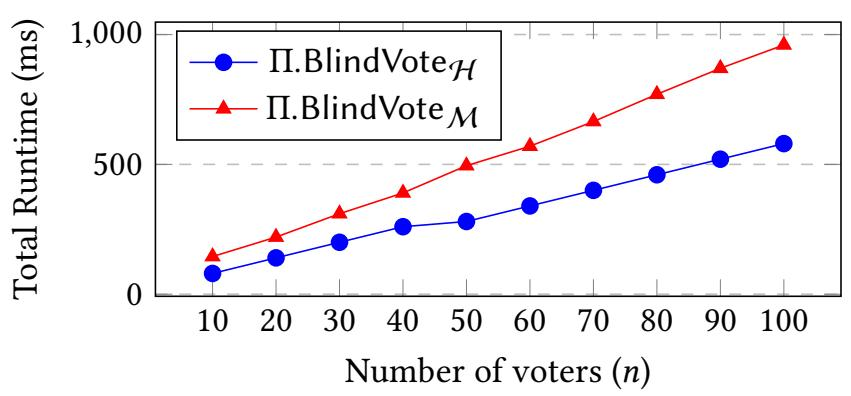
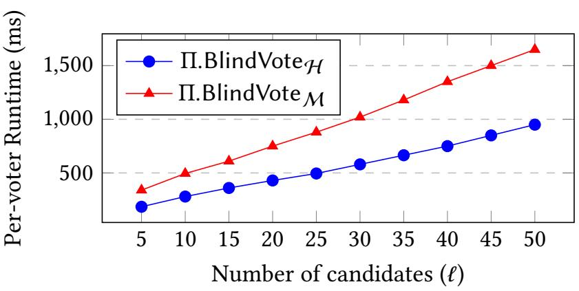
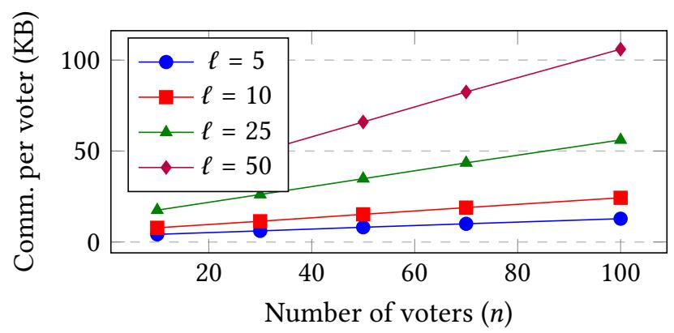
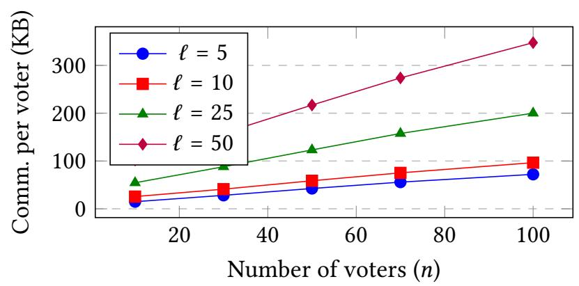

{0}------------------------------------------------

# Anamorphic E-Voting: Coercion-Resistant Through Fake and Real Votes

# **Antonis Michalas**

Tampere University
Tampere, Finland
antonios.michalas@tuni.fi

#### **ABSTRACT**

The paper addresses the challenging and timely issue of vote buying in electronic voting. Electronic voting is a well established process in modern democracies. However, problems such as vote buying continue to pose a significant challenge. This paper aims at addressing this issue by leveraging the novel concept of Anamorphic Encryption to enable voters to cast their original vote together with a hidden "fake" one. In this way voters can pursue their true preferences unobstructed while providing a compliance proof to potential vote buyers. The security of our construction is proved through a formal security analysis, that considers powerful adversaries who aim at breaching user privacy and influencing votes. We believe that this innovation e-voting approach can enhance the overall security of e-voting systems and pave the way to avoid electoral manipulation.

## **CCS CONCEPTS**

• Security and privacy → Public key encryption;

#### **KEYWORDS**

Anamorphic Encryption, Coercion, Electronic Voting, Vote Buying, Vote Coercion, Vote Selling

#### 1 INTRODUCTION

According to the following definition, democracy is "a system of government by the whole population or all the eligible members of a state, typically through elected representatives". Ultimately, this definition names elections as a sine qua non of healthy democracy. While the very meaning of democracy cannot be restricted or approached solely through elections, in reality, very few questions about democracy can be answered without referring to elections.

Within this framework, privacy is considered an indispensable component of free and fair elections and an undeniable human right in every democratic society. In today's digital age, information flows freely and personal data is becoming increasingly vulnerable. Thus safeguarding privacy seems more critical than ever. In this effort, cryptography has acquired a pivotal role as it offers robust scientific and technological solutions preserving confidential and integral information for individuals across various contexts. In other words, cryptography has acquired a pivotal role in upholding privacy rights and fostering trust in modern societies: From protecting sensitive data stored in digital systems to securing communication channels and financial transactions and protecting sensitive data stored in digital systems.

In the realm of e-voting, preserving privacy emerges as a fundamental element especially since societies increasingly turn to

electronic voting systems. Renowned for the ability to secure sensitive information in digital environments, cryptography safeguards the privacy of participants in e-voting systems. By employing cryptographic techniques, such as homomorphic encryption and cryptographic proofs, e-voting systems can uphold the sanctity of the ballot while preserving the anonymity of voters. Thus cryptography can help bolster public trust in the electoral process, while it ensures that every citizen's voice is heard without compromise.

Until now, significant progress has been made in constructing secure and privacy-respecting systems adaptable to various e-voting scenarios. Consequently, researchers have developed methods to mitigate several critical attacks that could influence election outcomes. However, a relatively understudied is that of vote buying<sup>1</sup>. In an e-voting scenario, a vote-buying attack refers to a situation where a malicious entity attempts to influence the outcome of an election by offering bribes or incentives to voters in exchange for their votes. This attack can manipulate election results and undermine democratic principles. Vote buying poses a significant challenge to the security and trustworthiness of electronic voting systems. The lack of viable solutions thus far, stems from the belief that it is a problem beyond the scope of technological resolution.

This paper specifically addresses this challenging problem and makes an attempt to offer a technological solution that could shed light on how cryptography can contribute to solving problems previously thought to be confined to the physical realm.

The idea behind the solution is relatively simple: If an adversary attempts to bribe a voter (let's call her Alice) to vote for a specific party (say  $P_b$ ), and if Alice is expected to be alone when casting her vote, then all she needs to provide to the adversary is some form of proof that she indeed voted for the designated party. With this in mind, we thought that a possible solution would be if Alice could cast a fake vote  $(v_A^f)$  for  $P_b$  that would conceal her real vote  $v_A$ . Then, the system responsible to collect the votes would be able to see both votes and tally the genuine one while utilizing the fake vote solely to generate a proof. This proof would be sent to Alice, demonstrating that she indeed voted for  $P_b$ , thereby providing leverage against the adversary that bribed her.

Anamorphic Encryption. To achieve this we utilized a recently-introduced technique is known as Anamorphic Encryption (AME) [21]. AME is like a secret agent in the world of cryptography. Instead of simply depending on a regular lock and key to protect messages, it adds an extra layer of secrecy. With traditional encryption, you have a public key to lock a message and a private key to unlock it. But with AME, there's a twist. These keys will still exist, but there is also a special double key acting as 'a hidden key within a key'.

<span id="page-0-0"></span><sup>&</sup>lt;sup>1</sup>In the literature, it is also referred to as vote coercion.

{1}------------------------------------------------

Here is how it works: When a message is encrypted using AME, in reality two messages are encrypted at once. One is the regular message, let's call it m, and the other one is a hidden message, let's call it  $\hat{m}$ . The actual changes comes about when keys are used to decrypt the ciphertext. If a regular private key is used (ask), the regular message m will be unlocked. But the special double key (dk) is used, the hidden message  $\hat{m}$  will be unlocked.

Imagine someone trying to snoop on your message – say a dictator or a powerful adversary. Even if they manage to get hold of one of the keys and unlock the ciphertext, they will not see the hidden message unless they have access to that special double key. As a result, in a situation where someone is trying to influence someone's vote or uncover their secret, they can be given one key, while the other one is kept hidden. The 'attackers' will think they have cracked the code, but they will never know there's more to the story. This 'secret within a secret' method will keep your message safe from prying eyes. As mentioned earlier, an AME scheme and the generated ciphertexts and keys are indistinguishable from a typical PKE scheme. Therefore, there is no way for the adversary to know that ALice used an AME scheme to conceal her real vote.

# 1.1 Contributions

This paper does *not* aim to design another secure and privacy-preserving e-voting construction. Instead, it solely focuses on the problem of vote buying in e-voting. Therefore, the core contribution is the design of a novel solution to the persistent challenge of vote coercion in electronic voting systems. By leveraging AME [21], voters can cast a hidden "fake" vote alongside their genuine vote, thereby providing proof of compliance to potential vote buyers without compromising their true preferences. This innovative approach addresses a critical gap in existing e-voting security mechanisms and offers a promising avenue for mitigating electoral manipulation.

#### 2 RELATED WORK

In this section, we present important published works pertaining to anamorphic encryption and construction that aim to provide a solution to the problem of vote coercion.

Anamorphic Encryption. The concept of AME, recently introduced in [21], is based on the scenario of enabling secure and unrestricted communication for citizens in a dictatorship. This hypothesis might seemingly be restrictive, however, we contend the opposite. Relevant authoritarian tactics are often used by specific political entities worldwide <sup>2</sup>. Moreover, although still in its preliminary stages, AME brings forth additional strengths of existing public-key encryption (PKE) schemes. We, hence, believe that this technology will prove beneficial for a wide range of applications. As the concept of AME is relatively new, only a few works have been published on the topic so far. The works in [1] and [19] extended the concept of the original receiver-anamorphic encryption for distinct purposes. In [1], the process of generating the anamorphic key pair and the double key is separated and emphasis is placed on constructing a robust receiver-AME. Equally, in [19], the anamorphic public key and double key are utilized, to encode

normal and anamorphic plaintexts into an anamorphic ciphertext. This filtering process enables a broader range of cryptosystems, including Goldwasser-Micali [12], El Gamal [11], RSA-OAEP [3], Paillier [20], Cramer-Shoup [7] and LWE [22] to naturally support anamorphism. Additionally, Kutylowski et al. [18] introduced the concept of anamorphic signature schemes, where a signature is embedded with an anamorphic message readable only to the entity possessing the double key.

*Coercion Resistant.* As highlighted in the introduction, this paper aims at providing a cryptographic solution to the topic of vote buying. Coercion-resistance was first formalized by Juels et al. [16] who also provide a coercion-resistant system, named JCJ. JCJ was independently implemented as Civitas [6] which deals with coercion by allowing voters to vote multiple times via a mechanism of real and fake credentials. Selene [23] assigns a unique tracker to each vote, enabling voters to reveal a commitment to a fake tracker to deceive potential attackers. Bingo Voting [4] relies on a trusted random number generator to generate fake votes for candidates the voter did not select. Voters receive receipts containing all candidates, obscuring their actual choices, with fake votes being discarded during tallying. Caveat Coercitor [14] is a unique system that permits coercion but records unforgeable evidence of coercion instances, allowing observers to assess the validity of the outcome based on suspicious ballots. Finally, the solution proposed in in [5] contradicts the idea implemented in this paper. Specifically, their solution revolves around setting a number of restrictions preventing the voter from proving how they voted and penalizing them when they reveal their vote. Assuming that the vote seller and vote buyer are mutually distrustful, the authors show that in their protocol there is no situation where the buyer and seller can achieve a mutually agreeable selling price. While the idea is interesting, it is based on a somewhat unrealistic assumption.

Overall, while some works try to tackle the problem of vote coercion, as far as we know, this is the first time that the promising concept of AME is used as a purely cryptographic solution to this problem.

Relation to Prior Works. Prior constructions for privacy-preserving aggregation in reputation systems was introduced in [8, 10, 15]. Despite their similarities to our work, these solutions focused on securely aggregating scalar ratings in decentralized environments and did not address electronic voting, coercion resistance, and did not support multi-candidates.

## **3 PRELIMINARIES**

# 3.1 Pseudorandom Functions

*Pseudorandom Functions (PRF).* A pseudorandom function family is a collection of functions that appear computationally indistinguishable from truly random functions when evaluated on inputs, provided that the key remains unknown.

DEFINITION 1 (PSEUDORANDOM FUNCTIONS (PRF)). Let F be a function such that:  $F: \mathcal{K} \times \mathcal{X} \to \mathcal{Y}$ , where  $\mathcal{K}$  denotes the key-space. Moreover, let  $F.Gen(1^{\lambda})$  be a probabilistic algorithm that given a security parameter  $\lambda$ , outputs a key  $k \in \mathcal{K}$  for F.F is a PRF if for all

<span id="page-1-0"></span> $<sup>^2</sup>$ This observation is based on widely reported events and actions of political figures globally, and are not a statement of political opinion.

{2}------------------------------------------------

PPT adversaries ADV:

$$|\Pr[k \leftarrow G.\operatorname{Gen}(1): \mathcal{ADV}^{\mathsf{F}(k,\cdot)}(1^{\lambda}) = 1] - \Pr[k' \stackrel{\$}{\leftarrow} [X, \mathcal{Y}]: \mathcal{ADV}^{R(\cdot)}(1^{\lambda}) = 1]| = negl(\lambda)$$
(1)

# 3.2 Traditional Asymmetric Encryption

We begin by revisiting the syntax of public key encryption and its corresponding security notion. In this study, we focus solely on indistinguishability under chosen-plaintext attack (IND-CPA).

Definition 2 (Public Key Encryption (PKE)). A public-key encryption scheme E is a tuple of three algorithms E = (KeyGen, Enc, Dec) such that:

- **KeyGen**: The Key Generation is a probabilistic algorithm that takes as input a security parameter  $\lambda$ , and outputs a public/private key pair (pk, sk)  $\leftarrow$  KeyGen(1 $^{\lambda}$ ).
- Enc: Encryption is a probabilistic algorithm that takes as input a public key pk and a message  $m \in \mathcal{M}$  and outputs a ciphertext  $c \leftarrow \text{Enc}(pk, m)$ .
- **Dec**: Decryption is a deterministic algorithm that takes as input a secret key sk and a cipertext c and outputs a message  $Dec(sk, c) \rightarrow m$ .

**Correctness:** A PKE scheme is said to be correct *iff*  $\forall m \in \mathcal{M}$ :  $Pr[Dec(sk, Enc(pk, m)) = m)|(pk, sk) \leftarrow KeyGen(1^{\lambda})] = 1$  (2)

# 3.3 Anamorphic Encryption

While we are now ready to proceed with the formal definition of AME, let's first discuss its functionality at a high level. An AME scheme is a typical asymmetric encryption scheme denoted as E = (KeyGen, Enc, Dec), with an anamorphic extension that includes three additional algorithms denoted as  $\Sigma$  = (aKeyGen, aEnc, aDec). AME operates in two modes: the normal mode, where it functions as E, and the anamorphic mode, where algorithms from  $\Sigma$  are employed. The primary purpose of AME is to enable two or more users to embed covert messages within an otherwise typical-looking encryption. This is particularly useful when there is concern that the secret key of a traditional scheme may be compromised.

In such a scenario, a user like Alice, who wants to encrypt a message, executes the anamorphic key generation algorithm aKeyGen, which yields a pair of anamorphic public/secret keys (apk, ask) along with a double key dk. Alice publishes apk and keeps ask and dk secret. She then securely sends the generated double key dk to another user, Bob.

With the cryptographic keys generated and dk shared, Alice can begin encrypting messages. Suppose Alice wants to encrypt a message  $m_{Real}$ , but is concerned that if she uses a traditional asymmetric encryption scheme like E, an adversary may access the corresponding secret key and decrypt it. In this case, along with  $m_{Real}$ , Alice also generates a fake message  $m_{\mathcal{A}\mathcal{D}\mathcal{V}}$ . She then runs the anamorphic encryption algorithm aEnc with inputs apk, dk,  $m_{Real}$ , and  $m_{\mathcal{A}\mathcal{D}\mathcal{V}}$ .

The result is an anamorphic ciphertext act, which she sends to Bob. And here comes the magic: When processed with the standard decryption algorithm Dec and ask, the ciphertext act decrypts to  $m_{\mathcal{ADV}}$ , but reveals  $m_{\text{Real}}$  when decrypted using the anamorphic decryption algorithm aDec with the double key dkey.

Figure 1: Anamorphic Encryption Scheme

Essentially, if either Alice or Bob are forced by an adversary to reveal the exchanged message, they can use ask with the decryption algorithm from the traditional scheme E and reveal the fake message  $m_{\mathcal{ADV}}$  to the adversary. Notably, the ciphertext generated by Alice must be indistinguishable from a ciphertext of msg produced using Enc, even to an adversary with access to ask. Otherwise, the adversary may deduce that Alice and Bob are using an AME scheme, potentially revealing the presence of a covert message.

Now, let's proceed with a formal definition of an AME scheme.

<span id="page-2-0"></span>DEFINITION 3 (ANAMORPHIC ENCRYPTION (AME)). Let E be a PKE scheme such that E = (KeyGen, Enc, Dec). An extension  $\Sigma$  of E is a tuple of four algorithms  $\Sigma$  = (aKeyGen, aEnc, aDec) such that:

- aKeyGen: The anamorphic key generation algorithm is a probabilistic algorithm that takes as input a security parameter  $\lambda$  and outputs an anamorphic public/private key pair (apk, ask) and a double key dk.
- **aEnc**: The anamorphic encryption algorithm is a probabilistic algorithm that takes as input the anamorphic publick key apk, the double key dk and two messages: the regular message  $msg \in \mathcal{M}$  for E and the anamorphic message  $msg \in \mathcal{M}$  for  $\Sigma$  and returns an anamorphic ciphertext act.
- aDec: The anamorphic decryption algorithm is a deterministic algorithm that takes as input the anamorphic secret key ask, the double key dk and an anamorphic ciphertext act and returns a message m.

**Correctness:** An AME scheme is said to be correct *iff*  $\forall msg \in \mathcal{M}$  and  $\forall amsg \in \hat{M}$ :

 $Pr[aDec(ask, dk, Enc(apk, dk, msg, amsg)) \neq amsg)|(apk, ask, dk)$  $\leftarrow aKeyGen(1^{\lambda}) \leq negl(\lambda)]$ (3)

3.3.1 Security of Anamorphic Schemes and Messages. Now that we have defined the basics of AME, we need to give the security requirements for both an AME and the produced anamorphic messages. In both cases, the general idea is that an AME scheme will be considered as secure if a PPT adversary  $\mathcal{ADV}$  will not be able to distinguish between a secure encryption scheme E = (KeyGen, Enc, Dec) and an anamorphic extension  $\Sigma = (aKeyGen, aEnc, aDec)$  even in the case where  $\mathcal{ADV}$  is given access to the secret key. Similarly,  $\mathcal{ADV}$  should not be able to distinguish between a ciphertext generated with E.Enc and a anamorphic ciphertext generated with  $\Sigma.aEnc$ . To formalize this, we consider two security games where the adversary is given access to the encryption oracle OE through which it can obtain the encryptions of messages of its choice.

{3}------------------------------------------------

# Real.Game<sub>E, $\mathcal{ADV}$ </sub> $(1^{\lambda})$

- 1.  $(pk, sk) \leftarrow E.KeyGen(1^{\lambda});$
- 2. Trigger encryption oracle OE and get Enc(pk, msg);
- 3. Return  $\mathcal{ADV}^{OE(pk,\cdot,\cdot)}(pk, sk)$ .

# Anamorphic.Game $_{\mathsf{aE},\mathcal{ADV}}(1^\lambda)$

- 1.  $((apk, ask), dk) \leftarrow \Sigma.KeyGen(1^{\lambda})$
- **2. Trigger** anamorphic encryption oracle OAE and get Enc(apk, dk, msg, amsg);
- 3. **Return**  $\mathcal{ADV}^{OAE(apk,dk,\cdot,\cdot)}(apk,ask)$ .

<span id="page-3-0"></span>Definition 4. We say that an encryption scheme E is anamorphic if it is IN-CPA secure and there exists an anamorphic extension  $\Sigma = (aGen, aEnc, aDec)$  such that for every PPT adversary:

$$\Pr[\text{Real.Game}_{E,\mathcal{ADV}}(1^{\lambda})] - \Pr[\text{Anamorphic.Game}_{aE,\mathcal{ADV}}(1^{\lambda})] \le negl(\lambda)$$

(4)

As we can see, Definition 4 captures both requirements that the underlying encryption scheme along with the generated keys and ciphertexts are indistinguishable from an adversary who has access to an encryption oracle and the secret key.

# 4 ZERO-KNOWLEDGE PROOFS

Zero-knowledge proofs, introduced by Goldwasser *et al.* [13], are interactive protocols where one party (the prover) convinces another party (the verifier) of a statement's truth without revealing any information beyond that. Here, we'll introduce the non-interactive versions used in our protocol as an extension of previous interactive protocols [2].

# 4.1 Non-Interactive Proof of Plaintext Equality

In a zero-knowledge proof of equality we assume that  $E(pk_i, m)$  and  $E(pk_j, m)$  are encryptions of a message m with the public key of  $u_i$  and  $u_j$  respectively. In such a proof, a prover P can convince a verifier V that  $Dec(pk_i, Enc(pk_i, m)) = m = Dec(pk_i, Enc(pk_i, m))$ .

Let  $(N_i, g)$  be the public key of  $U_i$  where  $N_i$  is an RSA modulus  $N_i = pq$  such that p and q primes. Let g be an integer of order multiple of  $N_i$  modulo  $N_i^2$  and H a secure cryptographic hash function. The non-interactive version of the interactive protocol presented in [2] follows:

# 4.2 Non-Interactive Range Proof

In a zero-knowledge range proof a prover P can convince a verifier V that an encrypted message is an element of a certain set S. More precisely, if we assume that  $S = \{m_1, \ldots, m_p\}$  is a public set of p messages and  $E(pk_i, m)$  is an encryption of a message m with the public key of  $u_i$  then P can convince V that  $E(pk_i, m)$  encrypts a message in S.

# Algorithm 1: Non-Interactive Proof of Plaintext Equality

- 1 **Prover** (*P*)
- 2 Picks a random  $\rho \in [0, 2^l)$
- 3 Randomly picks  $s_i \in_{N_i}^*$  and  $s_j \in_{N_j}^*$
- 4 Computes  $u_i = g_i^{\rho} s_i^{N_i} \mod N_i^2$  and  $u_j = g_j^{\rho} s_j^{N_j} \mod N_i^2$
- 5 Computes  $e = H(u_i, u_j)$
- 6 Computes  $z = \rho + me^{-\frac{1}{2}}$
- 7 Computes  $v_i = s_i r_i^e \mod N_i$  and  $v_j = s_j r_j^e \mod N_j$
- 8 Sends to V the following:  $z, u_i, u_j, v_i, v_j$
- 9 Verifier (V)
- 10 Computes  $e = H(u_i, u_j)$
- 11 Validates that  $z \in [0, 2^l)$
- Validates that  $g_i^z v_i^{N_i} = u_i E_i(m)^e \mod N_i^2$  and  $g_j^z v_j^{N_j} = u_j E_j(m)^e \mod N_j^2$

The non-interactive version of the protocol presented in [2] follows:

# **Algorithm 2:** Non-Interactive Range Proof

- 1 **Prover** (*P*)
- 2 Picks a random  $\rho \in N$
- 3 Randomly picks p-1 values  $\left\{e_j\right\}_{j\neq i}\in \mathbb{N}$  & p-1 values  $\left\{v_j\right\}_{j\neq i}\in \mathbb{N}$
- 4 Computes  $u_i = \rho^N \mod N^2 \& \{u_j = v_j^N (g^{m_j} / E_P(m))_j^e \mod N_j^2 \}$
- 5 Computes  $e = H(\lbrace u_j \rbrace_{j \in \lbrace 1, \dots, p \rbrace})$
- 6 Computes  $e_i = e \sum_{j \neq i} e_j \mod N$  and  $v_i = \rho r^{e_i} g^{e_i/N} \mod N$
- 7 Sends to V the following:  $\left\{u_j,v_j,e_j\right\}_{j\in\{1,...,p\}}$
- 8 Verifier (V)
- 9 Calculates  $e = H(\{u_j\}_{j \in \{1,...,p\}})$
- 10 Checks that  $e = \sum_{i} e_{i} \mod N$
- 11 Checks that  $v_j^N = u_j(E_P(m)/g^{m_j})^{e_j} \mod N^2, j \in \{1,\ldots,p\}$

# 5 SYSTEM AND THREAT MODELS

Let  $\Pi$  be an e-voting system that supports an amorphic encryption. We consider the following system model.

- **Setup Authority** (*A*): This entity is responsible for the setup of the necessary parameters as well as for creating unique sets of users that will collaborate to cast their votes in a privacy-preserving and verifiable way.
- **Voters** ( $\mathcal{U}$ ): Voters are typical users who have been registered to the service. Upon registration, each user receives a unique public/private key pair that can be used with an IND-CPA secure PKE scheme E and its anamorphic extension  $\Sigma$ . Each voter can be authenticated through her public/private key pair and participate in the voting procedure (i.e., cast her electronic vote). The set of all voters is denoted as  $\mathcal{U} = \{u_1, \ldots, u_n\}$ .

In our construction, each voter casts a vote for a single candidate from a public candidate list  $\mathcal{P} = \{P_1, \dots, P_\ell\}$  by encoding their selection as a one-hot vector  $\vec{\mathbf{v}}_i \in \{0, 1\}^\ell$  such that  $\sum_{j=1}^\ell \vec{\mathbf{v}}_i[j] = 1$ .

{4}------------------------------------------------

Furthermore, we assume that q is a large prime such that  $\mathbb{Z}_q$  is the plaintext space of the encryption schemes used in our protocols. Then all operations on vote vectors are assumed to be in  $\mathbb{Z}_q^\ell$ .

- Candidates ( $\mathcal{P}$ ): The set of all candidates available to voters is denoted as  $\mathcal{P} = \{P_1, \dots, P_\ell\}$ . Each vote submitted in the system is interpreted as a selection of one candidate from this list.
- **Vote Collector** (*VC*): An entity responsible for collecting and counting votes submitted by registered voters in *U*. *VC* is also responsible for publishing the final result of an e-voting procedure.

# 5.1 Threat Model

In this work, we consider two different types of adversaries: Initially, we consider a semi-honest adversary, denoted as  $\mathcal{ADV}_{\mathcal{H}}$ , who adheres to the prescribed protocol specifications but may attempt to undermine the system's integrity by compromising users to extract information about legitimate votes. We assume that  $\mathcal{ADV}_{\mathcal{H}}$  can collude with a significant majority of users. Additionally, we account for the presence of a malicious adversary, labeled as  $\mathcal{ADV}_{\mathcal{M}}$ , operating in accordance with the Dolev-Yao threat model [9]. Specifically, we assume that  $\mathcal{ADV}_{\mathcal{M}}$  possesses the capability to manipulate messages in an effort to alter their contents, presenting a more realistic threat to our protocol. Furthermore, we provide a definition for a coercion-resistant protocol.

**Coercion Resistance.** Informally, a protocol is coercion-resistant if a voter coerced to vote for a candidate  $P^*$  can produce a transcript and evidence (e.g. confirmation ciphertext) convincing to the coercer, while their real vote counts for another candidate P, and the coercer *cannot* detect this deviation.

Now we are ready to define a game between a challenger and an adversary  $\mathcal{A}$ . The logic of the game is as follows: First, the challenger runs the setup phase and generates the public parameters as well as the keys for all participants. Then, the adversary chooses a target voter  $u^*$  and instructs them to vote for candidate  $P^*$ . The challenger samples a real vote for candidate P where  $P \neq P^*$ , and simulates  $u^*$  submitting a ballot with fake vote  $P^*$  and real vote P. The adversary is given the private key ask\*, a confirmation ciphertext sent to  $u^*$ . Finally, the adversary must guess whether  $u^*$  submitted the coerced vote or a different one. The we say that a protocol is coercion-resistant if any PPT adversary wins this game with probability at most  $1/2 + \text{negl}(\lambda)$ .

<span id="page-4-0"></span>Definition 5 (Coercion Resistance). Let  $\Pi$  be an e-voting protocol that supports anamorphic encryption, with algorithms:  $\Pi$  = (Setup, VoteCast, VoteCollect, Tally) We define the following experiment between a challenger C and a PPT adversary  $\mathcal{A}$ .

```
\begin{array}{l} \underline{\text{Coerce-Exp}_{\Pi}^{\mathcal{H}}(\lambda)} \\ C: (\mathsf{pp}, \{(\mathsf{apk}_i, \mathsf{ask}_i, \mathsf{dk}_i)\}_{i=1}^n) \leftarrow \Pi.\mathsf{Setup}(1^\lambda) \\ \mathcal{H}: u^* \leftarrow \mathsf{ChooseCoercionVoter}(i^*, i^* \in [n]) \ \# \ \mathsf{selects} \\ \mathsf{a} \ \mathsf{target} \ \mathsf{voter} \ u^* \\ \mathcal{H}: \mathsf{v}^* \leftarrow \mathsf{ChooseCoercionVote}(P^*, P^* \in \mathcal{P}) \ \# \ \mathsf{coercion} \\ \mathsf{instruction:} \ \mathsf{a} \ \mathsf{candidate} \ P^* \ \mathsf{whom} \ \mathsf{the} \ \mathsf{voter} \ \mathsf{must} \\ \mathsf{vote} \ \mathsf{for}. \end{array}
```

```
\mathcal{A}: \mathsf{v}^* \to u^*
b \overset{\$}{\leftarrow} \{0,1\}
if b = 0:
                                                       # voter complies
       v_{real} \leftarrow v^*, v_{fake} \leftarrow v^*
                                            # voter cheats coercer
else
        v_{real} \leftarrow v_{real}, v_{fake} \leftarrow v^*
act \leftarrow \Sigma.aEnc(apk_{VC}, dk_{VC}, v_{fake}, v_{real})
receipt \leftarrow \Pi.Confirm(i^*, act) # e.g., re-encrypted
act under (apk_{i^*}, dk_{i^*})
Leakage to Adversary
view \leftarrow (ask<sub>i*</sub>, act, receipt, pp)
                            # \mathcal{A} outputs a guess b' for b.
b' \leftarrow \mathcal{A}(\text{view})
return b'
```

We say that  $\Pi$  is coercion-resistant if, for all PPT adversaries  $\mathcal{A}$ , there exists a negligible function negl(·) such that:

$$\left| \Pr \left[ \mathsf{Coerce}\text{-}\mathsf{Exp}_{\Pi}^{\mathcal{A}}(\lambda) = b \right] - \frac{1}{2} \right| \leq \mathsf{negl}(\lambda)$$

Adversary's Awareness of AME Usage. Finally, it is important to clarify that we do not assume that the coercer is unaware of the use of AME; rather, our protocol remains coercion-resistant even if the adversary is aware of the AME mechanism. A broader discussion of this limitation and its implications is provided in section 10.

# 6 ANAMORPHIC E-VOTING: A TOY PROTOCOL

In this section, we introduce what refer to as a toy protocol that primarily serves as a pedagogical tool despite its numerous vulnerabilities. However, we present it to outline our fundamental concept of employing anamorphic encryption in an e-voting scenario to mitigate vote-buying attacks. While the toy protocol may have limitations, we find it instrumental in laying the groundwork for the design of our two main protocols described in the next section – one ensuring security under the semi-honest model, and the other under the more realistic Dolev-Yao adversarial model.

Note on Vote Format. For simplicity, this toy protocol describes the vote as a scalar value  $v_i \in \mathbb{Z}_q$ . This format is sufficient for illustrating the idea of covert channels via AME. However, in real-world e-voting settings with multiple candidates, a scalar vote is not sufficient, as it does not specify which candidate the vote is for. In our full construction presented in section 7, each vote is instead represented as a one-hot vector  $\vec{v}_i \in \{0,1\}^{\ell}$  over the candidate set  $\mathcal{P} = \{P_1, \dots, P_{\ell}\}$ .

For our toy construction we assume the existence of an IND-CPA secure public-key encryption scheme E = (KeyGen, Enc, Dec) with an anamorphic extension  $\Sigma = (aKeyGen, aEnc, aDec)$ . Our toy protocol is built around the following three main protocols:  $\Pi$ . Setup,  $\Pi$ . VoteCast,  $\Pi$ . VoteCollect.

 $\Pi$ .Setup: The setup authority, denoted as A initiates this process by generating a public/private key pair (pk<sub>A</sub>/sk<sub>A</sub>). A publishes pk<sub>A</sub>

{5}------------------------------------------------

and keeps  $sk_A$  confidential. Additionally, A creates the set  $\mathcal{P}$  comprising all candidates, which is also made publicly available. Furthermore, each legitimate user undergoes authentication and registration for the voting service. While authentication falls beyond the scope of this paper, we assume it can be successfully accomplished through the use of unique user information (e.g., personal social security numbers combined with a random seed sent to the user through alternate means, such as their mobile phone). Subsequently, every authenticated user, denoted as  $u_i$  proceeds to register. Registration entails  $u_i$  executing  $\Pi$ . Key Gen to generate a unique key pair  $(pk_i, sk_i)$ . In addition to that, vote collector executes  $\Pi$ .aKeyGen to generate a set of unique keys ((apk $_{VC}$ , ask $_{VC}$ ), dk $_{VC}$ ) to be utilized during the voting process. Additionally, we assume that VCshares with all registered users the generated double key  $dk_{VC}^{3}$ that will be used to encrypt users votes<sup>4</sup>. Sharing  $dk_{VC}$  is easy since VC can establish a secure communication channel with any registered user. Below, we enumerate the keys generated during the setup phase:

- $(pk_A, sk_A)$ : Public/private key pair of the setup authority A.
- (apk<sub>i</sub>, ask<sub>i</sub>): For each user  $u_i$  an anamorphic public/private key and a double key dk<sub>i</sub> for the anamorphic encryption scheme  $\Sigma$ .
- $((apk_{VC}, ask_{VC}), dk_{VC})$ : For VC an anamorphic public/private key and a double key for the anamorphic encryption scheme  $\Sigma$ .

**II.VoteCast:** This is the step in which a user  $u_i$  executes the process to generate and encrypt her vote. To accomplish this,  $u_i$  generates two votes: a fake one  $(v_i^f)$  and the real one  $(v_i)$ . Subsequently,  $u_i$  executes aEnc(apk $_{VC}$ , dk $_{VC}$ ,  $v_i^f$ ,  $v_i$ ). At this point it worth highlighting, for clarity, that based on Definition 3,  $u_i$ 's fake vote  $v_i^f$  corresponds to msg while  $u_i$ 's  $v_i$  corresponds to the anamorphic message amsg. Hence  $u_i$ 's real vote can also be referred to as an anamorphic vote.

Now that  $u_i$  has generated both votes, executes  $\Sigma$ .aEnc(apk $_{VC}$ , dk $_{VC}$ , and gets an anamorphic ciphertext act $_i$  containing both votes. Then,  $u_i$  sends act $_i$  to VC.

In. Vote Collect: This is the final stage of our toy protocol where the vote collector receives  $\operatorname{act_i}$  from  $u_i$ . Upon reception,  $\operatorname{VC}$  uses  $\operatorname{dk}_{\operatorname{VC}}$  to recover  $u_i$ 's real vote  $v_i$  and stores it in a database along with all other collected votes. Subsequently,  $\operatorname{VC}$  recovers  $v_i^f$  by executing Σ.aDec( $\operatorname{ask}_{\operatorname{VC}}$ ,  $\operatorname{act_i}$ ). Now that  $\operatorname{VC}$  has access to both votes cast by  $u_i$ , it re-encrypts them by executing Σ.aEnc( $\operatorname{apk_i}$ ,  $\operatorname{dk_i}$ ,  $v_i^f$ ,  $v_i$ ) and sends the resulting ciphertext to  $u_i$ . This serves as a confirmation to  $u_i$  that her vote has been successfully collected and as a means through which  $u_i$  can prove to an adversary attempting to buy her vote that she indeed voted  $v_i^f$  and not  $v_i$ . To do so,  $u_i$  simply uses  $\operatorname{ask_i}$  with Σ.aDec to decrypt the ciphertext sent earlier as confirmation from  $\operatorname{VC}$ , while keeping the existence of  $\operatorname{dk_i}$  concealed. It is important to note that the adversary cannot discern that  $u_i$  used the anamorphic encryption scheme Σ to encrypt her

vote, as by definition, both encryption schemes (i.e E and  $\Sigma$ ) as well as the corresponding ciphertexts are indistinguishable.

# 6.1 Decryption of Anamorphic Vote

Anamorphic encryption enables the embedding of covert messages within the ciphertext of any PKE scheme, which is, at a minimum, randomized and possesses indistinguishability under chosen-plaintext attack (IND-CPA) security. In our scenario, the covert message will be the anamorphic vote v<sub>i</sub>. Assuming sender and receiver can be synchronized by keeping a matching counter ctr, whenever the sender wants to embed a covert message vi from a small space  $\mathcal{P}$ . Assuming that the sender and receiver can synchronize by maintaining a matching counter ctr, whenever the sender  $(u_i)$  wishes to embed a covert message from a small space  $\mathcal{P}$ , into an encryption of another message v<sup>t</sup> they can proceed as follows:  $u_i$  calculates R := PRF(K, (ctr,  $v_i$ )), where PRF is a pseudorandom function and K is a key the two parties (i.e.  $u_i$  and VC) have agreed upon as part of their double key. Then  $u_i$  generates the ciphertext  $c_i = \Sigma.aEnc(apk_{VC}, v_i^f; R)$ . Now, since we are assuming VC knows the exact value ctr that was used by  $u_i$ , it will be able to retrieve  $v_i$ simply by first normally recovering  $v_{i}^{f}$  by decrypting  $c_{i}$  and then trial-re-encrypt  $v_i^f$  as  $c_i^{'} = Enc(apk_{VC}, v_i^f; PRF(K, (ctr, v_i)))$  for every  $v_i$  in  $\mathcal{P}$ , until  $c_i' = c_i$ .

It is important to clarify that, as as demonstrated in previous works such as [1, 17, 21], any PKE scheme that possesses randomness recovery also supports the anamorphic property. Therefore, numerous well-known and widely used schemes, including Goldwasser-Micali [12], El Gamal [11], RSA-OAEP [3], Paillier [20], Cramer-Shoup [7] and LWE [22] inherently support anamorphism.

# <span id="page-5-0"></span>7 ANAMORPHIC E-VOTING

One of the core issues with the previous protocol is that the vote collector  $\mathcal{VC}$  must be trusted implicitly. This is because  $\mathcal{VC}$  has access to all individual votes, enabling the potential manipulation of  $u_i$ 's vote without any verification, which can be relatively easy. Moreover,  $\mathcal{VC}$  can breach  $u_i$ 's privacy by inspecting the content of  $u_i$ 's vote. Consequently, the protocol fails to ensure privacy for individual votes.

In this section, we aim to address these issues by presenting two constructions. Firstly, we describe a protocol that is considered secure under the semi-honest model, where we assume that  $\mathcal{VC}$  may attempt to breach users' privacy but will adhere to the protocol's specifications. Subsequently, we consider a stronger threat model, wherein we assume that an adversary might collude with any participating entity, including  $\mathcal{VC}$ , and could attempt to breach users' privacy, change votes, or disrupt the overall security and privacy of the voting procedure.

Before we proceed with the formal construction of the scheme, we provide a high-level overview.

# 7.1 High-Level Overview

In this section, we outline the main intuition behind our anamorphic e-voting protocols and how they achieve coercion resistance.

<span id="page-5-1"></span><sup>&</sup>lt;sup>3</sup>We acknowledge that sharing the same key with all users in the system is not secure. However, as we mentioned earlier, this is a toy protocol that has a plethora of vulnerabilities and we only use it as a base to build our Anamorphic E-Voting construction presented in the next section.

<span id="page-5-2"></span><sup>&</sup>lt;sup>4</sup>In reality as we will see in the next paragraph, this key is only used to encrypt what we call user's *anamorphic vote*.

{6}------------------------------------------------

We consider a typical e-voting setting where voters choose from a set of candidates  $\mathcal{P} = \{P_1, \dots, P_\ell\}$ . Each voter's selection is represented as a one-hot vote vector  $\vec{\mathbf{v}}_i \in \{0,1\}^\ell$ , where  $\vec{\mathbf{v}}_i[j] = 1$  indicates a vote for candidate  $P_j$ . The protocol ensures that only one candidate can be selected per vote by requiring that  $\sum_{j=1}^\ell \vec{\mathbf{v}}_i[j] = 1$ .

To prevent coercion or vote-buying, our construction leverages the properties of AME. Each voter submits a ciphertext that contains both a *fake vote*, which can be shown to a coercer, and a *real vote*, which is actually counted during tallying. These values are encrypted under an AME scheme so that the real vote is concealed even if the fake vote and standard secret key are revealed.

In the semi-honest setting, voters additionally blind their real vote vectors using secret sharing. This ensures that the vote collector cannot individually recover real votes but can still compute the final tally by summing all masked vote vectors. The result is a vector of vote counts  $\vec{\mathsf{T}} \in \mathbb{Z}_q^\ell$  where  $\vec{\mathsf{T}}[j]$  represents the total number of votes for candidate  $P_j$ .

In the malicious setting, we enhance the protocol with ZKPs to ensure that voters correctly form their vote vectors (e.g., only one 1, rest 0s), and to ensure that the vote collector behaves honestly during the confirmation phase.

In both settings, our design enables voters to deceive coercers by presenting valid-looking proofs and fake votes, while their true preferences remain hidden and correctly tallied.

# 7.2 Formal Construction

We are now ready to present the Anamorphic E-Voting construction that constitutes the core of this paper's contribution. For the realization of our construction we rely on the following building blocks:

Our Anamorphic E-Voting construction is built around the following three main protocols:  $\Pi$ . Setup,  $\Pi$ . VoteInit,  $\Pi$ . BlindVote.

II.Setup: The setup authority A, initiates this process by generating a public/private key pair (pk<sub>A</sub>/sk<sub>A</sub>). A publishes pk<sub>A</sub> and keeps sk<sub>A</sub> confidential. Additionally, A creates the set  $\mathcal{P}$  comprising all candidates, which is also made publicly available. Furthermore, each legitimate user undergoes authentication and registration for the voting service. Subsequently, every authenticated user  $u_i$ , proceeds to register. Registration entails  $u_i$  executing  $\Sigma$ .aKeyGen to generate a set of unique keys ((apk<sub>i</sub>, ask<sub>i</sub>), dk<sub>i</sub>) to be utilized during the voting process. Below, we enumerate the keys generated during the setup phase:

- $(pk_A, sk_A)$ : Public/private key pair of the setup authority A.
- (apk<sub>i</sub>, ask<sub>i</sub>), dk<sub>i</sub>: For each user  $u_i$  a public/private key pair and a double key for for the anamorphic encryption scheme  $\Sigma$ .

 $\Pi.VoteInit:$  This is the initialization of the voting procedure which is initiated by the vote collector  $\mathcal{VC}$ . As we mentioned earlier, this is a protocol that will run multiple times since each voting procedure will contain a different set of participants (i.e. voters). We assume that there is a short time interval during which a voter that wishes to cast her vote, is picked up by  $\mathcal{VC}$  and becomes part of a group of voters that will collaboratively cast their votes in a privacy-preserving way. More precisely, during the voting initialization procedure,  $\mathcal{VC}$  creates the set  $\mathcal{U}$  with all voters, orders

them in a circle  $VC \to u_1 \to \ldots \to u_n$  and sends to each  $u_i$  the identity of its successor in the circle.

This marks the initialization of the voting procedure, which is instigated by the vote collector denoted as  $\mathcal{VC}$ . As previously mentioned, this protocol will be executed multiple times, as each voting procedure involves a distinct set of participants (i.e., voters). It is assumed that there exists a brief time interval during which a voter desiring to cast her vote is selected by  $\mathcal{VC}$  and joins a group of voters who will collectively cast their votes. Specifically, during the voting initialization procedure,  $\mathcal{VC}$  forms the set  $\mathcal{U}$  comprising all voters, arranges them in a circular fashion  $\mathcal{VC} \to u_1 \to \ldots \to u_n$  and transmits to each  $u_i$  the identity of its successor in the circle.

Now we will present two instantiations of the protocol  $\Pi.BlindVote$ . First we present  $\Pi.BlindVote_{\mathcal{H}}$  which as we will show later is secure under the semi-honest model. Then we present  $\Pi.BlindVote_{\mathcal{M}}$  which is secure under the malicious model.

 $\Pi$ .BlindVote<sub> $\mathcal{H}$ </sub>: | Each user  $u_i$  selects their vote as a one-hot vector  $\vec{\mathsf{v}}_i \in \{0,1\}^\ell$  where  $\ell = |\mathcal{P}|$ . Then generates n additive shares of a random vector  $\vec{r}_i = (\vec{r}_{i,1}, \dots, \vec{r}_{i,n})$  such that:  $\forall j \in [n], \ \vec{r}_{i,j} \in$  $\mathbb{Z}_q^\ell$  and  $\vec{r}_i = \sum_{j=1}^n \vec{r}_{i,j}$  and sends  $\vec{r}_{i,j}$  to each  $u_j \neq u_i$ . Once  $u_i$  has received all shares  $\{\vec{r}_{j,i}\}_{j\neq i}$ , calculates its blind vote vector by computing  $\vec{b}_i = \vec{v}_i + \vec{r}_i - \sum_{i=1}^n \vec{r}_{j,i}$ . Now that  $u_i$  has generated its blind vote, will use anamorphic encryption to encrypt the fake vote and conceal the blind vote in it. So,  $u_i$  calculates the anamorphic vote  $\operatorname{act}_i = \Sigma.\operatorname{aEnc}(\operatorname{apk}_{VC},\operatorname{dk}_{VC},\vec{\mathsf{v}}_i^f,\vec{\mathsf{b}}_i)$ , which is sent to  $\mathcal{VC}$ . Upon reception of all blind votes (i.e. from all voters in  $\mathcal{U}$ ),  $\mathcal{VC}$  decrypts each act; and calculates their sum which is equal to the sum of all individual votes  $\sum_{i=1}^{n} \vec{b}_i = \sum_{i=1}^{n} \vec{v}_i$  which is the final tally:  $\vec{\mathsf{T}} = \sum_{i=1}^n \vec{\mathsf{b}}_i \in \mathbb{Z}_q^\ell$  where  $\vec{\mathsf{T}}[j]$  is the number of votes for candidate  $P_j$ modulo q. Finally, after the decryption of each  $\vec{b}_i$ , VC verifies the format of the received vote, and sends back an AME confirmation in the form of: conf<sub>i</sub> =  $\Sigma$ .aEnc(apk<sub>i</sub>, dk<sub>i</sub>,  $\vec{v}_i^f$ ,  $\vec{b}_i$ ) to each  $u_i$ .

As we will show in the security analysis (section 8),  $\Pi$ .BlindVote $_{\mathcal{H}}$  is secure only under the semi-honest model. We will extend this protocol by adding a few extra steps to enhance its security under the malicious model. Our goal is to render the new protocol resistant to adversaries who do not adhere to protocol specifications. Such malicious adversaries may attempt to deviate from the protocol to violate the privacy of other participants. In particular, they may (i) refuse to participate in certain protocol steps or drop messages intended for forwarding, (ii) provide incorrect values to bias the final result, and (iii) modify protocol messages or tamper with communication channels to gain an advantage over well-behaving users.

 $\vec{\mathsf{\Pi}}.\mathsf{BlindVote}_{\mathcal{M}}$ : Each user  $u_i$  selects their vote as a one-hot vector  $\vec{v}_i \in \{0,1\}^\ell$ , where  $\ell = |\mathcal{P}|$ . Next,  $u_i$  generates a random vector  $\vec{r}_i \in \mathbb{Z}_q^\ell$  and splits it into n additive shares:  $\vec{r}_i = \sum_{j=1}^n \vec{r}_{i,j}$  such that each  $\vec{r}_{i,j} \in \mathbb{Z}_q^\ell$ . Then,  $u_i$  calculates  $\mathsf{E}(\mathsf{pk}_i, \vec{\mathsf{v}}_i)$  and encrypts each share  $\vec{r}_{i,j}$  under both  $\mathsf{pk}_i$  and  $\mathsf{pk}_j$ . Then,  $u_i$  proceeds to send these values to all participants of the protocol (without loss of generality we will assume that this step can be implemented by a bulletin board where participants may post messages that can be seen by everybody). It then goes on to prove in zero knowledge that (i) its vote  $\vec{\mathsf{v}}_i$  lies in

{7}------------------------------------------------

#### Algorithm 3: Anamorphic E-Voting: $\Pi$ .BlindVote $\mathcal{H}$

```
1 A generates and distributes \mathcal{U} = \{u_1, \dots, u_n\} and candidate
    list \mathcal{P} = \{P_1, \dots, P_\ell\}
```

#### 2 Round 1 - All voters in parallel

```
з for u_i \in \mathcal{U} do
           u_i selects \vec{\mathbf{v}}_i \in \{0, 1\}^{\ell} with \sum_j \vec{\mathbf{v}}_i[j] = 1
4
           u_i generates \vec{r}_i \in \mathbb{Z}_q^\ell and computes additive shares:
5
            \vec{r}_i = \sum_{i=1}^n \vec{r}_{i,j}
           for u_i \in \mathcal{U} \setminus \{u_i\} do
6
            u_i sends \vec{r}_{i,j} to u_j
 7
           u_i waits until it receives all shares \{\vec{r}_{j,i}\} and computes:
8
               \vec{\mathbf{b}}_i = \vec{\mathbf{v}}_i + \vec{r}_i - \sum_{i=1}^n \vec{r}_{j,i}
9
```

# 10 Round 2 - All voters in parallel

```
11 for i = 1 to n do
          u_i generates fake vote \vec{\mathbf{v}}_i^f \in \{0,1\}^\ell with \sum_j \vec{\mathbf{v}}_i^f[j] = 1
12
          u_i computes:
13
               act_i \leftarrow \Sigma.aEnc(apk_{VC}, dk_{VC}, \vec{v}_i^f, \vec{b}_i)
14
          u_i sends act<sub>i</sub> to VC
15
```

# 16 Round 3 - VC aggregates all votes

```
17 for i = 1 to n do
           \Sigma.aDec(ask<sub>VC</sub>, act<sub>i</sub>) = \vec{v}_i^f
18
           \Sigma.aDec(dk<sub>VC</sub>, act<sub>i</sub>) = \vec{b}_i
19
           Sends a confirmation ciphertext:
20
                conf_i = \Sigma.aEnc(apk_i, dk_i, \vec{v}_i^f, \vec{b}_i)
21
22 \mathcal{VC} computes final tally: \vec{\mathsf{T}} = \sum_{i=1}^n \vec{\mathsf{b}}_i \in \mathbb{Z}_q^\ell
          where \vec{\mathsf{T}}[j] is the total votes for candidate P_j.
23
```

the specified range using protocol ZK – RANGE( $\ell$ , E( $\vec{v}_i$ )), and (ii) the plaintext equality of the ciphertexts  $E(pk_i, \vec{r}_{i,j})$  and  $E(pk_i, \vec{r}_{i,j})$ using protocol ZK – PEQ(E(pk<sub>i</sub>,  $\vec{r}_{i,j}$ ), E(pk<sub>i</sub>,  $\vec{r}_{i,j}$ )). This last part is necessary to ensure any third party that these ciphertexts correspond to the encryption of the share  $\vec{r}_{i,j}$  using the public keys of users  $u_i$  and  $u_j$ , respectively. It then sends the encrypted share  $E(pk_i, \vec{r}_{i,j})$  to  $u_j$ .

User  $u_i$  then waits until it receives all encrypted shares  $E(pk_i, r_{i,i})$ , destined to it. Using the homomorphic property of the underlying cryptosystem it combines these shares with its encrypted vote and the shares  $E(pk_i, \vec{r}_{i,j})$  it sent to the other users in the previous step to compute the product:

$$p_{i} = E(pk_{i}, \vec{v}_{i}) \frac{\prod_{j \neq i} E(pk_{i}, \vec{r}_{i,j})}{\prod_{j \neq i} E(pk_{i}, \vec{r}_{j,i})} = E(pk_{i}, \vec{v}_{i} + \sum_{j \neq i} \vec{r}_{i,j} - \sum_{j \neq i} \vec{r}_{j,i}) = E(pk_{i}, \vec{b}_{i}),$$
(5)

where  $\vec{\mathbf{b}}_i = \vec{\mathbf{v}}_i + \sum_{j \neq i} \vec{r}_{i,j} - \sum_{j \neq i} \vec{r}_{j,i}$  is the blinded vote.

It then uses anamorphic encryption to encrypt b<sub>i</sub> and the fake vote  $\vec{\mathbf{v}}_{i}^{f}$ . To do so,  $u_{i}$  executes  $\Sigma$ .aEnc(apk $_{VC}$ , dk $_{VC}$ , $\vec{\mathbf{v}}_{i}^{f}$ ,  $\vec{\mathbf{b}}_{i}$ ) to produce the anamorphic blind vote act<sub>i</sub>. Then, sends VC both  $p_i$  and  $act_i$  along with a plaintext equality proof ZK –  $PEQ(p_i, E(pk_{VC}, b_i))$ , thus demonstrating that these correspond to the same plaintext  $b_i$ .

As *VC* itself (or any other agent for that matter) can compute the product  $p_i$  from the encrypted values published in the first round, it concludes that all shares were incorporated correctly by user *i* in producing  $b_i$ . After verifying this for every i, VC recovers all the received blinded votes by executing  $\Sigma$ .aDec(dk $_{VC}$ , act<sub>i</sub>) =  $\vec{b}_i$  and computes the final tally:  $\vec{\mathsf{T}} = \sum_{i=1}^n \vec{\mathsf{b}}_i = \sum_{i=1}^n \vec{\mathsf{v}}_i$ , where  $\vec{\mathsf{T}}[j]$  is the count for candidate  $P_i$ . A concise description of Π.BlindVote M is shown in algorithm 4. The shaded parts in the protocol highlight the extra operations needed compared to algorithm 3 in order to offer protection against malicious adversaries. Finally, VC sends back to each  $u_i$  a confirmation message conf<sub>i</sub> =  $\Sigma$ .aEnc(apk<sub>i</sub>, dk<sub>i</sub>,  $\vec{v}_i^f$ ,  $\vec{b}_i$ ). This confirms that  $\vec{b}_i$  was processed but also and can be used to convince a coercer that the fake vote was submitted.

# Algorithm 4: Anamorphic E-Voting: $\Pi$ .BlindVote $\mathcal{M}$

```
1 A generates and distributes \mathcal{U} = \{u_1, \dots, u_n\} and candidate
    list \mathcal{P} = \{P_1, \dots, P_\ell\}
```

# 2 Round 1 - All voters in parallel

```
_3 for u_i ∈ \mathcal{U} do
            u_i selects \vec{v}_i \in \{0, 1\}^{\ell} with \sum_i \vec{v}_i[j] = 1
 4
            u_i computes E(pk_i, \vec{v}_i)
 5
            u_i generates \vec{r}_i \in \mathbb{Z}_q^\ell and computes additive shares:
 6
              \vec{r}_i = \sum_{i=1}^n \vec{r}_{i,j}
            for u_i \in \mathcal{U} \setminus \{u_i\} do
 7
                   u_i computes E(pk_i, \vec{r}_{i,j}) and E(pk_i, \vec{r}_{i,j})
 8
                   u_i proves \vec{v}_i \in \{0, 1\}^{\ell} using ZK-RANGE(\ell, E(pk_i, \vec{v}_i))
 9
                   u_i proves plaintext equality of shares using
10
                   \mathsf{ZK}\text{-}\mathsf{PEQ}(\mathsf{E}(\mathsf{pk}_{\mathsf{i}},\vec{r}_{\mathsf{i},\mathsf{j}}),\mathsf{E}(\mathsf{pk}_{\mathsf{i}},\vec{r}_{\mathsf{i},\mathsf{j}}))
               u_i sends E(pk_i, \vec{r}_{i,j}) to u_j
11
            u_i waits until it receives all encrypted shares
12
               \{E(pk_i, \vec{r}_{i,i})\} and computes:
                  E(pk_i, \vec{b}_i) = E(pk_i, \vec{v}_i) \cdot \frac{\prod_{j \neq i} E(pk_i, \vec{r}_{i,j})}{\prod_{j \neq i} E(pk_i, \vec{r}_{i,j})}
13
```

## <span id="page-7-1"></span>14 Round 2 - All voters in parallel

```
15 for i = 1 to n do
          u_i generates fake vote \vec{\mathbf{v}}_i^f \in \{0,1\}^\ell with \sum_j \vec{\mathbf{v}}_i^f[j] = 1
16
          u_i computes:
17
              act_i \leftarrow \Sigma.aEnc(apk_{VC}, dk_{VC}, \vec{v}_i^f, \vec{b}_i)
18
         u_i sends to VC: act<sub>i</sub>, E(pk_i, \vec{b}_i), and a ZK-PEQ proof:
19
              ZK-PEQ(E(apk_{VC},\vec{b}_i), E(pk_i,\vec{b}_i)) VC computes
20
           \Sigma.aDec(dk<sub>VC</sub>, act<sub>i</sub>) = \vec{b}_i
21 VC verifies ZK proofs and all shares incorporated correctly
22 VC computes final tally: \vec{\mathsf{T}} = \sum_{i=1}^n \vec{\mathsf{b}}_i \in \mathbb{Z}_q^\ell
         where \vec{T}[j] is the total votes for candidate P_j
23
24 for i = 1 to n do
          Sends confirmation ciphertext:
25
           conf_i = \Sigma.aEnc(apk_i, dk_i, \vec{v}_i^f, \vec{b}_i)
```

{8}------------------------------------------------

# <span id="page-8-0"></span>**8 SECURITY ANALYSIS**

In this section, we prove the security of our protocols in the presence of (1) A semi-honest adversary and (2) A malicious adversary. Our security analysis is divided into two parts: First, we focus on proving that our scheme is coercion resistant. To do so, we prove that the two protocols  $\Pi$ .BlindVote $_{\mathcal{H}}$  and  $\Pi$ .BlindVote $_{\mathcal{M}}$  presented in section 7 are coercion resistant. Then, we prove that our protocol is secure against an adversary who tries to identify the individual votes casted by the users. Finally, it is important to note that our security analysis specifically targets the protocols introduced in this work. As a result, we do not undertake the task of proving the security of already established secure building blocks, such as the anamorphic encryption scheme or the two Zero-Knowledge Proofs utilized in our protocols, as their security has already been established.

# 8.1 Coercion Resistance

#### 8.1.1 Coercion Resistance in the Semi-Honest Model.

Proposition 1 ( $\Pi$ .BlindVote $_{\mathcal{H}}$  Coercion Resistance). Let  $\Sigma$  be a secure anamorphic encryption scheme that satisfies indistinguishability as defined in Definition 5. Let  $\Pi$  be the anamorphic e-voting scheme described in section 7, and let  $\mathcal{A}$  be a PPT adversary. Then,  $\Pi$ .BlindVote $_{\mathcal{H}}$  satisfies coercion resistance in the semi-honest model, as defined in Game Coerce-Exp $_{\Pi}^{\mathcal{A}}$ , provided that:

- (1)  $\mathcal{A}$  does not have access to the double key  $dk_i$  of the coerced voter;
- (2) The confirmation ciphertext is generated honestly by the vote collector.

PROOF. Let  $u_i$  be a coerced voter, and let  $\mathcal{A}$  instruct  $u_i$  to cast a fake vote  $\vec{\mathbf{v}}_i^f \in \{0,1\}^\ell$  for some candidate  $P^* \in \mathcal{P}$ . Instead,  $u_i$  selects a real vote  $\vec{\mathbf{v}}_i \neq \vec{\mathbf{v}}_i^f$  and executes the protocol  $\Pi$ .BlindVote $\mathcal{H}$  as follows.

User  $u_i$  samples a random vector  $\vec{r}_i \in \mathbb{Z}_q^\ell$ , splits it into additive shares, and receives the corresponding shares from the other users. Using these values,  $u_i$  computes the blinded vote vector  $\vec{b}_i = \vec{v}_i + \vec{r}_i - \sum_{j=1}^n \vec{r}_{j,i}$  and then constructs an anamorphic ciphertext act $_i = \Sigma$ .aEnc(apk $_{VC}$ , dk $_{VC}$ ,  $\vec{v}_i^f$ ,  $\vec{b}_i$ ) and submits it to the vote collector VC. Upon receiving act $_i$ , VC decrypts the blinded vote  $\vec{b}_i$  and sends back to  $u_i$  a confirmation ciphertext of the form conf $_i = \Sigma$ .aEnc(apk $_i$ , dk $_i$ ,  $\vec{v}_i^f$ ,  $\vec{b}_i$ ).

The adversary  $\mathcal{A}$  is given access to the public parameters of the system, the standard secret key  $\operatorname{ask}_i$  of the coerced voter, and the ciphertexts  $\operatorname{act}_i$  and  $\operatorname{conf}_i$ . However,  $\mathcal{A}$  does not possess the double key  $\operatorname{dk}_i$ . By the indistinguishability property of anamorphic encryption, the ciphertext  $\operatorname{conf}_i$  is computationally indistinguishable from a standard encryption of the fake vote  $\vec{v}_i^f$  under  $\operatorname{apk}_i$ . Consequently,  $\mathcal{A}$  cannot determine whether the embedded blinded vote  $\vec{b}_i$  corresponds to a real vote different from  $\vec{v}_i^f$ .

Therefore, the adversary's advantage in distinguishing whether the coerced voter complied with the instruction or deviated from it is negligible in the security parameter. Formally, we have that:

$$\left| \Pr \left[ \mathsf{Coerce\text{-}Exp}_{\Pi}^{\mathcal{A}}(\lambda) = 1 \right] - \frac{1}{2} \right| \leq \mathsf{negl}(\lambda).$$

#### 8.1.2 Coercion Resistance in the Malicious Model.

Proposition 2 ( $\Pi$ .BlindVote  $_{\mathcal{M}}$  Coercion Resistance). Let  $\Sigma$  be a secure anamorphic encryption scheme satisfying indistinguishability as defined in Definition 5. Let  $\Pi$  be the anamorphic e-voting scheme described in section 7, and let  $\mathcal{A}$  be a PPT adversary. Then,  $\Pi$ .BlindVote  $_{\mathcal{M}}$  satisfies coercion resistance in the malicious model, as defined in Game Coerce-Exp $_{\Pi}^{\mathcal{A}}$ , provided that:

- (1)  $\mathcal{A}$  does not have access to the double key  $dk_i$  of the coerced voter;
- (2) All zero-knowledge proofs used in the protocol are sound;
- (3) The confirmation ciphertext is generated honestly by the vote collector.

PROOF. Let  $u_i$  be a coerced voter, and let  $\mathcal{A}$  instruct  $u_i$  to submit a specific vote  $\vec{v}_i^f \in \{0,1\}^\ell$  for a coerced target candidate  $P^* \in \mathcal{P}$ . The voter instead chooses a real vote  $\vec{v}_i \neq \vec{v}_i^f$  and executes  $\Pi.\mathsf{BlindVote}_{\mathcal{M}}$  while providing all necessary ZK proofs. In Round 1,  $u_i$  encrypts their vote and all additive shares under both their own and the recipients' public keys, and posts the ciphertexts and corresponding ZK proofs:

- A ZK-RANGE proof showing that  $\vec{v}_i$  is a valid one-hot vector;
- For each share  $\vec{r}_{i,j}$ , a ZK-PEQ proof asserting  $E(pk_i, \vec{r}_{i,j})$  and  $E(pk_j, \vec{r}_{i,j})$  encrypt the same value.

These proofs ensure that  $u_i$  behaves honestly in terms of structure and integrity of inputs without revealing the real vote. Once all ciphertexts and proofs are posted, the voter waits for the incoming encrypted shares  $E(pk_i, \vec{r}_{i,i})$  and computes:

$$p_i = \mathsf{E}(\mathsf{pk_i}, \vec{\mathsf{b}}_i) = \mathsf{E}(\mathsf{pk_i}, \vec{\mathsf{v}}_i) \cdot \frac{\prod_{j \neq i} \mathsf{E}(\mathsf{pk_i}, \vec{r}_{i,j})}{\prod_{j \neq i} \mathsf{E}(\mathsf{pk_i}, \vec{r}_{j,i})}.$$

Then  $u_i$  computes the anamorphic ciphertext  $\operatorname{act}_i = \Sigma.\operatorname{aEnc}(\operatorname{apk}_{\mathcal{VC}}, \operatorname{dk}_{\mathcal{VC}}, \vec{\mathsf{v}}_i^f, \vec{\mathsf{b}}_i)$  and proves that the embedded  $\vec{\mathsf{b}}_i$  matches the publicly computed ciphertext  $p_i$  using ZK-PEQ( $p_i$ , E( $\operatorname{pk}_{\mathcal{VC}}$ ,  $\operatorname{b}_i$ )). This guarantees to  $\mathcal{VC}$  (and to any external verifier) that the blinded vote was formed correctly and consistently. Since  $\mathcal{A}$  does not possess the double key  $\operatorname{dk}_i$  of the coerced voter, they cannot decrypt the confirmation ciphertext  $\operatorname{conf}_i = \Sigma.\operatorname{aEnc}(\operatorname{apk}_i, \operatorname{dk}_i, \vec{\mathsf{v}}_i^f, \vec{\mathsf{b}}_i)$ , nor distinguish whether  $\vec{\mathsf{b}}_i$  corresponds to the coerced vote  $\vec{\mathsf{v}}_i^f$  or not.

Due to the indistinguishability of AME, soundness of the ZK proofs, and the inability to extract the real vote without  $dk_i$ , the adversary has negligible advantage in distinguishing whether  $u_i$  complied or deviated.

Formally, we have that:

$$\left| \Pr \left[ \mathsf{Coerce\text{-}Exp}_{\Pi}^{\mathcal{A}}(\lambda) = 1 \right] - \frac{1}{2} \right| \leq \mathsf{negl}(\lambda).$$

# 8.2 Privacy of Individual Votes

In this section we analyze the behavior of our voting protocol in the presence of an adversary that corrupts a number of voters. First, we consider a semi-honest adversary who respects protocol execution but may try to infer information from the data it receives. Then, we discuss the malicious case.

<span id="page-8-1"></span>Theorem 1 (Against a Semi-Honest Adversary). Let  $\mathcal{ADV}_{\mathcal{H}}$  be a semi-honest adversary attacking the  $\Pi$ .BlindVote $_{\mathcal{H}}$  protocol and

{9}------------------------------------------------

corrupting at most n-2 voters out of the total n. Then,  $\mathcal{ADV}_{\mathcal{H}}$  cannot infer any information about the private votes of the honest users.

PROOF. According to the protocol in algorithm 3, each user  $u_i$  generates a vote vector  $\vec{v}_i \in \{0,1\}^\ell$  and a random vector  $\vec{r}_i \in \mathbb{Z}_q^\ell$  that is split into n additive shares:  $\vec{r}_i = \sum_{j=1}^n \vec{r}_{i,j}$ . Each share  $\vec{r}_{i,j}$  is sent to  $u_j$ .

Assume that  $\mathcal{ADV}_{\mathcal{H}}$  corrupts n-2 voters and that  $u_l$  and  $u_k$  are the only honest ones. Then,  $\mathcal{ADV}_{\mathcal{H}}$  knows all the shares sent and received by the corrupted users, as well as the shares sent to them by  $u_l$  and  $u_k$ . However, it does not know:

- The vote vectors  $\vec{\mathbf{v}}_l$ ,  $\vec{\mathbf{v}}_k$ ,
- The self-shares  $\vec{r}_{l,l}$ ,  $\vec{r}_{k,k}$ ,
- The cross-shares  $\vec{r}_{l,k}$  and  $\vec{r}_{k,l}$ . The blinded votes computed by  $u_l$  and  $u_k$  are:

$$\vec{\mathbf{b}}_{l} = \vec{\mathbf{v}}_{l} + \vec{r}_{l} - \sum_{j=1}^{n} \vec{r}_{j,l}, \quad \vec{\mathbf{b}}_{k} = \vec{\mathbf{v}}_{k} + \vec{r}_{k} - \sum_{j=1}^{n} \vec{r}_{j,k}.$$
 (6)

Since  $\vec{r}_l = \sum_j \vec{r}_{l,j}$ , and  $\mathcal{ADV}_{\mathcal{H}}$  knows all shares except for:

$$\vec{r}_{l,l}, \vec{r}_{l,k}, \vec{r}_{k,l}, \vec{r}_{k,k}, \text{ and } \vec{v}_l, \vec{v}_k,$$

then  $\vec{b}_l$  and  $\vec{b}_k$  are each expressed as the sum of known terms plus four unknown vectors. For instance:

$$\vec{b}_{l} = \underline{\vec{v}_{l}} + \sum_{j \neq l,k} (\vec{r}_{l,j} - \vec{r}_{j,l}) + (\underline{\vec{r}_{l,k} - \vec{r}_{k,l}}) + \underline{\vec{r}_{l,l}} - \underline{\vec{r}_{k,l}},$$
 (7)

and similarly for  $b_k$ . Since the adversary has only two equations and four unknown vector terms per user, it cannot deduce the votes of the honest users  $u_l$  and  $u_k$ . Thus, even in the case where n-2 users are corrupted, the vote privacy of the remaining two is preserved.

On the Security of  $\Pi$ .BlindVote $_{\mathcal{M}}$  Theorem 1 establishes that

 $\Pi$ .BlindVote $_{\mathcal{H}}$  preserves vote privacy against semi-honest adversaries. For  $\Pi$ .BlindVote $_{\mathcal{M}}$ , we extend these guarantees to the malicious setting. The main vulnerabilities in the honest protocol are: (i) votes could be outside the allowed domain, and (ii) a malicious user might submit inconsistent shares. The malicious version addresses both issues using sound Zero-Knowledge Proofs:

- ZK-RANGE ensures that encrypted votes are well-formed one-hot vectors;
- ZK-PEQ ensures that blinded shares are consistent across all encryptions.

Because these proofs are non-interactive and publicly verifiable, anyone (not just the receiver) can verify the validity of all encrypted data and compliance with the protocol, thus ensuring vote privacy and correctness even in the presence of malicious behavior.

#### 9 EVALUATION

This section presents the evaluation of our two main constructions  $\Pi.\mathsf{BlindVote}_{\mathcal{H}}$  and  $\Pi.\mathsf{BlindVote}_{\mathcal{M}}$ . Our experiments aimed at analyzing processing time and communication overhead. Our goal was to demonstrate that both protocols can run on commodity hardware and therefore their integration in real-world e-voting platforms is a practical and feasible option.

**Setup.** Our experiments were run on a commodity laptop equipped with a quad-core Intel i7 processor and 16GB RAM. We utilized standard cryptographic operations based on 128-bit security, while for AME we used the ElGamal instantiation from [21]<sup>5</sup>. For ZKPs, we employed Bulletproofs using the ristretto255 implementation from the curve25519-dalek library for range proofs<sup>6</sup>, while we modeled the cost of plaintext equality proofs based on Sigma protocols. All operations on vote vectors were performed in  $\mathbb{Z}_q^\ell$ , with  $q \approx 2^{256}$ .

To evaluate our constructions under realistic settings, we varied the number of voters and candidates across multiple experiments. More precisely, we started with n=10 voters and incrementally increased up to n=100. This range is realistic, as it does not represent the full set of voters in an election but rather a subgroup participating in one instance of a distributed voting process. Recall that in our system, the voting procedure is designed to run in smaller, parallel groups based on user availability and demand. The final election result is obtained by aggregating the outcomes of these smaller voting groups. Additionally, we varied the number of candidates, with the ballot size  $\ell$  ranging from 5 to 50, to explore the performance impact across different election scenarios.

# 9.1 Computation Overhead

We begin by evaluating the computational performance of our protocols under varying system sizes. We focus on three core components: the runtime measurement of each round (Round 1, 2, 3), the cost of cryptographic operations (including AME encryption and ZKPs), and the comparative overhead between the semi-honest and malicious models.

Impact of Voters Size (n). Our first experiment includes the measurement of computation overhead of our protocols when we keep the number of candidates stable (i.e.  $\ell = 10$ ) while gradually increasing the number of voters from n = 10 to n = 100. Table 1 shows the per-round runtime (in milliseconds) for both models when n = 50 voters and  $\ell = 10$  candidates. As expected,  $\Pi$ .BlindVote $_{\mathcal{M}}$  introduces additional cost due to the use of ZKPs, with a total overhead of approximately  $1.8\times$  compared to  $\Pi$ .BlindVote $_{\mathcal{H}}$ . Figure 2 shows the total execution time (sum of all rounds) for both protocols for values of n ranging from 10 to 100. The results show near-linear growth, with the malicious version consistently incurring higher cost due to ZKP generation and verification.

<span id="page-9-2"></span>Table 1: Runtime per protocol round for n = 50 voters and  $\ell = 10$  candidates

| Protocol                          | Round 1 | Round 2 | Round 3 |  |
|-----------------------------------|---------|---------|---------|--|
| $\Pi.$ Blind $Vote_{\mathcal{H}}$ | 115 ms  | 98 ms   | 67 ms   |  |
| $\Pi.BlindVote_{\mathcal{M}}$     | 240 ms  | 150 ms  | 105 ms  |  |

<span id="page-9-0"></span><sup>&</sup>lt;sup>5</sup>https://github.com/axzhir/Anamorphic-Encryption-Implementation/tree/main

<span id="page-9-1"></span><sup>&</sup>lt;sup>6</sup>https://github.com/dalek-cryptography/bulletproofs

{10}------------------------------------------------

<span id="page-10-1"></span>

Figure 2: Total runtime vs. number of voters (ℓ = 10 candidates)

Impact of Ballot Size (ℓ). The second part of our experiments, involves the evaluation of the impact of the number of candidates on system performance. To do so, we fixed the number of voters to = 50 and varied the number of candidates ℓ from 5 to 50. This reflects real-world elections ranging from small to large and therefore more complex ballots and election setups.

For each value of ℓ, we measured: (1) The computation time for vote encryption and ZKP generation per voter; (2) The size of ciphertexts and total communication cost per vote; and (3) The aggregated overhead at the vote collector. As shown in [Table 2,](#page-10-2) both computation and communication overhead scale linearly with ℓ, since each additional candidate increases the size of the vote vector and thus the cost of encryption and proof generation. Even at ℓ = 50, performance remains acceptable for commodity hardware.

<span id="page-10-2"></span>Table 2: Runtime per vote encryption for varying number of candidates ( = 50 voters)

| # Candidates         | ℓ<br>= 5 | ℓ<br>= 10 | ℓ<br>= 25 | ℓ<br>= 50 |
|----------------------|----------|-----------|-----------|-----------|
| Π.BlindVoteH<br>(ms) | 185      | 280       | 495       | 950       |
| Π.BlindVoteM<br>(ms) | 340      | 495       | 880       | 1650      |



Figure 3: Per-voter runtime vs. number of candidates ( = 50 voters)

# 9.2 Communication Overhead

We now analyze the communication cost of our protocols under different conditions. This includes the size of messages exchanged during the vote preparation phase (shares, ciphertexts, and proofs), as well as the final vote submission to the vote collector.

Semi-Honest Adversary (Π.BlindVoteH). In this setting, each user encrypts their vote vector using ElGamal and sends blinded shares to other users. There are no zero-knowledge proofs, so the communication cost is significantly lower. [Figure 4](#page-10-3) shows a comparison of the communication overhead for a varying number of voters and candidates.

<span id="page-10-3"></span>

Figure 4: Communication overhead per user in Π.BlindVote<sup>H</sup>

Malicious Adversary (Π.BlindVoteM). In this protocol, voters must also include range proofs and ciphertext equality proofs to their votes and shares. These significantly increase the message size. [Figure 5](#page-10-4) shows a comparison of the communication overhead for a varying number of voters and candidates.

<span id="page-10-4"></span>

Figure 5: Communication overhead per user in Π.BlindVote<sup>M</sup>

Discussion. As expected, Π.BlindVote<sup>H</sup> is significantly more efficient due to its simplicity and lack of verifiability checks, resulting in lower computation and communication overhead. The protocol Π.BlindVoteM, while more costly, remains practical at moderate scales and offers stronger adversarial guarantees through the use of ZKPs. Notably, both protocols complete within milliseconds on commodity hardware, and the amount of data exchanged per voter remains in the kilobyte range, demonstrating feasibility for deployment in real-worlds e-voting applications.

# <span id="page-10-0"></span>10 DISCUSSION: PRACTICAL CONSIDERATIONS

One of the core considerations regarding the applicability, feasibility, and potential success of our approach was to show through experimental results that our constructions are somewhat efficient. However, apart from the implementation aspect, it is important to elaborate on certain assumptions and considerations regarding the potential success of our approach.

Over-the-Shoulder Attack. Firstly, we assume that during the voting process, a voter will be in a solitary environment, precluding over-the-shoulder coercion attacks. While we find this assumption generally plausible, we acknowledge situations where a voter might cast their ballot from a personal device anywhere in the world. In such scenarios, we see two options: (1) If the voter anticipates the coerced vote in advance, they can log into the system beforehand (i.e. at a time when they are alone) and specify the fake vote, which 

{11}------------------------------------------------

will be automatically included during the voting process; and (2) Admittedly, our approach will be ineffective.

Adversary's Awareness of AME Usage. A potential criticism of the proposed solution might arise if the adversary becomes aware of the use of anamorphic encryption and the system's operation. In this scenario, two possibilities emerge: (1) The adversary may compel the voter to disclose the double key. However, given that anamorphic encryption schemes and the resulting ciphertexts and keys are indistinguishable, the adversary cannot discern whether the key provided by the user during confirmation is the double key decrypting the genuine vote. Nevertheless, the astute adversary might insist on decrypting the ciphertext sent by the vote collector using another key. This is feasible because the vote collector, being responsible for generating the final confirmation message, can create an anamorphic ciphertext where both messages (i.e. the fake one and the real one) are identical, thereby convincing the adversary. (2) Alternatively, if the adversary is aware of the usage of AME and the system's functionality, they may refrain from attempting coercion. However, this outcome aligns with our objective – to deter adversaries from engaging in such coercive behaviors.

**Deployment Considerations.** Our protocols were designed under the assumption that voters participate in small, ephemeral voting groups formed dynamically by the system. This model reflects applications such as collaborative filtering, rating systems, or localized consensus platforms, where trust and coercion resistance are needed but the voting scale is moderate. Scalability to larger settings is possible through parallelism and aggregation, but may require further engineering to optimize cryptographic operations or batch verifications.

**Trust and Key Distribution.** The effectiveness of our protocols assumes secure distribution of the double key  $dk_i$  to each voter, as well as proper synchronization for AME confirmations. While this is manageable in small or centralized deployments, extending to national-scale elections would require a robust key infrastructure, e.g., based on hardware tokens or trusted setup authorities.

**Adoption Context.** Our system is not designed to replace large-scale e-voting infrastructure (e.g., for governmental elections), but to enhance privacy and coercion resistance in smaller-scale decision systems, especially where anonymity and verifiability are both critical and vulnerable to manipulation or vote-buying incentives.

#### **REFERENCES**

- <span id="page-11-1"></span>[1] Fabio Banfi, Konstantin Gegier, Martin Hirt, Ueli Maurer, and Guilherme Rito. 2024. Anamorphic Encryption, Revisited. In *EUROCRYPT 2024*. Springer-Verlag.
- <span id="page-11-20"></span>[2] Olivier Baudron, Pierre-Alain Fouque, David Pointcheval, Jacques Stern, and Guillaume Poupard. 2001. Practical multi-candidate election system. In *Proceedings of the twentieth annual ACM symposium on Principles of distributed computing* (Newport, Rhode Island, United States) (*PODC '01*). ACM, New York, NY, USA, 274–283.
- <span id="page-11-5"></span>[3] Mihir Bellare and Phillip Rogaway. 1995. Optimal asymmetric encryption. In *Advances in Cryptology — EUROCRYPT'94*, Alfredo De Santis (Ed.). Springer Berlin Heidelberg, Berlin, Heidelberg, 92–111.
- <span id="page-11-13"></span>[4] Jens-Matthias Bohli, Jörn Müller-Quade, and Stefan Röhrich. 2007. Bingo voting: secure and coercion-free voting using a trusted random number generator. In

- *Proceedings of the 1st International Conference on E-Voting and Identity* (Bochum, Germany) (*VOTE-ID'07*). Springer-Verlag, Berlin, Heidelberg, 111–124.
- <span id="page-11-15"></span>[5] Colin Boyd, Thomas Haines, and Peter B. Rønne. 2020. Vote Selling Resistant Voting. In *Financial Cryptography and Data Security: FC 2020 International Workshops, AsiaUSEC, CoDeFi, VOTING, and WTSC, Kota Kinabalu, Malaysia, February 14, 2020, Revised Selected Papers* (Malaysia). Springer-Verlag, Berlin, Heidelberg.
- <span id="page-11-11"></span>[6] Michael R. Clarkson, Stephen Chong, and Andrew C. Myers. [n. d.]. Civitas: Toward a Secure Voting System. In 2008 IEEE Symposium on Security and Privacy.
- <span id="page-11-7"></span>[7] Ronald Cramer and Victor Shoup. 2002. Universal hash proofs and a paradigm for adaptive chosen ciphertext secure public-key encryption. In Advances in Cryptology - EUROCRYPT 2002 - International Conference on the Theory and Applications of Cryptographic Techniques, 2002, Proceedings (Lecture Notes in Computer Science (including subseries Lecture Notes in Artificial Intelligence and Lecture Notes in Bioinformatics)), Lars R. Knudsen (Ed.). Springer Verlag, 45–64.
- <span id="page-11-16"></span>[8] Tassos Dimitriou and Antonis Michalas. 2014. Multi-party Trust Computation in Decentralized Environments in the Presence of Malicious Adversaries. *Ad Hoc Networks* 15 (April 2014), 53–66.
- <span id="page-11-21"></span>[9] D. Dolev and A. Yao. 1983. On the security of public key protocols. *IEEE Transactions on Information Theory* 29, 2 (1983), 198–208.
- <span id="page-11-17"></span>[10] Shlomi Dolev, Niv Gilboa, and Marina Kopeetsky. 2010. Computing multi-party trust privately: in O(n) time units sending one (possibly large) message at a time. In *Proceedings of the 2010 ACM Symposium on Applied Computing* (Sierre, Switzerland) (SAC '10). ACM, New York, NY, USA, 1460–1465.
- <span id="page-11-4"></span>[11] Taher El Gamal. 1985. A Public Key Cryptosystem and a Signature Scheme Based on Discrete Logarithms. In *Proceedings of CRYPTO 84 on Advances in Cryptology* (Santa Barbara, California, USA). Springer-Verlag, Berlin, Heidelberg, 10–18.
- <span id="page-11-3"></span>[12] Shafi Goldwasser and Silvio Micali. 1984. Probabilistic encryption. J. Comput. System Sci. 28, 2 (1984), 270–299.
- <span id="page-11-19"></span>[13] S Goldwasser, S Micali, and C Rackoff. 1985. The knowledge complexity of interactive proof-systems. In *Proceedings of the seventeenth annual ACM symposium on Theory of computing* (Providence, Rhode Island, United States) (STOC '85). ACM, New York, NY, USA, 291–304.
- <span id="page-11-14"></span>[14] Gurchetan S. Grewal, Mark D. Ryan, Sergiu Bursuc, and Peter Y.A. Ryan. [n. d.]. Caveat Coercitor: Coercion-Evidence in Electronic Voting. In 2013 IEEE Symposium on Security and Privacy.
- <span id="page-11-18"></span>[15] Omar Hasan, Lionel Brunie, and Elisa Bertino. 2010. k-Shares: A Privacy Preserving Reputation Protocol for Decentralized Environments.. In *SEC (IFIP Advances in Information and Communication Technology, Vol. 330)*, Kai Rannenberg, Vijay Varadharajan, and Christian Weber (Eds.). Springer, 253–264.
- <span id="page-11-10"></span>[16] Ari Juels, Dario Catalano, and Markus Jakobsson. [n. d.]. Coercion-resistant electronic elections. In *Proceedings of the 2005 ACM Workshop on Privacy in the Electronic Society* (Alexandria, VA, USA) (*WPES '05*). Association for Computing Machinery, New York, NY, USA, 10 pages.
- <span id="page-11-22"></span>[17] Miroslaw Kutylowski, Giuseppe Persiano, Duong Phan, Moti Yung, and Marcin Zawada. 2023. The Self-Anti-Censorship Nature of Encryption: On the Prevalence of Anamorphic Cryptography. *Proceedings on Privacy Enhancing Technologies* 2023, 170–183.
- <span id="page-11-9"></span>[18] Mirosław Kutyłowski, Giuseppe Persiano, Duong Hieu Phan, Moti Yung, and Marcin Zawada. 2023. Anamorphic Signatures: Secrecy From a Dictator Who Only Permits Authentication. In *Advances in Cryptology – CRYPTO 2023: 43rd Annual International Cryptology Conference, CRYPTO 2023, Santa Barbara, CA, USA, August 20–24, 2023, Proceedings, Part II* (<conf-loc content-type="InPerson">Santa Barbara, CA, USA</conf-loc>). Springer-Verlag, Berlin, Heidelberg, 759–790.
- <span id="page-11-2"></span>[19] M. Kutylowski, G. Persiano, D. H. Phan, M. Yung, and M. Zawada. 2023. The Self-Anti-Censorship Nature of Encryption: On the Prevalence of Anamorphic Cryptography. *Proc. Priv. Enhancing Technol.* 2023, 4 (2023), 170–183.
- <span id="page-11-6"></span>[20] Pascal Paillier. 1999. Public-key cryptosystems based on composite degree residuosity classes. In *Proceedings of the 17th International Conference on Theory and Application of Cryptographic Techniques* (Prague, Czech Republic) (*EURO-CRYPT'99*). Springer-Verlag, Berlin, Heidelberg, 223–238.
- <span id="page-11-0"></span>[21] Giuseppe Persiano, Duong Hieu Phan, and Moti Yung. 2022. Anamorphic Encryption: Private Communication Against a Dictator. In *Advances in Cryptology* – *EUROCRYPT 2022*, Orr Dunkelman and Stefan Dziembowski (Eds.). Springer International Publishing, Cham, 34–63.
- <span id="page-11-8"></span>[22] Oded Regev. 2009. On Lattices, Learning with Errors, Random Linear Codes, and Cryptography. *J. ACM* 56, 6, Article 34 (Sept. 2009), 40 pages.
- <span id="page-11-12"></span>[23] Peter Y. A. Ryan, Peter B. Rønne, and Vincenzo Iovino. 2016. Selene: Voting with Transparent Verifiability and Coercion-Mitigation. In *Financial Cryptography and Data Security*, Jeremy Clark, Sarah Meiklejohn, Peter Y.A. Ryan, Dan Wallach, Michael Brenner, and Kurt Rohloff (Eds.). Springer Berlin Heidelberg, 176–192.