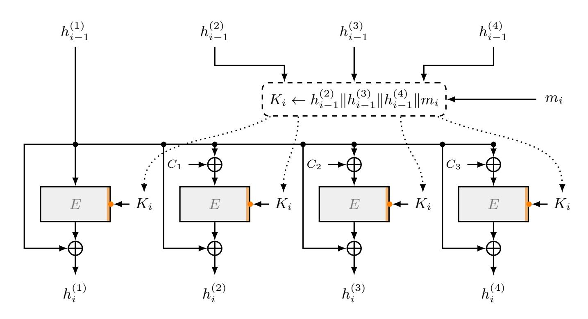
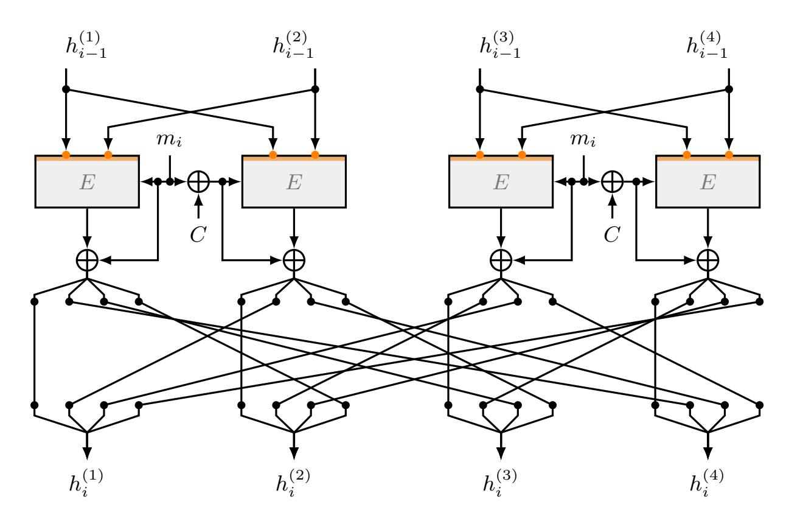
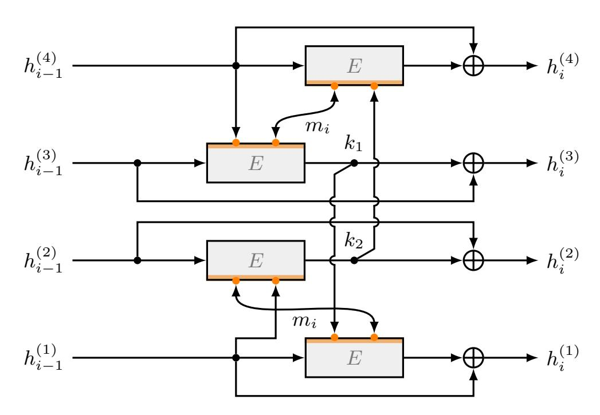
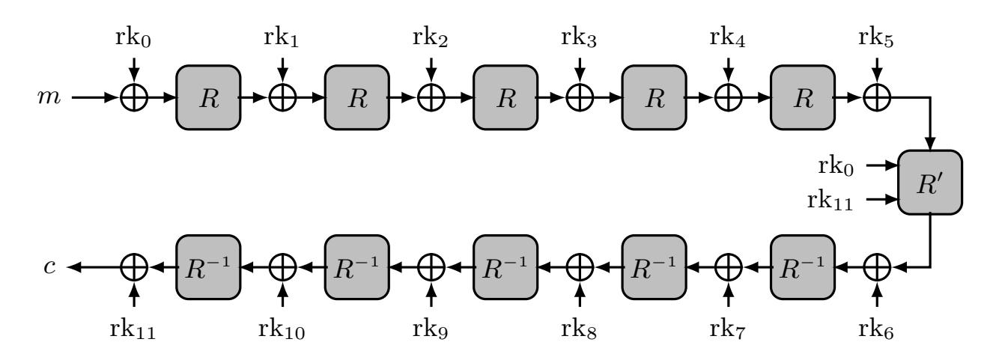

{0}------------------------------------------------

# Hash Function Constructions from Lightweight Block Ciphers for Fully Homomorphic Encryption

Olivier Bernard and Marc Joye

Zama, Paris, France

Abstract. This paper investigates hash-function constructions derived from lightweight block ciphers, that are suitable for evaluation in fully homomorphic encryption (FHE) settings. We focus on PRINCEv2, a 64-bit lightweight block cipher with 128-bit keys and low algebraic complexity, which is particularly amenable to FHE evaluation. However, the small block size of such ciphers limits the applicability of standard hashfunction transforms. Indeed, achieving 128-bit collision resistance in the (n, 2n) setting, i.e., with 64-bit blocks, requires a quadruple-block-length (QBL) compression function, for which no generic construction is known. In this work, we propose a concrete QBL compression construction tailored to PRINCEv2 and analyze its collision resistance. Candidate QBL designs inspired from existing double-block-length constructions are also outlined. As a further contribution, we describe a carefully optimized homomorphic circuit design for PRINCEv2. The resulting implementation outperforms previous works in both operation counts and computational depth. Experimental timings demonstrate the practical feasibility of evaluating the corresponding hash constructions under FHE with low latency, while providing cryptographically small failure probability.

Keywords: Lightweight block ciphers · PRINCEv2 · Iterated hash functions · Quadruple-block-length (QBL) compression · Fully homomorphic encryption (FHE)

## 1 Introduction

Cryptographic hash functions are fundamental primitives used in a wide range of applications, including digital signatures, message authentication, and integrity verification. Modern hash functions are typically designed to process messages of arbitrary length by iterating a fixed-length compression function. Classical constructions such as the Merkle–Damg˚ard paradigm [\[Dam90,](#page-24-0) [Mer90\]](#page-25-0) achieve this by repeatedly applying a block-cipher-based or dedicated compression function, starting from a fixed initialization vector. The security and efficiency of the resulting hash function depend heavily on the properties of the underlying primitive.

In parallel, lightweight cryptography has received significant attention in recent years, driven by the need for secure primitives in constrained environments such as embedded devices, RFID tags, and the Internet of Things (IoT). 

{1}------------------------------------------------

To address stringent performance requirements, block ciphers like PRESENT [\[BKL](#page-23-0)+07], SIMON and SPECK [\[BSS](#page-23-1)+15], SKINNY/MANTIS [\[BJK](#page-23-2)+16], and PRINCE [\[BCG](#page-22-0)+12] have been proposed. PRINCE in particular is notable for its ultra-low latency in hardware, achieved through an involutive structure and a carefully crafted key schedule. Its successor, PRINCEv2 [\[BEK](#page-23-3)+20], improves security margins while preserving efficiency, making it a strong candidate for exploration as a building block in hash-function design.

Beyond constrained hardware, such structural simplicity is also highly desirable in fully homomorphic encryption (FHE) settings [\[RAD78,](#page-25-1) [Gen10\]](#page-24-1), where the cost of evaluating cryptographic primitives is dominated by algebraic depth and circuit regularity. Recent work has surveyed the homomorphic evaluation of a range of block ciphers, taking AES as a baseline for comparison, and reported that PRINCE exhibits particularly favorable evaluation characteristics among the lightweight designs considered [\[TBS26\]](#page-25-2). Meanwhile, while block-cipher evaluation under FHE has received increasing attention, comparatively little work has addressed the construction of hash functions that are both secure and efficiently evaluable in FHE. An overview of applications of hash functions in FHE-based protocols can be found in [\[BSS](#page-23-4)+23, Section 3].

These considerations naturally raise the question of how to construct secure hash functions from lightweight block ciphers. A central obstacle in this setting is the small block size of designs such as PRINCEv2. Generic transforms, such as Hirose's double-block-length construction [\[Hir06a,](#page-24-2) [Hir06b\]](#page-24-3), Nandi's generalized constructions [\[CNL](#page-24-4)+08], or the Counter-bDM construction of Abed et al. [\[AFL](#page-22-1)+14], show how compression functions can be derived from block ciphers. In particular, achieving 128-bit collision resistance from a 64-bit block cipher generically requires a quadruple-block-length (QBL) compression function. However, to the best of our knowledge, no generic QBL construction is known for block ciphers with an n-bit block size and a 2n-bit key, and existing constructions are incompatible with lightweight designs such as PRINCEv2.

Our techniques and contributions. This work combines design-level modifications, security analysis, and implementation techniques to enable efficient homomorphic hashing based on lightweight (n, 2n) block ciphers.

At the construction level, we propose several QBL compression functions tailored to (n, 2n) block ciphers. Our main construction builds on the Counter-bDM framework by extending the effective key space of PRINCEv2 and by carefully selecting counter constants to mitigate internal collisions. Unlike Counter-4DM, this choice avoids structural cancellations that degrade collision resistance. To efficiently support the resulting key extension, we introduce a family of linear orthomorphisms designed to align with nibble-based state representations, making them particularly well suited for FHE evaluation.

From a security perspective, we analyze the collision resistance of the resulting compression function in the ideal-cipher model [\[BRS02\]](#page-23-5). As in [\[AFL](#page-22-1)<sup>+</sup>14], using the super-query technique [\[AFK](#page-22-2)<sup>+</sup>11], we derive explicit bounds that separate the contributions of normal queries, super-queries, and internal collisions. 

{2}------------------------------------------------

Our analysis highlights the concrete impact of constant selection and shows that the modified construction leads to better concrete bounds than Counter-4DM.

On the implementation side, we present a highly optimized FHE implementation of PRINCEv2 using the TFHE scheme [\[CGGI20\]](#page-24-5), establishing the practical feasibility of homomorphic hashing based on lightweight ciphers. The implementation leverages the nibble-oriented structure of PRINCEv2 and introduces a hybrid LUT strategy that exploits flexible output formats, allowing bit-level extraction and recombination within programmable bootstrapping, to optimally interface the successive cipher layers. This approach significantly reduces both the computational depth and the number of bootstrappings, which are the dominant cost factors in TFHE-based evaluation. As a result, efficient homomorphic evaluation of PRINCEv2 is achieved with sub-second latency, while maintaining a cryptographically small failure probability of 2−<sup>128</sup> and 128-bit security. Our results indicate that the proposed hash constructions can be efficiently evaluated under FHE.

Outline of the paper. The rest of the paper is organized as follows. In [Section 2,](#page-2-0) we recall some background on iterated hash functions and multi-block-length compression constructions. In [Section 3,](#page-4-0) we present our proposed QBL compression function based on lightweight (n, 2n) block ciphers and discuss the underlying design choices. The collision resistance of this construction is analyzed in [Section 4,](#page-7-0) including a comparison with Counter-4DM. Further native QBL constructions are described in [Section 5.](#page-13-0) Finally, in [Section 6,](#page-15-0) we present an optimized homomorphic implementation based on PRINCEv2 and evaluate its performance under the TFHE framework. A description of PRINCEv2 is provided in the appendix.

## <span id="page-2-0"></span>2 Multi-Block-Length Compression

An iterated hash function is a standard method for building a cryptographic hash function that can process inputs of arbitrary length by repeatedly applying a fixed-length compression.

For simplicity, we assume that the input message M is divided into ℓ-bit blocks m1, m2, . . . , m<sup>l</sup> . In practice, message lengths are not always exact multiples of the block size; to handle arbitrary input lengths securely, the message is first padded so that it becomes a multiple of ℓ, and the original length of the message is appended as part of the padding. This approach, formalized in the Merkle–Damg˚ard construction [\[Dam90,](#page-24-0) [Mer90\]](#page-25-0), ensures that different messages cannot collide due to ambiguous block boundaries.

We start from a fixed initial value h0, called the initialization vector (IV). The chaining values are then computed successively as

$$h_i \leftarrow F(h_{i-1}, m_i) , \quad 1 \le i \le l ,$$

where F is a compression function that combines the previous chaining value with the current message block. After the last block has been processed, the final chaining value h<sup>l</sup> is defined as the hash of the message; i.e., H(M) = h<sup>l</sup> .

{3}------------------------------------------------

#### 2.1 Hirose's Transform

In [Hir06a, Hir06b], Hirose proposes a transform, called Hirose-DM, for constructing a double-block-length compression function from a block cipher.

Let  $E_K(\cdot)$  denote an n-bit block cipher with key length  $(n + \ell)$ . Given a chaining value  $(h_{i-1}^{(1)}, h_{i-1}^{(2)})$  with  $h_{i-1}^{(1)}, h_{i-1}^{(2)} \in \{0, 1\}^n$  and a message block  $m_i \in \{0, 1\}^\ell$ , the compression function produces a new chaining value  $(h_i^{(1)}, h_i^{(2)})$  by computing

$$\begin{cases} h_i^{(1)} \leftarrow E_{h_{i-1}^{(2)} \parallel m_i} (h_{i-1}^{(1)}) \oplus h_{i-1}^{(1)} \\ h_i^{(2)} \leftarrow E_{h_{i-1}^{(2)} \parallel m_i} (h_{i-1}^{(1)} \oplus C) \oplus h_{i-1}^{(1)} \oplus C \end{cases}$$

where  $C \in \{0,1\}^n$  is a fixed nonzero constant.

By making two parallel block-cipher calls with distinct inputs (ensured by the constant C), the transform prevents trivial collisions. Note that although two calls are made, only a single key schedule is required.

In the ideal cipher model, Hirose proves that the above construction provides about  $2^n$  collision resistance (the birthday bound). Other constructions of this type include Tandem-DM and Abreast-DM [LM93, Section 3.5], as well as Weimar-DM [FFLW12].

#### 2.2 MDC-2 Scheme

When the block size and key length coincide, one possible approach is to use MDC-2 [BCH<sup>+</sup>90, Ste07] (see also ISO/IEC 10118-2 standard [ISO10, Section 7]) to obtain a double-block-length compression function.

Given a chaining value  $(h_{i-1}^{(1)}, h_{i-1}^{(2)})$  with  $h_{i-1}^{(1)}, h_{i-1}^{(2)} \in \{0, 1\}^n$  and a message block  $m_i \in \{0, 1\}^n$ , the compression function computes a new chaining value  $(h_i^{(1)}, h_i^{(2)})$  as

$$\begin{cases}
T_i^{(1)} \leftarrow E_{h_{i-1}^{(1)}}(m_i) \oplus m_i = LT_i^{(1)} || RT_i^{(1)} \\
T_i^{(2)} \leftarrow E_{h_{i-1}^{(2)}}(m_i) \oplus m_i = LT_i^{(2)} || RT_i^{(2)} \\
h_i^{(1)} \leftarrow LT_i^{(1)} || RT_i^{(2)} \\
h_i^{(2)} \leftarrow LT_i^{(2)} || RT_i^{(1)}
\end{cases}$$

where  $LT_i^{(\cdot)}$ ,  $RT_i^{(\cdot)}$  are the left and right n/2-bit halves of  $T_i^{(\cdot)}$ .

Remark 2.1. The description in [ISO10, Section 7] is slightly more general: some functions  $u, u' : \{0,1\}^n \to \{0,1\}^n$  are applied, respectively, to  $h_{i-1}^{(1)}$  and  $h_{i-1}^{(2)}$  when computing  $T_i^{(1)}$  and  $T_i^{(2)}$ , namely

$$T_i^{(1)} \leftarrow E_{u(h_{i-1}^{(1)})}(m_i) \oplus m_i$$
 and  $T_i^{(2)} \leftarrow E_{u'(h_{i-1}^{(2)})}(m_i) \oplus m_i$ .

Remark 2.2. Although Hirose-DM and MDC-2 each invoke the block cipher twice, when applicable, Hirose-DM should be preferred because it reuses the same key for both calls, reducing key-schedule cost. In addition, the best proven collision-security bound for MDC-2 in the iteration is lower, namely  $2^{3n/5}$  [Ste07], however the true bound is generally believed to be close to  $2^n$  [KMRT09].

{4}------------------------------------------------

#### 2.3 Multi-Block-Length Compression Functions

Hirose's transform assumes an n-bit block cipher with key length n + ℓ, and it outputs a 2n-bit chaining value. While this construction is suitable when n ≥ 128, it is insufficient for smaller n (e.g., with n = 64 it provides only about 2 <sup>64</sup> collision resistance). A multi-block-length compression function addresses this issue by outputting bn bits for any b ≥ 2.

To the best of our knowledge, the only multi–block-length compression functions that support b > 2 are due to Chang et al. [\[CNL](#page-24-4)+08] and to Abed et al. [\[AFL](#page-22-1)+14]. The construction by Abed et al., known as Counter-bDM (see also [\[SPS24,](#page-25-7) Appendix C]) builds on an n-bit block cipher EK(·) with a bn-bit key K.

Given a bn-bit chaining value (h (1) i−1 , . . . , h(b) i−1 ) with h (j) <sup>i</sup>−<sup>1</sup> ∈ 0, 1 n and a message block m<sup>i</sup> ∈ 0, 1 n , define

$$K_i \coloneqq h_{i-1}^{(2)} \| \cdots \| h_{i-1}^{(b)} \| m_i \in \{0, 1\}^{bn}$$

.

The next chaining value (h (1) i , . . . , h(b) i ) is computed in parallel as

$$h_i^{(j)} \leftarrow E_{K_i} (h_{i-1}^{(1)} \oplus (j-1)) \oplus h_{i-1}^{(1)}, \quad \text{for } 1 \le j \le b.$$

The counter term, j − 1, ensures that the b input plaintexts to the block cipher are pairwise distinct.

Remark 2.3. When b = 2, Counter-bDM is closely related to Hirose-DM with constant C = 1. The main difference lies in an additional post-whitening by C, which is applied to the second output block in Hirose-DM.

## <span id="page-4-0"></span>3 Main Construction

Recall that Counter-bDM produces bn output bits for any b, but is incompatible with lightweight (n, 2n) block ciphers such as PRINCEv2. Achieving 128-bit collision resistance requires setting b = 4, which yields bn = 256. In this case, however, Counter-bDM requires a 256-bit key, whereas PRINCEv2 supports only 128-bit keys. Separately, we modify the choice of constants in Counter-bDM to limit the impact of internal collisions.

To address this incompatibility, following a similar approach used for MBLhash in [\[SPS24,](#page-25-7) Appendix S2], we augment PRINCEv2 with an additional tweak input in order to emulate a larger key space without increasing the master key length. Specifically, we introduce a concrete construction that extends the effective key size to 4n bits by leveraging the TWEAKEY framework [\[JNP14\]](#page-25-8). The design draws on techniques from the block ciphers MANTIS [\[BJK](#page-23-2)<sup>+</sup>16] and QARMA [\[Ava17\]](#page-22-4). Moreover, with a view toward more efficient FHE evaluation and as a contribution of independent interest, we develop a new family of orthomorphisms, as used, e.g., in PRINCE [\[BCG](#page-22-0)<sup>+</sup>12] and QARMA [\[Ava17\]](#page-22-4).

We analyze the collision resistance of the proposed construction in [Section 4.](#page-7-0)

{5}------------------------------------------------

#### 3.1 Tweaking PRINCEv2

In PRINCEv2, a 2n-bit tweak  $(T_0, T_1)$  is provided as an additional input to the cipher, and each round key is alternately XORed with a permutation of  $T_0$  and  $T_1$ . As in MANTIS, the Galois-field multiplication used in the TWEAKEY framework is replaced by this permutation [BJK<sup>+</sup>16, Section 6], which is chosen as an orthomorphism<sup>1</sup> following the design rationale of PRINCE and QARMA.

The next proposition introduces a family of orthomorphisms that are well suited for FHE-based implementations, as the parameter k can be chosen to correspond to an integer number of nibbles.

**Proposition 3.1.** Let  $n \geq 2$  and k be integers satisfying  $2 \leq 2k < n$ . Then the map  $\Theta_k(x) := (x \gg k) \oplus (x \gg (n-k))$  is an orthomorphism of  $\mathbb{Z}_2^n$ .

*Proof.* We show that both  $\Theta_k$  and  $\Theta_k \oplus \mathrm{id}$  are permutations of  $\mathbb{Z}_2^n$ . Fix k. Define

$$R: x \mapsto x \gg k$$
,  $S: x \mapsto x \gg (n-k)$ ,

so that  $\Theta_k = R \oplus S = R \circ (\mathrm{id} \oplus R^{-1}S)$ . The map R rotates all bits k positions to the right, and  $R^{-1}$  rotates k positions to the left. The map S inserts n-k zero bits at the top. Since n-k > k, one can verify that after  $\alpha = \left\lceil \frac{n-k}{n-2k} \right\rceil$  iterations of  $R^{-1}S$ , we obtain the zero map; that is,  $(R^{-1}S)^{\alpha} = 0$ . Consequently,  $\mathrm{id} \oplus R^{-1}S$  is invertible because  $(\mathrm{id} \oplus R^{-1}S) \circ (\mathrm{id} \oplus R^{-1}S \oplus (R^{-1}S)^2 \oplus \cdots \oplus (R^{-1}S)^{\alpha-1}) = \mathrm{id} \oplus (R^{-1}S)^{\alpha} = \mathrm{id}$ . As R is a permutation and  $\mathrm{id} \oplus R^{-1}S$  is invertible, it follows that  $\Theta_k$  is bijective, and therefore a permutation of  $\mathbb{Z}_2^n$ .

Write  $x = (x_{n-1}, \dots, x_0) \in \mathbb{Z}_2^n$ . From the definition  $\Theta_k = R \oplus S$ , the condition  $x = \Theta_k(x)$  holds if and only if

$$x_{i} = \begin{cases} x_{i+k} \oplus x_{i+(n-k)} & \text{for } 0 \le i < k \\ x_{i+k} & \text{for } k \le i < n - k \\ x_{i-(n-k)} & \text{for } n - k \le i < n \end{cases}$$
 (\*)

A change of variables shows that the last relation in (\*) implies  $x_j = x_{j+(n-k)}$  for  $0 \le j < k$ . Combining this with the first relation in (\*) yields  $x_{i+k} = 0$  for  $0 \le i < k$ . Finally, the two last relations of (\*) can be combined into

<span id="page-5-1"></span>
$$x_i = x_{(i+k) \bmod n}$$
 for  $k \le i < n$ ,

which expresses the k-periodicity of the remaining coordinates. We so have  $x_k = x_{k+1} = \cdots = x_{n-1} = 0$ . With the first relation of (\*), we then have  $x_i = x_{i+k} \oplus 0 = 0$  for  $0 \le i < k$ . Summing up,  $x = \Theta_k(x)$  if and only if x is the zero vector; i.e.,  $x = \mathbf{0}$ . Hence,  $\ker(\Theta_k \oplus \mathrm{id}) = \{\mathbf{0}\}$ . Being a linear map on a finite-dimensional vector space,  $\Theta_k \oplus \mathrm{id}$  is therefore bijective, and thus a permutation of  $\mathbb{Z}_2^n$ .

<span id="page-5-0"></span>For an additively written group G, a map  $\varphi \colon G \to G$  is called an orthomorphism if both  $\varphi$  and  $\varphi$  – id are permutations of G, where id denotes the identity map on G.

{6}------------------------------------------------

Four additional rounds are added in PRINCEv2 to preserve a conservative security margin; see e.g., [BJK<sup>+</sup>16, Table 1]. Overall, this yields an effective (n,4n) block cipher  $E_K(\cdot) = \widehat{E}_{\mathfrak{K}}(T_0,T_1,\cdot)$  with a key  $K \in \{0,1\}^{4n}$ , composed of a tweak  $(T_0,T_1) \in \{0,1\}^{2n}$  and a cipher key  $\mathfrak{K} \in \{0,1\}^{2n}$ .

### 3.2 A Modified Compression Function

We consider a modified compression function based on our tweak-augmented variant of PRINCEv2, designed to instantiate Counter-bDM with b=4 while yielding improved collision-resistance bounds, as shown in Section 4.4.

Concretely, the compression function is defined as follows:

$$h_{i}^{(j)} \leftarrow \widehat{E}_{h_{i-1}^{(4)} \parallel m_{i}} \left( h_{i-1}^{(2)}, h_{i-1}^{(3)}, h_{i-1}^{(1)} \oplus C_{j-1} \right) \oplus h_{i-1}^{(1)}, \quad \text{for } 1 \leq j \leq 4,$$

$$= E_{K_{i}} \left( h_{i-1}^{(1)} \oplus C_{j-1} \right) \oplus h_{i-1}^{(1)} \quad \text{with } K_{i} \leftarrow h_{i-1}^{(2)} \parallel h_{i-1}^{(3)} \parallel h_{i-1}^{(4)} \parallel m_{i},$$

for appropriately defined, pairwise distinct constants  $C_j$ .



Fig. 3.1: Modified compression function.

A key distinction from the Counter-4DM compression function lies in the choice of these constants. In Counter-4DM, they are fixed as  $C_{j-1} = j-1$ , which satisfies  $\bigoplus_{j=1}^4 (j-1) = 0$  and gives rise to structural cancellations. In contrast, our construction employs constants  $C_{j-1}$  whose XOR does not vanish. For efficiency, we set  $C_0 = 0$  and use pairwise distinct non-zero constants  $C_1, C_2, C_3 \in \{0,1\}^n$  satisfying

$$C_1 \oplus C_2 \oplus C_3 \neq 0$$
.

For example, one may set  $C_i = 2^i$  for  $1 \le i \le 3$ .

{7}------------------------------------------------

## <span id="page-7-0"></span>4 Analysis

### <span id="page-7-1"></span>4.1 Security Model

The analysis is carried out in the ideal-cipher model, in which the block cipher  $E_K(\cdot)$  is instantiated as a random permutation. Specifically, for every key K, an independent random permutation  $E_K(\cdot)$  is chosen [BRS02]. The adversary is given oracle access to E and may issue both forward and inverse queries: on input (K, X), the oracle returns  $Y = E_K(X)$ , and on input (K, Y), it returns  $X = E_K^{-1}(Y)$ . The oracle maintains a list  $\mathcal{Q}$  of triples (X, K, Y). If a query matches a triple already in the list, the corresponding value is returned. As is customary, we therefore assume, without loss of generality, that the adversary never issues a query for which it already knows the output.

Furthermore, as in [AFL<sup>+</sup>14], to accommodate a number of queries close to or exceeding  $2^n$ , where n denotes the block size, we employ the super-query technique of [AFK<sup>+</sup>11]. For example, when applied to our main construction, if the adversary issues an encryption query  $E_K(X)$ , it also receives for free the values  $E_K(X \oplus C_b)$  for several given constants  $C_b$ , and analogously for decryption queries. In all cases, a single (normal) query generates several entries in  $\mathcal{Q}$ . Moreover, if the query list  $\mathcal{Q}$  exceeds  $2^{n-1}$  entries for a fixed key K, the adversary is additionally given for free all remaining input—output pairs (X,Y) for that key (i.e.,  $Y = E_K(X)$  for all previously unseen X).

Since an adversary with a budget of q queries receives additional input—output pairs for free in the super-query model, its advantage can only increase. We may therefore analyze the adversary's advantage in the super-query model to obtain an upper bound on the advantage in the standard query model.

#### 4.2 Collision Resistance

Let  $\mathbf{B}(n, k)$  denote the set of all block ciphers with block size n and key length k. For a block-cipher-based hash function H, the collision-finding advantage of an adversary  $\mathcal{A}$  against H is defined as

$$\mathbf{Adv}_{H}^{\mathsf{coll}}(\mathcal{A}) = \\ \Pr\left[E \overset{\hspace{0.1em}\mathsf{\scriptscriptstyle\$}}{\leftarrow} \mathbf{B}(n,k), \, (M,M') \leftarrow \mathcal{A}^{E,E^{-1}} : M \neq M' \, \wedge \, H(M) = H(M')\right] \; .$$

The complexity of an adversary is measured by the total number of queries it issues to the encryption oracle E or the decryption oracle  $E^{-1}$ . For  $q \geq 1$ , we define

$$\mathbf{Adv}_{H}^{\mathsf{coll}}(q) \coloneqq \max_{\mathcal{A}} \mathbf{Adv}_{H}^{\mathsf{coll}}(\mathcal{A}) ,$$

where the maximum is taken over all adversaries that make at most q oracle queries in total.

{8}------------------------------------------------

#### <span id="page-8-0"></span>4.3 Security Proof

Let  $\mathcal{A}$  be an adversary as defined in Section 4.1. The encryption/decryption oracle maintains a query list  $\mathcal{Q}$  of triples  $(X_i, K_i, Y_i)$ , where  $Y_i = E_{K_i}(X_i)$ , initially set to  $\emptyset$ . The adversary is allowed to make at most q encryption or decryption queries and maintains a list  $\mathcal{L}$  of (sets of) compression pairs (U, V), where V = F(U) for the compression function

$$F: \{0,1\}^{4n} \times \{0,1\}^n \to \{0,1\}^{4n}, \ \boldsymbol{U} = (K,X) \mapsto \boldsymbol{V} = (V_1, V_2, V_3, V_4),$$

defined by

$$\begin{cases} V_1 = E_K(X) \oplus X \\ V_2 = E_K(X \oplus C_1) \oplus X \\ V_3 = E_K(X \oplus C_2) \oplus X \\ V_4 = E_K(X \oplus C_3) \oplus X \end{cases},$$

where  $C_1, C_2, C_3 \in \{0, 1\}^n$  satisfy  $C_1 \oplus C_2 \oplus C_3 \neq 0$ . For convenience, define  $C_0 = 0$ ,  $C_4 = C_1 \oplus C_2$ ,  $C_5 = C_1 \oplus C_3$ ,  $C_6 = C_2 \oplus C_3$ , and  $C_7 = C_1 \oplus C_2 \oplus C_3$ . Define further the set

$$\mathfrak{S} = \left\{ C_0 = 0, C_1, C_2, C_3, C_4, C_5, C_6, C_7 \right\}$$
  
=  $\left\{ \delta_1 C_1 \oplus \delta_2 C_2 \oplus \delta_3 C_3 \mid \delta_1, \delta_2, \delta_3 \in \{0, 1\} \right\}$ .

The goal of  $\mathcal{A}$  is to find collisions in the compression function F, that is, to identify two distinct pairs (K, X) and  $(K', X') \in \{0, 1\}^{4n} \times \{0, 1\}^n$  such that

$$F(K,X) = F(K',X') ,$$

while making at most q queries to E or  $E^{-1}$ . The list  $\mathcal{L}$  is initially empty.

Whenever  $\mathcal{A}$  issues a query  $(K_i, X_i)$  to the encryption oracle E (resp.,  $(K_i, Y_i)$  to the decryption oracle  $E^{-1}$ ), it receives  $Y_i = E_{K_i}(X_i)$  (resp.,  $X_i = E_{K_i}^{-1}(Y_i)$ ), and the corresponding triple  $(X_i, K_i, Y_i)$  is recorded in the query list  $\mathcal{Q}$ . In accordance with the super-query model,  $\mathcal{A}$  additionally receives for free the 7 values  $E_{K_i}(X_i \oplus C_{j-1})$  for  $2 \leq j \leq 8$ , and the associated triples

$$(X_i \oplus C_{j-1}, K_i, E_{K_i}(X_i \oplus C_{j-1}))$$

are also added to Q. From these eight responses, A can derive a set  $\mathbf{L}_i$  composed of exactly eight valid compression pairs, referred to as a *compression bundle*,

$$\mathbf{L}_{i} = \{ (K_{i}, X_{i} \oplus C_{j-1}), F(K_{i}, X_{i} \oplus C_{j-1}) \}_{1 < j < 8},$$

{9}------------------------------------------------

where

```
F(K_{i}, X_{i} \oplus C_{0}) = V_{i,1} ||V_{i,2}||V_{i,3}||V_{i,4}
F(K_{i}, X_{i} \oplus C_{1}) = (V_{i,2} \oplus C_{1}) ||(V_{i,1} \oplus C_{1}) ||(V_{i,5} \oplus C_{1}) ||(V_{i,6} \oplus C_{1})
F(K_{i}, X_{i} \oplus C_{2}) = (V_{i,3} \oplus C_{2}) ||(V_{i,5} \oplus C_{2}) ||(V_{i,1} \oplus C_{2}) ||(V_{i,7} \oplus C_{2})
F(K_{i}, X_{i} \oplus C_{3}) = (V_{i,4} \oplus C_{3}) ||(V_{i,6} \oplus C_{3}) ||(V_{i,7} \oplus C_{3}) ||(V_{i,1} \oplus C_{3})
F(K_{i}, X_{i} \oplus C_{4}) = (V_{i,5} \oplus C_{4}) ||(V_{i,3} \oplus C_{4}) ||(V_{i,2} \oplus C_{4}) ||(V_{i,8} \oplus C_{4})
F(K_{i}, X_{i} \oplus C_{5}) = (V_{i,6} \oplus C_{5}) ||(V_{i,4} \oplus C_{5}) ||(V_{i,8} \oplus C_{5}) ||(V_{i,2} \oplus C_{5})
F(K_{i}, X_{i} \oplus C_{6}) = (V_{i,7} \oplus C_{6}) ||(V_{i,8} \oplus C_{6}) ||(V_{i,4} \oplus C_{6}) ||(V_{i,3} \oplus C_{6})
F(K_{i}, X_{i} \oplus C_{7}) = (V_{i,8} \oplus C_{7}) ||(V_{i,7} \oplus C_{7}) ||(V_{i,6} \oplus C_{7}) ||(V_{i,5} \oplus C_{7})
```

with  $V_{i,j} = E_{K_i}(X_i \oplus C_{j-1}) \oplus X_i$ . These compression pairs are subsequently added to the list  $\mathcal{L}$ ; i.e.,  $\mathcal{L} \leftarrow \mathcal{L} \cup \mathbf{L}_i$ . Note that, by construction,  $\sharp \mathcal{Q}$  is always a multiple of 8.

If, for a given key  $K_i$ , the number of entries of the form  $(\cdot, K_i, \cdot)$  in  $\mathcal{Q}$  exceeds N/2, where  $N=2^n$ , then  $\mathcal{A}$  receives for free all remaining triples involving the key  $K_i$ . All such triples are added to  $\mathcal{Q}$ .  $\mathcal{A}$  derives the set  $\mathbf{L}_i$  consisting of the corresponding (N/2)/8 = N/16 compression bundles (totalling N/2 compression pairs), which are all added to  $\mathcal{L}$ . In this case, we say that a super-query occurs.

We are now ready to upper-bound the adversary's advantage in successfully finding a collision in the compression function F. Collisions can be external or internal.

#### **External collisions.** At query #i, $\mathcal{A}$ obtains $\mathbf{L}_i \in \mathcal{L}$ , which consists of

- a single compression bundle containing eight additional compression pairs if the query is normal, and
- a set of N/16 compression bundles, corresponding to a total of N/2 additional compression pairs, if the query is a super-query.

Using the terminology of  $[AFL^+14]$ , these correspond to the NormalQueryWin and SuperQueryWin events, respectively.

NormalQueryWin In this case,  $\mathcal{A}$  finds a collision between at least one compression pair derived from the current normal query and compression pairs obtained from previous queries.

Fix  $i \in [2,q]$ . We consider the event  $C_i$  that at least one of the eight compression pairs obtained at normal query #i collides with a compression pair obtained at an earlier query #j; more precisely, that there exist a pair  $((K,X), F(K,X)) \in \mathbf{L}_i$  and a pair  $((K',X'), F(K',X')) \in \mathbf{L}_j$  for some j < i such that F(K,X) = F(K',X'). A collision F(K,X) = F(K',X')

{10}------------------------------------------------

occurs if and only if

<span id="page-10-0"></span>
$$\begin{cases}
E_K(X) \oplus X = E_{K'}(X') \oplus X' \\
E_K(X \oplus C_1) \oplus X = E_{K'}(X' \oplus C_1) \oplus X' \\
E_K(X \oplus C_2) \oplus X = E_{K'}(X' \oplus C_2) \oplus X' \\
E_K(X \oplus C_3) \oplus X = E_{K'}(X' \oplus C_3) \oplus X'
\end{cases}$$
(4.1)

We distinguish two cases:

- If K = K', then query #j cannot be a super-query. Furthermore, since  $\mathbf{L}_i \not\subseteq \mathbf{L}_j$  because all compression pairs are assumed to be distinct, one must have  $X \oplus X' \notin \mathfrak{S} \cup \{0\}$ . As a consequence, all elements  $X \oplus C_b$  and  $X' \oplus C_{b'}$  (with  $X \neq X'$ ) are distinct for all  $b, b' \in [0, 3]$ . Hence, when K = K', the four relations in Equation (4.1) are independent.
- If  $K \neq K'$ , then the block cipher is instantiated with independently chosen permutations for the keys K and K'. In this case as well, the four relations in Equation (4.1) are independent.

Since query #i is normal, the eight distinct encryption/decryption query responses used to obtain  $\mathbf{L}_i$  are chosen from a set of size at least N/2. As  $\sharp \mathbf{L}_i = 8$ , it follows from the independence of the four relations that the probability that  $\mathcal{A}$  finds a collision within a *specific* compression bundle in  $\mathbf{L}_i$  (i.e., a set of eight compression pairs) is upper-bounded by

$$8 \cdot \frac{8}{(N/2)^4} = \frac{8^2 \cdot 2^4}{N^4} \ .$$

A regular query produces one compression bundle, whereas a super-query produces (N/8)/2 compression bundles. At query #i, the maximum number of compression bundles present in *all* earlier  $\mathbf{L}_j$  is therefore always at most 2(i-1) (observe that a super-query doubles the number of compression bundles for a given key). We therefore obtain

$$\Pr[C_i] \le 2(i-1) \cdot \frac{8^2 \cdot 2^4}{N^4}$$
.

Hence, summing over all i finally yields

$$\Pr \big[ \mathsf{NormalQueryWin}(\mathcal{L}) \big] \leq \sum_{i=2}^q \Pr \big[ \mathtt{C}_i \big] \leq 8^2 \cdot 2^4 \, \frac{q^2}{N^4} \ .$$

SuperQueryWin In this case,  $\mathcal{A}$  wins via a super-query #i for some  $i \in [1, q]$ .

For any query #i with  $i \in [1,q]$ , the maximum number of compression bundles present in  $\mathcal{L}$  is upper-bounded by 2q. Fix super-query #i, and let  $D_i$  denote the event that at least one of the compression bundles it produces collides with a distinct compression bundle among fewer than 2q existing ones. Each such collision occurs with probability at most

$$8 \cdot \frac{8}{(N/2)^4} = \frac{8^2 \cdot 2^4}{N^4} \ .$$

{11}------------------------------------------------

Moreover, since a super-query yields (N/2)/8 compression bundles, we so have

$$\Pr[D_i] \le \frac{N/2}{8} 2q \, \frac{8^2 \cdot 2^4}{N^4} = 8 \cdot 2^4 \, \frac{q}{N^3}$$

.

.

.

The fact that a super-query implies that there have previously been (N/8)/2 normal queries under the same key, each giving rise to a bundle of 8 compression pairs, further implies that the total number of super-queries is at most

$$\left\lfloor \frac{q}{(N/8)/2} \right\rfloor \le 8 \cdot 2 \, \frac{q}{N} \ .$$

Combining the above bounds, we finally obtain

$$\Pr\bigl[\mathsf{SuperQueryWin}(\mathcal{L})\bigr] \leq 8^2 \cdot 2^5 \, \frac{q^2}{N^4}$$

Internal collisions. The case of internal collisions corresponds to collisions occurring among the eight compression pairs within the same compression bundle. This event is referred to as SameQueryWin in [\[AFL](#page-22-1)+14].

SameQueryWin An internal collision occurs when there exist two distinct pairs (K, X), F(K, X) , (K′ , X′ ), F(K′ , X′ ) ∈ L<sup>i</sup> within the same compression bundle such that F(K, X) = F(K′ , X′ ). Since all compression pairs within a compression bundle use the same key, we necessarily have K = K′ (and hence X ̸= X′ ). We must also have X′ = X ⊕ C for some C ∈ S \ 0 . Therefore, an internal collision occurs if and only if

<span id="page-11-0"></span>
$$\begin{cases}
E_K(X) \oplus X = E_K(X') \oplus X' \\
E_K(X \oplus C_1) \oplus X = E_K(X' \oplus C_1) \oplus X' \\
E_K(X \oplus C_2) \oplus X = E_K(X' \oplus C_2) \oplus X' \\
E_K(X \oplus C_3) \oplus X = E_K(X' \oplus C_3) \oplus X'
\end{cases} , (4.2)$$

where X′ = X ⊕C for some C ∈ S\ 0 . If C ̸= C7, write C = Cb⊕C<sup>b</sup> ′ with distinct b, b′ ∈ q 0, 3 y (recall that C<sup>0</sup> = 0). We thus have X′ = X ⊕ C<sup>b</sup> ⊕ C<sup>b</sup> ′ . Hence, two relations in [Equation \(4.2\)](#page-11-0) collapse into a single relation, since X ⊕ C<sup>b</sup> = X′ ⊕ C<sup>b</sup> ′ and X′ ⊕ C<sup>b</sup> = X ⊕ C<sup>b</sup> ′ :

$$E_K(X \oplus C_b) \oplus X \oplus C_b = E_K(X' \oplus C_b) \oplus X' \oplus C_b$$
  
$$E_K(X \oplus C_{b'}) \oplus X \oplus C_{b'} = E_K(X' \oplus C_{b'}) \oplus X' \oplus C_{b'}$$

Consequently, only three distinct and independent relations remain in [Equa](#page-11-0)[tion \(4.2\)](#page-11-0) for an internal collision when C ̸= C7. Since a compression bundle consists of eight compression pairs, an internal collision then occurs with a probability upper-bounded by

$$\frac{\sum_{k=2}^{8}(k-1)}{(N/2)^3} = \frac{28 \cdot 2^3}{N^3}$$

Finally, as the total number of compression bundles cannot exceed 2q, we obtain

<span id="page-11-1"></span>
$$\Pr \big[ \mathsf{SameQueryWin}(\mathcal{L}) \big] \leq 28 \cdot 2^4 \frac{q}{N^3} \ . \tag{4.3}$$

.

{12}------------------------------------------------

.

.

Putting it all together. Combining the bounds derived for the three winning events, we obtain

$$\Pr\big[\mathsf{NormalQueryWin}(\mathcal{L})\big] + \Pr\big[\mathsf{SuperQueryWin}(\mathcal{L})\big] + \\$$

$$\text{Pr}\big[\mathsf{SameQueryWin}(\mathcal{L})\big] \leq 3 \cdot 2^{10} \, \frac{q^2}{N^4} + 7 \cdot 2^6 \, \frac{q}{N^3}$$

In turn, for the derived iterated hash function H, we immediately obtain the collision-resistance bound

$$\mathbf{Adv}_{H}^{\mathsf{coll}}(q) \le 3 \cdot 2^{10} \, \frac{q^2}{N^4} + 7 \cdot 2^6 \, \frac{q}{N^3} \; ,$$

where N = 2<sup>n</sup> and n denotes the block size.

Remark 4.1. It is important to note that, for practically relevant values of the query parameter q, say 260, the contribution due to internal collisions captured by the SameQueryWin event dominates the bound. Indeed, the linear term in q remains larger than the quadratic term as long as q ≤ 2 n.

### <span id="page-12-0"></span>4.4 Comparison with Counter-4DM

Counter-4DM uses a similar construction but with constants Cj−<sup>1</sup> = j − 1 for 1 ≤ j ≤ 4, so that C1⊕C2⊕C<sup>3</sup> = 0. While this choice does not affect the success probabilities of NormalQueryWin or SuperQueryWin in any significant way, it has a noticeable impact on the SameQueryWin event.

With Counter-4DM, four encryption or decryption queries using the same key allow one to form a bundle of four valid compression pairs. An internal collision occurs whenever there exist two integers ℓ, m ∈ q 0, 3 y , with ℓ ̸= m, such that[2](#page-12-1)

$$\begin{cases} E_K(X \oplus m \oplus 0) \oplus X \oplus m = E_K(X \oplus \ell \oplus 0) \oplus X \oplus \ell \\ E_K(X \oplus m \oplus 1) \oplus X \oplus m = E_K(X \oplus \ell \oplus 1) \oplus X \oplus \ell \\ E_K(X \oplus m \oplus 2) \oplus X \oplus m = E_K(X \oplus \ell \oplus 2) \oplus X \oplus \ell \\ E_K(X \oplus m \oplus 3) \oplus X \oplus m = E_K(X \oplus \ell \oplus 3) \oplus X \oplus \ell \end{cases}$$

Let κ = m ⊕ ℓ ∈ q 1, 3 y . In particular, κ ̸= 0 by hypothesis. We show that a collision with a counter value 0 ≤ c ≤ 3 implies a collision with a counter value c⊕κ ̸= c, i.e., the relations in the above system collapse by pairs. Indeed, assume

$$E_K(X \oplus m \oplus c) \oplus X \oplus m = E_K(X \oplus \ell \oplus c) \oplus X \oplus \ell$$
.

Then, starting from E<sup>K</sup> X ⊕ m ⊕ (c ⊕ κ) ⊕ X ⊕ m, which by rewriting terms is equal to E<sup>K</sup> X ⊕ ℓ ⊕ c ⊕ X ⊕ m, yields, using the collision hypothesis for c,

$$E_K(X \oplus m \oplus (c \oplus \kappa)) \oplus X \oplus m = E_K(X \oplus m \oplus c) \oplus X \oplus m \oplus \kappa$$
$$= E_K(X \oplus \ell \oplus (c \oplus \kappa)) \oplus X \oplus \ell .$$

<span id="page-12-1"></span><sup>2</sup> One ⊕ m term and one ⊕ ℓ term have been omitted in the equations displayed in [\[AFL](#page-22-1)<sup>+</sup>14, Section 5] (cf. Subcase 1.3), which leads to the (incorrect) conclusion that Pr-SameQueryWin(L) = 0.

{13}------------------------------------------------

Consequently, only two distinct and independent relations remain in the case of Counter-4DM. By an argument analogous to that used in the proof of [Sec](#page-8-0)[tion 4.3,](#page-8-0) we therefore obtain

$$\Pr \big[ \mathsf{SameQueryWin}(\mathcal{L}) \big] \leq 6 \cdot 2^4 \, \frac{q}{N^2}$$

for Counter-4DM, which has to be compared to [Equation \(4.3\).](#page-11-1) A similar analysis applies to other values of b in the general case of Counter-bDM, as well as to alternative choices of constants whose XOR is equal to 0.

## <span id="page-13-0"></span>5 Further Constructions

Designing QBL compression functions that natively support (n, 2n) block ciphers remains an open and challenging problem; see, e.g., [\[AFL](#page-22-1)+14, Section 7].

This section presents candidate designs that enable an (n, 2n) block cipher EK(·), such as PRINCEv2, to be used within compression functions. While we believe the proposed constructions to be secure, we do not provide formal security proofs. We hope that these designs will motivate further research on QBL compression functions based on (n, 2n) block ciphers.

QBL-MDC. This construction draws on the classical MDC-2 compression function [\[BCH](#page-22-3)+90, [Ste07\]](#page-25-4) and combines MDC-style output mixing with Hirose's double-block-length (DBL) transform [\[Hir06a\]](#page-24-2). Following Hirose's approach, it evaluates pairs of related block-cipher calls under the same key but with distinct input differences. An explicit output-mixing step, in the spirit of MDC constructions, is then applied to increase diffusion across four parallel sub-states.

A natural and lightweight choice for this output-mixing permutation is the AES ShiftRows (nibble-level) permutation [\[DR02\]](#page-24-7), which coincides with the permutation layer P-Layer used in PRINCE. This operation acts on 16 words and provides an efficiently implementable diffusion layer. A detailed description of the corresponding permutation P-Layer is given in Appendix [A.3.](#page-28-0)

More precisely, as depicted in [Figure 5.1,](#page-14-0) for each message block m<sup>i</sup> , the construction computes four block-cipher evaluations as follows:

$$\begin{cases}
T_i^{(1)} \leftarrow E_{h_{i-1}^{(1)} \parallel h_{i-1}^{(2)}}(m_i) \oplus m_i &= A_i^{(1)} \parallel B_i^{(1)} \parallel C_i^{(1)} \parallel D_i^{(1)} \\
T_i^{(2)} \leftarrow E_{h_{i-1}^{(1)} \parallel h_{i-1}^{(2)}}(m_i \oplus C) \oplus m_i \oplus C &= A_i^{(2)} \parallel B_i^{(2)} \parallel C_i^{(2)} \parallel D_i^{(2)} \\
T_i^{(3)} \leftarrow E_{h_{i-1}^{(3)} \parallel h_{i-1}^{(4)}}(m_i) \oplus m_i &= A_i^{(3)} \parallel B_i^{(3)} \parallel C_i^{(3)} \parallel D_i^{(3)} \\
T_i^{(4)} \leftarrow E_{h_{i-1}^{(3)} \parallel h_{i-1}^{(4)}}(m_i \oplus C) \oplus m_i \oplus C &= A_i^{(4)} \parallel B_i^{(4)} \parallel C_i^{(4)} \parallel D_i^{(4)}
\end{cases}$$

for a fixed nonzero constant C ∈ 0, 1 n . Then, each intermediate value T (j) i is parsed into four n/4-bit words A (j) i ∥B (j) i ∥C (j) i ∥D (j) i that are subsequently mixed

{14}------------------------------------------------

<span id="page-14-0"></span>

Fig. 5.1: QBL-MDC construction.

across the four branches according to this permutation, and the chaining value is updated as:

$$(h_i^{(1)}, h_i^{(2)}, h_i^{(3)}, h_i^{(4)}) \leftarrow (A_i^{(1)} \| B_i^{(2)} \| C_i^{(3)} \| D_i^{(4)}, A_i^{(2)} \| B_i^{(3)} \| C_i^{(4)} \| D_i^{(1)},$$

$$A_i^{(3)} \| B_i^{(4)} \| C_i^{(1)} \| D_i^{(2)}, A_i^{(4)} \| B_i^{(1)} \| C_i^{(2)} \| D_i^{(3)}) .$$

This crosswise recombination generalizes the output-mixing step of the classical MDC-2 construction and can be viewed as a fixed mixing on 4n bits that ensures sufficient inter-branch diffusion.

**QBL-TDM.** This construction is inspired by the Tandem-DM compression function [LM93]. It first derives two ephemeral subkeys from the message block and the previous chaining value by means of block-cipher evaluations:

$$k_i^{(1)} \leftarrow E_{h_{i-1}^{(4)} \parallel m_i} (h_{i-1}^{(3)}) \quad \text{and} \quad k_i^{(2)} \leftarrow E_{m_i \parallel h_{i-1}^{(1)}} (h_{i-1}^{(2)}) .$$

These subkeys are then used to update the chaining value in a Davies–Meyer-like fashion:

$$\begin{cases} h_i^{(1)} \leftarrow E_{k_i^{(1)} \parallel m_i} \left( h_{i-1}^{(1)} \right) \oplus h_{i-1}^{(1)} \\ h_i^{(2)} \leftarrow k_i^{(2)} \oplus h_{i-1}^{(2)} \\ h_i^{(3)} \leftarrow k_i^{(1)} \oplus h_{i-1}^{(3)} \\ h_i^{(4)} \leftarrow E_{m_i \parallel k_i^{(2)}} \left( h_{i-1}^{(4)} \right) \oplus h_{i-1}^{(4)} \end{cases}.$$

This is pictured in Figure 5.2.

{15}------------------------------------------------

<span id="page-15-1"></span>

Fig. 5.2: QBL-TDM construction.

This update ensures that all components of the previous chaining value  $(h_{i-1}^{(1)},\ldots,h_{i-1}^{(4)})$  influence the next state. Indeed,  $h_{i-1}^{(2)}$  and  $h_{i-1}^{(3)}$  are first processed through block-cipher evaluations to derive the subkeys  $k_i^{(1)}$  and  $k_i^{(2)}$ , while  $h_{i-1}^{(1)}$  and  $h_{i-1}^{(4)}$  are updated via Davies–Meyer-like constructions keyed by these values. Observe that the updates of  $h_i^{(2)}$  and  $h_i^{(3)}$  mirror, in structure, those of  $h_i^{(1)}$  and  $h_i^{(4)}$ , in the sense that all four state words are combined with subkeys derived from non-linear block-cipher calls.

As in Tandem-DM, this design is intended to promote diffusion and to preclude simple internal collisions. While this construction follows well-understood design principles, we do not claim a formal security proof in the QBL setting, i.e., for compression functions built from (n, 2n) block ciphers.

## <span id="page-15-0"></span>6 FHE Implementation with PRINCEv2

We outline practical considerations for implementing PRINCEv2 [BEK<sup>+</sup>20] in FHE as part of the proposed constructions. Although we primarily focus on computational depth and latency, our implementation also happens to feature the smallest number of operations in an equivalent setting to [TBS26], i.e., using the Multi-Value Bootstrapping (MVB) technique from [CIM19].

#### 6.1 FHE Settings

We use the TFHE scheme [CGGI20], leveraging its fast programmable bootstrapping (PBS) capability [CJP21], which makes TFHE particularly well suited for low-latency applications and implementation of general-purpose algorithms.

{16}------------------------------------------------

Parameters and failure probability. As already noted in [TCBS23, Table 3], [TBC+25, Table 1], and [Zam25, Table 2], using a 4-bit plaintext space in TFHE seems optimal in terms of performance and functional efficiency, as parameters tend to blow up as the plaintext space increases. This is also one of the reasons PRINCEv2 is particularly well suited for TFHE as its S-box layers directly operate on 4-bit nibbles.

Within this setting, we target parameters achieving a failure probability  $p_{\mathsf{fail}}$  of (at most)  $2^{-128}$ . As will be seen later, our implementation of PRINCEv2 also requires a noise budget to allow for five ciphertext additions between two PBSes. Hence, we use the PARAM\_MESSAGE\_2\_CARRY\_2\_KS\_PBS\_GAUSSIAN\_2M128 (v1.4) parameter set from the TFHE-rs library [Zam], which corresponds exactly to this setting.

Achieving such a small failure probability is in fact crucial for IND-CPA<sup>D</sup> security, even for exact FHE schemes [LM21, CSBB24, CCP<sup>+</sup>24, BJSW25]. This contrasts with e.g., parameters used in the implementation of [TBS26], which, according to [TBS26, Table 2] only achieve  $p_{\text{fail}} \approx 2^{-23}$ , or e.g., the advertised timings for the AES implementation in [BBB<sup>+</sup>25] that were obtained for  $p_{\text{fail}} \approx 2^{-40}$ . We stress however that [BBB<sup>+</sup>25] also provides additional timings for their implementation with  $p_{\text{fail}} \approx 2^{-128}$  [BBB<sup>+</sup>25, Table 4], which are more than 10 times slower and clearly show the significance of this parameter when comparing homomorphic computations.

A new hybrid LUT approach: On the importance of FHE plumbing. Two homomorphic circuit strategies were considered in [TBS26]. The first is the so-called Full LUT approach, which combines the Tree-Based Method from [GBA21] and the Multi-Value Bootstrapping from [CIM19]. The second is the Hippogryph framework [BBB $^+$ 25], which leverages the concept of (o,p)-encodings with the ability to switch between encodings via a decomposer/recomposer homomorphic operation. Concretely, the Full LUT approach always considers LUTs from 4 bits to 4 bits, while the Hippogryph framework uses decomposition/recomposition on top of that to obtain/recombine individual bits for binary operations.

However, we adopt a more efficient and versatile approach. Namely, in our Hybrid LUT approach, every layer is computed by means of LUTs whose inputs remain encrypted 4-bit nibbles, as in the Full LUT approach, except that we may directly decompose the output encrypted value in (shifted) bits, or (shifted) pairs of bits, i.e., whatever format is more convenient for the next homomorphic layer in the circuit. This is achieved very naturally by duplicating the original LUT as needed. For example, to output individual bits on the least significant position of the plaintext space, a LUT L[x] for  $x \in [0,15]$  is replaced by four parallel LUTs  $L_i$  that return  $L_i[x] := (L[x] \gg i) \& 1$ . Note that this is intrinsically an ideal setting for the MVB technique of [CIM19]. Then, the output ciphertexts may be recombined through (almost free) ciphertext additions to form adequate input 4-bit nibbles for the next homomorphic layer.

{17}------------------------------------------------

Although this seemingly increases the number of PBSes,[3](#page-17-0) we will show that this design overall saves many PBSes, especially in the linear and XOR layers, while also featuring a better computational depth.

Admittedly, the design of the homomorphic circuit in our Hybrid LUT approach becomes noticeably more involved, since the output of each layer now depends on the design of the subsequent homomorphic layer. Nevertheless, in the case of PRINCEv2, this results in a much better operation count and computational depth compared to previous frameworks, showing that proper FHE plumbing is indeed crucial.

Key scheduling. In previous works [\[BBB](#page-22-5)+25, [TBS26\]](#page-25-2) in the context of transciphering, a common assumption is that FHE encryptions of all round keys are provided directly, instead of just the FHE encryption of the (master) secret key. Consequently, key expansion is never done in the homomorphic domain in those works.

This is in stark contrast with our context of iterated hash functions, where the secret keys are not known in advance and depend on the encrypted message blocks. Fortunately, in the case of PRINCEv2, we are able to perform the key expansion directly within the S-box layers, as explained in the next section, making the key schedule virtually free.

### 6.2 PRINCEv2 Layers in FHE

A detailed specification of the PRINCEv2 blockcipher is provided for completeness in [Appendix A.](#page-26-2) Recall that the block size is 64 bits and that the 128-bit key K is split into two 64-bit chunks K = k0∥k1.

We describe here the FHE implementation of its linear, XOR, and S-box layers. Since the permutation layers (and inverses) act on 4-bit nibbles, those can always be obtained by simply reindexing the ciphertexts.

For convenience, all encrypted global inputs/outputs of the homomorphic block cipher (namely, m, k0, k1, and EK(m)) are given as lists of 32 ciphertexts, where each ciphertext encrypts 2 bits in the least significant bits of their 4-bit plaintext space. This representation facilitates chaining between successive calls in the iterated hash function. A contrario, the encrypted state between two layers may be seen as:

- (a) 16 ciphertexts, each encrypting one 4-bit nibble, or
- (b) 32 ciphertexts, each encrypting 2 bits in the most significant bits of their 4-bit plaintext space.

We will also encounter intermediate values represented as 64 ciphertexts, each encrypting a single bit that we may place in any position within the 4-bit plaintext space.

<span id="page-17-0"></span><sup>3</sup> For instance, the forward S-box layer will be transformed from 16 parallel PBSes in the Full LUT approach to 64 parallel PBSes (or 16 times a 4-value PBS) in our Hybrid LUT approach, outputting carefully shifted individual bits.

{18}------------------------------------------------

On the linear layers. We begin, somewhat counter-intuitively, by describing our FHE implementation of the linear layer. Indeed, this is the most challenging component to implement in FHE (as noted e.g., in [\[TBS26,](#page-25-2) Section 4.4.2]), and our chosen input format for this layer constrains the output of other layers.

The linear layer is defined by 16×16 matrices Mˆ <sup>0</sup>/<sup>1</sup> (see [Appendix A.3\)](#page-28-0). An important observation is that their columns only involve individual bits whose indices are identical modulo 4. For instance, the columns Mˆ <sup>0</sup> all have 3 ones and 13 zeros: the first column is non-zero at positions 48c, the second at positions 19d, then 26e, 37a, 048, 59d, (. . . ). Therefore, we assume the encrypted input of the linear layer is given as encrypted 4-bit nibbles containing bits 048c, 159d, 26ae, 37bf (. . . ). As we will see, this is obtained by "modifying" the previous layer, whether it is an S-box layer or a XOR layer, so as to output encryptions of individual shifted bits, followed by 16 summations of four ciphertexts (e.g., the first input encrypts the sum of (b<sup>0</sup> ≪ 3), (b<sup>4</sup> ≪ 2), (b<sup>8</sup> ≪ 1) and bc).

Consequently, the linear layer now essentially boils down to computing, on each such 4-bit nibble, the XOR of all bits except one for each possible exception, i.e., 64 parallel LUT evaluations. This contrasts with the approach of [\[TBS26\]](#page-25-2), which computes the multiplications ˜ci,j 's of 4-bit vector with matrix blocks, followed by 3 homomorphic XOR on 4-bit values. Even using the MVB+TBM approach, this is a depth-5 computation involving an equivalent of 112 LUT evaluations.

Output formats. In forward and middle rounds, the linear layer is followed by a XOR layer. In this case, encrypted output bits of even (resp. odd) indices are natively left-shifted by 3 (resp. 2) positions, so that summing pairs of consecutive ciphertexts give 32 ciphertexts containing (b0b<sup>1</sup> ≪ 2), (b2b<sup>3</sup> ≪ 2), . . . .

In backward rounds, the next layer is an S-box layer. In this case, encrypted output bits of index b ∈ q 0, 63y are pre-shifted by (3−b) mod 4, so that summing 16 quadruples of consecutive ciphertexts gives the next input nibbles encrypting bits 0123, 4567, (. . . ).

Remark 6.1. All these pre-shiftings are directly included when building LUTs, so this has no impact on the noise, apart from the subsequent summation of 2/4 freshly bootstrapped ciphertexts, which stays within our noise budget.

On the S-box layers: Merging with round constants. As mentioned earlier, we cannot assume, as in previous works, that round keys are given as preencrypted inputs. Luckily, in PRINCEv2 the key schedule is rather simple, being a XOR of k<sup>0</sup> (alternatively k1) with predefined round constants RCt, for 1 ≤ t ≤ 11 (see [Appendix A.1](#page-26-3) and [Table A.2\)](#page-27-0). However, performing this naively would still incur, for every round, a layer of homomorphic operations in our critical path.

We observe that the round constants can be moved through both linear and permutation layers right into the S-box layers, specializing the S-boxes according to their nibble index and specific round number. Formally, the S-box applied on 

{19}------------------------------------------------

the <sup>w</sup>-th encrypted 4-bit nibble <sup>x</sup> (<sup>w</sup> <sup>∈</sup> <sup>J</sup>0, <sup>15</sup>K) in the <sup>t</sup>-th round is redefined as the following LUT

$$S_w^{(t)}[x] := \begin{cases} S[x] \oplus \left(\pi^{-1}(\mathrm{RC}_t) \cdot M^{-1}\right)[w] & \text{if } t \in [1, 5], \\ S^{-1}[x] \oplus \mathrm{RC}_t[w] & \text{if } t \in [6, 11], \end{cases}$$
(6.1)

where M = M−<sup>1</sup> is the linear layer matrix and π corresponds to the permutation layer. Similarly, S (m) <sup>w</sup> [x] := S[x]⊕ RC<sup>11</sup> ·M−<sup>1</sup> [w] redefines the first S-box layer in the middle round, so that the complete sequence of applied S-boxes is

$$S^{(1)}, \dots, S^{(5)}, S^{(m)}, S^{(6)}, \dots, S^{(11)}$$

This results in 16 × 12 different LUTs, one per S-box layer and per 4-bit nibble. It is possible to reduce this number to 16 × 8 different LUTs by combining the round constants differently, namely by integrating the previous one in the input and the next one in the output, i.e.,

$$\hat{S}_w^{(tu)}[x] := S\left[x \oplus \mathrm{RC}_t[w]\right] \oplus \left(\pi^{-1}(\mathrm{RC}_u) \cdot M^{-1}\right)[w]$$
(6.2)

.

.

where t ∈ {1, 3}, u = t + 1. The middle round S-box layer becomes

$$\hat{S}_w^{(5m)}[x] := S\left[x \oplus \mathrm{RC}_5[w]\right] \oplus \left(\mathrm{RC}_{11} \cdot M^{-1}\right)[w] \tag{6.3}$$

and the backward S-box layers are given, for t ∈ {6, 8, 10} and u = t + 1, by

$$\hat{S}_w^{(tu)}[x] := S^{-1}\left[x \oplus \left(\pi^{-1}(\mathrm{RC}_t) \cdot M^{-1}\right)[w]\right] \oplus \mathrm{RC}_u[w] . \tag{6.4}$$

In this setting, the complete sequence of applied S-boxes thus becomes

$$S, \hat{S}^{(12)}, S, \hat{S}^{(34)}, S, \hat{S}^{(5m)}, S^{-1}, \hat{S}^{(67)}, S^{-1}, \hat{S}^{(89)}, S^{-1}, \hat{S}^{(10-11)}$$

Output formats. Each (inverse) S-box layer is either followed by a linear layer or by a XOR layer. When followed by a linear layer, as discussed in the previous paragraph, we need to output (and sum) individual bits whose alignment depend on their nibble index modulo 4. Concretely, e.g., for applying an S-box layer S (t) as defined above on the encrypted state n0, . . . , n15 , we first output, for each w ∈ q 0, 15y and b ∈ q 0, 3 y ,

$$s[4w+b] := ((S_w^{(t)}[n_w] \gg (3-b)) \& 1) \ll (3-w \mod 4)$$
,

which is a homomorphic evaluation of 64 parallel LUTs, or using the MVB technique, 16 parallel 4-value bootstrappings. Then, the linear layer receives an encrypted state c0, . . . , c15 , where for w ∈ q 0, 15y , c<sup>w</sup> encrypts

<span id="page-19-0"></span>
$$\sum_{0 \le b \le 3} s \left[ 16 \lfloor w/4 \rfloor + 4b + (w \bmod 4) \right], \tag{6.5}$$

which is evaluated homomorphically by simply summing ciphertexts.

The situation is much simpler when the next layer is a XOR layer. In that case, we only need to extract separately pairs of least/most significant output bits and place them always in the most significant bits of the 4-bit plaintext space. This means 32 parallel LUT evaluations, or 16 parallel 2-value bootstrappings.

{20}------------------------------------------------

On the XOR layers. We finally tackle the XOR layers, which XOR the encrypted state with the encrypted keys. Recall these are given as lists of 32 ciphertexts encrypting 2 bits at a time, that are placed in the least significant bits of the plaintext space. The reader may also have noticed that previous layers, when followed by a XOR layer, output 32 ciphertexts encrypting 2 bits at a time, but placed in the most significant bits of the plaintext space.

Then, we use a very natural trick, called a Bivariate PBS in e.g., [\[Zam25,](#page-26-0) Remark 28], to obtain the result. Both operands are homomorphically summed, and a 4-bit LUT applied to this sum simply outputs L[x] := x & 3 ⊕ x ≫ 2 .

Output formats. If followed by a linear layer, we may extract bits and sum them following the same pattern as in [Equation \(6.5\).](#page-19-0) Likewise, if the next layer is an S-box layer, the resulting bits may be left-shifted by 2 positions on even indices so that summing pairs of consecutive ciphertexts produces encrypted 4-bit nibbles that are ready to enter the S-boxes.

Remark 6.2. The first XOR layer receives an encrypted message that is not leftaligned in the plaintext space. However, if this message is a freshly bootstrapped ciphertext, the noise budget is sufficient to homomorphically multiply it by 4.

On middle round options. The authors of [\[BEK](#page-23-3)+20] propose a trick to remove a XOR layer in the critical path of the middle round by moving the XOR with k<sup>0</sup> after the linear layer, so that k<sup>1</sup> ⊕ k<sup>0</sup> · M is XORed to the state in a single pass.

This trick also works in the homomorphic domain. During forward rounds, spare computation units could be used for homomorphically: a. extracting and shifting bits of k<sup>0</sup> and recombining them for b. computing (k<sup>0</sup> · M) and finally c. computing k<sup>1</sup> ⊕ (k<sup>0</sup> · M). This would reduce the computational depth of our implementation from 37 layers of parallel PBSes to 36 layers.

However, we argue this unbalanced computing setting would be rather difficult to manage (and probably counter-productive) compared to the much simpler, very synchronized, setting where 64 cores apply parallel PBSes for 37 times.

#### 6.3 Counting PBSes

Using the above techniques, our homomorphic evaluation of PRINCEv2, including the key schedule, consists of 37 layers of 32/64 parallel 4-bit PBSes. More precisely, where (k × n) denotes the possibility of performing k parallel n-value bootstrappings:

- 1. There are 5 S-box layers followed by a linear layer, i.e., 64 (16×4) parallel PB-Ses each, and 7 (inverse) S-box layers followed by a XOR layer, i.e., 32 (16×2) parallel PBSes each;
- 2. Linear layers are always 64 (16×4) parallel PBSes, and there are 11 of these;
- 3. Among the XOR layers, the seven followed by an S-box layer, as well as the last one, consist of 32 parallel PBSes each, and the other six are followed by a linear layer, meaning they require 64 (32×2) parallel PBSes.

{21}------------------------------------------------

This yields a grand total of 1,888 sequential PBSes, without considering Multi-Value Bootstrapping. We stress that this number is already competitive with the 1,808 figure obtained by [\[TBS26,](#page-25-2) Table 1] with no key scheduling in their MVB+TBM setting on PRINCE (v1), i.e., with two fewer XOR layers.

When considering Multi-Value Bootstrapping, each (k × n) figure above is basically replaced by k PBSes and O(kn) negligible polynomial multiplications.[4](#page-21-0) Hence, the total PBS count is reduced to only 816. Despite the fact that our key scheduling is performed in the homomorphic domain, this represents less than half of the 1,808 PBSes reported in [\[TBS26\]](#page-25-2) and even outperforms their Hippogryph figure (1,152 PBSes, neglecting the complexity of the linear layer) by 29%.

Finally, regarding computational depth, we achieve depth 37 using 64 parallel units without MVB, slightly more than Hippogryph (depth 36). Using MVB, this depth is already achieved in our case for 32 cores (resp. depth 59 for 16 cores), whereas Hippogryph stands at depth 48 in this case (resp. depth 96 on 16 cores) due to its heavy recomposer. By contrast, the FullLUT strategy of [\[TBS26\]](#page-25-2) would require at least 93 layers on 32/64 cores (resp. 115 on 16 cores).

<span id="page-21-1"></span>Remark 6.3. A very important caveat of the Multi-Value Bootstrapping approach is its significant impact on noise growth and, thus, on parameter selection. This issue is somehow addressed in [\[TBS26\]](#page-25-2) by substantially increasing the failure probability [\[TBS26,](#page-25-2) Appendix C]. If we instead target a constant failure probability of 2<sup>−</sup>128, this would introduce an algorithmic overhead of about 53% per PBS, increasing as much the global latency on a fully parallelized architecture. However, it would still be interesting on smaller architectures as long as the computational depth is divided by at least 1.5, i.e., with fewer than 16 cores.

### 6.4 Experimental Results and Timings

We report performance results obtained with the TFHE-rs library (v1.4.2) [\[Zam\]](#page-26-1) and the Rayon crate (v1.11.0) for parallelization. We ran our homomorphic implementation of PRINCEv2 on an Amazon AWS hpc7a.96xlarge with 2 × 96 AMD EPYC 9R14 physical cores. Recall that our implementation is explicitly designed to achieve a failure probability of 2<sup>−</sup><sup>128</sup> using the parameter set PARAM MESSAGE 2 CARRY 2 KS PBS GAUSSIAN 2M128 (v1.4) [\[Zam\]](#page-26-1). This contrasts with [\[TBS26\]](#page-25-2) where the failure probability exceeds 2<sup>−</sup><sup>40</sup>. Also, aiming at the lowest possible latencies on a massively parallel architecture, we did not include the MVB approach in our implementation (see [Remark 6.3\)](#page-21-1).

The results are summarized in [Table 6.1.](#page-22-6) As expected, they exhibit excellent scalability up to 64 cores, achieving an impressive 776 ms latency per call, while also remaining competitive in single-core performance. For comparison, the corresponding latencies reported in [\[TBS26,](#page-25-2) Table 1] are 105 s for FullLUT and 35 s for Hippogryph, both obtained on a single core and for a much higher failure

<span id="page-21-0"></span><sup>4</sup> Each of these multiplications is about 1,000× cheaper than a PBS.

{22}------------------------------------------------

<span id="page-22-6"></span>Table 6.1: Homomorphic evaluation timings of PRINCEv2 as a function of the degree of parallelism, targeting a failure probability of 2−<sup>128</sup> (without MVB).

| Number of cores | 1      | 2      | 4      | 8     | 16    | 32    | 64    |
|-----------------|--------|--------|--------|-------|-------|-------|-------|
| Timing (s)      | 33.123 | 19.527 | 10.236 | 5.132 | 2.701 | 1.492 | 0.776 |

probability. As shown in [\[BBB](#page-22-5)+25, Table 4], reducing the failure probability from 2−<sup>40</sup> to 2−<sup>128</sup> incurs a performance penalty exceeding 10×, despite using the same implementation and techniques.

Acknowledgments. The authors would like to thank Fran¸cois-Xavier Standaert for useful discussions regarding multi-block-length constructions.

## References

- <span id="page-22-2"></span>AFK<sup>+</sup>11. Frederik Armknecht, Ewan Fleischmann, Matthias Krause, Jooyoung Lee, Martijn Stam, and John Steinberger. The preimage seucurity of doubleblock-length compression functions. In D. H. Lee and X. Wang, editors, Advances in Cryptology – ASIACRYPT 2011, volume 7073 of Lecture Notes in Computer Science, page 233–251. Springer, 2011. [doi:](https://doi.org/10.1007/978-3-642-25385-0_13) [10.1007/978-3-642-25385-0\\_13](https://doi.org/10.1007/978-3-642-25385-0_13).
- <span id="page-22-1"></span>AFL<sup>+</sup>14. Farzaneh Abed, Christian Forler, Eik List, Stefan Lucks, and Jakob Wenzel. Counter-bDM: A provably secure family of multi-block-length compression functions. In D. Pointcheval and D. Vergnaud, editors, Progress in Cryptology – AFRICACRYPT 2014, volume 8469 of Lecture Notes in Computer Science, page 440–458. Springer, 2014. [doi:10.1007/978-3-319-06734-6\\_](https://doi.org/10.1007/978-3-319-06734-6_26) [26](https://doi.org/10.1007/978-3-319-06734-6_26).
- <span id="page-22-4"></span>Ava17. Roberto Avanzi. The QARMA block cipher family – almost MDS matrices over rings with zero divisors, nearly symmetric even-mansour constructions with non-involutory central rounds, and search heuristics for low-latency S-boxes. IACR Transactions on Symmetric Cryptology, 2017(1):4–44, 2017. [doi:10.13154/tosc.v2017.i1.4-44](https://doi.org/10.13154/tosc.v2017.i1.4-44).
- <span id="page-22-5"></span>BBB<sup>+</sup>25. Sonia Bela¨ıd, Nicolas Bon, Aymen Boudguiga, Renaud Sirdey, Daphn´e Trama, and Nicolas Ye. Further improvements in AES execution over TFHE. IACR Communications in Cryptology, 2(1), 2025. [doi:10.62056/](https://doi.org/10.62056/ahmp-4tw9) [ahmp-4tw9](https://doi.org/10.62056/ahmp-4tw9).
- <span id="page-22-0"></span>BCG<sup>+</sup>12. Julia Borghoff, Anne Canteaut, Tim G¨uneysu, Elif Bilge Kavun, Miroslav Kneˇzevi´c, Lars R. Knudsen, Gregor Leander, Ventzislav Nikov, Christof Paar, Christian Rechberger, Peter Rombouts, Søren S. Thomsen, and Tolga Yal¸cin. PRINCE – A low-latency block cipher for pervasive computing applications. In X. Wang and K. Sako, editors, Advances in Cryptology – ASIACRYPT 2012, volume 7658 of Lecture Notes in Computer Science, pages 208–225. Springer, 2012. [doi:10.1007/978-3-642-34961-4\\_14](https://doi.org/10.1007/978-3-642-34961-4_14).
- <span id="page-22-3"></span>BCH<sup>+</sup>90. Bruno O. Brachtl, Don Coppersmith, Myrna M. Hyden, Stephen M. Matyas, Jr., Carl H. W. Meyer, Jonathan Oseas, Shaiy Pilpel, and Michael Schilling.

{23}------------------------------------------------

- Data authentication using modification detection codes based on a public one way encryption function. U.S. Patent #4,908,861, March 13, 1990. URL: [https://patentimages.storage.googleapis.com/32/ab/b1/](https://patentimages.storage.googleapis.com/32/ab/b1/6c32edbc15b5b3/US4908861.pdf) [6c32edbc15b5b3/US4908861.pdf](https://patentimages.storage.googleapis.com/32/ab/b1/6c32edbc15b5b3/US4908861.pdf).
- <span id="page-23-3"></span>BEK<sup>+</sup>20. Dusan Bozilov, Maria Eichlseder, Miroslav Knezevic, Baptiste Lambin, Gregor Leander, Thorben Moos, Ventzislav Nikov, Shahram Rasoolzadeh, Yosuke Todo, and Friedrich Wiemer. PRINCEv2: More security for (almost) no overhead. In O. Dunkelman, M. J. Jacobson, Jr., and C. O'Flynn, editors, Selected Areas in Cryptography (SAC 2020), volume 12804 of Lecture Notes in Computer Science, pages 483–511. Springer, 2020. [doi:](https://doi.org/10.1007/978-3-030-81652-0_19) [10.1007/978-3-030-81652-0\\_19](https://doi.org/10.1007/978-3-030-81652-0_19).
- <span id="page-23-2"></span>BJK<sup>+</sup>16. Christof Beierle, J´er´emy Jean, Stefan K¨olbl, Gregor Leander, Amir Moradi, Thomas Peyrin, Yu Sasaki, Pascal Sasdrich, and Siang Meng Sim. The SKINNY family of block ciphers and its low-latency variant MANTIS. In M. Robshaw and J. Katz, editors, Advances in Cryptology – CRYPTO 2016, Part II, volume 9815 of Lecture Notes in Computer Science, pages 123–153. Springer, 2016. [doi:10.1007/978-3-662-53008-5\\_5](https://doi.org/10.1007/978-3-662-53008-5_5).
- <span id="page-23-7"></span>BJSW25. Olivier Bernard, Marc Joye, Nigel Smart, and Michael Walter. Drifting towards better error probabilities in fully homomorphic encryption schemes. In S. Fehr and P.-A. Fouque, editors, Advances in Cryptology – EUROCRYPT 2025, Part VIII, volume 15608 of Lecture Notes in Computer Science, pages 181–211. Springer, Cham, 2025. [doi:10.1007/](https://doi.org/10.1007/978-3-031-91101-9_7) [978-3-031-91101-9\\_7](https://doi.org/10.1007/978-3-031-91101-9_7).
- <span id="page-23-0"></span>BKL<sup>+</sup>07. Andrey Bogdanov, Lars R. Knudsen, Gregor Leander, Christof Paar, Axel Poschmann, Matthew J. B. Robshaw, Yannick Seurin, and C. Vikkelsoe. PRESENT: An ultra-lightweight block cipher. In P. Paillier and I. Verbauwhede, editors, ryptographic Hardware and Embedded Systems – CHES 2007, volume 4727 of Lecture Notes in Computer Science, pages 450–466. Springer, 2007. [doi:10.1007/978-3-540-74735-2\\_31](https://doi.org/10.1007/978-3-540-74735-2_31).
- <span id="page-23-5"></span>BRS02. John Black, Phillip Rogaway, and Thomas Shrimpton. Blackbox analysis of the block-cipher-based hash-function constructions from PGV. In M. Yung, editor, Advances in Cryptology – CRYPTO 2002, volume 2442 of Lecture Notes in Computer Science, pages 320–335. Springer, 2002. [doi:10.1007/](https://doi.org/10.1007/3-540-45708-9_21) [3-540-45708-9\\_21](https://doi.org/10.1007/3-540-45708-9_21).
- <span id="page-23-1"></span>BSS<sup>+</sup>15. Ray Beaulieu, Douglas Shors, Jason Smith, Stefan Treatman-Clark, Bryan Weeks, and Louis Wingers. The SIMON and SPECK lightweight block ciphers. In 52nd Annual Design Automation Conference (DAC '15), pages 175.1–175.6. ACM Press, 2015. [doi:10.1145/2744769.274794](https://doi.org/10.1145/2744769.274794).
- <span id="page-23-4"></span>BSS<sup>+</sup>23. Adda-Akram Bendoukha, Oana Stan, Renaud Sirdey, Nicolas Quero, and Luciano Freitas. Practical homomorphic evaluation of block-cipher-based hash functions with applications. In G.-V. Jourdan et al., editors, Foundations and Practice of Security (FPS 2022), volume 13877 of Lecture Notes in Computer Science, pages 88–103. Springer, 2023. [doi:10.1007/](https://doi.org/10.1007/978-3-031-30122-3_6) [978-3-031-30122-3\\_6](https://doi.org/10.1007/978-3-031-30122-3_6).
- <span id="page-23-6"></span>CCP<sup>+</sup>24. Jung Hee Cheon, Hyeongmin Choe, Alain Passel`egue, Damien Stehl´e, and Elias Suvanto. Attacks against the IND-CPA<sup>D</sup> security of exact FHE schemes. In Proceedings of the 2024 on ACM SIGSAC Conference on Computer and Communications Security, CCS'24, pages 2505–2519. ACM, 2024. [doi:10.1145/3658644.3690341](https://doi.org/10.1145/3658644.3690341).

{24}------------------------------------------------

- <span id="page-24-5"></span>CGGI20. Ilaria Chilotti, Nicolas Gama, Mariya Georgieva, and Malika Izabach`ene. TFHE: Fast fully homomorphic encryption over the torus. Journal of Cryptology, 33(1):34–91, 2020. [doi:10.1007/s00145-019-09319-x](https://doi.org/10.1007/s00145-019-09319-x).
- <span id="page-24-8"></span>CIM19. Sergiu Carpov, Malika Izabach`ene, and Victor Mollimard. New techniques for multi-value input homomorphic evaluation and applications. In M. Matsui, editor, Topics in Cryptology – CT-RSA 2019, volume 11405 of Lecture Notes in Computer Science, pages 106–126. Springer, 2019. [doi:10.1007/978-3-030-12612-4\\_6](https://doi.org/10.1007/978-3-030-12612-4_6).
- <span id="page-24-9"></span>CJP21. Ilaria Chillotti, Marc Joye, and Pascal Paillier. Programmable bootstrapping enables efficient homomorphic inference of deep neural networks. In S. Dolev et al., editors, Cyber Security Cryptography and Machine Learning (CSCML 2021), volume 12716 of Lecture Notes in Computer Science, pages 1–19. Springer, 2021. [doi:10.1007/978-3-030-78086-9\\_1](https://doi.org/10.1007/978-3-030-78086-9_1).
- <span id="page-24-4"></span>CNL<sup>+</sup>08. Donghoon Chang, Mridul Nandi, Jesang Lee, Jaechul Sung, Seokhie Hong, Jongin Lim, Haeryong Park, and Kilsoo Chun. Compression function design principles supporting variable output lengths from a single small function. IEICE Transactions on Fundamentals of Electronics, Communications and Computer Sciences, E91.A(9):2607–2614, 2008. [doi:10.1093/ietfec/](https://doi.org/10.1093/ietfec/e91-a.9.2607) [e91-a.9.2607](https://doi.org/10.1093/ietfec/e91-a.9.2607).
- <span id="page-24-10"></span>CSBB24. Marina Checri, Renaud Sirdey, Aymen Boudguiga, and Jean-Paul Bultel. On the practical CPA<sup>D</sup> security of "exact" and threshold FHE schemes and libraries. In L. Reyzin and D. Stebila, editors, Advances in Cryptology – CRYPTO 2024, Part III, volume 14922 of Lecture Notes in Computer Science, pages 3–33. Springer, Cham, 2024. [doi:10.1007/](https://doi.org/10.1007/978-3-031-68382-4_1) [978-3-031-68382-4\\_1](https://doi.org/10.1007/978-3-031-68382-4_1).
- <span id="page-24-0"></span>Dam90. Ivan Damg˚ard. A design principle for hash functions. In G. Brassard, editor, Advances in Cryptology – CRYPTO '89, volume 435 of Lecture Notes in Computer Science, pages 416–427. Springer, 1990. [doi:](https://doi.org/10.1007/0-387-34805-0_39) [10.1007/0-387-34805-0\\_39](https://doi.org/10.1007/0-387-34805-0_39).
- <span id="page-24-7"></span>DR02. Joan Daemen and Vincent Rijmen. The Design of Rijndael: AES - The Advanced Encryption Standard. Information Security and Cryptography. Springer, 2002. [doi:10.1007/978-3-662-04722-4](https://doi.org/10.1007/978-3-662-04722-4).
- <span id="page-24-6"></span>FFLW12. Ewan Fleischmann, Christian Forler, Stefan Lucks, and Jakob Wenzel. Weimar-DM: A highly secure double-length compression function. In W. Susilo et al., editors, Information Security and Privacy (ACISP 2012), volume 7372 of Lecture Notes in Computer Science, pages 152–165. Springer, 2012. [doi:10.1007/978-3-642-31448-3\\_12](https://doi.org/10.1007/978-3-642-31448-3_12).
- <span id="page-24-11"></span>GBA21. Antonio Guimar˜aes, Edson Borin, and Diego F. Aranha. Revisiting the functional bootstrap in TFHE. IACR Transactions on Cryptographic Hardware and Embedded Systems, 2021(2):229–253, 2021. [doi:10.46586/tches.](https://doi.org/10.46586/tches.v2021.i2.229-253) [v2021.i2.229-253](https://doi.org/10.46586/tches.v2021.i2.229-253).
- <span id="page-24-1"></span>Gen10. Craig Gentry. Computing arbitrary functions of encrypted data. Communications of the ACM, 53(3):97–105, 2010. [doi:10.1145/1666420.1666444](https://doi.org/10.1145/1666420.1666444).
- <span id="page-24-2"></span>Hir06a. Shoichi Hirose. Some plausible constructions of double-block-length hash functions. In M. J. B. Robshaw, editor, Fast Software Encryption (FSE 2006), volume 4047 of Lecture Notes in Computer Science, pages 210–225. Springer, 2006. [doi:10.1007/11799313\\_14](https://doi.org/10.1007/11799313_14).
- <span id="page-24-3"></span>Hir06b. Shoichi Hirose. How to construct double-block-length hash functions. Second NIST Cryptographic Hash Workshop, Santa Barbara, CA, USA, August 24–25, 2006. Revised version of [\[Hir06a\]](#page-24-2). URL: [https://csrc.nist.](https://csrc.nist.rip/groups/ST/hash/documents/HIROSE_article.pdf) [rip/groups/ST/hash/documents/HIROSE\\_article.pdf](https://csrc.nist.rip/groups/ST/hash/documents/HIROSE_article.pdf).

{25}------------------------------------------------

- <span id="page-25-5"></span>ISO10. ISO/IEC. Information technology – security techniques – hash-functions, part 2: Hash-functions using an n-bit block cipher. ISO/IEC 10118-2 Standard, October 2010. URL: <https://www.iso.org/standard/44737.html>.
- <span id="page-25-8"></span>JNP14. J´er´emy Jean, Ivica Nikolic, and Thomas Peyrin. Tweaks and keys for block ciphers: The TWEAKEY framework. In P. Sarkar and T. Iwata, editors, Advances in Cryptology – ASIACRYPT 2014, volume 8874 of Lecture Notes in Computer Science, pages 274–288. Springer, 2014. [doi:](https://doi.org/10.1007/978-3-662-45608-8_15) [10.1007/978-3-662-45608-8\\_15](https://doi.org/10.1007/978-3-662-45608-8_15).
- <span id="page-25-6"></span>KMRT09. Lars R. Knudsen, Florian Mendel, Christian Rechberger, and Søren S. Thomsen. Cryptanalysis of MDC-2. In A. Joux, editor, Advances in Cryptology – EUROCRYPT 2009, volume 5479 of Lecture Notes in Computer Science, pages 106–120. Springer, 2009. [doi:10.1007/978-3-642-01001-9\\_6](https://doi.org/10.1007/978-3-642-01001-9_6).
- <span id="page-25-3"></span>LM93. Xuejia Lai and James L. Massey. Hash function based on block ciphers. In R. A. Rueppel, editor, Advances in Cryptology – EUROCRYPT '92, volume 658 of Lecture Notes in Computer Science, pages 55–70. Springer, 1993. [doi:10.1007/3-540-47555-9\\_5](https://doi.org/10.1007/3-540-47555-9_5).
- <span id="page-25-11"></span>LM21. Baiyu Li and Daniele Micciancio. On the security of homomorphic encryption on approximate numbers. In A. Canteaut and F.-X. Standaert, editors, Advances in Cryptology – EUROCRYPT 2021, Part I, volume 12696 of Lecture Notes in Computer Science, pages 648–677. Springer, 2021. [doi:10.1007/978-3-030-77870-5\\_23](https://doi.org/10.1007/978-3-030-77870-5_23).
- <span id="page-25-0"></span>Mer90. Ralph C. Merkle. One way hash functions and DES. In G. Brassard, editor, Advances in Cryptology – CRYPTO '89, volume 435 of Lecture Notes in Computer Science, pages 428–446. Springer, 1990. [doi:](https://doi.org/10.1007/0-387-34805-0_40) [10.1007/0-387-34805-0\\_40](https://doi.org/10.1007/0-387-34805-0_40).
- <span id="page-25-1"></span>RAD78. Ronald L. Rivest, Len Adleman, and Michael L. Dertouzos. On data banks and privacy homomorphisms. In R. A. DeMillo et al., editors, Foundations of Secure Computation, pages 169–179. Academic Press, 1978. Available at <https://people.csail.mit.edu/rivest/pubs.html#RAD78>.
- <span id="page-25-7"></span>SPS24. Yaobin Shen, Thomas Peters, and Fran¸cois-Xavier Standaert. Multiplex: TBC-based authenticated encryption with Sponge-like rate. IACR Transactions on Symmetric Cryptology, 2024(2):1–34, 2024. [doi:10.46586/tosc.](https://doi.org/10.46586/tosc.v2024.i2.1-34) [v2024.i2.1-34](https://doi.org/10.46586/tosc.v2024.i2.1-34).
- <span id="page-25-4"></span>Ste07. John P. Steinberger. The collision intractability of MDC-2 in the idealcipher model. In M. Naor, editor, Advances in Cryptology – EURO-CRYPT 2007, volume 4515 of Lecture Notes in Computer Science, pages 34–51. Springer, 2007. [doi:10.1007/978-3-540-72540-4\\_3](https://doi.org/10.1007/978-3-540-72540-4_3).
- <span id="page-25-10"></span>TBC<sup>+</sup>25. Daphn´e Trama, Aymen Boudguiga, Pierre-Emmanuel Clet, Renaud Sirdey, and Nicolas Ye. Designing a general-purpose 8-bit (T)FHE processor abstraction. IACR Transactions on Cryptographic Hardware and Embedded Systems, 2025(2):535–578, 2025. [doi:10.46586/tches.v2025.i2.535-578](https://doi.org/10.46586/tches.v2025.i2.535-578).
- <span id="page-25-2"></span>TBS26. Daphn´e Trama, Aymen Boudguiga, and Renaud Sirdey. Running standard block ciphers beyond AES with TFHE: Experiments and lessons learnt. IACR Communications in Cryptology, 2(4), 2026. [doi:10.62056/](https://doi.org/10.62056/avom-4tw9) [avom-4tw9](https://doi.org/10.62056/avom-4tw9).
- <span id="page-25-9"></span>TCBS23. Daphn´e Trama, Pierre-Emmanuel Clet, Aymen Boudguiga, and Renaud Sirdey. A homomorphic AES evaluation in less than 30 seconds by means of TFHE. In M. Brenner, A. Costache, and K. Rohloff, editors, 11th Workshop on Encrypted Computing & Applied Homomorphic Cryptography (WAHC 2023), pages 79–90. ACM, 2023. [doi:10.1145/3605759.3625260](https://doi.org/10.1145/3605759.3625260).

{26}------------------------------------------------

<span id="page-26-1"></span>Zam. Zama. TFHE-rs: A pure rust implementation of the TFHE scheme for boolean and integer arithmetics over encrypted data. URL: [https://](https://github.com/zama-ai/tfhe-rs) [github.com/zama-ai/tfhe-rs](https://github.com/zama-ai/tfhe-rs).

<span id="page-26-0"></span>Zam25. Zama. TFHE-rs: A (practical) handbook, 2025. First edition. URL: [https:](https://github.com/zama-ai/tfhe-rs-handbook) [//github.com/zama-ai/tfhe-rs-handbook](https://github.com/zama-ai/tfhe-rs-handbook).

## <span id="page-26-2"></span>A PRINCEv2 Block Cipher

This section reviews the lightweight block cipher PRINCEv2 [\[BEK](#page-23-3)+20], which serves as the foundation for our constructions. PRINCEv2 operates on 64-bit blocks with 128-bit keys and is optimized for ultra-low-latency hardware implementations. The general workflow is depicted in [Figure A.1.](#page-26-4) PRINCEv2 is the successor of PRINCE [\[BCG](#page-22-0)+12], retaining same block and key sizes while aiming to improve overall security without sacrificing efficiency or simplicity. The principal modifications are a redesigned key schedule and a modified middle round using two round keys.

<span id="page-26-4"></span>

Fig. A.1: PRINCEv2 encryption.

#### <span id="page-26-3"></span>A.1 Key Schedule

The 128-bit master key K is split into two 64-bit chunks, K = k0∥k1. The keys k<sup>0</sup> and k<sup>1</sup> are then used alternatively to produce the round keys

$$\operatorname{rk}_r = \begin{cases} k_0 \oplus \operatorname{RC}_r & \text{if } r \text{ is even} \\ k_1 \oplus \operatorname{RC}_r & \text{if } r \text{ is odd} \end{cases} \quad \text{for } 0 \le r \le 11 \ .$$

The round constants RC<sup>r</sup> are derived from π and are given in [Table A.2.](#page-27-0) Note that for 6 ≤ r ≤ 11, the round constants satisfy

$$RC_r = \begin{cases} RC_{11-r} \oplus \alpha & \text{if } r \text{ is even} \\ RC_{11-r} \oplus \beta & \text{if } r \text{ is odd} \end{cases}$$

where α = c0ac29b7c97c50dd and β = 3f84d5b5b5470917.

{27}------------------------------------------------

Table A.2: Round constants  $RC_r$  (PRINCEv2).

<span id="page-27-0"></span> $\begin{array}{lll} RC_0 = \texttt{0000000000000000000000000000000000$ 

### A.2 Encryption and Decryption Workflows

PRINCEv2's encryption essentially follows that of PRINCE. There are, however, no pre- or post-whitening steps. The middle layer is also slightly modified and uses two round keys. The encryption workflow is formalized in Figure A.1.

All rounds (forward rounds R, middle round R', backward rounds  $R^{-1}$ ) are built from three fundamental layers, namely the S-Layer, M-Layer and P-Layer. The S-Layer applies 16 parallel 4-bit S-boxes, the M-Layer is the linear diffusion layer, i.e., a multiplication of the 64-bit state by a fixed  $64 \times 64$  binary matrix, and the P-Layer is a permutation layer acting on 4-bit nibbles. All these layers are explicitly described in Appendix A.3.

Each forward round R, in the top branch of Figure A.1, is defined as  $R(C) := P\text{-Layer} \circ M\text{-Layer} \circ S\text{-Layer}(C)$ . Accordingly, backward rounds in the bottom branch are  $R^{-1}(C) := S\text{-Layer}^{-1} \circ M\text{-Layer}^{-1} \circ P\text{-Layer}^{-1}(C)$ . Finally, the middle round R', involving round keys  $rk_0$  and  $rk_{11}$ , is defined as

$$R'(C) := \text{S-Layer}^{-1} \Big( \text{rk}_{11} \oplus \text{M-Layer} \big( \text{rk}_0 \oplus \text{S-Layer}(X) \big) \Big)$$
.

Decryption. Following the design strategy of PRINCE, the encryption circuit of PRINCEv2 can mostly be re-used for decryption. Concretely, if E denotes the PRINCEv2 encryption with key  $K = k_0 || k_1$ , then it can be expressed as

$$E_{k_0||k_1} = \mathcal{E}_{(k_1 \oplus \beta)||(k_0 \oplus \alpha)}^{-1} \circ \text{M-Layer } \circ \mathcal{E}_{k_0||k_1}$$

where  $\mathcal{E}_{k_0||k_1}$  corresponds to the top branch of Figure A.1, followed by an application of the S-Layer and an XOR with rk<sub>0</sub>. Then, PRINCEv2 decryption is

$$E_{k_0||k_1}^{-1} = \mathcal{E}_{k_0||k_1}^{-1} \circ \text{M-Layer } \circ \mathcal{E}_{(k_1 \oplus \beta)||(k_0 \oplus \alpha)}$$

noting that the M-Layer is an involution, i.e., it is equal to its inverse.

In more detail, decryption proceeds as follows. First, XOR the keys  $k_0$  and  $k_1$  with  $\alpha$  and  $\beta$ , respectively, and then swap them to obtain  $k'_0 = k_1 \oplus \beta$  and  $k'_1 = k_0 \oplus \alpha$ . Evaluate the first encryption branch with these keys; i.e.,  $\mathcal{E}_{k'_0 \parallel k'_1}$ . Next, apply the M-Layer, and XOR both keys  $k'_0$  and  $k'_1$  with  $\alpha \oplus \beta$  and swap to recover  $k_0$  and  $k_1$ . Finally, evaluate the second branch with these keys; i.e.,  $\mathcal{E}_{k_0 \parallel k_1}^{-1}$ .

{28}------------------------------------------------

<span id="page-28-1"></span>
 x x x x x x x x x x x x x x x x x x x x x x x x x x x x x x x x x x x x x x x x x x x x x x x x x x x x x x x x x x x x x x x x x x x x x x x x x x x x x x x x x x x x x x x x x x x x x x x x x x x x x x x x x x x x x x x x x x x x x x x x</

Table A.3: PRINCEv2 substitution tables.

### <span id="page-28-0"></span>A.3 Substitution, Diffusion and Permutation Layers

Substitution layers S-Layer and S-Layer<sup>-1</sup>. The substitution layer S-Layer takes as input a 64-bit state C, viewed as a sequence  $C = c_0 ||c_1|| \cdots ||c_{15}||$  of 16 4-bit nibbles. Each nibble  $c_i$  is processed in parallel through the 4-bit S-box table (Table A.3), producing  $c'_i \leftarrow \text{S-box}(c_i)$ . The output of the S-Layer is the concatenation of these outputs to form the 64-bit state  $C' = c'_0 ||c'_1|| \cdots ||c'_{15}||$ . The S-Layer<sup>-1</sup> step proceeds in the same way, except that the S-box table is replaced by its inverse S-box<sup>-1</sup> (see Table A.3).

Linear layers M-Layer and M-Layer<sup>-1</sup>. Consider the four following binary matrices<sup>5</sup> as building blocks

$$M_0 = \begin{pmatrix} \begin{smallmatrix} 0 & 0 & 0 & 0 \\ 0 & 1 & 0 & 0 \\ 0 & 0 & 1 & 0 \\ 0 & 0 & 0 & 1 \end{pmatrix}, \ M_1 = \begin{pmatrix} \begin{smallmatrix} 1 & 0 & 0 & 0 \\ 0 & 0 & 0 & 0 \\ 0 & 0 & 1 & 0 \\ 0 & 0 & 0 & 1 \end{pmatrix}, \ M_2 = \begin{pmatrix} \begin{smallmatrix} 1 & 0 & 0 & 0 \\ 0 & 1 & 0 & 0 \\ 0 & 0 & 0 & 0 \\ 0 & 0 & 0 & 1 \end{pmatrix}, \ M_3 = \begin{pmatrix} \begin{smallmatrix} 1 & 0 & 0 & 0 \\ 0 & 1 & 0 & 0 \\ 0 & 0 & 1 & 0 \\ 0 & 0 & 0 & 0 \end{pmatrix}.$$

Next, form two  $16 \times 16$  matrices over  $\mathbb{Z}/2\mathbb{Z}$ :

$$\hat{M}^{(0)} = \begin{bmatrix} M_0 & M_1 & M_2 & M_3 \\ M_1 & M_2 & M_3 & M_0 \\ M_2 & M_3 & M_0 & M_1 \\ M_3 & M_0 & M_1 & M_2 \end{bmatrix} \quad \text{and} \quad \hat{M}^{(1)} = \begin{bmatrix} M_1 & M_2 & M_3 & M_0 \\ M_2 & M_3 & M_0 & M_1 \\ M_3 & M_0 & M_1 & M_2 \\ M_0 & M_1 & M_2 & M_3 \end{bmatrix} .$$

The linear layer M-Layer takes as input a 64-bit state C and outputs the 64-bit state  $C' = C \cdot M$ , where  $M = \operatorname{diag}(\hat{M}^{(0)}, \hat{M}^{(1)}, \hat{M}^{(1)}, \hat{M}^{(0)})$  is a 64 × 64 binary matrix, and C is viewed as a vector in  $(\mathbb{Z}/2\mathbb{Z})^{64}$ .

Remark A.1. Importantly, M is an involution, (i.e.,  $M^2$  is the identity matrix), and therefore  $M^{-1} = M$ .

**Permutation layers P-Layer and P-Layer**<sup>-1</sup>. An input 64-bit state C is again viewed as a sequence of 16 4-bit nibbles  $C = c_0 ||c_1|| \cdots ||c_{15}||$ . The permutation layer acts on the nibble indexes as

$$[0,1,2,3,4,5,6,7,8,9,10,11,12,13,14,15] \longmapsto \\ [0,5,10,15,4,9,14,3,8,13,2,7,12,1,6,11]$$

<span id="page-28-2"></span> $<sup>\</sup>overline{\,}^{5}$  Matrix  $M_{i}$  is the identity matrix with its *i*-th row replaced by the zero vector.

{29}------------------------------------------------

to form C ′ ← c0∥c5∥c10∥c15∥c4∥c9∥c14∥c3∥c8∥c13∥c2∥c7∥c12∥c1∥c6∥c11. Likewise, the reverse permutation applied on state C yields

> C ′ ← c0∥c13∥c10∥c7∥c4∥c1∥c14∥c11∥c8∥c5∥c2∥c15∥c12∥c9∥c6∥c<sup>3</sup> .