{0}------------------------------------------------

# **RISQrypt: Fast, Secure and Agile Hardware-Software Co-Design for Post-Quantum Cryptography**

Tolun Tosun<sup>1</sup> , Atıl Utku Ay<sup>1</sup> , Quinten Norga<sup>2</sup> , Suparna Kundu<sup>2</sup> , Melik Yazıcı<sup>1</sup> , Erkay Savaş<sup>1</sup> and Ingrid Verbauwhede<sup>2</sup>

<sup>1</sup> Sabanci University, Istanbul, Türkiye

**Abstract.** In this paper, we present RISQrypt, the first unified architecture in the literature that implements Kyber (ML-KEM) and Dilithium (ML-DSA), standardized lattice-based Post-Quantum Cryptography (PQC) algorithms, with masking. RISQrypt is a hardware–software co-design framework that integrates dedicated cryptographic accelerators to speed up polynomial arithmetic, hashing, and maskconversion operations, the latter being one of the primary bottlenecks in masked implementations of lattice-based PQC. Our design achieves low latency while providing both theoretical and practical side-channel security, as validated through experimental evaluation. Specifically, the masked decapsulation of Kyber768 requires **109K** clock cycles, while masked signing of Dilithium3 requires **1230K** clock cycles on average. These results demonstrate **11***.***3**× time-performance improvement over existing masked implementations. Our performance results for unprotected functions also outperform the existing work by up to an order of magnitude. In addition, prior designs are more limited in scope, generally supporting only a single scheme and lacking the unified, crypto-agile framework that enables support for both Kyber and Dilithium as in our architecture. Leveraging the HW/SW co-design approach, our proposed architecture can be readily extended to other PQC standards such as Falcon and SPHINCS+, as well as to algorithms sharing similar computational building blocks, through firmware reprogramming.

**Keywords:** Masking · Kyber · Dilithium · Side-Channel Analysis · Hardware Acceleration · Lattice-Based Cryptography · RISC-V

# **1 Introduction**

The security of currently deployed public-key cryptosystems depends on the computational hardness of number theory-based problems, such as the (elliptic curve) discrete logarithm problem used in the Diffie-Hellman key exchange [\[DH76,](#page-40-0)[Kob87\]](#page-41-0) and digital signatures [\[Sch90\]](#page-42-0), as well as the integer factorization problem underlying RSA [\[RSA78\]](#page-42-1). Although they are conjectured to be resistant to all currently known cryptanalytic methods on classical computers, research has demonstrated that Shor's algorithm [\[Sho94\]](#page-42-2) could efficiently solve them in polynomial time if a sufficiently powerful quantum computer were available.

To address the emerging security challenges posed by quantum computing, the National Institute of Standards and Technology (NIST) initiated a standardization process for post-quantum public-key cryptographic (PQC) algorithms in 2016. This initiative aims to establish quantum-resistant cryptographic standards, including digital signature algorithms (DSAs) and key encapsulation mechanisms (KEMs).

<sup>2</sup> COSIC, KU Leuven, Leuven, Belgium

{1}------------------------------------------------

As of now, NIST has selected two KEMs: CRYSTALS-Kyber (lattice-based) and HQC (code-based), alongside three DSAs: CRYSTALS-Dilithium (lattice-based), Falcon (lattice-based), and SPHINCS+ (hash-based). Lattice-based cryptographic (LBC) constructions [\[Reg05,](#page-42-3)[Ajt96\]](#page-38-0), relying on the computational hardness of lattice problems, have emerged as leading candidates for post-quantum security, offering an exceptional balance between efficiency, scalability, and provable robustness against quantum adversaries.

Within this category, CRYSTALS-Kyber relies on the Module Learning With Errors (MLWE) problem, while CRYSTALS-Dilithium is based on both MLWE and the Module Short Integer Solution (MSIS) problems. As members of the CRYSTALS family, Kyber and Dilithium share core structural similarities and employ closely related computational primitives, which enable their seamless integration within a unified implementation framework.

As noted in both the CRYSTALS-Kyber and CRYSTALS-Dilithium submissions, the main sources of performance bottlenecks arise from hash computations and polynomial multiplication operations in polynomial rings. A widely adopted approach to alleviating these bottlenecks is hardware acceleration, in which dedicated and optimized hardware units offload computationally intensive tasks from the host general-purpose processor.

Keccak [\[BDPA12\]](#page-39-0) is a cryptographic algorithm that serves as the foundation of the SHA-3 (Secure Hash Algorithm 3) standard, introduced by NIST. Its flexible sponge construction allows Keccak to support both fixed-length hash functions and extendableoutput functions (XOFs), which can produce outputs of arbitrary length. This versatility makes it particularly well-suited for a broad range of cryptographic applications, including lattice-based schemes. Hardware acceleration of Keccak is a mature research area, with numerous well-established designs reported in the literature such as [\[GSM17,](#page-41-1)[ZSS](#page-43-0)<sup>+</sup>21].

To enhance the efficiency of polynomial multiplication in lattice-based cryptographic algorithms, the Number Theoretic Transform (NTT) [\[AB75\]](#page-38-1), an integer variant of the Discrete Fourier Transform (DFT), is commonly employed to improve computational performance. In the literature, numerous studies have proposed hardware accelerators for the NTT operation [\[FVR](#page-40-1)<sup>+</sup>22[,MBB](#page-41-2)<sup>+</sup>23,[NDMZ](#page-42-4)<sup>+</sup>21,[MCL](#page-42-5)<sup>+</sup>23,[WZZ](#page-43-1)<sup>+</sup>24[,WWL](#page-43-2)<sup>+</sup>24,[XL21,](#page-43-3) [HHLW20,](#page-41-3)[GLK21,](#page-41-4)[DMMM23,](#page-40-2) [JGCS24,](#page-41-5)[KNAH22,](#page-41-6)[ZZW](#page-43-4)+22,[BNG21,](#page-39-1)[WZCG22,](#page-43-5)[CKRG](#page-40-3)+24]. While several of these works integrate support directly into the processor data-path using a tightly coupled approach [\[MBB](#page-41-2)<sup>+</sup>23,[NDMZ](#page-42-4)+21,[WWL](#page-43-2)<sup>+</sup>24], others adopt a loosely coupled design in which the accelerator operates as an independent unit connected to the processor core [\[FVR](#page-40-1)<sup>+</sup>22,[WZZ](#page-43-1)+24,[MCL](#page-42-5)<sup>+</sup>23]. Although the NTT constitutes the primary bottleneck in polynomial arithmetic, accelerating the remaining arithmetic operations, including polynomial additions and subtractions, point-wise multiplications, divisions, pseudo-random sampling, and encoding/decoding, is also essential to achieve state-of-theart performance.

Side-channel attacks (SCAs) pose significant security threats to the implementation of cryptographic algorithms, with masking serving as the primary countermeasure. As PQC algorithms have only recently been standardized, their resistance to side-channel attacks has been investigated in a relatively limited number of studies. For example, in [\[FVR](#page-40-1)<sup>+</sup>22], dedicated operations required for masked implementations were integrated into the instruction set architecture (ISA) to enhance resilience against SCAs.

There are two main masking types: arithmetic masking and Boolean masking. Many cryptographic schemes, especially the lattice-based PQC, require the use of both methods simultaneously, necessitating frequent and secure conversions between them (A2B & B2A). These conversions, however, are computationally intensive and resource consuming, underscoring the importance of accelerating masking conversions to maintain both security and efficiency. Consequently, A2B & B2A conversions emerge as a third major bottleneck in masked implementations of lattice-based PQC, alongside polynomial arithmetic and hashing.

{2}------------------------------------------------

| $\mathbf{Work}$                                    | Supported<br>Scheme | Class | SCA<br>Protec-<br>tion | Hardware<br>Acceler-<br>ation | Agility  |
|----------------------------------------------------|---------------------|-------|------------------------|-------------------------------|----------|
| RISQrypt (This Work)                               | K, D                | HW/SW | <b>✓</b>               | <b>√</b>                      | <b>√</b> |
| $[FVR^+22]$                                        | K                   | HW/SW | ✓                      | ✓                             | ✓        |
| $[WZZ^+24]$                                        | K, D                | HW/SW | +                      | ✓                             |          |
| [KSFS24]                                           | D                   | HW/SW |                        | ✓                             | ✓        |
| $[MBB^{+}23, NDMZ^{+}21]$                          | K, D                | HW/SW |                        | ✓                             |          |
| $[\mathrm{DMMM23}, \mathrm{WWL}^+24]$              | K                   | HW/SW |                        | ✓                             |          |
| $[\mathrm{MCL}^{+}23]$                             | D                   | HW/SW |                        | $\checkmark$                  |          |
| [JGCS24,KNAH22]                                    | K                   | HW    | <b>✓</b>               | ✓                             |          |
| [BAA23]                                            | K, D                | HW    | *                      | ✓                             |          |
| $[\mathrm{XL}21, \mathrm{HHLW}20, \mathrm{GLK}21]$ | K                   | HW    |                        | ✓                             |          |
| $[ZZW^+22, BNG21, WZCG22]$                         | D                   | HW    |                        | ✓                             |          |

<span id="page-2-0"></span>Table 1: Overview of efficient implementations of lattice-based PQC in the literature.

HW

SW

SW

**/** 

/

/

/

/

K, D

K

D

 $[CKRG^+24]$ 

 $[BC22, HKL^{+}22]$ 

 $[CGL^+24, CGTZ23]$ 

RISC-V is an open and extensible ISA developed at UC Berkeley. Its modular RISC design supports a wide range of platforms, from simple embedded systems to high-performance and energy-efficient computing. Owing to its open-source and extensible nature, many cryptographic acceleration works build on RISC-V cores [FVR<sup>+</sup>22, MBB<sup>+</sup>23, NDMZ<sup>+</sup>21, WZZ<sup>+</sup>24,MCL<sup>+</sup>23]. In the *loosely coupled* approach in hardware acceleration, the hardware unit operates as an independent module connected to the processor via a data bus. In this configuration, the unit typically includes its own cache memory or register file, as well as a dedicated control unit. This approach preserves the original ISA, ensuring software compatibility and simplifies integration into existing toolchains and hardware platforms. On the other hand, in the tightly coupled approach in hardware acceleration, a specialized hardware unit is integrated directly into the processor's datapath and is accessed through custom instruction(s). While this design achieves low communication latency and minimal control overhead, it requires modifications to the original ISA and typically provides more limited acceleration gains compared to loosely coupled accelerators. Our proposed solution, **RISQrypt**, is based on a HW/SW co-design framework and relies on dedicated, loosely coupled hardware accelerators for hashing, polynomial arithmetic, and mask conversions.

Related Work. Several studies have investigated the efficient implementation of lattice-based PQC schemes, some of which are summarized in Table 1. These works can be broadly categorized into three groups: (i) software-only (SW), (ii) hardware-only (HW), and (iii) hardware-software co-design (HW/SW) solutions. SW solutions are agile, as the software can be re-compiled and re-programmed, but they inherently lack hardware acceleration and therefore cannot achieve high performance. Here, we use the term agility to refer ability of a design to support different parameter sets (e.g., moduli or polynomial degrees) either at run time or at software compile time, without requiring changes on the hardware at design time, where modifications are costly due to tape-out. HW solutions, on the other hand, offer high performance but are typically not agile, since algorithmic steps and parameters are hard-coded for Kyber or Dilithium. HW/SW co-design approaches

<sup>→</sup> SCA protection limited to polynomial arithmetic. ❖ SCA protection limited to Kyber. K: Kyber, D: Dilithium

{3}------------------------------------------------

enable the combination of agility and high performance; however, some existing works still fix their implementations to Kyber, Dilithium, or both. Overall, existing solutions either lack a unified architecture supporting both Kyber and Dilithium, do not address side-channel security, or provide only limited protection.

**Contributions.** In this work, we address all these challenges and close the existing gap in the literature. In summary:

- For the first time in the literature, we present a unified architecture that implements both Kyber and Dilithium with integrated side-channel protection, fully covering all sensitive functions. The proposed design is unique in that it is agile: it can be reprogrammed to support Kyber or Dilithium with different side-channel countermeasures, or even to implement other algorithms built from similar computational blocks. We provide an in-depth security and performance analysis of the architecture. The results show that our solution achieves superior performance, flexibility, and security. Although no prior work provides the same set of qualitative features, our design still outperforms existing implementations that support significantly fewer functionalities.
- We propose an efficient and fully programmable polynomial arithmetic accelerator designed to support the core arithmetic of Kyber and Dilithium, as well as a wide range of cryptographic schemes based on polynomial arithmetic. We show that the accelerator's configurable architecture not only enables extensibility beyond Kyber and Dilithium, but is also essential for implementing side-channel countermeasures, particularly so-called non-linear gadgets. The accelerator features a dual-mode operation that efficiently supports both full- and half-word modes, as required by Dilithium and Kyber, respectively.
- We provide an in-depth side-channel security analysis for secret key-involved functions in Kyber and Dilithium. Our study presents the design decisions associated with the masked implementations of the non-linear operations in both schemes, optimized for the proposed architecture and its accelerators. We show that the required non-linear gadgets can be implemented exclusively using the efficient, high-throughput mask conversion engine (A2B & B2A), together with the proposed programmable polynomial arithmetic accelerator, without the need for additional operations at the software level. We also show that these design and implementation choices yield efficient masked implementations for masked Kyber and Dilithium. Further, the security of our masked gadgets is verified theoretically and practically through the Test Vector Leakage Assessment (TVLA) methodology.

### <span id="page-3-0"></span>2 Preliminaries

### 2.1 Notation

Throughout the paper, bold lowercase and uppercase letters, such as  $\boldsymbol{b}$  and  $\boldsymbol{A}$ , are used to denote vectors and matrices, respectively. The elements of vectors and matrices are referred using subscripts with square brackets (e.g.,  $\boldsymbol{b}_{[i]}$  and  $\boldsymbol{A}_{[i,j]}$ ). The notation  $\boldsymbol{A}_{[:,j]}$  represents the j-th column vector of matrix  $\boldsymbol{A}$ . The dimensions of vectors and matrices are denoted using superscript values; e.g.,  $\boldsymbol{b}^k$  is a vector with k elements, and  $\boldsymbol{A}^{k \times l}$  is a matrix with k rows and l columns.

The polynomial ring  $\mathcal{R}_q = \mathbb{Z}_q/(X^n + 1)$  consists of polynomials with coefficients in  $\mathbb{Z}_q$ , which form residue class obtained by the division by the cyclotomic polynomial  $x^n + 1$ , where n is a power of two.

{4}------------------------------------------------

The notations *x* {0:*d*}*<sup>A</sup>* and *x* {0:*d*}*<sup>B</sup>* denote the all shares of *d th*-order arithmetic and boolean masked variable *x*, respectively. When a single index appears in the superscript, such as *x* {*i*}*<sup>A</sup>* , it refers specifically to share-*i*. If *x* {0:*d*}*<sup>A</sup>* ( or *x* {0:*d*}*<sup>B</sup>* ) is provided as input or output of a function, the function receives or produces all shares of the variable. Likewise, when this notation appears in an arithmetic or boolean operation, it indicates that the same operation is applied independently to each share.

# <span id="page-4-2"></span>**2.2 CRYSTALS-Kyber**

CRYSTALS-Kyber is a lattice-based KEM built upon the hardness of the MLWE problem, which offers a favorable balance between security and efficiency. The scheme operates over the polynomial ring R*<sup>q</sup>* with *n* = 256 and modulus *q* = 3329. By exploiting structured module lattices, Kyber achieves compact key sizes and efficient polynomial arithmetic. Polynomial multiplications are accelerated using the NTT, and noise terms are sampled from centered binomial distributions to ensure both performance and security.

For space reasons, the full algorithmic details of Kyber and Dilithium are provided in [Appendix A.](#page-35-0) In this and the following section, we briefly highlight the supporting functions of both schemes, which play a key role in our design.

Kyber was originally introduced as a Chosen Plaintext Attack (CPA)-secure public-key encryption scheme, known as Kyber.PKE. This base encryption scheme provides semantic security under the MLWE assumption, and it serves as the foundation for the KEM construction. The algorithms used in Kyber*.*CPAPKE are shown in [Figure 13.](#page-36-0)

The functions used in Kyber*.*CPAPKE can be briefly explained as follows. Parse and Decode functions are used to map a sequence of bits (message, key, output of a hash function) to polynomial coefficients in Z*q*[*x*]. Encode function is the inverse of Decode function. G, XOF, and PRF are different functions of SHA-3 Family as specified in [\[BDK](#page-38-4)+22]. CBD*<sup>η</sup>* denotes centered binomial distribution in range [−*η, η*]. Compress*<sup>q</sup>* (*x, d*) and Decompress*<sup>q</sup>* (*x, d*) functions are used to reduce the size of the ciphertext and perform LWE error correction in Kyber. Compress*<sup>q</sup>* (*x, d*) function (defined in Eq[.Eq. 1\)](#page-4-0) takes an element *x* ∈ Z*<sup>q</sup>* and output an integer in the interval [0*,* 2 *d* ).

<span id="page-4-0"></span>
$$\mathsf{Compress}_q(x,d) = \left\lceil \frac{2^d}{q} \cdot x \right\rfloor \bmod 2^d \tag{1}$$

⌈*x*⌋ denotes rounding *x* to the nearest integer. Decompress*<sup>q</sup>* (*x, d*) function is simply the opposite of Compress*<sup>q</sup>* (*x, d*) function.

<span id="page-4-1"></span>
$$\mathsf{Decompress}_q(x,d) = \left\lceil \frac{q}{2^d} \cdot x \right\rfloor \tag{2}$$

The CCA-secure variant of CRYSTALS-Kyber, called Kyber*.*CCAKEM, is obtained by applying the Fujisaki–Okamoto (FO) transformation to the Kyber*.*CPAPKE. This conversion provides resistance against adaptive chosen-ciphertext attacks while preserving the efficiency of the underlying MLWE-based construction. In this design, a shared secret is derived by hashing both the ciphertext and an ephemeral secret, and a verification step ensures robustness against ciphertext tampering. The algorithms used in Kyber*.*CCAKEM is shown in [Figure 12.](#page-35-1) H*,* G*,* and KDF are different functions of SHA-3 Family as specified in [\[BDK](#page-38-4)<sup>+</sup>22].

# **2.3 CRYSTALS-Dilithium**

CRYSTALS-Dilithium is a lattice-based digital signature scheme relying on the hardness of the MLWE and MSIS problems. It achieves strong security through structured lattices and rejection sampling, avoiding the need for complex Gaussian sampling. With multiple parameter sets targeting different security levels, Dilithium provides efficient key generation 

{5}------------------------------------------------

and signing while maintaining resistance to classical and quantum attacks. The algorithms used in Dilithium is shown in Figure 14. Dilithium employs parameters n = 256 and q = 8380417 over the ring  $\mathcal{R}_q$ .

The functions used in Dilithium can be briefly explained as follows. H, CRH, ExpandA, and ExpandMask are different functions of SHA-3 Family as specified in [DKL<sup>+</sup>22].  $S_{\eta}$  denotes uniform sampling in  $[-\eta, \eta]$ . Power2Round<sub>q</sub>(t, d) function returns  $t_1$  and  $t_0$ , where  $t \in \mathbb{Z}_q$ ,  $t = t_1 \cdot 2^d + t_0$ , and  $t_0 \in (-q/2, q/2]$ .

The function  $\mathsf{Decompose}_q(r,\alpha)$  can be defined as follows. Let r be an integer in  $\mathbb{Z}_q$ . We can represent r as

<span id="page-5-0"></span>
$$r = r_1 \alpha + r_0 \tag{3}$$

, where  $q-1=m\cdot\alpha$ ,  $r1\in[0,m]$ , and  $r_0\in(-\alpha/2,\alpha/2]$ . The function returns  $r_1$ , and  $r_0$ . HighBits $_q(r,\alpha)$  and LowBits $_q(r,\alpha)$  functions calls  $\mathsf{Decompose}_q(r,\alpha)$ , and return  $r_1$  and  $r_0$ , respectively. MakeHint $_q(z,r,\alpha)$  checks whether z generates a carry bit for  $\mathsf{HighBits}_q(r,\alpha)$  or not.  $\mathsf{UseHint}_q(h,r,\alpha)$  adds the carry to  $\mathsf{HighBits}_q(r,\alpha)$  depending on h.

SampleInBall( $\tilde{c}$ ) function gets a seed  $\tilde{c}$  and outputs c in  $\mathcal{B}_{\tau}$ , where  $\mathcal{B}_{\tau}$  denotes a polynomial in  $S_1$  and the number of non-zero elements of the polynomial is exactly  $\tau$  using SHAKE-256.

# 2.4 Number Theoretic Transform (NTT)

NTT is a modular analogue of the DFT to accelerate polynomial multiplication. Unlike the DFT, which operates over the complex numbers, NTT is performed over a finite field or ring, typically  $\mathbb{Z}_q$ , where q is a prime admitting a principal 2n-th root of unity,  $\omega$ . For a polynomial a(x) of degree n-1, the NTT maps its coefficient vector to the evaluation domain by computing

$$\bar{a}_k = \sum_{j=0}^{n-1} a_j \omega^{j(2k+1)} \mod q, \quad 0 \le k < n,$$
 (4)

where  $\omega$  is a primitive 2n-th root of unity modulo q.

In the time domain, multiplying two degree-(n-1) polynomials directly requires  $\mathcal{O}(n^2)$  coefficient multiplications and additions. By applying NTT, the polynomials are transformed into the frequency domain, where multiplication reduces to pointwise coefficient-wise multiplication, which is only  $\mathcal{O}(n)$ . The butterfly structure of the NTT and its inverse (INTT) allows these transformations to be computed in  $\mathcal{O}(n \log n)$  operations, analogous to the Fast Fourier Transform (FFT) but entirely in modular arithmetic.

The Incomplete NTT is an optimized variant of the standard NTT designed to reduce computational overhead and memory usage in lattice-based cryptosystems. Unlike the full NTT, which performs all  $\log_2 n$  butterfly stages in both forward and inverse directions, the incomplete version omits one or more of these stages when the algorithmic structure allows. Mathematically, this corresponds to stopping the transformation at an intermediate stage  $s < \log_2 n$ , producing a representation where only the higher layers of the butterfly structure have been applied. Subsequent arithmetic operations, such as pointwise multiplications or additions, are then adapted to operate on this partially transformed data. Incomplete NTT is sometimes necessary due to the mathematical structure of  $\mathcal{R}_q$ , as in Kyber, where a 2n-th root of unity does not exist. It may also be preferred for efficiency reasons in Dilithium [AHKS22].

### 2.5 Arithmetic and Boolean Masking

Masking is a widely applied countermeasure designed to secure cryptographic hardware and software implementations against passive side-channel attacks, such as those exploiting

{6}------------------------------------------------

electromagnetic (EM) emissions or power consumption. Based on the secret sharing principle introduced by Shamir [Sha79], a sensitive variable s is decomposed into d+1 uniformly random shares  $s_i$ , where  $0 \le i \le d$ , ensuring d-th order probing security [ISW03].

In order to prove the probing security of larger gadgets, Barthe et al. [BBD<sup>+</sup>16] introduce security notions of (strong-) non-interference (t-(S-)NI) for proving the security of smaller gadgets and their composition.

**Definition 1** (t-(Strong) Non-Interference [BBD<sup>+</sup>16,SPOG19]). A gadget with one output sharing and  $m_i$  input shares is t-NI (resp. t-SNI) secure if any set of at most  $t_1$  probes on its internal wires and  $t_2$  probes on output sharings such that  $t_1 + t_2 \le t$  can be simulated with  $t_1 + t_2$  (resp.  $t_1$ ) shares of each of its  $m_i$  input shares.

The following two types of masking techniques are used for lattice-based PQC schemes to ensure the efficiency of the masking schemes: arithmetic masking and Boolean masking. For arithmetic masking, the sensitive value  $s \in \mathbb{Z}_q$  is divided into uniformly random d+1 shares  $s_i \in \mathbb{Z}_q$ , and s is the arithmetic sum of d+1 shares, i.e.,  $s = \sum_{i=0}^d s_i \mod q$ . For boolean masking, s is the result of the bitwise XOR of d+1 shares, i.e.,  $s = \bigoplus_{i=0}^d s_i$ . In masking, each individual share is statistically independent of the original secret. Consequently, an attacker must have/gain knowledge of all d+1 shares to infer any meaningful information about the underlying secret x. As both arithmetic and Boolean masking are used together in lattice-based schemes such as the digital signature algorithm and the key encapsulation mechanism, this necessitates transforming shares from one masking method to another, which incurs significantly additional performance overhead. Arithmetic-to-Boolean (A2B) refers to the transformation of arithmetic shares into Boolean shares, while Boolean-to-Arithmetic (B2A) denotes the inverse operation.

# <span id="page-6-1"></span>3 Hardware Accelerators

In this section, we provide an overview of the cryptographic hardware accelerators used in RISQrypt. The general architecture is shown in Figure 1. The design comprises three cryptographic accelerators, a polynomial arithmetic accelerator referred to as NTT-Lite, a Keccak accelerator, and an A2B/B2A mask conversion accelerator referred to as X2X. Cryptographic accelerators access the data RAM via a shared Direct Memory Access (DMA) interface to improve data read and write efficiency. Memory-Mapped I/O (MMIO) is a standard master-slave communication abstraction used to access peripherals. Although NTT-Lite also operates on masked data, it performs only linear operations and can therefore process each share independently using a single DMA interface. In contrast, Keccak and X2X include non-linear operations that require simultaneous access to multiple shares, necessitating separate DMA interfaces per share to prevent side-channel leakage that could result from multiplexing multiple shares on a single interface. For both Keccak and X2X, multiple DMA interfaces are never active at the same time. In our implementation, both MMIO interface and the DMA interface are realized using the Wishbone protocol. However, the design is not tied to this choice. For example, these interfaces could alternatively be implemented using AXI, which is also a widely adopted standard. Similarly, although RISC-V is used as the main processor in our implementation, this choice is also not mandatory, and our work is orthogonal to the specific software core. In this work, we employ the 32-bit HORNET RISC-V Core<sup>1</sup> presented in [YTO21].

We highlight that our work combines dedicated cryptographic accelerators (highlighted in light blue) with a software layer that leverages these accelerators. Consequently, the proposed approach is independent of the overall system architecture, provided that the accelerators can be efficiently accessed by the processor and that the processor can be

<span id="page-6-0"></span><sup>&</sup>lt;sup>1</sup>https://github.com/yavuz650/RISC-V commit id: 6c7af88

{7}------------------------------------------------

<span id="page-7-0"></span>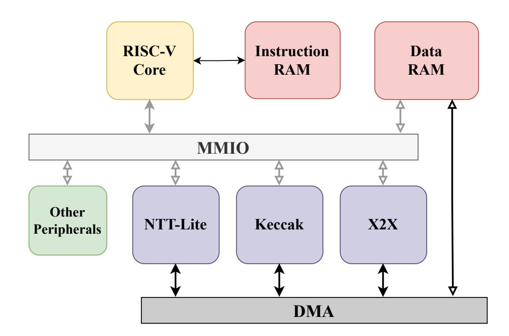

<span id="page-7-2"></span>Figure 1: System Architecture

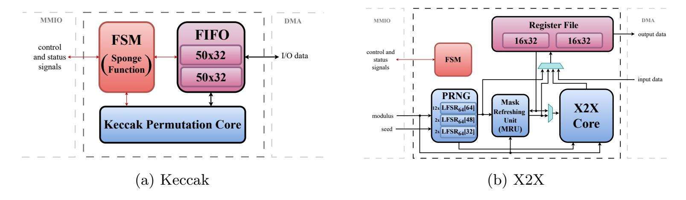

<span id="page-7-1"></span>Figure 2: Keccak and X2X accelerators high-level architecture. Black lines denote data paths, red lines denote control and status signals. Internal control signals are omitted for clarity.

programmed to execute our PQC software. On the other hand, our solution is generic to masking at arbitrary order. However, for simplicity, we give the architectural details throughout this section specific to first order masking.

### 3.1 Polynomial Arithmetic Accelerator

As discussed in Section 2, polynomial arithmetic is the fundamental operation in LBC algorithms, and its efficient implementation is critical to enhance the performance. We present the proposed polynomial arithmetic accelerator NTT-Lite in Section 4.

### <span id="page-7-3"></span>3.2 Keccak Accelerator

Similar to the NTT accelerator, the Keccak unit consists of three primary components: a register file, a control unit, and the Keccak core. The register file is accessed by the RISC-V core through the Wishbone interface for configuration and parameter loading. Input data is transferred to the Keccak core via the DMA interface, while the control unit manages the execution flow. Once the permutation is completed, the results are written back to the main memory in the same manner.

Since Keccak is part of a well-established standard with extensive existing research and hardware implementations, developing a new design would offer limited benefits. Therefore,

{8}------------------------------------------------

the open-source Keccak implementation, proposed in [GSM17] is adapted and integrated into the architecture. The study focuses on the so called domain-oriented masking approach to achieve efficient higher-order Boolean masking. The optimization of the Keccak S-box implementation, which is the primary source of leakage, is enabling secure execution while minimizing performance overhead.

Figure 2a presents the simplified architecture of the Keccak Unit. We should note that the integrated masked Keccak core only provides the so-called Keccak permutation, while implementing higher-level hash functions such as SHA-3 or SHAKE requires to implement the so-called sponge construction  $[D^+15]$ . In our design, the sponge construction is implemented directly within the accelerator to minimize software interaction and thereby improve overall performance. Furthermore, a FIFO mechanism is incorporated to overlap Keccak permutation and data input and output. The Keccak permutation core is highly parametric including the level of parallelism, and we configured it such that it can finish a Keccak permutation  $4 \times 24 = 96$  clock cycles.

### 3.3 X2X Accelerator

Applying masking countermeasures to lattice-based cryptographic schemes necessitates the use of both arithmetic and Boolean masking techniques [MGTF19, ÖY23, KDVB<sup>+</sup>22, CGTZ23]. In particular, core operations such as polynomial addition and multiplication are performed over arithmetic shares, while bitwise operations—such as those used in the Keccak hash function—are more naturally protected using Boolean masking. Consequently, a secure implementation must provide an efficient and reliable mechanism to convert between these two masking domains, specifically through Arithmetic-to-Boolean (A2B) and Boolean-to-Arithmetic (B2A) transformations.

To accelerate A2B and B2A conversions, we integrated a dedicated unit into our architecture. In particular, we utilized the X2X core from [NDKV25], coining the name of this cryptographic accelerator. The X2X core enables mask conversion with high-throughput, such as 1 to 2 conversions per cycle, supporting both A2B and B2A conversions, for both a power-of-two or prime moduli. We would like to note that X2X core was originally designed for a word size of 13-bit in [NDKV25], and it is expanded to 32-bit for this work. The X2X core employs a 13-stage pipeline to support high-throughput A2B and B2A conversions. To further improve performance, the X2X accelerator integrates two  $16 \times 32$ -bit register files, one for each share. When the modulus is a power of two, the core supports a dual mode in which 2 conversions can be performed simultaneously, thereby doubling the throughput.

<span id="page-8-0"></span>

|           | Active Units |     |          | Data                           |                                                                         |
|-----------|--------------|-----|----------|--------------------------------|-------------------------------------------------------------------------|
| Opcode    | PRNG         | MRU | X2X Core | $\mathbf{Modes}$               | Types                                                                   |
| OP_PRNG   | 1            | Х   | ×        |                                | $\mathbb{Z}_{2^k},\!\mathbb{Z}_q,\!\mathbb{Z}_{2^k}^*,\!\mathbb{Z}_q^*$ |
| OP_X2X    | ✓            | X   | ✓        | A2B, B2A, B2A <sub>1-bit</sub> | $\mathbb{Z}_{2^k}, \mathbb{Z}_q$                                        |
| OP_REF    | ✓            | ✓   | ×        | A, B                           | $\mathbb{Z}_{2^k}, \mathbb{Z}_q$                                        |
| OP_MASK   | ✓            | ✓   | ×        | A, B                           | $\mathbb{Z}_{2^k}, \mathbb{Z}_q$                                        |
| OP_REFX2X | ✓            | ✓   | ✓        | A2B, B2A, B2A <sub>1-bit</sub> | $\mathbb{Z}_{2^k},\!\mathbb{Z}_q$                                       |

Table 2: Operations supported by X2X accelerator.

A: Arithmetic, B: Boolean

The simplified architecture of X2X accelerator is given in Figure 2b. As shown, in addition to the X2X core, we integrated a pseudo-random number generator (PRNG), and a mask refresher unit (MRU). The PRNG is mainly used to feed X2X core so it can operate in the desired throughput. It is implemented using 16 parallel linear feedback

{9}------------------------------------------------

shift registers (LFSRs), each with a 64-bit state. The feedback polynomials are chosen to be primitive over  $\mathcal{R}_{2,64}$ , ensuring non-repeating sequences of length  $2^{64}$ . 12 of these LFSRs generate 64-bit outputs in a single cycle through loop unrolling, while 2 of them generate 48-bit outputs and 2 of them generate 32-bit outputs. Overall, the PRNG is used to generate 28 uniformly random numbers in  $\mathbb{Z}_{2^{16}}$  and 9 uniformly random numbers in  $\mathbb{Z}_{2^{32}}$ , consumed by the X2X core. Moreover, two 32-bit uniformly random numbers are generated in  $\mathbb{Z}_q$ , through rejection sampling. For both, three  $\lceil \log q \rceil$ -bit candidates are drawn and the one that is strictly less than q is accepted. One of these random numbers in  $\mathbb{Z}_q$  is consumed by the X2X core in A2B mode while the other one is used by the MRU. Therefore, if no valid candidate is found, the X2X accelerator stalls. The probability of acceptance is given by

$$1 - \left(\frac{\left(2^{\lceil \log q \rceil} - q\right)}{2^{\lceil \log q \rceil}}\right)^3,$$

For example, for Kyber where q = 3329, this implies an acceptance rate of 0.993.

While MRU and X2X core can operate independently, they are also connected in a cascaded manner, enabling efficient performing of mask refreshing followed by a mask conversion operation in a single pipeline execution. In this configuration, the latency of A2B and B2A operations increases by 1 clock cycle due to the additional latency introduced by mask refreshing. This feature is important to achieve provable security in an efficient manner, which is further discussed in Section 5 and Section 6.2. The X2X accelerator also supports performing the initial masking of sensitive data through the MRU, ensuring that sensitive values are never manipulated directly by software, where microarchitectural leakages can occur [GD23]. Moreover, there is a dedicated command in the X2X accelerator to read the PRNG output, so the software can use the X2X accelerator to produce pseudo-random numbers in the desired range. Another important feature of X2X accelerator is the 1-bit mode, where the input data is sent to the X2X core bit by bit, with a parametric stride between bits. This feature is particularly important for certain masked gadgets in Kyber, as also discussed in Section 6.2. The discussion in this paragraph is summarized in Table 2.

# <span id="page-9-0"></span>4 NTT-Lite

In this section, we provide a detailed description of the architecture and sub-modules of our polynomial arithmetic accelerator NTT-Lite.

## 4.1 Scope

NTT-Lite is designed to accelerate not only the NTT operation but also other polynomial arithmetic and supporting functions used in PQC schemes, such as compression, encoding and pseudo-random sampling, which cannot be efficiently implemented using software. Although this work focuses on secure implementations of Kyber and Dilithium, NTT-Lite is not restricted to the parameters of these schemes. It supports modulus q sizes up to 32-bit and polynomial degrees n of up to 256, ensuring an agile design, flexibility and reusability across different LBC algorithms.

On the other hand, masked implementations of Kyber and Dilithium require configurations that deviate from the standard parameter sets, such as the moduli of these schemes. This flexibility is particularly necessary for implementing the arithmetic involved in their non-linear operations. Our configurable NTT design satisfies these requirements. An additional discussion on the role of NTT-Lite in masked implementations is provided in Section 6.2. We employ unsigned arithmetic over  $\mathbb{Z}_q$  as signed arithmetic makes differential SCA attacks significantly easier [TMS24].

{10}------------------------------------------------

# <span id="page-10-0"></span>**4.2 Architecture**

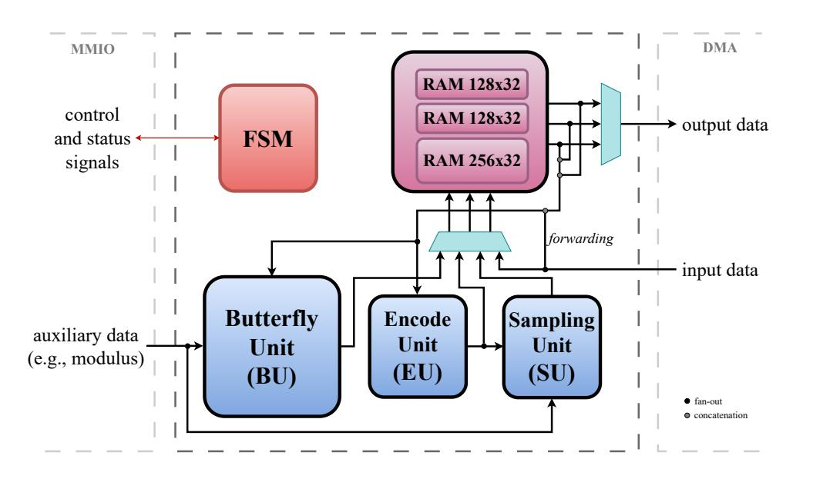

Figure 3: NTT-Lite high-level architecture. Internal control signals are omitted for clarity.

[Figure 3](#page-10-0) illustrates the high-level and simplified architecture for NTT-Lite. As shown, the NTT-Lite contains of two 128×32 and one 256×32 RAM blocks. The core arithmetic unit in NTT-Lite is the Buttefly Unit (BU) as in almost all NTT designs in the literature. In addition, an Encode Unit (EU) is integrated into the design to accelerate the encoding and decoding operations used in PQC algorithms. Moreover, a Sampling Unit (SU) is implemented to perform operations related to pseudo-random number sampling used in PQC schemes. FSM performs address calculations and generates control signals for the internal memories as well as BU, EU and SU.

Since a butterfly circuit in the NTT computation has two inputs and two outputs, we use two independent 128 × 32 RAMs. In this manner, NTT-Lite can feed BU with a valid pair of inputs at each clock cycle. The 256 × 32 RAM is used for the storage of twiddle factors in NTT, as well as right-hand side operands in certain operations. We detail the internal RAM usage in the following sections. In addition to the main data path, an auxiliary 160-bit data path is employed. This path delivers constant values required by the provided functionalities, such as the modulus used in modular arithmetic. Further details on this auxiliary constant-data are provided in the next section.

### <span id="page-10-1"></span>**4.2.1 Word Modes**

The architecture provides two main operating modes, *single* and *dual*, selected at run-time. In single-mode, the word size of the unit is configured to 32-bit, whereas in dual-mode it is set to 16-bit. In dual-mode, the upper and lower halves of each 32-bit word stored in the RAM are treated as two independent 16-bit words, enabling parallel processing and improved throughput. Additionally, *poly*-mode is implemented as a variant of dual-mode, with all operations, except modular multiplication, executed identically. In this mode, the multiplication operation is realized as degree-1 polynomial multiplication, supporting modulus sizes of up to 16-bit. The poly-mode is beneficial for implementing the base multiplication in incomplete NTT, such as the case of Kyber. The pseudo-code for modular multiplication in poly-mode is given as follows:

$$C_H = A_L \cdot B_H + A_L \cdot B_H \qquad \text{mod } q \tag{5}$$

$$C_L' = A_L \cdot B_L \qquad \text{mod } q \tag{6}$$

$$T = A_H \cdot B_H \qquad \text{(not reduced)} \tag{7}$$

An additional output *T* is produced, which serves as an intermediate result together with *C* ′ *L* . To complete the base multiplication in incomplete NTT domain, *T* is multiplied

{11}------------------------------------------------

<span id="page-11-0"></span>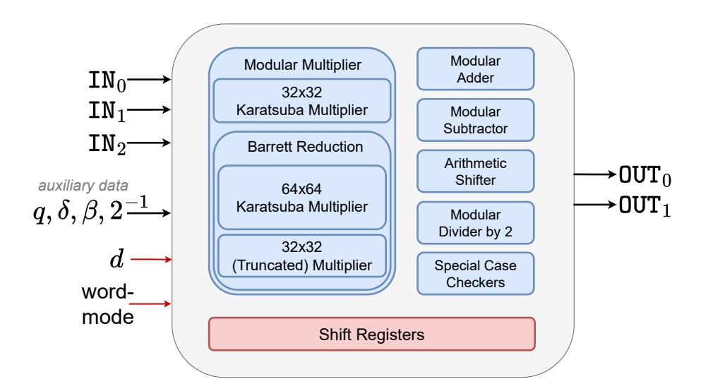

Figure 4: High-level architecture of the BU.

<span id="page-11-1"></span>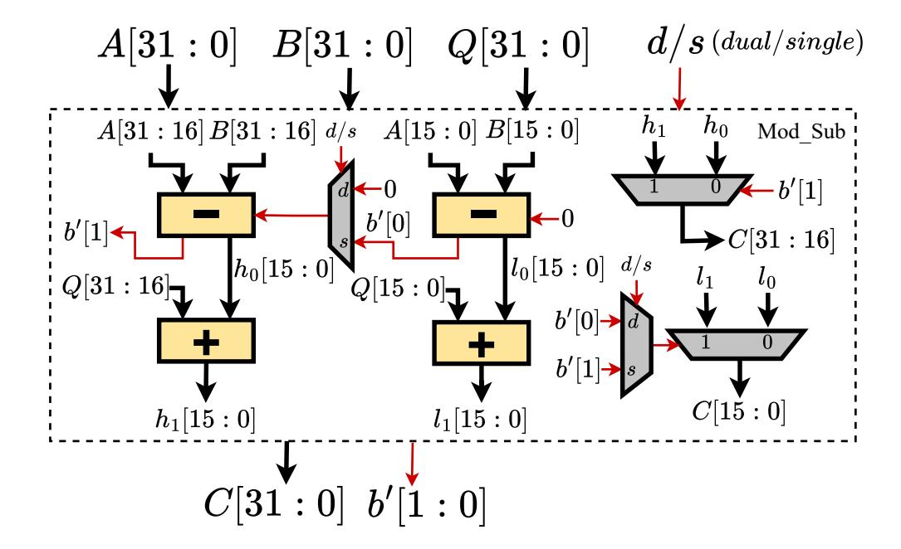

Figure 5: Modular subtractor architecture with dual-mode option. Black lines denote data paths, and red lines denote control and status signals.

by *ζ* in single-mode and accumulated to *C* ′ *L* , in single-mode:

$$C_L = C_L' + T \cdot \zeta \qquad \text{mod } q \tag{8}$$

$$= A_L \cdot B_L + A_H \cdot B_H \cdot \zeta \qquad \text{mod } q \tag{9}$$

### <span id="page-11-2"></span>**4.2.2 Butterfly Unit (BU)**

The architecture of the BU is illustrated in [Figure 4.](#page-11-0) The unit comprises several submodules: a modular adder, a modular subtractor, a modular multiplier, a module that performs modular division by 2, an arithmetic shifter to the right, and shift (delay) registers. All of the mentioned submodules are designed such that they support single and dual modes (and poly-mode for the modular multiplier). BU operates in a pipelined manner. The shift registers are used to synchronize the intermediate data for each operation. It takes three 32-bit operands, and produces two 32-bit results. The modulus *q*, *δ*, *β*, and 2 −1 are auxiliary data (which are not pipelined) used in related operations, as detailed in the following paragraphs.

The modular adder computes the sum of two operands and, if the result exceeds the modulus *q*, subtracts *q* to ensure that the output remains within the valid range. The modular subtractor operates in an analogous manner, performing subtraction followed by addition when necessary. To illustrate dual-mode support, we present the architecture of the modular subtractor in [Figure 5](#page-11-1) as a reference. Other modules are implemented in a

{12}------------------------------------------------

similar fashion. The borrow bits *b* ′ output by modular subtractor are used as inequality flags in several operations.

**Modular Multiplier.** The modular multiplier module consists of a 32-bit integer multiplier and a modular reduction unit. The modular reduction is implemented using Barrett reduction [\[Bar87\]](#page-38-7). The integer multiplier is responsible for implementing the poly-mode and is implemented using Karatsuba multiplication algorithm [\[Kar63\]](#page-41-11).The design rational behind choosing Barrett reduction is to getting the quotient from the modular reduction operation as well. In other words, the modular multiplier unit is also used as a divider. Computing the quotient is important for supporting functions of PQC such as Compress in Kyber and Decompose in Dilithium. Another advantage is that, with Barrett reduction, the output of the operation is not multiplied with a factor as in Montgomery or Plantard. To support division by arbitrary 32-bit numbers instead of constraining the dividend to a function of *q* 2 , we implemented the naive Barrett reduction, which involves a 64-bit multiplication and a 32-bit multiplication. This is particularly needed when implementing a division needed in masked implementation of Kyber, as further discussed in [Section 6.2.](#page-25-0) For efficient computation, the 64-bit multiplication is also implemented using a recursive Karatsuba algorithm. The pre-computed Barrett constant (denoted by *δ* in [Figure 4\)](#page-11-0) is supplied to the BU through the auxiliary data path. For the 32-bit multiplication in Barrett reduction, only the lower 32 bits of the product are required, resulting in a truncated multiplication. For both 32-bit and 64-bit Karatsuba multipliers, the core multiplication size is set to 16-bit, resulting in 3 and 9 core multiplications, respectively. As the truncated 32-bit multiplication is also achieved with 3 core multiplications of 16-bit, the modular multiplier requires 15 core multiplications in total. Without considering masking, the Barrett reduction could be realized with only two 32-bit multiplications, reducing the overall cost of modular multiplier to 9 core multiplications.

Next, we detail how related functionality for PQC are implemented by BU architecture. Giving this unit its name, the butterfly circuits of the NTT and INTT are implemented within the BU, utilizing the modular multiplier, modular adder, and modular subtractor. As mentioned in [Section 2,](#page-3-0) INTT requires post-processing, where both operands must be multiplied by 2 −1 . The post-processing for one operand is embedded into multiplication by *ψ* −1 (see eq. XX). For the other operand, it is handled using the modular divider by 2 sub-module. This operation does not require multiplication and is implemented as (*x >>* 1) + 2<sup>−</sup><sup>1</sup> mod *q* using the pre-calculated (2<sup>−</sup><sup>1</sup> mod *q*) value.

Compress, Decompress (Kyber): As shown in [Eq. 1,](#page-4-0) Compress operation requires both multiplication and division with rounding. 2 *<sup>d</sup>* × *x* is calculated in modular multiplier. Then, *q/*2 is added to the result using the modular adder, to simplify rounding using the adder. Finally, the division operation is done using Barrett Reduction. In Decompress [\(Eq. 2\)](#page-4-1), the divisor 2 *d* is a power-of-two. Therefore, the division is implemented using the arithmetic shifter. These primitives are also used for performing left or right shifts, or divisions. Rounding can be disabled by a control bit. In particular, by setting *q* = 1, left and right shifts can be realized using Compress and Decompress, respectively. Similarly, invoking Compress with *d* = 1 is equivalent to computing the division *x/q*.

Decompose, UseHint (Dilithium): Similar to Compress, Decompose requires division by rounding (see [Eq. 3\)](#page-5-0), which is also efficiently done by the Barrett reduction in the modular multiplier, *r*<sup>1</sup> = (*x* ′ )*/α*, *r* ′ <sup>0</sup> = (*x* + *αh*) mod *α*, where *x* ′ = (*x* + *αh*) and *α<sup>h</sup>* = (*α* − 1)*/*2. Note that *r*<sup>1</sup> and *r* ′ <sup>0</sup> are the division and the remainder from dividing *x* ′ to *α*. The added constant is subtracted afterwards using the modular subtractor for computing the lower-order term, *r*<sup>0</sup> = (*r* ′ <sup>0</sup> −(*αh*)) mod *α*. Moreover, there is a dedicated logic responsible for checking and applying the special case of the Decompose operation, abstracted as special case checkers in [Figure 4.](#page-11-0) The corner case required for this check (by re-purposing 2 −1 input), as well as *α* (setting *β* = *α*), is given through the auxiliary data. We should

{13}------------------------------------------------

note that the Decompose operation flow can be used to perform Power2Round by disabling the post-processing. UseHint operation is built on top of the Decompose output. BU receives both parts of the output produced by Decompose as its input, namely  $r_1, r_0$ , in addition to the hint h. The sign check on  $r_1$  is reformulated as a norm check,  $r_1 \leq q/2$ , and performed as described in below paragraph. Based on the outcome of this check,  $r_1$  is either incremented or decremented by 1 using the modular adder. We remark that the Decompose operation can be considered as a generic operation that returns both the division and remainder.

CheckNorm, MakeHint (Dilithium): The infinity norm check  $||\mathbf{x}||_{\infty} \geq \beta$  over a vector requires performing an inequality check for every element in it,  $x \geq \beta$ . First, the input data is shifted in [0,q) by  $\beta-1$  using the modular adder. As a result, the check becomes  $x' \geq (2\beta-1)$ . Then, we perform  $x'' = (2\beta-2) - x'$  using the modular subtractor (x'') is the value before modular reduction).  $x \geq \beta$  if and only if x'' is negative, so we output the borrow bits from the modular subtractor. MakeHint uses the exact same steps, with an additional step for checking the special case as in Decompose. The bound  $\beta' = \beta - 1$  is also provided through the auxiliary data, (the same signal used in Decompose), as well as the special case for MakeHint. Although these mainly target Dilithium, inequality check is a generic feature.

### 4.2.3 Encode Unit (EU)

As discussed in Section 2.2, the decode function maps a sequence of bits to polynomial coefficients, while the encode function performs the inverse operation. In Kyber, where  $\lceil \log q \rceil = 12$ , there is no fixed alignment between the indices of 32-bit words and the 12-bit polynomial coefficients. The situation is the same for Dilithium as the modulus is 23-bit. As a result, explicit bit-shiftings are needed to transform between bit strings and polynomial coefficients. As in BU, EU operates based on the word mode, which enables it to handle the word sizes of both Kyber and Dilithium efficiently. The internal resources are shared between encode and decode modes. EU is implemented as a shift-register. Unlike BU, the EU is a stateful unit. It maintains a 64-bit register K, implemented as a shift register, and a counter tracking the number of valid bits stored in K. We intentionally sized K to 64-bit (rather than 32-) to provide buffering and prevent stalling on the input/output stream.

### 4.2.4 Sampling Unit (SU)

The sampling unit is responsible for two main pseudo-random sampling functions,  $\mathsf{CBD}_{\eta}$  and rejection sampling. The former is used exclusively by Kyber, while the latter is a core building block in PQC, employed by both Kyber and Dilithium. For both operation modes, NTT-Lite inputs a pseudo-random data string (possibly produced by an XOF), and applies the logic for these functions on the pseudo-random data. As shown in Figure 3, SU takes its input from EU. Because, the pseudo-random data is first decoded which splits it to the bit-length processed by SU. The SU contains two modular subtractors, and additional dedicated logic for both  $\mathsf{CBD}_{\eta}$  and rejection sampling. The boundary for rejection sampling is supplied to NTT-Lite via the auxiliary data path. The SU also supports the dual-mode, consistent with the other units. We next describe the implementation details of these two sampling modes.

Recall from Section 2.2 that  $\mathsf{CBD}_{\eta}$  takes  $2 \times \eta$  input bits outputs  $o_0 - o_1 \mod q$  where  $o_0 = (\sum_{i=0}^{\eta-1} b_i)$  and  $o_1 = (\sum_{i=\eta}^{2\eta-1} b_i)$ . In our implementation, EU decodes the pseudorandom input to  $2 \times \eta$  bits, which are then processed by SU. In SU, these are further decoded to  $o_0$  and  $o_1$ . Then, subtraction is performed using the modular subtractor.

The rejection sampling uses the first modular subtractor as an inequality checker, to decide  $x < \beta$  by looking at the borrow bits. If the test passes, the data is forwarded to the

{14}------------------------------------------------

output. In dual-mode, performing rejection sampling on 32-bit inputs requires a 16-bit buffer to handle scenarios in which only one of the two half-words is rejected. In some cases, the output of the rejection sampling must be centered, as in Dilithium's small-coefficient sampler, whose output is uniform over [−*η, η*]. To achieve this, we compute *β/*2 − *x* for centralization. The second modular subtractor performs this operation.

<span id="page-14-0"></span>

| Table 3: Operations supported by NTT-Lite. |        |      |        |                          |  |  |
|--------------------------------------------|--------|------|--------|--------------------------|--|--|
|                                            | Source | Used | Active | Clock                    |  |  |
| Opcode                                     | Type   | By   | Units  | Cycles                   |  |  |
| OP_NTT                                     | I      | K, D | BU     | ′/2<br>′<br>n<br>· log n |  |  |
| OP_INTT                                    | I      | K, D | BU     | ′/2<br>′<br>· log n<br>n |  |  |
| OP_PWM                                     | II     | K, D | BU     | ′ /<br>′<br>n<br>2n      |  |  |
| OP_ADD                                     | II     | K, D | BU     | ′<br>n                   |  |  |
| OP_SUB                                     | II     | K, D | BU     | ′<br>n                   |  |  |
| OP_SUM                                     | III    | K, D | BU     | ′ −<br>n<br>1            |  |  |
| OP_MAC                                     | VI     | K, D | BU     | ′ /<br>′<br>n<br>2n      |  |  |
| OP_COMPRESS                                | III    | K    | BU     | ′<br>n                   |  |  |
| OP_DECOMPRESS                              | III    | K    | BU     | ′<br>n                   |  |  |
| OP_DECOMPOSE                               | V      | D    | BU     | ′<br>n                   |  |  |
| OP_CHK_NORM                                | III    | D    | BU     | ′⋆<br>n                  |  |  |
| OP_MAKE_HINT                               | III    | D    | BU     | ′<br>n                   |  |  |
| OP_USE_HINT                                | VI     | D    | BU     | ′<br>n                   |  |  |
| OP_ENCODE                                  | III    | K, D | EU     | ′<br>n                   |  |  |
| OP_DECODE                                  | IV     | K, D | EU     | ′<br>n                   |  |  |
| OP_CBD                                     | IV     | K    | EU, SU | ′<br>n                   |  |  |
| OP_REJ_SAMP                                | IV     | K, D | EU, SU | 1                        |  |  |

Table 3: Operations supported by NTT-Lite.

*n* ′ denotes the number of 32-bit words in the data array, which is *n* = 256 for Dilithium and *n/*2 = 128 for Kyber.

# **4.3 High-Level Operations**

In this section, we detail how the NTT-Lite operates on vector inputs leveraging the BU, EU, and SU. [Table 3](#page-14-0) summarizes the set of operations implemented in NTT-Lite. Although the table indicates the primary scheme associated with each operation, this association is not mandatory; the configuration is never hard-coded, ensuring crypto agility. The parameter *n* ′ , which defines the input array length, is not fixed, and log *n* ′ can be configured to any positive integer up to 8.

### **4.3.1 Operation Details and Latencies**

For OP\_NTT and OP\_INTT, there are log *n* ′ stages and *n* ′*/*2 butterfly operations are performed by BU at each stage, leading to roughly *n* ′*/*2 log *n* ′ clock cycles. We note that each operation incurs a small additional latency due to the pipelined BU, SU, and EU units, as well as from data read and write operations; these latencies are omitted in [Table 3](#page-14-0) as well as the rest of the discussion for clarity. For example, OP\_NTT and OP\_INTT indeed take *n/*2 · log *n* + L where L denotes the summation of butterfly latency.

*<sup>⋆</sup>* : operation is stopped immediately if operation returns failure, takes *n* ′ cycle if operation returns success.

<sup>1</sup> : Running time depends on the bound (*β*) and input data.

K: Kyber, D: Dilithium.

{15}------------------------------------------------

OP\_SUM computes the sum of all indices in an input of size n', utilizing the modular addition in BU, taking n'-1 clock cycles. OP\_ADD, OP\_SUB, OP\_PWM (point-wise multiplication), OP\_COMPRESS, OP\_DECOMPRESS, OP\_DECOMPOSE, OP\_MAKE\_HINT are element-wise operations utilizing the corresponding operations from BU. Recall from Section 4.2.1 that OP\_PWM in poly-mode is handled differently. Since a double pass over the input operands is performed to handle the multiplications by zetas, the latency is approximately 2n' cycles. OP\_MAC is similar to OP\_PWM, while it operates in a multiply-and-accumulate manner, particularly beneficial for matrix multiplications. OP\_CHK\_NORM is also applied element-wise, but terminates early if any element x satisfies  $|x| \geq b$ . This variable-time behavior is acceptable for Dilithium, as the input is discarded and the process is restarted upon failure.

For OP\_ENCODE, the n' input elements are streamed to the EU one-by-one, the operation completes once the final 32-bit encoded word is produced. Although the number of output words depends on the encoding parameter d, the total latency is determined by the input length n'. OP\_DECODE and OP\_CBD follow a similar pattern, the number of cycles is fixed by the n' output elements, while the required number of input words depends on d. For OP\_REJ\_SAMP, the user specifies the input length, and execution terminates once n' valid samples are generated; otherwise, all input is consumed. Thus, its runtime depends on the modulus, the input size, and the input values themselves.

### <span id="page-15-0"></span>4.3.2 Data Sources

The source and destination memories for each operation are classified under the Source Type column in Table 3. Type I operations require three input sources: two operands are fetched from the  $128 \times 32$  RAMs and the third from the  $256 \times 32$  RAM, such as OP\_NTT and OP\_INTT. In this case, the third operand corresponds to the twiddle factors. This class produces two outputs, written to the  $128 \times 32$  RAMs. For the rest of the discussion, the concatenation of two  $128 \times 32$  RAM is called RAM<sub>0</sub>, and  $256 \times 32$  RAM is called  $RAM_1$ . Type II operations require two operands, one is read from  $RAM_0$  and the other is read from RAM<sub>1</sub>. Type III operations require only a single input source, which is always read from the RAM<sub>0</sub>. For Type IV such as OP\_DECODE, the input is read from the RAM<sub>1</sub> to prevent overwriting its data prior to processing. For Types II, III, and IV, the output is written to the RAM<sub>0</sub>. OP\_DECOMPOSE produces two outputs: the primary output is written to the  $RAM_0$ , whereas the secondary output is stored in the  $RAM_1$ . This configuration is indicated as Type V. Finally, OP\_MAC and OP\_USE\_HINT operations are classified under Type VI, as these have three source operands with a single output. In that case, while the first two operands come from RAM<sub>0</sub> and RAM<sub>1</sub>, the third input source is the fresh data that is being transferred to NTT-Lite. That is directly processed without storing it internally.

In order to perform any of these opcodes provided by NTT-Lite, the input data must be transferred to NTT-Lite memory blocks RAM<sub>0</sub> and RAM<sub>1</sub>, depending on the operation. While the data transfer seems as a performance drawback, we implemented a forwarding mechanism (see Figure 3). In most operations, transferring the input to NTT-Lite memory, either to RAM<sub>0</sub> or RAM<sub>1</sub>, and the operation is performed in parallel. Thanks to forwarding, one of the transfer costs for the inputs is eliminated. Moreover, input and output data transfers are not always performed, enabling efficient chained operations on data already present in NTT-Lite. Consider performing addition of three arrays,  $D_3 = D_0 + D_1 + D_2$ , which can be performed by executing  $D'_0 = D_0 + D_1$  (OP<sub>0</sub>), and  $D_3 = D'_0 + D_2$  (OP<sub>1</sub>). In that case, the output for OP<sub>0</sub> is not sent by NTT-Lite. Only the  $p_2$  input of OP<sub>1</sub> is read by NTT-Lite, which is done in parallel with the processing of addition. In total 4n' cycles are spent roughly, which would be 8n' without these optimizations. We visualize the discussed operation flow in Figure 6. This feature is not hard-coded and fully configured by the user. All operation codes can be chained. Since except the Type V operations,

{16}------------------------------------------------

<span id="page-16-1"></span>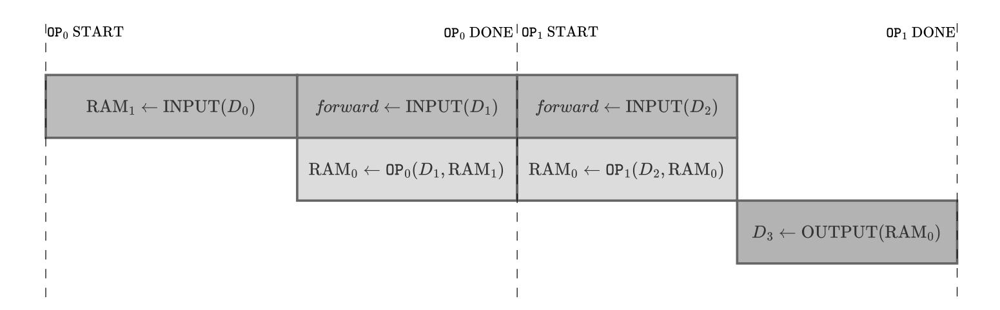

Figure 6: NTT-Lite Example Operation Flow

NTT-Lite uses RAM<sup>0</sup> to internally store the operation output, one can re-use the operand loaded to RAM<sup>1</sup> across multiple operations. A common use case, though not limited to it, is when a single polynomial is multiplied by each polynomial in a set, such as the computation of *c***s**<sup>1</sup> in Dilithium*.*Sign (see Line 12 in [Figure 14\)](#page-37-0). We leave increasing the size of NTT-Lite memory blocks for further optimization as a future work. NTT-Lite also allows the right-hand operand to be a constant, supplied as auxiliary data, which is advantageous in scenarios where one input remains fixed.

Lastly, NTT-Lite provides a dedicated flag to clear its internal memory at the end of an operation. This is beneficial for avoiding transitional leakage when two shares are processed by sequentially NTT-Lite. This cleaning occurs without additional cost, as it is overlapped with ongoing operations.

# <span id="page-16-0"></span>**5 Algorithms for Non-linear Operations**

In order to protect a Kyber and Dilithium implementation against differential power analysis attacks, all components involving the secret key need to be masked. This section describes how a fully masked Kyber and Dilithium are achieved in the proposed HW/SW co-design solution [\(Section 3\)](#page-6-1). To this end, we first introduce our approaches for the critical masked operations (CBD, norm checking, decompose, etc.), which are tweaked to exploit the existing hardware accelerators (NTT, Keccak and X2X) and achieve maximal overall performance.

# **5.1 Kyber**

## **5.1.1 Masked Binomial Sampling**

The CBD*<sup>η</sup>* function follows the masked generation of a pseudo-random bytestring, using the Boolean masked SHAKE (Keccak), from the sensitive *r* which is derived from the decrypted message *m*′ in the Kyber decapsulation procedure. The masked sampling function transforms the uniform bytestring to polynomials consisting of masked coefficients, distributed according to CBD*η*.

A first-order masked binomial sampler was proposed for the lattice-based NEWHOPE scheme in [\[OSPG18\]](#page-42-10). This works was extended in [\[SPOG19\]](#page-43-6), to support arbitrary moduli *q* and masking orders *d*. In essence, this approach relies on first converting two *η*-bit boolean shared strings to arithmetic shares (using 2×B2A*q*) to compute the difference in Hamming weight between them, by subtracting and adding coefficient-wise in the arithmetic domain.

Further, the authors of [\[SPOG19\]](#page-43-6) propose an alternate high-order masked binomial sampler, which performs the Hamming weight computation directly in the Boolean domain 

{17}------------------------------------------------

and only requires a single B2A conversion. In order to speed-up the Hamming weight computation and addition (in Boolean domain), the authors propose to use bitslicing.

As the proposed hardware architecture [\(Section 3\)](#page-6-1) supports the efficient computation of mask conversions through the optimized X2X accelerator, we choose to perform the masked CBD*<sup>η</sup>* operation using the high-order extension of [\[OSPG18\]](#page-42-10) as proposed in [\[SPOG19\]](#page-43-6). As a result, it is not required to support additional bitslicing arithmetic in the design (area cost) and we can maximally rely on existing units to perform both B2A*<sup>q</sup>* operations.

To satisfy the required security notion, we introduce an explicit Refresh (Line 2), which refresh the masks of the bitstring *s*. Note that this requires refreshing (*d* + 1) · 2 · *η* bits, whereas refreshing after the B2A requires refreshing (*d* + 1) · ⌈*log*2(*q*)⌉ bits.

```
Algorithm 1 MaskedCBD(s
                        {0:d}B , η) from [OSPG18,SPOG19]
Input: CBD parameter η
Input: Masking order d
Input: Input String s
                   {0:d}B ∈ B{0:d}B
                           2·η
Output: r
         {0:d}A ∈ Z
                  {0:d}A
                  q following CBD distribution
 1: for i = 0 to 2 · η − 1 do
 2: s
       ′{0:d}B
            [i] ← Refresh(s
                         {0:d}B [i]) ▷ Using X2X
 3: t
      {0:d}A [i] ← B2Aq(s
                      ′{0:d}B
                            [i]) ▷ Using X2X
 4: end for
 5: r
    {0:d}A ← 0
 6: for i = 0 to η − 1 do
 7: r
       {0:d}A ← r
               {0:d}A + t
                       {0:d}A [i] − t
                                 {0:d}A [η + i] mod q ▷ using NTT
 8: end for
 9: return r
           {0:d}A
```

We now show [Algorithm 1](#page-17-0) to be *t*-SNI secure with *t* + 1 shares, providing resistance against a probing adversary with *t* probes. Additionally, it allows the gadget to be used in larger compositions, such as a full Kyber decapsulation.

<span id="page-17-1"></span>**Theorem 1.** *The gadget* MaskedCBD*, presented in [Algorithm 1,](#page-17-0) is t-SNI with t* ≤ *d.*

*Proof.* The proof follows directly from the Refresh being *t*-SNI, as proposed in [\[SPOG19,](#page-43-6) Alg. 20], and the B2A*<sup>q</sup>* being *t*-NI, as proven in [\[NDKV25\]](#page-42-9). Furthermore, the additions in Line 7 are performed share-wise, and thus can be modeled as a *t*-NI gadget. The Refresh operation stops the propagation of output/intermediate probes to the input *s*.

### **5.1.2 Masked Compression**

The masked Compress operation is computed by performing the modulus switching using more precision (*δ*). In addition, the proposed MaskedSubCompress gadget [\(Algorithm 2\)](#page-18-0) allows to perform the compression and an optional subtraction, as needed in the final comparison. The input is arithmetically shared, which enables efficient additions (Line 2-6) using the NTT peripheral, after which the shared data is converted to the Boolean domain using the A2B conversion (X2X peripheral), during which an (optional) mask refresh is performed (Line 7). The conversion is required to perform the final shift (Line 9) in the Boolean domain.

Finally, we show that [Algorithm 2](#page-18-0) is *t*-SNI secure with *t* + 1 shares, allowing it to be used in a larger composition.

**Theorem 2.** *The gadget* MaskedSubCompress*, presented in [Algorithm 2,](#page-18-0) is t-SNI secure with t* ≤ *d.*

{18}------------------------------------------------

# <span id="page-18-0"></span>**Algorithm 2** MaskedSubCompress $(a^{\{0:d\}_A}, b, \delta)$ from [CGMZ21, DVBV22]

```
Input: a^{\{0:d\}_A} \in \mathbb{Z}_q^{\{0:d\}_A}
Input: b \in \mathbb{Z}_{2^d}, subtraction operand which is a compressed polynomial coefficient
Input: Compression factor \delta
Output: r^{\{0:d\}_B} \in \mathbb{Z}_{2^{\delta}}^{\{0:d\}_B} such that b = \mathsf{Compress}_{q,\delta}(a)
  1: \alpha \leftarrow \lceil \log_2(q \cdot d) \rceil
  2: for i = 0 to d do
            t^{\{i\}_A} \leftarrow \lfloor (a^{\{i\}_A} \cdot 2^{\delta+\alpha} + q/2)/q \rfloor \mod 2^{\delta+\alpha+1}
  3:
                                                                                                                                    ▶ Using NTT
  4: end for
  5: t^{\{0\}_A} \leftarrow t^{\{0\}_A} + 2^{\alpha - 1} \mod 2^{\delta + \alpha + 1}
                                                                                                                                    ▶ Using NTT
  6: t^{\{0\}_A} \leftarrow t^{\{0\}_A} - 2^{\alpha} \cdot b \mod 2^{\delta + \alpha + 1}
                                                                                                                                    \, \triangleright \, \, \text{Using NTT} \,
  7: t'^{\{0:d\}_A} \leftarrow \mathsf{Refresh}(t^{\{0:d\}_A})
                                                                                                                                     ▶ Using X2X
  8: t^{\{0:d\}_B} \leftarrow \mathsf{A2B}_{2^{\delta+\alpha+1}}(t'^{\{0:d\}_A})
                                                                                                                                     ▶ Using X2X
  9: r^{\{0:d\}_B} \leftarrow t^{\{0:d\}_B} \gg \alpha
                                                                                                                                    ▶ Using NTT
10: return r^{\{0:d\}_B}
```

*Proof.* The t-SNI property follows directly from the Refresh (Line 7) being t-SNI [SPOG19, Alg. 20]. Otherwise, the algorithm consist of a series of t-NI operations: all additions and the logical shift are performed in a share-wise fashion and the A2B operation is t-NI, as proven in [NDKV25].

We note that, without the t-SNI Refresh in Line 7, the algorithm achieves the t-NI notion. During the full Kyber decapsulation, we will use both these variants (and security notions) of Algorithm 2.

### <span id="page-18-1"></span>5.1.3 Masked Non-Zero Check

The final step in the Kyber decapsulation is the ciphertext comparison, in which the re-computed ciphertext c' is compared to the original ciphertext c (Figure 12). Our methodology relies on testing the equality of two integer coefficients u and u' being equivalent to testing if u - u' being zero or not, which is computed during the masked compression (MaskedSubCompress). The comparison is performed in the masked domain, and on all coefficients at once, as it was shown in [BDH<sup>+</sup>21] that partial results of the comparison leaks secret information. As such, the comparison is collapsed do a single bit, which is unmasked ( $\top$  or  $\bot$ ).

**Theorem 3.** The gadget MaskedZeroTestVec, presented in Algorithm 3, is t-NI secure with  $t \leq d$ .

*Proof.* It is shown in [CGMZ23] that Line 18-22 (without final unmasking) is t-NI secure. As the B2A $_q$  (Line 3 & 7) are t-NI and the additions in Line 12 & 16 are performed in each share domain, it follows trivially that the entire gadget is t-NI secure.

### <span id="page-18-2"></span>5.1.4 Masked Decapsulation

Finally, all proposed gadgets are considered together to construct a fully masked Kyber decapsulation. For this, we consider all relevant steps in the algorithm in Figure 12 (and subroutines in Figure 13), except the operations involving public values (e.g. public key, ciphertext, ...), and perform a fine-grained analysis of its composed security.

First, we analyze Kyber.CPAPKE.Dec, as shown in Figure 13, and map its operations to gadgets as follows:

{19}------------------------------------------------

▶ Using X2X

▶ Using NTT

▶ Using X2X

▶ Unmasking

 $r \leftarrow \mathbb{Z}_{q'}^*$ 

25: else return  $\perp$ 

24: if  $t \neq 0$  then return  $\top$ 

 $t^{\{0:d\}_A} \leftarrow t^{\{0:d\}_A} \cdot r \mod q'$ 

 $t^{\{0:d\}_A} \leftarrow \mathsf{Refresh}(\mathsf{t}^{\{0:d\}_A})$ 

23:  $t \leftarrow t^{\{0\}} + t^{\{1\}} + \dots + t^{\{d\}} \mod q'$ 

19:

20:

21:

22: end for

26: **end** if

```
Algorithm 3 MaskedZeroTestVec(\mathbf{u}^{\{0:d\}_B}, \mathbf{v}^{\{0:d\}_B})
Input: \mathbf{u}^{\{0:d\}_B} \in \mathcal{B}_{k \times n \times d_u}^{\{0:d\}_B}
Input: \mathbf{v}^{\{0:d\}_B} \in \mathcal{B}_{n \times d_v}^{\{0:d\}_B}
Input: A sufficiently large carrier prime q'
Output: \perp if any of the elements of u or v are non-zero. Otherwise, \top
  1: for i = 0 to k - 1 do
          for j = 0 to n - 1 do
  2:
               \mathbf{u}^{\{0:d\}_A}[i][j] \leftarrow \mathsf{B2A}_{q'}(\mathbf{u}^{\{0:d\}_B}[i][j])
                                                                                                                ▶ Using X2X
  3:
          end for
  4:
  5: end for
  6: for j = 0 to n - 1 do
          \mathbf{v}^{\{0:d\}_A}[j] \leftarrow \mathsf{B2A}_{q'}(\mathbf{v}^{\{0:d\}_B}[j])
                                                                                                                ▷ Using X2X
  7:
  8: end for
 9: t^{\{0:d\}_A} \in \mathbb{Z}_{q'}^{\{0:d\}_A} \leftarrow 0
10: for i = 0 to k - 1 do
          for j = 0 to n - 1 do
11:
               t^{\{0:d\}_A} \leftarrow t^{\{0:d\}_A} + \mathbf{u}^{\{0:d\}_A}[i][j] \mod q'
                                                                                                               ▶ Using NTT
12:
          end for
13:
14: end for
15: for j = 0 to n - 1 do
          t^{\{0:d\}_A} \leftarrow t^{\{0:d\}_A} + \mathbf{v}^{\{0:d\}_A}[j] \mod q'
16:
                                                                                                               ▶ Using NTT
17: end for
                                                              ▶ Below lines correspond to [CGMZ23, Alg. 1]
18: for i = 0 to d do
```

- $G_{1-4}$ : Decode<sub>12</sub> (Line 2),  $\bar{\mathbf{s}} \circ \mathsf{NTT}(\mathbf{u})$  (Line 5), INTT (Line 5), subtraction with v (Line 5). All are linear (polynomial) operations and are performed on each share separately.
- $G_5$ : Compress<sub>q</sub> (Line 5). We use the masked compression gadget proposed in Algorithm 2 (t-NI), without the (optional) subtraction (b set to 0). We refer to this instantiation of Algorithm 2 by MaskPolyToMsg.

Before the re-encryption, the decrypted message m' and the hashed public key are hashed (using G) to generate r and K' (mapped to gadget  $G_6$ ), which are both sensitive. If the final ciphertext comparison is successful, the masked K' is unmasked to perform the final hash in the clear, as proposed in  $[BGR^+21, BDK^+21, KDVB^+22]$ . It is critical that the short-term secret K' is only revealed if the comparison passes, and not in case of failure as then it could be used to recover the long-term secret key. The G operation, which relies on Keccak, is masked as proposed in prior art [GSM17] and integrated in our accelerator/peripheral.

Next, we analyze Kyber.CPAPKE.Enc (Figure 13), focusing on operations involving secret data:

{20}------------------------------------------------

<span id="page-20-0"></span>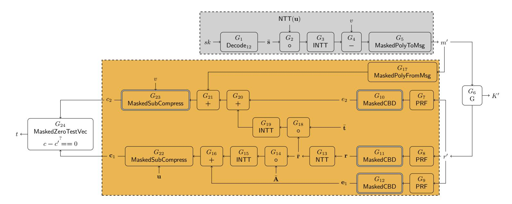

Figure 7: An abstract diagram of the Kyber.CCAKEM.MaskedDec, consisting of the decryption (gray) and re-encryption (yellow). The t-NI gadgets are depicted with a single border, the t-SNI gadgets with a double border.

- $G_{7-9}$ : PRF(r) (Line 5-8). This operation is also a symmetric primitive and implemented using the masked Keccak peripheral.
- $G_{10-12}$ : CBD (Line 5-8) to generate  $\mathbf{r}, \mathbf{e}_1, e_2$ . We utilize our proposed masked binomial sampler (Algorithm 1), which uses the X2X peripheral to accelerate the mask conversion.
- $G_{13-16}$ : NTT( $\mathbf{r}$ ) (Line 9),  $\mathbf{\bar{A}} \circ \mathbf{\bar{r}}$  (Line 10), INTT (Line 10), addition with  $\mathbf{e}_1$  (Line 10). All are linear operations and thus are masked by implementing them in a share-wise fashion.
- $G_{17}$ : Decompress<sub>q</sub>(Decode<sub>1</sub>((m'), 1)) (Line 12). As before, the decoding operation is trivial to mask. Then, the Boolean shared message m' is converted to arithmetic shares with a B2A<sub>q</sub> using the X2X peripheral, and multiplied with a constant. We refer to this gadget as MaskedPolyFromMsg.
- $G_{18-21}$ :  $\bar{\mathbf{t}} \circ \bar{\mathbf{r}}$ , INTT, addition with  $e_2$ , addition with decompressed message (Line 12). All are linear operations and are performed on each share.
- $G_{22-23}$ : Compress<sub>q</sub> (Line 11 & 13). The re-computed ciphertext components are compressed, and subtracted with the public (input) ciphertext  $\mathbf{u}, v$ , using the proposed MaskedSubCompress gadget (Algorithm 2). To compute the ciphertext component  $c_2$ , the (optional) explicit mask refresh in Algorithm 2 is enabled to ensure the composition is secure.

Finally, the masked ciphertext comparison is performed on the (masked) compressed ciphertext ( $\mathbf{c}_1$  and  $c_2$ ) using the secure zero check in Algorithm 2, mapped to  $G_{24}$ . As shown in Section 5.1.3, t is unmasked as a final step to determine if the comparison is successful (or not). A summary of the proposed construction of the masked Kyber decapsulation is visually shown in Figure 7, excluding the unmasking of K' and t.

We now show that our proposed masking of the Kyber decapsulation is t-NI secure with t+1 shares, and as a result also t-probing secure. In the proof, we iterate over all output and intermediate variables and show how each can be simulated using only a limited set of input shares, based on the t-(S)NI properties of the individual gadgets.

**Theorem 4.** The gadgets in Figure 7 (Kyber.CCAKEM.Dec) are t-NI secure with  $t \leq d$ .

{21}------------------------------------------------

Proof. All linear operations, in both the decryption and (re-) encryption, are modeled as t-NI gadgets as these are performed in a share-wise fashion (e.g.  $G_{1-4}$ ,  $G_{13-16}$ ,  $G_{18-21}$ ). Additionally, all gadgets that perform symmetric key operations (G, PRF) are implemented as proposed in [GSM17] using t-NI DOM gates. As a result, the gadgets  $G_6$  and  $G_{7-9}$  are modeled as t-NI gadgets. The Compress $_q$  algorithm is implemented using the proposed Algorithm 2, which is proven to be t-SNI secure ( $G_{23}$ ) or t-NI ( $G_5$ ,  $G_{22}$ ). Similarly, the Decompress $_q$  operation consist of the t-NI B2A operation (X2X) and share-wise multiplication, and thus is modeled as the t-NI gadget  $G_{17}$ . The sampling operation ( $G_{10-12}$ ) are implemented as the t-SNI gadget in Algorithm 1. The final comparison operation is implemented as proposed in Algorithm 3, and thus  $G_{24}$  is t-NI.

An adversary can probe any of these gadgets  $G_i$  internally  $(t_{G_i} \text{ probes})$  or their output shares  $(o_{G_i} \text{ probes})$ , except the final outputs K' and t (due to t-NI property). In total, at most  $t_{G_{\mathsf{Kyber},\mathsf{CCAKEM},\mathsf{Dec}}}$  internal probes can be placed:

$$t_{G_{\mathsf{Kyber.CCAKEM.Dec}}} = \sum_{i=1}^{24} t_{G_i} + \sum_{i=1}^{5} o_{G_i} + \sum_{i=7}^{23} o_{G_i}$$

The proof now consists of showing that any internal and output probes can be perfectly simulated with  $\leq t_{G_{\mathsf{Kyber},\mathsf{CCAKEM},\mathsf{Dec}}}$  shares of the input sk, and that the required set of input shares |I| is independent of |O|.

To simulate the internal and output probes in the gadgets of the decryption operation  $(G_1 - G_5)$ , gray in Figure 7), a total of  $t_{\text{gray}} = \sum_{i=1}^5 t_{G_i} + o_{G_i}$  shares of the input sk are required due to the t-NI property of the gadgets.

For the encryption, we need to verify that the simulation of  $t_j$  probes on intermediate values does not require more than  $t_j$  shares of the inputs. Starting from the output and working towards the input, without the t-SNI gadget  $G_{23}$ , simulating  $t_{G_{24}}$  intermediate probes of  $G_{24}$  would require  $\geq 2 \cdot t_{G_{24}}$  shares of  $\bar{\mathbf{r}}$ , which is not secure. But, the t-SNI gadget stops the propagation of probes on the output shares  $(o_{G_{23}})$  to its input, so that  $t_{G_{23}} + o_{G_{23}} + t_{G_{24}}$  probes can be simulated with  $t_{G_{23}}$  shares of the output of  $G_{21}$ . In summary, to simulate the internal probes and output shares of gadgets  $G_{14} - G_{16}$ ,  $G_{18} - G_{24}$  require  $t_{\bar{\mathbf{r}}} = (\sum_{i=14}^{16} t_{G_i} + o_{G_i}) + (\sum_{i=18}^{22} t_{G_i} + o_{G_i}) + t_{G_{23}} + t_{G_{24}}$  shares of  $\bar{\mathbf{r}}$ . Similarly, we can determine the amount of shares of the intermediate values in the encryption (yellow) are required for simulation:

$$t_{e_2} = t_{G_{20}} + o_{G_{20}} + t_{G_{21}} + o_{G_{21}} + t_{G_{23}}$$
$$t_{e_1} = t_{G_{16}} + o_{G_{16}} + t_{G_{22}} + o_{G_{22}} + t_{G_{24}}$$

We now repeat the same technique as before and determine the total amount of shares of the inputs (m' and r') of the yellow zone (encryption) are required to simulate all probes in the yellow-shaded zone. We sum all shares, starting from the output and working towards the input:

$$t_{\text{yellow}} = t_{G_7} + o_{G_7} + t_{G_8} + o_{G_8} + t_{G_9} + o_{G_9} + t_{G_{10}} + t_{G_{11}} + t_{G_{12}} + t_{G_{17}} + o_{G_{17}} + t_{G_{21}} + o_{G_{21}} + t_{G_{23}}$$

As we can see, the t-SNI property of  $G_{10} - G_{12}$  and  $G_{23}$  stops the propagation of probes. Finally, we sum all share contributions from the yellow and gray zone, to determine the set of input shares required for simulating the entire composition:

$$|I| = t_{\text{grav}} + t_{G_6} + t_{\text{vellow}}$$

As  $|I| \leq t_{G_{\mathsf{Kyber}.\mathsf{CCAKEM}.\mathsf{Dec}}$ , the composed gadget satisfies the t-NI notion.

{22}------------------------------------------------

### 5.2 Dilithium

### 5.2.1 Masked Uniform Sampler

In the masked Dilithium. Sign algorithm, the masked uniform sampler, here referred to as MaskedUniform in Algorithm 4, is utilized to mask the function ExpandMask and generate y securely (Line 7, Dilithium. Sign algorithm, Figure 14). MaskedUniform takes as input the Boolean masked string s and the distribution parameter  $\gamma$ . Each share of the input string s is of  $\gamma$  bits. This masked algorithm outputs arithmetic masked r, where each coefficient of each share belongs to  $\mathbb{Z}_q$  and each coefficient of r follows the uniform distribution in  $[-2^{\gamma-1}+1, 2^{\gamma-1}]$ .

```
Algorithm 4 MaskedUniform(s^{\{0:d\}_B}, \gamma)
Input: Parameter \gamma
Input: String s^{\{0:d\}_B} \in \mathcal{B}_{\gamma}^{\{0:d\}_B}
Output: r^{\{0:d\}_A} \in \mathbb{Z}_q^{\{0:d\}_A} where coefficients of r follow uniform distribution in
     (-2^{\gamma-1},2^{\gamma-1}]
 1: s^{\{0:d\}_B} \leftarrow \mathsf{Refresh}(s^{\{0:d\}_B})
                                                                                                             ▶ Using X2X
 2: r^{\{0:d\}_A} \leftarrow \mathsf{B2A}_q(s^{\{0:d\}_B})
                                                                                                             ▶ Using X2X
 3: r^{\{0\}_A} \leftarrow 2^{\gamma-1} - r^{\{0\}_A} \mod q
                                                                                                             ▶ Using NTT
 4: for i = 1 to d do
          r^{\{i\}_A} \leftarrow 0 - r^{\{i\}_A} \mod q
 5:
                                                                                                             ▶ Using NTT
 6: end for
 7: return r^{\{0:d\}_A}
```

**Theorem 5.** The gadget MaskedUniform, presented in Algorithm 4, is t-SNI with  $t \leq d$ .

*Proof.* It follows an identical approach to the proof of Theorem 1. Refresh is a t-SNI gadget and B2A $_q$  is a t-NI gadget. The subtractions in Lines 3 and 5 are performed in a share-wise manner, preserving the t-NI security. Therefore, the gadget MaskedUniform, a composition of t-SNI and t-NI gadgets, also achieves t-SNI security.

### 5.2.2 Masked Norm Check

The masked norm check algorithm, referred to as  $\mathsf{MaskedCheckNorm}_w$  in  $\mathsf{Algorithm}\ 5$ , is used to securely perform both rejection checks  $||\mathbf{z}||_{\infty} \geq \gamma_1 - \beta$  and  $||\mathbf{r}_0||_{\infty} \geq \gamma_2 - \beta$  (Line 14, Dilithium.Sign algorithm, Figure 14).  $\mathsf{MaskedCheckNorm}_w$  takes arithmetic shares of a, the word size parameter w, and the bound  $\beta$  as input. It returns a masked 1-bit output r, which is 0 if the following equation holds:  $q - \beta \geq a \geq \beta$  and otherwise 1. Our  $\mathsf{MaskedCheckNorm}_w$  is adapted from  $[\mathsf{ABC}^+23]$ .

Now, we show that Algorithm 5 is t-NI secure.

**Theorem 6.** The gadget MaskedCheckNorm $_w$ , presented in Algorithm 5, is t-NI with  $t \leq d$ .

*Proof.* In Algorithm 5, the B2A<sub>q</sub> on Line 2, the B2A<sub>2w</sub> on Line 3, and the A2B<sub>2w</sub> on Line 5 are t-NI. The addition in Line 1, the subtraction in Line 4, and the logical shift operation in Line 6 are performed in a share-wise manner, thus preserving the t-NI security. Therefore, the gadget MaskedCheckNorm<sub>w</sub>, a composition of t-NI gadgets, also achieves t-NI security overall.

### 5.2.3 Masked Decompose Function

The masked decompose function, MaskedDecompose in Algorithm 6, is used to extract high and low bits of  $w = (W_1, W_0)$  securely (Lines 9 and 13, Dilithium.Sign algorithm,

{23}------------------------------------------------

 $\triangleright$  Using NTT, logical shift to right by  $\omega - 1$ -bit

# <span id="page-23-0"></span>Algorithm 5 MaskedCheckNorm $_{\omega}(a,\beta)$ adapted from [ABC<sup>+</sup>23] Input: Bound $\beta$ Input: Word-size parameter $\omega \geq \lceil \log q \rceil + 1$ , e.g., $\omega = 32$ Input: $a^{\{0:d\}_A} \in \mathbb{Z}_q^{\{0:d\}_A}$ Output: $r^{\{0:d\}_B} \in \mathcal{B}_1^{\{0:d\}_B}$ such that r = 0 if $(q - \beta \geq a \geq \beta)$ . Otherwise, r = 11: $a^{\{0\}_A} \leftarrow a^{\{0\}_A} + \beta - 1 \mod q$ $\triangleright$ Using NTT, the check becomes $(a \geq 2\beta - 1)$ $\triangleright$ Modulus switching 2: $a^{\{0:d\}_B} \leftarrow \mathsf{A2B}_q(a^{\{0:d\}_A})$ $\triangleright$ Using X2X 3: $t^{\{0:d\}_A} \in \mathbb{Z}_{2^\omega}^{\{0:d\}_A} \leftarrow \mathsf{B2A}_{2^\omega}(a^{\{0:d\}_B})$ $\triangleright$ Using X2X 4: $t^{\{0\}_A} \leftarrow t^{\{0\}_A} - (2\beta - 1) \mod 2^\omega$ $\triangleright$ Using NTT, the check becomes $(t \geq 0)$ 5: $t^{\{0:d\}_B} \leftarrow \mathsf{A2B}_{2^\omega}(t^{\{0:d\}_A})$ $\triangleright$ Using X2X

Figure 14). MaskedDecompose takes arithmetic shares of a and a decomposition parameter  $\gamma$  as input and returns unmasked high bits  $r_1$  and arithmetic masked shares of low bits  $r_0$ , where unmasked  $a = r_1 \cdot \delta + r_0$  and  $\delta = (q-1)/\gamma$ . Our MaskedDecompose closely follows SecDecomposeComp from [ABC<sup>+</sup>23]. As proven in [ABC<sup>+</sup>23], the MaskedDecompose in Algorithm 6 is t-NI secure when  $r_1$  is the public output.

```
Algorithm 6 MaskedDecompose(a^{\{0:d\}_A}, \gamma) from [CGTZ23]
```

```
Input: a^{\{0:d\}_A} \in \mathbb{Z}_q^{\{0:d\}_A}
Input: Decomposition parameter \gamma
Output: r_1, r_0^{\{0:d\}_A} such that (r_1, r_0) = \mathsf{Decompose}_q(a, \gamma)
  1: \delta \leftarrow (q-1)/\gamma
  2: t^{\{0:d\}_A} \leftarrow -a^{\{0:d\}_A} \cdot \delta \mod q
                                                                                                                           ▶ Using NTT
  3: t^{\{0\}_A} \leftarrow t^{\{0\}_A} + (q-1)/2 \mod q
                                                                                                                           ▶ Using NTT
  4: t^{\{0:d\}_B} \leftarrow \mathsf{A2B}_a(t^{\{0:d\}_A})
                                                                                                                           ▶ Using X2X
  5: if \delta is a power-of-two then
           r_1^{\{0:d\}_B} \leftarrow t^{\{0:d\}_B} [\log \delta - 1:0]
  6:
           r_1 \leftarrow r_1^{\{0\}_B} \oplus r_1^{\{1\}_B} \oplus \cdots \oplus r_1^{\{d\}_B}
  7:
                                                                                                                           ▶ Unmasking
  8: else
        t^{\{0:d\}_B} \leftarrow \mathsf{Refresh}(t^{\{0:d\}_B})
  9:
                                                                                                                           ▶ Using X2X
        r_{\scriptscriptstyle 1}^{\{0:d\}_A} \leftarrow \mathsf{B2A}_{\delta}(t^{\{0:d\}_B})
10:
                                                                                                                           ▶ Using X2X
           r_1 \leftarrow r_1^{\{0\}_A} + r_1^{\{1\}_A} + \dots + r_1^{\{d\}_A} \mod \delta
                                                                                                       ▶ Unmasking, using NTT
11:
12: end if
13: r_0^{\{0:d\}_A} \leftarrow a^{\{0:d\}_A} - \gamma \cdot r_1 \mod q
                                                                                                                           ▶ Using NTT
14: return r_1, r_0^{\{0:d\}_A}
```

### 5.2.4 Masked Signing

6:  $r^{\{0:d\}_B} \leftarrow t^{\{0:d\}_B} [\omega - 1]$ 

7: **return**  $r^{\{0:d\}_B}$ 

In this section, we describe our masked signing operation for Dilithium. For our masked signing algorithm, we follow the sensitive analysis proposed in [ABC<sup>+</sup>23] and mask the same variables. All the gadgets required to mask Dilithium. Sign operation (Figure 14) are presented in Figure 8. For the sake of simplicity, we omit the component from the figure that only handles public or non-sensitive values, and for which masking is unnecessary.

Now, we elaborate on the gadgets utilized in the masked signing operation and align them with Dilithium.Sign operation presented in Figure 14.

{24}------------------------------------------------

<span id="page-24-0"></span>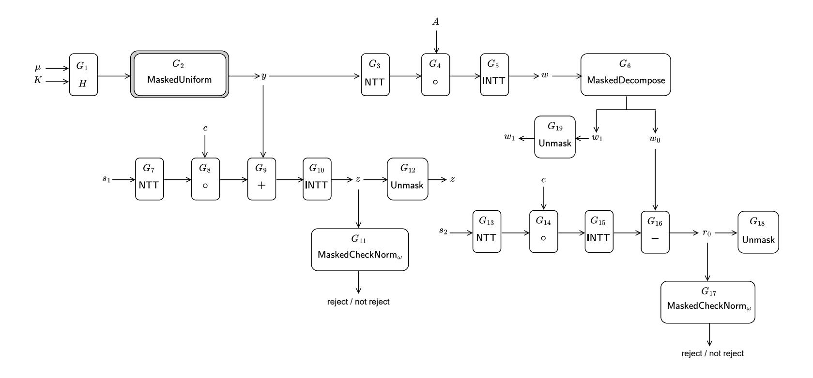

Figure 8: An abstract diagram of the Dilithium.MaskedSign. All the gadgets are at least t-NI. The t-NI gadgets are depicted with a single border, while the t-SNI gadget MaskedUniform is depicted with a double border.

- $G_{1-2}$ : As part of the ExpandMask function (Line 7), masked Keccak is used as the gadget  $G_1$  first, and after that MaskedUniform (Algorithm 4) is used as the gadget  $G_2$  to sample **y** from  $[-2^{\gamma-1}+1, 2^{\gamma-1}]$  following the uniform distribution.
- $G_{3-5}$ : NTT(y), NTT $(y) \circ A$ , and INTT $(NTT(y) \circ A)$  of Line 8 are all linear operations and are performed securely by applying them share-wise. The masked NTT(y), masked NTT $(y) \circ A$ , and masked INTT $(NTT(y) \circ A)$  are performed using  $G_3$ ,  $G_4$ , and  $G_5$  gadgets, respectively.
- $G_6$ : The decomposition function generates unmasked  $w_1$  used in  $\mathsf{HighBits}_q(\mathbf{w}, 2\gamma_2)$  (Line 9) and the arithmetic shares of  $w_0$  used in  $\mathsf{LowBits}_q(\mathbf{w} c\mathbf{s_2}, 2\gamma_2)$  (Line 13). It is performed using the MaskedDecompose function in Algorithm 6 as the gadget  $G_6$ .
- $G_{7-10}$ : NTT( $\mathbf{s_1}$ ), NTT(c) $\circ$ NTT( $\mathbf{s_1}$ ), NTT( $\mathbf{y}$ )+(NTT(c) $\circ$ NTT( $\mathbf{s_1}$ )), and INTT(NTT( $\mathbf{y}$ )+(NTT(c) $\circ$ NTT( $\mathbf{s_1}$ ))) carried out according to the operations presented in Line 12, which are all linear and can be masked by applying them share-wise. These are implemented using  $G_7$ ,  $G_8$ ,  $G_9$ , and  $G_{10}$  gadgets, respectively.
- $G_{13-16}$ : Similarly, NTT( $\mathbf{s_2}$ ), NTT(c) $\circ$ NTT( $\mathbf{s_2}$ ), INTT(NTT(c) $\circ$ NTT( $\mathbf{s_2}$ ), and  $\mathbf{w}-c\mathbf{s_2}$  (on low bits) are performed corresponding to the operations specified in Line 13. These are also linear and can be masked by applying them share-wise. These masked operations are carried out with gadgets  $G_{13}$ ,  $G_{14}$ ,  $G_{15}$ , and  $G_{16}$ , respectively.
- $G_{11}$  and  $G_{17}$ : The gadget MaskedCheckNorm<sub> $\omega$ </sub>, presented in Algorithm 5 is used as  $G_{11}$  and  $G_{17}$ .  $G_{11}$  and  $G_{17}$  are used to perform the first two rejection checks  $||\mathbf{z}||_{\infty} \geq \gamma_1 \beta$  and  $||\mathbf{r}_0||_{\infty} \geq \gamma_2 \beta$  on Line 14 securely.
- $G_{12}$ ,  $G_{18}$ , and  $G_{19}$ : These gadgets are used to unmask  $\mathbf{z}$ ,  $\mathbf{r}_0$ , and  $w_1$  securely.

Similar to the masked signing algorithm of Dilithium presented in [ABC<sup>+</sup>23], all gadgets of our masked signing algorithm are at least t-NI, and public variables are securely unmasked. Therefore, the masked signing algorithm achieves t-NI security, given the signature  $\sigma = (\mathbf{z}, \mathbf{h}, \bar{c})$  is a public output.

{25}------------------------------------------------

<span id="page-25-1"></span>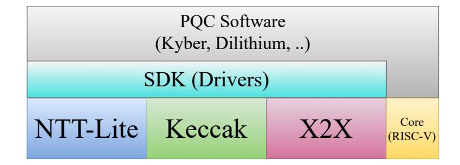

Figure 9: Software development stack for RISQrypt.

# **6 Software Layer**

In this section, we present the software layer of the RISQrypt PQC implementations. The software development stack is illustrated in [Figure 9.](#page-25-1) The SDK refers to the driver developed to interface with the RISQrypt hardware accelerators, NTT-Lite, Keccak, and X2X. In our implementations, the software is used almost entirely to orchestrate the process by issuing commands to the hardware accelerators and supplying address pointers for input and output data.

# **6.1 Unprotected Implementations**

Unprotected implementations cover all high-level APIs of Kyber and Dilithium (see [Figure 12](#page-35-1) and [Figure 14\)](#page-37-0). Recall that the integrated hardware accelerators cover nearly all subroutines. Hashing and extendable output functions are handled by the Keccak hardware, and polynomial arithmetic and supporting operations are performed by NTT-Lite using the related operation codes as detailed in [Section 4.](#page-9-0) The only exception is the SampleInBall function in Dilithium, which is not a computationally expensive operation and was therefore left for future work.

# <span id="page-25-0"></span>**6.2 Protected Implementations**

We now discuss the implementation of the software layers for the masked functions Kyber*.*CCAKem*.*MaskedDec and Dilithium*.*MaskedSign. The polynomial arithmetic in these functions, which is linear under arithmetic masking, is implemented in NTT-Lite via share-wise processing. Between processing of different shares, memory clearance feature of NTT-Lite is used (see [Section 4.3.2\)](#page-15-0). Similarly, hashing operations such as SHA or SHAKE, with or without masking, are executed by the Keccak accelerator, which supports first-order masking. The remaining parts of the algorithms consist of non-linear operations, as discussed in the previous section. We now discuss how each of these operations maps efficiently to NTT-Lite and X2X, enabled by the agile design of the architecture.

First, we discuss the non-linear algorithms used in Kyber. In [Algorithm 1,](#page-17-0) Refresh and B2A*<sup>q</sup>* are performed in a single command by X2X, avoiding double processing in the pipeline. This operation also leverages the 1-bit mode of X2X. The arithmetic in Line 7 consists of classical chained additions and subtractions implemented in NTT-Lite. For the rest of the non-linear algorithms, the constant operand feature of NTT-Lite is applied where relevant, although it is not explicitly mentioned in the discussion. In [Algorithm 2,](#page-18-0) a division by *q* is required, which is efficiently performed via Barrett reduction in NTT-Lite. It is worth noting that existing implementations using reduction mechanisms specific to Kyber's *q* cannot compute the quotient. Furthermore, this algorithm requires 32-bit (single-mode) processing because the dividend exceeds 16 bits, despite Kyber's general dual-mode operation. Switching between single-mode and half-mode is handled efficiently using OP\_ENCODE and OP\_DECODE, without involving software-level data processing. The shift in Line 8 is achieved via OP\_DECOMPRESS. In [Algorithm 3,](#page-19-0) the summations in Lines 9–17 are performed using OP\_ADD for array-wise additions, followed by a final OP\_SUM

{26}------------------------------------------------

to reduce across indices. The carrier prime *q* ′ is supported by NTT-Lite thanks to its configurability. Similarly, X2X allows the use of this modulus because it does not restrict the supported moduli to those of Kyber and Dilithium. Random sampling in Line 19 and Refresh in Line 21 are performed using the X2X accelerator. The MaskedPolyFromMsg algorithm (see G17 in [Section 5.1.4\)](#page-18-2) also leverages the 1-bit mode of X2X to perform the B2A bit-by-bit.

Next, we discuss the non-linear algorithms used in Dilithium. [Algorithm 4](#page-22-0) is a straightforward function to implement using NTT-Lite and X2X. [Algorithm 5](#page-23-0) similarly relies on the classical functionality of these units. Notably, this algorithm operates modulo 2 <sup>32</sup> in NTT-Lite for the subtraction in Line 4. In Line 6, the right-shift is implemented using OP\_DECOMPRESS. In [Algorithm 6,](#page-23-1) Line 9, it is again worth noting that X2X operates using moduli different from the default ones of Kyber and Dilithium. The boolean unmasking in Line 7 is currently not implemented in NTT-Lite. However, it is trivial to add, and performing it in software does not introduce microarchitectural leakage concerns, as the data is no longer security-sensitive.

# **7 Results**

In this section, we evaluate the proposed solution in terms of security and performance, and compare it with existing works in the literature. All source code related to the RISQrypt project is publicly accessible at will be provided soon . This includes the HDL sources regarding the hardware accelerators, the associated SDKs, software layers for PQC implementations, and SCA scripts including trace acquisition and testing.

# **7.1 Side-channel Leakage Evaluation**

Although we give a formal security proof for our side-channel-protected design, a practical evaluation is still necessary to uncover implementation issues such as transitional leakage. To this end, we performed a Test Vector Leakage Assessment (TVLA), a standard procedure widely used in the side-channel analysis literature [\[GGJR](#page-41-12)<sup>+</sup>11]. In TVLA, two sets of traces are captured from the evaluated implementation. A trace is a set power leakages recorded during the execution of cryptographic function. One of the sets is captured with a random input, while the other is captured with a fixed input. The masked implementation is approved if the two trace sets are statistically not different from each other, which evidences that the power leakage doesn't depend on secret data. Welch's *t*-test is used as the statistical tool to compare the random-input and the fixed-input set, which computes a metric called *t*-value. The greater the *t*-value, the more different both sets are from each other. In the test, the null hypothesis proposes that the fixed-input and random-input trace sets follow the same statistics. A typical threshold for *t*-value is 4.5 in absolute value, which provides 99.999% confidence to reject the null hypothesis.

We used the ChipWhisperer framework for the experiments. CW Husky[2](#page-26-0) is used for trace capturing while CW305[3](#page-26-1) target board which is equipped with an Artix-7 FPGA (XC7A100T) is used as the victim device running our implementation. The core clock of the victim device is set to 40 MHz. The trace collector facility is configured such that it collects four samples at each clock cycle. To validate our experimental setup, we also include the *t*-test results where the PRNG in the system is disabled. For this scenario, we collected 1K traces, whereas 100K traces were used when PRNG was enabled. We captured the fixed-input and random-input sets by randomly interleaving them to mitigate environmental bias [\[TG16\]](#page-43-9).

<span id="page-26-0"></span><sup>2</sup><https://rtfm.newae.com/Capture/ChipWhisperer-Husky/>

<span id="page-26-1"></span><sup>3</sup><https://rtfm.newae.com/Targets/CW305%20Artix%20FPGA/>

{27}------------------------------------------------

We evaluated both Kyber*.*CCAKem*.*MaskedDec and Dilithium*.*MaskedSign. In our analysis, the input refers to the secret key used by the mentioned functions. For Dilithium*.*MaskedSign, the t-test is complex due to the algorithm being non-constant time (e.g. rejection sampling). We therefore analyze only a single iteration of the rejection sampling loop and ignore rejections within that iteration. [Figure 10](#page-27-0) demonstrates the *t*-test results for both algorithms. With the randomness disabled (PRNG OFF), leakage is clearly observed after acquiring only 1K traces, as *t*-values are significantly higher than 4.5. On the other hand, when the PRNG is on, the *t*-values remain lower than 4.5, for both algorithms. This result proves the practical effectiveness of countermeasures implemented. We note that since our t-test analysis is performed using a large number of samples, false positives (Type I error) are expected [\[DZD](#page-40-8)<sup>+</sup>17, [BGG](#page-39-7)<sup>+</sup>14]. In [\[BGR](#page-39-6)<sup>+</sup>21], the authors use a more conservative threshold of 6.88 to reduce the probability of Type I error. Instead, we repeated the tests over the same intervals and consider effects that were not reproducible as false positives.

<span id="page-27-0"></span>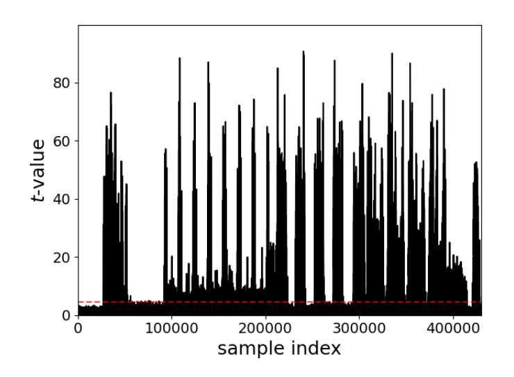

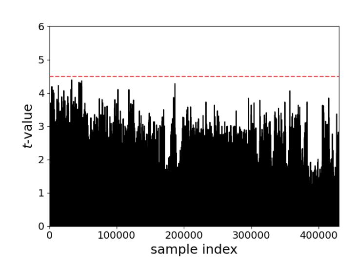

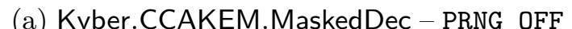

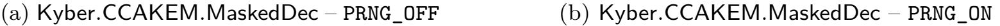

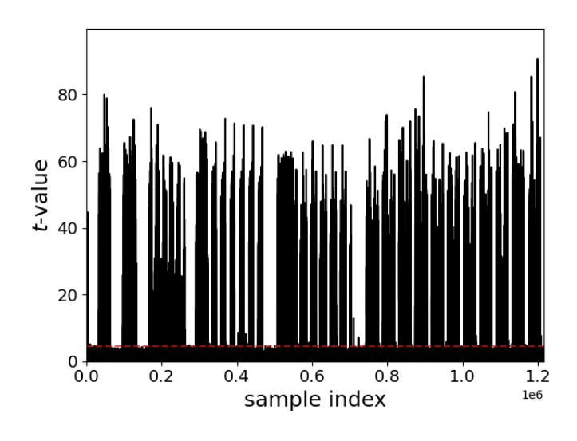

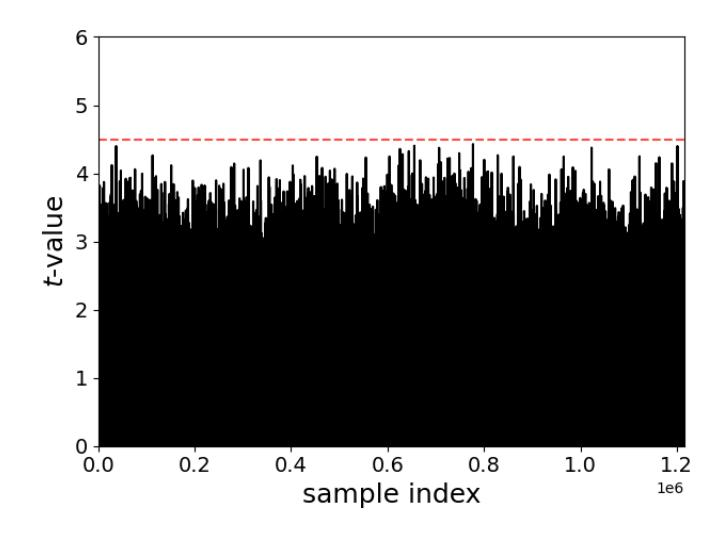

(c) Dilithium*.*MaskedSign – PRNG\_OFF (d) Dilithium*.*MaskedSign – PRNG\_ON

Figure 10: TVLA results under two configurations: PRNG\_OFF and PRNG\_ON.

# **7.2 Performance Evaluation**

To assess the effectiveness of the proposed hardware–software co-design, we conducted a comprehensive performance evaluation and compared it with existing implementations. By benchmarking against representative designs, we highlight the advantages of our approach in achieving lower latency while maintaining competitive hardware cost.

# **7.2.1 Hardware Overhead**

In [Table 4,](#page-28-0) we report the resource overhead of cryptographic accelerators in the proposed design. We implemented our design on Artix-7 XC7A100T-1CSG324C FPGA device

{28}------------------------------------------------

| Configuration<br>Crypto. Acc. | Mask. | LUT            | FF             | DSP              | BRAM        | Freq.<br>(MHz) |
|-------------------------------|-------|----------------|----------------|------------------|-------------|----------------|
| ✗                             | NA    | 5488           | 2703           | 0                | 80          | 63             |
| ✓<br>Crypto Overhead          | ✗     | 15672<br>10184 | 8126<br>5423   | ∗<br>9<br>∗<br>9 | 81.5<br>1.5 | 61             |
| ✓<br>Crypto Overhead          | ✓     | 30074<br>24586 | 21460<br>18757 | 15<br>15         | 81.5<br>1.5 | 60             |

<span id="page-28-0"></span>Table 4: FPGA resource overhead of cryptographic modules and masking.

using Xilinx Vivado 2023.2 in balanced option. In the table, we report FPGA resource consumption of three configurations. The first one is the base processor. Cryptographic accelerators are excluded, and the system contains only the RISC-V processor, memory and peripherals. In the second one, cryptographic accelerators are included, but masking is disabled as a reference. The X2X accelerator is absent and the Keccak accelerator does not support masking. This configuration serves as a performance and area reference. The third one is our proposed design, where cryptographic accelerators included with full masking support. By comparing the configurations with cryptographic acceleration, we quantify the overhead of acceleration with and without masking. The reported results align with our design expectations. Overall, the reported hardware overhead represents a reasonable cost for achieving both security and high performance. The maximum frequency of the system decreases modestly when cryptographic acceleration is enabled. However, timing analysis shows that the critical path lies on the Wishbone bus. This is due to the increased overall design size and a more constrained place-and-route process, rather than within the internal logic of the cryptographic accelerators. [Table 5](#page-29-0) presents a detailed breakdown of resource utilization for individual modules. For NTT-Lite, the BU consumes the majority of LUTs and all DSPs, as it implements the core polynomial arithmetic. The cost of EU and SU are relatively negligible. For Keccak and X2X, the core units also consume the largest portion of resources. In Keccak, FIFO and FSM also consume notably. The sponge function logic could be implemented in software to reduce FSM cost at the expense of performance (see [Section 3.2\)](#page-7-3). For reference, [Table 6](#page-29-1) shows the resource utilization of Keccak when masking is disabled, which approximately halves its resource consumption. This accounts for the observed overhead in LUT and FF usage. Accordingly, the cost of the modular multiplier in NTT-Lite decreases by 6 DSPs when masking is not considered (see [Section 4.2.2\)](#page-11-2). In X2X, the PRNG also consumes a large number of LUTs, but A2B/B2A conversion methods with less random number requirements can decrease this overhead, which we leave for future work.

Next, we present the results of ASIC synthesis for the proposed design in [Table 7.](#page-29-2) The design is synthesized using the TSMC 65nm Low-Power (LP) standard cell library. We evaluated the design at two target frequencies: 100 MHz and 500 MHz. The latter incurs an area overhead of approximately 6% relative to the 100 MHz baseline, resulting from the timing-driven optimizations required to meet the stricter timing constraints. Notably, NTT-Lite consumes significantly more area than the others, primarily due to its memory (BRAM-equivalent) requirements. Further area optimization of NTT-Lite for ASIC implementations is left as future work.

<sup>∗</sup> modular multiplier is not optimized for the unmasked scenario and theoretical number is reported. Maximum synthesisable frequencies are reported.

{29}------------------------------------------------

| Module          | LUT  | FF   | DSP | BRAM |
|-----------------|------|------|-----|------|
| NTT-Lite        | 5064 | 1934 | 15  | 1.5  |
| BU              | 2761 | 1092 | 15  | 0    |
| EU              | 331  | 73   | 0   | 0    |
| SU              | 413  | 99   | 0   | 0    |
| FSM + RAM       | 656  | 273  | 0   | 1.5  |
| Keccak          | 9777 | 7626 | 0   | 0    |
| Core            | 5512 | 4022 | 0   | 0    |
| FIFO            | 1024 | 3200 | 0   | 0    |
| FSM             | 3024 | 39   | 0   | 0    |
| X2X             | 9409 | 9163 | 0   | 0    |
| Core            | 3804 | 5084 | 0   | 0    |
| PRNG            | 3341 | 1090 | 0   | 0    |
| FSM + Reg. File | 1225 | 1265 | 0   | 0    |

<span id="page-29-0"></span>Table 5: FPGA resource utilization of individual modules

<span id="page-29-1"></span>Table 6: FPGA resource utilization of Keccak when masking is disabled.

| Module | LUT  | FF   | DSP | BRAM |
|--------|------|------|-----|------|
| Keccak | 4792 | 3455 | 0   | 0    |
| Core   | 2355 | 1617 | 0   | 0    |
| FIFO   | 416  | 1600 | 0   | 0    |
| FSM    | 1900 | 38   | 0   | 0    |

Table 7: ASIC synthesis results of cryptographic modules.

<span id="page-29-2"></span>

| Module       | Area (µm2<br>) @ 100 MHz | Area (µm2<br>) @ 500 MHz |  |  |
|--------------|--------------------------|--------------------------|--|--|
| NTT-Lite     | 271938                   | 304825                   |  |  |
| Keccak       | 131513                   | 131939                   |  |  |
| X2X          | 123122                   | 125883                   |  |  |
| Crypto total | 526573                   | 562647                   |  |  |

## **7.2.2 Time Performance**

Table 8: Time performance comparison with prior work.

<span id="page-29-3"></span>

| Work      | Kyber768 |      |      | Dilithium3 |        |       |        |            |
|-----------|----------|------|------|------------|--------|-------|--------|------------|
|           | KeyGen   | Enc  | Dec  | MaskedDec  | KeyGen | Sign  | Verify | MaskedSign |
| RISQrypt  | 23       | 28   | 35   | 109        | 120    | 480   | 126    | 1230       |
| [FVR+22]  | 214      | 298  | 313  | 1235       | –      | –     | –      | –          |
| [WZZ+24]  | 536      | 671  | 639  | –          | 2087   | 5003  | 1986   | –          |
| [DMMM23]  | 663      | 856  | 1083 | –          | –      | –     | –      | –          |
| [NDMZ+21] | 6951     | 7321 | 8621 | –          | 2975   | 10212 | 2964   | –          |
| [MCL+23]  | –        | –    | –    | –          | 2642   | 5462  | 2812   | –          |
| [MBB+23]  | –        | –    | –    | –          | 479    | 3988  | 511    | –          |
| [KSFS24]  | –        | –    | –    | –          | 1068   | 3253  | 1127   | –          |

Reported numbers are in thousands of clock cycles. <sup>1</sup> Based on INDCPA timing. <sup>2</sup> Estimated based on the reported clock frequency.

[Table 8](#page-29-3) presents the time performance of our implementation in comparison with

{30}------------------------------------------------

related work from the literature. Developed source codes for RISQrypt's software layer is compiled with RISC-V toolchain using -O3 option to speed optimize. Reported numbers are in thousands of clock cycles. For our solution, mean clock cycles are reported by taking the average over 1024 experiments with uniformly random input. For the existing works, the reported figures are taken directly from the corresponding publications. For Kyber, the performance of CCAKEM functions are reported. Input message length is set to 32B for Dilithium.

As shown, our design outperforms the literature significantly, in all functions of Kyber and Dilithium. For Kyber*.*INDCCA*.*MaskedDec, there is only a single work that we can compare our work to, which is [\[FVR](#page-40-1)<sup>+</sup>22]. That study is the closest to our work in terms of scope and also reports the best performance among the existing literature. The authors propose instruction set extensions for Keccak and mask conversions and a loosely coupled accelerator for polynomial arithmetic. However, since their mask conversion engine and Keccak accelerator are implemented as instruction set extensions, their flexibility and overall efficiency are inherently limited. As a result, our implementation outperforms their reported Kyber*.*INDCCA*.*MaskedDec performance by a factor of **11***.***3**×. A similar performance advantage is observed for the unmasked functions. In particular, for Kyber*.*INDCCA*.*Keygen, Kyber*.*INDCCA*.*Enc, and Kyber*.*INDCCA*.*Dec, our implementation achieves speed-ups of **9***.***3**×, **10***.***6**×, and **8***.***9**×, respectively.

For Dilithium*.*MaskedSign, there is **no comparable work in the literature**. Although [\[WZZ](#page-43-1)<sup>+</sup>24] also consider masking in their implementation, the applied countermeasure is limited to polynomial arithmetic. Therefore, their reported results for masked functions are not directly comparable to ours. Nevertheless, we compare our performance against unprotected implementations reported in the literature. Compared to the closest reported timing of [\[MCL](#page-42-5)<sup>+</sup>23] [4](#page-30-0) , our implementation achieves speedups of **2***.***19**×, **1***.***14**×, and **2***.***23**×, for Dilithium*.*Keygen, Dilithium*.*Sign, and Dilithium*.*Verify, respectively. We note that [\[MCL](#page-42-5)<sup>+</sup>23] only focuses exclusively on Dilithium and does not provide a masked implementation. However, despite the narrower scope, their acceleration strategy is conceptually similar to ours, as they also employ loosely coupled accelerators for both NTT and Keccak while leaving a small portion of the computation to software.

In general, the primary reason for the superiority of our work is that, with the exception of [\[MCL](#page-42-5)<sup>+</sup>23], none of the existing studies employ loosely coupled accelerators for all required primitives. The works [\[NDMZ](#page-42-4)<sup>+</sup>21] and [\[MBB](#page-41-2)<sup>+</sup>23] focus on tightly coupled accelerators and consequently achieve only a limited level of acceleration. Although [\[WZZ](#page-43-1)<sup>+</sup>24] does not rely on tightly coupled acceleration, it does not include a hardware accelerator for Keccak and instead applies software-level optimizations. In [\[KSFS24\]](#page-41-7), similar to [\[FVR](#page-40-1)<sup>+</sup>22], the authors employ a tightly coupled accelerator for Keccak while using a loosely coupled accelerator for the NTT. As a result, their performance remains below ours. Furthermore, [\[DMMM23\]](#page-40-2) accelerates only Keccak. Overall, our superior performance demonstrates the advantage of employing loosely coupled accelerators for all primary operations.

In [Figure 11,](#page-31-0) we analyze the time share of each accelerator in the system. Again, mean values are reported over 1024 experiments with uniformly random inputs. Observe that NTT-Lite dominates the running time for all functions. This offers an opportunity to further speed-up the design by integrating more computation resources, i.e., multiple BUs, into NTT-Lite, which we leave for future work. It also confirms our design goal of supporting all arithmetic operations within NTT-Lite, in both masked and unmasked functions. The second most time-consuming accelerator for masked functions is X2X. In contrast, Keccak accounts for only a small fraction of the total execution time in

<span id="page-30-0"></span><sup>4</sup>The authors of [\[MCL](#page-42-5)+23] do not report clock cycle counts directly. Instead, they provide execution times in milliseconds, the operating frequencies of the target platforms (666 MHz for hardware and 150 MHz for software) and the ratio of hardware-accelerated subroutines as 0*.*94. We estimate a combined effective frequency as 176 ≈ 666 · (1 − 0*.*94) + 150 · 0*.*94 and compute the corresponding clock cycles based on the reported timings and this estimated frequency.

{31}------------------------------------------------

<span id="page-31-0"></span>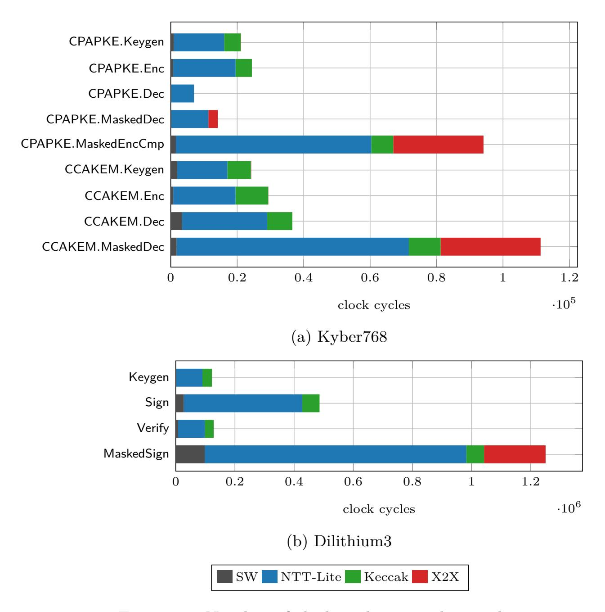

Figure 11: Number of clock cycles spent by accelerators.

our implementation, unlike the hashing bottlenecks reported in prior software-oriented studies [\[KRSS19\]](#page-41-13). The software execution contributes less than 8% of the total cycle count across all evaluated functions, highlighting the effectiveness and functional coverage of the proposed hardware acceleration. Particularly, it takes roughly 2% of the total cycles for Kyber*.*INDCCA*.*MaskedDec and 8% of the total cycles for Dilithium*.*MaskedSign. The ratio of mask conversion operations done by X2X in Kyber*.*INDCCA*.*MaskedDec is greater compared to Dilithium*.*MaskedSign, amounting to 27% and 16%, respectively. In Dilithium*.*MaskedSign, NTT-Lite accounts for 70% of the operations.

To further study the efficiency of our design for masked implementations, we report the time performance of the non-linear algorithms in [Table 9](#page-32-0) for both Kyber and Dilithium. Except for MaskedZeroTestVec, the algorithms were presented in single-word form in [Section 5,](#page-16-0) while the time performance reported here corresponds to the execution of these algorithms on the entire polynomial in R*q,n*. Moreover, we report the time cost of pseudo-random sampling performed by Keccak accelerator, denoted by XOF. This applies to MaskedCBD and MaskedUniform, as these process the pseudo-random data produced (see [Figure 7](#page-20-0) and [Figure 8\)](#page-24-0). Observe that all of the utilized non-linear gadgets are realized highly efficiently, spending a few thousand clock cycles. Interestingly, the overhead of XOF to MaskedCBD is very small, around %4. We note that in XOF + MaskedCBD, the Keccak overhead is limited to the FIFO read operation, as the block permutation is executed in parallel with the MaskedCBD logic. For MaskedUniform used in Dilithium, the overhead of Keccak is around %30, since Keccak processes multiple blocks in this case and therefore must wait for the completion of the block permutation until all the blocks are squeezed. Although MaskedSubCompress and MaskedPolyToMsg are based on the same algorithm

{32}------------------------------------------------

<span id="page-32-0"></span>(Algorithm 2), the first takes more time as it requires 32-bit arithmetic.

| Kyber768                  |      | $\parallel$ Dilithium3        |      |  |  |  |
|---------------------------|------|-------------------------------|------|--|--|--|
| MaskedCBD                 | 3733 | MaskedUniform                 | 3639 |  |  |  |
| XOF + MaskedCBD           | 3894 | XOF + MaskedUniform           | 4714 |  |  |  |
| ${\sf MaskedSubCompress}$ | 5443 | ${\sf MaskedCheckNorm}\omega$ | 6720 |  |  |  |
| ${\sf MaskedPolyFromMsg}$ | 1177 | MaskedDecompose               | 7632 |  |  |  |
| ${\sf MaskedPolyToMsg}$   | 2037 |                               |      |  |  |  |
| MaskedZeroTestVec         | 8765 |                               |      |  |  |  |

Table 9: Time performance of non-linear algorithms in clock cycles.

Table 10: Code size comparison with prior work.

<span id="page-32-1"></span>

|                  | Kyber768 |          | Dilithium3  |         |          |  |
|------------------|----------|----------|-------------|---------|----------|--|
| $\mathbf{Work}$  | Masking  | Size (B) | Work        | Masking | Size (B) |  |
| RISQrypt         | <b>√</b> | 17612    | RISQrypt    | ✓       | 18848    |  |
| $[FVR^+22]$      | /        | 28554    |             |         |          |  |
| ${\bf RISQrypt}$ | ×        | 10236    | RISQrypt    | ×       | 14324    |  |
| $[FVR^+22]$      | ×        | 13028    | $[WZZ^+24]$ | ×       | 32120*   |  |
| $[WZZ^{+}24]$    | ×        | 32520*   | [KSFS24]    | ×       | 20052    |  |

<sup>\*</sup> Reported for Kyber1024 and Dilithium5; no significant difference is expected with respect to the security level.

Code size is another crucial consideration in embedded systems. In Table 10, we report the code size of our implementation and compare it with existing works from the literature. We present the code sizes separately for the masked and unmasked configurations, as different source files are compiled depending on the scenario. For example, in the masked configuration for Kyber, the compiled implementation includes Kyber.INDCCA.Keygen, Kyber.INDCCA.Enc, and Kyber.INDCCA.MaskedDec, whereas the unmasked configuration includes Kyber.INDCCA.Dec. The same approach is followed for Dilithium. The results show that our design is also competitive in terms of code size compared to prior work. The primary reason for this advantage is the reduced software workload, as also evidenced by the profiling results.

### 7.2.3 Area-Time Comparison

In this section we perform an area-time evaluation of our architecture and demonstrate that the area overhead is reasonable given the achieved performance improvements. Computing the Area-Time Product (ATP) for HW/SW co-designs is non-trivial; therefore, we adopt the following methodology. First, we estimate the hardware area overhead using  $Area_{HW} =$  $LUT + FF/2 + DSP \cdot 309 + BRAM \cdot 564$ , which expresses all resources in LUT-equivalent units. The coefficients 309 and 564 were obtained by forcing Vivado to synthesize a  $16 \times 16$ -bit multiplier and a  $1024 \times 32$  memory block using LUTs only, as previously done [PHGCGP22]. The multiplier size matches the core multiplication width of our architecture, while the memory configuration corresponds to the maximum depth of a single BRAM in Artix-7 with 32-bit data width. Since we consider HW/SW co-designs, we also include the area cost of the software processor. We use the area of the HORNET core employed in RISQrypt, as reported in Table 4, excluding BRAM usage. Specifically,  $Area_{Core} = LUT_{Core} + FF_{Core}/2 = 6839.5$ . We then estimate the area overhead of the software by converting the reported code size into an equivalent number of BRAM blocks  $Area_{SW} = BRAM_{Code} = Code Size/4096$ . The division by 4096 reflects the byte capacity of a single  $1024 \times 32$  BRAM block. The total area is then computed as Area<sub>T</sub> =

{33}------------------------------------------------

| Work      | Plat<br>form | Archi<br>tecture | LUT/FF/DSP/BRAM AreaHW Sch      |               | eme    | AreaSW/T                 | ATP                                          |  |
|-----------|--------------|------------------|---------------------------------|---------------|--------|--------------------------|----------------------------------------------|--|
| Masked    |              |                  |                                 |               |        |                          |                                              |  |
| RISQrypt  | ▲            | L                | 24586/18757/15/1.5              | 39.45         | K<br>D | 2.42/48.71<br>2.6/48.88  | 11.2/13.63/53.09<br>58.65/601.22/61.58       |  |
| [FVR+22]  | ▲            | L, T             | 16979/8834/7/20.5               | 35.12         | K      | 3.97/45.93               | 98.3/136.88/567.28                           |  |
|           | Unprotected  |                  |                                 |               |        |                          |                                              |  |
| RISQrypt  | ▲            | L                | 10184/5423/9/1.5                | 16.52         | K<br>D | 1.4/24.77<br>1.97/25.33  | 5.7/6.94/8.67<br>30.40/121.6/31.92           |  |
| [FVR+22]  | ▲            | L, T             | 7687/3515/7/4.5                 | 14.15         | K      | 1.79/22.78               | 48.75/67.88/71.3                             |  |
| [WZZ+24]  | ▼            | L                | 3087/1050/4/3<br>6639/1660/16/3 | 6.54<br>14.11 | K<br>D | 4.59/17.97<br>4.57/25.52 | 96.33/120.59/114.84<br>532.55/1276.63/506.77 |  |
| [DMMM23]  | ▲            | L                | 7128/3798/0/0                   | 9.02          | K      | NA/18.42                 | 122.16/157.73/199.56                         |  |
| [NDMZ+21] | ◆            | T                | 178/0/5/0.5<br>377/0/10/0.5     | 2.01<br>3.75  | K<br>D | NA/11.4<br>NA/14.28      | 79.26/83.48/98.31<br>424.71/1457.86/423.14   |  |
| [MBB+23]  | ▼            | T                | 459/0/2/0                       | 1.08          | D      | NA/11.6                  | 55.58/462.77/59.3                            |  |
| [MCL+23]  | ▼            | L                | 13128/11556/4/14                | 28.04         | D      | NA/37.93                 | 100.13/207.10/106.58                         |  |

<span id="page-33-0"></span>Table 11: Hardware utilization of our work compared to designs from the literature. Only the overhead of cryptographic modules are considered.

HW/SW co-design approaches: (L) Loosely coupled, (T) Tightly coupled. Platforms: (▲) Artix7, (▼) Zynq700, (◆) ZCU106, (■) Zynq Ultrascale+. ✢ Limited SCA protection. ATP: KeyGen/Enc/(Masked)Dec (K) or KeyGen/(Masked)Sign/Verify (D)

[\[KSFS24\]](#page-41-7) ■ L, T 7219/3238/7/6 14.43 D 2.76/24.03 256.65/781.71/270.82

AreaHW+AreaCore+AreaSW and the Area–Time Product is defined as ATP = (Area·time). We exclude the clock frequency from the comparison, as it strongly depends on the target platform. For example, both our design and [\[FVR](#page-40-1)<sup>+</sup>22] use a soft RISC-V core on an Artix-7 FPGA, which results in relatively low operating frequencies; both implementations report clock frequencies of around 60 MHz. On the other hand, platforms such as Zynq-7000, which integrate an ARM processor, can reach up to 150 MHz, as reported in [\[MCL](#page-42-5)<sup>+</sup>23]. A fully fair comparison would require porting all designs to a common platform and re-evaluating them under identical conditions; however, such an effort would be engineering-intensive and beyond the scope of this work. We underline that our goal is not to rank prior works against one another, but rather to justify the hardware overhead of our design by demonstrating that its ATP remains superior.

[Table 11](#page-33-0) presents the computed ATP results of our work compared to the related designs from the literature. The results show that RISQrypt provides promising ATP results compared to the existing work. Although our design is slightly larger in most cases, its high performance compensates for the area overhead, resulting in a favorable overall cost. [\[FVR](#page-40-1)<sup>+</sup>22] utilizes 31% fewer LUTs and 53% fewer FFs compared to our design. Recall that the authors of [\[FVR](#page-40-1)<sup>+</sup>22] propose tightly coupled accelerators for Keccak and mask conversion. Despite their lower area consumption, our solution achieves approximately **10***.***68**× better ATP results for Kyber*.*MaskedDec. This once again highlights the advantage of our loosely coupled accelerator architecture across all operations. Moreover, our design

{34}------------------------------------------------

supports both Kyber and Dilithium, which is not reflected in the ATP computation. In the unprotected setting, the tightly coupled designs of [\[MBB](#page-41-2)<sup>+</sup>23[,NDMZ](#page-42-4)<sup>+</sup>21] also stand out due to their very low area overhead. However, once again, the performance advantage of our solution outweighs their smaller area footprint, leading to superior ATP results overall.

In some cases, even the absolute area results of the compared works are higher than ours. The area results of [\[WZZ](#page-43-1)<sup>+</sup>24] for Dilithium are very close to ours, while for Kyber their design achieves approximately 33% lower area. However, these results correspond to two separate, scheme-specific architectures, whereas our measurements are based on a unified architecture supporting both Kyber and Dilithium. When their two dedicated designs are deployed together to provide support for both schemes, the total area cost becomes approximately 66% higher than ours. The area overhead of [\[KSFS24\]](#page-41-7) is also comparable to ours, although slightly lower. Area estimate of [\[MCL](#page-42-5)<sup>+</sup>23] is 50% higher than our design, while supporting only Dilithium. Moreover, their modular reduction unit is specialized to the specific structure of Dilithium's modulus *q*, which limits generality. Considering that our solution also achieves better time performance, we significantly outperform these works in terms of ATP. Specifically, our design achieves a **1***.***7**× better ATP compared to [\[MCL](#page-42-5)<sup>+</sup>23] for Dilithium*.*Sign.

For this comparison, certain missing data points had to be estimated, as not all ingredients required for the ATP computation are consistently reported in the literature. In particular, the studies [\[NDMZ](#page-42-4)<sup>+</sup>21,[MCL](#page-42-5)+23,[MBB](#page-41-2)<sup>+</sup>23,[DMMM23\]](#page-40-2) do not provide code size information. For [\[NDMZ](#page-42-4)<sup>+</sup>21] and [\[MBB](#page-41-2)<sup>+</sup>23], we used the code size of a clean Dilithium implementation compiled with the RISC-V toolchain, as reported in [\[KSFS24\]](#page-41-7). For [\[MCL](#page-42-5)<sup>+</sup>23], we computed a code size by taking the average of the reported code sizes of works that support Dilithium and employ loosely coupled acceleration, namely our implementation, [\[WZZ](#page-43-1)<sup>+</sup>24], and [\[KSFS24\]](#page-41-7). Similarly for [\[DMMM23\]](#page-40-2) and [\[NDMZ](#page-42-4)<sup>+</sup>21], we took the average of the Kyber code size reported by us, [\[FVR](#page-40-1)<sup>+</sup>22], and [\[WZZ](#page-43-1)<sup>+</sup>24]. These decisions do not affect the conclusions drawn in this section.

# **8 Conclusion**

We presented RISQrypt, a HW/SW co-design framework for secure, fast, and agile implementations of PQC. Our architecture integrates three dedicated hardware accelerators: NTT-Lite for polynomial arithmetic, Keccak, and X2X for A2B/B2A mask conversions. We introduced NTT-Lite as a new, ground-up design in this work, adopting a run-time configurable design approach and optimized for both half- and full- word lengths needed by Kyber and Dilithium. We showed that all sub-routines in Kyber and Dilithium are supported by the functionality of integrated hardware accelerators. Most importantly, we presented efficient implementations for both Kyber*.*CCAKEM*.*MaskedDec and Dilithium*.*MaskedSign, and demonstrated that they are side-channel secure both theoretically and in practice. We also discussed that the required building blocks for the masked implementations are also fully supported by X2X and NTT-Lite, avoiding data processing in the software core, which could otherwise introduce microarchitectural leakage. We showed that having a dedicated accelerator for each major computational primitive is essential to achieving high performance. As a result, our implementation achieves an order of magnitude speed-up over the state-of-the-art.

An additional advantage of employing a programmable polynomial arithmetic accelerator is the resulting agility of the design. Our hardware platform can be extended to support other algorithms built on similar primitives, such as Falcon [\[FHK](#page-40-9)<sup>+</sup>18] and SPHINCS+ [\[BHH](#page-39-8)<sup>+</sup>15] from the PQC standards. Moreover, it enables efficient and side-channel-secure implementations of client-side functions in Fully Homomorphic Encryption (FHE) schemes, including encryption and decryption for BFV [\[Bra12,](#page-39-9) [FV12\]](#page-40-10)

{35}------------------------------------------------

and CKKS [CKKS17]. The transciphering algorithm PASTA [DGH<sup>+</sup>23] can also be implemented on the proposed platform with side-channel protection. PASTA is an FHE-friendly block cipher designed such that its ciphertext can be efficiently decrypted within homomorphic evaluation. We leave the detailed implementation and evaluation of these additional algorithms for future work.

# 9 Acknowledgments

This work is partially supported by the European Union's Horizon Europe research and innovation program under grant agreement No: 101079319 and by TUBITAK under Grant Number 122E222.

# **Appendices**

# <span id="page-35-0"></span>A Kyber and Dilithium Algorithm Definitions

<span id="page-35-1"></span>Algorithm specifications of Kyber and Dilithium are presented in Figure 12, Figure 13, and Figure 14.

```
Kyber.CCAKEM.KeyGen .....
    1. z \leftarrow \mathcal{B}^{32}
    2. (pk, sk') = \text{Kyber.CPAPKE.KeyGen}(\lambda)
   3. sk = (sk'||z)
   4. return (pk, sk)
\mathsf{Kyber}.\mathsf{CCAKEM}.\mathsf{Enc}(pk) \qquad \dots \\
    1. m \leftarrow \mathcal{B}^{32}
    2. m = H(m)
    3. (K',r) = G(m||H(pk))
   4. c = \mathsf{Kyber}.\mathsf{CPAPKE}.\mathsf{Enc}(pk, m, r)
    5. K = \mathsf{KDF}(K'||\mathsf{H}(c))
    6. return (c, K)
Kyber.CCAKEM.Dec(c, sk, pk) .....
    1. (sk'||z) = sk
    2. m' = \text{Kyber.CPAPKE.Dec}(sk', c)
    3. (K', r) = G(m'||H(pk))
    4. c' = \text{Kyber.CPAPKE.Enc}(pk, m', r)
    5. If c = c'
          return K = \mathsf{KDF}(K'||\mathsf{H}(c))
    6.
    7. Else
          return K = \mathsf{KDF}(z||\mathsf{H}(c))
    8.
```

Figure 12: Kyber.CCAKEM algorithms from [BDK<sup>+</sup>22].

{36}------------------------------------------------

```
Kyber.CPAPKE.KeyGen() .....
     1. d \leftarrow \mathcal{B}^{32}
     2. (\rho, \sigma) = G(d)
     3. For i = 0 to k - 1
             For j = 0 to k - 1
     4.
                 \bm{A}[i][j] = \mathsf{Parse}(\mathsf{XOF}(\rho, j, i))
     5.
     6. For i = 0 to k - 1
             \mathbf{s}[i] = \mathsf{CBD}_{\eta_1}(\mathsf{PRF}(\sigma, i))
     7.
     8.
             \mathbf{e}[i] = \mathsf{CBD}_{\eta_1}(\mathsf{PRF}(\sigma, i+k))
     9. \bar{\mathbf{s}} = \mathsf{NTT}(\mathbf{s})
   10. \bar{\mathbf{e}} = \mathsf{NTT}(\mathbf{e})
   11. \mathbf{t} = \mathbf{A} \circ \bar{\mathbf{s}} + \bar{\mathbf{e}}
   12. pk = \mathsf{Encode}_{12}(\bar{\mathbf{t}}||\rho)
   13. sk = \mathsf{Encode}_{12}(\bar{\mathbf{s}})
   14. return (pk, sk)
Kyber.CPAPKE.Enc(pk, m, r) .....
     1. (\mathbf{t}||\rho) = \mathsf{Decode}_{12}(pk)
     2. For i = 0 to k - 1
     3.
             For j = 0 to k - 1
                 \bar{A}[i][j] = \mathsf{Parse}(\mathsf{XOF}(\rho, j, i))
     4.
     5. For i = 0 to k - 1
             \mathbf{r}[i] = \mathsf{CBD}_{\eta_1}(\mathsf{PRF}(r,i))
     6.
             \mathbf{e}_1[i] = \mathsf{CBD}_{\eta_2}(\mathsf{PRF}(r, i+k))
     7.
     8. e_2[i] = CBD_{\eta_2}(PRF(r, i+2k))
     9. \bar{\mathbf{r}} = \mathsf{NTT}(\mathbf{r})
   10. \mathbf{u} = \mathsf{INTT}(\mathbf{A} \circ \bar{\mathbf{r}}) + \mathbf{e_1}
   11. \mathbf{c}_1 = \mathsf{Compress}_q(\mathbf{u}, d_u)
   12. v = \mathsf{INTT}(\bar{\mathbf{t}} \circ \bar{\mathbf{r}}) + e_2 + \mathsf{Decompress}_q(\mathsf{Decode}_1(m), 1)
   13. c_2 = \mathsf{Compress}_q(v, d_v)
   14. return c = (\mathbf{c_1} || c_2)
Kyber.CPAPKE.Dec(sk, c)
                                             .........
     1. (c_1||c_2) = \mathsf{Decode}_{12}(c)
     2. \bar{\mathbf{s}} = \mathsf{Decode}_{12}(sk)
     3. \mathbf{u} = \mathsf{Decompress}_q(c_1, d_u)
     4. v = \mathsf{Decompress}_q(c_2, d_v)
     5. \ \ m = \mathsf{Compress}_q(v - \mathsf{INTT}(\bar{\mathbf{s}} \circ \mathsf{NTT}(\mathbf{u})), 1)
     6. return m
```

Figure 13: Kyber.CPAPKE algorithms from [BDK<sup>+</sup>22].

{37}------------------------------------------------

```
Dilithium.KeyGen(\lambda) .....
       1. \zeta \leftarrow \mathcal{B}^{32}
       2. (\rho, \varsigma, K) = H(\zeta)
       3. (\mathbf{s_1}, \mathbf{s_2}) \in S_{\eta}^{\ell} \times S_{\eta}^{k} = \mathbf{H}(\varsigma)
       4. \bar{\mathbf{A}} \in \mathcal{R}_q^{k \times \ell} = \mathsf{ExpandA}(\rho)
       5. \mathbf{t} = \mathsf{INTT}(\bar{\mathbf{A}} \circ \mathsf{NTT}(\mathbf{s_1})) + \mathbf{s_2}
       6. (\mathbf{t_1}, \mathbf{t_0}) = \mathsf{Power2Round}_q(\mathbf{t}, d)
       7. tr = CRH(\rho||\mathbf{t_1})
       8. pk = (\rho, \mathbf{t_1})
       9. sk = (\rho, K, tr, \mathbf{s_1}, \mathbf{s_2}, \mathbf{t_0})
     10. return (pk, sk)
Dilithium.Sign(sk, M, rnd) .....
       1. \bar{\mathbf{A}} \in \mathcal{R}_q^{k \times \ell} = \mathsf{ExpandA}(\rho)
       2. \mu = CRH(tr||M)
       3. \rho' = \mathsf{CRH}(K||rnd||\mu)
       4. \kappa = 0
       5. (z, h) = \bot
       6. While (\mathbf{z}, \mathbf{h}) = \perp
                \mathbf{y} \in S_{\gamma_1}^{\tilde{\ell}} = \mathsf{ExpandMask}(\rho', \kappa)
       7.
                \mathbf{w} = \mathsf{INTT}(\bar{\mathbf{A}} \circ \mathsf{NTT}(\mathbf{y}))
       8.
               \mathbf{w_1} = \mathsf{HighBits}_{a}(\mathbf{w}, 2\gamma_2)
       9.
     10.
               \tilde{c} = H(\mu, \mathbf{w_1})
     11.
                c \in \mathcal{B}_{\tau} = \mathsf{SampleInBall}(\tilde{\mathsf{c}})
     12.
                 \mathbf{z} = \mathbf{y} + c\mathbf{s_1}
                 \mathbf{r_0} = \mathsf{LowBits}_q(\mathbf{w} - c\mathbf{s_2}, 2\gamma_2)
     13.
                 If (||\mathbf{z}||_{\infty} \ge \gamma_1 - \beta) or (||\mathbf{r_0}||_{\infty} \ge \gamma_2 - \beta)
     14.
     15.
                      (\mathbf{z}, \mathbf{h}) = \perp
     16.
                 Else
     17.
                      \mathbf{h} = \mathsf{MakeHint}_q(-c\mathbf{t_0}, \mathbf{w} - c\mathbf{s_2} + c\mathbf{t_0}, 2\gamma_2)
                      If (||c\mathbf{t_0}||_{\infty} \ge \gamma_2) or (# of 1's in \mathbf{h} > \omega)
     18.
     19.
                           (\mathbf{z}, \mathbf{h}) = \perp
                  \kappa = \kappa + \ell
     20.
     21. Return \sigma = (\mathbf{z}, \mathbf{h}, \tilde{c})
Dilithium. Verify (pk, M, \sigma) .....
       1. \bar{\mathbf{A}} \in \mathcal{R}_q^{k \times \ell} = \mathsf{ExpandA}(\rho)
       2. \mu = \mathsf{CRH}(\mathsf{CRH}(\rho||\mathbf{t_1})||M)
       3. c = SampleInBall(\tilde{c})
       \mathbf{4.} \ \mathbf{w}' = \mathsf{INTT}(\bar{\mathbf{A}} \circ \mathsf{NTT}(\mathbf{z}) - \mathsf{NTT}(c) \circ \mathsf{NTT}(\mathbf{t_1} \cdot 2^d))
       5. \mathbf{w_1}' = \mathsf{UseHint}_q(\mathbf{h}, \mathbf{w}', 2\gamma_2)
       6. \tilde{c}' = H(\mu, \mathbf{w_1}')
       7. If (||\mathbf{z}||_{\infty} < \gamma_1 - \beta) and (# of 1's in \mathbf{h} < \omega) and (\tilde{c} = \tilde{c}')
       8.
                 Return True
       9. Else
     10.
                  Return False
```

Figure 14: Dilithium algorithms from  $[DKL^+22]$ .

{38}------------------------------------------------

# **References**

<span id="page-38-1"></span>[AB75] R.C. Agarwal and C.S. Burrus. Number theoretic transforms to implement fast digital convolution. *Proceedings of the IEEE*, 63(4):550–560, 1975.

- <span id="page-38-10"></span>[ABC<sup>+</sup>23] Melissa Azouaoui, Olivier Bronchain, Gaëtan Cassiers, Clément Hoffmann, Yulia Kuzovkova, Joost Renes, Tobias Schneider, Markus Schönauer, François-Xavier Standaert, and Christine van Vredendaal. Protecting dilithium against leakage: Revisited sensitivity analysis and improved implementations. *IACR Transactions on Cryptographic Hardware and Embedded Systems*, 2023(4):58–79, 2023.
- <span id="page-38-5"></span>[AHKS22] Amin Abdulrahman, Vincent Hwang, Matthias J Kannwischer, and Amber Sprenkels. Faster kyber and dilithium on the cortex-m4. In *International Conference on Applied Cryptography and Network Security*, pages 853–871. Springer, 2022.
- <span id="page-38-0"></span>[Ajt96] M. Ajtai. Generating hard instances of lattice problems (extended abstract). In *Proceedings of the Twenty-Eighth Annual ACM Symposium on Theory of Computing*, STOC '96, page 99–108, New York, NY, USA, 1996. Association for Computing Machinery.
- <span id="page-38-2"></span>[BAA23] Luke Beckwith, Abubakr Abdulgadir, and Reza Azarderakhsh. A flexible shared hardware accelerator for nist-recommended algorithms crystals-kyber and crystals-dilithium with sca protection. In *Cryptographers' Track at the RSA Conference*, pages 469–490. Springer, 2023.
- <span id="page-38-7"></span>[Bar87] Paul Barrett. Implementing the Rivest Shamir and Adleman public key encryption algorithm on a standard digital signal processor. In Andrew M. Odlyzko, editor, *CRYPTO'86*, volume 263 of *LNCS*, pages 311–323. Springer, Berlin, Heidelberg, August 1987.
- <span id="page-38-6"></span>[BBD<sup>+</sup>16] Gilles Barthe, Sonia Belaïd, François Dupressoir, Pierre-Alain Fouque, Benjamin Grégoire, Pierre-Yves Strub, and Rébecca Zucchini. Strong noninterference and type-directed higher-order masking. In *Proceedings of the 2016 ACM SIGSAC Conference on Computer and Communications Security*, CCS '16, page 116–129, New York, NY, USA, 2016. Association for Computing Machinery.
- <span id="page-38-3"></span>[BC22] Olivier Bronchain and Gaëtan Cassiers. Bitslicing arithmetic/boolean masking conversions for fun and profit: with application to lattice-based kems. *IACR Transactions on Cryptographic Hardware and Embedded Systems*, 2022(4):553–588, Aug. 2022.
- <span id="page-38-8"></span>[BDH<sup>+</sup>21] Shivam Bhasin, Jan-Pieter D'Anvers, Daniel Heinz, Thomas Pöppelmann, and Michiel Van Beirendonck. Attacking and defending masked polynomial comparison for lattice-based cryptography. *IACR Cryptol. ePrint Arch.*, page 104, 2021.
- <span id="page-38-9"></span>[BDK<sup>+</sup>21] Michiel Van Beirendonck, Jan-Pieter D'anvers, Angshuman Karmakar, Josep Balasch, and Ingrid Verbauwhede. A side-channel-resistant implementation of saber. *J. Emerg. Technol. Comput. Syst.*, 17(2), apr 2021.
- <span id="page-38-4"></span>[BDK<sup>+</sup>22] Joppe W. Bos, Léo Ducas, Eike Kiltz, Tancrède Lepoint, Vadim Lyubashevsky, John M. Schanck, Peter Schwabe, Gregor Seiler, and Damien

{39}------------------------------------------------

- Stehlé. Crystals-kyber algorithm specifications and supporting documentation. Technical report, National Institute of Standards and Technology, 2022. Round 3 Submission.
- <span id="page-39-0"></span>[BDPA12] Guido Bertoni, Joan Daemen, Michaël Peeters, and Gilles Van Assche. The Keccak sha-3 submission. In *Proceedings of the Round 3 SHA-3 Workshop*, 2012. Retrieved: 2025-12-07.
- <span id="page-39-7"></span>[BGG<sup>+</sup>14] Josep Balasch, Benedikt Gierlichs, Vincent Grosso, Oscar Reparaz, and François-Xavier Standaert. On the cost of lazy engineering for masked software implementations. In *International Conference on Smart Card Research and Advanced Applications*, pages 64–81. Springer, 2014.
- <span id="page-39-6"></span>[BGR<sup>+</sup>21] Joppe W. Bos, Marc Gourjon, Joost Renes, Tobias Schneider, and Christine van Vredendaal. Masking Kyber: First- and higher-order implementations. *IACR TCHES*, 2021(4):173–214, 2021.
- <span id="page-39-8"></span>[BHH<sup>+</sup>15] Daniel J. Bernstein, Daira Hopwood, Andreas Hülsing, Tanja Lange, Ruben Niederhagen, Louiza Papachristodoulou, Michael Schneider, Peter Schwabe, and Zooko Wilcox-O'Hearn. SPHINCS: Practical stateless hash-based signatures. In Elisabeth Oswald and Marc Fischlin, editors, *EUROCRYPT 2015, Part I*, volume 9056 of *LNCS*, pages 368–397. Springer, Berlin, Heidelberg, April 2015.
- <span id="page-39-1"></span>[BNG21] Luke Beckwith, Duc Tri Nguyen, and Kris Gaj. High-performance hardware implementation of crystals-dilithium. In *2021 International Conference on Field-Programmable Technology (ICFPT)*, pages 1–10. IEEE, 2021.
- <span id="page-39-9"></span>[Bra12] Zvika Brakerski. Fully homomorphic encryption without modulus switching from classical GapSVP. In Reihaneh Safavi-Naini and Ran Canetti, editors, *CRYPTO 2012*, volume 7417 of *LNCS*, pages 868–886. Springer, Berlin, Heidelberg, August 2012.
- <span id="page-39-2"></span>[CGL<sup>+</sup>24] Jean-Sébastien Coron, François Gérard, Tancrède Lepoint, Matthias Trannoy, and Rina Zeitoun. Improved high-order masked generation of masking vector and rejection sampling in dilithium. *IACR Transactions on Cryptographic Hardware and Embedded Systems*, 2024(4):335–354, Sep. 2024.
- <span id="page-39-4"></span>[CGMZ21] Jean-Sébastien Coron, François Gérard, Simon Montoya, and Rina Zeitoun. High-order polynomial comparison and masking lattice-based encryption. Cryptology ePrint Archive, Paper 2021/1615, 2021.
- <span id="page-39-5"></span>[CGMZ23] Jean-Sébastien Coron, François Gérard, Simon Montoya, and Rina Zeitoun. High-order polynomial comparison and masking lattice-based encryption. *IACR Transactions on Cryptographic Hardware and Embedded Systems*, pages 153–192, 2023.
- <span id="page-39-3"></span>[CGTZ23] Jean-Sébastien Coron, François Gérard, Matthias Trannoy, and Rina Zeitoun. Improved gadgets for the high-order masking of dilithium. *IACR Transactions on Cryptographic Hardware and Embedded Systems*, 2023(4), 2023.
- <span id="page-39-10"></span>[CKKS17] Jung Hee Cheon, Andrey Kim, Miran Kim, and Yong Soo Song. Homomorphic encryption for arithmetic of approximate numbers. In Tsuyoshi Takagi and Thomas Peyrin, editors, *ASIACRYPT 2017, Part I*, volume 10624 of *LNCS*, pages 409–437. Springer, Cham, December 2017.

{40}------------------------------------------------

<span id="page-40-3"></span>[CKRG<sup>+</sup>24] Xavier Carril, Charalampos Kardaris, Jordi Ribes-GonzáLez, Oriol Farràs, Carles Hernandez, Vatistas Kostalabros, Joel Ulises González-Jiménez, and Miquel Moreto. Hardware acceleration for high-volume operations of crystals-kyber and crystals-dilithium. *ACM Transactions on Reconfigurable Technology and Systems*, 17(3):1–26, 2024.

- <span id="page-40-5"></span>[D<sup>+</sup>15] Morris J Dworkin et al. Sha-3 standard: Permutation-based hash and extendable-output functions. 2015.
- <span id="page-40-11"></span>[DGH<sup>+</sup>23] Christoph Dobraunig, Lorenzo Grassi, Lukas Helminger, Christian Rechberger, Markus Schofnegger, and Roman Walch. Pasta: A case for hybrid homomorphic encryption. *IACR TCHES*, 2023(3):30–73, 2023.
- <span id="page-40-0"></span>[DH76] W. Diffie and M. Hellman. New directions in cryptography. *IEEE Transactions on Information Theory*, 22(6):644–654, 1976.
- <span id="page-40-4"></span>[DKL<sup>+</sup>22] Léo Ducas, Eike Kiltz, Tancrède Lepoint, Vadim Lyubashevsky, Peter Schwabe, Gregor Seiler, and Damien Stehlé. Crystals-dilithium algorithm specifications and supporting documentation. Technical report, National Institute of Standards and Technology, 2022. NIST PQC Selected Algorithm Submission, Version 3.02.
- <span id="page-40-2"></span>[DMMM23] Alessandra Dolmeta, Mattia Mirigaldi, Maurizio Martina, and Guido Masera. Implementation and integration of keccak accelerator on RISC-V for crystals-kyber. In *Proceedings of the 20th ACM International Conference on Computing Frontiers*, CF '23, page 381–382, New York, NY, USA, 2023. Association for Computing Machinery.
- <span id="page-40-7"></span>[DVBV22] Jan-Pieter D'Anvers, Michiel Van Beirendonck, and Ingrid Verbauwhede. Revisiting higher-order masked comparison for lattice-based cryptography: Algorithms and bit-sliced implementations. *IEEE Transactions on Computers*, 72(2):321–332, 2022.
- <span id="page-40-8"></span>[DZD<sup>+</sup>17] A Adam Ding, Liwei Zhang, François Durvaux, François-Xavier Standaert, and Yunsi Fei. Towards sound and optimal leakage detection procedure. In *International Conference on Smart Card Research and Advanced Applications*, pages 105–122. Springer, 2017.
- <span id="page-40-9"></span>[FHK<sup>+</sup>18] Pierre-Alain Fouque, Jeffrey Hoffstein, Paul Kirchner, Vadim Lyubashevsky, Thomas Pornin, Thomas Prest, Thomas Ricosset, Gregor Seiler, William Whyte, Zhenfei Zhang, et al. Falcon: Fast-fourier lattice-based compact signatures over ntru. *Submission to the NIST's post-quantum cryptography standardization process*, 36(5):1–75, 2018.
- <span id="page-40-10"></span>[FV12] Junfeng Fan and Frederik Vercauteren. Somewhat practical fully homomorphic encryption. IACR Cryptology ePrint Archive, Report 2012/144, 2012.
- <span id="page-40-1"></span>[FVR<sup>+</sup>22] Tim Fritzmann, Michiel Van Beirendonck, Debapriya Basu Roy, Patrick Karl, Thomas Schamberger, Ingrid Verbauwhede, and Georg Sigl. Masked accelerators and instruction set extensions for post-quantum cryptography. *IACR TCHES*, 2022(1):414–460, 2022.
- <span id="page-40-6"></span>[GD23] John Gaspoz and Siemen Dhooghe. Threshold implementations in software: Micro-architectural leakages in algorithms. *IACR TCHES*, 2023(2):155–179, 2023.

{41}------------------------------------------------

- <span id="page-41-12"></span>[GGJR<sup>+</sup>11] Benjamin Jun Gilbert Goodwill, Josh Jaffe, Pankaj Rohatgi, et al. A testing methodology for side-channel resistance validation. In *NIST non-invasive attack testing workshop*, volume 7, pages 115–136, 2011.
- <span id="page-41-4"></span>[GLK21] Wenbo Guo, Shuguo Li, and Liang Kong. An efficient implementation of kyber. *IEEE Transactions on Circuits and Systems II: Express Briefs*, 69(3):1562–1566, 2021.
- <span id="page-41-1"></span>[GSM17] Hannes Gross, David Schaffenrath, and Stefan Mangard. Higher-order sidechannel protected implementations of keccak. Cryptology ePrint Archive, Paper 2017/395, 2017.
- <span id="page-41-3"></span>[HHLW20] Yiming Huang, Miaoqing Huang, Zhongkui Lei, and Jiaxuan Wu. A pure hardware implementation of crystals-kyber pqc algorithm through resource reuse. *IEICE Electronics Express*, 17(17):20200234–20200234, 2020.
- <span id="page-41-8"></span>[HKL<sup>+</sup>22] Daniel Heinz, Matthias J Kannwischer, Georg Land, Thomas Pöppelmann, Peter Schwabe, and Daan Sprenkels. First-order masked kyber on arm cortex-m4. *Cryptology ePrint Archive*, 2022.
- <span id="page-41-9"></span>[ISW03] Yuval Ishai, Amit Sahai, and David Wagner. Private circuits: Securing hardware against probing attacks. In Dan Boneh, editor, *Advances in Cryptology - CRYPTO 2003*, pages 463–481, Berlin, Heidelberg, 2003. Springer Berlin Heidelberg.
- <span id="page-41-5"></span>[JGCS24] Arpan Jati, Naina Gupta, Anupam Chattopadhyay, and Somitra Kumar Sanadhya. A configurable crystals-kyber hardware implementation with side-channel protection. *ACM transactions on embedded computing systems*, 23(2):1–25, 2024.
- <span id="page-41-11"></span>[Kar63] Anatolii Karatsuba. Multiplication of multidigit numbers on automata. In *Soviet physics doklady*, volume 7, pages 595–596, 1963.
- <span id="page-41-10"></span>[KDVB<sup>+</sup>22] Suparna Kundu, Jan-Pieter D'Anvers, Michiel Van Beirendonck, Angshuman Karmakar, and Ingrid Verbauwhede. Higher-order masked saber. In *International Conference on Security and Cryptography for Networks*, pages 93–116. Springer, 2022.
- <span id="page-41-6"></span>[KNAH22] Tendayi Kamucheka, Alexander Nelson, David Andrews, and Miaoqing Huang. A masked pure-hardware implementation of kyber cryptographic algorithm. In *2022 International Conference on Field-Programmable Technology (ICFPT)*, pages 1–1. IEEE, 2022.
- <span id="page-41-0"></span>[Kob87] Neal Koblitz. Elliptic curve cryptosystems. *Mathematics of Computation*, 48(177):203–209, 1987.
- <span id="page-41-13"></span>[KRSS19] Matthias J Kannwischer, Joost Rijneveld, Peter Schwabe, and Ko Stoffelen. pqm4: Testing and benchmarking nist pqc on arm cortex-m4. 2019.
- <span id="page-41-7"></span>[KSFS24] Patrick Karl, Jonas Schupp, Tim Fritzmann, and Georg Sigl. Post-quantum signatures on risc-v with hardware acceleration. *ACM Transactions on Embedded Computing Systems*, 23(2):1–23, 2024.
- <span id="page-41-2"></span>[MBB<sup>+</sup>23] Konstantina Miteloudi, Joppe W Bos, Olivier Bronchain, Björn Fay, and Joost Renes. Pq. v. alu. e: Post-quantum risc-v custom alu extensions on dilithium and kyber. In *International Conference on Smart Card Research and Advanced Applications*, pages 190–209. Springer, 2023.

{42}------------------------------------------------

<span id="page-42-5"></span>[MCL<sup>+</sup>23] Gaoyu Mao, Donglong Chen, Guangyan Li, Wangchen Dai, Abdurrashid Ibrahim Sanka, Çetin Kaya Koç, and Ray C. C. Cheung. Highperformance and configurable sw/hw co-design of post-quantum signature crystals-dilithium. *ACM Trans. Reconfigurable Technol. Syst.*, 16(3), June 2023.

- <span id="page-42-7"></span>[MGTF19] Vincent Migliore, Benoît Gérard, Mehdi Tibouchi, and Pierre-Alain Fouque. Masking dilithium: Efficient implementation and side-channel evaluation. In *Applied Cryptography and Network Security: 17th International Conference, ACNS 2019, Bogota, Colombia, June 5–7, 2019, Proceedings 17*, pages 344–362. Springer, 2019.
- <span id="page-42-9"></span>[NDKV25] Quinten Norga, Jan-Pieter D'Anvers, Suparna Kundu, and Ingrid Verbauwhede. X2X: Low-randomness and high-throughput A2B and B2A conversions for d+1 shares in hardware. In *Constructive Approaches for Security Analysis and Design of Embedded Systems: First International Conference, CASCADE 2025, Saint-Etienne, France, April 2–4, 2025, Proceedings*, page 119–158, Berlin, Heidelberg, 2025. Springer-Verlag.
- <span id="page-42-4"></span>[NDMZ<sup>+</sup>21] Pietro Nannipieri, Stefano Di Matteo, Luca Zulberti, Francesco Albicocchi, Sergio Saponara, and Luca Fanucci. A risc-v post quantum cryptography instruction set extension for number theoretic transform to speed-up crystals algorithms. *IEEE Access*, 9:150798–150808, 2021.
- <span id="page-42-10"></span>[OSPG18] Tobias Oder, Tobias Schneider, Thomas Pöppelmann, and Tim Güneysu. Practical cca2-secure and masked ring-lwe implementation. *IACR Transactions on Cryptographic Hardware and Embedded Systems*, 2018(1):142–174, Feb. 2018.
- <span id="page-42-8"></span>[ÖY23] Sıla Özeren and Oğuz Yayla. Methods for masking crystals-kyber against side-channel attacks. In *2023 16th International Conference on Information Security and Cryptology (ISCTürkiye)*, pages 1–6. IEEE, 2023.
- <span id="page-42-11"></span>[PHGCGP22] Francisco Pajuelo-Holguera, José M. Granado-Criado, and Juan A. Gómez-Pulido. Fast montgomery modular multiplier using fpgas. *IEEE Embedded Systems Letters*, 14(1):19–22, 2022.
- <span id="page-42-3"></span>[Reg05] Oded Regev. On lattices, learning with errors, random linear codes, and cryptography. In *Proceedings of the Thirty-seventh Annual ACM STOC*, pages 84–93, Baltimore, MD, USA, 2005.
- <span id="page-42-1"></span>[RSA78] R. L. Rivest, A. Shamir, and L. Adleman. A method for obtaining digital signatures and public-key cryptosystems. *Commun. ACM*, 21(2):120–126, February 1978.
- <span id="page-42-0"></span>[Sch90] C. P. Schnorr. Efficient identification and signatures for smart cards. In Gilles Brassard, editor, *Advances in Cryptology — CRYPTO' 89 Proceedings*, pages 239–252, New York, NY, 1990. Springer New York.
- <span id="page-42-6"></span>[Sha79] Adi Shamir. How to share a secret. *Commun. ACM*, 22(11):612–613, November 1979.
- <span id="page-42-2"></span>[Sho94] P.W. Shor. Algorithms for quantum computation: discrete logarithms and factoring. In *Proceedings 35th Annual Symposium on Foundations of Computer Science*, pages 124–134, 1994.

{43}------------------------------------------------

- <span id="page-43-6"></span>[SPOG19] Tobias Schneider, Clara Paglialonga, Tobias Oder, and Tim Güneysu. Efficiently masking binomial sampling at arbitrary orders for lattice-based crypto. In *Public-Key Cryptography – PKC 2019: 22nd IACR International Conference on Practice and Theory of Public-Key Cryptography, Beijing, China, April 14-17, 2019, Proceedings, Part II*, page 534–564, Berlin, Heidelberg, 2019. Springer-Verlag.
- <span id="page-43-9"></span>[TG16] Michael Tunstall and Gilbert Goodwill. Applying tvla to public key cryptographic algorithms. *Cryptology ePrint Archive*, 2016.
- <span id="page-43-8"></span>[TMS24] Tolun Tosun, Amir Moradi, and Erkay Savas. Exploiting the central reduction in lattice-based cryptography. *IEEE Access*, 12:166814–166833, 2024.
- <span id="page-43-2"></span>[WWL<sup>+</sup>24] Nuo Wang, Liji Wu, Lei Li, Munkhbaatar Chinbat, and Xiangmin Zhang. Design and implementation of a ntt accelerator based on RISC-V for pqc kyber. In *2024 IEEE 18th International Conference on Anti-counterfeiting, Security, and Identification (ASID)*, pages 24–27, 2024.
- <span id="page-43-5"></span>[WZCG22] Tengfei Wang, Chi Zhang, Pei Cao, and Dawu Gu. Efficient implementation of dilithium signature scheme on fpga soc platform. *IEEE Transactions on Very Large Scale Integration (VLSI) Systems*, 30(9):1158–1171, 2022.
- <span id="page-43-1"></span>[WZZ<sup>+</sup>24] Tengfei Wang, Chi Zhang, Xiaolin Zhang, Dawu Gu, and Pei Cao. Optimized hardware-software co-design for kyber and dilithium on risc-v soc fpga. *IACR Transactions on Cryptographic Hardware and Embedded Systems*, 2024(3):99–135, 2024.
- <span id="page-43-3"></span>[XL21] Yufei Xing and Shuguo Li. A compact hardware implementation of ccasecure key exchange mechanism crystals-kyber on fpga. *IACR Transactions on Cryptographic Hardware and Embedded Systems*, pages 328–356, 2021.
- <span id="page-43-7"></span>[YTO21] Yasin Yilmaz, Yavuz Selim Tozlu, and Berna Örs. Design and implementation of a 32-bit RISC-V core. page 460 – 464, 2021.
- <span id="page-43-0"></span>[ZSS<sup>+</sup>21] Sara Zarei, Aein Rezaei Shahmirzadi, Hadi Soleimany, Raziyeh Salarifard, and Amir Moradi. Low-latency Keccak at any arbitrary order. *IACR TCHES*, 2021(4):388–411, 2021.
- <span id="page-43-4"></span>[ZZW<sup>+</sup>22] Cankun Zhao, Neng Zhang, Hanning Wang, Bohan Yang, Wenping Zhu, Zhengdong Li, Min Zhu, Shouyi Yin, Shaojun Wei, and Leibo Liu. A compact and high-performance hardware architecture for crystals-dilithium. *IACR Transactions on Cryptographic Hardware and Embedded Systems*, pages 270–295, 2022.