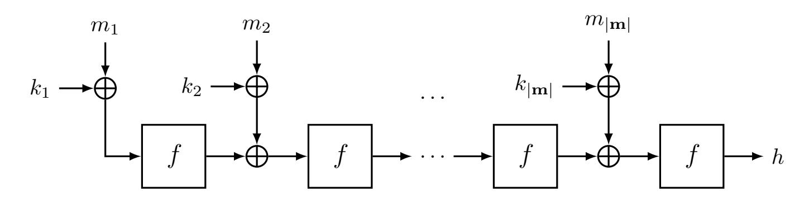
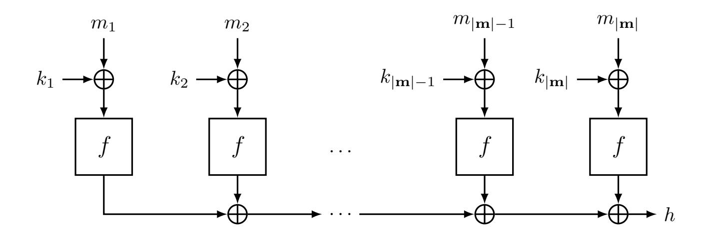
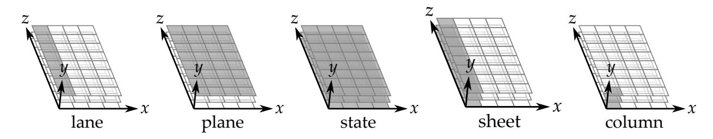

{0}------------------------------------------------

# **On the Equivalence of Forgery and Key Recovery in Key-Then-Hash Functions**

Jonathan Fuchs

Radboud University, Nijmegen, The Netherlands [jonathan.fuchs@ru.nl](mailto:jonathan.fuchs@ru.nl)

#### **Abstract.**

For any key-then-hash function, there is no security gap between key recovery and forgery. The expected cost of recovering the key given differential-based forgery, in the information-theoretic setting, is logarithmic in the number of solutions to the underlying differential equation. The notion of weak-key classes as defined by Handschuh and Preneel in their CRYPTO 2008 paper does not apply to key-then-hash functions. Every key is equally vulnerable, and the attack complexity is entirely determined by the universality bound. This applies to four out of six keyed hash function families studied in their paper, namely, NH, NMH, WH and Square Hash. In this paper, we revisit the analysis done in 2008 to NH through the lens of the key-then-hash framework. We are able to prove that the properties attributed to the class of weak keys in NH are actually intrinsic to the whole key space. Furthermore, this result can be generalized to any key-then-hash function. We demonstrate this generality by applying our framework to key-then-hash constructions instantiated with Xoodoo[3] and Square Hash, and show that an efficient key recovery is possible.

**Keywords:** message authentication codes, key recovery, key-then-hash, offset-invariance, NH, Xoodoo, Square Hash

# **1 Introduction**

Keyed hash functions are families of hash functions that take variable-input-length messages and transform them into fixed-length outputs. One selects a function from the family through the usage of a key. When the probability of guessing the output difference of the keyed hash function for any pair of inputs, taken over all possible keys, is negligible, we call them universal hash functions (UHF) [\[Sti91\]](#page-19-0). There are many types of universal hash functions, but for the purpose of our paper, we focus on two specific kinds [\[Sti95\]](#page-19-1). The first kind is when we can prove an upper bound on the probability of the output difference being 0, i.e., two inputs leading to the same output. The second kind satisfies a stronger requirement. We require that the probability that any pair of inputs results in a difference ∆ is upper bounded by some value *ε* that is negligible. We call such functions *ε*-universal in the first case and *ε*-∆-universal in the second. UHFs are used in cryptography to turn fixed-input-length (FIL) keyed functions into variable-inputlength (VIL) keyed functions. When the keyed function has high pseudorandom function security we call it FIL/VIL PRF for short. There are typically three ways of combining a UHF and a FIL-PRF. One way is to feed the output of the UHF *F* into a FIL-PRF *g*: *m* 7→ *g*(*k, F*(*k* 0 *, m*)) [\[BCK96\]](#page-17-0). The second way is to use a nonce to encrypt the output of the UHF: (*m, N*) 7→ *g*(*k, N*) + *F*(*k* 0 *, m*) [\[WC81\]](#page-19-2). The third way is to use the UHF as a one-time authenticator by using part of the output of a PRF as a one-time key for the UHF. This method is used in the popular AEAD ChaCha20-Poly1305 [\[Ber05,](#page-17-1)[NL18\]](#page-18-0). 

{1}------------------------------------------------

The security of the resulting VIL-PRF depends on the PRF advantage of *g* and on the *ε*-universality of *F* in the first case and *ε*-∆-universality in the second and third case.

Key-then-hash (KTH) functions are a family of UHF formalized by Fuchs et al. in CRYPTO 2023 [\[FRD23\]](#page-18-1). They are the family of keyed hash functions that add the secret key to the input string using some group addition and then process the resulting string with an unkeyed (public) function. In their paper, they show two constructions, a serial and a parallel one, that build a KTH function using a public permutation. They prove that the universality of such constructions is upper bounded by the maximum differential probability of the underlying public permutation. Later on, Ghosh et al. generalized this result for the parallel construction to include public functions, i.e., functions that are not necessarily a bijection [\[GFAD23\]](#page-18-2).

In 2008, Handschuh and Preneel published an influential paper in CRYPTO [\[HP08\]](#page-18-3) highlighting classes of weak keys in UHF-based message authentication code (MAC) functions. One MAC function that they highlight is UMAC [\[BHK](#page-17-2)<sup>+</sup>99] by Black et al. that makes use of NH, a UHF based on integer multiplication. Although the KTH concept was defined long after NH, NH is in fact a KTH function and therefore behaves accordingly. In this paper, we will revisit the analysis done on NH in [\[HP08\]](#page-18-3) through the lens of the KTH framework. We prove that the properties of the weak key class identified for NH by Handschuh and Preneel can be generalized such that any key is in such a so-called weak key class. Furthermore, we prove that this property is not unique to NH but actually applies to any KTH function. This has direct implications on the results of [\[HP08\]](#page-18-3), as four out of six keyed hash function families they study are KTH functions: NH, NMH, WH and Square Hash.

This allows us to prove that if an attacker is able to generate existential forgeries then they are able to generate universal forgeries by means of key recovery. Conversely, it also allows us to prove that KTH functions with sufficiently low universality are also resistant to key-recovery attacks. The bound we prove is an information-theoretic bound in the expected cost of queries to the oracles to recover the key once a forgery has occurred. Follow-up work on weak key classes for UHF based on polynomial evaluations (PE) has been done by Procter and Cid in [\[PC13\]](#page-18-4) and Abdelraheem et al. in [\[ABBT15\]](#page-16-0). We compare their methods and conclusions to ours in a dedicated Section [8](#page-14-0) of this paper. Our results in this paper allow us to claim that the security of KTH-based MACs is fully characterized by the universality bound of the underlying public function. Instead of being wary about the existence of weak key classes in a KTH function, one should rather look for weak KTH functions.

## **1.1 Contributions**

We list our contributions below.

- We revisit the analysis on weak key classes done to NH [\[BHK](#page-17-2)<sup>+</sup>99, [HP08\]](#page-18-3) using the KTH framework. In their original work, Handschuh and Preneel prove that a weak key class for NH exists when at least two subkeys *k*2*i*−1*, k*2*<sup>i</sup>* ∈ **k** = (*k*1*, k*2*, k*3*, k*4*, . . . , k*2*κ*−1*, k*2*κ*) are equal. We demonstrate that this holds for any linear relation of the type *k*2*i*−<sup>1</sup> = *k*2*<sup>i</sup>* + ∆. This generalization allows us to define weak key classes covering all keys of the key space, demonstrating that this "weakness" is inherent to the construction and not a specific subspace of the key space.
- We generalize our results on NH to any KTH function. We prove that the weak key behavior that was found by Handschuh and Preneel is a more generic property of differentials over the underlying public function. We come up with an algorithm that is able to retrieve the secret key given a successful forgery using differentials, when used in Wegman-Carter or Protected Hash MAC, i.e., the adversary queries

{2}------------------------------------------------

some messages with a known input difference and is able to successfully predict the difference at the output of the universal hash function. We prove that our algorithm has an expected run time for optimal adversaries that is logarithmic in the number of solutions to the differential equations.

- We show how to apply a key-recovery attack to the serial and parallel KTH construction given a differential-based forgery and report on the expected number of queries required for an optimal adversary. Our results confirm that the security of these schemes is strictly dictated by the difficulty of generating the initial forgery.
- We apply our results to the serial KTH construction instantiated by XOODOO[3]. We show how the algebraic degree of the non-linear layer can be used to decide which forgeries to attempt and how to compute back the secret key. We are able to recover the secret 384-bit key block with a query complexity of approximately 2<sup>42</sup>.
- We apply our results to the Square Hash function. We independently arrive at the characterization of weak keys found by Procter and Cid and generalize them further. We show that the "weakness" is actually a generic property of the squaring operation in the KTH context, reinforcing the equivalence between forgery and key recovery for this class of functions.

Collectively, these results show that for KTH functions, the concepts of existential forgery, universal forgery, and key recovery collapse to the same security level, determined solely by the universality of the construction. The weak key concerns raised in [HP08] for NH, Square Hash, and related constructions are an artifact of analyzing specific key subsets rather than the construction as a whole.

## 2 Notation and Definitions

We define in this section the basic concepts and notation required for understanding the paper.

#### 2.1 Notation

The keyed hash functions we study in this paper take as input strings of variable length. The strings are composed of elements of the abelian group  $\langle G, + \rangle$  with 0 denoting the neutral element. We refer to single elements of G as blocks. The space of all strings composed of  $\ell$  blocks is denoted as  $G^{\ell}$ . Strings are denoted in bold, i.e.,  $\mathbf{m} \in G^{\ell}$ , with the block  $m_i$  indexed from 1 to  $\ell$ .  $\kappa$  denotes the maximum acceptable length for input strings. The space of keys is defined as  $G^{\kappa}$ . The space containing all strings of length 1 to  $\kappa$  is denoted as  $\mathrm{BS}(G,\kappa) = \bigcup_{\ell=1}^{\kappa} \mathrm{G}^{\ell}$ .  $|\mathbf{m}| \in \mathbb{Z}_{\geq 0}$  denotes the number of blocks in a given string  $\mathbf{m}$ . Finally, a keyed hash function is denoted as  $F \colon \mathrm{G}^{\kappa} \times \mathrm{BS}(G,\kappa) \to \mathrm{G}'$ , with  $\mathrm{G}'$  another abelian group  $\langle G', + \rangle$  that we refer to as the digest space.

#### 2.2 Universal Hash Functions

We speak of the universality or  $\Delta$ -universality of a keyed hash function. We provide Stinson's definitions of these properties but adapted to our notation.

**Definition 1** ( $\varepsilon$ -universality [Sti95]). A keyed hash function F is said to be  $\varepsilon$ -universal if for any distinct strings  $\mathbf{m}, \mathbf{m}^*$ 

$$\Pr[F_{\mathbf{k}}(\mathbf{m}) = F_{\mathbf{k}}(\mathbf{m}^*)] \le \varepsilon,$$

with the probability taken over the key space.

{3}------------------------------------------------

**Definition 2** (*ε*-∆-universality [\[Sti95\]](#page-19-1))**.** A keyed hash function *F* is said to be *ε*-∆-universal if for any distinct strings **m***,* **m**<sup>∗</sup> and for all ∆ ∈ G<sup>0</sup>

$$\Pr[F_{\mathbf{k}}(\mathbf{m}) - F_{\mathbf{k}}(\mathbf{m}^*) = \Delta] \le \varepsilon,$$

with the probability taken over the key space.

# **2.3 Message Authentication Codes**

We define the type of UHF-based message authentication codes we use for our analysis and their respective interfaces.

### **Wegman-Carter(-Shoup) Authenticators**

Wegman-Carter(-Shoup) (WC(S)) authenticators are constructed using two functions, a UHF *F* and a FIL-PRF (or pseudorandom permutation) that we denote as *g* : K × G<sup>∗</sup> → G<sup>0</sup> [\[WC81,](#page-19-2) [Sho96\]](#page-19-3). The message authentication code *T* ∈ G<sup>0</sup> is computed as *T* = *F*(**k***,* **m**) + *g*(*k, N*) for some input string **m** ∈ BS(G*, κ*), a nonce *N* ∈ G<sup>∗</sup> and a secret key pair (**k***, k*) ∈ G*<sup>κ</sup>* × K. Security is modeled as resistance against existential forgery. An attacker has access to two oracles, a signing one and a verifying one, allowing them to generate and verify tags without the knowledge of the secret keys. The signing oracle Sign: BS(G*, κ*)×G<sup>∗</sup> → G<sup>0</sup>∪{⊥} takes an input string and a nonce and returns the valid tag if the nonce is respected or ⊥ otherwise. The verifying oracle Verif: BS(G*, κ*)×G<sup>∗</sup> ×G<sup>0</sup> → {>*,* ⊥} takes a payload containing an input string, a nonce and a tag and returns > if the tag authenticates the input string and nonce pair, or returns ⊥ otherwise. The attacker is considered successful if they can generate a payload (**m***, N, T*) without using Sign for which Verif(**m***, N, T*) = >. We assume in our analysis that the verifying oracle allows for nonce-misuses. The success probability of a single forgery attempt, assuming *g* has optimal PRF security, is given by the ∆-universality of *F*.

### **Protected Hash Authenticators**

Similarly to the WC(S) authenticators, protected hash (PH) authenticators combine a UHF and a PRF: **m** 7→ *g*(*k, F*(**k***,* **m**)) [\[BCK96\]](#page-17-0). Security is modeled as a distinguishing advantage between the PH construction and a random oracle [\[BR93\]](#page-17-3). Since a secure PRF implies a secure MAC, the upper bound on the distinguishing advantage implies the security against forgery of this construction. The attacker's advantage depends on the PRF security of *g* and the universality of *F*. The attacker has access to a generating oracle Sign: BS(G*, κ*) → G<sup>0</sup> and a verifying oracle Verif: BS(G*, κ*) × G<sup>0</sup> → {>*,* ⊥}, and its goal is to generate a forgery. The attacker has to find two inputs **m** 6= **m**<sup>∗</sup> such that *F* **<sup>k</sup>**(**m**) = *F* **<sup>k</sup>**(**m**<sup>∗</sup> ) =⇒ Sign(**m**) = Sign(**m**<sup>∗</sup> ). It is also possible for the attacker to get a forgery through collisions on the output of *g* or by just guessing the correct tag. In our analysis we assume that *g* has a large enough output space such that the probability of these types of forgeries is negligible. Thus, the security of the authenticator depends only on the universality of *F*.

### **Differential-Attacks Based Adversaries**

When *g* behaves like a random function, the probability of a successful forgery over WC(S) is upper bounded by the ∆-universality of the UHF. For PH, it is upper bounded by the universality of the UHF. In the KTH setting, this is equivalent to a *differential attack* (Section [2.4\)](#page-4-0) on the underlying public function *f*. Therefore, we only consider adversaries that do differential attacks in this paper.

{4}------------------------------------------------

## <span id="page-4-0"></span>2.4 Differential Probability and Image Probability

The universality of the UHFs we study depends on the differential probability of the underlying fixed-length public function that they are built upon. We therefore define it and some other important quantities.

**Definition 3** (Differential probability). The differential probability of a differential  $(a, b) \in G \times G'$  over a public function  $f: G \to G'$ , denoted as  $\mathsf{DP}_f(a, b)$ , is:

$$\mathsf{DP}_f(a,b) = \frac{\#\{x \in G \mid f(x+a) - f(x) = b\}}{\#G}.$$

We say that input difference a propagates to output difference b with probability  $\mathsf{DP}_f(a,b)$ .

If  $\mathsf{DP}_f(a,b) > 0$ , we call input difference a and output difference b compatible through f. In our bounds  $\max_{a \neq 0,b} \mathsf{DP}_f(a,b)$  plays an important role, and we denote it by  $\mathsf{MDP}_f$ . A useful quantity is the square of the Euclidean norm of  $\mathsf{DP}$  for fixed input difference a, given by  $\sum_b \mathsf{DP}^2(a,b)$ . We denote the maximum of this quantity over all input differences by  $\mathsf{MNDP}_f$ , hence  $\mathsf{MNDP}_f = \max_{a \neq 0} \sum_b \mathsf{DP}_f^2(a,b)$ .

Another useful quantity is the image probability of a public function f.

**Definition 4** (Image probability). Let  $f: G \to G'$  be a public function. The image probability of an output  $\Delta \in G'$  of f, denoted as  $\mathsf{IP}(\Delta)$ , is the number of inputs that f maps to  $\Delta$  divided by the total number of possible inputs, namely,

$$\mathsf{IP}(\Delta) = \frac{\#\{x \in G \mid f(x) = \Delta\}}{\#G}.$$

Similarly, we denote the maximum achievable image probability over all outputs as  $MIP_f = \max_{\Delta} \mathsf{IP}(\Delta)$ .

### 2.5 Key-Then-Hash Functions

KTH functions are UHFs of the form  $F: G^{\kappa} \times BS(G, \kappa) \to G'$ . We define the indexed KTH function  $F_{\mathbf{k}}: BS(G, \kappa) \to G'$  as  $F_{\mathbf{k}}(\cdot) = F(\mathbf{k} + \cdot)$ . Given two strings  $\mathbf{m}, \mathbf{m}^* \in BS(G, \kappa)$  with  $|\mathbf{m}| \leq |\mathbf{m}^*|$ , we define the sum of the two strings as

$$\mathbf{m} + \mathbf{m}^* = (m_1 + m_1^*, m_2 + m_2^*, \dots, m_{|\mathbf{m}|} + m_{|\mathbf{m}|}^*).$$

The resulting string has the length of the shorter message of the two. F is considered a public function and therefore the secret key is only used once when it is added to the input string. There are currently two proposed constructions to build KTH functions.

<span id="page-4-1"></span>

Figure 1: The serialization Serial[f] [FRD23]

The first one processes the input blocks in a serial way, depicted in Figure 1. It builds a UHF in a structure akin to Pelican-MAC and CBC-MAC [DR05, BKR94]. It is proven

{5}------------------------------------------------

<span id="page-5-0"></span>

Figure 2: The parallelization Parallel[*f*] [\[FRD23\]](#page-18-1)

that when the underlying function *f* is a bijection, the universality and ∆-universality of Serial[*f*] is MDP*<sup>f</sup>* [\[FRD23,](#page-18-1) Theorem 1].

The second construction processes the input blocks in parallel. It is an idealization of the compression phase of farfalle [\[BDH](#page-17-5)<sup>+</sup>17] and the structure is also akin to protected counters sums and PMAC [\[Ber99,](#page-17-6)[BR02\]](#page-17-7). We depict it in Figure [2.](#page-5-0)

It is proven that when *f* is a bijection, Parallel[*f*] is MNDP*<sup>f</sup>* -universal and MDP*<sup>f</sup>* -∆ universal [\[FRD23,](#page-18-1) Theorems 2&3]. When *f* is not a bijection, Parallel[*f*] is max{MDP*<sup>f</sup> ,* MIP*<sup>f</sup>* }- ∆-universal [\[GFAD23,](#page-18-2) Theorem 1]. A corollary of these theorems is that we can categorize what an optimal attack looks like in the following scenarios:

- 1. **WC(S) with** *f* **a bijection**: Equal-length messages that differ in a single block which targets the differential (*a, b*) such that DP*<sup>f</sup>* (*a, b*) = MDP*<sup>f</sup>* .
- 2. **WC(S) with** Parallel[*f*] **and** *f* **not a bijection**: Same as above or unequal-length messages that differ in length by 1, targeting an output difference *b* such that arg max*<sup>b</sup>* IP(*b*).
- 3. **PH with** Serial[*f*] **and** *f* **a bijection**: Same as 1.
- 4. **PH with** Parallel[*f*] **and** *f* **a bijection**: Equal-length messages that differ in two blocks with input difference (*a, a*) such that arg max*<sup>a</sup>* P *<sup>b</sup>* DP<sup>2</sup> (*a, b*).
- 5. **PH with** Parallel[*f*] **and** *f* **not a bijection**: Same as 2.

*Remark* 1*.* The serial construction has no proven bounds for when *f* is not a bijection. In fact, all the proofs fall apart once the underlying function is not bijective. Therefore, it is not recommended to use it in such a way.

# **3 Case Study: NH**

We will show in this case study that classes of weak keys, as defined by Handschuh and Preneel, cover all keys in the key space. We hope to build intuition for the reader before we present generic results on KTH functions and their constructions.

### **3.1 The NH Function**

In this subsection we will define the NH function and show that it belongs to the key-thenhash family.

{6}------------------------------------------------

NH[w] is a universal hash function defined over w-bit integers as follows:

$$NH[w](\mathbf{k}, \mathbf{m}) = \sum_{i=1}^{|\mathbf{m}|} ((m_{2i-1} + k_{2i-1} \mod 2^w) \cdot (m_{2i} + k_{2i} \mod 2^w)) \mod 2^{2w},$$

with  $\mathbf{k} \in ((\mathbb{Z}/2^w\mathbb{Z})^2)^{\kappa}$  and  $\mathbf{m} \in \mathrm{BS}((\mathbb{Z}/2^w\mathbb{Z})^2, \kappa)$ . It is possible to define NH using the key-then-hash framework. We take  $G = (\mathbb{Z}/2^w\mathbb{Z})^2$  and  $G' = \mathbb{Z}/2^{2w}\mathbb{Z}$ . We define the public function  $f[w] \colon G \to G'$  as

$$f[w]((x_1, x_2)) = (x_1 \cdot x_2) \mod 2^{2w}$$
.

Then we get that NH[w] = Parallel[f[w]]. It is proven in the original publication that for equal-length messages NH[w] is  $2^{-w}$ -universal [BHK<sup>+</sup>99, Theorem 4.2].

## 3.2 Weak Key Classes

In their paper, Handschuh and Preneel define a weak key class in a MAC function as having the following properties (taken verbatim from [HP08]):

- <span id="page-6-0"></span>1. A class of keys is called a weak key class if for the members of that class the algorithm behaves in an unexpected way.
- 2. It is easy to detect whether a particular unknown key belongs to this class.
- <span id="page-6-1"></span>3. The forgery probability for this key is substantially larger than average.
- 4. If a weak key class is of size C, one requires that identifying that a key belongs to this class requires testing fewer than C keys by exhaustive search and fewer than C verification queries.

They define the weak key classes for NH as being the subset of the key space for which there is at least one key pair  $(k_{2i-1}, k_{2i})$  such that  $k_{2i-1} = k_{2i}$  for some  $1 \le i \le \kappa$ . We will show that this is a special case of a differential over f. Our analysis will focus on single-block attacks for simplicity of notation but note that any single-block attack can be generalized to  $\kappa$  blocks by simply attacking each block individually. This is done by applying the single-block difference in the appropriate block to recover that specific subkey.

### 3.3 Block-Swapping Differentials Through f

We are interested in the type of differential that represents "block swapping", namely,  $f(x_1, x_2) = f(x_2, x_1)$ . We want to find two differences  $a_1, a_2$  such that

- 1.  $m_1 + k_1 + a_1 = m_2 + k_2$
- 2.  $m_2 + k_2 + a_2 = m_1 + k_1$ .

By developing the equations we get that

$$a_1 = -a_2$$
  
=  $m_2 - m_1 + k_2 - k_1$ .

Thus, the subset of the key space that satisfies the differential  $((a_1, -a_1), 0)$  (i.e., block swapping) is the one where  $k_2 - k_1 = a_1 + m_1 - m_2$ . In the case where the attacker chooses  $a_1 = m_2 - m_1$ , the condition on the subspace simplifies to  $k_2 = k_1$ , which is the class of weak keys that was discovered by Handschuh and Preneel. As we can see, the attacker can fine-tune the choices of  $a_1, m_1$  and  $m_2$  to represent any possible difference relation between  $k_1$  and  $k_2$ . Therefore, the whole key space satisfies the definition of a weak key class.

{7}------------------------------------------------

#### 3.4 Forgery Attempts

We focus our analysis on forgeries of MAC functions built with the WC(S) method since this is the method analyzed in [HP08]. In the case of NH, attempting a forgery or verifying a guess for  $k_2 - k_1 = \Delta$  is equivalent and is done as follows. The attacker generates a valid tag for a single block message and a nonce of their choice  $T = \text{Sign}((m_1, m_2), N)$  and sends to the verifying oracle the payload  $((m_1 + a_1, m_2 - a_1), N, T)$ . The attacker chooses the values of  $a_1, m_1$  and  $m_2$  as to represent their guess for  $\Delta$ . If the verifying oracle returns  $\top$ , the attacker has both generated a forgery and verified their guess for  $\Delta$ . The cost of verifying n guesses is one generation query and n verification queries. The probability of a successful forgery is  $2^{-w}$  for each verification query in the generic setting and 1 in the weak key setting, i.e., when the attacker knows that  $\Delta = k_2 - k_1$ . If the guess  $k_2 - k_1 = \Delta$  is correct, the attacker can generate many forgeries by choosing other values such that  $a_1 - m_1 + m_2 = \Delta$ .

### 3.5 Conclusion of the Case Study

We have shown that the classes of weak keys identified by Handschuh and Preneel are a special case of the block-swapping differential  $((a_1, -a_1), 0)$  over f. We can apply this differential attack to generate forgeries over any possible value of  $\Delta = k_{2i} - k_{2i-1}$  and the cost to verify such attempt is the same for all i.

# 4 Key Recovery in Key-Then-Hash Functions

In this section we will show how a differential-based forgery can be used to recover the key for any KTH function. We study the expected cost in queries for an attacker in the information-theoretic setting.

### 4.1 Offset-Invariance of Key-Then-Hash Functions

We start by establishing the notion of a solution set.

**Definition 5** (Solution Set). Let  $F: G^{\kappa} \times BS(G, \kappa) \to G'$  be a key-then-hash function. Let  $\mathbf{m}, \mathbf{m}^* \in BS(G, \kappa)$  be two input strings with  $|\mathbf{m}| \leq |\mathbf{m}^*|$ . Let  $\Delta \in G'$  be an output difference. The solution set of  $\mathbf{m}, \mathbf{m}^*$  and  $\Delta$ , denoted as  $\mathcal{S}(\mathbf{m}, \mathbf{m}^*, \Delta)$ , is the subset of the key space for which the difference in the digests of  $\mathbf{m}$  and  $\mathbf{m}^*$  is equal to  $\Delta$ , i.e.,

$$\{\mathbf{k} \in G^{\kappa} \mid F(\mathbf{m} + \mathbf{k}) - F(\mathbf{m}^* + \mathbf{k}) = \Delta\}$$
.

In our algorithm, we will use multiple solution sets. We write  $S_i = S(\mathbf{m}_i, \mathbf{m}_i^*, \Delta_i)$  for the solution set corresponding to the *i*-th query triple. If an attacker generates a successful forgery using  $\mathbf{m}$ ,  $\mathbf{m}^*$  and  $\Delta$  they gain the information that the key is in the solution set  $S(\mathbf{m}, \mathbf{m}^*, \Delta)$ . Key-then-hash functions have the property that the size of the solution set does not depend on the values of  $\mathbf{m}$  and  $\mathbf{m}^*$  but rather on their difference. We define it as follows.

**Definition 6** (Difference between two strings [FRD23]). We define the difference between two strings  $\mathbf{m}, \mathbf{m}^*$  with  $|\mathbf{m}| \leq |\mathbf{m}^*|$  as the pair  $(\mathbf{a}, \lambda) \in G^{|\mathbf{m}|} \times \mathbb{Z}_{\geq 0}$  where  $\mathbf{a} = m_1 - m_1^*, m_2 - m_2^*, \dots, m_{|\mathbf{m}|} - m_{|\mathbf{m}|}^*$  and  $\lambda = |\mathbf{m}^*| - |\mathbf{m}|$ .

This means that for any offset  $\mathbf{o} \in G^{\kappa}$ ,  $\#\mathcal{S}(\mathbf{m}, \mathbf{m}^*, \Delta) = \#\mathcal{S}(\mathbf{m} + \mathbf{o}, \mathbf{m}^* + \mathbf{o}, \Delta)$  and that for any element  $k \in \mathcal{S}(\mathbf{m}, \mathbf{m}^*, \Delta)$  there exists an element  $k - \mathbf{o} \in \mathcal{S}(\mathbf{m} + \mathbf{o}, \mathbf{m}^* + \mathbf{o}, \Delta)$ . This property is called *offset-invariance*, and it is given by Proposition 1 in [FRD23]:

{8}------------------------------------------------

**Proposition 1** (Offset-Invariance [FRD23]). For a key-then-hash function, the probability that two messages  $\mathbf{m}, \mathbf{m}^*$  with  $|\mathbf{m}| \leq |\mathbf{m}^*|$  result in an output difference  $\Delta$  through  $F_{\mathbf{k}}$  is given by the following ratio:

$$\Pr\left[F_{\mathbf{k}}(\mathbf{m}) - F_{\mathbf{k}}(\mathbf{m}^*) = \Delta\right] = \frac{\#\{\mathbf{k} \in G^{\kappa} \mid F(\mathbf{a} + \mathbf{k}) - F(0^{|\mathbf{a}| + \lambda} + \mathbf{k}) = \Delta\}}{\#G^{\kappa}},$$

where  $(\mathbf{a}, \lambda) = \mathbf{m}^* - \mathbf{m}$ .

## 4.2 Key-Recovery Attack

Let us assume that an attacker has generated a forgery using two distinct strings  $\mathbf{m}, \mathbf{m}^*$  and an output difference  $\Delta$ . The attacker now has to find which key  $\mathbf{k} \in \mathcal{S}(\mathbf{m}, \mathbf{m}^*, \Delta)$  is the secret (sub)key. As the current setting is a generic one, a successful forgery may not depend on all key blocks of the key but rather on a subset of it.

### **Reducing the Number of Key Candidates**

An attacker can reduce the number of key candidates by mounting forgery attempts using input values and output differences whose solution sets have a partial overlap with the original one. For the sake of notation clarity, we will talk of solutions sets  $S_i = S(\mathbf{m}_i, \mathbf{m}_i^*, \Delta_i)$  for some  $\mathbf{m}_i, \mathbf{m}_i^*$  and  $\Delta_i$ . The successful forgery attempt i = 1 gave the attacker the information that the key is in  $S_1$ . The attacker can now come up with another forgery attempt that has solution set  $S_2$  for which  $\#(S_1 \cap S_2) = n_o > 0$ . If the forgery attempt is successful, the attacker knows the correct key is in  $S_1 \cap S_2$ , otherwise, they know it is in  $S_1 \setminus S_2$ .

Remark 2. In practice, computing such solution sets may be very difficult or infeasible. However, the ability of computing them is a requirement for the attacker to mount a forgery attack on the KTH-based MAC function. As we are in the information-theoretic setting, we assume the attacker is unbounded and is therefore able to solve such differential equations.

#### Generic Key-Recovery Attack

We present a generic key-recovery attack on KTH functions in Algorithm 1. Assume that the attacker has access to a function nextTriple that takes  $S_i$  and generates a triple  $(\mathbf{m}_{i+1}, \mathbf{m}_{i+1}^*, \Delta_{i+1})$ , for which  $n_o > 0$  and a function getSet that returns the solution set for a given triple. We note that getSet is equivalent to the attacker being able to perform differential cryptanalysis on f. We also introduce the predicate  $\operatorname{Bad}(\mathbf{m}, \mathbf{m}^*, \Delta)$  that returns  $\top$  if either  $\operatorname{Sign}_{\operatorname{PH}}(\mathbf{m}) = \operatorname{Sign}_{\operatorname{PH}}(\mathbf{m}^*)$  in the case of PH or  $\operatorname{Verif}_{\operatorname{WC}(S)}(\mathbf{m}^*, N, T - \Delta)$  for  $T = \operatorname{Sign}_{\operatorname{WC}(S)}(\mathbf{m}, N)$  in the case of WC(S). This is done in order to not have to distinguish between PH and WC(S) in our algorithm.

We present a generic way to implement nextTriple.

**Proposition 2.** Let  $S_i$  be a solution set for which the corresponding  $(\mathbf{m}_i, \mathbf{m}_i^*, \Delta)$  result in  $\operatorname{Bad}(\mathbf{m}_i, \mathbf{m}_i^*, \Delta) = \top$ . Assuming that  $S_i$  is not a coset of the key space, it is always possible to find  $S_{i+1}$  for which

$$0 < \#\mathcal{S}_i \cap \mathcal{S}_{i+1} < \#\mathcal{S}_i$$
.

*Proof.* We choose two keys  $\mathbf{k}, \mathbf{k}' \in \mathcal{S}_i$  and compute their difference  $\mathbf{o} = \mathbf{k} - \mathbf{k}'$ . Since  $\mathcal{S}_i$  is not a coset of the key space, the solution set  $\mathcal{S}_{i+1} = \mathcal{S}_i + \mathbf{o}$  has a non-empty intersection with  $\mathcal{S}_i$ . Then, the attacker can take  $(\mathbf{m}_{i+1}, \mathbf{m}_{i+1}^*, \Delta) = (\mathbf{m}_i - \mathbf{o}, \mathbf{m}_i^* - \mathbf{o}, \Delta)$ .

{9}------------------------------------------------

#### Algorithm 1: Generic Key-Recovery Attack on KTH Functions

```
Inputs: S_1 for which \operatorname{Bad}(\mathbf{m}_1, \mathbf{m}_1^*, \Delta_1) = \top

Output: A set S containing the secret key \mathbf{k} \in G^{\kappa}

Set S = S_1

while \#S > 1 do

(\mathbf{m}, \mathbf{m}^*, \Delta) = \operatorname{nextTriple}(S)

S' = \operatorname{getSet}(\mathbf{m}, \mathbf{m}^*, \Delta)
\nif \operatorname{Bad}(\mathbf{m}, \mathbf{m}^*, \Delta) then

|S = S \cap S'|
\nend
\nelse

|S = S \setminus (S \cap S')|
\nend
\nend

return S
```

<span id="page-9-0"></span>A crucial edge case arises when the function structurally discards information: Let  $f: \{0,1\}^n \to \{0,1\}^{n-1}$ , where f truncates a single bit of the input and then applies some bijection. In this case, any non-empty solution set will have at least size 2 and Algorithm 1 will not terminate. The way to circumvent this is for the attacker to choose a representative of this equivalence class. We define two keys  $\mathbf{k}, \mathbf{k}'$  as equivalent if  $f(\mathbf{m} + \mathbf{k}) = f(\mathbf{m} + \mathbf{k}')$  for all values of  $\mathbf{m}$ . A canonical key is a unique representative chosen from each equivalence class. The choice is arbitrary and left to the attacker's discretion. The attacker's goal is to recover the canonical key, as distinguishing between equivalent keys is impossible using only f. The attacker has to modify getSet in such a way that it only outputs the canonical keys. Doing so will guarantee that Algorithm 1 terminates.

### When $\mathcal{S}_i$ is a coset of $G^{\kappa}$

In the case that  $S_i$  is a coset of the key space, any solution set  $S_i + \mathbf{o}$  will either be equal to  $S_i$  or the intersection  $S_i \cap S_i + \mathbf{o} = \emptyset$ . The attacker is unable to recover the key using that specific input difference, since the only knowledge they get from  $\operatorname{Bad}(\mathbf{m}_i, \mathbf{m}_i^*, \Delta)$  is whether the secret key is in  $S_i$  or not. In order to avoid this, nextTriple should also implement a coset check and choose a different offset  $\mathbf{o}$  in the case that the one chosen results in a coset.

#### **Optimal Attacker**

We are interested in computing the expected required number of queries for an attacker to recover the key using Algorithm 1. We denote  $S_n^* = \bigcap_{i=1}^n S_i$ .  $S_n^*$  can be seen as S at the end of the nth iteration of Algorithm 1 and  $\#S_{n+1}^*$  is the number of key candidates in common between  $S_{n+1}$  and  $S_n^*$ .

<span id="page-9-1"></span>**Lemma 1.** We denote  $x_n$  the number of eliminated key candidates on the nth iteration of Algorithm 1. The size of  $S_{n+1}^*$  that maximizes the expected number of eliminated key candidates is given by:

$$\operatorname*{argmax}_{\#\mathcal{S}_{n+1}^*} \mathrm{E}(x_{n+1}) = \frac{1}{2} \#\mathcal{S}_n^*.$$

*Proof.* The probability  $\Pr[\operatorname{Bad}(\mathbf{m}_{n+1}, \mathbf{m}_{n+1}^*, \Delta) = \top \mid \mathbf{k} \in \mathcal{S}_n^*]$  is equal to  $\frac{\#\mathcal{S}_{n+1}^*}{\#\mathcal{S}_n^*}$ . The

{10}------------------------------------------------

expected number of eliminated key candidates is given by

$$E(x_{n+1}) = \frac{\#\mathcal{S}_{n+1}^*}{\#\mathcal{S}_n^*} \#\mathcal{S}_n^* \setminus \mathcal{S}_{n+1}^* + \frac{\#\mathcal{S}_n^* \setminus \mathcal{S}_{n+1}^*}{\#\mathcal{S}_n^*} \#\mathcal{S}_{n+1}^*$$
$$= 2\#\mathcal{S}_{n+1}^* \frac{\#\mathcal{S}_n^* \setminus \mathcal{S}_{n+1}^*}{\#\mathcal{S}_n^*}.$$

As  $\frac{\#\mathcal{S}_n^* \setminus \mathcal{S}_{n+1}^*}{\#\mathcal{S}_n^*} = \left(1 - \frac{\#\mathcal{S}_{n+1}^*}{\#\mathcal{S}_n^*}\right)$  we get the following parabola:

$$E(x_{n+1}) = 2\#\mathcal{S}_{n+1}^* \left(1 - \frac{\#\mathcal{S}_{n+1}^*}{\#\mathcal{S}_n^*}\right),$$

which has a maximum at the point  $\#\mathcal{S}_{n+1}^* = \frac{1}{2} \#\mathcal{S}_n^*$ .

<span id="page-10-0"></span>**Theorem 1.** Let F be a  $\frac{\#S}{\#G^{\kappa}}$ -universal ( $\Delta$ -universal) KTH. For an adversary performing differential-based key recovery using Algorithm 1 in the information-theoretic setting, the expected number of queries for an optimal attacker is  $O(\log_2(\#S))$  generation queries (and verification queries for WC(S)).

*Proof.* By combining Lemma 1 and Algorithm 1, an optimal attacker can choose  $\mathcal{S}_n^*$  that eliminates half of the key candidates at each iteration. The expected number of iterations is then  $O(\log_2(\#\mathcal{S}))$ .

Remark 3. Theorem 1 provides the expected complexity for an optimal adversary. In the worst case, the algorithm terminates after at most  $\#\mathcal{S}$  iterations, as each query eliminates at least one key candidate when Bad returns  $\bot$ .

# 5 Single Key-Block Recovery for $\mathrm{Serial}[f]$

As mentioned previously, an attacker can choose  $\mathbf{m}$  and  $\mathbf{m}^*$  such that they differ only in a single block at index i, i.e.,  $m_i - m_i^* \neq 0$ . In the case of the serial constructions,  $\operatorname{Bad}(\mathbf{m}, \mathbf{m}^*, \Delta) = \top$  reveals only information on the key block  $k_i$ . By modifying getSet to only return values for the key block  $k_i$ , the attacker can perform Algorithm 1 and recover  $k_i$ .

### 5.1 Single Key-Block Recovery Attack

We start by attacking the first key block by choosing two messages  $m_1 = 0$  and  $m_1^* = a$ . Specifically, the attacker enumerates all differential pairs (a, b) achieving  $\mathsf{DP}_f(a, b) = \mathsf{MDP}_f$ and selects one for the attack. In the case of WC(S), an attacker generates the tag T= $Sign(m_1, N_1)$  and sends the verification query  $Verif(m_1^*, N_1, T - \Delta)$ .  $Verif(m_1^*, N_1, T - \Delta)$  $\Delta$ ) =  $\top$  with probability MDP<sub>f</sub>. In the case of PH, the attacker sends two generation queries  $Sign(\mathbf{m})$  and  $Sign(\mathbf{m}^*)$  with  $\mathbf{m}=(0,0)$  and  $\mathbf{m}^*=(a,-\Delta)$ . A collision on the digest happens with probability  $MDP_f$  here as well. If the forgery (collision attempt) is successful, the attacker applies Algorithm 1 with the modified getSet and is able to recover the key with expected complexity  $O(\log_2(\#S_1))$ . It is possible to extend this attack to any key block  $k_i$  with  $1 \le i \le \kappa$  in the case of WC(S) and  $1 \le i < \kappa$  in the case of PH. In order to attack the *i*th key block the attacker simply uses  $\mathbf{m}_i = 0^i$  and  $\mathbf{m}_i^* = (0, 0, \dots, 0, a)$ with  $|\mathbf{m}_i^*| = i$ . The attacker sends  $Sign(\mathbf{m}_i, N_i)$  and  $Verif(\mathbf{m}_i^*, N_i, T_i - \Delta)$  in the case of WC(S) and  $Sign(\mathbf{m}_i)$ ,  $Sign(\mathbf{m}_i^*)$  in the case of PH. This works because the accumulating value until the ith call of f will be the same for both input strings, therefore, they will differ by exactly a at the input of the ith call of f. In the case of PH, the  $\kappa$ th key block cannot be recovered as a collision cannot happen if f is bijective and  $m_{\kappa} \neq m_{\kappa}^*$ . This means that for

{11}------------------------------------------------

any Serial[f] that is  $\mathsf{MDP}_f = \frac{\#\mathcal{S}_1}{\#\mathsf{G}^\kappa}$ - $\Delta$ -universal the expected complexity of recovering the secret key using this method is  $\kappa \frac{\#\mathcal{S}_1}{\#\mathsf{G}^\kappa}^{-1} + \kappa \log_2(\#\mathcal{S}_1)$  verification queries and  $\kappa$  generation queries for WC(S). For PH, the success probability of generating a collision can grow quadratically in the number of collision attempts. Therefore, the expected number of queries required is given by  $2(\kappa - 1) \frac{\#\mathcal{S}}{\#\mathsf{G}^\kappa}^{-\frac{1}{2}} + 2(\kappa - 1) \log_2(\#\mathcal{S})$  generation queries.

# 6 Single Key-Block Recovery for $\operatorname{Parallel}[f]$

We can apply the same approach here as well. However, parallel construction has a lot of subcases due to the fact that its universality is given by either  $\mathsf{MDP}_f$ ,  $\mathsf{MNDP}_f$  or  $\mathsf{MIP}_f$ . We will break down the mechanism for each of the options and summarize the expected number of queries in order to recover a single key block.

# 6.1 When Parallel[f] behaves like Serial[f]

In the case that  $\mathsf{MDP}_f > \mathsf{MIP}_f$ ,  $\mathsf{Parallel}[f]$  is  $\mathsf{MDP}_f$ -universal and  $\mathsf{MDP}_f$ -universal. This can be the case when f is non-bijective. In this case, the key-recovery complexity behaves as it would for the serial construction, with the exception that the last key block can also be attacked. This is because the attacker can target a single key block by inducing a specific input difference at the input of a single call of f and then compensate (or not) for the expected output difference.

# 6.2 Using Extra Blocks for Key Recovery

It is possible to attack a single block by the usage of two input strings that differ in length by exactly 1. Let  $\mathbf{m}$  be an input string of length  $\ell$  and  $\mathbf{m}^* = \mathbf{m} || a$  for some value  $a \in G$ . Then, the probability of  $\mathrm{Bad}(\mathbf{m}, \mathbf{m}^*, \Delta) = \top$  is given by  $\mathrm{IP}(\Delta)$  [GFAD23]. For WC(S), the attacker queries  $\mathrm{Sign}(\mathbf{m}, N)$  and  $\mathrm{Verif}(\mathbf{m}^*, N, T - \Delta)$ . For PH, the attacker queries  $\mathrm{Sign}(\mathbf{m})$  and  $\mathrm{Sign}(\mathbf{m}^*)$ . This approach is only viable for PH if  $\mathrm{MIP}_f$  is given for the output value 0. Note that due to the nature of this approach, only key blocks  $k_i$  with  $1 < i < \kappa$  can be attacked. So for a Parallel[f] that is  $\mathrm{MIP}_f = \frac{\#\mathcal{S}_1}{\#G^\kappa} - \Delta$ -universal the attacker expects to use  $(\kappa - 2) \frac{\#\mathcal{S}_1}{\#G^\kappa}^{-1} + (\kappa - 2) \log_2(\#\mathcal{S}_1)$  verification queries and  $\kappa$  generation queries for WC(S). For PH, it is  $2(\kappa - 2) \frac{\#\mathcal{S}_1}{\#G^\kappa}^{-\frac{1}{2}} + 2(\kappa - 2) \log_2(\#\mathcal{S}_1)$  generation queries.

### 6.3 When f is bijective

When f is bijective, Parallel[f] is MNDP $_f$ -universal. This has implications on the keyrecovery attack in the PH scenario. The first two key blocks have to be recovered at once using the sum of two f calls. Without loss of generality, the attacker chooses  $\mathbf{m}=(0,0)$  and  $\mathbf{m}^*=(a,a)$ . Sign( $\mathbf{m}$ ) = Sign( $\mathbf{m}^*$ ) with probability MNDP $_f$  [FRD23]. The attacker can then apply Algorithm 1 to recover key blocks  $k_1$  and  $k_2$ . For the rest of the key blocks, the attacker can use the knowledge of  $k_1$  or  $k_2$  to compensate for the output differences in the accumulator. For example, the attacker can retrieve the third key block in the following way. They choose m and  $m^*$  such that  $f(m+k_1)-f(m^*+k_1)=-\Delta$  where  $\Delta$  is the output difference given by MDP $_f$ . They then query the generating oracle with  $\mathbf{m}=(m,0,0)$  and  $\mathbf{m}^*=(m^*,0,a)$ . Then, Bad( $\mathbf{m},\mathbf{m}^*,\Delta$ ) =  $\top$  with probability MDP $_f$ . Therefore, the expected number of queries in order to recover the key for a Parallel[f] that is MDP $_f=\frac{\#\mathcal{S}_1}{\#G^\kappa}$ - $\Delta$ -universal and MNDP $_f=\frac{\#\mathcal{S}_2}{\#G^\kappa}$ -universal is given by  $2\frac{\#\mathcal{S}_2}{\#G^\kappa}$   $\frac{1}{2}+2\log_2(\#\mathcal{S}_2)+2(\kappa-2)\frac{\#\mathcal{S}_1}{\#G^\kappa}$   $\frac{1}{2}+2\log_2(\#\mathcal{S}_1)$ . We conclude the results in Table 1.

{12}------------------------------------------------

| $\#G^k = \dim \operatorname{Color} \operatorname{Hill} \operatorname{Hall} \operatorname{Color} \operatorname{Hill} \operatorname{Hill} \operatorname{Hill} \operatorname{Hill} \operatorname{Hill} \operatorname{Hill} \operatorname{Hill} \operatorname{Hill} \operatorname{Hill} \operatorname{Hill} \operatorname{Hill} \operatorname{Hill} \operatorname{Hill} \operatorname{Hill} \operatorname{Hill} \operatorname{Hill} \operatorname{Hill} \operatorname{Hill} \operatorname{Hill} \operatorname{Hill} \operatorname{Hill} \operatorname{Hill} \operatorname{Hill} \operatorname{Hill} \operatorname{Hill} \operatorname{Hill} \operatorname{Hill} \operatorname{Hill} \operatorname{Hill} \operatorname{Hill} \operatorname{Hill} \operatorname{Hill} \operatorname{Hill} \operatorname{Hill} \operatorname{Hill} \operatorname{Hill} \operatorname{Hill} \operatorname{Hill} \operatorname{Hill} \operatorname{Hill} \operatorname{Hill} \operatorname{Hill} \operatorname{Hill} \operatorname{Hill} \operatorname{Hill} \operatorname{Hill} \operatorname{Hill} \operatorname{Hill} \operatorname{Hill} \operatorname{Hill} \operatorname{Hill} \operatorname{Hill} \operatorname{Hill} \operatorname{Hill} \operatorname{Hill} \operatorname{Hill} \operatorname{Hill} \operatorname{Hill} \operatorname{Hill} \operatorname{Hill} \operatorname{Hill} \operatorname{Hill} \operatorname{Hill} \operatorname{Hill} \operatorname{Hill} \operatorname{Hill} \operatorname{Hill} \operatorname{Hill} \operatorname{Hill} \operatorname{Hill} \operatorname{Hill} \operatorname{Hill} \operatorname{Hill} \operatorname{Hill} \operatorname{Hill} \operatorname{Hill} \operatorname{Hill} \operatorname{Hill} \operatorname{Hill} \operatorname{Hill} \operatorname{Hill} \operatorname{Hill} \operatorname{Hill} \operatorname{Hill} \operatorname{Hill} \operatorname{Hill} \operatorname{Hill} \operatorname{Hill} \operatorname{Hill} \operatorname{Hill} \operatorname{Hill} \operatorname{Hill} \operatorname{Hill} \operatorname{Hill} \operatorname{Hill} \operatorname{Hill} \operatorname{Hill} \operatorname{Hill} \operatorname{Hill} \operatorname{Hill} \operatorname{Hill} \operatorname{Hill} \operatorname{Hill} \operatorname{Hill} \operatorname{Hill} \operatorname{Hill} \operatorname{Hill} \operatorname{Hill} \operatorname{Hill} \operatorname{Hill} \operatorname{Hill} \operatorname{Hill} \operatorname{Hill} \operatorname{Hill} \operatorname{Hill} \operatorname{Hill} \operatorname{Hill} \operatorname{Hill} \operatorname{Hill} \operatorname{Hill} \operatorname{Hill} \operatorname{Hill} \operatorname{Hill} \operatorname{Hill} \operatorname{Hill} \operatorname{Hill} \operatorname{Hill} \operatorname{Hill} \operatorname{Hill} \operatorname{Hill} \operatorname{Hill} \operatorname{Hill} \operatorname{Hill} \operatorname{Hill} \operatorname{Hill} \operatorname{Hill} \operatorname{Hill} \operatorname{Hill} \operatorname{Hill} \operatorname{Hill} \operatorname{Hill} \operatorname{Hill} \operatorname{Hill} \operatorname{Hill} \operatorname{Hill} \operatorname{Hill} \operatorname{Hill} \operatorname{Hill} \operatorname{Hill} \operatorname{Hill} \operatorname{Hill} \operatorname{Hill} \operatorname{Hill} \operatorname{Hill} \operatorname{Hill} \operatorname{Hill} \operatorname{Hill} \operatorname{Hill} \operatorname{Hill} \operatorname{Hill} \operatorname{Hill} \operatorname{Hill} \operatorname{Hill} \operatorname{Hill} \operatorname{Hill} \operatorname{Hill} \operatorname{Hill} \operatorname{Hill} \operatorname{Hill} \operatorname{Hill} \operatorname{Hill} \operatorname{Hill} \operatorname{Hill} \operatorname{Hill} \operatorname{Hill} \operatorname{Hill} \operatorname{Hill} \operatorname{Hill} \operatorname{Hill} \operatorname{Hill} \operatorname{Hill} \operatorname{Hill} \operatorname{Hill} \operatorname{Hill} \operatorname{Hill} \operatorname{Hill} \operatorname{Hill} \operatorname{Hill} \operatorname{Hill} \operatorname{Hill} \operatorname{Hill} \operatorname{Hill} \operatorname{Hill} \operatorname{Hill} \operatorname{Hill} \operatorname{Hill} \operatorname{Hill} \operatorname{Hill} \operatorname{Hill} \operatorname{Hill} \operatorname{Hill} \operatorname{Hill} \operatorname{Hill} \operatorname{Hill} \operatorname{Hill} \operatorname{Hill} \operatorname{Hill} \operatorname{Hill} \operatorname{Hill} \operatorname{Hill} \operatorname{Hill} \operatorname{Hill} \operatorname{Hill} \operatorname{Hill} \operatorname{Hill} \operatorname{Hill} \operatorname{Hill} \operatorname{Hill} \operatorname{Hill} \operatorname{Hill} \operatorname{Hill} \operatorname{Hill} \operatorname{Hill} \operatorname{Hill} \operatorname{Hill} \operatorname{Hill} \operatorname{Hill} \operatorname{Hill} \operatorname{Hill} \operatorname{Hill} \operatorname{Hill} \operatorname{Hill} \operatorname{Hill} \operatorname{Hill} \operatorname{Hill} \operatorname{Hill} \operatorname{Hill} \operatorname{Hill} \operatorname{Hill} \operatorname{Hill} \operatorname{Hill} \operatorname{Hill} \operatorname{Hill} \operatorname{Hill} \operatorname{Hill} \operatorname{Hill} \operatorname{Hill} \operatorname{Hill} \operatorname{Hill} \operatorname{Hill} \operatorname$ |                                                                                     |                                                                                                       |
|------------------------------------------------------------------------------------------------------------------------------------------------------------------------------------------------------------------------------------------------------------------------------------------------------------------------------------------------------------------------------------------------------------------------------------------------------------------------------------------------------------------------------------------------------------------------------------------------------------------------------------------------------------------------------------------------------------------------------------------------------------------------------------------------------------------------------------------------------------------------------------------------------------------------------------------------------------------------------------------------------------------------------------------------------------------------------------------------------------------------------------------------------------------------------------------------------------------------------------------------------------------------------------------------------------------------------------------------------------------------------------------------------------------------------------------------------------------------------------------------------------------------------------------------------------------------------------------------------------------------------------------------------------------------------------------------------------------------------------------------------------------------------------------------------------------------------------------------------------------------------------------------------------------------------------------------------------------------------------------------------------------------------------------------------------------------------------------------------------------------------------------------------------------------------------------------------------------------------------------------------------------------------------------------------------------------------------------------------------------------------------------------------------------------------------------------------------------------------------------------------------------------------------------------------------------------------------------------------------------------------------------------------------------------------------------------------------------------------------------------------------------------------------------------------------------------------------------------------------------------------------------------------------------------------------------------------------------------------------------------------------------------------------------------------------------------------------------------------------------------------------------------------------------------------------------------------------------------------------------------------------------------------------------------------------------------------------------------------------------------------------------------------------------------------------------------------------------------------------------------------------------------------------------------------------------------------------------------------------------------------------------------------------------------------------------------------------------------------------------------------------------------------------------------------------------------------------------------------------------------------------------------------------------------------------------------------------------------------------------------------------------------------------------------------------------------------------------------------------------------------------------------------------------------------------------------------------------------------------------------------------------------------------------------------------------------------------------------------------------------------------------------------------------------------------------------------------------------------------------------------------------------------------------------------------------------------------------------------------------------------------------------------------------------------------------------------------------------------------------------------------------------------------------------------------------------------------------------------------------------------------------------------------------------------------------------------------------------------------------------------------------------------------------------------------------------------------------------------------------------------------------------------------------------------------------------------------------------------------------------------------------------------------------------------------------------|-------------------------------------------------------------------------------------|-------------------------------------------------------------------------------------------------------|
| ,,                                                                                                                                                                                                                                                                                                                                                                                                                                                                                                                                                                                                                                                                                                                                                                                                                                                                                                                                                                                                                                                                                                                                                                                                                                                                                                                                                                                                                                                                                                                                                                                                                                                                                                                                                                                                                                                                                                                                                                                                                                                                                                                                                                                                                                                                                                                                                                                                                                                                                                                                                                                                                                                                                                                                                                                                                                                                                                                                                                                                                                                                                                                                                                                                                                                                                                                                                                                                                                                                                                                                                                                                                                                                                                                                                                                                                                                                                                                                                                                                                                                                                                                                                                                                                                                                                                                                                                                                                                                                                                                                                                                                                                                                                                                                                                                                                                                                                                                                                                                                                                                                                                                                                                                                                                                                                                                     | Generation Queries                                                                  | Verification Queries                                                                                  |
| WC(S) Serial[f]                                                                                                                                                                                                                                                                                                                                                                                                                                                                                                                                                                                                                                                                                                                                                                                                                                                                                                                                                                                                                                                                                                                                                                                                                                                                                                                                                                                                                                                                                                                                                                                                                                                                                                                                                                                                                                                                                                                                                                                                                                                                                                                                                                                                                                                                                                                                                                                                                                                                                                                                                                                                                                                                                                                                                                                                                                                                                                                                                                                                                                                                                                                                                                                                                                                                                                                                                                                                                                                                                                                                                                                                                                                                                                                                                                                                                                                                                                                                                                                                                                                                                                                                                                                                                                                                                                                                                                                                                                                                                                                                                                                                                                                                                                                                                                                                                                                                                                                                                                                                                                                                                                                                                                                                                                                                                                        | $\kappa$                                                                            | $\kappa \frac{\#\mathcal{S}}{\#G^{\kappa}}^{-1} + \kappa \log_2(\#\mathcal{S})$                       |
| PH $Serial[f]$                                                                                                                                                                                                                                                                                                                                                                                                                                                                                                                                                                                                                                                                                                                                                                                                                                                                                                                                                                                                                                                                                                                                                                                                                                                                                                                                                                                                                                                                                                                                                                                                                                                                                                                                                                                                                                                                                                                                                                                                                                                                                                                                                                                                                                                                                                                                                                                                                                                                                                                                                                                                                                                                                                                                                                                                                                                                                                                                                                                                                                                                                                                                                                                                                                                                                                                                                                                                                                                                                                                                                                                                                                                                                                                                                                                                                                                                                                                                                                                                                                                                                                                                                                                                                                                                                                                                                                                                                                                                                                                                                                                                                                                                                                                                                                                                                                                                                                                                                                                                                                                                                                                                                                                                                                                                                                         | $2(\kappa - 1) \frac{\#S}{\#G^{\kappa}}^{-\frac{1}{2}} + 2(\kappa - 1) \log_2(\#S)$ | 0                                                                                                     |
| WC(S) Parallel[f]                                                                                                                                                                                                                                                                                                                                                                                                                                                                                                                                                                                                                                                                                                                                                                                                                                                                                                                                                                                                                                                                                                                                                                                                                                                                                                                                                                                                                                                                                                                                                                                                                                                                                                                                                                                                                                                                                                                                                                                                                                                                                                                                                                                                                                                                                                                                                                                                                                                                                                                                                                                                                                                                                                                                                                                                                                                                                                                                                                                                                                                                                                                                                                                                                                                                                                                                                                                                                                                                                                                                                                                                                                                                                                                                                                                                                                                                                                                                                                                                                                                                                                                                                                                                                                                                                                                                                                                                                                                                                                                                                                                                                                                                                                                                                                                                                                                                                                                                                                                                                                                                                                                                                                                                                                                                                                      | $\kappa$                                                                            | $\left(\kappa - 2\right) \frac{\#\mathcal{S}}{\#G^{\kappa}}^{-1} + (\kappa - 2)\log_2(\#\mathcal{S})$ |
| PH Parallel[f]                                                                                                                                                                                                                                                                                                                                                                                                                                                                                                                                                                                                                                                                                                                                                                                                                                                                                                                                                                                                                                                                                                                                                                                                                                                                                                                                                                                                                                                                                                                                                                                                                                                                                                                                                                                                                                                                                                                                                                                                                                                                                                                                                                                                                                                                                                                                                                                                                                                                                                                                                                                                                                                                                                                                                                                                                                                                                                                                                                                                                                                                                                                                                                                                                                                                                                                                                                                                                                                                                                                                                                                                                                                                                                                                                                                                                                                                                                                                                                                                                                                                                                                                                                                                                                                                                                                                                                                                                                                                                                                                                                                                                                                                                                                                                                                                                                                                                                                                                                                                                                                                                                                                                                                                                                                                                                         | $2(\kappa-2)\frac{\#S}{\#C^{\kappa}}^{-\frac{1}{2}} + 2(\kappa-2)\log_2(\#S)$       | 0                                                                                                     |

<span id="page-12-0"></span>Table 1: Expected number of queries for differential-based key recovery of  $\kappa$  key blocks, assuming a  $\frac{\#S}{\#G^{\kappa}}$ - $\Delta$ -universal KTH function and an optimal adversary using Algorithm 1.

# 7 Case Study: Serial[Xoodoo[3]]

We have shown earlier a key-recovery attack on the parallel construction instantiated with integer multiplication. We now apply our generic framework to the serial construction instantiated with XOODOO[3], a round-reduced variant of the permutation used in Xoofff [DHVV18b]. XOODOO is an iterated permutation that works on a 384-bit state. This case study serves as a demonstration of our framework and does not constitute a break of primitives like Xoofff that make use of XOODOO[6]. The state is composed of 3 equally sized planes, each consisting of 4 32-bit parallel lanes. For our purposes, we shall look at the state as a collection of 128 3-bit columns on which the non-linear layer is applied. We depict the state of Xoodoo in Figure 3. We present a possible attack vector

<span id="page-12-1"></span>

Figure 3: Toy version of the Xoodoo state, with lanes reduced to 8 bits, and different parts of the state highlighted [DHP<sup>+</sup>18].

to recover the 384-bit key. Its query complexity is approximately  $2^{42}$ .

# 7.1 Differential Propagation Through the Non-Linear Layer $\chi$

The non-linear layer of the round function of XOODOO is given by the parallel application of the 3-bit  $\chi$  mapping. We will derive its differential properties and show how they can be used to mount a key-recovery attack through successful forgeries. The 3-bit  $\chi \colon \mathbb{F}_2^3 \to \mathbb{F}_2^3$  mapping is given by the following local map:

$$\chi((x_0, x_1, x_2))_i = x_i + (x_{i+1} + 1)x_{i+2}$$

where the indices are taken modulo 3. A useful property of  $\chi$  is that it is of algebraic degree 2. Knowing that a certain input difference propagates to a fixed output difference reveals information on the key bits involved [Dae95]. We demonstrate it as follows. We start by developing the local mapping of an input translated by a known input difference  $(a_0, a_1, a_2)$ :

$$\chi((x_0 + a_0, x_1 + a_1, x_2 + a_2))_i = x_i + a_i + (x_{i+1} + 1 + a_{i+1})(x_{i+2} + a_{i+2})$$
$$= x_i + a_i + x_{i+1}x_{i+2} + a_{i+2}x_{i+1} + x_{i+2} + a_{i+2} + a_{i+1}x_{i+2} + a_{i+1}a_{i+2}.$$

We then look at the following difference:

$$\chi((x_0 + a_0, x_1 + a_1, x_2 + a_2))_i - \chi((x_0, x_1, x_2))_i =$$

$$= a_i + a_{i+2}x_{i+1} + a_{i+2} + a_{i+1}x_{i+2} + a_{i+1}a_{i+2}.$$

{13}------------------------------------------------

Fixing the output difference to some constant bit  $b_i$  gives us the following equation:

$$a_{i+2}x_{i+1} + a_{i+1}x_{i+2} = b_i + a_i + a_{i+2} + a_{i+1}a_{i+2} = b_i + \chi((a_0, a_1, a_2))_i$$
.

By applying this to every index we get the following system of equations:

<span id="page-13-0"></span>
$$\begin{bmatrix} 0 & a_2 & a_1 \\ a_2 & 0 & a_0 \\ a_1 & a_0 & 0 \end{bmatrix} \begin{bmatrix} x_0 \\ x_1 \\ x_2 \end{bmatrix} = \begin{bmatrix} b_0 \\ b_1 \\ b_2 \end{bmatrix} + \chi((a_0, a_1, a_2)).$$
 (1)

# 7.2 Differential Trails and Trail Cores

The differential properties of XOODOO are studied through the propagation of trails through its round function. We remind the reader of these concepts.

**Definition 7** (Differential trail). An r-round differential trail, denoted as T, over the permutation  $f_k(m) = \rho \circ \rho \circ \ldots \circ \rho(m+k)$ , is a sequence of r+1 differences: an input difference, r-1 intermediate differences and an output difference, where the round differentials  $(q_i, q_{i+1})$  have non-zero  $\mathsf{DP}_\rho$ , namely,

$$T = (q_1, q_2, q_3, \dots, q_{r-1}, q_r, q_{r+1})$$
 with  $\mathsf{DP}_{\rho}(q_i, q_{i+1}) > 0$  for  $1 \le i < r$ .

The differential probability of a trail, denoted  $\mathsf{DP}_f(T)$ , is the probability that a random pair with input difference  $q_1$  propagates via intermediate differences  $q_2, q_3, \ldots$  to output difference  $q_{r+1}$ . Furthermore, the probability of differentials over f is given by that of differential trails:  $\mathsf{DP}_f(a,b) = \sum_{T \in \mathcal{T}} \mathsf{DP}_f(T)$ , where  $\mathcal{T}$  is the set of all differential trails starting with a and ending with b. The result of the trail search on XOODOO reports the existence of so-called  $trail\ cores$ . They are sets of trails that share common features and behave in a similar manner.

**Definition 8** (Differential trail core [DV12]). An r-round differential trail core, denoted as  $\widetilde{Q}$ , is a set of differential trails over r rounds with a shared core of intermediate differences  $(q_2, \ldots, q_r)$  with  $\mathsf{DP}_{\rho}(q_i, q_{i+1}) > 0$  for  $1 \leq i \leq r$ .

### 7.3 Partially Computing getSet

We assume that an attacker has generated a successful forgery by following a known differential over 3 rounds of Xoodoo. It is shown in [BDKV21] that for the trail core we are using in our attack, the probability of the differentials it defines is given by the probability of the differential trail and it is equal to  $2^{-36}$ . This means that when an attacker has a successful forgery with one of these trails, they know the intermediate differences through the rounds. Therefore, the attacker can solve (1) after the first non-linear layer to gain information on the key bits involved. Let us demonstrate it with a concrete example: Assume that the targeted output difference for some column was (1,0,0) and the successful forgery had a (1,0,0) difference at the input of  $\chi$ . The following holds.

$$\begin{bmatrix} 0 & 0 & 0 \\ 0 & 0 & 1 \\ 0 & 1 & 0 \end{bmatrix} \begin{bmatrix} x_0 \\ x_1 \\ x_2 \end{bmatrix} = \begin{bmatrix} 1 \\ 0 \\ 0 \end{bmatrix} + \begin{bmatrix} 1 \\ 1 \\ 0 \end{bmatrix} . \tag{2}$$

Hence we get that  $x_1 = 0$  and  $x_2 = 1$ . Similarly, a successful forgery with input difference (1,1,1) leaks that  $x_0 = x_1 + 1$  and  $x_1 = x_2$ . Note that an attacker having a successful forgery with both an input difference (1,1,1) and (1,0,0) has enough information to solve for all 3 key bits.

{14}------------------------------------------------

## 7.4 Partial-Key-Block Recovery

We make use of the so-called Vortex Trail Core [DHVV18b] depicted in Figure 4. It is a differential trail core with a total of 18 active columns, with 6 in each round. The Vortex Trail Core defines a set of  $2^{24}$  differential trails with probability  $\mathsf{DP} = 2^{-36}$ . All trails share the same column-activity pattern and only differ in the actual values of the input and output differences. We choose two differential trails in the trail core such that they do not share the same column values in their active columns. With expected query complexity of  $2^{37}$ , we generate two forgeries. Each forgery reveals 12 bits of information about the key. By looking at the intersection of their solution sets, we are able to recover 18 bits of the key at the input of the first  $\chi$  due to the properties explained above.

```
\begin{bmatrix} . & . & . & . & . & . & . & . & . & .
```

Figure 4: The difference at the output of the first non-linear layer of the Vortex Trail Core with the lanes truncated to 16 [DHVV18a].

## 7.5 Full-Key-Block Recovery

Xoodoo is shift-invariant, meaning we can shift the differential trail along the lanes and retain the same DP. Since the Vortex trail core has at least one active column per lane, it suffices to run the partial-key-recovery attack along the 32 columns of each lane to recover the whole key. Hence, we get an expected query complexity of  $2^{42}$  queries to recover the whole key. We were able to show that using forgeries with success probability  $2^{-36}$  we are able to reduce the expected query cost of recovering the key to  $2^{42}$ .

# <span id="page-14-0"></span>8 Conclusion and Discussion

### 8.1 Weak-Key Classes in Polynomial-Evaluation Hash

Weak-key classes of Polynomial-Evaluation-based hash functions have also been described in [HP08]. These UHFs are of the form  $f_k(\mathbf{m}) = \sum_{i=1}^{\ell} m_i k^i$  with  $k, m_i \in F$  and F being a finite field. To briefly summarize, the idea is that when the secret key k has value 0, every output of the hash function is mapped to 0. This property can be then used to create forgeries by simply replacing the messages while keeping the authentication tag the same. Procter and Cid show in [PC13] that this is not a unique property of the key 0. They show that for any subset of the key space, it is possible to find messages that will collide on the accumulator value if and only if the secret key is in that subset. Abdelraheem et al. later provided an efficient, explicit construction for these forgery polynomials using twisted polynomials ABBT15. To put it in terms of this paper, they show that an attacker can choose any solution set  $\mathcal{S} \subset \mathcal{K}$  and build from it pairs of messages  $(\mathbf{m}, \mathbf{m}^*)$  such that  $f_k(\mathbf{m}) = f_k(\mathbf{m}^*) \iff k \in \mathcal{S}$ . This is a much stronger result than the one possible on KTH functions we study. The main difference comes from the fact that the universality of PE functions is upper bounded by the length of the messages used. This allows the attacker to increase the probability of a successful forgery at the cost of processing longer messages. The serial and parallel constructions have their universality upper bounded by that of the shortest possible messages. This property puts an upper bound on the 

{15}------------------------------------------------

size of the possible solution sets. In the KTH setting, the attacker has to choose which differentials they wish to exploit. Each differential will have an associated solution set of fixed size and the values of the keys in that solution set will depend on the absolute values of  $\mathbf{m}$  and  $\mathbf{m}^*$ . This means that the attacker is directly limited by the differential properties of the KTH function, unlike the case of PE functions, where the attacker can carefully optimize their attack as they choose. Moreover, both the attacks on PE-based and KTH-based MACs allow the attacker to evaluate a key guess with at most two queries. This is in fact a generic property of UHFs used in combination with PH or WC(S). If the attacker can compute the solution set  $\mathcal{S}(\mathbf{m}, \mathbf{m}^*, \Delta)$  for a given UHF F, then they can always verify a key guess using a single forgery attempt with a valid tag T and the targeted output difference  $\Delta$ . The special properties of PE-based and KTH-based UHFs that benefit the attacker are that they allow them to choose their queries in such a way that an efficient key-recovery attack is possible.

## 8.2 Weak-Key Classes in Square Hash

Square Hash is a UHF introduced by Etzel, Patel, and Ramzan [EPR99]. It is denoted as  $SQH^*: \mathbb{Z}_p^{\ell} \times \mathbb{Z}_p^{\ell} \to \mathbb{Z}_p$  and is defined as follows.

$$\operatorname{SQH}^*(\mathbf{m}, \mathbf{k}) = \sum_{i=1}^{\ell} (m_i + k_i)^2 \mod p.$$

Handschuh and Preneel identified in [HP08] a class of weak keys in Square Hash of the form  $k_i = k_j$  which allows forgeries via swapping the corresponding message blocks  $m_i$  and  $m_j$ . Procter and Cid generalized this result in [PC13] to demonstrate that every Square Hash key belongs to 'several' weak-key classes of the form  $\{\mathbf{k} \in \mathbb{Z}_p \mid \lambda k_i = \mu k_j\}$ . As Square Hash adds to each message block its corresponding key block before squaring, it is in fact a KTH function. We can use our framework to further generalize their results. Define  $f: \mathbb{Z}_p \to \mathbb{Z}_p$  with  $f(x) = x^2 \mod p$ , then Parallel[f] is equivalent to SQH\* for equal-length messages. Single-block-differential forgeries are given by the following equation.

$$f(x+a) - f(x) = 0.$$

This is equivalent to the following.

$$a^2 + 2ax \equiv 0 \mod p$$
,  $x \equiv -\frac{a}{2} \mod p$ .

Since x = m + k we get that a differential-based forgery is successful if and only if:

$$k \equiv -(m + \frac{a}{2}) \mod p.$$

This solution is unique. Therefore, an attacker can make a key guess  $k_i$  and verify it through the differential-based forgery attempt as shown in all previous case studies in this paper. This approach is optimal since Square Hash is  $\frac{1}{p}$ - $\Delta$ -universal. Furthermore, the weak-key classes both identified in [HP08] and [PC13] are generalized by the two-block differential (a, -a) that represents block swapping, just like in NH. So, we have shown that it is possible to perform key-recovery attacks on Square Hash using only single-block differentials which achieve the  $\Delta$ -universality bound. Interestingly, we arrived at this characterization independently of [PC13], starting from the KTH framework of [FRD23].

{16}------------------------------------------------

# **8.3 Solution Sets in KTH Functions**

Weak-key classes and solution sets have two common properties. For both of them, it is easy to detect whether a particular unknown key belongs to them. Furthermore, if the solution set is at least of size 2 then it is possible to verify that a key belongs to the solution set with fewer than 2 verification queries, as shown in previous sections. The main differences between these two notions are the conditions [1](#page-6-0) and [3](#page-6-1) defined by Handschuh and Preneel. Solution sets are defined by the behavior of the universal hash function, given two input messages and a target output difference. Therefore, they can never satisfy condition [1.](#page-6-0) Regarding condition [3,](#page-6-1) KTH functions are offset invariant. The behavior of a single key is equivalent to that of any other key in the key space, as it is always possible for the attacker to adapt their input messages in order to cover a certain key. If we remove condition [1](#page-6-0) then any differential over the KTH function defines a weak key class. The size of each weak key class is upper bounded by the universality of the function and each key in the key space is a member of that weak key class due to offset invariance. This shifts the perspective from finding 'unlucky' subsets of keys to evaluating the function itself: either no keys are weak (if differential and image probabilities are small enough) or all keys are potentially vulnerable. Therefore, instead of being wary about the existence of weak key classes in a KTH function, we should rather look for weak KTH functions, i.e., ones with bad universality bounds.

## **8.4 Secure KTH Functions**

Key-recovery attacks on KTH functions depend on the ability of the attacker to generate forgeries. The expected cost of recovering a key for an optimal attacker, in terms of queries to the oracles, is small relative to the cost of generating a forgery. However, this is an information-theoretic bound: it assumes the attacker can find sequences of solution sets that successively halve the key candidates, which may be computationally expensive or infeasible depending on the specific KTH instantiation. Therefore, in order for one to claim that a KTH-based MAC function is secure against key-recovery attacks, one has to build a KTH function that is resistant against forgery attacks, which should already be the case. Fuchs et al. showed in their original CRYPTO paper [\[FRD23\]](#page-18-1) that the resistance of KTH functions to forgery attacks is completely dictated by the differential probability properties of its underlying public function. Given an *ε*-universal KTH function using the parallel or serial construction, the expected number of queries required to generate a forgery using single block messages is approximately *ε* −1 for WC(S) and <sup>√</sup> *ε*<sup>−</sup><sup>1</sup> for PH. A straightforward way to increase security against forgery attacks is to introduce a key rotation schedule. The frequency at which this is done should be the result of a trade-off between the cost of generating a new key and the target security margin. A good middle point to consider is to rotate keys after <sup>√</sup> #*Q* queries have been processed, where #*Q* is the expected size of a set of queries required to generate a forgery.

# **References**

<span id="page-16-0"></span>[ABBT15] Mohamed Ahmed Abdelraheem, Peter Beelen, Andrey Bogdanov, and Elmar Tischhauser. Twisted polynomials and forgery attacks on GCM. In Elisabeth Oswald and Marc Fischlin, editors, *Advances in Cryptology - EUROCRYPT 2015 - 34th Annual International Conference on the Theory and Applications of Cryptographic Techniques, Sofia, Bulgaria, April 26-30, 2015, Proceedings, Part I*, volume 9056 of *Lecture Notes in Computer Science*, pages 762–786. Springer, 2015.

{17}------------------------------------------------

- <span id="page-17-0"></span>[BCK96] Mihir Bellare, Ran Canetti, and Hugo Krawczyk. Pseudorandom functions revisited: The cascade construction and its concrete security. In *37th Annual Symposium on Foundations of Computer Science, FOCS '96, Burlington, Vermont, USA, 14-16 October, 1996*, pages 514–523. IEEE Computer Society, 1996.
- <span id="page-17-5"></span>[BDH<sup>+</sup>17] Guido Bertoni, Joan Daemen, Seth Hoffert, Michaël Peeters, Gilles Van Assche, and Ronny Van Keer. Farfalle: parallel permutation-based cryptography. *IACR Trans. Symmetric Cryptol.*, 2017(4):1–38, 2017.
- <span id="page-17-9"></span>[BDKV21] Nicolas Bordes, Joan Daemen, Daniël Kuijsters, and Gilles Van Assche. Thinking Outside the Superbox. In Tal Malkin and Chris Peikert, editors, *Advances in Cryptology - CRYPTO 2021 - 41st Annual International Cryptology Conference, CRYPTO 2021, Virtual Event, August 16-20, 2021, Proceedings, Part III*, volume 12827 of *Lecture Notes in Computer Science*, pages 337–367. Springer, 2021.
- <span id="page-17-6"></span>[Ber99] D. J. Bernstein. How to Stretch Random Functions: The Security of Protected Counter Sums. *J. Cryptology*, 12(3):185–192, 1999. [https://cr.yp.to/](https://cr.yp.to/papers.html#stretch) [papers.html#stretch](https://cr.yp.to/papers.html#stretch).
- <span id="page-17-1"></span>[Ber05] Daniel J. Bernstein. The Poly1305-AES Message-Authentication Code. In Henri Gilbert and Helena Handschuh, editors, *Fast Software Encryption: 12th International Workshop, FSE 2005, Paris, France, February 21-23, 2005, Revised Selected Papers*, volume 3557 of *Lecture Notes in Computer Science*, pages 32–49. Springer, 2005.
- <span id="page-17-2"></span>[BHK<sup>+</sup>99] John Black, Shai Halevi, Hugo Krawczyk, Ted Krovetz, and Phillip Rogaway. UMAC: Fast and Secure Message Authentication. In Michael J. Wiener, editor, *Advances in Cryptology - CRYPTO '99, 19th Annual International Cryptology Conference, Santa Barbara, California, USA, August 15-19, 1999, Proceedings*, volume 1666 of *Lecture Notes in Computer Science*, pages 216–233. Springer, 1999.
- <span id="page-17-4"></span>[BKR94] Mihir Bellare, Joe Kilian, and Phillip Rogaway. The Security of Cipher Block Chaining. In Yvo Desmedt, editor, *Advances in Cryptology - CRYPTO '94, 14th Annual International Cryptology Conference, Santa Barbara, California, USA, August 21-25, 1994, Proceedings*, volume 839 of *Lecture Notes in Computer Science*, pages 341–358. Springer, 1994.
- <span id="page-17-3"></span>[BR93] Mihir Bellare and Phillip Rogaway. Random Oracles are Practical: A Paradigm for Designing Efficient Protocols. In Dorothy E. Denning, Raymond Pyle, Ravi Ganesan, Ravi S. Sandhu, and Victoria Ashby, editors, *CCS '93, Proceedings of the 1st ACM Conference on Computer and Communications Security, Fairfax, Virginia, USA, November 3-5, 1993*, pages 62–73. ACM, 1993.
- <span id="page-17-7"></span>[BR02] John Black and Phillip Rogaway. A Block-Cipher Mode of Operation for Parallelizable Message Authentication. In Lars R. Knudsen, editor, *Advances in Cryptology - EUROCRYPT 2002, International Conference on the Theory and Applications of Cryptographic Techniques, Amsterdam, The Netherlands, April 28 - May 2, 2002, Proceedings*, volume 2332 of *Lecture Notes in Computer Science*, pages 384–397. Springer, 2002.
- <span id="page-17-8"></span>[Dae95] Joan Daemen. *Cipher and hash function design, strategies based on linear and differential cryptanalysis, PhD Thesis*. K.U.Leuven, 1995. [http://jda.](http://jda.noekeon.org/) [noekeon.org/](http://jda.noekeon.org/).

{18}------------------------------------------------

<span id="page-18-7"></span>[DHP<sup>+</sup>18] Joan Daemen, Seth Hoffert, Michaël Peeters, Gilles Van Assche, and Ronny Van Keer. Xoodoo cookbook. Cryptology ePrint Archive, Paper 2018/767, 2018. <https://eprint.iacr.org/2018/767>.

- <span id="page-18-9"></span>[DHVV18a] Joan Daemen, Seth Hoffert, Gilles Van Assche, and Ronny Van Keer. DC-Xoodoo-3r.txt. [https://github.com/KeccakTeam/Xoodoo/blob/master/](https://github.com/KeccakTeam/Xoodoo/blob/master/XooTools/Trails/DC-Xoodoo-3r.txt/) [XooTools/Trails/DC-Xoodoo-3r.txt/](https://github.com/KeccakTeam/Xoodoo/blob/master/XooTools/Trails/DC-Xoodoo-3r.txt/), 2018.
- <span id="page-18-6"></span>[DHVV18b] Joan Daemen, Seth Hoffert, Gilles Van Assche, and Ronny Van Keer. The design of Xoodoo and Xoofff. *IACR Trans. Symmetric Cryptol.*, 2018(4):1–38, 2018.
- <span id="page-18-5"></span>[DR05] Joan Daemen and Vincent Rijmen. The Pelican MAC Function. *IACR Cryptol. ePrint Arch.*, 2005:88, 2005.
- <span id="page-18-8"></span>[DV12] Joan Daemen and Gilles Van Assche. Differential Propagation Analysis of Keccak. In Anne Canteaut, editor, *Fast Software Encryption - 19th International Workshop, FSE 2012, Washington, DC, USA, March 19-21, 2012. Revised Selected Papers*, volume 7549 of *Lecture Notes in Computer Science*, pages 422–441. Springer, 2012.
- <span id="page-18-10"></span>[EPR99] Mark Etzel, Sarvar Patel, and Zulfikar Ramzan. SQUARE HASH: fast message authenication via optimized universal hash functions. In Michael J. Wiener, editor, *Advances in Cryptology - CRYPTO '99, 19th Annual International Cryptology Conference, Santa Barbara, California, USA, August 15-19, 1999, Proceedings*, volume 1666 of *Lecture Notes in Computer Science*, pages 234– 251. Springer, 1999.
- <span id="page-18-1"></span>[FRD23] Jonathan Fuchs, Yann Rotella, and Joan Daemen. On the security of keyed hashing based on public permutations. In Helena Handschuh and Anna Lysyanskaya, editors, *Advances in Cryptology - CRYPTO 2023 - 43rd Annual International Cryptology Conference, CRYPTO 2023, Santa Barbara, CA, USA, August 20-24, 2023, Proceedings, Part III*, volume 14083 of *Lecture Notes in Computer Science*, pages 607–627. Springer, 2023.
- <span id="page-18-2"></span>[GFAD23] Koustabh Ghosh, Jonathan Fuchs, Parisa Amiri-Eliasi, and Joan Daemen. Universal hashing based on field multiplication and (near-)mds matrices. In Nadia El Mrabet, Luca De Feo, and Sylvain Duquesne, editors, *Progress in Cryptology - AFRICACRYPT 2023 - 14th International Conference on Cryptology in Africa, Sousse, Tunisia, July 19-21, 2023, Proceedings*, volume 14064 of *Lecture Notes in Computer Science*, pages 129–150. Springer, 2023.
- <span id="page-18-3"></span>[HP08] Helena Handschuh and Bart Preneel. Key-Recovery Attacks on Universal Hash Function Based MAC Algorithms. In David A. Wagner, editor, *Advances in Cryptology - CRYPTO 2008, 28th Annual International Cryptology Conference, Santa Barbara, CA, USA, August 17-21, 2008. Proceedings*, volume 5157 of *Lecture Notes in Computer Science*, pages 144–161. Springer, 2008.
- <span id="page-18-0"></span>[NL18] Yoav Nir and Adam Langley. ChaCha20 and Poly1305 for IETF Protocols. RFC 8439, June 2018.
- <span id="page-18-4"></span>[PC13] Gordon Procter and Carlos Cid. On weak keys and forgery attacks against polynomial-based MAC schemes. In Shiho Moriai, editor, *Fast Software Encryption - 20th International Workshop, FSE 2013, Singapore, March 11- 13, 2013. Revised Selected Papers*, volume 8424 of *Lecture Notes in Computer Science*, pages 287–304. Springer, 2013.

{19}------------------------------------------------

- <span id="page-19-3"></span>[Sho96] Victor Shoup. On Fast and Provably Secure Message Authentication Based on Universal Hashing. In Neal Koblitz, editor, *Advances in Cryptology - CRYPTO '96, 16th Annual International Cryptology Conference, Santa Barbara, California, USA, August 18-22, 1996, Proceedings*, volume 1109 of *Lecture Notes in Computer Science*, pages 313–328. Springer, 1996.
- <span id="page-19-0"></span>[Sti91] Douglas R. Stinson. Universal Hashing and Authentication Codes. In Joan Feigenbaum, editor, *Advances in Cryptology - CRYPTO '91*, volume 576 of *Lecture Notes in Computer Science*, pages 74–85. Springer, 1991.
- <span id="page-19-1"></span>[Sti95] Douglas R. Stinson. On the Connections Between Universal Hashing, Combinatorial Designs and Error-Correcting Codes. *Electron. Colloquium Comput. Complex.*, 2(52), 1995.
- <span id="page-19-2"></span>[WC81] Mark N. Wegman and Larry Carter. New Hash Functions and Their Use in Authentication and Set Equality. *J. Comput. Syst. Sci.*, 22(3):265–279, 1981.