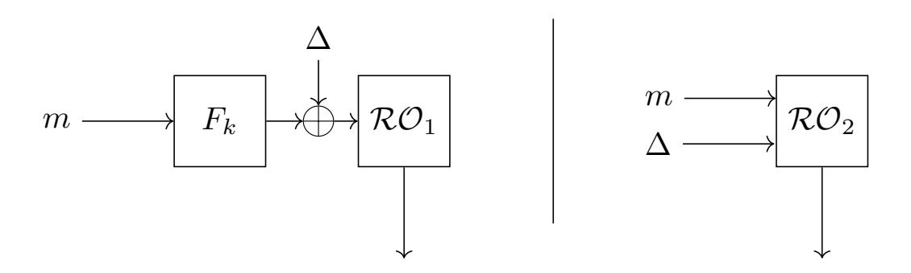
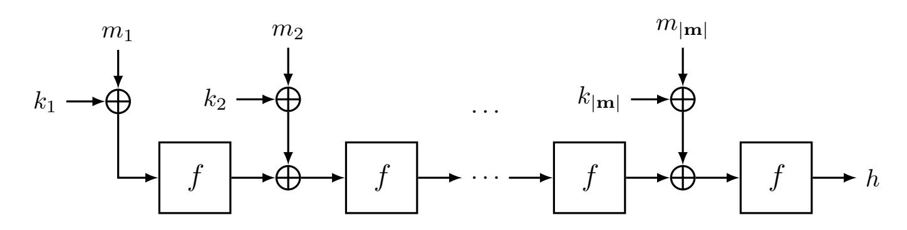
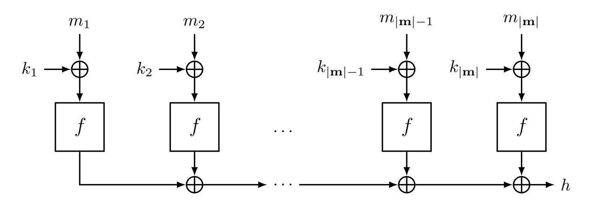
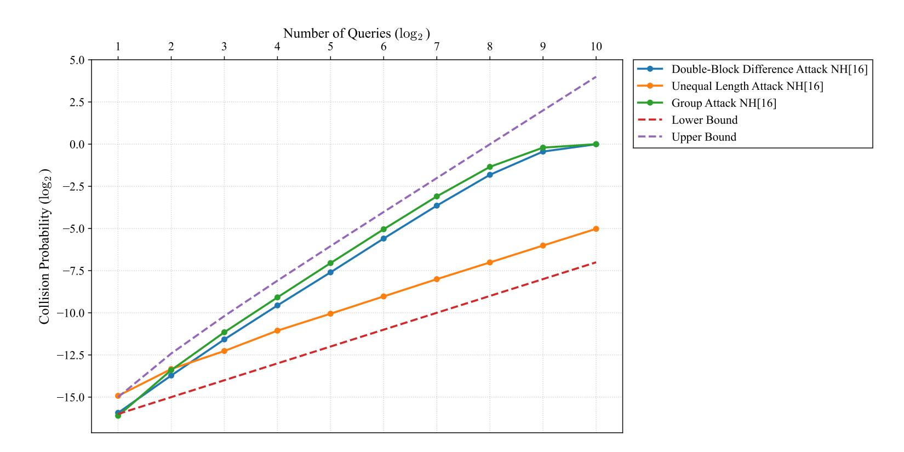
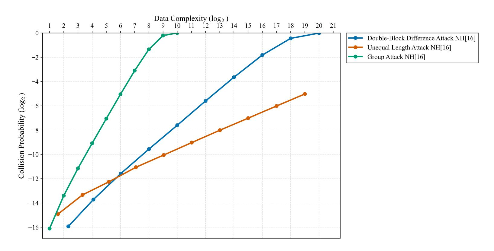
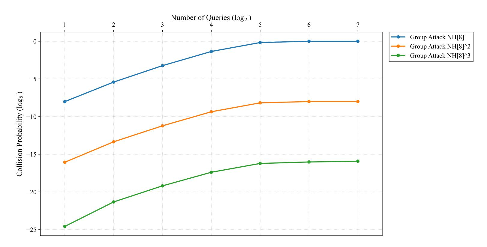
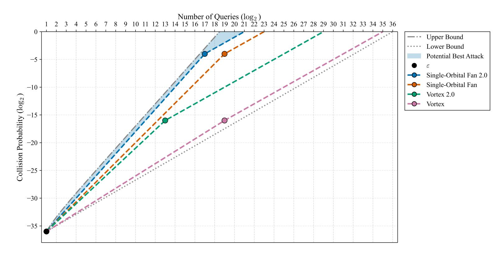
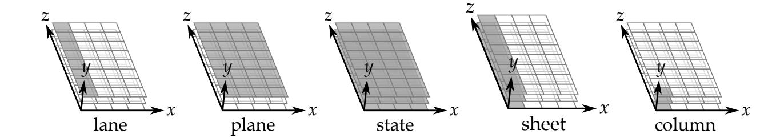

{0}------------------------------------------------

# **Understanding Multi-Query Attacks on Key-Then-Hash Functions**

Jonathan Fuchs

Radboud University, Nijmegen, The Netherlands [jonathan.fuchs@ru.nl](mailto:jonathan.fuchs@ru.nl)

**Abstract.** We present multi-query attacks on key-then-hash (KTH) functions in the blinded keyed hash model that achieve an advantage growing quadratically in the number of queries up to a small constant factor from the information-theoretic upper bound. We introduce three families of attacks. Catch attacks exploit the group structure of the digest space and achieve deterministic success with 2 √ *ε*<sup>−</sup><sup>1</sup> queries. Group attacks embed high-probability differentials into subgroups of the message space of quadratic advantage. Translation attacks exploit offset-invariance to linearly scale any existing attack. Our attacks apply in two concrete settings: with ∆ fixed to 0, they target the compression phase of farfalle-based primitives such as Xoofff, and with ∆ as a free parameter, they target deck-based wide block cipher constructions such as the double-decker. We connect optimal query set construction to results in additive combinatorics and generalize our results to concatenated KTH functions. Experiments on NH and Xoodoo[3] show our attacks reach an advantage within a factor 2 4 of the theoretical bound. Our analysis reveals that for bit-sliced permutations with degree-2 round functions, solution set overlap is inherent, limiting but not preventing the attacker from approaching the bound. Our experiments highlight that trail cores with a large number of active columns in the last round are particularly dangerous for KTH functions, introducing a new criterion for the design of permutations used in such constructions.

**Keywords:** message authentication codes · key-then-hash · multi-query security · offset-invariance · protected hash · blinded keyed hash

## **1 Introduction**

Universal hash functions (UHFs) are a family *F* of variable-input-length functions that are selected by a key. They satisfy the universality property defined by Stinson in [\[Sti95\]](#page-26-0). This property upper bounds the probability, taken over all keys, that two different messages result in two digests that differ exactly by the value ∆, i.e.,

$$\max_{m \neq m'} \Pr_{k \stackrel{\$}{\leftarrow} \mathcal{K}} \left[ F_k(m) - F_k(m') = \Delta \right] \leq \varepsilon.$$

When this property holds for any value of ∆ we say that *F* is *ε*-∆-universal and when ∆ is fixed to the value 0 we say *F* is *ε*-universal. Protected hash is a generic construction first introduced by Bellare, Canetti and Krawczyk in [\[BCK96\]](#page-24-0). It turns a fixed-input-length pseudorandom function (FIL-PRF) *P* into a variable-input-length pseudorandom function (VIL-PRF) *P* <sup>0</sup> by first feeding the input into a UHF and then taking the digest as the input of the FIL-PRF:

$$P'_{k_1,k_2}(m) = P_{k_1}(F_{k_2}(m)).$$

{1}------------------------------------------------

The security of this construction depends on the universality of the keyed hash function and the distinguishing advantage of an attacker to distinguish the FIL-PRF from a random oracle. The blinded keyed hash (bkh) security model, introduced by Daemen et al. in [DHP<sup>+</sup>18] and then formalized by Gunsing et al. in [GDM19], is a model whose security is defined as distinguishing advantage between the following function and a random oracle.

$$P'_{k_1,k_2}(m) = P_{k_1}(F_{k_2}(m) + \Delta).$$

Similarly, the security of this construction depends on the  $\Delta$ -universality of F and the distinguishing advantage of the attacker on P. When the output space of P is large enough, the most efficient way for an attacker to distinguish P' from a random oracle is to generate collisions at the output of F (or a difference  $\Delta$ ). Achieving this, for an  $\varepsilon$ - $\Delta$ -universal/ $\varepsilon$ -universal F, will require from the attacker at least  $\sqrt{\varepsilon^{-1}}$  queries.

Key-then-hash (KTH) functions are a family of UHF formalized by Fuchs et al. in [FRD23]. They are the family of keyed hash functions that add the secret key to the input string using some group addition and then process the resulting string with an unkeyed (public) function. In their paper, they show two constructions, a serial and a parallel one, that build a KTH function using a public permutation. They prove that the universality of such constructions is upper bounded by the maximum differential probability of the underlying public permutation. Later on, Ghosh et al. generalized this result for the parallel construction to include public functions, i.e., functions that are not necessarily a bijection [GFAD23].

In the bkh security model, the advantage of an attacker is based on its ability to choose a set of queries Q that maximize the probability of generating a collision at the input of the FIL-PRF. For a query set of size #Q, applying the union bound over all pairs gives an upper bound on the attacker's advantage of  $\binom{\#Q}{2}\varepsilon$  which grows quadratically in the size of Q. However, the tightness of this quadratic growth from the attacker's perspective has not been investigated.

In this paper, we investigate under what conditions an attacker can approach this quadratic growth and how close practical attacks get on concrete instantiations. We present a series of attacks that make use of the underlying group structure of KTH functions in order to achieve an advantage that grows quadratically in the number of queries. We apply our attacks on the parallel construction instantiated with integer multiplication modulo  $2^{2w}$ , which is equivalent to NH in UMAC [BHK<sup>+</sup>99], and on XOODOO[3], the public permutation used in primitives such as Xoofff [DHVV18b] and Xoodyak [DHP<sup>+</sup>20]. Our experiments show that we can achieve an advantage that grows almost quadratically in the number of queries, only differing from the theoretical bound by small factors.

Our attacks are relevant to two families of concrete constructions. When the offset  $\Delta$  is fixed to 0, collisions at the output of the UHF directly compromise the compression phase of farfalle-based primitives such as Xoofff [DHVV18b]. When  $\Delta$  is a free parameter chosen by the attacker, the attacks apply to deck-based wide block cipher constructions such as the double-decker and docked-double-decker [GDM19]. The design criteria we derive are therefore relevant to both settings.

#### 1.1 Our Contributions

Our contributions can be summarized as the following:

• We introduce a type of attack that we call "catch attacks". These attacks exploit the fact that we can add an offset to the digest and succeed in generating a collision in a fixed number of queries. The required number of queries depends on the type of the group the digest space forms. When all conditions are met, this type of attack requires only  $2\sqrt{\varepsilon^{-1}}$  queries for an  $\varepsilon$ - $\Delta$ -universal KTH function.

{2}------------------------------------------------

- We link the problem of finding query sets over equal-length messages that achieve optimal advantage to a well-known result in additive combinatorics. We are able to show that the size of an optimal set is upper bounded by the size of the set of differentials that achieve maximal differential probability.
- We introduce a type of attack that we call "group attacks". These attacks exploit the fact that the inputs to KTH functions are strings of group elements. We can embed a set of differentials with probability approximately  $\varepsilon$  into a subgroup of the message space and potentially gain a quadratic advantage in the number of queries. We also generalize this attack by applying the same "catching" mechanism of catch attacks, which allows the attacker to gain a deterministic quadratic increase, depending only on the properties of the digest space.
- We show that the translation invariance of KTH functions may allow an attacker to linearly scale their attack by repeating translated copies of their original query set. We characterize the conditions required for such a linear scaling to succeed and provide a greedy algorithm that tries to achieve it.
- We generalize the universality of concatenating multiple independent calls of a UHF to multi-query attacks in the bkh model with KTH setting. We show that the advantage that an attacker has against a n times concatenated KTH function is upper bounded by the product of the advantage against a single iteration of the KTH function and  $\varepsilon^{n-1}$ .
- We introduce two types of generic attacks against the parallel KTH construction. One attack makes use of a query set that contains only strings of different length. The other attack makes use of a query set that contains only long, equal-length messages. Both of these attacks have a potential quadratic increase in the number of queries. We also prove that these attacks have a lower bound of success probability that scales linearly with the number of queries.
- We implement these attacks on NH[8], NH[16] and XOODOO[3] and show that they succeed in varying degrees. Some of the attacks reach a success probability that is only a small factor away from the theoretical quadratic upper bound.

Table 1: Summary of multi-query attacks.  $\varepsilon$  denotes the universality parameter. The gap is the factor between the attack's success probability and the upper bound  $\binom{\#Q}{2}\varepsilon$ .

|                       | Catch (Thm. 1)                                                                | <b>Group 2.0</b> (Thm. 4)                                                              |  |  |
|-----------------------|-------------------------------------------------------------------------------|----------------------------------------------------------------------------------------|--|--|
| Applies to            | Any KTH                                                                       | Any KTH                                                                                |  |  |
| #Q                    | $2\sqrt{\varepsilon^{-1}}$                                                    | $\#\langle A_{b,\ell}\rangle(\#H_1+\#H_2)$                                             |  |  |
| $\Pr[\text{success}]$ | 1                                                                             | $\approx \varepsilon \# A_{b,\ell} \# \langle A_{b,\ell} \rangle \# \langle B \rangle$ |  |  |
| Gap from bound        | $\geq \sqrt{2}$                                                               | $\geq 2$                                                                               |  |  |
|                       | Unequal-length (Prop. 3)                                                      | Two-block (Prop. 4)                                                                    |  |  |
|                       |                                                                               |                                                                                        |  |  |
| Applies to            | Parallel[f] only                                                              | Parallel[f] only                                                                       |  |  |
| Applies to $\#Q$      | $ \begin{aligned} & \text{Parallel}[f] \text{ only} \\ & \ell \end{aligned} $ | Parallel[ $f$ ] only $\ell + 1$                                                        |  |  |
|                       |                                                                               | [0]                                                                                    |  |  |

{3}------------------------------------------------

## 2 Preliminaries

In this section we define the basic concepts and notation that we will use throughout the paper.

#### 2.1 Notation

The keyed hash functions we study in this paper take strings of variable length as input. The strings are composed of elements of the abelian group (G, +) with 0 denoting the neutral element. We refer to single elements of G as blocks. The space of all strings composed of  $\ell$  blocks is denoted as  $G^{\ell}$ . Strings are denoted in bold, i.e.,  $\mathbf{m} \in G^{\ell}$ , with blocks  $m_i$  indexed from 1 to  $\ell$ .  $\kappa$  denotes the maximum acceptable length for input strings. The space of keys is defined as  $G^{\kappa}$ . The space containing all strings of length 1 to  $\kappa$  is denoted as  $\mathrm{BS}(G,\kappa) = \bigcup_{\ell=1}^{\kappa} \mathrm{G}^{\ell}$ .  $|\mathbf{m}| \in \mathbb{Z}_{\geq 0}$  denotes the number of blocks in a given string  $\mathbf{m}$ . Finally, a keyed hash function is denoted as  $F: \mathrm{G}^{\kappa} \times \mathrm{BS}(G,\kappa) \to \mathrm{G}'$ , with  $\mathrm{G}'$  another abelian group  $(\mathrm{G}',+)$  that we refer to as the digest space. We will discuss sets of input and output differences that we denote by A or B respectively. We use subscripts to specify restrictions on the differences. We denote by  $A_b$  the set of input differences that are compatible (see Section 2.5) with an output difference b. We denote by  $A_{b,\ell}$  the set of input differences that contains only differences between messages of length  $\ell$  that are compatible with b. We denote by  $\langle A \rangle \leq G$  the subgroup of G generated by A. We denote by A - A the set containing the pairwise differences of the elements of A.

### 2.2 Universal Hash Functions

We speak of the universality or  $\Delta$ -universality of a keyed hash function. We provide Stinson's definitions of these properties, but adapted to our notation.

**Definition 1** ( $\varepsilon$ -universality [Sti95]). A keyed hash function F is said to be  $\varepsilon$ -universal if for any distinct strings  $\mathbf{m}, \mathbf{m}^* \in \mathrm{BS}(G, \kappa)$ 

$$\Pr[F_{\mathbf{k}}(\mathbf{m}) = F_{\mathbf{k}}(\mathbf{m}^*)] \le \varepsilon$$
,

with the probability taken over the key space  $G^{\kappa}$ .

**Definition 2** ( $\varepsilon$ - $\Delta$ -universality [Sti95]). A keyed hash function F is said to be  $\varepsilon$ - $\Delta$ -universal if for any distinct strings  $\mathbf{m}, \mathbf{m}^* \in \mathrm{BS}(G, \kappa)$  and for all  $\Delta \in G'$ 

$$\Pr[F_{\mathbf{k}}(\mathbf{m}) - F_{\mathbf{k}}(\mathbf{m}^*) = \Delta] \le \varepsilon,$$

with the probability taken over the key space  $G^{\kappa}$ .

## 2.3 Blinded Keyed Hash Model

The blinded keyed hash security (bkh) of a keyed hash function  $F_{\mathbf{k}}$  is defined as the advantage of an adversary distinguishing between two worlds:

- Real world:  $\mathcal{RO}_1(F_{\mathbf{k}}(m) + \Delta)$  with  $\mathbf{k} \stackrel{\$}{\leftarrow} \mathcal{K}$  and a secret random oracle  $\mathcal{RO}_1$ ;
- Ideal world:  $\mathcal{RO}_2(m,\Delta)$  with a secret random oracle  $\mathcal{RO}_2$ .

It was first published in [DHP<sup>+</sup>18] then formalized in [GDM19]. We depict the setup in Figure 1. We see random oracles in both the real and ideal world. In the real world, the adversary does not obtain the output of  $F_{\mathbf{k}}$  directly, but rather the output of a random oracle applied to this digest, offset by a value of her choice  $\Delta \in G'$ . In the ideal world, the

{4}------------------------------------------------

<span id="page-4-0"></span>

Figure 1: The distinguishing setup for bkh security, with the real world on the left and ideal world on the right. We adopted this figure from [GDM19].

adversary obtains the output of a random oracle applied to an injective encoding of the message and offset.

In the real world, queries that lead to different inputs to  $\mathcal{RO}_1$  will have completely random responses. However, the responses of pairs of queries that collide at the input of  $\mathcal{RO}_1$  will be equal. Hence, the occurrence of these collisions is the only thing that the adversary may learn about F from queries to the real world. From [GDM19] we know that for a query set  $Q \subset \mathrm{BS}(G,\kappa) \times G'$ , the bkh advantage, denoted as  $\mathbf{Adv}_F^{\mathrm{bkh}}(Q)$ , is equal to:

$$\mathbf{Adv}_F^{\mathrm{bkh}}(Q) = \Pr[\mathrm{Bad}_F^{\mathrm{bkh}}(Q)],$$

where  $\operatorname{Bad}_F^{\operatorname{bkh}}(Q)$  is the following predicate:

$$\exists ((\mathbf{m}, \Delta), (\mathbf{m}', \Delta')) \in Q^2 \colon F_{\mathbf{k}}(\mathbf{m}) + \Delta = F_{\mathbf{k}}(\mathbf{m}') + \Delta' \wedge (\mathbf{m}, \Delta) \neq (\mathbf{m}', \Delta').$$

The probability  $\Pr[\mathrm{Bad}_F^{\mathrm{bkh}}(Q)]$  is taken over the key space  $\mathcal K$  and is given by the following ratio:

$$\frac{\#\{\mathbf{k}\in\mathcal{K}\mid \mathrm{Bad}_F^{\mathrm{bkh}}(Q)\}}{\#\mathcal{K}}.$$

### 2.4 Key-Then-Hash Functions

KTH functions are UHFs of the form  $F_{\mathbf{k}}(\cdot) = F(\mathbf{k} + \cdot)$  introduced in [FRD23]. Given two strings  $\mathbf{m}, \mathbf{m}^* \in \mathrm{BS}(G, \kappa)$  with  $|\mathbf{m}| \leq |\mathbf{m}^*|$ , we define the sum of the two strings as:

$$\mathbf{m} + \mathbf{m}^* = (m_1 + m_1^*, m_2 + m_2^*, \dots, m_{|\mathbf{m}|} + m_{|\mathbf{m}|}^*).$$

Hence, the resulting string is of length  $|\mathbf{m}|$ .

 ${\cal F}$  is considered a public function and therefore the secret key is only used once when it is added to the input string. There are currently two proposed constructions to build KTH functions.

<span id="page-4-1"></span>

Figure 2: The serialization Serial[f] [FRD23]

{5}------------------------------------------------

The first one processes the input blocks in a serial way, depicted in Figure 2. It builds a UHF in a Pelican-MAC-like [DR05] structure. It is proven that when the underlying function f is a bijection, the universality and  $\Delta$ -universality of Serial[f] is MDP<sub>f</sub> [FRD23, Theorem 1] (See Section 2.5).

<span id="page-5-1"></span>

Figure 3: The parallelization Parallel[f] [FRD23]

The second construction processes the input blocks in parallel. It is an idealization of the compression phase of Farfalle [BDH<sup>+</sup>17]. We depict it in Figure 3. It is proven that when f is a bijection, Parallel[f] is MNDP $_f$ -universal and MDP $_f$ - $\Delta$ -universal [FRD23, Theorems 2&3]. When f is not a bijection, Parallel[f] is max{MDP $_f$ , MIP $_f$ }- $\Delta$ -universal [GFAD23, Theorem 1] (See Section 2.5).

## <span id="page-5-0"></span>2.5 Differential Probability and Image Probability

The universality of the UHFs we study depends on the differential probability of the underlying fixed-length public functions that they are built upon. We therefore define differential probability and some other important quantities.

**Definition 3** (Differential probability). The differential probability of a differential (a, b) over a function  $f: G \to G'$ , denoted as  $\mathsf{DP}_f(a, b)$ , is:

$$\mathsf{DP}_f(a,b) = \frac{\#\{x \in G \mid f(x+a) - f(x) = b\}}{\#G}.$$

We say that a propagates to b with probability  $\mathsf{DP}_f(a,b)$ .

If  $\mathsf{DP}_f(a,b) > 0$ , we call input difference a and output difference b compatible through f. In our bounds  $\max_{a \neq 0,b} \mathsf{DP}_f(a,b)$  plays an important role, and we denote it by  $\mathsf{MDP}_f$ . A useful quantity is the square of the Euclidean norm of  $\mathsf{DP}$  for fixed input difference a, given by  $\sum_b \mathsf{DP}^2(a,b)$ . We denote the maximum of this quantity over all input differences by  $\mathsf{MNDP}_f$ , hence  $\mathsf{MNDP}_f = \max_{a \neq 0} \sum_b \mathsf{DP}_f^2(a,b)$ .

Another useful quantity is the image probability of a (public) function f.

**Definition 4** (Image probability). Let  $f: G \to G'$  be a public function. The image probability of an output  $\Delta \in G'$  of f, denoted as  $\mathsf{IP}(\Delta)$ , is the number of inputs that f maps to  $\Delta$  divided by the total number of possible inputs, namely,

$$\mathsf{IP}(\Delta) = \frac{\#\{x \in G \mid f(x) = \Delta\}}{\#G}.$$

Similarly, we denote the maximum image probability over all outputs as  $MIP_f = \max_{\Delta} \mathsf{IP}(\Delta)$  and  $MNIP_f = \max_b \sum_b \mathsf{IP}(b)^2$ .

Lastly, Fuchs et al. generalize the notion of differences and differentials to variable-input-length functions. We quote these definitions verbatim.

{6}------------------------------------------------

**Definition 5** (Difference between two strings [FRD23]). We define the difference between two strings  $\mathbf{m}, \mathbf{m}^*$  with  $|\mathbf{m}| \leq |\mathbf{m}^*|$  as the pair  $(\mathbf{a}, \lambda) \in G^{|\mathbf{m}|} \times \mathbb{Z}_{\geq 0}$  where  $\mathbf{a} = (m_1 - m_1^*, m_2 - m_2^*, \dots, m_{|\mathbf{m}|} - m_{|\mathbf{m}|}^*)$  and  $\lambda = |\mathbf{m}^*| - |\mathbf{m}|$ .

When  $\lambda = 0$  we say a difference is equal-length and otherwise we say it is unequal-length. Now, we define the probability of differentials over a KTH function F.

**Definition 6** (Generalized differentials and their DP [FRD23]). Given an input difference  $(\mathbf{a}, \lambda)$  and an output difference  $\Delta$ , the differential probability of the differential  $(\mathbf{a}, \lambda, \Delta)$  over F, denoted as  $\mathsf{DP}_F(\mathbf{a}, \lambda, \Delta)$  is given by:

$$\mathsf{DP}_F(\mathbf{a}, \lambda, \Delta) = \frac{\#\{\mathbf{k} \in G^{\kappa} \mid F(\mathbf{a} + \mathbf{k}) - F(0^{|\mathbf{a}| + \lambda} + \mathbf{k}) = \Delta\}}{\#G^{\kappa}}.$$

In [FRD23], these generalized differentials were used to prove upper bounds on the universality of KTH constructions. In this paper, we use them from the attacker's perspective: we construct query sets whose pairwise differences correspond to differentials with probability  $\varepsilon$ .

## 2.6 Differential Propagation In Iterated Permutations

An iterated permutation is a permutation constructed through the repeated application of a round function: Let  $\rho: G \to G$  be a bijection over G, the *n*-round iterated permutation  $f: G \to G$  is given by applying  $\rho$  to itself *n* times, i.e.,  $f(x) = (\rho \circ \rho \circ \ldots \circ \rho)(x)$ . Differentials over iterated permutations are often studied by means of their differential trails.

**Definition 7** (Differential trail). An r-round differential trail, denoted as T, over the iterated permutation  $f_k(m) = (\rho \circ \rho \circ \ldots \circ \rho)(m+k)$ , is a sequence of r+1 differences: an input difference, r-1 intermediate differences and an output difference, where the round differentials  $(q_i, q_{i+1})$  have non-zero  $\mathsf{DP}_{\rho}$ , namely,

$$T = (q_1, q_2, q_3, \dots, q_{r-1}, q_r, q_{r+1})$$
 with  $\mathsf{DP}_{\rho}(q_i, q_{i+1}) > 0$  for  $1 \le i < r$ .

The differential probability of a trail, denoted  $\mathsf{DP}_f(T)$ , is the probability that a random pair with input difference  $q_1$  propagates via intermediate differences  $q_2, q_3, \ldots$  to output difference  $q_{r+1}$ . Furthermore, the probability of differentials over f is given by that of differential trails:  $\mathsf{DP}_f(a,b) = \sum_{T \in \mathcal{T}} \mathsf{DP}_f(T)$ , where  $\mathcal{T}$  is the set of all differential trails starting with a and ending with b.

A useful concept when studying differential propagation is the restriction weight.

**Definition 8** (Restriction weight of a differential [Dae95]). The restriction weight of a differential  $\mathsf{DP}(a,b) > 0$  is defined as  $w(a,b) = -\log_2 \mathsf{DP}(a,b)$ .

**Definition 9** (Restriction weight of a differential trail [Dae95]). The restriction weight of a differential trail  $T = (q_0, q_1, \ldots, q_{r-1})$  is defined as  $w(T) = \sum_i w(q_{i-1}, q_i)$ , hence the sum of the restriction weights of its round differentials.

Papers on trail search often report on large sets of trails with common features rather than individual trails. These sets are called *trail cores*.

**Definition 10** (Differential trail core [DV12]). An r-round differential trail core, denoted as  $\widetilde{T}$ , is a set of differential trails over r rounds with a shared core of intermediate differences  $(q_2, \ldots, q_r)$  with  $\mathsf{DP}_{\rho}(q_i, q_{i+1}) > 0$  for  $1 \le i \le r$ .

The trail cores of XOODOO[3] catalogued in [DHVV18a] will serve as the building blocks for our group attacks in Section 6. The number of active columns in a trail core determines the size of the compatible input difference set, which directly controls the efficiency of our attacks.

{7}------------------------------------------------

### 2.7 Solution Sets

In our proofs, we sometimes use the subset of the key space for which a digest collision happens for a fixed pair of queries:

**Definition 11** (Solution Set). Let  $F: BS(G, \kappa) \times G^{\kappa} \to G'$  be a key-then-hash function. Let  $\mathbf{m}, \mathbf{m}^* \in BS(G, \kappa)$  be two input strings with  $|\mathbf{m}| \leq |\mathbf{m}^*|$ . Let  $\Delta \in G'$  be an output difference. The solution set of  $\mathbf{m}, \mathbf{m}^*$  and  $\Delta$ , denoted as  $\mathcal{S}(\mathbf{m}, \mathbf{m}^*, \Delta)$ , is the subset of the key space for which the difference in the digests of  $\mathbf{m}$  and  $\mathbf{m}^*$  is equal to  $\Delta$ , i.e.,

$$\{\mathbf{k} \in G^{\kappa} \mid F(\mathbf{m} + \mathbf{k}) - F(\mathbf{m}^* + \mathbf{k}) = \Delta\}$$
.

We may also use a shortcut in notation when talking about the solution set of a set of queries, denoted as S(Q), which is equal to the union of all solution sets possible in the query set:

$$\begin{split} \mathcal{S}(Q) &= \bigcup_{p \neq q \in Q} \mathcal{S}(\{p, q\}) \\ &= \bigcup_{(\mathbf{m}, \Delta) \neq (\mathbf{m}^*, \Delta^*) \in Q} \mathcal{S}(\mathbf{m}, \mathbf{m}^*, \Delta^* - \Delta) \,. \end{split}$$

## 3 Generic Attacks on KTH Functions

We present, in this section, a number of attacks that work for any KTH function in the bkh setting. Their efficiency and success probability depend on the kind of group structure over the set of differentials that achieve maximum differential probability.

#### 3.1 Catch Attacks

We exploit the group structure of the set of compatible output differences to a fixed input difference to design a generic attack with deterministic success. Its cost depends on the specific properties of that set.

<span id="page-7-0"></span>**Theorem 1** (Catch Attacks). Let F be a KTH function. Let  $(\mathbf{a}, \lambda) \in \mathrm{BS}(G, \kappa) \times \mathbb{Z}_{\geq 0}$  be an input difference. Let  $B = \{b \in G' \mid \mathsf{DP}_F(\mathbf{a}, \lambda, b) > 0\}$  be the set of output differences compatible with  $(\mathbf{a}, \lambda)$  through F. Let  $H_1, H_2 \leq G'$  be two subgroups of G' such that  $H_1 + H_2 = \langle B \rangle$ . Define the set  $Q = \{0^{|\mathbf{a}| + \lambda}\} \times H_1 \cup \{\mathbf{a}\} \times H_2$  as the set of queries to the bkh generating oracle. The following holds:

$$\Pr[\operatorname{Bad}_F^{bkh}(Q)] = 1.$$

*Proof.* There are two types of pairs in Q: those that have an input difference 0 and therefore must propagate to an output difference 0, or those that have an input difference  $(\mathbf{a}, \lambda)$  and propagate to an output difference  $b \in \langle B \rangle$ . Since all pairs with input difference  $(\mathbf{a}, \lambda)$  share the same message values, they cannot propagate to a different output difference. Therefore, the events that a pair propagates to an output difference  $b \in \langle B \rangle$  and  $b^* \in \langle B \rangle$ , with  $b \neq b^*$ , are mutually exclusive. Thus, we get the following derivation:

$$\Pr[\operatorname{Bad}_F^{\operatorname{bkh}}(Q)] = \sum_{q,p \in Q} \Pr[\operatorname{Bad}_F^{\operatorname{bkh}}(\{q,p\})]$$
$$= \sum_{b \in \langle B \rangle} \mathsf{DP}_F(\mathbf{a}, \lambda, b)$$
$$= \sum_{b \in B} \mathsf{DP}_F(\mathbf{a}, \lambda, b) = 1.$$

{8}------------------------------------------------

Informally, catch attacks work by covering all possible output differences using two subgroups whose sum generates the full compatible output space. Since every key must produce some output difference in this space, every key is caught by at least one pair in the query set, yielding deterministic success. The cost of this deterministic guarantee is a factor  $\sqrt{2}$  above the information-theoretic minimum.

**Proposition 1.** The lower bound on the size of the query set in catch attacks on an  $\varepsilon$ - $\Delta$ -universal KTH function is

$$\#Q \ge 2\sqrt{\varepsilon^{-1}}$$
.

*Proof.* We start by proving  $\#Q \geq 2\sqrt{\#\langle B \rangle}$ . We have that  $\#Q = \#H_1 + \#H_2$ . The following holds.

$$\#\langle B \rangle = \#(H_1 + H_2) = \frac{\#H_1 \# H_2}{\#(H_1 \cap H_2)}.$$

Hence, we get

$$#H_1#H_2 = \#\langle B \rangle \#(H_1 \cap H_2)$$
$$> \#\langle B \rangle.$$

Then, we apply the arithmetic mean-geometric mean inequality to  $\#H_1 + \#H_2$ :

$$#H_1 + #H_2 \ge 2\sqrt{#H_1#H_2}$$
$$\ge 2\sqrt{\#\langle B\rangle}.$$

We prove next that  $\#\langle B\rangle \geq \varepsilon^{-1}$ . The following two properties hold:

$$\sum_{b \in B} \mathsf{DP}_F(\mathbf{a}, \lambda, b) = 1. \tag{1}$$

$$\forall b \in B \ \mathsf{DP}_F(\mathbf{a}, \lambda, b) \le \varepsilon. \tag{2}$$

<span id="page-8-0"></span>

The number of terms in the sum of Equation (1) is minimized when all output differences have the maximum possible differential probability. In that case, the number of elements in B is  $\varepsilon^{-1}$ . Assuming  $B = \langle B \rangle$  yields the lower bound.

Corollary 1.  $H_1 \cap H_2 = \{0\}$  and  $\#H_1 = \#H_2$  if and only if  $\#Q = 2\sqrt{\#\langle B \rangle}$ .

In other words, a necessary and sufficient condition for the attack to be optimal is that  $B \cong H_1 \oplus H_2$  and  $\#H_1 = \#H_2 = \varepsilon^{-\frac{1}{2}}$ .

Corollary 2. Optimal catch attacks use approximately a factor  $\sqrt{2}$  more queries than the theoretical minimum.

Corollary 3. When G' allows such decomposition (e.g.,  $G' = \{0,1\}^{2n}$  with  $n \in \mathbb{Z}_{\geq 1}$ ), choosing B = G' yields a deterministic birthday bound.

## 3.2 Maximum Size of Optimal Query Set for Equal-Length Messages

We can use standard additive combinatorics arguments to prove an upper bound on the size of query sets that achieve optimal advantage through the usage of equal-length messages. Assuming  $\Pr[\operatorname{Bad}_F^{\operatorname{bkh}}(Q)] = \binom{\#Q}{2}\varepsilon$  the following must hold:  $\forall p \neq q \in Q \Pr[\operatorname{Bad}_F^{\operatorname{bkh}}(\{p,q\})] = \varepsilon$ . In other words, each of the possible differentials in Q must have  $\mathsf{DP}_F = \varepsilon$ . Denote by  $D^\varepsilon \subset \mathsf{G}^\ell \times \mathsf{G}'$  the set of differentials over equal-length messages of length  $\ell$  that have  $\mathsf{DP}_F = \varepsilon$  for some  $\ell \in \mathbb{Z}_{\geq 1}$ . Then, the set of pairwise differences of Q must be a subset of  $D^\varepsilon \cup \{0\}$ , i.e.,  $Q - Q \subseteq D^\varepsilon \cup \{0\}$ . This leads us to the following theorem.

{9}------------------------------------------------

<span id="page-9-1"></span>**Theorem 2** (Maximum Size of Optimal Query Set). Let F be an  $\varepsilon$ - $\Delta$ -universal KTH function. Let  $Q \subseteq G^{\ell} \times G'$  be the set of queries to the bkh generating oracle. Let  $D^{\varepsilon} \subset G^{\ell} \times G'$  be the set of equal-length differentials over messages of length  $\ell$  that achieve  $\mathsf{DP}_F = \varepsilon$ . The size of Q is upper bounded by that of  $D^{\varepsilon}$ , i.e.:

$$\#Q \leq \#D^{\varepsilon} + 1$$
.

Equality holds if and only if  $D^{\varepsilon} \cup \{0\}$  is a subgroup of  $G^{\ell}$  and Q a coset of that subgroup.

*Proof.* It is a standard result in additive combinatorics that for any finite subset Q of a group,  $\#(Q-Q) \ge \#Q$ , with equality holding if and only if Q is a coset of a finite subgroup (see, e.g., [TV06, Section 2, Exact inverse sum set theorem]).

Note that the above is only a necessary condition. The other necessary condition for an optimal success probability is that the solution sets of all pairs in Q are disjoint, i.e.,  $\#S(Q) = \sum_{p \neq q \in Q} \#S(\{p,q\}).$ 

## 3.3 Group Attacks

We leverage the inherent group structure of G to achieve a possible quadratic increase in the success probability with respect to the total number of message blocks used.

**Definition 12.** We define the function  $\operatorname{Pairs}_F : \mathcal{P}(\operatorname{BS}(G, \kappa) \times G') \times [0, 1] \to \mathbb{Z}_{\geq 0}$  as the function that returns the number of pairs in the set  $Q \subset \operatorname{BS}(G, \kappa) \times G'$  that achieve a digest collision with probability greater than or equal to  $\rho$  with regards to the KTH function F:

$$Pairs_F(Q, \rho) = \#\{(p, q) \in Q^2 \mid Pr[Bad_F(\{p, q\})] \ge \rho\}.$$

<span id="page-9-0"></span>**Theorem 3** (Group Attacks 1.0). Let F be an  $\varepsilon$ - $\Delta$ -universal KTH function. Let  $b \in G'$  be an output difference. Let  $A_{b,\ell} = \{ \mathbf{a} \in G^{\ell} \mid \mathsf{DP}_F(\mathbf{a},0,b) = \varepsilon \}$  be the set of input differences of length  $\ell$  that propagate to b through F with probability equal to  $\varepsilon$ . Define the set  $Q = \langle A_{b,\ell} \rangle \times \{0\} \cup \langle A_{b,\ell} \rangle \times \{b\}$  as the set of queries sent to the bkh generating oracle. The following holds:

$$Pairs_F(Q, \varepsilon) = \#A_{b,\ell} \# \langle A_{b,\ell} \rangle + Pairs(Q \setminus \langle A_{b,\ell} \rangle \times \{b\}, \varepsilon).$$

*Proof.* Since  $\langle A_{b,\ell} \rangle$  is an abelian group, there are exactly  $\# \langle A_{b,\ell} \rangle$  pairs  $(a_1, a_2) \in \langle A_{b,\ell} \rangle^2$  with a fixed difference  $a \in A_{b,\ell}$ . Thus, there are  $\# A_{b,\ell} \# \langle A_{b,\ell} \rangle$  pairs with a difference in  $A_{b,\ell}$ . The rest of the pairs have differential probability  $\mathsf{DP}_F(\mathbf{a},0,0)$ . Those who achieve a collision probability equal to  $\varepsilon$  are counted in  $\mathsf{Pairs}(Q \setminus \langle A_{b,\ell} \rangle \times \{b\}, \varepsilon)$ .

We conjecture that it is very unlikely that  $\operatorname{Pairs}(Q\setminus \langle A_{b,\ell}\rangle \times \{b\}, \varepsilon)>0$  unless F is specifically designed for it. We explain the intuition behind our conjecture as follows. There are currently two proposed KTH constructions: the serial and the parallel one. When we instantiate the serial and parallel with a public permutation, the best attacks are the ones that make use of single-block messages (i.e., elements of G). In order for an attack to succeed in that scenario, the attacker relies on a call to f to propagate to the target output difference b. As f is a bijection, the output difference for any input difference  $a \neq 0$  cannot be 0. Therefore, all the pairs in  $\langle A_{b,\ell} \rangle \times \{0\}$  have  $\operatorname{DP}_f = 0$ . In the case that f is a public function and is used in the parallel construction, it is possible that  $\operatorname{DP}_f(a,0)>0$ . However, for  $\operatorname{Pairs}(Q\setminus \langle A_{b,\ell}\rangle \times \{b\},\varepsilon)$  to have a non-negligible number of pairs, f would need to have a class of input differences that achieve the best  $\operatorname{DP}_f$  for both 0 and b, which seems like an undesirable property.

{10}------------------------------------------------

Corollary 4. Group attacks 1.0 have  $2\#\langle A_{b,\ell}\rangle$  queries if  $b\neq 0$  and success probability

$$\Pr[\operatorname{Bad}_F^{bkh}(Q)] \approx \varepsilon Pairs_F(Q, \varepsilon) \approx \varepsilon \# A_{b,\ell} \# \langle A_{b,\ell} \rangle.$$

It is possible to combine the method used in catch attacks to increase the number of good pairs in  $\operatorname{Pairs}(Q, \varepsilon)$ .

<span id="page-10-0"></span>**Theorem 4** (Group Attacks 2.0). Let F be an  $\varepsilon$ - $\Delta$ -universal KTH function. Let  $b \in G'$  be an output difference. Let  $A_{b,\ell} = \{ \mathbf{a} \in G^{\ell} \mid \mathsf{DP}_F(\mathbf{a},0,b) = \varepsilon \}$  be the set of input differences of length  $\ell$  that propagate to b through F with probability equal to  $\varepsilon$ . Let  $B = \{ b \in G' \mid \exists \mathbf{a} \in A_{b,\ell} \; \mathsf{DP}_F(\mathbf{a},0,b) = \varepsilon \}$ . Let  $H_1, H_2 \leq G'$  be two subgroups of G' such that  $H_1 + H_2 = \langle B \rangle$ . Define the set  $Q = \langle A_{b,\ell} \rangle \times H_1 \cup \langle A_{b,\ell} \rangle \times H_2$  as the set of queries sent to the bkh generating oracle. The following holds:

$$Pairs_F(Q, \varepsilon) = \#A_{b,\ell}\#\langle A_{b,\ell}\rangle \#B + Pairs(\langle A_{b,\ell}\rangle \times H_1, \varepsilon) + Pairs(\langle A_{b,\ell}\rangle \times H_2, \varepsilon).$$

*Proof.* This is direct from the combination of Theorem 1 and 3.

Corollary 5. Group attacks 2.0 have  $\#\langle A_{b,\ell}\rangle(\#H_1+\#H_2)$  queries and success probability

$$\Pr[\operatorname{Bad}_F^{bkh}(Q)] \approx \varepsilon Pairs_F(Q, \varepsilon) \approx \varepsilon \# A_{b,\ell} \# \langle A_{b,\ell} \rangle \# \langle B \rangle.$$

It is in the attacker's interest to cover all the values of B with the least amount of queries while increasing the amount of good pairs from  $\langle A_{b,\ell} \rangle$ .

**Corollary 6.** An optimal group attack 2.0 uses a factor 2 more queries than the theoretical minimum.

For a group attack 2.0 to be optimal,  $A_{b,\ell} \leq G^{\ell}$  needs to be subgroup of  $G^{\ell}$  and  $B \cong H_1 \oplus H_2$  with  $\#H_1 = \#H_2$ . We give an example of applying these attacks in Section 6.

### 3.4 Translation Attacks

KTH functions have an offset-invariance property that may allow an attacker to achieve the following: Given a set of queries Q, it can build a set of queries Q' with size  $\omega \# Q$  and success probability at least  $\omega \Pr[\operatorname{Bad}_F^{\operatorname{bkh}}(Q)]$ .

<span id="page-10-1"></span>**Lemma 1.** Let S be a solution set. Let  $O \subset G^{\kappa}$  be a set of offsets. We denote by  $\mathcal{D}$  the set of pairwise differences of the elements of S, i.e.,  $\mathcal{D} = S - S$ . The following holds:

$$\forall o_1, o_2 \in O \quad \mathcal{S} + o_1 \cap \mathcal{S} + o_2 \neq \emptyset \iff o_2 - o_1 \in \mathcal{D}.$$

*Proof.* We start from the left-hand side.  $S + o_1 \cap S + o_2 \neq \emptyset$  implies there exists  $\mathbf{k}, \mathbf{k}^* \in S$  such that  $\mathbf{k} + o_1 = \mathbf{k}^* + o_2$ . By rearranging the equation, we get  $o_2 - o_1 = \mathbf{k} - \mathbf{k}^* \in \mathcal{D}$ . We continue with the right-hand side.  $o_2 - o_1 \in \mathcal{D}$  implies that  $o_2 - o_1 = \mathbf{k} - \mathbf{k}^*$  for some  $\mathbf{k}, \mathbf{k}^* \in S$ . By rearranging the equation, we get  $\mathbf{k}^* + o_2 = \mathbf{k} + o_1$ , implying that  $\mathbf{k}^* + o_2 \in S + o_1 \cap S + o_2$ .

**Corollary 7.** Let S be a solution set and D its associated set of pairwise differences. Let O be a set of offsets for which  $S + o_1 \cap S + o_2 = \emptyset$  for all unordered pairs  $(o_1, o_2) \in O^2$  with  $o_1 \neq o_2$ . The following holds:

$$o \in O \implies \forall o^* \in \mathcal{D} + o \quad o^* \notin O.$$

{11}------------------------------------------------

**Theorem 5** (Translation Attack)**.** *Let Q* = *Q*<sup>1</sup> × *Q*<sup>2</sup> ⊂ BS(G*, κ*) × G<sup>0</sup> *be the set of queries sent to the bkh generating oracle. Let* S ⊂ G*<sup>κ</sup> be the solution set of Q and* D = S − S *its associated pairwise differences set. Let* **o** ∈ G*<sup>κ</sup>*\D *be an offset. We denote by Q*<sup>0</sup> = *Q*+(**o***,* 0) *the set Q whose messages are translated by the value* **o***. The following holds.*

$$\Pr\left[\operatorname{Bad}_{F}^{bkh}\left(Q\cup Q'\right)\right]\geq 2\Pr\left[\operatorname{Bad}_{F}^{bkh}\left(Q\right)\right]$$

*Proof.* We apply Lemma [1](#page-10-1) by taking **o**<sup>1</sup> = 0 and **o**<sup>2</sup> = **o**. We get

$$\mathcal{S}(Q) \cap \mathcal{S}(Q') = \emptyset \implies \#\mathcal{S}(Q \cup Q') \ge 2\#\mathcal{S}(Q)$$
.

The pairs in *Q* and *Q*<sup>0</sup> contribute each #S(*Q*) keys to the solution set. The inequality is due to the potential contributions of the pairs between *Q* and *Q*<sup>0</sup> . Since

$$\Pr\left[\operatorname{Bad}_{F}^{\operatorname{bkh}}\left(Q\cup Q'\right)\right] = \frac{\#\mathcal{S}\left(Q\cup Q'\right)}{\#G^{\kappa}},$$

we have proven the theorem.

<span id="page-11-0"></span>**return** *O*

The attacker can build a set of offsets O for which every translated query set *Q* + (**o***,* 0) with **o** ∈ O contributes #S (*Q*) new keys, assuming we don't count the key contributions of the pairs between translated sets. We describe our method in Algorithm [1.](#page-11-0)

```
Algorithm 1: Generic Algorithm for Constructing an Offset Set for Translation
Attacks
```

```
Inputs : The set of pairwise differences D of the solution set S
Output : The set of offsets O
Set O = {0}
Set C = Gκ \ D
while #C > 0 do
   o
     $← C
   O ← O ∪ {o}
   C = C \ (D + o)
end
```

**Lemma 2.** *Let* S *be a solution set. Algorithm [1](#page-11-0) returns an offset set O with the following bounds:*

$$\left\lceil \frac{\#G^{\kappa}}{\#\mathcal{S}^2} \right\rceil \le \#O \le \left\lfloor \frac{\#G^{\kappa}}{\#\mathcal{S}} \right\rfloor.$$

*Proof.* We start with the lower bound. At each iteration of Algorithm [1,](#page-11-0) the size of C decreases by the quantity #C ∩ D + *o*. Since #D + *o* ≤ #S 2 , we can assume that each iteration removes the maximum possible offset candidates from C. Now we prove the upper bound. By construction

$$\bigcup_{o \in O} \mathcal{S} + o \subseteq G^{\kappa},$$

$$\bigcap_{o \in O} \mathcal{S} + o = \emptyset.$$

Thus, assuming S *<sup>o</sup>*∈*<sup>O</sup>* S + *o* = G*<sup>κ</sup>* yields the upper bound.

As translation attacks make no assumption on S, they can be combined with any other type of multi-query attacks in order to increase the success probability of the attacker.

{12}------------------------------------------------

### 3.5 Attacks on Concatenated KTH Functions

A common technique to create a stronger universal hash function is to concatenate the outputs of multiple calls to the same universal hash function with independent keys. We call this the augmentation of F. We prove how this method scales for KTH functions in a multi-query attack setting.

**Definition 13** (Augmented KTH Function). Let  $F: BS(G, \kappa) \times G^{\kappa} \to G'$ . Let  $n \in \mathbb{Z}_{\geq 1}$  be the augmentation factor. We denote F augmented by n as  $F^n: BS(G, \kappa) \times G^{\kappa n} \to (G')^n$  and it is given by the following:

$$F^{n}_{\mathbf{k}}(\mathbf{m}) = (F(\mathbf{m} + \mathbf{k}_1), F(\mathbf{m} + \mathbf{k}_2), \dots, F(\mathbf{m} + \mathbf{k}_n))$$
.

<span id="page-12-0"></span>**Proposition 2.** Let  $n \in \mathbb{Z}_{\geq 1}$  be the augmentation factor. Let  $F^n$  be an augmented KTH function with F being  $\varepsilon$ - $\Delta$ -universal. Let  $Q \subset BS(G, \kappa) \times (G')^n$  be the set of queries sent to the bkh generating oracle. The following holds:

$$\Pr[\operatorname{Bad}_{F^n}^{bkh}(Q)] \le \varepsilon^{n-1} \sum_{q \in (Q^*)^2} \Pr\left[\operatorname{Bad}_F^{bkh}(q)\right],$$

where  $Q^*$  is the set that maximizes the following metric:

$$Q^* = \arg \max_{P} \sum_{p \in P^2} \Pr \left[ \operatorname{Bad}_F^{bkh}(p) \right] \quad s.t \quad \#P \le \#Q.$$

*Proof.* A collision in  $F^n$  requires that the same pair q collides for all n independent instances of F:

$$\Pr[\operatorname{Bad}_{F^n}^{\operatorname{bkh}}(Q)] \leq \sum_{q \in Q^2} \Pr\left[\operatorname{Bad}_{F^n}^{\operatorname{bkh}}(q)\right].$$

Define the projection  $\pi_i \colon BS(G', \kappa) \times (G')^n \to BS(G', \kappa) \times G'$  as  $\pi_i((\mathbf{m}, \Delta)) = (\mathbf{m}, \Delta_i)$ . We get the following derivation:

$$\sum_{q \in Q^2} \Pr\left[\operatorname{Bad}_{F^n}(q)\right] = \sum_{q \in Q^2} \prod_{i=1}^n \Pr\left[\operatorname{Bad}_F(\pi_i(q))\right]$$

$$\leq \varepsilon^{n-1} \sum_{q \in Q^2} \Pr\left[\operatorname{Bad}_F(\pi_i(q))\right],$$

for some arbitrary value  $1 \le i \le n$ . By construction we have

$$\sum_{q \in Q^2} \Pr\left[ \operatorname{Bad}_F(\pi_i(q)) \right] \le \sum_{q \in (Q^*)^2} \Pr\left[ \operatorname{Bad}_F(q) \right] .$$

 $Q^*$  is the query set that produces the highest amount of collisions in F for a budget of at most  $\#Q^*$  queries.

# 4 Generic Attacks on Parallel[f]

In this section, we prove the success probability of multi-query attacks that are generic to the parallelization of a public function.

13

{13}------------------------------------------------

### 4.1 Attacks Based on Unequal-Length Messages

We present the family of attacks that use unequal-length messages.

<span id="page-13-0"></span>**Proposition 3** (Unequal-Length Messages Attacks). An attacker building a set of queries of  $\ell$  queries, using only unequal-length messages, i.e.,

$$Q = \cup_{i=1}^{\ell} \{0^i\} \times \{\Delta_i\},\,$$

has a collision probability over Parallel[f] in the bkh setting that is upper bounded by:

$$\Pr\left[\mathrm{Bad}_{\mathrm{Parallel}[f]}^{bkh}(Q)\right] \le (\ell - 1)\mathrm{MIP}_f + \left(\frac{\ell^2 - 3\ell}{2}\right)\mathrm{MNIP}_f.$$

*Proof.* We model the problem as follows.

The output of each  $f(\mathbf{k}_i)$  can be seen as a discrete random variable with probability mass function (PMF) given by  $\mathsf{IP}_f$ . We denote such variables as  $X_i$  for  $1 \leq i \leq \ell$ . The probability that the query  $((0^i), \Delta_i)$  collides with  $((0^j), \Delta_j)$  for i < j is given by

$$\Pr\left[\sum_{i}^{j} X_{i} = \Delta_{j} - \Delta_{i}\right] = \mathsf{IP} * \dots * \mathsf{IP}(\Delta_{j} - \Delta_{i}),$$

where IP is convolved with itself j-i times.

There are  $\binom{\ell}{2}$  possible pairs of (i,j).  $\ell-1$  of them have a difference in length  $\lambda=1$  and therefore collide with probability

$$\Pr\left[\sum_{i=1}^{i+1} X_i = \Delta_j - \Delta_i\right] = \mathsf{IP}(\Delta_j - \Delta_i) \le \mathsf{MIP}_f.$$

There are  $\frac{\ell^2-3\ell}{2}$  pairs with length difference  $\lambda\geq 2$  and they all collide with probability at most

$$\Pr\left[\sum_{i}^{j} X_{i} = \Delta_{j} - \Delta_{i}\right] = \mathsf{IP} * \dots * \mathsf{IP}(\Delta_{j} - \Delta_{i}) \leq \mathsf{MNIP}_{f},$$

with  $j \neq i + 1$ . By applying Boole's inequality, we prove the bound.

The success probability of such attacks only depends on the number of queries and the choices of  $\Delta$  offsets. We conjecture that the contribution of pairs of messages with length difference  $\lambda \geq 2$  diminishes quickly. This is due to the fact that the more we convolve IP with itself, the more uniform the resulting PMF becomes.

<span id="page-13-1"></span>**Corollary 8.** Let  $\Delta = \arg \max_x \mathsf{IP}(x)$ . Let  $Q = \bigcup_{i=1}^{\ell} \{0^i\} \times \{i\Delta\}$ , for some  $\ell \in \mathbb{Z}_{\geq 1}$ , and  $i\Delta$  is the repeated addition of  $\Delta$  with itself i times. The following holds:

$$\Pr\left[\operatorname{Bad}_{\operatorname{Parallel}[f]}^{bkh}(Q)\right] \ge 1 - (1 - \operatorname{MIP}_f)^{\ell-1}.$$

*Proof.* Each of the  $\ell-1$  pairs with length difference  $\lambda=1$  have a collision probability

$$\mathsf{IP}((i+1)\Delta - i\Delta) = \mathsf{IP}(\Delta) = \mathsf{MIP}_f$$
.

As the output difference with  $\lambda = 1$  depends only on the key  $k_{i+1}$ , all  $\ell - 1$  pairs are mutually independent.

The disadvantage of this type of attacks is that they increase quadratically in the number of messages blocks processed but only guarantee a linear increase in success probability.

{14}------------------------------------------------

## **4.2 Attacks Based on Two-Block Differences**

We present a family of attacks that require only the knowledge of at least one differential with two active input blocks and high DP*<sup>f</sup>* .

<span id="page-14-0"></span>**Proposition 4** (Two-Block Input Difference Attacks)**.** *Let `* ∈ Z≥<sup>1</sup> *be the attacker's chosen message length. Let a* ∈ G *be a single-block input difference. The attacker constructs the set of queries Q* ⊂ G*`* × G<sup>0</sup> *as follows:*

$$Q = \bigcup_{i=1}^{\ell} \{ (0^{i-1}, a, 0^{\ell-i}) \} \times \{ \Delta_i \},$$

*Then, the collision probability of Q through* Parallel[*f*] *under the bkh model is upper bounded by:*

$$\Pr\left[\operatorname{Bad}_{\operatorname{Parallel}[f]}^{bkh}(Q)\right] \leq {\#Q \choose 2} \mathsf{MNDP}_f$$
.

*Proof.* For every pair in *Q*, whose messages are (0*<sup>i</sup>*−<sup>1</sup> *, a,* 0 *`*−*i* ) and (0*<sup>j</sup>*−<sup>1</sup> *, a,* 0 *`*−*j* ) with *i < j*, a collision occurs when the following holds:

$$f(a + k_i) - f(0 + k_i) + f(0 + k_j) - f(a + k_j) = \Delta_j - \Delta_i$$
.

From Theorem 3 in [\[FRD23\]](#page-26-2), each of these pairs has a collision probability of at most MNDP*<sup>f</sup>* . By applying Boole's inequality we prove the upper bound.

<span id="page-14-1"></span>**Corollary 9.** *It is possible to guarantee a linear lower bound in the number of queries. Let* (*a, b*) = arg max*a*∗*,b*∗∈<sup>G</sup> DP(*a* ∗ *, b*<sup>∗</sup> )*. The query set Q is given by:*

$$Q = \bigcup_{i=1}^{\ell} \{ (0^{i-1}, a, 0^{\ell-i}) \} \times \{-b\}.$$

*Finally, the attacker adds* {0 *`*} × {0} *to Q. Then, the following lower bound holds:*

$$\Pr\left[\mathrm{Bad}_{\mathrm{Parallel}[f]}^{bkh}(Q)\right] \ge 1 - (1 - \mathsf{MDP}_f)^{\ell-1}$$
.

*Proof.* By construction, each pair of queries with indices (0*, i*) has a collision probability DP(*a, b*) = MDP*<sup>f</sup>* . Each of these pairs depend only on the values of the key *k<sup>i</sup>* . As there are *`* − 1 such pairs and they are mutually independent, we prove the lower bound.

## **4.3 Mixed Strategies**

One might wonder if mixed strategies should be considered. By mixed strategies, we mean that an attacker sends a query set *Q* for which the possible pairs in the set have a mixture of equal-length and unequal-length messages. We show that such a method is suboptimal.

**Proposition 5.** *The collision probability in the digest of* Parallel[*f*] *in the bkh setting for an attacker using query set Q is upper bounded by the following:*

$$\Pr\left[\mathrm{Bad}_{\mathrm{Parallel}[f]}^{bkh}(Q)\right] \leq \max\left\{\binom{\#Q}{2}\mathsf{MDP}_f, (\#Q-1)\mathrm{MIP}_f + \left(\frac{\#Q^2 - 3\#Q}{2}\right)\mathrm{MNIP}_f\right\}$$

*.*

{15}------------------------------------------------

*Proof.* Let  $\ell$  be the length of the longest message in Q. We denote by  $n_i$  the number of equal-length pairs of length i for  $1 \le i \le \ell$  in Q. We denote by e the number of unequal-length pairs in Q. Since  $\sum_i n_i = \binom{\#Q}{2} - e$ , the following holds:

$$\Pr\left[\operatorname{Bad}_{\operatorname{Parallel}[f]}^{\operatorname{bkh}}(Q)\right] \leq \left(\binom{\#Q}{2} - e\right) \operatorname{MDP}_f + (e - 1) \operatorname{MIP}_f + \left(\frac{e^2 - 3e}{2}\right) \operatorname{MNIP}_f,.$$

We denote this upper bound as a function of e,  $g(e) = \left(\binom{\#Q}{2} - e\right) \mathsf{MDP}_f + (e-1)\mathsf{MIP}_f + \left(\frac{e^2 - 3e}{2}\right) \mathsf{MNIP}_f$  and we are interested in finding the maximum of g on the interval  $e \in [0, \#Q]$ . Taking the second derivative of g gives us:

$$g'' = MNIP_f > 0.$$

As g is convex, we prove the upper bound.

## 5 Case Study: NH

While [FRD23] focused on Xoodoo as the primary instantiation, our attack framework applies to any KTH function. We first demonstrate it on NH[w], the universal hash function used in UMAC [BHK<sup>+</sup>99], which provides a clean setting where the differential structure is fully understood and the attacks can be validated exactly.

NH[w] is the universal hash function published by Black, Halevi, Krawczyk, Krovetz and Rogaway, and is used in UMAC [BHK<sup>+</sup>99]. We define a simplified variant, that omits the padding and treatment of unequal-length messages, using the KTH terminology. Let  $f[w]: \mathbb{Z}/2^w\mathbb{Z} \times \mathbb{Z}/2^w\mathbb{Z} \to \mathbb{Z}/2^{2w}\mathbb{Z}$  with  $f(x_1, x_2) = x_1x_2 \mod 2^{2w}$ . Then, NH[w] is given by:

$$NH[w] = Parallel[f[w]].$$

From [GAD23] we know that f has  $MIP_f = 2^{-w+1}$  and it is given by the output value 0. Similarly, we know that it has  $MDP_f = 2^{-w}$ , with differentials of the form ((a, -a), 0), ((a, 0), 0), ((0, a), 0) and  $((a, a), a^2)$  for all possible values of a achieving this value. We run experiments where we mount the attacks described in earlier sections. All of our experiments are done with either w = 16 or w = 8.

#### 5.1 Experiment Using The Unequal-Length Attack

We build our message set as described in Corollary 8: Each message we send is of the form  $0^i$  for  $1 \le i \le \ell$ . Since MIP<sub>f</sub> is achieved using the output value 0, we are checking for direct collisions between the queries. Algorithm 2 describes at a high level the experiment performed using our Rust code.

We choose to fix the values of  $m_i$  and  $m_{i+1}$  to 0 as they do not have any effect on the experiment. This experiment is done for values  $\ell \in \{2^1, 2^2, 2^3, \dots, 2^{10}\}$ . In order to approximate the expected success probability, we run the experiment for  $6 \cdot 10^6$  iterations and take the average.

#### Result of the unequal-Length Attack on NH[16]

We see that for the unequal-length attack, the only pairs that contributed to collisions in our experiments were pairs of the form  $(0,0), (0^i,0)$ . The resulting collision probability follows exactly the lower bound proven in Corollary 8.

{16}------------------------------------------------

#### **Algorithm 2:** Unequal-Length Experiment on NH[w]

```
\begin{array}{l} \textbf{Inputs} : \ell \in \mathbb{Z}_{\geq 2} \\ \textbf{Output} : \textbf{Found} \in \{\top, \bot\} \\ \textbf{Vec} \quad \texttt{seen\_values} = \{\} \\ \textbf{for} \ i \in (0 \ldots \ell) \ \textbf{do} \\ \mid k_i = \texttt{uniformValue}(0 \ldots 2^w) \\ \mid k_{i+1} = \texttt{uniformValue}(0 \ldots 2^w) \\ \mid \texttt{result} = \texttt{NH}[w](k_i, k_{i+1}) \\ \mid \texttt{seen\_values.push}(\texttt{result}) \\ \textbf{end} \\ \textbf{return} \ \texttt{repeat\_found}(\texttt{seen\_values}) \end{array}
```

#### <span id="page-16-0"></span>5.2 Experiment on Two-Block Difference Attacks

We build our message set as described in Corollary 9: We choose (1, -1) as our input difference and 0 as the output difference and perform the experiment as described in Algorithm 3.

#### 5.2.1 Two-Block Input Differences Attack on NH[16]

The results of this attack show that it behaves similarly to the group attack and degrades from the upper bound for similar reasons. The reason for the small difference between this attack and the group attack is the fact that messages with two active differences have a collision probability of  $\sum_b \mathsf{DP}_f((1,-1),b)^2$  instead of  $\mathsf{MDP}_f = 2^{-16}$ . From our experimental results, we can approximate the value of  $\sum_b \mathsf{DP}_f((1,-1),b)^2$  to be  $2^{-16.64}$ , which is very close to the upper bound of  $2^{-16}$ .

#### **Algorithm 3:** Two-Block Input Difference Experiment on NH[w]

```
Inputs : \ell \in \mathbb{Z}_{>1}
Output: Found \in \{\top, \bot\}
\texttt{Vec seen\_values} = \{\}
Vec keys = \{\}
for i \in (0 . . . 2\ell) do
    keys.push(uniformValue(0...2^w))
end
u64 \quad sum = 0
for i \in (0 \dots \ell) do
    \operatorname{sum} = \operatorname{sum} + \operatorname{NH}[w](\operatorname{keys}[2i], \operatorname{keys}[2i+1]) \mod 2^{2w}
end
seen_values.push(sum)
for i \in (0 \dots \ell) do
    sum = sum - NH[w](keys[2i], keys[2i+1]) \mod 2^{2w}
    \mathtt{sum} = \mathtt{sum} + \mathtt{NH}[w](\mathtt{keys}[2i] + 1 \mod 2^w, \mathtt{keys}[2i+1] - 1 \mod 2^w) \mod 2^{2w}
    seen_values.push(sum)
end
return repeat_found(seen_values)
```

<span id="page-16-1"></span>In real attack scenarios the attacker has no access to the digest value sum. We make use of the knowledge of the digest value in order to decrease the number of computations. At each loop iteration we simply subtract the ith message's contribution to the digest and

{17}------------------------------------------------

add the contribution of the new translated message. This experiment is done for values  $\ell \in \{2^1, 2^2, 2^3, \dots, 2^{10}\}$ . In order to approximate the expected success probability, we run the experiment for  $6 \cdot 10^6$  iterations and take the average.

## 5.3 Experiment on Group Attacks

We choose the input differences of the form (a, -a) and output difference 0. The differences (a, -a) form a subgroup of  $(\mathbb{Z}/2^w\mathbb{Z})^2$  and we only care about output differences of value of 0, therefore we apply the group attack 1.0 as described in Theorem 3. Note that since b = 0, the query set we build is a coset.

#### **Algorithm 4:** Group Attack 1.0 Experiment on NH[w]

```
\begin{array}{l} \textbf{Inputs}: \ \ell \in \mathbb{Z}_{\geq 2} \\ \textbf{Output}: \ \text{Found} \in \{\top, \bot\} \\ \\ \textbf{Vec} \quad \text{seen\_values} = \{\} \\ \textbf{Vec} \quad \text{differences} = \text{uniformValuesNoRepeat}(\ell, 0 \ldots 2^w) \\ k_1 = \text{uniformValue}(0 \ldots 2^w) \\ k_2 = \text{uniformValue}(0 \ldots 2^w) \\ \textbf{for} \ i \in (0 \ldots \ell) \ \textbf{do} \\ & \quad \text{result} = \texttt{NH}[w](k_1 + \texttt{differences[i]} \mod 2^w, k_2 - \texttt{differences[i]} \mod 2^w \\ & \quad \text{seen\_values.push}(\texttt{result}) \\ & \quad \text{end} \\ & \quad \text{return repeat\_found}(\texttt{seen\_values}) \\ \end{array}
```

We also apply the group attack experiment to NH[8], NH[8]<sup>2</sup> and NH[8]<sup>3</sup> to demonstrate the effects of Proposition 2. For w=16, we run the experiments for the same values and iterations as the previous experiments. For w=8, we run the experiments of  $\ell \in \{2^1, 2^2, 2^3, \ldots, 2^7\}$  and we do  $3 \cdot 10^6$ ,  $6 \cdot 10^6$  and  $10^8$  iterations respectively.

#### <span id="page-17-0"></span>5.3.1 Results of the Group Attack on NH[16]

The group attack that we implement follows its upper bound, i.e.,  $\binom{\#Q}{2}2^{-16}$  until  $\#Q \approx 2^7$ . The deviation from the upper bound can be explained by the following two properties. The first property is the fact that the input difference (a, -a) propagates to an output difference 0, when  $m_1 = m_2$ , only when  $a = k_2 - k_1$ . Thus, it is independent of the absolute values of the message blocks. The second property is the fact that the closer we get to a success probability 1, the more likely it is that a new query reintroduces already existing input differences in Q.

#### 5.3.2 Results of Group Attack 1.0 on Augmented NH[8]

As explained in Section 5.3.1, the value of a can be seen as the attacker's guess of the difference between the values of the keys  $k_1$  and  $k_2$ . From Proposition 2, we know that the same pair must collide for all independent instances of NH. Let  $k_{i,j}$  represent the jth key of the ith NH instance. Then, this can only happen when  $(k_{1,2} - k_{1,1}) = (k_{2,2} - k_{2,1})$  in the case of NH[8]<sup>2</sup> and  $(k_{1,2} - k_{1,1}) = (k_{2,2} - k_{2,1}) = (k_{3,2} - k_{3,1})$  in the case of NH[8]<sup>3</sup>. This happens with probability  $2^{-8}$  and  $2^{-16}$  respectively and can be seen in our experimental results in Figure 6.

{18}------------------------------------------------

#### 5.4 Results of the Experiments

We present in Figure 4 the results of all the experiments on NH[16] where the cost metric is the number of queries in Q, in Figure 5 the same results but using the *data complexity* of Q, i.e., the total number of blocks in Q, and in Figure 6 the results of the experiments on the augmentation of NH[8].

<span id="page-18-1"></span>

Figure 4: Result of the experiments on NH[16]. The lower bound is given by the curve  $1 - (1 - \mathsf{MDP}_f)^{\ell-1}$ . The upper bound is given by the curve  $\binom{\#Q}{2}\mathsf{MIP}_f$ .

## <span id="page-18-0"></span>6 Case Study: Xoodoo[3]

XOODOO is the 384-bit iterated permutation used in the doubly extendable cryptographic keyed function Xoofff [DHVV18b]. The specifications of XOODOO are attached in Appendix A Its round function uses the  $\chi \colon \mathbb{F}_2^3 \to \mathbb{F}_2^3$  function on three bits. It is of degree 2 and its parallel application to the 128 3-bit columns of the state is the round function's non-linear layer. This means that the set of compatible input differences with a given output difference forms an affine space (and vice versa) [Dae95, Section 6.9.1]. Daemen et al. provide a list of 3-round trail core classes in the Xoodoo GitHub repository [DHVV18a]. Among these trail cores, the authors identify two classes of trail cores that they name  $Single-Orbital\ Fan\$ and  $Vortex\$ [DHVV18b, Figure 8].

### 6.1 Vortex and Single-Orbital Fan Trail Cores

We will use the Vortex and Single-Orbital Fan trail cores to perform our attacks. Both of these types of trail cores have a restriction weight of 36. The paper of Bordes et al. investigated the clustering and round differential independence for 3-round trail cores up to weight 50. Their results show that for those trails, the probability of the differential defined by the trail is given by the probability of that trail (i.e., no clustering) and that it was given by  $\mathsf{DP} = 2^{-w}$ , where w is the restriction weight of the trails in the trail core [BDKV21]. We perform our experiments under the assumption that  $\mathsf{MDP}_f = 2^{-36}$  and is given by the differential defined by the Vortex and Single-Orbital Fan trail cores. This means that we assume that there are no trail cores with weight above 50 that exhibit strong enough clustering to form a differential with  $\mathsf{DP} > 2^{-36}$ .

{19}------------------------------------------------

<span id="page-19-1"></span>

Figure 5: Result of the experiments on NH[16] using data complexity as a metric instead of number of queries. The data complexity is given by the number of NH[16] calls. For the double-block difference attack it is  $\#Q^2+1$ , for the group attack it is #Q and for the unequal-length attack it is  $\frac{\#Q^2+\#Q}{2}$ .

<span id="page-19-0"></span>

Figure 6: Showcase of the effect of Proposition 2 on the expected collision probability of Q in NH[8], NH[8]<sup>2</sup> and NH[8]<sup>3</sup>.

{20}------------------------------------------------

### **6.2 Building Query Sets From Trail Cores**

We performed experiments on Xoodoo[3], the 3 rounds version of Xoodoo, by building group attacks 2.0 using the Single-Orbital fan and Vortex trail cores. In Xoofff, the permutation used is Xoodoo[6], hence this should be seen as an experiment on the round-reduced variant of the compression phase of Xoofff.

Each active column at the output of the first non-linear layer contributes an affine space of size 2 2 to the space of compatible input differences with the trail core. The union of that affine space with the vector space that it is parallel to results in the complete vector space over 3 bits. More generally, for a given output/input difference, the affine space of compatible input/output differences is of dimension 2*d*, where *d* is the number of active columns. The Vortex trail core has 6 active columns at the output difference *b*<sup>1</sup> in the differential over chi in the first round, therefore, the size of the set of compatible input differences with *b*<sup>1</sup> is #*A<sup>b</sup>*<sup>1</sup> = 2<sup>12</sup>. The set of compatible output difference at the output of the third round *B* has dimension 12. It is possible to split it into two subspaces *H*1*, H*<sup>2</sup> of dimension 6. Similarly, for the Single-Orbital Fan, #*A<sup>b</sup>*<sup>1</sup> = 2<sup>4</sup> and #*B* = 2<sup>28</sup> and can be split into two subspaces of dimension 14. We note that h*A<sup>b</sup>*<sup>1</sup> i = *A<sup>b</sup>*<sup>1</sup> ∪ (*A<sup>b</sup>*<sup>1</sup> ⊕ *a*) for any *a* ∈ *A<sup>b</sup>*<sup>1</sup> . Therefore, we apply a small optimization and choose the query set to be

$$Q = A_{b_1} \times H_1 \cup (A_{b_1} \oplus a) \times H_2.$$

This is a small optimization over the query set defined in Theorem [4](#page-10-0) which saves a factor 2 in the size of the query set but still preserves the same number of good pairs. So the query sets for the Vortex and Single-Orbital Fan trail cores both have size 2 19 .

## **6.3 Group Attacks 2.0 on Xoodoo[3]**

Unlike real attack scenarios, in our experiments we have the ability to check how the messages evolve through the rounds of the permutation. We take the following approach to simulate the attack, as explained in Algorithm [5.](#page-20-0)

### **Algorithm 5:** Group Attack 2.0 Experiment on Xoodoo[3]

```
Inputs : a1, a2 ∈ {0, 1}
                      384
Output : found ∈ {>, ⊥}
bool found = ⊥
XoodooState key = uniformValue(0 . . 2
                                        384)
Vec states = compatibleSpace(a1)
states = add(key,states)
nonLinearLayer(states)
Vec pair = add(a1, states)
permute(states)
permute(pair)
for i ∈ (0 . . states.size) do
   if states[i] ⊕ pair[i] == a2 then
      found = >
   end
end
return found
```

<span id="page-20-0"></span>We have verified that when we input *Q* we get 2 <sup>12</sup> pairs with the correct difference for the Vortex trail core and 2 <sup>4</sup> pairs for the Single-Orbital Fan. Therefore, we artificially generate them at the output of the first non-linear layer to save us from searching for them. This is acceptable due to the fact that adding a key to the columns of the trail core

{21}------------------------------------------------

simply shuffles the pairs. Denote by V+o the affine space that represents the compatible input differences with the output difference  $b_1$  after the first round. The pairs with good differences are of the form  $(v,v') \in (V+o) \times V$  for the bits in the columns that are targeting the trail cores. Addition with a key value  $k \in (V+o)$  will transform the pairs to  $(v+k,v'+k) \in V \times (V+o)$ , and addition with a key value  $k \in V$  will transform the pairs to  $(v+k,v'+k) \in (V+o) \times V$ . Since  $k \in V \cup (V+o)$  and we use all pairs in  $(V+o) \times V$ , we can use the shortcut above.

### 6.4 Improved Group Attack on Xoodoo[3]

We noticed in our previous experiment that when we do get a collision using group attack 2.0, we get a very large amount of collisions at once and they are all mutually dependent. Hence, for some keys we get a lot of collisions at once and for most we get none. Therefore, we set up another experiment where we take the same approach for generating  $\langle A_{b_1} \rangle$  as generating  $\langle B \rangle$ , by computing  $H'_1, H'_2$  such that  $H'_1 + H'_2 = \langle A_{b_1} \rangle$  and sending as a query set  $Q = H'_1 \times H_1 \cup H'_2 \times H_2$ . We run the same experiment as in Algorithm 5 but this time we do not apply the pairs shortcut like in the previous experiment.

Algorithm 6: Improved Group Attack 2.0 Experiment on X00D00[3]

```
Inputs : a_1, a_2 \in \{0, 1\}^{384}
Output: found \in \{\top, \bot\}
            found = \bot
bool
\texttt{XoodooState} \texttt{key} = \texttt{uniformValue}(0...2^{384})
(\text{Vec,Vec}) (\text{H}'_1,\text{H}'_2) = \text{compatibleSumSpace}(a_1)
(\mathtt{H}_1',\mathtt{H}_2') = (\mathtt{add}(\mathtt{key},\mathtt{H}_1'),\mathtt{add}(\mathtt{key},\mathtt{H}_2'))
nonLinearLayer(H'_1)
nonLinearLayer(H'_2)
permute(H'_1)
permute(H_2)
for i \in (0 ... H_1).size) do
     for j \in (0 ... H_2).size) do
          if H_1'|i| \oplus H_2'|j| == a_2 then
           \vdash found = \top
          end
     end
end
return found
```

#### 6.5 Result of the Experiments

We present in Figure 7 all the results of our experiments on Xoodoo[3].

#### Group Attack 2.0 on Xoodoo[3]

Before we started the experiments, we expected the attack to succeed with probability close to 1 in both the Vortex and Single-Orbital fan trail cores. However, while running the experiment we saw that in the Vortex trail core,  $2^{12}$  pairs survived the first round, and either  $2^{12}$ ,  $2^{11}$  or 0 pairs survived the second round. Similarly, for the Single-Orbital fan trail core,  $2^4$  pairs survive the first round, and either  $2^4$  or 0 pairs survived the second round. This is due to the fact that  $\chi$  is of degree 2 and the conditions on the key bits and message bits to propagate to the correct difference after a single round are linear.

{22}------------------------------------------------

<span id="page-22-0"></span>

Figure 7: Experimental results on Xoodoo[3]. The upper bound is given by  $\binom{\#Q}{2}2^{-36}$  while the lower bound is given by  $\#Q2^{-36}$ .

However, when we bring the conditions of propagation from the second round to the start of the first round, these conditions become quadratic. We expect them to be of the form  $k_i + m_j k_l = 1$ . As the bits of  $m_i$  have equal chance to be 0 or 1 in our query messages, this would explain why we see that all, half or none of the pairs propagate to the correct output difference after the second round. Our experiments also show that the success probability is approximately  $2^{-16}$  for the Vortex trail core and  $2^{-4}$  for the Single-Orbital Fan trail core.

#### Improved Group Attack 2.0 on Xoodoo[3]

We were interested in seeing if all the surviving pairs in the previous experiment were due to dependency of events. We confirm this conjecture by constructing a query set where only one pair survives the first round. Our results show that the expected probability of success is the same in both experiments, confirming our conjecture. Therefore, the large amount of good pairs at the input of the first round does not increase the success probability. Hence, we were able to improve the query cost by a quadratic factor relative to the size of the compatible input differences. The most efficient attack is based on the Single-Orbital Fan trail core. It requires  $2^{19}$  queries and succeeds with probability  $2^{-4}$ , resulting in an attack that is only a factor  $\approx 2^4$  away from the possible best attack.

### 7 Conclusion and Discussion

#### 7.1 Characterization of the Gap

Our experiments show that a quadratic increase in the number of queries is approximately possible, but a gap remains. We identify two structural sources of this gap. The first is that the set of differentials with probability  $\varepsilon$  does not always form a subgroup. From Theorem 2, the optimal query set requires the differentials to form a subgroup of the query space. When this condition is only approximately met, the number of good pairs is reduced. The second is overlap in solution sets. Even when the differentials form a perfect subgroup, the solution sets of different pairs may intersect, causing the same keys to be counted multiple times. This overlap manifests differently depending on the instantiation. For NH,

{23}------------------------------------------------

the differentials (*a,* −*a*) form a subgroup of (Z*/*2 *<sup>w</sup>*Z) 2 , but as the query set grows and the success probability approaches 1, new queries increasingly reintroduce existing input differences, causing unavoidable solution set overlap. For Xoodoo[3], the overlap has a deeper structural cause. The nonlinear layer *χ* has algebraic degree 2, so the conditions for correct propagation through a single round are linear in the key bits. Composing two rounds transforms these into quadratic expressions. Since the message bits in our query set take values 0 and 1 with equal probability, pairs succeed or fail together based on shared key-dependent conditions, rather than independently. This makes the solution set overlap inherent to the degree-2 structure, not an artifact of our query set construction.

## **7.2 Conclusion**

We presented in this paper a series of multi-query attacks on KTH functions that vary in generality from applying to all KTH functions to attacks that apply only on the parallel construction. We argued that it is not obvious that an attacker can reach the theoretical quadratic bound for multi-query attacks. Still, we presented attacks that we thought could potentially reach a quadratic increase assuming that all the necessary conditions were met. By applying them to well-known KTH functions such as NH and Parallel[Xoodoo[3]], we showed that our attacks actually achieve an increase very close to quadratic for queries that form differentials with probability *ε*. Perhaps the most surprising result is how effective the catching mechanism of the group attack 2.0 is for iterated permutations over {0*,* 1} <sup>2</sup>*<sup>n</sup>*, if the round function and its inverse have algebraic degree 2, since it is always possible to split the output space into two subgroups of size 2 *<sup>n</sup>* such that their sum is equal to the original group. The potential quadratic increase coming from that is deterministic and therefore may introduce a new criterion for trail search when designing new permutations for KTH functions. Specifically, the dangerous part is the existence of a trail core where a large part of the active sboxes are in the last round, the more active boxes there are, the closer the attack gets to being optimal. However, just like many other types of cryptanalytical attacks against cryptographic permutations, we can see that increasing the number of rounds makes performing these attacks very difficult. As the number of rounds increases, it becomes more difficult to have disjoint solution sets and it becomes computationally infeasible to know how the differential trails look like.

# <span id="page-23-0"></span>**A Xoodoo Specification**

We quote the specification of the Xoodoo round function, taken verbatim from the Xoodoo Cookbook [\[DHP](#page-24-1)<sup>+</sup>18].

Xoodoo is a family of permutations parameterized by its number of rounds *r* and denoted Xoodoo[*r*].

Xoodoo has a classical iterated structure: It iteratively applies a round function to a state. The state consists of 3 equally sized horizontal *planes*, each one consisting of 4 parallel 32-bit *lanes*. Similarly, the state can be seen as a set of 128 *columns* of 3 bits, arranged in a 4 × 32 array. The planes are indexed by *y*, with plane *y* = 0 at the bottom and plane *y* = 2 at the top. Within a lane, we index bits with *z*. The lanes within a plane are indexed by *x*, so the position of a lane in the state is determined by the two coordinates (*x, y*). The bits of the state are indexed by (*x, y, z*) and the columns by (*x, z*). *Sheets* are the arrays of three lanes on top of each other and they are indexed by *x*. The Xoodoo state is illustrated in Figure [8.](#page-24-8)

The permutation consists of the iteration of a round function R<sup>i</sup> that has 5 steps: a mixing layer *θ*, a plane shifting *ρ*west, the addition of round constants *ι*, a non-linear layer *χ* and another plane shifting *ρ*east.

{24}------------------------------------------------

<span id="page-24-8"></span>

Figure 8: Toy version of the XOODOO state, with lanes reduced to 8 bits, and different parts of the state highlighted. [DHP<sup>+</sup>18]

We specify XOODOO in Algorithm 7, completely in terms of operations on planes and use thereby the notational conventions we specify in Table 2.

## References

- <span id="page-24-0"></span>[BCK96] Mihir Bellare, Ran Canetti, and Hugo Krawczyk. Pseudorandom functions revisited: The cascade construction and its concrete security. In 37th Annual Symposium on Foundations of Computer Science, FOCS '96, Burlington, Vermont, USA, 14-16 October, 1996, pages 514–523. IEEE Computer Society, 1996.
- <span id="page-24-4"></span>[BDH<sup>+</sup>17] Guido Bertoni, Joan Daemen, Seth Hoffert, Michaël Peeters, Gilles Van Assche, and Ronny Van Keer. Farfalle: parallel permutation-based cryptography. *IACR Trans. Symmetric Cryptol.*, 2017(4):1–38, 2017.
- <span id="page-24-7"></span>[BDKV21] Nicolas Bordes, Joan Daemen, Daniël Kuijsters, and Gilles Van Assche. Thinking Outside the Superbox. In Tal Malkin and Chris Peikert, editors, Advances in Cryptology - CRYPTO 2021 - 41st Annual International Cryptology Conference, CRYPTO 2021, Virtual Event, August 16-20, 2021, Proceedings, Part III, volume 12827 of Lecture Notes in Computer Science, pages 337–367. Springer, 2021.
- <span id="page-24-2"></span>[BHK<sup>+</sup>99] John Black, Shai Halevi, Hugo Krawczyk, Ted Krovetz, and Phillip Rogaway. UMAC: Fast and Secure Message Authentication. In Michael J. Wiener, editor, Advances in Cryptology - CRYPTO '99, 19th Annual International Cryptology Conference, Santa Barbara, California, USA, August 15-19, 1999, Proceedings, volume 1666 of Lecture Notes in Computer Science, pages 216–233. Springer, 1999.
- <span id="page-24-5"></span>[Dae95] Joan Daemen. Cipher and hash function design, strategies based on linear and differential cryptanalysis, PhD Thesis. K.U.Leuven, 1995. http://jda.noekeon.org/.
- <span id="page-24-1"></span>[DHP<sup>+</sup>18] Joan Daemen, Seth Hoffert, Michaël Peeters, Gilles Van Assche, and Ronny Van Keer. Xoodoo cookbook. Cryptology ePrint Archive, Paper 2018/767, 2018. https://eprint.iacr.org/2018/767.
- <span id="page-24-3"></span>[DHP<sup>+</sup>20] Joan Daemen, Seth Hoffert, Michaël Peeters, Gilles Van Assche, and Ronny Van Keer. Xoodyak, a lightweight cryptographic scheme. *IACR Trans. Symmetric Cryptol.*, 2020(S1):60–87, 2020.
- <span id="page-24-6"></span>[DHVV18a] Joan Daemen, Seth Hoffert, Gilles Van Assche, and Ronny Van Keer. DC-Xoodoo-3r.txt. https://github.com/KeccakTeam/Xoodoo/blob/master/XooTools/Trails/DC-Xoodoo-3r.txt/, 2018.

{25}------------------------------------------------

Table 2: Notational conventions [\[DHP](#page-24-1)<sup>+</sup>18]

<span id="page-25-1"></span>

| Ay                | Plane y of state A                                                    |
|-------------------|-----------------------------------------------------------------------|
| ≪<br>Ay<br>(t, v) | Cyclic shift of Ay<br>moving bit in (x, z) to position (x + t, z + v) |
| Ay                | Bitwise complement of plane Ay                                        |
| Ay<br>+ Ay0       | Bitwise sum (XOR) of planes Ay<br>and Ay0                             |
| Ay<br>· Ay0       | Bitwise product (AND) of planes Ay<br>and Ay0                         |

## **Algorithm 7:** Definition of Xoodoo[*r*] with *r* the number of rounds [\[DHP](#page-24-1)<sup>+</sup>18]

**Parameters:** Number of rounds *r* **for** Round index *i* from 1 − *r* to 0 **do** *A* = Ri(*A*) **end for**

Here R<sup>i</sup> is specified by the following sequence of steps:

$$\theta: \\ P \leftarrow A_0 + A_1 + A_2 \\ E \leftarrow P \lll (1,5) + P \lll (1,14) \\ A_y \leftarrow A_y + E \text{ for } y \in \{0,1,2\} \\ \rho_{\text{west}}: \\ A_1 \leftarrow A_1 \lll (1,0) \\ A_2 \leftarrow A_2 \lll (0,11) \\ \iota: \\ A_0 \leftarrow A_0 + C_i \\ \chi: \\ B_0 \leftarrow \overline{A_1} \cdot A_2 \\ B_1 \leftarrow \overline{A_2} \cdot A_0 \\ B_2 \leftarrow \overline{A_0} \cdot A_1 \\ A_y \leftarrow A_y + B_y \text{ for } y \in \{0,1,2\} \\ \rho_{\text{east}}: \\ A_1 \leftarrow A_1 \lll (0,1) \\ A_2 \leftarrow A_2 \lll (2,8) \\$$

<span id="page-25-0"></span>Table 3: The round constants *c<sup>i</sup>* with −11 ≤ *i* ≤ 0, in hexadecimal notation (the least significant bit is at *z* = 0) [\[DHP](#page-24-1)<sup>+</sup>18].

|  | i   | ci         | i  | ci         | i  | ci         | i  | ci         |
|--|-----|------------|----|------------|----|------------|----|------------|
|  | −11 | 0x00000058 | −8 | 0x000000D0 | −5 | 0x00000060 | −2 | 0x000000F0 |
|  | −10 | 0x00000038 | −7 | 0x00000120 | −4 | 0x0000002C | −1 | 0x000001A0 |
|  | −9  | 0x000003C0 | −6 | 0x00000014 | −3 | 0x00000380 | 0  | 0x00000012 |

{26}------------------------------------------------

- <span id="page-26-4"></span>[DHVV18b] Joan Daemen, Seth Hoffert, Gilles Van Assche, and Ronny Van Keer. The design of Xoodoo and Xoofff. *IACR Trans. Symmetric Cryptol.*, 2018(4):1–38, 2018.
- <span id="page-26-5"></span>[DR05] Joan Daemen and Vincent Rijmen. The Pelican MAC Function. *IACR Cryptol. ePrint Arch.*, 2005:88, 2005.
- <span id="page-26-6"></span>[DV12] Joan Daemen and Gilles Van Assche. Differential Propagation Analysis of Keccak. In Anne Canteaut, editor, *Fast Software Encryption - 19th International Workshop, FSE 2012, Washington, DC, USA, March 19-21, 2012. Revised Selected Papers*, volume 7549 of *Lecture Notes in Computer Science*, pages 422–441. Springer, 2012.
- <span id="page-26-2"></span>[FRD23] Jonathan Fuchs, Yann Rotella, and Joan Daemen. On the security of keyed hashing based on public permutations. In Helena Handschuh and Anna Lysyanskaya, editors, *Advances in Cryptology - CRYPTO 2023 - 43rd Annual International Cryptology Conference, CRYPTO 2023, Santa Barbara, CA, USA, August 20-24, 2023, Proceedings, Part III*, volume 14083 of *Lecture Notes in Computer Science*, pages 607–627. Springer, 2023.
- <span id="page-26-8"></span>[GAD23] Koustabh Ghosh, Parisa Amiri-Eliasi, and Joan Daemen. Multimixer-128: Universal keyed hashing based on integer multiplication. *IACR Trans. Symmetric Cryptol.*, 2023(3):1–24, 2023.
- <span id="page-26-1"></span>[GDM19] Aldo Gunsing, Joan Daemen, and Bart Mennink. Deck-Based Wide Block Cipher Modes and an Exposition of the Blinded Keyed Hashing Model. *IACR Trans. Symmetric Cryptol.*, 2019(4):1–22, 2019.
- <span id="page-26-3"></span>[GFAD23] Koustabh Ghosh, Jonathan Fuchs, Parisa Amiri-Eliasi, and Joan Daemen. Universal hashing based on field multiplication and (near-)mds matrices. In Nadia El Mrabet, Luca De Feo, and Sylvain Duquesne, editors, *Progress in Cryptology - AFRICACRYPT 2023 - 14th International Conference on Cryptology in Africa, Sousse, Tunisia, July 19-21, 2023, Proceedings*, volume 14064 of *Lecture Notes in Computer Science*, pages 129–150. Springer, 2023.
- <span id="page-26-0"></span>[Sti95] Douglas R. Stinson. On the Connections Between Universal Hashing, Combinatorial Designs and Error-Correcting Codes. *Electron. Colloquium Comput. Complex.*, 2(52), 1995.
- <span id="page-26-7"></span>[TV06] Terence Tao and Van H. Vu. *Additive Combinatorics*, volume 105. Cambridge University Press, 2006.