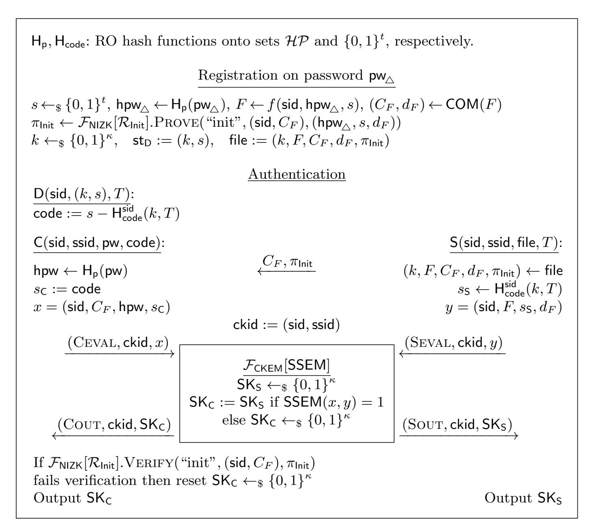

{0}------------------------------------------------

# Two-Factor Authentication Can Harden Servers Against Offline Password Search

Xavier Boyen<sup>1</sup> , Stanislaw Jarecki<sup>2</sup> , Phillip Nazarian<sup>2</sup> , Jiayu Xu<sup>3</sup> , and Tianyu Zheng<sup>4</sup>

- <sup>1</sup> Queensland University of Technology, Australia xavier.boyen@qut.edu.au <sup>2</sup> University of California, Irvine, USA {sjarecki,pnazaria}@uci.edu
  - <sup>3</sup> Oregon State University, USA xujiay@oregeonstate.edu
  - <sup>4</sup> University of California, Los Angeles, USA tyzheng@ucla.edu

Abstract. We propose a novel notion of Two-Factor Authenticated Key Exchange (TFA-KE), defined in the universal composability model (UC), which extends asymmetric PAKE (aPAKE) by a 2nd authentication factor in the form of a t-bit one-time code computed by a personal device based on a clock or counter. Our notion strengthens the security of standard integration of aPAKE with short authentication codes by additionally slowing down offline brute-force password search in case of server compromise by a factor of 2<sup>t</sup> . In other words, our TFA-KE notion uses tbit authentication codes not only to improve on-line security of password authentication, as is the current practice, but also to strengthen password security on server corruption, whilst retaining the ability of aPAKE to avoid the common but deplorable practice of relying on "secure-channel" encryption for password protection.

We show a generic framework for implementing TFA-KE, with two efficient instantiations. Our key enabling tool is a tight one-way function (TOWF) with an algebraic structure that allows for its evaluation on a secret-shared input. We initiate the study of such functions, and we provide two proposals which we show to be tightly one-way in the Generic Group Model. Tightness means that a function evaluation on an input sampled from domain X takes Ω(|X |) time to invert, which in our application implies that offline password search attacks are slowed to Ω(|D| · 2 t ) for passwords sampled from dictionary D.

# 1 Introduction

Two-Factor Authentication. Passwords are the most common method of user verification across various digital systems. However, password re-use (see e.g. [\[23\]](#page-28-0)), which means that a password compromise at one service implies the compromise of the same user at other services, together with effective low entropy of passwords chosen by a large fraction of users (see e.g. [\[3\]](#page-27-0)), motivates adoption of 'two-factor' authentication, where in addition to a password the user proves that it has access to a personal device which can compute a one-time authentication code expected by the authentication server. Since the user typically 

{1}------------------------------------------------

reads the code displayed by her device, e.g. an authenticator app on her cell phone, and must type it as a protocol input together with her password, authentication codes are short bitstrings of fixed length t, e.g. encoded as 6-digit numerical strings (t = 20) or 6-digit alphanumerical strings (t = 30).

Current two-factor authentication implementations decouple the two components of two-factor authentication, i.e. password verification and authenticator code verification. Password verification can be implemented with any asymmetric Password Authenticated Key Exchange (aPAKE) [\[13,](#page-27-1)[16\]](#page-28-1), where the server holds a (salted) password hash rather than the password itself, while the authenticator code verification is typically implemented using a Pseudorandom Function R whose range is t-bit strings: The one-time authenticator code corresponding to time period or counter T is defined as code<sup>T</sup> = Rkey(T) where key is a symmetric key shared by the user's personal device and the server, and the user and the server can follow any equality-testing protocol, e.g. a (symmmetric) PAKE, to verify that they hold matching code values.[5](#page-1-0)

The main benefit of two-factor authentication implemented as above is that it provides a second layer of defense to on-line authentication in the face of password weakness: Even if a user's password leaks, without access to the user's device the adversary can authenticate only with probability 1/2 t , i.e. by guessing the correct authentication code. However, this second authentication factor does not help in the all-too-common case of server compromise: Since the server stores a password hash, the adversary can recover the password given the hash using a (brute-force) Offline Dictionary Attack (ODA), which takes time Ω(|D|) where D is the presumed dictionary from which the user picked her password.

Two-Factor Authentication with 2 t -factor ODA slow-down. We show that two-factor authentication can improve both online and offline security of password authentication. Namely, we show Two-Factor Authenticated Key Exchange (TFA-KE) schemes where the server-held password file file allows for remote verification of the user's password pw and the correct t-bit authentication code code<sup>T</sup> corresponding to time/counter T, but the brute-force search for pw which is possible if file is revealed due to a server compromise, requires Ω(|D| · 2 t ) computation instead of Ω(|D|) for password-only authentication.[6](#page-1-1) Note that for the t = 20 or t = 30 cases mentioned above, our TFA-KE will slow

<span id="page-1-0"></span><sup>5</sup> For historical reasons, in today's practice on the internet, password authentication, with or without a second factor, merely consists of sending the user secrets across a PKI-authenticated SSL/TLS "secure channel", which places much of the security burden upon authenticating the server prior to password verification—completely missing out on the raison d'ˆetre of PAKE and especially aPAKE. To be clear, in this paper we do not assume any pre-existing secure channel nor PKI.

<span id="page-1-1"></span><sup>6</sup> Note that both bounds are optimal: In an aPAKE, password file file allows the adversary to offline test any password pw<sup>∗</sup> by locally running the aPAKE on client input pw<sup>∗</sup> and server input file, leading to ODA in time O(|D|). Likewise, in a TFA-KE, leaking file allows the adversary to offline test any (pw<sup>∗</sup> , code<sup>∗</sup> ) pair, by running the TFA-KE on client input (pw<sup>∗</sup> , code<sup>∗</sup> ) and server input (file, T). Since for any T there are 2<sup>t</sup> possible code<sup>T</sup> values, the ODA search takes O(|D| · 2 t ) time.

{2}------------------------------------------------

ODA by considerable factors of respectively  $2^{20} \approx 10^6$  or  $2^{30} \approx 10^9$ , and an increase of ODA time by a factor of  $10^6$  means that an attack which took a minute will now take 2 years.

What makes this problem non-trivial is that two-factor authentication must be secure under *lunch-time attack* on the user's personal device, i.e. a leaked code  $code_T$  corresponding to counter T cannot help to authenticate to a server who runs on any other counter  $T^* \neq T$ . This effectively implies that a code generation function  $code_T = R_{key}(T)$  must be a PRF.<sup>7</sup> Our question is therefore: Is there a PRF function  $R_{\text{key}}$  and a password file generation algorithm Init(pw, key) which enable an efficient protocol Auth that authenticates client C and server S with respective inputs (pw, code) and (FILE, T), if and only if FILE = Init(pw, key) and  $code = R_{key}(T)$ ? Moreover, leaking FILE must enable recovery of pw only via a brute-force search that runs Auth on all candidate pairs (pw\*, code\*). If Init and R are arbitrary one-way functions then it is not even clear that you can solve it with (two-party) secure computation [28,14], because the combined inputs of both parties, (pw, code, FILE, T), do not contain key key which allows for efficient verification of this condition. On the other hand, if key is present in FILE then leakage of the latter would let an adversary compute  $code_T = R_{key}(T)$  and run an ODA that tests password candidates with  $\mathcal{O}(|D|)$  computation.

Contribution I: Defining Two-Factor Authenticated Key Exchange. We propose a notion of Two-Factor Authenticated Key Exchange (TFA-KE), stated in the framework of universal composability (UC), which extends the UC asymmetric PAKE (aPAKE) model of Gentry, MacKenzie, and Ramzan [13] by the second authentication factor based on t-bit one-time authentication codes computed by the user's personal device. Our UC TFA-KE notion is a strict upgrade of UC aPAKE, and it defaults to UC aPAKE if t = 0. We model the authentication code generation function  $\mathsf{code}_T = R(T)$  as a random function, which implies resilience to lunch-time attacks (in particular, an attacker who knows the correct password but does not know  $\mathsf{code}_T$  can authenticate to either party with probability at most  $1/2^t$ ), and we model an Offline Dictionary Attack (ODA) possible after compromise of the password file FILE as tests of explicit  $(\mathsf{pw}^*, \mathsf{code}^*)$  candidates provided by the adversary (on some adversarially chosen counter T), which implies an  $\Omega(|D| \cdot 2^t)$  computation bound on an ODA.

Contribution II: Generic TFA-KE scheme which enables efficient instantiations. We show a generic framework for implementing TFA-KE, together with two efficient instantiations based on two proposals for tight one-way functions with algebraic properties (see Contribution III below). Our construction stems from the idea of Shirvanian et al. [25] which exhibited a TFA scheme with an  $\Omega(|D| \cdot 2^t)$  bound on ODA after server compromise, but assuming a significantly simpler setting of Public Key Infrastructure (PKI). Password (and two-factor) authentication in the PKI setting reflects the current web authentication

<span id="page-2-0"></span>Value  $\operatorname{\mathsf{code}}_{T^*}$  must be unpredictable given any set of pairs  $(T, \operatorname{\mathsf{code}}_T)$  for  $T \neq T^*$ , and it must be indistinguishable from a random t-bit string to achieve a  $2^t$  factor of security increase in on-line authentication.

{3}------------------------------------------------

practice, where the client sends her password pw (and the one-time authenticator code) on an SSL channel authenticated by the server's PKI certificate.<sup>8</sup>

The idea of [25] was to set  $\ker = (k,s)$  where k is a key of an arbitrary PRF function, e.g. a block cipher, and s is a t-bit random pad, set  $\operatorname{code}_T = R_{(k,s)}(T) = s \oplus \operatorname{PRF}_k(T)$ , and let  $\operatorname{Init}(\operatorname{pw},(k,s))$  output  $\operatorname{FILE} = (k,\operatorname{H}(\operatorname{pw},s))$  where H is a Random Oracle (RO) hash function. An authentication, which in the PKI setting is performed locally by the server on the local input  $\operatorname{FILE}$  and message ( $\operatorname{pw}$ ,  $\operatorname{code}$ ) received on the SSL channel, parses  $\operatorname{FILE} = (k,F)$  and accepts iff  $F = \operatorname{H}(\operatorname{pw}, \operatorname{code} \oplus \operatorname{PRF}_k(T))$ . Note that  $R_{(k,s)}$  is a PRF, and that the password file  $(k,\operatorname{H}(\operatorname{pw},s))$  allows for testing only explicitly provided ( $\operatorname{pw}^*,s^*$ ) candidates, implying an  $\Omega(|D| \cdot 2^t)$  bound on ODA.

Our TFA-KE proposal starts from the above idea, and observes that pairs  $(s_{\mathsf{C}}, s_{\mathsf{S}}) = (\mathsf{code}_T, \mathsf{PRF}_k(T))$  form a secret-sharing of pad s, and that this sharing can be implemented with group addition if set  $\{0,1\}^t$  forms an abelian group, e.g.  $\mathbb{Z}_{2^t}$ . We then generalize RO hash H to any tight one-way (and collision-resilient) function f (see below), and we use a Conditional Key Encapsulation Mechanism (CKEM) protocol to establish a secure key between the two parties if their respective inputs  $(\mathsf{pw}, s_\mathsf{C})$  and  $(F, s_\mathsf{S})$  satisfy condition  $F = f(\mathsf{pw}, s_\mathsf{C} + s_\mathsf{S})$ . Further, to argue that  $R_{(k,s)}$  acts like a random function even after server corruption we implement  $\mathsf{PRF}_k$  using a hash function modeled as a programmable RO, and to enable extraction of an adversarial server's inputs we add a commitment to F, a check that CKEM runs on a committed value, and a non-interactive zero-knowledge proof of knowledge of f pre-image of the committed value.

The core of this TFA-KE protocol is the CKEM for a condition, denoted  $\mathsf{SSEM}[f]$  for "secret-shared evaluation match", that  $F = f(\mathsf{pw}, s)$  for a secret-shared s, client-held  $\mathsf{pw}$ , and server-held committed F. This CKEM can be implemented using generic secure computation, but more efficient instantiations follow from tight one-way functions (OWF) f specifically designed to enable more efficient CKEM realizations, as we discuss below.

Contribution III: Tight OWF's with Algebraic Properties. We use the UC notion of a Tight One-Way Function (TOWF) of Bradley, Jarecki, and Xu [4], which models a one-way function f on domain  $\mathcal{X}$  (which we re-formulate to include collision-resilience) s.t. for any subset S of  $\mathcal{X}$ , an adversary who receives f(x) for x randomly sampled in S, must bear  $\Omega(|S|)$  computation cost to recover x from f(x). A Random Oracle hash is an example of a TOWF, but instantiating f as a generic hash would allow only for a generic secure computation realization of CKEM for condition  $\mathsf{SSEM}[f]$ . Instead, we show two examples of TOWF's which allow for more efficient realizations of CKEM for  $\mathsf{SSEM}[f]$ .

<span id="page-3-0"></span><sup>&</sup>lt;sup>8</sup> Relying on PKI in password and two-factor authentication has numerous security problems, including 'phishing attacks' where the client sends her password to an attacker who poses as the legitimate web service, and the fact that a spyware on the legitimate server can gain access to cleartext passwords sent to that server.

{4}------------------------------------------------

If argument x were secret-shared over f domain<sup>9</sup>  $\mathcal{X}$  then we could get an efficient CKEM for condition SSEM[f] if  $f(x_{\mathsf{C}}) \cdot f(x_{\mathsf{S}}) = f(x_{\mathsf{C}} + x_{\mathsf{S}})$  for some operation  $\cdot$  on the f co-domain, but such a homomorphism could also speed-up the ODA. For example, function  $f(x) = g^x$  where  $\mathbb{G} = \langle g \rangle$  is a multiplicative group of prime order p, satisfies the above if  $\mathcal{X} = \mathbb{Z}_p$ , but given  $F = g^x$  one can find x in  $\mathcal{O}(|\mathcal{X}|^{1/2})$  time using Shank's algorithm, which finds a collision between values  $(g^{2^n})^{x_L}$  and  $F \cdot g^{-x_R}$  for all n-bit  $x_L$  and  $x_R$  and  $n = \lceil |p|/2 \rceil$ .

We initiate the study of tight OWF's with algebraic properties that allow for efficient secure computation of f evaluation and/or equality-checking, on secret-shared inputs. We propose two such functions:

$$f_{\mathsf{Vand}}(x) = \prod_{i=1}^{N} g_i^{(x^i)}$$
  $f_{\mathsf{PoNR}}(x) = \prod_{i=1}^{N} g_i^{(\prod_{x[j]=1} K_{i,j})}$ 

where N is a 'repetition parameter',  $g_i$ 's are elements of group  $\mathbb{G}$  that are part of the function description, and (in  $f_{PoNR}$ )  $K_{i,j}$ 's are public random elements in  $\mathbb{Z}_p$  that are also part of the function description. We call the first function 'Vandermonde' because the Vandermonde matrix comes up in its analysis, and we call the second function a 'product of Naor-Reingold PRFs' [22].

We show that in the Generic Group Model (GGM) both functions realize a UC notion  $\mathcal{F}_{\mathsf{OWF}}$  of a tight OWF, which implies that for any domain subset S, it takes  $\Omega(|S|)$  time to recover x given f(x). Consequently, if  $(\mathsf{pw}, s)$  is random in  $D \times \{0,1\}^t$  then it takes  $\Omega(|D| \cdot 2^t)$  time to recover  $\mathsf{pw}$  from  $f(\mathsf{pw}, s)$ . In more detail, we say that f realizes  $\mathcal{F}_{\mathsf{OWF}}$  with  $rate \ r$  if an n-time attacker can effectively test if  $F = f(x^*)$  on at most  $\mathcal{O}(n^r)$  candidates  $x^*$ , and we call f tight if it realizes  $\mathcal{F}_{\mathsf{OWF}}$  with rate 1. We show that both functions  $f_{\mathsf{Vand}}$  and  $f_{\mathsf{PoNR}}$  realize  $\mathcal{F}_{\mathsf{OWF}}$  with rate 1 + d/N where d = 2 for  $f_{\mathsf{Vand}}$  and  $d \approx 3.3$  for  $f_{\mathsf{PoNR}}$ , and with rate 1 if N = |p|. We note that even though these are the best bounds we could prove, either function might realize  $\mathcal{F}_{\mathsf{OWF}}$  with rate 1 even for N = 2.

Contribution IV: CKEMs for Tight OWF Candidates. Both functions  $f_{Vand}$  and  $f_{PoNR}$  enable efficient realizations of CKEM for condition SSEM.

To simplify this technical overview assume x = pw|s is additively secretshared as  $x = x_{\text{C}} + x_{\text{S}} \mod p$  between client C and server S. The Conditional KEM for the condition that S-held F satisfies  $F = f_{\text{Vand}}(x)$  can proceed by computing group element  $F' = f_{\text{Vand}}(x_{\text{C}} + x_{\text{S}})$  under an encryption which is homomorphic over group  $\mathbb{G}$ , i.e. ElGamal (the algebraic structure of  $f_{\text{Vand}}$  allows for this 2-party computation using  $\mathcal{O}(N)$  group elements), and then folding key establishment into a test for plaintext equality of two ElGamal ciphertexts, c and c', based on the fact that c/c' raised to a random power encrypts 1 iff F = F'. If F-commitment is implemented with the same ElGamal encryption then it is not hard to add a verification that the server runs the CKEM on committed F.

<span id="page-4-0"></span><sup>&</sup>lt;sup>9</sup> In the explanation below we simplify notation by assuming that the whole argument x is secret-shared between  $\mathsf{C}$  and  $\mathsf{S}$ , whereas our actual TOWF proposals split the argument into  $\mathsf{pw}$  and s and treat them differently since only s is secret-shared.

{5}------------------------------------------------

If x is an n-bit string which is xor-shared, i.e. x = xC⊕xS, then the CKEM for the condition that F satisfies F = fPoNR(x) can be similarly done by computing F ′ = fPoNR(x<sup>C</sup> ⊕ xS) under ElGamal encryption, but this time we use a 2-party computation similar to the Oblivious PRF protocol for the Naor-Reingold (NR) PRF given by Freedman et al. [\[11\]](#page-27-3): Their OPRF protocol lets e.g. S compute the NR PRF fK(x) on S-held x and C-held key K, using n = |x| Oblivious Transfer (OT) instances, where S uses the i-th bit of x on the i-th OT instance. In our case x is xor-shared between C and S (and key K is public!), but the OPRF of [\[11\]](#page-27-3) is almost the same if x is xor-shared between the two parties: S still uses the i-th bit of its input x<sup>S</sup> as the choice bit in the i-th OT, but C flips its OT inputs according to the i-th bit of its share xC.

Relation to Threshold (a)PAKEs. Our ODA-strengthened TFA-KE can be compared to threshold PAKE [\[19\]](#page-28-6), which in the 2-server setting shares password information between two servers s.t. compromise of either one leaks no information and hence prevents an ODA attack. If device D acted as threshold server S<sup>1</sup> and server S as S2, we would have a TFA with perfect ODA security upon compromise of S. However, existing 2-server threshold PAKE solutions assume that all parties can communicate freely, while in our setting S<sup>1</sup> = D has severe bandwidth constraints. Indeed, our TFA-KE can be considered as a novel type of threshold asymmetric PAKE [\[15\]](#page-28-7), which shares a password hash between S<sup>1</sup> = D and S<sup>2</sup> = S, but where S<sup>1</sup> is allowed to send only a single t-bit message, on a secure channel to the user/client, and where in such a setting the upper-bound on the ODA upon compromise of S<sup>2</sup> is O(|D| · 2 t ).

On Modularity, Composability, and the Generic Group Model. As explained above, we modularize our TFA-KE constructions into two buildingblocks: a tight OWF and a corresponding CKEM. We do so for three reasons: (1) To present each building-block more clearly in isolation, because they are individually complex; (2) To highlight the generality of our approach and how it can be instantiated with different building-blocks; and (3) To minimize our dependence on the GGM. The tightness of our OWF's is proven using the GGM, but the security of our CKEM's is not, which formalizes the intuition that our TFA-KE protocols rely on the GGM only for their security against ODA.

Still, the combination of the GGM with the universal composability model raises some questions. In particular, we recognize that our tight OWF's may not compose with other protocols that use the same group and also model it as generic in their security arguments. This deficiency is substantially mitigated by our use of a multi-session ideal OWF functionality, which at least implies that it is safe for all OWF instances to use the same group. (Likewise our ideal TFA-KE functionality, and the analysis of a TFA-KE scheme, uses a multi-session setting which considers any number of TFA-KE instances, involving any number of clients, servers, and password accounts at any given server.) We also emphasize that our way of modeling OWF's has merits regardless of the implications for composability. For example, it affords us a clean and natural way to reason about tightness as a property related to simulation rate.

{6}------------------------------------------------

Extensions and Questions. Our results open up several interesting questions and directions for future work. For example, aPAKE has been extended to strong/salted aPAKE [16] to prevent offline attacks from being precomputed before the time of server compromise. To similarly upgrade our TFA-KE protocols we would require a salted tight OWF with an analogous property. Gu et al. [15] showed how to use a threshold Oblivious PRF (OPRF) to implement a threshold aPAKE, where the ODA attack requires compromising t 'auxilliary servers' in addition to the 'target server'. For TFA-KE, a similar threshold OPRF technique should achieve a corresponding upgrade to the TFA-KE security guarantees. Another attractive TFA-KE improvement would be  $forward\ security$  of codes. For example, if the server were to 'ratchet' their code-generating PRF key k after each session by hashing it and deleting the old value, then the leakage of code for time T (i.e. lunch-time attack) would not help an offline attacker who compromises the server at time T+1 or later.

There is also significant room for further exploration in the study of tight OWFs with algebraic properties. Our analyses leave a gap between the proven tightness of our proposed functions and the best-known explicit attacks against them. There is also the opportunity to propose and consider entirely new tight OWF candidates with the requisite properties that enable efficient 2-party secure evaluation or equality-checking on secret-shared inputs.

#### <span id="page-6-0"></span>2 Preliminaries

**Hardness Assumptions.** We defer the definitions of the Discrete Logarithm (DL) and Decisional Diffie-Hellman (DDH) problems to Appendix A.

**Commitment Schemes.** A commitment scheme  $\mathsf{COM}: \mathcal{M} \times \mathcal{D} \to \mathcal{C}$  is an algorithm that on message  $m \in \mathcal{M}$  and randomness  $d \in \mathcal{D}$ , outputs a commitment  $C \in \mathcal{C}$ . We do not define a separate algorithm for decommitment verification. To decommit a commitment C, the committer simply reveals m, d, and the verifier checks whether  $\mathsf{COM}(m; d) = C$ .

A commitment scheme is required to be hiding and binding. We defer the formal definitions of these two properties to Appendix A.

When a commitment scheme is used with randomly sampled  $d \leftarrow_{\$} \mathcal{D}$  (as is typical), we will sometimes write d as an output of COM rather than an input for notational convenience.

**ElGamal and Pedersen Commitments.** For committing to messages in  $\mathcal{M} = \mathbb{G}$ , we use the ElGamal commitment scheme denoted ElG.Commit, i.e. standard ElGamal encryption under a random public key. For committing to messages in  $\mathcal{M} = \mathbb{Z}_p^N$ , we use the (compacted) Pedersen commitment scheme denoted  $\operatorname{Ped}^N$ .

We include full definitions of  $\mathsf{EIG}.\mathsf{Commit}$  and  $\mathsf{Ped}^N$  in Appendix A. Where the meaning is clear from context, we will sometimes abbreviate  $\mathsf{EIG}.\mathsf{Commit}$  as simply  $\mathsf{EIG}$ .

{7}------------------------------------------------

Non-Interactive Zero-Knowledge Proofs. Figure [1](#page-7-0) is FNIZK, the ideal functionality for a non-interactive zero-knowledge proof (NIZK) system. The functionality is parameterized by relation R, which is a set of statement-witness pairs. Our protocols use FNIZK for various relations, and we discuss in Appendix [F](#page-51-0) that all of these NIZKs have efficient realizations from standard techniques.

- On (Prove,ssid, x, w) from party P: If R(x, w) = 1 then send (Prove, P,ssid, x) to A ∗ , await response (Proof,ssid, π) from A ∗ , save record (x, w, π), and send (Proof,ssid, π) to P.
- On (Verify,ssid, x, π) from party V: If there exists no record (x, w, π) then send (Verify, V,ssid, x, π) to A ∗ , await response (Witness,ssid, w), and save record (x, w, π). In either case, send (Verification,ssid, R(x, w)) to V.

<span id="page-7-0"></span>Fig. 1. FNIZK[R]: Non-interactive zero-knowledge proof functionality

Committed Oblivious Transfer. Introduced in [\[8\]](#page-27-4), committed oblivious transfer (COT) is a strengthened variant of standard oblivious transfer that allows parties to prove correct behavior relative to committed values. We defer a full definition and discussion of COT to Appendix [A.](#page-29-0)

# <span id="page-7-2"></span>3 Tight One-Way Functions

Figure [2](#page-7-1) is FOWF, an ideal functionality for a one-way function (OWF) with domain X . This functionality allows honest parties to evaluate the OWF at will, with each evaluation tagged by a session identifier sid. Once a function output is leaked to an attacker, they are able to test guessed inputs against it and learn whether or not their guesses are correct.

Messages with x, x<sup>∗</sup> ∈ X/ are ignored by the functionality.

- On (Eval,sid, x) from any honest party P: if this is the first such message for sid, record (sid, P, x) marked uncompromised, and send (Eval,sid, P) to A ∗ .
- On (Test,sid, x<sup>∗</sup> ) from P where there exists record (sid, P, x): if x <sup>∗</sup> = x, return "correct"; otherwise return "wrong".
- On (LeakVal,sid) from A ∗ : mark record (sid, P, x) compromised (if it exists).
- On (AdvTest,sid, x<sup>∗</sup> ) from A <sup>∗</sup> where there exists record (sid, P, x) marked compromised: if x <sup>∗</sup> = x, return "correct"; otherwise return "wrong".

<span id="page-7-1"></span>Fig. 2. FOWF[X ]: One-way function functionality, parameterized by domain X

Crucially, all adversarial function evaluations must be performed via interaction with the ideal functionality. Therefore, FOWF is only realizable in a non-plain 

{8}------------------------------------------------

model of computation such as the Random Oracle Model (ROM) or Generic Group Model (GGM). In these models, it is assumed that there exist computations that cannot be performed "locally" without interacting with an ideal oracle. In order to invert the OWF, then, a real-world attacker must perform some such interactions (e.g. random oracle queries or generic group operations), which cause activation of the simulator SIM. If the OWF realizes  $\mathcal{F}_{\text{OWF}}$ , there must exist a SIM that can answer these oracle interactions while performing at most a polynomial number of queries to ADVTEST. The smaller this polynomial's degree, the *tighter* the OWF, i.e. the more computational work the attacker must perform in order to invert the function.

**Definition 1 (OWF Tightness).** OWF simulator SIM has rate r if it performs at most  $\mathcal{O}(n^r)$  queries to  $\mathcal{F}_{\mathsf{OWF}}$  after n activations. Similarly, OWF f has tightness r if it realizes  $\mathcal{F}_{\mathsf{OWF}}$  with a simulator of rate r.<sup>10</sup>

We will say a OWF is tight if it has tightness r=1, which is optimal. In this case, there is no way of inverting the function that is faster (up to a constant factor) than a naive brute-force attack.

Comparison to [4]. Our  $\mathcal{F}_{OWF}$  functionality is based on the similar functionality given in [4], but with two key additions.

First, we explicitly model a LeakVal message in the functionality, rather than leave this leakage as an implicit prerequisite of the AdvTest message. Looking ahead, we will require our simulator to simulate leaked OWF outputs for the adversary, so it is helpful for the event to be modeled clearly.

Second, we add the TEST command to the honest parties' interface. Without it,  $\mathcal{F}_{\text{OWF}}$  could be realized trivially, e.g. by the constant function f(sid, x) = 0, which can be simulated without ever querying ADVTEST. To avert such possibilities, [4] augment their ideal functionality with a separately defined collision-resistance property. Our TEST interface achieves the same effect: if the environment finds two inputs  $x_1, x_2$  which map to the same OWF output, then (EVAL,  $\text{sid}, x_1$ ) followed by (TEST,  $\text{sid}, x_2$ ) will return "correct" in the real world but "wrong" in the ideal world. Thus, our functionality actually models a collision-resistant OWF. Looking ahead, this stronger property is indeed needed by our TFA-KE application, to ensure that each online session corresponds to just a single (pw, code) guess from each party.

**Example of a Tight OWF.** In the ROM, our tight OWF definition has an immediate realization:  $f_{RO}(\operatorname{sid},x) := \mathsf{H}(\operatorname{sid},x)$ . To see this, consider simulator SIM which, in the epoch before (LeakVal, sid) occurs, simply samples random  $\mathsf{H}(\operatorname{sid},x^*)$  values. Upon (LeakVal, sid), SIM queries (AdvTest, sid,  $x^*$ ) for each previously sent  $x^*$ . If one of them x returns "correct", then SIM sends the previously sampled  $\mathsf{H}(\operatorname{sid},x)$  as the leaked value; otherwise, SIM samples and sends a new random value y. On each subsequent  $\mathsf{H}(\operatorname{sid},x^*)$  call, SIM queries

<span id="page-8-0"></span>Some previous works [20,21] have instead defined simulation rate as a function r(n) s.t. simulator SIM has rate r(n) if it performs at most  $n \cdot r(n)$  functionality queries after n activations.

{9}------------------------------------------------

(ADVTEST, sid,  $x^*$ ) and programs  $\mathsf{H}(\mathsf{sid}, x^*) := y$  if it returns "correct"; otherwise, SIM continues to sample random values. SIM performs exactly 1 ADVTEST query per  $\mathsf{H}$  activation; thus,  $f_{\mathsf{RO}}$  is tight.

Unfortunately, this simple OWF is not amenable to our TFA application. Looking ahead to Section 5, we will require an online evaluation protocol that runs on a function input x = (pw, s) that is secret-shared between the client and server. (In particular, s is secret-shared and pw is held by the client.) Since neither party can reveal their share, use of a black-box hash function seems to require generic MPC techniques, which would impose major efficiency costs. Our challenge, then, is to find tight OWFs with an algebraic structure that enables efficient computation on secret-shared inputs.<sup>11</sup>

#### <span id="page-9-5"></span>3.1 Proposed Function $f_{Vand}$

We propose the following function  $f_{\mathsf{Vand}}: \{0,1\}^* \times \{0,1\}^* \times \{0,1\}^t \to \mathbb{G}$  as a tight OWF.<sup>12</sup> Tailored to our TFA-KE use case, we treat function inputs as tuples (sid, pw, s) where sid is the session identifier, pw is a password, and s is a t-length bitstring.  $f_{\mathsf{Vand}}$  is parameterized by group  $\mathbb{G}$  of prime order p, a "repetition number"  $N \in \mathbb{Z}^+$ , and hash functions  $\mathsf{H}_{\mathbb{G}}: \{0,1\}^* \to \mathbb{G}$  and  $\mathsf{H}_{\mathsf{p}}: \{0,1\}^* \to \{0,1\}^{\lfloor \log p \rfloor - t - 1}$ .

<span id="page-9-3"></span>Definition 2  $(f_{Vand})$ .

$$f_{\mathsf{Vand}}(\mathsf{sid},\mathsf{pw},s) := \prod_{i \in [N]} \mathsf{H}_{\mathbb{G}}(\mathsf{sid},i)^{k_i(\mathsf{pw},s)}$$
 where 
$$k_i(\mathsf{pw},s) := (\mathsf{H}_{\mathsf{p}}(\mathsf{pw})|0|s)^i$$

Here,  $(\mathsf{H}_\mathsf{p}(\mathsf{pw})|0|s)$  is the  $\mathbb{Z}_p$  element represented by the concatenation of bitstrings  $\mathsf{H}_\mathsf{p}(\mathsf{pw})$ , 0, and s.

We will find it useful in our analysis to decompose  $f_{\mathsf{Vand}}$  into a pre-processing step  $f_{\mathsf{pre}}$  and a main step  $f_{\mathsf{Vand}}^*$ .

<span id="page-9-4"></span>Definition 3  $(f_{pre})$ .

$$\begin{split} f_{\mathrm{pre}}^{\mathcal{HP}}: \{0,1\}^* \times \{0,1\}^* \times \{0,1\}^t &\rightarrow \{0,1\}^* \times \mathcal{HP} \times \{0,1\}^t \\ f_{\mathrm{pre}}^{\mathcal{HP}}(\mathrm{sid},\mathrm{pw},s) := (\mathrm{sid},\mathrm{H}_{\mathrm{p}}(\mathrm{pw}),s) \quad \mathrm{where} \quad \mathrm{H}_{\mathrm{p}}: \{0,1\}^* \rightarrow \mathcal{HP} \end{split}$$

Defining  $f_{\mathsf{Vand}}^*(\mathsf{sid},\mathsf{hpw},s) := \prod_{i \in [N]} \mathsf{H}_{\mathbb{G}}(\mathsf{sid},i)^{(\mathsf{hpw}|0|s)^i}$ , we have  $f_{\mathsf{Vand}} = f_{\mathsf{Vand}}^* \circ f_{\mathsf{pre}}^{\mathcal{HP}}$  for  $\mathcal{HP} = \{0,1\}^{\lfloor \log p \rfloor - t - 1}$ .

<span id="page-9-2"></span><span id="page-9-0"></span><sup>&</sup>lt;sup>11</sup> Notably, the tight OWF proposed by [4] does not have this structure. That work seeks a tight OWF with an algebraic structure that enables efficient computation between two parties, one holding a high-entropy salt and the other holding a low-entropy function input (e.g. a password). Crucially, the Boneh-Boyen OWF they propose is only tight when function inputs are hashed, and it is therefore unsuited to our TFA-KE application.

<span id="page-9-1"></span>The name of  $f_{Vand}$  refers to the Vandermonde matrix that arises in the analysis of its tightness.

{10}------------------------------------------------

Whenever a new  $\mathbb{G}$  element is sent to the environment, the simulator picks a unique random string to represent it (except when this behavior is overridden by the code below). The simulator maintains internal descriptions for these  $\mathbb{G}$  elements in the form of two tables of maps  $\alpha$  and  $\beta$ .  $\alpha[\gamma]$  is a map  $(\operatorname{sid}, i) \mapsto \mathbb{Z}_p$  and  $\beta[\gamma]$  is a map  $\operatorname{sid} \mapsto \mathbb{Z}_p$  such that  $\gamma \in \mathbb{G}$  is described as:

$$\gamma = \prod_{\mathsf{sid},i} \mathsf{H}_{\mathbb{G}}(\mathsf{sid},i)^{\alpha[\gamma](\mathsf{sid},i)} \cdot \prod_{\mathsf{sid}} (y_{\mathsf{sid}})^{\beta[\gamma](\mathsf{sid})} \tag{1}$$

The simulator also maintains a table  $X: (\mathsf{sid}, \mathsf{pw}, s) \mapsto \{0, 1\}$  of possible OWF inversions that are known to be either correct or wrong.

- On fresh query  $\mathsf{H}_{\mathbb{G}}(\mathsf{sid},i)$ , define new  $\gamma \in \mathbb{G}$  and return it.  $\alpha[\gamma](\mathsf{sid},i) := 1$ .
- Sample  $H_p(pw)$  uniformly at random for every  $pw \in \{0,1\}^*$ .
- On (LeakVal, sid), define new  $y_{sid} \in \mathbb{G}$  and send it to  $\mathcal{A}^*$ .  $\beta[y_{sid}](sid) := 1$ .
- On group operation  $\gamma_1 \cdot \gamma_2$ , define new  $\mathbb{G}$  element  $\gamma_3$  and return it.  $\alpha[\gamma_3] := \alpha[\gamma_1] + \alpha[\gamma_2]$  and  $\beta[\gamma_3] := \beta[\gamma_1] + \beta[\gamma_2]$ .

Whenever a new  $\mathbb{G}$  element  $\gamma$  is defined (by  $H_{\mathbb{G}}$  query, LeakVal event, or group operation), the simulator checks whether its internal description is identical to any previous  $\gamma'$ ; if so, the same unique string is used as its representation. If not, the simulator proceeds to check whether the internal description of  $\gamma$  is *conditionally* equivalent to any previous  $\gamma'$ , conditioned on possible OWF inversions:

<span id="page-10-0"></span>
$$\forall_{\mathsf{sid} \ \mathsf{s.t.}} \ \beta[\gamma](\mathsf{sid}) = \beta[\gamma'](\mathsf{sid})$$

$$\forall_{i \in [N]} \quad \alpha[\gamma](\mathsf{sid}, i) = \alpha[\gamma'](\mathsf{sid}, i)$$

$$\wedge$$

$$\forall_{\mathsf{sid} \ \mathsf{s.t.}} \ \beta[\gamma](\mathsf{sid}) \neq \beta[\gamma'](\mathsf{sid}) \quad \exists_{\mathsf{pw}, s}$$

$$\forall_{i \in [N]} \quad \alpha[\gamma](\mathsf{sid}, i) - \alpha[\gamma'](\mathsf{sid}, i) = k_i(\mathsf{pw}, s) \cdot (\beta[\gamma](\mathsf{sid}) - \beta[\gamma'](\mathsf{sid}))$$

$$(2)$$

If Condition 2 is true with some  $(\mathsf{sid}_1, \mathsf{pw}_1, s_1), (\mathsf{sid}_2, \mathsf{pw}_2, s_2), \ldots, (\mathsf{sid}_n, \mathsf{pw}_n, s_n)$  satisfying the second clause, then consider each of those as a possible OWF inversion. If all these inversions are correct, then  $\gamma = \gamma'$ ; otherwise,  $\gamma \neq \gamma'$ . If there is insufficient information in X to determine whether  $\gamma = \gamma'$ , perform the relevant (ADVTEST,  $\mathsf{sid}, (\mathsf{pw}, s)$ ) queries until receiving one "wrong" or receiving all "correct". Record responses in X to avoid redundant queries in the future.

<span id="page-10-1"></span>**Fig. 3.** SIM<sub>Vand</sub>: Simulator for  $f_{Vand}$ 

{11}------------------------------------------------

**Theorem 1.** Function  $f_{Vand}$  realizes  $\mathcal{F}_{OWF}[\{0,1\}^* \times \{0,1\}^t]$ , assuming hash function  $H_{\mathbb{G}}$  is modeled as a random oracle, hash function  $H_{\mathsf{p}}$  is modeled as a non-programmable random oracle,  $\mathbb{G}$  is modeled as a generic group, at most  $q_{\mathsf{H}} \leq 2^{(\lfloor \log p \rfloor - t - 1 - \kappa)/2}$  queries are made to  $H_{\mathsf{p}}$ , at most  $q_{\mathbb{G}}$   $\mathbb{G}$  elements are seen by the environment, and  $q_{\mathsf{H}}q_{\mathbb{G}}^2 \leq 2^{\lfloor \log p \rfloor - t - 1 - \kappa}$ .

*Proof.* To prove the security of  $f_{Vand}$  we provide in Figure 3 the simulator  $SIM_{Vand}$ , which operates in the GGM and ROM. In particular,  $SIM_{Vand}$  must appropriately program the responses to every  $H_{\mathbb{G}}$  evaluation,  $H_p$  evaluation, and  $\mathbb{G}$  group operation while making a minimal number of ADVTEST queries to  $\mathcal{F}_{OWF}$ . For  $H_{\mathbb{G}}$  and  $H_p$ ,  $SIM_{Vand}$  simply samples responses at random.

For group operations, the simulation strategy is more complex.  $SIM_{Vand}$  maintains an internal description of every  $\mathbb{G}$  element the environment has seen and constantly checks for pairs of these group elements that represent tests for possible OWF inversions (Condition 2). If two group elements do represent a test, then  $SIM_{Vand}$  performs the relevant ADVTEST queries to evaluate it. If the test succeeds, then the simulator correctly programs the two associated  $\mathbb{G}$  elements to be identical. Notice that a "test pair" for sid is only possible after the (LeakVal, sid) event; before that event,  $\beta[\gamma](sid) = 0$  for all  $\gamma$ .

Thus,  $\mathsf{SIM}_\mathsf{Vand}$  perfectly emulates the real world, except in the case of three "bad events" which we argue to be negligibly probable.

1. Discrete Logarithm break.  $SIM_{Vand}$  does not bother to define the discrete logarithms between  $\mathbb{G}$  elements output by  $H_{\mathbb{G}}$ . The only relationship between  $\mathbb{G}$  elements that is respected by  $SIM_{Vand}$  is that of the OWF  $f_{Vand}$ , which is checked in Condition 2. In the real world, it is possible for the environment to compute a discrete logarithm relation between  $H_{\mathbb{G}}$  responses and thereby find alternative descriptions for group elements. In the ideal world,  $SIM_{Vand}$  will erroneously program these alternative descriptions as if they describe unique group elements.

The classical GGM result of Shoup [26] is easily extended to show that this event occurs with probability  $< q_{\mathbb{G}}^2/p$ . Under the assumption that  $q_{\mathbb{G}}^2 < 2^{\log p - \kappa}$ , this probability is  $< 2^{-\kappa}$ .

**2. Hash Premonition.** When checking Condition 2,  $SIM_{Vand}$  only considers pws that have been queried to  $H_p$ . It is possible for a later  $H_p$  query to sample a  $hpw \leftarrow_{\$} \mathcal{HP} = \{0,1\}^{\lfloor \log p \rfloor - t - 1}$  that retroactively satisfies Condition 2 for a pair  $\gamma, \gamma'$  of  $\mathbb{G}$  elements that  $SIM_{Vand}$  already judged to be unequal.

For every  $\gamma, \gamma' \in \mathbb{G}$  and every sid s.t.  $\beta[\gamma](\operatorname{sid}) \neq \beta[\gamma'](\operatorname{sid})$ , there is a single  $\mathsf{hpw} \in \mathcal{HP}$  that satisfies Condition 2. Thus, the probability that a new  $\mathsf{H_p}$  query retroactively satisfies Condition 1 for any  $\gamma, \gamma'$  is  $\leq q_{\mathbb{G}}^2/|\mathcal{HP}|$ . The probability of the event across  $q_{\mathsf{H}} \mathsf{H_p}$  queries is  $\leq q_{\mathsf{H}} q_{\mathbb{G}}^2/|\mathcal{HP}|$ . Under the assumption that  $q_{\mathsf{H}} q_{\mathbb{G}}^2 \leq 2^{\lfloor \log p \rfloor - t - 1 - \kappa}$ , this probability is  $\leq 2^{-\kappa}$ .

<span id="page-11-0"></span>**3. OWF Collision.** As mentioned above,  $\mathcal{F}_{\text{OWF}}$  requires that a OWF be collision-resistant: If the environment can find  $x_1 \neq x_2$  and sid s.t.  $f(\text{sid}, x_1) = f(\text{sid}, x_2)$ , then it is easy to distinguish the real and ideal worlds via the TEST command. This collision-resistance is a property of the OWF itself, i.e. it is independent of the simulator.

{12}------------------------------------------------

**Lemma 1.** Function  $f_{Vand}^*$  is collision-resistant, assuming  $H_{\mathbb{G}}$  is modeled as a random oracle and DL is hard in  $\mathbb{G}$ .

To prove Lemma 1, suppose there exists algorithm  $\mathcal{A}$  that outputs  $(\mathsf{hpw}, s) \neq (\mathsf{hpw}', s')$  and sid s.t.  $f^*_{\mathsf{Vand}}(\mathsf{sid}, \mathsf{hpw}, s) = f^*_{\mathsf{Vand}}(\mathsf{sid}, \mathsf{hpw}', s')$ . The two evaluations use the same bases, but  $\forall_{i \in [N]}(\mathsf{hpw}|0|s)^i \neq (\mathsf{hpw}'|0|s')^i$ . Then there is a straightforward and well-known "DL relation" reduction (e.g. [18]) from  $\mathcal{A}$  that solves DL in  $\mathbb{G}$ .

By Lemma 1, in the case that no DL break (i.e. bad event 1) occurs,  $f_{\mathsf{Vand}} = f_{\mathsf{Vand}}^* \circ f_{\mathsf{pre}}$  collision is only possible in the case of  $f_{\mathsf{pre}}$  collision. Under the assumption that  $q_{\mathsf{H}} \leq 2^{(\lfloor \log p \rfloor - t - 1 - \kappa)/2}$ , the probability of such a collision is  $< 2^{-\kappa}$  by a simple birthday bound.

It is now proven that  $f_{Vand}$  realizes  $\mathcal{F}_{OWF}$ , but its tightness still remains to be analyzed.

<span id="page-12-0"></span>**Theorem 2** ( $f_{Vand}$  **Tightness).** Assume that at most  $q_H \leq 2^{(\lfloor \log p \rfloor - t - 1 - \kappa)/2}$  queries are made to  $H_p$  and at most  $q_{\mathbb{G}}$   $\mathbb{G}$  elements are seen by the environment.

```
\begin{array}{l} - \ \mathit{If} \ N \geq \log q_{\mathbb{G}}, \ \mathit{then} \ \mathsf{SIM}_{\mathsf{Vand}} \ \mathit{has} \ \mathit{rate} \ r = 1, \ \mathit{i.e.} \ \mathit{f}_{\mathsf{Vand}} \ \mathit{is} \ \mathit{tight}. \\ - \ \mathit{If} \ N < \log q_{\mathbb{G}}, \ \mathit{then} \ \mathsf{SIM}_{\mathsf{Vand}} \ \mathit{has} \ \mathit{rate} \ r = 1 + \frac{1}{\lfloor N/2 \rfloor}. \end{array}
```

*Proof.* To begin, split the ADVTEST queries made by SIM<sub>Vand</sub> into those which return "correct" and those which return "wrong". Once a "correct" value is found, no other queries are ever needed for that sid. Therefore, the total number of "correct" ADVTEST queries is upper-bounded by the number of (LEAKVAL, sid) activations of SIM<sub>Vand</sub>, i.e. the rate of such queries is 1.

To upper-bound the number of "wrong" queries, it is helpful to think of an attack graph  $\mathcal{G}$ . This undirected graph has at most  $q_{\mathbb{G}}$  vertices, one for each  $\mathbb{G}$  element seen by the environment. It has an edge between every pair of  $\mathbb{G}$  elements that triggered a "wrong" test. Every edge is associated with the (sid, pw, s) that it tests for. The simulator only makes at most a single "wrong" query for every pair; the attack graph is therefore simple and contains at most  $\mathcal{O}(n^2)$  edges. Consequently,  $\mathsf{SIM}_{\mathsf{Vand}}$  has rate  $r \leq 2$  (regardless of parameter N). To improve this bound, we must bound the edge density of  $\mathcal{G}$ .

Next, we define  $K((\mathsf{pw}_1, s_1), \dots, (\mathsf{pw}_c, s_c))$  to be an  $N \times c$  matrix that is a function of  $(\mathsf{pw}_1, s_1), \dots, (\mathsf{pw}_c, s_c) \in \{0, 1\}^* \times \{0, 1\}^t$  (for any  $c \in \mathbb{Z}^+$ ):

<span id="page-12-1"></span>
$$K((\mathsf{pw}_1, s_1), \dots, (\mathsf{pw}_c, s_c)) := \begin{bmatrix} k_1(\mathsf{pw}_1, s_1) & k_1(\mathsf{pw}_2, s_2) & \dots & k_1(\mathsf{pw}_c, s_c) \\ k_2(\mathsf{pw}_1, s_1) & k_2(\mathsf{pw}_2, s_2) & \dots & k_2(\mathsf{pw}_c, s_c) \\ \vdots & & \ddots & \vdots \\ k_N(\mathsf{pw}_1, s_1) & k_N(\mathsf{pw}_2, s_2) & \dots & k_N(\mathsf{pw}_c, s_c) \end{bmatrix}$$

Using this notation, we take a step toward proving Theorem 2 with the following lemma.

<span id="page-12-2"></span>**Lemma 2.** For every integer  $c \geq 3$ , if the ADVTEST queries of SIM<sub>Vand</sub> imply an attack graph  $\mathcal{G}$  containing a cycle of length  $\leq c$ , then there exist distinct  $(\mathsf{pw}_1, s_1), \ldots, (\mathsf{pw}_c, s_c) \in \{0, 1\}^* \times \{0, 1\}^t$  such that  $\mathsf{rank}(K((\mathsf{pw}_1, s_1), \ldots, (\mathsf{pw}_c, s_c))) < c$ .

{13}------------------------------------------------

Suppose that  $\mathcal{G}$  contains a cycle  $C = (\gamma_1, \gamma_2, \dots, \gamma_{\tilde{c}})$  of length  $\tilde{c} \leq c$ . Label it such that  $(\gamma_1, \gamma_{\tilde{c}})$  is the first of C's edges added to  $\mathcal{G}$  (i.e. the earliest of the corresponding ADVTEST queries made by  $\mathsf{SIM}_{\mathsf{Vand}}$ ), and consider the sid tested by that  $(\gamma_1, \gamma_{\tilde{c}})$  edge. For every edge  $(\gamma, \gamma')$  in C, either  $\forall_{i \in [N]} \alpha[\gamma](\mathsf{sid}, i) = \alpha[\gamma'](\mathsf{sid}, i)$  or  $\exists_{\mathsf{pw},s} \ \forall_{i \in [N]} \alpha[\gamma](\mathsf{sid}, i) - \alpha[\gamma'](\mathsf{sid}, i) = k_i(\mathsf{pw}, s) \cdot (\beta[\gamma](\mathsf{sid}) - \beta[\gamma'](\mathsf{sid})) \neq 0$  (by Condition 2). Define  $\hat{C} = ((\hat{\gamma}_1, \hat{\gamma}'_1, \mathsf{pw}_1, s_1), (\hat{\gamma}_2, \hat{\gamma}'_2, \mathsf{pw}_2, s_2), \dots, (\hat{\gamma}_{\hat{c}}, \hat{\gamma}'_{\hat{c}}, \mathsf{pw}_{\hat{c}}, s_{\hat{c}}))$  to be the subset of C's edges which meet the latter condition (and their associated  $\mathsf{pw}, s$  values).  $(\hat{\gamma}_1, \hat{\gamma}'_1) = (\gamma_1, \gamma_{\tilde{c}})$ , so  $1 \leq \hat{c} \leq \tilde{c} \leq c$ .

For every  $i \in [N]$ , the sum of the difference of  $\alpha[\cdot](\operatorname{sid}, i)$  across every edge in C must equal 0 (because C is a cycle). By definition, this difference is 0 for the edges not in  $\hat{C}$ . Therefore:

$$\begin{split} \forall_{i \in [N]} & \quad 0 = \sum_{\substack{(\hat{\gamma}, \hat{\gamma}', \mathsf{pw}, s) \in \hat{C}}} \alpha[\hat{\gamma}](\mathsf{sid}, i) - \alpha[\hat{\gamma}'](\mathsf{sid}, i) \\ & \quad = \sum_{\substack{(\hat{\gamma}, \hat{\gamma}', \mathsf{pw}, s) \in \hat{C}}} k_i(\mathsf{pw}, s) \cdot (\beta[\hat{\gamma}](\mathsf{sid}) - \beta[\hat{\gamma}'](\mathsf{sid})) \end{split}$$

Written in matrix form:

$$\begin{bmatrix} 0 \\ 0 \\ \vdots \\ 0 \end{bmatrix} = \begin{bmatrix} k_1(\mathsf{pw}_1, s_1) & \dots & k_1(\mathsf{pw}_{\hat{c}}, s_{\hat{c}}) \\ k_2(\mathsf{pw}_1, s_1) & \dots & k_2(\mathsf{pw}_{\hat{c}}, s_{\hat{c}}) \\ \vdots & \ddots & \vdots \\ k_N(\mathsf{pw}_1, s_1) & \dots & k_N(\mathsf{pw}_{\hat{c}}, s_{\hat{c}}) \end{bmatrix} \cdot \begin{bmatrix} \beta[\hat{\gamma}_1](\mathsf{sid}) - \beta[\hat{\gamma}_1'](\mathsf{sid}) \\ \beta[\hat{\gamma}_2](\mathsf{sid}) - \beta[\hat{\gamma}_2'](\mathsf{sid}) \\ \vdots \\ \beta[\hat{\gamma}_{\hat{c}}](\mathsf{sid}) - \beta[\hat{\gamma}_{\hat{c}}'](\mathsf{sid}) \end{bmatrix}$$
(3)

The  $(\mathsf{pw}_1, s_1), \ldots, (\mathsf{pw}_{\hat{c}}, s_{\hat{c}})$  values are not necessarily distinct, which means that the matrix above may contain duplicate columns. However, it is guaranteed that  $(\mathsf{pw}_1, s_1)$  is distinct from all  $(\mathsf{pw}_2, s_2), \ldots, (\mathsf{pw}_{\hat{c}}, s_{\hat{c}})$ . Recall that we labeled  $(\gamma_1, \gamma_{\tilde{c}}) = (\hat{\gamma}_1, \hat{\gamma}_1')$  such that it corresponds to the first ADVTEST query of cycle C and that all the queries recorded in  $\mathcal{G}$  are "wrong". Therefore, any future vertex pair whose Condition 2 implies a test for  $(\mathsf{sid}, \mathsf{pw}_1, s_1)$  would not trigger an ADVTEST query (i.e. would not add an edge to  $\mathcal{G}$ ) because the recorded information  $X[\mathsf{sid}, \mathsf{pw}_1, s_1] = 0$  is sufficient for  $\mathsf{SIM}_{\mathsf{Vand}}$  to conclude that the  $\mathbb{G}$  elements of the pair are not equal.

Define d to be the number of distinct (pw, s) in  $(pw_1, s_1), \ldots, (pw_{\hat{c}}, s_{\hat{c}})$ . Consider the condensed set  $(pw_{\rho_1}, s_{\rho_1}), \ldots, (pw_{\rho_d}, s_{\rho_d})$ , where  $\rho_1, \ldots, \rho_d$  are the first indices of each distinct (pw, s) in  $\hat{C}$ , and  $P_1, \ldots, P_d$  are the sets of all indices of each of them.  $\rho_1 = 1, P_1 = \{1\}$ , and  $1 \le d \le \hat{c} \le c$ . Using this notation, we can now rewrite Equation 3 without duplicate columns:

$$\begin{bmatrix}
0 \\
0 \\
\vdots \\
0
\end{bmatrix} = \begin{bmatrix}
k_1(\mathsf{pw}_{\rho_1}, s_{\rho_1}) \dots k_1(\mathsf{pw}_{\rho_d}, s_{\rho_d}) \\
k_2(\mathsf{pw}_{\rho_1}, s_{\rho_1}) \dots k_2(\mathsf{pw}_{\rho_d}, s_{\rho_d}) \\
\vdots \\
k_N(\mathsf{pw}_{\rho_1}, s_{\rho_1}) \dots k_N(\mathsf{pw}_{\rho_d}, s_{\rho_d})
\end{bmatrix} \cdot \begin{bmatrix}
\beta[\hat{\gamma}_1](\mathsf{sid}) - \beta[\hat{\gamma}'_1](\mathsf{sid}) \\
\sum_{\rho \in P_2} \beta[\hat{\gamma}_{\rho}](\mathsf{sid}) - \beta[\hat{\gamma}'_{\rho}](\mathsf{sid})
\end{bmatrix} \cdot \begin{bmatrix}
\vdots \\
\sum_{\rho \in P_d} \beta[\hat{\gamma}_{\rho}](\mathsf{sid}) - \beta[\hat{\gamma}'_{\rho}](\mathsf{sid})
\end{bmatrix} \cdot \begin{bmatrix}
0 \\
\vdots \\
\sum_{\rho \in P_d} \beta[\hat{\gamma}_{\rho}](\mathsf{sid}) - \beta[\hat{\gamma}'_{\rho}](\mathsf{sid})
\end{bmatrix} \cdot \begin{bmatrix}
0 \\
\vdots \\
0 \\
\vdots \\
0 \\
0 \\
0 \\
0 \\
0 \\
0 \\
0 \\
0 \\
0 \\
0$$

{14}------------------------------------------------

Crucially, the topmost element of vector  $\mathbf{B}$  must be non-zero (by the conditions given above), and therefore  $\mathbf{B} = \mathbf{0}$  is not an acceptable solution to this system of equations. In order for the system to have a non-zero solution, the nullity of matrix K must be greater than 0, i.e. the rank of K must be less than d.

We conclude the proof of Lemma 2 by observing that if the  $N \times d$  matrix  $K((\mathsf{pw}_1, s_1), \dots, (\mathsf{pw}_d, s_d))$  has rank < d, then an  $N \times c$  matrix  $K((\mathsf{pw}_1, s_1), \dots, (\mathsf{pw}_d, s_d), (\mathsf{pw}_{d+1}, s_{d+1}), \dots, (\mathsf{pw}_c, s_c))$  with rank < c can be easily created by adding columns for any additional (distinct)  $(\mathsf{pw}_{d+1}, s_{d+1}), \dots, (\mathsf{pw}_c, s_c) \in \{0, 1\}^* \times \{0, 1\}^t$ .

For c > N, all  $N \times c$  matrices have rank < c (in particular, they have rank  $\le N$ ). Consider, however, the case of  $K((\mathsf{pw}_1, s_1), \dots, (\mathsf{pw}_c, s_c))$  for  $c \le N$ :

$$\begin{bmatrix} k_1(\mathsf{pw}_1,s_1) \ \dots \ k_1(\mathsf{pw}_c,s_c) \\ k_2(\mathsf{pw}_1,s_1) \ \dots \ k_2(\mathsf{pw}_c,s_c) \\ \vdots \ \ \dots \ \ \vdots \\ k_N(\mathsf{pw}_1,s_1) \ \dots \ k_N(\mathsf{pw}_c,s_c) \end{bmatrix} = \begin{bmatrix} (\mathsf{H_p}(\mathsf{pw}_1)|0|s_1)^1 \ \dots \ (\mathsf{H_p}(\mathsf{pw}_c)|0|s_c)^1 \\ (\mathsf{H_p}(\mathsf{pw}_1)|0|s_1)^2 \ \dots \ (\mathsf{H_p}(\mathsf{pw}_c)|0|s_c)^2 \\ \vdots \ \ \ \dots \ \ \vdots \\ (\mathsf{H_p}(\mathsf{pw}_1)|0|s_1)^N \ \dots \ (\mathsf{H_p}(\mathsf{pw}_c)|0|s_c)^N \end{bmatrix}$$

This is a Vandermonde matrix, and it has rank c iff all  $(\mathsf{H}_\mathsf{p}(\mathsf{pw}_1)|0|s_1),\ldots,$   $(\mathsf{H}_\mathsf{p}(\mathsf{pw}_c)|0|s_c)$  are distinct. Since (as argued in the proof of Theorem 1) an  $\mathsf{H}_\mathsf{p}$  collision is negligibly likely, it is sufficient that  $(\mathsf{pw}_1,s_1),\ldots,(\mathsf{pw}_c,s_c)$  are distinct. We can therefore infer from Lemma 2 that the attack graph  $\mathcal{G}$  of  $\mathsf{SIM}_{\mathsf{Vand}}$  contains no cycles of length  $\leq N$ .

<span id="page-14-0"></span>To complete the proof of Theorem 2, we refer to two theorems from extremal graph theory (cf. [12] for an excellent survey) that relate the lack of small cycles in  $\mathcal{G}$  to its edge sparsity.

**Theorem 3** ([1], [12, Theorem 4.1]). For any integer  $\lambda \geq 2$ , if undirected graph  $\mathcal{G}$  contains q vertices and no cycles of length  $\leq \lambda$ , then the number of edges in  $\mathcal{G}$  is less than  $\frac{1}{2}q^{1+1/\lfloor \lambda/2 \rfloor} + \frac{1}{2}q$ .

<span id="page-14-1"></span>**Theorem 4 ([9], [12, Theorem 4.39]).** For any integer  $\delta \geq 2$ , if undirected graph  $\mathcal{G}$  contains q vertices and no cycles of length  $< 2 \log q / \log \delta$ , then the number of edges in  $\mathcal{G}$  is at most  $\delta \cdot q$ .

Theorem 3 implies that the number of edges in  $\mathcal{G}$  is  $\mathcal{O}(q_{\mathbb{G}}^{1+1/\lfloor N/2 \rfloor})$ , i.e.  $\mathsf{SIM}_{\mathsf{Vand}}$  has rate  $r=1+\frac{1}{\lfloor N/2 \rfloor}$ . Setting  $\delta=4$ , Theorem 4 implies that if  $N \geq \log q_{\mathbb{G}}$  then the number of edges in  $\mathcal{G}$  is  $\mathcal{O}(q_{\mathbb{G}})$ , i.e.  $\mathsf{SIM}_{\mathsf{Vand}}$  has rate r=1 and  $f_{\mathsf{Vand}}$  is tight. Theorem 2 is proven.

#### <span id="page-14-2"></span>3.2 Proposed Function $f_{PoNR}$

Our second proposed tight OWF is  $f_{\mathsf{PoNR}}: \{0,1\}^* \times \{0,1\}^* \times \{0,1\}^t \to \mathbb{G}$ . Once again we treat function inputs as tuples (sid, pw, s).  $f_{\mathsf{PoNR}}$  is parameterized by group  $\mathbb{G}$  of prime order p, repetition number  $N \in \mathbb{Z}^+$ , and hash functions  $\mathsf{H}_{\mathbb{G}}: \{0,1\}^* \to \mathbb{G}$ ,  $\hat{\mathsf{H}}_{\mathbb{G}}: \{0,1\}^* \to \mathbb{G}$ ,  $\mathsf{H}_{\mathsf{p}}: \{0,1\}^* \to \mathbb{Z}_p^*$ , and  $\mathsf{H}_{\mathsf{x}}: \{0,1\}^* \to \mathbb{Z}_p^*$ . 

{15}------------------------------------------------

Definition 4  $(f_{PoNR})$ .

$$\begin{split} f_{\mathsf{PoNR}}(\mathsf{sid},\mathsf{pw},s) := \prod_{i \in [N]} \mathsf{H}_{\mathbb{G}}(\mathsf{sid},i)^{k_i(\mathsf{pw},s)} \cdot \hat{\mathsf{H}}_{\mathbb{G}}(\mathsf{sid},i)^{\mathsf{H}_{\mathsf{p}}(i,\mathsf{pw})} \\ \text{where} \qquad \qquad k_i(\mathsf{pw},s) := \mathsf{H}_{\mathsf{p}}(i,\mathsf{pw}) \cdot \prod_{\substack{j \in [t] \\ s[j] = 1}} \mathsf{H}_{\mathsf{x}}(i,j) \end{split}$$

This function follows the structure of  $f_{Vand}$  (Definition 2), differing only in the definition of  $k_i(pw, s)$  and the addition of the  $H_{\mathbb{G}}$  bases (which are needed to ensure collision-resistance and are not involved in the proof of tightness). <sup>13</sup>

To aid our analysis, we decompose  $f_{\mathsf{PoNR}} = f_{\mathsf{PoNR}}^* \circ f_{\mathsf{pre}}^{\mathcal{HP}}$  (Definition 3), where  $\mathcal{HP} = (\mathbb{Z}_p^*)^N$  and  $f_{\mathsf{PoNR}}^*(\mathsf{sid},\mathsf{hpw},s) := \prod_{i \in [N]} \mathsf{H}_{\mathbb{G}}(\mathsf{sid},i)^{\mathsf{hpw}_i \cdot \prod_{j \in [t],s[j]=1} \mathsf{H}_{\mathsf{x}}(i,j)}$ .  $\hat{\mathsf{H}}_{\mathbb{G}}(\mathsf{sid},i)^{\mathsf{hpw}_i}$ .

<span id="page-15-1"></span>**Lemma 3.** Function  $f_{PoNR}^*$  is collision-resistant, assuming  $H_{\mathbb{G}}$ ,  $H_{\mathbb{G}}$ , and  $H_{\mathsf{x}}$  are modeled as random oracles and DL is hard in  $\mathbb{G}$ .

<span id="page-15-2"></span>**Theorem 5.** Function  $f_{PoNR}$  realizes  $\mathcal{F}_{OWF}[\{0,1\}^* \times \{0,1\}^t]$ , assuming hash functions  $H_{\mathbb{G}}$ ,  $\hat{H}_{\mathbb{G}}$ , and  $H_{x}$  are modeled as random oracles, hash function  $H_{p}$  is  $modeled\ as\ a\ non-programmable\ random\ oracle,\ \mathbb{G}\ is\ modeled\ as\ a\ generic\ group,$ at most  $q_{\mathsf{H}} \leq 2^{(N\log p - \kappa)/2}$  queries are made to  $\mathsf{H}_{\mathsf{p}}$ , at most  $q_{\mathbb{G}} \leq 2^{(\log p - \kappa)/2}$   $\mathbb{G}$  elements are seen by the environment,  $q_{\mathsf{H}}q_{\mathbb{G}}^2 \leq 2^{N\log p - \kappa}$ , and  $N \geq \frac{\kappa + 2t}{\log(p-1)}$ .

<span id="page-15-3"></span>**Theorem 6** ( $f_{PoNR}$  **Tightness**). Assume that at most  $q_H \leq 2^{(N \log p - \kappa)/2}$  queries are made to  $H_p$ , at most  $q_{\mathbb{G}}$   $\mathbb{G}$  elements are seen by the environment, and  $N \geq$  $\tfrac{\kappa+2t}{\log(p-1)}.\ \textit{Take c to be the greatest integer satisfying }c-1+\tfrac{\kappa+c(t+\log q_{\mathsf{H}})}{\log(p-1)-\log(2c(t+1))}\leq 2^{-k+2t}$  $N \leq 2c$ .

- If  $c \ge \log q_{\mathbb{G}}$ , then  $\mathsf{SIM}_{\mathsf{PoNR}}$  has rate r = 1, i.e.  $f_{\mathsf{PoNR}}$  is tight. If  $c < \log q_{\mathbb{G}}$ , then  $\mathsf{SIM}_{\mathsf{PoNR}}$  has rate  $r = 1 + \frac{1}{\lfloor c/2 \rfloor}$ .

We defer the proofs of Lemma 3 and Theorems 5 and 6 to Appendix B. They follow the same approaches as the correspondings proofs for  $f_{Vand}$ , but they are complicated by probabilistic arguments over the randomness of  $H_p$  and  $H_x$ .

Note that for all parameters we consider reasonable (e.g.  $\kappa = 128$ , t = 30, and  $\log p = 256$ ) any  $N \ge 1$  satisfies the condition  $N \ge \frac{\kappa + 2t}{\log(p-1)}$ . For a taste of Theorem 6's inequality between N and c, if  $\log q_{\rm H} = 128$  and other parameters are as above, then this condition is approximated by  $1.66c \le N \le 2c$ .

#### <span id="page-15-4"></span>3.3 Committed One-Way Functions

Looking ahead to our TFA-KE application, our tight OWFs will be evaluated on some  $(pw_{\wedge}, s)$  at user registration time to create the server's secret

<span id="page-15-0"></span>When N = 1,  $f_{PoNR}$  resembles the Naor-Reingold PRF [22]. We therefore name our function "product of Naor-Reingold", or PoNR.

{16}------------------------------------------------

file  $F := f(\operatorname{sid}, \operatorname{pw}_{\triangle}, s)$ . The server will also store an ElGamal commitment to F, its associated decommitment, and a NIZK that the commitment is valid for some  $(\operatorname{pw}_{\triangle}, s)$ . Then, in each TFA-KE session, the server will send the client that commitment, that proof, and an additional proof that they are executing correctly relative to the F committed therein.

As analyzed thus far, we have no assurance that  $f_{Vand}$  and  $f_{PoNR}$  remain tight OWFs against an environment that sees an ElGamal commitment to F before the LeakVal event and later sees the associated decommitment upon LeakVal. As described in Figure 3,  $SIM_{Vand}$  does not simulate these values. We therefore define compiler CommittedOwf[f, COM] that, given function f and commitment scheme COM, compiles a construction matching the syntax of  $\mathcal{F}_{OWF}$ .

**Definition 5.** CommittedOwf[f, COM] is the following protocol.

- On (EVAL, sid, x), P does: compute  $F := f(\operatorname{sid}, x), (C_F, d_F) \leftarrow \operatorname{COM}(F),$ store (sid,  $F, C_F, d_F$ ), and send  $C_F$  to  $\mathcal{A}^*$ .
- On (Test, sid,  $x^*$ ), P does: retrieve (sid,  $F, C_F, d_F$ ) and compute  $F^* := f(\text{sid}, x^*)$ ; if  $F^* = F$ , return "correct"; otherwise, return "wrong".

<span id="page-16-0"></span>**Lemma 4.** The claims of Theorems 1 and 2 are true for CommittedOwf[ $f_{Vand}$ , EIG] in addition to  $f_{Vand}$ . The claims of Theorems 5 and 6 are true for CommittedOwf[ $f_{PoNR}$ , EIG] in addition to  $f_{PoNR}$ .

Due to space constraints, we defer the proof of Lemma 4 to Appendix C. In brief, this proof uses the hiding property of ElGamal commitments to show that, in the GGM, all algorithms have negligible probability of using the  $\mathbb G$  elements of these commitments in a way that disrupts the simulation strategy of  $\mathsf{SIM}_{\mathsf{Vand}}$ .

#### <span id="page-16-2"></span>4 The TFA-KE Functionality

We define TFA-KE in the setting of Universal Composability (UC) via an ideal functionality  $\mathcal{F}_{\mathsf{TFA-KE}}$  shown in Figure 4. A real-world TFA-KE scheme is a tuple of efficient algorithms (Init, AuthCodeGen, Auth<sub>C</sub>, Auth<sub>S</sub>), which correspond to, respectively, password file initialization by server S, generation of a one-time authentication code by device D, and client C and server S on-line authentication. In the UC formalization, these algorithms implement commands StoreFile, ReadCode, CSession, and SSession, which the environment can issue to parties S, D, C, and S, respectively.<sup>14</sup>

The starting point for  $\mathcal{F}_{\mathsf{TFA-KE}}$  is the well-established  $\mathcal{F}_{\mathsf{aPAKE}}$  UC functionality of [13], which we now briefly recall.  $\mathcal{F}_{\mathsf{aPAKE}}$  extends UC PAKE to the asymmetric setting, where the server stores a password file (e.g. a password hash) rather than a plaintext password. Compromise of this file is modeled by Compromise File. That interface is observable by the environment, which ensures that it can only be used by the ideal adversary at the time of server compromise by the real-world adversary. An offline attack against a compromised file is modeled by

<span id="page-16-1"></span><sup>&</sup>lt;sup>14</sup> We further discuss TFA-KE syntax and intuitive security properties in Appendix D.

{17}------------------------------------------------

# The functionality internally keeps a random function $R^{sid}: \mathbb{N} \to \{0, 1\}^t$ for every sid. File Storage

- On (StoreFile, sid,  $pw_{\triangle}$ ) from S, if this is the first StoreFile message, record  $\langle \text{File}, \text{sid}, \text{S}, pw_{\triangle} \rangle$ , mark it uncompromised, and send (StoreFile, sid, S) to  $\mathcal{A}^*$ .

#### Server Leakage

- On (CompromiseFile, sid) from  $\mathcal{A}^*$ , if there is no record  $\langle \text{File}, \text{sid}, S, \text{pw}_{\triangle} \rangle$ , return "no password file" to  $\mathcal{A}^*$ . Otherwise, if the record is marked uncompromised, mark it compromised; regardless,
  - If there is a record (Offline,  $pw_{\triangle}$ ,  $T^*$ ,  $R^{sid}(T^*)$ ), send  $(pw_{\triangle}, T^*, R^{sid}(T^*))$  to  $\mathcal{A}^*$ .
  - Otherwise return "password file stolen" to  $\mathcal{A}^*$ .
- On (EVALCODEDIFF, sid,  $T_1, T_2$ ) from  $\mathcal{A}^*$ , if there is a record  $\langle \text{FILE}, \text{sid}, \mathsf{S}, \mathsf{pw}_{\triangle} \rangle$

marked compromised, send  $R^{sid}(T_2) - R^{sid}(T_1)$  to  $\mathcal{A}^*$ .

- On (OfflineTest, sid, pw\*,  $T^*$ , code\*) from  $A^*$ , do:
  - If there is a record  $\overline{\langle \text{FILE}, \text{sid}, S, pw_{\triangle} \rangle}$  marked compromised, do: if  $pw^* = pw_{\triangle}$  and  $code^* = R^{sid}(T^*)$ , return "correct guess" to  $\mathcal{A}^*$ ; otherwise return "wrong guess."
  - Otherwise record (OFFLINE,  $pw^*$ ,  $T^*$ ,  $code^*$ )

#### Password Authentication

- On (ReadCode, sid, T) from D, send  $R^{sid}(T)$  to D.
- On (CSESSION, sid, ssid, S, pw, code) from C, send (CSESSION, sid, ssid, C, S) to  $\mathcal{A}^*$ . If this is the first CSESSION query for ssid, record  $\langle ssid, C, S, pw, code \rangle$  and mark it fresh.
- On (SSESSION, sid, ssid, C, T) from S, retrieve  $\langle \text{FILE}, \text{sid}, \text{S}, \text{pw}_{\triangle} \rangle$ , and send (SSESSION, sid, ssid, S, C) to  $\mathcal{A}^*$ . If this is the first SSESSION query for ssid, record  $\langle \text{ssid}, \text{S}, \text{C}, \text{pw}_{\triangle}, \text{R}^{\text{sid}}(T) \rangle$  and mark it fresh.

#### Active Session Attacks

- On (Test, sid, ssid, P, pw\*, code\*) from  $\mathcal{A}^*$ , if there is a record  $\langle ssid, P, P', pw, code \rangle$  marked fresh, do: if pw\* = pw and code\* = code, mark it compromised and return "correct guess" to  $\mathcal{A}^*$ ; otherwise mark it interrupted and return "wrong guess" to  $\mathcal{A}^*$ .
- On (Impersonate, sid, ssid,  $T, \Delta$ ) from  $A^*$ , if there is a record  $\langle ssid, C, S, pw, code \rangle$  marked fresh, do: if there is a record  $\langle FILE, sid, S, pw_{\triangle} \rangle$  marked compromised,  $pw = pw_{\triangle}$  and  $code = R^{sid}(T) + \Delta$ , mark  $\langle ssid, C, S, pw, code \rangle$  compromised and return "correct guess" to  $A^*$ ; otherwise mark it interrupted and return "wrong guess" to  $A^*$ .

#### Key Generation and Authentication

- On (NewKey, sid, ssid, P, SK\*) from  $\mathcal{A}^*$ , if there is a record  $\langle ssid, P, P', pw, code \rangle$  not marked completed, do:
  - If the record is marked compromised set  $SK := SK^*$ .
  - If the record is marked fresh, a (sid, ssid, SK') tuple was sent to P', and at that time there was a record  $\langle ssid, P', P, pw, code \rangle$  marked fresh, set SK := SK'.
  - Otherwise choose  $SK \leftarrow_{\$} \{0,1\}^{\ell}$ .

Finally, mark  $\langle ssid, P, P', pw, code \rangle$  completed and send (sid, ssid, SK) to P.

<span id="page-17-0"></span>Fig. 4. Functionality  $\mathcal{F}_{TFA-KE}$ , with additions relative to  $\mathcal{F}_{aPAKE}$  in shadowed text

{18}------------------------------------------------

the OfflineTest interface, by which an adversary who has compromised the server can test a single pw guess against the stolen file. Honest clients and servers perform online sessions via the CSESSION and SSESSION commands. An online attack against an honest session is modeled by the TestPwD interface, to which the adversary must supply a single pw guess. After server compromise, the adversary can also use the Impersonate interface, which models an online attacker's ability to act like an honest server by using a stolen file. For both TestPwD and Impersonate, a failed online attack results in the attacked session being marked interrupted, which guarantees that only a single pw guess per attacked session is possible.

 $\mathcal{F}_{\mathsf{TFA-KE}}$  augments  $\mathcal{F}_{\mathsf{aPAKE}}$  for the two-factor setting, wherein there is a new party D that generates a random t-bit code for every epoch  $T \in \mathbb{N}$ . These codes are modeled by the functionality's internal function  $\mathsf{R}^{\mathsf{sid}} : \mathbb{N} \to \{0,1\}^t$ , which is perfectly random for every  $\mathsf{sid}$ . Most of the changes from  $\mathcal{F}_{\mathsf{aPAKE}}$  to  $\mathcal{F}_{\mathsf{TFA-KE}}$  follow naturally:

- 1. Device D, on message (ReadCode, sid, T), outputs  $R^{sid}(T)$ .
- 2. Client C supplies a code to CSESSION, and it is included in the resulting session record.
- 3. Server S supplies an epoch T to SSESSION, and the resulting session record includes  $R^{sid}(T)$ .
- 4. In NewKey, a client session and server session output in the same SK only if they agree on pw and code.

Notice that, while servers always run on a correct  $\mathsf{R}^\mathsf{sid}(T)$ , clients are "fallible" in a way that is controlled by the environment. In particular, real  $\mathsf{R}^\mathsf{sid}(T)$  values generated by D do not have to be passed correctly to CSESSION. This modeling choice captures the usual UC (a)PAKE notion of security even in case of arbitrary mistyping. Furthermore, every code outputted by D is visible to the environment, and a protocol realizing  $\mathcal{F}_\mathsf{TFA-KE}$  must be secure against environments that may or may not leak this information to the adversary. Leaking a particular epoch's  $\mathsf{R}^\mathsf{sid}(T)$  corresponds to a lunchtime attack against D, and leaking every  $\mathsf{R}^\mathsf{sid}(T)$  corresponds to full compromise of D. Again, this modeling choice is typical for UC (a)PAKE, where all parties' pw inputs are visible to the environment and therefore potentially to the adversary.

Our notation treats the code space  $\{0,1\}^t$  as an abelian group, and we use + and - to denote addition and subtraction in that group. Looking ahead, our two TFA-KE protocols instantiate this group differently. The first (Section 5.3) casts  $\{0,1\}^t$  elements as integers in  $\mathbb{Z}_{2^t}$ , with a+b and a-b standing for addition and subtraction modulo  $2^t$ . The second (Section 5.4) casts  $\{0,1\}^t$  elements as bitstrings, with both a+b and a-b standing for bitwise XOR.

Online security in  $\mathcal{F}_{\mathsf{TFA-KE}}$  is strengthened as compared to  $\mathcal{F}_{\mathsf{aPAKE}}$ . In particular, a successful TESTPWD attack requires a correct guess of code in addition to pw. As long as the adversary has not learned  $\mathsf{R}^{\mathsf{sid}}(T)$ , this reduces the probability of success by a factor of  $2^t$ . Since  $\mathsf{R}^{\mathsf{sid}}$  is a random function, leakage of  $\mathsf{R}^{\mathsf{sid}}(T')$  for  $T' \neq T$  (i.e. a lunchtime attack) reveals no information about  $\mathsf{R}^{\mathsf{sid}}(T)$ . An online IMPERSONATE attacker must, like an honest server, supply an epoch T.

{19}------------------------------------------------

We relax the security notion by also allowing the attacker to supply a code offset  $\Delta$ . In effect, this enables an attacker to successfully IMPERSONATE against a client who has mistyped their code, if the attacker can guess the difference  $\Delta$  between the correct and mistyped values. We leave it as an open problem to realize  $\mathcal{F}_{\mathsf{TFA-KE}}$  without this relaxation.

Offline security of  $\mathcal{F}_{\mathsf{TFA-KE}}$  is also strengthened over  $\mathcal{F}_{\mathsf{aPAKE}}$ . Inevitably, an adversary who has compromised the server's file can locally execute the client and server algorithms to test arbitrary inputs. We therefore include  $(T^*, \mathsf{code}^*)$  in addition to  $\mathsf{pw}^*$  in the input to OfflineTestPwd. A test is successful only if the  $\mathsf{pw}$  guess is correct and  $\mathsf{code}^* = \mathsf{R}^{\mathsf{sid}}(T^*)$ . As long as the attacker has not learned  $\mathsf{R}^{\mathsf{sid}}(T)$  for any T, their offline dictionary attack is slowed down by a factor of  $2^t$ . As in  $\mathcal{F}_{\mathsf{aPAKE}}$ , offline attacks can be precomputed, in which case their success or failure is learned upon CompromiseFile.

Finally, we make a second relaxation in the form of the EVALCODEDIFF interface, by which an attacker can, after server compromise, learn the difference between  $\mathsf{R}^{\mathsf{sid}}(T)$  values across any two epochs. Notice that EVALCODEDIFF does not weaken offline security, since the attacker can just as well perform OfflineTestPwd queries for one epoch as for another. EVALCODEDIFF does however have a slight impact on online security: for an attacker who has compromised the server, learning any one epoch's  $\mathsf{R}^{\mathsf{sid}}(T)$  is sufficient to predict the honest client's code for every epoch. From then forward, the attacker can always supply correct code values to TestPwd. We leave it as an open problem to realize  $\mathcal{F}_{\mathsf{TFA-KE}}$  without this relaxation.

#### <span id="page-19-0"></span>5 TFA-KE Protocols

In this section we show our TFA-KE protocols. We begin in Section 5.1 by defining  $\mathcal{F}_{\mathsf{CKEM}}$ , a flexible building block that can be parameterized for different functions. Then, in Section 5.2, we present TFA<sub>gen</sub>, a generic construction of a TFA-KE scheme from any tight OWF given a corresponding realization of  $\mathcal{F}_{\mathsf{CKEM}}$ . Finally, Sections 5.3 and 5.4 contain the efficient realizations of  $\mathcal{F}_{\mathsf{CKEM}}$  needed to instantiate TFA<sub>gen</sub> for our two tight OWF proposals  $f_{\mathsf{Vand}}$  and  $f_{\mathsf{PoNR}}$ .

#### <span id="page-19-1"></span>5.1 Conditional KEM

Figure 5 is  $\mathcal{F}_{\mathsf{CKEM}}$ , an ideal functionality for a Conditional Key Encapsulation Mechanism (CKEM). This functionality is parameterized by a circuit  $\mathcal{C}: X \times Y \to \{0,1\}$ , which defines the condition that must be satisfied for key transfer to succeed. In anticipation of our TFA-KE application, we label our CKEM parties as server S, who runs on input  $y \in Y$ , and client C, who runs on input  $x \in X$ . When S and C interact, S first outputs a random key  $\mathsf{SK} \leftarrow_{\$} \{0,1\}^{\kappa}$ , and C then outputs key  $\mathsf{SK}'$ . If  $\mathcal{C}(x,y) = 1$ , then  $\mathsf{SK}' := \mathsf{SK}$ ; otherwise,  $\mathsf{SK}' \leftarrow_{\$} \{0,1\}^{\kappa}$ .

 $\mathcal{F}_{\mathsf{CKEM}}$  is designed to be realizable over insecure channels, so network adversary  $\mathcal{A}^*$  has full control over the communication of  $\mathsf{S}$  and  $\mathsf{C}$  and can assume the

<span id="page-19-2"></span><sup>&</sup>lt;sup>15</sup> In usual KEM parlance, these parties might instead be labeled *sender* and *receiver*.

{20}------------------------------------------------

Functionality  $\mathcal{F}_{\mathsf{CKEM}}[\mathcal{C}, \mathcal{C}_{\mathsf{Adv}}, \mathcal{L}]$  is parameterized by a circuit  $\mathcal{C}: X \times Y \to \{0, 1\}$  for some X, Y, an accompanying 'downgraded' circuit  $\mathcal{C}_{\mathsf{Adv}}: X' \times Y \to \{0, 1\}$  for some X', and leakage functions  $\mathcal{L} = (\mathcal{L}_{\mathsf{C}}, \mathcal{L}_{\mathsf{S}})$ . Functionality interacts with honest parties (denoted  $\mathsf{C}$  and  $\mathsf{S}$  depending on the protocol role they play) and an adversary  $\mathcal{A}^*$ . The functionality is also parameterized by session identifier, sid, which we omit from the syntax below for visual clarity.

- On (Seval, ssid, y) from honest party S for  $y \in Y$ : If there is no prior record (Seval, ssid, ...) then save (Seval, ssid, S, y) marked fresh and send (Seval, ssid, S,  $\mathcal{L}_{S}(y)$ ) to  $\mathcal{A}^{*}$ .
- On (Ceval, ssid, x) from honest party C for  $x \in X$ : If there is no prior record (Ceval, ssid, ...) then save (Ceval, ssid, C, x) marked fresh and send (Ceval, ssid, C,  $\mathcal{L}_{\mathsf{C}}(x)$ ) to  $\mathcal{A}^*$ .
- On (Sout, ssid) from  $\mathcal{A}^*$ : If there are records (Ceval, ssid, C, x) and (Seval, ssid, S, y) for some C, S, x, y, both marked fresh, then pick SK  $\leftarrow_{\$} \{0,1\}^{\kappa}$ , mark the second record completed(SK), and output (Sout, ssid, SK) to S.
- On (Cout, ssid) from  $\mathcal{A}^*$ : If there are records (Ceval, ssid, C, x) marked fresh and (Seval, ssid, S, y) marked completed(SK) for some C, S, x, y, SK, then mark the first record completed and if  $\mathcal{C}(x,y) = 1$  then output (Cout, ssid, SK) to C, else pick SK'  $\leftarrow \{0,1\}^{\kappa}$  and output (Cout, ssid, SK') to C.
- On (AdvSeval, ssid,  $y^*$ , SK\*) from  $\mathcal{A}^*$  for  $y^* \in Y \cup \{\bot\}$  and SK\*  $\in \{0, 1\}^\kappa$ : If there is a record (Ceval, ssid, C, x) marked fresh for some C, x, then mark this record used and if  $y^* \neq \bot$  and  $\mathcal{C}(x, y^*) = 1$  then output (Cout, ssid, SK\*) to C, else pick SK'  $\leftarrow \{0, 1\}^\kappa$  and output (Cout, ssid, SK') to C.
- On (AdvCeval, ssid,  $x^*$ ) from  $\mathcal{A}^*$  for  $x^* \in X' \cup \{\bot\}$ : If there is a record (Seval, ssid, S, y) marked fresh for some S, y, then pick SK  $\leftarrow_{\$} \{0,1\}^{\kappa}$ , mark this record used, output (Sout, ssid, SK) to S, and if  $x^* \neq \bot$  and  $\mathcal{C}_{\mathsf{Adv}}(x^*, y) = 1$  then output (Cout, ssid, SK) to  $\mathcal{A}^*$  else output (Cout, ssid,  $\bot$ ) to  $\mathcal{A}^*$ .

<span id="page-20-1"></span>**Fig. 5.**  $\mathcal{F}_{\mathsf{CKEM}}[\mathcal{C}, \mathcal{C}_{\mathsf{Adv}}, \mathcal{L}]$ : Conditional KEM over insecure channels

role of either party in interaction with the other. We relax  $\mathcal{F}_{\mathsf{CKEM}}$  with parameter  $\mathcal{C}_{\mathsf{Adv}}: X^* \times Y \to \{0,1\}$ , which is a "downgraded" condition circuit.  $\mathcal{A}^*$ , when acting as a dishonest client, learns SK if they supply  $x^* \in X^*$  s.t.  $\mathcal{C}_{\mathsf{Adv}}(x^*,y) = 1$ .  $\mathcal{F}_{\mathsf{CKEM}}$  is also parameterized by leakage functions  $\mathcal{L} = (\mathcal{L}_{\mathsf{C}}, \mathcal{L}_{\mathsf{S}})$  s.t.  $\mathcal{L}_{\mathsf{C}}(x)$  and  $\mathcal{L}_{\mathsf{S}}(y)$  are allowed to be leaked by a CKEM protocol to the network adversary.

#### <span id="page-20-0"></span>5.2 Generic TFA-KE using Conditional KEM

Figure 6 is TFA<sub>gen</sub>, a generic TFA-KE protocol from any tight one-way function f. More precisely, we rely on a commitment scheme COM and a compiler CommittedOwf, see Section 3.3, which transforms f into a function that in addition to computing F = f(x) outputs a commitment  $C_F$  to F. We require that this "committment-amended function" also realizes the tight OWF model  $\mathcal{F}_{\text{OWF}}$ . For concreteness we will assume that CommittedOwf[f, COM] realizes  $\mathcal{F}_{\text{OWF}}$  in the generic group model (GGM), as indeed is the case for our  $\mathcal{F}_{\text{OWF}}$  proposals in

{21}------------------------------------------------

Section 3. Moreover, we require that OWF f can be decomposed as  $f = f^* \circ f_{\mathsf{pre}}^{\mathcal{HP}}$  (Definition 3) such that  $f^*$  is a collision-resistant function. We specify this decomposition so that  $\mathsf{TFA}_{\mathsf{gen}}$  can use NIZKs for knowledge of  $f^*$  preimage (i.e.  $\mathsf{hpw}, s$ ) instead of f preimage (i.e.  $\mathsf{pw}, s$ ). Thus we avoid proving knowledge of hash function  $\mathsf{Hp}$  preimages, which would be highly inefficient. Additionally,  $\mathsf{TFA}_{\mathsf{gen}}$  relies on random oracles, NIZKs, and a realization of CKEM functionality  $\mathcal{F}_{\mathsf{CKEM}}$  parametrized by a circuit  $\mathsf{SSEM}[f^*, \mathsf{COM}]$  that we describe below.



<span id="page-21-0"></span>Fig. 6. TFA<sub>gen</sub>: TFA-KE for a "commitment-amended" OWF function  $f = f^* \circ f_{pre}^{\mathcal{HP}}$ 

In the initialization,  $\operatorname{Init}(1^{\kappa}, t, \operatorname{sid}, \operatorname{pw}_{\triangle})$  samples a key  $k \leftarrow \{0, 1\}^{\kappa}$  and a t-bit initialization entropy value s, evaluates the tight one-way function f on the hashed password and the initialization entropy, i.e. computes  $F = f^*(\operatorname{sid}, \operatorname{hpw}_{\triangle}, s)$  where  $\operatorname{hpw}_{\triangle} = \operatorname{H}_{\mathsf{p}}(\operatorname{pw}_{\triangle})$  and  $\operatorname{H}_{\mathsf{p}}$  is an RO hash onto space  $\mathcal{HP}$ , commits to F as  $(C_F, d_F) \leftarrow \operatorname{COM}(F)$ , and sets the device state as  $\operatorname{st}_{\mathsf{D}} = (k, s)$  and the server password file as file  $= (k, F, C_F, d_F, \pi_{\mathsf{Init}})$  where  $\pi_{\mathsf{Init}}$  is a NIZK for relation  $\mathcal{R}_{\mathsf{Init}}$ 

{22}------------------------------------------------

defined as follows:

$$\mathcal{R}_{\mathsf{Init}} = \{ \ (\mathbf{x}, \mathbf{w}) = ((\mathsf{sid}, C_F), ((\mathsf{hpw}_{\triangle}, s, d_F)) \ \text{s.t.}$$

$$C_F = \mathsf{COM}(F; d_F) \ \text{for} \ F = f^*(\mathsf{sid}, \mathsf{hpw}_{\triangle}, s) \ \}$$

Given the setup above, the code generation  $\operatorname{AuthCodeGen}((k,s),T)$  is an "s-shifted PRF",  $\operatorname{R}^{\operatorname{sid}}_{(k,s)}(T) = s - \operatorname{H}^{\operatorname{sid}}_{\operatorname{code}}(k,T)$  where  $\operatorname{H}^{\operatorname{sid}}_{\operatorname{code}}$  is an RO hash onto  $\{0,1\}^t$ . The authentication protocol (we omit sub-session identifiers from this overview), executed between the client C on (pw, code) and the server S on (file, T) proceeds as follows. C sets  $\operatorname{hpw} := \operatorname{H}_{\operatorname{p}}(\operatorname{pw})$  and  $s_{\operatorname{C}} := \operatorname{code}$ , and S parses file  $= (k, F, C_F, d_F, \pi_{\operatorname{Init}})$  and sets  $s_{\operatorname{S}} := \operatorname{H}^{\operatorname{sid}}_{\operatorname{code}}(k,T)$ . Note that if C uses a device code for epoch T then  $s_{\operatorname{C}} = s - \operatorname{H}^{\operatorname{sid}}_{\operatorname{code}}(k,T)$  and  $s_{\operatorname{S}}$  form a secret-sharing of the initialization entropy s, namely  $s = s_{\operatorname{C}} + s_{\operatorname{S}}$ . Server S then sends  $C_F$  together with NIZK  $\pi_{\operatorname{Init}}$  to C, and the two parties run a CKEM protocol on respective inputs  $s = (\operatorname{sid}, c_F, \operatorname{hpw}, s_{\operatorname{C}})$  and  $s = (\operatorname{sid}, c_F, \operatorname{hpw}, s_{\operatorname{C}})$  and  $s = (\operatorname{sid}, c_F, \operatorname{hpw}, s_{\operatorname{C}})$  and  $s = (\operatorname{sid}, c_F, s_{\operatorname{S}}, s_F)$ , parametrized by circuit  $s = \operatorname{C} = \operatorname{SSEM}[f^*, \operatorname{COM}]$  and leakage functions  $s = \operatorname{C}(f_{\operatorname{C}}, f_{\operatorname{C}})$  defined as follows:

$$\begin{split} \mathsf{SSEM}[f^*,\mathsf{COM}](\,(\mathsf{sid}_\mathsf{C},C_F,\mathsf{hpw},s_\mathsf{C})\,,\,(\mathsf{sid}_\mathsf{S},F,s_\mathsf{S},d_F)\,) &= \\ (\,\,\mathsf{sid}_\mathsf{C} \equiv \mathsf{sid}_\mathsf{S} \ \, \wedge \ \, F \equiv f^*(\mathsf{sid}_\mathsf{C},\mathsf{hpw},s_\mathsf{C}+s_\mathsf{S}) \ \, \wedge \ \, C_F \equiv \mathsf{COM}(F;d_F)\,\,) \\ \mathcal{L}_\mathsf{C}(\mathsf{sid}_\mathsf{C},C_F,\mathsf{hpw},s_\mathsf{C}) &= (\mathsf{sid}_\mathsf{C},C_F) \\ \mathcal{L}_\mathsf{S}(\mathsf{sid}_\mathsf{S},F,s_\mathsf{S},d_F) &= (\mathsf{sid}_\mathsf{S},\mathsf{COM}(F;d_F)) \end{split}$$

We call the above circuit SSEM for Secret-Shared Evaluation Match. Recall, see Section 5.1, that a CKEM functionality parametrized by condition  $\mathcal{C}$  that takes inputs x and y from resp. the client  $\mathsf{C}$  and the server  $\mathsf{S}$ , outputs a random key  $\mathsf{SK}_\mathsf{S}$  to  $\mathsf{S}$ , and if  $\mathcal{C}(x,y)=1$  then it outputs the same key  $\mathsf{SK}_\mathsf{C}=\mathsf{SK}_\mathsf{S}$  to  $\mathsf{C}$ , otherwise it samples  $\mathsf{SK}_\mathsf{C}$  as an independent random value. Consequently, if  $\mathcal{C}$  is defined as above then  $\mathsf{SK}_\mathsf{C}=\mathsf{SK}_\mathsf{S}$  if and only if (1) they use the same sid, (2)  $\mathsf{C}$  contributes  $\mathsf{hpw}, s_\mathsf{C}$  s.t.  $f^*(\mathsf{sid}, \mathsf{hpw}, s_\mathsf{C} + s_\mathsf{S})$  evaluates to the server-held value  $F=f^*(\mathsf{sid}, \mathsf{hpw}_\Delta, s)$ , and (3)  $\mathsf{C}$  contributes  $C_F$  which commits to F.

Recall also, see Section 5.1, that our notion of CKEM allows a malicious client to learn the server's output key if a 'downgraded' condition  $\mathcal{C}_{\mathsf{Adv}}$  holds on  $(x^*,y)$  where  $x^*$  is an input of a malicious client. In our case it suffices to define  $\mathcal{C}_{\mathsf{Adv}} = \mathsf{SSEM}_{\mathsf{Adv}}[f^*]$  as follows:

$$\mathsf{SSEM}_{\mathsf{Adv}}[f^*](\left(\mathsf{sid}_{\mathsf{C}},\mathsf{hpw},s_{\mathsf{C}}\right),\left(\mathsf{sid}_{\mathsf{S}},F,s_{\mathsf{S}},d_F\right)) = \\ \left(\mathsf{sid}_{\mathsf{C}} \equiv \mathsf{sid}_{\mathsf{S}} \ \land \ F \equiv f^*(\mathsf{sid}_{\mathsf{C}},\mathsf{hpw},s_{\mathsf{C}}+s_{\mathsf{S}})\right)$$

Note that the leakage functions  $\mathcal{L}_{\mathsf{C}}$ ,  $\mathcal{L}_{\mathsf{S}}$  imply that the computation might reveal C's inputs  $\mathsf{sid}_{\mathsf{C}}$  and C<sub>F</sub> and S's inputs  $\mathsf{sid}_{\mathsf{S}}$  and C<sub>F</sub> =  $\mathsf{COM}(F; d_F)$ . Since all these values are public this leakage is innocuous in the context of our protocol. Finally, C verifies that  $\pi_{\mathsf{Init}}$  is a valid proof for relation  $\mathcal{R}_{\mathsf{Init}}$  on statement  $(\mathsf{sid}, C_F)$ , and if it does not hold then C resets its output  $\mathsf{SK}_{\mathsf{C}}$  as a random key.

<span id="page-22-1"></span><span id="page-22-0"></span>As explained in Section 4, we treat  $\{0,1\}^t$  as an abelian group, which can be instantiated with either modular addition or bitwise XOR as the group operation.

{23}------------------------------------------------

Theorem 7. Protocol TFA<sub>gen</sub> realizes  $\mathcal{F}_{\mathsf{TFA-KE}}$  in the  $(\mathcal{F}_{\mathsf{CKEM}}[\mathsf{SSEM}[f^*,\mathsf{COM}],\mathsf{SSEM}_{\mathsf{Adv}}[f^*]]$ ,  $\mathcal{F}_{\mathsf{NIZK}}[\mathcal{R}_{\mathsf{Init}}])$ -hybrid world and GGM, assuming CommittedOwf $[f,\mathsf{COM}]$  tightly realizes  $\mathcal{F}_{\mathsf{OWF}}$  in the GGM,  $f = f^* \circ f^{\mathcal{HP}}_{\mathsf{pre}}$  (Definition 3),  $f^*$  is collision-resistant, COM is a hiding and binding commitment scheme, hash function  $\mathsf{H}_{\mathsf{code}}$  is modeled as a random oracle, hash function  $\mathsf{H}_{\mathsf{p}}$  is modeled as a non-programmable random oracle, and at most  $q_{\mathsf{H}} \leq 2^{(\log |\mathcal{HP}| - \kappa)/2}$  queries are made to  $\mathsf{H}_{\mathsf{p}}$ .

Due to space constraints, we defer the proof of Theorem 7 to Appendix E.

#### <span id="page-23-0"></span>5.3 TFA-KE from $f_{Vand}$

To instantiate the generic TFA<sub>gen</sub> construction for OWF  $f_{Vand}$  (Section 3.1) and commitment scheme EIG, we need a realization of  $\mathcal{F}_{CKEM}[SSEM[f_{Vand}^*, EIG], SSEM_{Adv}[f_{Vand}^*]]$ , which we provide as protocol CKEM<sub>Vand</sub> in Figure 7. This protocol is based on the following application of the binomial theorem:

<span id="page-23-1"></span>
$$\prod_{i=1}^{N} H_{i}^{(a+b)^{i}} = \prod_{i=1}^{N} H_{i}^{\sum_{j=0}^{i} {i \choose j} a^{i-j} b^{j}}$$

$$= \prod_{i=1}^{N} \prod_{j=0}^{i} H_{i}^{{i \choose j} a^{i-j} b^{j}}$$

$$= \prod_{j=0}^{N} \left( \prod_{i=\max\{j,1\}}^{N} H_{i}^{{i \choose j} a^{i-j}} \right)^{b^{j}} \tag{5}$$

Setting  $H_i = \mathsf{H}^{\mathsf{sid}}_{\mathbb{G}}(i)$ ,  $a = (\mathsf{hpw}|0|s_{\mathsf{C}})$ , and  $b = s_{\mathsf{S}}$ , Equation 5 suggests an efficient way for two parties to securely evaluate  $f^*_{\mathsf{Vand}}(\mathsf{sid},\mathsf{hpw},s_{\mathsf{C}}+s_{\mathsf{S}})$ . The client computes  $g_j := \prod_{i=\max\{j,1\}}^N H_i^{\binom{i}{j}a^{i-j}}$  for every  $j \in \{0,1,\ldots,N\}$  and sends the server  $(\mathsf{pk}_{\mathsf{C}}, \boldsymbol{G}, \pi_{\mathsf{C}})$  s.t.  $\boldsymbol{G}$  is a vector of ElGamal encryptions to the  $g_j$ 's under public key  $\mathsf{pk}_{\mathsf{C}}$ .  $\pi_{\mathsf{C}}$  is a NIZK for relation  $\mathcal{R}_{\mathsf{C}}$  s.t. a statement  $(\mathsf{sid},\mathsf{pk}_{\mathsf{C}},\boldsymbol{G})$  with witness  $(\mathsf{hpw},s_{\mathsf{C}},\boldsymbol{d}_G)$  belongs to  $\mathcal{R}_{\mathsf{C}}$  iff  $\boldsymbol{G}$  is correctly computed for  $\mathsf{sid}$ ,  $\mathsf{hpw},s_{\mathsf{C}}$ ,  $\mathsf{pk}_{\mathsf{C}}$ , and encryption randomness  $\boldsymbol{d}_G$ .

Receiving vector G, the server uses the homomorphic property of ElGamal encryption to complete the computation of  $F' = f_{Vand}^*(\operatorname{sid}, \operatorname{hpw}, s_{\mathsf{C}} + s_{\mathsf{S}}) = \prod_{j=0}^{N} (G_j)^{b^j}$ . This value is computed in a ciphertext under  $\operatorname{pk}_{\mathsf{C}}$ . To realize  $\mathcal{F}_{\mathsf{CKEM}}$ , the server must send the client a randomly chosen  $\mathsf{SK}$  conditioned on whether F' equals the server's input F. To achieve this, the server samples  $K \leftarrow_{\$} \mathbb{G}$ , defines  $\mathsf{SK} := \mathsf{H}^{\mathsf{sid}}_{\mathsf{SK}}(K)$ , samples  $r \leftarrow_{\$} \mathbb{Z}_p$ , and computes a ciphertext V for  $K' = K \cdot (F'/F)^r$ . K' equals K if F' = F and is random otherwise. The server sends V to the client, who decrypts K' and outputs  $\mathsf{SK}' := \mathsf{H}^{\mathsf{sid}}_{\mathsf{SK}}(K')$ .  $^{17}$ 

<span id="page-23-2"></span>Note the cruciality of the j=0 factor in the outer product of Equation 5.  $0^j=0$  for all j, except  $0^0=1$ . Thus, without the j=0 factor, setting b=0 would cause F'=1 regardless of the client's input.

{24}------------------------------------------------

```
\mathsf{C}(\mathsf{ssid},(\mathsf{sid}_\mathsf{C},C_F,\mathsf{hpw},s_\mathsf{C})):
                                                                                                                                                                                      \mathsf{S}(\mathsf{ssid},(\mathsf{sid}_\mathsf{S},F,s_\mathsf{S},d_F)):
\overline{a := \mathsf{hpw}|0|s_\mathsf{C}, \ (\mathsf{sk}_\mathsf{C}, \mathsf{pk}_\mathsf{C})} \leftarrow \mathsf{EIG}.\mathsf{KG}
\forall_{j \in \{0,1,\dots,N\}} \colon \ g_j := \prod_{i=\max\{j,1\}}^N \mathsf{H}^{\mathsf{sid}_{\mathsf{C}}}_{\mathbb{G}}(i)^{\binom{i}{j}a^{i-j}}, \\ d_{G_j} \leftarrow_{\$} \mathbb{Z}_p, \ G_j \leftarrow \mathsf{EIG.Enc}_{\mathsf{pk}_{\mathsf{C}}}(g_j; d_{G_j})
\begin{aligned} & \boldsymbol{d}_{G} \leftarrow (d_{G_{j}})_{j \in \{0,1,\ldots,N\}}, \ \boldsymbol{G} \leftarrow (G_{j})_{j \in \{0,1,\ldots,N\}} \\ & \boldsymbol{\pi}_{\mathsf{C}} \leftarrow \mathcal{F}_{\mathsf{NIZK}}[\mathcal{R}_{\mathsf{C}}]. \text{Prove}(\mathsf{ssid}, (\mathsf{sid}_{\mathsf{C}}, \mathsf{pk}_{\mathsf{C}}, \boldsymbol{G}), (\mathsf{hpw}, s_{\mathsf{C}}, \boldsymbol{d}_{G})) \end{aligned}
                                                                                                       \underline{\operatorname{sid}_{\mathsf{C}},\operatorname{pk}_{\mathsf{C}},\boldsymbol{G},\pi_{\mathsf{C}}}
                                                      if sid_C \neq sid_S \vee \mathcal{F}_{NIZK}[\mathcal{R}_C]. VERIFY(ssid, (sid<sub>S</sub>, pk<sub>C</sub>, \mathbf{G}), \pi_C) = 0
                                                                                                                      then SK \leftarrow_{\$} \{0,1\}^{\kappa}, output SK, and halt
                                                                                  K \leftarrow_{\$} \mathbb{G}, \ d_K := \mathsf{H}^{\mathsf{sid}_{\mathsf{S}}}_{\mathsf{d}}(K), \ C_K \leftarrow \mathsf{EIG.Commit}(K; d_K)
                                                                     \mathbf{output} \ \mathsf{SK} := \mathsf{H}^{\mathsf{sid}_{\mathsf{SK}}}_{\mathsf{SK}}(\mathsf{ssid}, K)
C_F \leftarrow \mathsf{EIG.Commit}(F; d_F), \ \ r_0, r_1 \leftarrow_{\$} \mathbb{Z}_p \setminus \{0\}
d_{V_0} \leftarrow_{\$} \mathbb{Z}_p, \ \ V_0 \leftarrow \mathsf{EIG.Enc}_{\mathsf{pk}_{\mathsf{C}}}(K; d_{V_0}) \cdot (\prod_{j=0}^{N} (G_j)^{s_{\mathsf{S}}^j} / F)^{r_0}
                                                       d_{V_1} \leftarrow_{\$} \mathbb{Z}_p, \ V_1 \leftarrow \mathsf{EIG.Enc}_{\mathsf{pk}_{\mathsf{C}}}(K; d_{V_1}) \cdot (\prod_{j=0}^N (G_j)^{(s_{\mathsf{S}}-2^t)^j} / F)^{r_1}
                                                                                                                                              \beta \leftarrow_{\$} \{0,1\}, \ (V'_0, V'_1) := (V_{\beta}, V_{1-\beta})
                                                                     \pi_{\mathsf{S}} \leftarrow \mathcal{F}_{\mathsf{NIZK}}[\mathcal{R}_{\mathsf{S}}]. \text{Prove}(\mathsf{ssid}, (C_F, \mathsf{pk}_{\mathsf{C}}, \boldsymbol{G}, C_K, (V_0', V_1')),
                                                                                                                (F, d_F, s_S, (r_0, r_1), K, d_K, (d_{V_0}, d_{V_1}), (V_0, V_1)))
                                                                                                     C_K, (V_0', V_1'), \pi_S
if \mathcal{F}_{\mathsf{NIZK}}[\mathcal{R}_{\mathsf{S}}]. Verify(ssid, (C_F, \mathsf{pk}_{\mathsf{C}}, \boldsymbol{G}, C_K, (V_0', V_1')), \pi_{\mathsf{S}}) = 0
          then SK' \leftarrow_{\$} \{0,1\}^{\kappa}, output SK', and halt
K_0' \leftarrow \mathsf{EIG.Dec}_{\mathsf{sk}_\mathsf{C}}(V_0'), \ K_1' \leftarrow \mathsf{EIG.Dec}_{\mathsf{sk}_\mathsf{C}}(V_1')
if C_K = \mathsf{EIG.Commit}(K_0'; \mathsf{H}^{\mathsf{sid}_\mathsf{C}}_\mathsf{d}(K_0')) then output \mathsf{SK}' := \mathsf{H}^{\mathsf{sid}_\mathsf{C}}_\mathsf{SK}(\mathsf{ssid}, K_0')
else if C_K = \mathsf{EIG.Commit}(K_1';\mathsf{H}^{\mathsf{sid}_\mathsf{C}}_\mathsf{d}(K_1')) then output \mathsf{SK}' := \mathsf{H}^{\mathsf{sid}_\mathsf{C}}_\mathsf{SK}(\mathsf{ssid},K_1')
 else output SK' \leftarrow_{\$} \{0,1\}^{\kappa}
```

<span id="page-24-0"></span>Fig. 7. CKEM<sub>Vand</sub>: Conditional KEM protocol for SSEM of function  $f_{Vand}^*$ 

Some details remain unexplained. First, we must compare F with  $F' = f_{\mathsf{Vand}}^*(\mathsf{sid}, \mathsf{hpw}, s_{\mathsf{C}} + s_{\mathsf{S}} \bmod 2^t)$ , but our protocol adds a and b using arithmetic modulo p, not  $2^t$ . To correct for this, the server performs the above procedure twice in parallel, once with  $b = s_{\mathsf{S}}$  and once with  $b = s_{\mathsf{S}} - 2^t$ . To hide all information about  $s_{\mathsf{S}}$  from the client, the server randomly flips the order of these two responses. The client now computes two possibilities for K' and must somehow decide which one to use. Therefore, the server sends the client a key confirmation  $C_K \leftarrow \mathsf{EIG.Commit}(K; \mathsf{H}_{\mathsf{d}}^{\mathsf{sid}}(K))$ . The client uses it to check which K' is correct, and outputs the corresponding  $\mathsf{SK}' := \mathsf{H}_{\mathsf{SK}}^{\mathsf{sid}}(K')$ . If neither K' matches  $C_K$ , the client instead outputs a random  $\mathsf{SK}' \leftarrow_{\$} \{0,1\}^{\kappa}$ . Finally, the server must send a proof of knowledge  $\pi_{\mathsf{S}}$  for relation  $\mathcal{R}_{\mathsf{S}}$ , which proves their correct behavior. In particular, it is essential that the server uses the F committed in  $C_F$  and the K committed in  $C_K$  to compute both V ciphertexts. If a dishonest server were able to misbehave on one of the two V computations, they could gain information

{25}------------------------------------------------

about the relative values of  $s_{\mathsf{C}}$ ,  $s_{\mathsf{S}}$ , and the s embedded in F by observing the success or failure of the protocol, i.e. whether or not  $\mathsf{SK}' = \mathsf{SK}$ .

Appendix F contains formal definitions of relations  $\mathcal{R}_{\mathsf{C}}$  and  $\mathcal{R}_{\mathsf{S}}$  and a discussion of how NIZKs for them are efficiently realized by standard techniques (as is a NIZK for relation  $\mathcal{R}_{\mathsf{Init}}$  of  $\mathsf{TFA}_{\mathsf{gen}}$  for OWF  $f_{\mathsf{Vand}}$ ).

<span id="page-25-1"></span>**Theorem 8.** Protocol CKEM<sub>Vand</sub> realizes  $\mathcal{F}_{\mathsf{CKEM}}[\mathsf{SSEM}[f^*_{\mathsf{Vand}}, \mathsf{EIG}], \mathsf{SSEM}_{\mathsf{Adv}}[f^*_{\mathsf{Vand}}]]$  in the  $(\mathcal{F}_{\mathsf{NIZK}}[\mathcal{R}_{\mathsf{C}}], \mathcal{F}_{\mathsf{NIZK}}[\mathcal{R}_{\mathsf{S}}])$ -hybrid world, assuming hash functions  $\mathsf{H}_{\mathsf{d}}$  and  $\mathsf{H}_{\mathsf{SK}}$  are modeled as random oracles and DDH is hard in  $\mathbb{G}$ .

Due to space constraints, we defer the proof of Theorem 8 to Appendix G.

#### <span id="page-25-0"></span>5.4 TFA-KE from $f_{PoNR}$

An instantiation of protocol TFA<sub>gen</sub> for OWF  $f_{PoNR}$  (Section 3.2) and commitment scheme EIG requires realization of  $\mathcal{F}_{CKEM}[SSEM[f_{PoNR}^*, EIG], SSEM_{Adv}[f_{PoNR}^*]]$ , which we provide as protocol CKEM<sub>PoNR</sub> in Figure 8. This protocol follows the same general structure as CKEM<sub>Vand</sub> (Section 5.3). In particular, the client on input (hpw,  $s_C$ ) produces some ElGamal ciphertexts which the server on input  $(F, s_S)$  uses to compute an encryption of  $F' = f_{PoNR}^*(\text{sid}, \text{hpw}, s_C \oplus s_S)$ . The server then samples  $K \leftarrow_{\$} \mathbb{G}$ , defines  $SK := H_{SK}^{sid}(K)$ , samples  $r \leftarrow_{\$} \mathbb{Z}_p$ , and computes a ciphertext V for  $K' = K \cdot (F'/F)^r$ . The server sends V to the client, who decrypts K' and outputs  $SK' := H_{SK}^{sid}(K')$  (as in CKEM<sub>Vand</sub>, the client first verifies K' against key confirmation  $C_K$ ).

CKEM<sub>PoNR</sub> differs from CKEM<sub>Vand</sub> in how F' is computed. Recalling that OWF  $f_{\text{PoNR}}$  resembles a product of N Naor-Reingold PRFs [22], we use the approach introduced by [11] for obliviously evaluating the Naor-Reingold PRF using oblivious transfer (OT), and we repeat the procedure in parallel for each  $i \in [N]$ . For each bit  $s_{\mathbb{C}}[j]$  of  $s_{\mathbb{C}}$ , the client picks  $\delta_{i,j} \leftarrow_{\$} \mathbb{Z}_p^*$  and acts as an OT sender on messages  $(m_0, m_1) = (\delta_{i,j}, \delta_{i,j} \cdot \mathsf{H}_{\mathsf{x}}(i,j))$ . If bit  $s_{\mathbb{C}}[j] = 1$ , then the client reverses the order of the messages. The server, acting as OT receiver, uses  $s_{\mathbb{S}}[j]$  as their choice bit. Additionally, the client computes  $g_i := \mathsf{H}^{\mathsf{sid}}_{\mathbb{G}}(i)^{\mathsf{hpw}_i/\prod_{j \in [t]} \delta_{i,j}}$  and sends the server an encryption  $G_i$  of it. By exponentiating  $G_i$  to the product of their received OT messages, the server computes a ciphertext for  $\mathsf{H}^{\mathsf{sid}}_{\mathbb{G}}(i)^{\mathsf{hpw}_i \cdot \prod_{j \in [t], s_{\mathbb{C}}[j] \oplus s_{\mathbb{S}}[j] = 1} \mathsf{H}_{\mathbb{x}}(i,j)}$ . The server combines these ciphertexts for all  $i \in [N]$  (along with an encryption  $\hat{G}$  of  $\hat{g} := \prod_{i \in [N]} \hat{\mathsf{H}}^{\mathsf{sid}}_{\mathbb{G}}(i)^{\mathsf{hpw}_i}$  additionally sent by the client) to create the encryption of F'.

Like  $\mathsf{CKEM}_{\mathsf{Vand}}$ , security of  $\mathsf{CKEM}_{\mathsf{PoNR}}$  requires both parties to create NIZKs that prove their correct behavior and enable efficient extraction of their inputs. We therefore upgrade the OT building block to committed OT (COT; Appendix A). The client's proof  $\pi_{\mathsf{C}}$  is for relation  $\mathcal{R}_{\mathsf{C}}$  and proves that  $(G_i)_{i \in [N]}$ ,  $\hat{G}$ , and all COT inputs are correct for some hpw,  $s_{\mathsf{C}}$ . The server's proof  $\pi_{\mathsf{S}}$  is for relation  $\mathcal{R}_{\mathsf{S}}$  and proves that V is correctly computed for the committed F, the committed K, and the received COT outputs.

<span id="page-25-2"></span>Appendix F contains formal definitions of relations  $\mathcal{R}_{\mathsf{C}}$  and  $\mathcal{R}_{\mathsf{S}}$  and a discussion of how NIZKs for them are efficiently realized by standard techniques (as is a NIZK for relation  $\mathcal{R}_{\mathsf{Init}}$  of  $\mathsf{TFA}_{\mathsf{gen}}$  for OWF  $f_{\mathsf{PoNR}}$ ).

{26}------------------------------------------------

```
\mathsf{C}(\mathsf{ssid},(\mathsf{sid}_\mathsf{C},C_F,\mathsf{hpw},s_\mathsf{C})):
                                                                                                                                                                                                                 \mathsf{S}(\mathsf{ssid},(\mathsf{sid}_\mathsf{S},F,s_\mathsf{S},d_F)):
 (sk_C, pk_C) \leftarrow EIG.KG
\forall_{i \in [N]} \colon \delta_{i,1}, \dots, \delta_{i,t} \leftarrow_{\$} \mathbb{Z}_p^*, \quad \Delta_i := \prod_{j \in [t]} \delta_{i,j}g_i := \mathsf{H}^{\mathsf{sid}_{\mathbb{G}}}_{\mathbb{G}}(i)^{\mathsf{hpw}_i/\Delta_i}
                              d_{G_i} \leftarrow_{\$} \mathbb{Z}_p, \ G_i \leftarrow \mathsf{EIG.Enc}_{\mathsf{pk}_{\mathsf{C}}}(g_i; d_{G_i})
\begin{array}{l} \boldsymbol{\delta} \leftarrow (\delta_{i,j})_{i \in [N], j \in [t]}, \ \boldsymbol{d}_{G} \leftarrow (d_{G_{i}})_{i \in [N]}, \ \boldsymbol{G} \leftarrow (G_{i})_{i \in [N]} \\ \hat{g} := \prod_{i \in [N]} \hat{\mathsf{H}}^{\mathsf{sid}_{\mathbb{G}}}_{\mathbb{G}}(i)^{\mathsf{hpw}_{i}}, \ d_{\hat{G}} \leftarrow_{\$} \mathbb{Z}_{p}, \ \hat{G} := \mathsf{EIG}.\mathsf{Enc}_{\mathsf{pk}_{\mathbb{G}}}(\hat{g}; d_{\hat{G}}) \end{array}
 \forall_{j \in [t]} \colon \ \forall_{i \in [N]} \colon \ (m_{i,j,s_{\mathsf{C}}[j]}, m_{i,j,1-s_{\mathsf{C}}[j]}) := (\delta_{i,j}, \delta_{i,j} \cdot \mathsf{H}_{\mathsf{X}}(i,j)) \\ (C_{m_{j,0}}, d_{m_{j,0}}) \leftarrow \mathsf{Ped}^{N}_{\ \ }((m_{i,j,0})_{i \in [N]}) 
                           (C_{m_{j,1}}, d_{m_{j,1}}) \leftarrow \mathsf{Ped}^N((m_{i,j,1})_{i \in [N]})
\boldsymbol{d}_m \leftarrow (d_{m_{j,0}}, d_{m_{j,1}})_{j \in [t]}, \; \boldsymbol{C}_m \leftarrow (C_{m_{j,0}}, C_{m_{j,1}})_{j \in [t]}
\pi_{\mathsf{C}} \leftarrow \mathcal{F}_{\mathsf{NIZK}}[\mathcal{R}_{\mathsf{C}}]. \text{Prove}(\mathsf{ssid}, (\mathsf{sid}_{\mathsf{C}}, \mathsf{pk}_{\mathsf{C}}, \boldsymbol{G}, \hat{G}, \boldsymbol{C}_m), (\mathsf{hpw}, s_{\mathsf{C}}, \boldsymbol{d}_G, d_{\hat{G}}, \boldsymbol{\delta}, \boldsymbol{d}_m))
                                                                                                                 \operatorname{sid}_{\mathsf{C}},\operatorname{pk}_{\mathsf{C}},\boldsymbol{G},\hat{G},\pi_{\mathsf{C}}

\frac{(m_{i,j,0})_{i\in[N]}, d_{m_{j,0}}}{(m_{i,j,1})_{i\in[N]}, d_{m_{j,1}}} \xrightarrow{\mathcal{F}_{\mathsf{COT}}} \frac{s_{\mathsf{S}}[j]}{(m_{i,j})_{i\in[N]}, d_{m_{j}}, C_{m_{j,1-s_{\mathsf{S}}[j]}}}

\forall_{j \in [t]}:
                                                                                                                                         \boldsymbol{m}^{\mathsf{S}} \leftarrow (m_{i,j})_{i \in [N], j \in [t]}, \ \boldsymbol{d}_{m}^{\mathsf{S}} \leftarrow (d_{m_{j}})_{j \in [t]} \ \forall_{j \in [t]} \colon \ C_{m_{j,s_{\mathsf{S}}[j]}} \leftarrow \mathsf{Ped}^{N}((m_{i,j})_{i \in [N]}; d_{m_{j}})
                                                                                                                                                                                                      C_m \leftarrow (C_{m_{j,0}}, C_{m_{j,1}})_{j \in [t]}
                                  \mathbf{if} \ \mathsf{sid}_\mathsf{C} \neq \mathsf{sid}_\mathsf{S} \lor \mathcal{F}_\mathsf{NIZK}[\mathcal{R}_\mathsf{C}]. \mathrm{Verify}(\mathsf{ssid}, (\mathsf{sid}_\mathsf{S}, \mathsf{pk}_\mathsf{C}, \boldsymbol{G}, \hat{G}, \boldsymbol{C}_m), \pi_\mathsf{C}) = 0
                                                                                                                                     then SK \leftarrow_{\$} \{0,1\}^{\kappa}, output SK, and halt
                                                                                             K \leftarrow_{\$} \mathbb{G}, \ d_K := \mathsf{H}^{\mathsf{sid}_{\mathsf{S}}}_{\mathsf{d}}(K), \ C_K \leftarrow \mathsf{EIG.Commit}(K; d_K)
                                             \mathbf{output} \; \mathsf{SK} := \mathsf{H}^{\mathsf{sids}}_{\mathsf{SK}}(\mathsf{ssid}, K)
C_F \leftarrow \mathsf{EIG.Commit}(F; d_F), \; \; r \leftarrow_{\$} \mathbb{Z}_p \setminus \{0\}
d_V \leftarrow_{\$} \mathbb{Z}_p, \; \; V \leftarrow \mathsf{EIG.Enc}_{\mathsf{pk}_{\mathsf{C}}}(K; d_V) \cdot \left(\hat{G} \cdot \prod_{i=1}^{N} (G_i)^{\prod_{j \in [t]} m_{i,j}} / F\right)^r
                                                                        \pi_{\mathsf{S}} \leftarrow \mathcal{F}_{\mathsf{NIZK}}[\mathcal{R}_{\mathsf{S}}]. \mathsf{PROVE}(\mathsf{ssid}, (C_F, \mathsf{pk}_{\mathsf{C}}, \boldsymbol{G}, \hat{G}, \boldsymbol{C}_m, C_K, V),
                                                                                                                                                                             (F, d_F, s_{\mathsf{S}}, \boldsymbol{m}^{\mathsf{S}}, \boldsymbol{d}_m^{\mathsf{S}}, r, K, d_K, d_V))
                                                                                                                               C_K, V, \pi_S
if \mathcal{F}_{\mathsf{NIZK}}[\mathcal{R}_{\mathsf{S}}].\mathrm{Verify}(\mathsf{ssid},(C_F,\mathsf{pk}_{\mathsf{C}},\boldsymbol{G},\hat{G},\boldsymbol{C}_m,C_K,V),\pi_{\mathsf{S}})=0
           then SK' \leftarrow_{\$} \{0,1\}^{\kappa}, output SK', and halt
K' \leftarrow \mathsf{EIG.Dec}_{\mathsf{sk}_{\mathsf{C}}}(V)
 \mathbf{if}\ \mathit{C}_{\mathit{K}} = \mathsf{EIG.Commit}(\mathit{K}'; \mathsf{H}^{\mathsf{sid}_{\mathsf{C}}}_{\mathsf{d}}(\mathit{K}'))\ \mathbf{then}\ \mathbf{output}\ \mathsf{SK}' := \mathsf{H}^{\mathsf{sid}_{\mathsf{C}}}_{\mathsf{SK}}(\mathsf{ssid}, \mathit{K}')
else output SK' \leftarrow_{\$} \{0,1\}^{\kappa}
```

<span id="page-26-0"></span>**Fig. 8.** CKEM<sub>PoNR</sub>: Conditional KEM protocol for SSEM of function  $f_{PoNR}^*$ 

{27}------------------------------------------------

**Theorem 9.** Protocol CKEM<sub>PoNR</sub> realizes  $\mathcal{F}_{\mathsf{CKEM}}[\mathsf{SSEM}[f^*_{\mathsf{PoNR}}, \mathsf{EIG}], \mathsf{SSEM}_{\mathsf{Adv}}[f^*_{\mathsf{PoNR}}]]$  in the  $(\mathcal{F}_{\mathsf{COT}}[\mathsf{Ped}], \mathcal{F}_{\mathsf{NIZK}}[\mathcal{R}_{\mathsf{C}}], \mathcal{F}_{\mathsf{NIZK}}[\mathcal{R}_{\mathsf{S}}])$ -hybrid world, assuming hash functions  $\mathsf{H}_{\mathsf{d}}$  and  $\mathsf{H}_{\mathsf{SK}}$  are modeled as random oracles and DDH is hard in  $\mathbb{G}$ .

Due to space constraints, we defer the proof of Theorem 9 to Appendix H.

# References

- <span id="page-27-6"></span>1. N. Alon, S. Hoory, and N. Linial. The Moore Bound for Irregular Graphs. *Graphs and Combinatorics*, 18(1):53–57, Mar. 2002.
- <span id="page-27-12"></span>2. T. Attema and R. Cramer. Compressed sigma-protocol theory and practical application to plug & play secure algorithmics. In Advances in Cryptology – CRYPTO 2020: 40th Annual International Cryptology Conference, CRYPTO 2020, Santa Barbara, CA, USA, August 17–21, 2020, Proceedings, Part III, page 513–543, Berlin, Heidelberg, 2020. Springer-Verlag.
- <span id="page-27-0"></span>3. J. Bonneau. The science of guessing: Analyzing an anonymized corpus of 70 million passwords. In *Proceedings of the 2012 IEEE Symposium on Security and Privacy*, SP '12, page 538–552, USA, 2012. IEEE Computer Society.
- <span id="page-27-2"></span>4. T. Bradley, S. Jarecki, and J. Xu. Strong asymmetric PAKE based on trapdoor CKEM. In A. Boldyreva and D. Micciancio, editors, *Advances in Cryptology - CRYPTO 2019*, pages 798–825, Cham, 2019. Springer International Publishing.
- <span id="page-27-8"></span>5. C. Cachin and J. Camenisch. Optimistic Fair Secure Computation. In M. Bellare, editor, *Advances in Cryptology* — *CRYPTO 2000*, pages 93–111, Berlin, Heidelberg, 2000. Springer.
- <span id="page-27-9"></span>6. J. Camenisch and M. Stadler. Proof systems for general statements about discrete logarithms. Technical Report No. 260, March 1997. ftp://ftp.inf.ethz.ch/pub/publications/tech-reports/.
- <span id="page-27-11"></span>7. Y.-H. Chen and Y. Lindell. Optimizing and Implementing Fischlin's Transform for UC-Secure Zero Knowledge. *IACR Communications in Cryptology*, 1(2), July 2024.
- <span id="page-27-4"></span>8. C. Crepeau. Verifiable Disclosure of Secrets and Applications. In J.-J. Quisquater and J. Vandewalle, editors, *Advances in Cryptology* — *EUROCRYPT '89*, pages 150–154, Berlin, Heidelberg, 1989. Springer.
- <span id="page-27-7"></span>9. P. Erdös and H. Sachs. Reguläre Graphen gegebener Taillenweite mit minimaler Knotenzahl. Wissenschaftliche Zeitschrift der Martin-Luther-Universität Halle-Wittenberg, Math.-Nat. XII(3):251–258, Mar. 1963.
- <span id="page-27-10"></span>10. M. Fischlin. Communication-Efficient Non-interactive Proofs of Knowledge with Online Extractors. In V. Shoup, editor, *Advances in Cryptology – CRYPTO 2005*, pages 152–168, Berlin, Heidelberg, 2005. Springer.
- <span id="page-27-3"></span>11. M. J. Freedman, Y. Ishai, B. Pinkas, and O. Reingold. Keyword Search and Oblivious Pseudorandom Functions. In J. Kilian, editor, *Theory of Cryptography*, pages 303–324, Berlin, Heidelberg, 2005. Springer.
- <span id="page-27-5"></span>12. Z. Füredi and M. Simonovits. The History of Degenerate (Bipartite) Extremal Graph Problems. In L. Lovász, I. Z. Ruzsa, and V. T. Sós, editors, *Erdős Centennial*, pages 169–264. Springer, Berlin, Heidelberg, 2013.
- <span id="page-27-1"></span>13. C. Gentry, P. MacKenzie, and Z. Ramzan. A Method for Making Password-Based Key Exchange Resilient to Server Compromise. In C. Dwork, editor, *Advances in Cryptology - CRYPTO 2006*, pages 142–159, Berlin, Heidelberg, 2006. Springer.

{28}------------------------------------------------

- <span id="page-28-3"></span>14. O. Goldreich, S. Micali, and A. Wigderson. How to play any mental game or A completeness theorem for protocols with honest majority. In A. Aho, editor, 19th ACM STOC, pages 218–229. ACM Press, May 1987.
- <span id="page-28-7"></span>15. Y. Gu, S. Jarecki, P. Kedzior, P. Nazarian, and J. Xu. Threshold pake with security against compromise of all servers. In K.-M. Chung and Y. Sasaki, editors, Advances in Cryptology – ASIACRYPT 2024, pages 66–100, Singapore, 2025. Springer Nature Singapore.
- <span id="page-28-1"></span>16. S. Jarecki, H. Krawczyk, and J. Xu. OPAQUE: An asymmetric PAKE protocol secure against pre-computation attacks. In J. B. Nielsen and V. Rijmen, editors, EUROCRYPT 2018, Part III, volume 10822 of LNCS, pages 456–486. Springer, Cham, Apr. / May 2018.
- <span id="page-28-12"></span>17. S. Jarecki and V. Shmatikov. Efficient Two-Party Secure Computation on Committed Inputs. In M. Naor, editor, Advances in Cryptology - EUROCRYPT 2007, pages 97–114, Berlin, Heidelberg, 2007. Springer.
- <span id="page-28-11"></span>18. S. Kim, H. Lee, and J. H. Seo. Efficient zero-knowledge arguments in discrete logarithm setting: Sublogarithmic proof or sublinear verifier. In S. Agrawal and D. Lin, editors, Advances in Cryptology – ASIACRYPT 2022, pages 403–433, Cham, 2022. Springer Nature Switzerland.
- <span id="page-28-6"></span>19. P. D. MacKenzie, T. Shrimpton, and M. Jakobsson. Threshold passwordauthenticated key exchange. In M. Yung, editor, CRYPTO 2002, volume 2442 of LNCS, pages 385–400. Springer, Berlin, Heidelberg, Aug. 2002.
- <span id="page-28-8"></span>20. I. McQuoid, M. Rosulek, and J. Xu. How to obfuscate MPC inputs. In E. Kiltz and V. Vaikuntanathan, editors, Theory of Cryptography, pages 151–180, Cham, 2022. Springer Nature Switzerland.
- <span id="page-28-9"></span>21. I. McQuoid and J. Xu. An efficient strong asymmetric PAKE compiler instantiable from group actions. In Advances in Cryptology – ASIACRYPT 2023: 29th International Conference on the Theory and Application of Cryptology and Information Security, Guangzhou, China, December 4–8, 2023, Proceedings, Part VIII, page 176–207, Berlin, Heidelberg, 2023. Springer-Verlag.
- <span id="page-28-5"></span>22. M. Naor and O. Reingold. Number-theoretic constructions of efficient pseudorandom functions. J. ACM, 51(2):231–262, Mar. 2004.
- <span id="page-28-0"></span>23. R. Radwan and S. Zejnilovic. Password reuse is rampant: nearly half of observed user logins are compromised, 2025. [https://blog.cloudflare.com/](https://blog.cloudflare.com/password-reuse-rampant-half-user-logins-compromised/) [password-reuse-rampant-half-user-logins-compromised/](https://blog.cloudflare.com/password-reuse-rampant-half-user-logins-compromised/).
- <span id="page-28-13"></span>24. J. T. Schwartz. Fast probabilistic algorithms for verification of polynomial identities. J. ACM, 27(4):701–717, Oct. 1980.
- <span id="page-28-4"></span>25. M. Shirvanian, S. Jarecki, N. Saxena, and N. Nathan. Two-factor authentication resilient to server compromise using mix-bandwidth devices. In 21st Annual Network and Distributed System Security Symposium, NDSS 2014, San Diego, California, USA, February 23-26, 2014. The Internet Society, 2014.
- <span id="page-28-10"></span>26. V. Shoup. Lower bounds for discrete logarithms and related problems. In W. Fumy, editor, Advances in Cryptology — EUROCRYPT '97, pages 256–266, Berlin, Heidelberg, 1997. Springer Berlin Heidelberg.
- <span id="page-28-14"></span>27. M. Stadler. Publicly verifiable secret sharing. In U. Maurer, editor, Advances in Cryptology — EUROCRYPT '96, pages 190–199, Berlin, Heidelberg, 1996. Springer Berlin Heidelberg.
- <span id="page-28-2"></span>28. A. C.-C. Yao. Protocols for secure computations (extended abstract). In 23rd FOCS, pages 160–164. IEEE Computer Society Press, Nov. 1982.

{29}------------------------------------------------

#### <span id="page-29-0"></span>A Additional Preliminaries

In this section we include standard definitions deferred from Section 2 due to space constraints.

**Hardness Assumptions.** We recall the Discrete Logarithm and Decisional Diffie-Hellman assumptions.

**Definition 6 (Discrete Logarithm Problem).** Let  $\mathbb{G}$  be a cyclic group of prime order p with generator g. The Discrete Logarithm problem (DL) on  $\mathbb{G}$  is, given  $(g, g^{\xi})$  where  $\xi \leftarrow_{\$} \mathbb{Z}_p$ , to find  $\xi$ . We say that DL is hard in  $\mathbb{G}$  if all algorithms running in polynomial time have no better than negligible probability of solving the DL problem.

**Definition 7 (Decisional Diffie-Hellman Problem).** Let  $\mathbb{G}$  be a cyclic group of prime order p with generator g. The Decisional Diffie-Hellman problem (DDH) on  $\mathbb{G}$  is to distinguish Diffie-Hellman tuples from random tuples. In particular, the DDH advantage of an algorithm  $\mathcal{A}$  is defined as:

$$\left| \Pr_{a,b \leftarrow_{\$} \mathbb{Z}_p} [\mathcal{A}(g, g^a, g^b, g^{ab}) = 1] - \Pr_{a,b,c \leftarrow_{\$} \mathbb{Z}_p} [\mathcal{A}(g, g^a, g^b, g^c) = 1] \right|$$

We say that DDH is hard in  $\mathbb{G}$  if all algorithms running in polynomial time have no better than negligible DDH advantage.

The hardness of DDH in  $\mathbb{G}$  implies the hardness of DL in  $\mathbb{G}$ .

Commitment Hiding and Binding. As mentioned in Section 2, a secure commitment scheme needs to be hiding and binding, which we formally define below. Both definitions consider an adversary whose implicit input is a security parameter, which is also an implicit input of algorithm COM and an index that defines message, decommitment, and commitment spaces  $\mathcal{M}$ ,  $\mathcal{D}$ , and  $\mathcal{C}$ . As a consequence, the adversarial advantage expressions defined below are also functions of the security parameter.

**Definition 8 (Commitment Hiding).** Let COM:  $\mathcal{M} \times \mathcal{D} \to \mathcal{C}$  be a commitment scheme. Suppose  $\mathcal{A}$  is an algorithm that first outputs two messages  $m_0, m_1 \in \mathcal{M}$ . The advantage of  $\mathcal{A}$  against the hiding property of COM is defined as:

$$\mathsf{Adv}^{\mathsf{hid}}_{\mathsf{COM}}[\mathcal{A}] = \left| \Pr_{(C,d) \leftarrow \mathsf{COM}(m_0)}[\mathcal{A}(C) = 1] - \Pr_{(C,d) \leftarrow \mathsf{COM}(m_1)}[\mathcal{A}(C) = 1] \right|$$

We say that COM is hiding if  $Adv_{COM}^{hid}[A]$  is negligible for all efficient A.

**Definition 9 (Commitment Binding).** Let COM:  $\mathcal{M} \times \mathcal{D} \to \mathcal{C}$  be a commitment scheme. The advantage of algorithm  $\mathcal{A}$  against the binding property of COM, denoted  $\mathsf{Adv}^{\mathsf{bind}}_{\mathsf{COM}}[\mathcal{A}]$ , is defined as the probability that  $\mathcal{A}$  finds  $m_0, m_1 \in \mathcal{M}$  and  $d_0, d_1 \in \mathcal{D}$  such that  $m_0 \neq m_1$  and  $\mathsf{COM}(m_0; d_0) = \mathsf{COM}(m_1; d_1)$ . We say that COM is binding if  $\mathsf{Adv}^{\mathsf{bind}}_{\mathsf{COM}}[\mathcal{A}]$  is negligible for all efficient  $\mathcal{A}$ .

{30}------------------------------------------------

**ElGamal Commitments.** We define ElGamal commitment scheme ElG.Commit with message space  $\mathcal{M} = \mathbb{G}$ , randomness space  $\mathcal{D} = \mathbb{Z}_p^2$ , and commitment space  $\mathcal{C} = \mathbb{G}^3$ , where  $\mathbb{G}$  is a group of prime order p with generator g. The commitment algorithm is:

$$\mathsf{EIG.Commit}(m;d_1,d_2) := (g^{d_1},g^{d_2},m\cdot g^{d_1d_2})$$

ElG.Commit is perfectly binding and computationally hiding under the DDH assumption. Where the meaning is clear from context, we sometimes abbreviate ElG.Commit as simply ElG.

**Pedersen Commitments.** We define ("compacted") Pedersen commitment scheme  $\operatorname{Ped}^N$  with message space  $\mathcal{M} = \mathbb{Z}_p^N$ , randomness space  $\mathcal{D} = \mathbb{Z}_p$ , and commitment space  $\mathcal{C} = \mathbb{G}$ , where  $\mathbb{G}$  is a group of prime order p with generators  $g, h_1, \ldots h_N$ . Security is based on the hardness of computing a DL between bases  $g, h_1, \ldots h_N$ , which can be assumed if, for example, they are provided by a common reference string. Our protocols all use the random oracle model, so  $h_1, \ldots, h_N$  could be outputs of a random oracle. The commitment algorithm is:

$$\mathsf{Ped}^N(m_1,...,m_N;d) := g^d \cdot (h_1)^{m_1} \cdot ... \cdot (h_N)^{m_N}$$

 $\mathsf{Ped}^N$  is perfectly hiding and computationally binding under the DL assumption.

Committed Oblivious Transfer. Figure 9 is  $\mathcal{F}_{COT}$ , an ideal functionality for committed oblivious transfer (COT) with commitment scheme COM. COT, introduced in [8], is a strengthened variant of standard oblivious transfer that allows parties to prove correct behavior relative to committed values. In particular, the receiver learns commitments to both sender messages but only learns the corresponding decommitment to one of them.

The functionality interacts with set of honest parties  $\mathcal{P}$  and ideal adversary  $\mathcal{A}^*$ . The functionality is also parameterized by a global session identifier, sid, which we omit from the syntax below for visual clarity.

- On (Send, ssids,  $m_0, d_0, m_1, d_1$ ) from  $S \in \mathcal{P} \cup \{\mathcal{A}^*\}$  for  $m_0, m_1 \in \mathcal{M}$  and  $d_0, d_1 \in \mathcal{D}$ : If there is no prior record (Send, ssids, ...) then save (Send, ssids,  $S, m_0, d_0, m_1, d_1$ ) marked fresh and send (Send, ssids,  $S, COM(m_0; d_0), COM(m_1; d_1)$ ) to  $\mathcal{A}^*$ .
- On  $(R_{CV}, \mathsf{ssid}_R, \sigma)$  from  $R \in \mathcal{P} \cup \{\mathcal{A}^*\}$  for  $\sigma \in \{0, 1\}$ : If there is no prior record  $(R_{CV}, \mathsf{ssid}_R, ...)$  then save  $(R_{CV}, \mathsf{ssid}_R, R, \sigma)$  marked fresh and send  $(R_{CV}, \mathsf{ssid}_R, R)$  to  $\mathcal{A}^*$ .
- On  $(COMPLETE, ssid_S, ssid_R)$ If there from  $\mathcal{A}^*$ : records are  $(RCV, ssid_R, R, \sigma),$ (SEND, ssid<sub>S</sub>, S,  $m_0$ ,  $d_0$ ,  $m_1$ ,  $d_1$ ) both and marked fresh, then mark  $_{\rm them}$ completed, output both and (COMPLETE, ssid<sub>R</sub>,  $m_{\sigma}$ ,  $d_{\sigma}$ , COM $(m_{1-\sigma}; d_{1-\sigma})$ ) to R.

<span id="page-30-0"></span>**Fig. 9.**  $\mathcal{F}_{COT}[COM]$ : Committed oblivious transfer functionality

{31}------------------------------------------------

One of our two TFA-KE protocols (CKEM<sub>PoNR</sub>, see Section 5.4) utilizes a COT protocol for commitment scheme  $Ped^N$ . There are two COT protocols [5,17] in the literature that seem suitable. The latter is proven UC-secure, but for a model that differs somewhat from our  $\mathcal{F}_{COT}$  in that it does not consider insecure channels and it does not expose commitments and decommitments for use by higher-level applications. We believe that both COT protocols [5,17] could be proven UC-secure in our model with only small adjustments, but a detailed re-analysis of these protocols is outside the scope of our work.

# <span id="page-31-0"></span>B Proof of $f_{PoNR}$ One-Wayness and Tightness

In this section we prove Lemma 3, Theorem 5, and Theorem 6, which state, respectively, that  $f_{PoNR}^*$  is collision-resistant,  $f_{PoNR}$  realizes  $\mathcal{F}_{OWF}$ , and  $f_{PoNR}$  is tight.

#### B.1 Proof of Lemma 3

*Proof.* To prove Lemma 3, first suppose there exists an algorithm  $\mathcal{A}$  that outputs  $(\mathsf{hpw}, s) \neq (\mathsf{hpw}', s')$  and  $\mathsf{sid}$  s.t.  $f^*_{\mathsf{PoNR}}(\mathsf{sid}, \mathsf{hpw}, s) = f^*_{\mathsf{PoNR}}(\mathsf{sid}, \mathsf{hpw}', s')$  and  $\exists_{i \in [N]} \mathsf{hpw}_i \cdot \prod_{j \in [t], s[j] = 1} \mathsf{H}_\mathsf{x}(i, j) \neq \mathsf{hpw}_i' \cdot \prod_{j \in [t], s'[j] = 1} \mathsf{H}_\mathsf{x}(i, j) \vee \mathsf{hpw}_i \neq \mathsf{hpw}_i'$ . As in the proof of Lemma 1, there is a straightforward reduction from  $\mathcal{A}$  that solves DL in  $\mathbb{G}$ .

Here we see the usefulness of the  $\hat{\mathsf{H}}_{\mathbb{G}}$  bases, as they ensure that collision is only possible for  $\mathsf{hpw} = \mathsf{hpw}'$  and  $s \neq s'$  s.t.  $\forall_{i \in [N]} \prod_{j \in [t], s[j] = 1} \mathsf{H}_{\mathsf{x}}(i,j) = \prod_{j \in [t], s'[j] = 1} \mathsf{H}_{\mathsf{x}}(i,j)$ . We will show that such  $s, s' \in \{0,1\}^t$  exist with negligible

{32}------------------------------------------------

probability over the randomness of  $H_x$ . We abbreviate  $H_x(i,j)$  by  $x_{i,j}$ .

<span id="page-32-0"></span>
$$\Pr_{\substack{x_{1,1},\dots,x_{1,t} \leftarrow_{\S} \mathbb{Z}_p^* \\ x_{N,1},\dots,x_{N,t} \leftarrow_{\S} \mathbb{Z}_p^* }} \left[ \cup_{s,s' \in \{0,1\}^t} \cap_{i \in [N]} \prod_{\substack{j \in [t] \\ s[j] = 1}} x_{i,j} = \prod_{\substack{j \in [t] \\ s'[j] = 1}} x_{i,j} \right] \\
\leq \sum_{\substack{s,s' \in \{0,1\}^t \\ s \neq s'}} \Pr_{\substack{x_{1,1},\dots,x_{1,t} \leftarrow_{\S} \mathbb{Z}_p^* \\ x_{N,1},\dots,x_{N,t} \leftarrow_{\S} \mathbb{Z}_p^* }} \left[ \cap_{i \in [N]} \prod_{\substack{j \in [t] \\ s[j] = 1}} x_{i,j} = \prod_{\substack{j \in [t] \\ s'[j] = 1}} x_{i,j} \right] \\
= \sum_{\substack{s,s' \in \{0,1\}^t \\ s \neq s'}} \left( \prod_{\substack{x_{i,1},\dots,x_{i,t} \leftarrow_{\S} \mathbb{Z}_p^* \\ s \neq s'}} \prod_{\substack{j \in [t] \\ s[j] = 1}} x_{i,j} = \prod_{\substack{j \in [t] \\ s'[j] = 1}} x_{i,j} \right] \right)^{N} \\
= \sum_{\substack{s,s' \in \{0,1\}^t \\ s \neq s'}} \left( \prod_{\substack{x_{1,1},\dots,x_{1,t} \leftarrow_{\S} \mathbb{Z}_p^* \\ s \neq s'}} \prod_{\substack{j \in [t] \\ s[j] = 1}} x_{1,j} = \prod_{\substack{j \in [t] \\ s'[j] = 1}} x_{1,j} \right] \right)^{N} \\
\leq \frac{4^t}{(p-1)^N} \tag{6}$$

At the fourth line of the above, observe that, since  $s \neq s'$ , there must be at least one  $x_{1,j}$  variable that appears on only one side of the equation. That variable can be isolated to show that it has exactly one possible value in  $\mathbb{Z}_p^*$  that satisfies the equation.

To ensure that collisions are negligibly probable, N must be sufficiently large. In particular, by upper-bounding Expression 6 with  $2^{-\kappa}$ , we obtain the bound  $N \geq \frac{\kappa+2t}{\log(p-1)}$  and complete the proof of Lemma 3. Note that for all parameters we consider reasonable (e.g.  $\kappa=128,\ t=30,$  and  $\log p=256)$  any  $N\geq 1$  suffices.

#### B.2 Proof of Theorem 5

*Proof.* To prove the security of  $f_{PoNR}$  we provide in Figure 10 the simulator  $SIM_{PoNR}$ , which operates in the GGM and ROM.  $SIM_{PoNR}$  follows the same simulation strategy as  $f_{Vand}$ 's  $SIM_{Vand}$ . They differ only in that  $SIM_{PoNR}$  has the additional random oracles  $\hat{H}_{\mathbb{G}}$  and  $H_{x}$  to program, and that the  $\hat{H}_{\mathbb{G}}$  bases participate in  $SIM_{PoNR}$ 's internal  $\mathbb{G}$  element descriptions. The two simulators' most important difference is in their underlying definitions of  $k_{i}(pw, s)$ .

Like  $\mathsf{SIM}_{\mathsf{Vand}}$ ,  $\mathsf{SIM}_{\mathsf{PoNR}}$  perfectly emulates the real world except in the case of a discrete logarithm break, an  $\mathsf{H}_{\mathsf{p}}$  premonition, or a OWF collision. The first event is negligibly probable in the GGM by the same argument as in the proof of Theorem 1. The second event is also negligibly probable under the assumption that  $q_{\mathsf{H}}q_{\mathbb{G}}^{\ 2} \leq 2^{N\log p - \kappa}$ . By Lemma 3, in the case that no DL break occurs, the

{33}------------------------------------------------

Whenever a new  $\mathbb{G}$  element is sent to the environment, the simulator picks a unique random string to represent it (except when this behavior is overridden by the code below). The simulator maintains internal descriptions for these  $\mathbb{G}$  elements in the form of three tables of maps  $\alpha$ ,  $\hat{\alpha}$ , and  $\beta$ .  $\alpha[\gamma]$  and  $\hat{\alpha}[\gamma]$  are maps  $(\operatorname{sid}, i) \mapsto \mathbb{Z}_p$  and  $\beta[\gamma]$  is a map  $\operatorname{sid} \mapsto \mathbb{Z}_p$  such that  $\gamma \in \mathbb{G}$  is described as:

$$\gamma = \prod_{\mathsf{sid}} \mathsf{H}_{\mathbb{G}}(\mathsf{sid}, i)^{\alpha[\gamma](\mathsf{sid}, i)} \cdot \left[ \hat{\mathsf{H}}_{\mathbb{G}}(\mathsf{sid}, i)^{\hat{\alpha}[\gamma](\mathsf{sid}, i)} \cdot \prod_{\mathsf{sid}} (y_{\mathsf{sid}})^{\beta[\gamma](\mathsf{sid})} \right]$$
(7)

The simulator also maintains a table  $X:(\mathsf{sid},\mathsf{pw},s)\mapsto\{0,1\}$  of possible OWF inversions that are known to be either correct or wrong.

- On fresh query  $\mathsf{H}_{\mathbb{G}}(\mathsf{sid},i)$ , define new  $\gamma \in \mathbb{G}$  and return it.  $\alpha[\gamma](\mathsf{sid},i) := 1$ .
- On fresh query  $\hat{\mathsf{H}}_{\mathbb{G}}(\mathsf{sid},i)$ , define new  $\mathbb{G}$  element  $\gamma$  and return it.  $\hat{\alpha}[\gamma](\mathsf{sid},i) := 1$ .
- Sample  $H_p(i, pw)$  uniformly at random for every  $(i, pw) \in [N] \times \{0, 1\}^*$ .
- Sample  $H_{\times}(i,j)$  uniformly at random for every  $(i,j) \in [N] \times [t]$ .
- On (LeakVal, sid), define new  $y_{sid} \in \mathbb{G}$  and send it to  $\mathcal{A}^*$ .  $\beta[y_{sid}](sid) := 1$ .
- On group operation  $\gamma_1 \cdot \gamma_2$ , define new  $\mathbb{G}$  element  $\gamma_3$  and return it.  $\alpha[\gamma_3] := \alpha[\gamma_1] + \alpha[\gamma_2]$ ,  $\hat{\alpha}[\gamma_3] := \hat{\alpha}[\gamma_1] + \hat{\alpha}[\gamma_2]$ , and  $\beta[\gamma_3] := \beta[\gamma_1] + \beta[\gamma_2]$ .

Whenever a new  $\mathbb{G}$  element  $\gamma$  is defined (by  $H_{\mathbb{G}}$  or  $\hat{H}_{\mathbb{G}}$  query, LeakVal event, or group operation), the simulator checks whether its internal description is identical to any previous  $\gamma'$ ; if so, the same unique string is used as its representation. If not, the simulator proceeds to check whether the internal description of  $\gamma$  is conditionally equivalent to any previous  $\gamma'$ , conditioned on possible OWF inversions:

<span id="page-33-1"></span>
$$\forall_{\mathsf{sid} \ \mathsf{s.t.}} \ \beta[\gamma](\mathsf{sid}) = \beta[\gamma'](\mathsf{sid})$$

$$\forall_{i \in [N]} \quad \alpha[\gamma](\mathsf{sid}, i) = \alpha[\gamma'](\mathsf{sid}, i) \quad \wedge \hat{\alpha}[\gamma](\mathsf{sid}, i) = \hat{\alpha}[\gamma'](\mathsf{sid}, i)$$

$$\wedge \qquad \qquad (8)$$

$$\forall_{\mathsf{sid} \ \mathsf{s.t.}} \ \beta[\gamma](\mathsf{sid}) \neq \beta[\gamma'](\mathsf{sid}) \quad \exists_{\mathsf{pw}, s}$$

$$\forall_{i \in [N]} \quad \alpha[\gamma](\mathsf{sid}, i) - \alpha[\gamma'](\mathsf{sid}, i) = k_i(\mathsf{pw}, s) \cdot (\beta[\gamma](\mathsf{sid}) - \beta[\gamma'](\mathsf{sid}))$$

$$\hat{\alpha}[\gamma](\mathsf{sid}, i) - \hat{\alpha}[\gamma'](\mathsf{sid}, i) = \mathsf{H}_{\mathsf{p}}(i, \mathsf{pw}) \cdot (\beta[\gamma](\mathsf{sid}) - \beta[\gamma'](\mathsf{sid}))$$

If Condition 8 is true with some  $(\operatorname{sid}_1, \operatorname{pw}_1, s_1), (\operatorname{sid}_2, \operatorname{pw}_2, s_2), \ldots, (\operatorname{sid}_n, \operatorname{pw}_n, s_n)$  satisfying the second clause, then consider each of those as a possible OWF inversion. If all these inversions are correct, then  $\gamma = \gamma'$ ; otherwise,  $\gamma \neq \gamma'$ . If there is insufficient information in X to determine whether  $\gamma = \gamma'$ , perform the relevant (ADVTEST, sid, (pw, s)) queries until receiving one "wrong" or receiving all "correct". Record responses in X to avoid redundant queries in the future.

<span id="page-33-0"></span>Fig. 10. SIM<sub>PoNR</sub>: Simulator for  $f_{PoNR}$ , with differences from SIM<sub>Vand</sub> in shadowed text

{34}------------------------------------------------

third event (i.e.  $f_{PoNR} = f_{PoNR}^* \circ f_{pre}$  collision) is only possible in the case of  $f_{pre}$  collision. Under the assumption that at most  $2^{(N \log p - \kappa)/2}$   $H_p$  queries are made, the probability of such a collision is  $< 2^{-\kappa}$  by a simple birthday bound.

#### B.3 Proof of Theorem 6

*Proof.* We follow the same proof structure as in the proof of Theorem 2, recalling that  $f_{Vand}$  and  $f_{PoNR}$  (and  $SIM_{Vand}$  and  $SIM_{PoNR}$ ) differ only in their definitions of  $k_i(pw, s)$  and by the presence of the  $\hat{H}_{\mathbb{G}}$  bases. The proof of Lemma 2 does not depend upon the definition of  $k_i(pw, s)$ , nor is it affected by the presence of the  $\hat{H}_{\mathbb{G}}$  bases; therefore its statement also applies to  $SIM_{PoNR}$ .

**Lemma 5.** For every integer  $c \geq 3$ , if the ADVTEST queries of SIM<sub>PoNR</sub> imply an attack graph  $\mathcal{G}$  containing a cycle of length  $\leq c$ , then there exist distinct  $(\mathsf{pw}_1, s_1), \ldots, (\mathsf{pw}_c, s_c) \in \{0, 1\}^* \times \{0, 1\}^t$  such that  $\mathsf{rank}(K((\mathsf{pw}_1, s_1), \ldots, (\mathsf{pw}_c, s_c))) < c$ .

In the case of  $f_{Vand}$ , the Vandermonde structure of matrix K made it easy to observe that it could not have rank < c if  $c \le N$ . For  $f_{PoNR}$ , K is not a Vandermonde matrix, but we will still argue that it is unlikely for a K of low rank to exist.

<span id="page-34-1"></span>**Lemma 6.** If  $c-1+\frac{\kappa+c(t+\log q_{\mathsf{H}})}{\log(p-1)-\log(2c(t+1))} \leq N \leq 2c$ , then the probability that there exist distinct  $(\mathsf{pw}_1,s_1),\ldots,(\mathsf{pw}_c,s_c) \in \{0,1\}^t$  such that  $\mathsf{rank}(K((\mathsf{pw}_1,s_1),\ldots,(\mathsf{pw}_c,s_c))) < c$  is at most  $2^{-\kappa}$ .

Fix any distinct  $(\mathsf{pw}_1, s_1), \ldots, (\mathsf{pw}_c, s_c)$ . For all  $1 \leq i \leq N$ , define  $K_i$  to be the submatrix of  $K((\mathsf{pw}_1, s_1), \ldots, (\mathsf{pw}_c, s_c))$  consisting of its first i rows.  $0 \leq \mathsf{rank}(K_i) \leq \min\{i, c\}$ . Denote by  $LC_i$  the event that the ith row of K is some linear combination of its first i-1 rows. If  $\mathsf{rank}(K_i) = \nu$ , then either  $\mathsf{rank}(K_{i-1}) = \nu - 1$  and  $LC_i$  does not occur, or  $\mathsf{rank}(K_{i-1}) = \nu$  and  $LC_i$  does occur. We therefore have the following recurrence relation for  $1 \leq i \leq N$  and  $0 \leq \nu \leq \min\{i, c-1\}$ :

<span id="page-34-0"></span>
$$\Pr[\operatorname{rank}(K_i) = \nu] \le \Pr[\operatorname{rank}(K_{i-1}) = \nu - 1]$$

$$+ \Pr[\operatorname{rank}(K_{i-1}) = \nu] \cdot \Pr[LC_i \mid \operatorname{rank}(K_{i-1}) = \nu]$$

$$(9)$$

Conditioned on the event that  $\operatorname{rank}(K_{i-1}) = \nu < c$ , we can define the square matrix  $S_i$  which consists of a basis of the row space of  $K_{i-1}$  augmented with the *i*th row of K, all truncated to just the first  $\nu + 1$  columns. For event  $LC_i$  to occur, it is necessary (though not sufficient) that  $\det(S_i) = 0$ . We can therefore bound the probability of event  $LC_i$ . We abbreviate  $\mathsf{H}_{\mathsf{p}}(i,\mathsf{pw}_\ell)$  as  $hpw_{i,\ell}$ , and we abbreviate  $\mathsf{H}_{\mathsf{x}}(i,j)$  as  $x_{i,j}$ . All of the following probabilities are conditioned on

{35}------------------------------------------------

the event  $rank(K_{i-1}) = \nu$ , which for brevity we do not repeat on every line.

$$\begin{array}{ll} & \Pr_{\substack{hpw_{1,1},\dots,hpw_{1,c},\\ x_{1,1},\dots,x_{1,t}\leftarrow_{\mathbb{S}}\mathbb{Z}_{p}^{*}\\ \dots\\ hpw_{i,1},\dots,hpw_{i,c},\\ x_{i,1},\dots,x_{i,t}\leftarrow_{\mathbb{S}}\mathbb{Z}_{p}^{*}\\ & \\ & \\ \leq & \Pr_{\substack{hpw_{1,1},\dots,hpw_{1,c},\\ x_{1,1},\dots,x_{1,t}\leftarrow_{\mathbb{S}}\mathbb{Z}_{p}^{*}\\ \dots\\ hpw_{i,1},\dots,hpw_{i,c},\\ x_{i,1},\dots,x_{i,t}\leftarrow_{\mathbb{S}}\mathbb{Z}_{p}^{*}\\ \end{array}} = & \Pr_{\substack{hpw_{1,1},\dots,hpw_{1,c},\\ x_{1,1},\dots,x_{i,t}\leftarrow_{\mathbb{S}}\mathbb{Z}_{p}^{*}\\ x_{1,1},\dots,x_{i,t}\leftarrow_{\mathbb{S}}\mathbb{Z}_{p}^{*}\\ \end{array}} \left[ 0 = \sum_{\ell \in [\nu+1]} C_{\nu+1,\ell}(S_{i}) \cdot k_{i}(\mathsf{pw}_{\ell},s_{\ell}) \right] \\ = & \Pr_{\substack{hpw_{1,1},\dots,hpw_{1,c},\\ x_{1,1},\dots,x_{i,t}\leftarrow_{\mathbb{S}}\mathbb{Z}_{p}^{*}\\ \dots\\ hpw_{i,1},\dots,hpw_{i,c},\\ x_{1,1},\dots,x_{i,t}\leftarrow_{\mathbb{S}}\mathbb{Z}_{p}^{*}\\ \dots\\ hpw_{i,1},\dots,hpw_{i,c},\\ x_{1,1},\dots,x_{i,t}\leftarrow_{\mathbb{S}}\mathbb{Z}_{p}^{*}\\ \end{array}} \left[ 0 = \sum_{\ell \in [\nu+1]} C_{\nu+1,\ell}(S_{i}) \cdot hpw_{i,\ell} \cdot \prod_{j \in [t]} x_{i,j} \\ \sum_{s_{\ell}[j]=1} x_{i,j} \right] \\ \leq & \frac{t+1}{p-1} \\ \end{array} \right]$$

At line 3 of the above, we use Laplace's formula for the determinant, denoting by  $C_{\nu+1,\ell}(S_i)$  the  $(\nu+1,\ell)$  cofactor of  $S_i$ . Observe that the variables  $hpw_{i,\ell}, x_{i,1}, \ldots, x_{i,t}$  do not participate in  $C_{\nu+1,\ell}(S_i)$ . We can therefore treat the equation in line 4 as some fixed polynomial evaluated on randomly sampled values for those t+1 variables. At the last line, we invoke the Schwartz-Zippel lemma [24], which states that a point randomly sampled over  $\mathbb{F}' \subseteq \mathbb{F}$  on a non-zero polynomial of degree  $\leq t+1$  over finite field  $\mathbb{F}$  is zero with probability  $\leq \frac{t+1}{|\mathbb{F}'|}$ . The first  $\nu$  rows of  $S_i$  are by definition linearly independent, which ensures that the cofactors are all non-zero. The fact that  $(\mathsf{pw}_1, s_1), \ldots, (\mathsf{pw}_c, s_c)$  are distinct therefore guarantees that the polynomial in question is non-zero.

Returning with this bound to Inequality 9, we have:

<span id="page-35-0"></span>
$$\Pr[\mathsf{rank}(K_i) = \nu] \le \Pr[\mathsf{rank}(K_{i-1}) = \nu - 1] + \Pr[\mathsf{rank}(K_{i-1}) = \nu] \cdot \frac{t+1}{p-1} \quad (10)$$

Along with the base case  $\Pr[\mathsf{rank}(K_0) = 0] = 1$ , Inequality 10 is a slight generalization of Pascal's recurrence relation for binomial coefficients. It has the following solution (for all  $0 \le i \le N$  and  $0 \le \nu \le \min\{i, c-1\}$ ):

$$\Pr[\operatorname{rank}(K_i) = \nu] \le \binom{i}{\nu} \cdot \left(\frac{t+1}{p-1}\right)^{i-\nu} \tag{11}$$

{36}------------------------------------------------

Setting i = N, we can finally show that K (= K<sup>N</sup> ) is unlikely to be of low rank.

$$\begin{split} \Pr[\mathsf{rank}(K) < c] & \leq \sum_{\nu=0}^{c-1} \binom{N}{\nu} \cdot \left(\frac{t+1}{p-1}\right)^{N-\nu} \\ & \leq \binom{N}{c} \cdot \left(\frac{t+1}{p-1}\right)^{N-c} \cdot \sum_{\nu=0}^{c-1} \binom{c}{\nu} \cdot \left(\frac{t+1}{p-1}\right)^{c-\nu} \\ & < N^{N-c} \cdot \left(\frac{t+1}{p-1}\right)^{N-c} \cdot \left[2 \cdot c \cdot \frac{t+1}{p-1}\right] \\ & = \frac{2c(t+1)}{p-1} \cdot \left(\frac{N(t+1)}{p-1}\right)^{N-c} \end{split}$$

Even for c = N (the largest c in consideration), the above probability is negligible. However, this bound only applies to some fixed (pw<sup>1</sup> , s1), . . . ,(pw<sup>c</sup> , sc). We use a union bound to show that the event is negligibly probable for any (pw<sup>1</sup> , s1), . . . ,(pw<sup>c</sup> , sc).

<span id="page-36-0"></span>
$$\Pr\left[ \bigcup_{\substack{(\mathsf{pw}_{1},s_{1}),...,(\mathsf{pw}_{c},s_{c}) \in \{0,1\}^{*} \times \{0,1\}^{t} \\ \text{all distinct}}} \operatorname{Pr}[\mathsf{rank}(K((\mathsf{pw}_{1},s_{1}),...,(\mathsf{pw}_{c},s_{c}))) < c}] \right] \\ \leq \sum_{\substack{(\mathsf{pw}_{1},s_{1}),...,(\mathsf{pw}_{c},s_{c}) \in \{0,1\}^{*} \times \{0,1\}^{t} \\ \text{all distinct}}} \operatorname{Pr}[\mathsf{rank}(K((\mathsf{pw}_{1},s_{1}),...,(\mathsf{pw}_{c},s_{c}))) < c}] \\ < (q_{\mathsf{H}} \cdot 2^{t})^{c} \cdot \frac{2c(t+1)}{p-1} \cdot \left(\frac{N(t+1)}{p-1}\right)^{N-c}$$

$$(12)$$

To ensure this probability is negligible, we must set parameter N somewhat greater than c. Assuming as in the statement of Lemma [6](#page-34-1) that N ≤ 2c (which we will see to be sufficient for reasonable parameters), and upper-bounding Expression [12](#page-36-0) with 2<sup>−</sup><sup>κ</sup> , we reach the result needed to complete the proof of Lemma [6.](#page-34-1)

$$N \ge c - 1 + \frac{\kappa + c(t + \log q_{\mathsf{H}})}{\log(p - 1) - \log(2c(t + 1))}$$

For example, if κ = 128, t = 30, log p = 256, and log q<sup>H</sup> = 128, then this condition is approximated by N ≥ 1.66c. Then, to ensure that the attack graph G contains no cycles of length c or less, one could set N ≈ 1.66c.

To complete the proof of Theorem [6](#page-15-3) we return to Theorems [3](#page-14-0) and [4](#page-14-1) of extremal graph theory, taking c to be the greatest integer satisfying c − 1 + κ+c(t+log qH) log(p−1)−log(2c(t+1)) ≤ N ≤ 2c. Theorem [3](#page-14-0) implies that the number of edges in G is O(q<sup>G</sup> 1+1/⌊c/2⌋ ), i.e. SIMPoNR has rate r = 1 + <sup>1</sup> ⌊c/2⌋ . Setting δ = 4, Theorem [4](#page-14-1) implies that if c ≥ log q<sup>G</sup> then the number of edges in G is O(qG), i.e. SIMPoNR has rate r = 1 and fPoNR is tight. Theorem [6](#page-15-3) is proven.

For example, if log q<sup>G</sup> = 128 and other parameters are as above, then fPoNR is tight for N = 211.

{37}------------------------------------------------

# <span id="page-37-0"></span>C Proof of Committed $f_{Vand}$ and $f_{PoNR}$ One-Wayness and Tightness

In this section we prove Lemma 4, i.e. that CommittedOwf[ $f_{Vand}$ , EIG] and CommittedOwf[ $f_{PoNR}$ , EIG] have the same one-wayness and tightness properties as  $f_{Vand}$  and  $f_{PoNR}$ , respectively.

Proof. We write the proof for  $f_{\mathsf{Vand}}$ . Exactly the same argument applies to  $f_{\mathsf{PoNR}}$ . SIM $_{\mathsf{Vand}}$  can be modified to simulate CommittedOwf[ $f_{\mathsf{Vand}}$ , EIG]. As defined in Appendix A, ElGamal commitment  $\mathsf{EIG}(m) := (g^{d_1}, g^{d_2}, m \cdot g^{d_1 d_2})$  where  $d_1, d_2 \leftarrow_{\$} \mathbb{Z}_p$ . On (EVAL, sid, P) from  $\mathcal{F}_{\mathsf{OWF}}$ , SIM $_{\mathsf{Vand}}$  defines three new  $\mathbb{G}$  elements  $C_{\mathsf{sid}} = (c_{\mathsf{sid},1}, c_{\mathsf{sid},2}, c_{\mathsf{sid},3})$  and sends them to  $\mathcal{A}^*$ . SIM $_{\mathsf{Vand}}$  must incorporate  $\mathbb{G}$  generator g and all the  $c_{\mathsf{sid},1}, c_{\mathsf{sid},2}$ , and  $c_{\mathsf{sid},3}$  bases in its internal descriptions of  $\mathbb{G}$  elements. Condition 2 is augmented so that  $\gamma$  and  $\gamma'$  only constitute a OWF inversion test if the exponents of all of these bases are equal in their descriptions.

On event (LeakVal, sid), SIM<sub>Vand</sub> samples  $d_{\mathsf{sid}} = (d_{\mathsf{sid},1}, d_{\mathsf{sid},2}) \leftarrow_{\$} \mathbb{Z}_p^2$  and sends it to  $\mathcal{A}^*$  along with  $y_{\mathsf{sid}}$ . The simulator internally defines  $c_{\mathsf{sid},1} = g^{d_{\mathsf{sid},1}}$ ,  $c_{\mathsf{sid},2} = g^{d_{\mathsf{sid},2}}$ ,  $c_{\mathsf{sid},3} = y_{\mathsf{sid}} \cdot g^{d_{\mathsf{sid},1}d_{\mathsf{sid},2}}$  and updates its descriptions of all  $\mathbb{G}$  elements accordingly.  $c_{\mathsf{sid},1}$ ,  $c_{\mathsf{sid},2}$ , and  $c_{\mathsf{sid},3}$  are excluded from all future  $\mathbb{G}$  element descriptions in favor of g and  $y_{\mathsf{sid}}$ .

These changes to  $\mathsf{SIM}_{\mathsf{Vand}}$  introduce a new possibility of deviation from the real world, if  $\mathsf{SIM}_{\mathsf{Vand}}$  programs some  $\gamma, \gamma' \in \mathbb{G}$  as if they are unequal and then a later choice of  $d_{\mathsf{sid}}$  reveals that  $\gamma = \gamma'$ . Intuitively, an environment that causes such an event must be computing the discrete logarithm of  $c_{\mathsf{sid},1}$  or  $c_{\mathsf{sid},2}$ . Accordingly, the classical GGM proof of Shoup [26] can be adapted to show that the event is negligibly probable. In short, this proof is based on the observation that any  $\gamma, \gamma'$  pair's probability of having been misprogrammed as unequal is at most 1/p over the random choice of  $d_{\mathsf{sid}}$ . If at most  $q_{\mathbb{G}}$   $\mathbb{G}$  elements are seen by the environment, then the total probability of a misprogramming is  $< q_{\mathbb{G}}^2/p$ .

More than one  $d_{\rm sid}$  is sampled by SIM<sub>Vand</sub>, which we could handle by simply multiplying the above bound by the number of (LeakVal, sid) events. This, however, is unnecessary. If a  $\gamma, \gamma'$  pair's equality is dependent on the choice of more than one  $d_{\rm sid}$ , then their misprogramming is not determined until the last of those  $d_{\rm sid}$ 's is sampled. In other words, every  $\gamma, \gamma'$  pair only contributes a 1/p probability of misprogramming once, and the standard  $q_{\mathbb{G}}^2/p$  bound holds.

Thus, CommittedOwf[ $f_{Vand}$ , EIG] realizes  $\mathcal{F}_{OWF}$  with the same tightness as  $f_{Vand}$ .

# <span id="page-37-1"></span>D Syntax of a TFA-KE Scheme

In this section we further explain the TFA-KE functionality  $\mathcal{F}_{\mathsf{TFA-KE}}$  of Section 4 by mapping its syntax to a tuple of algorithms and discussing their intuitive properties.

A TFA-KE scheme is a tuple of algorithms (Init, AuthCodeGen, Auth $_C$ , Auth $_S$ ), to be executed by three parties denoted server S, user's client machine C, and

{38}------------------------------------------------

user's personal device  $\mathsf{D}$ . The TFA-KE scheme is parametrized by integer t which sets the length of the one-time authentication codes produced by the device  $\mathsf{D}$ .

Since we will model TFA-KE in the UC setting, the TFA-KE procedures below take additional identifiers as inputs. First, all procedures except for AuthCodeGen take as an additional input a session identifier sid, which denotes a unique identifier of some user's account on some server, the account to which this user authenticates via the TFA-KE scheme. Secondly, the AuthC and AuthS algorithms, which model respectively the client-side and the server-side online authentication algorithms, take as an additional input a subsession identifier ssid, which denotes a unique string identifying this online authentication instance, e.g. a binder to a TLS session on which the client and the server interact. Since the role of these identifiers is explained above, we mark these inputs in gray and omit them from the discussion below.

- $\mathsf{Init}(1^\kappa, t, \mathsf{sid}, \mathsf{pw})$ : The initialization algorithm takes the security parameter  $\kappa$ , code length parameter t, and a password  $\mathsf{pw}$ , and outputs a device state  $\mathsf{st}_\mathsf{D}$  and a server state file.
- AuthCodeGen(st<sub>D</sub>, T): The device algorithm takes as inputs the device state st<sub>D</sub> and an epoch counter T, and outputs a one-time authenticator code  $\in \{0,1\}^t$ . We assume that AuthCodeGen is a deterministic algorithm, and we denote the function it computes as  $R_{\text{st}_D}: \mathbb{N} \to \{0,1\}^t$ .
- Auth<sub>C</sub>(sid, ssid, pw, code) The client algorithm takes as inputs password pw, and code generated by AuthCodeGen. The algorithm outputs a key  $SK_C$  after an interaction with the server algorithm instance  $Auth_S$ .
- $Auth_S(sid, ssid, file, T)$ : The server algorithm takes as inputs the server state file and an epoch counter T. The algorithm outputs a key  $SK_S$  after an interaction with the client algorithm instance  $Auth_C$ .

The scheme is correct if for every  $\kappa, t, \mathsf{pw}, T$ , if  $(\mathsf{st}_\mathsf{D}, \mathsf{file}) \leftarrow \mathsf{Init}(1^\kappa, t, \mathsf{pw})$ ,  $\mathsf{code} \leftarrow \mathsf{AuthCodeGen}(\mathsf{st}_\mathsf{D}, T)$ , and algorithms  $\mathsf{Auth}_\mathsf{C}(\mathsf{pw}, \mathsf{code})$  and  $\mathsf{Auth}_\mathsf{S}(\mathsf{file}, T)$  interact without adversarial interference, then  $\mathsf{SK}_\mathsf{C} = \mathsf{SK}_\mathsf{S}$ .

Intuitively, a TFA-KE scheme is online secure if one can distinguish C's or S's outputs  $\mathsf{SK}_\mathsf{C}$  and  $\mathsf{SK}_\mathsf{S}$  from random only by authenticating under the correct password  $\mathsf{pw}$  and the correct t-bit code  $\mathsf{code} = \mathsf{R}_{\mathsf{st}_\mathsf{D}}(T)$  for epoch T assumed by the attacked party. To neutralize adversarial lunch-time attacks on the device, an authentication code revealed in epoch T, i.e.  $\mathsf{code} = \mathsf{R}_{\mathsf{st}_\mathsf{D}}(T)$ , should leak no information on  $\mathsf{code}' = \mathsf{R}_{\mathsf{st}_\mathsf{D}}(T')$  for any  $T' \neq T$ , which implies that  $\mathsf{R}_{\mathsf{st}_\mathsf{D}}$  must be a pseudorandom function. A TFA-KE scheme is offline secure if, given a user whose password  $\mathsf{pw}$  is chosen at random from dictionary D, an attacker who compromises server  $\mathsf{S}$ 's private state file but does not receive an authenticator  $\mathsf{code}$  for any epoch T, can learn  $\mathsf{pw}$  only via a brute-force search which takes time  $\Theta(|D|*2^t)$ . Moreover, an attacker who learns both  $\mathsf{S}$ 's state file and an authenticator one-time code for any epoch T, can recover  $\mathsf{pw}$  only via a brute-force search in time  $\Theta(|D|)$ .

{39}------------------------------------------------

#### <span id="page-39-0"></span>E Proof of **TFA**<sub>gen</sub> Security

In this section we prove Theorem 7, i.e. that protocol TFA<sub>gen</sub> realizes  $\mathcal{F}_{TFA-KE}$ .

#### Initialization

- On (StoreFile, sid, S) from  $\mathcal{F}_{TFA-KE}$ :
  - Send (Eval, sid, S) to SIM<sub>OWF</sub> as if from  $\mathcal{F}_{OWF}$ , receive  $C_F$  as response.
  - Send (PROVE, S, "init", (sid,  $C_F$ )) to  $\mathcal{A}^*$  as if from  $\mathcal{F}_{NIZK}$ , receive (PROOF, "init",  $\pi$ ) as response, and save record ((sid,  $C_F$ ),  $\perp$ ,  $\pi$ ).

#### Server File Compromise, Offline Attacks, Hash queries

- On (LeakVal, sid) from SIM<sub>OWF</sub> [file compromise visible to the environment]:
  - Send (CompromiseFile, sid) to  $\mathcal{F}_{TFA-KE}$  and mark sid as compromised.
  - (If SIM<sub>OWF</sub> makes ADVTEST queries service them as below.)
  - Wait for  $(F, d_F)$  from SIM<sub>OWF</sub>, pick  $v_1 \leftarrow_{\$} \mathbb{Z}_{2^t}$  and  $k \leftarrow_{\$} \{0, 1\}^{\kappa}$ .
  - Abort [abort.key] if  $\mathcal{A}^*$  made a prior query to  $\mathsf{H}^{\mathsf{sid}}_{\mathsf{code}}$  on (k,T) for any T.
  - Reveal file :=  $(k, F, C_F, d_F, \pi)$  to  $\mathcal{A}^*$ .
- On (ADVTEST, sid,  $(pw^*, s^*)$ ) from SIM<sub>OWF</sub>:
  - Send (OfflineTest, sid, pw\*, 1,  $s^*-v_1$ ) to  $\mathcal{F}_{\mathsf{TFA-KE}}$
  - Forward  $\mathcal{F}_{\mathsf{TFA-KE}}$ 's response "correct/wrong (guess)" to  $\mathsf{SIM}_{\mathsf{OWF}}$ .
- On  $\mathcal{A}^*$ 's query  $(k^*, T)$  to  $\mathsf{H}^{\mathsf{sid}}_{\mathsf{code}}$ , service it as  $\mathcal{F}_{\mathsf{RO}}$  except if sid is compromised and  $k^* = k$ , in which case:
  - Send (EVALCODEDIFF, sid, 1, T) to  $\mathcal{F}_{\mathsf{TFA-KE}}$  and receive  $\Delta_T$  in response.
  - Program  $\mathsf{H}^{\mathsf{sid}}_{\mathsf{code}}(k,T) := v_1 \Delta_T$ .
- On query pw on hash  $H_p$ , service it as  $\mathcal{F}_{RO}$ , but in addition:
  - Insert  $(pw, H_p(pw))$  into (initially empty) table  $T_p$ .
  - Abort [abort.hash] if  $T_p$  contains  $(pw', H_p(pw))$  for any  $pw' \neq pw$ .

<span id="page-39-1"></span>**Fig. 11.** SIM<sub>TFA-gen</sub>: Simulator for protocol TFA<sub>gen</sub>, part 1: Initialization, Server Corruption, Offline Attacks, Hash query processing

Proof. The simulator SIM that exhibits the claim that protocol TFA<sub>gen</sub> realizes functionality  $\mathcal{F}_{\mathsf{TFA-KE}}$  is described in Figures 11 and 12. To handle the compromise of the server file, which reveals the tight OWF function value  $F = f(\mathsf{sid}, \mathsf{hpw}_{\triangle}, s)$ , and offline dictionary attacks that search for the preimage  $(\mathsf{hpw}_{\triangle}, s)$  given this value, simulator SIM uses as a sub-procedure a simulator SIM<sub>OWF</sub> which exhibits the assumption that function CommittedOwf[f, COM] (tightly) realizes the OWF functionality  $\mathcal{F}_{\mathsf{OWF}}$ . Recall that an honest party that evaluates CommittedOwf[f, COM] on argument x must output a commitment  $C_F$  to F = f(x) to the environment. Consequently, simulator SIM<sub>OWF</sub> must also produce such commitment whenever a real-world party evaluates this function. Since in our context this happens when S initializes the password file, hence SIM engages SIM<sub>OWF</sub> also in the password file initialization.

{40}------------------------------------------------

#### Authentication

[Below sending command (RKEY, sid, ssid, P) to  $\mathcal{F}_{TFA-KE}$  is a short-cut for sending commands (Test, sid, ssid, P,  $\perp$ ,  $\perp$ ) and (NewKey, sid, ssid, P,  $\perp$ ) to  $\mathcal{F}_{TFA-KE}$ .]

- <span id="page-40-1"></span>– On (CSESSION, sid, ssid, C, S) from  $\mathcal{F}_{\mathsf{TFA-KE}}$ , service client session  $C^{\mathsf{ssid}}$ :
  - 1. Receive  $(C'_F, \pi')$  from  $\mathcal{A}^*$  on behalf of  $C^{ssid}$ .
  - 2. Set  $ckid := sid \mid ssid$  and  $mark session C^{ckid}$  as fresh.
  - 3. Send (Ceval, ckid, C, (sid,  $C'_F$ )) as if from  $\mathcal{F}_{CKEM}$  to  $\mathcal{A}^*$ .
  - 4. If there is no record  $((\operatorname{sid}, C'_F), \cdot, \pi')$  then send  $(\operatorname{Verify}, \mathsf{C}, \operatorname{\mathsf{ckid}}, (\operatorname{\mathsf{sid}}, C'_F), \pi')$  as if from  $\mathcal{F}_{\mathsf{OWF}}$  to  $\mathcal{A}^*$ , receive  $(\operatorname{Witness}, \operatorname{\mathsf{ckid}}, w)$  from  $\mathcal{A}^*$  and:
    - (a) If  $w = (hpw, s, d_F')$  s.t.  $C'_F = COM(f^*(sid, hpw, s); d_F')$  then save record  $((sid, C'_F), (hpw, s, d_F'), \pi')$ ;
    - (b) else skip steps 5,6 below and regardless of  $\mathcal{A}^*$ 's response on  $\mathcal{F}_{\mathsf{CKEM}}$  interface mark  $\mathsf{C}^{\mathsf{ssid}}$  used and send (RKEY,  $\mathsf{sid}$ ,  $\mathsf{ssid}$ ,  $\mathsf{C}$ ) to  $\mathcal{F}_{\mathsf{TFA-KE}}$ .
  - 5. If  $\mathcal{A}^*$  sends (Cout, ckid) as if to  $\mathcal{F}_{CKEM}$  and  $\exists$  session  $S^{ckid}$  marked completed then mark  $C^{ckid}$  used and:
    - (a) If  $C'_F \neq C_F$  send (RKEY, sid, ssid, C) to  $\mathcal{F}_{\mathsf{TFA-KE}}$ ;
    - (b) else send (NewKey, sid, ssid,  $C, \perp$ ) to  $\mathcal{F}_{\mathsf{TFA-KE}}$ .
  - 6. If  $\mathcal{A}^*$  sends (ADVSEVAL, ckid, y, SK\*) as if to  $\mathcal{F}_{\mathsf{CKEM}}$  then mark  $\mathsf{C}^{\mathsf{ckid}}$  used, parse  $y = (\mathsf{sid}', F', s_{\mathsf{S}}, d_{F}')$  (if  $y = \bot$  then set all fields to  $\bot$ ), and:
    - (a) If  $(\operatorname{sid}', C_F') \neq (\operatorname{sid}, \operatorname{COM}(F'; d_F'))$  send  $(\operatorname{RKEY}, \operatorname{sid}, \operatorname{ssid}, \operatorname{C})$  to  $\mathcal{F}_{\mathsf{TFA-KE}}$ ;
    - (b) elseif  $C'_F = C_F$  and sid is marked compromised send (IMPERSONATE, sid, ssid,  $1, v_1 s_S$ ), (NEWKEY, sid, ssid, C, SK\*) to  $\mathcal{F}_{\mathsf{TFA-KE}}$ ;
    - (c) elseif  $C'_F = C_F$  but sid is not compromised then Abort [abort.cmt];
    - (d) else retrieve record ((sid,  $C'_F$ ), w,  $\pi'$ ), parse w = (hpw,  $s, d_F'$ ), and:
      - i. If  $\exists pw \text{ s.t. } (pw, hpw) \in T_p \text{ then send } (\text{Test}, \text{sid}, \text{ssid}, C, pw, s s_S), (\text{NewKey}, \text{sid}, \text{ssid}, C, SK^*) \text{ to } \mathcal{F}_{\text{TFA-KE}};$
      - ii. else send (RKEY, sid, ssid, C) to  $\mathcal{F}_{TFA-KE}$ .
- <span id="page-40-2"></span>- On (SSESSION, sid, ssid, S, C) from  $\mathcal{F}_{TFA-KE}$ , service server session  $S^{ssid}$ :
  - 1. Send  $(C_F, \pi)$  to  $\mathcal{A}^*$ , set  $\mathsf{ckid} := \mathsf{sid} \mid \mathsf{ssid}$ ,  $\mathsf{mark}$  session  $\mathsf{S}^{\mathsf{ckid}}$  as fresh.
  - 2. Send (Seval, ckid, C, (sid,  $C_F$ )) as if from  $\mathcal{F}_{CKEM}$  to  $\mathcal{A}^*$ .
  - 3. If  $\mathcal{A}^*$  sends (Sout, ckid) as if to  $\mathcal{F}_{\mathsf{CKEM}}$  and  $\exists$  session  $\mathsf{C}^{\mathsf{ckid}}$  marked fresh then mark  $\mathsf{S}^{\mathsf{ckid}}$  completed and send (NewKey, sid, ssid,  $\mathsf{S}, \bot$ ) to  $\mathcal{F}_{\mathsf{TFA-KE}}$ .
  - 4. If  $\mathcal{A}^*$  sends (ADVCEVAL, ckid, x) as if to  $\mathcal{F}_{\mathsf{CKEM}}$  then mark  $\mathsf{S}^{\mathsf{ckid}}$  used, parse  $x = (\mathsf{sid}', \mathsf{hpw}, s_{\mathsf{C}})$  (if  $x = \bot$  then set all fields to  $\bot$ ), and:
    - (a) If  $sid' \neq sid$  or  $(\cdot, hpw) \not\in T_p$  then send (RKEY, sid, ssid, C) to  $\mathcal{F}_{TFA-KE}$  and (Cout, ssid,  $\bot$ ) as if from  $\mathcal{F}_{CKEM}$  to  $\mathcal{A}^*$ ;
    - (b) else let  $(pw, hpw) \in T_p$ , send  $(Test, sid, ssid, S, pw, s_C)$  to  $\mathcal{F}_{TFA-KE}$ , and:
      - i. if  $\mathcal{F}_{\mathsf{TFA-KE}}$  responds "correct guess" then pick  $\mathsf{SK} \leftarrow_{\$} \{0,1\}^{\kappa}$  and send (NewKey, sid, ssid, S, SK) to  $\mathcal{F}_{\mathsf{TFA-KE}}$  and (Cout, ssid, SK) as if from  $\mathcal{F}_{\mathsf{CKEM}}$  to  $\mathcal{A}^*$ ;
      - ii. else send (NewKey, sid, ssid,  $S, \perp$ ) to  $\mathcal{F}_{\mathsf{TFA-KE}}$  and (Cout, ssid,  $\perp$ ) as if from  $\mathcal{F}_{\mathsf{CKEM}}$  to  $\mathcal{A}^*$ .

<span id="page-40-0"></span>Fig. 12. SIM<sub>TFA-gen</sub>: Simulator for protocol TFA<sub>gen</sub>, part 2: Authentication

{41}------------------------------------------------

Game hopping proof. Below we show a sequence of games that bridges between the environment's view of an interaction with the real-world protocol TFA<sub>gen</sub> and the environment's view of an interaction with the UC TFA functionality  $\mathcal{F}_{\mathsf{TFA-KE}}$  which internally interacts with the simulator SIM shown in Figures 11 and 12. To simplify notation we treat the real-world adversary as a "dummy" sub-procedure of the environment  $\mathcal{Z}$ , hence we assume that  $\mathcal{Z}$  interacts directly with all security games. We denote the probability that  $\mathcal{Z}$  outputs 1 in the interaction with the real-world game or the simulated game as resp.  $\mathbf{Real}_{\mathcal{Z}}[\mathsf{TFA}_{\mathsf{gen}}]$  and  $\mathbf{Ideal}_{\mathcal{Z}}[\mathcal{F}_{\mathsf{TFA-KE}},\mathsf{SIM}]$ . We denote the probability that  $\mathcal{Z}$  outputs 1 in an interaction with security game  $\mathsf{G}_i$  as  $\mathsf{Exp}_{\mathcal{Z}}[\mathsf{G}_i] = \Pr[1 \leftarrow \mathcal{Z}^{\mathsf{G}_i}(1^\kappa)]$ , and we define  $\mathcal{\Delta}(\mathsf{G}_i,\mathsf{G}_j) = |\Pr[\mathsf{Exp}_{\mathcal{Z}}[\mathsf{G}_i]] - \Pr[\mathsf{Exp}_{\mathcal{Z}}[\mathsf{G}_j]]|$ . The sequence of games below starts with game  $\mathsf{G}_0$  s.t.  $\mathsf{Exp}_{\mathcal{Z}}[\mathsf{G}_0] = \mathbf{Real}_{\mathcal{Z}}[\mathsf{TFA}_{\mathsf{gen}}]$  and ends with game  $\mathsf{G}_{13}$  s.t.  $\mathsf{Exp}_{\mathcal{Z}}[\mathsf{G}_{13}] = \mathbf{Ideal}_{\mathcal{Z}}[\mathcal{F}_{\mathsf{TFA-KE}},\mathsf{SIM}]$ , and the theorem follows if we show that  $\mathcal{\Delta}(\mathsf{G}_0,\mathsf{G}_{13})$  is a negligible function of the security parameter.

Throughout the proof we fix environment  $\mathcal{Z}$  and we use  $q_{\mathsf{sid}}$  for the number of password account initializations  $\mathcal Z$  creates (via StoreFile calls to some S parties),  $q_{\mathsf{ses}}$  for the total number of  $\mathsf{C}$  and  $\mathsf{S}$  authentication sessions  $\mathcal{Z}$  invokes, and  $q_{\mathsf{H}}$  for the number of  $\mathcal{Z}$ 's hash oracle calls. Moreover, at some steps we reduce  $\mathcal{Z}$ 's distinguishing advantage to breaking the binding property of commitment COM, or the hiding property of COM, or the collision resistance of function  $f^*$ , or to distinguishing between the real-world evaluation of function f and its simulation as a realization of  $\mathcal{F}_{OWF}$  via simulator SIM<sub>OWF</sub>. The reductions which convert  $\mathcal{Z}$ 's distinguishing advantage to an attack against these properties are only a small overlay over  $\mathcal{Z}$ , so for notational convenience we denote the adversarial advantage of these reductions against these notions as if the corresponding reduction is equated with  $\mathcal{Z}$ . We thus denote these reduction advantages as resp.  $\mathsf{Adv}^{\mathsf{bind}}_{\mathsf{COM}}[\mathcal{Z}], \ \mathsf{Adv}^{\mathsf{hid}}_{\mathsf{COM}}[\mathcal{Z}], \ \mathsf{Adv}^{\mathsf{crh}}_{f^*}[\mathcal{Z}], \ \mathrm{and} \ \mathsf{Adv}^{\mathcal{F}_{\mathsf{OWF}}}_{f,\mathsf{COM}}[\mathcal{Z},\mathsf{SIM}_{\mathsf{OWF}}], \ \mathrm{all} \ \mathrm{of} \ \mathrm{them} \ \mathrm{func}$ tions of the security parameter. (The last advantage stands for a distinguishing advantage of  $\mathcal{Z}$  between a real-world view of an honest party evaluating the one-way function CommittedOwff, COMf and the view created by the simulator  $SIM_{OWF}$  interacting with the ideal one-way function model  $\mathcal{F}_{OWF}$ .)

<span id="page-41-0"></span>Game  $G_0$  (real world with inscribed helper functionalities): We start with a game  $G_0$  which models the real-world execution  $\mathbf{Real}_{\mathcal{Z}}[\mathsf{TFA}_{\mathsf{gen}}]$ , but with inscribed functionalities  $\mathcal{F}_{\mathsf{RO}}$ ,  $\mathcal{F}_{\mathsf{NIZK}}$ , and  $\mathcal{F}_{\mathsf{CKEM}}$ . The result is a game, shown in Figure 13, where  $\mathcal{Z}$  can access oracles  $\mathsf{Init}^{\mathsf{sid}}$ ,  $\mathsf{O}^{\mathsf{sid}}_{\mathsf{compr}}$ ,  $\mathsf{D}^{\mathsf{sid}}_{\mathsf{code}}$ ,  $\mathsf{H}^{[\mathsf{sid}]}$ ,  $\mathsf{C}^{\mathsf{ckid}}_1$ ,  $\mathsf{C}^{\mathsf{ckid}}_2$ , and  $\mathsf{S}^{\mathsf{ckid}}$ , corresponding resp. to an initialization call StoreFile to S, a password file compromise call Compromise File to S, a code retrieval from the device via call ReadCode to D, calls to hash functions  $\mathsf{H}_{\mathsf{code}}$ ,  $\mathsf{H}_{\mathsf{p}}$ , and calls to client and server oracles where  $\mathsf{C}^{\mathsf{ckid}}_1$ ,  $\mathsf{C}^{\mathsf{ckid}}_2$ ,  $\mathsf{S}^{\mathsf{ckid}}$  model resp. the first and second round of C's code and the single round of S. We index these oracles by  $\mathsf{ckid} = (\mathsf{sid}, \mathsf{ssid})$  which defines all the relevant identifiers on C and S sessions. The last oracle,  $\mathsf{O}_{\mathsf{group}}$ , models  $\mathcal{Z}$ 's operations in a group which is modeled as a generic group in the proof that CommittedOwf[f, COM] realizes  $\mathcal{F}_{\mathsf{OWF}}$ .

The real-world experiment in Figure 13 makes some notational simplifications. When  $\mathcal Z$  calls Oracles  $\mathsf{S}^{\mathsf{ckid}},\mathsf{C}_1^{\mathsf{ckid}},\mathsf{C}_2^{\mathsf{ckid}},$  which model  $\mathsf S$  and  $\mathsf C$  sessions, it

{42}------------------------------------------------

```
\mathsf{Init}^{\mathsf{sid}}(\mathsf{pw}_{\triangle}[+\pi]), i.e. (Storefile, \mathsf{sid}, \mathsf{pw}_{\triangle}) to \mathsf{S} and (Proof, "init", \pi) to \mathcal{F}_{\mathsf{NIZK}}:
  1. s \leftarrow_{\$} \mathbb{Z}_{2^t}, k \leftarrow_{\$} \{0,1\}^{\kappa}, \mathsf{hpw}_{\triangle} \leftarrow \mathsf{H}_{\mathsf{p}}(\mathsf{pw}_{\triangle}), F \leftarrow f^*(\mathsf{sid}, \mathsf{hpw}_{\triangle}, s)
  2. (C_F, d_F) \leftarrow \mathsf{COM}(F), return C_F to \mathcal{Z}
                                                                                 [\mathcal{Z} \text{ learns } C_F \text{ from } \mathcal{F}_{\mathsf{NIZK}} \text{ interface}]
  3. receive \pi from \mathcal{Z} and save ((\operatorname{sid}, C_F), \perp, \pi)
O_{compr}^{sid}, i.e. (CompromiseFile, sid) to S:
   - return (k, F, d_F)
                                                                                           [values C_F, \pi are already known]
\mathsf{H}^{[\mathsf{sid}]}_{\mathsf{name}}(x) for \mathsf{name} \in \{\mathsf{code}, \mathsf{p}\}, i.e. query to hash functions \mathsf{H}^{\mathsf{sid}}_{\mathsf{code}} and \mathsf{H}_{\mathsf{p}}:
(same procedure is followed whenever \mathsf{H}_{\mathsf{code}} or \mathsf{H}_{\mathsf{p}} is called by another oracle)
  1. if \mathsf{H}_{\mathsf{name}}^{[\mathsf{sid}]}(x) \neq \bot then return \mathsf{H}_{\mathsf{name}}^{[\mathsf{sid}]}(x)
                                                                                            [initially \mathsf{H}_{\mathsf{name}}^{[\mathsf{sid}]}(x) = \bot for all x]
  2. else sample y from \mathsf{H}_{\mathsf{name}}^{[\mathsf{sid}]} range and set (and return) \mathsf{H}_{\mathsf{name}}^{[\mathsf{sid}]}(x) := y
\mathsf{D}^{\mathsf{sid}}_{\mathsf{code}}(T), \text{ i.e. query } (\mathsf{READCODE}, \mathsf{sid}, T) \text{ to } \mathsf{D} : \\ - \text{ return } \mathsf{code} = s - \mathsf{H}^{\mathsf{sid}}_{\mathsf{code}}(k, T)
\mathsf{C}^{\mathsf{ckid}}_1(\mathsf{pw}_\mathsf{C},\mathsf{code},C_F',\pi') \text{ for } \mathsf{ckid} = (\mathsf{sid},\mathsf{ssid}):
i.e. command (CSESSION, ..., pw_c, code) to C and a network message (C'_F, \pi') to C
  - set hpw_C = H_p(pw_C), mark C^{ckid} as fresh, save (hpw_C, code, C'_F, \pi')
S^{\text{ckid}}(b, T, x) for \text{ckid} = (\text{sid}, \text{ssid}):
i.e. (SSESSION, ..., T) and (SOUT, ckid) [b = 0] or (ADVCEVAL, ckid, x) [b = 1]:
  1. if b = 0 and C^{ckid} is not marked fresh then ignore this query
  2. if b = 0: set \mathsf{SK}_{\mathsf{S}} \leftarrow \{0,1\}^{\kappa}, mark \mathsf{S}^{\mathsf{ckid}} as completed(T,\mathsf{SK}_{\mathsf{S}}), return \mathsf{SK}_{\mathsf{S}}
  3. if b = 1: set SK_S \leftarrow \{0,1\}^{\kappa}, mark S^{ckid} as used, and if x = (sid, hpw, s_C) s.t.
        F = f(\text{sid}, \text{hpw}, s_{\text{C}} + \mathsf{H}^{\text{sid}}_{\text{code}}(k, T)) \text{ then return } (\mathsf{SK}_{\mathsf{S}}, \mathsf{SK}_{\mathsf{S}}) \text{ else return } (\bot, \mathsf{SK}_{\mathsf{S}})
C_2^{\mathsf{ckid}}(b, y, \mathsf{SK}^*, \mathsf{w}), i.e. (Cout, ckid) [b = 0] or (AdvSeval(ckid, y, \mathsf{SK}^*) [b = 1]
followed by (WITNESS, w) to \mathcal{F}_{NIZK}:
  1. if b=0 and S^{ckid} is marked used then ignore this query else mark C^{ckid} as used
  2. if \exists no record ((\operatorname{sid}, C'_F), \cdot, \pi') and \mathcal{Z} sends (\operatorname{WITNESS}, w) s.t.
        \mathbf{w} = (\mathsf{hpw}', s', d_F') and C_F' = \mathsf{COM}(f^*(\mathsf{sid}, \mathsf{hpw}', s'); d_F') then save
        ((\operatorname{\mathsf{sid}}, C_F'), \operatorname{\mathbb{w}}, \pi')
  3. if \exists (still) no record ((\mathsf{sid}, C_F'), \cdot, \pi') return \mathsf{SK}_\mathsf{C} \leftarrow_\$ \{0, 1\}^\kappa
  4. elseif b = 0 and S^{ckid} is marked completed (T, SK_S):
        (a) if C'_F = C_F and F = f^*(\mathsf{sid}, \mathsf{hpw}_\mathsf{C}, \mathsf{code} + \mathsf{H}^{\mathsf{sid}}_{\mathsf{code}}(k, T)) return \mathsf{SK}_\mathsf{C} := \mathsf{SK}_\mathsf{S}
        (b) else return SK_C \leftarrow_{\$} \{0,1\}^{\kappa}
  5. elseif b = 1 then:
        (a) if y = (\operatorname{sid}, F', s_S, d_F') s.t. C'_F = \operatorname{COM}(F'; d_F') and F' = f^*(\operatorname{sid}, \operatorname{hpw}_C, \operatorname{code})
                + s_{S}) and return SK_{C} = SK^{*}
        (b) else return SK_C \leftarrow_{\$} \{0,1\}^{\kappa}
O_{group}(\cdot), i.e. adversary's group operations:
   - adversarial group operations are handled by a generic group interface
```

<span id="page-42-0"></span>**Fig. 13.** Game  $\mathbf{Real}_{\mathcal{Z}}[\mathsf{TFA}_{\mathsf{gen}}]$ : the real world with inscribed code of  $\mathcal{F}_{\mathsf{RO}}, \mathcal{F}_{\mathsf{NIZK}}, \mathcal{F}_{\mathsf{CKEM}}$ 

{43}------------------------------------------------

receives some messages which we omit because they return information which is already known to  $\mathcal{Z}$ : (1) we omit message  $(C_F, \pi)$  from S which should be triggered by a call to  $S^{ckid}$ , because both values are already known to  $\mathcal Z$  from an interaction with Init<sup>sid</sup>, and for the same reason we combine Z's call (SSESSION, ...) to S with calls (SOUT, ckid) or (ADVCEVAL, ckid, ...) to  $\mathcal{F}_{\mathsf{CKEM}}$ , since the first one leaks no new information to  $\mathcal{Z}$ ; (2) we omit messages (Ceval, ckid, C, (sid,  $C'_F$ )) and (Verify, C, ckid, (sid,  $C'_F$ ),  $\pi'$ ) which the adversary would see as messages from resp.  $\mathcal{F}_{\mathsf{CKEM}}$  and  $\mathcal{F}_{\mathsf{NIZK}}$  in response to a call to  $\mathsf{C}_2^{\mathsf{ckid}}$ , because all values these messages carry are specified in  $\mathbb{Z}$ 's call to  $C_1^{ckid}$ . Finally, we note that oracle  $S^{ckid}$ in Figure 13 return a pair of values, e.g.  $(SK_S, SK_S)$  or  $(\bot, SK_S)$ , in response to a call (ADVCEVAL, ckid, ...) to  $\mathcal{F}_{\mathsf{CKEM}}$ , because the first element stands for a value  $\mathsf{SK}$  returned by the  $\mathcal{F}_{\mathsf{CKEM}}$  interface in message (Cout, ssid,  $\mathsf{SK}$ ), which can be either  $SK = SK_S$  or  $SK = \bot$ , while the second element stands for the S's output which is passed to the environment. We conclude that:

$$\mathsf{Exp}_{\mathcal{Z}}[\mathsf{G}_0] = \mathbf{Real}_{\mathcal{Z}}[\mathsf{TFA}_{\mathsf{gen}}] \tag{13}$$

<span id="page-43-0"></span>Game  $G_1$  (move defining k to the first query to  $H_{code}^{sid}$ ): We modify the game so that key k is not chosen in the call to  $Init^{sid}$  but in the first query to  $H_{code}^{sid}$ , and then  $Init^{sid}$  re-uses this key k. This change will be useful in the next game change but it purely notational, and therefore:

$$\Delta_{\mathcal{Z}}(\mathsf{G}_0,\mathsf{G}_1) = 0 \tag{14}$$

<span id="page-43-2"></span>Game  $G_2$  (program  $H_{\text{code}}^{\text{sid}}$  using a random function  $R^{\text{sid}}$ ): We modify the game so that whenever  $H_{\text{code}}^{\text{sid}}(k,\cdot)$  is called (for k output by the initialization), either directly via  $\mathcal{Z}$ 's call to  $\mathsf{H}^{\mathsf{sid}}_{\mathsf{code}}$  or indirectly by oracles  $\mathsf{D}^{\mathsf{sid}}_{\mathsf{code}}$ ,  $\mathsf{S}^{\mathsf{ckid}}$ , and  $C_2^{ckid}$ , on an argument for which this value is undefined, the game programs its value using a random function  $R^{sid}: \{0,1\}^* \to \{0,1\}^t$ . Specifically, we set  $\mathsf{H}^{\mathsf{sid}}_{\mathsf{code}}(k,T) = s - \mathsf{R}^{\mathsf{sid}}(T)$  for all T, where k is the unique PRF key chosen for this sid by  $Init^{sid}$ . (Note that by the rules of  $G_1$  oracle  $H_{code}^{sid}$  can act differently on input  $(k,\cdot)$  for k which will be output by the initialization even before  $\mathcal Z$ calls  $\mathsf{Init}^{\mathsf{sid}}$ .) Since both  $\mathsf{H}^{\mathsf{sid}}_{\mathsf{code}}(k,\cdot)$  and  $\mathsf{R}^{\mathsf{sid}}(\cdot)$  are random functions on the same range, this is an internal game re-write which makes no difference to an entity that interacts with it, hence:

$$\Delta_{\mathcal{Z}}(\mathsf{G}_1,\mathsf{G}_2) = 0 \tag{15}$$

<span id="page-43-1"></span>Game  $G_3$  (using function  $R^{sid}$  instead of  $H_{code}^{sid}$ , defining s indirectly): We make the following modifications to  $G_2$ :

- 1. Oracle  $\mathsf{Init}^{\mathsf{sid}}$  doesn't choose s, and instead chooses  $v_1 \leftarrow_{\$} \mathbb{Z}_{2^t}$ , and sets  $F \leftarrow f^*(\mathsf{sid}, \mathsf{hpw}_{\triangle}, v_1 + \mathsf{R}^{\mathsf{sid}}(1)), \text{ which implicitly defines } s \text{ as } s = v_1 + \mathsf{R}^{\mathsf{sid}}(1).$
- 2. Oracle  $\mathsf{H}^{\mathsf{sid}}_{\mathsf{code}}$  on x = (k, T) for any T, returns  $(v_1 + \mathsf{R}^{\mathsf{sid}}(1)) \mathsf{R}^{\mathsf{sid}}(T)$ . 3. Oracle  $\mathsf{D}^{\mathsf{sid}}_{\mathsf{code}}(T)$  returns  $\mathsf{R}^{\mathsf{sid}}(T)$ .

{44}------------------------------------------------

- 4. Oracle  $\mathsf{S}^{\mathsf{ckid}}$  for b=1 changes condition  $F=f^*(\mathsf{sid},\mathsf{hpw},s_\mathsf{C}+\mathsf{H}^{\mathsf{sid}}_{\mathsf{code}}(k,T))$  to condition  $F=f^*(\mathsf{sid},\mathsf{hpw},(v_1+\mathsf{R}^{\mathsf{sid}}(1))+(s_\mathsf{C}-\mathsf{R}^{\mathsf{sid}}(T))).$
- 5. Oracle  $C_2^{\mathsf{ckid}}$  for b = 0 changes condition  $F = f^*(\mathsf{sid}, \mathsf{hpw}_{\mathsf{C}}, \mathsf{code} + \mathsf{H}^{\mathsf{sid}}_{\mathsf{code}}(k, T))$  to condition  $F = f^*(\mathsf{sid}, \mathsf{hpw}_{\mathsf{C}}, (v_1 + \mathsf{R}^{\mathsf{sid}}(1)) + (\mathsf{code} \mathsf{R}^{\mathsf{sid}}(T)))$

The first change is only a renaming of variables: Instead of choosing s in  $\mathbb{Z}_{2^t}$  directly, we sample random  $v_1$  in  $\mathbb{Z}_{2^t}$  and define s as  $s = v_1 + \mathsf{R}^{\mathsf{sid}}(1)$ . The second change follows because  $\mathsf{H}^{\mathsf{sid}}_{\mathsf{code}}(k,T) = s - \mathsf{R}^{\mathsf{sid}}(T) = (v_1 + \mathsf{R}^{\mathsf{sid}}(1)) - \mathsf{R}^{\mathsf{sid}}(T)$ . The third change follows because if  $\mathsf{H}^{\mathsf{sid}}_{\mathsf{code}}(k,T) = s - \mathsf{R}^{\mathsf{sid}}(T)$  then  $\mathsf{D}^{\mathsf{sid}}_{\mathsf{code}}(T) = s - \mathsf{H}^{\mathsf{sid}}_{\mathsf{code}}(k,T) = s - (s - \mathsf{R}^{\mathsf{sid}}(T)) = \mathsf{R}^{\mathsf{sid}}(T)$ . The fourth change follows because if  $\mathsf{H}^{\mathsf{sid}}_{\mathsf{code}}(k,T) = s - \mathsf{R}^{\mathsf{sid}}(T)$  and  $s = v_1 + \mathsf{R}^{\mathsf{sid}}(1)$  then  $s_\mathsf{C} + \mathsf{H}^{\mathsf{sid}}_{\mathsf{code}}(k,T) = s_\mathsf{C} + (s - \mathsf{R}^{\mathsf{sid}}(T)) = (v_1 + \mathsf{R}^{\mathsf{sid}}(1)) + (s_\mathsf{C} - \mathsf{R}^{\mathsf{sid}}(T))$ . Replacing  $s_\mathsf{C}$  with code in these equations also shows that the fifth change is also only a re-write. Since all these changes are only notational we conclude:

$$\Delta_{\mathcal{Z}}(\mathsf{G}_2,\mathsf{G}_3) = 0 \tag{16}$$

Game  $G_4$  (postpone choice of k to file compromise): We modify the game so that (1) key k is not picked by the first call to  $\mathsf{H}^{\mathsf{sid}}_{\mathsf{code}}$  but at  $\mathsf{O}^{\mathsf{sid}}_{\mathsf{compr}}$ , (2) oracle  $\mathsf{H}^{\mathsf{sid}}_{\mathsf{code}}$  does not program  $\mathsf{H}^{\mathsf{sid}}_{\mathsf{code}}$  outputs on  $x = (k, \cdot)$  before password file compromise (because k is not yet defined then), but performs this programming on  $(k, \cdot)$  queries after  $\mathsf{O}^{\mathsf{sid}}_{\mathsf{compr}}$  picks and reveals k, and (3) we introduce an abort, denoted [abort.key] to  $\mathsf{O}^{\mathsf{sid}}_{\mathsf{compr}}$  if it picks  $k \leftarrow_{\$} \{0,1\}^{\kappa}$  s.t.  $\mathcal{Z}$  made a prior query of the form  $x = (k, \cdot)$ , i.e. if  $\mathsf{H}^{\mathsf{sid}}_{\mathsf{code}}(k, T) \neq \bot$  for any T.

Game  $G_3$  and  $G_4$  are identical conditioned on the event that  $\mathcal{Z}$  does not query  $O_{\mathsf{compr}}^{\mathsf{sid}}$  on an argument of the form  $x = (k, \cdot)$  before  $\mathcal{Z}$  queries  $O_{\mathsf{compr}}^{\mathsf{sid}}$ . Indeed, in  $G_3$  the only oracle which uses k apart of  $O_{\mathsf{compr}}^{\mathsf{sid}}$  is  $\mathsf{H}_{\mathsf{code}}^{\mathsf{sid}}$ , so if  $\mathcal{Z}$  doesn't make a query of the form  $(k, \cdot)$  to  $\mathsf{H}_{\mathsf{code}}^{\mathsf{sid}}$  before it queries  $O_{\mathsf{compr}}^{\mathsf{sid}}$  then the two games are identical. Since k is randomly sampled in  $\{0,1\}^{\kappa}$ , the probability that  $\mathcal{Z}$  does make such query to  $\mathsf{H}_{\mathsf{code}}^{\mathsf{sid}}$  before a query to  $O_{\mathsf{compr}}^{\mathsf{sid}}$  is bounded by  $q_{\mathsf{H}}/2^{\kappa}$ . Since the full bound is that this does not happen for any  $\mathsf{sid}$ , we conclude:

$$\Delta_{\mathcal{Z}}(\mathsf{G}_3,\mathsf{G}_4) \le (q_{\mathsf{sid}} \cdot q_{\mathsf{H}})/2^{\kappa} \tag{17}$$

<span id="page-44-0"></span>Game  $G_5$  (abort on attack on C for  $C'_F = C_F$  but  $F' \neq F$ ): We modify the game to introduce an abort, denoted [abort.cmt1], in the processing of oracle  $C_2^{\text{ckid}}$  in case b = 1, i.e. an active attack on C's CKEM session, if it holds that  $C'_F = C_F$ , and  $y = (\text{sid}, F', s_S, d_{F'})$  s.t.  $C'_F = \text{COM}(F'; d_{F'})$ , but  $F' \neq F$ . The difference between  $G_4$  and  $G_5$  is upper-bounded by the probability that the above condition holds. If we denote the event that this happens on the *i*-th call to  $C_2^{\text{ckid}}$  by  $E_i$ , then  $\Pr_{\mathcal{Z}}[E_i]$  is upper-bounded by  $Adv_{\text{bind}}^{\text{COM}}[\mathcal{Z}]$ , because an environment  $\mathcal{Z}$  which causes event  $E_i$  allows for an immediate reduction against the binding property of commitment COM. Since the difference between  $G_4$  and  $G_5$  is upper-bounded by  $\Pr[\bigcup_{i=1}^{q_{\text{ses}}} E_i]$  we conclude:

$$\Delta_{\mathcal{Z}}(\mathsf{G}_4,\mathsf{G}_5) \le q_{\mathsf{ses}} \cdot \mathsf{Adv}_{\mathsf{COM}}^{\mathsf{bind}}[\mathcal{Z}] \tag{18}$$

{45}------------------------------------------------

<span id="page-45-0"></span>Game  $G_6$  (abort on attack on C for  $C_F' = C_F$  before file compromise): We modify the game to introduce an abort, denoted [abort.cmt2], in the processing of oracle  $C_2^{\mathsf{ckid}}$  in the same case b=1 as above, if it holds that  $C_F' = C_F$ , and  $y = (\mathsf{sid}, F', s_{\mathsf{S}}, d_F')$  s.t.  $C_F' = \mathsf{COM}(F'; d_F')$ , and the file compromise oracle  $O_{\mathsf{compr}}^{\mathsf{sid}}$  has not been queried yet.

Note that the above conditions imply that on some call to  $\mathsf{C}_2^{\mathsf{ckid}}$ ,  $\mathcal{Z}$  provides  $(F', d_{F}')$  s.t.  $C_F = \mathsf{COM}(F'; d_{F}')$ . Moreover, by  $\mathsf{G}_5$  this introduces a difference only in the case that F' = F. Let's denote the event that this happens on i-th call to  $\mathsf{C}_2^{\mathsf{ckid}}$  by  $\mathsf{E}_i$ , and let  $\epsilon = \Pr_{\mathcal{Z}}[\mathsf{E}_i]$ . Extending  $\mathcal{Z}$  by the code of  $\mathsf{Init}^{\mathsf{sid}}$  which computes F, note that  $\mathcal{Z}$  receives  $C_F \leftarrow_{\$} \mathsf{COM}(F)$ , and with probability  $\epsilon$  creates  $d_F'$  s.t.  $C_F = \mathsf{COM}(F; d_{F}')$ . Such  $\mathcal{Z}$  implies a reduction against the hiding property of this commitment: The reduction runs  $\mathcal{Z}$  and outputs two messages,  $m_0 = F$  and  $m_1 \neq F$ , gets a challenge  $C^* \leftarrow_{\$} \mathsf{COM}(m_b)$ , and sends it to  $\mathcal{Z}$  in response to  $\mathsf{Init}^{\mathsf{sid}}$ , and if  $\mathcal{Z}$  outputs d on the i-th  $\mathsf{C}_2^{\mathsf{ckid}}$  session s.t.  $C^* = \mathsf{COM}(F; d)$  the reduction outputs 1. Since for b = 0 this probability is  $\epsilon$ , and for b = 1 the probability that  $C^* = \mathsf{COM}(F; d)$  is upper-bounded by  $\mathsf{Adv}_{\mathsf{COM}}^{\mathsf{bind}}[\mathcal{Z}]$ , we conclude that  $\epsilon \leq \mathsf{Adv}_{\mathsf{COM}}^{\mathsf{hid}}[\mathcal{Z}] + \mathsf{Adv}_{\mathsf{COM}}^{\mathsf{bind}}[\mathcal{Z}]$ . Since the difference between  $\mathsf{G}_5$  and  $\mathsf{G}_6$  is upper-bounded by  $\mathsf{Pr}[\cup_{i=1}^{q_{\mathsf{ses}}} E_i]$  we conclude:

$$\Delta_{\mathcal{Z}}(\mathsf{G}_5, \mathsf{G}_6) \le q_{\mathsf{ses}} \cdot (\mathsf{Adv}_{\mathsf{COM}}^{\mathsf{hid}}[\mathcal{Z}] + \mathsf{Adv}_{\mathsf{COM}}^{\mathsf{bind}}[\mathcal{Z}]) \tag{19}$$

<span id="page-45-1"></span>Game  $G_7$  (using  $f^*$  inputs in equality checks): We modify the game so that whenever  $S^{\text{ckid}}$  or  $C_2^{\text{ckid}}$  performs a check of the form  $Y \equiv f^*(x')$  for some Y for which the game knows x s.t.  $Y = f^*(x)$ , we replace each such check by the check that x' = x. Specifically:

- <span id="page-45-5"></span>1. In  $\mathsf{S}^{\mathsf{ckid}}$ , in case b=1, game  $\mathsf{G}_7$  replaces the check if  $F=f^*(\mathsf{sid},\mathsf{hpw},(v_1+\mathsf{R}^{\mathsf{sid}}(1))+(s_\mathsf{C}-\mathsf{R}^{\mathsf{sid}}(T)))$  with a check if  $\mathsf{hpw}_\triangle=\mathsf{hpw}$  and  $s_\mathsf{C}=\mathsf{R}^{\mathsf{sid}}(T)$ .
- <span id="page-45-2"></span>2. In  $\mathsf{C}_2^{\mathsf{ckid}}$ , in case b=0, game  $\mathsf{G}_7$  replaces the check if  $F=f^*(\mathsf{sid},\mathsf{hpw}_\mathsf{C},(v_1+\mathsf{R}^{\mathsf{sid}}(1))+(\mathsf{code}-\mathsf{R}^{\mathsf{sid}}(T)))$  with a check if  $\mathsf{hpw}_\triangle=\mathsf{hpw}_\mathsf{C}$  and  $\mathsf{code}=\mathsf{R}^{\mathsf{sid}}(T)$ .
- <span id="page-45-3"></span>3. In  $C_2^{\mathsf{ckid}}$ , in case b=1 and  $C_F'=C_F$ , and there is no abort, which by  $\mathsf{G}_5,\mathsf{G}_6$  implies that F'=F and the password file is compromised, game  $\mathsf{G}_7$  replaces the check if  $F=f^*(\mathsf{sid},\mathsf{hpw}_\mathsf{C},\mathsf{code}+s_\mathsf{S})$  with a check if  $\mathsf{hpw}_\triangle=\mathsf{hpw}_\mathsf{C}$  and  $\mathsf{code}+s_\mathsf{S}=v_1+\mathsf{R}^{\mathsf{sid}}(1)$ .
- <span id="page-45-4"></span>4. In  $C_2^{\text{ckid}}$ , in case b = 1 and  $C_F' \neq C_F$ , game  $G_7$  replaces the check if  $F' = f^*(\text{sid}, \text{hpw}_{\mathbb{C}}, \text{code} + s_{\mathbb{S}})$  with a check if  $\text{hpw}' = \text{hpw}_{\mathbb{C}}$  and  $s' = \text{code} + s_{\mathbb{S}}$ , for hpw', s' retrieved from the witness w = (sid, hpw', s').

The first three changes are based on the fact that in  $G_6$   $F = f^*(\operatorname{sid}, \operatorname{hpw}_{\triangle}, v_1 + R(1))$ , and the last change is based on the fact that if  $G_6$  admits w sent by  $\mathcal{Z}$  in a query to  $C_2^{\operatorname{ckid}}$  oracle then  $F' = f^*(\operatorname{sid}, \operatorname{hpw}', s')$ .

The only divergence  $G_7$  creates from  $G_6$  is in the case where some condition of the form  $F = f^*(x')$  holds for  $F = f^*(x)$ , but it does not hold that x = x'. However, if  $\mathcal{Z}$  ever triggers such case then it also breaks the collision-resistance property of function  $f^*$  for the given sid. Since  $G_6$  and  $G_7$  are identical unless  $\mathcal{Z}$  finds a collision in  $f^*$ , we conclude:

$$\Delta_{\mathcal{Z}}(\mathsf{G}_6,\mathsf{G}_7) \le \mathsf{Adv}_{f^*}^{\mathsf{crh}}[\mathcal{Z}] \tag{20}$$

{46}------------------------------------------------

<span id="page-46-0"></span>Game  $G_8$  (abort on  $H_p$  collision): We modify the game by introducing an abort in  $H_p$  processing, denoted [abort.hash], which is triggered when there occurs a collision in hash  $H_p$ , i.e. if for a new argument pw and a fresh sampled value  $H_p(pw)$  there exists a prior query  $pw' \neq pw$  s.t.  $H_p(pw) = H_p(pw')$ . Since  $H_p$  outputs are sampled in range  $\mathcal{HP}$ , by the birthday bound we have:

$$\Delta_{\mathcal{Z}}(\mathsf{G}_7, \mathsf{G}_8) \le (q_{\mathsf{H}})^2 / |\mathcal{HP}| \tag{21}$$

Game  $G_9$  (using  $H_p$  inputs in tests): We modify the game as follows:

- 1. In  $C_2^{\mathsf{ckid}}$ , if b = 0 or if  $(b = 1, C_F' = C_F, \text{ and the password file is compromised})$ , we replace the check  $\mathsf{hpw}_{\triangle} = \mathsf{hpw}_{\mathsf{C}}$  (see  $\mathsf{G}_7$ , case 2 and 3) with the check  $\mathsf{that}\ \mathsf{pw}_{\triangle} = \mathsf{pw}_{\mathsf{C}}$ .
- 2. In  $C_2^{\mathsf{ckid}}$ , if b = 1 and  $C_F' \neq C_F$ , we replace the check  $\mathsf{hpw}' = \mathsf{hpw}_{\mathsf{C}}$  (see  $\mathsf{G}_7$ , case 4), with the check that  $\mathcal{Z}$  queried  $\mathsf{H}_{\mathsf{p}}$  on  $\mathsf{pw}_{\mathsf{C}}$  and  $\mathsf{hpw}' = \mathsf{H}_{\mathsf{p}}(\mathsf{pw}_{\mathsf{C}})$ .
- 3. Oracle  $C_1^{ckid}$  skips computing  $hpw_C$  and saves  $pw_C$  instead.
- 4. Before server compromise, oracle  $S^{ckid}$  replaces check that  $hpw = hpw_{\triangle}$  (see  $G_7$ , case 1), with the check that  $\mathcal Z$  queried  $H_p$  on  $pw_{\triangle}$  and  $hpw = H_p(pw_{\triangle})$ .

By the changes in  $G_8$ , the first modification does not change the external behavior of the game, because password hash outputs can match only if the inputs match, and otherwise game  $G_8$  aborts. Regarding the second modification, if the environment does not compute  $hpw_C$  as  $H_p(pw_C)$  then the only information the environment sees about  $hpw_C$  is via the  $\mathcal{F}_{CKEM}$  interface, which allows only for testing whether a provided guess is equal to hpw<sub>C</sub>. Therefore, distinguishing this modification requires guessing  $\mathsf{hpw}_\mathsf{C}$  on some session without computing it as  $H_p(pw_C)$ , which happens with probability at most  $q_{ses}/|\mathcal{HP}|$ . The third modification is not externally observable once the first two modifications take place. Finally, until password file compromise the only information about  $hpw_{\wedge}$  which the environment sees without computing  $H_p(pw_{\triangle})$  is in commitment  $C_F$ , and via the  $\mathcal{F}_{\mathsf{CKEM}}$  interface which allows for testing any guessed value. By commitment hiding, if the probability that the environment guesses  $hpw_{\wedge}$  given the commitment  $C_F$  to a value which is a function of  $\mathsf{hpw}_{\triangle}$  is  $\epsilon$ , then the same guess probability without this commitment must be at least  $\epsilon - \mathsf{Adv}^{\mathsf{hid}}_{\mathsf{COM}}[\mathcal{Z}]$ , but since the latter probability is upper-bounded by  $q_{ses}/|\mathcal{HP}|$  it follows that  $\epsilon \leq q_{\text{ses}}/|\mathcal{HP}| + \mathsf{Adv}^{\mathsf{hid}}_{\mathsf{COM}}[\mathcal{Z}]$ . The total distinguishing difference is therefore:

$$\Delta_{\mathcal{Z}}(\mathsf{G}_8, \mathsf{G}_9) \le 2 \cdot q_{\mathsf{H}} / |\mathcal{HP}| + \mathsf{Adv}_{\mathsf{COM}}^{\mathsf{hid}}[\mathcal{Z}]$$
 (22)

<span id="page-46-1"></span>Game  $G_{10}$  (using OWF simulator): Game  $G_9$  looks very similar to the ideal-world game except for the following aspects:

- 1. At initialization query,  $\operatorname{Init}^{\operatorname{sid}}$  picks random  $v_1$  and evaluates  $\operatorname{CommittedOwf}[f, \operatorname{COM}]$  on input  $x = (\operatorname{sid}, \operatorname{pw}_{\triangle}, v_1 + \operatorname{R}^{\operatorname{sid}}(1))$  as F = f(x), which involves computing  $\operatorname{hpw}_{\triangle} = \operatorname{H}_{\mathsf{p}}(\operatorname{pw}_{\triangle})$ , and  $(C_F, d_F) \leftarrow_{\$} \operatorname{COM}(F)$ , and reveals  $C_F$ .
- 2. On file compromise query,  $O_{compr}^{sid}$  reveals  $F, d_F$  created in the initialization.

{47}------------------------------------------------

```
\mathsf{Init}^{\mathsf{sid}}(\mathsf{pw}_{\wedge}[+\pi]), i.e. (StoreFile, \mathsf{sid}, \mathsf{pw}_{\wedge}) to \mathsf{S} and (Proof, "init", \pi) to \mathcal{F}_{\mathsf{NIZK}}:
 1. set C_F to output of SIM<sub>OWF</sub> on (EVAL, sid, S)
 2. return C_F to \mathcal{Z}
                                                                         [\mathcal{Z} \text{ learns } C_F \text{ from } \mathcal{F}_{\mathsf{NIZK}} \text{ interface}]
  3. receive \pi from \mathcal{Z} and save ((\operatorname{sid}, C_F), \perp, \pi)
O<sup>sid</sup> compr, i.e. (CompromiseFile, sid) to S:
 1. issue permission to SIM<sub>OWF</sub> to output (LeakVal, sid)
  2. (service SIM<sub>OWF</sub> queries generated by O<sub>group</sub> oracle as below)
  3. wait for SIM<sub>OWF</sub> to output (F, d_F)
 4. set v_1 \leftarrow_{\$} \mathbb{Z}_{2^t}, k \leftarrow_{\$} \{0,1\}^{\kappa}, mark sid as compromised
 5. abort [abort.key] if H_{code}^{sid}(k,T) has been queried before for any T
                                                                           [values C_F, \pi are already known]
  6. return (k, F, d_F)
\mathsf{H}^{[sid]}_{\mathsf{name}}(x) for \mathsf{name} \in \{\mathsf{code}, \mathsf{p}\}, i.e. query to hash functions \mathsf{H}^{\mathsf{sid}}_{\mathsf{code}} and \mathsf{H}_{\mathsf{p}}:
 1. if \mathsf{H}_{\mathsf{name}}^{[\mathsf{sid}]}(x) \neq \bot then return \mathsf{H}_{\mathsf{name}}^{[\mathsf{sid}]}(x)
                                                                   [initially \mathsf{H}_{\mathsf{name}}^{[\mathsf{sid}]}(x) = \bot for all x]
  2. elseif name = code, sid is compromised, and x = (k, T) for some T, then set
      (and return) \mathsf{H}^{\mathsf{sid}}_{\mathsf{code}}(k,T) := v_1 + \mathsf{R}^{\mathsf{sid}}(1) - \mathsf{R}^{\mathsf{sid}}(T). [\mathsf{R}^{\mathsf{sid}}] is a random function]
 3. else sample y from \mathsf{H}_{\mathsf{name}}^{[\mathsf{sid}]} range and set (and return) \mathsf{H}_{\mathsf{name}}^{[\mathsf{sid}]}(x) := y, but if
       name = p and H_p encounters a collision then abort [abort.hash]
\mathsf{D}^{\mathsf{sid}}_{\mathsf{code}}(T), i.e. query (READCODE, \mathsf{sid}, T) to D:
  - \operatorname{return} \mathsf{R}^{\mathsf{sid}}(T)
C_1^{\mathsf{ckid}}(\mathsf{pw}_\mathsf{C},\mathsf{code},C_F',\pi') for \mathsf{ckid}=(\mathsf{sid},\mathsf{ssid}):
i.e. command (CSESSION, ..., pw<sub>C</sub>, code) to C and a network message (C'_F, \pi') to C
  - save (pw_C, code, C'_F, \pi'), mark C^{ckid} as fresh
S^{\text{ckid}}(b, T, x) for \text{ckid} = (\text{sid}, \text{ssid}):
i.e. (SSESSION, ..., T) and (SOUT, ckid) [b = 0] or (ADVCEVAL, ckid, x) [b = 1]:
 1. if b=0 and C^{ckid} is not marked fresh then ignore this query
 2. if b = 0: set \mathsf{SK}_{\mathsf{S}} \leftarrow \{0,1\}^{\kappa}, mark \mathsf{S}^{\mathsf{ckid}} as completed(T,\mathsf{SK}_{\mathsf{S}}), return \mathsf{SK}_{\mathsf{S}}
 3. if b = 1: set SK_S \leftarrow \{0,1\}^{\kappa}, mark S^{ckid} as used, and if x = (sid, hpw, s_C) s.t.
      hpw = H_p(pw_{\triangle}) and s_C = R^{sid}(T) then return (SK_S, SK_S) else return (\bot, SK_S)
C_2^{\mathsf{ckid}}(b, y, \mathsf{SK}^*, \mathsf{w}), i.e. (Cout, ckid) [b = 0] or (AdvSeval(ckid, y, \mathsf{SK}^*) [b = 1]
followed by (WITNESS, w) to \mathcal{F}_{NIZK}:
 1. if b=0 and S^{ckid} is marked used then ignore this query else mark C^{ckid} as used
 2. if \exists no record ((\mathsf{sid}, C_F'), \cdot, \pi') and \mathcal{Z} sends (WITNESS, w) s.t. w = (\mathsf{hpw}, s, d_F')
      and C'_F = \mathsf{COM}(f^*(\mathsf{sid}, \mathsf{hpw}, s); d_F') then save ((\mathsf{sid}, C'_F), w, \pi')
 3. if \exists (still) no record ((sid, C_F'), \cdot, \pi') return \mathsf{SK}_\mathsf{C} \leftarrow_\$ \{0,1\}^\kappa
 4. elseif b = 0 and S^{ckid} is marked completed(T, SK_S):
      (a) if C'_F = C_F and (pw_C, code) = (pw_\Delta, R^{sid}(T)) return SK_C := SK_S
      (b) else return SK_C \leftarrow_{\$} \{0,1\}^{\kappa}
  5. elseif b = 1 then:
      (a) if y \neq (\text{sid}, F', s_S, d_F') s.t. C'_F = \text{COM}(F'; d_F') return SK_C \leftarrow_{\$} \{0, 1\}^{\kappa}
       (b) elseif C'_F = C_F then:
               i. if sid is not compromised then abort [abort.cmt]
              ii. elseif (pw_C, code) = (pw_\Delta, R^{sid}(1) + v_1 - s_S) then return SK_C := SK^*
              iii. else return \mathsf{SK}_\mathsf{C} \leftarrow_\$ \{0,1\}^\kappa
      (c) else retrieve ((\operatorname{sid}, C_F'), \mathbf{w}, \pi') s.t. \mathbf{w} = (\operatorname{hpw}', s', d_F'), and:
               i. if hpw' = H_p(pw_C) and code = s' - s_S return SK_C := SK^*
              ii. else return \mathsf{SK}_\mathsf{C} \leftarrow_\$ \{0,1\}^\kappa
O_{group}(\cdot), i.e. adversary's group operations:
  - SIM<sub>OWF</sub> monitors adversarial group operations
  - after \mathcal{Z}'s query to O_{compr}^{sid}, which prompts SIM_{OWF} to issue (LeakVal, sid), for
      every query (ADVTEST, sid, pw*, s^*) which SIM<sub>OWF</sub> makes (as if to \mathcal{F}_{OWF}), it
      receives "correct" if (pw^*, s^* - v_1) = (pw_{\triangle}, R^{sid}(1)) and "wrong" otherwise.
```

<span id="page-47-0"></span>**Fig. 14.** Experiment **Ideal**<sub> $\mathcal{Z}$ </sub>[ $\mathcal{F}_{\mathsf{TFA-KE}}$ , SIM]: the ideal world implied by  $\mathcal{F}_{\mathsf{TFA-KE}}$  and SIM

{48}------------------------------------------------

- <span id="page-48-1"></span>3. Server oracle  $\mathsf{S}^{\mathsf{ckid}}$ , after file compromise, in response to an active attack, i.e. in the case b=1, outputs  $(\mathsf{SK}_\mathsf{S},\mathsf{SK}_\mathsf{S})$  rather than  $(\mathsf{SK}_\perp,\mathsf{SK}_\mathsf{S})$  if  $\mathcal{Z}$ 's input  $x=(\mathsf{sid},\mathsf{hpw},s_\mathsf{C})$  satisfies that  $\mathsf{hpw}=\mathsf{hpw}_\triangle$  and  $s_\mathsf{C}=\mathsf{R}^{\mathsf{sid}}(1)$ .
- 4. Group operation oracle  $O_{group}$  is handled by a generic group interface.

The ideal-world game, shown in Figure 14, matches the view of  $\mathsf{G}_9$  except for the aspects listed above, which it handles as follows, using simulator  $\mathsf{SIM}_{\mathsf{OWF}}$  implied by the assumption that function  $\mathsf{CommittedOwf}[f,\mathsf{COM}]$  realizes  $\mathsf{OWF}$  functionality  $\mathcal{F}_{\mathsf{OWF}}$ :

- 1. At initialization query,  $Init^{sid}$  runs the simulator  $SIM_{OWF}$  on query (EVAL, sid, S), and receives  $C_F$  output by  $SIM_{OWF}$ .
- 2. On file compromise query,  $O_{\text{compr}}^{\text{sid}}$  acts as the environment to  $SIM_{OWF}$  and issues to it a file compromise permission, which triggers  $SIM_{OWF}$  to output (LeakVal, sid). When in response  $SIM_{OWF}$  outputs  $F, d_F$ , the game passes these to the environment and picks random  $v_1$ . Importantly, in-between sending (LeakVal, sid) and  $F, d_F$  simulator  $SIM_{OWF}$  might issue multiple (ADVTest, sid, ...) queries which the game services as described in item 4 below.
- 3. Server oracle  $S^{ckid}$ , in the same case as item 3, replaces check  $hpw = hpw_{\triangle}$  with a check that  $\mathcal Z$  computed  $H_p$  on  $pw_{\triangle}$  and  $hpw = H_p(pw_{\triangle})$ .
- <span id="page-48-0"></span>4. Group operation oracle is handled by  $\overline{\mathsf{SIM}}_{\mathsf{OWF}}$  who monitors adversarial group operations, and after  $\mathcal{Z}$ 's query to  $\mathsf{O}_{\mathsf{compr}}^{\mathsf{sid}}$  which prompts  $\mathsf{SIM}_{\mathsf{OWF}}$  to issue (LeakVal, sid), for every query (AdvTest, sid, pw\*, s\*) which  $\mathsf{SIM}_{\mathsf{OWF}}$  makes, the game sends to  $\mathsf{SIM}_{\mathsf{OWF}}$  a response "correct" if  $(\mathsf{pw}^*, s^* - v_1) = (\mathsf{pw}_{\triangle}, \mathsf{R}^{\mathsf{sid}}(1))$  and "wrong" otherwise.

$$\Delta_{\mathcal{Z}}(\mathsf{G}_{9},\mathsf{G}_{10}) \leq \mathsf{Adv}_{f,\mathsf{COM}}^{\mathcal{F}_{\mathsf{OWF}}}[\mathcal{Z},\mathsf{SIM}_{\mathsf{OWF}}] \tag{23}$$

Game  $G_{11}$  (postpone choice of  $v_1$  to file compromise): We modify the game so  $v_1$  is sampled not at the initialization call to  $\mathsf{Init}^{\mathsf{sid}}$  but on the file compromise call to  $\mathsf{O}^{\mathsf{sid}}_{\mathsf{compr}}$ . Since  $\mathsf{G}_{10}$  doesn't use  $v_1$  until file compromise we have:

$$\Delta_{\mathcal{Z}}(\mathsf{G}_{10},\mathsf{G}_{11}) = 0 \tag{24}$$

<span id="page-48-2"></span>Game  $G_{12}$  (use  $H_p$  pre-image in server oracle test): We modify the game so  $S^{ckid}$  oracle in the active attack case, i.e. b=1, after server compromise, replaces check  $hpw=hpw_{\triangle}$  with a check that  $\mathcal Z$  computed  $H_p$  on  $pw_{\triangle}$  and  $hpw=H_p(pw_{\triangle})$ . Since without this query  $H_p$  is random to  $\mathcal Z$  and, crucially,  $SIM_{OWF}$  works in a non-programmable RO model, and in particular has a readonly access to  $H_p$  queries and hence has no information about  $hpw_{\triangle}$  if  $\mathcal Z$  doesn't perform this query, this modification is indistinguishable unless  $\mathcal Z$  guesses  $H_p$  on some query to  $S^{ckid}$ , leading to the following:

$$\Delta_{\mathcal{Z}}(\mathsf{G}_{11},\mathsf{G}_{12}) \le q_{\mathsf{ses}}/|\mathcal{HP}|\tag{25}$$

{49}------------------------------------------------

<span id="page-49-0"></span>Game  $G_{13}$  (ideal world): Game  $G_{13}$  just renders game  $G_{12}$  in a Figure 14, i.e.

$$\Delta_{\mathcal{Z}}(\mathsf{G}_{12},\mathsf{G}_{13}) = 0 \tag{26}$$

We argue that game  $G_{13}$  also renders the ideal-world interaction created by  $\mathcal{F}_{\mathsf{TFA-KE}}$  and our simulator SIM, and we explain this for each oracle call below:

- Init<sup>sid</sup> models a (STOREFILE, sid, S) call to S. In the ideal-world execution, upon receiving (STOREFILE, sid, S) from  $\mathcal{F}_{\mathsf{TFA-KE}}$ , SIM queries SIM<sub>OWF</sub> to obtain the same  $C_F$  as Init<sup>sid</sup>, and sends it via the  $\mathcal{F}_{\mathsf{NIZK}}$  interface, through which  $\mathcal{Z}$  learns  $C_F$ . After receiving  $\pi$ , the tuple  $((\mathsf{sid}, C_F), \bot, \pi)$  is recorded.
- $O_{compr}^{sid}$  models a CompromiseFile call to S. In the ideal-world execution, upon receiving (LeakVal, sid) from SIM<sub>OWF</sub>, SIM sends (CompromiseFile, sid) to  $\mathcal{F}_{TFA-KE}$ , marks sid as compromised, selects the same  $v_1$  and k as  $O_{compr}^{sid}$ , and aborts with [abort.key] if  $H_{code}^{sid}$  was previously queried for some T. Then, SIM reveals  $(k, F, C_F, d_F, \pi)$  to  $\mathcal{Z}$ . Note that  $C_F$  and  $\pi$  are omitted by  $O_{compr}^{sid}$  since  $\mathcal{Z}$  already learns them through interaction with  $Init_{sid}^{sid}$ .
- $\mathsf{H}_\mathsf{name}^{[\mathsf{sid}]}$  models calls to the hash functions  $\mathsf{H}_\mathsf{code}$  and  $\mathsf{H}_\mathsf{p}$ . In the ideal-world execution, upon a query (k,T) to  $\mathsf{H}_\mathsf{code}^\mathsf{sid}$ , SIM services it as  $\mathcal{F}_\mathsf{RO}$ , except when sid is compromised and  $k^=k$ , in which case it programs  $\mathsf{H}_\mathsf{code}^\mathsf{sid}(k,T) := v_1 \Delta_T$ , where  $\Delta_T$  is  $\mathcal{F}_\mathsf{TFA-KE}$ 's response to (EVALCODEDIFF, sid, 1, T). By definition,  $\Delta_T = \mathsf{R}^\mathsf{sid}(T) \mathsf{R}^\mathsf{sid}(1)$ , where  $\mathsf{R}^\mathsf{sid}$  is a random function maintained by  $\mathcal{F}_\mathsf{TFA-KE}$ . Thus,  $\mathsf{H}_\mathsf{code}^\mathsf{sid}(k,T)$  is programmed as  $v1 (\mathsf{R}^\mathsf{sid}(T) \mathsf{R}^\mathsf{sid}(1)) = v1 + \mathsf{R}^\mathsf{sid}(1) \mathsf{R}^\mathsf{sid}(T)$ , which is the value returned by  $\mathsf{H}_\mathsf{name}^{[\mathsf{sid}]}(x)$ . For a query  $\mathsf{pw}$  to  $\mathsf{H}_\mathsf{p}$ , SIM services it as  $\mathcal{F}_\mathsf{RO}$  with bookkeeping, except in the case of a collision, in which case SIM aborts with  $[\mathit{abort.hash}]$ , as in  $\mathsf{H}_\mathsf{name}^{[\mathsf{sid}]}(x)$ .
- D<sub>code</sub> models code retrieval via a READCODE call to D. In the ideal-world execution, upon receiving (READCODE, sid, T) from D, F<sub>TFA-KE</sub> sends R<sup>sid</sup>(T) to D, which is exactly what D<sub>code</sub><sup>sid</sup>(T) returns.
  C<sub>1</sub><sup>ckid</sup> models the first round of the C's code. In the ideal-world execution,
- $C_1^{ckid}$  models the first round of the C's code. In the ideal-world execution, upon receiving (CSESSION, sid, ssid, S, pw, code),  $\mathcal{F}_{TFA-KE}$  records (ssid, C, S, pw, code) if it is the first CSESSION query for ssid. Then, upon receiving (CSESSION, sid, ssid, C, S) from  $\mathcal{F}_{TFA-KE}$ , SIM obtains  $(C'_F, \pi')$  and marks session  $C^{ckid}$  as fresh. Since nothing new is revealed to  $\mathcal{Z}$ ,  $C_1^{ckid}$  simply stores (pw<sub>C</sub>, code,  $C'_F, \pi'$ ) and marks  $C^{ckid}$  as fresh.
- $S^{ckid}$  models the S's code. In the ideal-world execution, upon receiving (SSESSION, sid, ssid, S, C) from  $\mathcal{F}_{TFA-KE}$ , SIM sends  $(C_F, \pi)$  to  $\mathcal{A}^*$ , marks session  $S^{ckid}$  as fresh, and sends (SEVAL, ckid, C, (sid,  $C_F$ )) as if from  $\mathcal{F}_{CKEM}$  to  $\mathcal{A}^*$ . These values are omitted since  $\mathcal{Z}$  already knows  $C_F$  and  $\pi$ . If  $\mathcal{A}^*$  then sends (SOUT, ckid) to  $\mathcal{F}_{CKEM}$ , SIM marks  $S^{ckid}$  as completed and sends (NEWKEY, sid, ssid, S,  $\perp$ ) to  $\mathcal{F}_{TFA-KE}$ , which in turn sends a uniformly random SKs to S. This corresponds to the b=0 branch in  $S^{ckid}$ .

If instead  $\mathcal{A}^*$  sends (ADVCEVAL, ckid, x) to  $\mathcal{F}_{\mathsf{CKEM}}$ , SIM first checks whether  $\mathsf{sid}' \neq \mathsf{sid}$  or  $(\cdot, \mathsf{hpw}) \notin \mathsf{T_p}$ . If so, the test fails immediately. Otherwise, it queries (Test,  $\mathsf{sid}$ ,  $\mathsf{ssid}$ ,  $\mathsf{S}$ ,  $\mathsf{pw}$ ,  $s_\mathsf{C}$ ) at  $\mathcal{F}_{\mathsf{TFA-KE}}$  and fails the test if it is a "wrong guess". In that case, SIM sends (NewKey,  $\mathsf{sid}$ ,  $\mathsf{ssid}$ ,  $\mathsf{S}$ ,  $\bot$ ) to  $\mathcal{F}_{\mathsf{TFA-KE}}$ 

{50}------------------------------------------------

and (Cout, ssid,  $\perp$ ) to  $\mathcal{A}^*$  via  $\mathcal{F}_{CKEM}$ . Thus,  $\mathcal{Z}$  learns ( $\perp$ ,  $SK_S$ ), where  $\perp$  is returned by  $\mathcal{F}_{CKEM}$  and  $SK_S$  is the server's output.

The only non-failing case is when the Test query to  $\mathcal{F}_{\mathsf{TFA-KE}}$  succeeds, which occurs when  $(\mathsf{pw}, s_\mathsf{C})$  matches the record stored by  $\mathcal{F}_{\mathsf{TFA-KE}}$ . This means  $\mathsf{hpw} = \mathsf{H}_\mathsf{p}(\mathsf{pw}_\triangle)$  and  $s_\mathsf{C} = \mathsf{R}^{\mathsf{sid}}(T)$ , which is the same condition checked in  $\mathsf{S}^{\mathsf{ckid}}$ . In this case, SIM sends (NewKey, sid, ssid, S, SK) to  $\mathcal{F}_{\mathsf{TFA-KE}}$  and (Cout, ssid, SK) to  $\mathcal{A}^*$  via  $\mathcal{F}_{\mathsf{CKEM}}$ , so  $\mathcal{Z}$  learns (SK<sub>S</sub>, SK<sub>S</sub>).

-  $C_2^{\text{ckid}}$  models the second round of the C's code. It first checks the witness. When b=0, it models the honest path where (COUT, ckid) is called, and  $SK_C := SK_S$  is returned iff  $C'_F = C_F$ ,  $(pw_C, code) = (pw_{\triangle}, R^{\text{sid}}(T))$ , and  $S^{\text{ckid}}$  is marked completed $(T, SK_S)$ . Otherwise,  $SK_C$  is uniformly random.

When b=1, it models the adversarial path where (ADVSEVAL(ckid, y,  $SK^*$ )) is called. In the ideal-world execution, SIM also first checks the witness  $C_F' = \text{COM}(f^*(\text{sid}, \text{hpw}, s); d_F')$ , exactly as in  $C_2^{\text{ckid}}$ . If the check fails, SIM short-circuits to the end and sends (RKEY, sid, ssid, C) to  $\mathcal{F}_{\mathsf{TFA-KE}}$ , which yields a uniformly random  $\mathsf{SK}_\mathsf{C}$ .

After verifying that  $S^{ckid}$  is marked completed, it checks whether  $C'_F = C_F$ . If not, it sends (RKEY, sid, ssid, C) to  $\mathcal{F}_{\mathsf{TFA-KE}}$ . Otherwise, it sends (NEWKEY, sid, ssid, C,  $\perp$ ) to  $\mathcal{F}_{\mathsf{TFA-KE}}$ , mirroring  $C_2^{ckid}$ .

Upon receiving (ADVSEVAL, ckid, y,  $SK^*$ ), after parsing y, it checks if (sid',  $C'_F$ )  $\neq$  (sid, COM(F';  $d_F'$ )). If so, it sends (RKEY, sid, ssid, C) to  $\mathcal{F}_{\mathsf{TFA-KE}}$ , yielding a uniformly random  $\mathsf{SK}_\mathsf{C}$ , just like  $\mathsf{C}_2^{\mathsf{ckid}}$ .

Otherwise, it checks whether  $C_F' = C_F$ . If not, and sid is not compromised, it aborts with [abort.cmt], as in  $C_2^{ckid}$ . If sid is compromised, SIM sends (IMPERSONATE, sid, ssid,  $1, v_1 - s_S$ ) and (NEWKEY, sid, ssid,  $C, SK^{\dagger}$ ) to  $\mathcal{F}_{TFA-KE}$ . The IMPERSONATE call checks whether  $pw_C = pw_{\triangle}$  and  $code = R^{sid}(1) + v_1 - s_S$ . If true, the subsequent NEWKEY call yields  $SK_C := SK^*$ ; otherwise, it yields a uniformly random  $SK_C$ .

If  $C_F' \neq C_F$ , SIM searches  $\mathsf{T}_\mathsf{p}$  for a pw such that  $(\mathsf{pw}, \mathsf{hpw}) \in \mathsf{T}_\mathsf{p}$ , which corresponds to having  $\mathsf{hpw}' = \mathsf{H}_\mathsf{p}(\mathsf{pw}_\mathsf{C})$  in  $\mathsf{C}_2^\mathsf{ckid}$ . If it finds such a pw, it sends (Test, sid, ssid, C, pw,  $s-s_\mathsf{S}$ ) and (NewKey, sid, ssid, C, SK\*) to  $\mathcal{F}_\mathsf{TFA-KE}$ . The Test call returns "correct guess" and marks the record as compromised when  $\mathsf{code} = s' - s_\mathsf{S}$ . In that case, the subsequent NewKey yields  $\mathsf{SK}_\mathsf{C} := \mathsf{SK}^*$ . Otherwise, it yields a uniformly random  $\mathsf{SK}_\mathsf{C}$ , just like in  $\mathsf{C}_2^\mathsf{ckid}$ .

–  $O_{group}$  models  $\mathcal{Z}$ 's group operations. In the ideal-world execution, upon receiving (ADVTEST, sid,  $(pw^is^j)$ ) from SIM<sub>OWF</sub>, SIM simply sends (OFFLINETEST, sid,  $pw^i1, s^!-!v_1$ ) to  $\mathcal{F}_{TFA-KE}$  and forwards the result back to SIM<sub>OWF</sub>. Here, the OFFLINETEST query corresponds to checking whether  $(pw^is^-v_1) = (pw_{\triangle}, R^{sid}(1))$ , which is exactly what  $O_{group}$  does.

Summarizing the above explanations we conclude:

$$\mathsf{Exp}_{\mathcal{Z}}[\mathsf{G}_{13}] = \mathbf{Ideal}_{\mathcal{Z}}[\mathcal{F}_{\mathsf{TFA-KE}}, \mathsf{SIM}] \tag{27}$$

Summing up all the above bounds we conclude that for an efficient  $\mathcal{Z}$  its real-vs-ideal distinguishing advantage,  $|\mathbf{Real}_{\mathcal{Z}}[\mathsf{TFA}_{\mathsf{gen}}] - \mathbf{Ideal}_{\mathcal{Z}}[\mathcal{F}_{\mathsf{TFA-KE}},\mathsf{SIM}]|$ , is negligible under the stated assumptions, which proves the theorem.

{51}------------------------------------------------

# <span id="page-51-0"></span>F Non-Interactive Zero-Knowledge Proofs

In this section we discuss the NIZKs used by our protocols  $\mathsf{TFA}_{\mathsf{gen}}$ ,  $\mathsf{CKEM}_{\mathsf{Vand}}$ , and  $\mathsf{CKEM}_{\mathsf{PoNR}}$ . We define universally composable NIZKs by ideal functionality  $\mathcal{F}_{\mathsf{NIZK}}$  (Figure 1), which is parameterized by a relation between statements and witnesses.

#### F.1 CKEM<sub>Vand</sub> and TFA<sub>gen</sub> with $f_{Vand}$

Protocol CKEM<sub>Vand</sub> (Section 5.3) uses realizations of  $\mathcal{F}_{NIZK}$  for two relations:  $\mathcal{R}_{C}$  and  $\mathcal{R}_{S}$ . As discussed in Section 5.3, the former enforces the honest behavior of clients and the latter enforces the honest behavior of servers. We define both relations formally here.

 $\mathcal{R}_{\mathsf{C}}$  is the set  $\{(\mathbf{x}, \mathbf{w})\}$  of statement-witness pairs, where statement  $\mathbf{x} = (\mathsf{sid}, \mathsf{pk}_{\mathsf{C}}, \mathbf{G}) \in \{0, 1\}^* \times \mathbb{G} \times (\mathbb{G}^2)^{N+1}$ , witness  $\mathbf{w} = (\mathsf{hpw}, s_{\mathsf{C}}, \mathbf{d}_G) \in \{0, 1\}^{\lfloor \log p \rfloor - t - 1} \times \{0, 1\}^t \times \mathbb{Z}_p^{N+1}$ , and  $\mathbf{x}$  and  $\mathbf{w}$  satisfy:

$$\forall_{j=0}^N: \quad G_j = (g^{d_{G_j}}, \mathsf{pk_C}^{d_{G_j}} \cdot \prod_{i=\max\{j,1\}}^N \mathsf{H}^{\mathsf{sid}}_{\mathbb{G}}(i)^{\binom{i}{j}(\mathsf{hpw}|0|s_{\mathsf{C}})^{i-j}})$$

 $\mathcal{R}_{\mathsf{S}}$  is the set  $\{(\mathbf{x},\mathbf{w})\}$  of statement-witness pairs, where statement  $\mathbf{x} = (C_F,\mathsf{pk}_{\mathsf{C}},\mathbf{G},C_K,(V_0',V_1')) \in \mathbb{G}^3 \times \mathbb{G} \times (\mathbb{G}^2)^{N+1} \times \mathbb{G}^3 \times (\mathbb{G}^2)^2$ , witness  $\mathbf{w} = (F,d_F,s_{\mathsf{S}},(r_0,r_1),K,d_K,(d_{V_0},d_{V_1}),(V_0,V_1)) \in \mathbb{G} \times \mathbb{Z}_p^2 \times \{0,1\}^t \times \mathbb{Z}_p^2 \times \mathbb{G} \times \mathbb{Z}_p^2 \times \mathbb{Z}_p^2 \times (\mathbb{G}^2)^2$ , and  $\mathbf{x}$  and  $\mathbf{w}$  satisfy:

$$\begin{split} C_F &= (g^{d_{F,0}}, g^{d_{F,1}}, F \cdot g^{d_{F,0}d_{F,1}}) \ \land \ C_K = (g^{d_{K,0}}, g^{d_{K,1}}, K \cdot g^{d_{K,0}d_{K,1}}) \ \land \ r_0, r_1 \neq 0 \\ V_0 &= (g^{d_{V_0}} \cdot (\prod_{j=0}^N (G_{j,0})^{s_{\mathsf{S}}^j})^{r_0}, \mathsf{pk_C}^{d_{V_0}} \cdot K \cdot (\prod_{j=0}^N (G_{j,1})^{s_{\mathsf{S}}^j}/F)^{r_0}) \\ V_1 &= (g^{d_{V_1}} \cdot (\prod_{j=0}^N (G_{j,0})^{(s_{\mathsf{S}}-2^t)^j})^{r_1}, \mathsf{pk_C}^{d_{V_1}} \cdot K \cdot (\prod_{j=0}^N (G_{j,1})^{(s_{\mathsf{S}}-2^t)^j}/F)^{r_1}) \\ &\qquad (V_0', V_1') = (V_0, V_1) \ \lor \ (V_0', V_1') = (V_1, V_0) \end{split}$$

In addition to our realization of  $\mathcal{F}_{\mathsf{CKEM}}$  for  $f_{\mathsf{Vand}}$ , instantiating the generic  $\mathsf{TFA}_{\mathsf{gen}}$  construction for OWF  $f_{\mathsf{Vand}}$  also requires a realization of  $\mathcal{F}_{\mathsf{NIZK}}[\mathcal{R}_{\mathsf{Init}}]$  for OWF  $f_{\mathsf{Vand}}$  and commitment scheme EIG.  $\mathcal{R}_{\mathsf{Init}}$  is defined in Section 5.2, but for clarity we repeat it here for this particular OWF and commitment scheme.

 $\mathcal{R}_{\mathsf{Init}}$  is the set  $\{(\mathbf{x}, \mathbf{w})\}$  of statement-witness pairs, where statement  $\mathbf{x} = (\mathsf{sid}, C_F) \in \{0, 1\}^* \times \mathbb{G}^3$ , witness  $\mathbf{w} = (\mathsf{hpw}_{\triangle}, s, d_F) \in \{0, 1\}^{\lfloor \log p \rfloor - t - 1} \times \{0, 1\}^t \times \mathbb{Z}_p^2$ , and  $\mathbf{x}$  and  $\mathbf{w}$  satisfy:

$$C_F = (g^{d_{F,0}}, g^{d_{F,1}}, g^{d_{F,0}d_{F,1}} \cdot \prod_{i \in [N]} \mathsf{H}^{\mathsf{sid}}_{\mathbb{G}}(i)^{(\mathsf{hpw}_{\triangle}|0|s)^i})$$

#### F.2 CKEM<sub>PoNR</sub> and TFA<sub>gen</sub> with $f_{PoNR}$

Protocol CKEM<sub>PoNR</sub> (Section 5.4) uses realizations of  $\mathcal{F}_{NIZK}$  for two relations:  $\mathcal{R}_{C}$  and  $\mathcal{R}_{S}$ . As discussed in Section 5.4, the former enforces the honest behavior

{52}------------------------------------------------

of clients and the latter enforces the honest behavior of servers. We define both relations formally here.

 $\mathcal{R}_{\mathsf{C}}$  is the set  $\{(\mathbf{x}, \mathbf{w})\}$  of statement-witness pairs, where statement  $\mathbf{x} = (\mathsf{sid}, \mathsf{pk}_{\mathsf{C}}, \boldsymbol{G}, \hat{G}, \boldsymbol{C}_m) \in \{0, 1\}^* \times \mathbb{G} \times (\mathbb{G}^2)^N \times \mathbb{G}^2 \times \mathbb{G}^{2t}$ , witness  $\mathbf{w} = (\mathsf{hpw}, s_{\mathsf{C}}, \boldsymbol{d}_G, d_{\hat{G}}, \boldsymbol{d}_G, d_{\hat{G}}, \boldsymbol{d}_G, d_{\hat{G}}, \boldsymbol{d}_G) \in \mathbb{Z}_p^N \times \{0, 1\}^t \times \mathbb{Z}_p^N \times \mathbb{Z}_p \times (\mathbb{Z}_p^t)^N \times \mathbb{Z}_p^{2t}$ , and  $\mathbf{x}$  and  $\mathbf{w}$  satisfy:

$$\begin{split} \forall_{i \in [N]}: \quad G_i &= (g^{d_{G_i}}, \operatorname{pk_C}^{d_{G_i}} \cdot \operatorname{H}^{\operatorname{sid}}_{\mathbb{G}}(i)^{\operatorname{hpw}_i/\prod_{j \in [t]} \delta_{i,j}}) \\ \hat{G} &= (g^{d_{\hat{G}}}, \operatorname{pk_C}^{d_{\hat{G}}} \cdot \prod_{i \in [N]} \hat{\operatorname{H}}^{\operatorname{sid}}_{\mathbb{G}}(i)^{\operatorname{hpw}_i}) \\ \forall_{j \in [t]}: \quad C_{m_{j,s_C[j]}} &= g^{d_{m_{j,s_C[j]}}} \cdot \prod_{i \in [N]} h_i^{\delta_{i,j}} \\ \forall_{j \in [t]}: \quad C_{m_{j,1-s_C[j]}} &= g^{d_{m_{j,1-s_C[j]}}} \cdot \prod_{i \in [N]} h_i^{\delta_{i,j} \cdot \operatorname{H_x}(i,j)} \end{split}$$

 $\mathcal{R}_{\mathsf{S}}$  is the set  $\{(\mathbf{x},\mathbf{w})\}$  of statement-witness pairs, where statement  $\mathbf{x} = (C_F,\mathsf{pk}_{\mathsf{C}},\boldsymbol{G},\hat{G},\boldsymbol{C}_m,C_K,V) \in \mathbb{G}^3 \times \mathbb{G} \times (\mathbb{G}^2)^N \times \mathbb{G}^2 \times \mathbb{G}^{2t} \times \mathbb{G}^3 \times \mathbb{G}^2$ , witness  $\mathbf{w} = (F,d_F,s_{\mathsf{S}},\boldsymbol{m}^{\mathsf{S}},\boldsymbol{d}_m^{\mathsf{S}},r,K,d_K,d_V) \in \mathbb{G} \times \mathbb{Z}_p^2 \times \{0,1\}^t \times (\mathbb{Z}_p^N)^t \times \mathbb{Z}_p^t \times \mathbb{Z}_p \times \mathbb{G} \times \mathbb{Z}_p^2 \times \mathbb{Z}_p$ , and  $\mathbf{x}$  and  $\mathbf{w}$  satisfy:

$$\begin{split} C_F &= (g^{d_{F,0}}, g^{d_{F,1}}, F \cdot g^{d_{F,0}d_{F,1}}) \ \land \ C_K = (g^{d_{K,0}}, g^{d_{K,1}}, K \cdot g^{d_{K,0}d_{K,1}}) \ \land \ r \neq 0 \\ & \forall_{j \in [t]} : \ C_{m_{j,s_{\mathbf{S}}[j]}} = g^{d_{m_j}} \cdot \prod_{i \in [N]} h_i{}^{m_{i,j}} \\ V &= (g^{d_V} \cdot (\hat{G}_0 \cdot \prod_{i \in [N]} (G_{i,0})^{\prod_{j \in [t]} m_{i,j}})^r, \mathsf{pk_C}^{d_V} \cdot K \cdot (\hat{G}_1 \cdot \prod_{i \in [N]} (G_{i,1})^{\prod_{j \in [t]} m_{i,j}} / F)^r) \end{split}$$

In addition to our realization of  $\mathcal{F}_{\mathsf{CKEM}}$  for  $f_{\mathsf{PoNR}}$ , instantiating the generic TFA<sub>gen</sub> construction for OWF  $f_{\mathsf{PoNR}}$  also requires a realization of  $\mathcal{F}_{\mathsf{NIZK}}[\mathcal{R}_{\mathsf{Init}}]$  for OWF  $f_{\mathsf{PoNR}}$  and commitment scheme EIG.  $\mathcal{R}_{\mathsf{Init}}$  is defined in Section 5.2, but for clarity we repeat it here for this particular OWF and commitment scheme.

 $\mathcal{R}_{\mathsf{Init}}$  is the set  $\{(\mathbf{x}, \mathbf{w})\}$  of statement-witness pairs, where statement  $\mathbf{x} = (\mathsf{sid}, C_F) \in \{0, 1\}^* \times \mathbb{G}^3$ , witness  $\mathbf{w} = (\mathsf{hpw}_{\triangle}, s, d_F) \in \mathbb{Z}_p^N \times \{0, 1\}^t \times \mathbb{Z}_p^2$ , and  $\mathbf{x}$  and  $\mathbf{w}$  satisfy:

$$C_F = (g^{d_{F,0}}, g^{d_{F,1}}, g^{d_{F,0}d_{F,1}} \cdot \prod_{i \in [N]} \mathsf{H}^{\mathsf{sid}}_{\mathbb{G}}(i)^{\mathsf{hpw}_i \cdot \prod_{j \in [t], s[j] = 1} \mathsf{H}_{\mathsf{x}}(i,j)} \cdot \hat{\mathsf{H}}^{\mathsf{sid}}_{\mathbb{G}}(i)^{\mathsf{hpw}_i})$$

#### F.3 Efficient Realizations

Our OWFs and CKEM protocols are specifically designed so that their requisite NIZKs can be efficiently instantiated using standard techniques. In particular, every relation is a discrete-logarithm representation over public bases. A Sigma protocol for each of these relations is a straightforward extension of Schnorr's proof of discrete-logarithm knowledge, see e.g. the report by Camenisch and Stadler [6]. Sigma protocols can be compiled into universally composable NIZK proof systems using the Fischlin transform, which is practically efficient [10,7].

Some relations for  $f_{\mathsf{Vand}}$  require proving that witnesses are representable as bitstrings of a certain length. Such statements can be expressed as discrete-logarithm representations by committing to each bit individually, proving that

{53}------------------------------------------------

each bit is either 0 or 1, and then proving that the committed witness is represented by those bits. OR-compilation of Sigma protocols, used by our other relations as well, is easily handled by a standard technique. Finally, the relations  $\mathcal{R}_S$  of both  $\mathsf{CKEM}_{\mathsf{Vand}}$  and  $\mathsf{CKEM}_{\mathsf{PoNR}}$  include conditions that certain values are nonzero. This is easily handled by proving the existence of a multiplicative inverse.

Proof size and verifier efficiency can be significantly improved by employing Sigma-protocol compression [2].

# <span id="page-53-0"></span>G Proof of CKEM<sub>Vand</sub> Security

In this section we prove Theorem 8, i.e. that protocol  $\mathsf{CKEM}_{\mathsf{Vand}}$  realizes  $\mathcal{F}_{\mathsf{CKEM}}[\mathsf{SSEM}[f^*_{\mathsf{Vand}},\mathsf{EIG}],\mathsf{SSEM}_{\mathsf{Adv}}[f^*_{\mathsf{Vand}}]].$ 

Specifically, for any efficient adversary  $\mathcal{A}^*$  against protocol CKEM<sub>Vand</sub>, there exists a simulator SIM such that no efficient environment  $\mathcal{Z}$  can distinguish the view of  $\mathcal{A}^*$  interacting with the real CKEM<sub>Vand</sub> protocol and the view of SIM interacting with the ideal functionality  $\mathcal{F}_{\mathsf{CKEM}}[\mathsf{SSEM}[f^*_{\mathsf{Vand}},\mathsf{EIG}],\mathsf{SSEM}_{\mathsf{Adv}}[f^*_{\mathsf{Vand}}]]$  with advantage better than  $3\cdot\mathsf{Adv}_{\mathsf{DDH}}+\frac{q_\mathsf{C}^2+q_\mathsf{S}^2+q_\mathsf{S}q_\mathsf{H}+q_\mathsf{H}}{p}$  where there are at most  $q_\mathsf{C}$  client sessions, there are at most  $q_\mathsf{S}$  server sessions, there are at most  $q_\mathsf{H}$  queries to  $\mathsf{H_d}$  and  $\mathsf{H_{SK}}$ , and  $\mathsf{Adv}_{\mathsf{DDH}}$  is a bound on the DDH advantage of any efficient algorithm.

*Proof.* For any adversary  $\mathcal{A}^*$ , we construct simulator  $\mathsf{SIM}_{\mathsf{CKEM-Vand}}$  as shown in Figure 15. Without loss of generality, we assume that  $\mathcal{A}^*$  is a "dummy" adversary that merely passes messages to and from the environment  $\mathcal{Z}$ .

We now show that, for any efficient (i.e. PPT)  $\mathcal{Z}$ , the distinguishing advantage of  $\mathcal{Z}$  between the real and simulated worlds is negligible. We denote the probability that  $\mathcal{Z}$  outputs 1 in the interaction with the real world game or the simulated game as resp.  $\mathbf{Real}_{\mathcal{Z}}[\mathsf{CKEM}_{\mathsf{Vand}}]$  and  $\mathbf{Ideal}_{\mathcal{Z}}[\mathcal{F}_{\mathsf{CKEM}},\mathsf{SIM}_{\mathsf{CKEM-Vand}}]$ . We denote the probability that  $\mathcal{Z}$  outputs 1 in an interaction with security game  $\mathsf{G}_i$  as  $\mathsf{Exp}_{\mathcal{Z}}[\mathsf{G}_i] = \Pr[1 \leftarrow \mathcal{Z}^{\mathsf{G}_i}(1^\kappa)]$ , and we define  $\Delta(\mathsf{G}_i,\mathsf{G}_j) = |\mathsf{Exp}_{\mathcal{Z}}[\mathsf{G}_i] - \mathsf{Exp}_{\mathcal{Z}}[\mathsf{G}_j]|$ . The argument proceeds by a series of game changes, starting with game  $\mathsf{G}_0$  s.t.  $\mathsf{Exp}_{\mathcal{Z}}[\mathsf{G}_0] = \mathsf{Real}_{\mathcal{Z}}[\mathsf{CKEM}_{\mathsf{Vand}}]$  and ends with game  $\mathsf{G}_{10}$  s.t.  $\mathsf{Exp}_{\mathcal{Z}}[\mathsf{G}_{10}] = \mathsf{Ideal}_{\mathcal{Z}}[\mathcal{F}_{\mathsf{CKEM}},\mathsf{SIM}_{\mathsf{CKEM-Vand}}]$ . We must show that  $\Delta(\mathsf{G}_0,\mathsf{G}_{10})$  is negligible.

**Game**  $G_0$  (the real world): The distinguisher  $\mathcal{Z}$  interacts with  $\mathsf{CKEM}_{\mathsf{Vand}}$  (Figure 7) in the role of the honest parties and in the role of the adversary. Functionality  $\mathcal{F}_{\mathsf{NIZK}}$  (Figure 1) interacts with  $\mathsf{CKEM}_{\mathsf{Vand}}$  and with  $\mathcal{Z}$  via the adversarial interface.  $\mathsf{H}_{\mathsf{d}}$  and  $\mathsf{H}_{\mathsf{SK}}$  are true random oracles.

$$\mathsf{Exp}_{\mathcal{Z}}[\mathsf{G}_0] = \mathbf{Real}_{\mathcal{Z}}[\mathsf{CKEM}_{\mathsf{Vand}}]$$

Game  $G_1$  (statements never collide):  $G_1$  is  $G_0$  with the following changes:

- If two C sessions ever pick the same  $\mathsf{pk}_{C},$  the game immediately aborts.
- If two S sessions ever pick the same K, the game immediately aborts.

{54}------------------------------------------------

- Program  $H_d$  and  $H_{SK}$  outputs uniformly at random, except where special  $H_{SK}$  programming is noted below.
- On (Ceval,  $ssid_C$ , C,  $(sid_C$ ,  $C_F$ )) from  $\mathcal{F}_{CKEM}$ :
  - Sample  $\mathsf{pk}_{\mathsf{C}} \leftarrow_{\$} \mathbb{G} \text{ and } \mathbf{G} \leftarrow_{\$} (\mathbb{G}^2)^{N+1}$ .
  - Send (Prove, C,  $ssid_C$ ,  $(sid_C, pk_C, G)$ ) to  $\mathcal{A}^*$  as if from  $\mathcal{F}_{NIZK}[\mathcal{R}_C]$ , await response (Proof,  $ssid_C$ ,  $\pi_C$ ), and save record  $(\mathcal{R}_C, (sid_C, pk_C, G), \bot, \pi_C, ssid_C)$ .
  - Send  $(\operatorname{sid}_{\mathsf{C}},\operatorname{pk}_{\mathsf{C}},\boldsymbol{G},\pi_{\mathsf{C}})$  to  $\mathcal{A}^*$  as if from  $\mathsf{C}$  to  $\mathsf{S}$ .
  - Await  $(C_K, (V_0', V_1'), \pi_S)$  from  $\mathcal{A}^*$  to C.
  - Define  $\mathfrak{x}_S := (C_F, \mathsf{pk}_\mathsf{C}, G, C_K, (V_0', V_1'))$ . If there exists no record  $(\mathcal{R}_\mathsf{S}, \mathfrak{x}_\mathsf{S}, \mathfrak{w}_\mathsf{S}, \pi_\mathsf{S}, \mathsf{ssid}_\mathsf{S})$  then send  $(\mathsf{VERIFY}, \mathsf{C}, \mathsf{ssid}_\mathsf{C}, \mathfrak{x}_\mathsf{S}, \pi_\mathsf{S})$  to  $\mathcal{A}^*$  as if from  $\mathcal{F}_\mathsf{NIZK}[\mathcal{R}_\mathsf{S}]$ , await response  $(\mathsf{WITNESS}, \mathsf{ssid}_\mathsf{C}, \mathfrak{w}_\mathsf{S})$ , and save record  $(\mathcal{R}_\mathsf{S}, \mathfrak{x}_\mathsf{S}, \mathfrak{w}_\mathsf{S}, \pi_\mathsf{S}, \bot)$ .
  - If  $w_S \neq \bot$  then parse  $w_S \rightarrow (F, d_F, s_S, \cdot, K, d_K, \cdot, \cdot)$ , and...
    - \* If  $(x_S, w_S) \notin \mathcal{R}_S \vee \mathsf{H}_{\mathsf{d}}^{\mathsf{sid}_{\mathsf{C}}}(K) \neq d_K$ : Send (ADVSEVAL,  $\mathsf{ssid}_{\mathsf{C}}, \perp, 0^{\kappa}$ ) to  $\mathcal{F}_{\mathsf{CKEM}}$ .
    - \* Else: Send (ADVSEVAL,  $ssid_C$ ,  $(sid_C, F, s_S, d_F)$ ,  $H_{SK}^{sid_C}(ssid_C, K)$ ) to  $\mathcal{F}_{CKEM}$ .
  - If  $w_S = \bot$ , then...
    - \* If  $ssid_C \neq ssid_S$ : Send (ADVSEVAL,  $ssid_C, \perp, 0^{\kappa}$ ) to  $\mathcal{F}_{CKEM}$ .
    - \* Else: Send (Cout, ssidc) to  $\mathcal{F}_{CKEM}$ .
- On (Seval, ssid<sub>S</sub>, S, (sid<sub>S</sub>,  $C_F$ )) from  $\mathcal{F}_{CKEM}$ :
  - Await  $(\operatorname{sid}_{\mathsf{C}},\operatorname{pk}_{\mathsf{C}},\boldsymbol{G},\pi_{\mathsf{C}})$  from  $\mathcal{A}^*$  to  $\mathsf{S}$ .
  - Define  $\mathbf{x}_{\mathsf{C}} := (\mathsf{sid}_{\mathsf{S}}, \mathsf{pk}_{\mathsf{C}}, \boldsymbol{G})$ . If there exists no record  $(\mathcal{R}_{\mathsf{C}}, \mathbf{x}_{\mathsf{C}}, \mathbf{w}_{\mathsf{C}}, \pi_{\mathsf{C}}, \mathsf{ssid}_{\mathsf{C}})$  then send  $(\mathsf{Verify}, \mathsf{S}, \mathsf{ssid}_{\mathsf{S}}, \mathbf{x}_{\mathsf{C}}, \pi_{\mathsf{C}})$  to  $\mathcal{A}^*$  as if from  $\mathcal{F}_{\mathsf{NIZK}}[\mathcal{R}_{\mathsf{C}}]$ , await response  $(\mathsf{Witness}, \mathsf{ssid}_{\mathsf{S}}, \mathbf{w}_{\mathsf{C}})$ , and save record  $(\mathcal{R}_{\mathsf{C}}, \mathbf{x}_{\mathsf{C}}, \mathbf{w}_{\mathsf{C}}, \pi_{\mathsf{C}}, \bot)$ .
  - If  $sid_C \neq sid_S \lor (w_C \neq \bot \land (x_C, w_C) \notin \mathcal{R}_C)$ : Send (ADVCEVAL,  $ssid_S, \bot$ ) to  $\mathcal{F}_{CKEM}$ , receive response (COUT,  $ssid_S, \bot$ ), and break (i.e. don't run the following code).
  - If  $w_C \neq \bot$ : Parse  $w_C \rightarrow (hpw, s_C, \cdot)$ , send  $(ADVCEVAL, ssid_S, (sid_S, hpw, s_C))$  to  $\mathcal{F}_{CKEM}$ , and receive response  $(COUT, ssid_S, SK)$ .
  - If  $w_C = \bot$  then define  $SK := \bot$ , and...
    - \* If  $ssid_S \neq ssid_C$ : Send (AdvCeval,  $ssid_S$ ,  $\perp$ ) to  $\mathcal{F}_{CKEM}$  and receive response (Cout,  $ssid_S$ ,  $\perp$ ).
    - \* Else: Send (Sout, ssids) to  $\mathcal{F}_{CKEM}$ .
  - Sample  $K_0', K_1' \leftarrow_{\$} \mathbb{G}$ , and compute  $V_0' \leftarrow \mathsf{ElG.Enc_{pk_C}}(K_0')$  and  $V_1' \leftarrow \mathsf{ElG.Enc_{pk_C}}(K_1')$ .
  - If  $\mathsf{SK} \neq \bot$  then sample  $\beta \leftarrow_{\$} \{0,1\}$ , compute  $C_K \leftarrow \mathsf{EIG.Commit}(K'_{\beta};\mathsf{H}^{\mathsf{sid}_{\mathsf{S}}}_{\mathsf{d}}(K'_{\beta}))$ , and program  $\mathsf{H}^{\mathsf{sid}_{\mathsf{S}}}_{\mathsf{SK}}(\mathsf{ssid}_{\mathsf{S}},K'_{\beta}) := \mathsf{SK}$ . Else  $(\mathsf{SK} = \bot)$  sample  $C_K \leftarrow_{\$} \mathbb{G}^3$ .
  - Define  $\mathfrak{m}_{S} := (C_{F}, \mathsf{pk}_{\mathsf{C}}, \boldsymbol{G}, C_{K}, (V'_{0}, V'_{1}))$ . Send (Prove,  $\mathsf{S}, \mathsf{ssid}_{\mathsf{S}}, \mathfrak{m}_{\mathsf{S}}$ ) to  $\mathcal{A}^{*}$  as if from  $\mathcal{F}_{\mathsf{NIZK}}[\mathcal{R}_{\mathsf{S}}]$ , await response (Proof,  $\mathsf{ssid}_{\mathsf{S}}, \pi_{\mathsf{S}}$ ), and save record  $(\mathcal{R}_{\mathsf{S}}, \mathfrak{m}_{\mathsf{S}}, \perp, \pi_{\mathsf{S}}, \mathsf{ssid}_{\mathsf{S}})$ .
  - Send  $(C_K, (V_0', V_1'), \pi_S)$  to  $\mathcal{A}^*$  as if from S to C.

<span id="page-54-0"></span>Fig. 15. SIM<sub>CKEM-Vand</sub>: Simulator for protocol CKEM<sub>Vand</sub>

{55}------------------------------------------------

Per the code of  $\mathcal{F}_{\mathsf{NIZK}}$ , it is possible for a single statement-proof pair  $(\mathfrak{X},\pi)$  to correspond to more than one witness  $\mathfrak{W}$  iff statement  $\mathfrak{X}$  is proven more than once by honest parties. This game change ensures that the  $\mathfrak{X}_{\mathsf{C}}$  and  $\mathfrak{X}_{\mathsf{S}}$  statements proven by honest parties never repeat. Therefore, in future games, we can retrieve the one  $\mathfrak{W}$  for any  $(\mathfrak{X},\pi)$  without ambiguity.

Every  $\mathsf{pk}_\mathsf{C}$  (resp. K) is sampled uniformly at random from  $\mathbb{G}$ . Therefore, the probability of a collision is upper-bounded by  $q_\mathsf{C}^2/p$  (resp.  $q_\mathsf{S}^2/p$ ). If no collision occurs,  $\mathsf{G}_0$  and  $\mathsf{G}_1$  are identical.

$$\Delta(\mathsf{G}_0,\mathsf{G}_1) \le \frac{q_{\mathsf{C}}^2 + q_{\mathsf{S}}^2}{p}$$

Game  $G_2$  (client NIZKs are simulated):  $G_2$  is  $G_1$  with only one change:  $w_C$  is omitted when C calls  $\mathcal{F}_{\mathsf{NIZK}}[\mathcal{R}_C]$ . Prove. Since honest clients never attempt to prove false statements, the check for  $(x, w) \in \mathcal{R}_C$  is simply skipped, and instead of a witness a special symbol  $w := \bot$  is recorded to represent that the produced proof is correct. The code of  $\mathcal{F}_{\mathsf{NIZK}}[\mathcal{R}_C]$ . Verify is modified to always accept proofs for records with  $w = \bot$ .

The views of  $\mathcal{Z}$  in  $\mathsf{G}_1$  and  $\mathsf{G}_2$  are identical.

$$\Delta(\mathsf{G}_1,\mathsf{G}_2)=0$$

Game  $G_3$  (clients do not decrypt  $V'_0$  and  $V'_1$ ):  $G_3$  is  $G_2$  with the following changes to C:

- $\text{ Instead of sampling } (\mathsf{sk}_\mathsf{C}, \mathsf{pk}_\mathsf{C}) \leftarrow \mathsf{EIG}.\mathsf{KG}, \text{ only sample } \mathsf{pk}_\mathsf{C} \leftarrow_\$ \mathbb{G}.$
- After verifying  $\pi_{S}$ , do not decrypt  $V'_{0}$  and  $V'_{1}$ . Instead, parse  $w_{S} \to (F, \cdot, s_{S}, \cdot, K, d_{K}, \cdot, \cdot)$ . If  $\mathsf{H}^{\mathsf{sidc}}_{\mathsf{d}}(K) = d_{K} \wedge F = f^{*}_{\mathsf{Vand}}(\mathsf{sid}_{\mathsf{C}}, \mathsf{hpw}, s_{\mathsf{C}} + s_{\mathsf{S}})$ , then output  $\mathsf{SK}' := \mathsf{H}^{\mathsf{sidc}}_{\mathsf{SK}}(\mathsf{ssid}_{\mathsf{C}}, K)$ . Otherwise, output  $\mathsf{SK}' \leftarrow_{\$} \{0, 1\}^{\kappa}$ .

Notice that C's changed code only runs if  $\pi_S$  verifies.  $\mathcal{R}_S$  guarantees that the received  $V_0', V_1'$ , and  $C_K$  are consistent with correct server behavior on  $w_S$ , e.g.  $C_K = \mathsf{EIG.Commit}(K; d_K)$ . Therefore it is not necessary for C to refer to  $V_0', V_1'$ , and  $C_K$  directly. In the previous game, C will decrypt K from either  $V_0'$  or  $V_1'$  iff  $F = f_{\mathsf{Vand}}^*(\mathsf{sid}_\mathsf{C}, \mathsf{hpw}, s_\mathsf{C} + s_\mathsf{S})$ , and if additionally  $\mathsf{H}_\mathsf{d}^{\mathsf{sid}_\mathsf{C}}(K) = d_K$  then C will use K to derive  $\mathsf{SK}'$ . If either of those conditions does not occur, then C will output a random  $\mathsf{SK}'$ . The behavior of C in this game is exactly the same.

The views of  $\mathcal{Z}$  in  $\mathsf{G}_2$  and  $\mathsf{G}_3$  are identical.

$$\Delta(\mathsf{G}_2,\mathsf{G}_3)=0$$

Game  $G_4$  (G is random):  $G_4$  is  $G_3$  with only one change: instead of computing  $(g_j)_{j \in \{0,1,\ldots,N\}}$  and  $G = (G_j)_{j \in \{0,1,\ldots,N\}}$  as in  $\mathsf{CKEM}_{\mathsf{Vand}}$ ,  $\mathsf{C}$  simply samples  $G \leftarrow_{\$} (\mathbb{G}^2)^{N+1}$ .

Recall that client NIZKs are simulated, so it is not a problem that  $x_{C}$  no longer has a correct witness. Additionally, the responses  $(V'_{0}, V'_{1})$  that S computes

{56}------------------------------------------------

from G are not decrypted and used by C, so it is not a problem that these responses are formed from random G ciphertexts.

Given an environment  $\mathcal{Z}$  that can distinguish  $\mathsf{G}_3$  from  $\mathsf{G}_4$ , we construct a reduction  $\mathcal{R}$  that can solve DDH. The input to  $\mathcal{R}$  is tuple  $(A,B,C)\in\mathbb{G}^3$ .  $\mathcal{R}$  emulates game  $\mathsf{G}_3$  to  $\mathcal{Z}$  with the following modifications to the code of  $\mathsf{C}$ :

- Instead of sampling  $\mathsf{pk}_{\mathsf{C}} \leftarrow_{\$} \mathbb{G}$ ,  $\mathcal{R}$  samples  $\delta \leftarrow_{\$} \mathbb{Z}_p$  and sets  $\mathsf{pk}_{\mathsf{C}} := A \cdot g^{\delta}$ .
- Instead of encrypting by  $d_{G_j} \leftarrow_{\$} \mathbb{Z}_p$ ,  $G_j \leftarrow \mathsf{EIG.Enc}_{\mathsf{pk}_{\mathsf{C}}}(g_j; d_{G_j})$ ,  $\mathcal{R}$  samples  $\mu, \nu \leftarrow_{\$} \mathbb{Z}_p$  and sets  $G_j := (g^{\mu} \cdot B^{\nu}, g_j \cdot (A^{\mu} \cdot C^{\nu}) \cdot (g^{\mu} \cdot B^{\nu})^{\delta})$ .

Here we apply the well-known DDH randomized self-reduction [27,22]. If (A, B, C) is a Diffie-Hellman tuple, then  $(A, g^{\mu} \cdot B^{\nu}, A^{\mu} \cdot C^{\nu})$  is a random Diffie-Hellman tuple. If not, then it is a uniformly random tuple. For every C session, we apply a "shift" of  $\delta$  to get a freshly random  $\mathsf{pk}_{\mathsf{C}}$ . If (A, B, C) is a Diffie-Hellman tuple, then each  $G_j$  ciphertext is a correct ElGamal encryption of  $g_j$  under  $\mathsf{pk}_{\mathsf{C}}$ , so the view of  $\mathcal{Z}$  is identical to that in  $\mathsf{G}_3$ . If (A, B, C) is not a Diffie-Hellman tuple, then each  $G_j$  ciphertext is independently random, so the view of  $\mathcal{Z}$  is identical to that in  $\mathsf{G}_4$ .

Reduction  $\mathcal{R}$  outputs 1 iff  $\mathcal{Z}$  outputs 1. Thus, the advantage of  $\mathcal{Z}$  at distinguishing between  $\mathsf{G}_3$  and  $\mathsf{G}_4$  is equal to the advantage of  $\mathcal{R}$  in the DDH game, which is  $\leq \mathsf{Adv}_\mathsf{DDH}$ .

$$\varDelta(\mathsf{G}_3,\mathsf{G}_4) \leq \mathsf{Adv}_\mathsf{DDH}$$

Game  $G_5$  (server NIZKs are simulated):  $G_5$  is  $G_4$  with the following changes:

- $w_S$  is truncated to  $(F, \cdot, s_S, \cdot, K, \cdot, \cdot, \cdot)$  when S calls  $\mathcal{F}_{\mathsf{NIZK}}[\mathcal{R}_S]$ . Prove. Since honest servers never attempt to prove false statements, the check for  $(x, w) \in \mathcal{R}_S$  is simply skipped, and the code of  $\mathcal{F}_{\mathsf{NIZK}}[\mathcal{R}_S]$ . Verify is modified to always accept proofs with witnesses of this truncated form.
- In the previous game,  $\mathsf{C}$  parses  $F, s_\mathsf{S}, K,$  and  $d_K$  from  $w_\mathsf{S}$  (see  $\mathsf{G}_3$ ), but  $d_K$  is now missing from the recorded witnesses of honestly generated server proofs. However,  $d_K$  is only used to check whether  $\mathsf{H}^{\mathsf{sid}_\mathsf{C}}_\mathsf{d}(K) = d_K$ , and this condition always holds for honest servers, so the code of  $\mathsf{C}$  is modified to simply skip that check when handling a witness of this truncated form.

The views of  $\mathcal{Z}$  in  $\mathsf{G}_4$  and  $\mathsf{G}_5$  are identical.

$$\Delta(\mathsf{G}_4,\mathsf{G}_5)=0$$

Game  $G_6$  ( $V_0'$  and  $V_1'$  are random when responding to unsuccessful dishonest clients):  $G_6$  is  $G_5$  with the following changes to S after verifying  $\pi_C$  and checking that  $sid_C = sid_S$ :

- If  $w_C = \bot$  (i.e.  $\pi_C$  was generated by an honest C, see  $G_2$ ), then proceed as before.
- Otherwise, parse  $w_C \to (hpw, s_C, \cdot)$ . If  $F = f_{Vand}^*(sid_S, hpw, s_C + s_S)$ , then still proceed as before.

{57}------------------------------------------------

– Otherwise, do not compute  $V_0'$  and  $V_1'$  as normal. Instead, simply sample  $V_0', V_1' \leftarrow_{\$} \mathbb{G}^2$ .

Recall that server NIZKs are simulated, so it is not a problem that S no longer knows a witness for  $x_S$ . Furthermore, we are only modifying the behavior of S in the case that  $w_C \neq \bot$ , in which case G must be correctly formed for  $sid_S$ , hpw,  $s_C$  (by  $\mathcal{F}_{NIZK}[\mathcal{R}_C]$  soundness). Therefore, the algebra underlying CKEM<sub>Vand</sub> implies that, if  $F \neq f^*_{Vand}(sid_S, hpw, s_C + s_S)$ , then  $V'_0$  and  $V'_1$  are two uniformly random ElGamal ciphertexts.

The views of  $\mathcal{Z}$  in  $\mathsf{G}_5$  and  $\mathsf{G}_6$  are identical.

$$\Delta(\mathsf{G}_5,\mathsf{G}_6)=0$$

Game  $G_7$  ( $V_0'$  and  $V_1'$  are random when responding to honest clients):  $G_7$  is  $G_6$  with only one change: if  $w_C = \bot$ , then S samples  $V_0', V_1' \leftarrow_{\$} \mathbb{G}^2$  instead of computing  $V_0'$  and  $V_1'$  as before.

Unlike the previous game change, this one does not result in an identical view. Nevertheless, since S should be computing  $V_0'$  and  $V_1'$  under a public key  $\mathsf{pk}_\mathsf{C}$  whose secret key is unknown to  $\mathcal{Z}$ , it should not be possible for  $\mathcal{Z}$  to distinguish the replacement of  $V_0'$  and  $V_1'$  with random ciphertexts.

Given an environment  $\mathcal{Z}$  that can distinguish  $\mathsf{G}_6$  from  $\mathsf{G}_7$ , we construct a reduction  $\mathcal{R}$  that can solve DDH. The input to  $\mathcal{R}$  is tuple  $(A,B,C) \in \mathbb{G}^3$ .  $\mathcal{R}$  emulates game  $\mathsf{G}_6$  to  $\mathcal{Z}$  with the following modifications:

- In C, instead of sampling  $\mathsf{pk}_{\mathsf{C}} \leftarrow_{\$} \mathbb{G}$ ,  $\mathcal{R}$  samples  $\delta \leftarrow_{\$} \mathbb{Z}_p$  and sets  $\mathsf{pk}_{\mathsf{C}} := A \cdot g^{\delta}$ .  $\delta$  is recorded in association with proof  $\pi_{\mathsf{C}}$ .
- In S, instead of encrypting by  $d_{V_i} \leftarrow_{\$} \mathbb{Z}_p$ ,  $V_i \leftarrow \mathsf{EIG.Enc}_{\mathsf{pk}_{\mathsf{C}}}(K; d_{V_i}) \cdot (\cdots)$  (for  $i \in \{0, 1\}$ ),  $\mathcal{R}$  samples  $\mu_i, \nu_i \leftarrow_{\$} \mathbb{Z}_p$  and sets  $V_i := (g^{\mu_i} \cdot B^{\nu_i}, K \cdot (A^{\mu_i} \cdot C^{\nu_i}) \cdot (g^{\mu_i} \cdot B^{\nu_i})^{\delta}) \cdot (\cdots)$ , where  $\delta$  is as recorded for  $\pi_{\mathsf{C}}$ .

Again we utilize DDH randomized self-reduction with a random  $\delta$  "shift" applied to each  $\mathsf{pk}_\mathsf{C}$ . If (A,B,C) is a Diffie-Hellman tuple, then the  $V_0,V_1$  ciphertexts (and consequently the  $V_0',V_1'$  ciphertexts) are formed exactly as in  $\mathsf{CKEM}_{\mathsf{Vand}}$  and the view of  $\mathcal Z$  is identical to that in  $\mathsf{G}_6$ . If (A,B,C) is not a Diffie-Hellman tuple, then the  $V_0,V_1$  ciphertexts (and consequently the  $V_0',V_1'$  ciphertexts) are independently random and the view of  $\mathcal Z$  is identical to that in  $\mathsf{G}_7$ .

Reduction  $\mathcal{R}$  outputs 1 iff  $\mathcal{Z}$  outputs 1. Thus the advantage of  $\mathcal{Z}$  at distinguishing between  $\mathsf{G}_6$  and  $\mathsf{G}_7$  is equal to the advantage of  $\mathcal{R}$  in the DDH game, which is  $\leq \mathsf{Adv}_\mathsf{DDH}$ .

$$\Delta(\mathsf{G}_6,\mathsf{G}_7) \leq \mathsf{Adv}_\mathsf{DDH}$$

Game  $G_8$  (SK is random unless responding to successful dishonest clients):  $G_8$  is  $G_7$  with the following changes:

- In S, if  $w_C \neq \bot$ , then parse  $w_C \rightarrow (hpw, s_C, \cdot)$ . If  $F = f_{Vand}^*(sid_S, hpw, s_C + s_S)$ , then proceed as before.

{58}------------------------------------------------

- Otherwise (i.e.  $w_{\mathsf{C}} = \bot$  or  $F \neq f^*_{\mathsf{Vand}}(\mathsf{sid}_{\mathsf{S}}, \mathsf{hpw}, s_{\mathsf{C}} + s_{\mathsf{S}})$ ), do not compute  $d_K := \mathsf{H}^{\mathsf{sid}_{\mathsf{S}}}_{\mathsf{d}}(K)$  and  $\mathsf{SK} := \mathsf{H}^{\mathsf{sid}_{\mathsf{S}}}_{\mathsf{SK}}(\mathsf{ssid}_{\mathsf{S}}, K)$  as normal. Instead sample  $d_K \leftarrow_{\$} \mathbb{Z}_p$  and  $\mathsf{SK} \leftarrow_{\$} \{0,1\}^{\kappa}$ . Also, record ( $\mathsf{ssid}_{\mathsf{S}}, \mathsf{SK}$ ) in association with proof  $\pi_{\mathsf{S}}$ , and omit K from the truncated witness  $w_{\mathsf{S}}$  (see  $\mathsf{G}_{\mathsf{S}}$ ). Finally, add ( $\mathsf{sid}_{\mathsf{S}}, K$ ) to set W.
- In C, if  $w_S$  is a truncated (i.e. simulated) witness (i.e.  $\pi_S$  was generated by an honest S, see  $G_5$ ) and  $F = f_{\mathsf{Vand}}^*(\mathsf{sid}_{\mathsf{C}}, \mathsf{hpw}, s_{\mathsf{C}} + s_{\mathsf{S}})$  (see  $G_3$ ), then retrieve the ( $\mathsf{ssid}_{\mathsf{S}}, \mathsf{SK}$ ) recorded for  $\pi_{\mathsf{S}}$ . Instead of computing  $\mathsf{SK}' := \mathsf{H}_{\mathsf{SK}}^{\mathsf{sid}_{\mathsf{C}}}(\mathsf{ssid}_{\mathsf{C}}, K)$ , if  $\mathsf{ssid}_{\mathsf{C}} = \mathsf{ssid}_{\mathsf{S}}$  then set  $\mathsf{SK}' := \mathsf{SK}$ . Otherwise, sample  $\mathsf{SK} \leftarrow_{\$} \{0, 1\}^{\kappa}$ .

Intuitively, the ideal adversary should learn nothing about the SK sampled by S unless S is responding to a dishonest client who supplies a successful guess of hpw,  $s_{\rm C}$ . In this game change, we consider the cases that S is either responding to an honest client or to an unsuccessful dishonest client. In those cases, S in  $G_8$  samples K and commits to it in  $C_K$ , but does nothing else with K. In particular, SK is an independently random value of which no information whatsoever is leaked to the ideal adversary.

Define KQUERIED to be the event that  $\mathcal{Z}$  queries  $\mathsf{H}^{\mathsf{sids}}_\mathsf{d}(K)$  or  $\mathsf{H}^{\mathsf{sids}}_\mathsf{SK}(\mathsf{ssid},K)$  (with any  $\mathsf{ssid}$ ) for any  $(\mathsf{sids},K) \in W$ . Unless KQUERIED occurs, the views of  $\mathcal{Z}$  in  $\mathsf{G}_7$  and  $\mathsf{G}_8$  are identical, because  $\mathcal{Z}$  never observes that  $d_K$  and  $\mathsf{SK}$  were not derived from  $\mathsf{H}_\mathsf{d}$  and  $\mathsf{H}_\mathsf{SK}$ . Thus,  $\Delta(\mathsf{G}_7,\mathsf{G}_8) \leq \Pr[\mathsf{KQUERIED}]$ . Furthermore, the only information  $\mathcal{Z}$  sees about K is the commitment  $C_K$ , so the hiding property of ElGamal commitment should imply that it is hard for  $\mathcal{Z}$  to compute K and trigger KQUERIED. Note that  $\Pr[\mathsf{KQUERIED}]$  is equal in  $\mathsf{G}_7$  and  $\mathsf{G}_8$ , because the two games are identical up until the time KQUERIED occurs.

Given an environment  $\mathcal{Z}$  that can trigger KQUERIED, we construct a reduction  $\mathcal{R}$  that can solve DDH. The input to  $\mathcal{R}$  is tuple  $(A, B, C) \in \mathbb{G}^3$ .  $\mathcal{R}$  emulates game  $\mathsf{G}_8$  to  $\mathcal{Z}$  with the following modifications:

- In S, if  $w_C \neq \bot$ , then  $\mathcal{R}$  parses  $w_C \to (hpw, s_C, \cdot)$ . If  $F = f_{Vand}^*(sid_S, hpw, s_C + s_S)$ , then  $\mathcal{R}$  proceeds as before.
- Otherwise (i.e.  $\mathbb{W}_{\mathsf{C}} = \bot$  or  $F \neq f^*_{\mathsf{Vand}}(\mathsf{sid}_{\mathsf{S}}, \mathsf{hpw}, s_{\mathsf{C}} + s_{\mathsf{S}})$ ), instead of sampling  $K \leftarrow_{\$} \mathbb{G}, \ C_K := \mathsf{EIG.Commit}(K; d_K), \ \mathcal{R} \ \text{samples} \ \delta, \mu, \nu \leftarrow_{\$} \mathbb{Z}_p, \ c_3 \leftarrow_{\$} \mathbb{G},$  and sets  $C_K := (A \cdot g^{\delta}, g^{\mu} \cdot B^{\nu}, c_3)$ . Also,  $\mathcal{R} \ \text{computes} \ K^* := c_3/(A^{\mu} \cdot C^{\nu}) \cdot (g^{\mu} \cdot B^{\nu})^{\delta}$  and adds  $(\mathsf{sid}_{\mathsf{S}}, K^*)$  to set W.

Reduction  $\mathcal{R}$  outputs 1 iff  $\mathcal{Z}$  ever performs a query  $\mathsf{H}^{\mathsf{sid}_{\mathsf{S}}}_{\mathsf{d}}(K^*)$  or  $\mathsf{H}^{\mathsf{sid}_{\mathsf{S}}}_{\mathsf{SK}}(\mathsf{ssid}, K^*)$  (with any  $\mathsf{ssid}$ ) for any  $(\mathsf{sid}_{\mathsf{S}}, K^*) \in W$ .

The views of  $\mathcal{Z}$  in  $\mathcal{R}$  and  $\mathsf{G}_8$  are identical. In both games, each  $C_K$  is a commitment to a random K that is never otherwise used (referring only to the cases of responding to an honest client or to an unsuccessful dishonest client). In  $\mathsf{G}_8$ , the game samples these K values and commits to them outright. In  $\mathcal{R}$  the reduction uses (A, B, C) to create the commitments (again applying DDH randomized self-reduction).

If (A, B, C) is a Diffie-Hellman tuple, then the committed K is  $K^*$ , so the KQUERIED event is exactly the same as the condition for  $\mathcal{R}$  to output 1. Thus,

{59}------------------------------------------------

 $\Pr[1 \leftarrow \mathcal{R} | (A, B, C) \in DH] = \Pr[KQUERIED]$ . If (A, B, C) is not a Diffie-Hellman tuple, the committed K and  $K^*$  are independently random, and no information about  $K^*$  is exposed to  $\mathcal{Z}$ . At most  $q_S(\mathsf{sid}_S, K^*)$  tuples are recorded, so  $\Pr[1 \leftarrow \mathcal{R} | (A, B, C) \notin DH] \leq (q_S q_H)/p$ . The absolute difference between these two probabilities is  $\leq \mathsf{Adv}_{\mathsf{DDH}}$ .

$$\Delta(\mathsf{G}_7,\mathsf{G}_8) \leq \mathsf{Adv}_\mathsf{DDH} + \frac{q_\mathsf{S}q_\mathsf{H}}{p}$$

Game  $G_9$  ( $H_{SK}$  is programmed with SK when responding to successful dishonest clients):  $G_9$  is  $G_8$  with the following changes to S:

- If  $w_C = \bot$ , then proceed as before.
- Otherwise, parse  $w_C \to (hpw, s_C, \cdot)$ . If  $F \neq f_{Vand}^*(sid_S, hpw, s_C + s_S)$ , then still proceed as before.
- Otherwise, do not compute  $C_K$ ,  $V_0'$ , and  $V_1'$  as normal. Instead, sample  $\mathsf{SK} \leftarrow_{\$} \{0,1\}^{\kappa}$ ,  $K_0'$ ,  $K_1' \leftarrow_{\$} \mathbb{G}$ , and  $\beta \leftarrow_{\$} \{0,1\}$ . Then, compute  $V_0' \leftarrow_{\mathsf{EIG.Enc}_{\mathsf{pk}_{\mathsf{C}}}}(K_0')$ ,  $V_1' \leftarrow_{\mathsf{EIG.Enc}_{\mathsf{pk}_{\mathsf{C}}}}(K_1')$ , and  $C_K \leftarrow_{\mathsf{EIG.Commit}}(K_\beta'; \mathsf{H}_{\mathsf{d}}^{\mathsf{sids}}(K_\beta'))$ . Finally, program  $\mathsf{H}_{\mathsf{SK}}^{\mathsf{sids}}(\mathsf{ssids}, K_\beta') := \mathsf{SK}$ .

The change from  $G_8$  to  $G_9$  is mostly conceptual and merely shifts the order in which values are sampled and computed. The only actual difference from the previous game is that SK is sampled independently of K and then programmed into  $H_{SK}$ . Consequently, the views of Z in  $G_8$  and  $G_9$  are identical unless Z queries  $H_{SK}^{sids}(ssid_S, K'_{\beta})$  before the game samples  $K'_{\beta} \leftarrow_{\$} \mathbb{G}$  and programs it. Only one S session runs per  $ssid_S$ , so only one  $H_{SK}$  point is programmed per  $ssid_S$ , and the environment's probability of having guessed one of them is negligible.

$$\Delta(\mathsf{G}_8,\mathsf{G}_9) \leq \frac{q_\mathsf{H}}{p}$$

Game  $G_{10}$  (the simulated world): The change from  $G_9$  to  $G_{10}$  is purely conceptual. All interactions between the simulator and the honest parties now match the code of  $\mathcal{F}_{\mathsf{CKEM}}$ , so one can imagine the monolithic simulator now cleanly split into the two components  $\mathcal{F}_{\mathsf{CKEM}}$  and  $\mathsf{SIM}_{\mathsf{CKEM-Vand}}$ .

$$\begin{split} \Delta(\mathsf{G}_9,\mathsf{G}_{10}) &= 0\\ \mathsf{Exp}_{\mathcal{Z}}[\mathsf{G}_{10}] &= \mathbf{Ideal}_{\mathcal{Z}}[\mathcal{F}_{\mathsf{CKEM}},\mathsf{SIM}_{\mathsf{CKEM-Vand}}] \end{split}$$

Summing up the distinguishing advantage bounds for each incremental game change yields an overall bound on  $\mathcal{Z}$ 's distinguishing advantage between the real and simulated worlds.

$$\Delta(\mathsf{G}_0,\mathsf{G}_{10}) \leq 3 \cdot \mathsf{Adv}_\mathsf{DDH} + \frac{q_\mathsf{C}^2 + q_\mathsf{S}^2 + q_\mathsf{S}q_\mathsf{H} + q_\mathsf{H}}{p}$$

 $p = |\mathbb{G}|$  is an exponential function of the security parameter. If  $\mathcal{Z}$  is efficient, then  $q_{\mathsf{C}}$ ,  $q_{\mathsf{S}}$ , and  $q_{\mathsf{H}}$  are polynomial functions of the security parameter. Furthermore,  $\mathsf{Adv}_{\mathsf{DDH}}$  is a negligible function of the security parameter under the DDH assumption. Thus, the distinguishing advantage of any efficient  $\mathcal{Z}$  between the real and simulated worlds is negligible.

Protocol CKEM<sub>Vand</sub> realizes  $\mathcal{F}_{\mathsf{CKEM}}[\mathsf{SSEM}[f_{\mathsf{Vand}}^*, \mathsf{EIG}], \mathsf{SSEM}_{\mathsf{Adv}}[f_{\mathsf{Vand}}^*]]$ .

{60}------------------------------------------------

# <span id="page-60-0"></span>H Proof of CKEMPONR Security

In this section we prove Theorem 9, i.e. that protocol  $\mathsf{CKEM}_{\mathsf{PoNR}}$  realizes  $\mathcal{F}_{\mathsf{CKEM}}[\mathsf{SSEM}[f_{\mathsf{PoNR}}^*,\mathsf{EIG}],\mathsf{SSEM}_{\mathsf{Adv}}[f_{\mathsf{PoNR}}^*]].$ 

Specifically, for any efficient adversary  $\mathcal{A}^*$  against protocol CKEM<sub>PoNR</sub>, there exists a simulator SIM such that no efficient environment  $\mathcal{Z}$  can distinguish the view of  $\mathcal{A}^*$  interacting with the real CKEM<sub>PoNR</sub> protocol and the view of SIM interacting with the ideal functionality  $\mathcal{F}_{\mathsf{CKEM}}[\mathsf{SSEM}[f_{\mathsf{PoNR}}^*,\mathsf{EIG}],\mathsf{SSEM}_{\mathsf{Adv}}[f_{\mathsf{PoNR}}^*]]$  with advantage better than  $3\cdot\mathsf{Adv}_{\mathsf{DDH}}+\mathsf{Adv}_{\mathsf{DL}}+\frac{qc^2+qs^2+qsq_{\mathsf{H}}+q_{\mathsf{H}}}{p}$  where there are at most  $q_{\mathsf{C}}$  client sessions, there are at most  $q_{\mathsf{S}}$  server sessions, there are at most  $q_{\mathsf{H}}$  queries to  $\mathsf{H_d}$  and  $\mathsf{H_{SK}}$ , and  $\mathsf{Adv}_{\mathsf{DDH}}$  (resp.  $\mathsf{Adv}_{\mathsf{DL}}$ ) is a bound on the DDH (resp. DL) advantage of any efficient algorithm.

*Proof.* For any adversary  $\mathcal{A}^*$ , we construct simulator  $\mathsf{SIM}_{\mathsf{CKEM-PoNR}}$  as shown in Figures 16 and 17. Without loss of generality, we assume that  $\mathcal{A}^*$  is a "dummy" adversary that merely passes messages to and from the environment  $\mathcal{Z}$ .

We now show that, for any efficient (i.e. PPT)  $\mathcal{Z}$ , the distinguishing advantage of  $\mathcal{Z}$  between the real and simulated worlds is negligible. We denote the probability that  $\mathcal{Z}$  outputs 1 in the interaction with the real world game or the simulated game as resp.  $\mathbf{Real}_{\mathcal{Z}}[\mathsf{CKEM}_{\mathsf{PoNR}}]$  and  $\mathbf{Ideal}_{\mathcal{Z}}[\mathcal{F}_{\mathsf{CKEM}},\mathsf{SIM}_{\mathsf{CKEM-PoNR}}]$ . We denote the probability that  $\mathcal{Z}$  outputs 1 in an interaction with security game  $\mathsf{G}_i$  as  $\mathsf{Exp}_{\mathcal{Z}}[\mathsf{G}_i] = \Pr[1 \leftarrow \mathcal{Z}^{\mathsf{G}_i}(1^\kappa)]$ , and we define  $\Delta(\mathsf{G}_i,\mathsf{G}_j) = |\mathsf{Exp}_{\mathcal{Z}}[\mathsf{G}_i] - \mathsf{Exp}_{\mathcal{Z}}[\mathsf{G}_j]|$ . The argument proceeds by a series of game changes, starting with game  $\mathsf{G}_0$  s.t.  $\mathsf{Exp}_{\mathcal{Z}}[\mathsf{G}_0] = \mathbf{Real}_{\mathcal{Z}}[\mathsf{CKEM}_{\mathsf{PoNR}}]$  and ends with game  $\mathsf{G}_{12}$  s.t.  $\mathsf{Exp}_{\mathcal{Z}}[\mathsf{G}_{12}] = \mathbf{Ideal}_{\mathcal{Z}}[\mathcal{F}_{\mathsf{CKEM}},\mathsf{SIM}_{\mathsf{CKEM-PoNR}}]$ . We must show that  $\Delta(\mathsf{G}_0,\mathsf{G}_{12})$  is negligible.

Game  $G_0$  (the real world): The distinguisher  $\mathcal{Z}$  interacts with  $\mathsf{CKEM}_{\mathsf{PoNR}}$  (Figure 8) in the role of the honest parties and in the role of the adversary. Functionalities  $\mathcal{F}_{\mathsf{COT}}$  (Figure 9) and  $\mathcal{F}_{\mathsf{NIZK}}$  (Figure 1) interact with  $\mathsf{CKEM}_{\mathsf{PoNR}}$  and with  $\mathcal{Z}$  via the adversarial interface.  $\mathsf{H}_{\mathsf{x}}$ ,  $\mathsf{H}_{\mathsf{d}}$ , and  $\mathsf{H}_{\mathsf{SK}}$  are true random oracles.

$$\mathsf{Exp}_{\mathcal{Z}}[\mathsf{G}_0] = \mathbf{Real}_{\mathcal{Z}}[\mathsf{CKEM}_{\mathsf{PoNR}}]$$

Game  $G_1$  (statements never collide):  $G_1$  is  $G_0$  with the following changes:

- If two C sessions ever pick the same  $pk_C$ , the game immediately aborts.
- If two S sessions ever pick the same K, the game immediately aborts.

Per the code of  $\mathcal{F}_{\mathsf{NIZK}}$ , it is possible for a single statement-proof pair  $(\mathfrak{x},\pi)$  to correspond to more than one witness  $\mathfrak{w}$  iff statement  $\mathfrak{x}$  is proven more than once by honest parties. This game change ensures that the  $\mathfrak{x}_{\mathsf{C}}$  and  $\mathfrak{x}_{\mathsf{S}}$  statements proven by honest parties never repeat. Therefore, in future games, we can retrieve the one  $\mathfrak{w}$  for any  $(\mathfrak{x},\pi)$  without ambiguity.

Every  $\mathsf{pk}_\mathsf{C}$  (resp. K) is sampled uniformly at random from  $\mathbb{G}$ . Therefore, the probability of a collision is upper-bounded by  $q_\mathsf{C}^2/p$  (resp.  $q_\mathsf{S}^2/p$ ). If no collision occurs,  $\mathsf{G}_0$  and  $\mathsf{G}_1$  are identical.

$$\Delta(\mathsf{G}_0,\mathsf{G}_1) \le \frac{q_{\mathsf{C}}^2 + q_{\mathsf{S}}^2}{p}$$

{61}------------------------------------------------

- Program  $H_d$  and  $H_{SK}$  outputs uniformly at random, except where special  $H_{SK}$  programming is noted below.
- On (Ceval,  $ssid_C$ , C,  $(sid_C$ ,  $C_F$ )) from  $\mathcal{F}_{CKEM}$ :
  - Sample  $\mathsf{pk}_{\mathsf{C}} \leftarrow_{\$} \mathbb{G}, \, \mathbf{G} \leftarrow_{\$} (\mathbb{G}^2)^N, \, \text{and} \, \hat{G} \leftarrow_{\$} \mathbb{G}^2.$
  - Sample  $m \leftarrow_{\$} ((\mathbb{Z}_p^N)^t)^2$  and  $d_m \leftarrow_{\$} ((\mathbb{Z}_p)^t)^2$ . For each  $j \in [t]$ , compute  $C_{m_{j,0}} \leftarrow \operatorname{Ped}^N((m_{i,j,0})_{i \in [N]}; d_{m_{j,0}})$  and  $C_{m_{j,1}} \leftarrow \operatorname{Ped}^N((m_{i,j,1})_{i \in [N]}; d_{m_{j,1}})$ . Define  $C_m \leftarrow (C_{m_{j,0}}, C_{m_{j,1}})_{j \in [t]}$ .
  - Send (Prove, C, ssid<sub>C</sub>, (sid<sub>C</sub>, pk<sub>C</sub>, G,  $\hat{G}$ ,  $C_m$ )) to  $A^*$  as if from  $\mathcal{F}_{\mathsf{NIZK}}[\mathcal{R}_{\mathsf{C}}]$ , await response (Proof, ssid<sub>C</sub>,  $\pi_{\mathsf{C}}$ ), and save record ( $\mathcal{R}_{\mathsf{C}}$ , (sid<sub>C</sub>, pk<sub>C</sub>, G,  $\hat{G}$ ,  $C_C$ ),  $\bot$ ,  $\pi_{\mathsf{C}}$ , ssid<sub>C</sub>).
  - Send  $(\operatorname{sid}_{\mathsf{C}},\operatorname{pk}_{\mathsf{C}},\boldsymbol{G},\hat{G},\pi_{\mathsf{C}})$  to  $\mathcal{A}^*$  as if from C to S.
  - For each  $j \in [t]$ , save record  $(SEND, (ssid_{\mathsf{C}}|j), (m_{i,j,0})_{i \in [N]}, d_{m_{j,0}}, (m_{i,j,1})_{i \in [N]}, d_{m_{j,1}})$  marked fresh and send  $(SEND, (ssid_{\mathsf{C}}|j), \mathsf{C}, C_{m_{j,0}}, C_{m_{j,1}})$  to  $\mathcal{A}^*$  as if from  $\mathcal{F}_{\mathsf{COT}}$ .
  - Await  $(C_K, V, \pi_S)$  from  $\mathcal{A}^*$  to C.
  - Define  $\mathfrak{x}_S := (C_F, \mathsf{pk}_\mathsf{C}, \mathbf{G}, \hat{G}, \mathbf{C}_m, C_K, V)$ . If there exists no record  $(\mathcal{R}_\mathsf{S}, \mathfrak{x}_\mathsf{S}, \mathfrak{w}_\mathsf{S}, \pi_\mathsf{S}, \mathsf{ssid}_\mathsf{S})$  then send  $(\mathsf{VERIFY}, \mathsf{C}, \mathsf{ssid}_\mathsf{C}, \mathfrak{x}_\mathsf{S}, \pi_\mathsf{S})$  to  $\mathcal{A}^*$  as if from  $\mathcal{F}_\mathsf{NIZK}[\mathcal{R}_\mathsf{S}]$ , await response (WITNESS,  $\mathsf{ssid}_\mathsf{C}, \mathfrak{w}_\mathsf{S}$ ), and save record  $(\mathcal{R}_\mathsf{S}, \mathfrak{x}_\mathsf{S}, \mathfrak{w}_\mathsf{S}, \pi_\mathsf{S}, \bot)$ .
  - If  $w_S \neq \bot$  then parse  $w_S \rightarrow (F, d_F, s_S, \cdot, \cdot, \cdot, K, d_K, \cdot)$ , and...
    - \* If  $(x_S, w_S) \notin \mathcal{R}_S \vee \mathsf{H}_{\mathsf{d}}^{\mathsf{sid}_{\mathsf{C}}}(K) \neq d_K$ : Send (AdvSeval,  $\mathsf{ssid}_{\mathsf{C}}, \perp, 0^{\kappa}$ ) to  $\mathcal{F}_{\mathsf{CKEM}}$ .
    - \* Else: Send (ADVSEVAL,  $ssid_C$ ,  $(sid_C, F, s_S, d_F)$ ,  $H_{SK}^{sid_C}(ssid_C, K)$ ) to  $\mathcal{F}_{CKEM}$ .
  - If  $w_S = \bot$ , then...
    - \* If  $ssid_C \neq ssid_S$ : Send (ADVSEVAL,  $ssid_C, \perp, 0^{\kappa}$ ) to  $\mathcal{F}_{CKEM}$ .
    - \* Else: Send (Cout,  $ssid_C$ ) to  $\mathcal{F}_{CKEM}$ .
- <span id="page-61-0"></span>- On (Seval, ssids, S, (sids,  $C_F$ )) from  $\mathcal{F}_{CKEM}$ :
  - Await ( $\operatorname{sid}_{\mathsf{C}},\operatorname{pk}_{\mathsf{C}},\boldsymbol{G},\hat{G},\pi_{\mathsf{C}}$ ) from  $\mathcal{A}^*$  to  $\mathsf{S}$ .
  - For each  $j \in [t]$ , send (Rcv, (ssid<sub>S</sub>|j), S) to  $\mathcal{A}^*$  as if from  $\mathcal{F}_{COT}$ .
  - For each  $j \in [t]$ , await (Complete,  $ssid'_j$ ,  $(ssid_s|j)$ ) from  $\mathcal{A}^*$  to  $\mathcal{F}_{COT}$  where there exists record (Send,  $ssid'_j$ ,  $(m_{i,j,0})_{i \in [N]}$ ,  $d_{m_{j,0}}$ ,  $(m_{i,j,1})_{i \in [N]}$ ,  $d_{m_{j,1}}$ ) marked fresh. Mark it completed.
  - Define  $C_m \leftarrow (\mathsf{Ped}^N((m_{i,j,0})_{i \in [N]}; d_{m_{j,0}}), \mathsf{Ped}^N((m_{i,j,1})_{i \in [N]}; d_{m_{j,1}}))_{j \in [t]}.$
  - Define  $\mathbf{x}_{\mathsf{C}} := (\mathsf{sid}_{\mathsf{S}}, \mathsf{pk}_{\mathsf{C}}, \boldsymbol{G}, \hat{\boldsymbol{G}}, \boldsymbol{C}_{m})$ . If there exists no record  $(\mathcal{R}_{\mathsf{C}}, \mathbf{x}_{\mathsf{C}}, \mathbf{w}_{\mathsf{C}}, \pi_{\mathsf{C}}, \mathsf{ssid}_{\mathsf{C}})$  then send  $(\mathsf{Verify}, \mathsf{S}, \mathsf{ssid}_{\mathsf{S}}, \mathbf{x}_{\mathsf{C}}, \pi_{\mathsf{C}})$  to  $\mathcal{A}^{*}$  as if from  $\mathcal{F}_{\mathsf{NIZK}}[\mathcal{R}_{\mathsf{C}}]$ , await response (Witness,  $\mathsf{ssid}_{\mathsf{S}}, \mathbf{w}_{\mathsf{C}}$ ), and save record  $(\mathcal{R}_{\mathsf{C}}, \mathbf{x}_{\mathsf{C}}, \mathbf{w}_{\mathsf{C}}, \pi_{\mathsf{C}}, \perp)$ .
  - If  $sid_C \neq sid_S \lor (w_C \neq \bot \land (x_C, w_C) \notin \mathcal{R}_C)$ : Send (ADVCEVAL,  $ssid_S, \bot$ ) to  $\mathcal{F}_{CKEM}$ , receive response (Cout,  $ssid_S, \bot$ ), and break (i.e. don't run the following code).
  - If  $w_C \neq \bot$ : Parse  $w_C \rightarrow (hpw, s_C, \cdot, \cdot, \cdot, \cdot)$ , send  $(ADVCEVAL, ssid_S, (sid_S, hpw, s_C))$  to  $\mathcal{F}_{CKEM}$ , and receive response  $(COUT, ssid_S, SK)$ .
  - If  $w_C = \bot$  then define  $SK := \bot$ , and...
    - \* If  $ssid_S \neq ssid_C$ : Send (AdvCeval,  $ssid_S$ ,  $\perp$ ) to  $\mathcal{F}_{CKEM}$  and receive response (Cout,  $ssid_S$ ,  $\perp$ ).
    - \* Else: Send (Sout, ssids) to  $\mathcal{F}_{CKEM}$ .
  - Sample  $K' \leftarrow_{\$} \mathbb{G}$ , and compute  $V \leftarrow \mathsf{EIG}.\mathsf{Enc}_{\mathsf{pk}_{\mathsf{C}}}(K')$ .
  - If  $\mathsf{SK} \neq \bot$  then compute  $C_K \leftarrow \mathsf{EIG.Commit}(K'; \mathsf{H}^{\mathsf{sid}_{\mathsf{S}}}_{\mathsf{d}}(K'))$ , and program  $\mathsf{H}^{\mathsf{sid}_{\mathsf{S}}}_{\mathsf{SK}}(\mathsf{ssid}_{\mathsf{S}}, K') := \mathsf{SK}$ . Else  $(\mathsf{SK}_{\overline{62}} \bot)$  sample  $C_K \leftarrow_{\$} \mathbb{G}^3$ .
  - Define  $\mathbb{x}_S := (C_F, \mathsf{pk}_\mathsf{C}, \mathbf{G}, \hat{G}, \mathbf{C}_m^{\mathsf{OZ}} C_K, V)$ . Send (PROVE,  $\mathsf{S}, \mathsf{ssid}_\mathsf{S}, \mathbb{x}_\mathsf{S}$ ) to  $\mathcal{A}^*$  as if from  $\mathcal{F}_{\mathsf{NIZK}}[\mathcal{R}_\mathsf{S}]$ , await response (PROOF,  $\mathsf{ssid}_\mathsf{S}, \pi_\mathsf{S}$ ), and save record  $(\mathcal{R}_\mathsf{S}, \mathbb{x}_\mathsf{S}, \bot, \pi_\mathsf{S}, \mathsf{ssid}_\mathsf{S})$ .
  - Send  $(C_K, V, \pi_S)$  to  $\mathcal{A}^*$  as if from S to C.

{62}------------------------------------------------

- On (Send, ssid,  $m_0, d_0, m_1, d_1$ ) from  $\mathcal{A}^*$  to  $\mathcal{F}_{\mathsf{COT}}$ :
  - Save record (Send, ssid,  $m_0, d_0, m_1, d_1$ ) marked fresh.
  - Send (Send, ssid,  $\mathcal{A}^*$ , Ped<sup>N</sup> $(m_0; d_0)$ , Ped<sup>N</sup> $(m_1; d_1)$ ) to  $\mathcal{A}^*$  as if from  $\mathcal{F}_{COT}$ .
- On (Rcv, ssid,  $\sigma$ ) from  $\mathcal{A}^*$  to  $\mathcal{F}_{\mathsf{COT}}$ :
  - Send (Rcv, ssid,  $\mathcal{A}^*$ ) to  $\mathcal{A}^*$  as if from  $\mathcal{F}_{COT}$ .
  - Await (Complete, ssid', ssid) from  $\mathcal{A}^*$  to  $\mathcal{F}_{COT}$  where there exists record (Send, ssid',  $m_0, d_0, m_1, d_1$ ) marked fresh. Mark it completed.
  - Send (Complete, ssid,  $m_{\sigma}$ ,  $d_{\sigma}$ ,  $\mathsf{Ped}^{N}(m_{1-\sigma}, d_{1-\sigma})$ ) to  $\mathcal{A}^{*}$  as if from  $\mathcal{F}_{\mathsf{COT}}$ .

If  $\mathcal{Z}$  ever supplies two different openings  $C = \operatorname{Ped}^N(m;d) = \operatorname{Ped}^N(m^*;d^*), m \neq m^*$  to a  $\operatorname{Ped}^N$  commitment, immediately abort the game. There are three particular avenues by which these commitment openings could arise, and they are marked by symbol  $^{\dagger}$  in the simulator. First, honest clients produce and output  $\operatorname{Ped}^N$  commitments. Second,  $\mathcal{Z}$  supplies commitment openings to  $\mathcal{F}_{\mathsf{COT}}$  when acting as a COT sender. Third,  $\mathcal{Z}$  supplies commitment openings in  $\mathcal{R}_{\mathsf{C}}$  witnesses, each of which includes (for every  $j \in [t], \sigma \in \{0,1\}$ ) a decommitment  $d_{m_{j,\sigma}}$ , as well as  $s_{\mathsf{C}}[j], (\delta_{i,j})_{i \in [N]}$ , which imply message  $(m_{i,j,\sigma})_{i \in [N]}$ .

<span id="page-62-0"></span>**Fig. 17.** SIM<sub>CKEM-PoNR</sub>: Simulator for protocol CKEM<sub>PoNR</sub>, part 2: Adversarial  $\mathcal{F}_{COT}$  interactions

Game  $G_2$  (client NIZKs are simulated):  $G_2$  is  $G_1$  with only one change:  $w_C$  is omitted when C calls  $\mathcal{F}_{\mathsf{NIZK}}[\mathcal{R}_C]$ . Prove. Since honest clients never attempt to prove false statements, the check for  $(x, w) \in \mathcal{R}_C$  is simply skipped, and instead of a witness a special symbol  $w := \bot$  is recorded to represent that the produced proof is correct. The code of  $\mathcal{F}_{\mathsf{NIZK}}[\mathcal{R}_C]$ . Verify is modified to always accept proofs for records with  $w = \bot$ .

The views of  $\mathcal{Z}$  in  $\mathsf{G}_1$  and  $\mathsf{G}_2$  are identical.

$$\Delta(\mathsf{G}_1,\mathsf{G}_2)=0$$

Game  $G_3$  (clients do not decrypt V):  $G_3$  is  $G_2$  with the following changes to C:

- $\text{ Instead of sampling } (\mathsf{sk}_\mathsf{C}, \mathsf{pk}_\mathsf{C}) \leftarrow \mathsf{EIG}.\mathsf{KG}, \text{ only sample } \mathsf{pk}_\mathsf{C} \leftarrow_\$ \mathbb{G}.$
- After verifying  $\pi_{S}$ , do not decrypt V. Instead, parse  $w_{S} \to (F, \cdot, s_{S}, \cdot, \cdot, \cdot, K, d_{K}, \cdot)$ . If  $\mathsf{H}^{\mathsf{sid}_{C}}_{\mathsf{d}}(K) = d_{K} \wedge F = f^{*}_{\mathsf{PoNR}}(\mathsf{sid}_{\mathsf{C}}, \mathsf{hpw}, s_{\mathsf{C}} \oplus s_{\mathsf{S}})$ , then output  $\mathsf{SK}' := \mathsf{H}^{\mathsf{sid}_{C}}_{\mathsf{SK}}(\mathsf{ssid}_{\mathsf{C}}, K)$ . Otherwise, output  $\mathsf{SK}' \leftarrow_{\$} \{0, 1\}^{\kappa}$ .

Notice that C's changed code only runs if  $\pi_S$  verifies.  $\mathcal{R}_S$  guarantees that the received V and  $C_K$  are consistent with correct server behavior on  $w_S$ , e.g.  $C_K = \mathsf{EIG.Commit}(K; d_K)$ . Therefore it is not necessary for C to refer to V and  $C_K$  directly. In the previous game, C will decrypt K from V iff  $F = f_{\mathsf{PoNR}}^*(\mathsf{sid}_{\mathsf{C}}, \mathsf{hpw}, s_{\mathsf{C}} + s_{\mathsf{S}})$ , and if additionally  $\mathsf{H}_{\mathsf{d}}^{\mathsf{sid}_{\mathsf{C}}}(K) = d_K$  then C will use K to derive  $\mathsf{SK}'$ . If either of those conditions does not occur, then C will output a random  $\mathsf{SK}'$ . The behavior of C in this game is exactly the same.

{63}------------------------------------------------

The views of  $\mathcal{Z}$  in  $\mathsf{G}_2$  and  $\mathsf{G}_3$  are identical.

$$\Delta(\mathsf{G}_2,\mathsf{G}_3)=0$$

Game  $G_4$  (G and  $\hat{G}$  are random):  $G_4$  is  $G_3$  with only one change: instead of computing  $(g_i)_{i \in [N]}$ ,  $G = (G_i)_{i \in [N]}$ ,  $\hat{g}$ , and  $\hat{G}$  as in CKEM<sub>PoNR</sub>, C simply samples  $G \leftarrow_{\$} (\mathbb{G}^2)^N$  and  $\hat{G} \leftarrow_{\$} \mathbb{G}^2$ .

Recall that client NIZKs are simulated, so it is not a problem that  $\mathbf{x}_{\mathsf{C}}$  no longer has a correct witness. Additionally, the response V that  $\mathsf{S}$  computes from G and  $\hat{G}$  is not decrypted and used by  $\mathsf{C}$ , so it is not a problem that these responses are formed from random  $G_i$  and  $\hat{G}$  ciphertexts.

Given an environment  $\mathcal{Z}$  that can distinguish  $\mathsf{G}_3$  from  $\mathsf{G}_4$ , we construct a reduction  $\mathcal{R}$  that can solve DDH. The input to  $\mathcal{R}$  is tuple  $(A,B,C) \in \mathbb{G}^3$ .  $\mathcal{R}$  emulates game  $\mathsf{G}_3$  to  $\mathcal{Z}$  with the following modifications to the code of  $\mathsf{C}$ :

- Instead of sampling  $\mathsf{pk}_{\mathsf{C}} \leftarrow_{\$} \mathbb{G}$ ,  $\mathcal{R}$  samples  $\delta \leftarrow_{\$} \mathbb{Z}_p$  and sets  $\mathsf{pk}_{\mathsf{C}} := A \cdot g^{\delta}$ .
- Instead of encrypting by  $d_{G_i} \leftarrow_{\$} \mathbb{Z}_p$ ,  $G_i \leftarrow \mathsf{EIG.Enc}_{\mathsf{pk}_{\mathsf{C}}}(g_i; d_{G_i})$ ,  $\mathcal{R}$  samples  $\mu, \nu \leftarrow_{\$} \mathbb{Z}_p$  and sets  $G_i := (g^{\mu} \cdot B^{\nu}, g_i \cdot (A^{\mu} \cdot C^{\nu}) \cdot (g^{\mu} \cdot B^{\nu})^{\delta})$ .
- Instead of encrypting by  $d_{\hat{G}} \leftarrow_{\$} \mathbb{Z}_p$ ,  $\hat{G} \leftarrow \mathsf{EIG.Enc}_{\mathsf{pk}_{\mathsf{C}}}(\hat{g}; d_{\hat{G}})$ ,  $\mathcal{R}$  samples  $\mu, \nu \leftarrow_{\$} \mathbb{Z}_p$  and sets  $\hat{G} := (g^{\mu} \cdot B^{\nu}, \hat{g} \cdot (A^{\mu} \cdot C^{\nu}) \cdot (g^{\mu} \cdot B^{\nu})^{\delta})$ .

Here we apply the well-known DDH randomized self-reduction [27,22]. If (A, B, C) is a Diffie-Hellman tuple, then  $(A, g^{\mu} \cdot B^{\nu}, A^{\mu} \cdot C^{\nu})$  is a random Diffie-Hellman tuple. If not, then it is a uniformly random tuple. For every C session, we apply a "shift" of  $\delta$  to get a freshly random  $\mathsf{pk}_{\mathsf{C}}$ . If (A, B, C) is a Diffie-Hellman tuple, then each  $G_i$  (resp.  $\hat{G}$ ) ciphertext is a correct ElGamal encryption of  $g_i$  (resp.  $\hat{g}$ ) under  $\mathsf{pk}_{\mathsf{C}}$ , so the view of  $\mathcal{Z}$  is identical to that in  $\mathsf{G}_3$ . If (A, B, C) is not a Diffie-Hellman tuple, then each  $G_i$  and  $\hat{G}$  ciphertext is independently random, so the view of  $\mathcal{Z}$  is identical to that in  $\mathsf{G}_4$ .

Reduction  $\mathcal{R}$  outputs 1 iff  $\mathcal{Z}$  outputs 1. Thus, the advantage of  $\mathcal{Z}$  at distinguishing between  $\mathsf{G}_3$  and  $\mathsf{G}_4$  is equal to the advantage of  $\mathcal{R}$  in the DDH game, which is  $\leq \mathsf{Adv}_{\mathsf{DDH}}$ .

$$\Delta(\mathsf{G}_3,\mathsf{G}_4) \leq \mathsf{Adv}_\mathsf{DDH}$$

Game  $G_5$  (m is random):  $G_5$  is  $G_4$  with only one change: instead of computing  $m_{i,j,0}$  and  $m_{i,j,1}$  (for all  $i \in [N], j \in [t]$ ) as in  $\mathsf{CKEM}_{\mathsf{PoNR}}$ ,  $\mathsf{C}$  simply samples  $m \leftarrow_{\$} ((\mathbb{Z}_p^N)^t)^2$ .

As in the previous game change, we recall that client NIZKs are simulated, so it is not a problem that  $\mathbf{x}_{\mathsf{C}}$  no longer has a correct witness. Additionally, the response V that  $\mathsf{S}$  computes from the received m values is not decrypted and used by  $\mathsf{C}$ , so it is not a problem that these m values are random.

In this game,  $\mathcal{Z}$  sees a Pedersen commitment to  $(m_{i,j,0})_{i\in[N]}$  and  $(m_{i,j,1})_{i\in[N]}$  for every  $j\in[t]$ . If playing the role of a dishonest server,  $\mathcal{Z}$  then sees an opening for exactly one of the two commitments. Pedersen commitments (Section 2) are perfectly hiding, and for any one revealed  $(m_{i,j,\sigma})_{i\in[N]}$  there exists  $(\delta_{i,j})_{i\in[N]}$  that could have been chosen in  $\mathsf{G}_4$  to produce an identical view.

{64}------------------------------------------------

The views of  $\mathcal{Z}$  in  $\mathsf{G}_4$  and  $\mathsf{G}_5$  are identical.

$$\Delta(\mathsf{G}_4,\mathsf{G}_5)=0$$

Game  $G_6$  ( $C_m$  commitments are perfectly binding):  $G_6$  is  $G_5$  with only one change: if  $\mathcal{Z}$  ever supplies two different openings  $C = \operatorname{Ped}^N(m;d) = \operatorname{Ped}^N(m^*;d^*), m \neq m^*$  to a  $\operatorname{Ped}^N$  commitment, immediately abort the game. There are three particular avenues by which these commitment openings could arise. First, honest clients produce and output  $\operatorname{Ped}^N$  commitments. Second,  $\mathcal{Z}$  supplies commitment openings to  $\mathcal{F}_{\mathsf{COT}}$  when acting as a COT sender. Third,  $\mathcal{Z}$  supplies commitment openings in  $\mathcal{R}_{\mathsf{C}}$  witnesses, each of which includes (for every  $j \in [t], \sigma \in \{0,1\}$ ) a decommitment  $d_{m_j,\sigma}$ , as well as  $s_{\mathsf{C}}[j], (\delta_{i,j})_{i \in [N]}$ , which imply message  $(m_{i,j,\sigma})_{i \in [N]}$ .

Future games will assume that the OT messages  $m^S$  received by S are consistent with the witness  $w_C$  of the corresponding client proof  $\pi_C$ .  $\mathcal{F}_{NIZK}$  guarantees the soundness of  $\pi_C$ , but if  $\mathcal{Z}$  provides different openings of a commitment to  $\mathcal{F}_{NIZK}$  and  $\mathcal{F}_{COT}$ , then these future games will not behave correctly.

Unless this binding-break abort occurs, the views of  $\mathcal{Z}$  in  $\mathsf{G}_5$  and  $\mathsf{G}_6$  are identical. Given an environment  $\mathcal{Z}$  that can trigger this abort, we construct a reduction  $\mathcal{R}$  that can solve DL.  $\mathcal{R}$  is the straightforward and well-known "DL relation" reduction (e.g. [18]) that embeds the DL challenge in the  $\mathsf{Ped}^N$  bases  $h_1, \ldots, h_N$ . The probability of this reduction's success is  $\leq \mathsf{Adv}_{\mathsf{DL}}$ .

$$\Delta(\mathsf{G}_5,\mathsf{G}_6) \leq \mathsf{Adv}_{\mathsf{DL}}$$

Game  $G_7$  (server NIZKs are simulated):  $G_7$  is  $G_6$  with the following changes:

- $w_S$  is truncated to  $(F, \cdot, s_S, \cdot, \cdot, \cdot, K, \cdot, \cdot)$  when S calls  $\mathcal{F}_{\mathsf{NIZK}}[\mathcal{R}_S]$ . Prove. Since honest servers never attempt to prove false statements, the check for  $(x, w) \in \mathcal{R}_S$  is simply skipped, and the code of  $\mathcal{F}_{\mathsf{NIZK}}[\mathcal{R}_S]$ . Verify is modified to always accept proofs with witnesses of this truncated form.
- In the previous game, C parses F,  $s_S$ , K, and  $d_K$  from  $w_S$  (see  $G_3$ ), but  $d_K$  is now missing from the recorded witnesses of honestly generated server proofs. However,  $d_K$  is only used to check whether  $H_d^{\mathsf{sid}_C}(K) = d_K$ , and this condition always holds for honest servers, so the code of C is modified to simply skip that check when handling a witness of this truncated form.

The views of  $\mathcal{Z}$  in  $\mathsf{G}_6$  and  $\mathsf{G}_7$  are identical.

$$\Delta(\mathsf{G}_6,\mathsf{G}_7)=0$$

Game  $G_8$  (V is random when responding to unsuccessful dishonest clients):  $G_8$  is  $G_7$  with the following changes to S after verifying  $\pi_C$  and checking that  $sid_C = sid_S$ :

– If  $w_C = \bot$  (i.e.  $\pi_C$  was generated by an honest C, see  $G_2$ ), then proceed as before.

{65}------------------------------------------------

- Otherwise, parse  $w_{\mathsf{C}} \to (\mathsf{hpw}, s_{\mathsf{C}}, \cdot, \cdot, \cdot, \cdot)$ . If  $F = f_{\mathsf{PoNR}}^*(\mathsf{sid}_{\mathsf{S}}, \mathsf{hpw}, s_{\mathsf{C}} \oplus s_{\mathsf{S}})$ , then still proceed as before.
- Otherwise, do not compute V as normal. Instead, simply sample  $V \leftarrow_{\$} \mathbb{G}^2$ .

Recall that server NIZKs are simulated, so it is not a problem that S no longer knows a witness for  $x_S$ . Furthermore, we are only modifying the behavior of S in the case that  $w_C \neq \bot$ , in which case G,  $\hat{G}$ , and  $m^S$  must be correctly formed for  $sid_S$ , hpw,  $s_C$  (by  $\mathcal{F}_{NIZK}[\mathcal{R}_C]$  soundness and  $C_m$  binding, see  $G_6$ ). Therefore, the algebra underlying CKEM<sub>PoNR</sub> implies that, if  $F \neq f_{PoNR}^*(sid_S, hpw, s_C \oplus s_S)$ , then V is a uniformly random ElGamal ciphertext.

Thus, the views of  $\mathcal{Z}$  in  $\mathsf{G}_7$  and  $\mathsf{G}_8$  are identical.

$$\Delta(\mathsf{G}_7,\mathsf{G}_8)=0$$

Game  $G_9$  (V is random when responding to honest clients):  $G_9$  is  $G_8$  with only one change: if  $w_C = \bot$ , then S samples  $V \leftarrow_{\$} \mathbb{G}^2$  instead of computing V as before.

Since S should be computing V under a public key  $\mathsf{pk}_\mathsf{C}$  whose secret key is unknown to  $\mathcal{Z}$ , it should not be possible for  $\mathcal{Z}$  to distinguish the replacement of V with a random ciphertext.

Given an environment  $\mathcal{Z}$  that can distinguish  $\mathsf{G}_8$  from  $\mathsf{G}_9$ , we construct a reduction  $\mathcal{R}$  that can solve DDH. The input to  $\mathcal{R}$  is tuple  $(A,B,C) \in \mathbb{G}^3$ .  $\mathcal{R}$  emulates game  $\mathsf{G}_8$  to  $\mathcal{Z}$  with the following modifications:

- In C, instead of sampling  $\mathsf{pk}_{\mathsf{C}} \leftarrow_{\$} \mathbb{G}$ ,  $\mathcal{R}$  samples  $\delta \leftarrow_{\$} \mathbb{Z}_p$  and sets  $\mathsf{pk}_{\mathsf{C}} := A \cdot g^{\delta}$ .  $\delta$  is recorded in association with proof  $\pi_{\mathsf{C}}$ .
- In S, instead of encrypting by  $d_V \leftarrow_{\$} \mathbb{Z}_p$ ,  $V \leftarrow \mathsf{EIG.Enc}_{\mathsf{pk}_{\mathsf{C}}}(K; d_V) \cdot (\cdots)$ ,  $\mathcal{R}$  samples  $\mu, \nu \leftarrow_{\$} \mathbb{Z}_p$  and sets  $V := (g^{\mu} \cdot B^{\nu}, K \cdot (A^{\mu} \cdot C^{\nu}) \cdot (g^{\mu} \cdot B^{\nu})^{\delta}) \cdot (\cdots)$ , where  $\delta$  is as recorded for  $\pi_{\mathsf{C}}$ .

Again we utilize DDH randomized self-reduction with a random  $\delta$  "shift" applied to each  $\mathsf{pk}_\mathsf{C}$ . If (A,B,C) is a Diffie-Hellman tuple, then ciphertext V is formed exactly as in  $\mathsf{CKEM}_{\mathsf{PoNR}}$  and the view of  $\mathcal Z$  is identical to that in  $\mathsf{G}_8$ . If (A,B,C) is not a Diffie-Hellman tuple, then ciphertext V is independently random and the view of  $\mathcal Z$  is identical to that in  $\mathsf{G}_9$ .

Reduction  $\mathcal{R}$  outputs 1 iff  $\mathcal{Z}$  outputs 1. Thus the advantage of  $\mathcal{Z}$  at distinguishing between  $\mathsf{G}_8$  and  $\mathsf{G}_9$  is equal to the advantage of  $\mathcal{R}$  in the DDH game, which is  $\leq \mathsf{Adv}_\mathsf{DDH}$ .

$$\Delta(\mathsf{G}_8,\mathsf{G}_9) \leq \mathsf{Adv}_\mathsf{DDH}$$

Game  $G_{10}$  (SK is random unless responding to successful dishonest clients):  $G_{10}$  is  $G_9$  with the following changes:

- In S, if  $w_C \neq \bot$ , then parse  $w_C \rightarrow (hpw, s_C, \cdot, \cdot, \cdot)$ . If  $F = f_{PoNR}^*(sid_S, hpw, s_C \oplus s_S)$ , then proceed as before.

{66}------------------------------------------------

- Otherwise (i.e.  $w_{\mathsf{C}} = \bot$  or  $F \neq f^*_{\mathsf{PoNR}}(\mathsf{sid}_{\mathsf{S}}, \mathsf{hpw}, s_{\mathsf{C}} \oplus s_{\mathsf{S}})$ ), do not compute  $d_K := \mathsf{H}^{\mathsf{sid}_{\mathsf{S}}}_{\mathsf{d}}(K)$  and  $\mathsf{SK} := \mathsf{H}^{\mathsf{sid}_{\mathsf{S}}}_{\mathsf{SK}}(\mathsf{ssid}_{\mathsf{S}}, K)$  as normal. Instead sample  $d_K \leftarrow_{\$} \mathbb{Z}_p$  and  $\mathsf{SK} \leftarrow_{\$} \{0,1\}^{\kappa}$ . Also, record ( $\mathsf{ssid}_{\mathsf{S}}, \mathsf{SK}$ ) in association with proof  $\pi_{\mathsf{S}}$ , and omit K from the truncated witness  $w_{\mathsf{S}}$  (see  $\mathsf{G}_7$ ). Finally, add ( $\mathsf{sid}_{\mathsf{S}}, K$ ) to set W.
- In C, if  $w_S$  is a truncated (i.e. simulated) witness (i.e.  $\pi_S$  was generated by an honest S, see  $G_7$ ) and  $F = f_{\mathsf{PoNR}}^*(\mathsf{sid}_\mathsf{C}, \mathsf{hpw}, s_\mathsf{C} \oplus s_\mathsf{S})$  (see  $G_3$ ), then retrieve the ( $\mathsf{ssid}_\mathsf{S}, \mathsf{SK}$ ) recorded for  $\pi_\mathsf{S}$ . Instead of computing  $\mathsf{SK}' := \mathsf{H}_{\mathsf{SK}}^{\mathsf{sid}_\mathsf{C}}(\mathsf{ssid}_\mathsf{C}, K)$ , if  $\mathsf{ssid}_\mathsf{C} = \mathsf{ssid}_\mathsf{S}$  then set  $\mathsf{SK}' := \mathsf{SK}$ . Otherwise, sample  $\mathsf{SK} \leftarrow_\$ \{0, 1\}^\kappa$ .

Intuitively, the ideal adversary should learn nothing about the SK sampled by S unless S is responding to a dishonest client who supplies a successful guess of hpw,  $s_{\rm C}$ . In this game change, we consider the cases that S is either responding to an honest client or to an unsuccessful dishonest client. In those cases, S in  $G_{10}$  samples K and commits to it in  $C_K$ , but does nothing else with K. In particular, SK is an independently random value of which no information whatsoever is leaked to the ideal adversary.

Define KQUERIED to be the event that  $\mathcal{Z}$  queries  $\mathsf{H}^{\mathsf{sids}}_{\mathsf{d}}(K)$  or  $\mathsf{H}^{\mathsf{sids}}_{\mathsf{SK}}(\mathsf{ssid},K)$  (with any  $\mathsf{ssid}$ ) for any  $(\mathsf{sids},K) \in W$ . Unless KQUERIED occurs, the views of  $\mathcal{Z}$  in  $\mathsf{G}_9$  and  $\mathsf{G}_{10}$  are identical, because  $\mathcal{Z}$  never observes that  $d_K$  and  $\mathsf{SK}$  were not derived from  $\mathsf{H}_{\mathsf{d}}$  and  $\mathsf{H}_{\mathsf{SK}}$ . Thus,  $\Delta(\mathsf{G}_9,\mathsf{G}_{10}) \leq \Pr[\mathsf{KQUERIED}]$ . Furthermore, the only information  $\mathcal{Z}$  sees about K is the commitment  $C_K$ , so the hiding property of ElGamal commitment should imply that it is hard for  $\mathcal{Z}$  to compute K and trigger KQUERIED. Note that  $\Pr[\mathsf{KQUERIED}]$  is equal in  $\mathsf{G}_9$  and  $\mathsf{G}_{10}$ , because the two games are identical up until the time KQUERIED occurs.

Given an environment  $\mathcal{Z}$  that can trigger KQUERIED, we construct a reduction  $\mathcal{R}$  that can solve DDH. The input to  $\mathcal{R}$  is tuple  $(A, B, C) \in \mathbb{G}^3$ .  $\mathcal{R}$  emulates game  $\mathsf{G}_{10}$  to  $\mathcal{Z}$  with the following modifications:

- In S, if  $w_C \neq \bot$ , then  $\mathcal{R}$  parses  $w_C \rightarrow (\mathsf{hpw}, s_C, \cdot, \cdot, \cdot, \cdot)$ . If  $F = f^*_{\mathsf{PoNR}}(\mathsf{sid}_S, \mathsf{hpw}, s_C \oplus s_S)$ , then  $\mathcal{R}$  proceeds as before.
- Otherwise (i.e.  $w_{\mathsf{C}} = \bot$  or  $F \neq f^*_{\mathsf{PoNR}}(\mathsf{sid}_{\mathsf{S}}, \mathsf{hpw}, s_{\mathsf{C}} \oplus s_{\mathsf{S}})$ ), instead of sampling  $K \leftarrow_{\$} \mathbb{G}, \ C_K := \mathsf{EIG.Commit}(K; d_K), \ \mathcal{R} \ \mathsf{samples} \ \delta, \mu, \nu \leftarrow_{\$} \mathbb{Z}_p, \ c_3 \leftarrow_{\$} \mathbb{G},$  and sets  $C_K := (A \cdot g^{\delta}, g^{\mu} \cdot B^{\nu}, c_3)$ . Also,  $\mathcal{R} \ \mathsf{computes} \ K^* := c_3/(A^{\mu} \cdot C^{\nu}) \cdot (g^{\mu} \cdot B^{\nu})^{\delta}$  and adds  $(\mathsf{sid}_{\mathsf{S}}, K^*)$  to set W.

Reduction  $\mathcal{R}$  outputs 1 iff  $\mathcal{Z}$  ever performs a query  $\mathsf{H}^{\mathsf{sid}_{\mathsf{S}}}_{\mathsf{d}}(K^*)$  or  $\mathsf{H}^{\mathsf{sid}_{\mathsf{S}}}_{\mathsf{SK}}(\mathsf{ssid}, K^*)$  (with any  $\mathsf{ssid}$ ) for any  $(\mathsf{sid}_{\mathsf{S}}, K^*) \in W$ .

The views of  $\mathcal{Z}$  in  $\mathcal{R}$  and  $\mathsf{G}_{10}$  are identical. In both games, each  $C_K$  is a commitment to a random K that is never otherwise used (referring only to the cases of responding to an honest client or to an unsuccessful dishonest client). In  $\mathsf{G}_{10}$ , the game samples these K values and commits to them outright. In  $\mathcal{R}$  the reduction uses (A, B, C) to create the commitments (again applying DDH randomized self-reduction).

If (A, B, C) is a Diffie-Hellman tuple, then the committed K is  $K^*$ , so the KQUERIED event is exactly the same as the condition for  $\mathcal{R}$  to output 1. Thus,

{67}------------------------------------------------

 $\Pr[1 \leftarrow \mathcal{R} \mid (A, B, C) \in DH] = \Pr[KQUERIED]$ . If (A, B, C) is not a Diffie-Hellman tuple, the committed K and  $K^*$  are independently random, and no information about  $K^*$  is exposed to  $\mathcal{Z}$ . At most  $q_S(\mathsf{sid}_S, K^*)$  tuples are recorded, so  $\Pr[1 \leftarrow \mathcal{R} \mid (A, B, C) \notin DH] \leq (q_S q_H)/p$ . The absolute difference between these two probabilities is  $\leq \mathsf{Adv}_{\mathsf{DDH}}$ .

$$\Delta(\mathsf{G}_9,\mathsf{G}_{10}) \leq \mathsf{Adv}_\mathsf{DDH} + \frac{q_\mathsf{S}q_\mathsf{H}}{p}$$

Game  $G_{11}$  ( $H_{SK}$  is programmed with SK when responding to successful dishonest clients):  $G_{11}$  is  $G_{10}$  with the following changes to S:

- If  $w_C = \bot$ , then proceed as before.
- Otherwise, parse  $w_{\mathsf{C}} \to (\mathsf{hpw}, s_{\mathsf{C}}, \cdot, \cdot, \cdot, \cdot)$ . If  $F \neq f_{\mathsf{PoNR}}^*(\mathsf{sid}_{\mathsf{S}}, \mathsf{hpw}, s_{\mathsf{C}} \oplus s_{\mathsf{S}})$ , then still proceed as before.
- Otherwise, do not compute  $C_K$  and V as normal. Instead, sample  $\mathsf{SK} \leftarrow_{\$} \{0,1\}^{\kappa}$  and  $K' \leftarrow_{\$} \mathbb{G}$ . Then, compute  $V \leftarrow \mathsf{ElG.Enc}_{\mathsf{pk}_{\mathsf{C}}}(K')$  and  $C_K \leftarrow \mathsf{ElG.Commit}(K';\mathsf{H}^{\mathsf{sid}_{\mathsf{S}}}_{\mathsf{d}}(K'))$ . Finally, program  $\mathsf{H}^{\mathsf{sid}_{\mathsf{S}}}_{\mathsf{SK}}(\mathsf{ssid}_{\mathsf{S}},K') := \mathsf{SK}$ .

The change from  $G_{10}$  to  $G_{11}$  is mostly conceptual and merely shifts the order in which values are sampled and computed. The only actual difference from the previous game is that SK is sampled independently of K' and then programmed into  $H_{SK}$ . Consequently, the views of  $\mathcal{Z}$  in  $G_{10}$  and  $G_{11}$  are identical unless  $\mathcal{Z}$ queries  $H_{SK}^{sid_S}(ssid_S, K')$  before the game samples  $K' \leftarrow_{\$} \mathbb{G}$  and programs it. Only one S session runs per  $ssid_S$ , so only one  $H_{SK}$  point is programmed per  $ssid_S$ , and the environment's probability of having guessed one of them is negligible.

$$\Delta(\mathsf{G}_{10},\mathsf{G}_{11}) \leq \frac{q_\mathsf{H}}{p}$$

Game  $G_{12}$  (the simulated world): The change from  $G_{11}$  to  $G_{12}$  is purely conceptual. All interactions between the simulator and the honest parties now match the code of  $\mathcal{F}_{\mathsf{CKEM}}$ , so one can imagine the monolithic simulator now cleanly split into the two components  $\mathcal{F}_{\mathsf{CKEM}}$  and  $\mathsf{SIM}_{\mathsf{CKEM-PoNR}}$ .

$$\begin{split} \Delta(\mathsf{G}_{11},\mathsf{G}_{12}) &= 0\\ \mathsf{Exp}_{\mathcal{Z}}[\mathsf{G}_{12}] &= \mathbf{Ideal}_{\mathcal{Z}}[\mathcal{F}_{\mathsf{CKEM}},\mathsf{SIM}_{\mathsf{CKEM-PoNR}}] \end{split}$$

Summing up the distinguishing advantage bounds for each incremental game change yields an overall bound on  $\mathcal{Z}$ 's distinguishing advantage between the real and simulated worlds.

$$\Delta(\mathsf{G}_0,\mathsf{G}_{12}) \leq 3 \cdot \mathsf{Adv}_\mathsf{DDH} + \mathsf{Adv}_\mathsf{DL} + \frac{q_\mathsf{C}^2 + q_\mathsf{S}^2 + q_\mathsf{S}q_\mathsf{H} + q_\mathsf{H}}{p}$$

 $p = |\mathbb{G}|$  is an exponential function of the security parameter. If  $\mathcal{Z}$  is efficient, then  $q_{\mathsf{C}}$ ,  $q_{\mathsf{S}}$ , and  $q_{\mathsf{H}}$  are polynomial functions of the security parameter. Furthermore,  $\mathsf{Adv}_{\mathsf{DDH}}$  and  $\mathsf{Adv}_{\mathsf{DL}}$  are negligible functions of the security parameter under the DDH assumption. Thus, the distinguishing advantage of any efficient  $\mathcal{Z}$  between the real and simulated worlds is negligible.

Protocol CKEM<sub>PoNR</sub> realizes  $\mathcal{F}_{\mathsf{CKEM}}[\mathsf{SSEM}[f_{\mathsf{PoNR}}^*,\mathsf{EIG}],\mathsf{SSEM}_{\mathsf{Adv}}[f_{\mathsf{PoNR}}^*]]$ .