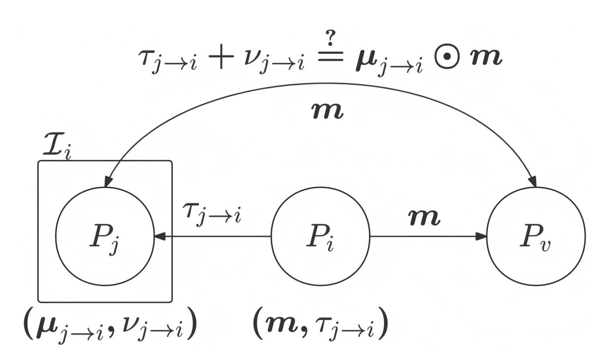

{0}------------------------------------------------

#### **Statistically Secure Asynchronous MPC with Linear Communication and O(***n* **5 ) Additive Overhead**

Xiaoyu Ji1 , Yifan Song2

1 jixy23@mails.tsinghua.edu.cn, Tsinghua University 2 yfsong@mail.tsinghua.edu.cn, Tsinghua University and Shanghai Qi Zhi Institute

**Abstract.** Secure multiparty computation (MPC) allows distrusted parties to jointly evaluate a common function while keeping their inputs private. In this work, we focus on improving the communication complexity of information-theoretic asynchronous MPC with optimal resilience (*t < n/*3). The current state-of-the-art work in this setting by Goyal, Liu-Zhang, and Song [Crypto'24] achieves amortized linear communication per gate with *Ω*(*n* 14) additive overhead. In comparison, the best-known result in the synchronous setting by Goyal, Song, and Zhu [Crypto'20] achieves the amortized linear communication per gate with only O(*n* 6 ) additive overhead, revealing a significant gap that we aim to close.

This work closes this gap and goes further. We present the first statistically secure asynchronous MPC protocol achieving amortized linear communication per gate with only O(*n* 5 ) additive overhead assuming a functionality for Agreement on Common Set (ACS). With the best-known instantiation for ACS, we obtain an asynchronous MPC protocol in the plain model with additive overhead O((*κ* + *n*)*n* 4 log *κ*) in expectation, where *κ* is the security parameter. In the setting of statistical security with optimal resilience, this even surpasses the best synchronous result when *n* ≥ √ *κ* log *κ*.

Technically, our contributions include (i) a new protocol for generating Beaver triples with linear communication per triple and O(*n* 3 ) additive overhead assuming functionalities for generating random degree-*t* Shamir sharings and ACS, and (ii) a new protocol for generating random degree-*t* Shamir sharings with linear communication per sharing and O(*n* 5 ) additive overhead assuming a functionality for ACS.

# **1 Introduction**

Secure multiparty computation (MPC) [\[Yao82,](#page-23-0) [GMW87,](#page-23-1) [BGW88,](#page-22-0) [CCD88,](#page-22-1) [RB89\]](#page-23-2) enables a set of *n* parties to jointly compute a function on their private inputs. The protocol ensures that any *t* corrupted parties together cannot learn any information about honest parties' inputs beyond what can be inferred from corrupted parties' function output.

Two common MPC network models are synchronous, with a global clock and known message delays, and asynchronous, with no timing assumptions and potentially arbitrarily delayed or reordered messages. While synchronous models simplify design and have driven practical MPC progress, they poorly reflect real-world low-latency, high-throughput settings. Asynchronous MPC (AMPC) is thus attractive for its tolerance of unpredictable delays, but designing it with both liveness and low communication complexity is technically challenging.

A central difficulty in designing AMPC protocols is that one cannot distinguish an honest party whose messages are delayed due to network latency from a corrupted party not sending messages. To ensure liveness, a party must proceed after receiving messages from only *n* − *t* parties. However, in the worst case, those *t* "missing" messages might be from honest parties whereas *t* of the arrived messages might come from corrupted parties. This makes the optimal corruption threshold in the asynchronous model much lower than synchronous model. Concretely, for the information-theoretical security: in the synchronous model, perfect security is achievable with *t < n/*3 [\[BGW88,](#page-22-0) [BH08\]](#page-22-2) and statistical security can be achieved for *t < n/*2 assuming broadcast [\[RB89\]](#page-23-2); in the asynchronous model perfect security is only possible for *t < n/*4 [\[BCG93\]](#page-22-3) while statistical security requires *t < n/*3 [\[BKR94,](#page-22-4) [ADS20\]](#page-22-5).

Over the past decades, a long line of works have focused on reducing the communication complexity of information-theoretical MPC in both the synchronous setting [\[BGW88,](#page-22-0) [DN07,](#page-23-3) [BH08,](#page-22-2) [BSFO12,](#page-22-6) [GLS19,](#page-23-4) 

{1}------------------------------------------------

GSZ20, AAPP23] and the asynchronous settings [BKR94, PCR10, CP17, CP23, AAPP24, GLZS24]. Yet, a consistent theme emerges: asynchronous protocols are much more expensive than their synchronous counterparts. At first glance, this belief is reasonable due to the strong timing assumption in the synchronous setting. However, a recent work [AAPS25] challenges this long-held belief by showing that, in the case of perfect security and maintaining the same  $\mathcal{O}(D)$  expected round complexity, AMPC can match the communication efficiency of the best synchronous protocol [AAPP23]3. This surprising result suggests that the perceived efficiency gap between synchronous and asynchronous models may not be inherent, but rather a consequence of current techniques. Motivated by this, we seek to challenge whether similar progress can be made for statistically secure AMPC.

#### 1.1 Our Contributions

In this work, we consider improving the communication complexity of asynchronous MPC with optimal resilience n=3t+1 [BKR94, ADS20]. The communication complexity consists of two parts: the circuit-dependent terms and the circuit-independent terms, and we refer to the latter as additive overhead. For the former, we mainly care about the amortized communication complexity to evaluate each gate in the circuit.

While recent advances have already achieved amortized linear communication per gate in asynchronous MPC [GLZS24], this comes at the cost of an enormous  $\mathcal{O}(n^{14})$  additive overhead. In contrast, the best synchronous protocol [GSZ20] can achieve amortized linear communication with only  $\mathcal{O}(n^6)$  overhead. This striking gap raises a natural question:

Can asynchronous MPC match the efficiency of its synchronous counterpart in the communication complexity?

Surprisingly, our answer is yes-and even beyond. Concretely, we obtain the following result.

**Theorem 1.** Let n = 3t + 1,  $\kappa$  denote the security parameter,  $\mathbb{F}$  be a finite field of size  $2^{\Omega(\kappa)}$ , and C be an arithmetic circuit over  $\mathbb{F}$  of size |C| and depth D. Let  $\mathcal{F}_{acs}$  be a functionality for Agreement on Common Set. There is a fully malicious asynchronous MPC protocol in the  $\mathcal{F}_{acs}$ -hybrid model that securely computes C against at most t corrupted parties with guaranteed output delivery. The achieved communication complexity is  $\mathcal{O}(|C|n + Dn^2 + n^5)$  field elements plus  $\mathcal{O}(1)$  instances of  $\mathcal{F}_{acs}$ .

In Section 3.3, we instantiate  $\mathcal{F}_{\mathsf{acs}}$  from several known primitives [PCR14, DWZ23, ADD+22, FLT24]4. The communication complexity of our instantiation is  $\mathcal{O}((\kappa+n)n^4\kappa\log\kappa)$  bits in expectation and  $\mathcal{O}((\kappa+n)n^4\kappa^2\log\kappa)$  bits in the worst case. Together with Theorem 1, we obtain an asynchronous MPC in the plain model with expected communication complexity  $\mathcal{O}(|C|n+Dn^2+(\kappa+n)n^4\log\kappa)$  field elements and worst-case communication complexity  $\mathcal{O}(|C|n+Dn^2+(\kappa+n)n^4\kappa\log\kappa)$  field elements.

In comparison, in the setting of statistically secure and optimal resilience, the best-known result [GSZ20] in the synchronous setting achieves  $\mathcal{O}(|C|n+n^6)$  field elements of communication. When  $D \leq |C|/n$  and  $n \geq \sqrt{\kappa \log \kappa}$ , our protocol requires less communication than [GSZ20] in expectation. See Table 1 for a comparison with state-of-the-art protocols.

Main Technical Results. To achieve our result, we follow the generic approach of constructing AMPC protocols [CP23, GLZS24, BJK $^+$ 25]: The protocol is divided into an offline phase and an online phase. In the offline phase, all parties together prepare a sufficient number of random Beaver triples shared by degree-t Shamir sharings. Then, in the online phase, all parties use the technique of Beaver triples [Bea92] to evaluate the circuit gate by gate. In particular, all parties only need to perform public reconstruction of degree-t

We note that the best-known results in the synchronous setting [BH08, GLS19] still have a better communication complexity than [AAPP23] (and its asynchronous counterpart [AAPP24, AAPS25]) but at the cost of requiring  $\mathcal{O}(D+n^2)$  rounds.

&lt;sup>4 The authors in [FLT24] give a transformation from their hash-based construction to an IT-secure construction with optimal resilience in Section 6.3.

{2}------------------------------------------------

| Protocol                          | Communication Complexity       | Round                | Corruption Threshold | Security      | Assumption | Network |
|-----------------------------------|-----------------------------------|----------------------|-------------------------|---------------|------------|---------|
| [GLS19]                           | $\mathcal{O}(Cn+n^3)$             | $\mathcal{O}(D+n^2)$ | n = 3t + 1              | Perfect       | None       |         |
| [AAPP23]                          | $\mathcal{O}(Cn + Dn^2 + n^4)$    | $\mathcal{O}(D)$     | n = 3t + 1              | Perfect       | None       | Sync.   |
| [GSZ20]                           | $\mathcal{O}(Cn + Dn^2 + n^6)$    | $\mathcal{O}(D+n^2)$ | n = 2t + 1              | Statistical   | BC         |         |
| [AAPS25]                          | $\mathcal{O}(Cn + Dn^2 + n^4)$    | $\mathcal{O}(D)$     | n = 4t + 1              | Perfect       | None       |         |
| [GLZS24]                          | $\mathcal{O}(Cn + Dn^2 + n^{14})$ | $\mathcal{O}(D)$     | n = 3t + 1              | Statistical   | None       | Async.  |
| $\overline{[\mathrm{BJK}^{+}25]}$ | $\mathcal{O}(Cn + Dn^2 + n^4)$    | $\mathcal{O}(D+n)$   | n = 3t + 1              | Computational | ROM        |         |
| This Work                         | $\mathcal{O}(Cn + Dn^2 + n^5)$    | $\mathcal{O}(D+n)$   | n = 3t + 1              | Statistical   | None       |         |

Table 1. Comparison of MPC protocols with GOD in different settings. We list the communication complexity measured in the number of field elements. The parameters C and D denote the circuit size and depth, respectively. Both communication and round complexities are stated in expectation. All protocols assume private point-to-point channels. For asynchronous protocols, we do not count the cost of the instantiation of  $\mathcal{F}_{acs}$ . "ROM" denotes the random oracle model, "BC" denote the broadcast channel. Combining techniques in [AAPP24, AAPS25] get the list result.

Shamir sharings, which can be achieved with amortized linear communication per gate and  $\mathcal{O}(n^2)$  additive overhead. Thus the main bottleneck of AMPC is the preparation of random Beaver triples.

Our contributions are twofold. Let  $\mathcal{F}_{\mathsf{RandSh}}$  (refer to appendix A.4) be a functionality for generating random degree-t Shamir sharings. First, we present a new protocol for generating random Beaver triples, formally stated in Theorem 2. In comparison, the best-known result in the previous work [GLZS24] assumes functionalities  $\mathcal{F}_{\mathsf{acs}}$  and  $\mathcal{F}_{\mathsf{ACSS}}$  (refer to appendix A.3) for Asynchronous Complete Secret Sharing and requires (1)  $\mathcal{O}(Nn+n^6)$  field elements of communication, (2)  $\mathcal{O}(n^2)$  instances of  $\mathcal{F}_{\mathsf{ACSS}}$  for distributing a total number of  $\mathcal{O}(N)$  degree-t Shamir sharings, and (3) a constant number of instances of  $\mathcal{F}_{\mathsf{acs}}$ .

**Theorem 2.** Let n=3t+1,  $\kappa$  denote the security parameter,  $\mathbb{F}$  be a finite field of size  $2^{\Omega(\kappa)}$ . There is a fully malicious asynchronous triple generation protocol in the  $\{\mathcal{F}_{acs}, \mathcal{F}_{RandSh}\}$ -hybrid model that generates N random Beaver triples with communication complexity of  $\mathcal{O}(Nn+n^3)$  field elements plus  $\mathcal{O}(1)$  instances of  $\mathcal{F}_{acs}$  and one instance of  $\mathcal{F}_{RandSh}$  for  $\mathcal{O}(N)$  random degree-t Shamir sharings.

Second, we present a new protocol for  $\mathcal{F}_{ACSS}$  and state in Theorem 3. This represents a substantial improvement over the  $\mathcal{O}(n^{12})$  additive overhead from the best-known result for  $\mathcal{F}_{ACSS}$  [JLS24]. In addition, our second result can be extended to support multiple dealers distributing degree-t Shamir sharings simultaneously while maintaining the same additive overhead. This allows us to realize  $\mathcal{F}_{RandSh}$  without increasing the additive overhead, as shown in Theorem 4.

**Theorem 3.** Let n = 3t + 1,  $\kappa$  denote the security parameter,  $\mathbb{F}$  be a finite field of size  $2^{\Omega(\kappa)}$ . There exists a fully malicious ACSS protocol that shares N degree-t Shamir sharings with communication of  $\mathcal{O}(Nn + n^5)$  field elements.

**Theorem 4.** Let n = 3t + 1,  $\kappa$  denote the security parameter,  $\mathbb{F}$  be a finite field of size  $2^{\Omega(\kappa)}$ . There exists a fully malicious random sharing generation protocol in the  $\mathcal{F}_{acs}$ -hybrid model that generates N random degree-t Shamir sharings with communication complexity of  $\mathcal{O}(Nn + n^5)$  field elements plus  $\mathcal{O}(1)$  instances of  $\mathcal{F}_{acs}$ .

### 2 Technical Overview

In this section, we give a high-level overview of our techniques. Recall that we use n for the number of parties, t for the number of corrupted parties. We focus on the optimal corruption setting where n = 3t + 1. In the

{3}------------------------------------------------

following, we use  $[s]_d$  to denote a degree-d Shamir secret sharing of s and  $\alpha_0, \ldots, \alpha_{2n+t}$  to denote distinct field elements. Here, we denote the security parameter by  $\kappa$  and require the field size to be  $2^{\Omega(\kappa)}$ .

We start with our new protocol for random Beaver triples in Section 2.1 and Section 2.2. Then we introduce our new protocol for ACSS in Section 2.3 and Section 2.4. Finally, we extend our ACSS protocol to support multiple dealers sharing at the same time in Section C.1.

## 2.1 Review of Known Solutions for Beaver Triple Preparation

For simplicity, we focus on a semi-honest adversary with send omission, which allows the adversary to drop corrupted parties' messages. This is to capture the main difficulty in the asynchronous setting: an honest party cannot distinguish a corrupted party not sending messages from an honest party with a large network delay. We will briefly discuss how to achieve malicious security at the end of the next subsection.

We note that preparing random Beaver triples with linear communication in this setting is already non-trivial. One may attempt to apply the techniques from the well-known DN protocol [DN07] in the synchronous setting, which requires all parties to prepare a pair of random Shamir sharings  $([r]_t, [r]_{2t})$  for each Beaver triple. This task can be easily achieved with linear communication following the randomness extraction technique in [DN07]. In the asynchronous setting, however, the main difficulty is to ensure that every party receives their shares. Indeed, a corrupted dealer may choose to only send shares to a subset of parties. So far, we do not know any solution that allows a dealer to distribute degree-2t Shamir sharings with linear communication even against a semi-honest adversary with send omission in the IT setting.

To bypass this difficulty, our starting point is the triple extraction technique from [CP17] and we give a brief review of this technique below.

Review of Triple Extraction [CP17]. Suppose all parties hold N random Beaver triples, but up to T of them might be known to corrupted parties (for example, these triples are generated by corrupted parties). The triple extraction technique [CP17] provides a way to extract fresh random Beaver triples.

Let  $L = \frac{N-1}{2}$ . The high-level idea is to use these N random Beaver triples to build three polynomials f, g, h shared by all parties such that  $h = f \cdot g$ . Here f, g are of degree L and h is of degree 2L. Then for each evaluation point  $\alpha$ ,  $([f(\alpha)]_t, [g(\alpha)]_t, [h(\alpha)]_t)$  is a Beaver triple. This technique guarantees that corrupted parties may learn at most T Beaver triples (at T of the first N evaluation points). Thus, all parties can extract out L - T + 1 random Beaver triples by evaluating f, g, h at another L - T + 1 points. Building these three polynomials requires  $\mathcal{O}(Nn)$  field elements of communication. Thus, the amortized cost per triple is  $\mathcal{O}(\frac{2Nn}{N-2T+1})$ , which is linear if  $N - 2T + 1 = \Theta(N)$ .

In [CP17], the authors apply this technique directly in the asynchronous setting where each party uses an ACSS protocol to distribute a random Beaver triple. However, due to the asynchrony, parties can only expect n-t parties to successfully distribute their triples. As a result, the triple extraction technique is applied on N=n-t random Beaver triples with T=t of them generated by corrupted parties. Since n=3t+1, this leads to  $\mathcal{O}(n^2)$  field elements per triple, failing to achieve linear communication. The recent work [GLZS24] builds on [CP17] and achieves linear communication by using a two-process trick, where each process itself does not guarantee termination, but at least one process terminates. However, their construction incurs an additive overhead of  $\mathcal{O}(n^6)$  elements (regardless of the cost of the ACSS protocols).

### 2.2 New Beaver Triple Preparation with Cubic Additive Overhead

Our starting point is to use the party virtualization technique [Bra87] to boost the corruption threshold. Imagine that there are N virtual parties and at most T < N/9 of them are corrupted. We ask each virtual party to distribute a random Beaver triple to all parties. Then the triple extraction technique can produce random Beaver triples with linear communication (even considering that T parties may fail to provide triples due to asynchrony).

To this end, we let each ordered pair of parties  $(P_i, P_j)$  simulate a virtual party  $V_{i,j}$  by a 2-party computation protocol. In particular,  $V_{i,j}$ 's view is additively shared between  $P_i$  and  $P_j$ . In this way, as long as one

{4}------------------------------------------------

party is honest,  $V_{i,j}$ 's view is unknown to the corrupted parties and  $V_{i,j}$  can be viewed as an honest virtual party. Thus, we have  $N = n^2$  virtual parties and at most  $t^2 < N/9$  among them are corrupted.

However, this idea faces the following two difficulties:

- First, since we ask each virtual party  $V_{i,j}$  to distribute a random Beaver triple,  $(P_i, P_j)$  need to generate a random additively shared Beaver triple. But it is known that a 2-party computation protocol with information-theoretic security does not exist for this task even in the synchronous setting.
- Second, as [CP17], we cannot expect each virtual party to successfully distribute his triple due to asynchrony. Even worse, as long as one of  $P_i$ ,  $P_j$  is corrupted, we cannot expect a random Beaver triple from  $V_{i,j}$  even if the other party is honest.

Instantiation of Virtual Party's Computation. To prepare a random additively shared Beaver triple between  $P_i$  and  $P_j$ , we apply the triple extraction technique [CP17] again: Each party  $P_k \in \{P_1, \ldots, P_n\}$  first shares a random Beaver triple between  $P_i$  and  $P_j$ . Then  $P_i$  and  $P_j$  extracts out random Beaver triples following [CP17]. Similar to [CP17],  $P_i$  and  $P_j$  can only obtain a single additively shared Beaver triple each time. However, since the triple extraction process is run between  $P_i$  and  $P_j$  rather than among all parties as in [CP17], we can still achieve a linear communication per triple shared between  $P_i$  and  $P_j$ , which is sufficient for our purpose.

One issue of the above process is that it only guarantees termination if both  $P_i$  and  $P_j$  are honest. When exactly one of  $P_i$  and  $P_j$  is corrupted, it still ensures privacy of the random Beaver triple, but not termination. Fortunately, this is already sufficient for us: All parties may expect to receive random Beaver triples from virtual parties which are fully simulated by honest parties, and there are  $(n-t)^2 > 4N/9$  such virtual parties. Among the received triples, at most T < N/9 might be generated by virtual parties that are fully simulated by corrupted parties. Now applying the triple extraction technique in [CP17], we can still extract  $N/9 = \Theta(N)$  random Beaver triples. As a result, the amortized communication per triple is still linear.

In summary, our construction for triple preparation works in two stages.

- Stage 1: Every ordered pair of parties  $(P_i, P_j)$  simulate a virtual party  $V_{i,j}$ . All parties help  $P_i$  and  $P_j$  to prepare a random additively shared Beaver triple following the triple extraction technique. Then  $P_i$  and  $P_j$  use  $\mathcal{F}_{ACSS}$  (defined in appendix A.3) to share the resulting triple to all parties.
- Stage 2: All parties agree on a subset of 4N/9 virtual parties who successfully distribute their triples. Then all parties apply the triple extraction technique [CP17] again to obtain  $\Theta(N)$  random Beaver triples.

Each stage costs  $\mathcal{O}(Nn)$  field elements of communication. The amortized cost per triple is  $\mathcal{O}(n)$ .

Remark 1. One may wonder whether we can increase the committee size of virtual parties, e.g., to 3 parties, so that parties in each committee can prepare the triple themselves. Unfortunately, this is not the case. To enable an information-theoretic solution, we need at least an honest majority within each committee to ensure privacy. Due to the network delay in an asynchronous network, the messages of t honest parties may be arbitrarily delayed. As a result, only 2t + 1 parties may respond and participate in time (including t corrupted parties). In this case, half of the committees may lack an honest majority, which is insufficient to achieve linear communication from triple extraction.

**Optimization.** A naïve implementation of our construction would require  $\mathcal{O}(n^2)$  instances of  $\mathcal{F}_{ACSS}$ . As we will introduce later, we manage to construct a protocol for  $\mathcal{F}_{RandSh}$  with the same asymptotic communication complexity as that for  $\mathcal{F}_{ACSS}$ . In the following, we show how to reduce  $\mathcal{O}(n^2)$  instances of  $\mathcal{F}_{ACSS}$  to one instance of  $\mathcal{F}_{RandSh}$ .

All parties first invoke  $\mathcal{F}_{\mathsf{RandSh}}$  to prepare a sufficient number of random degree-t Shamir sharings at the beginning of the protocol. Then, whenever a party  $P_i$  needs to distribute a degree-t Shamir sharing  $[s]_t$ , we consume a random degree-t Shamir sharing  $[r]_t$  and reconstruct the secret r to  $P_i$ . Next  $P_i$  broadcasts s+r and all parties locally compute  $[s]_t = (s+r) - [r]_t$ . Effectively, with  $\mathcal{F}_{\mathsf{RandSh}}$ , we convert  $O(n^2)$  instances

{5}------------------------------------------------

of FACSS to *O*(*n* 2 ) instances of broadcast, which incurs a smaller additive overhead compared with FACSS. However, each broadcast still requires *O*(*n* 2 ) elements of communication regardless of the message length, which results in an overall *O*(*n* 4 ) additive overhead. To further improve the additive overhead, we make the following changes.

First, for each *Vi,j* simulated by *Pi* and *Pj* , *Pj* will send the messages to be broadcast to *Pi* , and *Pi* will broadcast both parties' messages at the same time. In addition, *Pi* will only broadcast once after receiving messages from 2*t* + 1 different *Pj* 's. In other words, *Pi* will wait for the broadcast messages of 2*t* + 1 virtual parties in {*Vi,*1*, Vi,*2*, . . . , Vi,n*} and then broadcast them at the same time. Then, all parties invoke Facs to agree on 2*t* + 1 parties successfully broadcasting their messages. This directly translates to (2*t* + 1)2 *>* 4*N/*9 successful virtual parties as we need. In this way, we only need O(*n*) instances of broadcast. With the current best instantiation of IT-secure reliable broadcast in [\[ADD](#page-22-11)+22], the additive overhead is reduced to O(*n* 3 ) elements.

**Towards Malicious Security.** To achieve malicious security, we need to make sure that in Stage 2, parties only accept correct random Beaver triples from virtual parties. To guarantee termination, we need to ensure that when *Pi* and *Pj* are both honest, the random Beaver triple shared by *Vi,j* is correct. This in turn requires that in Stage 1, *Pi* and *Pj* only use correct additively shared Beaver triples from all parties.

Both tasks boil down to a verification protocol for random Beaver triples, either additively shared or via Shamir secret sharings. We follow the technique in [\[BSFO12,](#page-22-6) [CP17\]](#page-22-8) for this task. The idea is again building three polynomials *f, g, h* such that *h* = *f* · *g* similarly to the triple extraction process. Then, checking Beaver triples is reduced to verifying *h* = *f* · *g*, which can be done by checking a random evaluation point from the Schwarz-Zippel lemma. We refer the readers to Section [5.1](#page-18-0) for more details.

However, the above is not sufficient to maintain the cubic additive overhead due to a subtle issue: When should we perform the verification for each virtual party's Beaver triple? We note that each single verification requires reconstructing 3 degree-*t* Shamir sharings, which needs at least *Θ*(*n* 2 ) field elements of communication. However, if performing the verification for *Θ*(*n*) virtual parties at the same time, relying on batch public reconstruction, the additive overhead remains *Θ*(*n* 2 ).

Now if we perform the verification *before* all parties agree on 4*N/*9 successful virtual parties, this requires us to verify each virtual party's Beaver triple one by one, resulting in an additive overhead of *Θ*(*n* 4 ) field elements. On the other hand, if we perform the verification *after* all parties agree on 4*N/*9 successful virtual parties, it is possible that many of them are incorrect and the triple extraction process may fail. Note that as long as one of *Pi* and *Pj* is corrupted, even if the other party is honest, the corrupted party may broadcast an incorrect value, causing the final Beaver triple to be incorrect as well.

We note that the triple extraction technique can still achieve linear communication if all parties start with (2*/*9 + *ϵ*)*N* correct triples for any constant *ϵ* ∈ (0*,* 2*/*9]. Our idea is to apply a variant of the party elimination technique [\[HMP00\]](#page-23-13): All parties first agree on 4*N/*9 successful virtual parties and verify their triples at the same time. If there are at least (2*/*9 + *ϵ*)*N* correct triples, they apply the triple extraction process. Otherwise, all parties may identify (2*/*9−*ϵ*)*N* = *Θ*(*N*) virtual parties who provide incorrect triples. These virtual parties are eliminated, and all parties repeat the above process to agree on another set of 4*N/*9 successful virtual parties. The key point is that a virtual party fully simulated by honest parties will never be eliminated. Since each time *Θ*(*N*) virtual parties are removed, we only need to repeat a constant number of times. For example, by setting *ϵ* = 1*/*27, we only need to repeat 3 times.

### **2.3 Blueprint for ACSS with Linear Communication**

Unlike preparation of random Beaver triples, distributing degree-*t* Shamir sharings can be easily achieved with linear communication against a semi-honest adversary with send omission. Suppose a dealer *D* wants to distribute *t* + 1 degree-*t* Shamir sharings [*s*0]*t, . . . ,* [*st*]*t*. Let *β*0*, . . . , βt* be *t* + 1 distinct field elements. Consider the following process:

1. The dealer *D* first samples a random degree-(*t,* 2*t*) bivariate polynomial *F*(*x, y*) such that *F*(*x, βi*) is the underlying degree-*t* polynomial of [*si* ]*t*. The goal is to let each party *Pi* learn *F*(*αi , y*) so that *Pi* may compute his shares by *F*(*αi , β*0)*, . . . , F*(*αi , βt*).

{6}------------------------------------------------

- 2. **Distributing Column Polynomials.** The dealer first sends  $F(\alpha_i, y)$  to each  $P_i$ . Then all parties run a reliable agreement protocol to decide whether the sharing phase succeeds. If the output is 1, it guarantees that at least t+1 honest parties have received their shares from the dealer.
- 3. Reconstructing Row Polynomials. To recover shares for the rest of parties, each  $P_i$  sends  $F(\alpha_i, \alpha_j)$  to  $P_j$ . Note that  $P_j$  can expect  $F(\alpha_i, \alpha_j)$  from t+1 parties, which are sufficient to interpolate  $F(x, \alpha_j)$ . However, remember our goal is to let each party  $P_j$  learn his column polynomial  $F(\alpha_j, y)$ .
- 4. **Reconstructing Column Polynomials.** After obtaining  $F(x, \alpha_i)$ , each  $P_i$  sends  $F(\alpha_j, \alpha_i)$  to  $P_j$ . This time  $P_j$  can expect  $F(\alpha_j, \alpha_i)$  from 2t+1 parties, which are sufficient to interpolate  $F(\alpha_j, y)$ . This allows  $P_j$  to compute his shares of  $[s_0]_t, \ldots, [s_t]_t$ .

The communication complexity is  $\mathcal{O}(n^2)$  field elements for  $\mathcal{O}(n)$  degree-t Shamir sharings. Thus, the amortized communication is linear per sharing.

The recent work [JLS24] follows the above process and constructs a maliciously secure ACSS protocol with linear communication. In the following, we discuss the main difficulties of achieving malicious security and sketch their solutions.

Difficulty 1: Verifying Shares From the Dealer. In Step 2, we need to verify that the dealer D distributes valid degree-t Shamir sharings to all (honest) parties. This is achieved in [JLS24] via the primitive Asynchronous Packing Information Checking Protocol  $\mathcal{F}_{\mathsf{APICP}}$  (defined in appendix 4.1), which can be viewed as an analogy of a signature scheme with information-theoretic security.

At a high level, after receiving the column polynomial from D, each party  $P_i$  uses  $\mathcal{F}_{\mathsf{APICP}}$  to send a signature of his column polynomial  $F(\alpha_i, y)$  back to D. After collecting a set  $\mathcal{M}$  of 2t+1 parties' signatures, D can prove the correctness of the column polynomial  $F(\alpha_i, y)$  distributed to each party  $P_i$  by revealing the shares and signatures of parties in W. To see why this is the case, we may define D's bivariate polynomial F(x,y) by the column polynomials of the first t+1 honest parties in  $\mathcal{M}$ . Then, if  $P_i$  accepts his column polynomial, it means that his column polynomial is consistent with F(x,y). However, this proof would reveal the entire bivariate polynomial to each party. To achieve privacy, D will distribute multiple bivariate polynomials, and he will only reveal a random linear combination of all bivariate polynomials as the proof to each party, which is supported by  $\mathcal{F}_{\mathsf{APICP}}$ . We refer the reader to section 4.2 for more details.

Difficulty 2: Verifying Shares from Other Parties. The main difficulty of achieving malicious security following the above process is to ensure that parties can reconstruct their row polynomials and column polynomials in Step 3 and Step 4. The issue comes from the fact that a party may only expect t+1 correct shares for his degree-t row polynomial, and t+1 correct shares for his degree-t column polynomial. As a result, each party needs to be able to distinguish correct shares from wrong shares and only use correct shares for interpolation.

In [JLS24], this is achieved relying on the technique of authentication tags introduced in [BSFO12], which allows a party  $P_v$  to verify the correctness of a message  $\boldsymbol{m}$  from another party  $P_i$ . To be more concrete, for a vector  $\boldsymbol{m} \in \mathbb{F}^L$  held by  $P_i$ ,  $P_v$  generates authentication keys  $(\boldsymbol{\mu}, \nu)$  with  $\boldsymbol{\mu} \in \mathbb{F}^L$ ,  $\nu \in \mathbb{F}$ . Party  $P_i$  receives the authentication tag  $\tau$  such that  $\tau + \nu = \boldsymbol{\mu} \odot \boldsymbol{m}$  where  $\odot$  denotes the inner product. Later,  $P_i$  can send  $(\boldsymbol{m}, \tau)$  to  $P_v$ , who verifies it using his keys. Here, the first key  $\boldsymbol{\mu}$  can be reused across multiple messages while  $\nu$  can only be used once. We refer to  $\boldsymbol{\mu}$  as the long-term key and  $\nu$  as the short-term key.

In Step 2, the sharing phase succeeds only when a set W of 2t+1 parties receive their correct column polynomials from D as well as authentication tags with respect to every party  $P_v$ 's authentication keys. In this way, parties can verifiably reconstruct the whole sharings to a receiver R: parties in W simply send their shares and authentication tags to R, who identifies the first t+1 correct shares and reconstructs the whole sharings. In addition, since the authentication tags (under the same  $\mu$ ) are linearly homomorphic, parties can verifiably reconstruct any publicly agreed linear combination of all sharings to R. Relying on this fact, in Step 3 and Step 4, whenever  $P_v$  receives his shares from some party  $P_i$ ,  $P_v$  may check the correctness by asking all parties to reveal a random linear combination of all sharings. (Note that only parties in W have authentication tags under  $P_v$ 's keys, who can alternatively use tags to prove correctness.)

Communication Overhead in [JLS24]. Note that the above solution requires each party  $P_i \in \mathcal{W}$  to obtain authentication tags under every party  $P_v$ 's authentication keys. However, we cannot expect every party to

{7}------------------------------------------------

respond on time in the asynchronous setting. To resolve this issue, the idea in [JLS24] is to let parties first prepare random authentication keys shared by degree-t Shamir sharings using  $\mathcal{F}_{\mathsf{RandSh}}$  and then reconstruct the keys to  $P_v$ . In this way, even if  $P_v$  cannot respond on time, parties can still compute authentication tags under  $P_v$ 's keys.

In [JLS24], the authors use [CP23] to instantiate  $\mathcal{F}_{\mathsf{RandSh}}$  for random authentication keys, which costs  $\mathcal{O}(n^3)$  field elements of communication per sharing with additive overhead  $\mathcal{O}(n^6)$ . Making it even worse, to compute the authentication tags for  $P_i$ 's shares following [BSFO12], the authentication keys need to be shared with a variant of degree-t Shamir secret sharing scheme where the secrets are stored at the i-th point and  $P_i$  should not receive his shares (or otherwise the keys are leaked to  $P_i$ ). This requires all parties to use a different instance of  $\mathcal{F}_{\mathsf{RandSh}}$  for generating authentication keys for each  $P_i$ . Together with the complicated and involved process for computing authentication tags, it eventually results in a final additive overhead of  $\mathcal{O}(n^{12})$  field elements in [JLS24].

### 2.4 Our Solution for ACSS

In this work, we manage to reduce the additive overhead to  $\mathcal{O}(n^5)$  by a more efficient protocol for  $\mathcal{F}_{\mathsf{APICP}}$  and a simpler construction for computing authentication tags. We highlight our techniques for computing authentication tags below, which contribute more to reducing the communication overhead.

In [BSFO12, JLS24], authentication tags allow a party  $P_v$  to verify another party  $P_i$ 's shares. We note that this can be realized without requiring  $P_i$  to obtain tags under every party  $P_v$ 's keys. Instead, it is sufficient as long as  $P_i$  obtains tags under a set  $\mathcal{I}_i$  of 2t+1 parties' keys. When a party  $P_v$  needs to verify  $P_i$ 's shares, we consider two cases:

- If  $P_v \in \mathcal{I}_i$ , once  $P_i$  sends the tag and the messages to  $P_v$ , then  $P_v$  can use his authentication keys to do verification. This procedure is the same as in [JLS24].
- Otherwise, we note that although  $P_v$  cannot verify those tags himself, he can ask for help from parties in  $\mathcal{I}_i$ . Concretely,  $P_i$  still sends tags to parties in  $\mathcal{I}_i$ , and  $P_v$  will forward the messages received from  $P_i$  to all parties in  $\mathcal{I}_i$ . Then parties in  $\mathcal{I}_i$  can help  $P_v$  to do verification.

If  $P_i$  is honest,  $P_v$  can expect that honest parties in  $\mathcal{I}_i$ , which contains at least t+1 honest parties  $P_j$ , will reply OK. On the other hand, if  $P_v$  receives t+1 OK, at least one is from an honest party who ensures the correctness of  $P_i$ 's shares. With this observation, when computing authentication tags, it is sufficient to focus on parties who can respond on time. In our construction, we will ask each  $P_j$  to share his authentication keys directly without relying on  $\mathcal{F}_{\mathsf{RandSh}}$  and thus avoiding the large additive overhead as in [JLS24].

Remark 2. A careful reader may note that directly forwarding the message and authentication tags to all parties in  $\mathcal{I}_i$  would compromise its privacy. To address this issue, we leverage the linear homomorphic property of the authentication tags. Specifically, rather than revealing the message itself,  $P_i$  and  $P_v$  agree on a random value, and reveal a random linear combination of their tags and messages to parties in  $\mathcal{I}_i$ . The parties in  $\mathcal{I}_i$  verify the corresponding random linear combination and send their responses back to  $P_v$ .

Generating Authentication Tags and Keys. We note that we can let D learn all authentication tags without breaking the security. This is because the tags are used to prevent a corrupted party from providing incorrect shares while an honest party always sends correct shares. Learning the tags of an honest party does not help a corrupted D distribute incorrect degree-t Shamir sharings. With this observation, we can sketch our basic construction idea below. The following process is run between the dealer D and  $P_j$  for every  $P_i$ . The goal is to let D obtain the authentication tag of  $P_i$ 's shares under  $P_j$ 's authentication keys.

- 1.  $P_j$  randomly samples a long-term authentication key  $\boldsymbol{\mu}_i \in \mathbb{F}^L$ . Then  $P_j$  shares each value in  $\boldsymbol{\mu}_i$  by a random degree-t Shamir sharing with secret position  $\alpha_i$ , denoted by  $[\boldsymbol{\mu}_i]_t^i$ .
- 2. D distributes a vector of L degree-t sharings following the second step in the blueprint, denoted by  $[s]_t = ([s_1]_t, \ldots, [s_L]_t)$ . Let  $\mathfrak{sh}_i$  denote  $P_i$ 's shares of  $[s]_t$ . Then we view  $[s]_t$  as  $[\mathfrak{sh}_i]_t^i$  by setting the secret position to be  $\alpha_i$ .

{8}------------------------------------------------

- 3. All parties locally compute  $[\operatorname{sh}_i \odot \boldsymbol{\mu}_i]_{2t}^i = [\operatorname{sh}_i]_t^i \odot [\boldsymbol{\mu}_i]_t^i$ . Then each party  $P_k$  additively shares his share of  $[\operatorname{sh}_i \odot \boldsymbol{\mu}_i]_{2t}^i$  to D and  $P_j$ .
- 4. D and  $P_j$  agree on a subset of 2t+1 parties and use their additive sharings to compute the authentication tag  $\tau_i$  and the short-term key  $\nu_i$  respectively. Finally, D sends the tag  $\tau_i$  to  $P_i$ . As a result,  $P_j$  holds authentication keys  $(\mu_i, \nu_i)$ ,  $P_i$  holds  $(\operatorname{sh}_i, \tau_i)$ , and the relation  $\tau_i + \nu_i = \mu_i \odot \operatorname{sh}_i$  holds.

Here, the last step utilizes the fact that the secret of  $[\mathbf{sh}_i \odot \boldsymbol{\mu}_i]_{2t}^i$  can be reconstructed from 2t+1 parties' shares. With additive sharings of 2t+1 parties' shares, D and  $P_j$  can compute an additive sharing of  $\mathbf{sh}_i \odot \boldsymbol{\mu}_i$ , and they may take their individual additive shares as the tag and short-term key, respectively.

The above procedure illustrates our approach to computing authentication keys and tags for a pair of parties  $(P_j, P_i)$ . To summarize, the goal of this authentication phase is to help each party  $P_i$  obtain a set  $\mathcal{I}_i$  of size 2t+1, where each  $P_j \in \mathcal{I}_i$  holds authentication keys  $(\boldsymbol{\mu}_{j\to i}, \nu_{j\to i})$  for  $P_i$ 's message  $\boldsymbol{m}$ , while  $P_i$  itself holds the corresponding authentication tags  $\tau_{j\to i}$ . For each  $P_j \in \mathcal{I}_i$ , the relation  $\tau_{j\to i} + \nu_{j\to i} = \boldsymbol{\mu}_{j\to i} \odot \boldsymbol{m}$  holds. Figure 1 provides a schematic illustration of this structure.

Later, when a party  $P_v$  needs to verify  $P_i$ 's message m, the parties in  $\mathcal{I}_i$  can assist  $P_v$  in performing the verification. Consequently, it is not necessary for every pair  $(P_i, P_v)$  to hold authentication keys and tags.

**Fig. 1.** Verification Procedure:  $P_j \in \mathcal{I}_i$  helps  $P_v$  to verify  $P_i$ 's messages.

Now suppose D wants to share N degree-t Shamir sharings. Recall that L is the long-term key size. Then all degree-t Shamir sharings are divided into m = N/L groups of size L. For each  $P_j$  and  $P_i$ , distributing  $P_j$ 's authentication keys for  $P_i$  requires  $\mathcal{O}(Ln)$  elements of communication, and computing the authentication tag for  $P_i$ 's shares requires  $\mathcal{O}(n)$  elements of communication per group. In summary, the total communication required by our basic construction is  $\mathcal{O}(mn^3 + Ln^3) = \mathcal{O}(\frac{N}{L}n^3 + Ln^3)$  (excluding the cost of distributing  $[s]_t$ ). When setting  $L = n^2$ , the additive overhead is  $\mathcal{O}(n^5)$  while achieving linear communication per sharing.

**Termination of the Sharing Phase.** Once each party  $P_i$  has accepted its column polynomial  $F(\alpha_i, y)$ , obtained the set  $\mathcal{I}_i$  such that every party  $P_j \in \mathcal{I}_i$  holds authentication keys for this column polynomial, and  $P_i$  holds the corresponding authentication tags,  $P_i$  broadcasts a confirmation message. The dealer D then collects these confirmation messages and broadcasts a set  $\mathcal{W}$  consisting of 2t+1 distinct parties that have issued confirmations. Upon receiving a valid set  $\mathcal{W}$ , all parties terminate the sharing phase. Refer to Section 4.5 for more details.

Note that the sets  $\mathcal{I}_i$  may differ for different parties  $P_i$ . Using the authentication tags and keys prepared for the parties in  $\mathcal{W}$  and the corresponding sets  $\{\mathcal{I}_i\}_{i\in\mathcal{W}}$ , we follow the approach of [JLS24] to complete

{9}------------------------------------------------

the completion phase. In particular, the parties first reconstruct their row polynomials and subsequently reconstruct the column polynomials to obtain their final shares. Refer to Section 4.6 for more details.

**Preventing Malicious Behaviors.** Our basic construction can easily go wrong against a fully malicious adversary:

- A malicious  $P_j$  may distribute invalid  $[\mu_i]_t^i$  in Step 1.
- A malicious party  $P_k$  may share an incorrect additive share of  $[\mathbf{sh}_i \odot \boldsymbol{\mu}_i]_{2t}^i$  to D and  $P_j$  in Step 3.
- A malicious D may send an incorrect authentication tag to  $P_i$  in Step 4.

We address each of these issues below.

For the first issue, a direct solution is to let  $P_j$  prove the correctness of the shares sent to each party using  $\mathcal{F}_{\mathsf{APICP}}$  as the dealer does for  $[s]_t$ . However, one subtlety is that when distributing  $[\mu_i]_t^i$ ,  $P_j$  cannot send the *i*-th shares to  $P_i$  since the authentication keys are stored at position  $\alpha_i$ . To compensate the missing share, in [BSFO12, JLS24],  $P_j$  will set the shares at position  $\alpha_0$  to be **0**. Then, for  $i \neq j$ ,  $[\mu_i]_t^i$  and  $[\mu_j]_t^j$  are two different variants of degree-t Shamir sharings, and  $P_j$  cannot prove the correctness of them at the same time. As a result,  $P_j$  has to prove the correctness of the shares of each  $[\mu_i]_t^i$  separately, which would lead to  $\mathcal{O}(n^6)$  additive overhead.

We note that if we use f(x) to denote the vector of underlying degree-t polynomials of  $[s]_t$  (so that  $f(\alpha_i)$  are  $P_i$ 's shares  $\operatorname{sh}_i$ ) and define  $\Psi(x)$  to be the vector of degree-(n-1) polynomials such that  $\Psi(\alpha_i) = \mu_i$ , then the above computation is to let D and  $P_j$  hold additive sharings for  $f(\alpha_i) \odot \Psi(\alpha_i)$  for all  $i \in \{1,\ldots,n\}$ . Another way of obtaining these additive sharings is to first let both parties obtain additively shared polynomials  $f(x) \odot \Psi(x)$ , which can be interpolated from n+t shared evaluation results  $\{f(\alpha_i) \odot \Psi(\alpha_i)\}_{i=n+1}^{2n+t}$ . To this end,  $P_j$  needs to share  $\{[\Psi(\alpha_i)]_t^i\}_{i=n+1}^{i-2n+t}$ . Note that this time  $P_j$  can distribute them as standard degree-t Shamir sharings. In particular, each party  $P_k$  can obtain his shares at position  $\alpha_j$  as usual. This allows  $P_j$  to prove the correctness of the shares of all authentication keys at the same time, maintaining the  $\mathcal{O}(n^5)$  additive overhead. We would like to point out that this change brings another challenge: the secrets  $\{\Psi(\alpha_i)\}_{i=n+1}^{2n+t}$  may not lie on valid degree-(n-1) polynomials when  $P_j$  is corrupted. We show that  $P_j$  can prove the correctness of the secrets by slightly modifying the  $\mathcal{F}_{\mathsf{APICP}}$ -based proof without incurring additional overhead.

With the change above, each party simply computes an inner product of his shares of  $[s]_t$  and each of  $\{[\Psi(\alpha_i)]_t^i\}_{i=n+1}^{2n+t}$  in Step 2. Then for the second issue, to check whether each  $P_k$  correctly shares the inner-product results,  $P_j$  sends a random linear combination of  $\{[\Psi(\alpha_i)]_t^i\}_{i=n+1}^{2n+t}$ , denoted by  $[\tilde{\mu}]_t$ , together with the same linear combination of each  $P_k$ 's additive shares, denoted by  $\tilde{\nu}_j$  to D, who can verify the additive shares received from  $P_k$ . To protect the secrecy of  $\Psi(x)$ ,  $P_j$  in addition shares  $[r]_t$  as random masks and all parties also compute  $[s \odot r]_{2t}$ . We note that, however, when D and  $P_k$  are honest but  $P_j$  is corrupted, a malicious  $P_j$  may launch a selective-failure attack by sending incorrect  $[\tilde{\mu}]_t$  and  $\tilde{\nu}_k$ . Our construction only achieves security when D distributes random degree-t Shamir sharings  $[s]_t$ , in which case this selective-failure attack can be detected with overwhelming probability. We note that one can convert it to a standard ACSS by letting D broadcast the differences after the sharing phase succeeds.

Finally, for the last issue, we will repeat the above process and compute two copies of the authentication tags. Then  $P_j$  will reveal a random linear combination of the two authentication keys to  $P_i$  so that  $P_i$  can locally verify the tags received from D. Refer to section 4.3 and 4.4 for the detailed solutions.

Parallel Completion Among  $\mathcal{O}(n)$  Dealers with  $\mathcal{O}(n^5)$  Additive Overhead. So far, for each instance of  $\Pi_{\text{ACSS}}$ , we have achieved amortized linear communication per sharing and  $\mathcal{O}(n^5)$  field elements of additive overhead. Since parties need to invoke  $\mathcal{O}(n)$  instances of ACSS to prepare random sharings, resulting in the overall additive overhead to be  $\mathcal{O}(n^6)$  field elements. Our final optimization considers the case for preparing random degree-t Shamir sharings, when there are  $\mathcal{O}(n)$  instances of ACSS run in parallel. The high-level idea is that we want to reuse each  $P_j$ 's long-term authentication keys and do the completion phase across different dealers in parallel to save a factor of n in the additive overhead. We refer readers to the Appendix C for the technical overview and detailed construction. In Section 4, we only give the construction of  $\Pi_{\text{ACSS}}$  which achieves amortized linear communication plus  $\mathcal{O}(n^5)$  field elements per instance for simplicity.

{10}------------------------------------------------

# 3 Preliminary

### 3.1 Model

We consider protocols among a set  $\mathcal{P}$  of n parties  $P_1, \ldots, P_n$ . For the security of our protocols, we use the UC framework introduced by Canetti [Can01], based on the real and ideal world paradigm [Can00]. Parties have access to a network of point-to-point asynchronous and secure channels (for details of the asynchronous network model, we refer the reader to [CR98]). Asynchronous channels guarantee eventual delivery, meaning that every message sent by an honest party is guaranteed to be delivered after some finite delay. The adversary controls the message scheduling: it can arbitrarily delay the delivery of honest messages and even change their order of arrival at the recipients. Importantly, however, the channels are secure: the adversary cannot drop messages indefinitely, nor can it learn, modify, or forge the contents of messages exchanged between honest parties. We also consider the fully malicious adversary, which can arbitrarily deviate from the behavior of corrupted parties.

### 3.2 Shamir Secret Sharing

In this work, we use the standard Shamir Secret Sharing scheme [Sha79]. Let  $\mathbb{F}$  be a finite field with  $|\mathbb{F}| \geq 2n$ , and let  $\alpha_0, \ldots, \alpha_n$  be distinct elements in  $\mathbb{F}$ .

A degree-d Shamir sharing of  $x \in \mathbb{F}$  is a vector  $(x_1, \ldots, x_n)$  such that there exists a polynomial  $f \in \mathbb{F}[X]$  of degree at most d with  $f(\alpha_0) = x$  and  $f(\alpha_i) = x_i$  for all  $i \in [n]$ . Party  $P_i$  holds share  $x_i$ , and the sharing is denoted by  $[x]_d$ . We also use  $[x]_d^j$  to denote a Shamir secret sharing where the secret is in evaluation point  $\alpha_j$ , i.e.,  $f(\alpha_j) = x$ .

### 3.3 Building Blocks

Let  $\kappa$  denote the security parameter. Our construction utilizes the following building blocks. The instantiations of the following building blocks are all information-theoretically secure. Refer to appendix A for the detailed definition.

- Reliable Broadcast  $\mathcal{F}_{\mathsf{rbc}}$ . It allows parties to agree on the value of a sender, which can be realized with  $\mathcal{O}(L \cdot n + n^2 \log n)$  communication bits for broadcasting a message of size L bits [ADD+22].
- Random Coin  $\mathcal{F}_{coin}$ . It allows parties to generate a random coin (of size  $\kappa$  bits). The authors in [PCR14]5 give a construction to generate  $\mathcal{O}(n)$  random bits with private communication of  $\mathcal{O}(n^4\kappa)$  bits and broadcast of  $\mathcal{O}(n^4\kappa)$  bits. The expected running time is also constant. For the broadcast of  $\mathcal{O}(n^4\kappa)$  bits, each party will invoke  $\mathcal{O}(n^2)$  instances of reliably broadcast, each time broadcasting  $\mathcal{O}(n\kappa)$  bits. By using the broadcast protocol in [ADD+22], we can realize  $\mathcal{F}_{coin}$  with expected  $\mathcal{O}(n^4\kappa^2 + n^5\kappa)$  communication bits.
- Agreement on a Common Set  $\mathcal{F}_{acs}$ . It allows parties to agree on a set of n-t parties that satisfy a certain property. The authors in [DWZ23] show that  $\mathcal{F}_{acs}$  can be realized with n instances of reliable broadcast and  $\mathcal{O}(1)$  instances of multi-valued validated Byzantine agreement (MVBA). By using the broadcast protocol in [ADD+22] and MVBA in [FLT24], we can realize  $\mathcal{F}_{acs}$  with  $\mathcal{O}(n^3\kappa)$  bits plus expected  $\mathcal{O}(\log \kappa)$  random coins (each of size  $\kappa$  bits). The expected round complexity is  $\mathcal{O}(\log \kappa)$ .
- Public Reconstruction for Degree-t Sharings  $\mathcal{F}_{\mathsf{PubRec}}$ . It allows the parties to publicly reconstruct the secrets of L degree-t Shamir secret sharings using  $\mathcal{O}(Ln+n^2)$  field elements of communication [DN07].

Note that the construction in [PCR14] only provides a weaker guarantee: all honest parties obtain the same output random bit with constant (rather than overwhelming) probability. Accordingly, we adopt the weaker definition of  $\mathcal{F}_{acs}$  from [CFG+23] to model this weak coin functionality. This weaker coin already suffices to realize the consensus protocols [CFG+23, AAPS25], and we can also use it to instantiate  $\mathcal{F}_{acs}$ .

{11}------------------------------------------------

### 4 Generation of Random Degree-t Sharings

In this section, we present our construction of the random sharing generation protocol, which realizes the functionality  $\mathcal{F}_{\mathsf{RandSh}}$  (defined in appendix A.4). We begin by describing the sub-protocols of our new ACSS construction. It is worth noting that our original construction of the ACSS protocol only enables the dealer to distribute random degree-t sharings, but this is sufficient if we only use it for generating random sharings. Later, we will show a modification that allows the dealer to distribute arbitrary inputs.

### 4.1 Asynchronous Packing Information Checking Protocol

We propose a new construction of information-theoretically secure APICP that realizes the functionality  $\mathcal{F}_{\mathsf{APICP}}$  defined below. APICP can be viewed as a signature scheme6 involving three parties: a dealer D, an intermediary I, and a receiver R. The dealer D signs a message and sends it to I. When I forwards the message along with its signature to R, the receiver can verify that the message indeed originates from D. Beyond providing authenticity for individual messages, APICP additionally supports the following properties:

- Linear Homomorphism: Linear combinations of signatures can be used to verify the corresponding linear combinations of the underlying messages.
- Multiple Revelations: A valid signature can be revealed and verified by different receivers multiple times.

In our construction, the dealer D signs a batch of messages. Let m denote the batch size, L the length of each message, and T the maximum number of revelations. The achieved communication complexity is  $\mathcal{O}((m+n)(L+nT))$  field elements in the Init phase and  $\mathcal{O}(LT+nT^2)$  field elements in the PriRev phase (for T times revelation).

# Functionality $\mathcal{F}_{\mathsf{APICP}}$

 $\mathcal{F}_{\mathsf{APICP}}$  runs with a dealer D, an intermediary I, and an adversary  $\mathcal{S}$ . Let m be the batch size, L be the length of each message, and T be a public value that denotes the maximum revelations.

Init Phase: Init
$$(T, (s^{(1)}, \dots, s^{(m)}))$$

- 1: The trusted party receives the identities of corrupted parties  $Corr \subset \mathcal{P}$ .
- 2: Upon receiving (Init, APICP, T,  $(s^{(1)}, \ldots, s^{(m)})$ ) from D and request (Init, APICP, D) from 2t + 1 distinct parties, where each  $s^{(i)}$  is a vector in  $\mathbb{F}^L$ , the trusted party sends a request-based delayed output  $(D, \mathsf{APICP}, (s^{(1)}, \ldots, s^{(m)}))$  to I and sets  $\mathsf{cnt} = 0$ .

# Privative Revelation Phase: $PriRev(R, c, (s^{(1)}, ..., s^{(m)}))$

- 1: Upon receiving a request (Request, APICP,  $\overline{R}$ , c) from 2t+1 parties, where  $c = (c_1, \ldots, c_m)$ , If cnt < T, the trusted party replaces cnt by cnt +1 and does the following steps.
  - If  $I \in \mathcal{C}$ , the trusted party waits to receive an instruction from  $\mathcal{S}$ .
    - If S sends Ignore, the trusted party does nothing.
    - If S sends Proceed, if  $D \in Corr$ , the trusted party waits to receive s' from S and sends a request-based delayed output s' to the receiver R. Otherwise, the trusted party sends a request-based delayed output  $s = \sum_{k=1}^{m} c_k \cdot s^{(k)}$  to the receiver R.
- If I ∉ C, the trusted party sends a request-based delayed output s = ∑k=1m ck ⋅ s(k) to the receiver R.
  2: If R is honest, R outputs the results received from the trusted party. Corrupted parties may output anything they want.

Our construction builds on the asynchronous information checking protocol (AICP) of [PCR14], and incorporates the technique of [JLS24] to extend it to the APICP. We explain the high-level idea behind the security of  $\Pi_{\text{APICP}}$  as follows. When both the dealer D and the intermediary I are honest, correctness follows from the protocol, and when both are corrupted, we do not aim to provide any guarantees.

&lt;sup>6 Compared to a standard signature scheme, the main difference of APICP is that it does not provide transferability: the receiver can verify authenticity for himself, but cannot convince another party of it.

{12}------------------------------------------------

If D is honest and I is corrupted, I does not know the random verification points chosen by D, and thus can only forge a wrong polynomial  $g'(x) \neq g(x)$  with negligible probability. Conversely, if D is corrupted and I is honest, we can guarantee that an honest receiver accepts I's g(x) with overwhelming probability. This is because the honest parties in the set  $\mathcal{M}$  receive their verification points before I broadcasts the random linear combination h(x). In order for D to prevent an honest receiver from accepting g(x), it would have to ensure that  $h(\alpha_{i,\text{cnt}}) = \max_{k,\text{cnt}} + \sum_{k=1}^m r^k \cdot f_{i,\text{cnt}}^{(k)}$  while simultaneously  $g(\alpha_{i,\text{cnt}}) \neq \sum_{k=1}^m c_k \cdot f_{i,\text{cnt}}^{(k)}$  for at least one honest  $P_i \in \mathcal{M}$ . Since r is randomly chosen by I after he gets the set  $\mathcal{M}$ , this can occur only with negligible probability. Refer to appendix B for cost analysis and the security proof of lemma 1.

## Protocol $\Pi_{\mathtt{APICP}}$

# $\mathbf{Init}(D, I, T, (\boldsymbol{s}^{(1)}, \dots, \boldsymbol{s}^{(m)}))$

- 1: For each  $k \in [m]$ , let  $\mathbf{s}^{(k)} = (s_1^{(k)}, \dots, \overline{s_L^{(k)}})$ . D selects a random degree- $(L + t \cdot T)$  polynomial  $f^{(k)}(x)$  whose the L highest coefficients are elements in  $\mathbf{s}^{(k)}$ . D also selects a random degree- $(L + t \cdot T)$  polynomial  $\mathsf{mask}(x)$  and sends  $f^{(1)}(x), \dots, f^{(m)}(x), \mathsf{mask}(x)$  to I.
- 2: For each party  $P_i$ , D picks T random elements  $\{\alpha_{i,j}\}_{j=1}^T$  from  $\mathbb{F}\setminus\{0\}$  and sends verification point  $z_{i,j}=(\alpha_{i,j},f^{(1)}(\alpha_{i,j}),\ldots,f^{(m)}(\alpha_{i,j}),\max(\alpha_{i,j}))$  to  $P_i$  for all  $j\in[T]$ .
- 3: Upon receiving  $\{z_{i,j}\}_{j=1}^T$  from D,  $P_i$  sends  $OK_i$  to I.
- 4: I initializes a set  $\mathcal{M} = \emptyset$ . Upon receiving  $\mathsf{OK}_i$  from  $P_i$ , I adds  $P_i$  to  $\mathcal{M}$ . When  $|\mathcal{M}| = 2t + 1$ , I samples a random element r from  $\mathbb{F} \setminus \{0\}$ , reliably broadcasts r,  $\mathcal{M}$  and  $h(x) = \mathsf{mask}(x) + \sum_{k=1}^m r^k \cdot f^{(k)}(x)$ .
- 5: Upon receiving  $r, \mathcal{M}$  and h(x) from I, D reliably broadcasts OK if  $h(x) = \mathsf{mask}(x) + \sum_{k=1}^{m} r^k \cdot f^{(k)}(x)$ .
- 6: Upon receiving OK from D, each party initializes a counter cnt = 0 and executes the revelation process.

Upon receiving (Request, APICP, R, c) from the environment, where R is the identity of a party and  $c = (c_1, \ldots, c_m)$  is a vector of size m, if cnt < T, all parties set cnt = cnt + 1 and do the following.

$$\mathbf{PriRev}(D,I,R,T,(c_1,\ldots,c_m))$$

- 1:  $I \text{ sends } g(x) = \sum_{k=1}^{m} c_k \cdot f^{(k)}(x) \text{ to } R.$
- 2: For each party  $P_i \in \mathcal{M}$ , denote the  $\mathsf{cnt}^{\mathsf{th}}$  evaluation point in  $\{z_{i,j}\}_{j=1}^T$  received from D by  $(\alpha_{i,\mathsf{cnt}}, f_{i,\mathsf{cnt}}^{(1)}, \ldots, f_{i,\mathsf{cnt}}^{(m)}, \mathsf{mask}_{i,\mathsf{cnt}})$ ,  $P_i$  computes  $v_{i,\mathsf{cnt}} = \sum_{k=1}^m c_k \cdot f_{i,\mathsf{cnt}}^{(k)}$  and  $w_{i,\mathsf{cnt}} = \mathsf{mask}_{i,\mathsf{cnt}} + \sum_{k=1}^m r^k \cdot f_{i,\mathsf{cnt}}^{(k)}$ . Then  $P_i$  sends the verification point  $(\alpha_{i,\mathsf{cnt}}, v_{i,\mathsf{cnt}}, w_{i,\mathsf{cnt}})$  to R.
- 3: Upon receiving degree- $(L + t \cdot T)$  polynomials h(x), g(x) from I, OK from D, and  $(\alpha_{i,\text{cnt}}, v_{i,\text{cnt}}, w_{i,\text{cnt}})$  from  $P_i \in \mathcal{M}$ , R checks whether  $h(\alpha_{i,\text{cnt}}) = w_{i,\text{cnt}}$ .
  - If true, R will accept  $P_i$ 's verification point if  $g(\alpha_{i,\text{cnt}}) = v_{i,\text{cnt}}$ .
  - Otherwise, R directly accept  $P_i$ 's verification point.
- 4: When R accepts t+1 parties' verification points (these parties are in the set  $\mathcal{M}$ ), R gets the value  $\sum_{k=1}^{m} c_k \cdot s^{(k)}$  from the L highest coefficients of g(x).

**Lemma 1.** Protocol  $\Pi_{APICP}$  securely computes  $\mathcal{F}_{APICP}$  against a fully malicious adversary  $\mathcal{A}$  who corrupts at most t < n/3 parties.

#### 4.2 Distributing Random Sharings and Verification

Based on the building block  $\mathcal{F}_{\mathsf{APICP}}$ , we follow the technique in [JLS24] to build  $\Pi_{\mathtt{Sh}}$ , which allows a dealer D to distribute random degree-t sharings and let all parties verify their shares. Compared to the entire  $\Pi_{\mathtt{ACSS}}$ ,  $\Pi_{\mathtt{Sh}}$  does not guarantee that all parties can receive their shares, but guarantees that if two honest parties accept their shares, then their share lie on a unique degree-t polynomial.

The total communication complexity of the  $\Pi_{Sh}$  is  $\mathcal{O}(Nn+n^4)$  field elements for distributing N random degree-t sharings. One thing different from the construction in [JLS24] is that we use a degree- $(t, (1+\epsilon)t)$  bivariate polynomial rather than a degree-(t, 2t) bivariate polynomial to encode the sharings, where  $\epsilon$  is a constant in (0, 1]. This constant gap allows us to achieve a more efficient completion phase of  $\Pi_{ACSS}$  during the reconstruction of parties' column polynomials, and we introduce this idea at the end of Appendix C.1.

{13}------------------------------------------------

### Protocol $\Pi_{\mathrm{Sh}}$

**Parameter:** Let  $\alpha_1, \ldots, \alpha_n$  be distinct field elements in  $\mathbb{F}$ , N be the number of random sharings to be distributed. Let  $\mathcal{F}_{\mathsf{APICP}}(S, I)$  denote  $\mathcal{F}_{\mathsf{APICP}}$  with dealer S and intermediary I.

**Input:** All parties take a constant number  $\epsilon$  as inputs.

- 1: **Generating random sharings:** D does the following steps.
  - (1). D randomly samples  $N' = N/(\epsilon t + 1)$  random degree- $(t, (1 + \epsilon)t)$  bivariate polynomials and divides them into n groups, each of size m' = N'/n. We denote the kth bivariate polynomial in  $\ell$ th group as  $F_{\ell}^{(k)}(x,y)$ . Let m=m'+n, for each  $\ell\in[n], k\in[m'+1,m]$ , D randomly samples a degree- $(t,(1+\epsilon)t)$ bivariate polynomial  $F_{\ell}^{(k)}(x,y)$ . For each  $i,\ell\in[n],k\in[m],D$  computes  $g_{\ell,i}^{(k)}(y)=F_{\ell}^{(k)}(\alpha_i,y)$ .
  - (2). For each  $\ell \in [n]$ , we set  $g_{\ell,i}^{(k)} := (g_{\ell,i}^{(k)}(\alpha_1), \dots, g_{\ell,i}^{(k)}(\alpha_n))$  and  $g_{*,i}^{(k)} := (g_{1,i}^{(k)}, \dots, g_{n,i}^{(k)})$ . Each  $g_{*,i}^{(k)}$  is a vector of size  $n^2$ .
- 2: **Distributing column polynomials:** D sends the column polynomials  $\{g_{\ell,i}^{(k)}(y)\}_{k\in[m],\ell\in[n]}$  to each  $P_i\in\mathcal{P}$ .
- 3: Signing column polynomials: Each  $P_i \in \mathcal{P}$  does the following.
  - (1). Upon receiving degree- $(1+\epsilon)t$  polynomials  $\{g_{\ell,i}^{(k)}(y)\}_{\ell\in[n],k\in[m]}$  from  $D, P_i$  computes  $g_{*,i}^{(1)},\ldots,g_{*,i}^{(m)}$ .
  - (2).  $P_i$  reliably broadcasts  $\mathsf{OK}_i$  and sends  $(\mathsf{Init}, \mathsf{APICP}, n, (\boldsymbol{g}_{*,i}^{(1)}, \dots, \boldsymbol{g}_{*,i}^{(m)}))$  to an instance of  $\mathcal{F}_{\mathsf{APICP}}(P_i, D)$ .
- 4: **Identifying column polynomials:** *D* does the following steps.
  - (1). Initialize a set  $\mathcal{M} = \emptyset$ . Upon receiving  $\mathsf{OK}_i$  from  $P_i$ 's broadcast,  $(P_i, \mathsf{APICP}, (\boldsymbol{g}_{*,i}^{(1)}, \ldots, \boldsymbol{g}_{*,i}^{(m)}))$  from  $\mathcal{F}_{\mathsf{APICP}}(P_i, D)$ , and  $\boldsymbol{g}_{*,i}^{(k)}(y) = \boldsymbol{F}_*^{(k)}(\alpha_i, y)$  for each  $k \in [m]$ , he adds  $P_i$  to  $\mathcal{M}$ . Here  $\boldsymbol{F}_*^{(k)}(\alpha_i, y) =$  $(F_1^{(k)}(\alpha_i, y), \dots, F_n^{(k)}(\alpha_i, y)).$
  - (2). Reliably broadcast  $\mathcal{M}$  when  $|\mathcal{M}| = 2t + 1$ .
- 5: Verifying the  $\mathcal{M}$  set: Upon receiving the  $\mathcal{M}$  of size 2t+1 from D's broadcast and  $\mathsf{OK}_i$  from all  $P_i \in \mathcal{M}$ , all parties proceed.
- 6: Verifying the Shares: Upon receiving degree- $(1+\epsilon)t$  polynomials  $\{g_{\ell,i}^{(k)}(y)\}_{\ell\in[n],k\in[m]}$  from D, each party  $P_i \in \mathcal{P}$  does the following to verify his shares:

  - (1).  $P_i$  reliably broadcasts a random value  $r_i \in \mathbb{F}$  and computes  $g_{\ell,i}(y) = \sum_{k=1}^m r_i^k \cdot g_{\ell,i}^{(k)}(y)$  for each  $\ell \in [n]$ . (2). Upon receiving  $r_i$  from  $P_i$ , each party sends (Request, APICP,  $P_i, (r_i, r_i^2, \dots, r_i^m)$ ) to  $\mathcal{F}_{\mathsf{APICP}}(P_h, D)$  for all  $P_h \in \mathcal{M}$ .
  - (3). Upon receiving  $g_{*,h}$  from  $\mathcal{F}_{\mathsf{APICP}}(P_h, D)$  for all  $P_h \in \mathcal{M}$ ,  $P_i$  accepts  $\{g_{\ell,i}^{(k)}(y)\}_{\ell \in [n], k \in [m]}$  if the following conditions hold for all  $\ell \in [n]$ .
    - For each  $P_h \in \mathcal{M}$ , parse  $g_{*,h}$  into  $\{g_{\ell,h}\}_{\ell \in [n]}$ , the points in each  $g_{\ell,h}$  lie on a degree- $(1+\epsilon)t$ polynomial.
    - There exists a degree- $(t, (1+\epsilon)t)$  bivariate polynomial  $F_{\ell}(x, y)$  s.t.  $F_{\ell}(\alpha_h, y) = g_{\ell,h}(y)$  for all  $P_h \in \mathcal{M}$ and  $F_{\ell}(\alpha_i, y) = g_{\ell,i}(y)$ .

Upon accepting,  $P_i$  terminates with  $\{g_{\ell,i}^{(k)}(y)\}_{\ell\in[n],k\in[m']}$ .

#### Preparation of Long-Term Key 4.3

We design  $\Pi_{\text{Prep}}$  which allows a party  $P_d$  to prepare his long-term keys  $\mu_{d\to\ell}$  for every  $P_\ell \in \mathcal{P}$ . Specifically,  $P_d$  takes a vector of degree-(n-1) polynomials  $\Psi(x)$  as input, where  $\Psi(\alpha_\ell) = \mu_{d\to\ell}$ . The goal of  $\Pi_{\text{Prep}}$  for  $P_d$  is to distribute the degree-t sharings  $\{ [\Psi(\alpha_j)]_t^j \}_{j=n+1}^{2n+t}$ .

To achieve this, we employ the same techniques as in  $\Pi_{Sh}$ , with one modification: each party additionally verifies that the secrets  $\{\Psi(\alpha_j)\}_{j=n+1}^{2n+t}$  lie on a unique degree-(n-1) polynomial. This is done by letting the dealer distribute random sharings that act as masks, and then using APICP to reconstruct a random linear combination of these n+t points for each party. Each party verifies that if the result of this random linear combination lies on a degree-(n-1) polynomial, then the original secrets also lie on a degree-(n-1)polynomial with overwhelming probability. Let L be the long-term key size, the communication complexity of  $\Pi_{\text{Prep}}$  for each  $P_d$  is  $\mathcal{O}(Ln^2 + n^4)$  field elements. Refer to Appendix C.2 for detailed construction.

{14}------------------------------------------------

#### Computing the Authentication Tags 4.4

In this subsection, we introduce our protocol  $\Pi_{Tag}$ , which enables all parties to compute the authentication tags between each pair of parties  $P_v$  and  $P_\ell$ . Let m be the batch number and L be the vector size, then the total communication complexity of  $\Pi_{\text{Tag}}$  (except the costs of  $\Pi_{\text{Prep}}$ ) is  $\mathcal{O}(mn^3 + Ln^2)$  field elements.

# Protocol $\Pi_{Tag}$

**Parameter:** Let m be the batch number, L be the vector size,  $\mathcal{H}$  denotes the set of honest parties, and  $\alpha_1, \ldots, \alpha_{2n+t}$  be distinct field elements.

**Input:** For dealer D and each party  $P_i$ , they take a batch of messages  $\{h_i^{(k)}\}_{k\in[m]}$  as inputs, and each  $h_i^{(k)}$ is a vector of size L. For each  $k \in [m]$ , parties need guarantee that  $\{\boldsymbol{h}_i^{(k)}\}_{i \in \mathcal{H}}$  lie a unique vector of degree-tShamir secret sharings  $[\boldsymbol{h}^{(k)}]_t$  (which holds after  $\Pi_{Sh}$ ). When D is honest, the secret  $\boldsymbol{h}^{(k)}$  should be uniformly distributed.

Goal: All parties will agree on a set  $\mathcal{W}$  of size 2t+1. For each  $P_{\ell} \in \mathcal{W}$ , there exists a set  $\mathcal{I}_{\ell}$  of size 2t+1. Then for each  $P_v \in \mathcal{I}_\ell$ , all parties prepare the authentication keys  $(\mu_{v \to \ell}, \{\nu_{v \to \ell}^{(k)}\}_{k \in [m]})$  to  $P_v$  and authentication tags  $\{\tau_{v\to\ell}^{(k)}\}_{k\in[m]}$  to  $P_\ell$  such that the following relation hold for all  $k\in[m]$ .

$$\tau_{v\rightarrow\ell}^{(k)} + \nu_{v\rightarrow\ell}^{(k)} = \boldsymbol{\mu}_{v\rightarrow\ell}\odot\boldsymbol{h}_{\ell}^{(k)}.$$

## Preparation of the Long-Term Keys for each $P_v$

The following steps only run once across all dealers.

- 1: For each  $P_i \in \mathcal{P}$ ,  $P_v$  randomly samples a vector  $\boldsymbol{\mu}_i$  of size L as his long-term key to party  $P_\ell$ . Then  $P_v$ interpolates a vector of degree-(n-1) polynomial  $\Psi(x) \in (\mathbb{F}[X])^L$  such that  $\Psi(\alpha_i) = \mu_i$ .
- 2:  $P_v$  randomly samples two vectors of degree-(n-1) polynomials  $\Psi'(x) \in (\mathbb{F}[X])^L$  and  $\Psi''(x) \in (\mathbb{F}[X])^L$ . Then  $P_v$  acts as  $P_d$  and leads an instance of  $\Pi_{\text{Prep}}$  with input vector of polynomials  $\{\Psi(x), \Psi'(x), \Psi''(x)\}$ . Each party that terminates  $\Pi_{\text{Prep}}$  will get his shares of  $\{[\Psi(\alpha_j)]_t^j, [\Psi'(\alpha_j)]_t^j, [\Psi''(\alpha_j)]_t^j\}$  for all  $j \in [n+1, 2n+t]$ .
- 3: All parties set  $[r_0]_t := [\Psi''(\alpha_{n+D})]_t^{n+D}$ . Here we view D as the identity of the dealer D in  $\{P_1, \ldots, P_n\}$ . For each  $j \in [n+1, 2n+t]$ , we define degree-t Shamir secret sharing  $[\boldsymbol{h}_{i}^{(k)}]_{t}^{j} := [\boldsymbol{h}^{(k)}]_{t}$ .
- 4: We define degree-2t Shamir secret sharing  $[\max^{(k)}]_{2t}$  for each  $k \in [m]$  and degree-2t Shamir secret sharings  $[c_j^{(k)}]_{2t}^j, [\tilde{c}_j^{(k)}]_{2t}^j$  for each  $k \in [m], j \in [n+1, 2n+t]$  as follows.

$$\begin{split} [\mathtt{mask}^{(k)}]_{2t} := [\pmb{r}_0]_t \odot [\pmb{h}^{(k)}]_t \\ [c_j^{(k)}]_{2t}^j := [\varPsi(\alpha_j)]_t^j \odot [\pmb{h}_j^{(k)}]_t^j, [\tilde{c}_j^{(k)}]_{2t}^j := [\varPsi'(\alpha_j)]_t^j \odot [\pmb{h}_j^{(k)}]_t^j \end{split}$$

We denote each  $P_i$ 's share of  $[\max^{(k)}]_{2t}$ ,  $[c_j^{(k)}]_{2t}^j$ ,  $[\tilde{c}_j^{(k)}]_{2t}^j$  as  $\max_i^{(k)}$ ,  $c_{j,i}^{(k)}$ ,  $\tilde{c}_{j,i}^{(k)}$ .

#### Computing Authentication Tags Between each $P_v$ and All Parties

1:  $P_v$  randomly samples a value as r and computes a vector of degree-t sharing  $[\Psi^{(*)}]_t$  defined below.

$$[\varPsi^{(*)}]_t := [r_0]_t + \sum_{j=n+1}^{2n+t} r^{j-n} \cdot ([\varPsi(\alpha_j)]_t^j + r^{n+t} \cdot [\varPsi'(\alpha_j)]_t^j)$$

Then  $P_v$  sends r and  $[\Psi^{(*)}]_t$  to D.

- 2: D initializes a set  $\mathcal{Q}_v = \emptyset$ . For each  $P_i \in \mathcal{P}$ ,  $P_v$  and D do the following steps.
  - (1). For all  $k \in [m], j \in [n+1, 2n+t], P_i$  computes  $\max_i^{(k)}, c_{j,i}^{(k)}$  and  $\tilde{c}_{j,i}^{(k)}$  and randomly samples the following additive secret sharings.

$$\langle \mathtt{mask}_i^{(k)} \rangle = (\mathtt{mask}_{i,0}^{(k)}, \mathtt{mask}_{i,1}^{(k)}), \langle c_{j,i}^{(k)} \rangle = (a_{j,i}^{(k)}, b_{j,i}^{(k)}), \langle \tilde{c}_{j,i}^{(k)} \rangle = (\tilde{a}_{j,i}^{(k)}, \tilde{b}_{j,i}^{(k)}).$$

 $P_i$  sends each  $\max_{i,0}^{(k)}, a_{j,i}^{(k)}, \tilde{a}_{j,i}^{(k)}$  to D and  $\max_{i,1}^{(k)}, b_{j,i}^{(k)}, \tilde{b}_{j,i}^{(k)}$  to  $P_v$ . (2). D and  $P_v$  do the following to verify their shares received from  $P_i$ .

{15}------------------------------------------------

(a). Upon receiving shares from  $P_i$ , D and  $P_v$  locally compute  $a_{*,i}^{(k,*)}$ ,  $b_{*,i}^{(k,*)}$  defined below for all  $k \in [m]$ .

$$a_{*,i}^{(k,*)} := \mathsf{mask}_{i,0}^{(k)} + \sum_{j=n+1}^{2n+t} r^{j-n} \cdot (\tilde{a}_{j,i}^{(k)} + r^{n+t} \cdot a_{j,i}^{(k)})$$

$$b_{*,i}^{(k,*)} := \mathtt{mask}_{i,1}^{(k)} + \sum_{j=n+1}^{2n+t} r^{j-n} \cdot (\tilde{b}_{j,i}^{(k)} + r^{n+t} \cdot b_{j,i}^{(k)})$$

Then  $P_v$  sends  $\{b_{*,i}^{(k,*)}\}_{k\in[m]}$  to D.

(b). D initializes a set  $\mathcal{Q}_v = \emptyset$ . Upon receiving  $r, [\Psi^{(*)}]_t, \{b_{*,i}^{(k,*)}\}_{k \in [m]}$  from  $P_v$  and shares from  $P_i$ , D checks whether the following equation hold for all  $k \in [m]$ .

$$\Psi_i^{(*)} \odot \boldsymbol{h}_i^{(k)} = a_{*,i}^{(k,*)} + b_{*,i}^{(k,*)}$$

where  $\Psi_i^{(*)}$  is  $P_i$ 's share of  $[\Psi^{(*)}]_t$ . If true, he adds  $P_i$  to  $Q_v$ .

- 3: When  $|Q_v| = 2t + 1$ , D sends  $Q_v$  to  $P_v$ . For each  $k \in [m]$ , D and  $P_v$  do the following steps.
  - D interpolates a degree-2t Shamir sharing  $[\tau_j^{\prime(k)}]_{2t}^j$  based on  $\{a_{j,i}^{(k)}\}_{i\in\mathcal{Q}_v}$ . Then D uses  $\{\tau_j^{\prime(k)}\}_{j=n+1}^{2n+t}$  to interpolate a degree-(n+t-1) polynomial  $G^{(k)}(x)$  and computes  $\tau_{v\to\ell}^{(k)}=G^{(k)}(\alpha_\ell)$  for each  $P_\ell\in\mathcal{P}$ . D does the same thing on  $\{\tilde{a}_{j,i}^{(k)}\}_{i\in\mathcal{Q}_v}$  to compute  $\tilde{\tau}_{v\to\ell}^{(k)}$ .
  - Upon receiving  $\mathcal{Q}_v$  from D,  $P_v$  does the same thing as D on his  $\{b_{j,i}^{(k)}\}_{i\in\mathcal{Q}_v}$ ,  $\{\tilde{b}_{j,i}^{(k)}\}_{i\in\mathcal{Q}_v}$  to compute  $\nu_{v\to\ell}^{(k)}$  and  $\tilde{\nu}_{v\to\ell}^{(k,q)}$ .

and  $\tilde{\nu}_{v \to \ell}^{(k,q)}$ .  $D \text{ sends } \{\tau_{v \to \ell}^{(k)}, \tilde{\tau}_{v \to \ell}^{(k)}\}_{k \in [m]} \text{ to each party } P_{\ell}.$ 

# Verification of the Authentication Tags

- 1: For each party  $P_{\ell} \in \mathcal{P}$ .
  - (1). Each party  $P_v$  randomly samples a value  $r_v$  and sends  $r_v, \boldsymbol{\mu}'_{v \to \ell}, \{\nu'^{(k)}_{v \to \ell}\}_{k \in [m]}$  defined below to  $P_\ell$ . This step is done only once across all dealers ( $P_v$  only samples  $r_v$  once for multiple dealers and sends the same  $\boldsymbol{\mu}'_{v \to \ell}$  to  $P_\ell$ ).

$$\boldsymbol{\mu}_{v \to \ell}' := \boldsymbol{\Psi}'(\alpha_{\ell}) + r_{v} \cdot \boldsymbol{\mu}_{v \to \ell}, \boldsymbol{\nu}_{v \to \ell}'^{(k)} := \tilde{\boldsymbol{\nu}}_{v \to \ell}^{(k)} + r_{v} \cdot \boldsymbol{\nu}_{v \to \ell}^{(k)}$$

- (2).  $P_{\ell}$  does following steps to check the messages received from  $P_{v}$ :
  - (a). Upon receiving  $\{\tau_{v\to\ell}^{(k)}, \tilde{\tau}_{v\to\ell}^{(k)}\}_{k\in[m]}$  from  $D, P_{\ell}$  computes  $\tau_{v\to\ell}^{\prime(k)} := \tilde{\tau}_{v\to\ell}^{(k)} + r_v \cdot \tau_{v\to\ell}^{(k)}$  for all  $k \in [m]$ .
  - (b).  $P_{\ell}$  checks whether  $\tau'^{(k)}_{v \to \ell} + \nu'^{(k)}_{v \to \ell} = \boldsymbol{\mu}'_{v \to \ell} \cdot \boldsymbol{h}^{(k)}_{\ell}$  for all  $k \in [m]$ . If true, he accepts  $P_v$ 's messages. When  $P_{\ell}$  accepts 2t+1 distinct  $P_v$ 's messages,  $P_{\ell}$  adds these 2t+1 parties to a set  $\mathcal{I}_{\ell}$  and reliably broadcasts  $\mathsf{OK}_{\ell}$ .
- 2: D initializes a set  $\mathcal{W} = \emptyset$ . When he receives  $\mathsf{OK}_{\ell}$  from  $P_{\ell}$ 's broadcast, he adds  $P_{\ell}$  to  $\mathcal{W}$ . When  $|\mathcal{W}| = 2t + 1$ , D reliably broadcasts  $\mathcal{W}$ .
- 3: Upon receiving  $\mathcal{W}$  from D's broadcast and  $\mathsf{OK}_\ell$  from each  $P_\ell \in \mathcal{W}$ , all parties terminate. Each  $P_v$  terminates with  $(\mu_{v \to \ell}, \{\nu_{v \to \ell}^{(k)}\}_{k \in [m]})$  for all  $P_\ell \in \mathcal{W}$ , each  $P_\ell \in \mathcal{W}$  terminates with  $\{\boldsymbol{h}_\ell^{(k)}, \tau_{v \to \ell}^{(k)}\}_{k \in [m]}$  for all  $P_v \in \mathcal{I}_\ell$ .

### 4.5 The Sharing Phase of ACSS

Based on  $\Pi_{\mathtt{Sh}}$  and  $\Pi_{\mathtt{Tag}}$ , we build the sharing phase of our ACSS protocol  $\Pi_{\mathtt{ACSS}}$ . The size of the long-term keys is  $n^2$  field elements. In our construction of  $\Pi_{\mathtt{ACSS}}$ , the dealer is restricted to distributing random degree-t sharings to prevent selective-failure attacks. We later show how to generalize the construction to handle arbitrary input secrets.

## Protocol $\Pi_{\mathtt{ACSS}}$

**Parameter:** Let N be the number of random sharings to be distributed.

#### **Sharing Phase**

{16}------------------------------------------------

- 1: **Distributing Random Sharings.** Let  $N' = N + n^4/3$ , the dealer D invokes an instance of  $\Pi_{Sh}$  with input parameter N' and  $\epsilon = 1/2$ .
- 2: **Initialization Inputs.** Let  $m = 6N/n^2 + 2n^2$ , we denote each  $P_i$ 's outputs of  $\Pi_{Sh}$  as  $\{g_{\ell,i}^{(k)}(y)\}_{k \in [m], \ell \in [n]}$ , where each  $g_{\ell,i}^{(k)}(y)$  is a degree- $(1+\epsilon)t$  polynomial. For each  $k \in [m]$ , we set  $g_{\ell,i}^{(k)} := (g_{\ell,i}^{(k)}(\alpha_1), \ldots, g_{\ell,i}^{(k)}(\alpha_n))$  for all  $\ell \in [n]$  and  $g_{*,i}^{(k)} := (g_{1,i}^{(k)}, \ldots, g_{n,i}^{(k)})$ .
- 3: Generating Authentication Tags. All parties invoke an instance of  $\Pi_{Tag}$ . Each party  $P_i$  takes  $\{g_{*,i}^{(k)}\}_{k\in[m]}$  as his input.
- 4: **Termination.** When all parties terminate  $\Pi_{\mathsf{Tag}}$  with the a set  $\mathcal{W}$  of size 2t+1, for each party  $P_{\ell} \in \mathcal{W}$ :
  - $P_{\ell} \text{ gets } \{ \boldsymbol{g}_{*,\ell}^{(k)} \}_{k \in [m]}.$
  - There exists a set  $\mathcal{I}_{\ell}$  of size 2t+1 such that for each  $P_v \in \mathcal{I}_{\ell}$ ,  $P_{\ell}$  gets  $\{\tau_{v \to \ell}^{(k)}\}_{k \in [m]}$ , and  $P_v$  gets  $\{\mu_{v \to \ell}, \{\nu_{v \to \ell}^{(k)}\}_{k \in [m]}\}$  such that for each  $k \in [m]$ , the following condition holds.

$$\tau_{v\to\ell}^{(k)} + \nu_{v\to\ell}^{(k)} = \boldsymbol{\mu}_{v\to\ell}\odot \boldsymbol{g}_{*,\ell}^{(k)}.$$

Then, all parties terminate with their output of  $\Pi_{Sh}$  and  $\Pi_{Tag}$ . For each party that has terminated  $\Pi_{Tag}$  but not  $\Pi_{Sh}$ , he sets his output of  $\Pi_{Sh}$  as a default message  $\bot$  and terminates.

# 4.6 The Completion Phase of ACSS

We follow a similar technique in [JLS24] to do the completion phase. All parties first reconstruct their row polynomials. During this procedure, each  $P_i \in \mathcal{W}$  needs to send the corresponding points to each  $P_v$ . Then  $P_v$  needs to verify each  $P_i$ 's messages. This is achieved by verifying a random linear combination of  $P_i$ 's column polynomials, where each party  $P_j \in \mathcal{I}_i$  holds the authentication keys and can send the verification result to  $P_v$ . Upon receiving  $(\mathsf{OK}, P_j)$  from t+1 distinct  $P_j \in \mathcal{I}_i$ , at least one honest  $P_j$  has used his authentication keys to verify  $P_i$ 's messages, and thus  $P_i$  can accept  $P_i$ 's messages. Upon accepting t+1 distinct  $P_i$ 's messages,  $P_v$  reconstructs his degree-t row polynomials based on the common points between him and these t+1 distinct  $P_i$ . The whole communication complexity of the completion phase is  $\mathcal{O}(Nn+n^5)$  field elements.

### Protocol $\Pi_{\mathtt{ACSS}}$

#### **Completion Phase**

#### Reconstructing Row Polynomials to each $P_v \in \mathcal{P}$

- 1: For each  $P_i \in \mathcal{W}$ ,  $P_i$  sends  $\mathcal{I}_i$ ,  $\{g_{\ell,i}^{(k)}(\alpha_v)\}_{k \in [m], \ell \in [n]}$  for all  $P_j \in \mathcal{I}_i$  to  $P_v$ .
- 2: Upon receiving  $\{g_{\ell,i}^{(k)}(\alpha_v)\}_{k\in[m],\ell\in[n]}$  from  $P_i$ ,  $P_v$  randomly samples field element  $r_{i\to v}\in\mathbb{F}$  and reliably broadcasts it.
- 3: Upon receiving  $r_{i\to v}$ , for each  $P_j \in \mathcal{I}_i$ ,  $P_i$  computes  $\tau_{j\to i,v} = \sum_{k=1}^m r_{i\to v}^{k-1} \cdot \tau_{j\to i,v}^{(k)}$  and  $g_{\ell,i}(y) = \sum_{k=1}^m r_{i\to v}^{k-1} \cdot g_{\ell,i}^{(k)}(y)$  for all  $\ell \in [n]$ . Then  $P_i$  sends  $\{g_{\ell,i}(y)\}_{\ell\in[n]}$  to  $P_v$  and each  $\tau_{j\to i,v}$  to  $P_j$ .
- 4: Upon receiving  $g_{\ell,i}(y)$  from  $P_i$ , if  $g_{\ell,i}(\alpha_v) = \sum_{k=1}^m r_{i\to v}^{k-1} \cdot g_{\ell,i}^{(k)}(\alpha_v)$  for all  $\ell \in [n]$ , then  $P_v$  sets  $g_{\ell,i} = (g_{\ell,i}(\alpha_1), \ldots, g_{\ell,i}(\alpha_n))$  for each  $\ell \in [n]$  and  $g_{*,i} = (g_{1,i}, \ldots, g_{n,i})$ . Then  $P_v$  sends  $g_{*,i}$  to each  $P_j \in \mathcal{I}_i$ .
- 5: Upon receiving  $\mathbf{g}_{*,i}$ ,  $r_{i\to v}$  from  $P_v$  and  $\tau_{j\to i,v}$  from  $P_i$ , each party  $P_j \in \mathcal{I}_i$  computes  $\nu_{j\to i,v} = \sum_{k=1}^m r_{i\to v}^{k-1} \cdot \nu_{j\to i,v}^{(k)}$  and verifies whether the following condition hold.

$$\tau_{j\rightarrow i,v} + \nu_{j\rightarrow i,v} = \boldsymbol{\mu}_{j\rightarrow i}\odot \boldsymbol{g}_{*,i}$$

If true,  $P_j$  sends  $(OK, P_j, P_i)$  to  $P_v$ .

6: For each party  $P_i \in \mathcal{W}$ , upon receiving  $(\mathsf{OK}, P_j, P_i)$  from t+1 distinct  $P_j, P_v$  accepts the  $\{g_{\ell,i}^{(k)}(\alpha_v)\}_{k \in [m], \ell \in [n]}$  received from  $P_i$ . Upon accepting  $\{g_{\ell,i}^{(k)}(\alpha_v)\}_{k \in [m], \ell \in [n]}$  from t+1 distinct  $P_i, P_v$  interpolates its degree-t row polynomials  $f_{\ell,v}^{(k)}(x)$  for all  $\ell \in [n], k \in [m]$ .

{17}------------------------------------------------

Then all parties continue to reconstruct the column polynomials. Each party  $P_v$  first sends the corresponding points to each party  $P_w$ . Upon receiving points from 2t+1 distinct  $P_v$ ,  $P_w$  will verify the correctness of them in parallel. This is achieved by letting  $P_w$  sample a randomness and all parties reconstruct a random linear combination of the dealer's bivariate polynomials to  $P_w$ . Then  $P_w$  can use it to check each  $P_v$ 's messages. For corrupted  $P_v$  who sends incorrect messages,  $P_w$  will ignore their messages and wait for a new set of 2t+1 distinct  $P_v$ . Since  $P_w$  only requires  $\frac{3}{2}t+1$  correct points, then  $P_w$  will repeat this verification procedure at most 2 times.

## Protocol $\Pi_{\mathtt{ACSS}}$

## Reconstructing Column Polynomials to each $P_w \in \mathcal{P}$

- 1: Each  $P_v \in \mathcal{P}$  sends  $\{f_{\ell,v}^{(k)}(\alpha_w)\}_{k \in [m], \ell \in [n]}$  to  $P_w$ .
- 2: All parties locally initialize a counter  $\mathtt{cnt} = 0$ . Upon receiving  $\{f_{\ell,v}^{(k)}(\alpha_w)\}_{k \in [m], \ell \in [n]}$  from 2t+1 distinct  $P_v$ ,  $P_w$  does the following to verify whether these  $P_v$  send correct points.
  - (1).  $P_w$  randomly samples a new value  $r_w$ , reliably broadcasts  $(r_w, \mathtt{cnt})$  and sets  $\mathtt{cnt} \leftarrow \mathtt{cnt} + 1$ .
  - (2). Upon receiving  $(r_w, \mathsf{cnt})$  from  $P_w$  and  $\mathsf{cnt} \leq 2$ , each  $P_i \in \mathcal{W}$  computes  $g_{*,i}$  and  $\tau_{j \to i}$  for each  $P_j \in \mathcal{I}_i$  defined below:

$$\bm{g}_{*,i} := \sum_{k=1}^m r_w^{k-1} \cdot \bm{g}_{*,i}^{(k)}, \tau_{j \rightarrow i} := \sum_{k=1}^m r_w^{k-1} \cdot \tau_{j \rightarrow i}^{(k)}.$$

Then  $P_i$  sends  $g_{*,i}$  to  $P_w$  and each  $\tau_{j\to i}$  to each  $P_j \in \mathcal{I}_i$ .

- (3). Upon receiving messages from  $P_i$ .
  - $P_w$  sends  $g_{*,i}$  to each  $P_j \in \mathcal{I}_i$ .
  - Upon receiving  $g_{*,i}$  from  $P_w$ ,  $P_j$  sends  $(OK, P_j, P_i)$  to  $P_w$  if  $\tau_{j\to i} + \nu_{j\to i} = \mu_{j\to i} \odot g_{*,i}$ , where  $\nu_{j\to i}$  is computed as follows.

$$\nu_{j \to i} := \sum_{k=1}^{m} r_w^{k-1} \cdot \nu_{j \to i}^{(k)}.$$

- (4). Upon receiving  $(\mathsf{OK}, P_j, P_i)$  from t+1 distinct  $P_j \in \mathcal{I}_i$ ,  $P_w$  accepts  $P_i$ 's  $g_{*,i}$ .
- (5). Upon accepting  $g_{*,i}$  from t+1 distinct  $P_i$ ,  $P_w$  parses each  $g_{*,i}$  into degree- $\frac{3}{2}t$  polynomials  $\{g_{\ell,i}(y)\}_{\ell\in[n]}$  and interpolates degree- $(t,\frac{3}{2}t)$  bivariate polynomials  $\{F_{\ell}(x,y)\}_{\ell\in[n]}$  such that each  $F_{\ell}(\alpha_i,y)=g_{\ell,i}(y)$  for all  $\ell\in[n]$ .
- (6).  $P_w$  accepts  $\{f_{\ell,v}^{(k)}(\alpha_w)\}_{k\in[m],\ell\in[n]}$  received from  $P_v$  if  $F_\ell(\alpha_w,\alpha_v)=\sum_{k=1}^m r_w^k \cdot f_{\ell,v}^{(k)}(\alpha_w)$  for all  $\ell\in[n]$ .
- 3: After the verification in Step 2, if  $P_w$  accepts  $\{f_{\ell,v}^{(k)}(\alpha_w)\}_{k\in[m],\ell\in[n]}$  from more than  $\frac{3}{2}t+1$  distinct  $P_v$ , he interpolate his degree- $\frac{3}{2}t$  column polynomials and outputs his shares  $\{g_{\ell,w}^{(k)}(\alpha_j)\}_{\ell\in[n],k\in[m'],j\in[-\frac{1}{2}t,0]}$ . Otherwise,  $P_w$  repeats step 2 and ignores the incorrect points received from  $P_v$ .

Supporting Distributing Arbitrary Secrets. To share an arbitrary secret x, the dealer first distributes a random sharing  $[r]_t$ , then broadcasts x + r after all parties terminate  $\Pi_{ACSS}$ . Finally, parties compute  $[x]_t = x + r - [r]_t$ .

**Lemma 2.** Protocol  $\Pi_{ACSS}$  securely computes  $\mathcal{F}_{ACSS}$  in the  $\mathcal{F}_{APICP}$ -hybrid models against a fully malicious adversary  $\mathcal{A}$  who corrupts at most t < n/3 parties.

Guaranteeing Delivery of Shares but not Termination. If all parties complete the sharing phase of  $\Pi_{ACSS}$ , then all honest parties are guaranteed to obtain their shares during the completion phase. To recover its share, each honest party proposes a fresh random challenge *after* it received messages from some parties, and requests all parties to assist in verifying the messages received from these parties with respect to this challenge. Consequently, all honest parties must remain online to respond to these challenges, and our construction does not guarantee termination of the completion phase.

This issue also appears in prior works [CP23, JLS24]. Nevertheless, it does not affect the termination of  $\Pi_{\texttt{AMPC}}$ , since the parties can perform public reconstruction to recover their outputs, assuming they hold the same output.

{18}------------------------------------------------

Communication Complexity. For the instance of  $\Pi_{\text{Prep}}$  used in  $\Pi_{\text{ACSS}}$ , since the size of long-term key is  $n^2$  field elements, then the total costs of  $\Pi_{\text{Prep}}$  for all  $P_d \in \mathcal{P}$  is  $\mathcal{O}(n^5)$  field elements. For the instance of  $\Pi_{\text{Tag}}$  used in  $\Pi_{\text{ACSS}}$ , since the batch number is  $m = \mathcal{O}(N/n^2 + n^2)$  and the vector size is  $n^2$ , the total costs of  $\Pi_{\text{Tag}}$  is  $\mathcal{O}(Nn + n^5)$  field elements. The protocol  $\Pi_{\text{Sh}}$  and the completion phase of  $\Pi_{\text{ACSS}}$  also costs  $\mathcal{O}(Nn + n^5)$  field elements. Then the total communication complexity of  $\Pi_{\text{ACSS}}$  is  $\mathcal{O}(Nn + n^5)$  field elements.

Construction of the Random Sharing Generation Protocol. We follow the classical approach to realize a random sharing protocol: each party first distributes a random degree-t sharing via  $\Pi_{ACSS}$ , and then the parties invoke  $\mathcal{F}_{acs}$  to agree on a set of 2t+1 dealers that succeed in distributing their random sharings. The parties subsequently extract fresh random sharings from these sharings.

Directly invoking  $\mathcal{O}(n)$  instances of  $\Pi_{ACSS}$  would incur an  $\mathcal{O}(n^6)$  field elements additive overhead. In Appendix C, we provide an overview and the detailed construction of our technique for reducing the additive overhead of these  $\mathcal{O}(n)$   $\Pi_{ACSS}$  instances to  $\mathcal{O}(n^5)$  field elements. The full construction of the random sharing generation protocol is in Appendix C.5, and its security proof is given in Appendix D.

# 5 Triple Generation

In this section, we present our construction of the triple generation protocol  $\Pi_{Triple}$ , which realizes the functionality  $\mathcal{F}_{Triple}$  (defined in A.5).

## 5.1 Building Blocks

**Distributing Triples to a Virtual Party.** We build  $\Pi_{\mathtt{Sh2Virtual}}$  that allows a dealer D to distribute additive secret sharings of triples to a virtual party  $V_{i,j} = (P_i, P_j)$ . Let L be the number of Beaver triples distributed by D, the communication complexity of  $\Pi_{\mathtt{Sh2Virtual}}$  is  $\mathcal{O}(L)$  field elements.

# Protocol $\Pi_{\mathtt{Sh2Virtual}}$

Let D be the identity of the dealer and  $V_{i,j}$  be a virtual party that consists of parties  $P_i$  and  $P_j$ . Let L be the number of Beaver triples distributed by D and  $\alpha_0, \alpha_1, \ldots, \alpha_{2L}$  be 2L+1 distinct field elements. In the following, we use  $\langle x \rangle$  to denote an additive secret sharing between parties  $\{P_i, P_j\}$ .

1: D samples two random degree-L polynomials  $f, g \in \mathbb{F}[X]$  and sets  $h = f \cdot g$ . Then D samples 4L + 3 random additive secret sharings:

$$\{\langle f(\alpha_{\ell})\rangle\}_{\ell=0}^{L}, \{\langle g(\alpha_{\ell})\rangle\}_{\ell=0}^{L}, \{\langle h(\alpha_{\ell})\rangle\}_{\ell=0}^{2L}$$

Then D distributes these 4L + 3 additive secret sharings to  $P_i, P_j$ .

- 2: When  $P_i$  receives his shares from D, he randomly samples  $r \in \mathbb{F} \setminus \{\alpha_1, \ldots, \alpha_L\}$ , computes and sends his shares of  $\langle f(r) \rangle, \langle g(r) \rangle, \langle h(r) \rangle$  to  $P_j$ .  $P_i$  also sends r to  $P_j$ .
- 3: Upon receiving shares of  $\{\langle f(\alpha_{\ell})\rangle\}_{\ell=0}^{L}$ ,  $\{\langle g(\alpha_{\ell})\rangle\}_{\ell=0}^{L}$ ,  $\{\langle h(\alpha_{\ell})\rangle\}_{\ell=0}^{2L}$  from D, r and  $P_i$ 's shares of  $\langle f(r)\rangle$ ,  $\langle g(r)\rangle$ ,  $\langle h(r)\rangle$  from  $P_i$ ,  $P_j$  computes his shares of  $\langle f(r)\rangle$ ,  $\langle g(r)\rangle$ ,  $\langle h(r)\rangle$  and reconstructs f(r), g(r), h(r). If  $r \notin \{\alpha_1, \ldots, \alpha_L\}$  and  $f(r) \cdot g(r) = h(r)$ ,  $P_j$  sends Accept to  $P_i$  and outputs his shares of  $\{\langle f(\alpha_{\ell})\rangle, \langle g(\alpha_{\ell})\rangle, \langle h(\alpha_{\ell})\rangle\}_{\ell=1}^{L}$ .
- 4: When  $P_i$  receives Accept from  $P_j$ , he outputs his shares of  $\{\langle f(\alpha_\ell)\rangle, \langle g(\alpha_\ell)\rangle, \langle h(\alpha_\ell)\rangle\}_{\ell=1}^L$ .
- 5: When both  $P_i$ ,  $P_j$  outputs their shares, we denote that the virtual party  $V_{i,j}$ 's output are the whole additive secret sharings  $\{\langle f(\alpha_\ell)\rangle, \langle g(\alpha_\ell)\rangle, \langle h(\alpha_\ell)\rangle\}_{\ell=1}^L$ .

Distributing Degree-t Sharings of Triples by a Virtual Party. For a virtual party  $V_{i,j}$  holding an additive sharing  $\langle s \rangle$ , we design  $\Pi_{\text{Virtual-Sh}}$  to distribute a degree-t Shamir sharing  $[s]_t$  to all parties. It requires random sharings  $[r^{(i)}]_t$  and  $[r^{(j)}]_t$  (generated via  $\mathcal{F}_{\text{RandSh}}$ ) for  $P_i$  and  $P_j$ . For L such sharings,  $\Pi_{\text{Virtual-Sh}}$  costs  $\mathcal{O}(Ln)$  field elements,  $\mathcal{O}(n^2 \log n)$  bits, and 2L random degree-t sharings.

{19}------------------------------------------------

### Protocol $\Pi_{\text{Virtual-Sh}}$

Let  $V_{i,j}$  be a virtual party that consists of parties  $P_i, P_j, L$  be the number of degree-t Shamir secret sharings to be distributed. All parties takes their shares of  $\{[r_\ell^{(i)}]_t\}_{\ell=1}^L$  and  $\{[r_\ell^{(j)}]_t\}_{\ell=1}^L$  as inputs.  $V_{i,j}$  takes L additive secret sharings  $\{\langle s_\ell \rangle\}_{\ell=1}^L$  as inputs.

#### **Preparation Phase**

- 1: **Reconstruction of Random Secrets.** All parties send their shares of  $\{[r_{\ell}^{(i)}]_t\}_{\ell=1}^L$  to  $P_i$  and their shares of  $\{[r_{\ell}^{(j)}]_t\}_{\ell=1}^L$  to  $P_j$ .  $P_i$  and  $P_j$  use online error correction to reconstruct  $r_{\ell}^{(i)}$  and  $r_{\ell}^{(j)}$  for all  $\ell \in [L]$ , respectively.
- 2: **Distribution.**  $P_i$  and  $P_j$  do the following to distribute degree-t Shamir secret sharings  $\{[s_\ell]_t\}_{\ell=1}^L$  on behalf of  $V_{i,j}$ .
  - (1). For each  $\ell \in [L]$ , let  $\langle s_{\ell} \rangle = (s_{\ell}^{(i)}, s_{\ell}^{(j)})$ , where  $s_{\ell}^{(i)}, s_{\ell}^{(j)}$  are  $P_i$  and  $P_j$ 's shares of  $\langle s_{\ell} \rangle$ , respectively.  $P_j$  sends  $s_{\ell}^{(j)} + r_{\ell}^{(j)}$  to  $P_i$  and terminates.
  - (2). Upon receiving  $\{s_{\ell}^{(j)} + r_{\ell}^{(j)}\}_{\ell=1}^{L}$  from  $P_j$ ,  $P_i$  computes  $s_{\ell} + r_{\ell}^{(i)} + r_{\ell}^{(j)}$  for all  $\ell \in [L]$ . Then  $P_i$  outputs  $\{s_{\ell} + r_{\ell}^{(i)} + r_{\ell}^{(j)}\}_{\ell=1}^{L}$  and terminates.

#### Distributing Phase

 $P_i$  will execute the following step for a set of  $P_j$  in parallel such that  $P_i$  terminates the preparation phase for all  $P_j$  in this set. The size of this set is 2t + 1, and  $P_i$  will hold during the  $\Pi_{\texttt{Triple}}$ .

3: **Output.**  $P_i$  reliably broadcasts  $\{s_{\ell} + r_{\ell}^{(i)} + r_{\ell}^{(j)}\}_{\ell=1}^{L}$ . Upon receiving  $\{s_{\ell} + r_{\ell}^{(i)} + r_{\ell}^{(j)}\}_{\ell=1}^{L}$  from  $P_i$ 's broadcast, all parties locally compute their shares of

$$[s_{\ell}]_t = s_{\ell} + r_{\ell}^{(i)} + r_{\ell}^{(j)} - [r_{\ell}^{(i)}]_t - [r_{\ell}^{(j)}]_t$$

Then they terminate with their shares of  $\{[s_\ell]_t\}_{\ell=1}^L$ .

## 5.2 Construction of Triple Generation Protocol

In the following, we give our construction of  $\Pi_{\text{Triple}}$ . Let N be the number of random triples to be prepared, the total communication complexity is  $\mathcal{O}(Nn+n^3)$  field elements plus  $\mathcal{O}(n^3 \log n)$  bits plus  $\mathcal{O}(1)$  random coins prepared by  $\mathcal{F}_{\text{coin}}$  and  $\mathcal{O}(N)$  random degree-t sharings prepared by  $\mathcal{F}_{\text{RandSh}}$ .

First, we let all parties act as dealers and help each virtual party to prepare the additive secret sharing of random triples. During this procedure, we guarantee that when the virtual party consists of honest parties, they will get correct random triples. If one of them is corrupted, the honest party's shares of triples are unknown to the adversary.

## Protocol $\Pi_{\mathtt{Triple}}$

Let N be the number of Beaver triples to be prepared,  $N' = 108N/n^2 + 1$ , and  $V_{i,j}$  be a virtual party that consists of two parties  $P_i, P_j$ . Note that we will view  $V_{i,j}$  and  $V_{j,i}$  as two different virtual parties. Let L = N'/2 and  $\alpha_0, \ldots, \alpha_{2L}$  be 2L + 1 distinct field elements.

### Preparing Random Triples for Virtual Parties

- 1: Each party  $P_k$  acts as a dealer and leads an instance of  $\Pi_{\mathtt{Sh2Virtual}}$  for each virtual party  $V_{i,j}$  to distribute N'+1 Beaver triples, where  $i,j\in[n]$ .
- 2: For each virtual party  $V_{i,j}$ ,  $P_i$  and  $P_j$  do the following to decide a set  $\mathcal{D}_{i,j}$  of successful dealers for  $V_{i,j}$ .
  - (1).  $P_i$  initializes a set  $\mathcal{D}_{i,j} = \emptyset$ . When  $V_{i,j}$  gets outputs of triples from  $P_k$ ,  $P_i$  adds the identity of  $P_k$  to  $\mathcal{D}_{i,j}$ . When  $|\mathcal{D}_{i,j}| = 2t + 1$ ,  $P_i$  sends  $\mathcal{D}_{i,j}$  to  $P_j$ .
  - (2). Upon receiving  $\mathcal{D}_{i,j}$  from  $P_i$  and for each  $P_k \in \mathcal{D}_{i,j}$ ,  $V_{i,j}$  has got outputs of triples from  $P_k$ ,  $P_j$  accepts  $\mathcal{D}_{i,j}$ .
  - (3). When  $P_i$  sends  $\mathcal{D}_{i,j}$  to  $P_j$  and  $P_j$  accepts it, we consider the virtual party  $V_{i,j}$  learns a set  $\mathcal{D}_{i,j}$  of successful dealers.
- 3: For each virtual party  $V_{i,j}$ , upon getting the set  $\mathcal{D}_{i,j}$ ,  $P_i$  and  $P_j$  do the following to extract N'+1 random Beaver triples for  $V_{i,j}$ . For all  $\ell \in [0, N']$ , pick the first unused Beaver triple from each dealer in  $\mathcal{D}_{i,j}$  and denote them by  $\{\langle a_k^{(\ell)} \rangle, \langle b_k^{(\ell)} \rangle, \langle c_k^{(\ell)} \rangle\}_{k=1}^{2t+1}$ .

{20}------------------------------------------------

- (1). For all  $k \in [t+1]$  and  $\ell \in [0,N']$ ,  $P_i$  and  $P_j$  set two polynomials  $f^{(\ell)}$ ,  $g^{(\ell)}$  of degree t such that  $\langle f^{(\ell)}(\alpha_k) \rangle = \langle a_k^{(\ell)} \rangle \text{ and } \langle g^{(\ell)}(\alpha_k) \rangle = \langle b_k^{(\ell)} \rangle.$
- (2). For all  $k \in [t+2, 2t+1]$  and  $\ell \in [0, N']$ ,  $P_i$  and  $P_j$  locally compute and exchange their shares of  $\langle f^{(\ell)}(\alpha_k) + a_k^{(\ell)} \rangle, \langle g^{(\ell)}(\alpha_k) + b_k^{(\ell)} \rangle$ . Then they reconstruct  $f^{(\ell)}(\alpha_k) + a_k^{(\ell)}, g^{(\ell)}(\alpha_k) + b_k^{(\ell)}$  and locally compute

$$\langle f^{(\ell)}(\alpha_k) \cdot g^{(\ell)}(\alpha_k) \rangle = (f^{(\ell)}(\alpha_k) + a_k^{(\ell)}) \cdot (g^{(\ell)}(\alpha_k) + b_k^{(\ell)})$$
$$- (f^{(\ell)}(\alpha_k) + a_k^{(\ell)}) \cdot \langle b_k^{(\ell)} \rangle$$
$$- (g^{(\ell)}(\alpha_k) + b_k^{(\ell)}) \cdot \langle a_k^{(\ell)} \rangle + \langle c_k^{(\ell)} \rangle.$$

- (3). For each  $\ell \in [0, N']$ ,  $P_i$  and  $P_j$  set a polynomial  $h^{(\ell)}$  of degree 2t such that  $\langle h^{(\ell)}(\alpha_k) \rangle = \langle c_k^{(\ell)} \rangle$  for all  $k \in [t+1]$  and  $\langle h^{(\ell)}(\alpha_k) \rangle = \langle f^{(\ell)}(\alpha_k) \cdot g^{(\ell)}(\alpha_k) \rangle$  for all  $k \in [t+2, 2t+1]$ .
- (4).  $P_i$  and  $P_j$  compute their shares of  $(\langle f^{(\ell)}(\alpha_0) \rangle, \langle g^{(\ell)}(\alpha_0) \rangle, \langle h^{(\ell)}(\alpha_0) \rangle)$  for all  $\ell \in [0, N']$ . In the following, we rename this triple by  $(\langle a_{i,j}^{(\ell)} \rangle, \langle b_{i,j}^{(\ell)} \rangle, \langle c_{i,j}^{(\ell)} \rangle)$ .

  When  $P_i, P_j$  terminate the above process, we consider the virtual party  $V_{i,j}$  gets sharings

 $\{\langle a_{i,j}^{(\ell)}\rangle, \langle b_{i,j}^{(\ell)}\rangle, \langle c_{i,j}^{(\ell)}\rangle\}_{\ell=0}^{N'}.$ 

4: For each virtual party  $V_{i,j}$ , when it gets  $\{\langle a_{i,j}^{(\ell)} \rangle, \langle b_{i,j}^{(\ell)} \rangle, \langle c_{i,j}^{(\ell)} \rangle\}_{\ell=0}^{N'}$ ,  $P_i$  and  $P_j$  execute the following steps to compute the following additive secret sharings:

$$\{\langle f_{i,j}(\alpha_{\ell})\rangle\}_{\ell=0}^{L}, \{\langle g_{i,j}(\alpha_{\ell})\rangle\}_{\ell=0}^{L}, \{\langle h_{i,j}(\alpha_{\ell})\rangle\}_{\ell=0}^{2L}$$

where polynomials  $f_{i,j}, g_{i,j}$  are of degree L, and  $h_{i,j} = f_{i,j} \cdot g_{i,j}$  is of degree 2L.

- (1).  $P_i$  and  $P_j$  set two polynomials  $f_{i,j}, g_{i,j}$  of degree L such that  $\langle f_{i,j}(\alpha_\ell) \rangle = \langle a_{i,j}^{(\ell)} \rangle$  and  $\langle g_{i,j}(\alpha_\ell) \rangle = \langle b_{i,j}^{(\ell)} \rangle$ for all  $\ell \in [0, L]$ .
- (2). For all  $\ell \in [L+1,2L]$ ,  $P_i$  and  $P_j$  compute their shares of  $\langle f_{i,j}(\alpha_\ell) + a_{i,j}^{(\ell)} \rangle$ ,  $\langle g_{i,j}(\alpha_\ell) + b_{i,j}^{(\ell)} \rangle$ . Then they do the similar steps as Step 3-(2) to compute shares of  $\langle f_{i,j}(\alpha_{\ell}) \cdot g_{i,j}(\alpha_{\ell}) \rangle$ .
- (3).  $P_i$  and  $P_j$  set a polynomial  $h_{i,j}$  of degree 2L such that  $\langle h_{i,j}(\alpha_\ell) \rangle = \langle c_{i,j}^{(\ell)} \rangle$  for all  $\ell \in [0, L]$  and  $\langle h_{i,j}(\alpha_\ell) \rangle = \langle c_{i,j}^{(\ell)} \rangle$  $\langle f_{i,j}(\alpha_{\ell}) \cdot g_{i,j}(\alpha_{\ell}) \rangle$  for all  $\ell \in [L+1, 2L]$ .

When  $P_i$  and  $P_j$  terminate the above process, we consider the virtual party  $V_{i,j}$  gets sharings  $\{\langle f_{i,j}(\alpha_{\ell})\rangle\}_{\ell=0}^L, \{\langle g_{i,j}(\alpha_{\ell})\rangle\}_{\ell=0}^L, \{\langle h_{i,j}(\alpha_{\ell})\rangle\}_{\ell=0}^{2L}.$ 

After generating random additive sharings of triples for the virtual parties, each virtual party converts them into degree-t Shamir secret sharings and distributes them to all parties. Then all parties continue to agree on a virtual party set and verify the correctness of their triples. Any virtual party found to provide incorrect triples is eliminated. As we showed in section 2.2, all parties only need to repeat the agreement step at most 3 times.

# Protocol $\Pi_{Triple}$

Let N be the number of Beaver triples to be prepared,  $L = 54N/n^2$ , and  $T = \frac{7}{27}n^2$ . Let  $\alpha_0, \ldots, \alpha_{2L}, \beta_1, \ldots, \beta_T$ and  $\gamma_1, \ldots, \gamma_{t^2/6}$  be distinct field elements.

### Distributing Random Beaver Triples by Virtual Parties

- 1: Preparation of Random degree-t Sharings. All parties invoke one instance of  $\mathcal{F}_{\mathsf{RandSh}}$  to prepare (8L + $6)n^2$  random degree-t Shamir secret sharings, and assign 8L+6 of them to each virtual party  $V_{i,j}=(P_i,P_j)$ , denoted by  $\{[r_{\ell}^{(i)}]_t\}_{\ell=1}^{4L+3}$  and  $\{[r_{\ell}^{(j)}]_t\}_{\ell=1}^{4L+3}$ .
- 2: Preparation for Distributing Random Triples. For each virtual party  $V_{i,j}$  who gets sharings  $\{\langle f_{i,j}(\alpha_{\ell})\rangle\}_{\ell=0}^{L}, \{\langle g_{i,j}(\alpha_{\ell})\rangle\}_{\ell=0}^{L}, \{\langle h_{i,j}(\alpha_{\ell})\rangle\}_{\ell=0}^{2L}, \text{ it invokes the preparation phase of }\Pi_{\text{Virtual-Sh}} \text{ with these}$ additive secret sharings as inputs. Later, when  $P_i$  triggers the distributing phase of  $\Pi_{\text{Virtual-Sh}}$ , all parties who terminate the distributing phase will get their shares of the following 4L + 3 degree-t Shamir secret sharings.

$$\{[f_{i,j}(\alpha_{\ell})]_t\}_{\ell=0}^L, \{[g_{i,j}(\alpha_{\ell})]_t\}_{\ell=0}^L, \{[h_{i,j}(\alpha_{\ell})]_t\}_{\ell=0}^{2L}\}$$

where polynomials  $f_{i,j}, g_{i,j}$  are of degree L, and  $h_{i,j} = f_{i,j} \cdot g_{i,j}$  is of degree 2L.

{21}------------------------------------------------

#### Determine the Set of Successful Dealers:

All parties initialize a set  $\mathcal{D} = \emptyset$ , Fail =  $\emptyset$  (executed only once), they repeat the following steps until  $|\mathcal{D}| \geq T$ .

- 1: Each party  $P_i$  initializes a set  $Ready_i = \emptyset$  (redo in each iteration). When  $P_i$  terminates  $\Pi_{Virtual-Sh}$  led by  $V_{i,j} = \{P_i, P_j\}, P_i$  adds  $P_j$  to  $Ready_i$ .
- 2: For party  $P_i$ , when  $|\text{Ready}_i| = 2t + 1$ , he reliably broadcasts the set  $\text{Ready}_i$  and trigger the distribution phase of  $\Pi_{\text{Virtual-Sh}}$  led by all  $\{V_{i,j}\}_{P_i \in \text{Ready}_i}$ .
- 3: When party  $P_k$  terminates the  $P_i$ 's broadcast of set  $Ready_i$ , he checks that:
  - Whether  $|\text{Ready}_i| \stackrel{?}{=} 2t + 1$ .
  - For each  $P_j \in \text{Ready}_i$ , whether he has terminated the distribution phase of  $\Pi_{\text{Virtual-Sh}}$  led by virtual party  $V_{i,j}$  and  $V_{i,j} \notin \text{Fail}$ .

If true, we say  $P_k$  likes  $P_i$ . Each party  $P_k$  sets the property Q as  $P_k$  like  $P_i$ . Then all parties invoke  $\mathcal{F}_{acs}$  with property Q to agree on a set  $\mathcal{D}'$  of parties that successfully broadcast their set Ready.

- 4: All parties request  $\mathcal{F}_{\text{coin}}$  to get a random coin r. If  $r \in \{\alpha_1, \ldots, \alpha_L\}$ , all parties abort the protocol. Otherwise, they proceed. For each  $P_i \in \mathcal{D}'$ ,  $P_j \in \text{Ready}_i$ , all parties do the following to verify the triples distributed by virtual party  $V_{i,j}$  through  $\Pi_{\text{Virtual-Sh}}$ .
  - (1). All parties locally compute  $[f_{i,j}(r)]_t$ ,  $[g_{i,j}(r)]_t$ ,  $[h_{i,j}(r)]_t$  and invoke  $\mathcal{F}_{\mathsf{PubRec}}$  with their shares of  $\{[f_{i,j}(r)]_t, [g_{i,j}(r)]_t, [h_{i,j}(r)]_t\}_{i \in \mathcal{D}', j \in \mathsf{Ready}_i}$  to reconstruct  $\{f_{i,j}(r), g_{i,j}(r), h_{i,j}(r)\}_{i \in \mathcal{D}', j \in \mathsf{Ready}_i}$ .
  - (2). For each  $V_{i,j}$ , if  $f_{i,j}(r) \cdot g_{i,j}(r) = h_{i,j}(r)$ , all parties adds  $V_{i,j}$  to  $\mathcal{D}$ . Otherwise, they adds  $V_{i,j}$  to Fail.
- 5: When  $|\mathcal{D}| < T$ , all parties move back to step 1. Otherwise, they record the triples  $([f_{i,j}(\alpha_{\ell})]_t, [g_{i,j}(\alpha_{\ell})]_t, [h_{i,j}(\alpha_{\ell})]_t)_{\ell=1}^L$  distributed by the first T virtual parties in  $\mathcal{D}$ .

## **Extracting Random Triples:**

Let T' = (T-1)/2. For all  $\ell \in [L]$ , pick the first unused Beaver triple from the first T virtual parties in  $\mathcal{D}$  and denote them by  $\{[a_i^{(\ell)}]_t, [b_i^{(\ell)}]_t, [c_i^{(\ell)}]_t\}_{i=1}^T$ . Then execute the following steps to extract L random Beaver triples:

- 1: For each  $\ell \in [L]$ , all parties set two polynomials  $f^{(\ell)}$ ,  $g^{(\ell)}$  of degree T' such that  $[f^{(\ell)}(\beta_i)]_t = [a_i^{(\ell)}]_t$  and  $[g^{(\ell)}(\beta_i)]_t = [b_i^{(\ell)}]_t$  for all  $i \in [T'+1]$ .
- 2: For all  $i \in [T'+2,T]$  and  $\ell \in [L]$ , all parties locally compute their shares of  $[f^{(\ell)}(\beta_i) + a_i^{(\ell)}]_t$ ,  $[g^{(\ell)}(\beta_i) + b_i^{(\ell)}]_t$  and invoke  $\mathcal{F}_{\mathsf{PubRec}}$  to reconstruct  $f^{(\ell)}(\beta_i) + a_i^{(\ell)}, g^{(\ell)}(\beta_i) + b_i^{(\ell)}$ . Then locally compute:

$$[f^{(\ell)}(\beta_i) \cdot g^{(\ell)}(\beta_i)]_t = (f^{(\ell)}(\beta_i) + a_i^{(\ell)}) \cdot (g^{(\ell)}(\beta_i) + b_i^{(\ell)})$$

$$- (f^{(\ell)}(\beta_i) + a_i^{(\ell)}) \cdot [b_i^{(\ell)}]_t$$

$$- (g^{(\ell)}(\beta_i) + b_i^{(\ell)}) \cdot [a_i^{(\ell)}]_t + [c_i^{(\ell)}]_t.$$

- 3: For each  $\ell \in [L]$ , all parties set a polynomial  $h^{(\ell)}$  of degree T-1 such that  $[h^{(\ell)}(\beta_i)]_t = [c_i^{(\ell)}]_t$  for all  $i \in [T'+1]$  and  $[h^{(\ell)}(\beta_i)]_t = [f^{(\ell)}(\beta_i)]_t$  for all  $i \in [T'+2,T]$ .
- 4: All parties output their shares of  $([f^{(\ell)}(\gamma_i)]_t, [g^{(\ell)}(\gamma_i)]_t, [h^{(\ell)}(\gamma_i)]_t)$  for all  $i \in [t^2/6], \ell \in [L]$ .

**Lemma 3.** Protocol  $\Pi_{\mathsf{Triple}}$  securely computes  $\mathcal{F}_{\mathsf{Triple}}$  in the  $\{\mathcal{F}_{\mathsf{ACSS}}, \mathcal{F}_{\mathsf{coin}}, \mathcal{F}_{\mathsf{acs}}, \mathcal{F}_{\mathsf{PubRec}}\}$ -hybrid models against a fully malicious adversary  $\mathcal{A}$  who corrupts at most t < n/3 parties.

We prove Lemma 3 and analyze the costs in Appendix E.

Construction of AMPC. Based on  $\mathcal{F}_{\mathsf{RandSh}}$ ,  $\mathcal{F}_{\mathsf{Triple}}$ , we can follow the construction in previous works [CP23, GLZS24] to realize AMPC. To be self-contained, we give the construction in appendix F. Let |C| denote circuit size and D denote the circuit depth, the communication complexity is  $\mathcal{O}(|C|n+n^5)$  field elements plus  $\mathcal{O}(1)$  instances of  $\mathcal{F}_{\mathsf{acs}}$  in the offline phase, and  $\mathcal{O}(|C|n+Dn^2+n^3)$  field elements plus  $\mathcal{O}(1)$  instances of  $\mathcal{F}_{\mathsf{acs}}$  in the online phase. One thing to note is that the instantiation of  $\mathcal{F}_{\mathsf{acs}}$  in the online phase is more efficient than the offline phase, because we can use the degree-t random Shamir sharings generated in the offline phase to generate random coins used in  $\mathcal{F}_{\mathsf{acs}}$ , and each one only costs  $\mathcal{O}(n^2)$  field elements communication (just do public reconstruction). Then in the online phase, the total additive overhead is  $\mathcal{O}((\log \kappa + n)n^2)$  field elements in expectation and  $\mathcal{O}((\kappa \log \kappa + n)n^2)$  field elements in the worst case.

{22}------------------------------------------------

# **References**

- [AAPP23] Ittai Abraham, Gilad Asharov, Shravani Patil, and Arpita Patra. Detect, pack and batch: perfectlysecure mpc with linear communication and constant expected time. In *Annual International Conference on the Theory and Applications of Cryptographic Techniques*, pages 251–281. Springer, 2023.
- [AAPP24] Ittai Abraham, Gilad Asharov, Shravani Patil, and Arpita Patra. Perfect asynchronous mpc with linear communication overhead. In *Annual International Conference on the Theory and Applications of Cryptographic Techniques*, pages 280–309. Springer, 2024.
- [AAPS25] Ittai Abraham, Gilad Ashsarov, Arpita Patra, and Gilad Stern. Asynchronous agreement on a core set in constant expected time and more efficient asynchronous vss and mpc. In *Theory of Cryptography Conference*, pages 451–482. Springer, 2025.
- [ADD+22] Nicolas Alhaddad, Sourav Das, Sisi Duan, Ling Ren, Mayank Varia, Zhuolun Xiang, and Haibin Zhang. Balanced byzantine reliable broadcast with near-optimal communication and improved computation. In *Proceedings of the 2022 ACM Symposium on Principles of Distributed Computing*, pages 399–417, 2022.
- [ADS20] Ittai Abraham, Danny Dolev, and Gilad Stern. Revisiting asynchronous fault tolerant computation with optimal resilience. In Yuval Emek and Christian Cachin, editors, *39th ACM PODC*, pages 139–148. ACM, August 2020.
- [BCG93] Michael Ben-Or, Ran Canetti, and Oded Goldreich. Asynchronous secure computation. In *25th ACM STOC*, pages 52–61. ACM Press, May 1993.
- [Bea92] Donald Beaver. Efficient multiparty protocols using circuit randomization. In Joan Feigenbaum, editor, *Advances in Cryptology — CRYPTO '91*, volume 576 of *Lecture Notes in Computer Science*, pages 420–432, Berlin, Heidelberg, 1992. Springer Berlin Heidelberg.
- [BGW88] Michael Ben-Or, Shafi Goldwasser, and Avi Wigderson. Completeness theorems for non-cryptographic fault-tolerant distributed computation (extended abstract). In *20th ACM STOC*, pages 1–10. ACM Press, May 1988.
- [BH08] Zuzana Beerliova-Trubiniova and Martin Hirt. Perfectly-secure MPC with linear communication complexity. In Ran Canetti, editor, *Theory of Cryptography Conference — TCC 2008*, volume 4948 of *Lecture Notes in Computer Science*, pages 213–230. Springer-Verlag, 3 2008.
- [BJK+25] Akhil Bandarupalli, Xiaoyu Ji, Aniket Kate, Chen-Da Liu-Zhang, and Yifan Song. Computationally efficient asynchronous mpc with linear communication and low additive overhead. In *Annual International Cryptology Conference*, pages 261–294. Springer, 2025.
- [BKR94] Michael Ben-Or, Boaz Kelmer, and Tal Rabin. Asynchronous secure computations with optimal resilience (extended abstract). In Jim Anderson and Sam Toueg, editors, *13th ACM PODC*, pages 183–192. ACM, August 1994.
- [Bra87] Gabriel Bracha. An O(log *n*) expected rounds randomized byzantine generals protocol. *Journal of the ACM (JACM)*, 34(4):910–920, 1987.
- [BSFO12] Eli Ben-Sasson, Serge Fehr, and Rafail Ostrovsky. Near-linear unconditionally-secure multiparty computation with a dishonest minority. In Reihaneh Safavi-Naini and Ran Canetti, editors, *Advances in Cryptology – CRYPTO 2012*, pages 663–680, Berlin, Heidelberg, 2012. Springer Berlin Heidelberg.
- [BTH06] Zuzana Beerliova-Trubiniova and Martin Hirt. Efficient multi-party computation with dispute control. In *Theory of Cryptography Conference*, pages 305–328. Springer, 2006.
- [Can00] Ran Canetti. Security and composition of multiparty cryptographic protocols. *Journal of Cryptology*, 13:143–202, 2000.
- [Can01] Ran Canetti. Universally composable security: A new paradigm for cryptographic protocols. In *42nd Annual Symposium on Foundations of Computer Science, FOCS 2001, 14-17 October 2001, Las Vegas, Nevada, USA*, pages 136–145. IEEE Computer Society, 2001.
- [CCD88] David Chaum, Claude Crépeau, and Ivan Damgård. Multiparty unconditionally secure protocols (extended abstract). In *20th ACM STOC*, pages 11–19. ACM Press, May 1988.
- [CFG+23] Ran Cohen, Pouyan Forghani, Juan Garay, Rutvik Patel, and Vassilis Zikas. Concurrent asynchronous byzantine agreement in expected-constant rounds, revisited. In Guy Rothblum and Hoeteck Wee, editors, *Theory of Cryptography*, pages 422–451, Cham, 2023. Springer Nature Switzerland.
- [CFG+25] Ran Cohen, Pouyan Forghani, Juan Garay, Rutvik Patel, and Vassilis Zikas. Is it even possible? on the parallel composition of asynchronous mpc protocols. In *Theory of Cryptography Conference*, pages 33–63. Springer, 2025.
- [CP17] Ashish Choudhury and Arpita Patra. An efficient framework for unconditionally secure multiparty computation. *IEEE Transactions on Information Theory*, 63(1):428–468, 2017.

{23}------------------------------------------------

- [CP23] Ashish Choudhury and Arpita Patra. On the communication efficiency of statistically secure asynchronous mpc with optimal resilience. *Journal of Cryptology*, 36(2):13, 2023.
- [CR98] Ran Canetti and Tal Rabin. Fast asynchronous byzantine agreement with optimal resilience, 1998.
- [DN07] Ivan Damgård and Jesper Buus Nielsen. Scalable and unconditionally secure multiparty computation. In *Advances in Cryptology - CRYPTO 2007, 27th Annual International Cryptology Conference, Santa Barbara, CA, USA, August 19-23, 2007, Proceedings*, volume 4622 of *Lecture Notes in Computer Science*, pages 572–590. Springer, 2007.
- [DWZ23] Sisi Duan, Xin Wang, and Haibin Zhang. Fin: Practical signature-free asynchronous common subset in constant time. In *Proceedings of the 2023 ACM SIGSAC Conference on Computer and Communications Security*, pages 815–829, 2023.
- [FLT24] Hanwen Feng, Zhenliang Lu, and Qiang Tang. *O*˜ptimal adaptively secure hash-based asynchronous common subset. *Cryptology ePrint Archive*, 2024.
- [GLS19] Vipul Goyal, Yanyi Liu, and Yifan Song. Communication-efficient unconditional mpc with guaranteed output delivery. In Alexandra Boldyreva and Daniele Micciancio, editors, *Advances in Cryptology – CRYPTO 2019*, pages 85–114, Cham, 2019. Springer International Publishing.
- [GLZS24] Vipul Goyal, Chen-Da Liu-Zhang, and Yifan Song. Towards achieving asynchronous MPC with linear communication and optimal resilience. In Leonid Reyzin and Douglas Stebila, editors, *CRYPTO 2024, Part VIII*, volume 14927 of *LNCS*, pages 170–206. Springer, Cham, August 2024.
- [GMW87] Oded Goldreich, Silvio Micali, and Avi Wigderson. How to play any mental game or A completeness theorem for protocols with honest majority. In Alfred Aho, editor, *19th ACM STOC*, pages 218–229. ACM Press, May 1987.
- [GSZ20] Vipul Goyal, Yifan Song, and Chenzhi Zhu. Guaranteed output delivery comes free in honest majority MPC. In Daniele Micciancio and Thomas Ristenpart, editors, *CRYPTO 2020, Part II*, volume 12171 of *LNCS*, pages 618–646. Springer, Cham, August 2020.
- [HMP00] Martin Hirt, Ueli M. Maurer, and Bartosz Przydatek. Efficient secure multi-party computation. In Tatsuaki Okamoto, editor, *ASIACRYPT 2000*, volume 1976 of *LNCS*, pages 143–161. Springer, Berlin, Heidelberg, December 2000.
- [JLS24] Xiaoyu Ji, Junru Li, and Yifan Song. Linear-communication asynchronous complete secret sharing with optimal resilience. In Leonid Reyzin and Douglas Stebila, editors, *CRYPTO 2024, Part VIII*, volume 14927 of *LNCS*, pages 418–453. Springer, Cham, August 2024.
- [PCR10] Arpita Patra, Ashish Choudhary, and C. Pandu Rangan. Efficient statistical asynchronous verifiable secret sharing with optimal resilience. In Kaoru Kurosawa, editor, *ICITS 09*, volume 5973 of *LNCS*, pages 74–92. Springer, Berlin, Heidelberg, December 2010.
- [PCR14] Arpita Patra, Ashish Choudhury, and C Pandu Rangan. Asynchronous byzantine agreement with optimal resilience. *Distributed computing*, 27(2):111–146, 2014.
- [RB89] Tal Rabin and Michael Ben-Or. Verifiable secret sharing and multiparty protocols with honest majority (extended abstract). In *21st ACM STOC*, pages 73–85. ACM Press, May 1989.
- [Sha79] Adi Shamir. How to share a secret. *Commun. ACM*, 22(11):612–613, November 1979.
- [Yao82] Andrew Chi-Chih Yao. Theory and applications of trapdoor functions (extended abstract). In *23rd FOCS*, pages 80–91. IEEE Computer Society Press, November 1982.

{24}------------------------------------------------

#### Additional Preliminaries $\mathbf{A}$

#### Definitions of Agreement Primitives **A.1**

We describe functionalities for the agreement primitives, following the descriptions from [CFG+23, CFG+25].

**Reliable Broadcast.** We describe the functionality  $\mathcal{F}_{\mathsf{rbc}}$  for reliable broadcast. When a party  $P_s$  inputs a value v to the functionality as the sender, we will say that " $P_s$  (reliably) broadcasts value v". Moreover, when some party  $P_i$  receives an output v in a reliable broadcast functionality with sender  $P_i$ , we will say that " $P_i$ receives output v from  $P_i$ 's reliable broadcast", and we will omit specifying the sender if the context is clear. The functionality of  $\mathcal{F}_{\mathsf{rbc}}$  from [CFG+23].

# Functionality $\mathcal{F}_{\mathsf{rbc}}$

The functionality  $\mathcal{F}_{\mathsf{rbc}}$  runs with parties  $\mathcal{P} = \{P_1, \dots, P_n\}$ , a resiliency threshold  $t \leq n/3$ , and an ideal adversary S. Start a session once a message of the form (send, sid, ·) with sid =  $(P, P_s, sid')$  is received from (the sender)  $P_s \in \mathcal{P}$ . For each  $P_i \in \mathcal{P}$ , initializes  $\mathsf{part}_i := 0$  and delay values  $D_i^{\mathsf{in}} = D_i^{\mathsf{out}} := 1$ . Also initialize  $y := \bot$ .

- Upon receiving (delay, sid,  $P_i$ , type, D) from S for  $P_i \in P$ , with type  $\in \{in, out\}$ , and  $D \in \mathbb{Z}$  represented in unary notation, update  $D_i^{type} := \max(1, D_i^{type} + D)$ .
- Upon receiving (send, sid, v) from  $P_i = P_s$  (or S on behalf of corrupted  $P_s$ ), runs the Input Submission *Procedure*, record y := v, and send (leakage, sid, v) to S.
- Upon receiving (replace, sid, v) from  $\mathcal{S}$  (v can be  $\perp$ ), if  $P_s$  is corrupted and no honest party has received their output yet, then update y := v.
- Upon receiving (fetch, sid) from  $P_i \in \mathcal{P}$  (or  $\mathcal{S}$  on behalf of corrupted  $P_i$ ), run the Input Submission and Output Release Procedures, and send (fetched, sid, v) to S and any messages set by the Output Release Procedure to  $P_i$ .

Input Submission Procedure: If  $part_i = 0$  then do:

- 1. Update  $D_i^{\text{in}} = D_i^{\text{in}} 1$ . 2. If  $D_i^{\text{in}} = 0$  then set  $part_i = 1$ .

Output Release Procedure: If  $\sum_{j=1}^{n} \operatorname{part}_{j} \geq n - t$  and  $y \neq \bot$ , then do:

- 1. Update  $D_i^{\text{out}} = D_i^{\text{out}} 1$ .
- 2. If  $D_i^{\text{out}} = 0$  then set (output, sid, y) to be sent to  $P_i$ .

Agreement on a Common Subset. The agreement on a common subset (ACS) primitive allows the parties to agree on a set of at least n-t parties that satisfy a certain property (a so-called ACS property).

**Definition 1.** Let  $\mathcal{P}$  be a set of n parties and let Q be a property that can be influenced by multiple protocols running in parallel. Every party  $P_i \in \mathcal{P}$  can decide for every party  $P_j \in \mathcal{P}$  based on the protocols running in parallel whether  $P_j$  satisfies the property towards  $P_i$  or not. If it does, we say  $P_i$  likes  $P_j$  for Q or simply  $P_i$ likes  $P_j$  if the property Q is clear from the context. We require that once a party likes another party, it cannot unlike it. Such a property Q is called an ACS property if for every pair of uncorrupted parties  $(P_i, P_j) \in \mathcal{P}^2$ we have that  $P_i$  will eventually like  $P_j$ .

We state the traditional property-based formalization of ACS.

**Definition 2.** Let  $\Pi$  be an n-party protocol where all parties take as input a global ACS property Q and each party  $P_i$  outputs a set  $S_i$  of parties. We say that  $\Pi$  is a t-resilient ACS protocol for Q if the following holds whenever up to t parties are corrupted:

- Consistency: Each honest party outputs the same set  $S_i = S$ .

{25}------------------------------------------------

- Set quality: Each output set has size at least n-t, and for each  $P_i \in S$  there exists at least one honest party  $P_i$  that likes  $P_i$  for Q.
- Termination: All honest parties eventually terminate.

We also describe a functionality for ACS. In the functionality, each party can input  $k \in [n]$ . And it is guaranteed that every party receives at least n-t such indices. Moreover, any index k input by a party  $P_i$  will also be eventually input by  $P_j$ .

For an ACS property Q, we will say that the parties invoke  $\mathcal{F}_{\mathsf{acs}}$ , meaning that each party  $P_i$  inputs k to the functionality as soon as  $P_i$  likes  $P_k$ .

# Functionality $\mathcal{F}_{\mathsf{acs}}$

The functionality  $\mathcal{F}_{\mathsf{rbc}}$  runs with parties  $\mathcal{P} = \{P_1, \dots, P_n\}$ , a resiliency threshold  $t \leq n/3$ , and an ideal adversary  $\mathcal{S}$ . On first activation, verify  $\mathsf{sid} = (\mathcal{P}, \mathsf{sid}')$  where  $|\mathcal{P}| = n$ . For each  $P_i \in \mathcal{P}$ , initialize  $S_i := \emptyset$  (submitted elements),  $P_i := \emptyset$  (pending inputs), a priority order  $\rho_i := \bot$ , and delays  $D_i^{\mathsf{in}} = D_i^{\mathsf{out}} := 1$ . Also, initialize  $A := \bot$  and  $Y := \bot$ .

- Upon receiving (delay, sid,  $P_i$ , type, D) from S, where type  $\in \{in, out\}$  and  $D \in \mathbb{Z}$  (represented in unary), set  $D_i^{\text{type}} := \max(1, D_i^{\text{type}} + D)$ .
- Upon receiving (input, sid, k) from  $P_i \in \mathcal{P}$  (or  $\mathcal{S}$  for corrupted  $P_i$ ), with  $k \in [n]$ , set  $P_i := P_i \cup \{k\}$ , run the *Input Submission Procedure*, and send (leakage, sid,  $P_i$ , k) to  $\mathcal{S}$ .
- Upon receiving (order, sid,  $P_i$ ,  $\rho$ ) from S, where  $\rho$  encodes a total order on [n] (e.g., a permutation/ranking), record  $\rho_i := \rho$ .
- Upon receiving (adv-input, sid, X) from S, if  $X \subseteq [n]$  and  $|X| \ge n t$ , set A := X.
- Upon receiving (fetch, sid) from  $P_i \in \mathcal{P}$  (or  $\mathcal{S}$  for corrupted  $P_i$ ), run the *Input Submission Procedure* and the *Output Release Procedure*, then send (fetched, sid,  $P_i$ ) to  $\mathcal{S}$  along with any messages sent to  $P_i$  by the *Output Release Procedure*.

Input Submission Procedure. If  $P_i$  has provided at least one input, then:

- 1.  $D_i^{\text{in}} = D_i^{\text{in}} 1$ .
- 2. If  $D_i^{in} = 0$  and  $P_i \neq \emptyset$ , choose the next element to submit as follows:
  - If  $\rho_i \neq \perp$ , let  $k^*$  be the element of  $P_i$  with the smallest rank under  $\rho_i$ ;
  - Otherwise, arbitrarily choose  $k^*$  from  $P_i$ .

Update  $P_i := P_i \setminus \{k^*\}$  and  $S_i := S_i \cup \{k^*\}$ , then reset  $D_i^{\mathsf{in}} := 1$ .

Output Release Procedure. For each value  $k \in [n]$ , count how many parties have already submitted k (i.e., in how many  $S_j$  it appears). Call a value *eligible* if it appears in at least t + 1 parties' submitted sets. If there are at least n - t eligible values, then:

- 1.  $D_i^{\text{out}} = D_i^{\text{out}} 1$ .
- 2. If  $D_i^{\text{out}} = 0$  and  $Y = \bot$ , then set Y as follows:
  - If  $A \neq \bot$  and every element of A is eligible and  $|A| \geq n t$ , set Y := A;
  - Otherwise, set Y to be the set of all eligible values (which is of size at least n-t).

In any case, send (output, sid, Y) to  $P_i$ .

Agreement on a Common Coin. The functionality of  $\mathcal{F}_{coin}$  is defined below [CFG+23]. Note that this is the functionality for *weak coin*, which only guarantees that with constant probability, the same output will be delivered to all honest parties. But this weak coin is sufficient for building consensus protocols such as ACS or Byzantine agreement (BA).

{26}------------------------------------------------

## Functionality $\mathcal{F}_{coin}$

The functionality is parameterized by a set V of possible outcomes and a fairness probability p, and it proceeds as follows. At the first activation, verify that  $\mathtt{sid} = (\mathcal{P}, \mathtt{sid}')$ , where  $\mathcal{P}$  is a player set of size n. For each  $P_i \in \mathcal{P}$ , initialize  $y_i := \bot$ ,  $\mathtt{participated}_i := 0$ , and delay values  $D_i^{input} = D_i^{output} := 1$ . Also initialize  $a, y, b := \bot$ , and  $t := \lceil n/3 \rceil - 1.$ 

- Upon receiving (delay, sid,  $P_i$ , type, D) from S for  $P_i \in P$ , type  $\in \{\text{input}, \text{output}\}$ , and  $D \in \mathbb{Z}$  represented in unary notation, update  $D_i^{\mathsf{type}} := \max(1, D_i^{\mathsf{type}} + D)$  and send (delay-set, sid) to  $\mathcal{S}$ .
- Upon receiving (input, sid) from  $P_i \in \mathcal{P}$  (or  $\mathcal{S}$  on behalf of corrupted  $P_i$ ), run the Input Submission Procedure, and send (leakage, sid,  $P_i$ ) to S. Moreover, if  $\sum_{j=1}^n \mathsf{participated}_j \geq t+1$ , then additionally send (reveal, sid, b, y) to S.
- Upon receiving (replace, sid, v) from S, record a := v.
- Upon receiving (fetch, sid) from  $P_i \in \mathcal{P}$  (or  $\mathcal{S}$  on behalf of corrupted  $P_i$ ), run the Input Submission and Output Release Procedures, and send (fetched, sid,  $P_i$ ) to S and any messages set by the Output Release Procedure to  $P_i$ .

Input Submission Procedure. If participatedi = 0 and (input, sid) was previously received from  $P_i$ , then:

- 1. Update  $D_i^{input} := D_i^{input} 1$ .
- 2. If  $D_i^{input} = 0$ , then set participatedi := 1.
- 3. If  $b = \bot$ , then sample a fairness bit  $b \leftarrow \text{Bernoulli}(p)$  and a random value  $y \stackrel{R}{\leftarrow} V$ .

Output Release Procedure. If  $\sum_{j=1}^{n} \text{participated}_{j} \geq n - t$ , then:

- 1. Update  $D_i^{output} := D_i^{output} 1$ . 2. If  $D_i^{output} = 0$ , then do the following: If  $y_i = \bot$ , then:
  - If b = 1 or a cannot be parsed as  $(a_1, \ldots, a_n) \in V^n$ , set  $y_i := y$ ;
  - otherwise, set  $y_i := a_i$ .

Additionally, set (output, sid,  $y_i$ ) to be sent to  $P_i$ .

#### Efficient Public Reconstruction. $\mathbf{A.2}$

We give a construction  $\Pi_{PubRec}$  to realize  $\mathcal{F}_{PubRec}$  defined below.

### Functionality $\mathcal{F}_{\mathsf{PubRec}}$

 $\mathcal{F}_{\mathsf{PubRec}}$  proceeds as follows, running with parties  $P_1, \ldots, P_n$ , and the adversary  $\mathcal{S}$ .

- 1: Upon receiving shares of degree-t sharings  $[s_1]_t, \ldots, [s_N]_t$  from 2t+1 parties, the trusted party reconstructs the whole sharings  $[s_1]_t, \ldots, [s_N]_t$  based on shares of honest parties.
- 2: The trusted party sends  $s_1, \ldots, s_N$  to all parties in a request-based delayed output way.
- 3: The trusted party sends the whole sharings  $[s_1]_t, \ldots, [s_N]_t$  to  $\mathcal{S}$ .

### Protocol $\Pi_{\text{PubRec}}$

**Parameter:** Let N denote the number of input sharings.

**Input:** All parties take their shares of  $|x_1|_t, \ldots, |x_N|_t$  as inputs.

- 1: Divide  $[x_1]_t, \ldots, [x_N]_t$  into N/(t+1) groups, each of size t+1. For each group,  $P_i$  does the following.
  - (1). Let  $[s^{(0)}]_t, \ldots, [s^{(t)}]_t$  denote the degree-t Shamir secret sharings in this group. Define  $f(X) = s^{(0)} + s^{(1)} \cdot X + \cdots + s^{(t)} \cdot X^t$ .  $P_i$  sends his share of  $[f(\alpha_j)]_t = [s^{(0)}]_t + [s^{(1)}]_t \cdot \alpha_j + \cdots + [s^{(t)}]_t \cdot \alpha_j^t$  to each  $P_j$ .
  - (2). Each party  $P_i$  uses online error correction on all received shares of  $[f(\alpha_i)]_t$  to reconstruct  $f(\alpha_i)$ . Then  $P_i$  sends  $f(\alpha_i)$  to all parties.

{27}------------------------------------------------

- (3). Each party *Pi* uses online error correction on all received *f*(*αj* ) to reconstruct *f*(*X*). Then *Pi* records *s* (0)*, . . . , s*(*t*) .
- 2: All parties output *x*1*, . . . , xN* .

# **A.3 Functionality of ACSS**

We use the functionality of ACSS introduced in [\[CP23,](#page-23-7) [JLS24\]](#page-23-12).

# **Functionality** FACSS

FACSS proceeds as follows, running with parties *P*1*, . . . , Pn* and the adversary S. Let *N* be the number of degree-*t* sharings to be distributed.

- 1: Upon receiving request (Dealer*,* ACSS*,* {*q*1(·)*, . . . , qN* (·)}) from *D* ∈ P and (Init*,* ACSS) from 2*t* + 1 honest parties, the trusted party does the following:
  - 1. If all the polynomials *q*1(·)*, . . . , qN* (·) are degree-*t* polynomials, the trusted party sends an request-based delayed output {*q*1(*αi*)*, . . . , qN* (*αi*)} to each party *Pi* ∈ P.
  - 2. If any of the {*q*1(·)*, . . . , qN* (·)} is not a degree-*t* polynomial, the trusted party does nothing.

## **A.4 Functionality of Random Sharing Generation**

# **Functionality** FRandSh

### **Public Input**: *N*

FRandSh proceeds as follows, running with parties P = {*P*1*, . . . , Pn*} and an adversary S.

- 1: Upon receiving request (Init*,* RandSh) from 2*t* + 1 parties, for all *ℓ* ∈ [*N*], the trusted party randomly samples *rℓ*.
- 2: For all *ℓ* ∈ [*N*], the trusted party receives a set of shares of corrupted parties from S and samples a random degree-*t* Shamir sharing [*rℓ*]*t* based on the shares of corrupted parties and the secret *rℓ*.
- 3: For all *ℓ* ∈ [*N*], distribute the sharing [*rℓ*]*t* to all parties via a request-based delayed output.

## **A.5 Functionality of Triple Generation**

### **Functionality** FTriple

#### **Public Input**: *N*

FTriple runs with parties P = {*P*1*, . . . , Pn*} and an adversary S.

- 1: Let *N* be the number of random Beaver triples to be prepared. Upon receiving request (Init*,* Triple) from 2*t* + 1 parties, for all *i* ∈ [*N*], the functionality randomly samples *ai, bi, ci* ∈ F such that *ci* = *ai* · *bi*.
- 2: For all *i* ∈ [*N*], the functionality waits to receive a set of shares {*ui,j , vi,j , wi,j*}*j*∈C*orr* of corrupted parties from S. Then the functionality samples three random degree-*t* Shamir sharings ([*ai*]*t,* [*bi*]*t,* [*ci*]*t*) based on the shares of corrupted parties and the secrets *ai, bi, ci*.
- 3: For all *i* ∈ [*N*], the functionality distributes the shares of {([*ai*]*t,* [*bi*]*t,* [*ci*]*t*)} *N i*=1 to all parties as request-based delayed outputs.

{28}------------------------------------------------

## B Security Proof and Cost Analysis of APICP

### **B.1** Security Proof

We prove lemma 1 and start with constructing the ideal adversary S as follows. We first consider the case when both D and I are honest.

### Simulator $\mathcal{S}$

#### Init Phase

- 1: For each corrupted party  $P_i$  and  $j \in [T]$ , S samples a random element as  $P_i$ 's  $\alpha_{i,j}$  and m+1 random elements as  $P_i$ 's shares of  $f^{(1)}(x), \ldots, f^{(m)}(x), \mathsf{mask}(x)$ . S simulates the behavior of sending (Init, APICP,  $T, (s^{(1)}, \ldots, s^{(m)})$ ) to  $\mathcal{F}_{\mathsf{APICP}}$  on behalf of D and (Init, APICP, D) to  $\mathcal{F}_{\mathsf{APICP}}$  on behalf of each honest party.
- 2: S samples a random element r and a random degree- $(L+t\cdot T)$  polynomial h(x) based on corrupted parties' shares. Then S broadcasts r and h(x) on behalf of I.
- 3: When D receives the real random element and polynomial from I, S broadcasts OK on behalf of D. Then for each honest party, S initializes a counter cnt = 0 on behalf of each honest party.

#### PriRev Phase

- 1: S invokes  $\mathcal{F}_{\mathsf{APICP}}$  to get the identity of R and  $\mathbf{c} = (c_1, \ldots, c_m)$ . For each honest party, when his  $\mathsf{cnt} < T$ , S sets his  $\mathsf{cnt} = \mathsf{cnt} + 1$  and begins the simulation of this party.
- 2: S initializes a set  $W = \emptyset$  and counter idx = 1.
- 3: For the identity of R:
  - If  $R \in Corr$ :
    - (1). Let  $\mathcal{W} = ((\boldsymbol{c}_1, g_1(x)), \dots, (\boldsymbol{c}_{\mathsf{idx}-1}, g_{\mathsf{idx}-1}(x)))$ ,  $\mathcal{S}$  checks whether  $\boldsymbol{c}$  and vectors in  $\{\boldsymbol{c}_j\}_{j=1}^{\mathsf{idx}-1}$  are linear dependent or not. If true, assuming that  $\boldsymbol{c} = \sum_{j=1}^{\mathsf{idx}-1} a_j \cdot \boldsymbol{c}_j$ , then  $\mathcal{S}$  sets  $g(x) = \sum_{j=1}^{\mathsf{idx}-1} a_j \cdot g_j(x)$  and skips the next step (2).
    - (2).  $\mathcal{S}$  samples a random degree- $(L+t\cdot T)$  polynomial g(x) based on the corrupted parties' shares. Then  $\mathcal{S}$  sets  $(\mathbf{c}_{\mathsf{idx}}, g_{\mathsf{idx}}(x)) = (\mathbf{c}, g(x))$ , includes  $(\mathbf{c}_{\mathsf{idx}}, g_{\mathsf{idx}}(x))$  to  $\mathcal{W}$  and sets  $\mathsf{idx} = \mathsf{idx} + 1$ .
  - (3). S sends g(x) to R on behalf of I. For each honest party  $P_i$ , S samples a random element as  $P_i$ 's  $\alpha_{i,\text{cnt}}$  and sends  $(\alpha_{i,\text{cnt}}, g(\alpha_{i,\text{cnt}}), h(\alpha_{i,\text{cnt}}))$  to R on behalf of  $P_i$ .
  - If  $R \notin Corr$ :
    - (1). For each party  $P_i$ , when  $P_i$  is honest and  $\mathcal{S}$  receives the verification point from  $P_i$ ,  $\mathcal{S}$  directly considers that R accepts this verification point. When  $P_i$  is corrupted, assuming that  $\mathcal{S}$  receives  $(\alpha'_{i,\text{cnt}}, v'_{i,\text{cnt}}, w'_{i,\text{cnt}})$  from  $P_i$  and  $\mathcal{S}$  has generated verification point  $z_{i,\text{cnt}} = (\alpha_{i,\text{cnt}}, f^{(1)}_{i,\text{cnt}}, \cdots f^{(m)}_{i,\text{cnt}}, \max_{i,\text{cnt}})$  for  $P_i$  during the **Init Phase**,  $\mathcal{S}$  checks whether  $v'_{i,\text{cnt}} = \sum_{k=1}^m c_k \cdot f^{(k)}_{i,\text{cnt}}$  or  $w'_{i,\text{cnt}} \neq h(\alpha'_{i,\text{cnt}})$ . If true,  $\mathcal{S}$  accepts  $P_i$ 's verification point on behalf of R.
    - (2). When R accepts t+1 verification points,  $\mathcal{S}$  lets  $\mathcal{F}_{\mathsf{APICP}}$  send the output to R.
- 4:  $\mathcal{S}$  outputs the views of  $\mathcal{A}$ .

The hybrid arguments are as follows:

 $\mathbf{Hyb}_0$ :  $\mathcal{S}$  honestly executes the protocol, and outputs the views of  $\mathcal{A}$  in the real world.

**Hyb**1: For each corrupted party  $P_i$  and  $j \in [T]$ ,  $\mathcal{S}$  firstly samples a random element as  $P_i$ 's  $\alpha_{i,j}$  and m+1 random elements as  $P_i$ 's shares. Then  $\mathcal{S}$  samples  $f^{(1)}(x), \ldots, f^{(m)}(x), \mathsf{mask}(x)$  based on the corrupted parties' shares and  $(s^{(1)}, \ldots, s^{(m)})$ . Finally, for each honest party  $P_i$  and  $j \in [T]$ ,  $\mathcal{S}$  randomly samples his  $\alpha_{i,j}$  and compute  $z_{i,j} = (\alpha_{i,j}, f^{(1)}(\alpha_{i,j}), \ldots, f^{(m)}(\alpha_{i,j}), \mathsf{mask}(\alpha_{i,j}))$ .

We change the order to generate the honest parties' shares, based on the property of Shamir's secret sharing scheme, this adjustment makes no difference. Thus, the output distributions of  $\mathbf{Hyb}_0$  and  $\mathbf{Hyb}_1$  are identical.

 $\mathbf{Hyb}_2$ : Instead of sampling honest  $P_i$ 's  $\{\alpha_{i,j}\}_{j=1}^T$  and computing the correspond  $\{z_{i,j}\}_{j=1}^T$  during the  $\mathbf{Init}$  **Phase**,  $\mathcal{S}$  does this thing when  $P_i$  needs to use during the  $\mathbf{PriRev}$  **Phase**.

We change when S generates the verification points for honest parties, which makes no difference to the views of corrupted parties. Thus, the output distributions of  $\mathbf{Hyb}_1$  and  $\mathbf{Hyb}_2$  are identical.

 $\mathbf{Hyb}_3$ :  $\mathcal{S}$  computes corrupted parties' shares of h(x) based on corrupted parties' shares of  $f^{(1)}(x), \ldots, f^{(m)}(x), \mathsf{mask}(x)$ . Then  $\mathcal{S}$  will not random sample  $\mathsf{mask}(x)$  based on corrupted parties' shares of  $\mathsf{mask}(x)$ , but samples

{29}------------------------------------------------

a random degree- $(L + t \cdot T)$  polynomial h(x) based on corrupted parties' shares of h(x) and computes  $\mathsf{mask}(x) = h(x) - \sum_{k=1}^m r^k \cdot f^{(k)}(x)$ .

Since the distribution of  $\mathsf{mask}(x)$  and h(x) is the same, we only change the order to sample them. This adjustment makes no difference. Thus, the output distributions of  $\mathsf{Hyb}_2$  and  $\mathsf{Hyb}_3$  are identical.

 $\mathbf{Hyb}_4$ :  $\mathcal{S}$  initializes a set  $\mathcal{W} = \emptyset$  and counter  $\mathrm{idx} = 1$ . During the **PriRev Phase**, for the first time R is corrupted, instead of following the protocol to compute g(x),  $\mathcal{S}$  samples a random degree- $(L+t\cdot T)$  polynomial based on the corrupted parties' shares as g(x) and sends it to R. Then  $\mathcal{S}$  sets  $(\mathbf{c}_{\mathsf{idx}}, g_{\mathsf{idx}}(x)) = (\mathbf{c}, g(x))$ , includes  $(\mathbf{c}_{\mathsf{idx}}, g_{\mathsf{idx}}(x))$  to  $\mathcal{W}$  and sets  $\mathsf{idx} = \mathsf{idx} + 1$ . For each honest party  $P_i$ ,  $\mathcal{S}$  randomly samples an element as  $\alpha_{i,\mathsf{cnt}}$  and sends  $(\alpha_{i,\mathsf{cnt}}, g(\alpha_{i,\mathsf{cnt}}), h(\alpha_{i,\mathsf{cnt}}))$  to R.

In  $\mathbf{Hyb}_3$ ,  $\mathcal{S}$  will follow the protocol and sends the real g(x) to corrupted R. In  $\mathbf{Hyb}_4$ ,  $\mathcal{S}$  randomly samples g(x). Since the real  $g(x) = \sum_{k=1}^m c_k \cdot f^{(k)}(x)$ , the corrupted parties can do locally computation but only learn  $t \cdot T$  shares of g(x). If  $\mathcal{S}$  randomly samples a degree- $(L + t \cdot T)$  polynomial based on corrupted parties' share, from the views of corrupted parties, they still only learn  $t \cdot T$  shares of g(x). That means this adjustment makes no difference. Thus, the output distributions of  $\mathbf{Hyb}_3$  and  $\mathbf{Hyb}_4$  are identical.

 $\mathbf{Hyb}_5$ : During the **PriRev Phase**, each time R is corrupted, instead of following the protocol to compute g(x), S does the following things:

- 1. Let  $W = ((\boldsymbol{c}_1, g_1(x)), \dots, (\boldsymbol{c}_{\mathsf{idx}-1}, g_{\mathsf{idx}-1}(x)))$ ,  $\mathcal{S}$  checks whether  $\boldsymbol{c}$  and vectors in  $\{\boldsymbol{c}_j\}_{j=1}^{\mathsf{idx}-1}$  are linear dependent or not. If true, assuming that  $\boldsymbol{c} = \sum_{j=1}^{\mathsf{idx}-1} a_j \cdot \boldsymbol{c}_j$ , then  $\mathcal{S}$  sets  $g(x) = \sum_{j=1}^{\mathsf{idx}-1} a_j \cdot g_j(x)$ . Otherwise,  $\mathcal{S}$  samples a random degree- $(L + t \cdot T)$  polynomial g(x) based on the corrupted parties' shares, sets  $(\boldsymbol{c}_{\mathsf{idx}}, g_{\mathsf{idx}}(x)) = (\boldsymbol{c}, g(x))$ , includes  $(\boldsymbol{c}_{\mathsf{idx}}, g_{\mathsf{idx}}(x))$  to  $\mathcal{W}$  and sets  $\mathsf{idx} = \mathsf{idx} + 1$ .
- 2. S sends g(x) to R on behalf of I. For each honest party  $P_i$ , S samples a random element as  $P_i$ 's  $\alpha_{i,cnt}$  and sends  $(\alpha_{i,cnt}, g(\alpha_{i,cnt}), h(\alpha_{i,cnt}))$  to R on behalf of  $P_i$ .

If c and vectors in  $\{c_j\}_{j=1}^{\mathsf{idx}-1}$  are linear dependent, corrupted parties can compute g(x) locally in this case. Therefore, we let S also set  $g(x) = \sum_{j=1}^{\mathsf{idx}-1} a_j \cdot g_j(x)$ , which brings no additional information to corrupted parties. If c and vectors in  $\{c_j\}_{j=1}^{\mathsf{idx}-1}$  are linear independent, we still let S samples a random degree- $(L+t\cdot T)$  polynomial as g(x). The reason why this is secure is illustrated in  $\mathbf{Hyb}_4$ . Thus, the output distributions of  $\mathbf{Hyb}_4$  and  $\mathbf{Hyb}_5$  are identical.

 $\mathbf{Hyb}_6$ : During the **PriRev Phase**, each time R is honest, for each honest party  $P_i$ , S will not randomly sample his  $\alpha_{i,cnt}$ . When R receives honest  $P_i$ 's verification point, S directly considers R accepts  $P_i$ 's verification point.

When D, I and R, R will always accept honest  $P_i$ 's verification point. Therefore, there is no need to let S generate honest  $P_i$ 's verification point. Thus, the output distributions of  $\mathbf{Hyb}_5$  and  $\mathbf{Hyb}_6$  are identical.

 $\mathbf{Hyb}_7$ : During the **PriRev Phase**, each time R is honest, for each corrupted party  $P_i$ , S checks whether the verification point received from  $P_i$  is honestly computed based on the his shares generated by S. If true, S accepts  $P_i$ 's verification point.

In  $\mathbf{Hyb}_7$ ,  $\mathcal{S}$  will not use g(x) to check whether corrupted parties' verification points are correct. Assuming that  $\mathcal{S}$  has generated verification point  $z_i = (\alpha_i, f_i^{(1)}, \cdots f_i^{(m)}, \mathsf{mask}_i)$  for  $P_i$  during the **Init Phase** and receives  $(\alpha_i', v_i', w_i')$  from corrupted  $P_i$  during the **PriRev Phase**, the difference between  $\mathbf{Hyb}_6$  and  $\mathbf{Hyb}_7$  is we change the first condition from  $g(\alpha_i') = v_i'$  to  $\sum_{k=1}^m c_k \cdot f_i^{(k)} = v_i'$ . This adjustment makes no difference. Thus, the output distributions of  $\mathbf{Hyb}_6$  and  $\mathbf{Hyb}_7$  are identical.

 $\mathbf{Hyb}_8$ :  $\mathcal{S}$  no longer requires honest parties' inputs and shares,  $\mathcal{S}$  will not generate the whole  $f^{(1)}(x), \ldots, f^{(m)}(x), \mathsf{mask}(x)$ . During the **PriRev Phase**, instead of using the real c,  $\mathcal{S}$  invokes  $\mathcal{F}_{\mathsf{APICP}}$  to get c.

Note that by now, everything for the views of corrupted parties can be generated by  $\mathcal{S}$  himself. Therefore,  $\mathcal{S}$  will not generate  $f^{(1)}(x), \ldots, f^{(m)}(x), \mathsf{mask}(x)$  during the **Init Phase**. The only difference between  $\mathbf{Hyb}_7$  and  $\mathbf{Hyb}_8$  is  $\mathcal{S}$  gets  $\boldsymbol{c}$  from  $\mathcal{F}_{\mathsf{APICP}}$ , which makes no difference. Thus, the output distributions of  $\mathbf{Hyb}_7$  and  $\mathbf{Hyb}_8$  are identical.

Note that  $\mathbf{Hyb}_0$  corresponds to the real world and  $\mathbf{Hyb}_8$  corresponds to the ideal world, and we have proved that  $\mathbf{Hyb}_0 \equiv \mathbf{Hyb}_8$ . That means  $\Pi_{\mathsf{APICP}}$  perfectly-securely computes  $\mathcal{F}_{\mathsf{APICP}}$  when D and I are honest. Then we consider the case when D is honest and I is corrupted.

{30}------------------------------------------------

#### Simulator $\mathcal{S}$

### Init Phase

- 1: S invokes  $\mathcal{F}_{\mathsf{APICP}}$  and learns  $(s^{(1)}, \ldots, s^{(m)})$  from  $\overline{\mathcal{F}_{\mathsf{APICP}}}$ . For each corrupted party  $P_i$  and  $j \in [T]$ , S randomly samples an element as  $P_i$ 's  $\alpha_{i,j}$  and m+1 random elements as  $P_i$ 's  $f^{(1)}(\alpha_{i,j}), \ldots, f^{(m)}(\alpha_{i,j}), \mathsf{mask}(\alpha_{i,j})$ . Then S follows the protocol to send  $\{z_{i,j}\}_{j=1}^T$  to  $P_i$  on behalf of D. S also simulates the behavior of sending (Init, APICP, T,  $(s^{(1)}, \ldots, s^{(m)})$ ) to  $\mathcal{F}_{\mathsf{APICP}}$  on behalf of D and (Init, APICP, D) to  $\mathcal{F}_{\mathsf{APICP}}$  on behalf of each honest party.
- 2: S computes degree- $(L + t \cdot T)$  polynomials  $f^{(1)}(x), \ldots, f^{(m)}(x)$  based on corrupted parties' shares and  $(s^{(1)}, \ldots, s^{(m)})$ . S also randomly samples degree- $(L + t \cdot T)$  polynomial  $\mathsf{mask}(x)$  based on corrupted parties' shares. Then S sends  $f^{(1)}(x), \ldots, f^{(m)}(x), \mathsf{mask}(x)$  to I on behalf of D.
- 3: When each honest party  $P_i$  receives his  $\{z_{i,j}\}_{j=1}^T$ , S sends  $\mathsf{OK}_i$  to I on behalf of  $P_i$ .
- 4: Upon receiving r and h(x) from I, S follows the protocol to do the check. If true, S broadcasts OK on behalf of D. For each honest party, when he receives OK, S initializes a cnt = 0 on behalf of him.

#### PriRev Phase

- 1: S invokes  $\mathcal{F}_{APICP}$  to get the identity of R and  $\mathbf{c} = (c_1, \ldots, c_m)$ . For each honest party, when his  $\mathsf{cnt} < T$ , S sets his  $\mathsf{cnt} = \mathsf{cnt} + 1$  and begins the simulation of this party.
- 2: S computes  $g(x) = \sum_{k=1}^{m} c_k \cdot f^{(k)}(x)$ .
- 3: For the identity of R:
  - If  $R \in \mathcal{C}orr$ , for each honest party  $P_i$ ,  $\mathcal{S}$  samples a random element as  $P_i$ 's  $\alpha_{i,\text{cnt}}$  and sends  $(\alpha_{i,\text{cnt}}, g(\alpha_{i,\text{cnt}}), h(\alpha_{i,\text{cnt}}))$  to R on behalf of  $P_i$ .
  - If  $R \notin Corr$ , S does the following things:
    - (1). Assuming that S receives g'(x) from I on behalf of R, if g'(x) = g(x), S sends Proceed to  $\mathcal{F}_{\mathsf{APICP}}$ . Otherwise, S sends Ignore to  $\mathcal{F}_{\mathsf{APICP}}$  and aborts.
    - (2). For each  $P_i \in \mathcal{P}$ ,  $\mathcal{S}$  waits to receive the verification point on behalf of R. When  $P_i \notin \mathcal{C}orr$  and R receives  $P_i$ 's verification point,  $\mathcal{S}$  directly considers that R accepts it. When  $P_i \in \mathcal{C}orr$ ,  $\mathcal{S}$  follows the protocol to do the check.
    - (3). When R accepts t+1 verification points, S lets  $\mathcal{F}_{\mathsf{APICP}}$  send the output to R.
- 4: S outputs the views of A.

The hybrid arguments are as follows:

 $\mathbf{Hyb}_0$ :  $\mathcal{S}$  honestly executes the protocol, and outputs the views of  $\mathcal{A}$  in the real world.

**Hyb**1: For each corrupted party  $P_i$  and  $j \in [T]$ , S firstly samples a random element as  $P_i$ 's  $\alpha_{i,j}$  and m+1 random elements as  $P_i$ 's shares. Then S samples  $f^{(1)}(x), \ldots, f^{(m)}(x), \mathsf{mask}(x)$  based on the corrupted parties' shares and  $(s^{(1)}, \ldots, s^{(m)})$ . Finally, for each honest party  $P_i$  and  $j \in [T]$ , S randomly samples his  $\alpha_{i,j}$  and compute  $z_{i,j} = (\alpha_{i,j}, f^{(1)}(\alpha_{i,j}), \ldots, f^{(m)}(\alpha_{i,j}), \mathsf{mask}(\alpha_{i,j}))$ .

We change the order to generate the honest parties' shares, based on the property of Shamir's secret sharing scheme, this adjustment makes no difference. Thus, the output distributions of  $\mathbf{Hyb}_0$  and  $\mathbf{Hyb}_1$  are identical.

 $\mathbf{Hyb}_2$ : Instead of sampling honest  $P_i$ 's  $\{\alpha_{i,j}\}_{j=1}^T$  and computing the correspond  $\{z_{i,j}\}_{j=1}^T$  during the  $\mathbf{Init}$  **Phase**,  $\mathcal{S}$  does this thing when  $P_i$  needs to use during the  $\mathbf{PriRev}$  **Phase**.

We change when S generates the verification points for honest parties, which makes no difference to the views of corrupted parties. Thus, the output distributions of  $\mathbf{Hyb}_1$  and  $\mathbf{Hyb}_2$  are identical.

 $\mathbf{Hyb}_3$ : During the **PriRev Phase**, assuming that I sends g'(x) to honest R, S follows the protocol to compute g(x) and checks whether g(x) = g'(x). If true, when R receives each party's verification point, S follows the protocol to do the check. Otherwise, S directly considers R will ignore I's g'(x).

The difference between  $\mathbf{Hyb}_2$  and  $\mathbf{Hyb}_3$  is when  $g(x) \neq g'(x)$ , whether R can accept I's g'(x) or not. Note that when D is honest, during the  $\mathsf{cnt}^{\mathsf{th}}$  revelation process, for each honest party  $P_i$ , the second condition  $h(\alpha_{i,\mathsf{cnt}}) = w_{i,\mathsf{cnt}}$  is always meet. If R accepts g'(x), that means at least one honest party's  $v_{i,\mathsf{cnt}} = g'(\alpha_{i,\mathsf{cnt}})$ . Then we know that:

$$g'(\alpha_{i,\mathsf{cnt}}) = v_{i,\mathsf{cnt}} = g(\alpha_{i,\mathsf{cnt}}) = \sum_{k=1}^m c_k \cdot f^{(k)}(\alpha_{i,\mathsf{cnt}})$$

{31}------------------------------------------------

Since the degrees of g'(x) and g(x) are  $L + t \cdot T$ , g'(x) and g(x) have at most  $L + t \cdot T$  common points. Note that  $\alpha_{i,\text{cnt}}$  is randomly sampled by D, therefore, the probability that the above equation holds is at most  $(L + t \cdot T)/|\mathbb{F}|$ .

Since there are 2t+1 honest parties and T revelation times, we take the union bound and the statistical error is at most  $\frac{(L+nT)nT}{|\mathbb{F}|}$ , which is negligible. Thus, the output distributions of  $\mathbf{Hyb}_2$  and  $\mathbf{Hyb}_3$  are statistically close.

 $\mathbf{Hyb}_4$ : When g(x) = g'(x),  $\mathcal{S}$  sends Proceed to  $\mathcal{F}_{\mathsf{APICP}}$ . When  $g(x) \neq g'(x)$ ,  $\mathcal{S}$  sends Ignore to  $\mathcal{F}_{\mathsf{APICP}}$  and aborts.

In  $\mathbf{Hyb}_3$ , when  $g(x) \neq g'(x)$ , R will ignore I's g'(x).  $\mathbf{Hyb}_4$ , S sends Ignore to  $\mathcal{F}_{\mathsf{APICP}}$ . That means  $\mathcal{F}_{\mathsf{APICP}}$  will not send anything to R, which makes no difference. Thus, the output distributions of  $\mathbf{Hyb}_3$  and  $\mathbf{Hyb}_4$  are identical.

 $\mathbf{Hyb}_5$ : Instead of using the real  $(s^{(1)}, \ldots, s^{(m)})$ ,  $\mathcal{S}$  invokes  $\mathcal{F}_{\mathsf{APICP}}$  to get them during the  $\mathbf{Init}$   $\mathbf{Phase}$ .  $\mathcal{S}$  also invokes  $\mathcal{F}_{\mathsf{APICP}}$  to get  $\mathbf{c}$  during the  $\mathbf{PriRev}$   $\mathbf{Phase}$ .

This adjustment makes no difference. Thus, the output distributions of  $\mathbf{Hyb}_4$  and  $\mathbf{Hyb}_5$  are identical.

Note that  $\mathbf{Hyb}_0$  corresponds to the real world and  $\mathbf{Hyb}_5$  corresponds to the ideal world, and we have proved that  $\mathbf{Hyb}_0 \approx_s \mathbf{Hyb}_5$ . That means  $\Pi_{\mathtt{APICP}}$  statistically-securely computes  $\mathcal{F}_{\mathtt{APICP}}$  when D is honest and I is corrupted.

Then we consider the case when D is corrupted and I is honest.

## Simulator $\mathcal{S}$

#### Init Phase

- 1: For each honest party  $P_i$ , upon receiving  $\{z_{i,j}\}_{j=1}^T$  from D, S sends  $OK_i$  to I on behalf of  $P_i$ . S simulates the behavior of sending (Init, APICP, D) to  $\mathcal{F}_{APICP}$  on behalf of each honest party.
- 2: Upon receiving degree- $(L + t \cdot T)$  polynomials  $f^{(1)}(x), \ldots, f^{(m)}(x), \mathsf{mask}(x)$  from D and  $\mathsf{OK}_i$  from n t different  $P_i$ ,  $\mathcal{S}$  randomly samples an element  $r \in \mathbb{F} \setminus \{0\}$ , broadcasts r and  $h(x) = \mathsf{mask}(x) + \sum_{k=1}^m r^k \cdot f^{(k)}(x)$ . These n t different  $P_i$  who send  $\mathsf{OK}_i$  to I forms a set  $\mathcal{M}$ .
- 3: Upon receiving  $\mathsf{OK}$  from D, for each honest party,  $\mathcal S$  initializes a counter  $\mathsf{cnt} = 0$  on behalf of each honest party.

#### PriRev Phase

- 1: S invokes  $\mathcal{F}_{\mathsf{APICP}}$  to get the identity of R and  $\mathbf{c} = (c_1, \ldots, c_m)$ . For each honest party, when his  $\mathsf{cnt} < T$ , S sets his  $\mathsf{cnt} = \mathsf{cnt} + 1$  and begins the simulation of this party.
- 2: S follows the protocol to compute g(x) and verification points, then sends them to R on behalf of I and honest parties.
- 3: For the identity of R:
  - If  $R \in \mathcal{C}orr$ ,  $\mathcal{S}$  does nothing.
  - If  $R \notin \mathcal{C}orr$ ,  $\mathcal{S}$  does the following things:
    - (1). For each honest party  $P_i \in \mathcal{M}$ , denoted his verification point by  $(\alpha_{i,\text{cnt}}, v_{i,\text{cnt}}, w_{i,\text{cnt}})$ , if  $g(\alpha_{i,\text{cnt}}) \neq v_{i,\text{cnt}}$  and  $h(\alpha_{i,\text{cnt}}) = w_{i,\text{cnt}}$ ,  $\mathcal{S}$  aborts. For each corrupted party,  $\mathcal{S}$
    - (2). Upon receiving each party's verification point, S follows the protocol to do the check on behalf of R. When R accepts t+1 verification points, S lets  $\mathcal{F}_{\mathsf{APICP}}$  send the output to R.
- 4: S outputs the views of A.

The hybrid arguments are as follows:

 $\mathbf{Hyb}_0$ :  $\mathcal{S}$  honestly executes the protocol, and outputs the views of  $\mathcal{A}$  in the real world.

**Hyb**1: During the **PriRev Phase**, each time when R is honest, for all honest parties in the set  $\mathcal{M}$ ,  $\mathcal{S}$  checks whether his verification point  $(\alpha_{i,\mathsf{cnt}}, v_{i,\mathsf{cnt}}, w_{i,\mathsf{cnt}})$  satisfies  $g(\alpha_{i,\mathsf{cnt}}) \neq v_{i,\mathsf{cnt}}$  and  $h(\alpha_{i,\mathsf{cnt}}) = w_{i,\mathsf{cnt}}$ . If true,  $\mathcal{S}$  will abort.

The difference between  $\mathbf{Hyb}_0$  and  $\mathbf{Hyb}_1$  is that  $\mathcal{S}$  firstly checks for honest parties in set  $\mathcal{M}$ . For each honest party  $P_i \in \mathcal{M}$  and each revelation process, we compute the probability when this condition satisfies as follows:

{32}------------------------------------------------

Assuming that D sends  $f^{(1)}(x), \ldots, f^{(m)}(x), \mathsf{mask}(x)$  to I and  $(\alpha_i, v_1, \cdots, v_m, m_i)$  to  $P_i$ , then we know that:

$$\sum_{k=1}^m c_k \cdot f^{(k)}(\alpha_i) \neq \sum_{k=1}^m c_k \cdot v_k$$
 
$$\sum_{k=1}^m r^k \cdot f^{(k)}(\alpha_i) + \mathsf{mask}(\alpha_i) = \sum_{k=1}^m r^k \cdot v_k + m_i$$

Based on the first equation, we know that there exists  $k \in [m]$  such that  $f^{(k)}(\alpha_i) \neq v_k$ . Therefore. We consider the equation  $\sum_{k=1}^m (f^{(k)}(\alpha_i) - v_k) \cdot x^k + \mathsf{mask}(\alpha_i) - m_i = 0$  and the coefficient of  $x^k$  is not zero. The degree of this equation is at most m, which means there are at most m real roots in  $\mathbb{F}$ . Since r is randomly sampled by I, the probability that r is a root of this equation is at most  $m/|\mathbb{F}|$ .

Note that there are at least t+1 honest parties in  $\mathcal{M}$ , and the probability these honest parties can not provide a valid verification point is at most  $\frac{nmT}{|\mathbb{F}|}$ , which is negligible. Thus, the output distributions of  $\mathbf{Hyb}_0$  and  $\mathbf{Hyb}_1$  are statistically close.

 $\mathbf{Hyb}_2$ : During the **PriRev Phase**, instead of using the real c, S invokes  $\mathcal{F}_{\mathsf{APICP}}$  to get c.

This adjustment makes no difference. Thus, the output distributions of  $\mathbf{Hyb}_1$  and  $\mathbf{Hyb}_2$  are identical.

Note that  $\mathbf{Hyb}_0$  corresponds to the real world and  $\mathbf{Hyb}_2$  corresponds to the ideal world, and we have proved that  $\mathbf{Hyb}_0 \approx_s \mathbf{Hyb}_2$ . That means  $\Pi_{\mathtt{APICP}}$  statistically-securely computes  $\mathcal{F}_{\mathtt{APICP}}$  when D is corrupted and I is honest.

Finally, we consider the case when both D and I are corrupted.

## Simulator $\mathcal{S}$

#### Init Phase

- 1: S simulates the behavior of sending (Init, APICP, D) to  $\mathcal{F}_{\mathsf{APICP}}$  on behalf of each honest party. For each honest party  $P_i$ , upon receiving  $\{z_{i,j}\}_{j=1}^T$  from D, S sends  $\mathsf{OK}_i$  to I on behalf of  $P_i$ .
- 2: S invokes  $\mathcal{F}_{\mathsf{APICP}}$  and learns  $(s^{(1)}, \ldots, s^{(m)})$  from  $\mathcal{F}_{\mathsf{APICP}}$ .
- 3: For each honest party, when he receives OK from D, S initializes a cnt = 0 on behalf of him.

#### PriRev Phase

- 1: S invokes  $\mathcal{F}_{APICP}$  to get the identity of R and  $\mathbf{c} = (c_1, \ldots, c_m)$ . For each honest party, when his  $\mathsf{cnt} < T$ , S sets his  $\mathsf{cnt} = \mathsf{cnt} + 1$  and begins the simulation of this party.
- 2: For the identity of R:
  - If  $R \in \mathcal{C}orr$ ,  $\mathcal{S}$  follows the protocol to send the verification point to R on behalf of each honest party.
  - If  $R \notin \mathcal{C}orr$ ,  $\mathcal{S}$  does the following things:
    - (1). Upon receiving g'(x) from I, for each honest party  $P_i$ , S follows the protocol to compute  $P_i$ 's verification point. Then S follows the protocol to do the check. For each corrupted party, S follows the protocol to do the check.
    - (2). When S accepts t+1 verification points, S gets s' from L highest coefficients of g'(x), sends s' and Proceed to  $\mathcal{F}_{\mathsf{APICP}}$  and lets  $\mathcal{F}_{\mathsf{APICP}}$  send the output to R. If S rejects 2t+1 verification points, then S sends Ignore to  $\mathcal{F}_{\mathsf{APICP}}$  and aborts.
- 3: S outputs the views of A.

The hybrid arguments are as follows:

 $\mathbf{Hyb}_0$ :  $\mathcal{S}$  honestly executes the protocol, and outputs the views of  $\mathcal{A}$  in the real world.

 $\mathbf{Hyb}_1$ : During the **PriRev Phase**, assuming that I sends g'(x) to R and R is honest, When R accepts t+1 parties' verification point, instead of getting the output from the L highest coefficients of g'(x). S sets s' to be the L highest coefficients of g'(x), then he sends s' and Proceed to  $\mathcal{F}_{\mathsf{APICP}}$ . R waits to receive the output from  $\mathcal{F}_{\mathsf{APICP}}$ . When R rejects 2t+1 parties' verification point, S sends Ignore to  $\mathcal{F}_{\mathsf{APICP}}$ .

In  $\mathbf{Hyb}_1$ , we change how honest R receives his output, which makes no difference. Thus, the output distributions of  $\mathbf{Hyb}_0$  and  $\mathbf{Hyb}_1$  are identical.

{33}------------------------------------------------

Note that **Hyb**0 corresponds to the real world and **Hyb**1 corresponds to the ideal world, and we have proved that **Hyb**0 ≡ **Hyb**1 . That means *Π*APICP perfectly-securely computes FAPICP when *D* and *I* are corrupted.

### **B.2 Cost Analysis**

**Communication Complexity.** In the Init phase, the total costs are O(*mL* + *mnT* + *Ln* + *n* 2*T*) field elements plus O(*n* 2 log *n*) bits.

- **–** In Step 1, *D* sends *m* + 1 degree-(*L* + *t* · *T*) polynomials to *I*, results in O(*mL* + *mnT*) field elements in total.
- **–** In Step 2, *D* sends O(*mT*) field elements to each party, which results in O(*mnT*) field elements in total.
- **–** In Step 3 and 4, each party sends log *n* bit to *I*, and *I* will broadcast a degree-(*L* + *t* · *T*) polynomial, which results in O(*Ln* + *n* 2*T*) field elements plus O(*n* 2 log *n*) bits in total.
- **–** In Step 5, *D* broadcast 1 bit, results in O(*n* 2 ) bits.

In the PriRev phase, each time the costs are O(*L* + *nT*) field elements.

- **–** In Step 1, *I* sends a degree-(*L* + *t* · *T*) polynomials to *R*, which costs O(*L* + *nT*) field elements.
- **–** In Step 2, each party sends three field elements to *R*, which costs O(*n*) field elements in total.

For at most *T* times of PriRev, the total costs are O(*LT* + *nT*2 ) field elements.

**Round Complexity.** Let *r*bc denote the round complexity of the reliably broadcast protocol. In the Init phase, steps 1 and 2 cost 1 round. In step 3 and 4, each party *Pi* sends OK*i* to *I* will cost 1 round, then *I* reliably broadcasts *r, h*(*x*) will cost *r*bc round. In step 4, *D* reliably broadcasts will cost *r*bc round. Then the total round complexity in the Init phase is 2 + 2*r*bc.

In the PriRev phase, *I* sends *g*(*x*) to *R*, all parties send their verification point to *R*, which costs 1 round.

# **C Appendix Technical Overviews and Protocols**

#### **C.1 Parallel Completion Among O(***n***) Dealers with O(***n* **5 ) Additive Overhead**

When using FACSS to construct an asynchronous MPC protocol, we need *n* instances of FACSS, one led by each party. This would result in O(*n* 6 ) additive overhead in the final construction.

Our final optimization considers the setting where each party wants to share *N* degree-*t* Shamir sharings, which is the case for preparing random degree-*t* Shamir sharings. We note that the long-term authentication keys chosen by *Pj* can be reused across different dealers. Thus, every party *Pj* only needs to distribute its authentication keys once at the beginning of the protocol. Then, computing the authentication tags is done separately for each dealer. The problems of maintaining O(*n* 5 ) additive overhead occur in the completion phase (corresponding to Step 3 and Step 4 in the blueprint), where we need to reconstruct the row polynomials and column polynomials for parties.

**Difficulty in Reconstructing Row Polynomials.** Recall that when the sharing phase succeeds for some dealer *D*,

- **–** there is a set W of 2*t* + 1 parties who have received their correct shares;
- **–** for each *Pi* ∈ W, *Pi* has also obtained authentication tags of his shares under a set I*i* of 2*t* + 1 parties' authentication keys.

For each group of *L* bivariate polynomials *F*(*x, y*) dealt by *D*, when reconstructing the row polynomials *F*(*x, αv*) to each *Pv*, every *Pi* ∈ W sends the common points *F*(*αi , αv*) and the associated tags to parties in I*i* . If *Pv* ∈ I*i* , *Pv* can verify the shares himself using the corresponding tag and keys. Otherwise, *Pv* needs to redirect the shares and tags to parties in I*i* to verify *Pi* 's shares. Then for every dealer *D*, *Pi* ∈ W, *Pv* ̸∈ I*i* , 

{34}------------------------------------------------

and  $P_j \in \mathcal{I}_i$ ,  $P_v$  needs to send at least  $L = n^2$  values to  $P_j$ , which results in  $n^4L = \mathcal{O}(n^6)$  communication. To reduce this overhead back to  $\mathcal{O}(n^5)$ , we notice that since  $P_j$ 's authentication keys are reused across all dealers,  $P_v$  may group all shares and tags from  $P_i$  for the same  $P_j$  but different D together via a random linear combination. Effectively, the verification is done for all dealers at once, which saves a factor of n in the communication complexity.

However, there is a more severe issue in the above approach. When verifying  $P_i$ 's shares,  $P_v$  cannot send his shares  $\mathbf{F}(\alpha_i, \alpha_v)$  to each  $P_j \in \mathcal{I}_i$  in clear or we lose the secrecy of  $P_v$ 's shares. To this end, D needs to distribute an additional group of L random (univariate) degree-t polynomials  $\mathbf{f}_0(x)$  used as random masks.  $P_v$  will in addition receive  $\mathbf{f}(\alpha_i)$  from  $P_i$  and check correctness of a random linear combination of his shares (in the form of  $\mathbf{f}_0(\alpha_i) + r \cdot \mathbf{F}(\alpha_i, \alpha_v)$  with r randomly sampled by  $P_v$ ) to each  $P_j \in \mathcal{I}_i$  when verifying  $P_i$ 's shares. As a result, for every  $P_v$  and  $P_i$ , a group of L random degree-t polynomials is consumed. This means that each dealer needs to share at least  $n^2L = n^4$  degree-t Shamir sharings, and the overall communication becomes  $\mathcal{O}(n^6)$  again.

To reduce the overhead, a natural idea is to reuse the same random masks for different  $P_i$ . Indeed, when  $P_v$  verifies  $P_i$ 's shares, we only consume the randomness of  $f_0(x)$  at point  $\alpha_i$ . However, note that  $f_0(x)$  are of degree-t and corrupted parties may have already learnt t shares. Once  $f_0(\alpha_i)$  have been used to protect the secrecy of  $F(\alpha_i, \alpha_v)$  for an honest  $P_i$ , there is no additional randomness we can rely on unless  $P_v$  uses the same random r as challenge (in which case we effectively mask  $F(x, \alpha_v)$  by  $f_0(x) + r \cdot F(x, \alpha_v)$ ). However, when sending shares and tags to  $P_j$ ,  $P_v$  needs to provide r to  $P_j$  since  $P_j$  needs to aggregate the short-term keys accordingly. Note that in the asynchronous setting, the shares from each party may come one by one. As a result, corrupted parties would learn r after the verification of  $P_i$ 's shares. This leaves room for a corrupted  $P_{i'}$  sending incorrect shares and tags but still passing the verification:

- For example,  $P_{i'}$  may choose any error vector  $\boldsymbol{e}$  and sends  $\tilde{\boldsymbol{f}}(\alpha_{i'}) := \boldsymbol{f}_0(\alpha_{i'}) r\boldsymbol{e}$  and  $\tilde{\boldsymbol{F}}(\alpha_{i'}, \alpha_v) := \boldsymbol{F}(\alpha_{i'}, \alpha_v) + \boldsymbol{e}$ .
- Note that  $\tilde{\mathbf{f}}_0(\alpha_{i'}) + r \cdot \tilde{\mathbf{F}}(\alpha_{i'}, \alpha_v) = \mathbf{f}_0(\alpha_{i'}) + r \cdot \mathbf{F}(\alpha_{i'}, \alpha_v)$ . Then the verification would pass and  $P_v$  would accept incorrect shares  $\tilde{\mathbf{F}}(\alpha_{i'}, \alpha_v)$ .

Our Solution for Reconstructing Row Polynomials. To resolve the above issue, when D distributes shares to all parties, we ask D to also send his signature via  $\mathcal{F}_{\mathsf{APICP}}$ . Then when  $P_i$  sends the shares to  $P_v$ ,  $P_v$  will in addition verify D's signature. In this way, every share  $P_v$  receives is guaranteed to come from D. Now for each D,  $P_v$  first waits for  $\tilde{f}_0(\alpha_i)$ ,  $\tilde{F}(\alpha_i, \alpha_v)$  from t+1 parties  $P_i$  in  $\mathcal{W}$ . Note that the shares from these t+1 parties can uniquely determine degree-t polynomials  $\tilde{f}_0(x)$ ,  $\tilde{F}(x,\alpha_v)$ . Now  $P_v$  generates the random challenge r and use it in the verification of all parties' shares. The key insight is the following: For each party  $P_i \in \mathcal{W}$ ,

- If the shares from  $P_i$  match the polynomials  $\tilde{\mathbf{f}}_0(x)$ ,  $\tilde{\mathbf{F}}(x,\alpha_v)$ , then this is equivalent to  $P_i$  sending his shares before learning the random challenge r. Thus, the above verification is effective.
- Otherwise, this means that D distributes inconsistent row polynomials  $\tilde{\mathbf{f}}_0(x)$ ,  $\tilde{\mathbf{F}}(x,\alpha_v)$  to  $P_v$ , which implies that D is corrupted. In this case  $P_v$  does not need to protect the secrecy of his shares from D and  $P_v$  will send his shares from D in clear when verifying  $P_i$ 's shares.

Following this idea, for each  $P_v$ , D only needs to distribute a single group of random degree-t Shamir sharings  $\mathbf{f}_0(x)$  as random masks and we manage to keep the  $\mathcal{O}(n^5)$  additive overhead when reconstructing row polynomials.

Difficulty in Reconstructing Column Polynomials and Our Solution. Finally, a similar communication blowup occurs when reconstructing column polynomials: For each dealer D, to verify the shares  $F(\alpha_v, \alpha_j)$  from  $P_j$  who may be not in W,  $P_v$  samples random coefficients and asks all parties to reconstruct a random linear combination of all bivariate polynomials dealt by D, denoted by  $F_r(\alpha_v, \alpha_j)$ . To this end,

- 1.  $P_v$  receives  $\mathbf{F}_r(\alpha_i, y)$  from every  $P_i \in \mathcal{W}$ .
- 2. Relying on authentication tags,  $P_v$  verifies each  $P_i$ 's shares and reconstructs  $\mathbf{F}_r(x,y)$  from the first t+1 correct shares.

{35}------------------------------------------------

3.  $P_v$  checks whether  $\boldsymbol{F}(\alpha_v, \alpha_i)$  matches  $\boldsymbol{F}_r(x, y)$ .

As a result, for each  $P_i \in \mathcal{W}$ ,  $P_v$  needs to verify  $P_i$ 's shares  $\mathcal{O}(n)$  times (one for each  $P_j$ ), which is effectively  $\mathcal{O}(n)$  times more expensive than reconstructing row polynomials.

We resolve this communication blowup by applying a similar party elimination idea to our Beaver triple protocol. We modify the degree of the bivariate polynomial from (t, 2t) to  $(t, (1 + \epsilon)t)$  for any constant  $\epsilon \in (0, 1)$ . Then every time  $P_v$  will verify 2t + 1 parties' shares at the same time, which requires a single reconstruction. If there are  $(1+\epsilon)t+1$  correct shares,  $P_v$  can reconstruct his column polynomials. Otherwise, he may eliminate  $(1-\epsilon)t$  corrupted parties and wait for another 2t+1 shares. After a constant number of repetitions,  $P_v$  will eventually obtain his column polynomials. In this way, we can keep the  $\mathcal{O}(n^5)$  additive overhead. For the choice of  $\epsilon$ , we set  $\epsilon = 1/2$  in this work.

Remark 3. A careful reader may notice that we need to verify shares in the form of  $\mathbf{F}(\alpha_i, \alpha_v)$  when reconstructing row polynomials whereas we need to verify shares in the form of  $\mathbf{F}(\alpha_i, y)$  when reconstructing column polynomials. The difference is that in the former case, all shares come from the same point among different bivariate polynomials, but in the latter case, all shares come from the same column polynomials among different bivariate polynomials. In our construction, to facilitate these two kinds of verifications, we will compute two different versions of authentication tags, one for each kind.

## C.2 Preparing Long-Term keys by a Dealer

The construction of  $\Pi_{\text{Prep}}$  is as follows. It is important to note that, during  $\Pi_{\text{Prep}}$ , we do not require all honest parties to eventually receive their output shares. Instead, it suffices to guarantee that for each degree-t Shamir secret sharing, all honest parties' shares lie on a valid degree-t polynomial.

### Protocol $\Pi_{\texttt{Prep}}$

**Parameter:** Let L be the size of the long-term key, and  $\alpha_1, \ldots, \alpha_{2n+t}$  be 2n+t distinct field elements. **Input:** The dealer  $P_d$  takes a vector of degree-(n-1) polynomial  $\Psi(x) = (\psi_1(x), \ldots, \psi_L(x)) \in (\mathbb{F}[X])^L$  as input.

- 1: **Generating Shares:**  $P_d$  divides  $\psi_1(x), \ldots, \psi_L(x)$  into n groups, each of size L' = L/n. Denote the polynomials in the kth group as  $\psi_1^{(k)}(x), \ldots, \psi_{L'}^{(k)}(x)$ . For all  $j \in [n+1, 2n+t], \ell \in [L']$ ,  $P_d$  randomly samples a degree-t Shamir secret sharing  $[\psi_\ell^{(k)}(\alpha_j)]_t^j$ . Let  $h_{\ell,j}^{(k)}(x)$  be the underlying degree-t polynomial of the sharing  $[\psi_\ell^{(k)}(\alpha_j)]_t^j$ .
- 2: **Distributing Shares:**  $P_d$  does the following steps:
  - (1). For all  $k \in [n+1,2n], \ell \in [L'], P_d$  randomly samples n+t degree-t polynomials  $\{h_{\ell,j}^{(k)}(x)\}_{j\in[n+1,2n+t]}$ .
  - (2). For each  $k \in [2n], \ell \in [L']$  and each party  $P_i$ ,  $P_d$  sets a vector  $g_{\ell,i}^{(k)} = (h_{\ell,n+1}^{(k)}(\alpha_i), \dots, h_{\ell,2n+t}^{(k)}(\alpha_i))$ ,  $g_{*,i}^{(k)} = (g_{1,i}^{(k)}, \dots, g_{L',i}^{(k)})$ . Then  $P_d$  sends  $\{g_{*,i}^{(k)}\}_{k \in [2n]}$  to each party  $P_i$ . Each  $g_{*,i}^{(k)}$  is a vector of size  $(n+t) \cdot L'$ .
- 3: Signing Shares: Upon receiving  $\{g_{*,i}^{(k)}\}_{k\in[2n]}$  from  $P_d$ ,  $P_i$  sends  $(Init, APICP, n, (g_{*,i}^{(1)}, \ldots, g_{*,i}^{(2n)}))$  to  $\mathcal{F}_{APICP}(P_i, P_d)$  and broadcasts  $\mathsf{OK}_i$ .
- 4: **Identifying Shares:**  $P_d$  does the following steps.
  - (1). Initialize a set  $\mathcal{M} = \emptyset$ . Upon receiving  $\mathsf{OK}_i$  from  $P_i$ 's broadcast,  $(P_i, \mathsf{APICP}, (\boldsymbol{g}_{*,i}^{(1)}, \dots, \boldsymbol{g}_{*,i}^{(2n)}))$  from  $\mathcal{F}_{\mathsf{APICP}}(P_i, P_d)$ , and  $\{\boldsymbol{g}_{*,i}^{(k)}\}_{k \in [2n]}$  are the messages he sent to  $P_i$ , he adds  $P_i$  to  $\mathcal{M}$ .
  - (2). Reliably broadcast  $\mathcal{M}$  when  $|\mathcal{M}| = 2t + 1$ .
- 5: Verifying the  $\mathcal{M}$  Set: Upon receiving the  $\mathcal{M}$  of size 2t+1 from D's broadcast and  $\mathsf{OK}_i$  from all  $P_i \in \mathcal{M}$ , all parties proceed.
- 6: Verifying the Shares: Upon receiving  $\{g_{*,i}^{(k)}\}_{k\in[2n]}$  from  $P_d$ , each  $P_i$  executes the following steps to verify his shares.
  - (1).  $P_i$  reliably broadcasts a random value  $r_i \in \mathbb{F}$  and computes  $\mathbf{g}_{*,i} = \sum_{k=1}^{2n} r_i^k \cdot \mathbf{g}_{*,i}^{(k)}$ . Upon receiving  $r_i$  from  $P_i$ , each party sends (Request, APICP,  $P_i$ ,  $(r_i, r_i^2, \dots, r_i^{2n})$ ) to  $\mathcal{F}_{\mathsf{APICP}}(P_h, P_d)$  for all  $P_h \in \mathcal{M}$ .
  - (2). Upon receiving  $\mathbf{g}_{*,h}$  from  $\mathcal{F}_{\mathsf{APICP}}(P_h, P_d)$  for all  $P_h \in \mathcal{M}$ ,  $P_i$  accepts his  $\{\mathbf{g}_{*,i}^{(k)}\}_{k \in [2n]}$  if the following conditions hold.

{36}------------------------------------------------

- For each  $\ell \in [L']$ ,  $j \in [n+t]$ , the  $((n+t)(\ell-1)+j)$ th point in  $\{g_{*,h}\}_{h \in \mathcal{M}}$  and  $g_{*,i}$  lie on a unique degree-t polynomial  $h_{\ell,j+n}^{(*)}(x)$ .
- For each  $\ell \in [L']$ , all points  $\{h_{\ell,j}^{(*)}(\alpha_j)\}_{j \in [n+1,2n+t]}$  lie on a unique degree-(n-1) polynomial. Upon accepting  $\{g_{*,i}^{(k)}\}_{k\in[2n]}$ ,  $P_i$  parses it into  $\{g_{\ell,i}^{(k)}\}_{k\in[2n],\ell\in[L']}$ . Then for each  $j\in[n+t], k\in[n],\ell\in[L']$ ,  $P_i$  sets the jth point in each  $g_{\ell,i}^{(k)}$  as his share of  $[\psi_{\ell}^{(k)}(\alpha_{j+n})]_t^{j+n}$  and terminates.

#### Modified Construction of ACSS: The Sharing Phase $\mathbf{C.3}$

Based on  $\Pi_{Sh}$  and  $\Pi_{Tag}$ , we build the sharing phase  $\Pi_{ACSS-Sh}$  of our ACSS protocols. Let N be the number of random sharings to be distributed, except the preparation of long-term keys (the cost of  $\Pi_{Prep}$ ), the total communication complexity of  $\Pi_{ACSS-Sh}$  is  $\mathcal{O}(Nn+n^4)$  field elements. For  $\Pi_{Prep}$ , it costs  $\mathcal{O}(n^5)$  field elements since the long-term key size is  $n^2$ . Note that this  $\mathcal{O}(n^5)$  remains the same for  $\mathcal{O}(n)$  distinct dealers since the long-term keys can be reused.

## Protocol $\Pi_{ACSS-Sh}$

**Parameter:** Let N be the number of random sharings to be distributed,

- 1: **Distributing Random Sharings.** Let  $N' = N + n^3/2$ , the dealer D invokes an instance of  $\Pi_{Sh}$  with input parameter N' and  $\epsilon = 1/2$ .
- 2: **Preparing Random Mask.** The dealer D invokes an instance of  $\Pi_{Sh}$  with input parameter 4N' and  $\epsilon = 2$ . These sharings are used as masks during the recovery of shares in the completion phase later.
- 3: Initialization Inputs. Let  $m = 6N/n^2 + 3n$ , we denote each  $P_i$ 's outputs of the above two instances of  $\Pi_{\text{Sh}}$  as  $\{g_{\ell,i}^{(k)}(y)\}_{k\in[m],\ell\in[n]}$  and  $\{g_{\ell,i}^{(k+m)}(y)\}_{k\in[m],\ell\in[n]}$ , respectively.
  - For each  $k \in [m]$ , we set  $g_{\ell,i}^{(k)} := (g_{\ell,i}^{(k)}(\alpha_1), \dots, g_{\ell,i}^{(k)}(\alpha_n))$  for all  $\ell \in [n]$  and  $g_{*,i}^{(k)} := (g_{1,i}^{(k)}, \dots, g_{n,i}^{(k)})$ .
  - For each  $\ell \in [n]$ , party  $P_i$  and  $P_v$ , we divide the vector  $(g_{\ell,i}^{(1)}(\alpha_v), \ldots, g_{\ell,i}^{(m)}(\alpha_v))$  into m/n blocks of size n, each one denoted by  $\{h_{\ell,i}^{(k')}(v)\}_{k'\in[m/n]}$ . Then for all  $P_v\in\mathcal{P}$ , we concatenate these blocks in the order of the party index v, and we denote the resulting sequence by  $\{h_{\ell,i}^{(k)}\}_{k\in[m]}$ . For each  $i\in[n]$  and  $k\in[m]$ , we set  $\boldsymbol{h}_{*,i}^{(k)} := (h_{1,i}^{(k)}, \dots, h_{n,i}^{(k)})$ . We do the same thing on  $\{g_{\ell,i}^{(k+m)}(y)\}_{k \in [m], \ell \in [n]}$  and set  $\boldsymbol{h}_{*,i}^{(k+m)}$ .
- 4: Signing Shares. All parties does the following steps.

   For each party  $P_i$  and  $P_v$ , D sets a vector  $f_{*,v,i}^{(k)} = (g_{1,i}^{(k)}(\alpha_v), \dots, g_{n,i}^{(k)}(\alpha_v))$  for all  $k \in [2m]$  and  $f_{*,v,i}^{(*)} = (g_{1,i}^{(k)}(\alpha_v), \dots, g_{n,i}^{(k)}(\alpha_v))$  $(f_{*,v,i}^{(1)},\ldots,f_{*,v,i}^{(2m)})$ . Then D sends (Init, APICP,  $n,(f_{*,1,i}^{(*)},\ldots,f_{*,n,i}^{(*)})$ ) to an instance of  $\mathcal{F}_{\mathsf{APICP}}(D,P_i)$ .
  - Upon receiving  $(D, \mathsf{APICP}, n, (\boldsymbol{f}_{*,1,i}^{(*)}, \dots, \boldsymbol{f}_{*,n,i}^{(*)}))$  from  $\mathcal{F}_{\mathsf{APICP}}(D, P_i)$  and terminating  $\Pi_{\mathtt{Sh}}$  with outputs  $\{g_{\ell,i}^{(k)}(y)\}_{k\in[2m],\ell\in[n]}$ , party  $P_i$  checks whether  $(\boldsymbol{f}_{*,1,i}^{(*)},\ldots,\boldsymbol{f}_{*,n,i}^{(*)})$  are correctly computed from  $\{g_{\ell,i}^{(k)}(y)\}_{k\in[2m],\ell\in[n]}$ , if true, he proceeds.
- 5: Generating Authentication Tags. All parties invoke two instances of  $\Pi_{Tag}$  in parallel, denoted by  $\Pi_{\mathsf{Tag}}^{(1)}, \Pi_{\mathsf{Tag}}^{(2)}$ . Each party  $P_i$  participates in  $\Pi_{\mathsf{Tag}}^{(1)}$  with inputs  $\{\boldsymbol{g}_{*,i}^{(k)}\}_{k\in[m]}$  and  $\Pi_{\mathsf{Tag}}^{(2)}$  with inputs  $\{\boldsymbol{h}_{*,i}^{(k)}\}_{k\in[2m]}$ .
- 6: **Termination.** When all parties terminate  $\Pi_{\mathsf{Tag}}^{(1)}, \Pi_{\mathsf{Tag}}^{(2)}$  with the same set  $\mathcal{W}$ , for each party  $P_{\ell} \in \mathcal{W}$ :
  - $-P_{\ell} \text{ gets } \{g_{*,\ell}^{(k)}\}_{k \in [m]} \text{ and } \{h_{*,\ell}^{(k)}\}_{k \in [2m]}.$
  - There exists a set  $\mathcal{I}_{\ell}$  of size 2t+1 such that for each  $P_v \in \mathcal{I}_{\ell}$ ,  $P_{\ell}$  gets  $\{\tau_{v \to \ell,1}^{(k)}\}_{k \in [m]}$  and  $\{\tau_{v \to \ell,2}^{(k)}\}_{k \in [2m]}$ , and  $P_v$  gets  $(\mu_{v\to\ell,1}, \{\nu_{v\to\ell,1}^{(k)}\}_{k\in[m]})$  and  $(\mu_{v\to\ell,2}, \{\nu_{v\to\ell,2}^{(k)}\}_{k\in[2m]})$  such that:

For each 
$$k \in [m]$$
:  $\tau_{v \to \ell, 1}^{(k)} + \nu_{v \to \ell, 1}^{(k)} = \boldsymbol{\mu}_{v \to \ell, 1} \odot \boldsymbol{g}_{*, \ell}^{(k)}$   
For each  $k \in [2m]$ :  $\tau_{v \to \ell, 2}^{(k)} + \nu_{v \to \ell, 2}^{(k)} = \boldsymbol{\mu}_{v \to \ell, 2} \odot \boldsymbol{h}_{*, \ell}^{(k)}$ 

Then, all parties terminate with their output of  $\Pi_{Sh}$  and  $\Pi_{Tag}$ . For each party that has terminated  $\Pi_{Tag}$  but not  $\Pi_{\mathtt{Sh}}$ , he sets his output of  $\Pi_{\mathtt{Sh}}$  as a default message  $\bot$  and terminates.

{37}------------------------------------------------

#### C.4 Modified Construction of ACSS: Parallel Completion Process for a set of Dealers

We give our construction of  $\Pi_{\texttt{Completion}}$  as follows. All parties will take a set  $\mathcal{D}$  as inputs, and they should already terminate  $\Pi_{\texttt{ACSS-Sh}}$  executed by all dealers in  $\mathcal{D}$ . Let N be the number of random sharings distributed by each dealer in  $\mathcal{D}$ , the total communication complexity of  $\Pi_{\texttt{Completion}}$  is  $|\mathcal{D}| \cdot \mathcal{O}(Nn + n^4)$  field elements.

# Protocol $\Pi_{\texttt{Completion}}$

**Parameter:** Let N be the input parameter used in  $\Pi_{ACSS-Sh}$  and  $m = 6N/n^2 + 3n$  and m' = m - 3n. **Input:** All parties agree on a dealer set  $\mathcal{D}$ , and they take their output of  $\Pi_{ACSS-Sh}$  executed by all dealers in  $\mathcal{D}$  as the inputs.

#### Initialization

- 1: For each dealer  $P_d \in \mathcal{D}$ , we use  $\mathcal{W}_d$  to denote the set of parties broadcast by  $P_d$  at the end of  $\Pi_{\mathsf{Tag}}^{(1)}, \Pi_{\mathsf{Tag}}^{(2)}$ . Recall that each party in  $\mathcal{W}_d$  has accepted their shares received from  $P_d$ , and gets valid authentication tags from 2t+1 parties. For each  $P_i \in \mathcal{W}_d$ , let  $\mathcal{I}_i^{(d)}$  be the subset of parties where  $P_i$  obtained valid authentication tags under keys of each party in this set. This set  $\mathcal{I}_i^{(d)}$  is of size 2t+1, and  $P_i$  learns this set during  $\Pi_{\mathsf{ACSS-Sh}}$ .  $P_i$  sends  $\{\mathcal{I}_i^{(d)}\}_{P_d \in \mathcal{D}}$  to all parties.
- 2: For dealer  $P_d$  and  $P_i \in \mathcal{W}_d$ ,  $P_j \in \mathcal{I}_i^{(d)}$ , we denote the authentication messages and tags known to  $P_i$  and the authentication keys known to  $P_j$  as follows.

$$\{(\{\boldsymbol{g}_{*,i}^{(k,d)}\}_{k\in[m]}, \{\tau_{j\to i,1}^{(k,d)}\}_{k\in[m]}), (\{\boldsymbol{h}_{*,i}^{(k,d)}\}_{k\in[2m]}, \{\tau_{j\to i,2}^{(k,d)}\}_{k\in[2m]})\}$$

$$\{(\boldsymbol{\mu}_{j\to i,1}, \{\nu_{j\to i,1}^{(k,d)}\}_{k\in[m]}), (\boldsymbol{\mu}_{j\to i,2}, \{\nu_{j\to i,2}^{(k,d)}\}_{k\in[2m]})\}$$

For  $\{\boldsymbol{h}_{*,i}^{(k,d)}\}_{k\in[m]}, \{\boldsymbol{h}_{*,i}^{(k,d)}\}_{k\in[m+1,2m]}, P_i$  divides each of them into n groups, then each group is of size m/n. We denote the vth group as  $\{\boldsymbol{h}_{*,i,v}^{(k,d)}\}_{k\in[m/n]}, \{\boldsymbol{h}_{*,i,v}^{(k+m,d)}\}_{k\in[m/n]},$ these batch of vectors contain the common points on  $P_d$ 's bivariate polynomials between  $P_i$  and  $P_v$ .  $P_i, P_j$  also do the same decomposition on their  $\{\tau_{j\to i,2}^{(k,d)}\}_{k\in[2m]}, \{\nu_{j\to i,2}^{(k,d)}\}_{k\in[2m]}$  to get  $\{\tau_{j\to i,2,v}^{(k,d)}\}_{k\in[m/n]}, \{\tau_{j\to i,2,v}^{(k+m,d)}\}_{k\in[m/n]}$  and  $\{\nu_{j\to i,2,v}^{(k,d)}\}_{k\in[m/n]}, \{\nu_{j\to i,2,v}^{(k+m,d)}\}_{k\in[m/n]}$  for all  $P_v \in \mathcal{P}$ .

3: For each pair of parties  $P_i, P_j$ , we define set  $\mathcal{M}_j^{(i)}$  as follows:

$$\mathcal{M}_{j}^{(i)} = \{ P_d \in \mathcal{D} \mid P_i \in \mathcal{W}_d, P_j \in \mathcal{I}_{i}^{(d)} \}$$

All parties first reconstruct their row polynomials. During this procedure, for each dealer  $P_d \in \mathcal{D}$ , each  $P_i \in \mathcal{W}_d$  needs to send the corresponding points to each  $P_v$ . Then  $P_v$  needs to verify each  $P_i$ 's messages. Upon accepting t+1 distinct  $P_i$ 's messages for each dealer in the set,  $P_v$  reconstructs his degree-t row polynomials based on the common points between him and these t+1 distinct  $P_i$ .

## Protocol $\Pi_{\texttt{Completion}}$

#### Reconstructing Row Polynomials to each $P_v \in \mathcal{P}$

- 1: For each dealer  $P_d \in \mathcal{D}$  such that  $P_i \in \mathcal{W}_d$ ,  $P_i$  sends  $\{\tau_{j \to i, 2, v}^{(k,d)}\}_{k \in [m/n]}$ ,  $\{\tau_{j \to i, 2, v}^{(k+m,d)}\}_{k \in [m/n]}$  for all  $P_j \in \mathcal{I}_i^{(d)}$  to  $P_v$ . All parties send request (Request, APICP,  $P_v$ ,  $e_v$ ) to  $\mathcal{F}_{\mathsf{APICP}}(P_d, P_i)$ , where  $e_v \in \mathbb{R}^n$  denote a vector with 1 in the v-th coordinate and 0 elsewhere.
- 2:  $P_v$  initializes a set  $\mathcal{Q}_d$  for each  $P_d \in \mathcal{D}$ . Upon receiving  $f_{*,v,i}^{(*,d)}$  from  $\mathcal{F}_{\mathsf{APICP}}(P_d,P_i)$ ,  $P_v$  adds  $P_i$  to  $\mathcal{Q}_d$ .
- 3: Upon getting  $|\mathcal{Q}_d| = t+1$  for all  $P_d \in \mathcal{D}$ ,  $P_v$  randomly samples a value as  $r_v$ . For each  $P_d \in \mathcal{D}$  and  $P_i \in \mathcal{Q}_d$ ,  $P_v$  parses  $f_{*,v,i}^{(*,d)}$  into  $(f_{*,v,i}^{(1,d)},\ldots,f_{*,v,i}^{(2m,d)})$  and we denote the points in each  $f_{*,v,i}^{(k,d)}$  as  $\{f_{\ell,v,i}^{\prime(k,d)}\}_{\ell\in[n]}$  for all  $k\in[2m]$ . Then for each  $k\in[2m]$ ,  $\ell\in[n]$  and  $\ell\in[n]$  and  $\ell\in[n]$  interpolates degree- $\ell$  polynomials  $\ell\in[n]$  based on  $\ell\in[n]$  he received from the first  $\ell\in[n]$  distinct  $\ell\in[n]$ .
- 4: For each party  $P_i$ , upon receiving  $\mathbf{f}_{*,v,i}^{(*,d)}$  from  $\mathcal{F}_{\mathsf{APICP}}(P_d,P_i)$  for all  $P_d \in \mathcal{D}$  such that  $P_i \in \mathcal{W}_d$ ,  $P_v$  does the following steps:

{38}------------------------------------------------

- (1). For each  $P_d \in \mathcal{D}$  such that  $P_i \in \mathcal{W}_d$ ,  $P_v$  does the same thing as above to parse  $f_{*,v,i}^{(*,d)}$  into points  $\{f_{\ell,v,i}^{\prime(k,d)}\}_{k\in[2m],\ell\in[n]}$ , then  $P_v$  checks whether  $f_{\ell,v}^{\prime(k,d)}(\alpha_i)=f_{\ell,v,i}^{\prime(k,d)}$  for all  $k\in[2m],\ell\in[n]$ .
  - If true,  $P_v$  sets  $r_{v,i}^{(d)} = r_v$ .
  - Otherwise,  $P_v$  randomly samples a value as  $r_{v,i}^{(d)}$ .

Then  $P_v$  computes  $\{\boldsymbol{h}_{*,i,v}^{(k,d)}\}_{k\in[m/n]}, \{\boldsymbol{h}_{*,i,v}^{(k+m,d)}\}_{k\in[m/n]}$  from  $\boldsymbol{f}_{*,v,i}^{(*,d)}$ , and  $\tilde{\boldsymbol{h}}_{*,i,v}^{(*,d)}, \tilde{\tau}_{j\to i,2,v}^{(*,d)}$  defined below for all  $P_j \in \mathcal{I}_i^{(d)}$ :

$$\begin{split} \tilde{\boldsymbol{h}}_{*,i,v}^{(*,d)} &= \sum_{k \in [m/n]} (r_{v,i}^{(d)})^k \cdot (\boldsymbol{h}_{*,i,v}^{(k+m,d)} + (r_{v,i}^{(d)})^{\frac{m}{n}} \cdot \boldsymbol{h}_{*,i,v}^{(k,d)}), \\ \tilde{\tau}_{j \to i,2,v}^{(*,d)} &= \sum_{k \in [m/n]} (r_{v,i}^{(d)})^k \cdot (\tau_{j \to i,2,v}^{(k+m,d)} + (r_{v,i}^{(d)})^{\frac{m}{n}} \cdot \tau_{j \to i,2,v}^{(k,d)}) \end{split}$$

(2). For party  $P_j \in \mathcal{P}$ ,  $P_v$  randomly samples a value as  $r_{v,j\to i}$  and computes  $\tilde{\boldsymbol{h}}_{*,i_j,v}^{(*,*)}, \tilde{\tau}_{j\to i,2,v}^{(*,*)}$  defined below:

$$\tilde{\boldsymbol{h}}_{*,i_{j},v}^{(*,*)} = \sum_{P_{d} \in \mathcal{M}_{j}^{(i)}} r_{v,j \to i}^{d} \cdot \tilde{\boldsymbol{h}}_{*,i,v}^{(*,d)}, \tilde{\tau}_{j \to i,2,v}^{(*,*)} = \sum_{P_{d} \in \mathcal{M}_{j}^{(i)}} r_{v,j \to i}^{d} \cdot \tilde{\tau}_{j \to i,2,v}^{(*,d)}$$

Then  $P_v$  sends the identity of  $P_i$ ,  $\tilde{h}_{*,i_j,v}^{(*,*)}$ ,  $\tilde{\tau}_{j\to i,2,v}^{(*,*)}$  and  $r_{v,j\to i}$ ,  $\{r_{v,i}^{(d)}\}_{P_d\in\mathcal{M}_i^{(i)}}$  to  $P_j$ .

- (3). Upon receiving messages from  $P_v$ ,  $P_j$  does a similar thing to compute  $\tilde{\nu}_{j\to i,2,v}^{(*,*)}$ . Then  $P_j$  sends OK to  $P_v$ if  $\tilde{\tau}_{j\to i,2,v}^{(*,*)} + \tilde{\nu}_{j\to i,2,v}^{(*,*)} = \mu_{j\to i,2} \odot \tilde{h}_{*,i_j,v}^{(*,*)}$ .
- (4). For each  $P_d$  such that  $P_i \in \mathcal{W}_d$ , upon receiving OK from t+1 distinct  $P_j \in \mathcal{I}_i^{(d)}$ ,  $P_v$  accepts  $P_i$ 's points  $\{f_{\ell,v,i}^{\prime(k,d)}\}_{k\in[m],\ell\in[n]}.$
- 5: For each  $P_d \in \mathcal{D}$ , upon accepting  $\{f'^{(k,d)}_{\ell,v,i}\}_{k \in [m], \ell \in [n]}$  received from t+1 distinct  $P_i$ ,  $P_v$  reconstructs degree-tpolynomial  $f_{\ell,v}^{(k,d)}(x)$  such that  $f_{\ell,v}^{(k,d)}(\alpha_i) = f_{\ell,v,i}^{\prime(k,d)}$  for all  $\ell \in [n], k \in [m]$ .

Then all parties continue to reconstruct the column polynomials. For all dealers in  $\mathcal{D}$ , each party  $P_v$  first sends the corresponding points to each party  $P_w$ . Upon receiving points from 2t+1 distinct  $P_v$ ,  $P_w$  will verify the correctness of them in parallel. This is achieved by letting  $P_w$  sample a randomness and all parties reconstruct a random linear combination of the dealer's bivariate polynomials to  $P_w$ . Then  $P_w$  can use it to check each  $P_v$ 's messages. For corrupted  $P_v$  who sends incorrect messages,  $P_w$  will ignore their messages and wait for a new set of 2t+1 distinct  $P_v$ . Since  $P_w$  only requires  $\frac{3}{2}t+1$  correct points, then  $P_w$  will repeat this verification procedure at most 2 times.

### Protocol $II_{\texttt{Completion}}$

### Reconstructing Column Polynomials to each $P_w \in \mathcal{P}$

- 1: For all  $P_d \in \mathcal{D}$ , each  $P_v \in \mathcal{P}$  sends  $\{f_{\ell,v}^{(k,d)}(\alpha_w)\}_{k \in [m], \ell \in [n]}$  to  $P_w$ .
- 2: All parties locally initialize a counter  $\mathtt{cnt} = 0$ . Upon receiving  $\{f_{\ell,v}^{(k,d)}(\alpha_w)\}_{k \in [m], \ell \in [n]}$  from 2t + 1 distinct  $P_v$  for all  $P_d \in \mathcal{D}$ ,  $P_w$  does the following to verify whether these  $P_v$  send correct points.
  - (1).  $P_w$  randomly samples a new value  $r_w$ , reliably broadcasts  $(r_w, \text{cnt})$  and sets  $\text{cnt} \leftarrow \text{cnt} + 1$ .
  - (2). Upon receiving  $(r_w, \operatorname{cnt})$  from  $P_w$  and  $\operatorname{cnt} \leq 2$ , for each  $P_d \in \mathcal{D}$ , each  $P_i \in \mathcal{W}_d$  computes  $\boldsymbol{g}_{*,i}^{(*,d)}$  and  $\tau_{j\to i,1}^{(*,d)}$  for each  $P_j \in \mathcal{I}_i^{(d)}$  defined below:

$$\bm{g}_{*,i}^{(*,d)} := \sum_{k=1}^m r_w^k \cdot \bm{g}_{*,i}^{(k,d)}, \tau_{j \rightarrow i,1}^{(*,d)} := \sum_{k=1}^m r_w^k \cdot \tau_{j \rightarrow i,1}^{(k,d)}.$$

Then  $P_i$  sends  $\boldsymbol{g}_{*,i}^{(*,d)}$  to  $P_w$  and each  $\tau_{j\to i,1}^{(*,d)}$  to each  $P_j \in \mathcal{I}_i^{(d)}$ . (3). Upon receiving messages from  $P_i$ .

{39}------------------------------------------------

- $P_w$  computes and sends  $\boldsymbol{g}_{*,i_j}^{(*,*)} = \sum_{P_d \in \mathcal{M}_i^{(i)}} r_w^d \cdot \boldsymbol{g}_{*,i}^{(*,d)}$  to each  $P_j$ .
- $P_j$  computes  $\tau_{j\to i,1}^{(*,*)} = \sum_{\substack{P_d \in \mathcal{M}_j^{(i)} \\ j \to i,1}} r_w^d \cdot \tau_{j\to i,1}^{(*,*)}$ . Upon receiving  $\boldsymbol{g}_{*,i_j}^{(*,*)}$  from  $P_w$ ,  $P_j$  sends OK to  $P_w$  if  $\tau_{j\to i,1}^{(*,*)} + \nu_{j\to i,1}^{(*,*)} = \boldsymbol{\mu}_{j\to i,1} \odot \boldsymbol{g}_{*,i_j}^{(*,*)}$ .
- (4). For each  $P_d \in \mathcal{D}$ , upon receiving OK from t+1 distinct  $P_j \in \mathcal{I}_i^{(d)}$ ,  $P_w$  accepts  $P_i$ 's  $\boldsymbol{g}_{*,i}^{(*,d)}$ .
- (5). For each  $P_d \in \mathcal{D}$ , upon accepting  $g_{*,i}^{(*,d)}$  from t+1 distinct  $P_i$ ,  $P_w$  parses each  $g_{*,i}^{(*,d)}$  into degree- $\frac{3}{2}t$  polynomials  $\{g_{\ell,i}^{(*,d)}(y)\}_{\ell\in[n]}$  and interpolates degree- $(t,\frac{3}{2}t)$  bivariate polynomials  $\{F_{\ell}^{(*,d)}(x,y)\}_{\ell\in[n]}$  such that each  $F_{\ell}^{(*,d)}(\alpha_i,y) = g_{\ell,i}^{(*,d)}(y)$  for all  $\ell\in[n]$ .
- (6).  $P_w$  accepts  $\{f_{\ell,v}^{(k,d)}(\alpha_w)\}_{k\in[m],\ell\in[n]}$  received from  $P_v$  if  $F_\ell^{(*,d)}(\alpha_w,\alpha_v) = \sum_{k=1}^m r_w^k \cdot f_{\ell,v}^{(k,d)}(\alpha_w)$  for all  $\ell\in[n]$  and  $P_d\in\mathcal{D}$ .
- 3: After the verification in Step 2, if  $P_w$  accepts  $\{f_{\ell,v}^{(k,d)}(\alpha_w)\}_{k\in[m],\ell\in[n]}$  for all dealer  $P_d\in\mathcal{D}$  from more than  $\frac{3}{2}t+1$  distinct  $P_v$ , he interpolate his degree- $\frac{3}{2}t$  column polynomials and outputs his shares  $\{g_{\ell,w}^{(k,d)}(\alpha_j)\}_{\ell\in[n],k\in[m'],j\in[-\frac{1}{2}t,0]}$  for all  $P_d\in\mathcal{D}$ . Otherwise,  $P_w$  repeats step 2 and ignores the incorrect points received from  $P_v$ .

# C.5 Construction of Random Sharing Generation Protocol

By sequentially executing  $\Pi_{ACSS-Sh}$  and  $\Pi_{Completion}$ , we get a new construction of  $\Pi_{ACSS}$  that can realizes  $\mathcal{F}_{ACSS}$  with  $\mathcal{O}(Nn+n^5)$  field elements. Compared to the construction in Section 4, this construction maintains the same  $\mathcal{O}(n^5)$  additive overhead for  $\mathcal{O}(n)$  instances of  $\Pi_{ACSS}$  run in parallel.

Then we build  $\Pi_{\text{RandSh}}$  to realize  $\mathcal{F}_{\text{RandSh}}$  based on this construction of  $\Pi_{\text{ACSS}}$ , which costs  $\mathcal{O}(Nn+n^5)$  field elements for preparing N random degree-t Shamir sharings in the  $\mathcal{F}_{\text{acs}}$ -hybrid model. Refer to appendix D for the security proof and cost analysis.

#### Protocol $\Pi_{\mathtt{RandSh}}$

**Parameter:** Let N be the number of random degree-t sharings to be prepared and N' = N/(t+1).

- 1: **Distributing Random Sharings.** Each party  $P_d$  acts as dealer and invokes an instance of  $\Pi_{ACSS-Sh}$  with input parameter N'.
- 2: **Agreement of Successful Dealers.** Each party  $P_i$  sets the property Q as  $P_i$  terminating the  $\Pi_{ACSS-Sh}$  when  $P_d$  acts as a dealer. Then all parties invoke  $\mathcal{F}_{acs}$  with property Q to agree on a dealer set  $\mathcal{D}$  of size 2t+1.
- 3: **Recover of Shares.** All parties execute  $\Pi_{\texttt{Completion}}$  with the input set D to reconstruct their shares distributed by dealers in  $\mathcal{D}$ . Upon terminating  $\Pi_{\texttt{Completion}}$ , all parties get N' degree-t shares distributed by each  $P_d \in \mathcal{D}$ , and we denote these sharings distributed by  $P_d$  as  $[s_1^{(d)}]_t, \ldots, [s_{N'}^{(d)}]_t$ .
- 4: **Extract Random Sharings.** All parties agree on (the inverse of) a Vandermonde matrix M of size  $(t+1) \times (2t+1)$ . For all  $\ell \in [N']$ , each party computes his shares by following

$$([r_{\ell,1}]_t,\ldots,[r_{\ell,t+1}]_t)=M\cdot([s_{\ell}^{(d)}]_t)_{d\in\mathcal{D}}.$$

Finally, he outputs his shares of  $\{[r_{\ell,i}]_t\}_{\ell\in[N'],i\in[t+1]}$  and terminates.

**Lemma 4.** Protocol  $\Pi_{\text{RandSh}}$  securely computes  $\mathcal{F}_{\text{RandSh}}$  against a fully malicious adversary  $\mathcal{A}$  who corrupts at most t < n/3 parties.

# D Security Proof and Cost Analysis of Generating Random Sharings

#### D.1 Security Proof

We prove lemma 4 and start with constructing the ideal adversary S as follows. For the simulation of  $\Pi_{Sh}$ ,  $\Pi_{Prep}$ ,  $\Pi_{Tag}$  and  $\Pi_{ACSS-Sh}$ :

{40}------------------------------------------------

### Simulator $\mathcal{S}_{\mathtt{Sh}}$

#### For honest D

- 1: In Step 2, S randomly samples degree- $(1 + \epsilon)t$  polynomials as  $\{g_{\ell,i}^{(k)}(y)\}_{k \in [m], \ell \in [n]}$  and sends them to each corrupted party  $P_i$ . For each honest party  $P_i$ , S simulates the behavior of sending messages from D to  $P_i$ .
- 2: In Step 3-(2),  $\mathcal{S}$  will broadcast  $\mathsf{OK}_i$  on behalf of honest party  $P_i$  when  $P_i$  receives the messages.  $\mathcal{S}$  honestly emulates  $\mathcal{F}_{\mathsf{APICP}}(P_i, D)$  for each corrupted  $P_i$ .
- 3: In Step 4, for each honest party  $P_i$ , when S receives  $\mathsf{OK}_i$  from  $P_i$  on behalf of D, S adds  $P_i$  to  $\mathcal{M}$ . For each corrupted party  $P_i$ , S follows the protocol to check whether  $P_i$  sends the correct messages during the emulation of  $\mathcal{F}_{\mathsf{APICP}}(P_i, D)$ . If true, S adds  $P_i$  to  $\mathcal{M}$ . When  $|\mathcal{M}| = 2t + 1$ , S reliably broadcasts  $\mathcal{M}$  on behalf of D.
- 4: In Step 5, when each honest party receives the set  $\mathcal{M}$  from D and all  $\mathsf{OK}_i$  from  $P_i \in \mathcal{M}$ ,  $\mathcal{S}$  considers this honest party accepts  $\mathcal{M}$ .
- 5: In Step 6-(1), for each honest party  $P_i$ , when he receives the messages (the column polynomials) from D, S reliably broadcasts a random value  $r_i$  on behalf of  $P_i$ .
- 6: In Step 6-(2), when the honest party receives  $r_i$  from  $P_i$ 's broadcast,  $\mathcal{S}$  sends request to  $\mathcal{F}_{\mathsf{APICP}}(P_h, D)$  for all  $P_h \in \mathcal{M}$  on behalf of this honest party.
- 7: In Step 6-(3), for each honest party, when he receives the messages,  $\mathcal{S}$  considers that he succeeds in verifying his shares. For each corrupted party  $P_i$ ,  $\mathcal{S}$  does the following steps to emulate  $\mathcal{F}_{\mathsf{APICP}}(P_h, D)$  for all  $P_h \in \mathcal{M}$ .  $\mathcal{S}$  initializes a set  $\mathcal{Q} = \emptyset$ .
  - For each corrupted  $P_h$ , S honestly emulates  $\mathcal{F}_{\mathsf{APICP}}(P_h, D)$  and computes  $g_{*,h}(y)$ .
  - For all honest  $P_h$ , S checks whether  $\{r_i, \mathbf{F}\} \in \mathcal{Q}$  for some  $\mathbf{F} = (F_1(x, y), \dots, F_n(x, y))$ :
    - If true, S sends  $g_{\ell,h}(y) = F_{\ell}(\alpha_h, y)$  to the corrupted party on behalf of  $\mathcal{F}_{\mathsf{APICP}}(P_h, D)$ .
    - Otherwise, S randomly samples a degree- $(t, (1 + \epsilon)t)$  bivariate polynomial  $F_{\ell}(x, y)$  such that  $F_{\ell}(\alpha_h, y) = g_{\ell,h}(y)$  for all corrupted  $P_h$ , then computes each honest  $P_h$ 's  $g_{\ell,h}(y)$  and sends it to the corrupted party on behalf of  $\mathcal{F}_{\mathsf{APICP}}(P_h, D)$ . S adds  $\{(r_i, \{F_1(x, y), \dots, F_n(x, y)\})\}$  to the set Q.

## For corrupted D

- 1: In Step 2,  $\mathcal{S}$  receives  $g_{\ell,i}^{(k)}(y)$  from D on behalf of each honest party  $P_i$ .
- 2: In Step 3,  $\mathcal{S}$  honestly follows the protocol to broadcast  $\mathsf{OK}_i$  on behalf of honest  $P_i$  and emulates each  $\mathcal{F}_{\mathsf{APICP}}(P_i, D)$ .
  - For each honest  $P_i$ ,  $\mathcal S$  follows the protocol to compute  $\boldsymbol{g}_{*,i}^{(1)},\ldots,\boldsymbol{g}_{*,i}^{(m)}.$
  - For each corrupted  $P_i$ , S receives  $P_i$ 's  $\boldsymbol{g}_{*,i}^{(1)}, \ldots, \boldsymbol{g}_{*,i}^{(m)}$  during the emulation of  $\mathcal{F}_{\mathsf{APICP}}(P_i, D)$ .
- 3: In Step 5, when each honest party receives  $\mathcal{M}$  from D and  $\mathsf{OK}_i$  from all  $P_i \in \mathcal{M}$ ,  $\mathcal{S}$  considers this honest party terminates the sharing phase.
- 4: Let  $\mathcal{H}$  be the set of first t+1 honest parties in  $\mathcal{M}$ ,  $\mathcal{S}$  interpolates D's each degree- $(t,(1+\epsilon)t)$  bivariate polynomial  $F_{\ell}^{(k)}(x,y)$  based on  $\{g_{\ell,i}^{(k)}(y)\}_{i\in\mathcal{H}}$ . Then  $\mathcal{S}$  computes each corrupted  $P_i$ 's  $g_{\ell,i}^{(k)}(y)=F_{\ell}^{(k)}(\alpha_i,y)$ .
- 5: In Step 6-(1), for each honest party  $P_i$ , when he receives the column polynomials from D, S reliably broadcasts a random value  $r_i$  on behalf of  $P_i$ .
- 6: In Step 6-(2), when the honest party receives  $r_i$  from  $P_i$ 's broadcast,  $\mathcal{S}$  sends request to  $\mathcal{F}_{\mathsf{APICP}}(P_h, D)$  for all  $P_h \in \mathcal{M}$  on behalf of this honest party.
- 7: In Step 6-(3),  $\mathcal{S}$  honestly emulates  $\mathcal{F}_{\mathsf{APICP}}(P_h, D)$  to deliver  $\mathbf{g}_{*,h}$  to  $P_i$ . If  $P_i$  is corrupted,  $\mathcal{S}$  does nothing. Otherwise,  $\mathcal{S}$  honestly follows the protocol to do the verification.
  - If honest  $P_i$  accepts his  $\{g_{\ell,i}^{(k)}(y)\}_{\ell\in[n],k\in[m]}$ ,  $\mathcal{S}$  checks whether  $g_{\ell,i}^{(k)}(y)=F_{\ell}^{(k)}(\alpha_i,y)$  for each  $k\in[m]$  and  $\ell\in[n]$ . If true,  $\mathcal{S}$  proceeds. Otherwise,  $\mathcal{S}$  aborts the simulation.

# Simulator $\mathcal{S}_{\texttt{Prep}}$

#### For honest $P_d$

- 1: In Step 1,  $\mathcal{S}$  randomly samples random values as corrupted parties' shares.
- 2: In Step 3,  $\mathcal{S}$  will broadcast  $\mathsf{OK}_i$  on behalf of honest party  $P_i$  when  $P_i$  receives the messages. Also  $\mathcal{S}$  will honestly emulate  $\mathcal{F}_{\mathsf{APICP}}(P_i, P_d)$  for each corrupted  $P_i$ .

{41}------------------------------------------------

- 3: In Step 4,  $\mathcal{S}$  honestly follows the protocol and reliably broadcasts  $\mathcal{M}$  on behalf of  $P_d$ .
- 4: In Step 5, when each honest party receives the set  $\mathcal{M}$  from  $P_d$  and all  $\mathsf{OK}_i$  from  $P_i \in \mathcal{M}$ ,  $\mathcal{S}$  considers this honest party accepts  $\mathcal{M}$ .
- 5: In Step 6-(1), for each honest party  $P_i$ , when he receives the messages from  $P_d$ , S reliably broadcasts a random value  $r_i$  on behalf of  $P_i$ .
- 6: In Step 6-(2), when the honest party receives  $r_i$  from  $P_i$ 's broadcast,  $\mathcal{S}$  sends request to  $\mathcal{F}_{\mathsf{APICP}}(P_h, P_d)$  for all  $P_h \in \mathcal{M}$  on behalf of this honest party.
- 7: In Step 6-(3), for each honest party, when he receives the messages, S considers that he succeeds in verifying his shares. For each corrupted party  $P_i$ , S does the following steps to emulate  $\mathcal{F}_{\mathsf{APICP}}(P_h, P_d)$  for all  $P_h \in \mathcal{M}$ . S initializes a set  $Q = \varnothing$ .
  - For each corrupted  $P_h$ , S honestly emulates  $\mathcal{F}_{\mathsf{APICP}}(P_h, D)$  and computes  $g_{*,h}(y)$ .
  - For all honest  $P_h$ , S checks whether  $\{(r_i, h)\} \in \mathcal{Q}$  for some  $h = \{h_{*,j}^{(*)}(y)\}_{j \in [n+1,2n+t]}$ . Here  $h_{*,j}^{(*)}(y) = \{h_{1,j}^{(*)}(y), \ldots, h_{n,j}^{(*)}(y)\}$ :
    - If true, S computes  $g_{*,h}$  from h and sends it to the corrupted party on behalf of  $\mathcal{F}_{\mathsf{APICP}}(P_h, P_d)$ .
    - Otherwise, for each  $k \in [n]$ ,  $\mathcal{S}$  first randomly samples a degree-(n-1) polynomial and computes n+t values at evaluation points  $\alpha_{n+1}, \ldots, \alpha_{2n+t}$  as  $h_{k,j}^{(*)}(\alpha_{n+1}), \ldots, h_{k,j}^{(*)}(\alpha_{2n+t})$ . Then  $\mathcal{S}$  samples degree-t polynomial  $h_{k,j}^{(*)}(x)$  based on the secrets  $h_{k,j}^{(*)}(\alpha_j)$  (the secret lies on the evaluation point  $\alpha_j$ ) and shares of corrupted parties. Finally,  $\mathcal{S}$  computes and sends  $g_{*,h}$  to the corrupted party on behalf of  $\mathcal{F}_{\mathsf{APICP}}(P_h, P_d)$ , and adds  $(r_i, \{h_{*,j}^{(*)}(y)\}_{j \in [n+1,2n+t]})$  to  $\mathcal{Q}$ .

## For corrupted $P_d$

- 1: In Step 2,  $\mathcal{S}$  receives  $\{g_{*,i}^{(k)}\}_{k\in[2n]}$  from D on behalf of each honest party  $P_i$ .
- 2: In Step 3,  $\mathcal{S}$  honestly follows the protocol to broadcast  $\mathsf{OK}_i$  on behalf of honest  $P_i$  and emulates each  $\mathcal{F}_{\mathsf{APICP}}(P_i, P_d)$ .
  - For each honest  $P_i$ , S follows the protocol to compute  $\boldsymbol{g}_{*,i}^{(1)},\ldots,\boldsymbol{g}_{*,i}^{(2n)}$ .
  - For each corrupted  $P_i$ ,  $\mathcal{S}$  receives  $P_i$ 's  $\boldsymbol{g}_{*,i}^{(1)}, \ldots, \boldsymbol{g}_{*,i}^{(2n)}$  during the emulation of  $\mathcal{F}_{\mathsf{APICP}}(P_i, P_d)$ .
- 3: In Step 5, when each honest party receives  $\mathcal{M}$  from D and  $\mathsf{OK}_i$  from all  $P_i \in \mathcal{M}$ ,  $\mathcal{S}$  considers this honest party terminates the sharing phase.
- 4: Let  $\mathcal{H}$  be the set of first t+1 honest parties in  $\mathcal{M}$ ,  $\mathcal{S}$  interpolates D's degree-t polynomial  $h_{k,j}^{(\ell)}(y)$  based on  $\{g_{k,i}^{(\ell)}(\alpha_j)\}_{i\in\mathcal{H}}$ . Then  $\mathcal{S}$  computes each corrupted  $P_i$ 's  $\boldsymbol{g}_{*,i}^{(1)},\ldots,\boldsymbol{g}_{*,i}^{(2n)}$ .
- 5: In Step 6-(2), for each honest party  $P_i$ , when he receives the messages from D, S reliably broadcasts a random value  $r_i$  on behalf of  $P_i$ .
- 6: In Step 6-(2), when the honest party receives  $r_i$  from  $P_i$ 's broadcast,  $\mathcal{S}$  sends request to  $\mathcal{F}_{\mathsf{APICP}}(P_h, P_d)$  for all  $P_h \in \mathcal{M}$  on behalf of this honest party.
- 7: In Step 6-(3),  $\mathcal{S}$  honestly emulates  $\mathcal{F}_{\mathsf{APICP}}(P_h, P_d)$  to deliver  $\mathbf{g}_{*,h}$  to  $P_i$ . If  $P_i$  is corrupted,  $\mathcal{S}$  does nothing. Otherwise,  $\mathcal{S}$  honestly follows the protocol to do the verification.
  - If honest  $P_i$  accepts his shares,  $\mathcal{S}$  checks whether  $P_i$ 's share lie on each  $h_{k,j}^{(\ell)}(y)$ . If true,  $\mathcal{S}$  proceeds. Otherwise,  $\mathcal{S}$  aborts the simulation.

# Simulator $\mathcal{S}_{Tag}$

#### For each $P_v \in \mathcal{P}$

- 1: During the preparation of long-term keys, S invokes  $S_{Prep}$ .
  - For each honest  $P_v$ , S learns corrupted parties' shares of  $[\Psi(\alpha_j)]_t^j$ ,  $[\Psi'(\alpha_j)]_t^j$  for all  $j \in [n+1, 2n+t]$  and  $[r_0]_t$ .
  - For each corrupted  $P_v$ , S learns  $P_v$ 's whole sharings  $[\Psi(\alpha_j)]_t^j$ ,  $[\Psi'(\alpha_j)]_t^j$  for all  $j \in [n+1, 2n+t]$  and  $[r_0]_t$ .

#### For honest D

### Computation of Tags

- 1: For each honest  $P_v$ :
  - (1). In Step 1,  $\mathcal{S}$  simulates the behavior of sending messages from  $P_v$  to D.
  - (2). In Step 2-(1), for each honest  $P_i$ , S simulates the behavior of sending messages from  $P_i$  to D and  $P_v$ .

{42}------------------------------------------------

- (3). In Step 2-(2)-(a), for each party  $P_i$ , S simulates the behavior of sending messages from  $P_v$  to D.
- (4). In Step 2-(2)-(b), for each honest  $P_i$ , when D receives the messages from  $P_i$  and  $P_v$ , S considers it will add  $P_i$  to  $\mathcal{Q}_v$ . For each corrupted  $P_i$ ,  $\mathcal{S}$  considers D will add  $P_i$  to  $\mathcal{Q}_v$  if the following conditions hold:

  •  $a_{j,i}^{(k)} + b_{j,i}^{(k)} = c_{j,i}^{(k)}$  and  $\tilde{a}_{j,i}^{(k)} + \tilde{b}_{j,i}^{(k)} = \tilde{c}_{j,i}^{(k)}$  for all  $k \in [m], j \in [n+1, 2n+t]$ .
  - $\operatorname{mask}_{i,0}^{(k)} + \operatorname{mask}_{i,1}^{(k)}$  equals  $P_i$ 's  $\operatorname{mask}_i^{(k)}$  for all  $k \in [m]$ .
- (5). In Step 3,  $\mathcal{S}$  simulates the behavior of sending messages from D to  $P_v$ .  $\mathcal{S}$  samples random values as  $\tau_{v\to\ell}^{(k)}, \tilde{\tau}_{v\to\ell}^{(k)}$  and sends them to corrupted  $P_\ell$  on behalf of D. For each honest  $P_\ell$ , S simulates the behavior of sending messages from D to  $P_{\ell}$ .
- 2: For each corrupted  $P_v$ :
  - (1). In Step 1,  $\mathcal{S}$  locally computes  $P_v$ 's  $[\Psi^{(*)}]_t$ . Then  $\mathcal{S}$  checks whether each  $P_i$ 's shares of  $[\Psi^{(*)}]_t$  are the same as the messages received from  $P_v$ . If not, S sets a failure flag flagi = false.
  - (2). In Step 2-(1), for each honest party Pi, S randomly samples values as bj,i(k), bj,i(k), maski,1(k), then sends them to Pv on behalf of Pi. S also simulates the behavior of sending messages from Pi to D.
    (3). In Step 2-(2)-(a), for each honest Pi, S locally computes b\*,i(k) and checks whether they are the same
  - as the messages received from  $P_v$ . If not, S sets a failure flag flagi = false.
  - (4). In Step 2-(2)-(b), for each honest  $P_i$ , if S has set  $flag_i = false$ , S considers D will not accept  $P_i$ 's messages. For each corrupted  $P_i$ ,  $\mathcal{S}$  honestly follows the protocol to do the check on behalf of D.
  - (5). Upon D gets the set  $\mathcal{Q}_v$ , for each honest  $P_i \in \mathcal{Q}_v$ ,  $\mathcal{S}$  generates  $P_v$ 's  $b_{j,i}^{(k)}$ ,  $\tilde{b}_{j,i}^{(k)}$ . For each corrupted  $P_i \in \mathcal{Q}_v$ ,  $\mathcal{S}$  knows D's  $a_{j,i}^{(k)}$ ,  $\tilde{a}_{j,i}^{(k)}$  and  $P_i$ 's  $c_{j,i}^{(k)}$ ,  $\tilde{c}_{j,i}^{(k)}$ , then  $\mathcal{S}$  can compute  $P_v$ 's  $b_{j,i}^{(k)}$ ,  $\tilde{b}_{j,i}^{(k)}$ . Based on  $\{b_{j,i}^{(k)}\}_{i\in\mathcal{Q}_v}, \{\tilde{b}_{j,i}^{(k)}\}_{i\in\mathcal{Q}_v} \text{ for all } j\in[n+1,2n+t], \mathcal{S} \text{ extracts } P_v\text{'s short-term key } \nu_{v\to\ell}^{(k)}, \tilde{\nu}_{v\to\ell}^{(k)} \text{ for all } P_\ell\in[n].$
  - (6). In Step 3, for each corrupted  $P_{\ell}$ ,  $\mathcal{S}$  knows  $P_{v}$ 's  $\Psi(\alpha_{\ell})$ ,  $\Psi'(\alpha_{\ell})$ ,  $\nu_{v \to \ell}^{(k)}$ ,  $\tilde{\nu}_{v \to \ell}^{(k)}$  and  $P_{\ell}$ 's  $\boldsymbol{h}_{*,\ell}^{(k)}$ . Then  $\mathcal{S}$  computes  $\tau_{v\to\ell}^{(k)} = \Psi(\alpha_\ell) \odot \boldsymbol{g}_{*,\ell}^{(h)} - \nu_{v\to\ell}^{(k)}, \tilde{\tau}_{v\to\ell}^{(k)} = \Psi'(\alpha_\ell) \odot \boldsymbol{h}_{*,\ell}^{(k)} - \tilde{\nu}_{v\to\ell}^{(k)}, \text{ and sends them to } P_\ell \text{ on behalf of } D. \text{ For each honest } P_\ell, \mathcal{S} \text{ simulates the behavior of sending messages from } D \text{ to } P_\ell.$

#### Verification of Tags

- 3: In Step 1-(1), for each honest  $P_v$ ,  $\mathcal{S}$  first computes each corrupted  $P_\ell$ 's  $\tau'^{(k)}_{v\to\ell}$ . Then  $\mathcal{S}$  randomly samples  $\mu'_{v\to\ell}$ and computes  $\nu_{v\to\ell}^{\prime(k)} = \mu_{v\to\ell}^{\prime} \odot h_{*,\ell}^{(k)} - \tau_{v\to\ell}^{\prime(k)}$  for all  $k \in [m]$ . Then  $\mathcal{S}$  sends  $\mu_{v\to\ell}^{\prime}$  and  $\{\nu_{v\to\ell}^{\prime(k)}\}_{k\in[m]}$  to corrupted  $P_{\ell}$  on behalf of  $P_{\nu}$ .
- 4: In Step 1-(2), for each corrupted  $P_{\ell}$ ,  $\mathcal{S}$  does nothing. For each honest  $P_{\ell}$ :
  - When  $P_{\ell}$  receives messages from honest  $P_{\nu}$ , S considers  $P_{\ell}$  will accept  $P_{\nu}$ 's messages.
  - When  $P_{\ell}$  receives messages from corrupted  $P_v$ , S will locally compute corrupted  $P_v$ 's  $\mu'_{v\to\ell}$  and  $\{\nu_{v\to\ell}^{\prime(k)}\}_{k\in[m]}$ , and checks whether they are the same as the messages received from  $P_v$ . If true,  $\mathcal{S}$  considers  $P_{\ell}$  accepts  $P_{v}$ 's messages.
- 5: In Steps 2,  $\mathcal{S}$  honestly follows the protocol to broadcast the set  $\mathcal{W}$  on behalf of D.

### Simulator $S_{Tag}$

#### For corrupted D

#### Computation of Tags

- 1: For each honest  $P_v$ :
  - (1). In Step 1,  $\mathcal{S}$  randomly samples r and a vector of degree-t Shamir secret sharing  $[\Psi^{(*)}]_t$  based on shares of corrupted parties and sends them to D on behalf of honest  $P_v$ .
  - (2). In Step 2-(1), for each honest party  $P_i$ , S randomly samples values as  $a_{j,i}^{(k)}$ ,  $\tilde{a}_{j,i}^{(k)}$ ,  $\tilde{a}_{j,i}^{(k)}$ , mask $_{i,0}^{(k)}$  for all  $k \in$  $[m], q \in [2], j \in [n+1, 2n+t]$ . Then S sends them to D on behalf of  $P_i$ . S also simulates the behavior of sending messages from  $P_i$  to  $P_v$ .
  - (3). In Step 2-(2)-(a), for each party  $P_i$ :
    - If  $P_i$  is honest, S first follows the protocol to compute  $a_{*,i}^{(k,*)}$  for each  $k \in [m]$ . Let  $\Psi_i^{(*)}$  be  $P_i$ 's share of  $[\Psi^{(*)}]_t$ , then  $\mathcal{S}$  computes  $b_{*,i}^{(k,*)} = \Psi_i^{(*)} \odot \boldsymbol{h}_{*,i}^{(k)} - a_{*,i}^{(k,*)}$  and sends them to D on behalf of  $P_v$ .
    - If  $P_i$  is corrupted, S honestly follows the protocol to execute  $P_v$ .
- 2: For each corrupted  $P_v$ , S honestly follows the protocol to execute each honest  $P_i$ .

#### Verification of Tags

3: For each honest  $P_v$ ,  $\mathcal{S}$  first does the following steps to compute each  $P_\ell$ 's  $\tau_{v\to\ell}^{(k)}$ ,  $\tilde{\tau}_{v\to\ell}^{(k)}$ . Let  $\mathcal{Q}_v$  be the set  $P_v$ received from D.

{43}------------------------------------------------

- (1). For each honest  $P_i \in \mathcal{Q}_v$ ,  $\mathcal{S}$  previously samples  $a_{j,i}^{(k)}, \tilde{a}_{j,i}^{(k)}$ . For each corrupted  $P_i \in \mathcal{Q}_v$ , since  $\mathcal{S}$  knows  $P_i$ 's shares of  $[\Psi(\alpha_j)]_t^j$ ,  $[\Psi'(\alpha_j)]_t^j$  and  $[\boldsymbol{g}_{*,j}^{(k)}]_t^j$ , then  $\mathcal{S}$  can compute  $P_i$ 's  $c_{j,i}^{(k)}$ ,  $\tilde{c}_{j,i}^{(k)}$ . Since  $\mathcal{S}$  knows  $b_{j,i}^{(k)}$ ,  $\tilde{b}_{j,i}^{(k)}$ then  $\mathcal{S}$  can compute  $a_{j,i}^{(k)} = c_{j,i}^{(k)} - b_{j,i}^{(k)}, \tilde{a}_{j,i}^{(k)} = \tilde{c}_{j,i}^{(k)} - \tilde{b}_{j,i}^{(k)}$ .

  (2). Based on  $\{a_{j,i}^{(k)}\}_{i \in \mathcal{Q}_v}, \{\tilde{a}_{j,i}^{(k)}\}_{i \in \mathcal{Q}_v}, \mathcal{S}$  can locally compute  $P_\ell$ 's  $\tau_{v \to \ell}^{(k)}, \tilde{\tau}_{v \to \ell}^{(k)}$  for all  $k \in [m]$ .

  4: In Step 1-(1), for each honest  $P_v$ ,  $\mathcal{S}$  does the followings steps:
- - For each honest  $P_{\ell}$ , S simulates the behavior of sending messages from  $P_{\nu}$  to  $P_{i}$ .
  - For each corrupted  $P_{\ell}$ , S randomly samples  $r_v, \mu'_{v \to \ell}, \{\nu'^{(k)}_{v \to \ell}\}_{k \in [m]}$  such that

$$\tilde{\tau}_{v \to \ell}^{(k)} + r_v \cdot \tau_{v \to \ell}^{(k)} + \nu_{v \to \ell}^{\prime(k)} = \boldsymbol{\mu}_{v \to \ell}^{\prime} \odot \boldsymbol{h}_{*,\ell}^{(k)}$$

Then S sends  $r_v, \boldsymbol{\mu}'_{v \to \ell}, \{\nu'^{(k)}_{v \to \ell}\}_{k \in [m]}$  to  $P_\ell$  on behalf of  $P_v$ .

- 5: In Step 1-(2), for each honest  $P_{\ell}$ ,  $\mathcal{S}$  does the followings steps:
  - Upon receiving messages from honest  $P_v$ , S considers  $P_\ell$  will accept  $P_v$ 's messages if the received tags from D are the same as  $\{\tau_{v\to\ell}^{(k)}, \tilde{\tau}_{v\to\ell}^{(k)}\}_{k\in[m]}$ .
  - Upon receiving messages from corrupted  $P_v$ ,  $\mathcal{S}$  follows the protocol to do verification.
- 6:  $\mathcal{S}$  honestly follows the rest of steps.

# Simulator $S_{ACSS-Sh}$

- 1: In Step 1 and 2,  $\mathcal{S}$  invokes  $\mathcal{S}_{Sh}$ . If D is honest,  $\mathcal{S}$  learns shares of corrupted parties. Otherwise,  $\mathcal{S}$  learns the dealer's whole sharings.
- 2: In Step 4, if D is honest, S honestly emulates  $\mathcal{F}_{\mathsf{APICP}}(D, P_i)$  for each corrupted party  $P_i$ . If D is corrupted,  $\mathcal{S}$  honestly emulates  $\mathcal{F}_{\mathsf{APICP}}(D, P_i)$  for all  $P_i$ .
- 3: In Step 5,  $\mathcal{S}$  invokes  $\mathcal{S}_{Tag}$ .
  - If D is honest, for each  $P_{\ell} \in \mathcal{W}$ :
    - If  $P_{\ell}$  is honest, for all corrupted  $P_{v} \in \mathcal{I}_{\ell}$ ,  $\mathcal{S}$  knows  $P_{v}$ 's  $(\boldsymbol{\mu}_{v \to \ell, 1}, \{\nu_{v \to \ell, 1}^{(k)}\}_{k \in [m]})$ and  $(\boldsymbol{\mu}_{v \to \ell,2}, \{\nu_{v \to \ell,2}^{(k)}\}_{k \in [2m]}).$
  - If  $P_{\ell}$  is corrupted, for all  $P_{v} \in \mathcal{I}_{\ell}$ ,  $\mathcal{S}$  knows  $P_{\ell}$ 's  $(\{\boldsymbol{g}_{*,\ell}^{(k)}\}_{k \in [m]}, \{\tau_{v \to \ell,1}^{(k)}\}_{k \in [m]})$  and  $(\{h_{*,\ell}^{(k)}\}_{k\in[2m]}, \{\tau_{v\to\ell,2}^{(k)}\}_{k\in[2m]})$ . For each corrupted  $P_v \in \mathcal{I}_\ell$ ,  $\mathcal{S}$  knows  $P_v$ 's  $(\mu_{v\to\ell,1}, \{\nu_{v\to\ell,1}^{(k)}\}_{k\in[m]})$ and  $(\boldsymbol{\mu}_{v\to\ell,2}, \{\nu_{v\to\ell,2}^{(k)}\}_{k\in[2m]})$ . – If D is corrupted, for each  $P_{\ell} \in \mathcal{W}$ :
  - - If  $P_{\ell}$  is honest, for all  $P_{v} \in \mathcal{I}_{\ell}$ ,  $\mathcal{S}$  knows  $P_{\ell}$ 's  $(\{\boldsymbol{g}_{*,\ell}^{(k)}\}_{k \in [m]}, \{\tau_{v \to \ell.1}^{(k)}\}_{k \in [m]})$ and  $(\{\boldsymbol{h}_{*,\ell}^{(k)}\}_{k\in[2m]}, \{\tau_{v\to\ell,2}^{(k)}\}_{k\in[2m]}).$
    - If  $P_{\ell}$  is corrupted, for all  $P_{v} \in \mathcal{I}_{\ell}$ ,  $\mathcal{S}$  knows  $P_{\ell}$ 's  $(\{\boldsymbol{g}_{*,\ell}^{(k)}\}_{k \in [m]}, \{\tau_{v \to \ell,1}^{(k)}\}_{k \in [m]})$ and  $(\{\boldsymbol{h}_{*,\ell}^{(k)}\}_{k\in[2m]}, \{\tau_{v\to\ell,2}^{(k)}\}_{k\in[2m]}).$

Then we consider the simulation for  $\Pi_{\texttt{Completion}}$ :

### Simulator $S_{\texttt{Completion}}$

### Reconstruction of Row Polynomials

- 1: In Step 1, for each dealer  $P_d \in \mathcal{D}$  and honest  $P_i \in \mathcal{W}_d$ ,  $\mathcal{S}$  does the following steps.
  - If  $P_v$  is honest, simulates the behavior of sending messages from  $P_i$  to  $P_v$ .
  - Otherwise, if  $P_d$  is corrupted,  $\mathcal{S}$  honestly execute  $P_i$  to deliver the messages. If  $P_d$  is honest,  $\mathcal{S}$  does the following steps.
    - For each honest  $P_j$ , S samples random values as  $\{\tau_{j\to i,2,v}^{(k,d)}, \tau_{j\to i,2,v}^{(k+m,d)}\}_{k\in[m/n]}$  and sends them to  $P_v$ on behalf of  $P_i$ .
    - For each corrupted  $P_j$ , S computes  $\{\tau_{j\to i,2,v}^{(k,d)}, \tau_{j\to i,2,v}^{(k+m,d)}\}_{k\in[m/n]}$  from  $P_j$ 's authentication keys and messages. Then S sends them to  $P_v$  on behalf of  $P_i$ .
- 2: In Step 1, for the emulation of  $\mathcal{F}_{\mathsf{APICP}}(P_d, P_i)$  with request (Request, APICP,  $P_v, e_v$ ):
  - If  $P_i$  is honest:

{44}------------------------------------------------

- If  $P_d$  is honest: for honest  $P_v$ , S emulates the behavior of sending messages from  $\mathcal{F}_{\mathsf{APICP}}(P_d, P_i)$  to  $P_v$ . For corrupted  $P_v$ , S honestly emulates  $\mathcal{F}_{\mathsf{APICP}}(P_d, P_i)$ .
- If  $P_d$  is corrupted, S honestly emulates  $\mathcal{F}_{\mathsf{APICP}}(P_d, P_i)$
- If  $P_i$  is corrupted, S honestly emulates  $\mathcal{F}_{\mathsf{APICP}}(P_d, P_i)$ .
- 3: In Step 2, S honestly execute each honest  $P_v$ .
- 4: In Step 3, for each corrupted  $P_d$ , S honestly follows the protocol to get  $f'^{(k,d)}_{\ell,v}(x)$  for honest party  $P_v$ . For each honest  $P_v$ , upon terminating this step, S randomly samples a value as  $r_v$ .
- 5: In Step 4-(1), for all  $P_d \in \mathcal{D}$  such that  $P_i \in \mathcal{W}_d$ ,  $\mathcal{S}$  does the following steps for honest  $P_v$ :
  - If  $P_d$  is honest, then when  $P_v$  receives  $\boldsymbol{f}_{*,v,i}^{(*,d)}$  from  $\mathcal{F}_{\mathsf{APICP}}(P_d,P_i)$ ,  $\mathcal{S}$  considers that  $P_v$  will always get  $f_{\ell,v}^{\prime(k,d)}(\alpha_i) = f_{\ell,v,i}^{\prime(k,d)}$  and set  $r_{v,i}^{(d)} = r_v$ .
  - If  $P_d$  is corrupted: for each honest  $P_i$ ,  $\mathcal{S}$  follows the protocol to do the check and sets  $r_{v,i}^{(d)}$  accordingly. For each corrupted  $P_i$ , when  $P_v$  receives points  $f'^{(k,d)}_{\ell,v,i}$  and tags from  $P_i$ ,  $\mathcal{S}$  follows the protocol to set  $r_{v,i}^{(d)}$ . With  $r_{v,i}^{(d)}$ ,  $\mathcal{S}$  follows the protocol to compute  $\tilde{\boldsymbol{h}}^{(*,d)}_{*,i,v}$ . Then  $\mathcal{S}$  replaces  $P_i$ 's points  $f'^{(k,d)}_{\ell,v,i}$  by  $f^{(k,d)}_{\ell,v,i}$  and does the same computation again to get  $\tilde{\boldsymbol{h}}'^{(*,d)}_{*,i,v}$ . Here each point  $f^{(k,d)}_{\ell,v,i}$  is computed from  $P_d$ 's bivariate polynomial  $F^{(k,d)}_{\ell}(x,y)$ . Then  $\mathcal{S}$  checks whether  $\tilde{\boldsymbol{h}}'^{(*,d)}_{*,i,v} = \tilde{\boldsymbol{h}}^{(*,d)}_{*,i,v}$ .
    - If true,  $\mathcal{S}$  further checks whether each  $f_{\ell,v,i}^{(k,d)} = f_{\ell,v,i}^{\prime(k,d)}$ . If not,  $\mathcal{S}$  aborts the simulation. Otherwise,  $\mathcal{S}$  proceeds.
    - Otherwise, S considers  $P_i$  send incorrect shares.

S also checks the received tags from  $P_i$ . If S finds that the linear combination of these tags is not the same as the one computed by himself, S considers that  $P_i$  sends incorrect tags.

- 6: In Step 4-(2), for each  $P_j$ , S does the following steps for each honest  $P_v$ .
  - If  $P_j$  is honest, S simulates the behavior of sending messages from  $P_v$  to  $P_j$ .
  - If  $P_j$  is corrupted: for each corrupted  $P_d$ , S can compute  $\tilde{\boldsymbol{h}}_{*,i,v}^{(*,d)}$ ,  $\tilde{\tau}_{j\to i,2,v}^{(*,d)}$ . For each honest  $P_d$ , S randomly samples  $\tilde{\boldsymbol{h}}_{*,i,v}^{(*,d)}$ ,  $\tilde{\tau}_{j\to i,2,v}^{(*,d)}$  based on  $P_j$ 's long-term key and short-term key and the randomness  $r_{v,i}^{(d)}$ . Then S follows the protocol to compute  $\tilde{\boldsymbol{h}}_{*,i,v}^{(*,*)}$ ,  $\tilde{\tau}_{j\to i,2,v}^{(*,*)}$  and sends them to  $P_j$  on behalf of  $P_i$ .
- 7: In Step 4-(3), for each honest  $P_i$ :
  - If  $P_v$  is honest, then for honest  $P_i$ , S sends OK to  $P_v$  on behalf of  $P_j$ . For corrupted  $P_i$ , S only sends OK to  $P_v$  if the shares and tags  $P_v$  received from  $P_i$  are correct.
  - Otherwise, S directly computes  $P_v$ 's  $\tilde{\boldsymbol{h}}_{*,i_j,v}^{(*,*)}$ ,  $\tilde{\tau}_{j\to i,2,v}^{(*,*)}$  and checks whether they are the same as the messages received from  $P_v$ . If true, S sends OK to  $P_v$  on behalf of  $P_j$ .
- 8: For the rest of steps,  $\mathcal{S}$  honestly execute each honest  $P_v$ . When  $P_v$  accepts corrupted  $P_i$ 's  $\{f'_{\ell,v,i}^{(k,d)}\}_{k\in[m],\ell\in[n]}$ ,  $\mathcal{S}$  additionally checks whether these points equal the points sampled by  $\mathcal{S}$  before on behalf of an honest  $P_d$ . If not,  $\mathcal{S}$  aborts the simulation.

# Simulator $\mathcal{S}_{\tt Completion}$

#### Reconstruction of Column Polynomials

- 1: In Step 1, for each honest  $P_v$ :
  - If  $P_w$  is honest, S simulates the behavior of sending messages from  $P_v$  to  $P_w$ .
  - Otherwise, S honestly execute  $P_v$ .
- 2: In Step 2-(1),  $\mathcal{S}$  honestly execute each honest  $P_w$  to reliably broadcast a random value  $r_w$ .
- 3: In Step 2-(2), for each honest  $P_i$  and  $P_w$ .
  - For each honest  $P_j \in \mathcal{I}_i^{(d)}$ ,  $\mathcal{S}$  simulates the behavior of sending messages from  $P_v$  to  $P_w$  and  $P_j$ .
  - For corrupted  $P_j \in \mathcal{I}_i^{(d)}$ : If  $P_d$  is corrupted,  $\mathcal{S}$  honestly computes  $\tau_{j \to i, 1}^{(*,d)}$  and sends it to  $P_j$  on behalf of  $P_i$ . Otherwise,  $\mathcal{S}$  randomly samples  $\boldsymbol{g}_{*,i}^{(*,d)}, \tau_{j \to i, 1}^{(*,d)}$  such that:

$$\nu_{j \to i, 1}^{(*,d)} + \tau_{j \to i, 1}^{(*,d)} = \boldsymbol{\mu}_{j \to i, 1} \odot \boldsymbol{g}_{*,i}^{(*,d)}.$$

Then S sends  $\tau_{j\to i,1}^{(*,d)}$  to  $P_j$ . S also initializes a set  $Q_i^{(d)} = \emptyset$ . Each time when S samples  $g_{*,i}^{(*,d)}, \tau_{j\to i,1}^{(*,d)}$  as above, he adds  $(r_w, \{g_{*,i}^{(*,d)}, \tau_{j\to i,1}^{(*,d)}\})$  to  $Q_i^{(d)}$ . Next time, when S receives  $r_w$  from  $P_w$ 's broadcast, S first checks whether he has sampled for  $r_w$  and  $P_d$ . If true, he will use the previously sampled  $g_{*,i}^{(*,d)}, \tau_{j\to i,1}^{(*,d)}$ . Otherwise, S does the same thing as above to sample.

{45}------------------------------------------------

- 4: In Step 2-(2), for each honest  $P_i$  and corrupted  $P_w$ . S does the same thing as above, except that  $P_i$  will send  $g_{*,i}^{(*,d)}$  to  $P_w$ .
- 5: In Step 2-(3), for each honest  $P_w$ :
  - If  $P_j$  is honest, S simulates the behavior of sending messages from  $P_w$  to  $P_j$ .
  - Otherwise,  $\mathcal{S}$  has got  $\boldsymbol{g}_{*,i}^{(*,d)}$  for all corrupted  $P_d \in \mathcal{M}_j^{(i)}$  and sampled  $\boldsymbol{g}_{*,i}^{(*,d)}$  for all honest  $P_d \in \mathcal{M}_j^{(i)}$ . Then  $\mathcal{S}$  honestly follows the protocol to compute  $\boldsymbol{g}_{*,i}^{(*,*)}$  and sends it to  $P_j$ .
- 6: In Step 2-(3), for each honest  $P_j$ :
  - If  $P_w$  is honest, S simulates the behavior of sending messages from  $P_i$  to  $P_w$ .
  - Otherwise, S honestly follows the protocol to execute  $P_j$ .
- 7: In the rest of steps, S honestly execute honest  $P_w$  to do verification. S additionally does the following check, if any of them is incorrect, S aborts the simulation.
  - When  $P_w$  accepts corrupted  $P_i$ 's  $\boldsymbol{g}_{*,i}^{(*,d)}$ ,  $\mathcal{S}$  first uses  $P_i$ 's column polynomials to compute this linear combination, then checks whether they are the same.
  - When  $P_w$  accepts corrupted  $P_v$ 's  $f_{\ell,v}^{(k,\check{d})}(\alpha_w)$ :
    - For corrupted  $P_d$ , S checks that whether this points lie on the  $P_d$ 's degree- $(t, \frac{3}{2}t)$  bivariate polynomial defined by the column polynomials of first t+1 honest parties in  $\mathcal{M}$ .
    - For honest  $P_d$ , S checks whether these points equal the points sampled by S before on behalf of  $P_d$ .

Finally, we build the simulator  $\mathcal S$  for  $\Pi_{\mathtt{RandSh}}$ 

## Simulator $\mathcal{S}$

- 1: S simulates the behavior of sending (Init, RandSh) to  $\mathcal{F}_{RandSh}$  on behalf of each honest party. In Step 1, S invokes  $S_{ACSS-Sh}$  for each dealer and learns the shares of the corrupted parties.
- 2: In Step 2,  $\mathcal{S}$  honestly emulates  $\mathcal{F}_{\mathsf{acs}}$  and learns the set of  $\mathcal{D}$ .
- 3: In Step 3,  $\mathcal{S}$  invokes  $\mathcal{S}_{\texttt{Completion}}$ .
- 4: In Step 4,  $\mathcal{S}$  follows the protocol to compute corrupted parties' shares and send them to  $\mathcal{F}_{\mathsf{RandSh}}$ . When  $\mathcal{S}$  considers an honest party can terminate during the  $\mathcal{S}_{\mathsf{Completion}}$ ,  $\mathcal{S}$  delivers the output from  $\mathcal{F}_{\mathsf{RandSh}}$  to this honest party.
- 5: S outputs the views of A.

The hybrid argument is as follows.

 $\mathbf{Hyb}_0$ :  $\mathcal{S}$  honestly executes the protocol, and outputs the views of  $\mathcal{A}$  in the real world.

 $\mathbf{Hyb}_1$ : In the following, we focus on the simulation of  $\Pi_{\mathtt{Sh}}$ .

 $\mathbf{Hyb}_{1.1}$ : In this hybrid, for honest D:  $\mathcal{S}$  first randomly samples corrupted parties' column polynomials and then samples the bivariate polynomials based on D's input and corrupted parties' polynomials. We only change the order of generating bivariate polynomials and corrupted parties' polynomials, which doesn't change the output distribution. Thus,  $\mathbf{Hyb}_{1.1}$  and  $\mathbf{Hyb}_1$  have the same output distribution.

 $\mathbf{Hyb}_{1.2}$ : In this hybrid, for honest D: for each honest  $P_h$  and corrupted  $P_i$ , we change the way as above to compute  $\mathbf{g}_{*,h}$  and send it to  $P_i$  from  $\mathcal{F}_{\mathsf{APICP}}(P_h,D)$ . We can prove that after at most n times of revelation, the distribution of D's  $\{F_\ell^{(k)}(x,y)\}_{k\in[m'],\ell\in[n]}$  is the same as in  $\mathbf{Hyb}_{1.1}$  given shares of corrupted parties. We refer the reader to [JLS24] for the hybrid arguments for this part, then  $\mathbf{Hyb}_{1.2}$  and  $\mathbf{Hyb}_{1.1}$  have the same output distribution.

 $\mathbf{Hyb}_{1.3}$ : In this hybrid, for honest D: for each honest  $P_h$  and honest  $P_i$ , S just simulates the behavior of sending messages from  $\mathcal{F}_{\mathsf{APICP}}(P_h, D)$  to  $P_i$  and delays the generation of  $\mathbf{g}_{*,h}$ . Since honest  $P_i$  will always accept messages received from  $\mathcal{F}_{\mathsf{APICP}}(P_h, D)$ , this adjustment makes no difference.  $\mathbf{Hyb}_{1.3}$  and  $\mathbf{Hyb}_{1.2}$  have the same output distribution.

 $\mathbf{Hyb}_{1.4}$ : In this hybrid, for corrupted D:  $\mathcal{S}$  additionally does the following things. Let  $\mathcal{H}$  be the first t+1 honest parties in  $\mathcal{M}$ , for each  $k \in [m]$  and  $\ell \in [n]$ ,  $\mathcal{S}$  reconstructs a bivariate polynomial  $F_{\ell}^{(k)}(x,y)$  such that  $F_{\ell}^{(k)}(\alpha_i,y) = g_{\ell,i}^{(k)}(y)$  for each  $P_i \in \mathcal{H}$ . Then for each corrupted  $P_j$ ,  $\mathcal{S}$  computes  $P_j$ 's column polynomial  $g_{\ell,j}^{(k)}(y) = F_{\ell}^{(k)}(\alpha_j,y)$ . Since  $|\mathcal{H}| = t+1$ ,  $\mathcal{S}$  can reconstruct each  $F_{\ell}^{(k)}(x,y)$ .  $\mathcal{S}$  does not use these polynomials to do anything. Thus,  $\mathbf{Hyb}_{1.4}$  and  $\mathbf{Hyb}_{1.3}$  have the same output distribution.

{46}------------------------------------------------

 $\mathbf{Hyb}_{1.5}$ : In this hybrid, for corrupted D: when an honest party  $P_i$  accepts his column polynomials,  $\mathcal{S}$  additionally checks whether  $F_{\ell}^{(k)}(\alpha_i, y) = g_{\ell,i}^{(k)}(y)$  for all  $k \in [m], \ell \in [n]$ . If not,  $\mathcal{S}$  aborts the simulation.

When  $P_i$  accepts his column polynomials but there exists  $\ell \in [n]$  or  $k \in [m]$  such that  $F_{\ell}^{(k)}(\alpha_i, y) \neq g_{\ell,i}^{(k)}(y)$ , we consider equation  $\sum_{k=1}^{m} (F_{\ell}^{(k)}(\alpha_i, y) - g_{\ell,i}^{(k)}(y)) \cdot x^k = 0$ . Let  $F_{\ell}^{(k)}(\alpha_i, y) - g_{\ell,i}^{(k)} = \sum_{j=0}^{2t} h_{\ell,j}^{(k)} \cdot y^j$ , and there exists  $k \in [m], \ell \in [n]$  and  $j \in [0, 2t]$  such that  $h_{\ell,j}^{(k)}$  is nonezero. We need the polynomial  $\sum_{i=0}^{2t} (\sum_{k=1}^{m} h_{\ell,j}^{(k)} \cdot x^k) \cdot y^j = 0$ 

0, which means all the coefficients are 0, i.e.  $\forall j, \sum_{k=1}^m h_{\ell,j}^{(k)} \cdot x^k = 0$ . For each  $j \in [0,2t]$ , since the degree of

 $\sum_{k=1}^m h_{\ell,j}^{(k)} \cdot x^k$  is at most m, which has at most m roots in  $\mathbb{F}$ . Since  $r_i$  is randomly sampled by honest  $P_i$ , if  $r_i$  is one of the roots, then the output will change, and the probability this happens is  $m/|\mathbb{F}|$ . Now we take the union bound for 2t+1 honest  $P_i$ ,  $j \in [0,2t]$  and  $\ell \in [n]$ . The probability that there exists some  $F_\ell^{(k)}(\alpha_i,y) \neq g_{\ell,i}^{(k)}(y)$  but  $P_i$  accepts his  $\{g_{\ell,i}^{(k)}(y)\}_{\ell \in [n], k \in [m]}$  is at most  $mn^3/|\mathbb{F}|$ , which is negligible. Thus, the output distributions of  $\mathbf{Hyb}_{1.5}$  and  $\mathbf{Hyb}_{1.4}$  are statistically close.

 $\mathbf{Hyb}_2$ : In this hybrid,  $\mathcal{S}$  does the simulation of  $\Pi_{\mathsf{Prep}}$  as above. Following a similar hybrid argument in  $\mathbf{Hyb}_1$ , the output distributions of  $\mathbf{Hyb}_2$  and  $\mathbf{Hyb}_{1.5}$  are statistically close.

 $\mathbf{Hyb}_3$ : In the following, we focus on the simulation of  $\Pi_{\mathsf{Tag}}$ .

 $\mathbf{Hyb}_{3.1}$ : In this hybrid, for honest D: we delay the generation of r and honest parties' share of  $[\Psi^{(*)}]_t$  for an honest  $P_v$  and change how D verify  $P_i$ 's messages.

- For an honest  $P_i$ , S considers D directly adds  $P_i$  to  $Q_v$ . Since honest D will always accept honest  $P_i$ 's messages when  $P_v$  is also honest, this adjustment makes no difference.
- For a corrupted  $P_i$ , S directly checks whether  $a_{j,i}^{(k)} + b_{j,i}^{(k)} = c_{j,i}^{(k)}$  and  $\tilde{a}_{j,i}^{(k)} + \tilde{b}_{j,i}^{(k)} = \tilde{c}_{j,i}^{(k)}$ . If true, then S considers D adds  $P_i$  to  $Q_v$ . The difference is that in  $\mathbf{Hyb}_3$ , corrupted  $P_i$  may distribute incorrect additive secret sharings, but  $\Psi_i^{(*)} \cdot \mathbf{h}_i^{(k)} = a_{*,i}^{(k,*)} + b_{*,i}^{(k,*)}$ . However, this can only happen with negligible probability since the randomness r is sampled by the honest party  $P_v$  and is unknown to the corrupted parties.

Therefore, the output distributions of  $\mathbf{Hyb}_{3,1}$  and  $\mathbf{Hyb}_3$  are statistically close.

 $\mathbf{Hyb}_{3.2}$ : In this hybrid, for honest D: for each honest  $P_v$ , we change the generation of the honest  $P_i$ 's additive secret sharings.  $\mathcal{S}$  will first randomly samples values as  $P_v$ 's additive secret shares, then compute D's additive secret shares based on the secrets and  $P_v$ 's shares. This adjustment makes no difference. The output distributions of  $\mathbf{Hyb}_{3.2}$  and  $\mathbf{Hyb}_{3.1}$  are the same.

 $\mathbf{Hyb}_{3.3}$ : In this hybrid, for honest D: for each honest  $P_v$ , we further change the generation of  $P_v$ 's  $\nu_{v\to\ell}^{(k)}, \tilde{\nu}_{v\to\ell}^{(k)}$ . In  $\mathbf{Hyb}_{3.2}$ ,  $P_v$  first uses  $\{b_{j,i}^{(k)}\}_{i\in\mathcal{Q}_v}$  to interpolates a degree-2t sharings  $[\nu_j^{\prime(k)}]_{2t}^j$ , then uses  $\{\nu_j^{\prime(k)}\}_{j=n+1}^{2n+t}$  to interpolate a degree-(n+t-1) polynomial  $H^{(k)}(x)$  and sets  $\nu_{v\to\ell}^{(k)} = H^{(k)}(\alpha_\ell)$ . In  $\mathbf{Hyb}_{3.3}$ ,  $\mathcal{S}$  does the following:

- 1. S first randomly samples the whole sharing  $[\nu_j^{\prime(k)}]_{2t}^j$  based on shares of corrupted parties, then computes each honest  $P_i$ 's additive secret share for  $P_v$ .
- each honest  $P_i$ 's additive secret share for  $P_v$ .

  2. With  $\{\nu_j^{\prime(k)}\}_{j=n+1}^{2n+t}$ ,  $\mathcal{S}$  interpolates  $\nu_{v\to\ell}^{(k)}$  for each party  $P_\ell$ .

We only change the generation order, which makes no difference. The output distributions of  $\mathbf{Hyb}_{3.3}$  and  $\mathbf{Hyb}_{3.2}$  are the same.

 $\mathbf{Hyb}_{3.4}$ : In this hybrid, for honest D: for each honest  $P_v$ , instead of first sampling the whole sharings  $[\nu_j^{\prime(k)}]_{2t}^j$  for all  $j \in [n+1,2n+t]$ ,  $\mathcal{S}$  first samples random values as  $\nu_{v\to\ell}^{(k)}$  for all  $t' \leq t$  corrupted  $P_\ell$ , then samples the sharings  $[\nu_j^{\prime(k)}]_{2t}^j$  for all  $j \in [n+1,2n+t-t']$ , and computes the rest of sharings  $[\nu_j^{\prime(k)}]_{2t}^j$  for all  $j \in [2n+t-t'+1,2n+t]$ . The output distributions of  $\mathbf{Hyb}_{3.4}$  and  $\mathbf{Hyb}_{3.3}$  are the same.

 $\mathbf{Hyb}_{3.5}$ : In this hybrid, for honest D: for each honest  $P_v$ , we further change the sampling of  $\nu_{v \to \ell}^{(k)}$  by first sampling  $\tau_{v \to \ell}^{(k)}$  and computes  $\nu_{v \to \ell}^{(k)} = \Psi_i^{(*)} \odot \mathbf{h}_i^{(k)} - \tau_{v \to \ell}^{(k)}$ . We do the same thing for  $\tilde{\tau}_{v \to \ell}^{(k)}$ . The output distributions of  $\mathbf{Hyb}_{3.5}$  and  $\mathbf{Hyb}_{3.4}$  are the same.

{47}------------------------------------------------

 $\mathbf{Hyb}_{3.6}$ : In this hybrid, for honest D: for each corrupted  $P_v$ , we change the way of how D verify an honest  $P_i$ 's messages.

- When D receives the sharing  $[\Psi^{(*)}]_t$  from  $P_v$ , S will check whether  $P_i$ 's share of  $[\Psi^{(*)}]_t$  are the same as the one computed by S himself. If not, S sets  $flag_i = false$ .
- When D receives  $b^{(k,*)_{*,i}}$  from  $P_v$ , D also locally computes it and checks whether it is the same value as the one computed by himself. If not, S also sets  $flag_i = false$ .

Then if  $flag_i = false$ , S considers D will not add  $P_i$  to  $Q_v$ . The difference between  $\mathbf{Hyb}_{3.6}$  and  $\mathbf{Hyb}_{3.5}$  is that  $P_v$  may send incorrect  $P_i$ 's share of  $[\Psi^{(*)}]_t$  and  $b^{(k,*)_{*,i}}$  to D, but still let  $\Psi_i^{(*)} \odot \boldsymbol{h}_i^{(k)} = a^{(k,*)_{*,i}} + b^{(k,*)_{*,i}}$ . Since the whole sharing  $[\boldsymbol{h}^{(k)}]_t$  is uniformly distributed given shares of corrupted parties, this only happens with negligible probability. The output distributions of  $\mathbf{Hyb}_{3.6}$  and  $\mathbf{Hyb}_{3.5}$  are statistically close.

 $\mathbf{Hyb}_{3.7}$ : In this hybrid, for honest D: for each corrupted  $P_v$ , for all  $P_\ell \in [n]$ , we change the generation of  $\tau_{v \to \ell}^{(k)}, \tilde{\tau}_{v \to \ell}^{(k)}$ . S first extracts  $P_v$ 's  $\nu_{v \to \ell}^{(k)}, \tilde{\nu}_{v \to \ell}^{(k)}$  (as shown in the construction of Simulator), then computes  $\tau_{v \to \ell}^{(k)} = \Psi(\alpha_\ell) \odot \mathbf{h}_{*,\ell}^{(k)} - \nu_{v \to \ell}^{(k)}, \tilde{\tau}_{v \to \ell}^{(k)} = \Psi'(\alpha_\ell) \odot \mathbf{h}_{*,\ell}^{(k)} - \tilde{\nu}_{v \to \ell}^{(k)}$ . The output distributions of  $\mathbf{Hyb}_{3.7}$  and  $\mathbf{Hyb}_{3.6}$  are the same.

 $\mathbf{Hyb}_{3.8}$ : In this hybrid, for honest D, during the verification of tags: for each honest  $P_v$  and corrupted  $P_\ell$ , we change the generation of  $\boldsymbol{\mu}'_{v\to\ell}$  and  $\boldsymbol{\nu}'^{(k)}_{v\to\ell}$ .  $\mathcal{S}$  first randomly samples  $\boldsymbol{\mu}'_{v\to\ell}$  and recomputes  $\boldsymbol{\Psi}'(\alpha_\ell) = \boldsymbol{\mu}'_{v\to\ell} - r_v \cdot \boldsymbol{\mu}_{v\to\ell}$ , then computes  $\boldsymbol{\nu}'^{(k)}_{v\to\ell} = \boldsymbol{\mu}'_{v\to\ell} \odot \boldsymbol{h}^{(k)}_{*,\ell} - \tau'^{(k)}_{v\to\ell}$ . We only change the sampling order of  $\boldsymbol{\mu}'_{v\to\ell}$  and  $\boldsymbol{\Psi}'(\alpha_\ell)$ , then computes  $P_v$ 's  $\boldsymbol{\nu}'^{(k)}_{v\to\ell}$  based on the  $\boldsymbol{\mu}'_{v\to\ell}, \boldsymbol{h}^{(k)}_{*,\ell}$ , and  $\boldsymbol{\tau}'^{(k)}_{v\to\ell}$ , which makes no difference. The output distributions of  $\mathbf{Hyb}_{3.8}$  and  $\mathbf{Hyb}_{3.7}$  are the same.

 $\mathbf{Hyb}_{3.9}$ : In this hybrid, for honest D, during the verification of tags: for each honest  $P_{\ell}$ , we change the verification way of a corrupted  $P_v$ 's messages.  $\mathcal{S}$  will first locally compute them and check whether they are the same as those received from  $P_v$ . If true,  $\mathcal{S}$  considers  $P_{\ell}$  will accept. The difference is that in  $\mathbf{Hyb}_{3.8}$ ,  $P_v$  may sends  $\tilde{\boldsymbol{\mu}}'_{v\to\ell}$  and  $\tilde{\boldsymbol{\nu}}'^{(k)}_{v\to\ell}$  such that  $\tau'^{(k)}_{v\to\ell} + \tilde{\boldsymbol{\nu}}'^{(k)}_{v\to\ell} = \tilde{\boldsymbol{\mu}}'_{v\to\ell} \cdot \boldsymbol{h}^{(k)}_{\ell}$ . This would imply that:

$$\tilde{\nu}_{v\to\ell}^{\prime(k)} - \nu_{v\to\ell}^{\prime(k)} = (\tilde{\boldsymbol{\mu}}_{v\to\ell}^{\prime} - \boldsymbol{\mu}_{v\to\ell}^{\prime}) \cdot \boldsymbol{h}_{\ell}^{(k)}$$

Since the whole sharing  $[\mathbf{h}_{\ell}^{(k)}]_t$  is random given shares of corrupted parties, this can happen with negligible probability. The output distributions of  $\mathbf{Hyb}_{3.9}$  and  $\mathbf{Hyb}_{3.8}$  are statistically close.

 $\mathbf{Hyb}_{3.10}$ : In this hybrid, for corrupted D: for each honest  $P_v$ , we change the generation of  $[\mathbf{r}_0]_t$  by first sampling  $[\Psi^{(*)}]_t$  then recomputes  $[\mathbf{r}_0]_t$ . The output distributions of  $\mathbf{Hyb}_{3.10}$  and  $\mathbf{Hyb}_{3.9}$  are the same.

 $\mathbf{Hyb}_{3.11}$ : In this hybrid, for corrupted D: for each honest  $P_v$ , we delay the generation of  $P_v$ 's additive secret share distributed by an honest  $P_i$ . When  $P_v$  needs to send  $b_{*,i}^{(k,*)}$  to D, S computes  $b_{*,i}^{(k,*)} = \Psi_i^{(*)} \odot \boldsymbol{h}_{*,i}^{(k)} - a_{*,i}^{(k,*)}$ . The output distributions of  $\mathbf{Hyb}_{3.11}$  and  $\mathbf{Hyb}_{3.10}$  are the same.

 $\mathbf{Hyb}_{3.12}$ : In this hybrid, for corrupted D, during the verification of tags: for each honest  $P_v$  and corrupted  $P_\ell$ , we do a similar thing as  $\mathbf{Hyb}_{3.8}$ . Note that  $P_v$  only samples  $r_v$  once and computes  $\boldsymbol{\mu}'_{v\to\ell}$  for multiple dealers, and compute different  $\nu'^{(k)}_{v\to\ell}$  for different dealers. The output distributions of  $\mathbf{Hyb}_{3.12}$  and  $\mathbf{Hyb}_{3.11}$  are the same.

 $\mathbf{Hyb}_{3.13}$ : In this hybrid, for corrupted D, during the verification of tags: for each honest  $P_{\ell}$ , we change the verification way of an honest  $P_v$ 's messages by directly checking whether the received tags from D are the same one computed by S himself. If true, S considers  $P_{\ell}$  will accept  $P_v$ 's messages. The difference between  $\mathbf{Hyb}_{3.13}$  and  $\mathbf{Hyb}_{3.12}$  is that D may send incorrect tags but  $P_{\ell}$  still accept  $P_v$ 's messages. In this case, let  $\tau_{v\to\ell}^{\prime(k)}, \tilde{\tau}_{v\to\ell}^{\prime(k)}$  denote the tags received from D, it implies that:

$$\tilde{\tau}_{v \to \ell}^{\prime(k)} + r_v \cdot \tau_{v \to \ell}^{\prime(k)} = \tilde{\tau}_{v \to \ell}^{(k)} + r_v \cdot \tau_{v \to \ell}^{(k)}$$

which happens with negligible probability in the field size since  $r_v$  is randomly sampled by honest  $P_v$  and only known between honest  $P_v$  and honest  $P_\ell$ . The output distributions of  $\mathbf{Hyb}_{3.13}$  and  $\mathbf{Hyb}_{3.12}$  are statistically close.

 $\mathbf{Hyb}_4$ : In the following, we focus on the simulation of the row polynomial reconstruction in  $\Pi_{\mathtt{Completion}}$ .

{48}------------------------------------------------

 $\mathbf{Hyb}_{4.1}$ : In this hybrid, for each honest  $P_d, P_i$ : if  $P_j$  is honest,  $\mathcal{S}$  will sample random values as  $P_i$ 's  $\{\tau_{j\to i,2,v}^{(k,d)}, \tau_{j\to i,2,v}^{(k+m,d)}\}_{k\in[m/n]}$  and then  $P_j$ 's  $\{\nu_{j\to i,2,v}^{(k,d)}, \nu_{j\to i,2,v}^{(k+m,d)}\}_{k\in[m/n]}$  accordingly. The output distributions of  $\mathbf{Hyb}_{4.1}$  and  $\mathbf{Hyb}_4$  are the same.

 $\mathbf{Hyb}_{4.2}$ : In this hybrid, for each honest  $P_d$  and  $P_v$ : we change the generation of each  $\mathbf{h}_{*,i,v}^{(k+m,d)}$  and  $\tau_{j\to i,2,v}^{(k+m,d)}$ . For simplicity, we can consider the case when m=n. Then  $\mathcal{S}$  first randomly samples  $\tilde{\mathbf{h}}_{*,i,v}^{(*,d)}$ ,  $\tilde{\tau}_{j\to i,2,v}^{(*,d)}$ , and then recomputes:

$$\begin{aligned} \boldsymbol{h}_{*,i,v}^{(1+m,d)} &= \tilde{\boldsymbol{h}}_{*,i,v}^{(*,d)} / r_{v,i}^{(d)} - (r_{v,i}^{(d)})^{\frac{m}{n}} \cdot \boldsymbol{h}_{*,i,v}^{(1,d)}, \\ \tau_{j \to i,2,v}^{(1+m,d)} &= \tilde{\tau}_{j \to i,2,v}^{(*,d)} / r_{v,i}^{(d)} - (r_{v,i}^{(d)})^{\frac{m}{n}} \cdot \tau_{j \to i,2,v}^{(1,d)} \end{aligned}$$

Since the distribution of  $\tilde{\boldsymbol{h}}_{*,i,v}^{(*,d)}$  and  $\tilde{\boldsymbol{h}}_{*,i,v}^{(*,d)}$ ,  $\tau_{j\to i,2,v}^{(1+m,d)}$  and  $\tilde{\tau}_{j\to i,2,v}^{(*,d)}$  are the same, the output distributions of  $\mathbf{Hyb}_{4,2}$  and  $\mathbf{Hyb}_{4,1}$  are the same.

 $\mathbf{Hyb}_{4.3}$ : In this hybrid, for each honest  $P_j$  and corrupted  $P_v$ ,  $\mathcal{S}$  only replies  $\mathsf{OK}$  to  $P_v$  if the received messages from  $P_v$  are the same as the messages computed by  $\mathcal{S}$  himself. The difference is that in  $\mathbf{Hyb}_{4.2}$ ,  $P_v$  can find another pair of messages and tags which are valid under  $P_j$ 's authentication keys. However, this only happens with negligible probability. The output distributions of  $\mathbf{Hyb}_{4.3}$  and  $\mathbf{Hyb}_{4.2}$  are statistically close.

 $\mathbf{Hyb}_{4.4}$ : In this hybrid, when an honest  $P_v$  accepts corrupted  $P_i$ 's points,  $\mathcal{S}$  additionally check whether these points are sampled by  $\mathcal{S}$  before. If not,  $\mathcal{S}$  aborts the simulation. For an honest  $P_d$ , these points are delivered by  $\mathcal{F}_{\mathsf{APICP}}(P_d, P_i)$ , so a corrupt party  $P_i$  cannot deliver incorrect points to  $P_v$ . The output distributions of  $\mathbf{Hyb}_{4.4}$  and  $\mathbf{Hyb}_{4.3}$  are the same.

 $\mathbf{Hyb}_{4.5}$ : In this hybrid, when an honest  $P_v$  and a corrupted  $P_d$ , when  $P_v$  receives points  $f'^{(k,d)}_{*,v,i}$  from a corrupted  $P_i$ ,  $\mathcal{S}$  additionally checks whether these points lie on the degree- $(t, \frac{3}{2}t)$  bivariate polynomial defined by the column polynomials of the first t+1 honest parties in  $\mathcal{M}$ . If not, then  $\mathcal{S}$  checks whether the linear combination results of these points are the same as the one computed from  $P_i$ 's points computed by the above bivariate polynomials. If true,  $\mathcal{S}$  aborts the simulation.

If  $P_v$  received  $P_i$ 's points after sampling  $r_v$ ,  $P_v$  has checked whether these points lie on the degree-t polynomial  $f'_{\ell,v}^{(k,d)}(x)$ .

- If true, we can view it as  $P_v$  received  $P_i$ 's points before sampling  $r_v$ . In this case, since  $r_v$  is a uniform random value sampled by  $P_v$ , the probability that there is a collision of the random linear combination result is negligible.
- Otherwise,  $P_v$  will sample another randomness  $r_{v,i}^{(d)}$  to compute the linear combination of  $P_i$ 's points, which is only sampled after  $P_v$  receives  $P_i$ 's points. Then the probability of this random linear combination message and tag is valid under an honest party's authentication keys is still negligible.

Therefore, the output distributions of  $\mathbf{Hyb}_{4.5}$  and  $\mathbf{Hyb}_{4.4}$  are statistically close.

 $\mathbf{Hyb}_{4.6}$ : In this hybrid, for an honest  $P_v, P_j$  and corrupted  $P_d, P_i$ , we delay the generation of honest  $P_j$ 's long-term key and short-term key for  $P_v$ . We let  $P_j$  only send OK to  $P_v$  if the random linear combination of shares and tags is the same as those computed by  $\mathcal{S}$ . The difference between  $\mathbf{Hyb}_{4.5}$  and  $\mathbf{Hyb}_{4.6}$  is whether  $P_i$  can find another valid message and tags under  $P_j$ 's authentication keys, which is negligible. The output distributions of  $\mathbf{Hyb}_{4.6}$  and  $\mathbf{Hyb}_{4.5}$  are the statistically close.

 $\mathbf{Hyb}_5$ : In the following, we focus on the simulation of the column polynomial reconstruction in  $\Pi_{\mathtt{Completion}}$ .  $\mathbf{Hyb}_{5.1}$ : In this hybrid, for each honest  $P_d$ ,  $P_i$  and  $P_w$ , we change the generation of  $P_i$ 's  $\mathbf{g}_{*,i}^{(*,d)}$ ,  $\tau_{j\to i,1}^{(*,d)}$  (as shown in the construction of simulator). Similar to the argument in  $\mathbf{Hyb}_{1.2}$ , The output distributions of  $\mathbf{Hyb}_{5.1}$  and  $\mathbf{Hyb}_5$  are the same.

 $\mathbf{Hyb}_{5.2}$ : In this hybrid, when  $P_w$  accepts corrupted  $P_i$ 's  $\mathbf{g}_{*,i}^{(*,d)}$ ,  $\mathcal{S}$  additionally checks whether it is the same as the one computed by himself. If not,  $\mathcal{S}$  aborts the simulation. In this case, at least for one honest  $P_j$ , he replies OK to  $P_w$  for an incorrect  $\mathbf{g}^{(*,*)_{*,i_j}}$ . Since the randomness  $r_w$  is randomly sampled by  $P_w$ , then this will only happen if the corrupted  $P_i$  finds another valid authentication message and tags, which is negligible. The output distributions of  $\mathbf{Hyb}_{5.2}$  and  $\mathbf{Hyb}_{5.1}$  are statistically close.

{49}------------------------------------------------

 $\mathbf{Hyb}_{5.3}$ : In this hybrid, for each honest  $P_d$  and corrupted  $P_v$ , if  $P_w$  accepts  $P_v$ 's points but these points are not the same as the values sampled by  $\mathcal{S}$  before,  $\mathcal{S}$  aborts the simulation. In this case, let  $\{f'_{\ell,v,w}^{(k,d)}\}_{k\in[m],\ell\in[n]}$  denote the messages received from  $P_v$ , and  $\{f_{\ell,v,w}^{(k,d)}\}_{k\in[m],\ell\in[n]}$  be the points sampled by  $\mathcal{S}$ , we know that:

$$\sum_{k=1}^{m} r_w^k \cdot f_{\ell,v,w}^{(k,d)} = \sum_{k=1}^{m} r_w^k \cdot f_{\ell,v,w}^{\prime(k,d)}$$

Since  $r_w$  is randomly sampled by  $P_w$  after he received points from  $P_v$ , this can only happen with negligible probability. The output distributions of  $\mathbf{Hyb}_{5,3}$  and  $\mathbf{Hyb}_{5,2}$  are statistically close.

 $\mathbf{Hyb}_{5.4}$ : In this hybrid, for each corrupted  $P_d$  and corrupted  $P_v$ , if  $P_w$  accepts  $P_v$ 's points, but these points do not lie on the degree- $(t, \frac{3}{2}t)$  bivariate polynomials defined by the column polynomials of the first t+1 honest parties in  $\mathcal{M}$ ,  $\mathcal{S}$  also aborts the simulation. Similar to the argument in  $\mathbf{Hyb}_{5.3}$ , this can only happen with negligible probability. The output distributions of  $\mathbf{Hyb}_{5.4}$  and  $\mathbf{Hyb}_{5.3}$  are statistically close.

 $\mathbf{Hyb}_6$ : In the following, we focus on the simulation of  $\Pi_{\mathtt{RandSh}}$ .

**Hyb**6.1: In this hybrid, let  $\mathcal{H}$  be the set of first t+1 honest parties in  $\mathcal{D}$ , we change the generation of each  $P_d \in \mathcal{H}$ 's  $[s_1^{(d)}]_t, \ldots, [s_{N'}^{(d)}]_t$  as follows. For each  $\ell \in [N]'$ ,  $\mathcal{S}$  first computes corrupted parties' shares of  $[r_{\ell,1}]_t, \ldots, [r_{\ell,t+1}]_t$ , then randomly samples the whole sharings  $[r_{\ell,1}]_t, \ldots, [r_{\ell,t+1}]_t$  based on shares of corrupted parties. Then  $\mathcal{S}$  recomputes the whole sharings  $[s_\ell^{(d)}]_t$  for all  $P_d \in \mathcal{H}$  based on the output sharings  $[r_{\ell,1}]_t, \ldots, [r_{\ell,t+1}]_t$  and corrupted dealer's sharings  $\{[s_\ell^{(d)}]_t\}_{d \in \mathcal{D} \setminus \mathcal{H}}$ .

Since we can rewrite  $([r_{\ell,1}]_t, \ldots, [r_{\ell,t+1}]_t) = \mathcal{M}_{\mathcal{H}} \cdot \{[s_{\ell}^{(d)}]_t\}_{d \in \mathcal{H}} + \mathcal{M}_{\mathcal{D} \setminus \mathcal{H}} \cdot \{[s_{\ell}^{(d)}]_t\}_{d \in \mathcal{D} \setminus \mathcal{H}}$ , then given the sharings  $\{[s_{\ell}^{(d)}]_t\}_{d \in \mathcal{D} \setminus \mathcal{H}}$ , there is a one-to-one may between  $\{[s_{\ell}^{(d)}]_t\}_{d \in \mathcal{H}}$  and  $([r_{\ell,1}]_t, \ldots, [r_{\ell,t+1}]_t)$ . Then we just change the sampling order and compute the other one, which makes no difference. Therefore, the output distributions of  $\mathbf{Hyb}_{6,1}$  and  $\mathbf{Hyb}_6$  are the same.

 $\mathbf{Hyb}_{6.2}$ : In this hybrid,  $\mathcal{S}$  no longer generates the honest parties' shares of  $[s_{\ell}^{(d)}]_t$  for all honest  $P_d$ . When each honest party can terminate,  $\mathcal{S}$  sends corrupted parties' output shares to  $\mathcal{F}_{\mathsf{RandSh}}$  and let  $\mathcal{F}_{\mathsf{RandSh}}$  deliver the output to this party. Since these shares are never used in the simulation, the output distributions of  $\mathbf{Hyb}_{6.2}$  and  $\mathbf{Hyb}_{6.1}$  are the same.

Note that  $\mathbf{Hyb}_0$  corresponds to the real world and  $\mathbf{Hyb}_{6.2}$  corresponds to the ideal world, and we have proved that  $\mathbf{Hyb}_0 \approx_s \mathbf{Hyb}_{6.2}$ . That means  $\Pi_{\mathtt{RandSh}}$  statistically-securely computes  $\mathcal{F}_{\mathtt{RandSh}}$ .

#### D.2 Cost Analysis

Communication Complexity. We analyze the communication complexity of all subprotocols as follows. Let N be the number of random sharings distributed by the dealer, during the  $\Pi_{Sh}$ :

- In Step 2, D sends  $m \cdot n$  degree- $(1 + \epsilon)t$  polynomials to each party, which costs  $\mathcal{O}(m'n^3 + n^4)$  field elements. D also initializes n instances of  $\mathcal{F}_{\mathsf{APICP}}$ , where the batch number is n, and the vector size is  $m'n + n^2$ .
- In Step 3, each party  $P_i$  initializes an instances of  $\mathcal{F}_{\mathsf{APICP}}$ , where the batch number is m' + n, and the vector size is  $n^2$ .
- In Step 4, D and all parties do reliably broadcast, which costs  $\mathcal{O}(n^3 \log n)$  bits.
- In Step 5, all parties trigger the revelation phase of  $\mathcal{F}_{\mathsf{APICP}}(P_i, D)$ .

The initialization of all instances of  $\mathcal{F}_{\mathsf{APICP}}$  executed by D and each  $P_i$  will cost  $\mathcal{O}(m'n^3 + n^4)$  field elements. The revelation phase of  $\mathcal{F}_{\mathsf{APICP}}(P_i, D)$  will cost  $\mathcal{O}(n^4)$  field elements. Then the total communication complexity is  $\mathcal{O}(m'n^3 + n^4)$  field elements plus  $\mathcal{O}(n^3 \log n)$  bits. Since  $m' = \mathcal{O}(N/n^2)$ , then each  $\Pi_{\mathtt{Sh}}$  costs  $\mathcal{O}(Nn + n^4)$  field elements plus  $\mathcal{O}(n^3 \log n)$  bits.

During the  $\Pi_{Prep}$ , for each party  $P_d$  and let L denote the size of long-term key:

– In Step 2 of the Distributing Phase,  $P_d$  sends  $n \cdot (n+n)$  degree-(n+t-1) polynomials to each party, results in  $\mathcal{O}(Ln+n^3)$  field elements in total.

{50}------------------------------------------------

- In Step 3 of the Distributing Phase, each party invokes an instance of  $\mathcal{F}_{\mathsf{APICP}}$  and broadcasts  $\log n$  bits, where the number of batches is n+n, each batch is of size  $\mathcal{O}(n^2)$ , and the maximum revelation times is T=n. The total communication complexity for the INIT phase of n instances of  $\mathcal{F}_{\mathsf{APICP}}$  is  $\mathcal{O}(Ln^2+n^4)$  field elements plus  $\mathcal{O}(n^3\log n)$  bits.
- In Step 4 of the Distributing Phase,  $P_d$  broadcasts a set of size 2t + 1, which costs  $\mathcal{O}(n^3)$  bits.
- During the Verification Phase, each party broadcasts a field element, which costs  $\mathcal{O}(n^3)$  field elements in total. They also trigger the revelation process of  $\mathcal{F}_{\mathsf{APICP}}$ , The total communication complexity for the revelation phase of n instances of  $\mathcal{F}_{\mathsf{APICP}}$  is  $\mathcal{O}(n^4)$  field elements.

For n distinct  $P_d$ , the total communication complexity is  $\mathcal{O}(Ln^3 + n^5)$  field elements plus  $\mathcal{O}(n^4 \log n)$  bits. Let L be the vector size and m be the batch number, during the  $\Pi_{\mathsf{Tag}}$ , the total communication complexity (except the costs of  $\Pi_{\mathsf{Prep}}$ ) is  $\mathcal{O}(mn^3 + Ln^2)$  field elements plus  $\mathcal{O}(n^3)$  bits.

- During the computation, it costs  $\mathcal{O}(mn^3 + Ln^2)$  field elements in total, for each  $P_v$ :
  - In Step 1,  $P_v$  sends  $\mathcal{O}(Ln)$  field elements to D.
  - In Step 2-(1), each  $P_i$  sends  $\mathcal{O}(mn)$  field elements to  $D, P_v$ , results in  $\mathcal{O}(mn^2)$  field elements in total.
  - In Step 2-(2), for each  $P_i$ ,  $P_v$  sends  $\mathcal{O}(m)$  field elements to D, results in  $\mathcal{O}(mn)$  field elements in total.
  - In Step 3, D sends a set of size 2t + 1 to  $P_v$ , which costs  $\mathcal{O}(n)$  bits.
  - In Step 3, D sends  $\mathcal{O}(m)$  field elements to each  $P_{\ell}$ , which costs  $\mathcal{O}(mn)$  field elements.

During the verification of tags, it costs  $\mathcal{O}(mn^2 + Ln^2)$  field elements plus  $\mathcal{O}(n^3)$  bits in total:

- In Step 1-(1), each  $P_v$  sends  $\mathcal{O}(m+L)$  field elements to each  $P_\ell$ , which costs  $\mathcal{O}(mn^2 + Ln^2)$  field elements in total. This step is executed only once across all dealers.
- In Step 1-(2), each  $P_{\ell}$  reliably broadcasts  $\mathcal{O}(\log n)$  bits, which costs  $\mathcal{O}(n^3 \log n)$  bits in total.
- In Step 2, D broadcasts a set of size 2t + 1, which costs  $\mathcal{O}(n^3)$  bits.

# During the $\Pi_{ACSS-Sh}$ :

- In Step 1 and 2, D invokes two instances of  $\Pi_{Sh}$  with input parameter  $\mathcal{O}(N+n^3)$ , which costs  $\mathcal{O}(Nn+n^4)$  field elements plus  $\mathcal{O}(n^3 \log n)$  bits.
- In Step 4, D invokes n instances of  $\mathcal{F}_{\mathsf{APICP}}(D, P_i)$ , where the batch number is n and vector number is 2mn. Then the total communication complexity for the initialization phase of  $\mathcal{F}_{\mathsf{APICP}}$  is  $\mathcal{O}(Nn+n^4)$  field elements.
- In Step 5, all parties invoke two instances of  $\Pi_{Tag}$ :
  - For  $\Pi_{\text{Tag}}^{(1)}$ , the batch number is m, and the vector size is  $n^2$ .
  - For  $\Pi_{\text{Tag}}^{(2)}$ , the batch number is 2m, and the vector size is  $n^2$ .

The size of the long-term key is the same as the vector size, so for  $\Pi_{\text{Prep}}$  used in  $\Pi_{\text{Tag}}^{(1)}$ ,  $\Pi_{\text{Tag}}^{(2)}$ , the total communication is  $\mathcal{O}(n^5)$  field elements plus  $\mathcal{O}(n^4 \log n)$  bits. For  $\Pi_{\text{Tag}}^{(1)}$ ,  $\Pi_{\text{Tag}}^{(2)}$ , the total communication is  $\mathcal{O}(mn^3 + n^4)$  field elements for each dealer.

Then the total communication complexity of  $\Pi_{\text{Auth}}$  is  $\mathcal{O}(Nn+n^5)$  field elements. Here the  $\mathcal{O}(n^5)$  additive overhead is only caused by  $\Pi_{\text{Prep}}$ . Since all parties only need to execute  $\Pi_{\text{Prep}}$  for constant times for  $\mathcal{O}(n)$  distinct dealers, then this additive overhead will not increase when distinct dealers invoke  $\Pi_{\text{ACSS-Sh}}$ .

During the  $\Pi_{\texttt{Completion}}$ , let m be the value defined in  $\Pi_{\texttt{Completion}}$  and  $|\mathcal{D}|$  be the size of set  $\mathcal{D}$ :

- During the initialization,  $P_i$  sends  $\mathcal{O}(n^2)$  bits to all parties, result in  $\mathcal{O}(n^3)$  communication bits in total.
- During the reconstruction of row polynomials, for each  $P_v \in \mathcal{P}$ .
  - In Step 1, all parties trigger the revelation phase of  $\mathcal{F}_{\mathsf{APICP}}$  executed by each dealer, which costs  $|\mathcal{D}| \cdot \mathcal{O}(mn^3 + n^4)$  field elements in total. Each  $P_i$  also sends  $|\mathcal{D}| \cdot \mathcal{O}(m)$  field elements to each  $P_v$ , which results in  $|\mathcal{D}| \cdot \mathcal{O}(mn)$  field elements in total.
  - In Step 3, for each  $P_i$ ,  $P_v$  reliably broadcasts one field element to all parties, resulting in  $\mathcal{O}(n^2)$  field elements in total.

{51}------------------------------------------------

- In Step 4-(2), for each  $P_i$ ,  $P_v$  sends  $\mathcal{O}(n^2)$  field elements to each  $P_j$ , results in  $\mathcal{O}(n^3)$  communication field elements in total.
- In Step 4-(3), for each  $P_i$ , each party replies one bit to  $P_v$ , which costs  $\mathcal{O}(n^2)$  bits in total. Therefore, the total costs of the reconstruction of column polynomials are  $|\mathcal{D}| \cdot \mathcal{O}(mn^3 + n^4)$  field elements plus  $\mathcal{O}(n^3)$  bits.
- During the reconstruction of column polynomials, for each  $P_w \in \mathcal{P}$ .
  - In Step 1, each  $P_v$  sends at most  $|\mathcal{D}| \cdot \mathcal{O}(mn)$  field elements to  $P_w$ , which results in  $|\mathcal{D}| \cdot \mathcal{O}(mn^2)$  field elements in total for all  $P_v$ .
  - In Step 2-(1), each  $P_w$  reliably broadcasts one field element, which costs  $\mathcal{O}(n^2)$  communication field elements.
  - In Step 2-(2), each  $P_i$  sends at most  $|\mathcal{D}| \cdot \mathcal{O}(n^2)$  field elements to  $P_w$  and  $|\mathcal{D}| \cdot \mathcal{O}(n)$  field element to each  $P_j$ , which costs  $|\mathcal{D}| \cdot \mathcal{O}(n^3)$  field elements in total for all  $P_i$ .
  - In Step 2-(3), for each  $P_i$ , for each  $P_i$ , each party replies one bit to  $P_v$ , which costs  $\mathcal{O}(n^2)$  bits in total.

Since the above process will only repeat for  $1/(1-\epsilon) = \mathcal{O}(1)$  times, then the total costs of the reconstruction of column polynomials are  $|\mathcal{D}| \cdot \mathcal{O}(mn^2 + n^3)$  field elements plus  $\mathcal{O}(n^3)$  bits.

Since  $m = \mathcal{O}(N/n^2)$ , then the total communication complexity of  $\Pi_{\texttt{Completion}}$  is  $|\mathcal{D}| \cdot \mathcal{O}(Nn + n^4)$  field elements plus  $\mathcal{O}(n^3)$  bits.

During the  $\Pi_{\text{RandSh}}$ , let N be the random sharings to be prepared, and each party will distribute  $\mathcal{O}(N/n + n^2)$  random sharings, the total communication complexity is:

- In Step 1, it costs  $\mathcal{O}(Nn+n^5)$  field elements plus  $\mathcal{O}(n^4 \log n)$  bits.
- In Step 2, it costs  $\mathcal{O}(Nn + n^5)$  field elements plus  $\mathcal{O}(n^4 \log n)$  bits.
- In Step 3, all parties invoke an instance of  $\mathcal{F}_{\mathsf{acs}}$ , which costs  $\mathcal{O}(n^3 \log n)$  bits plus  $\mathcal{O}(1)$  random coins.
- In Step 4, all parties invoke  $\Pi_{\text{Completion}}$ , which costs  $\mathcal{O}(Nn+n^5)$  field elements plus  $\mathcal{O}(n^3)$  bits.

Therefore, the total communication complexity  $\mathcal{O}(Nn+n^5)$  field elements plus  $\mathcal{O}(n^4\log n)$  bits for preparing N random degree-t Shamir secret sharings.

Round Complexity. During the  $\Pi_{Tag}$ , there is a procedure when D and  $P_v$  need to agree on a set of 2t+1 distinct  $P_i$ . Since they may need to agree on the identity of  $P_i$  one by one, then we require  $\mathcal{O}(n)$  rounds. If we view this step can be executed in parallel, then our protocol is constant round, and we analyze it as follows.

- For  $\Pi_{Sh}$ , it costs 1 round in step 2,  $2 + 2r_{bc}$  rounds in step 3,  $r_{bc}$  rounds in step 4,  $r_{bc}$  rounds in step 6-(1), and 1 round in step 6-(2). Then the total rounds are  $4 + 4r_{bc}$ .
- For  $\Pi_{\text{Prep}}$ , it costs 1 round in step 2-(2),  $2 + 2r_{\text{bc}}$  rounds in step 3,  $r_{\text{bc}}$  rounds in step 4,  $r_{\text{bc}}$  rounds in step 6-(1), and 1 round in steps 6-(2). Then the total rounds are  $4 + 4r_{\text{bc}}$ .
- For  $\Pi_{\mathsf{Tag}}$ , for the computation of tags, it costs 1 round in steps 1 and 2-(1), 1 round in step 2-(2), 1 round in step 3. For the verification of tags, it costs 1 round in Step 1, and  $r_{\mathsf{bc}}$  rounds in step 2. Then the total rounds are  $4 + r_{\mathsf{bc}}$ .
- For  $\mathcal{F}_{acs}$ , it costs  $r_{acs}$  rounds.
- For  $\Pi_{ACSS-Sh}$ , It costs  $4 + 4r_{bc}$  in step 1 and 2,  $2 + 2r_{bc}$  rounds in step 4, and  $4 + r_{bc}$  rounds in step 5. The total rounds are  $10 + 7r_{bc}$ .
- For  $\Pi_{\texttt{Completion}}$ , the initialization process costs 1 round. For the reconstruction of row polynomials, it costs 1 round in step 1, 1 round in step 4-(2), 1 round in step 4-(3). For the reconstruction of column polynomials, it costs 1 round in step 1,  $r_{bc}$  round in step 2-(1), 1 round in step 2-(2), 1 round in step 2-(3). Step 2 will repeat for at most 2 times. Then the total round complexity is  $5 + 2r_{bc}$ .

Then the total number of round of  $\Pi_{\text{RandSh}}$  is  $15 + 9r_{\text{bc}} + r_{\text{acs}}$ .

# E Security Proof and Cost Analysis of Triple Generation

#### E.1 Security Proof

We prove lemma 3 and start with constructing the ideal adversary as follows.

{52}------------------------------------------------

# Simulator $\mathcal{S}_{\mathtt{Sh2Virtual}}$

- 1: If D is corrupted, S honestly follows the protocol to do simulation.
  - If both  $P_i$  and  $P_j$  are honest, upon receiving shares from D on behalf of  $P_i, P_j, \mathcal{S}$  recovers the triples distributed by D. If  $\mathcal{S}$  finds that the triples are incorrect, but  $P_j$  will send Accept to  $P_i, \mathcal{S}_{Sh2Virtual}$  aborts.

For honest D,  $S_{\mathtt{Sh2Virtual}}$  continues to execute the following steps.

- 2: If both  $P_i$  and  $P_j$  are honest parties,  $\mathcal{S}_{\mathtt{Sh2Virtual}}$  simulates the behaviors of sending messages for honest parties. In Step 3,  $P_j$  will always send Accept to  $P_i$ . Otherwise,  $\mathcal{S}_{\mathtt{Sh2Virtual}}$  continues to execute the following steps.
- 3: In Step 1,  $S_{Sh2Virtual}$  does the following:
  - If only  $P_i$  (resp.  $P_j$ ) is corrupted, it randomly samples values as  $P_i$ 's (resp.  $P_j$ 's) shares of  $\{\langle f(\alpha_\ell) \rangle\}_{\ell=0}^L, \{\langle g(\alpha_\ell) \rangle\}_{\ell=0}^L, \{\langle h(\alpha_\ell) \rangle\}_{\ell=0}^L$ . Then it sends them to  $P_i$  (resp.  $P_j$ ) on behalf of D.
  - If both  $P_i$  and  $P_j$  are corrupted,  $S_{\text{Sh2Virtual}}$  randomly samples additive secret sharings  $\{\langle f(\alpha_\ell) \rangle\}_{\ell=0}^L, \{\langle g(\alpha_\ell) \rangle\}_{\ell=0}^L, \{\langle h(\alpha_\ell) \rangle\}_{\ell=0}^L$ , where f, g are of degree L and  $h = f \cdot g$ . Then it follows the protocol to distribute shares on behalf of D.
- 4: In Step 2, if  $P_i$  is corrupted,  $S_{\mathtt{Sh2Virtual}}$  does nothing. Otherwise,  $S_{\mathtt{Sh2Virtual}}$  does the following:
  - (1).  $S_{\text{Sh2Virtual}}$  follows the protocol to sample r and computes  $P_j$ 's shares of  $\langle f(r) \rangle, \langle g(r) \rangle, \langle h(r) \rangle$ .
  - (2).  $S_{\text{Sh2Virtual}}$  randomly samples the whole sharings  $\langle f(r) \rangle, \langle g(r) \rangle, \langle h(r) \rangle$  such that  $h(r) = f(r) \cdot g(r)$  based on  $P_j$ 's shares.
  - (3).  $S_{Sh2Virtual}$  follows the protocol to send messages to  $P_j$  on behalf of  $P_i$ .
- 5: In Step 3, If  $P_j$  is corrupted,  $S_{\text{Sh2Virtual}}$  does nothing. Otherwise,  $S_{\text{Sh2Virtual}}$  computes  $P_i$ 's shares of  $\langle f(r) \rangle, \langle g(r) \rangle, \langle h(r) \rangle$  based on r received from  $P_i$ . Then  $S_{\text{Sh2Virtual}}$  checks whether they are the same as the values received from  $P_i$ .
  - If true,  $S_{\text{Sh2Virtual}}$  sends Accept to  $P_i$  on behalf of  $P_j$ .
  - Otherwise,  $S_{Sh2Virtual}$  does nothing.
- 6: In Step 4 and 5,  $\mathcal{S}_{\mathtt{Sh2Virtual}}$  honestly follows the protocol.

# Simulator $\mathcal{S}_{\texttt{Virtual-Sh}}$

In the following, let L denote the number of degree-t Shamir sharings to be distributed.  $S_{Virtual-Sh}$  takes the following things as inputs:

- For honest party  $P_i$  or  $P_j$ , the corrupted parties' shares of  $\{[r_\ell^{(i)}]_t\}_{\ell=1}^L$  or  $\{[r_\ell^{(j)}]_t\}_{\ell=1}^L$ .
- For corrupted party  $P_i$  or  $P_j$ , the whole sharing  $\{[r_\ell^{(i)}]_t\}_{\ell=1}^L$  or  $\{[r_\ell^{(j)}]_t\}_{\ell=1}^L$ .
- If only one of  $P_i, P_j$  is corrupted, the corrupted party's shares of  $\{\langle s_\ell \rangle\}_{\ell=1}^L$ .

#### **Preparation Phase**

- 1: In Step 1, for each corrupted  $P_i$ ,  $S_{\text{Virtual-Sh}}$  honestly follows the protocol to execute each honest party and reconstruct  $r_{\ell}^{(i)}$  to  $P_i$ . For honest  $P_i$ ,  $S_{\text{Virtual-Sh}}$  does the following steps to emulate the online error correction procedure for honest  $P_i$ .
  - (1).  $S_{\text{Virtual-Sh}}$  simulates the behaviors of sending messages for honest parties.
  - (2). From r = 0 to t, when  $P_i$  receives 2t+1+r messages,  $\mathcal{S}_{\text{Virtual-Sh}}$  simulates the error correction procedure.  $\mathcal{S}_{\text{Virtual-Sh}}$  will check whether at least 2t+1 of them are correct shares. If true,  $\mathcal{S}_{\text{Virtual-Sh}}$  considers that  $P_i$  will get the error correction result. Otherwise,  $\mathcal{S}_{\text{Virtual-Sh}}$  continues for the next r.

 $S_{\text{Virtual-Sh}}$  does the same thing for  $P_j$ .

- 2: In Step 2, if both  $P_i, P_j$  are corrupted,  $\mathcal{S}_{\text{Virtual-Sh}}$  does nothing. Otherwise,  $\mathcal{S}_{\text{Virtual-Sh}}$  does the following.
  - If both  $P_i$ ,  $P_j$  are honest,  $\mathcal{S}_{\text{Virtual-Sh}}$  simulates the behaviors of sending messages for  $P_i$ ,  $P_j$ . Then  $\mathcal{S}_{\text{Virtual-Sh}}$  samples random values as  $\{s_{\ell} + r_{\ell}^{(i)} + r_{\ell}^{(j)}\}_{\ell=1}^{L}$ , records them and terminates.
  - If  $P_i$  is honest,  $P_j$  is corrupted:
    - (1). In Step 2-(1),  $S_{\text{Virtual-Sh}}$  computes  $P_j$ 's  $s_{\ell}^{(j)} + r_{\ell}^{(j)}$ . Upon receiving messages from  $P_j$ ,  $S_{\text{Virtual-Sh}}$  computes the difference between  $s_{\ell}^{(j)} + r_{\ell}^{(j)}$  and the received messages, denoted by  $e_{\ell}$ .
  - (2). In Step 2-(2),  $\mathcal{S}_{\text{Virtual-Sh}}$  randomly samples values as  $\{s_{\ell} + r_{\ell}^{(i)} + r_{\ell}^{(j)} + e_{\ell}\}_{\ell=1}^{L}$  and records them.
  - If  $P_i$  is corrupted,  $P_j$  is honest:
    - (1). In Step 2-(1),  $\mathcal{S}_{\text{Virtual-Sh}}$  randomly samples a value as  $s_{\ell}^{(j)} + r_{\ell}^{(j)}$  and sends it to  $P_i$  on behalf of  $P_j$ .

{53}------------------------------------------------

(2). In Step 2-(2),  $\mathcal{S}_{\text{Virtual-Sh}}$  computes  $P_i$ 's  $s_{\ell}^{(i)} + r_{\ell}^{(i)}$ .

## Distributing Phase

- 3: For honest  $P_i$ , S reliably broadcasts the values he has recorded in the preparation phase. For corrupted  $P_i$ , upon receiving the messages from  $P_i$ 's reliable broadcast,  $S_{\text{Virtual-Sh}}$  computes the difference between the received messages and  $s_{\ell}^{(j)} + r_{\ell}^{(j)} + s_{\ell}^{(i)} + r_{\ell}^{(i)}$ , denoted by  $e_{\ell}$ .
- 4: If both  $P_i, P_j$  are corrupted, upon receiving  $s'_{\ell}$  broadcast by  $P_i$ ,  $\mathcal{S}_{\text{Virtual-Sh}}$  terminate with the sharing  $[s_{\ell}]_t = s'_{\ell} [r_{\ell}^{(i)}]_t [r_{\ell}^{(j)}]_t$  for all  $\ell \in \{1, \ldots, L\}$ . Otherwise,  $\mathcal{S}_{\text{Virtual-Sh}}$  proceeds.
- 5: In Step 3,  $\mathcal{S}_{\text{Virtual-Sh}}$  honestly follows the protocol and computes corrupted parties' output shares. Then  $\mathcal{S}_{\text{Virtual-Sh}}$  terminates with corrupted party's shares and the additive errors  $\{e_\ell\}_{\ell=1}^L$ .

## Simulator $\mathcal{S}$

## Preparing Random Triples for Virtual Parties

- 1: S simulates the behavior of sending (Init, Triple) to  $\mathcal{F}_{\text{Triple}}$  on behalf of each honest party. In Step 1, for each  $P_k \in \mathcal{P}$  and each virtual party  $V_{i,j}$ , S executes  $S_{\text{Sh2Virtual}}$  to do simulation.
- 2: In Step 2,  $\mathcal{S}$  honestly follows the protocol.
- 3: In Step 3, if both  $P_i$  and  $P_j$  are honest, S simulates the behaviors of sending messages for  $P_i$  and  $P_j$ . If both  $P_i$  and  $P_j$  are corrupted, S does nothing. If one of them is corrupted, S does the following.
  - (1). In Step 3-(1),  $\mathcal{S}$  does nothing.
  - (2). In Step 3-(2), for each  $k \in [t+2, 2t+1]$ ,  $\mathcal{S}$  samples random values as honest party's shares of  $\langle f^{(\ell)}(\alpha_k) + a_k^{(\ell)} \rangle$ ,  $\langle g^{(\ell)}(\alpha_k) + b_k^{(\ell)} \rangle$ . Then  $\mathcal{S}$  sends them to the corrupted party on behalf of the honest party.
  - (3). S does the following steps to extract the corrupted party's shares of triplesLet  $\mathcal{D}'_{i,j}$  be the set of first t+1 parties in  $\mathcal{D}_{i,j}$ .
    - 1). Let  $\mathcal{H}_{i,j}$  be the set of the first t+1 honest parties in  $\mathcal{D}_{i,j}$ , for each honest  $P_k \in \mathcal{H}_{i,j}$ :
      - \* If  $P_k \in \mathcal{D}'_{i,j}$ ,  $\mathcal{S}$  has sampled corrupted party's share of  $\langle f^{(\ell)}(\alpha_k) \rangle$ .
      - \* If  $P_k \in \mathcal{D}_{i,j} \setminus \mathcal{D}'_{i,j}$ ,  $\mathcal{S}$  will receive corrupted party's share of  $\langle f^{(\ell)}(\alpha_k) + a_k^{(\ell)} \rangle$ . Since  $\mathcal{S}$  has sampled the corrupted party's share of  $\langle a_k^{(\ell)} \rangle$ , then it computes corrupted party's share of  $\langle f^{(\ell)}(\alpha_k) \rangle$ .
    - 2). S has learned corrupted party's share of  $\langle f^{(\ell)}(\alpha_k) \rangle$  for each  $P_k \in \mathcal{H}_{i,j}$ . Then S interpolates a degreet polynomial based on these t+1 shares, and compute his share of  $\langle f^{(\ell)}(\alpha_k) \rangle$  for all  $P_k \in \mathcal{D}_{i,j} \setminus \mathcal{H}_{i,j}$ . S does the same thing to compute the corrupted party's share of  $\langle g^{(\ell)}(\alpha_k) \rangle$  for all  $P_k \in \mathcal{D}_{i,j} \setminus \mathcal{H}_{i,j}$ .
    - 3). For each party  $P_k \in \mathcal{D}_{i,j} \setminus \mathcal{H}_{i,j}$ , if  $P_k$  is honest, we will view it as corrupted, then  $\mathcal{S}$  randomly samples the whole sharings  $(\langle a_k^{(\ell)} \rangle, \langle b_k^{(\ell)} \rangle, \langle c_k^{(\ell)} \rangle)$  based on corrupted party' shares such that  $c_k^{(\ell)} = a_k^{(\ell)} \cdot b_k^{(\ell)}$ . Then  $\mathcal{S}$  does the following steps:
      - \* If  $P_k \in \mathcal{D}'_{i,j}$ ,  $\mathcal{S}$  has received honest party's share of  $\langle a_k^{(\ell)} \rangle = \langle f^{(\ell)}(\alpha_k) \rangle$  and computed corrupted party's share of  $\langle a_k^{(\ell)} \rangle = \langle f^{(\ell)}(\alpha_k) \rangle$ . Then  $\mathcal{S}$  reconstructs  $P_k$ 's whole additive secret sharing  $\langle a_k^{(\ell)} \rangle$ .
      - \* If  $P_k \in \mathcal{D}_{i,j} \setminus \mathcal{D}'_{i,j}$ , upon receiving the share of  $\langle f^{(\ell)}(\alpha_k) + a_k^{(\ell)} \rangle$  from corrupted party,  $\mathcal{S}$  computes corrupted party's share of  $\langle a_k^{(\ell)} \rangle$ . Since  $\mathcal{S}$  has received or sampled honest party's share of  $\langle a_k^{(\ell)} \rangle$ ,  $\mathcal{S}$  reconstructs  $P_k$ 's whole additive secret sharing  $\langle a_k^{(\ell)} \rangle$ .
      - $\mathcal{S}$  does the same thing for  $\langle b_k^{(\ell)} \rangle$ . Then for all  $P_k \in \mathcal{D}_{i,j} \setminus \mathcal{H}_{i,j}$ ,  $\mathcal{S}$  computes  $c_k^{(\ell)} = a_k^{(\ell)} \cdot b_k^{(\ell)}$ . Since  $\mathcal{S}$  has received or sampled the honest party's share of  $\langle c_k^{(\ell)} \rangle$ , then  $\mathcal{S}$  can compute the share of  $\langle c_k^{(\ell)} \rangle$  for all  $P_k \in \mathcal{D}_{i,j} \setminus \mathcal{H}_{i,j}$ .
  - (3). In Step 3-(2),  $\mathcal{S}$  knows corrupted party's shares of  $\langle h^{(\ell)}(\alpha_k) \rangle$  for all  $k \in [t+1]$ . During the computation of  $\langle h^{(\ell)}(\alpha_k) \rangle$  for  $k \in [t+2,2t+1]$ ,  $\mathcal{S}$  uses the shares of  $\langle f^{(\ell)}(\alpha_k) + a_k^{(\ell)} \rangle$ ,  $\langle g^{(\ell)}(\alpha_k) + b_k^{(\ell)} \rangle$  received from corrupted party and the shares of honest party sampled by himself to reconstruct  $f^{(\ell)}(\alpha_k) + a_k^{(\ell)}$ ,  $f^{(\ell)}(\alpha_k) + a_k^{(\ell)}$ . Then  $\mathcal{S}$  follows the protocol to compute the corrupted party's share of  $\langle f_{i,j}(\alpha_\ell) \cdot g_{i,j}(\alpha_\ell) \rangle$ .
  - (4). In Step 3-(4),  $\mathcal{S}$  gets corrupted party's shares of  $(\langle f^{(\ell)}(\alpha_0) \rangle, \langle g^{(\ell)}(\alpha_0) \rangle, \langle h^{(\ell)}(\alpha_0) \rangle)$  for all  $\ell \in [0, N']$ .
- 4: In Step 4, if both  $P_i$  and  $P_j$  are honest, S simulates the behaviors of sending messages for  $P_i$  and  $P_j$ . If both  $P_i$  and  $P_j$  are corrupted, S does nothing. If one of them is corrupted, S does the following.
  - (1). In Step 4-(1),  $\mathcal{S}$  honestly follows the protocol.

{54}------------------------------------------------

- (2). In Step 4-(2),  $\mathcal{S}$  samples random values as honest party's shares of  $\langle f_{i,j}(\alpha_{\ell}) + a_{i,j}^{(\ell)} \rangle$ ,  $\langle g_{i,j}(\alpha_{\ell}) + b_{i,j}^{(\ell)} \rangle$ . Then  $\mathcal{S}$  sends them to the corrupted party on behalf of the honest party.
- $\mathcal{S}$  does the following steps to extract the additive errors.
  - 1). For  $\ell \in [L+1,2L]$ , S follows the protocol to compute corrupted party's shares of  $\langle f_{i,j}(\alpha_{\ell}) +$  $a_{i,j}^{(\ell)}\rangle, \langle g_{i,j}(\alpha_{\ell}) + b_{i,j}^{(\ell)}\rangle$ . Then  $\mathcal{S}$  reconstructs  $f_{i,j}(\alpha_{\ell}) + a_{i,j}^{(\ell)}, g_{i,j}(\alpha_{\ell}) + b_{i,j}^{(\ell)}$ . 2). In Step 4-(2), for each  $\ell \in [L+1, 2L]$ ,  $\mathcal{S}$  computes the differences between the received messages and
  - the corrupted party's shares of  $\langle f_{i,j}(\alpha_{\ell}) + a_{i,j}^{(\ell)} \rangle$ ,  $\langle g_{i,j}(\alpha_{\ell}) + b_{i,j}^{(\ell)} \rangle$ , denoted by  $\delta_{\ell}^{(1)}$ ,  $\delta_{\ell}^{(2)}$ , respectively. Then the error  $d_{i,j}^{(\ell)}$  on each  $\langle h_{i,j}(\alpha_{\ell}) \rangle$  is in the form of:

$$d_{i,j}^{(\ell)} := \delta_{\ell}^{(1)} \cdot g_{i,j}(\alpha_{\ell}) + \delta_{\ell}^{(2)} \cdot f_{i,j}(\alpha_{\ell}) + \delta_{\ell}^{(3)}$$

where  $\delta_{\ell}^{(3)} = \delta_{\ell}^{(1)} \cdot \delta_{\ell}^{(2)}$ .  $\mathcal{S}$  keeps the form of  $d_{i,j}^{(\ell)}$  and records  $\delta_{\ell}^{(1)}, \delta_{\ell}^{(2)}, \delta_{\ell}^{(3)}$ .

- (4).  $\mathcal{S}$  computes the corrupted party's shares of  $\{\langle f_{i,j}(\alpha_{\ell})\rangle\}_{\ell=0}^{L}$ ,  $\{\langle g_{i,j}(\alpha_{\ell})\rangle\}_{\ell=0}^{L}$ . For corrupted party's shares of  $\{\langle h_{i,j}(\alpha_\ell)\rangle\}_{\ell=0}^{2L}$ :
  - For all  $\ell \in [0, L]$ ,  $\mathcal{S}$  follows the protocol to set corrupted party's share of  $\langle h_{i,j}(\alpha_{\ell}) \rangle$ .
  - For all  $\ell \in [L+1, 2L]$ , S follows the following formula to compute the corrupted party's share of  $\langle h_{i,j}(\alpha_\ell) \rangle$ :

$$\langle h_{i,j}(\alpha_{\ell}) \rangle = (f_{i,j}(\alpha_{\ell}) + a_{i,j}^{(\ell)} + \delta_{\ell}^{(1)}) \cdot (g_{i,j}(\alpha_{\ell}) + b_{i,j}^{(\ell)} + \delta_{\ell}^{(2)})$$

$$- (f_{i,j}(\alpha_{\ell}) + a_{i,j}^{(\ell)} + \delta_{\ell}^{(1)}) \cdot \langle b_{i,j}^{(\ell)} \rangle$$

$$- (g_{i,j}(\alpha_{\ell}) + b_{i,j}^{(\ell)} + \delta_{\ell}^{(2)}) \cdot \langle a_{i,j}^{(\ell)} \rangle + \langle c_{i,j}^{(\ell)} \rangle.$$

# Simulator S

## Distributing Random Beaver Triples by Virtual Parties

- 1: In Step 1,  $\mathcal{S}$  emulates  $\mathcal{F}_{\mathsf{RandSh}}$  as follows, for each random sharing assigned to party  $P_i$ :
  - (1).  $\mathcal{S}$  receives shares of corrupted parties from  $\mathcal{A}$ .
  - (2). If  $P_i$  is corrupted,  $\mathcal{S}$  randomly samples the whole sharings based on the shares of corrupted parties.
  - (3).  $\mathcal{S}$  distributes corrupted parties' shares on behalf of  $\mathcal{F}_{\mathsf{RandSh}}$ .
- 2: In Step 2,  $\mathcal{S}$ executes  $\mathcal{S}_{\texttt{Virtual-Sh}}$ for each virtual party  $V_{i,j}$ totransfer  $\{\langle f_{i,j}(\alpha_{\ell}) \rangle\}_{\ell=0}^{L}, \{\langle g_{i,j}(\alpha_{\ell}) \rangle\}_{\ell=0}^{L}, \{\langle h_{i,j}(\alpha_{\ell}) \rangle\}_{\ell=0}^{L} \text{ to } \{[f_{i,j}(\alpha_{\ell})]_{t}\}_{\ell=0}^{L}, \{[g_{i,j}(\alpha_{\ell})]_{t}\}_{\ell=0}^{L}, \{[h_{i,j}(\alpha_{\ell})]_{t}\}_{\ell=0}^{L}, \{[h_{i,j}(\alpha_{\ell})]_{t}\}_{\ell=0}^{L}, \{[h_{i,j}(\alpha_{\ell})]_{t}\}_{\ell=0}^{L}, \{[h_{i,j}(\alpha_{\ell})]_{t}\}_{\ell=0}^{L}, \{[h_{i,j}(\alpha_{\ell})]_{t}\}_{\ell=0}^{L}, \{[h_{i,j}(\alpha_{\ell})]_{t}\}_{\ell=0}^{L}, \{[h_{i,j}(\alpha_{\ell})]_{t}\}_{\ell=0}^{L}, \{[h_{i,j}(\alpha_{\ell})]_{t}\}_{\ell=0}^{L}, \{[h_{i,j}(\alpha_{\ell})]_{t}\}_{\ell=0}^{L}, \{[h_{i,j}(\alpha_{\ell})]_{t}\}_{\ell=0}^{L}, \{[h_{i,j}(\alpha_{\ell})]_{t}\}_{\ell=0}^{L}, \{[h_{i,j}(\alpha_{\ell})]_{t}\}_{\ell=0}^{L}, \{[h_{i,j}(\alpha_{\ell})]_{t}\}_{\ell=0}^{L}, \{[h_{i,j}(\alpha_{\ell})]_{t}\}_{\ell=0}^{L}, \{[h_{i,j}(\alpha_{\ell})]_{t}\}_{\ell=0}^{L}, \{[h_{i,j}(\alpha_{\ell})]_{t}\}_{\ell=0}^{L}, \{[h_{i,j}(\alpha_{\ell})]_{t}\}_{\ell=0}^{L}, \{[h_{i,j}(\alpha_{\ell})]_{t}\}_{\ell=0}^{L}, \{[h_{i,j}(\alpha_{\ell})]_{t}\}_{\ell=0}^{L}, \{[h_{i,j}(\alpha_{\ell})]_{t}\}_{\ell=0}^{L}, \{[h_{i,j}(\alpha_{\ell})]_{t}\}_{\ell=0}^{L}, \{[h_{i,j}(\alpha_{\ell})]_{t}\}_{\ell=0}^{L}, \{[h_{i,j}(\alpha_{\ell})]_{t}\}_{\ell=0}^{L}, \{[h_{i,j}(\alpha_{\ell})]_{t}\}_{\ell=0}^{L}, \{[h_{i,j}(\alpha_{\ell})]_{t}\}_{\ell=0}^{L}, \{[h_{i,j}(\alpha_{\ell})]_{t}\}_{\ell=0}^{L}, \{[h_{i,j}(\alpha_{\ell})]_{t}\}_{\ell=0}^{L}, \{[h_{i,j}(\alpha_{\ell})]_{t}\}_{\ell=0}^{L}, \{[h_{i,j}(\alpha_{\ell})]_{t}\}_{\ell=0}^{L}, \{[h_{i,j}(\alpha_{\ell})]_{t}\}_{\ell=0}^{L}, \{[h_{i,j}(\alpha_{\ell})]_{t}\}_{\ell=0}^{L}, \{[h_{i,j}(\alpha_{\ell})]_{t}\}_{\ell=0}^{L}, \{[h_{i,j}(\alpha_{\ell})]_{t}\}_{\ell=0}^{L}, \{[h_{i,j}(\alpha_{\ell})]_{t}\}_{\ell=0}^{L}, \{[h_{i,j}(\alpha_{\ell})]_{t}\}_{\ell=0}^{L}, \{[h_{i,j}(\alpha_{\ell})]_{t}\}_{\ell=0}^{L}, \{[h_{i,j}(\alpha_{\ell})]_{t}\}_{\ell=0}^{L}, \{[h_{i,j}(\alpha_{\ell})]_{t}\}_{\ell=0}^{L}, \{[h_{i,j}(\alpha_{\ell})]_{t}\}_{\ell=0}^{L}, \{[h_{i,j}(\alpha_{\ell})]_{t}\}_{\ell=0}^{L}, \{[h_{i,j}(\alpha_{\ell})]_{t}\}_{\ell=0}^{L}, \{[h_{i,j}(\alpha_{\ell})]_{t}\}_{\ell=0}^{L}, \{[h_{i,j}(\alpha_{\ell})]_{t}\}_{\ell=0}^{L}, \{[h_{i,j}(\alpha_{\ell})]_{t}\}_{\ell=0}^{L}, \{[h_{i,j}(\alpha_{\ell})]_{t}\}_{\ell=0}^{L}, \{[h_{i,j}(\alpha_{\ell})]_{t}\}_{\ell=0}^{L}, \{[h_{i,j}(\alpha_{\ell})]_{t}\}_{\ell=0}^{L}, \{[h_{i,j}(\alpha_{\ell})]_{t}\}_{\ell=0}^{L}, \{[h_{i,j}(\alpha_{\ell})]_{t}\}_{\ell=0}^{L}, \{[h_{i,j}(\alpha_{\ell})]_{t}\}_{\ell=0}^{L}, \{[h_{i,j}(\alpha_{\ell})]_{t}\}_{\ell=0}^{L}, \{[h_{i,j}(\alpha_{\ell})]_{t}\}_{\ell=0}^{L}, \{[h_{i,j}(\alpha_{\ell})]_{t}\}_{\ell=0}^{L}, \{[h_{i,j}(\alpha_{\ell})]_{t}\}_{\ell=0}^{L}, \{[h_{i,j}(\alpha_{\ell})]_{t}\}_{\ell=0}^{L}, \{[h$ 
  - For each honest  $P_i$ , S takes corrupted parties shares of the random degree-t sharings assigned to  $P_i$  as input. When  $\mathcal{S}$  sets  $|\text{Ready}_i| = 2t + 1$ ,  $\mathcal{S}$  triggers the distributing phase for all  $\{V_{i,j}\}_{j \in \text{Ready}_i}$  on behalf of  $P_i$ .
  - For each corrupted  $P_i$ ,  $\mathcal{S}$  takes the whole random degree-t sharings assigned to  $P_i$  as input.
  - For each pair of parties  $(P_i, P_j)$  where one party is honest and the other party is corrupted, S takes the corrupted party' shares of  $\{\langle f_{i,j}(\alpha_{\ell})\rangle\}_{\ell=0}^L$ ,  $\{\langle g_{i,j}(\alpha_{\ell})\rangle\}_{\ell=0}^L$ ,  $\{\langle h_{i,j}(\alpha_{\ell})\rangle\}_{\ell=0}^{2L}$  as input.
  - Upon terminating the distributing phase for  $V_{i,j}$ ,  $\mathcal{S}$  receives corrupted parties' shares of  $\{[f_{i,j}(\alpha_{\ell})]_t\}_{\ell=0}^L, \{[g_{i,j}(\alpha_{\ell})]_t\}_{\ell=0}^L, \{[h_{i,j}(\alpha_{\ell})]_t\}_{\ell=0}^{2L}.$  If exactly one of  $(P_i, P_j)$  is corrupted,  $\mathcal{S}$  receives the additive errors from  $S_{\text{Virtual-Sh}}$ , denoted by  $\{e_{i,j}^{(f,\ell)}\}_{\ell=0}^L$ ,  $\{e_{i,j}^{(g,\ell)}\}_{\ell=0}^L$  and  $\{e_{i,j}^{(h,\ell)}\}_{\ell=0}^{2L}$ , respectively. If both of  $P_i, P_j$  are corrupted, S knows the whole sharings of triples distributed by  $V_{i,j}$  after S terminates the distributing phase.
- 3: For each  $V_{i,j}$ ,  $\mathcal{S}$  checks whether the following conditions hold when exactly one of  $(P_i, P_j)$  is corrupted:
  - For each  $\ell \in [0, L]$ ,  $e_{i,j}^{(f,\ell)} = e_{i,j}^{(g,\ell)} = e_{i,j}^{(h,\ell)} = 0$ . For each  $\ell \in [L+1, 2L]$ ,  $\delta_{\ell}^{(1)} = \delta_{\ell}^{(2)} = e_{i,j}^{(h,\ell)} = 0$ .

If true, S proceeds. Otherwise, S does the following steps:

- (1). For each  $\ell \in [0, L]$ ,  $\mathcal{S}$  randomly samples values as  $f_{i,j}(\alpha_{\ell}), g_{i,j}(\alpha_{\ell})$ . Then  $\mathcal{S}$  samples the whole sharings  $\{[f_{i,j}(\alpha_{\ell}) + e_{i,j}^{(f,\ell)}]_t\}_{\ell=0}^L, \{[g_{i,j}(\alpha_{\ell}) + e_{i,j}^{(g,\ell)}]_t\}_{\ell=0}^L \text{ based on shares of corrupted parties and the secrets}$   $f_{i,j}(\alpha_{\ell}) + e_{i,j}^{(f,\ell)}, g_{i,j}(\alpha_{\ell}) + e_{i,j}^{(g,\ell)}. \mathcal{S} \text{ sets } d_{i,j}^{(\ell)} = 0 \text{ for all } \ell \in [0, L] \text{ and computes } \{d_{i,j}^{(\ell)}\}_{\ell=L+1}^{2L}.$ (2). For all  $\ell \in [0, 2L]$ ,  $\mathcal{S}$  computes  $h_{i,j}(\alpha_{\ell}) = f_{i,j}(\alpha_{\ell}) \cdot g_{i,j}(\alpha_{\ell})$ . Then  $\mathcal{S}$  samples the whole sharings
- $\{[h_{i,j}(\alpha_\ell)+d_{i,j}^{(\ell)}+e_{i,j}^{(h,\ell)}]_t\}_{\ell=L+1}^{2L}$  based on shares of corrupted parties and the secret  $h_{i,j}(\alpha_\ell)+d_{i,j}^{(\ell)}+e_{i,j}^{(h,\ell)}$ .

{55}------------------------------------------------

(3). S sets a flag flag = false. We denote  $\{[f_{i,j}(\alpha_{\ell}) + e_{i,j}^{(f,\ell)}]_t\}_{\ell=0}^L, \{[g_{i,j}(\alpha_{\ell}) + e_{i,j}^{(g,\ell)}]_t\}_{\ell=0}^L$  as  $\{[f'_{i,j}(\alpha_{\ell})]_t\}_{\ell=0}^L, \{[g'_{i,j}(\alpha_{\ell})]_t\}_{\ell=0}^L, \{[g'_{i,j}(\alpha_{\ell})]_t\}_{\ell=0}^L, \{[g'_{i,j}(\alpha_{\ell})]_t\}_{\ell=0}^L, \{[g'_{i,j}(\alpha_{\ell})]_t\}_{\ell=0}^L, \{[g'_{i,j}(\alpha_{\ell})]_t\}_{\ell=0}^L, \{[g'_{i,j}(\alpha_{\ell})]_t\}_{\ell=0}^L, \{[g'_{i,j}(\alpha_{\ell})]_t\}_{\ell=0}^L, \{[g'_{i,j}(\alpha_{\ell})]_t\}_{\ell=0}^L, \{[g'_{i,j}(\alpha_{\ell})]_t\}_{\ell=0}^L, \{[g'_{i,j}(\alpha_{\ell})]_t\}_{\ell=0}^L, \{[g'_{i,j}(\alpha_{\ell})]_t\}_{\ell=0}^L, \{[g'_{i,j}(\alpha_{\ell})]_t\}_{\ell=0}^L, \{[g'_{i,j}(\alpha_{\ell})]_t\}_{\ell=0}^L, \{[g'_{i,j}(\alpha_{\ell})]_t\}_{\ell=0}^L, \{[g'_{i,j}(\alpha_{\ell})]_t\}_{\ell=0}^L, \{[g'_{i,j}(\alpha_{\ell})]_t\}_{\ell=0}^L, \{[g'_{i,j}(\alpha_{\ell})]_t\}_{\ell=0}^L, \{[g'_{i,j}(\alpha_{\ell})]_t\}_{\ell=0}^L, \{[g'_{i,j}(\alpha_{\ell})]_t\}_{\ell=0}^L, \{[g'_{i,j}(\alpha_{\ell})]_t\}_{\ell=0}^L, \{[g'_{i,j}(\alpha_{\ell})]_t\}_{\ell=0}^L, \{[g'_{i,j}(\alpha_{\ell})]_t\}_{\ell=0}^L, \{[g'_{i,j}(\alpha_{\ell})]_t\}_{\ell=0}^L, \{[g'_{i,j}(\alpha_{\ell})]_t\}_{\ell=0}^L, \{[g'_{i,j}(\alpha_{\ell})]_t\}_{\ell=0}^L, \{[g'_{i,j}(\alpha_{\ell})]_t\}_{\ell=0}^L, \{[g'_{i,j}(\alpha_{\ell})]_t\}_{\ell=0}^L, \{[g'_{i,j}(\alpha_{\ell})]_t\}_{\ell=0}^L, \{[g'_{i,j}(\alpha_{\ell})]_t\}_{\ell=0}^L, \{[g'_{i,j}(\alpha_{\ell})]_t\}_{\ell=0}^L, \{[g'_{i,j}(\alpha_{\ell})]_t\}_{\ell=0}^L, \{[g'_{i,j}(\alpha_{\ell})]_t\}_{\ell=0}^L, \{[g'_{i,j}(\alpha_{\ell})]_t\}_{\ell=0}^L, \{[g'_{i,j}(\alpha_{\ell})]_t\}_{\ell=0}^L, \{[g'_{i,j}(\alpha_{\ell})]_t\}_{\ell=0}^L, \{[g'_{i,j}(\alpha_{\ell})]_t\}_{\ell=0}^L, \{[g'_{i,j}(\alpha_{\ell})]_t\}_{\ell=0}^L, \{[g'_{i,j}(\alpha_{\ell})]_t\}_{\ell=0}^L, \{[g'_{i,j}(\alpha_{\ell})]_t\}_{\ell=0}^L, \{[g'_{i,j}(\alpha_{\ell})]_t\}_{\ell=0}^L, \{[g'_{i,j}(\alpha_{\ell})]_t\}_{\ell=0}^L, \{[g'_{i,j}(\alpha_{\ell})]_t\}_{\ell=0}^L, \{[g'_{i,j}(\alpha_{\ell})]_t\}_{\ell=0}^L, \{[g'_{i,j}(\alpha_{\ell})]_t\}_{\ell=0}^L, \{[g'_{i,j}(\alpha_{\ell})]_t\}_{\ell=0}^L, \{[g'_{i,j}(\alpha_{\ell})]_t\}_{\ell=0}^L, \{[g'_{i,j}(\alpha_{\ell})]_t\}_{\ell=0}^L, \{[g'_{i,j}(\alpha_{\ell})]_t\}_{\ell=0}^L, \{[g'_{i,j}(\alpha_{\ell})]_t\}_{\ell=0}^L, \{[g'_{i,j}(\alpha_{\ell})]_t\}_{\ell=0}^L, \{[g'_{i,j}(\alpha_{\ell})]_t\}_{\ell=0}^L, \{[g'_{i,j}(\alpha_{\ell})]_t\}_{\ell=0}^L, \{[g'_{i,j}(\alpha_{\ell})]_t\}_{\ell=0}^L, \{[g'_{i,j}(\alpha_{\ell})]_t\}_{\ell=0}^L, \{[g'_{i,j}(\alpha_{\ell})]_t\}_{\ell=0}^L, \{[g'_{i,j}(\alpha_{\ell})]_t\}_{\ell=0}^L, \{[g'_{i,j}(\alpha_{\ell})]_t\}_{\ell=0}^L, \{[g'_{i,j}(\alpha_{\ell})]_t\}_{\ell=0}^L, \{[g'_{i,j}(\alpha_{\ell})]_t\}_{\ell=0}^L, \{[g'_{i,j}(\alpha_{\ell})]_t\}_{\ell=0}^L, \{[g'_{i,$ 

## Simulator $\mathcal{S}$

#### Determine the Set of Successful Dealers:

- 1: In Step 1,2, and 3, and each iteration,  $\mathcal{S}$  honestly follows the protocol and emulates  $\mathcal{F}_{acs}$ . As a result,  $\mathcal{S}$  learns the set  $\mathcal{D}'$ .
- 2: In Step 4, S honestly emulates  $\mathcal{F}_{coin}$  and gets a random value r. If  $r \in \{\alpha_1, \ldots, \alpha_L\}$ , S aborts. Otherwise, it does the following:
  - If both  $P_i$  and  $P_j$  are corrupted, S honestly follows the protocol to compute the whole sharings  $\{[f_{i,j}(r)]_t, [g_{i,j}(r)]_t, [h_{i,j}(r)]_t\}$ . If  $f_{i,j} \cdot g_{i,j} \neq h_{i,j}$  but  $f_{i,j}(r) \cdot g_{i,j}(r) = h_{i,j}(r)$ , S aborts the simulation.
  - If at least one of  $(P_i, P_j)$  is honest, for virtual party  $V_{i,j} = (P_i, P_j)$ , if S has set flag = false before:
    - $\mathcal{S}$  computes the whole sharings  $\{[f'_{i,j}(r)]_t, [g'_{i,j}(r)]_t, [h'_{i,j}(r)]_t\}$ . If  $f'_{i,j}(r) \cdot g'_{i,j}(r) = h'_{i,j}(r)$ ,  $\mathcal{S}$  aborts the simulation.

Otherwise, S randomly samples values as  $f_{i,j}(r), g_{i,j}(r)$ , then computes  $h_{i,j}(r) = f_{i,j}(r) \cdot g_{i,j}(r)$  and randomly samples the whole sharings  $\{[f_{i,j}(r)]_t, [g_{i,j}(r)]_t, [h_{i,j}(r)]_t\}$  based on shares of corrupted parties and the secrets.

Then  $\mathcal{S}$  honestly emulates  $\mathcal{F}_{\mathsf{PubRec}}$  for the public reconstruction.

## **Extracting Random Triples:**

In the following, we let  $\mathcal{D} = \{V_1, \dots, V_T\}$  and will say  $V_i$  is corrupted if the original virtual party consists of two corrupted parties. Otherwise, we will say  $V_i$  is an honest virtual party.

- 1: In Step 1,  $\mathcal{S}$  honestly follows the protocol to set the corrupt parties' shares of  $[f^{(\ell)}(\beta_i)]_t$ ,  $[g^{(\ell)}(\beta_i)]_t$ .
- 2: In Step 2, for all  $i \in [T' + 2, T]$ , S does the following:
  - If  $V_i$  is honest,  $\mathcal{S}$  randomly samples the whole sharings  $[f^{(\ell)}(\beta_i) + a_i^{(\ell)}]_t$ ,  $[g^{(\ell)}(\beta_i) + b_i^{(\ell)}]_t$  based on shares of corrupted parties.
  - If  $V_i$  is corrupted,  $\mathcal{S}$  randomly samples the whole sharings  $[f^{(\ell)}(\beta_i)]_t$ ,  $[g^{(\ell)}(\beta_i)]_t$  given corrupted parties shares. Then  $\mathcal{S}$  computes honest parties shares of  $[f^{(\ell)}(\beta_i) + a_i^{(\ell)}]_t$ ,  $[g^{(\ell)}(\beta_i) + b_i^{(\ell)}]_t$ .

Then S honestly emulates  $\mathcal{F}_{\mathsf{PubRec}}$  and reconstruct  $f^{(\ell)}(\beta_i) + a_i^{(\ell)}, g^{(\ell)}(\beta_i) + b_i^{(\ell)}$  to all parties.

- 3: In Step 3 and 4,  $\mathcal{S}$  honestly follows the protocol, computes corrupted parties' output shares and sends them to  $\mathcal{F}_{\mathsf{Triple}}$ .
- 4: S outputs the views of A.

The hybrid argument is as follows.

 $\mathbf{Hyb}_0$ :  $\mathcal{S}$  honestly executes the protocol, and outputs the views of  $\mathcal{A}$  in the real world.

 $\mathbf{Hyb}_1$ : In the following, we focus on the simulation of the preparation of random triples for virtual parties in  $\Pi_{\mathtt{Triple}}$ .

 $\mathbf{Hyb}_{1.1}$ : During the execution of  $\Pi_{\mathtt{Sh2Virtual}}$ , for virtual party  $V_{i,j} = (P_i, P_j)$ , when D and  $P_i$  are honest,  $P_j$  is corrupted, we change the generation of  $\langle f(\alpha_0) \rangle, \langle g(\alpha_0) \rangle, \langle h(\alpha_0) \rangle$ .

- (1). S first randomly samples values as  $P_j$ 's shares of  $\{\langle f(\alpha_\ell) \rangle, \langle g(\alpha_\ell) \rangle\}_{\ell=0}^L$ ,  $\{\langle h(\alpha_\ell) \rangle\}_{\ell=0}^2$ . Then S samples a random value  $r \notin \{\alpha_1, \ldots, \alpha_L\}$  and computes  $P_j$ 's share of  $\langle f(r) \rangle, \langle g(r) \rangle, \langle h(r) \rangle$ .
- (2). S randomly samples values f(r), g(r) and computes  $h(r) = f(r) \cdot g(r)$ . Then S computes  $P_i$ 's share of  $\langle f(r) \rangle, \langle g(r) \rangle, \langle h(r) \rangle$  based on f(r), g(r), h(r) and  $P_j$ 's shares.
- (3). For  $\ell \in [L]$ ,  $\mathcal{S}$  randomly samples values  $f_{\ell}, g_{\ell}$ . Then  $\mathcal{S}$  interpolates degree-L polynomial f, g s.t.  $f(\alpha_{\ell}) = f_{\ell}, g(\alpha_{\ell}) = g_{\ell}$  for all  $\ell \in [L]$  and the rth evaluation point is f(r), g(r), respectively. Then  $\mathcal{S}$  computes degree-2L polynomial  $h = f \cdot g$ . Based on  $h(\alpha_{\ell})$  for all  $\ell \in [2L]$  and  $P_j$ 's shares,  $\mathcal{S}$  computes of  $\langle h(\alpha_{\ell}) \rangle$  for all  $\ell \in [2L]$ .
- (4). S uses  $P_i$ 's shares of  $\langle f(r) \rangle$ ,  $\langle g(r) \rangle$ ,  $\langle h(r) \rangle$  and  $\{\langle f(\alpha_\ell) \rangle, \langle g(\alpha_\ell) \rangle\}_{\ell \in [L]}, \{\langle h(\alpha_\ell) \rangle\}_{\ell=1}^{2L}$  to interpolate  $P_i$ 's shares of  $\{\langle f(\alpha_0) \rangle, \langle g(\alpha_0) \rangle, \langle h(\alpha_0) \rangle\}$ .

{56}------------------------------------------------

The difference between  $\mathbf{Hyb}_{1.1}$  and  $\mathbf{Hyb}_1$  is that for virtual party  $V_{i,j}$ , when  $P_i$  is honest and  $P_j$  is corrupted, we change the generation of  $\langle f(\alpha_0) \rangle, \langle g(\alpha_0) \rangle, \langle h(\alpha_0) \rangle$ . In  $\mathbf{Hyb}_0$ , the sharings  $\langle f(r) \rangle, \langle g(r) \rangle, \langle h(r) \rangle$  are linear combination of  $\{\langle f(\alpha_\ell) \rangle, \langle g(\alpha_\ell) \rangle\}_{\ell=0}^L$ ,  $\{\langle h(\alpha_\ell) \rangle\}_{\ell=0}^{2L}$ . Since  $r \notin \{\alpha_1, \dots, \alpha_L\}$ , then the coefficients of all items will be nonzero. Then there exists a one-to-one map between  $\langle f(r) \rangle, \langle g(r) \rangle, \langle h(r) \rangle$  and  $\langle f(\alpha_0) \rangle, \langle g(\alpha_0) \rangle, \langle h(\alpha_0) \rangle$ . In  $\mathbf{Hyb}_1$ ,  $\mathcal{S}$  first generates  $\langle f(r) \rangle, \langle g(r) \rangle, \langle h(r) \rangle$  and then recomputes  $\langle f(\alpha_0) \rangle, \langle g(\alpha_0) \rangle, \langle h(\alpha_0) \rangle$ , which makes no differences to the output distribution. Thus, the output distributions of  $\mathbf{Hyb}_{1.1}$  and  $\mathbf{Hyb}_1$  are identical.

**Hyb**1.2: During the execution of  $\Pi_{\text{Sh2Virtual}}$ , for virtual party  $V_{i,j} = (P_i, P_j)$ , when the D and  $P_j$  are honest,  $P_i$  is corrupted, S delays the generation of  $P_j$ 's shares of  $\{\langle f(\alpha_\ell) \rangle, \langle g(\alpha_\ell) \rangle, \langle h(\alpha_\ell) \rangle\}_{\ell=1}^L$  until  $P_j$  need to extract random triples. Upon receiving r from  $P_i$ , S computes  $P_i$ 's real shares of  $\langle f(r) \rangle, \langle g(r) \rangle, \langle h(r) \rangle$  and checks whether them equal the values received from  $P_i$ . If true, S will reply **Accept** to  $P_i$  on behalf of  $P_j$ .

The difference between  $\mathbf{Hyb}_2$  and  $\mathbf{Hyb}_1$  is that  $P_j$  will never reply  $\mathbf{Accept}$  to  $P_i$  if  $P_i$  does not honestly follow the protocol to compute his shares of  $\langle f(r) \rangle, \langle g(r) \rangle, \langle h(r) \rangle$ . In  $\mathbf{Hyb}_{1.1}$ , the probability that  $P_j$  will still reply  $\mathbf{Accept}$  in this case is at most  $1/|\mathbb{F}|$ , which is negligible. Thus, the output distributions of  $\mathbf{Hyb}_{1.2}$  and  $\mathbf{Hyb}_{1.1}$  are statistically close.

 $\mathbf{Hyb}_{1.3}$ : During the execution of  $\Pi_{\mathtt{Sh2Virtual}}$ , for virtual party  $V_{i,j} = (P_i, P_j)$ , when the D is honest,  $\mathcal{S}$  delays the generation of honest parties' shares of  $\{\langle f(\alpha_\ell)\rangle, \langle g(\alpha_\ell)\rangle, \langle h(\alpha_\ell)\rangle\}_{\ell=1}^L$  until they need to extract random triples. The output distributions of  $\mathbf{Hyb}_{1.3}$  and  $\mathbf{Hyb}_{1.2}$  are identical.

 $\mathbf{Hyb}_{1.4}$ : In Step 3, when exactly one of  $P_i, P_j$  is corrupted, we change the way of determining the sharings  $\langle a_k^{(\ell)} \rangle, \langle b_k^{(\ell)} \rangle$  for all  $\ell \in [0, N']$  distributed by honest  $P_k \in \mathcal{D}_{i,j}$ . At a high level, we first change the way of generating the shared polynomial  $\langle f^{(\ell)}(\cdot) \rangle, \langle g^{(\ell)}(\cdot) \rangle$  and then decide the additive secret sharings distributed by honest parties based on  $\langle f^{(\ell)}(\cdot) \rangle, \langle g^{(\ell)}(\cdot) \rangle$ .

Let  $\mathcal{H}_{i,j}$  be the set of first t+1 honest parties in  $\mathcal{D}_{i,j}$ ,  $\mathcal{D}'_{i,j}$  be the set of first t+1 parties in  $\mathcal{D}_{i,j}$ ,  $\mathcal{S}$  first does the following to extract corrupted party's share of  $\langle f^{(\ell)}(\alpha_k) \rangle$  for each  $P_k \in \mathcal{H}_{i,j}$ :

- If  $P_k \in \mathcal{D}'_{i,j} \cap \mathcal{H}_{i,j}$ ,  $\mathcal{S}$  has sampled corrupted party's share of  $\langle f^{(\ell)}(\alpha_k) \rangle$ .
- If  $P_k \in (\mathcal{D}'_{i,j} \setminus \mathcal{D}'_{i,j}) \cap \mathcal{H}_{i,j}$ , upon receiving  $\langle f^{(\ell)}(\alpha_k) + a_k^{(\ell)} \rangle$  from the corrupted party,  $\mathcal{S}$  computes corrupted party's share of  $\langle f^{(\ell)}(\alpha_k) \rangle$ .

With corrupted party's share of  $\{\langle f^{(\ell)}(\alpha_k)\rangle\}_{k\in\mathcal{H}_{i,j}}$ ,  $\mathcal{S}$  interpolates corrupted party's share of  $\langle f^{(\ell)}(\alpha_k)\rangle$  for all  $P_k\in\mathcal{D}_{i,j}$ . Then for each corrupted party  $P_k$ :

- If  $P_k \in \mathcal{D}'_{i,j}$ ,  $\mathcal{S}$  has received honest party's share of  $\langle f^{(\ell)}(\alpha_k) \rangle$ .
- If  $P_k \in \mathcal{D}_{i,j} \setminus \mathcal{D}'_{i,j}$ ,  $\mathcal{S}$  first randomly samples values as honest party's share of  $\langle f^{(\ell)}(\alpha_k) + a_k^{(\ell)} \rangle$ . Since  $\mathcal{S}$  has received the honest party's share of  $\langle a_k^{(\ell)} \rangle$  from  $P_k$ , then  $\mathcal{S}$  can compute honest party's share of  $\langle f^{(\ell)}(\alpha_k) \rangle$ .

With honest and corrupted parties' share of  $\langle f^{(\ell)}(\alpha_k) \rangle$  for all corrupted  $P_k$ ,  $\mathcal{S}$  reconstructs secrets  $f^{(\ell)}(\alpha_k)$ . Then  $\mathcal{S}$  randomly samples sharing  $\langle f^{(\ell)}(\alpha_0) \rangle$  based on corrupted party's shares. With  $f^{(\ell)}(\alpha_0)$  and  $f^{(\ell)}(\alpha_k)$  for all corrupted  $P_k \in \mathcal{D}_{i,j}$ ,  $\mathcal{S}$  randomly samples a degree-t polynomial  $f^{(\ell)}(x)$  based on these points. Then for each honest  $P_k \in \mathcal{H}_{i,j}$ .

- If  $P_k \in \mathcal{D}'_{i,j}$ ,  $\mathcal{S}$  computes the sharing  $\langle a_k^{(\ell)} \rangle$  based on the secret  $a_k^{(\ell)} = f^{(\ell)}(\alpha_k)$  and shares of corrupted parties.
- Otherwise,  $\mathcal S$  randomly samples  $\langle a_k^{(\ell)} \rangle$  based on shares of corrupted.

For each honest  $P_k \in \mathcal{D}_{i,j} \setminus \mathcal{H}_{i,j}$ ,  $\mathcal{S}$  first computes corrupted party's share of  $\langle a_k^{(\ell)} \rangle$  based on the shares of  $\langle f^{(\ell)}(\alpha_k) + a_k^{(\ell)} \rangle$  received from corrupted party and the corrupted party's share of  $\langle f^{(\ell)}(\alpha_k) \rangle$ , then  $\mathcal{S}$  randomly samples the whole sharing based on shares of corrupted.

 $\mathcal{S}$  does the same thing for  $g^{(\ell)}(\cdot)$ .

 $\mathbf{Hyb}_{1.4}$  and  $\mathbf{Hyb}_{1.3}$  have two differences.

{57}------------------------------------------------

- First, we change the way to generate  $\langle f^{(\ell)}(\cdot) \rangle$  and need to show that the distribution of the shared polynomial  $\langle f^{(\ell)}(\cdot) \rangle$  in both hybrids is identical. In  $\mathbf{Hyb}_{1.3}$ ,  $\langle f^{(\ell)}(\cdot) \rangle$  is a random shared polynomial given shares of  $\langle f^{(\ell)}(\alpha_k) \rangle$  for all corrupted  $P_k \in \mathcal{D}'_{i,j}$ . In  $\mathbf{Hyb}_{1.4}$ , the only difference is that we additionally fix  $\langle f^{(\ell)}(\alpha_k) \rangle$  for all corrupted party  $P_k \in \mathcal{D}_{i,j} \setminus \mathcal{D}'_{i,j}$  and  $\langle f^{(\ell)}(\alpha_0) \rangle$ . However, those additive secret sharings are randomly sampled.
- Second, for the honest  $P_k \in \mathcal{D}_{i,j} \setminus \mathcal{H}_{i,j}$ , we generate  $\langle a_k^{(\ell)} \rangle$  based on  $\langle f^{(\ell)}(\cdot) \rangle$  and the messages received from corrupted parties. In this case, we can view  $P_k$  as a corrupted party. However, it will not affect the distribution of the output since we first generate  $\langle f^{(\ell)}(\cdot) \rangle$ , then use it to generate  $P_k$ 's  $\langle a_k^{(\ell)} \rangle$ .

Therefore, the distributions in  $\mathbf{Hyb}_{1.4}$  and  $\mathbf{Hyb}_{1.3}$  are the same.

 $\mathbf{Hyb}_{1.5}$ : In this hybrid, when exactly one of  $P_i, P_j$  is corrupted, for each honest party  $P_k \in \mathcal{D}_{i,j}$ , we change the way of determining the third sharing  $\langle c_k^{(\ell)} \rangle$  in each random Beaver triple as follows. At a high level, we first determine the shared polynomial  $\langle h(\cdot) \rangle$  and then decide the additive secret sharings distributed by honest parties.

 $\mathcal{S}$  does the following to compute corrupted party's share of  $\langle h^{(\ell)}(\alpha_k) \rangle$  for each  $P_k \in \mathcal{D}_{i,j}$ :

- If  $P_k \in \mathcal{D}'_{i,j}$  and is honest,  $\mathcal{S}$  has sampled corrupted party's share of  $\langle c_k^{(\ell)} \rangle$ .
- If  $P_k \in \mathcal{D}'_{i,j}$  and is corrupted,  $\mathcal{S}$  first computes  $c_k^{(\ell)} = a_k^{(\ell)} \cdot b_k^{(\ell)}$ , then compute the whole sharing  $\langle c_k^{(\ell)} \rangle$  based on the secret and share of honest party.
- If  $P_k \in \mathcal{D}_{i,j} \setminus \mathcal{D}'_{i,j}$ ,  $\mathcal{S}$  first follows the protocol to compute the corrupted party's share of  $\langle h^{(\ell)}(\alpha_k) \rangle$ , then  $\mathcal{S}$  samples the whole sharing  $\langle h^{(\ell)}(\alpha_k) \rangle$  based on secret  $h^{(\ell)}(\alpha_k) = f^{(\ell)}(\alpha_k) \cdot g^{(\ell)}(\alpha_k)$  and share of corrupted party.

With the corrupted party's shares of  $\{\langle h^{(\ell)}(\alpha_k)\rangle\}_{k\in\mathcal{D}_{i,j}}$ ,  $\mathcal{S}$  computes corrupted party's share of  $\langle h^{(\ell)}(\alpha_0)\rangle$ . Then  $\mathcal{S}$  randomly the sharing  $\langle h^{(\ell)}(\alpha_0)\rangle$  based on secret  $h^{(\ell)}(\alpha_0)=f^{(\ell)}(\alpha_0)\cdot g^{(\ell)}(\alpha_0)$  and share of corrupted party.

For the first t honest  $P_k \in \mathcal{H}_{i,j}$ ,  $\mathcal{S}$  samples the whole sharing  $\langle h^{(\ell)}(\alpha_k) \rangle$  based on share of corrupted party and the secret  $h^{(\ell)}(\alpha_k) = f^{(\ell)}(\alpha_k) \cdot g^{(\ell)}(\alpha_k)$ . Let  $\mathcal{C}orr' = \mathcal{C}orr \cup (\mathcal{D}_{i,j} \setminus \mathcal{H}_{i,j})$ , with  $\langle h^{(\ell)}(\alpha_0) \rangle$ ,  $\langle h^{(\ell)}(\alpha_k) \rangle$  for the first t honest  $P_k \in \mathcal{H}_{i,j}$  and t dealers  $P_k \in \mathcal{C}orr'$ ,  $\mathcal{S}$  interpolates the whole sharing  $\langle h^{(\ell)}(\cdot) \rangle$ . Then for each honest  $P_k \in \mathcal{H}_{i,j}$ :

- If  $P_k \in \mathcal{D}'_{i,j}$ ,  $\mathcal{S}$  sets  $\langle c_k^{(\ell)} \rangle = \langle h^{(\ell)}(\alpha_k) \rangle$ .
- If  $P_k \in \mathcal{D}_{i,j} \setminus \mathcal{D}'_{i,j}$ ,  $\mathcal{S}$  computes  $\langle c_k^{(\ell)} \rangle$  as follows.

$$\langle c_k^{(\ell)} \rangle = \langle h^{(\ell)}(\alpha_k) \rangle - (f^{(\ell)}(\alpha_k) + a_k^{(\ell)}) \cdot (g^{(\ell)}(\alpha_k) + b_k^{(\ell)}) + (f^{(\ell)}(\alpha_k) + a_k^{(\ell)}) \cdot \langle b_k^{(\ell)} \rangle + (g^{(\ell)}(\alpha_k) + b_k^{(\ell)}) \cdot \langle a_k^{(\ell)} \rangle$$

To show that  $\mathbf{Hyb}_{1.5}$  and  $\mathbf{Hyb}_{1.4}$  have the same distribution, it is sufficient to show that the additive secret sharings  $\langle c_k^{(\ell)} \rangle$  of honest parties  $P_k$  generated in the above approach are identically distributed to those in  $\mathbf{Hyb}_{1.4}$ . To this end, it is sufficient to show that the distribution of the shared polynomial  $\langle h^{(\ell)}(\cdot) \rangle$  in both hybrids is identical. In  $\mathbf{Hyb}_{1.4}$ ,  $\langle h^{(\ell)}(\cdot) \rangle$  is a fixed by secrets  $h^{(\ell)}(\cdot) = f^{(\ell)}(\cdot)g^{(\ell)}(\cdot)$  and shares of corrupted parties. In  $\mathbf{Hyb}_{1.5}$ , we first use the secrets and corrupted party's shares to generate  $\langle h^{(\ell)}(\cdot) \rangle$ , then recompute the sharing  $\langle c_k^{(\ell)} \rangle$  for each honest  $P_k \in \mathcal{H}_{i,j}$ . This makes no difference, the distributions in  $\mathbf{Hyb}_{1.5}$  and  $\mathbf{Hyb}_{1.4}$  are the same.

 $\mathbf{Hyb}_{1.6}$ : In this hybrid, when exactly one of  $P_i, P_j$  is corrupted: for all  $\ell \in [L+1, 2L]$ , we change the generation of honest party's share of  $\langle a_{i,j}^{(\ell)} \rangle$  by letting  $\mathcal{S}$  first randomly samples honest party's share of  $\langle f_{i,j}(\alpha_{\ell}) + a_{i,j}^{(\ell)} \rangle$  and then recomputes honest party's share of  $\langle a_{i,j}^{(\ell)} \rangle = \langle f_{i,j}(\alpha_{\ell}) + a_{i,j}^{(\ell)} \rangle - \langle f_{i,j}(\alpha_{\ell}) \rangle$ .  $\mathcal{S}$  does the same thing for  $\langle b_{i,j}^{(\ell)} \rangle$ . In  $\mathbf{Hyb}_{1.5}$ , we let  $\mathcal{S}$  first samples honest party's share of  $\langle a_{i,j}^{(\ell)} \rangle$  then computes his share of  $\langle f_{i,j}(\alpha_{\ell}) + a_{i,j}^{(\ell)} \rangle$ , and in  $\mathbf{Hyb}_{1.6}$ , we just change the sampling order. Since both of them are uniformly sampled given  $\langle f_{i,j}(\alpha_{\ell}) \rangle$ , then the distributions in  $\mathbf{Hyb}_{1.6}$  and  $\mathbf{Hyb}_{1.5}$  are the same.

{58}------------------------------------------------

 $\mathbf{Hyb}_{1.7}$ : In this hybrid, when exactly one of  $P_i, P_j$  is corrupted:  $\mathcal{S}$  extracts  $\delta_{\ell}^{(1)}, \delta_{\ell}^{(1)}$ , and  $\delta_{\ell}^{(3)}$  defined above for all  $\ell \in [L+1, 2L]$ . The distributions in  $\mathbf{Hyb}_{1.7}$  and  $\mathbf{Hyb}_{1.6}$  are the same.

 $\mathbf{Hyb}_2$ : In the following, we focus on the simulation of the  $\Pi_{\mathtt{Virtual-Sh}}$ .

 $\mathbf{Hyb}_{2.1}$ : In this hybrid,  $\mathcal{S}$  change the generation of honest  $P_i$ 's  $[r_\ell^{(i)}]_t$ . When  $P_i$  needs to do reliable broadcasts,

- If  $P_j$  is honest,  $\mathcal{S}$  first randomly samples the output sharing  $[s_\ell + r_\ell^{(i)} + r_\ell^{(j)}]_t$  based on shares of corrupted parties. Then  $\mathcal{S}$  computes  $[r_\ell^{(i)}]_t = [s_\ell + r_\ell^{(i)} + r_\ell^{(j)}]_t [s_\ell]_t [r_\ell^{(j)}]_t$ .
- If  $P_j$  is corrupted,  $\mathcal{S}$  first extracts  $e_\ell$  as above. Then randomly samples the output sharing  $[s_\ell + r_\ell^{(i)} + r_\ell^{(j)} + e_\ell]_t$  based on shares of corrupted parties, and computes  $[r_\ell^{(i)}]_t = [s_\ell + r_\ell^{(i)} + r_\ell^{(j)} + e_\ell]_t [s_\ell]_t [r_\ell^{(j)}]_t e_\ell$ .

The distributions in  $\mathbf{Hyb}_{2,1}$  and  $\mathbf{Hyb}_2$  are the same.

 $\mathbf{Hyb}_{2.2}$ : In this hybrid,  $\mathcal{S}$  delays the generation of honest  $P_i$ 's  $[r_\ell^{(i)}]_t$ .  $\mathcal{S}$  only simulate the behavior of error correction of  $[r_\ell^{(i)}]_t$ . The distributions in  $\mathbf{Hyb}_{2.2}$  and  $\mathbf{Hyb}_{2.1}$  are the same.

 $\mathbf{Hyb}_{2.3}$ : In this hybrid,  $\mathcal{S}$  change the generation of honest  $P_j$ 's  $[r_\ell^{(j)}]_t$  when  $P_i$  is corrupted.  $\mathcal{S}$  first randomly samples a value as  $s_\ell^{(j)} + r_\ell^{(j)}$  and sends it to  $P_i$  on behalf of  $P_j$ . Then  $\mathcal{S}$  recomputes  $r_\ell^{(j)} = s_\ell^{(j)} + r_\ell^{(j)} - s_\ell^{(j)}$  and samples the whole sharing  $[r_\ell^{(j)}]_t$  based on secret  $r_\ell^{(j)}$  and shares of corrupted parties. The distributions in  $\mathbf{Hyb}_{2.3}$  and  $\mathbf{Hyb}_{2.2}$  are the same.

 $\mathbf{Hyb}_{2.4}$ : In this hybrid,  $\mathcal{S}$  delays the generation of honest  $P_j$ 's  $[r_\ell^{(j)}]_t$ .  $\mathcal{S}$  only simulate the behavior of error correction of  $[r_\ell^{(j)}]_t$ . The distributions in  $\mathbf{Hyb}_{2.4}$  and  $\mathbf{Hyb}_{2.3}$  are the same.

 $\mathbf{Hyb}_{2.5}$ : In this hybrid,  $\mathcal{S}$  extracts all  $e_{\ell}$ . The distributions in  $\mathbf{Hyb}_{2.5}$  and  $\mathbf{Hyb}_{2.4}$  are the same.

 $\mathbf{Hyb}_3$ : In this hybrid, after all parties agree on the virtual party set, for each virtual party  $V_{i,j}$  in this set with exactly one corrupt party and  $\mathcal{S}$  has set  $\mathsf{flag} = \mathsf{false}$  for this virtual party,  $\mathcal{S}$  do the check as above for  $\delta_\ell^{(1)}, \delta_\ell^{(2)}$  and  $e_{i,j}^{(f,\ell)}, e_{i,j}^{(g,\ell)}, e_{i,j}^{(h,\ell)}$ . If any of them is not zero,  $\mathcal{S}$  samples the sharings  $\{[f'_{i,j}(\alpha_\ell)]_t\}_{\ell=0}^L, \{[g'_{i,j}(\alpha_\ell)]_t\}_{\ell=0}^L$ , and  $\{[h'_{i,j}(\alpha_\ell)]_{\ell=0}^L\}_{\ell=0}^L$  as above. During the verification of  $V_{i,j}$ 's triple, if  $f'_{i,j}(r) \cdot g'_{i,j}(r) = h'_{i,j}(r)$ ,  $\mathcal{S}$  aborts the simulation.

We will show that S will abort the simulation with negligible probability. Define the difference polynomial  $\Delta(x)$  as follows.

$$\Delta(x) := f'(x) \cdot g'(x) - h'(x).$$

Since  $\deg(f'_{i,j}) \leq L$  and  $\deg(g'_{i,j}) \leq L$ , we have  $\deg(f'_{i,j} \cdot g'_{i,j}) \leq 2L$ . Moreover,  $\deg(h'_{i,j}) \leq 2L$ , hence  $\deg(\Delta) \leq 2L$ . If at least one error term is nonzero. Then the polynomials  $(f'_{i,j}, g'_{i,j}, h'_{i,j})$  differ from the  $(f_{i,j}, g_{i,j}, h_{i,j})$  at some evaluation point  $\alpha_{\ell}$ . Since  $h_{i,j} = f_{i,j} \cdot g_{i,j}$ , this implies  $f'_{i,j}(\alpha_{\ell}) \cdot g'_{i,j}(\alpha_{\ell}) \neq h'_{i,j}(\alpha_{\ell})$  for some  $\alpha_{\ell} \in \mathbb{F}$ , and hence  $\Delta(x) \not\equiv 0$ .

As  $\Delta(x)$  is a nonzero polynomial of degree at most 2L, it has at most 2L distinct roots. Therefore, if r is chosen uniformly at random from  $\mathbb{F}$ , we know that  $\Pr[\Delta(r) = 0] \leq \frac{2L}{|\mathbb{F}|}$ . Thus, whenever some error term is nonzero, the probability that  $f'_{i,j}(r) \cdot g'_{i,j}(r) = h'_{i,j}(r)$  holds at a random point r is at most  $2L/|\mathbb{F}|$ , which is negligible probability in the field size. Thus, the distributions in  $\mathbf{Hyb}_3$  and  $\mathbf{Hyb}_{2.5}$  are statistically close.

 $\mathbf{Hyb}_4$ : In this hybrid, for each corrupted virtual party  $V_{i,j}$ , if  $f_{i,j} \cdot g_{i,j} \neq h_{i,j}$  but  $f_{i,j}(r) \cdot g_{i,j}(r) = h_{i,j}(r)$ ,  $\mathcal{S}$  aborts the simulation. According to the Schwarz-Zippel lemma, this happens with negligible probability. Thus, the distributions in  $\mathbf{Hyb}_4$  and  $\mathbf{Hyb}_3$  are statistically close.

 $\mathbf{Hyb}_5: \text{ In this hybrid, for each honest virtual party } V_{i,j} \text{ and } \mathcal{S} \text{ has not set flag} = \mathbf{false} \text{ for this virtual}$  party, we change the generation of  $[f_{i,j}(\alpha_0)]_t, [g_{i,j}(\alpha_0)]_t, [h_{i,j}(\alpha_0)]_t$  by letting  $\mathcal{S}$  first sampling  $[f_{i,j}(r)]_t, [g_{i,j}(r)]_t, [h_{i,j}(r)]_t$  based on shares of corrupted parties then computing the linear combination of  $[f_{i,j}(r)]_t, [g_{i,j}(r)]_t, [h_{i,j}(r)]_t$  and  $\{[f_{i,j}(\alpha_\ell)]_t\}_{\ell=1}^L, \{[g_{i,j}(\alpha_\ell)]_t\}_{\ell=1}^L, \{[h_{i,j}(\alpha_\ell)]_t\}_{\ell=1}^L \text{ to get } [f_{i,j}(\alpha_0)]_t, [g_{i,j}(\alpha_0)]_t, [h_{i,j}(\alpha_0)]_t. \text{ Since the corresponding coefficient of } [f_{i,j}(r)]_t, [g_{i,j}(r)]_t, [h_{i,j}(r)]_t \text{ is not zero, there is a one-to-one map between } [f_{i,j}(\alpha_0)]_t, [g_{i,j}(\alpha_0)]_t, [h_{i,j}(\alpha_0)]_t$  and  $[f_{i,j}(r)]_t, [g_{i,j}(r)]_t, [h_{i,j}(r)]_t$ . Thus, the distributions in  $\mathbf{Hyb}_5$  and  $\mathbf{Hyb}_4$  are the same.

In the following hybrid arguments, for each honest virtual party  $V_i$ :

- If  $P_i$  is honest, then we can change the degree-t sharings distributed by  $V_i$  by changing the values sampled by  $\mathcal{S}$  for  $P_i$  during the simulation of  $\Pi_{\mathtt{Sh2Virtual}}$ .

{59}------------------------------------------------

- If  $P_j$  is honest and  $P_i$  is corrupted, we change the degree-t sharings distributed by  $V_i$  by changing the values  $s_{\ell}^{(j)} + r_{\ell}^{(j)}$  sampled by  $\mathcal{S}$  for  $P_j$  during the simulation of  $\Pi_{\text{Sh2Virtual}}$ .

Also, for simplicity, we assume that there are exactly  $n^2/9$  corrupted virtual parties in  $\mathcal{D}$ .

 $\mathbf{Hyb}_6$ : In this hybrid, for each honest  $V_i \in \mathcal{D}$ , we change the way of determining the first two  $([a_i^{(\ell)}]_t, [b_i^{(\ell)}]_t)$ for all  $\ell \in [L], i \in [T'+1]$ . At a high level, we first change the way of generating the shared polynomial  $[f^{(\ell)}(\cdot)]_t, [g^{(\ell)}(\cdot)]_t$  and then decide the degree-t Shamir sharings distributed by  $V_i$  based on  $[f(\cdot)]_t, [g(\cdot)]_t$ . Let  $\mathcal{D}' = \{V_1, \dots, V_{T'+1}\}$ , for each corrupted  $V_i \in \mathcal{D}$ :

- If  $V_i \in \mathcal{D}'$ ,  $\mathcal{S}$  has received the  $[a_i^{(\ell)}]_t$  and can set  $[f^{(\ell)}(\beta_i)]_t = [a_i^{(\ell)}]_t$ . If  $V_i \in \mathcal{D} \setminus \mathcal{D}'$ ,  $\mathcal{S}$  randomly samples a degree-t Shamir sharing as  $[f^{(\ell)}(\beta_i)]_t$  given the shares of corrupted parties.

Note that for each  $[f^{(\ell)}(\gamma_i)]_t$ , it is a linear combination of  $\{[f^{(\ell)}(\beta_i)]_t\}_{i\in\mathcal{D}'}$ . Then for all  $i\in[(T+1)/2-1]$  $n^2/9$ ,  $\ell \in [L]$ ,  $\mathcal{S}$  computes corrupted parties' shares of  $[f^{(\ell)}(\gamma_i)]_t$  and randomly samples a degree-t Shamir secret sharing as  $[f^{(\ell)}(\gamma_i)]_t$  based on the shares of corrupted parties.

Now S has fixed  $(T+1)/2 - n^2/9$  points  $f^{(\ell)}(\gamma_i)$ , with  $n^2/9$  corrupted virtual parties points  $f^{(\ell)}(\beta_i)$ ,  $\mathcal{S}$  randomly samples a degree-T' polynomial  $f^{(\ell)}(\cdot)$  based on these points and the whole  $[f^{(\ell)}(\cdot)]_t$  based on shares of corrupted parties. Then for all honest  $V_i \in \mathcal{D}'$ , we set  $[a_i^{(\ell)}]_t = [f^{(\ell)}(\beta_i)]$ . For the rest of honest virtual parties in  $\mathcal{D} \setminus \mathcal{D}'$ ,  $\mathcal{S}$  randomly samples a degree-t Shamir sharing  $[a_i^{(\ell)}]_t$  based on the shares of corrupted parties. We do the same thing for  $[b_i^{(\ell)}]_t$ .

To show that  $\mathbf{Hyb}_6$  and  $\mathbf{Hyb}_5$  have the same distribution, it is sufficient to show that the degree-tShamir sharings of honest virtual parties generated in the above approach are identically distributed to those in  $\mathbf{Hyb}_5$ . To this end, it is sufficient to show that the distribution of the shared polynomial  $[f^{(\ell)}(\cdot)]_t$ in both hybrids is identical. In  $\mathbf{Hyb}_5$ ,  $[f^{(\ell)}(\cdot)]_t$  is a random shared polynomial given shares of  $[f^{(\ell)}(\beta_i)]_t$  for all corrupted  $V_i \in \mathcal{D}'$ . In  $\mathbf{Hyb}_6$ , the only difference is that we additionally fix  $[f^{(\ell)}(\beta_i)]_t$  for all corrupted  $V_i \in \mathcal{D} \setminus \mathcal{D}'$  and  $[f^{(\ell)}(\beta_i)]_t$  for all  $i \in [(T+1)/2 - n^2/9]$ . However, those degree-t Shamir sharings are randomly sampled. Therefore, the obtained shared polynomial  $[f^{(\ell)}(\cdot)]_t$  has the same distribution as that in  $\mathbf{Hyb}_5$ .

**Hyb**7: In this hybrid, In this hybrid, for each corrupted  $V_i$  where  $i \in [T'+2,T]$ ,  $\mathcal{S}$  first randomly samples values as  $f^{(\ell)}(\beta_i) + a_i^{(\ell)}, g^{(\ell)}(\beta_i) + b_i^{(\ell)}$ , then computes  $f^{(\ell)}(\beta_i) = f^{(\ell)}(\beta_i) + a_i^{(\ell)} - a_i^{(\ell)}, g^{(\ell)}(\beta_i) = f^{(\ell)}(\beta_i)$  $g^{(\ell)}(\beta_i) + b_i^{(\ell)} - b_i^{(\ell)}$ . Finally,  $\mathcal{S}$  randomly samples  $[f^{(\ell)}(\beta_i)]_t$ ,  $[g^{(\ell)}(\beta_i)]_t$  based on secrets  $f^{(\ell)}(\beta_i)$ ,  $g^{(\ell)}(\beta_i)$  and shares of corrupted parties.  $\mathbf{Hyb}_7$  and  $\mathbf{Hyb}_6$  have the same distribution.

 $\mathbf{Hyb}_8$ : In this hybrid, for each honest  $V_i$  where  $i \in [T'+2,T]$ , instead of first randomly sampling degree-tShamir sharings  $[a_i^{(\ell)}]_t$ ,  $[b_i^{(\ell)}]_t$ ,  $\mathcal{S}$  first randomly samples the whole  $[f^{(\ell)}(\beta_i) + a_i^{(\ell)}]_t$ ,  $[g^{(\ell)}(\beta_i) + b_i^{(\ell)}]_t$ , then compute  $[a_i^{(\ell)}]_t = [f^{(\ell)}(\beta_i) + a_i^{(\ell)}]_t - [f^{(\ell)}(\beta_i)]_t$ ,  $[b_i^{(\ell)}]_t = [g^{(\ell)}(\beta_i) + b_i^{(\ell)}]_t - [g^{(\ell)}(\beta_i)]_t$ . **Hyb**8 and **Hyb**7 have the same distribution.

 $\mathbf{Hyb}_9$ : In this hybrid, for each honest  $V_i \in \mathcal{D}$ , we change the way of determining the third sharing  $[c_i^{(\ell)}]_t$ in each random Beaver triple as follows. At a high level, we first determine the shared polynomial  $[h^{(\ell)}(\cdot)]_t$ and then decide the degree-t Shamir sharings distributed by honest parties.

 $\mathcal{S}$  first computes each corrupted  $V_i$ 's shares of  $[h^{(\ell)}(\cdot)]_t$  as follows:

- If  $V_i \in \mathcal{D}'$ , set  $[h^{(\ell)}(\beta_i)]_t = [c_i^{(\ell)}]_t$ .
- If  $V_i \in \mathcal{D} \setminus \mathcal{D}'$ , follows the protocol to compute  $[h^{(\ell)}(\beta_i)]_t$ .

Then S can compute the linear combination of  $\{[h^{(\ell)}(\beta_i)]_t\}_{i\in\mathcal{D}}$  to get corrupted parties' shares of  $[h^{(\ell)}(\gamma_i)]_t$  for all  $i \in [(T+1)/2 - n^2/9]$ . Then S computes a degree-t Shamir sharing  $[h^{(\ell)}(\beta_i)]_t$  based on shares of corrupted parties and the secret  $h^{(\ell)}(\gamma_i) = f^{(\ell)}(\gamma_i) \cdot g^{(\ell)}(\gamma_i)$ .

Now we have fixed (T+1)/2 degree-t Shamir sharing in  $[h^{(\ell)}(\cdot)]_t$ ,  $\mathcal{S}$  computes  $h^{(\ell)}(\beta_i) = f^{(\ell)}(\beta_i)g^{(\ell)}(\beta_i)$ and randomly samples  $[h^{(\ell)}(\beta_i)]_t$  based on the  $h^{(\ell)}(\beta_i)$  and shares of corrupted parties for the first (T-1)/2honest  $V_i \in \mathcal{D}$ . With these L degree-t Shamir sharings, S interpolates  $[h^{(\ell)}(\beta_i)]_t$  for the rest of honest dealers.

Finally, for each honest  $V_i \in \mathcal{D}'$ ,  $\mathcal{S}$  sets  $[c_i^{(\ell)}]_t = [h^{(\ell)}(\beta_i)]_t$ . For each honest party  $V_i \in \mathcal{D} \setminus \mathcal{D}'$ ,  $\mathcal{S}$  sets  $[c_i^{(\ell)}]_t = [h^{(\ell)}(\beta_i)]_t - (f^{(\ell)}(\beta_i) + a_i^{(\ell)}) \cdot (g^{(\ell)}(\beta_i) + b_i^{(\ell)}) + (g^{(\ell)}(\beta_i) + b_i^{(\ell)}) \cdot [a_i^{(\ell)}]_t + (f^{(\ell)}(\beta_i) + a_i^{(\ell)}) \cdot [b_i^{(\ell)}]_t.$ 

{60}------------------------------------------------

To show that  $\mathbf{Hyb}_9$  and  $\mathbf{Hyb}_8$  have the same distribution, it is sufficient to show that the degree-t Shamir sharings of honest virtual parties generated in the above approach are identically distributed to those in  $\mathbf{Hyb}_8$ . To this end, it is sufficient to show that the distribution of the shared polynomial  $[h^{(\ell)}(\cdot)]_t$  in both hybrids is identical. In both hybrids,  $[h^{(\ell)}(\cdot)]_t$  is a random shared polynomial given  $h^{(\ell)}(\cdot) = f^{(\ell)}(\cdot)g^{(\ell)}(\cdot)$ ,  $[h^{(\ell)}(\beta_i)]_t$  for all corrupted  $V_i \in \mathcal{D}$ , and the shares of corrupted parties. In  $\mathbf{Hyb}_9$ , the only difference is that we additionally choose  $[h(\gamma_i)]_t$  for all  $i \in [(T+1)/2 - n^2/9]$ . However, those degree-t Shamir sharings are randomly sampled. Therefore, the obtained shared polynomial  $[h^{(\ell)}(\cdot)]_t$  has the same distribution as that in  $\mathbf{Hyb}_8$ .

 $\mathbf{Hyb}_{10}$ : In this hybrid, we no longer generate the whole random Beaver triples for each honest party. Note that these are never used in the simulation. For each output triple  $([f^{(\ell)}(\gamma_i)]_t, [g^{(\ell)}(\gamma_i)]_t, [h^{(\ell)}(\gamma_i)]_t)$ , it is a random multiplication triple given the shares of corrupted parties.  $\mathcal{S}$  also sends corrupted parties' shares of triples to  $\mathcal{F}_{\mathsf{Triple}}$ , and let  $\mathcal{F}_{\mathsf{Triple}}$  deliver the output to all parties.  $\mathbf{Hyb}_{10}$  and  $\mathbf{Hyb}_{9}$  have the same distribution.

Note that  $\mathbf{Hyb}_0$  corresponds to the real world and  $\mathbf{Hyb}_{10}$  corresponds to the ideal world, and we have proved that  $\mathbf{Hyb}_0 \approx_s \mathbf{Hyb}_{10}$ . That means  $\Pi_{\mathsf{Triple}}$  statistically-securely computes  $\mathcal{F}_{\mathsf{Triple}}$ .

## E.2 Cost Analysis

Communication Complexity. We first analyze the communication complexity of the subprotocols  $\Pi_{Sh2Virtual}$  and  $\Pi_{Virtual-Sh}$ .

For  $\Pi_{\mathtt{Sh2Virtual}}$ , let L be the number of triples distributed by one dealer to a virtual party, the communication complexity is  $\mathcal{O}(L)$  field elements. For  $\Pi_{\mathtt{Virtual-Sh}}$ , let L be the number of degree-t sharings to be distributed:

- In the preprocessing, all parties need to invoke  $\mathcal{F}_{\mathsf{RandSh}}$  to prepare  $\mathcal{O}(L)$  random degree-t sharings.
- In the distributing process,  $P_j$  needs to send  $\mathcal{O}(L)$  messages to  $P_i$ , and  $P_i$  will broadcast  $\mathcal{O}(L)$  messages, which costs  $\mathcal{O}(Ln)$  field elements plus  $\mathcal{O}(n^2 \log n)$  bits.

Then we analyze the communication complexity of  $\Pi_{\texttt{Triple}}$ . Let N be the number of triples to be prepared.

- First, all parties prepare random triples for each virtual party:
  - (1). Each party will act as dealer and invoke  $\Pi_{\mathtt{Sh2Virtual}}$  to distribute  $\mathcal{O}(N')$  triples, which costs  $\mathcal{O}(N'n)$  field elements in total for  $\mathcal{O}(n)$  dealers.
  - (2). Each virtual party needs to agree on a set of successful dealers, which costs  $\mathcal{O}(n \log n)$  bits.
  - (3). Each virtual party extracts  $\mathcal{O}(N')$  random triples, which costs  $\mathcal{O}(N'n)$  field elements in total. For  $n^2$  distinct virtual parties, the total communication complexity is  $\mathcal{O}(N'n^3) = \mathcal{O}(Nn + n^3)$  field elements plus  $\mathcal{O}(n^3 \log n)$  bits.
- Then, each virtual party will invoke  $\Pi_{\text{Virtual-Sh}}$  to distribute  $\mathcal{O}(N')$  triples, which costs  $\mathcal{O}(N'n)$  field elements plus  $\mathcal{O}(n^2 \log n)$  bits, and all parties need to prepare  $\mathcal{O}(N')$  random degree-t sharings for this virtual party. For  $n^2$  distinct virtual parties, the total communication complexity is  $\mathcal{O}(N'n^3) = \mathcal{O}(Nn+n^3)$  field elements plus  $\mathcal{O}(n^3 \log n)$  bits, and all parties need to prepare  $\mathcal{O}(N)$  random degree-t sharings. Note that here the additional bit overhead is  $\mathcal{O}(n^3 \log n)$  bits rather than  $\mathcal{O}(n^4 \log n)$  bits is because each party  $P_i$  can do the broadcast for 2t+1 distinct virtual parties  $V_{i,j}$  in parallel.
- Then all parties need to agree on a set of size  $(2+\epsilon)t^2-1$  which contains successful virtual parties, each time they invoke  $\mathcal{F}_{acs}$ , which costs  $\mathcal{O}(n^3\kappa)$  bits and  $\mathcal{O}(\log\kappa)$  random coins. After agreeing on a set in each iteration, all parties need to agree on a random coin and verify the correctness of the triples provided by each virtual party. This can be achieved with  $\mathcal{O}(n^3)$  field elements plus one random coin. We will prove that this procedure can terminate in  $\mathcal{O}(1)$  rounds in the following analysis of Round Complexity. Therefore, the total communication complexity is  $\mathcal{O}(n^3\kappa)$  bits plus  $\mathcal{O}(\log\kappa)$  random coins.
- Finally, all parties extract the random triples, which costs  $\mathcal{O}(Nn+n^2)$  field elements.

{61}------------------------------------------------

Therefore, the total communication complexity is  $\mathcal{O}(Nn+n^3)$  field elements plus  $\mathcal{O}(n^3\kappa)$  bits, and all parties need to additionally prepare  $\mathcal{O}(N)$  random sharings and  $\mathcal{O}(\log \kappa)$  random coins.

Round Complexity. The total round complexity is  $\mathcal{O}(n)$ , however, this is not because we use dispute control technique [BTH06] or party elimination technique [HMP00]. The main reason is that during the preparation of random sharings for each virtual party  $V_{i,j}$ ,  $P_i$  and  $P_j$  need to interact and verify each dealer's triples during  $\Pi_{\mathtt{Sh2Virtual}}$ . Since a corrupted dealer may never send shares to  $P_j$ , then  $P_i$  and  $P_j$  require  $\mathcal{O}(n)$  rounds to agree on a dealer set of size 2t+1.

If we omit this issue, then the round complexity of our construction is constant in the  $\mathcal{F}_{acs}$  hybrid model, and we analyze it as follows. In the following, we use  $r_{bc}$ ,  $r_{ACS}$ ,  $r_{coin}$ ,  $r_{PubRec}$  and  $r_{RandSh}$  to denote the round complexity of the instances of reliably broadcast,  $\mathcal{F}_{acs}$ ,  $\mathcal{F}_{coin}$ ,  $\mathcal{F}_{PubRec}$ , and  $\mathcal{F}_{RandSh}$ .

For  $\Pi_{\text{Sh2Virtual}}$ , it costs 3 rounds. For  $\Pi_{\text{Virtual-Sh}}$ , it costs  $1 + r_{\text{RandSh}} + r_{\text{bc}}$  rounds (except the preparation of random degree-t sharings). For  $\Pi_{\text{Triple}}$ :

- During the preparation of random triples for virtual parties, it costs 3+1+1+2=7 rounds.
- During the distribution of random triples by virtual parties, it costs  $1 + r_{\texttt{RandSh}}$  rounds. Here, we will let  $P_i$  delay the broadcast until he gets his set  $\texttt{Ready}_i$ .
- During the determination of the set of successful virtual parties, in each iteration, it costs  $r_{bc} + r_{ACS} + r_{coin} + r_{PubRec}$  rounds. All parties will repeat the agreement process for at most 3 times.
- During the extraction of random triples, it costs  $r_{\text{PubRec}}$  rounds.

Therefore, the total number of rounds of  $\Pi_{\mathtt{Triple}}$  is:

$$8 + r_{\texttt{RandSh}} + 3(r_{\texttt{bc}} + r_{\texttt{ACS}} + r_{\texttt{coin}} + r_{\texttt{PubRec}}) + r_{\texttt{PubRec}}$$

# F Construction of AMPC

In this section, we give the construction of  $\Pi_{AMPC}$ , which realizes  $\mathcal{F}_{AMPC}$  defined below ??. We assume that all parties hold the same circuit output. Recall that our instantiations of  $\mathcal{F}_{RandSh}$ ,  $\mathcal{F}_{Triple}$  only guarantee that honest parties will eventually get their output, but there is no termination of these two sub-protocols. Then, even if some honest parties have gotten their circuit output, they still need to be online. To address this issue, we add a termination phase in the last step of  $\Pi_{AMPC}$ . Compared to the construction in [CP23], which incurs quadratic communication in the output size, our termination phase requires only linear communication.

#### Functionality $\mathcal{F}_{\mathsf{AMPC}}$

 $\mathcal{F}_{\mathsf{AMPC}}$  proceeds as follows, running with parties  $\mathcal{P} = \{P_1, \dots, P_n\}$ , an adversary  $\mathcal{S}$  and a n-party function  $f: (\{0,1\}^* \cup \{\bot\})^n \to \{0,1\}^* \cup \{\bot\}$ . At the first activation, verify that  $\mathtt{sid} = (\mathcal{P}, \mathtt{sid}')$  where  $\mathcal{P}$  is a player set of size n. For each  $P_i \in \mathcal{P}$ , initialize  $x_i$  and  $y_i$  to a default value  $\bot$ , set the participation flags  $\mathtt{part}_i^{\mathsf{in}} = \mathtt{part}_i^{\mathsf{out}} := 0$ , and set the delay values  $D_i^{\mathsf{in-part}} = D_i^{\mathsf{out-part}} = D_i^{\mathsf{out-rel}} := 1$  (where "in-part" stands for input participation, "outpart" for output participation, and "out-rel" for output release). Also, initialize the core set  $\mathcal{CS}$  to  $\bot$ .

- Upon receiving (delay, sid,  $P_i$ , type, D) from S for  $P_i \in \mathcal{P}$ , with type  $\in \{\text{in-part}, \text{out-part}, \text{out-rel}\}$ , and  $D \in \mathbb{Z}$  represented in unary, update  $D_i^{\text{type}} = \max(1, D_i^{\text{type}} + D)$ .
- Upon receiving (input, sid, x) from  $P_i \in \mathcal{P}$  (or  $\mathcal{S}$  on behalf of corrupted  $P_i$ ), record  $x_i := x$ , run the *Input Submission Procedure*, and send (leakage, sid,  $P_i$ , l) to  $\mathcal{S}$ , where  $l := (|x_1|, \ldots, |x_n|)$ .
- Upon receiving (core-set, sid,  $\mathcal{I}$ ) from  $\mathcal{S}$ , if  $\mathcal{I} \subseteq \mathcal{P}$  with  $|\mathcal{I}| \geq n t$  and partinj = 1 for all  $P_j \in \mathcal{I}$ , and the functionality has not been evaluated yet (i.e.,  $y_1 = \cdots = y_n = \bot$ ), then record  $\mathcal{CS} := \mathcal{I}$ .
- Upon receiving (fetch, sid) from  $P_i \in \mathcal{P}$  (or  $\mathcal{S}$  on behalf of corrupted  $P_i$ ), run the *Input Submission*, Output Generation, and Output Release Procedures (in that order), and send (fetched, sid,  $P_i$ ) to  $\mathcal{S}$  and any messages sent by the Output Release Procedure to  $P_i$ .
- Upon receiving (abort, sid,  $P_i$ ) from S, if the output  $y_i$  has not been delivered to  $P_i$ , then update  $y_i := Fail$ .

Input Submission Procedure. If  $P_i$  has already provided input then do:

{62}------------------------------------------------

- 1. Update  $D_i^{\text{in-part}} := D_i^{\text{in-part}} 1$ . 2. If  $D_i^{\text{in-part}} = 0$ , set  $\text{part}_i^{\text{in}} := 1$ .

Output Generation Procedure. If  $\sum_{j=1}^{n} \operatorname{part}_{j}^{\operatorname{in}} \geq n - t$  then do:

- 1. Update  $D_i^{\text{out-part}} := D_i^{\text{out-part}} 1$ . 2. If  $D_i^{\text{out-part}} = 0$ , set  $\text{part}_i^{\text{out}} := 1$ . 3. If  $\sum_{j=1}^n \text{part}_j^{\text{out}} \ge t+1$ , and  $\mathcal{CS} \ne \bot$ , and  $y_i = \bot$ , then evaluate  $(y_1, \ldots, y_n) := f(x_1', \ldots, x_n')$ , where  $x_j' := x_j$  for each  $P_j \in \mathcal{CS}$  and  $x_j' := \bot$  otherwise. Additionally, set (adv-output, sid,  $(a_1, \ldots, a_n)$ ) to be sent to  $\mathcal{S}$ , where  $a_j := y_j$  if  $P_j$  is corrupted and  $a_j := \bot$  otherwise.

Output Release Procedure. If  $\sum_{j=1}^{n} \operatorname{part}_{j}^{\operatorname{out}} \geq n - t$  then do:

- 1. Update  $D_i^{\text{out-rel}} := D_i^{\text{out-rel}} 1$ .
- 2. If  $D_i^{\text{out-rel}} = 0$ , then do the following. First, if  $\mathcal{CS} = \bot$ , set  $\mathcal{CS} := \{P_j \in \mathcal{P} \mid \mathtt{part}_j^{\mathsf{in}} = 1\}$ . Now, if  $y_i = \bot$ , then choose  $r \leftarrow \{0,1\}^*$  and evaluate  $(y_1,\ldots,y_n) := f(x_1',\ldots,x_n';r)$ , where  $x_j' := x_j$  for each  $P_j \in \mathcal{CS}$  and  $x_j' := \bot$  otherwise. Finally, set (output, sid,  $(\mathcal{CS}, y_i)$ ) to be sent to  $P_i$  (to be delivered as a response to a fetch request).

## Protocol $\Pi_{\mathtt{AMPC}}$

**Parameter.** Let |C| denote the circuit size and  $C_I$  denote the input size. Each party's input size is  $C'_I = C_I/n$ .

### Offline Phase

**Preparation of Random Sharings.** All parties invoke  $\mathcal{F}_{\mathsf{RandSh}}$  to prepare  $C_I$  random degree-t sharings and assign every  $C'_I$  of them to each party.

**Preparation of Beaver Triples.** All parties invoke  $\mathcal{F}_{\mathsf{Triple}}$  to prepare |C| random Beaver triples and assign one random triple with each multiplication gate in the circuit.

#### Online Phase

- 1: **Distributing Inputs.** All parties assign a random degree-t sharing  $[r]_t$  to each party  $P_i$ 's input x, and send their shares of  $[r]_t$  to  $P_i$ .  $P_i$  first uses online error correction to reconstruct the secret r, then reliably broadcasts x + r. Upon receiving x + r from  $P_i$ , all parties locally compute  $[x]_t = x + r - [r]_t$ .
- 2: Agreement the Set of the Inputs. Each party  $P_i$  sets the property Q as  $P_i$  terminates  $P_j$ 's reliable broadcast. Then all parties invoke  $\mathcal{F}_{acs}$  with property Q to agree on a set  $\mathcal{D}$  of parties that successfully share their inputs. For every  $P_i \notin \mathcal{D}$ , all parties set their shares of  $P_i$ 's input as 0.
- 3: Evaluating the Circuit. All parties do the following to evaluate the circuit:
  - Addition Gate: With input sharings  $[x]_t, [y]_t$ , all parties locally compute the output sharing  $[z]_t =$  $|x|_{t}+|y|_{t}$ .
  - Multiplication Gate: All parties evaluate every t+1 multiplication gate in each layer in parallel. Let  $([a_i]_t, [b_i]_t, [c_i]_t)_{i=1}^{t+1}$  denote the random Beaver triples assigned to these t+1 gates, and  $\{([x_i]_t, [y_i]_t)\}_{i=1}^{t+1}$ be the corresponding input sharings. All parties invoke an instance of  $\mathcal{F}_{PubRec}$  with their shares of  $([x_i + a_i]_t, [y_i + b_i]_t)_{i=1}^{t+1}$  as input to reconstruct  $\{(x_i + a_i, y_i + b_i)\}_{i=1}^{t+1}$ , then compute their output sharings  $[z_i]_t$  as follows:

$$[z_i]_t = (x_i + a_i)(y_i + b_i) - (x_i + a_i)[b_i]_t - (y_i + b_i)[a_i]_t + [c_i]_t.$$

- 4: Output Reconstruction. Let  $[y]_t$  denote the vector of output sharings, all parties invoke  $\mathcal{F}_{\mathsf{PubRec}}$  with their shares of  $[y]_t$  as inputs to reconstruct the the output y.
- 5: **Termination.** All parties do the following steps to guarantee termination.
  - (1). We divide y into t+1 segments  $(y_0,\ldots,y_t)$  and define a degree-t polynomial Y(x) as follows.

$$Y(x) = \mathbf{y}_0 + \mathbf{y}_1 \cdot x + \dots + \mathbf{y}_t \cdot x^t.$$

For each party  $P_i$  that terminates  $\mathcal{F}_{\mathsf{PubRec}}$  with output  $\boldsymbol{y}$ , he locally computes  $\{Y(\alpha_j)\}_{j\in[n]}$  and reliably broadcasts  $Y(\alpha_i)$ .

{63}------------------------------------------------

- (2). Each party *Pi* sets the property *Q* as *Pi* terminates *Pj* 's reliable broadcast. Then all parties invoke Facs with property *Q* to agree on a set D ′ of parties that successfully share their *Y* (*αi*).
- (3). For each *Pj* ∈ D′ , each party *Pi* that has got *y* before will check whether the message broadcast by *Pj* is the same as *Y* (*αj* ) computed by *Pi* himself. If true, he sends OK*j* to all parties.
- (4). Each *Pi* locally initializes a set I*i* = ∅. For each *Pj* ∈ D′ , upon receiving OK*j* from *t* + 1 distinct parties, *Pi* adds *Pj* to I*i*. Upon getting |I*i*| = *t* + 1, *Pi* uses {*Y* (*αj* )}*Pj*∈I*i* to reconstruct the *Y* (*x*) and terminates with the output *y*.