{0}------------------------------------------------

# **Cryptokinetics**

Hadrien Barral<sup>4</sup> , David Naccache1,2, and Aleksa Veličković1,3

<sup>1</sup> DIENS, ENS, CNRS, PSL University 45 rue d'Ulm, 75230, Paris cedex 05, France <david.naccache@ens.fr> 2 Fakultet inženjerskih nauka Univerziteta u Kragujevcu 6 Sestre Janjić, 34000 Kragujevac, Serbia <david@kg.ac.rs> <sup>3</sup> Quantumacy 10 Boulevard Haussmann, 75009 Paris, France [aleksa.velickovic@be-ys.com,](aleksa.velickovic@be-ys.com)<aleksa.velickovic@ens.psl.eu> <sup>4</sup> Université Gustave Eiffel (UGE), CNRS, LIGM, Paris, France, <firstname.lastname@univ-eiffel.fr>

**Abstract.** Cryptographic operations are momentary. Typically, the verification of a digital signature validates the signer's intervention at a specific moment in the past whereas a successful Σ-protocol round validates a prover's present existence. While cryptography handles very well the notions of "before" and "after" (typically in the blockchain), it remains blind to physical time.

In many practical situations it is important to assess the probability that the legitimate user is still present as time elapses. The situation is even more complex when the system needs to provide an assessment based on both cryptographic and non-cryptographic (e.g. biometric) inputs.

This paper draws an analogy between [Continuous User Authentication](#page-39-0) [\(CUA\)](#page-39-0) and pharmacokinetics, a branch of pharmacology that studies how drugs interact with the body over time using differential equations.

We relate [CUA](#page-39-0) events to two modes of drug administration: injection and infusion. We compare password logins or digital signatures to injection, where trust is immediately established while Σ-protocols or facial recognition are analogized to intravenous infusion, where trust is maintained continuously as long as rounds succeed or as long as the user is in view of the camera.

We introduce mathematical models blending data from heterogeneous security inputs (that we call "sensors") to estimate the overall level of trust at any time. The models take into account the presence of the legitimate user, attackers and the absence of incoming information.

## **1 Introduction**

[Continuous User Authentication \(CUA\)](#page-39-0) is a dynamic security mechanism employed in computer systems to continuously verify the identity of users throughout their entire session, rather than relying solely on a single authentication

{1}------------------------------------------------

event at login. Unlike traditional methods that authenticate users only at the beginning of a session or at some chosen points in time, [CUA](#page-39-0) continuously monitors cryptographic events, user behavior, interactions and biometric traits to ensure that the user remains authenticated and authorized to access a resource (Figure [1\)](#page-1-0). This helps prevent unauthorized access in scenarios where a user session may be compromised due to factors such as user inactivity or session hijacking.

<span id="page-1-0"></span>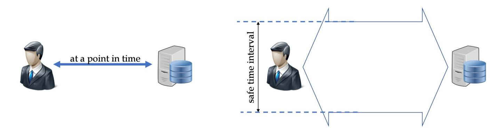

Fig. 1: Cryptographic (left) vs. continuous (right) user authentication.

One of the key advantagesof [CUA](#page-39-0) is its ability to adapt to changing risk levels and contexts in real time. By analyzing a variety of factors such as keystroke patterns, cryptography, touchscreen gestures, facial recognition, voice recognition and location data, [CUA](#page-39-0) systems can build a comprehensive profile of each user's behavior and detect anomalies or suspicious activities that may indicate a threat. For example, if a user's typing speed suddenly increases or drops significantly, or if their facial features do not match those associated with their account, the [CUA](#page-39-0) system may trigger additional authentication challenges or temporarily suspend the session until the user's identity can be verified again.

### **1.1 Previous work**

Continuous User Authentication has evolved significantly since its early conceptualization. Early CUA systems focused on single-modality approaches.

Except cryptographic operations, such events typically include physiological biometric[s⁵,](#page-1-1) behavioral biometric[s⁶](#page-1-2) and contextual factor[s⁷.](#page-1-3) [\[52](#page-39-1)[,32\]](#page-38-0) give general surveys of these different methods.

Naturally, single-modality motivated research into multi-modality with the advent of modern smartphones. Smartphones provide rich sensor arrays enabling simultaneous monitoring of multiple security events [\[3](#page-36-0)[\]⁸,](#page-1-4) [\[28](#page-38-1)[\]⁹.](#page-1-5)

<span id="page-1-1"></span>⁵ Facial recognition [\[25\]](#page-37-0), fingerprint [\[40\]](#page-38-2), iris [\[10\]](#page-37-1), voice [\[41\]](#page-38-3).

<span id="page-1-2"></span>⁶ Keystroke dynamics [\[17\]](#page-37-2) (notably key-hold time, inter-key latency, and typing speed), touchscreen gestures [\[14\]](#page-37-3), gait [\[33\]](#page-38-4), mouse dynamics [\[48\]](#page-39-2).

<span id="page-1-3"></span>⁷ Location [\[11\]](#page-37-4), WiFi [\[49\]](#page-39-3) or linguistics [\[46\]](#page-39-4).

<span id="page-1-4"></span>⁸ Bi-modal.

<span id="page-1-5"></span>⁹ For aggregation ("fusing" cf. Section 7).

{2}------------------------------------------------

[\[45\]](#page-39-5) surveys multi-modal authentication and also explains how different sensors are combined. While effective in practice, most listed approaches are AI/ML-based and lack principled methods for combining heterogeneous evidence. Prior work essentially lists three approaches:

- *1. Machine learning:* Neural networks [\[7\]](#page-36-1), reinforcement learning [\[2\]](#page-36-2), random forests [\[9](#page-36-3)[\]¹⁰,](#page-2-0) and support vector machines [\[36\]](#page-38-5) have been applied to learn mapping functions from sensor readings to trust scores. [\[2\]](#page-36-2) employ reinforcement learning to dynamically adapt authentication policies. While achieving good empirical performance, these works do not provide the level of interpretability that we desire, a critical concern in security systems where understanding failure modes is essential [\[44\]](#page-38-6).
- *2. Statistical fusion:* Bayesian approaches [\[1](#page-36-4)[,38\]](#page-38-7) model sensor outputs as conditional probabilities and apply Bayes' rule for fusion. [\[39\]](#page-38-8) achieves fusion using likelihood ratio tests (notably Neyman–Pearson). However, these methods require careful specification of prior distributions and evidence combination rules, which are often chosen ad hoc. Informative general methods are given in [\[15](#page-37-5)[,26\]](#page-37-6).
- *3. Rule-based systems:* Simple voting schemes [\[21\]](#page-37-7), weighted averages [\[43\]](#page-38-9), and threshold-based logic [\[50\]](#page-39-6) provide some interpretability but are incomplete in terms of probabilistic theoretical grounding.

Temporal aspects and the decay of trust during inactivity also received some attention in the past:

- *1. Session-based models:* Checkpoint authentication [\[29\]](#page-38-10) performs periodic reauthentication at intervals. Active authentication [\[47\]](#page-39-7) continuously monitors and aggregates evidence over fixed time windows where the decay function is implemented in three linear steps. These approaches recognize time's importance.
- *2. Risk-adaptive authentication:* Trust scores are adjusted based on contextual risk factors [\[18,](#page-37-8)[42\]](#page-38-11). These models focus on the reaction to risk (i.e. when to trigger an event) and hence relate to Section [10](#page-26-0) of this paper.
- *3. Temporal pattern recognition:* Some systems model temporal patterns in user behavior using hidden Markov models [\[34\]](#page-38-12) or recurrent neural networks [\[23\]](#page-37-9). These capture sequential dependencies but do not explicitly model trust decay in the absence of new evidence.

<span id="page-2-0"></span>¹⁰ The approach of [\[9\]](#page-36-3) is not a random forest per se but conceptually close. Interestingly [\[9\]](#page-36-3) takes into account trust decay, a point to which we will come back later on.

{3}------------------------------------------------

#### 1.2 Our contribution

The main motivation of this work is the will to avoid empirical or hardly explainable trust aggregation methods, typically AI-based. Hence, we model the problem using differential equations governing the decay of trust and explore them via simulation.

While the practical calibration of model parameters remains an empirical question, we argue that an analyzable, explainable model provides a better foundation for security-critical systems than black-box alternatives.

The aim of this work is to model the interplay between four factors encountered in practice: multi-modality<sup>11</sup> ( $\ell$ ), the effect of time (t), prior assumptions ( $\mathbf{b}$ ) and application-dependent priorities  $\mu$ .

This paper explores CUA by drawing inspiration from the field of pharmacokinetics [22]. Pharmacokinetics, a discipline within pharmacology, studies how substances are absorbed, distributed, metabolized, and eliminated within the body. This is achieved by modeling drug concentrations using ordinary differential equations. Despite its roots in life sciences, pharmacokinetics provides a powerful framework for modeling dynamic processes over time. By analogizing the trust levels in a user-system interaction to the concentration of a drug within the body, this paper proposes a method for modeling and evaluating trust in CUA systems. The absorption, distribution, metabolism, and elimination (ADME) phases of a substance can be paralleled with the trust-building and decay processes in user authentication, where trust rises through consistent behavior and diminishes (slowly) with inactivity or (quickly) with anomalies.

First-order linear differential equations governing accumulation and exponential decay appear in many fields. This structural universality suggests that pharmacokinetic-inspired models are not domain-specific metaphors but manifestations of a deeper mathematical invariance governing relaxation systems.

Here are a few examples: psychology<sup>12</sup>, marketing<sup>13</sup>, linguistics<sup>14</sup>, scientific interest in papers [4] and economics<sup>15</sup>. A zoogeography example [27] is particularly interesting as it introduces  $\hat{s}$  (page 377) which is the equivalent of our  $\frac{R}{k}$  in the case of infusion<sup>16</sup>. However, to our knowledge, pharmacokinetic models have not been previously applied to authentication or trust management.

<span id="page-3-0"></span><sup>&</sup>lt;sup>11</sup> Including sensor correlation  $\Sigma$ .

<span id="page-3-1"></span><sup>&</sup>lt;sup>12</sup> Emotional valence over time [24], notably the transition equation, page 1046.

<span id="page-3-2"></span><sup>&</sup>lt;sup>13</sup> Brand awareness and customer engagement [35], cf. equation (1) page 218.

<span id="page-3-3"></span><sup>&</sup>lt;sup>14</sup> [51] proposed that given a list of core words, the number of words L remaining in a language over time t follows the first-order differential equation:  $\frac{dL}{dt} = -\lambda L$ .

<span id="page-3-4"></span><sup>&</sup>lt;sup>15</sup> Friedman modeled how people consume wealth ([16], chapter III). He suggested that people don't spend all their money at once; they "clear" their wealth through spending at a rate k proportional to their total "permanent income". In other words the marginal propensity to consume (MPC, k) acts as the elimination rate constant. The higher one's MPC, the faster their "wealth concentration" W drops:  $\frac{dW}{dt} = -k \cdot W$ .

<span id="page-3-5"></span>The number of species on an island  $\hat{s}$  is determined by the balance between the rate of immigration of new species and the rate of extinction of existing species. Similarly, as will be seen later, the concentration of a drug in the body at "steady state" is deter-

{4}------------------------------------------------

We focus on soundly aggregating [CUA](#page-39-0) data collected from heterogeneous security sensors using an analyzable theoretical model. In typical scenarios, user presence is assessed by monitoring and aggregating system events. Sensor readings may present conflicting outputs and differ in attributes such as [False Ac](#page-39-0)[ceptance Rate \(FAR\), False Rejection Rate \(FRR\),](#page-39-0) response time, activation costs, etc. Our goal is to blend such data streams to estimate an overall trust level at any point in time as soundly as we can.

To do so, we take a detour through a seemingly unrelated field: pharmacology.

## **2 Pharmacokinetics**

Pharmacokinetics is a branch of pharmacology that studies the fate of a drug within the body after its administration. It examines how drugs are **a**bsorbed, **d**istributed, **m**etabolized and **e**liminated [\(ADME\)](#page-39-0) by the body. This discipline is essential to understand how a drug interacts with the body and how its effects manifest over time ().

Absorption is the process by which a drug enters the bloodstream from its site of administration, whether it be orally, intravenously, transdermally, or via other routes. The speed and the extent of absorption depend on various factors, including the drug formulation, the presence of food in the stomach and the patient's physiological state.

Once in the bloodstream, the drug is distributed to different tissues and organs throughout the body.

Distribution depends on factors such as cell membrane permeability, binding to plasma proteins and tissue perfusion.

After distribution, the drug is often metabolized in the liver and other organs, where it is transformed into metabolites that may be active, inactive, or toxic. The primary organ involved in drug metabolism is the liver, but other organs such as the kidneys and intestines may also play a role.

Finally, the drug and its metabolites are eliminated from the body mainly by the kidneys in the form of urine, but also through other routes such as bile, sweat and respiration. The elimination process determines the duration of action of the drug and influences the dosage and frequency of administration.

Understanding the pharmacokinetics of a drug is crucial for optimizing its therapeutic efficacy while minimizing adverse effects. Factors such as age, sex, patient health status and drug interactions can influence the pharmacokinetic parameters of a drug.

Denoting by () the concentration of drug in the bloodstream, the mainstream model used in pharmacokinetics is the exponential decay:

mined by the balance between the rate of administration (immigration) and the rate of elimination (extinction).

{5}------------------------------------------------

$$\frac{dC}{dt} = -kC$$

where is the elimination rate constant. is determined by factors such as drug metabolism, renal excretion and tissue distribution. Understanding this equation aids in predicting drug concentrations over time, optimizing dosing regimens and ensuring therapeutic efficacy while minimizing the risk of toxicity in clinical settings.

Integration of = − with respect to gives:

$$C(t) = C_0 e^{-kt}$$

where <sup>0</sup> is the initial concentration of the drug.

The notion of half-life (1/<sup>2</sup> ) is a fundamental parameter representing the time required for () to reduce by half, i.e:

$$t_{1/2} = \frac{\ln 2}{k}$$

When = 1/<sup>2</sup> , the concentration becomes <sup>0</sup> −1/<sup>2</sup> = 0 2 . Hence, solving for when = 1/<sup>2</sup> we get = ln <sup>2</sup> 1/2 .

A number of administration modes are considered in pharmacokinetics. The most important of those, which will be mirrored by security events, are injection and infusion that we will briefly overview in the coming subsections.

### **2.1 Injection**

Injections involve administering medication directly into the body through various routes such as [intravenous \(IV\), intramuscular \(IM\), subcutaneous \(SC\),](#page-39-0) or [intradermal \(ID\).](#page-39-0) In this mode, the drug bypasses the digestive system and enters the bloodstream rapidly, resulting in a quick onset of action. The equation governing drug elimination in the blood after injection is described by firstorder kinetics, represented by the previously-mentioned ODE:

$$\frac{dC}{dt} = -kC \Rightarrow C(t) = C_0 e^{-kt}$$

The effect of injection is illustrated in Figure [2.](#page-6-0)

### <span id="page-5-0"></span>**2.2 Infusion**

[Intravenous \(IV\)](#page-39-0) infusion involves administering medication directly into a vein over a specific period, typically through a drip system. This mode allows for precise control over the infusion rate and can be used for continuous drug administration. The equation governing drug elimination in the blood during intravenous infusion also follows first-order kinetics, similar to injection. However, it also incorporates an infusion rate :

{6}------------------------------------------------

<span id="page-6-0"></span>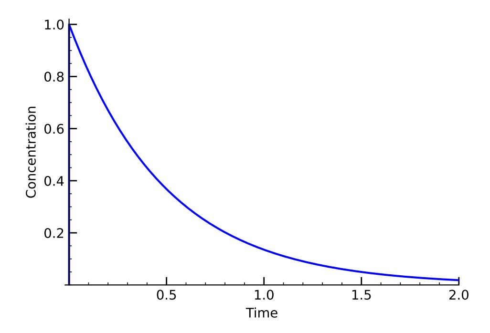

Fig. 2: Illustration of elimination under a single injection at t = 0. The following drug parameters were used:  $(C_0, k) = (1, 2)$ . The mathematical model for successive injections is detailed in Section 5.1.

$$\frac{dC}{dt} = R - kC \Rightarrow C(t) = \frac{R}{k} \left( 1 - (1 - C_0)e^{-kt} \right)$$

The term  $\frac{R}{k}$  represents the steady state concentration reached during continuous infusion, where the drug input rate is equal to the elimination rate.

The function is generalized by adding the parameter  $t_e$  ("time of exit") at which the infusion ends to give the overall function:

$$C(t) = \begin{cases} 0 & \text{if } t \leq 0 \\ \frac{R}{k}(1 - e^{-k \cdot t}) & \text{if } 0 \leq t \leq t_e \end{cases}$$
 
$$C(t_e)e^{-k(t - t_e)} = \frac{R}{k}(1 - e^{-k \cdot t_e})e^{-k(t - t_e)} = \frac{R\left(e^{kt_e} - 1\right)}{k}e^{-kt} & \text{if } t > t_e \end{cases}$$
 The effect of infusion is illustrated in Figure 3.

#### 2.3 Combined administration

When the same medication is taken via  $\ell$  different channels, functions add-up as shown in Figure 4 to provide a total concentration *S*:

$$S(t) = \sum_{i=1}^{\ell} C_i(t)$$

{7}------------------------------------------------

<span id="page-7-0"></span>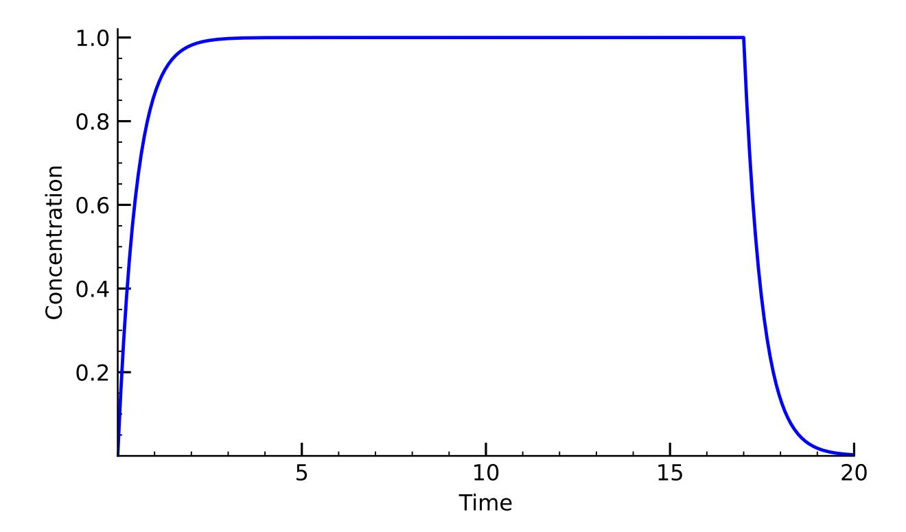

Fig. 3: Infusion administered during  $0 \le t \le 17$ . The following drug parameters were used:  $(R, k, t_e) = (2, 2, 17)$ .

## 3 Roadmap

To achieve our goal of effectively aggregating CUA data collected from heterogeneous security sensors, we proceed in three construction steps. The first of which consists in formalizing the adversarial model (Section 4). We then propose an analogy between pharmacokinetics and CUA (Section 5). Section 6 explains how the models' results can be aggregated to provide a global trust assessment. Section 9 explains how to adapt the model to concrete practical settings.

The target system is equipped with sensors that continuously send probabilities  $\{p_i(t), q_i(t)\}$  about the presence of the user  $p_i(t)$  and the attacker  $q_i(t)$ ; from which the "nobody" probability  $n_i(t) = 1 - p_i(t) - q_i(t)$  is implicitly derived.  $\{p_i(t), q_i(t)\}$  are aggregated into two global 2D time-series P(t), Q(t) using hyper-parameters  $\Gamma$ . Based on P(t), Q(t) a decision is reached and an action on the target system is potentially taken. A schematic description of our model is shown in Figure 5.

A typical example is the determination of the trust level during mobile phone operation. The various security sensors present in the phone can either send information bursts when triggered by a user action (e.g. password entry) or send a continuous flow of information (e.g. monitoring of the user's geolocation via GPS). To ease understanding, at a first step, we restrict ourselves to the (somewhat artificial) assumption that sensor readings are *independent*. We will then rectify the model to account for correlated sensors.

In practice, the target system continuously matches the current trust level inferred from the users' past actions to the level required to perform a present

{8}------------------------------------------------

<span id="page-8-0"></span>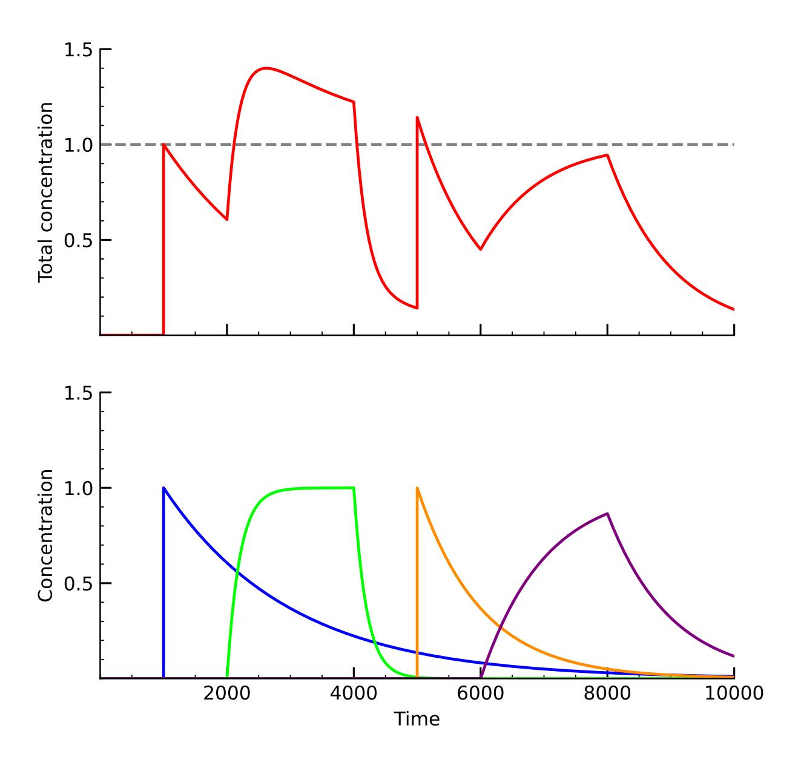

Fig. 4: An injection followed by an infusion, a second injection and a second infusion. The total concentration is plotted in red. Note that at times the concentration in blood exceeds 1 units. The drug parameters are as follows:

```
- first injection
                    (t, c_0, k) = (1000, 1, 0.0005)
```

<sup>-</sup> first infusion  $(t, t_e, R, k) = (2000, 4000, 0.005, 0.005)$ 

<sup>-</sup> second injection  $(t, c_0, k) = (5000, 1, 0.001)$ - second infusion  $(t, t_e, R, k) = (6000, 8000, 0.001, 0.001)$ 

{9}------------------------------------------------

<span id="page-9-1"></span>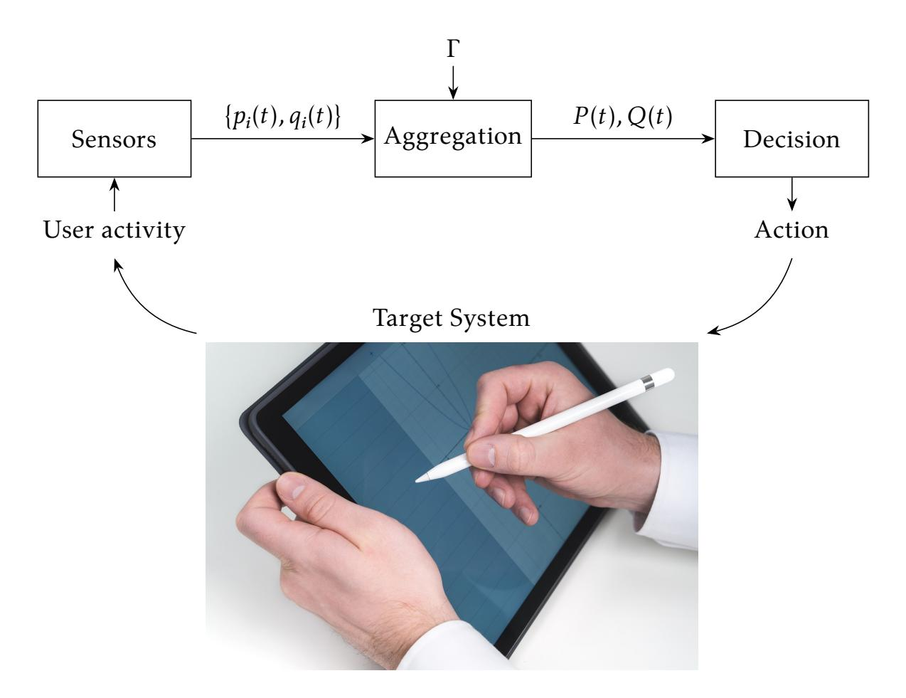

Fig. 5: The proposed trust aggregation and the decision-making model.

action. If this level is matched the action will be performed. If the current trust level is too low and the need to trigger an action is imminent, the device will trigger a trust recovery event to raise the trust level and proceed.

#### <span id="page-9-0"></span>4 Adversarial model

We call a *scenario*  $U \in \{\mathbf{Q}, \mathbf{N}, \mathbf{P}\}^t$  an experiment where at times 1, 2, ..., t each sensor i is either facing the user  $(\mathbf{P})$ , an attacker using a *stochastically observable* attack against the sensor  $(\mathbf{Q})$  or nobody at all  $(\mathbf{N})$ . We call *stochastically observable* attacks any attack whose discovery success chances are known to the defender given the sensors at hand.

The symbol **Q** can represent diverse adversarial goals, typically those listed at Table 1.

There is no opposition to consider attacks of type  $Q_{\bullet \to Q}$  where the attacker's goal is to raise an alert rather than defraud the system or even add further indices to the blue Q in the index and define higher-order adversarial goals.

We simply "bury" the adversarial goal in the sensor. In other words, the sensor is "tailored" to sense a given stochastically observable attack and provide a  $p_i(t)$ ,  $q_i(t)$  data flow expressing the likelihood that *this* stochastically observable attack is currently underway.

{10}------------------------------------------------

<span id="page-10-1"></span>

|                     | the actual situation is:      | the attacker tries to<br>convince the sensor that: |
|---------------------|-------------------------------|----------------------------------------------------|
| QP→N                | the user faces the sensor     | nobody faces the sensor                            |
| (denial of service) |                               |                                                    |
| QN→P                | nobody faces the sensor       | the user faces the sensor                          |
| (spoofing)          |                               |                                                    |
| QQ→P                | the attacker faces the sensor | the user faces the sensor                          |
| (impersonation)     |                               |                                                    |
| QQ→N                | the attacker faces the sensor | nobody faces the sensor                            |
| (concealment)       |                               |                                                    |

Table 1: Example: Some adversarial goals

## <span id="page-10-0"></span>**5 The analogy between pharmacokinetics and [CUA](#page-39-0)**

[CUA](#page-39-0) and pharmacokinetics – while seemingly unrelated fields – share fundamental principles in their approach to monitoring and managing dynamic processes. [CUA,](#page-39-0) a dynamic security mechanism, continuously verifies the identity of the user throughout a session, similar to how pharmacokinetics tracks the fate of a drug within the body over time. In both cases, there is a dynamic interplay between input, response and the system's state, influencing trust levels or drug concentrations, respectively.

In [CUA,](#page-39-0) various factors such as user behavior and biometric traits are monitored to ensure ongoing authentication. This process mirrors the [ADME](#page-39-0) of drugs within the body. For instance, just as a drug is absorbed into the bloodstream, trust in a user's identity increases as their behavior aligns with established patterns. Conversely, as a drug is metabolized and eliminated, trust diminishes over time or with changes in behavior (new information) or when the user is inactive (no information).

Furthermore, different modes of drug administration can be analogized to various authentication events in [CUA.](#page-39-0) For instance, injection, characterized by a rapid spike and subsequent decrease in drug concentration, aligns with the abrupt increase and subsequent decline in trust after a successful password entry. However, infusion, which provides continuous drug delivery, parallels continuous authentication methods like facial recognition or Σ-protocols, where trust is maintained as long as the user faces the camera or keeps succeeding interactive sessions.

Just as pharmacokinetic models incorporate factors such as the absorption rate to predict drug concentrations, [CUA](#page-39-0) systems need to consider multiple parameters to assess trust levels dynamically. Thus, both fields may reasonably rely on similar mathematical models to describe complex processes and optimize outcomes.

{11}------------------------------------------------

How well such models reflect reality is an important question in its own right. We do not pretend to provide here an accurate answer to this question but rather seek to provide a model depending on a parameter set Γ and a way to assess the correlation between the optimal answer and values assigned to Γ.

To translate pharmacokinetic models into security ones we need to consider three cases, namely a situation where a sensor identifies the user, a situation where no information is available and a situation where the sensor identifies the attacker, i.e. a person who is not the user.

We will denote the -th sensor's output at instant by 0 ≤ () ≤ 1 and 0 ≤ () ≤ 1 with () + () ≤ 1. We consider that there are ℓ sensors.

This analogy naturally motivates the direct application of injection and infusion models to authentication events. Note that it is possible that () < 1 for all (a sensor is typically imperfect and has an FAR < 1).

A () = 1 at some point in time reflects the fact that sensor is absolutely certain that the user is present. Similarly, a () = 1 at some point in time reflects the fact that sensor is absolutely certain that the attacker is present.

Table [2](#page-12-0) proposes typical classifications of different authentication methods as injections and infusions.

*Injection examples:* A typical injection method is password-based login. The password's verification is (virtually) instantaneous and boosts trust up. Fingerprint authentication has the same properties, as does the use of a secret key to sign a random challenge using a digital signature algorithm.

*Infusion examples:* A camera monitoring the user's face continuously during a session [<sup>0</sup> , ] acts as an infuser. As long as the user is in the camera's field, trust climbs up (it is assumed that each face identification takes a negligible time). A geolocation (GPS, IP or image-based) can be considered as an infusion if coordinates are measured quickly and repeatedly; otherwise, it can be viewed as a succession of injections. A chat (e.g. WhatsApp or SMS exchange) with a trusted party (e.g. the user's parents) is an infusion with a longer ascen[t¹⁷,](#page-11-1) a plateau that lasts until the conversation ends and a decay after . A video conversation with a trusted party can also be approximately regarded as an infusion.

Note that different authentication methods may feature different values.

A worked-out example (for one-bit Fiat-Shamir) is given in Appendix [A.](#page-31-0)

### <span id="page-11-0"></span>**5.1 Multiple readings of a same sensor in the injection and infusion cases**

Unlike pharmacokinetics, we intentionally replace additive dosing by a maxoperator to reflect trust dominance rather than accumulation. This follows intuition: if the entity behind the keyboard used a digital signature key yesterday

<span id="page-11-1"></span>¹⁷ While it is easy to impersonate a person for a few seconds by answering banalities, it quickly becomes harder and harder to sustain a credible chat as a conversation goes on.

{12}------------------------------------------------

<span id="page-12-0"></span>

| User authentication method | Type      |
|----------------------------|-----------|
| Password                   | Injection |
| Fingerprint                | Injection |
| Digital signature          | Injection |
| One-bit Fiat-Shamir        | Infusion  |
| Camera                     | Infusion  |
| Geolocation                | Infusion  |
| Chat                       | Infusion  |
| Speech                     | Infusion  |

Table 2: Classification of some authentication methods into models.

and is still using the same key today there is no point in taking into account past redundant knowledge. And if the entity successfully used yesterday a 4096-bit RSA key and is successfully using today a 1024-bit key, there is no valid reason to invalidate the past information unless the decaying 4096-bit session is now below the 1024 one (hence the max). This confirms intuition as the attacker has no advantage to replace an old higher level of trust by a lower newly created one.

Assume that an injection has just occurred. As seen in section 2.2 this boosts the trust level to some constant  $C_0$ . Just before this occurs the system was at some trust level denoted  $C_{\rm old}(t_0)$ .

A new injection at time  $t_0$  makes the past obsolete. Hence as this injection succeeds (or fails) we reset the trust level at  $t_0$  to the maximum of  $C_{\rm old}(t_0)$  and  $C_0$ . Formally:

$$C_{\text{new}}(t) := \begin{cases} C_{\text{old}}(t) & \text{if } t < t_0 \\ \max(C_{\text{old}}(t_0), C_0) & \text{if } t = t_0 \\ C_{\text{new}}(t_0)e^{-k(t-t_0)} & \text{if } t > t_0 \end{cases}$$

The effect of such multiple injections is illustrated in Figure 6.

However, in the case of multiple infusions, we logically resume ascent from the previous trust level. Formally:

$$C_{\text{new}}(t) := \begin{cases} C_{\text{old}}(t) & \text{if } t \leq t_0 \\ \frac{R}{k} \left( 1 - \left( 1 - \frac{k}{R} C_{\text{old}}(t_0) \right) e^{-k(t-t_0)} \right) & \text{if } t_0 < t \leq t_e \\ C_{\text{new}}(t_e) e^{-k(t-t_e)} & \text{if } t > t_e \end{cases}$$

The intuitive explanation of this "resuming from past value" is clarified by the example of a user starting and interrupting successive video-calls to a parent. The decaying trust from the past, yet not very distant, strengthens the system's belief in the user's presence.

The effect of such multiple infusions is illustrated in Figure 7.

{13}------------------------------------------------

<span id="page-13-0"></span>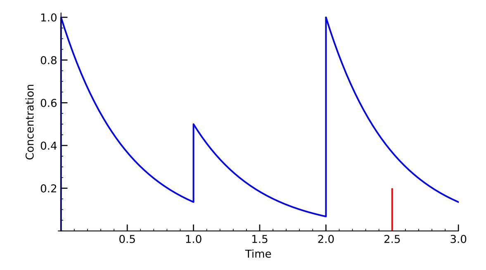

Fig. 6: Illustration of multiple injections for the same sensor. The following drug parameters were used:  $(C_0, k) = (1, 2)$ . The first injection event occurs at t = 0 with  $C_0 = 1.0$ , the second at t = 1 with  $C_0 = 0.5$ , the third at t = 2 with  $C_0 = 1.0$  and the last at t = 2.5 with  $C_0 = 0.2$ . Note that the last red one has no effect, as trust level is still higher than 0.2.

<span id="page-13-1"></span>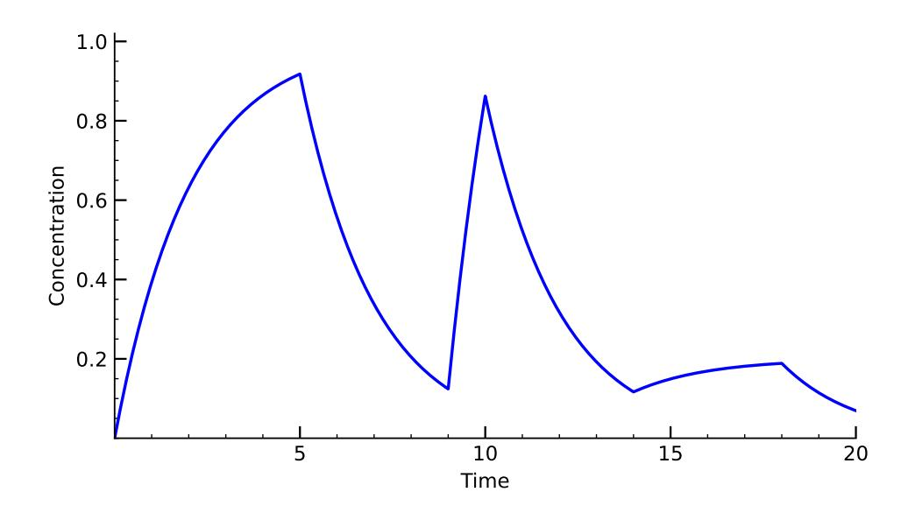

Fig. 7: Illustration of multiple infusions for the same sensor, with k = 0.5. The first infusion event occurs in interval [0, 5] with R = 0.5, the second in interval [9, 10] with R = 1, and the last one in interval [14, 18] with R = 0.1.

{14}------------------------------------------------

Note the intuitive correspondences: The "D" in ADME (drug distribution) echoes the propagation of trust across different functions, services or devices within the same "security body" or application. The "M" part (metabolism) is the transformation of raw sensor data into a *trust score*, to which we will return later.

### 5.2 Real-life orders of magnitude

An experimental study by Carolus et al. [6] found that, on average, users touch their mobile phone every 44 seconds. Assuming that phone touches follow a Poisson process with rate:

$$\lambda = \frac{1}{44}$$
 touches per second.

The probability of observing  $\alpha$  events in time t is hence:

$$P(t;\alpha) = \frac{(\lambda t)^{\alpha}}{\alpha!} e^{-\lambda t}.$$

We are interested in the probability that no touch occurs during t seconds, i.e.  $\alpha = 0$ :

$$P(t;0) = \frac{(\lambda t)^0}{0!} e^{-\lambda t} = e^{-\lambda t} = e^{-t/44} \implies k = \frac{1}{44}$$

This gives a rough idea about the "real-life" *k* for decay.

For a video-call infusion we may consider that the ascent to the plateau has  $k_a = \infty$  if the system performs a caller face recognition before allowing an incoming call to reach the receiver. The descent after  $t_e$  will, again, use a  $k = \frac{1}{44}$ .

The  $C_0$  resulting from a correct password entry or a correct digital signature is hard to estimate as keys can be stolen via different means (e.g. guessing, data breaches, key loggers, etc) but some statistics [31] provide rough estimates of the order of magnitude. There are about  $6 \cdot 10^9$  Internet users and it is known that  $\simeq 3.2 \cdot 10^9$  passwords are stolen yearly. If we estimate that each user creates 15 new passwords per year and that only 25% of stolen passwords are still valid when a data breach occurs, we get a "Drake equation" [12] of:

$$a_1 = 1 - \frac{3.2 \cdot 10^9}{4 \times 15 \times 6 \cdot 10^9} \simeq 0.9911$$

However [31],  $a_2 = 83\%$  of passwords can allegedly be cracked in under a day. The overall confidence that one can have in a password is, more or less:

<span id="page-14-0"></span><sup>&</sup>lt;sup>18</sup> No source but the authors' own habit. The readers are invited to increase or decrease this figure if they disagree.

<span id="page-14-1"></span><sup>&</sup>lt;sup>19</sup> Interestingly the 25% plays the role of Drake's L, i.e. the lifetime of an alien civilization wherein it communicates its signals into space.

{15}------------------------------------------------

$$1 - ((1 - a_1) + a_2 - (1 - a_1)a_2) \simeq 16.8\% \simeq \frac{1}{6}$$

In other words, roughly 1 in 6 passwords survives the year uncompromised or resistant to compromise. We hence recommend to use  $C_0 \simeq \frac{1}{6}$  for password entry.

As key theft is conceivably harder we recommend to use  $C_0 = 0.95$  for digital signature injection, without any justification other than the fact that key compromises are usually "rare" [5,19].

## <span id="page-15-0"></span>6 Trust aggregation

As we shall see, there are different ways to aggregate inputs from different sensors.

#### <span id="page-15-2"></span>6.1 Logarithmic trust aggregation

As we consider all sensors to be independent, it is natural to model the overall P(t) that the user is present at time t as:

$$P(t) = 1 - \prod_{i=1}^{\ell} (1 - p_i(t))$$

and the corresponding aggregates:

$$Q(t) = 1 - \prod_{i=1}^{\ell} (1 - q_i(t))$$
 and  $N(t) = 1 - \prod_{i=1}^{\ell} (1 - n_i(t)) = 1 - \prod_{i=1}^{\ell} (p_i(t) + q_i(t)).$ 

If there exists a sensor i such that  $p_i(t) = 1$  we get a P(t) = 1 whereas, at the other extreme:

$$p_1(t) = p_2(t) = \dots = p_{\ell}(t) = 0 \Rightarrow P(t) = 0$$

When  $p_1(t) = 1$  and  $p_2(t) = ... = p_\ell(t) = 0$  then the single opinion of  $p_1$  prevails (a veto). This is expected as (for now) we assume the sensors to be independent.

The intuitive interpretation is that sensors are looking for different, non-overlapping evidence of the user or the attacker<sup>20</sup>. The formula assumes that if *any* one sensor finds the "truth", that truth is absolute. In a way, this is tantamount to treating the sensors as a parallel circuit: if one switch is closed, the current flows.

This model has several major downsides:

<span id="page-15-1"></span><sup>&</sup>lt;sup>20</sup> For example, sensor 1 checks "Does the user have the right cryptographic key?" while sensor 2 checks "Does the user have the right face?".

{16}------------------------------------------------

Downside 6.1.1. Violation of probabilistic normalization:

If 
$$\ell = 2$$
 then  $1 \le P(t) + Q(t) + N(t) \le 2$  else  $1 \le P(t) + Q(t) + N(t) \le 3$ 

**Downside 6.1.2. Deadlocks:** Let  $(p_1, q_1, n_1) = (1, 0, 0)$ ,  $(p_2, q_2, n_2) = (0, 1, 0)$  and  $(p_3, q_3, n_3) = (0, 0, 1)$ . Each sensor is imposing a "truth" and vetoes the others. Using an electronics analogy, this corresponds to a short circuit between  $V_{\rm cc}$  and  $V_{\rm ss}$ .

**Downside 6.1.3.** Adversarial noise sensitivity: If a sensor has a non-zero FAR, the multiplication model causes the global FAR to grow rapidly as  $\ell$  increases.

**Downside 6.1.4.** Achilles' heel: A much more disturbing feature of this model is that if one sensor is hacked  $(p_i = 1)$ , the whole system fails if:

$$\forall j \neq i, \ q_j \neq 1, n_j \neq 1$$

We hence rule out logarithmic aggregation and resort to a probabilistic model preventing a single faulty sensor from poisoning the entire security gate.

For small  $p_i$ ,

$$1 - \prod_{i=1}^{\ell} (1 - p_i) \simeq \sum_{i=1}^{\ell} p_i$$

behaves like a sum. We hence want to preserve this behavior for larger  $p_i$  values.

#### 6.2 Centroid trust aggregation

We model the situation as a discrete random variable X taking values in a sample space  $\Omega = \{\mathbf{P}, \mathbf{Q}, \mathbf{N}\}$ , where:

- **P**: The legitimate user is facing the sensor.
- **Q**: The attacker is facing the sensor.
- N: Nobody is facing the sensor.

The set of all possible probability distributions per sensor over  $\Omega$  is the 2-simplex, denoted by  $\Delta^2$ :

$$\Delta^2 = \{(p_i, q_i, n_i) \in \mathbb{R}^3 \mid p_i + q_i + n_i = 1, \text{ and } p_i, q_i, n_i \ge 0\}$$

Consider a group of  $\ell$  independent sensors. Each sensor  $i \in \{1, ..., \ell\}$  provides a probability distribution vector  $\mathbf{v}_i \in \Delta^2$ :

$$\mathbf{v}_i = \begin{pmatrix} p_i \\ q_i \\ n_i \end{pmatrix}$$

where  $p_i$  is the probability assigned to state **P**,  $q_i$  to state **Q**, and  $n_i = 1 - p_i - q_i$  to state **N**.

{17}------------------------------------------------

To reflect the decision-maker's subjective priorities, we define a global preference vector  $\mu$ . The role of  $\mu$  is to favor (i.e. amplify) any of the sensors' readings.  $\mu$  is application-dependent but we treat it formally.

$$\mu = \begin{pmatrix} \mu_1 \\ \mu_2 \\ \mu_3 \end{pmatrix}$$
, subject to  $\sum_{j=1}^3 \mu_j = 1$  and  $\mu_1, \mu_2, \mu_3 > 0$ 

We now define the transformation ("metabolism") step: The input of each sensor is transformed into a biased vector  $\mathbf{v}'_i$  by element-wise scaling followed by normalization to project the result back onto  $\Delta^2$ :

$$\mathbf{v}_{i}' = \phi(\mathbf{v}_{i}, \boldsymbol{\mu}) = \frac{\mathbf{v}_{i} \odot \boldsymbol{\mu}}{\mathbf{1}^{T}(\mathbf{v}_{i} \odot \boldsymbol{\mu})} = \begin{pmatrix} p_{i}' \\ q_{i}' \\ n_{i}' \end{pmatrix}$$

The explicit components for sensor i are:

$$p_{i}' = \frac{\mu_{1}p_{i}}{\mu_{1}p_{i} + \mu_{2}q_{i} + \mu_{3}n_{i}}$$

$$q_{i}' = \frac{\mu_{2}q_{i}}{\mu_{1}p_{i} + \mu_{2}q_{i} + \mu_{3}n_{i}}$$

$$n_{i}' = \frac{\mu_{3}n_{i}}{\mu_{1}p_{i} + \mu_{2}q_{i} + \mu_{3}n_{i}}$$

The global probabilities P, Q, and N are obtained by calculating the arithmetic mean of the  $\ell$  biased vectors. This represents the mass center centroid of the sensors' opinions in the simplex:

$$\mathbf{V} = \begin{pmatrix} P \\ Q \\ N \end{pmatrix} = \frac{1}{\ell} \sum_{i=1}^{\ell} \mathbf{v}_i'$$

The final decision coordinates are thus:

$$P = \frac{1}{\ell} \sum_{i=1}^{\ell} \frac{\mu_1 p_i}{\mu_1 p_i + \mu_2 q_i + \mu_3 n_i}, \ Q = \frac{1}{\ell} \sum_{i=1}^{\ell} \frac{\mu_2 q_i}{\mu_1 p_i + \mu_2 q_i + \mu_3 n_i} \text{ and } N = 1 - P - Q$$

In other words, we can model the situation as a point in the unit cube's simplex, given the constraint P + Q + N = 1.

This representation enables a geometric interpretation of the system state by monitoring the trajectory of the point  $\{P(t), Q(t), N(t)\}$  on the simplex that we divide into three Voronoi sectors corresponding to the user, the attacker and nobody as shown in Figure 8.

Now, the maximal distance between the three corners and the orthocenter is  $\frac{\sqrt{6}}{3}$ . We can hence motivate a decision process as in Table 3.

{18}------------------------------------------------

<span id="page-18-0"></span>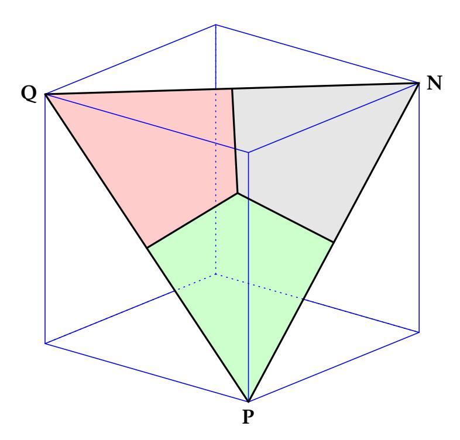

Fig. 8: The simplex and its three Voronoi sectors. The green sector corresponds to the user (P), the red sector to the attacker (Q), and the grey sector to nobody (N). Each colored region contains the points closest to its respective vertex; the instantaneous state (P,Q,N) falls into one of these sectors, which determines the nominal decision (confidence increases toward the corresponding vertex).

#### 6.3 How to initialize the system?

The previous sections assumed that in the absence of incoming information, the system re-converges towards a "nobody present" state.

In all generality, during the interval separating reset from the first event, the system may occupy a state  $\mathbf{V}_0 = \phi(\mathbf{b}, \boldsymbol{\mu})$ , where  $\mathbf{b} = [P_0, Q_0, N_0]^T \neq [0, 0, 1]^T$ .  $\mathbf{b}$  is the application-dependent initial condition (priors).

What happens when one wants to treat the priors as a flexibly definable *inactivity plateau* to which the system will converge in the absence of incoming sensor data?

We treat the case of injection (for infusion, change the differential equation *mutatis mutandis*).

Each sensor  $i \in \{1, ..., \ell\}$  is governed by a first-order linear non-homogeneous ODE describing its relaxation toward the prior baseline **b**:

$$\frac{d\mathbf{v}_i(t)}{dt} = -k_i(\mathbf{v}_i(t) - \mathbf{b}) \Rightarrow \mathbf{v}_i(t) = \mathbf{b} + e^{-k_i t}(\mathbf{v}_{i,0} - \mathbf{b})$$

Where:

- $\mathbf{v}_{i,0}$  is the starting point vector for sensor i (the "injection").
- $k_i$  is the scalar elimination rate of sensor i, dictating the velocity of the trajectory toward  $\mathbf{b}$ .

{19}------------------------------------------------

<span id="page-19-0"></span>

| (P,Q,N) is in sector | Decision | Criterion                | <b>Score</b> ∈ [0, 1]        |
|----------------------|----------|--------------------------|------------------------------|
| $S_P$                | user     | $P > \max(Q, 1 - P - Q)$ | $1 - \sqrt{3(\eta + 1 - P)}$ |
| $S_Q$                | attacker | $Q > \max(P, 1 - P - Q)$ | $1-\sqrt{3(\eta+1-Q)}$       |
| $S_N$                | nobody   | $1 - P - Q > \max(P, Q)$ | $1 - \sqrt{3(\eta + P + Q)}$ |

Table 3: Voronoi sector decision and score using  $\eta = P^2 + (P + Q)(Q - 1)$ .

The global state vector  $\mathbf{V}(t)$  is, again, the normalized barycentric centroid of the  $\ell$  biased sensor outputs:

$$\mathbf{V}(t) = \frac{1}{\ell} \sum_{i=1}^{\ell} \phi(\mathbf{v}_i(t), \boldsymbol{\mu})$$

#### 7 Simulations

#### 7.1 P, Q, N and score derivation

We implemented an interactive interface demonstrating the proposed  $\log ic^{21}$ . The model has two sensors, an infusion and an injection. The interface allows selecting the signal's origin which can be either the defender (legitimate user) or the attacker. To reduce the number of cursors a general cursor-selectable k controls all decays. We fixed  $\mathbf{b} = [0,0,1]^T$ . A pair of cursors controls  $\mu$ . The individual parameters of each event  $(t_0, C_0 \text{ or } t_0, R, t_e)$  are also cursor-definable. The code allows creating scenarios, saving them and resuming from a saved scenario to edit and refine it.

The software stacks P(t), Q(t) and N(t) above the events. An upper multicolor line shows the Voronoi sector  $(S_P, S_O \text{ or } S_N)$  of the point (P(t), Q(t), N(t)).

A key feature of the implementation is the introduction of "recoil events": Assume that a legitimate user injection  $C_0$  occurred at  $t_0$ . The provided model perfectly defines  $p_i(t)$  but what's about  $q_i(t)$  and  $n_i(t)$ ?

Because  $p_i(t) + q_i(t) + n_i(t) = 1$  the question boils-down to understanding what is  $q_i(t)$  or how to simulate it.

Even a successful injection generates a complementary probability mass assigned to competing hypotheses  $q_i(t)$ ,  $n_i(t)$ . We refer to this induced component as the "recoil" or the "mirror event". The recoil has the same  $t_0$  as the generating (inducing) event but its amplitude, denoted  $\bar{C}_0 = m(1-C_0)$  is computed from the initial event's  $C_0^{22}$  where  $0 \le m \le 1$  represents the "opposite magnitude proportion". We hence share the room left free by the event between  $q_i(t)$  and  $n_i(t)$  at an m/(1-m) proportion. This also applies to attacker events (that

<span id="page-19-1"></span> $<sup>^{21}\,</sup>Available\,on\,https://github.com/enssec/Cryptokinetics-Simulation-Suite$ 

<span id="page-19-2"></span><sup>&</sup>lt;sup>22</sup> In the case of infusion, the recoil's  $\bar{R}$  is similarly defined by  $\bar{R} = m(k - R)$ .

{20}------------------------------------------------

generate recoil defender events). The recoil is a fully-fledged defender/attacker event *by its own right*.

This mechanism is analogous to self-induction in electromagnetism: Imagine a coil of length  $\ell$  moving at a constant velocity v through a uniform magnetic field B. The coil is connected to a resistor R. What is the current I(t) flowing through R at time t?

As the coil moves the induced current generates its own electromagnetic field (recoil) that, in turn, induces an opposite current. The ODE describing the balance at any given moment is:

$$L\frac{dI}{dt} + RI = Bv\ell$$
 where *L* is the coil's self-inductance.

In other words, if we start moving the coil at time t=0, the current does not jump to its maximum immediately because of self-induction but follows the formula:

$$I(t) = \frac{Bv\ell}{R} \left( 1 - e^{-\frac{R}{L}t} \right)$$

The "linear" split of the "remaining room" is used only for illustration. In all generality, the recoil's parameters are some function<sup>23</sup> H of the system's state and the incoming event's parameters ( $C_0$  or R).

The  $1-\sqrt{3(\eta+\bullet)}$  score, shown in **yellow** measures the degree of "loneliness" of P(t), Q(t), N(t). As expected, when one of the three is "alone" or "relatively alone" during a time interval, the score surges. This confirms intuition.

#### 7.2 Simplex trajectory to priors

The software shown in Figures 10 and 11 illustrates the re-convergence to the prior. The user defines the  $p_i$ ,  $q_i$ ,  $n_i$  values of five sensors as well as  $\mu$  and  $\mathbf{b}$ . The code interactively plots the aggregated  $[P,Q,N]^T$  and its convergence to the prior.

The green point in the plot represents the initial state V(0), which is the centroid of the biased "high-energy" starting points. The curvature of the black trajectory is a result of the differing elimination rates  $k_i$ . As time increases, sensors with higher values of  $k_i$  relax toward  $\mathbf{b}$  more rapidly, shifting the global centroid towards the vectors of slower-decaying sensors.

Since  $\lim_{t\to\infty} \mathbf{v}_i(t) = \mathbf{b}$  for all *i*, the global state converges to:

$$\lim_{t\to\infty}\mathbf{V}(t)=\phi(\mathbf{b},\boldsymbol{\mu})$$

This limit corresponds to the  $\underline{red}$  point (the  $\mu$ -biased prior) displayed in the simplex, i.e. the stable system equilibrium in the absence of information.

<span id="page-20-0"></span><sup>&</sup>lt;sup>23</sup> That we do not aim to characterize in this work.

{21}------------------------------------------------

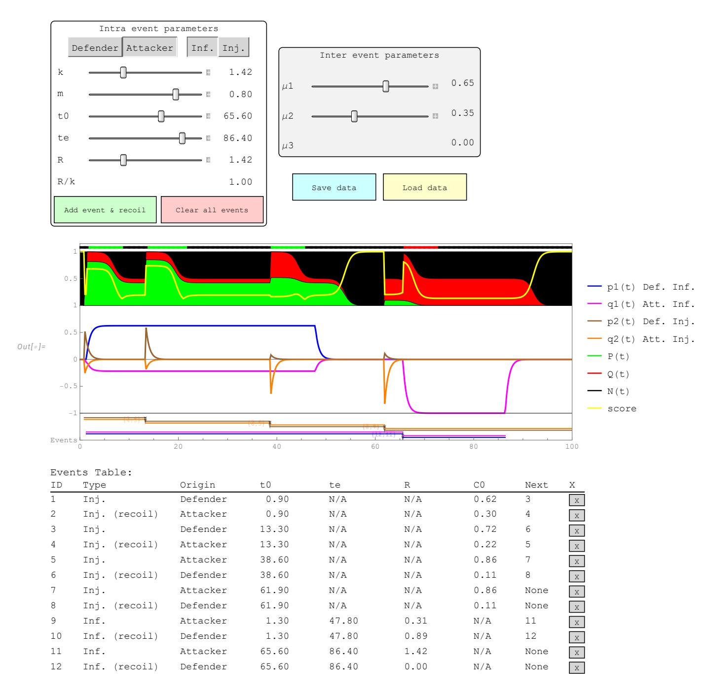

Fig. 9: Illustrations from the aggregation software. Top: Controls to set global bias parameters  $(\mu_1, \mu_2, \mu_3)$  and to add new events (attacker/defender × injection/infusion). Middle: Time series of per-sensor posteriors  $p_1(t), q_1(t), p_2(t), q_2(t)$  and aggregated posteriors P(t), Q(t), N(t), score. Bottom: Table of current events with their parameters.

{22}------------------------------------------------

<span id="page-22-0"></span>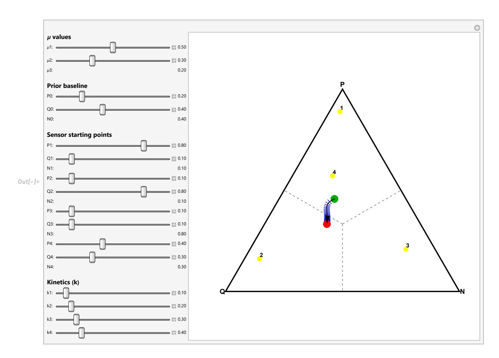

Fig. 10: Convergence to an application-specific prior. Example. Note that the departure and arrival points are in different Voronoi sectors.

<span id="page-22-1"></span>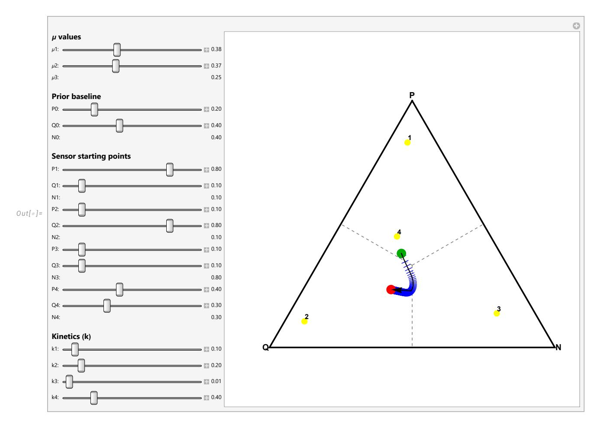

Fig. 11: Convergence to an application-specific prior. Example. This figure is interesting as it shows that the system can "naturally" venture into a Voronoi sector other than the departure and arrival ones during decay.

{23}------------------------------------------------

To visualize the speed of convergence in a static plot, we added a sequence of blue temporal tick marks (perpendicular bars) along the trajectory. These bars are placed at fixed time intervals (every unit of time). Because the relaxation follows an exponential decay, the bars are widely spaced at the beginning (high velocity) and become increasingly crowded as the trajectory approaches the red arrival point (asymptotic slow-down).

## 8 Non-independent (correlated) sensors

Treating correlated sensors<sup>24</sup> as independent results in the "over-counting" of evidence, which artificially inflates confidence and increases the risk of successful spoofing. If correlation is taken into account, highly correlated sensors effectively collapse into a single "virtual sensor", preventing the attacker from gaining unearned trust through "volume".

For the general case of  $\ell$  sensors, we define the covariance matrix  $\Sigma \in \mathbb{R}^{\ell \times \ell}$ , where each element  $\Sigma_{i,j}$  is  $\operatorname{cov}(i,j)$ .  $\operatorname{cov}(i,j)$  is determined by the correlation coefficient  $\rho_{i,j}$  and the sensor-specific standard deviations  $\sigma_i, \sigma_j$  (representing the inherent noise of the sensor):

$$\Sigma = \begin{bmatrix} \cos(1,1) & \cos(1,2) & \cdots & \cos(1,\ell) \\ \cos(2,1) & \cos(2,2) & \cdots & \cos(2,\ell) \\ \vdots & \vdots & \ddots & \vdots \\ \cos(\ell,1) & \cos(\ell,2) & \cdots & \cos(\ell,\ell) \end{bmatrix} \text{ where } \cos(i,j) = \rho_{i,j}\sigma_i\sigma_j$$

The optimal weight for each sensor is determined by the inverse covariance, or *precision matrix*,  $\Sigma^{-1}$ . This prevents double-counting correlated evidence by de-weighting redundant data streams. Let **1** be an  $\ell \times 1$  column vector of ones. The weight vector  $W = [w_1, w_2, \dots, w_\ell]^T$  is calculated as:

$$W = \frac{\Sigma^{-1} \mathbf{1}}{\mathbf{1}^T \Sigma^{-1} \mathbf{1}}$$

In this formulation, the term  $\mathbf{1}^T \Sigma^{-1} \mathbf{1}$  acts as the "effective sensor count". For a set of perfectly independent  $\ell$  sensors with unit variance ( $\Sigma = \mathrm{ID}$ ), this denominator simplifies exactly to  $\ell$ , producing the standard arithmetic mean  $w_i = 1/\ell$ . However, as correlations  $\rho_{i,j}$  increase, the denominator shrinks, ensuring that the sum of weights  $\sum w_i$  remains 1 while reducing the relative influence of redundant sensors.

The global, aggregated trust levels are the weighted sums of the individual sensor readings:

$$P(t) = \sum_{i=1}^{\ell} w_i p_i(t)$$
 and  $Q(t) = \sum_{i=1}^{\ell} w_i q_i(t)$  and  $N(t) = 1 - P(t) - Q(t)$ 

<span id="page-23-0"></span><sup>&</sup>lt;sup>24</sup> e.g., GPS and IP-based geolocation, or two different facial recognition algorithms.

{24}------------------------------------------------

This weighted approach guarantees that P(t) + Q(t) + N(t) = 1 provided each sensor's local probabilities are normalized. The rest of the decision process and the Voronoi sector mapping remain invariant.

Sensor correlation should not be viewed as a "design defect" as it allows to better detect active attacks. Active attackers take control of a sensor and corrupt its output. In other words, active attackers do not present carefully crafted data to a sensor in a hope to mislead it but replace the sensor altogether and provide the defender with their own invented  $\tilde{\mathbf{v}}_i$  values.

To protect the fusion process against active attacks one can use Hoeffding's inequality [20].

Assume independence again. Hoeffding's inequality provides a strict upper bound on the probability that the empirical mean of a set of independent, bounded random variables deviates from their expected value. For n independent observations  $X_1, \ldots, X_n$  bounded by the interval [a, b], the probability that the empirical mean  $\bar{X}$  deviates from the true expected value E[X] by more than a threshold  $\epsilon$  is given by:

$$P(|\bar{X} - E[X]| \ge \epsilon) \le 2 \exp\left(-\frac{2n\epsilon^2}{(b-a)^2}\right)$$
 (1)

For each sensor i, we monitor the empirical mean  $\bar{p}_i$  over a sliding window of n supervised samples<sup>25</sup>. Given a tolerated false-positive rate  $\alpha$ , a sensor is considered "healthy" if its deviation from the expected historical mean  $E[p_i]$  satisfies:

$$|\bar{p}_i - E[p_i]| \le \sqrt{\frac{\ln(2/\alpha)}{2n}}$$

This allows to define a gecko strategy where the system automatically abandons an attacked organ: Define a health coefficient  $\gamma_i \in \{0, 1\}$  for each sensor:

$$\gamma_i = \begin{cases} 1 & \text{if sensor } i \text{ satisfies the Hoeffding bound} \\ 0 & \text{otherwise} \end{cases}$$

The health coefficients are incorporated into the weight calculation by modifying  $\Sigma^{-1}$ . Let  $\Gamma = \operatorname{diag}(\gamma_1, \dots, \gamma_\ell)$ . The anomaly-aware weight vector W' is:

$$W' = \frac{\Gamma \Sigma^{-1} \mathbf{1}}{\mathbf{1}^T \Gamma \Sigma^{-1} \mathbf{1}}$$

This ensures that if a sensor is flagged as attacked ( $\gamma_i = 0$ ), its contribution to the global P(t) and Q(t) is nullified, and the remaining trust is redistributed among the healthy sensors according to their correlation structure. More refined strategies comprising a  $\gamma_i \in [0,1]$  can also be used.

While independent tests monitor sensors in isolation, a *correlation-aware* check exploits the known statistical coupling between sensors to detect active

<span id="page-24-0"></span><sup>&</sup>lt;sup>25</sup> i.e. known events shown to the sensor.

{25}------------------------------------------------

attacks. If an attacker spoofs one sensor but fails to maintain the precise relationship it shares with its correlated peers, the system will detect a "correlation break". To do so, define the current sensor state as a vector  $\mathbf{p} = [p_1, \dots, p_\ell]^T$  and the historical expected state as  $E[\mathbf{p}]$ . Using the covariance matrix  $\Sigma$ , we calculate the Mahalanobis distance  $\mathcal{D}$ :

$$\mathcal{D}(\mathbf{p}) = \sqrt{(\mathbf{p} - E[\mathbf{p}])^T \Sigma^{-1} (\mathbf{p} - E[\mathbf{p}])}$$
 (2)

Assuming multivariate normal noise, the squared Mahalanobis distance  $\mathcal{D}^2$  follows a  $\chi^2$  distribution with  $\ell$  degrees of freedom. For a significance level  $\alpha$  (e.g., 0.01), we define a threshold  $\chi^2_{\alpha,\ell}$ . An anomaly is triggered if:

$$\mathcal{D}(\mathbf{p})^2 > \chi_{\alpha,\ell}^2 \tag{3}$$

This check is far more sensitive than Hoeffding for correlated sensors; if  $\rho_{i,j} \to 1$ , any divergence between  $p_i$  and  $p_j$  will cause the precision matrix  $\Sigma^{-1}$  to amplify the distance, signaling an attack.

To ensure the stability of the final fused trust score  $P(t) = f(p_1, ..., p_\ell) = \sum w_i p_i$ , we apply McDiarmid's inequality [30,37]. If we assume each sensor i can change its output by at most  $c_i$  in a single time step, the probability that the global trust fluctuates beyond a threshold  $\epsilon$  is:

$$P(|P(t) - E[P(t)]| \ge \epsilon) \le 2 \exp\left(-\frac{2\epsilon^2}{\sum_{i=1}^{\ell} c_i^2}\right)$$
 (4)

Since the weights  $w_i$  are derived from the precision matrix  $\Sigma^{-1}$ , the "impact"  $c_i$  of correlated sensors is naturally suppressed, providing a tighter bound on the overall system's stability.

The final decision still follows the Voronoi sector mapping on the simplex, but it is now protected against localized sensor compromises.

### <span id="page-25-0"></span>9 Hyperparameter determination

Let U be a scenario where the attacker is one of  $\{Q_{1\rightarrow N}, Q_{N\rightarrow P}, Q_{Q\rightarrow P}, Q_{Q\rightarrow N}\}$ . There are several parameters in the system:

| parameter                             | meaning              | determined by or property of |
|---------------------------------------|----------------------|------------------------------|
| $t_0$                                 | event's start        | user and attacker            |
| $C_0$                                 | the injection level  | system designer              |
| k                                     | the decay factor     | system designer              |
| R                                     | the infusion plateau | system designer              |
| $\ell$                                | number of sensors    | system designer              |
| $\boldsymbol{\mu} = \{\mu_1, \mu_2\}$ | decision biases      | application                  |
| $\mathbf{b} = \{P_0, Q_0\}$           | priors               | application                  |
| $t_e$                                 | infusion's duration  | user and attacker            |

{26}------------------------------------------------

We can consider  $\ell$  to be fixed as  $\ell$  is limited by cost and design constraints. We denote  $\Gamma = \{C_0, k, R, \mu, \mathbf{b}\}.$ 

The attacker has a strategy  $\mathcal{D}$  which is a distribution governing the way in which s/he generates U.

We now have a tool, depending on  $\Gamma$ , that determines at each point in the scenario a likely system state  $(U'_t \in \{\mathbf{P}, \mathbf{Q}, \mathbf{N}\})$ . We can hence sample  $\mathcal{D}$  and compute the fitness between the the ground truth U and the predicted U' for any given  $\Gamma$  using Cohen's  $\kappa$  test<sup>26</sup>.

The optimal parameter set  $\Gamma_{\text{opt}}$  can be determined by maximizing Cohen's  $\kappa^{27}$  over samples drawn from the attacker's strategy distribution  $U \in \mathcal{D}$ .

Because of the discontinuities due to the decision tests it is likely that gradient descent will not be adapted to such an exploration. However, if we assume that 10 measurement points are taken for each parameter the exploration will require  $10^9$  iterations which is not out of reach. All iterations are evaluated against the same ground-truth scenario U and  $10^9$  predictions  $\bar{U}_{\Gamma_i}$ . In other words, we need one (preferably long) experimental interaction with the attacker and  $10^9$  offline calculations to determine  $\Gamma_{\rm opt}$ .

Having determined  $\Gamma_{\rm opt}$ , the next question relates to the **action** taken using the information  $\bar{U}$ .

### <span id="page-26-0"></span>10 Acting

Real-life parameter optimization requires understanding the *action* taken using  $\bar{U}$  and the relative costs of incorrect actions. The decision process must have its own set of *decision hyperparameters*  $\Gamma^{'28}$ . Both false negatives and false positives incur costs, which must be explicitly modeled in the decision layer. A further cost factor can be the sensors' activation costs (CPU time, system unavailability, power consumption etc.).

Strategies to strike optimal balances between these constraints require the translation of all costs and losses to a common utility function ("common currency"<sup>29</sup>) and are *application-dependent*. We do not pretend to solve these questions in this paper but provide some plausible directions hereafter.

The current framework optimizes  $\Gamma$  against a fixed adversarial strategy distribution  $\mathcal{D}$ . However, real adversaries adapt: After observing the system's behavior, attackers refine their strategy  $\mathcal{D} \to \mathcal{D}'$ . In addition, the defender does

<span id="page-26-1"></span><sup>&</sup>lt;sup>26</sup> We recommend Cohen's  $\kappa$  test rather than Scott's  $\pi$  test because Cohen assumes that raters can have different distributions whereas Scott assumes that raters have the same distribution.

<span id="page-26-2"></span><sup>&</sup>lt;sup>27</sup> cf. Appendix B.

<span id="page-26-3"></span><sup>&</sup>lt;sup>28</sup> Typically thresholds to compare against and other algorithmic steps and parameters governing the decision process.

<span id="page-26-4"></span><sup>&</sup>lt;sup>29</sup> e.g. [8].

{27}------------------------------------------------

not anticipate that the attacker will respond to Γopt. This is complex, as we venture into Stackelberg game formulation where the defender (system designer) commits to Γ first, and the attacker best-responds by choosing (Γ). Define the defender's utility:

$$U_D(\Gamma, \mathcal{D}) = -\mathbb{E}[L(P(t; \Gamma, U), \bar{U}(t))]$$

where is the loss from misclassification (weighted sum of FRR and FAR costs), and () ̄ is the ground truth.

Similarly define the attacker's utility

$$U_A(\Gamma, \mathcal{D}) = \mathbb{P}(\text{attacker succeeds} \mid \Gamma, \mathcal{D}) - c(\mathcal{D})$$

where () is the cost of executing strategy (e.g., computational effort, penalty in the case of detection).

The attacker solves:

$$\mathcal{D}^*(\Gamma) = \arg\max_{\mathcal{D}} U_A(\Gamma, \mathcal{D})$$

While the defender anticipates this and solves:

$$\Gamma_{\text{opt}} = \arg \max_{\Gamma} U_D(\Gamma, \mathcal{D}^*(\Gamma))$$

Real-life complicates thing even further. Because the interaction is repeated the defender observes attack patterns, updates Γ, and the attacker adapts . This is a stochastic game with state = (Γ , , attack history), begging for reinforcement learning where:

- **–** Defender's policy (Γ+1 ∣ ) updates hyperparameters based on observed attacks.
- **–** Attacker's policy (+1 ∣ ) adapts strategy based on system responses.

The Nash equilibrium (<sup>∗</sup> , <sup>∗</sup> ) satisfies:

$$\pi_D^* \in \arg\max_{\pi_D} \mathbb{E}\left[\sum_{t=0}^{\infty} \gamma^t U_D(\Gamma_t, \mathcal{D}_t) \mid \pi_D, \pi_A^*\right]$$

$$\pi_A^* \in \arg\max_{\pi_A} \mathbb{E}\left[\sum_{t=0}^{\infty} \gamma^t U_A(\Gamma_t, \mathcal{D}_t) \mid \pi_D^*, \pi_A\right]$$

where is the discount factor.

If computing the Stackelberg equilibrium is intractable, one may try to use robust optimization to find Γ that performs well against a worst-case within a constrained family max:

$$\Gamma_{\text{robust}} = \arg\min_{\Gamma} \max_{\mathcal{D} \in \mathcal{D}_{\text{max}}} U_D(\Gamma, \mathcal{D})$$

{28}------------------------------------------------

where  $\mathcal{D}_{max}$  could be defined by constraints on attacker resources (e.g., maximum frequency of spoofing attempts, bounded computational budget).

Under what conditions does a Nash equilibrium exist in the repeated CUA game? Is it unique? Can it be efficiently computed? How sophisticated should we assume the attacker to be? Should we model bounded rationality? or assume a fully rational adversary with perfect knowledge of  $\Gamma$ ? Can we develop regret-minimizing algorithms that converge to robust  $\Gamma$  values in the face of adaptive attacks, without requiring full knowledge of the adversary's utility function?

An even more devilish problem is the simultaneous defense against more than one adversarial goal. As the defender needs to select  $\Gamma_{opt}$  as a function of the adversarial goal, the attacker can select a secondary adversarial goal, different than the one used to generate  $\Gamma_{opt}$ , and use it to "strike below the belt". This forces the defender to either generate a common  $\Gamma_{opt}$  that defends against both adversarial goals (and is hence conceivably less effective against each adversarial goal taken alone) or run two concurrent detection sessions and increase the FAR and FRR beyond acceptable thresholds.

All these questions seem to hold the promise of interesting future research.

#### 11 Further research

A first interesting extension would take into account non-stationary k (in a way similar to the advection term in Navier-Stokes equations where speed increases due to the very movement to a given coordinate<sup>30</sup>). The current model assumes constant decay rates k for each sensor. However, the rate at which trust should decay depends on context, e.g. trust in a password entered at home should decay slower than one entered in a crowded coffee shop.

We can try to replace the constant decay rate k with a time- and context-dependent function  $k(t, \chi(t))$  where  $\chi(t)$  is a context vector encoding relevant environmental and behavioral features. The modified decay equation becomes:

$$\frac{dC}{dt} = -k(t, \chi(t)) \cdot C(t) \Rightarrow C(t) = C_0 \exp\left(-\int_0^t k(s, \chi(s)) \, ds\right)$$

For instance, we may define  $\chi(t) = [\chi_1(t), \chi_t(t), \chi_b(t)]^T$  representing <u>l</u>ocation risk, <u>temporal</u> risk, and <u>b</u>ehavioral anomaly. In which case we would naturally model k as a log-linear function:

$$k(t, \boldsymbol{\chi}) = k_0 \exp(\boldsymbol{\beta}^T \boldsymbol{\chi}(t))$$

where  $k_0$  is the baseline decay rate and  $\beta$  is a weight vector.

<span id="page-28-0"></span><sup>&</sup>lt;sup>30</sup> In this analogy, the "trust equation" would have on its left side a material derivative counting for the prior, an advective term due to context changes and a viscosity term (friction) due to decay, while the right hand represents the "external forces", i.e. the defender and attacker events detected by the sensors.

{29}------------------------------------------------

An alternative consists in modeling context transitions as a continuous-time Markov chain with states = {safe, moderate, risky}. The decay rate depends on the current state:

$$k(t) = \sum_{s \in \mathcal{S}} k_s \cdot 1\{\text{state}(t) = s\}$$

State transitions follow a generator matrix where , is the rate of transitioning from state to state . This creates a piecewise-exponential decay process with jump discontinuities at state changes.

Adaptive decay may also be modeled using Bayesian updating: Maintain a posterior distribution over given observed context features. As new context information arrives, update the distribution:

$$p(k \mid \boldsymbol{\chi}_{1:t}) \propto p(\boldsymbol{\chi}_t \mid k) p(k \mid \boldsymbol{\chi}_{1:t-1})$$

Use the posterior mean [ ∣ 1∶] as the effective decay rate. This allows the system to learn context-decay relationships from data without hard-coding them.

What context features are most informative for predicting appropriate decay rates? How should they be normalized and combined? Computing the integral ∫ (, ()) in real time may be expensive. Can we develop efficient approximations or closed-form solutions for common (,) parameterizations?

## **11.1 The "common currency" problem**

Multi-objective optimization with heterogeneous cost structures is also of interest. We noted that optimizing Γ and Γ ′ requires translating false negative costs, false positive costs, and sensor activation costs to a "common currency" utility function, but leaved this as application-dependent. This is problematic because costs are incommensurable: Security breach costs (\$ millions, reputation damage) differ fundamentally from usability costs (user frustration, productivity loss) and different applications require different trade-offs (banking vs. social media).

Define three objective functions to minimize:

*Security cost:*

$$f_1(\Gamma) = \mathbb{E}[C_{\text{sec}} \cdot 1\{\text{attacker succeeds} \mid \Gamma\}]$$

where sec is the cost of a security breach.

*Usability cost:*

$$f_2(\Gamma) = \mathbb{E}[C_{\text{use}} \cdot 1\{\text{legitimate user rejected} \mid \Gamma\}]$$

where use is the cost of false rejection (e.g. user frustration, lost productivity).

{30}------------------------------------------------

Operational cost:

$$f_3(\Gamma) = \sum_i c_i \cdot \mathbb{E}[\text{number of activations of sensor } i \mid \Gamma]$$

where  $c_i$  is the cost of activating sensor i (e.g. computation, energy, privacy intrusion).

The Pareto frontier is the set of  $\Gamma$  values such that no objective can be improved without worsening another:

$$\mathcal{P} = \{ \Gamma \mid \nexists \Gamma' : \mathbf{f}(\Gamma') \prec \mathbf{f}(\Gamma) \}$$

where  $\mathbf{f}(\Gamma) = [f_1(\Gamma), f_2(\Gamma), f_3(\Gamma)]^T$  and  $\prec$  denotes Pareto dominance.

The Pareto frontier may be high-dimensional and non-convex. Can we develop efficient algorithms to approximate it, perhaps using evolutionary multi-objective optimization? How sensitive are optimal  $\Gamma$  values to errors in elicited utilities? Can we bound the regret from misspecified preferences?

#### 11.2 Trust as "flow"

Finally, it might be interesting to explore the distribution of trust in a graph of users or system components in fluid dynamic terms. In that model, the unsteady trust acceleration is the rate of change of trust "momentum" over time. The convection represents trust "carrying itself" forward. If a user is highly active and trusted in one task, that momentum naturally carries into the next task. The pressure gradient represents system demand: High-risk environments create a "high-pressure" zone that resists the flow of trust, requiring more "force" (better authentication) to move through. Finally viscosity represents the trust decay: A highly "viscous" trust system is slow to react to new evidence, while a diffusive one allows trust in one sensor to quickly bleed over into general system trust. The external forces are the events  $p_i(t)$ ,  $q_i(t)$  applied to the system. In that "Navier-Stokes" perspective, infusion in this paper is essentially a 0D (zero-dimensional) simplification, i.e. a "leaky bucket" fluid dynamics problem.

#### 12 Conclusion

This paper introduced *cryptokinetics*, a novel framework for Continuous User Authentication that draws a formal analogy from the field of pharmacokinetics. By modeling trust as a dynamic concentration that evolves over time, we have moved away from empirical, "black-box" aggregation methods toward a more explainable and mathematical approach based on ordinary differential equations.

We mapped standard authentication events to pharmacokinetic administration modes: discrete events like password logins and digital signatures are modeled as *injections*, providing an immediate but decaying boost to trust whereas

{31}------------------------------------------------

continuous monitoring such as facial recognition or geolocation is modeled as *infusion*, where trust is built and maintained as long as the user remains active. To reflect the nature of security evidence, we adapted the standard additive models of pharmacology so that redundant or weaker evidence does not artificially inflate the system's confidence.

We also provided a methodology for aggregating data from heterogeneous sensors into a global trust assessment. By incorporating real-world parameters, such as the average frequency of mobile phone touches to estimate decay constants (k) and password compromise statistics to estimate initial concentrations  $(C_0)$ , we conjecture that the model can be tuned to reflect practical security environments.

## 13 Acknowledgment

The authors thank Peter Y.A. Ryan for his helpful comments on this paper.

## <span id="page-31-0"></span>A Appendix: Decaying Fiat-Shamir

In a single-bit Fiat-Shamir [13] identification round, a prover demonstrates knowledge of a secret. For an attacker lacking the secret, the probability of successfully guessing the verifier's challenge is  $\frac{1}{2}$ . For  $\tau$  independent rounds, *implicitly performed instantaneously*, the attacker' cumulative success probability is  $P_A = 2^{-\tau}$ .

To illustrate our purpose, consider the extreme example where a year separates each round. What can be said about the user still being seated in front of the machine after a year? Intuitively not much. The traditional cryptographer reading these lines will immediately object "But wait, as soon as the prover fails one session I reject him!". True. But for how long? An hour? A day? A year? Forever? Cryptography stays silent about this question.

In a way, a  $\Sigma$ -protocol is a monolithic succession of "before" and "after" events (rounds). All these events take unspecified *physical* time. As the monolith completes it is "seated" at a given physical point in time  $t_0$  corresponding to the end of the last round. The decisions subsequent to the monolith's success or failure apply to  $t_0$  only. At  $t_0 + \epsilon$  cryptography "goes silent".

Introduce a temporal component where the verifier's confidence P(t) in the prover's presence decays exponentially between discrete authentication events. In the absence of authentication rounds, trust decays, and the probability of non-user (i.e. an attacker or nobody) recovers toward unity:

$$P(t_0 + \Delta t) = 1 - (1 - P(t_0))e^{-k\Delta t}$$
 where  $k$  is the decay constant.

Let rounds occur at fixed physical time unit intervals  $j \in \{0, 1, ..., \tau - 1\}$ . The probability  $P_{j+1}$  immediately following round j+1 is defined by the decay of the previous state and the new cryptographic filter:

{32}------------------------------------------------

$$P_{j+1} = \underbrace{\left[1 - (1 - P_j)e^{-k}\right]}_{\text{Temporal decay}} \cdot \underbrace{\frac{1}{2}}_{\text{Fiat-Shamir filter}}$$

Expanding the recursion to a sequence of  $\tau$  rounds conducted at physical time unit intervals, the probability that an *appearing* attacker remains undetected at the conclusion of the  $\tau$ -th round is the product of the probabilities of passing each specific "leaky" challenge:

$$P_A(\tau, k) = \prod_{j=0}^{\tau-1} \left( 1 - \frac{e^{-kj}}{2} \right) \text{ or in } q\text{-Pochhammer form: } P_A(\tau, k) = \left( \frac{1}{2}; e^{-k} \right)_{\tau}$$

Unlike the classical cryptographic setting, this system converges to a *trust saturation*, i.e. a non-zero constant  $P_{\infty}$  as  $U \to \infty$ . By applying a natural logarithm and a first-order Taylor approximation  $\ln(1-x) \simeq -x$ :

$$\ln(P_{\infty}) = \sum_{j=0}^{\infty} \ln\left(1 - \frac{e^{-kj}}{2}\right) \simeq -\frac{1}{2} \sum_{j=0}^{\infty} e^{-kj} \Rightarrow P_{\infty} \simeq \exp\left(-\frac{1}{2(1 - e^{-k})}\right)$$

Note that:

$$\lim_{k \to \infty} P_{\infty} = \frac{1}{\sqrt{e}} \simeq 0.6$$

To maintain a target security threshold  $\bar{P}$ , we derive the necessary interval  $\Delta t$  between "authentication heartbeats". For a steady state, the security level after decay and subsequent authentication must return to  $\bar{P}$ :

$$\bar{P} = \frac{1}{2} \left[ 1 - (1 - \bar{P})e^{-k\Delta t} \right] \Rightarrow \Delta t = \frac{1}{k} \ln \left( \frac{1 - \bar{P}}{1 - 2\bar{P}} \right)$$

For  $\bar{P} \ll 1$  (Maclaurin) the interval  $\Delta t$  simplifies to  $\Delta t \simeq \frac{\bar{P}}{k}$  which expresses the intuition that the required authentication frequency  $f = 1/\Delta t$  must scale linearly with the decay constant k and inversely with the tolerated risk  $\bar{P}$ .

To refine the model, we assume a prior  $\omega \in [0,1]$ , representing the probability of an attacker being present as  $t \to \infty$ . The evolution of the attacker probability P over an interval  $\Delta t$  is:

$$P(t_0 + \Delta t) = \omega - (\omega - P(t_0))e^{-k\Delta t}$$

To maintain a target security threshold  $\bar{P}$ , the probability must return to  $\bar{P}$  immediately after a Fiat-Shamir filter  $(\frac{1}{2})$ . Hence

$$\bar{P} = \frac{1}{2} \left[ \omega - (\omega - \bar{P})e^{-k\Delta t} \right] \Rightarrow \Delta t = \frac{1}{k} \ln \left( \frac{\omega - \bar{P}}{\omega - 2\bar{P}} \right)$$

{33}------------------------------------------------

For the cumulative trust saturation ∞,, we get:

$$P_{\infty,\omega} \simeq \exp\left(-\frac{\omega}{2(1-e^{-k})}\right)$$
 and  $\lim_{k\to\infty} P_{\infty,\omega} = e^{-\omega/2}$ 

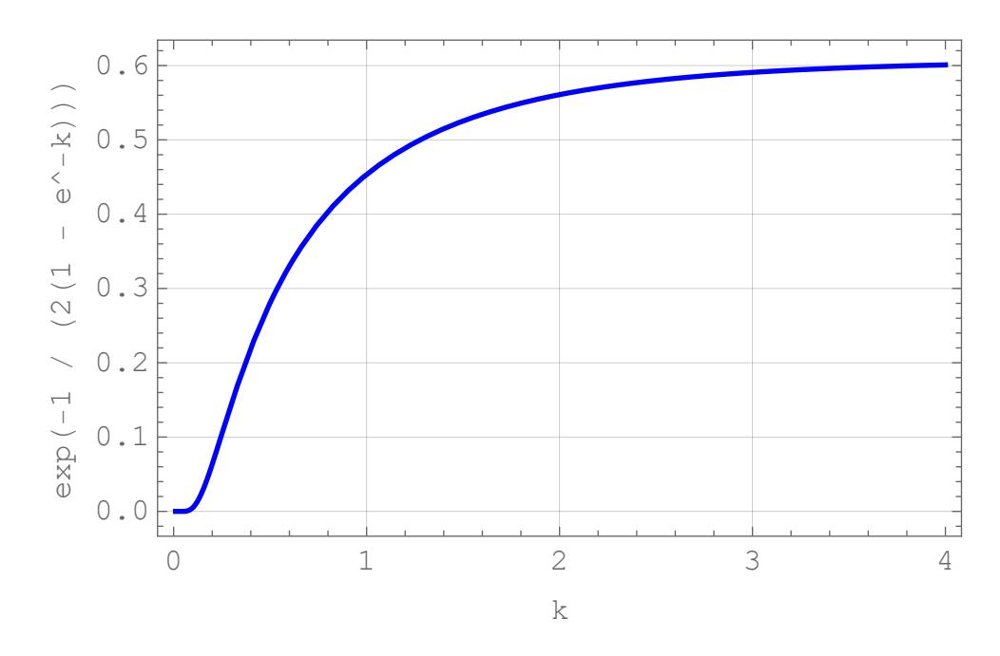

Fig. 12: <sup>∞</sup> as a function of .

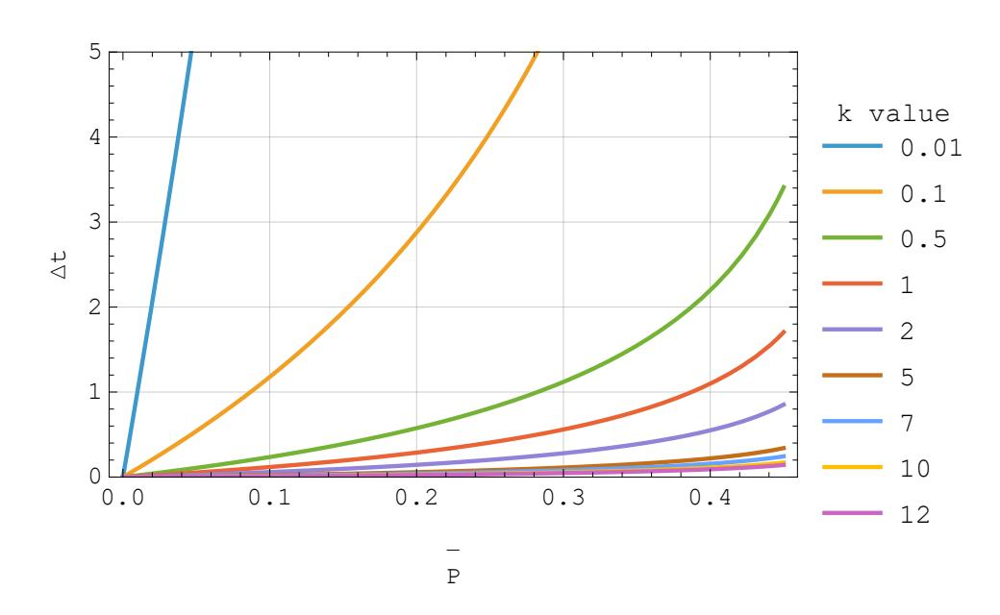

Fig. 13: Δ as a function of ̄and .

## <span id="page-33-0"></span>**B Appendix: Cohen's test**

Cohen's test is a statistical measure used to quantify the level of agreement between two raters (in our case the ground truth and the predicted system

{34}------------------------------------------------

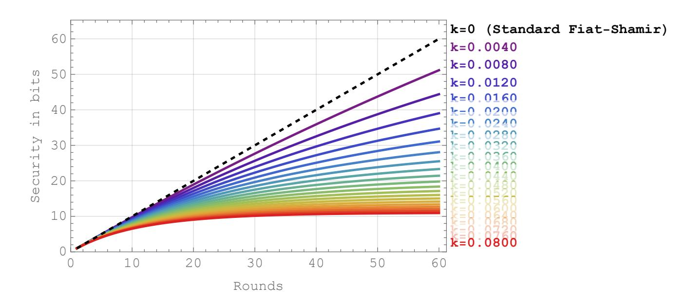

Fig. 14: Fiat-Shamir ascent with low k values.  $\tau = 60$  rounds.

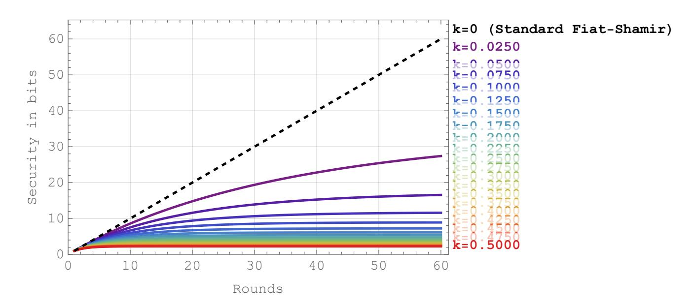

Fig. 15: Fiat-Shamir ascent with higher k values.  $\tau = 60$  rounds.

{35}------------------------------------------------

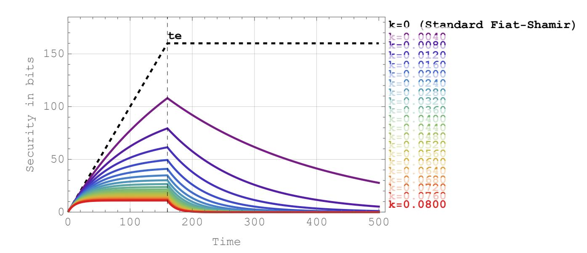

Fig. 16: Fiat-Shamir ascent and descent after  $\tau=160$  rounds. Note that the red curve mimics Figure 3. A Figure 3-like curve is obtained by translating the logarithmic scale security s in this plot into  $1-2^{-s}$ . Note that in the standard Fiat-Shamir (dotted black) there is no decay, hence Fiat-Shamir "is mute" about the state of the plateau when rounds cease  $(t_e)$ . One possibility is to interpret this muteness as no decay at all (as shown here), another is to consider that at  $t_e$  standard Fiat-Shamir drops to zero immediately (i.e. switch to a  $k=\infty$ ). If multi-bit Fiat-Shamir is used the ascent will be faster. If the challenge at each round is huge (e.g. 80) the model becomes an injection (same effect as a digital signature on a random challenge), which also confirms intuition.

state U') who classify t items into c distinct, mutually exclusive categories (in our case c = 3 where the categories are  $\mathbf{Q}, \mathbf{N}, \mathbf{P}$ ).

Cohen's  $\kappa$  accounts for the agreement that could occur purely by the sole effect of chance. The  $\kappa$  statistic is defined by:

$$\kappa = \frac{p_o - p_e}{1 - p_e} = 1 - \frac{1 - p_o}{1 - p_e}$$

Where  $p_o$  is the observed proportionate agreement between the raters and  $p_e$  is the theoretical probability of agreement occurring by chance.

 $\kappa$  typically falls between 0 and 1, though it can technically be negative:

 $\kappa = 1$ : Perfect agreement between raters.

 $\kappa = 0$ : Agreement is exactly what would be expected by chance.

 $\kappa$  < 0 : Worse than random, i.e. a systematic disagreement between raters.

To determine  $p_e$ , we assume that the raters are independent. Let:

- 1.  $n_i$  be the number of times U assigned a system-state to category  $i \in \{\mathbf{Q}, \mathbf{N}, \mathbf{P}\}$ .
- 2.  $n'_i$  be the number of times U' assigned a system-state to category  $i \in \{\mathbf{Q}, \mathbf{N}, \mathbf{P}\}$ .

We first estimate the individual probability of each rater choosing that category:

{36}------------------------------------------------

$$\frac{n_i}{t}$$
 and  $\frac{n_i'}{t}$ 

The probability that both raters choose category by sheer luck is the product of their individual probabilities.

Summing these across all 3 categories gives the total expected chance agreement:

$$p_e = \sum_{i \in \{Q, N, P\}} \frac{n_i}{t} \cdot \frac{n'_i}{t} = \frac{n_Q n'_Q + n_N n'_N + n_P n'_P}{t^2}$$

To calculate (the observed agreement), one simply determines the proportion of items for which both raters assigned the exact same category.

In other words, denoting by the number of items that both raters assigned to the same category :

$$p_o = \frac{f_{\rm Q} + f_{\rm N} + f_{\rm P}}{t}$$

## **References**

- <span id="page-36-4"></span>1. Alphan Altinok and Matthew Turk. Temporal integration for continuous multimodal biometrics. In *Proceedings of the Workshop on Multimodal User Authentication (MMUA)*, January 2003.
- <span id="page-36-2"></span>2. Priya Bansal and Abdelkader Ouda. Continuous authentication in the digital age: An analysis of reinforcement learning and behavioral biometrics. *Computers*, 13(4), 2024.
- <span id="page-36-0"></span>3. Attaullah Buriro, Bruno Crispo, Konstantinos Votis, and Dimitrios Tzovaras. Hold and sign: A novel behavioral biometrics for continuous authentication. *IEEE Transactions on Information Forensics and Security*, 11(8):1681–1693, 2016.
- <span id="page-36-5"></span>4. R. E. Burton and R. W. Kebler. The "half-life" of some scientific and technical literatures. *American Documentation*, 11(1):18–22, 1960.
- <span id="page-36-7"></span>5. Fabian Bäumer, Marcus Brinkmann, Maximilian Radoy, Jörg Schwenk, and Juraj Somorovsky. On the security of SSH client signatures. In *Proceedings of the 2025 ACM SIGSAC Conference on Computer and Communications Security*, CCS '25, page 4619–4633. ACM, November 2025.
- <span id="page-36-6"></span>6. Astrid Carolus, Frank Schwab, Ricardo Münch, Catharina Schmidt, Florian Schneider, and Jens Binder. Digital companions. Research report for Kasperski Labs, Julius-Maximilians-University Würzburg and Nottingham Trent University, Würzburg, Germany and Nottingham, United Kingdom, 2016.
- <span id="page-36-1"></span>7. Marcos Centeno, Ignacio Marin, Jose M. Pardo, and Luis Hernandez-Encinas. Mobile continuous authentication using touch dynamics. *Sensors*, 18(8):2562, 2018.
- <span id="page-36-8"></span>8. Céline Chevalier, Damien Gaumont, David Naccache, and Rodrigo Portella Do Canto. *How to (carefully) breach a service contract?*, pages 166–173. Springer Berlin Heidelberg, Berlin, Heidelberg, 2016.
- <span id="page-36-3"></span>9. Helen Crawford, Karen Renaud, and Steven Furnell. A survey of linguistic profiling for author identification and verification. *Security and Communication Networks*, 6(1):44–59, 2013.

{37}------------------------------------------------

- <span id="page-37-1"></span>10. John Daugman. How iris recognition works. *IEEE Transactions on Circuits and Systems for Video Technology*, 14(1):21–30, 2004.
- <span id="page-37-4"></span>11. Dorothy E. Denning. An intrusion-detection model. *IEEE Transactions on Software Engineering*, 13(2):222–232, 1987.
- <span id="page-37-14"></span>12. Frank Drake and Dava Sobel. *Is anyone out there?: The scientific search for extraterrestrial intelligence*. Delacorte Press, New York, NY, USA, 1992.
- <span id="page-37-17"></span>13. Amos Fiat and Adi Shamir. How to prove yourself: Practical solutions to identification and signature problems. *Advances in cryptology—CRYPTO'86*, 263:186–194, 1987.
- <span id="page-37-3"></span>14. Mario Frank, Ralf Biedert, Eugene Ma, Ivan Martinovic, and Dawn Song. Touchalytics: On the applicability of touchscreen input as a behavioral biometric for continuous authentication. *IEEE Transactions on Information Forensics and Security*, 8(1):136–148, 2013.
- <span id="page-37-5"></span>15. Alex Fridman, Ariel Stolerman, Sayandeep Acharya, Patrick Brennan, Patrick Juola, Rachel Greenstadt, and Moshe Kam. Decision fusion for multimodal active authentication. *IT Professional*, 17(1):13–20, 2015.
- <span id="page-37-13"></span>16. Milton Friedman. *A Theory of the Consumption Function*. Number 63 in National Bureau of Economic Research, General Series. Princeton University Press, Princeton, New Jersey, 1957.
- <span id="page-37-2"></span>17. R. Stockton Gaines, William Lisowski, S. James Press, and Norman Shapiro. Authentication by keystroke timing: Some preliminary results. Technical Report R-256-NSF, RAND Corporation, Santa Monica, CA, May 1980.
- <span id="page-37-8"></span>18. Eiji Hayashi, Sauvik Das, Shahriyar Amini, Jason Hong, and Ian Oakley. Casa: Context-aware scalable authentication. In *Proceedings of the Ninth Symposium on Usable Privacy and Security (SOUPS)*, pages 7603–7607, 2013.
- <span id="page-37-15"></span>19. Nadia Heninger, Zakir Durumeric, Eric Wustrow, and J. Alex Halderman. Mining your s and s: detection of widespread weak keys in network devices. In *Proceedings of the 21st USENIX Conference on Security Symposium*, Security'12, page 35, USA, 2012. USENIX Association.
- <span id="page-37-16"></span>20. Wassily Hoeffding. Probability inequalities for sums of bounded random variables. *Journal of the American Statistical Association*, 58(301):13–30, 1963.
- <span id="page-37-7"></span>21. Anil Jain, Karthik Nandakumar, and Arun Ross. Score normalization in multimodal biometric systems. *Pattern Recognition*, 38(12):2270–2285, 2005.
- <span id="page-37-10"></span>22. Sunil S. Jambhekar and Philip J. Breen. *Basic pharmacokinetics*. Pharmaceutical Press, London, UK, 2nd edition, 2012.
- <span id="page-37-9"></span>23. Junhong Kim and Pilsung Kang. Recurrent neural network-based user authentication for freely typed keystroke data, 2019.
- <span id="page-37-12"></span>24. Peter Kuppens, Zita Oravecz, and Francis Tuerlinckx. Feelings change: Accounting for individual differences in the temporal dynamics of affect. *Journal of Personality and Social Psychology*, 99(6):1042–1060, 2010. Published online first September 20, 2010.
- <span id="page-37-0"></span>25. Jinfeng Li, Xiangyu Tan, and Anil K. Jain. Liveness detection in fingerprint recognition systems. In *Handbook of Remote Biometrics for Surveillance and Security*, pages 327–342. Springer, 2009.
- <span id="page-37-6"></span>26. Yantao Li, Bin Zou, Shaojiang Deng, and Gang Zhou. Using feature fusion strategies in continuous authentication on smartphones. *IEEE Internet Computing*, 24(2):47–56, 2020.
- <span id="page-37-11"></span>27. Robert H. MacArthur and Edward O. Wilson. An equilibrium theory of insular zoogeography. *Evolution*, 17(4):373–387, December 1963.

{38}------------------------------------------------

- <span id="page-38-1"></span>28. Ahmed Mahfouz, Yasser Mahmoud, and Ahmed M. Abu-Naser. A survey on behavioral biometric authentication on smartphones. *Journal of Information Security*, 8(4):307–322, 2017.
- <span id="page-38-10"></span>29. Shrirang Mare, Andres Molina-Markham, Cory Cornelius, Ronald Peterson, and David Kotz. Zebra: Zero-effort bilateral recurring authentication. In *Proceedings of the IEEE Symposium on Security and Privacy (SP)*, pages 6303–6312, 2014.
- <span id="page-38-15"></span>30. Colin McDiarmid. On the method of bounded differences. In J. Siemons, editor, *Surveys in Combinatorics, 1989*, number 141 in London Mathematical Society Lecture Note Series, pages 148–188. Cambridge University Press, 1989.
- <span id="page-38-14"></span>31. Sarah Mitchell. Password hacking statistics: Market data report 2026. [https://](https://gitnux.org/password-hacking-statistics/) [gitnux.org/password-hacking-statistics/](https://gitnux.org/password-hacking-statistics/), 2026. Accessed: 2026-02-16.
- <span id="page-38-0"></span>32. Soumik Mondal and Patrick Bours. Combining keystroke and mouse dynamics for continuous user authentication and identification. In *2016 12th International Conference on Signal-Image Technology & Internet-Based Systems (SITIS)*, pages 212–221. IEEE, 2016.
- <span id="page-38-4"></span>33. Muhammad Muaaz and René Mayrhofer. Smartphone-based gait recognition: From authentication to imitation. *IEEE Transactions on Mobile Computing*, 16(11):3209–3221, 2017.
- <span id="page-38-12"></span>34. Julian Murphy, Gareth Howells, and Klaus D McDonald-Maier. A machine learning method for sensor authentication using hidden markov models. In *2019 IEEE International Conference on Systems, Man and Cybernetics (SMC)*, pages 198–203. IEEE, 2019.
- <span id="page-38-13"></span>35. Prasad A. Naik, Murali K. Mantrala, and Alan G. Sawyer. Planning media schedules in the presence of dynamic advertising quality. *Marketing Science*, 17(3):214–235, 1998.
- <span id="page-38-5"></span>36. Brendan Pelto, Mounika Vanamala, and Rushit Dave. Your identity is your behavior: Continuous user authentication based on machine learning and touch dynamics. *IEEE Conference Publication*, 2023.
- <span id="page-38-16"></span>37. Ali Pesaranghader, Herna Viktor, and Eric Paquet. Mcdiarmid drift detection methods for evolving data streams, 2018.
- <span id="page-38-7"></span>38. Norman Poh, Josef Kittler, and Thirimachos Bourlai. Quality-based score normalisation with device qualitative information for multimodal biometric fusion. In *Proceedings of the IEEE International Conference on Biometrics (ICB)*, pages 462–471, 2009.
- <span id="page-38-8"></span>39. Salil Prabhakar and Anil K. Jain. Decision-level fusion in fingerprint verification. *Pattern Recognition*, 35(4):861–874, 2002.
- <span id="page-38-2"></span>40. Nalini K. Ratha, Jonathan H. Connell, and Ruud M. Bolle. Enhancing security and privacy in biometrics-based authentication systems. *IBM Systems Journal*, 40(3):614–634, 2001.
- <span id="page-38-3"></span>41. Douglas A. Reynolds, Thomas F. Quatieri, and Robert B. Dunn. Speaker verification using adapted gaussian mixture models. *Digital Signal Processing*, 10(1–3):19–41, 2000.
- <span id="page-38-11"></span>42. Oriana Riva, Chuan Qin, Karin Strauss, and Dimitrios Lymberopoulos. Progressive authentication: deciding when to authenticate on mobile phones. In *Proceedings of the 2012 USENIX conference on Annual Technical Conference (USENIX ATC)*, pages 301–314, 2012.
- <span id="page-38-9"></span>43. Arun Ross and Anil Jain. Information fusion in biometrics. *Pattern Recognition Letters*, 24(13):2115–2125, 2003.
- <span id="page-38-6"></span>44. Cynthia Rudin. Stop explaining black box machine learning models for high stakes decisions and use interpretable models instead. *Nature Machine Intelligence*, 1:206–215, 2019.

{39}------------------------------------------------

- <span id="page-39-5"></span><span id="page-39-0"></span>45. Riseul Ryu, Soonja Yeom, Soo-Hyung Kim, and David Herbert. Continuous multimodal biometric authentication schemes: A systematic review. *IEEE Access*, 9:34541–34561, 2021.
- <span id="page-39-4"></span>46. Hataichanok Saevanee, Nathan L. Clarke, and Steven M. Furnell. Multi-modal behavioural biometric authentication for mobile devices. In *IFIP International Conference on ICT Systems Security and Privacy Protection (SEC 2012)*, pages 465–474. Springer, 2012.
- <span id="page-39-7"></span>47. Enrico Schiavone, Andrea Ceccarelli, and Andrea Bondavalli. Continuous user identity verification for trusted operators in control rooms. In Guojin Wang, Albert Zomaya, Gregorio Martinez, and Kenli Li, editors, *Algorithms and Architectures for Parallel Processing*, pages 187–200, Cham, 2015. Springer International Publishing.
- <span id="page-39-2"></span>48. Chao Shen, Zhongmin Cai, and Xiaohong Guan. Continuous authentication for mouse dynamics: A pattern-growth approach. In *Proceedings of the 2012 IEEE/IFIP International Conference on Dependable Systems and Networks Workshops (DSN-W)*, pages 1–8. IEEE, 2012.
- <span id="page-39-3"></span>49. Cong Shi, Jian Liu, Nick Borodinov, Bruno Leao, and Yingying Chen. Towards environment-independent behavior-based user authentication using wifi. In *Proceedings of the 17th IEEE International Conference on Mobile Ad Hoc and Sensor Systems (MASS)*, pages 464–472. IEEE, 2020.
- <span id="page-39-6"></span>50. Elaine Shi, Yuan Niu, Markus Jakobsson, and Richard Chow. Implicit authentication through learning user behavior. In *Proceedings of the 7th International Conference on Information Security and Cryptology (Inscrypt)*, pages 99–113, 2011.
- <span id="page-39-8"></span>51. Morris Swadesh. Lexico-statistic dating of prehistoric ethnic contacts: With special reference to north american indians and eskimos. *Proceedings of the American Philosophical Society*, 96(4):452–463, August 1952.
- <span id="page-39-1"></span>52. Rahmad Syalevi, Aji Prasetyo, and Rizal Fathoni Aji. Study on the implementation of multimodal continuous authentication in smartphones: A systematic review. *International Journal of Advanced Computer Science & Applications*, 15(2), 2024.