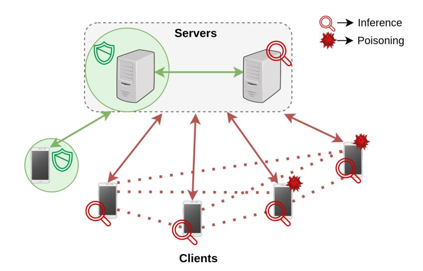
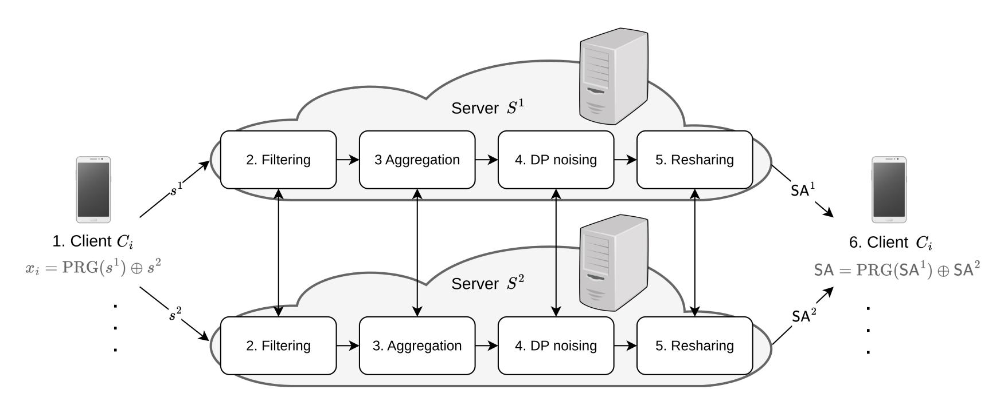
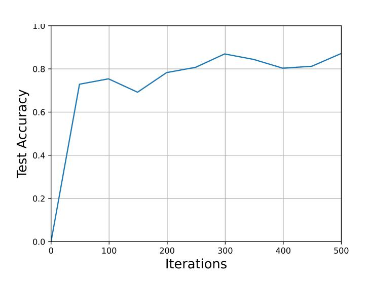
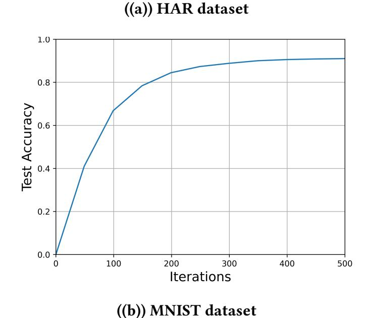
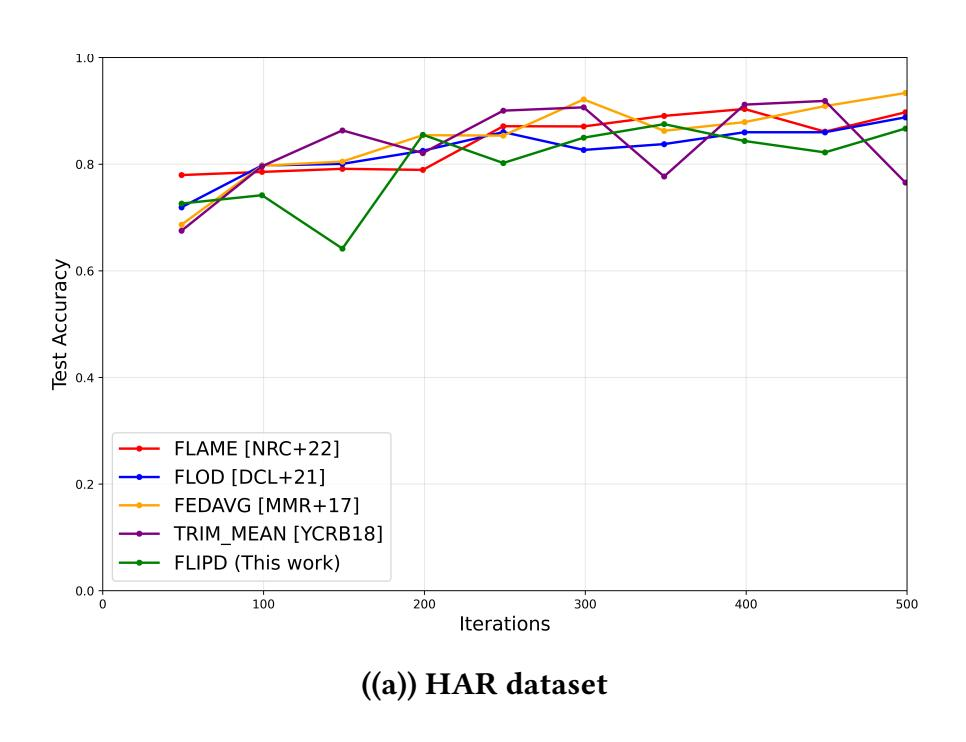
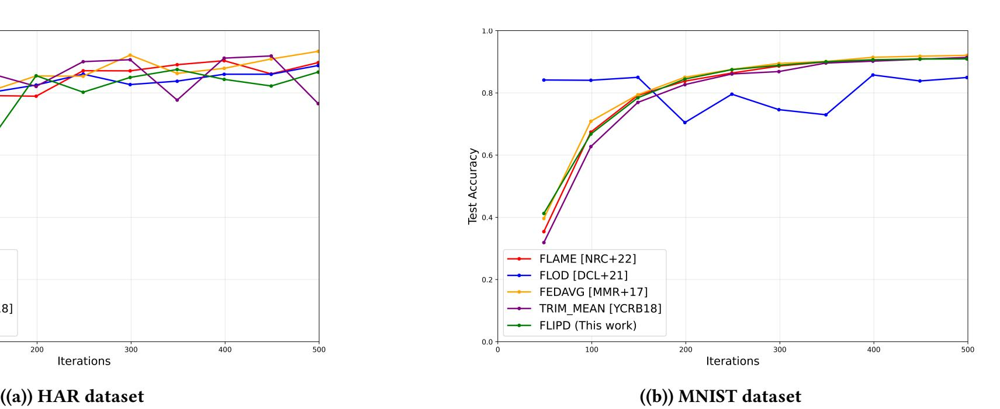
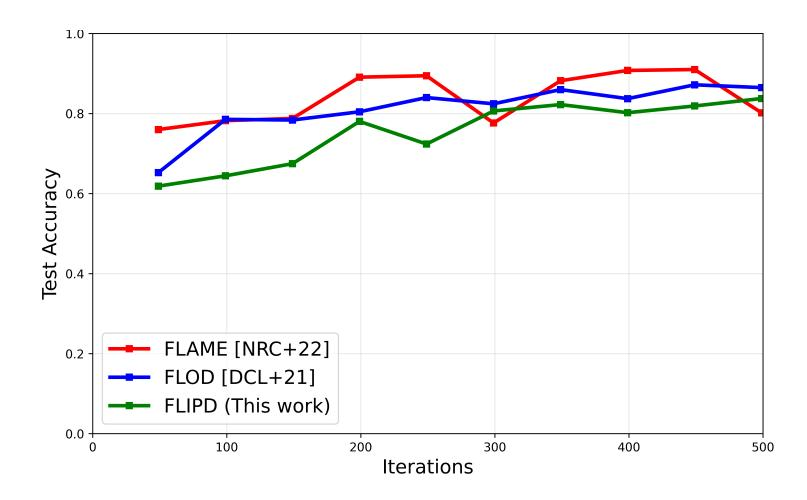
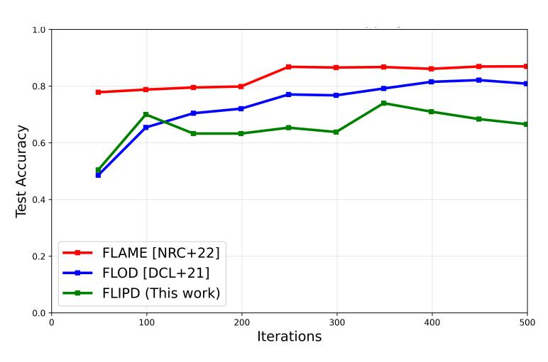
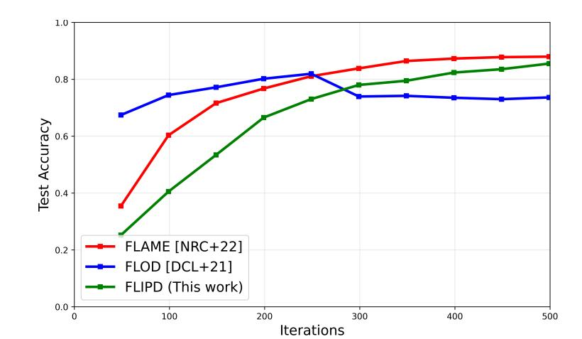
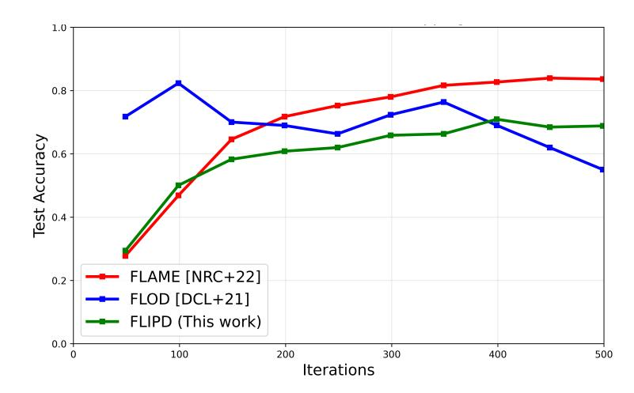

{0}------------------------------------------------

# FLiPD: Privacy-Preserving Federated Learning via Multi-Party Computation and Differential Privacy

Gowri R Chandran Simula UiB, Norway∗

Melek Önen EURECOM, France

Thomas Schneider Technical University of Darmstadt, Germany

# Abstract

Federated Learning (FL) is a collaborative Machine Learning (ML) process where clients locally train an ML model on their private inputs, and send it to a server that aggregates the local model updates to obtain a global model update. FL is widely used in applications where the training data is distributed among several clients, e.g., for next word prediction in Google keyboard (Gboard). Nevertheless, FL faces several challenges concerning privacy and security. 1) Client privacy needs to be preserved by employing defenses against inference attacks using Secure Aggregation (SA) protocols. 2) The security of the model has to be defended against poisoning and backdoor attacks, e.g., by using clustering or filtering algorithms.

In this work, we present FLiPD, an optimised SA protocol for FL that protects against several attacks via a combination of Multi-Party Computation (MPC) and Differential Privacy (DP) mechanisms. We provide defenses against both inference and backdoor attacks. Moreover, by applying distributed DP noise generation, we show that our protocol is secure even when the majority of the clients collude with a server.

As opposed to existing solutions, in FLiPD, the client-server communication cost is essentially the same as in unprotected FL, which sends plaintext updates. Furthermore, the server-server communication cost is slightly lower (by 11%) than the state-of-the-art Prio+ (Addanki et al., SCN'22). In addition, we examine the accuracy of FLiPD both in the presence and absence of attacks. We achieve 87% accuracy for a Linear Regression model trained on the HAR dataset, and 90% for a Convolution Neural Network trained on the MNIST dataset.

# Keywords

Federated learning, multi-party computation, differential privacy

# 1 Introduction

Federated Learning (FL) [\[32\]](#page-11-0) is a Machine Learning (ML) paradigm where clients collaboratively train a global model by sharing local model updates rather than raw data. This design ensures that sensitive data remains decentralized while still enabling effective model training. FL has gained traction due to privacy regulations such as HIPAA in the US [\[1\]](#page-10-0) and GDPR in the EU [\[45\]](#page-12-0), which restrict central data collection. FL is now widely applied in domains like text prediction in Gboard [\[57\]](#page-12-1), medical research [\[34,](#page-11-1) [55\]](#page-12-2), and autonomous driving [\[13\]](#page-11-2), making security and privacy in FL particularly critical.

While FL reduces the need to centralize sensitive data, it does not inherently preserve privacy. One major privacy concern are

A major security threat in FL is poisoning attacks [\[8\]](#page-11-10), where malicious clients manipulate the training process to degrade the accuracy of the global model. Such attacks can be carried out either by corrupting the local training data (data poisoning) [\[47\]](#page-12-11) or by directly submitting maliciously crafted updates to the server (model poisoning) [\[5\]](#page-10-2). A common line of defense against these attacks is to apply robust aggregation techniques, such as filtering or clustering, which aim to identify and exclude anomalous client updates that deviate significantly from the majority. These defenses rely on various distance metrics, including Hamming Distance (HD) [\[17,](#page-11-11) [43\]](#page-12-12), cosine similarity [\[40,](#page-12-13) [56,](#page-12-14) [58\]](#page-12-15), and K-means clustering [\[47\]](#page-12-11), to distinguish between benign and malicious contributions. However, such techniques often incur additional computational costs and may fail against adaptive adversaries.

A few recent studies have explored combining defenses against both inference and poisoning attacks [\[17,](#page-11-11) [40,](#page-12-13) [56\]](#page-12-14). However, these approaches often introduce significant computation or communication overhead [\[40,](#page-12-13) [56\]](#page-12-14), which is especially critical in practical FL deployments where clients usually have limited computation and storage capacities and often use WAN or LTE networks for communication. Other defenses rely on strong assumptions, such as the server having a base model [\[17\]](#page-11-11), or provide limited robustness under collusion. As a result, FL remains vulnerable in practical deployments. Taken together, these attacks demonstrate that existing defenses, whether isolated or combined, remain incomplete, leaving FL systems vulnerable when adversaries exploit multiple weaknesses simultaneously.

To address this gap, in this paper, we propose FLiPD, a holistic framework for FL that simultaneously defends against inference and poisoning attacks while minimizing client communication.

inference attacks [\[48\]](#page-12-3), where a corrupted server (known as the aggregator) can analyze clients' local model updates to infer sensitive information about their private data. Secure Aggregation (SA) [\[11,](#page-11-3) [41\]](#page-12-4) is a commonly used defense mechanism against such attacks. In SA, the clients send concealed (using various cryptographic techniques) local updates so that the aggregator can compute the global model update without learning any individual contribution. The concealment can be achieved using methods such as Differential Privacy (DP) [\[3,](#page-10-1) [46,](#page-12-5) [52,](#page-12-6) [59,](#page-12-7) [63\]](#page-12-8), Homomorphic Encryption (HE) [\[7,](#page-11-4) [20,](#page-11-5) [27\]](#page-11-6), Multi-Party Computation (MPC) [\[28\]](#page-11-7), or Trusted Execution Environments (TEE) [\[30,](#page-11-8) [39,](#page-12-9) [62\]](#page-12-10). However, while SA protects the privacy of client updates, it does not provide comprehensive security: poisoning attacks [\[47\]](#page-12-11), backdoor attacks [\[5\]](#page-10-2), and inference attacks [\[23\]](#page-11-9) remain feasible even when SA is employed.

\*This work was done while at Technical University of Darmstadt, Germany.

{1}------------------------------------------------

#### **Our Contributions**

Taking into account the requirements for deploying Federated Learning (FL) in real-world scenarios and the limitations of existing solutions, we propose FLiPD, a communication-efficient Secure Aggregation (SA) protocol that provides holistic defenses against multiple attacks while being resilient to client-server collusion. Our contributions are summarized as follows:

(1) **Communication-Efficient Secure Aggregation:** We design FLiPD as an SA protocol fully executed using MPC, reducing the trust required on the aggregator and supporting client dropouts and failures. To minimize client-server communication, we adopt a seed-based secret sharing scheme [6, 12, 15, 51], which preserves client communication at the same message size as unprotected FL, achieving full communication efficiency, for the first time in private FL.

### (2) Holistic Defense Against Attacks:

- (a) **Poisoning Attack Mitigation:** We employ Hamming Distance (HD)-based filtering to detect anomalous client updates. HD is computationally inexpensive in the MPC setting and has been shown to perform comparably to more costly measures, such as cosine similarity [17].
- (b) **Inference Attack Mitigation:** FLiPD integrates DP noise at the end of aggregation. Unlike FLAME [40], our DP mechanism is instantiated entirely within MPC, while incurring minimal additional cost. Our distributed DP ensures privacy even under collusion between clients and the server, as long as one client and one server remain honest.

We instantiate our MPC protocol using ABY2.0 [42], enabling efficient mixed-protocol conversions and low inter-server communication. Moreover, ABY2.0 optimises the online communication cost, shifting most communication to a precomputation phase.

In summary, FLiPD provides a holistic, efficient, and practical solution for privacy-preserving FL. It reduces communication and computation costs while simultaneously defending against multiple attacks and maintaining accuracy comparable to prior state-of-the-art approaches.

#### 2 Background and Preliminaries

*Notations*. For clarity and conciseness, we define the following notations used throughout this paper. If s is a secret, the i-th share is denoted by  $s^i$ . We represent the different types of sharing as follows:  $[s^i]_A$  for arithmetic,  $[s^i]_B$  for Boolean, and  $[s^i]_Y$  for Yao [42]. Each client  $C_i$ 's input to the SA is  $x_i$ , which is a string of m weights  $w_{ij}$  concatenated together, i.e.,  $x_i = w_{i1}||\cdots||w_{im}$ .

## 2.1 Multi-Party Computation (MPC)

MPC enables a set of n parties to jointly compute a function over their private inputs while ensuring that no party learns anything beyond the prescribed output. Broadly, MPC protocols can be classified into two categories: secret sharing–based protocols and garbled circuit–based protocols.

2.1.1 Arithmetic and Boolean Sharing. In secret sharing—based MPC, a value  $s \in \mathbb{F}_q$  is split into random shares that are distributed among the parties. In arithmetic sharing, a secret is additively

shared over a finite ring  $\sum_{i=1}^n s^i = s \mod q$ , making this representation particularly efficient for arithmetic operations such as addition and multiplication. In Boolean sharing, the secret  $(s \in \{0,1\})$  is shared in the binary domain using XOR, i.e.,  $s = s^1 \oplus s^2 \oplus \cdots \oplus s^n$ , which is efficient for bitwise operations such as AND and XOR. The choice of sharing thus depends on the nature of the function and the operations to be performed.

2.1.2 Garbled Circuit (GC). In Yao's Garbled Circuits protocol [60] one party (the garbler) encodes a Boolean circuit into an encrypted form, and another party (the evaluator) evaluates the circuit on its input without learning the garbler's private input. Since any function can be expressed as a Boolean circuit, GCs provide a general mechanism for secure two-party computation.

2.1.3 Mixed Protocol Conversions. The ABY framework [16] introduced the first general-purpose MPC framework supporting conversions between Arithmetic (A), Boolean (B), and Yao (Y) sharings. These conversions enable efficient evaluation of complex functions by executing each subfunction in the most suitable sharing format. Building on this, ABY2.0 [42] further optimized the efficiency of these conversions and shifted a significant portion of the computation to the precomputation (setup) phase, thus minimizing the online overhead.

# 2.2 Differential Privacy (DP)

Differential Privacy (DP) [18] is a technique commonly used in private data analysis to protect individual data privacy. It ensures that a single data item does not have much effect on the result, such that an adversary cannot infer any information about the input, i.e., the distribution of the result is similar whether a certain data item is included in the computation or not. DP is formally defined as follows:

DEFINITION 1 ((Pure) DIFFERENTIAL PRIVACY [18]). A mechanism  $\mathcal{M}$  is  $\epsilon$ -differentially private if for all pairs  $x, x' \in X^n$  which differ in only one item, for all adversaries  $\mathcal{A}$ , and for all transcripts t:

$$\Pr[\mathcal{M}_{\mathcal{A}}(x) = t] \le e^{\epsilon} \cdot \Pr[\mathcal{M}_{\mathcal{A}}(x') = t]. \tag{1}$$

Depending on the application, the definition of DP can be relaxed a little to allow a negligible statistical distance term  $\delta$  in addition to the multiplicative term  $\epsilon$ . This is known as *approximate DP*, and is defined as follows:

DEFINITION 2 (APPROXIMATE DIFFERENTIAL PRIVACY [54]). For  $\epsilon \geq 0$ ,  $\delta \in [0,1]$ , we say that a randomized mechanism  $\mathcal{M}: X^n \times Q \to Y$  is  $(\epsilon, \delta)$ -differentially private if, for every two neighboring datasets  $x \approx x' \in X^n$  and every function  $f \in Q$ , we have

$$\forall T \subseteq Y, \Pr[\mathcal{M}(x, f) \in T] \le e^{\epsilon} \cdot \Pr[\mathcal{M}(x', f) \in T] + \delta.$$
 (2)

DP has various useful properties such as group privacy, closure under post-processing, and composition, cf. [19, 54] for details of each property. Among these, the composition property is especially useful and is also used in our protocol.

2.2.1 *DP Composition.* DP composition permits the construction of complex differentially private algorithms as a composition of simpler differentially private building blocks. The basic DP composition works as follows:

{2}------------------------------------------------

LEMMA 1 (BASIC DP COMPOSITION [54]). If  $\mathcal{M}_1, \ldots, \mathcal{M}_k$  are each  $(\epsilon, \delta)$ -differentially private, then  $\mathcal{M}$  is  $(k\epsilon, k\delta)$ -differentially private, where  $\mathcal{M}(x) = (\mathcal{M}_1(x), \mathcal{M}_2(x), \cdots, \mathcal{M}_k(x))$ .

2.2.2 The Laplace Mechanism. One method to achieve DP is the Laplace Mechanism. Here, a function f is first computed and then perturbed with noise that is sampled from the Laplace distribution. The standard deviation of this distribution is calibrated to the sensitivity of the function f. The sensitivity of a function determines the maximum change in the function that a single individual's data can cause.

Definition 3 (Laplace Distribution). The Laplace distribution with scale  $\lambda$  is the distribution with probability density function:

$$Lap(\lambda) = \frac{1}{2\lambda} \cdot exp\left(-\frac{|x|}{\lambda}\right). \tag{3}$$

DEFINITION 4 (THE LAPLACE MECHANISM [19]). For a function  $f: X^n \to \mathbb{R}$ , a bound B, and  $\epsilon > 0$ , the Laplace Mechanism  $\mathcal{M}$  over data universe X takes a dataset  $x \in X^n$  and outputs

$$\mathcal{M}(x) = f(x) + \text{Lap}(B/\epsilon). \tag{4}$$

Theorem 1 ([54]). If  $B \ge GS_f$ , the Laplace mechanism  $\mathcal M$  is  $\epsilon$ -differentially private.

# 2.3 Hamming Distance (HD)

The Hamming Distance between two bit vectors  $x, y \in \{0, 1\}^n$  is defined as the number of positions at which the corresponding bits differ:

$$hd(x,y) = \sum_{i=1}^{n} 1_{\{x_i \neq y_i\}}$$

where  $1_{\{x_i \neq y_i\}}$  is 1 if  $x_i \neq y_i$  and 0 otherwise. HD is widely used in SA and poisoning detection [17] to quantify the similarity between model updates: smaller hd is considered consistent, while large hd corresponds to adversarial or anomalous behavior.

### 3 System Model

The FLiPD protocol involves two types of entities: clients and servers. Let  $C = \{C_1, \dots, C_N\}$  be the set of clients, each holding input  $x_i$ . The clients never interact with each other, only with the servers. We consider two servers  $S^1$  and  $S^2$ , acting as the aggregators, collecting secret-shared model updates from the clients to securely compute the global model. The clients are considered to be Augmented Semi-Honest (ASH) [25], meaning that they behave semi-honestly while having the ability to manipulate their inputs to the protocol. The servers are considered to be semi-honest, but can collude with a subset of the clients. The two servers are assumed not to collude with each other. Fig. 1 shows the system overview and the corruption capabilities of the entities. The protocol is designed to ensure privacy, integrity, and robustness of the global model even in the presence of such adversarial behavior. The following subsections detail these capabilities and the mitigation strategies employed by FLiPD.

#### 3.1 Threat Model

FLiPD is designed for a general setting with N clients and  $N_S$  servers. For simplicity, we focus on the case of two non-colluding servers in

Figure 1: System overview. Arrows show communication channels; red indicates potential collusion, green indicates no collusion. Dotted lines mark possible collusion without communication. The green circle highlights the minimum honest parties required.

this work. Each client  $C_i \in C$  locally trains the model on its input and sends secret shares of the model update to the two servers. The servers then execute the SA protocol using MPC and return the aggregated model update to the clients.

Within this setting, we consider an Augmented Semi-Honest (ASH) adversary [25]  $\mathcal{A}$  who may attempt to compromise privacy, manipulate client updates, or interfere with the aggregation process; we detail these capabilities below.

- (1) **Data Poisoning.** The adversary  $\mathcal{A}$  may corrupt a subset of clients to inject poisoned data, causing their local updates to deviate from honest behavior, thus biasing the global model update in their favor. This capability is formalised under the ASH adversary model. To mitigate such attacks, FLiPD employs Hamming Distance (HD)-based filtering and elimination of poisoned updates. Furthermore, we provide a simulation-based proof demonstrating that the protocol remains secure even in the presence of an ASH adversary.
- (2) *Membership Inference*. The adversary  $\mathcal{A}$  may attempt to learn information about an honest client's input in two ways: (i) by leveraging the local updates sent by the client to the server, and (ii) by monitoring the client's presence or absence in different iterations and comparing the model updates in those iterations. To prevent the first type of inference attack, we employ an MPC-based Secure Aggregation (SA) algorithm, which ensures that the servers do not learn the local updates in plaintext. And to defend against the second, we integrate Differential Privacy (DP), which guarantees that the contribution of any single data item remains indistinguishable. Thus, we preserve client privacy against both client-side and server-side attacks.
- (3) *Collusion.* As described above, the adversary  $\mathcal{A}$  may simultaneously corrupt a subset of clients and one server, effectively creating a collusion between the server and the corrupted clients. To maintain the security of FLiPD, at least one server and one client must remain honest at all times. Consequently, the two servers are assumed to be non-colluding, a standard

{3}------------------------------------------------

assumption in MPC. Typically, servers are operated by independent entities that collaborate to achieve a common goal but do not collude due to legal, contractual, or reputational constraints. We formally demonstrate, via simulation-based proofs, that FLiPD remains secure under these assumptions, even in the presence of colluding clients and one server.

(4) Client Dropouts. Any client may drop out of the protocol at any point during execution. If a client exits before or after submitting all its shares, the computation of the global model remains unaffected. A more challenging scenario arises when a client sends its share to only one server and fails to deliver the corresponding share to the other. To address this, FLiPD incorporates a verification step between the two servers to ensure that both shares from all participating clients are received before aggregation. This mechanism preserves correctness and robustness despite client dropouts.

Essentially, FLiPD ensures the integrity, privacy, and correctness of the global model against data poisoning, inference attacks, collusion, and client dropouts, under the assumption that at least one server and one client remain honest.

# 4 Related Works

With the necessary background and technical notation established, we now review existing approaches for secure and robust FL, highlighting their strengths and limitations relative to FLiPD.

# 4.1 Multi-Party Computation-based FL

Multi-Party Computation (MPC) enables parties to jointly compute a function on their inputs without revealing them. In Federated Learning, MPC-based Secure Aggregation protocols [\[2,](#page-10-4) [14,](#page-11-18) [24,](#page-11-19) [28,](#page-11-7) [40,](#page-12-13) [44\]](#page-12-20) rely on 2 or more non-colluding servers (or aggregators) to securely combine local model updates. While these models preserve privacy, they incur significant communication overhead between the clients and server.

To address this limitation, several works focus on reducing clientside communication. Prio+ [\[2\]](#page-10-4) improves upon Prio [\[14\]](#page-11-18) by using Boolean secret sharing to reduce the client communication, while [\[6\]](#page-10-3) applies quantization techniques to reduce the size of the transmitted data. In our work, we adopt a seed expansion-based secret sharing scheme [\[6,](#page-10-3) [12,](#page-11-12) [15,](#page-11-13) [51\]](#page-12-16), enabling clients to send essentially the same amount of data as in plaintext. Table [1](#page-3-0) compares the asymptotic client-side communication overhead for the most efficient SA solutions under a two-server setup.

| Protocol  | Client Comm. (bits) | Backdoor defenses | Inference defenses |  |
|-----------|------------------------|----------------------|-----------------------|--|
| FLOD [17] | 2𝑙                     | Filtering            | No                    |  |
| Prio+ [2] | 2𝑙                     | Input Validation     | No                    |  |
| Elsa [44] | 2𝑙                     | Filtering            | No                    |  |
| RoFL [36] | + log 𝑙 N        | ZK                   | No                    |  |
| Ours      | 𝑙                      | Filtering            | Yes                   |  |

Table 1: Asymptotic communication cost for clients in MPCbased FL protocols with 2 servers. is the input size and N is the number of clients.

Furthermore, most of the MPC-based FL protocols assume semihonest servers, while recent works [\[37,](#page-12-22) [44\]](#page-12-20) consider malicious servers. Additionally, some works [\[2,](#page-10-4) [14,](#page-11-18) [44\]](#page-12-20), incorporate input validation by clients to mitigate data poisoning. Assuming semi-honest servers is a practical and widely adopted trade-off in FL. In many deployments, servers are operated by reputable organizations or independent entities with a vested interest in correctly executing the protocol, but they may still attempt to learn additional information from the data. Following this rationale, we consider semi-honest servers in our protocol, but similar to [\[44\]](#page-12-20), they may collude with the clients.

# 4.2 Poisoning and Backdoor Defenses in FL

Since training data remains decentralized at the clients, FL models are inherently susceptible to poisoning and backdoor attacks [\[5,](#page-10-2) [47\]](#page-12-11). Numerous defenses have been proposed against such attacks, with the core idea being to detect and eliminate anomalous updates before further computation.

One line of work uses clustering-based defenses [\[9,](#page-11-20) [40,](#page-12-13) [47\]](#page-12-11), where clients are grouped using clustering algorithms and suspicious clusters (e.g., the smallest cluster) are discarded. Other approaches rely on distance-based similarity metrics: for example, [\[22\]](#page-11-21) employs cosine similarity to detect updates with large angular deviation. Whereas [\[17\]](#page-11-11) demonstrates that HD is particularly well-suited for identifying anomalies in binary representations, using HD similarity to find updates farthest from a base global model. Another defense strategy is input verification [\[14,](#page-11-18) [31,](#page-11-22) [44\]](#page-12-20), where clients provide proofs (e.g., range proof) that their provided updates lie within an acceptable domain.

In FLiPD, we employ HD-based filtering, but unlike [\[17\]](#page-11-11) we do not rely on a base global model. Instead, we compute pairwise HDs among all client updates and identify inputs with abnormally large aggregate distances, which are then eliminated. This design yields a defense that is both computationally efficient in the MPC setting and robust against collusion, aligning with our threat model.

# 4.3 Inference Attack Defenses in FL

Revealing global model updates makes FL vulnerable to inference attacks, where adversaries infer private client data from changes in the updates [\[23,](#page-11-9) [48,](#page-12-3) [49\]](#page-12-23). While SA hides individual updates, it does not prevent leakage from the aggregated result.

A common defense against these attacks is Differential Privacy (DP) [\[18\]](#page-11-15). Several works [\[40,](#page-12-13) [46,](#page-12-5) [50,](#page-12-24) [63\]](#page-12-8) integrate DP into FL by injecting noise into updates. Noise can either be added locally by the clients [\[46,](#page-12-5) [59\]](#page-12-7), or globally by the server [\[40,](#page-12-13) [50\]](#page-12-24). Local DP provides strong privacy guarantees but typically requires larger noise magnitudes, leading to reduced Main Task Accuracy (MA). Global noise, on the other hand, achieves better accuracy but relies on the assumption of a trusted server, which is often impractical.

To reduce this trust, recent research has explored Distributed DP, where multiple untrusted parties jointly generate and apply noise [\[29,](#page-11-23) [50,](#page-12-24) [53\]](#page-12-25). These protocols eliminate the need for a single trusted server, while maintaining accuracy closer to global DP. Following this line of work, FLiPD employs a distributed setup where two servers independently generate and add noise, which is then combined into the final global update. This design strengthens

{4}------------------------------------------------

the robustness against inference attacks while avoiding the strong trust assumptions of prior global DP-based solutions.

#### 5 FLiPD: Lightweight FL Protocol

We now present the construction of our SA protocol. To formally reason about the security of our construction, we adopt the standard approach of defining an ideal functionality. This abstraction allows us to specify the exact security and correctness guarantees that the protocol must achieve, independent of its concrete implementation. In particular, we define the ideal functionality  $F_{SA}$  (Fig. 2), which captures secure aggregation with integrated defenses against poisoning and inference attacks. Our protocol  $\Pi_{SA}$  is then designed to securely realize  $F_{SA}$  in the presence of an ASH adversary. The functionality  $F_{SA}$  proceeds as follows: 1) N clients  $C_i$  having input  $x_i$ , for  $i \in [1, N]$ , send their inputs to the functionality, 2) perform Hamming Distance (HD)-based filtering ( $F_{sel}$ ), 3) the filtered inputs are aggregated ( $F_{agg}$ ), 4) DP noise is added to the aggregate, 5) the functionality returns the noisy aggregated model to the clients, and 6) the clients reconstruct the shares to obtain the global model update.

#### Ideal Functionality $F_{SA}$

**Input:** Each client  $C_i$  has input  $x_i$ .

**Computation:** Upon receiving the inputs from the clients, the functionality computes the following:

- (1)  $(\text{sel}, \text{ct}) \leftarrow F_{\text{sel}}(x_1, \dots, x_N)$ . \\See Fig. 5.
- (2)  $agg \leftarrow F_{agg}(x_1, \dots, x_N, sel, ct)$ . \\See Fig. 6.
- (3) ns  $\leftarrow \text{Lap}(GS_f/\epsilon)$ .

**Output:** The functionality returns SA = agg + ns to all clients.

Figure 2: Ideal functionality  $F_{SA}$  for secure aggregation

We instantiate  $\Pi_{SA}$  using MPC, such that steps 2-5 of  $F_{SA}$  are executed jointly by the servers in a distributed manner. An overview of the construction for the setting with two servers is given in Fig. 3. In the remainder of the section, we first give a detailed description of the protocol (§ 5.1), followed by the correctness and security proofs (§ 5.2).

#### 5.1 Protocol Description

In this section, we present the FLiPD protocol, which securely realizes the ideal functionality  $F_{SA}$ . FLiPD combines MPC-based secure aggregation, Hamming Distance (HD) filtering for robustness against poisoning, and distributed Differential Privacy (DP) noise generation for protection against inference attacks, all while maintaining communication costs comparable to unprotected FL. An overview of the construction is shown in Fig. 3 and the six main steps of the protocol are summarized in Fig. 4.We consider N clients  $C_i$  and two non-colluding servers  $S^1$  and  $S^2$ .

(1) *Input sharing.* Each client  $C_i$ , for  $i \in [1, N]$ , updates the model locally and obtains a list of m weights  $\{w_{i1}, \dots, w_{im}\}$ . The total number of weights, m, for a model update is the same for all clients. The clients concatenate their weights to form a single string  $x_i = w_{i1}||\cdots||w_{im}$ . Next, the clients use the seed-based technique similar to [6, 12, 15, 51] for compact

- input sharing. Each  $C_i$  randomly chooses a seed  $\operatorname{sd}_i \leftarrow \{0,1\}^{\lambda}$ , where  $\lambda$  is the computational security parameter set to 128 bits. Each  $C_i$  then generates two shares of their input:  $s_i^1 = \operatorname{sd}_i{}^a$ , and  $s_i^2 = x_i \oplus \operatorname{PRG}(\operatorname{sd}_i)$ , where PRG is a pseudorandom generator. Then they send share  $s_i^k$  to server  $S^k$ , for  $k \in \{1,2\}$ .
- (2) *Filtering*. Once the servers receive the shares from the clients,  $S^1$  expands its share using the same PRG. The servers proceed to securely compute the first function, which is the filtering of the inputs. We perform a Hamming Distance (HD)-based filtering to eliminate inputs that are potentially malicious or poisoned. The servers use a generic MPC protocol to compute the Total Hamming Distance (THD) thdi for each input  $x_i$ . The THD is derived by computing the sum of all pair-wise HDs for each input. The servers then draw a distribution of the THD using the N thds that they obtained. Using this distribution, the servers can filter out inputs that have a larger distance from most of the inputs. This is done by removing the elements at the tail ends of the distribution, i.e., only selecting inputs whose thd lie in the range  $[\mu - 2\sigma, \mu + 2\sigma]$ , where  $\mu$  is the mean and  $\sigma$  is the standard deviation of the thds. Fig. 5 describes the function for filtering  $F_{\text{sel}}$ . At the end of the computation, each server receives a secret share of a bit string sel that indicates which input is accepted and a secret share of a count ct, which indicates how many inputs were accepted. The entire filtering process is oblivious, i.e., the servers never learn which or how many inputs are accepted. In § 6.1, we further analyze the rationale behind choosing HD-based filtering.
- (3) Aggregation. Once the servers receive sel and ct, they proceed to compute the aggregate of the remaining inputs after the filtering. Fig. 6 describes the aggregation function. The selection vector sel ensures that only the inputs that are in the selected range are added for the aggregation, and the count ct ensures the correctness of the aggregation by averaging over the number of inputs selected. At the end of the computation, each server receives a secret share of the aggregate agg.
- (4) **DP Noising.** In this phase, the servers add DP noise to the aggregated value from Step 3. The servers generate the noise distributedly, which is then composed to form the total noise (cf. § 6.2 for details on the noise distribution). The server  $S^1$  locally samples noise  $\mathsf{ns}_1$  from the Laplace distribution with density  $(GS_f/\epsilon')$ , where  $\epsilon' = \epsilon/2$ ,  $\epsilon$  is a publicly known privacy parameter, and  $GS_f$  is the global sensitivity (cf. § 6.2 for the sensitivity analysis). Then,  $S^1$  secret shares the noise to obtain  $\mathsf{ns}_1^1$  and  $\mathsf{ns}_1^2$  and sends  $\mathsf{ns}_1^2$  to  $S^2$ . Following similar steps, the server  $S^2$  generates noise  $\mathsf{ns}_2$  and sends  $\mathsf{ns}_2^1$  to  $S^1$ . Each server then adds these shares to the shares of the aggregate to get  $\mathsf{agg}'^k = \mathsf{agg}^k + \mathsf{ns}_1^k + \mathsf{ns}_2^k$ .
- (5) **Resharing.** To reduce the communication cost of sending both shares to the clients, the servers perform a resharing step, similar to the input sharing in Step 1: The server  $S^1$  randomly chooses a seed sd  $\leftarrow \{0,1\}^{\lambda}$ , and computes  $\Delta = \text{agg'}^1 \oplus \text{PRG}(\text{sd})$ .  $S^1$  sends  $\Delta$  to  $S^2$ , and sets its final share  $\text{SA}^1 = \text{sd}$ . Server  $S^2$  sets its final share to  $\text{SA}^2 = \Delta \oplus \text{agg}^2$ .

&lt;sup>aThe seed can be used for multiple iterations, therefore its communication amortizes.

{5}------------------------------------------------

Figure 3: Overview of our construction.

#### FLiPD Protocol

**Input:** Client  $C_i$  has input  $x_i$  of the form  $x_i = w_{i1} || \cdots || w_{im}$ . The global sensitivity  $GS_f$  of the model, and the privacy parameter  $\epsilon$  are publicly known.

#### **Protocol**:

- (1) Client  $C_i$  sends the share  $s_i^k$  of their input  $x_i$  to server  $S^k$ , for  $k \in [1, 2]$ .
- (2) The servers  $S^1$  and  $S^2$  compute function  $F_{sel}$  with inputs  $\{s_1^1, \dots, s_N^1\}$  and  $\{s_1^2, \dots, s_N^2\}$ , and receive shares of the selection vector sel and the count ct.
- (3)  $S_1$  and  $S_2$  then compute the aggregate function  $F_{agg}$  with inputs  $\{s_i^1, \dots, s_N^1, \text{sel}^1, \text{ct}^1\}$  and  $\{s_1^2, \dots, s_N^2, \text{sel}^2, \text{ct}^2\}$  and receive the share of the aggregation  $\text{agg}^1$  and  $\text{agg}^2$ .
- (4)  $S_1$  and  $S_2$  independently sample noise from the Laplace distribution with density  $GS_f/\epsilon'$ , where  $\epsilon' = \epsilon/2$ . The servers then secret share their noise and send one of the shares to the other server.
- (5) The servers perform the following steps for resharing:
  - (a) The server  $S_k$  then computes  $agg'^k = agg^k + ns_1^k + ns_2^k$ .
  - (b) Server  $S_1$  randomly samples a seed sd, computes  $\Delta = agg'^1 \oplus PRG(sd)$  and sends  $\Delta$  to  $S_2$ .  $S_1$  sets  $SA^1 = sd$ .
  - (c) Server  $S_2$  computes  $SA^2 = agg'^2 \oplus \Delta$ .
  - (d)  $S_1$  and  $S_2$  sends  $SA^1$  and  $SA^2$ , respectively, to all clients  $C_i$ .

**Output:** Each client reconstructs  $SA = PRG(SA^1) \oplus SA^2$  to get the aggregate.

Figure 4: FLiPD Secure Aggregation (SA) protocol.

(6) **Sending aggregated output.** The servers send their respective shares  $SA^k$  to all clients. The clients reconstruct the aggregated global update  $SA = PRG(SA^1) \oplus SA^2$ .

To extend the protocol to accommodate  $N_S > 2$  servers, each client  $C_i$  simply needs to select  $(N_S - 1)$  seeds  $\operatorname{sd}_i^k$ , and  $\operatorname{set} s_i^k = \operatorname{sd}_i^k$  for  $k \in [1, N_S - 1]$  and  $s_i^{N_S} = x_i \oplus \operatorname{PRG}(\operatorname{sd}_i^1) \oplus \cdots \oplus \operatorname{PRG}(\operatorname{sd}_i^{N_S - 1})$ . The share  $s_i^k$  is then sent to server  $S^k$ , for  $k \in [1, N_S]$ . The servers continue the remaining computation using any generic MPC protocol for more than 2 parties, e.g. GMW [26].

#### Function $F_{\text{sel}}$

**Input:** The function takes as inputs N binary strings  $x_i$ , for  $i \in [1, N]$ . **Function:** 

(a) Compute the total pair-wise Hamming distance:

$$\mathsf{thd}_{i} = \sum_{\substack{j=1\\j\neq i}}^{\mathsf{N}} \left( \sum_{l=0}^{L} x_{i}[l] \oplus x_{j}[l] \right), \tag{5}$$

where  $L = |x_i|$  is the length of the bit string.

(b) Compute the distribution of the Hamming distance by computing the following measures:

$$\mu = \frac{\sum_{i=1}^{N} \mathsf{thd}_i}{\mathsf{N}} \tag{6}$$

$$\sigma = \sqrt{\frac{\sum (\mathsf{thd}_i - \mu)^2}{\mathsf{N}}} \tag{7}$$

- (c) Compute the selection vector as follows: For  $i \in [1, N]$  if  $\mathsf{thd}_i \in [\mu 2\sigma, \mu + 2\sigma]$  then  $\mathsf{sel}[i] = 1$ : else  $\mathsf{sel}[i] = 0$ .
- (d) Compute the number of selected inputs:

$$ct = \sum_{i=1}^{N} sel[i]$$
 (8)

Output: Return (sel, ct).

Figure 5: Selection function for filtering inputs.

#### Function $F_{\text{agg}}$

**Input:** The function takes as input the tuple  $(x_1, \dots, x_N, \text{sel}, \text{ct})$ . **Function:** 

$$agg = \frac{\sum_{i=1}^{N} (x_i \cdot sel[i])}{ct}$$
 (9)

Output: Return agg.

Figure 6: Aggregation function.

{6}------------------------------------------------

#### 5.2 Correctness and Security

We analyze the correctness and security of FLiPD in the two-server setting introduced earlier. For security, we consider an Augmented Semi-Honest (ASH) adversary that can corrupt up to N-1 clients and one server. Since the protocol is largely symmetric (with the exception of Step 5), we provide a detailed proof for the case where  $S_1$  is corrupted, and outline only the additional considerations required when  $S_2$  is corrupted.

- *5.2.1 Correctness.* First, we prove the correctness of our protocol. We prove that the secure aggregation protocol FLiPD correctly computes the following steps:
  - i) The selection function  $F_{\mathsf{sel}}$  to eliminate the outliers.
  - ii) The aggregation function  $F_{\rm agg}$  to compute the aggregate of the selected inputs.
- iii) The differentially private noise addition.

PROOF. Each client  $C_i$ , for  $i \in [1, N]$ , has input  $x_i$ . Each server  $S^k$ , for  $k \in \{1, 2\}$ , receives N shares of the input  $x_i$  from the clients.

- i) For each input  $x_i$ , the servers combine their corresponding shares and compute  $\operatorname{thd}_i$  from Eqn. 5 as the sum of Hamming distances of an input  $x_i$  from all other inputs  $x_j$ , where  $j \in [1, \mathbb{N}]$  and  $j \neq i$ . Thus, each input  $x_i$  has an associated total Hamming distance  $\operatorname{thd}_i$ . Now, to find the range of elimination for the inputs with large thds, we consider a normal distribution with mean  $\mu$  (cf. Eqn. 6) and standard deviation  $\sigma$  (cf. Eqn. 7). The range of selection is then set to  $[\mu-2\sigma,\mu+2\sigma]$ , which ensures that 95.45% of the inputs are selected for further computation. Therefore, the inputs  $x_i$  that have  $\operatorname{thd}_i \in [\mu-2\sigma,\mu+2\sigma]$  are considered in the further computation. This is ensured by setting the selection vector  $\operatorname{sel}[i]$  to 1. Also, the servers compute the count ct, which is the number of inputs that are selected for further computation. This is computed by counting the number of 1s in the selection vector  $\operatorname{sel}$ .
- ii) For computing the aggregate, the servers use Eqn. 9. If, for a particular input  $x_i$ , the thdi lies outside of the range  $[\mu-2\sigma,\mu+2\sigma]$ , then, sel [i]=0. Therefore, input  $x_i$  is not considered in the aggregate. Moreover, the count ct ensures that the sum is divided by the number of inputs selected and not the total number of clients in Eqn. 8.
- iii) To add the noise to the aggregate, each server independently samples local noise from the Laplace distribution with density  $GS_f/\epsilon'$ . The servers then secret share this noise and send one of the shares to the other server. Then, each server adds the share they did not send and the share they received from the other server. This addition results in the formation of the shares of the total noise that is added to the aggregate. Here, we only discussed the multi-party computation of the differentially private noise; the details of the DP composition are discussed in § 6.2.

Correctness with dropouts. As outlined in § 3.1, the clients may dropout of the computation at any point during the execution. To establish correctness, we analyze how such dropouts affect the outcome of FLiPD. In particular, we distinguish three critical stages at which a client may dropout:

- i) *Before sending the shares*. A client may drop out before transmitting any shares to the servers. In this case, the servers simply proceed with the shares received from the remaining clients, and the computation remains unaffected. The correctness of the protocol in this setting follows directly from the proof above.
- ii) After sending one share. A client may drop out after sending a share to only one of the servers. In this case, the servers lack the complete set of shares required to continue the computation. As described in § 3.1, the servers perform a consistency check to ensure that they have received both shares from all active clients, and proceed only with the complete inputs. The correctness of the protocol in this scenario follows exactly as in the previous case.
- iii) After sending the shares. A client may drop out after sending both of its shares to the servers. Since clients have no further role in the computation beyond this step, the correctness of the protocol remains unaffected.

Therefore, FLiPD preserves correctness under all three dropout scenarios, ensuring that honest clients always obtain the intended output.

5.2.2 Security. We now prove the security of our protocol in the presence of an ASH adversary  $\mathcal{A}$  that can corrupt up to N – 1 clients and server  $S^1$ . We use the real-ideal paradigm to prove that anything the adversary can learn from the real execution can be learnt in an ideal execution of the functionality where a simulator simulates the view of the adversary [35].

Theorem 2. The protocol  $\Pi_{SA}$  (Fig. 4) securely computes the functionality  $F_{SA}$  (Fig. 2) in the  $F_{sel}$  and  $F_{agg}$  hybrid model and is secure against an augmented semi-honest adversary that can corrupt up to N-1 clients  $C_i$  and one server S simultaneously.

Proof. We consider an augmented semi-honest adversary  $\mathcal{A}$  that corrupts one server and a subset of the clients. For proving security in the augmented semi-honest model, we first consider a simulator Sim that simulates the view of the corrupted party. The simulator does not have access to the corrupted parties' inputs and needs to first extract these inputs. Two cases can occur:

Case 1. When adversary  $\mathcal{A}$  corrupts server  $S^1$  and clients  $C_1, \dots, C_{N-1}$ . Then, the simulation plays the role of honest parties  $S^2$  and  $C_N$  and works as follows:

- i) The simulator Sim invokes the adversary  $\mathcal{A}$ .
- ii) Sim receives  $\{s_1^2, \cdots, s_{N-1}^2\}$  from  $\mathcal{A}$ . Sim randomly samples  $s_N^1, s_N^2 \xleftarrow{\$} \{0, 1\}^{|m|}$  and sends  $s_N^1$  to  $\mathcal{A}$ .
- iii) Sim plays the role of the trusted party for computing  $F_{\text{sel}}$  and obtains  $\mathcal{A}$ 's input  $\{s_1^1, \dots, s_N^1\}$ .
- iv) Sim can now reconstruct  $\mathcal{A}$ 's input by simply XORing the two shares, i.e.,  $\{\tilde{x}_1, \dots, \tilde{x}_{N-1}\} = \{s_1^1 \oplus s_1^2, \dots, s_{N-1}^1 \oplus s_{N-1}^2\}$ .
- v) Sim calls the functionality  $F_{SA}$  on input  $\{\tilde{x}_1, \dots, \tilde{x}_{N-1}\}$  and receives the output SA.
- vi) Now, Sim randomly samples  $\widetilde{\operatorname{sel}} \stackrel{\$}{\leftarrow} \{0,1\}^{\mathsf{N}}$  and  $\widetilde{\operatorname{ct}} \stackrel{\$}{\leftarrow} [0,\mathsf{N}]$  and simulates the output of  $F_{\operatorname{sel}}$  to be  $\{\widetilde{\operatorname{sel}},\widetilde{\operatorname{ct}}\}$ . Thus,  $\mathcal{A}$  receives the shares  $\{\widetilde{\operatorname{sel}}^1,\widetilde{\operatorname{ct}}^1\}$  of  $\widetilde{\operatorname{sel}}$  and  $\widetilde{\operatorname{ct}}$ .

{7}------------------------------------------------

- vii) Next, Sim plays the role of a trusted party for the computation of  $F_{agg}$ . Upon receiving inputs from  $\mathcal{A}$ , Sim simulates the output of  $F_{agg}$  to be SA. Thus,  $\mathcal{A}$  receives the share  $\widetilde{agg}^1$  of SA, and Sim receives  $\widetilde{agg}^2$ .
- viii) Sim samples a noise  $\widetilde{\mathsf{ns}}_2$  from the Laplace distribution with density  $GS_f/\epsilon'$ , secret shares the noise, sends one share  $\widetilde{\mathsf{ns}}_2^1$  to  $\mathcal{A}$ , and receives  $\widetilde{\mathsf{ns}}_1^2$  from  $\mathcal{A}$ .
- ix) The adversary continues and sends  $SA' = \widetilde{agg}^1 + \widetilde{ns}_1^1 + \widetilde{ns}_2^1 + PRG(\widetilde{sd})$  to Sim.
- x)  $\mathcal{A}$  then outputs its final share  $\widetilde{sd}$ .
- xi) Knowing SA and sd, Sim sets its final output to be  $SA^2 = SA + PRG(sd)$ . And sends  $SA^2$  to  $\mathcal{A}$ .

To prove indistinguishability, it is not sufficient to consider only the view of the corrupted parties in the real and ideal execution. Since  $F_{SA}$  is a probabilistic functionality, we need to show that the joint distribution of the simulator's output and the functionality output  $f(x,y) = (f_1(x,y), f_2(x,y))$  is indistinguishable from  $(\text{view}_i^{\Pi}(x,y), \text{output}^{\Pi}(x,y))$ . In this case,  $x = \{\tilde{x}_1, \dots, \tilde{x}_{N-1}\}$  and  $y = x_N$ . However, for brevity, we will keep using x and y.

$$\{\operatorname{Sim}_{\mathcal{H}_{1}}(x, f_{1}(x, y)), f(x, y)\} = \{x, \widetilde{s}_{N}^{1}, \widetilde{\operatorname{sel}}^{1}, \widetilde{\operatorname{ct}}^{1}, \widetilde{\operatorname{agg}}^{1}, \widetilde{\operatorname{ns}}_{2}^{1}, \widetilde{\operatorname{sd}}, \operatorname{SA}\}$$
(10)

$$\{\text{view}_{1}^{\Pi}(x, y), \text{output}^{\Pi}(x, y)\} = \{x, s_{N}^{1}, \text{sel}^{1}, \text{ct}^{1}, \text{agg}^{1}, \\ \text{ns}_{2}^{1}, \text{sd}, \text{SA}\}$$
 (11)

We can see that for a specific input x of the corrupted party, the tuple  $\{\tilde{s}_N^1, \widetilde{\operatorname{sel}}^1, \widetilde{\operatorname{ct}}^1, \widetilde{\operatorname{agg}}^1, \widetilde{\operatorname{ns}}_2^1, \widetilde{\operatorname{sd}}\}$  is indistinguishable from the tuple  $\{s_N^1, \operatorname{sel}^1, \operatorname{ct}^1, \operatorname{agg}^1, \operatorname{ns}_2^1, \operatorname{sd}\}$ . This is since each element in  $\{\tilde{s}_N^1, \widetilde{\operatorname{sel}}^1, \widetilde{\operatorname{ct}}^1, \widetilde{\operatorname{agg}}^1, \widetilde{\operatorname{ns}}_2^1\}$  and  $\{s_N^1, \operatorname{sel}^1, \operatorname{ct}^1, \operatorname{agg}^1, \operatorname{ns}_2^1\}$  is a secret share and hence indistinguishable as a result of the underlying secret sharing scheme. The seed  $\widetilde{\operatorname{sd}}$  and  $\operatorname{sd}$  are both sampled from the same uniform random distribution, and hence indistinguishable. On the other hand, the output of the ideal execution is identical to the real output. Therefore, from Eqn. 10 and Eqn. 11 we get that

$$\{\operatorname{Sim}_{\mathcal{A}_1}(x, f_1(x, y)), f(x, y)\} \equiv \{\operatorname{view}_1^{\Pi}(x, y), \operatorname{output}^{\Pi}(x, y)\}. \tag{12}$$

Case 2. In this case, we consider an adversary  $\mathcal{A}$  that corrupts server  $S^2$  and clients  $C_1, \dots, C_{N-1}$ . The server  $S^1$  and client  $C_N$  are honest parties. Then, the simulator Sim simulates the view of the corrupted parties as follows. The first few steps are the same as in Case 1, the simulation differs from Step vii) onwards and is as follows:

- vii) Sim generates dummy noise ns' from the Laplace distribution with density  $GS_f/\epsilon$ , and computes  $\widetilde{SA} = SA ns'$ . Then, Sim plays the role of a trusted party for the computation of  $F_{agg}$  and simulates the output to be  $\widetilde{SA}$ . Thus Sim receives the share  $\widetilde{agg}^1$  and  $\mathcal A$  receives  $\widetilde{agg}^2$ .
- viii) Sim then samples fresh noise  $\widetilde{\mathsf{ns}}_1$  from the Laplace distribution with density  $GS_f/\epsilon'$ , secret shares the noise, and sends one share  $\mathsf{ns}_1^2$  to  $\mathcal{A}$ . Sim receives  $\widetilde{\mathsf{ns}}_2^1$  from  $\mathcal{A}$ .
- ix) Sim samples a random seed  $\widetilde{sd} \leftarrow \{0,1\}^{\lambda}$ , computes  $\widetilde{SA}' = \widetilde{agg}^1 + \widetilde{ns}_1^1 + \widetilde{ns}_2^1 + PRG(\widetilde{sd})$  and sends  $\widetilde{SA}'$  to  $\mathcal{A}$ .

x) Sim outputs  $\widetilde{SA}^1 = \widetilde{sd}$  as the honest parties output and  $\mathcal{A}$  outputs  $\widetilde{SA}^2 = \widetilde{SA}' + \widetilde{agg}^2 + \widetilde{ns}_1^2 + \widetilde{ns}_2^2$  as its output.

Similar to *Case 1*, we need to prove the indistinguishability of the joint distribution of the simulator's output and the functionality output from the view and output of the real execution. In this case,  $x = {\tilde{x}_1, \dots, \tilde{x}_{N-1}}$  and  $y = x_N$ . Then,

$$\{\operatorname{Sim}_{\mathcal{A}_{2}}(x, f_{2}(x, y)), f(x, y)\} = \{x, \widetilde{s}_{N}^{2}, \widetilde{\operatorname{sel}}^{2}, \widetilde{\operatorname{ct}}^{2}, \widetilde{\operatorname{agg}}^{2}, \widetilde{\operatorname{ns}}_{1}^{2}, \widetilde{\operatorname{SA}}^{2}, \widetilde{\operatorname{SA}}\}$$
(13)

$$\{\text{view}_{2}^{\Pi}(x, y), \text{output}^{\Pi}(x, y)\} = \{x, s_{N}^{2}, \text{sel}^{2}, \text{ct}^{2}, \text{agg}^{2}, \\ \text{ns}_{1}^{2}, \Delta, \text{SA}^{2}, \text{SA}\}$$
 (14)

From Eqn. 13 and Eqn. 14,  $\{\tilde{s}_N^2, \widetilde{\operatorname{sel}}^2, \widetilde{\operatorname{ct}}^2, \widetilde{\operatorname{agg}}^2, \widetilde{\operatorname{ns}}_1^2\}$  and  $\{s_N^2, \operatorname{sel}^2, \operatorname{ct}^2, \operatorname{agg}^2, \operatorname{ns}_1^2\}$  are indistinguishable as a result of the underlying secret sharing scheme. And,  $\{\widetilde{\operatorname{SA}}', \widetilde{\operatorname{SA}}^2, \widetilde{\operatorname{SA}}\}$  and  $\{\Delta, \operatorname{SA}^2, \operatorname{SA}\}$ , are sampled from the same distribution, respectively. Therefore, the joint distribution of the simulation and the function output is indistinguishable from the view and output in the real execution. Thus, the protocol  $\Pi_{\operatorname{SA}}$  (Fig. 4) securely computes the probabilistic functionality  $F_{\operatorname{SA}}$  (Fig. 2).

# 6 Analysis of Key Components of FLiPD

In this section, we elaborate on the core building blocks integrated into FLiPD. Specifically, we detail the use of Hamming Distance (HD) as a lightweight yet effective filtering mechanism against poisoning attacks, and Differential Privacy (DP) as a rigorous defense against inference attacks. These components form the foundation of our protocol's robustness and privacy guarantees.

# 6.1 Hamming Distance

In our model, malicious clients may submit poisoned inputs to bias the global model update (cf. § 3.1). To mitigate such attacks, FLiPD incorporates *oblivious* filtering of client updates, excluding anomalous inputs from further computation. Following [17], we employ HD as the distance measure for detecting poisoned updates. HD is particularly well-suited for our setting for two reasons. First, HD can be computed very efficiently in MPC: it requires only XOR operations (which are free in the Boolean domain) and additions (which are free in the arithmetic domain), with the only overhead being the conversion between Boolean and arithmetic shares. Second, prior work [17] demonstrates that HD achieves accuracy and robustness comparable to defenses such as Krum [9], Median [61], T-Mean [61], and FLAME [40] in the honest majority setting, and significantly outperforms them in the dishonest majority setting.

In [17], the HD of a client's input is calculated with respect to a base model maintained by the server. To eliminate this additional assumption, we introduce the Total Hamming Distance (THD). The THD of a client's input is defined as the sum of its HDs with all other client inputs. By analysing the distribution of the THDs, we identify the inputs that deviate the most from the rest, indicating potential maliciousness. Outliers are determined by selecting inputs whose THD falls outside the range  $[\mu - 2\sigma, \ \mu + 2\sigma]$ , where  $\mu$  is the mean and  $\sigma$  is the standard deviation of all THDs. By the properties of

{8}------------------------------------------------

the standard distribution, this range captures approximately 95.45% of the inputs, which are then retained for further computation.

Instantiation. In FLiPD, the HD is computed by performing a bitwise XOR operation followed by summing the results. Since the inputs are secret shared in the binary domain, the XOR results must be converted to the arithmetic domain to enable efficient summation. Specifically, after the XOR operation, a Bit-to-Arithmetic (Bit2A) conversion is applied. This requires  $O(N^2)$  Bit2A conversions, where N is the number of clients, making it the primary computational bottleneck of the entire protocol. To address this, we instantiate the HD-based filtering using the efficient two-party mixed protocol framework ABY2.0 [42]. While [17] proposes optimizations to improve Bit2A conversions in ABY [16], ABY2.0 still achieves higher efficiency. Concrete communication costs for this instantiation are provided in § 7.1.

#### 6.2 Differential Privacy

In addition to poisoning attacks, FL is vulnerable to inference attacks (cf. § 3.1), where a malicious client attempts to extract information about other clients' input from the global model update. To address this, FLiPD uses a DP mechanism. By injecting DP noise into the aggregated global update, the correlation of the global update to any individual client input is obfuscated, rendering inference attacks ineffective while preserving the utility of the model.

To preserve the decentralized nature of FL and ensure balanced influence between the servers, we generate the DP noise such that both servers contribute equally. Existing protocols [40] generate DP noise entirely within an MPC circuit, but this approach incurs high computational and communication overhead. Instead, FLiPD employs a distributed noise generation approach: each server independently computes a portion of the DP noise, which is then combined to form the final global noise. The noise is sampled from a pre-defined distribution; specifically, FLiPD uses the Laplace Mechanism to ensure differential privacy of the aggregated model, but this can be easily replaced by any other DP mechanism. As discussed in § 2.2.2, the standard deviation of the Laplace distribution can be calibrated according to the global sensitivity  $GS_f$  of the aggregation function to achieve the desired privacy level  $\epsilon$ . We now present the detailed instantiation of this distributed DP mechanism.

Noise distribution. Let  $\epsilon$  be the privacy budget for one execution of the protocol. To preserve symmetry, we divide the budget equally among the two servers, such that each has a privacy budget of  $\epsilon' = \epsilon/2$ . Then, the servers sample their noise from the Laplace distribution, Lap $(GS_f/\epsilon')$  = Lap $(2GS_f/\epsilon)$ , where  $GS_f$  is the global sensitivity of the ML model. Therefore, there are two mechanisms  $\mathcal{M}_1$ ,  $\mathcal{M}_2$  run by servers  $S_1$  and  $S_2$ , respectively, that achieve  $(\epsilon/2)$ -differential privacy. And, by the DP composition theorem (cf. Lemma 1), the overall SA protocol achieves  $\epsilon$ -differential privacy.

Sensitivity Analysis. The model's sensitivity determines the quantity of noise added to the aggregated model. For the Laplace mechanism, the sensitivity is computed as the maximum  $\ell_1$  distance between two inputs. In the presence of a data poisoning attack, the sensitivity may also increase significantly as the input can vary arbitrarily. However, since we perform HD-based filtering, the inputs

with large distances from other inputs are eliminated. Based on this, we can calculate a bound for the maximum  $\ell_1$  distance between two inputs. For binary inputs, the  $\ell_1$  distance is the same as the Hamming distance. Therefore, we get the maximum  $\ell_1$  distance between two inputs to be  $4\sigma$ , where  $\sigma$  is the standard deviation of the distribution of the THD (cf. § 5.1). Hence, we set the global sensitivity of the model to  $GS_f = 4\sigma$ .

Secure computation. From the noise distribution and sensitivity analysis, we see that  $GS_f = 4\sigma$  and the privacy parameter for one server is  $\epsilon'$ . During the secure computation of the DP noise, each server independently samples noise from a Laplace distribution  $Lap(4\sigma/\epsilon')$ . Then, each server secret shares the noise and sends one share to the other server. Therefore, each server can now compute the share of the total noise, which is then added to the aggregate.

Collusion between server and clients. In our threat model, we allow an adversary  $\mathcal{A}$  to simultaneously corrupt a subset of the clients and one of the servers. Consider the case where  $\mathcal A$  corrupts server  $S_1$  and clients  $\{C_1, \dots, C_i\}$ , for  $i \in [1, n-1]$ . Let SA denote the final aggregated model update that the clients reconstruct from the shares they receive from both servers. Since  $\mathcal A$ corrupts  $S_1$ , it learns the noise contribution  $ns_1$  generated by that server. Furthermore, by observing SA, the adversary can subtract its known noise share, yielding a partially noise aggregate. However, by construction, each server contributes independent noise sampled from a Laplace distribution calibrated to  $(\epsilon/2)$ -differential privacy. Thus, even after removing ns1, the remaining aggregate is still  $(\epsilon/2)$ -differentially private, which provides stronger privacy guarantees than the intended  $\epsilon$ -DP. Therefore, our protocol preserves DP against collusion between one server and any subset of clients.

#### 7 Evaluation

To validate our design choices and theoretical analyses, we conduct a series of experiments evaluating both the security and efficiency of our FLiPD protocol. Our evaluation focuses on two key aspects:

- (1) the communication efficiency of FLiPD, with particular emphasis on reducing client–server communication overhead, and
- (2) the ability of FLiPD to defend against attacks while maintaining high task accuracy.

To assess efficiency, we instantiate our MPC protocol using ABY2.0 [42] and measure the resulting server-server communication costs (§ 7.1). We evaluate the accuracy of FLiPD using the SAFEFL framework [24] under different attack scenarios (§ 7.2). We also compare the performance of FLiPD with prior works in terms of both communication efficiency and accuracy.

#### 7.1 Communication Costs

We assume that each client holds a vector of *m* weights, each represented as a 32-bit value. Secure aggregation is then performed among two servers using the ABY2.0 protocols [42].

Client-Server Communication. The only communication between the clients and the servers occurs when clients transmit their local model updates. Using the optimized secret sharing scheme described in § 5.1, each client sends  $32|m| + \kappa$  bits, which is almost

{9}------------------------------------------------

identical in size to plaintext FL with 32|m| bits. For a model with m=100k parameters, this corresponds to approximately 0.4 MB per client, while for m=500k parameters, it increases to about 2 MB. Compared to other MPC-based SA protocols (cf. Tab. 2), FLiPD achieves the best communication efficiency on the client side.

| # Params     | FLOD [17] | Prio [14] | Elsa [44] | FLiPD |
|--------------|-----------|--------------|--------------|-------|
| 100 <i>k</i> | 0.80      | 59.10        | 51.60        | 0.40  |
| 500 <i>k</i> | 4.00      | 262.20       | 258.00       | 2.00  |

Table 2: Comparison of client communication costs (in MB per client) for different MPC-based private FL protocols. Best results are marked in bold.

Server-Server Communication. Once the servers receive the shares from the clients, server  $S^1$  expands its shares using the PRG. The most communication-intensive phase of FLiPD is the filtering step, which requires pairwise HD computation, standard deviation computation, and comparison to identify outliers. Among these, the pairwise HD computation dominates the cost, as it requires Bitto-Arithmetic (Bit2A) conversions [42], by far the most expensive operation in this phase. For N clients, the protocol requires N(N-1)l Bit2A conversions, where l is the bit length of a single parameter. Consequently, the communication cost of the filtering phase increases quadratically, i.e.,  $O(N^2)$ . In contrast, all other phases of our protocol scale at most linearly with N.

| Phase       | Offline | Online | Total |
|-------------|---------|--------|-------|
| Filtering   | 4.26    | 2.54   | 6.80  |
| Aggregation | 0.19    | 0.00   | 0.19  |
| DP Noising  | _       | 0.00   | 0.00  |
| Resharing   | 0.00    | 0.00   | 0.00  |
| Total       | 4.45    | 2.55   | 7.00  |

Table 3: Inter-server communication  $\overline{\text{costs (in GB)}}$  for the different phases of our protocol for N = 100 clients and m = 100k parameters.

Using the mixed protocol conversion of ABY2.0 [42], we compute the server-server communication costs for a single aggregation round. In Tab. 3, we provide the communication cost for each phase of our protocol. Most of the communication in FLiPD occurs in the offline preprocessing phase (about 63.5% of the total communication), making the online phase very efficient.

| N   | m            | FLOD  | Prio+ | Elsa  | FLiPD |
|-----|--------------|-------|-------|-------|-------|
|     |              | [17]  | [2]   | [44]  |       |
| 50  | 100k         | 2.37  | 3.88  | 4.50  | 3.46  |
| 100 | 100k         | 4.54  | 7.75  | 9.00  | 7.00  |
| 50  | 500k         | 11.86 | 19.38 | 22.50 | 17.30 |
| 100 | 500 <i>k</i> | 22.68 | 38.75 | 45.00 | 34.99 |

Table 4: Comparison of inter-server communication costs (in GB) of different MPC-based private FL protocols.

Tab. 4 reports the inter-server communication costs for various MPC-based SA protocols. From the results, FLOD [17] achieves the

lowest inter-server communication, while FLiPD incurs approximately  $1.5\times$  higher communication than that. However, FLiPD provides defense against inference attacks, which is not the case for FLOD. Moreover, the increase in communication is acceptable in practice, as the client–server communication, the main bottleneck in FL deployments, remains minimal and comparable to plaintext FL. We provide the phase-wise communication cost of FLiPD in  $\ref{lipD}$  in  $\ref{lipD}$  and  $\ref{lipD}$  in  $\ref{lipD}$  and  $\ref{lipD}$  in  $\ref{lipD}$  are client for 100 clients with  $\ref{lipD}$  parameters. Most of our communication occurs in the offline preprocessing phase (about 63.5% of the total communication), with a very efficient online phase.

One closely related work, ScionFL [6], proposes an FL protocol that has the same client communication as our work. Moreover, their inter-server communication is about 8× lower than ours. However, they assume the presence of 3 MPC servers with an honest majority, whereas we operate in the stronger 2 server setting.

Figure 7: Accuracy of FLiPD on HAR and MNIST datasets, without any attacks.

### 7.2 Accuracy Evaluation

To evaluate the accuracy of our aggregation under different attack scenarios, we implement the FLiPD plaintext algorithm within the SAFEFL framework [24]. We consider two model-dataset pairs: 1) Linear Regression (LR) classifier trained on the Human Activity Recognition (HAR) dataset [4], and 2) Convolution Neural Network (CNN) trained on the MNIST dataset [33]. While SAFEFL already

{10}------------------------------------------------

| Attack   | Dataset | FedAvg | FLTrust | TrimMean | FLAME | FLOD | FLiPD     |
|----------|---------|--------|---------|----------|-------|------|-----------|
|          |         | [40]   | [17]    | [38]     | [10]  | [61] | This work |
| No       | HAR     | 93.3   | 89.68   | 76.6     | 89.7  | 88.8 | 86.7      |
|          | MNIST   | 92.0   | 91.7    | 91.4     | 90.9  | 84.9 | 90.9      |
| Krum     | HAR     | 91.0   | 87.4    | 74.3     | 80.1  | 86.5 | 83.8      |
|          | MNIST   | 89.2   | 89.8    | 86.4     | 87.9  | 73.6 | 85.5      |
| Label    | HAR     | 63.3   | 90.5    | 86.9     | 86.9  | 80.8 | 66.5      |
| Flipping | MNIST   | 77.2   | 84.4    | 75.2     | 83.6  | 55.0 | 68.8      |
| Trim     | HAR     | 84.2   | 84.7    | 88.2     | 88.2  | 89.1 | 77.1      |
|          | MNIST   | 75.4   | 89.5    | 67.6     | 87.7  | 16.1 | 76.9      |
| Scaling  | HAR     | 93.7   | 89.8    | 92.0     | 90.1  | 86.5 | 88.3      |
|          | MNIST   | 90.7   | 90.1    | 85.8     | 88.1  | 26.1 | 89.6      |

Table 5: Accuracy result of various secure aggregation protocols against different backdoor attacks, for both LR model trained on HAR dataset and CNN model trained on MNIST with 20% corruption rate.

Figure 8: Comparison of the accuracy of different Secure Aggregation protocols for training on the HAR and MNIST datasets without any attack.

included training for the HAR dataset, we extended it to incorporate MNIST with the CNN model.

First, we evaluate the accuracy of FLiPD in the absence of any attacks, and compare it against other state-of-the-art SA protocols. [Fig. 7](#page-9-4) shows the performance of FLiPD on both datasets, and [Fig. 8](#page-10-6) shows that its accuracyis comparable to existing protocols. Maintaining high accuracy under no-attack conditions demonstrates that the protocol's security mechanisms do not compromise the utility of the aggregated model.

Next, we evaluate the accuracy of FLiPD under backdoor attacks. We consider four attack types: label flipping, Krum, Trim, and Scaling [\[21\]](#page-11-27), and compare the results against several aggregation rules, including FLAME [\[40\]](#page-12-13), FLOD [\[17\]](#page-11-11), FedAvg [\[38\]](#page-12-28), FLTrust [\[10\]](#page-11-26), and Trim Mean [\[61\]](#page-12-27). The results, summarized in [Tab. 5,](#page-10-7) show that FLiPD achieves reasonable accuracy compared to existing defenses. Among the attacks, the untargeted label flipping attack proves to be the most challenging for our protocol.

Because FLAME and FLOD share the closest design characteristics with FLiPD, we provide a more detailed comparison with

them. In terms of accuracy, FLAME achieves the strongest performance overall, while FLiPD delivers comparable results on both HAR and MNIST. FLOD, in contrast, performs well on HAR but shows instability on MNIST. We attribute this fluctuation to the use of the sgn encoding in FLOD, which can negatively affect robustness across datasets. [Fig. 9](#page-11-28) illustrates the accuracy comparison of FLAME, FLOD and FLiPD under various attack settings.

# References

- [1] Accountabilty Act. 1996. Healt Insurance Portability and Accountability Act.
- [2] Surya Addanki, Kevin Garbe, Eli Jaffe, Rafail Ostrovsky, and Antigoni Polychroniadou. 2022. Prio+: Privacy Preserving Aggregate Statistics via Boolean Shares. In SCN.
- [3] Naman Agarwal, Ananda Theertha Suresh, Felix X. Yu, Sanjiv Kumar, and Brendan McMahan. 2018. cpSGD: Communication-efficient and differentially-private distributed SGD. In NeurIPS.
- [4] Davide Anguita, Alessandro Ghio, Luca Oneto, Xavier Parra, Jorge Luis Reyes-Ortiz, et al. 2013. A public domain dataset for human activity recognition using smartphones.. In Esann.
- [5] Eugene Bagdasaryan, Andreas Veit, Yiqing Hua, Deborah Estrin, and Vitaly Shmatikov. 2020. How To Backdoor Federated Learning. In AISTATS.
- [6] Yaniv Ben-Itzhak, Helen Möllering, Benny Pinkas, Thomas Schneider, Ajith Suresh, Oleksandr Tkachenko, Shay Vargaftik, Christian Weinert, Hossein Yalame, and Avishay Yanai. 2024. ScionFL: Efficient and Robust Secure Quantized

{11}------------------------------------------------

#### ((a)) Krum attack, HAR dataset ((b)) Krum attack, MNIST dataset

((c)) Label flipping attack, HAR dataset ((d)) Label flipping attack, MNIST dataset

Figure 9: Comparison of the accuracy of FLAME [\[40\]](#page-12-13), FLOD [\[17\]](#page-11-11), and FLiPD protocols, under Krum and label flipping attacks on HAR and MNIST datasets.

- Aggregation. In SaTML.
- [7] Fabrice Benhamouda, Marc Joye, and Benoît Libert. 2016. A New Framework for Privacy-Preserving Aggregation of Time-Series Data. ACM Trans. Inf. Syst. Secur. (2016).
- [8] Battista Biggio, Blaine Nelson, and Pavel Laskov. 2012. Poisoning Attacks against Support Vector Machines. In ICML. icml.cc / Omnipress.
- [9] Peva Blanchard, El Mahdi El Mhamdi, Rachid Guerraoui, and Julien Stainer. 2017. Machine Learning with Adversaries: Byzantine Tolerant Gradient Descent. In NIPS.
- [10] Xiaoyu Cao, Minghong Fang, Jia Liu, and Neil Zhenqiang Gong. 2021. FLTrust: Byzantine-robust Federated Learning via Trust Bootstrapping. In NDSS. The Internet Society.
- [11] C. Castelluccia, E. Mykletun, and G. Tsudik. 2005. Efficient aggregation of encrypted data in wireless sensor networks. In The Second Annual International Conference on Mobile and Ubiquitous Systems: Networking and Services.
- [12] Gowri R. Chandran, Raine Nieminen, Thomas Schneider, and Ajith Suresh. 2023. PrivMail: A Privacy-Preserving Framework for Secure Emails. In ESORICS (2).
- [13] Vishnu Pandi Chellapandi, Liangqi Yuan, Christopher G. Brinton, Stanislaw H. Zak, and Ziran Wang. 2024. Federated Learning for Connected and Automated Vehicles: A Survey of Existing Approaches and Challenges. IEEE Trans. Intell. Veh. (2024).
- [14] Henry Corrigan-Gibbs and Dan Boneh. 2017. Prio: Private, Robust, and Scalable Computation of Aggregate Statistics. In NSDI.
- [15] Daniel Demmler, Amir Herzberg, and Thomas Schneider. 2014. RAID-PIR: Practical Multi-Server PIR. In CCSW. ACM, 45–56.
- [16] Daniel Demmler, Thomas Schneider, and Michael Zohner. 2015. ABY - A Framework for Efficient Mixed-Protocol Secure Two-Party Computation. In NDSS. The Internet Society.
- [17] Ye Dong, Xiaojun Chen, Kaiyun Li, Dakui Wang, and Shuai Zeng. 2021. FLOD: Oblivious Defender for Private Byzantine-Robust Federated Learning with Dishonest-Majority. In ESORICS.
- [18] Cynthia Dwork, Frank McSherry, Kobbi Nissim, and Adam D. Smith. 2006. Calibrating Noise to Sensitivity in Private Data Analysis. In TCC.
- [19] Cynthia Dwork and Aaron Roth. 2014. The Algorithmic Foundations of Differential Privacy. Found. Trends Theor. Comput. Sci.
- [20] Zekeriya Erkin and Gene Tsudik. 2012. Private Computation of Spatial and Temporal Power Consumption with Smart Meters. In ACNS.

- [21] Minghong Fang, Xiaoyu Cao, Jinyuan Jia, and Neil Zhenqiang Gong. 2020. Local Model Poisoning Attacks to Byzantine-Robust Federated Learning. In USENIX Security Symposium.
- [22] Clement Fung, Chris J. M. Yoon, and Ivan Beschastnikh. 2018. Mitigating Sybils in Federated Learning Poisoning. CoRR abs/1808.04866 (2018).
- [23] Jiqiang Gao, Boyu Hou, Xiaojie Guo, Zheli Liu, Ying Zhang, Kai Chen, and Jin Li. 2023. Secure Aggregation is Insecure: Category Inference Attack on Federated Learning. IEEE Trans. Dependable Secur. Comput. (2023).
- [24] Till Gehlhar, Felix Marx, Thomas Schneider, Ajith Suresh, Tobias Wehrle, and Hossein Yalame. 2023. SafeFL: MPC-friendly Framework for Private and Robust Federated Learning. In IEEE S&P (Workshops). Code: [https://github.com/](https://github.com/encryptogroup/SAFEFL/) [encryptogroup/SAFEFL/.](https://github.com/encryptogroup/SAFEFL/)
- [25] Oded Goldreich. 2004. The Foundations of Cryptography - Volume 2: Basic Applications. Cambridge University Press.
- [26] Oded Goldreich, Silvio Micali, and Avi Wigderson. 1987. How to Play any Mental Game or A Completeness Theorem for Protocols with Honest Majority. In STOC.
- [27] Marc Joye and Benoît Libert. 2013. A Scalable Scheme for Privacy-Preserving Aggregation of Time-Series Data. In Financial Cryptography.
- [28] Swanand Kadhe, Nived Rajaraman, Onur Ozan Koyluoglu, and Kannan Ramchandran. 2020. FastSecAgg: Scalable Secure Aggregation for Privacy-Preserving Federated Learning. CoRR abs/2009.11248 (2020).
- [29] Peter Kairouz, Ziyu Liu, and Thomas Steinke. 2021. The Distributed Discrete Gaussian Mechanism for Federated Learning with Secure Aggregation. In ICML.
- [30] Fumiyuki Kato, Yang Cao, and Masatoshi Yoshikawa. 2023. OLIVE: Oblivious Federated Learning on Trusted Execution Environment against the risk of sparsification. In 49th International conference on Very Large DataBases (VLDB).
- [31] Youssef Khazbak, Tianxiang Tan, and Guohong Cao. 2020. MLGuard: Mitigating Poisoning Attacks in Privacy Preserving Distributed Collaborative Learning. In ICCCN.
- [32] Jakub Konečný, H. Brendan McMahan, Felix X. Yu, Peter Richtárik, Ananda Theertha Suresh, and Dave Bacon. 2016. Federated Learning: Strategies for Improving Communication Efficiency. CoRR abs/1610.05492 (2016).
- [33] Yann LeCun, Léon Bottou, Yoshua Bengio, and Patrick Haffner. 1998. Gradientbased learning applied to document recognition. Proc. IEEE (1998).
- [34] Wenqi Li, Fausto Milletarì, Daguang Xu, Nicola Rieke, Jonny Hancox, Wentao Zhu, Maximilian Baust, Yan Cheng, Sébastien Ourselin, M. Jorge Cardoso, and Andrew Feng. 2019. Privacy-Preserving Federated Brain Tumour Segmentation. In Machine Learning in Medical Imaging. Springer International Publishing.

{12}------------------------------------------------

- [35] Yehuda Lindell. 2017. How to Simulate It - A Tutorial on the Simulation Proof Technique. In Tutorials on the Foundations of Cryptography.
- [36] Hidde Lycklama, Lukas Burkhalter, Alexander Viand, Nicolas Küchler, and Anwar Hithnawi. 2023. RoFL: Robustness of Secure Federated Learning. In IEEE S&P.
- [37] Felix Marx, Thomas Schneider, Ajith Suresh, Tobias Wehrle, Christian Weinert, and Hossein Yalame. 2023. HyFL: A Hybrid Approach For Private Federated Learning. CoRR abs/2302.09904 (2023).
- [38] Brendan McMahan, Eider Moore, Daniel Ramage, Seth Hampson, and Blaise Agüera y Arcas. 2017. Communication-Efficient Learning of Deep Networks from Decentralized Data. In AISTATS (Proceedings of Machine Learning Research, Vol. 54). PMLR, 1273–1282.
- [39] Fan Mo, Hamed Haddadi, Kleomenis Katevas, Eduard Marin, Diego Perino, and Nicolas Kourtellis. 2021. PPFL: Privacy-Preserving Federated Learning with Trusted Execution Environments. In Proceedings of the 19th Annual International Conference on Mobile Systems, Applications, and Services (MobiSys '21).
- [40] Thien Duc Nguyen, Phillip Rieger, Huili Chen, Hossein Yalame, Helen Möllering, Hossein Fereidooni, Samuel Marchal, Markus Miettinen, Azalia Mirhoseini, Shaza Zeitouni, Farinaz Koushanfar, Ahmad-Reza Sadeghi, and Thomas Schneider. 2022. FLAME: Taming Backdoors in Federated Learning. In USENIX Security Symposium.
- [41] Melek Önen and Refik Molva. 2007. Secure Data Aggregation with Multiple Encryption. In Wireless Sensor Networks.
- [42] Arpita Patra, Thomas Schneider, Ajith Suresh, and Hossein Yalame. 2021. ABY2.0: Improved Mixed-Protocol Secure Two-Party Computation. In USENIX Security Symposium.
- [43] Pengyu Qiu, Xuhong Zhang, Shouling Ji, Chong Fu, Xing Yang, and Ting Wang. 2024. HashVFL: Defending Against Data Reconstruction Attacks in Vertical Federated Learning. IEEE Trans. Inf. Forensics Secur. 19 (2024), 3435–3450.
- [44] Mayank Rathee, Conghao Shen, Sameer Wagh, and Raluca Ada Popa. 2023. ELSA: Secure Aggregation for Federated Learning with Malicious Actors. In IEEE S&P.
- [45] General Data Protection Regulation. 2016. Regulation (EU) 2016/679 of the European Parliament and of the Council of 27 April 2016 on the protection of natural persons with regard to the processing of personal data and on the free movement of such data, and repealing Directive 95/46/EC (General Data Protection Regulation) .
- [46] Mohamed Seif, Ravi Tandon, and Ming Li. 2020. Wireless Federated Learning with Local Differential Privacy. In ISIT.
- [47] Shiqi Shen, Shruti Tople, and Prateek Saxena. 2016. Auror: defending against poisoning attacks in collaborative deep learning systems. In ACSAC.
- [48] Reza Shokri, Marco Stronati, Congzheng Song, and Vitaly Shmatikov. 2017. Membership Inference Attacks Against Machine Learning Models. In IEEE S&P.
- [49] Jinhyun So, Ramy E. Ali, Basak Güler, Jiantao Jiao, and Amir Salman Avestimehr. 2023. Securing Secure Aggregation: Mitigating Multi-Round Privacy Leakage in Federated Learning. In AAAI.
- [50] Timothy Stevens, Christian Skalka, Christelle Vincent, John H. Ring, Samuel Clark, and Joseph P. Near. 2022. Efficient Differentially Private Secure Aggregation for Federated Learning via Hardness of Learning with Errors. In USENIX Security Symposium.
- [51] Ananda Theertha Suresh, Felix X. Yu, Sanjiv Kumar, and H. Brendan McMahan. 2017. Distributed Mean Estimation with Limited Communication. In ICML.
- [52] Aleksei Triastcyn and Boi Faltings. 2019. Federated Learning with Bayesian Differential Privacy. In IEEE BigData.
- [53] Stacey Truex, Nathalie Baracaldo, Ali Anwar, Thomas Steinke, Heiko Ludwig, Rui Zhang, and Yi Zhou. 2019. A Hybrid Approach to Privacy-Preserving Federated Learning. In AISec@CCS.
- [54] Salil P. Vadhan. 2017. The Complexity of Differential Privacy. In Tutorials on the Foundations of Cryptography. Springer International Publishing.
- [55] Yuhong Wen, Wenqi Li, Holger Roth, and Prerna Dogra. 2019. Federated Learning for Healthcare using NVIDIA Clara. [https://developer.nvidia.com/blog/](https://developer.nvidia.com/blog/federated-learning-clara) [federated-learning-clara](https://developer.nvidia.com/blog/federated-learning-clara)
- [56] Runhua Xu, Shiqi Gao, Chao Li, James Joshi, and Jianxin Li. 2024. Dual Defense: Enhancing Privacy and Mitigating Poisoning Attacks in Federated Learning. In NeurIPS.
- [57] Zheng Xu, Yanxiang Zhang, Galen Andrew, Christopher A. Choquette-Choo, Peter Kairouz, H. Brendan McMahan, Jesse Rosenstock, and Yuanbo Zhang. 2023. Federated Learning of Gboard Language Models with Differential Privacy. In ACL (industry).
- [58] Duygu Nur Yaldiz, Tuo Zhang, and Salman Avestimehr. 2023. Secure Federated Learning against Model Poisoning Attacks via Client Filtering. CoRR abs/2304.00160 (2023).
- [59] Ge Yang, Shaowei Wang, and Haijie Wang. 2021. Federated Learning with Personalized Local Differential Privacy. In ICCCS.
- [60] Andrew Chi-Chih Yao. 1986. How to Generate and Exchange Secrets (Extended Abstract). In FOCS.
- [61] Dong Yin, Yudong Chen, Kannan Ramchandran, and Peter L. Bartlett. 2018. Byzantine-Robust Distributed Learning: Towards Optimal Statistical Rates. In ICML.

- [62] Lingchen Zhao, Jianlin Jiang, Bo Feng, Qian Wang, Chao Shen, and Qi Li. 2021. SEAR: Secure and Efficient Aggregation for Byzantine-Robust Federated Learning. IEEE Transactions on Dependable and Secure Computing (2021).
- [63] Chuanxin Zhou, Yi Sun, and Degang Wang. 2020. Federated Learning with Gaussian Differential Privacy. In RICAI.