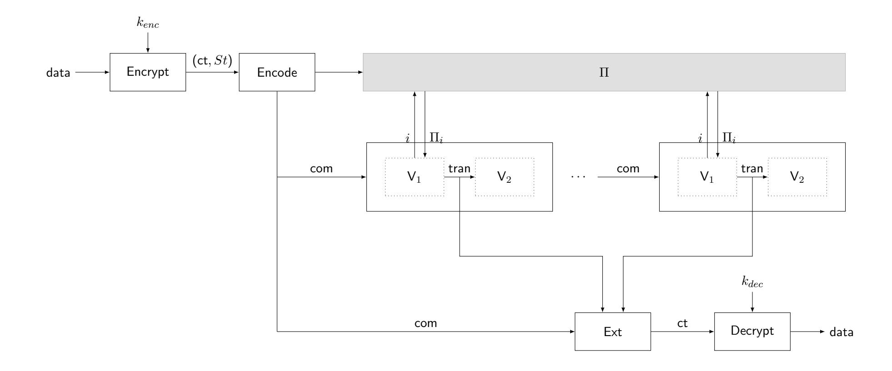

{0}------------------------------------------------

# eDAS: Extending Data Availability Sampling with Privacy and Compliance

Isobel Watkins<sup>∗</sup> Nicolas Mohnblatt† Philipp Jovanovic‡

February 18, 2026

#### Abstract

A data availability sampling scheme (DAS) allows a network of verifiers to collectively ensure that an untrusted party is correctly storing and distributing some committed data. Importantly, the protocol should not require that the verifiers coordinate or store the full data individually.

In this paper, we initiate the study of privacy in DAS schemes: we ask whether the DAS guarantees can be upheld while keeping the committed data secret. We define a natural notion of zero-knowledge for DAS and show that no secure DAS scheme can satisfy this notion. In doing so, we motivate the need to study privacy-preserving variants of DAS.

We define eDAS as DAS schemes over encrypted data and introduce the necessary security notions; namely, completeness, soundness and consistency. We additionally define a notion of privacy (zero-knowledge) and compliance (policy-enforcing). We then present two constructions of eDAS schemes. The first uses a DAS scheme as a black box and can be deployed on top of existing production-ready DAS systems with only minor modifications. The second is a more efficient construction that relies on the same principles but removes various layers of abstraction.

<sup>∗</sup>University College London, isobel.watkins.24@ucl.ac.uk

<sup>†</sup>ZKSecurity, nico@zksecurity.xyz

<sup>‡</sup>University College London, p.jovanovic@ucl.ac.uk

{1}------------------------------------------------

## Contents

| 1 | Introduction                                             | 3  |
|---|----------------------------------------------------------|----|
|   | 1.1<br>Technical overview<br>                            | 3  |
|   | 1.2<br>Related work<br>                                  | 5  |
| 2 | Preliminaries                                            | 7  |
|   | 2.1<br>Data availability sampling (DAS)<br>              | 7  |
|   | 2.2<br>ZK-SNARK<br>                                      | 8  |
|   | 2.3<br>Public-key encryption (PKE)<br>                   | 10 |
| 3 | Motivation: DAS cannot be zero-knowledge                 | 11 |
|   | 3.1<br>Defining zero-knowledge for DAS<br>               | 11 |
|   | 3.2<br>Impossibility<br>                                 | 12 |
| 4 | Encrypted DAS                                            | 14 |
|   | 4.1<br>Definition<br>                                    | 14 |
|   | 4.2<br>Zero-knowledge<br>                                | 16 |
|   | 4.3<br>Policy-enforcing<br>                              | 16 |
| 5 | Modular eDAS construction from DAS and ZK-NARKs          | 19 |
|   | 5.1<br>Commit-first DAS schemes<br>                      | 19 |
|   | 5.2<br>Construction<br>                                  | 19 |
|   | 5.3<br>Analysis<br>                                      | 20 |
| 6 | Direct eDAS construction from erasure codes and ZK-NARKs | 23 |
|   | 6.1<br>Additional background<br>                         | 23 |
|   | 6.2<br>Construction<br>                                  | 24 |
|   | 6.3<br>Analysis<br>                                      | 25 |
| A | Deferred proofs from Section<br>5                        | 31 |
|   | A.1<br>Completeness of Construction<br>1<br>             | 31 |
|   | A.2<br>Policy-enforcing of Construction<br>1<br>         | 32 |
|   | A.3<br>Consistency of Construction<br>1<br>              | 35 |
|   | A.4<br>Zero-knowledge of Construction<br>1<br>           | 37 |
| B | Deferred proofs from Section<br>6                        | 39 |
|   | B.1<br>Completeness of Construction<br>2<br>             | 39 |
|   | B.2<br>Policy-enforcing of Construction<br>2<br>         | 41 |
|   | B.3<br>Consistency of Construction<br>2<br>              | 44 |
|   | B.4<br>Zero-knowledge of Construction<br>2<br>           | 47 |

{2}------------------------------------------------

## <span id="page-2-0"></span>1 Introduction

Security, scalability, and decentralization have been fundamental goals of blockchain systems [\[GKW](#page-28-0)+16, [BSAB](#page-28-1)+19, [MBYS21,](#page-29-0) [OKM](#page-29-1)+25]. As transaction volume and network participation of blockchain systems increase, so do the resource demands on the underlying infrastructure to maintain the system state. Such trends, however, have detrimental effects on the core objectives of security, scalability, and decentralization, as fewer participants can actually afford the resources required to operate nodes and continuously and fully verify the system state. Data availability sampling (DAS) [\[ASBK21,](#page-28-2) [HSW24a\]](#page-28-3) has emerged as a key technique to mitigate this issue by allowing systems to shard block data across multiple nodes so that no single node needs to store the entire dataset while enabling participants to probabilistically verify the availability of block data without downloading it in full.

Existing DAS schemes implicitly assume that sampled data is revealed in plaintext to verifiers. While this approach is appropriate and effective for public data, it is incompatible with use cases that require certain privacy or confidentiality guarantees. A natural first attempt to address this limitation is to apply DAS to encrypted data, treating ciphertexts as the objects being sampled and verified. However, this straw-man approach provides no guarantee that the encrypted data can later be actually decrypted by authorized parties: the availability of a ciphertext does not ensure that the corresponding plaintext is available, that the encryption was performed correctly or that the data is in compliance with certain policies. This observation raises a more fundamental question of whether DAS itself can be made privacy-preserving and whether one can design a DAS scheme that provides standard availability guarantees while revealing no information about the underlying data to the verifiers beyond its availability.

To formalize this question, we define a natural notion of zero-knowledge for DAS schemes and show that this notion is not achievable: no DAS scheme satisfying standard security properties can also satisfy zero-knowledge. This impossibility result demonstrates that privacy cannot be obtained within the conventional DAS model and necessitates a change in perspective. Motivated by this negative result, we investigate modifications of DAS that can support privacy while retaining meaningful availability guarantees. We introduce encrypted Data Availability Sampling (eDAS), a model in which DAS is performed over encrypted data, with cryptographic guarantees that link availability of ciphertexts to availability of the underlying plaintexts. We formalize the core security properties of eDAS schemes, including completeness, soundness, and consistency. In addition, we define notions of privacy, expressing indistinguishability of transcripts, and compliance, capturing the requirement that the decrypted data satisfies certain policies. Finally, we present two constructions of eDAS schemes. The first construction treats an existing DAS scheme as a black box and augments it with encryption and auxiliary proofs. This approach can be deployed on top of production-ready DAS systems with minimal modifications. The second construction is more direct and efficient by breaking down various abstraction layers and directly combining public key encryption, vector commitments, and zero-knowledge proofs into a unified eDAS scheme.

### <span id="page-2-1"></span>1.1 Technical overview

In this section, we give a technical overview of our main results and the insights used towards achieving them.

DAS cannot be ZK. We define zero-knowledge for DAS (Definition [3.1\)](#page-10-2) in the classical sense that there must exist a simulator that produces executions of the protocol that are indistinguishable from the honest protocol execution. We show that secure DAS schemes cannot have the zero-knowledge property (Theorem [3.1\)](#page-11-1).

{3}------------------------------------------------



<span id="page-3-0"></span>Figure 1: Interface of an eDAS scheme, omitting the Setup algorithm.

Intuitively, this stems from the fact that a DAS scheme that satisfies completeness must output the data that was originally encoded and distributed (except with negligible probability). To prove zero-knowledge, we would need to construct a simulator that produces transcripts that are indistinguishable from the above, with no other inputs than the public parameters. In particular, such transcripts would also need to be extractable and return the same data as in the real-world (not simulated) experiment. This task amounts to guessing what data is used in the real-world experiment. As long as the data alphabet is non-trivial, this is impossible to realize with the same probability distribution as the real-world experiment.

**Defining eDAS.** The eDAS definition and security properties (Definition 4.1) closely mirror those of DAS schemes given in [HSW24a]. Just like a DAS scheme, an eDAS scheme requires algorithms Encode,  $V := (V_1, V_2)$  and Ext. Additionally, the eDAS interface requires Setup to produce a key pair and requires the existence of algorithms Encrypt and Decrypt. We summarize the interplay between these algorithms in Figure 1.

The DAS security properties need to be adjusted to account for the fact that Ext does not return plaintext data. The soundness and consistency experiments therefore include a step in which the Decrypt algorithm is executed, using the appropriate decryption key. By including this step, both experiments require that the extracted ciphertext is well-formed and that decryption does not fail. These properties are the major difference between an eDAS scheme and the straw-man protocol in which one simply runs a DAS scheme over a ciphertext.

Additionally, we define notions of privacy and compliance. Privacy is modelled by defining a zero-knowledge property, once again in the classical sense of indistinguishability of transcripts (Definition 4.3). We define a notion of compliance by introducing the *policy-enforcing* game (Definition 4.5). This game is identical to the eDAS soundness game, except that we further require that the extracted and decrypted data complies with a fixed policy. As we show, this game is a natural generalization of soundness (Theorem 4.3).

eDAS from DAS. We present two constructions of eDAS. The first uses a DAS scheme as a black-box, a public-key encryption scheme (PKE) and a zero-knowledge, succinct, non-interactive argument of knowledge (ZK-SNARK) (see Construction 1). This construction iterates over the straw-man protocol and augments it with a proof that the extracted ciphertext

{4}------------------------------------------------

can be decrypted. More specifically, the algorithm Encode runs the ZK-SNARK prover to attest to the fact that the DAS scheme correctly commits to a ciphertext, and that the ciphertext was correctly encrypted using the relevant encryption key.

This scheme can be enhanced to support the policy-enforcing property by also requiring that the ZK-SNARK attests to the fact that the plaintext data satisfies a fixed, public policy. We give security proofs for all of the relevant properties in Section [5.3.](#page-19-0)

A more direct construction. Our second construction stems from the observation that some DAS schemes may internally make use of SNARKs. This is the case of a construction presented in [\[HSW24a\]](#page-28-3). Briefly, their scheme is built as follows: it first constructs a code commitment using a non-ZK SNARK and a vector commitment scheme (VC); then, this code commitment is plugged into a generic compiler that produces a DAS scheme from code commitments and an index sampler (see Definition [6.2\)](#page-23-2).

Our construction simply reuses the same building blocks with a few modifications to account for encryption and zero-knowledge. Specifically, we describe an eDAS scheme from any PKE scheme, VC scheme, index sampler, and ZK-SNARK (see Construction [2\)](#page-23-1). By opening up the DAS and code commitment abstraction layers, we combine all statements to be proven into a single ZK-SNARK proof, rather than requiring two separate proofs. We give security proofs for all the relevant properties in Section [6.3.](#page-24-0)

### <span id="page-4-0"></span>1.2 Related work

Data availability sampling. Numerous DAS schemes have been proposed since [\[ASBK21\]](#page-28-2) introduced the first DAS construction, each differing primarily in the cryptographic components core to DAS, such as the Reed-Solomon encoding structure, commitment, and encoding correctness guarantee mechanisms, with the goal of minimising overhead and additional assumptions. Al-Bassam et al. [\[ASBK21\]](#page-28-2) employ Reed-Solomon encoding with Merkle tree commitments and fraud proofs, where full nodes detect and prove encoding errors. Subsequent work has investigated different approaches to verifying encoding correctness, namely, using proximity proofs [\[HSW24a,](#page-28-3) [HSW24b\]](#page-28-4) or (KZG) polynomial commitments [\[But20,](#page-28-5) [HSW24a,](#page-28-3) [GXQZ25\]](#page-28-6). These schemes using polynomial commitments achieve lower overhead but require a trusted setup, whilst hash-based [\[HSW24a,](#page-28-3) [HSW24b\]](#page-28-4) approaches do not rely on trusted setups, at the cost of larger commitment sizes. Later works have built on these schemes to reduce overheads [\[EMA25\]](#page-28-7) or add further functionality [\[EA25\]](#page-28-8) to DAS. [\[EMA25\]](#page-28-7) modify the encoding and commitment structures of a DAS scheme introduced in [\[HSW24a\]](#page-28-3), significantly reducing both encoding and verification overhead. [\[EA25\]](#page-28-8) extend [\[EMA25\]](#page-28-7) to produce a DAS scheme that enables verification of both data availability and overall block validity, thereby removing the requirement for light nodes to rely on full nodes to inform them of block invalidity.

Privacy in DAS. None of the DAS constructions above consider incorporating privacy on a cryptographic level with DAS. As far as we are aware, [\[Nuk25\]](#page-29-2) is the first, and only, to broach this topic of achieving privacy alongside data availability guarantees. [\[Nuk25\]](#page-29-2) proposes the Private Blockspace protocol, which enables encrypted data to be published on-chain such that anyone can verify data availability without learning the underlying data. This is achieved through a trusted proxy, which manages encryption, decryption, and produces cryptographic proofs, enabling data availability to be verified without requiring access to the plaintext data.

Private decentralized storage. While only [\[Nuk25\]](#page-29-2) has considered cryptographic privacy in DAS, several works have explored privacy-preserving decentralized storage. The majority 

{5}------------------------------------------------

of such schemes primarily use encryption [\[KAG](#page-29-3)+20, [SW721,](#page-29-4) [Sta25a,](#page-29-5) [CSI\]](#page-28-9) to cryptographically ensure data privacy during storage, while other schemes [\[GKM](#page-28-10)+22, [XSD23\]](#page-29-6) do so through alternative cryptographic methods, such as secret sharing. Data partitioning is employed on keys [\[KAG](#page-29-3)+20, [SW721\]](#page-29-4) and data [\[GKM](#page-28-10)+22, [XSD23\]](#page-29-6), with the shards then stored across nodes, to ensure that there is no single point of failure for data retrieval.

Like DAS, decentralized storage aims to ensure data availability and retrievability from a potentially adversarial storage network. However, it is important to note that these existing private decentralized storage schemes do not provide the same data availability guarantees as DAS schemes. Specifically, these schemes only give availability guarantees to parties that have enough resources to download, decrypt and store the data in full. This is contrary to the goals of DAS where the verification parties, although numerous, are limited in their individual computational resources, bandwidth and storage.

{6}------------------------------------------------

## <span id="page-6-0"></span>2 Preliminaries

Notation. Throughout the paper we make use of the following notation and conventions, reusing some from [\[HSW24a\]](#page-28-3):

- If S is a finite set, s ← S means that s is sampled uniformly at random from S.
- We denote the set of the first n natural numbers by [n] := {1, . . . , n} ⊆ N.
- If A is a probabilistic algorithm, we write
  - s := A(x; ρ) to indicate that A outputs s on input x with random coins ρ;
  - s ← A(x) to indicate that ρ is sampled uniformly at random;
  - s ∈ A(x) to mean that there exist random coins ρ such that A outputs s on input x with these coins ρ.
- For an algorithm A, a string s ∈ Σ <sup>∗</sup> over some alphabet Σ, and an integer t ∈ N, the notation As,t indicates that A has t-time oracle access to s. That is, A can query i and obtains the i-th symbol of s, for at most t queries. We extend this notation to algorithms B instead of strings and write AB,t when the queries of A are answered by B.
- We use the notation (yi) ℓ <sup>i</sup>=1 <sup>←</sup> Interact[A, <sup>B</sup>]t,ℓ(x) to indicate that <sup>ℓ</sup> <sup>∈</sup> <sup>N</sup> independent copies of A get x as input, and have t-time oracle access to B (as above), and the i-th copy of A outputs y<sup>i</sup> , for each i ∈ [ℓ]. Here B can schedule the oracle queries of these ℓ copies in an arbitrary concurrently-interleaved way.
- A probabilistic algorithm A is said to be PPT if its running time, which we denote by T(A), is bounded by a polynomial in its input.
- All algorithms get the security parameter λ in unary implicitly as input.
- We use negl to denote a negligible function.

## <span id="page-6-1"></span>2.1 Data availability sampling (DAS)

We use the definition of data availability sampling (DAS) from [\[HSW24a\]](#page-28-3). This definition abstracts away the networking elements of DAS and, in particular, does not describe how the encoding Π is distributed amongst the nodes in the network. Nevertheless, the adversary considered here is as powerful as an active adversary that fully controls the network that stores and delivers Π.

<span id="page-6-2"></span>Definition 2.1 (Data availability sampling (DAS) scheme [\[HSW24a\]](#page-28-3)). A data availability sampling scheme (DAS) with data alphabet Γ, encoding alphabet Σ, data length K ∈ N, encoding length N ∈ N, query complexity Q ∈ N, and threshold T ∈ N is a tuple DAS := (Setup, Encode, V, Ext) of algorithms with the following syntax:

- Setup(1<sup>λ</sup> ) → par is a PPT algorithm that takes as input a security parameter, and outputs system parameters par. All algorithms get par implicitly as input.
- Encode(data) → (Π, com) is a deterministic polynomial time algorithm that takes as input data data ∈ Γ <sup>K</sup> and outputs an encoding Π ∈ Σ <sup>N</sup> and a commitment com.
- V := (V1, V2) is a pair of algorithms, where
  - V Π,Q 1 (com) → tran is a PPT algorithm that has Q-query oracle access to an encoding Π ∈ Σ <sup>N</sup> , gets as input a commitment com, and outputs a transcript tran, containing the Q queries to Π and the respective responses.
  - V2(com,tran) → b is a deterministic polynomial time algorithm that takes as input a commitment com and transcript tran, and outputs a bit b ∈ {0, 1}.

{7}------------------------------------------------

• Ext(com, tran<sub>1</sub>,..., tran<sub> $\ell$ </sub>)  $\rightarrow$  data/ $\perp$  is a deterministic polynomial time algorithm that takes as input a commitment com, a list of transcripts tran<sub>i</sub>, and outputs data data  $\in \Gamma^K$  or an abort symbol  $\perp$ .

We require that the following properties are satisfied:

• Completeness. For any par  $\in$  Setup $(1^{\lambda})$  and any integer  $\ell = \text{poly}(\lambda)$  with  $\ell \geq T$ , and all data  $\in \Gamma^K$ , the following advantage is negligible:

$$\mathsf{Adv}^\mathsf{compl}_{\ell,\mathsf{DAS}} := \Pr \left[ \begin{array}{c} \neg(\forall i \in [\ell] : b_i = 1 \land \mathsf{data'} = \mathsf{data}) \\ \\ \neg(\forall i \in [\ell] : b_i = 1 \land \mathsf{data'} = \mathsf{data}) \\ \end{array} \right. \left. \begin{array}{c} (\Pi,\mathsf{com}) := \mathsf{Encode}(\mathsf{data}), \\ \forall i \in \ell : \mathsf{tran}_i \leftarrow \mathsf{V}_1^{\Pi,Q}(\mathsf{com}), \\ b_i := \mathsf{V}_2(\mathsf{com},\mathsf{tran}_i), \\ \\ \mathsf{data'} := \mathsf{Ext}(\mathsf{com},\mathsf{tran}_1,\ldots,\mathsf{tran}_\ell) \end{array} \right].$$

• Soundness. For any stateful PPT algorithm  $\mathcal{A}$  and any integer  $\ell = \mathsf{poly}(\lambda)$  with  $\ell \geq T$ , the following advantage is negligible:

$$\mathsf{Adv}^{\mathsf{sound}}_{\mathcal{A},\ell,\mathsf{DAS}} := \Pr \left[ \begin{array}{c} \forall i \in [\ell] : b_i = 1 \land \mathsf{data'} = \bot \\ \\ \forall i \in [\ell] : b_i = 1 \land \mathsf{data'} = \bot \end{array} \right. \left. \begin{array}{c} \mathsf{par} \leftarrow \mathsf{Setup}(1^\lambda), \mathsf{com} \leftarrow \mathcal{A}(\mathsf{par}), \\ (\mathsf{tran}_i)_{i=1}^\ell \leftarrow \mathsf{Interact}[\mathsf{V}_1,\mathcal{A}]_{Q,\ell}(\mathsf{com}), \\ \forall i \in [\ell] : b_i := \mathsf{V}_2(\mathsf{com},\mathsf{tran}_i), \\ \mathsf{data'} := \mathsf{Ext}(\mathsf{com},\mathsf{tran}_1,\ldots,\mathsf{tran}_\ell) \end{array} \right].$$

• Consistency. For any stateful PPT algorithm  $\mathcal{A}$  and any  $\ell_1, \ell_2 = \mathsf{poly}(\lambda)$ , the following advantage is negligible:

$$\mathsf{Adv}^{\mathsf{cons}}_{\mathcal{A},\ell_1,\ell_2,\mathsf{DAS}} := \Pr \left[ \begin{array}{c} \mathsf{data}_1 \neq \bot \\ \land \ \mathsf{data}_2 \neq \bot \\ \land \ \mathsf{data}_1 \neq \mathsf{data}_2 \end{array} \right. \left. \begin{array}{c} \mathsf{par} \leftarrow \mathsf{Setup}(1^\lambda), \\ (\mathsf{com},(\mathsf{tran}_{1,i})_{i=1}^{\ell_1},(\mathsf{tran}_{2,i})_{i=1}^{\ell_2}) \leftarrow \mathcal{A}(\mathsf{par}), \\ \mathsf{data}_1 := \mathsf{Ext}(\mathsf{com},\mathsf{tran}_{1,1},\ldots,\mathsf{tran}_{1,\ell_1}), \\ \mathsf{data}_2 := \mathsf{Ext}(\mathsf{com},\mathsf{tran}_{2,1},\ldots,\mathsf{tran}_{2,\ell_2}) \end{array} \right].$$

**Subset-soundness.** In practice, it may be the case that there are more than  $\ell$  copies of  $V_1$  interacting with the adversary. To correctly model this case and capture the associated error, [HSW24a] introduce the notion of subset-soundness, as defined below.

**Definition 2.2** (Subset-soundness for DAS [HSW24a]). Let DAS = (Setup, Encode,  $(V_1, V_2)$ , Ext) be a data availability sampling scheme. We say that DAS satisfies  $(L, \ell)$ -subset-soundness, if for any stateful PPT algorithm  $\mathcal{A}$ , the following advantage is negligible:

$$\mathsf{Adv}^{\mathsf{sub-sound}}_{\mathcal{A},L,\ell,\mathsf{DAS}} := \Pr \left[ \begin{array}{c} \forall j \in [\ell] : b_{(i_j)} = 1 \land \mathsf{data'} = \bot \\ \\ (i_j)_{j=1}^L \leftarrow \mathsf{Interact}[\mathsf{V}_1,\mathcal{A}]_{Q,L}(\mathsf{com}), \\ \forall i \in [L] : b_i := \mathsf{V}_2(\mathsf{com},\mathsf{tran}_i), \\ (i_j)_{j=1}^\ell \leftarrow \mathcal{A}(\mathsf{tran}_1,\ldots,\mathsf{tran}_L) \\ \mathsf{data'} := \mathsf{Ext}(\mathsf{com},\mathsf{tran}_1,\ldots,\mathsf{tran}_\ell) \end{array} \right]$$

#### <span id="page-7-0"></span>2.2 ZK-SNARK

**Definition 2.3** (ZK-NARK). Let  $\mathcal{R} \subseteq \mathcal{X} \times \mathcal{W}$  be a relation. A zero-knowledge non-interactive argument of knowledge ARG := (Setup, Prove, Ver, Ext, Sim) is a tuple of efficient algorithms: a setup algorithm Setup, a proving algorithm Prove and a verification algorithm Ver, an extractor Ext, and a simulator Sim.

{8}------------------------------------------------

- Setup(1<sup>λ</sup> , R) → (pp,td) is a probabilistic algorithm that takes as input the security parameter as a unary string and outputs public parameters pp and an optional trapdoor td. All algorithms get pp implicitly as input.
- Prove(x, w) → π is a probabilistic algorithm that takes as input an instance x ∈ X and witness w ∈ W, and outputs a proof π.
- Ver(x, π) → b is a deterministic algorithm that takes as input an instance x ∈ X and proof π, and outputs a decision bit b ∈ {0, 1}.
- Ext(A, x, π) → w is a probabilistic algorithm that has black-box access[1](#page-8-0) to an adversary A, takes as input an instance x and proof π, and outputs a candidate witness w.
- Sim(td, x) → π ′ is a probabilistic algorithm that takes as input the trapdoor td (as output by Setup) and an instance x ∈ X , and outputs a simulated proof π ′ .

We also require that the ZK-NARK upholds the following properties:

• Perfect completeness: for all (x, w) ∈ R, it holds that

$$\Pr[\mathsf{Ver}(x,\mathsf{Prove}(x,w))=1]=1.$$

• Knowledge soundness: ARG has knowledge soundness with error ε(λ) if for every PPT adversary A,

$$\Pr\left[\begin{array}{c} (x,w) \notin \mathcal{R} \land \mathsf{Ver}(x,\pi) = 1 & \begin{pmatrix} (\mathsf{pp},\mathsf{td}) \leftarrow \mathsf{Setup}(1^\lambda,\mathcal{R}) \\ (x,\pi) \leftarrow \mathcal{A}(\mathsf{pp}) \\ w \leftarrow \mathsf{Ext}(\mathcal{A},x,\pi) \\ \end{array}\right] \leq \varepsilon(\lambda).$$

• Computational zero-knowledge: ARG has computational zero-knowledge if for every (x, w) ∈ R and every PPT adversary A the following distributions are indistinguishable:

$$\mathcal{D}_0 := \left\{ \begin{array}{c|c} \pi & (\mathsf{pp},\mathsf{td}) \leftarrow \mathsf{Setup}(1^\lambda) \\ \pi \leftarrow \mathsf{Prove}(x,w) \end{array} \right\}, \quad \mathcal{D}_1 := \left\{ \begin{array}{c|c} \pi' & (\mathsf{pp},\mathsf{td}) \leftarrow \mathsf{Setup}(1^\lambda) \\ \pi' \leftarrow \mathsf{Sim}(\mathsf{td},x) \end{array} \right\}.$$

Concretely, we define two experiments, Experiment 0 and Experiment 1, between a challenger and an adversary A. For b ∈ {0, 1}, we let Experiment b be the experiment in which the challenger computes π<sup>b</sup> ← D<sup>b</sup> and sends it to A. We let E<sup>b</sup> denote the event that A outputs 1 in Experiment b. We define the advantage of A to be the quantity:

$$\mathsf{Adv}^{\mathsf{zk}}_{\mathcal{A},\mathsf{ARG}}(\lambda) := |\Pr[E_0] - \Pr[E_1]|,$$

and say that ARG is computational zero-knowledge if this quantity is negligible for every (x, w) ∈ R and PPT adversary A.

Succinct NARKs. The definition above does not place restrictions on the size of the argument string and the verifier run-time (beyond them being polynomial functions in the security parameter). Jumping ahead, our DAS schemes will compute proofs where the original data is part of the witness and send the proofs as part of the DAS commitment com. Therefore, in order to not have a trivial DAS scheme, we require that the argument string is smaller than the witness length and that verification runs faster than deciding whether a pair (x, w) is in R. Such arguments are known as succinct arguments; we refer readers to Section 4.4 of Chiesa and Yogev [\[CY24\]](#page-28-11) for a formal definition. We use the common acronym ZK-SNARK to refer to an argument of knowledge that is succinct, non-interactive, and zero-knowledge.

<span id="page-8-0"></span><sup>1</sup>See Chiesa and Yogev [\[CY24,](#page-28-11) Chapter 1] for a definition of black-box access.

{9}------------------------------------------------

Instantiating ZK-SNARKs. Although ZK-SNARKs were traditionally seen as heavy cryptographic primitives, there has been tremendous progress in recent years due to industry interest and adoption. These developments have turned ZK-SNARKs into practical tools that are easily programmed, deployed and run on standard consumer hardware [\[Ide21,](#page-29-7) [Ris22,](#page-29-8) [Sta25b\]](#page-29-9).

## <span id="page-9-0"></span>2.3 Public-key encryption (PKE)

We use the standard definition of public-key encryption. To make our notation explicit, we recall the definition from Boneh and Shoup [\[BS23\]](#page-28-12) below.

Definition 2.4 (Public-key encryption). A public-key encryption scheme PKE := (KeyGen, Encrypt, Dec) is a triple of efficient algorithms: a key generation algorithm KeyGen, an encryption algorithm Encrypt, a decryption algorithm Dec.

- KeyGen(1<sup>λ</sup> ) → (kenc, kdec), is a probabilistic algorithm that depends on the security parameter λ where kenc is called the (public) encryption key and kdec is called the (private) decryption key.
- Encrypt(kenc, m) → c is a probabilistic algorithm where kenc is an encryption key (as output by KeyGen), m is a message, and c is a ciphertext.
- Dec(kdec, c) → m/⊥ is a deterministic algorithm where kdec is a decryption key (as output by KeyGen), c is a ciphertext and outputs either a message m or a reject value ⊥.
- We require that decryption undoes encryption; specifically, for all possible outputs (kenc, kdec) of KeyGen, and all messages m, we have

$$\Pr\left[\mathsf{Dec}(k_{dec},\mathsf{Encrypt}(k_{enc},m))=m\right]=1.$$

• Messages are assumed to lie in some finite message space M, and ciphertexts are in some finite ciphertext space C. We say that PKE := (KeyGen, Encrypt, Dec) is defined over (M, C).

Security. The basic security notion for public-key encryption is known as semantic security. We denote Advsemantic <sup>A</sup>,PKE the advantage of an adversary A against the semantic security games as defined in [\[BS23,](#page-28-12) Attack Game 11.1 and Definition 11.2].

{10}------------------------------------------------

## <span id="page-10-0"></span>3 Motivation: DAS cannot be zero-knowledge

In this section we motivate the need for an extension of the DAS definition to support privacy guarantees. We first define a natural notion of zero-knowledge for DAS schemes in Section [3.1.](#page-10-1) We then show that a DAS scheme cannot have both completeness and zero-knowledge in Section [3.2.](#page-11-0)

## <span id="page-10-1"></span>3.1 Defining zero-knowledge for DAS

Firstly, and as noted in [\[HSW24a\]](#page-28-3), a DAS scheme with the interface from Definition [2.1](#page-6-2) cannot hope to have privacy guarantees. This is because the Encode algorithm is deterministic.

Rather than immediately discarding the notion of privacy-preserving DAS schemes, we allow the following modification to Definition [2.1:](#page-6-2)

• Encode(data) → (Π, com) is a probabilistic polynomial time algorithm that takes as input data data ∈ Γ <sup>K</sup> and outputs an encoding Π ∈ Σ <sup>N</sup> and a commitment com.

With this modification in mind, we define a zero-knowledge property for DAS schemes based on the indistinguishability between the honest execution of the protocol and a simulated execution.

<span id="page-10-2"></span>Definition 3.1 (Zero-knowledge for DAS). Consider a DAS scheme DAS with its algorithms and parameters as defined in Definition [2.1,](#page-6-2) and an integer ℓ := poly(λ) such that ℓ ≥ T. Let Sim be a PPT simulator that outputs a tuple (Π, com, (tran<sup>i</sup> , bi)i∈[ℓ]). For par ∈ Setup(1<sup>λ</sup> ) and a given PPT adversary A, we define two experiments, Experiment 0 and Experiment 1, in Figure [2.](#page-10-3) In both experiments, A picks data ∈ Γ <sup>K</sup> and submits data to the challenger.

- In Experiment 0, the challenger runs DAS algorithms honestly on input data and gives the resulting transcript (com, Π, (tran<sup>i</sup> , bi)i∈[ℓ]) to A.
- In Experiment 1, the challenger runs (com, Π, (tran<sup>i</sup> , bi)i∈[ℓ]) ← Sim(par) and gives the simulated transcript to A.

In both experiments, A computes and outputs a bit b <sup>∗</sup> ∈ {0, 1}.

For b = 0, 1, let E<sup>b</sup> be the event that A outputs 1 in Experiment b. We say that DAS is computational zero-knowledge if there exists a simulator Sim such that, for all PPT adversaries A, the following advantage is negligible:

$$\mathsf{Adv}^{\mathsf{zk}}_{\mathcal{A},\ell,\mathsf{DAS},\mathsf{Sim}} := |\Pr[E_0] - \Pr[E_1]|.$$

| Experiment 0 |                                               | Experiment 1 |                                            |  |
|--------------|-----------------------------------------------|--------------|--------------------------------------------|--|
| 1 :          | data ← A(par)                                 | 1 :          | data ← A(par)                              |  |
| 2 :          | (Π, com) ← Encode(data),                      | 2 :          | (Π, com,(trani<br>, bi)i∈[ℓ]) ← Sim(par),  |  |
| 3 :          | Π,Q<br>∀i ∈ [ℓ] : trani<br>← V<br>(com),<br>1 | 3 :          | ∗ ← A(com,<br>b<br>Π,(trani<br>, bi)i∈[ℓ]) |  |
| 4 :          | bi<br>:= V2(com,trani),                       |              |                                            |  |
| 5 :          | ∗ ← A(com,<br>b<br>Π,(trani<br>, bi)i∈[ℓ])    |              |                                            |  |

<span id="page-10-3"></span>Figure 2: Experiments for Definition [3.1](#page-10-2) (zero-knowledge for DAS).

{11}------------------------------------------------

### <span id="page-11-0"></span>3.2 Impossibility

We prove our impossibility result below. We refer readers to our technical overview (Section 1.1) for an intuitive description of the result.

<span id="page-11-1"></span>**Theorem 3.1.** A DAS scheme with alphabet  $\Gamma$  such that  $|\Gamma| > 1$  cannot be complete and zero-knowledge.

*Proof.* The intuition behind this proof is that, on the one hand, completeness requires that the input data data be correctly recovered from  $(com, tran_1, ..., tran_\ell)$ ; on the other hand, zero-knowledge requires that Sim produce  $(com, tran_1, ..., tran_\ell)$  without knowledge of data. This gap can be exposed by considering the following adversary  $\mathcal{A}$  against the zero-knowledge property:

- On input par,  $\mathcal{A}$  outputs data  $\leftarrow \Gamma^K$ . Note that data is sampled uniformly at random and independently from any of the system parameters (beyond the alphabet  $\Gamma$  and the length K).
- On input  $(\Pi, \mathsf{com}, (\mathsf{tran}_i, b_i)_{i \in [\ell]})$  and the previously produced data,  $\mathcal{A}$  computes  $\mathsf{data}' \leftarrow \mathsf{Ext}(\mathsf{com}, \mathsf{tran}_1, \dots, \mathsf{tran}_\ell)$  and outputs

$$b^* := \neg (\forall i \in [\ell], b_i = 1 \land \mathsf{data}' = \mathsf{data}).$$

In other words, if  $V_2$  accepts all the transcripts and  $\mathsf{data}' = \mathsf{data}$ , then  $\mathcal{A}$  outputs 0 and effectively guesses that it is in Experiment 0 (honest execution of DAS). Otherwise it outputs 1 and guesses that it is in Experiment 1 (simulated execution).

Consider a DAS scheme DAS with its algorithms and parameters as defined in Definition 2.1, and an integer  $\ell := \mathsf{poly}(\lambda)$  such that  $\ell \geq T$ . We now evaluate the success probabilities of the events  $E_0$  and  $E_1$  as defined in Definition 3.1 and show that for every PPT simulator Sim, the quantity  $\mathsf{Adv}^{\mathsf{zk}}_{\mathcal{A},\ell,\mathsf{DAS},\mathsf{Sim}}$  is not negligible.

<span id="page-11-2"></span>1. The event  $E_0$  is defined as " $\mathcal{A}$  outputs 1 in Experiment 0". Therefore it holds that:

$$\begin{split} \Pr[E_0] &= \Pr\left[\begin{array}{c} \mathsf{data} \leftarrow \Gamma^K, \\ (\Pi, \mathsf{com}) \leftarrow \mathsf{Encode}(\mathsf{data}), \\ \forall i \in [\ell] : \mathsf{tran}_i \leftarrow \mathsf{V}_1^{\Pi,Q}(\mathsf{com}), \\ b_i := \mathsf{V}_2(\mathsf{com}, \mathsf{tran}_i), \\ b^* \leftarrow \mathcal{A}(\Pi, \mathsf{com}, (\mathsf{tran}_i, b_i)_{i \in [\ell]}) \end{array}\right] \\ &= \Pr\left[\begin{array}{c} \neg\left(\begin{array}{c} \forall i \in [\ell], b_i = 1 \\ \land \\ \mathsf{data}' = \mathsf{data} \end{array}\right) \middle| \begin{array}{c} (\Pi, \mathsf{com}) \leftarrow \mathsf{Encode}(\mathsf{data}), \\ \forall i \in [\ell] : \mathsf{tran}_i \leftarrow \mathsf{V}_1^{\Pi,Q}(\mathsf{com}), \\ b_i := \mathsf{V}_2(\mathsf{com}, \mathsf{tran}_i), \\ \mathsf{data}' := \mathsf{Ext}(\mathsf{com}, \mathsf{tran}_i), \\ \mathsf{data}' := \mathsf{Ext}(\mathsf{com}, \mathsf{tran}_1, \dots, \mathsf{tran}_\ell) \end{array}\right] \\ &= \mathsf{Adv}_{\ell,\mathsf{DAS}}^{\mathsf{compl}}. \end{split}$$

<span id="page-11-3"></span>The first equality holds by definition of  $E_0$ , the second by definition of the adversary  $\mathcal{A}$  and the third by the definition of completeness. Finally, since DAS is a complete DAS scheme, it holds that:

$$\Pr[E_0] = \mathsf{negl}(\lambda).$$

{12}------------------------------------------------

2. The event  $E_1$  is defined as " $\mathcal{A}$  outputs 1 in Experiment 1". Therefore, for every PPT simulator Sim, it holds that:

$$\begin{split} \Pr[E_1] &= \Pr\left[\begin{array}{c} b^* = 1 \ \left| \begin{array}{c} \mathsf{data} \leftarrow \Gamma^K, \\ (\Pi, \mathsf{com}, (\mathsf{tran}_i, b_i)_{i \in [\ell]}) \leftarrow \mathsf{Sim}(\mathsf{par}), \\ b^* \leftarrow \mathcal{A}(\Pi, \mathsf{com}, (\mathsf{tran}_i, b_i)_{i \in [\ell]}) \end{array}\right] \\ &= \Pr\left[\begin{array}{c} \neg\left(\begin{array}{c} \forall i \in [\ell], b_i = 1 \\ \land \\ \mathsf{data}' = \mathsf{data} \end{array}\right) \ \left| \begin{array}{c} \mathsf{data} \leftarrow \Gamma^K, \\ (\Pi, \mathsf{com}, (\mathsf{tran}_i, b_i)_{i \in [\ell]}) \leftarrow \mathsf{Sim}(\mathsf{par}), \\ \mathsf{data}' := \mathsf{Ext}(\mathsf{com}, \mathsf{tran}_1, \dots, \mathsf{tran}_\ell) \end{array}\right] \\ &= \Pr\left[\begin{array}{c} \neg(\forall i \in [\ell], b_i = 1) \\ \lor \\ \neg(\mathsf{data}' = \mathsf{data}) \end{array} \right] \ \left| \begin{array}{c} \mathsf{data} \leftarrow \Gamma^K, \\ (\Pi, \mathsf{com}, (\mathsf{tran}_i, b_i)_{i \in [\ell]}) \leftarrow \mathsf{Sim}(\mathsf{par}), \\ \mathsf{data}' := \mathsf{Ext}(\mathsf{com}, \mathsf{tran}_1, \dots, \mathsf{tran}_\ell) \end{array}\right] \\ &\geq \Pr\left[\begin{array}{c} \neg(\mathsf{data}' = \mathsf{data}) \end{array} \right] \ \left| \begin{array}{c} \mathsf{data} \leftarrow \Gamma^K, \\ (\Pi, \mathsf{com}, (\mathsf{tran}_i, b_i)_{i \in [\ell]}) \leftarrow \mathsf{Sim}(\mathsf{par}), \\ \mathsf{data}' := \mathsf{Ext}(\mathsf{com}, \mathsf{tran}_1, \dots, \mathsf{tran}_\ell) \end{array}\right] \\ &\geq 1 - \Pr\left[\begin{array}{c} \mathsf{data}' = \mathsf{data} \end{array} \right] \ \left| \begin{array}{c} \mathsf{data} \leftarrow \Gamma^K, \\ (\Pi, \mathsf{com}, (\mathsf{tran}_i, b_i)_{i \in [\ell]}) \leftarrow \mathsf{Sim}(\mathsf{par}), \\ \mathsf{data}' := \mathsf{Ext}(\mathsf{com}, \mathsf{tran}_1, \dots, \mathsf{tran}_\ell) \end{array}\right] \\ &\geq 1 - \Pr\left[\begin{array}{c} \mathsf{data}' = \mathsf{data} \end{array} \right] \ \left| \begin{array}{c} \mathsf{data} \leftarrow \Gamma^K, \\ (\Pi, \mathsf{com}, (\mathsf{tran}_i, b_i)_{i \in [\ell]}) \leftarrow \mathsf{Sim}(\mathsf{par}), \\ \mathsf{data}' := \mathsf{Ext}(\mathsf{com}, \mathsf{tran}_1, \dots, \mathsf{tran}_\ell) \end{array}\right] \\ &\geq 1 - \Pr\left[\begin{array}{c} \mathsf{data}' = \mathsf{data} \end{array} \right] \ \left| \begin{array}{c} \mathsf{data} \leftarrow \Gamma^K, \\ (\Pi, \mathsf{com}, (\mathsf{tran}_i, b_i)_{i \in [\ell]}) \leftarrow \mathsf{Sim}(\mathsf{par}), \\ \mathsf{data}' := \mathsf{Ext}(\mathsf{com}, \mathsf{tran}_1, \dots, \mathsf{tran}_\ell) \end{array}\right] \\ &\geq 1 - \Pr\left[\begin{array}{c} \mathsf{data}' = \mathsf{data} \end{array} \right] \ \left| \begin{array}{c} \mathsf{data} \leftarrow \Gamma^K, \\ (\Pi, \mathsf{com}, (\mathsf{tran}_i, b_i)_{i \in [\ell]}) \leftarrow \mathsf{Sim}(\mathsf{par}), \\ \mathsf{data}' := \mathsf{Ext}(\mathsf{com}, \mathsf{tran}_1, \dots, \mathsf{tran}_\ell) \end{array}\right]$$

The first equality holds by definition of  $E_1$ , the second by definition of the adversary  $\mathcal{A}$ , the third by the distributivity of negation, and the fourth by considering a single event of the resulting disjunction. Finally, since data was chosen uniformly at random from  $\Gamma^K$ , independently from any inputs, it holds that for every PPT simulator Sim:

$$\Pr\left[\begin{array}{c|c} \mathsf{data}' = \mathsf{data} & \mathsf{data} \leftarrow \Gamma^K, \\ (\Pi, \mathsf{com}, (\mathsf{tran}_i, b_i)_{i \in [\ell]}) \leftarrow \mathsf{Sim}(\mathsf{par}), \\ \mathsf{data}' := \mathsf{Ext}(\mathsf{com}, \mathsf{tran}_1, \dots, \mathsf{tran}_\ell) \end{array}\right] \leq \frac{1}{|\Gamma|^K}.$$

Therefore, we have shown that  $\Pr[E_1] \ge 1 - \frac{1}{|\Gamma|^K}$ . By assumption,  $|\Gamma| > 1$ , therefore we know that  $1/|\Gamma|^K \le 1/2$ . Plugging the value into our expression for  $\Pr[E_1]$  yields:

$$\Pr[E_1] \ge \frac{1}{2}.$$

Using our results from Items 1 and 2 above, we have shown that for every PPT simulator Sim

$$\mathsf{Adv}^{\mathsf{zk}}_{\mathcal{A},\ell,\mathsf{DAS},\mathsf{Sim}} = |\Pr[E_0] - \Pr[E_1]| \geq \frac{1}{2} - \mathsf{negl}(\lambda) \neq \mathsf{negl}(\lambda),$$

therefore proving that if DAS is complete and  $|\Gamma| > 1$  then DAS cannot be zero-knowledge.

**Remark 3.1.** Note that proving DAS to not satisfy computational zero-knowledge further proves that no type of zero-knowledge, alternatively statistical or perfect, can hold in DAS.

{13}------------------------------------------------

## <span id="page-13-0"></span>4 Encrypted DAS

In this section, we present our definition of encrypted data availability sampling and its basic security properties (Section 4.1). We then define zero-knowledge for eDAS in Section 4.2. Finally, we define policies and the notion of being compliant with a policy in Section 4.3.

### <span id="page-13-1"></span>4.1 Definition

We refer readers to the technical overview in Section 1.1 for a high-level description and illustration of the following eDAS definition.

<span id="page-13-2"></span>**Definition 4.1** (Encrypted DAS). An encrypted data availability sampling scheme (eDAS) with data alphabet  $\Gamma$ , data length  $K \in \mathbb{N}$ , ciphertext alphabet  $\widetilde{\Gamma}$ , ciphertext length  $\widetilde{K}$ , encoding alphabet  $\Sigma$ , encoding length  $N \in \mathbb{N}$ , query complexity  $Q \in \mathbb{N}$ , and threshold  $T \in \mathbb{N}$  is a tuple eDAS := (Setup, Encrypt, Encode, V, Ext, Decrypt) of algorithms with the following syntax:

- Setup( $1^{\lambda}$ )  $\rightarrow$  (par, td,  $(k_{enc}, k_{dec})$ ) is a PPT algorithm that takes as input a security parameter, and outputs public system parameters par, an optional trapdoor, and key-pair  $(k_{enc}, k_{dec})$ . All algorithms get par implicitly as input.
- Encrypt $(k_{enc}, \mathsf{data}) \to (\mathsf{ct}, St)$  is a PPT algorithm that takes as input an encryption key  $k_{enc}$ , data  $\mathsf{data} \in \Gamma^K$  and outputs a ciphertext  $\mathsf{ct} \in \widetilde{\Gamma}^{\widetilde{K}}$  and a state St.
- Encode(ct, St)  $\to$  ( $\Pi$ , com) is a PPT algorithm that takes as input a ciphertext ct  $\in \widetilde{\Gamma}^{\widetilde{K}}$  and a state St, and outputs an encoding  $\Pi \in \Sigma^N$  and a commitment com.
- $V := (V_1, V_2)$  is a pair of algorithms, where
  - $-\ V_1^{\Pi,Q}(\mathsf{com}) \to \mathsf{tran} \ is \ a \ PPT \ algorithm \ that \ has \ Q$ -query oracle access to an encoding  $\Pi \in \Sigma^N, \ gets \ as \ input \ a \ commitment \ \mathsf{com}, \ and \ outputs \ a \ transcript \ \mathsf{tran}, \ containing \ the \ Q \ queries \ to \ \Pi \ and \ the \ respective \ responses.$
  - $V_2(com, tran) \rightarrow b$  is a deterministic polynomial time algorithm that takes as input a commitment com and transcript tran, and outputs a bit  $b \in \{0, 1\}$ .
- $\operatorname{Ext}(\operatorname{com}, \operatorname{tran}_1, \dots, \operatorname{tran}_\ell) \to \operatorname{ct}/\bot$  is a deterministic polynomial time algorithm that takes as input a commitment  $\operatorname{com}$  and a list of transcripts  $\operatorname{tran}_i$ , and outputs a ciphertext  $\operatorname{ct} \in \widetilde{\Gamma}^{\widetilde{K}}$  or an abort symbol  $\bot$ .
- Decrypt $(k_{dec}, \mathsf{ct}) \to \mathsf{data}/\bot$  is a deterministic polynomial time algorithm that takes as input the secret decryption key  $k_{dec}$  and a ciphertext  $\mathsf{ct}$ , and outputs data  $\mathsf{data} \in \Gamma^K$  or an abort symbol  $\bot$ .

We require that the following properties are satisfied:

• Completeness. For any (par, td,  $(k_{enc}, k_{dec})$ )  $\in$  Setup $(1^{\lambda})$ , any integer  $\ell = \text{poly}(\lambda)$  with  $\ell \geq T$  and all data  $\in \Gamma^K$ , the following advantage is negligible:

$$\mathsf{Adv}^\mathsf{compl}_{\ell,\mathsf{eDAS}} := \Pr \left[ \begin{array}{c} \neg(\forall i \in [\ell] : b_i = 1 \land \mathsf{data}' = \mathsf{data}) \\ & (\mathsf{ct},St) \leftarrow \mathsf{Encrypt}(k_{enc},\mathsf{data}) \\ & (\Pi,\mathsf{com}) \leftarrow \mathsf{Encode}(\mathsf{ct},St), \\ \forall i \in [\ell] : \mathsf{tran}_i \leftarrow \mathsf{V}_1^{\Pi,Q}(\mathsf{com}), \\ & b_i := \mathsf{V}_2(\mathsf{com},\mathsf{tran}_i), \\ & \mathsf{ct}' := \mathsf{Ext}(\mathsf{com},\mathsf{tran}_1,\ldots,\mathsf{tran}_\ell), \\ & \mathsf{data}' := \mathsf{Decrypt}(k_{dec},\mathsf{ct}') \\ \end{array} \right].$$

{14}------------------------------------------------

• Soundness. For any stateful PPT algorithm A and any integer  $\ell = \mathsf{poly}(\lambda)$  with  $\ell \geq T$ , the following advantage is negligible:

$$\mathsf{Adv}^{\mathsf{sound}}_{\mathcal{A},\ell,\mathsf{eDAS}} := \Pr \left[ \begin{array}{c} \forall i \in [\ell] : b_i = 1 \\ \land \ \ \, \mathsf{data'} = \bot \end{array} \right. \left. \begin{array}{c} (\mathsf{par},\mathsf{td},(k_{enc},k_{dec})) \leftarrow \mathsf{Setup}(1^\lambda), \\ \mathsf{com} \leftarrow \mathcal{A}(\mathsf{par}), \\ (\mathsf{tran}_i)_{i=1}^\ell \leftarrow \mathsf{Interact}[\mathsf{V}_1,\mathcal{A}]_{Q,\ell}(\mathsf{com}), \\ \forall i \in [\ell] : b_i := \mathsf{V}_2(\mathsf{com},\mathsf{tran}_i), \\ \mathsf{ct'} := \mathsf{Ext}(\mathsf{com},\mathsf{tran}_1,\ldots,\mathsf{tran}_\ell), \\ \mathsf{data'} := \mathsf{Decrypt}(k_{dec},\mathsf{ct'}) \end{array} \right].$$

• Consistency. For any stateful PPT algorithm  $\mathcal{A}$  and any  $\ell_1, \ell_2 = \mathsf{poly}(\lambda)$ , the following advantage is negligible:

$$\mathsf{Adv}^{\mathsf{cons}}_{\mathcal{A},\ell_1,\ell_2,\mathsf{eDAS}} := \Pr \left[ \begin{array}{c|c} \mathsf{data}_1 \neq \bot & (\mathsf{par},\mathsf{td},(k_{enc},k_{dec})) \leftarrow \mathsf{Setup}(1^\lambda), \\ \mathsf{data}_1 \neq \bot & (\mathsf{com},(\mathsf{tran}_{1,i})_{i=1}^{\ell_1},(\mathsf{tran}_{2,i})_{i=1}^{\ell_2}) \leftarrow \mathcal{A}(\mathsf{par}), \\ \mathsf{for} \ j = 1,2: \\ \mathsf{ct}_j := \mathsf{Ext}(\mathsf{com},\mathsf{tran}_{j,1},\ldots,\mathsf{tran}_{j,\ell_j}), \\ \mathsf{data}_j := \mathsf{Decrypt}(k_{dec},\mathsf{ct}_j) \end{array} \right].$$

**Subset-soundness.** Similarly to classical DAS, we are interested in defining a notion of subset-soundness for eDAS. Roughly, subset-soundness is identical to soundness, except it allows the adversary to win if a subset of the verifiers are fooled into accepting their interactions when there is no available data. This property more closely models the real-world deployments of DAS.

**Definition 4.2** (Subset-soundness for eDAS). Let eDAS = (Setup, Encrypt, Encode,  $(V_1, V_2)$ , Ext, Decrypt) be an encrypted data availability sampling scheme. We say that eDAS satisfies  $(L, \ell)$ -subset-soundness, if for any stateful PPT algorithm  $\mathcal{A}$ , the following advantage is negligible:

$$\mathsf{Adv}^{\mathsf{sub-sound}}_{\mathcal{A},L,\ell,\mathsf{eDAS}} := \Pr \left[ \begin{array}{c} \forall j \in [\ell] : b_{(i_j)} = 1 \\ \land \ \ \mathsf{data'} = \bot \end{array} \right. \left. \begin{array}{c} (\mathsf{par},\mathsf{td},(k_{enc},k_{dec})) \leftarrow \mathsf{Setup}(1^\lambda), \\ \mathsf{com} \leftarrow \mathcal{A}(\mathsf{par}), \\ (\mathsf{tran}_i)_{i=1}^L \leftarrow \mathsf{Interact}[\mathsf{V}_1,\mathcal{A}]_{Q,L}(\mathsf{com}), \\ \forall i \in [L] : b_i := \mathsf{V}_2(\mathsf{com},\mathsf{tran}_i), \\ (i_j)_{j=1}^\ell \leftarrow \mathcal{A}(\mathsf{tran}_1,\ldots,\mathsf{tran}_L) \\ \mathsf{ct'} := \mathsf{Ext}(\mathsf{com},\mathsf{tran}_1,\ldots,\mathsf{tran}_\ell), \\ \mathsf{data'} := \mathsf{Decrypt}(k_{dec},\mathsf{ct'}) \end{array} \right].$$

**Lemma 4.1.** Let eDAS = (Setup, Encrypt, Encode,  $(V_1, V_2)$ , Ext, Decrypt) be an encrypted data availability sampling scheme with threshold  $T \in \mathbb{N}$  and let  $L, \ell \in \mathbb{N}$  such that  $\binom{L}{\ell} \leq \mathsf{poly}(\lambda)$  and  $\ell \geq T$ . For any stateful PPT algorithm  $\mathcal{A}$  against the subset-soundness property of eDAS, there exists a stateful PPT adversary  $\mathcal{B}$  with  $\mathbf{T}(\mathcal{B}) \approx \mathbf{T}(\mathcal{A})$  and

$$\mathsf{Adv}^{\mathsf{sub-sound}}_{\mathcal{A},L,\ell,\mathsf{eDAS}} \leq \binom{L}{\ell} \cdot \mathsf{Adv}^{\mathsf{sound}}_{\mathcal{B},\ell,\mathsf{eDAS}}.$$

*Proof.* As in [HSW24a, Lemma 1], the proof follows from a guessing argument:  $\mathcal{B}$  simply guesses the subset that will be chosen by  $\mathcal{A}$ .

{15}------------------------------------------------

```
Experiment 0
 1 : data ← A(par, kenc)
 2 : (ct, St) ← Encrypt(kenc, data)
 3 : (Π, com) ← Encode(ct, St),
 4 : for i = 1, . . . ℓ :
 5 : trani ← V
                  Π,Q
                  1
                     (com),
 6 : bi
          := V2(com,trani),
 7 : b
      ∗ ← A(com, Π,(trani
                            , bi)i∈[ℓ])
                                      Experiment 1
                                       1 : data ← A(par, kenc) // is not used
                                       2 : (Π, com,(trani
                                                          , bi)i∈[ℓ]) ← Sim(par,td, kenc),
                                       3 : b
                                            ∗ ← A(com, Π,(trani
                                                                  , bi)i∈[ℓ])
```

<span id="page-15-4"></span>Figure 3: Experiments for Definition [4.3](#page-15-2) (zero-knowledge for eDAS).

## <span id="page-15-0"></span>4.2 Zero-knowledge

<span id="page-15-2"></span>Definition 4.3 (Zero-knowledge for eDAS). Consider an encrypted DAS scheme eDAS with its algorithms and parameters as defined in Definition [4.1,](#page-13-2) and an integer ℓ such that ℓ ≥ T. Let Sim be a PPT simulator that outputs a tuple (Π, com, (tran<sup>i</sup> , bi)i∈[ℓ]). For (par,td,(kenc, kdec)) ∈ Setup(1<sup>λ</sup> ) and a given PPT adversary A, we define two experiments, Experiment 0 and Experiment 1, in Figure [3.](#page-15-4) In both experiments, A is given the tuple (par, kenc), picks data ∈ Γ <sup>K</sup> and submits data to the challenger.

- In Experiment 0, the challenger runs eDAS algorithms honestly on input data and gives the resulting transcript (com, Π, (tran<sup>i</sup> , bi)i∈[ℓ]) to A.
- In Experiment 1, the challenger runs (com, Π, (tran<sup>i</sup> , bi)i∈[ℓ]) ← Sim(par,td, kenc) and gives the simulated transcript to A.

In both experiments, A computes and outputs a bit b <sup>∗</sup> ∈ {0, 1}.

For b = 0, 1, let E<sup>b</sup> be the event that A outputs 1 in Experiment b. We say that eDAS is computational zero-knowledge if there exists a simulator Sim such that, for all PPT adversaries A, the following advantage is negligible:

$$\mathsf{Adv}^{\mathsf{zk}}_{\mathcal{A},\ell,\mathsf{eDAS},\mathsf{Sim}} := |\Pr[E_0] - \Pr[E_1]|.$$

Remark 4.1 (Comparison to ZK for DAS). We highlight two crucial differences between this definition and the definition of zero-knowledge for (regular) DAS schemes. Firstly, in Definition [4.3,](#page-15-2) Experiment 0 performs an encryption operation; this is what allows us to hope for some privacy guarantees. Secondly, the simulator Sim is given the trapdoor and encryption key as additional inputs. As we will see when proving zero-knowledge for concrete eDAS schemes, the trapdoor is what allows the simulator to produce indistinguishable transcripts without compromising the other security properties.

### <span id="page-15-1"></span>4.3 Policy-enforcing

In this section we define the notion of a policy and what it means for data to be compliant with that policy. We then describe the policy-enforcing property that some eDAS schemes may have. As with soundness, we also describe a subset variant of policy-enforcing.

<span id="page-15-3"></span>Definition 4.4 (Policy). A policy Φ for the alphabet Γ is a function Φ : Γ<sup>∗</sup> → {0, 1}. We say that data ∈ Γ ∗ complies with Φ if and only if Φ(data) = 1. Otherwise, we say that it is non-compliant.

{16}------------------------------------------------

**Definition 4.5** (Policy-enforcing). Let eDAS = (Setup, Encrypt, Encode,  $(V_1, V_2)$ , Ext, Decrypt) be an encrypted data availability sampling scheme. We say that eDAS is policy-enforcing if for any stateful PPT algorithm  $\mathcal{A}$ , policy  $\Phi$  and any integer  $\ell = \mathsf{poly}(\lambda)$  with  $\ell \geq T$ , the following advantage is negligible:

$$\mathsf{Adv}^{\mathsf{pol-enforce}}_{\mathcal{A},\ell,\mathsf{eDAS},\Phi} := \Pr \left[ \begin{array}{c} \forall j \in [\ell] : b_i = 1 \\ \land \quad \Phi(\mathsf{data}') = 0 \end{array} \right. \left. \begin{array}{c} (\mathsf{par},\mathsf{td},(k_{enc},k_{dec})) \leftarrow \mathsf{Setup}(1^\lambda), \\ \mathsf{com} \leftarrow \mathcal{A}(\mathsf{par}), \\ (\mathsf{tran}_i)_{i=1}^\ell \leftarrow \mathsf{Interact}[\mathsf{V}_1,\mathcal{A}]_{Q,\ell}(\mathsf{com}), \\ \forall i \in [\ell] : b_i := \mathsf{V}_2(\mathsf{com},\mathsf{tran}_i), \\ \mathsf{ct}' := \mathsf{Ext}(\mathsf{com},\mathsf{tran}_1,\ldots,\mathsf{tran}_\ell), \\ \mathsf{data}' := \mathsf{Decrypt}(k_{dec},\mathsf{ct}') \end{array} \right].$$

**Subset policy-enforcing.** Once again, we consider the real-world setting in which the adversary can interact with a large number of verifiers and only needs to obtain accepting transcripts from a subset of them.

**Definition 4.6** (Subset policy-enforcing). Let eDAS = (Setup, Encrypt, Encode,  $(V_1, V_2)$ , Ext, Decrypt) be an encrypted data availability sampling scheme. We say that eDAS satisfies  $(L, \ell)$ -subset policy-enforcing, if for any stateful PPT algorithm  $\mathcal A$  and any policy  $\Phi$ , the following advantage is negligible:

$$\mathsf{Adv}^{\mathsf{sub-pol-enforce}}_{\mathcal{A}, L, \ell, \mathsf{eDAS}, \Phi} := \Pr \left[ \begin{array}{c} \forall j \in [\ell] : b_{(i_j)} = 1 \\ \land \ \Phi(\mathsf{data'}) = 0 \end{array} \right. \left. \begin{array}{c} (\mathsf{par}, \mathsf{td}, (k_{enc}, k_{dec})) \leftarrow \mathsf{Setup}(1^\lambda), \\ \mathsf{com} \leftarrow \mathcal{A}(\mathsf{par}), \\ (\mathsf{tran}_i)_{i=1}^L \leftarrow \mathsf{Interact}[\mathsf{V}_1, \mathcal{A}]_{Q,L}(\mathsf{com}), \\ \forall i \in [L] : b_i := \mathsf{V}_2(\mathsf{com}, \mathsf{tran}_i), \\ (i_j)_{j=1}^\ell \leftarrow \mathcal{A}(\mathsf{tran}_1, \dots, \mathsf{tran}_L) \\ \mathsf{ct'} := \mathsf{Ext}(\mathsf{com}, \mathsf{tran}_1, \dots, \mathsf{tran}_\ell), \\ \mathsf{data'} := \mathsf{Decrypt}(k_{dec}, \mathsf{ct'}) \end{array} \right].$$

**Lemma 4.2.** Let eDAS = (Setup, Encrypt, Encode,  $(V_1, V_2)$ , Ext, Decrypt) be an encrypted data availability sampling scheme with threshold  $T \in \mathbb{N}$  and let  $L, \ell \in \mathbb{N}$  such that  $\binom{L}{\ell} \leq \mathsf{poly}(\lambda)$  and  $\ell \geq T$ . For any stateful PPT algorithm  $\mathcal{A}$  against the subset-soundness property of eDAS and policy  $\Phi$ , there exists a stateful PPT adversary  $\mathcal{B}$  with  $\mathbf{T}(\mathcal{B}) \approx \mathbf{T}(\mathcal{A})$  and

$$\mathsf{Adv}^{\mathsf{sub-pol-enforce}}_{\mathcal{A},L,\ell,\mathsf{eDAS},\Phi} \leq \binom{L}{\ell} \cdot \mathsf{Adv}^{\mathsf{pol-enforce}}_{\mathcal{B},\ell,\mathsf{eDAS},\Phi}.$$

*Proof.* As in [HSW24a, Lemma 1], the proof follows from a guessing argument:  $\mathcal{B}$  simply guesses the subset that will be chosen by  $\mathcal{A}$ .

**Policy-enforcing implies soundness.** The following lemma states that policy-enforcing implies soundness. Intuitively, this holds true because the soundness experiment is a special case of policy-enforcing experiment for the policy  $\Phi_{\text{sound}}$  defined as

<span id="page-16-1"></span>
$$\Phi_{\mathsf{sound}}(\mathsf{data}) := \begin{cases} 0, & \text{if } \mathsf{data} = \bot, \\ 1, & \text{if } \mathsf{data} \neq \bot. \end{cases} \tag{1}$$

<span id="page-16-0"></span>We will make use of this observation to simplify the analysis of our constructions in Sections 5 and 6.

{17}------------------------------------------------

**Lemma 4.3.** Let eDAS = (Setup, Encrypt, Encode,  $(V_1, V_2)$ , Ext, Decrypt) be an encrypted data availability sampling scheme with data alphabet  $\Gamma$ , and  $\Phi_{\mathsf{sound}} : \Gamma^* \to \{0,1\}$  be the policy defined in Equation (1). For any stateful PPT algorithm  $\mathcal{A}$  against the soundness property of eDAS, it holds that

$$\mathsf{Adv}^{\mathsf{sound}}_{\mathcal{A},\ell,\mathsf{eDAS}} = \mathsf{Adv}^{\mathsf{pol-enforce}}_{\mathcal{A},\ell,\mathsf{eDAS},\Phi_{\mathsf{sound}}}.$$

*Proof.* The proof follows from the fact that the soundness and policy-enforcing games are identical for  $\Phi_{\sf sound}$ .

{18}------------------------------------------------

### <span id="page-18-0"></span>5 Modular eDAS construction from DAS and ZK-NARKs

In this section, we present our first eDAS construction. We introduce a useful refinement of the DAS interface in Section 5.1. We then present our scheme in Section 5.2 and prove its security properties in Section 5.3.

### <span id="page-18-1"></span>5.1 Commit-first DAS schemes

In some cases, it is helpful to define DAS schemes that have a separate Commit subroutine. As we will see, this allows us to separate the computational work of producing the commitment com from the work of producing the full encoding  $\Pi$ .

**Definition 5.1** (Commit-first DAS scheme). We say that a DAS scheme is commit-first if there exist efficient algorithms Commit and JustEncode with the interface and properties below:

- Commit(data)  $\rightarrow$  com is a deterministic algorithm that takes as input data data  $\in \Gamma^K$  and outputs a commitment com.
- JustEncode(data, com)  $\to \Pi$  is a deterministic algorithm that takes as input data data  $\in \Gamma^K$  and a commitment com, and outputs an encoding  $\Pi \in \Sigma^N$ .
- $\bullet$  Executing Commit and JustEncode sequentially produces the same output (com,  $\Pi$ ) as running Encode.

#### <span id="page-18-2"></span>5.2 Construction

<span id="page-18-3"></span>Construction 1. Consider the following:

- a data alphabet  $\Gamma$  and fixed length  $K \in \mathbb{N}$ ;
- a public key encryption scheme PKE defined over the message space  $\Gamma^K$  and a ciphertext space  $\widetilde{\Gamma}^{\widetilde{K}}$ , for some alphabet  $\widetilde{\Gamma}$  and fixed length  $\widetilde{K} \in \mathbb{N}$ ;
- a commit-first data availability sampling scheme DAS := (Setup, Commit, JustEncode, V, Ext) with data alphabet  $\widetilde{\Gamma}$ , data length  $\widetilde{K} \in \mathbb{N}$ , encoding alphabet  $\Sigma$ , encoding length  $N \in \mathbb{N}$ , query complexity  $Q \in \mathbb{N}$ , and threshold  $T \in \mathbb{N}$ ;
- a ZK-NARK for NP languages, ARG, with knowledge soundness error  $\varepsilon(\lambda)$ ;

For every policy  $\Phi$  defined over  $\Gamma$ , we define the relation  $\mathcal{R}_{\mathsf{PKE},\mathsf{DAS}}$  as follows:

<span id="page-18-4"></span>
$$\mathcal{R}_{\mathsf{PKE},\mathsf{DAS}} := \left\{ \begin{array}{l} x := (\mathsf{par}_{\mathsf{DAS}}, k_{enc}, \mathsf{com}_{\mathsf{DAS}}, \Phi) \\ w := (\mathsf{data}, \mathsf{ct}, \rho) \end{array} \right. \left. \begin{array}{l} \Phi(\mathsf{data}) = 1, \\ \mathsf{ct} = \mathsf{PKE}.\mathsf{Encrypt}(k_{enc}, \mathsf{data}; \rho), \\ \mathsf{com}_{\mathsf{DAS}} = \mathsf{DAS}.\mathsf{Commit}(\mathsf{ct}) \end{array} \right\} \quad (2)$$

We construct an eDAS scheme eDAS[PKE, DAS, ARG] with data alphabet  $\Gamma$ , data length  $K \in \mathbb{N}$ , ciphertext alphabet  $\widetilde{\Gamma}$ , ciphertext length  $\widetilde{K}$ , encoding alphabet  $\Sigma$ , encoding length  $N \in \mathbb{N}$ , query complexity Q and threshold T in Figure 4. We give a high-level overview of these algorithms below:

- Setup runs the relevant setup operations for the public key encryption scheme, DAS scheme and argument of knowledge.
- Encrypt simply encrypts the data using the public key encryption scheme. It saves the random coins that were used to later prove correct encryption.

{19}------------------------------------------------

```
\mathsf{V}_1^{\Pi,Q}(\mathsf{com})
\mathsf{Setup}(1^{\lambda}, \Phi)
 1: (k_{enc}, k_{dec}) \leftarrow \mathsf{PKE.Setup}(1^{\lambda})
                                                                                           1: (\mathsf{com}_\mathsf{DAS}, \pi_\mathsf{ARG}) := \mathsf{com}
 2: \quad \mathsf{par}_{\mathsf{DAS}} \leftarrow \mathsf{DAS}.\mathsf{Setup}(1^{\lambda})
                                                                                           2: tran := \mathsf{DAS.V}_1^{\Pi,Q}(\mathsf{com}_\mathsf{DAS})
 3: \quad (\mathsf{par}_{\mathsf{ARG}}, \mathsf{td}) \leftarrow \mathsf{ARG}.\mathsf{Setup}(1^{\lambda}, \mathcal{R})
                                                                                           3: return tran
 4: \quad \mathsf{par} := (\mathsf{par}_\mathsf{DAS}, \mathsf{par}_\mathsf{ARG})
                                                                                         V_2(com, tran)
 5: return (par, td, (k_{enc}, k_{dec}), \Phi)
                                                                                           1: (com_{DAS}, \pi_{ARG}) := com
\mathsf{Encrypt}(k_{enc},\mathsf{data})
                                                                                           2: b' := \mathsf{DAS.V}_2(\mathsf{com}_\mathsf{DAS},\mathsf{tran})
 1: \mathsf{ct} := \mathsf{PKE}.\mathsf{Encrypt}(k_{enc},\mathsf{data};\rho)
                                                                                           b'' := \mathsf{ARG.Ver}((\mathsf{com}_\mathsf{DAS}, \Phi), \pi_\mathsf{ARG})
                                                                                           4: return b' \wedge b''
  2: St := (\mathsf{data}, \rho)
 3: \mathbf{return} (\mathsf{ct}, St)
                                                                                          \mathsf{Ext}(\mathsf{com},\mathsf{tran}_1,\ldots,\mathsf{tran}_L)
\mathsf{Encode}(\mathsf{ct}, St)
                                                                                                    (\mathsf{com}_\mathsf{DAS}, \pi_\mathsf{ARG}) := \mathsf{com}
                                                                                           1:
                                                                                                    \mathbf{if} \ \mathsf{ARG.Ver}((\mathsf{com}_{\mathsf{DAS}}, \Phi), \pi_{\mathsf{ARG}}) = 0
 1: (\mathsf{data}, \rho) := St
                                                                                           2:
  2: com_{DAS} := DAS.Commit(ct)
                                                                                                         return \perp
                                                                                           3:
                                                                                                    \mathsf{ct}' := \mathsf{DAS}.\mathsf{Ext}(\mathsf{com}_{\mathsf{DAS}},\mathsf{tran}_1,\ldots,\mathsf{tran}_L)
  3: \quad w := (\mathsf{data}, \mathsf{ct}, \rho)
                                                                                           4:
 4: \pi_{\mathsf{ARG}} \leftarrow \mathsf{ARG}.\mathsf{Prove}((\mathsf{com}_{\mathsf{DAS}}, \Phi), w)
                                                                                           5: \mathbf{return} \mathsf{ct}'
  5: com := (com_{DAS}, \pi_{ARG})
                                                                                         \mathsf{Decrypt}(k_{dec},\mathsf{ct})
  6: \Pi := \mathsf{DAS}.\mathsf{JustEncode}(\mathsf{ct},\mathsf{com}_\mathsf{DAS})
                                                                                           1: return PKE.Dec(k_{dec}, ct)
  7: \mathbf{return} (\mathsf{com}, \Pi)
```

<span id="page-19-1"></span>Figure 4: Our modular eDAS construction that works as a thin wrapper over a plaintext DAS scheme (Construction 1). We omit public parameters from the algorithm inputs. The relation  $\mathcal{R}$  is as defined in Equation (2).

- Encode performs the following operations in order: commit to the ciphertext per the DAS.Commit algorithm; prove that the ciphertext and DAS commitment are a valid instance-witness pair in  $\mathcal{R}_{\mathsf{PKE},\mathsf{DAS}}$ ; finalize the DAS encoding by running DAS.JustEncode. The DAS commitment and zero-knowledge proof are published as a commitment com, while the DAS encoding is published as the encoding  $\Pi$ .
- V<sub>1</sub> parses com to recover the DAS commitment and runs DAS.V<sub>1</sub> on this commitment.
- V<sub>2</sub> verifies the zero-knowledge proof and runs DAS.V<sub>2</sub>. If all assertions pass, V<sub>2</sub> returns 1; otherwise it returns 0.
- $\bullet$  Ext verifies the zero-knowledge proof and returns  $\boldsymbol{\perp}$  if it fails. Otherwise, it runs DAS.Ext.
- Decrypt simply runs the decryption algorithm of the public key encryption scheme.

#### <span id="page-19-0"></span>5.3 Analysis

<span id="page-19-2"></span>**Lemma 5.1** (Completeness of Construction 1). Construction 1 satisfies completeness if DAS satisfies completeness. Concretely, let C1 denote the scheme of Construction 1, for any par  $\in$  Setup $(1^{\lambda})$ , data data  $\in \Gamma^K$  and any integer  $\ell = \operatorname{poly}(\lambda)$  with  $\ell \geq T$ , it holds that

$$\mathsf{Adv}^{\mathsf{compl}}_{\ell,\mathsf{C}1}(\lambda) \leq \mathsf{Adv}^{\mathsf{compl}}_{\ell,\mathsf{DAS}}(\lambda).$$

{20}------------------------------------------------

*Proof overview.* A full proof is given in Section A.1. The proof follows by applying the completeness property for each of the components of the modular construction.  $\Box$ 

<span id="page-20-0"></span>**Lemma 5.2** (Policy-enforcing of Construction 1). Construction 1 satisfies policy-enforcing if ARG has negligible knowledge soundness error and DAS has completeness and consistency. Concretely, let C1 denote the scheme of Construction 1, for any stateful PPT algorithm  $\mathcal{A}$ , policy  $\Phi$  and any integer  $\ell = \mathsf{poly}(\lambda)$  with  $\ell \geq T$ , there exists PPT algorithms  $\mathcal{B}_1$  with  $\mathbf{T}(\mathcal{B}_1) \approx \mathbf{T}(\mathcal{A})$  and  $\mathcal{B}_2$  with  $\mathbf{T}(\mathcal{B}_2) \approx \mathbf{T}(\mathcal{A}) + \ell \cdot \mathbf{T}(\mathsf{DAS}.\mathsf{Encode}) + \mathbf{T}(\mathsf{DAS}.\mathsf{V}_1)$  such that

$$\mathsf{Adv}^{\mathsf{pol-enforce}}_{\mathcal{A},\ell,\mathsf{C1},\Phi}(\lambda) \leq \varepsilon(\lambda) + \mathsf{Adv}^{\mathsf{sound}}_{\mathcal{B}_1,\ell,\mathsf{DAS}}(\lambda) + \mathsf{Adv}^{\mathsf{cons}}_{\mathcal{B}_2,\ell,\ell,\mathsf{DAS}}(\lambda)$$

*Proof overview.* A full proof is given in Section A.2. We summarize the game-hopping strategy below:

- We define Game 0 to output 1 if and only if the adversary A wins the policy-enforcing game against C1.
- Game 1 is identical to Game 0, however it also runs the argument extractor ARG.Ext on  $\mathcal{A}$  and the proof  $\pi_{\mathsf{ARG}}$  it produced. Since this change does not affect the win condition, the success probabilities in both games are equal.
- In Game 2, we further require that the value  $w^*$  extracted by ARG.Ext is a valid witness. The transition between Games 1 and 2 is a failure-based transition; we show that the probability of the failure event is the argument's soundness error  $\varepsilon(\lambda)$ .
- In Game 3, we introduce the condition that the value  $\mathsf{ct}'$  output by DAS.Ext is not  $\bot$ . The transition between Games 2 and 3 is also a failure-based transition. Here, the failure probability is equal to the advantage  $\mathsf{Adv}^{\mathsf{sound}}_{\mathcal{B}_1,\ell,\mathsf{DAS}}(\lambda)$  of a PPT adversary playing the soundness game against DAS.
- In Game 4, we require that the value  $\mathsf{ct}'$  is equal to the ciphertext in the witness  $w^*$ . If this is not the case, then we show we can construct a PPT algorithm that wins the consistency game against DAS. Therefore, the transition between Games 3 and 4 is expressed as a failure event with probability  $\mathsf{Adv}_{\mathcal{B}_2,\ell,\ell,\mathsf{DAS}}^{\mathsf{cons}}(\lambda)$ .
- Finally in Game 5, we require that decryption does not fail. The transition between Games 4 and 5 is a failure-based transition where the failure event is the probability that the PKE correctness fails. By assumption, this value is 0. We also show that Game 5 cannot be won: indeed, based on all previous games, we establish that decrypting ct' does not fail and is equal to decrypting a valid witness ciphertext. Therefore, the underlying data data' is not  $\bot$  and complies with the policy  $\Phi$ .

**Corollary 5.3.** Let C1 denote the scheme of Construction 1. For any stateful PPT algorithm  $\mathcal{A}$  and any integer  $\ell = \mathsf{poly}(\lambda)$  with  $\ell \geq T$ , there exists PPT algorithms  $\mathcal{B}_1$  with  $\mathbf{T}(\mathcal{B}_1) \approx \mathbf{T}(\mathcal{A})$  and  $\mathcal{B}_2$  with  $\mathbf{T}(\mathcal{B}_2) \approx \mathbf{T}(\mathcal{A}) + \ell \cdot \mathbf{T}(\mathsf{DAS}.\mathsf{Encode}) + \mathbf{T}(\mathsf{DAS}.\mathsf{V}_1)$  such that

$$\mathsf{Adv}^{\mathsf{sound}}_{\mathcal{A},\ell,\mathsf{C1}}(\lambda) \leq \varepsilon(\lambda) + \mathsf{Adv}^{\mathsf{sound}}_{\mathcal{B}_1,\ell,\mathsf{DAS}}(\lambda) + \mathsf{Adv}^{\mathsf{cons}}_{\mathcal{B}_2,\ell,\ell,\mathsf{DAS}}(\lambda)$$

<span id="page-20-1"></span>*Proof.* The corollary follows from Theorem 5.2 above and the fact that policy-enforcing implies soundness (Theorem 4.3).

{21}------------------------------------------------

**Lemma 5.4** (Consistency of Construction 1). Construction 1 satisfies consistency if DAS satisfies consistency. Concretely, let C1 denote the scheme of Construction 1, for any stateful PPT algorithm  $\mathcal{A}$ , policy  $\Phi$  and any integers  $\ell_1, \ell_2 = \mathsf{poly}(\lambda)$  with  $\ell_1, \ell_2 \geq T$ , there exists a PPT algorithm  $\mathcal{B}$  with  $\mathbf{T}(\mathcal{B}) \approx \mathbf{T}(\mathcal{A})$  such that

$$\mathsf{Adv}^{\mathsf{cons}}_{\mathcal{A},\ell_1,\ell_2,\mathsf{C1}}(\lambda) \leq \mathsf{Adv}^{\mathsf{cons}}_{\mathcal{B},\ell_1,\ell_2,\mathsf{DAS}}(\lambda).$$

*Proof overview.* A full proof is given in Section A.3. The proof follows somewhat directly from the consistency of DAS. Indeed, consistency implies that the two ciphertexts  $\mathsf{ct}_1, \mathsf{ct}_2$  computed in the eDAS consistency experiment are equal. By correctness of the PKE, this implies that  $\mathsf{data}_1 = \mathsf{data}_2$ .

<span id="page-21-0"></span>**Lemma 5.5** (Zero-knowledge of Construction 1). Construction 1 has computational zero-knowledge if ARG has computational zero-knowledge and PKE has semantic security. Concretely, let C1 denote the scheme of Construction 1, there exists a simulator Sim such that for any par  $\in$  Setup $(1^{\lambda})$ , PPT algorithm  $\mathcal{A}$  and any integer  $\ell = \mathsf{poly}(\lambda)$  with  $\ell \geq T$ ,

$$\mathsf{Adv}^{\mathsf{zk}}_{\mathcal{A},\ell,\mathsf{C1},\mathsf{Sim}}(\lambda) \leq \mathsf{Adv}^{\mathsf{zk}}_{\mathcal{B}_1,\ell,\mathsf{ARG},\mathsf{Sim}_1}(\lambda) + \mathsf{Adv}^{\mathsf{semantic}}_{\mathcal{B}_2,\mathsf{PKE}}(\lambda),$$

where  $\mathcal{B}_1, \mathcal{B}_2$  are PPT algorithms with  $\mathbf{T}(\mathcal{B}_1) \approx \mathbf{T}(\mathcal{A}), \ \mathbf{T}(\mathcal{B}_2) \approx \mathbf{T}(\mathcal{A}).$ 

*Proof overview.* We outline the proof strategy here and give a full proof in Section A.4. The simulator C1.Sim runs exactly like the real execution of the eDAS algorithms except for the following modifications:

- 1. Since C1.Sim does not have access to the adversary's data data, it samples its own data data\* uniformly at random from  $\Gamma^K$ .
- 2. Rather than producing the argument string  $\pi$  using ARG.Prove (as in line 4 of C1.Encode), C1.Sim computes it as  $\pi \leftarrow \mathsf{ARG.Sim}(\mathsf{td}, x^*)$ , where  $x^*$  is the instance that corresponds to the simulator-generated data  $\mathsf{data}^*$ .

To prove that tuples produced by  $\mathsf{C1.Sim}$  are indistinguishable from those produced by the real execution, we introduce a hybrid experiment. In this hybrid, the data used is still  $\mathsf{data}$  (removing modification 1 above) but the argument string is produced using  $\mathsf{ARG.Sim}$  (as per modification 2, run for the instance x that corresponds to the adversary's data  $\mathsf{data}$ ). We then show that the real execution is indistinguishable from the hybrid experiment, and that the hybrid experiment is indistinguishable from the simulated execution:

- The only difference between the real execution and the hybrid experiment is the procedure used to produce the argument string  $\pi$ . Since ARG is computational zero-knowledge, the advantage in distinguishing these experiments is negligible.
- The only difference between the hybrid experiment and the simulated execution is which data is used, either data or data\*. We show that any algorithm that can distinguish between these distributions can be used to construct an adversary against the semantic security of PKE, thus bounding this advantage.

{22}------------------------------------------------

## <span id="page-22-0"></span>6 Direct eDAS construction from erasure codes and ZK-NARKs

In this section, we introduce our second eDAS construction. As outlined in the technical overview (Section [1.1\)](#page-2-1), this scheme is equivalent to applying Construction [1](#page-18-3) to one of the schemes presented in [\[HSW24a\]](#page-28-3). Since both schemes use an argument system, we consolidate them into a single relation to be proven. The side-effect of this consolidation is that we can no longer analyze the scheme using the security properties of DAS schemes and code commitments. Instead, we fall one layer below in the abstraction ladder and prove security with respect to smaller building blocks.

We first introduce additional background in Section [6.1,](#page-22-1) then present the construction in Section [6.2](#page-23-0) and its analysis in Section [6.3.](#page-24-0)

## <span id="page-22-1"></span>6.1 Additional background

Erasure codes. A code is an information-theoretic tool that deterministically encodes a message into a codeword. We say that a code is an erasure code if the initial message can be recovered even if some symbols of the codeword are dropped or "erased". We measure the efficiency of an erasure code by how many errors it can tolerate, or alternatively, the minimum number of symbols it needs to reconstruct the original message. The following definition is lifted from [\[HSW24a\]](#page-28-3).

Definition 6.1 (Erasure code). Let k, n, t be natural numbers and X ,Y be sets. A function C : X <sup>k</sup> → Y<sup>n</sup> is an erasure code with alphabets X ,Y, message length k, code length n, and reception efficiency t, if there is a deterministic algorithm Reconst, such that for any m ∈ X <sup>k</sup> , and any <sup>I</sup> <sup>⊆</sup> [n] with <sup>|</sup>I| ≥ <sup>t</sup> we have Reconst((m<sup>b</sup> <sup>i</sup>)i∈<sup>I</sup> ) = <sup>m</sup> for <sup>m</sup><sup>b</sup> := <sup>C</sup>(m). We say that Reconst is the reconstruction algorithm of C, and assume that Reconst outputs ⊥ if its input is not consistent with any codeword in C or if it gets less than t symbols as input.

Vector commitments. We make use of standard vector commitment schemes (VC) with a deterministic commitment and opening procedures. Briefly, a deterministic vector commitment scheme VC over the alphabet Σ with length ℓ and opening alphabet Ξ is a tuple of efficient algorithms (Setup, Com, Open, Ver) with the following syntax:

- Setup(1<sup>λ</sup> ) → par is a probabilistic algorithm that takes as input the security parameter and outputs public parameters par.
- Com(par, m) → com is a deterministic algorithm that takes as input the public parameters par, a message m ∈ Σ ℓ , and outputs a commitment com.
- Open(par, m, ind) → open is a deterministic algorithm that takes as input the public parameters par, the message m ∈ Σ ℓ , and index ind ∈ [ℓ] and outputs an opening open ∈ Ξ.
- Ver(par, com, ind, mind, open) → b is a deterministic algorithm that takes as input the public parameters par, the commitment com, an index ind ∈ [ℓ], a symbol m<sup>i</sup> ∈ Σ, an opening open ∈ Ξ, and outputs a decision bit b ∈ {0, 1}.

Note that a VC with a probabilistic commit procedure can be made deterministic by running it with a fixed randomness ρ. We rely on the standard VC security properties, namely completeness and position-binding. We refer readers to Definitions 15 and 16 of [\[HSW24a\]](#page-28-3) for a formal treatment.

{23}------------------------------------------------

Index samplers and quality. An index sampler is an algorithm  $\mathsf{Sample}(1^Q, 1^N) \to (i_1, \dots, i_Q)$  that outputs Q indices from the range [N]. This abstraction is introduced in  $[\mathsf{HSW24a}, \mathsf{Definition}\ 12]$  to separate the security analysis of a DAS scheme from the sampling strategy used by  $\mathsf{DAS.V_1}$ . The quality  $\nu(\Delta, N, Q, \ell)$  of an index sampler is the probability of obtaining fewer than  $\Delta$  unique values after running the index sampler for  $\ell$  independent repetitions. Below we recall the definition of an index sampler. Concrete instantiations of index samplers  $(e.g., \mathsf{sample})$  indices uniformly at random with replacement) and their qualities are studied in Section 6.2 of  $[\mathsf{HSW24a}]$ .

<span id="page-23-2"></span>**Definition 6.2** (Index sampler [HSW24a]). An index sampler with quality  $\nu: \mathbb{N}^4 \to [0,1]$  is a PPT algorithm Sample with the following syntax and properties: for any sampling range  $[N] \subset \mathbb{N}$ , number of samples  $Q \in \mathbb{N}$ , minimum threshold of unique samples  $\Delta \in \mathbb{N}$  and number of repetitions  $\ell \in \mathbb{N}$ ,

- Sample $(1^Q, 1^N) \to (i_1, \dots, i_Q)$  outputs Q indices  $i_i \in [N]$ ; and
- the probability that the number of unique samples is less than or equal to  $\Delta$  is bounded as below:

$$\Pr_{\mathcal{G}} \left[ \left| \bigcup_{l \in [\ell]} \{ i_{l,j} : j \in [Q] \} \right| \le \Delta \right] \le \nu(\Delta, N, Q, \ell),$$

where experiment  $\mathcal{G}$  is given by running  $(i_{l,j})_{j\in[Q]}\leftarrow\mathsf{Sample}(1^Q,1^N)$  for each  $l\in[\ell]$ .

### <span id="page-23-0"></span>6.2 Construction

<span id="page-23-1"></span>Construction 2. Consider the following:

- a data alphabet  $\Gamma$  and fixed length  $K \in \mathbb{N}$ ;
- a public key encryption scheme PKE defined over the message space  $\Gamma^K$  and a ciphertext space  $\widetilde{\Gamma}^{\widetilde{K}}$ , for some alphabet  $\widetilde{\Gamma}$  and fixed length  $\widetilde{K} \in \mathbb{N}$ ;
- an erasure code  $C: \widetilde{\Gamma}^{\widetilde{K}} \to \Lambda^N$  for some alphabet  $\Lambda$  and fixed length  $N \in \mathbb{N}$  with reception efficiency t and reconstruction algorithm Reconst;
- a deterministic vector commitment scheme VC for  $\Lambda^N$  with opening alphabet  $\Xi$ ;
- a ZK-NARK for NP languages, ARG, with knowledge soundness error  $\varepsilon(\lambda)$ ;
- an index sampler Sample with sampling quality  $\nu$ .

For every policy  $\Phi$  defined over  $\Gamma$ , we define the relation  $\mathcal{R}_{\mathsf{PKE},\mathcal{C},\mathsf{VC}}$  as follows:

<span id="page-23-3"></span>
$$\mathcal{R}_{\mathsf{PKE},\mathcal{C},\mathsf{VC}} := \left\{ \begin{array}{l} x := (\mathsf{par}_{\mathsf{VC}}, k_{enc}, \mathsf{com}_{\mathsf{VC}}, \Phi) \\ w := (\mathsf{data}, \mathsf{ct}, c, \rho) \end{array} \right. \left. \begin{array}{l} \Phi(\mathsf{data}) = 1, \\ \mathsf{ct} = \mathsf{PKE}.\mathsf{Encrypt}(k_{enc}, \mathsf{data}; \rho), \\ c = \mathcal{C}(\mathsf{ct}), \\ \mathsf{com}_{\mathsf{VC}} = \mathsf{VC}.\mathsf{Com}(\mathsf{par}_{\mathsf{VC}}, c) \end{array} \right\}$$
 (3)

In plain English,  $\mathcal{R}_{\mathsf{PKE},\mathcal{C},\mathsf{VC}}$  enforces that some data data satisfies a public policy  $\Phi$  and that it is correctly encrypted, encoded and then committed.

We construct an eDAS scheme eDAS[PKE, C, VC, ARG, Sample] with data alphabet  $\Gamma$ , data length  $K \in \mathbb{N}$ , ciphertext alphabet  $\widetilde{\Gamma}$ , ciphertext length  $\widetilde{K}$ , encoding alphabet  $\Sigma := \Lambda \times \Xi$  and encoding length  $N \in \mathbb{N}$  in Figure 5. The query complexity Q and threshold T are parameterizable; however, these values directly affect the security properties of the schemes (see Section 6.3). To complement Figure 5, we give a high-level overview of the algorithms below:

• Setup runs the relevant setup operations for the public key encryption scheme, vector commitment scheme and argument of knowledge.

{24}------------------------------------------------

- Encrypt simply encrypts the data using the public key encryption scheme. It saves the random coins that were used to later prove correct encryption.
- Encode performs the following operations in order: encode the ciphertext using C, commit to the resulting codeword and prove that the outputs of all previous operations are a valid instance-witness pair in RPKE,C,VC. Finally, for each position in the committed codeword, the Encode algorithm computes an opening. The vector commitment and zero-knowledge proof are published as a commitment com, while the codeword and its openings are published as the encoding Π.
- V Π,Q 1 uses the index sampler Sample to obtain a tuple of indices (i<sup>j</sup> )j∈[Q] . It then queries the encoding Π at those indices and publishes the corresponding transcript tran.
- V<sup>2</sup> verifies the zero-knowledge proof and all openings of the vector commitment in a transcript tran. If all assertions pass, V<sup>2</sup> returns 1; otherwise it returns 0.
- Ext first checks that all transcripts are accepted by V<sup>2</sup> and returns ⊥ otherwise. Then, it compiles a list of unique indices of the encoding Π that have been queried. If this list is smaller than the reception efficiency t of the code C, then Ext outputs ⊥. Otherwise it runs the reconstruction algorithm of C and returns the computed value (a candidate ciphertext).
- Decrypt simply runs the decryption algorithm of the public key encryption scheme.

## <span id="page-24-0"></span>6.3 Analysis

<span id="page-24-2"></span>Lemma 6.1 (Completeness of Construction [2\)](#page-23-1). Construction [2](#page-23-1) satisfies completeness if ν(t − 1, N, Q, T) ≤ negl(λ). Concretely, let C2 denote the scheme of Construction [2,](#page-23-1) for any par ∈ Setup(1<sup>λ</sup> ), data data ∈ Γ <sup>K</sup> and any integer ℓ = poly(λ) with ℓ ≥ T, it holds that

$$\mathsf{Adv}^{\mathsf{compl}}_{\ell,\mathsf{C2}}(\lambda) \leq \nu(t-1,N,Q,\ell).$$

Proof overview. A full proof is given in Section [B.1.](#page-38-1) Intuitively, the proof follows from the fact that all the cryptographic building blocks have perfect completeness. The only condition which may cause extraction to fail is if fewer than t unique indices are sampled by the verifiers (recall that t is the reception efficiency of the code C). This probability is captured by the sampling quality ν of Sample.

<span id="page-24-1"></span>Lemma 6.2 (Policy-enforcing of Construction [2\)](#page-23-1). Construction [2](#page-23-1) satisfies policy-enforcing if the following conditions are satisfied: ν(t − 1, N, Q, T) ≤ negl(λ); and ARG has negligible knowledge soundness error; and VC is position binding. Concretely, let C2 denote the scheme of Construction [2,](#page-23-1) for any stateful PPT algorithm A, policy Φ and any integer ℓ = poly(λ) with ℓ ≥ T, there exists a PPT algorithm B with T(B) ≈ T(A) such that

$$\mathsf{Adv}^{\mathsf{pol-enforce}}_{\mathcal{A},\ell,\mathsf{C2},\Phi}(\lambda) \leq \nu(t-1,N,Q,\ell) + \varepsilon(\lambda) + \mathsf{Adv}^{\mathsf{pos-bind}}_{\mathcal{B},\mathsf{VC}}(\lambda).$$

Proof overview. A full proof is given in Section [B.2.](#page-40-0) We summarize the game-hopping strategy below:

- Game 0 is defined such that the adversary A wins if and only if it wins the policy-enforcing experiment.
- Game 1 is identical to Game 0, except we introduce the argument extractor ARG.Ext. This game is a simple bridging step that does not affect the win conditions or win probability.

{25}------------------------------------------------

```
Setup(1λ
          )
 1 : (kenc, kdec) ← PKE.Setup(1λ
                                   )
 2 : parVC ← VC.Setup
 3 : (parARG,td) ← ARG.Setup(1λ
                                    , R)
 4 : par := (parVC, parARG)
 5 : return (par,td,(kenc, kdec))
Encrypt(kenc, data)
 1 : ct := PKE.Encrypt(kenc, data; ρ)
 2 : St := (data, ρ)
 3 : return (ct, St)
Encode(ct, St)
 1 : (data, ρ) := St
 2 : c := C(ct)
 3 : comVC := VC.Com(c)
 4 : w := (data, ct, c, ρ)
 5 : πARG ← ARG.Prove((comVC, Φ), w)
 6 : for i = 1, . . . , N :
 7 : τi
          := VC.Open(comVC, c, i)
 8 : Πi
           := (ci
                 , τi)
 9 : com := (comVC, πARG)
10 : Π := (Π1, . . . , Πn)
11 : return (com, Π)
                                             V
                                               Π,Q
                                               1
                                                   (com)
                                              1 : (ind1, . . . , indQ) ← Sample(1Q, 1
                                                                                    N )
                                              2 : for j = 1, . . . , Q :
                                              3 : (cj , τj ) := Π(indj ) // query the encoding Π
                                              4 : tran := (indj , cj , τj )j∈[Q]
                                              5 : return tran
                                             V2(com,tran)
                                              1 : (comVC, πARG) := com
                                              2 : (indj , cj , τj )j∈[Q]
                                                                     := tran
                                              3 : bARG := ARG.Ver((comVC, Φ), πARG)
                                              4 : for j = 1, . . . , Q :
                                              5 : bVC,j := VC.Ver(comVC, indj , valj , openj
                                                                                              )
                                              6 : b := bARG ∧ bVC,1 ∧ · · · ∧ bVC,Q
                                              7 : return b
                                             Ext(com,tran1, . . . ,tranL)
                                              1 : for l = 1, . . . , L :
                                              2 : (indj , cj , τj )j∈[Q]
                                                                       := tranl
                                              3 : if V2(com,tranl) = 0
                                              4 : return ⊥
                                              5 : I := ∪l∈[L],j∈[Q]{indl,j} // set of unique indices.
                                              6 : if |I| < t // reception efficiency
                                              7 : return ⊥
                                              8 : for i ∈ I :
                                              9 : Find (l, j) ∈ [L] × [Q] s.t., indl,j = i
                                             10 : // (break ties arbitrarily)
                                             11 : c
                                                       ′
                                                       i
                                                        := vall,j
                                             12 : ct′
                                                      := Reconst((c
                                                                     ′
                                                                     i
                                                                     )i∈I )
                                             13 : return ct′
                                             Decrypt(kdec, ct)
                                              1 : return PKE.Dec(kdec, ct)
```

<span id="page-25-0"></span>Figure 5: Our direct eDAS construction from a vector commitment scheme, erasure code and ZK-SNARK (Construction [2\)](#page-23-1). We omit public parameters from the algorithm inputs. The relation R is as defined in Equation [\(3\)](#page-23-3).

{26}------------------------------------------------

- Game 2 is identical to Game 1, except we require that the set of unique indices sampled by eDAS.V<sub>1</sub> is of size at least t (recall that t is the reception efficiency of the code C). The transition between these games is a failure-based transition, where the probability of failure is bound by the quality  $\nu$  of the index sampler Sample.
- Game 3 is identical to Game 2, except we require that the value  $w^* := (\mathsf{data}^*, \mathsf{ct}^*, c^*, \rho^*)$  extracted by ARG.Ext is a valid witness. The probability of the failure event that links these games is the soundness error  $\varepsilon$  of the argument ARG.
- Game 4 is identical to Game 3, except we require that all the symbols queried from  $\Pi$  are consistent with the codeword  $c^*$ . Since symbols are also accompanied by VC opening proofs, we show that the failure event between Games 3 and 4 is equivalent to finding collisions in VC.
- Game 5 is identical to Game 4, except we require that the erasure-decoded value  $\mathsf{ct}'$  is equal to the witness ciphertext  $\mathsf{ct}^*$ . Since  $w^*$  is a valid witness, it holds that  $\mathsf{ct}^* = \mathsf{Reconst}(c^*)$ . Furthermore, since Game 4 shows that the queried symbols are consistent with the codeword  $c^*$  and there are more than t of them, it holds that applying erasure-decoding will yield equal ciphertexts. Therefore, the success probability in Game 5 is identical to that in Game 4.
- Game 6 is the final game and is identical to Game 5 with the additional requirement that the decrypted data data' is equal to the witness data data\*. Given that the ciphertexts are equal (Game 5), it holds by correctness of the PKE that plaintexts are also equal. Therefore the probability of winning Game 6 is identical to that of winning Game 5. Finally, we show that Game 6 cannot be won. Since the extracted data is equal to the witness data, it holds that  $\Phi(\text{data}') = \Phi(\text{data}^*) = 1$ ; therefore losing the game.

**Corollary 6.3** (Soundness of Construction 2). Let C2 denote the scheme of Construction 2, for any stateful PPT algorithm  $\mathcal{A}$  and any integer  $\ell = \mathsf{poly}(\lambda)$  with  $\ell \geq T$ , there exists a PPT algorithm  $\mathcal{B}$  with  $\mathbf{T}(\mathcal{B}) \approx \mathbf{T}(\mathcal{A})$  such that

$$\mathsf{Adv}^{\mathsf{sound}}_{\mathcal{A},\ell,\mathsf{C2}}(\lambda) \leq \nu(t-1,N,Q,\ell) + \varepsilon(\lambda) + \mathsf{Adv}^{\mathsf{pos-bind}}_{\mathcal{B},\mathsf{VC}}(\lambda).$$

*Proof.* The corollary follows from Theorem 6.2 above and the fact that policy-enforcing implies soundness (Theorem 4.3).

<span id="page-26-0"></span>**Lemma 6.4** (Consistency of Construction 2). Construction 2 satisfies consistency if ARG has negligible knowledge soundness error and VC is position binding. Concretely, let C2 denote the scheme of Construction 2, for any stateful PPT algorithm  $\mathcal{A}$ , policy  $\Phi$  and any integers  $\ell_1, \ell_2 = \mathsf{poly}(\lambda)$  with  $\ell_1, \ell_2 \geq T$ , there exists a PPT algorithm  $\mathcal{B}$  with  $\mathbf{T}(\mathcal{B}) \approx \mathbf{T}(\mathcal{A})$  such that

$$\mathsf{Adv}^{\mathsf{cons}}_{\mathcal{A},\ell_1,\ell_2,\mathsf{C2}}(\lambda) \leq \varepsilon(\lambda) + \mathsf{Adv}^{\mathsf{pos}-\mathsf{bind}}_{\mathcal{B},\mathsf{VC}}(\lambda).$$

<span id="page-26-1"></span>*Proof overview.* A full proof is given in Section B.3. The game-hopping strategy is the same as for Theorem 6.2 and we refer readers to its proof overview above. The only modification is that the game keeps track of two sets of eDAS transcripts. We show that the extracted ciphertexts and decrypted data resulting from both sets are equal to the witness values obtained by the argument extractor (and therefore are equal to each other).

{27}------------------------------------------------

**Lemma 6.5** (Zero-knowledge of Construction 2). Construction 2 has computational zero-knowledge if ARG has computational zero-knowledge and PKE is semantically secure. Concretely, let C2 denote the scheme of Construction 2, there exists a simulator Sim such that for any stateful PPT algorithm  $\mathcal{A}$  and any integer  $\ell = \mathsf{poly}(\lambda)$  with  $\ell \geq T$ ,

$$\mathsf{Adv}^{\mathsf{zk}}_{\mathcal{A},\ell,\mathsf{C2},\mathsf{Sim}}(\lambda) \leq \mathsf{Adv}^{\mathsf{zk}}_{\mathcal{B}_1,\mathsf{ARG}}(\lambda) + \mathsf{Adv}^{\mathsf{semantic}}_{\mathcal{B}_2,\mathsf{PKE}}(\lambda),$$

where  $\mathcal{B}_1, \mathcal{B}_2$  are PPT algorithms with  $\mathbf{T}(\mathcal{B}_1) \approx \mathbf{T}(\mathcal{A}), \ \mathbf{T}(\mathcal{B}_2) \approx \mathbf{T}(\mathcal{A}).$ 

*Proof overview.* The proof follows the same structure and steps as for Theorem 5.5 (zero-knowledge of Construction 1). We highlight the simulator's construction here and give a full proof in Section B.4. The simulator C2.Sim runs exactly like the real execution of the eDAS algorithms except for the following modifications:

- 1. Since C2.Sim does not have access to the adversary's data data, it samples its own data data\* uniformly at random from  $\Gamma^K$ .
- 2. Rather than producing the argument string  $\pi$  using ARG.Prove (as in line 5 of the C2.Encode), C2.Sim computes it as  $\pi \leftarrow \mathsf{ARG.Sim}(\mathsf{td}, x^*)$ , where  $x^*$  is the instance that corresponds to the simulator-generated data  $\mathsf{data}^*$ .

To prove that tuples produced by C2.Sim are indistinguishable from those produced by the real execution, we use the same hybrid experiment and reductions as for Theorem 5.5.

{28}------------------------------------------------

## References

- <span id="page-28-2"></span>[ASBK21] Mustafa Al-Bassam, Alberto Sonnino, Vitalik Buterin, and Ismail Khoffi. Fraud and data availability proofs: Detecting invalid blocks in light clients. In Nikita Borisov and Claudia D´ıaz, editors, Financial Cryptography and Data Security - 25th International Conference, FC 2021, Virtual Event, March 1-5, 2021, Revised Selected Papers, Part II, volume 12675 of Lecture Notes in Computer Science, pages 279–298. Springer, 2021.
- <span id="page-28-12"></span>[BS23] Dan Boneh and Victor Shoup. A Graduate Course in Applied Cryptography. 2023.
- <span id="page-28-1"></span>[BSAB+19] Shehar Bano, Alberto Sonnino, Mustafa Al-Bassam, Sarah Azouvi, Patrick Mc-Corry, Sarah Meiklejohn, and George Danezis. [SoK: Consensus in the Age of](https://doi.org/10.1145/3318041.3355458) [Blockchains.](https://doi.org/10.1145/3318041.3355458) In Proceedings of the 1st ACM Conference on Advances in Financial Technologies, AFT '19. Association for Computing Machinery, 2019.
- <span id="page-28-5"></span>[But20] Vitalik Buterin. 2d data availability with kate commitments. Ethereum Research, 2020.
- <span id="page-28-9"></span>[CSI] CSIRO Research. Encrypting on-chain data. Accessed 2026.
- <span id="page-28-11"></span>[CY24] Alessandro Chiesa and Eylon Yogev. Building Cryptographic Proofs from Hash Functions. 2024.
- <span id="page-28-8"></span>[EA25] Alex Evans and Guillermo Angeris. The accidental computer: Polynomial commitments from data availability. IACR Cryptol. ePrint Arch., page 918, 2025.
- <span id="page-28-7"></span>[EMA25] Alex Evans, Nicolas Mohnblatt, and Guillermo Angeris. ZODA: zero-overhead data availability. IACR Cryptol. ePrint Arch., page 34, 2025.
- <span id="page-28-10"></span>[GKM+22] Vipul Goyal, Abhiram Kothapalli, Elisaweta Masserova, Bryan Parno, and Yifan Song. Storing and retrieving secrets on a blockchain. In Goichiro Hanaoka, Junji Shikata, and Yohei Watanabe, editors, Public-Key Cryptography - PKC 2022 - 25th IACR International Conference on Practice and Theory of Public-Key Cryptography, Virtual Event, March 8-11, 2022, Proceedings, Part I, volume 13177 of Lecture Notes in Computer Science, pages 252–282. Springer, 2022.
- <span id="page-28-0"></span>[GKW+16] Arthur Gervais, Ghassan O. Karame, Karl W¨ust, Vasileios Glykantzis, Hubert Ritzdorf, and Srdjan Capkun. [On the Security and Performance of Proof of Work](https://doi.org/10.1145/2976749.2978341) [Blockchains.](https://doi.org/10.1145/2976749.2978341) In Proceedings of the 2016 ACM SIGSAC Conference on Computer and Communications Security, CCS '16. Association for Computing Machinery, 2016.
- <span id="page-28-6"></span>[GXQZ25] Yanpei Guo, Alex Luoyuan Xiong, Wenjie Qu, and Jiaheng Zhang. Data availability for thousands of nodes. IACR Cryptol. ePrint Arch., page 865, 2025.
- <span id="page-28-3"></span>[HSW24a] Mathias Hall-Andersen, Mark Simkin, and Benedikt Wagner. Foundations of data availability sampling. IACR Commun. Cryptol., 1(4):34, 2024.
- <span id="page-28-4"></span>[HSW24b] Mathias Hall-Andersen, Mark Simkin, and Benedikt Wagner. FRIDA: data availability sampling from FRI. In Leonid Reyzin and Douglas Stebila, editors, Advances in Cryptology - CRYPTO 2024 - 44th Annual International Cryptology Conference, Santa Barbara, CA, USA, August 18-22, 2024, Proceedings, Part VI, volume 14925 of Lecture Notes in Computer Science, pages 289–324. Springer, 2024.

{29}------------------------------------------------

- <span id="page-29-7"></span>[Ide21] Iden3. Circom. Github, <https://github.com/iden3/circom>, 2021.
- <span id="page-29-3"></span>[KAG+20] Eleftherios Kokoris-Kogias, Enis Ceyhun Alp, Linus Gasser, Philipp Jovanovic, Ewa Syta, and Bryan Ford. CALYPSO: private data management for decentralized ledgers. Proc. VLDB Endow., 14(4):586–599, 2020.
- <span id="page-29-0"></span>[MBYS21] Patrick McCorry, Chris Buckland, Bennet Yee, and Dawn Song. [SoK: Validating](https://eprint.iacr.org/2021/1589) [Bridges as a Scaling Solution for Blockchains.](https://eprint.iacr.org/2021/1589) Cryptology ePrint Archive, Paper 2021/1589, 2021.
- <span id="page-29-2"></span>[Nuk25] Nuke. [account — user]-centric private blockspace. Celestia Forum, 2025.
- <span id="page-29-1"></span>[OKM+25] Christina Ovezik, Dimitris Karakostas, Mary Milad, Daniel W. Woods, and Aggelos Kiayias. [SoK: Measuring Blockchain Decentralization.](https://doi.org/10.1007/978-3-031-95761-1_7) In Applied Cryptography and Network Security: 23rd International Conference, ACNS '25, 2025.
- <span id="page-29-8"></span>[Ris22] Risc Zero. risc0. Github, <https://github.com/risc0/risc0>, 2022.
- <span id="page-29-10"></span>[Sho04] Victor Shoup. Sequences of games: a tool for taming complexity in security proofs. IACR Cryptol. ePrint Arch., page 332, 2004.
- <span id="page-29-5"></span>[Sta25a] Lev Stambler. From signature-based witness encryption to RAM obfuscation: Achieving blockchain-secured cryptographic primitives. IACR Cryptol. ePrint Arch., page 1064, 2025.
- <span id="page-29-9"></span>[Sta25b] StarkWare. stwo. Github, <https://github.com/starkware-libs/stwo>, 2025.
- <span id="page-29-4"></span>[SW721] SW7 Group. Privacy-preserving accountable decryption, 2021. Protocol specification.
- <span id="page-29-6"></span>[XSD23] Yibin Xu, Tijs Slaats, and Boris D¨udder. A two-dimensional sharding model for access control and data privilege management of blockchain. Simul. Model. Pract. Theory, 122:102678, 2023.

{30}------------------------------------------------

## <span id="page-30-0"></span>A Deferred proofs from Section [5](#page-18-0)

## <span id="page-30-1"></span>A.1 Completeness of Construction [1](#page-18-3)

Proof of Theorem [5.1.](#page-19-2) The proof follows a sequence of games [\[Sho04\]](#page-29-10). Each game will output a decision bit. We let G<sup>i</sup> denote the event "Game i outputs 1". Let C1 := eDAS[PKE, DAS, ARG] denote the scheme of Construction [1](#page-18-3) including all parameters and building blocks, and ℓ = poly(λ) be an integer such that ℓ ≥ T.

Game 0. The initial game, Game 0, is defined in Figure [6](#page-30-2) to output 1 if the event in the completeness experiment is satisfied for the algorithms of C1. Notice that, by definition:

<span id="page-30-4"></span>
$$\Pr[G_0] = \mathsf{Adv}_{\ell,\mathsf{C1}}^{\mathsf{compl}}(\lambda). \tag{4}$$

```
Game 0
 1 : (ct, St) ← C1.Encrypt(kenc, data)
 2 : (Π, com) ← C1.Encode(ct, St)
 3 : for i = 1, . . . ℓ :
 4 : trani ← C1.V
                     Π,Q
                     1
                         (com)
 5 : bi
          := C1.V2(com,trani)
 6 : ct′
        := C1.Ext(com,tran1, . . . ,tranℓ)
 7 : data′
           := C1.Decrypt(kdec, ct′
                                  )
 8 : if ∀i ∈ [ℓ] : bi = 1 ∧ data′ = data :
 9 : return 0
10 : else return 1
```

<span id="page-30-2"></span>Figure 6: Initial game for the proof of Theorem [5.1.](#page-19-2)

Game 1. We let bARG := ARG.Ver((comDAS, Φ), πARG) denote the decision bit that results from verifying the proof πARG. Note that ARG.Ver is a deterministic algorithm and therefore outputs the same value across all executions for πARG.

Game 1 is identical to Game 0, except that if bARG = 0, then Game 1 returns 0. Game 1 may reject protocol executions that are accepted by Game 0. Let us call Rejection Rule 0 the rule on line 8 of Game 0 and Rejection Rule 1 the new rejection rule introduced in Game 1.

Let F<sup>1</sup> be the event that Game 1 applies Rejection Rule 1 to a protocol execution for which Rejection Rule 0 does not apply. The executions of Game 0 and Game 1 are identical unless this event happens. In particular, the events G<sup>0</sup> ∧ ¬F<sup>1</sup> and G<sup>1</sup> ∧ ¬F<sup>1</sup> are the same. Therefore, by the difference lemma [\[Sho04\]](#page-29-10):

<span id="page-30-3"></span>
$$|\Pr[G_0] - \Pr[G_1]| \le \Pr[F_1]. \tag{5}$$

Since πARG is computed using an instance-witness pair in R and the honest argument prover, it follows from the perfect completeness of ARG that

<span id="page-30-5"></span>
$$\Pr[F_1] = 0. \tag{6}$$

{31}------------------------------------------------

**Game 2.** For all  $i \in [\ell]$ , we let  $b_{\mathsf{DAS},i} := \mathsf{DAS.V}_2(\mathsf{com}_{\mathsf{DAS}},\mathsf{tran}_i)$  denote the decision bit output by  $\mathsf{DAS.V}_2$  for the *i*-th transcript.

Game 2 is identical to Game 1, except we introduce Rejection Rule 2: if  $\neg(\forall i \in [\ell], b_{\mathsf{DAS},i} = 1 \land \mathsf{ct'} = \mathsf{ct})$ , then Game 2 returns 0.

Let  $F_2$  be the event that Game 2 applies Rejection Rule 2 to a protocol execution for which none of the other Rejection Rules apply. The executions of Game 1 and Game 2 are identical unless this event happens. In particular, the events  $G_1 \wedge \neg F_2$  and  $G_2 \wedge \neg F_2$  are the same. Therefore,

<span id="page-31-1"></span>
$$|\Pr[G_1] - \Pr[G_2]| \le \Pr[F_2]. \tag{7}$$

Notice that the event  $F_2$  corresponds exactly to running the completeness experiment for the (regular) DAS scheme DAS. Indeed, Rejection Rule 1 does not apply, therefore verifying  $\pi_{\mathsf{ARG}}$  outputs 1 and does not cause algorithms to abort; Rejection Rule 2 does apply, which means the event " $\neg(\forall i \in [\ell], b_{\mathsf{DAS},i} = 1 \land \mathsf{ct'} = \mathsf{ct})$ " has happened. Therefore,

<span id="page-31-3"></span>
$$\Pr[F_2] = \mathsf{Adv}_{\ell,\mathsf{DAS}}^{\mathsf{compl}}(\lambda). \tag{8}$$

**Game 3.** Game 3 is identical to Game 2, except we introduce Rejection Rule 3: if  $data' \neq data$ , then Game 3 returns 0.

Let  $F_3$  be the event that Game 3 applies Rejection Rule 3 to a protocol execution for which none of the other Rejection Rules apply. The executions of Game 2 and Game 3 are identical unless this event happens. In particular, the events  $G_2 \wedge \neg F_3$  and  $G_3 \wedge \neg F_3$  are the same. Therefore,

<span id="page-31-2"></span>
$$|\Pr[G_2] - \Pr[G_3]| \le \Pr[F_3]. \tag{9}$$

Since Rejection Rule 2 does not apply, it follows that  $\mathsf{ct}' = \mathsf{ct}$ . Therefore, by correctness of the PKE scheme

<span id="page-31-4"></span>
$$\Pr[F_3] = 0. \tag{10}$$

Finally, we show that Game 3 always rejects and therefore

<span id="page-31-5"></span>
$$\Pr[G_3] = 0. \tag{11}$$

Consider any execution of Game 3. If there exists  $i \in [\ell]$  such that  $b_i = 0$ , then either Rejection Rule 1 or Rejection Rule 2 is triggered. Therefore we focus on executions where, for all  $i \in [\ell]$ ,  $b_i = 1$ . If  $\mathsf{data}' \neq \mathsf{data}$ , then Rejection Rule 3 is triggered. On the other hand, if  $\mathsf{data}' = \mathsf{data}$  then Rejection Rule 0 is triggered (since we have established that  $b_i = 1$ ).

**QED.** We apply the triangle inequality to Equations (5), (7) and (9) and establish that

$$|\Pr[G_0] - \Pr[G_3]| \le \Pr[F_1] + \Pr[F_2] + \Pr[F_3].$$

Substituting with the values from Equations (4), (6), (8), (10) and (11) proves the lemma

$$\mathsf{Adv}^{\mathsf{compl}}_{\ell,\mathsf{C}1}(\lambda) \leq \mathsf{Adv}^{\mathsf{compl}}_{\ell,\mathsf{DAS}}(\lambda)$$

#### <span id="page-31-0"></span>A.2 Policy-enforcing of Construction 1

Proof of Theorem 5.2. The proof follows a sequence of games [Sho04]. Each game will output a decision bit. We let  $G_i$  denote the event "Game i outputs 1". Let C1 := eDAS[PKE, DAS, ARG] denote the scheme of Construction 1 including all parameters and building blocks, and  $L = poly(\lambda)$  be an integer such that  $L \ge T$ .

32

{32}------------------------------------------------

Game 0. The initial game, Game 0, is defined in Figure [7](#page-32-0) to output 1 if the event in the policy-enforcing experiment is satisfied for the algorithms of C1. Notice that by definition:

<span id="page-32-3"></span>
$$\Pr[G_0] = \mathsf{Adv}_{\mathcal{A}, L, \mathsf{C1}, \Phi}^{\mathsf{pol-enforce}}(\lambda). \tag{12}$$

| Game 0 |                                                  | Game 1 |                                                  |
|--------|--------------------------------------------------|--------|--------------------------------------------------|
| 1 :    | (par,td,(kenc, kdec)) ← Setup(1λ<br>)            | 1 :    | (par,td,(kenc, kdec)) ← Setup(1λ<br>)            |
| 2 :    | com ← A(par)                                     | 2 :    | com ← A(par)                                     |
| 3 :    | L<br>(tranl)<br>l=1 ← Interact[C1.V1, A]Q,L(com) | 3 :    | (comDAS, πARG) := com                            |
| 4 :    | for l = 1, , L :                                 | 4 :    | ∗ ←<br>w<br>ARG.Ext(A,(comDAS, Φ), πARG)         |
| 5 :    | bl<br>:= C1.V2(com,tranl)                        | 5 :    | ∗ ̸=<br>if w<br>⊥ :                              |
| 6 :    | ct′<br>:= C1.Ext(com,tran1, ,tranL)              | 6 :    | (data∗<br>, ct∗<br>, ρ∗<br>∗<br>) := w           |
| 7 :    | data′<br>:= C1.Decrypt(kdec, ct′<br>)            | 7 :    | L<br>l=1 ← Interact[C1.V1, A]Q,L(com)<br>(tranl) |
| 8 :    | = 1 ∧ Φ(data′<br>if ¬(∀l ∈ [L] : bl<br>) = 0) :  | 8 :    | for l = 1, , L :                                 |
| 9 :    | return 0                                         | 9 :    | bl<br>:= C1.V2(com,tranl)                        |
| 10 :   | else return 1                                    | 10 :   | ct′<br>:= C1.Ext(com,tran1, ,tranL)              |
|        |                                                  | 11 :   | data′<br>:= C1.Decrypt(kdec, ct′<br>)            |
|        |                                                  | 12 :   | = 1 ∧ Φ(data′<br>if ¬(∀l ∈ [L] : bl<br>) = 0) :  |
|        |                                                  | 13 :   | return 0                                         |
|        |                                                  | 14 :   | else return 1                                    |

<span id="page-32-0"></span>Figure 7: Game 0 and Game 1 for the proof of Theorem [5.2](#page-20-0) (policy enforcing). Highlights indicate lines that are newly inserted in Game 1.

Game 1. Game 1 is given in Figure [7.](#page-32-0) It is the same as Game 0 except that we introduce the argument extractor ARG.Ext (lines 3-6). This change is purely conceptual since these additions do not affect the rejection rule. Therefore,

<span id="page-32-1"></span>
$$\Pr[G_1] = \Pr[G_0]. \tag{13}$$

To avoid gaps and confusion with numbering, we define Rejection Rule 1 to be the same as Rejection Rule 0.

Game 2. Game 2 is the same as Game 1, except we introduce Rejection Rule 2 : if ((comDAS, Φ), w<sup>∗</sup> ) ∈/ R, then Game 2 returns 0.

Define F<sup>2</sup> to be the event that Game 2 applies Rejection Rule 2 to a protocol execution for which none of the previous Rejection Rules apply. The executions of Game 1 and Game 2 are identical unless this event happens. In particular, the events G<sup>1</sup> ∧ ¬F<sup>2</sup> and G<sup>2</sup> ∧ ¬F<sup>2</sup> are the same; therefore

<span id="page-32-2"></span>
$$|\Pr[G_1] - \Pr[G_2]| \le \Pr[F_2]. \tag{14}$$

Since Rejection Rule 0 does not apply, it follows that for all l ∈ [L], b<sup>l</sup> = 1. In particular, this means that ARG.Ver((comDAS, Φ), πARG) = 1. Therefore, by the definition of knowledge soundness of ARG, it follows that

<span id="page-32-4"></span>
$$\Pr[F_2] = \varepsilon(\lambda). \tag{15}$$

{33}------------------------------------------------

**Game 3.** Game 3 is the same as Game 2, except we introduce Rejection Rule 3: if  $\mathsf{ct}' = \bot$ , then Game 3 returns 0. Define  $F_3$  to be the event that Game 3 applies Rejection Rule 3 to a protocol execution for which none of the previous Rejection Rules apply. The executions of Game 2 and Game 3 are identical unless this event happens. In particular, the events  $G_2 \land \neg F_3$  and  $G_3 \land \neg F_3$  are the same; therefore

<span id="page-33-0"></span>
$$|\Pr[G_2] - \Pr[G_3]| \le \Pr[F_3]. \tag{16}$$

Since Rejection Rule 1 does not apply, it follows that for all  $l \in [L]$ ,  $b_l = 1$ . In particular, DAS.V<sub>2</sub> = 1. Therefore, the event  $F_3$  constitutes a break of the soundness property of DAS. Concretely, consider the adversary  $\mathcal{B}_1$  that runs Game 3 as the challenger and  $\mathcal{A}$  as a black box. It outputs  $\mathsf{com}_{\mathsf{DAS}}$  as provided by  $\mathcal{A}$  and forwards all interactions with DAS.V to  $\mathcal{A}$ . It follows that

<span id="page-33-3"></span>
$$\Pr[F_3] = \mathsf{Adv}^{\mathsf{sound}}_{\mathcal{B}_1, L, \mathsf{DAS}}(\lambda). \tag{17}$$

**Game 4.** Game 4 is the same as Game 3, except we introduce Rejection Rule 4: if  $\mathsf{ct}' \neq \mathsf{ct}^*$ , then Game 4 returns 0.

Define  $F_4$  to be the event that Game 4 applies Rejection Rule 4 to a protocol execution for which none of the previous Rejection Rules apply. The executions of Game 3 and Game 4 are identical unless this event happens. In particular, the events  $G_3 \wedge \neg F_4$  and  $G_4 \wedge \neg F_4$  are the same; therefore

<span id="page-33-1"></span>
$$|\Pr[G_3] - \Pr[G_4]| \le \Pr[F_4]. \tag{18}$$

We will now show that, for every integer  $L' := \mathsf{poly}(\lambda)$ , there exists an adversary  $\mathcal{B}_2$  with running time  $\mathbf{T}(\mathcal{B}_2) \approx \mathbf{T}(\mathcal{A}) + L' \cdot \mathbf{T}(\mathsf{DAS}.\mathsf{Encode}) + \mathbf{T}(\mathsf{DAS}.\mathsf{V}_1)$  such that

<span id="page-33-4"></span>
$$\Pr[F_4] = \mathsf{Adv}^{\mathsf{cons}}_{\mathcal{B}_2, L, L', \mathsf{DAS}}(\lambda). \tag{19}$$

**Details for**  $F_4$ . We construct an adversary  $\mathcal{B}_2$  against the consistency property of DAS as follows:

- $\mathcal{B}_2$  runs Game 4 as the challenger and runs  $\mathcal{A}$  as a black box. It receives  $\mathsf{com}_{\mathsf{DAS}}$  and  $(\mathsf{tran}_l)_{l=1}^L$  from  $\mathcal{A}$ .
- $\mathcal{B}_2$  computes  $\Pi^* := \mathsf{DAS}.\mathsf{JustEncode}(\mathsf{com}_{\mathsf{DAS}},\mathsf{ct}^*)$ , where  $\mathsf{ct}^*$  is defined as in Game 3.
- For all  $l \in [L']$ ,  $\mathcal{B}_2$  runs  $\operatorname{tran}_l^* \leftarrow \mathsf{DAS.V}_1^{\Pi^*,Q}(\mathsf{com}_{\mathsf{DAS}})$ .
- Finally,  $\mathcal{B}_2$  outputs  $(\mathsf{com}_{\mathsf{DAS}}, (\mathsf{tran}_l)_{l=1}^L, (\mathsf{tran}_l^*)_{l=1}^{L'})$ .

Since Rejection Rule 2 does not happen, it follows that  $\mathsf{ct}^* \neq \bot$ . Similarly, since Rejection Rule 3 does not happen, it follows that  $\mathsf{ct}' \neq \bot$ . Therefore, the event  $F_4$  implies that  $\mathsf{ct}' \neq \bot \land \mathsf{ct}^* \neq \bot \land \mathsf{ct}' \neq \mathsf{ct}^*$ . This is exactly the win condition in the consistency game against DAS.

**Game 5.** Game 5 is the same as Game 4, except we introduce Rejection Rule 5: if  $data' \neq data^*$ , then Game 5 returns 0.

Define  $F_5$  to be the event that Game 5 applies Rejection Rule 5 to a protocol execution for which none of the previous Rejection Rules apply. The executions of Game 4 and Game 5 are identical unless this event happens. In particular, the events  $G_4 \wedge \neg F_5$  and  $G_5 \wedge \neg F_5$  are the same; therefore

<span id="page-33-2"></span>
$$|\Pr[G_4] - \Pr[G_5]| \le \Pr[F_5]. \tag{20}$$

{34}------------------------------------------------

Since Rejection Rule 4 does not apply, it follows that  $ct' = ct^*$ . Therefore

$$data' = PKE.Dec(k_{dec}, ct') = PKE.Dec(k_{dec}, ct^*) = data^*,$$

where the first equality follows by definition of C1.Dec, the second from the fact that Rejection Rule 4 does not apply, and the third by correctness of the PKE scheme and the fact that Rejection Rule 2 does not apply. The above equation proves that:

<span id="page-34-1"></span>
$$\Pr[F_5] = 0. \tag{21}$$

Finally, we show that Game 5 returns 0 in all cases. When Rejection Rules 2-4 do not apply, then  $\mathsf{data}' = \mathsf{data}^*$ . In particular  $\Phi(\mathsf{data}') = \Phi(\mathsf{data}^*) = 1$  (since Rejection Rule 2 does not apply and  $((\mathsf{com}_{\mathsf{DAS}}, \Phi), w^*) \in \mathcal{R}$ ). Therefore, Rejection Rules 0 and 1 do apply and Game 5 will return 0. It follows from this analysis that

<span id="page-34-2"></span>
$$\Pr[G_5] = 0. \tag{22}$$

**QED.** We apply the triangle inequality to Equations (13), (14), (16), (18) and (20) and establish that

$$|\Pr[G_0] - \Pr[G_5]| \le \Pr[F_2] + \Pr[F_3] + \Pr[F_4] + \Pr[F_5].$$

Substituting with the values from Equations (12), (15), (17), (19), (21) and (22) yields

$$\mathsf{Adv}^{\mathsf{pol-enforce}}_{\mathcal{A},\ell,\mathsf{C1},\Phi}(\lambda) \leq \varepsilon(\lambda) + \mathsf{Adv}^{\mathsf{sound}}_{\mathcal{B}_1,L,\mathsf{DAS}}(\lambda) + \mathsf{Adv}^{\mathsf{cons}}_{\mathcal{B}_2,L,L',\mathsf{DAS}}(\lambda).$$

Finally, setting L' = L proves the lemma.

### <span id="page-34-0"></span>A.3 Consistency of Construction 1

Proof of Theorem 5.4. The proof follows a sequence of games [Sho04]. Each game will output a decision bit. We let  $G_i$  denote the event "Game i outputs 1". Let C1 := eDAS[PKE, DAS, ARG] denote the scheme of Construction 1 including all parameters and building blocks, and  $L_1, L_2 = poly(\lambda)$  be integers.

**Game 0.** The initial game, Game 0, is defined in Figure 8 to output 1 if the event in the consistency experiment is satisfied for the algorithms of C1. We denote the condition on line 6 as *Rejection Rule 0*. Notice that by definition:

<span id="page-34-4"></span>
$$\Pr[G_0] = \mathsf{Adv}_{\mathcal{A}, L_1, L_2, \mathsf{C1}}^{\mathsf{cons}}(\lambda). \tag{23}$$

**Game 1.** Game 1 is the same as Game 0, except we introduce *Rejection Rule 1*: if  $\mathsf{ct}_1 \neq \mathsf{ct}_2$ , then Game 1 returns 0.

Let  $F_1$  be the event that Game 1 applies Rejection Rule 1 to a protocol execution for which Rejection Rule 0 does not apply. The executions of Game 0 and Game 1 are identical unless this event happens. In particular, the events  $G_0 \wedge \neg F_1$  and  $G_1 \wedge \neg F_1$  are the same. Therefore, by the difference lemma [Sho04]:

<span id="page-34-3"></span>
$$|\Pr[G_0] - \Pr[G_1]| \le \Pr[F_1]. \tag{24}$$

We will now show that there exists an adversary  $\mathcal{B}$  against the consistency of DAS with running time  $\mathbf{T}(\mathcal{B}) \approx \mathbf{T}(\mathcal{A})$  such that

<span id="page-34-5"></span>
$$\Pr[F_1] = \mathsf{Adv}^{\mathsf{cons}}_{\mathcal{B}, L_1, L_2, \mathsf{DAS}}(\lambda). \tag{25}$$

{35}------------------------------------------------

<span id="page-35-0"></span>Figure 8: Game 0 for the proof of Theorem 5.4 (consistency).

**Details of**  $F_1$ . If Rejection Rule 0 does not apply, then for all  $\beta \in \{1, 2\}$ ,  $\mathsf{data}_\beta \neq \bot$ . In particular, this implies that  $\mathsf{ARG.Ver}((\mathsf{com}_{\mathsf{DAS}}, \Phi), \pi_{\mathsf{ARG}}) = 1$  and  $\mathsf{ct}_\beta \neq \bot$ . Therefore, the event  $F_1$  implies the event " $\mathsf{ct}_1 \neq \bot \land \mathsf{ct}_2 \neq \bot \land \mathsf{ct}_1 \neq \mathsf{ct}_2$ ". This event is exactly the win condition of the consistency game for the scheme DAS.

The adversary  $\mathcal{B}$  proceeds as follows. It runs Game 1 playing the role of the challenger and runs  $\mathcal{A}$  as a black-box. Upon receiving com,  $(\operatorname{tran}_{1,l})_{l=1}^{L_1}$ ,  $(\operatorname{tran}_{2,l})_{l=1}^{L_2}$  from  $\mathcal{A}$ , the algorithm  $\mathcal{B}$  parses the commitment com as  $(\operatorname{com}_{\mathsf{DAS}}, \pi_{\mathsf{ARG}})$ . If  $\mathsf{ARG.Ver}((\operatorname{com}_{\mathsf{DAS}}, \Phi), \pi_{\mathsf{ARG}}) = 0$ , then  $\mathcal{B}$  aborts. Otherwise it outputs the tuple  $(\operatorname{com}_{\mathsf{DAS}}, (\operatorname{tran}_{1,l})_{l=1}^{L_1}, (\operatorname{tran}_{2,l})_{l=1}^{L_2})$  to its challenger. As we have seen, if  $F_1$  is realized, then  $\mathcal{B}$  wins the consistency experiment against the scheme DAS for parameters  $L_1, L_2$ .

**Game 2.** Game 2 is the same as Game 1, except we introduce Rejection Rule 2: if  $data_1 \neq data_2$ , then Game 2 returns 0.

Let  $F_2$  be the event that Game 2 applies Rejection Rule 2 to a protocol execution for which Rejection Rules 0 and 1 do not apply. The executions of Game 1 and Game 2 are identical unless this event happens. In particular, the events  $G_1 \wedge \neg F_2$  and  $G_2 \wedge \neg F_2$  are the same. Therefore,

<span id="page-35-1"></span>
$$|\Pr[G_1] - \Pr[G_2]| \le \Pr[F_2]. \tag{26}$$

Since neither of the previous Rejection Rules apply, it follows that  $\mathsf{ct}_1 \neq \bot \land \mathsf{ct}_2 \neq \bot \land \mathsf{ct}_1 = \mathsf{ct}_2$ . By correctness of the PKE scheme,

<span id="page-35-2"></span>
$$\Pr[F_2] = 0. \tag{27}$$

Finally, it holds that Game 2 always outputs 0: either  $\mathsf{data}_1 = \mathsf{data}_2$ , triggering Rejection Rule 0, or  $\mathsf{data}_1 \neq \mathsf{data}_2$ , triggering Rejection Rule 2. Therefore,

<span id="page-35-3"></span>
$$\Pr[G_2] = 0. \tag{28}$$

**QED.** We apply the triangle inequality to Equations (24) and (26) and establish that

$$|\Pr[G_0] - \Pr[G_2]| \le \Pr[F_1] + \Pr[F_2].$$

Substituting with the values from Equations (23), (25), (27) and (28) proves the lemma

$$\mathsf{Adv}^{\mathsf{cons}}_{\mathcal{A}, L_1, L_2, \mathsf{C1}} \leq \mathsf{Adv}^{\mathsf{cons}}_{\mathcal{B}, L_1, L_2, \mathsf{DAS}}$$

{36}------------------------------------------------

#### <span id="page-36-0"></span>A.4 Zero-knowledge of Construction 1

*Proof of Theorem 5.5.* Let C1 := eDAS[PKE, DAS, ARG] denote the scheme of Construction 1 including all parameters and building blocks. To prove that Construction 1 has zero-knowledge, we construct a simulator C1.Sim in Figure 9. We then bound the probability that an adversary wins in the distinguishing game from Definition 4.3.

| $C1.Sim(par,td,k_{enc})$ |                                                              | Helper function SimEncode |                                                     |
|--------------------------|--------------------------------------------------------------|---------------------------|-----------------------------------------------------|
| 1:                       | $data^* \leftarrow \Gamma^K$                                 | 1:                        | $(data^*, \rho) := St$                              |
| 2:                       | $(ct, St) \leftarrow C1.Encrypt(k_{enc}, data^*)$            | 2:                        | $com_{DAS} := DAS.Commit(ct)$                       |
| 3:                       | $(\Pi,com) \leftarrow SimEncode(ct,St)$                      | 3:                        | $\Pi := DAS.JustEncode(ct,com_DAS)$                 |
| 4:                       | for $i=1,\ldots \ell$ :                                      | 4:                        | $\pi_{ARG} \leftarrow ARG.Sim(td,(com_{DAS},\Phi))$ |
| 5:                       | $tran_i \leftarrow C1.V_1^{\Pi,Q}(com)$                      | 5:                        | $com := (com_DAS, \pi_ARG)$                         |
| 6:                       | $b_i := C1.V_2(com,tran_i)$                                  | 6:                        | $\textbf{return} \ (com, \Pi)$                      |
| 7:                       | $\mathbf{return} \ (com, \Pi, (tran_i, b_i)_{i \in [\ell]})$ |                           |                                                     |

<span id="page-36-1"></span>Figure 9: Simulator for the scheme in Construction 1. We highlight the lines that differ from the honest execution of the eDAS algorithms.

**Hybrid experiment.** To this end, we define a hybrid experiment "Experiment h" below to bridge the gap between Experiments 0 and 1. Notice that, Experiments 0 and 1 are identical when run for our simulator C1.Sim except in two points: firstly, Experiment 1 uses the data data\* rather than the adversary-chosen data data, and secondly, Experiment 1 uses a simulated argument proof  $\pi_{\mathsf{ARG}}^*$  rather than the honestly-generated proof  $\pi_{\mathsf{ARG}}$ . Experiment h is therefore defined as a hybrid which uses the adversary-chosen data data (as in Experiment 0) but uses a simulated argument proof  $\pi_{\mathsf{ARG}}^*$  (as in Experiment 1).

#### Experiment h

```
1: \mathsf{data} \leftarrow \mathcal{A} // as in Experiment 0

2: (\mathsf{ct}, St) \leftarrow \mathsf{C1}.\mathsf{Encrypt}(k_{enc}, \mathsf{data})

3: (\Pi, \mathsf{com}) \leftarrow \mathsf{SimEncode}(\mathsf{ct}) // as in Experiment 1

4: \mathsf{for}\ i = 1, \dots \ell:

5: \mathsf{tran}_i \leftarrow \mathsf{C1}.\mathsf{V}_1^{\Pi,Q}(\mathsf{com})

6: b_i := \mathsf{C1}.\mathsf{V}_2(\mathsf{com}, \mathsf{tran}_i)

7: b^* \leftarrow \mathcal{A}(\mathsf{com}, \Pi, (\mathsf{tran}_i, b_i)_{i \in [\ell]})
```

Let  $E_h$  be the event that the adversary outputs 1 in Experiment h. It holds that:

<span id="page-36-2"></span>
$$Adv_{\mathcal{A},\ell,\mathsf{C1},\mathsf{C1},\mathsf{Sim}}^{\mathsf{zk}}(\lambda) = |\Pr[E_0] - \Pr[E_1]|$$

$$= |\Pr[E_0] - \Pr[E_h] + \Pr[E_h] - \Pr[E_1]|$$

$$\leq |\Pr[E_0] - \Pr[E_h]| + |\Pr[E_h] - \Pr[E_1]|,$$
(29)

where the final inequality follows from the triangle inequality.

**Indistinguishability.** The rest of the proof bounds the summands of Equation (29):

{37}------------------------------------------------

• **Bounding**  $|\Pr[E_0] - \Pr[E_h]|$ . Experiments 0 and h differ only in how the argument string is produced. Therefore, distinguishing between Experiments 0 and h is equivalent to distinguishing between the distributions of real and simulated proofs for ARG. By the definition of computational zero-knowledge for ARG, it follows that

<span id="page-37-0"></span>
$$|\Pr[E_0] - \Pr[E_h]| = \mathsf{Adv}_{\mathcal{B}_1,\mathsf{ARG}}^{\mathsf{zk}}(\lambda). \tag{30}$$

- **Bounding**  $|\Pr[E_h] \Pr[E_1]|$ . Experiments 1 and h differ only by which data is used on lines 1-2. To bound the probability of interest, we will use  $\mathcal{A}$  to construct an adversary  $\mathcal{B}_2$  against the semantic security of PKE.  $\mathcal{B}_2$  runs as follows:
  - 1. obtain data from  $\mathcal{A}$  (as in Experiment h) and label it  $m_0$ .
  - 2. sample data\*  $\leftarrow \Gamma^K$  (as in Experiment 1) and label it  $m_1$ .
  - 3. send  $m_0$  and  $m_1$  to the PKE semantic security experiment.
  - 4. upon receiving  $\mathsf{ct}_b$ , run steps 3-7 of Experiment h (note that by definition these steps are identical in Experiment 1).
  - 5. output  $b^*$  as produced by  $\mathcal{A}$ .

Let b denote the value of the bit flipped in the PKE semantic security experiment. Except for the black-box calls to  $\mathcal{A}$ , the algorithm  $\mathcal{B}_2$  runs independently of the value taken by b. Let  $W_0$  denote the event in which b=0 and  $\mathcal{B}_2$  outputs 1, and  $W_1$  denote the event in which b=1 and  $\mathcal{B}_2$  outputs 1. By definition of semantic security:

$$\mathsf{Adv}_{\mathcal{B}_2,\mathsf{PKE}}^{\mathsf{semantic}}(\lambda) = |\Pr[W_0] - \Pr[W_1]|.$$

Furthermore, by definition of  $\mathcal{B}_2$  and its calls to  $\mathcal{A}$ , it holds that

$$\Pr[E_h] = \Pr[W_0]$$
 and  $\Pr[E_1] = \Pr[W_1]$ .

Therefore we have established that

<span id="page-37-1"></span>
$$|\Pr[E_h] - \Pr[E_1]| = \mathsf{Adv}_{\mathcal{B}_2,\mathsf{PKE}}^{\mathsf{semantic}}(\lambda).$$
 (31)

**QED.** Substituting the values of Equations (30) and (31) in Equation (29) proves our lemma:

$$\mathsf{Adv}^{\mathsf{zk}}_{\mathcal{A},\ell,\mathsf{C1},\mathsf{C1.Sim}}(\lambda) \leq \mathsf{Adv}^{\mathsf{zk}}_{\mathcal{B}_1,\mathsf{ARG}}(\lambda) + \mathsf{Adv}^{\mathsf{semantic}}_{\mathcal{B}_2,\mathsf{PKE}}(\lambda).$$

{38}------------------------------------------------

## <span id="page-38-0"></span>B Deferred proofs from Section [6](#page-22-0)

### <span id="page-38-1"></span>B.1 Completeness of Construction [2](#page-23-1)

Proof of Theorem [6.1.](#page-24-2) The proof follows a sequence of games [\[Sho04\]](#page-29-10). Each game will output a decision bit. We let G<sup>i</sup> denote the event "Game i outputs 1". Let C2 := eDAS[PKE, C, VC, ARG, Sample] denote the scheme of Construction [2](#page-23-1) including all parameters and building blocks, and ℓ = poly(λ) be an integer such that ℓ ≥ T.

Game 0. The initial game, Game 0, is defined in Figure [10](#page-38-2) to output 1 if the event in the completeness experiment is satisfied for the algorithms of C2. Notice that, by definition:

<span id="page-38-4"></span>
$$\Pr[G_0] = \mathsf{Adv}_{\ell,\mathsf{C2}}^{\mathsf{compl}}(\lambda). \tag{32}$$

```
Game 0
 1 : (ct, St) ← C2.Encrypt(kenc, data)
 2 : (Π, com) ← C2.Encode(ct, St)
 3 : for i = 1, . . . ℓ :
 4 : trani ← C2.V
                     Π,Q
                     1
                         (com)
 5 : bi
          := C2.V2(com,trani)
 6 : ct′
        := C2.Ext(com,tran1, . . . ,tranℓ)
 7 : data′
           := C2.Decrypt(kdec, ct′
                                  )
 8 : if ∀i ∈ [ℓ] : bi = 1 ∧ data′ = data :
 9 : return 0
10 : else return 1
```

<span id="page-38-2"></span>Figure 10: Initial game for the proof of Theorem [6.1.](#page-24-2)

Game 1. We let I denote the set of unique indices sampled by the ℓ executions of V1. Game 1 is identical to Game 0, except that if |I| < t (recall that t is the reception efficiency of the code C), then Game 1 returns 0.

Game 1 may reject protocol executions that are accepted by Game 0. Let us call Rejection Rule 0 the rule on line 8 of Game 0 and Rejection Rule 1 the new rejection rule introduced in Game 1.

Let F<sup>1</sup> be the event that Game 1 applies Rejection Rule 1 to a protocol execution for which Rejection Rule 0 does not apply. The executions of Game 0 and Game 1 are identical unless this event happens. In particular, the events G<sup>0</sup> ∧ ¬F<sup>1</sup> and G<sup>1</sup> ∧ ¬F<sup>1</sup> are the same. Therefore, by the difference lemma [\[Sho04\]](#page-29-10):

<span id="page-38-3"></span>
$$|\Pr[G_0] - \Pr[G_1]| \le \Pr[F_1]. \tag{33}$$

Moreover, we have

<span id="page-38-5"></span>
$$\Pr[F_1] \le \nu(t-1, N, Q, \ell),\tag{34}$$

since the DAS queries are sampled using the index sampler Sample with quality ν.

{39}------------------------------------------------

Game 2. Let bARG denote the decision bit that results from verifying the proof πARG. Note that ARG.Ver is a deterministic algorithm and therefore outputs the same value across all executions for πARG.

Game 2 is the same as Game 1, except we introduce Rejection Rule 2 : if bARG = 0, then Game 2 returns 0.

Define F<sup>2</sup> to be the event that Game 2 applies Rejection Rule 2 to a protocol execution for which none of the previous Rejection Rules apply. The executions of Game 1 and Game 2 are identical unless this event happens. In particular, the events G<sup>1</sup> ∧ ¬F<sup>2</sup> and G<sup>2</sup> ∧ ¬F<sup>2</sup> are the same; therefore

<span id="page-39-0"></span>
$$|\Pr[G_1] - \Pr[G_2]| \le \Pr[F_2]. \tag{35}$$

Since πARG is computed using an instance-witness pair in R and the honest argument prover, it follows from the perfect completeness of ARG that

<span id="page-39-4"></span>
$$\Pr[F_2] = 0. \tag{36}$$

Game 3. Let bVC,i,j denote the decision bit that results from verifying the vector commitment opening proof for the j-th query of the i-th transcript. Note that VC.Ver is a deterministic algorithm and therefore outputs the same value across all executions for a fixed i, j.

Game 3 is the same as Game 2, except we introduce Rejection Rule 3 : if there exists i ∈ [ℓ] and j ∈ [Q] such that bVC,i,j = 0, then Game 3 returns 0.

Define F<sup>3</sup> to be the event that Game 3 applies Rejection Rule 3 to a protocol execution for which none of the previous Rejection Rules apply. The executions of Game 2 and Game 3 are identical unless this event happens. In particular, the events G<sup>2</sup> ∧ ¬F<sup>3</sup> and G<sup>3</sup> ∧ ¬F<sup>3</sup> are the same; therefore

<span id="page-39-1"></span>
$$|\Pr[G_2] - \Pr[G_3]| \le \Pr[F_3]. \tag{37}$$

It follows from the perfect completeness of VC that

<span id="page-39-5"></span>
$$\Pr[F_3] = 0. \tag{38}$$

Game 4. Game 4 is the same as Game 3, except we introduce Rejection Rule 4 : if ct′ ̸= ct, then Game 4 returns 0.

Define F<sup>4</sup> to be the event that Game 4 applies Rejection Rule 4 to a protocol execution for which none of the previous Rejection Rules apply. The executions of Game 3 and Game 4 are identical unless this event happens. In particular, the events G<sup>3</sup> ∧ ¬F<sup>4</sup> and G<sup>4</sup> ∧ ¬F<sup>4</sup> are the same; therefore

<span id="page-39-2"></span>
$$|\Pr[G_3] - \Pr[G_4]| \le \Pr[F_4]. \tag{39}$$

Recall that Rejection Rules 1-3 do not apply, therefore C2.Ext does not return ⊥. Furthermore, ct′ is computed as Reconst(ci)i∈<sup>I</sup> and c = C(ct). Therefore, it follows that

<span id="page-39-6"></span>
$$\Pr[F_4] = 0. \tag{40}$$

Game 5. Game 5 is the same as Game 4, except we introduce Rejection Rule 5 : if data′ ̸= data, then Game 5 returns 0.

Define F<sup>5</sup> to be the event that Game 5 applies Rejection Rule 5 to a protocol execution for which none of the previous Rejection Rules apply. The executions of Game 4 and Game 5 are identical unless this event happens. In particular, the events G<sup>4</sup> ∧ ¬F<sup>5</sup> and G<sup>5</sup> ∧ ¬F<sup>5</sup> are the same; therefore

<span id="page-39-3"></span>
$$|\Pr[G_4] - \Pr[G_5]| \le \Pr[F_5]. \tag{41}$$

{40}------------------------------------------------

Recall that data' is computed as  $PKE.Dec(k_{dec}, ct')$ . Since Rejection Rule 4 does not apply, it follows that ct' = ct. Therefore, by correctness of the PKE scheme, it follows that

<span id="page-40-1"></span>
$$\Pr[F_5] = 0. \tag{42}$$

Finally, we show that Game 5 always returns 0 and therefore

<span id="page-40-2"></span>
$$\Pr[G_5] = 0. \tag{43}$$

If there exists  $i \in [\ell]$  such that  $b_i = 0$ , then either Rejection Rule 2 or Rejection Rule 3 is triggered. Therefore we focus on executions where, for all  $i \in [\ell]$ ,  $b_i = 1$ . If  $\mathsf{data}' \neq \mathsf{data}$ , then Rejection Rule 5 is triggered. On the other hand, if  $\mathsf{data}' = \mathsf{data}$  then Rejection Rule 0 is triggered (since we have established that  $b_i = 1$ ).

**QED.** We apply the triangle inequality to Equations (33), (35), (37), (39) and (41) and establish that

$$|\Pr[G_0] - \Pr[G_5]| \le \Pr[F_1] + \Pr[F_2] + \Pr[F_3] + \Pr[F_4] + \Pr[F_5].$$

Substituting with the values from Equations (32), (34), (36), (38), (40), (42) and (43) proves the lemma

$$\mathsf{Adv}^{\mathsf{compl}}_{\ell,\mathsf{C2}}(\lambda) \leq \nu(t-1,N,Q,\ell)$$

### <span id="page-40-0"></span>B.2 Policy-enforcing of Construction 2

Proof of Theorem 6.2. The proof follows a sequence of games [Sho04]. Each game will output a decision bit. We let  $G_i$  denote the event "Game i outputs 1". Let C2 := eDAS[PKE, C, VC, ARG, Sample] denote the scheme of Construction 2 including all parameters and building blocks,  $\mathcal{R}$  denote the relation in Equation (3) and  $L = poly(\lambda)$  be an integer<sup>2</sup> such that  $L \geq T$ .

**Game 0.** The initial game, Game 0, is defined in Figure 11 to output 1 if the event in the policy-enforcing experiment is satisfied for the algorithms of C2. Notice that by definition:

<span id="page-40-5"></span>
$$\Pr[G_0] = \mathsf{Adv}_{\mathcal{A}, L, \mathsf{C2}, \Phi}^{\mathsf{pol-enforce}}(\lambda). \tag{44}$$

**Game 1.** Game 1 is given in Figure 11. It is the same as Game 0 except that we introduce the argument extractor ARG.Ext (lines 3-6). This change is purely conceptual since these additions do not affect the rejection rule. Therefore,

<span id="page-40-4"></span>
$$\Pr[G_1] = \Pr[G_0]. \tag{45}$$

To avoid gaps and confusion with numbering, we define *Rejection Rule 1* to be the same as Rejection Rule 0.

<span id="page-40-3"></span><sup>&</sup>lt;sup>2</sup>Note that we usually use the variable  $\ell$  for this quantity and reserve L for the subset-policy-enforcing property. In this proof, we change notation to avoid confusion with the index l.

{41}------------------------------------------------

| Game 0 |                                                  | Game 1 |                                                  |
|--------|--------------------------------------------------|--------|--------------------------------------------------|
| 1 :    | (par,td,(kenc, kdec)) ← Setup(1λ<br>)            | 1 :    | (par,td,(kenc, kdec)) ← Setup(1λ<br>)            |
| 2 :    | com ← A(par)                                     | 2 :    | com ← A(par)                                     |
| 3 :    | L<br>l=1 ← Interact[C2.V1, A]Q,L(com)<br>(tranl) | 3 :    | (comVC, πARG) := com                             |
| 4 :    | for l = 1, , L :                                 | 4 :    | ∗ ←<br>w<br>ARG.Ext(A,(comVC, Φ), πARG)          |
| 5 :    | bl<br>:= C2.V2(com,tranl)                        | 5 :    | ∗ ̸=<br>⊥ :<br>if w                              |
| 6 :    | ct′<br>:= C2.Ext(com,tran1, ,tranL)              | 6 :    | (data∗<br>, ct∗<br>, c∗<br>, ρ∗<br>∗<br>) := w   |
| 7 :    | data′<br>:= C2.Decrypt(kdec, ct′<br>)            | 7 :    | L<br>(tranl)<br>l=1 ← Interact[C2.V1, A]Q,L(com) |
| 8 :    | = 1 ∧ Φ(data′<br>if ¬(∀l ∈ [L] : bl<br>) = 0) :  | 8 :    | for l = 1, , L :                                 |
| 9 :    | return 0                                         | 9 :    | bl<br>:= C2.V2(com,tranl)                        |
| 10 :   | else return 1                                    | 10 :   | ct′<br>:= C2.Ext(com,tran1, ,tranL)              |
|        |                                                  | 11 :   | data′<br>:= C2.Decrypt(kdec, ct′<br>)            |
|        |                                                  | 12 :   | = 1 ∧ Φ(data′<br>if ¬(∀l ∈ [L] : bl<br>) = 0) :  |
|        |                                                  | 13 :   | return 0                                         |
|        |                                                  | 14 :   | else return 1                                    |

<span id="page-41-0"></span>Figure 11: Game 0 and Game 1 for the proof of Theorem [6.2](#page-24-1) (policy enforcing). Highlights indicate lines that are newly inserted in Game 1.

Game 2. We let I denote the set of unique indices sampled by the L executions of V1. Game 2 is identical to Game 1, except that if |I| < t (recall that t is the reception efficiency of the code C), then Game 2 returns 0.

Game 2 may reject protocol executions that are accepted by Game 1. Let us call Rejection Rule 1 the rule on line 12 of Game 1 (equivalently, the rule on line 8 of Game 0) and Rejection Rule 2 the new rejection rule introduced in Game 2.

Let F<sup>2</sup> be the event that Game 2 applies Rejection Rule 2 to a protocol execution for which Rejection Rule 1 does not apply. The executions of Game 1 and Game 2 are identical unless this event happens. In particular, the events G<sup>1</sup> ∧ ¬F<sup>2</sup> and G<sup>2</sup> ∧ ¬F<sup>2</sup> are the same. Therefore, by the difference lemma [\[Sho04\]](#page-29-10):

<span id="page-41-1"></span>
$$|\Pr[G_1] - \Pr[G_2]| \le \Pr[F_2]. \tag{46}$$

Moreover, we have

<span id="page-41-3"></span>
$$\Pr[F_2] \le \nu(t-1, N, Q, L),\tag{47}$$

since the DAS queries are sampled using the index sampler Sample with quality ν.

Game 3. Game 3 is the same as Game 2, except we introduce Rejection Rule 3 : if ((comVC, Φ), w<sup>∗</sup> ) ∈/ R, then Game 3 returns 0.

Define F<sup>3</sup> to be the event that Game 3 applies Rejection Rule 3 to a protocol execution for which none of the previous Rejection Rules apply. The executions of Game 2 and Game 3 are identical unless this event happens. In particular, the events G<sup>2</sup> ∧ ¬F<sup>3</sup> and G<sup>3</sup> ∧ ¬F<sup>3</sup> are the same; therefore

<span id="page-41-2"></span>
$$|\Pr[G_2] - \Pr[G_3]| \le \Pr[F_3]. \tag{48}$$

Since Rejection Rule 1 does not apply, it follows that for all l ∈ [L], b<sup>l</sup> = 1. In particular, this means that ARG.Ver((comVC, Φ), πARG) = 1. Therefore, by the definition of knowledge soundness of ARG, it follows that

<span id="page-41-4"></span>
$$\Pr[F_3] \le \varepsilon(\lambda). \tag{49}$$

{42}------------------------------------------------

**Game 4.** We first introduce some notation. For every  $l \in [L]$ , the transcript  $\operatorname{tran}_l$  has the form

$$\mathsf{tran}_l = ((\mathsf{ind}_{l,1}, \mathsf{val}_{l,1}, \mathsf{open}_{l,1}), \dots, (\mathsf{ind}_{l,Q}, \mathsf{val}_{l,Q}, \mathsf{open}_{l,Q})),$$

where for all  $j \in [Q]$ ,  $\mathsf{ind}_{l,j} \in [N]$  is a sampled index,  $\mathsf{val}_{l,j} \in \Lambda$  is claimed to be the symbol of a codeword at position  $\mathsf{ind}_{l,j}$  and  $\mathsf{open}_{l,j}$  is a vector commitment opening for the value  $\mathsf{val}_{l,j}$ . Let  $b_{\mathsf{VC},l,j}$  be the decision bit obtained by verifying the vector commitment opening for the j-th query of the l-th transcript.

Game 4 is the same as Game 3, except we introduce Rejection Rule 4: if there exists  $l \in [L]$  and  $j \in [Q]$  such that  $\mathsf{val}_{l,j} \neq c^*_{(\mathsf{ind}_{l,j})}$ , then Game 4 returns 0.

Define  $F_4$  to be the event that Game 4 applies Rejection Rule 4 to a protocol execution for which none of the previous Rejection Rules apply. The executions of Game 3 and Game 4 are identical unless this event happens. In particular, the events  $G_3 \wedge \neg F_4$  and  $G_4 \wedge \neg F_4$  are the same; therefore

<span id="page-42-1"></span>
$$|\Pr[G_3] - \Pr[G_4]| \le \Pr[F_4]. \tag{50}$$

We will now show that there exists an adversary  $\mathcal{B}_{VC}$  with  $\mathbf{T}(\mathcal{B}_{VC}) \approx \mathbf{T}(\mathcal{A})$  such that

<span id="page-42-0"></span>
$$\Pr[F_4] \le \mathsf{Adv}_{\mathcal{B}_{\mathsf{VC}},\mathsf{VC}}^{\mathsf{pos-bind}}(\lambda). \tag{51}$$

Firstly, since Rejection Rule 1 does not apply, it follows that for all  $l \in [L]$ ,  $b_l = 1$ . In particular, this means that for all  $l \in [L]$  and  $j \in [Q]$ ,  $VC.Ver(com_{VC}, ind_{l,j}, val_{l,j}, open_{l,j}) = 1$ . Secondly, since Rejection Rule 3 does not apply, it follows that  $((com_{VC}, \Phi), w^*) \in \mathcal{R}$ ; and therefore that  $c^*$  is a pre-image of  $com_{VC}$ .

We construct  $\mathcal{B}_{VC}$  as follows.  $\mathcal{B}_{VC}$  runs Game 4, playing the role of the challenger and runs  $\mathcal{A}$  as a subroutine. If the event  $F_4$  happens for a pair (l,j), then  $\mathcal{B}_{VC}$  computes the opening  $\tau^* := \mathsf{VC.Open}(\mathsf{com}_{VC}, c^*, \mathsf{ind}_{l,j})$  and returns the collision tuples  $(\mathsf{val}_{l,j}, \mathsf{open}_{l,j})$  and  $(c^*_{(\mathsf{ind}_{l,j})}, \tau^*)$ ; otherwise  $\mathcal{B}_{VC}$  aborts. Clearly, the event  $F_4$  implies that  $\mathcal{B}_{VC}$  wins the position-binding game and therefore proves Equation (51).

**Game 5.** Game 5 is the same as Game 4, except we introduce Rejection Rule 5: if  $ct' \neq ct^*$ , then Game 5 returns 0.

Define  $F_5$  to be the event that Game 5 applies Rejection Rule 5 to a protocol execution for which none of the previous Rejection Rules apply. The executions of Game 4 and Game 5 are identical unless this event happens. In particular, the events  $G_4 \wedge \neg F_5$  and  $G_5 \wedge \neg F_5$  are the same; therefore

<span id="page-42-2"></span>
$$|\Pr[G_4] - \Pr[G_5]| \le \Pr[F_5]. \tag{52}$$

We now show that

$$\perp \neq \mathsf{ct'} = \mathsf{Reconst}((c_i')_{i \in I}) = \mathsf{Reconst}((c_i^*)_{i \in I}) = \mathsf{ct}^*,$$

and therefore that

<span id="page-42-3"></span>
$$\Pr[F_5] = 0. \tag{53}$$

Recall that I is the set of unique indices sampled across all L transcripts and for all  $i \in I$ ,  $c'_i$  is the value used by C2.Ext for reconstruction. The first inequality and second equality follow by definition of C2.Ext and the fact that C2.Ext does not output  $\bot$  (Rejection Rules 1 and 2 do not apply). The third equality follows by substituting  $c'_i$  for  $c^*_i$  (Rejection Rule 4 does not apply). The final equality follows from the fact that  $c^* = \mathcal{C}(\mathsf{ct}^*)$  (Rejection Rule 3 does not apply, which means that  $w^*$  is a valid witness) and the fact that  $|I| \ge t$  (since Rejection Rule 2 does not apply).

{43}------------------------------------------------

**Game 6.** Game 6 is the same as Game 5, except we introduce Rejection Rule 6: if  $data' \neq data^*$ , then Game 6 returns 0.

Define  $F_6$  to be the event that Game 6 applies Rejection Rule 6 to a protocol execution for which none of the previous Rejection Rules apply. The executions of Game 5 and Game 6 are identical unless this event happens. In particular, the events  $G_5 \wedge \neg F_6$  and  $G_6 \wedge \neg F_6$  are the same; therefore

<span id="page-43-1"></span>
$$|\Pr[G_5] - \Pr[G_6]| \le \Pr[F_6]. \tag{54}$$

Since Rejection Rule 5 does not apply, it follows that  $\mathsf{ct'} = \mathsf{ct}^*$ . Therefore, by correctness of the PKE scheme, it follows that  $\mathsf{data'} = \mathsf{data}^*$  and

<span id="page-43-2"></span>
$$\Pr[F_6] = 0. \tag{55}$$

Finally, we show that Game 6 always returns 0, and therefore

<span id="page-43-3"></span>
$$\Pr[G_6] = 0. \tag{56}$$

First, if there exists  $\ell \in [L]$  such that  $b_{\ell} = 0$ , then Rejection Rule 0 will be triggered. We therefore focus on executions where for all  $\ell \in [L]$ ,  $b_{\ell} = 1$ . If  $((\mathsf{com}_{\mathsf{VC}}, \Phi), w^*) \notin \mathcal{R}$ , then Rejection Rule 3 is triggered; therefore we focus on executions with  $((\mathsf{com}_{\mathsf{VC}}, \Phi), w^*) \in \mathcal{R}$ . In particular, this implies  $\Phi(\mathsf{data}^*) = 1$ . Finally, if  $\mathsf{data}' \neq \mathsf{data}^*$  then Rejection Rule 6 is triggered. However, if  $\mathsf{data}' = \mathsf{data}^*$ , then it follows that  $\Phi(\mathsf{data}') = \Phi(\mathsf{data}^*) = 1$  and therefore Rejection Rule 0 is triggered. We have exhausted all cases and shown that Game 6 always returns 0.

**QED.** We apply the triangle inequality to Equations (45), (46), (48), (50), (52) and (54) and establish that

$$|\Pr[G_0] - \Pr[G_6]| \le \Pr[F_2] + \Pr[F_3] + \Pr[F_4] + \Pr[F_5] + \Pr[F_6].$$

Substituting with the values from Equations (44), (47), (49), (51), (53), (55) and (56) proves the lemma

$$\mathsf{Adv}^{\mathsf{pol-enforce}}_{\mathcal{A},L,\mathsf{C2},\Phi}(\lambda) \leq \nu(t-1,N,Q,\ell) + \varepsilon(\lambda) + \mathsf{Adv}^{\mathsf{pos-bind}}_{\mathcal{B}_{\mathsf{VC}},\mathsf{VC}}(\lambda).$$

#### <span id="page-43-0"></span>B.3 Consistency of Construction 2

Proof of Theorem 6.4. The proof follows a sequence of games [Sho04]. Let C2 := eDAS[PKE,  $\mathcal{C}$ , VC, ARG, Sample] denote the scheme of Construction 2 including all parameters and building blocks,  $\mathcal{R}$  denote the relation in Equation (3) and  $L_1, L_2$  be integers such that  $L_1 = \mathsf{poly}(\lambda)$  and  $L_2 = \mathsf{poly}(\lambda)$ .

**Game 0.** The initial game, Game 0, is defined in Figure 12 to output 1 if the event in the consistency experiment is satisfied for the algorithms of C2. We denote the condition on line 6 as *Rejection Rule 0*. Notice that by definition:

<span id="page-43-4"></span>
$$\Pr[G_0] = \mathsf{Adv}_{\mathcal{A}, L_1, L_2, \mathsf{C2}}^{\mathsf{cons}}(\lambda). \tag{57}$$

44

{44}------------------------------------------------

| Game 0                                                               | Game 1                                                               |  |  |
|----------------------------------------------------------------------|----------------------------------------------------------------------|--|--|
| (par,td,(kenc, kdec)) ← C2.Setup(1λ<br>1 :<br>)                      | (par,td,(kenc, kdec)) ← C2.Setup(1λ<br>1 :<br>)                      |  |  |
| L1<br>L2<br>2 :<br>(com,(tran1,l)<br>l=1,(tran2,l)<br>l=1) ← A(par), | L1<br>L2<br>2 :<br>(com,(tran1,l)<br>l=1,(tran2,l)<br>l=1) ← A(par), |  |  |
| 3 :<br>for β = 1, 2 :                                                | 3 :<br>(comVC, πARG) := com                                          |  |  |
| 4 :<br>ctβ<br>:= C2.Ext(com,tranβ,1, ,tranβ,Lβ<br>),                 | ∗ ←<br>4 :<br>w<br>ARG.Ext(A,(comVC, Φ), πARG)                       |  |  |
| 5 :<br>dataβ<br>:= C2.Decrypt(kdec, ctβ)                             | ∗ ̸=<br>5 :<br>if w<br>⊥ :                                           |  |  |
| = ⊥ ∨ data2<br>= ⊥ ∨ data1<br>6 :<br>if data1<br>= data2<br>:        | (data∗<br>, ct∗<br>, c∗<br>, ρ∗<br>∗<br>6 :<br>) := w                |  |  |
| 7 :<br>return 0                                                      | 7 :<br>for β = 1, 2 :                                                |  |  |
| 8 :<br>else return 1                                                 | 8 :<br>ctβ<br>:= C2.Ext(com,tranβ,1, ,tranβ,Lβ<br>),                 |  |  |
|                                                                      | 9 :<br>dataβ<br>:= C2.Decrypt(kdec, ctβ)                             |  |  |
|                                                                      | 10 :<br>if data1<br>= ⊥ ∨ data2<br>= ⊥ ∨ data1<br>= data2<br>:       |  |  |
|                                                                      | 11 :<br>return 0                                                     |  |  |
|                                                                      | 12 :<br>else return 1                                                |  |  |

<span id="page-44-0"></span>Figure 12: Game 0 and Game 1 for the proof of Theorem [6.4](#page-26-0) (consistency). Highlights indicate lines that are newly inserted in Game 1.

Game 1. Game 1 is given in Figure [12.](#page-44-0) It is the same as Game 0 except that we introduce the argument extractor ARG.Ext (lines 3-6). This change is purely conceptual since these additions do not affect the rejection rule. Therefore,

<span id="page-44-1"></span>
$$\Pr[G_1] = \Pr[G_0]. \tag{58}$$

To avoid gaps and confusion with numbering, we define Rejection Rule 1 to be the same as Rejection Rule 0.

Game 2. Game 2 is the same as Game 1, except we introduce Rejection Rule 2 : if ((comVC, Φ), w<sup>∗</sup> ) ∈/ R, then Game 2 returns 0.

Define F<sup>2</sup> to be the event that Game 2 applies Rejection Rule 2 to a protocol execution for which none of the previous Rejection Rules apply. The executions of Game 1 and Game 2 are identical unless this event happens. In particular, the events G<sup>1</sup> ∧ ¬F<sup>2</sup> and G<sup>2</sup> ∧ ¬F<sup>2</sup> are the same; therefore

<span id="page-44-2"></span>
$$|\Pr[G_1] - \Pr[G_2]| \le \Pr[F_2]. \tag{59}$$

First, we show that if Rejection Rule 0 does not apply, then ARG.Ver((comVC, Φ), πARG) = 1. Indeed, if ARG.Ver((comVC, Φ), πARG) = 0, then ct<sup>1</sup> = ct<sup>2</sup> = ⊥. These values propagate to data1, data<sup>2</sup> and trigger Rejection Rule 0. Given this fact, it follows by the definition of knowledge soundness of ARG that

<span id="page-44-3"></span>
$$\Pr[F_2] \le \varepsilon(\lambda). \tag{60}$$

Game 3 We first introduce some notation. For β ∈ {1, 2} and l ∈ [Lβ], the transcript tranβ,l has the form

$$\mathsf{tran}_{\beta,l} = \left( (\mathsf{ind}_{\beta,l,1}, \mathsf{val}_{\beta,l,1}, \mathsf{open}_{\beta,l,1}), \ldots, (\mathsf{ind}_{\beta,l,Q}, \mathsf{val}_{\beta,l,Q}, \mathsf{open}_{\beta,l,Q}) \right).$$

where for all j ∈ [Q], indβ,l,j ∈ [N] is a sampled index, valβ,l,j ∈ Λ is claimed to be the symbol of a codeword at position indβ,l,j and openβ,l,j is a vector commitment opening for the value valβ,l,j . We also define bVC,β,l,j as

$$b_{\mathsf{VC},\beta,l,j} := \mathsf{VC}.\mathsf{Ver}(\mathsf{com}_{\mathsf{VC}},\mathsf{ind}_{\beta,l,j},\mathsf{val}_{\beta,l,j},\mathsf{open}_{\beta,l,j}).$$

{45}------------------------------------------------

Game 3 is the same as Game 2, except we introduce Rejection Rule 3: if there exists  $\beta \in \{1,2\}, l \in [L_{\beta}]$  and  $j \in [Q]$  such that  $\mathsf{val}_{\beta,l,j} \neq c^*_{(\mathsf{ind}_{\beta,l,j})}$ , then Game 3 returns 0.

Define  $F_3$  to be the event that Game 3 applies Rejection Rule 3 to a protocol execution for which none of the previous Rejection Rules apply. The executions of Game 2 and Game 3 are identical unless this event happens. In particular, the events  $G_2 \wedge \neg F_3$  and  $G_3 \wedge \neg F_3$  are the same; therefore

<span id="page-45-1"></span>
$$|\Pr[G_2] - \Pr[G_3]| \le \Pr[F_3]. \tag{61}$$

We will now show that there exists an adversary  $\mathcal{B}_{VC}$  with  $\mathbf{T}(\mathcal{B}_{VC}) \approx \mathbf{T}(\mathcal{A})$  such that

<span id="page-45-0"></span>
$$\Pr[F_3] \le \mathsf{Adv}_{\mathcal{B}_{\mathsf{VC}},\mathsf{VC}}^{\mathsf{pos-bind}}(\lambda). \tag{62}$$

Consider the event  $F_3$ . Firstly, since Rejection Rule 0 does not apply, it follows that for all tuples  $(\beta, l, j)$ ,  $b_{VC,\beta,l,j} = 1$ . Secondly, since Rejection Rule 2 does not apply, it follows that  $((\mathsf{com}_{VC}, \Phi), w^*) \in \mathcal{R}$ ; and therefore that  $c^*$  is a pre-image of  $\mathsf{com}_{VC}$ .

We construct  $\mathcal{B}_{VC}$  as follows.  $\mathcal{B}_{VC}$  runs Game 3, playing the role of the challenger and runs  $\mathcal{A}$  as a subroutine. If the event  $F_3$  happens for a tuple  $(\beta, l, j)$ , then  $\mathcal{B}_{VC}$  computes the opening  $\tau^* := \text{VC.Open}(\text{com}_{VC}, c^*, \text{ind}_{\beta, l, j})$  and returns the collision tuples  $(\text{val}_{\beta, l, j}, \text{open}_{\beta, l, j})$  and  $(c^*_{(\text{ind}_{\beta, l, j})}, \tau^*)$ ; otherwise  $\mathcal{B}_{VC}$  aborts. Clearly, the event  $F_3$  implies that  $\mathcal{B}_{VC}$  wins the position-binding game and therefore proves Equation (62).

**Game 4.** Game 4 is the same as Game 3, except we introduce Rejection Rule 4: for  $\beta \in \{1, 2\}$ , if  $\mathsf{ct}'_\beta \neq \mathsf{ct}^*$ , then Game 4 returns 0.

Define  $F_4$  to be the event that Game 4 applies Rejection Rule 4 to a protocol execution for which none of the previous Rejection Rules apply. The executions of Game 3 and Game 4 are identical unless this event happens. In particular, the events  $G_3 \wedge \neg F_4$  and  $G_4 \wedge \neg F_4$  are the same; therefore

<span id="page-45-2"></span>
$$|\Pr[G_3] - \Pr[G_4]| \le \Pr[F_4]. \tag{63}$$

Let  $I_{\beta} \subseteq [N]$  denote the set of unique indices that appear in transcripts  $(\mathsf{tran}_{\beta,l})_{l \in [L_{\beta}]}$  and for all  $i \in I_{\beta}$ , let  $c'_{\beta,i}$  be the value used by  $\beta$ -th run of C2.Ext for reconstruction. We now show that

$$\bot \neq \mathsf{ct}'_\beta = \mathsf{Reconst}((c'_{\beta,i})_{i \in I_\beta}) = \mathsf{Reconst}((c^*_i)_{i \in I_\beta}) = \mathsf{ct}^*,$$

and therefore that

<span id="page-45-3"></span>
$$\Pr[F_4] = 0. \tag{64}$$

The first inequality and second equality follow by definition of C2.Ext and the fact that C2.Ext does not output  $\bot$  (Rejection Rule 0 does not apply). The third equality follows by substituting  $c'_{\beta,i}$  for  $c^*_i$  (Rejection Rule 3 does not apply). The final equality follows from the fact that  $c^* = \mathcal{C}(\mathsf{ct}^*)$  (Rejection Rule 2 does not apply, which means that  $w^*$  is a valid witness) and the fact that  $|I_\beta| \ge t$  (since Rejection Rule 0 does not apply).

**Game 5.** Game 5 is the same as Game 4, except we introduce Rejection Rule 5: for  $\beta \in \{1, 2\}$ , if  $\mathsf{data}_\beta' \neq \mathsf{data}^*$ , then Game 5 returns 0. Notice that together, Rejection Rules 0-5 ensure that all possible executions of the protocol result in Game 5 outputting 0. Therefore,

<span id="page-45-4"></span>
$$\Pr[G_5] = 0. \tag{65}$$

Define  $F_5$  to be the event that Game 5 applies Rejection Rule 5 to a protocol execution for which none of the previous Rejection Rules apply. The executions of Game 4 and Game 5 are

{46}------------------------------------------------

identical unless this event happens. In particular, the events  $G_4 \wedge \neg F_5$  and  $G_5 \wedge \neg F_5$  are the same; therefore

<span id="page-46-1"></span>
$$|\Pr[G_4] - \Pr[G_5]| \le \Pr[F_5]. \tag{66}$$

Since Rejection Rule 4 does not apply, it follows that  $\mathsf{ct}_1' = \mathsf{ct}^* = \mathsf{ct}_2'$ . Therefore, by correctness of the PKE scheme, it follows that  $\mathsf{data}_1' = \mathsf{data}^* = \mathsf{data}_2'$  and

<span id="page-46-2"></span>
$$\Pr[F_5] = 0. \tag{67}$$

**QED.** We apply the triangle inequality to Equations (58), (59), (61), (63) and (66) and establish that

$$|\Pr[G_0] - \Pr[G_5]| \le \Pr[F_2] + \Pr[F_3] + \Pr[F_4] + \Pr[F_5].$$

Substituting with the values from Equations (57), (60), (62), (64), (65) and (67) proves the lemma

$$\mathsf{Adv}^{\mathsf{cons}}_{\mathcal{A}, L_1, L_2, \mathsf{C2}}(\lambda) \leq \varepsilon(\lambda) + \mathsf{Adv}^{\mathsf{pos}-\mathsf{bind}}_{\mathcal{B}_{\mathsf{VC}}, \mathsf{VC}}(\lambda).$$

## <span id="page-46-0"></span>B.4 Zero-knowledge of Construction 2

*Proof of Theorem 6.5.* Let  $C2 := eDAS[PKE, \mathcal{C}, VC, ARG, Sample]$  denote the scheme of Construction 2 including all parameters and building blocks. To prove that Construction 2 has zero-knowledge, we construct a simulator C2.Sim in Figure 13. We then bound the probability that an adversary wins in the distinguishing game from Definition 4.3.

| C2.Sim(par, td, $k_{enc}$ ) |                                                               | Helper function SimEncode(ct) |                                                      |
|-----------------------------|---------------------------------------------------------------|-------------------------------|------------------------------------------------------|
| 1:                          | $data^* \leftarrow \Gamma^K$                                  | 1:                            | $c := \mathcal{C}(ct)$                               |
| 2:                          | $(ct, St) \leftarrow C2.Encrypt(k_{enc}, data^*)$             | 2:                            | $com_VC := VC.Com(c;\rho')$                          |
| 3:                          | $(\Pi,com) \leftarrow SimEncode(ct)$                          | 3:                            | $\pi^*_{ARG} \leftarrow ARG.Sim(td,(com_{VC},\Phi))$ |
| 4:                          | for $i=1,\ldots \ell$ :                                       | 4:                            | <b>for</b> $i = 1,, N$ :                             |
| 5:                          | $tran_i \leftarrow C2.V_1^{\Pi,Q}(com)$                       | 5:                            | $\tau_i \leftarrow VC.Open(com_{VC}, c, i)$          |
| 6:                          | $b_i := C2.V_2(com,tran_i)$                                   | 6:                            | $\Pi_i := (c_i, \tau_i)$                             |
| 7:                          | $\mathbf{return} \; (com, \Pi, (tran_i, b_i)_{i \in [\ell]})$ | 7:                            | $com := (com_VC, \pi_ARG^*)$                         |
|                             |                                                               | 8:                            | $\Pi:=(\Pi_1,\ldots,\Pi_n)$                          |
|                             |                                                               | 9:                            | $\textbf{return} \ (com, \Pi)$                       |

<span id="page-46-3"></span>Figure 13: Simulator for the scheme in Construction 2. We highlight the lines that differ from the honest execution of the eDAS algorithms.

**Hybrid experiment.** To this end, we define a hybrid experiment "Experiment h" below to bridge the gap between Experiments 0 and 1. Notice that, for our simulator C2.Sim, Experiments 0 and 1 are identical except in two points: firstly, Experiment 1 uses the data data\* rather than the adversary-chosen data data, and secondly, Experiment 1 uses a simulated argument proof  $\pi_{ARG}^*$  rather than the honestly-generated proof  $\pi_{ARG}$ . Experiment h is therefore defined as a hybrid which uses the adversary-chosen data data (as in Experiment 0) but uses a simulated argument proof  $\pi_{ARG}^*$  (as in Experiment 1).

{47}------------------------------------------------

#### Experiment h

```
1: \mathsf{data} \leftarrow \mathcal{A}  // as in Experiment 0

2: (\mathsf{ct}, St) \leftarrow \mathsf{C2.Encrypt}(k_{enc}, \mathsf{data})

3: (\Pi, \mathsf{com}) \leftarrow \mathsf{SimEncode}(\mathsf{ct})  // as in Experiment 1

4: \mathsf{for}\ i = 1, \dots \ell:

5: \mathsf{tran}_i \leftarrow \mathsf{C2.V}_1^{\Pi,Q}(\mathsf{com})

6: b_i := \mathsf{C2.V}_2(\mathsf{com}, \mathsf{tran}_i)

7: b^* \leftarrow \mathcal{A}(\mathsf{com}, \Pi, (\mathsf{tran}_i, b_i)_{i \in [\ell]})
```

Let  $E_h$  be the event that the adversary outputs 1 in Experiment h. It holds that:

<span id="page-47-0"></span>
$$Adv_{\mathcal{A},\ell,\mathsf{C2},\mathsf{C2},\mathsf{Sim}}^{\mathsf{zk}}(\lambda) = |\Pr[E_0] - \Pr[E_1]| 
= |\Pr[E_0] - \Pr[E_h] + \Pr[E_h] - \Pr[E_1]| 
\leq |\Pr[E_0] - \Pr[E_h]| + |\Pr[E_h] - \Pr[E_1]|,$$
(68)

where the final inequality follows from the triangle inequality.

**Indistinguishability.** The rest of the proof bounds the summands of Equation (68):

• **Bounding**  $|\Pr[E_0] - \Pr[E_h]|$ . Experiments 0 and h differ only in how the argument string is produced. Therefore, distinguishing between Experiments 0 and h is equivalent to distinguishing between the distributions of real and simulated proofs for ARG. By the definition of computational zero-knowledge for ARG, it follows that

<span id="page-47-1"></span>
$$|\Pr[E_0] - \Pr[E_h]| = \mathsf{Adv}_{\mathcal{B}_1,\mathsf{ARG}}^{\mathsf{zk}}(\lambda). \tag{69}$$

- **Bounding**  $|\Pr[E_h] \Pr[E_1]|$ . Experiments 1 and h differ only by which data is used on lines 1-2. To bound the probability of interest, we will use  $\mathcal{A}$  to construct an adversary  $\mathcal{B}_2$  against the semantic security of PKE.  $\mathcal{B}_2$  runs as follows:
  - 1. obtain data from  $\mathcal{A}$  (as in Experiment h) and label it  $m_0$ .
  - 2. sample data\*  $\leftarrow \Gamma^K$  (as in Experiment 1) and label it  $m_1$ .
  - 3. send  $m_0$  and  $m_1$  to the PKE semantic security experiment.
  - 4. upon receiving  $\mathsf{ct}_b$ , run steps 3-7 of Experiment h (note that by definition these steps are identical in Experiment 1).
  - 5. output  $b^*$  as produced by  $\mathcal{A}$ .

Let b denote the value of the bit flipped in the PKE semantic security experiment. Except for the black-box calls to  $\mathcal{A}$ , the algorithm  $\mathcal{B}_2$  runs independently of the value taken by b. Let  $W_0$  denote the event in which b=0 and  $\mathcal{B}_2$  outputs 1, and  $W_1$  denote the event in which b=1 and  $\mathcal{B}_2$  outputs 1. By definition of semantic security:

$$\mathsf{Adv}^{\mathsf{semantic}}_{\mathcal{B}_2,\mathsf{PKE}}(\lambda) = |\Pr[W_0] - \Pr[W_1]|.$$

Furthermore, by definition of  $\mathcal{B}_2$  and its calls to  $\mathcal{A}$ , it holds that

$$\Pr[E_h] = \Pr[W_0]$$
 and  $\Pr[E_1] = \Pr[W_1]$ .

Therefore we have established that

<span id="page-47-2"></span>
$$|\Pr[E_h] - \Pr[E_1]| = \mathsf{Adv}_{\mathcal{B}_2,\mathsf{PKE}}^{\mathsf{semantic}}(\lambda).$$
 (70)

**QED.** Substituting the values of Equations (69) and (70) in Equation (68) proves our lemma:

$$\mathsf{Adv}^{\mathsf{zk}}_{\mathcal{A},\ell,\mathsf{C2},\mathsf{C2.Sim}}(\lambda) \leq \mathsf{Adv}^{\mathsf{zk}}_{\mathcal{B}_1,\mathsf{ARG}}(\lambda) + \mathsf{Adv}^{\mathsf{semantic}}_{\mathcal{B}_2,\mathsf{PKE}}(\lambda).$$