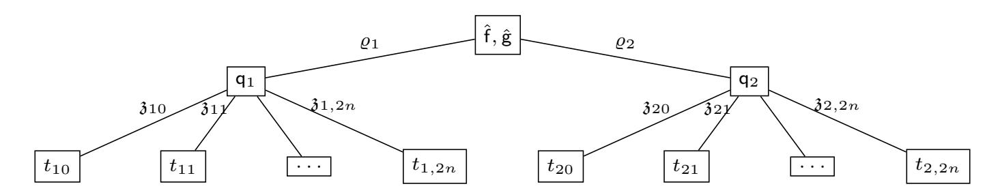

{0}------------------------------------------------

# Special Soundness and Binding Properties: A Framework for Tightly Secure zk-SNARKs February 19, 2026

Erki Külaots <sup>1</sup>, Helger Lipmaa <sup>1</sup>, Roberto Parisella <sup>1</sup>, and Janno Siim <sup>1</sup>

University of Tartu, Tartu, Estonia
 Simula UiB, Bergen, Norway

**Abstract.** Interactive arguments often combine polynomial IOPs with polynomial commitment schemes (PCSs). Frequently, the interactive argument is proven to be knowledge sound, but this incurs a high security loss when applying the Fiat-Shamir transformation to obtain a non-interactive argument in the random oracle model (ROM).

We introduce the notion of special soundness for polynomial IOPs, which surprisingly has not been considered before.

- We study relations between various binding properties of univariate PCSs. In the case of the KZG PCS, these properties can be based on falsifiable assumptions.
- We prove that a special-sound polynomial IOP plus a PCS under suitable binding notions gives a computationally special-sound interactive argument. By Attema, Fehr, and Klooß (TCC 2022), applying Fiat-Shamir to this argument yields a tightly knowledge-sound argument (or zk-SNARK) in the ROM under the same assumptions.
- In the case of the KZG PCS, we add various batching optimizations to our compiler and prove that they preserve computational special soundness. This yields a generic approach for achieving efficient zk-SNARKs with constant proof size and tight knowledge soundness in the ROM under falsifiable assumptions.

**Keywords:** Polynomial commitment scheme  $\cdot$  polynomial IOP  $\cdot$  special-soundness  $\cdot$  zk-SNARK

#### <span id="page-0-0"></span>1 Introduction

A common approach to constructing interactive arguments (IAs) is to combine an information-theoretically secure polynomial IOPs (PIOPs, [BFS20,CHM+20]) and computationally secure polynomial commitment schemes (PCSs, [KZG10]). More precisely, one can compile a knowledge-sound PIOP (with a negligible knowledge error) and an extractable PCS into a knowledge-sound IA [BFS20,CHM+20].

Most modern zk-SNARKs are constructed from IAs by applying the Fiat-Shamir transform [FS87]. Attema, Fehr, and Klooß [AFK22] showed that some

{1}------------------------------------------------

knowledge-sound IAs have a noticeable security loss after the Fiat-Shamir transformation. On the other hand, computationally special-sound (CSS) IAs incur negligible security loss after the Fiat-Shamir transformation. Thus, it is desirable to construct CSS IAs (see, for example, [\[LPS25\]](#page-28-0)).

Surprisingly, it has not been previously studied how to transfer the mentioned compilation results to the setting of special soundness. A key property needed for the compilation is extractability of the PCS. Namely, in the security proof, it is necessary to extract a low-degree polynomial consistent with evaluations that the prover outputted. Until recently, extractability of non-interactive PCSs (where both the commitment and the opening phase are non-interactive) was only known in idealized group models [\[GWC19,](#page-27-3)[CHM](#page-27-0)+20] or, equivalently, under strong knowledge-type assumptions. A new perspective was provided by Lipmaa, Parisella, and Siim [\[LPS24\]](#page-28-1) that defined special-sound non-interactive PCSs and proved that the KZG commitment scheme [\[KZG10\]](#page-27-1) is special-sound under a falsifiable assumption, namely the ARSDH (Adaptive Rational Strong Diffie-Hellman) assumption. They proved that the interactive arguments that use such PCSs are knowledge sound[3](#page-1-0) . While [\[LPS24\]](#page-28-1) considered pure PIOPs (without any batching), in [\[LPS25\]](#page-28-0), they proved that fully-optimized Plonk has special soundness assuming (1) ARSDH assumption, and (2) an additional falsifiable assumption holds.

Neither [\[LPS24](#page-28-1)[,LPS25\]](#page-28-0) studied the properties the PIOP must satisfy for the compilation to result in a CSS IA. They also did not study the necessity of the PCS assumptions. For example, are special-sound PCSs [\[LPS24\]](#page-28-1) necessary and sufficient to obtain a computationally special-sound IA? What properties must the PIOPs satisfy, then?

Only recently, in a parallel work, Chiesa et al. (CGKY, [\[CGKY25\]](#page-27-4)) studied this question in a more general setting of function binding. However, they consider state-restoration (SR) soundness instead of special soundness. In particular, they prove that if the functional commitment scheme is SR function binding and the functional IOP has SR soundness, the compiled IA has SR soundness.

However, the definitions of SR and the proofs that use them are quite complicated. In particular, in the definition of SR knowledge-soundness (which is needed for knowledge sound arguments), one has to construct a rewinding extractor and analyze its running time and success probability. In contrast, the special soundness extractor is given a fixed transcript tree as an input and it must output a witness. The extractor does not rewind and its analysis is more straightforward. This makes special soundness easier to use in many practical scenarios, and motivates our focus on it in this work.

Our Results. We derive sufficient conditions on PIOPs and PCSs to prove that the resulting IA has CSS. According to Attema, Fehr, and Klooß [\[AFK22\]](#page-26-1), one can then apply the Fiat-Shamir transformation [\[FS87\]](#page-27-2) to obtain a knowledgesound zk-SNARK with tight security.

We define special soundness for PIOPs. To the best of our knowledge, this natural notion has not been previously considered in this setting. Our main tech-

<span id="page-1-0"></span><sup>3</sup> To be precise, they prove a related notion called witness-extended emulation.

{2}------------------------------------------------

nical contribution is a compiler that takes a special-sound PIOP and a PCS with suitable security properties and produces a CSS IA. In the case of non-interactive PCS the following two property combinations are sufficient: (1) evaluation binding (EB) and degree binding (DB, a novel but natural requirement for univariate PCSs) or (2) binding and interpolation binding (IB) [\[AJM](#page-26-2)+23]. We also show that incorporating popular KZG optimizations, like batching and linearization trick, into the compiler preserves CSS.

The case for PCS with interactive opening is in some sense easier since we can require the opening phase itself to be a CSS argument for a suitable relation. Then, it is sufficient for the PCS to be binding and that the opening phase has CSS. Although, we also define binding notions, which are analogues of EB, DB, and IB for interactive PCS. These potentially weaker notions also suffice to obtain a CSS IA.

As a second contribution, we perform a comprehensive study of binding notions (binding, EB, DB, IB) for non-interactive PCSs. Flavours of these properties have been considered in various works [\[HASW23,](#page-27-5)[AJM](#page-26-2)+23[,CGKY25,](#page-27-4)[CDLT25,](#page-26-3)[WZ25\]](#page-28-2), but a systematic study is missing. We systematize existing definitions and results, and provide new reductions and separations. Somewhat surprisingly, many of these similar looking properties are incomparable in general. All the binding properties are satisfied by the KZG PCS under falsifiable assumptions. Some of the prior works (e.g., [\[HASW23,](#page-27-5)[AJM](#page-26-2)+23]) have missed this and instead proved them in the much stronger algebraic group model.

#### <span id="page-2-0"></span>1.1 Technical Details

The KZG commitment scheme is a well-known non-interactive PCS [\[KZG10\]](#page-27-1) for univariate polynomials (See §[2.1](#page-8-0) for the full KZG interface). KZG-based zk-SNARKs often offer the best argument size and verifier computation time. Many PCSs have either an interactive commitment phase or an interactive opening phase [\[BBHR18,](#page-26-4)[BBB](#page-26-5)<sup>+</sup>18[,BFS20](#page-26-0)[,Set20,](#page-28-3)[GPS25\]](#page-27-6). Schemes with interactive commitment, like FRI, are widely used but are outside the scope of our current work, which concentrates on univariate PCSs with non-interactive commitment phase and either non-interactive or interactive opening phase. On the other hand, [\[EG25](#page-27-7)[,GPS25\]](#page-27-6) propose a transformation from the KZG to a multilinear PCS with a non-interactive commitment and interactive opening phase. Since non-interactive univariate PCSs can be used as a building block to construct multilinear PCSs with interactive opening, it is important to understand the properties of non-interactive univariate PCSs.

Known PCS security notions. We briefly recall a non-interactive PCS for degree ≤ n (univariate) polynomials over a field F. First, a trusted party generates a commitment key ck, which possibly depends on n, and hands it to the PCS prover and verifier. The prover picks a polynomial f of degree ≤ n and runs an algorithm Com(ck, f) that outputs a commitment C. On an arbitrary point z ∈ F, the prover executes Open(ck, C,z, f) (with C = Com(ck, f)), which returns 

{3}------------------------------------------------

 $\bar{f} \in \mathbb{F}$  and an opening proof  $\pi$ , which (at least intuitively) shows that C is a commitment to a polynomial f of degree  $\leq n$  such that  $f(\mathfrak{z}) = \bar{f}$ . A verification algorithm  $\mathsf{Vf}(\mathsf{ck}, C, \mathfrak{z}, \bar{f}, \pi)$  either accepts or rejects this proof.

We consider the following security notions for non-interactive univariate PCSs:

- Binding means that it is intractable to output  $(C, f_1, f_2)$ , such that  $f_1 \neq f_2$  but  $C = \mathsf{Com}(\mathsf{ck}, f_1) = \mathsf{Com}(\mathsf{ck}, f_2)$ ,
- EB [KZG10] means that it is intractable to output  $(C, \mathfrak{z}, \bar{f}_0, \pi_0, \bar{f}_1, \pi_1)$  such that  $\bar{f}_0 \neq \bar{f}_1$  but the PCS verifier accepts both  $(C, \mathfrak{z}, \bar{f}_0, \pi_0)$  and  $(C, \mathfrak{z}, \bar{f}_1, \pi_1)$ .
- DB (new definition) means that it is intractable to output  $(C, (\mathfrak{z}_i, \bar{f}_i, \pi_i)_{i=0}^L)$ , with  $\forall i \neq j$ .  $\mathfrak{z}_i \neq \mathfrak{z}_j$  and L > n, such that transcripts  $(C, \mathfrak{z}_i, \bar{f}_i, \pi_i)$  are all accepting but the interpolating polynomial of  $(\mathfrak{z}_i, \bar{f}_i)_{i=0}^L$  has degree > n.
- IB [AJM<sup>+</sup>23] means that it is intractable to output  $(C, (\mathfrak{z}_i, \bar{f}_i, \pi_i)_{i=0}^n)$ , with  $\forall i \neq j$ .  $\mathfrak{z}_i \neq \mathfrak{z}_j$ , such that transcripts  $(C, \mathfrak{z}_i, \bar{f}_i, \pi_i)$  are all accepting but C is not the commitment of the interpolating polynomial of  $(\mathfrak{z}_i, \bar{f}_i)_{i=0}^n$ .
- (n+1)-CSS [LPS24] means that there exists an extractor  $\mathsf{Ext}_{\mathsf{pc}}$ , such that given a commitment key for degree- $\leq n$  polynomials and a tree  $(C, (\mathfrak{z}_i, \bar{f}_i, \pi_i)_{i=0}^n)$ , with  $\forall i \neq j$ .  $\mathfrak{z}_i \neq \mathfrak{z}_j$ , of accepting transcripts,  $\mathsf{Ext}_{\mathsf{pc}}$  returns a polynomial f such that  $C = \mathsf{Com}(\mathsf{ck}, \mathsf{f})$  and  $\forall i \in [0, n]$ .  $\mathsf{f}(\mathfrak{z}_i) = \bar{f}_i$ .

All these notions will be used in our main compilation theorem.

Compiler to computationally special-sound IAs. We define special soundness for PIOPs and prove that the standard compilation [BFS20,CHM<sup>+</sup>20] of PCSs and PIOPs results in a computationally special-sound IA, assuming that the PIOP has special soundness and the PCS has a suitable security property. Let us start with the case on non-interactive PCSs. In the first instantion, we require the PCS to satisfy EB and DB. The intuition behind the security theorem is quite simple. Consider a tree of transcripts for the IA. First, we remove superfluous elements like the commitments and evaluation proofs. By interpolating the polynomial evaluations, we obtain polynomials, that allows to construct a candidate PIOP transcript tree. Evaluation binding guarantees that there is a unique polynomial for each commitment (commitment cannot be opened to two distinct evaluations on the same point). Degree binding guarantees that the interpolated polynomials have low degree as required by the PIOP definition. Special soundness of the PIOP then guarantees that we can extract a witness from this tree. We state the informal theorem here and refer to Theorem 6 for the formal statement.

<span id="page-3-0"></span>**Theorem 1 (Informal).** Let  $\Pi_{piop}$  be a special sound PIOP for a relation  $\mathcal{R}$ , and let PC be a non-interactive univariate PCS with completeness, EB and DB. Then the IA defined by the standard compilation of  $\Pi_{piop}$  with PC has CSS for relation  $\mathcal{R}$ .

We also prove an alternative result showing that the standard compilation of PCSs and PIOPs results in a computationally special-sound IA, assuming that the PCS is binding and IB and the PIOP has special soundness. The latter has

{4}------------------------------------------------

the advantage that it can be adjusted also to Commit-and-Prove (C&P) IAs (where the statement x contains commitments).

An interactive PCS (IPCS) [BFS20] has an interactive opening phase, which is itself a knowledge sound argument for a relation  $\mathcal{R}_{\mathsf{ck},n}^{\mathsf{Eval}}$ , where the statement is  $\mathbb{x} = (\mathsf{ck}, C, \mathfrak{z}, \bar{f})$  and a witness is a polynomial f of degree  $\leq n$  such that  $C = \mathsf{Com}(\mathsf{ck}, \mathsf{f})$  and  $\mathsf{f}(\mathfrak{z}) = \bar{f}$ . We define binding notions for IPCSs that are analogues of EB, DB, and IB for non-interactive PCSs. However, we also show if the interactive opening phase has CSS for the relation  $\mathcal{R}_{\mathsf{ck},n}^{\mathsf{Eval}}$  and the PCS is binding, then all of the binding notions are satisfied.

<span id="page-4-1"></span>**Theorem 2 (Informal).** Let  $\Pi_{piop}$  be a special sound PIOP for a relation  $\mathcal{R}$ , and let PC be a univariate interactive PCS with completeness, binding, and its opening phase is a CSS argument for the relation  $\mathcal{R}_{ck,n}^{\mathsf{Eval}}$ . Then the IA defined by the standard compilation of  $\Pi_{piop}$  with PC has CSS for relation  $\mathcal{R}$ .

We state the formal result in Theorem 13, which relies on binding notions for IPCSs that are potentially weaker than the CSS of the opening phase. We suspect that many IPCSs in the literature have an interactive opening with the CSS property (although, they have not formally stated it) <sup>4</sup>. One example is [BMM<sup>+</sup>21], where they state it explicitly. However, we leave the study of concrete IPCSs for future work.

<span id="page-4-2"></span>Optimized compilers for KZG. In the case of the KZG PCS, various batching optimizations are known in the literature (see, e.g., [CHM<sup>+</sup>20,LPS25]) and these optimizations are widely used in practice. It was already established in [LPS25] that two such optimizations have CSS under the ARSDH assumption:

- <u>BatchKZG</u>. When opening multiple commitments at the same point  $\mathfrak{z}$ , one can aggregate the opening proofs into a single proof.
- (Sanitized) LinKZG. Suppose the verifier only wants to test that  $\sum_{i=1}^{n_b} H_i(h_1(\mathfrak{z}), \ldots, h_{n_a}(\mathfrak{z})) d_i(\mathfrak{z}) = 0$ , where  $H_i$  are some public polynomials, and  $\{h_i\}_{i=1}^{n_a}$  and  $\{d_i\}_{i=1}^{n_b}$  is a partition of the polynomial oracles sent by the PIOP prover. This can be done letting the IA prover open polynomials  $\{h_i(X)\}_i$  and  $\sum_{i=1}^{n_b} \gamma^{i-1} d_i(X)$  at  $\mathfrak{z}$ , where  $\gamma$  is an additional challenge provided by the verifier. This optimization is known as (sanitized) linearization trick or Maller's trick. The prover sends only a single opening proof when combined with batching and  $n_a + 1$  field elements.

A variation of the LinKZG has been used for example in Marlin [CHM $^+$ 20]) and Plonk [GWC19] to reduce communication. In Section 5.1 we show how that proof aggregation preserves CSS, under ARSDH. The resulting IA's prover sends  $Q_{\rm dist}$  opening proofs, one per query point, instead of one for each query. In Section 5.2 we focus on PIOPs with verification equation compatible with the linearization

<span id="page-4-0"></span><sup>&</sup>lt;sup>4</sup> For instace, Bulletproof's inner-product argument [BBB<sup>+</sup>18] is proven to have witness-extended emulation, but essentially identical proof strategy would also show its CSS. Thus, the IPCS based on Bulletproofs has the necessary property for us.

{5}------------------------------------------------

trick. We show that including (sanitized) LinKZG to the compiler also preserves IA's CSS.

Reductions and separations between binding notions. As we mentioned, several binding notions for PCSs have been proposed in the literature (Binding, EB, DB, CSS, and IB). We systematize existing results and also prove new reductions and separations between these notions.

For the following discussion, we consider non-interactive PCSs for univariate polynomials. First, we establish several fundamental relations.

- <span id="page-5-1"></span>1. (IB  $\Leftrightarrow$  CSS). PCS is IB iff it has CSS, Lemma 1. We find IB to be a simpler notion than CSS, which requires one to define an extractor, and thus, we advocate the use of IB in the future. As a consequence, the proofs in [LPS24,LPS25] can be simplified by the use of IB of KZG instead of CSS.
- 2. (EB  $\vee$  DB  $\Rightarrow$  B). If PCS is EB or DB, it is binding, Theorem 4 (Items 1 and 2).
- 3.  $(B + IB \Rightarrow DB)$ . If PCS is binding and IB, it is DB, Theorem 4 (Item 3).
- <span id="page-5-0"></span>4. (FB  $\Leftrightarrow$  EB + DB). We show that the notion of function binding [LM19,CGKY25,CDLT25] is exactly equivalent to the conjunction of EB and DB (see Lemma 3).
- 5.  $((n, n+1)\text{-DB} \Rightarrow (n, L)\text{-DB})$ . If PCS is (n, n+1)-DB, it is (n, L)-DB for any L > n, Lemma 2, where the second parameter shows the number of transcripts the adversary has to output (which is n+2 or L+1 transcripts). Thus, it is sufficient to prove (n, n+1)-DB, but in many applications (like our compiler proof) it is convenient instead to use (n, L)-DB for some arbitrary  $L \in \mathsf{poly}(\lambda)$ .

One might wonder if even more connections can be established. Somewhat surprisingly, we show that many of these seemingly similar looking notions are incomparable. We prove the following separations (see Theorem 5).

- 1. (IB  $\Rightarrow$  B  $\vee$  DB). Exists a PCS that is IB but not binding or DB.
- 2.  $(B \land IB \land DB \Rightarrow EB)$ . Exists a PCS that is binding, IB, and DB, but not EB.
- 3.  $(B \land EB \Rightarrow DB)$ . Exists a PCS that is EB (and thus binding), but not DB.
- 4. (B  $\wedge$  EB  $\wedge$  DB  $\Rightarrow$  IB). Exists a PCS that is EB (and thus binding) and DB, but not IB.

If we additionally assume that the ARSDH assumption holds, we can establish the same separations for succinct PCSs (by relying on the KZG PCS).

We summarize the binding property relations in Table 1. The separations and the positive results give an exhaustive picture of the relations between the binding notions. Namely, for any subset of binding notions  $X \subseteq \{\mathsf{B}, \mathsf{EB}, \mathsf{IB}, \mathsf{DB}\}$  and any binding notion Y, the table has an entry, which shows that either  $X \Rightarrow Y$  or  $X \not\Rightarrow Y$ .

In addition, in Section B, we present a few more results that are specific to the KZG PCS. We show that KZG is binding iff the PDL assumption holds, and it is EB iff the SDH assumption holds. The direction from left to right was already known [KZG10], but the converse direction is new and shows that these assumptions are necessary. For the sake of completeness, we also give direct proofs that KZG is DB and IB under the ARSDH assumption (although, these

{6}------------------------------------------------

<span id="page-6-0"></span>Table 1. Reductions and separations between binding notions for PCSs. X⇒Y denotes that X implies Y , X⇏Y means that there exists a PCS with properties X but not Y , and X – Y denotes a trivial implication. The table is exhaustive, meaning that for any subset of properties X and property Y there is either an implication or separation.

|                         | B |               | EB |               | IB                 | DB                 |  |
|-------------------------|---|---------------|----|---------------|--------------------|--------------------|--|
| B                       | – |               | ⇏  | (Thm 5, It 2) | ⇏<br>(Thm 5, It 4) | ⇏<br>(Thm 5, It 3) |  |
| EB                      | ⇒ | (Thm 4, It 1) | –  |               | ⇏<br>(Thm 5, It 4) | ⇏<br>(Thm 5, It 3) |  |
| IB                      | ⇏ | (Thm 5, It 1) | ⇏  | (Thm 5, It 2) | –                  | ⇏<br>(Thm 5, It 1) |  |
| DB                      | ⇒ | (Thm 4, It 2) | ⇏  | (Thm 5, It 2) | ⇏<br>(Thm 5, It 4) | –                  |  |
| B<br>∧<br>IB            | – |               | ⇏  | (Thm 5, It 2) | –                  | ⇒<br>(Thm 4, It 3) |  |
| B<br>∧<br>IB<br>∧<br>DB | – |               | ⇏  | (Thm 5, It 2) | –                  | –                  |  |
| B<br>∧<br>EB<br>∧<br>DB | – |               | –  |               | ⇏<br>(Thm 5, It 4) | –                  |  |

results can also be concluded from prior results). The latter was already also proven in [\[CGKY25\]](#page-27-4). However, in the case of DB and IB, we do not know if ARSDH is necessary. Finally, we show that KZG is DB if the DHE [\[ZSS04\]](#page-28-4) and ModDHE (a new falsifiable assumption, see Definition [13\)](#page-31-0) hold (Lemma [6\)](#page-32-0). Here, ModDHE is an alternative assumption to ARSDH. We explore its relations to other known assumptions.

Comparison to [\[CGKY25\]](#page-27-4). The current work has a partial overlap with the recent independent work of Chiesa et al. [\[CGKY25\]](#page-27-4) (CGKY), which focuses on the state-restoration (SR) soundness. They show that a SR (knowledge) sound Functional IOP (FIOP) together with SR function-binding functional commitment scheme, implies a SR (knowledge) sound argument. FIOP and functional commitment schemes are generalizations of PIOPs and PCSs, respectively. SR (knowledge) soundness, just as CSS, implies tight Fiat-Shamir security.

However, to obtain a knowledge sound argument from their compiler, one must first prove that the PIOP (or FIOP) satisfies a quite intricate definition of SR knowledge soundness (SRKS). In SRKS, a malicious prover first plays a rewinding game with the verifier, where it can rewind the verifier certain amount of times, after which it must produce a valid transcript for some statement x. To prove that PIOP has SRKS, one has to construct a rewinding witness extractor, that rewinds the malicious prover and recovers the witness for x. Therefore, to prove SRKS of a new PIOP, one has to analyse two rewinding procedures, which can be quite cumbersome.

In comparison, the starting point for our compiler is a special sound PIOP. In special soundness, one has to construct a (non-rewinding) deterministic and (strict) polynomial time extractor that given as an input a tree of valid transcripts and a statement x, has to recover a witness. We believe that for practitioners that are designing PIOPs, our definition is much more convenient to use as it completely avoids any rewinding analysis. For interactive proofs, special 

{7}------------------------------------------------

soundness [CDS94] has stood the test of time as a simple and practical definition, which makes us hopeful that the same will be true in the PIOP setting.

Other Applications. Besides argument systems, PCSs play an important role also in other protocols. Data Availability Sampling (DAS) allows to prove that some data is available for retrieval without having to send the whole data. Hall-Andersen et al. [HASW23] study DASs based on, among others, polynomial commitment schemes. They identify code-binding, which is identical to function binding, as one of the core properties to achieve a secure DAS. They prove it in the algebraic group model for the KZG commitment. Wagner and Zapico [WZ25] exploit this connection and prove the security of Ethereum's PeerDASs under (target group) SDH and ARSDH assumptions.

Abraham et al. [AJM<sup>+</sup>23] construct Bingo, a new verifiable secret sharing scheme, and prove its security assuming that the KZG satisfies IB (for randomized PCSs) and evaluation binding. They prove IB in the algebraic group model. Everlasting Anonymous Rate-Limited Tokens based KZG's EB and function binding (they call it degree binding) are proposed in [CDLT25]. They base the security on the ARSDH assumption. We hope our work popularizes the understanding that many KZG's security properties can be proven under falsifiable assumptions and the algebraic group model is often unnecessary.

#### <span id="page-7-0"></span>2 Preliminaries

Let  $\lambda$  denote the security parameter. By  $f(\lambda) \approx_{\lambda} 0$ , we mean that f is a negligible function in  $\lambda$ . PPT (resp. DPT) stands for probabilistic (resp. deterministic) polynomial time.  $\mathbb{F}$  is a finite field of prime order p.  $\mathbb{F}[X]$  is the polynomial ring in variable X over the field  $\mathbb{F}$  and  $\mathbb{F}_{\leq n}[X] \subset \mathbb{F}[X]$  is the set of polynomials of at most degree n. We denote  $[a,b] := \{a,a+1,\ldots,b\}$ , where  $a \leq b$  are integers. For  $\mathcal{S} \subset \mathbb{F}$ ,  $\mathsf{Z}_{\mathcal{S}}(X) = \prod_{s \in \mathcal{S}} (X-s)$  is the vanishing polynomial over a set  $\mathcal{S}$ .

Given a tuple  $(\mathfrak{z}_i, \bar{f}_i)_{i=0}^n \in \mathbb{F}^n$  of data points and function values, let  $f(X) = \operatorname{Interp}\left(\left(\mathfrak{z}_i, \bar{f}_i\right)_{i=0}^n, X\right)$  denote the fact that f(X) is the interpolation polynomial of this tuple, that is, f is the polynomial in  $\mathbb{F}[X]$  with the lowest degree possible such that  $f(\mathfrak{z}_i) = \bar{f}_i$  for every  $i \in [0, n]$ .

**Bilinear Groups.** A bilinear group generator  $\mathsf{Pgen}(1^\lambda)$  returns  $\mathsf{p} = (p, \mathbb{G}_1, \mathbb{G}_2, \mathbb{G}_T, \hat{e}, [1]_1, [1]_2)$ , where  $\mathbb{G}_1, \mathbb{G}_2$ , and  $\mathbb{G}_T$  are additive cyclic (thus, Abelian) groups of prime order  $p, \hat{e} : \mathbb{G}_1 \times \mathbb{G}_2 \to \mathbb{G}_T$  is a non-degenerate efficiently computable bilinear pairing, and  $[1]_\iota$  is a fixed generator of  $\mathbb{G}_\iota$ . While  $[1]_\iota$  is part of  $\mathsf{p}$ , we often give it as an explicit input to different algorithms for clarity. The bilinear pairing is of Type-3, that is, there is no efficient isomorphism between  $\mathbb{G}_1$  and  $\mathbb{G}_2$ . We use the common bracket notation, that is, for  $\iota \in \{1, 2, T\}$  and  $a \in \mathbb{Z}_p$ , we write  $[a]_\iota$  to denote  $a[1]_\iota$ . We denote  $\hat{e}([a]_1, [b]_2)$  by  $[a]_1 \bullet [b]_2$  and assume  $[1]_T = [1]_1 \bullet [1]_2$ . Thus,  $[a]_1 \bullet [b]_2 = [ab]_T$  for any  $a, b \in \mathbb{F}$ , where  $\mathbb{F} = \mathbb{Z}_p$ .

We recall some of the important assumptions.

{8}------------------------------------------------

The <u>n-PDL (Power Discrete Logarithm, [Lip12])</u> assumption holds for Pgen in  $\mathbb{G}_1$  if for any PPT  $\mathcal{A}$ ,  $\mathsf{Adv}^{\mathrm{pdl}}_{\mathsf{Pgen},n,\mathbb{G}_1,\mathcal{A}}(\lambda) :=$ 

$$\Pr\left[ \ x = \mathcal{A}(\mathsf{ck}) \, \middle| \, \mathsf{p} \leftarrow \mathsf{Pgen}(1^{\lambda}); x \leftarrow_{\$} \mathbb{F}; \mathsf{ck} \leftarrow ([(x^i)_{i=0}^n]_1, [1, x]_2); \ \right] \approx_{\lambda} 0 \ .$$

The <u>n-SDH (Strong Diffie-Hellman, [BB08])</u> assumption holds for Pgen in  $\mathbb{G}_1$  if for any PPT  $\mathcal{A}$ ,  $\mathsf{Adv}^{\mathrm{sdh}}_{\mathsf{Pgen},n,\mathbb{G}_1,\mathcal{A}}(\lambda) :=$ 

$$\Pr\left[\begin{array}{c|c} x+c\neq 0 \land & \mathsf{p} \leftarrow \mathsf{Pgen}(1^\lambda); x \leftarrow_{\$} \mathbb{F}; \\ [\varphi]_1 = \frac{1}{x+c}[1]_1 & \mathsf{ck} \leftarrow ([(x^i)_{i=0}^n]_1, [1,x]_2); (c,[\varphi]_1) \leftarrow \mathcal{A}(\mathsf{ck}) \end{array}\right] \approx_{\lambda} 0 \ .$$

The <u>n-ARSDH (Adaptive Rational Strong Diffie-Hellman, [LPS24])</u> assumption holds for Pgen in  $\mathbb{G}_1$  if for any PPT  $\mathcal{A}$ ,  $\mathsf{Adv}^{\mathsf{arsdh}}_{\mathsf{Pgen},n,\mathbb{G}_1,\mathcal{A}}(\lambda) :=$ 

$$\Pr\left[\begin{array}{l} \mathcal{S} \subset \mathbb{F} \, \wedge \, |\mathcal{S}| = n + 1 \, \wedge \\ [g]_1 \neq [0]_1 \, \wedge \, [\varphi]_1 = [\frac{g}{\mathsf{Z}_{\mathcal{S}}(x)}]_1 \, \middle| \begin{matrix} \mathsf{p} \leftarrow \mathsf{Pgen}(1^\lambda); x \leftarrow_{\$} \mathbb{F}; \\ \mathsf{ck} \leftarrow ([(x^i)_{i=0}^n]_1, [1, x]_2); \\ (\mathcal{S}, [g, \varphi]_1) \leftarrow \mathcal{A}(\mathsf{ck}) \end{matrix}\right] \approx_{\lambda} 0 \ ,$$

where  $\mathsf{Z}_{\mathcal{S}}(X) := \prod_{s \in \mathcal{S}} (X - s)$ .

#### <span id="page-8-0"></span>2.1 Polynomial Commitment Schemes

In a (univariate) PCS [KZG10], the prover commits to a polynomial  $f \in \mathbb{F}_{\leq n}[X]$  and later opens it to  $f(\mathfrak{z})$  for  $\mathfrak{z} \in \mathbb{F}$  chosen by the verifier. A <u>non-interactive PCS</u> consists of the following five algorithms.<sup>5</sup> (1) Pgen(1<sup>\lambda</sup>) returns system parameters  $\mathfrak{p}$ . (2) Given  $\mathfrak{p}$  and an upperbound n on the polynomial degree, KGen( $\mathfrak{p}$ , n) returns (ck, tk), where ck is the commitment key and tk is the trapdoor. We assume ck implicitly contains  $\mathfrak{p}$ . (3) Given ck and a polynomial  $f \in \mathbb{F}_{\leq n}[X]$ , Com(ck, f) returns a commitment C to f. (4) Given ck, C, an evaluation point  $\mathfrak{z} \in \mathbb{F}$ , and  $f \in \mathbb{F}_{\leq n}[X]$ , Open(ck,  $C, \mathfrak{z}, f$ ) returns  $(\bar{f}, \pi)$ , where  $\bar{f} \leftarrow f(\mathfrak{z})$  is an evaluation, and  $\pi$  is an evaluation proof. (5) Given ck,  $C, \mathfrak{z}, \bar{f}$ , and  $\pi$ , Vf(ck,  $C, \mathfrak{z}, \bar{f}, \pi$ ) returns 1 (accept) or 0 (reject).

The KZG commitment scheme is a well-known non-interactive PCS [KZG10] for univariate polynomials; another such scheme is PST [PST13] for multilinear polynomials. To keep notation simple, we will concentrate on non-interactive univariate PCSs. However, most results of the current paper generalize to PCSs with non-interactive commitment and interactive opening.

A non-interactive PCS PC is <u>complete</u>, if for any  $\lambda$ ,  $p \leftarrow \text{Pgen}(1^{\lambda})$ ,  $n \in \text{poly}(\lambda)$ ,  $\mathfrak{z} \in \mathbb{F}$ ,  $\mathfrak{f} \in \mathbb{F}_{\leq n}[X]$ ,

$$\Pr\left[ \left. \mathsf{Vf}(\mathsf{ck}, C, \mathfrak{z}, \bar{f}, \pi) = 1 \, \middle| \, \substack{(\mathsf{ck}, \mathsf{tk}) \leftarrow \mathsf{KGen}(\mathsf{p}, n); C \leftarrow \mathsf{Com}(\mathsf{ck}, \mathsf{f}); \\ (\bar{f}, \pi) \leftarrow \mathsf{Open}(\mathsf{ck}, C, \mathfrak{z}, \mathsf{f})} \right. \right] = 1.$$

We say that a non-interactive PCS is <u>succinct</u> if  $|C| + |\pi| \in \mathcal{O}(\mathsf{poly}(\lambda)\mathsf{polylog}(n))$ . For most applications only succinct PCSs are interesting.

<span id="page-8-1"></span><sup>&</sup>lt;sup>5</sup> In an interactive PCS, the commitment, the opening, or both can be interactive arguments between the prover and the verifier.

{9}------------------------------------------------

**Definition 1 (Binding).** A non-interactive PCS PC is <u>binding</u> (B), if for any  $n \in \mathsf{poly}(\lambda)$  and PPT  $\mathcal{A}$ ,  $\mathsf{Adv}^{\mathrm{bind}}_{\mathsf{Pgen},\mathsf{PC},n,\mathcal{A}}(\lambda) :=$ 

$$\Pr\left[\begin{array}{l} C = \mathsf{Com}(\mathsf{ck},\mathsf{f}) = \mathsf{Com}(\mathsf{ck},\mathsf{g}) \wedge \left| \mathsf{p} \leftarrow \mathsf{Pgen}(1^{\lambda}); (\mathsf{ck},\mathsf{tk}) \leftarrow \mathsf{KGen}(\mathsf{p},n); \\ \mathsf{f} \neq \mathsf{g} \wedge \deg(\mathsf{f}) \leq n, \deg(\mathsf{g}) \leq n \right| (C,\mathsf{f},\mathsf{g}) \leftarrow \mathcal{A}(\mathsf{ck}) \end{array}\right] \approx_{\lambda} 0 \ .$$

<span id="page-9-0"></span>**Definition 2 (Evaluation binding).** PC is <u>evaluation binding</u> (EB, [KZG10]) for Pgen, if for any  $n \in \mathsf{poly}(\lambda)$  and  $PPT\ \mathcal{A}$ ,  $\mathsf{Adv}^{\mathrm{evb}}_{\mathsf{Pgen},\mathsf{PC},n,\mathcal{A}}(\lambda) :=$ 

$$\Pr\left[ \begin{array}{l} \mathsf{Vf}(\mathsf{ck}, C, \mathfrak{z}, \bar{f}, \pi) = 1 \wedge \\ \mathsf{Vf}(\mathsf{ck}, C, \mathfrak{z}, \bar{f}', \pi') = 1 \wedge \bar{f} \neq \bar{f}' \, \middle| \, \mathsf{p} \leftarrow \mathsf{Pgen}(1^{\lambda}); (\mathsf{ck}, \mathsf{tk}) \leftarrow \mathsf{KGen}(\mathsf{p}, n); \\ (C, \mathfrak{z}, \bar{f}, \pi, \bar{f}', \pi') \leftarrow \mathcal{A}(\mathsf{ck}) \end{array} \right] \approx_{\lambda} 0 \ .$$

Thus, a PCS is evaluation binding if it is hard to open the same evaluation point to different evaluations.

Abraham et al. [AJM<sup>+</sup>23] (Crypto 2023) say that a randomized PCS is interpolation binding (IB) if, given enough accepting evaluations with respect to the same polynomial commitment, the interpolated polynomials obtained from these evaluations must agree with the commitment. We modify their definition to correspond to a deterministic PCS.

<span id="page-9-1"></span>**Definition 3 (Interpolation binding, [AJM**<sup>+</sup>**23]).** A univariate PCS has interpolation binding if for all  $n \in \text{poly}(\lambda)$  and PPT  $\mathcal{A}$ ,  $\mathsf{Adv}^{\mathrm{ib}}_{\mathsf{Pgen},\mathsf{PC},n,\mathcal{A}}(\lambda) :=$ 

$$\Pr\left[\begin{array}{c} \forall i \neq j. \ \mathfrak{z}_i \neq \mathfrak{z}_j \wedge \\ \forall i \in [0,n]. \mathsf{Vf}(\mathsf{ck},C,\mathfrak{z}_i,\bar{f}_i,\pi_i) = 1 \\ \wedge C \neq \mathsf{Com}(\mathsf{ck},\mathsf{f}) \end{array} \right. \left. \begin{array}{c} \mathsf{p} \leftarrow \mathsf{Pgen}(\lambda); \\ (\mathsf{ck},\mathsf{tk}) \leftarrow_{\$} \mathsf{KGen}(\mathsf{p},n); \\ (C,(\mathfrak{z}_i,\bar{f}_i,\pi_i)_{i=0}^n) \leftarrow \mathcal{A}(\mathsf{ck}); \\ \mathsf{f} \leftarrow \mathsf{Interp}\left(\left(\mathfrak{z}_i,\bar{f}_i\right)_{i=0}^n,X\right) \end{array} \right] \approx_{\lambda} 0 \ .$$

We rely on the following terminology from Lipmaa et al. [LPS24]. We call  $\mathsf{tr} = (C, \mathfrak{z}, \bar{f}, \pi)$  a <u>transcript</u> of the PCS. We say that a commitment key  $\mathsf{ck}$  and a transcript  $\mathsf{tr}$  is <u>accepting</u> when  $\mathsf{Vf}(\mathsf{ck}, \mathsf{tr}) = 1$ . For any  $n \geq 1$  and any commitment key  $\mathsf{ck}$  outputted by  $\mathsf{KGen}(\mathsf{p}, n)$ , we define the following relations.

$$\mathcal{R}_{\mathsf{ck},n} := \{ (C,\mathsf{f}) : C = \mathsf{PC.Com}(\mathsf{ck},\mathsf{f}) \land \deg(\mathsf{f}) \leq n \} , 
\mathcal{R}_{\mathsf{ck},\mathsf{tr}} := \{ (C,\mathsf{f}) : (C,\mathsf{f}) \in \mathcal{R}_{\mathsf{ck},n} \land \forall j \in [0,n].\mathsf{f}(\mathfrak{z}_j) = \bar{f}_j \} ,$$
(1)

where  $\mathbf{tr} = (\mathsf{tr}_0, \dots, \mathsf{tr}_n)$  contains n+1 accepting transcripts  $\mathsf{tr}_j = (C, \mathfrak{z}_j, \bar{f}_j, \pi_j)$  such that C is the same in all transcripts, but  $\mathfrak{z}_j$ -s are pairwise distinct.

<span id="page-9-2"></span>**Definition 4 (Special Soundness).** Let  $n \in \operatorname{poly}(\lambda)$  with  $n \geq 1$ . A non-interactive polynomial commitment scheme PC has  $\operatorname{\underline{computational}}(n+1)$ -special  $\operatorname{\underline{soundness}}(\operatorname{CSS})$  for Pgen, if there exists a DPT extractor Ext, such that for any  $\operatorname{\underline{PPT}}$  adversary  $\operatorname{\mathcal{A}_{ss}}$ ,  $\operatorname{\mathsf{Adv}}^{\operatorname{ss}}_{\operatorname{\mathsf{Pgen}},\operatorname{\mathsf{PC}},\operatorname{\mathsf{Ext}},n,\mathcal{A}_{\operatorname{ss}}}(\lambda) :=$ 

$$\Pr \left[ \begin{array}{l} \mathbf{tr} = (\mathsf{tr}_j)_{j=0}^n \wedge \\ \forall j \in [0,n]. \left( \begin{array}{l} \mathsf{tr}_j = (C,\mathfrak{z}_j,\bar{f}_j,\pi_j) \\ \wedge \, \mathsf{Vf}(\mathsf{ck},\mathsf{tr}_j) = 1 \end{array} \right) \left| \begin{array}{l} \mathsf{p} \leftarrow \mathsf{Pgen}(1^\lambda); \\ (\mathsf{ck},\mathsf{tk}) \leftarrow \mathsf{KGen}(\mathsf{p},n); \\ \mathsf{tr} \leftarrow \mathcal{A}_\mathsf{ss}(\mathsf{ck}); \\ \mathsf{f} \leftarrow \mathsf{Ext}(\mathsf{ck},\mathsf{tr}) \end{array} \right] \approx_\lambda 0 \right.$$

{10}------------------------------------------------

The KZG (Kate, Zaverucha, and Goldberg, [KZG10]) univariate polynomial commitment scheme is defined as follows:

```
KZG.Pgen(\lambda): return p \leftarrow Pgen(1^{\lambda}).
```

KZG.KGen(p, n):  $\mathsf{tk} = x \leftarrow_{\$} \mathbb{Z}_p^*; \mathsf{ck} \leftarrow (\mathsf{p}, [(x^i)_{i=0}^n]_1, [1, x]_2); \mathsf{return} \ (\mathsf{ck}, \mathsf{tk}).$  KZG.Com(ck, f):  $\mathsf{return} \ C \leftarrow [\mathsf{f}(x)]_1 = \sum_{j=0}^n \mathsf{f}_j[x^j]_1.$ 

KZG.Open(ck,  $C, \mathfrak{z}, \mathfrak{f}$ ):  $\bar{f} \leftarrow \mathfrak{f}(\mathfrak{z}); \varphi(X) \leftarrow (\mathfrak{f}(X) - \bar{f})/(X - \mathfrak{z}); \pi \leftarrow [\varphi(x)]_1; \text{ return}$  $(f,\pi).$ 

KZG.Vf(ck,  $C, \mathfrak{z}, \bar{f}, \pi$ ): Return 1 iff  $\mathfrak{z}, \bar{f} \in \mathbb{F}$  and  $(C - \bar{f}[1]_1) \bullet [1]_2 = \pi \bullet ([x]_2 - \mathfrak{z}[1]_2)$ .

Since  $\mathbb{G}_1$  scalar multiplications are cheaper than  $\mathbb{G}_2$  ones, one often uses the optimized KZG verification equation  $(C - \bar{f}[1]_1 + \mathfrak{z}\pi) \bullet [1]_2 = \pi \bullet [x]_2$ .

KZG is evaluation binding under the SDH assumption (Kate et al. [KZG10]) and non-black-box extractable in the Algebraic Group Model (AGM) [FKL18] under the PDL assumption (Chiesa et al. [CHM<sup>+</sup>20]) and in AGM with Oblivious Sampling (AGMOS) [LPS23] under the PDL and TOFR assumptions. Abraham et al. [AJM<sup>+</sup>23, Lemma 1] prove that the KZG is IB under the PDL and SDH assumptions in the AGM. Lipmaa et al. [LPS24] proved the following result.

<span id="page-10-1"></span>**Theorem 3.** If the n-ARSDH assumption holds, then KZG for degree  $\leq n$  polynomials has computational (n+1)-special soundness: There exists a DPT KZG special-soundness extractor  $\mathsf{Ext}_{\mathsf{kzg}},\ \mathit{such}\ \mathit{that}\ \mathit{for}\ \mathit{any}\ \mathit{PPT}\ \mathcal{A}_{\mathsf{ss}},\ \mathit{there}\ \mathit{exists}\ \mathit{a}$  $PPT \ \mathcal{B}, \ such \ that \ \mathsf{Adv}^{\mathrm{ss}}_{\mathsf{Pgen},\mathsf{PC},\mathsf{Ext}_{\mathsf{kzg}},n,\mathcal{A}_{\mathsf{ss}}}(\lambda) \leq \mathsf{Adv}^{\mathrm{arsdh}}_{\mathsf{Pgen},n,\mathbb{G}_1,\mathcal{B}}(\lambda).$ 

#### Interactive Arguments 2.2

Let  $\mathcal{R} \subseteq \{0,1\}^* \times \{0,1\}^* \times \{0,1\}^*$  be a ternary relation.  $\mathcal{R}$  contains triples  $(srs, x, w) \in \mathcal{R}$  where srs is a public common reference string, x is a public statement, and w is a private witness. We only consider NP-relations  $\mathcal{R}$ , where the validity of a witness w can be verified in time polynomial in |x| + |srs|. Let  $\mathsf{Pgen}(1^{\lambda})$  generate system parameters **p** that are available to all algorithms. We do not always explicitly write **p** as an input.

An interactive argument  $\Pi = (KGen, P, V)$  for a relation  $\mathcal{R}$  is an interactive protocol between a probabilistic polynomial time prover P and verifier V. The key generator KGen generates a common reference string srs at the beginning of the protocol. Both P and V take as public input srs and a statement x and, additionally, P takes as private input a witness w. The verifier V either accepts or rejects the transcript (all messages exchanged in the protocol execution). Accordingly, we say the transcript is accepting or rejecting.

**Definition 5 (Tree of transcripts).** Let  $\kappa = (\kappa_1, \ldots, \kappa_{\mu}) \in \mathbb{N}^{\mu}$ . A  $\kappa$ -tree of transcripts for a  $(2\mu + 1)$ -move public-coin interactive argument  $\Pi =$  $\overline{(\mathsf{KGen},\mathsf{P},\mathsf{V})}$  is a set of  $K=\prod_{i=1}^{\mu}\kappa_i$  transcripts arranged in the following tree structure. The nodes in this tree correspond to the prover's messages and the edges to the verifier's challenges. Every node at depth i has precisely  $\kappa_i$  children corresponding to  $\kappa_i$  pairwise distinct challenges. Every transcript corresponds to exactly one path from the root node to a leaf.

<span id="page-10-0"></span>A tree is accepting if each transcript in it is accepting.

{11}------------------------------------------------

**Definition 6.** Let  $\kappa = (\kappa_1, \dots, \kappa_{\mu})$ . A  $(2\mu + 1)$ -move public-coin interactive argument  $\Pi = (\mathsf{KGen}, \mathsf{P}, \mathsf{V})$  for relation  $\mathcal{R}$  has <u>computational  $\kappa$ -special soundness (CSS)</u> if there exists a DPT extractor  $\mathsf{Ext}$  such that for any PPT  $\mathcal{A}_{\mathsf{ss}}$ ,  $\mathsf{Adv}^{\mathsf{ss}}_{\mathsf{Pgen},\Pi,\mathsf{Ext},\kappa,\mathcal{A}_{\mathsf{ss}}}(\lambda) :=$ 

$$\Pr\left[\begin{array}{c|c} \mathfrak{T} \ \textit{is a $\kappa$-tree of} \\ \textit{accepting transcripts} \\ \land (\mathtt{srs}, \mathtt{x}, \mathtt{w}) \notin \mathcal{R} \end{array} \middle| \begin{array}{c} \mathsf{p} \leftarrow \mathsf{Pgen}(1^{\lambda}); (\mathtt{srs}, \mathsf{tk}) \leftarrow \mathsf{KGen}(\mathsf{p}); \\ (\mathtt{x}, \mathfrak{T}) \leftarrow \mathcal{A}_{\mathsf{ss}}(\mathtt{srs}); \mathtt{w} \leftarrow \mathsf{Ext}(\mathtt{srs}, \mathtt{x}, \mathfrak{T}) \end{array} \right] \approx_{\lambda} 0 \ .$$

### <span id="page-11-1"></span>3 On Advanced Binding Properties of PCS

We prove several fundamental results that are true for <u>all</u> non-interactive PCSs. See Table 1 for a summary of the results. In Section B, we focus on results which are specific to KZG. In Table 1, the security notions where the adversary outputs more transcripts are towards the right. Intuitively, one cannot deduce leftward notions from rightward notions since, given an adversary that only outputs some m tuples of accepting transcripts, it seems to be challenging to construct an adversary that outputs more than m tuples (unless the latter adversary works in the AGM and thus can extract the polynomials).

In one version of our special soundness compiler in Section 4, we will need the PCS to be function binding [LM19,CGKY25]: that is, given many accepting transcripts, there must exist at least one low-degree polynomial that agrees with all the transcripts. In the case of univariate non-interactive PCSs function binding is defined as follows.

<span id="page-11-0"></span>**Definition 7 (Function Binding).** A univariate non-interactive PCS PC has function binding, if for all  $n \in \text{poly}(\lambda)$ , and all  $L \in \text{poly}(\lambda)$  with  $L \ge n+1$ , and  $PPT \mathcal{A}$ ,  $Adv^{fb}_{Pgen,PC,n,L,\mathcal{A}}(\lambda) :=$ 

$$\Pr\left[\begin{array}{c|c} \forall i \in [0,L]. \mathsf{Vf}(\mathsf{ck}, C, \mathfrak{z}_i, \bar{f}_i, \pi_i) = 1 \\ \land \not\exists \mathsf{f} \in \mathbb{F}_{\leq n}[X]. \forall i \in [0,L]. \mathsf{f}(\mathfrak{z}_i) = \bar{f}_i \end{array} \middle| \begin{array}{c} \mathsf{p} \leftarrow \mathsf{Pgen}(1^\lambda); \\ (\mathsf{ck}, \mathsf{tk}) \leftarrow \mathsf{KGen}(\mathsf{p}, n); \\ (C, (\mathfrak{z}_i, \bar{f}_i, \pi_i)_{i=0}^L) \leftarrow \mathcal{A}(\mathsf{ck}) \end{array} \right] \approx_{\lambda} 0 \ .$$

The points  $(\mathfrak{z}_i)$  need not be pairwise distinct.

Chairattana-Atrom et al. [CDLT25] call the same property degree binding and both [CGKY25,CDLT25] independently prove that KZG is function binding under the ARSDH assumption. Intuitively, FB fails either via a point-collision (captured by EB) or via an over-degree interpolant (captured by DB).

 $\begin{array}{ll} \textbf{Definition 8 (Degree binding).} & A \ univariate \ PCS \ PC \ has \ \underline{degree \ binding} \\ \underline{(\mathsf{DB})}, \ if \ for \ all \ n \in \mathsf{poly}(\lambda) \ \ and \ all \ L \in \mathsf{poly}(\lambda) \ \ with \ L \geq n+1, \ and \ PPT \ \mathcal{A}, \\ \mathsf{Adv}^{\mathrm{db}}_{\mathsf{Pgen},\mathsf{PC},n,L,\mathcal{A}}(\lambda) := \\ \end{array}$ 

$$\Pr\left[\begin{array}{c} \forall i \neq j. \ \mathfrak{z}_i \neq \mathfrak{z}_j \wedge \\ \forall i \in [0,L]. \mathsf{Vf}(\mathsf{ck},C,\mathfrak{z}_i,\bar{f}_i,\pi_i) = 1 \\ \wedge \mathsf{f} \notin \mathbb{F}_{\leq n}[X] \end{array} \middle| \begin{array}{c} \mathsf{p} \leftarrow \mathsf{Pgen}(1^\lambda); \\ (\mathsf{ck},\mathsf{tk}) \leftarrow \mathsf{KGen}(\mathsf{p},n); \\ (C,(\mathfrak{z}_i,\bar{f}_i,\pi_i)_{i=0}^L) \leftarrow \mathcal{A}(\mathsf{ck}); \\ (C,(\mathfrak{z}_i,\bar{f}_i,\pi_i)_{i=0}^L) \leftarrow \mathcal{A}(\mathsf{ck}); \\ \mathsf{f} \leftarrow \mathsf{Interp}\left(\left(\mathfrak{z}_i,\bar{f}_i\right)_{i=0}^L,X\right) \end{array} \right] \approx_{\lambda} 0 \ .$$

{12}------------------------------------------------

Notice that it is impossible to break DB if  $L \leq n$ , since then the interpolated polynomial f has degree  $\leq n$ . Thus, DB is only interesting when L > n. We formalize the relation between FB, EB, and DB in Lemma 3. In Section B.1, we prove that KZG is DB under DHE and a novel assumption ModDHE.

For all of the security definition, we occasionally want to emphasize the parameters n and L. Then, we write n-EB, (n, L)-FB, (n, L)-DB, etc.

<span id="page-12-3"></span>Remark 1. The notion of degree binding has at least three different definitions in the literature. The chronologically first definition is by Alhaddad, Varia, and Zhang [AVZ21], and the same notion was also used in [AVY24]. Momose, Das, and Ren [MDR23] defined another variant of degree binding, and the recent definition in [CDLT25] is equivalent to function binding.

#### 3.1 Core Relations Between Binding Notions

Throughout this section we assume the PCS is well-formed.

<span id="page-12-2"></span>**Definition 9 (Well-formed PCS).** A (deterministic, univariate, non-interactive) PCS is <u>well-formed</u> if every accepting transcript  $(C, \mathfrak{z}, \bar{f}, \pi)$  satisfies  $\mathfrak{z}, \bar{f} \in \mathbb{F}$ . This is enforced by standard field-membership checks and reflects the intended interface.

<span id="page-12-0"></span>First, we show that IB is equivalent to (n+1)-CSS.

**Lemma 1** (IB  $\iff$  **CSS**). Assume PC is complete and well-formed (Def. 9). For any n, a non-interactive univariate PC is n-IB iff it has (n + 1)-CSS.

*Proof.*  $\underline{\mathsf{IB}} \Rightarrow \underline{\mathsf{CSS}}$ : Use the canonical extractor  $\mathsf{Ext}_{\mathsf{pc}}(\mathsf{ck}, (C, (\mathfrak{z}_i, \bar{f}_i, \pi_i)_{i=0}^n)) := \mathsf{Interp}\left(\overline{(\mathfrak{z}_i, \bar{f}_i)}_{i=0}^n, X\right)$  (see Fig. 1). On n+1 pairwise-distinct points, any degree- $\leq n$  solution must equal this interpolant; extraction fails iff  $C \neq \mathsf{Com}(\mathsf{ck}, \mathsf{Interp}\left((\mathfrak{z}_i, \bar{f}_i)_{i=0}^n, X\right))$ , i.e., exactly when  $\mathsf{IB}$  fails.

 $CSS \Rightarrow IB$ : Let  $\mathcal{B}_{ib}$  (see Fig. 1) output  $(C, (\mathfrak{z}_i, \bar{f}_i, \pi_i)_{i=0}^n)$  that breaks IB, and let  $Ext_{pc}$  be any CSS extractor. Since the points are pairwise-distinct,  $Ext_{pc}$  must return the unique interpolant  $f^* = Interp((\mathfrak{z}_i, \bar{f}_i)_{i=0}^n, X)$ . Uniqueness follows since n+1 pairwise-distinct points determine a unique degree- $\leq n$  polynomial. Then  $C \neq Com(ck, f^*)$ , so CSS fails.

<span id="page-12-1"></span>**Lemma 2 (Monotonicity of** DB). Let  $n \in \text{poly}(\lambda)$  and let L > n. If a univariate PCS has (n, n + 1)-DB, then it has (n, L)-DB.

Proof. A successful (n, L)-DB adversary outputs  $(C, (\mathfrak{z}_i, \bar{f}_i, \pi_i)_{i=0}^L)$  such that  $\mathfrak{z}_i$  are distinct, transcripts pass verification, and  $f^* = \operatorname{Interp}\left(\left(\mathfrak{z}_i, \bar{f}_i\right)_{i=0}^L, X\right)$  has degree > n. Let  $V \in \mathbb{F}^{(L+1)\times(n+1)}$  be the Vandermonde matrix on  $(\mathfrak{z}_i)_{i=0}^L$  and  $\mathbf{y} = (\bar{f}_i)$ . An (n, L)-DB failure means  $V\mathbf{c} = \mathbf{y}$  has no solution. Take a minimal infeasible subset  $S \subseteq \{0, \ldots, L\}$ . Any  $(n+1) \times (n+1)$  Vandermonde submatrix is invertible, hence any  $\leq n+1$  equations are solvable, so  $|S| \geq n+2$ . By minimality |S| = n+2. Thus the n+2 points in S already witness an (n, n+1)-DB failure.  $\square$ 

{13}------------------------------------------------

```
\frac{\mathcal{B}_{\mathsf{ib}}(\mathsf{ck}):}{\mathsf{trpc} = (C, (\mathfrak{z}_i, \bar{f}_i, \pi_i)_{i=0}^n) \leftarrow \mathcal{A}_{\mathsf{ss}}(\mathsf{ck});}{\mathsf{trpc} = (C, (\mathfrak{z}_i, \bar{f}_i, \pi_i)_{i=0}^n) \leftarrow \mathcal{A}_{\mathsf{ss}}(\mathsf{ck});} \\ \mathsf{f} \leftarrow \mathsf{Interp} \left( \left( \mathfrak{z}_i, \bar{f}_i \right)_{i=0}^n, X \right); \\ \mathsf{if} \ C \neq \mathsf{Com}(\mathsf{ck}, \mathsf{f}) \ \mathsf{then} \ \mathsf{return} \ \mathsf{trpc}; \\ \mathsf{else} \ \mathsf{return} \ \bot
```

<span id="page-13-5"></span>**Fig. 1.** The extractor and the adversary in the  $IB \Rightarrow CSS$  proof of Lemma 1.

Now we formalize the result that  $\mathsf{FB}$ , recently used in [CGKY25], is equivalent to  $\mathsf{EB}$  and  $\mathsf{DB}$ .

<span id="page-13-4"></span>**Lemma 3** (FB  $\Leftrightarrow$  EB  $\land$  DB (quantified L)). Assume PC is complete and well-formed (Def. 9). For any n and any polynomial  $L \ge n+1$ , PC has (n,L)-FB (Def. 7) iff it has n-EB and (n,L)-DB.

*Proof.*  $\overline{\mathsf{FB}} \Rightarrow \overline{\mathsf{EB}}$ : From two conflicting openings at the same point, pad with L-1 duplicates of one of them (FB imposes no distinctness) to break FB.

 $\underline{\mathsf{FB}} \Rightarrow \underline{\mathsf{DB}}$ : An adversary that breaks (n,L)-DB also trivially breaks (n,L)-FB.  $\underline{\mathsf{EB}} \land \overline{\mathsf{DB}} \Rightarrow \overline{\mathsf{FB}}$ : Given  $(C,(\mathfrak{z}_i,\bar{f}_i,\pi_i)_{i=0}^L)$ , if some point repeats with different values, we can break EB. Otherwise all repeats agree; by well-formedness  $\mathfrak{z}_i,\bar{f}_i \in \mathbb{F}$ , and the interpolant exists. If its degree > n, we can break DB; else FB holds.

<span id="page-13-0"></span>Next, we show three implications.

**Theorem 4.** Let PC be a complete and well-formed (Def. 9) univariate non-interactive PCS.

- <span id="page-13-1"></span>1. (EB  $\Rightarrow$  B) If PC is n-EB, then it is n-binding [LPS24].
- <span id="page-13-2"></span>2. (DB  $\Rightarrow$  B) If PC is n-DB, then it is n-binding.
- <span id="page-13-3"></span>3. (B+IB  $\Rightarrow$  DB) If PC is n-binding and n-IB, then PC is (n, L = n+1)-DB.<sup>6</sup>

*Proof.* Item 1. Suppose  $\mathcal{A}_{\mathsf{bind}}$  breaks binding, outputting  $(C, \mathsf{f}, \mathsf{f}')$  with  $C = \mathsf{Com}(\mathsf{ck}, \mathsf{f}) = \mathsf{Com}(\mathsf{ck}, \mathsf{f}')$  and  $\mathsf{f} \neq \mathsf{f}'$ . Choose any  $\mathfrak{z}$  with  $\mathsf{f}(\mathfrak{z}) \neq \mathsf{f}'(\mathfrak{z})$  (exists since  $\mathsf{f} - \mathsf{f}' \not\equiv 0$ ). The reducer computes two accepting openings using the public opening algorithm:  $(\bar{f}, \pi) \leftarrow \mathsf{Open}(\mathsf{ck}, C, \mathfrak{z}, \mathsf{f})$  and  $(\bar{f}', \pi') \leftarrow \mathsf{Open}(\mathsf{ck}, C, \mathfrak{z}, \mathsf{f}')$ . Since  $\bar{f} \neq \bar{f}'$  and both verify, this breaks  $n\text{-}\mathsf{EB}$ .

Item 2. Assume PC is not n-binding and let  $\mathcal{A}$  output (C, f, g) with  $C = \overline{\text{Com}(\mathsf{ck}, \mathsf{f})} = \text{Com}(\mathsf{ck}, \mathsf{g})$  and  $\mathsf{f} \neq \mathsf{g}$ . Let  $h := \mathsf{f} - \mathsf{g} \not\equiv 0$  with  $\deg h \leq n$ . Fix any public set of n+2 pairwise-distinct points  $U = \{u_0, \ldots, u_{n+1}\} \subset \mathbb{F}$ . Open C at every  $u \in U$  twice—once using  $\mathsf{f}$  and once using  $\mathsf{g}$ —and select the first  $u_j$  with  $\mathsf{f}(u_j) \neq \mathsf{g}(u_j)$  (exists because  $h \not\equiv 0$ ). Now output n+2 accepting openings formed by using  $\mathsf{f}$  on  $U \setminus \{u_j\}$  and  $\mathsf{g}$  at  $u_j$ . All n+2 transcripts verify by completeness. If their interpolant had degree  $\leq n$ , it would agree with  $\mathsf{f}$  on  $U \setminus \{u_j\}$ .

<span id="page-13-6"></span><sup>&</sup>lt;sup>6</sup> [CGKY25] proves that, for KZG,  $\mathsf{EB} + \mathsf{IB} \Rightarrow \mathsf{FB}$ . Since  $\mathsf{FB} \Rightarrow \mathsf{DB}$ , our result has weaker assumptions (namely B instead of  $\mathsf{EB}$ ), but overall follows a similar idea.

{14}------------------------------------------------

However, there is only one degree- $\leq n$  polynomial through n+1 points, so f would also agree with g at  $u_j$ , contradicting  $f(u_j) \neq g(u_j)$ . Thus the interpolant has degree > n, breaking (n, n+1)-DB.

Item 3. Assume PC is not (n, n+1)-DB. Then there exist accepting transcripts  $(C, (\mathfrak{z}_i, \bar{f}_i, \pi_i)_{i=0}^{n+1})$  whose interpolant  $f := \operatorname{Interp}\left(\left(\mathfrak{z}_i, \bar{f}_i\right)_{i=0}^{n+1}, X\right)$  has degree n+1. For any  $j \in \{0, \ldots, n+1\}$  let  $f_{-j} := \operatorname{Interp}\left(\left(\mathfrak{z}_i, \bar{f}_i\right)_{i=0, i \neq j}^{n+1}, X\right) \in \mathbb{F}_{\leq n}[X]$ . If for some j we have  $C \neq \operatorname{Com}(\mathsf{ck}, \mathsf{f}_{-j})$ , the n+1 accepting openings on the pairwise-distinct points  $\{\mathfrak{z}_i\}_{i \neq j}$  together with C break n-IB. Otherwise,  $C = \operatorname{Com}(\mathsf{ck}, \mathsf{f}_{-j})$  for all j, hence for two distinct indices  $j_0 \neq j_1$  we get  $C = \operatorname{Com}(\mathsf{ck}, \mathsf{f}_{-j_0}) = \operatorname{Com}(\mathsf{ck}, \mathsf{f}_{-j_1})$ . Since  $\deg f = n+1$ , these  $\deg \mathsf{re} \leq n$  polynomials satisfy  $\mathsf{f}_{-j_0} \neq \mathsf{f}_{-j_1}$ , yielding a binding break. Thus  $\operatorname{Adv}^{\mathrm{db}}_{\mathsf{Pgen},\mathsf{PC},n,n+1,\mathcal{A}_{\mathsf{db}}}(\lambda) \leq \operatorname{Adv}^{\mathrm{ib}}_{\mathsf{Pgen},\mathsf{PC},n,\mathcal{B}_{\mathsf{ib}}}(\lambda) + \operatorname{Adv}^{\mathrm{bind}}_{\mathsf{Pgen},\mathsf{PC},n,\mathcal{A}_{\mathsf{b}}}(\lambda)$ .

#### 3.2 Core Separation Results

We show several separations between the main security properties. In particular,  $IB \Rightarrow B$  and even  $B \land IB \land DB \Rightarrow EB$ . We first give a compact wrapper lemma that we will reuse across items.

<span id="page-14-0"></span>**Lemma 4.** Let PC be any complete, deterministic PCS over  $\mathbb{F}$  such that Com never outputs a distinguished value  $\bot$ . Define a family of wrapped verifiers  $\mathsf{Vf}^P$  that, for  $C \ne \bot$ , behave as PC.Vf, and for  $C = \bot$ , accept exactly those pairs  $(\mathfrak{z}, \bar{f})$  with  $(\mathfrak{z}, \bar{f}) \in \mathbb{F}^2$  satisfying a predicate  $P(\mathfrak{z}, \bar{f})$  (ignoring  $\pi$ ). Then, by choosing P appropriately, one can (i) preserve B, IB, and DB while violating EB; (ii) preserve EB and B while violating DB; (iii) preserve EB and DB while violating IB. In all cases completeness and well-formedness are preserved since honest Com does not output  $\bot$ . Moreover, communication complexity is also preserved.

*Proof.* Let PC be a complete, deterministic PCS such that Com never outputs the distinguished value  $\bot$ . Fix any predicate  $P : \mathbb{F} \times \mathbb{F} \to \{\text{true}, \text{false}\}$  and define the wrapped verifier

$$\mathsf{Vf}^P(\mathsf{ck}, C, \mathfrak{z}, \bar{f}, \pi) \; := \; \begin{cases} \mathsf{PC.Vf}(\mathsf{ck}, C, \mathfrak{z}, \bar{f}, \pi), & \text{if } C \neq \bot, \\ 1, & \text{if } C = \bot \text{ and } P(\mathfrak{z}, \bar{f}) \text{ holds}, \\ 0, & \text{otherwise}. \end{cases}$$

All other algorithms of PC are left unchanged. Since honest commitments  $C = \mathsf{Com}(\mathsf{ck}, f)$  never equal  $\bot$ ,  $\mathsf{Vf}^P$  coincides with PC.Vf on honest transcripts; hence completeness is preserved. Since  $\bot$  can be encoded with only one extra bit, and otherwise only the verification procedure changed, the overall communication complexity is preserved.

(i) Preserve B, IB, DB while violating EB. Choose  $P(\mathfrak{z}, \bar{f}) \equiv (\mathfrak{z} = 0)$ . An EB adversary outputs  $C = \bot$ ,  $\mathfrak{z} = 0$ , and two distinct values  $\bar{f}_0 \neq \bar{f}_1$  (with arbitrary  $\pi, \pi'$ ), and both transcripts are accepted by  $\mathsf{Vf}^P$ , so EB fails. Binding is

{15}------------------------------------------------

preserved because the binding game never invokes Vf and Com never outputs  $\bot$ ; any binding break against the wrapper yields a binding break against PC. For IB and DB, note that any accepting transcript using  $C = \bot$  must have  $\mathfrak{z} = 0$ , hence one cannot produce the n+1 (resp. L+1) pairwise-distinct evaluation points required by the definitions. Therefore any successful IB/DB adversary must use  $C \neq \bot$ , reducing to PC, and these notions are preserved.

- (ii) Preserve EB and B while violating DB. Choose  $P(\mathfrak{z}, \bar{f}) \equiv (\bar{f} = \mathfrak{z}^{n+1})$ . Then for any fixed  $\mathfrak{z}$ , at most one  $\bar{f}$  is accepted when  $C = \bot$ , so EB remains intact; binding is unchanged as in (i). To violate DB, an adversary takes  $C = \bot$ , picks  $L+1 \geq n+2$  pairwise-distinct points  $(\mathfrak{z}_i)_{i=0}^L$  and sets  $\bar{f}_i := \mathfrak{z}_i^{n+1}$ . All openings are accepted by  $\mathsf{Vf}^P$ , while the interpolant is  $X^{n+1} \notin \mathbb{F}_{\leq n}[X]$ , so DB fails.
- (iii) Preserve EB and DB while violating IB. Choose  $P(\mathfrak{z}, \bar{f}) \equiv (\bar{f} = 0)$ . An IB adversary uses  $C = \bot$  and n+1 distinct points  $(\mathfrak{z}_i)_i$  with  $\bar{f}_i = 0$ ; the interpolant is the zero polynomial, yet  $C = \bot \neq \mathsf{Com}(\mathsf{ck}, 0)$ , so IB fails. It is not possible to break EB when  $C = \bot$ , since P only accepts  $\bar{f} = 0$ . The case for  $C \neq \bot$  reduces to PC and thus EB is preserved. For DB, any set of accepted openings with  $C = \bot$  has  $\bar{f}_i = 0$ , whose interpolant is  $0 \in \mathbb{F}_{\leq n}[X]$ ; thus these do not witness a DB violation. If  $C \neq \bot$ , the property reduces to PC and is preserved.

In all three cases completeness and communication complexity are unchanged, and the claimed preservation/violation of properties follows.  $\Box$ 

In the following theorem, we use the result that there always exist a trivial non-succinct PCS, where the prover sends all coefficients of the polynomial. This scheme is complete, deterministic and satisfies B, EB, IB, and DB without requiring any assumptions. For the sake of completeness, we formalize it in Lemma 5. Now we are ready to present our main separation results.

#### <span id="page-15-0"></span>**Theorem 5.** The following separations hold.

- <span id="page-15-4"></span>1. **Succinct**  $IB \Rightarrow B \lor DB$ . Exists a succinct PCS that is IB but neither binding nor DB.
- <span id="page-15-1"></span>2.  $B \wedge IB \wedge DB \not\Rightarrow EB$ . Exists a PCS that is binding, IB, and DB, but not EB.
- <span id="page-15-3"></span>3.  $B \wedge EB \Rightarrow DB$ . Exists a PCS that is binding and EB, but not DB.
- <span id="page-15-2"></span>4.  $B \land EB \land DB \not\Rightarrow IB$ . Exists a PCS that is binding, EB and DB, but not IB.

*Proof.* Item 1. Use the succinct "always-0" scheme:  $\mathsf{Com}(\mathsf{ck},\mathsf{f}) \equiv 0$  and  $\mathsf{Vf}(\mathsf{ck},\overline{C},\overline{\mathfrak{z}},\overline{f},\pi) = 1$  if  $C = 0 \wedge (\mathfrak{z},\overline{f}) \in \mathbb{F}^2$  (empty openings otherwise). It satisfies  $\mathsf{IB}$  (since  $\mathsf{Com}(\cdot) = 0$ ) but is neither  $\mathsf{B}$  nor  $\mathsf{DB}$ .

- Item 2. Take any complete, deterministic PC with B, IB, and DB (such PC exists without any assumptions, see Lemma 5). Apply Lemma 4 with  $P(\mathfrak{z}, \bar{f}) \equiv (\mathfrak{z} = 0)$ , which preserves B, IB, DB and violates EB.
- Item 3. Start with any PC that is EB (hence also binding), e.g., the one from Lemma 5. Apply Lemma 4 with  $P(\mathfrak{z}, \bar{f}) \equiv (\bar{f} = \mathfrak{z}^{n+1})$ ; this preserves EB and B and violates DB.
- Item 4. Start with any PC that is EB and DB. Apply Lemma 4 with  $P(\mathfrak{z}, \bar{f}) \equiv \overline{(\bar{f} = 0)}$ ; this preserves EB and DB and violates IB.

{16}------------------------------------------------

As corollary, if ARSDH holds, we get that the remaining results also hold when PCS is succinct.

**Corollary 1.** If n-ARSDH holds, then there exist different **succinct** PCSs such that:

- <span id="page-16-1"></span>1. the PCS is binding, IB, and DB, but not EB.
- <span id="page-16-2"></span>2. the PCS is binding and EB, but not DB.
- <span id="page-16-3"></span>3. the PCS is EB and DB, but not IB.

*Proof.* We use the wrappers from Theorem 5 (instantiated via Lemma 4) and the results from Theorem 10. If n-ARSDH holds, then also n-PDL and n-SDH hold [LPS24]. This means that KZG is n-binding, n-EB, n-IB and n-DB. Now instantiating P as in Lemma 4, we get new schemes  $KZG_{\neg eb}$ ,  $KZG_{\neg db}$  and  $KZG_{\neg ib}$ , which prove items 1, 2 and 3 respectively. They are succinct since the wrapper preserves the communication complexity. The claim follows.

Remark 2. The positive results in Theorem 4 and the separation result in Theorem 5 give a complete picture. For the set of properties  $\mathcal{P} = \{\mathsf{B}, \mathsf{EB}, \mathsf{IB}, \mathsf{DB}\}$ , if we take any subset of properties  $X \subseteq \mathcal{P}$ , and a property  $Y \in \mathcal{P}$ , we know if  $X \Rightarrow Y$  or  $X \not\Rightarrow Y$  (As seen in Table 1).

### <span id="page-16-0"></span>4 Compilation Theorem

In this section, we present our main compilation theorem. First, we adapt the notion of special soundness to the setting of PIOPs. Second, we show that if the PIOP is special-sound and the PCS (either interactive or non-interactive) satisfies a suitable security notion, the compiled argument has computational special soundness. We provide an example of a concrete PIOP and its compilation with a non-interactive PCS in Section C.

#### <span id="page-16-4"></span>4.1 Preliminaries: Polynomial IOPs

We consider Polynomial Interactive Oracle Proof (PIOPs) over low-degree univariate polynomials  $f \in \mathbb{F}_{\leq n}[X]$ . The following definition is loosely based on Chiesa et al. [CHM<sup>+</sup>20] and Bünz et al. [BFS20]. Given a polynomial  $f \in \mathbb{F}_{\leq n}[X]$ , we denote by  $[\![f]\!]$  an oracle to the polynomial f. This hypothetical algorithm inputs elements  $a \in \mathbb{F}$  and outputs f(a). The difference between f and  $[\![f]\!]$  is that having access to f means reading in its coefficients, and receiving access to  $[\![f]\!]$  means that an algorithm can only query f without seeing its coefficients.

Let  $\mu: \mathbb{N} \to \mathbb{N}$  be a function. A  $\mu$ -round <u>Polynomial Interactive Oracle Proof</u> for a relation  $\mathcal{R}$  is a pair of interactive algorithms  $\Pi = (\mathsf{P}, \mathsf{V})$  such that:

- P inputs (x, w) and V inputs x. In honest protocol,  $x \in \mathcal{L}_{\mathcal{R}}$  and  $(x, w) \in \mathcal{R}$ .

{17}------------------------------------------------

- P(x, w) and V(x) exchange  $2\mu(|x|) + 1$  messages, where P sends the first and last message. During any round of interaction, P outputs a low-degree polynomial  $f_i \in \mathbb{F}_{\leq n}[X]$  and V obtains oracle access to  $[f_i]$ . The verifier replies with a uniformly randomly and independently sampled challenge  $\varrho_i$ .
- After P sends  $f_{\mu(|\mathbf{x}|)+1} \in \mathbb{F}_{\leq n}[X]$ , V queries the received oracles and either accepts (outputs 1) or rejects (outputs 0).

 $\Pi$  is <u>public-coin</u> if all messages sent by V (including queries) are independent uniformly random strings of some bounded length and the output of V does not depend on any secret state. Let  $\langle P(w) \leftrightarrow V \rangle(x)$  denote the output of P and V interacting on a common input x where P is additionally given w as input. We denote the total number of queries made by V to the oracles by  $Q_{\rm tot}$  and the number of distinct query points by  $Q_{\rm dist} \leq Q_{\rm tot}$ . The latter parameter will play a significant role in the CSS analysis.

The bare minimum requirements for a PIOP are:

**Completeness:** for all  $(x, w) \in \mathcal{R}$ ,  $\Pr[\langle P(w) \leftrightarrow V \rangle(x) = 1] = 1$ .  $\varepsilon$ -Soundness: for any  $x \notin \mathcal{L}_{\mathcal{R}}$  and any unbounded interactive algorithm  $P^*$ ,  $\Pr[\langle P^* \leftrightarrow V \rangle(x) = 1] \leq \varepsilon$ . We assume  $\varepsilon \approx_{\lambda} 0$ .

The probability in the definitions is taken over the random coins of V and respectively P or  $P^*$ .

Compiler. We consider the standard compiler [BFS20] from a PIOP and a PCS to an interactive argument (IA). The IA operates as the PIOP except that instead of sending polynomials, the prover sends commitments<sup>7</sup> of the same polynomials, and instead of verifier querying the oracles, the prover and verifier run the PCS opening protocol. The IA verifier accepts if (1) the PCS evaluation proofs are accepted and (2) the PIOP verifier accepts the received evaluations.

Transcripts. After the compilation, an IA transcript has the shape

$$\mathsf{tria} = \left(C_1, \varrho_1, \dots, C_{\mu}, \varrho_{\mu}, C_{\mu+1}, (\mathfrak{z}_i, \bar{\boldsymbol{f}}_{S_i}, \pi_{S_i})_{i=1}^{\mathsf{Q}_{\mathrm{dist}}}\right) \ ,$$

where  $C_i$  are the commitments,  $\varrho_i$  are the verifier's random challenges,  $\mathfrak{z}_i$  are distinct queries,  $\mathsf{Q}_{\mathrm{dist}}$  is the number of query locations,  $S_j \subseteq [1, \mu + 1]$  is the subset of commitments to which the query point is  $\mathfrak{z}_j$ ,  $\bar{f}_{S_j} = (\bar{f}_{ji})_{i \in S_j}$  are the answers to the jth query point, and  $\pi_{S_j} = (\pi_{ji})_{i \in S_j}$  are the corresponding proofs. Denote by uncompile(tria,  $\mathsf{f}_1, \ldots, \mathsf{f}_{\mu+1}$ ) :=

$$\mathsf{trpiop} = \left(\mathsf{f}_1, \varrho_1, \dots, \mathsf{f}_{\mu}, \varrho_{\mu}, \mathsf{f}_{\mu+1}, (\boldsymbol{\mathfrak{z}}_i, \boldsymbol{\bar{f}}_{S_i})_{i=1}^{\mathsf{Q}_{\mathrm{dist}}}\right) \ ,$$

the "uncompiled" PIOP transcript, where the commitments are replaced by polynomials such that hopefully all evaluations are consistent with the polynomials inserted (and  $C_j = \mathsf{Com}(\mathsf{ck}, \mathsf{f}_j)$ ), and the evaluation proofs  $\pi_{S_j}$  are deleted. Note that the uncompiled polynomials  $\mathsf{f}_j$  can be computed by interpolating the

<span id="page-17-0"></span><sup>&</sup>lt;sup>7</sup> For simplicity, we assume that only one commitment is sent by round. One can easily generalize this with the cost of making the notation more cumbersome.

{18}------------------------------------------------

evaluations. The proof of Theorem 6 shows that by such interpolation we get a valid PIOP message (a polynomial of degree up to n) with probability negligibly close to 1.

#### 4.2 PIOP's Special Soundness

We now introduce a special soundness property for PIOPs. As a first step, we define the PIOP transcript tree as follows.

**Definition 10 (PIOP transcript tree).** Let  $\kappa = (\kappa_1, \dots, \kappa_{\mu+Q_{\mathrm{dist}}}) \in \mathbb{N}^{\mu+Q_{\mathrm{dist}}}$ . A  $\kappa$ -tree of transcripts for a  $(2\mu+1)$ -move  $Q_{\mathrm{dist}}$ -query-point publiccoin PIOP  $\Pi = (\mathsf{P},\mathsf{V})$  is a set of  $K = \prod_{i=1}^{\mu+Q_{\mathrm{dist}}} \kappa_i$  PIOP transcripts arranged in the following tree structure. The nodes in this tree correspond to the prover's messages (polynomials in  $\mathbb{F}_{\leq n}[X]$ ) or evaluation vectors. The edges contain the verifier's messages (either challenges or evaluation points). Every node at depth i has precisely  $\kappa_i$  children corresponding to  $\kappa_i$  pairwise distinct verifier messages. Every transcript corresponds to exactly one path from the root node to a leaf.

A tree is accepting if each transcript in it is accepting.

Since in the IA transcript, the verifier has  $\mu + Q_{\text{dist}}$  messages  $\varrho_i$  and  $\mathfrak{z}_j$ , the IA tree has  $\mu + Q_{\text{dist}}$  layers. (In real-life protocols, some polynomials and evaluations can be sent at once, but we assume that they are all sent in different rounds.) Let  $\mathcal{K} := [1, \kappa_1] \times \cdots \times [1, \kappa_{\mu + Q_{\text{dist}}}]$ , such that  $(i_1, \ldots, i_{\mu + Q_{\text{dist}}}) \in \mathcal{K}$  specifies a unique path in a  $\kappa$ -tree. An IA tree  $\mathfrak{T}_{\mathsf{ia}} = (\mathsf{tria}_{\bm{i}})_{\bm{i} \in \mathcal{K}}$  is the  $\kappa$ -tree of accepting IA transcripts, where each IA transcript has the shape

<span id="page-18-0"></span>
$$\mathsf{tria}_{i} = \left( C_{1}, \varrho_{1}^{i_{1}}, C_{2}^{i_{1}}, \dots, \varrho_{\mu}^{i_{\mu}}, C_{\mu+1}^{i_{\mu}}, (\mathfrak{z}_{j}^{i_{\mu+j}}, \bar{\mathbf{f}}_{S_{j}}^{i_{\mu+j}}, \pi_{S_{j}}^{i_{\mu+j}})_{j=1}^{\mathsf{Q}_{\mathrm{dist}}} \right) , \tag{2}$$

where  $i_k = (i_1, \ldots, i_k)$  and  $i_j \in [1, \kappa_j]$ . Additionally,  $i_0$  denotes an empty string, e.g.,  $C_1^{i_0} = C_1$ . We define the uncompiled PIOP tree by removing opening proofs and adding polynomials:  $\mathcal{T}_{\mathsf{piop}} = \mathsf{uncompile}(\mathcal{T}_{\mathsf{ia}}, \mathcal{P}) = (\mathsf{uncompile}(\mathsf{tria}_{i}, \mathcal{P}))_{i \in \mathcal{K}} = (\mathsf{trpiop}_{i})_{i \in \mathcal{K}}$ , where  $\mathcal{P} := \{\mathsf{f}_{j+1}^{i_j} \mid j \in [0, \mu], i \in \mathcal{K}\}$ , and

<span id="page-18-2"></span>
$$\mathsf{trpiop}_{i} = (\mathsf{f}_{1}, \varrho_{1}^{i_{1}}, \mathsf{f}_{2}^{i_{1}}, \dots, \varrho_{\mu}^{i_{\mu}}, \mathsf{f}_{\mu+1}^{i_{\mu}}, (\mathfrak{z}_{j}^{i_{\mu+j}}, \overline{f}_{S_{i}}^{i_{\mu+j}})_{j=1}^{\mathsf{Q}_{\mathrm{dist}}}) \ . \tag{3}$$

Here,  $\mathbf{f}_{j+1}^{i_j}$  is a polynomial corresponding to the commitment  $C_{j+1}^{i_j}$  from Eq. (2) and we have deleted the evaluation proofs  $\pi_{S_j}^{i_k}$ . We show in the proof of Theorem 6 that  $\mathbf{f}_{j+1}^{i_j}$  is a polynomial in  $\mathbb{F}_{\leq n}[X]$ , except with negligible probability.

In the case where the IA's input  $x_{IA}$  contains commitments (i.e., we have a commit-and-prove case), we make the same translation and replace the commitments with corresponding polynomials in the PIOP's input x. Thus, denote  $x = \mathsf{uncompile}(x_{IA}, \mathcal{P})$ , where  $\mathcal{P}$  are the corresponding polynomials.

<span id="page-18-1"></span>**Definition 11 (Special-sound PIOP).** Let  $\Pi$  be a  $\mu$ -round and  $Q_{dist}$ -query-point PIOP for a relation  $\mathcal{R}$ . Let  $\kappa = (\kappa_1, \ldots, \kappa_{\mu + Q_{dist}}) \in \mathbb{N}^{\mu + Q_{dist}}$ .  $\Pi$  has  $\underline{\kappa}$ -special soundness if there exists a deterministic polynomial-time algorithm Ext that, on input  $\mathbb{X}$  and an arbitrary  $\kappa$ -tree of accepting PIOP transcripts for  $\mathbb{X}$ , outputs a witness  $\mathbb{X}$  such that  $(\mathbb{X}, \mathbb{X}) \in \mathcal{R}$ .

{19}------------------------------------------------

#### 4.3 Compilation Theorem For Non-Interactive PCSs

The following assumes that the commitment keys are generated using the length parameter n. Thus, n is the maximum degree of the committed polynomials.

<span id="page-19-0"></span>**Theorem 6.** Fix  $n \in \text{poly}(\lambda)$  with  $n \geq 1$  and  $\kappa = (\kappa_1, \ldots, \kappa_{\mu + \mathsf{Q}_{\mathrm{dist}}})$ . Let  $\Pi_{\mathsf{piop}}$  be a  $(2\mu + 1)$ -move,  $\mathsf{Q}_{\mathsf{dist}}$ -query-point public-coin PIOP over  $\mathbb{F}_{\leq n}[X]$  for relation  $\mathcal{R}$  that has  $\kappa$ -special soundness (Def. 11). Let PC be any complete, well-formed, non-interactive univariate PCS. Let IA be the standard compilation of  $\Pi_{\mathsf{piop}}$  with PC. Then for every PPT  $\mathcal{A}_{\mathsf{ia}}$  there exist PPT adversaries  $\mathcal{B}_{\mathsf{db}}$  and  $\mathcal{C}_{\mathsf{eb}}$  such that

$$\mathsf{Adv}^{\mathrm{ss}}_{\mathsf{Pgen},\mathsf{IA},\mathsf{Ext},\boldsymbol{\kappa},\mathcal{A}_{\mathsf{ia}}}(\lambda) \ \leq \ \mathsf{Adv}^{\mathrm{db}}_{\mathsf{Pgen},\mathsf{PC},n,n+1,\mathcal{B}_{\mathsf{db}}}(\lambda) \ + \ \mathsf{Adv}^{\mathrm{eb}}_{\mathsf{Pgen},\mathsf{PC},n,\mathcal{C}_{\mathsf{eb}}}(\lambda).$$

In particular, if PC satisfies EB and DB, the compiled IA has  $\kappa$ -computational special soundness.

*Proof.* Assume  $\Pi_{piop}$  has  $\kappa$ -special soundness. That is (see Definition 11), there exists a  $\Pi_{piop}$   $\kappa$ -special-soundness extractor  $\mathsf{Ext}_{piop}$ , such that given an input x and any  $\kappa$ -tree  $\mathfrak{T}_{piop}$  of accepting  $\Pi_{piop}$  transcripts,  $\mathsf{Ext}_{piop}$  returns a witness x, such that x x y y y y y y y y y y

We construct an IA  $\kappa$ -CSS extractor  $\mathsf{Ext}_{\mathsf{ia}}$  (see Definition 6), such that for any PPT IA  $\kappa$ -CSS adversary  $\mathcal{A}_{\mathsf{ia}}$ , outputting x and a  $\kappa$ -tree  $\mathcal{T}_{\mathsf{ia}}$ ,  $\mathsf{Ext}_{\mathsf{ia}}(\mathsf{ck}, x, \mathcal{T}_{\mathsf{ia}})$  outputs a witness x for x with an overwhelming probability.

Given a correctly generated ck, let  $(\mathfrak{x}, \mathfrak{T}_{\mathsf{ia}}) \leftarrow \mathcal{A}_{\mathsf{ia}}(\mathsf{ck})$  be such that  $\mathfrak{T}_{\mathsf{ia}} = (\mathsf{tria}_i)_{i \in \mathcal{K}}$  is a  $\kappa$ -tree of accepting IA transcripts of the shape Eq. (2). In Fig. 2, we describe an IA extractor  $\mathsf{Ext}_{\mathsf{ia}}$ , returning a witness  $\mathsf{w}$ , such that  $(\mathsf{x}, \mathsf{w}) \in \mathcal{R}$ .  $\mathsf{Ext}_{\mathsf{ia}}$  gets as an input a commitment key ck and  $(\mathsf{x}, \mathfrak{T}_{\mathsf{ia}}) \leftarrow \mathcal{A}_{\mathsf{ia}}(\mathsf{ck})$ . Consider any commitment  $C \in \mathfrak{T}_{\mathsf{ia}}$ . Let  $\mathfrak{T}_{\mathsf{ia}}|_C = (C, \mathfrak{z}_j, \bar{f}_j, \pi_j)_{j=0}^{r_C-1}$  be the vector of all corresponding evaluation points  $\mathfrak{z}_j$ , evaluations  $\bar{f}_j$ , and opening proofs  $\pi_j$  of the commitment C, present in  $\mathfrak{T}_{\mathsf{ia}}$ . Here  $r_C$  denotes the number of such 4-tuples. If for any  $i \neq j \in [0, r_C - 1]$ ,  $\mathfrak{z}_i = \mathfrak{z}_j$  and  $\bar{f}_i \neq \bar{f}_j$ , then  $\mathsf{Ext}_{\mathsf{ia}}$  aborts. This happens only with negligible probability due to  $\mathsf{EB}$ . Assume this is not the case. Let  $\hat{\mathsf{f}}_C^* \leftarrow \mathsf{Interp}\left((\mathfrak{z}_i, \bar{f}_i)_{i=0}^{r_C-1}, X\right)$ . If  $\deg(\hat{\mathsf{f}}_C^*) > n$ , then  $\mathsf{Ext}_{\mathsf{ia}}$  aborts. This also happens only with negligible probability due to  $\mathsf{DB}$ .

Note that if there are less than n+1 distinct evaluation points  $\mathfrak{z}_j$ , then  $\hat{\mathsf{f}}_C^*$  is not unique, and since we do not require IB it might even happen that  $C \neq \mathsf{Com}(\mathsf{ck}, \hat{\mathsf{f}}_C^*)$ . However, consistency with the commitment is unnecessary to extract a witness as we see in the following.

Now, if the extractor  $\mathsf{Ext}_{\mathsf{ia}}$  did not abort, then it successfully extracted all committed polynomials  $\hat{\mathsf{f}}_C^*$  and thus all PIOP polynomials. We define a PIOP tree  $\mathfrak{T}_{\mathsf{piop}} = \mathsf{uncompile}(\mathfrak{T}_{\mathsf{ia}}, \{\hat{\mathsf{f}}_C^* \mid \mathsf{commitment}\ C \in \mathfrak{T}_{\mathsf{ia}}\})$  as in Eq. (3), where  $(\hat{\mathsf{f}}^*)_{j+1}^{i_j} := \hat{\mathsf{f}}_{C_{j+1}^{i_j}}^*$  is a polynomial consistent with all evaluations of it in the tree

 $\mathfrak{I}_{\mathsf{ia}}$  (from Eq. (2)). Since  $\mathsf{Ext}_{\mathsf{ia}}$  did not abort, all polynomials  $(\hat{\mathsf{f}}^*)_{j+1}^{i_j}$  have degree  $\leq n$ .  $\mathfrak{T}_{\mathsf{piop}}$  is a valid and an accepting PIOP  $\kappa$ -tree since:

– Every polynomial  $(\hat{f}^*)_{j+1}^{i_j}$  is at most degree n, and by definition of interpolation, evaluations are consistent with the polynomials.

{20}------------------------------------------------

$$\begin{split} & [\mathbf{x}, \mathbf{T}_{\mathsf{ia}}] = (\mathsf{tria}_{i})_{i \in \mathcal{K}}) \ \boxed{\mathcal{C}_{\mathsf{eb}}(\mathsf{ck}) \ \boxed{\mathcal{B}_{\mathsf{db}}(\mathsf{ck})}}; \\ & [(\mathbf{x}, \mathbf{T}_{\mathsf{ia}}) = (\mathsf{tria}_{i}) \leftarrow \mathcal{A}_{\mathsf{ia}}(\mathsf{ck});] \\ & \text{Parse tria}_{i} \text{ as in Eq. (2) for each } i; \\ & \mathbf{for each commitment } C \in \mathcal{T}_{\mathsf{ia}} \ \mathbf{do} \\ & \text{Let } \mathcal{T}_{\mathsf{ia}}|_{C} = (C, \mathfrak{z}_{j}, \bar{f}_{j}, \pi_{j})_{j=0}^{r_{C}-1}; \\ & \mathbf{if } (\exists i \neq j \in [0, r_{C}-1])(\mathfrak{z}_{i} = \mathfrak{z}_{j} \wedge \bar{f}_{i} \neq \bar{f}_{j}) \ \mathbf{then} \quad \text{$/\!\!\!/} \text{ Breaks EB} \\ & \boxed{\mathbf{return } \bot;} \ \mathbf{return } (C, \mathfrak{z}_{i}, \bar{f}_{i}, \pi_{i}, \bar{f}_{j}, \pi_{j}); \\ & \hat{\mathbf{f}}^{*} \leftarrow \mathsf{Interp} \left( \left( \mathfrak{z}_{i}, \bar{f}_{i} \right)_{i=0}^{r_{C}-1}, X \right); \quad \text{$/\!\!\!/} \text{ If } r_{C} = 0, \text{ set } \hat{\mathbf{f}}^{*} = 0 \\ & \mathbf{if } \ \deg(\hat{\mathbf{f}}^{*}) > n \ \mathbf{then} \quad \text{$/\!\!\!/} \text{ Breaks DB} \\ & \boxed{\mathbf{Let } \hat{S}_{C} \subseteq [0, r_{C}-1] \text{ be a set of indices of distinct evaluation points } \mathfrak{z}_{i};} \\ & \boxed{\mathbf{return } \bot;} \ \mathbf{return } (C, \mathfrak{z}_{i}, \bar{f}_{i}, \pi_{i})_{i \in \hat{S}_{C}};} \\ & \text{Compile a PIOP tree } \mathcal{T}_{\mathsf{piop}} \ \text{ using extracted polynomials as in Eq. (3);} \\ & \boxed{\mathbf{return } \mathsf{Ext}_{\mathsf{piop}}(\mathbf{x}, \mathcal{T}_{\mathsf{piop}});} \ \boxed{\mathbf{return } \bot;} \end{aligned}$$

<span id="page-20-0"></span>Fig. 2. The  $\kappa_{lA}^n$ -CSS extractor  $\mathsf{Ext}_{\mathsf{ia}}$ , the EB adversary  $\mathcal{C}_{\mathsf{eb}}$ , and the DB adversary  $\mathcal{B}_{\mathsf{db}}$  from Theorem 6. The lines with color box  $\mathsf{Ext}_{\mathsf{ia}}$ ,  $\mathsf{C}_{\mathsf{eb}}$ ,  $\mathsf{B}_{\mathsf{db}}$  are present only in the respective algorithms. The extractor  $\mathsf{Ext}_{\mathsf{piop}}$  is the  $\kappa$ -special soundness extractor for the underlying PIOP  $\Pi_{\mathsf{piop}}$ .

– Since the IA verifier accepts all the IA transcripts in  $\mathcal{T}_{ia}$ , by construction  $\Pi_{piop}$  verifier accepts all PIOP transcripts in  $\mathcal{T}_{piop}$ .

Finally, the extractor returns  $w \leftarrow \mathsf{Ext}_{\mathsf{piop}}(x, \mathfrak{T}_{\mathsf{piop}})$ .

Assuming that  $\mathfrak{T}_{\mathsf{ia}}$  is accepting, two events can make the extractor abort:

- $\mathsf{bad}_{eb}$ : The extractor outputs  $\bot$  on Step (\*) since for some commitment C (defining  $\mathfrak{T}_{\mathsf{ia}}|_{C}$ ) and  $i \neq j$ , we have  $\mathfrak{z}_{i} = \mathfrak{z}_{j}$  and  $\bar{f}_{i} \neq \bar{f}_{j}$ .
- $\mathsf{bad}_{db}$ : The event  $\mathsf{bad}_{eb}$  did not happen, but on Step (\*\*) the extractor outputs  $\bot$  since some extracted polynomial has a degree > n.

If none of the events above happen, then  $(x, w) \in \mathcal{R}$ . Thus,

$$\mathsf{Adv}^{\mathrm{ss}}_{\mathsf{Pgen},\mathsf{IA},\mathsf{Ext},\boldsymbol{\kappa},\mathcal{A}_{\mathsf{ia}}}(\lambda) = \Pr[\mathsf{bad}_{eb}] + \Pr[\mathsf{bad}_{db}] \ .$$

We construct the EB adversary  $\mathcal{C}_{\mathsf{eb}}$  and the DB adversary  $\mathcal{B}_{\mathsf{db}}$  in Fig. 2. These guarantee straighforwardly that  $\Pr[\mathsf{bad}_{eb}] \leq \mathsf{Adv}^{\mathrm{evb}}_{\mathsf{Pgen},\mathsf{PC},n,\mathcal{C}_{\mathsf{eb}}}(\lambda)$  and  $\Pr[\mathsf{bad}_{db}] \leq \mathsf{Adv}^{\mathrm{db}}_{\mathsf{Pgen},\mathsf{PC},n,|\hat{S}_C|-1,\mathcal{B}_{\mathsf{db}}}(\lambda) \leq \mathsf{Adv}^{\mathrm{db}}_{\mathsf{Pgen},\mathsf{PC},n,n+1,\mathcal{B}_{\mathsf{db}}}(\lambda)$ , where the last inequality comes from Lemma 2. Thus,  $\mathsf{Adv}^{\mathrm{ss}}_{\mathsf{Pgen},\mathsf{IA},\mathsf{Ext},\kappa,\mathcal{A}_{\mathsf{ia}}}(\lambda) \leq \mathsf{Adv}^{\mathrm{evb}}_{\mathsf{Pgen},\mathsf{PC},n,\mathcal{C}_{\mathsf{eb}}}(\lambda) + \mathsf{Adv}^{\mathrm{db}}_{\mathsf{Pgen},\mathsf{PC},n,n+1,\mathcal{B}_{\mathsf{db}}}(\lambda)$ .

Alternative assumptions. As explained in the example in Section C, in special cases, where each polynomial has n+1 distinct evaluations in the  $\kappa$ -tree,

{21}------------------------------------------------

one can alternatively assume that the PCS is IB and B. We call such κ-tree a (n + 1)-minwidth tree. We will omit the full proof, but the main idea is that n + 1 evaluations allow the IA extractor to interpolate the polynomials that correspond to the commitments. Moreover, since we assume IB and binding, for each commitment, the interpolation result does not depend on the set of evaluation points used. Thus, we can omit EB.

<span id="page-21-0"></span>Theorem 7. Fix n and κ = (κ1, . . . , κµ+Qdist ). Assume (2µ+1)-move and Qdistquery-point PIOP Πpiop over F<sup>≤</sup>n[X] for R. If Πpiop has κ-special soundness for (n+1)-minwidth trees and PCS PC is IB and binding, then the compiled argument IA for R has κ-computational special soundness for (n + 1)-miwidth trees.

Theorem [7](#page-21-0) is interesting per se since usually, polynomial commitment schemes are required to be EB by definition. As seen from Theorem [7,](#page-21-0) EB is unnecessary, giving more freedom in constructing PCSs. Recall that Theorem [5](#page-15-0) (Item [2\)](#page-15-1) states that EB does not follow from other properties. Moreover, IB is needed for commit-and-prove zk-SNARKs anyhow, see Section [C.](#page-11-1)

Next, we state a corollary of Theorem [6](#page-19-0) for the KZG PCS.

<span id="page-21-2"></span>Corollary 2. Fix n and κ = (κ1, . . . , κµ+Qdist ). Assume (2µ + 1)-move and Qdist-query-point PIOP Πpiop over F<sup>≤</sup>n[X] for R. If Πpiop has κ-special soundness and n-ARSDH holds, then, when compiled with the KZG PCS, the compiled argument IA for R has κ-computational special soundness.

Proof. From [\[LPS24\]](#page-28-1), we know that n-ARSDH implies n-SDH. Thus, n-ARSDH implies EB. From Theorem [3,](#page-10-1) n-ARSDH implies CSS, which implies IB by Lemma [1.](#page-12-0) Finally, since ARSDH implies IB and B, we get from Theorem [4](#page-13-0) that n-ARSDH implies DB. From Theorem [6,](#page-19-0) we know that it suffices for KZG to be DB and EB. Thus, n-ARSDH implies DB and EB, which together with the special soundness of Πpiop gives us the desired result. ⊓⊔

#### <span id="page-21-1"></span>4.4 Compilation Theorem For Interactive PCSs

We briefly summarize our compilation approach for interactive PCSs (IPCSs). Complete details can be found in Section [D.](#page-16-0) We consider IPCS that have a non-interactive commitment phase and an interactive (and public coin) opening phase. Overall, our approach is similar, but some of the notation and binding definitions become more involved. This is the main reason why we separated the non-interactive case from the interactive one.

We define generalizations of EB, DB, and IB, called special EB (SEB, Definition [17\)](#page-38-0), special DB (SDB, Definition [19\)](#page-38-1), and special IB (SIB, Definition [18\)](#page-38-2). They are identical to the notions in the non-interactive case except that instead of the adversary outputting a single opening proof π, it outputs a θ-tree T corresponding to the interactive opening, where θ is a suitable arity vector.

Typically [\[BFS20\]](#page-26-0), in IPCSs it is proven that the opening phase is a knowledge sound interactive argument system for the following relation:

$$\mathcal{R}^{\mathsf{Eval}}_{\mathsf{ck},n} := \{ ((\mathsf{ck}, C, \mathfrak{z}, \bar{f}), \mathsf{f}) \mid \mathsf{f} \in \mathbb{F}_{\leq n}[X] \land C = \mathsf{Com}(\mathsf{ck}, \mathsf{f}) \land \mathsf{f}(\mathfrak{z}) = \bar{f} \} \enspace .$$

{22}------------------------------------------------

However, as mentioned in the introduction, for many constructions [BBB+18,BMM+21] the opening phase satisfies also computational special soundness not just knowledge soundness. We prove that if the IPCS is binding and its opening phase has CSS for the relation  $\mathcal{R}_{\mathsf{ck},n}^{\mathsf{Eval}}$ , IPCS satisfies the properties SEB, SDB, and SIB (Theorem 12). Finally, we prove a compilation theorem Theorem 13, which is similar to the non-interactive case. We assume that the IPCS is SEB and SDB and the PIOP has special soundness, and show that the compiled IA has CSS. Alternatively, one can assume that the IPCS is binding and the opening phase has CSS for  $\mathcal{R}_{\mathsf{ck},n}^{\mathsf{Eval}}$ , and the PIOP has special soundness. The latter set of assumptions are potentially slightly stronger.

### <span id="page-22-1"></span>5 Compiler Optimizations For KZG

In this section, we discuss two optimizations that can be applied to our compiler when the underlying PCS is KZG.

### <span id="page-22-0"></span>5.1 Batching opening proofs.

Lipmaa et al. [LPS25] studied special soundness of KZG batching. In particular, when the PIOP verifier wants to open multiple polynomials  $f_1(X), \ldots, f_{n_a}(X)$  at the same point  $\mathfrak{z}$ , the IA prover can send  $n_a$  distinct evaluations, together with a single opening proof (one group element). This batching optimization, crucial in practical constructions, can be naturally incorporated into our compiler, resulting into the IA depicted in Fig. 3.

We follow the same notation used in Section 4.1. Namely,  $S_j$  is the set of indices of polynomials that are queried at the same point  $\mathfrak{z}_j$ , and  $\bar{f}_{S_j}$  are the alleged evaluations of those polynomials. Moreover, we consider each  $S_j$  as an ordered set of indices, such that each  $k \in S_j$  is uniquely identified by an integer  $\hat{k} \in [1, |S_j|]$ . When  $\hat{k}$  is said to be an element in  $S_j$ , we denote with  $C_{\hat{k}}$  the commitment  $C_k$  with k being the  $\hat{k}$ -th element of  $S_j$ . For the following theorem, let us denote  $s_j := |S_j|$ . Let  $s_{\mathsf{Q}_{\mathrm{dist}}} = \max_{j=1}^{\mathsf{Q}_{\mathrm{dist}}} s_j$ .

<span id="page-22-2"></span>**Theorem 8.** Fix n and  $\kappa = (\kappa_1, \ldots, \kappa_{\mu + \mathsf{Q}_{\mathrm{dist}}})$ . Assume  $(2\mu + 1)$ -move PIOP and  $\mathsf{Q}_{\mathrm{dist}}$  query point PIOP  $\Pi_{\mathsf{piop}}$  over  $\mathbb{F}_{\leq n}[X]$  for  $\mathcal{R}$ . If  $\Pi_{\mathsf{piop}}$  has  $\kappa$ -special soundness and n-ARSDH holds, then the compiled argument IA for  $\mathcal{R}$ , obtained by compiling with the KZG PCS with batching, has  $\kappa'$ -computational special soundness, where  $\kappa' = (\kappa_1, \ldots, \kappa_{\mu + \mathsf{Q}_{\mathrm{dist}}}, s_{\mathsf{Q}_{\mathrm{dist}}})$ .

*Proof.* To prove the theorem, it is sufficient to show that, given a  $\kappa'$ -tree of accepting transcripts for the IA in Fig. 3 (here referred to as batched IA), we can compute a  $\kappa$ -tree of accepting transcripts for the IA (unbatched IA) in Section 4. Particularly, for each  $j \in [1, Q_{\text{dist}}]$ , consider the portion of the tree for the batched IA defined by the transcripts

$$\mathsf{tria}_j^{\mathsf{batch}} = \left(\{C_i\}_{i=1}^{|S_j|}, \mathfrak{z}_{j,k}, \bar{\boldsymbol{f}}_{S_j,k}, v_{k,l}, \pi_{S_j,k,l}\right) \ ,$$

{23}------------------------------------------------

**Common inputs:** P inputs (x, w) and V inputs x.

For  $k \in [1, \mu]$  do

**Prover:** Run the PIOP prover to get  $f_k(X)$  the polynomials sent in the (2k-1)-th PIOP round. Compute and send  $C_k \leftarrow \mathsf{Com}(\mathsf{ck}, f_k)$ .

**Verifier:** Compute and send the PIOP message  $\varrho_k$ .

**Prover:** Run the PIOP prover to get  $f_{\mu+1}(X)$  the polynomial sent in the  $(2\mu+1)$ -th PIOP round. Compute and send  $C_{\mu+1} \leftarrow \mathsf{Com}(\mathsf{ck}, f_{\mu+1})$ .

For  $i \in [1, \mathsf{Q}_{\mathrm{dist}}]$  do

Verifier: Sample evaluation challenge  $\mathfrak{z}_i$ .

**Prover:** Let  $S_i$  be the set of indices k such that the PIOP verifier would call  $f_k(\mathfrak{z}_i)$  to the respective oracle. The prover computes the vector of those evaluations  $\overline{f}_{S_i}$ .

The prover sends  $(\{\bar{\boldsymbol{f}}_{S_i}\}_{i=1}^{\mathsf{Q}_{\mathrm{dist}}})$ .

**Verifier:** Send batch challenge  $v \leftarrow_{\$} \mathbb{F}$ .

**Prover:** For each  $i \in [1, Q_{\text{dist}}]$ , computes  $h_i(X) = \sum_{k \in S_i} v^{k-1} \frac{f_k(X) - f_k(\mathfrak{z}_i)}{X - \mathfrak{z}_i}$  and sends

batch evaluation proofs  $[\pi_i, \dots, \pi_{Q_{\text{dist}}}]_1$ , where  $[\pi_i]_1 \leftarrow [h_i(x)]_1$ .

**Verifier:** Accept if (1) the PIOP acceptance predicate evaluated on the returned evaluations holds, i.e., and (2) for each  $i \in [1, Q_{\text{dist}}]$ , we have

$$\left[\sum_{k \in S_i} v^{k-1} (f_k - (\bar{f}_{S_i})_k)\right]_1 \bullet [1]_2 = [\pi_i]_1 \bullet [x - \mathfrak{z}_i]_2.$$

<span id="page-23-0"></span>**Fig. 3.** The compiler from a  $(2\mu+1)$ -move PIOP to an IA, with batched openings. The differences compared to unoptimized compiler are indicated with blue background.

for  $k \in [1, \kappa_{\mathfrak{z}}], t \in [1, s_{j}]$ . Assuming that the  $\kappa'$ -tree of transcripts for the IA is accepting, we have that for each  $j \in [1, \mathsf{Q}_{\mathrm{dist}}], k \in [1, \kappa_{\mathfrak{z}}], t \in [1, s_{j}],$ 

$$\left[\sum_{i=1}^{|S_j|} v_t^{i-1} (C_i - (\bar{\mathbf{f}}_{S_j,k})_i)\right]_1 \bullet [1]_2 = [\pi_{S_j,k,l}]_1 \bullet [x - \mathfrak{z}_{j,k}]_2.$$

To prove the theorem we just need to compute portion of trees for the unbatched IA of the shape

$$\mathsf{tria}_j^{\mathsf{unbatched}} = \left(\{C_i\}_{i=1}^{|S_j|}, \boldsymbol{\mathfrak{z}}_{j,k}, \bar{\boldsymbol{f}}_{S_j,k}, \{\pi_{S_j,i,k}\}_{i=1}^{|S_j|}\right) \ ,$$

for each  $k \in [1, \kappa_{\mathfrak{z}}]$ , such that  $[C_i - (\bar{\boldsymbol{f}}_{S_j,k})_i)]_1 \bullet [1]_2 = [\pi_{S_j,i,k}]_1 \bullet [x - \mathfrak{z}_{j,k}]_2$ . Then the result follows directly from Theorem 6.

Let us drop some of the indices for now and focus on an arbitrary subtree of the type  $\mathfrak{T}^{\mathsf{batch}}_{\mathsf{ia}} = ([\{f_i\}_{i \in S}]_1, \mathfrak{z}, f_S, v_t, \pi_t)$ , where  $t = 1, \ldots, |S|$  and  $v_t \neq v_{t'}$  for any  $t \neq t'$ . Let  $f_S = \{\bar{f}_i\}_{i=1}^{|S|}$ . Assuming that  $\mathfrak{T}^{\mathsf{batch}}_{\mathsf{ia}}$  is accepting, we have that for each  $t = 1, \ldots, |S|$ ,  $[\sum_{k=1}^{|S|} v_t^{k-1} (f_k - \bar{f}_k)]_1 \bullet [1]_2 = [\pi_t]_1 \bullet [x - \mathfrak{z}]_2$ . We can write a Vandermonde matrix

$$V = \begin{pmatrix} 1 & v_1 & v_1^2 & \cdots & v_1^{|S|-1} \\ \vdots & \vdots & \vdots & \ddots & \vdots \\ 1 & v_{|S|} & v_{|S|}^2 & \cdots & v_{|S|}^{|S|-1} \end{pmatrix}$$

{24}------------------------------------------------

such that  $V \cdot (f_1 - \bar{f}_1, \dots, f_{|S|} - \bar{f}_{|S|})^{\top} = (\pi_1, \dots, \pi_{|S|})^{\top} \cdot (x - \mathfrak{z})$ . Recall, Vandermonde matrices are invertible if all  $v_t$  are distinct. Thus, if we define  $[\pi'_1, \dots, \pi'_{|S|}]_1^{\top} := V^{-1} \cdot [\pi_1, \dots, \pi_{|S|}]_1^{\top}$ , then we have that for each  $k = 1, \dots, |S|$ ,

$$[f_k - \bar{f}_k]_1 \bullet [1]_2 = [\pi'_k]_1 \bullet [x - \mathfrak{z}]_2$$
.

We have computed an accepting subtree for the unbatched argument  $\mathsf{tria}^{\mathsf{unbatch}} = ([\{f_i\}_{i \in S}]_1, \mathfrak{z}, f_S, [\{\pi_i\}_{i \in S}]_1)$ . The result follows from Theorem 6.

#### <span id="page-24-0"></span>5.2 Linearization Trick

KZG-based SNARKs can benefit from a well-known optimization called linearization trick (or Maller's trick) [CHM $^+20$ ,GWC19,FFR24,LPS25]. To explain how this works, suppose that the PIOP verification consists of sampling a random evaluation point  $\mathfrak z$  and check the identity

$$\sum_{i=1}^{n_b} H_i(h_1(\mathfrak{z}), \dots, h_{n_a}(\mathfrak{z})) \cdot d_i(\mathfrak{z}) = 0.$$

Here,  $H_i(X)$  are fixed  $n_a$ -variate polynomials, and  $\{h_1(X), \ldots, h_{n_a}(X)\}$ ,  $\{d_1(X), \ldots, d_{n_b}(X)\}$  is a partition of the oracles sent by the prover during the execution. Note that, except with negligible probability, the previous check implies the polynomial identity  $\sum_{i=1}^{n_b} H_i(h_1(X), \ldots, h_{n_a}(X)) d_i(X) \equiv 0$ , assuming that the polynomial on the right hand side is low-degree and  $\mathfrak{z}$  is chosen independently from the oracles.

The IA prover can send a single proof  $\pi_H$  that the polynomial  $H_{\mathfrak{z}}(X) = \sum_{i=1}^{n_b} H_i\left(h_1(\mathfrak{z}),\ldots,h_{n_a}(\mathfrak{z})\right) d_i(X)$  evaluates 0 at  $\mathfrak{z}$ , instead of opening the  $n_b$  polynomials in  $\{d_1(X),\ldots,d_{n_b}(X)\}$ . The IA verifier homomorphically computes the commitment  $H_{\mathfrak{z}}$  to  $H_{\mathfrak{z}}(X)$  as  $\sum_{i=1}^{n_b} H_i\left(h_1(\mathfrak{z}),\ldots,h_{n_a}(\mathfrak{z})\right) D_i$ , where  $D_i$  are commitments to the polynomials  $d_i$ , and checks that

$$[H_{\mathfrak{z}} - 0]_1 \bullet [1]_2 = [\pi_H]_1 \bullet [x - \mathfrak{z}]_2$$
.

Note that the proof  $\pi_H$  can be batched with all the other opening proofs at 3.

<span id="page-24-1"></span>The linearization trick's security has been only proven in idealized models [GWC19,FFR24]. However, [LPS25] showed that CSS cannot hold in the standard model. (See also [GKP22] for a discussion on protocols that are knowledge sound in idealized models, but not in the standard model.) To overcome this impossibility, they "sanitize" the protocol asking the verifier to send an additional challenge  $\gamma$ , used by the prover to open the polynomial  $\sum_{i=1}^{n_b} \gamma^{i-1} d_i(X)$  at  $\mathfrak{z}$ . They showed that the sanitized linearization enjoys CSS, and construct an extractor that computes  $\{d_1(X),\ldots,d_{n_b}(X)\}$ , from the batched evaluations in the tree. We add the sanitized linearization trick into our compiler. To simplify the notation, we consider the case where  $\mathbb{Q}_{\text{dist}}=1$ , so the protocol only requires a single evaluation challenge  $\mathfrak{z}$ .

{25}------------------------------------------------

**Common inputs:** P inputs (x, w) and V inputs x.

For  $k \in [1, \mu]$  do

**Prover:** Run the PIOP prover to get  $f_k(X)$  the polynomials sent in the (2k-1)-th PIOP round. Compute and send  $C_k \leftarrow \mathsf{Com}(\mathsf{ck}, f_k)$ .

**Verifier:** Compute and send the PIOP message  $\varrho_k$ .

**Prover:** Run the PIOP prover to get  $f_{\mu+1}(X)$  the polynomials sent in the  $(2\mu+1)$ -th PIOP round. Compute and send  $C_{\mu+1} \leftarrow \mathsf{Com}(\mathsf{ck}, f_{\mu+1})$ .

**Verifier:** Send evaluation challenge  $\mathfrak{z} \leftarrow_{\$} \mathbb{F}$ .

**Prover:** Compute and send the vector of evaluations  $\bar{h}$ , of polynomials in  $\{h_1(X), \ldots, h_{n_a}(X)\}$  only.

**Verifier:** Send sanitization challenge  $\gamma \leftarrow_{\$} \mathbb{F}$ .

**Prover:** Compute and send  $\bar{d} \leftarrow \sum_{t=1}^{n_b} \gamma^{t-1} d_t(\mathfrak{z})$ .

**Verifier:** Send batch challenges  $v \leftarrow \mathbb{F}$ .

Prover: Computes

$$h_i(X) = \frac{\sum_{k=1}^{n_a} v^{k-1} (h_k(X) - h_k(\mathfrak{z})) + v^{n_a} H(X) + v^{n_a+1} (\sum_{i=1}^{n_b} \gamma^{i-1} d_i(X) - \bar{d})}{(X - \mathfrak{z}_i)},$$

and sends batch evaluation proofs  $[\pi]_1 \leftarrow [h_i(x)]_1$ .

Verifier: Compute

$$C = \left[\sum_{k=1}^{n_a} v^{k-1} (h_k - \bar{h}_k)\right]_1 + \left[v^{n_a} \sum_{i=1}^{n_b} H_i(\bar{\boldsymbol{h}}) d_i + v^{n_a+1} (\sum_{i=1}^{n_b} \gamma^{i-1} d_i(X) - \bar{d})\right]_1$$

<span id="page-25-0"></span>Accept if we have  $[C]_1 \bullet [1]_2 = [\pi_i]_1 \bullet [x - \mathfrak{z}_i]_2$ .

**Fig. 4.** The optimized compiler from a  $(2\mu + 1)$ -move PIOP to an IA, with batched openings and linearization trick. The differences from the compiler in Fig. 3 are indicated with blue background.

Remark 3. Sanitization is not needed in some special cases. For instance, in Plonk [GWC19] some of the polynomials  $d_i(X)$  are public polynomials, part of the language description, and known to the reduction. [LPS25] showed that the Plonk specific linearization trick is secure in the standard model, without sanitization, at the cost of an additional new assumption.

<span id="page-25-1"></span>**Theorem 9.** Fix n and  $\kappa = (\kappa_1, \ldots, \kappa_{\mu}, \kappa_{\mu+1})$ . Assume  $(2\mu + 1)$ -move and 1 query point PIOP  $\Pi_{\text{piop}}$  over  $\mathbb{F}_{\leq n}[X]$  for  $\mathcal{R}$ . Let  $n, n_a, n_b \in \text{poly}(\lambda), n_h := \max_{i=1}^{n_b} \deg(h_i(X^n, \ldots, X^n)) \in \text{poly}(\lambda), \ \kappa_{\mathfrak{F}} := \max(n_h + n + 1, \kappa_{\mu+1})$ . If  $\Pi_{\text{piop}}$  has  $\kappa$ -special soundness and n-ARSDH holds, then the compiled argument IA in Fig. 4 for  $\mathcal{R}$  has  $\kappa'$ -computational special soundness, where  $\kappa' = (\kappa_1, \ldots, \kappa_{\mu}, \kappa_{\mathfrak{F}}, n_b, n_a + 2)$ .

We provide the proof in Section E.

**Acknowledgments.** Külaots, Lipmaa, and Siim were co-funded by the European Union and Estonian Research Council via grant PRG2531 and project TEM-TA119. Janno Siim was supported by the Estonian Research Council via grant PSG1167.

{26}------------------------------------------------

### References

- <span id="page-26-1"></span>AFK22. Thomas Attema, Serge Fehr, and Michael Klooß. Fiat-shamir transformation of multi-round interactive proofs. LNCS, pages 113–142, 2022. [doi:10.1007/978-3-031-22318-1\\_5](https://doi.org/10.1007/978-3-031-22318-1_5). [1](#page-0-0)
- <span id="page-26-2"></span>AJM<sup>+</sup>23. Ittai Abraham, Philipp Jovanovic, Mary Maller, Sarah Meiklejohn, and Gilad Stern. Bingo: Adaptivity and asynchrony in verifiable secret sharing and distributed key generation. LNCS, pages 39–70, 2023. [doi:10.1007/](https://doi.org/10.1007/978-3-031-38557-5_2) [978-3-031-38557-5\\_2](https://doi.org/10.1007/978-3-031-38557-5_2). [1,](#page-0-0) [1.1,](#page-2-0) [1.1,](#page-6-0) [2.1,](#page-9-0) [3,](#page-9-1) [2.1](#page-9-2)
- <span id="page-26-10"></span>AVY24. Nicolas Alhaddad, Mayank Varia, and Ziling Yang. Haven++: Batched and Packed Dual-Threshold Asynchronous Complete Secret Sharing with Applications. IACR Commun. Cryptol., 1(4), 2024. [1](#page-12-3)
- <span id="page-26-9"></span>AVZ21. Nicolas Alhaddad, Mayank Varia, and Haibin Zhang. High-threshold AVSS with optimal communication complexity. LNCS, pages 479–498, 2021. [doi:](https://doi.org/10.1007/978-3-662-64331-0_25) [10.1007/978-3-662-64331-0\\_25](https://doi.org/10.1007/978-3-662-64331-0_25). [1](#page-12-3)
- <span id="page-26-8"></span>BB08. Dan Boneh and Xavier Boyen. Short signatures without random oracles and the SDH assumption in bilinear groups. Journal of Cryptology, 21(2):149– 177, April 2008. [doi:10.1007/s00145-007-9005-7](https://doi.org/10.1007/s00145-007-9005-7). [2](#page-7-0)
- <span id="page-26-5"></span>BBB<sup>+</sup>18. Benedikt B¨unz, Jonathan Bootle, Dan Boneh, Andrew Poelstra, Pieter Wuille, and Greg Maxwell. Bulletproofs: Short proofs for confidential transactions and more. In 2018 IEEE Symposium on Security and Privacy, pages 315–334. IEEE Computer Society Press, May 2018. [doi:10.1109/SP.2018.](https://doi.org/10.1109/SP.2018.00020) [00020](https://doi.org/10.1109/SP.2018.00020). [1.1,](#page-2-0) [4,](#page-4-0) [4.4](#page-21-1)
- <span id="page-26-4"></span>BBHR18. Eli Ben-Sasson, Iddo Bentov, Yinon Horesh, and Michael Riabzev. Fast reed-solomon interactive oracle proofs of proximity. In Ioannis Chatzigiannakis, Christos Kaklamanis, D´aniel Marx, and Donald Sannella, editors, ICALP 2018, volume 107 of LIPIcs, pages 14:1–14:17. Schloss Dagstuhl, July 2018. [doi:10.4230/LIPIcs.ICALP.2018.14](https://doi.org/10.4230/LIPIcs.ICALP.2018.14). [1.1](#page-2-0)
- <span id="page-26-0"></span>BFS20. Benedikt B¨unz, Ben Fisch, and Alan Szepieniec. Transparent SNARKs from DARK compilers. In Anne Canteaut and Yuval Ishai, editors, EUROCRYPT 2020, Part I, volume 12105 of LNCS, pages 677–706, May 2020. [doi:10.1007/978-3-030-45721-1\\_24](https://doi.org/10.1007/978-3-030-45721-1_24). [1,](#page-0-0) [1.1,](#page-2-0) [1.1,](#page-3-0) [4.1,](#page-16-4) [4.4,](#page-21-1) [D](#page-38-1)
- <span id="page-26-6"></span>BMM<sup>+</sup>21. Benedikt B¨unz, Mary Maller, Pratyush Mishra, Nirvan Tyagi, and Psi Vesely. Proofs for inner pairing products and applications. LNCS, pages 65–97, 2021. [doi:10.1007/978-3-030-92078-4\\_3](https://doi.org/10.1007/978-3-030-92078-4_3). [1.1,](#page-4-1) [4.4](#page-21-1)
- <span id="page-26-11"></span>BPS25. Maiara F. Bollauf, Roberto Parisella, and Janno Siim. Revisiting discrete logarithm reductions. IACR Communications in Cryptology, 2(2), 2025. [doi:10.62056/a0c3c3c2h](https://doi.org/10.62056/a0c3c3c2h). [B.1](#page-31-1)
- <span id="page-26-3"></span>CDLT25. Rutchathon Chairattana-Apirom, Nico D¨ottling, Anna Lysyanskaya, and Stefano Tessaro. Everlasting Anonymous Rate-Limited Tokens, December 8–12, 2025. [doi:10.1007/978-981-95-5119-4\\_14](https://doi.org/10.1007/978-981-95-5119-4_14). [1,](#page-0-0) [4,](#page-5-0) [1.1,](#page-6-0) [3,](#page-11-0) [1](#page-12-3)
- <span id="page-26-7"></span>CDS94. Ronald Cramer, Ivan Damg˚ard, and Berry Schoenmakers. Proofs of partial knowledge and simplified design of witness hiding protocols. In Yvo Desmedt, editor, CRYPTO'94, volume 839 of LNCS, pages 174–187, August 1994. [doi:10.1007/3-540-48658-5\\_19](https://doi.org/10.1007/3-540-48658-5_19). [1.1](#page-6-0)
- <span id="page-26-12"></span>CFF<sup>+</sup>21. Matteo Campanelli, Antonio Faonio, Dario Fiore, Ana¨ıs Querol, and Hadri´an Rodr´ıguez. Lunar: A toolbox for more efficient universal and updatable zkSNARKs and commit-and-prove extensions. LNCS, pages 3–33, 2021. [doi:10.1007/978-3-030-92078-4\\_1](https://doi.org/10.1007/978-3-030-92078-4_1). [C](#page-36-0)

{27}------------------------------------------------

- <span id="page-27-4"></span>CGKY25. Alessandro Chiesa, Ziyi Guan, Christian Knabenhans, and Zihan Yu. On the Fiat-Shamir Security of Succinct Arguments from Functional Commitments, May 21, 2025. URL: <https://eprint.iacr.org/2025/902>. [1,](#page-0-0) [4,](#page-5-0) [1.1,](#page-6-0) [3,](#page-11-1) [3,](#page-11-0) [3.1,](#page-12-1) [6,](#page-13-6) [3,](#page-30-0) [4](#page-30-1)
- <span id="page-27-0"></span>CHM<sup>+</sup>20. Alessandro Chiesa, Yuncong Hu, Mary Maller, Pratyush Mishra, Psi Vesely, and Nicholas P. Ward. Marlin: Preprocessing zkSNARKs with universal and updatable SRS. In Anne Canteaut and Yuval Ishai, editors, EUROCRYPT 2020, Part I, volume 12105 of LNCS, pages 738–768, May 2020. [doi:10.1007/978-3-030-45721-1\\_26](https://doi.org/10.1007/978-3-030-45721-1_26). [1,](#page-0-0) [1.1,](#page-2-0) [1.1,](#page-4-2) [2.1,](#page-9-2) [4.1,](#page-16-4) [5.2,](#page-24-0) [C](#page-36-0)
- <span id="page-27-7"></span>EG25. Liam Eagen and Ariel Gabizon. MERCURY: A multilinear polynomial commitment scheme with constant proof size and no prover FFTs. Cryptology ePrint Archive, Report 2025/385, 2025. URL: [https://eprint.](https://eprint.iacr.org/2025/385) [iacr.org/2025/385](https://eprint.iacr.org/2025/385). [1.1](#page-2-0)
- <span id="page-27-11"></span>FFR24. Antonio Faonio, Dario Fiore, and Luigi Russo. Real-world universal zk-SNARKs are non-malleable. pages 3138–3151. ACM Press, 2024. [doi:](https://doi.org/10.1145/3658644.3690351) [10.1145/3658644.3690351](https://doi.org/10.1145/3658644.3690351). [5.2](#page-24-0)
- <span id="page-27-10"></span>FKL18. Georg Fuchsbauer, Eike Kiltz, and Julian Loss. The algebraic group model and its applications. In Hovav Shacham and Alexandra Boldyreva, editors, CRYPTO 2018, Part II, volume 10992 of LNCS, pages 33–62, August 2018. [doi:10.1007/978-3-319-96881-0\\_2](https://doi.org/10.1007/978-3-319-96881-0_2). [2.1](#page-9-2)
- <span id="page-27-2"></span>FS87. Amos Fiat and Adi Shamir. How to prove yourself: Practical solutions to identification and signature problems. In Andrew M. Odlyzko, editor, CRYPTO'86, volume 263 of LNCS, pages 186–194, August 1987. [doi:](https://doi.org/10.1007/3-540-47721-7_12) [10.1007/3-540-47721-7\\_12](https://doi.org/10.1007/3-540-47721-7_12). [1](#page-0-0)
- <span id="page-27-12"></span>GKP22. Chaya Ganesh, Hamidreza Khoshakhlagh, and Roberto Parisella. NIWI and new notions of extraction for algebraic languages. LNCS, pages 687– 710, 2022. [doi:10.1007/978-3-031-14791-3\\_30](https://doi.org/10.1007/978-3-031-14791-3_30). [5.2](#page-24-0)
- <span id="page-27-6"></span>GPS25. Chaya Ganesh, Sikhar Patranabis, and Nitin Singh. Samaritan: Linear-time prover SNARK from new multilinear polynomial commitments. Cryptology ePrint Archive, Report 2025/419, 2025. URL: [https://eprint.iacr.org/](https://eprint.iacr.org/2025/419) [2025/419](https://eprint.iacr.org/2025/419). [1.1](#page-2-0)
- <span id="page-27-3"></span>GWC19. Ariel Gabizon, Zachary J. Williamson, and Oana Ciobotaru. PLONK: Permutations over Lagrange-bases for oecumenical noninteractive arguments of knowledge. Cryptology ePrint Archive, Report 2019/953, 2019. URL: <https://eprint.iacr.org/2019/953>. [1,](#page-0-0) [1.1,](#page-4-2) [5.2,](#page-24-0) [3](#page-24-1)
- <span id="page-27-5"></span>HASW23. Mathias Hall-Andersen, Mark Simkin, and Benedikt Wagner. Foundations of data availability sampling. Cryptology ePrint Archive, Report 2023/1079, 2023. URL: <https://eprint.iacr.org/2023/1079>. [1,](#page-0-0) [1.1](#page-6-0)
- <span id="page-27-1"></span>KZG10. Aniket Kate, Gregory M. Zaverucha, and Ian Goldberg. Constant-size commitments to polynomials and their applications. In Masayuki Abe, editor, ASIACRYPT 2010, volume 6477 of LNCS, pages 177–194, December 2010. [doi:10.1007/978-3-642-17373-8\\_11](https://doi.org/10.1007/978-3-642-17373-8_11). [1,](#page-0-0) [1.1,](#page-2-0) [1.1,](#page-6-0) [2.1,](#page-8-0) [2,](#page-9-0) [2.1,](#page-9-2) [B](#page-30-1)
- <span id="page-27-9"></span>Lip12. Helger Lipmaa. Progression-free sets and sublinear pairing-based noninteractive zero-knowledge arguments. In Ronald Cramer, editor, TCC 2012, volume 7194 of LNCS, pages 169–189, March 2012. [doi:](https://doi.org/10.1007/978-3-642-28914-9_10) [10.1007/978-3-642-28914-9\\_10](https://doi.org/10.1007/978-3-642-28914-9_10). [2](#page-7-0)
- <span id="page-27-8"></span>LM19. Russell W. F. Lai and Giulio Malavolta. Subvector commitments with application to succinct arguments. In Alexandra Boldyreva and Daniele Micciancio, editors, CRYPTO 2019, Part I, volume 11692 of LNCS, pages 530–560, August 2019. [doi:10.1007/978-3-030-26948-7\\_19](https://doi.org/10.1007/978-3-030-26948-7_19). [4,](#page-5-0) [3](#page-11-1)

{28}------------------------------------------------

- <span id="page-28-6"></span>LPS23. Helger Lipmaa, Roberto Parisella, and Janno Siim. Algebraic group model with oblivious sampling. LNCS, pages 363–392, 2023. [doi:10.1007/](https://doi.org/10.1007/978-3-031-48624-1_14) [978-3-031-48624-1\\_14](https://doi.org/10.1007/978-3-031-48624-1_14). [2.1](#page-9-2)
- <span id="page-28-1"></span>LPS24. Helger Lipmaa, Roberto Parisella, and Janno Siim. Constant-size zk-SNARKs in ROM from falsifiable assumptions. LNCS, pages 34–64, 2024. [doi:10.1007/978-3-031-58751-1\\_2](https://doi.org/10.1007/978-3-031-58751-1_2). [1,](#page-0-0) [1.1,](#page-2-0) [1,](#page-5-1) [2,](#page-7-0) [2.1,](#page-9-1) [2.1,](#page-9-2) [1,](#page-13-1) [3.2,](#page-16-3) [4.3,](#page-21-2) [4](#page-30-1)
- <span id="page-28-0"></span>LPS25. Helger Lipmaa, Roberto Parisella, and Janno Siim. On knowledgesoundness of plonk in ROM from falsifiable assumptions. LNCS, pages 362–395, 2025. [doi:10.1007/978-3-032-01907-3\\_12](https://doi.org/10.1007/978-3-032-01907-3_12). [1,](#page-0-0) [1.1,](#page-4-2) [1,](#page-5-1) [5.1,](#page-22-0) [5.2,](#page-24-0) [3,](#page-24-1) [B.1](#page-31-0)
- <span id="page-28-9"></span>LSZ22. Helger Lipmaa, Janno Siim, and Michal Zajac. Counting vampires: From univariate sumcheck to updatable ZK-SNARK. LNCS, pages 249–278, 2022. [doi:10.1007/978-3-031-22966-4\\_9](https://doi.org/10.1007/978-3-031-22966-4_9). [C](#page-36-0)
- <span id="page-28-7"></span>MDR23. Atsuki Momose, Sourav Das, and Ling Ren. On the security of KZG commitment for VSS. pages 2561–2575. ACM Press, 2023. [doi:10.1145/](https://doi.org/10.1145/3576915.3623127) [3576915.3623127](https://doi.org/10.1145/3576915.3623127). [1](#page-12-3)
- <span id="page-28-5"></span>PST13. Charalampos Papamanthou, Elaine Shi, and Roberto Tamassia. Signatures of correct computation. In Amit Sahai, editor, TCC 2013, volume 7785 of LNCS, pages 222–242, March 2013. [doi:10.1007/978-3-642-36594-2\\_13](https://doi.org/10.1007/978-3-642-36594-2_13). [2.1](#page-8-0)
- <span id="page-28-3"></span>Set20. Srinath Setty. Spartan: Efficient and general-purpose zkSNARKs without trusted setup. In Daniele Micciancio and Thomas Ristenpart, editors, CRYPTO 2020, Part III, volume 12172 of LNCS, pages 704–737, August 2020. [doi:10.1007/978-3-030-56877-1\\_25](https://doi.org/10.1007/978-3-030-56877-1_25). [1.1](#page-2-0)
- <span id="page-28-2"></span>WZ25. Benedikt Wagner and Arantxa Zapico. Proving the security of PeerDAS without the AGM. Cryptology ePrint Archive, Paper 2025/1683, 2025. URL: <https://eprint.iacr.org/2025/1683>. [1,](#page-0-0) [1.1](#page-6-0)
- <span id="page-28-4"></span>ZSS04. Fangguo Zhang, Reihaneh Safavi-Naini, and Willy Susilo. An efficient signature scheme from bilinear pairings and its applications. In Feng Bao, Robert Deng, and Jianying Zhou, editors, PKC 2004, volume 2947 of LNCS, pages 277–290, March 2004. [doi:10.1007/978-3-540-24632-9\\_20](https://doi.org/10.1007/978-3-540-24632-9_20). [1.1,](#page-6-0) [B.1](#page-8-0)

### A Existence of PCS

<span id="page-28-8"></span>We show that that there exists a non-interactive PCSs that satisfies all the major binding notions.

Lemma 5. There exists a perfectly binding (B), degree binding (DB), interpolation binding (IB) and evaluation binding (EB) polynomial commitment scheme.

Proof. We define a trivial construction that sends over the coefficients of the committed polynomial. Let us call this construction PerfBind. We define the commitment as the vector of polynomial coefficients. The verification process involves re-evaluating the polynomial using the original coefficients and verifying that the results match. This construction can be seen in Fig. [5.](#page-29-1) This scheme is non-hiding because the commitment reveals the committed polynomial.

Let us argue that PerfBind satisfies binding, degree binding, interpolation binding, and evaluation binding.

{29}------------------------------------------------

$$\begin{array}{lll} & \underline{\mathsf{Pgen}_{\mathsf{PerfBind}}(1^{\lambda})} & \underline{\mathsf{Com}_{\mathsf{PerfBind}}(n,\mathsf{f}(X) = \sum_{i=0}^{n} \mathsf{f}_{i}X^{i})} : & \underline{\mathsf{Vf}_{\mathsf{PerfBind}}(n,C,\mathfrak{z},\bar{f},\pi)} : \\ & \underline{\mathsf{return}} \ \varnothing; & \underline{\mathsf{return}} \ (\mathsf{f}_{0},\ldots,\mathsf{f}_{n}); & \underline{\mathsf{return}} \ f \in C; \\ & \underline{\mathsf{KGen}_{\mathsf{PerfBind}}(n)} & \underline{\mathsf{Open}_{\mathsf{PerfBind}}(n,C,\mathfrak{z},\mathsf{f})} & \underline{\mathsf{return}} \ \bar{f} \stackrel{?}{=} \sum_{i=0}^{n} \mathsf{f}_{i}\mathfrak{z}^{i}; \\ & \underline{\mathsf{return}} \ (\bar{f},\varnothing); & \underline{\mathsf{return}} \ (\bar{f},\varnothing); \\ & \underline{\mathsf{return}} \ (\bar{f},\varnothing); & \underline{\mathsf{return}} \ (\bar{f},\varnothing); \\ & \underline{\mathsf{return}} \ (\bar{f},\varnothing); & \underline{\mathsf{return}} \ (\bar{f},\varnothing); & \underline{\mathsf{return}} \ (\bar{f},\varnothing); & \underline{\mathsf{return}} \ (\bar{f},\varnothing); & \underline{\mathsf{return}} \ (\bar{f},\varnothing); & \underline{\mathsf{return}} \ (\bar{f},\varnothing); & \underline{\mathsf{return}} \ (\bar{f},\varnothing); & \underline{\mathsf{return}} \ (\bar{f},\varnothing); & \underline{\mathsf{return}} \ (\bar{f},\varnothing); & \underline{\mathsf{return}} \ (\bar{f},\varnothing); & \underline{\mathsf{return}} \ (\bar{f},\varnothing); & \underline{\mathsf{return}} \ (\bar{f},\varnothing); & \underline{\mathsf{return}} \ (\bar{f},\varnothing); & \underline{\mathsf{return}} \ (\bar{f},\varnothing); & \underline{\mathsf{return}} \ (\bar{f},\varnothing); & \underline{\mathsf{return}} \ (\bar{f},\varnothing); & \underline{\mathsf{return}} \ (\bar{f},\varnothing); & \underline{\mathsf{return}} \ (\bar{f},\varnothing); & \underline{\mathsf{return}} \ (\bar{f},\varnothing); & \underline{\mathsf{return}} \ (\bar{f},\varnothing); & \underline{\mathsf{return}} \ (\bar{f},\varnothing); & \underline{\mathsf{return}} \ (\bar{f},\varnothing); & \underline{\mathsf{return}} \ (\bar{f},\varnothing); & \underline{\mathsf{return}} \ (\bar{f},\varnothing); & \underline{\mathsf{return}} \ (\bar{f},\varnothing); & \underline{\mathsf{return}} \ (\bar{f},\varnothing); & \underline{\mathsf{return}} \ (\bar{f},\varnothing); & \underline{\mathsf{return}} \ (\bar{f},\varnothing); & \underline{\mathsf{return}} \ (\bar{f},\varnothing); & \underline{\mathsf{return}} \ (\bar{f},\varnothing); & \underline{\mathsf{return}} \ (\bar{f},\varnothing); & \underline{\mathsf{return}} \ (\bar{f},\varnothing); & \underline{\mathsf{return}} \ (\bar{f},\varnothing); & \underline{\mathsf{return}} \ (\bar{f},\varnothing); & \underline{\mathsf{return}} \ (\bar{f},\varnothing); & \underline{\mathsf{return}} \ (\bar{f},\varnothing); & \underline{\mathsf{return}} \ (\bar{f},\varnothing); & \underline{\mathsf{return}} \ (\bar{f},\varnothing); & \underline{\mathsf{return}} \ (\bar{f},\varnothing); & \underline{\mathsf{return}} \ (\bar{f},\varnothing); & \underline{\mathsf{return}} \ (\bar{f},\varnothing); & \underline{\mathsf{return}} \ (\bar{f},\varnothing); & \underline{\mathsf{return}} \ (\bar{f},\varnothing); & \underline{\mathsf{return}} \ (\bar{f},\varnothing); & \underline{\mathsf{return}} \ (\bar{f},\varnothing); & \underline{\mathsf{return}} \ (\bar{f},\varnothing); & \underline{\mathsf{return}} \ (\bar{f},\varnothing); & \underline{\mathsf{return}} \ (\bar{f},\varnothing); & \underline{\mathsf{return}} \ (\bar{f},\varnothing); & \underline{\mathsf{return}} \ (\bar{f},\varnothing); & \underline{\mathsf{return}} \ (\bar{f},\varnothing); & \underline{\mathsf{return}} \ (\bar{f},\varnothing); & \underline{\mathsf{return}} \ (\bar{f},\varnothing); & \underline{\mathsf{return}} \ (\bar{f},\varnothing); & \underline{\mathsf{return}} \ (\bar{f},\varnothing); & \underline{\mathsf{return}} \ (\bar{f},\varnothing); & \underline{\mathsf{return}} \ (\bar{f},\varnothing); & \underline{\mathsf{return}} \ (\bar$$

<span id="page-29-1"></span>Fig. 5. PerfBind construction from Lemma [5.](#page-28-8)

We can see that PerfBind.Vf accepts only if the commitment value is a vector of coefficients. A vector of coefficients defines exactly one polynomial that corresponds to those coefficients. We also see that PerfBind.Com outputs correct coefficients corresponding to the input polynomial. So, there is a one-to-one correspondence between accepted transcripts and committed polynomials. Therefore, we can require that a malicious prover provides a degree ≤ n polynomial f instead of some commitment value C.

- Interpolation binding: The malicious prover has to provide a polynomial f and n + 1 of its evaluations at different points. To break interpolation binding, the interpolation polynomial of these provided evaluations must be different from f. This is impossible because n + 1 evaluations define a unique interpolation polynomial that agrees with them. Thus, PerfBind is interpolation binding.
- Degree binding: The malicious prover has to provide a degree ≤ n polynomial f and n + 2 of its evaluations at different points. These evaluations must interpolate to f. Otherwise, interpolation would not be unique. Since f has degree ≤ n, then degree binding must hold.
- Evaluation binding: To break evaluation binding, one must provide a polynomial and two different evaluations at the same point. This is impossible because polynomials are functions. Thus, PerfBind is evaluation binding.
- Binding: Since the malicious prover must provide a degree ≤ n polynomial f as the commitment, then they cannot come up with two different degree ≤ n polynomials that are equal to f. Thus, the binding must hold. ⊓⊔

## B Binding Notions For KZG

We now prove some results, which only apply to the KZG polynomial commitment scheme. First, we state a few results that are already known or can be easily derived. Perhaps the most novel part is that we prove that SDH (resp. PDL) is not only sufficient for EB (resp. binding) but also necessary.

<span id="page-29-2"></span><span id="page-29-0"></span>Theorem 10. For the KZG PCS, the following statements hold. (1) n-PDL holds iff KZG is n-binding.

{30}------------------------------------------------

- <span id="page-30-2"></span>(2) n-SDH holds iff KZG is n-EB.
- <span id="page-30-0"></span>(3) If n-ARSDH holds, then KZG is n-IB [CGKY25, Lemma B.5].
- <span id="page-30-3"></span>(4) If n-ARSDH holds, then KZG is (n, L)-DB for any  $L \ge n + 1$ .

<span id="page-30-1"></span>Remark 4. Items 1 and 2 proof in  $\Rightarrow$  direction is well-known, but we also show that  $\Leftarrow$  direction holds. Thus, the assumption for those properties is both necessary and sufficient. Item 3 follows from [LPS24] and Lemma 1. We present a more streamlined direct proof than the proof from [LPS24]. (This result was independently proven in [CGKY25, Lemma B.5].) We also give a direct proof that KZG is DB under the ARSDH assumption; it is also a corollary of Theorem 4 (Item 3); indeed, in this proof we show that if KZG is not DB then either KZG is not binding or KZG is not IB.

*Proof.* Item 1: n-PDL  $\iff$  KZG B. It is well-known that if n-PDL holds, then KZG is binding. It is also easy to see that the reverse direction holds. Suppose a PDL adversary  $\mathcal{A}$  gets  $\mathsf{ck}$  as an input and outputs x. Binding reduction gets  $\mathsf{ck}$  as an input, runs  $\mathcal{A}$  to get x, and picks two distinct polynomials f and g of degree  $\leq n$  such that f(x) = g(x). It suffices to output  $(\lceil f(x) \rceil_1, f, g)$ .

Item 2: n-SDH  $\iff$  KZG EB. It is known from [KZG10] that if n-SDH holds, KZG is EB. Let us see that the other direction holds. Suppose  $\mathcal{A}$  can break n-SDH and construct  $\mathcal{B}$  that breaks EB.  $\mathcal{B}$  runs  $\mathcal{A}(\mathsf{ck})$  to get  $(c, [\varphi]_1)$  such that  $\varphi = 1/(x+c)$  and  $x+c \neq 0$ . Next,  $\mathcal{B}$  picks distinct  $\bar{f}_1$ ,  $\bar{f}_2$ , and outputs

$$([0]_1, -c, \bar{f}_1, \bar{f}_2, -\bar{f}_1[\varphi]_1, -\bar{f}_2[\varphi]_1)$$
.

It holds that  $[0-\bar{f}_i]_1 \bullet [1]_2 = [-\bar{f}_i\varphi]_1 \bullet [x+c]_2$  for i=1,2. Thus,  $\mathcal{B}$  breaks EB.

Item 3: n-ARSDH  $\Rightarrow$  KZG IB. Let  $\mathcal{B}_{\mathsf{ib}}$  be an adversary that breaks KZG's IB. Next, we construct an adversary  $\mathcal{A}$  that breaks ARSDH.  $\mathcal{B}_{\mathsf{ib}}$  returns n+1 accepting transcripts  $([C]_1, \mathfrak{z}_i, \bar{f}_i, [h_i]_1)_{i=0}^n$ , such that their interpolation polynomial  $\mathsf{f} \leftarrow \mathsf{Interp}\left(\left(\mathfrak{z}_i, \bar{f}_i\right)_{i=0}^n, X\right)$  does not satisfy  $[C]_1 = \mathsf{Com}(\mathsf{ck}, \mathsf{f})$ .

Now, since all transcripts are accepting,  $[C - \bar{f_i}]_1 \bullet [1]_2 = [h_i]_1 \bullet [x - \mathfrak{z}_i]_2$  for all  $i \in [0, n]$ . Let  $\mathcal{S} = \{\mathfrak{z}_i\}$  and let  $\ell_i^{\mathcal{S}}(X)$  be the *i*th Lagrange polynomial on set  $\mathcal{S}$ . We can now compute a weighted sum of these equations, obtaining

$$[C]_{1} - [f(x)]_{1} = [C]_{1} - \sum_{i=0}^{n} [\bar{f}_{i} \ell_{i}^{\mathcal{S}}(x)]_{1} = \sum_{i=0}^{n} [(C - \bar{f}_{i}) \ell_{i}^{\mathcal{S}}(x)]_{1}$$
$$= \sum_{i=0}^{n} [h_{i} \ell_{i}^{\mathcal{S}}(x)(x - \mathfrak{z}_{i})]_{1}$$

Now, recall  $\ell_i^{\mathcal{S}}(X) = \prod_{j \neq i} \frac{X - \mathfrak{z}_j}{\mathfrak{z}_i - \mathfrak{z}_j} = \frac{\mathsf{Z}_{\mathcal{S}}(X)}{X - \mathfrak{z}_i} \cdot d_i$ , where  $d_i := \prod_{j \neq i} \frac{1}{\mathfrak{z}_i - \mathfrak{z}_j}$ . Thus,

$$([C]_1 - [f(x)]_1) \bullet [1]_2 = [\varphi]_1 \bullet [Z_S(x)]_2$$

for  $[\varphi]_1 \leftarrow \sum_{i=0}^n d_i[h_i]_1$ . Now, if  $[C]_1 = [f(x)]_1$ , then  $\mathcal{B}_{\mathsf{ib}}$  did not succeed. Otherwise, set  $[g]_1 := [C]_1 - [f(x)]_1 \neq [0]_1$ . The ARSDH adversary  $\mathcal{A}$  succeeds by returning  $(\mathcal{S}, [g, \varphi]_1)$ .

Item 4: n-ARSDH  $\Rightarrow$  KZG (n, L)-DB. Assume PC is not DB, and let  $\mathcal{B}_{\mathsf{db}}$  be an adversary that breaks (n, n+1)-DB with a non-negligible probability. We

{31}------------------------------------------------

construct the following n-ARSDH adversary  $\mathcal{A}$ .  $\mathcal{A}(\mathsf{ck})$  first calls  $\mathcal{B}_{\mathsf{db}}$ , obtaining  $\mathsf{trpc} = ([C]_1, (\mathfrak{z}_i, \bar{f}_i, [\pi_i]_1)_{i=0}^{n+1})$ , where  $\mathsf{f} = \mathsf{Interp}\left(\left(\mathfrak{z}_i, \bar{f}_i\right)_{i=0}^{n+1}, X\right)$  has degree n+1.

Let  $S = \{\mathfrak{z}_i\}_{i=0}^{n+1}$ ,  $S_j = S \setminus \{\mathfrak{z}_j\}$ , with  $|S_j| = n+1$ . Let  $\mathsf{g}_j \leftarrow \mathsf{Interp}\left(\left(\mathfrak{z}_i, \bar{f}_i\right)_{i=0, i \neq j}^{n+1}, X\right)$  with  $\deg(\mathsf{g}_j) \leq n$ . Since f has degree n+1,  $\mathsf{g}_i \neq \mathsf{g}_j$  when  $i \neq j$ . Clearly,  $\mathsf{g}_j(\mathfrak{z}_i) = \mathsf{f}(\mathfrak{z}_i)$  for  $i \neq j$ . If  $[C]_1 = [\mathsf{g}_i(x)]_1 = [\mathsf{g}_j(x)]_1$  for some  $i \neq j$ ,  $\mathcal{A}$  has broken KZG's binding, that is, PDL. It then can use the knowledge of x to break ARSDH. Assume that this is not the case, and  $[C]_1 \neq [\mathsf{g}_j(x)]_1$  for some j. (I.e., IB does not hold.) Since the transcripts are accepting,  $[C - \mathsf{g}_j(\mathfrak{z}_i)]_1 \bullet [1]_2 = [\pi_i]_1 \bullet [x - \mathfrak{z}_i]_2$  for  $i \neq j$ . Let

$$[g]_1 \leftarrow [C - \mathsf{g}_j(x)]_1$$
 and  $[h_j]_1 \leftarrow \sum_{i \neq j} \left( \prod_{\substack{k=0 \ k \neq i \ k \neq j}}^{n+1} \frac{1}{\mathfrak{z}_i - \mathfrak{z}_k} \right) [\pi_i]_1$ .

Similarly to Item 3, A batches individual verification equations, obtaining

$$[g]_1 \bullet [1]_2 = [h_j]_1 \bullet [\mathsf{Z}_{S_j}(x)]_2$$
.

Since  $[g]_1 \neq [0]_1$ , then  $\mathcal{A}$  outputs  $(S_j, [g, h_j]_1)$ , breaking the ARSDH.

Finally, (n,n+1)-DB  $\Rightarrow$  (n,L)-DB for any  $L \geq n+1$  as was proven in Lemma 2.

### **B.1** ModDHE Assumption

In this section, we propose an alternative way to prove that KZG is DB. We prove that KZG is n-DB under the well-known DHE assumption [ZSS04] and the new assumption ModDHE, both of which we present below.

<span id="page-31-1"></span>**Definition 12 (DHE).** The <u>n-DHE (Diffie-Hellman Exponent)</u> assumption holds for Pgen in  $\mathbb{G}_1$  if for any  $\overline{PPT}$   $\mathcal{A}$ ,  $\mathsf{Adv}^{\mathrm{dhe}}_{\mathsf{Pgen},n,\mathbb{G}_1,\mathcal{A}}(\lambda) :=$ 

$$\Pr\left[ \ [\varphi]_1 = x^{n+1}[1]_1 \left| \begin{matrix} \mathsf{p} \leftarrow \mathsf{Pgen}(1^\lambda); x \leftarrow_{\$} \mathbb{F}; \\ \mathsf{ck} \leftarrow ([(x^i)_{i=0}^n]_1, [1, x]_2); [\varphi]_1 \leftarrow \mathcal{A}(\mathsf{ck}) \ \end{matrix} \right] \approx_{\lambda} 0 \ .$$

A recent work by Bollauf et al. [BPS25] presents an intricate polynomial time reduction, which shows that n-PDL implies n-DHE in many pairing groups such as the popular BLS12-381.

<span id="page-31-0"></span>**Definition 13 (ModDHE).** Denote  $\mathsf{Z}_{\mathcal{S}}(X) := \prod_{s \in \mathcal{S}} (X-s)$ . The <u>n-ModDHE</u> (Modular Diffie-Hellman Exponent assumption) assumption holds for Pgen in  $\mathbb{G}_1$  if for any PPT  $\mathcal{A}$ ,  $\mathsf{Adv}^{\mathsf{moddhe}}_{\mathsf{Pgen},n,\mathbb{G}_1,\mathcal{A}}(\lambda) :=$ 

$$\Pr\left[\begin{array}{l} \mathcal{S} \subset \mathbb{F} \, \wedge \, |\mathcal{S}| = n+2 \, \wedge \, [\varphi]_1 \neq [0]_1 \, \wedge \\ [g]_1 \bullet [1]_2 = [x^{n+1}]_1 \bullet [1]_2 + [\varphi]_1 \bullet [\mathsf{Z}_{\mathcal{S}}(x)]_2 \end{array} \middle| \begin{array}{l} \mathsf{p} \leftarrow \mathsf{Pgen}(1^\lambda); x \leftarrow_{\$} \mathbb{F}; \\ \mathsf{ck} \leftarrow ([(x^i)_{i=0}^n]_1, [1, x]_2); \\ (\mathcal{S}, [g, \varphi]_1) \leftarrow \mathcal{A}(\mathsf{ck}) \end{array} \right] \approx_{\lambda} 0 \ .$$

{32}------------------------------------------------

ModDHE is a modular version of the DHE, where one assumes the hardness holds even "modulo" the polynomial  $\mathsf{Z}_{\mathcal{S}}(X)$ . In addition, ModDHE is a simple variant of SplitRSDH from [LPS25], where m=1 and thus there is no actual splitting, and one uses  $X^{n+1}$  instead of letting the adversary to choose the corresponding polynomial.

The intuition behind ModDHE's security is that in the AGM proof, the verification equation enforces  $X^{n+1} = g(X) - \varphi(X)\mathsf{Z}_{\mathcal{S}}(X)$  as polynomials, with  $\deg(g) \leq n$  and  $\deg(\mathsf{Z}_{\mathcal{S}}) = n+2$ . The LHS polynomial has a degree of exactly n+1. If  $\varphi(X) = 0$ , then the RHS has degree < n+1, contradiction. (In this case, one breaks the DHE assumption; thus, we do not consider it a break of the ModDHE.) If  $\varphi(X) \neq 0$ , then the RHS has degree > n+1, contradiction.

<span id="page-32-0"></span>**Lemma 6 (DHE + ModDHE**  $\Rightarrow$  **KZG** DB). If the n-DHE and the n-ModDHE assumptions hold, then KZG is (n, n+1)-DB.

*Proof.* Assume KZG is not DB, and let  $\mathcal{B}_{db}$  be an adversary that breaks DB with a non-negligible probability. We construct the following n-ModDHE adversary  $\mathcal{A}$ .  $\mathcal{A}(\mathsf{ck})$  first calls  $\mathcal{B}_{db}(\mathsf{ck})$ , obtaining  $\mathsf{trpc} = ([C]_1, (\mathfrak{z}_i, \bar{f}_i, [\pi_i]_1)_{i=0}^{n+1})$ , where  $[C - \bar{f}_i]_1 \bullet [1]_2 = [\pi_i]_1 \bullet [x - \mathfrak{z}_i]_2$ , for  $i \in [0, n+1]$ , and  $\mathsf{f} = \mathsf{Interp}\left(\left(\mathfrak{z}_i, \bar{f}_i\right)_{i=0}^{n+1}, X\right)$  has degree n+1. Let  $\mathcal{S} = \{\mathfrak{z}_i\}_{i=0}^{n+1}$ , with  $|\mathcal{S}| = n+2$ . Batching the verification equations as in the proof of Theorem 10, we get  $[C - \mathsf{f}(x)]_1 \bullet [1]_2 = [\pi]_1 \bullet [\mathsf{Z}_{\mathcal{S}}(x)]_2$  for  $[\pi]_1 \leftarrow \sum_{i=0}^{n+1} \left(\prod_{j\neq i} \frac{1}{\mathfrak{z}_i - \mathfrak{z}_j}\right) [\pi_i]_1$ .

Since f has degree n+1, we can write  $f(X) = \alpha X^{n+1} + \beta(X)$ , where  $\alpha \neq 0$  and  $\deg(\beta) \leq n$ . Thus,  $[g]_1 \bullet [1]_2 = [x^{n+1}]_1 \bullet [1]_2 + [\varphi]_1 \bullet [\mathsf{Z}_{\mathcal{S}}(x)]_2$  for  $[g]_1 \leftarrow [C - \beta(x)]_1/\alpha$  and  $[\varphi]_1 \leftarrow [\pi]_1/\alpha$ . Moreover,  $|\mathcal{S}| = n+2$ . If  $[\varphi]_1 = [0]_1$ , we break the DHE assumption by returning  $[g]_1 = [x^{n+1}]_1$ . Otherwise, we break the ModDHE assumption by returning  $(S, [g, \varphi]_1)$ .

We now show a few simple relations between ModDHE, DHE, SDH, and ARSDH.

#### Theorem 11. $Fix \ any \ n$ .

- <span id="page-32-1"></span>1. (n+1)-ARSDH  $\Rightarrow n$ -ModDHE.
- <span id="page-32-2"></span>2. n-ARSDH  $\Rightarrow n$ -DHE.
- <span id="page-32-3"></span>3. n-ARSDH  $\Rightarrow n$ -SDH.
- <span id="page-32-4"></span>4.  $n\text{-}ModDHE \Rightarrow (n\text{-}DHE \lor (n+1)\text{-}ARSDH).$

Proof. Item 1. Suppose  $\mathcal{A}$  breaks n-ModDHE with non-negligible probability. We construct an adversary  $\mathcal{B}$  that takes  $\mathsf{ck}_{n+1} \leftarrow ([1, x, \dots, x^{n+1}]_1, [1, x]_2)$  as an input and breaks (n+1)-ARSDH. First,  $\mathcal{B}$  runs  $\mathcal{A}(\mathsf{ck}_n)$ , where  $\mathsf{ck}_n \leftarrow ([1, x, \dots, x^n]_1, [1, x]_2)$ . Assume  $\mathcal{A}$  breaks n-ModDHE, outputting  $\mathcal{S}$  of size n+2, and  $[g, \varphi]_1$  with  $[\varphi]_1 \neq [0]_1$  that satisfy  $[g]_1 \bullet [1]_2 = [x^{n+1}]_1 \bullet [1]_2 + [\varphi]_1 \bullet [\mathsf{Z}_{\mathcal{S}}(x)]_2$ . In this case,  $\mathcal{B}$  outputs  $[g']_1 := [g - x^{n+1}]_1$ ,  $[\varphi]_1$ , and  $\mathcal{S}$ . Clearly,  $[g']_1 \bullet [1]_2 = [g - x^{n+1}]_1 \bullet [1]_2 = [\varphi]_1 \bullet [\mathsf{Z}_{\mathcal{S}}(x)]_2$ . Since  $\varphi \neq 0$  and  $\mathsf{Z}_{\mathcal{S}}(x) \neq 0$  (otherwise  $x \in \mathcal{S}$  and we can break PDL),  $g' \neq 0$  as is required in the (n+1)-ARSDH assumption. Thus,  $\mathcal{B}$  breaks (n+1)-ARSDH.

{33}------------------------------------------------

Item 2. Suppose  $\mathcal{A}$  breaks n-DHE with non-negligible probability. We construct an adversary  $\mathcal{B}$  that takes  $\mathsf{ck} \leftarrow ([1, x, \dots, x^n]_1, [1, x]_2)$  as an input and breaks n-ARSDH. First,  $\mathcal{B}$  runs  $\mathcal{A}(\mathsf{ck})$ . Assume  $\mathcal{A}$  breaks n-DHE, outputting  $[\varphi]_1 = [x^{n+1}]_1$ . In this case,  $\mathcal{B}$  outputs picks any set  $\mathcal{S}$  of size n+1, and computes  $[\varphi]_1 = [1]_1$  and  $[g]_1 = [\mathsf{Z}_{\mathcal{S}}(x)]_1$ . The latter can be computed since  $\deg(\mathsf{Z}_{\mathcal{S}}) = n+1$ . If  $[g]_1 = [0]_1$ , then  $x \in \mathcal{S}$  and we can break PDL (which implies ARSDH). Otherwise,  $\mathcal{B}$  can output  $[g, \varphi]_1$  and  $\mathcal{S}$ , which satisfies  $[g]_1 \bullet [1]_2 = [\varphi]_1 \bullet [\mathsf{Z}_{\mathcal{S}}(x)]_2$ , and thus breaks breaks n-ARSDH.

Item 3. Suppose  $\mathcal{A}$  breaks n-SDH with non-negligible probability. We again construct an adversary  $\mathcal{B}$  that takes  $\mathsf{ck} \leftarrow ([1, x, \dots, x^n]_1, [1, x]_2)$  as an input and breaks n-ARSDH.  $\mathcal{B}$  runs  $\mathcal{A}(\mathsf{ck})$ , and obtains  $[\varphi]_1 = [1/(x+c)]_1$  and a non-zero  $c \in \mathbb{F}$ . Next,  $\mathcal{B}$  picks any set  $\mathcal{S}$  of size n+1 such that  $-c \in \mathcal{S}$ , and computes  $[\varphi]_1 = [1/(x+c)]_1$ ,  $[g]_1 = [\mathsf{Z}_{\mathcal{S}}(x)/(x+c)]_1$ . The latter is possible to efficiently compute since  $\mathsf{Z}_{\mathcal{S}}(X)$  is divisible by X+c, and thus  $\mathsf{Z}_{\mathcal{S}}(X)/(X+c)$  is a degree n polynomial. As before,  $[g]_1 \neq [0]_1$ , otherwise  $x \in \mathcal{S}$  and we can break PDL. Finally,  $\mathcal{B}$  outputs  $[g, \varphi]_1$  and  $\mathcal{S}$ , breaking n-ARSDH.

Item 4. Suppose there exist PPT adversaries  $\mathcal{A}_{dhe}$  and  $\mathcal{B}_{arsdh}$  that break n-DHE and (n+1)-ARSDH, respectively, with non-negligible probability. We construct an adversary  $\mathcal{C}$  that breaks n-ModDHE.  $\mathcal{C}$  inputs  $\mathsf{ck}_n \leftarrow ([1, x, \dots, x^n]_1, [1, x]_2)$ .  $\mathcal{C}$  runs  $\mathcal{A}_{dhe}(\mathsf{ck}_n)$  to obtain  $[x^{n+1}]_1$ . Assuming  $\mathcal{A}_{dhe}$  succeeds,  $\mathcal{C}$  sets  $\mathsf{ck}_{n+1} \leftarrow ([1, x, \dots, x^{n+1}]_1, [1, x]_2)$ .  $\mathcal{C}$  calls  $\mathcal{B}_{arsdh}(\mathsf{ck}_{n+1})$ . Assume  $\mathcal{B}_{arsdh}$  succeeds in breaking (n+1)-ARSDH by outputting  $(\mathcal{S}, [g, \varphi]_1)$ , such that  $|\mathcal{S}| = n+2$ ,  $[g]_1 \bullet [1]_1 = [\varphi]_1 \bullet [\mathsf{Z}_{\mathcal{S}}(x)]_2$ , and  $[g]_1 \neq [0]_1$ . Let  $[g']_1 \leftarrow [g+x^{n+1}]_1$ . Then  $[g']_1 \bullet [1]_1 = [x^{n+1}]_1 \bullet [1]_2 + [\varphi]_1 \bullet [\mathsf{Z}_{\mathcal{S}}(x)]_2$ .  $\mathcal{C}$  outputs  $(\mathcal{S}, [g', \varphi]_1)$ . Since  $[g]_1 \neq [0]_1$ ,  $[\varphi]_1 \neq [0]_1$ . Thus,  $\mathcal{C}$  breaks n-ModDHE.

Thus, we have established that ModDHE, SDH, and DHE, are potentially weaker than ARSDH. We present a slightly different corollary for Theorem 6.

Corollary 3. Fix  $n \in \text{poly}(\lambda)$  with  $n \geq 1$  and  $\kappa = (\kappa_1, \ldots, \kappa_{\mu + \mathsf{Q}_{\text{dist}}})$ . Let  $\Pi_{\mathsf{piop}}$  be a  $(2\mu + 1)$ -move,  $\mathsf{Q}_{\mathsf{dist}}$ -query-point public-coin PIOP over  $\mathbb{F}_{\leq n}[X]$  for relation  $\mathcal{R}$  that has  $\kappa$ -special soundness Let PC be the KZG PCS. Let  $\mathsf{IA}$  be the standard non-C&P compilation of  $\Pi_{\mathsf{piop}}$  with PC. If  $\Pi_{\mathsf{piop}}$  has  $\kappa$ -special soundness and n-SDH, n-DHE, and n-ModDHE hold, then the compiled argument  $\mathsf{IA}$  for  $\mathcal{R}$  has  $\kappa$ -computational special soundness.

*Proof.* From Theorem 6, we know that it suffices for KZG to be DB and EB. From Theorem 10, Item 2, we get that KZG is EB iff the n-SDH assumption holds. From Lemma 6, we get that KZG is DB if the n-DHE and n-ModDHE assumptions hold.

## C Example of a PIOP/IA Special-Soundness Proof

Let  $\mathbb{H}$  be a multiplicative subgroup of  $\mathbb{F}$  of order n, and let  $\omega$  be its generator. Let  $\ell_i^{\mathbb{H}}(X)$  be the *i*th Lagrange polynomial on set  $\mathbb{H}$ . Consider the following 3-move (in such case,  $\mu = 1$ ) PIOP  $\Pi_{\{0,1\}}$  for the Boolean check, where the prover 

{34}------------------------------------------------

must convince the verifier that f is a Boolean vector. To make the example more interesting, we consider two vectors f and g and ask the prover to batch-prove that both vectors are Boolean.<sup>8</sup>

**Prover:** Let  $\hat{f}(X) \leftarrow \sum_{k=1}^n f_k \ell_k^{\mathbb{H}}(X), \hat{g}(X) \leftarrow \sum_{k=1}^n g_k \ell_k^{\mathbb{H}}(X) \in \mathbb{F}_{\leq n}[X]$  interpolate  $\boldsymbol{f}$  and  $\boldsymbol{g}$ . That is,  $\hat{f}(\omega^k) = f_k$  for  $k \in [1, n]$ . Output  $\mathbf{x} = (\hat{f}, \hat{g})$ .

**Verifier:** Send  $\varrho \leftarrow_{\$} \mathbb{F}$ .

**Prover:** Let  $q(X) \leftarrow (V(\hat{f}(X)) + \varrho V(\hat{g}(X)))/Z_{\mathbb{H}}(X) \in \mathbb{F}_{\leq n}[X]$ , where  $V(Y) \leftarrow Y(Y-1)$ . Output q.

**Verifier:** Sample  $\mathfrak{z} \leftarrow_{\$} \mathbb{F}$ . Query each oracle at  $\mathfrak{z}$  (thus,  $S = \{1, 2, 3\}$ ). Obtain  $\overline{f}_S = (\overline{f}, \overline{g}, \overline{q})$  for  $\overline{f} \leftarrow [\![\hat{\mathfrak{f}}]\!](\mathfrak{z})$ ,  $\overline{g} \leftarrow [\![g]\!](\mathfrak{z})$ , and  $\overline{q} \leftarrow [\![\mathfrak{q}]\!](\mathfrak{z})$ . Accept if  $V(\overline{f}) + \varrho V(\overline{g}) = \overline{q} \mathsf{Z}_{\mathbb{H}}(\mathfrak{z})$ .

Here, the PIOP transcript is **trpiop** =  $((\hat{f}, \hat{g}), \varrho, q, (\mathfrak{z}, \bar{f}, \bar{g}, \bar{q}))$ .

Let us show that  $\Pi_{\{0,1\}}$  has (2,2n+1)-special soundness. The extractor  $\mathsf{Ext}_{\mathsf{piop}}$  gets as its input (2,2n+1)-tree of transcripts  $\mathfrak{T}_{\mathsf{piop}}$ , and can then output vectors  $(\hat{\mathsf{f}}(\mathfrak{z}))_{\mathfrak{z}\in\mathbb{H}}$  and  $(\hat{\mathsf{g}}(\mathfrak{z}))_{\mathfrak{z}\in\mathbb{H}}$ .

Let us show that  $\mathsf{Ext}_{\mathsf{piop}}$  outputs a valid witness. On the left side of the tree  $\mathcal{T}_{\mathsf{piop}}$  (where the verifier's challenge is  $\varrho_1$ ), we get that the following transcripts are accepting:

$$(\mathsf{trpiop}_j = ((\hat{\mathsf{f}}, \hat{\mathsf{g}}), \varrho_1, \mathsf{q}_1, (\mathfrak{z}_j, \bar{f}_j, \bar{g}_j, \bar{q}_j)))_{j=0}^{2n} \ ,$$

here  $\mathfrak{z}_j$  are pairwise distinct. Since these transcripts are accepting, we know that for all  $j \in [0, 2n]$  the following holds

$$\hat{\mathsf{f}}(\mathfrak{z}_j)(\hat{\mathsf{f}}(\mathfrak{z}_j)-1)+\varrho_1\hat{\mathsf{g}}(\mathfrak{z}_j)(\hat{\mathsf{g}}(\mathfrak{z}_j)-1)=\mathsf{q}_1(\mathfrak{z}_j)\mathsf{Z}_{\mathbb{H}}(\mathfrak{z}_j)\ .$$

Since the oracle allows for up to degree n polynomials to be stored in it, we know that

<span id="page-34-1"></span>
$$\deg(\hat{f}(X)(\hat{f}(X) - 1) + \varrho_1 \hat{g}(X)(\hat{g}(X) - 1) - q_1(X) Z_{\mathbb{H}}(X)) \le 2n , \qquad (4)$$

and since we have 2n + 1 points where the polynomial in Eq. (4) is equal to 0, we can deduce that

$$\hat{f}(X)(\hat{f}(X) - 1) + \varrho_1 \hat{g}(X)(\hat{g}(X) - 1) = q_1(X)Z_{\mathbb{H}}(X)$$
.

Analogously, we can analyse the right side of  $\mathcal{T}_{\mathsf{piop}}$  and get that

$$\hat{f}(X)(\hat{f}(X) - 1) + \varrho_2 \hat{g}(X)(\hat{g}(X) - 1) = q_2(X) Z_{\mathbb{H}}(X)$$
.

<span id="page-34-0"></span> $<sup>^8</sup>$  To obtain zero-knowledge,  $\hat{f}$  should be randomized. We will keep this example simple by ignoring the ZK issues.

{35}------------------------------------------------



**Fig. 6.** Transcript tree for batched Boolean check, where  $t_{ij} = (\bar{f}_{ij}, \bar{g}_{ij}, \bar{q}_{ij})$ .

This means that for every  $a \in \mathbb{H}$ 

$$\hat{\mathsf{f}}(a)(\hat{\mathsf{f}}(a)-1) + \varrho_1 \hat{\mathsf{g}}(a)(\hat{\mathsf{g}}(a)-1) = 0 = \hat{\mathsf{f}}(a)(\hat{\mathsf{f}}(a)-1) + \varrho_2 \hat{\mathsf{g}}(a)(\hat{\mathsf{g}}(a)-1)$$

With the help of algebra and the fact that  $\varrho_1 \neq \varrho_2$  it is easy to see that  $\hat{\mathsf{g}}(a)(\hat{\mathsf{g}}(a)-1)=0$  and  $\hat{\mathsf{f}}(a)(\hat{\mathsf{f}}(a)-1)=0$ , which gives us exactly that  $\hat{\mathsf{f}}(a),\hat{\mathsf{g}}(a)\in\{0,1\}$ . Therefore, the extractor  $\mathsf{Ext}_{\mathsf{piop}}$  outputs a valid witness for the task and  $\Pi_{\{0,1\}}$  has (2,2n+1)-special soundness.

**Compiled version.** Consider next the compiled interactive argument  $\mathsf{IA}_{\{0,1\}}$  of  $\Pi_{\{0,1\}}$ . In the compiled version, the parties do the following. (The polynomials  $\hat{\mathsf{f}}$ ,  $\hat{\mathsf{g}}$ , and  $\mathsf{q}$  are defined as before.)

**Prover:** Let  $C_f \leftarrow \mathsf{Com}(\mathsf{ck}, \hat{\mathsf{f}})$  and  $C_g \leftarrow \mathsf{Com}(\mathsf{ck}, \hat{\mathsf{g}})$ . Send  $x_{\mathsf{IA}} \leftarrow (C_f, C_g)$ .

**Verifier:** Send  $\varrho \leftarrow_{\$} \mathbb{F}$ .

**Prover:** Send  $C_q \leftarrow \mathsf{Com}(\mathsf{ck}, \mathsf{q})$ .

**Verifier:** Send  $\mathfrak{z} \leftarrow_{\mathbb{S}} \mathbb{F}$ .

**Prover:** Let  $\bar{f}_{\mathcal{S}} = (\bar{f}, \bar{g}, \bar{q})$  for  $\bar{f} \leftarrow \hat{f}(\mathfrak{z}), \bar{g} \leftarrow \hat{g}(\mathfrak{z}). \bar{q} \leftarrow q(\mathfrak{z}).$  Compute evaluation proofs  $\pi_f \leftarrow \mathsf{Open}(\mathsf{ck}, C_f, \mathfrak{z}, \bar{f}; \mathsf{f}(X)), \pi_g$  and  $\pi_q$ . Send  $(\bar{f}_{\mathcal{S}}, \pi_f, \pi_g, \pi_q).$ 

**Verifier:** Accept if (1) the PIOP verifier accepts the PIOP transcript trpiop = ( $[\hat{\mathbf{f}}, \hat{\mathbf{g}}], \varrho, \mathfrak{z}, \bar{f}, \bar{g}, \bar{q}$ ), and (2) PC.Vf(ck,  $C_e, \mathfrak{z}, \bar{e}, \pi_e$ ) = 1 for  $e \in \{f, g, q\}$ .

Clearly, (the Fiat-Shamired)  $\mathsf{IA}_{\{0,1\}}$  is a commit-and-prove SNARK since the prover argues about the values committed by the input polynomials. More precisely, since  $x_{\mathsf{IA}} = (C_f, C_g)$ , the  $\mathsf{IA}_{\{0,1\}}$  relation  $\mathcal{R}_{\mathsf{IA}}$  states that for  $w_{\mathsf{IA}} = (\hat{\mathsf{f}}, \hat{\mathsf{g}})$ ,

$$C_f = \mathsf{Com}(\mathsf{ck}, \hat{\mathsf{f}}) \wedge C_g = \mathsf{Com}(\mathsf{ck}, \hat{\mathsf{g}}) \wedge \left( (\hat{\mathsf{f}}(\omega^k))_{k=1}^n, (\hat{\mathsf{g}}(\omega^k))_{k=1}^n \in \{0,1\}^n \right) \ .$$

Next, we prove that  $\mathsf{IA}_{\{0,1\}}$  has computational  $\kappa$ -special soundness for  $\kappa = (2, 2n+1)$ . In the  $\kappa$ -CSS proof of  $\mathsf{IA}_{\{0,1\}}$ , assume that a  $\kappa$ -CSS adversary outputs an input  $\mathsf{x}_{\mathsf{IA}} = (C_f, C_g)$ , and an accepting  $\kappa$ -tree  $\mathfrak{T}_{\mathsf{ia}}$  of  $\mathsf{IA}_{\{0,1\}}$  transcripts

$$\mathsf{tria}_{ij} = (C_f, C_g, \varrho_i, C_{qi}, (\mathfrak{z}_{ij}, \bar{f}_{ij}, \bar{g}_{ij}, \bar{q}_{ij}, \pi_{fij}, \pi_{gij}, \pi_{qij})_{j=0}^{2n})_{i=1}^2 ,$$

such that  $\varrho_1 \neq \varrho_2$  and for each i and  $j \neq k$ ,  $\mathfrak{z}_{ij} \neq \mathfrak{z}_{ik}$ . The  $\mathsf{IA}_{\{0,1\}}$  extractor  $\mathsf{Ext}_{\mathsf{ia}}$  interpolates all necessary polynomials

$$\hat{\mathsf{f}}^*(X) \leftarrow \mathsf{Interp}((\mathfrak{z}_{ij}, \bar{f}_{ij})_{i \in [1,2], j \in [0,2n]}, X) \ ,$$

{36}------------------------------------------------

$$\begin{split} \hat{\mathbf{g}}^*(X) &\leftarrow \mathsf{Interp}((\mathfrak{z}_{ij}, \bar{g}_{ij})_{i \in [1,2], j \in [0,2n]}, X) \ , \\ q_1^*(X) &\leftarrow \mathsf{Interp}((\mathfrak{z}_{1j}, \bar{q}_{1j})_{j \in [0,2n]}, X) \ , \\ q_2^*(X) &\leftarrow \mathsf{Interp}((\mathfrak{z}_{2j}, \bar{q}_{2j})_{j \in [0,2n]}, X) \ . \end{split}$$

Consider the following cases:

- 1.  $\mathsf{bad}_{eb}$ : Either  $\hat{\mathsf{f}}^*$  or  $\hat{\mathsf{g}}^*$  is not well-defined. This happens when we have two disagreeing evaluations of either  $\hat{\mathsf{f}}^*$  or  $\hat{\mathsf{g}}^*$  at the same evaluation point. That is, if for some  $j_1$  and  $j_2$ ,  $\mathfrak{z}_{1j_1} = \mathfrak{z}_{2j_2}$  but  $\bar{f}_{1j_1} \neq \bar{f}_{2j_2}$ ; dually for  $\hat{\mathsf{g}}^*$ . (The two evaluations must be in different subtrees of  $\mathfrak{T}_{\mathsf{ia}}$  because challenges  $\mathfrak{z}_{ij}$  must be distinct in the same subtree. This also means that  $q_1^*$  and  $q_2^*$  are always well-defined.) In this case, we can break EB.
- 2.  $\mathsf{bad}_{db}$ :  $\hat{\mathsf{f}}^*$ ,  $\hat{\mathsf{g}}^*$ ,  $q_1^*$  and  $q_2^*$  are well-defined but  $\hat{\mathsf{f}}^*(X) \notin \mathbb{F}_{\leq n}[X]$ ,  $\hat{\mathsf{g}}^*(X) \notin \mathbb{F}_{\leq n}[X]$ ,  $q_1^*(X) \notin \mathbb{F}_{\leq n}[X]$  or  $q_2^*(X) \notin \mathbb{F}_{\leq n}[X]$ . Thus, we can break DB.
- 3.  $\mathsf{bad}_{ib}$ :  $\hat{\mathsf{f}}^*$ ,  $\hat{\mathsf{g}}^*$ ,  $q_1^*$  and  $q_2^*$  are well-defined but  $C_f \neq \mathsf{Com}(\mathsf{ck}, \hat{\mathsf{f}}^*)$ ,  $C_g \neq \mathsf{Com}(\mathsf{ck}, \hat{\mathsf{g}}^*)$ ,  $C_{q1} \neq \mathsf{Com}(\mathsf{ck}, q_1^*)$  or  $C_{q2} \neq \mathsf{Com}(\mathsf{ck}, q_2^*)$ . In this case, we can break IB.
- <span id="page-36-0"></span>4. None of the bad cases hold. Then, for  $\hat{\mathbf{f}}^*(X), \hat{\mathbf{g}}^*(X), q_1^*(X), q_2^*(X) \in \mathbb{F}_{\leq n}[X], \ C_f = \mathsf{Com}(\mathsf{ck}, \hat{\mathbf{f}}^*), \ C_g = \mathsf{Com}(\mathsf{ck}, \hat{\mathbf{g}}^*), \ C_{q1} = \mathsf{Com}(\mathsf{ck}, q_1^*), \ \text{and} \ C_{q2} = \mathsf{Com}(\mathsf{ck}, q_2^*).$  Let **trpiop**  $\leftarrow$  uncompile(**tria**,  $\hat{\mathbf{f}}^*, \hat{\mathbf{g}}^*, q_1^*, q_2^*$ ). We run  $\mathsf{Ext}_{\mathsf{piop}}(\mathsf{trpiop}), \ \text{which in the particular case reoutputs} \ (\hat{\mathbf{f}}^*, \hat{\mathbf{g}}^*).$  Since trpiop is a (2, 2n+1)-tree of accepting PIOP transcripts, the extractor's output is indeed a valid witness.

Hence, in the case of the Boolean check, the PIOP must have special soundness, and the PCS must be IB, EB, and DB. IB is only needed in C&P SNARKs, where commitment to a polynomial is part of the input, and we need to argue that the committed polynomial satisfies certain conditions. Interpolation binding is not needed in non-C&P SNARKs. Notably, IB is not needed in Plonk or other well-known zk-SNARKs for NP like Marlin [CHM+20], Lunar [CFF+21], or Vampire [LSZ22]. This indicates that an often advocated approach of using C&P SNARKs has a minor drawback: namely, C&P SNARKs require IB.

CSS under alternative assumptions. We can prove the above result (IA<sub>{0,1}</sub> is CSS), assuming alternatively that the PCS is IB and B. Recall that we have two subtrees indexed with  $i \in [1,2]$  that each contain  $(C_f,\mathfrak{z}_{ij},\bar{f}_{ij},\pi_{fij})_{j=0}^{2n}$ . We know that  $\{\mathfrak{z}_{1j}\}$  (resp.  $\{\mathfrak{z}_{2j}\}$ ) contains pair-wise distinct elements for  $j \in [0,2n]$ . However, it is possible that  $\mathfrak{z}_{1j} = \mathfrak{z}_{2k}$  for some j and k, which forced us to use EB. We can avoid EB by interpolating two polynomials  $\hat{\mathsf{f}}_1^*(X) = \mathsf{Interp}((\mathfrak{z}_{1j},\bar{f}_{1j})_{j=0}^{2n},X)$  and  $\hat{\mathsf{f}}_2^*(X) = \mathsf{Interp}((\mathfrak{z}_{2j},\bar{f}_{2j})_{j=0}^{2n},X)$ . By Theorem 4 (Item 3), IB + B  $\Rightarrow$  DB, and thus both  $\hat{\mathsf{f}}_1^*$  and  $\hat{\mathsf{f}}_2^*$  have degree  $\leq n$ . By IB,  $C_f = \mathsf{Com}(\mathsf{ck},\hat{\mathsf{f}}_1^*) = \mathsf{Com}(\mathsf{ck},\hat{\mathsf{f}}_2^*)$ . Since we also assume binding, it must be that  $\hat{\mathsf{f}}_1^* = \hat{\mathsf{f}}_2^*$ . This allows us to recover a consistent PIOP transcript as above.

Due to the comments above, IB is needed for C&P zk-SNARKs. Thus, in the case of C&P zk-SNARKs, it is more natural to prove their CSS based on the IB

{37}------------------------------------------------

and B properties of the PCS since, in this case, one does not need to rely on the EB. Note that Theorem 5 (Item 2) states that EB does not follow from other properties.

#### D On Interactive PCS

We now generalize our compiler to also include univariate PCSs with a non-interactive commitment and an interactive evaluation phase. For brevity, we call these Interactive PCSs (IPCSs)<sup>9</sup>. This vastly expands the class of PCSs that can be used in our compiler, as many practical PCSs have this an interactive opening phase. However, as one will see, the definitions, but conceptually the ideas remain highly similar.

An Interactive PCS (IPCS) over  $\mathbb F$  is a tuple PC=(Pgen, KGen, Com, Eval) where:

- $p \leftarrow \mathsf{Pgen}(1^{\lambda})$ . Inputs a security parameter  $\lambda$ ,  $\mathsf{Pgen}$  returns system parameters  $\mathsf{p}$ .
- $-\operatorname{\mathsf{ck}} \leftarrow \operatorname{\mathsf{KGen}}(1^\lambda, n)$ . Inputs a system parameters  $\mathsf{p}$ , and upper bound  $n \in \mathbb{N}$  for the degree of the polynomial, and generates a commitment key  $\operatorname{\mathsf{ck}}$ .
- $-C \leftarrow \mathsf{Com}(\mathsf{ck},\mathsf{f})$ . Inputs a commitment key  $\mathsf{ck}$ , and a polynomial  $\mathsf{f} \in \mathbb{F}_{\leq n}[X]$ ,  $\mathsf{Com}$  outputs a commitment C to the polynomial  $\mathsf{f}$ .
- Evaluation/Opening is a public coin interactive protocol  $(\mathsf{tr},b) \leftarrow \langle \mathsf{P}_{\mathsf{Eval}}(w) \leftrightarrow \mathsf{V}_{\mathsf{Eval}} \rangle (\mathsf{ck}, x)$  between a PPT prover and a PPT verifier, where  $x = (C, \mathfrak{z}, \bar{f})$  and w = f. The parties have as common input a commitment key  $\mathsf{ck}$ , commitment C, evaluation point  $\mathfrak{z}$ , and claimed evaluation  $\bar{f}$ . The prover has, in addition, the opening  $f \in \mathbb{F}_{\leq n}[X]$  of C. At the end of the protocol, the verifier outputs a transcript  $\mathsf{tr}$  (all messages sent between the prover and the verifier) and a bit b, with b = 1 indicating accepting the proof that  $\mathsf{f}(\mathfrak{z}) = \bar{f}$ , or b = 0 indicating rejecting the proof.

We assume in the following that the interactive evaluation phase is a (2s+1)-round protocol between the prover and the verifier.

**Definition 14 (Completeness).** A univariate IPCS PC is <u>complete</u>, if for any  $\lambda$ ,  $n \in \text{poly}(\lambda)$ ,  $\mathfrak{z} \in \mathbb{F}$ ,  $\mathfrak{f} \in \mathbb{F}_{\leq n}[X]$ ,

$$\Pr\left[\begin{array}{c|c} b = 0 & \mathsf{p} \leftarrow \mathsf{Pgen}(1^\lambda); \mathsf{ck} \leftarrow \mathsf{KGen}(\mathsf{p}, n); C \leftarrow \mathsf{Com}(\mathsf{ck}, \mathsf{f}); \\ & \bar{f} \leftarrow \mathsf{f}(\mathfrak{z}); \mathbb{x} \leftarrow (C, \mathfrak{z}, \bar{f}); \mathbb{w} \leftarrow \mathsf{f}; \\ & (\mathsf{tr}, b) \leftarrow \langle \mathsf{P}_{\mathsf{Eval}}(\mathbb{w}) \leftrightarrow \mathsf{V}_{\mathsf{Eval}} \rangle (\mathsf{ck}, \mathbb{x}) \end{array}\right] = 0 \enspace .$$

**Definition 15 (Binding).** A univariate IPCS PC is <u>binding</u>, if for any  $\lambda$ ,  $n \in \mathsf{poly}(\lambda)$  and PPT  $\mathcal{A}$ ,  $\mathsf{Adv}^{\mathrm{bind}}_{\mathsf{Pgen},\mathsf{PC},n,\mathcal{A}}(\lambda) :=$ 

$$\Pr\left[\begin{array}{l} C = \mathsf{Com}(\mathsf{ck},\mathsf{f}) = \mathsf{Com}(\mathsf{ck},\mathsf{g}) \land \left| \mathsf{p} \leftarrow \mathsf{Pgen}(1^{\lambda}); \mathsf{ck} \leftarrow \mathsf{KGen}(\mathsf{p},n); \right. \right] \approx_{\lambda} 0 \ .$$

<span id="page-37-0"></span><sup>&</sup>lt;sup>9</sup> One could also consider an interactive commitment phase, but this seems to be less common.

{38}------------------------------------------------

**Definition 16 (Tree of Accepting Transcripts for IPCS).** We call a  $\theta = (\theta_1, \dots, \theta_s)$ -tree of transcripts  $\mathfrak T$  for input  $(\mathsf{ck}, C, \mathfrak z, \bar f)$  accepting, if every transcript in  $\mathfrak T$  is an accepting transcript of an interactive argument for the claim that  $\mathsf f(\mathfrak z) = \bar f$ , where polynomial  $\mathsf f$  corresponds to the commitment C.

<span id="page-38-0"></span>**Definition 17 (Special Evaluation Binding).** A univariate IPCS PC has  $\underline{\boldsymbol{\theta} = (\theta_1, \dots, \theta_s)}$ -special evaluation binding (SEB), if for all  $\lambda, n \in \mathsf{poly}(\lambda)$ , and PPT adversaries  $\mathcal{A}$ ,  $\mathsf{Adv}^{\mathrm{seb}}_{\mathsf{Pgen},\mathsf{PC},n,\mathcal{A}}(\lambda) :=$ 

$$\Pr \left[ \begin{array}{c} \bar{f}_0 \neq \bar{f}_1 \wedge \\ \forall i \in \{1,2\}. \Im_i \ is \ a \ \pmb{\theta}\text{-}tree \\ of \ accepting \ transcripts \\ for \ (\mathsf{ck}, C, \mathfrak{z}, \bar{f}_i) \end{array} \right| \begin{array}{c} \mathsf{p} \leftarrow \mathsf{Pgen}(1^\lambda); \mathsf{ck} \leftarrow \mathsf{KGen}(\mathsf{p}, n); \\ (C, \mathfrak{z}, \bar{f}_0, \Im_1, \bar{f}_1, \Im_2) \leftarrow \mathcal{A}(\mathsf{ck}); \\ \end{array} \right] \approx_{\lambda} 0 \ .$$

<span id="page-38-2"></span>**Definition 18 (Special Interpolation Binding).** A univariate IPCS PC has  $\underline{\boldsymbol{\theta}} = (\theta_1, \dots, \theta_s)$ -special interpolation binding (SIB), if for all  $\lambda, n \in \mathsf{poly}(\lambda)$ , and PPT adversaries  $\mathcal{A}$ ,  $\mathsf{Adv}^{\mathrm{sib}}_{\mathsf{Pgen},\mathsf{PC},n,\mathcal{A}}(\lambda) :=$ 

$$\Pr \left[ \begin{array}{c} \forall i \neq j. \mathfrak{z}_i \neq \mathfrak{z}_j \wedge \\ \forall i \in [0,n]. \mathcal{T}_i \ is \ a \ \pmb{\theta}\text{-}tree \\ of \ accepting \ transcripts \\ for \ (\mathsf{ck}, C, \mathfrak{z}_i, \bar{f}_i) \wedge \\ C \neq \mathsf{Com}(\mathsf{ck}, \mathsf{f}) \end{array} \right| \left[ \begin{array}{c} \mathsf{p} \leftarrow \mathsf{Pgen}(1^\lambda); \mathsf{ck} \leftarrow \mathsf{KGen}(\mathsf{p}, n); \\ (C, (\mathfrak{z}_i, \bar{f}_i, \mathcal{T}_i)_{i=0}^n) \leftarrow \mathcal{A}(\mathsf{ck}); \\ (C, (\mathfrak{z}_i, \bar{f}_i, \mathcal{T}_i)_{i=0}^n) \leftarrow \mathcal{A}(\mathsf{ck}); \\ \mathsf{f} \leftarrow \mathsf{Interp}\left( \left( \mathfrak{z}_i, \bar{f}_i \right)_{i=0}^n, X \right) \end{array} \right] \approx_{\lambda} 0 \ .$$

<span id="page-38-1"></span>**Definition 19 (Special Degree Binding).** A univariate IPCS PC has  $\underline{\theta = (\theta_1, \dots, \theta_s)}$ -special degree binding (SDB), if for all  $\lambda, n \in \mathsf{poly}(\lambda)$ , all  $L \in \mathsf{poly}(\lambda)$  with  $L \geq n+1$ , and PPT adversaries  $\mathcal{A}$ ,  $\mathsf{Adv}^{\mathrm{sdb}}_{\mathsf{Pgen},\mathsf{PC},n,L,\mathcal{A}}(\lambda) :=$ 

$$\Pr \left[ \begin{array}{c} \forall i \neq j. \mathfrak{z}_i \neq \mathfrak{z}_j \wedge \\ \forall i \in [0,L]. \mathfrak{T}_i \ is \ a \ \pmb{\theta}\text{-}tree \\ of \ accepting \ transcripts \\ for \ (\mathsf{ck}, C, \mathfrak{z}_i, \bar{f}_i) \wedge \\ \mathsf{f} \notin \mathbb{F}_{\leq n}[X] \end{array} \right| \begin{array}{c} \mathsf{p} \leftarrow \mathsf{Pgen}(1^\lambda); \mathsf{ck} \leftarrow \mathsf{KGen}(\mathsf{p}, n); \\ (C, (\mathfrak{z}_i, \bar{f}_i, \mathfrak{T}_i)_{i=0}^L) \leftarrow \mathcal{A}(\mathsf{ck}); \\ \mathsf{f} \leftarrow \mathsf{Interp} \left( \left( \mathfrak{z}_i, \bar{f}_i \right)_{i=0}^L, X \right) \end{array} \right] \approx_{\lambda} 0 \ .$$

The prior work, for instance [BFS20], has required that the evaluation protocol (KGen,  $P_{Eval}$ ,  $V_{Eval}$ ) has knowledge soundness for the following relation:

$$\mathcal{R}^{\mathsf{Eval}}_{\mathsf{ck},n} := \{ ((\mathsf{ck},C,\mathfrak{z},\bar{f}),\mathsf{f}) \mid \mathsf{f} \in \mathbb{F}_{\leq n}[X] \land C = \mathsf{Com}(\mathsf{ck},\mathsf{f}) \land \mathsf{f}(\mathfrak{z}) = \bar{f} \} \enspace .$$

Such a definition is unsuitable for our purposes since we want obtain a computationally special sound IA as a final result. However, if we require that the evaluation protocol is binding and CSS, then we obtain all of the previously defined properties.

<span id="page-38-3"></span>**Theorem 12.** Let PC be a univariate IPCS over  $\mathbb{F}$  and let  $\boldsymbol{\theta} = (\theta_1, \dots, \theta_s)$ . If the evaluation protocol (KGen, P<sub>Eval</sub>, V<sub>Eval</sub>) of PC is complete, binding, and its evaluation protocol has  $\boldsymbol{\theta}$ -computational special soundness for  $\mathcal{R}_{\mathsf{ck},n}^{\mathsf{Eval}}$ , then PC has  $\boldsymbol{\theta}$ -special evaluation binding,  $\boldsymbol{\theta}$ -special interpolation binding, and  $\boldsymbol{\theta}$ -special degree binding.

{39}------------------------------------------------

*Proof (Sketch).* Since the evaluation protocol is CSS (see Definition 6), there exists a PPT extractor Ext that, given  $\boldsymbol{\theta}$ -tree of accepting transcripts for the same input  $\mathbf{x}=(\mathsf{ck},C,\mathfrak{z},\bar{f})$ , outputs a polynomial  $\mathbf{f}\in\mathbb{F}_{\leq n}[X]$  such that  $C=\mathsf{Com}(\mathsf{ck},\mathsf{f})$  and  $\mathbf{f}(\mathfrak{z})=\bar{f}$  with an overwhelming probability.

 $\underline{\mathsf{B}} \wedge CSS \Rightarrow \mathsf{SEB})$  Suppose an adversary outputs  $(C, \mathfrak{z}, \bar{f}_0, \mathfrak{T}_1, \bar{f}_1, \mathfrak{T}_2)$  such that it breaks SEB property. We can define  $\mathfrak{x}_0 = (\mathsf{ck}, C, \mathfrak{z}, \bar{f}_0)$  and  $\mathfrak{x}_1 = (\mathsf{ck}, C, \mathfrak{z}, \bar{f}_1)$ . The reduction runs Ext on  $\mathfrak{T}_1$  and  $\mathfrak{T}_2$  to obtain  $\mathsf{f}_0$  and  $\mathsf{f}_1$ , respectively. If the extractor failed, and  $(\mathfrak{x}_0, \mathsf{f}_0) \notin \mathcal{R}^{\mathsf{Eval}}_{\mathsf{ck},n}$  or  $(\mathfrak{x}_1, \mathsf{f}_1) \notin \mathcal{R}^{\mathsf{Eval}}_{\mathsf{ck},n}$ , the reduction breaks the CSS of the evaluation protocol. Otherwise, the reduction has  $C = \mathsf{Com}(\mathsf{ck}, \mathsf{f}_0) = \mathsf{Com}(\mathsf{ck}, \mathsf{f}_1)$  and  $\mathsf{f}_0(\mathfrak{z}) = \bar{f}_0 \neq \bar{f}_1 = \mathsf{f}_1(\mathfrak{z})$ . Then,  $\mathsf{f}_0 \neq \mathsf{f}_1$ , and the reduction breaks the binding of the IPCS.

 $\underline{\mathsf{B}} \wedge CSS \Rightarrow \mathsf{SIB})$  Suppose an adversary outputs  $(C, (\mathfrak{z}_i, \bar{f}_i, \mathfrak{T}_i)_{i=0}^n)$  such that it breaks the SIB property. We define  $\mathfrak{x}_i = (\mathsf{ck}, C, \mathfrak{z}_i, \bar{f}_i)$  for all  $i \in [0, n]$ . The reduction runs Ext on each  $(\mathfrak{x}_i, \mathfrak{T}_i)$  to obtain  $f_i$  for all  $i \in [0, n]$ . If  $(\mathfrak{x}_i, \mathfrak{f}_i) \notin \mathcal{R}^{\mathsf{Eval}}_{\mathsf{ck}, n}$  for some  $i \in [0, n]$ , the reduction breaks the CSS of the evaluation protocol. If  $f_i \neq f_j$  for some  $i \neq j$ , the reduction breaks the binding of the IPCS. Otherwise, we have obtained  $f := f_1 \in \mathbb{F}_{\leq n}[X]$  such that  $C = \mathsf{Com}(\mathsf{ck}, \mathsf{f})$  and  $f(\mathfrak{z}_i) = \bar{f}_i$  for all  $i \in [0, n]$ . Such a polynomial f is precisely the polynomial that interpolates the points  $(\mathfrak{z}_i, \bar{f}_i)$  for all  $i \in [0, n]$ . This contradicts the assumption that the adversary breaks SIB.

B  $\land$  CSS  $\Rightarrow$  SDB) Suppose an adversary outputs  $(C, (\mathfrak{z}_i, \bar{f}_i, \mathfrak{T}_i)_{i=0}^L)$  such that it breaks the SDB property. The reduction strategy is similar to the previous case. We define  $\mathfrak{x}_i = (\mathsf{ck}, C, \mathfrak{z}_i, \bar{f}_i)$  for all  $i \in [0, L]$ . The reduction runs Ext on each  $(\mathfrak{x}_i, \mathfrak{T}_i)$  to obtain  $\mathsf{f}_i$  for all  $i \in [0, L]$ . If  $(\mathfrak{x}_i, \mathsf{f}_i) \not\in \mathcal{R}^{\mathsf{Eval}}_{\mathsf{ck}, n}$  for some  $i \in [0, L]$ , the reduction breaks the CSS of the evaluation protocol. If  $\mathsf{f}_i \neq \mathsf{f}_j$  for some  $i \neq j$ , the reduction breaks the binding of the IPCS. Otherwise, we have obtained  $\mathsf{f} = \mathsf{f}_1 \in \mathbb{F}_{\leq n}[X]$  such that  $\mathsf{f}(\mathfrak{z}_i) = \bar{f}_i$  for all  $i \in [0, L]$ . Such a polynomial  $\mathsf{f}$  is precisely the polynomial that interpolates the points  $(\mathfrak{z}_i, \bar{f}_i)$  for all  $i \in [0, L]$ . This contradicts the assumption that the adversary breaks SDB.

Therefore, it is sufficient to just have a binding IPCS with a CSS evaluation protocol to obtain all the special binding properties. We conjecture that most IPCSs in the literature do have CSS evaluation protocol. However, we leave this as a future work to show it for each IPCS. In our compiler, we still require the special binding properties, since they are potentially weaker than requiring the evaluation protocol to be binding and CSS.

Compilation Theorem for IPCSs. We demonstrate that the Compilation Theorem (Theorem 6) also works for IPCSs. However, since IPCSs have more interaction between the prover and the verifier, the transcripts must be longer for the compiled IA than for the underlying PIOP. Therefore, we need to redefine the shape of the interactive argument's transcript.

Since in the IA transcript, the verifier sends  $\mu$  challenges  $\varrho$  before the query phase,  $Q_{\rm dist}$  query points  $\mathfrak{z}$ , and s challenges  $\boldsymbol{\xi}$  for each query point, the IA tree has  $\mu + Q_{\rm dist} \cdot (1+s)$  layers. (In real-life protocols, some polynomials and

{40}------------------------------------------------

evaluations can be sent at once, but we assume that they are all sent in different rounds.)

In the IA tree, let  $\kappa_{\varrho} = (\kappa_1, \dots, \kappa_{\mu})$  denote the arity of the tree on the first  $\mu$  layers (that correspond to the challenges  $\varrho$ ),  $\kappa_3 = (\kappa_{\mu+1}, \dots, \kappa_{\mu+Q_{\mathrm{dist}}})$  denote the arity for the query points, and  $\theta = (\theta_1, \dots, \theta_s)$  denote the arity for the challenges  $\boldsymbol{\xi}$  (the IPCS evaluation protocol tree). Then, we get that the parameter  $\kappa_{\mathsf{ia}}$  in  $\kappa_{\mathsf{ia}}$ -tree of the IA is  $\kappa_{\mathsf{ia}} = (\kappa_{\varrho}, \kappa_{\mu+1}, \theta, \dots, \kappa_{\mu+Q_{\mathrm{dist}}}, \theta)$ . We also define  $\Theta := [1, \theta_1] \times \dots \times [1, \theta_s]$ ,  $\mathcal{K} := [1, \kappa_1] \times \dots \times [1, \kappa_{\mu+Q}]$ , and  $\mathcal{K}_{\Theta} := [1, \kappa_1] \times \dots \times [1, \kappa_{\mu+1}] \times \Theta \times [1, \kappa_{\mu+2}] \times \Theta \times \dots \times [1, \kappa_{\mu+Q}] \times \Theta$ , such that

$$(i_1,\ldots,i_{\mu+1}, \boldsymbol{j}^1,\ldots,i_{\mu+\mathsf{Q}_{\mathrm{dist}}}, \boldsymbol{j}^{\mathsf{Q}_{\mathrm{dist}}}) \in \mathcal{K}_{\Theta}$$

specifies a unique path in a  $\kappa_{ia}$ -tree. Here  $i_k \in [1, \kappa_k]$  and  $j^k \in \Theta$ . An IA tree  $\mathfrak{T}_{ia} = (\mathsf{tria}_i)_{i \in \mathcal{K}_{\Theta}}$  is the  $\kappa_{ia}$ -tree of accepting IA transcripts, where each IA transcript has the shape

<span id="page-40-0"></span>
$$\mathsf{tria}_{\boldsymbol{i}} = \left(C_1, \varrho_1^{\boldsymbol{i}_1}, C_2^{\boldsymbol{i}_1}, \dots, \varrho_{\mu}^{\boldsymbol{i}_{\mu}}, C_{\mu+1}^{\boldsymbol{i}_{\mu}}, \left(\mathfrak{Z}_k^{\boldsymbol{i}_{\mu+k}}, \bar{\boldsymbol{f}}_{S_k}^{\boldsymbol{i}_{\mu+k}}, \mathsf{tr}_{S_k}^{\boldsymbol{i}_{\mu+k}}, \bar{\boldsymbol{j}}^k\right)_{k=1}^{\mathsf{Q}_{\mathrm{dist}}}\right) , \quad (5)$$

where

$$\begin{aligned} &-\boldsymbol{i}_{k} = (i_{1},\ldots,i_{k}) \text{ for all } k \in [1,\mu+1], \\ &-\boldsymbol{i}_{\mu+\alpha} = (i_{1},\ldots,i_{\mu+1},\boldsymbol{j}^{1},i_{\mu+2},\ldots,\boldsymbol{j}^{\alpha-1},i_{\mu+\alpha}) \text{ for all } \alpha \in [2,\mathsf{Q}_{\mathrm{dist}}], \\ &-i_{k} \in [1,\kappa_{k}] \text{ for all } k \in [1,\mu+\mathsf{Q}_{\mathrm{dist}}], \\ &-\boldsymbol{j}^{k} \in \boldsymbol{\Theta} \text{ for all } k \in [1,\mathsf{Q}_{\mathrm{dist}}], \text{ and} \\ &- \\ &- \\ &\operatorname{tr}_{S_{k}}^{\boldsymbol{i}_{\mu+k},\boldsymbol{j}^{k}} = \left(\boldsymbol{\pi}_{S_{k}}^{\boldsymbol{i}_{\mu+k}},\boldsymbol{\xi}_{S_{k}}^{\boldsymbol{i}_{\mu+k},\boldsymbol{j}_{1}^{k}},\boldsymbol{\pi}_{S_{k}}^{\boldsymbol{i}_{\mu+k},\boldsymbol{j}_{1}^{k}},\ldots,\boldsymbol{\xi}_{S_{k}}^{\boldsymbol{i}_{\mu+k},\boldsymbol{j}_{s}^{k}},\boldsymbol{\pi}_{S_{k}}^{\boldsymbol{i}_{\mu+k},\boldsymbol{j}_{s}^{k}}\right) , \end{aligned}$$

where  $\boldsymbol{j}_l^k$  is the *l*-element-long prefix of  $\boldsymbol{j}^k$  for all  $k \in [1, Q_{\text{dist}}], l \in [1, s]$ .

Here,  $\operatorname{tr}_{S_k}^{i_{\mu+k},j^k}$  is a vector of transcripts for proving that the evaluations of the committed polynomials in  $S_k$  at the evaluation point  $\mathfrak{z}_k^{i_{\mu+k}}$  were correctly evaluated as the values of  $\bar{f}_{S_k}^{i_{\mu+k}}$ . In the evaluation protocol, prover's messages are denoted by  $\pi$ -s and verifiers challenges are denoted by  $\xi$ -s.

As in the non-interactive PCS case, we need to define how we transform IA transcripts into PIOP transcripts. We can define uncompile function for an IA transcript  $\mathsf{tria}_i$  by the following formula  $\mathsf{uncompile}(\mathsf{tria}_i, \mathsf{f}_1, \dots, \mathsf{f}_{\mu+1}^{i_\mu}) :=$ 

$$(\mathbf{x}, \mathsf{f}_1, \varrho_1^{\bm{i}_1}, \mathsf{f}_2^{\bm{i}_1}, \dots, \varrho_{\mu}^{\bm{i}_{\mu}}, \mathsf{f}_{\mu+1}^{\bm{i}_{\mu}}, (\boldsymbol{\mathfrak{z}}_k^{\bm{i}_{\mu+k}}, \bar{\bm{f}}_{S_k}^{\bm{i}_{\mu+k}})_{k=1}^{\mathsf{Q}_{\mathrm{dist}}})$$
.

Using this formula, we transform commitments into respective polynomials and delete the transcripts of the evaluation protocol.

Furthermore, we need to know how to transform the whole  $\kappa_{ia}$ -tree into a  $\kappa_{piop}$ -tree. In the non-interactive case, it meant turning commitments into respective polynomials and deleting the proofs of evaluations. In this case, it means turning commitments into respective polynomials, and for each query choosing one branch of the proof tree and deleting the rest. If we always pick

{41}------------------------------------------------

the first branch of the evaluation proof, then we can define uncompile function for a  $\kappa_{ia}$ -tree of transcripts  $T_{ia}$ .

<span id="page-41-1"></span>
$$\begin{aligned} \text{uncompile}(\mathcal{T}_{\mathsf{ia}}, \mathcal{P}) &:= \{ \text{uncompile}(\mathsf{tria}_{\pmb{i}}, \mathsf{f}_1, \dots, \mathsf{f}_{\mu+1}^{\pmb{i}_{\mu}}) \mid (i_1, \dots, i_{\mu+\mathsf{Q}_{\mathrm{dist}}}) \in \mathcal{K}, \quad (6) \\ & \pmb{i} = (i_1, \dots, i_{\mu+1}, \mathbf{1}, i_{\mu+2}, \dots, i_{\mu+\mathsf{Q}_{\mathrm{dist}}}, \mathbf{1}), \mathsf{tria}_{\pmb{i}} \in \mathcal{T}_{\mathsf{ia}} \} \end{aligned},$$

where **1** is a vector of 1-s of length s and  $\mathcal{P} := \{f_{j+1}^{i_j} \mid j \in [0, \mu], \mathbf{i} \in \mathcal{K}\}$  is the set of polynomials needed to perform uncompile on the transcripts.

<span id="page-41-0"></span>Theorem 13. Fix 
$$n$$
,  $\kappa_{piop} = (\kappa_1, \dots, \kappa_{\mu+Q_{dist}})$ ,  $\boldsymbol{\theta} = (\theta_1, \dots, \theta_s)$ , and  $\kappa_{ia} = (\kappa_1, \dots, \kappa_{\mu}, \kappa_{\mu+1}, \boldsymbol{\theta}, \kappa_{\mu+2}, \boldsymbol{\theta}, \dots, \kappa_{\mu+Q_{dist}}, \boldsymbol{\theta})$ .

Assume  $(2\mu+1)$ -move and  $Q_{dist}$  query-point PIOP  $\Pi_{piop}$  over  $\mathbb{F}_{\leq n}[X]$  for  $\mathcal{R}$ . If  $\Pi_{piop}$  has  $\kappa_{piop}$ -special soundness for  $\mathcal{R}$  and PCS PC is  $\theta$ -special degree binding and  $\theta$ -special evaluation binding, then the compiled argument IA for  $\mathcal{R}$  has  $\kappa_{ia}$ -computational special soundness.

*Proof.* Assume  $\Pi_{\text{piop}}$  has  $\kappa_{\text{piop}}$ -special soundness. That is (see Definition 11), there exists a  $\Pi_{\text{piop}}$   $\kappa_{\text{piop}}$ -special-soundness extractor  $\text{Ext}_{\text{piop}}$ , such that given an input x and any  $\kappa_{\text{piop}}$ -tree  $\mathcal{T}_{\text{piop}}$  of accepting  $\Pi_{\text{piop}}$  transcripts,  $\text{Ext}_{\text{piop}}$  returns a witness w, such that  $(x, w) \in \mathcal{R}$ .

We construct an IA  $\kappa_{ia}$ -CSS extractor  $\mathsf{Ext}_{ia}$  (see Definition 6), such that for any PPT IA  $\kappa_{ia}$ -CSS adversary  $\mathcal{A}_{ia}$ , outputting x and a  $\kappa_{ia}$ -tree  $\mathcal{T}_{ia}$ ,  $\mathsf{Ext}_{ia}(\mathsf{ck},x,\mathcal{T}_{ia})$  outputs a witness x for x with an overwhelming probability.

Given a correctly generated ck, let  $(\mathfrak{x}, \mathfrak{T}_{\mathsf{ia}}) \leftarrow \mathcal{A}_{\mathsf{ia}}(\mathsf{ck})$  be such that  $\mathfrak{T}_{\mathsf{ia}} = (\mathsf{tria}_i)_{i \in \mathcal{K}_{\Theta}}$  is a  $\kappa_{\mathsf{ia}}$ -tree of accepting IA transcripts of the shape Eq. (5). In Fig. 2, we describe an IA extractor  $\mathsf{Ext}_{\mathsf{ia}}$ , returning a witness  $\mathsf{w}$ , such that  $(\mathsf{x}, \mathsf{w}) \in \mathcal{R}$ . Ext<sub>ia</sub> gets as an input a commitment key ck and  $(\mathsf{x}, \mathfrak{T}_{\mathsf{ia}}) \leftarrow \mathcal{A}_{\mathsf{ia}}(\mathsf{ck})$ . Consider any commitment  $C \in \mathfrak{T}_{\mathsf{ia}}$ . Let  $\mathfrak{T}_{\mathsf{ia}}|_{C} = (C, \mathfrak{z}_{j}, \bar{f}_{j}, \mathfrak{T}_{\mathsf{pc}}^{j})_{j=1}^{r_{C}}$  be the vector of all corresponding evaluation points  $\mathfrak{z}_{j}$ , evaluations  $\bar{f}_{j}$ , and opening transcript  $\theta$ -trees  $\mathfrak{T}_{\mathsf{pc}}^{j}$  of the commitment C, present in  $\mathfrak{T}_{\mathsf{ia}}$ . If for any  $i \neq j \in [1, r_{C}]$ ,  $\mathfrak{z}_{i} = \mathfrak{z}_{j}$  and  $\bar{f}_{i} \neq \bar{f}_{j}$ , then  $\mathsf{Ext}_{\mathsf{ia}}$  aborts. This happens only with negligible probability due to SEB. Assume this is not the case. Let  $\hat{\mathsf{f}}_{C}^{*} \leftarrow \mathsf{Interp}\left(\left(\mathfrak{z}_{i}, \bar{f}_{i}\right)_{i=1}^{r_{C}}, X\right)$ . If  $\deg(\hat{\mathsf{f}}_{C}^{*}) > n$ , then  $\mathsf{Ext}_{\mathsf{ia}}$  aborts. This also happens only with negligible probability due to SDB.

Now, if the extractor  $\mathsf{Ext}_{\mathsf{ia}}$  did not abort, then it successfully extracted all committed polynomials  $\hat{\mathsf{f}}_C^*$  and thus all PIOP polynomials. We define a PIOP tree  $\mathfrak{T}_{\mathsf{piop}} = \mathsf{uncompile}(\mathfrak{T}_{\mathsf{ia}}, \{\hat{\mathsf{f}}_C^* \mid \mathsf{commitment}\ C \in \mathfrak{T}_{\mathsf{ia}}\})$  as in Eq. (3), where  $(\hat{\mathsf{f}}^*)_{j+1}^{i_j} := \hat{\mathsf{f}}_{C_{j+1}}^*$  is a polynomial consistent with all evaluations of it in the tree  $\mathfrak{T}_{\mathsf{ia}}$  (from Eq. (5)). Since  $\mathsf{Ext}_{\mathsf{ia}}$  did not abort, all polynomials  $(\hat{\mathsf{f}}^*)_{j+1}^{i_j}$  have degree

– Every polynomial  $(\hat{f}^*)_{j+1}^{i_j}$  is at most degree n, and by definition of interpolation, evaluations are consistent with the polynomials.

 $\leq n$ .  $\mathcal{T}_{\mathsf{piop}}$  is a valid and an accepting PIOP  $\kappa$ -tree since:

{42}------------------------------------------------

$$\begin{split} & [\mathtt{Ext}_{\mathsf{ia}}(\mathsf{ck}, \mathtt{x}, \mathcal{T}_{\mathsf{ia}} = (\mathsf{tria}_{i})_{i \in \mathcal{K}_{\Theta}}) \ | \mathcal{C}_{\mathsf{eb}}(\mathsf{ck}) \ | \mathcal{B}_{\mathsf{db}}(\mathsf{ck}) ] ; \\ & [(\mathtt{x}, \mathcal{T}_{\mathsf{ia}}) = (\mathsf{tria}_{i}) \leftarrow \mathcal{A}_{\mathsf{ia}}(\mathsf{ck});] \\ & [\mathtt{Parse tria}_{i} \text{ as in Eq. (5) for each } i; \\ & [\mathtt{for each commitment } C \in \mathcal{T}_{\mathsf{ia}} \ | \mathbf{do} ) \\ & [\mathtt{Let } \mathcal{T}_{\mathsf{ia}}|_{C} = (C, \mathfrak{z}_{j}, \bar{f}_{j}, \mathcal{T}_{\mathsf{pc}}^{j})_{j=1}^{r_{C}}; \\ & [\mathtt{if } (\exists i \neq j \in [1, r_{C}])(\mathfrak{z}_{i} = \mathfrak{z}_{j} \wedge \bar{f}_{i} \neq \bar{f}_{j}) \ | \mathbf{then} | \ | \mathbb{B}_{\mathsf{reaks special SEB}} ) \\ & [\mathtt{return } \bot; ] \ | [\mathtt{return } (C, \mathfrak{z}_{i}, \bar{f}_{i}, \mathcal{T}_{\mathsf{pc}}^{i}, \bar{f}_{j}, \mathcal{T}_{\mathsf{pc}}^{j}); ] \\ & [\mathtt{f}^{*} \leftarrow \mathsf{Interp} \left( \left( \mathfrak{z}_{i}, \bar{f}_{i} \right)_{i=1}^{r_{C}}, X \right); \ | \mathbb{H}_{\mathsf{f}} r_{C} = 0, \ \mathsf{set } \hat{\mathfrak{f}}^{*} = 0 ) \\ & [\mathtt{Compile a PIOP tree } \mathcal{T}_{\mathsf{piop}} \ \mathsf{using extracted polynomials as in Eq. (6);} \\ & [\mathtt{if } \mathcal{T}_{\mathsf{piop}} \ \mathsf{containts } \hat{\mathfrak{f}}^{*} \ \mathsf{s.t } \deg(\hat{\mathfrak{f}}^{*}) > n \ \mathsf{then}$$

Fig. 7. The  $\kappa_{ia}^n$ -CSS extractor  $\mathsf{Ext}_{ia}$ , the SEB adversary  $\mathcal{C}_{eb}$ , and the SDB adversary  $\mathcal{B}_{db}$  from Theorem 6. The lines with color box  $\mathsf{Ext}_{ia}$ ,  $[\mathcal{C}_{eb}]$ ,  $[\mathcal{B}_{db}]$  are present only in the respective algorithms. The extractor  $\mathsf{Ext}_{piop}$  is the  $\kappa_{piop}$ -special soundness extractor for the underlying PIOP  $\Pi_{piop}$ .

– Since the IA verifier accepts all the IA transcripts in  $\mathcal{T}_{ia}$ , by construction  $\mathcal{\Pi}_{piop}$  verifier accepts all PIOP transcripts in  $\mathcal{T}_{piop}$ .

Finally, the extractor returns  $w \leftarrow \mathsf{Ext}_{\mathsf{piop}}(x, \mathfrak{T}_{\mathsf{piop}})$ .

Assuming that  $\mathcal{T}_{ia}$  is accepting, two events can make the extractor abort:

- $\mathsf{bad}_{seb}$ : The extractor outputs  $\bot$  on Step (\*) since for some commitment C (defining  $\mathfrak{T}_{\mathsf{ia}}|_{C}$ ) and  $i \neq j$ , we have  $\mathfrak{z}_{i} = \mathfrak{z}_{j}$  and  $\bar{f}_{i} \neq \bar{f}_{j}$ .
- $\mathsf{bad}_{sdb}$ : The event  $\mathsf{bad}_{seb}$  did not happen, but on Step (\*\*) the extractor outputs  $\bot$  since some extracted polynomial has a degree > n.

If none of the events above happen, then  $(x, w) \in \mathcal{R}$ . Thus,

$$\mathsf{Adv}^{\mathrm{ss}}_{\mathsf{Pgen},\mathsf{IA},\mathsf{Ext},\boldsymbol{\kappa},\mathcal{A}_{\mathsf{ia}}}(\lambda) = \Pr[\mathsf{bad}_{seb}] + \Pr[\mathsf{bad}_{sdb}] \ .$$

We construct the SEB adversary  $\mathcal{C}_{\mathsf{eb}}$  and the SDB adversary  $\mathcal{B}_{\mathsf{db}}$  in Fig. 2. These guarantee straighforwardly that  $\Pr[\mathsf{bad}_{seb}] \leq \mathsf{Adv}^{\mathsf{seb}}_{\mathsf{Pgen},\mathsf{PC},n,\mathcal{C}_{\mathsf{eb}}}(\lambda)$  and  $\Pr[\mathsf{bad}_{sdb}] \leq \mathsf{Adv}^{\mathsf{sdb}}_{\mathsf{Pgen},\mathsf{PC},n,n+1,\mathcal{B}_{\mathsf{db}}}(\lambda)$ . Thus,

$$\mathsf{Adv}^{\mathrm{ss}}_{\mathsf{Pgen},\mathsf{IA},\mathsf{Ext},\pmb{\kappa},\mathcal{A}_{\mathsf{ia}}}(\lambda) \leq \mathsf{Adv}^{\mathrm{seb}}_{\mathsf{Pgen},\mathsf{PC},n,\mathcal{C}_{\mathsf{eb}}}(\lambda) + \mathsf{Adv}^{\mathrm{sdb}}_{\mathsf{Pgen},\mathsf{PC},n,n+1,\mathcal{B}_{\mathsf{db}}}(\lambda) \ .$$

{43}------------------------------------------------

#### E Proof of Theorem 9

*Proof.* Let

$$\boldsymbol{\kappa}'' = (\kappa_1, \dots, \kappa_{\mu}, \kappa_{\mu}, \kappa_{\mathfrak{z}})$$

As before, to prove the theorem, it is sufficient to show that, given a  $\kappa'$ -tree of accepting transcripts for the IA in Fig. 4 (here referred to as sanitized IA), we can compute a  $\kappa''$ -tree of accepting transcripts for the unbatched IA. Let us consider the portion of the tree for the sanitized IA defined by the transcripts

$$(\{h_i\}_{i=1}^{n_a}, \{d_i\}_{i=1}^{n_b}, \mathfrak{z}_k, \bar{\boldsymbol{h}}_k, \gamma_{kj}, \bar{d}_{kj}, v_{kjl}, \pi_{kjl})$$
,

for  $k \in [1, \kappa_{\mathfrak{z}}], j \in [1, n_b], l \in [1, n_a + 2]$ . Assuming that the  $\kappa'$ -tree of transcripts for the IA is accepting, we have that for each k, j, l

$$[C]_1 \bullet [1]_2 = [\pi_{kjl}]_1 \bullet [x - \mathfrak{z}_k]_2$$
,

where C =

$$\left[\sum_{t=1}^{n_a} v^{t-1} (h_t - (\bar{h}_k)_t)\right]_1 + \left[\sum_{i=1}^{n_b} H_i \left(\bar{\boldsymbol{h}}_{\boldsymbol{k}}\right) d_i + v_{kjl}^{n_a+1} \left(\sum_{i=1}^{n_b} \gamma_{kj}^{i-1} d_i(\boldsymbol{X}) - \bar{d}_{kj}\right)\right]_1.$$

To prove the theorem we just need to compute portion of trees for the unbatched  $\mathsf{IA}$  of the shape

$$\mathsf{tria}^{\mathsf{batch}} = \left( \{h_i\}_{i=1}^{n_a}, \{d_i\}_{i=1}^{n_b}, \pmb{\mathfrak{z}}_k, \bar{\pmb{h}}_k, \bar{\pmb{d}}_k, \pi_{j_{n_a}k}, \pi_{j_{n_b}kl} \right) \ ,$$

such that for each  $k \in [1, \kappa_{\mathfrak{z}}]$  we have

$$\forall .i \in [1, n_a] : [h_i - (\bar{\boldsymbol{h}}_k)_i]_1 \bullet [1]_2 = [\pi_{ik}]_1 \bullet [x - \mathfrak{z}_k]_2$$

$$\forall .i \in [1, n_b] : [d_i - (\bar{\boldsymbol{d}}_k)_i]_1 \bullet [1]_2 = [\pi_{ik}]_1 \bullet [x - \mathfrak{z}_k]_2$$

$$\sum_{i=1}^{n_b} H_i \left( (\bar{\boldsymbol{h}}_k)_1, \dots, (\bar{\boldsymbol{h}}_k)_{n_a} \right) (\bar{\boldsymbol{d}}_k)_i = 0 .$$

First, we unbatch the opening as done in Theorem 8, computing openings  $\pi_{ikj}$  such that, for all k, j

$$\forall .i \in [1, n_a] : [h_i - (\bar{h}_k)_i]_1 \bullet [1]_2 = [\pi_{ikj}]_1 \bullet [x - \mathfrak{z}_k]_2 ,$$

$$[\sum_{i=1}^{n_b} (\bar{h}_k) d_i]_1 \bullet [1]_2 = [\pi_{n_a+1, kj}]_1 \bullet [x - \mathfrak{z}_k]_2 ,$$

$$[\sum_{i=1}^{n_b} \gamma_{kj}^{i-1} d_i(X) - \bar{d}]_1 \bullet [1]_2 = [\pi_{n_a+2, kj}]_1 \bullet [x - \mathfrak{z}_k]_2 .$$

Now, we define an invertible Vandermonde matrix

$$\Gamma_k = \begin{pmatrix} 1 & \gamma_{k1} & \gamma_{k1}^2 & \cdots & \gamma_{k1}^{n_b-1} \\ \vdots & \vdots & \ddots & \vdots \\ 1 & \gamma_{k,n_b} & \gamma_{k,n_b}^2 & \cdots & \gamma_{k,n_b}^{n_b-1} \end{pmatrix}$$

{44}------------------------------------------------

such that  $\Gamma_k \cdot (d_1(\mathfrak{z}_k), \ldots, d_{n_b}(\mathfrak{z}_k))^{\top} = (\bar{d}_{k1}, \ldots, \bar{d}_{kn_b})^{\top}$ . Thus, we get evaluations  $(d_1(\mathfrak{z}_k), \ldots, d_{n_b}(\mathfrak{z}_k))^{\top} = \Gamma_k^{-1}(\bar{d}_{k1}, \ldots, \bar{d}_{kn_b})^{\top}$ . Moreover, compute  $[(\pi_{1kl}, \ldots, \pi_{n_bkl})^{\top}]_1 = \Gamma_k^{-1}[(\pi_{n_a+2,k1}, \ldots, \pi_{n_a+2,kn_b})^{\top}]_1$ . Since  $[\sum_{i=1}^{n_b} \gamma_{kj}^{i-1} d_i]_1 \bullet [1]_2 = [\pi_{n_a+2,kj}]_1 \bullet [x-\mathfrak{z}_k]_2$ , then  $([d_i]_1,\mathfrak{z}_k,d_i(\mathfrak{z}_k),[\pi_{ikj}]_1)$  are accepting KZG transcripts. For  $i \in [1,n_a]$  and  $i \in [1,n_b]$ , we define opening proof  $[\pi_{ik}]_1$ , for polynomials  $h_i$  and  $d_i$  respectively, in  $\mathfrak{z}_k$ , as the correspondent  $[\pi_{ik1}]_1$ .

To conclude the proof, we just need to show that  $H(\mathfrak{z}_k) = \sum_{i=1}^{n_b} H_i\left((\bar{\boldsymbol{h}}_k)_1,\ldots,(\bar{\boldsymbol{h}}_k)_{n_a}\right)(\bar{\boldsymbol{d}}_k)_i(\mathfrak{z}_k) = 0$  for each k. This follows from EB. Suppose that for some k we have  $H(\mathfrak{z}_k) = c \neq 0$ . Then we compute honestly KZG opening  $\bar{\pi}$  for H(X) in  $\mathfrak{z}_k$  at c, and we can break EB by returning

$$\left( \left[ \sum_{i=1}^{n_b} H_i(\bar{\boldsymbol{h}}_k) d_i \right]_1, \boldsymbol{\mathfrak{z}}_k, 0, \left[ \pi_{n_a+1, kj} \right]_1, c, \left[ \bar{\boldsymbol{\pi}} \right]_1 \right) .$$