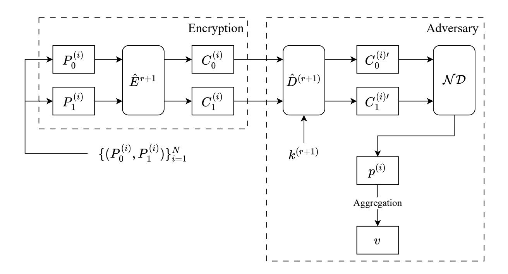
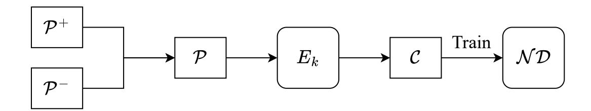
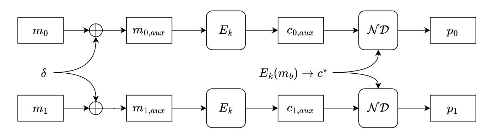

{0}------------------------------------------------

# NeuralCPA: A Deep Learning Perspective on Chosen-Plaintext Attacks

Xuanya Zhu1,2 , Liqun Chen3 , Yangguang Tian3 , Gaofei Wu4⋆ , Xiatian Zhu1,2⋆

 Centre for Vision, Speech and Signal Processing (CVSSP), University of Surrey Surrey Institute for People-Centred AI (PAI), University of Surrey Computer Science Research Centre, University of Surrey School of Cyber Engineering, Xidian University

Abstract. A Chosen-Plaintext Attack (CPA) is a cryptographic analysis game for encryption, where an adversary queries an encryption oracle with plaintexts and observes the mapping to their ciphertexts. At an arbitrary time, it provides two challenge plaintexts but receives only one ciphertext, and finally guesses which of the two challenge plaintexts has been encrypted. Neural distinguishers, as a powerful representative of Artificial Intelligence (AI) methods, have been recently used in cryptographic analysis methods. However, they cannot directly be applied to perform CPA due to different input requirements and objectives. This work aims to address this gap. We provide the first rigorous and systematic formulation of CPA from a deep learning perspective. Specifically, we introduce NeuralCPA, a novel deep neural network-based method designed for the evaluation of block cipher CPA security as an initial effort for AI-based CPA analysis. We empirically validate its effectiveness across a diverse range of block ciphers, including Simon, Speck, Lea, Hight, Xtea, Tea, Present, Aes, and Katan[5](#page-0-0) . Our experimental results confirm that NeuralCPA consistently achieves significant distinguishing advantages in round-reduced settings. Notably, our attack success rate ranges from 51% to 76.4%.

Keywords: Chosen-Plaintext Attack · Block Ciphers · Differential Cryptanalysis · Deep Learning · Neural Distinguisher

# 1 Introduction

An Chosen-Plaintext Attack (CPA) is defined as an interactive challenge game between an adversary and a challenger[6](#page-0-1) . In this game, the adversary with access to an encryption oracle selects two messages of equal length. One of them is encrypted by the challenger, and the resulting ciphertext is returned to the adversary. An encryption scheme is considered to be CPA secure if the adversary

⋆ Corresponding authors.

5 We also analyze the stream cipher ChaCha, restricting our study to its internal permutation rather than the complete keystream construction.

6 CPA is also referred to as Indistinguishability under CPA (IND–CPA).

{1}------------------------------------------------

has only a negligible advantage over a random guess to tell which of the two messages was encrypted [\[7\]](#page-25-0). CPA security captures the notion of semantic security and is widely regarded as a fundamental baseline requirement for modern encryption schemes.

In recent years, deep learning has emerged as a powerful tool in cryptanalysis. As a representative instantiation, in 2019, Gohr [\[21\]](#page-25-1) showed that deep neural networks (namely neural differential distinguishers) can distinguish a ciphertext of the round-reduced block cipher Speck from random data with a significant advantage. This indistinguishability is further used to analyze a key recovery attack, i.e., a trained neural network is employed to rank or filter candidate round keys for reducing the key search space. There are many follow-up works [\[20\]](#page-25-2) using different neural networks and targeting different block cipher schemes. However, all of them still focus on key recovery.

The aforementioned neural distinguishers cannot be directly applied to CPA analysis because of differences in learning objectives and the resulting neural network inputs and outputs. Specifically, a neural distinguisher takes as input a pair of ciphertexts and outputs the probability of their corresponding plaintexts satisfying a preset input difference. Its design does not fit directly the CPA analysis where the input consists of a pair of challenge plaintexts and a challenge ciphertext, with the objective of identifying which plaintext is selected to generate the ciphertext as the output.

To the best of our knowledge, CPA analysis has not been explicitly targeted or evaluated from an AI perspective. The research question is how to formulate an AI perspective on CPA that provides significant distinguishing advantages to a CPA adversary.

This work aims to answer this question. As an initial step, we introduce NeuralCPA, a novel deep learning-based method that formulates a neural network interacting with CPA. It operates by first training a neural distinguisher that can recognize if a pair of ciphertexts is from a pair of plaintexts with a preset input difference. To enable this distinguisher to perform CPA analysis, we further construct two auxiliary plaintexts using the preset input difference on top of the two challenge plaintexts. Each auxiliary plaintext is sent to the oracle for encryption, obtaining an auxiliary ciphertext. The two auxiliary ciphertexts then pair with the challenge ciphertext, respectively. The distinguisher further evaluates each ciphertext pair, yielding a respective score. We compare the two scores and make a decision based on the higher-scored pair.

Contributions. Our main contributions can be summarized as follows:

- 1. Deep learning formulation of CPA. We introduce the first rigorous and systematic formulation of CPA from a deep learning perspective. Our solution interprets the CPA game as a supervised learning task with binary classification and score comparison, enabling a neural network to be applied to empirical CPA analysis for an encryption scheme.
- 2. Analysis for block ciphers. As an initial effort toward AI-based CPA analysis, we introduce NeuralCPA, a novel deep neural network-based method

{2}------------------------------------------------

for evaluating block cipher CPA security. We conduct a comprehensive study applying different neural networks to round-reduced variants of a diverse set of block ciphers, including SIMON, SPECK, LEA, HIGHT, XTEA, TEA, PRESENT, AES, and KATAN. We also analyze a stream cipher, CHACHA.

3. Extensions for multi-instance settings. We demonstrate that Neural-CPA can be extended to multi-instance conditions and theoretically prove that even with a marginal advantage, NeuralCPA can be amplified to an ideal solution according to Hoeffding's Inequality.

A consolidated summary of the best results, in terms of the maximum number of evaluated rounds, is provided in Table 1. Note that across all evaluated settings, NeuralCPA empirically validates that neural networks can consistently achieve significant distinguishing advantages across neural architectures and cipher families. Notably, over 106 independent CPA experiments, our attack success rate ranges from 51% to 76.4%. In particular, we achieved a 76.5% success rate on 10-round Hight and a 72.5% success rate on 10-round Speck128/256. We provide a comprehensive and modular codebase7 that enables fully reproducible experiments and facilitates future research on related fields.

Table 1: Performance of NeuralCPA at the maximum evaluated rounds for each cipher. Full Rounds indicates the total number of rounds in the full cipher specification. CPA Success Rate is computed over 106 independent CPA experiments. For all experiments, the training set and CPA challenge messages are mutually disjoint. The non-trivial distinguishing advantages across different ciphers empirically demonstrate the effectiveness of our approach.

| Cipher                         | Full Rounds | Rounds | CPA Success Rate |
|--------------------------------|-------------|--------|------------------|
| $\overline{\text{Simon}32/64}$ | 32          | 11     | 0.531            |
| Simon64/128                    | 44          | 13     | 0.514            |
| SIMON128/256                   | 68          | 19     | 0.513            |
| Speck32/64                     | 22          | 8      | 0.530            |
| $\mathrm{Speck}64/128$         | 27          | 8      | 0.610            |
| $S_{PECK128/256}$              | 34          | 10     | 0.725            |
| Lea-128                        | 24          | 11     | 0.534            |
| Hight                          | 32          | 10     | 0.764            |
| Xtea                           | 64          | 5      | 0.606            |
| Tea                            | 64          | 5      | 0.641            |
| Present-80                     | 31          | 9      | 0.510            |
| Aes-128                        | 10          | 3      | 0.524            |
| Katan32                        | 254         | 65     | 0.511            |
| СнаСна20                       | 20          | 3      | 0.693            |

&lt;sup>7 https://github.com/12xyzz/NeuroDiffTorch

{3}------------------------------------------------

#### 4 Zhu et al.

Organization. The remainder of this work is organized as follows. Section [2](#page-3-0) reviews related work, including classical discussions of CPA security, as well as recent studies on neural differential distinguishers, with an emphasis on their role in key recovery workflows. Section [3](#page-6-0) presents the necessary preliminaries, including the formal definition of the CPA experiment, background on differential cryptanalysis, neural differential distinguishers, and the ciphers analyzed in our study. Section [4](#page-10-0) introduces the proposed NeuralCPA method and details its construction, design rationale, and evaluation procedure. Section [5](#page-16-0) reports experimental results across multiple block ciphers and provides further discussions. Finally, Section [6](#page-24-0) concludes the paper and outlines future directions.

# 2 Related Work

In this section, we review prior research relevant to evaluating block cipher security under chosen-plaintext settings. We first discuss the traditional formalization of CPA security and its implications for block ciphers. Next, we summarize classical cryptanalytic techniques, highlighting their key-dependent assumptions. We then describe neural distinguishers, their original integration into key recovery attacks, and subsequent advances.

# 2.1 Traditional Formulation of Chosen-Plaintext Attacks

A Chosen-Plaintext Attack (CPA) is a cryptographic game for encryption schemes. In this game, an encryption scheme is considered secure if no adversary, with adaptive access to an encryption oracle, can distinguish which of two equal-length plaintexts corresponds to a given ciphertext [\[7,](#page-25-0)[28\]](#page-26-0).

In public-key cryptography, CPA security is typically established by reductions to standard computational hardness assumptions, such as the Decisional Diffie–Hellman problem [\[13\]](#page-25-3) or the Learning With Errors problem [\[36\]](#page-26-1). In contrast, a block cipher is defined as a family of keyed permutations [\[33\]](#page-26-2) and does not admit a reduction to such assumptions. As a result, classical reduction-based arguments do not directly yield security guarantees for block ciphers. The analysis of block cipher security has historically centered on two main directions. The first is the study of pseudorandomness and structural weaknesses, including differential cryptanalysis [\[10\]](#page-25-4), linear cryptanalysis [\[32\]](#page-26-3), integral cryptanalysis [\[29\]](#page-26-4), and analyses of pseudorandom permutations and pseudorandom functions [\[31\]](#page-26-5). The second is the study of encryption modes such as CTR and CBC [\[4\]](#page-24-1), which introduce randomness on top of block ciphers to achieve CPA security.

Overall, these studies have emphasized either the security of the block cipher permutation family or that of the associated encryption modes. Our work provides a new perspective targeting CPA directly. In particular, we focus on training neural networks to act as distinguishers, enabling a systematic empirical assessment of block cipher CPA security.

{4}------------------------------------------------

#### 2.2 Classical Cryptanalysis on Block Ciphers

In block ciphers, classical cryptanalysis primarily focuses on identifying keydependent statistical or structural weaknesses that can be exploited under chosenplaintext or known-plaintext settings. Differential cryptanalysis [10] exploits the non-uniform propagation of input differences through the cipher, using highprobability differential characteristics to construct key-dependent statistical tests. Linear cryptanalysis [32] identifies linear or affine approximations of the cipher's components that hold with probability different from  $\frac{1}{2}$ , creating a statistical bias that can be exploited to recover partial key bits. Integral cryptanalysis [29] exploits sets of plaintexts where some bits vary over all values while others are fixed. By tracking how these balanced sets propagate through the cipher, attackers can detect key-dependent biases in intermediate states and recover partial key bits under chosen-plaintext settings. Algebraic attacks [15,16] represent the encryption round function as Boolean polynomials over a binary field, allowing chosen plaintext-ciphertext constraints to be formulated as systems of equations that, when solved or simplified, reveal partial round keys. Meet-in-the-middle and biclique attacks [1,11] reduce key-search complexity by identifying partial evaluations of the round function that collide under specific key partitions, enabling more efficient key recovery. While classical methods derive adversarial advantage from key-dependent correlations, our approach focuses on distinguishing statistical patterns in ciphertext distributions, independent of any key information.

#### 2.3 Neural Distinguishers and Key Recovery Paradigm

Deep learning techniques have recently been applied to various cryptanalytic tasks, exploring how neural networks can assist classical attacks. Among these efforts, neural distinguishers, first introduced by Gohr [21], have been shown to successfully distinguish ciphertext pairs that satisfy a fixed input difference in round-reduced SPECK32/64, and have subsequently been integrated into a key recovery attack. Concretely, a set of plaintext pairs  $\{(P_0^{(i)}, P_1^{(i)})\}_{i=1}^N$ , each satisfying the preset input difference  $\delta$ 

$$P_0^{(i)} \oplus P_1^{(i)} = \delta.$$

The (r+1)-round encryption function  $\hat{E}^{r+1}(\cdot)$  denotes the process that iteratively applies the cipher through r+1 rounds, with each round incorporating its corresponding round key. Using this notation, the encryption of a plaintext pair  $(P_0^{(i)}, P_1^{(i)})$  produces the corresponding ciphertext pair  $(C_0^{(i)}, C_1^{(i)})$ 

$$C_0^{(i)} = \hat{E}^{r+1}(P_0^{(i)}), \quad C_1^{(i)} = \hat{E}^{r+1}(P_1^{(i)}).$$

The key recovery process proceeds iteratively as follows:

First, in the initial iteration, the adversary randomly samples n initial guesses for the (r+1)-th round key.

{5}------------------------------------------------

Second, for one of the guessed round keys  $k^{(r+1)}$ , the one-round decryption is applied to all ciphertext pairs. To distinguish this from the encryption operation, the function  $\hat{D}^{(r+1)}(\cdot)$  denotes the decryption of the (r+1)-th round only

$$C_0^{(i)\prime} = \hat{D}^{(r+1)}(C_0^{(i)}), \quad C_1^{(i)\prime} = \hat{D}^{(r+1)}(C_1^{(i)}), \quad i = 1, \dots, N,$$

yielding r-round ciphertexts  $(C_0^{(i)\prime}, C_1^{(i)\prime})$ . Each r-th round ciphertext pair is fed into the trained neural distinguisher, producing a score  $p^{(i)} \in [0,1]$  that reflects how likely the ciphertext pair conforms to the differential distribution induced by the preset input difference  $\delta$ 

$$p^{(i)} = \mathcal{N}\mathcal{D}(C_0^{(i)\prime}, C_1^{(i)\prime}).$$

The scores over all plaintext pairs are aggregated using a log-odds transformation to obtain a final score v for the candidate key  $k^{(r+1)}$ 

$$v = \sum_{i=1}^{N} \log_2 \frac{p^{(i)}}{1 - p^{(i)}}.$$

Figure 1 illustrates the evaluation workflow for a single guessed round key  $k^{(r+1)}$  within one iteration.

Fig. 1: Workflow for evaluating a guessed (r+1)-th round key  $k^{(r+1)}$ . Plaintext pairs  $\{(P_0^{(i)}, P_1^{(i)})\}_{i=1}^N$  are encrypted through  $\hat{E}^{r+1}$  to obtain (r+1)-round ciphertext pairs  $(C_0^{(i)}, C_1^{(i)})$ . Applying one-round decryption  $\hat{D}^{(r+1)}$  with the guessed key  $k^{(r+1)}$  yields r-round ciphertexts  $(C_0^{(i)'}, C_1^{(i)'})$ . These ciphertext pairs are fed into the trained neural distinguisher  $\mathcal{ND}$  to produce scores  $p^{(i)}$ , which are then aggregated through a log-odds transformation to obtain the final score v as the evaluation of the round key  $k^{(r+1)}$ .

{6}------------------------------------------------

Third, since n round keys were initially sampled, there are n aggregated scores v. These scores are ranked using a heuristic procedure, and the ranked key candidates are perturbed to produce the n next-round guesses of the (r+ 1) th round key, for example, by applying random bitwise XOR operations.

Fourth, the above process is repeated for m iterations. At the conclusion of all iterations, a total of mn scores are collected and ranked, producing an ordered set of round-key guesses. The top-ranked key is then selected as the most likely candidate and used in subsequent verification steps.

Building on Gohr's work [\[21\]](#page-25-1), later works have evolved in two primary directions [\[20\]](#page-25-2). The first strengthens the distinguisher itself. Some works propose novel network architectures for a range of block ciphers that enable attacks on more rounds [\[3](#page-24-3)[,40,](#page-26-6)[8\]](#page-25-8), or modify the input representation, for example, by using XOR differences or truncated ciphertexts, to accelerate training while maintaining comparable distinguishing performance [\[39,](#page-26-7)[2\]](#page-24-4). The second focuses on improving the performance of key recovery. Some works reduce computational demands by applying knowledge distillation to construct smaller yet efficient neural networks, or improve the key recovery using techniques such as generalized neutral bits [\[3,](#page-24-3)[40\]](#page-26-6). Beyond these approaches, some works further formalize neural-aided cryptanalysis within explicit statistical frameworks, enabling theoretical complexity estimation and removing reliance on neutral bits [\[14\]](#page-25-9).

These methods implicitly assume that breaking a cipher requires recovering key material. While it is true that key recovery guarantees a complete CPA break, an adversary can also gain a significant advantage in CPA without ever recovering the key, forming a concrete practical threat. Motivated by this observation, our work departs from the conventional key recovery paradigm and empirically evaluates CPA security using a key-agnostic approach.

# 3 Preliminaries

In this section, we introduce the basic terminology and concepts used throughout the paper. We first review the formal CPA experiment. We then recall the basics of differential cryptanalysis and neural differential distinguishers. Finally, we provide an overview of the block ciphers analyzed in our experiments.

# 3.1 Chosen-Plaintext Attacks Experiment

A Chosen-Plaintext Attack (CPA) is a cryptographic game for encryption schemes, which can be formally defined by an interactive experiment between a challenger and an adversary, as presented in Algorithm [1](#page-7-0) [\[6\]](#page-25-10). In the experiment, λ denotes the security parameter, which determines the key length, key space, message size, and the computational resources available to any adversary. The adversary A selects two messages (m0, m1) and submits them to the challenger C, who randomly chooses one message to encrypt. An encryption scheme Π = (G, E, D) is considered CPA secure if no adversary can distinguish which of two chosen

{7}------------------------------------------------

messages is encrypted. The adversary's advantage is quantified as

$$\operatorname{Exp}_{\Pi,\mathcal{A}}^{\operatorname{CPA}}(\lambda) = \left| \Pr[b' = b] - \frac{1}{2} \right|, \tag{1}$$

where b is the hidden bit indicating which message was encrypted, and b ′ is the adversary's guess. An encryption scheme is considered secure if the advantage is negligible, meaning that b is computationally indistinguishable from a random guess for any adversary.

#### Algorithm 1 The CPA Experiment ExpCPA Π,A (λ)

Require: Encryption scheme Π, message space M, key space K.

Ensure: Experiment outcome (1 if the adversary A wins, 0 otherwise).

### Initialization:

The challenger C samples a secret key k \$←− K and gives A access to the encryption oracle Ek(·).

#### Pre-Challenge Phase:

A may adaptively issue any encryption-oracle query q ∈ M and receives the corresponding ciphertext Ek(q).

### Challenge Phase:

A outputs two challenge messages (m0, m1).

C samples a random bit b \$←− {0, 1}.

C returns the challenge ciphertext c ⋆ ← Ek(mb).

### Post-Challenge Phase:

A may continue to issue encryption-oracle queries, distinct from the challenge messages m0 and m1.

# Guess Phase:

A outputs a guess b ′ ∈ {0, 1}.

# Outcome:

Return 1 if b ′ = b, otherwise 0.

### 3.2 Differential Cryptanalysis

Differential cryptanalysis [\[10\]](#page-25-4) is a foundational cryptanalytic technique that analyzes how differences in plaintexts (input differences) propagate as differences in ciphertexts through an encryption function. For a b-bit function F : {0, 1} b → {0, 1} b , let δ ∈ {0, 1} b denote an input difference and ∆ ∈ {0, 1} b denote the corresponding output difference. The central notion in this analysis is the differential transition (δ → ∆), whose probability is defined as the fraction of all inputs x for which F(x) ⊕ F(x ⊕ δ) = ∆, formally defined as

$$P(\delta \to \Delta) = \frac{\left| \left\{ x \in \{0, 1\}^b : F(x) \oplus F(x \oplus \delta) = \Delta \right\} \right|}{2^b}.$$

In the context of a block cipher Ek iterated over multiple rounds, the adversary aims to identify a high-probability differential transition (δ, ∆). These differential 

{8}------------------------------------------------

probabilities induce detectable statistical deviations in the ciphertext distribution when the input difference δ is fixed, forming the theoretical foundation for techniques such as the neural distinguisher, discussed in the next subsection.

# 3.3 Neural Differential Distinguishers

Building upon the principles of differential cryptanalysis, Gohr's seminal work [\[21\]](#page-25-1) introduced a neural network constructed based on differential characteristics, namely the neural differential distinguisher. In this paper, we denote it by N D. The neural distinguishers aim to learn statistical deviations in ciphertext distributions induced by a preset input difference δ. Formally, consider a block cipher with b-bit plaintexts. Given a pair of plaintexts (P0, P1) ∈ {0, 1} b × {0, 1} b and their corresponding ciphertexts (C0, C1), a neural distinguisher is trained to predict whether the input difference equals a target δ:

$$\mathcal{ND}(C_0, C_1) \approx \begin{cases} 1, & \text{if } P_0 \oplus P_1 = \delta, \\ 0, & \text{otherwise.} \end{cases}$$

For training, plaintext pairs are divided into positive and negative pairs. The positive pairs consist of plaintext pairs that satisfy the fixed input difference, denoted by

$$\mathcal{P}^+ = \{ (P_0, P_1) \mid P_0 \oplus P_1 = \delta \}.$$

The negative pairs consist of plaintext pairs that do not satisfy the preset input difference and are otherwise random, denoted by

$$\mathcal{P}^{-} = \{ (P_0, P_1) \mid P_0 \oplus P_1 \neq \delta \}.$$

To prevent the neural network from becoming biased toward a majority class, we construct a balanced plaintext collection P by sampling an equal number of pairs from P + and P − [\[23\]](#page-25-11).

$$\mathcal{P} = \mathcal{P}^+ \cup \mathcal{P}^-, \quad |\mathcal{P}^+| = |\mathcal{P}^-|.$$

As illustrated in Figure [2,](#page-9-0) all plaintext pairs in P are encrypted using the block cipher Ek to obtain the corresponding ciphertext pairs, which together form the training set

$$\mathcal{C} = \{(C_0, C_1) \mid (C_0, C_1) = (E_k(P_0), E_k(P_1)), (P_0, P_1) \in \mathcal{P}\}.$$

All ciphertext pairs in C are subsequently used to train the neural distinguisher. In this setting, the neural network is modeled as a parametric function fθ : {0, 1} 2b → [0, 1], where θ denotes a collection of real-valued parameters. The input to the network is a ciphertext pair (C0, C1), and the output fθ(C0, C1) is interpreted as the estimated probability that this ciphertext pair originates from a plaintext pair satisfying the preset input difference δ.

{9}------------------------------------------------

Fig. 2: Training pipeline of the neural distinguisher. Positive pairs (satisfying the preset input difference) P + and negative pairs (not satisfying) P − are first selected and merged to form the plaintext pair set P. All pairs in P are then encrypted by a block cipher Ek to obtain the ciphertext pair set C for training.

Conceptual Background. Training the neural distinguisher is formulated as a binary classification problem. Each ciphertext pair in the training set C is associated with a label y ∈ {0, 1}, indicating whether it corresponds to a positive or a negative plaintext pair. The loss function ℓ(fθ(C0, C1), y) quantifies the numerical difference between the network's predicted output and the true label y. A larger value indicates a greater deviation from the true label, while a smaller value indicates a closer match. The training objective is to minimize this loss function, so that the neural network predicts as accurately as possible for all ciphertext pairs over the training set.

Starting from an initial parameter setting, the optimizer iteratively updates θ using gradient-based algorithms [\[37\]](#page-26-8), with the direct objective of reducing the training loss and thereby enabling the model to learn an effective classifier. In practice, this optimization is performed iteratively on the training data. One complete pass over the entire training set is called an epoch, and training typically consists of multiple epochs to allow the parameters to converge to a stable solution. To make training computationally feasible for large datasets, the training set is divided into small subsets, referred to as batches, which reduces memory usage and computational load.

Once trained, the neural distinguisher can be applied to any ciphertext pair, outputting a score that indicates how strongly their corresponding plaintext pairs satisfy the preset input difference δ. This approach allows neural distinguishers to capture potential statistical patterns in ciphertext distributions that may be difficult to model analytically.

Natively Mismatch with CPA. However, the neural distinguisher cannot be directly applied to perform CPA because the two tasks differ in essential ways. First, their semantics are mismatched: the neural distinguisher determines whether the plaintext pair corresponding to a ciphertext pair satisfies a preset input difference, whereas a CPA challenge requires determining which of two candidate plaintexts corresponds to a given ciphertext. Second, their inputs are incompatible: the neural distinguisher operates on a ciphertext pair, while CPA operates on an individual challenge ciphertext and two candidate challenge plaintexts. Third, their outputs are not directly usable: the binary decision of the neural

{10}------------------------------------------------

distinguisher does not correspond to a valid distinguishing advantage for any particular plaintext in the CPA setting.

#### 3.4 Analyzed Ciphers

We consider a diverse set of symmetric ciphers covering different design paradigms, including Addition–Rotation–XOR (ARX)-based and Substitution–Permutation Network (SPN)-based constructions. Among ARX-based block ciphers, Simon and Speck [5] are two lightweight designs that are widely adopted as benchmarks in cryptanalytic studies. SIMON adopts a Feistel network with simple bitwise Boolean operations while Speck employs an ARX-based round function. Lea [26] is a word-oriented ARX-based cipher designed for efficient software implementation and shares a similar round-function composition with Speck. Hight [27] is a lightweight block cipher based on a generalized Feistel network with byte-oriented ARX round functions. XTEA [34] is a Feistel-based ARX cipher that modifies the original Tea [38] design by improving its key schedule and eliminating structural weaknesses such as equivalent keys. For SPN-based designs, Present [12] is a lightweight block cipher optimized for constrained hardware environments, and Aes [17], the Advanced Encryption Standard, employs byte-oriented substitution layers and linear diffusion transformations and represents a widely deployed modern SPN construction. Katan [18] is a lightweight, hardware-oriented cipher with bit-level Boolean round functions and serial round operations that does not strictly belong to either ARX or SPN paradigms. We also include Chacha [9], an ARX-based stream cipher, and evaluate only its internal permutation rather than the complete keystream construction.

# 4 Neural CPA: Neural Chosen-Plaintext Attack

In this section, we first detail our NeuralCPA framework. We then show that any non-negligible advantage of NeuralCPA implies a violation of CPA security. Finally, we theoretically analyze advantage amplification in the multi-instance setting. Throughout, we denote the neural distinguisher by  $\mathcal{ND}$ .

#### 4.1 The NeuralCPA Framework

To bridge the gap between traditional neural distinguishers and the CPA experiment, we propose NeuralCPA, a generic deep learning-based method for the CPA analysis. NeuralCPA operates in three distinct phases: (i) Training the Neural Distinguisher, performed in the pre-challenge phase, and (ii) Constructing the Auxiliary Pairs Using Input Difference, conducted in the post-challenge phase, and (iii) Choosing the Plaintext by Comparing Auxiliary Scores, conducted in the guess phase. The formal definition of the NeuralCPA is provided in Algorithm 2.

{11}------------------------------------------------

#### Algorithm 2 The NeuralCPA Experiment ExpNeuralCPA Π,A (λ)

Require: Encryption scheme Π, message space M, key space K.

Ensure: Experiment outcome (1 if the adversary A wins, 0 otherwise).

# Initialization:

The challenger C samples a secret key k \$←− K and gives A access to the encryption oracle Ek(·). A chooses a training data size n and a specific input difference δ.

# Pre-Challenge Phase:

A samples n/2 plaintext pairs satisfying the preset input difference δ.

A samples n/2 plaintext pairs not satisfying the preset input difference δ.

A queries the encryption oracle on all n pairs and obtains their ciphertexts.

A trains a N D using these n ciphertext pairs.

# Challenge Phase:

A outputs two challenge messages (m0, m1).

C samples a random bit b \$←− {0, 1}.

C returns the challenge ciphertext c ⋆ ← Ek(mb).

# Post-Challenge Phase:

A derives modified messages m0,aux and m1,aux by adding the fixed difference δ. m0,aux = m0 ⊕ δ, m1,aux = m1 ⊕ δ

A queries the encryption oracle and obtains the ciphertexts c0,aux and c1,aux.

N D outputs confidence scores p0 ← N D(c ⋆ , c0,aux) and p1 ← N D(c ⋆ , c1,aux).

# Guess Phase:

A outputs b ′ = 0 if p0 > p1, otherwise b ′ = 1.

#### Outcome:

Return 1 if b ′ = b, otherwise 0.

- (i) Training the Neural Distinguisher. The foundation of NeuralCPA is a deep learning-based binary classifier trained to identify the presence of a specific differential characteristic. In the initialization stage, the adversary selects the training dataset size n and the preset input difference δ. In the pre-challenge phase, the adversary queries the encryption oracle Ek to collect a dataset of n ciphertext pairs, consisting of n/2 positive pairs and n/2 negative pairs:
  - Positive Samples: Ciphertext pairs (C0, C1) derived from plaintext pairs (P0, P1) such that P0 ⊕ P1 = δ.
  - Negative Samples: Ciphertext pairs (C0, Crand) where Crand = Ek(Prand) and Prand is a randomly chosen plaintext satisfying P0 ⊕ Prand ̸= δ.

Using these n ciphertext pairs, the adversary trains a neural distinguisher, which learns high-order statistical dependencies and non-linear features inherent in the cipher's round functions. Once trained, the neural distinguisher can be applied to any ciphertext pair (C0,any, C1,any) and outputs a confidence score representing the estimated probability that the corresponding plaintext pair satisfies the preset input difference δ

$$\Pr(P_{0,any} \oplus P_{1,any} = \delta \mid C_{0,any}, C_{1,any}),$$

where (P0,any, P1,any) denotes the plaintexts corresponding to (C0,any, C1,any).

{12}------------------------------------------------

(ii) Constructing the Auxiliary Pairs Using Input Difference. In the post-challenge phase, given a challenge ciphertext  $c^*$  corresponding to one of the challenge plaintexts  $m_b \in \{m_0, m_1\}$ , the adversary constructs auxiliary pairs specifically designed to leverage the trained neural distinguisher for the CPA evaluation, as illustrated in Figure 3.

Fig. 3: Illustration of the post-challenge phase in NeuralCPA. The Auxiliary Probing step constructs auxiliary plaintexts  $m_{0,aux}$  and  $m_{1,aux}$  and obtains the corresponding ciphertexts  $c_{0,aux}$  and  $c_{1,aux}$ . Comparative Inference evaluates the two candidate pairs  $(c^*, c_{0,aux})$  and  $(c^*, c_{1,aux})$ , producing a confidence score for each. The final decision in the guess phase is made by comparing these scores.

- 1. **Auxiliary Probing:** The adversary constructs two auxiliary plaintexts,  $m_{0,aux} = m_0 \oplus \delta$  and  $m_{1,aux} = m_1 \oplus \delta$ . These are queried to the oracle to obtain the corresponding auxiliary ciphertexts  $c_{0,aux}$  and  $c_{1,aux}$ . Note that the adversary is not allowed to query the encryption oracle on the original challenge messages  $m_0$  and  $m_1$  in the post-challenge phase, which equivalently requires that the challenge message must satisfy  $m_0 \oplus m_1 \neq \delta$ .
- 2. Comparative Inference: The trained neural distinguisher then evaluates two candidate pairs  $(c^*, c_{0,aux})$  and  $(c^*, c_{1,aux})$  and outputs confidence scores  $p_0$  and  $p_1$ , respectively.
- (iii) Choosing the Plaintext by Comparing Auxiliary Scores. A key innovation of NeuralCPA is its departure from reliance on a high absolute confidence score output by the neural distinguisher. The adversary compares the two scores rather than checking if a score exceeds a fixed threshold and selects the plaintext candidate associated with the higher probability, producing the final guess b'

$$b' = \begin{cases} 0, & p_0 > p_1, \\ 1, & \text{otherwise.} \end{cases}$$

If  $p_0 > p_1$ , it indicates a higher probablity that the plaintext  $m_{0,aux}$  underlying  $c_{0,aux}$  satisfies the preset input difference  $\delta$  with the challenge plaintext  $m_b$  underlying the challenge ciphertext  $c^*$ . This further implies that  $m_b$  is more

{13}------------------------------------------------

consistent with  $m_0$  than  $m_1$ .

$$p_0 > p_1 \implies \Pr[m_{0,aux} \oplus m_b = \delta] > \Pr[m_{1,aux} \oplus m_b = \delta]$$
  
$$\implies \Pr[m_0 = m_b] > \Pr[m_1 = m_b]$$

In this case, the adversary outputs b' = 0 when  $p_0 > p_1$ , and b' = 1 otherwise. The case of  $p_0 = p_1$  is negligible, as obtaining identical outputs from the neural distinguisher for two distinct inputs requires them to belong to a measure-zero subset of the high-dimensional input space [19].

This design significantly enhances the robustness of the evaluation. By transforming the cryptanalytic problem into a relative comparison task, NeuralCPA can achieve a higher success rate even when the underlying neural distinguisher exhibits only a marginal advantage over random guessing.

#### 4.2 Formal Proof

In what follows, we formally show that a NeuralCPA adversary  $\mathcal{A}_{\text{NeuralCPA}}$ , with non-negligible distinguishing advantage  $\varepsilon$  in the NeuralCPA experiment, can be transformed into a CPA adversary  $\mathcal{A}_{\text{CPA}}$  with non-negligible advantage.

By Equation 1, the CPA advantage of the adversary  $\mathcal{A}_{\text{CPA}}$  is formulated as

$$\begin{aligned} \operatorname{Adv}_{II}^{\operatorname{CPA}}(\mathcal{A}_{\operatorname{CPA}}) &= \left| \Pr[b' = b] - \frac{1}{2} \right| \\ &= \frac{1}{2} \Pr[b' = 1 \mid b = 1] + \frac{1}{2} \Pr[b' = 0 \mid b = 0] - \frac{1}{2} \\ &= \frac{1}{2} \Pr[b' = 1 \mid b = 1] + \frac{1}{2} \left( 1 - \Pr[b' = 1 \mid b = 0] \right) - \frac{1}{2} \\ &= \frac{1}{2} \left| \Pr[b' = 1 \mid b = 1] - \Pr[b' = 1 \mid b = 0] \right|. \end{aligned}$$

To simplify notation, we use  $\mathcal{O}_b$  to denote the induced distribution of the challenge ciphertext produced by the oracle under bit b. When b=1, the challenger for  $\mathcal{A}_{\text{NeuralCPA}}$  invokes the real encryption oracle, yielding the distribution  $\mathcal{O}_1$ , and when b=0, it samples ciphertexts from the uniformly random distribution  $\mathcal{R}$ , denoted as  $\mathcal{O}_0$ . The final guess b' of the adversary  $\mathcal{A}_{\text{NeuralCPA}}$  is obtained by applying a neural distinguisher to samples drawn from  $\mathcal{O}_b$ . We denote the corresponding acceptance probabilities by

$$\Pr[b' = 1 \mid \mathcal{O}_1] = p_1, \quad \Pr[b' = 1 \mid \mathcal{O}_0] = p_0.$$

Accordingly, the advantage of the NeuralCPA is the following

$$\operatorname{Adv}_{II}^{\operatorname{NeuralCPA}}(\mathcal{A}_{\operatorname{NeuralCPA}}) = |p_1 - p_0|.$$

Theorem 1 (NeuralCPA Insecurity Implies CPA Insecurity). Assume there exists a NeuralCPA adversary  $\mathcal{A}_{\text{NeuralCPA}}$ , which internally invokes a neural distinguisher and achieves a non-negligible distinguishing advantage  $\varepsilon$  in the

{14}------------------------------------------------

NeuralCPA experiment. Then one can construct a CPA adversary  $\mathcal{A}_{CPA}$ , which incorporates  $\mathcal{A}_{NeuralCPA}$  as a black-box subroutine, whose advantage satisfies

$$\operatorname{Adv}_{II}^{\operatorname{CPA}}(\mathcal{A}_{\operatorname{CPA}}) = \frac{\varepsilon}{2}.$$

Consequently, any non-negligible NeuralCPA advantage can be transformed into a non-negligible CPA advantage. NeuralCPA insecurity implies CPA insecurity.

Proof. We construct an CPA adversary  $\mathcal{A}_{\text{CPA}}$  that uses the NeuralCPA adversary  $\mathcal{A}_{\text{NeuralCPA}}$  as a black-box subroutine.  $\mathcal{A}_{\text{CPA}}$  first selects any two plaintexts  $(m_0, m_1)$  and submits them to the CPA challenger. The challenger then randomly selects a bit  $b \in \{0, 1\}$  and returns the challenge ciphertext  $c^* = E_k(m_b)$  to  $\mathcal{A}_{\text{CPA}}$ . Upon receiving the challenge ciphertext  $c^*$ ,  $\mathcal{A}_{\text{CPA}}$  forwards it to  $\mathcal{A}_{\text{NeuralCPA}}$ , which then invokes its neural distinguisher to output a guess  $b' \in \{0, 1\}$ . Finally,  $\mathcal{A}_{\text{CPA}}$  outputs b' as its guess for the challenge bit b.

By definition of the CPA experiment, when b=1 the challenge ciphertext  $c^*$  is distributed according to  $\mathcal{O}_1$ , and when b=0 it is distributed according to  $\mathcal{O}_0$ . Since  $\mathcal{A}_{\text{CPA}}$  forwards the CPA challenge ciphertext  $c^*$  to  $\mathcal{A}_{\text{NeuralCPA}}$ , the input distribution that  $\mathcal{A}_{\text{NeuralCPA}}$  observes is the same as in the NeuralCPA experiment. Consequently, the output distribution of  $\mathcal{A}_{\text{NeuralCPA}}$  remains

$$\Pr[b' = 1 \mid b = 1] = \Pr[b' = 1 \mid \mathcal{O}_1] = p_1,$$
  
 $\Pr[b' = 1 \mid b = 0] = \Pr[b' = 1 \mid \mathcal{O}_0] = p_0.$ 

The CPA advantage of  $\mathcal{A}_{\text{CPA}}$  is therefore

$$\operatorname{Adv}_{II}^{\operatorname{CPA}}(\mathcal{A}_{\operatorname{CPA}}) = \left| \operatorname{Pr}[b' = b] - \frac{1}{2} \right|$$
$$= \left| \frac{1}{2} (p_1 + (1 - p_0)) - \frac{1}{2} \right|$$
$$= \frac{\varepsilon}{2}.$$

Hence, any non-negligible Neural CPA distinguishing advantage  $\varepsilon$  yields a non-negligible CPA advantage, completing the reduction.

#### 4.3 Amplification of Marginal Advantages

We further consider a multi-instance variant of the standard NeuralCPA experiment, analogous to the multi-instance extensions of CPA [25], and show that even a marginal single-instance distinguishing advantage can be efficiently amplified through repeated and independent executions of the neural distinguisher.

Construction of Adversary. We construct an adversary  $A_{(t)}$  that amplifies a marginal distinguishing advantage by leveraging t independently trained neural distinguishers. In the initialization phase,  $A_{(t)}$  selects t distinct input differences

{15}------------------------------------------------

{δ1, . . . , δt}. In the pre-challenge phase, A(t) trains t independent neural distinguishers {N D1, . . . , N Dt}, where each distinguisher N Di is trained using input difference δi . In the challenge phase, A(t) submits t plaintext pairs

$$(m_{0,i}, m_{1,i}), \quad i = 1, \dots, t.$$

The challenger samples a random bit b ∈ {0, 1} and returns the challenge ciphertexts, which are all generated using the same challenge bit b.

$$c_i^{\star} = E_k(m_{b,i}), \quad i = 1, \dots, t.$$

In the post-challenge phase, for each index i ∈ {1, . . . , t}, A(t) constructs two candidate ciphertext pairs, denoted x0,i and x1,i.

$$x_{0,i} = (c_i^{\star}, E_k(m_{0,i} \oplus \delta_i)), \quad x_{1,i} = (c_i^{\star}, E_k(m_{1,i} \oplus \delta_i)).$$

It then sends both pairs to the corresponding distinguisher, obtaining two scores

$$p_{0,i} = \mathcal{N}\mathcal{D}_i(x_{0,i}), \quad p_{1,i} = \mathcal{N}\mathcal{D}_i(x_{1,i}).$$

In the guess phase, A(t) outputs a local binary decision

$$b_i' = \begin{cases} 0, & p_{0,i} > p_{1,i}, \\ 1, & \text{otherwise.} \end{cases}$$

After obtaining local guesses {b ′ 1 , . . . , b′ t}, A(t) outputs the final guess by majority voting

$$b' = \begin{cases} 1, & \sum_{i=1}^{t} \mathbb{I}[b'_i = 1] > \frac{t}{2}, \\ 0, & \text{otherwise,} \end{cases}$$

where I[b ′ i = 1] is the indicator function, equal to 1 if b ′ i = 1 and 0 otherwise.

Single-Instance Advantage Assumption. We assume that there exists a nonnegligible value ε > 0 such that, for every i ∈ {1, . . . , t}, the local decision b ′ i produced by i-th distinguisher satisfies

$$\Pr[b_i' = b] \ge \frac{1}{2} + \varepsilon. \tag{2}$$

This assumption states that each neural distinguisher achieves a uniform lower bound on its distinguishing advantage.

Conditioned on the challenge bit b, the random variables b ′ 1 , . . . , b′ t are assumed to be mutually independent. This independence arises because each distinguisher is trained on an independently sampled dataset for a distinct input difference δi . Since no randomness is shared across instances other than the common challenge bit b, the decisions are mutually independent.

{16}------------------------------------------------

Advantage Amplification. We analyze the advantage of the adversary A(t) constructed above. Define the random variable

$$X_i = \mathbb{I}[b_i' = b], \quad i = 1, \dots, t,$$

indicating whether each local decision is correct. Conditioned on b, the Xi is independent and satisfies

$$\mathbb{E}[X_i] = \Pr[b_i' = b] \ge \frac{1}{2} + \varepsilon.$$

Let

$$\bar{X} = \frac{1}{t} \sum_{i=1}^{t} X_i, \quad Y = \sum_{i=1}^{t} X_i = t\bar{X}.$$

By construction, the adversary outputs b ′ = b if and only if Y > t 2 .

Lemma 1 (Hoeffding's Inequality [\[24\]](#page-25-19)). Let X1, . . . , Xt be independent random variables such that Xi ∈ [0, 1] for all i. Let

$$\bar{X} = \frac{1}{t} \sum_{i=1}^{t} X_i.$$

Then for any γ > 0,

$$\Pr[\bar{X} - \mathbb{E}[\bar{X}] \le -\gamma] \le \exp(-2t\gamma^2).$$

Noting that X1, . . . , Xt are mutually independent and each Xi ∈ [0, 1], we apply Hoeffding's inequality with γ = ε to obtain

$$\Pr[\bar{X} \le 1/2] = \Pr[\bar{X} - \mathbb{E}[\bar{X}] \le \frac{1}{2} - \mathbb{E}[\bar{X}]]$$
$$\le \Pr[\bar{X} - \mathbb{E}[\bar{X}] \le -\varepsilon]$$
$$\le \exp(-2t\varepsilon^2),$$

or equivalently

$$\Pr[b'=b] = \Pr[Y > \frac{t}{2}] \ge 1 - \exp(-2t\varepsilon^2).$$

This shows that by aggregating t independent neural distinguishers, even a marginal single-instance advantage ε can be amplified to achieve a higher overall success probability as t increases.

# 5 Experiments

We conduct an extensive experimental evaluation of NeuralCPA, organized as follows. Section [5.1](#page-17-0) describes the global experimental setup, including data generation procedures and the training configurations of the neural distinguishers. Section [5.2](#page-18-0) reports the main empirical results of NeuralCPA across a diverse range of block ciphers, demonstrating its effectiveness and robustness to achieve significant CPA distinguishing advantages. Section [5.3](#page-23-0) analyzes how the singleinstance advantage varies across different input differences, providing the empirical basis for the multi-instance setting.

{17}------------------------------------------------

#### 5.1 Experimental Setup

This subsection details the settings used throughout the experiment, including data generation, training of the neural distinguisher, and evaluation protocols. Unless otherwise stated, all experiments in this work follow the settings described here. All code and configurations are publicly released.

Data Generation. To train a neural distinguisher, we generate labeled plaintext pairs following a unified procedure that is independent of the underlying block cipher and the number of rounds. As described in Section 3.3, ciphertext pairs are generated from plaintext pairs that satisfy a fixed input difference  $\delta$  (positive samples) or do not satisfy  $\delta$  (negative samples). We use the input differences  $\delta$  listed in Table 2 to generate positive samples.

Table 2: Input differences  $\delta$  used for positive samples in each evaluated cipher. For clarity, the values are expressed with leading zeros omitted. For example, a 16-bit difference 0x40 is equivalent to 0x0040 in full-length representation.

| Cipher                         | Input Difference                       |
|--------------------------------|----------------------------------------|
| $\overline{\text{Simon}32/64}$ | 0x400                                  |
| Simon64/128                    | 0x400                                  |
| Simon128/256                   | 0x400                                  |
| $S_{\rm PECK}32/64$            | 0x400000                               |
| $\mathrm{Speck}64/128$         | 0x8080000000                           |
| $\mathrm{Speck}128/256$        | 00000000000000000000000000000000000000 |
| Lea-128                        | 0x80000000800000008004000080           |
| Ніднт                          | 0x80000000000                          |
| Xtea                           | 0x400000000000000                      |
| $\operatorname{Tea}$           | 0x400000000000000                      |
| Present-80                     | 0xd000000                              |
| Aes-128                        | 0x100000000000000000000000000000000000 |
| Katan32                        | 0x400000                               |
| СнаСна20                       | 0x8000                                 |

From an implementation perspective, we consider two commonly used strategies for generating negative samples. Let  $P_0$  be a plaintext randomly sampled from the plaintext space. The first strategy [21] constructs a negative sample as  $(E_k(P_0), E_k(P_{rand}))$ , where  $P_{rand}$  is independently and uniformly sampled from the plaintext space with  $P_{rand} \neq P_0$ . The second strategy [8] constructs negative samples as  $(E_k(P_0), R)$ , where R is a randomly generated bit sequence of the same length as the ciphertext. In the ciphertext space, these two methods are statistically equivalent because each random string R corresponds to a valid ciphertext that could be produced from some plaintext. In our experiments, we adopt the first strategy to generate negative samples, as it strictly preserves

{18}------------------------------------------------

the CPA context by maintaining a direct correspondence with real plaintexts, whereas the second strategy imposes no semantic constraint, despite requiring fewer plaintext samples.

For each experiment, we generate 1 × 107 plaintext pairs, including both positive and negative samples in a balanced 1 : 1 ratio. Among these, 90% are used for training and the remaining 10% for validation. These plaintext pairs are then encrypted under a secret key, which is randomly sampled and unknown to the experimenter, faithfully modeling the oracle.

Training Procedures. We consider two procedures for training the neural distinguisher. The first procedure is standard training, where a model is trained from scratch on ciphertext pairs corresponding to a target number of rounds Nt. The second procedure is fine-tuning, where a model pre-trained on an independent dataset corresponding to a different, lower-round instance Np, but sharing the same input difference δ, is further trained on ciphertext pairs for the target round Nt. In our context, this corresponds to targeting an additional NeuralCPA setting for the lower round Np, where the secret key may differ from Nt, and using the resulting neural distinguisher as initialization for training on Nt-round ciphertexts. For example, one can treat 8-round Speck32/64 as the target, and train a model directly on its ciphertext pairs. Alternatively, one can pre-train a model on an independent instance targeting 7-round Speck32/64 and then fine-tune it on the 8-round ciphertext pairs. This approach allows the neural distinguisher to leverage knowledge learned from earlier rounds to potentially enhance performance on the target round.

Implementation Details. We re-implemented two representative open-source models in PyTorch [\[35\]](#page-26-12). The first model, raised by Gohr, which we refer to as Gohr-Net [\[21\]](#page-25-1), is designed to exploit the semantic structure of block ciphers by processing ciphertexts in a nibble-slice format that respects the minimal meaningful units of the cipher. The second model, DBitNet [\[8\]](#page-25-8), treats the entire ciphertext as a single concatenated bit sequence, making it a more general-purpose architecture. For both models, the training objective is defined by the binary cross-entropy loss with logits [\[22\]](#page-25-20). All models are optimized using the AdamW optimizer [\[30\]](#page-26-13). The learning rate is set to 2×10−3 for GohrNet and 1×10−3 for DBitNet. Weight decay is set to 10−5 , and the default β values are [0.9, 0.999]. For GohrNet, we use a learning rate scheduler that restarts every 10 epochs, with the minimum learning rate set to 10−4 and the maximum learning rate returning to the initial value. Training is performed on an NVIDIA RTX A5000 GPU. Standard training runs for 40 epochs, whereas fine-tuning is performed for 20 epochs. In all cases, each mini-batch contains 5, 000 samples, and evaluation is performed every 5 epochs.

# 5.2 Evaluation of NeuralCPA

In this subsection, we empirically evaluate the effectiveness of NeuralCPA in distinguishing advantages, measured by the success rate of the CPA experiment. 

{19}------------------------------------------------

We begin with a detailed study on round-reduced SIMON and SPECK [5]. Building on this primary experiment, we then extend our evaluation to a broader collection of block ciphers with varying structures and parameters, demonstrating that NeuralCPA remains effective across diverse ciphers. Finally, we summarize our results in a unified comparison, highlighting consistent empirical evidence of non-negligible distinguishing advantages, estimated as the success rate over a large number of independent CPA experiments, revealed by NeuralCPA across multiple ciphers and round settings.

Evaluation Protocol. We report the best classification accuracy (Acc.) of the trained neural distinguisher and the corresponding CPA success rate (CPA~SR.) of NeuralCPA for each cipher and round setting. Accuracy measures the ability of a trained neural distinguisher to determine whether a ciphertext pair originates from plaintext pairs with the preset input difference. It is evaluated on  $1 \times 10^6$  ciphertext pairs that are disjoint from the training set. To assess whether classification performance translates into an advantage in the CPA setting, we conduct  $1 \times 10^6$  independent CPA experiments for each trained neural distinguisher. In each experiment, the adversary interacts with the challenger and outputs a single-bit guess. The success rate is defined as the fraction of experiments in which the adversary correctly identifies the challenge, thereby approximating the empirical success probability of a single CPA instance, which directly determines the corresponding advantage according to Equation 1. All challenge plaintext pairs are strictly disjoint from the training data, ensuring compliance with the CPA experiment protocol.

Standard Training Results. We begin our evaluation using the standard training procedure, where each neural distinguisher is trained directly on ciphertext pairs corresponding to the target round. Our initial experiments focus on round-reduced variants of the Simon and Speck families, which have been extensively studied in prior work and thus serve as natural benchmarks for our method. The corresponding results are summarized in Table 3. We then extend our evaluation to the broader set of block ciphers described in Section 3.4, including Lea-128, Hight, Xtea, Tea, Present-80, Aes-128, Katan32, and the stream cipher ChaCha20. All results are reported in Table 4.

Across all evaluated primitives and round settings, NeuralCPA consistently reveals empirical distinguishing advantages under the CPA setting. While absolute performance varies with the cipher structure and number of rounds, the method generalizes beyond the initial benchmark ciphers and remains effective across diverse cipher designs and structures.

Fine-Tuning Results. We further explore the effectiveness of NeuralCPA when fine-tuning across the evaluated block ciphers at their respective maximal-round settings. Note that fine-tuning does not succeed across all ciphers, and the observed influence differs between the two architectures. In this study, we report only cases where fine-tuning led to a measurable advantage in additional rounds,

{20}------------------------------------------------

Table 3: Empirical results of NeuralCPA on the Simon and Speck families. For each cipher and round setting, we report the best performance among neural distinguisher architectures (Arch.), together with its classification accuracy (Acc.) and the corresponding CPA success rate (CPA SR.). The highest CPA success rate in each configuration is highlighted . The results support the effectiveness of the proposed approach.

| Cipher       | Rounds | Arch.    | Acc.  | CPA SR. |
|--------------|--------|----------|-------|---------|
| Simon32/64   | 8      | GohrNet  | 0.772 | 0.866   |
|              |        | DBitNet  | 0.981 | 0.996   |
|              | 9      | GohrNet  | 0.639 | 0.693   |
|              |        | DBitNet  | 0.792 | 0.884   |
|              | 10     | GohrNet  | 0.552 | 0.569   |
|              |        | DBitNet2 | 0.533 | 0.536   |
| Simon64/128  | 10     | GohrNet  | 0.780 | 0.873   |
|              |        | DBitNet3 | 0.852 | 0.937   |
|              | 11     | GohrNet  | 0.620 | 0.668   |
|              |        | DBitNet1 | 0.640 | 0.693   |
|              | 12     | GohrNet1 | 0.520 | 0.530   |
|              |        | DBitNet1 | 0.537 | 0.552   |
| Simon128/256 | 15     | GohrNet  | 0.807 | 0.885   |
|              |        | DBitNet2 | 0.819 | 0.896   |
|              | 16     | GohrNet  | 0.690 | 0.753   |
|              |        | DBitNet1 | 0.714 | 0.779   |
|              | 17     | GohrNet1 | 0.580 | 0.612   |
|              |        | DBitNet1 | 0.603 | 0.640   |
|              | 18     | GohrNet  | 0.527 | 0.538   |
|              |        | DBitNet1 | 0.538 | 0.552   |
| Speck32/64   | 5      | GohrNet  | 0.986 | 0.999   |
|              |        | DBitNet  | 0.981 | 0.998   |
|              | 6      | GohrNet  | 0.895 | 0.954   |
|              |        | DBitNet  | 0.884 | 0.944   |
|              | 7      | GohrNet  | 0.677 | 0.733   |
|              |        | DBitNet  | 0.660 | 0.710   |
| Speck64/128  | 6      | GohrNet  | 0.983 | 0.997   |
|              |        | DBitNet  | 0.906 | 0.966   |
|              | 7      | GohrNet  | 0.821 | 0.901   |
|              |        | DBitNet2 | 0.627 | 0.677   |
| Speck128/256 | 9      | GohrNet  | 0.943 | 0.981   |
|              |        | DBitNet  | 0.919 | 0.967   |

1 Best result obtained at 10 training epochs.

2 Best result obtained at 20 training epochs.

3 Best result obtained at 30 training epochs.

{21}------------------------------------------------

Table 4: Empirical results of NeuralCPA on additional block ciphers beyond the Speck and Simon benchmarks. For each cipher and round setting, we report the best performance among different neural distinguisher architectures (Arch.) in terms of classification accuracy (Acc.) and NeuralCPA success rate (CPA SR.). Across these extended ciphers, the results confirm the robustness of our approach beyond the benchmark ciphers.

| Cipher     | Rounds | Arch.                | Acc.           | CPA SR.        |
|------------|--------|----------------------|----------------|----------------|
| Lea-128    | 10     | GohrNet DBitNet1  | 0.656 0.630 | 0.694 0.666 |
|            | 11     | GohrNet1 DBitNet1 | 0.522 0.524 | 0.532 0.534 |
| Hight      | 10     | GohrNet DBitNet   | 0.751 0.751 | 0.764 0.764 |
| Xtea       | 4      | GohrNet DBitNet   | 0.986 0.992 | 0.989 0.993 |
|            | 5      | GohrNet1 DBitNet1 | 0.522 0.524 | 0.532 0.534 |
| Tea        | 4      | GohrNet DBitNet   | 0.987 0.975 | 0.991 0.984 |
| Present-80 | 6      | GohrNet DBitNet   | 0.852 0.973 | 0.924 0.997 |
|            | 7      | GohrNet DBitNet   | 0.684 0.819 | 0.744 0.891 |
|            | 8      | GohrNet DBitNet   | 0.543 0.609 | 0.561 0.687 |
| Aes-128    | 2      | GohrNet DBitNet   | 1.000 1.000 | 1.000 1.000 |
|            | 3      | GohrNet DBitNet   | 0.505 0.518 | 0.509 0.524 |
| Katan32    | 50     | GohrNet1 DBitNet  | 0.579 0.887 | 0.610 0.935 |
|            | 55     | GohrNet DBitNet   | – 0.561     | – 0.587     |
|            | 60     | GohrNet DBitNet   | – 0.504     | – 0.504     |
| Chacha20   | 3      | GohrNet1 DBitNet  | 0.640 0.636 | 0.693 0.687 |

1 Best result obtained at 10 training epochs.

– indicates that the model could not be trained for this setting or achieved no distinguishing advantage.

{22}------------------------------------------------

as summarized in Table [5.](#page-22-0) For Katan32, where the concept of a round corresponds to small state changes, we define a fine-tuning iteration as 5 rounds. Specifically, we performed fine-tuning from 50 to 55 rounds, then from the 55 round model to 60 rounds, and finally from 60 to 65 rounds. Our method can successfully identify the correct plaintext even with a marginal model advantage over random guessing by an underlying trained neural distinguisher.

Table 5: Fine-tuning results of NeuralCPA on selected block ciphers at maximal round settings. Only successful cases are reported, illustrating that NeuralCPA can effectively leverage fine-tuning to extend the attack to higher rounds starting from a pre-trained neural distinguisher. For Katan32, a fine-tuning iteration corresponds to 5 rounds due to the minimal state changes per round.

| Cipher       | Rounds         | Arch.                          | Acc.                    | CPA SR.                 |
|--------------|----------------|--------------------------------|-------------------------|-------------------------|
| Simon32/64   | 10 11       | DBitNet1 DBitNet1           | 0.570 0.522          | 0.598 0.531          |
| Simon64/128  | 13             | DBitNet1                       | 0.509                   | 0.514                   |
| Simon128/256 | 19             | DBitNet1                       | 0.510                   | 0.514                   |
| Speck32/64   | 8              | GohrNet1 DBitNet1           | 0.527 0.519          | 0.530 0.525          |
| Speck64/128  | 8              | GohrNet2                       | 0.586                   | 0.610                   |
| Speck128/256 | 10             | GohrNet2 DBitNet1           | 0.678 0.676          | 0.725 0.724          |
| Xtea         | 5              | GohrNet1 DBitNet            | 0.515 0.575          | 0.514 0.606          |
| Tea          | 5              | GohrNet1 DBitNet            | 0.558 0.602          | 0.550 0.641          |
| Present-80   | 9              | DBitNet1                       | 0.506                   | 0.510                   |
| Katan32      | 55 60 65 | DBitNet DBitNet DBitNet1 | 0.648 0.558 0.506 | 0.705 0.579 0.511 |

1 Best result obtained at 5 training epochs.

Discussion. The experimental results across all settings demonstrate that NeuralCPA effectively leverages the distinguishing capability of neural distinguishers, achieving significant advantages in CPA evaluations. Since the CPA decision is based on a comparison between two scores rather than on the absolute output of the neural distinguisher, our method can successfully identify the correct

2 Best result obtained at 10 training epochs.

{23}------------------------------------------------

plaintext even with a marginal model advantage, significantly lowering the performance threshold required and yielding a higher success rate. We note a few special cases, such as the 5-round fine-tuning on Xtea and Tea using GohrNet, where the observed CPA success rate is slightly lower than the underlying neural distinguisher accuracy. While the fine-tuning still improves the model's distinguishing capability and allows for additional rounds, these cases suggest that the effectiveness of fine-tuning can depend on the specific model architecture and cipher properties, reflecting inherent variability across settings.

# 5.3 Basis for Advantage Amplification

In this subsection, we empirically investigate the prerequisites for multi-instance advantage amplification. For a neural distinguisher trained on the input difference δ, its single-instance advantage ε is defined as in Equation [2,](#page-15-0) representing the probability of correctly guessing the challenge bit above a random guess

$$\varepsilon := \Pr[b' = b] - \frac{1}{2}.$$

We select three distinct input differences and train the corresponding neural distinguishers for the 7-round Speck32/64. The classification accuracy (Acc.) and CPA success rate (CPA SR.) are measured following the procedure described in Section [5.2.](#page-18-0) The CPA success rate corresponds to the observed frequency of correctly guessing the challenge bit across repeated trials. This frequency serves as an empirical estimate of the single CPA success probability Pr[b ′ = b], from which the single-instance advantage can be obtained by subtracting the random guessing probability 1 2 . The results are summarized in Table [6.](#page-23-1)

Table 6: Results under three distinct input differences in 7-round Speck32/64.

| Input Difference | Arch.   | Acc.  | CPA SR. |
|------------------|---------|-------|---------|
| 0x200000         | GohrNet | 0.606 | 0.644   |
| 0x400000         | GohrNet | 0.702 | 0.769   |
| 0x600000         | GohrNet | 0.618 | 0.654   |

Only carefully selected input differences yield positive single-instance advantages, while other differences typically provide negligible or no advantage. Although the complete space of input differences cannot be exhaustively explored, identifying even a small set of effective differences is sufficient to establish a practical lower bound on single-instance advantages. This bound guarantees that advantage amplification holds, providing empirical support for the applicability of our multi-instance amplification approach discussed in Section [4.3.](#page-14-0)

In the case considered here, by taking the smallest single-instance advantage among the three instances, εmin = 0.144, and applying Hoeffding's inequality, 

{24}------------------------------------------------

a conservative lower bound on the success probability of the aggregated adversary can be established. The actual success probability can be much higher. For the three selected input differences with single-instance advantages 0.144, 0.269, and 0.154, a precise computation using the corresponding binomial probabilities gives an amplified CPA success rate of approximately 77.2%. This demonstrates that while the Hoeffding bound provides a theoretical guarantee, the empirical amplification in this example is stronger, reflecting the practical effectiveness of multi-instance advantage aggregation.

# 6 Conclusion

We present NeuralCPA, the first deep learning-based method that leverages neural networks for systematic CPA analysis. By bridging the gap between neural networks and CPA experiments, NeuralCPA enables rigorous empirical assessment across diverse block ciphers, validating both its effectiveness and robustness. Moreover, it lays the foundation for future learning-based CPA analyses.

Despite its strengths, NeuralCPA also highlights several avenues at the intersection of AI and cryptography. First, traditional cryptanalytic metrics and learning-based evaluation metrics currently lack a unified framework for comparison. For example, there is no standard method to translate computational or memory complexity into corresponding success probabilities, which makes direct comparisons between them difficult. Second, although deep learning has demonstrated remarkable performance in many domains, its effectiveness in highly complex cipher systems remains limited. For block ciphers, they are deliberately designed to make ciphertexts appear close to random, obscuring exploitable statistical patterns. As a result, neural networks that rely solely on the relation between plaintext-ciphertext pairs face inherent challenges in capturing increasingly subtle distributional signals as the number of rounds grows.

# References

- 1. Special feature exhaustive cryptanalysis of the nbs data encryption standard. Computer 10(6), 74–84 (2006)
- 2. Baksi, A.: Machine learning-assisted differential distinguishers for lightweight ciphers. In: Classical and Physical Security of Symmetric Key Cryptographic Algorithms, pp. 141–162. Springer (2022)
- 3. Bao, Z., Guo, J., Liu, M., Ma, L., Tu, Y.: Enhancing differential-neural cryptanalysis. In: International conference on the theory and application of cryptology and information security. pp. 318–347. Springer (2022)
- 4. Barker, E.B., Kelsey, J.M., et al.: Recommendation for random number generation using deterministic random bit generators (revised). US Department of Commerce, Technology Administration, National Institute of . . . (2007)
- 5. Beaulieu, R., Shors, D., Smith, J., Treatman-Clark, S., Weeks, B., Wingers, L.: The simon and speck lightweight block ciphers. In: Proceedings of the 52nd annual design automation conference. pp. 1–6 (2015)

{25}------------------------------------------------

- 6. Bellare, M., Desai, A., Pointcheval, D., Rogaway, P.: Relations among notions of security for public-key encryption schemes. In: Annual International Cryptology Conference. pp. 26–45. Springer (1998)
- 7. Bellare, M., Rogaway, P.: Introduction to modern cryptography. Ucsd Cse 207, 207 (2005)
- 8. Bellini, E., Gerault, D., Hambitzer, A., Rossi, M.: A cipher-agnostic neural training pipeline with automated finding of good input differences. IACR Transactions on Symmetric Cryptology 2023(3), 184–212 (2023)
- 9. Bernstein, D.J., et al.: Chacha, a variant of salsa20. In: Workshop record of SASC. vol. 8, pp. 3–5. Lausanne, Switzerland (2008)
- 10. Biham, E., Shamir, A.: Differential cryptanalysis of des-like cryptosystems. Journal of CRYPTOLOGY 4(1), 3–72 (1991)
- 11. Bogdanov, A., Khovratovich, D., Rechberger, C.: Biclique cryptanalysis of the full aes. In: International conference on the theory and application of cryptology and information security. pp. 344–371. Springer (2011)
- 12. Bogdanov, A., Knudsen, L.R., Leander, G., Paar, C., Poschmann, A., Robshaw, M.J., Seurin, Y., Vikkelsoe, C.: Present: An ultra-lightweight block cipher. In: International workshop on cryptographic hardware and embedded systems. pp. 450–466. Springer (2007)
- 13. Boneh, D.: The decision diffie-hellman problem. In: International algorithmic number theory symposium. pp. 48–63. Springer (1998)
- 14. Chen, Y., Shen, Y., Yu, H.: Neural-aided statistical attack for cryptanalysis. The Computer Journal 66(10), 2480–2498 (2023)
- 15. Courtois, N.T., Meier, W.: Algebraic attacks on stream ciphers with linear feedback. In: International Conference on the Theory and Applications of Cryptographic Techniques. pp. 345–359. Springer (2003)
- 16. Courtois, N.T., Pieprzyk, J.: Cryptanalysis of block ciphers with overdefined systems of equations. In: International conference on the theory and application of cryptology and information security. pp. 267–287. Springer (2002)
- 17. Daemen, J., Rijmen, V.: The design of Rijndael, vol. 2. Springer (2002)
- 18. De Canniere, C., Dunkelman, O., Knežević, M.: Katan and ktantan—a family of small and efficient hardware-oriented block ciphers. In: International Workshop on Cryptographic Hardware and Embedded Systems. pp. 272–288. Springer (2009)
- 19. Folland, G.B.: Real analysis: modern techniques and their applications. John Wiley & Sons (1999)
- 20. Gerault, D., Hambitzer, A., Huppert, M., Picek, S.: Sok: 6 years of neural differential cryptanalysis. Cryptology ePrint Archive (2024)
- 21. Gohr, A.: Improving attacks on round-reduced speck32/64 using deep learning. In: Annual International Cryptology Conference. pp. 150–179. Springer (2019)
- 22. Goodfellow, I., Bengio, Y., Courville, A., Bengio, Y.: Deep learning, vol. 1. MIT press Cambridge (2016)
- 23. He, H., Garcia, E.A.: Learning from imbalanced data. IEEE Transactions on knowledge and data engineering 21(9), 1263–1284 (2009)
- 24. Hoeffding, W.: Probability inequalities for sums of bounded random variables. Journal of the American statistical association 58(301), 13–30 (1963)
- 25. Hofheinz, D., Koch, J., Striecks, C.: Identity-based encryption with (almost) tight security in the multi-instance, multi-ciphertext setting. Journal of Cryptology 37(2), 12 (2024)
- 26. Hong, D., Lee, J.K., Kim, D.C., Kwon, D., Ryu, K.H., Lee, D.G.: Lea: A 128-bit block cipher for fast encryption on common processors. In: international workshop on information security applications. pp. 3–27. Springer (2013)

{26}------------------------------------------------

- 27. Hong, D., Sung, J., Hong, S., Lim, J., Lee, S., Koo, B.S., Lee, C., Chang, D., Lee, J., Jeong, K., et al.: Hight: A new block cipher suitable for low-resource device. In: International workshop on cryptographic hardware and embedded systems. pp. 46–59. Springer (2006)
- 28. Katz, J., Lindell, Y.: Introduction to modern cryptography: principles and protocols. Chapman and hall/CRC (2007)
- 29. Knudsen, L., Wagner, D.: Integral cryptanalysis. In: International Workshop on Fast Software Encryption. pp. 112–127. Springer (2002)
- 30. Loshchilov, I., Hutter, F.: Decoupled weight decay regularization. arXiv preprint arXiv:1711.05101 (2017)
- 31. Luby, M., Rackoff, C.: How to construct pseudorandom permutations from pseudorandom functions. SIAM Journal on Computing 17(2), 373–386 (1988)
- 32. Matsui, M.: Linear cryptanalysis method for des cipher. In: Workshop on the Theory and Application of of Cryptographic Techniques. pp. 386–397. Springer (1993)
- 33. Menezes, A.J., Vanstone, S.A., Oorschot, P.C.V.: Handbook of applied cryptography (1996)
- 34. Needham, R.M., Wheeler, D.J.: Tea extensions. Report (Cambridge University, Cambridge, UK, 1997) (1997)
- 35. Paszke, A., Gross, S., Massa, F., Lerer, A., Bradbury, J., Chanan, G., Killeen, T., Lin, Z., Gimelshein, N., Antiga, L., et al.: Pytorch: An imperative style, highperformance deep learning library. Advances in neural information processing systems 32 (2019)
- 36. Regev, O.: On lattices, learning with errors, random linear codes, and cryptography. Journal of the ACM (JACM) 56(6), 1–40 (2009)
- 37. Rumelhart, D.E., Hinton, G.E., Williams, R.J.: Learning representations by backpropagating errors. nature 323(6088), 533–536 (1986)
- 38. Wheeler, D.J., Needham, R.M.: Tea, a tiny encryption algorithm. In: International workshop on fast software encryption. pp. 363–366. Springer (1994)
- 39. Yadav, T., Kumar, M.: Differential-ml distinguisher: Machine learning based generic extension for differential cryptanalysis. In: International conference on cryptology and information security in latin america. pp. 191–212. Springer (2021)
- 40. Zhang, L., Wang, Z., et al.: Improving differential-neural cryptanalysis. Cryptology ePrint Archive (2022)