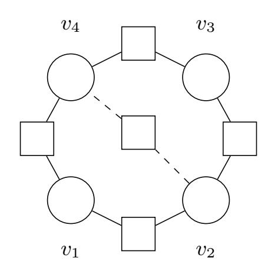
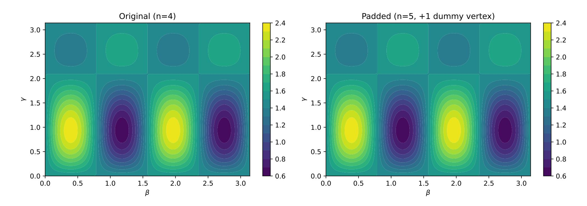
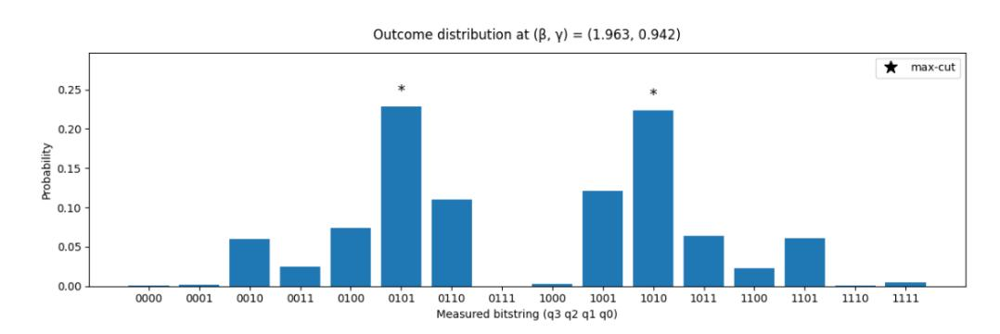
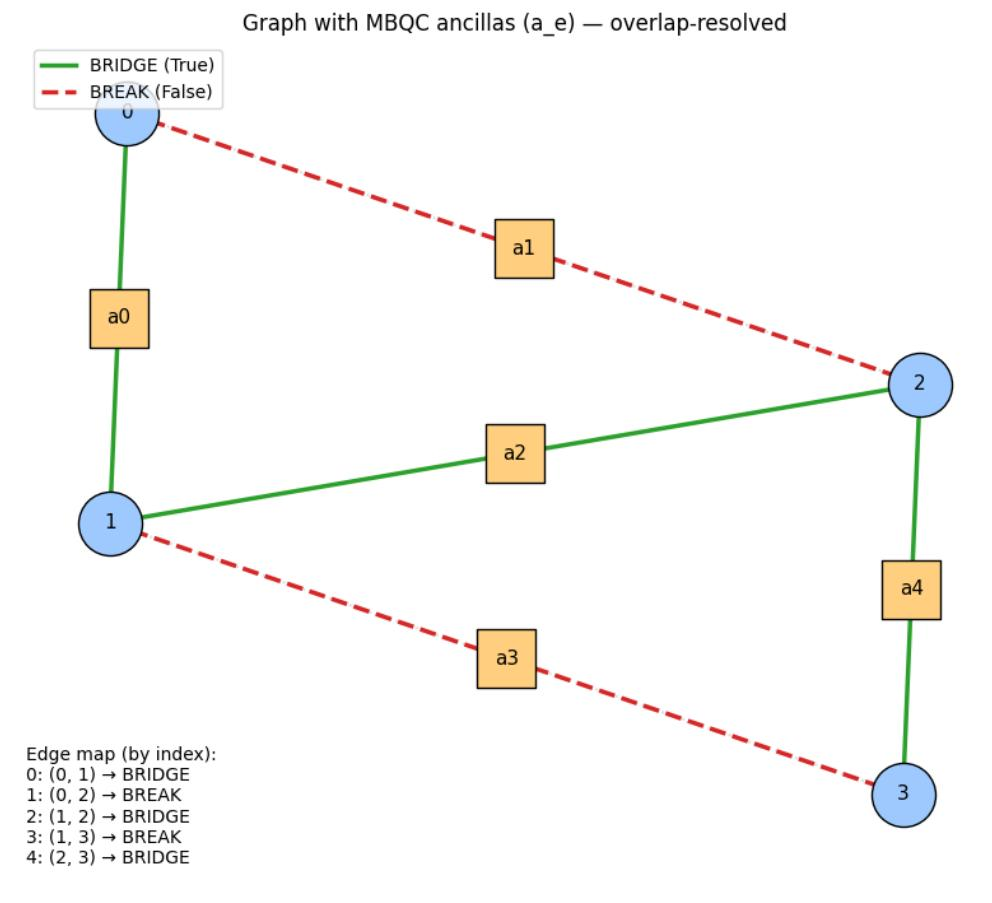
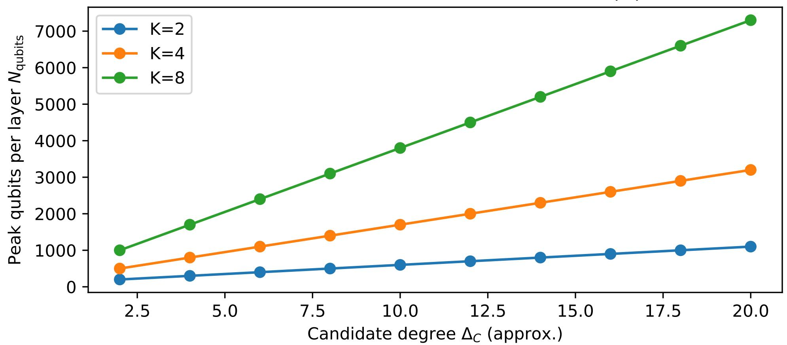
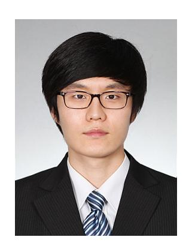

{0}------------------------------------------------

# Cost-Layer–Blind Hybrid QAOA for MAX K-CUT via Native MBQC and Selective Graph Masking

Doyoung Chung, Youngkyung Lee, and Juyoung Kim

*Abstract*—Delegating the Quantum Approximate Optimization Algorithm (QAOA) to an untrusted quantum cloud can leak sensitive instance structure: for graph objectives, the connectivity of the cost unitary directly reveals which edges are present. We propose a selectively blind protocol that hides only the instance-dependent cost Hamiltonian while keeping the mixer public and unmodified. Our approach combines (i) the native measurement-based implementation of the MAX K-CUT cost layer from Proietti *et al.* (MBQC-QAOA) and (ii) selective masking techniques inspired by Selectively Blind Quantum Computation (SBQC). The client pads the private graph into a public candidate supergraph by adding dummy edges/vertices. During the measurement-based cost evolution, the server prepares a fixed public MBQC resource over the candidate edges and streams the corresponding cost ancillas to the client for measurement (measurement-only delegation). By choosing either the intended interaction angle (real edge) or the identity angle (dummy edge) *locally*, the client privately prunes dummy edges while revealing no cost-layer angles to the server; one-time-padded correction bits preserve a leakage-free Pauli-frame interface to a standard gate-model mixer. We prove correctness and selective edge blindness, show that padding does not alter the QAOA optimization landscape (hence does not worsen barren plateaus), and provide proof-of-concept numerical validations for MAX-CUT (K = 2) (exact state-vector equivalence tests and shot-based circuit emulation with feed-forward), together with an asymptotic resource analysis for general MAX K-CUT and an explicit dummy-vertex invariance check under full-register mixers.

*Index Terms*—QAOA, MAX K-CUT, secure delegation, barren plateaus.

## I. INTRODUCTION

H YBRID quantum–classical variational algorithms are a leading route to near-term quantum advantage. Among them, the Quantum Approximate Optimization Algorithm (QAOA) alternates a problem-dependent *cost evolution* with a hardware-friendly *mixer evolution* and uses a classical optimizer to update the variational angles [1]. QAOA is particularly natural for graph partitioning tasks such as MAX-CUT and its generalization MAX K-CUT, which arise in clustering, community detection, resource allocation, and network design.

In Internet-of-Things (IoT) deployments, many analytics tasks can be formulated as graph partitioning over a sensitive connectivity graph: edges may represent physical proximity, traffic flows, shared cryptographic material, trust links, or radio-interference constraints. Outsourcing QAOA to a quantum cloud therefore risks leaking proprietary topology or privacy-relevant relationships even when the final partition is

D. Chung and Y. Lee contributed equally to this work (co-first authors). The authors are with Electronics and Telecommunications Research Institute (ETRI), Daejeon, Republic of Korea (e-mail: {thisisdoyoung, youngklee, ap424}@etri.re.kr). (Corresponding author: Doyoung Chung.)

not itself sensitive. Our selective approach targets this setting by hiding only the instance-dependent *cost layer* (i.e., which edges are present), while leaving the public mixer and overall QAOA structure unchanged.

In a delegated (cloud) execution, an untrusted server can inspect circuit structure, measurement bases, and classical side information. For graph objectives, the cost unitary is typically realized by a pattern of two-qubit interactions whose connectivity directly matches the private graph edges. Consequently, naive QAOA-on-cloud can reveal the instance even when the final cut assignment is not sensitive.

Blindness for delegated MBQC can be achieved in several ways. Universal Blind Quantum Computation (UBQC) hides measurement angles by one-time padding in a prepare-andsend model [2]. Alternatively, Morimae and Fujii propose a *measurement-only* blind quantum computation protocol in which the server prepares an entangled resource and streams qubits to the client, who performs the required single-qubit measurements without ever revealing the measurement angles [3]. This "client-measures" interface naturally supports *arbitrary continuous* measurement angles, which is attractive for variational algorithms such as QAOA where fine-grained phases are optimized.

In many QAOA deployments, however, full blindness is not strictly necessary: only the cost Hamiltonian depends on the private instance, whereas the mixer is typically fixed and can remain public. This motivates *selective* hiding: hide only the sensitive parts (here, the edge set in the cost Hamiltonian) while leaving the variational family itself unchanged. In this work, we adopt the measurement-only delegation interface of Morimae and Fujii for the cost-layer ancillas and combine it with SBQC-inspired padding/pruning so that the server cannot tell which candidate edges are active.

Two recent developments make this selective approach compelling. First, Proietti *et al.* proposed a native measurementbased quantum computation (MBQC) formulation of QAOA for MAX K-CUT, constructing compact MBQC patterns for the QAOA layers without a gate-by-gate translation [4]. Second, Poshtvan *et al.* introduced Selectively Blind Quantum Computation (SBQC), which formalizes how to hide one computation among a known family by masking only the differences between MBQC patterns using angle masking and graph merge-and-break techniques [5].

This paper combines these ideas to obtain a practical costlayer–blind QAOA protocol for MAX K-CUT. We execute the instance-dependent cost unitary using a native MBQC-QAOA fragment, but we keep the mixer in the gate model. The client publishes (or negotiates) a *candidate supergraph* that upper

{1}------------------------------------------------

bounds the private edge set and pads dummy edges/vertices accordingly. During the MBQC cost measurements, SBQCstyle masking makes every candidate edge appear identical to the server, while the client privately activates real edges and prunes dummy edges via an identity measurement setting. Because the MBQC cost fragment introduces only Pauli byproducts on the data register, the interface to a gate-based mixer can be handled by Pauli-frame tracking or by explicit conditional corrections.

Importantly, this padding-based obfuscation does not trade privacy for trainability. Although the server-visible register size grows from |V | to |VC | (and the candidate edge set from |E| to |EC |), dummy edges are implemented as the identity in the MBQC cost step and dummy vertices remain unentangled with the real subsystem. As a result, the logical evolution factorizes as Ureal(γ, β)⊗Udummy(β) and the objective on the true instance is *exactly* the same function of (γ, β) as in plain QAOA. Hence any optimizer—gradient-based or gradient-free (e.g., COBYLA)—sees the same landscape; padding does not introduce additional flattening beyond the baseline barrenplateau behavior of the underlying QAOA ansatz.

We assume the client is willing to reveal a coarse candidate supergraph (VC , EC ) as public metadata but wishes to hide which subgraph E ⊆ EC is realized and to preserve the original QAOA optimization landscape. We do not address verifiability; the focus is instance privacy.

#### *A. Contributions*

Our main contributions are:

- We propose *CLB-QAOA*, a cost-layer–blind hybrid QAOA protocol for delegated MAX K-CUT. The cost layer is implemented via the native MBQC-QAOA construction, while the mixer remains a standard gate-model operation.
- We introduce a selective graph-masking mechanism for the MBQC cost layer: the client pads the private instance into a public candidate supergraph and privately prunes dummy edges during the MBQC cost measurements using SBQC-inspired selective graph masking together with measurement-only client-side measurements, achieving information-theoretic *edge blindness* within the candidate set.
- We show that the MBQC cost layer interfaces cleanly with a gate-model mixer through Pauli-frame handling, and we provide correctness and selective-blindness arguments.
- We prove that padding and pruning preserve the QAOA optimization landscape (and hence do not aggravate barren plateaus): even if the server-visible graph is enlarged by dummy edges/vertices, the effective optimization problem on the true instance is unchanged (objective, gradients, and finite-difference variations with respect to (γ, β)). We then provide proof-of-concept numerical validations for MAX-CUT (K = 2), including an exact state-vector equivalence test between plain QAOA and the padded+pruned execution, a shot-based circuit emulation that includes classical feed-forward, and a dedicated check that dummy vertices remain harmless even when the mixer is applied to the full padded register.

• We complement the above with an asymptotic resource analysis for general MAX K-CUT, clarifying the privacy–overhead trade-off in terms of the candidate set size |EC |.

## II. PRELIMINARIES AND RELATED WORK

## *A. MAX* K*-CUT, QAOA layers, and threat model*

Let G = (V, E, w) be an undirected weighted graph, where V is the vertex set, E is the edge set, and each edge e = (u, v) carries a nonnegative weight we (we = 1 in the unweighted case). MAX K-CUT seeks a labeling c : V → {1, . . . , K} that maximizes the total weight of edges whose endpoints receive different labels:

$$\Delta_K(c) = \sum_{(u,v)\in E} w_{uv} \cdot \mathbf{1}[c(u) \neq c(v)]. \tag{1}$$

In a p-layer QAOA, one prepares an initial state |ψ0⟩ (typically |+⟩ ⊗n ) and alternates a cost unitary UC (γt) = exp(−iγtHC ) with a mixer unitary UM(βt) = exp(−iβtHM). A classical optimizer updates (γ, β) to maximize ⟨HC ⟩:

$$|\psi(\boldsymbol{\gamma},\boldsymbol{\beta})\rangle = \prod_{t=1}^{p} U_{M}(\beta_{t}) U_{C}(\gamma_{t}) |\psi_{0}\rangle.$$
 (2)

Threat model (selective blindness). In delegated execution, the server can inspect the cost-layer implementation. For graph objectives, the pattern of two-qubit interactions (or, in MBQC, the nontrivial measurement angles) reveals the edge set. We assume the client reveals a public candidate supergraph (VC , EC ) and algorithmic metadata (e.g., K and p), but wishes to hide which subgraph E ⊆ EC is realized (and optionally the weights/phases embedded in the cost layer).

## *B. Binary encoding for general* K *and the MBQC-QAOA cost Hamiltonian*

A common MAX K-CUT encoding uses m qubits per vertex to represent the color label in binary. Let K′ be the next power of two (K′ = 2m). Each vertex v is associated with an m-qubit register qv = (qv,1, . . . , qv,m), so the dataregister size is nd = m|V |:

$$m = \lceil \log_2 K \rceil, \quad K' = 2^m, \quad n_d = m|V|.$$
 (3)

In this representation, the MBQC-QAOA mapping of [4] expresses the edge contribution to the cost Hamiltonian as a sum of commuting Z-parity interactions. For the K′ -label case (i.e., when K is a power of two), a convenient target Hamiltonian is

$$H_t = \sum_{e=(u,v)\in E} w_e H_e, \tag{4}$$

with the per-edge term

$$H_e = \frac{2^m - 1}{2^m} I^{\otimes 2m} - \frac{1}{2^m} \sum_{\ell \in \{0,1\}^m \setminus \{0^m\}} Z_u^{(\ell)} \otimes Z_v^{(\ell)}.$$
 (5)

Here, ℓ = (ℓ1, . . . , ℓm) is an m-bit string and

$$Z_u^{(\ell)} := \bigotimes_{r=1}^m Z_{u,r}^{\ell_r}, \qquad Z^0 = I, \ Z^1 = Z.$$
 (6)

{2}------------------------------------------------

Thus each edge term decomposes into  $(2^m-1) = K'-1$  commuting parity interactions. This decomposition is what makes the native MBQC realization compact: each parity interaction can be implemented by one edge-ancilla measurement.

#### C. Native MBQC-QAOA cost gadgets and byproduct structure

Measurement-Based Quantum Computing (MBQC) executes a computation by preparing an entangled graph (cluster) state and then performing single-qubit measurements with classical feed-forward [7], [8]. Given a resource graph  $G = (V_G, E_G)$ , the corresponding graph state is prepared by initializing every qubit in  $|+\rangle$  and applying CZ on every edge in  $E_G$ :

$$|G\rangle = \left(\prod_{(u,v)\in E_G} \operatorname{CZ}_{u,v}\right) |+\rangle^{\otimes |V_G|}.$$
 (7)

Native MBQC-QAOA realizes each commuting Z-parity interaction by an *edge ancilla* connected to the relevant data qubits [4]. For a two-qubit interaction between data qubits i and j, one uses a single ancilla a: prepare a in  $|+\rangle$ , apply  $CZ_{i,a}$  and  $CZ_{j,a}$ , then measure a in a  $\phi$ -dependent basis  $\Pi_{\phi}$ :

$$\Pi_{\phi}: |\pm_{\phi}\rangle = \frac{|+\rangle \pm e^{i\phi}|-\rangle}{\sqrt{2}}.$$
(8)

Let  $b \in \{0, 1\}$  be the raw measurement outcome. The induced (unnormalized) operation on the data qubits is a diagonal Kraus operator  $K_b$ , which factors as

$$K_b \propto (Z_i Z_j)^b \cdot U_{\text{edge}}(\phi), \qquad U_{\text{edge}}(\phi) = \exp\left(-i\frac{\phi}{2}(I - Z_i Z_j)\right)$$
(9)

Equivalently,  $U_{\text{edge}}(\phi) = \text{diag}(1, e^{-i\phi}, e^{-i\phi}, 1)$ . After accounting for the byproduct correction  $(Z_iZ_j)^b$ , the logical effect is exactly  $U_{\text{edge}}(\phi)$ . Crucially, choosing  $\phi = 0$  yields  $U_{\rm edge}(0) = I$  while keeping the same measurement pattern. This identity setting enables *measurement-based pruning*: dummy edges can be present in a public candidate resource but removed by setting  $\phi = 0$ .

### D. Measurement-only blind MBQC (Morimae–Fujii) and SBQC merge-and-break

**Measurement-only** blind quantum computation (Morimae-Fujii). Morimae and Fujii proposed a blind MBQC delegation model in which the server prepares an entangled resource state and sends the qubits to the client for measurement [3]. The client only needs single-qubit measurement capability: by choosing the measurement bases locally, the client drives the MBQC computation while the server never learns the measurement angles. This "clientmeasures" interface is information-theoretically blind from the server's perspective (via the no-signaling principle) and, importantly for variational algorithms, it supports arbitrary continuous measurement angles without having to transmit angles over a classical channel. In particular, it avoids the coarse angle-grid that often appears in standard UBQC instantiations where the one-time pad is realized by sampling phases from a small discrete set (e.g., multiples of  $\pi/4$ ).

Selective blind quantum computation (SBQC). SBQC relaxes universal blindness to a *selective* notion: the client delegates one computation from a known family while hiding which one was chosen [5]. SBQC shows that masking only the differences between candidate MBQC patterns can reduce quantum communication. It uses (i) angle masking for nodes whose default angles differ and (ii) graph masking via mergeand-break, where a public merger graph contains the candidate structures and secret measurements "break" undesired connections.

**How we use these ideas.** Our protocol can be interpreted in SBQC terms: the public candidate supergraph  $G_C = (V_C, E_C)$ plays the role of a merger graph over all allowed instances, and each MBQC-QAOA cost ancilla already sits "between" the endpoint registers of a candidate interaction. Depending on the client's *private* choice of measurement basis, the same public gadget either implements a nontrivial phase (edge ON) or the identity (edge OFF). In contrast to UBQC-style prepare-and-send angle encryption, we realize this privacy using measurement-only *client-side measurements* of the cost ancillas, so the server never receives the cost-layer angles at all.

## E. Related work on privacy-preserving variational algorithms

There is growing interest in protecting variational algorithms executed on untrusted hardware. Approaches include circuit obfuscation (injecting random structure while preserving functionality) and dedicated privacy-preserving compila- $K_b \propto (Z_i Z_j)^b \cdot U_{\text{edge}}(\phi), \qquad U_{\text{edge}}(\phi) = \exp\left(-i\frac{\phi}{2}(I-Z_i Z_j)\right)$ tion. For example, Enigma proposes privacy-preserving execution of QAOA on untrusted quantum computers by hiding parts of the circuit structure [9], and other works study generic obfuscation of hybrid quantum–classical algorithms [10]. Such approaches can be attractive when the client has only classical capabilities, but they typically rely on computational assumptions or may alter circuit structure in ways that affect optimization landscapes.

In contrast, our focus is information-theoretic selective blindness in the MBQC setting: we do not modify the logical QAOA circuit family at all. The price is that the client must participate in the cost layer by performing single-qubit measurements on streamed cost ancillas (measurement-only delegation) [3]. SBQC also establishes general lower bounds: hiding as much as UBQC requires a superlogarithmic number of unknown parameters, motivating selective hiding when only part of the computation is sensitive [5]. CLB-QAOA fits this principle by masking only the cost-layer ancillas whose angles reveal the graph.

## III. PROPOSED PROTOCOL: COST-LAYER-BLIND HYBRID QAOA

### A. Public candidate supergraph and leakage profile

We consider a client–server delegated execution where the server owns a quantum device and the client wishes to solve a private MAX K-CUT instance. The instance is defined by a secret edge set E on a vertex set V (and possibly secret weights). To enable selective blindness, the client defines (or negotiates) a public candidate supergraph  $G_C = (V_C, E_C)$ 

{3}------------------------------------------------

such that the true graph G = (V, E) is a subgraph of  $G_C$ . The server learns  $V_C$  and  $E_C$ , along with public parameters such as K and depth p. The privacy goal is to hide which subset  $E \subseteq E_C$  is realized.

CLB-QAOA does not hide the number of candidate edges, the vertex count, or the fact that the cost layer is being executed. Instead, it guarantees that within the disclosed candidate set, all subgraphs are indistinguishable to the server. In practice,  $E_C$  can be chosen to reflect non-sensitive side information (e.g., bounded degree or locality constraints), balancing overhead and leakage.

**Leakage profile.** The following information is intentionally public:

- Candidate supergraph:  $V_C$  and  $E_C$ .
- Algorithmic metadata: K (or  $m = \lceil \log_2 K \rceil$ ), depth p, and the fact that the cost layer is implemented via a fixed MBQC pattern over  $E_C$ .
- *Mixer choice:* the gate-model mixer family and its angles  $\beta$  (unless the client also wishes to hide  $\beta$ , which is optional).

The following instance-dependent information is kept private:

- Edge activation: which subset  $E \subseteq E_C$  is realized (equivalently, which cost-ancilla angles are nontrivial).
- Edge weights/phases: the effective per-edge phases  $\gamma w_e$  embedded in the cost measurements.
- Dummy padding: any dummy vertices/edges used to enlarge (V, E) to  $(V_C, E_C)$  beyond what is inherently leaked by  $(V_C, E_C)$ .

#### B. Hybrid architecture for MAX K-CUT (general K)

Each QAOA layer consists of a cost unitary  $U_C(\gamma_t) = \exp(-i\gamma_t H_C)$  and a mixer unitary  $U_M(\beta_t) = \exp(-i\beta_t H_M)$ . Our architecture implements the cost unitary using the native MBQC-QAOA construction and executes the mixer as a standard gate-model circuit.

**Data register.** Using the  $m = \lceil \log_2 K \rceil$  encoding, we allocate m qubits per vertex in  $V_C$ . Let  $q_{v,r}$  denote the r-th qubit of vertex v's register. The server prepares the initial state  $|+\rangle^{\otimes m|V_C|}$ , which contains no private information.

**Cost-layer MBQC resource.** For every candidate edge  $e=(u,v)\in E_C$ , MBQC-QAOA decomposes the edge Hamiltonian into K'-1 commuting Z-parity terms. The server prepares a corresponding MBQC subresource containing ancillas  $a_{e,\ell}$  that connect to the appropriate data qubits in  $q_u$  and  $q_v$ . The entangling pattern depends only on  $E_C$ , not on the private E.

**Gate-model mixer.** We use the standard transverse-field mixer  $H_M = \sum_{v \in V_C} \sum_{r=1}^m X_{v,r}$  (as in [4]). Thus  $U_M(\beta_t) = \bigotimes_{v,r} \exp(-i\beta_t X_{v,r})$ , which is an  $R_x(2\beta_t)$  rotation on each data qubit.

## C. Edge pruning as SBQC-style break: dummy padding and identity measurements

The core masking idea is to make every candidate edge look identical to the server, while allowing the client to activate only the true edges. We achieve this via (i) padding and (ii) measurement-based pruning.

Fig. 1. Example resource for one MBQC cost layer (K=2). Circles are vertex qubits; squares are edge-ancilla qubits. Solid connections correspond to real edges (measured with nonzero angle), dashed connections correspond to dummy edges (measured with  $\phi=0$ , i.e., "broken").

**Padding.** The server always prepares the same MBQC cost resource for  $E_C$ , including ancillas for every candidate interaction. This plays the role of SBQC's merger graph: a single public resource contains all allowable structures.

**Pruning (edge OFF).** For a candidate edge e that should be removed, the client sets the corresponding cost-ancilla measurement angle to the identity setting  $\phi=0$ . Because the native edge-ancilla gadget implements a Z-parity phase whose strength is controlled by  $\phi$ , choosing  $\phi=0$  yields the identity evolution on the data register (up to known Pauli byproducts). Hence dummy edges do not generate entanglement between the endpoint vertex registers.

## D. Mechanism of blindness: measurement-only client-side measurements and small future cone

In CLB-QAOA, the server always prepares the same public cost-layer MBQC resource over the candidate set  $E_C$ . Instance privacy is obtained by ensuring that the *only* degrees of freedom that distinguish "edge ON" from "edge OFF"—the cost-ancilla measurement bases—are never revealed to the server.

Client-side measurement of cost ancillas (Morimae-Fujii). Following the measurement-only delegation paradigm of Morimae and Fujii [3], the server entangles each cost ancilla according to the public MBQC-QAOA pattern and then transmits that ancilla qubit to the client for measurement. The client measures the received ancilla in the appropriate equatorial basis  $\Pi_{\alpha}$  (recall (8)), thereby implementing either a nontrivial Z-parity phase (real edge) or the identity (dummy edge). Because the server never receives the measurement angles, it cannot infer which candidate edges are active.

One-time-padded correction bits. To interface the MBQC cost fragment with a gate-model mixer, the client may need to instruct the server to apply Pauli corrections (or, equivalently, to update a Pauli frame) on the data register. To ensure that these classical correction commands leak nothing about the private edge set, the client one-time pads the *logical* measurement outcomes. Concretely, for each cost ancilla the client samples a fresh random bit  $r_{e,\ell} \in \{0,1\}$  and measures in the shifted basis

$$\alpha_{e,\ell} = \phi'_{e,\ell} + r_{e,\ell}\pi \pmod{2\pi}. \tag{10}$$

{4}------------------------------------------------

#### **Algorithm 1** Cost-layer–blind hybrid QAOA (one layer t)

**Require:** Public: candidate  $G_C = (V_C, E_C)$ , K, depth p, layer angles  $(\gamma_t, \beta_t)$ .

**Require:** Private: true edge set  $E \subseteq E_C$  and optional weights  $\{w_e\}$ .

- 1: **Server:** prepare data register  $|+\rangle^{\otimes m|V_C|}$ .
- 2: for all candidate edges  $e \in E_C$  and parity indices  $\ell = 1, \ldots, K'-1$  do
- 3: **Server:** prepare cost ancilla  $a_{e,\ell}$  in  $|+\rangle$  and entangle it with the relevant data qubits via the public CZ pattern.
- 4: **Server**  $\rightarrow$  **Client (quantum):** transmit ancilla  $a_{e,\ell}$  for measurement.
- 5: **Client:** set base angle  $\phi_{e,\ell}(\gamma_t)$ :

$$\phi_{e,\ell} = \begin{cases} \phi_{\text{on}}(\gamma_t, w_e) & \text{if } e \in E, \\ 0 & \text{if } e \notin E \text{ (dummy edge)}. \end{cases}$$

- 6: **Client:** sample one-time-pad bit  $r_{e,\ell} \leftarrow \{0,1\}$  and measure  $a_{e,\ell}$  in basis  $\Pi_{\alpha_{e,\ell}}$  with  $\alpha_{e,\ell} = \phi'_{e,\ell} + r_{e,\ell}\pi$ ; record raw outcome  $b_{e,\ell}$ .
- 7: Client: compute logical outcome  $s_{e,\ell} = b_{e,\ell} \oplus r_{e,\ell}$  and update Pauli frame on the data register.
- 8: end for
- 9: Client  $\rightarrow$  Server: send Pauli-frame reset (e.g., a Z-correction mask on the data qubits).
- 10: Server: apply the requested Pauli corrections.
- 11: **Server:** apply gate-model mixer  $U_M(\beta_t) = \bigotimes_{v,r} \exp(-i\beta_t X_{v,r}).$

Adding  $\pi$  swaps the two basis states and flips the raw measurement bit. If  $b_{e,\ell}$  is the raw outcome, the client defines the logical outcome as  $s_{e,\ell} = b_{e,\ell} \oplus r_{e,\ell}$  and computes any correction bits from  $\{s_{e,\ell}\}$ . Since  $r_{e,\ell}$  is uniform and unknown to the server, the communicated correction bits are information-theoretically one-time padded and statistically independent of whether  $\phi_{e,\ell}$  corresponds to an edge ON  $(\phi_{e,\ell} \neq 0)$  or edge OFF  $(\phi_{e,\ell} = 0)$ .

Small future cone. SBQC emphasizes that masking a non-Clifford measurement may require additionally masking nodes in its MBQC future cone [5]. Our hybrid architecture keeps this cone minimal: after the cost-ancilla measurements, the remaining operations are Pauli corrections and a gate-model mixer. Therefore, the only private MBQC measurements that distinguish different instances are precisely those cost ancillas associated with candidate edges.

#### E. Protocol description and Pauli-frame interface to the mixer

Protocol 1 summarizes one QAOA layer of CLB-QAOA. The protocol repeats for  $t=1,\ldots,p$  with fresh randomness each layer.

Pauli-frame interface to the public mixer. The MBQC cost fragment introduces Pauli byproducts on the data register. For the Z-parity cost gadgets used here, the byproducts are Z-type on affected data qubits. When composing with the gate-model mixer  $\exp(-i\beta X)$ , a pending Z byproduct flips the

logical sign of the X-rotation:

$$Z \exp(-i\beta X) = \exp(+i\beta X) Z. \tag{11}$$

Accordingly, the client can either (i) commute the Pauli frame through the mixer by updating the sign of  $\beta$  on affected qubits, or (ii) request explicit Pauli corrections before running the mixer so that the mixer remains uniform across qubits. We favor option (ii) because it avoids per-qubit angle updates that may complicate hardware scheduling.

#### F. Correctness and selective edge blindness

**Proposition 1 (Correctness).** For any angles  $(\gamma, \beta)$ , Protocol 1 implements the same logical unitary as plain QAOA on the true instance G=(V,E), up to a global phase. In particular, after Pauli-frame handling, the logical state on the data register equals  $U_M(\beta_t)U_C^E(\gamma_t)|\psi_{t-1}\rangle$ , where  $U_C^E$  is the native MBQC-QAOA cost unitary restricted to edges in E.

*Proof sketch.* Each cost-ancilla measurement realizes one commuting Z-parity exponential on the relevant data qubits. For real edges the measurement angle encodes the intended phase; for dummy edges we set  $\phi=0$  so the logical operation is identity. The remaining Pauli byproducts are deterministic functions of the measurement outcomes and are corrected explicitly or tracked in a Pauli frame, after which the subsequent gate-model mixer acts on the intended logical state.

**Proposition 2** (Selective edge blindness). Assume the measurement-only realization (Morimae–Fujii protocol) in which the server prepares the public candidate MBQC cost resource over  $E_C$  and the client performs all cost-ancilla measurements locally (so the server never receives the cost-layer angles). Further assume that any client—server classical messages used to reset the Pauli frame are computed from one-time-padded logical outcomes  $s_{e,\ell} = b_{e,\ell} \oplus r_{e,\ell}$  with fresh uniform bits  $r_{e,\ell}$  as in (10). Then for any two edge sets  $E, E' \subseteq E_C$ , the server's overall classical-quantum view (resource description, quantum transmissions it performs, and any received correction commands) has identical distributions:

$$View(E) \equiv View(E')$$
.

Hence the server learns no information about which candidate edges are real beyond the public candidate supergraph.

Proof sketch. (i) Angle invisibility. In the measurement-only model, the server never receives the measurement bases used on the cost ancillas. Thus the server's transcript contains no direct dependence on whether  $\phi_{e,\ell}$  is an "ON" angle or the "OFF" identity angle. (ii) Correction-message hiding. Any Pauli correction bits sent by the client are functions of the logical outcomes  $\{s_{e,\ell}\}$ . Because each  $s_{e,\ell}=b_{e,\ell}\oplus r_{e,\ell}$  is one-time padded by an independent uniform  $r_{e,\ell}$ , every communicated correction bit is uniformly random from the server's viewpoint and therefore statistically independent of the private edge activation pattern. (iii) Selective indistinguishability. The remaining information in the view depends only on public metadata  $(V_C, E_C)$ , K, p, and the fixed MBQC-QAOA entangling pattern), so replacing E by E' yields the same distribution.

{5}------------------------------------------------

#### G. Landscape preservation and barren-plateau considerations

A central design goal is to preserve the trainability of QAOA. Many privacy layers—e.g., adding random entangling gates, additional depth, or random reparameterizations—change the variational family and can push it toward an approximate unitary 2-design, a known route to barren plateaus [6]. Our protocol avoids this by implementing exactly the same logical QAOA unitary on the true instance.

Proposition 3 (Landscape preservation under padding). Consider a padded execution in which the public candidate supergraph may include dummy edges and dummy vertices, but every dummy edge is measured with the identity setting  $(\phi = 0)$  so that its contribution to the cost layer is I, and any dummy vertex has no real incident edges. Let U denote the plain (unpadded) QAOA unitary on the true instance and let  $\tilde{U}$  denote the padded logical unitary. Then, for the objective on the true instance, padding leaves both the objective value and its gradients unchanged:

$$f(\boldsymbol{\gamma}, \boldsymbol{\beta}) := \langle \psi_0 | U^{\dagger} H_C^E U | \psi_0 \rangle, \qquad (12)$$
  
$$f_M(\boldsymbol{\gamma}, \boldsymbol{\beta}) := \langle \psi_{0,M} | \tilde{U}^{\dagger} (H_C^E \otimes I_{\text{dummy}}) \tilde{U} | \psi_{0,M} \rangle = f(\boldsymbol{\gamma}, \boldsymbol{\beta}), \qquad (13)$$

and  $\nabla f_M = \nabla f$ .

Proof sketch. The padded Hilbert space factors as  $\mathcal{H}=\mathcal{H}_{\mathrm{real}}\otimes\mathcal{H}_{\mathrm{dummy}}$ . By construction, the padded cost layer acts as  $\tilde{U}_C(\gamma)=U_C^E(\gamma)\otimes I_{\mathrm{dummy}}$  because every dummy edge contributes the identity and dummy vertices never become entangled with real vertices in the cost step. The mixer is a product of single-qubit rotations on all data qubits, so it also factorizes. Hence the full padded unitary factorizes as  $\tilde{U}(\gamma,\beta)=U(\gamma,\beta)\otimes U_{\mathrm{dummy}}(\beta)$  for some  $U_{\mathrm{dummy}}$  that depends only on public mixer choices. With a product initial state  $|\psi_{0,M}\rangle=|\psi_0\rangle_{\mathrm{real}}\otimes|+\rangle_{\mathrm{dummy}}$ , the expectation reduces exactly to the unpadded expectation, and differentiating both sides yields identical gradients.

#### H. Extensions and practical notes

Weighted graphs and multi-layer QAOA. Edge weights  $w_e$  can be absorbed into the base angles of the corresponding parity interactions, as in MBQC-QAOA's parameterization of the cost Hamiltonian. The protocol repeats for p layers with fresh masking randomness; the server can either re-prepare cost ancillas each layer or prepare a larger time-extended resource.

Hiding variational parameters. In some applications, the trained angles  $(\gamma, \beta)$  may also be sensitive (e.g., when trained on proprietary data). In our measurement-only realization, the cost-layer measurement angles are never revealed to the server because the client performs all cost-ancilla measurements locally; therefore the effective cost phases  $\gamma_t w_e$  can be hidden together with the edge set. Mixer angles  $\beta$  are public in our baseline protocol because the mixer is executed as a gate-model circuit on the server. Concealing  $\beta$  as well would require hiding the mixer (e.g., by delegating the mixer through an MBQC pattern driven by client-side measurements, or by using partial-blind / QFHE style techniques), which increases overhead and is discussed as future work.

**Output leakage.** Our selective objective is to hide the instance structure (the edge set) from the server. If the output cut assignment is also sensitive, additional output-blinding techniques can be layered on top (e.g., the client can apply a classical one-time pad to the final bitstring by instructing an output X-mask). Such extensions are orthogonal to cost-layer blindness and are not studied here.

#### IV. EVALUATION AND ANALYSIS

## A. Proof-of-concept simulation for MAX-CUT (K = 2)

Because CLB-QAOA is logically exact, numerical evaluation is primarily a validation of correct composition: (i) the MBQC cost gadget with identity settings for dummy edges, (ii) Pauli-frame handling (explicit or tracked), and (iii) the interface to a gate-model mixer. In addition to strict equivalence checks, we also report an end-to-end parameter training experiment using a standard derivative-free classical optimizer (COBYLA) to confirm that padding does not alter the optimization behavior, consistent with the landscape-preservation claim in Proposition 3.

Setup (4-vertex instance with dummy padding). We consider p = 1 MAX-CUT on a small four-vertex example instance on  $V = \{0, 1, 2, 3\}$  with the private true edge set  $E = \{(0,1), (1,2), (2,3)\}$ . This choice is purely for visualization and does not restrict the protocol: CLB-QAOA and Propositions 1–3 apply to arbitrary graphs. The public candidate set is  $E_C = \{(0,1), (1,2), (2,3), (0,2), (1,3)\},\$ where the two additional edges  $\{(0,2),(1,3)\}$  are dummy. In CLB-QAOA, every candidate edge is represented by the same public MBQC cost gadget, but dummy edges are pruned by the identity setting  $\phi = 0$ , which yields  $U_{\text{edge}}(0) = I$ in (9). For numerical clarity we model the cost layer by the deterministic diagonal unitary induced by each corrected gadget (i.e., after removing the  $(Z_iZ_j)^b$  byproduct), which is equivalent to simulating the full ancilla measurement and classical feed-forward.

Cost-landscape tomography (dummy-vertex invariance). To make the landscape-preservation claim visually explicit, we perform a "tomography" of the cost landscape by sweeping  $(\beta,\gamma)$  on a grid and evaluating the exact objective  $\mathbb{E}[\Delta_2]$ . Fig. 2 compares (i) plain QAOA on the true instance (n=4) and (ii) a padded execution where an additional dummy vertex is appended (n=5) and the mixer is still applied to *all* qubits. All edges incident to the dummy vertex are dummy ("edges OFF"), i.e., implemented by the identity setting  $\phi=0$ . We additionally compute the pointwise absolute difference over the full grid and observe numerical zero (maximum deviation below  $4.0\times 10^{-15}$  in our experiment), confirming Proposition 3 and Lemma 1.

The maximum on the evaluated grid is attained at  $(\beta^\star, \gamma^\star) = (5\pi/8, 3\pi/10)$  with  $\mathbb{E}[\Delta_2] \approx 2.3800$  (the optimum cut value is 3).

Outcome distribution at the optimum. At  $(\beta^*, \gamma^*)$ , the two maximum-cut bitstrings (0101 and 1010 in the  $q_3q_2q_1q_0$  convention) capture a total probability mass of 0.4580, as shown in Fig. 3. This is consistent with QAOA's role as a biased sampler: even at depth p=1, a substantial portion of

{6}------------------------------------------------

Fig. 2. Cost-landscape tomography for MAX-CUT (p=1) illustrating dummy-vertex invariance. Left: plain QAOA on the true instance (n=4). Right: padded execution with one dummy vertex (n=5) where all edges incident to the dummy vertex are dummy (edges OFF,  $\phi=0$ ) but the mixer is still applied to all qubits. The two landscapes are identical within machine precision (maximum absolute deviation  $< 4.0 \times 10^{-15}$  on the grid).

Fig. 3. Exact state-vector measurement distribution for the 4-vertex instance. Bars marked with "\*" correspond to maximum-cut solutions.

probability is already concentrated on optimal solutions for this instance.

Equivalence check (plain vs. padded+pruned). We compared (i) plain QAOA on E with (ii) the padded execution on  $E_C$  where dummy edges are measured with  $\phi=0$ . Across 200 randomly sampled  $(\beta,\gamma)$  pairs, the maximum absolute deviation in  $\mathbb{E}[\Delta_2]$  was below  $10^{-15}$ , and the maximum state infidelity was below  $4\times 10^{-15}$  (numerical precision), supporting Proposition 1 (correctness) and Proposition 3 (landscape preservation). Table I summarizes the main checks.

Shot-based circuit emulation with COBYLA (supplementary). To validate that the conditional byproduct corrections compose correctly with a gate-model mixer at the circuit level, we also implemented an explicit ancilla-based circuit with mid-circuit measurements and conditional Z corrections (as in Algorithm 1) in a shot-based simulator, and coupled it with a COBYLA outer loop to optimize  $(\beta, \gamma)$  (see the supplementary notebook Reference\_Classical\_Optimizer\_For\_MAX\_2CUT\_QAOA.ipynb). Fig. 4 visualizes an example "graph-with-ancillas" instance where candidate edges are either bridged (real edges) or broken (dummy edges, realized by  $\phi=0$ ), matching the intended SBQC-style merge-and-break intuition.

Extension to multiple layers (p=2) and COBYLA training. Although p=1 suffices for strict correctness checks, CLB-QAOA is defined for arbitrary depth. We therefore repeated the same 4-vertex-instance experiment for p=2 and

Fig. 4. Example circuit-level emulation (supplementary) of edge activation and pruning for MAX-CUT: circles are data qubits (graph vertices) and squares are edge ancillas. Solid (green) segments denote bridged/active edges; dashed (red) segments denote broken/pruned dummy edges (implemented by the identity measurement setting  $\phi = 0$ ).

verified that (i) the padded+pruned execution remains state-vector equivalent to plain QAOA and (ii) standard parameter training behaves identically under padding. Using SciPy's COBYLA optimizer on the exact (state-vector) objective, we recovered angles that significantly improve the performance on this instance:  $\mathbb{E}[\Delta_2] \approx 2.7321$  and  $P(\Delta_2=3) \approx 0.7706$  (Table II).

#### B. Dummy vertices and full-register mixers

A practical concern is whether padding by *dummy vertices* (vertices whose incident edges are all dummy and hence pruned) can still be safely combined with a gate-model mixer

{7}------------------------------------------------

TABLE I

Numerical validation summary for MAX-CUT (K=2, p=1). "Padded+pruned" means executing on the candidate supergraph while setting dummy edges to  $\phi=0$ . "Dummy vertex" means adding an isolated padded vertex (all incident edges dummy) and still applying the mixer to the full padded register.

| Check                                        | Instance                           | Metric                                                                                               | Observed (max)        |
|----------------------------------------------|------------------------------------|------------------------------------------------------------------------------------------------------|-----------------------|
| Plain vs. padded+pruned                      | 4-vertex instance + 2 dummy edges  | $ \mathbb{E}[\Delta_2]_{\text{plain}} - \mathbb{E}[\Delta_2]_{\text{padded}} $                       | $< 10^{-15}$          |
| Plain vs. padded+pruned                      | 4-vertex instance + 2 dummy edges  | state infidelity $1 - F$                                                                             | $< 4 \times 10^{-15}$ |
| Dummy vertex invariance                      | 4-vertex instance + 1 dummy vertex | $ \mathbb{E}[\Delta_2]_{n=4} - \mathbb{E}[\Delta_2]_{n=5} $                                          | $< 4 \times 10^{-15}$ |
| Dummy vertex invariance                      | 4-vertex instance + 1 dummy vertex | max deviation in marginal $P(q_3q_2q_1q_0)$                                                          | $< 3 \times 10^{-16}$ |
| Gradient invariance (proxy for trainability) | 4-vertex instance + 1 dummy vertex | max deviation in $(\partial_{\beta}, \partial_{\gamma}) \mathbb{E}[\Delta_2]$ over 500 random points | $< 3 \times 10^{-9}$  |

TABLE II F ON THE 4-VERTEX INSTANCE

Depth dependence on the 4-vertex instance (p=1: grid maximum for visualization; p=2: COBYLA-trained optimum). Angles are expressed as multiples of  $\pi$ .

| $\overline{p}$ | Angles (multiples of $\pi$ )                                                 | $\mathbb{E}[\Delta_2]$ | $P(\Delta_2=3)$ |
|----------------|------------------------------------------------------------------------------|------------------------|-----------------|
| 1              | $\beta = 5/8, \ \gamma = 3/10$                                               | 2.3800                 | 0.4580          |
| 2              | $\beta_1 = 0.679, \ \beta_2 = 0.601; \ \gamma_1 = 0.282, \ \gamma_2 = 0.491$ | 2.7321                 | 0.7706          |

that is applied uniformly to the entire padded register. While Proposition 3 already implies full landscape preservation, we spell out the key structural reason and validate it numerically.

Lemma 1 (Dummy-vertex invariance). Suppose a padded candidate instance has vertex set  $V_C = V \cup V_{\text{dum}}$ , and every edge incident to  $V_{\text{dum}}$  is a dummy edge measured with  $\phi = 0$  in every cost layer. Then, for any QAOA depth p and any parameters  $(\gamma, \beta)$ , the padded logical evolution factorizes as  $\tilde{U}(\gamma, \beta) = U(\gamma, \beta) \otimes U_{\text{dum}}(\beta)$ , where U is the plain QAOA unitary on the true instance over V and  $U_{\text{dum}}$  acts only on the dummy qubits. Consequently, applying the mixer on all padded qubits does not affect (i) the reduced state on V or (ii) the objective value on the true edge set E.

*Proof sketch.* Every dummy edge contributes the identity in the cost layer, hence the cost unitary acts as  $U_C^E(\gamma) \otimes I_{\mathrm{dum}}$ . The transverse-field mixer is a product of single-qubit  $R_x(2\beta)$  rotations over all qubits, hence it also factorizes. Inducting over p layers yields the factorization claim.

**Numerical check.** We repeated the state-vector experiment of the previous subsection after adding one dummy vertex (one additional qubit) connected only by dummy edges. As summarized in Table I, the objective value and the marginal outcome distribution on the original four vertices are unchanged up to numerical precision, confirming that a full-register mixer does not disturb the computation on the true subgraph.

#### C. Asymptotic resource analysis for general MAX K-CUT

Direct simulation of large-K instances quickly becomes infeasible because the binary encoding uses  $m = \lceil \log_2 K \rceil$  qubits per vertex and the native MBQC cost layer uses (K'-1) ancillas per candidate edge  $(K'=2^m)$ . We therefore focus on asymptotic scaling and the privacy-overhead trade-off. Let  $n_C = |V_C|$  and let  $\rho := |E_C|/|E|$  denote the padding factor.

**Peak qubits per layer.** The data register requires  $m n_C$  qubits. For every candidate edge  $e \in E_C$ , the MBQC-QAOA decomposition contributes K'-1 commuting parity interactions, each implemented by one ancilla. Therefore, the number of cost ancillas per layer is

$$n_a = (K' - 1) |E_C|, (14)$$

and the peak qubit footprint per layer is approximately

$$N_{\text{qubits}} \approx m|V_C| + (K'-1)|E_C|. \tag{15}$$

- Two common regimes illustrate the scaling:

- Complete candidate graph. If  $E_C$  is complete on  $n_C$  vertices, then  $|E_C| = n_C (n_C 1)/2$  and  $n_a = \Theta((K' 1)n_C^2)$ . This maximizes the number of hidden edges but can be costly even for moderate  $n_C$ .
- Bounded-degree candidate graph. If the candidate graph has maximum degree  $\Delta_C$ , then  $|E_C| \leq \Delta_C n_C/2$  and  $n_a = O((K'-1)\Delta_C n_C)$ . This is attractive when structural side information (e.g., locality constraints) can be safely revealed.

Quantum communication (measurement-only delegation). In our measurement-only realization, the server prepares the cost ancillas and streams them to the client for measurement. Therefore the quantum communication per layer is the transmission of all cost ancillas,  $n_a = (K'-1)|E_C|$  single-qubit messages from server to client (i.e.,  $p n_a$  qubits over p layers). No client-side state preparation is required for blindness in this model; the client only measures received qubits. The client-side classical post-processing (computing one-time-padded logical outcomes and Pauli-frame updates) scales as  $O(p n_a)$ , typically negligible compared to quantum resource costs.

#### D. Discussion: limitations and deployment considerations

Client capabilities. In our measurement-only realization, CLB-QAOA assumes the client can *receive* single qubits from the server and perform single-qubit measurements in chosen bases (no state preparation is required for blindness) [3]. The client does not need quantum memory or entangling gates; a measurement device and a quantum channel from server to client suffice. The only client—server interaction is classical (Pauli-frame reset commands between the MBQC cost step and the gate-model mixer), which we one-time pad as described in (10).

**Noise and robustness.** In realistic settings, state-preparation noise, imperfect CZ gates, and measurement errors may reduce both QAOA performance and the reliability of Pauli-frame corrections. Incorporating calibration, error mitigation, and noise-aware parameter training are important next steps.

Adversarial behavior and verifiability. Our security claim addresses privacy against an honest-but-curious server that follows the protocol but tries to infer the hidden edge set from its view. Handling actively malicious servers and adding

{8}------------------------------------------------

TABLE III Asymptotic resource comparison per QAOA layer ( $m = \lceil \log_2 K \rceil$ ,  $K' = 2^m$ ). CLB-QAOA hides edges within the candidate set  $E_C$ ; overhead scales with  $|E_C|$ .

| Item                       | Plain gate QAOA | Full native MBQC-QAOA       | CLB-QAOA (this work) |
|----------------------------|-----------------|-----------------------------|----------------------|
| Data qubits                | m V             | m V  (embedded)             | $m V_C $             |
| Cost ancillas / layer      | 0               | (K' - 1) E                  | $(K'-1) E_C $        |
| Mixer MBQC overhead        | 0               | $\approx 2m V $             | 0 (gate model)       |
| Quantum msgs for blindness | 0               | $\approx 3m V  + (K'-1) E $ | $(K' - 1) E_C $      |
| Classical msgs / layer     | O( E )          | O(3m V  + (K'-1) E )        | $O((K'-1) E_C )$     |

verifiability mechanisms are orthogonal problems and are left for future work.

#### V. Deployment Considerations for IoT Graph Analytics

While CLB-QAOA is motivated by general delegated graph optimization, the selective nature of the blindness is particularly well aligned with IoT analytics pipelines, where (i) the *graph topology* is the primary sensitive input, and (ii) the overall algorithmic template (e.g., "run *p*-layer QAOA for MAX *K*-CUT") can be public.

#### A. Candidate set design and controlled leakage

Selective edge blindness holds within the published candidate set  $E_C$ : the server cannot distinguish real edges from dummy edges in  $E_C$  (Proposition 2), but it learns that no hidden edge exists outside  $E_C$ . Therefore, the choice of  $E_C$  determines both the privacy envelope and the resource cost: a larger  $E_C$  hides more information but increases ancilla count and client communication; a smaller  $E_C$  reduces overhead but may leak structural side information through the revealed "support" of possible edges.

In IoT graphs,  $E_C$  can often be justified by non-sensitive side information, enabling meaningful privacy with bounded overhead. Examples include: (i) geographic locality (candidate edges only within a physical radius), (ii) radio reachability constraints derived from public device specifications, and (iii) policy-limited neighborhoods (candidate edges only inside a site or administrative domain). In such cases, CLB-QAOA hides the fine-grained edge set induced by sensitive measurements (traffic statistics, proximity traces, or secret trust relationships) while allowing the server to assume the coarse candidate support.

#### B. Latency, feed-forward, and hybrid execution

The protocol requires mid-layer interaction in the MBQC cost step and classical feed-forward to update byproduct corrections (Pauli frames). In CLB-QAOA this interaction is confined to the cost layer: the mixer is gate-model and does not require additional MBQC overhead.

Under the measurement-only realization, the interaction pattern is: (i) the server entangles each cost ancilla according to the public candidate pattern and *streams the ancilla qubits to the client* for measurement; (ii) the client performs the cost-ancilla measurements locally (thereby keeping the angles private), accumulates the Pauli frame, and then sends a *classical* Pauli-frame reset command (e.g., a *Z*-mask on the data

TABLE IV Illustrative per-layer resource counts for |V|=100 under a bounded-degree candidate design  $|E_C| \approx \Delta_C |V|/2$ .

| $\overline{K}$ | $\overline{m}$ | $\Delta_C$ | Peak qubits / layer         |
|----------------|----------------|------------|-----------------------------|
| 2              | 1              | 10         | $100 + 1 \times 500 = 600$  |
| 4              | 2              | 10         | $200 + 3 \times 500 = 1700$ |
| 8              | 3              | 10         | $300 + 7 \times 500 = 3800$ |

register) back to the server; and (iii) the server applies the corrections and continues with the gate-model mixer.

From a systems perspective, this yields approximately one quantum streaming phase and one classical correction message per QAOA layer. Crucially, the data-register qubits and the mixer circuit remain entirely on the server, so the client never needs to store or manipulate multi-qubit states. This is attractive for IoT clients that can support lightweight single-qubit measurements over a quantum link but cannot host large-scale quantum computation.

#### C. Sizing example: qubit footprint vs. candidate degree

Fig. 5 plots the peak qubit footprint per layer from (15) under a simple bounded-degree candidate design,  $|E_C| \approx \Delta_C |V|/2$ , for |V|=100 and several values of K. Even when the true instance is sparse, using a dense candidate set can dominate the footprint through the  $(K'-1)|E_C|$  ancilla term. This motivates degree-bounded candidate designs in bandwidth- and hardware-constrained IoT deployments, and illustrates the explicit privacy–overhead knob offered by CLB-QAOA.

#### VI. FUTURE WORK

#### A. Toward information-theoretic full blindness

CLB-QAOA targets *selective* privacy: within a disclosed candidate supergraph, the server cannot distinguish which edges are active in the cost Hamiltonian (Proposition 2), but the mixer implementation and the overall QAOA template are intentionally public for efficiency. From this viewpoint, the proposed technique is best understood as a *topology-obfuscation layer* for graph-structured objectives rather than a universally blind delegation of the entire algorithm.

If full information-theoretic privacy is required beyond topology obfuscation—including hiding the mixer angles and mixer circuit structure—our cost-layer hiding can be composed with *Partial Blind Quantum Computation* (PBQC) [11], which selectively protects designated circuit components (e.g., the mixer) while maintaining a Pauli-correction interface to any unprotected parts. A key open challenge is overhead:

{9}------------------------------------------------

## Estimated peak qubits vs. candidate degree (|V| = 100)

Fig. 5. Estimated peak qubit footprint per QAOA layer,  $N_{\rm qubits} \approx m|V| + (K'-1)|E_C|$ , as a function of an approximate candidate degree  $\Delta_C$  (with  $|E_C| \approx \Delta_C |V|/2$ ) for |V| = 100. Higher K increases both the data register  $(m = \lceil \log_2 K \rceil)$  and the number of cost ancillas per candidate edge (K'-1), amplifying the cost of large candidate sets.

protecting a mixer dominated by arbitrary-angle rotations typically requires additional ancillas and interaction (e.g., via QFHE/teleportation-style techniques). Reducing this cost for variational workloads is an important direction for future work.

#### VII. CONCLUSION

We presented CLB-QAOA, a cost-layer-blind hybrid delegation protocol for MAX K-CUT. The server prepares a fixed public MBQC cost resource over a candidate edge set, while the client measures cost ancillas to activate real edges and prune dummy edges; a Pauli-frame reset enables seamless composition with a gate-model mixer. The resulting logical evolution matches plain QAOA on the true instance, so padding preserves the objective landscape and does not worsen barren plateaus. MAX-CUT simulations validate state-vector equivalence, correct mixer interfacing, and dummy-vertex invariance, and our scaling analysis clarifies the privacy-overhead trade-off governed by  $|E_C|$ .

#### REFERENCES

- [1] E. Farhi, J. Goldstone, and S. Gutmann, "A Quantum Approximate Optimization Algorithm," arXiv:1411.4028, 2014.
- [2] A. Broadbent, J. Fitzsimons, and E. Kashefi, "Universal Blind Quantum Computation," in *Proc. 50th IEEE Symp. Foundations of Computer Science (FOCS)*, 2009, pp. 517–526.
- [3] T. Morimae and K. Fujii, "Blind quantum computation protocol in which Alice only makes measurements," *Phys. Rev. A*, vol. 87, no. 5, Art. no. 050301(R), 2013.
- [4] M. Proietti, F. Cerocchi, and M. Dispenza, "A native measurement-based QAOA algorithm, applied to the MAX *K*-CUT problem," arXiv:2304.03576, 2023.
- [5] A. Poshtvan *et al.*, "Selectively Blind Quantum Computation," arXiv:2504.17612, 2025.

- [6] J. R. McClean *et al.*, "Barren plateaus in quantum neural network training landscapes," *Nat. Commun.*, vol. 9, Art. no. 4812, 2018.
- [7] R. Raussendorf and H. J. Briegel, "A one-way quantum computer," *Phys. Rev. Lett.*, vol. 86, no. 22, pp. 5188–5191, 2001.
- [8] M. A. Nielsen, "Cluster-state quantum computation," *Rep. Math. Phys.*, vol. 57, no. 1, pp. 147–161, 2006.
- [9] R. Ayanzadeh *et al.*, "Enigma: Privacy-preserving execution of QAOA on untrusted quantum computers," arXiv:2311.13546, 2023.
- [10] S. Upadhyay and S. Ghosh, "Obfuscating quantum hybrid-classical algorithms for security and privacy," arXiv:2305.02379, 2023.
- [11] Y. Lee and D. Chung, "Partial Blind Quantum Computation: A Framework for Selective Circuit Protection," arXiv:2503.10007, 2025.

**Doyoung Chung** received the B.S. and Master's degrees in School of computing from Korea Advanced Institute of Science and Technology (KAIST). Currently, he is working as a senior researcher in the Electronics and Telecommunications Research Institute (ETRI) and is a doctoral candidate in School of computing, KAIST. His main research interests include quantum cryptanalysis and deep learning for cyber security.

Juyoung Kim received M.S. and PhD degrees from Pukyong National University, Busan, South Korea in 2011 and 2019, respectively. He is now working as a senior researcher at Information Security Research Division of Electronics and Telecommunications Research Institute (ETRI). His research interests include open source, secure quantum computing, biometrics, deep learning security, quantum cryptanalysis.

{10}------------------------------------------------

Youngkyung Lee received the B.S. degree in mathematics and the M.S. and Ph.D. degrees in cryptography from Korea University, Seoul, South Korea, in 2014, 2016, and 2021, respectively. He is currently a senior researcher at the Electronics and Telecommunications Research Institute (ETRI), Daejeon, South Korea. His research interests include quantum cryptography, public-key cryptography, and applied cryptography.