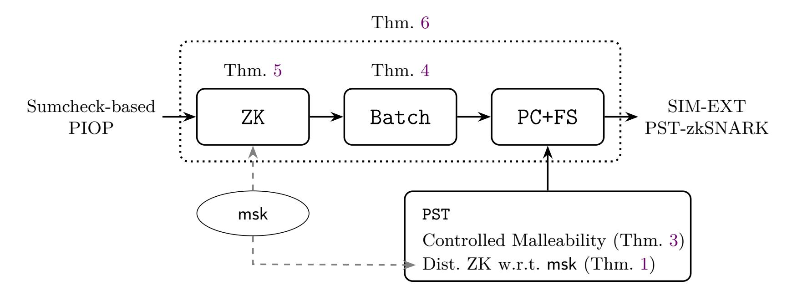

{0}------------------------------------------------

# **Sumcheck-based zkSNARKs are Non-Malleable**

Antonio Faonio<sup>1</sup> and Luigi Russo<sup>2</sup>

<sup>1</sup> EURECOM, Sophia Antipolis, France faonio@eurecom.fr <sup>2</sup> TU Wien, Austria luigi.russo@tuwien.ac.at

**Abstract.** Simulation extractability ensures that any adversary who produces a valid proof must possess a corresponding witness, even after seeing simulated proofs for potentially false statements. This property is vital for preventing malleability attacks and is therefore essential for securely deploying zero-knowledge succinct non-interactive arguments of knowledge (zkSNARKs) in distributed systems. While prior work, particularly the frameworks by Faonio *et al.* (CCS'24, TCC'23) and Kohlweiss *et al.* (TCC'23), has established simulation extractability for a wide class of pairing-based zkSNARKs using the KZG univariate polynomial commitment scheme (Kate *et al.*, Asiacrypt'10), we initiate a systematic study of simulation extractability for zkSNARKs based on the celebrated sumcheck protocol and the PST multivariate polynomial commitment scheme (Papamanthou *et al.*, TCC'13).

PST cannot be simulation extractable, due to its linear homomorphism, however, we show that it satisfies a refined notion of *controlled malleability* similar to the notion of Chase *et al.* (EUROCRYPT'12), which informally captures that linear homomorphism is essentially the only admissible malleability. We demonstrate that our notion of controlled malleability suffices to ensure security within the widely adopted design paradigm of compiling polynomial interactive oracle proofs into zkSNARKs, covering several state-of-the-art schemes such as HyperPlonk (EUROCRYPT'23), Spartan (CRYPTO'20) and Libra (CRYPTO'19).

### <span id="page-0-0"></span>**1 Introduction**

Zero-knowledge succinct non-interactive arguments of knowledge (zkSNARKs) [\[54\]](#page-49-0) are powerful cryptographic primitives that enable scalable, privacy-preserving computation. At their core, zk-SNARKs allow a prover to convince a verifier that a statement is true without revealing any additional information, while also being succinct and easy to verify. These properties make zkSNARKs an attractive solution for many applications, such as voting systems, digital currencies, and secure multi-party computation.

While the security of zkSNARKs is well understood in the context of a single, isolated prover, the situation becomes more complex when considering an attacker with access to multiple proofs. In this setting, a malicious prover may attempt to exploit the information contained in the proofs to create a new proof for a different statement, without actually possessing the corresponding witness. This attack scenario, known as a *malleability attack*, was first identified by Sahai [\[58\]](#page-50-0), who introduced the concept of simulation soundness as a way to address this issue, and was later extended to simulation extractability (SE) by De Santis *et al.* [\[22\]](#page-48-0).

The risks of malleability are not merely hypothetical. For example, malleability attacks have historically involved over three hundred thousand Bitcoins [\[23\]](#page-48-1). More recently, these vulnerabilities have surfaced in state-of-the-art SNARKs such as Nova [\[44,](#page-49-1)[55\]](#page-49-2), which is already deployed in production environments (e.g., Lurk [\[52\]](#page-49-3)). Such vulnerabilities are critical as they allow attackers to redirect funds or corrupt state transitions in decentralized ledgers. For this reason, there has recently been a growing interest in the study of SE for zkSNARKs.

In this work, we build on the line of research initiated by Faonio *et al.* [\[25](#page-48-2)[,26\]](#page-48-3) and Kohlweiss *et al.* [\[40\]](#page-49-4), which develops general frameworks for achieving SE in a broad class of zkSNARKs. 

{1}------------------------------------------------

These frameworks apply to zkSNARKs constructed via the now-standard compilation pipeline: transforming polynomial interactive oracle proofs (PIOPs) [\[8\]](#page-47-0) into non-interactive arguments using the Fiat–Shamir transform [\[29\]](#page-48-4), together with polynomial commitment schemes [\[39\]](#page-49-5).

The aforementioned works focus on compiling univariate PIOPs into zkSNARKs using KZG [\[39\]](#page-49-5) as the underlying polynomial commitment scheme. An alternative approach considers multivariate PIOPs, which rely on multivariate polynomial commitment schemes for encoding proof messages. In the univariate setting, KZG remains the standard choice for pairing-based zkSNARKs due to its succinctness and efficiency. In contrast, the multivariate setting has inspired a variety of alternative commitment schemes, each with different trade-offs. Notable examples include Orion+ [\[18\]](#page-48-5), Gemini [\[11\]](#page-47-1), Zeromorph [\[41\]](#page-49-6), and Dory [\[45\]](#page-49-7). In this work, we focus on the PST scheme [\[56\]](#page-49-8) for two main reasons: it provides the shortest proof size among multivariate polynomial commitment schemes, with the exception of the very recent Mercury [\[24\]](#page-48-6) and Samaritan [\[34\]](#page-48-7); and it remains the simplest and one of the earliest constructions in this category.

Moreover, when compiling multivariate PIOPs into zkSNARKs, we focus on the subclass of sumcheck-based PIOPs, as defined in [\[18\]](#page-48-5). This class employs the classical sumcheck protocol [\[51\]](#page-49-9) as a core component of the proof system. Although sumcheck-based PIOPs typically yield larger proof sizes compared to their univariate counterparts, they offer a significant advantage in prover efficiency. Specifically, by avoiding Fast Fourier Transform (FFT), these constructions reduce the prover's running time from quasi-linear (in the degree of the oracle polynomials) to linear. This trade-off has made the sumcheck protocol a central building block in several recent and influential zkSNARK constructions such as [\[11,](#page-47-1)[18,](#page-48-5)[59,](#page-50-1)[63,](#page-50-2)[64\]](#page-50-3).

### **1.1 Our Contributions**

In this work, we initiate a systematic study of simulation extractability for the class of zkSNARKs based on the sumcheck protocol, by addressing both theoretical and practical aspects of the compilation pipeline and its building blocks. Our main technical contributions are described hereafter.

**Controlled malleability of PST and KZG.** We provide a formal analysis of the controlled malleability of the PST commitment scheme by precisely characterizing the allowable malleabilities. This builds on and revisits known results [\[26\]](#page-48-3) on the non-malleability of KZG.

**Compiler to simulation-extractable zkSNARKs.** We present a generic compiler that transforms sumcheck-based PIOPs into simulation-extractable zkSNARKs. Our construction proceeds in three steps:

- 1. **Zero-Knowledge.** Starting from a sumcheck-based PIOP that may not be zero knowledge, we transform it into a zero knowledge PIOP. Our transformation improves on previous work [\[64\]](#page-50-3) by reducing the degrees of certain masking polynomials.
- 2. **Query minimization.** We then apply known optimizations [\[18\]](#page-48-5), which we formally analyze and slightly improve, to reduce the query complexity. We show that these optimizations are not only useful for efficiency, but also provide a structure for the resulting PIOP that allows us to apply the controlled malleability of PST and, consequently, achieve simulation extractability for the zkSNARK.
- 3. **zkSNARK compilation.** Finally, we apply the, by now standard, PIOP-to-zkSNARK transform together with non-hiding PST. As noted by [\[18\]](#page-48-5), deriving zkSNARKs from non hiding PST evaluation proofs is not straightforward. We identify and prove the minimal zero-knowledge

{2}------------------------------------------------

properties of non-hiding PST evaluation proofs that are required for the construction. Chen *et al.* [\[18\]](#page-48-5) proposed using the technique of [\[10\]](#page-47-2) to construct a PST-HyperPlonk zkSNARK. We show that this extra step is unnecessary, requiring only minor additional masking at the PIOP level. The resulting PST-HyperPlonk zkSNARK is strictly more efficient, using only about half the number of group elements compared to the construction of [\[18\]](#page-48-5).

A graphical summary of our results is presented in Fig. [1,](#page-5-0) and we elaborate on each contribution from a technical perspective in Section [1.3.](#page-3-0)

Similarly to previous generic frameworks [\[25,](#page-48-2)[26,](#page-48-3)[40\]](#page-49-4), we establish our results in the Algebraic Group Model (AGM) [\[30\]](#page-48-8). Removing the AGM remains a significant challenge. First, a formal proof of knowledge soundness for PST in the standard model was only newly established [\[6\]](#page-47-3). Second, recent results demonstrate that security proofs for optimized SNARKs face fundamental barriers. Specifically, Lipmaa *et al.* [\[50\]](#page-49-10) showed that the *linearization trick* [\[26,](#page-48-3)[31\]](#page-48-9) fails to satisfy special soundness in the standard model. Furthermore, recent work by Lipmaa [\[48\]](#page-49-11) demonstrates that both *linearized* and *batched* KZG proofs (the latter of which we employ in our construction) do not achieve *trapdoorless zero knowledge*, which is required by the framework of Faust *et al.* [\[28\]](#page-48-10) to prove simulation extractability.

#### **1.2 Related Work**

Several recent works [\[1,](#page-47-4)[14,](#page-47-5)[21,](#page-48-11)[25,](#page-48-2)[26,](#page-48-3)[32,](#page-48-12)[33,](#page-48-13)[40,](#page-49-4)[48\]](#page-49-11) have established simulation extractability for a range of zkSNARKs including Basilisk [\[57\]](#page-49-12), Bulletproofs [\[12\]](#page-47-6), Jolt [\[2\]](#page-47-7), Lasso [\[61\]](#page-50-4), Lunar [\[13\]](#page-47-8), Marlin [\[19\]](#page-48-14), PLONK [\[31\]](#page-48-9), Sonic [\[53\]](#page-49-13), and Spartan [\[21\]](#page-48-11). These contributions can be grouped into two main categories. The first group includes works such as [\[14,](#page-47-5)[21,](#page-48-11)[32,](#page-48-12)[33,](#page-48-13)[48\]](#page-49-11) that analyze the simulation extractability of (simple variants of) specific schemes. The second group includes general frameworks, such as those proposed in [\[25](#page-48-2)[,26\]](#page-48-3) and [\[40\]](#page-49-4), which apply to broad classes of zkSNARKs, particularly those built using polynomial interactive oracle proofs and polynomial commitments. This second line provides modular security guarantees that do not require a bespoke security proof for every new (optimization or) protocol variant. Our work follows this second paradigm, extending it to the multivariate and sumcheck-based setting.

A closely related work is that of Libert [\[46\]](#page-49-14), which investigates the simulation extractability of HyperPlonk instantiated with PST-based commitments. Libert follows a different approach than ours. Rather than relying on the standard PST evaluation proofs, he constructs a new multivariate polynomial commitment scheme that retains PST-style commitments but replaces the evaluation proof mechanism with a *Σ*-protocol proving knowledge of a PST evaluation proof. Since this *Σ*protocol satisfies weak unique response and trapdoorless zero-knowledge, simulation extractability can be established via the general result of [\[33\]](#page-48-13).

Additionally, Libert showed that PST evaluation proofs are not unique [\[47,](#page-49-15) Appendix E]. This observation imposes inherent limitations on what can be proven when using unmodified PST proofs. In particular, it implies that sumcheck-based zkSNARKs compiled via Fiat–Shamir using vanilla PST commitments can at best achieve *weak* simulation extractability: i.e., adversaries cannot produce a valid proof for a new statement that wasn't previously simulated. This *weak* notion suffices in many real-world applications [\[35,](#page-48-15)[36,](#page-48-16)[42\]](#page-49-16), as it accounts for schemes that can still effectively resist relevant and practical classes of attacks [\[4,](#page-47-9)[9\]](#page-47-10), and in fact captures (a flavor of) UC-security of zkSNARKs [\[3\]](#page-47-11).

{3}------------------------------------------------

#### <span id="page-3-0"></span>1.3 Technical Overview

On the controlled malleability of PST (and KZG). Our first contribution is a detailed analysis of the PST polynomial commitment scheme. Due to its linear homomorphism, PST inherently lacks simulation extractability, and thus cannot satisfy standard non-malleability. However, we show that it does satisfy a weaker yet meaningful security notion, akin to the *controlled malleability* of Chase *et al.* [16,17].

More precisely, controlled malleability is defined with respect to a class of admissible transformations  $\mathcal{T}$ , where each  $T \in \mathcal{T}$  maps an instance-witness pair (or several such pairs) of  $\mathcal{R}$  to another valid pair in  $\mathcal{R}$ . For example, in proofs of knowledge of valid openings for homomorphic polynomial commitments, one may consider linear transformations that take two commitments as input and produce their linear combination together with the corresponding witness polynomials. A non-interactive proof system is malleable with respect to  $\mathcal{T}$  if there exists an algorithm that, given verifying proof(s) for some source instance(s), applies  $T \in \mathcal{T}$  to the proof(s) and outputs a new verifying proof for the target instance without requiring additional witness information. Moreover, a proof system is said to be controlled malleable with respect to  $\mathcal{T}$  if these are the only transformations that can be performed, even by a malicious prover. More precisely, this is formalized by requiring the existence of a knowledge extractor that either extracts the witness for the forged instance  $\tilde{x}$ , or else identifies simulation queries on instances  $x_1, \ldots, x_t$  together with a transformation  $T \in \mathcal{T}$  such that the forged instance is  $\tilde{\mathbf{x}} = T(\mathbf{x}_1, \dots, \mathbf{x}_t)$ . Continuing with the example above of homomorphic polynomial commitments, the extractor should either recover a polynomial  $p \in \mathbb{F}[X]$ , or else identify commitments  $c_1, \ldots, c_t$  in simulation queries together with a polynomial  $f \in \mathbb{F}[X, Z_1, \dots, Z_t]$ , linear in the variables  $Z_i$ , such that the forged commitment opens to  $f(\mathbf{X}) := f(\mathbf{X}, p_1(\mathbf{X}), \dots, p_t(\mathbf{X}))$ , under the assumption that each  $c_i$  opens to  $p_i$  for  $i \in [t]$ .

Recall that a polynomial commitment scheme allows to prove that a commitment  $\mathbf{c}$  to a (possibly multivariate) polynomial  $p \in \mathbb{F}[X]$  evaluates to y on an evaluation point x. Ideally, we would like to show that for PST polynomial commitment scheme, beyond linear transformations, the scheme does not permit any other form of proof reuse. For instance, a proof at evaluation point x should not be usable by the adversary to derive a valid proof at a different evaluation point x'. While we are unable to establish this exact statement, we can prove a useful relaxation of it.

To capture the exact boundaries of this malleability, we rely on the policy-based simulation extractability framework of Faonio  $et\ al.\ [25]$ , which allows us to incorporate additional constraints into the security model. In particular, our result holds under the assumption that the evaluation point x in the forgery of the adversary is chosen uniformly at random, and that the adversary's view does not include simulation queries encoding obviously contradictory information (such as a commitment c being shown to evaluate to both y and y' at the same point x). These requirements are necessary as otherwise we have attacks [25].

Also notice, we follow the approach of Faonio et al. [25] rather than that of Kohlweiss et al. [40], as the latter framework requires proof uniqueness, a property that PST does not satisfy, as shown in [47]. We state our first result below (see Theorem 3 in Section 5 for the formal version).

**Informal Theorem 1**. The PST polynomial commitment scheme is policy-based controlled malleable in the AGM with respect to the class of linear transformations assuming that (1) the simulation oracle queries do not imply contradictory statements about the evaluated commitments and (2) the evaluation point in the forged proof is defined applying the random oracle to the commitment in the forged proof.

{4}------------------------------------------------

In essence, the proof of the theorem proceeds by reducing the controlled malleability of PST over *µ*-variate polynomials to that of PST over (*µ* − 1)-variate polynomials, with the base case given by the controlled malleability of KZG. This introduces the next technical challenges we encountered. Unfortunately, the result of Faonio *et al.* [\[26\]](#page-48-3) is not sufficient for our base case for two reasons: (1) they establish only (policy-based) simulation extractability, whereas we need to prove (policybased) controlled malleability; and (2) crucially, their policy is not strong enough for our setting. In particular, KZG evaluation proofs are themselves KZG commitments to quotient polynomials, which an adversary could query to the simulation oracle, thereby obtaining a simulation proof of a proof. To address this, Faonio *et al.* introduce a metric called the *nesting level*, which bounds the number of proof-of-proofs that the adversary can query. However, this metric becomes unbounded in our applications to sumcheck-based PIOP, whereas in their setting it remains small (for instance, equal to two in optimized PLONK). To address this issue, we provide a refined analysis for KZG, showing that certain recursive proof queries can be safely ignored. In particular, we demonstrate that proof-of-proof queries made *after* the adversary has (implicitly[3](#page-4-0) ) committed to the forgery do not need to be considered in the security reduction. We informally state our second result (see Theorem [2](#page-23-0) in Section [5](#page-18-0) for the formal version).

**Informal Theorem 2**. *The KZG polynomial commitment scheme is policy-based controlled malleable in the AGM with respect to the class of linear transformations assuming that (1) the simulation oracle queries do not imply contradictory statements about the evaluated commitments and (2) the evaluation point in the forged proof is defined applying the random oracle to the commitment in the forged proof. Moreover, the policy considered is strictly more general than [\[26\]](#page-48-3).*

**On the zero-knowledge of PST.** Typically, (zk)SNARKs use non-hiding polynomial commitments since the zero-knowledge property can be added more efficiently at the information theoretic layer of the PIOP, if necessary. One of the technical challenges we encountered is that *vanilla* PST evaluation proofs over non-hiding commitments are not zero-knowledge. On the one hand, we could consider a modified version of PST evaluation proofs that do achieve zero-knowledge[4](#page-4-1) . On the other hand, our goal is to remain as close as possible to the most efficient implementation of PST evaluation proofs. We observe that if the witness is sufficiently randomized via a carefully crafted masking algorithm msk (see Algorithm [1\)](#page-14-0), one can prove a weaker form of zero-knowledge, called *distributional zero-knowledge*, with respect to that masking.

**From sumcheck-based PIOPs to non-malleable zkSNARKs.** Modern zkSNARKs are usually designed in two steps. First, one builds a protocol in an idealized model that ensures informationtheoretic security. Then, this protocol is made practical by replacing the idealized components with a concrete cryptographic primitive. For this paper, we take as a starting point a *polynomial interactive oracle proof* (PIOP), where the prover commits to low-degree multivariate polynomials through an oracle and the verifier queries these oracles. To move beyond this idealized setting, the oracle is instantiated with a *polynomial commitment scheme*, which provides both commitments and proofs of evaluation. Since the resulting protocol remains interactive, the Fiat–Shamir transformation is applied to obtain a non-interactive zkSNARK. This, by now standard, compilation paradigm underlies many of the most efficient SNARK constructions developed in recent years, and we refer to it as the PC+FS compiler.

<span id="page-4-0"></span><sup>3</sup> More precisely, we rely on observability in the random oracle model to pinpoint the moment at which the forgery becomes fully defined.

<span id="page-4-1"></span><sup>4</sup> In particular, using the technique employed in the attack against uniqueness by Libert [\[47\]](#page-49-15), one can alter the evaluation proofs so that they become zero knowledge.

{5}------------------------------------------------



<span id="page-5-0"></span>**Fig. 1.** A diagram summarizing our contributions.

Our third contribution is an analysis of the PC+FS compiler for multivariate PIOPs: instead of analyzing the PC+FS compiler alone, our approach is to analyze the pipeline that first adds zero-knowledge and optimizations and then the PC+FS compilation; moreover, unlike previous works [\[25](#page-48-2)[,26](#page-48-3)[,40\]](#page-49-4), we focus specifically on the subclass of sumcheck-based multivariate PIOPs and on PST commitment scheme, a setting that has not been systematically studied before in the context of simulation extractability.[5](#page-5-1) Sumcheck-based multivariate PIOPs [\[18\]](#page-48-5) are PIOPs that rely on one or more invocations of the classic sumcheck protocol [\[51\]](#page-49-9). The sumcheck protocol itself is a special case of a multivariate PIOP, where the verifier issues random challenges and the oracle polynomial is queried at a single evaluation point determined by these challenges.

We improve the zero-knowledge compiler of Xie *et al.* [\[64\]](#page-50-3) by showing that for the class of highdegree sumcheck protocols in [\[18\]](#page-48-5), it suffices to mask the round polynomials with constant-degree masking polynomials instead of high-degree ones. This follows because these round polynomials are sent *as oracles* by the sumcheck-based PIOP; since they are only evaluated twice and committed using non-hiding PST, masking of degree 3 is sufficient. We refer to this as the ZK compiler (see Theorem [5\)](#page-40-0).

A key observation in [\[18\]](#page-48-5) is that batching techniques allow reducing the number of oracle queries to just two. Intuitively, while running *k* sumcheck protocols independently would require *k* evaluations of multivariate polynomials (each corresponding to a separate sumcheck instance), batching makes it possible to replace them with a single evaluation of a *virtual* batched polynomial. Conveniently, when the polynomial commitment scheme is homomorphic, these virtual polynomials can be queried directly by the compiled zkSNARK. We adopt and formalize the optimizations introduced in [\[18\]](#page-48-5), treating them as a separate compiler that transforms one sumcheck-based PIOP into another (see Theorem [4\)](#page-37-0). Along the way, we refine and extend the optimizations. We call the resulting pipeline, which combines zero-knowledge, these optimizations with the PIOP-to-zkSNARK compilation, the ZK+Batch+PC+FS compiler. Interestingly, these optimizations induce a useful structural property in the optimized sumcheck-based PIOP, that we leverage to prove simulation extractability for a broad class of such protocols. In particular, it suffices that every multivariate polynomial

<span id="page-5-1"></span><sup>5</sup> While existing literature [\[14](#page-47-5)[,21\]](#page-48-11) has addressed simulation extractability for (variants of) specific protocols such as Spartan and Lasso, these results are primarily *ad-hoc* works that, furthermore, rely on the framework of [\[28\]](#page-48-10), which fundamentally requires *unique response* to establish security: however, as noted, this requirement is inherently incompatible with the linear-homomorphic properties of PST.

{6}------------------------------------------------

sent by the prover is included in at least one sumcheck protocol. This ensures that the batching step involves all multivariate polynomials in a random evaluation point chosen at the end of the protocol, which allows us to extract them by invoking the controlled-malleability of PST.

Finally, we highlight that the masking algorithm serves a dual purpose: it is required both for the zero-knowledge compiler and for achieving distributional zero-knowledge for PST (see Fig. 1). Thus our compiler applies a tailored masking to the PIOP, aligned with the leakage profile of the polynomial commitment scheme CS used in the compilation. This enables us to compile directly using a non-hiding version of CS and its non-zero-knowledge evaluation proofs, rather than relying on a hiding version of CS combined with zero-knowledge evaluation proofs (as can be achieved via transformations like the one in [10]). While we show how to instantiate this recipe using PST, we believe that this methodology paves the way for future instantiations with other non-ZK commitment schemes, most notably FRI [7]. In fact our work shows that once the leakage behavior of a given CS is characterized, the PIOP-to-zkSNARK can be instantiated with CS in its original and most efficient form, without further modification. Thus, it is an interesting open question whether FRI satisfies distributional zero-knowledge with respect to an efficient masking algorithm.

We state our third result in the following informal theorem, with the corresponding formal version given in Theorem 6 in Section 7.

**Informal Theorem 3**. Let IP be a sumcheck-based PIOP in which every multivariate oracle is queried in at least one invocation of the sumcheck protocol. The zkSNARK obtained through the ZK+Batch+PC+FS compilation of IP using the PST polynomial commitment scheme is simulation-extractable in the AGM.

We emphasize that the structural requirement we identify is not merely a theoretical artifact but is natural to meet in practice (including state-of-the-art schemes such as Libra [64], HyperPlonk [18], Spartan [59], and SuperSpartan [60]) and can be easily checked by protocol designers of future schemes.

Paper outline. In Section 2, we introduce the necessary preliminaries, including background on polynomial commitment schemes and zkSNARKs. In Section 3, we present our definition of the policy-based controlled-malleability experiment. In Section 4, we show that the PST commitment scheme achieves a (weak) form of zero-knowledge. We prove that KZG and PST achieve controlled-malleability in Section 5. In Section 6, we formally introduce multivariate sumcheck-based PIOPs. Finally, in Section 7 we present our compiler to zkSNARKs, and we show under which conditions the compiled scheme is simulation-extractable.

# <span id="page-6-0"></span>2 Preliminaries

A function f is negligible in  $\lambda$  (we write  $f \in \mathsf{negl}(\lambda)$ ) if it approaches zero faster than the reciprocal of any polynomial. For an integer  $n \geq 1$ , we use [n] to denote the set  $\{1, 2, \ldots, n\}$ . Vectors and matrices are denoted in boldface. Calligraphic letters denote sets, while set sizes are written as  $|\mathcal{X}|$ . Lists are represented as ordered tuples, e.g.  $L := (L_i)_{i \in [n]}$  is a shortcut for the list of n elements  $(L_1, \ldots, L_n)$ . Vectors differ from lists in that all their elements have the same type. We use  $\mathcal{F}_{d,\mu}$  (resp.  $\mathcal{F}_{d,\mu}$ ) to denote the set of multivariate polynomials in  $\mathbb{F}[X_1, \ldots, X_{\mu}]$ , where the degree in the i-th variable is at most  $d_i$  (resp. d).

**Asymmetric Bilinear groups.** An asymmetric bilinear group is a tuple  $(q, \mathbb{G}_1, \mathbb{G}_2, \mathbb{G}_T, e, P_1, P_2)$ , where  $\mathbb{G}_1, \mathbb{G}_2$  and  $\mathbb{G}_T$  are groups of prime order q, the elements  $P_1, P_2$  are generators of  $\mathbb{G}_1, \mathbb{G}_2$  respectively,  $e: \mathbb{G}_1 \times \mathbb{G}_2 \to \mathbb{G}_T$  is an efficiently-computable non-degenerate bilinear map, and there

{7}------------------------------------------------

is no efficiently computable isomorphism between  $\mathbb{G}_1$  and  $\mathbb{G}_2$ . Let GGen be some probabilistic polynomial-time (PPT) algorithm which on input  $1^{\lambda}$ , where  $\lambda$  is the security parameter, returns a description  $\operatorname{\mathsf{pp}}_{\mathbb{G}}$  of a bilinear group. We use implicit notation for elements of  $\mathbb{G}_i$  ( $i \in \{1,2,T\}$ ):  $[a]_i \coloneqq aP_i$  where  $P_T \coloneqq e(P_1,P_2)$ . Each element of  $\mathbb{G}_i$  can be written as  $[a]_i$  for some  $a \in \mathbb{Z}_q$ , but recovering a from  $[a]_i$  is hard (discrete log problem). For  $a,b \in \mathbb{Z}_q$ , we distinguish between  $[ab]_i$  (whose log is ab),  $[a]_i \cdot b$  (scalar multiplication of  $[a]_i$  by b), and  $[a]_1 \cdot [b]_2 = [ab]_T$  (the pairing  $e([a]_1,[b]_2)$ ). Implicit notation is not used for variables; for instance,  $\mathbf{c} = [a]_1$  denotes a variable name for the group element with logarithm a.

```
 \begin{array}{ll} \mathbf{Exp}_{\mathsf{GGen},\mathcal{A}}^{(n,d)\text{-DMSDH}}(\lambda) & \mathbf{O}\mathrm{racle}\;\mathcal{O}_s(x,i) \\ \hline \mathcal{Q}_x \leftarrow \emptyset & \mathbf{if}\; i > n: \\ \mathsf{pp}_{\mathbb{G}} \leftarrow \mathsf{s}\;\mathsf{GGen}(1^{\lambda}) & \mathbf{return}\;\bot \\ s \leftarrow \mathsf{s}\;\mathbb{F}_q & \mathcal{Q}_x \leftarrow \mathcal{Q}_x \cup \{x\} \\ (x^*,y^*) \leftarrow \mathcal{A}^{\mathcal{O}_s}(\mathsf{pp}_{\mathbb{G}}, \left[1,s,\ldots,s^d\right]_1, \left[1,s\right]_2) & \mathbf{let}\; z \leftarrow \left[(s-x)^{-i}\right]_1 \\ \mathbf{return}\; x^* \not\in \mathcal{Q}_x \wedge \mathsf{y}^* = \left[\frac{1}{s-x^*}\right]_1 & \mathbf{return}\; z \end{array}
```

<span id="page-7-0"></span>Fig. 2. The OMSDH experiment.

**Definition 1** ((n,d)-**OMSDH,** [26]). Consider the experiment in Fig. 2. The n-one-more d-strong DH assumption holds for a bilinear group generator GGen if for every PPT adversary, making at most n oracle queries, the following advantage is negligible in  $\lambda$ :

$$\mathbf{Adv}_{\mathsf{GGen},\mathcal{A}}^{(n,d)\text{-}\mathtt{OMSDH}}(\lambda) \coloneqq \Pr\left[\mathbf{Exp}_{\mathsf{GGen},\mathcal{A}}^{(n,d)\text{-}\mathtt{OMSDH}}(\lambda) = 1\right]$$

With the lingo of [5], OMSDH is a special case of an adaptive Uber Assumption for Rational Fractions. When the set of points  $Q_x$  is fixed before the experiment starts, the assumption falls back to an Uber Assumption for Rational Fractions and Flexible Target, as defined in [5], that is reducible to discrete log in the AGM [26].

<span id="page-7-1"></span>**Definition 2 (Algebraic algorithm, [30]).** An algorithm  $\mathcal{A}$  is algebraic if for all group elements z that  $\mathcal{A}$  outputs (either as returned by  $\mathcal{A}$  or by invoking an oracle), it additionally provides the representation of z relative to all previously received group elements. That is, if elems is the list of group elements that  $\mathcal{A}$  has received so far, then  $\mathcal{A}$  must also provide a vector  $\mathbf{r}$  such that  $z = \langle \mathbf{r}, \text{elems} \rangle$ .

Since in our work we focus on algebraic adversaries receiving as input a structured reference string that is a commitment key for a  $\mu$ -variate polynomial commitment scheme with degree bounds d, we parse the first  $\prod_{i \in [\mu]} (d_i + 1)$  coefficients of r as an encoding of a  $\mu$ -variate polynomial f(X).

Outputs of the adversary and Random Oracle transcripts. We model adversaries' outputs and oracle queries as tuples  $(s, \mathsf{aux})$ , where s is the primary output and  $\mathsf{aux}$  contains auxiliary information. For example, for algebraic adversaries,  $\mathsf{aux}$  includes the algebraic representations of group elements encoded in s. This syntax applies to all adversary queries. For instance, when

{8}------------------------------------------------

querying a random oracle, the adversary sends a tuple (*s,* aux), and the random oracle responds with a value, denoted as RO(*s*), which depends only on *s* and not on aux. Note that aux may be empty or contain data required by a security game. More concretely, the auxiliary inputs to the random oracle help define security games where the adversary must commit to specific values before obtaining a challenge generated by the random oracle. Moreover, we introduce notation to assert that outputs of the random oracle *depend* on a list of (auxiliary or not) elements *x*1*, . . . , x<sup>n</sup>* and are computed *after* such elements are declared by the adversary.

**Definition 3.** *Let x*1*, . . . , x<sup>n</sup> be strings, n* ∈ N *and let a be an element in the image of a RO. We write* (*x*1*, . . . xn*) →RO *a if there is a list of random oracle queries* (*s*1*,* aux1)*, . . . ,*(*sk,* aux*k*) *for an integer k* ≥ 1 *such that:*

```
1. ∀i ∈ [k − 1] : RO(si) is a substring of si+1 and RO(sk) = a,
2. ∀j ∈ [n], ∃i ∈ [k] : xj is a substring of si or xj is contained in auxi.
```

*Also, for a* = (*a*1*, . . . , aµ*)*, we write* (*x*1*, . . . xn*) →RO *a to indicate that for any i* ∈ [*µ*] *we have that* (*x*1*, . . . xn*) →RO *ai.*

This helps capturing cases where *a* is derived by concatenating the round random challenges of a multi-round protocol (e.g., a sumcheck [\[51\]](#page-49-9)).

### **2.1 Non-Interactive Zero-Knowledge Arguments**

We define a PT relation R verifying triple (pp*,* x*,* w) as in [\[38\]](#page-49-17). We say that w is a witness to the instance x being in the relation defined by the parameterspp when (pp*,* x*,* w) ∈ R (we sometimes write R(pp*,* x*,* w) = 1). For example, pp could be the description of a bilinear group or contain a commitment key or a common reference string. We generalize the notion of relations to a more finegrained notion of *indexed relations*, where we treat (pp*,*i*,* x*,* w) ∈ R as equivalent to (pp*,*(i*,* x)*,* w) ∈ R. For simplicity, we sometimes omit the cryptographic parameters pp from the notation and assume them implicitly. A non-interactive proof system *Π* for a relation R (and group generator GGen) is a tuple of algorithms (KGen*,* Prove*,* Verify) where:

KGen(ppG) → srs is a PPT algorithm that takes as input the group parameters pp<sup>G</sup> ←\$ GGen(1*<sup>λ</sup>* ) and outputs srs := (ek*,* vk*,* pp), where ek is the evaluation key, vk is the verification key, and pp are the parameters for R.

Prove(ek*,* x*,* w) → *π* takes as input an evaluation key ek, a statement x, and a witness w s.t. R(pp*,* x*,* w) holds, and returns a proof.

Verify(vk*,* x*, π*) → *b* takes as input a verification key, a statement x, and either accepts (*b* = 1) or rejects (*b* = 0) the proof *π*.

If the running time of Verify is poly(*λ* + |x| + log |w|) and the proof size is poly(*λ* + log |w|), we say that *Π* is succinct. Basic notions for a non-interactive proof systems are completeness, knowledge soundness and zero-knowledge. Informally, knowledge soundness means that any PPT prover producing a valid proof must know the corresponding witness. We omit the formal definition of this property as it is implied by simulation extractability that we present in the next section.

**Zero-Knowledge in the SRS and RO model.** Following the syntax of [\[28\]](#page-48-10), the zero-knowledge simulator S of a NIZK is a stateful PPT algorithm that can operate in three modes:

{9}------------------------------------------------

- $-(srs, st_S) \leftarrow S(0, pp_{\mathbb{G}})$  generates the parameters and the simulation trapdoor (if necessary)
- $-(\pi,\mathsf{st}_{\mathcal{S}}) \leftarrow \mathcal{S}(1,\mathsf{st}_{\mathcal{S}},\mathtt{x})$  simulates the proof for a statement  $\mathtt{x}$
- $-(a, \mathsf{st}_{\mathcal{S}}) \leftarrow \mathcal{S}(2, \mathsf{st}_{\mathcal{S}}, s)$  answers random oracle queries

The state  $st_{\mathcal{S}}$  is updated after each operation. Similarly to [28], we define the following wrappers.

**Definition 4 (Wrappers for NIZK Simulator).** The following oracles are stateful and share their state  $st = (st_{\mathcal{S}}, coms, \mathcal{Q}_{sim}, \mathcal{Q}_{RO}, \mathcal{Q}_{srs}, \mathcal{Q}_{aux})$  where  $st_{\mathcal{S}}$  is initially set to be the empty string, and  $\mathcal{Q}_{sim}$ ,  $\mathcal{Q}_{RO}$  and  $\mathcal{Q}_{aux}$  are initially set to be the empty sets.

- $-\mathcal{S}_1(\mathbf{x},\mathsf{aux})$  returns the first output of  $\mathcal{S}(1,\mathsf{st}_\mathcal{S},\mathbf{x},\mathsf{aux})$ .
- $-\mathcal{S}'_1(x, w)$  first checks  $(pp, x, w) \in \mathcal{R}$  where pp is part of srs and then runs (and returns the output of)  $\mathcal{S}_1(x)$ .
- $S_2(s, \mathsf{aux})$  first checks if the query s is already present in  $\mathcal{Q}_{\mathsf{RO}}$  and in case answers accordingly, otherwise it returns the first output a of  $S(2, \mathsf{st}_{\mathcal{S}}, s)$ . The oracle updates the set  $\mathcal{Q}_{\mathsf{RO}}$  by adding the tuple  $(s, \mathsf{aux}, a)$  to the set. In the case of non-programmable random oracle model,  $\mathcal{S}$  is notified of the RO query but cannot control the answer a.

Almost all the oracles in our definitions can take auxiliary information as additional input. As explained in [25], this auxiliary information can be used in a rather liberal form. For example, in the definition above, the auxiliary information for  $S_2$  could contain the algebraic representations of the group elements in s (when we restrict to algebraic adversaries) or other information the security experiments might need.

**Definition 5 (Zero-Knowledge w.r.t.**  $\mathbb{A}$  in the ROM). A NIZK is zero-knowledge with respect to the class of adversaries  $\mathbb{A}$  if there exists a PPT simulator  $\mathcal{S}$  such that for all adversaries  $\mathcal{A} \in \mathbb{A}$ :

$$\Pr \left[ \begin{array}{l} \mathsf{pp}_{\mathbb{G}} \leftarrow \mathsf{GGen}(1^{\lambda}) \\ \mathsf{srs} \leftarrow \mathsf{KGen}(\mathsf{pp}_{\mathbb{G}}) \\ \mathcal{A}^{\mathsf{Prove}(\mathsf{ek},\cdot,\cdot),\mathsf{RO}}(\mathsf{srs}) = 1 \end{array} \right] \quad \approx \quad \Pr \left[ \begin{array}{l} \mathsf{pp}_{\mathbb{G}} \leftarrow \mathsf{GGen}(1^{\lambda}) \\ (\mathsf{srs},\mathsf{st}_{\mathcal{S}}) \leftarrow \mathcal{S}(0,\mathsf{pp}_{\mathbb{G}}) \\ \mathcal{A}^{\mathcal{S}'_{1},\mathcal{S}_{2}}(\mathsf{srs}) = 1 \end{array} \right]$$

Zero-knowledge is a property that is only guaranteed for true statements, hence the above definition uses  $\mathcal{S}_1'$  as a proof simulation oracle.

#### 2.2 Commit-and-Prove Arguments

**Commitment Schemes.** A commitment scheme CS with message space  $\mathcal{M}$  (and group parameters GGen) is a tuple of algorithms CS := (KGen, Com, VerCom) where :

 $\mathsf{KGen}(\mathsf{pp}_{\mathbb{G}},\mathsf{aux}) \to \mathsf{ck}$  takes as input  $\mathsf{pp}_{\mathbb{G}} \leftarrow \mathsf{sGGen}(1^{\lambda})$ , and any additional required parameters  $\mathsf{aux}$ , and outputs a commitment key  $\mathsf{ck}$ .

 $\mathsf{Com}(\mathsf{ck}, m) \to (\mathsf{c}, o)$  takes as input the commitment key  $\mathsf{ck}$ , and a message  $m \in \mathcal{M}$ , and outputs a commitment  $\mathsf{c}$  and an opening o.

 $\mathsf{VerCom}(\mathsf{ck},\mathsf{c},m,o) \to b$  takes as input the commitment key  $\mathsf{ck}$ , a commitment  $\mathsf{c}$ , a message m and an opening o, and outputs a bit.

<span id="page-9-0"></span><sup>&</sup>lt;sup>6</sup> More often, simulators need only the first three inputs; abusing notation, we assume that such simulators simply ignore the auxiliary input aux.

{10}------------------------------------------------

Besides correctness, a scheme CS can satisfy two more properties.

**Definition 6 (Binding).** A commitment scheme CS is (computationally) binding if no PPT adversary can find, unless with negligible probability, a commitment c, two messages  $m \neq m'$  and two openings o, o':

$$VerCom(ck, c, m, o) = VerCom(ck, c, m', o') = 1$$

**Definition 7** (Hiding). A commitment scheme CS is (statistically) hiding if  $\forall m, m'$ ,  $\forall ck$ :

$$\{c:(c,o) \leftarrow \mathsf{Com}(\mathsf{ck},m)\} \approx \{c':(c',o') \leftarrow \mathsf{Com}(\mathsf{ck},m')\}$$

**CP-SNARKs.** Commit-and-Prove SNARKs, or simply CP-SNARKs, are proof systems whose relations verify predicates over commitments [15]. We refer to a CP-SNARK for a relation  $\mathcal{R}$  and a commitment scheme CS as a tuple of algorithms  $\Pi := (KGen, Prove, Verify)$  where  $KGen(ck) \rightarrow srs$ is an algorithm that takes as input a commitment key ck for CS and outputs  $srs := (ek, vk, pp)^7$ ; ek is the evaluation key, vk is the verification key, and pp are the parameters for the relation  $\mathcal{R}$  (which include the commitment key ck). Also, if we consider the key generation algorithm KGen' that, upon group parameters  $pp_{\mathbb{G}}$ , runs  $ck \leftarrow SCS.KGen(pp_{\mathbb{G}})$  and  $srs \leftarrow M.KGen(ck)$ , and outputs srs; then the tuple (KGen', Prove, Verify) defines a SNARK that we identify with  $\Pi[CS] := (KGen', Prove, Verify)$ .

#### <span id="page-10-1"></span>2.3 The PST multivariate Polynomial Commitment Scheme

We describe a non-hiding version of the multi-variate polynomial commitment by Papamanthou, Shi and Tamassia [56] (PST for short). Specifically, PST is a multi-variate polynomial commitment scheme with message space  $\mathcal{F}_{d,\mu}$ , defined over a bilinear group, that consists of the following algorithms:

- $\mathsf{KGen}(\mathsf{pp}_{\mathbb{G}}, \boldsymbol{d}, \mu)$  on input the group parameters  $\mathsf{pp}_{\mathbb{G}}$ , it samples  $\beta_i \leftarrow \mathbb{F}_q$  for any  $i \in [\mu]$ , and it outputs the tuple  $\mathsf{ck} \coloneqq (\mathsf{ek}, \mathsf{vk})$ , where  $\mathsf{ek} \coloneqq \left( \left[ \prod_{i \in [\mu]} \beta_i^{j_i} \right]_1 \right)_{i \in [d]}$ ,  $\mathsf{vk} \coloneqq ([\beta_i]_2)_{i \in [\mu]}$ , and [d] is the set  $[0, d_1] \times \cdots \times [0, d_{\mu}]$ .
- $\mathsf{Com}(\mathsf{ck}, f(\boldsymbol{X}))$  outputs the commitment  $\mathsf{c} \coloneqq [f(\boldsymbol{\beta})]_1$ .
- $\mathsf{VerCom}(\mathsf{ck},\mathsf{c},f(\boldsymbol{X}))$  outputs 1 iff  $\mathsf{c}=[f(\boldsymbol{\beta})]_1$ .

We notice that for the special case  $\mu = 1$  we recover the KZG scheme [39]. To emphasize the different settings, we define  $\mathsf{CS}_{\mathsf{PST},\mu}$  to be the polynomial commitment scheme above where  $\mathsf{KGen}$ fixes the last parameter to  $\mu$ , thus  $CS_{KZG} := CS_{PST,1}$ .

The PST commitment scheme allows for evaluation proofs which, in the framework of [15], is a CP-SNARK  $\Pi_{\text{evl}}$  for  $\mathcal{R}_{\text{evl}}$  where:

$$\mathcal{R}_{\text{evl}}(\mathsf{ck}, (\mathsf{c}, \boldsymbol{x}, y), f) = 1 \text{ iff } f(\boldsymbol{x}) = y \land \mathsf{c} = [f(\boldsymbol{\beta})]_1.$$

We describe such a CP-SNARK below:

- $\Pi_{\text{evl}}$ . Prove $(\text{ek}, \mathbf{x} = (\mathbf{c}, \boldsymbol{x}, y), \mathbf{w} = f)$  outputs  $(\pi_i)_{i \in [\mu]}$  such that  $\pi_i \coloneqq [\pi_i(\boldsymbol{\beta})]_1$ , where  $(\pi_i(X))_{i \in [\mu]}$
- are the quotient polynomials such that  $\sum_{i \in [\mu]} \pi_i(\mathbf{X})(X_i x_i) \equiv f(\mathbf{X}) y$ .  $\Pi_{\text{evl}}.\text{Verify}(\text{vk}, \mathbf{x} = (\mathbf{c}, \mathbf{x}, y), \pi = (\pi_i)_{i \in [\mu]}) \text{ outputs } 1 \text{ iff } e(\mathbf{c} [y]_1, [1]_2) = \sum_{i \in [\mu]} e(\pi_i, [\beta_i x_i]_2).$

<span id="page-10-0"></span><sup>&</sup>lt;sup>7</sup> Often, such an algorithm simply and deterministically (re)-parses ck as (ek, vk), in this case we can omit the algorithm from the description of the proof system.

{11}------------------------------------------------

Since there are multiple ways to compute the polynomials  $(\pi_i)_{i\in[\mu]}$ , we consider the prover that computes  $\pi_1, \ldots, \pi_{\mu}$  itereatively, starting from  $\mu$  down to 1, using the Euclidean division for polynomials.

```
Prover \Pi_{\texttt{evl}}[\mathsf{CS}_{\mathsf{PST},\mu}].\mathsf{Prove}(\mathsf{ek}, \mathbb{x} = (\mathsf{c}, \boldsymbol{x}, y), \mathbb{w} = f):
- \  \, \text{Let} \,\, R_{\mu+1}(\boldsymbol{X}) \leftarrow f(\boldsymbol{X}) - y
- \  \, \text{For} \,\, i = \mu, \dots, 1:
\bullet \,\, \text{Compute} \,\, \pi_i(\boldsymbol{X}) \,\, \text{such that} \,\, R_{i+1}(\boldsymbol{X}) = \pi_i(\boldsymbol{X})(X_i - x_i) + R_i \,\, \text{and} \,\, \deg_{X_i}(R_i) = 0.
- \,\, \text{Output} \,\, [\pi_1(\boldsymbol{\beta})]_1 \,, \dots, [\pi_{\mu}(\boldsymbol{\beta})]_1.
```

Notice that, when c is fixed the proof elements for two different proofs can be correlated, e.g. a proof  $(\pi_1, \pi_2)$  for (c, (0, 0), 0) and a proof  $(\pi'_1, \pi'_2)$  for (c, (1, 0), 0) have that  $\pi_2 = \pi'_2$ .

Generalized Evaluation for Polynomial Commitment. While the relation  $\mathcal{R}_{\text{evl}}$  provides a natural and self-contained abstraction for reasoning about polynomial evaluation proofs, it is somewhat limited in scope. In particular, it captures a "stand-alone" notion of evaluation: a single committed polynomial evaluated at a single point. However, in the context of concrete proof systems, evaluation proofs often arise in more structured and interdependent forms. For instance, protocols may involve multiple committed polynomials, evaluated at shared or distinct points, and the statement to be proved may assert that a specific linear combination of these evaluations equals a claimed value. To properly capture such scenarios, we introduce a generalized evaluation relation,  $\mathcal{R}_{\text{geval}}$ , an indexed relation that extends  $\mathcal{R}_{\text{evl}}$  by incorporating:

- a list of commitments  $(c_j)_{j\in[m]}$ , each to a polynomial  $f_j$ ,
- two public evaluation points  $\boldsymbol{x} \in \mathbb{F}^{\mu}, \boldsymbol{z} \in \mathbb{F}^{k}$  for some k,
- a list of polynomials  $(a_j)_{j\in[m]}$  that serve as index and are used as *coefficient polynomials* in a linear combination over the (committed) polynomials  $(f_j)_{j\in[m]}$ .

Formally,  $\mathcal{R}_{geval}$  is defined as follows.

$$(\mathbf{i} = (a_j)_{j \in [m]}, \mathbf{x} = ((\mathbf{c}_j)_{j \in [m]}, \boldsymbol{z}, \boldsymbol{x}, y), \mathbf{w} = (f_j)_{j \in [m]}) \in \mathcal{R}_{\texttt{geval}} \iff \begin{cases} \forall j : \mathbf{c}_j = [f_j(\boldsymbol{\beta})]_1, \\ \sum_j a_j(\boldsymbol{z}, x_1) f_j(\boldsymbol{x}) = y \end{cases}.$$

This formulation may appear more elaborate at first glance, but it reflects the structure required in many constructions, especially when applying the PIOP-to-zkSNARK compilation pipeline in Section 7. In fact, the indexer polynomials allow to express different forms of batching under one single hat. One may ask why the indexer polynomials also depend on the variable  $x_1$ . While this dependence is not required for our purposes, Faonio et al. [26] showed that allowing the indexer polynomial to depend on the evaluation variable  $x_1$  (in their univariate setting) enables the analysis of the so-called linearization trick [53,31], where proving the evaluation of an arbitrary combination of committed polynomials reduces to a single evaluation proof at the point  $x_1$ . We keep this dependence since it may be useful in future extensions and strengthens the generality of our work. The CP-SNARK  $\Pi_{\text{geval}}$  for  $\mathcal{R}_{\text{geval}}$ , that we simply call generalized PST, works as follows:

- The prover of  $\Pi_{geval}$  runs  $\Pi_{evl}$  on instance  $\mathbf{x}' \coloneqq (\sum_j a_j(\boldsymbol{z}, x_1) \mathbf{c}_j, \boldsymbol{x}, y)$  and witness  $\mathbf{w}' \coloneqq \sum_j a_j(\boldsymbol{z}, x_1) f_j$  and outputs the PST proof;
- The verifier of  $\Pi_{geval}$  runs the verifier of  $\Pi_{evl}$  recomputing the input x' from i and x, as the prover does, and the PST proof.

We call  $\Pi_{\mathtt{PST},\mu} := \Pi_{\mathtt{geval}}[\mathsf{CS}_{\mathtt{PST},\mu}]$  and  $\Pi_{\mathtt{KZG}} := \Pi_{\mathtt{geval}}[\mathsf{CS}_{\mathtt{KZG}}].$ 

{12}------------------------------------------------

```
Exp(Φ,T )-cm
     A,S,E
             (λ)
ppG ←$ GGen(1λ
                 )
(srs, stS ) ← S(0, ppG), coms ←$ G
                                  n
                                  1
(x, π, auxE, auxΦ) ← AS1,S2 (srs, coms)
view ← (srs, coms, Qsim, QRO)
(w, T = (Tx, Tw), (xi)i∈[k]
                           ) ← E(view, stS , auxE)
bR ← (pp, x, w) ∈ R/
bT ← (∃i : xi ̸∈ Qsim ∨ Tx(pp, (xi)i) ̸= x ∨ T ̸∈ T )
bΦ ← Φ((x, π), view, auxΦ)
return VerifyS2 (srs, x, π) ∧ bΦ ∧ bR ∧ bT
                                                       S1(x, aux)
                                                       π,stS ← S(1,stS , x, aux)
                                                       Qsim ← Qsim ∪ {(x, aux, π)}
                                                       return π
                                                       S2(s, aux)
                                                       if ̸ ∃aux, a : (s, aux, a) ∈ QRO :
                                                          a,stS ← S(2,stS , s, aux)
                                                          QRO ← QRO ∪ {(s, aux, a)}
                                                       return a
```

<span id="page-12-1"></span>**Fig. 3.** The *Φ*-simulation T -controlled-malleability security experiment.

# <span id="page-12-0"></span>**3 Policy-Based Controlled-Malleability in the AGM**

We recall the definitional framework of [\[25\]](#page-48-2). In their framework a policy is a pair *Φ* := (*Φ*0*, Φ*1) of PPT algorithms. The *Φ*-simulation extractability experiment defined by [\[25\]](#page-48-2) executes the policy algorithm *Φ*<sup>0</sup> which generates public information pp*Φ*. We slightly simplify their framework, since our work focuses on algebraic adversaries, by defining a policy as a single PPT algorithm *Φ* and assuming that, instead of *Φ*0, it simply outputs *n* uniformly random group elements in G<sup>1</sup> for a parameter *n* that is polynomial in the security paramater. The adversary is given as input the SRS and these random group elements. After receiving a forgery from the adversary, the security experiment runs the policy *Φ*. The policy *Φ* is a predicate that decides whether the attack is legitimate, e.g., it is not a trivial one such as returning a proof received by the simulation oracle.

We extend the framework to the setting of controlled-malleability [\[16\]](#page-47-12). This framework assumes that the extractor is capable of either extracting a witness or providing a valid explanation for the forged proof. Such an explanation must describe the forged proof as the result of applying a transformation to a set of simulated proofs. Moreover, the framework mandates that this transformation belongs to a predefined set of benign transformations, such as the set of homomorphic operations supported by the scheme. Looking ahead, we can consider a simulation-extractability game in which the adversary has oracle access to the PST evaluation proof simulator but must produce a forgery for the generalized evaluation proof. This is why we slightly change the notion of admissible transformation from [\[16\]](#page-47-12) to allow instances from different relations.

**Definition 8 (Admissible Transformation and Allowable Set).** *We say that a k-ary transfomation T* = (*Tx, Tw*) *is* admissible *for a source relation* R*<sup>S</sup> and a target relation* R *if:*

$$\forall i \in [k] : (\mathsf{pp}, \mathbf{x}_i, \mathbf{w}_i) \in \mathcal{R}_S \Rightarrow \left( T_x(\mathsf{pp}, (\mathbf{x}_i)_{i \in [k]}), T_w((\mathbf{w}_i)_{i \in [k]}) \right) \in \mathcal{R}_S$$

*We say that a set of transformation* T *is* allowable *for* R*<sup>S</sup> and* R *if every T* ∈ T *is admissible for* R*<sup>S</sup> and* R*, membership in* T *is efficiently decidable, and computing T<sup>x</sup> and T<sup>w</sup> takes polynomial time.*

We now define the notion of controlled malleability in the AGM. The experiment in Fig. [3](#page-12-1) models an adversary with oracle access to the simulator and requires it to output a forgery. We provide A 

{13}------------------------------------------------

with additional input in the form of a list of  $\mathbb{G}_1$  elements, which we call *simulated commitments*: this models the concept of obliviously sampled elements in the AGM [49] that, in the context of KZG/PST, can be interpreted as commitments for which even the experiment does not know a valid opening. The extractor's goal is to output either a valid witness w or a transformation  $T = (T_x, T_w)$  together with a list of queries to the simulation oracle. The component  $T_x$  explains the input of the forgery as  $\mathbf{x} = T_x(\mathbf{x}_1, \dots, \mathbf{x}_k)$ . Hence, by the definition of admissible transformation, if we had valid witnesses  $\mathbf{w}_i$  for  $\mathbf{x}_i$  for all  $i \in [k]$ , then  $T(\mathbf{w}_1, \dots, \mathbf{w}_k)$  would yield a valid witness for the forgery.

<span id="page-13-2"></span>**Definition 9** ( $\Phi$ -Simulation  $\mathcal{T}$ -controlled-malleability). Let  $\mathcal{T}$  be a set of allowable transformations for source relation  $\mathcal{R}_S$  and target relation  $\mathcal{R}$ , and consider  $\mathbf{Exp}^{(\Phi,\mathcal{T})\text{-cm}}$  defined in Fig. 3 for some policy  $\Phi$ . A NIZK  $\Pi$  for a relation  $\mathcal{R}$  and simulator  $\mathcal{S}$  for instances in  $\mathcal{R}_S$  is  $\Phi$ -simulation  $\mathcal{T}$ -controlled-malleable (briefly,  $(\Phi,\mathcal{T})$ -CM) in the AGM (and in the SRS model) if for every PT algebraic adversary  $\mathcal{A}$  there exists an efficient extractor  $\mathcal{E}$  such that the following advantage is negligible in  $\lambda$ :

$$\mathbf{Adv}_{\Pi,\mathcal{A},\mathcal{S},\mathcal{E}}^{(\varPhi,\mathcal{T})\text{-cm}}(\lambda) \coloneqq \Pr\left[\mathbf{Exp}_{\Pi,\mathcal{A},\mathcal{S},\mathcal{E}}^{(\varPhi,\mathcal{T})\text{-cm}}(\lambda) = 1\right]$$

We say that a CP-SNARK  $\Pi$  is  $(\Phi, \mathcal{T})$ -CM for the relation  $\mathcal{R}$  and a commitment scheme CS if the NIZK  $\Pi[CS]$  is  $(\Phi, \mathcal{T})$ -CM for the relation  $\mathcal{R}$ . We say that  $\Pi$  is  $\Phi$ -simulation-extractable (briefly,  $\Phi$ -SE) if  $\Pi$  is  $(\Phi, \emptyset)$ -CM.

# <span id="page-13-0"></span>4 Distributional Zero-Knowledge for PST

As noted in Section 1, PST evaluation proofs are not zero-knowledge. In this section we establish a weaker form of zero-knowledge, where valid instances (together with their witnesses) are assumed to be masked using masking polynomials.

<span id="page-13-3"></span>Masking Polynomials. We import the necessary definition of masking algorithms and their properties.

**Definition 10** (Masking, [18]). A randomized algorithm msk is a  $(t, C, \mu)$ -masking if:

- 1. For every polynomial  $f \in \mathcal{F}_{d,\mu}$ , the masked polynomial  $f^* \leftarrow \mathsf{msk}(f,t,C)$  satisfies  $f^*(x) = f(x)$  for all  $x \in \{0,1\}^{\mu}$ .
- 2. For every such f and any sequence of queries  $q = (q_1, \ldots, q_t)$  accepted by C, the tuple  $(f^*(q_1), \ldots, f^*(q_t))$  is uniformly random in  $\mathbb{F}^t$ .

We consider the class of checkers  $C = \{C_1, \ldots, C_{\mu}\}$  where, for any  $\ell$ ,  $C_{\ell}$  accepts a list of queries  $(q_1, \ldots, q_t)$  and  $q_i = (b_{i,1}, \ldots, b_{i,\mu}) \in \mathbb{F}^{\mu}$ , if and only if for all i the  $\ell$ -th coordinate satisfies  $b_{i,\ell} \notin \{0, 1, b_{1,\ell}, \ldots, b_{i-1,\ell}\}$ .

<span id="page-13-1"></span>**Lemma 1** (Masking Lemma, [18, Lemma A.1]). For every  $\mu, t \in \mathbb{N}$  and  $\ell \in [\mu]$ , the masking Algorithm 1 is a  $(t, C_{\ell}, \mu)$ -masking. Moreover, for any  $f \in \mathcal{F}_{d,\mu}$  and  $\ell \in [\mu]$ , the masked polynomial  $f^* \leftarrow \mathsf{msk}(f, t, \ell)$  has total degree  $\mathsf{deg}(f^*) = \mathsf{max}(d, t + 1, 2)$ .

Notice that the lemma above was proved for the masking algorithm that omits the boxed operation in Lines 2 and 3 of Algorithm 1. However, it is clear that adding additional masking with independent randomness can only enhance the privacy's property of the masking algorithm (or at least it cannot worsen such properties).

{14}------------------------------------------------

#### <span id="page-14-0"></span>**Algorithm 1** $msk(f, t, \ell)$ :

```
1: Sample r_{\ell}(X_{\ell}) \leftarrow_{\mathbf{r}} \mathbb{F}_{< t}[X_{\ell}]

2: Sample r_{i} \leftarrow_{\$} \mathbb{F} for all i \neq \ell

3: return f + \boxed{\sum_{i \neq \ell} Z(X_{i}) \cdot r_{i}} + Z(X_{\ell}) \cdot r_{i}(X_{\ell}) where Z(X) := X(X - 1).
```

#### Wrapper adversary $\mathcal{B}_{\mathsf{msk}}[\mathcal{A}]$ :

- At initialization,  $\mathcal{B}_{\mathsf{msk}}$  receives the SRS for the  $\mu$ -variate  $\Pi_{\mathsf{evl}}$  with degree bounds  $d = (d_j)_{j \in [\mu]}$ . It runs  $\mathcal{A}$  with the same SRS.
- When queried by  $\mathcal{A}$ ,  $\mathcal{B}_{msk}$  can respond to three types of queries:
  - (sample,  $i, f_i, t_i, C_i$ ): If  $p_i$  is not defined yet and  $C_i \in \mathcal{C}$ , then it samples  $p_i \leftarrow \$ \mathsf{msk}(f_i, t_i, C_i)$  else output  $\bot$ . If  $\exists j : \mathsf{deg}_j(p_i) > d_j$  then return  $\bot$ . Else set  $\mathcal{Q}_i \leftarrow \{\beta\}$ , it sends  $\mathsf{c}_i = [p_i(\beta)]_1$  to  $\mathcal{A}$
  - (value, i, x): If  $p_i$  is defined and  $|Q_i| < t_i$  and  $C_i(Q_i \cup \{x\}) = 1$ , it updates  $Q_i \leftarrow Q_i \cup \{x\}$ , it outputs the value  $p_i(x)$ .
  - (proof, (i, x, y)): It parses  $x = (x_j)_j$ , asserts  $p_i(x) = y$ ,  $\forall j : x_j \notin \{0, 1\}$ , and that the *i*-th polynomial was not already queried for simulation, and if so, it calls the simulation oracle with input  $(c_i, x, y)$ , receiving proof  $\pi$  that forwards to  $\mathcal{A}$ , otherwise it returns  $\perp$  to  $\mathcal{A}$ .
- When  $\mathcal{A}$  outputs its decision bit,  $\mathcal{B}_{\mathsf{msk}}$  returns the same bit.

<span id="page-14-2"></span>Fig. 4. The wrapper adversary for the distributional zero-knowledge definition.

Distributional Zero-Knowledge. We notice that the PST's evaluation proof  $\Pi_{\text{evl}}[\mathsf{CS}_{\mathsf{PST},\mu}]$  defined in Section 2.3 is not zero-knowledge. The reason is that, while, for any multivariate polynomial f and evaluation points x, there is a unique set of polynomials  $\pi_i(X)$ , as computed by the prover<sup>8</sup> defined in Section 2.3, such that  $f(X) - f(x) = \sum_i \pi_i(X)(X - x_i)$ , there are many possible assignments of the group elements  $\pi_i$  such that the pairing equation  $e(\mathbf{c} - [f(x)]_1, [1]_2) = \sum_i e(\pi_i, [\beta_i - x_i]_2)$  holds. In particular, the simulator should be able to find the set of group elements  $\{[\pi_i(\beta)]_1\}_i$  given only the commitment  $\mathbf{c}$  and the trapdoor  $\boldsymbol{\beta}$ . For a  $\mu$ -variate polynomial with bounded degrees  $\boldsymbol{d}$  and whose coefficients are sampled uniformly at random, this task is information-theoretically impossible for any simulator.

<span id="page-14-3"></span>**Definition 11 (Distributional Zero-Knowledge for**  $\Pi_{\text{evl}}$ ). Let  $\mu \in \mathbb{N}$ , C be a class of checkers, and let msk be a  $(t, C, \mu)$ -masking algorithm for any checker  $C \in C$  and any t, consider the wrapper adversary  $\mathcal{B}_{\text{msk}}[\mathcal{A}]$  against zero-knowledge for  $\Pi_{\text{evl}}[\mathsf{CS}_{\mathsf{PST},\mu}]$  with a parameterized algorithm  $\mathcal{A}$  described in Fig. 4. Let  $\mathbb{B}_{\mathsf{msk}} = \{\mathcal{B}_{\mathsf{msk}}[\mathcal{A}] : \mathcal{A}\}$ .

We say that  $\Pi_{\text{evl}}[\mathsf{CS}_{\mathsf{PST},\mu}]$  is distributional zero-knowledge w.r.t. a masking algorithm msk with checkers  $\mathcal{C}$  if (1) it is zero-knowledge with respect to the class of adversaries  $\mathbb{B}_{\mathsf{msk}}$  and (2) the zero-knowledge simulator is correct, namely, let  $\mathcal{S}$  be the zero-knowledge simulator w.r.t. the class of adversaries  $\mathbb{B}_{\mu}$  then, and for any  $\mathsf{pp}_{\mathbb{G}}$ , any  $\mathsf{srs}, \mathsf{st}_{\mathcal{S}} \leftarrow \mathcal{S}_0(\mathsf{pp}_{\mathbb{G}})$ , for any (x, w) s.t.  $(\mathsf{pp}, x, w) \in \mathcal{R}_{\mathsf{evl}}$ :

$$\Pr\left[\mathsf{Verify}(\mathsf{vk}, \mathbb{x}, \mathcal{S}(\mathsf{st}_{\mathcal{S}}, 1, \mathbb{x})) = 0\right] \leq \mathsf{negl}(\lambda).$$

<span id="page-14-1"></span><sup>&</sup>lt;sup>8</sup> Note that there are multiple ways to compute such polynomials if we do not follow the prover's specification; in particular, as shown in [46], PST proofs (even for non-hiding commitments) are not unique.

{15}------------------------------------------------

Remark 1. Item (2) in the definition above is mainly a technical point. In standard zero-knowledge, the simulator is correct as defined in (2). However, in distributional zero-knowledge, this does not hold because the simulator can behave arbitrarily on (true) instances where the checker outputs 0.

<span id="page-15-0"></span>**Theorem 1.** For any degree bounds d and for any  $\mu \in \mathbb{N}$ , the SNARK  $\Pi_{\text{ev1}}[\mathsf{CS}_{\mathsf{PST},\mu}]$  is distributional zero-knowledge w.r.t. the masking Algorithm 1 with checkers  $\mathcal{C}$ . In particular, the statistical distance between the ideal and real worlds is  $O(q_{\mathsf{sim}}\mu/|\mathbb{F}|)$  where  $q_{\mathsf{sim}}$  is the number of simulation queries made by the adversary.

*Proof.* For any  $\mu$ , let  $\mathcal{S}^{(\mu)}$  be the following (recursively-defined) stateful zero-knowledge simulator for  $\Pi_{\text{evl}}[\mathsf{CS}_{\mathsf{PST},\mu}]$ .

Simulator  $\mathcal{S}^{(\mu)}((\beta_j)_{j\in[\mu]},(\mathsf{c},\boldsymbol{x},y))$ 

- At initialization the simulator defines an empty map with signature  $\mathbb{G}_1 \times \mathbb{F} \to \mathbb{G}_1$ .
- If  $\mu = 1$  the simulator returns  $(\mathbf{c} [y]_1)(\beta_1 x_1)^{-1}$ ;
- Else it checks whether  $(c [y]_1, x_\mu)$  is defined in the map: if it is not defined, it samples  $r \leftarrow \mathbb{G}_1$  uniformly at random and maps  $(c [y]_1, x_\mu)$  to r; otherwise, it retrieves the associated r.

The simulator computes<sup>9</sup>  $\pi_{\mu} \leftarrow (c-[y]_1-r)(\beta_{\mu}-x_{\mu})^{-1}$ , and recursively calls the simulator for  $(\mu-1)$ -variate PST, namely:

$$(\pi_1,\ldots,\pi_{\mu-1})\leftarrow \mathcal{S}^{(\mu-1)}((\beta_j)_{j\in[\mu-1]},(\mathsf{r},\boldsymbol{x}_{:\mu-1},0)).$$

– It returns  $(\pi_j)_{j\in[\mu]}$ .

We first show that the simulator is correct, namely that for any  $(pp, x, w) \in \mathcal{R}$  the simulator can produce a valid proof. We can verify correctnes by induction. First,  $\mathcal{S}^{(1)}$  is the zero-knowledge simulator of KZG's evaluation proofs, which covers the base case. Assume  $\mathcal{S}^{(\mu-1)}$  is correct, then:

$$e(\mathbf{r}, [1]_2) = \sum_{j \in [\mu-1]} e(\pi_j, [\beta_j - x_j]_2)$$

and using the definition of  $\pi_{\mu}$  and the equation above:

$$\begin{split} \sum_{j \in [\mu]} e(\pi_j, [\beta_j - x_j]_2) &= e(\mathsf{r}, [1]_2) + e((\mathsf{c} - [y]_1 - \mathsf{r})(\beta_\mu - x_\mu)^{-1}, [\beta_\mu - x_\mu]_2) \\ &= e(\mathsf{r} + \mathsf{c} - [y]_1 - \mathsf{r}, [1]_2), \end{split}$$

which concludes the proof of correctness.

We prove (1) of Definition 11 by induction on  $\mu$ . We prove that the statistical distance between the ideal and real world is  $O(q_{\mathsf{sim}}\mu/|\mathbb{F}|)$  where  $q_{\mathsf{sim}} = \mathsf{poly}(\lambda)$  is the number of simulation oracle queries made by the adversary. For the base of our induction argument, because KZG is perfect zero-knowledge, we have that it is also distributional zero-knowledge.

<span id="page-15-1"></span><sup>&</sup>lt;sup>9</sup> We notice small caveat to avoid division by zero, this caveat applies also to KZG's simulator: the simulator and accordingly the prover must set the proof element  $\pi_{\mu}$  directly to  $[1]_1$  when  $\exists j \in [\mu] : x_j = \beta_j$ . The choice is arbitrary, in fact, when  $x_{\mu} = \beta_{\mu}$  the verifier computes the pairing  $e(\pi_{\mu}, [0]_2)$ , which is equal to the element  $[0]_T$  independently of  $\pi_{\mu}$ , as part of its verification procedure.

{16}------------------------------------------------

For  $\mu > 1$ , let  $\mathcal{A}$  be an adversary that breaks the distributional zero-knowledge of  $\Pi_{\text{evl},\mu}$  and that makes at most  $q_{\text{sim}}$  queries to the simulation oracle.

We define a sequence of seven hybrids where  $\mathbf{H}_0$  is the real experiment and  $\mathbf{H}_6$  is the ideal experiment, and we let  $\varepsilon_i := \Pr[\mathbf{H}_i = 1]$ . Specifically, let  $\mathbf{H}_0$  be the real-world zero-knowledge distribution for  $\mathcal{B}_{\mathsf{msk}}[\mathcal{A}]$ , namely, the game where  $\mathcal{B}_{\mathsf{msk}}[\mathcal{A}]$  has oracle access to the proving algorithm.

Let  $\mathbf{H}_1$  be the same as the previous hybrid but where the oracle queries are handled differently. In particular, for any query to  $(\mathtt{proof},(i,\boldsymbol{x},y))$  from  $\mathcal{A}$ , if  $\boldsymbol{x}$  was not previously queried on a value query to the polynomial  $i \in [n]$  then simply returns  $\bot$ . Otherwise the hybrid proceeds as in  $\mathbf{H}_0$ .

**Lemma 2.** Let  $q_{\mathsf{sim}} = \mathsf{poly}(\lambda)$  be the number of simulation oracle queries made by  $\mathcal{A}$ , then  $|\varepsilon_1 - \varepsilon_0| \leq O(q_{\mathsf{sim}}/|\mathbb{F}|)$ .

Proof. Similarly to the analysis in [20], the two hybrids diverge if there exists an index j such that the j-th simulation query  $(\operatorname{proof}, i, \boldsymbol{x}, y)$  from  $\mathcal{A}$  is the first (and only) query where  $p_i(\boldsymbol{x}) = y$  and  $C_{\ell_i}(\mathcal{Q}_i) = 1$  but  $(\operatorname{value}, i, \boldsymbol{x})$  was not previously queried. By Lemma 1, the value  $p_i(\boldsymbol{x})$  is uniformly random, thus  $p_i(\boldsymbol{x}) = y$  with probability at most  $1/(|\mathbb{F}| - j)$ . The lemma above follows applying the union bound over all the simulation queries and noticing that, when  $q_{\mathsf{sim}} = \mathsf{poly}(\lambda)$  then  $q_{\mathsf{sim}} < |\mathbb{F}|/2$ , and  $q_{\mathsf{sim}}/(|\mathbb{F}| - q_{\mathsf{sim}}) = O(q_{\mathsf{sim}}/|\mathbb{F}|)$ .

Let  $\mathbf{H}_2$  be the same as the previous hybrid but where the oracle queries are handled differently. More in detail, we parse the polynomial  $p_i(\mathbf{X}) = \sum X_{\mu}^j p_{i,j}(\mathbf{X})$  for any i where  $p_{i,j} \in \mathbb{F}[X_1, \dots, X_{\mu-1}]$ , and where we recall that  $(p_i)_{i \in [n]}$  are sampled by the wrapper-adversary  $\mathcal{B}_{\mathsf{msk}}$ , as described in Fig. 4. At oracle call from  $\mathcal{A}$  with message ( $\mathsf{proof}, i, \mathbf{x}, y$ ), the hybrid computes the quotient polynomial  $\mathsf{q}(X)$  in  $\mathbb{G}_1[X]$  such that:

$$\sum [p_{i,j}(\beta)]_1 X^j = \mathsf{q}(X)(X - x_\mu) + \sum [p_{i,j}(\beta)]_1 x_\mu^j$$

Notice the hybrid can compute the polynomial division with some of the polynomials having coefficients in  $\mathbb{G}_1$  because the divisor polynomial  $(X-x_{\mu})$  has coefficients in the field  $\mathbb{F}$ , and all the inversions needed are computed in the field. The hybrid, with the knowledge of the trapdoor  $\beta_{\mu}$ , sets  $\pi_{\mu} \leftarrow \mathsf{q}(\beta_{\mu})$ . Then, the hybrid computes  $i_1, \ldots, \pi_{\mu-1}$  by running:

$$\boldsymbol{\varPi}_{\texttt{ev1}}[\mathsf{CS}_{\texttt{PST},\mu-1}].\mathsf{Prove}(\texttt{ek},(\sum \left[p_{i,j}(\boldsymbol{\beta})\right]_1 \boldsymbol{x}_{\mu}^j - \boldsymbol{y}, \boldsymbol{x}_{:\mu-1}, \boldsymbol{0}), \sum p_{i,j}(\boldsymbol{X}) \boldsymbol{x}_{\mu}^j - \boldsymbol{y})$$

where, the latter algorithm is the  $(\mu-1)$ -variate PST's prover for evaluation proofs. Notice that the two hybrids compute, in two equivalent but syntattically different ways, the same group element  $\pi_{\mu}$ , thus the difference between the hybrids is only syntactical. This implies that  $\varepsilon_1 = \varepsilon_2$ .

Let  $\mathbf{H}_3$  be the same as the previous hybrid but where instead of using the  $(\mu - 1)$ -variate prover we use the simulator  $\mathcal{S}^{(\mu-1)}$ . By induction hypothesis we have that  $O(q_{\mathsf{sim}}(\mu - 1)/|\mathbb{F}|)$  is the statistical distance for the distributional zero-knowledge for  $\Pi_{\mathsf{evl}}[\mathsf{CS}_{\mathsf{PST},\mu-1}]$ . It is easy to show that  $|\varepsilon_3 - \varepsilon_2| \leq O(q_{\mathsf{sim}}(\mu - 1)/|\mathbb{F}|)$ , the proof proceeds by a straight-forward reduction and is therefore omitted.

Let  $\mathbf{H}_4$  be the same as the previous hybrid but it computes the component  $\pi_{\mu}$  of the proofs differently. Specifically, at each oracle invocation with message (proof,  $i, \mathbf{x}, y$ ) it computes:

$$\pi_{\mu} = \left( c_i - [y]_1 - \sum_j [p_{i,j}(\beta)]_1 x_{\mu}^j \right) (\beta_{\mu} - x_{\mu})^{-1}$$

{17}------------------------------------------------

Also for these two hybrids the difference is only syntactical as they compute the same value  $\pi_{\mu}$  in two different ways. I particular, in  $\mathbf{H}_3$  we compute  $\pi_{\mu}$  as  $\mathsf{q}(\beta_{\mu})$  where:

$$q(X) = \left(\sum_{j} [p_{i,j}(\beta)]_1 X^j - y - \sum_{j} [p_{i,j}(\beta)]_1 x_{\mu}^j\right) (X - x_{\mu})^{-1}$$

and it is easy to check that  $q(\beta_{\mu}) = (c_i - [y]_1 - \sum_{i=1}^{n} [p_{i,j}(\beta)]_1 x_{\mu}^j)(\beta_{\mu} - x_{\mu})^{-1}$ .

Let  $\mathbf{H}_5$  be the same as the previous hybrid but at each oracle call with message (proof, i, x, y), if  $C_{\ell_i}(\mathcal{Q}_i) = 1$  and  $|\mathcal{Q}_i| \leq t_i$ , it computes:

$$\pi_{\mu} = (\mathsf{c}_i - [y]_1 - \mathsf{r})(\beta_{\mu} - x_{\mu})^{-1}$$

and similarly computes  $(\pi_j)_{j \in [\mu-1]} \leftarrow \mathcal{S}_{\mu-1}(\beta, (\mathbf{r}, \boldsymbol{x}_{:\mu-1}, 0))$  for a random value  $\mathbf{r}$  that we associate with the tuple  $(\mathbf{c}_i, x_{\mu})$  (as the simulator does).

### Lemma 3. $\epsilon_5 = \epsilon_4$ .

*Proof.* Recall that  $q_{\text{sim}}$  is the number of simulation oracle queries made by  $\mathcal{A}$ . Also we assume w.l.g. that  $\mathcal{A}$ 's oracle queries are all distinct. We define sub-hybrid  $\mathbf{G}_i$  to be equivalent to  $\mathbf{H}_5$  for the first i queries to the simulation oracle, namely queries of the form  $(\mathsf{proof}, \cdot, \cdot, \cdot)$ , and the sub-hybrid behaves as  $\mathbf{H}_4$  for the remaining simulation oracle queries. Obviously,  $\mathbf{G}_0$  is equivalent to  $\mathbf{H}_4$  while  $\mathbf{G}_{q_{\mathsf{sim}}}$  is equivalent to  $\mathbf{H}_5$ . Let  $\varepsilon_i'$  be the probability of  $\mathbf{G}_i$  returning 1. We show that for any  $i \in [q_{\mathsf{sim}}]$ ,  $\varepsilon_i' = \varepsilon_{i+1}'$  which implies that  $\varepsilon_4 = \varepsilon_5$ .

Notice that we can focus on the indeces where the simulation query does not output  $\bot$ , otherwise the two consecutive hybrids are trivially equivalent. Thus w.l.g. we can assume that the *i*-th query to the simulation oracle involves the *i*-th polynomial and any of the queries outputs  $\bot$ . Let us focus then on the step from  $\mathbf{G}_i$  and  $\mathbf{G}_{i+1}$ . Let the query be  $(\mathtt{proof},i,\boldsymbol{x},y)$  and assume, by the modification in  $\mathbf{H}_1$ , that  $p_i(\boldsymbol{x}) = y$  and  $(\mathtt{value},i,\boldsymbol{x})$  was previously queried as polynomial query and thus  $\boldsymbol{x} \in \mathcal{Q}_i$ . We can parse  $\boldsymbol{x} = (x_j)_j$ . First notice that if  $x_\mu = \beta_\mu$  then the simulator and the prover behave exactly the same by setting  $\pi_\mu$  to  $[1]_1$ . Thus we can additionally assume  $x_\mu \neq \beta_\mu$ .

Let  $\mathbf{x}^* = (\beta_1, \dots, \beta_{\mu-1}, x_{\mu})$ , recall that the difference between  $\mathbf{G}_i$  and  $\mathbf{G}_{i+1}$  is the value  $p_i(\mathbf{x}^*)$  is substituted with an uniformly random element.

Thus, consider the list of points  $(x'_j)_j := (\beta, x_1, \dots, x_{t-2}, x^*)$  where  $Q_i = \{\beta, x_1, \dots, x_{t-2}\}$ . We need to show that the vector

$$\boldsymbol{p} = (p_i(\boldsymbol{x}_j'))_j$$

is uniformly random distribued over  $\mathbb{F}^{t_i}$ . Notice that we can write the vector  $\mathbf{p} = \mathbf{f} + (\mathbf{r}, 0) + (\mathbf{0}, s)$  where:

$$f_{j} := f_{i}(\mathbf{x}'_{j}) + \sum_{k \neq \ell_{i}} Z_{k}(x'_{j,k}) \cdot r_{k}(x'_{j,k})$$
 if  $j \leq t_{i} - 1$ 

$$f_{t_{i}} := f_{i}(\mathbf{x}'_{t-1}) + \sum_{k \neq \mu-1} Z_{k}(x'_{t-1,\ell_{i}}) \cdot r_{k}(x'_{j,\ell_{i}})$$
 else
$$r_{j} := Z_{\ell_{i}}(x'_{j,\ell_{i}}) \cdot r_{\ell_{i}}(x'_{j,\ell_{i}})$$

$$s := Z_{\mu-1}(x'_{j,\mu-1}) \cdot r_{\mu-1}$$

Notice that the vector  $\mathbf{r}$  and the value s are independent random variables, since  $\mathbf{r}$  depends only on the polynomial  $r_{\ell_i}$  and s depends only on value  $r_{\mu-1}$  (see Algorithm 1). We show that  $\mathbf{r}$  is uniformly

{18}------------------------------------------------

random distributed. First notice that  $Z_{\ell_i}(x'_{j,\ell_i})$  is always non-zero since the checker  $C_{\ell_i}$  accepted the list of points. Moreover,  $\boldsymbol{r}$  consists of  $t_i-1$  evaluations on different points of a  $t_i$ -degree random polynomials, thus, by interpolation, the vector  $\boldsymbol{r}$  is uniformly random. Noticing that  $Z_{\mu-1}(x'_{j,\mu-1})$  is non-zero, with the same argument, we can see that s is uniformly random, and thus  $\boldsymbol{p}$  is uniformly random.

Let  $\mathbf{H}_6$  be equivalent to  $\mathbf{H}_5$  but where we remove the check on the simulation queries introduced in  $\mathbf{H}_1$ . Since we roll-back the modification we can easily assert that  $|\varepsilon_6 - \varepsilon_5| \leq O(q_{\text{sim}}/|\mathbb{F}|)$ . Finally, it is straight forward to check that  $\mathbf{H}_6$  is equivalent to the ideal world for the distributional zero-knowledge experiment. Summing up the differences we have  $|\varepsilon_6 - \varepsilon_0| \leq O(q_{\text{sim}}/|\mathbb{F}|) + O(q_{\text{sim}}(\mu - 1)/|\mathbb{F}|) = O(q_{\text{sim}}\mu/|\mathbb{F}|)$ .

# <span id="page-18-0"></span>5 Controlled-Malleability of PST and KZG

In Definition 9, the adversary must produce a forgery for  $\mathcal{R}$  in the presence of a simulator for  $\mathcal{R}_S$ . In this way, the definition decouples the zero-knowledge simulator from the NIZK scheme. Of course, our ultimate goal is to prove security when the simulator is exactly the one guaranteed by the zero-knowledge property of the NIZK scheme (so that  $\mathcal{R}_S = \mathcal{R}$ ). Nevertheless, in our setting it is much easier to analyze the simulation extractability of  $\Pi_{\text{PST},\mu}$  (the generalized PST) in the presence of the zero-knowledge simulator of  $\Pi_{\text{evl}}[\text{CS}_{\text{PST},\mu}]$  (the single PST evaluation scheme). The motivation is that the generalized PST belongs to a broader class of CP-SNARKs, which we call PST-based CP-SNARKs, where the prover, the verifier, and most importantly the simulator can all be seen as algorithms that internally invoke the PST evaluation scheme one or multiple times. Informally:

- A CP-SNARK  $\Pi[\mathsf{CS}_{\mathsf{PST}}]$  for  $\mathcal{R}$  is called PST-based if both its prover and its verifier internally invoke  $\Pi_{\mathsf{evl}}[\mathsf{CS}_{\mathsf{PST}}]$ . One can view this as a reduction of knowledge [43] from  $\mathcal{R}$  to  $\mathcal{R}^k_{\mathsf{evl}}$  for some  $k \in \mathbb{N}$ .
- A CP-SNARK  $\Pi[\mathsf{CS}_{\mathsf{PST}}]$  is called *algebraic* if, for any instance x, the commitments in the derived instances for  $\Pi_{\mathsf{evl}}[\mathsf{CS}_{\mathsf{PST}}]$  are linear combinations of the group elements in the original instance x.
- A CP-SNARK  $\Pi[\mathsf{CS}_{\mathsf{PST}}]$  is called *simulation-friendly* if the simulator only makes simple queries of the form  $(\mathsf{c}, \boldsymbol{x}, y)$ , where  $\mathsf{c}$  is a commitment from the original instance x, to the distributional zero-knowledge simulator of  $\Pi_{\mathsf{evl}}[\mathsf{CS}_{\mathsf{PST}}]$ .

For example,  $\Pi_{PST}$  is a PST-based CP-SNARK, since its prover and verifier simply invoke  $\Pi_{ev1}$ . It is algebraic because the call is on  $\mathbf{x}' = \sum_j a_j(\mathbf{z}) \mathbf{c}_j$ , and it is straightforward to show that it is simulation-friendly.

**Definition 12 (PST-based CP-SNARK).** We say that  $\Pi$  is PST-based if  $\Pi$  is a CP-SNARK for some relation  $\mathcal{R}$  and for the commitment scheme  $\mathsf{CS}_{\mathsf{PST},\mu}$  the verifier (resp. the prover) is a two step algorithm. Namely, we can parse the verifier (resp. the prover) as a subrutine  $\mathsf{V}'$  (resp. the subrutine  $\mathsf{P}'$ ) and the algorithm that:

```
 \begin{array}{l} - \ Parse \ \pi = \pi_0, (\pi_j)_{j \in [k]} \\ - \ (\mathbf{x}_j)_{j \in [k]} \leftarrow \mathsf{V}(\mathsf{vk}, \mathbf{x}, \pi_0) \ (\mathit{resp. the prover computes} \ (\mathbf{x}_j)_{j \in [k]}, (\mathbf{w}_j)_{j \in [k]} \leftarrow \mathsf{P}(\mathsf{ek}, \mathbf{x}, \mathbf{w})). \\ - \ \mathit{Return} \ \forall j \in [1, k] : \Pi_{\mathsf{evl}}. \mathsf{V}(\mathsf{vk}, \mathbf{x}_j, \pi_j) \ (\mathit{resp. the prover computes} \ \forall j \in [1, k] : \Pi_{\mathsf{evl}}. \mathsf{P}(\mathsf{ek}, \mathbf{x}_j, \mathbf{w}_j)). \end{array}
```

{19}------------------------------------------------

We say that a PST-based CP-SNARK is algebraic if for any j, the PST-commitment  $x_j$ .c can be derived as a linear combination of the group elements in x. We say that a PST-based CP-SNARK is simulation friendly if there exists a PT algorithm  $\bar{S}$  such that the following procedure defines a (distributional) zero-knowledge simulator for  $\Pi$ :

- Let  $(c_i)_i$  the commitments in the instance x.
- $Run \ \pi_0, (\boldsymbol{b}_i, \boldsymbol{x}_i, \boldsymbol{y}_i)_i, \operatorname{st}_{\mathcal{S}} \leftarrow \bar{\mathcal{S}}(\mathbf{x}, \operatorname{st}_{\mathcal{S}})$
- For any i and any j query  $(c_j, x_i, y_{i,j})$  to  $S^{(\mu)}$  and receives  $\pi_{i,j}$ .
- $Set^{10} \pi_i \leftarrow \sum_j b_{i,j} \pi_{i,j}$
- Output  $(\pi_j)_{j\in[0,k]}$ .

The lemma below summarizes our strategy. It shows that, in order to prove controlled malleability (resp. simulation extractability) for any PST-based algebraic and simulation-friendly CP-SNARK  $\Pi[\mathsf{CS}_{\mathsf{PST},\mu}]$ , it suffices to analyze a controlled-malleability (resp. simulation-extractability) game where the adversary has oracle access to the simulator of  $\Pi_{\mathsf{evl}}[\mathsf{CS}_{\mathsf{PST},\mu}]$ . The resulting scheme then achieves controlled malleability (resp. simulation extractability) with its own simulator, up to minor adjustments needed to align the type checking of transformations and policies.

**Lemma 4.** Let  $\mathcal{S}^{(\mu)}$  be a simulator for  $\Pi_{\text{evl}}[\mathsf{CS}_{\mathsf{PST},\mu}]$ . For any PST-based  $\Pi$  for  $\mathcal{R}$  that is algebraic and simulation-friendly, any extractor  $\mathcal{E}$ , any policy  $\Phi$ , any set of transformations  $\mathcal{T}$  from  $\mathcal{R}_{\text{evl}}$  to  $\mathcal{R}$ , and any adversary  $\mathcal{A}$ , there exist an allowable set of transformations  $\mathcal{T}'$ , an extractor  $\mathcal{E}'$ , an adversary  $\mathcal{B}$  with black-box access to  $\mathcal{A}$ , and a policy  $\Phi'$  such that  $\Phi'((\mathbf{x},\pi), \mathsf{view}, \mathsf{aux}_{\Phi}) := \Phi((\mathbf{x},\pi), \mathsf{view}_{\mathcal{A}}, \mathsf{aux}_{\Phi})$  where  $\mathsf{view}_{\mathcal{A}}$  is the view provided to  $\mathcal{A}$  by  $\mathcal{B}$ , and

$$\mathbf{Adv}_{\Pi[\mathsf{CS}_{\mathsf{PST},\mu}],\mathcal{A},\mathcal{S},\mathcal{E}'}^{(\varPhi,\mathcal{T}')\text{-cm}}(\lambda) \leq \mathbf{Adv}_{\Pi[\mathsf{CS}_{\mathsf{PST},\mu}],\mathcal{B},\mathcal{S}^{(\mu)},\mathcal{E}}^{(\varPhi',\mathcal{T})\text{-cm}}(\lambda),$$

where S is a zero-knowledge simulator for  $\Pi$ . Moreover, if  $T = \emptyset$  then  $T' = \emptyset$  and E = E'.

Proof. We define  $\mathcal{T}'$  as the largest allowable set containing transformations  $(T'_x, T'_w)$  such that there exist  $k, s, l \in \mathbb{N}$  with k = s + l, group elements  $(\bar{\mathsf{c}}_j)_{j \in [s+1,k]}$  a k-ary transformation  $(T_x, T_w) \in \mathcal{T}$ , vectors  $\boldsymbol{x}_j \in \mathbb{F}^{\mu}$  and values  $y_i \in \mathbb{F}$  for  $j \in [k]$  that are efficiently computable from the input of  $T_x$ , such that  $T_x((\mathbf{x}_j)_{j \in [k]})$  finds the  $\mathbb{G}_1$ -elements in  $(\mathbf{x}_j)_{j \in [k]}$ , let them be  $(\bar{\mathsf{c}}_j)_{j \in [s]}$ , then applies a  $T_x((\bar{\mathsf{c}}_j, \boldsymbol{x}_i, y_i)_{i \in [k]})$ .

Roughly speaking,  $\mathcal{T}'$  is the set of transformations that apply the transformation in  $\mathcal{T}$  to the PST commitments in the instances. We constraint  $\mathcal{T}'$  to be an allowable set, thus by definition, the transformation  $T'_w$  in  $\mathcal{T}'$  can define polynomials  $(\bar{c}_j(\mathbf{X}))j \in [s]$  and  $[\bar{c}_j(\boldsymbol{\beta})]_1 = \bar{c}_j$  from the witness  $(\mathbf{w}_j)_{j \in [k']}$  and we have  $\bar{c}_j(\mathbf{x}_j) = y_j$  for any j.

Now we can define the reduction  $\mathcal{B}$ . Let q be the number of oracle queries of  $\mathcal{A}$  and let  $n' = n + q \cdot k$  where k is the number of PST evaluation proof performed by a call of the  $\Pi$  prover.

# Reduction $\mathcal{B}(\mathsf{ck}, \mathsf{coms}_B)$ :

- $-\operatorname{Run} \mathcal{A}(\mathsf{ck},\mathsf{coms}_A).$
- On the i'-th query to the simulation oracle with message x from Arun the zero-knowledge simulator of  $\Pi$ , namely:
  - Run  $\pi_0, (\boldsymbol{b}_i, \boldsymbol{x}_i, \boldsymbol{y}_i)_i \leftarrow \bar{\mathcal{S}}(\mathbf{x}, (\mathsf{c}_{i',j})_j, \mathsf{st}_{\mathcal{S}}).$
  - For any i and any j query  $(c_j, x_i, y_{i,j})$  to  $S^{(\mu)}$  and receives  $\pi_{i,j}$ .

<span id="page-19-0"></span>Whose instances are  $(\tilde{\mathbf{c}}_i, \boldsymbol{x}_i, y_i)$  with  $\tilde{\mathbf{c}}_i \leftarrow \boldsymbol{b}_i^T(\mathbf{c}_j)_j$  and  $y_i \leftarrow \boldsymbol{b}_i^T \boldsymbol{y}_i$ .

{20}------------------------------------------------

- Set  $\pi_i \leftarrow \sum_j b_{i,j} \pi_{i,j}$ .
- Return  $(\pi_j)_{j\in[0,k]}$  to  $\mathcal{A}$ .
- Eventually, return the same forgery as  $\mathcal{A}$  does.

We define the extractor  $\mathcal{E}'$  that runs  $(\mathbf{w}, T, (\mathbf{x}_i)_{i \in [k']}) \leftarrow \mathcal{E}(\mathsf{view}, \mathsf{st}_{\mathcal{S}}, \mathsf{aux}_{\mathcal{E}})$  and returns  $(\mathbf{w}, T', (\mathbf{x}_i')_{i \in \mathcal{I}})$  where  $T' = (T_x', T_w')$  and the  $(\mathbf{x}_i')_i$  are the queries of  $\mathcal{A}$ , as follow:

- Define  $\mathcal{I}$  as the set of indexes, with  $i' \in \mathcal{I}$  iff there exists index i and  $x_i$  was queried by  $\mathcal{B}$  at the i'-th the simulation oracle query of  $\mathcal{A}$ .
- The transformation  $T'_x((\mathbf{x}'_i)_{i\in\mathcal{I}})$  has hard-coded, in an efficiently decodable manner, the values  $x_i, y_i$  derived from the proofs and outputs  $T_x((\mathbf{x}_i)_{i\in[k']})$  where  $(\mathbf{x}_i)_i$  can be computed using the hardcoded values and the inputs  $\mathbf{x}'_i$ .

The associated transformation  $T'_w$  has hard-coded the same values of  $T'_x$  and can derive the witnesses  $(c_j)_j$  polynomials associated with the commitments in the tuple of instances  $(\mathbf{x}'_i)_i$  and outputs  $T_w((c_j)_j)$ .

It is not hard to see that if  $\mathcal{A}$  wins the  $\Phi$ -simulation  $\mathcal{T}'$ -controlled-malleability experiment then the forgery is also a valid forgery for  $\mathcal{B}$ . In fact, by construction,  $\mathcal{B}$  passes the constraints of  $\Phi'$ , moreover, either w is not a valid witness, and this would be the same in both experiments, or  $T' \notin \mathcal{T}'$  but  $T \in \mathcal{T}$ , however this cannot happen by construction of T'.

Simplified Adversaries and Algebraic Consistency. We define an algebraic adversary for a PST-based CP-SNARK as *simplified* if the commitments in its simulation oracle queries consist only of elements from either the set of simulated commitments or the set of simulated proofs that we denote with coms and proofs respectively.<sup>11</sup>

Although this class of adversaries is strictly more restrictive than those considered in [26], it is sufficient for our goal of proving that multivariate PIOP-based zkSNARKs are simulation extractable.

Faonio et al. [25] identify a necessary property for extractability in the presence of a simulation oracle for any KZG-based SNARK. This stems from a generalization of a simple attack: given a commitment  $\mathbf{c}$ , an adversary with two simulated KZG evaluation proofs  $\pi_1, \pi_2$  for the same evaluation point x but for two different evaluation values  $y_1$  and  $y_2$ , can exploit KZG's homomorphism to forge for the statement  $((\alpha + \beta)\mathbf{c}, x, \alpha y_1 + \beta y_2)$  by using the evaluation proof  $\alpha \pi_1 + \beta \pi_2$ . This attack can be generalized whenever the adversary can leverage algebraic inconsistencies provided by simulated proofs, as we explain hereafter. Let  $A \in \mathbb{F}[X]^{m \times n}$ , and let  $b \in \mathbb{F}[X]^m$ . We have that (A||b) describes a linear system of multivariate polynomial equations that admits a solution if there exists a vector  $\mathbf{z} \in (\mathbb{F}[X])^n$  such that  $A \cdot \mathbf{z} = \mathbf{b}$ .

<span id="page-20-1"></span>**Definition 13 (Algebraic Consistency, simplified).** Let  $\mathcal{A}$  be a simplified adversary that has oracle access to a simulator  $\mathcal{S}^{(\mu)}$  for  $\Pi_{\text{evl}}[\mathsf{CS}_{\mathsf{PST},\mu}]$  and receives as input a commitment key for  $\mathsf{CS}_{\mathsf{PST},\mu}$  and a list of  $\mathbb{G}_1$ -elements  $\mathsf{coms} = (\mathsf{c}_i)_{i \in [n]}$ , for some n. We say that the view of  $\mathcal{A}$  after interacting with  $\mathcal{S}^{(\mu)}$  is algebraic consistent if the linear system of multivariate polynomial equations, that we describe next, admits a solution.

<span id="page-20-0"></span>In fact, in Section 5.2, we further restrict our attention to an even simpler class of adversaries whose queries include only elements from coms. However, for technical reasons, particularly in the context of KZG evaluation proofs, we require the more general notion defined above.

{21}------------------------------------------------

Let proofs :=  $(\pi_k)_k$  be the list of simulated proofs, where  $\pi_k = (\mathsf{q}_{k,j})_j$ . We assign to each  $\mathsf{c}_k$  in view a formal variable (defining a polynomial)  $Z_k$ ; similarly we assign to the simulated proofs formal variables (defining polynomials)  $Q_{k,j} \in \mathbb{F}_{\leq d}[X]$ . For each simulation query  $(\mathsf{g}, x, y)$  we define a new equation:

<span id="page-21-1"></span>
$$Z_j - y = \sum_i Q_{k,i} \cdot (X_i - x_i)$$

$$Q_{k',j} - y = \sum_i Q_{k,i} \cdot (X_i - x_i)$$
\nif  $g = c_j$ \nif  $g = c_j$ 

Roughly, the idea is that a view is algebraic consistent if, in a symbolic world, we can assign polynomials to the simulated commitments in a way that is coherent with all the claims, expressed as polynomial equations, generated by the simulator.

**Definition 14 (Simplified Policy for PST-based CP-SNARK).** We say that a policy  $\Phi$  is a simplified policy for a PST-based CP-SNARK for  $\mathcal{R}$  if  $\Phi$  returns true then (i) the view is algebraic consistent and (ii) let  $\mathcal{X}$  be the set of all the  $\mathbb{G}_1$ -group elements in the instances queried to the simulation oracle, then  $\mathcal{X} \subseteq \mathsf{coms} \cup \mathsf{proofs}$ .

### 5.1 Controlled-Malleability of KZG

Faonio et al. [26] showed a policy-based simulation-extractability of KZG when the evaluation point in the forgery never appears in any of the previous simulation query. However, for our reduction to PST, we need to handle forgeries that reuse the same evaluation point of previous simulation oracle queries.

We consider the admissible transformations  $\mathcal{T}_{LH}$  with source relation  $\mathcal{R}_{evl}$  and target relation  $\mathcal{R}_{geval}$  for the controlled-malleability of KZG/PST (cf. Eq. (1)). Briefly, with each transformation  $T \in \mathcal{T}_{LH}$  we associate a set of multivariate polynomials  $f_j(\mathbf{X}, \mathbf{Y})$ , where the variables  $\mathbf{Y}$  correspond to the simulated commitments observed by the adversary. The component  $T_x$  plays an additional role: it ensures that malleability only applies when these simulated commitments were involved in simulation queries at the evaluation point  $\mathbf{x}(=\mathbf{x}_1)$ .

We additionally assume there exists an efficient procedure that upon input  $T \in \mathcal{T}_{LH}$  outputs the values  $\boldsymbol{z}, (f_j)_{j \in [m]}$ . Note the slight abuse of notation in Eq. (1): for a polynomial p, we define  $p(\mathsf{ck}, \boldsymbol{Y}) = [p(\boldsymbol{\beta}, \boldsymbol{Y})]_1$ .

<span id="page-21-0"></span>
$$T \in \mathcal{T}_{LH} \iff \begin{cases} \exists (a_j)_{j \in [m]}, \boldsymbol{z}, (f_j)_{j \in [m]} \text{ s.t. } f_j \in \mathbb{F}[\boldsymbol{X}, Y_1, \dots, Y_k] : \\ \forall (\mathbf{x}_i)_{i \in [k]} = (\mathbf{c}_i, \boldsymbol{x}_i, y_i)_{i \in [k]} : \\ \text{if } \exists i, j : \boldsymbol{x}_j \neq \boldsymbol{x}_i \Rightarrow T_x(\mathsf{ck}, (\mathbf{x}_i)_{i \in [k]}) \to \bot \\ \text{else } T_x(\mathsf{ck}, (\mathbf{x}_j)_{j \in [k]}) \to ((\bar{\mathbf{c}}_j)_{j \in [m]}, \boldsymbol{z}, \boldsymbol{x}_1, y) \text{ s.t.} \\ \forall j \in [m] : \bar{\mathbf{c}}_j \leftarrow f_j(\mathsf{ck}, (\mathbf{c}_i)) \\ y \leftarrow \sum_i a_i(\boldsymbol{z}, x_1) f_i(\boldsymbol{x}, (y_j)_{j \in [k]}), \\ (f_j(\boldsymbol{X}, c_1, \dots, c_k))_{j \in [m]} = T_w((c_i(\boldsymbol{X}))_{i \in [k]}), \end{cases}$$

We show that the set of transformations  $\mathcal{T}_{LH}$  is allowable. In fact, given  $\forall i \in [k] : (c_i, \boldsymbol{x}, y_i), c_i \in \mathcal{R}_{evl}$  we have that for any j the witness  $\bar{c}_j(\boldsymbol{X}) := f_j(\boldsymbol{X}, (c_i(\boldsymbol{X}))_{i \in [m]}) \in \mathbb{F}[\boldsymbol{X}]$  and  $\bar{c}_i = f_j(\mathsf{ck}, (c_i)_i) = f_j(\boldsymbol{X}, (c_i(\boldsymbol{X}))_{i \in [m]})$ 

{22}------------------------------------------------

$$f_j(\mathsf{ck}, ([c_i(\boldsymbol{\beta})]_1)) = [f_j(\boldsymbol{\beta}, (c_i(\boldsymbol{\beta})]_1 = [\bar{c}_j(\boldsymbol{\beta})]_1. \text{ Moreover:}$$
 
$$\sum_j a_j(\boldsymbol{z}, x_1) \cdot \bar{c}_j(\boldsymbol{x}) = \sum_j a_j(\boldsymbol{z}, x_1) \cdot f_j(\boldsymbol{x}, (c_i(\boldsymbol{x}))_{i \in [k]})$$
 
$$= \sum_j a_j(\boldsymbol{z}, x_1) \cdot f_j(\boldsymbol{x}, (y_i)_{i \in [k]})$$
 
$$= y$$

**Nesting Level.** To prove our result on KZG, we first recall the notion of *nesting level* introduced in [\[26\]](#page-48-3). Informally, it captures a minimal upper bound on the degrees of the denominators of rational functions associated with simulated proofs. The term "nesting level" reflects the recursive structure that can arise in composable proof systems such as CP-SNARKs. In particular, since KZG commitments and KZG proofs belong to the same algebraic domain, it is possible for an instance of a CP-SNARK to contain commitments that are themselves (simulated) proofs. When a proof is computed over such an instance, it effectively becomes a *proof of a proof*, resulting in a form of nesting. The nesting level thus measures how deeply such recursive structure can occurin the simulation.

In our context, to reduce the controlled malleability of PST to that of KZG, it is crucial to ensure that the nesting level does not increase. This restriction is not merely technical: the soundness of our reduction relies on an inductive argument over the number of variables. If the nesting level were allowed to increase, we would not be able to apply the inductive hypothesis, and the reduction would no longer go through.

Looking ahead, the reduction involves a sequence of simulation oracle queries. While some of these queries may increase the overall maximum nesting level, as originally formulated by [\[26\]](#page-48-3), we observe that such increases cannot be effectively exploited by the adversary.

To make this precise, we slightly modify the original definition of nesting level. Specifically, we define the *maximum nesting level* by considering only simulated proofs that are generated *before* the forgery instance is fixed. This change reflects that queries made after the forgery point may aid the reduction but cannot affect the adversary's ability to forge, and is key to making the reduction go through: although the original definition would not suffice, our refined version correctly captures the adversary's limitations while preserving the structure needed for the reduction.

<span id="page-22-0"></span>**Definition 15 (Maximum Nesting Level for KZG, revisited).** *Let* S (1) *be the zero-knowledge simulator of KZG. Let* view *be a view of an adversary* A *interacting with the simulation-extractability game with Π*KZG*. Let* Q ⊂ Qsim*, where the latter set contains all the simulation oracle queries to* S (1) *issued by* A*. Let ν*g*,x,*<sup>Q</sup> *for* g ∈ G<sup>1</sup> *and x* ∈ F *be such that:*

- **–** *For any* c ∈ coms *and for any x* ∈ F*, ν*c*,x,*<sup>Q</sup> = 0*.*
- **–** *For any π such that* ((c*, x, y*)*, π*) ∈ Q*, we have νπ,x,*<sup>Q</sup> = *ν*c*,x,*<sup>Q</sup> + 1*.*

*We define ν*¯<sup>Q</sup> *be the* maximum nesting level *of* Q *as:*

$$\bar{\nu}_{\mathcal{Q}} := \max_{\mathsf{g} \in \mathsf{proofs} \cup \mathsf{coms}} \sum_{x \in \mathbb{F}} \nu_{\mathsf{g},x,\mathcal{Q}}.$$

*Let x*˜ *be the evaluation point in the forgery of the adversary, and consider the set* Q˜ *containing all the queries to the simulation oracle made by* A *before the random oracle query with output x*˜*. We define the maximum nesting level of* A*'s forgery to be ν*¯ := ¯*ν*Q˜*.*

{23}------------------------------------------------

Finally, we present our simplified policy for KZG, which relies on two key technical notions. First, to characterize the class of index polynomials for which we can prove controlled malleability, we introduce the notion of  $\nu$ -admissibility. Intuitively, this condition ensures a form of structured (and possibly high degree  $\nu$ ) independence among the polynomials involved. Second, following the approach of prior work, we define when a forgery point is considered valid. We refer to this condition as the generalized hash-check. In particular, it requires that the evaluation points in the forgery are sampled, using the random oracle, after a virtual representation of the commitments (in the forgery) have been fixed.

**Definition 16.** Let  $\mathbf{a} := (a_j)_{j \in [m]}$  be a list of polynomials in  $\mathbb{F}[X]$  and  $\nu \in \mathbb{N}$ . We say that  $\mathbf{a}$  are  $\nu$ -independent polynomials if  $\forall (\alpha_j)_j \in \mathbb{F}_{\leq \nu}[X]$ : either  $\sum_j \alpha_j A_j(X) \neq 0$  or  $\forall j : \alpha_j = 0$ . Moreover, let  $\mathbf{a} := (a_j)_{j \in [m]}$  be m polynomials in  $\mathbb{F}[\mathbf{Z}, X]$ . We say that  $\mathbf{a}$  is  $\nu$ -admissible if either  $\forall j : a_j \in \mathbb{F}[\mathbf{Z}]$  (namely,  $\deg_X(a_j) = 0$ ) and they are linearly independent or  $\forall j : a_j \in \mathbb{F}[X]$  and they are  $\nu$ -independent.

**Definition 17 (Generalized hash-check policy for KZG).** For any  $\nu \in \mathbb{N}$ , and any index  $\dot{\mathbf{i}} = (a_j)_{j \in [m]}$  of  $\mathcal{R}_{\mathsf{geval}}$ , let  $\Phi^{\nu}_{\mathsf{gHC},\dot{\mathbf{i}}}$  be a simplified policy that, upon input the forgery  $(\dot{\mathbf{i}}^*, \mathbf{x}^*, \pi^*)$ , the view view and the auxiliary output  $\mathsf{aux}_{\Phi}$ , parses  $\mathbf{x}^* = ((\mathbf{c}_i^*)_i, \mathbf{z}^*, \mathbf{x}^*, \mathbf{y}^*)$ , and returns 1 if and only if:

- The maximum nesting level of the  $\mathcal{A}$ 's forgery is s.t.  $\bar{\nu} \leq \nu$  and  $\dot{\mathbf{i}} = \dot{\mathbf{i}}^*$ ,
- Either (1)  $\forall i: a_i \in \mathbb{F}[\mathbf{Z}]$  and  $(\mathsf{c}_i^*)_i \to_{\mathsf{RO}} \mathbf{z}^*$  and  $(\sum_i a_i(\mathbf{z})\mathsf{c}_i^*) \to_{\mathsf{RO}} x^*$  or (2)  $\forall i: a_i \in \mathbb{F}[X]$  and  $(\mathsf{c}_i^*)_i \to_{\mathsf{RO}} x^*$ , we call this condition the generalized hash check.

We define the family of policies  $\Phi^{\nu}_{\mathtt{gHC}} := \{ \Phi^{\nu}_{\mathtt{gHC}, i} : i \text{ are } \nu\text{-admissible} \}.$ 

<span id="page-23-0"></span>Theorem 2 (Controlled-Malleability of KZG). For any  $\nu \in \mathbb{N}$ , the scheme  $\Pi_{\text{KZG}}$  is  $\Phi_{\text{gHC}}^{\nu}$ -\nsimulation  $\mathcal{T}_{\text{LH}}$ -controlled-malleable in the AGM under the OMSDH assumption.

**Proof Ideas.** The proof of the theorem closely follows the proof of policy-based simulation extractability in [26]. The main difference is that we must define an extractor that additionally extracts a transformation whenever the forged point  $\bar{x}$  lies in the set  $Q_x$  of points queried by the adversary. Using the AGM, we can interpret the representation of the forged commitment provided by the adversary as such a transformation.

The first part of the proof shows that whenever the extracted transformation is invalid, we can construct a new point  $x^* \notin \mathcal{Q}_x$  for which we obtain a valid simulation-extractability forgery. In particular, when the transformation is invalid, we can use the simulated material to construct a proof  $\pi$  for the instance  $(\bar{c}, \bar{x}, y')$ , where the commitment and evaluation point coincide with those of the forgery, but y' is the correct evaluation obtained by applying the extracted transformation and the claims of the simulated statements. It then follows that, for any arbitrary point  $x^*$ , the forged proof  $(\bar{\pi} - \pi)/(\bar{x} - x^*)$  constitutes a valid proof that the commitment  $\mathbf{c}^* = \bar{\pi} - \pi$  evaluates to  $(\bar{y} - y')/(\bar{x} - x^*)$  at the point  $x^*$ . Thus, we reduce controlled malleability for  $\Phi_{\text{gHC}}^{\nu}$  of KZG to its simulation extractability for the same policy.

What remains is to show that simulation extractability holds under this refined policy, which can be proved with only a minor modification of the original proof.

*Proof.* The proof follows closely the proof of [27, Theorem 1, pag 16]. For completeness, we give the details.

{24}------------------------------------------------

By the definition of algebraic adversary (cf. Definition 2) for each group element output,  $\mathcal{A}$  additionally attaches a representation  $(f, \mathbf{r})$  of such a group element with respect to all the elements seen during the experiment (included elements in coms and the simulated proofs proofs). In particular, we assume that for each query  $(\mathbf{x}, \mathsf{aux})$  to the oracle  $\mathcal{S}_1$ , we can parse the value  $\mathsf{aux}$  as  $((f_i, \mathbf{r}_i)_i, \mathsf{aux}')$ , where  $(f_i, \mathbf{r}_i)$  is a valid representation for the commitment  $\mathbf{x}.\mathbf{c}_i$  with respect to the basis  $([\beta^i]_1)_i$ , coms, proofs, i.e.,  $\mathbf{x}.\mathbf{c}_i = [f_i(\beta)]_1 + \mathbf{r}_i^T(\mathsf{coms}||\mathsf{proofs})$ .

Let  $((a_j)_{j\in[m]}, (\tilde{c}_j)_{j\in[m]}, \tilde{z}, \tilde{x}, y)$  be the forgery of  $\mathcal{A}$ , and let  $(\tilde{f}_i, \tilde{r})$  be the algebraic representation of  $\tilde{c}_i$  for any i. We can parse  $\tilde{r}_i = \tilde{c}_i || \tilde{o}_i$ , where  $\tilde{r}_i^T \cdot (\text{coms} || \text{proofs}) = \tilde{c}_i^T \cdot \text{coms} + \tilde{o}_i^T \cdot \text{proofs}$ . We define our extractor  $\mathcal{E}(\text{view}, \text{st}_{\mathcal{S}}, \text{aux}_{\mathcal{E}})$  that:

- <span id="page-24-0"></span>1. If  $\tilde{x} \in \mathcal{Q}_x$ , then from  $(\tilde{f}_i, \tilde{\mathbf{c}}_i, \tilde{\boldsymbol{o}}_i)_{i \in [m]}$  and from  $\mathcal{Q}_{\mathsf{sim}}$  it defines a transformation T, by defining the set of polynomials  $\tilde{f}_i(\boldsymbol{X}, \boldsymbol{Y}, \boldsymbol{P}) \coloneqq f_i(\boldsymbol{X}) + \sum_j \tilde{c}_{i,j} \cdot Y_j + \tilde{o}_{i,j} \cdot P_j$ , for any i. For any i, j, it finds the query  $\mathbf{x}_{i,j} = (\mathbf{c}_j, \tilde{x}, y_{i,j})$  for  $\tilde{c}_{i,j} \neq 0$  and the query  $\mathbf{x}'_{i,j} = (\pi_j, \tilde{x}, y'_{i,j})$  for  $\tilde{p}_{i,j} \neq 0$  in the set  $\mathcal{Q}_{\mathsf{sim}}$ . The transformation maps  $(\mathbf{x}_{i,j})_{i,j}, (\mathbf{x}'_{i,j})_{i,j}$  to:
  - For any i,  $\tilde{c}_i = \left[\tilde{f}_i(\beta)\right]_1 + \sum_j \tilde{c}_{i,j} \cdot \mathbf{x}_{i,j}.\mathbf{c} + \sum_j \tilde{o}_{i,j} \cdot \mathbf{x}'_{i,j}.\mathbf{c}$ .
  - $\tilde{y} = \sum_{i} a_{i}(\tilde{z}, \tilde{x}) \cdot (f_{i}(\tilde{x}) + \sum_{j} \tilde{c}_{i,j} y_{i,j} + \sum_{j} \tilde{o}_{i,j} y'_{i,j}).$

It returns  $(\mathbf{w} = \bot, T, (\mathbf{x}_{i,j}, \mathbf{x}'_{i,j})_{i,j})$ .

2. Else it returns  $(\mathbf{w} = (\tilde{f}_j)_{j \in [m]}, \perp, \perp)$ .

We let  $\mathbf{H}_0$  be the  $\mathbf{Exp}_{\mathcal{A},\mathcal{S},\mathcal{E}}^{\Phi_{\mathsf{gHC},i}^{\nu},\mathcal{T}_{\mathsf{LH}\text{-cm}}}$  experiment, and we denote by  $\epsilon_i \coloneqq \Pr\left[\mathbf{H}_i = 1\right]$ .

**Hybrid H**<sub>1</sub>. We set **H**<sub>1</sub> to be the <u>simulation-extractability</u> game  $\mathbf{Exp}_{\mathcal{A}',\mathcal{S},\mathcal{E}}^{\Phi_{\mathsf{gHC},i}^{\nu}-se}$  with the *alternative* adversary  $\mathcal{A}'$  defined below:

- 1. The alternative adversary runs  $\mathcal{A}$  forwarding all its queries until  $\mathcal{A}$  sends its forgery. Let  $\bar{\mathbf{x}} := ((\bar{\mathsf{c}}_j)_{j \in [m]}, \bar{\mathbf{z}}, \bar{x}, \bar{y}), \bar{\pi}$  be its forgery, and let  $\bar{\mathsf{c}} := \sum_k a_k(\bar{\mathbf{z}}, \bar{x})\bar{\mathsf{c}}_k$ . Let  $\mathcal{Q}_x$  be the set of points x for which the adversary queried the simulation oracle.
- 2. If  $\bar{x} \in \mathcal{Q}_x$ , namely, when the adversary made a simulation query with evaluation point set to  $\bar{x}$ :
  - (a) If from the algebraic representations of  $(\bar{\mathsf{c}}_j)_{j\in[m]}$  and the simulation oracle query we can define a valid transformation T (see the extractor, Item 1) then it aborts returning  $\perp_E$ .
  - (b) Else, it queries  $\mathbf{x}' \coloneqq (\bar{\mathbf{c}}, \bar{x}, y')$ , obtaining  $\pi$ , to the simulation oracle for a value y' that preserves the algebraic consistency. (Notice that  $\mathcal{A}$  is allowed to make queries with the commitments in the instances that are in  $\mathsf{coms} \cup \mathsf{proofs}$ . However, given the algebraic representation  $(\bar{f}, \bar{c}, \bar{o})$  of  $\bar{c}$ , we can emulate the query on  $\mathbf{x}$  by querying on  $\tilde{x}$  all the commitments in  $\mathsf{coms}$  (resp. proofs in  $\mathsf{proofs}$ ) such that the coefficients in  $\bar{c}$  (resp. in  $\bar{o}$ ) are not zero.)
- 3. Else it outputs  $\bar{\mathbf{x}}, \bar{\pi}$ .
- 4. It computes the forgery  $\mathbf{x}^* \coloneqq (\mathbf{c}^*, x^*, y^*), \pi^*$  (this forgery can easily be parsed as a forgery for  $\Pi_{\mathtt{geval}}$ ), where:

$$\mathsf{c}^* \leftarrow (\bar{\pi} - \pi) \qquad \qquad \pi^* \leftarrow \frac{\bar{\pi} - \pi}{\bar{x} - x^*} \qquad \qquad y^* \leftarrow \frac{\bar{y} - y'}{\bar{x} - x^*}$$

the forgery point  $x^* \leftarrow \mathsf{RO}(s)$ , and s is a string never queried to the RO by  $\mathcal{A}$  and containing  $\mathsf{c}^*$  as substring, which yields  $\mathsf{c}^* \to_{\mathsf{RO}} x^*$ .

{25}------------------------------------------------

We show that, unless it occurs the bad event that  $x^* \in \mathcal{Q}_x$ , we have  $\mathbf{H}_0 = 1 \iff \mathbf{H}_1 = 1$ . We proceed by a case analysis.

- If  $\tilde{x} \notin \mathcal{Q}_x$  then the forgery of  $\mathcal{A}'$  and the forgery of  $\mathcal{A}'$  are the same. Moreover, by definition of  $\mathcal{E}$ , the extractor outputs a witness in both experiments, so the transformation case in the controlled-malleability cannot be triggered.
- If  $\tilde{x} \in \mathcal{Q}_x$  and  $\mathcal{A}'$  outputs  $\perp_E$ , then by definition the extractor  $\mathcal{E}$  in the controlled malleability experiment would output a valid transformation, therefore  $\mathbf{H}_0 = 0$ . Moreover, since the adversary  $\mathcal{A}'$  fails to output a forgery, we have  $\mathbf{H}_1 = 0$ .
- If  $\tilde{x} \in \mathcal{Q}_x$  and  $\mathcal{A}'$  does not output  $\perp_E$ , then the forgery of the adversary  $\mathcal{A}'$  is valid whenever the forgery of  $\mathcal{A}$  is valid. First, we notice that, by the verification equation of KZG,  $(\bar{\pi} \pi)(s \bar{x}) = [y' \bar{y}]_1$ . Thus:

$$\pi^*(s - x^*) = \frac{\bar{\pi} - \pi}{\bar{x} - x^*}(s - x^* + \bar{x} - \bar{x}) = \frac{\bar{\pi} - \pi}{\bar{x} - x^*}(-x^* + \bar{x}) + \frac{\bar{\pi} - \pi}{x^* - x}(s - \bar{x}) = c^* - [y^*]_1$$
 (2)

Finally, the probability of the bad event that  $x^* \in \mathcal{Q}_x$  is at most  $\frac{Q_{\mathsf{RO}}+1}{q}$ , where  $Q_{\mathsf{RO}}$  is the number of queries of  $\mathcal{A}$  to the random oracle. We have that  $\epsilon_1 \leq \epsilon_0 + \frac{Q_{\mathsf{RO}}+1}{q}$ 

The proof of [26] continues defining a series of hybrid to show that their adversary can be simplified, in substance turning an arbitrary adversary to the class of simplified adversary that we consider as in Definition 14. Because of our simplification, their sequence of hybrid can be avoided and we can focus on the next hybrid (which follows the stragegy of their fifth hybrid).

**Hybrid H<sub>2</sub>.** Let  $((\tilde{c}_j)_{j\in[m]}, \tilde{z}, \tilde{x}, \tilde{y})$  be the forgery of  $\mathcal{A}'$ . Let  $\tilde{c}_i(X, Y)$  be the rational function such that  $\tilde{c}_i(\beta, \mathsf{coms}) = \tilde{c}_i$  for any i, these rational functions can be defined from the algebraic representations by plugging the rational functions that each simulated proof defines as described in the definition of algebraic consistency in Definition 13. This hybrid is equal to  $\mathbf{H}_1$  but it returns 0 if  $\sum_i a(\tilde{z}, \tilde{x})\tilde{c}_i(\tilde{x}, \mathsf{coms}) \neq y^*$ .

# Lemma 5. $\epsilon_2 \leq \epsilon_1 + \epsilon_{\mathsf{OMSDH}}$

The proof of this lemma is almost identical to [27, Lemma 3], thus we give just a proof sketch.

Proof. We show how to generate a forgery to the OMSDH assumption when  $\sum_i a(\tilde{z}, \tilde{x})\tilde{c}_i(\tilde{x}, \mathsf{coms}) \neq y^*$ . The reduction gives the adversary the same SRS generated by the OMSDH challenger and samples value  $r_i \leftarrow \mathbb{F}$  such that  $\mathsf{coms} = [r]_1$ . The oracle  $\mathcal{O}_s$  allows the reduction to compute the proofs for any statement  $\mathbb{X} := (\mathsf{c}, x, y)$ , where  $\mathsf{c}$  is in  $\mathsf{coms} \cup \mathsf{proofs}$ . In fact, for  $\mathsf{c} = \mathsf{c}_i$  for some i, then we can query  $\mathcal{O}_s$  on (x, 1) to receive the element  $\mathsf{p}_{1,x} := [\beta - x]_1^{-1}$ , and set  $\pi = (r_i - y) \cdot \mathsf{p}_{1,x}$ . Otherwise, if  $\mathsf{c} \in \mathsf{proofs}$ , we need to query  $\mathcal{O}_s$  on  $(x, \nu_{\mathsf{c},x} + 1)$  to retrieve  $\mathsf{p}_{\nu_{\mathsf{c}}+1,x} := [\beta - x]_1^{\nu_{\mathsf{c},x}+1}$  where we recall that  $\nu_{\mathsf{c},x}$  is the nesting level for the commitment  $\mathsf{c}$  on point x, and derive the proof  $\pi$  from the algebraic representation of  $\mathsf{c}$ , from y and  $\mathsf{p}_{\mathsf{c},x}$ . In fact, as shown in [27, pag 17, Lemma 2], let rational function  $\pi_j(X, Y_k)$  such that  $\pi_j = [\pi_j(\beta, r_k)]_1$  for all  $r \in \mathbb{F}$ ,  $\pi(X, r)$  belongs to the span below:

<span id="page-25-0"></span>
$$\forall j: \pi_j(X, r) \in \mathsf{Span}\left(\left\{\frac{1}{(X - x')^j}: j \le \max_{\mathsf{g}} \nu_{\mathsf{g}, x'}, x' \in \mathcal{Q}_x\right\} \cup \left\{\frac{1}{(X - x)^{\nu_{\mathsf{c}, x} + 1, x}}\right\}\right) \tag{3}$$

Let  $v(X) := \sum_i a_i(\tilde{z}, \tilde{x})(\tilde{c}_i(x, \mathsf{coms})) - \tilde{y}$ , and let q(X), r be such that  $v(X) = q(x) + r(X - \tilde{x})$ . The reduction submits the forgery  $(\tilde{x}, \mathsf{y})$ , where  $\mathsf{y} := r^{-1}(\tilde{\pi} - [q(\beta)]_1)$ . This is a valid forgery because  $\mathsf{y}$  is equal to  $[(\beta - \tilde{x})^{-1}]_1$  and  $\tilde{x}$  was never queried to  $\mathcal{O}_s$  by the change introduced in  $\mathbf{H}_1$ . 

{26}------------------------------------------------

**Hybrid H**<sub>3</sub>. Let **H**<sub>3</sub> return 0 if  $\exists i : \deg_{Y_i}(\tilde{c}(X, Y)) > 0$ .

Lemma 6. 
$$\epsilon_6 \leq \epsilon_5 + \epsilon_{\mathsf{DLOG}} + (\max_i \deg(a_i) + \bar{\nu})/|\mathbb{F}|$$

This lemma follows almost exactly the same argument as in [27, Lemma 3, pag 19] with the crucial difference that, when applying the notion of maximum nesting level, we can indeed use our revisited notion that considers the maximum nesting level computed over all the proofs queried until the point  $\tilde{x}$  was generated as output of the random oracle.

*Proof.* Let  $Q_j = \mathsf{coms} \cup \{\pi_1, \dots, \pi_{j-1}\}$ , Eq. (3) implies that, for any j, there exist polynomials  $p_{j,0}$  and  $p_{j,1}$  and an index  $k \in [n]$  such that we can write the rational functions  $\pi_j(X, Y_k)$  associated with the proof  $\pi_j = \pi_j(\beta, \mathsf{c}_k)$  as:

$$\pi_j(X, Y_k) = \frac{p_{j,0}(X) + Y_k p_{j,1}(X)}{\prod_{x \in \mathcal{Q}_x} (X - x)^{\nu_{x,j}}}$$

where  $\nu_{x,j} = \max_{g \in \mathcal{Q}_j} \nu_{g,x}$  for any  $x \in \mathcal{Q}_x$ . Clearly, the degree of the denominator in the equation above is bounded by the nesting level of the set  $\mathcal{Q}_j$ .

Thus, there are rational functions  $m_0, \ldots, m_n$ , and an index  $j^*$ , such that we can define the polynomial  $\hat{c}(\mathbf{Z}, X, \mathbf{Y}) = m_0(\mathbf{Z}, X) + \sum m_j(\mathbf{Z}, X) Y_j$  where:

$$m_0(\boldsymbol{Z}, X) := f(X) + \sum_{i} a_i(\boldsymbol{Z}, X) \underbrace{\left(\sum_{j \leq j^*} o_j \cdot \frac{p_{j,0}(X)}{\prod_{x \in \mathcal{Q}_x} (X - x)^{\nu_{x,j}}}\right)}_{m_{0,i}(X)}$$

$$m_j(\boldsymbol{Z}, X) := \sum_{i} a_i(\boldsymbol{Z}, X) \underbrace{\left(c_j + \sum_{k \in \mathcal{P}_j} o_k \cdot \frac{p_{k,1}(X)}{\prod_{x \in \mathcal{Q}_x} (X - x)^{\nu_{x,k}}}\right)}_{m_{j,i}(X)}, \forall j > 0$$

Where, for any j, the set  $\mathcal{P}_j$  is the set of indexes such that  $k \in \mathcal{P}_j$  iff the variable  $Y_j$  appears in the polynomial  $\pi_k$  and  $k \leq j^*$ . Clearly,  $\hat{c}(\tilde{z}, \tilde{x}, Y) = \hat{c}(\tilde{x}, Y)$ . Moreover, the index  $j^*$  is the index of the last simulation oracle query before the value  $\tilde{x}$  is defined as an output of the random oracle (see Definition 15).

Let  $E_i$  be the distinguishing event that  $\exists j: c_j \neq 0 \lor o_j \neq 0$ . We show that:

$$\Pr\left[E_i\right] \leq \epsilon_{\mathsf{DLOG}} + (\bar{\nu} + \max_i \deg(a_i))/|\mathbb{F}|.$$

We first notice that there must exist indexes j' and i' such that  $m_{j',i'}(X) \neq 0$ . We show that also  $m_{j'}(\mathbf{Z},X) \neq 0$ .

In fact, when  $\forall i: a_i \in \mathbb{F}[Z]$  then they are linearly independent, thus the polynomial  $m_{j'}(Z,X) \neq 0$ . On the other hand, when  $\forall i: a_i \in \mathbb{F}[X]$ , then they are  $\nu$ -independent for  $\nu \geq \bar{\nu}$ , where the latter is the maximum nesting level of the forgery. Notice that by the definition of the index  $j^*$  and by our definition of the maximum nesting level, we have that for any i the degree of the polynomial  $\prod_{x \in \mathcal{Q}_x} (X - x)^{\nu_{x,j^*}} \cdot m_{j',i}(X)$  is smaller or equal to  $\bar{\nu}$ , the maximum nesting level and thus  $m_{j'} \neq 0$ .

Since  $\tilde{c}_i(\tilde{x}, \mathsf{coms}) = [\tilde{y}]_1$  by the check introduced in the hybrid  $\mathbf{H}_2$ , and  $\tilde{c}_i(\tilde{x}, \mathsf{coms}) = \hat{c}_i(\tilde{z}, \tilde{x}, \mathsf{coms})$  by definition, we can reduce to DLOG as follows. The reduction generates the SRS and simulates using the trapdoor  $\beta$ , while the commitments  $\mathsf{coms}$  are uniformly random group elements from the

{27}------------------------------------------------

challenger. We set the coefficients  $\mu_j \leftarrow m_j(\tilde{\boldsymbol{z}}, \tilde{x})$  and  $\hat{y} = \tilde{y} - m_0(\tilde{\boldsymbol{z}}, \tilde{x})$ . Notice that  $\sum_j \mu_j \mathbf{c}_j = [\hat{y}]_1$ , which implies a non-trivial DLOG relation (from which we can break the representation problem and therefore DLOG) if at least one coefficient  $\mu_j$  is non-zero.

Given that the generalized hash check is satisfied,  $\tilde{\mathsf{c}} \to_{\mathsf{RO}} \tilde{x}$  and  $(\tilde{\mathsf{c}}_j)_{j \in [m]} \to_{\mathsf{RO}} \tilde{z}$ , which implies that  $\tilde{\mathsf{c}}$  is a function of the coefficients  $(c_j, o_j)_j$  and the polynomials  $(a_j)_j$  that are fixed before  $\tilde{x}$  and  $\tilde{z}$  are computed. By Schwartz-Zippel, we derive that the coefficient  $\mu_{j'} = m_{j'}(\tilde{z}, \tilde{x})$  is 0 only with negligible probability  $\bar{\nu} + \max_i \deg(a_i)/|\mathbb{F}|$ .

**Hybrid H**<sub>4</sub>. Let **H**<sub>4</sub> return 0 if  $\exists i, j : \deg_{Y_i}(\tilde{c}_j(X, Y)) > 0$ .

Lemma 7. 
$$\epsilon_4 \leq \epsilon_3 + \epsilon_{\mathsf{DLOG}} + (\max_i \deg(a_i) + \bar{\nu})/|\mathbb{F}|$$

The proof of the lemma above proceeds similarly to that of the previous lemma, thus we simply sketch the proof. We notice that  $\hat{c}(\boldsymbol{Z},X) = \sum_i a_i(\boldsymbol{Z},X) \cdot \tilde{c}_i(X,\mathsf{coms})$ , because of the previous hybrid and by definition of  $\hat{c}$ . Therefore, if there exist indexes i' and j' such that the distinghuishing event holds, by the independence properties of  $(a_j)_{j \in [m]}$ , we have that  $\sum_i a_i(\boldsymbol{Z},X) \cdot \tilde{c}_i(X,\boldsymbol{Y}) \neq 0$ . Thus, we can find a non-trivial relation of the random group elements  $\mathsf{coms}$  unless, once assigned the random variables  $\tilde{\boldsymbol{z}}, \tilde{x}$ , the polynomials vanish, which happens, by Schwartz-Zippel lemma, only with negligible probability.

Finally, we have that  $\epsilon_4 = 0$ . In fact, assume  $\mathbf{H}_4 = 1$ , then the forgery proof verifies, and we have  $\tilde{\mathbf{c}}_j = [\tilde{c}_j(\beta)]_1$ , by the change of hybrid  $\mathbf{H}_4$  and  $\sum_i a_i(\tilde{\boldsymbol{z}}, \tilde{x}) \cdot \tilde{c}_j(\tilde{x}) = \tilde{y}$  by the change in  $\mathbf{H}_3$ , thus the extractor extracts a valid witness which implies  $\mathbf{H}_4 = 0$ , which is a contradiction.

# <span id="page-27-1"></span>5.2 Controlled-Malleability of PST

We now focus on the controlled malleability of PST evaluation proofs. We define a PST policy that parallels the one for KZG but imposes even stricter limitations on the types of simulation oracle queries the simplified adversary may perform. Crucially, our proof technique removes the restriction on the maximum nesting level, which is essential for establishing the simulation-extractability of sumcheck-based zkSNARKs (see Section 7).

**Definition 18 (Generalized hash-check policy for PST).** For any index  $i = (a_j)_{j \in [m]}$  of  $\mathcal{R}_{geval}$ , let  $\Phi_{gHC,i}^{PST}$  be a simplified policy that, upon input the forgery  $(i^*, x^*, \pi^*)$  and  $i = i^*$ , the view view and the auxiliary output  $aux_{\Phi}$ , parses  $x^* = ((c_i^*)_i, z^*, x^*, y^*)$ , and returns 1 if and only if:

- The set  $\mathcal{X}$  of the commitments in the simulation queries (see Definition 14) is such that  $\mathcal{X} \subset \mathsf{coms}\ and$ ,
- if either (1)  $\forall i: a_i \in \mathbb{F}[\mathbf{Z}]$  and  $(\mathsf{c}_i^*)_i \to_{\mathsf{RO}} \mathbf{z}^*$  and  $(\sum_i a_i(\mathbf{z})\mathsf{c}_i^*) \to_{\mathsf{RO}} x^*$  or (2)  $\forall i: a_i \in \mathbb{F}[X]$  and  $(\mathsf{c}_i^*)_i \to_{\mathsf{RO}} x^*$ , we call this condition the generalized hash check.

We define the family of policies  $\boldsymbol{\Phi}_{\mathtt{gHC}}^{\mathtt{PST}} := \{ \boldsymbol{\Phi}_{\mathtt{gHC},i}^{\mathtt{PST}} : i \text{ are linearly independent} \}.$ 

We are now ready to state our main result on the PST scheme.

<span id="page-27-0"></span>Theorem 3 (Controlled-Malleability of PST). For all  $\mu \in \mathbb{N}$ , the scheme  $\Pi_{PST,\mu}$  is  $\Phi_{gHC}^{PST}$ -\nsimulation  $\mathcal{T}_{LH}$ -controlled-malleable in the AGM under the OMSDH assumption.

{28}------------------------------------------------

**Proof Ideas.** The proof of the theorem uses induction on the number of variables in the common reference string.

The base case holds by the controlled malleability of KZG, so we now focus on the induction step. In this step, we construct a reduction  $\mathcal{B}$  for  $\Pi_{\mathsf{PST},\mu-1}$  that internally makes use of an adversary against  $\Pi_{\mathsf{PST},\mu}$ . Observe that  $\mathcal{B}$  can easily extend a  $(\mu-1)$ -variate common reference string for PST to a  $\mu$ -variate one by sampling the last variable  $\beta_{\mu}$  directly in the exponent.

What remains is to adapt simulation queries from the  $\mu$ -variate setting to the  $(\mu-1)$ -variate one, and to show how to convert a forged evaluation proof against a  $\mu$ -variate polynomial commitment into a forged evaluation proof for the  $(\mu-1)$ -variate case. For the first task, we note that given  $\beta_{\mu}$  in clear, the reduction can fully simulate the proof by randomly sampling  $\mu-1$  of the quotient polynomials (and performing the necessary bookkeeping when multiple queries are made on the same commitment by  $\mathcal{A}$ ). Thus, at this stage,  $\mathcal{B}$  can simulate for  $\mathcal{A}$  without invoking the simulator  $\mathcal{S}^{(\mu-1)}$ .

As for the forgery, the key idea is that under the AGM the commitment  $\tilde{\mathbf{c}}$  can be associated with a multivariate polynomial  $p(\boldsymbol{X}, \boldsymbol{Z}, \boldsymbol{Q})$ , where  $\boldsymbol{X} = (X_1, \dots, X_{\mu})$  are the variable corresponding to the SRS,  $\boldsymbol{Z}$  are the variables corresponding to the simulated commitments coms, and  $\boldsymbol{Q}$  are the variables corresponding to the simulated proofs. By exploiting the simulation strategy of  $\mathcal{B}$ , we can simplify p and rewrite it as a polynomial in  $\boldsymbol{X}$  and an extended set of simulated commitments  $\boldsymbol{Z}$ . This allows us to define our  $(\mu - 1)$ -variate forgery by reinterpreting  $\tilde{\mathbf{c}}$  as a  $(\mu - 1)$ -variate commitment to  $p(\boldsymbol{X}_{:\mu-1}, \beta_{\mu}, \boldsymbol{Z})$ .

Notice that the forged proof consists of quotient polynomials  $\pi_1, \ldots, \pi_{\mu}$ , extracted under the AGM, such that:

$$p(\boldsymbol{X}, \boldsymbol{Z}) = \sum_{i \in [\mu]} \pi_i(\boldsymbol{X}, \boldsymbol{Z})(X_i - \tilde{x}_i) + \tilde{y}.$$

Using the same idea as for  $\tilde{c}$ , we can reinterpret all these quotient polynomials by assigning  $X_{\mu} \leftarrow \beta_{\mu}$ . However, we still have  $\mu$  quotient polynomials, whereas the forged proof should contain only  $\mu-1$ . We remove the last quotient  $\pi_{\mu}$  from the verification equation by computing an evaluation proof of  $\pi_{\mu}$  using the simulation oracle and absorbing it using the homomorphic property of PST. In details, the reduction  $\mathcal{B}$  invokes the simulation oracle to generate an evaluation proof  $(\pi'_j)_{j \in [\mu-1]}$  for the quotient  $\pi_{\mu}$  at the point  $\tilde{x}_{:\mu-1}$  evaluating at  $y_{\pi}$ , the latter value  $y_{\pi}$  is carefully chosen by  $\mathcal{B}$  to ensure the algebraic consistency of the view. Thanks to the homomorphic property of PST we can finally define the forged proof  $(\hat{\pi}_j)_{j \in [\mu-1]}$  for  $\tilde{c}$  as:

$$p(\boldsymbol{X}_{:\mu-1}, \beta_{\mu}, \boldsymbol{Z}) = \sum_{i \in [\mu-1]} \pi_{i}(\boldsymbol{X}_{:\mu-1}, \beta_{\mu}, \boldsymbol{Z})(X_{i} - \tilde{x}_{i}) + \pi_{\mu}(\boldsymbol{X}_{:\mu-1}, \beta_{\mu}, \boldsymbol{Z})(\beta_{\mu} - \tilde{x}_{\mu}) + \tilde{y} = \sum_{i \in [\mu-1]} \underbrace{(\pi_{i}(\boldsymbol{X}_{:\mu-1}, \beta_{\mu}, \boldsymbol{Z}) + \pi'_{i}(\boldsymbol{X}, \boldsymbol{Z})(\beta_{\mu} - \tilde{x}_{\mu})}_{\hat{\pi}_{i}(\boldsymbol{X}_{:\mu-1}, \boldsymbol{Z})} (X_{i} - \tilde{x}_{i}) + (\tilde{y} + (\beta_{\mu} - \tilde{x}_{\mu})y_{\pi})$$

Notice that although  $\mathcal{B}$  invokes its simulation oracle, all simulation queries are issued only after the forged commitment has been fixed. At this point we can leverage the refinement on the nesting level that we introduced and analyzed for KZG. In particular, when the reduction targets the controlled malleability of KZG, the nesting level of  $\mathcal{B}$  remains zero regardless of how many simulation queries  $\mathcal{A}$  makes. The last step, and also the most technical part of the proof, is to show that  $p(\tilde{x}, (y_i)_i) = \tilde{y}$ 

{29}------------------------------------------------

where the  $y_i$  are defined by looking at the simulation queries of the form  $(c_i, \tilde{x}, y_i)$  made by  $\mathcal{A}$ . To prove this claim we need to use multiple time the one-more SDH assumption starting from the induction hypothesis, which states that:

$$p(\tilde{x}_{:\mu-1}, \beta_{\mu}, (y_i)_i) = \tilde{y} + (\beta_{\mu} - \tilde{x}_{\mu})y_{\pi}.$$

Roughly, we show how to replace  $\beta_{\mu}$  with a formal variable  $X_{\mu}$  in the above equation.

*Proof.* The proof of the theorem proceeds by induction on the number of variables of the committed polynomials. The inductive step is proved in Lemma 8 while the base case can be reduced to Theorem 2.

<span id="page-29-0"></span>**Lemma 8.** For all  $\mu \in \mathbb{N}$  and  $\mu > 1$  and for any  $\mathbf{d} \in \mathbb{N}^{\mu}$ , there exists an extactor  $\mathcal{E}$ , for any simplified algebraic adversary  $\mathcal{A}$  there exist adversaries  $\mathcal{B}$  and  $\mathcal{B}^*$  and a constant c such that:

$$\mathbf{Adv}^{(\Phi_{\mathsf{gHC},i},\mathcal{T}_{\mathsf{LH}})\text{-cm}}_{\varPi_{\mathsf{PST},\mu},\mathcal{A},\mathcal{S}^{(\mu)},\mathcal{E}}(\lambda) \leq \mathbf{Adv}^{(\Phi,\mathcal{T}_{\mathsf{LH}})\text{-cm}}_{\varPi_{\mathsf{PST},\mu-1},\mathcal{B},\mathcal{S}^{(\mu-1)},\mathcal{E}}(\lambda) + c \cdot \mu \cdot \mathbf{Adv}^{(1,d_{\mu})\text{-OMSDH}}_{\mathsf{GGen},\mathcal{B}^*}(\lambda) + \frac{d^*}{|\mathbb{F}|}$$

where if  $\mu > 2$  then  $\Phi := \Phi_{\mathsf{gHC},i}^{\mathsf{PST}}$  and otherwise  $\Phi := \Phi_{\mathsf{gHC},i}^{\nu}$  for  $\nu = 1$ , and  $d^* = \sum d_i$ .

*Proof.* We first describe the extractor. Let  $((a_j)_{j\in[m]}, (\tilde{\mathbf{c}}_j)_{j\in[m]}, \tilde{\boldsymbol{z}}, \tilde{\boldsymbol{x}}, y)$  be the forgery of the adversary, and let  $(\tilde{f}_i, \tilde{\boldsymbol{r}})$  be the algebraic representation of  $\tilde{\mathbf{c}}_i$  for any i. We can parse  $\tilde{\boldsymbol{r}}_i = \tilde{\boldsymbol{c}}_i || \tilde{\boldsymbol{o}}_i$  where  $\tilde{\boldsymbol{r}}_i^T \cdot (\text{coms} || \text{proofs}) = \tilde{\boldsymbol{c}}_i^T \cdot \text{coms} + \tilde{\boldsymbol{o}}_i^T \cdot \text{proofs}$ . We define our extractor  $\mathcal{E}(\text{view}, \text{st}_{\mathcal{S}}, \text{aux}_{\mathcal{E}})$  that:

- 1. If  $\tilde{\boldsymbol{x}} \in \mathcal{Q}_x$  then from  $(\tilde{f}_i, \tilde{\boldsymbol{c}}_i, \tilde{\boldsymbol{o}}_i)_{i \in [m]}$  and from  $\mathcal{Q}_{\mathsf{sim}}$ , it defines a transformation T, by defining the set of polynomials  $\tilde{f}_i(\boldsymbol{X}, \boldsymbol{Y}, \boldsymbol{P}) = f_i(\boldsymbol{X}) + \sum_j \tilde{c}_{i,j} \cdot Y_j + \tilde{o}_{i,j} \cdot P_j$  for any i. For any i, j, it finds the query  $\mathbf{x}_{i,j} = (\mathbf{c}_j, \tilde{\boldsymbol{x}}, y_{i,j})$  for  $\tilde{c}_{i,j} \neq 0$  in the set  $\mathcal{Q}_{\mathsf{sim}}$ . The transformation maps  $(\mathbf{x}_{i,j})_{i,j}$  to:
  - For any i,  $\tilde{c}_i = \left[\tilde{f}_i(\beta)\right]_1 + \sum_j \tilde{c}_{i,j} \cdot x_{i,j}.c$ .
  - $\tilde{y} = \sum_{i} a_i(\tilde{\boldsymbol{z}}, \tilde{\boldsymbol{x}}) \left[ (f_i(\tilde{\boldsymbol{x}})) + \sum_{j} \tilde{c}_{i,j} y_{i,j}) \right]$

It returns  $(\mathbf{w} = \bot, T, (\mathbf{x}_{i,j})_{i,j})$ .

2. Else it returns  $(\mathbf{w} = (\tilde{f}_j)_{j \in [m]}, \perp, \perp)$ .

For any  $\mu$ , we let  $\mathsf{ck}^{(\mu)}$  be the commitment key of  $\mathsf{CS}_{\mathsf{PST},\mu}$ . We describe the reduction below.

Reduction  $\mathcal{B}(\mathsf{ck}^{(\mu-1)},\mathsf{coms})$  with oracle access to  $\mathcal{S}^{(\mu-1)}(\mathsf{st}_{\mathcal{S}},\cdot)$ :

- 1. It samples  $\beta_{\mu}$  and generates the SRS  $\mathsf{ck}^{(\mu)}$  for  $\mathsf{CS}_{\mathsf{PST},\mu}$  from the input  $\mathsf{ck}^{(\mu-1)}$  and  $\beta_{\mu}$ . Specifically, let  $\mathsf{ck}^{(\mu-1)} = (\mathsf{ek}^{(\mu-1)}, \mathsf{vk}^{(\mu-1)})$ , set  $\mathsf{ek}^{(\mu)} \leftarrow (\beta_{\mu}^{j})_{j \in [d_{\mu}]} \otimes \mathsf{ek}^{(\mu-1)}$  and  $\mathsf{vk}^{(\mu)} \leftarrow (\mathsf{vk}^{(\mu-1)}, [\beta_{\mu}]_{2})$  and it runs the adversary  $\mathcal{A}$  on input  $\mathsf{ck}^{(\mu)}$  answering its oracle queries.
- 2. It keeps a (lazy sampled) random map G mapping elements  $\mathbb{G}_1 \times \mathbb{F}^*$  to values in  $\mathbb{F}$ .
- 3. At the *i*-th simulation oracle query  $(c, \boldsymbol{x}, y)$  it computes  $r_{i,j} \leftarrow G(c [y]_1, x_{j+1}, \dots, x_{\mu})$  for any j. It defines the polynomial  $R_i(\boldsymbol{X}) \leftarrow (\sum_j r_{i,j}(X_j x_j))(X_{\mu} x_{\mu})$  and let  $r_i = [R_i(\boldsymbol{\beta})]_1$ . Then it computes  $\pi_{i,\mu} \leftarrow (c y r_i)/(\beta_{\mu} x_{\mu})$  and computes  $\pi_{i,j} \leftarrow [r_{i,j}(\beta_{\mu} x_{\mu})]_1$  for  $j \in [\mu 1]$ .
- <span id="page-29-1"></span>4. At forgery  $((\tilde{c}_j)_{j\in[m]}, \tilde{z}, \tilde{x}, \tilde{y}), (\tilde{\pi}_j)_{j\in[\mu]}$  from  $\mathcal{A}$ , it computes the algebraic representation  $\tilde{\pi}_{\mu}(X, Z, Q)$  of  $\tilde{\pi}_{\mu}$ , it can simplify the representation by assigning the variables Q associated with the simulated proof materials to the polynomials in  $\mathbb{F}[X, C]$  defined by the reduction. Namely, if the i-th simulation is on  $(c_k, x, y)$  for some k, it assigns  $Q_{i,\mu} \leftarrow (Z_k - y - R_i(X))/(X_{\mu} - x_{\mu})$  and  $Q_{i,j} \leftarrow r_{i,j} \cdot (X_{\mu} - x_{\mu})$  for  $j \in [1, \mu - 1]$ . Let  $\pi_{\mu}(X_{:\mu-1}, \beta_{\mu}, Z) = p(X_{:\mu-1}, \beta_{\mu}) + \sum c_i \cdot Z_i$  for some p and  $(c_i)_i$ :

{30}------------------------------------------------

- **–** For all *c<sup>i</sup>* ̸= 0, it sets *y<sup>i</sup>* ← *y* ′ if there exists *y* ′ such that (c*<sup>i</sup> , x***˜***, y*′ ) ∈ Qsim or *y<sup>i</sup>* ← 0. Then it queries the simulator on (c*<sup>i</sup> , x***˜**:*µ*−1*, yi*) obtaining proof elements (*πZi,j* )*j*∈[*µ*] .
- **–** It computes proof material for *p*(*X*:*µ*−1*, βµ*), namely it computes *y<sup>p</sup>* = *p*(*x***˜**:*µ*−1*, βµ*) and *πp,j* (*X*) such that *p*(*X*:*µ*−1*, βµ*) − *y<sup>p</sup>* = P *<sup>j</sup> πp,j* (*X*)(*X<sup>j</sup>* − *x*˜*<sup>j</sup>* ) and let *πf,j* = [*πf,j* (*β*)]<sup>1</sup> .
- **–** It computes proof materials for (˜*πµ, x***˜***µ*−1*, yp*):

$$\pi'_{j} \leftarrow \pi_{p,j} + \sum_{i} c_{i} \cdot \pi_{Z_{i},j}, \forall j$$
$$y_{\pi} \leftarrow y_{p} + \sum_{i} c_{i} \cdot y_{i}$$

It computes a new forged proof for (˜c*<sup>j</sup>* )*j*∈[*m*] as an (*µ*−1)-variate polynomial commitment, using the homomorphic properties of PST. Namely, it computes:

$$\hat{\pi}_j \leftarrow \tilde{\pi}_j + (\beta_\mu - x_\mu) \pi'_j$$
$$\hat{y} \leftarrow \tilde{y} + (\beta_\mu - x_\mu) y_\pi.$$

and sets the forgery ((˜c*<sup>j</sup>* )*j*∈[*m*] *, z***˜***, x***˜**:*µ*−1*, y*ˆ) with proof (ˆ*π<sup>j</sup>* )*j*∈[*µ*−1].

We notice that the simulated proofs provided by B to A are equivalently distributed to the simulated proofs generated by S (*µ*) , in particular, the values *ri,j* are uniformly distributed and thus the proof material *πi,j* = [*ri,j* (*β<sup>µ</sup>* − *xµ*)]<sup>1</sup> ; moreover, by following the map *G*, we make sure that when querying the simulator with two queries (c*, x, y*) and (c*, x* ′ *, y*) the proof material for the indexes relative to the common suffix of *x* and *x* ′ are the same.

We show that the reduction B outputs a forgery that verifies whenever A does. Briefly, if A sends a valid proof for the instance ((˜c*<sup>j</sup>* )*j*∈[*m*] *, z***˜***, x***˜***, y*˜) and with witness (*ci*(*X*1*, . . . , Xµ*)) for Rgeval then the reduction computes a valid proof for the instance ((˜c*<sup>j</sup>* )*j*∈[*m*] *, z***˜***, x***˜**:*µ*−1*, y*ˆ) with witness (*c*(*X*1*, . . . , Xµ*−1*, βµ*))*<sup>i</sup>* for Rgeval. Notice that the commitments remain identical.

Moreover, the reduction uses the homomorphic properties of the commitment scheme and knowledge of the trapdoor *β<sup>µ</sup>* to create a proof for the commitments (˜c*<sup>j</sup>* )*j*∈[*m*] interpreted as commitments to (*µ* − 1)-variate polynomials. In particular, we have that, thanks to the algebraic representation and the simulated proofs obtained, *π*˜*<sup>µ</sup>* is such that:

$$[\tilde{\pi}_{\mu}]_T = \sum_{j \in [\mu-1]} e(\pi'_j, [\beta_j - x_j]_2) + [y_{\pi}]_T.$$

Let ˜c = P *<sup>j</sup> a<sup>j</sup>* (*z***˜***, x*˜1)˜c*<sup>j</sup>* , plugging the R.H.S. of the equation above in the verification equation for B, namely the verification for *Π*PST*,µ*−1:

$$e(\tilde{\mathbf{c}}, [1]_2) = \sum_{j \in [\mu-1]} e(\tilde{\pi}_j, [\beta_j - x_j]_2) + (\beta_\mu - x_\mu) \left( \sum_{j \in [\mu-1]} e(\pi'_j, [\beta_j - x_j]_2) + [y_\pi]_T \right) + [y]_T$$

$$= \sum_{j \in [\mu-1]} e(\tilde{\pi}_j + (\beta_\mu - x_\mu)\pi'_j, [\beta_j - x_j]_2) + [y + (\beta_\mu - x_\mu)y_\pi]_T.$$

We show that B satisfies the policy . It is straightforward to notice that for *µ >* 2 then the B satisfies the policy, since the forgery of A and the forgery of B are syntattically the same. For the 

{31}------------------------------------------------

case  $\mu=2$ , we additionally need to analyse the maximum nesting level of  $\mathcal{B}$ 's forgery. In particular, we notice that  $\mathcal{B}$  does not query its own simulation oracle until  $\mathcal{A}$ 's forgery is defined. Therefore the set  $\tilde{\mathcal{Q}}$  that contains all the queries to the simulation oracle made by  $\mathcal{B}$  before the random oracle query with output  $\tilde{x}$  (as defined in Definition 15) is empty and in particular  $\bar{\nu}_{\tilde{\mathcal{Q}}}=0\leq\nu=1$ .

We now need to show that the canonical algebraic-model extractor that considers as witness the algebraic representations of the group elements  $(\tilde{c}_i)_{i \in [m]}$  is indeed a valid extractor for the controlled-malleability experiment with adversary  $\mathcal{A}$  against  $\Pi_{\text{PST},\mu}$ .

Let  $(\mathbf{w}, T, (\mathbf{x}_j)_{j \in [k]})$  the output of the extractor  $\mathcal{E}$  of the  $\mathcal{T}_{LH}$ -controlled-malleability experiment with adversary  $\mathcal{B}$  against  $\Pi_{PST,\mu-1}$ . Without lose of generality we can parse the output of  $\mathcal{E}$  as a tuple of polynomials  $(\hat{c}_j)_{j \in [m]}$  in  $\mathbb{F}[X,Y]$  where  $|Y| = |\mathcal{Q}_{sim}|$  and if  $\deg_{Y_i}(\hat{c}_j)$  is non-zero then the i-th query to the simulator is in the list instances  $(\mathbf{x}_j)_{j \in [k]}$  output by the extractor. Notice when all the coefficients for the variables Y are zero in the polynomials  $(\hat{c}_j)_{j \in [m]}$  then we can regard them as a witness for  $\mathcal{R}_{geval}$ , otherwise we can regard them as a transformation in  $\mathcal{T}_{LH}$ .

Let  $\hat{c}(\boldsymbol{X}_{:\mu-1}, \boldsymbol{Y}) = \sum_{j} a_{j}(\boldsymbol{\tilde{z}}, \tilde{x}_{1})\hat{c}_{j}(\boldsymbol{X}_{:\mu-1}, \boldsymbol{Y})$ . By the guarantees of the security experiment we have  $\hat{c}(\boldsymbol{\tilde{x}}_{:\mu-1}, \boldsymbol{y}) = \hat{y}$  and  $\boldsymbol{y} = (y_{i})_{i}$  as defined in the reduction in Item 4 (since those are the only simulation queries made by  $\mathcal{B}$ ).

Let  $\tilde{c}(\boldsymbol{X}, \boldsymbol{Y})$  be the algebraic representation of  $\tilde{\mathbf{c}}$  where, similarly to Item 4, we assign the variable  $\boldsymbol{Q}$  accordingly to the simulation queries. We can show that:

<span id="page-31-0"></span>
$$\tilde{c}(\boldsymbol{X}_{:\mu-1}, \beta_{\mu}, \boldsymbol{Y}) = \hat{c}(\boldsymbol{X}_{:\mu-1}, \boldsymbol{Y}) \tag{4}$$

Assume the contrary, thus the equation above does not hold but  $\tilde{c}(\boldsymbol{\beta}, \mathsf{coms}) = \hat{c}(\boldsymbol{\beta}, \mathsf{coms})$ . We have two possible cases, either  $\tilde{c}(\boldsymbol{\beta}, \boldsymbol{Y}) \neq \hat{c}(\boldsymbol{\beta}, \boldsymbol{Y})$  or  $\tilde{c}(\boldsymbol{X}_{:\mu-1}, \beta_{\mu}, \mathsf{coms}) \neq \hat{c}(\boldsymbol{X}_{:\mu-1}, \beta_{\mu}, \mathsf{coms})$ . In the first case we consider the reduction to DLOG that defines  $\mathsf{coms} = \boldsymbol{r}[a]_1$  for a random challenge  $[a]_1$  and runs the controlled-malleability experiment with  $\boldsymbol{\mathcal{A}}$ . The reduction can answer the simulation oracle queries thanks to the knowledge of  $\beta_{\mu}$ . Eventually, it can run the extractor  $\mathcal{E}_{\mu-1}$  which returns  $\hat{c}$  and, thanks to the algebraic representation given by  $\boldsymbol{\mathcal{A}}$  it can define  $\tilde{c}$ . Because  $\tilde{c}(\boldsymbol{\beta}, \mathsf{coms}) = \hat{c}(\boldsymbol{\beta}, \mathsf{coms})$ , the non-zero polynomial  $\tilde{c}(\boldsymbol{\beta}, \boldsymbol{Y}) - \hat{c}(\boldsymbol{\beta}, \boldsymbol{Y})$  must vanish in  $r_i \cdot a$  for some i. Thus it can find the DLOG of  $[a]_1$ . The other case it is very similar, however now we need to reduce to the SDH assumption. In particular, we can consider the loose reduction that sample a random index  $i^*$  obtain challenge  $(\left|\boldsymbol{\beta}_{i^*}^k\right|_1)_{k \in [d_{i^*}]}$  and set  $\mathsf{ck}$  by sampling the remaining  $\beta_j$  for  $j \neq i^*$ .

Notice that by the controlled-malleability of  $\Pi_{PST,\mu-1}$  we have that  $\hat{c}(\boldsymbol{X}_{:\mu-1},\boldsymbol{Y}) = \hat{f}(\boldsymbol{X}_{:\mu-1}) + \sum \hat{c}_i Y_i$  for a polynomial  $\hat{f}$  and coefficient  $\hat{c}_i$  such that  $(\mathbf{c}_i, \tilde{\boldsymbol{x}}_{:\mu-1}, y_i)$  was queried by the reduction to the simulation oracle. Thus by Eq. (4), we have

$$\hat{c}(\boldsymbol{X}_{:\mu-1},\boldsymbol{Y}) = \tilde{f}(\boldsymbol{X}_{:\mu-1},\beta_{\mu}) + \sum_{i} \hat{c}_{i}Y_{i},$$

where  $\tilde{c}(\boldsymbol{X}_{:\mu-1}, \beta_{\mu}, \boldsymbol{Y}) = \tilde{f}(\boldsymbol{X}_{:\mu-1}, \beta_{\mu}) + \sum \hat{c}_i Y_i$ .

By the controlled-mall eability of  $\Pi_{\mathsf{PST},\mu-1}$  we additionally have:

$$\hat{c}(\boldsymbol{x}_{:\mu-1},\boldsymbol{y}) = \tilde{y} + (\beta_{\mu} - \tilde{x}_{\mu}) \cdot (p(\tilde{\boldsymbol{x}}_{:\mu-1},\beta_{\mu}) + \sum_{j} c_{i}y_{i})$$

Moreover, we have  $\hat{c}(\boldsymbol{x}_{:\mu-1},\boldsymbol{y}) = \tilde{f}(\tilde{\boldsymbol{x}}_{:\mu-1},\beta_{\mu})$ . We need to show that the conjunction of these two equations holds even in the realm of polynomials. Namely we show:

<span id="page-31-1"></span>
$$\tilde{f}(\tilde{\boldsymbol{x}}_{:\mu-1}, X) = \tilde{y} + (X - \tilde{x}_{\mu}) \cdot (p(\tilde{\boldsymbol{x}}_{:\mu-1}, X) + \sum_{j} c_{i} y_{i})$$
(5)

{32}------------------------------------------------

This last equation implies that  $\tilde{f}(\tilde{x}) = \tilde{y}$ .

We show Eq. (5) using the (1,d)-OMSDH Assumption. In particular, consider the bad event that Eq. (5) does not hold but  $\left[\tilde{f}(\tilde{\boldsymbol{x}}_{:\mu-1},\beta_{\mu})\right]_1 = \left[\tilde{y} + (\beta_{\mu} - \tilde{x}_{\mu}) \cdot p(\tilde{\boldsymbol{x}}_{:\mu-1},\beta_{\mu})\right]_1$ . This bad event implies that  $\beta_{\mu}$  is a root of the non-zero polynomial  $\tilde{f}(\tilde{\boldsymbol{x}}_{:\mu-1},X) - (\tilde{y} + (X - \tilde{x}_{\mu}) \cdot p(\tilde{\boldsymbol{x}}_{:\mu-1},X))$ . Thus we can consider the reduction  $\mathcal{B}'$  that runs similarly to  $\mathcal{B}$  but with the following differences:

- It gets as input  $\mathsf{ck} = \left( \left( \left[ \beta_{\mu}^{i} \right]_{1} \right)_{i \in [q]}, \left[ 1, \beta_{\mu} \right]_{2} \right)$  and samples  $\beta_{1}, \ldots, \beta_{\mu-1} \longleftrightarrow \mathbb{F}^{\mu-1}$  and  $\alpha_{i} \longleftrightarrow \mathbb{F}^{n}$  and sets  $\mathsf{coms} = \left( \left[ \alpha_{i} \right]_{1} \right)_{i \in [n]}$ . It generates  $\mathsf{ck}^{(\mu)}$  similarly to  $\mathcal{B}$  with the knowledge of  $\beta_{1}, \ldots, \beta_{\mu-1}$ .
- It responds to the *i*-th simulation oracle query, with instance  $(\mathbf{c}_k, \boldsymbol{x}, y)$  for some k, by querying the one-more SDH oracle on  $(x_{\mu}, 1)$  receiving  $[(\beta_{\mu} x_{\mu})^{-1}]_1$  and using such a value, and the knowledge of  $\alpha_k$  to compute  $\pi_{i,\mu}$ , while the remaining proof material can be computed using the associated  $R_i(\boldsymbol{X})$ .
- Eventually the adversary outputs its forgery, the reduction computes  $\tilde{f}(\tilde{\boldsymbol{x}}_{:\mu-1}, X)$  and  $p(\tilde{\boldsymbol{x}}_{:\mu-1}, X)$  from the representations of  $\tilde{c}$  and  $\tilde{\pi}_{\mu}$  and find  $\beta_{\mu}$  among the roots of the polynomial described in Eq. (5).

To summarize, we have shown that the polynomial  $\tilde{c}(\boldsymbol{X},\boldsymbol{Y})$  is such that:

- 1.  $\tilde{c}(\tilde{\boldsymbol{x}}, \boldsymbol{y}) = \tilde{y}$  where  $(c_i, \tilde{\boldsymbol{x}}, y_i)$ , by construction of  $\mathcal{B}$ , are queried by  $\mathcal{A}$  to its own simulation oracle.
- 2.  $[\tilde{c}(\boldsymbol{\beta}, \mathsf{coms})]_1 = \tilde{\mathsf{c}}$
- <span id="page-32-0"></span>3. For any i, if  $\deg_{Y_i}(\tilde{c}) > 0$  then  $(c_i, \tilde{x}, y_i)$  was queried by  $\mathcal{A}$  to its own simulation oracle.

Let  $Y^+$  be the variables  $(Y_j)_{\hat{c}_j\neq 0}$  and, similarly,  $Y^-$  be the variables  $(Y_j)_{\hat{c}_j=0}$ . We can re-write the algebraic representation of the commitments  $\tilde{c}_i$  as follows:

$$\tilde{c}_i(\boldsymbol{X}, \boldsymbol{Y}) = f_i(\boldsymbol{X}, \boldsymbol{Y}^+) + g_i(\boldsymbol{X}, \boldsymbol{Y}),$$

where the monomials in  $g_i$  have non-zero degree in at least one of the variables in  $\mathbf{Y}^-$ . We need to show that, for any i, the polynomial  $g_i(\mathbf{X}, \mathbf{Y}) = 0$ .

Let's assume the contrary, then we can show  $\sum_i a_i(\boldsymbol{Z}, X_1) \cdot g_i(\boldsymbol{X}) \neq 0$ . Since the  $(a_j)_{j \in [m]}$  are linearly independent, for any assignment  $\boldsymbol{x}, \boldsymbol{y}$  the polynomial  $\sum_i a_i(\boldsymbol{Z}, X) g_i(\boldsymbol{x}, \boldsymbol{y})$  is non-zero. Thus,  $\sum_i a_i(\boldsymbol{Z}, X_1) g_i(\boldsymbol{X}, \boldsymbol{Y})$  is non zero.

Notice that, by the policy  $\Phi_{\mathsf{gHC},i}^{\nu}$ , we have either  $(\mathsf{c}_{j}^{*})_{j\in[m]} \to_{\mathsf{RO}} \tilde{\boldsymbol{z}}$  or  $(\mathsf{c}_{j}^{*})_{j\in[m]} \to_{\mathsf{RO}} \tilde{\boldsymbol{x}}$ , in both cases we can apply by the Schwartz-Zippel lemma, because the random valus  $\boldsymbol{z}$  and  $\boldsymbol{x}$  are sampled independently of  $\sum_{i} a_{i}(\boldsymbol{Z}, X_{1}) \cdot g_{i}(\boldsymbol{X}, \boldsymbol{Y})$ . Thus unless with probability  $\frac{d^{*}}{|\mathbb{F}|}$ , where we recall  $d^{*} = \sum d_{i}$ , we have  $\sum a_{i}(\tilde{\boldsymbol{z}}, \tilde{x}_{1}) \cdot g_{i}(\boldsymbol{X}, \boldsymbol{Y}) \neq 0$ .

On the other hand, by Item 3 of the properties of  $\tilde{\mathbf{c}}$ , it must be that  $\sum_i a_i(\tilde{\mathbf{z}}, \tilde{x}_1)g_i(\boldsymbol{\beta}, \mathsf{coms}) = [0]_1$ . Notice that the commitments coms are sampled uniformly at random, thus we can either break a representation problem which in turns implies breaking the DLOG assumption or break the one-more SDH assumption. For the case of DLOG, the algebraic reduction upon input a challenge element  $[\alpha]_1$  generates the commitments  $\mathbf{c}_i = r_i \cdot [\alpha]_1$ , runs the controlled-malleability experiment with  $\mathcal{A}$  by sampling the trapdoor  $\boldsymbol{\beta}$  and instantiatiating the simulator. Eventually, the reduction can find the polynomial  $(g_j)_{j \in [i]}$  from the algebraic representations, since  $f'([\alpha]_1) = \sum_i a_i(\boldsymbol{z}^*, x_1^*)g_i(\boldsymbol{\beta}, \boldsymbol{r} \cdot [\alpha]_1) = [0]_1$ , by factorizing f' the reduction can find  $\alpha$  and break the DLOG assumption. The case of the one-more SDH is very similar. We can partition this case in  $\mu$  different subcases. For the case of extracting  $\beta_{\mu}$  we can reduce to the one-more SDH assumption running the controlled-malleability experiment similarly to the reduction  $\boldsymbol{\beta}'$  described above, and eventually finding the root  $\beta_{\mu}$  in

{33}------------------------------------------------

the polynomial  $\sum_i a_i(\boldsymbol{z}^*, x_1^*) g_i(\boldsymbol{X}, \boldsymbol{Y})$ . For the other case, we can actually reduce to the plain SDH assumption because we can run the controlled-malleability experiment using the same strategy of the reduction  $\mathcal{B}$ .

We finalize the lemma by first noticing that both the DLOG and the SDH assumptions can be reduced to the one-more SDH assumption. Namely, an adversary for the DLOG (resp. SDH) assumption is also an adverary against the one-more SDH assumption. Moreover, we set  $\mathcal{B}^*$  in the statement of the lemma to be the loosest of the reduction we showed which has a  $1/\mu$  multiplicative loose factor.

# <span id="page-33-0"></span>6 Polynomial Interactive Oracle Proofs

We recall the formalism of oracle relations introduced in [18]. In a nutshell, an oracle relation can be seen as the *oracle-world* counterpart of a commit-and-prove relation. In particular, oracle relations are a useful abstraction that allows to define predicates over the oracles sent by the prover in the execution of a PIOP.

**Definition 19 (Oracle Relations,** [18,26]). An oracle (indexed) relation  $\mathcal{R}$  is an (indexed) relation when the instances x of  $\mathcal{R}$  contain pointers to oracle polynomials over some field  $\mathbb{F}$ . The actual polynomials corresponding to the oracles are contained in the witness.

We denote the pointer to the oracle polynomial f by  $[\![f]\!]$ , let  $(x, w) \in \mathcal{R}$  we denote with  $\operatorname{oracles}(x) = \{[\![f_1]\!], [\![f_2]\!], \ldots, [\![f_k]\!]\}$  for some k the pointers to the polynomial oracles in x and  $w = (f_1, f_2, \ldots, f_k)$ .

Similarly to [18], we consider the notion of virtual oracles. A virtual oracle to  $[\![f]\!] := g([\![f_1]\!], \ldots, [\![f_k]\!])$  for some function g is the list of oracles  $\{[\![f_1]\!], \ldots, [\![f_k]\!]\}$  together with the description of g. To evaluate  $g([\![f_1]\!], \ldots, [\![f_k]\!])$  at some point x, we compute  $y_i = f_i(x)$ ,  $\forall i \in [k]$  and output  $g(y_1, \ldots, y_k)$ . Equivalently, given commitments to polynomials, we can construct a virtual commitment to a function of these polynomials in the same manner. If g is an additive function, namely  $g(X_1, \ldots, X_k) = \sum_{i \in [k]} a_i X_i$  and the polynomial commitment is additively homomorphic, such as PST, then we can use the homomorphism to do the evaluation. In this case we call the virtual oracle polynomial  $[\![f]\!]$  a linear virtual polynomial.

**Definition 20 ((Holographic) Multivariate Polynomial IOP).** Let  $\mathcal{F}$  be a family of finite fields, let  $\mathcal{R}$  be an oracle indexed relation. A (public-coin non-adaptive) holographic multivariate polynomial Interactive Oracle Proof (PIOP) over  $\mathcal{F}$  for  $\mathcal{R}$  is a tuple  $\mathsf{IP} := (r, n, m, \nu, d, \mathsf{I}, \mathsf{P}, \mathsf{V})$  where  $r, n, m, \nu, d : \{0, 1\}^* \to \mathbb{N}$  are polynomial-time computable functions, and  $\mathsf{I}, \mathsf{P}, \mathsf{V}$  are three algorithms for the indexer, prover and verifier respectively, that work as follows.

Offline phase: The indexer  $I(\mathbb{F}, \mathbb{i})$  is executed on input a field  $\mathbb{F} \in \mathcal{F}$  and a relation description  $\mathbb{i}$ , and it returns n(0) oracle polynomials  $\{\llbracket p_{0,j} \rrbracket : p_{0,j} \in \mathbb{F}_{\nu(0)}[X]\}_{j \in [n(0)]}$  encoding the relation  $\mathbb{i}$ .

**Online phase:** The prover  $P(\mathbb{F}, i, x, w)$  and the verifier  $V^{I(\mathbb{F}, i)}(\mathbb{F}, x)$  are executed for r(|i|) rounds; the prover has a tuple  $(\mathbb{F}, i, x, w) \in \mathcal{R}$  and the verifier has an instance x and oracle access to the index polynomials.

In the i-th round, P sends m(i) messages  $\{\pi_{i,j} \in \mathbb{F}\}_{j \in [m(i)]}$ , and n(i) oracle polynomials  $\{\llbracket p_{i,j} \rrbracket : p_{i,j} \in \mathcal{F}_{d(i),\nu(i)}[X]\}_{j \in [n(i)]}$ , while V replies (except for the last round) with a uniformly random message  $\rho_i \in \mathbb{F}$ .

{34}------------------------------------------------

**Decision phase:** The verifier queries the oracle polynomials at arbitrary points and outputs a decision bit. More in details, the verifier can make queries of the form ( $[p], \mathbf{x}, y; p$ )  $\in \mathcal{R}_{\text{evl}}$  where [p] are virtual oracles derived from  $\{[p_{i,j}]: i \in r(|\dot{\mathbf{i}}|), j \in n(i)\}$ .

Important complexity measures for efficient zkSNARK compilation include the *number of verifier queries* and the *degree of virtual polynomials*. Notably, we can focus on the number of linear virtual polynomials queried by the verifier. In fact:

- Any PIOP can be transformed into one that queries only linear virtual polynomials by decomposing higher-degree virtual polynomials into multiple linear queries, at the cost of increasing the number of queries.
- The homomorphic property of PST allows each linear virtual polynomial query to correspond to a *single proof* in the polynomial commitment scheme.

**Definition 21.** We call the (virtual) query complexity of IP the number of oracle queries made by the verifier. Moreover, we say that IP is strictly linear virtual queries if its verifier makes only linear virtual polynomials queries.

Security properties. An important security property we require from a PIOP is *state-restoration* straight-line knowledge soundness. The notion is defined by a security game in which the malicious prover  $\tilde{\mathsf{P}}$  engages with an honest verifier and has the ability to roll back the interaction with the verifier to a previous state. Eventually, the interaction may reach a final state and the prover is considered successful if it outputs an accepting transcript, while the extractor, given the oracles in the accepting transcript, fails to produce a valid witness. State-restoration knowledge soundness is implied by standard knowledge soundness [8], even though the reduction is lossy, and it is considered the correct notion of soundness for multi-round public-coin PIOPs compiled through the Fiat–Shamir transform since it prevents the so-called grinding attacks [62].

- 1. The challenger initializes the list SeenStates to be empty.
- 2. Repeat the following until the challenger halts:
  - (a) P either (1) chooses a complete verifier state cvs in SeenStates or (2) sends a fresh tuple  $(i, x, \{\pi_{1,j}\}_j, \{p_{1,j}\}_j)$  to the challenger.
  - (b) If (1) the challenger sets the verifier to cvs:
    - i. if  $\operatorname{cvs} = (i, x, \{\pi_{1,j}\}_j, \{p_{1,j}\}_j \|\rho_1\| \dots \|\{\pi_{i,j}\}_j, \{p_{i,j}\}_j)$  and i < r(x):  $\tilde{\mathsf{P}}$  outputs  $\{\pi_{i-1,j}\}_j, \{p_{i-1,j}\}_j$ ;  $\mathsf{V}$  samples  $\rho_i$  and sends it to  $\tilde{\mathsf{P}}$ ; the game appends  $\operatorname{cvs}' \coloneqq (\operatorname{cvs} \|\{\pi_{i-1,j}\}_j \|\{p_{i-1,j}\}_j \|\rho_i)$  to the list SeenStates:
    - ii. if  $\operatorname{cvs} = (i, x, \{\pi_1, j\}_j, \{p_1, j\}_j \| \rho_1 \| \dots \| \rho_{r-1})$ :  $\tilde{\mathsf{P}}$  outputs  $\{\pi_{r,j}\}_j$  and  $\{p_{r,j}\}_j$ ; the challenger runs  $\mathsf{I}(\mathbb{F}, i)$  and  $\mathsf{V}$  performs the decision phase of the PIOP. The challenger sets  $\operatorname{cvs}$  to be the final  $\operatorname{cvs}$ , sets the decision bit d as the output of the verifier  $\mathsf{V}$  and halts.
  - (c) If (2) the verifier samples  $\rho_1$  and sends it to  $\tilde{\mathsf{P}}$ ; the game appends the state  $\mathsf{cvs}' := (i, x, \{\pi_{1,j}\}_j, \{p_{1,j}\}_j \| \rho_1)$  to the list SeenStates.
- <span id="page-34-1"></span>3. The game computes the extraction bit  $b \stackrel{\text{def}}{=} (i, x, \mathcal{E}(\mathsf{cvs})) \in \mathcal{R}$  where the index i and the instance x are the ones included in the final cvs. The game returns  $(d \land \neg b)$ , i.e., the malicious prover convinces the verifier but the extractor fails.

<span id="page-34-0"></span>**Fig. 5.** The state-restoration soundness experiment  $\mathbf{Exp}_{\tilde{\mathsf{P}},\mathsf{IP},\mathcal{E}}^{sr}(\mathbb{F})$ .

{35}------------------------------------------------

**Definition 22 (State-restoration (straight-line) knowledge-soundness).** Let  $\mathbf{Exp}_{\tilde{\mathsf{P}},\mathsf{IP},\mathcal{E}}^{sr}(\mathbb{F})$  be the experiment in Fig. 5. A PIOP IP is state-restoration (straight-line) knowledge-sound if there exists an extractor  $\mathcal{E}$  such that for any  $\tilde{\mathsf{P}}$  and any  $\mathbb{F}$ :

$$\Pr\left[\mathbf{Exp}^{sr}_{\tilde{\mathsf{P}},\mathsf{IP},\mathcal{E}}(\mathbb{F}) = 1\right] \le \mathsf{negl}(|\mathbb{F}|)$$

#### <span id="page-35-2"></span>6.1 Sumcheck-based PIOP

We recall that a sumcheck PIOP is a multivariate PIOP for the oracle relation  $\mathcal{R}_{SUM}$  that consists of all the tuples (x, w) where  $x = (v, [\![f]\!])$  and w = f is a  $\mu$ -variate polynomial of degree d such that  $\sum_{\boldsymbol{b} \in \{0,1\}^{\mu}} f(\boldsymbol{b}) = v$ .

Sumcheck Protocol with high-degree round polynomials. Given a pair  $(x, w) \in \mathcal{R}_{SUM}$ :

- Set  $v_0 \leftarrow v$
- For  $i = 1, ..., \mu$ :
  - The prover computes  $q_i(X) := \sum_{\boldsymbol{b} \in \{0,1\}^{\mu-i-1}} f(\boldsymbol{b}, X, r_{i+1}, \dots, r_{\mu})$  and sends the univariate oracle polynomial  $[\![p_i]\!]$ , of degree at most d-2, to the verifier, along with the value  $q_i(0)$ , where

$$p_i(X) := \frac{q_i(X) - (1 - X)q_i(0) - Xq_i(1)}{X(1 - X)}$$

- The verifier computes  $q_i(1) \leftarrow v_{i-1} q_i(0)$ , and sets  $v_i \leftarrow p_i(r_i)(1-r_i)r_i + (1-r_i)q_i(0) + r_iq_i(1)$ . Then, samples  $r_i \leftarrow \mathbb{F}$ , and sends  $r_i$  to the prover.
- The verifier accepts if  $f(r_1, \ldots, r_{\mu}) = v_{\mu}$

This protocol was proposed by [18] and reduces the communication and verifier complexity with respect to the standard sumcheck protocol of [51].

In this work, we restrict our attention to a particular class of the multivariate PIOPs, namely those in which the prover and the verifier reduce to one or more invocations of the *sumcheck PIOP* defined above. This kind of PIOP is not only very flexible, but it has inerently some "structure" that is retained in the compilation to a zkSNARK and plays a key role in the strong non-malleability properties of the compiled object: as we elaborate next, the compilation of this kind of PIOP results into a simulation-extractable zkSNARK as long as it has some properties that seem natural and easy to check.

<span id="page-35-1"></span>**Definition 23 (Sumcheck-based multivariate PIOP).**  $A(k_1, k_2, k_3, t, \nu)$  sumcheck-based PIOP is a PIOP where:

- 1. The indexer I returns a single  $\nu$ -variate multilinear oracle polynomial  $\llbracket p_0 \rrbracket$ .
- 2. For all  $i \in [k_1]$ , P sends a  $\nu$ -variate multilinear oracle polynomial  $[p_i]$ . V sends challenge  $\rho_i$ .
- <span id="page-35-0"></span>3. At the end of the  $k_1$ -th round, P and V sequentially run  $k_2$  sumcheck PIOPs. For all  $i \in [k_2]$ , the i-th sumcheck is over a polynomial  $f_i \coloneqq h_i(g_{i,1}, \ldots, g_{i,c_i})$  where  $\deg(f_i) = \nu_i$ , the polynomial  $h_i$  is a public polynomial and each  $g_j$  is a multilinear polynomial obtained by partially evaluating one of the  $k_1$  polynomials sent by the prover in the first phase. Namely, there exists indexes  $k_{i,j}$ , sets  $S_{i,j}$  and boolean vectors  $\mathbf{b}_{i,j}$  (possibly function of  $(\rho_j)_{j \in [k_1]}$ ) such that  $g_{i,j} \coloneqq (p_{k_{i,j}})_{|X_{S_{i,j}}| = \mathbf{b}_{i,j}}$ .

The i-th sumcheck protocol defines the following verifier's queries:

{36}------------------------------------------------

- If the i-th sumcheck is an high degree sumcheck, namely  $\nu_i > t$ , we associate with the i-th sumcheck protocol the oracles  $(\llbracket p_{i,j} \rrbracket)_j$  where  $\llbracket p_{i,j} \rrbracket$  is the round oracle sent at the j-th round and we define the verifier answers with randomness  $r_{i,j}$ . The i-th sumcheck protocol execution defines verifier's queries:

$$Q'_{i} := \{([[p_{i,j}]], r_{i,j}, v_{i,j}) : j \in [\nu_{i}]\}$$

- A query to the (virtual) oracle polynomial  $[\![f_i]\!]$  on the point  $r_i$ . Namely, the prover sends evaluation  $v_i$  and the verifier queries  $([\![f_i]\!], r_i, v_i)$ .

For any j, let  $\bar{r}_{i,j}$  be such  $\bar{r}_{|S_j} = b_j$  and  $\bar{r}_{|\bar{S}_j} = r_i$ , the virtual oracle query defines the following queries to the oracle polynomials:

$$Q_i := \{([\![p_{k_{i,j}}]\!], \bar{r}_{i,j}, \bar{g}_{i,j}) : j \in [c_i]\}$$

and, additionally, the verifier checks  $h_i(\bar{g}_{i,1},\ldots,\bar{g}_{i,c_i})=v_i$ .

Let  $\bar{k}_2$  be the number of high-degree sumechecks.

4. Moreover, for all  $j \in [k_3]$ , V queries one of the oracles  $\{[p_1], \ldots, [p_{k_1}]\}$  on arbitrary point  $\bar{r}_{k_2+1,j} \in \mathbb{F}^{\nu}$ . These queries define a set  $Q_{k_2+1}$  of verifier's queries of the form

$$\left( \left[ p_{k_{k_2+1,j}} \right], \bar{r}_{k_2+1,j}, \bar{g}_{k_2+1,j} \right)_{j \in [k_3]}$$

The points  $(\bar{g}_{k_2+1,j})_j$  are deterministically derived from  $(\bar{\boldsymbol{r}}_{k_2+1,j})_j$  and the public oracle  $p_0$ .

It is easy to check that, without further optimizations, the query complexity of a  $(k_1, k_2, k_3, t, \nu)$ sumcheck-based PIOP is at least  $\Omega(k_2 + k_3)$  and it can be  $O(k_2 \cdot \nu + k_3)$  in the worst case when  $\nu_i > t$  for all i.

#### <span id="page-36-0"></span>7 Sumcheck-based zkSNARks are simulation-extractable

In this section we show the conditions under which a multivariate sumcheck-based PIOP can be compiled to a simulation-extractable zkSNARK.

#### 7.1 The efficiency compiler for sumcheck-based PIOP

The work of [18] introduces two optimizations that reduce the number of verifier queries to a single linear virtual query to a univariate polynomial and a single linear virtual query to a  $\nu$ -variate multi-linear polynomial.

The compiler in Algorithm 2 formalizes and slightly improves these optimizations. We analyze the compiler and formally prove the state-restoration soundness of our modifications. Additionally, we show that the compilation process enhances security by leveraging a simpler structural property of the original PIOP, which we explain next.

We consider a sumcheck-based PIOP where the  $k_2$  sumcheck protocols jointly involve all oracle polynomials sent in the first  $k_1$  messages. Specifically, we define the set of indexes

$$\mathcal{I}(\mathsf{IP}) := \{ k_{i,j} \mid i \in [k_2], j \in [c_i] \},\$$

where the indexes  $k_{i,j}$  are defined in Item 3 of Definition 23. We require  $\mathcal{I}(\mathsf{IP}) = [k_1]$ , and we call this a *compiler-safe* sumcheck-based PIOP. In practice, any reasonable sumcheck-based PIOP

{37}------------------------------------------------

### <span id="page-37-1"></span>**Algorithm 2** Efficiency Compiler $\Sigma_{\mathtt{Batch}}[\mathsf{IP}]$

- 1: P and V run IP for  $(x, w) \in \mathcal{R}$ , V does not make any oracle query.
- 2: Let  $\forall i \in [k_2] : (p_{i,j})_{j \in [\nu]}, r_i, (v_{i,j})_{j \in [\nu]}, (p_{k_{i,j}})_{j \in [c_1]}, (\bar{r}_{i,j})_{j \in [c_i]}, (\bar{g}_{i,j})_{j \in [c_i]}$  be as in Definition 23. /\* Halo Infinite's batch polynomial evaluations for  $r_{i,j}$  pair-wise different: \*/
- 3: Let  $T := \{r_{i,j} : i \in [k_2], \nu_i > t, j \in [\nu_i]\}$ , and let  $T_{i,j} := T \setminus \{r_{i,j}\}$ , define the polynomial

$$f(X) := \sum_{i,j} Z_{T_{i,j}}(X)(p_{i,j}(X) - v_{i,j})$$

- <span id="page-37-6"></span>4: P sends the oracle polynomial  $q \leftarrow f/Z_T$ .
- <span id="page-37-3"></span>5: V samples a challenge  $z \leftarrow \mathbb{F}$  and queries the linear virtual (univariate) polynomial [l] on z evaluating to 0:

<span id="page-37-2"></span>
$$l(X) := \sum_{i,j} Z_{T_{i,j}}(z)(p_{i,j}(X) - v_{i,j}) - q(X)Z_T(z)$$
(6)

/\* HyperPlonk's batch multivariate polynomial evaluations \*/

- 6: V sends to P a random vector  $t \leftarrow \mathbb{F}^{\ell}$  and  $\ell = \lceil \log(k_2 + 1 + \bar{k}) \rceil$  where  $\bar{k} = \max(k_2, k_3)$ .
- 7: Define sum  $s := \sum_{i \in [k_2+1], j \in [c_i]} eq(\boldsymbol{t}, \langle i||j\rangle) \cdot \bar{g}_{i,j}$  where  $\langle i||j\rangle \in \{0, 1\}^{\ell}$ .
- 8: Let h be the MLE for  $(h_{i,j,b})_{i \in [k_2+1], j \in [\bar{k}], b \in \{0,1\}^{\mu}}$ , where:

$$h_{i,j,\boldsymbol{b}} := \begin{cases} eq(\boldsymbol{t},\langle i||j\rangle) \cdot p_{k_{i,j}}(\boldsymbol{b}) & j \leq c_i \\ 0 & j > c_i \end{cases}$$

9: Let  $\tilde{eq}$  be the MLE for  $(eq(\boldsymbol{b}, \bar{\boldsymbol{r}}_{i,j}))_{i \in [k_2+1], j \in [\bar{k}], \boldsymbol{b} \in \{0,1\}^{\mu}}$  such that

$$\tilde{eq}(\langle i||j\rangle, \boldsymbol{b}) = \begin{cases} eq(\bar{\boldsymbol{r}}_{i,j}, \boldsymbol{b}) & j \leq c_i \\ 0 & j > c_i \end{cases}$$

- 10: P and V run a sumcheck PIOP for  $(s, \llbracket w \rrbracket; w) \in \mathcal{R}_{SUM}$ , where  $w := h \cdot \tilde{eq}$ . Let  $(\boldsymbol{a}_1, \boldsymbol{a}_2) \in \mathbb{F}^{\ell+\mu}$  be the sumcheck challenge vector and  $\bar{w}$  be the claimed value for  $w(\boldsymbol{a}_1, \boldsymbol{a}_2)$  at the end of the sumcheck protocol.
- <span id="page-37-5"></span>11: V verifies that  $\llbracket w \rrbracket$  at  $(a_1, a_2)$  evaluates to the claimed value  $\bar{w}$ , namely:
  - V locally computes  $\bar{h} \leftarrow \bar{w}/\tilde{eq}(a_1, a_2)$ .
  - V queries that the linear virtual polynomial [l'] evaluates to  $\bar{h}$  at  $a_2$  where:

<span id="page-37-4"></span>
$$l'(\boldsymbol{X}) := \sum_{i,j} \tilde{eq}(\langle i||j\rangle, \boldsymbol{a}_1) \cdot eq(\boldsymbol{t}, \langle i||j\rangle) \cdot p_{k_{i,j}}(\boldsymbol{X}).$$
 (7)

satisfies this property. To illustrate, suppose a PIOP does not satisfy this condition. In such a case, there exists a polynomial  $p_{i^*}$  that is not queried by any virtual polynomial query of the sumcheck protocols. We can then redefine the PIOP to exclude the transmission of  $p_{i^*}$  while keeping the rest of the protocol unchanged. This results in a more efficient PIOP than the original one.

It is important to note that this reasoning assumes the prover is aware of which oracle polynomials will be involved in the sumchecks, which is a natural assumption in most practical scenarios.

<span id="page-37-0"></span>**Theorem 4.** Let IP be a PIOP for  $\mathcal{R}$  and consider the PIOP  $\Sigma_{\mathsf{Batch}}[\mathsf{IP}]$  as in Algorithm 2,  $\Sigma_{\mathsf{Batch}}[\mathsf{IP}]$  is a PIOP for  $\mathcal{R}$ , moreover:

- Let  $q_{\tilde{\mathsf{P}}}$  be total number of the  $\tilde{\mathsf{P}}$  during the state-restoration experiment,  $d^*$  be an upper bound to the degree of the polynomials the prover can commit to,  $\epsilon_{SUM}$  (resp.  $\epsilon_{\mathsf{IP}}$ ) be the state-restoration soundness error of the sumcheck protocol (resp. the  $\mathsf{IP}$  protocol) then:

$$\Pr\left[\mathbf{Exp}^{sr}_{\tilde{\mathsf{P}}, \Sigma_{\mathsf{Batch}}[\mathsf{IP}], \mathcal{E}}(\mathbb{F})\right] \leq q_{\tilde{\mathsf{P}}}\left(\frac{q_{\tilde{\mathsf{P}}} + d^* \cdot |T| + \ell}{|\mathbb{F}|} + \epsilon_{SUM}\right) + \epsilon_{\mathsf{IP}}.$$

{38}------------------------------------------------

-  $\Sigma_{\text{Batch}}[IP]$ 's query complexity is 2,

*Proof.* Assume that IP is state-restoration knowledge-sound and there exist  $\mathcal{E}$  and a function  $\epsilon_{\mathsf{IP}}$  such that for any  $\tilde{\mathsf{P}}$  we have  $\mathbf{Exp}^{sr}_{\tilde{\mathsf{P}},\Sigma_{\mathsf{Batch}}[\mathsf{IP}],\mathcal{E}}(\mathbb{F}) \leq \epsilon_{\mathsf{IP}}(\mathbb{F})$ .

Let  $\mathbf{H}_1$  be the same as  $\mathbf{Exp}_{\tilde{\mathsf{P}},\Sigma_{\mathsf{Batch}}[\mathsf{IP}],\mathcal{E}}^{sr}(\mathbb{F})$  but where the hybrid returns  $(d \land \neg b \land d_1)$  and  $d_1$  is set to 1 if the values  $r_{i,j}$  in the final cvs are pair-wise different for  $i \in [k_2]$  and  $j \in [\nu]$ .

We have  $\Pr\left[\mathbf{Exp}_{\tilde{\mathsf{P}},\Sigma_{\mathsf{Batch}}[\mathsf{IP}],\mathcal{E}}^{sr}(\mathbb{F})\right] \leq \Pr\left[\mathbf{H}_{1}\right] + \Pr\left[\neg d_{1}\right]$ . Moreover, using a standard analysis of the birthday attack, we have that  $\Pr\left[\neg d_{1}\right] \leq \frac{q_{\tilde{\mathsf{P}}}^{2}}{2|\mathbb{F}|}$ , where  $q_{\tilde{\mathsf{P}}}$  is the total number of queries of  $\tilde{\mathsf{P}}$  during the state-restoration experiment.

Let  $\mathbf{H}_2$  be the same as  $\mathbf{H}_1$  but where the hybrid returns  $(d \land \neg b \land d_1 \land d_2)$  and  $d_2$  is set to 1 if  $\forall i, j : p_{i,j}(r_{i,j}) = v_{i,j}$ . Similarly to the previous hybrid, we have  $\Pr[\mathbf{H}_1] \leq \Pr[\mathbf{H}_2] + \Pr[\neg d_2 \land d \land d_1]$ . Thus we need to bound  $\Pr[\neg d_2 \land d \land d_1]$ . Notice such an event implies that  $\exists i^*, j^* : p_{i^*,j^*}(r_{i^*,j^*}) \neq v_{i^*,j^*}$  and l(z) = 0 where we recall that :

$$l(z) = \sum_{i,j} Z_{T_{i,j}}(z)(p_{i,j}(z) - v_{i,j}) - q(z)Z_T(x)$$

Notice that the polynomial  $Z_{T_{i^*,j^*}}(X)(p_{i^*,j^*}(X)-v_{i^*,j^*})$  is not divisible by  $Z_T(X)$ ; morever, condtioned on  $d_1=1$ , the polynomials  $Z_{T_{i,j}}(X)(p_{i,j}(X)-v_{i,j})$  are all independent. Therefore, for any polynomial q'(X) the polynomial  $\sum_{i,j} Z_{T_{i,j}}(X)(p_{i,j}(X)-v_{i,j})-q'(X)Z_T(X)$  is non-zero. All these polynomials are defined by  $\tilde{\mathsf{P}}$  before seeing the challenge  $z\in\mathbb{F}$  contained in the final cvs; additionally, notice that, because of the state-restoration game,  $\tilde{\mathsf{P}}$  has at most  $q_{\tilde{\mathsf{P}}}$  chance to resample z. By union-bound and by the Schwartz-Zippel lemma we can conclude that

$$\Pr\left[\neg d_2 \land d \land d_1\right] \le \frac{q_{\tilde{\mathsf{p}}} \cdot d^* \cdot |T|}{|\mathbb{F}|}$$

where  $d^*$  is un upper bound to the degree of a polynomial the prover can commit to.

Let  $\mathbf{H}_3$  be the same as  $\mathbf{H}_2$  but where the hybrid sets  $d_3$  to 1 if  $(s, \llbracket w \rrbracket; w) \in \mathcal{R}_{\text{SUM}}$  and returns  $(d \land \neg b \land \land_{i \in [3]} d_i)$ . Let  $\epsilon_{\text{SUM}}$  be the state-restoration knowledge soundness of the sumcheck protocol for polynomial w of degree 2, it is clear that  $\Pr[\mathbf{H}_2] \leq \Pr[\mathbf{H}_3] + q_{\tilde{\mathbf{p}}} \cdot \epsilon_{\text{SUM}}$ .

Let  $\mathbf{H}_4$  be the same as  $\mathbf{H}_3$  but where the hybrid sets  $d_4$  to 1 if for all  $k_{i,j}$  we have  $p_{k_{i,j}}(\bar{\boldsymbol{r}}_{i,j}) = \bar{g}_{i,j}$ . We bound  $\Pr[d_3 \land \neg d_4]$ . In particular, by definition of h,  $\tilde{e}q$  and s, and by  $(e, [\![w]\!]; w) \in \mathcal{R}_{\text{SUM}}$ , we have:

$$\sum_{i,j} eq(\boldsymbol{t},\langle i||j\rangle) \cdot p_{k_{i,j}}(\bar{\boldsymbol{r}}_{i,j}) = \sum_{i,j,\boldsymbol{b}} w(\langle i||j\rangle,\boldsymbol{b}) = s = \sum_{i,j} eq(\boldsymbol{t},\langle i||j\rangle) \cdot \bar{g}_{i,j}.$$

Consider the polynomial  $g(\boldsymbol{T}) = \sum_{i,j} eq(\boldsymbol{T}, \langle i||j\rangle) \cdot (p_{k_{i,j}}(\bar{\boldsymbol{r}}_{i,j}) - \bar{g}_{i,j})$ . Because of  $\neg d_4$  we have that  $g(\boldsymbol{T})$  is non-zero because at least one of the coefficient  $(p_{k_{i,j}}(\bar{\boldsymbol{r}}_{i,j}) - \bar{g}_{i,j}) \neq 0$ . Moreover, by the equation above we have  $g(\boldsymbol{t}) = 0$ . Thus, applying the Schwartz-Zippel lemma over a multi-linear polynomial with  $\ell$  variables, and the union bound we have  $\Pr[d_3 \land \neg d_4] \leq \frac{q_{\tilde{\mathbf{p}}} \cdot \ell}{|\mathbb{F}|}$ .

Finally, let cvs be the finalized cvs in the hybrid game  $\mathbf{H}_4$ , and let  $\operatorname{cvs}_{\mathsf{IP}}$  the prefix of cvs that contains only the protocol executions of  $\mathsf{IP}$ , we observe that  $d \wedge d_2 \wedge d_4$  implies that the verification procedure of  $\mathsf{IP}$  would accept on the  $\operatorname{cvs}_{\mathsf{IP}}$ . We define  $\tilde{\mathsf{P}}_{\mathsf{IP}}$  be the state-restoration knowledge-soundness adversary for  $\mathsf{IP}$  that simply runs  $\tilde{\mathsf{P}}$  and simulates the verifiers messages for the last two challenges (Item 5 and Item 6 of Algorithm 2). The adversary  $\tilde{\mathsf{P}}_{\mathsf{IP}}$  additionally asserts the events defined by the bits  $d_1$  and  $d_3$ , and if such assertion fails, it returns an error message.

{39}------------------------------------------------

We have that  $\Pr\left[\mathbf{H}_{4}\right] = \Pr\left[\mathbf{Exp}_{\tilde{\mathsf{P}}_{\mathsf{IP}},\mathsf{IP},\mathcal{E}_{\mathsf{IP}}}^{\mathit{sr}}(\mathbb{F})\right]$ . Chaining the disequations together, we have:

$$\Pr\left[\mathbf{Exp}^{sr}_{\tilde{\mathsf{P}}, \Sigma_{\mathsf{Batch}}[\mathsf{IP}], \mathcal{E}}(\mathbb{F})\right] \leq q_{\tilde{\mathsf{P}}}\left(\frac{q_{\tilde{\mathsf{P}}} + d^* \cdot |T| + \ell}{|\mathbb{F}|} + \epsilon_{\mathrm{SUM}}\right) + \epsilon_{\mathsf{IP}}.$$

### 7.2 The zero-knowledge compiler for sumcheck-based PIOP

We describe and improve the compiler from [18] that transforms a sumcheck-based PIOP into one that is zero-knowledge. Their general framework consists of two parts. The first part is to mask the oracle polynomials so that their oracle query answers do not reveal the information of the original polynomial in a way that the evaluations over the boolean hypercube remain equivalent. The second part is making the underlying sumcheck PIOP zero-knowledge. Our improvement is in the second part, where we improve the ZK sumcheck of Xie et al. [64] for the high-degree case when the round-polynomials are sent as oracles.

**Polynomial masking.** We refer the reader to Definition 10 for the definition of a masking algorithm, Algorithm 1 for the specific masking algorithm used in this work, and Lemma 1 for the corresponding lemma.

We describe the zero-knowledge compiler in Algorithm 3. As in [18], for polynomials  $f, g \in \mathcal{F}_{d,\mu}$  we denote with  $\mathsf{merge}(f,g)$  the polynomial in  $\mathcal{F}_{d,\mu+1}$  as:

$$\mathsf{merge}(f,g) := (1-X_0) \cdot f(X_1,\ldots,X_\mu) + X_0 \cdot g(X_1,\ldots,X_\mu)$$

Abusing of notation, we define  $\mathsf{merge}((f_i)_{i \in [n]})$  as the polynomial h such that  $h(\langle i \rangle, X_1, \ldots, X_{\mu}) = f_i(X_1, \ldots, X_{\mu})$  where  $\langle i \rangle$  is the log n-bits binary decomposition of  $i \in \mathbb{N}$ .

<span id="page-39-0"></span>**Definition 24.** For any j, i and  $\ell$ , we say that the variable  $\ell$  of the oracle polynomial  $p_j$  is free if, for any k, let us consider the k-th sumcheck protocol, then either the polynomial  $p_j$  does not appear in the k-th sumcheck or, if it appears, let j' be the index such that  $g_{i,j'} = p_j$  we have  $\ell \notin S_{i,j'}$  where the set  $S_{i,j'}$  is the of indexes of the variables assigned in  $g_{i,j'}$  (see Item 3 of Definition 23).

We now provide a definition of zero-knowledge for sumcheck-based PIOPs that our compiler can achieve. This definition is tailored to PIOP-to-zkSNARK compilations where the underlying polynomial commitment scheme is not hiding and, in particular, leaks an evaluation point. It requires that the zero-knowledge simulator (1) reproduces the information leaked by the non-hiding commitments, and (2) fully simulates the round polynomials in the sumcheck protocol.

**Definition 25 (Zero-Knowledge for sumcheck-based PIOP).** A sumcheck-based PIOP IP is  $\epsilon$ -zero-knowledge if there exists a simulator S such that S on input the description of the field  $\mathbb{F}$ , the index  $\dot{\mathbf{i}}$ , the input  $\mathbf{x}$  and a vector  $\boldsymbol{\beta}$ , outputs a simulated view view and simulated round polynomials  $(\tilde{p}_{i,j}(X))_{i\in[k_1],j\geq 0}$ , and for every index  $\dot{\mathbf{i}}$ , and  $(\mathsf{pp},\dot{\mathbf{i}},\mathbf{x},\mathbf{w})\in\mathcal{R}$ , the following random variables are within  $\epsilon$  statistical distance:

$$\begin{aligned} \mathbf{REAL}_{\mathsf{IP}}(\mathbb{F}, \dot{\mathbb{I}}, \mathbb{x}) &:= \left(\boldsymbol{\beta}, \mathsf{view}\big(\mathsf{P}(\mathbb{F}, \dot{\mathbb{I}}, \mathbb{x}, \mathbb{w}), \mathsf{V}^{\mathsf{I}(\mathbb{F}, \dot{\mathbb{I}})}(\mathbb{F}, \mathbb{x})\big), (p_{j}(\boldsymbol{\beta}))_{j}, (p_{i,j}(\beta_{1}))_{i,j,\nu_{i} > t}\right) \\ \mathbf{IDEAL}_{\mathcal{S}}(\mathbb{F}, \dot{\mathbb{I}}, \mathbb{x}) &:= \left(\boldsymbol{\beta}, \mathsf{view}, (\tilde{p}_{j})_{j}, (\tilde{p}_{i,j}(\beta_{1}))_{i,j,\nu_{i} > t} \right. \\ &: \begin{array}{l} \mathsf{view}, (\tilde{p}_{i,j})_{i,j} \leftarrow \mathcal{S}(\mathbb{F}, \dot{\mathbb{I}}, \mathbb{x}, \boldsymbol{\beta}), \\ \forall k : \tilde{f}_{k} \leftarrow \$ \, \mathbb{F} \end{array} \right) \end{aligned}$$

{40}------------------------------------------------

#### <span id="page-40-1"></span>**Algorithm 3** ZK Compiler for Sumcheck-Based PIOPs $\Sigma_{\tt ZK}[{\sf IP}]$

```
1: The prover P set \tilde{h}_0 := \sum_{j \in [\mu]} h_{0,j}(X_0, X_j) and \tilde{h}_i := \sum_{j \in [\mu_i]} \tilde{h}_{i,j}(X_j), where, for any i \in [k_2] and for any
     \tilde{J}, the polynomial \tilde{h}_{0,j}(X_0,X_j) \leftarrow \mathbb{F}_{\leq (k_2,3)}[X_0,X_j] and the polynomial \tilde{h}_{i,j}(X_j) \leftarrow \mathbb{F}_{\leq t}[X_j] when \nu_i < t or
     h_{i,j} \leftarrow 0.
 2: P sends oracle polynomial \tilde{h} where \tilde{h} \leftarrow \mathsf{merge}((\tilde{h}_j)_{j \in [0,k_2]}) and messages (\tilde{H}_i)_{i \in [0,k_2]} where \tilde{H}_i =
     \sum_{\boldsymbol{b}\in B_{\mu_i}}h_j(\boldsymbol{b}).
 3: P and V run IP for (x, w) \in \mathcal{R} with the following changes.
 4: for i = 1 to k_1 when P outputs oracle p_i, send oracle p_i^* \leftarrow \mathsf{msk}(p_i, t_i + 1, \ell_i).
 5: for i = 1 to k_2 do
          Receive challenge \rho_i, and let \bar{f}_i := h_i(g_1^*, \dots, g_{c_i}^*).
 6:
 7:
          if \nu_i < t then
               Let f_i^* := \bar{f}_i + \rho_i \cdot \tilde{h}_i run low-degree sumcheck on (f_i^*, H_i + \rho \tilde{H}_i)
 8:
 9:
          else
               Let f_i^* := \bar{f}_i(X_1, \dots, X_{\mu_i}) + \rho_i \cdot \tilde{h}_0(X_0, X_1, \dots, X_{\mu}) run high-degree sumcheck on (f_i^*, H_i + \rho \tilde{H}_0)
10:
          end if
11:
12: end for
13: for i = 1 to k_3 do
          Verifier queries p_{i}^*(c_i) and checks it equals y_i
14:
15: end for
We assume \mu_i be the number of variables in the virtual oracle polynomial f_i for the i-th sumecheck in IP and
\mu = \max_i \mu_i. For any i \in [k_1], we let \ell_i be a free variable of p_i and t_i be the number of appearances of p_i, namely
t_i := |\{i' : \exists i', j', k_{i',j'} = i\}|.
```

where  $(p_j)_j$  are the multivariate polynomials sent in the first  $k_1$  rounds and  $(p_{i,j})$  the univariate round polynomials returned by the prover P and  $\beta$ , in both the random variables, is a vector with coefficient in  $\mathbb{F}$  sampled uniformly at random.<sup>12</sup> When  $\epsilon$  is a negligible function of  $|\dot{\mathbf{i}}| + |\mathbf{x}|$  we simply say that IP is zero-knowledge.

<span id="page-40-0"></span>**Theorem 5.** Let IP be a sumcheck-based PIOP and assume that, for any  $i \in [k_1]$  there exists a value  $\ell_i$  such that the variable  $\ell_i$  of the oracle polynomial  $p_i$  is free. Let IP' :=  $\Sigma_{ZK}[IP]$  be the sumcheck-based PIOP in Algorithm 3, then IP' is zero-knowledge. Moreover, if IP is state-restoration sound then so is IP'. In particular, let  $q_{\tilde{P}}$  be total number of the  $\tilde{P}$  during the state-restoration experiment, and  $\epsilon_{IP}$  be the state-restoration soundness error of the IP protocol then:

<span id="page-40-3"></span>
$$\Pr\left[\mathbf{Exp}^{sr}_{\tilde{\mathsf{P}},\mathsf{IP}',\mathcal{E}}(\mathbb{F})\right] \leq \frac{q_{\tilde{\mathsf{P}}}}{|\mathbb{F}|} + \epsilon_{\mathsf{IP}}$$

*Proof.* To prove zero-knowledge we can assume the existence of a zero-knowledge simulator for the low-degree sumcheck derived from [64,18]. In particular, let  $\mathsf{Prove}_{lSC}$  be the proving algorithm of the low-degree sumcheck, there exists a simulator  $\mathcal{S}_{lSC}$  such that for any  $\bar{f}_i$ ,  $\tilde{h}_i$  and any  $\rho_i \neq 0$  such that  $\tilde{h}_i$  is sampled as described in Algorithm 3, the distributions below are indistinguishable:

$$\mathsf{Prove}_{lSC}(f_i^*, H_i + \rho_i \tilde{H}_i) \approx \mathcal{S}_{lSC}(H_i + \rho_i \tilde{H}_i, (\bar{g}_{i,j})_{j \in [c_i]}) \tag{8}$$

where, we recall that the values  $\bar{g}_{i,j} \in \mathbb{F}$  are the evaluations of the oracle polynomials defining the virtual polynomial  $f_i$ , namely,  $p_{k_{i,j}}(\bar{r}_{i,j}) = \bar{g}_{i,j}$  for any j (see Definition 23) and  $r_i$  is the vector

<span id="page-40-2"></span>The choice of the variable  $\beta_1$  for evaluating the polynomials  $p_{i,j}$  (resp.  $\tilde{p}_{i,j}$ ) is arbitrary. For convenience, we assume that univariate polynomials are associated with the variable  $X_1$ .

{41}------------------------------------------------

of challenges in the simulated view while the vector  $\bar{r}_{i,j}$  are the vectors defined assigning partially some of the position in the vector  $r_i$ . We define a zero-knowledge simulator for the high-degree sumchecks. The simulator  $S_{hSC}$ , on input  $(S,(\bar{g}_{i,j})_j)$ , samples a random polynomial  $\tilde{f}$  with degree  $\deg_{X_j}(\tilde{f})=6$  for any j conditioned on  $\sum_{b\in B_{\mu+1}}\tilde{f}(b)=S$  and  $\tilde{f}(r_i)=h_i(\bar{g}_{i,1},\ldots,\bar{g}_{i,c_i})$  and then run the high-degree sumcheck protocol described in Section 6.1. We show that for any  $(\bar{f}_i)_{i\in[k_2],\nu_i>t}$  and for  $\tilde{h}_0$  sampled as described in Algorithm 3 the distributions below are indistinguishable:

<span id="page-41-0"></span>
$$\left(\beta_{1}, \mathsf{Prove}_{hSC}(f_{i}^{*}, H_{i} + \rho_{i}\tilde{H}_{i}), (\tilde{p}_{i,j}(\beta_{1}))_{j \in [0,\mu_{i}]}\right)_{i \in [k_{2}], \nu_{i} > t}$$

$$\approx$$

$$\left(\beta_{1}, \mathcal{S}_{lSC}(H_{i} + \rho_{i}\tilde{H}_{i}, (\bar{g}_{i,j})_{j \in [c_{i}]}), (\tilde{p}_{i,j}(\beta_{1}))_{j \in [0,\mu_{i}]}\right)_{i \in [k_{2}], \nu_{i} > t}$$

$$(9)$$

where  $\beta_1 \leftarrow \mathbb{F}$  is uniformly random. Notice that the transcript of the *i*-th (high-degree) sumcheck proof contains elements  $(e_{i,k,0},e_{i,k,1},e'_{i,k})_{k\in[0,\mu_i]}$  where:

$$-e_{i,k,b'} = \sum_{\boldsymbol{b} \in B_{\mu-k}} f_i^*(r_1, \dots, r_k, \boldsymbol{b}) + \sum_{\boldsymbol{b} \in B_{\mu-k}} \tilde{h}_0(r_0, r_1, \dots, r_{k-1}, b', \boldsymbol{b}) \text{ for } b' \in \{0, 1\}$$
$$-e'_{i,k} = \sum_{\boldsymbol{b} \in B_{\mu-k}} f_i^*(r_1, \dots, r_k, \boldsymbol{b}) + \sum_{\boldsymbol{b} \in B_{\mu-k}} \tilde{h}_0(r_0, r_1, \dots, r_k, \boldsymbol{b}).$$

Moreover, the k-th round polynomial is masked with:

$$m_{i,k}(X) := \sum_{\boldsymbol{b} \in B_{\mu-k}} \tilde{h}_0(r_{i,0}, r_{i,1}, \dots, r_{i,k-1}, X, \boldsymbol{b})$$

$$= \sum_{j < k} \tilde{h}_{0,j}(r_0, r_j) + \tilde{h}_{0,k}(r_{i,0}, X) + \sum_{\boldsymbol{b} \in B_{\mu-k}} \sum_{j} \tilde{h}_0(r_{i,0}, b_j)$$

where  $\mathbf{r}_k = (r_{k,j})_{j \in [0,\mu_i]}$ . Notice that when the values  $(r_{j,0})_j$  are all distinct then the linear map from the coefficients of  $\tilde{h}_{0,k}(X_0,X)$  to  $(\tilde{h}_{0,k}(r_{0,j},X))$  is invertible, as in fact, it is a Vandermonde's matrix. Thus there is a bijection between evaluations of the mask  $(m_{i,k}(X))_{i,k}$  and the evaluations of the polynomial  $\tilde{h}_0$ , moreover, the total degree of  $\tilde{h}_0$  is  $4 \times \bar{k}_2$  where we recall that  $\bar{k}_2 = |\{i : \nu_i > t\}|$  and thus the four evaluations  $(m_{i,k}(\beta_1), m_{i,k}(0), m_{i,k}(1), m_{i,k}(r_{i,j}))$  of the k-th round polynomial are distributed uniformly at random (unless  $\beta_1 = r_{i,j}$  which happens only with negligible probability). Therefore, the evaluations of the round polynomials  $\tilde{p}_{i,k}$  are uniformly distributed.

Finally, we can define the zero-knowledge simulator for the sumcheck-based PIOP.

# The simulator $\mathcal{S}(\mathbb{F}, i, x, \beta)$ :

- Honestly generate the public polynomial  $p_0$ .
- Pick arbitrary polynomials  $(\tilde{p}_i^*)_{i \in [k_1]}$  conditioned on the sumcheck relations over  $f_1, \ldots, f_{k_2}$  to hold.
- Sample the mask polynomials  $\tilde{h}_i$  for  $i \in [0, k_2]$  as described in Algorithm 3.
- Run the simulators  $S_{lSC}$  and  $S_{hSC}$  where, in the *i*-th sumcheck, if it is low-degree, we run the simulator on  $S_{lSC}(H_i + \rho_i \tilde{H}_i, (\bar{g}_{i,j})_j)$  else, if it is high-degree, we run the simulator  $S_{hSC}(H_i + \rho_i \tilde{H}_0, (\bar{g}_{i,j})_j)$ . Where, in both cases,  $\bar{g}_{i,j} \leftarrow \mathbb{F}$  for any  $j \in [c_i]$ . The high-degree sumcheck simulator additionally outputs the round polynomials  $\tilde{p}_{i,k}(X)$  for  $i \in [k_2]$  and  $\nu_i > t$  and  $k \in [0, \mu_i]$ .
- Return the view consisting of the  $k_2$  simulated sumcheck protocol executions and return the polynomials  $(\tilde{p}_{i,j})_{i,j:\nu_i>t,j\in[0,\mu_i]}$ .

{42}------------------------------------------------

We set  $\mathbf{H}_0 := \mathbf{IDEAL}_{\mathcal{S}}(\mathbb{F}, i, \mathbf{x})$ , and consider the following list of hybrids:

- $\mathbf{H}_1$  the same as  $\mathbf{H}_0$  but where  $\tilde{p}_i^*$  are sampled by first choosing arbitrary polynomials  $\tilde{p}_i$  conditioned on the sumcheck relations and then  $\tilde{p}_i^* \leftarrow \mathsf{msk}(\tilde{p}_i, t_i + 1, \ell_i)$ . Moreover, the values  $\bar{g}_{i,j}$  are set as  $\tilde{p}_{k_{i,j}}^*(\bar{r}_{i,j})$  and the random values  $\tilde{f}_i$  are substituted with  $\tilde{p}_i^*(\beta)$ . We prove that  $\mathbf{H}_0 \approx \mathbf{H}_1$ . Notice that the number of queries to the polynomials  $\tilde{p}_i^*$  is, by definition, bounded by  $t_i$ , on top of this, we can add the extra query on point  $\beta$ . By definition, the index  $\ell_i$  is free (see Definition 24), thus, with overwhelming probability, all the queries to i-th polynomial have distinct values at position  $\ell_i$ . Therefore, we can apply Lemma 1 to prove the indistinguishability.
- $\mathbf{H}_2$  same as  $\mathbf{H}_1$  but the polynomials  $(\tilde{p}_i)_{i \in [k_1]}$  are replaced with the polynomials defined by running the prover of the protocol. The two views are equivalent because the view of the verifier does not change at all.
- $\mathbf{H}_3$  is the same as  $\mathbf{H}_2$  but we run the prover for the low-degree sumcheck protocols instead of running the simulator. The two hybrids are indistinguishable because of the zero-knowledge property showed by [64,18] and described above.
- $\mathbf{H}_4$  is the same as  $\mathbf{H}_3$  but we run the prover for the high-degree sumecheck protocols instead of running the simulator. Similarly to before, the two view are indistinguishable.

Finally notice that  $\mathbf{H}_4$  is equivalent to the **REAL** random variable.

Let  $\bar{s}_i = \sum_{x \in B_{\mu_i}} \bar{f}_i(x)$ ,  $\tilde{s}_i = \sum_{x \in B_{\mu}} \tilde{h}_i(x)$  for any i. Let  $\delta_i(X) := H_i - \bar{s}_i + X(\tilde{H}_i - \tilde{s}_i)$  for  $\nu_i < t$  and  $\delta_i(X) := H_i - \bar{s}_i + X(\tilde{H}_i - \tilde{s}_0)$  for  $\nu_i \ge t$  and for any i. For the state-restoration soundness, we notice that unless the bad event  $\exists i : \delta_i(\rho_i) = 0$  but  $\delta_i(X) \ne 0$ , the state-restoration soundness of IP and IP' are the same. By union bound on the number of attempts, which is bounded by  $q_{\tilde{P}}$ , and applying Swartz-Zippel noticing that  $\delta_i$  are linear functions, we have the bound in the statement of the theorem.

#### 7.3 Putting it all together

A sumcheck-based PIOP can be compiled to a zkSNARK by chaining the zero-knowledge compiler in Algorithm 3 (unless the sumcheck-based PIOP is already zero-knowledge) and the efficiency compiler in Algorithm 2, using PST and applying the Fiat-Shamir transform.

We describe the compiler  $\Sigma_{ZK+Batch+PC+FS}[IP] := \Sigma_{FS+PC} \circ \Sigma_{Batch} \circ \Sigma_{ZK}$  from sumcheck-based PIOP to zkSNARKs, where  $\Sigma_{FS+PC}[IP]$  is the compiler described in Algorithm 4. In particular:

- 1. We define an instance  $x_{KZG}$  for Eq. (6) in Algorithm 2 of Algorithm 2, belonging to the language associated with  $\mathcal{R}_{geval}$  for KZG, using the index polynomials  $i_{KZG} = (Z_{T_{i,j}}(X))_{i,j}, Z_T$ . We notice that the index polynomials are linearly independent. The instance  $x_{KZG}$  specifies the evaluation of the commitments  $(c_{i,j})_{i,j}$  and the commitment  $[q(\beta_1)]_1$  at an evaluation point z, which is sampled uniformly at random from  $\mathbb{F}$  after the commitments have been included in the transcript.
- 2. We define an instance  $x_{PST}$  for Eq. (7) in Algorithm 2 of Algorithm 2, belonging to the language associated with  $\mathcal{R}_{geval}$  for PST, using the index polynomials  $i_{PST} = (\tilde{eq}(\langle i||j\rangle, \mathbf{Z}_1) \cdot eq(\mathbf{Z}_2, \langle i||j\rangle))_{i,j}$ . We notice that the index polynomials are linearly independent. The instance  $x_{PST}$  specifies the evaluation of the commitments  $(\mathbf{c}_{k_{i,j}})_{i,j}$  where the index polynomials are evaluated at  $\mathbf{z} = \mathbf{a}_1 || \mathbf{t}$  and the commitments at  $\mathbf{a}_2$ . Also in this case, both  $\mathbf{a}_1, \mathbf{t}$  and  $\mathbf{a}_2$  are defined after the commitments are included in the transcript.

{43}------------------------------------------------

<span id="page-43-1"></span>Algorithm 4 Sumcheck-PIOP to zkSNARK compiler  $\Sigma_{\text{FS+PC}}[IP]$ . We assume that IP is compiled with  $\Sigma_{\text{Batch}}$  (Algorithm 2).

```
1: procedure KGen(srs)
 2:
           Run IP.I(\mathbb{F}, \mathbb{i}) returning p_0.
           return Output srs, vk = [p_0(\beta)]_1.
 3:
 4: end procedure
 5: procedure Prove(srs, i, x, w)
 6:
           Set transcript trns \leftarrow (vk, x).
           Run PIOP prover IP.P(\mathbb{F}, i, x, w).
 7:
 8:
           At each round P sends an oracle [p] and (possibly) a message v,
           compute c_p \leftarrow [p(\beta)]_1 and trns \leftarrow trns ||(c, v)|.
           Let (\llbracket l \rrbracket, z, 0) be the linear virtual oracle query in Eq. (6) of Algorithm 2.
 9:
           Call the prover of \Pi_{KZG} with indexes set to i = (Z_{i,j})_{i,j}, Z_T
           and polynomials (p_{i,j} - v_{i,j})_{i,j}, q.
           Let \pi_{\mathtt{KZG}} be the resulting proof.
           Let (\llbracket l' \rrbracket, \boldsymbol{a}_2, h) be the linear virtual oracle query in Eq. (7) of Algorithm 2.
10:
           Call the prover of \Pi_{PST} with indexes \mathbf{i} = (eq(\langle i||j\rangle, \mathbf{Z}_1) \cdot eq(\mathbf{Z}_2, \langle i||j\rangle))_{i,j},
          polynomials (p_{k_{i,j}})_{i,j}, evaluation point z \leftarrow (a_1, t) and x \leftarrow a_2.
11:
           return trns\|(\pi_{\texttt{KZG}}, \pi_{\texttt{PST}})\|
12: end procedure
13: procedure Verify(vk, x, \pi)
           Parse \pi = \text{trns} \| \pi_{\text{KZG}}, \pi_{\text{PST}},
14:
           From trns and RO recompute interaction of PIOP prover and verifier.
15:
           Call \Pi_{\texttt{KZG}} verifier on proof \pi_{\texttt{KZG}} and \mathbf{x}_{\texttt{KZG}} = (((\mathbf{c}_{p_{i,j}} - [v_{i,j}]_1)_{i,j}, \mathbf{c}_q), z, 0),
16:
          and indexes i_{KZG} = (Z_{i,j})_{i,j}, Z_T.
           Call \Pi_{PST} verifier on proof \pi_{PST} and \mathbb{X}_{PST} = \left( ((c_{p_{k_{i,j}}})_{i,j}, c_q), (\boldsymbol{a}_1, \boldsymbol{t}), \boldsymbol{a}_2, \bar{h} \right),
17:
           and indexes i_{PST} = (\tilde{eq}(\langle i | j \rangle, Z_1) \cdot eq(Z_2, \langle i | j \rangle))_{i,j}.
18: end procedure
```

We show that the resulting zkSNARK is weak simulation-extractable, namely, the adversary cannot forge a proof for a new instance without knowing its witness even in the presence of simulated proof for different (but arbitrary correlated) instances<sup>13</sup>.

**Definition 26.** Let  $\Phi^{wSE}$  the policy that, upon input the forgery  $\mathbf{x}^*$ ,  $\pi^*$  and the view of the adversary, return 1 iff  $\not\exists \pi : (\mathbf{x}^*, \pi) \in \mathcal{Q}_{sim}$ . We say that a  $\Pi$  is weak simulation extractable in the AGM if it is  $\Phi^{wSE}$ -simulation extactable.

<span id="page-43-0"></span>Theorem 6 (Simulation-extractable zkSNARK from sumcheck-based PIOPs). Let IP be a sumcheck-based PIOP for a relation  $\mathcal{R}$  that is state-restoration straightline knowledge-sound (see Definition 22) and such that  $\mathcal{I}(IP) = [k_1]$ . The zkSNARK derived from the compiler  $\Sigma_{ZK+Batch+PC+FS}[IP]$  instantiated with PST is weak simulation-extractable in the AGM under the OMSDH assumption.

*Proof.* Let  $\mathsf{IP}^* := \Sigma_{\mathsf{ZK+Batch}}[\mathsf{IP}]$ . Let Q be the number of simulation queries issued by the adversary  $\mathcal{A}_{\Pi}$ . We start by defining the zero-knowledge simulator for the zkSNARK.

#### The simulator S:

<span id="page-43-2"></span>One can achieve strong simulation extractability using the folklore technique of sampling a public key for a one-time signature, including it in the transcript, and signing the final proof.

{44}------------------------------------------------

- At setup stage, sample srs,  $\beta \leftarrow \mathcal{S}_{PST}$  honestly generate the public index polynomial  $p_0$  and commit to it.
- For  $j \in [Q]$ , pick a fresh list of PST simulated commitments  $\mathsf{coms}^{(j)} \leftarrow \mathbb{G}_1^{k_1}$ .
- − On input x:
  - 1. Run the zero-knowledge simulator of  $\mathsf{IP}^*$ , and parse the output as  $k_2$  simulated sumcheck protocol executions, including the list of round polynomials  $(p_{i,k})_{i,k}$ , together with the claimed evaluations of the oracle polynomials sent by the prover  $\mathsf{IP}^*$ .
  - 2. For i = 1 to  $k_1$ , add to the transcript the *i*-th commitment  $coms_i^{(j)}$ .
  - 3. For i = 1 to  $k_2$ , add to the transcript the honestly-generated commitments  $[p_{i,j}(\beta_1)]_1$  of the round polynomials  $p_{i,k}$  if  $\nu_i > t$  (or the field elements defining such polynomials if the sumcheck is low-degree) and program the output of RO output of the transcript to match the verifier challenges included in the simulated proof.
  - 4. Finally, define the two final instances, say  $x_{KZG}$  and  $x_{PST}$ , where  $x_{KZG}$  is associated with the check in Eq. (6) and  $x_{PST}$  is associated with the check in Eq. (7). For the former, run the honest prover of  $\Pi_{KZG}$ , using as witness the round polynomials  $(p_{i,k})_{i,k}$  generating a proof  $\pi_{KZG}$ ; for the latter, invoke the simulator of  $\Pi_{PST}$  generating a proof  $\pi_{PST}$ .
    - Add these two proofs to the transcript and output the transcript (without the verifier challenges) to the adversary.
- For RO queries issued by the adversary, output uniformly random elements, unless the RO output has been previously programmed during the proof simulation.

We notice that the zero-knowledge guarantees of the simulator follow from the zero-knowledge of  $IP^*$  and the distributional zero-knowledge of the scheme  $\Pi_{PST}$ .

#### **Lemma 9.** The zkSNARK derived from the compiler is zero-knowledge.

*Proof.* Since we already defined a simulator we need only to show that the ideal and real views are indistinghuishable. We fix an adversary  $A_{zk}$  against zero-knowledge, we define a series of hybrids and let  $\epsilon_i := \Pr[\mathbf{H}_i]$ .

- $\mathbf{H}_0$  is the real-world experiment in which  $\mathcal{A}_{zk}$  has oracle access to the real prover.
- $\mathbf{H}_1$  is the same as  $\mathbf{H}_0$  but where the low-degree sumcheck protocols are simulated using the simulator  $\mathcal{S}_{lSC}$  described in Eq. (8). We recall that  $\mathcal{S}_{lSC}$ , at its *i*-th call, takes as input the values  $\bar{g}_{i,j} \in \mathbb{F}$  which are the evaluations of the oracle polynomials defining the virtual polynomial  $f_i$ , namely,  $p_{k_{i,j}}(\bar{r}_{i,j}) = \bar{g}_{i,j}$  for any j (see Definition 23) and  $r_i$  is the vector of challenges in the simulated view. Additionally, the hybrid needs to re-program the random oracle to appropriately generate the challenges for the sumcheck protocol executions. Since the transcripts includes commitments to the random polinomial  $\tilde{h}$ , the bad event that the hybrid re-program an already queried location happens with probability at most  $\frac{q_{\text{RO}}}{q}$  where  $q_{\text{RO}}$  is the number of query to the random oracle and  $q = |\mathbb{G}_1|$ , so we can safely ignore it. By the indistinghuishability property of  $\mathcal{S}_{lSC}$  we obtain  $\epsilon_0 \approx \epsilon_1$ .
- $\mathbf{H}_2$  is the same as  $\mathbf{H}_1$  but, similarly to the previous step, the high-degree sumcheck protocols are simulated using the simulator  $\mathcal{S}_{hSC}$  described in Eq. (9). Notice the simulator  $\mathcal{S}_{hSC}$  generates univariate polynomials that are honestly committed using KZG commitment scheme. As in the previous step we have  $\epsilon_1 \approx \epsilon_2$ .

{45}------------------------------------------------

- $\mathbf{H}_3$  proceeds as the previous hybrid except that PST proofs are generated by the distributional zero-knowledge simulator  $\mathcal{S}^{(\mu)}$  from Section 4. We notice we can reduce to the distributional zero-knowledge of PST w.r.t. to msk. The reduction runs both  $A_{zk}$  and runs the prover of the zkSNARK with the modifications from  $\mathbf{H}_1$  and  $\mathbf{H}_2$ . However, whenever the adversry  $\mathcal{A}_{zk}$ asks a query, the reduction, instead of sampling the multivariate polynomials  $p_1^*, \ldots, p_{k_2}^*$  directly, following the specification of the ZK-compiler in Algorithm 3 in Algorithm 3, queries the interface provided by the security game in Fig. 4, namely, sending queries of the form (sample,  $i, p_i, t_i + 1$ )  $1, \ell_i$ ). As result of such queries the reduction receives the commitments  $c_i = [p_i^*(\beta)]_1$  for any i, which it can includes in the transcript of the proof. Notice that the masking algorithm for the compiled zkSNARK and in the distributional zero-knowledge security game are set to be the same, thus the multivariate polynomials are sampled from the same distribution as in the hybrids. Moreover notice that thanks to the changes introduced in the previous two hybrids all the computation on the multivariate polynomials are evaluations, which the reduction can query to the challenger of the security game. Notice that the checker will always accept the queries, by definition of the ZK compiler. Thus the reduction perfectly simulates one of the hybrids, and in particular, either it perfectly simulates  $\mathbf{H}_2$  when the challenger provides real proofs, or  $\mathbf{H}_3$  when the challenger provides simulated proofs, thus  $\epsilon_2 \approx \epsilon_3$ .
- $\mathbf{H}_4$  reverts the changes introduced in  $\mathbf{H}_1$  and  $\mathbf{H}_2$ , thus  $\epsilon_3 \approx \epsilon_4$ .
- $\mathbf{H}_5$  is the ideal-world in which  $\mathcal{A}_{zk}$  has oracle access to the the simulator. We notice that the difference between the two hybrids is that in the latter we are using the zero-knowledge simulator of the sumcheck-based PIOP IP\* while in the former we run (and compile) the PIOP prover. Thus  $\epsilon_4 \approx \epsilon_5$  because of the zero-knowledge property of the sumcheck-based PIOP.

Chaining together we have  $\epsilon_0 \approx \epsilon_5$  which concludes the proof of zero-knowledge.

As for simulation-extractability, since we focus on a relation  $\mathcal{R}$  whose instances do not contain any commitment, we can easily show that the view of the adversary is algebraically consistent, i.e., the simulator only computes algebraically consistent statements and that  $\mathcal{X}$ , namely, the set of the commitments in the query to  $\mathcal{S}^{(\mu)}$ , is such that  $\mathcal{X} \subseteq (\mathsf{coms}^{(j)})_j$ .

We now need to show that for the adversary  $\mathcal{A}_{\Pi}$  there is an extractor  $\mathcal{E}_{\Pi}$  that outputs a valid witness with overwhelming probability whenever  $\mathcal{A}_{\Pi}$  submits a valid forgery.

This proof follows a similar argument to the one in [26], and we briefly summarize the main steps hereafter.

Roughly speaking,  $\mathcal{E}_{\Pi}$  first tries to (straight-line) extract the committed oracle polynomials from their algebraic representation, then runs the PIOP extractor  $\mathcal{E}_{\mathsf{IP}}$  (on input these polynomials) to obtain the actual witness: we can show that this is possible with overwhelming probability by reducing to the controlled-malleability of PST and the state-restoration straight-line extractability of IP, as follows.

To analyze the success probability of the extractor  $\mathcal{E}_{\Pi}$ , we define an adversary  $\mathcal{A}_{\mathsf{IP}}$  for the state-restoration game of the PIOP: roughly, this reduction answers all the simulation queries of  $\mathcal{A}_{\Pi}$  as the zero-knowledge simulator  $\mathcal{S}$  would do. When  $\mathcal{A}_{\Pi}$  issues a RO query, it outputs a random element as  $\mathcal{S}$  would do, unless the query does not contain any simulated material; in such a case, it parses the query as a (partial) transcript and tries to extract the (oracle) multilinear polynomials from the corresponding commitments; then, it sets the cvs of the state-restoration game to match the extracted polynomials and the transcript in the query, receives the verifier challenge, and forwards the answer to the adversary  $\mathcal{A}_{\Pi}$ . Eventually,  $\mathcal{A}_{\Pi}$  outputs its forgery and  $\mathcal{A}_{\mathsf{IP}}$  tries to apply the same

{46}------------------------------------------------

extraction procedure to obtain all the multilinear polynomials, sets the final cvs, which triggers the decision bit of the state-restoration game. By the state-restoration straight-line extractability of IP, we notice that no adversary, and in particular  $\mathcal{A}_{\text{IP}}$ , can force the decision bit d to be 1 but triggering a failure of the extraction, namely forcing the extraction bit b to be 0.

By the controlled-malleability of PST, we can bound the probability that the extraction of the oracle polynomials fails. Given as input the instance-proof pair  $(x_{PST}, \pi_{PST})$ , the probability that the adversary  $\mathcal{A}_{\mathsf{IP}}$  fails to extract any of the polynomials is at most the probability that the PST extractor fails. As observed above, the zero-knowledge simulator would only issue queries that are algebraic-consistent, and so would do  $\mathcal{A}_{\mathsf{IP}}$  too. Moreover, it is not hard to see that the forgery satisfies a policy  $\Phi \in \Phi_{\mathsf{gHC}}^{\mathsf{PST}}$  since the points  $z^*$  and  $x^*$  included in  $x_{\mathsf{PST}}$  are derived as the RO output of the transcript, which includes the commitments of the oracle polynomials. The extractor would either output a valid witness, or an admissible transformation  $T \in \mathcal{T}_{\mathsf{LH}}$ ; however, the probability that the latter happens is at most negligible when the statement  $x^*$  for which the adversary  $\mathcal{A}_{II}$  submitted the forgery is fresh since this would require a collision in the choice of the verifier challenges. Finally, we notice that all the commitments sent in the first  $k_1$  rounds are part of the instance  $x_{\mathsf{PST}}$  because IP is a compiler-safe sumcheck-based PIOP and hence  $\mathcal{I}(\mathsf{IP}) = [k_1]$ ; thus, all the multilinear polynomials, associated with the transcript derived from  $x^*$ , are extracted correctly.

To guarantee that the extracted polynomials are indeed valid, we need to additionally check that the round polynomials are valid too. This follows in a similar way to the strategy depicted above, but this time when reducing to the controlled-malleability of PST commitment, we use as forgery ( $x_{KZG}$ ,  $\pi_{KZG}$ ): notice that we still need to simulate PST proofs and that a KZG forgery can be naturally parsed as a forgery for PST.

Finally, we can conclude that  $\mathcal{E}_{\Pi}$  fails only with negligible probability more than the probability that the extractor for the state-restoration game of the PIOP fails as all the polynomials are extracted correctly from the proof of  $\mathcal{A}_{\Pi}$  with overwhelming probability.

#### 7.4 Concrete Instantiations of sumcheck-based SE-zkSNARKs

As a direct corollary of Theorem 6, we obtain that a wide range of concrete sumcheck-based zk-SNARKs are simulation-extractable. In this section, we briefly mention some illustrative examples.

The HyperPlonk PIOP [18] is explicitly defined as a sumcheck-based PIOP. SuperSpartan can also be interpreted as a sumcheck-based PIOP, as noted in [60, page 22 and Section 4], where the authors informally refer to certain efficiency optimizations that we formalize in this work. The same holds for Spartan [59].

Another example is Libra [64], which uses the sumcheck and GKR protocols [37], and can be naturally viewed as a sumcheck-based PIOP.

In all these cases, we consider the versions of the schemes that have been instantiated with zero knowledge, incorporate the optimizations formalized in this work, and use the PST commitment scheme.

Corollary 1. For  $X \in \{\text{HyperPlonk}, \text{Spartan}, \text{SuperSpartan}, \text{Libra}\}$ , the zkSNARK  $\Sigma_{\text{ZK+Batch+FS+PC}}[X]$  with PST is weak simulation-extractable in the AGM.

*Proof.* By Theorem 6, it is sufficient to show that X is a compiler-safe sumcheck-based PIOP. Finally, we notice that for each oracle polynomial  $[p_i]$  sent by the prover, there exists a sumcheck

{47}------------------------------------------------

over a function that has a non-zero dependence on the oracle <sup>J</sup>*pi*K, which implies that the sumcheck PIOP is compiler-safe.

### **References**

- <span id="page-47-4"></span>1. Behzad Abdolmaleki, Matteo Campanelli, Quang Dao, and Hamidreza Khoshakhlagh. On the simulationextractability of proof-carrying data. Cryptology ePrint Archive, Report 2025/2037, 2025.
- <span id="page-47-7"></span>2. Arasu Arun, Srinath T. V. Setty, and Justin Thaler. Jolt: SNARKs for virtual machines via lookups. In Marc Joye and Gregor Leander, editors, *EUROCRYPT 2024, Part VI*, volume 14656 of *LNCS*, pages 3–33. Springer, Cham, May 2024.
- <span id="page-47-11"></span>3. Christian Badertscher, Matteo Campanelli, Michele Ciampi, Luigi Russo, and Luisa Siniscalchi. Universally composable SNARKs with transparent setup without programmable random oracle. In Yael Tauman Kalai and Seny F. Kamara, editors, *CRYPTO 2025, Part VII*, volume 16006 of *LNCS*, pages 225–258. Springer, Cham, August 2025.
- <span id="page-47-9"></span>4. Karim Baghery, Markulf Kohlweiss, Janno Siim, and Mikhail Volkhov. Another look at extraction and randomization of groth's zk-SNARK. In Nikita Borisov and Claudia Díaz, editors, *FC 2021, Part I*, volume 12674 of *LNCS*, pages 457–475. Springer, Berlin, Heidelberg, March 2021.
- <span id="page-47-14"></span>5. Balthazar Bauer, Georg Fuchsbauer, and Julian Loss. A classification of computational assumptions in the algebraic group model. In Daniele Micciancio and Thomas Ristenpart, editors, *CRYPTO 2020, Part II*, volume 12171 of *LNCS*, pages 121–151. Springer, Cham, August 2020.
- <span id="page-47-3"></span>6. Juraj Belohorec, Pavel Dvorák, Charlotte Hoffmann, Pavel Hubácek, Kristýna Masková, and Martin Pastyrík. On extractability of the KZG family of polynomial commitment schemes. In Yael Tauman Kalai and Seny F. Kamara, editors, *CRYPTO 2025, Part VI*, volume 16005 of *LNCS*, pages 584–616. Springer, Cham, August 2025.
- <span id="page-47-13"></span>7. Eli Ben-Sasson, Iddo Bentov, Yinon Horesh, and Michael Riabzev. Fast reed-solomon interactive oracle proofs of proximity. In Ioannis Chatzigiannakis, Christos Kaklamanis, Dániel Marx, and Donald Sannella, editors, *ICALP 2018*, volume 107 of *LIPIcs*, pages 14:1–14:17. Schloss Dagstuhl, July 2018.
- <span id="page-47-0"></span>8. Eli Ben-Sasson, Alessandro Chiesa, and Nicholas Spooner. Interactive oracle proofs. In Martin Hirt and Adam D. Smith, editors, *TCC 2016-B, Part II*, volume 9986 of *LNCS*, pages 31–60. Springer, Berlin, Heidelberg, October / November 2016.
- <span id="page-47-10"></span>9. Jan Bobolz, Pooya Farshim, Markulf Kohlweiss, and Akira Takahashi. The brave new world of global generic groups and UC-secure zero-overhead SNARKs. In Elette Boyle and Mohammad Mahmoody, editors, *TCC 2024, Part I*, volume 15364 of *LNCS*, pages 90–124. Springer, Cham, December 2024.
- <span id="page-47-2"></span>10. Dan Boneh, Justin Drake, Ben Fisch, and Ariel Gabizon. Halo infinite: Proof-carrying data from additive polynomial commitments. In Tal Malkin and Chris Peikert, editors, *CRYPTO 2021, Part I*, volume 12825 of *LNCS*, pages 649–680, Virtual Event, August 2021. Springer, Cham.
- <span id="page-47-1"></span>11. Jonathan Bootle, Alessandro Chiesa, Yuncong Hu, and Michele Orrù. Gemini: Elastic SNARKs for diverse environments. In Orr Dunkelman and Stefan Dziembowski, editors, *EUROCRYPT 2022, Part II*, volume 13276 of *LNCS*, pages 427–457. Springer, Cham, May / June 2022.
- <span id="page-47-6"></span>12. Benedikt Bünz, Jonathan Bootle, Dan Boneh, Andrew Poelstra, Pieter Wuille, and Greg Maxwell. Bulletproofs: Short proofs for confidential transactions and more. In *2018 IEEE Symposium on Security and Privacy*, pages 315–334. IEEE Computer Society Press, May 2018.
- <span id="page-47-8"></span>13. Matteo Campanelli, Antonio Faonio, Dario Fiore, Anaïs Querol, and Hadrián Rodríguez. Lunar: A toolbox for more efficient universal and updatable zkSNARKs and commit-and-prove extensions. In Mehdi Tibouchi and Huaxiong Wang, editors, *ASIACRYPT 2021, Part III*, volume 13092 of *LNCS*, pages 3–33. Springer, Cham, December 2021.
- <span id="page-47-5"></span>14. Matteo Campanelli, Antonio Faonio, and Luigi Russo. SNARKs for virtual machines are non-malleable. In Serge Fehr and Pierre-Alain Fouque, editors, *EUROCRYPT 2025, Part IV*, volume 15604 of *LNCS*, pages 153–183. Springer, Cham, May 2025.
- <span id="page-47-15"></span>15. Matteo Campanelli, Dario Fiore, and Anaïs Querol. LegoSNARK: Modular design and composition of succinct zero-knowledge proofs. In Lorenzo Cavallaro, Johannes Kinder, XiaoFeng Wang, and Jonathan Katz, editors, *ACM CCS 2019*, pages 2075–2092. ACM Press, November 2019.
- <span id="page-47-12"></span>16. Melissa Chase, Markulf Kohlweiss, Anna Lysyanskaya, and Sarah Meiklejohn. Malleable proof systems and applications. In David Pointcheval and Thomas Johansson, editors, *EUROCRYPT 2012*, volume 7237 of *LNCS*, pages 281–300. Springer, Berlin, Heidelberg, April 2012.

{48}------------------------------------------------

- <span id="page-48-17"></span>17. Melissa Chase, Markulf Kohlweiss, Anna Lysyanskaya, and Sarah Meiklejohn. Succinct malleable NIZKs and an application to compact shuffles. In Amit Sahai, editor, *TCC 2013*, volume 7785 of *LNCS*, pages 100–119. Springer, Berlin, Heidelberg, March 2013.
- <span id="page-48-5"></span>18. Binyi Chen, Benedikt Bünz, Dan Boneh, and Zhenfei Zhang. HyperPlonk: Plonk with linear-time prover and high-degree custom gates. In Carmit Hazay and Martijn Stam, editors, *EUROCRYPT 2023, Part II*, volume 14005 of *LNCS*, pages 499–530. Springer, Cham, April 2023.
- <span id="page-48-14"></span>19. Alessandro Chiesa, Yuncong Hu, Mary Maller, Pratyush Mishra, Psi Vesely, and Nicholas P. Ward. Marlin: Preprocessing zkSNARKs with universal and updatable SRS. In Anne Canteaut and Yuval Ishai, editors, *EU-ROCRYPT 2020, Part I*, volume 12105 of *LNCS*, pages 738–768. Springer, Cham, May 2020.
- <span id="page-48-18"></span>20. Ronald Cramer and Victor Shoup. Universal hash proofs and a paradigm for adaptive chosen ciphertext secure public-key encryption. In Lars R. Knudsen, editor, *EUROCRYPT 2002*, volume 2332 of *LNCS*, pages 45–64. Springer, Berlin, Heidelberg, April / May 2002.
- <span id="page-48-11"></span>21. Quang Dao and Paul Grubbs. Spartan and bulletproofs are simulation-extractable (for free!). In Carmit Hazay and Martijn Stam, editors, *EUROCRYPT 2023, Part II*, volume 14005 of *LNCS*, pages 531–562. Springer, Cham, April 2023.
- <span id="page-48-0"></span>22. Alfredo De Santis, Giovanni Di Crescenzo, Rafail Ostrovsky, Giuseppe Persiano, and Amit Sahai. Robust noninteractive zero knowledge. In Joe Kilian, editor, *CRYPTO 2001*, volume 2139 of *LNCS*, pages 566–598. Springer, Berlin, Heidelberg, August 2001.
- <span id="page-48-1"></span>23. Christian Decker and Roger Wattenhofer. Bitcoin transaction malleability and MtGox. In Miroslaw Kutylowski and Jaideep Vaidya, editors, *ESORICS 2014, Part II*, volume 8713 of *LNCS*, pages 313–326. Springer, Cham, September 2014.
- <span id="page-48-6"></span>24. Liam Eagen and Ariel Gabizon. MERCURY: A multilinear polynomial commitment scheme with constant proof size and no prover FFTs. Cryptology ePrint Archive, Report 2025/385, 2025.
- <span id="page-48-2"></span>25. Antonio Faonio, Dario Fiore, Markulf Kohlweiss, Luigi Russo, and Michal Zajac. From polynomial IOP and commitments to non-malleable zkSNARKs. In Guy N. Rothblum and Hoeteck Wee, editors, *TCC 2023, Part III*, volume 14371 of *LNCS*, pages 455–485. Springer, Cham, November / December 2023.
- <span id="page-48-3"></span>26. Antonio Faonio, Dario Fiore, and Luigi Russo. Real-world universal zkSNARKs are non-malleable. In Bo Luo, Xiaojing Liao, Jun Xu, Engin Kirda, and David Lie, editors, *ACM CCS 2024*, pages 3138–3151. ACM Press, October 2024.
- <span id="page-48-19"></span>27. Antonio Faonio, Dario Fiore, and Luigi Russo. Real-world universal zkSNARKs are non-malleable. Cryptology ePrint Archive, Report 2024/721, 2024.
- <span id="page-48-10"></span>28. Sebastian Faust, Markulf Kohlweiss, Giorgia Azzurra Marson, and Daniele Venturi. On the non-malleability of the Fiat-Shamir transform. In Steven D. Galbraith and Mridul Nandi, editors, *INDOCRYPT 2012*, volume 7668 of *LNCS*, pages 60–79. Springer, Berlin, Heidelberg, December 2012.
- <span id="page-48-4"></span>29. Amos Fiat and Adi Shamir. How to prove yourself: Practical solutions to identification and signature problems. In Andrew M. Odlyzko, editor, *CRYPTO'86*, volume 263 of *LNCS*, pages 186–194. Springer, Berlin, Heidelberg, August 1987.
- <span id="page-48-8"></span>30. Georg Fuchsbauer, Eike Kiltz, and Julian Loss. The algebraic group model and its applications. In Hovav Shacham and Alexandra Boldyreva, editors, *CRYPTO 2018, Part II*, volume 10992 of *LNCS*, pages 33–62. Springer, Cham, August 2018.
- <span id="page-48-9"></span>31. Ariel Gabizon, Zachary J. Williamson, and Oana Ciobotaru. PLONK: Permutations over Lagrange-bases for oecumenical noninteractive arguments of knowledge. Cryptology ePrint Archive, Report 2019/953, 2019.
- <span id="page-48-12"></span>32. Chaya Ganesh, Hamidreza Khoshakhlagh, Markulf Kohlweiss, Anca Nitulescu, and Michal Zajac. What makes Fiat-Shamir zkSNARKs (updatable SRS) simulation extractable? In Clemente Galdi and Stanislaw Jarecki, editors, *SCN 22*, volume 13409 of *LNCS*, pages 735–760. Springer, Cham, September 2022.
- <span id="page-48-13"></span>33. Chaya Ganesh, Claudio Orlandi, Mahak Pancholi, Akira Takahashi, and Daniel Tschudi. Fiat-Shamir bulletproofs are non-malleable (in the algebraic group model). In Orr Dunkelman and Stefan Dziembowski, editors, *EUROCRYPT 2022, Part II*, volume 13276 of *LNCS*, pages 397–426. Springer, Cham, May / June 2022.
- <span id="page-48-7"></span>34. Chaya Ganesh, Sikhar Patranabis, and Nitin Singh. Samaritan: Linear-time prover SNARK from new multilinear polynomial commitments. In Goichiro Hanaoka and Bo-Yin Yang, editors, *ASIACRYPT 2025, Part V*, volume 16249 of *LNCS*, pages 456–489. Springer, Singapore, December 2025.
- <span id="page-48-15"></span>35. Paul Gerhart, Davide Li Calsi, Luigi Russo, and Dominique Schröder. Bounded-equivocable pseudorandom functions. Cryptology ePrint Archive, Report 2025/1894, 2025.
- <span id="page-48-16"></span>36. Paul Gerhart, Davide Li Calsi, Luigi Russo, and Dominique Schröder. Fully-adaptive two-round threshold Schnorr signatures from DDH. Cryptology ePrint Archive, Report 2025/1478, 2025.

{49}------------------------------------------------

- <span id="page-49-20"></span>37. Shafi Goldwasser, Yael Tauman Kalai, and Guy N. Rothblum. Delegating computation: interactive proofs for muggles. In Richard E. Ladner and Cynthia Dwork, editors, *40th ACM STOC*, pages 113–122. ACM Press, May 2008.
- <span id="page-49-17"></span>38. Jens Groth, Markulf Kohlweiss, Mary Maller, Sarah Meiklejohn, and Ian Miers. Updatable and universal common reference strings with applications to zk-SNARKs. In Hovav Shacham and Alexandra Boldyreva, editors, *CRYPTO 2018, Part III*, volume 10993 of *LNCS*, pages 698–728. Springer, Cham, August 2018.
- <span id="page-49-5"></span>39. Aniket Kate, Gregory M. Zaverucha, and Ian Goldberg. Constant-size commitments to polynomials and their applications. In Masayuki Abe, editor, *ASIACRYPT 2010*, volume 6477 of *LNCS*, pages 177–194. Springer, Berlin, Heidelberg, December 2010.
- <span id="page-49-4"></span>40. Markulf Kohlweiss, Mahak Pancholi, and Akira Takahashi. How to compile polynomial IOP into simulationextractable SNARKs: A modular approach. In Guy N. Rothblum and Hoeteck Wee, editors, *TCC 2023, Part III*, volume 14371 of *LNCS*, pages 486–512. Springer, Cham, November / December 2023.
- <span id="page-49-6"></span>41. Tohru Kohrita and Patrick Towa. Zeromorph: Zero-knowledge multilinear-evaluation proofs from homomorphic univariate commitments. *Journal of Cryptology*, 37(4):38, October 2024.
- <span id="page-49-16"></span>42. Ahmed E. Kosba, Andrew Miller, Elaine Shi, Zikai Wen, and Charalampos Papamanthou. Hawk: The blockchain model of cryptography and privacy-preserving smart contracts. In *2016 IEEE Symposium on Security and Privacy*, pages 839–858. IEEE Computer Society Press, May 2016.
- <span id="page-49-19"></span>43. Abhiram Kothapalli and Bryan Parno. Algebraic reductions of knowledge. In Helena Handschuh and Anna Lysyanskaya, editors, *CRYPTO 2023, Part IV*, volume 14084 of *LNCS*, pages 669–701. Springer, Cham, August 2023.
- <span id="page-49-1"></span>44. Abhiram Kothapalli, Srinath Setty, and Ioanna Tzialla. Nova: Recursive zero-knowledge arguments from folding schemes. In Yevgeniy Dodis and Thomas Shrimpton, editors, *CRYPTO 2022, Part IV*, volume 13510 of *LNCS*, pages 359–388. Springer, Cham, August 2022.
- <span id="page-49-7"></span>45. Jonathan Lee. Dory: Efficient, transparent arguments for generalised inner products and polynomial commitments. In Kobbi Nissim and Brent Waters, editors, *TCC 2021, Part II*, volume 13043 of *LNCS*, pages 1–34. Springer, Cham, November 2021.
- <span id="page-49-14"></span>46. Benoît Libert. Simulation-extractable KZG polynomial commitments and applications to HyperPlonk. In Qiang Tang and Vanessa Teague, editors, *PKC 2024, Part II*, volume 14602 of *LNCS*, pages 68–98. Springer, Cham, April 2024.
- <span id="page-49-15"></span>47. Benoit Libert. Simulation-extractable KZG polynomial commitments and applications to HyperPlonk. Cryptology ePrint Archive, Report 2024/854, 2024.
- <span id="page-49-11"></span>48. Helger Lipmaa. Plonk is simulation extractable in ROM under falsifiable assumptions. In Benny Applebaum and Huijia (Rachel) Lin, editors, *TCC 2025, Part IV*, volume 16271 of *LNCS*, pages 3–36. Springer, Cham, December 2025.
- <span id="page-49-18"></span>49. Helger Lipmaa, Roberto Parisella, and Janno Siim. Algebraic group model with oblivious sampling. In Guy N. Rothblum and Hoeteck Wee, editors, *TCC 2023, Part IV*, volume 14372 of *LNCS*, pages 363–392. Springer, Cham, November / December 2023.
- <span id="page-49-10"></span>50. Helger Lipmaa, Roberto Parisella, and Janno Siim. On knowledge-soundness of plonk in ROM from falsifiable assumptions. In Yael Tauman Kalai and Seny F. Kamara, editors, *CRYPTO 2025, Part VII*, volume 16006 of *LNCS*, pages 362–395. Springer, Cham, August 2025.
- <span id="page-49-9"></span>51. Carsten Lund, Lance Fortnow, Howard J. Karloff, and Noam Nisan. Algebraic methods for interactive proof systems. In *31st FOCS*, pages 2–10. IEEE Computer Society Press, October 1990.
- <span id="page-49-3"></span>52. Lurk Lab. Lurk: A programming language for recursive succinct arguments. [https://github.com/lurk-lang/](https://github.com/lurk-lang/lurk) [lurk](https://github.com/lurk-lang/lurk), 2023.
- <span id="page-49-13"></span>53. Mary Maller, Sean Bowe, Markulf Kohlweiss, and Sarah Meiklejohn. Sonic: Zero-knowledge SNARKs from linearsize universal and updatable structured reference strings. In Lorenzo Cavallaro, Johannes Kinder, XiaoFeng Wang, and Jonathan Katz, editors, *ACM CCS 2019*, pages 2111–2128. ACM Press, November 2019.
- <span id="page-49-0"></span>54. Silvio Micali. CS proofs (extended abstracts). In *35th FOCS*, pages 436–453. IEEE Computer Society Press, November 1994.
- <span id="page-49-2"></span>55. Wilson Nguyen, Dan Boneh, and Srinath Setty. Revisiting the nova proof system on a cycle of curves. Cryptology ePrint Archive, Report 2023/969, 2023.
- <span id="page-49-8"></span>56. Charalampos Papamanthou, Elaine Shi, and Roberto Tamassia. Signatures of correct computation. In Amit Sahai, editor, *TCC 2013*, volume 7785 of *LNCS*, pages 222–242. Springer, Berlin, Heidelberg, March 2013.
- <span id="page-49-12"></span>57. Carla Ràfols and Arantxa Zapico. An algebraic framework for universal and updatable SNARKs. In Tal Malkin and Chris Peikert, editors, *CRYPTO 2021, Part I*, volume 12825 of *LNCS*, pages 774–804, Virtual Event, August 2021. Springer, Cham.

{50}------------------------------------------------

- <span id="page-50-0"></span>58. Amit Sahai. Non-malleable non-interactive zero knowledge and adaptive chosen-ciphertext security. In *40th FOCS*, pages 543–553. IEEE Computer Society Press, October 1999.
- <span id="page-50-1"></span>59. Srinath Setty. Spartan: Efficient and general-purpose zkSNARKs without trusted setup. In Daniele Micciancio and Thomas Ristenpart, editors, *CRYPTO 2020, Part III*, volume 12172 of *LNCS*, pages 704–737. Springer, Cham, August 2020.
- <span id="page-50-5"></span>60. Srinath Setty, Justin Thaler, and Riad Wahby. Customizable constraint systems for succinct arguments. Cryptology ePrint Archive, Report 2023/552, 2023.
- <span id="page-50-4"></span>61. Srinath T. V. Setty, Justin Thaler, and Riad S. Wahby. Unlocking the lookup singularity with Lasso. In Marc Joye and Gregor Leander, editors, *EUROCRYPT 2024, Part VI*, volume 14656 of *LNCS*, pages 180–209. Springer, Cham, May 2024.
- <span id="page-50-6"></span>62. StarkWare. ethSTARK documentation. Cryptology ePrint Archive, Report 2021/582, 2021.
- <span id="page-50-2"></span>63. Riad S. Wahby, Ioanna Tzialla, abhi shelat, Justin Thaler, and Michael Walfish. Doubly-efficient zkSNARKs without trusted setup. In *2018 IEEE Symposium on Security and Privacy*, pages 926–943. IEEE Computer Society Press, May 2018.
- <span id="page-50-3"></span>64. Tiancheng Xie, Jiaheng Zhang, Yupeng Zhang, Charalampos Papamanthou, and Dawn Song. Libra: Succinct zero-knowledge proofs with optimal prover computation. In Alexandra Boldyreva and Daniele Micciancio, editors, *CRYPTO 2019, Part III*, volume 11694 of *LNCS*, pages 733–764. Springer, Cham, August 2019.