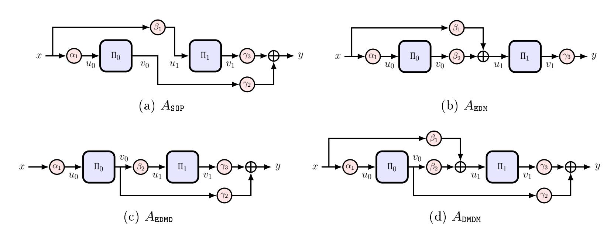
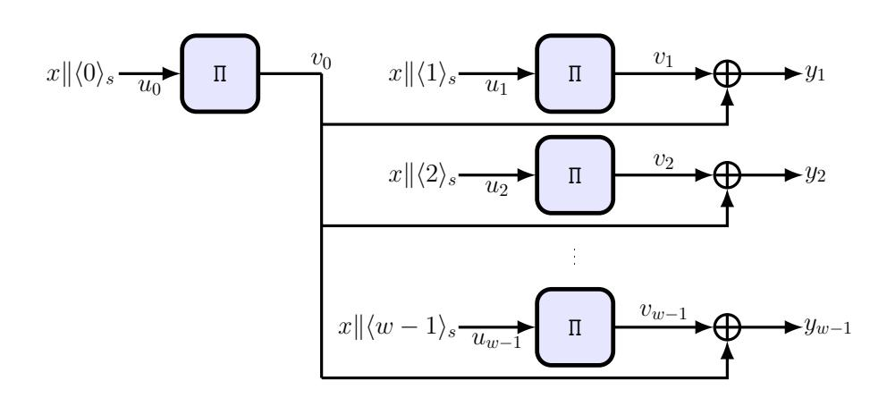

{0}------------------------------------------------

# How to Build a Short-Input Random Oracle from Public Random Permutations\*

Ritam Bhaumik<sup>1</sup>, Nilanjan Datta<sup>2,3</sup>, Avijit Dutta<sup>2,3</sup>, Ashwin Jha<sup>4</sup>, Sougata Mandal<sup>2,5</sup>, Bart Mennink<sup>6</sup>, Hrithik Nandi<sup>2,5</sup>, and Yaobin Shen<sup>7</sup>

Technology Innovation Institute, Abu Dhabi, UAE bhaumik.ritam@gmail.com
 Institute for Advancing Intelligence (IAI), TCG CREST, Kolkata, India
 Academy of Scientific and Innovative Research (AcSIR), Ghaziabad, India
 nilanjan.datta@tcgcrest.org, avijit.dutta@tcgcrest.org
 Ruhr University Bochum, Bochum, Germany ashwin.jha@outlook.de
 Ramakrishna Mission Vivekananda Educational and Research Institute, Belur, India
 sougatamandal2014@gmail.com, hrithiknandi.crypto@gmail.com
 Maastricht University, Maastricht, Netherlands bart.mennink@maastrichtuniversity.nl
 Xiamen University, Xiamen, China yaobin.shen@xmu.edu.cn

Abstract. A vast body of work studies how to build a pseudorandom function (PRF) from a pseudorandom permutation (PRP) with beyond-the-birthday-bound (BBB) security. Often, such constructions are also expected to offer some security in keyless settings, for example in the context of committing security or to substitute a parallelizable short-input random oracle (RO) if used in counter mode. This has spurred several works on keyless variants of PRP-to-PRF constructions. However, recent works (Gunsing et al., CRYPTO 2022, 2023) reveal flaws in almost all existing proofs, painting a grim picture. This paper clarifies the situation with an in-depth analysis of RP-based short-input RF constructions.

First, we categorize all two-call short-input/output RP-to-RF constructions and evaluate their indifferentiability level. We introduce the "chaining attack", a powerful, widely applicable differentiability attack. When applied to the sum of a permutation and its inverse, it invalidates an earlier result (Dodis et al., EUROCRYPT 2008). On the positive side, we show that only the Sum Of Permutations and Encrypted Davies-Meyer Dual, when instantiated with independent permutations, achieve BBB security and could potentially yield a parallelizable short-input RO.

Second, we study the indifferentiability of expanding RP-to RF constructions and show that NOPP.

Second, we study the indifferentiability of expanding RP-to-RF constructions and show that  $XORP_w$ , the core PRF underlying CENC, achieves BBB security. As side effects, we obtain a simplified proof of indifferentiability for Sum of Permutations, and the committing security of CENC.

 $\textbf{Keywords:} \ indifferentiability \cdot RP\text{-to-RF conversion} \cdot short\text{-input RO} \cdot beyond \ birthday\text{-bound} \cdot key \ commitment$ 

#### <span id="page-0-0"></span>1 Introduction

The dominating building block for cryptographic constructions is a block cipher E. This is a function that takes as input a key K of size k bits, and bijectively transforms an input block of certain (fixed) size n bits to an output block of the same size. It is then argued that, if this block cipher is a pseudorandom permutation (PRP), i.e., if for a fixed and secret key K it behaves like a secret random permutation  $\Pi$ , then the overlying construction achieves a desired security goal. A well-known example of this is counter mode encryption: to encrypt a message M, one first selects a unique (n-s)-bit nonce N, generates a keystream

$$Z \leftarrow \mathtt{E}_K(N \| \langle 0 \rangle_s) \parallel \mathtt{E}_K(N \| \langle 1 \rangle_s) \parallel \cdots$$

(where  $\langle i \rangle_s$  denotes the s-bit encoding of i), and bitwise adds the first |M| bits of Z to the message to get the ciphertext. This construction is proven secure [6,37] if (i) E is a PRP and (ii) the number of evaluations of  $E_K$  does not exceed  $2^{n/2}$ .

The term  $2^{n/2}$  is the birthday-bound in the block size n. It comes from the fact that  $\mathbf{E}_K$  behaves like a bijection on n-bit strings whereas keystream encryption should be perfectly random. Stated differently, we are employing a PRP as a pseudorandom function (PRF), and the well-known PRP-PRF switch [11] states that a PRP behaves like a PRF as long as the number of evaluations does not exceed  $2^{n/2}$ .

<sup>\*</sup> This article is the full version of the paper that appeared at EUROCRYPT 2026.

{1}------------------------------------------------

Although for general-purpose block ciphers such as AES-128 [30], with n=128, this does not seem to be a problem, the rise of lightweight cryptography has lead to the introduction of a myriad of PRPs supporting block sizes of 64 bits or even less, such as PRESENT [19], KATAN/KTANTAN [22], PRINCE [20], SIMON [4], SKINNY [5], and Midori [2]. Usage of such small block ciphers in birthday-bound secure encryption modes can be a serious security risk, as demonstrated by Bhargavan and Leurent [14].

#### 1.1 PRP-to-PRF Conversion

One way to mitigate this security risk is by the use of more advanced PRP-to-PRF conversion methods: constructions that use PRPs in such a way that a PRF is obtained with security beyond the birthday-bound. A leading scheme in this direction is the Sum Of Permutations, as initially presented by Bellare et al. [9] and Hall et al. [46]:

<span id="page-1-1"></span>
$$\mathtt{SOP}^{\Pi_0,\Pi_1}(x) := \Pi_0(x) \oplus \Pi_1(x) \,, \tag{1}$$

where  $\Pi_0$  and  $\Pi_1$  are two secret random permutations. A long line of research [8,9,26,31,36,46,52,58,60], culminating in a work of Dinur [33], demonstrates that this construction behaves like a random function  $\Gamma$  up to  $2^n$  queries. In contrast, the single-permutation variant, i.e.,

$$\mathtt{sSOP}^{\Pi}(x) := \Pi(x) \oplus \Pi(x) \,, \tag{2}$$

where  $\Pi$  is a secret random permutation, is trivially broken. However, with domain separation, i.e.,

$$dsSOP^{\Pi}(x) := \Pi(x||0) \oplus \Pi(x||1), \qquad (3)$$

n-bit security is retrieved. Guo et al. [45] proved 2n/3-bit security of another variant of the SOP construction (with  $\Pi_1 = \Pi_0^{-1}$ ) that we call SOPI — the Sum Of a Permutation and its Inverse. Two other well-known PRP-to-PRF conversion methods are Encrypted Davies-Meyer of Cogliati and Seurin [27] and Encrypted Davies-Meyer Dual of Mennink and Neves [55]:

<span id="page-1-3"></span><span id="page-1-2"></span>
$$\mathtt{EDM}^{\Pi_0,\Pi_1}(x) := \Pi_1(\Pi_0(x) \oplus x), \qquad (4)$$

$$EDMD^{\Pi_0,\Pi_1}(x) := \Pi_1(\Pi_0(x)) \oplus \Pi_0(x). \tag{5}$$

Various works have analyzed security of Encrypted Davies-Meyer [27, 31, 55], leading to a bound that guarantees  $2^n/n$  security. Mennink and Neves demonstrated that Encrypted Davies-Meyer Dual is at least as secure as the Sum Of Permutations [55]. Also for these constructions, single-permutation variants can be considered where  $\Pi_0 = \Pi_1 = \Pi$  (dubbed sEDM and sEDMD): in this case, both constructions are known to achieve around 2n/3-bit security [28, 45].

It is worth noting that there is a last well-known conversion method, namely Truncation, where one simply discards part of the output:

$$trunc^{\Pi}(x) := msb_t(\Pi(x)), \qquad (6)$$

where  $\mathsf{msb}_t$  outputs the most significant  $t \leq n$  bits of its input. This construction is proven to be secure up to around  $2^{n-t/2}$  queries [8,39].

#### 1.2 PRP-to-Expanding-PRF Conversion

Clearly, putting Sum Of Permutation style constructions in counter mode (instead of the actual block cipher) yields security beyond the birthday-bound (possibly even up to  $2^n$  queries), but as a downside, the number of block cipher evaluations doubles (and a similar observation holds for Truncation). This has lead to the development of expanding PRFs: conversion methods with outputs larger than n bits, without expanding the input.<sup>8</sup>

One creative approach in this direction is the Summation-Truncation Hybrid of Gunsing and Mennink [44], that combines the Sum Of Permutations with Truncation:

$$STH^{\Pi_0,\Pi_1}(x) := \mathsf{msb}_t(\Pi_0(x)) \parallel \mathsf{msb}_t(\Pi_1(x)) \parallel \mathsf{lsb}_{n-t}(\Pi_0(x) \oplus \Pi_1(x)). \tag{7}$$

<span id="page-1-0"></span><sup>&</sup>lt;sup>8</sup> One may say that dsSOP is also an expanding PRF as it maps inputs of n-1 bits to outputs of n bits. However, this is merely an artifact of the scheme rather than a feature.

{2}------------------------------------------------

It achieves the same level of security as Truncation [\[44\]](#page-19-11), though with a slightly extended output. A more versatile approach is XORPw, for w ≥ 1. This construction can be seen as an extension of the Sum Of Permutations to w − 1 blocks at limited extra cost, and it rst appeared as building block in the CENC mode of encryption [\[47\]](#page-20-6):

<span id="page-2-1"></span>
$$\mathsf{XORP}_w^{\Pi}(x) := \Pi(x \| \langle 0 \rangle_s) \oplus \Pi(x \| \langle 1 \rangle_s) \parallel \Pi(x \| \langle 0 \rangle_s) \oplus \Pi(x \| \langle 2 \rangle_s) \parallel \cdots \parallel \Pi(x \| \langle 0 \rangle_s) \oplus \Pi(x \| \langle w - 1 \rangle_s), \quad (8)$$

where s = ⌈log<sup>2</sup> (w)⌉ ≤ n bits are devoted to an encoding. This construction was proven secure [\[16,](#page-18-9)[47,](#page-20-6)[48\]](#page-20-7) up to 2 <sup>n</sup>/w queries. This construction extends its input from n − s bits to (w − 1)n bits, by just using w primitive calls, while still achieving optimal security.

#### <span id="page-2-0"></span>1.3 Security in Keyless Setting and Applications

Although, at rst sight, the concept of PRP-to-PRF conversion mostly makes sense in the keyed setting, given the origin of its applications, its value in the unkeyed setting is becoming more and more prevalent. This is, for example, the case in context committing security [\[1,](#page-18-10) [7,](#page-18-11) [23,](#page-19-12) [41,](#page-19-13) [51\]](#page-20-8): in this application, keyed cryptographic schemes are expected to also achieve some level of security if the attacker can choose/inuence the secret key. This is necessary, for example, in use cases such as key rotation in key management services or envelope encryption, which may be vulnerable if an attacker can generate ciphertexts that would decipher to valid plaintexts under dierent keys.

However, context committing security comes with a wide range of varieties [\[7,](#page-18-11) [17,](#page-18-12) [23\]](#page-19-12), and its formalism also depends heavily on the specic use case (such as message authentication or authenticated encryption). A convenient avenue would be to instead look at a slightly stronger but more universal notion, namely indierentiability [\[29,](#page-19-14) [54\]](#page-20-9). Indeed, if a cryptographic scheme is indierentiable from a random oracle, it behaves as such even if the adversary can manipulate all inputs. For example, if one takes a hash function that is indierentiable from a random oracle, such as a sponge function [\[13\]](#page-18-13), one can use it in keyed applications such as key derivation, keystream generation, message authentication, and so on, and security in the keyed setting as well as under key commitment immediately follows from the indierentiability. Likewise, indierentiability of authenticated encryption [\[3\]](#page-18-14) implies context committing authenticated encryption.

Thus, if we could reason that the above-mentioned keyed PRP-to-(expanding)-PRF conversion methods also fare well in the keyless setting in the indierentiability model, these can be used to build keyed cryptographic construction that, thanks to indierentiability composition [\[54\]](#page-20-9), still achieve security in the chosen key setting. For example, if we could argue that XORP<sup>w</sup> is not only a good PRP-to-expanding-PRF conversion method but also achieves good security if the underlying PRP is not secret (i.e., in the public primitive setting), it automatically allows us to conclude that CENC is committing secure (we elaborate on this in Section [4.2\)](#page-15-0).

Short-input random oracles may also nd applications in proof-of-knowledge protocols. For instance, the FiatShamir transform [\[38\]](#page-19-15) uses short-input hash functions to make public-coin proofs non-interactive. In this setting, XORP<sup>w</sup> instantiated with a permutation over a suciently large domain could be benecial. Moreover, MPC-in-the-head protocols [\[21\]](#page-19-16) often use the GGM PRF [\[40\]](#page-19-17). Here, a short-input construction like XORP<sup>w</sup> can improve eciency: one can instantiate the GGM PRF on a w-ary tree while still requiring only two permutation calls per level, while tightening the resulting quantitative bounds. Another useful application for short-input hash functions can be in password hashing.

#### 1.4 Indierentiability of RP-to-(Expanding)-RF Conversion

Unfortunately, the situation on indierentiability of RP-to-RF conversion methods (note that we dropped the P for pseudo as we are in the keyless setting) is quite dicey. This is clearly exemplied by the saga on the indierentiability of the Sum Of Permutations. In 2010, Mandal et al. [\[53\]](#page-20-10) proved indierentiability up to 2 <sup>2</sup>n/<sup>3</sup> queries, but Mennink and Preneel [\[56\]](#page-20-11) pointed out a aw in that proof. They furthermore proved security up to 2 <sup>2</sup>n/<sup>3</sup>/n queries with a dierent strategy. Lee [\[49\]](#page-20-12) studied the sum of k permutations, and proved security up to 2 (k−1)n/k queries for all even k ≥ 4. Bhattacharya and Nandi [\[15\]](#page-18-15) eventually proved optimal security up to 2 <sup>n</sup> queries. However, four years later, Gunsing [\[42\]](#page-19-18) discovered that all of these works followed a common assumption that is awed. In fact, Gunsing noted that this assumption only works in a weaker model of indierentiability, called sequential indierentiability. Finally, Gunsing et al. [\[43\]](#page-19-19) managed to re-attain 2 <sup>2</sup>n/<sup>3</sup>/n security, and gave a 2 <sup>5</sup>n/<sup>6</sup> attack on the natural simulators (including that of Bhattacharya and Nandi [\[15\]](#page-18-15)). However, in the end, the work of Gunsing et al. [\[43\]](#page-19-19) 

{3}------------------------------------------------

leaves us with an unsatisfying state of affairs in that it is not known what the actual security of the Sum Of Permutations is.

The situation is not much better for other constructions. To the contrary: indifferentiability of other RP-to-RF conversion methods is barely explored. To the best of our knowledge, the only known results are due to Dodis et al. [34], who proved roughly n/2-bit security for SOPI; Choi et al. [25], who studied the indifferentiability of a truncated random permutation; and Datta et al. [32], who analyzed the sequential indifferentiability of STH [44] and EDM [27] construction. In light of the current state of the art in regular indifferentiability, results for EDM [27], EDMD [55], STH [44],  $\text{XORP}_w$  [47], or their single-primitive variants are simply non-existent.

In this work, we present a detailed investigation of the indifferentiability of RP-to-RF conversion methods. The contribution consists of two main parts:

- (I) We present a characterization of all two-call RP-to-RF conversion methods and what level of indifferentiability they achieve;
- (II) We explore the indifferentiability of expanding RFs, or short-input random oracles.

We elaborate on these two main contributions below.

#### Contribution (I): Characterization of Two-Call Short-I/O Candidates

To begin with, we study a class of two-call RP-to-RF conversion methods in Section 3. This treatment generalizes the one in the keyed setting by Chen et al. [24] and Bhaumik et al. [18], and it results in the observation that (perhaps unsurprisingly) SOP, EDMD, EDM, and DMDM (a cascade of two Davies-Meyer evaluations) are the strongest possible candidates: all other schemes are either equivalent to these or trivially differentiable. We then consider the actual security of these remaining constructions in three cases: (i) the base case where the two RPs are independent, (ii) the case where the two RPs are identical, and (iii) the case where the second RP is the inverse of the first one. The entire state-of-the-art for these four schemes and their siblings is given in Table 1. To complete this table, we had to derive new technical bounds on some of these constructions, including EDM and EDMD.

As part of this classification, we present the "chaining attack". This attack works for instantiations where the two RPs are related (either identical or each other's inverse) and consists of chaining multiple construction evaluations in a smart way. We use this powerful attack to demonstrate differentiability of *all* instances with related RPs. In particular, as we explicitly demonstrate in Sections 3.3 and 3.4, it demonstrates that SOPI can be distinguished from random in a constant number of queries, and therewith it invalidates the earlier indifferentiability result of Dodis et al. [34].

On the positive side, in case the RPs are independent, we demonstrate tight birthday bound indifferentiability of EDM and DMDM and beyond birthday-bound  $2^{2n/3}$  indifferentiability of SOP and EDMD. These results hold for the fully general form of these constructions (see (12)).

#### Contribution (II): Short-Input Expanding Random Oracles

Next, we explore the possibility of obtaining an expanding RF from RPs, with a focus on the variable-output length construction  $\mathtt{XORP}_w$ , in Section 4. We demonstrate that it is  $2^{2n/3}/w^{4/3}$  secure. In comparison, for the short-input sponge construction [12], Lefevre showed [50] that the security is capped at  $2^{n/2}$  queries. At the same time,  $\mathtt{XORP}_w$  is also parallelizable and requires comparatively a smaller number of permutation calls for moderate-length outputs.

Notably, the proof is both short and elegant, and it applies to the domain-separated SOP in a straightforward manner by setting w = 2. Moreover, the very same proof approach also yields, as a bonus, an alternative proof (see Appendix D) of the indifferentiability of SOP, thereby confirming the more involved proof of Gunsing et al. [43].

We finally apply this finding to committing security of CENC in Section 4.2. In detail, we demonstrate (as suggested in Section 1.3) how the keyless indifferentiability security of  $\mathtt{XORP}_w$  can be used to argue committing security of CENC through a simple reduction, though in the ideal cipher model and up to around  $2^{n/2}/w$  queries.

#### 1.5 Outline of Contributory Sections

The generic treatment of two-call RP-to-RF conversion methods is given in Section 3, with detailed proofs deferred to Appendix A for SOP and EDMD, and Section 5 for EDM. The chaining attack, used to

{4}------------------------------------------------

invalidate indifferentiability of a wide class of functions, is presented in Section 3.2 and 3.3, and we make explicit how it invalidates the earlier security proof of SOPI in Section 3.4. We explore the security of the expanding RF  $XORP_w$  in Section 4, and we discuss the impact of this result to committing security in Section 4.2.

#### 2 Preliminaries

#### 2.1 Notation

For a set  $\mathcal{X}$ , we denote by  $x \leftarrow \mathcal{X}$  the uniformly random sampling of an element from  $\mathcal{X}$ . If x and y are two bit-strings of the same length, we denote by  $x \oplus y$  their bit-wise XOR. For a natural number  $q \geq 1$ , [q] denotes the set of first q natural numbers. For  $a < 2^n$ ,  $(2^n)_a := 2^n(2^n - 1) \cdots (2^n - a + 1)$ . For a positive integer i and a natural number s, we write  $\langle i \rangle_s$  to denote the s-bit binary representation of integer i. For  $x \in \{0,1\}^n$ , and  $s \leq n$ ,  $\mathsf{msb}_s(x)$  denotes the most significant s bits of x, and  $\mathsf{lsb}_s(x)$  denotes the least significant s bits of s. ints0 denotes the integer equivalent of the binary string s1. Since s2 a finite set s3 and a fixed element s4 and s5 denotes the set s5. Since s5 is commutative over s6, s7, s8 and s9 and any function s9. Since s9 denotes the subset s9 and any function s9. Since s9 denotes the subset s9 and s9 and any function s9. For any sets s9 and any function s9 and s9 and any function s9.

For a list  $\mathcal{L}$  consisting of key-value pairs (key, val),  $\mathcal{L}(key) = val$  denotes that the value in the list corresponding to the key key is val. On the other hand,  $\mathcal{L}(key) = NULL$  denotes that the value in the list corresponding to the key key is undefined.

For any bitstring x of length at most n bits, we write  $\lceil x \rceil_n = x || 0^{n-|x|}$ . For any predicate P,  $1_P$  denotes the indicator variable with respect to P. For a partial function  $f = \{(x_1, y_1), \ldots, (x_t, y_t)\}$ , we denote its domain and range respectively as  $\mathsf{dom}(f) := \{x_1, \ldots, x_t\}$  and  $\mathsf{ran}(f) := \{y_1, \ldots, y_t\}$ .

#### 2.2 Indifferentiability

The notion of indifferentiability was first introduced by Maurer et al. [54] to measure the degree in which a keyless function behaves like its random counterpart. We will adapt a slightly stronger definition due to Coron et al. [29].

Fix some finite  $\mathcal{X}, \mathcal{Y} \subseteq \{0,1\}^*$  and some positive integer k. Given k independent random permutations  $\Pi = (\Pi_i : i \in [k])$  of  $\{0,1\}^n$ , let  $F : \mathcal{X} \to \mathcal{Y}$  denote an oracle-based function with black-box oracle access to a collection of independent random permutations. We often write  $F^{\Pi}$  to make F's dependence on  $\Pi$  explicit.

Let  $\Gamma: \mathcal{X} \to \mathcal{Y}$  denote a uniform random function, or random oracle [10]. We say that an oracle-algorithm  $\mathcal{S}$  with black-box oracle access to  $\Gamma$ ,  $\Gamma$ -simulates  $\Pi$  if it can provide oracle access to pairs of oracle  $(\mathcal{S}_i, \mathcal{S}_i^{-1})$ , where  $\mathcal{S}_i, \mathcal{S}_i^{-1}: \{0, 1\}^n \to \{0, 1\}^n$  for all  $i \in [k]$ .

oracle  $(S_i, S_i^{-1})$ , where  $S_i, S_i^{-1} : \{0, 1\}^n \to \{0, 1\}^n$  for all  $i \in [k]$ . For compactness, we write  $\Pi^{\pm} = (\Pi_i^{\pm} : i \in [k])$  and  $S^{\pm} = (S_i^{\pm} : i \in [k])$ , where  $\Pi_i^{\pm} = (\Pi_i, \Pi_i^{-1})$  and  $S_i^{\pm} = (S_i, S_i^{-1})$ .

**Definition 1 (Strong Indifferentiability).** We say that F is  $\epsilon$ -(strongly) indifferentiable from  $\Gamma$ , if there exists a simulator S such that for any binary-output oracle-algorithm  $\mathcal{D}$ ,

$$\mathbf{Adv}_{F,\mathcal{S}}^{\text{indif}}\left(\mathcal{D}\right) := \left| \Pr\left(\mathcal{D}^{F,\Pi^{\pm}} = 1\right) - \Pr\left(\mathcal{D}^{\Gamma,\mathcal{S}^{\pm}} = 1\right) \right| \le \epsilon, \tag{9}$$

for some real  $\epsilon$ , and the number of queries that S makes to  $\Gamma$  is polynomially-bounded in the number of queries by  $\mathcal{D}$ .

Notational convention. We will refer to  $(F,\Pi^{\pm})$  as the real world and to  $(\Gamma, \mathcal{S}^{\pm})$  as the simulated world. The attacker can make a construction query to C (F in the real world and  $\Gamma$  in the simulated world) and it can make a primitive query to  $P^{\pm}$  ( $\Pi^{\pm}$  in the real world and  $\mathcal{S}^{\pm}$  in the simulated world). The input and output of  $P_i$  will typically be denoted by  $u_i$  and  $v_i$ , respectively, and the output of C will be denoted by  $p_i$ . We drop the subscript in case of single permutation constructions. Throughout, we fix some positive integer  $p_i$  to denote an upper bound on both the number of construction and primitive queries. So, the total number of adversarial queries is at most  $p_i$ 

{5}------------------------------------------------

#### 2.3 H-Coefficient Technique

For any indifferentiability game we will use the word transcript to denote a chronological list of all queries the adversary makes to C and P<sup>±</sup> and the corresponding responses it receives. Let  $X_{re}$  denote the transcript in the real world, and  $X_{sim}$  denote the transcript in the simulated world. A transcript  $\tau$  is said to be attainable if  $Pr(X_{re} = \tau) > 0$ . Let  $\Theta$  denote the set of all attainable transcripts. The main theorem of the H-Coefficient technique [59] is as follows:

**Theorem 1** (H-Coefficient Technique). Let  $\mathcal{D}$  be a fixed deterministic distinguisher that has access to either  $(F, \Pi^{\pm})$  (the real world) or  $(\Gamma, \mathcal{S}^{\pm})$  (the simulated world). Let  $\Theta = \Theta_{\text{good}} \sqcup \Theta_{\text{bad}}$  be some partition of the set of attainable transcripts  $\Theta$ , such that for any 'good' attainable transcript  $\tau \in \Theta_{\text{good}}$  that  $\mathcal{D}$  can query with a non-zero probability,

$$\frac{\Pr\left(\mathbf{X}_{\text{sim}} = \tau\right)}{\Pr\left(\mathbf{X}_{\text{re}} = \tau\right)} \ge 1 - \epsilon,$$

for some  $\epsilon \geq 0$ . Then,

$$\mathbf{Adv}_{F,S}^{\mathrm{indif}}\left(\mathcal{D}\right) \le \epsilon + \Pr\left(\mathbf{X}_{\mathrm{re}} \in \Theta_{\mathrm{bad}}\right). \tag{10}$$

## <span id="page-5-0"></span>3 Characterizing Short-I/O Random Oracles

We start with characterizing a large class of short-I/O random oracles, including the popular constructions SOP, EDM, and EDMD. Fix a positive integer n. We identify the Galois field of order  $2^n$ , denoted  $\mathbb{F}_{2^n}$ , by  $\{0,1\}^n$ , the set of n-bit strings. The field  $\mathbb{F}_{2^n}$  can be equivalently viewed as the n-dimensional vector space  $\mathbb{F}_2^n$  over  $\mathbb{F}_2$ . Let  $\mathrm{GL}(\mathbb{F}_2^n)$  denote the set of all bijective linear transformations from  $\mathbb{F}_{2^n}$  to itself, which is also isomorphic to the group of invertible  $n \times n$  matrices over  $\mathbb{F}_2$ .

Consider the class of functions  $F: \{0,1\}^n \to \{0,1\}^n$ , based on two permutations  $\Pi_0, \Pi_1$  of  $\{0,1\}^n$ , for which one can find  $\alpha_1, \beta_1, \beta_2, \gamma_1, \gamma_2, \gamma_3 \in GL(\mathbb{F}_2^n) \cup \{0\}$  such that for any  $x \in \{0,1\}^n$ :

- 1.  $u_0 = \alpha_1 x$ .
- 2.  $v_0 = \Pi_0(u_0)$ .
- 3.  $u_1 = \beta_1 x \oplus \beta_2 v_0$ .
- 4.  $v_1 = \Pi_1(u_1)$ .
- 5.  $y = \gamma_1 x \oplus \gamma_2 v_0 \oplus \gamma_3 v_1$ .
- 6.  $\mathbf{F}^{\Pi_0,\Pi_1}(x) := y$ .

Without loss of generality, we assume  $\gamma_1 = 0$ , since the distinguisher can always consider the modified function  $F'(x) = F(x) \oplus \gamma_1 x$ .

Remark 1. One can state a more general definition, where  $\alpha_1, \beta_1, \beta_2, \gamma_1, \gamma_2, \gamma_3$  are all linear maps (not necessarily bijections) from  $\mathbb{F}_{2^n}$  to itself. While this class of functions can be characterized in its full generality, there appears to be no particularly natural and interesting beyond birthday-bound secure candidates beyond those captured by our definition. Previous such characterizations, most notably by Chen et al. [24] and Bhaumik et al. [18], were restricted to automorphisms of the form  $\alpha \in \mathbb{F}_{2^n}$  or  $\alpha = 0$ , so our approach is already more general.

The above definition essentially says that we can represent F by the permutations  $\Pi_0$  and  $\Pi_1$ , and a  $3 \times 3$  block matrix A defined as follows:

<span id="page-5-1"></span>
$$A = \begin{pmatrix} \alpha_1 & 0 & 0 \\ \beta_1 & \beta_2 & 0 \\ 0 & \gamma_2 & \gamma_3 \end{pmatrix}, \tag{11}$$

where  $\alpha_1, \beta_1, \beta_2, \gamma_1, \gamma_2, \gamma_3 \in GL(\mathbb{F}_2^n) \cup \{0\}$ . Furthermore, for each  $x \in \mathbb{F}_2^n$ , we have the equation

$$A \cdot \begin{pmatrix} x \\ v_0 \\ v_1 \end{pmatrix} = \begin{pmatrix} u_0 \\ u_1 \\ y \end{pmatrix}.$$

To summarize, any F can be completely characterized by the triple  $A(\Pi_0, \Pi_1) = (A, \Pi_0, \Pi_1)$ . We use this equivalency whenever convenient, and further simplify the notations by dropping  $\Pi_0$  and  $\Pi_1$  whenever they are inconsequential for the concerned discussion. The following propositions rule out all trivially differentiable constructions.

{6}------------------------------------------------

**Proposition 1.** If A contains either a zero row or a zero column, then there exists a distinguisher  $\mathcal{D}$  that makes at most 1 construction query and 1 primitive query, such that for any simulator  $\mathcal{S}$  that makes  $q_{\mathcal{S}}$  queries on expectation,

$$\mathbf{Adv}_{\mathtt{F},\mathcal{S}}^{\mathrm{indif}}\left(\mathcal{D}\right) \geq 1 - \frac{q_{\mathcal{S}}}{2^{n}}.$$

*Proof.* Case by case analysis shows that in each case, the resulting construction can be broken with two queries. In particular, observe that if A contains either a zero row or a zero column, then either the function F becomes constant, or the influence of one permutation is lost. More precisely, the input to one permutation becomes a fixed constant, or one of the permutations no longer appears in the description of the function F.

**Proposition 2.** If A is such that  $\beta_1 = \gamma_2 = 0$  then there exists a distinguisher  $\mathcal{D}$  that makes at most 1 construction query and 2 primitive query such that for any simulator  $\mathcal{S}$  that makes  $q_{\mathcal{S}}$  queries on expectation,

<span id="page-6-0"></span>
$$\mathbf{Adv}_{\mathtt{F},\mathcal{S}}^{\mathrm{indif}}\left(\mathcal{D}\right) \geq 1 - \frac{q_{\mathcal{S}}}{2^{n}}.$$

Proof. Let  $\beta_1 = \gamma_2 = 0$ . Then we have  $F(x) = \gamma_3(\Pi_1(\beta_2\Pi_0(\alpha_1x)))$ . First, choose an element x and make a construction query on input  $\alpha_1^{-1}x$ . Suppose the response is z. Next, make a primitive query to  $\Pi_1^{-1}$  on input  $\gamma_3^{-1}z$ , and let the response be v. Then make a primitive query to  $\Pi_0^{-1}$  on input  $\beta_2^{-1}v$ , and check whether the output equals x. In the real world, this check passes with probability 1 by the definition of F. In contrast, in the simulated world, the simulator has no prior information about x.

Consequently, we have the following four options, where  $\alpha_1, \beta_1, \beta_2, \gamma_2, \gamma_3$  are all non-trivial linear maps:

$$A_{\text{SOP}} = \begin{pmatrix} \alpha_1 & 0 & 0 \\ \beta_1 & 0 & 0 \\ 0 & \gamma_2 & \gamma_3 \end{pmatrix}, \quad A_{\text{EDM}} = \begin{pmatrix} \alpha_1 & 0 & 0 \\ \beta_1 & \beta_2 & 0 \\ 0 & 0 & \gamma_3 \end{pmatrix},$$

$$A_{\text{EDMD}} = \begin{pmatrix} \alpha_1 & 0 & 0 \\ 0 & \beta_2 & 0 \\ 0 & \gamma_2 & \gamma_3 \end{pmatrix}, \quad A_{\text{DMDM}} = \begin{pmatrix} \alpha_1 & 0 & 0 \\ \beta_1 & \beta_2 & 0 \\ 0 & \gamma_2 & \gamma_3 \end{pmatrix},$$

$$(12)$$

where by setting all non-trivial maps to the identity, the first three matrices (left-to-right, top-to-bottom) give the well-known SOP (see (1)), EDM (see (4)), and EDMD (see (5)) constructions, respectively. The fourth matrix results in a cascade of two Davies-Meyer functions, and hence we call it DMDM. In the rest of this section we will analyse these four matrices under three different assumptions on the statistical relation between  $\Pi_0$  and  $\Pi_1$ . Table 1 gives a summary of the entire classification and analyses.



Fig. 1: The four two-call RP-to-RF conversion methods of (12). All are described for two n-bit independent random permutations  $\Pi_0$  and  $\Pi_1$ .

{7}------------------------------------------------

<span id="page-7-0"></span>Table 1: Summary of indifferentiability advantage bounds for  $q \leq 2^{n-3}$  adversarial queries. The logarithmic terms are suppressed in the bounds. Here,  $q_{\mathcal{S}}$  denotes the number of queries the simulator makes on expectation and c > 1 is a constant.

| Candidate                                                                                                                         | Parameters                                             | Indifferentiability                                                                   |
|-----------------------------------------------------------------------------------------------------------------------------------|--------------------------------------------------------|---------------------------------------------------------------------------------------|
| $A_{\tt SOP}^{{\Pi_0},{\Pi_1}},A_{\tt EDMD}^{{\Pi_0},{\Pi_1}} \ A_{\tt EDM}^{{\Pi_0},{\Pi_1}},A_{\tt DMDM}^{{\Pi_0},{\Pi_1}}$     | *                                                      | $O(\sqrt{q^3/2^{2n}})$ ( [43], Thm. 2, Thm. 3) $\Theta(q^2/2^n)$ (Thm. 4-5, Thm. 6-7) |
| $A_{\texttt{SOP}}^{\texttt{II}},A_{\texttt{EDMD}}^{\texttt{II}} \ A_{\texttt{EDM}}^{\texttt{II}},A_{\texttt{DMDM}}^{\texttt{II}}$ | $\alpha_1=\beta_1$                                     | $1 - O(q_{\mathcal{S}}/2^n)$ (Prop. 3)                                                |
| $A_{\texttt{SOP}}^{\Pi},A_{\texttt{EDMD}}^{\Pi}$ $A_{\texttt{EDM}}^{\Pi},A_{\texttt{DMDM}}^{\Pi}$                                 | $\alpha_1 \neq \beta_1$                                | $1 - 1/c - cq_{\mathcal{S}}/2^n \text{ (Thm. 8)}$                                     |
| $A_{\tt SOP}^{\Pi\pm},A_{\tt EDMD}^{\Pi\pm}$ $A_{\tt EDM}^{\Pi\pm},A_{\tt DMDM}^{\Pi\pm}$                                         | $\beta_1 = 0 \text{ or } (\beta_2, \gamma_2) = (1, 0)$ | $1 - O(q_{\mathcal{S}}/2^n)$ (Prop. 4)                                                |
| $A_{\tt SOP}^{\Pi\pm},A_{\tt EDMD}^{\Pi\pm} \ A_{\tt EDM}^{\Pi\pm},A_{\tt DMDM}^{\Pi\pm}$                                         | $(\beta_1, \beta_2, \gamma_2) \neq (0, 1, 0)$          | $1 - 1/c - cq_{\mathcal{S}}/2^n \text{ (Thm. 9)}$                                     |

#### 3.1 Analysis when $\Pi_0$ is Independent of $\Pi_1$

We use  $A_{\mathtt{SOP}}^{\Pi_0,\Pi_1},\,A_{\mathtt{EDMD}}^{\Pi_0,\Pi_1},\,A_{\mathtt{EDMD}}^{\Pi_0,\Pi_1},\,$  and  $A_{\mathtt{DMDM}}^{\Pi_0,\Pi_1}$  to denote the constructions in this class.

Firstly, we prove beyond the birthday bound indifferentiability security for  $A_{\text{SOP}}^{\Pi_0,\Pi_1}$  and  $A_{\text{EDMD}}^{\Pi_0,\Pi_1}$ . The proofs of both these results are available in Appendix A, and follow from a simple combinatorial equivalency followed by an application of [43, Corollary 1].

**Theorem 2.** Fix some  $9n \leq q \leq 2^{n-2}$ . Suppose  $\Pi_0$  is independent of  $\Pi_1$ . There exists an efficient simulator S such that for any distinguisher D making at most q queries,

<span id="page-7-1"></span>
$$\mathbf{Adv}^{\mathrm{indif}}_{A_{\mathtt{SOP}}^{\mathtt{In}_{0},\mathtt{II}_{1}},\mathcal{S}}\left(\mathcal{D}\right) \leq \frac{4.5q\sqrt{nq}}{2^{n}} + \frac{q}{2^{n}} + \frac{29.5q^{3}}{2^{2n}}.$$

<span id="page-7-2"></span>**Theorem 3.** Fix some  $9n \leq q \leq 2^{n-2}$ . Suppose  $\Pi_0$  is independent of  $\Pi_1$ . There exists an efficient simulator S such that for any distinguisher D making at most q queries,

$$\mathbf{Adv}^{\mathrm{indif}}_{A^{\Pi_0,\Pi_1}_{\mathtt{EDMD}},\mathcal{S}}\left(\mathcal{D}\right) \leq \frac{9q\sqrt{nq}}{2^n} + \frac{2q}{2^n} + \frac{59q^3}{2^{2n}}.$$

In the following theorems we prove tight birthday bound in differentiability security for  $A_{\tt EDM}^{\Pi_0,\Pi_1}$ . The proofs of these results are postponed to Section 5.

**Theorem 4.** Suppose  $\Pi_0$  is independent of  $\Pi_1$ . There exists a distinguisher  $\mathcal{D}$  that makes 2q construction queries such that for any simulator  $\mathcal{S}$ ,

<span id="page-7-3"></span>
$$\mathbf{Adv}^{\mathrm{indif}}_{A^{\Pi_{0},\Pi_{1}}_{\mathtt{EDM}},\mathcal{S}}\left(\mathcal{D}\right) \geq 1 - \exp\left(\frac{-q^{2}}{2^{n}}\right).$$

<span id="page-7-4"></span>**Theorem 5.** Fix some  $q \leq 2^{n-1}$ . Suppose  $\Pi_0$  is independent of  $\Pi_1$ . There exists an efficient simulator S such that for any distinguisher D making at most q queries,

$$\mathbf{Adv}^{\mathrm{indif}}_{A_{\mathtt{pnm}}^{\mathrm{II}_{0},\mathrm{II}_{1}},\mathcal{S}}\left(\mathcal{D}\right) \leq \frac{2q^{2}}{2^{n}}.$$

Finally, for  $A_{\mathtt{DMDM}}^{\Pi_0,\Pi_1}$ , we prove tight birthday bound in differentiability security in the following theorems.

<span id="page-7-6"></span><span id="page-7-5"></span><sup>&</sup>lt;sup>9</sup> A slightly better constant can be derived by using our alternate bound on SOP. See Appendix D for details.

{8}------------------------------------------------

**Theorem 6.** Fix some  $q \leq 2^{n-1}$ . There exists a distinguisher  $\mathcal{D}$  that makes 2q queries such that for any simulator  $\mathcal{S}$ ,

$$\mathbf{Adv}^{\mathrm{indif}}_{A_{\mathtt{DMDM}}^{\mathrm{In}_{0},\Pi_{1}},\mathcal{S}}\left(\mathcal{D}\right) \geq 1 - \frac{q^{2}}{2^{n+1}} - \exp\left(-\frac{q^{2}}{2^{n+1}}\right).$$

*Proof.* Since DMDM can be expressed as a composition of two non-injective functions — namely, independent instances of the Davies-Meyer function — Nandi's double-collision attack [57] applies and yields the desired result.  $\Box$ 

<span id="page-8-1"></span>**Theorem 7.** Fix some  $q \leq 2^{n-1}$ . Suppose  $\Pi_0$  is independent of  $\Pi_1$ . There exists an efficient simulator S such that for any distinguisher D making at most q queries,

$$\mathbf{Adv}_{A_{\mathtt{DMDM}},\mathcal{S}}^{\mathrm{indif}}\left(\mathcal{D}\right) \leq \frac{q^2}{2^n}.$$

The proof of this theorem is deferred to Appendix B.

#### <span id="page-8-0"></span>3.2 Analysis when $\Pi_0$ is Identical to $\Pi_1$

We write  $A_{\mathtt{SOP}}^{\Pi}$ ,  $A_{\mathtt{EDMD}}^{\Pi}$ , and  $A_{\mathtt{DMDM}}^{\Pi}$  to denote the constructions in this class. In the following discussion, we show that all these constructions are insecure in the (strong) indifferentiability setting. In fact, we demonstrate this with the most general matrix (11) of our classification:

$$A = \begin{pmatrix} \alpha_1 & 0 & 0 \\ \beta_1 & \beta_2 & 0 \\ 0 & \gamma_2 & \gamma_3 \end{pmatrix}.$$

The corresponding construction, referred as  $A^{\Pi}$ , is given by

<span id="page-8-3"></span>
$$F(x) = \gamma_2(\Pi(\alpha_1 x)) \oplus \gamma_3(\Pi(\beta_1 x \oplus \beta_2 \Pi(\alpha_1 x))). \tag{13}$$

One can immediately observe that if  $\alpha_1 = \beta_1$  then we must have  $F(\alpha_1^{-1}\Pi^{-1}(0^n)) = 0^n$ . This gives a simple indifferentiability attack.

<span id="page-8-2"></span>**Proposition 3.** Let A be the matrix of (11) with  $\beta_2 = 0$  and  $\beta_1 \alpha_1^{-1}$  has order  $\ell$ . There exists a distinguisher  $\mathcal{D}$  that makes  $\ell$  construction queries and 1 primitive query, such that for any simulator  $\mathcal{S}$  that makes  $q_{\mathcal{S}}$  queries on expectation,

$$\mathbf{Adv}_{A^{\Pi},\mathcal{S}}^{\mathrm{indif}}\left(\mathcal{D}\right) \geq 1 - \frac{q_{\mathcal{S}}}{2^{n}}.$$

*Proof.* Pick an element  $u_0$  and compute  $u_i = \beta_1 \alpha_1^{-1} u_{i-1}$  for  $i = 1, \ldots, \ell$ . Make  $\ell$  construction queries on inputs  $x_0, x_1, \ldots, x_{\ell-1}$ , where  $x_i = \alpha_1^{-1} u_i$  for  $i = 0, \ldots, \ell-1$ . Let the corresponding responses be  $y_0, y_1, \ldots, y_{\ell-1}$ . Now consider the system of equations  $\gamma_2 v_i \oplus \gamma_3 v_{i+1} = y_i$ , for all  $i \mod \ell$ . If this system has full rank, compute the values  $v_0, \ldots, v_\ell$  and check whether  $P^{-1}(v_0) = u_0$ . In the real world, this check holds with probability 1, whereas in the simulated world, the simulator has no prior information about  $u_0$ .

Otherwise, there exist coefficients  $a_0, \ldots, a_{\ell-1}$ , not all zero, such that  $\sum_{i=0}^{\ell-1} a_i y_i = 0$ , which occurs with only negligible probability in the simulated world.

Note that if  $\beta_2 = 0$  and  $\beta_1 \alpha_1^{-1}$  has order  $\ell$ , where  $\ell$  is polynomially bounded, then Proposition 3 already yields an distinguisher. So, from here on, we focus on the construction of (13) with non-trivial bijective linear maps where either  $\beta_2 \neq 0$  or  $\ell$  is not polynomially bounded. For this class of constructions, we describe a general strategy to build a structure that can then be exploited to attack any construction in this class.

{9}------------------------------------------------

The Chaining Attack. For  $k \ge 1$ , a sequence  $((u_0, v_0), (u_1, v_1), \dots, (u_k, v_k))$  over  $\{0, 1\}^n \times \{0, 1\}^n$  is said to be a k-chain if:

$$v_i = P(u_i), \qquad u_{i+1} = \beta_1 \alpha_1^{-1} u_i \oplus \beta_2 v_i,$$

holds for all  $i \in \{0, 1, ..., k-1\}$ . In the real world, one can easily verify that any k-chain satisfies the following recursive identity:

<span id="page-9-1"></span>
$$F(\alpha_1^{-1}u_0) \oplus \cdots \oplus F(\alpha_1^{-1}u_i) = \gamma_2 v_0 \oplus \bigoplus_{j=1}^i (\gamma_2 \oplus \gamma_3) v_j \oplus \gamma_3 v_{i+1}, \tag{14}$$

for any  $i \in \{1, ..., k-1\}$ . In fact, the converse is also true; in the real world, any sequence satisfying (14) is a k-chain. So, the two definitions are equivalent in the real world. On the other hand, even for moderately large k, maintaining such an equivalency is hard for any efficient simulator.

In Algorithm 1 we describe a probabilistic strategy to construct a k-chain by using (14) as the definition. In the real world, we will almost surely get a valid k-chain. In the ideal world, assuming that our hypothesis is true, the resulting structure will not be a valid k-chain with very high probability.

<span id="page-9-2"></span>**Algorithm 1** An algorithm to construct k-chains. Boxed instructions replace the corresponding lines in the inverse permutation case in Section 3.3.

```
1: function CHAIN(c, k)
                   v_0 \leftarrow c; \quad u_0 \leftarrow c'
P^{-1} \text{ query: } u_0 \leftarrow P^{-1}(v_0); \quad P \text{ query: } v_0 \leftarrow P(u_0)
  2:
  3:
                   for i \in \{0, \dots, k-1\} do x_i \leftarrow \alpha_1^{-1} u_i
  4:
  5:
                             C query: y_i \leftarrow C(x_i)

t_1 \leftarrow \beta_1 \alpha_1^{-1} u_i \oplus \beta_2 v_i; \quad t_2 \leftarrow \gamma_3^{-1} (y_i \oplus \gamma_2 v_i)

u_{i+1} \leftarrow t_1; \quad v_{i+1} \leftarrow t_2; \quad u_{i+1} \leftarrow t_2; \quad v_{i+1} \leftarrow t_1
\nif \exists j \leq i : u_{i+1} = u_j \vee v_{i+1} = v_j then
  6:
  7:
  8:
  9:
10:
                                         return (0, (j, i + 1))
11:
                     return (1, (u_0, v_0), \dots, (u_k, v_k))
```

Using this algorithm we are now ready to construct for every simulator a concrete distinguisher that makes exactly 2 queries to the primitive and q queries to the construction oracle, where q is a function of the number of queries the simulator makes to the random oracle.

For the sake of simplicity, we will fix distinguisher's first query to  $P^{-1}(v_0)$ . Then, for any simulator S, let the random variable  $Q_y(v_0)$  denote the total number of queries S makes to the random oracle on receiving  $P^{-1}(v_0)$  and  $P^{-1}(y)$  as the first two queries in that order up to the point of sending the response to the second query. Let  $q_y := \mathbb{E}(Q_y)$  for each y, where the expectation is taken over the random coins of S and  $\Gamma$ . Then, by the Markov Inequality, for any c > 1, we have  $\Pr(Q_y > cq_y) \le 1/c$ . Letting  $q_S := \max_y q_y$ , we get  $\Pr(Q_y > cq_S) \le 1/c$ .

**Theorem 8.** Let A be the matrix of (11) such that the order of  $\beta_1 \alpha_1^{-1}$  is not polynomially bounded. For any efficient simulator S, there exists a distinguisher D that makes 2 simulator queries and q construction queries, such that

<span id="page-9-0"></span>
$$\mathbf{Adv}_{A^{\Pi},\mathcal{S}}^{\mathrm{indif}}\left(\mathcal{D}\right) \geq 1 - \frac{1}{c} - \frac{3cq_{\mathcal{S}}}{2^{n}},$$

and  $q = cq_{\mathcal{S}} + 1$  for any constant c > 1.

*Proof.* Consider the following distinguisher  $\mathcal{D}$ :

Fix a constant v<sub>0</sub>.
 Execute CHAIN(v<sub>0</sub>, q) and let the response be C.
 If C = (0, ★) then return 0.
 Else, interpret C as (1, (u<sub>0</sub>, v<sub>0</sub>), ..., (u<sub>q</sub>, v<sub>q</sub>)).
 Query P<sup>-1</sup>(v<sub>q</sub>) and let the response be u.

{10}------------------------------------------------

6. If  $u = u_q$ , then return 1, else return 0.

We say that S completes the chain if S makes all the queries  $\Gamma(\alpha_1^{-1}u_i)$  for  $i \in \{0, \ldots, q-1\}$ . Let G denote the event that S makes more than  $cq_S$  queries to  $\Gamma$ . Then  $\Pr(G) \leq \Pr(Q_y = q) \leq 1/c$ . Thus, we have

$$\Pr(u = u_q) \le \Pr(u = u_q \land \neg G) + \frac{1}{c}.$$

Suppose  $\neg G$  happens, so S does not complete the chain. If S does not query  $\Gamma(\alpha_1^{-1}u_{q-1})$ , then

$$\Pr(u = u_q) = \Pr(u = \beta_1 \alpha_1^{-1} u_{q-1} \oplus \beta_2 \gamma_3^{-1} (y_{q-2} \oplus \gamma_2 v_{q-2})),$$

which is bounded by  $1/2^n$  by the randomness of  $y_{q-2} := \Gamma(\alpha_1^{-1}u_q)$ . Similarly, if  $\mathcal{S}$  does not query  $\Gamma(\alpha_1^{-1}u_{q-2})$ , then

$$\Pr\left(u = u_q\right) = \Pr\left(u = \beta_1 \alpha_1^{-1} u_{q-1} \oplus \beta_2 \gamma_3^{-1} (y_{q-2} \oplus \gamma_2 \gamma_3^{-1} (y_{q-3} \oplus \gamma_2 v_{q-3}))\right),\,$$

which is bounded by  $1/2^n$  by the randomness of  $y_{q-3}$ . Otherwise, let  $i_0$  be the smallest i such that for all i' with  $i \leq i' \leq q$ ,  $\mathcal{S}$  queries  $\Gamma(\alpha_1^{-1}u_{i'})$ . Since  $\mathcal{G}$  does not happen,  $i_0 > 0$ , so  $\mathcal{S}$  does not query  $\Gamma(\alpha_1^{-1}u_{i_0-1})$ . Also, since  $\mathcal{S}$  queries  $\Gamma(\alpha_1^{-1}u_{q-2})$  and  $\Gamma(\alpha_1^{-1}u_{q-3})$ ,  $i_0 \leq q-3$ , so  $\mathcal{S}$  queries  $\Gamma(\alpha_1^{-1}u_{i_0+1})$ . Now,  $\alpha_1^{-1}u_{i_0+1} = \alpha_1^{-1}\beta_1\alpha_1^{-1}u_{q-2} \oplus \alpha_1^{-1}\beta_2\gamma_3^{-1}(y_{q-3} \oplus \gamma_2 v_{q-3})$ , so by randomness of  $y_{q-3}$ , the probability that this lies in the queries that  $\mathcal{S}$  makes to  $\Gamma$  is bounded by  $q/2^n$ . Thus,

$$\Pr\left(u = u_q \land \neg \mathsf{G}\right) \le \frac{q}{2^n}.$$

Putting everything together, we have

<span id="page-10-1"></span>
$$\Pr\left(\mathcal{D}^{\Gamma,\mathcal{S}^{\pm}} = 1\right) \le \Pr\left(u = u_q\right) \le \frac{q}{2^n} + \frac{1}{c},\tag{15}$$

and

<span id="page-10-2"></span>
$$\Pr\left(\mathcal{D}^{A^{\Pi},\Pi^{\pm}}=1\right) \ge \left(1 - \Pr\left(\mathcal{C}=(0,\star)\right)\right) \times \Pr\left(u=u_q\right) \ge 1 - \frac{q}{2^n - q},\tag{16}$$

where we use 
$$\Pr(\mathcal{C} = (0, \star)) \leq \frac{q}{2^n - q}$$
. The result follows by subtracting (15) from (16).

While Theorem 8 is useful for ruling out the existence of any efficient simulator, we emphasise that this attack depends to some extent on the simulator description. In particular, it requires a reasonable bound on  $q_{\mathcal{S}}$ . Since  $\mathcal{S}$  is efficient and receives only two queries from the distinguisher, it is natural to assume such a bound, and  $q_{\mathcal{S}}$  can be taken to be at most of the same order as the distinguisher's random-oracle query budget.

In Appendix C, we instead exploit the difference between the cycle statistics of iterated random permutations and random functions to construct a birthday-bound attack that succeeds against any simulator.

Nevertheless, the attack in Theorem 8 highlights a class of functions that are insecure in the strong indifferentiability sense, while still potentially achieving birthday-bound security in the  $weak^{10}$  sense. A similar dichotomy was observed by Dodis et al. [35] in the context of the hash-twice construction, and Suzuki and Yasuda [61] studied analogous properties for mask generation functions.

#### <span id="page-10-0"></span>3.3 Analysis when $\Pi_0$ is Inverse of $\Pi_1$

We write  $A_{\text{SOP}}^{\Pi\pm}$ ,  $A_{\text{EDMD}}^{\Pi\pm}$  and  $A_{\text{DMDM}}^{\Pi\pm}$  to denote the constructions in this class. Starting from (11), the general construction, referred as  $A^{\Pi\pm}$ , is given by

$$F(x) = \gamma_2(\Pi(\alpha_1(x))) \oplus \gamma_3(\Pi^{-1}(\beta_1 x \oplus \beta_2 \Pi(\alpha_1(x)))). \tag{17}$$

In this case

- If  $\beta_1 = 0$ , then we must have  $F(\alpha_1^{-1}\Pi^{-1}(0^n)) = \gamma_3\Pi^{-1}(0^n)$ .
- If  $\beta_2 = 1$  and  $\gamma_2 = 0$ , then F has a fixed-point at  $0^n$ , where 1 denotes the identity map.

<span id="page-10-3"></span><sup>&</sup>lt;sup>10</sup> A construction is weakly indifferentiable if for every distinguisher there exists a simulator.

{11}------------------------------------------------

Since the probability of these events is negligible for random oracle, both cases are trivially susceptible to indierentiability attacks.

Proposition 4. Let A be the matrix of [\(11\)](#page-5-1) with β<sup>1</sup> = 0 or with (β2, γ2) = (1, 0). There exists a distinguisher D that makes 2 queries, such that for any simulator S that makes q<sup>S</sup> queries on expectation,

<span id="page-11-1"></span>
$$\mathbf{Adv}_{A^{\Pi\pm},\mathcal{S}}^{\mathrm{indif}}\left(\mathcal{D}\right)\geq 1-\frac{q_{\mathcal{S}}}{2^{n}}.$$

For constructions satisfying the predicate:

$$P: (\beta_1 \neq 0) \land (\beta_2 \neq 1 \lor \gamma_2 \neq 0),$$

we once again construct a chaining attack based on a variant of k-chain.

For k ≥ 1, a sequence ((u0, v0),(u1, v1), . . . ,(uk, vk)) over {0, 1} <sup>n</sup> × {0, 1} <sup>n</sup> is said to be a k-inversechain if:

$$v_i = P(u_i), \qquad u_{i+1} = \gamma_3^{-1}(C(u_i) \oplus \gamma_2 v_i),$$

holds for all i ∈ {0, 1, . . . , k − 1}. In the real world, it must hold that

$$F(\alpha_1^{-1}u_0) \oplus \cdots \oplus F(\alpha_1^{-1}u_i) = \bigoplus_{j=0}^i \gamma_2 v_j \oplus \bigoplus_{j=0}^i \gamma_3 u_{j+1}.$$
 (18)

for any i ∈ {1, . . . , k − 1}. As before, the converse is also true. So, the two denitions are equivalent in the real world. As in the identical permutations case, we use Algorithm [1](#page-9-2) to again construct for every simulator a concrete distinguisher.

Theorem 9. Let A be the matrix of [\(11\)](#page-5-1) satisfying predicate P. Then, for any ecient simulator S, there exists a distinguisher D that makes 2 simulator queries and q construction queries, such that

<span id="page-11-2"></span>
$$\mathbf{Adv}_{A^{\Pi\pm},\mathcal{S}}^{\mathrm{indif}}\left(\mathcal{D}\right) \geq 1 - \frac{1}{c} - \frac{3cq_{\mathcal{S}}}{2^{n}},$$

and q = cq<sup>S</sup> + 1 for any constant c > 1.

Proof. A proof of this result is identical to the proof of Theorem [8.](#page-9-0) ⊓⊔

Remark 2. The discussion around the applicability of Theorem [8](#page-9-0) also applies to Theorem [9.](#page-11-2) In particular, the attack in Appendix [C](#page-23-0) limits the weak indierentiability of this class to birthday bound as well.

#### <span id="page-11-0"></span>3.4 Attack on the Dodis et al.-Simulator in [\[34\]](#page-19-20) for A Π± SOP

Dodis et al. proposed [\[34,](#page-19-20) Lemma 4] a simulator for A Π± SOP in the special case when all non-trivial maps are initialized to the identity map. They proved a birthday-bound (strong) indierentiability security with the proposed simulator.

Unfortunately, Theorem [9](#page-11-2) renders this result invalid. In what follows, we adapt the general attack to the specic simulator of [\[34,](#page-19-20) Lemma 4] in order to make this explicit.

At a high level, the proposed simulator S works as follows:

- 1. It maintains a list L of all previous query-response pairs (u, v).
- 2. On any new forward query u, S searches L for a pair of the form (u ′ , u) (i.e. u was an earlier permutation output). If it nds such a pair, then it queries the random function Γ to nd the output Γ(u). It records the pair (u, v) in L, where v = u ′ ⊕ Γ(u), and returns v.
- 3. On a new backward query v, the simulator searches L for a pair of the form (v, v′ ) (i.e. v was an earlier permutation input). If it nds such a pair, then it queries the random function Γ to nd the output Γ(v). It records the pair (u, v) in L, where u = v ′ ⊕ Γ(v), and returns u.

Clearly, in this case, q<sup>S</sup> ≤ 2. The concrete attack is as follows:

- 1. Sample u<sup>0</sup> ↞ {0, 1} n.
- 2. Query P with u<sup>0</sup> and let the response be v0.
- 3. Query C with u<sup>0</sup> and let the response be y0.

{12}------------------------------------------------

- 4. Set  $u_1 = y_0 \oplus v_0$ , and query C with  $u_1$  and let the response be  $y_1$ .
- 5. Set  $u_2 = y_1 \oplus u_0$ , and query P with  $u_2$  and let the response be v.
- 6. If  $v = u_1$  then return 0, else return 1.

After step 2, the simulator's table  $\mathcal{L}$  contains at most two entries, namely  $(u_0, v_0)$  and possibly  $(u_1, u_0)$ . In step 5, the query  $u_2$  is fresh, so the simulator must generate a new output. The probability that this new output equals the specific value  $u_1$  is negligible. In contrast, in the real world we have  $\Pi(u_0) = v_0$ ,  $\Pi(u_1) = u_0$  and  $\Pi(u_1) \oplus \Pi^{-1}(u_1) = y_1$ . From these relations, it follows that the query  $u_2$  returns  $u_1$  with probability 1.

## <span id="page-12-0"></span>4 Short-Input Extendable-Output Random Oracle

From the preceding section it is clear that SOP and EDMD instantiated with independent primitives are two clear choices of beyond birthday-bound secure short-input short-output random oracles. For SOP, domain-separation is a viable way to obtain independent behaviour of primitives, and this makes SOP particularly interesting due to its inherent parallelizability.

<span id="page-12-1"></span>In this section, we show that a direct extension of this construction to produce extendable outputs — the so-called  $\mathtt{XORP}_w$  construction — is secure beyond the birthday bound. For a uniform random permutation  $\Pi$  of  $\{0,1\}^n$ , let  $\mathtt{XORP}_w^\Pi$  be the construction of (8) (see also Fig. 2). We will assume  $w=2^s$  for a small s, and suppress  $\Pi$  whenever it is clear from the context. We show that the  $\mathtt{XORP}_w^\Pi$  construction is indifferentiable from a random function up to  $2^{2n/3}$  queries. For any  $x \in \{0,1\}^{n-s}$ , we define  $u_i \coloneqq x \|\langle i \rangle_s$ , and write  $x \coloneqq \lceil u_i \rceil$  for the inverse relation.



Fig. 2: The  $\mathtt{XORP}^{\Pi}_w$  construction based on n-bit permutation with parameter w.

## 4.1 Beyond-the-Birthday-Bound Indifferentiability of $\mathtt{XORP}^{\Pi}_{w}$

<span id="page-12-3"></span>**Theorem 10.** There exists a simulator S such that for any distinguisher D making at most q queries, such that  $9n \leq 2q \leq 2^{n-1}$ , we have

$$\mathbf{Adv}^{\text{indif}}_{\mathtt{XORP}_{w}^{\mathtt{II}},\mathcal{S}}\left(\mathcal{D}\right) \leq \frac{9w^{2}q\sqrt{nq}}{2^{n}} + \frac{48w^{4}q^{3}}{2^{2n}} + \frac{2w^{2}q}{2^{n}} + \frac{w^{2}}{2^{n}}.$$

*Proof.* Our simulator S is a direct extension of the natural simulator for the sum of permutations as employed by most of the previous works [15, 43, 53, 56]. A complete and formal description is available in Algorithms 2 and 3. At a very high level, the simulator working can be described as follows:

1. For any fresh forward query u, sample  $(v_0, \ldots, v_{w-1})$  uniformly at random from the set

<span id="page-12-2"></span>
$$\{(r_0, \dots, r_{w-1}) \in (\{0, 1\}^n)^w : r_i \notin ran(\mathcal{S}) \land r_0 \oplus r_i = y_i\},$$
 (19)

where  $y_0 = 0^n$ ,  $(y_1, \ldots, y_{w-1}) = \Gamma(\lceil u \rceil)$ , and  $ran(\mathcal{S})$  denotes the range of  $\mathcal{S}$  before the current query. For the sake of simplicity, we augment the simulator to return the entire sequence  $(v_0, \ldots, v_{w-1})$ .

2. For any fresh backward query v, make at most two attempts to uniformly sample a u outside dom(S) with  $u = x ||\langle j \rangle_s$  satisfying  $y_j \oplus y_{j'} \oplus v \notin ran(S)$  for all  $j' \neq j$ . If it fails to find a valid u in two tries, the simulator sets a monotone error flag, at which point it starts responding an error symbol  $\bot$  for all subsequent queries, including this one.

{13}------------------------------------------------

#### <span id="page-13-0"></span>**Algorithm 2** Definition of S for $XORP_{m}^{\Pi}$ .

```
1: function S(u)
 2:
            if u \in dom(S) then
                  return S(u)
 3:
 4:
            x \|\langle r \rangle_s \leftarrow u; \ y_0 \leftarrow 0^n; \ (y_1 \| \cdots \| y_{w-1}) \leftarrow \Gamma(x)
            if (\exists j \in [w-1]: y_j = 0) \lor (\exists j \neq k \in [w-1]: y_j = y_k) then
 5:
 6:
                  {\bf return} \perp
            v_0 \twoheadleftarrow \{0,1\}^n \setminus \bigcup_{j=0}^{w-1} (\operatorname{ran}(\mathcal{S}) \oplus y_j)
 7:
            for j \in \{0, 1, \dots, w - 1\} do
 8:
 9:
                  \mathcal{S}(u_i) \leftarrow v_0 \oplus y_i
            return S(u)
10:
```

#### <span id="page-13-1"></span>**Algorithm 3** Definition of $S^{-1}$ for $XORP_w^{\Pi}$

```
1: function S^{-1}(v)
           if v \in ran(S) then
 2:
                return S^{-1}(v)
 3:
 4:
           attempts = 0
           for attempts < 2 do
 5:
                 u \leftarrow \{0,1\}^n \setminus \mathsf{dom}(\mathcal{S})
 6:
                 x \|\langle r \rangle_s \leftarrow u; \ y_0 \leftarrow 0^n; \ (y_1 \| \cdots \| y_{w-1}) \leftarrow \Gamma(x)
 7:
                if (\exists j \in [w-1]: y_j = 0) \lor (\exists j \neq k \in [w-1]: y_j = y_k) then
 8:
 9:
                      {\bf return} \perp
                 for j \in \{0, 1, \dots, w - 1\} do
10:
11:
                      v_j \leftarrow y_j \oplus y_r \oplus v
                 if \{v_0, v_1, \dots, v_{w-1}\} \cap \operatorname{ran}(\mathcal{S}) = \emptyset then
12:
                      for j \in \{0, 1, \dots, w - 1\} do
13:
14:
                            \mathcal{S}(u_j) \leftarrow v_j
15:
                      return u
16:
                 else
17:
                       attempts \leftarrow attempts + 1
18:
           {\bf return} \perp
```

(Bad) Transcripts. The *i*-th construction query-response tuple will be denoted  $(x^i, y_1^i, \dots, y_{w-1}^i)$ . Without loss of generality, all forward primitive queries are of the form  $u = x ||\langle 0 \rangle_s$  for some  $x \in \{0, 1\}^{n-s}$ . Unless stated otherwise, we will keep the query direction implicit. Then, the *i*-th primitive query-response tuple can be compactly denoted as  $(x^i, v_0^i, v_1^i, \dots, v_{w-1}^i)$ , where  $x^i \in \{0, 1\}^{n-s}$  and  $v_j^i \in \{0, 1\}^n$ .

Without loss of generality, we assume that  $\mathcal{D}$  verifies all the construction queries, perhaps at the end by making forward primitive queries. Thus, at the end of the query-response phase we have q construction query-response tuples of the form  $(x^i, y_1^i, \ldots, y_{w-1}^i)$  and p primitive query-response tuples of the form  $(x^i, v_0^i, v_1^i, \ldots, v_{w-1}^i)$ , with  $p \leq 2q$ .

Let  $\mathcal{V}^{< i}$  denote  $\mathsf{ran}(\mathcal{S})$  before the *i*-th primitive query. For any transcript  $\tau$ , any primitive query index i and any  $j < k \in \{0, \dots, w-1\}$  define:

$$\mu^i_{j,k}(\tau) := \left| \{ v, v' \in \mathcal{V}^{< i} : v \oplus v' = y^i_j \oplus y^i_k \} \right|,$$

where we use  $y_0^i = 0^n$  as a convention. Define

$$\mu(\tau) \coloneqq \sum_{\substack{i \\ j < k}} \mu_{j,k}^i(\tau).$$

We will drop  $\tau$  from the notation whenever convenient.

An attainable transcript  $\tau$  is said to be bad if:

$$\mu(\tau) > \frac{3w^2p^3}{2^n} + 3w^2p\sqrt{np}$$
.

<span id="page-13-2"></span>**Lemma 1.** For  $9n \le p \le 2^{n-1}$ , it holds that

$$\Pr\left(\mathbf{X}_{\text{re}} \text{ is bad}\right) \leq \frac{w^2}{2^n}.$$

{14}------------------------------------------------

*Proof.* Taking  $\rho = 3w^2p^3/2^n + 3w^2p\sqrt{np}$ , we have

$$\begin{split} \Pr\left(\mathbf{X}_{\mathrm{re}} \text{ is bad}\right) &= \Pr\left(\mu(\mathbf{X}_{\mathrm{re}}) > \rho\right) \leq \Pr\left(\max_{j < k} \sum_{i} \mu_{j,k}^{i}(\mathbf{X}_{\mathrm{re}}) > \rho/w^{2}\right) \\ &\leq \sum_{j < k} \Pr\left(\sum_{i} \mu_{j,k}^{i}(\mathbf{X}_{\mathrm{re}}) > \rho/w^{2}\right). \end{split}$$

Thus, the problem boils down to bounding the tail of  $\sum_i \mu_{j,k}^i(X_{re})$  for fixed j and k. By definition,  $y_j^i \oplus y_k^i = v_j^i \oplus v_k^i$  in the real world. Mennink and Preneel have already studied this and derived a bound for this problem in [56, p. 11]. We reuse the said result in the last inequality, yielding

$$\Pr\left(\mathbf{X}_{\text{re is bad}}\right) \leq \frac{w^2}{2^n}.$$

Good Transcript Analysis. Fix a good transcript  $\tau$ . In the real world, the random permutation  $\Pi$  is sampled exactly pw times to generate the whole transcript. Thus, we have

<span id="page-14-1"></span>
$$\Pr\left(\mathbf{X}_{\text{re}} = \tau\right) = \frac{1}{(2^n)_{pw}} = \prod_{i=1}^p \frac{1}{(2^n - |\mathcal{V}^{< i}|)_w}.$$
 (20)

In the simulated world, first, let  $\tau^c \subset \tau$  denote the sub-transcript consisting of only the construction query-response tuples. Note that this includes the direct construction queries by  $\mathcal{D}$ , and the *indirect* construction queries that  $\mathcal{D}$  learns from  $\mathcal{S}$ 's responses. Since the adversary verifies all construction queries, we must have that,  $|\tau^c| = p$ . Let  $X_{\text{sim}}^c$  denote the analogous restriction of  $X_{\text{sim}}$ . Clearly, then

<span id="page-14-0"></span>
$$\Pr\left(\mathbf{X}_{\text{sim}}^{c} = \tau^{c}\right) = \prod_{i=1}^{p} \frac{1}{2^{n(w-1)}}.$$
(21)

Next, we will compute the probabilities of the primitive transcript using the chain rule. Let  $\tau_1, \ldots, \tau_p$  denote the p primitive query-response tuples in  $\tau$ . For all  $i \in [p]$ :

- let  $\mathsf{E}_i$  denote the event that  $\tau_i$  is realized in the simulated world, and
- let  $\mathsf{E}_{< i} \coloneqq \mathsf{E}_0 \wedge \ldots \wedge \mathsf{E}_{i-1}$ , where  $\mathsf{E}_0$  denotes the event that  $\mathsf{X}^c_{\mathrm{sim}} = \tau^c$ .

Then, the chain rule dictates that we compute

$$\Pr\left(\mathbf{X}_{\text{sim}} = \tau\right) = \prod_{i \in [p]} \Pr\left(\mathsf{E}_i \,|\, \mathsf{E}_{< i}\right) \times \Pr\left(\mathbf{X}_{\text{sim}}^c = \tau^c\right).$$

For any  $i \in [p]$ , we have two cases:

1.  $\tau_i = (x^i, v_0^i, v_1^i, \dots, v_{w-1}^i)$  is a forward primitive query. From (19), the output is sampled uniformly from the set

$$\{(r_0,\ldots,r_{w-1})\in (\{0,1\}^n)^w: r_j\notin \mathcal{V}^{< i}\wedge r_0\oplus r_j=y_j^i\}$$
.

Clearly, we have at most  $2^n - w|\mathcal{V}^{< i}| + \sum_{j < k} \mu_{j,k}^i$  choices for  $r_0$ , and once we fix  $r_0$  all other coordinates are fixed by linearity. Thus, in this case, we have

$$\Pr\left(\mathsf{E}_{i} \mid \mathsf{E}_{< i}\right) \geq \frac{1}{2^{n} - w \mid \mathcal{V}^{< i} \mid + \sum_{j < k} \mu_{j,k}^{i}}$$

$$\geq \frac{(2^{n} - \mid \mathcal{V}^{< i} \mid)_{w}}{2^{n(w-1)}(2^{n} - w \mid \mathcal{V}^{< i} \mid + \sum_{j < k} \mu_{j,k}^{i})} \times \frac{2^{n(w-1)}}{(2^{n} - \mid \mathcal{V}^{< i} \mid)_{w}}$$

$$\geq \left(1 - \frac{w^{2} + \sum_{j < k} \mu_{j,k}^{i}}{2^{n}}\right) \times \frac{2^{n(w-1)}}{(2^{n} - \mid \mathcal{V}^{< i} \mid)_{w}}.$$

$$(22)$$

where we use the fact that  $w|\mathcal{V}^{\leq i}| \leq 2w^2q \leq 2^{n-1}$ .

2.  $\tau_i = (x^i, v_0^i, v_1^i, \dots, v_{w-1}^i)$  is a backward primitive query. A backward primitive query can be realised in at most two attempts. Let

{15}------------------------------------------------

- First denote the event that the first attempt succeeds.
- Fresh denote the event that a failed attempt does not match any query in  $\tau_c$ . Clearly, we have

$$\Pr\left(\mathsf{E}_{i} \mid \mathsf{E}_{< i}\right) \geq \Pr\left(\mathsf{E}_{i} \wedge \mathsf{First} \mid \mathsf{E}_{< i}\right) + \Pr\left(\mathsf{E}_{i} \wedge \neg \mathsf{First} \wedge \mathsf{Fresh} \mid \mathsf{E}_{< i}\right)$$

$$= \Pr\left(\mathsf{E}_{i} \wedge \mathsf{First} \mid \mathsf{E}_{< i}\right) + \Pr\left(\mathsf{E}_{i} \mid \neg \mathsf{First} \wedge \mathsf{Fresh} \wedge \mathsf{E}_{< i}\right)$$

$$\times \Pr\left(\neg \mathsf{First} \wedge \mathsf{Fresh} \mid \mathsf{E}_{< i}\right)$$

$$= (1 + \Pr\left(\neg \mathsf{First} \wedge \mathsf{Fresh} \mid \mathsf{E}_{< i}\right)) \times \frac{1}{2^{n} - |\mathcal{V}^{< i}|}.$$
(23)

At the last step, we use the fact that each sampling attempt (see step 5 of Algorithm 3) is history oblivious and samples a preimage from a set of size  $(2^n - |\mathcal{V}^{< i}|)$ . Further, given the construction query output, all  $v_i^i$  are determined.

For the remaining term, we want to bound the probability that the first attempt does not match any construction query and that the attempt fails. We have

<span id="page-15-3"></span><span id="page-15-1"></span>
$$\Pr\left(\mathsf{Fresh} \mid \mathsf{E}_{< i}\right) \ge 1 - \frac{p}{2^n - |\mathcal{V}^{< i}|},\tag{24}$$

where we use the fact that there are at most p construction queries in total. Further, conditioned on the freshness, the second Bonferroni inequality yields

<span id="page-15-2"></span>
$$\Pr\left(\neg \mathsf{First} \mid \mathsf{Fresh} \land \mathsf{E}_{< i}\right) \ge \frac{(w-1)|\mathcal{V}^{< i}|}{2^n} - \frac{w^2|\mathcal{V}_{< i}|^2}{2^{2n}} \,. \tag{25}$$

By combining (23)–(25) we have

$$\Pr\left(\mathsf{E}_{i} \mid \mathsf{E}_{< i}\right) \geq \left(1 + \frac{2^{n} - p - |\mathcal{V}^{< i}|}{2^{n} - |\mathcal{V}^{< i}|} \times \frac{(w - 1)|\mathcal{V}^{< i}| - \frac{w^{2}|\mathcal{V}_{< i}|^{2}}{2^{n}}}{2^{n}}\right) \times \frac{1}{2^{n} - |\mathcal{V}^{< i}|}$$

$$\geq \left(1 - \frac{3w^{4}p^{2}}{2^{2n}}\right) \times \frac{2^{n(w - 1)}}{(2^{n} - |\mathcal{V}^{< i}|)_{w}},$$
(26)

where we use the fact that  $w \ge 2$  and  $w|\mathcal{V}^{< i}| \le 2w^2q \le 2^{n-1}$ .

Let  $Q_f$  and  $Q_b$  denote the set of all forward and backward primitive query indices, respectively. Then,  $|Q_f| + |Q_b| = p$ . Using the chain rule along with (21)- (26) yields

$$\Pr\left(\mathbf{X}_{\text{sim}} = \tau\right) \ge \prod_{i=1}^{p} \frac{1}{(2^{n} - |\mathcal{V}^{<}|)_{w}} \times \left(1 - \frac{w^{2}p + \mu(\tau)}{2^{n}} - \frac{3w^{4}p^{3}}{2^{2n}}\right)$$

$$\ge \Pr\left(\mathbf{X}_{\text{re}} = \tau\right) \times \left(1 - \frac{w^{2}p + \mu(\tau)}{2^{n}} - \frac{3w^{4}p^{3}}{2^{2n}}\right), \tag{27}$$

where the last inequality follows from (20). The result follows by substituting the value for  $\mu(\tau)$  and using  $p \leq 2q$ .

#### <span id="page-15-0"></span>4.2 Application

The result from Section 4 demonstrates that  $\mathtt{XORP}_w^\Pi$  is not only indistinguishable from random up to  $2^n/w$  queries in the secret permutation setting [16, 47, 48], but also indifferentiable from random up to  $2^{2n/3}/w^{4/3}$  queries in the public permutation setting. As already suggested in Section 1, the indifferentiability result immediately implies the committing security of the keyed variant, though with a slight security degradation and a different model.

Indeed, assume that we have a keyed function  $\mathtt{XORP}_w^{\mathtt{E}_K}$ , which is  $\mathtt{XORP}_w^{\mathtt{II}}$  of (8), but then based on a keyed block cipher  $\mathtt{E}_K$ . The secret permutation model bound of  $2^n/w$  queries applies under the assumption that  $\mathtt{E}_K$  behaves like a random permutation  $\Pi$  (i.e., is PRP secure). We will argue that  $\mathtt{XORP}_w^{\mathtt{E}_K}$  is committing secure, but only in the ideal cipher model and if keys can be selected from a certain key set  $\mathcal{K}$  (the size of which is yet to be determined).

First observe that, as a matter of fact, the set of functions  $(\mathtt{XORP}_w^{\mathtt{E}_{K_i}}:K_i\in\mathcal{K})$  is indifferentiable from a set of random oracles  $(\Gamma_i:1\leq i\leq |\mathcal{K}|)$  up to bound  $|\mathcal{K}|$  times the bound of Theorem 10. In committing security, the adversary would actually be able to freely choose the key, so we set  $|\mathcal{K}|\leq q$ . In this case, the bound implies that the above set of functions  $\mathtt{XORP}_w^{\mathtt{E}_{K_i}}$  is indifferentiable from the above set of random oracles  $\Gamma_i$  up to  $2^{n/2}/w$  queries. Finally, the committing security immediately follows from indifferentiability.

{16}------------------------------------------------

## <span id="page-16-0"></span>5 Proofs on $A_{\text{EDM}}^{\Pi_0,\Pi_1}$

In this section, we provide the deferred proofs of Theorem 4 and 5.

#### 5.1 Proof of Theorem 4

Let  $\mathcal{L}: \{0,1\}^n \to \{0,1\}^n$  be a keyed list. We write  $\mathcal{L}(z)$  to denote the value in list  $\mathcal{L}$  corresponding to the key z. In addition,  $\text{Key}(\mathcal{L})$  denotes the set of all keys with non-null value in the list  $\mathcal{L}$ . Consider the following attack algorithm:

- 1.  $\mathcal{L} = \emptyset$ .
- 2.  $\mathcal{D} = \emptyset$ .
- 3. Sample  $x^1, \ldots, x^q \leftarrow \{0,1\}^n$  in a without replacement manner.
- 4. For  $i \in [q]$ :
  - (a) Query  $C(x^i)$  and suppose the response is  $y^i$ .
  - (b) If  $\mathcal{L}(y^i) = \text{NULL}$ , then  $\mathcal{L} \leftarrow \mathcal{L} \cup (y^i, x^i)$ .
- 5. For all keys  $y^i \in \text{Key}(\mathcal{L})$ :
  - (a) Query  $P_1^{-1}(\gamma_3^{-1}y^i)$  and suppose the response is  $u_1^i$ .
  - (b) If  $(\beta_1 \mathcal{L}(y^i) \oplus u_1^i) \in \mathcal{D}$ , then return 1; else  $\mathcal{D} \leftarrow \mathcal{D} \cup (\beta_1 \mathcal{L}(y^i) \oplus u_1^i)$ .
- 6. Return 0.

When  $q = \Omega(2^{n/2})$ , we can expect  $\text{Key}(\mathcal{L}) = \Omega(2^{n/2})$ . In the real world, the "If condition" at step 5(b) is impossible to satisfy, since  $\Pi_0$  is a permutation, whence the algorithm returns 1 with probability 0 in the real world. On the other hand, in the ideal world, using the randomness of  $x^1, \ldots, x^q$ , the probability that step 5(b) returns 1 is about  $1 - O(e^{-q^2/2^n})$ . Hence, the advantage of the adversary is  $1 - O(e^{-q^2/2^n})$ .  $\square$ 

#### 5.2 Proof of Theorem 5

We prove the claimed indifferentiability bound by constructing a simulator  $\mathcal{S} = (\mathcal{S}_0, \mathcal{S}_1)$ . Algorithm 4 and 5 describe the operations of  $\mathcal{S}$  and  $\mathcal{S}^{-1}$  respectively. Whenever  $\mathcal{S}_0$ ,  $\mathcal{S}_1$ , or  $\mathcal{S}_0^{-1}$  is called, an entire construction query is simulated and returned using  $\Gamma$ ; for  $\mathcal{S}_1^{-1}$  we just simulate a query-response pair for  $\mathcal{S}_1$ . Consequently, the real world mimics the same behavior.

(Bad) Transcripts. The i-th construction query-response tuple  $\tau_i$  has one of the following forms:

- 1. a C query-response  $(x^i, y^i)$ , where the adversary queried  $x^i$ .
- 2. for some bit b, a  $P_b$  query-response  $(x^i, y^i, u_0^i, v_0^i, u_1^i, v_1^i)$ , where the adversary queried  $u_b^i$  and it holds that

$$u_0^i = \alpha_1 x^i; \quad u_1^i = \beta_1 x \oplus \beta_2 v_0^i; \quad y^i = \gamma_3 v_1^i.$$

- 3. a  $P_0^{-1}$  query-response  $(x^i, y^i, u_0^i, v_0^i, u_1^i, v_1^i)$ , where the adversary queried  $v_0^i$  and the preceding relations are satisfied.
- 4. a  $P_1^{-1}$  query-response  $(u_1^i, v_1^i)$ , where the adversary queried  $v_1^i$ .

We write  $\tau = (\tau^1, \dots, \tau^q)$  to denote the corresponding full transcript. Let  $\tau^{< i}$  denote the sub-transcript up to and including the first (i-1) queries. In a similar vein, we will write  $\mathbf{X}_{\mathrm{sim}}^i$ ,  $\mathbf{X}_{\mathrm{re}}^i$ ,  $\mathbf{X}_{\mathrm{sim}}^i$ , and  $\mathbf{X}_{\mathrm{re}}^{< i}$ , etc. when concerning the random variables corresponding to the simulated and real worlds.

An attainable transcript  $\tau$  is said to be bad if:

 $\exists$  a C query index i and a  $P_1^{-1}$  query index j such that j < i and  $y^i = \gamma_3 v_1^j$ .

<span id="page-16-2"></span>Given the query-response history up to the (i-1)-th query, we have that  $\Pi_0(\alpha_1 x^i)$  is uniformly distributed on a set of size at least  $2^n - i + 1 \ge 2^n - q$ , and there have been at most (i-1)  $\mathbb{P}_1^{-1}$  queries before the i-th queries. Thus, union bound gives

<span id="page-16-1"></span>
$$\Pr\left(\mathbf{X}_{\text{re is bad}}\right) \le \frac{q^2}{2^n - q}.\tag{28}$$

{17}------------------------------------------------

# <span id="page-17-0"></span>**Algorithm 4** Definitions of $S_0$ and $S_1$ for $A_{\text{EDM}}^{\Pi_0,\Pi_1}$

```
1: function S_0(u_0)
 2:
            if u_0 \in dom(S_0) then
 3:
                  return S_0(u_0)
            x \leftarrow \alpha_1^{-1} u_0; \ y \leftarrow \Gamma(x); \ v_1 \leftarrow \gamma_3^{-1} y
 4:
            if v_1 \in \operatorname{ran}(\mathcal{S}_1) then
 5:
                  u_1 \leftarrow \mathcal{S}_1^{-1}(v_1); \ v_0 \leftarrow \beta_2^{-1}(\beta_1 x \oplus u_1)
 6:
 7:
            else
                 v_0 \leftarrow \{0,1\}^n
 8:
 9:
                  u_1 \leftarrow \beta_1 x \oplus \beta_2 v_0
                  if v_0 \in ran(S_0) or u_1 \in dom(S_1) then
10:
                        return \perp
11:
12:
                  S_1(u_1) \leftarrow v_1
            S_0(u_0) \leftarrow v_0
13:
14:
            return S_0(u_0)
 1: function S_1(u_1)
 2:
            if u_1 \in dom(S_1) then
 3:
                  return S_1(u_1)
            u_0 \leftarrow \{0,1\}^n
 4:
            x \leftarrow \alpha_1^{-1} u_0; \ v_0 \leftarrow \beta_2^{-1} (\beta_1 x \oplus u_1); \ y \leftarrow \Gamma(x); \ v_1 \leftarrow \gamma_3^{-1} y
 5:
 6:
            if u_0 \in dom(S_0) or v_0 \in ran(S_0) or v_1 \in ran(S_1) then
 7:
                  {\bf return}\ \boldsymbol{\perp}
 8:
            S_0(u_0) \leftarrow v_0; \ S_1(u_1) \leftarrow v_1
            return S_1(u_1)
 9:
```

## <span id="page-17-1"></span>**Algorithm 5** Definitions of $S_0^{-1}$ and $S_1^{-1}$ for $A_{\text{EDM}}^{\Pi_0,\Pi_1}$ .

```
1: function S_0^{-1}(v_0)
  2:
              if v_0 \in ran(\mathcal{S}_0) then
                    \mathbf{return}\ \mathcal{S}_0^{-1}(v_0)
  3:
  4:
             for u_1 \in dom(S_1) do
                    v_1 \leftarrow \mathcal{S}_1(u_1); x \leftarrow \beta_1^{-1}(\beta_2 v_0 \oplus u_1); y \leftarrow \Gamma(x)
  5:
  6:
                    if y = \gamma_3 v_1 then
  7:
                           u_0 \leftarrow \alpha_1 x
                          S_0(u_0) \leftarrow v_0
return S_0^{-1}(v_0)
  8:
  9:
              u_0 \leftarrow \{0,1\}^n
10:
              x \leftarrow \alpha_1^{-1} u_0; \ y \leftarrow \Gamma(x); \ u_1 \leftarrow \beta_1 x \oplus \beta_2 v_0; \ v_1 \leftarrow \gamma_3^{-1} y
11:
12:
              if u_0 \in dom(S_0) or u_1 \in dom(S_1) or v_1 \in ran(S_1) then
13:
                    \operatorname{return} \perp
14:
              S_0(u_0) \leftarrow v_0; \ S_1(u_1) \leftarrow v_1
              return \mathcal{S}_0^{-1}(v_0)
15:
 1: function S_1^{-1}(v_1)
             if v_1 \in ran(\mathcal{S}_1) then
  2:
                    return \mathcal{S}_1^{-1}(v_1)
  3:
             u_1 \leftarrow \{0,1\}^n
 4:
             \mathcal{U}_1 \leftarrow \{\beta_1 \alpha_1^{-1} u_0 \oplus \beta_2 v_0 \mid (u_0, v_0) \in \mathcal{S}_0\}
  5:
              if u_1 \in dom(S_1) or u_1 \in \mathcal{U}_1 then
  6:
                    {\bf return}\ \boldsymbol{\perp}
  7:
  8:
              S_1(u_1) \leftarrow v_1
             \mathbf{return}\ \mathcal{S}_1^{-1}(v_1)
  9:
```

**Lemma 2.** For any good transcript  $\tau$ , it holds that

$$\frac{\Pr\left(\mathbf{X}_{\text{sim}} = \tau\right)}{\Pr\left(\mathbf{X}_{\text{re}} = \tau\right)} \ge 1 - \frac{q^2}{2^n}.$$

A proof of this Lemma is deferred to Appendix E. The result follows by appropriately combining (28) with Lemma 2 and using  $q \leq 2^{n-1}$ .

{18}------------------------------------------------

Acknowledgements. We would like to thank the anonymous reviewers of Eurocrypt 2026 and Asiacrypt 2025 for helpful remarks which improved the paper. A. J. was supported in part by the European Research Council (ERC) under project 101097056 (SYMTRUST). This work was initiated while he was supported by the German Research Foundation (DFG) within the framework of the Excellence Strategy of the Federal Government and the States EXC 2092 CaSa 39078197. B. M. was supported by the Netherlands Organisation for Scientic Research (NWO) under grant VI.Vidi.203.099. Y. S. was supported by the National Key Research and Development Program of China (2024YFB4504800), the National Natural Science Foundation of China (62402404).

## References

- <span id="page-18-10"></span>1. Albertini, A., Duong, T., Gueron, S., Kölbl, S., Luykx, A., Schmieg, S.: How to Abuse and Fix Authenticated Encryption Without Key Commitment. In: USENIX Security Symposium 2022, USA. pp. 32913308. USENIX Association (2022), [https://www.usenix.org/conference/usenixsecurity22/](https://www.usenix.org/conference/usenixsecurity22/presentation/albertini) [presentation/albertini](https://www.usenix.org/conference/usenixsecurity22/presentation/albertini)
- <span id="page-18-5"></span>2. Banik, S., Bogdanov, A., Isobe, T., Shibutani, K., Hiwatari, H., Akishita, T., Regazzoni, F.: Midori: A Block Cipher for Low Energy. In: ASIACRYPT 2015. LNCS, vol. 9453, pp. 411436. Springer (2015). [https:](https://doi.org/10.1007/978-3-662-48800-3\_17) [//doi.org/10.1007/978-3-662-48800-3\\_17](https://doi.org/10.1007/978-3-662-48800-3\_17)
- <span id="page-18-14"></span>3. Barbosa, M., Farshim, P.: Indierentiable Authenticated Encryption. In: CRYPTO 2018. LNCS, vol. 10991, pp. 187220. Springer (2018). <https://doi.org/10.1007/978-3-319-96884-1\_7>
- <span id="page-18-3"></span>4. Beaulieu, R., Shors, D., Smith, J., Treatman-Clark, S., Weeks, B., Wingers, L.: The SIMON and SPECK Families of Lightweight Block Ciphers. Cryptology ePrint Archive, Paper 2013/404 (2013), [https://eprint.](https://eprint.iacr.org/2013/404) [iacr.org/2013/404](https://eprint.iacr.org/2013/404)
- <span id="page-18-4"></span>5. Beierle, C., Jean, J., Kölbl, S., Leander, G., Moradi, A., Peyrin, T., Sasaki, Y., Sasdrich, P., Sim, S.M.: The SKINNY Family of Block Ciphers and Its Low-Latency Variant MANTIS. In: CRYPTO 2016. LNCS, vol. 9815, pp. 123153. Springer (2016). <https://doi.org/10.1007/978-3-662-53008-5\_5>
- <span id="page-18-0"></span>6. Bellare, M., Desai, A., Jokipii, E., Rogaway, P.: A Concrete Security Treatment of Symmetric Encryption. In: FOCS 1997. pp. 394403. IEEE Computer Society (1997). <https://doi.org/10.1109/SFCS.1997.646128>
- <span id="page-18-11"></span>7. Bellare, M., Hoang, V.T.: Ecient Schemes for Committing Authenticated Encryption. In: EUROCRYPT 2022. LNCS, vol. 13276, pp. 845875. Springer (2022). <https://doi.org/10.1007/978-3-031-07085-3\_29>
- <span id="page-18-8"></span>8. Bellare, M., Impagliazzo, R.: A tool for obtaining tighter security analyses of pseudorandom function based constructions, with applications to PRP to PRF conversion. Cryptology ePrint Archive, Report 1999/024 (1999), <http://eprint.iacr.org/1999/024>
- <span id="page-18-7"></span>9. Bellare, M., Krovetz, T., Rogaway, P.: Luby-Racko Backwards: Increasing Security by Making Block Ciphers Non-invertible. In: EUROCRYPT 1998. LNCS, vol. 1403, pp. 266280. Springer (1998). [https://doi.org/](https://doi.org/10.1007/BFB0054132) [10.1007/BFB0054132](https://doi.org/10.1007/BFB0054132)
- <span id="page-18-18"></span>10. Bellare, M., Rogaway, P.: Random Oracles are Practical: A Paradigm for Designing Ecient Protocols. In: ACM-CCS 1993. pp. 6273. ACM (1993). <https://doi.org/10.1145/168588.168596>
- <span id="page-18-1"></span>11. Bellare, M., Rogaway, P.: The Security of Triple Encryption and a Framework for Code-Based Game-Playing Proofs. In: EUROCRYPT 2006. LNCS, vol. 4004, pp. 409426. Springer (2006). [https://doi.org/10.1007/](https://doi.org/10.1007/11761679\_25) [11761679\\_25](https://doi.org/10.1007/11761679\_25)
- <span id="page-18-17"></span>12. Bertoni, G., Daemen, J., Peeters, M., Assche, G.V.: On the Indierentiability of the Sponge Construction. In: EUROCRYPT 2008. LNCS, vol. 4965, pp. 181197. Springer (2008). [https://doi.org/10.1007/](https://doi.org/10.1007/978-3-540-78967-3\_11) [978-3-540-78967-3\\_11](https://doi.org/10.1007/978-3-540-78967-3\_11)
- <span id="page-18-13"></span>13. Bertoni, G., Daemen, J., Peeters, M., Van Assche, G.: Sponge Functions. Ecrypt Hash Workshop 2007 (May 2007)
- <span id="page-18-6"></span>14. Bhargavan, K., Leurent, G.: On the Practical (In-)Security of 64-bit Block Ciphers: Collision Attacks on HTTP over TLS and OpenVPN. In: ACM-CCS 2016. pp. 456467. ACM (2016). [https://doi.org/10.](https://doi.org/10.1145/2976749.2978423) [1145/2976749.2978423](https://doi.org/10.1145/2976749.2978423)
- <span id="page-18-15"></span>15. Bhattacharya, S., Nandi, M.: Full Indierentiable Security of the Xor of Two or More Random Permutations Using the χ <sup>2</sup> Method. In: EUROCRYPT 2018. LNCS, vol. 10820, pp. 387412. Springer (2018). [https:](https://doi.org/10.1007/978-3-319-78381-9\_15) [//doi.org/10.1007/978-3-319-78381-9\\_15](https://doi.org/10.1007/978-3-319-78381-9\_15)
- <span id="page-18-9"></span>16. Bhattacharya, S., Nandi, M.: Revisiting Variable Output Length XOR Pseudorandom Function. IACR Trans. Symmetric Cryptol. 2018(1), 314335 (2018). <https://doi.org/10.13154/TOSC.V2018.I1.314-335>
- <span id="page-18-12"></span>17. Bhaumik, R., Chakraborty, B., Choi, W., Dutta, A., Govinden, J., Shen, Y.: The Committing Security of MACs with Applications to Generic Composition. In: CRYPTO 2024. LNCS, vol. 14923, pp. 425462. Springer (2024). <https://doi.org/10.1007/978-3-031-68385-5\_14>
- <span id="page-18-16"></span>18. Bhaumik, R., Cogliati, B., Ethan, J., Jha, A.: On Quantum Secure Compressing Pseudorandom Functions. In: ASIACRYPT 2023. LNCS, vol. 14440, pp. 3466. Springer (2023). [https://doi.org/10.1007/](https://doi.org/10.1007/978-981-99-8727-6\_2) [978-981-99-8727-6\\_2](https://doi.org/10.1007/978-981-99-8727-6\_2)
- <span id="page-18-2"></span>19. Bogdanov, A., Knudsen, L.R., Leander, G., Paar, C., Poschmann, A., Robshaw, M.J.B., Seurin, Y., Vikkelsoe, C.: PRESENT: An Ultra-Lightweight Block Cipher. In: CHES 2007. LNCS, vol. 4727, pp. 450466. Springer (2007). <https://doi.org/10.1007/978-3-540-74735-2\_31>

{19}------------------------------------------------

- <span id="page-19-3"></span>20. Borgho, J., Canteaut, A., Güneysu, T., Kavun, E.B., Knezevic, M., Knudsen, L.R., Leander, G., Nikov, V., Paar, C., Rechberger, C., Rombouts, P., Thomsen, S.S., Yalçin, T.: PRINCE - A Low-Latency Block Cipher for Pervasive Computing Applications - Extended Abstract. In: ASIACRYPT 2012. LNCS, vol. 7658, pp. 208225. Springer (2012). <https://doi.org/10.1007/978-3-642-34961-4\_14>
- <span id="page-19-16"></span>21. Bui, D., Carozza, E., Couteau, G., Goudarzi, D., Joux, A.: Faster Signatures from MPC-in-the-Head. In: ASIACRYPT 2024. LNCS, vol. 15484, pp. 396428. Springer (2024). [https://doi.org/10.1007/](https://doi.org/10.1007/978-981-96-0875-1\_13) [978-981-96-0875-1\\_13](https://doi.org/10.1007/978-981-96-0875-1\_13)
- <span id="page-19-2"></span>22. Cannière, C.D., Dunkelman, O., Knezevic, M.: KATAN and KTANTAN - A Family of Small and Ecient Hardware-Oriented Block Ciphers. In: CHES 2009. LNCS, vol. 5747, pp. 272288. Springer (2009). [https:](https://doi.org/10.1007/978-3-642-04138-9\_20) [//doi.org/10.1007/978-3-642-04138-9\\_20](https://doi.org/10.1007/978-3-642-04138-9\_20)
- <span id="page-19-12"></span>23. Chan, J., Rogaway, P.: On Committing Authenticated-Encryption. In: ESORICS 2022. LNCS, vol. 13555, pp. 275294. Springer (2022). <https://doi.org/10.1007/978-3-031-17146-8\_14>
- <span id="page-19-23"></span>24. Chen, Y.L., Mennink, B., Preneel, B.: Categorization of Faulty Nonce Misuse Resistant Message Authentication. In: ASIACRYPT 2021. LNCS, vol. 13092, pp. 520550. Springer (2021). [https://doi.org/10.1007/](https://doi.org/10.1007/978-3-030-92078-4\_18) [978-3-030-92078-4\\_18](https://doi.org/10.1007/978-3-030-92078-4\_18)
- <span id="page-19-21"></span>25. Choi, W., Lee, B., Lee, J.: Indierentiability of truncated random permutations. In: ASIACRYPT 2019. LNCS, vol. 11921, pp. 175195. Springer (2019). <https://doi.org/10.1007/978-3-030-34578-5\_7>
- <span id="page-19-4"></span>26. Cogliati, B., Lampe, R., Patarin, J.: The Indistinguishability of the XOR of k Permutations. In: FSE 2014. LNCS, vol. 8540, pp. 285302. Springer (2014). <https://doi.org/10.1007/978-3-662-46706-0\_15>
- <span id="page-19-8"></span>27. Cogliati, B., Seurin, Y.: EWCDM: an ecient, beyond-birthday secure, nonce-misuse resistant MAC. In: CRYPTO 2016. LNCS, vol. 9814, pp. 121149. Springer (2016). [https://doi.org/10.1007/](https://doi.org/10.1007/978-3-662-53018-4\_5) [978-3-662-53018-4\\_5](https://doi.org/10.1007/978-3-662-53018-4\_5)
- <span id="page-19-9"></span>28. Cogliati, B., Seurin, Y.: Analysis of the single-permutation encrypted Davies-Meyer construction. Des. Codes Cryptogr. 86(12), 27032723 (2018). <https://doi.org/10.1007/s10623-018-0470-9>
- <span id="page-19-14"></span>29. Coron, J., Dodis, Y., Malinaud, C., Puniya, P.: Merkle-Damgård Revisited: How to Construct a Hash Function. In: CRYPTO 2005. LNCS, vol. 3621, pp. 430448. Springer (2005). [https://doi.org/10.1007/](https://doi.org/10.1007/11535218\_26) [11535218\\_26](https://doi.org/10.1007/11535218\_26)
- <span id="page-19-1"></span>30. Daemen, J., Rijmen, V.: The Design of Rijndael: AES - The Advanced Encryption Standard. Information Security and Cryptography, Springer (2002). <https://doi.org/10.1007/978-3-662-04722-4>
- <span id="page-19-5"></span>31. Dai, W., Hoang, V.T., Tessaro, S.: Information-Theoretic Indistinguishability via the Chi-Squared Method. In: CRYPTO 2017. LNCS, vol. 10403, pp. 497523. Springer (2017). [https://doi.org/10.1007/](https://doi.org/10.1007/978-3-319-63697-9\_17) [978-3-319-63697-9\\_17](https://doi.org/10.1007/978-3-319-63697-9\_17)
- <span id="page-19-22"></span>32. Datta, N., Dutta, A., Mandal, S., Nandi, H.: Sequential indierentiability of STH and EDM. IACR Commun. Cryptol. 2(2), 28 (2025). <https://doi.org/10.62056/A3N59QXQI>
- <span id="page-19-7"></span>33. Dinur, I.: Tight Indistinguishability Bounds for the XOR of Independent Random Permutations by Fourier Analysis. In: EUROCRYPT 2024. LNCS, vol. 14651, pp. 3362. Springer (2024). [https://doi.org/10.1007/](https://doi.org/10.1007/978-3-031-58716-0\_2) [978-3-031-58716-0\\_2](https://doi.org/10.1007/978-3-031-58716-0\_2)
- <span id="page-19-20"></span>34. Dodis, Y., Pietrzak, K., Puniya, P.: A New Mode of Operation for Block Ciphers and Length-Preserving MACs. In: EUROCRYPT 2008. pp. 198219 (2008). <https://doi.org/10.1007/978-3-540-78967-3\_12>
- <span id="page-19-24"></span>35. Dodis, Y., Ristenpart, T., Steinberger, J.P., Tessaro, S.: To Hash or Not to Hash Again? (In)Dierentiability Results for H 2 and HMAC. In: CRYPTO 2012. LNCS, vol. 7417, pp. 348366. Springer (2012). [https:](https://doi.org/10.1007/978-3-642-32009-5\_21) [//doi.org/10.1007/978-3-642-32009-5\\_21](https://doi.org/10.1007/978-3-642-32009-5\_21)
- <span id="page-19-6"></span>36. Dutta, A., Nandi, M., Saha, A.: Proof of Mirror Theory for ξmax = 2. IEEE Trans. Inf. Theory 68(9), 62186232 (2022). <https://doi.org/10.1109/TIT.2022.3171178>
- <span id="page-19-0"></span>37. Dworkin, M.: Recommendation for Block Cipher Modes of Operation Methods and Techniques (2001-12-01 2001), [https://tsapps.nist.gov/publication/get\\_pdf.cfm?pub\\_id=51031](https://tsapps.nist.gov/publication/get_pdf.cfm?pub_id=51031)
- <span id="page-19-15"></span>38. Fiat, A., Shamir, A.: How to Prove Yourself: Practical Solutions to Identication and Signature Problems. In: CRYPTO 1986. LNCS, vol. 263, pp. 186194. Springer (1986). [https://doi.org/10.1007/3-540-47721-7\\_](https://doi.org/10.1007/3-540-47721-7\_12) [12](https://doi.org/10.1007/3-540-47721-7\_12)
- <span id="page-19-10"></span>39. Gilboa, S., Gueron, S.: The Advantage of Truncated Permutations. CoRR abs/1610.02518 (2016), [http:](http://arxiv.org/abs/1610.02518) [//arxiv.org/abs/1610.02518](http://arxiv.org/abs/1610.02518)
- <span id="page-19-17"></span>40. Goldreich, O., Goldwasser, S., Micali, S.: How to Construct Random Functions (Extended Abstract). In: FOCS 1984. pp. 464479. IEEE Computer Society (1984). <https://doi.org/10.1109/SFCS.1984.715949>
- <span id="page-19-13"></span>41. Grubbs, P., Lu, J., Ristenpart, T.: Message Franking via Committing Authenticated Encryption. In: CRYPTO 2017. LNCS, vol. 10403, pp. 6697. Springer (2017). [https://doi.org/10.1007/](https://doi.org/10.1007/978-3-319-63697-9\_3) [978-3-319-63697-9\\_3](https://doi.org/10.1007/978-3-319-63697-9\_3)
- <span id="page-19-18"></span>42. Gunsing, A.: Block-Cipher-Based Tree Hashing. In: CRYPTO 2022. LNCS, vol. 13510, pp. 205233. Springer (2022). <https://doi.org/10.1007/978-3-031-15985-5\_8>
- <span id="page-19-19"></span>43. Gunsing, A., Bhaumik, R., Jha, A., Mennink, B., Shen, Y.: Revisiting the Indierentiability of the Sum of Permutations. In: CRYPTO 2023. LNCS, vol. 14083, pp. 628660. Springer (2023). [https://doi.org/10.](https://doi.org/10.1007/978-3-031-38548-3\_21) [1007/978-3-031-38548-3\\_21](https://doi.org/10.1007/978-3-031-38548-3\_21)
- <span id="page-19-11"></span>44. Gunsing, A., Mennink, B.: The Summation-Truncation Hybrid: Reusing Discarded Bits for Free. In: CRYPTO 2020, USA, Proceedings, Part I. LNCS, vol. 12170, pp. 187217. Springer (2020). [https://doi.org/10.1007/](https://doi.org/10.1007/978-3-030-56784-2\_7) [978-3-030-56784-2\\_7](https://doi.org/10.1007/978-3-030-56784-2\_7)

{20}------------------------------------------------

- <span id="page-20-4"></span>45. Guo, C., Shen, Y., Wang, L., Gu, D.: Beyond-birthday secure domain-preserving PRFs from a single permutation. Des. Codes Cryptogr. 87(6), 12971322 (2019). <https://doi.org/10.1007/s10623-018-0528-8>
- <span id="page-20-0"></span>46. Hall, C., Wagner, D.A., Kelsey, J., Schneier, B.: Building PRFs from PRPs. In: CRYPTO 1998. LNCS, vol. 1462, pp. 370389. Springer (1998). <https://doi.org/10.1007/BFB0055742>
- <span id="page-20-6"></span>47. Iwata, T.: New Blockcipher Modes of Operation with Beyond the Birthday Bound Security. In: FSE 2006. LNCS, vol. 4047, pp. 310327. Springer (2006). <https://doi.org/10.1007/11799313\_20>
- <span id="page-20-7"></span>48. Iwata, T., Vizár, D., Mennink, B.: CENC is Optimally Secure. Cryptology ePrint Archive, Paper 2016/1087 (2016), <https://eprint.iacr.org/2016/1087>
- <span id="page-20-12"></span>49. Lee, J.: Indierentiability of the Sum of Random Permutations Toward Optimal Security. IEEE Trans. Inf. Theory 63(6), 40504054 (2017). <https://doi.org/10.1109/TIT.2017.2679757>
- <span id="page-20-13"></span>50. Lefevre, C.: Indierentiability of the Sponge Construction with a Restricted Number of Message Blocks. IACR Trans. Symmetric Cryptol. 2023(1), 224243 (2023). <https://doi.org/10.46586/TOSC.V2023.I1.224-243>
- <span id="page-20-8"></span>51. Len, J., Grubbs, P., Ristenpart, T.: Partitioning Oracle Attacks. In: USENIX Security Symposium, 2021. pp. 195212. USENIX Association (2021), [https://www.usenix.org/conference/usenixsecurity21/](https://www.usenix.org/conference/usenixsecurity21/presentation/len) [presentation/len](https://www.usenix.org/conference/usenixsecurity21/presentation/len)
- <span id="page-20-1"></span>52. Lucks, S.: The Sum of PRPs Is a Secure PRF. In: EUROCRYPT 2000. LNCS, vol. 1807, pp. 470484. Springer (2000). <https://doi.org/10.1007/3-540-45539-6\_34>
- <span id="page-20-10"></span>53. Mandal, A., Patarin, J., Nachef, V.: Indierentiability beyond the Birthday Bound for the Xor of Two Public Random Permutations. In: INDOCRYPT 2010. LNCS, vol. 6498, pp. 6981. Springer (2010). [https:](https://doi.org/10.1007/978-3-642-17401-8\_6) [//doi.org/10.1007/978-3-642-17401-8\\_6](https://doi.org/10.1007/978-3-642-17401-8\_6)
- <span id="page-20-9"></span>54. Maurer, U.M., Renner, R., Holenstein, C.: Indierentiability, Impossibility Results on Reductions, and Applications to the Random Oracle Methodology. In: TCC 2004. LNCS, vol. 2951, pp. 2139. Springer (2004). <https://doi.org/10.1007/978-3-540-24638-1\_2>
- <span id="page-20-5"></span>55. Mennink, B., Neves, S.: Encrypted Davies-Meyer and Its Dual: Towards Optimal Security Using Mirror Theory. In: CRYPTO 2017. LNCS, vol. 10403, pp. 556583. Springer (2017). [https://doi.org/10.1007/](https://doi.org/10.1007/978-3-319-63697-9\_19) [978-3-319-63697-9\\_19](https://doi.org/10.1007/978-3-319-63697-9\_19)
- <span id="page-20-11"></span>56. Mennink, B., Preneel, B.: On the XOR of Multiple Random Permutations. In: ACNS 2015. LNCS, vol. 9092, pp. 619634. Springer (2015). <https://doi.org/10.1007/978-3-319-28166-7\_30>
- <span id="page-20-15"></span>57. Nandi, M.: Mind the Composition: Birthday Bound Attacks on EWCDMD and SoKAC21. In: EUROCRYPT 2020. LNCS, vol. 12105, pp. 203220. Springer (2020). <https://doi.org/10.1007/978-3-030-45721-1\_8>
- <span id="page-20-2"></span>58. Patarin, J.: A Proof of Security in O(2<sup>n</sup> ) for the Xor of Two Random Permutations. In: ICITS 2008. LNCS, vol. 5155, pp. 232248. Springer (2008). <https://doi.org/10.1007/978-3-540-85093-9\_22>
- <span id="page-20-14"></span>59. Patarin, J.: The Coecients H Technique. In: SAC 2008. LNCS, vol. 5381, pp. 328345. Springer (2008). <https://doi.org/10.1007/978-3-642-04159-4\_21>
- <span id="page-20-3"></span>60. Patarin, J.: Mirror theory and cryptography. Appl. Algebra Eng. Commun. Comput. 28(4), 321338 (2017). <https://doi.org/10.1007/S00200-017-0326-Y>
- <span id="page-20-16"></span>61. Suzuki, K., Yasuda, K.: On the security of the cryptographic mask generation functions standardized by ANSI, IEEE, ISO/IEC, and NIST. NTT Technical Review (2012), [https://www.ntt-review.jp/archive/](https://www.ntt-review.jp/archive/ntttechnical. php?contents=ntr201211ra2.pdf&mode=show_pdf) [ntttechnical.php?contents=ntr201211ra2.pdf&mode=show\\_pdf](https://www.ntt-review.jp/archive/ntttechnical. php?contents=ntr201211ra2.pdf&mode=show_pdf)

{21}------------------------------------------------

## **Appendix**

## <span id="page-21-0"></span>A Proofs on $A_{\mathtt{SOP}}^{\Pi_0,\Pi_1}$ and $A_{\mathtt{EDMD}}^{\Pi_0,\Pi_1}$

In this section we provide the deferred proof of Theorem 2 and 3.

#### A.1 Proof of Theorem 2

Let

$$\mathcal{F}_1 \coloneqq \{A_{\mathtt{SOP}}^{\pi_0,\pi_1}: \pi_0, \pi_1 \in \mathcal{P}(n)\}, \qquad \mathcal{F}_2 \coloneqq \{\mathtt{SOP}^{\pi_0,\pi_1}: \pi_0, \pi_1 \in \mathcal{P}(n)\},$$

where  $\mathcal{P}(n)$  denotes the set of all permutations of  $\mathbb{F}_2^n$ . We will show that  $\mathcal{F}_1 = \mathcal{F}_2$ . The uniformity of  $(\Pi_0, \Pi_1)$  and the indifferentiability bound [43, Corollary 1] on SOP then yield the desired result.

Define the function  $\phi: \mathcal{P}(n)^2 \to \mathcal{P}(n)^2$  as  $\phi(\pi_0, \pi_1) = (\gamma_2 \pi_0 \alpha_1, \gamma_3 \pi_1 \beta_1)$ . It is not difficult to see that  $\phi$  is bijective with inverse  $\phi^{-1}(\pi_0, \pi_1) = (\gamma_2^{-1} \pi_0 \alpha_1^{-1}, \gamma_3^{-1} \pi_1 \beta_1^{-1})$ . For every  $\pi_0, \pi_1, A_{\mathtt{SOP}}^{\pi_0, \pi_1} = \mathtt{SOP}^{\phi(\pi_0, \pi_1)}$ , by definition. Thus,  $\mathcal{F}_1 = \mathcal{F}_2$ .

Since the two families are the same,  $SOP^{\Pi'_0,\Pi'_1}$  is identically distributed to  $A^{\Pi_0,\Pi_1}_{SOP}$ , where  $(\Pi_0,\Pi_1)=\phi^{-1}(\Pi'_0,\Pi'_1)$  is uniformly distributed. Thus, for each simulator  $\mathcal{S}'$  of SOP there exists an equivalent simulator  $\mathcal{S}$  for  $A^{\Pi_0,\Pi_1}_{SOP}$  such that

$$\mathbf{Adv}_{A_{\mathtt{SOP}}^{\mathtt{Indif}},\mathcal{S}}^{\mathtt{indif}}\left(\mathcal{D}\right) = \mathbf{Adv}_{\mathtt{SOP}^{\mathtt{Indif}}_{0},\mathtt{I}_{1},\mathcal{S}'}^{\mathtt{indif}}\left(\mathcal{D}\right) \leq \frac{4.5q\sqrt{nq}}{2^{n}} + \frac{q}{2^{n}} + \frac{29.5q^{3}}{2^{2n}},$$

where the inequality follows from [43, Corollary 1].

#### A.2 Proof of Theorem 3

The proof will mirror the proof of Theorem 2. Let

$$\mathcal{F}_1 := \{A_{\mathtt{SOP}}^{\pi_0, \pi_1} : \pi_0, \pi_1 \in \mathcal{P}(n)\}, \qquad \mathcal{F}_2 := \{A_{\mathtt{EDMD}}^{\pi_0, \pi_1} : \pi_0, \pi_1 \in \mathcal{P}(n)\}.$$

It is sufficient to show that  $\mathcal{F}_1 = \mathcal{F}_2$ .

Define the function  $\phi \colon \mathcal{P}(n)^2 \to \mathcal{P}(n)^2$  as  $\phi(\pi_0, \pi_1) = (\pi_0, \pi_1 \beta_2 \pi_0 \alpha_1 \beta_1^{-1})$ . Again,  $\phi$  is bijective with inverse  $\phi^{-1}(\pi_0, \pi_1) = (\pi_0, \pi_1 \beta_1 \alpha_1^{-1} \pi_0^{-1} \beta_2^{-1})$ . Since  $A_{\mathtt{EDMD}}^{\pi_0, \pi_1} = A_{\mathtt{SOP}}^{\phi(\pi_0, \pi_1)}$  for every  $\pi_0, \pi_1$ , we have  $\mathcal{F}_1 = \mathcal{F}_2$ . The result now follows from Theorem 2.

## <span id="page-21-1"></span>B Proof of Theorem 7

We prove the claimed indifferentiability bound by constructing a simulator  $\mathcal{S} = (\mathcal{S}_0, \mathcal{S}_1)$ . Algorithm 6 and 7 describe the operations of  $\mathcal{S}$  and  $\mathcal{S}^{-1}$  respectively. For each simulator query, an entire construction query is simulated and returned using  $\Gamma$ ; consequently, the real world mimics the same behaviour.

Transcripts. The i-th construction query-response tuple  $\tau_i$  has one of the following forms:

- 1. a C query-response  $(x^i, y^i)$ , where the adversary queried  $x^i$ .
- 2. for some bit b, a  $P_b$  query-response  $(x^i, y^i, u_0^i, v_0^i, u_1^i, v_1^i)$ , where the adversary queried  $u_b^i$  and it holds that

$$u_0^i = \alpha_1 x^i; \quad u_1^i = \beta_1 x \oplus \beta_2 v_0^i; \quad y^i = \gamma_2 v_0^i \oplus \gamma_3 v_1^i.$$

3. for some bit b, a  $P_b^{-1}$  query-response  $(x^i, y^i, u_0^i, v_0^i, u_1^i, v_1^i)$ , where the adversary queried  $v_b^i$  and the preceding relations are satisfied.

We write  $\tau = (\tau^1, \dots, \tau^q)$  to denote the corresponding full transcript. Let  $\tau^{< i}$  denote the sub-transcript up to and including the first (i-1) queries. In a similar vein, we will write  $X_{\text{sim}}^i$ ,  $X_{\text{re}}^i$ ,  $X_{\text{sim}}^i$  and  $X_{\text{re}}^{< i}$  etc. when concerning the random variables corresponding to the simulated and real worlds.

{22}------------------------------------------------

## <span id="page-22-0"></span>**Algorithm 6** Definitions of $S_0$ and $S_1$ for $A_{DMDM}^{\Pi_0,\Pi_1}$

```
1: function S_0(u_0)
           if u_0 \in dom(S_0) then
2:
3:
                 return S_0(u_0)
           v_0 \twoheadleftarrow \{0,1\}^n
4:
           x \leftarrow \alpha_1^{-1} u_0; \ y \leftarrow \Gamma(x); \ u_1 \leftarrow \beta_1 x \oplus \beta_2 v_0; \ v_1 \leftarrow \gamma_3^{-1} (\gamma_2 v_0 \oplus y)
5:
           if v_0 \in ran(S_0) or u_1 \in dom(S_1) or v_1 \in ran(S_1) then
6:
                 return \perp
7:
8:
           S_0(u_0) \leftarrow v_0; \ S_1(u_1) \leftarrow v_1
           return S_0(u_0)
9:
1: function S_1(u_1)
           if u_1 \in dom(S_1) then
2:
3:
                 return S_1(u_1)
           u_0 \leftarrow \{0,1\}^n
4:
           x \leftarrow \alpha_1^{-1} u_0; \ y \leftarrow \Gamma(x); \ v_0 \leftarrow \beta_2^{-1} (\beta_1 x \oplus u_1); \ v_1 \leftarrow \gamma_3^{-1} (\gamma_2 v_0 \oplus y)
5:
           if u_0 \in \text{dom}(\mathcal{S}_0) or v_0 \in \text{ran}(\mathcal{S}_0) or v_1 \in \text{ran}(\mathcal{S}_1) then
6:
7:
                 {\bf return}\ \boldsymbol{\perp}
8:
           S_0(u_0) \leftarrow v_0; \ S_1(u_1) \leftarrow v_1
           return S_1(u_1)
9:
```

## <span id="page-22-1"></span>**Algorithm 7** Definitions of $S_0^{-1}$ and $S_1^{-1}$ for $A_{\text{DMDM}}^{\Pi_0,\Pi_1}$

```
1: function \mathcal{S}_0^{-1}(v_0)
2:
            if y \in ran(S_0) then
                  return S_0^{-1}(y)
3:
             u_0 \leftarrow \{0,1\}^n
4:
            x \leftarrow \alpha_1^{-1} u_0; \ y \leftarrow \Gamma(x); \ u_1 \leftarrow \beta_1 x \oplus \beta_2 v_0; \ v_1 \leftarrow \gamma_3^{-1} (\gamma_2 v_0 \oplus y)
5:
             if u_0 \in \mathsf{dom}(\mathcal{S}_0) or u_1 \in \mathsf{dom}(\mathcal{S}_1) or v_1 \in \mathsf{ran}(\mathcal{S}_1) then
6:
7:
                   {\bf return} \perp
8:
             S_0(u_0) \leftarrow v_0; \ S_1(u_1) \leftarrow v_1
            \mathbf{return}\ \mathcal{S}_0^{-1}(v_0)
9:
1: function S_1^{-1}(v_1)
            if v_1 \in ran(S_1) then
2:
                   return \mathcal{S}_1^{-1}(v_1)
3:
            u_0 \leftarrow \{0,1\}^n
4:
            x \leftarrow \alpha_1^{-1} u_0; \ y \leftarrow \Gamma(x); \ v_0 \leftarrow \gamma_2^{-1} (\gamma_3 v_1 \oplus y); \ u_1 \leftarrow \beta_1 x \oplus \beta_2 v_0
5:
             if u_0 \in dom(\mathcal{S}_0) or v_0 \in ran(\mathcal{S}_0) or u_1 \in dom(\mathcal{S}_1) then
6:
                   \mathbf{return} \perp
7:
             S_0(u_0) \leftarrow v_0; \ S_1(u_1) \leftarrow v_1
8:
            \operatorname{\mathbf{return}} \, \mathcal{S}_1^{-1}(v_1)
9:
```

Analysis. Fix any attainable transcript  $\tau$ . Let  $\mathcal{H}_{\text{sim}}^{\leq i}$  and  $\mathcal{H}_{\text{re}}^{\leq i}$  denote the events  $(X_{\text{sim}}^{\leq i} = \tau^{\leq i})$  and  $(X_{\text{re}}^{\leq i} = \tau^{\leq i})$ , respectively. Using chain rule, we have

<span id="page-22-2"></span>
$$\frac{\Pr\left(\mathbf{X}_{\text{sim}} = \tau\right)}{\Pr\left(\mathbf{X}_{\text{re}} = \tau\right)} = \prod_{i=1}^{q} \frac{\Pr\left(\mathbf{X}_{\text{sim}}^{i} = \tau^{i} \mid \mathcal{H}_{\text{sim}}^{< i}\right)}{\Pr\left(\mathbf{X}_{\text{re}}^{i} = \tau^{i} \mid \mathcal{H}_{\text{re}}^{< i}\right)}.$$
(29)

It will be sufficient to bound the ratio

$$\frac{\Pr\left(\mathbf{X}_{\text{sim}}^{i} = \tau^{i} \mid \mathcal{H}_{\text{sim}}^{< i}\right)}{\Pr\left(\mathbf{X}_{\text{re}}^{i} = \tau^{i} \mid \mathcal{H}_{\text{re}}^{< i}\right)},$$

for all  $i \in [q]$ . Depending upon the query type, we have two cases:

 $-\tau^i$  is a C query. In the simulated world, we have

$$\Pr\left(\mathbf{X}_{\text{sim}}^{i} = \tau^{i} \mid \mathcal{H}_{\text{sim}}^{< i}\right) = \frac{1}{2^{n}},$$

where we use the uniformity of  $\Gamma(x^i)$ . In the real world, we have:

{23}------------------------------------------------

$$\Pr\left(\mathbf{X}_{\text{re}}^{i} = \tau^{i} \mid \mathbf{H}_{\text{re}}^{

$$= \sum_{u_{1}} \Pr\left(\Pi_{0}(\alpha_{1}x^{i}) = \beta_{2}^{-1}(\beta_{1}x^{i} \oplus u_{1}), \Pi_{1}(u_{1}) = \gamma_{3}^{-1}(\gamma_{2}\beta_{2}^{-1}(\beta_{1}x^{i} \oplus u_{1}) \oplus y^{i}) \mid \mathbf{H}_{\text{re}}^{

$$\leq \frac{2^{n} - i + 1}{(2^{n} - i + 1)^{2}} \leq \frac{1}{2^{n} - i + 1},$$$$$$

as  $\Pi_0$  and  $\Pi_1$  are fixed on at most i-1 points due to the previous queries. Thus, for the C query case, we have

$$\frac{\Pr\left(\mathbf{X}_{\text{sim}}^{i} = \tau^{i} \mid \mathcal{H}_{\text{sim}}^{\langle i}\right)}{\Pr\left(\mathbf{X}_{\text{re}}^{i} = \tau^{i} \mid \mathcal{H}_{\text{re}}^{\langle i}\right)} \ge 1 - \frac{i-1}{2^{n}}.$$
(30)

 $-\tau^i$  is a P query. Without loss of generality, we assume that  $\tau^i$  is not fully determined given the first (i-1) query-response tuples—otherwise,  $\tau_i$  holds with probability 1 in both the worlds. Define the predicate

$$\mathsf{E}: \exists j < i \text{ such that } \tau_j = (x^i, \star).$$

If E holds, then we have only one random sampling event that determines  $\tau^i$ : the random sampling of  $u_0$  or  $v_0$  in the simulated world, and one call to  $\Pi$  in the real world (which together with the fact that  $F(x^i) = y^i$  determines the output of the other call to  $\Pi$ ), so we have

$$\Pr\left(\mathbf{X}_{\mathrm{sim}}^{i} = \tau^{i} \mid \mathcal{H}_{\mathrm{sim}}^{< i} \wedge \mathsf{E}\right) = \frac{1}{2^{n}}; \ \Pr\left(\mathbf{X}_{\mathrm{re}}^{i} = \tau^{i} \mid \mathcal{H}_{\mathrm{re}}^{< i} \wedge \mathsf{E}\right) \leq \frac{1}{2^{n} - i + 1}.$$

On the other hand, if  $\neg \mathsf{E}$  holds, then we have two random sampling events that determine  $\tau^i$ : the random sampling of  $u_0$  or  $v_0$  and the call to  $\Gamma$  in the simulated world, and a call to both random permutations in the real world, so we have

$$\Pr\left(\mathbf{X}_{\mathrm{sim}}^{i} = \tau^{i} \mid \mathcal{H}_{\mathrm{sim}}^{< i} \wedge \neg \mathsf{E}\right) = \frac{1}{2^{2n}}; \ \Pr\left(\mathbf{X}_{\mathrm{re}}^{i} = \tau^{i} \mid \mathcal{H}_{\mathrm{re}}^{< i} \wedge \neg \mathsf{E}\right) \leq \frac{1}{(2^{n} - i + 1)^{2}}.$$

Taking the ratio yields

<span id="page-23-1"></span>
$$\frac{\Pr\left(\mathbf{X}_{\text{sim}}^{i} = \tau^{i} \mid \mathcal{H}_{\text{sim}}^{< i}\right)}{\Pr\left(\mathbf{X}_{\text{re}}^{i} = \tau^{i} \mid \mathcal{H}_{\text{re}}^{< i}\right)} \ge 1 - \frac{2(i-1)}{2^{n}}.$$
(31)

The result follows by appropriately combining (29)–(31) and using  $q \leq 2^{n-1}$ .

## <span id="page-23-0"></span>C Birthday-Bound Attack on $A^{\scriptscriptstyle \Pi}$ and $A^{\scriptscriptstyle \Pi\pm}$

While Theorem 8 is sufficient to break strong indifferentiability, one can also exploit Algorithm 1 to break weak indifferentiability of  $A^{\Pi}$  and  $A^{\Pi\pm}$  in roughly  $2^{n/2}$  queries. We will demonstrate this for  $A^{\Pi}$ . The attack for  $A^{\Pi\pm}$  can be constructed analogously.

**Theorem 11.** Let A be the matrix of (11) with  $\alpha_1 \neq \beta_1$ . There exists a distinguisher  $\mathcal{D}$  such that for any simulator  $\mathcal{S}$ ,

$$\mathbf{Adv}_{A^{\Pi},\mathcal{S}}^{\mathrm{indif}}\left(\mathcal{D}\right) \geq 1 - \exp\left(\frac{-q^2}{2^n}\right) - \frac{3q}{2^n},$$

where q denotes the number of construction queries made by the distinguisher.

*Proof.* Consider the following attack algorithm:

- 1. Fix a constant  $v_0$ .
- 2. Execute CHAIN $(v_0, q)$  and let the response be C.
- 3. If  $C = (0, \star)$  then:
  - (a) Interpret C as (0, i, j).
  - (b) If i = 0, then return  $b \leftarrow \{0, 1\}$ .

{24}------------------------------------------------

- (c) Else, return 0.
- 4. Else, return 1.

In the real world, the sequence  $((u_0, v_0), \ldots, (u_q, v_q))$  is generated by iterations of  $\Pi$ , i.e.,  $\Pi(x_{i-1}) = x_i$ . Thus, the "If condition" at step 3(b) is satisfied in the real world with at most  $\frac{2q}{2^n}$  probability, whence

$$\Pr\left(\mathcal{D}^{A^{\Pi},\Pi^{\pm}}=1\right) \ge 1 - \frac{2q}{2^n}.$$

On the other hand, in the ideal world,

$$\Pr\left(\mathcal{D}^{\Gamma,\mathcal{S}}=1\right) \leq \exp\left(\frac{-q^2}{2^n}\right) + \frac{q}{2^n},$$

where the first term corresponds to  $\mathcal{D}$  returning 1 at step 4 in the ideal world, i.e., no collisions, and the second term corresponds to the collision with the initial point  $u_0$ . 

#### <span id="page-24-0"></span>On Indifferentiability of $SOP^{\Pi_0,\Pi_1}$ D

Recall that

8:

$$\mathtt{SOP}^{\Pi_0,\Pi_1}(x)\coloneqq \Pi_0(x)\oplus \Pi_1(x).$$

In the following theorem, we show that the  $SOP^{\Pi_0,\Pi_1}$  construction is indifferentiable from a random function up to  $2^{2n/3}$  queries.

**Theorem 12.** There exists a simulator S such that for any distinguisher D making at most q queries, such that  $9n \le 2q \le 2^{n-1}$ , we have

$$\mathbf{Adv}_{\mathtt{SOP}^{\Pi_{0},\Pi_{1}},\mathcal{S}}^{\mathrm{indif}}\left(\mathcal{D}\right) \leq \frac{10q\sqrt{nq}}{2^{n}} + \frac{40q^{3}}{2^{2n}}.$$

*Proof.* We reuse the simulator  $\mathcal{S}$  from previous works on SOP [15, 43, 53, 56]. At a very high level, the simulator working can be described as follows:

1. For any fresh forward query  $u_b$ , for  $b \in \{0,1\}$ , sample  $(v_0,v_1)$  uniformly at random from the set

<span id="page-24-2"></span>
$$\{(r_0, r_1) \in \{0, 1\}^n \times \{0, 1\}^n : r_b \notin \operatorname{ran}(\mathcal{S}_b) \land r_0 \oplus r_1 = \Gamma(u_b)\},$$
(32)

and  $ran(\mathcal{S}_b)$  denotes the range of  $\mathcal{S}_b$  before the current query. For simplicity, we augment the simulator to return  $(v_0, v_1)$  to the adversary.

2. For any fresh backward query  $v_b$ , for  $b \in \{0,1\}$ , make at most two attempts to uniformly sample a  $u_b$  outside  $dom(S_b)$ , such that  $\Gamma(u_b) \oplus v_b \notin ran(S_{1 \oplus b})$  holds. If it fails to find a valid  $u_b$  in two tries, the simulator sets a monotone error flag, at which point it starts responding an error symbol  $\perp$  for all subsequent queries, including this one.

A complete and formal description is available in Algorithms 8 and 9.

## <span id="page-24-1"></span>**Algorithm 8** Definition of $S_b$ for $SOP^{\Pi_0,\Pi_1}$ .

```
1: function S_b(u_b)
2:
             if u_b \in dom(S_b) then
3:
                    return S_b(u_b)
             x \leftarrow u_b; \ y \leftarrow \Gamma(x)
4:
             v_b \twoheadleftarrow \{0,1\}^n \setminus (\operatorname{ran}(\mathcal{S}_b) \cup (\operatorname{ran}(\mathcal{S}_{1 \oplus b}) \oplus y))
5:
             u_{1 \oplus b} \leftarrow u_b; \ v_{1 \oplus b} \leftarrow v_b \oplus y
6:
             S_b(u_b) \leftarrow v_b; \ S_{1 \oplus b}(u_{1 \oplus b}) \leftarrow v_{1 \oplus b}
7:
             return S_b(u_b)
```

{25}------------------------------------------------

## <span id="page-25-0"></span>**Algorithm 9** Definition of $S_b^{-1}$ for $SOP^{\Pi_0,\Pi_1}$ .

```
1: function S_b^{-1}(v_b)
             if v \in ran(S_b) then
 2:
                   return S_b^{-1}(v_b)
 3:
 4:
             attempts = 0
             for attempts < 2 do
 5:
                   u_b \leftarrow \{0,1\}^n \setminus \mathsf{dom}(\mathcal{S}_b)
 6:
 7:
                   x \leftarrow u_b; \ y \leftarrow \Gamma(x)
 8:
                   v_{1\oplus b} \leftarrow y \oplus v_b
                   if v_{1\oplus b} \notin \operatorname{ran}(\mathcal{S}_{1\oplus b}) then
 9:
                         S_b(u_b) \leftarrow v_b; \ S_{1 \oplus b}(u_{1 \oplus b}) \leftarrow v_{1 \oplus b}
10:
                         return S_b^{-1}(v_b)
11:
12:
                   else
13:
                          attempts \leftarrow attempts + 1
14:
             \operatorname{return} \perp
```

(Bad) Transcripts. The *i*-th construction query-response tuple will be denoted  $(x^i, y^i)$ . Without loss of generality, all forward primitive queries are of the form  $u_0^i = x^i$ . Unless stated otherwise, we will keep the query direction implicit. Then, the *i*-th primitive query-response tuple can be compactly denoted as  $(x^i, v_0^i, v_1^i)$ , where  $x^i \in \{0, 1\}^n$  and  $v_j^i \in \{0, 1\}^n$ .

Without loss of generality, we assume that  $\mathcal{D}$  verifies all the construction queries. Thus, at the end of the query-response phase we have q construction query-response tuples of the form  $(x^i, y^i)$  and p primitive query-response tuples of the form  $(x^i, v_0^i, v_1^i)$ , with  $p \leq 2q$ .

Let  $\mathcal{V}_b^{< i}$  denote  $\mathsf{ran}(\mathcal{S}_b)$  before the *i*-th primitive query. For any transcript  $\tau$ , any primitive query index i and any  $j < k \in \{0, \ldots, w-1\}$  define:

$$\mu_i(\tau) \coloneqq \left| \left\{ (v_0, v_1) \in \mathcal{V}_0^{< i} \times \mathcal{V}_1^{< i} : v_0 \oplus v_1 = y^i \right\} \right|,$$

Define

$$\mu(\tau) \coloneqq \sum_{i} \mu_i(\tau).$$

We will drop  $\tau$  from the notation whenever convenient. An attainable transcript  $\tau$  is said to be bad if:

$$\mu(\tau) > \frac{3p^3}{2^n} + 3p\sqrt{np}.$$

**Lemma 3.** For  $9n \le p \le 2^{n-1}$ , it holds that

$$\Pr\left(\mathbf{X}_{\text{re}} \text{ is bad}\right) \leq \frac{2}{2^n}.$$

*Proof.* The proof is analogous to the proof of Lemma 1.

Good Transcript Analysis. Fix a good transcript  $\tau$ . In the real world, the random permutation  $\Pi_0$  and  $\Pi_1$  are each sampled exactly p times to generate the whole transcript. Thus, we have

<span id="page-25-2"></span>
$$\Pr\left(\mathbf{X}_{\text{re}} = \tau\right) = \frac{1}{(2^n)_p (2^n)_p} = \prod_{i=1}^p \frac{1}{(2^n - |\mathcal{V}_0^{< i}|)(2^n - |\mathcal{V}_1^{< i}|)}.$$
(33)

In the simulated world, first, let  $\tau^c \subset \tau$  denote the sub-transcript consisting of only the construction query-response tuples. Since the adversary verifies all construction queries, we must have that,  $|\tau^c| = p$ . Let  $X_{\text{sim}}^c$  denote the analogous restriction of  $X_{\text{sim}}$ . Clearly, then

<span id="page-25-1"></span>
$$\Pr\left(\mathbf{X}_{\text{sim}}^{c} = \tau^{c}\right) = \prod_{i=1}^{p} \frac{1}{2^{n}}.$$
(34)

Next, we will compute the probabilities of the primitive transcript using chain rule. Let  $\tau_1, \ldots, \tau_p$  denote the p primitive query-response tuples in  $\tau$ . For all  $i \in [p]$ :

{26}------------------------------------------------

- let  $\mathsf{E}_i$  denote the event that  $\tau_i$  is realized in the simulated world, and
- let  $\mathsf{E}_{< i} \coloneqq \mathsf{E}_0 \wedge \ldots \wedge \mathsf{E}_{i-1}$ , where  $\mathsf{E}_0$  denotes the event that  $\mathsf{X}^c_{\mathrm{sim}} = \tau^c$ .

Then, the chain rule dictates that we compute

$$\Pr\left(\mathbf{X}_{\text{sim}} = \tau\right) = \prod_{i \in [p]} \Pr\left(\mathsf{E}_i \,|\, \mathsf{E}_{< i}\right) \times \Pr\left(\mathbf{X}_{\text{sim}}^c = \tau^c\right).$$

For any  $i \in [p]$ , we have two cases:

1.  $\tau_i = (x^i, v_0^i, v_1^i)$  is a forward primitive query. From (32), the output is sampled uniformly from the set

$$\{(r_0, r_1) \in \{0, 1\}^n \times \{0, 1\}^n : r_b \notin \mathcal{V}_b^{< i} \land r_0 \oplus r_1 = y^i \}$$
.

Clearly, we have at most  $2^n - |\mathcal{V}_0^{< i}| - |\mathcal{V}_1^{< i}| + \mu_i$  choices for  $r_0$ , and once we fix  $r_0$ , it fixes  $r_1$  by linearity. Thus, in this case, we have

$$\Pr\left(\mathsf{E}_{i} \mid \mathsf{E}_{< i}\right) \geq \frac{1}{2^{n} - |\mathcal{V}_{0}^{< i}| - |\mathcal{V}_{1}^{< i}| + \mu_{i}}$$

$$\geq \left(1 - \frac{\mu_{i}}{2^{n}}\right) \times \frac{2^{n}}{(2^{n} - |\mathcal{V}_{0}^{< i}|)(2^{n} - |\mathcal{V}_{1}^{< i}|)}.$$
(35)

- where we use the fact that  $|\mathcal{V}_0^{< i}| + |\mathcal{V}_1^{< i}| = 2(i-1) \le 4q \le 2^{n-1}$ . 2.  $\tau_i = (x^i, v_0^i, v_1^i)$  is a backward primitive query. Wlog assume the query was of the form  $P_0^{-1}$ . A backward primitive query can be realised in at most two attempts. Let
  - First denote the event that the first attempt succeeds.
  - Fresh denote the event that a failed attempt does not match any query in  $\tau_c$ . Clearly, we have

$$\Pr\left(\mathsf{E}_{i} \mid \mathsf{E}_{< i}\right) \geq \Pr\left(\mathsf{E}_{i} \wedge \mathsf{First} \mid \mathsf{E}_{< i}\right) + \Pr\left(\mathsf{E}_{i} \wedge \neg \mathsf{First} \wedge \mathsf{Fresh} \mid \mathsf{E}_{< i}\right)$$

$$= \Pr\left(\mathsf{E}_{i} \wedge \mathsf{First} \mid \mathsf{E}_{< i}\right) + \Pr\left(\mathsf{E}_{i} \mid \neg \mathsf{First} \wedge \mathsf{Fresh} \wedge \mathsf{E}_{< i}\right)$$

$$\times \Pr\left(\neg \mathsf{First} \wedge \mathsf{Fresh} \mid \mathsf{E}_{< i}\right)$$

$$= (1 + \Pr\left(\neg \mathsf{First} \wedge \mathsf{Fresh} \mid \mathsf{E}_{< i}\right)) \times \frac{1}{2^{n} - |\mathcal{V}_{0}^{< i}|}.$$
(36)

For the remaining term, we want to bound the probability that the first attempt does not match any construction query and that the attempt fails. We have

<span id="page-26-0"></span>
$$\Pr\left(\mathsf{Fresh} \mid \mathsf{E}_{< i}\right) \ge 1 - \frac{p}{2^n - |\mathcal{V}_0^{< i}|}.$$
 (37)

Further, conditioned on the freshness, the second Bonferroni inequality yields

<span id="page-26-2"></span><span id="page-26-1"></span>
$$\Pr\left(\neg\mathsf{First} \mid \mathsf{Fresh} \land \mathsf{E}_{< i}\right) = \frac{|\mathcal{V}_{1}^{< i}|}{2^{n}}. \tag{38}$$

By combining (36)–(38) we have

$$\Pr\left(\mathsf{E}_{i} \mid \mathsf{E}_{< i}\right) \geq \left(1 + \frac{2^{n} - p - |\mathcal{V}_{0}^{< i}|}{2^{n} - |\mathcal{V}_{0}^{< i}|} \times \frac{|\mathcal{V}_{1}^{< i}|}{2^{n}}\right) \times \frac{1}{2^{n} - |\mathcal{V}_{0}^{< i}|}$$

$$\geq \left(1 - \frac{2p^{2}}{2^{2n}}\right) \times \frac{2^{n}}{(2^{n} - |\mathcal{V}_{0}^{< i}|)(2^{n} - |\mathcal{V}_{1}^{< i}|)}, \tag{39}$$

where we use the fact that  $2|\mathcal{V}^{< i}| \le 4q \le 2^{n-1}$ .

Let  $Q_f$  and  $Q_b$  denote the set of all forward and backward primitive query indices, respectively. Then,  $|\mathcal{Q}_f| + |\mathcal{Q}_b| = p$ . Using the chain rule along with (34)- (39) yields

$$\Pr\left(\mathbf{X}_{\text{sim}} = \tau\right) \ge \prod_{i=1}^{p} \frac{1}{(2^{n} - |\mathcal{V}_{0}^{< i}|)(2^{n} - |\mathcal{V}_{1}^{< i}|)} \times \left(1 - \frac{\mu(\tau)}{2^{n}} - \frac{2p^{3}}{2^{2n}}\right)$$

$$\ge \Pr\left(\mathbf{X}_{\text{re}} = \tau\right) \times \left(1 - \frac{\mu(\tau)}{2^{n}} - \frac{2p^{3}}{2^{2n}}\right), \tag{40}$$

where the last inequality follows from (33). The result follows by substituting the value for  $\mu(\tau)$  and using  $p \leq 2q$ . 

{27}------------------------------------------------

#### <span id="page-27-0"></span>E Proof of Lemma 2

Fix any good transcript  $\tau$ . Let  $\mathcal{H}_{\text{sim}}^{< i}$  and  $\mathcal{H}_{\text{re}}^{< i}$  denote the events  $(X_{\text{sim}}^{< i} = \tau^{< i})$  and  $(X_{\text{re}}^{< i} = \tau^{< i})$ , respectively. Using chain rule, we have

<span id="page-27-4"></span>
$$\frac{\Pr\left(\mathbf{X}_{\text{sim}} = \tau\right)}{\Pr\left(\mathbf{X}_{\text{re}} = \tau\right)} = \prod_{i=1}^{q} \frac{\Pr\left(\mathbf{X}_{\text{sim}}^{i} = \tau^{i} \mid \mathcal{H}_{\text{sim}}^{< i}\right)}{\Pr\left(\mathbf{X}_{\text{re}}^{i} = \tau^{i} \mid \mathcal{H}_{\text{re}}^{< i}\right)}.$$
(41)

It will be sufficient to bound the ratio

$$\frac{\Pr\left(\mathbf{X}_{\text{sim}}^{i} = \tau^{i} \mid \mathcal{H}_{\text{sim}}^{< i}\right)}{\Pr\left(\mathbf{X}_{\text{re}}^{i} = \tau^{i} \mid \mathcal{H}_{\text{re}}^{< i}\right)},$$

for all  $i \in [q]$ . Depending upon the query type, we have three cases:

 $-\tau^i$  is a C query. In the simulated world, we have

$$\Pr\left(\mathbf{X}_{\text{sim}}^{i} = \tau^{i} \mid \mathcal{H}_{\text{sim}}^{< i}\right) = \frac{1}{2^{n}},$$

where we use the uniformity of  $\Gamma(x^i)$ . In the real world, we have:

$$\Pr\left(\mathbf{X}_{\text{re}}^{i} = \tau^{i} \mid \mathbf{H}_{\text{re}}^{\leq i}\right)$$

$$= \sum_{u_{1}} \Pr\left(\Pi_{0}(\alpha_{1}x^{i}) = \beta_{2}^{-1}(\beta_{1}x^{i} \oplus u_{1}), \Pi_{1}^{-1}(\gamma_{3}^{-1}y^{i}) = u_{1} \mid \mathbf{H}_{\text{re}}^{\leq i}\right)$$

$$\leq \frac{2^{n} - i + 1}{(2^{n} - i + 1)^{2}} \leq \frac{1}{2^{n} - i + 1},$$

as  $\Pi_0$  and  $\Pi_1$  are fixed on at most i-1 points due to the previous queries. Thus, for the C query case, we have

<span id="page-27-1"></span>
$$\frac{\Pr\left(\mathbf{X}_{\text{sim}}^{i} = \tau^{i} \mid \mathcal{H}_{\text{sim}}^{< i}\right)}{\Pr\left(\mathbf{X}_{\text{re}}^{i} = \tau^{i} \mid \mathcal{H}_{\text{re}}^{< i}\right)} \ge 1 - \frac{i - 1}{2^{n}}.$$
(42)

 $-\ \tau^i$  is a  $\{{\tt P}_0^\pm,{\tt P}_1\}$  query. Define two predicates:

E: 
$$\exists j, k < i \text{ such that } \tau_j = (x^i, \star) \text{ and } \tau_k = (\star, v_1^i),$$
  
F:  $\exists j < i \text{ such that } \tau_j = (x^i, \star).$ 

Both E and F are completely determined given the history up to the first (i-1) query-response tuples.

Without loss of generality, we assume  $\neg \mathsf{E}$  holds. Otherwise,  $\tau_i$  holds with probability 1 in both the worlds. Next, if  $\mathsf{F}$  holds, then we have

$$\Pr\left(\mathbf{X}_{\mathrm{sim}}^{i} = \tau^{i} \mid \mathcal{H}_{\mathrm{sim}}^{< i} \wedge \mathsf{F}\right) = \frac{1}{2^{n}}; \ \Pr\left(\mathbf{X}_{\mathrm{re}}^{i} = \tau^{i} \mid \mathcal{H}_{\mathrm{re}}^{< i} \wedge \mathsf{F}\right) \leq \frac{1}{2^{n} - i + 1}.$$

On the other hand, if  $\neg \mathsf{F}$  holds, then we have

$$\Pr\left(\mathbf{X}_{\text{sim}}^{i} = \tau^{i} \mid \mathcal{H}_{\text{sim}}^{< i} \wedge \neg \mathsf{F}\right) = \frac{1}{2^{2n}}; \ \Pr\left(\mathbf{X}_{\text{re}}^{i} = \tau^{i} \mid \mathcal{H}_{\text{re}}^{< i} \wedge \neg \mathsf{F}\right) \leq \frac{1}{(2^{n} - i + 1)^{2}}.$$

Taking the ratio yields

<span id="page-27-2"></span>
$$\frac{\Pr\left(\mathbf{X}_{\text{sim}}^{i} = \tau^{i} \mid \mathcal{H}_{\text{sim}}^{\langle i \rangle}\right)}{\Pr\left(\mathbf{X}_{\text{re}}^{i} = \tau^{i} \mid \mathcal{H}_{\text{re}}^{\langle i \rangle}\right)} \ge 1 - \frac{2(i-1)}{2^{n}}.$$
(43)

 $-\tau^i$  is a  $P_1^{-1}$  query. In this case, we have

$$\Pr\left(\mathbf{X}_{\text{sim}}^{i} = \tau^{i} \mid \mathcal{H}_{\text{sim}}^{< i}\right) = \frac{1}{2^{n}}; \ \Pr\left(\mathbf{X}_{\text{re}}^{i} = \tau^{i} \mid \mathcal{H}_{\text{re}}^{< i}\right) \leq \frac{1}{2^{n} - i + 1},$$

where we use the fact that  $u_1^i$  is uniformly distributed on a set of size  $2^n$  in the simulated world, and a set of size at least  $2^n - i + 1$  in the real world. Taking the ratio, we have

<span id="page-27-3"></span>
$$\frac{\Pr\left(\mathbf{X}_{\text{sim}}^{i} = \tau^{i} \mid \mathcal{H}_{\text{sim}}^{\langle i}\right)}{\Pr\left(\mathbf{X}_{\text{re}}^{i} = \tau^{i} \mid \mathcal{H}_{\text{re}}^{\langle i}\right)} \ge 1 - \frac{i-1}{2^{n}}.$$
(44)

The result follows by using the maximum of (42), (43), and (44) in (41).